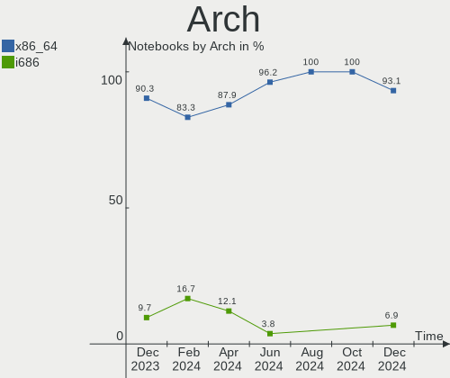
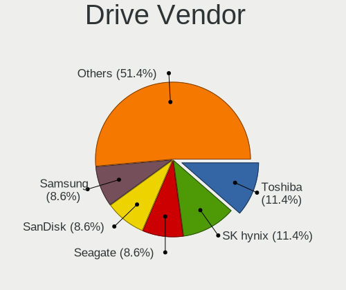
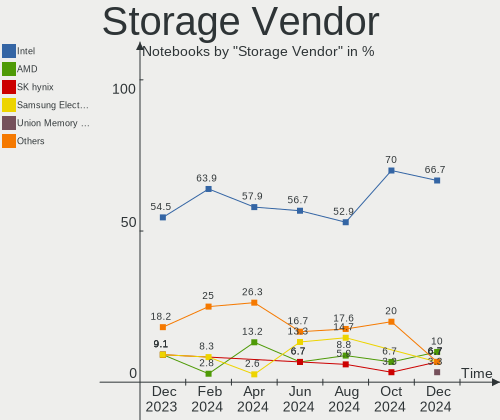
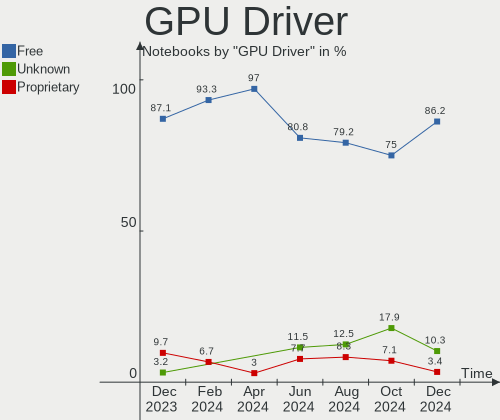
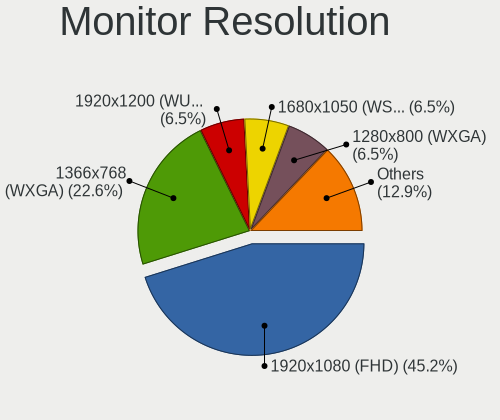
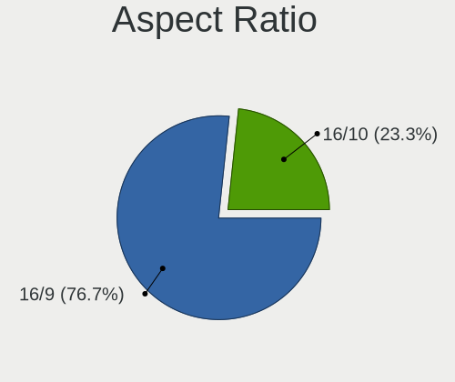
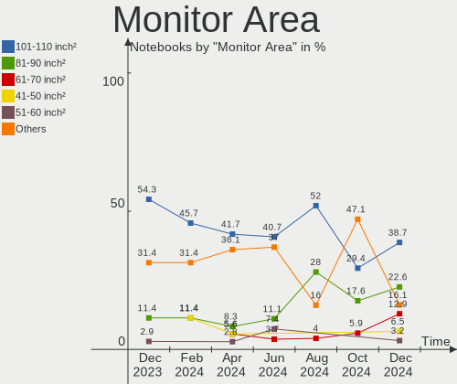
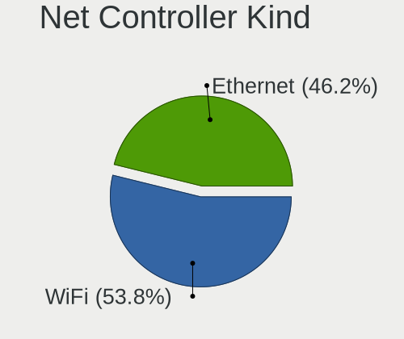
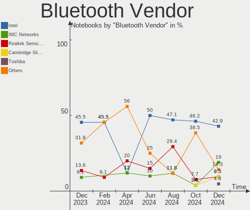
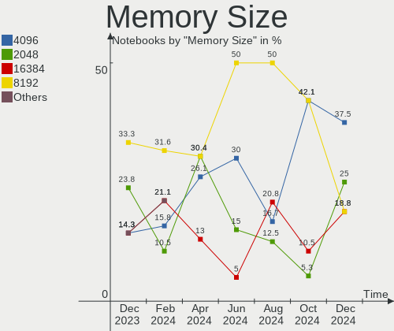

Xubuntu - Hardware Trends (Notebooks)
-------------------------------------

A project to identify most popular hardware characteristics and track their change
over time based on data collected by Linux users at https://Linux-Hardware.org.

Anyone can contribute to this report by the [hw-probe](https://github.com/linuxhw/hw-probe) tool:

    sudo -E hw-probe -all -upload

This report is for one last month. Overall report since the beginning of time: [TestDays](https://github.com/linuxhw/TestDays)

Period: Feb, 2023.

Contents
--------

* [ System ](#system)
  - [ OS                       ](#os)
  - [ OS Family                ](#os-family)
  - [ Kernel                   ](#kernel)
  - [ Kernel Family            ](#kernel-family)
  - [ Kernel Major Ver.        ](#kernel-major-ver)
  - [ Arch                     ](#arch)
  - [ DE                       ](#de)
  - [ Display Server           ](#display-server)
  - [ Display Manager          ](#display-manager)
  - [ OS Lang                  ](#os-lang)
  - [ Boot Mode                ](#boot-mode)
  - [ Filesystem               ](#filesystem)
  - [ Part. scheme             ](#part-scheme)
  - [ Dual Boot with Linux/BSD ](#dual-boot-with-linuxbsd)
  - [ Dual Boot (Win)          ](#dual-boot-win)

* [ Board ](#board)
  - [ Vendor                   ](#vendor)
  - [ Model                    ](#model)
  - [ Model Family             ](#model-family)
  - [ MFG Year                 ](#mfg-year)
  - [ Form Factor              ](#form-factor)
  - [ Secure Boot              ](#secure-boot)
  - [ Coreboot                 ](#coreboot)
  - [ RAM Size                 ](#ram-size)
  - [ RAM Used                 ](#ram-used)
  - [ Total Drives             ](#total-drives)
  - [ Has CD-ROM               ](#has-cd-rom)
  - [ Has Ethernet             ](#has-ethernet)
  - [ Has WiFi                 ](#has-wifi)
  - [ Has Bluetooth            ](#has-bluetooth)

* [ Location ](#location)
  - [ Country                  ](#country)
  - [ City                     ](#city)

* [ Drives ](#drives)
  - [ Drive Vendor             ](#drive-vendor)
  - [ Drive Model              ](#drive-model)
  - [ HDD Vendor               ](#hdd-vendor)
  - [ SSD Vendor               ](#ssd-vendor)
  - [ Drive Kind               ](#drive-kind)
  - [ Drive Connector          ](#drive-connector)
  - [ Drive Size               ](#drive-size)
  - [ Space Total              ](#space-total)
  - [ Space Used               ](#space-used)
  - [ Malfunc. Drives          ](#malfunc-drives)
  - [ Malfunc. Drive Vendor    ](#malfunc-drive-vendor)
  - [ Malfunc. HDD Vendor      ](#malfunc-hdd-vendor)
  - [ Malfunc. Drive Kind      ](#malfunc-drive-kind)
  - [ Failed Drives            ](#failed-drives)
  - [ Failed Drive Vendor      ](#failed-drive-vendor)
  - [ Drive Status             ](#drive-status)

* [ Storage controller ](#storage-controller)
  - [ Storage Vendor           ](#storage-vendor)
  - [ Storage Model            ](#storage-model)
  - [ Storage Kind             ](#storage-kind)

* [ Processor ](#processor)
  - [ CPU Vendor               ](#cpu-vendor)
  - [ CPU Model                ](#cpu-model)
  - [ CPU Model Family         ](#cpu-model-family)
  - [ CPU Cores                ](#cpu-cores)
  - [ CPU Sockets              ](#cpu-sockets)
  - [ CPU Threads              ](#cpu-threads)
  - [ CPU Op-Modes             ](#cpu-op-modes)
  - [ CPU Microcode            ](#cpu-microcode)
  - [ CPU Microarch            ](#cpu-microarch)

* [ Graphics ](#graphics)
  - [ GPU Vendor               ](#gpu-vendor)
  - [ GPU Model                ](#gpu-model)
  - [ GPU Combo                ](#gpu-combo)
  - [ GPU Driver               ](#gpu-driver)
  - [ GPU Memory               ](#gpu-memory)

* [ Monitor ](#monitor)
  - [ Monitor Vendor           ](#monitor-vendor)
  - [ Monitor Model            ](#monitor-model)
  - [ Monitor Resolution       ](#monitor-resolution)
  - [ Monitor Diagonal         ](#monitor-diagonal)
  - [ Monitor Width            ](#monitor-width)
  - [ Aspect Ratio             ](#aspect-ratio)
  - [ Monitor Area             ](#monitor-area)
  - [ Pixel Density            ](#pixel-density)
  - [ Multiple Monitors        ](#multiple-monitors)

* [ Network ](#network)
  - [ Net Controller Vendor    ](#net-controller-vendor)
  - [ Net Controller Model     ](#net-controller-model)
  - [ Wireless Vendor          ](#wireless-vendor)
  - [ Wireless Model           ](#wireless-model)
  - [ Ethernet Vendor          ](#ethernet-vendor)
  - [ Ethernet Model           ](#ethernet-model)
  - [ Net Controller Kind      ](#net-controller-kind)
  - [ Used Controller          ](#used-controller)
  - [ NICs                     ](#nics)
  - [ IPv6                     ](#ipv6)

* [ Bluetooth ](#bluetooth)
  - [ Bluetooth Vendor         ](#bluetooth-vendor)
  - [ Bluetooth Model          ](#bluetooth-model)

* [ Sound ](#sound)
  - [ Sound Vendor             ](#sound-vendor)
  - [ Sound Model              ](#sound-model)

* [ Memory ](#memory)
  - [ Memory Vendor            ](#memory-vendor)
  - [ Memory Model             ](#memory-model)
  - [ Memory Kind              ](#memory-kind)
  - [ Memory Form Factor       ](#memory-form-factor)
  - [ Memory Size              ](#memory-size)
  - [ Memory Speed             ](#memory-speed)

* [ Printers & scanners ](#printers--scanners)
  - [ Printer Vendor           ](#printer-vendor)
  - [ Printer Model            ](#printer-model)
  - [ Scanner Vendor           ](#scanner-vendor)
  - [ Scanner Model            ](#scanner-model)

* [ Camera ](#camera)
  - [ Camera Vendor            ](#camera-vendor)
  - [ Camera Model             ](#camera-model)

* [ Security ](#security)
  - [ Fingerprint Vendor       ](#fingerprint-vendor)
  - [ Fingerprint Model        ](#fingerprint-model)
  - [ Chipcard Vendor          ](#chipcard-vendor)
  - [ Chipcard Model           ](#chipcard-model)

* [ Unsupported ](#unsupported)
  - [ Unsupported Devices      ](#unsupported-devices)
  - [ Unsupported Device Types ](#unsupported-device-types)

System
------

OS
--

Installed operating systems

| Name          | Notebooks | Percent |
|---------------|-----------|---------|
| Xubuntu 22.04 | 23        | 58.97%  |
| Xubuntu 18.04 | 7         | 17.95%  |
| Xubuntu 22.10 | 6         | 15.38%  |
| Xubuntu 20.04 | 3         | 7.69%   |

OS Family
---------

OS without a version

| Name    | Notebooks | Percent |
|---------|-----------|---------|
| Xubuntu | 39        | 100%    |

Kernel
------

Version of the Linux kernel

| Version               | Notebooks | Percent |
|-----------------------|-----------|---------|
| 5.15.0-60-generic     | 13        | 33.33%  |
| 5.15.0-58-generic     | 7         | 17.95%  |
| 5.19.0-31-generic     | 4         | 10.26%  |
| 5.4.0-137-generic     | 2         | 5.13%   |
| 4.15.0-204-generic    | 2         | 5.13%   |
| 6.1.0-1006-oem        | 1         | 2.56%   |
| 5.4.0-139-generic     | 1         | 2.56%   |
| 5.4.0-104-generic     | 1         | 2.56%   |
| 5.19.0-32-generic     | 1         | 2.56%   |
| 5.19.0-28-generic     | 1         | 2.56%   |
| 5.19.0-26-generic     | 1         | 2.56%   |
| 5.19.0-21-generic     | 1         | 2.56%   |
| 5.15.0-67-generic     | 1         | 2.56%   |
| 5.15.0-53-generic     | 1         | 2.56%   |
| 4.15.0-204-lowlatency | 1         | 2.56%   |
| 4.15.0-202-generic    | 1         | 2.56%   |

Kernel Family
-------------

Linux kernel without a distro release

| Version | Notebooks | Percent |
|---------|-----------|---------|
| 5.15.0  | 22        | 56.41%  |
| 5.19.0  | 8         | 20.51%  |
| 5.4.0   | 4         | 10.26%  |
| 4.15.0  | 4         | 10.26%  |
| 6.1.0   | 1         | 2.56%   |

Kernel Major Ver.
-----------------

Linux kernel major version

| Version | Notebooks | Percent |
|---------|-----------|---------|
| 5.15    | 22        | 56.41%  |
| 5.19    | 8         | 20.51%  |
| 5.4     | 4         | 10.26%  |
| 4.15    | 4         | 10.26%  |
| 6.1     | 1         | 2.56%   |

Arch
----

OS architecture (x86_64, i586, etc.)

| Name   | Notebooks | Percent |
|--------|-----------|---------|
| x86_64 | 33        | 84.62%  |
| i686   | 6         | 15.38%  |

DE
--

Desktop Environment

| Name  | Notebooks | Percent |
|-------|-----------|---------|
| XFCE  | 38        | 97.44%  |
| GNOME | 1         | 2.56%   |

Display Server
--------------

X11 or Wayland

| Name | Notebooks | Percent |
|------|-----------|---------|
| X11  | 39        | 100%    |

Display Manager
---------------

SDDM, LightDM, etc.

| Name    | Notebooks | Percent |
|---------|-----------|---------|
| LightDM | 35        | 89.74%  |
| GDM3    | 2         | 5.13%   |
| Unknown | 2         | 5.13%   |

OS Lang
-------

Language

| Lang  | Notebooks | Percent |
|-------|-----------|---------|
| en_US | 12        | 30.77%  |
| ru_RU | 4         | 10.26%  |
| fr_FR | 4         | 10.26%  |
| de_DE | 4         | 10.26%  |
| it_IT | 2         | 5.13%   |
| pt_PT | 1         | 2.56%   |
| pt_BR | 1         | 2.56%   |
| pl_PL | 1         | 2.56%   |
| nl_NL | 1         | 2.56%   |
| ja_JP | 1         | 2.56%   |
| hu_HU | 1         | 2.56%   |
| fr_BE | 1         | 2.56%   |
| es_MX | 1         | 2.56%   |
| es_ES | 1         | 2.56%   |
| en_IL | 1         | 2.56%   |
| en_IE | 1         | 2.56%   |
| en_AU | 1         | 2.56%   |
| cs_CZ | 1         | 2.56%   |

Boot Mode
---------

EFI or BIOS

| Mode | Notebooks | Percent |
|------|-----------|---------|
| BIOS | 26        | 66.67%  |
| EFI  | 13        | 33.33%  |

Filesystem
----------

Type of filesystem

| Type  | Notebooks | Percent |
|-------|-----------|---------|
| Ext4  | 36        | 92.31%  |
| Zfs   | 2         | 5.13%   |
| Btrfs | 1         | 2.56%   |

Part. scheme
------------

Scheme of partitioning

| Type    | Notebooks | Percent |
|---------|-----------|---------|
| GPT     | 23        | 58.97%  |
| Unknown | 9         | 23.08%  |
| MBR     | 7         | 17.95%  |

Dual Boot with Linux/BSD
------------------------

Hosting more than one Linux/BSD

| Dual boot | Notebooks | Percent |
|-----------|-----------|---------|
| No        | 38        | 97.44%  |
| Yes       | 1         | 2.56%   |

Dual Boot (Win)
---------------

Hosting Linux and Windows

| Dual boot | Notebooks | Percent |
|-----------|-----------|---------|
| No        | 31        | 79.49%  |
| Yes       | 8         | 20.51%  |

Board
-----

Vendor
------

Motherboard manufacturer

| Name             | Notebooks | Percent |
|------------------|-----------|---------|
| Lenovo           | 9         | 23.08%  |
| Hewlett-Packard  | 8         | 20.51%  |
| Dell             | 5         | 12.82%  |
| Acer             | 4         | 10.26%  |
| Sony             | 3         | 7.69%   |
| HONOR            | 2         | 5.13%   |
| Fujitsu Siemens  | 2         | 5.13%   |
| Toshiba          | 1         | 2.56%   |
| Packard Bell     | 1         | 2.56%   |
| Intel            | 1         | 2.56%   |
| Daten Tecnologia | 1         | 2.56%   |
| ASUSTek Computer | 1         | 2.56%   |
| Alienware        | 1         | 2.56%   |

Model
-----

Motherboard model

| Name                                        | Notebooks | Percent |
|---------------------------------------------|-----------|---------|
| Toshiba Satellite Pro R50-B                 | 1         | 2.56%   |
| Sony VPCZ13M9E                              | 1         | 2.56%   |
| Sony VPCX11Z6R                              | 1         | 2.56%   |
| Sony VPCEA3S1E                              | 1         | 2.56%   |
| Packard Bell DOT S                          | 1         | 2.56%   |
| Lenovo ThinkPad X131e 3367AH5               | 1         | 2.56%   |
| Lenovo ThinkPad T440p 20AN006NUS            | 1         | 2.56%   |
| Lenovo ThinkPad T430u 3353A11               | 1         | 2.56%   |
| Lenovo ThinkPad T430s 23562Z3               | 1         | 2.56%   |
| Lenovo ThinkPad T15 Gen 1 20S6CTO1WW        | 1         | 2.56%   |
| Lenovo ThinkPad R500 2716W2K                | 1         | 2.56%   |
| Lenovo ThinkPad P16s Gen 1 21CK0033FR       | 1         | 2.56%   |
| Lenovo IdeaPad S12 20021,2959               | 1         | 2.56%   |
| Lenovo IdeaPad 320-15IKB 80YH               | 1         | 2.56%   |
| HONOR NMH-WCX9                              | 1         | 2.56%   |
| HONOR BMH-WCX9                              | 1         | 2.56%   |
| HP Pavilion g6                              | 1         | 2.56%   |
| HP Pavilion 15                              | 1         | 2.56%   |
| HP EliteBook 820 G3                         | 1         | 2.56%   |
| HP Compaq Presario CQ60                     | 1         | 2.56%   |
| HP Compaq Presario A900                     | 1         | 2.56%   |
| HP Compaq nc6400 (RM741PA#ABG)              | 1         | 2.56%   |
| HP 655                                      | 1         | 2.56%   |
| HP 250 G7 Notebook PC                       | 1         | 2.56%   |
| Fujitsu Siemens STYLISTIC ST5112            | 1         | 2.56%   |
| Fujitsu Siemens ESPRIMO Mobile V6535        | 1         | 2.56%   |
| Dell Studio 1450                            | 1         | 2.56%   |
| Dell Latitude E5470                         | 1         | 2.56%   |
| Dell Latitude E5450                         | 1         | 2.56%   |
| Dell Latitude D430                          | 1         | 2.56%   |
| Dell Inspiron 5490                          | 1         | 2.56%   |
| Daten Tecnologia DCM4D-4 v4                 | 1         | 2.56%   |
| ASUS ASUS TUF Gaming A17 FA706ICB_TUF706ICB | 1         | 2.56%   |
| Alienware 17 R4                             | 1         | 2.56%   |
| Acer Extensa 5635ZG                         | 1         | 2.56%   |
| Acer Aspire E5-572G                         | 1         | 2.56%   |
| Acer Aspire 7736                            | 1         | 2.56%   |
| Acer Aspire 5740                            | 1         | 2.56%   |
| Unknown                                     | 1         | 2.56%   |

Model Family
------------

Motherboard model prefix

| Name                      | Notebooks | Percent |
|---------------------------|-----------|---------|
| Lenovo ThinkPad           | 7         | 17.95%  |
| HP Compaq                 | 3         | 7.69%   |
| Dell Latitude             | 3         | 7.69%   |
| Acer Aspire               | 3         | 7.69%   |
| Lenovo IdeaPad            | 2         | 5.13%   |
| HP Pavilion               | 2         | 5.13%   |
| Toshiba Satellite         | 1         | 2.56%   |
| Sony VPCZ13M9E            | 1         | 2.56%   |
| Sony VPCX11Z6R            | 1         | 2.56%   |
| Sony VPCEA3S1E            | 1         | 2.56%   |
| Packard Bell DOT          | 1         | 2.56%   |
| HONOR NMH-WCX9            | 1         | 2.56%   |
| HONOR BMH-WCX9            | 1         | 2.56%   |
| HP EliteBook              | 1         | 2.56%   |
| HP 655                    | 1         | 2.56%   |
| HP 250                    | 1         | 2.56%   |
| Fujitsu Siemens STYLISTIC | 1         | 2.56%   |
| Fujitsu Siemens ESPRIMO   | 1         | 2.56%   |
| Dell Studio               | 1         | 2.56%   |
| Dell Inspiron             | 1         | 2.56%   |
| Daten Tecnologia DCM4D-4  | 1         | 2.56%   |
| ASUS ASUS                 | 1         | 2.56%   |
| Alienware 17              | 1         | 2.56%   |
| Acer Extensa              | 1         | 2.56%   |
| Unknown                   | 1         | 2.56%   |

MFG Year
--------

Motherboard manufacture year

| Year | Notebooks | Percent |
|------|-----------|---------|
| 2009 | 6         | 15.38%  |
| 2012 | 4         | 10.26%  |
| 2008 | 4         | 10.26%  |
| 2022 | 3         | 7.69%   |
| 2014 | 3         | 7.69%   |
| 2007 | 3         | 7.69%   |
| 2021 | 2         | 5.13%   |
| 2019 | 2         | 5.13%   |
| 2017 | 2         | 5.13%   |
| 2013 | 2         | 5.13%   |
| 2011 | 2         | 5.13%   |
| 2010 | 2         | 5.13%   |
| 2020 | 1         | 2.56%   |
| 2018 | 1         | 2.56%   |
| 2016 | 1         | 2.56%   |
| 2015 | 1         | 2.56%   |

Form Factor
-----------

Physical design of the computer

| Name     | Notebooks | Percent |
|----------|-----------|---------|
| Notebook | 39        | 100%    |

Secure Boot
-----------

Enabled or disabled

| State    | Notebooks | Percent |
|----------|-----------|---------|
| Disabled | 36        | 92.31%  |
| Enabled  | 3         | 7.69%   |

Coreboot
--------

Have coreboot on board

| Used | Notebooks | Percent |
|------|-----------|---------|
| No   | 39        | 100%    |

RAM Size
--------

Total RAM memory

| Size in GB | Notebooks | Percent |
|------------|-----------|---------|
| 4.01-8.0   | 10        | 25.64%  |
| 3.01-4.0   | 9         | 23.08%  |
| 16.01-24.0 | 5         | 12.82%  |
| 1.01-2.0   | 5         | 12.82%  |
| 8.01-16.0  | 5         | 12.82%  |
| 24.01-32.0 | 2         | 5.13%   |
| 2.01-3.0   | 2         | 5.13%   |
| 32.01-64.0 | 1         | 2.56%   |

RAM Used
--------

Used RAM memory

| Used GB   | Notebooks | Percent |
|-----------|-----------|---------|
| 1.01-2.0  | 18        | 46.15%  |
| 2.01-3.0  | 7         | 17.95%  |
| 4.01-8.0  | 5         | 12.82%  |
| 0.51-1.0  | 5         | 12.82%  |
| 3.01-4.0  | 3         | 7.69%   |
| 8.01-16.0 | 1         | 2.56%   |

Total Drives
------------

Number of drives on board

| Drives | Notebooks | Percent |
|--------|-----------|---------|
| 1      | 27        | 69.23%  |
| 2      | 12        | 30.77%  |

Has CD-ROM
----------

Has CD-ROM on board

| Presented | Notebooks | Percent |
|-----------|-----------|---------|
| No        | 22        | 56.41%  |
| Yes       | 17        | 43.59%  |

Has Ethernet
------------

Has Ethernet on board

| Presented | Notebooks | Percent |
|-----------|-----------|---------|
| Yes       | 36        | 92.31%  |
| No        | 3         | 7.69%   |

Has WiFi
--------

Has WiFi module

| Presented | Notebooks | Percent |
|-----------|-----------|---------|
| Yes       | 36        | 92.31%  |
| No        | 3         | 7.69%   |

Has Bluetooth
-------------

Has Bluetooth module

| Presented | Notebooks | Percent |
|-----------|-----------|---------|
| Yes       | 27        | 69.23%  |
| No        | 12        | 30.77%  |

Location
--------

Country
-------

Geographic location (country)

| Country     | Notebooks | Percent |
|-------------|-----------|---------|
| Germany     | 6         | 15.38%  |
| France      | 5         | 12.82%  |
| USA         | 3         | 7.69%   |
| Russia      | 3         | 7.69%   |
| Poland      | 2         | 5.13%   |
| Mexico      | 2         | 5.13%   |
| Italy       | 2         | 5.13%   |
| Brazil      | 2         | 5.13%   |
| Australia   | 2         | 5.13%   |
| Venezuela   | 1         | 2.56%   |
| Spain       | 1         | 2.56%   |
| Netherlands | 1         | 2.56%   |
| Japan       | 1         | 2.56%   |
| Israel      | 1         | 2.56%   |
| Ireland     | 1         | 2.56%   |
| India       | 1         | 2.56%   |
| Hungary     | 1         | 2.56%   |
| Czechia     | 1         | 2.56%   |
| Cuba        | 1         | 2.56%   |
| Belgium     | 1         | 2.56%   |
| Belarus     | 1         | 2.56%   |

City
----

Geographic location (city)

| City                   | Notebooks | Percent |
|------------------------|-----------|---------|
| Mexico City            | 2         | 5.13%   |
| Wittenborn             | 1         | 2.56%   |
| Wetzlar                | 1         | 2.56%   |
| Toulouse               | 1         | 2.56%   |
| Toccoa                 | 1         | 2.56%   |
| Sydney                 | 1         | 2.56%   |
| Stuttgart              | 1         | 2.56%   |
| Siemianowice Śląskie | 1         | 2.56%   |
| Santo André           | 1         | 2.56%   |
| Rochester              | 1         | 2.56%   |
| Rastatt                | 1         | 2.56%   |
| Quetigny               | 1         | 2.56%   |
| Paris                  | 1         | 2.56%   |
| Moscow                 | 1         | 2.56%   |
| Minsk                  | 1         | 2.56%   |
| Minatomirai            | 1         | 2.56%   |
| Milano                 | 1         | 2.56%   |
| Milan                  | 1         | 2.56%   |
| Melbourne              | 1         | 2.56%   |
| Marseille              | 1         | 2.56%   |
| Malmedy                | 1         | 2.56%   |
| León                  | 1         | 2.56%   |
| Krakow                 | 1         | 2.56%   |
| Hennigsdorf            | 1         | 2.56%   |
| Heerhugowaard          | 1         | 2.56%   |
| Havana                 | 1         | 2.56%   |
| Hanover                | 1         | 2.56%   |
| Győr                  | 1         | 2.56%   |
| Florianópolis         | 1         | 2.56%   |
| Dublin                 | 1         | 2.56%   |
| Donetsk                | 1         | 2.56%   |
| Dolni Bousov           | 1         | 2.56%   |
| Chicago                | 1         | 2.56%   |
| Chennai                | 1         | 2.56%   |
| Châtenay-Malabry      | 1         | 2.56%   |
| Caracas                | 1         | 2.56%   |
| Bat Yam                | 1         | 2.56%   |
| Bakal                  | 1         | 2.56%   |

Drives
------

Drive Vendor
------------

Hard drive vendors

| Vendor              | Notebooks | Drives | Percent |
|---------------------|-----------|--------|---------|
| Seagate             | 8         | 8      | 16.33%  |
| Samsung Electronics | 6         | 7      | 12.24%  |
| WDC                 | 4         | 4      | 8.16%   |
| SanDisk             | 4         | 4      | 8.16%   |
| A-DATA Technology   | 3         | 3      | 6.12%   |
| Unknown             | 2         | 2      | 4.08%   |
| Toshiba             | 2         | 2      | 4.08%   |
| SK hynix            | 2         | 2      | 4.08%   |
| Phison              | 2         | 2      | 4.08%   |
| Kingston            | 2         | 2      | 4.08%   |
| Intenso             | 2         | 2      | 4.08%   |
| Hitachi             | 2         | 2      | 4.08%   |
| Plextor             | 1         | 1      | 2.04%   |
| JMicron Technology  | 1         | 1      | 2.04%   |
| Intel               | 1         | 1      | 2.04%   |
| GOODRAM             | 1         | 1      | 2.04%   |
| Fujitsu             | 1         | 1      | 2.04%   |
| EVM                 | 1         | 1      | 2.04%   |
| Crucial             | 1         | 1      | 2.04%   |
| ASint Technology    | 1         | 1      | 2.04%   |
| addlink             | 1         | 1      | 2.04%   |
| Unknown             | 1         | 1      | 2.04%   |

Drive Model
-----------

Hard drive models

| Model                                               | Notebooks | Percent |
|-----------------------------------------------------|-----------|---------|
| WDC PC SN530 SDBPNPZ-512G-1036 512GB                | 2         | 4.08%   |
| WDC WD2500BEVS-22UST0 250GB                         | 1         | 2.04%   |
| WDC WD1600BEVT-60ZCT1 160GB                         | 1         | 2.04%   |
| Unknown SD/MMC/MS PRO 16GB                          | 1         | 2.04%   |
| Unknown 00000  64GB                                 | 1         | 2.04%   |
| Toshiba THNSNF128GCSS 128GB SSD                     | 1         | 2.04%   |
| Toshiba MK8009GAH 80GB                              | 1         | 2.04%   |
| SK hynix SKHynix_HFS001TDE9X081N 1TB                | 1         | 2.04%   |
| SK hynix BC511 NVMe 256GB                           | 1         | 2.04%   |
| Seagate ST9500325AS 500GB                           | 1         | 2.04%   |
| Seagate ST9320325AS 320GB                           | 1         | 2.04%   |
| Seagate ST500LT012-1DG142 500GB                     | 1         | 2.04%   |
| Seagate ST500LM030-2E717D 500GB                     | 1         | 2.04%   |
| Seagate ST320LT007-9ZV142 320GB                     | 1         | 2.04%   |
| Seagate ST2000LM007-1R8174 2TB                      | 1         | 2.04%   |
| Seagate ST1000LM014-1EJ164 1TB                      | 1         | 2.04%   |
| Seagate ST1000LM 035-1RK172 1TB                     | 1         | 2.04%   |
| SanDisk X400 M.2 2280 256GB SSD                     | 1         | 2.04%   |
| SanDisk SDSSDH3 256G                                | 1         | 2.04%   |
| SanDisk SD8SB8U-256G-1006 256GB SSD                 | 1         | 2.04%   |
| SanDisk NVMe SSD Drive 2TB                          | 1         | 2.04%   |
| Samsung SSD 970 EVO Plus 500GB                      | 1         | 2.04%   |
| Samsung NVMe SSD Controller SM981/PM981/PM983 250GB | 1         | 2.04%   |
| Samsung MZVLQ512HBLU-00B00 512GB                    | 1         | 2.04%   |
| Samsung MMDPE56GFDXP-MVB 256GB SSD                  | 1         | 2.04%   |
| Samsung MMCRE28GQDXP-MVB 64GB SSD                   | 1         | 2.04%   |
| Samsung HM250JI 250GB                               | 1         | 2.04%   |
| Plextor PH6-CE120 120GB SSD                         | 1         | 2.04%   |
| Phison Daten DS2000 256GB                           | 1         | 2.04%   |
| Phison 311CD0512GB                                  | 1         | 2.04%   |
| Kingston SUV400S37240G 240GB SSD                    | 1         | 2.04%   |
| Kingston SA400S37480G 480GB SSD                     | 1         | 2.04%   |
| JMicron Generic 200GB                               | 1         | 2.04%   |
| Intenso SSD Sata III 120GB                          | 1         | 2.04%   |
| Intenso SSD 120GB                                   | 1         | 2.04%   |
| Intel SSDSCKJF180A5H REF 180GB                      | 1         | 2.04%   |
| Hitachi HTS545032A7E380 320GB                       | 1         | 2.04%   |
| Hitachi HTS545025B9A300 250GB                       | 1         | 2.04%   |
| GOODRAM SSDPR-CL100-120-G2 120GB                    | 1         | 2.04%   |
| Fujitsu MHW2060BH 64GB                              | 1         | 2.04%   |

HDD Vendor
----------

Hard disk drive vendors

| Vendor              | Notebooks | Drives | Percent |
|---------------------|-----------|--------|---------|
| Seagate             | 8         | 8      | 47.06%  |
| WDC                 | 2         | 2      | 11.76%  |
| Hitachi             | 2         | 2      | 11.76%  |
| Unknown             | 1         | 1      | 5.88%   |
| Toshiba             | 1         | 1      | 5.88%   |
| Samsung Electronics | 1         | 1      | 5.88%   |
| JMicron Technology  | 1         | 1      | 5.88%   |
| Fujitsu             | 1         | 1      | 5.88%   |

SSD Vendor
----------

Solid state drive vendors

| Vendor              | Notebooks | Drives | Percent |
|---------------------|-----------|--------|---------|
| SanDisk             | 3         | 3      | 15%     |
| A-DATA Technology   | 3         | 3      | 15%     |
| Samsung Electronics | 2         | 3      | 10%     |
| Kingston            | 2         | 2      | 10%     |
| Intenso             | 2         | 2      | 10%     |
| Toshiba             | 1         | 1      | 5%      |
| Plextor             | 1         | 1      | 5%      |
| Intel               | 1         | 1      | 5%      |
| GOODRAM             | 1         | 1      | 5%      |
| EVM                 | 1         | 1      | 5%      |
| Crucial             | 1         | 1      | 5%      |
| ASint Technology    | 1         | 1      | 5%      |
| addlink             | 1         | 1      | 5%      |

Drive Kind
----------

HDD or SSD

| Kind | Notebooks | Drives | Percent |
|------|-----------|--------|---------|
| SSD  | 19        | 21     | 41.3%   |
| HDD  | 16        | 17     | 34.78%  |
| NVMe | 9         | 10     | 19.57%  |
| MMC  | 2         | 2      | 4.35%   |

Drive Connector
---------------

SATA, SAS, NVMe, etc.

| Type | Notebooks | Drives | Percent |
|------|-----------|--------|---------|
| SATA | 31        | 34     | 67.39%  |
| NVMe | 9         | 10     | 19.57%  |
| SAS  | 4         | 4      | 8.7%    |
| MMC  | 2         | 2      | 4.35%   |

Drive Size
----------

Size of hard drive

| Size in TB | Notebooks | Drives | Percent |
|------------|-----------|--------|---------|
| 0.01-0.5   | 29        | 32     | 82.86%  |
| 0.51-1.0   | 5         | 5      | 14.29%  |
| 1.01-2.0   | 1         | 1      | 2.86%   |

Space Total
-----------

Amount of disk space available on the file system

| Size in GB | Notebooks | Percent |
|------------|-----------|---------|
| 101-250    | 18        | 46.15%  |
| 251-500    | 7         | 17.95%  |
| 501-1000   | 4         | 10.26%  |
| 51-100     | 4         | 10.26%  |
| 1-20       | 3         | 7.69%   |
| 21-50      | 1         | 2.56%   |
| 2001-3000  | 1         | 2.56%   |
| 1001-2000  | 1         | 2.56%   |

Space Used
----------

Amount of used disk space

| Used GB   | Notebooks | Percent |
|-----------|-----------|---------|
| 1-20      | 18        | 46.15%  |
| 21-50     | 7         | 17.95%  |
| 51-100    | 6         | 15.38%  |
| 101-250   | 3         | 7.69%   |
| 251-500   | 2         | 5.13%   |
| 501-1000  | 2         | 5.13%   |
| 1001-2000 | 1         | 2.56%   |

Malfunc. Drives
---------------

Drive models with a malfunction

| Model                             | Notebooks | Drives | Percent |
|-----------------------------------|-----------|--------|---------|
| Seagate ST9500325AS 500GB         | 1         | 1      | 14.29%  |
| Seagate ST320LT007-9ZV142 320GB   | 1         | 1      | 14.29%  |
| Seagate ST1000LM 035-1RK172 1TB   | 1         | 1      | 14.29%  |
| Samsung Electronics HM250JI 250GB | 1         | 1      | 14.29%  |
| JMicron Technology Generic 200GB  | 1         | 1      | 14.29%  |
| Hitachi HTS545032A7E380 320GB     | 1         | 1      | 14.29%  |
| Fujitsu MHW2060BH 64GB            | 1         | 1      | 14.29%  |

Malfunc. Drive Vendor
---------------------

Vendors of faulty drives

| Vendor              | Notebooks | Drives | Percent |
|---------------------|-----------|--------|---------|
| Seagate             | 3         | 3      | 42.86%  |
| Samsung Electronics | 1         | 1      | 14.29%  |
| JMicron Technology  | 1         | 1      | 14.29%  |
| Hitachi             | 1         | 1      | 14.29%  |
| Fujitsu             | 1         | 1      | 14.29%  |

Malfunc. HDD Vendor
-------------------

Vendors of faulty HDD drives

| Vendor              | Notebooks | Drives | Percent |
|---------------------|-----------|--------|---------|
| Seagate             | 3         | 3      | 42.86%  |
| Samsung Electronics | 1         | 1      | 14.29%  |
| JMicron Technology  | 1         | 1      | 14.29%  |
| Hitachi             | 1         | 1      | 14.29%  |
| Fujitsu             | 1         | 1      | 14.29%  |

Malfunc. Drive Kind
-------------------

Kinds of faulty drives

| Kind | Notebooks | Drives | Percent |
|------|-----------|--------|---------|
| HDD  | 6         | 7      | 100%    |

Failed Drives
-------------

Failed drive models

Zero info for selected period =(

Failed Drive Vendor
-------------------

Failed drive vendors

Zero info for selected period =(

Drive Status
------------

Number of failed and malfunc. drives

| Status   | Notebooks | Drives | Percent |
|----------|-----------|--------|---------|
| Detected | 22        | 24     | 48.89%  |
| Works    | 17        | 19     | 37.78%  |
| Malfunc  | 6         | 7      | 13.33%  |

Storage controller
------------------

Storage Vendor
--------------

Storage controller vendors

| Vendor              | Notebooks | Percent |
|---------------------|-----------|---------|
| Intel               | 30        | 71.43%  |
| SanDisk             | 3         | 7.14%   |
| Samsung Electronics | 3         | 7.14%   |
| SK hynix            | 2         | 4.76%   |
| AMD                 | 2         | 4.76%   |
| Phison Electronics  | 1         | 2.38%   |
| Nvidia              | 1         | 2.38%   |

Storage Model
-------------

Storage controller models

| Model                                                                          | Notebooks | Percent |
|--------------------------------------------------------------------------------|-----------|---------|
| Intel 82801IBM/IEM (ICH9M/ICH9M-E) 4 port SATA Controller [AHCI mode]          | 6         | 13.04%  |
| Intel 82801G (ICH7 Family) IDE Controller                                      | 3         | 6.52%   |
| Intel 82801 Mobile SATA Controller [RAID mode]                                 | 3         | 6.52%   |
| SanDisk WD Blue SN550 NVMe SSD                                                 | 2         | 4.35%   |
| Samsung NVMe SSD Controller SM981/PM981/PM983                                  | 2         | 4.35%   |
| Intel Sunrise Point-LP SATA Controller [AHCI mode]                             | 2         | 4.35%   |
| Intel Comet Lake SATA AHCI Controller                                          | 2         | 4.35%   |
| Intel 82801GBM/GHM (ICH7-M Family) SATA Controller [AHCI mode]                 | 2         | 4.35%   |
| Intel 8 Series/C220 Series Chipset Family 6-port SATA Controller 1 [AHCI mode] | 2         | 4.35%   |
| Intel 8 Series SATA Controller 1 [AHCI mode]                                   | 2         | 4.35%   |
| Intel 7 Series Chipset Family 6-port SATA Controller [AHCI mode]               | 2         | 4.35%   |
| Intel 5 Series/3400 Series Chipset 4 port SATA AHCI Controller                 | 2         | 4.35%   |
| AMD FCH SATA Controller [AHCI mode]                                            | 2         | 4.35%   |
| SK hynix Gold P31/PC711 NVMe Solid State Drive                                 | 1         | 2.17%   |
| SK hynix BC511                                                                 | 1         | 2.17%   |
| SanDisk Non-Volatile memory controller                                         | 1         | 2.17%   |
| Samsung NVMe SSD Controller 980                                                | 1         | 2.17%   |
| Phison PS5013 E13 NVMe Controller                                              | 1         | 2.17%   |
| Nvidia MCP79 AHCI Controller                                                   | 1         | 2.17%   |
| Intel US15W/US15X/US15L/UL11L SCH [Poulsbo] IDE Controller                     | 1         | 2.17%   |
| Intel SATA Controller [RAID mode]                                              | 1         | 2.17%   |
| Intel Q170/Q150/B150/H170/H110/Z170/CM236 Chipset SATA Controller [AHCI Mode]  | 1         | 2.17%   |
| Intel NM10/ICH7 Family SATA Controller [AHCI mode]                             | 1         | 2.17%   |
| Intel 82801HM/HEM (ICH8M/ICH8M-E) SATA Controller [AHCI mode]                  | 1         | 2.17%   |
| Intel 82801HM/HEM (ICH8M/ICH8M-E) IDE Controller                               | 1         | 2.17%   |
| Intel 7 Series Chipset Family 4-port SATA Controller [IDE mode]                | 1         | 2.17%   |
| Intel 7 Series Chipset Family 2-port SATA Controller [IDE mode]                | 1         | 2.17%   |

Storage Kind
------------

Kind of storage controller (IDE, SATA, NVMe, SAS, ...)

| Kind | Notebooks | Percent |
|------|-----------|---------|
| SATA | 26        | 59.09%  |
| NVMe | 8         | 18.18%  |
| IDE  | 6         | 13.64%  |
| RAID | 4         | 9.09%   |

Processor
---------

CPU Vendor
----------

Processor vendors

| Vendor | Notebooks | Percent |
|--------|-----------|---------|
| Intel  | 33        | 84.62%  |
| AMD    | 6         | 15.38%  |

CPU Model
---------

Processor models

| Model                                       | Notebooks | Percent |
|---------------------------------------------|-----------|---------|
| Intel Core i5-4210U CPU @ 1.70GHz           | 2         | 5.13%   |
| AMD Ryzen 5 5500U with Radeon Graphics      | 2         | 5.13%   |
| Intel Pentium Dual-Core CPU T4400 @ 2.20GHz | 1         | 2.56%   |
| Intel Pentium Dual CPU T3400 @ 2.16GHz      | 1         | 2.56%   |
| Intel Pentium Dual CPU T2390 @ 1.86GHz      | 1         | 2.56%   |
| Intel Genuine CPU T1600 @ 1.66GHz           | 1         | 2.56%   |
| Intel Core i7-7820HK CPU @ 2.90GHz          | 1         | 2.56%   |
| Intel Core i7-7500U CPU @ 2.70GHz           | 1         | 2.56%   |
| Intel Core i7-6820HQ CPU @ 2.70GHz          | 1         | 2.56%   |
| Intel Core i7-4712MQ CPU @ 2.30GHz          | 1         | 2.56%   |
| Intel Core i7-4600M CPU @ 2.90GHz           | 1         | 2.56%   |
| Intel Core i7-3520M CPU @ 2.90GHz           | 1         | 2.56%   |
| Intel Core i7-10510U CPU @ 1.80GHz          | 1         | 2.56%   |
| Intel Core i5-6300U CPU @ 2.40GHz           | 1         | 2.56%   |
| Intel Core i5-3317U CPU @ 1.70GHz           | 1         | 2.56%   |
| Intel Core i5-10210U CPU @ 1.60GHz          | 1         | 2.56%   |
| Intel Core i5 CPU M 460 @ 2.53GHz           | 1         | 2.56%   |
| Intel Core i3-5010U CPU @ 2.10GHz           | 1         | 2.56%   |
| Intel Core i3-10110U CPU @ 2.10GHz          | 1         | 2.56%   |
| Intel Core i3-1005G1 CPU @ 1.20GHz          | 1         | 2.56%   |
| Intel Core i3 CPU M 370 @ 2.40GHz           | 1         | 2.56%   |
| Intel Core i3 CPU M 330 @ 2.13GHz           | 1         | 2.56%   |
| Intel Core Duo CPU U2500 @ 1.20GHz          | 1         | 2.56%   |
| Intel Core 2 Duo CPU U7700 @ 1.33GHz        | 1         | 2.56%   |
| Intel Core 2 Duo CPU T6600 @ 2.20GHz        | 1         | 2.56%   |
| Intel Core 2 Duo CPU P8800 @ 2.66GHz        | 1         | 2.56%   |
| Intel Core 2 Duo CPU P8400 @ 2.26GHz        | 1         | 2.56%   |
| Intel Core 2 CPU T5500 @ 1.66GHz            | 1         | 2.56%   |
| Intel Celeron CPU 887 @ 1.50GHz             | 1         | 2.56%   |
| Intel Atom CPU Z550 @ 2.00GHz               | 1         | 2.56%   |
| Intel Atom CPU N455 @ 1.66GHz               | 1         | 2.56%   |
| Intel Atom CPU N270 @ 1.60GHz               | 1         | 2.56%   |
| Intel 11th Gen Core i7-1165G7 @ 2.80GHz     | 1         | 2.56%   |
| AMD Ryzen 7 PRO 6850U with Radeon Graphics  | 1         | 2.56%   |
| AMD Ryzen 5 4600H with Radeon Graphics      | 1         | 2.56%   |
| AMD E2-1800 APU with Radeon HD Graphics     | 1         | 2.56%   |
| AMD E1-1200 APU with Radeon HD Graphics     | 1         | 2.56%   |

CPU Model Family
----------------

Processor model prefix

| Model                   | Notebooks | Percent |
|-------------------------|-----------|---------|
| Intel Core i7           | 7         | 17.95%  |
| Intel Core i5           | 6         | 15.38%  |
| Intel Core i3           | 5         | 12.82%  |
| Intel Core 2 Duo        | 4         | 10.26%  |
| Intel Atom              | 3         | 7.69%   |
| AMD Ryzen 5             | 3         | 7.69%   |
| Intel Pentium Dual      | 2         | 5.13%   |
| Other                   | 1         | 2.56%   |
| Intel Pentium Dual-Core | 1         | 2.56%   |
| Intel Genuine           | 1         | 2.56%   |
| Intel Core Duo          | 1         | 2.56%   |
| Intel Core 2            | 1         | 2.56%   |
| Intel Celeron           | 1         | 2.56%   |
| AMD Ryzen 7 PRO         | 1         | 2.56%   |
| AMD E2                  | 1         | 2.56%   |
| AMD E1                  | 1         | 2.56%   |

CPU Cores
---------

Number of processor cores

| Number | Notebooks | Percent |
|--------|-----------|---------|
| 2      | 26        | 66.67%  |
| 4      | 6         | 15.38%  |
| 6      | 3         | 7.69%   |
| 1      | 3         | 7.69%   |
| 8      | 1         | 2.56%   |

CPU Sockets
-----------

Number of sockets

| Number | Notebooks | Percent |
|--------|-----------|---------|
| 1      | 39        | 100%    |

CPU Threads
-----------

Threads per core (Hyper-Threading)

| Number | Notebooks | Percent |
|--------|-----------|---------|
| 2      | 26        | 66.67%  |
| 1      | 13        | 33.33%  |

CPU Op-Modes
------------

CPU Operation Modes (32-bit, 64-bit)

| Op mode        | Notebooks | Percent |
|----------------|-----------|---------|
| 32-bit, 64-bit | 36        | 92.31%  |
| 32-bit         | 3         | 7.69%   |

CPU Microcode
-------------

Microcode number

| Number     | Notebooks | Percent |
|------------|-----------|---------|
| Unknown    | 12        | 30.77%  |
| 0x6fd      | 3         | 7.69%   |
| 0x306a9    | 2         | 5.13%   |
| 0x20655    | 2         | 5.13%   |
| 0x106c2    | 2         | 5.13%   |
| 0x08608103 | 2         | 5.13%   |
| 0xa0660    | 1         | 2.56%   |
| 0x906e9    | 1         | 2.56%   |
| 0x806ec    | 1         | 2.56%   |
| 0x806e9    | 1         | 2.56%   |
| 0x806c1    | 1         | 2.56%   |
| 0x706e5    | 1         | 2.56%   |
| 0x6f2      | 1         | 2.56%   |
| 0x6ec      | 1         | 2.56%   |
| 0x406e3    | 1         | 2.56%   |
| 0x306c3    | 1         | 2.56%   |
| 0x206a7    | 1         | 2.56%   |
| 0x106ca    | 1         | 2.56%   |
| 0x1067a    | 1         | 2.56%   |
| 0x0a404102 | 1         | 2.56%   |
| 0x08600106 | 1         | 2.56%   |
| 0x05000119 | 1         | 2.56%   |

CPU Microarch
-------------

Microarchitecture

| Name        | Notebooks | Percent |
|-------------|-----------|---------|
| Core        | 5         | 12.82%  |
| Penryn      | 4         | 10.26%  |
| KabyLake    | 4         | 10.26%  |
| Haswell     | 4         | 10.26%  |
| Westmere    | 3         | 7.69%   |
| Bonnell     | 3         | 7.69%   |
| Unknown     | 3         | 7.69%   |
| Skylake     | 2         | 5.13%   |
| IvyBridge   | 2         | 5.13%   |
| Bobcat      | 2         | 5.13%   |
| Zen 2       | 1         | 2.56%   |
| TigerLake   | 1         | 2.56%   |
| SandyBridge | 1         | 2.56%   |
| P6          | 1         | 2.56%   |
| IceLake     | 1         | 2.56%   |
| CometLake   | 1         | 2.56%   |
| Broadwell   | 1         | 2.56%   |

Graphics
--------

GPU Vendor
----------

Vendors of graphics cards

| Vendor | Notebooks | Percent |
|--------|-----------|---------|
| Intel  | 29        | 59.18%  |
| Nvidia | 13        | 26.53%  |
| AMD    | 7         | 14.29%  |

GPU Model
---------

Graphics card models

| Model                                                                         | Notebooks | Percent |
|-------------------------------------------------------------------------------|-----------|---------|
| Intel Mobile 4 Series Chipset Integrated Graphics Controller                  | 4         | 7.55%   |
| Intel Mobile 945GM/GMS/GME, 943/940GML Express Integrated Graphics Controller | 3         | 5.66%   |
| Intel Mobile 945GM/GMS, 943/940GML Express Integrated Graphics Controller     | 3         | 5.66%   |
| Nvidia GM108M [GeForce 840M]                                                  | 2         | 3.77%   |
| Intel Haswell-ULT Integrated Graphics Controller                              | 2         | 3.77%   |
| Intel Core Processor Integrated Graphics Controller                           | 2         | 3.77%   |
| Intel CometLake-U GT2 [UHD Graphics]                                          | 2         | 3.77%   |
| Intel 4th Gen Core Processor Integrated Graphics Controller                   | 2         | 3.77%   |
| Intel 3rd Gen Core processor Graphics Controller                              | 2         | 3.77%   |
| AMD Lucienne                                                                  | 2         | 3.77%   |
| Nvidia TU117M [GeForce MX450]                                                 | 1         | 1.89%   |
| Nvidia GT218M [GeForce G210M]                                                 | 1         | 1.89%   |
| Nvidia GT216M [GeForce GT 330M]                                               | 1         | 1.89%   |
| Nvidia GP108M [GeForce MX330]                                                 | 1         | 1.89%   |
| Nvidia GP104M [GeForce GTX 1070 Mobile]                                       | 1         | 1.89%   |
| Nvidia GM108M [GeForce 940MX]                                                 | 1         | 1.89%   |
| Nvidia GK208M [GeForce GT 730M]                                               | 1         | 1.89%   |
| Nvidia GF117M [GeForce 610M/710M/810M/820M / GT 620M/625M/630M/720M]          | 1         | 1.89%   |
| Nvidia GA107M [GeForce RTX 3050 Mobile]                                       | 1         | 1.89%   |
| Nvidia G98M [GeForce G 105M]                                                  | 1         | 1.89%   |
| Nvidia C79 [GeForce 9400M / ION]                                              | 1         | 1.89%   |
| Intel US15W/US15X SCH [Poulsbo] Graphics Controller                           | 1         | 1.89%   |
| Intel TigerLake-LP GT2 [Iris Xe Graphics]                                     | 1         | 1.89%   |
| Intel Skylake GT2 [HD Graphics 520]                                           | 1         | 1.89%   |
| Intel Mobile GM965/GL960 Integrated Graphics Controller (secondary)           | 1         | 1.89%   |
| Intel Mobile GM965/GL960 Integrated Graphics Controller (primary)             | 1         | 1.89%   |
| Intel Iris Plus Graphics G1 (Ice Lake)                                        | 1         | 1.89%   |
| Intel HD Graphics 630                                                         | 1         | 1.89%   |
| Intel HD Graphics 620                                                         | 1         | 1.89%   |
| Intel HD Graphics 5500                                                        | 1         | 1.89%   |
| Intel HD Graphics 530                                                         | 1         | 1.89%   |
| Intel Comet Lake UHD Graphics                                                 | 1         | 1.89%   |
| Intel Atom Processor D4xx/D5xx/N4xx/N5xx Integrated Graphics Controller       | 1         | 1.89%   |
| Intel 2nd Generation Core Processor Family Integrated Graphics Controller     | 1         | 1.89%   |
| AMD Wrestler [Radeon HD 7340]                                                 | 1         | 1.89%   |
| AMD Wrestler [Radeon HD 7310]                                                 | 1         | 1.89%   |
| AMD Renoir                                                                    | 1         | 1.89%   |
| AMD Rembrandt [Radeon 680M]                                                   | 1         | 1.89%   |
| AMD Park [Mobility Radeon HD 5430/5450/5470]                                  | 1         | 1.89%   |

GPU Combo
---------

Combinations of graphics cards

| Name           | Notebooks | Percent |
|----------------|-----------|---------|
| 1 x Intel      | 19        | 48.72%  |
| Intel + Nvidia | 8         | 20.51%  |
| 1 x AMD        | 6         | 15.38%  |
| 1 x Nvidia     | 4         | 10.26%  |
| 2 x Intel      | 1         | 2.56%   |
| AMD + Nvidia   | 1         | 2.56%   |

GPU Driver
----------

Free vs proprietary

| Driver      | Notebooks | Percent |
|-------------|-----------|---------|
| Free        | 32        | 82.05%  |
| Proprietary | 5         | 12.82%  |
| Unknown     | 2         | 5.13%   |

GPU Memory
----------

Total video memory

| Size in GB | Notebooks | Percent |
|------------|-----------|---------|
| Unknown    | 24        | 61.54%  |
| 0.01-0.5   | 8         | 20.51%  |
| 1.01-2.0   | 3         | 7.69%   |
| 0.51-1.0   | 2         | 5.13%   |
| 7.01-8.0   | 1         | 2.56%   |
| 3.01-4.0   | 1         | 2.56%   |

Monitor
-------

Monitor Vendor
--------------

Monitor vendors

| Vendor                  | Notebooks | Percent |
|-------------------------|-----------|---------|
| AU Optronics            | 12        | 28.57%  |
| BOE                     | 8         | 19.05%  |
| LG Display              | 4         | 9.52%   |
| Samsung Electronics     | 3         | 7.14%   |
| Sony                    | 2         | 4.76%   |
| Goldstar                | 2         | 4.76%   |
| Chimei Innolux          | 2         | 4.76%   |
| Vizio                   | 1         | 2.38%   |
| Unknown                 | 1         | 2.38%   |
| Toshiba                 | 1         | 2.38%   |
| Quanta Display          | 1         | 2.38%   |
| LG Philips              | 1         | 2.38%   |
| Lenovo                  | 1         | 2.38%   |
| Iiyama                  | 1         | 2.38%   |
| Chi Mei Optoelectronics | 1         | 2.38%   |
| AOC                     | 1         | 2.38%   |

Monitor Model
-------------

Monitor models

| Model                                                                    | Notebooks | Percent |
|--------------------------------------------------------------------------|-----------|---------|
| Vizio E421VO VIZ0070 1920x1080 930x523mm 42.0-inch                       | 1         | 2.38%   |
| Unknown LCD Monitor Dell SP2208WFP                                       | 1         | 2.38%   |
| Toshiba LCD Monitor LCD3706 1280x800 261x163mm 12.1-inch                 | 1         | 2.38%   |
| Sony LCD SNY06FA 1600x900 291x164mm 13.2-inch                            | 1         | 2.38%   |
| Sony LCD Monitor SNY05FA 1366x768 310x170mm 13.9-inch                    | 1         | 2.38%   |
| Samsung Electronics SyncMaster SAM0586 1920x1200 518x324mm 24.1-inch     | 1         | 2.38%   |
| Samsung Electronics LCD Monitor SEC325A 1366x768 344x194mm 15.5-inch     | 1         | 2.38%   |
| Samsung Electronics LCD Monitor SEC304B 1440x900 367x230mm 17.1-inch     | 1         | 2.38%   |
| Quanta Display LCD Monitor QDS0053 1280x800 304x190mm 14.1-inch          | 1         | 2.38%   |
| LG Philips LCD Monitor LPL1E01 1280x800 331x207mm 15.4-inch              | 1         | 2.38%   |
| LG Display LP156WH2-TLF1 LGD021F 1366x768 344x194mm 15.5-inch            | 1         | 2.38%   |
| LG Display LCD Monitor LGD03FC 1600x900 309x174mm 14.0-inch              | 1         | 2.38%   |
| LG Display LCD Monitor LGD0362 1600x900 309x174mm 14.0-inch              | 1         | 2.38%   |
| LG Display LCD Monitor LGD034D 1366x768 344x194mm 15.5-inch              | 1         | 2.38%   |
| Lenovo LCD Monitor LEN4050 1280x800 331x207mm 15.4-inch                  | 1         | 2.38%   |
| Iiyama PL2793Q IVM6693 2560x1440 597x336mm 27.0-inch                     | 1         | 2.38%   |
| Goldstar ULTRAGEAR GSM5B7F 2560x1440 597x336mm 27.0-inch                 | 1         | 2.38%   |
| Goldstar 2D FHD TV GSM59C6 1920x1080 509x286mm 23.0-inch                 | 1         | 2.38%   |
| Chimei Innolux LCD Monitor CMN15E7 1920x1080 344x193mm 15.5-inch         | 1         | 2.38%   |
| Chimei Innolux LCD Monitor CMN15C3 1920x1080 344x193mm 15.5-inch         | 1         | 2.38%   |
| Chi Mei Optoelectronics LCD Monitor CMO1233 1280x800 260x170mm 12.2-inch | 1         | 2.38%   |
| BOE LCD Monitor BOE0A30 1920x1200 345x215mm 16.0-inch                    | 1         | 2.38%   |
| BOE LCD Monitor BOE0A11 1920x1080 382x215mm 17.3-inch                    | 1         | 2.38%   |
| BOE LCD Monitor BOE0936 1920x1080 344x194mm 15.5-inch                    | 1         | 2.38%   |
| BOE LCD Monitor BOE092E 1920x1080 310x173mm 14.0-inch                    | 1         | 2.38%   |
| BOE LCD Monitor BOE082E 1920x1080 309x174mm 14.0-inch                    | 1         | 2.38%   |
| BOE LCD Monitor BOE0729 1920x1080 344x193mm 15.5-inch                    | 1         | 2.38%   |
| BOE LCD Monitor BOE06BA 1920x1080 344x193mm 15.5-inch                    | 1         | 2.38%   |
| BOE LCD Monitor BOE0687 1920x1080 344x193mm 15.5-inch                    | 1         | 2.38%   |
| AU Optronics LCD Monitor AUO61D2 1024x600 222x125mm 10.0-inch            | 1         | 2.38%   |
| AU Optronics LCD Monitor AUO315C 1366x768 256x144mm 11.6-inch            | 1         | 2.38%   |
| AU Optronics LCD Monitor AUO2A3C 1366x768 309x173mm 13.9-inch            | 1         | 2.38%   |
| AU Optronics LCD Monitor AUO253C 1366x768 309x173mm 13.9-inch            | 1         | 2.38%   |
| AU Optronics LCD Monitor AUO22EC 1366x768 344x193mm 15.5-inch            | 1         | 2.38%   |
| AU Optronics LCD Monitor AUO21ED 1920x1080 344x193mm 15.5-inch           | 1         | 2.38%   |
| AU Optronics LCD Monitor AUO10EC 1366x768 344x193mm 15.5-inch            | 1         | 2.38%   |
| AU Optronics LCD Monitor AUO109E 1600x900 382x214mm 17.2-inch            | 1         | 2.38%   |
| AU Optronics LCD Monitor AUO106C 1366x768 277x156mm 12.5-inch            | 1         | 2.38%   |
| AU Optronics LCD Monitor AUO103E 1600x900 309x174mm 14.0-inch            | 1         | 2.38%   |
| AU Optronics LCD Monitor AUO103D 1920x1080 309x173mm 13.9-inch           | 1         | 2.38%   |

Monitor Resolution
------------------

Monitor screen resolution

| Resolution        | Notebooks | Percent |
|-------------------|-----------|---------|
| 1920x1080 (FHD)   | 12        | 29.27%  |
| 1366x768 (WXGA)   | 10        | 24.39%  |
| 1600x900 (HD+)    | 5         | 12.2%   |
| 1280x800 (WXGA)   | 5         | 12.2%   |
| 2560x1440 (QHD)   | 2         | 4.88%   |
| 1920x1200 (WUXGA) | 2         | 4.88%   |
| 3600x1080         | 1         | 2.44%   |
| 3440x1440         | 1         | 2.44%   |
| 1440x900 (WXGA+)  | 1         | 2.44%   |
| 1024x600          | 1         | 2.44%   |
| Unknown           | 1         | 2.44%   |

Monitor Diagonal
----------------

Diagonal size in inches

| Inches  | Notebooks | Percent |
|---------|-----------|---------|
| 15      | 15        | 36.59%  |
| 14      | 6         | 14.63%  |
| 17      | 4         | 9.76%   |
| 13      | 3         | 7.32%   |
| 12      | 3         | 7.32%   |
| 27      | 2         | 4.88%   |
| 42      | 1         | 2.44%   |
| 34      | 1         | 2.44%   |
| 24      | 1         | 2.44%   |
| 23      | 1         | 2.44%   |
| 16      | 1         | 2.44%   |
| 11      | 1         | 2.44%   |
| 10      | 1         | 2.44%   |
| Unknown | 1         | 2.44%   |

Monitor Width
-------------

Physical width

| Width in mm | Notebooks | Percent |
|-------------|-----------|---------|
| 301-350     | 25        | 60.98%  |
| 201-300     | 5         | 12.2%   |
| 501-600     | 4         | 9.76%   |
| 351-400     | 4         | 9.76%   |
| 701-800     | 1         | 2.44%   |
| 901-1000    | 1         | 2.44%   |
| Unknown     | 1         | 2.44%   |

Aspect Ratio
------------

Proportional relationship between the width and the height

| Ratio   | Notebooks | Percent |
|---------|-----------|---------|
| 16/9    | 27        | 72.97%  |
| 16/10   | 7         | 18.92%  |
| 3/2     | 1         | 2.7%    |
| 21/9    | 1         | 2.7%    |
| Unknown | 1         | 2.7%    |

Monitor Area
------------

Area in inch²

| Area in inch² | Notebooks | Percent |
|----------------|-----------|---------|
| 101-110        | 14        | 34.15%  |
| 81-90          | 9         | 21.95%  |
| 61-70          | 3         | 7.32%   |
| 121-130        | 3         | 7.32%   |
| 301-350        | 2         | 4.88%   |
| 51-60          | 1         | 2.44%   |
| 351-500        | 1         | 2.44%   |
| 41-50          | 1         | 2.44%   |
| 251-300        | 1         | 2.44%   |
| 201-250        | 1         | 2.44%   |
| 131-140        | 1         | 2.44%   |
| 111-120        | 1         | 2.44%   |
| 501-1000       | 1         | 2.44%   |
| 91-100         | 1         | 2.44%   |
| Unknown        | 1         | 2.44%   |

Pixel Density
-------------

Pixels per inch

| Density | Notebooks | Percent |
|---------|-----------|---------|
| 121-160 | 19        | 46.34%  |
| 101-120 | 14        | 34.15%  |
| 51-100  | 7         | 17.07%  |
| Unknown | 1         | 2.44%   |

Multiple Monitors
-----------------

Total monitors connected

| Total | Notebooks | Percent |
|-------|-----------|---------|
| 1     | 30        | 76.92%  |
| 2     | 7         | 17.95%  |
| 0     | 2         | 5.13%   |

Network
-------

Net Controller Vendor
---------------------

Controller vendors

| Vendor                   | Notebooks | Percent |
|--------------------------|-----------|---------|
| Intel                    | 16        | 25.81%  |
| Realtek Semiconductor    | 15        | 24.19%  |
| Qualcomm Atheros         | 11        | 17.74%  |
| Broadcom                 | 8         | 12.9%   |
| Qualcomm                 | 3         | 4.84%   |
| Marvell Technology Group | 3         | 4.84%   |
| Broadcom Limited         | 3         | 4.84%   |
| Ralink                   | 1         | 1.61%   |
| MediaTek                 | 1         | 1.61%   |
| BUFFALO                  | 1         | 1.61%   |

Net Controller Model
--------------------

Controller models

| Model                                                                          | Notebooks | Percent |
|--------------------------------------------------------------------------------|-----------|---------|
| Realtek RTL8111/8168/8411 PCI Express Gigabit Ethernet Controller              | 10        | 13.7%   |
| Realtek RTL810xE PCI Express Fast Ethernet controller                          | 4         | 5.48%   |
| Qualcomm Atheros AR242x / AR542x Wireless Network Adapter (PCI-Express)        | 4         | 5.48%   |
| Qualcomm QCNFA765 Wireless Network Adapter                                     | 3         | 4.11%   |
| Qualcomm Atheros AR9285 Wireless Network Adapter (PCI-Express)                 | 3         | 4.11%   |
| Qualcomm Atheros AR928X Wireless Network Adapter (PCI-Express)                 | 2         | 2.74%   |
| Intel Wireless 8260                                                            | 2         | 2.74%   |
| Intel Wireless 7260                                                            | 2         | 2.74%   |
| Intel Ethernet Connection (10) I219-V                                          | 2         | 2.74%   |
| Intel Comet Lake PCH-LP CNVi WiFi                                              | 2         | 2.74%   |
| Broadcom NetLink BCM5784M Gigabit Ethernet PCIe                                | 2         | 2.74%   |
| Realtek RTL8822CE 802.11ac PCIe Wireless Network Adapter                       | 1         | 1.37%   |
| Realtek RTL-8100/8101L/8139 PCI Fast Ethernet Adapter                          | 1         | 1.37%   |
| Ralink RT3290 Wireless 802.11n 1T/1R PCIe                                      | 1         | 1.37%   |
| Qualcomm Atheros QCA6174 802.11ac Wireless Network Adapter                     | 1         | 1.37%   |
| Qualcomm Atheros Killer E2500 Gigabit Ethernet Controller                      | 1         | 1.37%   |
| Qualcomm Atheros AR9485 Wireless Network Adapter                               | 1         | 1.37%   |
| Qualcomm Atheros AR8131 Gigabit Ethernet                                       | 1         | 1.37%   |
| MediaTek MT7921 802.11ax PCI Express Wireless Network Adapter                  | 1         | 1.37%   |
| Marvell Group Yukon Optima 88E8059 [PCIe Gigabit Ethernet Controller with AVB] | 1         | 1.37%   |
| Marvell Group 88E8057 PCI-E Gigabit Ethernet Controller                        | 1         | 1.37%   |
| Marvell Group 88E8055 PCI-E Gigabit Ethernet Controller                        | 1         | 1.37%   |
| Intel Wireless 7265                                                            | 1         | 1.37%   |
| Intel Wireless 3165                                                            | 1         | 1.37%   |
| Intel WiFi Link 5100                                                           | 1         | 1.37%   |
| Intel Wi-Fi 6 AX210/AX211/AX411 160MHz                                         | 1         | 1.37%   |
| Intel Ultimate N WiFi Link 5300                                                | 1         | 1.37%   |
| Intel PRO/Wireless 3945ABG [Golan] Network Connection                          | 1         | 1.37%   |
| Intel Ethernet Connection I219-LM                                              | 1         | 1.37%   |
| Intel Ethernet Connection I217-LM                                              | 1         | 1.37%   |
| Intel Ethernet Connection (3) I218-LM                                          | 1         | 1.37%   |
| Intel Ethernet Connection (2) I219-LM                                          | 1         | 1.37%   |
| Intel Ethernet Connection (13) I219-V                                          | 1         | 1.37%   |
| Intel Dual Band Wireless-AC 3168NGW [Stone Peak]                               | 1         | 1.37%   |
| Intel Dual Band Wireless-AC 3165 Plus Bluetooth                                | 1         | 1.37%   |
| Intel Centrino Advanced-N 6200                                                 | 1         | 1.37%   |
| Intel 82579LM Gigabit Network Connection (Lewisville)                          | 1         | 1.37%   |
| Intel 82577LC Gigabit Network Connection                                       | 1         | 1.37%   |
| BUFFALO 802.11ac WLAN Adapter                                                  | 1         | 1.37%   |
| Broadcom NetXtreme BCM5753M Gigabit Ethernet PCI Express                       | 1         | 1.37%   |

Wireless Vendor
---------------

Wireless vendors

| Vendor                | Notebooks | Percent |
|-----------------------|-----------|---------|
| Intel                 | 15        | 40.54%  |
| Qualcomm Atheros      | 11        | 29.73%  |
| Qualcomm              | 3         | 8.11%   |
| Broadcom Limited      | 2         | 5.41%   |
| Broadcom              | 2         | 5.41%   |
| Realtek Semiconductor | 1         | 2.7%    |
| Ralink                | 1         | 2.7%    |
| MediaTek              | 1         | 2.7%    |
| BUFFALO               | 1         | 2.7%    |

Wireless Model
--------------

Wireless models

| Model                                                                   | Notebooks | Percent |
|-------------------------------------------------------------------------|-----------|---------|
| Qualcomm Atheros AR242x / AR542x Wireless Network Adapter (PCI-Express) | 4         | 10.81%  |
| Qualcomm QCNFA765 Wireless Network Adapter                              | 3         | 8.11%   |
| Qualcomm Atheros AR9285 Wireless Network Adapter (PCI-Express)          | 3         | 8.11%   |
| Qualcomm Atheros AR928X Wireless Network Adapter (PCI-Express)          | 2         | 5.41%   |
| Intel Wireless 8260                                                     | 2         | 5.41%   |
| Intel Wireless 7260                                                     | 2         | 5.41%   |
| Intel Comet Lake PCH-LP CNVi WiFi                                       | 2         | 5.41%   |
| Realtek RTL8822CE 802.11ac PCIe Wireless Network Adapter                | 1         | 2.7%    |
| Ralink RT3290 Wireless 802.11n 1T/1R PCIe                               | 1         | 2.7%    |
| Qualcomm Atheros QCA6174 802.11ac Wireless Network Adapter              | 1         | 2.7%    |
| Qualcomm Atheros AR9485 Wireless Network Adapter                        | 1         | 2.7%    |
| MediaTek MT7921 802.11ax PCI Express Wireless Network Adapter           | 1         | 2.7%    |
| Intel Wireless 7265                                                     | 1         | 2.7%    |
| Intel Wireless 3165                                                     | 1         | 2.7%    |
| Intel WiFi Link 5100                                                    | 1         | 2.7%    |
| Intel Wi-Fi 6 AX210/AX211/AX411 160MHz                                  | 1         | 2.7%    |
| Intel Ultimate N WiFi Link 5300                                         | 1         | 2.7%    |
| Intel PRO/Wireless 3945ABG [Golan] Network Connection                   | 1         | 2.7%    |
| Intel Dual Band Wireless-AC 3168NGW [Stone Peak]                        | 1         | 2.7%    |
| Intel Dual Band Wireless-AC 3165 Plus Bluetooth                         | 1         | 2.7%    |
| Intel Centrino Advanced-N 6200                                          | 1         | 2.7%    |
| BUFFALO 802.11ac WLAN Adapter                                           | 1         | 2.7%    |
| Broadcom Limited BCM43228 802.11a/b/g/n                                 | 1         | 2.7%    |
| Broadcom Limited BCM4311 802.11a/b/g                                    | 1         | 2.7%    |
| Broadcom BCM43142 802.11b/g/n                                           | 1         | 2.7%    |
| Broadcom BCM4312 802.11b/g LP-PHY                                       | 1         | 2.7%    |

Ethernet Vendor
---------------

Ethernet vendors

| Vendor                   | Notebooks | Percent |
|--------------------------|-----------|---------|
| Realtek Semiconductor    | 15        | 41.67%  |
| Intel                    | 9         | 25%     |
| Broadcom                 | 6         | 16.67%  |
| Marvell Technology Group | 3         | 8.33%   |
| Qualcomm Atheros         | 2         | 5.56%   |
| Broadcom Limited         | 1         | 2.78%   |

Ethernet Model
--------------

Ethernet models

| Model                                                                          | Notebooks | Percent |
|--------------------------------------------------------------------------------|-----------|---------|
| Realtek RTL8111/8168/8411 PCI Express Gigabit Ethernet Controller              | 10        | 27.78%  |
| Realtek RTL810xE PCI Express Fast Ethernet controller                          | 4         | 11.11%  |
| Intel Ethernet Connection (10) I219-V                                          | 2         | 5.56%   |
| Broadcom NetLink BCM5784M Gigabit Ethernet PCIe                                | 2         | 5.56%   |
| Realtek RTL-8100/8101L/8139 PCI Fast Ethernet Adapter                          | 1         | 2.78%   |
| Qualcomm Atheros Killer E2500 Gigabit Ethernet Controller                      | 1         | 2.78%   |
| Qualcomm Atheros AR8131 Gigabit Ethernet                                       | 1         | 2.78%   |
| Marvell Group Yukon Optima 88E8059 [PCIe Gigabit Ethernet Controller with AVB] | 1         | 2.78%   |
| Marvell Group 88E8057 PCI-E Gigabit Ethernet Controller                        | 1         | 2.78%   |
| Marvell Group 88E8055 PCI-E Gigabit Ethernet Controller                        | 1         | 2.78%   |
| Intel Ethernet Connection I219-LM                                              | 1         | 2.78%   |
| Intel Ethernet Connection I217-LM                                              | 1         | 2.78%   |
| Intel Ethernet Connection (3) I218-LM                                          | 1         | 2.78%   |
| Intel Ethernet Connection (2) I219-LM                                          | 1         | 2.78%   |
| Intel Ethernet Connection (13) I219-V                                          | 1         | 2.78%   |
| Intel 82579LM Gigabit Network Connection (Lewisville)                          | 1         | 2.78%   |
| Intel 82577LC Gigabit Network Connection                                       | 1         | 2.78%   |
| Broadcom NetXtreme BCM5753M Gigabit Ethernet PCI Express                       | 1         | 2.78%   |
| Broadcom NetXtreme BCM5752 Gigabit Ethernet PCI Express                        | 1         | 2.78%   |
| Broadcom NetLink BCM5787M Gigabit Ethernet PCI Express                         | 1         | 2.78%   |
| Broadcom NetLink BCM57780 Gigabit Ethernet PCIe                                | 1         | 2.78%   |
| Broadcom Limited NetLink BCM5906M Fast Ethernet PCI Express                    | 1         | 2.78%   |

Net Controller Kind
-------------------

Ethernet, WiFi or modem

| Kind     | Notebooks | Percent |
|----------|-----------|---------|
| WiFi     | 36        | 50%     |
| Ethernet | 36        | 50%     |

Used Controller
---------------

Currently used network controller

| Kind     | Notebooks | Percent |
|----------|-----------|---------|
| WiFi     | 26        | 63.41%  |
| Ethernet | 15        | 36.59%  |

NICs
----

Total network controllers on board

| Total | Notebooks | Percent |
|-------|-----------|---------|
| 2     | 33        | 84.62%  |
| 1     | 6         | 15.38%  |

IPv6
----

IPv6 vs IPv4

| Used | Notebooks | Percent |
|------|-----------|---------|
| No   | 27        | 69.23%  |
| Yes  | 12        | 30.77%  |

Bluetooth
---------

Bluetooth Vendor
----------------

Controller vendors

| Vendor                          | Notebooks | Percent |
|---------------------------------|-----------|---------|
| Intel                           | 11        | 40.74%  |
| Foxconn / Hon Hai               | 3         | 11.11%  |
| Broadcom                        | 3         | 11.11%  |
| USI                             | 1         | 3.7%    |
| Taiyo Yuden                     | 1         | 3.7%    |
| Realtek Semiconductor           | 1         | 3.7%    |
| Ralink                          | 1         | 3.7%    |
| Qualcomm Atheros Communications | 1         | 3.7%    |
| IMC Networks                    | 1         | 3.7%    |
| Hewlett-Packard                 | 1         | 3.7%    |
| Cambridge Silicon Radio         | 1         | 3.7%    |
| ASUSTek Computer                | 1         | 3.7%    |
| Alps Electric                   | 1         | 3.7%    |

Bluetooth Model
---------------

Controller models

| Model                                                                               | Notebooks | Percent |
|-------------------------------------------------------------------------------------|-----------|---------|
| Intel Bluetooth wireless interface                                                  | 7         | 25.93%  |
| Foxconn / Hon Hai Bluetooth Device                                                  | 2         | 7.41%   |
| USI Bluetooth Device                                                                | 1         | 3.7%    |
| Taiyo Yuden Bluetooth Device (V2.0+EDR)                                             | 1         | 3.7%    |
| Realtek Bluetooth Radio                                                             | 1         | 3.7%    |
| Ralink RT3290 Bluetooth                                                             | 1         | 3.7%    |
| Qualcomm Atheros  Bluetooth Device                                                  | 1         | 3.7%    |
| Intel Wireless-AC 3168 Bluetooth                                                    | 1         | 3.7%    |
| Intel Bluetooth 9460/9560 Jefferson Peak (JfP)                                      | 1         | 3.7%    |
| Intel AX210 Bluetooth                                                               | 1         | 3.7%    |
| Intel AX201 Bluetooth                                                               | 1         | 3.7%    |
| IMC Networks Wireless_Device                                                        | 1         | 3.7%    |
| HP Bluetooth 2.0 Interface [Broadcom BCM2045]                                       | 1         | 3.7%    |
| Foxconn / Hon Hai Foxconn T77H114 BCM2070 [Single-Chip Bluetooth 2.1 + EDR Adapter] | 1         | 3.7%    |
| Cambridge Silicon Radio Bluetooth Dongle (HCI mode)                                 | 1         | 3.7%    |
| Broadcom BCM43142A0 Bluetooth Device                                                | 1         | 3.7%    |
| Broadcom BCM20702A0                                                                 | 1         | 3.7%    |
| Broadcom BCM2046 Bluetooth Device                                                   | 1         | 3.7%    |
| ASUS Broadcom BCM20702A0 Bluetooth                                                  | 1         | 3.7%    |
| Alps Electric BCM2046 Bluetooth Device                                              | 1         | 3.7%    |

Sound
-----

Sound Vendor
------------

Sound card vendors

| Vendor | Notebooks | Percent |
|--------|-----------|---------|
| Intel  | 32        | 72.73%  |
| AMD    | 7         | 15.91%  |
| Nvidia | 5         | 11.36%  |

Sound Model
-----------

Sound card models

| Model                                                               | Notebooks | Percent |
|---------------------------------------------------------------------|-----------|---------|
| Intel 82801I (ICH9 Family) HD Audio Controller                      | 6         | 10.91%  |
| Intel NM10/ICH7 Family High Definition Audio Controller             | 4         | 7.27%   |
| AMD Family 17h/19h HD Audio Controller                              | 4         | 7.27%   |
| Intel Comet Lake PCH-LP cAVS                                        | 3         | 5.45%   |
| Intel 7 Series/C216 Chipset Family High Definition Audio Controller | 3         | 5.45%   |
| Intel 5 Series/3400 Series Chipset High Definition Audio            | 3         | 5.45%   |
| AMD Renoir Radeon High Definition Audio Controller                  | 3         | 5.45%   |
| Intel Xeon E3-1200 v3/4th Gen Core Processor HD Audio Controller    | 2         | 3.64%   |
| Intel Sunrise Point-LP HD Audio                                     | 2         | 3.64%   |
| Intel Haswell-ULT HD Audio Controller                               | 2         | 3.64%   |
| Intel 8 Series/C220 Series Chipset High Definition Audio Controller | 2         | 3.64%   |
| Intel 8 Series HD Audio Controller                                  | 2         | 3.64%   |
| AMD Wrestler HDMI Audio                                             | 2         | 3.64%   |
| AMD FCH Azalia Controller                                           | 2         | 3.64%   |
| Nvidia MCP79 High Definition Audio                                  | 1         | 1.82%   |
| Nvidia High Definition Audio Controller                             | 1         | 1.82%   |
| Nvidia GT216 HDMI Audio Controller                                  | 1         | 1.82%   |
| Nvidia GP104 High Definition Audio Controller                       | 1         | 1.82%   |
| Nvidia Audio device                                                 | 1         | 1.82%   |
| Intel Wildcat Point-LP High Definition Audio Controller             | 1         | 1.82%   |
| Intel US15W/US15X/US15L/UL11L SCH [Poulsbo] HD Audio Controller     | 1         | 1.82%   |
| Intel Tiger Lake-LP Smart Sound Technology Audio Controller         | 1         | 1.82%   |
| Intel Ice Lake-LP Smart Sound Technology Audio Controller           | 1         | 1.82%   |
| Intel CM238 HD Audio Controller                                     | 1         | 1.82%   |
| Intel Broadwell-U Audio Controller                                  | 1         | 1.82%   |
| Intel 82801H (ICH8 Family) HD Audio Controller                      | 1         | 1.82%   |
| Intel 100 Series/C230 Series Chipset Family HD Audio Controller     | 1         | 1.82%   |
| AMD Rembrandt Radeon High Definition Audio Controller               | 1         | 1.82%   |
| AMD Cedar HDMI Audio [Radeon HD 5400/6300/7300 Series]              | 1         | 1.82%   |

Memory
------

Memory Vendor
-------------

Memory module vendors

| Vendor              | Notebooks | Percent |
|---------------------|-----------|---------|
| Samsung Electronics | 14        | 46.67%  |
| SK hynix            | 4         | 13.33%  |
| Micron Technology   | 3         | 10%     |
| Kingston            | 3         | 10%     |
| Unknown             | 2         | 6.67%   |
| Ramaxel Technology  | 1         | 3.33%   |
| G.Skill             | 1         | 3.33%   |
| Daten Tecnologia    | 1         | 3.33%   |
| A-DATA Technology   | 1         | 3.33%   |

Memory Model
------------

Memory module models

| Model                                                         | Notebooks | Percent |
|---------------------------------------------------------------|-----------|---------|
| Unknown RAM Module 2GB SODIMM DDR3                            | 1         | 3.23%   |
| Unknown RAM Module 1GB SODIMM DDR2 533MT/s                    | 1         | 3.23%   |
| SK hynix RAM HMT451S6BFR8A-PB 4GB SODIMM DDR3 1600MT/s        | 1         | 3.23%   |
| SK hynix RAM HMT351S6EFR8C-PB 4GB SODIMM DDR3 1600MT/s        | 1         | 3.23%   |
| SK hynix RAM HMA81GS6AFR8N-UH 8GB SODIMM DDR4 2667MT/s        | 1         | 3.23%   |
| SK hynix RAM H9JCNNNFA5MLYR-N6E 8GB SODIMM LPDDR5 6400MT/s    | 1         | 3.23%   |
| Samsung RAM Module 8GB SODIMM DDR4 2133MT/s                   | 1         | 3.23%   |
| Samsung RAM Module 2GB SODIMM DDR2 533MT/s                    | 1         | 3.23%   |
| Samsung RAM Module 1GB SODIMM DDR2 533MT/s                    | 1         | 3.23%   |
| Samsung RAM M471B5773DH0-CH9 2GB SODIMM DDR3 1600MT/s         | 1         | 3.23%   |
| Samsung RAM M471B5273DH0-CH9 4GB SODIMM DDR3 1334MT/s         | 1         | 3.23%   |
| Samsung RAM M471B5173QH0-YK0 4GB SODIMM DDR3 1600MT/s         | 1         | 3.23%   |
| Samsung RAM M471B5173DB0-YK0 4GB SODIMM DDR3 1600MT/s         | 1         | 3.23%   |
| Samsung RAM M471B1G73QH0-YK0 8GB SODIMM DDR3 1867MT/s         | 1         | 3.23%   |
| Samsung RAM M471B1G73EB0-YK0 8192MB SODIMM DDR3 1600MT/s      | 1         | 3.23%   |
| Samsung RAM M471A5244CB0-CWE 4GB Row Of Chips DDR4 3200MT/s   | 1         | 3.23%   |
| Samsung RAM M471A2K43CB1-CRC 16GB SODIMM DDR4 2667MT/s        | 1         | 3.23%   |
| Samsung RAM M471A2G44AM0-CWE 16GB SODIMM DDR4 3200MT/s        | 1         | 3.23%   |
| Samsung RAM M471A1K43CB1-CTD 8GB SODIMM DDR4 2667MT/s         | 1         | 3.23%   |
| Samsung RAM M4 70T6554EZ3-CE6 512MB SODIMM DDR2 667MT/s       | 1         | 3.23%   |
| Samsung RAM 16ATF2G64HZ-2G6H1 16GB SODIMM DDR4 2667MT/s       | 1         | 3.23%   |
| Ramaxel RAM RMN1150HC48D7F-667 1GB SODIMM DDR2 667MT/s        | 1         | 3.23%   |
| Micron RAM MTA4ATF1G64HZ-3G2E2 8GB Row Of Chips DDR4 3200MT/s | 1         | 3.23%   |
| Micron RAM 8KTF25664HZ-1G6M1 2GB SODIMM DDR3 1600MT/s         | 1         | 3.23%   |
| Micron RAM 8ATF1G64HZ-3G2R1 8GB SODIMM DDR4 3200MT/s          | 1         | 3.23%   |
| Kingston RAM ACR256X64D2S800C6 2GB SODIMM DDR2 800MT/s        | 1         | 3.23%   |
| Kingston RAM 99U5428-018.A00LF 8GB SODIMM DDR3 1600MT/s       | 1         | 3.23%   |
| Kingston RAM 9905295-001.C00LF 2GB SODIMM DDR2 667MT/s        | 1         | 3.23%   |
| G.Skill RAM F4-2666C19-16GRS 16GB SODIMM DDR4 2667MT/s        | 1         | 3.23%   |
| Daten Tecnologia RAM DATEN 16G4N32 16GB SODIMM DDR4 3200MT/s  | 1         | 3.23%   |
| A-DATA RAM AM1L16BC4R1-B1PS 4GB SODIMM DDR3 1600MT/s          | 1         | 3.23%   |

Memory Kind
-----------

Memory module kinds

| Kind   | Notebooks | Percent |
|--------|-----------|---------|
| DDR4   | 10        | 43.48%  |
| DDR3   | 8         | 34.78%  |
| DDR2   | 4         | 17.39%  |
| LPDDR5 | 1         | 4.35%   |

Memory Form Factor
------------------

Physical design of the memory module

| Name         | Notebooks | Percent |
|--------------|-----------|---------|
| SODIMM       | 21        | 91.3%   |
| Row Of Chips | 2         | 8.7%    |

Memory Size
-----------

Memory module size

| Size  | Notebooks | Percent |
|-------|-----------|---------|
| 8192  | 9         | 31.03%  |
| 4096  | 7         | 24.14%  |
| 16384 | 5         | 17.24%  |
| 2048  | 5         | 17.24%  |
| 1024  | 2         | 6.9%    |
| 512   | 1         | 3.45%   |

Memory Speed
------------

Memory module speed

| Speed   | Notebooks | Percent |
|---------|-----------|---------|
| 1600    | 6         | 24%     |
| 3200    | 5         | 20%     |
| 2667    | 5         | 20%     |
| 667     | 2         | 8%      |
| 533     | 2         | 8%      |
| 6400    | 1         | 4%      |
| 2133    | 1         | 4%      |
| 1334    | 1         | 4%      |
| 800     | 1         | 4%      |
| Unknown | 1         | 4%      |

Printers & scanners
-------------------

Printer Vendor
--------------

Printer device vendors

| Vendor | Notebooks | Percent |
|--------|-----------|---------|
| Canon  | 1         | 100%    |

Printer Model
-------------

Printer device models

| Model               | Notebooks | Percent |
|---------------------|-----------|---------|
| Canon TS3100 series | 1         | 100%    |

Scanner Vendor
--------------

Scanner device vendors

Zero info for selected period =(

Scanner Model
-------------

Scanner device models

Zero info for selected period =(

Camera
------

Camera Vendor
-------------

Camera device vendors

| Vendor                                 | Notebooks | Percent |
|----------------------------------------|-----------|---------|
| Chicony Electronics                    | 11        | 31.43%  |
| Suyin                                  | 4         | 11.43%  |
| Realtek Semiconductor                  | 3         | 8.57%   |
| Cheng Uei Precision Industry (Foxlink) | 3         | 8.57%   |
| Sunplus Innovation Technology          | 2         | 5.71%   |
| Ricoh                                  | 2         | 5.71%   |
| IMC Networks                           | 2         | 5.71%   |
| Acer                                   | 2         | 5.71%   |
| Syntek                                 | 1         | 2.86%   |
| Sonix Technology                       | 1         | 2.86%   |
| Quanta                                 | 1         | 2.86%   |
| Microdia                               | 1         | 2.86%   |
| Logitech                               | 1         | 2.86%   |
| Alcor Micro                            | 1         | 2.86%   |

Camera Model
------------

Camera device models

| Model                                               | Notebooks | Percent |
|-----------------------------------------------------|-----------|---------|
| Chicony Integrated Camera                           | 4         | 11.43%  |
| Ricoh Sony Visual Communication Camera              | 2         | 5.71%   |
| Chicony Acer CrystalEye Webcam                      | 2         | 5.71%   |
| Syntek EasyCamera                                   | 1         | 2.86%   |
| Suyin WebCam                                        | 1         | 2.86%   |
| Suyin USB 2.0 Camera                                | 1         | 2.86%   |
| Suyin HP TrueVision HD Integrated Webcam            | 1         | 2.86%   |
| Suyin Acer/HP Integrated Webcam [CN0314]            | 1         | 2.86%   |
| Sunplus Integrated_Webcam_HD                        | 1         | 2.86%   |
| Sunplus Hy HD Camera                                | 1         | 2.86%   |
| Sonix USB2.0 HD UVC WebCam                          | 1         | 2.86%   |
| Realtek Integrated_Webcam_HD                        | 1         | 2.86%   |
| Realtek Integrated_Webcam_FHD                       | 1         | 2.86%   |
| Realtek Integrated Webcam HD                        | 1         | 2.86%   |
| Quanta HP TrueVision HD Camera                      | 1         | 2.86%   |
| Microdia Laptop_Integrated_Webcam_2M                | 1         | 2.86%   |
| Logitech C922 Pro Stream Webcam                     | 1         | 2.86%   |
| IMC Networks ov9734_azurewave_camera                | 1         | 2.86%   |
| IMC Networks HD Camera                              | 1         | 2.86%   |
| Chicony Webcam                                      | 1         | 2.86%   |
| Chicony TOSHIBA Web Camera - HD                     | 1         | 2.86%   |
| Chicony integrated USB webcam                       | 1         | 2.86%   |
| Chicony HP Webcam-50                                | 1         | 2.86%   |
| Chicony HD WebCam                                   | 1         | 2.86%   |
| Cheng Uei Precision Industry (Foxlink) Webcam       | 1         | 2.86%   |
| Cheng Uei Precision Industry (Foxlink) HP HD Camera | 1         | 2.86%   |
| Cheng Uei Precision Industry (Foxlink) FM13FF-82    | 1         | 2.86%   |
| Alcor Micro USB2.0 Camera                           | 1         | 2.86%   |
| Acer Integrated Camera                              | 1         | 2.86%   |
| Acer BisonCam, NB Pro                               | 1         | 2.86%   |

Security
--------

Fingerprint Vendor
------------------

Fingerprint sensor vendors

| Vendor                     | Notebooks | Percent |
|----------------------------|-----------|---------|
| Upek                       | 2         | 25%     |
| Shenzhen Goodix Technology | 2         | 25%     |
| AuthenTec                  | 2         | 25%     |
| Validity Sensors           | 1         | 12.5%   |
| Synaptics                  | 1         | 12.5%   |

Fingerprint Model
-----------------

Fingerprint sensor models

| Model                                                  | Notebooks | Percent |
|--------------------------------------------------------|-----------|---------|
| Shenzhen Goodix  Fingerprint Device                    | 2         | 25%     |
| AuthenTec AES2501 Fingerprint Sensor                   | 2         | 25%     |
| Validity Sensors VFS 5011 fingerprint sensor           | 1         | 12.5%   |
| Upek TCS5B Fingerprint sensor                          | 1         | 12.5%   |
| Upek Biometric Touchchip/Touchstrip Fingerprint Sensor | 1         | 12.5%   |
| Unknown                                                | 1         | 12.5%   |

Chipcard Vendor
---------------

Chipcard module vendors

| Vendor   | Notebooks | Percent |
|----------|-----------|---------|
| Upek     | 1         | 25%     |
| O2 Micro | 1         | 25%     |
| Lenovo   | 1         | 25%     |
| Broadcom | 1         | 25%     |

Chipcard Model
--------------

Chipcard module models

| Model                                                      | Notebooks | Percent |
|------------------------------------------------------------|-----------|---------|
| Upek TouchChip Fingerprint Coprocessor (WBF advanced mode) | 1         | 25%     |
| O2 Micro Oz776 SmartCard Reader                            | 1         | 25%     |
| Lenovo Integrated Smart Card Reader                        | 1         | 25%     |
| Broadcom 5880                                              | 1         | 25%     |

Unsupported
-----------

Unsupported Devices
-------------------

Total unsupported devices on board

| Total | Notebooks | Percent |
|-------|-----------|---------|
| 0     | 22        | 56.41%  |
| 1     | 12        | 30.77%  |
| 2     | 4         | 10.26%  |
| 3     | 1         | 2.56%   |

Unsupported Device Types
------------------------

Types of unsupported devices

| Type                     | Notebooks | Percent |
|--------------------------|-----------|---------|
| Fingerprint reader       | 8         | 33.33%  |
| Graphics card            | 5         | 20.83%  |
| Chipcard                 | 4         | 16.67%  |
| Bluetooth                | 3         | 12.5%   |
| Communication controller | 2         | 8.33%   |
| Card reader              | 1         | 4.17%   |
| Camera                   | 1         | 4.17%   |

