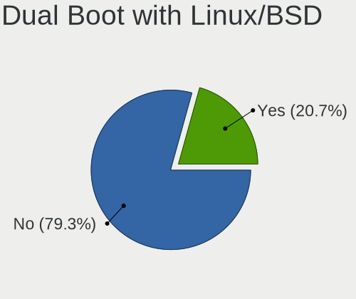
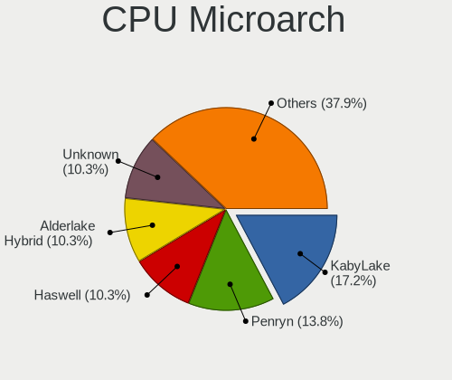
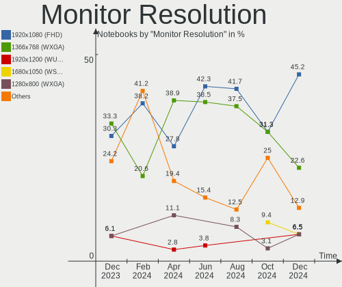
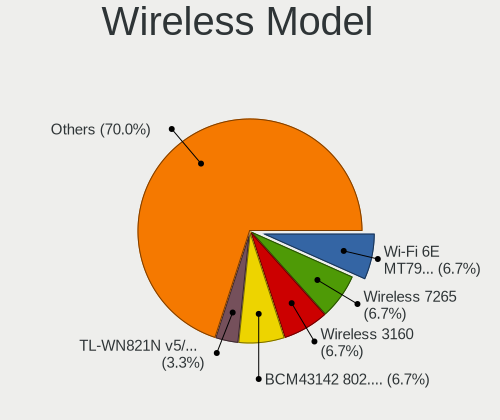
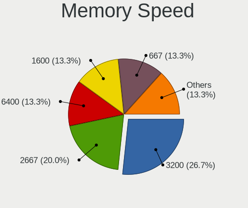

Xubuntu Hardware Trends (Notebooks)
-----------------------------------

A project to identify most popular hardware characteristics and track their change
over time based on data collected by Xubuntu users at https://Linux-Hardware.org.

Anyone can contribute to this report by the [hw-probe](https://github.com/linuxhw/hw-probe) tool:

    sudo -E hw-probe -all -upload

Full-feature report is available here: https://linux-hardware.org/?view=trends&formfactor=notebook

Period: Aug, 2021.

Contents
--------

* [ System ](#system)
  - [ OS                       ](#os)
  - [ OS Family                ](#os-family)
  - [ Kernel                   ](#kernel)
  - [ Kernel Family            ](#kernel-family)
  - [ Kernel Major Ver.        ](#kernel-major-ver)
  - [ Arch                     ](#arch)
  - [ DE                       ](#de)
  - [ Display Server           ](#display-server)
  - [ Display Manager          ](#display-manager)
  - [ OS Lang                  ](#os-lang)
  - [ Boot Mode                ](#boot-mode)
  - [ Filesystem               ](#filesystem)
  - [ Part. scheme             ](#part-scheme)
  - [ Dual Boot with Linux/BSD ](#dual-boot-with-linuxbsd)
  - [ Dual Boot (Win)          ](#dual-boot-win)

* [ Board ](#board)
  - [ Vendor                   ](#vendor)
  - [ Model                    ](#model)
  - [ Model Family             ](#model-family)
  - [ MFG Year                 ](#mfg-year)
  - [ Form Factor              ](#form-factor)
  - [ Secure Boot              ](#secure-boot)
  - [ Coreboot                 ](#coreboot)
  - [ RAM Size                 ](#ram-size)
  - [ RAM Used                 ](#ram-used)
  - [ Total Drives             ](#total-drives)
  - [ Has CD-ROM               ](#has-cd-rom)
  - [ Has Ethernet             ](#has-ethernet)
  - [ Has WiFi                 ](#has-wifi)
  - [ Has Bluetooth            ](#has-bluetooth)

* [ Location ](#location)
  - [ Country                  ](#country)
  - [ City                     ](#city)

* [ Drives ](#drives)
  - [ Drive Vendor             ](#drive-vendor)
  - [ Drive Model              ](#drive-model)
  - [ HDD Vendor               ](#hdd-vendor)
  - [ SSD Vendor               ](#ssd-vendor)
  - [ Drive Kind               ](#drive-kind)
  - [ Drive Connector          ](#drive-connector)
  - [ Drive Size               ](#drive-size)
  - [ Space Total              ](#space-total)
  - [ Space Used               ](#space-used)
  - [ Malfunc. Drives          ](#malfunc-drives)
  - [ Malfunc. Drive Vendor    ](#malfunc-drive-vendor)
  - [ Malfunc. HDD Vendor      ](#malfunc-hdd-vendor)
  - [ Malfunc. Drive Kind      ](#malfunc-drive-kind)
  - [ Failed Drives            ](#failed-drives)
  - [ Failed Drive Vendor      ](#failed-drive-vendor)
  - [ Drive Status             ](#drive-status)

* [ Storage controller ](#storage-controller)
  - [ Storage Vendor           ](#storage-vendor)
  - [ Storage Model            ](#storage-model)
  - [ Storage Kind             ](#storage-kind)

* [ Processor ](#processor)
  - [ CPU Vendor               ](#cpu-vendor)
  - [ CPU Model                ](#cpu-model)
  - [ CPU Model Family         ](#cpu-model-family)
  - [ CPU Cores                ](#cpu-cores)
  - [ CPU Sockets              ](#cpu-sockets)
  - [ CPU Threads              ](#cpu-threads)
  - [ CPU Op-Modes             ](#cpu-op-modes)
  - [ CPU Microcode            ](#cpu-microcode)
  - [ CPU Microarch            ](#cpu-microarch)

* [ Graphics ](#graphics)
  - [ GPU Vendor               ](#gpu-vendor)
  - [ GPU Model                ](#gpu-model)
  - [ GPU Combo                ](#gpu-combo)
  - [ GPU Driver               ](#gpu-driver)
  - [ GPU Memory               ](#gpu-memory)

* [ Monitor ](#monitor)
  - [ Monitor Vendor           ](#monitor-vendor)
  - [ Monitor Model            ](#monitor-model)
  - [ Monitor Resolution       ](#monitor-resolution)
  - [ Monitor Diagonal         ](#monitor-diagonal)
  - [ Monitor Width            ](#monitor-width)
  - [ Aspect Ratio             ](#aspect-ratio)
  - [ Monitor Area             ](#monitor-area)
  - [ Pixel Density            ](#pixel-density)
  - [ Multiple Monitors        ](#multiple-monitors)

* [ Network ](#network)
  - [ Net Controller Vendor    ](#net-controller-vendor)
  - [ Net Controller Model     ](#net-controller-model)
  - [ Wireless Vendor          ](#wireless-vendor)
  - [ Wireless Model           ](#wireless-model)
  - [ Ethernet Vendor          ](#ethernet-vendor)
  - [ Ethernet Model           ](#ethernet-model)
  - [ Net Controller Kind      ](#net-controller-kind)
  - [ Used Controller          ](#used-controller)
  - [ NICs                     ](#nics)
  - [ IPv6                     ](#ipv6)

* [ Bluetooth ](#bluetooth)
  - [ Bluetooth Vendor         ](#bluetooth-vendor)
  - [ Bluetooth Model          ](#bluetooth-model)

* [ Sound ](#sound)
  - [ Sound Vendor             ](#sound-vendor)
  - [ Sound Model              ](#sound-model)

* [ Memory ](#memory)
  - [ Memory Vendor            ](#memory-vendor)
  - [ Memory Model             ](#memory-model)
  - [ Memory Kind              ](#memory-kind)
  - [ Memory Form Factor       ](#memory-form-factor)
  - [ Memory Size              ](#memory-size)
  - [ Memory Speed             ](#memory-speed)

* [ Printers & scanners ](#printers--scanners)
  - [ Printer Vendor           ](#printer-vendor)
  - [ Printer Model            ](#printer-model)
  - [ Scanner Vendor           ](#scanner-vendor)
  - [ Scanner Model            ](#scanner-model)

* [ Camera ](#camera)
  - [ Camera Vendor            ](#camera-vendor)
  - [ Camera Model             ](#camera-model)

* [ Security ](#security)
  - [ Fingerprint Vendor       ](#fingerprint-vendor)
  - [ Fingerprint Model        ](#fingerprint-model)
  - [ Chipcard Vendor          ](#chipcard-vendor)
  - [ Chipcard Model           ](#chipcard-model)

* [ Unsupported ](#unsupported)
  - [ Unsupported Devices      ](#unsupported-devices)
  - [ Unsupported Device Types ](#unsupported-device-types)

System
------

OS
--

Installed operating systems

| Name          | Notebooks | Percent |
|---------------|-----------|---------|
| Xubuntu 20.04 | 42        | 73.68%  |
| Xubuntu 18.04 | 8         | 14.04%  |
| Xubuntu 21.04 | 7         | 12.28%  |

OS Family
---------

OS without a version

| Name    | Notebooks | Percent |
|---------|-----------|---------|
| Xubuntu | 57        | 100%    |

Kernel
------

Version of the Linux kernel

| Version                | Notebooks | Percent |
|------------------------|-----------|---------|
| 5.11.0-25-generic      | 11        | 19.3%   |
| 5.4.0-81-generic       | 7         | 12.28%  |
| 5.4.0-80-generic       | 7         | 12.28%  |
| 5.11.0-27-generic      | 4         | 7.02%   |
| 5.8.0-43-generic       | 3         | 5.26%   |
| 5.11.0-27-lowlatency   | 3         | 5.26%   |
| 5.11.0-25-lowlatency   | 3         | 5.26%   |
| 5.4.0-80-lowlatency    | 2         | 3.51%   |
| 5.4.0-42-generic       | 2         | 3.51%   |
| 5.11.0-31-generic      | 2         | 3.51%   |
| 5.8.0-63-generic       | 1         | 1.75%   |
| 5.8.0-59-generic       | 1         | 1.75%   |
| 5.8.0-55-generic       | 1         | 1.75%   |
| 5.8.0-43-lowlatency    | 1         | 1.75%   |
| 5.8.0-41-generic       | 1         | 1.75%   |
| 5.4.0-58-lowlatency    | 1         | 1.75%   |
| 5.4.0-54-generic       | 1         | 1.75%   |
| 5.13.5-051305-generic  | 1         | 1.75%   |
| 5.13.2-051302-generic  | 1         | 1.75%   |
| 5.10.33-051033-generic | 1         | 1.75%   |
| 4.15.0-96-generic      | 1         | 1.75%   |
| 4.15.0-47-generic      | 1         | 1.75%   |
| 4.15.0-151-generic     | 1         | 1.75%   |

Kernel Family
-------------

Linux kernel without a distro release

| Version | Notebooks | Percent |
|---------|-----------|---------|
| 5.11.0  | 23        | 40.35%  |
| 5.4.0   | 20        | 35.09%  |
| 5.8.0   | 8         | 14.04%  |
| 4.15.0  | 3         | 5.26%   |
| 5.13.5  | 1         | 1.75%   |
| 5.13.2  | 1         | 1.75%   |
| 5.10.33 | 1         | 1.75%   |

Kernel Major Ver.
-----------------

Linux kernel major version

| Version | Notebooks | Percent |
|---------|-----------|---------|
| 5.11    | 23        | 40.35%  |
| 5.4     | 20        | 35.09%  |
| 5.8     | 8         | 14.04%  |
| 4.15    | 3         | 5.26%   |
| 5.13    | 2         | 3.51%   |
| 5.10    | 1         | 1.75%   |

Arch
----

OS architecture (x86_64, i586, etc.)

| Name   | Notebooks | Percent |
|--------|-----------|---------|
| x86_64 | 51        | 89.47%  |
| i686   | 6         | 10.53%  |

DE
--

Desktop Environment

| Name  | Notebooks | Percent |
|-------|-----------|---------|
| XFCE  | 56        | 98.25%  |
| ICEWM | 1         | 1.75%   |

Display Server
--------------

X11 or Wayland

| Name | Notebooks | Percent |
|------|-----------|---------|
| X11  | 57        | 100%    |

Display Manager
---------------

SDDM, LightDM, etc.

| Name    | Notebooks | Percent |
|---------|-----------|---------|
| Unknown | 32        | 56.14%  |
| TDM     | 20        | 35.09%  |
| LightDM | 4         | 7.02%   |
| GDM     | 1         | 1.75%   |

OS Lang
-------

Language

| Lang  | Notebooks | Percent |
|-------|-----------|---------|
| en_US | 28        | 49.12%  |
| fr_FR | 7         | 12.28%  |
| de_DE | 6         | 10.53%  |
| C     | 5         | 8.77%   |
| pt_BR | 3         | 5.26%   |
| it_IT | 2         | 3.51%   |
| uk_UA | 1         | 1.75%   |
| pl_PL | 1         | 1.75%   |
| es_ES | 1         | 1.75%   |
| en_GB | 1         | 1.75%   |
| en_AU | 1         | 1.75%   |
| el_GR | 1         | 1.75%   |

Boot Mode
---------

EFI or BIOS

| Mode | Notebooks | Percent |
|------|-----------|---------|
| BIOS | 34        | 59.65%  |
| EFI  | 23        | 40.35%  |

Filesystem
----------

Type of filesystem

| Type    | Notebooks | Percent |
|---------|-----------|---------|
| Ext4    | 53        | 92.98%  |
| Overlay | 3         | 5.26%   |
| Xfs     | 1         | 1.75%   |

Part. scheme
------------

Scheme of partitioning

| Type    | Notebooks | Percent |
|---------|-----------|---------|
| Unknown | 32        | 56.14%  |
| GPT     | 17        | 29.82%  |
| MBR     | 8         | 14.04%  |

Dual Boot with Linux/BSD
------------------------

Hosting more than one Linux/BSD

| Dual boot | Notebooks | Percent |
|-----------|-----------|---------|
| No        | 51        | 89.47%  |
| Yes       | 6         | 10.53%  |

Dual Boot (Win)
---------------

Hosting Linux and Windows

| Dual boot | Notebooks | Percent |
|-----------|-----------|---------|
| No        | 40        | 70.18%  |
| Yes       | 17        | 29.82%  |

Board
-----

Vendor
------

Motherboard manufacturer

| Name             | Notebooks | Percent |
|------------------|-----------|---------|
| Hewlett-Packard  | 15        | 26.32%  |
| Lenovo           | 11        | 19.3%   |
| Dell             | 6         | 10.53%  |
| Toshiba          | 5         | 8.77%   |
| ASUSTek Computer | 5         | 8.77%   |
| Acer             | 5         | 8.77%   |
| Sony             | 2         | 3.51%   |
| Notebook         | 2         | 3.51%   |
| MSI              | 2         | 3.51%   |
| UNOWHY           | 1         | 1.75%   |
| Digibras         | 1         | 1.75%   |
| Clevo            | 1         | 1.75%   |
| Apple            | 1         | 1.75%   |

Model
-----

Motherboard model

| Name                                       | Notebooks | Percent |
|--------------------------------------------|-----------|---------|
| UNOWHY Y13G010S4EI                         | 1         | 1.75%   |
| Toshiba Satellite P300                     | 1         | 1.75%   |
| Toshiba Satellite P205D                    | 1         | 1.75%   |
| Toshiba Satellite C665D                    | 1         | 1.75%   |
| Toshiba Satellite A100                     | 1         | 1.75%   |
| Toshiba PORTEGE R30-A                      | 1         | 1.75%   |
| Sony VPCF236FM                             | 1         | 1.75%   |
| Sony SVE1512C6EB                           | 1         | 1.75%   |
| Notebook W970SUW                           | 1         | 1.75%   |
| Notebook P65_P67RGRERA                     | 1         | 1.75%   |
| MSI PR601/VR603                            | 1         | 1.75%   |
| MSI CR61 2M/CX61 2OC/CX61 2OD              | 1         | 1.75%   |
| Lenovo V130-15IKB 81HN                     | 1         | 1.75%   |
| Lenovo ThinkPad X1 Carbon Gen 8 20U9CTO1WW | 1         | 1.75%   |
| Lenovo ThinkPad W540 20BHS1HR00            | 1         | 1.75%   |
| Lenovo ThinkPad W540 20BHS0KY08            | 1         | 1.75%   |
| Lenovo ThinkPad T460s 20FAS12E00           | 1         | 1.75%   |
| Lenovo ThinkPad T440s 20AQ009DGE           | 1         | 1.75%   |
| Lenovo ThinkPad E15 Gen 3 20YHS00900       | 1         | 1.75%   |
| Lenovo ThinkPad 20AY001DMH                 | 1         | 1.75%   |
| Lenovo QIWG5                               | 1         | 1.75%   |
| Lenovo G460 0677                           | 1         | 1.75%   |
| Lenovo B5400 s20278Q                       | 1         | 1.75%   |
| HP ProBook 6470b                           | 1         | 1.75%   |
| HP ProBook 450 G3                          | 1         | 1.75%   |
| HP Pavilion Laptop 15-cc1xx                | 1         | 1.75%   |
| HP OMEN by HP Laptop                       | 1         | 1.75%   |
| HP Mini 311-1000                           | 1         | 1.75%   |
| HP Laptop 15s-fq1xxx                       | 1         | 1.75%   |
| HP EliteBook 8470p                         | 1         | 1.75%   |
| HP EliteBook 840 G3                        | 1         | 1.75%   |
| HP Compaq CQ58                             | 1         | 1.75%   |
| HP Compaq 8710w                            | 1         | 1.75%   |
| HP 255 G7 Notebook PC                      | 1         | 1.75%   |
| HP 255 G1                                  | 1         | 1.75%   |
| HP 2000                                    | 1         | 1.75%   |
| HP 15                                      | 1         | 1.75%   |
| Digibras NH4CU53                           | 1         | 1.75%   |
| Dell Vostro 3500                           | 1         | 1.75%   |
| Dell Vostro 3491                           | 1         | 1.75%   |
| Dell Studio 1569                           | 1         | 1.75%   |
| Dell Latitude E5520                        | 1         | 1.75%   |
| Dell Latitude E4310                        | 1         | 1.75%   |
| Dell G5 5590                               | 1         | 1.75%   |
| Clevo W240HU/W250HUQ                       | 1         | 1.75%   |
| ASUS X501A                                 | 1         | 1.75%   |
| ASUS X455YA                                | 1         | 1.75%   |
| ASUS UX305FA                               | 1         | 1.75%   |
| ASUS N550JV                                | 1         | 1.75%   |
| ASUS 1002HA                                | 1         | 1.75%   |
| Apple MacBookPro8,1                        | 1         | 1.75%   |
| Acer Swift SF314-57G                       | 1         | 1.75%   |
| Acer Swift SF314-54G                       | 1         | 1.75%   |
| Acer Predator PH315-52                     | 1         | 1.75%   |
| Acer Aspire ES1-111                        | 1         | 1.75%   |
| Acer Aspire A515-56G                       | 1         | 1.75%   |
| Unknown                                    | 1         | 1.75%   |

Model Family
------------

Motherboard model prefix

| Name               | Notebooks | Percent |
|--------------------|-----------|---------|
| Lenovo ThinkPad    | 7         | 12.28%  |
| Toshiba Satellite  | 4         | 7.02%   |
| HP ProBook         | 2         | 3.51%   |
| HP EliteBook       | 2         | 3.51%   |
| HP Compaq          | 2         | 3.51%   |
| HP 255             | 2         | 3.51%   |
| Dell Vostro        | 2         | 3.51%   |
| Dell Latitude      | 2         | 3.51%   |
| Acer Swift         | 2         | 3.51%   |
| Acer Aspire        | 2         | 3.51%   |
| UNOWHY Y13G010S4EI | 1         | 1.75%   |
| Toshiba PORTEGE    | 1         | 1.75%   |
| Sony VPCF236FM     | 1         | 1.75%   |
| Sony SVE1512C6EB   | 1         | 1.75%   |
| Notebook W970SUW   | 1         | 1.75%   |
| Notebook P65       | 1         | 1.75%   |
| MSI PR601          | 1         | 1.75%   |
| MSI CR61           | 1         | 1.75%   |
| Lenovo V130-15IKB  | 1         | 1.75%   |
| Lenovo QIWG5       | 1         | 1.75%   |
| Lenovo G460        | 1         | 1.75%   |
| Lenovo B5400       | 1         | 1.75%   |
| HP Pavilion        | 1         | 1.75%   |
| HP OMEN            | 1         | 1.75%   |
| HP Mini            | 1         | 1.75%   |
| HP Laptop          | 1         | 1.75%   |
| HP 2000            | 1         | 1.75%   |
| HP 15              | 1         | 1.75%   |
| Digibras NH4CU53   | 1         | 1.75%   |
| Dell Studio        | 1         | 1.75%   |
| Dell G5            | 1         | 1.75%   |
| Clevo W240HU       | 1         | 1.75%   |
| ASUS X501A         | 1         | 1.75%   |
| ASUS X455YA        | 1         | 1.75%   |
| ASUS UX305FA       | 1         | 1.75%   |
| ASUS N550JV        | 1         | 1.75%   |
| ASUS 1002HA        | 1         | 1.75%   |
| Apple MacBookPro8  | 1         | 1.75%   |
| Acer Predator      | 1         | 1.75%   |
| Unknown            | 1         | 1.75%   |

MFG Year
--------

Motherboard manufacture year

| Year | Notebooks | Percent |
|------|-----------|---------|
| 2021 | 9         | 15.79%  |
| 2013 | 9         | 15.79%  |
| 2020 | 8         | 14.04%  |
| 2014 | 5         | 8.77%   |
| 2011 | 5         | 8.77%   |
| 2019 | 4         | 7.02%   |
| 2015 | 3         | 5.26%   |
| 2012 | 3         | 5.26%   |
| 2009 | 3         | 5.26%   |
| 2010 | 2         | 3.51%   |
| 2006 | 2         | 3.51%   |
| 2018 | 1         | 1.75%   |
| 2017 | 1         | 1.75%   |
| 2008 | 1         | 1.75%   |
| 2007 | 1         | 1.75%   |

Form Factor
-----------

Physical design of the computer

| Name     | Notebooks | Percent |
|----------|-----------|---------|
| Notebook | 57        | 100%    |

Secure Boot
-----------

Enabled or disabled

| State    | Notebooks | Percent |
|----------|-----------|---------|
| Disabled | 53        | 92.98%  |
| Enabled  | 4         | 7.02%   |

Coreboot
--------

Have coreboot on board

| Used | Notebooks | Percent |
|------|-----------|---------|
| No   | 57        | 100%    |

RAM Size
--------

Total RAM memory

| Size in GB  | Notebooks | Percent |
|-------------|-----------|---------|
| 4.01-8.0    | 18        | 31.58%  |
| 3.01-4.0    | 14        | 24.56%  |
| 16.01-24.0  | 8         | 14.04%  |
| 8.01-16.0   | 7         | 12.28%  |
| 1.01-2.0    | 4         | 7.02%   |
| 2.01-3.0    | 3         | 5.26%   |
| 24.01-32.0  | 1         | 1.75%   |
| 64.01-256.0 | 1         | 1.75%   |
| 0.51-1.0    | 1         | 1.75%   |

RAM Used
--------

Used RAM memory

| Used GB  | Notebooks | Percent |
|----------|-----------|---------|
| 1.01-2.0 | 22        | 38.6%   |
| 2.01-3.0 | 12        | 21.05%  |
| 0.51-1.0 | 11        | 19.3%   |
| 4.01-8.0 | 7         | 12.28%  |
| 3.01-4.0 | 4         | 7.02%   |
| 0.01-0.5 | 1         | 1.75%   |

Total Drives
------------

Number of drives on board

| Drives | Notebooks | Percent |
|--------|-----------|---------|
| 1      | 41        | 71.93%  |
| 2      | 13        | 22.81%  |
| 3      | 2         | 3.51%   |
| 0      | 1         | 1.75%   |

Has CD-ROM
----------

Has CD-ROM on board

| Presented | Notebooks | Percent |
|-----------|-----------|---------|
| Yes       | 29        | 50.88%  |
| No        | 28        | 49.12%  |

Has Ethernet
------------

Has Ethernet on board

| Presented | Notebooks | Percent |
|-----------|-----------|---------|
| Yes       | 55        | 96.49%  |
| No        | 2         | 3.51%   |

Has WiFi
--------

Has WiFi module

| Presented | Notebooks | Percent |
|-----------|-----------|---------|
| Yes       | 56        | 98.25%  |
| No        | 1         | 1.75%   |

Has Bluetooth
-------------

Has Bluetooth module

| Presented | Notebooks | Percent |
|-----------|-----------|---------|
| Yes       | 40        | 70.18%  |
| No        | 17        | 29.82%  |

Location
--------

Country
-------

Geographic location (country)

| Country     | Notebooks | Percent |
|-------------|-----------|---------|
| USA         | 14        | 24.56%  |
| France      | 8         | 14.04%  |
| Germany     | 6         | 10.53%  |
| Brazil      | 5         | 8.77%   |
| Italy       | 3         | 5.26%   |
| Belgium     | 3         | 5.26%   |
| India       | 2         | 3.51%   |
| Ukraine     | 1         | 1.75%   |
| UK          | 1         | 1.75%   |
| Spain       | 1         | 1.75%   |
| Singapore   | 1         | 1.75%   |
| Russia      | 1         | 1.75%   |
| Poland      | 1         | 1.75%   |
| Netherlands | 1         | 1.75%   |
| Mexico      | 1         | 1.75%   |
| Indonesia   | 1         | 1.75%   |
| Greece      | 1         | 1.75%   |
| Finland     | 1         | 1.75%   |
| Estonia     | 1         | 1.75%   |
| Costa Rica  | 1         | 1.75%   |
| Canada      | 1         | 1.75%   |
| Australia   | 1         | 1.75%   |
| Algeria     | 1         | 1.75%   |

City
----

Geographic location (city)

| City              | Notebooks | Percent |
|-------------------|-----------|---------|
| Pittsburgh        | 3         | 5.26%   |
| Ghent             | 2         | 3.51%   |
| Zarzalejo         | 1         | 1.75%   |
| Yuzhno-Sakhalinsk | 1         | 1.75%   |
| Wilderness Rim    | 1         | 1.75%   |
| Waterford         | 1         | 1.75%   |
| Vitry-sur-Seine   | 1         | 1.75%   |
| Villecresnes      | 1         | 1.75%   |
| Turku             | 1         | 1.75%   |
| Toronto           | 1         | 1.75%   |
| Tallinn           | 1         | 1.75%   |
| Surakarta         | 1         | 1.75%   |
| Steenderen        | 1         | 1.75%   |
| Sparti            | 1         | 1.75%   |
| Singapore         | 1         | 1.75%   |
| S??o Paulo        | 1         | 1.75%   |
| San Jose          | 1         | 1.75%   |
| San Jos?©         | 1         | 1.75%   |
| Rolla             | 1         | 1.75%   |
| Pluderhausen      | 1         | 1.75%   |
| Paris             | 1         | 1.75%   |
| Paranatama        | 1         | 1.75%   |
| North Highlands   | 1         | 1.75%   |
| Mumbai            | 1         | 1.75%   |
| Meinersen         | 1         | 1.75%   |
| Maxeville         | 1         | 1.75%   |
| Matinhos          | 1         | 1.75%   |
| Marseille         | 1         | 1.75%   |
| Ludwigsfelde      | 1         | 1.75%   |
| Leland            | 1         | 1.75%   |
| Le??n             | 1         | 1.75%   |
| Lacadee           | 1         | 1.75%   |
| Kyiv              | 1         | 1.75%   |
| Kolkata           | 1         | 1.75%   |
| Hildesheim        | 1         | 1.75%   |
| Heist-op-den-Berg | 1         | 1.75%   |
| Gloucester        | 1         | 1.75%   |
| Fino Mornasco     | 1         | 1.75%   |
| Findon            | 1         | 1.75%   |
| Farroupilha       | 1         | 1.75%   |
| Falls Church      | 1         | 1.75%   |
| Englewood         | 1         | 1.75%   |
| Dourados          | 1         | 1.75%   |
| Dallas            | 1         | 1.75%   |
| Colomiers         | 1         | 1.75%   |
| Carlsbad          | 1         | 1.75%   |
| Brzezno           | 1         | 1.75%   |
| Boston            | 1         | 1.75%   |
| Bonn              | 1         | 1.75%   |
| Bologna           | 1         | 1.75%   |
| Arzignano         | 1         | 1.75%   |
| Algiers           | 1         | 1.75%   |
| Albi              | 1         | 1.75%   |
| Ahaus             | 1         | 1.75%   |

Drives
------

Drive Vendor
------------

Hard drive vendors

| Vendor              | Notebooks | Drives | Percent |
|---------------------|-----------|--------|---------|
| WDC                 | 10        | 12     | 14.29%  |
| Seagate             | 8         | 9      | 11.43%  |
| Samsung Electronics | 7         | 7      | 10%     |
| Toshiba             | 6         | 6      | 8.57%   |
| Unknown             | 5         | 5      | 7.14%   |
| Hitachi             | 5         | 5      | 7.14%   |
| Sandisk             | 4         | 4      | 5.71%   |
| Intel               | 4         | 4      | 5.71%   |
| KIOXIA              | 3         | 3      | 4.29%   |
| SK Hynix            | 2         | 2      | 2.86%   |
| Micron Technology   | 2         | 2      | 2.86%   |
| Kingston            | 2         | 2      | 2.86%   |
| HGST                | 2         | 2      | 2.86%   |
| Crucial             | 2         | 2      | 2.86%   |
| TCSUNBOW            | 1         | 1      | 1.43%   |
| SPCC                | 1         | 1      | 1.43%   |
| Netac               | 1         | 1      | 1.43%   |
| LITEONIT            | 1         | 1      | 1.43%   |
| LITEON              | 1         | 1      | 1.43%   |
| Intenso             | 1         | 1      | 1.43%   |
| Hewlett-Packard     | 1         | 1      | 1.43%   |
| A-DATA Technology   | 1         | 1      | 1.43%   |

Drive Model
-----------

Hard drive models

| Model                                 | Notebooks | Percent |
|---------------------------------------|-----------|---------|
| WDC WD5000LPVX-22V0TT0 500GB          | 2         | 2.78%   |
| Sandisk NVMe SSD Drive 256GB          | 2         | 2.78%   |
| Samsung HM321HI 320GB                 | 2         | 2.78%   |
| WDC WDS500G2B0C-00PXH0 500GB          | 1         | 1.39%   |
| WDC WDBNCE5000PNC 500GB SSD           | 1         | 1.39%   |
| WDC WD5000LPLX-60ZNTT1 500GB          | 1         | 1.39%   |
| WDC WD5000BPKX-22HPJT0 500GB          | 1         | 1.39%   |
| WDC WD5000BEKT-75KA9T0 500GB          | 1         | 1.39%   |
| WDC WD3200LPVX-22V0TT0 320GB          | 1         | 1.39%   |
| WDC WD10SPZX-75Z10T3 1TB              | 1         | 1.39%   |
| WDC WD10SPZX-21Z10T0 1TB              | 1         | 1.39%   |
| WDC PC SN720 SDAPNTW-512G-1014 512GB  | 1         | 1.39%   |
| WDC PC SN520 NVMe 256GB               | 1         | 1.39%   |
| Unknown SL16G  16GB                   | 1         | 1.39%   |
| Unknown MMC Card  256GB               | 1         | 1.39%   |
| Unknown MMC Card  16GB                | 1         | 1.39%   |
| Unknown DA4064  64GB                  | 1         | 1.39%   |
| Unknown C2S3T/240G 240GB SSD          | 1         | 1.39%   |
| Toshiba NVMe SSD Drive 512GB          | 1         | 1.39%   |
| Toshiba MQ01ABD075 752GB              | 1         | 1.39%   |
| Toshiba MQ01ABD050 500GB              | 1         | 1.39%   |
| Toshiba MK7559GSXP 752GB              | 1         | 1.39%   |
| Toshiba MK5065GSXF 500GB              | 1         | 1.39%   |
| Toshiba MK3261GSYN 320GB              | 1         | 1.39%   |
| TCSUNBOW X3 1TB SSD                   | 1         | 1.39%   |
| SPCC Solid State Disk 256GB           | 1         | 1.39%   |
| SK Hynix NVMe SSD Drive 256GB         | 1         | 1.39%   |
| SK Hynix HFS128G3BMND-3210A 128GB SSD | 1         | 1.39%   |
| Seagate ST960813AS 64GB               | 1         | 1.39%   |
| Seagate ST9250315AS 250GB             | 1         | 1.39%   |
| Seagate ST9160310AS 160GB             | 1         | 1.39%   |
| Seagate ST500LM012 HN-M500MBB 500GB   | 1         | 1.39%   |
| Seagate ST320LT007-9ZV142 320GB       | 1         | 1.39%   |
| Seagate ST2000LM007-1R8174 2TB        | 1         | 1.39%   |
| Seagate ST1000LM049-2GH172 1TB        | 1         | 1.39%   |
| Seagate BUP Slim SL 1TB               | 1         | 1.39%   |
| SanDisk SDSSDA240G 240GB              | 1         | 1.39%   |
| SanDisk SD7SN3Q128G1002 128GB SSD     | 1         | 1.39%   |
| Samsung SSD RBX Series 128GB M        | 1         | 1.39%   |
| Samsung SSD 860 PRO 512GB             | 1         | 1.39%   |
| Samsung SSD 850 EVO 250GB             | 1         | 1.39%   |
| Samsung MZNLN256HMHQ-000L7 256GB SSD  | 1         | 1.39%   |
| Samsung MZMTE128HMGR-00000 128GB SSD  | 1         | 1.39%   |
| Netac SSD 128GB                       | 1         | 1.39%   |
| Micron Crucial X8 SSD 1TB             | 1         | 1.39%   |
| Micron 2200_MTFDHBA1T0TCK 1TB         | 1         | 1.39%   |
| LITEONIT LSS-16L6G 16GB SSD           | 1         | 1.39%   |
| LITEON CV1-8B512-HP 512GB SSD         | 1         | 1.39%   |
| KIOXIA KBG40ZNV1T02 1TB               | 1         | 1.39%   |
| KIOXIA KBG40ZNS512G NVMe 512GB        | 1         | 1.39%   |
| KIOXIA KBG40ZNS256G NVMe 256GB        | 1         | 1.39%   |
| Kingston SV300S37A240G 240GB SSD      | 1         | 1.39%   |
| Kingston SA400S37120G 120GB SSD       | 1         | 1.39%   |
| Intenso External USB 3.0 4TB          | 1         | 1.39%   |
| Intel SSDSC2BF180A5L 180GB            | 1         | 1.39%   |
| Intel SSDPEKNW020T8 2TB               | 1         | 1.39%   |
| Intel SSDPEKNW010T8 1TB               | 1         | 1.39%   |
| Intel SSDPEKKW256G7 256GB             | 1         | 1.39%   |
| Hitachi HTS727550A9E364 500GB         | 1         | 1.39%   |
| Hitachi HTS545050A7E380 500GB         | 1         | 1.39%   |

HDD Vendor
----------

Hard disk drive vendors

| Vendor              | Notebooks | Drives | Percent |
|---------------------|-----------|--------|---------|
| WDC                 | 8         | 8      | 25.81%  |
| Seagate             | 8         | 9      | 25.81%  |
| Toshiba             | 5         | 5      | 16.13%  |
| Hitachi             | 5         | 5      | 16.13%  |
| Samsung Electronics | 2         | 2      | 6.45%   |
| HGST                | 2         | 2      | 6.45%   |
| Intenso             | 1         | 1      | 3.23%   |

SSD Vendor
----------

Solid state drive vendors

| Vendor              | Notebooks | Drives | Percent |
|---------------------|-----------|--------|---------|
| Samsung Electronics | 5         | 5      | 21.74%  |
| SanDisk             | 2         | 2      | 8.7%    |
| Kingston            | 2         | 2      | 8.7%    |
| Crucial             | 2         | 2      | 8.7%    |
| WDC                 | 1         | 1      | 4.35%   |
| Unknown             | 1         | 1      | 4.35%   |
| TCSUNBOW            | 1         | 1      | 4.35%   |
| SPCC                | 1         | 1      | 4.35%   |
| SK Hynix            | 1         | 1      | 4.35%   |
| Netac               | 1         | 1      | 4.35%   |
| Micron Technology   | 1         | 1      | 4.35%   |
| LITEONIT            | 1         | 1      | 4.35%   |
| LITEON              | 1         | 1      | 4.35%   |
| Intel               | 1         | 1      | 4.35%   |
| Hewlett-Packard     | 1         | 1      | 4.35%   |
| A-DATA Technology   | 1         | 1      | 4.35%   |

Drive Kind
----------

HDD or SSD

| Kind | Notebooks | Drives | Percent |
|------|-----------|--------|---------|
| HDD  | 31        | 32     | 44.29%  |
| SSD  | 22        | 23     | 31.43%  |
| NVMe | 13        | 14     | 18.57%  |
| MMC  | 4         | 4      | 5.71%   |

Drive Connector
---------------

SATA, SAS, NVMe, etc.

| Type | Notebooks | Drives | Percent |
|------|-----------|--------|---------|
| SATA | 46        | 52     | 69.7%   |
| NVMe | 13        | 14     | 19.7%   |
| MMC  | 4         | 4      | 6.06%   |
| SAS  | 3         | 3      | 4.55%   |

Drive Size
----------

Size of hard drive

| Size in TB | Notebooks | Drives | Percent |
|------------|-----------|--------|---------|
| 0.01-0.5   | 35        | 39     | 70%     |
| 0.51-1.0   | 12        | 12     | 24%     |
| 1.01-2.0   | 2         | 3      | 4%      |
| 3.01-4.0   | 1         | 1      | 2%      |

Space Total
-----------

Amount of disk space available on the file system

| Size in GB     | Notebooks | Percent |
|----------------|-----------|---------|
| 251-500        | 18        | 31.58%  |
| 101-250        | 18        | 31.58%  |
| 501-1000       | 8         | 14.04%  |
| 51-100         | 4         | 7.02%   |
| 1-20           | 3         | 5.26%   |
| More than 3000 | 2         | 3.51%   |
| 1001-2000      | 2         | 3.51%   |
| 21-50          | 1         | 1.75%   |
| 2001-3000      | 1         | 1.75%   |

Space Used
----------

Amount of used disk space

| Used GB   | Notebooks | Percent |
|-----------|-----------|---------|
| 1-20      | 20        | 35.09%  |
| 101-250   | 12        | 21.05%  |
| 21-50     | 7         | 12.28%  |
| 51-100    | 7         | 12.28%  |
| 251-500   | 6         | 10.53%  |
| 501-1000  | 3         | 5.26%   |
| 2001-3000 | 1         | 1.75%   |
| 1001-2000 | 1         | 1.75%   |

Malfunc. Drives
---------------

Drive models with a malfunction

| Model                         | Notebooks | Drives | Percent |
|-------------------------------|-----------|--------|---------|
| Toshiba MK7559GSXP 752GB      | 1         | 1      | 25%     |
| Intel SSDPEKKW256G7 256GB     | 1         | 1      | 25%     |
| Hitachi HTS543232A7A384 320GB | 1         | 1      | 25%     |
| HGST HTS721010A9E630 1TB      | 1         | 1      | 25%     |

Malfunc. Drive Vendor
---------------------

Vendors of faulty drives

| Vendor  | Notebooks | Drives | Percent |
|---------|-----------|--------|---------|
| Toshiba | 1         | 1      | 25%     |
| Intel   | 1         | 1      | 25%     |
| Hitachi | 1         | 1      | 25%     |
| HGST    | 1         | 1      | 25%     |

Malfunc. HDD Vendor
-------------------

Vendors of faulty HDD drives

| Vendor  | Notebooks | Drives | Percent |
|---------|-----------|--------|---------|
| Toshiba | 1         | 1      | 33.33%  |
| Hitachi | 1         | 1      | 33.33%  |
| HGST    | 1         | 1      | 33.33%  |

Malfunc. Drive Kind
-------------------

Kinds of faulty drives

| Kind | Notebooks | Drives | Percent |
|------|-----------|--------|---------|
| HDD  | 3         | 3      | 75%     |
| NVMe | 1         | 1      | 25%     |

Failed Drives
-------------

Failed drive models

Zero info for selected period =(

Failed Drive Vendor
-------------------

Failed drive vendors

Zero info for selected period =(

Drive Status
------------

Number of failed and malfunc. drives

| Status   | Notebooks | Drives | Percent |
|----------|-----------|--------|---------|
| Detected | 34        | 44     | 57.63%  |
| Works    | 21        | 25     | 35.59%  |
| Malfunc  | 4         | 4      | 6.78%   |

Storage controller
------------------

Storage Vendor
--------------

Storage controller vendors

| Vendor                       | Notebooks | Percent |
|------------------------------|-----------|---------|
| Intel                        | 46        | 70.77%  |
| AMD                          | 7         | 10.77%  |
| Sandisk                      | 5         | 7.69%   |
| KIOXIA                       | 3         | 4.62%   |
| Toshiba America Info Systems | 1         | 1.54%   |
| SK Hynix                     | 1         | 1.54%   |
| Nvidia                       | 1         | 1.54%   |
| Micron Technology            | 1         | 1.54%   |

Storage Model
-------------

Storage controller models

| Model                                                                          | Notebooks | Percent |
|--------------------------------------------------------------------------------|-----------|---------|
| Intel 8 Series/C220 Series Chipset Family 6-port SATA Controller 1 [AHCI mode] | 7         | 9.09%   |
| Intel Sunrise Point-LP SATA Controller [AHCI mode]                             | 6         | 7.79%   |
| Intel 7 Series Chipset Family 6-port SATA Controller [AHCI mode]               | 6         | 7.79%   |
| AMD FCH SATA Controller [AHCI mode]                                            | 5         | 6.49%   |
| Intel 6 Series/C200 Series Chipset Family 6 port Mobile SATA AHCI Controller   | 4         | 5.19%   |
| KIOXIA Non-Volatile memory controller                                          | 3         | 3.9%    |
| Intel 82801 Mobile SATA Controller [RAID mode]                                 | 3         | 3.9%    |
| Sandisk PC SN520 NVMe SSD                                                      | 2         | 2.6%    |
| Intel Volume Management Device NVMe RAID Controller                            | 2         | 2.6%    |
| Intel Tiger Lake-LP SATA Controller [AHCI mode]                                | 2         | 2.6%    |
| Intel SSD 660P Series                                                          | 2         | 2.6%    |
| Intel HM170/QM170 Chipset SATA Controller [AHCI Mode]                          | 2         | 2.6%    |
| Intel Cannon Lake Mobile PCH SATA AHCI Controller                              | 2         | 2.6%    |
| Intel 82801GBM/GHM (ICH7-M Family) SATA Controller [IDE mode]                  | 2         | 2.6%    |
| Intel 8 Series SATA Controller 1 [AHCI mode]                                   | 2         | 2.6%    |
| Intel 5 Series/3400 Series Chipset 4 port SATA IDE Controller                  | 2         | 2.6%    |
| Intel 5 Series/3400 Series Chipset 2 port SATA IDE Controller                  | 2         | 2.6%    |
| Toshiba America Info Systems XG6 NVMe SSD Controller                           | 1         | 1.3%    |
| SK Hynix BC511                                                                 | 1         | 1.3%    |
| Sandisk WD Blue SN550 NVMe SSD                                                 | 1         | 1.3%    |
| Sandisk WD Black 2018/SN750 / PC SN720 NVMe SSD                                | 1         | 1.3%    |
| Sandisk Non-Volatile memory controller                                         | 1         | 1.3%    |
| Nvidia MCP79 AHCI Controller                                                   | 1         | 1.3%    |
| Micron Non-Volatile memory controller                                          | 1         | 1.3%    |
| Intel Wildcat Point-LP SATA Controller [AHCI Mode]                             | 1         | 1.3%    |
| Intel SSD 600P Series                                                          | 1         | 1.3%    |
| Intel Mobile PM965/GM965 PT IDER Controller                                    | 1         | 1.3%    |
| Intel Ice Lake-LP SATA Controller [AHCI mode]                                  | 1         | 1.3%    |
| Intel Celeron/Pentium Silver Processor SATA Controller                         | 1         | 1.3%    |
| Intel Atom Processor E3800 Series SATA AHCI Controller                         | 1         | 1.3%    |
| Intel 82801IBM/IEM (ICH9M/ICH9M-E) 4 port SATA Controller [AHCI mode]          | 1         | 1.3%    |
| Intel 82801IBM/IEM (ICH9M/ICH9M-E) 2 port SATA Controller [IDE mode]           | 1         | 1.3%    |
| Intel 82801HM/HEM (ICH8M/ICH8M-E) SATA Controller [AHCI mode]                  | 1         | 1.3%    |
| Intel 82801HM/HEM (ICH8M/ICH8M-E) IDE Controller                               | 1         | 1.3%    |
| Intel 82801GBM/GHM (ICH7-M Family) SATA Controller [AHCI mode]                 | 1         | 1.3%    |
| Intel 82801G (ICH7 Family) IDE Controller                                      | 1         | 1.3%    |
| Intel 5 Series/3400 Series Chipset 6 port SATA AHCI Controller                 | 1         | 1.3%    |
| AMD SB7x0/SB8x0/SB9x0 SATA Controller [AHCI mode]                              | 1         | 1.3%    |
| AMD SB600 Non-Raid-5 SATA                                                      | 1         | 1.3%    |
| AMD SB600 IDE                                                                  | 1         | 1.3%    |

Storage Kind
------------

Kind of storage controller (IDE, SATA, NVMe, SAS, ...)

| Kind | Notebooks | Percent |
|------|-----------|---------|
| SATA | 47        | 64.38%  |
| NVMe | 13        | 17.81%  |
| IDE  | 8         | 10.96%  |
| RAID | 5         | 6.85%   |

Processor
---------

CPU Vendor
----------

Processor vendors

| Vendor | Notebooks | Percent |
|--------|-----------|---------|
| Intel  | 48        | 84.21%  |
| AMD    | 9         | 15.79%  |

CPU Model
---------

Processor models

| Model                                         | Notebooks | Percent |
|-----------------------------------------------|-----------|---------|
| Intel Pentium Dual CPU T3400 @ 2.16GHz        | 2         | 3.51%   |
| Intel Core i7-9750H CPU @ 2.60GHz             | 2         | 3.51%   |
| Intel Core i5-1035G1 CPU @ 1.00GHz            | 2         | 3.51%   |
| Intel Celeron CPU 2950M @ 2.00GHz             | 2         | 3.51%   |
| Intel Atom CPU N270 @ 1.60GHz                 | 2         | 3.51%   |
| Intel 11th Gen Core i7-1165G7 @ 2.80GHz       | 2         | 3.51%   |
| Intel Processor 5Y10 CPU @ 0.80GHz            | 1         | 1.75%   |
| Intel Pentium CPU B980 @ 2.40GHz              | 1         | 1.75%   |
| Intel Genuine CPU T2300 @ 1.66GHz             | 1         | 1.75%   |
| Intel Core i7-8550U CPU @ 1.80GHz             | 1         | 1.75%   |
| Intel Core i7-6700HQ CPU @ 2.60GHz            | 1         | 1.75%   |
| Intel Core i7-6600U CPU @ 2.60GHz             | 1         | 1.75%   |
| Intel Core i7-4800MQ CPU @ 2.70GHz            | 1         | 1.75%   |
| Intel Core i7-4700MQ CPU @ 2.40GHz            | 1         | 1.75%   |
| Intel Core i7-4700HQ CPU @ 2.40GHz            | 1         | 1.75%   |
| Intel Core i7-4500U CPU @ 1.80GHz             | 1         | 1.75%   |
| Intel Core i7-3540M CPU @ 3.00GHz             | 1         | 1.75%   |
| Intel Core i7-2670QM CPU @ 2.20GHz            | 1         | 1.75%   |
| Intel Core i7-2630QM CPU @ 2.00GHz            | 1         | 1.75%   |
| Intel Core i7-2620M CPU @ 2.70GHz             | 1         | 1.75%   |
| Intel Core i7-1065G7 CPU @ 1.30GHz            | 1         | 1.75%   |
| Intel Core i5-8250U CPU @ 1.60GHz             | 1         | 1.75%   |
| Intel Core i5-7300HQ CPU @ 2.50GHz            | 1         | 1.75%   |
| Intel Core i5-7200U CPU @ 2.50GHz             | 1         | 1.75%   |
| Intel Core i5-6300U CPU @ 2.40GHz             | 1         | 1.75%   |
| Intel Core i5-6200U CPU @ 2.30GHz             | 1         | 1.75%   |
| Intel Core i5-4300M CPU @ 2.60GHz             | 1         | 1.75%   |
| Intel Core i5-4210U CPU @ 1.70GHz             | 1         | 1.75%   |
| Intel Core i5-4200M CPU @ 2.50GHz             | 1         | 1.75%   |
| Intel Core i5-2415M CPU @ 2.30GHz             | 1         | 1.75%   |
| Intel Core i5-2410M CPU @ 2.30GHz             | 1         | 1.75%   |
| Intel Core i5-10210U CPU @ 1.60GHz            | 1         | 1.75%   |
| Intel Core i5 CPU M 540 @ 2.53GHz             | 1         | 1.75%   |
| Intel Core i5 CPU M 520 @ 2.40GHz             | 1         | 1.75%   |
| Intel Core i5 CPU M 480 @ 2.67GHz             | 1         | 1.75%   |
| Intel Core i3-3120M CPU @ 2.50GHz             | 1         | 1.75%   |
| Intel Core i3-2330M CPU @ 2.20GHz             | 1         | 1.75%   |
| Intel Core 2 Duo CPU T7700 @ 2.40GHz          | 1         | 1.75%   |
| Intel Core 2 CPU T5200 @ 1.60GHz              | 1         | 1.75%   |
| Intel Celeron N4100 CPU @ 1.10GHz             | 1         | 1.75%   |
| Intel Celeron CPU N2840 @ 2.16GHz             | 1         | 1.75%   |
| Intel Celeron CPU 847 @ 1.10GHz               | 1         | 1.75%   |
| AMD Turion 64 X2 Mobile Technology TL-58      | 1         | 1.75%   |
| AMD Ryzen 5 3500U with Radeon Vega Mobile Gfx | 1         | 1.75%   |
| AMD Ryzen 3 5300U with Radeon Graphics        | 1         | 1.75%   |
| AMD E2-1800 APU with Radeon HD Graphics       | 1         | 1.75%   |
| AMD E1-1200 APU with Radeon HD Graphics       | 1         | 1.75%   |
| AMD E-450 APU with Radeon HD Graphics         | 1         | 1.75%   |
| AMD A8-7410 APU with AMD Radeon R5 Graphics   | 1         | 1.75%   |
| AMD A8-6410 APU with AMD Radeon R5 Graphics   | 1         | 1.75%   |
| AMD A6-5200 APU with Radeon HD Graphics       | 1         | 1.75%   |

CPU Model Family
----------------

Processor model prefix

| Model                   | Notebooks | Percent |
|-------------------------|-----------|---------|
| Intel Core i5           | 16        | 28.07%  |
| Intel Core i7           | 14        | 24.56%  |
| Intel Celeron           | 5         | 8.77%   |
| Other                   | 3         | 5.26%   |
| Intel Pentium Dual      | 2         | 3.51%   |
| Intel Core i3           | 2         | 3.51%   |
| Intel Atom              | 2         | 3.51%   |
| AMD A8                  | 2         | 3.51%   |
| Intel Pentium           | 1         | 1.75%   |
| Intel Genuine           | 1         | 1.75%   |
| Intel Core 2 Duo        | 1         | 1.75%   |
| Intel Core 2            | 1         | 1.75%   |
| AMD Turion 64 X2 Mobile | 1         | 1.75%   |
| AMD Ryzen 5             | 1         | 1.75%   |
| AMD Ryzen 3             | 1         | 1.75%   |
| AMD E2                  | 1         | 1.75%   |
| AMD E1                  | 1         | 1.75%   |
| AMD E                   | 1         | 1.75%   |
| AMD A6                  | 1         | 1.75%   |

CPU Cores
---------

Number of processor cores

| Number | Notebooks | Percent |
|--------|-----------|---------|
| 2      | 32        | 56.14%  |
| 4      | 21        | 36.84%  |
| 6      | 2         | 3.51%   |
| 1      | 2         | 3.51%   |

CPU Sockets
-----------

Number of sockets

| Number | Notebooks | Percent |
|--------|-----------|---------|
| 1      | 57        | 100%    |

CPU Threads
-----------

Threads per core (Hyper-Threading)

| Number | Notebooks | Percent |
|--------|-----------|---------|
| 2      | 38        | 66.67%  |
| 1      | 19        | 33.33%  |

CPU Op-Modes
------------

CPU Operation Modes (32-bit, 64-bit)

| Op mode        | Notebooks | Percent |
|----------------|-----------|---------|
| 32-bit, 64-bit | 54        | 94.74%  |
| 32-bit         | 3         | 5.26%   |

CPU Microcode
-------------

Microcode number

| Number     | Notebooks | Percent |
|------------|-----------|---------|
| Unknown    | 11        | 19.3%   |
| 0x306c3    | 6         | 10.53%  |
| 0x206a7    | 6         | 10.53%  |
| 0x406e3    | 3         | 5.26%   |
| 0x906ea    | 2         | 3.51%   |
| 0x806ea    | 2         | 3.51%   |
| 0x806c1    | 2         | 3.51%   |
| 0x706e5    | 2         | 3.51%   |
| 0x6fd      | 2         | 3.51%   |
| 0x40651    | 2         | 3.51%   |
| 0x306a9    | 2         | 3.51%   |
| 0x20652    | 2         | 3.51%   |
| 0x07030105 | 2         | 3.51%   |
| 0x05000119 | 2         | 3.51%   |
| 0x806ec    | 1         | 1.75%   |
| 0x6fb      | 1         | 1.75%   |
| 0x6f6      | 1         | 1.75%   |
| 0x6e8      | 1         | 1.75%   |
| 0x506e3    | 1         | 1.75%   |
| 0x306d4    | 1         | 1.75%   |
| 0x30678    | 1         | 1.75%   |
| 0x20655    | 1         | 1.75%   |
| 0x106c2    | 1         | 1.75%   |
| 0x08608103 | 1         | 1.75%   |
| 0x0700010f | 1         | 1.75%   |

CPU Microarch
-------------

Microarchitecture

| Name          | Notebooks | Percent |
|---------------|-----------|---------|
| Haswell       | 9         | 15.79%  |
| SandyBridge   | 8         | 14.04%  |
| KabyLake      | 7         | 12.28%  |
| Skylake       | 4         | 7.02%   |
| Core          | 4         | 7.02%   |
| Westmere      | 3         | 5.26%   |
| IceLake       | 3         | 5.26%   |
| Bobcat        | 3         | 5.26%   |
| TigerLake     | 2         | 3.51%   |
| Puma          | 2         | 3.51%   |
| IvyBridge     | 2         | 3.51%   |
| Bonnell       | 2         | 3.51%   |
| Zen+          | 1         | 1.75%   |
| Silvermont    | 1         | 1.75%   |
| P6            | 1         | 1.75%   |
| K8 Hammer     | 1         | 1.75%   |
| Jaguar        | 1         | 1.75%   |
| Goldmont plus | 1         | 1.75%   |
| Broadwell     | 1         | 1.75%   |
| Unknown       | 1         | 1.75%   |

Graphics
--------

GPU Vendor
----------

Vendors of graphics cards

| Vendor | Notebooks | Percent |
|--------|-----------|---------|
| Intel  | 42        | 60.87%  |
| Nvidia | 16        | 23.19%  |
| AMD    | 11        | 15.94%  |

GPU Model
---------

Graphics card models

| Model                                                                         | Notebooks | Percent |
|-------------------------------------------------------------------------------|-----------|---------|
| Intel 2nd Generation Core Processor Family Integrated Graphics Controller     | 7         | 9.86%   |
| Intel 4th Gen Core Processor Integrated Graphics Controller                   | 5         | 7.04%   |
| Intel Skylake GT2 [HD Graphics 520]                                           | 3         | 4.23%   |
| Intel Core Processor Integrated Graphics Controller                           | 3         | 4.23%   |
| Nvidia GP107M [GeForce MX350]                                                 | 2         | 2.82%   |
| Nvidia GK107GLM [Quadro K1100M]                                               | 2         | 2.82%   |
| Intel UHD Graphics 620                                                        | 2         | 2.82%   |
| Intel TigerLake-LP GT2 [Iris Xe Graphics]                                     | 2         | 2.82%   |
| Intel Mobile 945GM/GMS/GME, 943/940GML Express Integrated Graphics Controller | 2         | 2.82%   |
| Intel Mobile 4 Series Chipset Integrated Graphics Controller                  | 2         | 2.82%   |
| Intel Iris Plus Graphics G1 (Ice Lake)                                        | 2         | 2.82%   |
| Intel Haswell-ULT Integrated Graphics Controller                              | 2         | 2.82%   |
| Intel Haswell Integrated Graphics Controller                                  | 2         | 2.82%   |
| Intel CoffeeLake-H GT2 [UHD Graphics 630]                                     | 2         | 2.82%   |
| AMD Mullins [Radeon R4/R5 Graphics]                                           | 2         | 2.82%   |
| Nvidia TU116M [GeForce GTX 1660 Ti Mobile]                                    | 1         | 1.41%   |
| Nvidia TU106M [GeForce RTX 2060 Mobile]                                       | 1         | 1.41%   |
| Nvidia GP108M [GeForce MX150]                                                 | 1         | 1.41%   |
| Nvidia GP107M [GeForce GTX 1050 Mobile]                                       | 1         | 1.41%   |
| Nvidia GM204M [GeForce GTX 970M]                                              | 1         | 1.41%   |
| Nvidia GM108M [GeForce 940MX]                                                 | 1         | 1.41%   |
| Nvidia GK107M [GeForce GT 750M]                                               | 1         | 1.41%   |
| Nvidia GF117M [GeForce 610M/710M/810M/820M / GT 620M/625M/630M/720M]          | 1         | 1.41%   |
| Nvidia GF108M [GeForce GT 540M]                                               | 1         | 1.41%   |
| Nvidia G84GLM [Quadro FX 1600M]                                               | 1         | 1.41%   |
| Nvidia G72M [Quadro NVS 110M/GeForce Go 7300]                                 | 1         | 1.41%   |
| Nvidia C79 [ION LE]                                                           | 1         | 1.41%   |
| Intel Mobile 945GSE Express Integrated Graphics Controller                    | 1         | 1.41%   |
| Intel Mobile 945GM/GMS, 943/940GML Express Integrated Graphics Controller     | 1         | 1.41%   |
| Intel Iris Plus Graphics G7                                                   | 1         | 1.41%   |
| Intel HD Graphics 630                                                         | 1         | 1.41%   |
| Intel HD Graphics 620                                                         | 1         | 1.41%   |
| Intel HD Graphics 5300                                                        | 1         | 1.41%   |
| Intel GeminiLake [UHD Graphics 600]                                           | 1         | 1.41%   |
| Intel CometLake-U GT2 [UHD Graphics]                                          | 1         | 1.41%   |
| Intel Atom Processor Z36xxx/Z37xxx Series Graphics & Display                  | 1         | 1.41%   |
| Intel 3rd Gen Core processor Graphics Controller                              | 1         | 1.41%   |
| AMD Wrestler [Radeon HD 7340]                                                 | 1         | 1.41%   |
| AMD Wrestler [Radeon HD 7310]                                                 | 1         | 1.41%   |
| AMD Wrestler [Radeon HD 6320]                                                 | 1         | 1.41%   |
| AMD Thames [Radeon HD 7550M/7570M/7650M]                                      | 1         | 1.41%   |
| AMD Sun XT [Radeon HD 8670A/8670M/8690M / R5 M330 / M430 / Radeon 520 Mobile] | 1         | 1.41%   |
| AMD RS690M [Radeon Xpress 1200/1250/1270]                                     | 1         | 1.41%   |
| AMD Picasso                                                                   | 1         | 1.41%   |
| AMD Lucienne                                                                  | 1         | 1.41%   |
| AMD Kabini [Radeon HD 8400 / R3 Series]                                       | 1         | 1.41%   |

GPU Combo
---------

Combinations of graphics cards

| Name           | Notebooks | Percent |
|----------------|-----------|---------|
| 1 x Intel      | 30        | 52.63%  |
| Intel + Nvidia | 11        | 19.3%   |
| 1 x AMD        | 10        | 17.54%  |
| 1 x Nvidia     | 5         | 8.77%   |
| Intel + AMD    | 1         | 1.75%   |

GPU Driver
----------

Free vs proprietary

| Driver      | Notebooks | Percent |
|-------------|-----------|---------|
| Free        | 50        | 87.72%  |
| Proprietary | 7         | 12.28%  |

GPU Memory
----------

Total video memory

| Size in GB | Notebooks | Percent |
|------------|-----------|---------|
| Unknown    | 32        | 56.14%  |
| 1.01-2.0   | 8         | 14.04%  |
| 0.01-0.5   | 8         | 14.04%  |
| 0.51-1.0   | 4         | 7.02%   |
| 5.01-6.0   | 3         | 5.26%   |
| 3.01-4.0   | 2         | 3.51%   |

Monitor
-------

Monitor Vendor
--------------

Monitor vendors

| Vendor                  | Notebooks | Percent |
|-------------------------|-----------|---------|
| AU Optronics            | 15        | 23.44%  |
| LG Display              | 11        | 17.19%  |
| Samsung Electronics     | 8         | 12.5%   |
| Chimei Innolux          | 7         | 10.94%  |
| LG Philips              | 4         | 6.25%   |
| BOE                     | 4         | 6.25%   |
| Chi Mei Optoelectronics | 3         | 4.69%   |
| Panasonic               | 2         | 3.13%   |
| Philips                 | 1         | 1.56%   |
| PANDA                   | 1         | 1.56%   |
| Lenovo                  | 1         | 1.56%   |
| HannStar                | 1         | 1.56%   |
| Goldstar                | 1         | 1.56%   |
| Eizo                    | 1         | 1.56%   |
| Dell                    | 1         | 1.56%   |
| CPT                     | 1         | 1.56%   |
| Apple                   | 1         | 1.56%   |
| Ancor Communications    | 1         | 1.56%   |

Monitor Model
-------------

Monitor models

| Model                                                                     | Notebooks | Percent |
|---------------------------------------------------------------------------|-----------|---------|
| Panasonic VVX13F009G00 MEI96A2 1920x1080 290x170mm 13.2-inch              | 2         | 3.13%   |
| Samsung Electronics T22C310 SAM0AE9 1920x1080 477x268mm 21.5-inch         | 1         | 1.56%   |
| Samsung Electronics SyncMaster SAM0523 1920x1080 477x268mm 21.5-inch      | 1         | 1.56%   |
| Samsung Electronics LCD Monitor SEC5541 1366x768 344x193mm 15.5-inch      | 1         | 1.56%   |
| Samsung Electronics LCD Monitor SEC4252 1366x768 344x194mm 15.5-inch      | 1         | 1.56%   |
| Samsung Electronics LCD Monitor SEC3945 1280x800 331x207mm 15.4-inch      | 1         | 1.56%   |
| Samsung Electronics LCD Monitor SEC3847 1440x900 367x230mm 17.1-inch      | 1         | 1.56%   |
| Samsung Electronics LCD Monitor SDC324C 1920x1080 344x194mm 15.5-inch     | 1         | 1.56%   |
| Samsung Electronics LCD Monitor SAM0F13 3840x2160 1872x1053mm 84.6-inch   | 1         | 1.56%   |
| Philips 221V PHL0888 1920x1080 480x270mm 21.7-inch                        | 1         | 1.56%   |
| PANDA LM133LF1L01 NCP13FB 1920x1080 294x165mm 13.3-inch                   | 1         | 1.56%   |
| LG Philips LCD Monitor LPLF700 1920x1200 370x230mm 17.2-inch              | 1         | 1.56%   |
| LG Philips LCD Monitor LPLC700 1280x800 331x207mm 15.4-inch               | 1         | 1.56%   |
| LG Philips LCD Monitor LPLBB00 1024x768 304x228mm 15.0-inch               | 1         | 1.56%   |
| LG Philips LCD Monitor LPLA101 1440x900 367x230mm 17.1-inch               | 1         | 1.56%   |
| LG Display LP156WH3-TLA1 LGD0202 1366x768 345x194mm 15.6-inch             | 1         | 1.56%   |
| LG Display LP116WH2-TLC1 LGD0232 1366x768 256x144mm 11.6-inch             | 1         | 1.56%   |
| LG Display LCD Monitor LGD0599 1920x1080 309x174mm 14.0-inch              | 1         | 1.56%   |
| LG Display LCD Monitor LGD056D 1920x1080 380x210mm 17.1-inch              | 1         | 1.56%   |
| LG Display LCD Monitor LGD050B 1920x1080 309x174mm 14.0-inch              | 1         | 1.56%   |
| LG Display LCD Monitor LGD0395 1366x768 344x194mm 15.5-inch               | 1         | 1.56%   |
| LG Display LCD Monitor LGD0386 1366x768 309x174mm 14.0-inch               | 1         | 1.56%   |
| LG Display LCD Monitor LGD0357 1600x900 382x215mm 17.3-inch               | 1         | 1.56%   |
| LG Display LCD Monitor LGD02F2 1366x768 344x194mm 15.5-inch               | 1         | 1.56%   |
| LG Display LCD Monitor LGD02E3 1366x768 344x194mm 15.5-inch               | 1         | 1.56%   |
| LG Display LCD Monitor LGD024D 1366x768 294x166mm 13.3-inch               | 1         | 1.56%   |
| Lenovo LCD Monitor LEN40A0 1366x768 309x174mm 14.0-inch                   | 1         | 1.56%   |
| HannStar LCD Monitor HSD03E9 1024x600 220x129mm 10.0-inch                 | 1         | 1.56%   |
| Goldstar IPS FULLHD GSM5AB6 1920x1080 480x270mm 21.7-inch                 | 1         | 1.56%   |
| Eizo EV2760 ENC3121 2560x1440 597x336mm 27.0-inch                         | 1         | 1.56%   |
| Dell U2414H DELA0B2 1920x1080 530x300mm 24.0-inch                         | 1         | 1.56%   |
| CPT LCD Monitor CPT17AB 1366x768 309x173mm 13.9-inch                      | 1         | 1.56%   |
| Chimei Innolux LCD Monitor CMN15F5 1920x1080 344x193mm 15.5-inch          | 1         | 1.56%   |
| Chimei Innolux LCD Monitor CMN15C4 1920x1080 344x193mm 15.5-inch          | 1         | 1.56%   |
| Chimei Innolux LCD Monitor CMN15AB 1366x768 350x190mm 15.7-inch           | 1         | 1.56%   |
| Chimei Innolux LCD Monitor CMN151E 1920x1080 344x193mm 15.5-inch          | 1         | 1.56%   |
| Chimei Innolux LCD Monitor CMN14C9 1920x1080 309x173mm 13.9-inch          | 1         | 1.56%   |
| Chimei Innolux LCD Monitor CMN1493 1366x768 310x170mm 13.9-inch           | 1         | 1.56%   |
| Chimei Innolux LCD Monitor CMN1482 1600x900 309x174mm 14.0-inch           | 1         | 1.56%   |
| Chi Mei Optoelectronics LCD Monitor CMO1601 1920x1080 374x192mm 16.6-inch | 1         | 1.56%   |
| Chi Mei Optoelectronics LCD Monitor CMO15A3 1366x768 344x193mm 15.5-inch  | 1         | 1.56%   |
| Chi Mei Optoelectronics LCD Monitor CMO1590 1366x768 344x194mm 15.5-inch  | 1         | 1.56%   |
| BOE LCD Monitor BOE084A 1920x1080 344x194mm 15.5-inch                     | 1         | 1.56%   |
| BOE LCD Monitor BOE07CB 1920x1080 344x193mm 15.5-inch                     | 1         | 1.56%   |
| BOE LCD Monitor BOE07A3 1920x1080 344x193mm 15.5-inch                     | 1         | 1.56%   |
| BOE LCD Monitor BOE0687 1920x1080 344x193mm 15.5-inch                     | 1         | 1.56%   |
| AU Optronics LCD Monitor AUO82ED 1920x1080 344x194mm 15.5-inch            | 1         | 1.56%   |
| AU Optronics LCD Monitor AUO45EC 1366x768 340x190mm 15.3-inch             | 1         | 1.56%   |
| AU Optronics LCD Monitor AUO418D 1920x1080 309x174mm 14.0-inch            | 1         | 1.56%   |
| AU Optronics LCD Monitor AUO403D 1920x1080 309x173mm 13.9-inch            | 1         | 1.56%   |
| AU Optronics LCD Monitor AUO34ED 1920x1080 340x190mm 15.3-inch            | 1         | 1.56%   |
| AU Optronics LCD Monitor AUO30ED 1920x1080 344x193mm 15.5-inch            | 1         | 1.56%   |
| AU Optronics LCD Monitor AUO303E 1600x900 309x174mm 14.0-inch             | 1         | 1.56%   |
| AU Optronics LCD Monitor AUO23ED 1920x1080 344x193mm 15.5-inch            | 1         | 1.56%   |
| AU Optronics LCD Monitor AUO235C 1366x768 260x140mm 11.6-inch             | 1         | 1.56%   |
| AU Optronics LCD Monitor AUO223E 1600x900 309x174mm 14.0-inch             | 1         | 1.56%   |
| AU Optronics LCD Monitor AUO21EC 1366x768 340x190mm 15.3-inch             | 1         | 1.56%   |
| AU Optronics LCD Monitor AUO212D 1920x1080 293x165mm 13.2-inch            | 1         | 1.56%   |
| AU Optronics LCD Monitor AUO20EC 1366x768 344x193mm 15.5-inch             | 1         | 1.56%   |
| AU Optronics LCD Monitor AUO1B3C 1366x768 309x173mm 13.9-inch             | 1         | 1.56%   |

Monitor Resolution
------------------

Monitor screen resolution

| Resolution        | Notebooks | Percent |
|-------------------|-----------|---------|
| 1920x1080 (FHD)   | 24        | 40%     |
| 1366x768 (WXGA)   | 19        | 31.67%  |
| 3840x2160 (4K)    | 4         | 6.67%   |
| 1600x900 (HD+)    | 4         | 6.67%   |
| 1280x800 (WXGA)   | 3         | 5%      |
| 1440x900 (WXGA+)  | 2         | 3.33%   |
| 2560x1440 (QHD)   | 1         | 1.67%   |
| 1920x1200 (WUXGA) | 1         | 1.67%   |
| 1024x768 (XGA)    | 1         | 1.67%   |
| 1024x600          | 1         | 1.67%   |

Monitor Diagonal
----------------

Diagonal size in inches

| Inches | Notebooks | Percent |
|--------|-----------|---------|
| 15     | 27        | 42.19%  |
| 14     | 10        | 15.63%  |
| 17     | 7         | 10.94%  |
| 13     | 7         | 10.94%  |
| 21     | 4         | 6.25%   |
| 27     | 2         | 3.13%   |
| 24     | 2         | 3.13%   |
| 11     | 2         | 3.13%   |
| 84     | 1         | 1.56%   |
| 16     | 1         | 1.56%   |
| 10     | 1         | 1.56%   |

Monitor Width
-------------

Physical width

| Width in mm | Notebooks | Percent |
|-------------|-----------|---------|
| 301-350     | 41        | 64.06%  |
| 351-400     | 8         | 12.5%   |
| 201-300     | 6         | 9.38%   |
| 501-600     | 4         | 6.25%   |
| 401-500     | 4         | 6.25%   |
| 1501-2000   | 1         | 1.56%   |

Aspect Ratio
------------

Proportional relationship between the width and the height

| Ratio | Notebooks | Percent |
|-------|-----------|---------|
| 16/9  | 49        | 87.5%   |
| 16/10 | 6         | 10.71%  |
| 4/3   | 1         | 1.79%   |

Monitor Area
------------

Area in inch²

| Area in inch² | Notebooks | Percent |
|----------------|-----------|---------|
| 101-110        | 27        | 42.19%  |
| 81-90          | 15        | 23.44%  |
| 201-250        | 6         | 9.38%   |
| 121-130        | 4         | 6.25%   |
| 131-140        | 3         | 4.69%   |
| 71-80          | 2         | 3.13%   |
| 51-60          | 2         | 3.13%   |
| 301-350        | 2         | 3.13%   |
| More than 1000 | 1         | 1.56%   |
| 41-50          | 1         | 1.56%   |
| 111-120        | 1         | 1.56%   |

Pixel Density
-------------

Pixels per inch

| Density       | Notebooks | Percent |
|---------------|-----------|---------|
| 121-160       | 26        | 41.27%  |
| 101-120       | 21        | 33.33%  |
| 51-100        | 11        | 17.46%  |
| 161-240       | 3         | 4.76%   |
| More than 240 | 2         | 3.17%   |

Multiple Monitors
-----------------

Total monitors connected

| Total | Notebooks | Percent |
|-------|-----------|---------|
| 1     | 47        | 82.46%  |
| 2     | 10        | 17.54%  |

Network
-------

Net Controller Vendor
---------------------

Controller vendors

| Vendor                          | Notebooks | Percent |
|---------------------------------|-----------|---------|
| Realtek Semiconductor           | 34        | 35.42%  |
| Intel                           | 27        | 28.13%  |
| Qualcomm Atheros                | 19        | 19.79%  |
| Broadcom                        | 4         | 4.17%   |
| Qualcomm Atheros Communications | 2         | 2.08%   |
| MEDIATEK                        | 2         | 2.08%   |
| Broadcom Limited                | 2         | 2.08%   |
| Ralink Technology               | 1         | 1.04%   |
| Ralink                          | 1         | 1.04%   |
| Nvidia                          | 1         | 1.04%   |
| Marvell Technology Group        | 1         | 1.04%   |
| JMicron Technology              | 1         | 1.04%   |
| D-Link                          | 1         | 1.04%   |

Net Controller Model
--------------------

Controller models

| Model                                                                   | Notebooks | Percent |
|-------------------------------------------------------------------------|-----------|---------|
| Realtek RTL8111/8168/8411 PCI Express Gigabit Ethernet Controller       | 23        | 19.66%  |
| Intel Wireless 7260                                                     | 6         | 5.13%   |
| Realtek RTL810xE PCI Express Fast Ethernet controller                   | 5         | 4.27%   |
| Qualcomm Atheros AR9485 Wireless Network Adapter                        | 5         | 4.27%   |
| Realtek RTL8153 Gigabit Ethernet Adapter                                | 3         | 2.56%   |
| Qualcomm Atheros QCA9565 / AR9565 Wireless Network Adapter              | 3         | 2.56%   |
| Intel Wireless 8260                                                     | 3         | 2.56%   |
| Intel Wireless 7265                                                     | 3         | 2.56%   |
| Intel Ethernet Connection I217-LM                                       | 3         | 2.56%   |
| Realtek RTL8822CE 802.11ac PCIe Wireless Network Adapter                | 2         | 1.71%   |
| Realtek RTL8188CE 802.11b/g/n WiFi Adapter                              | 2         | 1.71%   |
| Qualcomm Atheros QCA9377 802.11ac Wireless Network Adapter              | 2         | 1.71%   |
| Qualcomm Atheros AR9271 802.11n                                         | 2         | 1.71%   |
| Qualcomm Atheros AR928X Wireless Network Adapter (PCI-Express)          | 2         | 1.71%   |
| Qualcomm Atheros AR242x / AR542x Wireless Network Adapter (PCI-Express) | 2         | 1.71%   |
| Intel Ethernet Connection I219-LM                                       | 2         | 1.71%   |
| Intel Centrino Advanced-N 6205 [Taylor Peak]                            | 2         | 1.71%   |
| Realtek RTL8821CE 802.11ac PCIe Wireless Network Adapter                | 1         | 0.85%   |
| Realtek RTL8723BE PCIe Wireless Network Adapter                         | 1         | 0.85%   |
| Realtek RTL8723AE PCIe Wireless Network Adapter                         | 1         | 0.85%   |
| Realtek RTL8188EE Wireless Network Adapter                              | 1         | 0.85%   |
| Realtek Killer E2500 Gigabit Ethernet Controller                        | 1         | 0.85%   |
| Ralink RT2070 Wireless Adapter                                          | 1         | 0.85%   |
| Ralink RT3290 Wireless 802.11n 1T/1R PCIe                               | 1         | 0.85%   |
| Qualcomm Atheros QCA6174 802.11ac Wireless Network Adapter              | 1         | 0.85%   |
| Qualcomm Atheros Killer E2500 Gigabit Ethernet Controller               | 1         | 0.85%   |
| Qualcomm Atheros AR8162 Fast Ethernet                                   | 1         | 0.85%   |
| Qualcomm Atheros AR8161 Gigabit Ethernet                                | 1         | 0.85%   |
| Qualcomm Atheros AR8152 v1.1 Fast Ethernet                              | 1         | 0.85%   |
| Qualcomm Atheros AR8121/AR8113/AR8114 Gigabit or Fast Ethernet          | 1         | 0.85%   |
| Nvidia MCP79 Ethernet                                                   | 1         | 0.85%   |
| MediaTek WiFi                                                           | 1         | 0.85%   |
| MEDIATEK Network controller                                             | 1         | 0.85%   |
| Marvell Group 88E8040T PCI-E Fast Ethernet Controller                   | 1         | 0.85%   |
| JMicron JMC250 PCI Express Gigabit Ethernet Controller                  | 1         | 0.85%   |
| Intel Wireless-AC 9260                                                  | 1         | 0.85%   |
| Intel Wi-Fi 6 AX200                                                     | 1         | 0.85%   |
| Intel PRO/Wireless 4965 AG or AGN [Kedron] Network Connection           | 1         | 0.85%   |
| Intel PRO/Wireless 3945ABG [Golan] Network Connection                   | 1         | 0.85%   |
| Intel PRO/100 VE Network Connection                                     | 1         | 0.85%   |
| Intel Ice Lake-LP PCH CNVi WiFi                                         | 1         | 0.85%   |
| Intel Gemini Lake PCH CNVi WiFi                                         | 1         | 0.85%   |
| Intel Ethernet Connection I218-V                                        | 1         | 0.85%   |
| Intel Ethernet Connection (10) I219-V                                   | 1         | 0.85%   |
| Intel Dual Band Wireless-AC 3168NGW [Stone Peak]                        | 1         | 0.85%   |
| Intel Dual Band Wireless-AC 3165 Plus Bluetooth                         | 1         | 0.85%   |
| Intel Comet Lake PCH-LP CNVi WiFi                                       | 1         | 0.85%   |
| Intel Centrino Wireless-N 6150                                          | 1         | 0.85%   |
| Intel Centrino Wireless-N + WiMAX 6150                                  | 1         | 0.85%   |
| Intel Centrino Advanced-N 6235                                          | 1         | 0.85%   |
| Intel Centrino Advanced-N 6200                                          | 1         | 0.85%   |
| Intel 82579V Gigabit Network Connection                                 | 1         | 0.85%   |
| Intel 82579LM Gigabit Network Connection (Lewisville)                   | 1         | 0.85%   |
| Intel 82577LM Gigabit Network Connection                                | 1         | 0.85%   |
| Intel 82566MM Gigabit Network Connection                                | 1         | 0.85%   |
| D-Link DWA-121 802.11n Wireless N 150 Pico Adapter [Realtek RTL8188CUS] | 1         | 0.85%   |
| Broadcom NetXtreme BCM57765 Gigabit Ethernet PCIe                       | 1         | 0.85%   |
| Broadcom NetXtreme BCM5761 Gigabit Ethernet PCIe                        | 1         | 0.85%   |
| Broadcom Limited NetXtreme BCM5788 Gigabit Ethernet                     | 1         | 0.85%   |
| Broadcom Limited BCM4313 802.11bgn Wireless Network Adapter             | 1         | 0.85%   |

Wireless Vendor
---------------

Wireless vendors

| Vendor                          | Notebooks | Percent |
|---------------------------------|-----------|---------|
| Intel                           | 26        | 43.33%  |
| Qualcomm Atheros                | 15        | 25%     |
| Realtek Semiconductor           | 7         | 11.67%  |
| Broadcom                        | 3         | 5%      |
| Qualcomm Atheros Communications | 2         | 3.33%   |
| MEDIATEK                        | 2         | 3.33%   |
| Broadcom Limited                | 2         | 3.33%   |
| Ralink Technology               | 1         | 1.67%   |
| Ralink                          | 1         | 1.67%   |
| D-Link                          | 1         | 1.67%   |

Wireless Model
--------------

Wireless models

| Model                                                                   | Notebooks | Percent |
|-------------------------------------------------------------------------|-----------|---------|
| Intel Wireless 7260                                                     | 6         | 9.84%   |
| Qualcomm Atheros AR9485 Wireless Network Adapter                        | 5         | 8.2%    |
| Qualcomm Atheros QCA9565 / AR9565 Wireless Network Adapter              | 3         | 4.92%   |
| Intel Wireless 8260                                                     | 3         | 4.92%   |
| Intel Wireless 7265                                                     | 3         | 4.92%   |
| Realtek RTL8188CE 802.11b/g/n WiFi Adapter                              | 2         | 3.28%   |
| Qualcomm Atheros QCA9377 802.11ac Wireless Network Adapter              | 2         | 3.28%   |
| Qualcomm Atheros AR9271 802.11n                                         | 2         | 3.28%   |
| Qualcomm Atheros AR928X Wireless Network Adapter (PCI-Express)          | 2         | 3.28%   |
| Qualcomm Atheros AR242x / AR542x Wireless Network Adapter (PCI-Express) | 2         | 3.28%   |
| Intel Centrino Advanced-N 6205 [Taylor Peak]                            | 2         | 3.28%   |
| Realtek RTL8822CE 802.11ac PCIe Wireless Network Adapter                | 1         | 1.64%   |
| Realtek RTL8821CE 802.11ac PCIe Wireless Network Adapter                | 1         | 1.64%   |
| Realtek RTL8723BE PCIe Wireless Network Adapter                         | 1         | 1.64%   |
| Realtek RTL8723AE PCIe Wireless Network Adapter                         | 1         | 1.64%   |
| Realtek RTL8188EE Wireless Network Adapter                              | 1         | 1.64%   |
| Ralink RT2070 Wireless Adapter                                          | 1         | 1.64%   |
| Ralink RT3290 Wireless 802.11n 1T/1R PCIe                               | 1         | 1.64%   |
| Qualcomm Atheros QCA6174 802.11ac Wireless Network Adapter              | 1         | 1.64%   |
| MediaTek WiFi                                                           | 1         | 1.64%   |
| MEDIATEK Network controller                                             | 1         | 1.64%   |
| Intel Wireless-AC 9260                                                  | 1         | 1.64%   |
| Intel Wi-Fi 6 AX200                                                     | 1         | 1.64%   |
| Intel PRO/Wireless 4965 AG or AGN [Kedron] Network Connection           | 1         | 1.64%   |
| Intel PRO/Wireless 3945ABG [Golan] Network Connection                   | 1         | 1.64%   |
| Intel Ice Lake-LP PCH CNVi WiFi                                         | 1         | 1.64%   |
| Intel Gemini Lake PCH CNVi WiFi                                         | 1         | 1.64%   |
| Intel Dual Band Wireless-AC 3168NGW [Stone Peak]                        | 1         | 1.64%   |
| Intel Dual Band Wireless-AC 3165 Plus Bluetooth                         | 1         | 1.64%   |
| Intel Comet Lake PCH-LP CNVi WiFi                                       | 1         | 1.64%   |
| Intel Centrino Wireless-N 6150                                          | 1         | 1.64%   |
| Intel Centrino Wireless-N + WiMAX 6150                                  | 1         | 1.64%   |
| Intel Centrino Advanced-N 6235                                          | 1         | 1.64%   |
| Intel Centrino Advanced-N 6200                                          | 1         | 1.64%   |
| D-Link DWA-121 802.11n Wireless N 150 Pico Adapter [Realtek RTL8188CUS] | 1         | 1.64%   |
| Broadcom Limited BCM4313 802.11bgn Wireless Network Adapter             | 1         | 1.64%   |
| Broadcom Limited BCM4311 802.11a/b/g                                    | 1         | 1.64%   |
| Broadcom BCM4331 802.11a/b/g/n                                          | 1         | 1.64%   |
| Broadcom BCM43142 802.11b/g/n                                           | 1         | 1.64%   |
| Broadcom BCM4312 802.11b/g LP-PHY                                       | 1         | 1.64%   |

Ethernet Vendor
---------------

Ethernet vendors

| Vendor                   | Notebooks | Percent |
|--------------------------|-----------|---------|
| Realtek Semiconductor    | 32        | 58.18%  |
| Intel                    | 12        | 21.82%  |
| Qualcomm Atheros         | 5         | 9.09%   |
| Broadcom                 | 2         | 3.64%   |
| Nvidia                   | 1         | 1.82%   |
| Marvell Technology Group | 1         | 1.82%   |
| JMicron Technology       | 1         | 1.82%   |
| Broadcom Limited         | 1         | 1.82%   |

Ethernet Model
--------------

Ethernet models

| Model                                                             | Notebooks | Percent |
|-------------------------------------------------------------------|-----------|---------|
| Realtek RTL8111/8168/8411 PCI Express Gigabit Ethernet Controller | 23        | 41.07%  |
| Realtek RTL810xE PCI Express Fast Ethernet controller             | 5         | 8.93%   |
| Realtek RTL8153 Gigabit Ethernet Adapter                          | 3         | 5.36%   |
| Intel Ethernet Connection I217-LM                                 | 3         | 5.36%   |
| Intel Ethernet Connection I219-LM                                 | 2         | 3.57%   |
| Realtek RTL8822CE 802.11ac PCIe Wireless Network Adapter          | 1         | 1.79%   |
| Realtek Killer E2500 Gigabit Ethernet Controller                  | 1         | 1.79%   |
| Qualcomm Atheros Killer E2500 Gigabit Ethernet Controller         | 1         | 1.79%   |
| Qualcomm Atheros AR8162 Fast Ethernet                             | 1         | 1.79%   |
| Qualcomm Atheros AR8161 Gigabit Ethernet                          | 1         | 1.79%   |
| Qualcomm Atheros AR8152 v1.1 Fast Ethernet                        | 1         | 1.79%   |
| Qualcomm Atheros AR8121/AR8113/AR8114 Gigabit or Fast Ethernet    | 1         | 1.79%   |
| Nvidia MCP79 Ethernet                                             | 1         | 1.79%   |
| Marvell Group 88E8040T PCI-E Fast Ethernet Controller             | 1         | 1.79%   |
| JMicron JMC250 PCI Express Gigabit Ethernet Controller            | 1         | 1.79%   |
| Intel PRO/100 VE Network Connection                               | 1         | 1.79%   |
| Intel Ethernet Connection I218-V                                  | 1         | 1.79%   |
| Intel Ethernet Connection (10) I219-V                             | 1         | 1.79%   |
| Intel 82579V Gigabit Network Connection                           | 1         | 1.79%   |
| Intel 82579LM Gigabit Network Connection (Lewisville)             | 1         | 1.79%   |
| Intel 82577LM Gigabit Network Connection                          | 1         | 1.79%   |
| Intel 82566MM Gigabit Network Connection                          | 1         | 1.79%   |
| Broadcom NetXtreme BCM57765 Gigabit Ethernet PCIe                 | 1         | 1.79%   |
| Broadcom NetXtreme BCM5761 Gigabit Ethernet PCIe                  | 1         | 1.79%   |
| Broadcom Limited NetXtreme BCM5788 Gigabit Ethernet               | 1         | 1.79%   |

Net Controller Kind
-------------------

Ethernet, WiFi or modem

| Kind     | Notebooks | Percent |
|----------|-----------|---------|
| WiFi     | 56        | 50.45%  |
| Ethernet | 55        | 49.55%  |

Used Controller
---------------

Currently used network controller

| Kind     | Notebooks | Percent |
|----------|-----------|---------|
| WiFi     | 47        | 66.2%   |
| Ethernet | 24        | 33.8%   |

NICs
----

Total network controllers on board

| Total | Notebooks | Percent |
|-------|-----------|---------|
| 2     | 49        | 85.96%  |
| 1     | 7         | 12.28%  |
| 3     | 1         | 1.75%   |

IPv6
----

IPv6 vs IPv4

| Used | Notebooks | Percent |
|------|-----------|---------|
| No   | 41        | 71.93%  |
| Yes  | 16        | 28.07%  |

Bluetooth
---------

Bluetooth Vendor
----------------

Controller vendors

| Vendor                          | Notebooks | Percent |
|---------------------------------|-----------|---------|
| Intel                           | 20        | 50%     |
| Qualcomm Atheros Communications | 5         | 12.5%   |
| Realtek Semiconductor           | 4         | 10%     |
| Foxconn / Hon Hai               | 4         | 10%     |
| IMC Networks                    | 3         | 7.5%    |
| Ralink                          | 1         | 2.5%    |
| Lite-On Technology              | 1         | 2.5%    |
| Broadcom                        | 1         | 2.5%    |
| Apple                           | 1         | 2.5%    |

Bluetooth Model
---------------

Controller models

| Model                                           | Notebooks | Percent |
|-------------------------------------------------|-----------|---------|
| Intel Bluetooth wireless interface              | 13        | 32.5%   |
| Qualcomm Atheros  Bluetooth Device              | 4         | 10%     |
| Realtek Bluetooth Radio                         | 3         | 7.5%    |
| Intel Bluetooth Device                          | 3         | 7.5%    |
| Realtek RTL8723B Bluetooth                      | 1         | 2.5%    |
| Ralink RT3290 Bluetooth                         | 1         | 2.5%    |
| Qualcomm Atheros AR9462 Bluetooth               | 1         | 2.5%    |
| Lite-On Wireless_Device                         | 1         | 2.5%    |
| Intel Wireless-AC 3168 Bluetooth                | 1         | 2.5%    |
| Intel Centrino Bluetooth Wireless Transceiver   | 1         | 2.5%    |
| Intel Bluetooth 9460/9560 Jefferson Peak (JfP)  | 1         | 2.5%    |
| Intel AX200 Bluetooth                           | 1         | 2.5%    |
| IMC Networks Bluetooth USB Host Controller      | 1         | 2.5%    |
| IMC Networks Bluetooth Device                   | 1         | 2.5%    |
| IMC Networks Bluetooth                          | 1         | 2.5%    |
| Foxconn / Hon Hai Broadcom Bluetooth 2.1 Device | 1         | 2.5%    |
| Foxconn / Hon Hai Broadcom BCM20702 Bluetooth   | 1         | 2.5%    |
| Foxconn / Hon Hai Bluetooth USB Host Controller | 1         | 2.5%    |
| Foxconn / Hon Hai BCM43142A0 broadcom bluetooth | 1         | 2.5%    |
| Broadcom HP Portable SoftSailing                | 1         | 2.5%    |
| Apple Bluetooth Host Controller                 | 1         | 2.5%    |

Sound
-----

Sound Vendor
------------

Sound card vendors

| Vendor              | Notebooks | Percent |
|---------------------|-----------|---------|
| Intel               | 47        | 70.15%  |
| AMD                 | 10        | 14.93%  |
| Nvidia              | 8         | 11.94%  |
| TEAC                | 1         | 1.49%   |
| C-Media Electronics | 1         | 1.49%   |

Sound Model
-----------

Sound card models

| Model                                                                      | Notebooks | Percent |
|----------------------------------------------------------------------------|-----------|---------|
| Intel Xeon E3-1200 v3/4th Gen Core Processor HD Audio Controller           | 7         | 8.33%   |
| Intel 8 Series/C220 Series Chipset High Definition Audio Controller        | 7         | 8.33%   |
| Intel Sunrise Point-LP HD Audio                                            | 6         | 7.14%   |
| Intel 7 Series/C216 Chipset Family High Definition Audio Controller        | 6         | 7.14%   |
| AMD FCH Azalia Controller                                                  | 5         | 5.95%   |
| Intel 6 Series/C200 Series Chipset Family High Definition Audio Controller | 4         | 4.76%   |
| Intel NM10/ICH7 Family High Definition Audio Controller                    | 3         | 3.57%   |
| Intel Ice Lake-LP Smart Sound Technology Audio Controller                  | 3         | 3.57%   |
| Intel 5 Series/3400 Series Chipset High Definition Audio                   | 3         | 3.57%   |
| AMD Kabini HDMI/DP Audio                                                   | 3         | 3.57%   |
| Nvidia GK107 HDMI Audio Controller                                         | 2         | 2.38%   |
| Intel Tiger Lake-LP Smart Sound Technology Audio Controller                | 2         | 2.38%   |
| Intel Haswell-ULT HD Audio Controller                                      | 2         | 2.38%   |
| Intel Cannon Lake PCH cAVS                                                 | 2         | 2.38%   |
| Intel 82801I (ICH9 Family) HD Audio Controller                             | 2         | 2.38%   |
| Intel 8 Series HD Audio Controller                                         | 2         | 2.38%   |
| AMD Wrestler HDMI Audio                                                    | 2         | 2.38%   |
| AMD SBx00 Azalia (Intel HDA)                                               | 2         | 2.38%   |
| AMD Family 17h (Models 10h-1fh) HD Audio Controller                        | 2         | 2.38%   |
| TEAC SERIES 208i                                                           | 1         | 1.19%   |
| Nvidia TU116 High Definition Audio Controller                              | 1         | 1.19%   |
| Nvidia TU106 High Definition Audio Controller                              | 1         | 1.19%   |
| Nvidia MCP79 High Definition Audio                                         | 1         | 1.19%   |
| Nvidia GP107GL High Definition Audio Controller                            | 1         | 1.19%   |
| Nvidia GM204 High Definition Audio Controller                              | 1         | 1.19%   |
| Nvidia GF108 High Definition Audio Controller                              | 1         | 1.19%   |
| Intel Wildcat Point-LP High Definition Audio Controller                    | 1         | 1.19%   |
| Intel Comet Lake PCH-LP cAVS                                               | 1         | 1.19%   |
| Intel CM238 HD Audio Controller                                            | 1         | 1.19%   |
| Intel Celeron/Pentium Silver Processor High Definition Audio               | 1         | 1.19%   |
| Intel Broadwell-U Audio Controller                                         | 1         | 1.19%   |
| Intel Atom Processor Z36xxx/Z37xxx Series High Definition Audio Controller | 1         | 1.19%   |
| Intel 82801H (ICH8 Family) HD Audio Controller                             | 1         | 1.19%   |
| Intel 100 Series/C230 Series Chipset Family HD Audio Controller            | 1         | 1.19%   |
| C-Media Electronics Blue Snowball                                          | 1         | 1.19%   |
| AMD Turks HDMI Audio [Radeon HD 6500/6600 / 6700M Series]                  | 1         | 1.19%   |
| AMD Renoir Radeon High Definition Audio Controller                         | 1         | 1.19%   |
| AMD Raven/Raven2/Fenghuang HDMI/DP Audio Controller                        | 1         | 1.19%   |

Memory
------

Memory Vendor
-------------

Memory module vendors

| Vendor              | Notebooks | Percent |
|---------------------|-----------|---------|
| SK Hynix            | 8         | 22.86%  |
| Samsung Electronics | 7         | 20%     |
| Unknown             | 6         | 17.14%  |
| Kingston            | 4         | 11.43%  |
| Micron Technology   | 3         | 8.57%   |
| Crucial             | 2         | 5.71%   |
| A-DATA Technology   | 2         | 5.71%   |
| Unknown (ABCD)      | 1         | 2.86%   |
| Ramaxel Technology  | 1         | 2.86%   |
| Elpida              | 1         | 2.86%   |

Memory Model
------------

Memory module models

| Model                                                            | Notebooks | Percent |
|------------------------------------------------------------------|-----------|---------|
| Samsung RAM M4 70T5663QZ3-CE6 2048MB SODIMM DDR2 667MT/s         | 2         | 5.13%   |
| Unknown RAM Module 4GB SODIMM DDR3 1333MT/s                      | 1         | 2.56%   |
| Unknown RAM Module 4GB Chip DDR4 2133MT/s                        | 1         | 2.56%   |
| Unknown RAM Module 4096MB SODIMM LPDDR3 1600MT/s                 | 1         | 2.56%   |
| Unknown RAM Module 4096MB SODIMM DDR3                            | 1         | 2.56%   |
| Unknown RAM Module 2GB SODIMM DDR2 667MT/s                       | 1         | 2.56%   |
| Unknown RAM Module 2GB SODIMM 667MT/s                            | 1         | 2.56%   |
| Unknown RAM Module 1GB SODIMM 667MT/s                            | 1         | 2.56%   |
| Unknown (ABCD) RAM 123456789012345678 2GB SODIMM LPDDR4 2400MT/s | 1         | 2.56%   |
| SK Hynix RAM Module 4096MB SODIMM DDR4 2133MT/s                  | 1         | 2.56%   |
| SK Hynix RAM HMT451S6CFR6A-PB 4096MB SODIMM DDR3 1600MT/s        | 1         | 2.56%   |
| SK Hynix RAM HMT451S6BFR8A-PB 4096MB SODIMM DDR3 1600MT/s        | 1         | 2.56%   |
| SK Hynix RAM HMT41GS6BFR8A-PB 8GB SODIMM DDR3 1600MT/s           | 1         | 2.56%   |
| SK Hynix RAM HMT351S6EFR8A-PB 4GB SODIMM DDR3 1600MT/s           | 1         | 2.56%   |
| SK Hynix RAM HMT351S6CFR8C-PB 4096MB SODIMM DDR3 1600MT/s        | 1         | 2.56%   |
| SK Hynix RAM HMA851S6CJR6N-VK 4GB SODIMM DDR4 2667MT/s           | 1         | 2.56%   |
| SK Hynix RAM HMA81GS6JJR8N-VK 8GB SODIMM DDR4 2667MT/s           | 1         | 2.56%   |
| SK Hynix RAM H9HCNNNCPMALHR-NEE 8GB Row Of Chips LPDDR4 4267MT/s | 1         | 2.56%   |
| Samsung RAM Module 4GB Row Of Chips LPDDR3 2133MT/s              | 1         | 2.56%   |
| Samsung RAM M471B5273CH0-CH9 4096MB SODIMM DDR3 1334MT/s         | 1         | 2.56%   |
| Samsung RAM M471B1G73BH0-YK0 8192MB SODIMM DDR3 1600MT/s         | 1         | 2.56%   |
| Samsung RAM M471A5244CB0-CRC 4GB SODIMM DDR4 2667MT/s            | 1         | 2.56%   |
| Samsung RAM M471A1K43DB1-CWE 8GB SODIMM DDR4 3200MT/s            | 1         | 2.56%   |
| Samsung RAM M4 70T2953CZ3-CD5 1GB SODIMM DDR2 533MT/s            | 1         | 2.56%   |
| Ramaxel RAM RMSA3260NA78HAF-2666 8192MB SODIMM DDR4 2667MT/s     | 1         | 2.56%   |
| Micron RAM 8ATF1G64HZ-2G6H1 8GB SODIMM DDR4 2667MT/s             | 1         | 2.56%   |
| Micron RAM 4ATF51264HZ-2G6E1 4096MB SODIMM DDR4 2667MT/s         | 1         | 2.56%   |
| Micron RAM 4ATF1G64HZ-3G2E2 8GB SODIMM DDR4 3200MT/s             | 1         | 2.56%   |
| Kingston RAM TSB1600D3S1ELD/4GE 4096MB SODIMM DDR3 1067MT/s      | 1         | 2.56%   |
| Kingston RAM KHYXPX-MID 8192MB SODIMM DDR4 2667MT/s              | 1         | 2.56%   |
| Kingston RAM KF073F-ELD 2048MB SODIMM DDR3 1067MT/s              | 1         | 2.56%   |
| Kingston RAM HP16D3LS1KFG/4G 4GB SODIMM DDR3 1600MT/s            | 1         | 2.56%   |
| Kingston RAM 99U5469-045.A00LF 4GB SODIMM DDR3 1600MT/s          | 1         | 2.56%   |
| Elpida RAM EBJ81UG8EFU0-GN-F 8GB SODIMM DDR3 1600MT/s            | 1         | 2.56%   |
| Crucial RAM CT51264BF160BJ.C8F 4GB SODIMM DDR3 1600MT/s          | 1         | 2.56%   |
| Crucial RAM CT16G4SFD8266.C16FD1 16GB SODIMM DDR4 2667MT/s       | 1         | 2.56%   |
| A-DATA RAM Module 8GB SODIMM DDR4 2133MT/s                       | 1         | 2.56%   |
| A-DATA RAM AM1U16BC2P1-B1AH 2048MB SODIMM DDR3 4199MT/s          | 1         | 2.56%   |

Memory Kind
-----------

Memory module kinds

| Kind    | Notebooks | Percent |
|---------|-----------|---------|
| DDR4    | 11        | 36.67%  |
| DDR3    | 10        | 33.33%  |
| DDR2    | 3         | 10%     |
| LPDDR4  | 2         | 6.67%   |
| LPDDR3  | 2         | 6.67%   |
| SDRAM   | 1         | 3.33%   |
| Unknown | 1         | 3.33%   |

Memory Form Factor
------------------

Physical design of the memory module

| Name         | Notebooks | Percent |
|--------------|-----------|---------|
| SODIMM       | 28        | 90.32%  |
| Row Of Chips | 2         | 6.45%   |
| Chip         | 1         | 3.23%   |

Memory Size
-----------

Memory module size

| Size  | Notebooks | Percent |
|-------|-----------|---------|
| 4096  | 17        | 47.22%  |
| 8192  | 10        | 27.78%  |
| 2048  | 6         | 16.67%  |
| 1024  | 2         | 5.56%   |
| 16384 | 1         | 2.78%   |

Memory Speed
------------

Memory module speed

| Speed   | Notebooks | Percent |
|---------|-----------|---------|
| 2667    | 8         | 25%     |
| 1600    | 7         | 21.88%  |
| 667     | 4         | 12.5%   |
| 2133    | 3         | 9.38%   |
| 3200    | 2         | 6.25%   |
| 4267    | 1         | 3.13%   |
| 4199    | 1         | 3.13%   |
| 2400    | 1         | 3.13%   |
| 1334    | 1         | 3.13%   |
| 1333    | 1         | 3.13%   |
| 1067    | 1         | 3.13%   |
| 533     | 1         | 3.13%   |
| Unknown | 1         | 3.13%   |

Printers & scanners
-------------------

Printer Vendor
--------------

Printer device vendors

| Vendor | Notebooks | Percent |
|--------|-----------|---------|
| Canon  | 1         | 100%    |

Printer Model
-------------

Printer device models

| Model               | Notebooks | Percent |
|---------------------|-----------|---------|
| Canon TS3300 series | 1         | 100%    |

Scanner Vendor
--------------

Scanner device vendors

Zero info for selected period =(

Scanner Model
-------------

Scanner device models

Zero info for selected period =(

Camera
------

Camera Vendor
-------------

Camera device vendors

| Vendor                                 | Notebooks | Percent |
|----------------------------------------|-----------|---------|
| Chicony Electronics                    | 17        | 34.69%  |
| Microdia                               | 4         | 8.16%   |
| Lite-On Technology                     | 4         | 8.16%   |
| Acer                                   | 4         | 8.16%   |
| Realtek Semiconductor                  | 3         | 6.12%   |
| Cheng Uei Precision Industry (Foxlink) | 3         | 6.12%   |
| Sunplus Innovation Technology          | 2         | 4.08%   |
| Ricoh                                  | 2         | 4.08%   |
| Quanta                                 | 2         | 4.08%   |
| IMC Networks                           | 2         | 4.08%   |
| Suyin                                  | 1         | 2.04%   |
| Silicon Motion                         | 1         | 2.04%   |
| Primax Electronics                     | 1         | 2.04%   |
| Logitech                               | 1         | 2.04%   |
| Apple                                  | 1         | 2.04%   |
| Alcor Micro                            | 1         | 2.04%   |

Camera Model
------------

Camera device models

| Model                                                           | Notebooks | Percent |
|-----------------------------------------------------------------|-----------|---------|
| Chicony Integrated Camera                                       | 4         | 8.16%   |
| Lite-On Integrated Camera                                       | 3         | 6.12%   |
| Microdia Integrated_Webcam_HD                                   | 2         | 4.08%   |
| Chicony HP Truevision HD                                        | 2         | 4.08%   |
| Acer BisonCam, NB Pro                                           | 2         | 4.08%   |
| Suyin Asus Integrated Webcam                                    | 1         | 2.04%   |
| Sunplus HP Truevision HD                                        | 1         | 2.04%   |
| Sunplus HD User Facing                                          | 1         | 2.04%   |
| Silicon Motion Lenovo EasyCamera                                | 1         | 2.04%   |
| Ricoh USB2.0 Camera                                             | 1         | 2.04%   |
| Ricoh Laptop_Integrated_Webcam_FHD                              | 1         | 2.04%   |
| Realtek Integrated_Webcam_HD                                    | 1         | 2.04%   |
| Realtek Integrated Camera                                       | 1         | 2.04%   |
| Realtek HD WebCam                                               | 1         | 2.04%   |
| Quanta HP TrueVision HD Camera                                  | 1         | 2.04%   |
| Quanta HD User Facing                                           | 1         | 2.04%   |
| Primax Dell Laptop Integrated Webcam 2Mpix                      | 1         | 2.04%   |
| Microdia Laptop_Integrated_Webcam_2M                            | 1         | 2.04%   |
| Microdia HDP Webcam USB                                         | 1         | 2.04%   |
| Logitech Webcam C310                                            | 1         | 2.04%   |
| Lite-On HP HD Camera                                            | 1         | 2.04%   |
| IMC Networks USB Camera                                         | 1         | 2.04%   |
| IMC Networks Integrated Camera                                  | 1         | 2.04%   |
| Chicony USB2.0 VGA UVC WebCam                                   | 1         | 2.04%   |
| Chicony USB 2.0 Camera                                          | 1         | 2.04%   |
| Chicony TOSHIBA Web Camera - FHD                                | 1         | 2.04%   |
| Chicony Lenovo EasyCamera                                       | 1         | 2.04%   |
| Chicony HP Truevision HD camera                                 | 1         | 2.04%   |
| Chicony HP HD Webcam [Fixed]                                    | 1         | 2.04%   |
| Chicony HP HD Camera                                            | 1         | 2.04%   |
| Chicony HD WebCam (Asus N-series)                               | 1         | 2.04%   |
| Chicony HD WebCam                                               | 1         | 2.04%   |
| Chicony HD User Facing                                          | 1         | 2.04%   |
| Chicony 2.0M UVC Webcam / CNF7129                               | 1         | 2.04%   |
| Cheng Uei Precision Industry (Foxlink) HP Wide Vision HD Camera | 1         | 2.04%   |
| Cheng Uei Precision Industry (Foxlink) HP Wide Vision HD        | 1         | 2.04%   |
| Cheng Uei Precision Industry (Foxlink) HP Webcam                | 1         | 2.04%   |
| Apple FaceTime HD Camera                                        | 1         | 2.04%   |
| Alcor Micro USB 2.0 Camera                                      | 1         | 2.04%   |
| Acer USB2.0 Camera                                              | 1         | 2.04%   |
| Acer BisonCam NB Pro 1300                                       | 1         | 2.04%   |

Security
--------

Fingerprint Vendor
------------------

Fingerprint sensor vendors

| Vendor                | Notebooks | Percent |
|-----------------------|-----------|---------|
| Validity Sensors      | 8         | 57.14%  |
| LighTuning Technology | 3         | 21.43%  |
| AuthenTec             | 2         | 14.29%  |
| Synaptics             | 1         | 7.14%   |

Fingerprint Model
-----------------

Fingerprint sensor models

| Model                                             | Notebooks | Percent |
|---------------------------------------------------|-----------|---------|
| Validity Sensors VFS5011 Fingerprint Reader       | 2         | 14.29%  |
| Validity Sensors VFS 5011 fingerprint sensor      | 2         | 14.29%  |
| LighTuning EgisTec Touch Fingerprint Sensor       | 2         | 14.29%  |
| AuthenTec AES2501 Fingerprint Sensor              | 2         | 14.29%  |
| Validity Sensors VFS7500 Touch Fingerprint Sensor | 1         | 7.14%   |
| Validity Sensors VFS495 Fingerprint Reader        | 1         | 7.14%   |
| Validity Sensors VFS491                           | 1         | 7.14%   |
| Validity Sensors VFS Fingerprint sensor           | 1         | 7.14%   |
| Synaptics Prometheus MIS Touch Fingerprint Reader | 1         | 7.14%   |
| LighTuning ES603 Swipe Fingerprint Sensor         | 1         | 7.14%   |

Chipcard Vendor
---------------

Chipcard module vendors

| Vendor      | Notebooks | Percent |
|-------------|-----------|---------|
| Alcor Micro | 2         | 66.67%  |
| Broadcom    | 1         | 33.33%  |

Chipcard Model
--------------

Chipcard module models

| Model                                          | Notebooks | Percent |
|------------------------------------------------|-----------|---------|
| Alcor Micro AU9540 Smartcard Reader            | 2         | 66.67%  |
| Broadcom BCM5880 Secure Applications Processor | 1         | 33.33%  |

Unsupported
-----------

Unsupported Devices
-------------------

Total unsupported devices on board

| Total | Notebooks | Percent |
|-------|-----------|---------|
| 0     | 35        | 61.4%   |
| 1     | 19        | 33.33%  |
| 2     | 3         | 5.26%   |

Unsupported Device Types
------------------------

Types of unsupported devices

| Type                     | Notebooks | Percent |
|--------------------------|-----------|---------|
| Fingerprint reader       | 14        | 56%     |
| Chipcard                 | 3         | 12%     |
| Storage                  | 2         | 8%      |
| Graphics card            | 2         | 8%      |
| Net/wireless             | 1         | 4%      |
| Net/ethernet             | 1         | 4%      |
| Communication controller | 1         | 4%      |
| Bluetooth                | 1         | 4%      |

