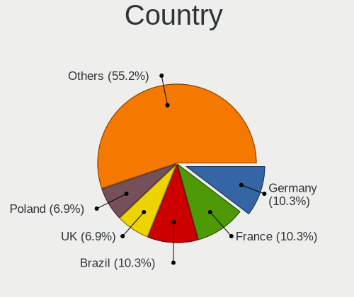
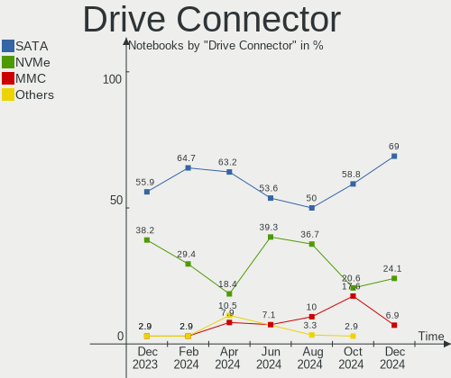
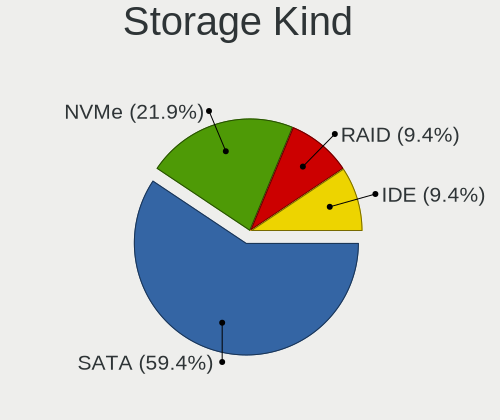
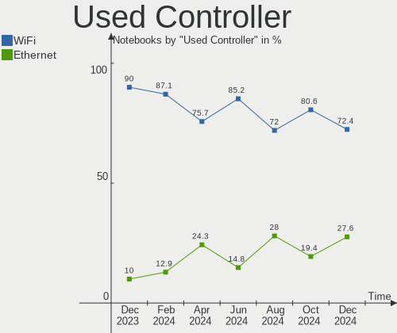
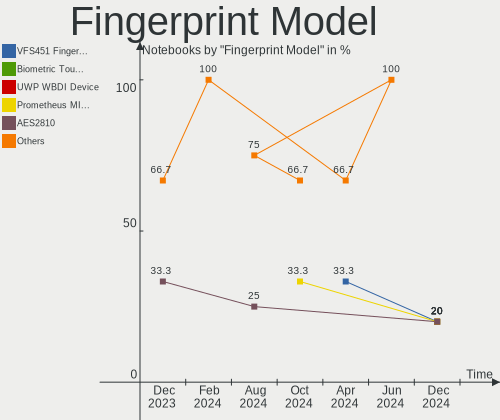
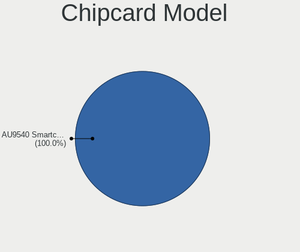

Xubuntu Hardware Trends (Notebooks)
-----------------------------------

A project to identify most popular hardware characteristics and track their change
over time based on data collected by Xubuntu users at https://Linux-Hardware.org.

Anyone can contribute to this report by the [hw-probe](https://github.com/linuxhw/hw-probe) tool:

    sudo -E hw-probe -all -upload

Full-feature report is available here: https://linux-hardware.org/?view=trends

Period: Feb, 2022.

Contents
--------

* [ System ](#system)
  - [ OS                       ](#os)
  - [ OS Family                ](#os-family)
  - [ Kernel                   ](#kernel)
  - [ Kernel Family            ](#kernel-family)
  - [ Kernel Major Ver.        ](#kernel-major-ver)
  - [ Arch                     ](#arch)
  - [ DE                       ](#de)
  - [ Display Server           ](#display-server)
  - [ Display Manager          ](#display-manager)
  - [ OS Lang                  ](#os-lang)
  - [ Boot Mode                ](#boot-mode)
  - [ Filesystem               ](#filesystem)
  - [ Part. scheme             ](#part-scheme)
  - [ Dual Boot with Linux/BSD ](#dual-boot-with-linuxbsd)
  - [ Dual Boot (Win)          ](#dual-boot-win)

* [ Board ](#board)
  - [ Vendor                   ](#vendor)
  - [ Model                    ](#model)
  - [ Model Family             ](#model-family)
  - [ MFG Year                 ](#mfg-year)
  - [ Form Factor              ](#form-factor)
  - [ Secure Boot              ](#secure-boot)
  - [ Coreboot                 ](#coreboot)
  - [ RAM Size                 ](#ram-size)
  - [ RAM Used                 ](#ram-used)
  - [ Total Drives             ](#total-drives)
  - [ Has CD-ROM               ](#has-cd-rom)
  - [ Has Ethernet             ](#has-ethernet)
  - [ Has WiFi                 ](#has-wifi)
  - [ Has Bluetooth            ](#has-bluetooth)

* [ Location ](#location)
  - [ Country                  ](#country)
  - [ City                     ](#city)

* [ Drives ](#drives)
  - [ Drive Vendor             ](#drive-vendor)
  - [ Drive Model              ](#drive-model)
  - [ HDD Vendor               ](#hdd-vendor)
  - [ SSD Vendor               ](#ssd-vendor)
  - [ Drive Kind               ](#drive-kind)
  - [ Drive Connector          ](#drive-connector)
  - [ Drive Size               ](#drive-size)
  - [ Space Total              ](#space-total)
  - [ Space Used               ](#space-used)
  - [ Malfunc. Drives          ](#malfunc-drives)
  - [ Malfunc. Drive Vendor    ](#malfunc-drive-vendor)
  - [ Malfunc. HDD Vendor      ](#malfunc-hdd-vendor)
  - [ Malfunc. Drive Kind      ](#malfunc-drive-kind)
  - [ Failed Drives            ](#failed-drives)
  - [ Failed Drive Vendor      ](#failed-drive-vendor)
  - [ Drive Status             ](#drive-status)

* [ Storage controller ](#storage-controller)
  - [ Storage Vendor           ](#storage-vendor)
  - [ Storage Model            ](#storage-model)
  - [ Storage Kind             ](#storage-kind)

* [ Processor ](#processor)
  - [ CPU Vendor               ](#cpu-vendor)
  - [ CPU Model                ](#cpu-model)
  - [ CPU Model Family         ](#cpu-model-family)
  - [ CPU Cores                ](#cpu-cores)
  - [ CPU Sockets              ](#cpu-sockets)
  - [ CPU Threads              ](#cpu-threads)
  - [ CPU Op-Modes             ](#cpu-op-modes)
  - [ CPU Microcode            ](#cpu-microcode)
  - [ CPU Microarch            ](#cpu-microarch)

* [ Graphics ](#graphics)
  - [ GPU Vendor               ](#gpu-vendor)
  - [ GPU Model                ](#gpu-model)
  - [ GPU Combo                ](#gpu-combo)
  - [ GPU Driver               ](#gpu-driver)
  - [ GPU Memory               ](#gpu-memory)

* [ Monitor ](#monitor)
  - [ Monitor Vendor           ](#monitor-vendor)
  - [ Monitor Model            ](#monitor-model)
  - [ Monitor Resolution       ](#monitor-resolution)
  - [ Monitor Diagonal         ](#monitor-diagonal)
  - [ Monitor Width            ](#monitor-width)
  - [ Aspect Ratio             ](#aspect-ratio)
  - [ Monitor Area             ](#monitor-area)
  - [ Pixel Density            ](#pixel-density)
  - [ Multiple Monitors        ](#multiple-monitors)

* [ Network ](#network)
  - [ Net Controller Vendor    ](#net-controller-vendor)
  - [ Net Controller Model     ](#net-controller-model)
  - [ Wireless Vendor          ](#wireless-vendor)
  - [ Wireless Model           ](#wireless-model)
  - [ Ethernet Vendor          ](#ethernet-vendor)
  - [ Ethernet Model           ](#ethernet-model)
  - [ Net Controller Kind      ](#net-controller-kind)
  - [ Used Controller          ](#used-controller)
  - [ NICs                     ](#nics)
  - [ IPv6                     ](#ipv6)

* [ Bluetooth ](#bluetooth)
  - [ Bluetooth Vendor         ](#bluetooth-vendor)
  - [ Bluetooth Model          ](#bluetooth-model)

* [ Sound ](#sound)
  - [ Sound Vendor             ](#sound-vendor)
  - [ Sound Model              ](#sound-model)

* [ Memory ](#memory)
  - [ Memory Vendor            ](#memory-vendor)
  - [ Memory Model             ](#memory-model)
  - [ Memory Kind              ](#memory-kind)
  - [ Memory Form Factor       ](#memory-form-factor)
  - [ Memory Size              ](#memory-size)
  - [ Memory Speed             ](#memory-speed)

* [ Printers & scanners ](#printers--scanners)
  - [ Printer Vendor           ](#printer-vendor)
  - [ Printer Model            ](#printer-model)
  - [ Scanner Vendor           ](#scanner-vendor)
  - [ Scanner Model            ](#scanner-model)

* [ Camera ](#camera)
  - [ Camera Vendor            ](#camera-vendor)
  - [ Camera Model             ](#camera-model)

* [ Security ](#security)
  - [ Fingerprint Vendor       ](#fingerprint-vendor)
  - [ Fingerprint Model        ](#fingerprint-model)
  - [ Chipcard Vendor          ](#chipcard-vendor)
  - [ Chipcard Model           ](#chipcard-model)

* [ Unsupported ](#unsupported)
  - [ Unsupported Devices      ](#unsupported-devices)
  - [ Unsupported Device Types ](#unsupported-device-types)

System
------

OS
--

Installed operating systems

| Name          | Notebooks | Percent |
|---------------|-----------|---------|
| Xubuntu 20.04 | 20        | 54.05%  |
| Xubuntu 18.04 | 7         | 18.92%  |
| Xubuntu 21.10 | 6         | 16.22%  |
| Xubuntu 21.04 | 2         | 5.41%   |
| Xubuntu 16.04 | 2         | 5.41%   |

OS Family
---------

OS without a version

| Name    | Notebooks | Percent |
|---------|-----------|---------|
| Xubuntu | 37        | 100%    |

Kernel
------

Version of the Linux kernel

| Version               | Notebooks | Percent |
|-----------------------|-----------|---------|
| 5.13.0-28-generic     | 7         | 18.92%  |
| 5.13.0-30-generic     | 6         | 16.22%  |
| 5.4.0-97-generic      | 5         | 13.51%  |
| 5.13.0-30-lowlatency  | 2         | 5.41%   |
| 5.8.0-53-generic      | 1         | 2.7%    |
| 5.4.0-99-lowlatency   | 1         | 2.7%    |
| 5.4.0-96-generic      | 1         | 2.7%    |
| 5.4.0-90-generic      | 1         | 2.7%    |
| 5.4.0-80-generic      | 1         | 2.7%    |
| 5.4.0-42-generic      | 1         | 2.7%    |
| 5.14.0-051400-generic | 1         | 2.7%    |
| 5.13.0-28-lowlatency  | 1         | 2.7%    |
| 5.13.0-27-lowlatency  | 1         | 2.7%    |
| 5.13.0-27-generic     | 1         | 2.7%    |
| 5.13.0-1029-oem       | 1         | 2.7%    |
| 5.11.0-49-generic     | 1         | 2.7%    |
| 4.4.0-210-generic     | 1         | 2.7%    |
| 4.16.18-galliumos     | 1         | 2.7%    |
| 4.15.0-167-generic    | 1         | 2.7%    |
| 4.15.0-153-generic    | 1         | 2.7%    |
| 4.15.0-142-generic    | 1         | 2.7%    |

Kernel Family
-------------

Linux kernel without a distro release

| Version | Notebooks | Percent |
|---------|-----------|---------|
| 5.13.0  | 19        | 51.35%  |
| 5.4.0   | 10        | 27.03%  |
| 4.15.0  | 3         | 8.11%   |
| 5.8.0   | 1         | 2.7%    |
| 5.14.0  | 1         | 2.7%    |
| 5.11.0  | 1         | 2.7%    |
| 4.4.0   | 1         | 2.7%    |
| 4.16.18 | 1         | 2.7%    |

Kernel Major Ver.
-----------------

Linux kernel major version

| Version | Notebooks | Percent |
|---------|-----------|---------|
| 5.13    | 19        | 51.35%  |
| 5.4     | 10        | 27.03%  |
| 4.15    | 3         | 8.11%   |
| 5.8     | 1         | 2.7%    |
| 5.14    | 1         | 2.7%    |
| 5.11    | 1         | 2.7%    |
| 4.4     | 1         | 2.7%    |
| 4.16    | 1         | 2.7%    |

Arch
----

OS architecture (x86_64, i586, etc.)

| Name   | Notebooks | Percent |
|--------|-----------|---------|
| x86_64 | 32        | 86.49%  |
| i686   | 5         | 13.51%  |

DE
--

Desktop Environment

| Name  | Notebooks | Percent |
|-------|-----------|---------|
| XFCE  | 36        | 97.3%   |
| GNOME | 1         | 2.7%    |

Display Server
--------------

X11 or Wayland

| Name | Notebooks | Percent |
|------|-----------|---------|
| X11  | 37        | 100%    |

Display Manager
---------------

SDDM, LightDM, etc.

| Name    | Notebooks | Percent |
|---------|-----------|---------|
| LightDM | 31        | 83.78%  |
| Unknown | 2         | 5.41%   |
| SDDM    | 1         | 2.7%    |
| LXDM    | 1         | 2.7%    |
| GDM3    | 1         | 2.7%    |
| GDM     | 1         | 2.7%    |

OS Lang
-------

Language

| Lang  | Notebooks | Percent |
|-------|-----------|---------|
| en_US | 11        | 29.73%  |
| fr_FR | 10        | 27.03%  |
| de_DE | 6         | 16.22%  |
| it_IT | 2         | 5.41%   |
| ru_RU | 1         | 2.7%    |
| nl_NL | 1         | 2.7%    |
| es_VE | 1         | 2.7%    |
| es_ES | 1         | 2.7%    |
| en_GB | 1         | 2.7%    |
| en_CA | 1         | 2.7%    |
| en_AU | 1         | 2.7%    |
| cs_CZ | 1         | 2.7%    |

Boot Mode
---------

EFI or BIOS

| Mode | Notebooks | Percent |
|------|-----------|---------|
| BIOS | 22        | 59.46%  |
| EFI  | 15        | 40.54%  |

Filesystem
----------

Type of filesystem

| Type    | Notebooks | Percent |
|---------|-----------|---------|
| Ext4    | 34        | 91.89%  |
| Zfs     | 1         | 2.7%    |
| Overlay | 1         | 2.7%    |
| Ext3    | 1         | 2.7%    |

Part. scheme
------------

Scheme of partitioning

| Type    | Notebooks | Percent |
|---------|-----------|---------|
| Unknown | 25        | 67.57%  |
| GPT     | 7         | 18.92%  |
| MBR     | 5         | 13.51%  |

Dual Boot with Linux/BSD
------------------------

Hosting more than one Linux/BSD

| Dual boot | Notebooks | Percent |
|-----------|-----------|---------|
| No        | 33        | 89.19%  |
| Yes       | 4         | 10.81%  |

Dual Boot (Win)
---------------

Hosting Linux and Windows

| Dual boot | Notebooks | Percent |
|-----------|-----------|---------|
| No        | 24        | 64.86%  |
| Yes       | 13        | 35.14%  |

Board
-----

Vendor
------

Motherboard manufacturer

| Name                | Notebooks | Percent |
|---------------------|-----------|---------|
| Hewlett-Packard     | 9         | 24.32%  |
| Lenovo              | 8         | 21.62%  |
| Dell                | 5         | 13.51%  |
| ASUSTek Computer    | 5         | 13.51%  |
| Acer                | 2         | 5.41%   |
| VIT                 | 1         | 2.7%    |
| Sony                | 1         | 2.7%    |
| Samsung Electronics | 1         | 2.7%    |
| Medion              | 1         | 2.7%    |
| IBM                 | 1         | 2.7%    |
| Google              | 1         | 2.7%    |
| Gateway             | 1         | 2.7%    |
| Fujitsu             | 1         | 2.7%    |

Model
-----

Motherboard model

| Name                                     | Notebooks | Percent |
|------------------------------------------|-----------|---------|
| VIT P3400                                | 1         | 2.7%    |
| Sony VPCEB3E1E                           | 1         | 2.7%    |
| Samsung 900X1B                           | 1         | 2.7%    |
| Medion E16402                            | 1         | 2.7%    |
| Lenovo XiaoXinPro 16ACH 2021 82L5        | 1         | 2.7%    |
| Lenovo ThinkPad W510 431963G             | 1         | 2.7%    |
| Lenovo ThinkPad T510 4384VJM             | 1         | 2.7%    |
| Lenovo ThinkPad T410 2522W6G             | 1         | 2.7%    |
| Lenovo ThinkPad T14s Gen 1 20UHCTO1WW    | 1         | 2.7%    |
| Lenovo ThinkPad R500 2716A54             | 1         | 2.7%    |
| Lenovo ThinkPad L480 20LS001AMD          | 1         | 2.7%    |
| IBM ThinkPad T43 2668BU7                 | 1         | 2.7%    |
| HP Stream Notebook PC 13                 | 1         | 2.7%    |
| HP ProBook 655 G1                        | 1         | 2.7%    |
| HP ProBook 650 G3                        | 1         | 2.7%    |
| HP Pavilion 17                           | 1         | 2.7%    |
| HP EliteBook 8560p                       | 1         | 2.7%    |
| HP EliteBook 8530p                       | 1         | 2.7%    |
| HP EliteBook 725 G2                      | 1         | 2.7%    |
| HP Compaq nc6320 (RH374EA#AKB)           | 1         | 2.7%    |
| HP 15                                    | 1         | 2.7%    |
| Google Banon                             | 1         | 2.7%    |
| Gateway M-6307                           | 1         | 2.7%    |
| Fujitsu LIFEBOOK E734                    | 1         | 2.7%    |
| Dell Vostro V130                         | 1         | 2.7%    |
| Dell Precision 3561                      | 1         | 2.7%    |
| Dell Latitude E5450                      | 1         | 2.7%    |
| Dell Inspiron 5593                       | 1         | 2.7%    |
| Dell Inspiron 1764                       | 1         | 2.7%    |
| ASUS X542URR                             | 1         | 2.7%    |
| ASUS VivoBook_ASUSLaptop X515EA_P1511CEA | 1         | 2.7%    |
| ASUS K73SV                               | 1         | 2.7%    |
| ASUS ASUS TUF Gaming F15 FX507ZE_FX507ZE | 1         | 2.7%    |
| ASUS A2D                                 | 1         | 2.7%    |
| Acer TravelMate 8172                     | 1         | 2.7%    |
| Acer Aspire 5100                         | 1         | 2.7%    |
| Unknown                                  | 1         | 2.7%    |

Model Family
------------

Motherboard model prefix

| Name              | Notebooks | Percent |
|-------------------|-----------|---------|
| Lenovo ThinkPad   | 6         | 16.22%  |
| HP EliteBook      | 3         | 8.11%   |
| HP ProBook        | 2         | 5.41%   |
| Dell Inspiron     | 2         | 5.41%   |
| VIT P3400         | 1         | 2.7%    |
| Sony VPCEB3E1E    | 1         | 2.7%    |
| Samsung 900X1B    | 1         | 2.7%    |
| Medion E16402     | 1         | 2.7%    |
| Lenovo XiaoXinPro | 1         | 2.7%    |
| IBM ThinkPad      | 1         | 2.7%    |
| HP Stream         | 1         | 2.7%    |
| HP Pavilion       | 1         | 2.7%    |
| HP Compaq         | 1         | 2.7%    |
| HP 15             | 1         | 2.7%    |
| Google Banon      | 1         | 2.7%    |
| Gateway M-6307    | 1         | 2.7%    |
| Fujitsu LIFEBOOK  | 1         | 2.7%    |
| Dell Vostro       | 1         | 2.7%    |
| Dell Precision    | 1         | 2.7%    |
| Dell Latitude     | 1         | 2.7%    |
| ASUS X542URR      | 1         | 2.7%    |
| ASUS VivoBook     | 1         | 2.7%    |
| ASUS K73SV        | 1         | 2.7%    |
| ASUS ASUS         | 1         | 2.7%    |
| ASUS A2D          | 1         | 2.7%    |
| Acer TravelMate   | 1         | 2.7%    |
| Acer Aspire       | 1         | 2.7%    |
| Unknown           | 1         | 2.7%    |

MFG Year
--------

Motherboard manufacture year

| Year | Notebooks | Percent |
|------|-----------|---------|
| 2021 | 5         | 13.51%  |
| 2014 | 5         | 13.51%  |
| 2011 | 4         | 10.81%  |
| 2013 | 3         | 8.11%   |
| 2010 | 3         | 8.11%   |
| 2009 | 3         | 8.11%   |
| 2008 | 3         | 8.11%   |
| 2022 | 1         | 2.7%    |
| 2020 | 1         | 2.7%    |
| 2019 | 1         | 2.7%    |
| 2018 | 1         | 2.7%    |
| 2017 | 1         | 2.7%    |
| 2016 | 1         | 2.7%    |
| 2015 | 1         | 2.7%    |
| 2007 | 1         | 2.7%    |
| 2006 | 1         | 2.7%    |
| 2005 | 1         | 2.7%    |
| 2004 | 1         | 2.7%    |

Form Factor
-----------

Physical design of the computer

| Name     | Notebooks | Percent |
|----------|-----------|---------|
| Notebook | 37        | 100%    |

Secure Boot
-----------

Enabled or disabled

| State    | Notebooks | Percent |
|----------|-----------|---------|
| Disabled | 34        | 91.89%  |
| Enabled  | 3         | 8.11%   |

Coreboot
--------

Have coreboot on board

| Used | Notebooks | Percent |
|------|-----------|---------|
| No   | 36        | 97.3%   |
| Yes  | 1         | 2.7%    |

RAM Size
--------

Total RAM memory

| Size in GB | Notebooks | Percent |
|------------|-----------|---------|
| 4.01-8.0   | 11        | 29.73%  |
| 3.01-4.0   | 10        | 27.03%  |
| 1.01-2.0   | 6         | 16.22%  |
| 8.01-16.0  | 5         | 13.51%  |
| 32.01-64.0 | 2         | 5.41%   |
| 2.01-3.0   | 1         | 2.7%    |
| 16.01-24.0 | 1         | 2.7%    |
| 0.01-0.5   | 1         | 2.7%    |

RAM Used
--------

Used RAM memory

| Used GB   | Notebooks | Percent |
|-----------|-----------|---------|
| 1.01-2.0  | 12        | 32.43%  |
| 0.51-1.0  | 9         | 24.32%  |
| 3.01-4.0  | 6         | 16.22%  |
| 2.01-3.0  | 5         | 13.51%  |
| 4.01-8.0  | 3         | 8.11%   |
| 8.01-16.0 | 1         | 2.7%    |
| 0.01-0.5  | 1         | 2.7%    |

Total Drives
------------

Number of drives on board

| Drives | Notebooks | Percent |
|--------|-----------|---------|
| 1      | 28        | 75.68%  |
| 2      | 8         | 21.62%  |
| 3      | 1         | 2.7%    |

Has CD-ROM
----------

Has CD-ROM on board

| Presented | Notebooks | Percent |
|-----------|-----------|---------|
| Yes       | 21        | 56.76%  |
| No        | 16        | 43.24%  |

Has Ethernet
------------

Has Ethernet on board

| Presented | Notebooks | Percent |
|-----------|-----------|---------|
| Yes       | 32        | 86.49%  |
| No        | 5         | 13.51%  |

Has WiFi
--------

Has WiFi module

| Presented | Notebooks | Percent |
|-----------|-----------|---------|
| Yes       | 36        | 97.3%   |
| No        | 1         | 2.7%    |

Has Bluetooth
-------------

Has Bluetooth module

| Presented | Notebooks | Percent |
|-----------|-----------|---------|
| Yes       | 21        | 56.76%  |
| No        | 16        | 43.24%  |

Location
--------

Country
-------

Geographic location (country)

| Country     | Notebooks | Percent |
|-------------|-----------|---------|
| France      | 9         | 24.32%  |
| Germany     | 7         | 18.92%  |
| USA         | 5         | 13.51%  |
| Netherlands | 2         | 5.41%   |
| Italy       | 2         | 5.41%   |
| Venezuela   | 1         | 2.7%    |
| Ukraine     | 1         | 2.7%    |
| UK          | 1         | 2.7%    |
| Turkey      | 1         | 2.7%    |
| Spain       | 1         | 2.7%    |
| Russia      | 1         | 2.7%    |
| Romania     | 1         | 2.7%    |
| Denmark     | 1         | 2.7%    |
| Czechia     | 1         | 2.7%    |
| Canada      | 1         | 2.7%    |
| Austria     | 1         | 2.7%    |
| Australia   | 1         | 2.7%    |

City
----

Geographic location (city)

| City                | Notebooks | Percent |
|---------------------|-----------|---------|
| Barcelona           | 2         | 5.41%   |
| Zuidland            | 1         | 2.7%    |
| Walsall             | 1         | 2.7%    |
| Vienna              | 1         | 2.7%    |
| Sydney              | 1         | 2.7%    |
| Stuttgart           | 1         | 2.7%    |
| Seyssinet-Pariset   | 1         | 2.7%    |
| Schrobenhausen      | 1         | 2.7%    |
| Saint-Ouen-l'Aumone | 1         | 2.7%    |
| Roseburg            | 1         | 2.7%    |
| Rians               | 1         | 2.7%    |
| Rennes              | 1         | 2.7%    |
| Prague              | 1         | 2.7%    |
| Poltava             | 1         | 2.7%    |
| Paris               | 1         | 2.7%    |
| Ottawa              | 1         | 2.7%    |
| Odense              | 1         | 2.7%    |
| Nogara di Piana     | 1         | 2.7%    |
| Naaldwijk           | 1         | 2.7%    |
| Murmansk            | 1         | 2.7%    |
| Los Angeles         | 1         | 2.7%    |
| Leipzig             | 1         | 2.7%    |
| Le Taillan-Medoc    | 1         | 2.7%    |
| Lavelanet           | 1         | 2.7%    |
| Krefeld             | 1         | 2.7%    |
| Kofering            | 1         | 2.7%    |
| Hanover             | 1         | 2.7%    |
| Fourneaux-le-Val    | 1         | 2.7%    |
| Fort Worth          | 1         | 2.7%    |
| Dripping Springs    | 1         | 2.7%    |
| Decimoputzu         | 1         | 2.7%    |
| Bucharest           | 1         | 2.7%    |
| Brest               | 1         | 2.7%    |
| Berlin              | 1         | 2.7%    |
| Atlanta             | 1         | 2.7%    |
| Ankara              | 1         | 2.7%    |

Drives
------

Drive Vendor
------------

Hard drive vendors

| Vendor              | Notebooks | Drives | Percent |
|---------------------|-----------|--------|---------|
| Seagate             | 9         | 9      | 21.43%  |
| Samsung Electronics | 7         | 7      | 16.67%  |
| WDC                 | 6         | 6      | 14.29%  |
| Unknown             | 5         | 6      | 11.9%   |
| Hitachi             | 3         | 3      | 7.14%   |
| Toshiba             | 2         | 2      | 4.76%   |
| HGST                | 2         | 2      | 4.76%   |
| Silicon Motion      | 1         | 1      | 2.38%   |
| SanDisk             | 1         | 1      | 2.38%   |
| Phison              | 1         | 1      | 2.38%   |
| LITEONIT            | 1         | 1      | 2.38%   |
| KIOXIA              | 1         | 1      | 2.38%   |
| Intel               | 1         | 1      | 2.38%   |
| IBM/Hitachi         | 1         | 1      | 2.38%   |
| Gigabyte Technology | 1         | 1      | 2.38%   |

Drive Model
-----------

Hard drive models

| Model                                   | Notebooks | Percent |
|-----------------------------------------|-----------|---------|
| Seagate ST9500325AS 500GB               | 2         | 4.65%   |
| WDC WD7500BPVX-00JC3T0 752GB            | 1         | 2.33%   |
| WDC WD5000LPLX-60ZNTT1 500GB            | 1         | 2.33%   |
| WDC WD5000BEVT-22ZAT0 500GB             | 1         | 2.33%   |
| WDC WD3200BEVT-60ZCT1 320GB             | 1         | 2.33%   |
| WDC WD10JPVX-22JC3T0 1TB                | 1         | 2.33%   |
| WDC PC SN530 SDBPNPZ-256G-1002 256GB    | 1         | 2.33%   |
| Unknown SA08G  8GB                      | 1         | 2.33%   |
| Unknown MMC Card  64GB                  | 1         | 2.33%   |
| Unknown MMC Card  32GB                  | 1         | 2.33%   |
| Unknown MMC Card  2GB                   | 1         | 2.33%   |
| Unknown MMC Card  16GB                  | 1         | 2.33%   |
| Unknown BGND3R  32GB                    | 1         | 2.33%   |
| Toshiba MQ01ACF050 500GB                | 1         | 2.33%   |
| Toshiba KBG40ZNS512G NVMe 512GB         | 1         | 2.33%   |
| Silicon Motion NVMe SSD Drive 1024GB    | 1         | 2.33%   |
| Seagate ST95005620AS 500GB              | 1         | 2.33%   |
| Seagate ST9500423AS 500GB               | 1         | 2.33%   |
| Seagate ST9320423AS 320GB               | 1         | 2.33%   |
| Seagate ST9320325AS 320GB               | 1         | 2.33%   |
| Seagate ST500LM012 HN-M500MBB 500GB     | 1         | 2.33%   |
| Seagate ST1000LM035-1RK172 1TB          | 1         | 2.33%   |
| Seagate Expansion+ 2TB                  | 1         | 2.33%   |
| SanDisk SDSSDA120G 120GB                | 1         | 2.33%   |
| Samsung SSD 970 EVO Plus 2TB            | 1         | 2.33%   |
| Samsung SSD 750 EVO 250GB               | 1         | 2.33%   |
| Samsung MZVLB256HAHQ-000L7 256GB        | 1         | 2.33%   |
| Samsung MZMPA064HMDR-00000 64GB SSD     | 1         | 2.33%   |
| Samsung MZ7TE256HMHP-00004 256GB SSD    | 1         | 2.33%   |
| Samsung MZ7PD128HCFV-000H1 128GB SSD    | 1         | 2.33%   |
| Samsung HM500JI 500GB                   | 1         | 2.33%   |
| Phison E12S-512G-PHISON-SSD-BICS4 512GB | 1         | 2.33%   |
| LITEONIT LMS-32L6M 32GB SSD             | 1         | 2.33%   |
| KIOXIA NVMe SSD Drive 512GB             | 1         | 2.33%   |
| Intel NVMe SSD Drive 512GB              | 1         | 2.33%   |
| IBM/Hitachi IC25N040ATMR04-0 40GB       | 1         | 2.33%   |
| Hitachi HTS725016A9A364 160GB           | 1         | 2.33%   |
| Hitachi HTS541060G9AT00 64GB            | 1         | 2.33%   |
| Hitachi HTS541010G9AT00 100GB           | 1         | 2.33%   |
| HGST HTS725050A7E630 500GB              | 1         | 2.33%   |
| HGST HTS545050A7E380 500GB              | 1         | 2.33%   |
| Gigabyte GP-GSTFS31256GTND 256GB SSD    | 1         | 2.33%   |

HDD Vendor
----------

Hard disk drive vendors

| Vendor              | Notebooks | Drives | Percent |
|---------------------|-----------|--------|---------|
| Seagate             | 9         | 9      | 40.91%  |
| WDC                 | 5         | 5      | 22.73%  |
| Hitachi             | 3         | 3      | 13.64%  |
| HGST                | 2         | 2      | 9.09%   |
| Toshiba             | 1         | 1      | 4.55%   |
| Samsung Electronics | 1         | 1      | 4.55%   |
| IBM/Hitachi         | 1         | 1      | 4.55%   |

SSD Vendor
----------

Solid state drive vendors

| Vendor              | Notebooks | Drives | Percent |
|---------------------|-----------|--------|---------|
| Samsung Electronics | 4         | 4      | 57.14%  |
| SanDisk             | 1         | 1      | 14.29%  |
| LITEONIT            | 1         | 1      | 14.29%  |
| Gigabyte Technology | 1         | 1      | 14.29%  |

Drive Kind
----------

HDD or SSD

| Kind | Notebooks | Drives | Percent |
|------|-----------|--------|---------|
| HDD  | 21        | 22     | 51.22%  |
| NVMe | 8         | 8      | 19.51%  |
| SSD  | 7         | 7      | 17.07%  |
| MMC  | 5         | 6      | 12.2%   |

Drive Connector
---------------

SATA, SAS, NVMe, etc.

| Type | Notebooks | Drives | Percent |
|------|-----------|--------|---------|
| SATA | 27        | 28     | 65.85%  |
| NVMe | 8         | 8      | 19.51%  |
| MMC  | 5         | 6      | 12.2%   |
| SAS  | 1         | 1      | 2.44%   |

Drive Size
----------

Size of hard drive

| Size in TB | Notebooks | Drives | Percent |
|------------|-----------|--------|---------|
| 0.01-0.5   | 25        | 25     | 86.21%  |
| 0.51-1.0   | 3         | 3      | 10.34%  |
| 1.01-2.0   | 1         | 1      | 3.45%   |

Space Total
-----------

Amount of disk space available on the file system

| Size in GB | Notebooks | Percent |
|------------|-----------|---------|
| 251-500    | 13        | 35.14%  |
| 101-250    | 8         | 21.62%  |
| 21-50      | 5         | 13.51%  |
| 51-100     | 4         | 10.81%  |
| 501-1000   | 3         | 8.11%   |
| 1001-2000  | 2         | 5.41%   |
| 1-20       | 1         | 2.7%    |
| Unknown    | 1         | 2.7%    |

Space Used
----------

Amount of used disk space

| Used GB  | Notebooks | Percent |
|----------|-----------|---------|
| 1-20     | 17        | 45.95%  |
| 21-50    | 8         | 21.62%  |
| 51-100   | 4         | 10.81%  |
| 101-250  | 3         | 8.11%   |
| 251-500  | 2         | 5.41%   |
| 501-1000 | 2         | 5.41%   |
| Unknown  | 1         | 2.7%    |

Malfunc. Drives
---------------

Drive models with a malfunction

| Model                      | Notebooks | Drives | Percent |
|----------------------------|-----------|--------|---------|
| WDC WD10JPVX-22JC3T0 1TB   | 1         | 1      | 50%     |
| Seagate ST95005620AS 500GB | 1         | 1      | 50%     |

Malfunc. Drive Vendor
---------------------

Vendors of faulty drives

| Vendor  | Notebooks | Drives | Percent |
|---------|-----------|--------|---------|
| WDC     | 1         | 1      | 50%     |
| Seagate | 1         | 1      | 50%     |

Malfunc. HDD Vendor
-------------------

Vendors of faulty HDD drives

| Vendor  | Notebooks | Drives | Percent |
|---------|-----------|--------|---------|
| WDC     | 1         | 1      | 50%     |
| Seagate | 1         | 1      | 50%     |

Malfunc. Drive Kind
-------------------

Kinds of faulty drives

| Kind | Notebooks | Drives | Percent |
|------|-----------|--------|---------|
| HDD  | 2         | 2      | 100%    |

Failed Drives
-------------

Failed drive models

Zero info for selected period =(

Failed Drive Vendor
-------------------

Failed drive vendors

Zero info for selected period =(

Drive Status
------------

Number of failed and malfunc. drives

| Status   | Notebooks | Drives | Percent |
|----------|-----------|--------|---------|
| Detected | 27        | 31     | 69.23%  |
| Works    | 10        | 10     | 25.64%  |
| Malfunc  | 2         | 2      | 5.13%   |

Storage controller
------------------

Storage Vendor
--------------

Storage controller vendors

| Vendor                           | Notebooks | Percent |
|----------------------------------|-----------|---------|
| Intel                            | 25        | 64.1%   |
| AMD                              | 6         | 15.38%  |
| Samsung Electronics              | 2         | 5.13%   |
| KIOXIA                           | 2         | 5.13%   |
| Silicon Motion                   | 1         | 2.56%   |
| Silicon Integrated Systems [SiS] | 1         | 2.56%   |
| Sandisk                          | 1         | 2.56%   |
| Phison Electronics               | 1         | 2.56%   |

Storage Model
-------------

Storage controller models

| Model                                                                          | Notebooks | Percent |
|--------------------------------------------------------------------------------|-----------|---------|
| AMD FCH SATA Controller [AHCI mode]                                            | 5         | 11.11%  |
| Intel 6 Series/C200 Series Chipset Family 6 port Mobile SATA AHCI Controller   | 3         | 6.67%   |
| Intel 5 Series/3400 Series Chipset 6 port SATA AHCI Controller                 | 3         | 6.67%   |
| Intel 5 Series/3400 Series Chipset 4 port SATA AHCI Controller                 | 3         | 6.67%   |
| Samsung NVMe SSD Controller SM981/PM981/PM983                                  | 2         | 4.44%   |
| KIOXIA Non-Volatile memory controller                                          | 2         | 4.44%   |
| Intel Volume Management Device NVMe RAID Controller                            | 2         | 4.44%   |
| Intel Sunrise Point-LP SATA Controller [AHCI mode]                             | 2         | 4.44%   |
| Silicon Motion SM2263EN/SM2263XT SSD Controller                                | 1         | 2.22%   |
| Silicon Integrated Systems [SiS] 5513 IDE Controller                           | 1         | 2.22%   |
| Sandisk WD Blue SN550 NVMe SSD                                                 | 1         | 2.22%   |
| Phison E12 NVMe Controller                                                     | 1         | 2.22%   |
| Intel Wildcat Point-LP SATA Controller [AHCI Mode]                             | 1         | 2.22%   |
| Intel Tiger Lake-LP SATA Controller [AHCI mode]                                | 1         | 2.22%   |
| Intel Non-Volatile memory controller                                           | 1         | 2.22%   |
| Intel Ice Lake-LP SATA Controller [AHCI mode]                                  | 1         | 2.22%   |
| Intel 82801IBM/IEM (ICH9M/ICH9M-E) 4 port SATA Controller [AHCI mode]          | 1         | 2.22%   |
| Intel 82801IBM/IEM (ICH9M/ICH9M-E) 2 port SATA Controller [IDE mode]           | 1         | 2.22%   |
| Intel 82801HM/HEM (ICH8M/ICH8M-E) SATA Controller [AHCI mode]                  | 1         | 2.22%   |
| Intel 82801HM/HEM (ICH8M/ICH8M-E) IDE Controller                               | 1         | 2.22%   |
| Intel 82801GBM/GHM (ICH7-M Family) SATA Controller [AHCI mode]                 | 1         | 2.22%   |
| Intel 82801G (ICH7 Family) IDE Controller                                      | 1         | 2.22%   |
| Intel 82801FBM (ICH6M) SATA Controller                                         | 1         | 2.22%   |
| Intel 82801 Mobile SATA Controller [RAID mode]                                 | 1         | 2.22%   |
| Intel 8 Series/C220 Series Chipset Family 6-port SATA Controller 1 [AHCI mode] | 1         | 2.22%   |
| Intel 7 Series Chipset Family 4-port SATA Controller [IDE mode]                | 1         | 2.22%   |
| Intel 7 Series Chipset Family 2-port SATA Controller [IDE mode]                | 1         | 2.22%   |
| Intel 500 Series Chipset Family SATA AHCI Controller                           | 1         | 2.22%   |
| Intel 5 Series/3400 Series Chipset 4 port SATA IDE Controller                  | 1         | 2.22%   |
| Intel 5 Series/3400 Series Chipset 2 port SATA IDE Controller                  | 1         | 2.22%   |
| AMD IXP SB4x0 IDE Controller                                                   | 1         | 2.22%   |

Storage Kind
------------

Kind of storage controller (IDE, SATA, NVMe, SAS, ...)

| Kind | Notebooks | Percent |
|------|-----------|---------|
| SATA | 24        | 55.81%  |
| NVMe | 8         | 18.6%   |
| IDE  | 8         | 18.6%   |
| RAID | 3         | 6.98%   |

Processor
---------

CPU Vendor
----------

Processor vendors

| Vendor | Notebooks | Percent |
|--------|-----------|---------|
| Intel  | 29        | 78.38%  |
| AMD    | 8         | 21.62%  |

CPU Model
---------

Processor models

| Model                                       | Notebooks | Percent |
|---------------------------------------------|-----------|---------|
| Intel Core 2 Duo CPU P8400 @ 2.26GHz        | 2         | 5.41%   |
| AMD A8-6410 APU with AMD Radeon R5 Graphics | 2         | 5.41%   |
| Intel Pentium M processor 1.86GHz           | 1         | 2.7%    |
| Intel Pentium Dual CPU T2330 @ 1.60GHz      | 1         | 2.7%    |
| Intel Pentium CPU P6100 @ 2.00GHz           | 1         | 2.7%    |
| Intel Core i7-8550U CPU @ 1.80GHz           | 1         | 2.7%    |
| Intel Core i7-5500U CPU @ 2.40GHz           | 1         | 2.7%    |
| Intel Core i7-4702MQ CPU @ 2.20GHz          | 1         | 2.7%    |
| Intel Core i7-2620M CPU @ 2.70GHz           | 1         | 2.7%    |
| Intel Core i7 CPU M 620 @ 2.67GHz           | 1         | 2.7%    |
| Intel Core i5-8250U CPU @ 1.60GHz           | 1         | 2.7%    |
| Intel Core i5-7200U CPU @ 2.50GHz           | 1         | 2.7%    |
| Intel Core i5-5300U CPU @ 2.30GHz           | 1         | 2.7%    |
| Intel Core i5-3337U CPU @ 1.80GHz           | 1         | 2.7%    |
| Intel Core i5-1035G1 CPU @ 1.00GHz          | 1         | 2.7%    |
| Intel Core i5 CPU M 540 @ 2.53GHz           | 1         | 2.7%    |
| Intel Core i5 CPU M 430 @ 2.27GHz           | 1         | 2.7%    |
| Intel Core i3-2357M CPU @ 1.30GHz           | 1         | 2.7%    |
| Intel Core i3-2310M CPU @ 2.10GHz           | 1         | 2.7%    |
| Intel Core i3 CPU U 330 @ 1.20GHz           | 1         | 2.7%    |
| Intel Core i3 CPU M 380 @ 2.53GHz           | 1         | 2.7%    |
| Intel Core 2 CPU T5600 @ 1.83GHz            | 1         | 2.7%    |
| Intel Celeron CPU U3600 @ 1.20GHz           | 1         | 2.7%    |
| Intel Celeron CPU N3160 @ 1.60GHz           | 1         | 2.7%    |
| Intel Celeron CPU N3050 @ 1.60GHz           | 1         | 2.7%    |
| Intel 12th Gen Core i7-12700H               | 1         | 2.7%    |
| Intel 11th Gen Core i7-11800H @ 2.30GHz     | 1         | 2.7%    |
| Intel 11th Gen Core i5-1135G7 @ 2.40GHz     | 1         | 2.7%    |
| Intel 11th Gen Core i3-1115G4 @ 3.00GHz     | 1         | 2.7%    |
| AMD Turion 64 X2 Mobile Technology TL-50    | 1         | 2.7%    |
| AMD Ryzen 7 PRO 4750U with Radeon Graphics  | 1         | 2.7%    |
| AMD Ryzen 7 5800H with Radeon Graphics      | 1         | 2.7%    |
| AMD mobile Athlon XP-M 2600+                | 1         | 2.7%    |
| AMD A8-5550M APU with Radeon HD Graphics    | 1         | 2.7%    |
| AMD A8 PRO-7150B R5, 10 Compute Cores 4C+6G | 1         | 2.7%    |

CPU Model Family
----------------

Processor model prefix

| Model                   | Notebooks | Percent |
|-------------------------|-----------|---------|
| Intel Core i5           | 7         | 18.92%  |
| Other                   | 5         | 13.51%  |
| Intel Core i7           | 5         | 13.51%  |
| Intel Core i3           | 4         | 10.81%  |
| AMD A8                  | 4         | 10.81%  |
| Intel Celeron           | 3         | 8.11%   |
| Intel Core 2 Duo        | 2         | 5.41%   |
| Intel Pentium M         | 1         | 2.7%    |
| Intel Pentium Dual      | 1         | 2.7%    |
| Intel Pentium           | 1         | 2.7%    |
| Intel Core 2            | 1         | 2.7%    |
| AMD Turion 64 X2 Mobile | 1         | 2.7%    |
| AMD Ryzen 7 PRO         | 1         | 2.7%    |
| AMD Ryzen 7             | 1         | 2.7%    |

CPU Cores
---------

Number of processor cores

| Number | Notebooks | Percent |
|--------|-----------|---------|
| 2      | 23        | 62.16%  |
| 4      | 8         | 21.62%  |
| 8      | 3         | 8.11%   |
| 1      | 2         | 5.41%   |
| 14     | 1         | 2.7%    |

CPU Sockets
-----------

Number of sockets

| Number | Notebooks | Percent |
|--------|-----------|---------|
| 1      | 37        | 100%    |

CPU Threads
-----------

Threads per core (Hyper-Threading)

| Number | Notebooks | Percent |
|--------|-----------|---------|
| 2      | 23        | 62.16%  |
| 1      | 14        | 37.84%  |

CPU Op-Modes
------------

CPU Operation Modes (32-bit, 64-bit)

| Op mode        | Notebooks | Percent |
|----------------|-----------|---------|
| 32-bit, 64-bit | 35        | 94.59%  |
| 32-bit         | 2         | 5.41%   |

CPU Microcode
-------------

Microcode number

| Number     | Notebooks | Percent |
|------------|-----------|---------|
| Unknown    | 7         | 18.92%  |
| 0x20655    | 5         | 13.51%  |
| 0x806ea    | 2         | 5.41%   |
| 0x806c1    | 2         | 5.41%   |
| 0x206a7    | 2         | 5.41%   |
| 0x1067a    | 2         | 5.41%   |
| 0x906a3    | 1         | 2.7%    |
| 0x806e9    | 1         | 2.7%    |
| 0x806d1    | 1         | 2.7%    |
| 0x706e5    | 1         | 2.7%    |
| 0x6fd      | 1         | 2.7%    |
| 0x6f6      | 1         | 2.7%    |
| 0x6d8      | 1         | 2.7%    |
| 0x406c4    | 1         | 2.7%    |
| 0x406c3    | 1         | 2.7%    |
| 0x306d4    | 1         | 2.7%    |
| 0x306c3    | 1         | 2.7%    |
| 0x306a9    | 1         | 2.7%    |
| 0x20652    | 1         | 2.7%    |
| 0x08600106 | 1         | 2.7%    |
| 0x07030105 | 1         | 2.7%    |
| 0x06003106 | 1         | 2.7%    |
| 0x06001119 | 1         | 2.7%    |

CPU Microarch
-------------

Microarchitecture

| Name             | Notebooks | Percent |
|------------------|-----------|---------|
| Westmere         | 7         | 18.92%  |
| SandyBridge      | 3         | 8.11%   |
| KabyLake         | 3         | 8.11%   |
| TigerLake        | 2         | 5.41%   |
| Silvermont       | 2         | 5.41%   |
| Puma             | 2         | 5.41%   |
| Penryn           | 2         | 5.41%   |
| IceLake          | 2         | 5.41%   |
| Core             | 2         | 5.41%   |
| Broadwell        | 2         | 5.41%   |
| Zen 3            | 1         | 2.7%    |
| Zen 2            | 1         | 2.7%    |
| Steamroller      | 1         | 2.7%    |
| Piledriver       | 1         | 2.7%    |
| P6               | 1         | 2.7%    |
| K8 Hammer        | 1         | 2.7%    |
| K6               | 1         | 2.7%    |
| IvyBridge        | 1         | 2.7%    |
| Haswell          | 1         | 2.7%    |
| Alderlake Hybrid | 1         | 2.7%    |

Graphics
--------

GPU Vendor
----------

Vendors of graphics cards

| Vendor | Notebooks | Percent |
|--------|-----------|---------|
| Intel  | 24        | 55.81%  |
| AMD    | 11        | 25.58%  |
| Nvidia | 8         | 18.6%   |

GPU Model
---------

Graphics card models

| Model                                                                                    | Notebooks | Percent |
|------------------------------------------------------------------------------------------|-----------|---------|
| Intel Core Processor Integrated Graphics Controller                                      | 4         | 8.7%    |
| Intel 2nd Generation Core Processor Family Integrated Graphics Controller                | 3         | 6.52%   |
| Intel UHD Graphics 620                                                                   | 2         | 4.35%   |
| Intel HD Graphics 5500                                                                   | 2         | 4.35%   |
| Intel Atom/Celeron/Pentium Processor x5-E8000/J3xxx/N3xxx Integrated Graphics Controller | 2         | 4.35%   |
| AMD Mullins [Radeon R4/R5 Graphics]                                                      | 2         | 4.35%   |
| Nvidia TU117M [GeForce GTX 1650 Mobile / Max-Q]                                          | 1         | 2.17%   |
| Nvidia TU117GLM [T1200 Laptop GPU]                                                       | 1         | 2.17%   |
| Nvidia GT218M [NVS 3100M]                                                                | 1         | 2.17%   |
| Nvidia GT216GLM [Quadro FX 880M]                                                         | 1         | 2.17%   |
| Nvidia GM108M [GeForce 930MX]                                                            | 1         | 2.17%   |
| Nvidia GM108M [GeForce 840M]                                                             | 1         | 2.17%   |
| Nvidia GF108M [GeForce GT 540M]                                                          | 1         | 2.17%   |
| Nvidia GA107M [GeForce RTX 3050 Ti Mobile]                                               | 1         | 2.17%   |
| Intel TigerLake-LP GT2 [Iris Xe Graphics]                                                | 1         | 2.17%   |
| Intel TigerLake-H GT1 [UHD Graphics]                                                     | 1         | 2.17%   |
| Intel Tiger Lake UHD Graphics                                                            | 1         | 2.17%   |
| Intel Mobile GM965/GL960 Integrated Graphics Controller (secondary)                      | 1         | 2.17%   |
| Intel Mobile GM965/GL960 Integrated Graphics Controller (primary)                        | 1         | 2.17%   |
| Intel Mobile 945GM/GMS/GME, 943/940GML Express Integrated Graphics Controller            | 1         | 2.17%   |
| Intel Mobile 945GM/GMS, 943/940GML Express Integrated Graphics Controller                | 1         | 2.17%   |
| Intel Mobile 4 Series Chipset Integrated Graphics Controller                             | 1         | 2.17%   |
| Intel Iris Plus Graphics G1 (Ice Lake)                                                   | 1         | 2.17%   |
| Intel HD Graphics 620                                                                    | 1         | 2.17%   |
| Intel Alder Lake-P Integrated Graphics Controller                                        | 1         | 2.17%   |
| Intel 4th Gen Core Processor Integrated Graphics Controller                              | 1         | 2.17%   |
| Intel 3rd Gen Core processor Graphics Controller                                         | 1         | 2.17%   |
| AMD Sun LE [Radeon HD 8550M / R5 M230]                                                   | 1         | 2.17%   |
| AMD RV635/M86 [Mobility Radeon HD 3650]                                                  | 1         | 2.17%   |
| AMD RV370/M22 [Mobility Radeon X300]                                                     | 1         | 2.17%   |
| AMD RV350/M10 / RV360/M11 [Mobility Radeon 9600 (PRO) / 9700]                            | 1         | 2.17%   |
| AMD RS482M [Mobility Radeon Xpress 200]                                                  | 1         | 2.17%   |
| AMD Richland [Radeon HD 8550G]                                                           | 1         | 2.17%   |
| AMD Renoir                                                                               | 1         | 2.17%   |
| AMD Park [Mobility Radeon HD 5430/5450/5470]                                             | 1         | 2.17%   |
| AMD Kaveri [Radeon R6 Graphics]                                                          | 1         | 2.17%   |
| AMD Cezanne                                                                              | 1         | 2.17%   |

GPU Combo
---------

Combinations of graphics cards

| Name           | Notebooks | Percent |
|----------------|-----------|---------|
| 1 x Intel      | 19        | 51.35%  |
| 1 x AMD        | 9         | 24.32%  |
| Intel + Nvidia | 5         | 13.51%  |
| 1 x Nvidia     | 2         | 5.41%   |
| 2 x AMD        | 1         | 2.7%    |
| AMD + Nvidia   | 1         | 2.7%    |

GPU Driver
----------

Free vs proprietary

| Driver      | Notebooks | Percent |
|-------------|-----------|---------|
| Free        | 31        | 83.78%  |
| Proprietary | 5         | 13.51%  |
| Unknown     | 1         | 2.7%    |

GPU Memory
----------

Total video memory

| Size in GB | Notebooks | Percent |
|------------|-----------|---------|
| Unknown    | 23        | 62.16%  |
| 0.01-0.5   | 8         | 21.62%  |
| 0.51-1.0   | 3         | 8.11%   |
| 1.01-2.0   | 2         | 5.41%   |
| 3.01-4.0   | 1         | 2.7%    |

Monitor
-------

Monitor Vendor
--------------

Monitor vendors

| Vendor               | Notebooks | Percent |
|----------------------|-----------|---------|
| AU Optronics         | 10        | 26.32%  |
| Samsung Electronics  | 4         | 10.53%  |
| LG Display           | 4         | 10.53%  |
| Lenovo               | 3         | 7.89%   |
| Chimei Innolux       | 3         | 7.89%   |
| BOE                  | 3         | 7.89%   |
| LG Philips           | 2         | 5.26%   |
| Fujitsu Siemens      | 2         | 5.26%   |
| Sony                 | 1         | 2.63%   |
| Quanta Display       | 1         | 2.63%   |
| NEC Computers        | 1         | 2.63%   |
| MSI                  | 1         | 2.63%   |
| Lenovo Group Limited | 1         | 2.63%   |
| Goldstar             | 1         | 2.63%   |
| CSO                  | 1         | 2.63%   |

Monitor Model
-------------

Monitor models

| Model                                                                | Notebooks | Percent |
|----------------------------------------------------------------------|-----------|---------|
| Sony LCD Monitor SNY05FA 1366x768 340x190mm 15.3-inch                | 1         | 2.5%    |
| Samsung Electronics U28E570 SAM0D71 3840x2160 608x345mm 27.5-inch    | 1         | 2.5%    |
| Samsung Electronics LCD Monitor SEC4345 1280x800 331x207mm 15.4-inch | 1         | 2.5%    |
| Samsung Electronics LCD Monitor SEC3052 1366x768 256x144mm 11.6-inch | 1         | 2.5%    |
| Samsung Electronics LCD Monitor SAM0667 1920x1080                    | 1         | 2.5%    |
| Quanta Display LCD Monitor QDS0041 1280x800 331x207mm 15.4-inch      | 1         | 2.5%    |
| NEC Computers E222W NEC6777 1680x1050 474x296mm 22.0-inch            | 1         | 2.5%    |
| MSI G27C5 MSI3CA9 1920x1080 598x336mm 27.0-inch                      | 1         | 2.5%    |
| LG Philips LP154WX4-TLAB LPL3D01 1280x800 331x207mm 15.4-inch        | 1         | 2.5%    |
| LG Philips LCD Monitor LPLBB00 1024x768 304x228mm 15.0-inch          | 1         | 2.5%    |
| LG Display LCD Monitor LGD0468 1366x768 344x194mm 15.5-inch          | 1         | 2.5%    |
| LG Display LCD Monitor LGD02EC 1366x768 293x165mm 13.2-inch          | 1         | 2.5%    |
| LG Display LCD Monitor LGD02D1 1600x900 382x215mm 17.3-inch          | 1         | 2.5%    |
| LG Display LCD Monitor LGD021D 1600x900 382x215mm 17.3-inch          | 1         | 2.5%    |
| Lenovo LCD Monitor LEN40B1 1600x900 345x194mm 15.6-inch              | 1         | 2.5%    |
| Lenovo LCD Monitor LEN4050 1280x800 331x207mm 15.4-inch              | 1         | 2.5%    |
| Lenovo LCD Monitor LEN4036 1440x900 303x190mm 14.1-inch              | 1         | 2.5%    |
| Lenovo Group Limited LCD Monitor 1600x900                            | 1         | 2.5%    |
| Goldstar L1942 GSM4B86 1280x1024 376x301mm 19.0-inch                 | 1         | 2.5%    |
| Goldstar L1942 GSM4B85 1280x1024 376x301mm 19.0-inch                 | 1         | 2.5%    |
| Fujitsu Siemens H19-1 FUS0642 1280x1024 376x301mm 19.0-inch          | 1         | 2.5%    |
| Fujitsu Siemens B19-6 LED FUS07F2 1280x1024 376x301mm 19.0-inch      | 1         | 2.5%    |
| CSO LCD Monitor CSO1601 2560x1600 345x215mm 16.0-inch                | 1         | 2.5%    |
| Chimei Innolux LCD Monitor CMN1605 1920x1080 355x199mm 16.0-inch     | 1         | 2.5%    |
| Chimei Innolux LCD Monitor CMN15C5 1366x768 344x193mm 15.5-inch      | 1         | 2.5%    |
| Chimei Innolux LCD Monitor CMN14F2 1920x1080 309x173mm 13.9-inch     | 1         | 2.5%    |
| BOE LCD Monitor BOE0928 1920x1080 344x194mm 15.5-inch                | 1         | 2.5%    |
| BOE LCD Monitor BOE0819 1920x1080 344x194mm 15.5-inch                | 1         | 2.5%    |
| BOE LCD Monitor BOE05C7 1366x768 309x173mm 13.9-inch                 | 1         | 2.5%    |
| AU Optronics LCD Monitor AUO4199 1920x1080 344x193mm 15.5-inch       | 1         | 2.5%    |
| AU Optronics LCD Monitor AUO38ED 1920x1080 344x193mm 15.5-inch       | 1         | 2.5%    |
| AU Optronics LCD Monitor AUO35ED 1920x1080 344x193mm 15.5-inch       | 1         | 2.5%    |
| AU Optronics LCD Monitor AUO35EC 1366x768 340x190mm 15.3-inch        | 1         | 2.5%    |
| AU Optronics LCD Monitor AUO312C 1366x768 293x164mm 13.2-inch        | 1         | 2.5%    |
| AU Optronics LCD Monitor AUO243D 1920x1080 309x173mm 13.9-inch       | 1         | 2.5%    |
| AU Optronics LCD Monitor AUO215C 1366x768 256x144mm 11.6-inch        | 1         | 2.5%    |
| AU Optronics LCD Monitor AUO206C 1366x768 277x156mm 12.5-inch        | 1         | 2.5%    |
| AU Optronics LCD Monitor AUO159E 1600x900 382x214mm 17.2-inch        | 1         | 2.5%    |
| AU Optronics LCD Monitor AUO133D 1920x1080 309x173mm 13.9-inch       | 1         | 2.5%    |
| AU Optronics LCD Monitor AUO01EE 1600x900 344x193mm 15.5-inch        | 1         | 2.5%    |

Monitor Resolution
------------------

Monitor screen resolution

| Resolution         | Notebooks | Percent |
|--------------------|-----------|---------|
| 1366x768 (WXGA)    | 11        | 29.73%  |
| 1920x1080 (FHD)    | 10        | 27.03%  |
| 1600x900 (HD+)     | 6         | 16.22%  |
| 1280x800 (WXGA)    | 3         | 8.11%   |
| 1280x1024 (SXGA)   | 2         | 5.41%   |
| 3840x2160 (4K)     | 1         | 2.7%    |
| 2560x1600          | 1         | 2.7%    |
| 1680x1050 (WSXGA+) | 1         | 2.7%    |
| 1440x900 (WXGA+)   | 1         | 2.7%    |
| 1024x768 (XGA)     | 1         | 2.7%    |

Monitor Diagonal
----------------

Diagonal size in inches

| Inches  | Notebooks | Percent |
|---------|-----------|---------|
| 15      | 16        | 43.24%  |
| 13      | 5         | 13.51%  |
| 17      | 3         | 8.11%   |
| 27      | 2         | 5.41%   |
| 19      | 2         | 5.41%   |
| 16      | 2         | 5.41%   |
| 14      | 2         | 5.41%   |
| Unknown | 2         | 5.41%   |
| 22      | 1         | 2.7%    |
| 12      | 1         | 2.7%    |
| 11      | 1         | 2.7%    |

Monitor Width
-------------

Physical width

| Width in mm | Notebooks | Percent |
|-------------|-----------|---------|
| 301-350     | 22        | 61.11%  |
| 351-400     | 5         | 13.89%  |
| 201-300     | 4         | 11.11%  |
| Unknown     | 2         | 5.56%   |
| 601-700     | 1         | 2.78%   |
| 501-600     | 1         | 2.78%   |
| 401-500     | 1         | 2.78%   |

Aspect Ratio
------------

Proportional relationship between the width and the height

| Ratio   | Notebooks | Percent |
|---------|-----------|---------|
| 16/9    | 23        | 67.65%  |
| 16/10   | 7         | 20.59%  |
| 5/4     | 2         | 5.88%   |
| 4/3     | 1         | 2.94%   |
| Unknown | 1         | 2.94%   |

Monitor Area
------------

Area in inch

| Area in inch | Notebooks | Percent |
|----------------|-----------|---------|
| 101-110        | 16        | 43.24%  |
| 81-90          | 5         | 13.51%  |
| 121-130        | 3         | 8.11%   |
| 71-80          | 2         | 5.41%   |
| 301-350        | 2         | 5.41%   |
| 151-200        | 2         | 5.41%   |
| Unknown        | 2         | 5.41%   |
| 61-70          | 1         | 2.7%    |
| 51-60          | 1         | 2.7%    |
| 201-250        | 1         | 2.7%    |
| 111-120        | 1         | 2.7%    |
| 91-100         | 1         | 2.7%    |

Pixel Density
-------------

Pixels per inch

| Density | Notebooks | Percent |
|---------|-----------|---------|
| 101-120 | 13        | 34.21%  |
| 121-160 | 12        | 31.58%  |
| 51-100  | 9         | 23.68%  |
| 161-240 | 2         | 5.26%   |
| Unknown | 2         | 5.26%   |

Multiple Monitors
-----------------

Total monitors connected

| Total | Notebooks | Percent |
|-------|-----------|---------|
| 1     | 30        | 81.08%  |
| 2     | 4         | 10.81%  |
| 0     | 2         | 5.41%   |
| 4     | 1         | 2.7%    |

Network
-------

Net Controller Vendor
---------------------

Controller vendors

| Vendor                           | Notebooks | Percent |
|----------------------------------|-----------|---------|
| Intel                            | 19        | 32.2%   |
| Realtek Semiconductor            | 16        | 27.12%  |
| Qualcomm Atheros                 | 10        | 16.95%  |
| Broadcom                         | 8         | 13.56%  |
| Xiaomi                           | 1         | 1.69%   |
| Silicon Integrated Systems [SiS] | 1         | 1.69%   |
| Ralink                           | 1         | 1.69%   |
| Motorola PCS                     | 1         | 1.69%   |
| Marvell Technology Group         | 1         | 1.69%   |
| Broadcom Limited                 | 1         | 1.69%   |

Net Controller Model
--------------------

Controller models

| Model                                                                          | Notebooks | Percent |
|--------------------------------------------------------------------------------|-----------|---------|
| Realtek RTL8111/8168/8411 PCI Express Gigabit Ethernet Controller              | 8         | 10.81%  |
| Realtek RTL810xE PCI Express Fast Ethernet controller                          | 5         | 6.76%   |
| Intel 82577LM Gigabit Network Connection                                       | 3         | 4.05%   |
| Qualcomm Atheros QCA9565 / AR9565 Wireless Network Adapter                     | 2         | 2.7%    |
| Qualcomm Atheros QCA9377 802.11ac Wireless Network Adapter                     | 2         | 2.7%    |
| Qualcomm Atheros AR9485 Wireless Network Adapter                               | 2         | 2.7%    |
| Intel Wireless 8265 / 8275                                                     | 2         | 2.7%    |
| Intel Wireless 7265                                                            | 2         | 2.7%    |
| Intel Wi-Fi 6 AX201                                                            | 2         | 2.7%    |
| Intel Ethernet Connection (4) I219-V                                           | 2         | 2.7%    |
| Intel Centrino Wireless-N 1000 [Condor Peak]                                   | 2         | 2.7%    |
| Intel Centrino Advanced-N 6200                                                 | 2         | 2.7%    |
| Broadcom BCM43142 802.11b/g/n                                                  | 2         | 2.7%    |
| Xiaomi Mi/Redmi series (RNDIS)                                                 | 1         | 1.35%   |
| Silicon Integrated Systems [SiS] SiS900 PCI Fast Ethernet                      | 1         | 1.35%   |
| Silicon Integrated Systems [SiS] AC'97 Modem Controller                        | 1         | 1.35%   |
| Realtek RTL8852AE 802.11ax PCIe Wireless Network Adapter                       | 1         | 1.35%   |
| Realtek RTL8192EU 802.11b/g/n WLAN Adapter                                     | 1         | 1.35%   |
| Realtek RTL8187B Wireless 802.11g 54Mbps Network Adapter                       | 1         | 1.35%   |
| Realtek RTL-8100/8101L/8139 PCI Fast Ethernet Adapter                          | 1         | 1.35%   |
| Realtek 802.11ac NIC                                                           | 1         | 1.35%   |
| Ralink RT5390 Wireless 802.11n 1T/1R PCIe                                      | 1         | 1.35%   |
| Qualcomm Atheros QCA6174 802.11ac Wireless Network Adapter                     | 1         | 1.35%   |
| Qualcomm Atheros AR9285 Wireless Network Adapter (PCI-Express)                 | 1         | 1.35%   |
| Qualcomm Atheros AR8151 v2.0 Gigabit Ethernet                                  | 1         | 1.35%   |
| Qualcomm Atheros AR2413/AR2414 Wireless Network Adapter [AR5005G(S) 802.11bg]  | 1         | 1.35%   |
| Motorola PCS motorola edge                                                     | 1         | 1.35%   |
| Marvell Group Yukon Optima 88E8059 [PCIe Gigabit Ethernet Controller with AVB] | 1         | 1.35%   |
| Intel Wireless 7260                                                            | 1         | 1.35%   |
| Intel Wi-Fi 6 AX200                                                            | 1         | 1.35%   |
| Intel Ultimate N WiFi Link 5300                                                | 1         | 1.35%   |
| Intel PRO/Wireless 5100 AGN [Shiloh] Network Connection                        | 1         | 1.35%   |
| Intel PRO/Wireless 3945ABG [Golan] Network Connection                          | 1         | 1.35%   |
| Intel PRO/Wireless 2200BG [Calexico2] Network Connection                       | 1         | 1.35%   |
| Intel Ethernet Connection I217-LM                                              | 1         | 1.35%   |
| Intel Ethernet Connection (3) I218-LM                                          | 1         | 1.35%   |
| Intel Ethernet Connection (16) I219-LM                                         | 1         | 1.35%   |
| Intel Ethernet Connection (14) I219-V                                          | 1         | 1.35%   |
| Intel Centrino Advanced-N 6205 [Taylor Peak]                                   | 1         | 1.35%   |
| Intel Alder Lake-P PCH CNVi WiFi                                               | 1         | 1.35%   |
| Intel 82801FB/FBM/FR/FW/FRW (ICH6 Family) AC'97 Modem Controller               | 1         | 1.35%   |
| Intel 82579LM Gigabit Network Connection (Lewisville)                          | 1         | 1.35%   |
| Intel 82567LM Gigabit Network Connection                                       | 1         | 1.35%   |
| Broadcom NetXtreme BCM57760 Gigabit Ethernet PCIe                              | 1         | 1.35%   |
| Broadcom NetXtreme BCM5751M Gigabit Ethernet PCI Express                       | 1         | 1.35%   |
| Broadcom NetLink BCM5787M Gigabit Ethernet PCI Express                         | 1         | 1.35%   |
| Broadcom Limited NetXtreme BCM5788 Gigabit Ethernet                            | 1         | 1.35%   |
| Broadcom BCM43228 802.11a/b/g/n                                                | 1         | 1.35%   |
| Broadcom BCM43225 802.11b/g/n                                                  | 1         | 1.35%   |
| Broadcom BCM43224 802.11a/b/g/n                                                | 1         | 1.35%   |
| Broadcom BCM4313 802.11bgn Wireless Network Adapter                            | 1         | 1.35%   |

Wireless Vendor
---------------

Wireless vendors

| Vendor                | Notebooks | Percent |
|-----------------------|-----------|---------|
| Intel                 | 18        | 48.65%  |
| Qualcomm Atheros      | 9         | 24.32%  |
| Broadcom              | 6         | 16.22%  |
| Realtek Semiconductor | 3         | 8.11%   |
| Ralink                | 1         | 2.7%    |

Wireless Model
--------------

Wireless models

| Model                                                                         | Notebooks | Percent |
|-------------------------------------------------------------------------------|-----------|---------|
| Qualcomm Atheros QCA9565 / AR9565 Wireless Network Adapter                    | 2         | 5.26%   |
| Qualcomm Atheros QCA9377 802.11ac Wireless Network Adapter                    | 2         | 5.26%   |
| Qualcomm Atheros AR9485 Wireless Network Adapter                              | 2         | 5.26%   |
| Intel Wireless 8265 / 8275                                                    | 2         | 5.26%   |
| Intel Wireless 7265                                                           | 2         | 5.26%   |
| Intel Wi-Fi 6 AX201                                                           | 2         | 5.26%   |
| Intel Centrino Wireless-N 1000 [Condor Peak]                                  | 2         | 5.26%   |
| Intel Centrino Advanced-N 6200                                                | 2         | 5.26%   |
| Broadcom BCM43142 802.11b/g/n                                                 | 2         | 5.26%   |
| Realtek RTL8852AE 802.11ax PCIe Wireless Network Adapter                      | 1         | 2.63%   |
| Realtek RTL8192EU 802.11b/g/n WLAN Adapter                                    | 1         | 2.63%   |
| Realtek RTL8187B Wireless 802.11g 54Mbps Network Adapter                      | 1         | 2.63%   |
| Realtek 802.11ac NIC                                                          | 1         | 2.63%   |
| Ralink RT5390 Wireless 802.11n 1T/1R PCIe                                     | 1         | 2.63%   |
| Qualcomm Atheros QCA6174 802.11ac Wireless Network Adapter                    | 1         | 2.63%   |
| Qualcomm Atheros AR9285 Wireless Network Adapter (PCI-Express)                | 1         | 2.63%   |
| Qualcomm Atheros AR2413/AR2414 Wireless Network Adapter [AR5005G(S) 802.11bg] | 1         | 2.63%   |
| Intel Wireless 7260                                                           | 1         | 2.63%   |
| Intel Wi-Fi 6 AX200                                                           | 1         | 2.63%   |
| Intel Ultimate N WiFi Link 5300                                               | 1         | 2.63%   |
| Intel PRO/Wireless 5100 AGN [Shiloh] Network Connection                       | 1         | 2.63%   |
| Intel PRO/Wireless 3945ABG [Golan] Network Connection                         | 1         | 2.63%   |
| Intel PRO/Wireless 2200BG [Calexico2] Network Connection                      | 1         | 2.63%   |
| Intel Centrino Advanced-N 6205 [Taylor Peak]                                  | 1         | 2.63%   |
| Intel Alder Lake-P PCH CNVi WiFi                                              | 1         | 2.63%   |
| Broadcom BCM43228 802.11a/b/g/n                                               | 1         | 2.63%   |
| Broadcom BCM43225 802.11b/g/n                                                 | 1         | 2.63%   |
| Broadcom BCM43224 802.11a/b/g/n                                               | 1         | 2.63%   |
| Broadcom BCM4313 802.11bgn Wireless Network Adapter                           | 1         | 2.63%   |

Ethernet Vendor
---------------

Ethernet vendors

| Vendor                           | Notebooks | Percent |
|----------------------------------|-----------|---------|
| Realtek Semiconductor            | 14        | 41.18%  |
| Intel                            | 11        | 32.35%  |
| Broadcom                         | 3         | 8.82%   |
| Xiaomi                           | 1         | 2.94%   |
| Silicon Integrated Systems [SiS] | 1         | 2.94%   |
| Qualcomm Atheros                 | 1         | 2.94%   |
| Motorola PCS                     | 1         | 2.94%   |
| Marvell Technology Group         | 1         | 2.94%   |
| Broadcom Limited                 | 1         | 2.94%   |

Ethernet Model
--------------

Ethernet models

| Model                                                                          | Notebooks | Percent |
|--------------------------------------------------------------------------------|-----------|---------|
| Realtek RTL8111/8168/8411 PCI Express Gigabit Ethernet Controller              | 8         | 23.53%  |
| Realtek RTL810xE PCI Express Fast Ethernet controller                          | 5         | 14.71%  |
| Intel 82577LM Gigabit Network Connection                                       | 3         | 8.82%   |
| Intel Ethernet Connection (4) I219-V                                           | 2         | 5.88%   |
| Xiaomi Mi/Redmi series (RNDIS)                                                 | 1         | 2.94%   |
| Silicon Integrated Systems [SiS] SiS900 PCI Fast Ethernet                      | 1         | 2.94%   |
| Realtek RTL-8100/8101L/8139 PCI Fast Ethernet Adapter                          | 1         | 2.94%   |
| Qualcomm Atheros AR8151 v2.0 Gigabit Ethernet                                  | 1         | 2.94%   |
| Motorola PCS motorola edge                                                     | 1         | 2.94%   |
| Marvell Group Yukon Optima 88E8059 [PCIe Gigabit Ethernet Controller with AVB] | 1         | 2.94%   |
| Intel Ethernet Connection I217-LM                                              | 1         | 2.94%   |
| Intel Ethernet Connection (3) I218-LM                                          | 1         | 2.94%   |
| Intel Ethernet Connection (16) I219-LM                                         | 1         | 2.94%   |
| Intel Ethernet Connection (14) I219-V                                          | 1         | 2.94%   |
| Intel 82579LM Gigabit Network Connection (Lewisville)                          | 1         | 2.94%   |
| Intel 82567LM Gigabit Network Connection                                       | 1         | 2.94%   |
| Broadcom NetXtreme BCM57760 Gigabit Ethernet PCIe                              | 1         | 2.94%   |
| Broadcom NetXtreme BCM5751M Gigabit Ethernet PCI Express                       | 1         | 2.94%   |
| Broadcom NetLink BCM5787M Gigabit Ethernet PCI Express                         | 1         | 2.94%   |
| Broadcom Limited NetXtreme BCM5788 Gigabit Ethernet                            | 1         | 2.94%   |

Net Controller Kind
-------------------

Ethernet, WiFi or modem

| Kind     | Notebooks | Percent |
|----------|-----------|---------|
| WiFi     | 36        | 51.43%  |
| Ethernet | 32        | 45.71%  |
| Modem    | 2         | 2.86%   |

Used Controller
---------------

Currently used network controller

| Kind     | Notebooks | Percent |
|----------|-----------|---------|
| WiFi     | 30        | 55.56%  |
| Ethernet | 24        | 44.44%  |

NICs
----

Total network controllers on board

| Total | Notebooks | Percent |
|-------|-----------|---------|
| 2     | 30        | 81.08%  |
| 1     | 7         | 18.92%  |

IPv6
----

IPv6 vs IPv4

| Used | Notebooks | Percent |
|------|-----------|---------|
| No   | 25        | 67.57%  |
| Yes  | 12        | 32.43%  |

Bluetooth
---------

Bluetooth Vendor
----------------

Controller vendors

| Vendor                          | Notebooks | Percent |
|---------------------------------|-----------|---------|
| Intel                           | 7         | 33.33%  |
| Broadcom                        | 5         | 23.81%  |
| Qualcomm Atheros Communications | 3         | 14.29%  |
| IMC Networks                    | 2         | 9.52%   |
| Realtek Semiconductor           | 1         | 4.76%   |
| Qualcomm Atheros                | 1         | 4.76%   |
| Hewlett-Packard                 | 1         | 4.76%   |
| Foxconn / Hon Hai               | 1         | 4.76%   |

Bluetooth Model
---------------

Controller models

| Model                                                                               | Notebooks | Percent |
|-------------------------------------------------------------------------------------|-----------|---------|
| Intel Bluetooth Device                                                              | 3         | 14.29%  |
| Qualcomm Atheros  Bluetooth Device                                                  | 2         | 9.52%   |
| Intel Bluetooth wireless interface                                                  | 2         | 9.52%   |
| Realtek Bluetooth Radio                                                             | 1         | 4.76%   |
| Qualcomm Atheros AR3011 Bluetooth                                                   | 1         | 4.76%   |
| Qualcomm Atheros AR3012 Bluetooth 4.0                                               | 1         | 4.76%   |
| Intel AX201 Bluetooth                                                               | 1         | 4.76%   |
| Intel AX200 Bluetooth                                                               | 1         | 4.76%   |
| IMC Networks Bluetooth Device                                                       | 1         | 4.76%   |
| IMC Networks Atheros AR3012 Bluetooth 4.0 Adapter                                   | 1         | 4.76%   |
| HP Bluetooth 2.0 Interface [Broadcom BCM2045]                                       | 1         | 4.76%   |
| Foxconn / Hon Hai Foxconn T77H114 BCM2070 [Single-Chip Bluetooth 2.1 + EDR Adapter] | 1         | 4.76%   |
| Broadcom HP Portable Bumble Bee                                                     | 1         | 4.76%   |
| Broadcom BCM43142A0 Bluetooth Device                                                | 1         | 4.76%   |
| Broadcom BCM43142A0 Bluetooth 4.0                                                   | 1         | 4.76%   |
| Broadcom BCM2070 Bluetooth Device                                                   | 1         | 4.76%   |
| Broadcom BCM2045B (BDC-2.1)                                                         | 1         | 4.76%   |

Sound
-----

Sound Vendor
------------

Sound card vendors

| Vendor                           | Notebooks | Percent |
|----------------------------------|-----------|---------|
| Intel                            | 29        | 65.91%  |
| AMD                              | 9         | 20.45%  |
| Nvidia                           | 4         | 9.09%   |
| Silicon Integrated Systems [SiS] | 1         | 2.27%   |
| ASUSTek Computer                 | 1         | 2.27%   |

Sound Model
-----------

Sound card models

| Model                                                                                             | Notebooks | Percent |
|---------------------------------------------------------------------------------------------------|-----------|---------|
| Intel 5 Series/3400 Series Chipset High Definition Audio                                          | 7         | 13.21%  |
| AMD FCH Azalia Controller                                                                         | 4         | 7.55%   |
| Intel Sunrise Point-LP HD Audio                                                                   | 3         | 5.66%   |
| Intel 6 Series/C200 Series Chipset Family High Definition Audio Controller                        | 3         | 5.66%   |
| Intel Wildcat Point-LP High Definition Audio Controller                                           | 2         | 3.77%   |
| Intel Tiger Lake-LP Smart Sound Technology Audio Controller                                       | 2         | 3.77%   |
| Intel Broadwell-U Audio Controller                                                                | 2         | 3.77%   |
| Intel Atom/Celeron/Pentium Processor x5-E8000/J3xxx/N3xxx Series High Definition Audio Controller | 2         | 3.77%   |
| Intel 82801I (ICH9 Family) HD Audio Controller                                                    | 2         | 3.77%   |
| AMD Renoir Radeon High Definition Audio Controller                                                | 2         | 3.77%   |
| AMD Kabini HDMI/DP Audio                                                                          | 2         | 3.77%   |
| AMD Family 17h/19h HD Audio Controller                                                            | 2         | 3.77%   |
| Silicon Integrated Systems [SiS] SiS7012 AC'97 Sound Controller                                   | 1         | 1.89%   |
| Nvidia High Definition Audio Controller                                                           | 1         | 1.89%   |
| Nvidia GT216 HDMI Audio Controller                                                                | 1         | 1.89%   |
| Nvidia GF108 High Definition Audio Controller                                                     | 1         | 1.89%   |
| Nvidia Audio device                                                                               | 1         | 1.89%   |
| Intel Xeon E3-1200 v3/4th Gen Core Processor HD Audio Controller                                  | 1         | 1.89%   |
| Intel Tiger Lake-H HD Audio Controller                                                            | 1         | 1.89%   |
| Intel NM10/ICH7 Family High Definition Audio Controller                                           | 1         | 1.89%   |
| Intel Ice Lake-LP Smart Sound Technology Audio Controller                                         | 1         | 1.89%   |
| Intel Alder Lake PCH-P High Definition Audio Controller                                           | 1         | 1.89%   |
| Intel 82801H (ICH8 Family) HD Audio Controller                                                    | 1         | 1.89%   |
| Intel 82801FB/FBM/FR/FW/FRW (ICH6 Family) AC'97 Audio Controller                                  | 1         | 1.89%   |
| Intel 8 Series/C220 Series Chipset High Definition Audio Controller                               | 1         | 1.89%   |
| Intel 7 Series/C216 Chipset Family High Definition Audio Controller                               | 1         | 1.89%   |
| ASUSTek Computer C-Media Audio                                                                    | 1         | 1.89%   |
| AMD Trinity HDMI Audio Controller                                                                 | 1         | 1.89%   |
| AMD RV635 HDMI Audio [Radeon HD 3650/3730/3750]                                                   | 1         | 1.89%   |
| AMD Kaveri HDMI/DP Audio Controller                                                               | 1         | 1.89%   |
| AMD IXP SB4x0 High Definition Audio Controller                                                    | 1         | 1.89%   |
| AMD Cedar HDMI Audio [Radeon HD 5400/6300/7300 Series]                                            | 1         | 1.89%   |

Memory
------

Memory Vendor
-------------

Memory module vendors

| Vendor              | Notebooks | Percent |
|---------------------|-----------|---------|
| SK Hynix            | 8         | 44.44%  |
| Samsung Electronics | 4         | 22.22%  |
| Unknown             | 2         | 11.11%  |
| Micron Technology   | 2         | 11.11%  |
| Ramaxel Technology  | 1         | 5.56%   |
| Kingston            | 1         | 5.56%   |

Memory Model
------------

Memory module models

| Model                                                      | Notebooks | Percent |
|------------------------------------------------------------|-----------|---------|
| Unknown RAM Module 4096MB SODIMM DDR2 800MT/s              | 1         | 5.56%   |
| Unknown RAM Module 2048MB SODIMM DDR3 1333MT/s             | 1         | 5.56%   |
| SK Hynix RAM Module 2GB Row Of Chips DDR3 1600MT/s         | 1         | 5.56%   |
| SK Hynix RAM HYMP125S64CP8-S6 2GB SODIMM DDR2 975MT/s      | 1         | 5.56%   |
| SK Hynix RAM HMT41GS6AFR8A-PB 8192MB SODIMM DDR3 1600MT/s  | 1         | 5.56%   |
| SK Hynix RAM HMT325S6BFR8C-G7 2048MB SODIMM DDR3 1067MT/s  | 1         | 5.56%   |
| SK Hynix RAM HMAA4GS6CJR8N-XN 32GB SODIMM DDR4 3200MT/s    | 1         | 5.56%   |
| SK Hynix RAM HMAA1GS6CMR6N-XN 4096MB SODIMM DDR4 3200MT/s  | 1         | 5.56%   |
| SK Hynix RAM HMA81GS6JJR8N-VK 8GB SODIMM DDR4 2667MT/s     | 1         | 5.56%   |
| SK Hynix RAM HMA81GS6AFR8N-UH 8192MB SODIMM DDR4 2667MT/s  | 1         | 5.56%   |
| Samsung RAM M471B5673GB0-CH9 2GB SODIMM DDR3 1333MT/s      | 1         | 5.56%   |
| Samsung RAM M471B1G73QH0-YK0 8GB SODIMM DDR3 2667MT/s      | 1         | 5.56%   |
| Samsung RAM M471B1G73EB0-YK0 8192MB SODIMM DDR3 1600MT/s   | 1         | 5.56%   |
| Samsung RAM M471A1G44AB0-CWE 8GB SODIMM DDR4 3200MT/s      | 1         | 5.56%   |
| Ramaxel RAM RMT3170ME68F9F1600 4096MB SODIMM DDR3 1600MT/s | 1         | 5.56%   |
| Micron RAM 4ATS2G64HZ-3G2B1 16GB SODIMM DDR4 3200MT/s      | 1         | 5.56%   |
| Micron RAM 16KTF51264HZ-1G6M1 4096MB SODIMM DDR3 1600MT/s  | 1         | 5.56%   |
| Kingston RAM 99U5295-021.A00LF 2GB SODIMM DDR2 975MT/s     | 1         | 5.56%   |

Memory Kind
-----------

Memory module kinds

| Kind | Notebooks | Percent |
|------|-----------|---------|
| DDR3 | 8         | 50%     |
| DDR4 | 6         | 37.5%   |
| DDR2 | 2         | 12.5%   |

Memory Form Factor
------------------

Physical design of the memory module

| Name         | Notebooks | Percent |
|--------------|-----------|---------|
| SODIMM       | 15        | 93.75%  |
| Row Of Chips | 1         | 6.25%   |

Memory Size
-----------

Memory module size

| Size  | Notebooks | Percent |
|-------|-----------|---------|
| 8192  | 7         | 41.18%  |
| 2048  | 5         | 29.41%  |
| 4096  | 3         | 17.65%  |
| 32768 | 1         | 5.88%   |
| 16384 | 1         | 5.88%   |

Memory Speed
------------

Memory module speed

| Speed | Notebooks | Percent |
|-------|-----------|---------|
| 3200  | 4         | 25%     |
| 1600  | 4         | 25%     |
| 2667  | 3         | 18.75%  |
| 1333  | 2         | 12.5%   |
| 1067  | 1         | 6.25%   |
| 975   | 1         | 6.25%   |
| 800   | 1         | 6.25%   |

Printers & scanners
-------------------

Printer Vendor
--------------

Printer device vendors

Zero info for selected period =(

Printer Model
-------------

Printer device models

Zero info for selected period =(

Scanner Vendor
--------------

Scanner device vendors

| Vendor | Notebooks | Percent |
|--------|-----------|---------|
| Canon  | 1         | 100%    |

Scanner Model
-------------

Scanner device models

| Model                   | Notebooks | Percent |
|-------------------------|-----------|---------|
| Canon CanoScan LiDE 100 | 1         | 100%    |

Camera
------

Camera Vendor
-------------

Camera device vendors

| Vendor                                 | Notebooks | Percent |
|----------------------------------------|-----------|---------|
| Chicony Electronics                    | 5         | 20%     |
| Microdia                               | 4         | 16%     |
| IMC Networks                           | 4         | 16%     |
| Realtek Semiconductor                  | 2         | 8%      |
| Apple                                  | 2         | 8%      |
| Suyin                                  | 1         | 4%      |
| Sonix Technology                       | 1         | 4%      |
| Silicon Motion                         | 1         | 4%      |
| Lite-On Technology                     | 1         | 4%      |
| Lenovo                                 | 1         | 4%      |
| Cheng Uei Precision Industry (Foxlink) | 1         | 4%      |
| Alcor Micro                            | 1         | 4%      |
| Acer                                   | 1         | 4%      |

Camera Model
------------

Camera device models

| Model                                                       | Notebooks | Percent |
|-------------------------------------------------------------|-----------|---------|
| Microdia Integrated_Webcam_HD                               | 2         | 8%      |
| IMC Networks USB2.0 VGA UVC WebCam                          | 2         | 8%      |
| Apple iPhone 5/5C/5S/6/SE                                   | 2         | 8%      |
| Suyin 1.3M WebCam (notebook emachines E730, Acer sub-brand) | 1         | 4%      |
| Sonix USB2.0 HD UVC WebCam                                  | 1         | 4%      |
| Silicon Motion WebCam SC-13HDL10B31N                        | 1         | 4%      |
| Realtek Integrated_Webcam_HD                                | 1         | 4%      |
| Realtek HP Truevision HD                                    | 1         | 4%      |
| Microdia Webcam                                             | 1         | 4%      |
| Microdia Sonix 1.3 MP Laptop Integrated Webcam              | 1         | 4%      |
| Lite-On Integrated Camera                                   | 1         | 4%      |
| Lenovo Integrated Webcam [R5U877]                           | 1         | 4%      |
| IMC Networks Lenovo EasyCamera                              | 1         | 4%      |
| IMC Networks Integrated Camera                              | 1         | 4%      |
| Chicony Laptop_Integrated_Webcam_2M                         | 1         | 4%      |
| Chicony Integrated Camera                                   | 1         | 4%      |
| Chicony HP HD Camera                                        | 1         | 4%      |
| Chicony HD WebCam                                           | 1         | 4%      |
| Chicony Gateway USB 2.0 Webcam                              | 1         | 4%      |
| Cheng Uei Precision Industry (Foxlink) Webcam               | 1         | 4%      |
| Alcor Micro Asus Integrated Webcam                          | 1         | 4%      |
| Acer USB HD Webcam                                          | 1         | 4%      |

Security
--------

Fingerprint Vendor
------------------

Fingerprint sensor vendors

| Vendor           | Notebooks | Percent |
|------------------|-----------|---------|
| Upek             | 3         | 50%     |
| Validity Sensors | 1         | 16.67%  |
| Synaptics        | 1         | 16.67%  |
| AuthenTec        | 1         | 16.67%  |

Fingerprint Model
-----------------

Fingerprint sensor models

| Model                                                  | Notebooks | Percent |
|--------------------------------------------------------|-----------|---------|
| Upek Biometric Touchchip/Touchstrip Fingerprint Sensor | 3         | 50%     |
| Validity Sensors VFS471 Fingerprint Reader             | 1         | 16.67%  |
| Synaptics Metallica MIS Touch Fingerprint Reader       | 1         | 16.67%  |
| AuthenTec AES2501 Fingerprint Sensor                   | 1         | 16.67%  |

Chipcard Vendor
---------------

Chipcard module vendors

| Vendor      | Notebooks | Percent |
|-------------|-----------|---------|
| Lenovo      | 2         | 50%     |
| Broadcom    | 1         | 25%     |
| Alcor Micro | 1         | 25%     |

Chipcard Model
--------------

Chipcard module models

| Model                                          | Notebooks | Percent |
|------------------------------------------------|-----------|---------|
| Lenovo Integrated Smart Card Reader            | 2         | 50%     |
| Broadcom BCM5880 Secure Applications Processor | 1         | 25%     |
| Alcor Micro AU9540 Smartcard Reader            | 1         | 25%     |

Unsupported
-----------

Unsupported Devices
-------------------

Total unsupported devices on board

| Total | Notebooks | Percent |
|-------|-----------|---------|
| 0     | 23        | 62.16%  |
| 1     | 9         | 24.32%  |
| 2     | 4         | 10.81%  |
| 3     | 1         | 2.7%    |

Unsupported Device Types
------------------------

Types of unsupported devices

| Type                     | Notebooks | Percent |
|--------------------------|-----------|---------|
| Fingerprint reader       | 6         | 31.58%  |
| Chipcard                 | 4         | 21.05%  |
| Net/wireless             | 2         | 10.53%  |
| Modem                    | 2         | 10.53%  |
| Graphics card            | 2         | 10.53%  |
| Flash memory             | 1         | 5.26%   |
| Communication controller | 1         | 5.26%   |
| Card reader              | 1         | 5.26%   |

