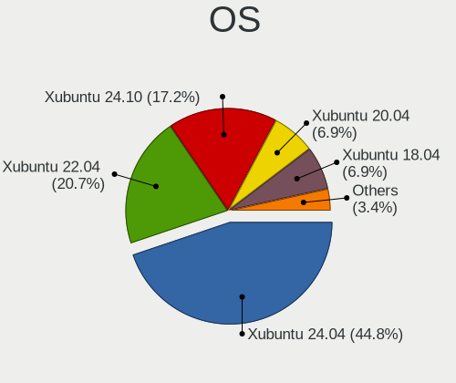
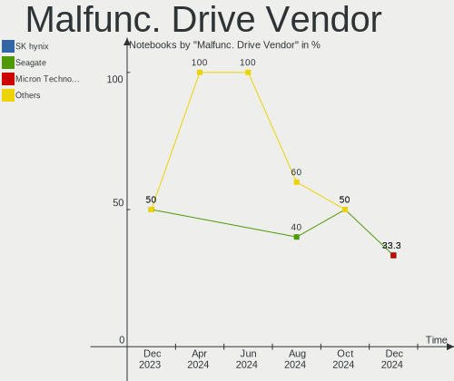
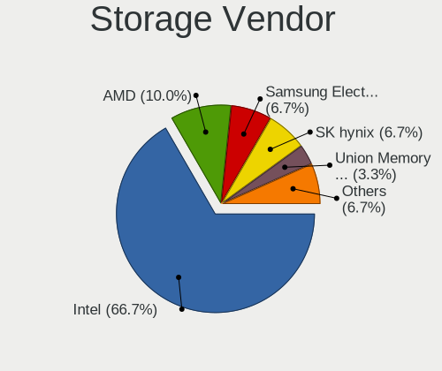
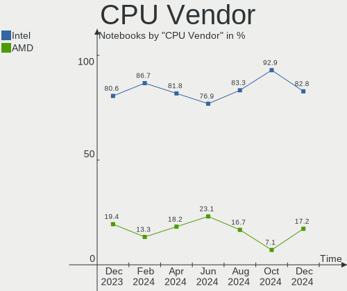
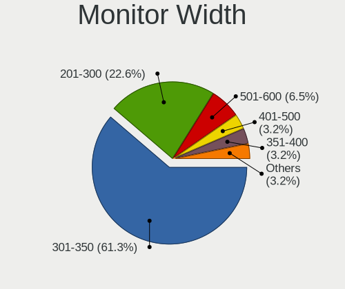
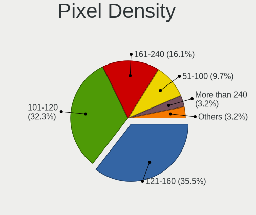
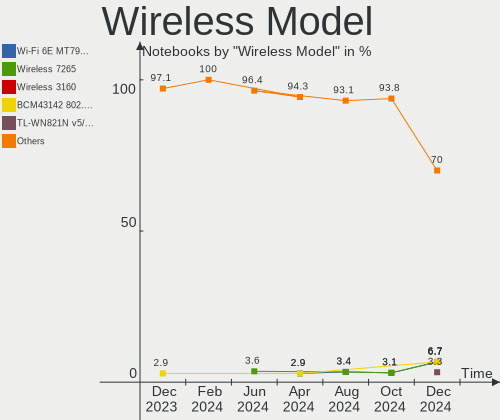
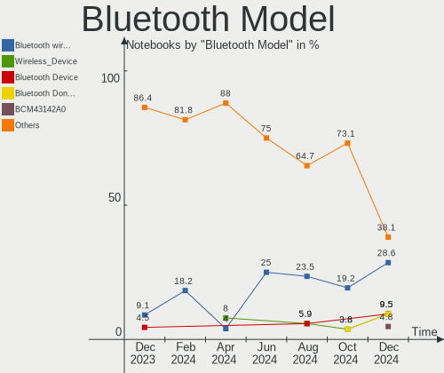

Xubuntu - Hardware Trends (Notebooks)
-------------------------------------

A project to identify most popular hardware characteristics and track their change
over time based on data collected by Linux users at https://Linux-Hardware.org.

Anyone can contribute to this report by the [hw-probe](https://github.com/linuxhw/hw-probe) tool:

    sudo -E hw-probe -all -upload

This report is for one last month. Overall report since the beginning of time: [TestDays](https://github.com/linuxhw/TestDays)

Period: Jun, 2023.

Contents
--------

* [ System ](#system)
  - [ OS                       ](#os)
  - [ OS Family                ](#os-family)
  - [ Kernel                   ](#kernel)
  - [ Kernel Family            ](#kernel-family)
  - [ Kernel Major Ver.        ](#kernel-major-ver)
  - [ Arch                     ](#arch)
  - [ DE                       ](#de)
  - [ Display Server           ](#display-server)
  - [ Display Manager          ](#display-manager)
  - [ OS Lang                  ](#os-lang)
  - [ Boot Mode                ](#boot-mode)
  - [ Filesystem               ](#filesystem)
  - [ Part. scheme             ](#part-scheme)
  - [ Dual Boot with Linux/BSD ](#dual-boot-with-linuxbsd)
  - [ Dual Boot (Win)          ](#dual-boot-win)

* [ Board ](#board)
  - [ Vendor                   ](#vendor)
  - [ Model                    ](#model)
  - [ Model Family             ](#model-family)
  - [ MFG Year                 ](#mfg-year)
  - [ Form Factor              ](#form-factor)
  - [ Secure Boot              ](#secure-boot)
  - [ Coreboot                 ](#coreboot)
  - [ RAM Size                 ](#ram-size)
  - [ RAM Used                 ](#ram-used)
  - [ Total Drives             ](#total-drives)
  - [ Has CD-ROM               ](#has-cd-rom)
  - [ Has Ethernet             ](#has-ethernet)
  - [ Has WiFi                 ](#has-wifi)
  - [ Has Bluetooth            ](#has-bluetooth)

* [ Location ](#location)
  - [ Country                  ](#country)
  - [ City                     ](#city)

* [ Drives ](#drives)
  - [ Drive Vendor             ](#drive-vendor)
  - [ Drive Model              ](#drive-model)
  - [ HDD Vendor               ](#hdd-vendor)
  - [ SSD Vendor               ](#ssd-vendor)
  - [ Drive Kind               ](#drive-kind)
  - [ Drive Connector          ](#drive-connector)
  - [ Drive Size               ](#drive-size)
  - [ Space Total              ](#space-total)
  - [ Space Used               ](#space-used)
  - [ Malfunc. Drives          ](#malfunc-drives)
  - [ Malfunc. Drive Vendor    ](#malfunc-drive-vendor)
  - [ Malfunc. HDD Vendor      ](#malfunc-hdd-vendor)
  - [ Malfunc. Drive Kind      ](#malfunc-drive-kind)
  - [ Failed Drives            ](#failed-drives)
  - [ Failed Drive Vendor      ](#failed-drive-vendor)
  - [ Drive Status             ](#drive-status)

* [ Storage controller ](#storage-controller)
  - [ Storage Vendor           ](#storage-vendor)
  - [ Storage Model            ](#storage-model)
  - [ Storage Kind             ](#storage-kind)

* [ Processor ](#processor)
  - [ CPU Vendor               ](#cpu-vendor)
  - [ CPU Model                ](#cpu-model)
  - [ CPU Model Family         ](#cpu-model-family)
  - [ CPU Cores                ](#cpu-cores)
  - [ CPU Sockets              ](#cpu-sockets)
  - [ CPU Threads              ](#cpu-threads)
  - [ CPU Op-Modes             ](#cpu-op-modes)
  - [ CPU Microcode            ](#cpu-microcode)
  - [ CPU Microarch            ](#cpu-microarch)

* [ Graphics ](#graphics)
  - [ GPU Vendor               ](#gpu-vendor)
  - [ GPU Model                ](#gpu-model)
  - [ GPU Combo                ](#gpu-combo)
  - [ GPU Driver               ](#gpu-driver)
  - [ GPU Memory               ](#gpu-memory)

* [ Monitor ](#monitor)
  - [ Monitor Vendor           ](#monitor-vendor)
  - [ Monitor Model            ](#monitor-model)
  - [ Monitor Resolution       ](#monitor-resolution)
  - [ Monitor Diagonal         ](#monitor-diagonal)
  - [ Monitor Width            ](#monitor-width)
  - [ Aspect Ratio             ](#aspect-ratio)
  - [ Monitor Area             ](#monitor-area)
  - [ Pixel Density            ](#pixel-density)
  - [ Multiple Monitors        ](#multiple-monitors)

* [ Network ](#network)
  - [ Net Controller Vendor    ](#net-controller-vendor)
  - [ Net Controller Model     ](#net-controller-model)
  - [ Wireless Vendor          ](#wireless-vendor)
  - [ Wireless Model           ](#wireless-model)
  - [ Ethernet Vendor          ](#ethernet-vendor)
  - [ Ethernet Model           ](#ethernet-model)
  - [ Net Controller Kind      ](#net-controller-kind)
  - [ Used Controller          ](#used-controller)
  - [ NICs                     ](#nics)
  - [ IPv6                     ](#ipv6)

* [ Bluetooth ](#bluetooth)
  - [ Bluetooth Vendor         ](#bluetooth-vendor)
  - [ Bluetooth Model          ](#bluetooth-model)

* [ Sound ](#sound)
  - [ Sound Vendor             ](#sound-vendor)
  - [ Sound Model              ](#sound-model)

* [ Memory ](#memory)
  - [ Memory Vendor            ](#memory-vendor)
  - [ Memory Model             ](#memory-model)
  - [ Memory Kind              ](#memory-kind)
  - [ Memory Form Factor       ](#memory-form-factor)
  - [ Memory Size              ](#memory-size)
  - [ Memory Speed             ](#memory-speed)

* [ Printers & scanners ](#printers--scanners)
  - [ Printer Vendor           ](#printer-vendor)
  - [ Printer Model            ](#printer-model)
  - [ Scanner Vendor           ](#scanner-vendor)
  - [ Scanner Model            ](#scanner-model)

* [ Camera ](#camera)
  - [ Camera Vendor            ](#camera-vendor)
  - [ Camera Model             ](#camera-model)

* [ Security ](#security)
  - [ Fingerprint Vendor       ](#fingerprint-vendor)
  - [ Fingerprint Model        ](#fingerprint-model)
  - [ Chipcard Vendor          ](#chipcard-vendor)
  - [ Chipcard Model           ](#chipcard-model)

* [ Unsupported ](#unsupported)
  - [ Unsupported Devices      ](#unsupported-devices)
  - [ Unsupported Device Types ](#unsupported-device-types)

System
------

OS
--

Installed operating systems

| Name          | Notebooks | Percent |
|---------------|-----------|---------|
| Xubuntu 22.04 | 19        | 61.29%  |
| Xubuntu 23.04 | 5         | 16.13%  |
| Xubuntu 20.04 | 5         | 16.13%  |
| Xubuntu 18.04 | 2         | 6.45%   |

OS Family
---------

OS without a version

| Name    | Notebooks | Percent |
|---------|-----------|---------|
| Xubuntu | 31        | 100%    |

Kernel
------

Version of the Linux kernel

| Version            | Notebooks | Percent |
|--------------------|-----------|---------|
| 5.19.0-45-generic  | 5         | 16.13%  |
| 5.19.0-43-generic  | 5         | 16.13%  |
| 6.2.0-20-generic   | 4         | 12.9%   |
| 5.15.0-73-generic  | 3         | 9.68%   |
| 5.4.0-150-generic  | 2         | 6.45%   |
| 5.19.0-42-generic  | 2         | 6.45%   |
| 6.2.0-23-generic   | 1         | 3.23%   |
| 6.1.0-1015-oem     | 1         | 3.23%   |
| 6.1.0-1013-oem     | 1         | 3.23%   |
| 6.0.0-1011-oem     | 1         | 3.23%   |
| 5.6.14-supergamer  | 1         | 3.23%   |
| 5.19.0-46-generic  | 1         | 3.23%   |
| 5.15.0-75-generic  | 1         | 3.23%   |
| 5.15.0-72-generic  | 1         | 3.23%   |
| 5.15.0-71-generic  | 1         | 3.23%   |
| 4.15.0-212-generic | 1         | 3.23%   |

Kernel Family
-------------

Linux kernel without a distro release

| Version | Notebooks | Percent |
|---------|-----------|---------|
| 5.19.0  | 13        | 41.94%  |
| 5.15.0  | 6         | 19.35%  |
| 6.2.0   | 5         | 16.13%  |
| 6.1.0   | 2         | 6.45%   |
| 5.4.0   | 2         | 6.45%   |
| 6.0.0   | 1         | 3.23%   |
| 5.6.14  | 1         | 3.23%   |
| 4.15.0  | 1         | 3.23%   |

Kernel Major Ver.
-----------------

Linux kernel major version

| Version | Notebooks | Percent |
|---------|-----------|---------|
| 5.19    | 13        | 41.94%  |
| 5.15    | 6         | 19.35%  |
| 6.2     | 5         | 16.13%  |
| 6.1     | 2         | 6.45%   |
| 5.4     | 2         | 6.45%   |
| 6.0     | 1         | 3.23%   |
| 5.6     | 1         | 3.23%   |
| 4.15    | 1         | 3.23%   |

Arch
----

OS architecture (x86_64, i586, etc.)

| Name   | Notebooks | Percent |
|--------|-----------|---------|
| x86_64 | 29        | 93.55%  |
| i686   | 2         | 6.45%   |

DE
--

Desktop Environment

| Name  | Notebooks | Percent |
|-------|-----------|---------|
| XFCE  | 29        | 93.55%  |
| KDE5  | 1         | 3.23%   |
| GNOME | 1         | 3.23%   |

Display Server
--------------

X11 or Wayland

| Name | Notebooks | Percent |
|------|-----------|---------|
| X11  | 29        | 93.55%  |
| Tty  | 2         | 6.45%   |

Display Manager
---------------

SDDM, LightDM, etc.

| Name    | Notebooks | Percent |
|---------|-----------|---------|
| LightDM | 28        | 90.32%  |
| Unknown | 2         | 6.45%   |
| GDM3    | 1         | 3.23%   |

OS Lang
-------

Language

| Lang  | Notebooks | Percent |
|-------|-----------|---------|
| en_US | 14        | 45.16%  |
| fr_FR | 3         | 9.68%   |
| en_GB | 3         | 9.68%   |
| de_DE | 3         | 9.68%   |
| it_IT | 2         | 6.45%   |
| tr_TR | 1         | 3.23%   |
| ru_RU | 1         | 3.23%   |
| pt_BR | 1         | 3.23%   |
| pl_PL | 1         | 3.23%   |
| es_ES | 1         | 3.23%   |
| de_CH | 1         | 3.23%   |

Boot Mode
---------

EFI or BIOS

| Mode | Notebooks | Percent |
|------|-----------|---------|
| BIOS | 18        | 58.06%  |
| EFI  | 13        | 41.94%  |

Filesystem
----------

Type of filesystem

| Type  | Notebooks | Percent |
|-------|-----------|---------|
| Ext4  | 20        | 64.52%  |
| Tmpfs | 11        | 35.48%  |

Part. scheme
------------

Scheme of partitioning

| Type    | Notebooks | Percent |
|---------|-----------|---------|
| GPT     | 23        | 74.19%  |
| MBR     | 6         | 19.35%  |
| Unknown | 2         | 6.45%   |

Dual Boot with Linux/BSD
------------------------

Hosting more than one Linux/BSD

| Dual boot | Notebooks | Percent |
|-----------|-----------|---------|
| No        | 26        | 83.87%  |
| Yes       | 5         | 16.13%  |

Dual Boot (Win)
---------------

Hosting Linux and Windows

| Dual boot | Notebooks | Percent |
|-----------|-----------|---------|
| No        | 22        | 70.97%  |
| Yes       | 9         | 29.03%  |

Board
-----

Vendor
------

Motherboard manufacturer

| Name                | Notebooks | Percent |
|---------------------|-----------|---------|
| Dell                | 7         | 22.58%  |
| Lenovo              | 4         | 12.9%   |
| Hewlett-Packard     | 4         | 12.9%   |
| Acer                | 3         | 9.68%   |
| GPU Company         | 2         | 6.45%   |
| Google              | 2         | 6.45%   |
| Fujitsu Siemens     | 2         | 6.45%   |
| TUXEDO              | 1         | 3.23%   |
| Toshiba             | 1         | 3.23%   |
| SK hynix            | 1         | 3.23%   |
| Samsung Electronics | 1         | 3.23%   |
| ASUSTek Computer    | 1         | 3.23%   |
| Apple               | 1         | 3.23%   |
| Alienware           | 1         | 3.23%   |

Model
-----

Motherboard model

| Name                                     | Notebooks | Percent |
|------------------------------------------|-----------|---------|
| TUXEDO P65xRP                            | 1         | 3.23%   |
| Toshiba Satellite C650                   | 1         | 3.23%   |
| SK hynix HyBook                          | 1         | 3.23%   |
| Samsung 760XDA                           | 1         | 3.23%   |
| Lenovo V560                              | 1         | 3.23%   |
| Lenovo V15 G4 AMN 82YU                   | 1         | 3.23%   |
| Lenovo ThinkPad X1 Carbon 7th 20R1S05A00 | 1         | 3.23%   |
| Lenovo IdeaPad 100S-14IBR 80R9           | 1         | 3.23%   |
| HP Stream Laptop 11-ah0XX                | 1         | 3.23%   |
| HP Laptop 14s-dq0xxx                     | 1         | 3.23%   |
| HP EliteBook 640 14 inch G9 Notebook PC  | 1         | 3.23%   |
| GPU Company GWTN156-5                    | 1         | 3.23%   |
| GPU Company GWNC21524                    | 1         | 3.23%   |
| Google Link                              | 1         | 3.23%   |
| Google Fleex                             | 1         | 3.23%   |
| Fujitsu Siemens LIFEBOOK S7110           | 1         | 3.23%   |
| Fujitsu Siemens ESPRIMO Mobile U9200     | 1         | 3.23%   |
| Dell Vostro 15 3510                      | 1         | 3.23%   |
| Dell Precision 5510                      | 1         | 3.23%   |
| Dell Latitude E6410                      | 1         | 3.23%   |
| Dell Latitude E5270                      | 1         | 3.23%   |
| Dell Latitude 5411                       | 1         | 3.23%   |
| Dell Inspiron MM061                      | 1         | 3.23%   |
| Dell Inspiron 5415                       | 1         | 3.23%   |
| ASUS N53SV                               | 1         | 3.23%   |
| Apple MacBookPro7,1                      | 1         | 3.23%   |
| Alienware 18                             | 1         | 3.23%   |
| Acer Aspire A517-52                      | 1         | 3.23%   |
| Acer Aspire 5600                         | 1         | 3.23%   |
| Acer AO722                               | 1         | 3.23%   |
| Unknown                                  | 1         | 3.23%   |

Model Family
------------

Motherboard model prefix

| Name                     | Notebooks | Percent |
|--------------------------|-----------|---------|
| Dell Latitude            | 3         | 9.68%   |
| Dell Inspiron            | 2         | 6.45%   |
| Acer Aspire              | 2         | 6.45%   |
| TUXEDO P65xRP            | 1         | 3.23%   |
| Toshiba Satellite        | 1         | 3.23%   |
| SK hynix HyBook          | 1         | 3.23%   |
| Samsung 760XDA           | 1         | 3.23%   |
| Lenovo V560              | 1         | 3.23%   |
| Lenovo V15               | 1         | 3.23%   |
| Lenovo ThinkPad          | 1         | 3.23%   |
| Lenovo IdeaPad           | 1         | 3.23%   |
| HP Stream                | 1         | 3.23%   |
| HP Laptop                | 1         | 3.23%   |
| HP EliteBook             | 1         | 3.23%   |
| GPU Company GWTN156-5    | 1         | 3.23%   |
| GPU Company GWNC21524    | 1         | 3.23%   |
| Google Link              | 1         | 3.23%   |
| Google Fleex             | 1         | 3.23%   |
| Fujitsu Siemens LIFEBOOK | 1         | 3.23%   |
| Fujitsu Siemens ESPRIMO  | 1         | 3.23%   |
| Dell Vostro              | 1         | 3.23%   |
| Dell Precision           | 1         | 3.23%   |
| ASUS N53SV               | 1         | 3.23%   |
| Apple MacBookPro7        | 1         | 3.23%   |
| Alienware 18             | 1         | 3.23%   |
| Acer AO722               | 1         | 3.23%   |
| Unknown                  | 1         | 3.23%   |

MFG Year
--------

Motherboard manufacture year

| Year | Notebooks | Percent |
|------|-----------|---------|
| 2021 | 5         | 16.13%  |
| 2010 | 5         | 16.13%  |
| 2020 | 3         | 9.68%   |
| 2016 | 3         | 9.68%   |
| 2006 | 3         | 9.68%   |
| 2022 | 2         | 6.45%   |
| 2019 | 2         | 6.45%   |
| 2015 | 2         | 6.45%   |
| 2023 | 1         | 3.23%   |
| 2018 | 1         | 3.23%   |
| 2014 | 1         | 3.23%   |
| 2013 | 1         | 3.23%   |
| 2011 | 1         | 3.23%   |
| 2008 | 1         | 3.23%   |

Form Factor
-----------

Physical design of the computer

| Name     | Notebooks | Percent |
|----------|-----------|---------|
| Notebook | 31        | 100%    |

Secure Boot
-----------

Enabled or disabled

| State    | Notebooks | Percent |
|----------|-----------|---------|
| Disabled | 29        | 93.55%  |
| Enabled  | 2         | 6.45%   |

Coreboot
--------

Have coreboot on board

| Used | Notebooks | Percent |
|------|-----------|---------|
| No   | 29        | 93.55%  |
| Yes  | 2         | 6.45%   |

RAM Size
--------

Total RAM memory

| Size in GB | Notebooks | Percent |
|------------|-----------|---------|
| 3.01-4.0   | 10        | 32.26%  |
| 4.01-8.0   | 5         | 16.13%  |
| 8.01-16.0  | 5         | 16.13%  |
| 16.01-24.0 | 4         | 12.9%   |
| 32.01-64.0 | 3         | 9.68%   |
| 2.01-3.0   | 2         | 6.45%   |
| 1.01-2.0   | 2         | 6.45%   |

RAM Used
--------

Used RAM memory

| Used GB    | Notebooks | Percent |
|------------|-----------|---------|
| 2.01-3.0   | 11        | 35.48%  |
| 1.01-2.0   | 11        | 35.48%  |
| 3.01-4.0   | 3         | 9.68%   |
| 4.01-8.0   | 2         | 6.45%   |
| 0.51-1.0   | 2         | 6.45%   |
| 16.01-24.0 | 1         | 3.23%   |
| 8.01-16.0  | 1         | 3.23%   |

Total Drives
------------

Number of drives on board

| Drives | Notebooks | Percent |
|--------|-----------|---------|
| 1      | 25        | 80.65%  |
| 2      | 4         | 12.9%   |
| 3      | 2         | 6.45%   |

Has CD-ROM
----------

Has CD-ROM on board

| Presented | Notebooks | Percent |
|-----------|-----------|---------|
| No        | 22        | 70.97%  |
| Yes       | 9         | 29.03%  |

Has Ethernet
------------

Has Ethernet on board

| Presented | Notebooks | Percent |
|-----------|-----------|---------|
| Yes       | 23        | 74.19%  |
| No        | 8         | 25.81%  |

Has WiFi
--------

Has WiFi module

| Presented | Notebooks | Percent |
|-----------|-----------|---------|
| Yes       | 31        | 100%    |

Has Bluetooth
-------------

Has Bluetooth module

| Presented | Notebooks | Percent |
|-----------|-----------|---------|
| Yes       | 25        | 80.65%  |
| No        | 6         | 19.35%  |

Location
--------

Country
-------

Geographic location (country)

| Country     | Notebooks | Percent |
|-------------|-----------|---------|
| USA         | 6         | 19.35%  |
| France      | 4         | 12.9%   |
| UK          | 3         | 9.68%   |
| Germany     | 3         | 9.68%   |
| Poland      | 2         | 6.45%   |
| Italy       | 2         | 6.45%   |
| Turkey      | 1         | 3.23%   |
| Switzerland | 1         | 3.23%   |
| Spain       | 1         | 3.23%   |
| South Korea | 1         | 3.23%   |
| Russia      | 1         | 3.23%   |
| Netherlands | 1         | 3.23%   |
| Latvia      | 1         | 3.23%   |
| Iran        | 1         | 3.23%   |
| Greece      | 1         | 3.23%   |
| Chile       | 1         | 3.23%   |
| Brazil      | 1         | 3.23%   |

City
----

Geographic location (city)

| City       | Notebooks | Percent |
|------------|-----------|---------|
| Lincoln    | 2         | 6.45%   |
| York       | 1         | 3.23%   |
| Warsaw     | 1         | 3.23%   |
| Vila Velha | 1         | 3.23%   |
| Vannes     | 1         | 3.23%   |
| Ulyanovsk  | 1         | 3.23%   |
| Turin      | 1         | 3.23%   |
| Tehran     | 1         | 3.23%   |
| Suwon      | 1         | 3.23%   |
| Soave      | 1         | 3.23%   |
| Santiago   | 1         | 3.23%   |
| Riga       | 1         | 3.23%   |
| Regensburg | 1         | 3.23%   |
| Przeworsk  | 1         | 3.23%   |
| Phoenix    | 1         | 3.23%   |
| Périgueux | 1         | 3.23%   |
| Paris      | 1         | 3.23%   |
| Nussbaumen | 1         | 3.23%   |
| Madrid     | 1         | 3.23%   |
| Lübeck    | 1         | 3.23%   |
| Leicester  | 1         | 3.23%   |
| Hammond    | 1         | 3.23%   |
| Greenwich  | 1         | 3.23%   |
| Fitzgerald | 1         | 3.23%   |
| Breskens   | 1         | 3.23%   |
| Bremen     | 1         | 3.23%   |
| Avignon    | 1         | 3.23%   |
| Athens     | 1         | 3.23%   |
| Ann Arbor  | 1         | 3.23%   |
| Ankara     | 1         | 3.23%   |

Drives
------

Drive Vendor
------------

Hard drive vendors

| Vendor                    | Notebooks | Drives | Percent |
|---------------------------|-----------|--------|---------|
| Samsung Electronics       | 6         | 7      | 17.65%  |
| WDC                       | 5         | 5      | 14.71%  |
| Unknown                   | 5         | 6      | 14.71%  |
| Seagate                   | 3         | 4      | 8.82%   |
| SK hynix                  | 2         | 2      | 5.88%   |
| SanDisk                   | 2         | 2      | 5.88%   |
| Crucial                   | 2         | 2      | 5.88%   |
| Toshiba                   | 1         | 1      | 2.94%   |
| Team                      | 1         | 1      | 2.94%   |
| Micron/Crucial Technology | 1         | 1      | 2.94%   |
| Micron Technology         | 1         | 1      | 2.94%   |
| KIOXIA                    | 1         | 1      | 2.94%   |
| Kingston                  | 1         | 1      | 2.94%   |
| Hitachi                   | 1         | 1      | 2.94%   |
| Fujitsu                   | 1         | 1      | 2.94%   |
| FORESEE                   | 1         | 1      | 2.94%   |

Drive Model
-----------

Hard drive models

| Model                                | Notebooks | Percent |
|--------------------------------------|-----------|---------|
| WDC WDS250G2B0A 250GB SSD            | 1         | 2.78%   |
| WDC WD3200BEKT-60PVMT0 320GB         | 1         | 2.78%   |
| WDC WD1600BEVT-22ZCT0 160GB          | 1         | 2.78%   |
| WDC WD1200BEVS-75UST0 120GB          | 1         | 2.78%   |
| WDC PC SN730 SDBQNTY-512G-1001 512GB | 1         | 2.78%   |
| Unknown MMC128  128GB                | 1         | 2.78%   |
| Unknown MMC Card  32GB               | 1         | 2.78%   |
| Unknown MMC Card  16GB               | 1         | 2.78%   |
| Unknown MMC Card  128GB              | 1         | 2.78%   |
| Unknown DB4032  32GB                 | 1         | 2.78%   |
| Toshiba MQ01ABD050 500GB             | 1         | 2.78%   |
| Team TM8PS7512G 512GB SSD            | 1         | 2.78%   |
| SK hynix PC611 NVMe 256GB            | 1         | 2.78%   |
| SK hynix BC901 NVMe 512GB            | 1         | 2.78%   |
| Seagate ST2000LM007-1R8174 2TB       | 1         | 2.78%   |
| Seagate ST1000LM048-2E7172 1TB       | 1         | 2.78%   |
| Seagate ST1000LM014-SSHD-8GB         | 1         | 2.78%   |
| Seagate Expansion 1TB                | 1         | 2.78%   |
| SanDisk SSD i100 32GB                | 1         | 2.78%   |
| SanDisk NVMe SSD Drive 512GB         | 1         | 2.78%   |
| Samsung SSD 860 EVO M.2 500GB        | 1         | 2.78%   |
| Samsung SSD 850 EVO 500GB            | 1         | 2.78%   |
| Samsung SSD 850 EVO 120GB            | 1         | 2.78%   |
| Samsung SSD 840 EVO 500GB            | 1         | 2.78%   |
| Samsung MZVLQ1T0HBLB-00B 1TB         | 1         | 2.78%   |
| Samsung MZAL4512HBLU-00BL2 512GB     | 1         | 2.78%   |
| Samsung HM160HC 160GB                | 1         | 2.78%   |
| Micron/Crucial CT1000P1SSD8 1TB      | 1         | 2.78%   |
| Micron 2210_MTFDHBA1T0QFD 1TB        | 1         | 2.78%   |
| KIOXIA KBG40ZNS256G NVMe 256GB       | 1         | 2.78%   |
| Kingston OM8S1S3128K-AH 128GB SSD    | 1         | 2.78%   |
| Hitachi HTS545032B9SA02 320GB        | 1         | 2.78%   |
| Fujitsu MHY2160BH 160GB              | 1         | 2.78%   |
| FORESEE 256GB SSD                    | 1         | 2.78%   |
| Crucial CT240BX500SSD1 240GB         | 1         | 2.78%   |
| Crucial CT1000P1SSD8 1TB             | 1         | 2.78%   |

HDD Vendor
----------

Hard disk drive vendors

| Vendor              | Notebooks | Drives | Percent |
|---------------------|-----------|--------|---------|
| WDC                 | 3         | 3      | 30%     |
| Seagate             | 3         | 4      | 30%     |
| Toshiba             | 1         | 1      | 10%     |
| Samsung Electronics | 1         | 1      | 10%     |
| Hitachi             | 1         | 1      | 10%     |
| Fujitsu             | 1         | 1      | 10%     |

SSD Vendor
----------

Solid state drive vendors

| Vendor              | Notebooks | Drives | Percent |
|---------------------|-----------|--------|---------|
| Samsung Electronics | 3         | 4      | 33.33%  |
| WDC                 | 1         | 1      | 11.11%  |
| Team                | 1         | 1      | 11.11%  |
| SanDisk             | 1         | 1      | 11.11%  |
| Kingston            | 1         | 1      | 11.11%  |
| FORESEE             | 1         | 1      | 11.11%  |
| Crucial             | 1         | 1      | 11.11%  |

Drive Kind
----------

HDD or SSD

| Kind | Notebooks | Drives | Percent |
|------|-----------|--------|---------|
| NVMe | 10        | 10     | 30.3%   |
| HDD  | 10        | 11     | 30.3%   |
| SSD  | 8         | 10     | 24.24%  |
| MMC  | 5         | 6      | 15.15%  |

Drive Connector
---------------

SATA, SAS, NVMe, etc.

| Type | Notebooks | Drives | Percent |
|------|-----------|--------|---------|
| SATA | 16        | 20     | 50%     |
| NVMe | 10        | 10     | 31.25%  |
| MMC  | 5         | 6      | 15.63%  |
| SAS  | 1         | 1      | 3.13%   |

Drive Size
----------

Size of hard drive

| Size in TB | Notebooks | Drives | Percent |
|------------|-----------|--------|---------|
| 0.01-0.5   | 15        | 16     | 75%     |
| 0.51-1.0   | 4         | 4      | 20%     |
| 1.01-2.0   | 1         | 1      | 5%      |

Space Total
-----------

Amount of disk space available on the file system

| Size in GB | Notebooks | Percent |
|------------|-----------|---------|
| 101-250    | 10        | 32.26%  |
| 251-500    | 8         | 25.81%  |
| 21-50      | 4         | 12.9%   |
| 501-1000   | 4         | 12.9%   |
| 51-100     | 3         | 9.68%   |
| 1001-2000  | 1         | 3.23%   |
| 1-20       | 1         | 3.23%   |

Space Used
----------

Amount of used disk space

| Used GB  | Notebooks | Percent |
|----------|-----------|---------|
| 1-20     | 10        | 32.26%  |
| 21-50    | 9         | 29.03%  |
| 51-100   | 5         | 16.13%  |
| 101-250  | 4         | 12.9%   |
| 501-1000 | 2         | 6.45%   |
| 251-500  | 1         | 3.23%   |

Malfunc. Drives
---------------

Drive models with a malfunction

| Model                             | Notebooks | Drives | Percent |
|-----------------------------------|-----------|--------|---------|
| WDC WD3200BEKT-60PVMT0 320GB      | 1         | 1      | 16.67%  |
| Toshiba MQ01ABD050 500GB          | 1         | 1      | 16.67%  |
| SanDisk SSD i100 32GB             | 1         | 1      | 16.67%  |
| Samsung Electronics HM160HC 160GB | 1         | 1      | 16.67%  |
| Kingston OM8S1S3128K-AH 128GB SSD | 1         | 1      | 16.67%  |
| Fujitsu MHY2160BH 160GB           | 1         | 1      | 16.67%  |

Malfunc. Drive Vendor
---------------------

Vendors of faulty drives

| Vendor              | Notebooks | Drives | Percent |
|---------------------|-----------|--------|---------|
| WDC                 | 1         | 1      | 16.67%  |
| Toshiba             | 1         | 1      | 16.67%  |
| SanDisk             | 1         | 1      | 16.67%  |
| Samsung Electronics | 1         | 1      | 16.67%  |
| Kingston            | 1         | 1      | 16.67%  |
| Fujitsu             | 1         | 1      | 16.67%  |

Malfunc. HDD Vendor
-------------------

Vendors of faulty HDD drives

| Vendor              | Notebooks | Drives | Percent |
|---------------------|-----------|--------|---------|
| WDC                 | 1         | 1      | 25%     |
| Toshiba             | 1         | 1      | 25%     |
| Samsung Electronics | 1         | 1      | 25%     |
| Fujitsu             | 1         | 1      | 25%     |

Malfunc. Drive Kind
-------------------

Kinds of faulty drives

| Kind | Notebooks | Drives | Percent |
|------|-----------|--------|---------|
| HDD  | 4         | 4      | 66.67%  |
| SSD  | 2         | 2      | 33.33%  |

Failed Drives
-------------

Failed drive models

Zero info for selected period =(

Failed Drive Vendor
-------------------

Failed drive vendors

Zero info for selected period =(

Drive Status
------------

Number of failed and malfunc. drives

| Status   | Notebooks | Drives | Percent |
|----------|-----------|--------|---------|
| Detected | 17        | 21     | 54.84%  |
| Works    | 8         | 10     | 25.81%  |
| Malfunc  | 6         | 6      | 19.35%  |

Storage controller
------------------

Storage Vendor
--------------

Storage controller vendors

| Vendor                    | Notebooks | Percent |
|---------------------------|-----------|---------|
| Intel                     | 21        | 60%     |
| AMD                       | 3         | 8.57%   |
| SK hynix                  | 2         | 5.71%   |
| SanDisk                   | 2         | 5.71%   |
| Samsung Electronics       | 2         | 5.71%   |
| Micron/Crucial Technology | 2         | 5.71%   |
| Nvidia                    | 1         | 2.86%   |
| Micron Technology         | 1         | 2.86%   |
| KIOXIA                    | 1         | 2.86%   |

Storage Model
-------------

Storage controller models

| Model                                                                            | Notebooks | Percent |
|----------------------------------------------------------------------------------|-----------|---------|
| Micron/Crucial NVMe Storage Controller                                           | 2         | 5.41%   |
| Intel Tiger Lake-LP SATA Controller                                              | 2         | 5.41%   |
| Intel Celeron/Pentium Silver Processor SATA Controller                           | 2         | 5.41%   |
| Intel 82801GBM/GHM (ICH7-M Family) SATA Controller [IDE mode]                    | 2         | 5.41%   |
| Intel 82801 Mobile SATA Controller [RAID mode]                                   | 2         | 5.41%   |
| Intel 6 Series/C200 Series Chipset Family 6 port Mobile SATA AHCI Controller     | 2         | 5.41%   |
| Intel 5 Series/3400 Series Chipset 4 port SATA AHCI Controller                   | 2         | 5.41%   |
| AMD FCH SATA Controller [AHCI mode]                                              | 2         | 5.41%   |
| SK hynix PC611 NVMe Solid State Drive                                            | 1         | 2.7%    |
| SK hynix BC901 NVMe Solid State Drive (DRAM-less)                                | 1         | 2.7%    |
| SanDisk WD Black SN770 NVMe SSD                                                  | 1         | 2.7%    |
| SanDisk WD Black SN750 / PC SN730 NVMe SSD                                       | 1         | 2.7%    |
| Samsung NVMe SSD Controller PM9B1                                                | 1         | 2.7%    |
| Samsung NVMe SSD Controller 980                                                  | 1         | 2.7%    |
| Nvidia MCP89 SATA Controller (AHCI mode)                                         | 1         | 2.7%    |
| Micron NVMe Storage Controller                                                   | 1         | 2.7%    |
| KIOXIA NVMe SSD Controller BG4                                                   | 1         | 2.7%    |
| Intel Volume Management Device NVMe RAID Controller                              | 1         | 2.7%    |
| Intel Tiger Lake SATA AHCI Controller                                            | 1         | 2.7%    |
| Intel Q170/Q150/B150/H170/H110/Z170/CM236 Chipset SATA Controller [AHCI Mode]    | 1         | 2.7%    |
| Intel HM170/QM170 Chipset SATA Controller [AHCI Mode]                            | 1         | 2.7%    |
| Intel Atom/Celeron/Pentium Processor x5-E8000/J3xxx/N3xxx Series SATA Controller | 1         | 2.7%    |
| Intel 82801HM/HEM (ICH8M/ICH8M-E) SATA Controller [AHCI mode]                    | 1         | 2.7%    |
| Intel 82801HM/HEM (ICH8M/ICH8M-E) IDE Controller                                 | 1         | 2.7%    |
| Intel 82801G (ICH7 Family) IDE Controller                                        | 1         | 2.7%    |
| Intel 8 Series/C220 Series Chipset Family 6-port SATA Controller 1 [AHCI mode]   | 1         | 2.7%    |
| Intel 7 Series Chipset Family 6-port SATA Controller [AHCI mode]                 | 1         | 2.7%    |
| Intel 400 Series Chipset Family SATA AHCI Controller                             | 1         | 2.7%    |
| AMD SB7x0/SB8x0/SB9x0 SATA Controller [AHCI mode]                                | 1         | 2.7%    |

Storage Kind
------------

Kind of storage controller (IDE, SATA, NVMe, SAS, ...)

| Kind | Notebooks | Percent |
|------|-----------|---------|
| SATA | 20        | 54.05%  |
| NVMe | 10        | 27.03%  |
| IDE  | 4         | 10.81%  |
| RAID | 3         | 8.11%   |

Processor
---------

CPU Vendor
----------

Processor vendors

| Vendor | Notebooks | Percent |
|--------|-----------|---------|
| Intel  | 27        | 87.1%   |
| AMD    | 4         | 12.9%   |

CPU Model
---------

Processor models

| Model                                         | Notebooks | Percent |
|-----------------------------------------------|-----------|---------|
| Intel Celeron N4020 CPU @ 1.10GHz             | 3         | 9.68%   |
| Intel Core 2 CPU T7200 @ 2.00GHz              | 2         | 6.45%   |
| Intel Celeron CPU N3060 @ 1.60GHz             | 2         | 6.45%   |
| Intel 11th Gen Core i7-1165G7 @ 2.80GHz       | 2         | 6.45%   |
| Intel Core i7-6700HQ CPU @ 2.60GHz            | 1         | 3.23%   |
| Intel Core i7-4700MQ CPU @ 2.40GHz            | 1         | 3.23%   |
| Intel Core i7-2630QM CPU @ 2.00GHz            | 1         | 3.23%   |
| Intel Core i7-10850H CPU @ 2.70GHz            | 1         | 3.23%   |
| Intel Core i7-10710U CPU @ 1.10GHz            | 1         | 3.23%   |
| Intel Core i5-6300U CPU @ 2.40GHz             | 1         | 3.23%   |
| Intel Core i5-6300HQ CPU @ 2.30GHz            | 1         | 3.23%   |
| Intel Core i5-3427U CPU @ 1.80GHz             | 1         | 3.23%   |
| Intel Core i5-2540M CPU @ 2.60GHz             | 1         | 3.23%   |
| Intel Core i5 CPU M 560 @ 2.67GHz             | 1         | 3.23%   |
| Intel Core i5 CPU M 460 @ 2.53GHz             | 1         | 3.23%   |
| Intel Core i3 CPU M 330 @ 2.13GHz             | 1         | 3.23%   |
| Intel Core 2 Duo CPU T9300 @ 2.50GHz          | 1         | 3.23%   |
| Intel Core 2 Duo CPU P8800 @ 2.66GHz          | 1         | 3.23%   |
| Intel Core 2 CPU T5500 @ 1.66GHz              | 1         | 3.23%   |
| Intel Celeron N4120 CPU @ 1.10GHz             | 1         | 3.23%   |
| Intel 12th Gen Core i5-1235U                  | 1         | 3.23%   |
| Intel 11th Gen Core i7-11600H @ 2.90GHz       | 1         | 3.23%   |
| AMD Ryzen 5 7520U with Radeon Graphics        | 1         | 3.23%   |
| AMD Ryzen 5 5500U with Radeon Graphics        | 1         | 3.23%   |
| AMD Ryzen 5 3450U with Radeon Vega Mobile Gfx | 1         | 3.23%   |
| AMD C-60 APU with Radeon HD Graphics          | 1         | 3.23%   |

CPU Model Family
----------------

Processor model prefix

| Model            | Notebooks | Percent |
|------------------|-----------|---------|
| Intel Core i5    | 6         | 19.35%  |
| Intel Celeron    | 6         | 19.35%  |
| Intel Core i7    | 5         | 16.13%  |
| Other            | 4         | 12.9%   |
| Intel Core 2     | 3         | 9.68%   |
| AMD Ryzen 5      | 3         | 9.68%   |
| Intel Core 2 Duo | 2         | 6.45%   |
| Intel Core i3    | 1         | 3.23%   |
| AMD C-60         | 1         | 3.23%   |

CPU Cores
---------

Number of processor cores

| Number | Notebooks | Percent |
|--------|-----------|---------|
| 2      | 17        | 54.84%  |
| 4      | 9         | 29.03%  |
| 6      | 4         | 12.9%   |
| 10     | 1         | 3.23%   |

CPU Sockets
-----------

Number of sockets

| Number | Notebooks | Percent |
|--------|-----------|---------|
| 1      | 31        | 100%    |

CPU Threads
-----------

Threads per core (Hyper-Threading)

| Number | Notebooks | Percent |
|--------|-----------|---------|
| 2      | 18        | 58.06%  |
| 1      | 13        | 41.94%  |

CPU Op-Modes
------------

CPU Operation Modes (32-bit, 64-bit)

| Op mode        | Notebooks | Percent |
|----------------|-----------|---------|
| 32-bit, 64-bit | 31        | 100%    |

CPU Microcode
-------------

Microcode number

| Number     | Notebooks | Percent |
|------------|-----------|---------|
| Unknown    | 14        | 45.16%  |
| 0x6f6      | 3         | 9.68%   |
| 0x806c1    | 2         | 6.45%   |
| 0xa0652    | 1         | 3.23%   |
| 0x906a4    | 1         | 3.23%   |
| 0x806d1    | 1         | 3.23%   |
| 0x706a8    | 1         | 3.23%   |
| 0x506e3    | 1         | 3.23%   |
| 0x406e3    | 1         | 3.23%   |
| 0x406c4    | 1         | 3.23%   |
| 0x206a7    | 1         | 3.23%   |
| 0x20655    | 1         | 3.23%   |
| 0x1067a    | 1         | 3.23%   |
| 0x10676    | 1         | 3.23%   |
| 0x08a00006 | 1         | 3.23%   |

CPU Microarch
-------------

Microarchitecture

| Name             | Notebooks | Percent |
|------------------|-----------|---------|
| Goldmont plus    | 4         | 12.9%   |
| Westmere         | 3         | 9.68%   |
| Skylake          | 3         | 9.68%   |
| Core             | 3         | 9.68%   |
| TigerLake        | 2         | 6.45%   |
| Silvermont       | 2         | 6.45%   |
| SandyBridge      | 2         | 6.45%   |
| Penryn           | 2         | 6.45%   |
| CometLake        | 2         | 6.45%   |
| Unknown          | 2         | 6.45%   |
| Zen+             | 1         | 3.23%   |
| IvyBridge        | 1         | 3.23%   |
| Icelake          | 1         | 3.23%   |
| Haswell          | 1         | 3.23%   |
| Bobcat           | 1         | 3.23%   |
| Alderlake Hybrid | 1         | 3.23%   |

Graphics
--------

GPU Vendor
----------

Vendors of graphics cards

| Vendor | Notebooks | Percent |
|--------|-----------|---------|
| Intel  | 24        | 66.67%  |
| Nvidia | 8         | 22.22%  |
| AMD    | 4         | 11.11%  |

GPU Model
---------

Graphics card models

| Model                                                                                    | Notebooks | Percent |
|------------------------------------------------------------------------------------------|-----------|---------|
| Intel GeminiLake [UHD Graphics 600]                                                      | 4         | 10%     |
| Intel Mobile 945GM/GMS/GME, 943/940GML Express Integrated Graphics Controller            | 3         | 7.5%    |
| Intel Mobile 945GM/GMS, 943/940GML Express Integrated Graphics Controller                | 3         | 7.5%    |
| Intel Core Processor Integrated Graphics Controller                                      | 3         | 7.5%    |
| Intel TigerLake-LP GT2 [Iris Xe Graphics]                                                | 2         | 5%      |
| Intel Atom/Celeron/Pentium Processor x5-E8000/J3xxx/N3xxx Integrated Graphics Controller | 2         | 5%      |
| Intel 2nd Generation Core Processor Family Integrated Graphics Controller                | 2         | 5%      |
| Nvidia MCP89 [GeForce 320M]                                                              | 1         | 2.5%    |
| Nvidia GT218M [GeForce 310M]                                                             | 1         | 2.5%    |
| Nvidia GP108M [GeForce MX250]                                                            | 1         | 2.5%    |
| Nvidia GP106BM [GeForce GTX 1060 Mobile 6GB]                                             | 1         | 2.5%    |
| Nvidia GM107GLM [Quadro M1000M]                                                          | 1         | 2.5%    |
| Nvidia GK106M [GeForce GTX 765M]                                                         | 1         | 2.5%    |
| Nvidia GF108M [GeForce GT 540M]                                                          | 1         | 2.5%    |
| Nvidia GA107M [GeForce RTX 3050 Ti Mobile]                                               | 1         | 2.5%    |
| Intel TigerLake-H GT1 [UHD Graphics]                                                     | 1         | 2.5%    |
| Intel Skylake GT2 [HD Graphics 520]                                                      | 1         | 2.5%    |
| Intel Mobile GM965/GL960 Integrated Graphics Controller (secondary)                      | 1         | 2.5%    |
| Intel Mobile GM965/GL960 Integrated Graphics Controller (primary)                        | 1         | 2.5%    |
| Intel HD Graphics 530                                                                    | 1         | 2.5%    |
| Intel CometLake-H GT2 [UHD Graphics]                                                     | 1         | 2.5%    |
| Intel Comet Lake UHD Graphics                                                            | 1         | 2.5%    |
| Intel Alder Lake-UP3 GT2 [UHD Graphics]                                                  | 1         | 2.5%    |
| Intel 3rd Gen Core processor Graphics Controller                                         | 1         | 2.5%    |
| AMD Wrestler [Radeon HD 6290]                                                            | 1         | 2.5%    |
| AMD Picasso/Raven 2 [Radeon Vega Series / Radeon Vega Mobile Series]                     | 1         | 2.5%    |
| AMD Mendocino                                                                            | 1         | 2.5%    |
| AMD Lucienne                                                                             | 1         | 2.5%    |

GPU Combo
---------

Combinations of graphics cards

| Name           | Notebooks | Percent |
|----------------|-----------|---------|
| 1 x Intel      | 19        | 61.29%  |
| Intel + Nvidia | 5         | 16.13%  |
| 1 x AMD        | 4         | 12.9%   |
| 1 x Nvidia     | 3         | 9.68%   |

GPU Driver
----------

Free vs proprietary

| Driver      | Notebooks | Percent |
|-------------|-----------|---------|
| Free        | 28        | 90.32%  |
| Proprietary | 3         | 9.68%   |

GPU Memory
----------

Total video memory

| Size in GB | Notebooks | Percent |
|------------|-----------|---------|
| Unknown    | 23        | 74.19%  |
| 1.01-2.0   | 2         | 6.45%   |
| 0.51-1.0   | 2         | 6.45%   |
| 0.01-0.5   | 2         | 6.45%   |
| 5.01-6.0   | 1         | 3.23%   |
| 3.01-4.0   | 1         | 3.23%   |

Monitor
-------

Monitor Vendor
--------------

Monitor vendors

| Vendor              | Notebooks | Percent |
|---------------------|-----------|---------|
| AU Optronics        | 9         | 25%     |
| Samsung Electronics | 6         | 16.67%  |
| LG Display          | 4         | 11.11%  |
| BOE                 | 4         | 11.11%  |
| Chimei Innolux      | 3         | 8.33%   |
| LG Philips          | 2         | 5.56%   |
| SLD                 | 1         | 2.78%   |
| Sharp               | 1         | 2.78%   |
| InfoVision          | 1         | 2.78%   |
| Hitachi             | 1         | 2.78%   |
| GreenWood           | 1         | 2.78%   |
| Goldstar            | 1         | 2.78%   |
| Dell                | 1         | 2.78%   |
| Apple               | 1         | 2.78%   |

Monitor Model
-------------

Monitor models

| Model                                                                 | Notebooks | Percent |
|-----------------------------------------------------------------------|-----------|---------|
| Samsung Electronics LCD Monitor SEC5441 1366x768 293x165mm 13.2-inch  | 2         | 5.56%   |
| SLD LCD Monitor SLD003C 1366x768 309x173mm 13.9-inch                  | 1         | 2.78%   |
| Sharp LCD Monitor SHP1453 1920x1080 346x194mm 15.6-inch               | 1         | 2.78%   |
| Samsung Electronics SyncMaster SAM0587 1920x1200 520x320mm 24.0-inch  | 1         | 2.78%   |
| Samsung Electronics S24E650 SAM0CC2 1920x1200 518x324mm 24.1-inch     | 1         | 2.78%   |
| Samsung Electronics LCD Monitor SEC4141 1366x768 344x193mm 15.5-inch  | 1         | 2.78%   |
| Samsung Electronics LCD Monitor SDC4C48 1920x1080 409x230mm 18.5-inch | 1         | 2.78%   |
| LG Philips LCD Monitor LPLA900 1280x800 331x207mm 15.4-inch           | 1         | 2.78%   |
| LG Philips LCD Monitor LPL7900 1280x800 331x207mm 15.4-inch           | 1         | 2.78%   |
| LG Display LP156WH2-TLAA LGD0230 1366x768 344x194mm 15.5-inch         | 1         | 2.78%   |
| LG Display LCD Monitor LGD046F 1920x1080 350x190mm 15.7-inch          | 1         | 2.78%   |
| LG Display LCD Monitor LGD045E 1366x768 309x174mm 14.0-inch           | 1         | 2.78%   |
| LG Display LCD Monitor LGD0379 2560x1700 272x181mm 12.9-inch          | 1         | 2.78%   |
| InfoVision LCD Monitor IVO03F4 1920x1200 263x164mm 12.2-inch          | 1         | 2.78%   |
| Hitachi HISENSE HEC0030 3840x2160 1095x616mm 49.5-inch                | 1         | 2.78%   |
| GreenWood ARZOPA GWD1580 1920x1080 350x200mm 15.9-inch                | 1         | 2.78%   |
| Goldstar HDR WFHD GSM7714 2560x1080 798x334mm 34.1-inch               | 1         | 2.78%   |
| Dell U2312HM DEL4071 1920x1080 510x287mm 23.0-inch                    | 1         | 2.78%   |
| Chimei Innolux LCD Monitor CMN15E5 1920x1080 344x193mm 15.5-inch      | 1         | 2.78%   |
| Chimei Innolux LCD Monitor CMN114C 1366x768 256x144mm 11.6-inch       | 1         | 2.78%   |
| Chimei Innolux LCD Monitor CMN1139 1366x768 256x144mm 11.6-inch       | 1         | 2.78%   |
| BOE LCD Monitor BOE0A06 1920x1080 344x194mm 15.5-inch                 | 1         | 2.78%   |
| BOE LCD Monitor BOE084E 1920x1080 382x215mm 17.3-inch                 | 1         | 2.78%   |
| BOE LCD Monitor BOE0757 1366x768 344x194mm 15.5-inch                  | 1         | 2.78%   |
| BOE LCD Monitor BOE0643 1920x1080 276x155mm 12.5-inch                 | 1         | 2.78%   |
| AU Optronics LCD Monitor AUO723C 1366x768 309x173mm 13.9-inch         | 1         | 2.78%   |
| AU Optronics LCD Monitor AUO5491 1920x1080 309x174mm 14.0-inch        | 1         | 2.78%   |
| AU Optronics LCD Monitor AUO463D 1920x1080 309x174mm 14.0-inch        | 1         | 2.78%   |
| AU Optronics LCD Monitor AUO369F 1920x1080 344x194mm 15.5-inch        | 1         | 2.78%   |
| AU Optronics LCD Monitor AUO313C 1366x768 309x173mm 13.9-inch         | 1         | 2.78%   |
| AU Optronics LCD Monitor AUO233D 1920x1080 309x174mm 14.0-inch        | 1         | 2.78%   |
| AU Optronics LCD Monitor AUO22EC 1366x768 344x193mm 15.5-inch         | 1         | 2.78%   |
| AU Optronics LCD Monitor AUO229E 1600x900 382x214mm 17.2-inch         | 1         | 2.78%   |
| AU Optronics LCD Monitor AUO2052 1024x600 256x144mm 11.6-inch         | 1         | 2.78%   |
| Apple Color LCD APP9CC7 1280x800 286x179mm 13.3-inch                  | 1         | 2.78%   |

Monitor Resolution
------------------

Monitor screen resolution

| Resolution        | Notebooks | Percent |
|-------------------|-----------|---------|
| 1920x1080 (FHD)   | 13        | 37.14%  |
| 1366x768 (WXGA)   | 12        | 34.29%  |
| 1920x1200 (WUXGA) | 3         | 8.57%   |
| 1280x800 (WXGA)   | 3         | 8.57%   |
| 3840x2160 (4K)    | 1         | 2.86%   |
| 2560x1700         | 1         | 2.86%   |
| 2560x1080         | 1         | 2.86%   |
| 1024x600          | 1         | 2.86%   |

Monitor Diagonal
----------------

Diagonal size in inches

| Inches | Notebooks | Percent |
|--------|-----------|---------|
| 15     | 15        | 41.67%  |
| 14     | 5         | 13.89%  |
| 13     | 3         | 8.33%   |
| 11     | 3         | 8.33%   |
| 24     | 2         | 5.56%   |
| 17     | 2         | 5.56%   |
| 12     | 2         | 5.56%   |
| 84     | 1         | 2.78%   |
| 34     | 1         | 2.78%   |
| 23     | 1         | 2.78%   |
| 18     | 1         | 2.78%   |

Monitor Width
-------------

Physical width

| Width in mm | Notebooks | Percent |
|-------------|-----------|---------|
| 301-350     | 19        | 54.29%  |
| 201-300     | 6         | 17.14%  |
| 351-400     | 4         | 11.43%  |
| 501-600     | 3         | 8.57%   |
| 701-800     | 1         | 2.86%   |
| 401-500     | 1         | 2.86%   |
| 1501-2000   | 1         | 2.86%   |

Aspect Ratio
------------

Proportional relationship between the width and the height

| Ratio | Notebooks | Percent |
|-------|-----------|---------|
| 16/9  | 26        | 78.79%  |
| 16/10 | 5         | 15.15%  |
| 3/2   | 1         | 3.03%   |
| 21/9  | 1         | 3.03%   |

Monitor Area
------------

Area in inch²

| Area in inch² | Notebooks | Percent |
|----------------|-----------|---------|
| 101-110        | 15        | 41.67%  |
| 81-90          | 8         | 22.22%  |
| 51-60          | 3         | 8.33%   |
| 251-300        | 2         | 5.56%   |
| 121-130        | 2         | 5.56%   |
| More than 1000 | 1         | 2.78%   |
| 71-80          | 1         | 2.78%   |
| 61-70          | 1         | 2.78%   |
| 351-500        | 1         | 2.78%   |
| 201-250        | 1         | 2.78%   |
| 141-150        | 1         | 2.78%   |

Pixel Density
-------------

Pixels per inch

| Density | Notebooks | Percent |
|---------|-----------|---------|
| 101-120 | 13        | 37.14%  |
| 121-160 | 11        | 31.43%  |
| 51-100  | 9         | 25.71%  |
| 161-240 | 2         | 5.71%   |

Multiple Monitors
-----------------

Total monitors connected

| Total | Notebooks | Percent |
|-------|-----------|---------|
| 1     | 25        | 80.65%  |
| 2     | 6         | 19.35%  |

Network
-------

Net Controller Vendor
---------------------

Controller vendors

| Vendor                   | Notebooks | Percent |
|--------------------------|-----------|---------|
| Intel                    | 16        | 35.56%  |
| Realtek Semiconductor    | 14        | 31.11%  |
| Qualcomm Atheros         | 7         | 15.56%  |
| Broadcom                 | 3         | 6.67%   |
| Marvell Technology Group | 2         | 4.44%   |
| Samsung Electronics      | 1         | 2.22%   |
| MediaTek                 | 1         | 2.22%   |
| Dell                     | 1         | 2.22%   |

Net Controller Model
--------------------

Controller models

| Model                                                             | Notebooks | Percent |
|-------------------------------------------------------------------|-----------|---------|
| Realtek RTL8111/8168/8411 PCI Express Gigabit Ethernet Controller | 6         | 10.71%  |
| Realtek RTL8821CE 802.11ac PCIe Wireless Network Adapter          | 3         | 5.36%   |
| Qualcomm Atheros AR9285 Wireless Network Adapter (PCI-Express)    | 3         | 5.36%   |
| Intel PRO/Wireless 3945ABG [Golan] Network Connection             | 3         | 5.36%   |
| Marvell Group 88E8055 PCI-E Gigabit Ethernet Controller           | 2         | 3.57%   |
| Intel Wireless 8260                                               | 2         | 3.57%   |
| Samsung Galaxy series, misc. (tethering mode)                     | 1         | 1.79%   |
| Realtek RTL8822CE 802.11ac PCIe Wireless Network Adapter          | 1         | 1.79%   |
| Realtek RTL8822BE 802.11a/b/g/n/ac WiFi adapter                   | 1         | 1.79%   |
| Realtek RTL8153 Gigabit Ethernet Adapter                          | 1         | 1.79%   |
| Realtek RTL-8100/8101L/8139 PCI Fast Ethernet Adapter             | 1         | 1.79%   |
| Realtek 802.11n WLAN Adapter                                      | 1         | 1.79%   |
| Realtek 802.11ac NIC                                              | 1         | 1.79%   |
| Qualcomm Atheros QCA6174 802.11ac Wireless Network Adapter        | 1         | 1.79%   |
| Qualcomm Atheros Killer E220x Gigabit Ethernet Controller         | 1         | 1.79%   |
| Qualcomm Atheros AR9462 Wireless Network Adapter                  | 1         | 1.79%   |
| Qualcomm Atheros AR8152 v2.0 Fast Ethernet                        | 1         | 1.79%   |
| Qualcomm Atheros AR8152 v1.1 Fast Ethernet                        | 1         | 1.79%   |
| Qualcomm Atheros AR8131 Gigabit Ethernet                          | 1         | 1.79%   |
| MediaTek MT7921 802.11ax PCI Express Wireless Network Adapter     | 1         | 1.79%   |
| Intel Wireless 8265 / 8275                                        | 1         | 1.79%   |
| Intel Wireless 3160                                               | 1         | 1.79%   |
| Intel WiMAX/WiFi Link 5150                                        | 1         | 1.79%   |
| Intel WiMAX Connection 2400m                                      | 1         | 1.79%   |
| Intel Wi-Fi 6 AX201                                               | 1         | 1.79%   |
| Intel Tiger Lake PCH CNVi WiFi                                    | 1         | 1.79%   |
| Intel Gemini Lake PCH CNVi WiFi                                   | 1         | 1.79%   |
| Intel Ethernet Connection I219-LM                                 | 1         | 1.79%   |
| Intel Ethernet Connection (16) I219-V                             | 1         | 1.79%   |
| Intel Ethernet Connection (11) I219-LM                            | 1         | 1.79%   |
| Intel Ethernet Connection (10) I219-V                             | 1         | 1.79%   |
| Intel Comet Lake PCH-LP CNVi WiFi                                 | 1         | 1.79%   |
| Intel Comet Lake PCH CNVi WiFi                                    | 1         | 1.79%   |
| Intel Centrino Advanced-N 6205 [Taylor Peak]                      | 1         | 1.79%   |
| Intel Centrino Advanced-N 6200                                    | 1         | 1.79%   |
| Intel Alder Lake-P PCH CNVi WiFi                                  | 1         | 1.79%   |
| Intel 82579LM Gigabit Network Connection (Lewisville)             | 1         | 1.79%   |
| Intel 82577LM Gigabit Network Connection                          | 1         | 1.79%   |
| Dell DW5811e Snapdragon™ X7 LTE                              | 1         | 1.79%   |
| Broadcom NetXtreme BCM5764M Gigabit Ethernet PCIe                 | 1         | 1.79%   |

Wireless Vendor
---------------

Wireless vendors

| Vendor                | Notebooks | Percent |
|-----------------------|-----------|---------|
| Intel                 | 16        | 50%     |
| Realtek Semiconductor | 7         | 21.88%  |
| Qualcomm Atheros      | 5         | 15.63%  |
| Broadcom              | 2         | 6.25%   |
| MediaTek              | 1         | 3.13%   |
| Dell                  | 1         | 3.13%   |

Wireless Model
--------------

Wireless models

| Model                                                          | Notebooks | Percent |
|----------------------------------------------------------------|-----------|---------|
| Realtek RTL8821CE 802.11ac PCIe Wireless Network Adapter       | 3         | 9.38%   |
| Qualcomm Atheros AR9285 Wireless Network Adapter (PCI-Express) | 3         | 9.38%   |
| Intel PRO/Wireless 3945ABG [Golan] Network Connection          | 3         | 9.38%   |
| Intel Wireless 8260                                            | 2         | 6.25%   |
| Realtek RTL8822CE 802.11ac PCIe Wireless Network Adapter       | 1         | 3.13%   |
| Realtek RTL8822BE 802.11a/b/g/n/ac WiFi adapter                | 1         | 3.13%   |
| Realtek 802.11n WLAN Adapter                                   | 1         | 3.13%   |
| Realtek 802.11ac NIC                                           | 1         | 3.13%   |
| Qualcomm Atheros QCA6174 802.11ac Wireless Network Adapter     | 1         | 3.13%   |
| Qualcomm Atheros AR9462 Wireless Network Adapter               | 1         | 3.13%   |
| MediaTek MT7921 802.11ax PCI Express Wireless Network Adapter  | 1         | 3.13%   |
| Intel Wireless 8265 / 8275                                     | 1         | 3.13%   |
| Intel Wireless 3160                                            | 1         | 3.13%   |
| Intel WiMAX/WiFi Link 5150                                     | 1         | 3.13%   |
| Intel Wi-Fi 6 AX201                                            | 1         | 3.13%   |
| Intel Tiger Lake PCH CNVi WiFi                                 | 1         | 3.13%   |
| Intel Gemini Lake PCH CNVi WiFi                                | 1         | 3.13%   |
| Intel Comet Lake PCH-LP CNVi WiFi                              | 1         | 3.13%   |
| Intel Comet Lake PCH CNVi WiFi                                 | 1         | 3.13%   |
| Intel Centrino Advanced-N 6205 [Taylor Peak]                   | 1         | 3.13%   |
| Intel Centrino Advanced-N 6200                                 | 1         | 3.13%   |
| Intel Alder Lake-P PCH CNVi WiFi                               | 1         | 3.13%   |
| Dell DW5811e Snapdragon™ X7 LTE                           | 1         | 3.13%   |
| Broadcom BCM4352 802.11ac Wireless Network Adapter             | 1         | 3.13%   |
| Broadcom BCM4322 802.11a/b/g/n Wireless LAN Controller         | 1         | 3.13%   |

Ethernet Vendor
---------------

Ethernet vendors

| Vendor                   | Notebooks | Percent |
|--------------------------|-----------|---------|
| Realtek Semiconductor    | 8         | 33.33%  |
| Intel                    | 7         | 29.17%  |
| Qualcomm Atheros         | 4         | 16.67%  |
| Marvell Technology Group | 2         | 8.33%   |
| Broadcom                 | 2         | 8.33%   |
| Samsung Electronics      | 1         | 4.17%   |

Ethernet Model
--------------

Ethernet models

| Model                                                             | Notebooks | Percent |
|-------------------------------------------------------------------|-----------|---------|
| Realtek RTL8111/8168/8411 PCI Express Gigabit Ethernet Controller | 6         | 25%     |
| Marvell Group 88E8055 PCI-E Gigabit Ethernet Controller           | 2         | 8.33%   |
| Samsung Galaxy series, misc. (tethering mode)                     | 1         | 4.17%   |
| Realtek RTL8153 Gigabit Ethernet Adapter                          | 1         | 4.17%   |
| Realtek RTL-8100/8101L/8139 PCI Fast Ethernet Adapter             | 1         | 4.17%   |
| Qualcomm Atheros Killer E220x Gigabit Ethernet Controller         | 1         | 4.17%   |
| Qualcomm Atheros AR8152 v2.0 Fast Ethernet                        | 1         | 4.17%   |
| Qualcomm Atheros AR8152 v1.1 Fast Ethernet                        | 1         | 4.17%   |
| Qualcomm Atheros AR8131 Gigabit Ethernet                          | 1         | 4.17%   |
| Intel WiMAX Connection 2400m                                      | 1         | 4.17%   |
| Intel Ethernet Connection I219-LM                                 | 1         | 4.17%   |
| Intel Ethernet Connection (16) I219-V                             | 1         | 4.17%   |
| Intel Ethernet Connection (11) I219-LM                            | 1         | 4.17%   |
| Intel Ethernet Connection (10) I219-V                             | 1         | 4.17%   |
| Intel 82579LM Gigabit Network Connection (Lewisville)             | 1         | 4.17%   |
| Intel 82577LM Gigabit Network Connection                          | 1         | 4.17%   |
| Broadcom NetXtreme BCM5764M Gigabit Ethernet PCIe                 | 1         | 4.17%   |
| Broadcom BCM4401-B0 100Base-TX                                    | 1         | 4.17%   |

Net Controller Kind
-------------------

Ethernet, WiFi or modem

| Kind     | Notebooks | Percent |
|----------|-----------|---------|
| WiFi     | 31        | 57.41%  |
| Ethernet | 23        | 42.59%  |

Used Controller
---------------

Currently used network controller

| Kind     | Notebooks | Percent |
|----------|-----------|---------|
| WiFi     | 28        | 84.85%  |
| Ethernet | 5         | 15.15%  |

NICs
----

Total network controllers on board

| Total | Notebooks | Percent |
|-------|-----------|---------|
| 2     | 20        | 64.52%  |
| 1     | 10        | 32.26%  |
| 0     | 1         | 3.23%   |

IPv6
----

IPv6 vs IPv4

| Used | Notebooks | Percent |
|------|-----------|---------|
| No   | 24        | 77.42%  |
| Yes  | 7         | 22.58%  |

Bluetooth
---------

Bluetooth Vendor
----------------

Controller vendors

| Vendor                          | Notebooks | Percent |
|---------------------------------|-----------|---------|
| Intel                           | 10        | 38.46%  |
| Realtek Semiconductor           | 5         | 19.23%  |
| Foxconn / Hon Hai               | 2         | 7.69%   |
| Taiyo Yuden                     | 1         | 3.85%   |
| Qualcomm Atheros Communications | 1         | 3.85%   |
| Lite-On Technology              | 1         | 3.85%   |
| IMC Networks                    | 1         | 3.85%   |
| Hewlett-Packard                 | 1         | 3.85%   |
| Cambridge Silicon Radio         | 1         | 3.85%   |
| Broadcom                        | 1         | 3.85%   |
| ASUSTek Computer                | 1         | 3.85%   |
| Apple                           | 1         | 3.85%   |

Bluetooth Model
---------------

Controller models

| Model                                               | Notebooks | Percent |
|-----------------------------------------------------|-----------|---------|
| Intel Bluetooth wireless interface                  | 4         | 15.38%  |
| Realtek Bluetooth Radio                             | 3         | 11.54%  |
| Intel Bluetooth 9460/9560 Jefferson Peak (JfP)      | 3         | 11.54%  |
| Realtek  Bluetooth 4.2 Adapter                      | 2         | 7.69%   |
| Intel AX201 Bluetooth                               | 2         | 7.69%   |
| Taiyo Yuden Bluetooth Device (V2.0+EDR)             | 1         | 3.85%   |
| Qualcomm Atheros AR3011 Bluetooth                   | 1         | 3.85%   |
| Lite-On Wireless_Device                             | 1         | 3.85%   |
| Intel Bluetooth Device                              | 1         | 3.85%   |
| IMC Networks BCM20702A0                             | 1         | 3.85%   |
| HP Broadcom 2070 Bluetooth Combo                    | 1         | 3.85%   |
| Foxconn / Hon Hai Broadcom Bluetooth 2.1 Device     | 1         | 3.85%   |
| Foxconn / Hon Hai Bluetooth Device                  | 1         | 3.85%   |
| Cambridge Silicon Radio Bluetooth Dongle (HCI mode) | 1         | 3.85%   |
| Broadcom Bluetooth 2.0+eDR dongle                   | 1         | 3.85%   |
| ASUS BT-270 Bluetooth Adapter                       | 1         | 3.85%   |
| Apple Bluetooth Host Controller                     | 1         | 3.85%   |

Sound
-----

Sound Vendor
------------

Sound card vendors

| Vendor                | Notebooks | Percent |
|-----------------------|-----------|---------|
| Intel                 | 26        | 68.42%  |
| Nvidia                | 5         | 13.16%  |
| AMD                   | 4         | 10.53%  |
| Realtek Semiconductor | 1         | 2.63%   |
| Plantronics           | 1         | 2.63%   |
| GN Netcom             | 1         | 2.63%   |

Sound Model
-----------

Sound card models

| Model                                                                                             | Notebooks | Percent |
|---------------------------------------------------------------------------------------------------|-----------|---------|
| Intel Celeron/Pentium Silver Processor High Definition Audio                                      | 4         | 9.52%   |
| Intel NM10/ICH7 Family High Definition Audio Controller                                           | 3         | 7.14%   |
| Intel 5 Series/3400 Series Chipset High Definition Audio                                          | 3         | 7.14%   |
| AMD Family 17h/19h HD Audio Controller                                                            | 3         | 7.14%   |
| Intel Tiger Lake-LP Smart Sound Technology Audio Controller                                       | 2         | 4.76%   |
| Intel Atom/Celeron/Pentium Processor x5-E8000/J3xxx/N3xxx Series High Definition Audio Controller | 2         | 4.76%   |
| Intel 6 Series/C200 Series Chipset Family High Definition Audio Controller                        | 2         | 4.76%   |
| Intel 100 Series/C230 Series Chipset Family HD Audio Controller                                   | 2         | 4.76%   |
| Realtek Semiconductor USB Audio                                                                   | 1         | 2.38%   |
| Plantronics Blackwire 3225 Series                                                                 | 1         | 2.38%   |
| Nvidia MCP89 High Definition Audio                                                                | 1         | 2.38%   |
| Nvidia High Definition Audio Controller                                                           | 1         | 2.38%   |
| Nvidia GP106 High Definition Audio Controller                                                     | 1         | 2.38%   |
| Nvidia GK106 HDMI Audio Controller                                                                | 1         | 2.38%   |
| Nvidia GF108 High Definition Audio Controller                                                     | 1         | 2.38%   |
| Intel Tiger Lake-H HD Audio Controller                                                            | 1         | 2.38%   |
| Intel Sunrise Point-LP HD Audio                                                                   | 1         | 2.38%   |
| Intel Comet Lake PCH-LP cAVS                                                                      | 1         | 2.38%   |
| Intel Comet Lake PCH cAVS                                                                         | 1         | 2.38%   |
| Intel Alder Lake PCH-P High Definition Audio Controller                                           | 1         | 2.38%   |
| Intel 82801H (ICH8 Family) HD Audio Controller                                                    | 1         | 2.38%   |
| Intel 8 Series/C220 Series Chipset High Definition Audio Controller                               | 1         | 2.38%   |
| Intel 7 Series/C216 Chipset Family High Definition Audio Controller                               | 1         | 2.38%   |
| GN Netcom Jabra Link 370                                                                          | 1         | 2.38%   |
| AMD Wrestler HDMI Audio                                                                           | 1         | 2.38%   |
| AMD SBx00 Azalia (Intel HDA)                                                                      | 1         | 2.38%   |
| AMD Renoir Radeon High Definition Audio Controller                                                | 1         | 2.38%   |
| AMD Rembrandt Radeon High Definition Audio Controller                                             | 1         | 2.38%   |
| AMD Raven/Raven2/Fenghuang HDMI/DP Audio Controller                                               | 1         | 2.38%   |

Memory
------

Memory Vendor
-------------

Memory module vendors

| Vendor              | Notebooks | Percent |
|---------------------|-----------|---------|
| SK hynix            | 6         | 31.58%  |
| Samsung Electronics | 6         | 31.58%  |
| Crucial             | 3         | 15.79%  |
| Unknown             | 2         | 10.53%  |
| Unknown (ABCD)      | 1         | 5.26%   |
| Nanya Technology    | 1         | 5.26%   |

Memory Model
------------

Memory module models

| Model                                                            | Notebooks | Percent |
|------------------------------------------------------------------|-----------|---------|
| SK hynix RAM HMA81GS6DJR8N-XN 8GB SODIMM DDR4 3200MT/s           | 2         | 9.52%   |
| Unknown RAM Module 2GB SODIMM DDR2 333MT/s                       | 1         | 4.76%   |
| Unknown RAM Module 1GB SODIMM DDR2 333MT/s                       | 1         | 4.76%   |
| Unknown RAM Module 1GB SODIMM DDR2                               | 1         | 4.76%   |
| Unknown (ABCD) RAM 123456789012345678 3GB SODIMM LPDDR4 2400MT/s | 1         | 4.76%   |
| SK hynix RAM Module 2GB SODIMM DDR3 1600MT/s                     | 1         | 4.76%   |
| SK hynix RAM Module 16GB SODIMM DDR4 3200MT/s                    | 1         | 4.76%   |
| SK hynix RAM HYMP512S64CP8-Y5 1024MB SODIMM DDR 667MT/s          | 1         | 4.76%   |
| SK hynix RAM HMT351S6CFR8C-H9 4GB SODIMM DDR3 1333MT/s           | 1         | 4.76%   |
| Samsung RAM Module 8GB Row Of Chips LPDDR3 2133MT/s              | 1         | 4.76%   |
| Samsung RAM M471B5273DH0-CH9 4GB SODIMM DDR3 1334MT/s            | 1         | 4.76%   |
| Samsung RAM M471A5244CB0-CWE 4GB SODIMM DDR4 3200MT/s            | 1         | 4.76%   |
| Samsung RAM M471A2G44AM0-CWE 16GB SODIMM DDR4 3200MT/s           | 1         | 4.76%   |
| Samsung RAM M471A2G43AB2-CWE 16GB SODIMM DDR4 3200MT/s           | 1         | 4.76%   |
| Samsung RAM M471A1G44BB0-CWE 8GB SODIMM DDR4 3200MT/s            | 1         | 4.76%   |
| Samsung RAM K3LKCKC0BM-MGCP 8GB Row Of Chips LPDDR5 6400MT/s     | 1         | 4.76%   |
| Nanya RAM NT2GC64B88B0NS-CG 2GB SODIMM DDR3 1334MT/s             | 1         | 4.76%   |
| Crucial RAM Module 4GB SODIMM DDR3 1067MT/s                      | 1         | 4.76%   |
| Crucial RAM CT16G4SFRA266.M16FRS 16GB SODIMM DDR4 2667MT/s       | 1         | 4.76%   |
| Crucial RAM BLS16G4S240FSD.16FBD 16384MB SODIMM DDR4 2400MT/s    | 1         | 4.76%   |

Memory Kind
-----------

Memory module kinds

| Kind   | Notebooks | Percent |
|--------|-----------|---------|
| DDR4   | 7         | 41.18%  |
| DDR3   | 4         | 23.53%  |
| DDR2   | 3         | 17.65%  |
| LPDDR5 | 1         | 5.88%   |
| LPDDR4 | 1         | 5.88%   |
| LPDDR3 | 1         | 5.88%   |

Memory Form Factor
------------------

Physical design of the memory module

| Name         | Notebooks | Percent |
|--------------|-----------|---------|
| SODIMM       | 15        | 88.24%  |
| Row Of Chips | 2         | 11.76%  |

Memory Size
-----------

Memory module size

| Size  | Notebooks | Percent |
|-------|-----------|---------|
| 16384 | 5         | 27.78%  |
| 8192  | 5         | 27.78%  |
| 2048  | 3         | 16.67%  |
| 1024  | 3         | 16.67%  |
| 4096  | 2         | 11.11%  |

Memory Speed
------------

Memory module speed

| Speed   | Notebooks | Percent |
|---------|-----------|---------|
| 3200    | 5         | 27.78%  |
| 2400    | 2         | 11.11%  |
| 1334    | 2         | 11.11%  |
| 6400    | 1         | 5.56%   |
| 2667    | 1         | 5.56%   |
| 2133    | 1         | 5.56%   |
| 1600    | 1         | 5.56%   |
| 1333    | 1         | 5.56%   |
| 1067    | 1         | 5.56%   |
| 667     | 1         | 5.56%   |
| 333     | 1         | 5.56%   |
| Unknown | 1         | 5.56%   |

Printers & scanners
-------------------

Printer Vendor
--------------

Printer device vendors

| Vendor          | Notebooks | Percent |
|-----------------|-----------|---------|
| Hewlett-Packard | 1         | 100%    |

Printer Model
-------------

Printer device models

| Model            | Notebooks | Percent |
|------------------|-----------|---------|
| HP LaserJet 1018 | 1         | 100%    |

Scanner Vendor
--------------

Scanner device vendors

Zero info for selected period =(

Scanner Model
-------------

Scanner device models

Zero info for selected period =(

Camera
------

Camera Vendor
-------------

Camera device vendors

| Vendor                                 | Notebooks | Percent |
|----------------------------------------|-----------|---------|
| Microdia                               | 5         | 18.52%  |
| Sunplus Innovation Technology          | 4         | 14.81%  |
| Chicony Electronics                    | 3         | 11.11%  |
| Quanta                                 | 2         | 7.41%   |
| Cheng Uei Precision Industry (Foxlink) | 2         | 7.41%   |
| USB Camera CS                          | 1         | 3.7%    |
| SunplusIT                              | 1         | 3.7%    |
| Silicon Motion                         | 1         | 3.7%    |
| Samsung Electronics                    | 1         | 3.7%    |
| Ricoh                                  | 1         | 3.7%    |
| Logitech                               | 1         | 3.7%    |
| Importek                               | 1         | 3.7%    |
| Bison Electronics                      | 1         | 3.7%    |
| Apple                                  | 1         | 3.7%    |
| ALi                                    | 1         | 3.7%    |
| Acer                                   | 1         | 3.7%    |

Camera Model
------------

Camera device models

| Model                                                   | Notebooks | Percent |
|---------------------------------------------------------|-----------|---------|
| Microdia Integrated_Webcam_HD                           | 3         | 11.11%  |
| Sunplus Integrated_Webcam_HD                            | 2         | 7.41%   |
| USB Camera CS USB Camera CS                             | 1         | 3.7%    |
| SunplusIT 720p HD Camera                                | 1         | 3.7%    |
| Sunplus MTD camera                                      | 1         | 3.7%    |
| Sunplus Hy-HD(75M2)-Camera                              | 1         | 3.7%    |
| Silicon Motion Chromebook HD WebCam                     | 1         | 3.7%    |
| Samsung Galaxy A5 (MTP)                                 | 1         | 3.7%    |
| Ricoh HD Webcam                                         | 1         | 3.7%    |
| Quanta HP HD Camera                                     | 1         | 3.7%    |
| Quanta HD User Facing                                   | 1         | 3.7%    |
| Microdia USB 2.0 Camera                                 | 1         | 3.7%    |
| Microdia Laptop_Integrated_Webcam_FHD                   | 1         | 3.7%    |
| Logitech HD Pro Webcam C920                             | 1         | 3.7%    |
| Importek Laptop Integrated Webcam                       | 1         | 3.7%    |
| Chicony Integrated HP HD Webcam                         | 1         | 3.7%    |
| Chicony HP TrueVision HD Camera                         | 1         | 3.7%    |
| Chicony 2.0M UVC WebCam                                 | 1         | 3.7%    |
| Cheng Uei Precision Industry (Foxlink) HP Webcam        | 1         | 3.7%    |
| Cheng Uei Precision Industry (Foxlink) FO13FF-65 PC-CAM | 1         | 3.7%    |
| Bison Lenovo EasyCamera                                 | 1         | 3.7%    |
| Apple Built-in iSight                                   | 1         | 3.7%    |
| ALi WebCam                                              | 1         | 3.7%    |
| Acer Lenovo EasyCamera                                  | 1         | 3.7%    |

Security
--------

Fingerprint Vendor
------------------

Fingerprint sensor vendors

| Vendor                             | Notebooks | Percent |
|------------------------------------|-----------|---------|
| LighTuning Technology              | 2         | 33.33%  |
| Validity Sensors                   | 1         | 16.67%  |
| Synaptics                          | 1         | 16.67%  |
| Realtek USB2.0 Finger Print Bridge | 1         | 16.67%  |
| Focal-systems.Corp                 | 1         | 16.67%  |

Fingerprint Model
-----------------

Fingerprint sensor models

| Model                                                           | Notebooks | Percent |
|-----------------------------------------------------------------|-----------|---------|
| Validity Sensors VFS471 Fingerprint Reader                      | 1         | 16.67%  |
| Synaptics Prometheus MIS Touch Fingerprint Reader               | 1         | 16.67%  |
| Realtek USB2.0 Finger Print Bridge FocalTech Fingerprint Device | 1         | 16.67%  |
| LighTuning Fingerprint Reader                                   | 1         | 16.67%  |
| LighTuning ES603 Swipe Fingerprint Sensor                       | 1         | 16.67%  |
| Focal-systems.Corp FT9201Fingerprint.                           | 1         | 16.67%  |

Chipcard Vendor
---------------

Chipcard module vendors

| Vendor     | Notebooks | Percent |
|------------|-----------|---------|
| Broadcom   | 3         | 75%     |
| Yubico.com | 1         | 25%     |

Chipcard Model
--------------

Chipcard module models

| Model                                          | Notebooks | Percent |
|------------------------------------------------|-----------|---------|
| Yubico.com Yubikey NEO(-N) OTP+CCID            | 1         | 25%     |
| Broadcom BCM5880 Secure Applications Processor | 1         | 25%     |
| Broadcom 5880                                  | 1         | 25%     |
| Broadcom 58200                                 | 1         | 25%     |

Unsupported
-----------

Unsupported Devices
-------------------

Total unsupported devices on board

| Total | Notebooks | Percent |
|-------|-----------|---------|
| 0     | 22        | 70.97%  |
| 1     | 6         | 19.35%  |
| 2     | 3         | 9.68%   |

Unsupported Device Types
------------------------

Types of unsupported devices

| Type               | Notebooks | Percent |
|--------------------|-----------|---------|
| Fingerprint reader | 6         | 50%     |
| Chipcard           | 3         | 25%     |
| Graphics card      | 2         | 16.67%  |
| Camera             | 1         | 8.33%   |

