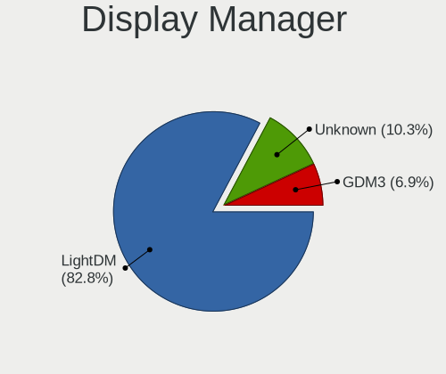
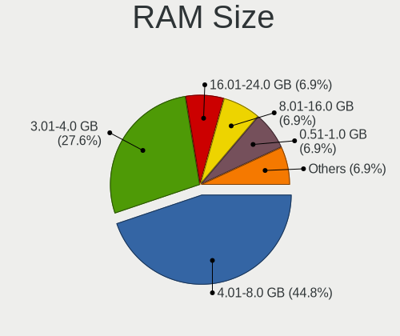
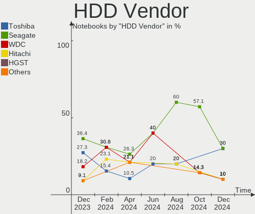
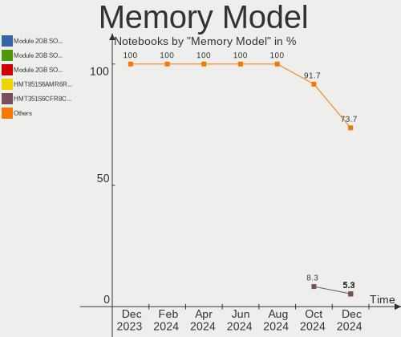

Xubuntu Hardware Trends (Notebook)
----------------------------------

A project to identify most popular hardware characteristics and track their change
over time based on data collected by Xubuntu users at https://Linux-Hardware.org.

Anyone can contribute to the study by uploading probes of their computers by
the [hw-probe](https://github.com/linuxhw/hw-probe) tool:

    sudo -E hw-probe -all -upload

Full-feature report is available here: https://linux-hardware.org/?view=trends&formfactor=notebook

Period: Mar, 2021.

Contents
--------

- [ OS                       ](#os)
- [ OS Family                ](#os-family)
- [ Kernel                   ](#kernel)
- [ Kernel Family            ](#kernel-family)
- [ Kernel Major Ver.        ](#kernel-major-ver)
- [ Arch                     ](#arch)
- [ DE                       ](#de)
- [ Display Server           ](#display-server)
- [ Display Manager          ](#display-manager)
- [ OS Lang                  ](#os-lang)
- [ Boot Mode                ](#boot-mode)
- [ Filesystem               ](#filesystem)
- [ Part. scheme             ](#part-scheme)
- [ Dual Boot with Linux/BSD ](#dual-boot-with-linux/bsd)
- [ Dual Boot (Win)          ](#dual-boot-win)
- [ Country                  ](#country)
- [ City                     ](#city)
- [ Vendor                   ](#vendor)
- [ Model                    ](#model)
- [ Model Family             ](#model-family)
- [ MFG Year                 ](#mfg-year)
- [ Form Factor              ](#form-factor)
- [ Secure Boot              ](#secure-boot)
- [ Coreboot                 ](#coreboot)
- [ RAM Size                 ](#ram-size)
- [ RAM Used                 ](#ram-used)
- [ Has CD-ROM               ](#has-cd-rom)
- [ Total Drives             ](#total-drives)
- [ Has Ethernet             ](#has-ethernet)
- [ Has WiFi                 ](#has-wifi)
- [ Has Bluetooth            ](#has-bluetooth)
- [ Drive Vendor             ](#drive-vendor)
- [ Drive Model              ](#drive-model)
- [ HDD Vendor               ](#hdd-vendor)
- [ SSD Vendor               ](#ssd-vendor)
- [ Drive Kind               ](#drive-kind)
- [ Drive Connector          ](#drive-connector)
- [ Drive Size               ](#drive-size)
- [ Space Total              ](#space-total)
- [ Space Used               ](#space-used)
- [ Malfunc. Drives          ](#malfunc-drives)
- [ Malfunc. Drive Vendor    ](#malfunc-drive-vendor)
- [ Malfunc. HDD Vendor      ](#malfunc-hdd-vendor)
- [ Malfunc. Drive Kind      ](#malfunc-drive-kind)
- [ Failed Drives            ](#failed-drives)
- [ Failed Drive Vendor      ](#failed-drive-vendor)
- [ Drive Status             ](#drive-status)
- [ Storage Vendor           ](#storage-vendor)
- [ Storage Model            ](#storage-model)
- [ Storage Kind             ](#storage-kind)
- [ CPU Vendor               ](#cpu-vendor)
- [ CPU Model                ](#cpu-model)
- [ CPU Model Family         ](#cpu-model-family)
- [ CPU Cores                ](#cpu-cores)
- [ CPU Sockets              ](#cpu-sockets)
- [ CPU Threads              ](#cpu-threads)
- [ CPU Op-Modes             ](#cpu-op-modes)
- [ CPU Microcode            ](#cpu-microcode)
- [ CPU Microarch            ](#cpu-microarch)
- [ GPU Vendor               ](#gpu-vendor)
- [ GPU Model                ](#gpu-model)
- [ GPU Combo                ](#gpu-combo)
- [ GPU Driver               ](#gpu-driver)
- [ GPU Memory               ](#gpu-memory)
- [ Monitor Vendor           ](#monitor-vendor)
- [ Monitor Model            ](#monitor-model)
- [ Monitor Resolution       ](#monitor-resolution)
- [ Monitor Diagonal         ](#monitor-diagonal)
- [ Monitor Width            ](#monitor-width)
- [ Aspect Ratio             ](#aspect-ratio)
- [ Monitor Area             ](#monitor-area)
- [ Pixel Density            ](#pixel-density)
- [ Multiple Monitors        ](#multiple-monitors)
- [ Net Controller Vendor    ](#net-controller-vendor)
- [ Net Controller Model     ](#net-controller-model)
- [ Wireless Vendor          ](#wireless-vendor)
- [ Wireless Model           ](#wireless-model)
- [ Ethernet Vendor          ](#ethernet-vendor)
- [ Ethernet Model           ](#ethernet-model)
- [ Net Controller Kind      ](#net-controller-kind)
- [ Used Controller          ](#used-controller)
- [ NICs                     ](#nics)
- [ IPv6                     ](#ipv6)
- [ Memory Vendor            ](#memory-vendor)
- [ Memory Model             ](#memory-model)
- [ Memory Kind              ](#memory-kind)
- [ Memory Form Factor       ](#memory-form-factor)
- [ Memory Size              ](#memory-size)
- [ Memory Speed             ](#memory-speed)
- [ Sound Vendor             ](#sound-vendor)
- [ Sound Model              ](#sound-model)
- [ Camera Vendor            ](#camera-vendor)
- [ Camera Model             ](#camera-model)
- [ Fingerprint Vendor       ](#fingerprint-vendor)
- [ Fingerprint Model        ](#fingerprint-model)
- [ Chipcard Vendor          ](#chipcard-vendor)
- [ Chipcard Model           ](#chipcard-model)
- [ Printer Vendor           ](#printer-vendor)
- [ Printer Model            ](#printer-model)
- [ Scanner Vendor           ](#scanner-vendor)
- [ Scanner Model            ](#scanner-model)
- [ Bluetooth Vendor         ](#bluetooth-vendor)
- [ Bluetooth Model          ](#bluetooth-model)
- [ Unsupported Devices      ](#unsupported-devices)
- [ Unsupported Device Types ](#unsupported-device-types)

OS
--

Installed operating systems

| Name          | Notebooks | Percent |
|---------------|-----------|---------|
| Xubuntu 20.04 | 53        | 61.63%  |
| Xubuntu 18.04 | 19        | 22.09%  |
| Xubuntu 20.10 | 9         | 10.47%  |
| Xubuntu 16.04 | 3         | 3.49%   |
| Xubuntu 21.04 | 1         | 1.16%   |
| Xubuntu 19.10 | 1         | 1.16%   |

OS Family
---------

OS without a version

| Name    | Notebooks | Percent |
|---------|-----------|---------|
| Xubuntu | 86        | 100%    |

Kernel
------

Version of the Linux kernel

| Version                   | Notebooks | Percent |
|---------------------------|-----------|---------|
| 5.4.0-67-generic          | 17        | 19.77%  |
| 5.4.0-66-generic          | 12        | 13.95%  |
| 5.8.0-44-generic          | 8         | 9.3%    |
| 5.8.0-45-generic          | 4         | 4.65%   |
| 5.4.0-70-generic          | 4         | 4.65%   |
| 4.15.0-136-generic        | 4         | 4.65%   |
| 5.8.0-48-generic          | 3         | 3.49%   |
| 5.4.0-66-lowlatency       | 3         | 3.49%   |
| 5.4.0-65-generic          | 3         | 3.49%   |
| 5.8.0-43-generic          | 2         | 2.33%   |
| 5.8.0-49-generic          | 1         | 1.16%   |
| 5.8.0-44-lowlatency       | 1         | 1.16%   |
| 5.8.0-43-lowlatency       | 1         | 1.16%   |
| 5.8.0-36-generic          | 1         | 1.16%   |
| 5.8.0-25-generic          | 1         | 1.16%   |
| 5.7.19-050719-generic     | 1         | 1.16%   |
| 5.4.0-65-lowlatency       | 1         | 1.16%   |
| 5.4.0-60-generic          | 1         | 1.16%   |
| 5.4.0-52-generic          | 1         | 1.16%   |
| 5.4.0-42-lowlatency       | 1         | 1.16%   |
| 5.4.0-42-generic          | 1         | 1.16%   |
| 5.3.0-64-generic          | 1         | 1.16%   |
| 5.3.0-53-generic          | 1         | 1.16%   |
| 5.11.8-051108-generic     | 1         | 1.16%   |
| 5.11.6-051106-generic     | 1         | 1.16%   |
| 5.11.3-051103-generic     | 1         | 1.16%   |
| 5.11.0-11-generic         | 1         | 1.16%   |
| 5.10.8-051008-generic     | 1         | 1.16%   |
| 5.10.16-051016-lowlatency | 1         | 1.16%   |
| 4.4.0-206-generic         | 1         | 1.16%   |
| 4.4.0-204-generic         | 1         | 1.16%   |
| 4.15.0-36-generic         | 1         | 1.16%   |
| 4.15.0-20-lowlatency      | 1         | 1.16%   |
| 4.15.0-140-lowlatency     | 1         | 1.16%   |
| 4.15.0-135-generic        | 1         | 1.16%   |
| 4.15.0-126-generic        | 1         | 1.16%   |

Kernel Family
-------------

Linux kernel without a distro release

| Version | Notebooks | Percent |
|---------|-----------|---------|
| 5.4.0   | 44        | 51.16%  |
| 5.8.0   | 22        | 25.58%  |
| 4.15.0  | 9         | 10.47%  |
| 5.3.0   | 2         | 2.33%   |
| 4.4.0   | 2         | 2.33%   |
| 5.7.19  | 1         | 1.16%   |
| 5.11.8  | 1         | 1.16%   |
| 5.11.6  | 1         | 1.16%   |
| 5.11.3  | 1         | 1.16%   |
| 5.11.0  | 1         | 1.16%   |
| 5.10.8  | 1         | 1.16%   |
| 5.10.16 | 1         | 1.16%   |

Kernel Major Ver.
-----------------

Linux kernel major version

| Version | Notebooks | Percent |
|---------|-----------|---------|
| 5.4     | 44        | 51.16%  |
| 5.8     | 22        | 25.58%  |
| 4.15    | 9         | 10.47%  |
| 5.11    | 4         | 4.65%   |
| 5.3     | 2         | 2.33%   |
| 5.10    | 2         | 2.33%   |
| 4.4     | 2         | 2.33%   |
| 5.7     | 1         | 1.16%   |

Arch
----

OS architecture (x86_64, i586, etc.)

| Name   | Notebooks | Percent |
|--------|-----------|---------|
| x86_64 | 75        | 87.21%  |
| i686   | 11        | 12.79%  |

DE
--

Desktop Environment

| Name | Notebooks | Percent |
|------|-----------|---------|
| XFCE | 83        | 96.51%  |
| i3   | 2         | 2.33%   |
| KDE5 | 1         | 1.16%   |

Display Server
--------------

X11 or Wayland

| Name | Notebooks | Percent |
|------|-----------|---------|
| X11  | 85        | 98.84%  |
| Tty  | 1         | 1.16%   |

Display Manager
---------------

SDDM, LightDM, etc.

| Name    | Notebooks | Percent |
|---------|-----------|---------|
| Unknown | 51        | 59.3%   |
| TDM     | 34        | 39.53%  |
| GDM     | 1         | 1.16%   |

OS Lang
-------

Language

| Lang  | Notebooks | Percent |
|-------|-----------|---------|
| en_US | 30        | 34.88%  |
| de_DE | 9         | 10.47%  |
| fr_FR | 8         | 9.3%    |
| ru_RU | 7         | 8.14%   |
| pl_PL | 4         | 4.65%   |
| it_IT | 4         | 4.65%   |
| en_GB | 4         | 4.65%   |
| pt_BR | 3         | 3.49%   |
| hu_HU | 3         | 3.49%   |
| C     | 3         | 3.49%   |
| en_CA | 2         | 2.33%   |
| fr_BE | 1         | 1.16%   |
| es_PE | 1         | 1.16%   |
| es_ES | 1         | 1.16%   |
| es_AR | 1         | 1.16%   |
| en_SG | 1         | 1.16%   |
| en_IL | 1         | 1.16%   |
| en_AU | 1         | 1.16%   |
| de_AT | 1         | 1.16%   |
| da_DK | 1         | 1.16%   |

Boot Mode
---------

EFI or BIOS

| Mode | Notebooks | Percent |
|------|-----------|---------|
| BIOS | 51        | 59.3%   |
| EFI  | 35        | 40.7%   |

Filesystem
----------

Type of filesystem

| Type    | Notebooks | Percent |
|---------|-----------|---------|
| Ext4    | 77        | 89.53%  |
| Overlay | 4         | 4.65%   |
| Btrfs   | 4         | 4.65%   |
| Zfs     | 1         | 1.16%   |

Part. scheme
------------

Scheme of partitioning

| Type    | Notebooks | Percent |
|---------|-----------|---------|
| Unknown | 50        | 58.14%  |
| GPT     | 25        | 29.07%  |
| MBR     | 11        | 12.79%  |

Dual Boot with Linux/BSD
------------------------

Hosting more than one Linux/BSD

| Dual boot | Notebooks | Percent |
|-----------|-----------|---------|
| No        | 77        | 89.53%  |
| Yes       | 9         | 10.47%  |

Dual Boot (Win)
---------------

Hosting Linux and Windows

| Dual boot | Notebooks | Percent |
|-----------|-----------|---------|
| No        | 58        | 67.44%  |
| Yes       | 28        | 32.56%  |

Country
-------

Geographic location (country)

| Country                | Notebooks | Percent |
|------------------------|-----------|---------|
| USA                    | 16        | 18.6%   |
| Germany                | 12        | 13.95%  |
| France                 | 8         | 9.3%    |
| Russia                 | 7         | 8.14%   |
| UK                     | 5         | 5.81%   |
| Spain                  | 4         | 4.65%   |
| Italy                  | 4         | 4.65%   |
| Poland                 | 3         | 3.49%   |
| Hungary                | 3         | 3.49%   |
| Canada                 | 3         | 3.49%   |
| Brazil                 | 3         | 3.49%   |
| Romania                | 2         | 2.33%   |
| Bulgaria               | 2         | 2.33%   |
| Belgium                | 2         | 2.33%   |
| Argentina              | 2         | 2.33%   |
| Singapore              | 1         | 1.16%   |
| Peru                   | 1         | 1.16%   |
| Israel                 | 1         | 1.16%   |
| Indonesia              | 1         | 1.16%   |
| Georgia                | 1         | 1.16%   |
| Denmark                | 1         | 1.16%   |
| Bosnia and Herzegovina | 1         | 1.16%   |
| Belarus                | 1         | 1.16%   |
| Austria                | 1         | 1.16%   |
| Australia              | 1         | 1.16%   |

City
----

Geographic location (city)

| City              | Notebooks | Percent |
|-------------------|-----------|---------|
| Rostov-on-Don     | 4         | 4.65%   |
| São Paulo        | 2         | 2.33%   |
| Sofia             | 2         | 2.33%   |
| Karlsruhe         | 2         | 2.33%   |
| Budapest          | 2         | 2.33%   |
| Świętochłowice | 1         | 1.16%   |
| Wasilla           | 1         | 1.16%   |
| Warsaw            | 1         | 1.16%   |
| Vol'ginskiy       | 1         | 1.16%   |
| Virreyes          | 1         | 1.16%   |
| Valby             | 1         | 1.16%   |
| Târgu Jiu        | 1         | 1.16%   |
| Toulouse          | 1         | 1.16%   |
| Toronto           | 1         | 1.16%   |
| Tonypandy         | 1         | 1.16%   |
| Thunder Bay       | 1         | 1.16%   |
| Tel Aviv          | 1         | 1.16%   |
| Tbilisi           | 1         | 1.16%   |
| Tarbes            | 1         | 1.16%   |
| Surabaya          | 1         | 1.16%   |
| Springfield       | 1         | 1.16%   |
| Sochi             | 1         | 1.16%   |
| Singapore         | 1         | 1.16%   |
| Sestao            | 1         | 1.16%   |
| Schaarbeek        | 1         | 1.16%   |
| Sarajevo          | 1         | 1.16%   |
| Saarbrücken      | 1         | 1.16%   |
| Rome              | 1         | 1.16%   |
| Rigby             | 1         | 1.16%   |
| Poznan            | 1         | 1.16%   |
| Ploieşti         | 1         | 1.16%   |
| Peterborough      | 1         | 1.16%   |
| Paris             | 1         | 1.16%   |
| Olympia           | 1         | 1.16%   |
| Olivos            | 1         | 1.16%   |
| Novocherkassk     | 1         | 1.16%   |
| New Haven         | 1         | 1.16%   |
| Moscow            | 1         | 1.16%   |
| Mont-de-Marsan    | 1         | 1.16%   |
| Mississauga       | 1         | 1.16%   |
| Minsk             | 1         | 1.16%   |
| Maxhutte-Haidhof  | 1         | 1.16%   |
| Mauston           | 1         | 1.16%   |
| Madrid            | 1         | 1.16%   |
| Los Urrutias      | 1         | 1.16%   |
| Lincoln           | 1         | 1.16%   |
| Lima              | 1         | 1.16%   |
| Laurelton         | 1         | 1.16%   |
| Lansdale          | 1         | 1.16%   |
| Kaiserslautern    | 1         | 1.16%   |
| Iseo              | 1         | 1.16%   |
| Hayange           | 1         | 1.16%   |
| Hamburg           | 1         | 1.16%   |
| Hainichen         | 1         | 1.16%   |
| Gueret            | 1         | 1.16%   |
| Graz              | 1         | 1.16%   |
| Grasse            | 1         | 1.16%   |
| Finchley          | 1         | 1.16%   |
| Filderstadt       | 1         | 1.16%   |
| Fayetteville      | 1         | 1.16%   |

Vendor
------

Motherboard manufacturer

| Name                | Notebooks | Percent |
|---------------------|-----------|---------|
| Dell                | 16        | 18.6%   |
| Lenovo              | 15        | 17.44%  |
| Hewlett-Packard     | 14        | 16.28%  |
| ASUSTek Computer    | 10        | 11.63%  |
| Toshiba             | 9         | 10.47%  |
| Acer                | 6         | 6.98%   |
| Medion              | 3         | 3.49%   |
| Sony                | 2         | 2.33%   |
| Samsung Electronics | 2         | 2.33%   |
| MSI                 | 2         | 2.33%   |
| Schenker            | 1         | 1.16%   |
| Packard Bell        | 1         | 1.16%   |
| Notebook            | 1         | 1.16%   |
| Gigabyte Technology | 1         | 1.16%   |
| Fujitsu Siemens     | 1         | 1.16%   |
| Direkt-Tek          | 1         | 1.16%   |
| Apple               | 1         | 1.16%   |

Model
-----

Motherboard model

| Name                                                                                     | Notebooks | Percent |
|------------------------------------------------------------------------------------------|-----------|---------|
| Sony VGN-CR19VN_B                                                                        | 2         | 2.33%   |
| HP Pavilion dv6                                                                          | 2         | 2.33%   |
| Toshiba TECRA M7                                                                         | 1         | 1.16%   |
| Toshiba Satellite Pro A120                                                               | 1         | 1.16%   |
| Toshiba Satellite M115                                                                   | 1         | 1.16%   |
| Toshiba Satellite L775                                                                   | 1         | 1.16%   |
| Toshiba Satellite L350D                                                                  | 1         | 1.16%   |
| Toshiba Satellite L300                                                                   | 1         | 1.16%   |
| Toshiba Satellite E45W-C                                                                 | 1         | 1.16%   |
| Toshiba Satellite C655D                                                                  | 1         | 1.16%   |
| Toshiba PORTEGE R930                                                                     | 1         | 1.16%   |
| Schenker XMG CORE 17(M20, RTX 2060)                                                      | 1         | 1.16%   |
| Samsung R540/R580/R780/SA41/E452/E852                                                    | 1         | 1.16%   |
| Samsung 350V5C/350V5X/350V4C/350V4X/351V5C/351V5X/351V4C/351V4X/3540VC/3540VX/3440VC/344 | 1         | 1.16%   |
| Packard Bell EasyNote TK87                                                               | 1         | 1.16%   |
| Notebook N14xWU                                                                          | 1         | 1.16%   |
| MSI MS-1727                                                                              | 1         | 1.16%   |
| MSI GE76 Raider 10UH                                                                     | 1         | 1.16%   |
| Medion WIM2220                                                                           | 1         | 1.16%   |
| Medion MAM2010                                                                           | 1         | 1.16%   |
| Medion Akoya E4214 MD99570                                                               | 1         | 1.16%   |
| Lenovo Z50-75 80EC                                                                       | 1         | 1.16%   |
| Lenovo Yoga Slim 7 14ITL05 82A3                                                          | 1         | 1.16%   |
| Lenovo Yoga 300-11IBR 80M1                                                               | 1         | 1.16%   |
| Lenovo V560                                                                              | 1         | 1.16%   |
| Lenovo ThinkPad X270 W10DG 20K5S0TS00                                                    | 1         | 1.16%   |
| Lenovo ThinkPad X200T 7453CTO                                                            | 1         | 1.16%   |
| Lenovo ThinkPad X1 Carbon 3rd 20BT002PAU                                                 | 1         | 1.16%   |
| Lenovo ThinkPad T495 20NJ0015SP                                                          | 1         | 1.16%   |
| Lenovo ThinkPad T420 4236GH6                                                             | 1         | 1.16%   |
| Lenovo ThinkPad Edge E540 20C60041GE                                                     | 1         | 1.16%   |
| Lenovo ThinkPad E525 12003NG                                                             | 1         | 1.16%   |
| Lenovo Legion Y530-15ICH 81FV                                                            | 1         | 1.16%   |
| Lenovo IdeaPad N585                                                                      | 1         | 1.16%   |
| Lenovo G560 0679                                                                         | 1         | 1.16%   |
| Lenovo B50-70 20384                                                                      | 1         | 1.16%   |
| HP ZBook 15 G6                                                                           | 1         | 1.16%   |
| HP ProBook 430 G5                                                                        | 1         | 1.16%   |
| HP Pavilion 17                                                                           | 1         | 1.16%   |
| HP Pavilion 15                                                                           | 1         | 1.16%   |
| HP Laptop 15-dy2xxx                                                                      | 1         | 1.16%   |
| HP Laptop 15-dw0xxx                                                                      | 1         | 1.16%   |
| HP Laptop 14s-fq0xxx                                                                     | 1         | 1.16%   |
| HP EliteBook 850 G3                                                                      | 1         | 1.16%   |
| HP EliteBook 840 G2                                                                      | 1         | 1.16%   |
| HP Compaq Presario CQ40                                                                  | 1         | 1.16%   |
| HP 550                                                                                   | 1         | 1.16%   |
| HP 15                                                                                    | 1         | 1.16%   |
| Gigabyte GB-BSi3A-6100                                                                   | 1         | 1.16%   |
| Fujitsu Siemens AMILO Li 1718                                                            | 1         | 1.16%   |
| Direkt-Tek DTLAPY116-1                                                                   | 1         | 1.16%   |
| Dell XPS L502X                                                                           | 1         | 1.16%   |
| Dell XPS 13 7390                                                                         | 1         | 1.16%   |
| Dell Latitude E6530                                                                      | 1         | 1.16%   |
| Dell Latitude E6510                                                                      | 1         | 1.16%   |
| Dell Latitude E6430                                                                      | 1         | 1.16%   |
| Dell Latitude E6330                                                                      | 1         | 1.16%   |
| Dell Latitude E5440                                                                      | 1         | 1.16%   |
| Dell Latitude E4300                                                                      | 1         | 1.16%   |
| Dell Latitude D630                                                                       | 1         | 1.16%   |

Model Family
------------

Motherboard model prefix

| Name                   | Notebooks | Percent |
|------------------------|-----------|---------|
| Dell Latitude          | 8         | 9.3%    |
| Toshiba Satellite      | 7         | 8.14%   |
| Lenovo ThinkPad        | 7         | 8.14%   |
| Dell Inspiron          | 6         | 6.98%   |
| Acer Aspire            | 5         | 5.81%   |
| HP Pavilion            | 4         | 4.65%   |
| HP Laptop              | 3         | 3.49%   |
| Sony VGN-CR19VN        | 2         | 2.33%   |
| Lenovo Yoga            | 2         | 2.33%   |
| HP EliteBook           | 2         | 2.33%   |
| Dell XPS               | 2         | 2.33%   |
| Toshiba TECRA          | 1         | 1.16%   |
| Toshiba PORTEGE        | 1         | 1.16%   |
| Schenker XMG           | 1         | 1.16%   |
| Samsung R540           | 1         | 1.16%   |
| Samsung 350V5C         | 1         | 1.16%   |
| Packard Bell EasyNote  | 1         | 1.16%   |
| Notebook N14xWU        | 1         | 1.16%   |
| MSI MS-1727            | 1         | 1.16%   |
| MSI GE76               | 1         | 1.16%   |
| Medion WIM2220         | 1         | 1.16%   |
| Medion MAM2010         | 1         | 1.16%   |
| Medion Akoya           | 1         | 1.16%   |
| Lenovo Z50-75          | 1         | 1.16%   |
| Lenovo V560            | 1         | 1.16%   |
| Lenovo Legion          | 1         | 1.16%   |
| Lenovo IdeaPad         | 1         | 1.16%   |
| Lenovo G560            | 1         | 1.16%   |
| Lenovo B50-70          | 1         | 1.16%   |
| HP ZBook               | 1         | 1.16%   |
| HP ProBook             | 1         | 1.16%   |
| HP Compaq              | 1         | 1.16%   |
| HP 550                 | 1         | 1.16%   |
| HP 15                  | 1         | 1.16%   |
| Gigabyte GB-BSi3A-6100 | 1         | 1.16%   |
| Fujitsu Siemens AMILO  | 1         | 1.16%   |
| Direkt-Tek DTLAPY116-1 | 1         | 1.16%   |
| ASUS X553MA            | 1         | 1.16%   |
| ASUS X51RL             | 1         | 1.16%   |
| ASUS UX305FA           | 1         | 1.16%   |
| ASUS K52JT             | 1         | 1.16%   |
| ASUS K40AF             | 1         | 1.16%   |
| ASUS GL702VM           | 1         | 1.16%   |
| ASUS GL553VD           | 1         | 1.16%   |
| ASUS F5SR              | 1         | 1.16%   |
| ASUS F5R               | 1         | 1.16%   |
| ASUS A6VC              | 1         | 1.16%   |
| Apple MacBookAir4      | 1         | 1.16%   |
| Acer Ferrari           | 1         | 1.16%   |

MFG Year
--------

Motherboard manufacture year

| Year | Notebooks | Percent |
|------|-----------|---------|
| 2020 | 10        | 11.63%  |
| 2015 | 10        | 11.63%  |
| 2011 | 10        | 11.63%  |
| 2019 | 9         | 10.47%  |
| 2010 | 9         | 10.47%  |
| 2008 | 7         | 8.14%   |
| 2007 | 5         | 5.81%   |
| 2018 | 4         | 4.65%   |
| 2013 | 4         | 4.65%   |
| 2012 | 4         | 4.65%   |
| 2017 | 3         | 3.49%   |
| 2016 | 3         | 3.49%   |
| 2009 | 2         | 2.33%   |
| 2005 | 2         | 2.33%   |
| 2021 | 1         | 1.16%   |
| 2014 | 1         | 1.16%   |
| 2006 | 1         | 1.16%   |
| 2003 | 1         | 1.16%   |

Form Factor
-----------

Physical design of the computer

| Name     | Notebooks | Percent |
|----------|-----------|---------|
| Notebook | 86        | 100%    |

Secure Boot
-----------

Enabled or disabled

| State    | Notebooks | Percent |
|----------|-----------|---------|
| Disabled | 80        | 93.02%  |
| Enabled  | 6         | 6.98%   |

Coreboot
--------

Have coreboot on board

| Used | Notebooks | Percent |
|------|-----------|---------|
| No   | 86        | 100%    |

RAM Size
--------

Total RAM memory

| Size in GB  | Notebooks | Percent |
|-------------|-----------|---------|
| 3.01-4.0    | 29        | 33.72%  |
| 4.01-8.0    | 18        | 20.93%  |
| 1.01-2.0    | 10        | 11.63%  |
| 8.01-16.0   | 10        | 11.63%  |
| 16.01-24.0  | 9         | 10.47%  |
| 2.01-3.0    | 4         | 4.65%   |
| 32.01-64.0  | 3         | 3.49%   |
| 64.01-256.0 | 2         | 2.33%   |
| 0.51-1.0    | 1         | 1.16%   |

RAM Used
--------

Used RAM memory

| Used GB   | Notebooks | Percent |
|-----------|-----------|---------|
| 1.01-2.0  | 40        | 46.51%  |
| 2.01-3.0  | 18        | 20.93%  |
| 0.51-1.0  | 16        | 18.6%   |
| 4.01-8.0  | 5         | 5.81%   |
| 3.01-4.0  | 3         | 3.49%   |
| 8.01-16.0 | 3         | 3.49%   |
| 0.01-0.5  | 1         | 1.16%   |

Has CD-ROM
----------

Has CD-ROM on board

| Presented | Notebooks | Percent |
|-----------|-----------|---------|
| Yes       | 45        | 52.33%  |
| No        | 41        | 47.67%  |

Total Drives
------------

Number of drives on board

| Drives | Notebooks | Percent |
|--------|-----------|---------|
| 1      | 65        | 75.58%  |
| 2      | 17        | 19.77%  |
| 3      | 2         | 2.33%   |
| 7      | 1         | 1.16%   |
| 0      | 1         | 1.16%   |

Has Ethernet
------------

Has Ethernet on board

| Presented | Notebooks | Percent |
|-----------|-----------|---------|
| Yes       | 77        | 89.53%  |
| No        | 9         | 10.47%  |

Has WiFi
--------

Has WiFi module

| Presented | Notebooks | Percent |
|-----------|-----------|---------|
| Yes       | 85        | 98.84%  |
| No        | 1         | 1.16%   |

Has Bluetooth
-------------

Has Bluetooth module

| Presented | Notebooks | Percent |
|-----------|-----------|---------|
| Yes       | 53        | 61.63%  |
| No        | 33        | 38.37%  |

Drive Vendor
------------

Hard drive vendors

| Vendor              | Notebooks | Drives | Percent |
|---------------------|-----------|--------|---------|
| Samsung Electronics | 14        | 15     | 14%     |
| WDC                 | 13        | 14     | 13%     |
| Toshiba             | 12        | 12     | 12%     |
| Seagate             | 12        | 18     | 12%     |
| Hitachi             | 11        | 11     | 11%     |
| Unknown             | 8         | 8      | 8%      |
| Kingston            | 6         | 6      | 6%      |
| HGST                | 3         | 3      | 3%      |
| Micron Technology   | 2         | 2      | 2%      |
| Intel               | 2         | 2      | 2%      |
| Fujitsu             | 2         | 2      | 2%      |
| USB3.0              | 1         | 1      | 1%      |
| Transcend           | 1         | 1      | 1%      |
| SSK                 | 1         | 1      | 1%      |
| Smartbuy            | 1         | 1      | 1%      |
| SK Hynix            | 1         | 1      | 1%      |
| SanDisk             | 1         | 1      | 1%      |
| Phison              | 1         | 1      | 1%      |
| OCZ                 | 1         | 1      | 1%      |
| Netac               | 1         | 1      | 1%      |
| Neo Forza           | 1         | 1      | 1%      |
| LONDISK             | 1         | 1      | 1%      |
| Crucial             | 1         | 1      | 1%      |
| China               | 1         | 1      | 1%      |
| Apple               | 1         | 1      | 1%      |
| Apacer              | 1         | 1      | 1%      |

Drive Model
-----------

Hard drive models

| Model                                      | Notebooks | Percent |
|--------------------------------------------|-----------|---------|
| Seagate ST1000LM024 HN-M101MBB 1TB         | 3         | 2.91%   |
| WDC WDS120G2G0A-00JH30 120GB SSD           | 2         | 1.94%   |
| WDC WD10JPVX-22JC3T0 1TB                   | 2         | 1.94%   |
| Unknown MMC Card  32GB                     | 2         | 1.94%   |
| Kingston SA400S37120G 120GB SSD            | 2         | 1.94%   |
| HGST HTS545050A7E680 500GB                 | 2         | 1.94%   |
| WDC WDS200T3X0C-00SJG0 2TB                 | 1         | 0.97%   |
| WDC WD3200BPVT-75ZEST0 320GB               | 1         | 0.97%   |
| WDC WD3200BEVT-75A23T0 320GB               | 1         | 0.97%   |
| WDC WD3200BEKT-75PVMT1 320GB               | 1         | 0.97%   |
| WDC WD1600BJKT-75F4T0 160GB                | 1         | 0.97%   |
| WDC WD1200BEVS-22RST0 120GB                | 1         | 0.97%   |
| WDC WD10SPZX-75Z10T1 1TB                   | 1         | 0.97%   |
| WDC WD10JPVX-75JC3T0 1TB                   | 1         | 0.97%   |
| WDC WD10JPVT-08A1YT2 1TB                   | 1         | 0.97%   |
| WDC WD10JPCX-24UE4T0 1TB                   | 1         | 0.97%   |
| USB3.0 Super Speed 1TB                     | 1         | 0.97%   |
| Unknown SD/MMC/MS PRO 128GB                | 1         | 0.97%   |
| Unknown MMC Card  64GB                     | 1         | 0.97%   |
| Unknown MMC Card  4GB                      | 1         | 0.97%   |
| Unknown MMC Card  30MB                     | 1         | 0.97%   |
| Unknown MMC Card  16GB                     | 1         | 0.97%   |
| Unknown MMC Card  128GB                    | 1         | 0.97%   |
| Transcend TS256GMTS430S 256GB SSD          | 1         | 0.97%   |
| Toshiba THNSNH060GMCT 64GB SSD             | 1         | 0.97%   |
| Toshiba THNSN5256GPU7 256GB                | 1         | 0.97%   |
| Toshiba THNSF5256GPUK 256GB                | 1         | 0.97%   |
| Toshiba MQ02ABD100H 1TB                    | 1         | 0.97%   |
| Toshiba MQ01ACF032 320GB                   | 1         | 0.97%   |
| Toshiba MQ01ABD075 752GB                   | 1         | 0.97%   |
| Toshiba MK8034GSX 80GB                     | 1         | 0.97%   |
| Toshiba MK8032GSX 80GB                     | 1         | 0.97%   |
| Toshiba MK2565GSXN 250GB                   | 1         | 0.97%   |
| Toshiba MK2555GSXF 250GB                   | 1         | 0.97%   |
| Toshiba MK1652GSX 160GB                    | 1         | 0.97%   |
| Toshiba KBG30ZMS256G NVMe 256GB            | 1         | 0.97%   |
| SSK Disk 1024GB                            | 1         | 0.97%   |
| Smartbuy SSD 240GB                         | 1         | 0.97%   |
| SK Hynix HFS128G39TND-N210A 128GB SSD      | 1         | 0.97%   |
| Seagate ST9750420AS 752GB                  | 1         | 0.97%   |
| Seagate ST9500420AS 500GB                  | 1         | 0.97%   |
| Seagate ST9320325AS 320GB                  | 1         | 0.97%   |
| Seagate ST9250421AS 250GB                  | 1         | 0.97%   |
| Seagate ST500LM012 HN-M500MBB 500GB        | 1         | 0.97%   |
| Seagate ST320LT020-9YG142 320GB            | 1         | 0.97%   |
| Seagate ST2000LX001-1RG174 2TB             | 1         | 0.97%   |
| Seagate ST1000LM035-1RK172 1TB             | 1         | 0.97%   |
| Seagate FireCuda 520 SSD ZP2000GM30002 2TB | 1         | 0.97%   |
| Seagate Backup+ Hub BK 2TB                 | 1         | 0.97%   |
| SanDisk Extreme SSD 1TB                    | 1         | 0.97%   |
| Samsung SSD PM810 2.5 7mm 256GB            | 1         | 0.97%   |
| Samsung SSD 970 EVO 250GB                  | 1         | 0.97%   |
| Samsung SSD 870 EVO 500GB                  | 1         | 0.97%   |
| Samsung SSD 860 EVO M.2 500GB              | 1         | 0.97%   |
| Samsung SSD 860 EVO 500GB                  | 1         | 0.97%   |
| Samsung SSD 850 EVO 500GB                  | 1         | 0.97%   |
| Samsung SSD 850 EVO 250GB                  | 1         | 0.97%   |
| Samsung SSD 830 Series 256GB               | 1         | 0.97%   |
| Samsung PM981a NVMe 512GB                  | 1         | 0.97%   |
| Samsung MZVLB512HBJQ-000L7 512GB           | 1         | 0.97%   |

HDD Vendor
----------

Hard disk drive vendors

| Vendor              | Notebooks | Drives | Percent |
|---------------------|-----------|--------|---------|
| WDC                 | 11        | 11     | 22.45%  |
| Seagate             | 11        | 11     | 22.45%  |
| Hitachi             | 11        | 11     | 22.45%  |
| Toshiba             | 8         | 8      | 16.33%  |
| HGST                | 3         | 3      | 6.12%   |
| Samsung Electronics | 2         | 2      | 4.08%   |
| Fujitsu             | 2         | 2      | 4.08%   |
| USB3.0              | 1         | 1      | 2.04%   |

SSD Vendor
----------

Solid state drive vendors

| Vendor              | Notebooks | Drives | Percent |
|---------------------|-----------|--------|---------|
| Samsung Electronics | 9         | 9      | 28.13%  |
| Kingston            | 5         | 5      | 15.63%  |
| WDC                 | 2         | 2      | 6.25%   |
| Micron Technology   | 2         | 2      | 6.25%   |
| Transcend           | 1         | 1      | 3.13%   |
| Toshiba             | 1         | 1      | 3.13%   |
| Smartbuy            | 1         | 1      | 3.13%   |
| SK Hynix            | 1         | 1      | 3.13%   |
| SanDisk             | 1         | 1      | 3.13%   |
| OCZ                 | 1         | 1      | 3.13%   |
| Netac               | 1         | 1      | 3.13%   |
| Neo Forza           | 1         | 1      | 3.13%   |
| LONDISK             | 1         | 1      | 3.13%   |
| Intel               | 1         | 1      | 3.13%   |
| Crucial             | 1         | 1      | 3.13%   |
| China               | 1         | 1      | 3.13%   |
| Apple               | 1         | 1      | 3.13%   |
| Apacer              | 1         | 1      | 3.13%   |

Drive Kind
----------

HDD or SSD

| Kind    | Notebooks | Drives | Percent |
|---------|-----------|--------|---------|
| HDD     | 47        | 49     | 46.53%  |
| SSD     | 32        | 32     | 31.68%  |
| NVMe    | 12        | 12     | 11.88%  |
| MMC     | 7         | 7      | 6.93%   |
| Unknown | 3         | 8      | 2.97%   |

Drive Connector
---------------

SATA, SAS, NVMe, etc.

| Type | Notebooks | Drives | Percent |
|------|-----------|--------|---------|
| SATA | 74        | 78     | 75.51%  |
| NVMe | 12        | 12     | 12.24%  |
| MMC  | 7         | 7      | 7.14%   |
| SAS  | 5         | 11     | 5.1%    |

Drive Size
----------

Size of hard drive

| Size in TB | Notebooks | Drives | Percent |
|------------|-----------|--------|---------|
| 0.01-0.5   | 59        | 60     | 73.75%  |
| 0.51-1.0   | 20        | 20     | 25%     |
| 1.01-2.0   | 1         | 1      | 1.25%   |

Space Total
-----------

Amount of disk space available on the file system

| Size in GB     | Notebooks | Percent |
|----------------|-----------|---------|
| 101-250        | 26        | 30.23%  |
| 251-500        | 22        | 25.58%  |
| 501-1000       | 11        | 12.79%  |
| 51-100         | 11        | 12.79%  |
| 21-50          | 5         | 5.81%   |
| 1001-2000      | 4         | 4.65%   |
| 1-20           | 3         | 3.49%   |
| More than 3000 | 2         | 2.33%   |
| 2001-3000      | 1         | 1.16%   |
| Unknown        | 1         | 1.16%   |

Space Used
----------

Amount of used disk space

| Used GB        | Notebooks | Percent |
|----------------|-----------|---------|
| 1-20           | 35        | 40.7%   |
| 21-50          | 17        | 19.77%  |
| 101-250        | 11        | 12.79%  |
| 51-100         | 10        | 11.63%  |
| 251-500        | 8         | 9.3%    |
| 1001-2000      | 2         | 2.33%   |
| More than 3000 | 1         | 1.16%   |
| 501-1000       | 1         | 1.16%   |
| Unknown        | 1         | 1.16%   |

Malfunc. Drives
---------------

Drive models with a malfunction

| Model                                               | Notebooks | Drives | Percent |
|-----------------------------------------------------|-----------|--------|---------|
| WDC WD1600BJKT-75F4T0 160GB                         | 1         | 1      | 10%     |
| WDC WD10JPVX-22JC3T0 1TB                            | 1         | 1      | 10%     |
| WDC WD10JPVT-08A1YT2 1TB                            | 1         | 1      | 10%     |
| Seagate ST320LT020-9YG142 320GB                     | 1         | 1      | 10%     |
| Samsung Electronics HM321HI 320GB                   | 1         | 1      | 10%     |
| Neo Forza NFS011SA396-6007200 960GB SSD             | 1         | 1      | 10%     |
| Micron Technology MTFDDAV256TBN-1AR1ZABHA 256GB SSD | 1         | 1      | 10%     |
| Hitachi HTS723232A7A364 320GB                       | 1         | 1      | 10%     |
| HGST HTS545050A7E680 500GB                          | 1         | 1      | 10%     |
| Apple SSD SM256C 256GB                              | 1         | 1      | 10%     |

Malfunc. Drive Vendor
---------------------

Vendors of faulty drives

| Vendor              | Notebooks | Drives | Percent |
|---------------------|-----------|--------|---------|
| WDC                 | 3         | 3      | 30%     |
| Seagate             | 1         | 1      | 10%     |
| Samsung Electronics | 1         | 1      | 10%     |
| Neo Forza           | 1         | 1      | 10%     |
| Micron Technology   | 1         | 1      | 10%     |
| Hitachi             | 1         | 1      | 10%     |
| HGST                | 1         | 1      | 10%     |
| Apple               | 1         | 1      | 10%     |

Malfunc. HDD Vendor
-------------------

Vendors of faulty HDD drives

| Vendor              | Notebooks | Drives | Percent |
|---------------------|-----------|--------|---------|
| WDC                 | 3         | 3      | 42.86%  |
| Seagate             | 1         | 1      | 14.29%  |
| Samsung Electronics | 1         | 1      | 14.29%  |
| Hitachi             | 1         | 1      | 14.29%  |
| HGST                | 1         | 1      | 14.29%  |

Malfunc. Drive Kind
-------------------

Kinds of faulty drives

| Kind | Notebooks | Drives | Percent |
|------|-----------|--------|---------|
| HDD  | 7         | 7      | 70%     |
| SSD  | 3         | 3      | 30%     |

Failed Drives
-------------

Failed drive models

Zero info for selected period =(

Failed Drive Vendor
-------------------

Failed drive vendors

Zero info for selected period =(

Drive Status
------------

Number of failed and malfunc. drives

| Status   | Notebooks | Drives | Percent |
|----------|-----------|--------|---------|
| Detected | 53        | 67     | 58.89%  |
| Works    | 27        | 31     | 30%     |
| Malfunc  | 10        | 10     | 11.11%  |

Storage Vendor
--------------

Storage controller vendors

| Vendor                           | Notebooks | Percent |
|----------------------------------|-----------|---------|
| Intel                            | 58        | 64.44%  |
| AMD                              | 16        | 17.78%  |
| Samsung Electronics              | 4         | 4.44%   |
| Toshiba America Info Systems     | 3         | 3.33%   |
| VIA Technologies                 | 1         | 1.11%   |
| Silicon Integrated Systems [SiS] | 1         | 1.11%   |
| Silicon Image                    | 1         | 1.11%   |
| Seagate Technology               | 1         | 1.11%   |
| Sandisk                          | 1         | 1.11%   |
| Phison Electronics               | 1         | 1.11%   |
| Nvidia                           | 1         | 1.11%   |
| Kingston Technology Company      | 1         | 1.11%   |
| JMicron Technology               | 1         | 1.11%   |

Storage Model
-------------

Storage controller models

| Model                                                                                  | Notebooks | Percent |
|----------------------------------------------------------------------------------------|-----------|---------|
| AMD FCH SATA Controller [AHCI mode]                                                    | 8         | 7.92%   |
| Intel Wildcat Point-LP SATA Controller [AHCI Mode]                                     | 5         | 4.95%   |
| Intel Sunrise Point-LP SATA Controller [AHCI mode]                                     | 5         | 4.95%   |
| Intel 82801 Mobile SATA Controller [RAID mode]                                         | 5         | 4.95%   |
| Intel 7 Series Chipset Family 6-port SATA Controller [AHCI mode]                       | 5         | 4.95%   |
| Intel 6 Series/C200 Series Chipset Family 6 port Mobile SATA AHCI Controller           | 5         | 4.95%   |
| Intel 5 Series/3400 Series Chipset 4 port SATA AHCI Controller                         | 5         | 4.95%   |
| Intel 82801IBM/IEM (ICH9M/ICH9M-E) 4 port SATA Controller [AHCI mode]                  | 4         | 3.96%   |
| Samsung NVMe SSD Controller SM981/PM981/PM983                                          | 3         | 2.97%   |
| Intel 82801HM/HEM (ICH8M/ICH8M-E) SATA Controller [IDE mode]                           | 3         | 2.97%   |
| Intel 82801HM/HEM (ICH8M/ICH8M-E) IDE Controller                                       | 3         | 2.97%   |
| Intel 82801GBM/GHM (ICH7-M Family) SATA Controller [IDE mode]                          | 3         | 2.97%   |
| AMD IXP SB4x0 IDE Controller                                                           | 3         | 2.97%   |
| Intel HM170/QM170 Chipset SATA Controller [AHCI Mode]                                  | 2         | 1.98%   |
| Intel Cannon Lake Mobile PCH SATA AHCI Controller                                      | 2         | 1.98%   |
| Intel Atom Processor E3800 Series SATA AHCI Controller                                 | 2         | 1.98%   |
| Intel 82801HM/HEM (ICH8M/ICH8M-E) SATA Controller [AHCI mode]                          | 2         | 1.98%   |
| Intel 8 Series SATA Controller 1 [AHCI mode]                                           | 2         | 1.98%   |
| AMD SB7x0/SB8x0/SB9x0 SATA Controller [AHCI mode]                                      | 2         | 1.98%   |
| AMD SB600 Non-Raid-5 SATA                                                              | 2         | 1.98%   |
| AMD SB600 IDE                                                                          | 2         | 1.98%   |
| AMD IXP SB4x0 Serial ATA Controller                                                    | 2         | 1.98%   |
| VIA VT82C586A/B/VT82C686/A/B/VT823x/A/C PIPC Bus Master IDE                            | 1         | 0.99%   |
| Toshiba America Info Systems XG4 NVMe SSD Controller                                   | 1         | 0.99%   |
| Toshiba America Info Systems NVMe Controller                                           | 1         | 0.99%   |
| Toshiba America Info Systems BG3 NVMe SSD Controller                                   | 1         | 0.99%   |
| Silicon Integrated Systems [SiS] SATA Controller / IDE mode                            | 1         | 0.99%   |
| Silicon Integrated Systems [SiS] 5513 IDE Controller                                   | 1         | 0.99%   |
| Silicon Image SiI 3531 [SATALink/SATARaid] Serial ATA Controller                       | 1         | 0.99%   |
| Seagate Non-Volatile memory controller                                                 | 1         | 0.99%   |
| Sandisk WD Black 2018/SN750 / PC SN720 NVMe SSD                                        | 1         | 0.99%   |
| Samsung NVMe SSD Controller PM9A1/980PRO                                               | 1         | 0.99%   |
| Phison E12 NVMe Controller                                                             | 1         | 0.99%   |
| Nvidia MCP67 AHCI Controller                                                           | 1         | 0.99%   |
| Kingston Company Company Non-Volatile memory controller                                | 1         | 0.99%   |
| JMicron JMB368 IDE controller                                                          | 1         | 0.99%   |
| Intel Volume Management Device NVMe RAID Controller                                    | 1         | 0.99%   |
| Intel SSD 660P Series                                                                  | 1         | 0.99%   |
| Intel Ice Lake-LP SATA Controller [AHCI mode]                                          | 1         | 0.99%   |
| Intel Celeron/Pentium Silver Processor SATA Controller                                 | 1         | 0.99%   |
| Intel 82801FB/FBM/FR/FW/FRW (ICH6 Family) IDE Controller                               | 1         | 0.99%   |
| Intel 8 Series/C220 Series Chipset Family 6-port SATA Controller 1 [AHCI mode]         | 1         | 0.99%   |
| Intel 6 Series/C200 Series Chipset Family Mobile SATA Controller (IDE mode, ports 0-3) | 1         | 0.99%   |
| Intel 5 Series/3400 Series Chipset 6 port SATA AHCI Controller                         | 1         | 0.99%   |
| Intel 5 Series/3400 Series Chipset 4 port SATA IDE Controller                          | 1         | 0.99%   |
| Intel 5 Series/3400 Series Chipset 2 port SATA IDE Controller                          | 1         | 0.99%   |
| AMD SB7x0/SB8x0/SB9x0 SATA Controller [IDE mode]                                       | 1         | 0.99%   |
| AMD SB7x0/SB8x0/SB9x0 IDE Controller                                                   | 1         | 0.99%   |

Storage Kind
------------

Kind of storage controller (IDE, SATA, NVMe, SAS, ...)

| Kind | Notebooks | Percent |
|------|-----------|---------|
| SATA | 56        | 58.95%  |
| IDE  | 20        | 21.05%  |
| NVMe | 12        | 12.63%  |
| RAID | 7         | 7.37%   |

CPU Vendor
----------

Processor vendors

| Vendor | Notebooks | Percent |
|--------|-----------|---------|
| Intel  | 69        | 80.23%  |
| AMD    | 17        | 19.77%  |

CPU Model
---------

Processor models

| Model                                       | Notebooks | Percent |
|---------------------------------------------|-----------|---------|
| Intel Core i3 CPU M 370 @ 2.40GHz           | 3         | 3.49%   |
| Intel Pentium Dual CPU T3400 @ 2.16GHz      | 2         | 2.33%   |
| Intel Pentium CPU N3540 @ 2.16GHz           | 2         | 2.33%   |
| Intel Genuine CPU T2050 @ 1.60GHz           | 2         | 2.33%   |
| Intel Core i5-8250U CPU @ 1.60GHz           | 2         | 2.33%   |
| Intel Core i5-5300U CPU @ 2.30GHz           | 2         | 2.33%   |
| Intel Core 2 Duo CPU T7100 @ 1.80GHz        | 2         | 2.33%   |
| Intel 11th Gen Core i7-1165G7 @ 2.80GHz     | 2         | 2.33%   |
| Intel Pentium Silver N5000 CPU @ 1.10GHz    | 1         | 1.16%   |
| Intel Pentium M processor 1.73GHz           | 1         | 1.16%   |
| Intel Pentium Dual-Core CPU T4500 @ 2.30GHz | 1         | 1.16%   |
| Intel Pentium Dual-Core CPU T4300 @ 2.10GHz | 1         | 1.16%   |
| Intel Pentium Dual CPU T2330 @ 1.60GHz      | 1         | 1.16%   |
| Intel Pentium CPU P6100 @ 2.00GHz           | 1         | 1.16%   |
| Intel Pentium CPU B950 @ 2.10GHz            | 1         | 1.16%   |
| Intel Pentium CPU 967 @ 1.30GHz             | 1         | 1.16%   |
| Intel Genuine CPU T2500 @ 2.00GHz           | 1         | 1.16%   |
| Intel Core M-5Y10c CPU @ 0.80GHz            | 1         | 1.16%   |
| Intel Core i7-9850H CPU @ 2.60GHz           | 1         | 1.16%   |
| Intel Core i7-7700HQ CPU @ 2.80GHz          | 1         | 1.16%   |
| Intel Core i7-7600U CPU @ 2.80GHz           | 1         | 1.16%   |
| Intel Core i7-6700HQ CPU @ 2.60GHz          | 1         | 1.16%   |
| Intel Core i7-6600U CPU @ 2.60GHz           | 1         | 1.16%   |
| Intel Core i7-5500U CPU @ 2.40GHz           | 1         | 1.16%   |
| Intel Core i7-3740QM CPU @ 2.70GHz          | 1         | 1.16%   |
| Intel Core i7-3632QM CPU @ 2.20GHz          | 1         | 1.16%   |
| Intel Core i7-2670QM CPU @ 2.20GHz          | 1         | 1.16%   |
| Intel Core i7-2630QM CPU @ 2.00GHz          | 1         | 1.16%   |
| Intel Core i7-10875H CPU @ 2.30GHz          | 1         | 1.16%   |
| Intel Core i7-10510U CPU @ 1.80GHz          | 1         | 1.16%   |
| Intel Core i7 CPU Q 720 @ 1.60GHz           | 1         | 1.16%   |
| Intel Core i5-8300H CPU @ 2.30GHz           | 1         | 1.16%   |
| Intel Core i5-7200U CPU @ 2.50GHz           | 1         | 1.16%   |
| Intel Core i5-6300U CPU @ 2.40GHz           | 1         | 1.16%   |
| Intel Core i5-4300U CPU @ 1.90GHz           | 1         | 1.16%   |
| Intel Core i5-4210U CPU @ 1.70GHz           | 1         | 1.16%   |
| Intel Core i5-3380M CPU @ 2.90GHz           | 1         | 1.16%   |
| Intel Core i5-3340M CPU @ 2.70GHz           | 1         | 1.16%   |
| Intel Core i5-3320M CPU @ 2.60GHz           | 1         | 1.16%   |
| Intel Core i5-3230M CPU @ 2.60GHz           | 1         | 1.16%   |
| Intel Core i5-2557M CPU @ 1.70GHz           | 1         | 1.16%   |
| Intel Core i5-2520M CPU @ 2.50GHz           | 1         | 1.16%   |
| Intel Core i5-2430M CPU @ 2.40GHz           | 1         | 1.16%   |
| Intel Core i5-1035G1 CPU @ 1.00GHz          | 1         | 1.16%   |
| Intel Core i5 CPU M 580 @ 2.67GHz           | 1         | 1.16%   |
| Intel Core i5 CPU M 460 @ 2.53GHz           | 1         | 1.16%   |
| Intel Core i3-6100U CPU @ 2.30GHz           | 1         | 1.16%   |
| Intel Core i3-5015U CPU @ 2.10GHz           | 1         | 1.16%   |
| Intel Core i3-4000M CPU @ 2.40GHz           | 1         | 1.16%   |
| Intel Core i3 CPU M 380 @ 2.53GHz           | 1         | 1.16%   |
| Intel Core Duo CPU T2350 @ 1.86GHz          | 1         | 1.16%   |
| Intel Core 2 Duo CPU T9500 @ 2.60GHz        | 1         | 1.16%   |
| Intel Core 2 Duo CPU T5750 @ 2.00GHz        | 1         | 1.16%   |
| Intel Core 2 Duo CPU P9400 @ 2.40GHz        | 1         | 1.16%   |
| Intel Core 2 Duo CPU L9400 @ 1.86GHz        | 1         | 1.16%   |
| Intel Core 2 CPU T7200 @ 2.00GHz            | 1         | 1.16%   |
| Intel Celeron M CPU 420 @ 1.60GHz           | 1         | 1.16%   |
| Intel Celeron CPU N3050 @ 1.60GHz           | 1         | 1.16%   |
| Intel Celeron CPU 550 @ 2.00GHz             | 1         | 1.16%   |
| Intel Atom x5-Z8350 CPU @ 1.44GHz           | 1         | 1.16%   |

CPU Model Family
----------------

Processor model prefix

| Model                   | Notebooks | Percent |
|-------------------------|-----------|---------|
| Intel Core i5           | 19        | 22.09%  |
| Intel Core i7           | 13        | 15.12%  |
| Intel Core i3           | 7         | 8.14%   |
| Intel Core 2 Duo        | 6         | 6.98%   |
| Intel Pentium           | 5         | 5.81%   |
| Other                   | 4         | 4.65%   |
| Intel Pentium Dual      | 3         | 3.49%   |
| Intel Genuine           | 3         | 3.49%   |
| Intel Pentium Dual-Core | 2         | 2.33%   |
| Intel Celeron           | 2         | 2.33%   |
| AMD E1                  | 2         | 2.33%   |
| AMD A4                  | 2         | 2.33%   |
| AMD A10                 | 2         | 2.33%   |
| Intel Pentium Silver    | 1         | 1.16%   |
| Intel Pentium M         | 1         | 1.16%   |
| Intel Core M            | 1         | 1.16%   |
| Intel Core Duo          | 1         | 1.16%   |
| Intel Core 2            | 1         | 1.16%   |
| Intel Celeron M         | 1         | 1.16%   |
| Intel Atom              | 1         | 1.16%   |
| AMD Turion 64 Mobile    | 1         | 1.16%   |
| AMD Ryzen 7 PRO         | 1         | 1.16%   |
| AMD Ryzen 7             | 1         | 1.16%   |
| AMD Ryzen 5             | 1         | 1.16%   |
| AMD E                   | 1         | 1.16%   |
| AMD Athlon X2           | 1         | 1.16%   |
| AMD Athlon II Dual-Core | 1         | 1.16%   |
| AMD Athlon 64 X2        | 1         | 1.16%   |
| AMD A8                  | 1         | 1.16%   |

CPU Cores
---------

Number of processor cores

| Number | Notebooks | Percent |
|--------|-----------|---------|
| 2      | 54        | 62.79%  |
| 4      | 21        | 24.42%  |
| 1      | 8         | 9.3%    |
| 8      | 2         | 2.33%   |
| 6      | 1         | 1.16%   |

CPU Sockets
-----------

Number of sockets

| Number | Notebooks | Percent |
|--------|-----------|---------|
| 1      | 86        | 100%    |

CPU Threads
-----------

Threads per core (Hyper-Threading)

| Number | Notebooks | Percent |
|--------|-----------|---------|
| 2      | 47        | 54.65%  |
| 1      | 39        | 45.35%  |

CPU Op-Modes
------------

CPU Operation Modes (32-bit, 64-bit)

| Op mode        | Notebooks | Percent |
|----------------|-----------|---------|
| 32-bit, 64-bit | 79        | 91.86%  |
| 32-bit         | 7         | 8.14%   |

CPU Microcode
-------------

Microcode number

| Number     | Notebooks | Percent |
|------------|-----------|---------|
| Unknown    | 10        | 11.63%  |
| 0x206a7    | 7         | 8.14%   |
| 0x6fd      | 6         | 6.98%   |
| 0x20655    | 6         | 6.98%   |
| 0x306d4    | 5         | 5.81%   |
| 0x306a9    | 5         | 5.81%   |
| 0x6e8      | 4         | 4.65%   |
| 0x1067a    | 4         | 4.65%   |
| 0x806ea    | 2         | 2.33%   |
| 0x806c1    | 2         | 2.33%   |
| 0x406e3    | 2         | 2.33%   |
| 0x40651    | 2         | 2.33%   |
| 0x30678    | 2         | 2.33%   |
| 0x07030105 | 2         | 2.33%   |
| 0x06001119 | 2         | 2.33%   |
| 0x906ed    | 1         | 1.16%   |
| 0x906ea    | 1         | 1.16%   |
| 0x906e9    | 1         | 1.16%   |
| 0x806ec    | 1         | 1.16%   |
| 0x806e9    | 1         | 1.16%   |
| 0x706a1    | 1         | 1.16%   |
| 0x6f6      | 1         | 1.16%   |
| 0x6ec      | 1         | 1.16%   |
| 0x6d8      | 1         | 1.16%   |
| 0x506e3    | 1         | 1.16%   |
| 0x406c4    | 1         | 1.16%   |
| 0x406c3    | 1         | 1.16%   |
| 0x306c3    | 1         | 1.16%   |
| 0x106e5    | 1         | 1.16%   |
| 0x10676    | 1         | 1.16%   |
| 0x10661    | 1         | 1.16%   |
| 0x08600103 | 1         | 1.16%   |
| 0x08200103 | 1         | 1.16%   |
| 0x08108102 | 1         | 1.16%   |
| 0x0810100b | 1         | 1.16%   |
| 0x06003106 | 1         | 1.16%   |
| 0x05000119 | 1         | 1.16%   |
| 0x05000029 | 1         | 1.16%   |
| 0x03000027 | 1         | 1.16%   |
| 0x02000057 | 1         | 1.16%   |

CPU Microarch
-------------

Microarchitecture

| Name            | Notebooks | Percent |
|-----------------|-----------|---------|
| KabyLake        | 8         | 9.3%    |
| Core            | 8         | 9.3%    |
| Westmere        | 7         | 8.14%   |
| SandyBridge     | 7         | 8.14%   |
| P6              | 6         | 6.98%   |
| IvyBridge       | 6         | 6.98%   |
| Penryn          | 5         | 5.81%   |
| Broadwell       | 5         | 5.81%   |
| Skylake         | 4         | 4.65%   |
| Silvermont      | 4         | 4.65%   |
| Haswell         | 3         | 3.49%   |
| Zen             | 2         | 2.33%   |
| TigerLake       | 2         | 2.33%   |
| Puma            | 2         | 2.33%   |
| Piledriver      | 2         | 2.33%   |
| K8 Hammer       | 2         | 2.33%   |
| Bobcat          | 2         | 2.33%   |
| Zen+            | 1         | 1.16%   |
| Zen 2           | 1         | 1.16%   |
| Steamroller     | 1         | 1.16%   |
| Nehalem         | 1         | 1.16%   |
| K8 & K10 hybrid | 1         | 1.16%   |
| K6              | 1         | 1.16%   |
| K10 Llano       | 1         | 1.16%   |
| K10             | 1         | 1.16%   |
| IceLake         | 1         | 1.16%   |
| Goldmont plus   | 1         | 1.16%   |
| CometLake       | 1         | 1.16%   |

GPU Vendor
----------

Vendors of graphics cards

| Vendor      | Notebooks | Percent |
|-------------|-----------|---------|
| Intel       | 54        | 55.1%   |
| AMD         | 28        | 28.57%  |
| Nvidia      | 15        | 15.31%  |
| S3 Graphics | 1         | 1.02%   |

GPU Model
---------

Graphics card models

| Model                                                                                    | Notebooks | Percent |
|------------------------------------------------------------------------------------------|-----------|---------|
| Intel 2nd Generation Core Processor Family Integrated Graphics Controller                | 7         | 6.93%   |
| Intel 3rd Gen Core processor Graphics Controller                                         | 6         | 5.94%   |
| Intel Mobile 4 Series Chipset Integrated Graphics Controller                             | 5         | 4.95%   |
| Intel HD Graphics 5500                                                                   | 4         | 3.96%   |
| Intel Core Processor Integrated Graphics Controller                                      | 4         | 3.96%   |
| AMD RC410M [Mobility Radeon Xpress 200M]                                                 | 4         | 3.96%   |
| Intel Skylake GT2 [HD Graphics 520]                                                      | 3         | 2.97%   |
| Nvidia GP107M [GeForce GTX 1050 Mobile]                                                  | 2         | 1.98%   |
| Intel UHD Graphics 620                                                                   | 2         | 1.98%   |
| Intel TigerLake GT2 [Iris Xe Graphics]                                                   | 2         | 1.98%   |
| Intel Mobile GM965/GL960 Integrated Graphics Controller (secondary)                      | 2         | 1.98%   |
| Intel Mobile GM965/GL960 Integrated Graphics Controller (primary)                        | 2         | 1.98%   |
| Intel HD Graphics 620                                                                    | 2         | 1.98%   |
| Intel Haswell-ULT Integrated Graphics Controller                                         | 2         | 1.98%   |
| Intel CoffeeLake-H GT2 [UHD Graphics 630]                                                | 2         | 1.98%   |
| Intel Atom/Celeron/Pentium Processor x5-E8000/J3xxx/N3xxx Integrated Graphics Controller | 2         | 1.98%   |
| Intel Atom Processor Z36xxx/Z37xxx Series Graphics & Display                             | 2         | 1.98%   |
| AMD RV710/M92 [Mobility Radeon HD 4530/4570/545v]                                        | 2         | 1.98%   |
| AMD Picasso                                                                              | 2         | 1.98%   |
| S3 Graphics VT8375 [ProSavage8 KM266/KL266]                                              | 1         | 0.99%   |
| Nvidia TU117GLM [Quadro T1000 Mobile]                                                    | 1         | 0.99%   |
| Nvidia TU106M [GeForce RTX 2060 Mobile]                                                  | 1         | 0.99%   |
| Nvidia NV44M [GeForce Go 6200]                                                           | 1         | 0.99%   |
| Nvidia GT218M [NVS 3100M]                                                                | 1         | 0.99%   |
| Nvidia GP106BM [GeForce GTX 1060 Mobile 6GB]                                             | 1         | 0.99%   |
| Nvidia GF119M [GeForce GT 520M]                                                          | 1         | 0.99%   |
| Nvidia GF108M [GeForce GT 525M]                                                          | 1         | 0.99%   |
| Nvidia GF108GLM [NVS 5200M]                                                              | 1         | 0.99%   |
| Nvidia GA104M [GeForce RTX 3080 Mobile / Max-Q 8GB/16GB]                                 | 1         | 0.99%   |
| Nvidia G86M [Quadro NVS 135M]                                                            | 1         | 0.99%   |
| Nvidia G86M [GeForce 9300M G]                                                            | 1         | 0.99%   |
| Nvidia G72M [Quadro NVS 110M]                                                            | 1         | 0.99%   |
| Nvidia C67 [GeForce 7000M / nForce 610M]                                                 | 1         | 0.99%   |
| Intel Mobile GME965/GLE960 Integrated Graphics Controller                                | 1         | 0.99%   |
| Intel Mobile 945GM/GMS/GME, 943/940GML Express Integrated Graphics Controller            | 1         | 0.99%   |
| Intel Mobile 945GM/GMS, 943/940GML Express Integrated Graphics Controller                | 1         | 0.99%   |
| Intel Iris Plus Graphics G1 (Ice Lake)                                                   | 1         | 0.99%   |
| Intel HD Graphics 630                                                                    | 1         | 0.99%   |
| Intel HD Graphics 5300                                                                   | 1         | 0.99%   |
| Intel GeminiLake [UHD Graphics 605]                                                      | 1         | 0.99%   |
| Intel CometLake-U GT2 [UHD Graphics]                                                     | 1         | 0.99%   |
| Intel CometLake-H GT2 [UHD Graphics]                                                     | 1         | 0.99%   |
| Intel 4th Gen Core Processor Integrated Graphics Controller                              | 1         | 0.99%   |
| AMD Wrestler [Radeon HD 7310]                                                            | 1         | 0.99%   |
| AMD Wrestler [Radeon HD 6310]                                                            | 1         | 0.99%   |
| AMD Whistler [Radeon HD 6730M/6770M/7690M XT]                                            | 1         | 0.99%   |
| AMD Thames [Radeon HD 7500M/7600M Series]                                                | 1         | 0.99%   |
| AMD Sun XT [Radeon HD 8670A/8670M/8690M / R5 M330 / M430 / Radeon 520 Mobile]            | 1         | 0.99%   |
| AMD Sumo [Radeon HD 6480G]                                                               | 1         | 0.99%   |
| AMD Seymour [Radeon HD 6400M/7400M Series]                                               | 1         | 0.99%   |
| AMD RV620/M82 [Mobility Radeon HD 3450/3470]                                             | 1         | 0.99%   |
| AMD RV515/M54 [Mobility Radeon X1400]                                                    | 1         | 0.99%   |
| AMD RV410/M26 [Mobility Radeon X700]                                                     | 1         | 0.99%   |
| AMD RS780MC [Mobility Radeon HD 3100]                                                    | 1         | 0.99%   |
| AMD Robson CE [Radeon HD 6370M/7370M]                                                    | 1         | 0.99%   |
| AMD Richland [Radeon HD 8650G]                                                           | 1         | 0.99%   |
| AMD Richland [Radeon HD 8350G]                                                           | 1         | 0.99%   |
| AMD Renoir                                                                               | 1         | 0.99%   |
| AMD Raven Ridge [Radeon Vega Series / Radeon Vega Mobile Series]                         | 1         | 0.99%   |
| AMD Mullins [Radeon R4/R5 Graphics]                                                      | 1         | 0.99%   |

GPU Combo
---------

Combinations of graphics cards

| Name            | Notebooks | Percent |
|-----------------|-----------|---------|
| 1 x Intel       | 43        | 50%     |
| 1 x AMD         | 23        | 26.74%  |
| 1 x Nvidia      | 7         | 8.14%   |
| Intel + Nvidia  | 7         | 8.14%   |
| Intel + AMD     | 4         | 4.65%   |
| 1 x S3 Graphics | 1         | 1.16%   |
| AMD + Nvidia    | 1         | 1.16%   |

GPU Driver
----------

Free vs proprietary

| Driver      | Notebooks | Percent |
|-------------|-----------|---------|
| Free        | 74        | 86.05%  |
| Proprietary | 9         | 10.47%  |
| Unknown     | 3         | 3.49%   |

GPU Memory
----------

Total video memory

| Size in GB | Notebooks | Percent |
|------------|-----------|---------|
| Unknown    | 43        | 50%     |
| 0.01-0.5   | 23        | 26.74%  |
| 0.51-1.0   | 10        | 11.63%  |
| 1.01-2.0   | 6         | 6.98%   |
| 5.01-6.0   | 2         | 2.33%   |
| 3.01-4.0   | 2         | 2.33%   |

Monitor Vendor
--------------

Monitor vendors

| Vendor                  | Notebooks | Percent |
|-------------------------|-----------|---------|
| AU Optronics            | 20        | 23.53%  |
| Samsung Electronics     | 12        | 14.12%  |
| LG Display              | 12        | 14.12%  |
| Chimei Innolux          | 12        | 14.12%  |
| Chi Mei Optoelectronics | 6         | 7.06%   |
| BOE                     | 6         | 7.06%   |
| LG Philips              | 4         | 4.71%   |
| Dell                    | 2         | 2.35%   |
| ViewSonic               | 1         | 1.18%   |
| Toshiba                 | 1         | 1.18%   |
| Sharp                   | 1         | 1.18%   |
| OEM                     | 1         | 1.18%   |
| Lenovo                  | 1         | 1.18%   |
| InfoVision              | 1         | 1.18%   |
| Hewlett-Packard         | 1         | 1.18%   |
| HannStar                | 1         | 1.18%   |
| CPT                     | 1         | 1.18%   |
| Apple                   | 1         | 1.18%   |
| Acer                    | 1         | 1.18%   |

Monitor Model
-------------

Monitor models

| Model                                                                    | Notebooks | Percent |
|--------------------------------------------------------------------------|-----------|---------|
| AU Optronics LCD Monitor AUO8174 1280x800 331x207mm 15.4-inch            | 3         | 3.53%   |
| Samsung Electronics LCD Monitor SEC5441 1366x768 344x194mm 15.5-inch     | 2         | 2.35%   |
| Chi Mei Optoelectronics LCD Monitor CMO15A7 1366x768 350x190mm 15.7-inch | 2         | 2.35%   |
| ViewSonic VG700 VSC3E08 1280x1024 338x270mm 17.0-inch                    | 1         | 1.18%   |
| Toshiba LCD Monitor LCD2207 1280x800 287x180mm 13.3-inch                 | 1         | 1.18%   |
| Sharp LCD Monitor SHP14AE 1920x1080 294x165mm 13.3-inch                  | 1         | 1.18%   |
| Samsung Electronics SyncMaster SAM030C 1680x1050 474x296mm 22.0-inch     | 1         | 1.18%   |
| Samsung Electronics LCD Monitor SEC5541 1366x768 344x193mm 15.5-inch     | 1         | 1.18%   |
| Samsung Electronics LCD Monitor SEC4A47 1680x1050 365x228mm 16.9-inch    | 1         | 1.18%   |
| Samsung Electronics LCD Monitor SEC4251 1366x768 344x194mm 15.5-inch     | 1         | 1.18%   |
| Samsung Electronics LCD Monitor SEC3250 1680x1050 331x207mm 15.4-inch    | 1         | 1.18%   |
| Samsung Electronics LCD Monitor SEC3245 1366x768 344x194mm 15.5-inch     | 1         | 1.18%   |
| Samsung Electronics LCD Monitor SEC3152 1366x768 344x194mm 15.5-inch     | 1         | 1.18%   |
| Samsung Electronics LCD Monitor SDC03E8 1366x768 309x174mm 14.0-inch     | 1         | 1.18%   |
| Samsung Electronics LC49G95T SAM7053 3840x1080 1193x336mm 48.8-inch      | 1         | 1.18%   |
| Samsung Electronics C24F390 SAM0D2C 1920x1080 520x290mm 23.4-inch        | 1         | 1.18%   |
| OEM 32W_LCD_TV OEM3700 1920x1080                                         | 1         | 1.18%   |
| LG Philips LP154WX4-TLC8 LPL0120 1280x800 331x207mm 15.4-inch            | 1         | 1.18%   |
| LG Philips LCD Monitor LPLC000 1280x800 304x190mm 14.1-inch              | 1         | 1.18%   |
| LG Philips LCD Monitor LPLA101 1440x900 367x230mm 17.1-inch              | 1         | 1.18%   |
| LG Philips LCD Monitor LPL00E5 1440x900 304x190mm 14.1-inch              | 1         | 1.18%   |
| LG Display LP156WH2-TLAA LGD0230 1366x768 344x194mm 15.5-inch            | 1         | 1.18%   |
| LG Display LCD Monitor LGD0615 1920x1080 382x215mm 17.3-inch             | 1         | 1.18%   |
| LG Display LCD Monitor LGD0608 1920x1080 309x174mm 14.0-inch             | 1         | 1.18%   |
| LG Display LCD Monitor LGD0557 1920x1080 309x174mm 14.0-inch             | 1         | 1.18%   |
| LG Display LCD Monitor LGD04E8 1920x1080 382x215mm 17.3-inch             | 1         | 1.18%   |
| LG Display LCD Monitor LGD0484 1366x768 344x194mm 15.5-inch              | 1         | 1.18%   |
| LG Display LCD Monitor LGD0456 1366x768 344x194mm 15.5-inch              | 1         | 1.18%   |
| LG Display LCD Monitor LGD0454 1366x768 310x174mm 14.0-inch              | 1         | 1.18%   |
| LG Display LCD Monitor LGD0338 1600x900 344x194mm 15.5-inch              | 1         | 1.18%   |
| LG Display LCD Monitor LGD02DF 1600x900 310x174mm 14.0-inch              | 1         | 1.18%   |
| LG Display LCD Monitor LGD027E 1280x800 304x190mm 14.1-inch              | 1         | 1.18%   |
| LG Display LCD Monitor LGD024B 1366x768 344x194mm 15.5-inch              | 1         | 1.18%   |
| Lenovo LCD Monitor LEN4011 1280x800 261x163mm 12.1-inch                  | 1         | 1.18%   |
| InfoVision LCD Monitor IVO0489 1366x768 260x140mm 11.6-inch              | 1         | 1.18%   |
| Hewlett-Packard 24o HPN337C 1920x1080 531x299mm 24.0-inch                | 1         | 1.18%   |
| HannStar HSD140PHW1 HSD0583 1366x768 309x174mm 14.0-inch                 | 1         | 1.18%   |
| Dell U2414H DELA0B2 1920x1080 530x300mm 24.0-inch                        | 1         | 1.18%   |
| Dell U2414H DELA0A2 1920x1080 527x296mm 23.8-inch                        | 1         | 1.18%   |
| CPT LCD Monitor CPT13B1 1280x800 331x207mm 15.4-inch                     | 1         | 1.18%   |
| Chimei Innolux LCD Monitor CMN1746 1600x900 382x214mm 17.2-inch          | 1         | 1.18%   |
| Chimei Innolux LCD Monitor CMN1740 1600x900 382x214mm 17.2-inch          | 1         | 1.18%   |
| Chimei Innolux LCD Monitor CMN15CB 1920x1080 344x193mm 15.5-inch         | 1         | 1.18%   |
| Chimei Innolux LCD Monitor CMN15BD 1366x768 344x194mm 15.5-inch          | 1         | 1.18%   |
| Chimei Innolux LCD Monitor CMN15B7 1366x768 340x190mm 15.3-inch          | 1         | 1.18%   |
| Chimei Innolux LCD Monitor CMN15AB 1366x768 350x190mm 15.7-inch          | 1         | 1.18%   |
| Chimei Innolux LCD Monitor CMN1515 1920x1080 344x193mm 15.5-inch         | 1         | 1.18%   |
| Chimei Innolux LCD Monitor CMN150D 1920x1080 344x193mm 15.5-inch         | 1         | 1.18%   |
| Chimei Innolux LCD Monitor CMN14D4 1920x1080 309x173mm 13.9-inch         | 1         | 1.18%   |
| Chimei Innolux LCD Monitor CMN14A8 1920x1080 308x173mm 13.9-inch         | 1         | 1.18%   |
| Chimei Innolux LCD Monitor CMN1481 1600x900 309x174mm 14.0-inch          | 1         | 1.18%   |
| Chimei Innolux LCD Monitor CMN1408 1920x1080 309x173mm 13.9-inch         | 1         | 1.18%   |
| Chi Mei Optoelectronics LCD Monitor CMO15A3 1366x768 344x193mm 15.5-inch | 1         | 1.18%   |
| Chi Mei Optoelectronics LCD Monitor CMO15A2 1366x768 344x193mm 15.5-inch | 1         | 1.18%   |
| Chi Mei Optoelectronics LCD Monitor CMO1592 1366x768 344x193mm 15.5-inch | 1         | 1.18%   |
| Chi Mei Optoelectronics LCD Monitor CMO1516 1280x800 331x207mm 15.4-inch | 1         | 1.18%   |
| BOE LCD Monitor BOE0828 1920x1080 309x174mm 14.0-inch                    | 1         | 1.18%   |
| BOE LCD Monitor BOE0802 1920x1080 344x193mm 15.5-inch                    | 1         | 1.18%   |
| BOE LCD Monitor BOE0701 1920x1080 294x165mm 13.3-inch                    | 1         | 1.18%   |
| BOE LCD Monitor BOE0700 1920x1080 344x194mm 15.5-inch                    | 1         | 1.18%   |

Monitor Resolution
------------------

Monitor screen resolution

| Resolution         | Notebooks | Percent |
|--------------------|-----------|---------|
| 1366x768 (WXGA)    | 28        | 34.15%  |
| 1920x1080 (FHD)    | 24        | 29.27%  |
| 1280x800 (WXGA)    | 13        | 15.85%  |
| 1600x900 (HD+)     | 8         | 9.76%   |
| 1680x1050 (WSXGA+) | 3         | 3.66%   |
| 1440x900 (WXGA+)   | 3         | 3.66%   |
| 3840x1080          | 1         | 1.22%   |
| 1920x540           | 1         | 1.22%   |
| 1280x1024 (SXGA)   | 1         | 1.22%   |

Monitor Diagonal
----------------

Diagonal size in inches

| Inches  | Notebooks | Percent |
|---------|-----------|---------|
| 15      | 41        | 48.24%  |
| 14      | 12        | 14.12%  |
| 13      | 11        | 12.94%  |
| 17      | 8         | 9.41%   |
| 24      | 4         | 4.71%   |
| 12      | 2         | 2.35%   |
| Unknown | 2         | 2.35%   |
| 48      | 1         | 1.18%   |
| 23      | 1         | 1.18%   |
| 22      | 1         | 1.18%   |
| 16      | 1         | 1.18%   |
| 11      | 1         | 1.18%   |

Monitor Width
-------------

Physical width

| Width in mm | Notebooks | Percent |
|-------------|-----------|---------|
| 301-350     | 57        | 67.06%  |
| 351-400     | 10        | 11.76%  |
| 201-300     | 9         | 10.59%  |
| 501-600     | 5         | 5.88%   |
| Unknown     | 2         | 2.35%   |
| 401-500     | 1         | 1.18%   |
| 1001-1500   | 1         | 1.18%   |

Aspect Ratio
------------

Proportional relationship between the width and the height

| Ratio   | Notebooks | Percent |
|---------|-----------|---------|
| 16/9    | 59        | 73.75%  |
| 16/10   | 16        | 20%     |
| 32/9    | 2         | 2.5%    |
| 5/4     | 1         | 1.25%   |
| 3/2     | 1         | 1.25%   |
| Unknown | 1         | 1.25%   |

Monitor Area
------------

Area in inch²

| Area in inch² | Notebooks | Percent |
|----------------|-----------|---------|
| 101-110        | 41        | 48.24%  |
| 81-90          | 18        | 21.18%  |
| 121-130        | 7         | 8.24%   |
| 201-250        | 6         | 7.06%   |
| 71-80          | 5         | 5.88%   |
| 61-70          | 2         | 2.35%   |
| Unknown        | 2         | 2.35%   |
| 51-60          | 1         | 1.18%   |
| 141-150        | 1         | 1.18%   |
| 131-140        | 1         | 1.18%   |
| 501-1000       | 1         | 1.18%   |

Pixel Density
-------------

Pixels per inch

| Density | Notebooks | Percent |
|---------|-----------|---------|
| 101-120 | 29        | 34.12%  |
| 121-160 | 25        | 29.41%  |
| 51-100  | 25        | 29.41%  |
| 161-240 | 4         | 4.71%   |
| Unknown | 2         | 2.35%   |

Multiple Monitors
-----------------

Total monitors connected

| Total | Notebooks | Percent |
|-------|-----------|---------|
| 1     | 76        | 88.37%  |
| 2     | 7         | 8.14%   |
| 0     | 3         | 3.49%   |

Net Controller Vendor
---------------------

Controller vendors

| Vendor                            | Notebooks | Percent |
|-----------------------------------|-----------|---------|
| Realtek Semiconductor             | 45        | 32.14%  |
| Intel                             | 39        | 27.86%  |
| Qualcomm Atheros                  | 23        | 16.43%  |
| Broadcom Inc. and subsidiaries    | 13        | 9.29%   |
| Ralink                            | 2         | 1.43%   |
| Marvell Technology Group          | 2         | 1.43%   |
| Xiaomi                            | 1         | 0.71%   |
| Winbond Electronics               | 1         | 0.71%   |
| VIA Technologies                  | 1         | 0.71%   |
| TP-Link                           | 1         | 0.71%   |
| Texas Instruments                 | 1         | 0.71%   |
| Silicon Integrated Systems [SiS]  | 1         | 0.71%   |
| Samsung Electronics               | 1         | 0.71%   |
| Nvidia                            | 1         | 0.71%   |
| Linksys                           | 1         | 0.71%   |
| JMicron Technology                | 1         | 0.71%   |
| Huawei Technologies               | 1         | 0.71%   |
| Ericsson Business Mobile Networks | 1         | 0.71%   |
| Dell                              | 1         | 0.71%   |
| D-Link System                     | 1         | 0.71%   |
| Broadcom Limited                  | 1         | 0.71%   |
| AMD                               | 1         | 0.71%   |

Net Controller Model
--------------------

Controller models

| Model                                                                     | Notebooks | Percent |
|---------------------------------------------------------------------------|-----------|---------|
| Realtek RTL8111/8168/8411 PCI Express Gigabit Ethernet Controller         | 24        | 13.79%  |
| Realtek RTL810xE PCI Express Fast Ethernet controller                     | 15        | 8.62%   |
| Qualcomm Atheros AR242x / AR542x Wireless Network Adapter (PCI-Express)   | 7         | 4.02%   |
| Intel PRO/Wireless 3945ABG [Golan] Network Connection                     | 5         | 2.87%   |
| Qualcomm Atheros AR9285 Wireless Network Adapter (PCI-Express)            | 4         | 2.3%    |
| Intel Wireless 7265                                                       | 4         | 2.3%    |
| Intel 82579LM Gigabit Network Connection (Lewisville)                     | 4         | 2.3%    |
| Broadcom Inc. and subsidiaries BCM4313 802.11bgn Wireless Network Adapter | 4         | 2.3%    |
| Realtek RTL8723BE PCIe Wireless Network Adapter                           | 3         | 1.72%   |
| Realtek RTL8188EE Wireless Network Adapter                                | 3         | 1.72%   |
| Realtek RTL8188CE 802.11b/g/n WiFi Adapter                                | 3         | 1.72%   |
| Realtek RTL-8100/8101L/8139 PCI Fast Ethernet Adapter                     | 3         | 1.72%   |
| Qualcomm Atheros QCA9377 802.11ac Wireless Network Adapter                | 3         | 1.72%   |
| Qualcomm Atheros AR8152 v2.0 Fast Ethernet                                | 3         | 1.72%   |
| Intel Wireless 8260                                                       | 3         | 1.72%   |
| Intel Wi-Fi 6 AX200                                                       | 3         | 1.72%   |
| Intel Ethernet Connection I219-LM                                         | 3         | 1.72%   |
| Broadcom Inc. and subsidiaries BCM4312 802.11b/g LP-PHY                   | 3         | 1.72%   |
| Realtek RTL8821CE 802.11ac PCIe Wireless Network Adapter                  | 2         | 1.15%   |
| Ralink RT5390 [802.11 b/g/n 1T1R G-band PCI Express Single Chip]          | 2         | 1.15%   |
| Qualcomm Atheros QCA9565 / AR9565 Wireless Network Adapter                | 2         | 1.15%   |
| Qualcomm Atheros AR9462 Wireless Network Adapter                          | 2         | 1.15%   |
| Intel Wireless 7260                                                       | 2         | 1.15%   |
| Intel Wireless 3160                                                       | 2         | 1.15%   |
| Intel Wi-Fi 6 AX201                                                       | 2         | 1.15%   |
| Intel Ethernet Connection (3) I218-LM                                     | 2         | 1.15%   |
| Intel Centrino Ultimate-N 6300                                            | 2         | 1.15%   |
| Intel 82573L Gigabit Ethernet Controller                                  | 2         | 1.15%   |
| Intel 82567LM Gigabit Network Connection                                  | 2         | 1.15%   |
| Broadcom Inc. and subsidiaries BCM43228 802.11a/b/g/n                     | 2         | 1.15%   |
| Xiaomi Mi/Redmi series (RNDIS)                                            | 1         | 0.57%   |
| Winbond W89C33D 802.11 a/b/g BB/MAC                                       | 1         | 0.57%   |
| VIA VT6102/VT6103 [Rhine-II]                                              | 1         | 0.57%   |
| VIA AC'97 Modem Controller                                                | 1         | 0.57%   |
| TP-Link TL-WN823N v2/v3 [Realtek RTL8192EU]                               | 1         | 0.57%   |
| Texas Instruments ACX 111 54Mbps Wireless Interface                       | 1         | 0.57%   |
| Silicon Integrated Systems [SiS] 191 Gigabit Ethernet Adapter             | 1         | 0.57%   |
| Samsung Galaxy series, misc. (tethering mode)                             | 1         | 0.57%   |
| Realtek RTL88x2bu [AC1200 Techkey]                                        | 1         | 0.57%   |
| Realtek RTL8822BE 802.11a/b/g/n/ac WiFi adapter                           | 1         | 0.57%   |
| Realtek RTL8723BU 802.11b/g/n WLAN Adapter                                | 1         | 0.57%   |
| Realtek RTL8192SE Wireless LAN Controller                                 | 1         | 0.57%   |
| Qualcomm Atheros QCA8171 Gigabit Ethernet                                 | 1         | 0.57%   |
| Qualcomm Atheros Attansic L2 Fast Ethernet                                | 1         | 0.57%   |
| Qualcomm Atheros AR9485 Wireless Network Adapter                          | 1         | 0.57%   |
| Qualcomm Atheros AR928X Wireless Network Adapter (PCI-Express)            | 1         | 0.57%   |
| Qualcomm Atheros AR8131 Gigabit Ethernet                                  | 1         | 0.57%   |
| Nvidia MCP67 Ethernet                                                     | 1         | 0.57%   |
| Marvell Group 88E8040 PCI-E Fast Ethernet Controller                      | 1         | 0.57%   |
| Marvell Group 88E8001 Gigabit Ethernet Controller                         | 1         | 0.57%   |
| Linksys AE3000 802.11abgn (3x3) Wireless Adapter [Ralink RT3573]          | 1         | 0.57%   |
| JMicron JMC250 PCI Express Gigabit Ethernet Controller                    | 1         | 0.57%   |
| Intel Wireless-AC 9260                                                    | 1         | 0.57%   |
| Intel Wireless 8265 / 8275                                                | 1         | 0.57%   |
| Intel Wireless 3165                                                       | 1         | 0.57%   |
| Intel WiFi Link 5100                                                      | 1         | 0.57%   |
| Intel Wi-Fi 6E AX210 160MHz                                               | 1         | 0.57%   |
| Intel Ultimate N WiFi Link 5300                                           | 1         | 0.57%   |
| Intel PRO/Wireless 5100 AGN [Shiloh] Network Connection                   | 1         | 0.57%   |
| Intel PRO/Wireless 4965 AG or AGN [Kedron] Network Connection             | 1         | 0.57%   |

Wireless Vendor
---------------

Wireless vendors

| Vendor                         | Notebooks | Percent |
|--------------------------------|-----------|---------|
| Intel                          | 36        | 40.45%  |
| Qualcomm Atheros               | 20        | 22.47%  |
| Realtek Semiconductor          | 14        | 15.73%  |
| Broadcom Inc. and subsidiaries | 12        | 13.48%  |
| Ralink                         | 2         | 2.25%   |
| Winbond Electronics            | 1         | 1.12%   |
| TP-Link                        | 1         | 1.12%   |
| Texas Instruments              | 1         | 1.12%   |
| Linksys                        | 1         | 1.12%   |
| D-Link System                  | 1         | 1.12%   |

Wireless Model
--------------

Wireless models

| Model                                                                                     | Notebooks | Percent |
|-------------------------------------------------------------------------------------------|-----------|---------|
| Qualcomm Atheros AR242x / AR542x Wireless Network Adapter (PCI-Express)                   | 7         | 7.78%   |
| Intel PRO/Wireless 3945ABG [Golan] Network Connection                                     | 5         | 5.56%   |
| Qualcomm Atheros AR9285 Wireless Network Adapter (PCI-Express)                            | 4         | 4.44%   |
| Intel Wireless 7265                                                                       | 4         | 4.44%   |
| Broadcom Inc. and subsidiaries BCM4313 802.11bgn Wireless Network Adapter                 | 4         | 4.44%   |
| Realtek RTL8723BE PCIe Wireless Network Adapter                                           | 3         | 3.33%   |
| Realtek RTL8188EE Wireless Network Adapter                                                | 3         | 3.33%   |
| Realtek RTL8188CE 802.11b/g/n WiFi Adapter                                                | 3         | 3.33%   |
| Qualcomm Atheros QCA9377 802.11ac Wireless Network Adapter                                | 3         | 3.33%   |
| Intel Wireless 8260                                                                       | 3         | 3.33%   |
| Intel Wi-Fi 6 AX200                                                                       | 3         | 3.33%   |
| Broadcom Inc. and subsidiaries BCM4312 802.11b/g LP-PHY                                   | 3         | 3.33%   |
| Realtek RTL8821CE 802.11ac PCIe Wireless Network Adapter                                  | 2         | 2.22%   |
| Ralink RT5390 [802.11 b/g/n 1T1R G-band PCI Express Single Chip]                          | 2         | 2.22%   |
| Qualcomm Atheros QCA9565 / AR9565 Wireless Network Adapter                                | 2         | 2.22%   |
| Qualcomm Atheros AR9462 Wireless Network Adapter                                          | 2         | 2.22%   |
| Intel Wireless 7260                                                                       | 2         | 2.22%   |
| Intel Wireless 3160                                                                       | 2         | 2.22%   |
| Intel Wi-Fi 6 AX201                                                                       | 2         | 2.22%   |
| Intel Centrino Ultimate-N 6300                                                            | 2         | 2.22%   |
| Broadcom Inc. and subsidiaries BCM43228 802.11a/b/g/n                                     | 2         | 2.22%   |
| Winbond W89C33D 802.11 a/b/g BB/MAC                                                       | 1         | 1.11%   |
| TP-Link TL-WN823N v2/v3 [Realtek RTL8192EU]                                               | 1         | 1.11%   |
| Texas Instruments ACX 111 54Mbps Wireless Interface                                       | 1         | 1.11%   |
| Realtek RTL88x2bu [AC1200 Techkey]                                                        | 1         | 1.11%   |
| Realtek RTL8822BE 802.11a/b/g/n/ac WiFi adapter                                           | 1         | 1.11%   |
| Realtek RTL8723BU 802.11b/g/n WLAN Adapter                                                | 1         | 1.11%   |
| Realtek RTL8192SE Wireless LAN Controller                                                 | 1         | 1.11%   |
| Qualcomm Atheros AR9485 Wireless Network Adapter                                          | 1         | 1.11%   |
| Qualcomm Atheros AR928X Wireless Network Adapter (PCI-Express)                            | 1         | 1.11%   |
| Linksys AE3000 802.11abgn (3x3) Wireless Adapter [Ralink RT3573]                          | 1         | 1.11%   |
| Intel Wireless-AC 9260                                                                    | 1         | 1.11%   |
| Intel Wireless 8265 / 8275                                                                | 1         | 1.11%   |
| Intel Wireless 3165                                                                       | 1         | 1.11%   |
| Intel WiFi Link 5100                                                                      | 1         | 1.11%   |
| Intel Wi-Fi 6E AX210 160MHz                                                               | 1         | 1.11%   |
| Intel Ultimate N WiFi Link 5300                                                           | 1         | 1.11%   |
| Intel PRO/Wireless 5100 AGN [Shiloh] Network Connection                                   | 1         | 1.11%   |
| Intel PRO/Wireless 4965 AG or AGN [Kedron] Network Connection                             | 1         | 1.11%   |
| Intel PRO/Wireless 2200BG [Calexico2] Network Connection                                  | 1         | 1.11%   |
| Intel Dual Band Wireless-AC 3168NGW [Stone Peak]                                          | 1         | 1.11%   |
| Intel Centrino Wireless-N 1030 [Rainbow Peak]                                             | 1         | 1.11%   |
| Intel Centrino Advanced-N 6235                                                            | 1         | 1.11%   |
| Intel Centrino Advanced-N 6205 [Taylor Peak]                                              | 1         | 1.11%   |
| D-Link System DWA-140 RangeBooster N Adapter(rev.B2) [Ralink RT3072]                      | 1         | 1.11%   |
| Broadcom Inc. and subsidiaries BCM43224 802.11a/b/g/n                                     | 1         | 1.11%   |
| Broadcom Inc. and subsidiaries BCM4318 [AirForce One 54g] 802.11g Wireless LAN Controller | 1         | 1.11%   |
| Broadcom Inc. and subsidiaries BCM43142 802.11b/g/n                                       | 1         | 1.11%   |

Ethernet Vendor
---------------

Ethernet vendors

| Vendor                           | Notebooks | Percent |
|----------------------------------|-----------|---------|
| Realtek Semiconductor            | 42        | 53.16%  |
| Intel                            | 19        | 24.05%  |
| Qualcomm Atheros                 | 6         | 7.59%   |
| Broadcom Inc. and subsidiaries   | 3         | 3.8%    |
| Marvell Technology Group         | 2         | 2.53%   |
| Xiaomi                           | 1         | 1.27%   |
| VIA Technologies                 | 1         | 1.27%   |
| Silicon Integrated Systems [SiS] | 1         | 1.27%   |
| Samsung Electronics              | 1         | 1.27%   |
| Nvidia                           | 1         | 1.27%   |
| JMicron Technology               | 1         | 1.27%   |
| Broadcom Limited                 | 1         | 1.27%   |

Ethernet Model
--------------

Ethernet models

| Model                                                                          | Notebooks | Percent |
|--------------------------------------------------------------------------------|-----------|---------|
| Realtek RTL8111/8168/8411 PCI Express Gigabit Ethernet Controller              | 24        | 30.38%  |
| Realtek RTL810xE PCI Express Fast Ethernet controller                          | 15        | 18.99%  |
| Intel 82579LM Gigabit Network Connection (Lewisville)                          | 4         | 5.06%   |
| Realtek RTL-8100/8101L/8139 PCI Fast Ethernet Adapter                          | 3         | 3.8%    |
| Qualcomm Atheros AR8152 v2.0 Fast Ethernet                                     | 3         | 3.8%    |
| Intel Ethernet Connection I219-LM                                              | 3         | 3.8%    |
| Intel Ethernet Connection (3) I218-LM                                          | 2         | 2.53%   |
| Intel 82573L Gigabit Ethernet Controller                                       | 2         | 2.53%   |
| Intel 82567LM Gigabit Network Connection                                       | 2         | 2.53%   |
| Xiaomi Mi/Redmi series (RNDIS)                                                 | 1         | 1.27%   |
| VIA VT6102/VT6103 [Rhine-II]                                                   | 1         | 1.27%   |
| Silicon Integrated Systems [SiS] 191 Gigabit Ethernet Adapter                  | 1         | 1.27%   |
| Samsung Galaxy series, misc. (tethering mode)                                  | 1         | 1.27%   |
| Qualcomm Atheros QCA8171 Gigabit Ethernet                                      | 1         | 1.27%   |
| Qualcomm Atheros Attansic L2 Fast Ethernet                                     | 1         | 1.27%   |
| Qualcomm Atheros AR8131 Gigabit Ethernet                                       | 1         | 1.27%   |
| Nvidia MCP67 Ethernet                                                          | 1         | 1.27%   |
| Marvell Group 88E8040 PCI-E Fast Ethernet Controller                           | 1         | 1.27%   |
| Marvell Group 88E8001 Gigabit Ethernet Controller                              | 1         | 1.27%   |
| JMicron JMC250 PCI Express Gigabit Ethernet Controller                         | 1         | 1.27%   |
| Intel Ethernet controller                                                      | 1         | 1.27%   |
| Intel Ethernet Connection I218-LM                                              | 1         | 1.27%   |
| Intel Ethernet Connection (7) I219-LM                                          | 1         | 1.27%   |
| Intel 82579V Gigabit Network Connection                                        | 1         | 1.27%   |
| Intel 82577LM Gigabit Network Connection                                       | 1         | 1.27%   |
| Intel 82562GT 10/100 Network Connection                                        | 1         | 1.27%   |
| Broadcom Limited NetLink BCM57780 Gigabit Ethernet PCIe                        | 1         | 1.27%   |
| Broadcom Inc. and subsidiaries NetXtreme BCM5755M Gigabit Ethernet PCI Express | 1         | 1.27%   |
| Broadcom Inc. and subsidiaries NetLink BCM5789 Gigabit Ethernet PCI Express    | 1         | 1.27%   |
| Broadcom Inc. and subsidiaries BCM4401-B0 100Base-TX                           | 1         | 1.27%   |

Net Controller Kind
-------------------

Ethernet, WiFi or modem

| Kind     | Notebooks | Percent |
|----------|-----------|---------|
| WiFi     | 85        | 50.9%   |
| Ethernet | 77        | 46.11%  |
| Modem    | 5         | 2.99%   |

Used Controller
---------------

Currently used network controller

| Kind     | Notebooks | Percent |
|----------|-----------|---------|
| WiFi     | 71        | 68.27%  |
| Ethernet | 33        | 31.73%  |

NICs
----

Total network controllers on board

| Total | Notebooks | Percent |
|-------|-----------|---------|
| 2     | 74        | 86.05%  |
| 1     | 9         | 10.47%  |
| 3     | 2         | 2.33%   |
| 0     | 1         | 1.16%   |

IPv6
----

IPv6 vs IPv4

| Used | Notebooks | Percent |
|------|-----------|---------|
| No   | 68        | 79.07%  |
| Yes  | 18        | 20.93%  |

Memory Vendor
-------------

Memory module vendors

| Vendor              | Notebooks | Percent |
|---------------------|-----------|---------|
| Samsung Electronics | 15        | 33.33%  |
| SK Hynix            | 11        | 24.44%  |
| Kingston            | 4         | 8.89%   |
| Crucial             | 4         | 8.89%   |
| Unknown             | 3         | 6.67%   |
| Micron Technology   | 2         | 4.44%   |
| A-DATA Technology   | 2         | 4.44%   |
| Ramaxel Technology  | 1         | 2.22%   |
| Nanya Technology    | 1         | 2.22%   |
| ELPIDA              | 1         | 2.22%   |
| Atermiter           | 1         | 2.22%   |

Memory Model
------------

Memory module models

| Model                                                               | Notebooks | Percent |
|---------------------------------------------------------------------|-----------|---------|
| SK Hynix RAM HMT451S6BFR8A-PB 4096MB SODIMM DDR3 1600MT/s           | 2         | 4.17%   |
| Unknown SODIMM 2GB SODIMM DDR2 667MT/s                              | 1         | 2.08%   |
| Unknown SODIMM 1GB SODIMM DDR2 667MT/s                              | 1         | 2.08%   |
| Unknown RAM Module 4096MB SODIMM DDR3 1333MT/s                      | 1         | 2.08%   |
| Unknown RAM 16HTF25664HY-800E1 2048MB SODIMM DDR2 400MT/s           | 1         | 2.08%   |
| SK Hynix RAM Module 4GB SODIMM DDR3 1600MT/s                        | 1         | 2.08%   |
| SK Hynix RAM Module 2048MB SODIMM DDR3 1333MT/s                     | 1         | 2.08%   |
| SK Hynix RAM HYMP125S64CP8-Y5 2048MB SODIMM DDR 667MT/s             | 1         | 2.08%   |
| SK Hynix RAM HMT41GS6MFR8C-PB 8GB SODIMM DDR3 1600MT/s              | 1         | 2.08%   |
| SK Hynix RAM HMT41GS6AFR8A-PB 8GB SODIMM DDR3 1600MT/s              | 1         | 2.08%   |
| SK Hynix RAM HMT351S6CFR8C-PB 4096MB SODIMM DDR3 1600MT/s           | 1         | 2.08%   |
| SK Hynix RAM HMT351S6CFR8A-PB 4GB SODIMM DDR3 1600MT/s              | 1         | 2.08%   |
| SK Hynix RAM HMT125S6AFP8C-G7 2048MB SODIMM DDR3 1066MT/s           | 1         | 2.08%   |
| SK Hynix RAM HMA81GS6AFR8N-UH 8GB SODIMM DDR4 2667MT/s              | 1         | 2.08%   |
| SK Hynix RAM H9CCNNNCLGALAR-NVD 8192MB Row Of Chips LPDDR3 2133MT/s | 1         | 2.08%   |
| Samsung RAM Module 4096MB SODIMM DDR3 1333MT/s                      | 1         | 2.08%   |
| Samsung RAM Module 16384MB SODIMM DDR4 2667MT/s                     | 1         | 2.08%   |
| Samsung RAM M471B5773CHS-CF8 2048MB SODIMM DDR3 1067MT/s            | 1         | 2.08%   |
| Samsung RAM M471B5674-M0-YK0 4096MB Chip DDR3 1600MT/s              | 1         | 2.08%   |
| Samsung RAM M471B5273DH0-CH9 4096MB SODIMM DDR3 1334MT/s            | 1         | 2.08%   |
| Samsung RAM M471B5173QH0-YK0 4096MB SODIMM DDR3 1600MT/s            | 1         | 2.08%   |
| Samsung RAM M471B5173DB0-YK0 4GB SODIMM DDR3 1600MT/s               | 1         | 2.08%   |
| Samsung RAM M471B1G73DB0-YK0 8GB SODIMM DDR3 1600MT/s               | 1         | 2.08%   |
| Samsung RAM M471A5244CB0-CWE 4096MB SODIMM DDR4 3200MT/s            | 1         | 2.08%   |
| Samsung RAM M471A5244CB0-CTD 4096MB SODIMM DDR4 2667MT/s            | 1         | 2.08%   |
| Samsung RAM M471A2K43BB1-CRC 16GB SODIMM DDR4 2400MT/s              | 1         | 2.08%   |
| Samsung RAM M471A1K43DB1-CTD 8192MB SODIMM DDR4 2667MT/s            | 1         | 2.08%   |
| Samsung RAM M471A1G44AB0-CWE 8GB Row Of Chips DDR4 3200MT/s         | 1         | 2.08%   |
| Samsung RAM M471A1G44AB0-CTD 8192MB SODIMM DDR4 2667MT/s            | 1         | 2.08%   |
| Samsung RAM M4 70T5663QZ3-CF7 2048MB SODIMM DDR2 2048MT/s           | 1         | 2.08%   |
| Ramaxel RAM RMSA3260ME78HAF-2666 8192MB SODIMM DDR4 2667MT/s        | 1         | 2.08%   |
| Nanya RAM NT4GC64B8HG0NS-CG 4096MB SODIMM DDR3 1333MT/s             | 1         | 2.08%   |
| Micron RAM Module 32GB SODIMM DDR4 2667MT/s                         | 1         | 2.08%   |
| Micron RAM 4ATF1G64HZ-3G2E2 8192MB SODIMM DDR4 3200MT/s             | 1         | 2.08%   |
| Kingston RAM KKN2NM-MIE 4096MB SODIMM DDR4 2667MT/s                 | 1         | 2.08%   |
| Kingston RAM KHX3200C20S4/32GX 32GB SODIMM DDR4 3200MT/s            | 1         | 2.08%   |
| Kingston RAM 99U5469-041.A00LF 4096MB SODIMM DDR3 1600MT/s          | 1         | 2.08%   |
| Kingston RAM 9905428-087.A00LF 8192MB SODIMM DDR3 1600MT/s          | 1         | 2.08%   |
| ELPIDA RAM FCJ41UG6BBU0-DJ-F 4096MB SODIMM DDR3 1600MT/s            | 1         | 2.08%   |
| Crucial RAM CT8G4SFS824A.M8FB 8192MB SODIMM DDR4 2400MT/s           | 1         | 2.08%   |
| Crucial RAM CT8G4SFS824A.C8FBD1 8GB SODIMM DDR4 2400MT/s            | 1         | 2.08%   |
| Crucial RAM CT16G4SFRA266.C8FE 16384MB SODIMM DDR4 2667MT/s         | 1         | 2.08%   |
| Crucial RAM CT16G4SFD824A.C16FBR 16384MB SODIMM DDR4 2400MT/s       | 1         | 2.08%   |
| Crucial RAM CT102464BF160B.M16 8192MB SODIMM DDR3 1600MT/s          | 1         | 2.08%   |
| Atermiter RAM Atermiter5.A00LF 8192MB SODIMM DDR3 1600MT/s          | 1         | 2.08%   |
| A-DATA RAM Module 16384MB SODIMM DDR4 2667MT/s                      | 1         | 2.08%   |
| A-DATA RAM AM1L16BC2P1-B1FS 2048MB SODIMM DDR3 1600MT/s             | 1         | 2.08%   |

Memory Kind
-----------

Memory module kinds

| Kind   | Notebooks | Percent |
|--------|-----------|---------|
| DDR3   | 20        | 50%     |
| DDR4   | 15        | 37.5%   |
| DDR2   | 3         | 7.5%    |
| SDRAM  | 1         | 2.5%    |
| LPDDR3 | 1         | 2.5%    |

Memory Form Factor
------------------

Physical design of the memory module

| Name         | Notebooks | Percent |
|--------------|-----------|---------|
| SODIMM       | 36        | 92.31%  |
| Row Of Chips | 2         | 5.13%   |
| Chip         | 1         | 2.56%   |

Memory Size
-----------

Memory module size

| Size  | Notebooks | Percent |
|-------|-----------|---------|
| 4096  | 15        | 34.88%  |
| 8192  | 13        | 30.23%  |
| 2048  | 7         | 16.28%  |
| 16384 | 5         | 11.63%  |
| 32768 | 2         | 4.65%   |
| 1024  | 1         | 2.33%   |

Memory Speed
------------

Memory module speed

| Speed | Notebooks | Percent |
|-------|-----------|---------|
| 1600  | 14        | 34.15%  |
| 2667  | 8         | 19.51%  |
| 3200  | 4         | 9.76%   |
| 1333  | 4         | 9.76%   |
| 2400  | 3         | 7.32%   |
| 667   | 2         | 4.88%   |
| 2133  | 1         | 2.44%   |
| 2048  | 1         | 2.44%   |
| 1334  | 1         | 2.44%   |
| 1067  | 1         | 2.44%   |
| 1066  | 1         | 2.44%   |
| 400   | 1         | 2.44%   |

Sound Vendor
------------

Sound card vendors

| Vendor                           | Notebooks | Percent |
|----------------------------------|-----------|---------|
| Intel                            | 63        | 62.38%  |
| AMD                              | 22        | 21.78%  |
| Nvidia                           | 9         | 8.91%   |
| Logitech                         | 2         | 1.98%   |
| VIA Technologies                 | 1         | 0.99%   |
| Silicon Integrated Systems [SiS] | 1         | 0.99%   |
| GN Netcom                        | 1         | 0.99%   |
| Corsair                          | 1         | 0.99%   |
| C-Media Electronics              | 1         | 0.99%   |

Sound Model
-----------

Sound card models

| Model                                                                                             | Notebooks | Percent |
|---------------------------------------------------------------------------------------------------|-----------|---------|
| Intel 5 Series/3400 Series Chipset High Definition Audio                                          | 8         | 6.72%   |
| Intel Sunrise Point-LP HD Audio                                                                   | 7         | 5.88%   |
| Intel 7 Series/C216 Chipset Family High Definition Audio Controller                               | 7         | 5.88%   |
| AMD FCH Azalia Controller                                                                         | 7         | 5.88%   |
| Intel 6 Series/C200 Series Chipset Family High Definition Audio Controller                        | 6         | 5.04%   |
| Intel Wildcat Point-LP High Definition Audio Controller                                           | 5         | 4.2%    |
| Intel Broadwell-U Audio Controller                                                                | 5         | 4.2%    |
| Intel 82801I (ICH9 Family) HD Audio Controller                                                    | 5         | 4.2%    |
| Intel 82801H (ICH8 Family) HD Audio Controller                                                    | 5         | 4.2%    |
| AMD SBx00 Azalia (Intel HDA)                                                                      | 5         | 4.2%    |
| AMD Family 17h (Models 10h-1fh) HD Audio Controller                                               | 4         | 3.36%   |
| Intel NM10/ICH7 Family High Definition Audio Controller                                           | 3         | 2.52%   |
| AMD Raven/Raven2/Fenghuang HDMI/DP Audio Controller                                               | 3         | 2.52%   |
| Nvidia GF108 High Definition Audio Controller                                                     | 2         | 1.68%   |
| Intel Tiger Lake-LP Smart Sound Technology Audio Controller                                       | 2         | 1.68%   |
| Intel Haswell-ULT HD Audio Controller                                                             | 2         | 1.68%   |
| Intel Cannon Lake PCH cAVS                                                                        | 2         | 1.68%   |
| Intel Atom Processor Z36xxx/Z37xxx Series High Definition Audio Controller                        | 2         | 1.68%   |
| Intel 8 Series HD Audio Controller                                                                | 2         | 1.68%   |
| AMD Trinity HDMI Audio Controller                                                                 | 2         | 1.68%   |
| AMD Kabini HDMI/DP Audio                                                                          | 2         | 1.68%   |
| AMD IXP SB4x0 High Definition Audio Controller                                                    | 2         | 1.68%   |
| VIA Technologies VT8233/A/8235/8237 AC97 Audio Controller                                         | 1         | 0.84%   |
| Silicon Integrated Systems [SiS] Azalia Audio Controller                                          | 1         | 0.84%   |
| Nvidia TU107 GeForce GTX 1650 High Definition Audio Controller                                    | 1         | 0.84%   |
| Nvidia TU106 High Definition Audio Controller                                                     | 1         | 0.84%   |
| Nvidia MCP67 High Definition Audio                                                                | 1         | 0.84%   |
| Nvidia High Definition Audio Controller                                                           | 1         | 0.84%   |
| Nvidia GP107GL High Definition Audio Controller                                                   | 1         | 0.84%   |
| Nvidia GP106 High Definition Audio Controller                                                     | 1         | 0.84%   |
| Nvidia GA104 High Definition Audio Controller                                                     | 1         | 0.84%   |
| Logitech USB Headset                                                                              | 1         | 0.84%   |
| Logitech G430 Surround Sound Gaming Headset                                                       | 1         | 0.84%   |
| Intel Xeon E3-1200 v3/4th Gen Core Processor HD Audio Controller                                  | 1         | 0.84%   |
| Intel Ice Lake-LP Smart Sound Technology Audio Controller                                         | 1         | 0.84%   |
| Intel Comet Lake PCH-LP cAVS                                                                      | 1         | 0.84%   |
| Intel Comet Lake PCH cAVS                                                                         | 1         | 0.84%   |
| Intel CM238 HD Audio Controller                                                                   | 1         | 0.84%   |
| Intel Celeron/Pentium Silver Processor High Definition Audio                                      | 1         | 0.84%   |
| Intel Atom/Celeron/Pentium Processor x5-E8000/J3xxx/N3xxx Series High Definition Audio Controller | 1         | 0.84%   |
| Intel 82801FB/FBM/FR/FW/FRW (ICH6 Family) High Definition Audio Controller                        | 1         | 0.84%   |
| Intel 8 Series/C220 Series Chipset High Definition Audio Controller                               | 1         | 0.84%   |
| Intel 100 Series/C230 Series Chipset Family HD Audio Controller                                   | 1         | 0.84%   |
| GN Netcom Jabra EVOLVE 20 SE                                                                      | 1         | 0.84%   |
| Corsair VOID PRO Wireless Gaming Headset                                                          | 1         | 0.84%   |
| C-Media Electronics Audio Adapter (Unitek Y-247A)                                                 | 1         | 0.84%   |
| AMD Wrestler HDMI Audio                                                                           | 1         | 0.84%   |
| AMD RV710/730 HDMI Audio [Radeon HD 4000 series]                                                  | 1         | 0.84%   |
| AMD Kaveri HDMI/DP Audio Controller                                                               | 1         | 0.84%   |
| AMD Juniper HDMI Audio [Radeon HD 5700 Series]                                                    | 1         | 0.84%   |
| AMD IXP SB400 AC'97 Audio Controller                                                              | 1         | 0.84%   |
| AMD Cedar HDMI Audio [Radeon HD 5400/6300/7300 Series]                                            | 1         | 0.84%   |
| AMD BeaverCreek HDMI Audio [Radeon HD 6500D and 6400G-6600G series]                               | 1         | 0.84%   |

Camera Vendor
-------------

Camera device vendors

| Vendor                        | Notebooks | Percent |
|-------------------------------|-----------|---------|
| Chicony Electronics           | 22        | 31.88%  |
| Microdia                      | 10        | 14.49%  |
| Suyin                         | 8         | 11.59%  |
| Realtek Semiconductor         | 6         | 8.7%    |
| Quanta                        | 4         | 5.8%    |
| Acer                          | 4         | 5.8%    |
| Ricoh                         | 3         | 4.35%   |
| IMC Networks                  | 3         | 4.35%   |
| Sunplus Innovation Technology | 2         | 2.9%    |
| Alcor Micro                   | 2         | 2.9%    |
| Syntek                        | 1         | 1.45%   |
| Lite-On Technology            | 1         | 1.45%   |
| Importek                      | 1         | 1.45%   |
| DigiTech                      | 1         | 1.45%   |
| Apple                         | 1         | 1.45%   |

Camera Model
------------

Camera device models

| Model                                               | Notebooks | Percent |
|-----------------------------------------------------|-----------|---------|
| Chicony Integrated Camera                           | 4         | 5.8%    |
| Chicony Lenovo EasyCamera                           | 3         | 4.35%   |
| Ricoh Visual Communication Camera VGP-VCC6 [R5U870] | 2         | 2.9%    |
| Realtek Lenovo EasyCamera                           | 2         | 2.9%    |
| Realtek Integrated_Webcam_HD                        | 2         | 2.9%    |
| Quanta HP TrueVision HD Camera                      | 2         | 2.9%    |
| Microdia Laptop_Integrated_Webcam_0.3M              | 2         | 2.9%    |
| Microdia Integrated_Webcam_HD                       | 2         | 2.9%    |
| Chicony VGA WebCam                                  | 2         | 2.9%    |
| Chicony HP TrueVision HD                            | 2         | 2.9%    |
| Chicony Camera                                      | 2         | 2.9%    |
| Syntek USB Camera Device                            | 1         | 1.45%   |
| Suyin UVC 1.3MPixel WebCam                          | 1         | 1.45%   |
| Suyin USB2.0 UVC 1.3M WebCam                        | 1         | 1.45%   |
| Suyin HP TrueVision HD Integrated Webcam            | 1         | 1.45%   |
| Suyin HP Truevision HD                              | 1         | 1.45%   |
| Suyin HD WebCam                                     | 1         | 1.45%   |
| Suyin Asus Integrated Webcam                        | 1         | 1.45%   |
| Suyin Acer/HP Integrated Webcam [CN0314]            | 1         | 1.45%   |
| Suyin Acer CrystalEye Webcam                        | 1         | 1.45%   |
| Sunplus TOSHIBA Web Camera - HD                     | 1         | 1.45%   |
| Sunplus HD WebCam                                   | 1         | 1.45%   |
| Ricoh HD Webcam                                     | 1         | 1.45%   |
| Realtek USB2.0 HD UVC WebCam                        | 1         | 1.45%   |
| Realtek Integrated Camera                           | 1         | 1.45%   |
| Quanta Laptop_Integrated_Webcam_2HDM                | 1         | 1.45%   |
| Quanta HP HD Camera                                 | 1         | 1.45%   |
| Microdia WebCam SC-13HDL12639P                      | 1         | 1.45%   |
| Microdia Laptop_Integrated_Webcam_E4HD              | 1         | 1.45%   |
| Microdia Integrated_Webcam_2M                       | 1         | 1.45%   |
| Microdia Integrated Webcam HD                       | 1         | 1.45%   |
| Microdia Integrated Webcam                          | 1         | 1.45%   |
| Microdia Dell Integrated HD Webcam                  | 1         | 1.45%   |
| Lite-On HP HD Camera                                | 1         | 1.45%   |
| Importek Laptop Integrated Webcam                   | 1         | 1.45%   |
| IMC Networks USB2.0 UVC HD Webcam                   | 1         | 1.45%   |
| IMC Networks Integrated Webcam                      | 1         | 1.45%   |
| IMC Networks HP TrueVision HD Camera                | 1         | 1.45%   |
| DigiTech USB 2.0 PC Camera                          | 1         | 1.45%   |
| Chicony USB2.0 VGA UVC WebCam                       | 1         | 1.45%   |
| Chicony USB2.0 Camera                               | 1         | 1.45%   |
| Chicony TOSHIBA Web Camera - MP                     | 1         | 1.45%   |
| Chicony TOSHIBA Web Camera - HD                     | 1         | 1.45%   |
| Chicony ThinkPad T490 Webcam                        | 1         | 1.45%   |
| Chicony HP Truevision HD camera                     | 1         | 1.45%   |
| Chicony HP HD Webcam                                | 1         | 1.45%   |
| Chicony HP HD Camera                                | 1         | 1.45%   |
| Chicony HD Webcam                                   | 1         | 1.45%   |
| Apple FaceTime Camera                               | 1         | 1.45%   |
| Alcor Micro USB 2.0 Camera                          | 1         | 1.45%   |
| Alcor Micro Acer Integrated Webcam                  | 1         | 1.45%   |
| Acer USB HD Webcam                                  | 1         | 1.45%   |
| Acer Lenovo Integrated Webcam                       | 1         | 1.45%   |
| Acer Lenovo EasyCamera                              | 1         | 1.45%   |
| Acer Integrated Camera                              | 1         | 1.45%   |

Fingerprint Vendor
------------------

Fingerprint sensor vendors

| Vendor                | Notebooks | Percent |
|-----------------------|-----------|---------|
| Validity Sensors      | 8         | 47.06%  |
| STMicroelectronics    | 3         | 17.65%  |
| Synaptics             | 2         | 11.76%  |
| AuthenTec             | 2         | 11.76%  |
| Upek                  | 1         | 5.88%   |
| LighTuning Technology | 1         | 5.88%   |

Fingerprint Model
-----------------

Fingerprint sensor models

| Model                                                      | Notebooks | Percent |
|------------------------------------------------------------|-----------|---------|
| Validity Sensors VFS495 Fingerprint Reader                 | 3         | 17.65%  |
| STMicroelectronics Fingerprint Reader                      | 3         | 17.65%  |
| Validity Sensors Fingerprint scanner                       | 2         | 11.76%  |
| Validity Sensors VFS5011 Fingerprint Reader                | 1         | 5.88%   |
| Validity Sensors VFS 5011 fingerprint sensor               | 1         | 5.88%   |
| Validity Sensors Synaptics WBDI                            | 1         | 5.88%   |
| Upek Biometric Touchchip/Touchstrip Fingerprint Sensor     | 1         | 5.88%   |
| Synaptics  VFS7552 Touch Fingerprint Sensor with PurePrint | 1         | 5.88%   |
| Synaptics Prometheus MIS Touch Fingerprint Reader          | 1         | 5.88%   |
| LighTuning Fingerprint Reader                              | 1         | 5.88%   |
| AuthenTec Fingerprint Sensor                               | 1         | 5.88%   |
| AuthenTec AES1600                                          | 1         | 5.88%   |

Chipcard Vendor
---------------

Chipcard module vendors

| Vendor      | Notebooks | Percent |
|-------------|-----------|---------|
| Broadcom    | 4         | 57.14%  |
| O2 Micro    | 1         | 14.29%  |
| Lenovo      | 1         | 14.29%  |
| Alcor Micro | 1         | 14.29%  |

Chipcard Model
--------------

Chipcard module models

| Model                                                                        | Notebooks | Percent |
|------------------------------------------------------------------------------|-----------|---------|
| Broadcom BCM5880 Secure Applications Processor with fingerprint swipe sensor | 2         | 28.57%  |
| O2 Micro OZ776 CCID Smartcard Reader                                         | 1         | 14.29%  |
| Lenovo Integrated Smart Card Reader                                          | 1         | 14.29%  |
| Broadcom BCM5880 Secure Applications Processor with fingerprint touch sensor | 1         | 14.29%  |
| Broadcom 5880                                                                | 1         | 14.29%  |
| Alcor Micro AU9540 Smartcard Reader                                          | 1         | 14.29%  |

Printer Vendor
--------------

Printer device vendors

| Vendor          | Notebooks | Percent |
|-----------------|-----------|---------|
| Hewlett-Packard | 1         | 100%    |

Printer Model
-------------

Printer device models

| Model                  | Notebooks | Percent |
|------------------------|-----------|---------|
| HP DeskJet 3700 series | 1         | 100%    |

Scanner Vendor
--------------

Scanner device vendors

Zero info for selected period =(

Scanner Model
-------------

Scanner device models

Zero info for selected period =(

Bluetooth Vendor
----------------

Controller vendors

| Vendor                          | Notebooks | Percent |
|---------------------------------|-----------|---------|
| Intel                           | 22        | 41.51%  |
| Realtek Semiconductor           | 6         | 11.32%  |
| Dell                            | 5         | 9.43%   |
| Qualcomm Atheros Communications | 4         | 7.55%   |
| Lite-On Technology              | 4         | 7.55%   |
| Cambridge Silicon Radio         | 3         | 5.66%   |
| Broadcom                        | 3         | 5.66%   |
| Ralink Technology               | 2         | 3.77%   |
| Alps Electric                   | 2         | 3.77%   |
| Toshiba                         | 1         | 1.89%   |
| Apple                           | 1         | 1.89%   |

Bluetooth Model
---------------

Controller models

| Model                                               | Notebooks | Percent |
|-----------------------------------------------------|-----------|---------|
| Intel Bluetooth wireless interface                  | 12        | 22.64%  |
| Intel Bluetooth Device                              | 4         | 7.55%   |
| Realtek RTL8723B Bluetooth                          | 3         | 5.66%   |
| Realtek  Bluetooth 4.2 Adapter                      | 3         | 5.66%   |
| Qualcomm Atheros  Bluetooth Device                  | 3         | 5.66%   |
| Intel AX200 Bluetooth                               | 3         | 5.66%   |
| Cambridge Silicon Radio Bluetooth Dongle (HCI mode) | 3         | 5.66%   |
| Ralink CSR BS8510                                   | 2         | 3.77%   |
| Lite-On Bluetooth Device                            | 2         | 3.77%   |
| Alps Electric Bluetooth Controller (ALPS/UGPZ6)     | 2         | 3.77%   |
| Toshiba Integrated Bluetooth HCI                    | 1         | 1.89%   |
| Qualcomm Atheros AR3012 Bluetooth 4.0               | 1         | 1.89%   |
| Lite-On Qualcomm Atheros QCA9377 Bluetooth          | 1         | 1.89%   |
| Lite-On BCM43142A0                                  | 1         | 1.89%   |
| Intel Wireless-AC 9260 Bluetooth Adapter            | 1         | 1.89%   |
| Intel Centrino Bluetooth Wireless Transceiver       | 1         | 1.89%   |
| Intel Centrino Advanced-N 6230 Bluetooth adapter    | 1         | 1.89%   |
| Dell Wireless 365 Bluetooth                         | 1         | 1.89%   |
| Dell Wireless 360 Bluetooth                         | 1         | 1.89%   |
| Dell Wireless 355 Bluetooth                         | 1         | 1.89%   |
| Dell DW375 Bluetooth Module                         | 1         | 1.89%   |
| Dell BCM20702A0 Bluetooth Module                    | 1         | 1.89%   |
| Broadcom BCM2070 Bluetooth Device                   | 1         | 1.89%   |
| Broadcom BCM2045B (BDC-2.1) [Bluetooth Controller]  | 1         | 1.89%   |
| Broadcom BCM2045B (BDC-2.1)                         | 1         | 1.89%   |
| Apple Built-in Bluetooth 2.0+EDR HCI                | 1         | 1.89%   |

Unsupported Devices
-------------------

Total unsupported devices on board

| Total | Notebooks | Percent |
|-------|-----------|---------|
| 0     | 60        | 69.77%  |
| 1     | 22        | 25.58%  |
| 3     | 2         | 2.33%   |
| 2     | 2         | 2.33%   |

Unsupported Device Types
------------------------

Types of unsupported devices

| Type               | Notebooks | Percent |
|--------------------|-----------|---------|
| Fingerprint reader | 17        | 53.13%  |
| Chipcard           | 6         | 18.75%  |
| Graphics card      | 5         | 15.63%  |
| Net/wireless       | 2         | 6.25%   |
| Camera             | 1         | 3.13%   |
| Bluetooth          | 1         | 3.13%   |

