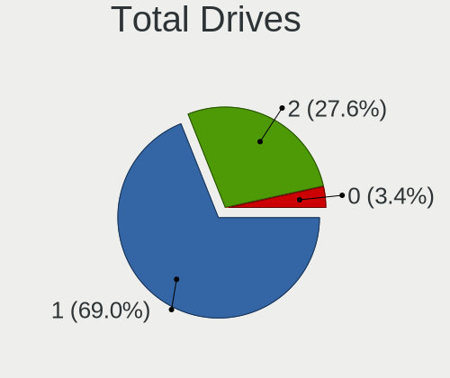
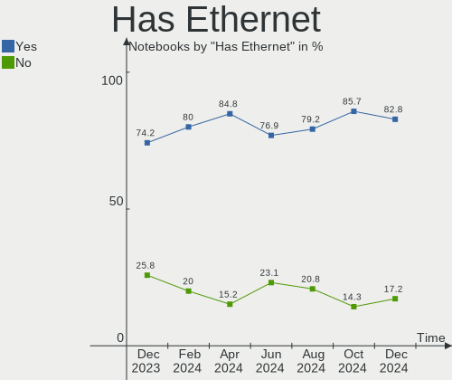
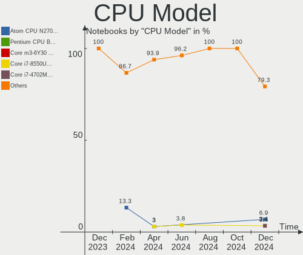
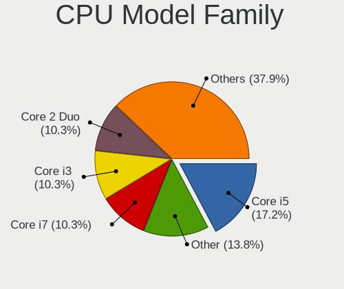
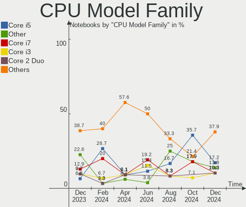
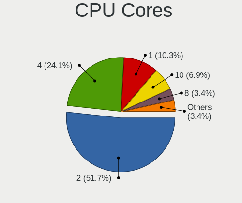
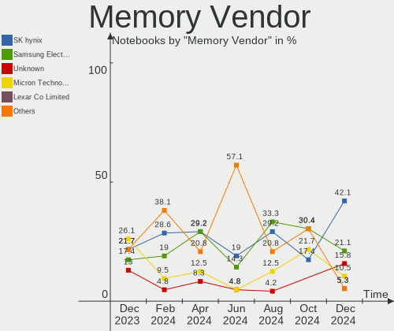
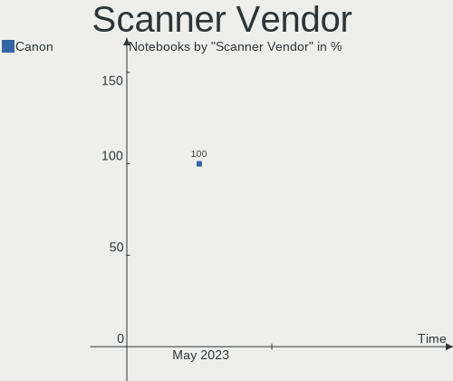

Xubuntu Hardware Trends (Notebooks)
-----------------------------------

A project to identify most popular hardware characteristics and track their change
over time based on data collected by Xubuntu users at https://Linux-Hardware.org.

Anyone can contribute to this report by the [hw-probe](https://github.com/linuxhw/hw-probe) tool:

    sudo -E hw-probe -all -upload

Full-feature report is available here: https://linux-hardware.org/?view=trends&formfactor=notebook

Period: Oct, 2021.

Contents
--------

* [ System ](#system)
  - [ OS                       ](#os)
  - [ OS Family                ](#os-family)
  - [ Kernel                   ](#kernel)
  - [ Kernel Family            ](#kernel-family)
  - [ Kernel Major Ver.        ](#kernel-major-ver)
  - [ Arch                     ](#arch)
  - [ DE                       ](#de)
  - [ Display Server           ](#display-server)
  - [ Display Manager          ](#display-manager)
  - [ OS Lang                  ](#os-lang)
  - [ Boot Mode                ](#boot-mode)
  - [ Filesystem               ](#filesystem)
  - [ Part. scheme             ](#part-scheme)
  - [ Dual Boot with Linux/BSD ](#dual-boot-with-linuxbsd)
  - [ Dual Boot (Win)          ](#dual-boot-win)

* [ Board ](#board)
  - [ Vendor                   ](#vendor)
  - [ Model                    ](#model)
  - [ Model Family             ](#model-family)
  - [ MFG Year                 ](#mfg-year)
  - [ Form Factor              ](#form-factor)
  - [ Secure Boot              ](#secure-boot)
  - [ Coreboot                 ](#coreboot)
  - [ RAM Size                 ](#ram-size)
  - [ RAM Used                 ](#ram-used)
  - [ Total Drives             ](#total-drives)
  - [ Has CD-ROM               ](#has-cd-rom)
  - [ Has Ethernet             ](#has-ethernet)
  - [ Has WiFi                 ](#has-wifi)
  - [ Has Bluetooth            ](#has-bluetooth)

* [ Location ](#location)
  - [ Country                  ](#country)
  - [ City                     ](#city)

* [ Drives ](#drives)
  - [ Drive Vendor             ](#drive-vendor)
  - [ Drive Model              ](#drive-model)
  - [ HDD Vendor               ](#hdd-vendor)
  - [ SSD Vendor               ](#ssd-vendor)
  - [ Drive Kind               ](#drive-kind)
  - [ Drive Connector          ](#drive-connector)
  - [ Drive Size               ](#drive-size)
  - [ Space Total              ](#space-total)
  - [ Space Used               ](#space-used)
  - [ Malfunc. Drives          ](#malfunc-drives)
  - [ Malfunc. Drive Vendor    ](#malfunc-drive-vendor)
  - [ Malfunc. HDD Vendor      ](#malfunc-hdd-vendor)
  - [ Malfunc. Drive Kind      ](#malfunc-drive-kind)
  - [ Failed Drives            ](#failed-drives)
  - [ Failed Drive Vendor      ](#failed-drive-vendor)
  - [ Drive Status             ](#drive-status)

* [ Storage controller ](#storage-controller)
  - [ Storage Vendor           ](#storage-vendor)
  - [ Storage Model            ](#storage-model)
  - [ Storage Kind             ](#storage-kind)

* [ Processor ](#processor)
  - [ CPU Vendor               ](#cpu-vendor)
  - [ CPU Model                ](#cpu-model)
  - [ CPU Model Family         ](#cpu-model-family)
  - [ CPU Cores                ](#cpu-cores)
  - [ CPU Sockets              ](#cpu-sockets)
  - [ CPU Threads              ](#cpu-threads)
  - [ CPU Op-Modes             ](#cpu-op-modes)
  - [ CPU Microcode            ](#cpu-microcode)
  - [ CPU Microarch            ](#cpu-microarch)

* [ Graphics ](#graphics)
  - [ GPU Vendor               ](#gpu-vendor)
  - [ GPU Model                ](#gpu-model)
  - [ GPU Combo                ](#gpu-combo)
  - [ GPU Driver               ](#gpu-driver)
  - [ GPU Memory               ](#gpu-memory)

* [ Monitor ](#monitor)
  - [ Monitor Vendor           ](#monitor-vendor)
  - [ Monitor Model            ](#monitor-model)
  - [ Monitor Resolution       ](#monitor-resolution)
  - [ Monitor Diagonal         ](#monitor-diagonal)
  - [ Monitor Width            ](#monitor-width)
  - [ Aspect Ratio             ](#aspect-ratio)
  - [ Monitor Area             ](#monitor-area)
  - [ Pixel Density            ](#pixel-density)
  - [ Multiple Monitors        ](#multiple-monitors)

* [ Network ](#network)
  - [ Net Controller Vendor    ](#net-controller-vendor)
  - [ Net Controller Model     ](#net-controller-model)
  - [ Wireless Vendor          ](#wireless-vendor)
  - [ Wireless Model           ](#wireless-model)
  - [ Ethernet Vendor          ](#ethernet-vendor)
  - [ Ethernet Model           ](#ethernet-model)
  - [ Net Controller Kind      ](#net-controller-kind)
  - [ Used Controller          ](#used-controller)
  - [ NICs                     ](#nics)
  - [ IPv6                     ](#ipv6)

* [ Bluetooth ](#bluetooth)
  - [ Bluetooth Vendor         ](#bluetooth-vendor)
  - [ Bluetooth Model          ](#bluetooth-model)

* [ Sound ](#sound)
  - [ Sound Vendor             ](#sound-vendor)
  - [ Sound Model              ](#sound-model)

* [ Memory ](#memory)
  - [ Memory Vendor            ](#memory-vendor)
  - [ Memory Model             ](#memory-model)
  - [ Memory Kind              ](#memory-kind)
  - [ Memory Form Factor       ](#memory-form-factor)
  - [ Memory Size              ](#memory-size)
  - [ Memory Speed             ](#memory-speed)

* [ Printers & scanners ](#printers--scanners)
  - [ Printer Vendor           ](#printer-vendor)
  - [ Printer Model            ](#printer-model)
  - [ Scanner Vendor           ](#scanner-vendor)
  - [ Scanner Model            ](#scanner-model)

* [ Camera ](#camera)
  - [ Camera Vendor            ](#camera-vendor)
  - [ Camera Model             ](#camera-model)

* [ Security ](#security)
  - [ Fingerprint Vendor       ](#fingerprint-vendor)
  - [ Fingerprint Model        ](#fingerprint-model)
  - [ Chipcard Vendor          ](#chipcard-vendor)
  - [ Chipcard Model           ](#chipcard-model)

* [ Unsupported ](#unsupported)
  - [ Unsupported Devices      ](#unsupported-devices)
  - [ Unsupported Device Types ](#unsupported-device-types)

System
------

OS
--

Installed operating systems

| Name          | Notebooks | Percent |
|---------------|-----------|---------|
| Xubuntu 20.04 | 50        | 72.46%  |
| Xubuntu 18.04 | 10        | 14.49%  |
| Xubuntu 21.10 | 4         | 5.8%    |
| Xubuntu 21.04 | 4         | 5.8%    |
| Xubuntu 16.04 | 1         | 1.45%   |

OS Family
---------

OS without a version

| Name    | Notebooks | Percent |
|---------|-----------|---------|
| Xubuntu | 69        | 100%    |

Kernel
------

Version of the Linux kernel

| Version                     | Notebooks | Percent |
|-----------------------------|-----------|---------|
| 5.11.0-37-generic           | 12        | 17.39%  |
| 5.11.0-27-generic           | 7         | 10.14%  |
| 5.4.0-89-generic            | 5         | 7.25%   |
| 5.4.0-88-generic            | 5         | 7.25%   |
| 5.11.0-38-generic           | 5         | 7.25%   |
| 5.11.0-38-lowlatency        | 4         | 5.8%    |
| 5.4.0-87-generic            | 3         | 4.35%   |
| 5.11.0-37-lowlatency        | 3         | 4.35%   |
| 5.11.0-36-generic           | 3         | 4.35%   |
| 5.4.0-88-lowlatency         | 2         | 2.9%    |
| 5.13.0-20-generic           | 2         | 2.9%    |
| 4.15.0-159-lowlatency       | 2         | 2.9%    |
| 5.4.0-86-generic            | 1         | 1.45%   |
| 5.4.0-81-generic            | 1         | 1.45%   |
| 5.4.0-80-generic            | 1         | 1.45%   |
| 5.4.0-72-lowlatency         | 1         | 1.45%   |
| 5.14.8-051408-generic       | 1         | 1.45%   |
| 5.14.0-11.1-liquorix-amd64  | 1         | 1.45%   |
| 5.13.0-21-generic           | 1         | 1.45%   |
| 5.11.0-36-lowlatency        | 1         | 1.45%   |
| 5.11.0-27-lowlatency        | 1         | 1.45%   |
| 5.11.0-22-generic           | 1         | 1.45%   |
| 4.4.254-20721-gc5eeb683840e | 1         | 1.45%   |
| 4.4.0-217-generic           | 1         | 1.45%   |
| 4.18.0-21-generic           | 1         | 1.45%   |
| 4.15.0-159-generic          | 1         | 1.45%   |
| 4.15.0-151-generic          | 1         | 1.45%   |
| 4.15.0-121-lowlatency       | 1         | 1.45%   |

Kernel Family
-------------

Linux kernel without a distro release

| Version | Notebooks | Percent |
|---------|-----------|---------|
| 5.11.0  | 37        | 53.62%  |
| 5.4.0   | 19        | 27.54%  |
| 4.15.0  | 5         | 7.25%   |
| 5.13.0  | 3         | 4.35%   |
| 5.14.8  | 1         | 1.45%   |
| 5.14.0  | 1         | 1.45%   |
| 4.4.254 | 1         | 1.45%   |
| 4.4.0   | 1         | 1.45%   |
| 4.18.0  | 1         | 1.45%   |

Kernel Major Ver.
-----------------

Linux kernel major version

| Version | Notebooks | Percent |
|---------|-----------|---------|
| 5.11    | 37        | 53.62%  |
| 5.4     | 19        | 27.54%  |
| 4.15    | 5         | 7.25%   |
| 5.13    | 3         | 4.35%   |
| 5.14    | 2         | 2.9%    |
| 4.4     | 2         | 2.9%    |
| 4.18    | 1         | 1.45%   |

Arch
----

OS architecture (x86_64, i586, etc.)

| Name   | Notebooks | Percent |
|--------|-----------|---------|
| x86_64 | 63        | 91.3%   |
| i686   | 6         | 8.7%    |

DE
--

Desktop Environment

| Name | Notebooks | Percent |
|------|-----------|---------|
| XFCE | 68        | 98.55%  |
| i3   | 1         | 1.45%   |

Display Server
--------------

X11 or Wayland

| Name | Notebooks | Percent |
|------|-----------|---------|
| X11  | 69        | 100%    |

Display Manager
---------------

SDDM, LightDM, etc.

| Name    | Notebooks | Percent |
|---------|-----------|---------|
| LightDM | 63        | 91.3%   |
| GDM3    | 4         | 5.8%    |
| Unknown | 2         | 2.9%    |

OS Lang
-------

Language

| Lang  | Notebooks | Percent |
|-------|-----------|---------|
| en_US | 22        | 31.88%  |
| fr_FR | 8         | 11.59%  |
| de_DE | 8         | 11.59%  |
| C     | 7         | 10.14%  |
| ru_RU | 4         | 5.8%    |
| it_IT | 4         | 5.8%    |
| pt_BR | 2         | 2.9%    |
| es_CR | 2         | 2.9%    |
| es_AR | 2         | 2.9%    |
| en_GB | 2         | 2.9%    |
| pl_PL | 1         | 1.45%   |
| nl_NL | 1         | 1.45%   |
| hu_HU | 1         | 1.45%   |
| es_VE | 1         | 1.45%   |
| es_ES | 1         | 1.45%   |
| en_CA | 1         | 1.45%   |
| en_AU | 1         | 1.45%   |
| ca_ES | 1         | 1.45%   |

Boot Mode
---------

EFI or BIOS

| Mode | Notebooks | Percent |
|------|-----------|---------|
| BIOS | 43        | 62.32%  |
| EFI  | 26        | 37.68%  |

Filesystem
----------

Type of filesystem

| Type    | Notebooks | Percent |
|---------|-----------|---------|
| Ext4    | 59        | 85.51%  |
| Overlay | 8         | 11.59%  |
| Zfs     | 1         | 1.45%   |
| Unknown | 1         | 1.45%   |

Part. scheme
------------

Scheme of partitioning

| Type    | Notebooks | Percent |
|---------|-----------|---------|
| Unknown | 36        | 52.17%  |
| GPT     | 23        | 33.33%  |
| MBR     | 10        | 14.49%  |

Dual Boot with Linux/BSD
------------------------

Hosting more than one Linux/BSD

| Dual boot | Notebooks | Percent |
|-----------|-----------|---------|
| No        | 62        | 89.86%  |
| Yes       | 7         | 10.14%  |

Dual Boot (Win)
---------------

Hosting Linux and Windows

| Dual boot | Notebooks | Percent |
|-----------|-----------|---------|
| No        | 38        | 55.07%  |
| Yes       | 31        | 44.93%  |

Board
-----

Vendor
------

Motherboard manufacturer

| Name                | Notebooks | Percent |
|---------------------|-----------|---------|
| Lenovo              | 14        | 20.29%  |
| Hewlett-Packard     | 11        | 15.94%  |
| ASUSTek Computer    | 10        | 14.49%  |
| Dell                | 8         | 11.59%  |
| Sony                | 4         | 5.8%    |
| Acer                | 4         | 5.8%    |
| Toshiba             | 3         | 4.35%   |
| HUAWEI              | 3         | 4.35%   |
| Alienware           | 2         | 2.9%    |
| VIT                 | 1         | 1.45%   |
| Samsung Electronics | 1         | 1.45%   |
| Razer               | 1         | 1.45%   |
| Multilaser          | 1         | 1.45%   |
| MSI                 | 1         | 1.45%   |
| Medion              | 1         | 1.45%   |
| LG Electronics      | 1         | 1.45%   |
| Fujitsu Siemens     | 1         | 1.45%   |
| Fujitsu             | 1         | 1.45%   |
| Apple               | 1         | 1.45%   |

Model
-----

Motherboard model

| Name                                     | Notebooks | Percent |
|------------------------------------------|-----------|---------|
| ASUS VivoBook_ASUSLaptop X571LH_K571LH   | 3         | 4.35%   |
| HP Compaq 6730s                          | 2         | 2.9%    |
| VIT P3400                                | 1         | 1.45%   |
| Toshiba Satellite P55W-C                 | 1         | 1.45%   |
| Toshiba Satellite L850                   | 1         | 1.45%   |
| Toshiba Satellite A100                   | 1         | 1.45%   |
| Sony VPCSB1V9R                           | 1         | 1.45%   |
| Sony VGN-NR38E_S                         | 1         | 1.45%   |
| Sony VGN-NR11Z_T                         | 1         | 1.45%   |
| Sony VGN-N11M_W                          | 1         | 1.45%   |
| Samsung R530/R730/P590                   | 1         | 1.45%   |
| Razer Blade Stealth 13 Late 2019         | 1         | 1.45%   |
| Multilaser UB32X                         | 1         | 1.45%   |
| MSI MS-1034                              | 1         | 1.45%   |
| Medion E14303                            | 1         | 1.45%   |
| LG R710-S.APSAG                          | 1         | 1.45%   |
| Lenovo ThinkPad X1 Carbon 2nd 20A80035US | 1         | 1.45%   |
| Lenovo ThinkPad W510 431963G             | 1         | 1.45%   |
| Lenovo ThinkPad T60 1952W97              | 1         | 1.45%   |
| Lenovo ThinkPad T510 4384A78             | 1         | 1.45%   |
| Lenovo ThinkPad T440s 20AQ009DGE         | 1         | 1.45%   |
| Lenovo ThinkPad T420 4180AP3             | 1         | 1.45%   |
| Lenovo ThinkPad T14s Gen 1 20UH0016GE    | 1         | 1.45%   |
| Lenovo ThinkPad E14 20RA0016RT           | 1         | 1.45%   |
| Lenovo ThinkBook 14 G2 ITL 20VD          | 1         | 1.45%   |
| Lenovo IdeaPad U550 20034,3749           | 1         | 1.45%   |
| Lenovo IdeaPad Gaming 3 15ARH05 82EY     | 1         | 1.45%   |
| Lenovo IdeaPad 500S-13ISK 80Q2           | 1         | 1.45%   |
| Lenovo B5400 s20278Q                     | 1         | 1.45%   |
| Lenovo B50-30 20382                      | 1         | 1.45%   |
| HUAWEI NBLK-WAX9X                        | 1         | 1.45%   |
| HUAWEI NBLB-WAX9N                        | 1         | 1.45%   |
| HUAWEI KLVL-WXX9                         | 1         | 1.45%   |
| HP ProBook 650 G4                        | 1         | 1.45%   |
| HP Pavilion Laptop 15-cw1xxx             | 1         | 1.45%   |
| HP Pavilion g4                           | 1         | 1.45%   |
| HP OMEN by HP Laptop                     | 1         | 1.45%   |
| HP Notebook                              | 1         | 1.45%   |
| HP Mini 110-3000                         | 1         | 1.45%   |
| HP kip                                   | 1         | 1.45%   |
| HP Compaq Presario CQ61                  | 1         | 1.45%   |
| HP 255 G7 Notebook PC                    | 1         | 1.45%   |
| Fujitsu Siemens AMILO Xi 3650            | 1         | 1.45%   |
| Fujitsu LIFEBOOK E752                    | 1         | 1.45%   |
| Dell Vostro 3550                         | 1         | 1.45%   |
| Dell Precision M4600                     | 1         | 1.45%   |
| Dell Precision 5540                      | 1         | 1.45%   |
| Dell MXG061                              | 1         | 1.45%   |
| Dell Latitude E6440                      | 1         | 1.45%   |
| Dell Latitude D630                       | 1         | 1.45%   |
| Dell Latitude 7370                       | 1         | 1.45%   |
| Dell Inspiron 3537                       | 1         | 1.45%   |
| ASUS X756UX                              | 1         | 1.45%   |
| ASUS X501A                               | 1         | 1.45%   |
| ASUS X455LD                              | 1         | 1.45%   |
| ASUS ROG Strix G713QM_G713QM             | 1         | 1.45%   |
| ASUS ROG Strix G712LV_G712LV             | 1         | 1.45%   |
| ASUS K53E                                | 1         | 1.45%   |
| ASUS 1005HA                              | 1         | 1.45%   |
| Apple MacBookPro11,1                     | 1         | 1.45%   |

Model Family
------------

Motherboard model prefix

| Name                  | Notebooks | Percent |
|-----------------------|-----------|---------|
| Lenovo ThinkPad       | 8         | 11.59%  |
| Toshiba Satellite     | 3         | 4.35%   |
| Lenovo IdeaPad        | 3         | 4.35%   |
| HP Compaq             | 3         | 4.35%   |
| Dell Latitude         | 3         | 4.35%   |
| ASUS VivoBook         | 3         | 4.35%   |
| HP Pavilion           | 2         | 2.9%    |
| Dell Precision        | 2         | 2.9%    |
| ASUS ROG              | 2         | 2.9%    |
| Acer Aspire           | 2         | 2.9%    |
| VIT P3400             | 1         | 1.45%   |
| Sony VPCSB1V9R        | 1         | 1.45%   |
| Sony VGN-NR38E        | 1         | 1.45%   |
| Sony VGN-NR11Z        | 1         | 1.45%   |
| Sony VGN-N11M         | 1         | 1.45%   |
| Samsung R530          | 1         | 1.45%   |
| Razer Blade           | 1         | 1.45%   |
| Multilaser UB32X      | 1         | 1.45%   |
| MSI MS-1034           | 1         | 1.45%   |
| Medion E14303         | 1         | 1.45%   |
| LG R710-S.APSAG       | 1         | 1.45%   |
| Lenovo ThinkBook      | 1         | 1.45%   |
| Lenovo B5400          | 1         | 1.45%   |
| Lenovo B50-30         | 1         | 1.45%   |
| HUAWEI NBLK-WAX9X     | 1         | 1.45%   |
| HUAWEI NBLB-WAX9N     | 1         | 1.45%   |
| HUAWEI KLVL-WXX9      | 1         | 1.45%   |
| HP ProBook            | 1         | 1.45%   |
| HP OMEN               | 1         | 1.45%   |
| HP Notebook           | 1         | 1.45%   |
| HP Mini               | 1         | 1.45%   |
| HP kip                | 1         | 1.45%   |
| HP 255                | 1         | 1.45%   |
| Fujitsu Siemens AMILO | 1         | 1.45%   |
| Fujitsu LIFEBOOK      | 1         | 1.45%   |
| Dell Vostro           | 1         | 1.45%   |
| Dell MXG061           | 1         | 1.45%   |
| Dell Inspiron         | 1         | 1.45%   |
| ASUS X756UX           | 1         | 1.45%   |
| ASUS X501A            | 1         | 1.45%   |
| ASUS X455LD           | 1         | 1.45%   |
| ASUS K53E             | 1         | 1.45%   |
| ASUS 1005HA           | 1         | 1.45%   |
| Apple MacBookPro11    | 1         | 1.45%   |
| Alienware m17         | 1         | 1.45%   |
| Alienware 17          | 1         | 1.45%   |
| Acer Swift            | 1         | 1.45%   |
| Acer Extensa          | 1         | 1.45%   |

MFG Year
--------

Motherboard manufacture year

| Year | Notebooks | Percent |
|------|-----------|---------|
| 2021 | 11        | 15.94%  |
| 2020 | 11        | 15.94%  |
| 2011 | 8         | 11.59%  |
| 2019 | 6         | 8.7%    |
| 2008 | 5         | 7.25%   |
| 2012 | 4         | 5.8%    |
| 2010 | 4         | 5.8%    |
| 2018 | 3         | 4.35%   |
| 2015 | 3         | 4.35%   |
| 2014 | 3         | 4.35%   |
| 2006 | 3         | 4.35%   |
| 2016 | 2         | 2.9%    |
| 2013 | 2         | 2.9%    |
| 2009 | 2         | 2.9%    |
| 2007 | 2         | 2.9%    |

Form Factor
-----------

Physical design of the computer

| Name     | Notebooks | Percent |
|----------|-----------|---------|
| Notebook | 69        | 100%    |

Secure Boot
-----------

Enabled or disabled

| State    | Notebooks | Percent |
|----------|-----------|---------|
| Disabled | 64        | 92.75%  |
| Enabled  | 5         | 7.25%   |

Coreboot
--------

Have coreboot on board

| Used | Notebooks | Percent |
|------|-----------|---------|
| No   | 68        | 98.55%  |
| Yes  | 1         | 1.45%   |

RAM Size
--------

Total RAM memory

| Size in GB | Notebooks | Percent |
|------------|-----------|---------|
| 4.01-8.0   | 20        | 28.99%  |
| 3.01-4.0   | 12        | 17.39%  |
| 16.01-24.0 | 12        | 17.39%  |
| 8.01-16.0  | 11        | 15.94%  |
| 1.01-2.0   | 6         | 8.7%    |
| 2.01-3.0   | 5         | 7.25%   |
| 32.01-64.0 | 2         | 2.9%    |
| 24.01-32.0 | 1         | 1.45%   |

RAM Used
--------

Used RAM memory

| Used GB   | Notebooks | Percent |
|-----------|-----------|---------|
| 1.01-2.0  | 34        | 49.28%  |
| 4.01-8.0  | 12        | 17.39%  |
| 0.51-1.0  | 9         | 13.04%  |
| 2.01-3.0  | 7         | 10.14%  |
| 3.01-4.0  | 6         | 8.7%    |
| 8.01-16.0 | 1         | 1.45%   |

Total Drives
------------

Number of drives on board

| Drives | Notebooks | Percent |
|--------|-----------|---------|
| 1      | 53        | 76.81%  |
| 2      | 13        | 18.84%  |
| 3      | 2         | 2.9%    |
| 0      | 1         | 1.45%   |

Has CD-ROM
----------

Has CD-ROM on board

| Presented | Notebooks | Percent |
|-----------|-----------|---------|
| Yes       | 35        | 50.72%  |
| No        | 34        | 49.28%  |

Has Ethernet
------------

Has Ethernet on board

| Presented | Notebooks | Percent |
|-----------|-----------|---------|
| Yes       | 59        | 85.51%  |
| No        | 10        | 14.49%  |

Has WiFi
--------

Has WiFi module

| Presented | Notebooks | Percent |
|-----------|-----------|---------|
| Yes       | 66        | 95.65%  |
| No        | 3         | 4.35%   |

Has Bluetooth
-------------

Has Bluetooth module

| Presented | Notebooks | Percent |
|-----------|-----------|---------|
| Yes       | 51        | 73.91%  |
| No        | 18        | 26.09%  |

Location
--------

Country
-------

Geographic location (country)

| Country     | Notebooks | Percent |
|-------------|-----------|---------|
| Germany     | 11        | 15.94%  |
| USA         | 8         | 11.59%  |
| Canada      | 8         | 11.59%  |
| France      | 7         | 10.14%  |
| Russia      | 4         | 5.8%    |
| Italy       | 4         | 5.8%    |
| Spain       | 3         | 4.35%   |
| Netherlands | 3         | 4.35%   |
| Costa Rica  | 3         | 4.35%   |
| UK          | 2         | 2.9%    |
| Mexico      | 2         | 2.9%    |
| Brazil      | 2         | 2.9%    |
| Argentina   | 2         | 2.9%    |
| Venezuela   | 1         | 1.45%   |
| Romania     | 1         | 1.45%   |
| Portugal    | 1         | 1.45%   |
| Poland      | 1         | 1.45%   |
| Indonesia   | 1         | 1.45%   |
| Iceland     | 1         | 1.45%   |
| Hungary     | 1         | 1.45%   |
| Guadeloupe  | 1         | 1.45%   |
| Greece      | 1         | 1.45%   |
| Australia   | 1         | 1.45%   |

City
----

Geographic location (city)

| City                  | Notebooks | Percent |
|-----------------------|-----------|---------|
| Qu?©bec               | 5         | 7.25%   |
| Hamburg               | 3         | 4.35%   |
| Bonn                  | 2         | 2.9%    |
| Barcelona             | 2         | 2.9%    |
| Yoshkar-Ola           | 1         | 1.45%   |
| Vitry-sur-Seine       | 1         | 1.45%   |
| Villa Ballester       | 1         | 1.45%   |
| Vilanova i la Geltr?? | 1         | 1.45%   |
| Turrialba             | 1         | 1.45%   |
| Toms River            | 1         | 1.45%   |
| St Petersburg         | 1         | 1.45%   |
| Serra de' Conti       | 1         | 1.45%   |
| Semmes                | 1         | 1.45%   |
| Santa Rosa            | 1         | 1.45%   |
| San Juan              | 1         | 1.45%   |
| Salvador              | 1         | 1.45%   |
| Rosario               | 1         | 1.45%   |
| Riviere-Rouge         | 1         | 1.45%   |
| Reykjavik             | 1         | 1.45%   |
| Peterborough          | 1         | 1.45%   |
| Perpignan             | 1         | 1.45%   |
| Pabianice             | 1         | 1.45%   |
| Oldenburg             | 1         | 1.45%   |
| New York              | 1         | 1.45%   |
| Moscow                | 1         | 1.45%   |
| Milan                 | 1         | 1.45%   |
| Mexico City           | 1         | 1.45%   |
| Melbourne             | 1         | 1.45%   |
| Manchester            | 1         | 1.45%   |
| Makassar              | 1         | 1.45%   |
| Madrid                | 1         | 1.45%   |
| Levis                 | 1         | 1.45%   |
| Les Abymes            | 1         | 1.45%   |
| Kupchino              | 1         | 1.45%   |
| Hy??res               | 1         | 1.45%   |
| Heilbronn             | 1         | 1.45%   |
| Hamilton              | 1         | 1.45%   |
| Hagondange            | 1         | 1.45%   |
| Groisy                | 1         | 1.45%   |
| Genoa                 | 1         | 1.45%   |
| Gencay                | 1         | 1.45%   |
| Garderen              | 1         | 1.45%   |
| Esparza               | 1         | 1.45%   |
| El Sobrante           | 1         | 1.45%   |
| East Northport        | 1         | 1.45%   |
| Dunfus                | 1         | 1.45%   |
| Dunaharaszti          | 1         | 1.45%   |
| Duivendrecht          | 1         | 1.45%   |
| D??sseldorf           | 1         | 1.45%   |
| Chingford             | 1         | 1.45%   |
| Chatsworth            | 1         | 1.45%   |
| Canc??n               | 1         | 1.45%   |
| Cagli                 | 1         | 1.45%   |
| Caen                  | 1         | 1.45%   |
| Cachoeirinha          | 1         | 1.45%   |
| Bucharest             | 1         | 1.45%   |
| Bielefeld             | 1         | 1.45%   |
| Athens                | 1         | 1.45%   |
| Amsterdam             | 1         | 1.45%   |
| Amarante              | 1         | 1.45%   |

Drives
------

Drive Vendor
------------

Hard drive vendors

| Vendor              | Notebooks | Drives | Percent |
|---------------------|-----------|--------|---------|
| Toshiba             | 11        | 11     | 13.75%  |
| WDC                 | 9         | 9      | 11.25%  |
| Samsung Electronics | 7         | 8      | 8.75%   |
| Unknown             | 5         | 5      | 6.25%   |
| Seagate             | 5         | 5      | 6.25%   |
| Kingston            | 5         | 5      | 6.25%   |
| Intel               | 5         | 8      | 6.25%   |
| Fujitsu             | 5         | 5      | 6.25%   |
| SanDisk             | 3         | 3      | 3.75%   |
| Hitachi             | 3         | 3      | 3.75%   |
| HGST                | 3         | 3      | 3.75%   |
| Crucial             | 3         | 3      | 3.75%   |
| SK Hynix            | 2         | 2      | 2.5%    |
| Micron Technology   | 2         | 2      | 2.5%    |
| Intenso             | 2         | 2      | 2.5%    |
| UMIS                | 1         | 1      | 1.25%   |
| PNY                 | 1         | 1      | 1.25%   |
| Phison              | 1         | 1      | 1.25%   |
| LITEONIT            | 1         | 1      | 1.25%   |
| HUAWEI              | 1         | 1      | 1.25%   |
| GOODRAM             | 1         | 1      | 1.25%   |
| DOGFISH             | 1         | 1      | 1.25%   |
| China               | 1         | 1      | 1.25%   |
| Apple               | 1         | 1      | 1.25%   |
| A-DATA Technology   | 1         | 1      | 1.25%   |

Drive Model
-----------

Hard drive models

| Model                                    | Notebooks | Percent |
|------------------------------------------|-----------|---------|
| Intel HBRPEKNX0202AO 32GB                | 3         | 3.61%   |
| Intel HBRPEKNX0202A 512GB                | 3         | 3.61%   |
| Unknown MMC Card  16GB                   | 2         | 2.41%   |
| Toshiba NVMe SSD Drive 256GB             | 2         | 2.41%   |
| Kingston SA400S37480G 480GB SSD          | 2         | 2.41%   |
| HGST HTS541010A9E680 1TB                 | 2         | 2.41%   |
| Fujitsu MHZ2160BH G2 160GB               | 2         | 2.41%   |
| WDC WDS500G2B0A-00SM50 500GB SSD         | 1         | 1.2%    |
| WDC WD7500BPVX-60JC3T0 752GB             | 1         | 1.2%    |
| WDC WD3200BEVT-22ZCT0 320GB              | 1         | 1.2%    |
| WDC WD3200BEVS-26VAT0 320GB              | 1         | 1.2%    |
| WDC WD2500BEVT-22A23T0 250GB             | 1         | 1.2%    |
| WDC WD10SPCX-24HWST1 1TB                 | 1         | 1.2%    |
| WDC WD10JPVX-22JC3T0 1TB                 | 1         | 1.2%    |
| WDC PC SN730 SDBQNTY-1T00-1001 1TB       | 1         | 1.2%    |
| WDC PC SN530 NVMe 512GB                  | 1         | 1.2%    |
| Unknown SL16G  16GB                      | 1         | 1.2%    |
| Unknown SABRENT SABRENT 500GB            | 1         | 1.2%    |
| Unknown S11-256G-PHISON-SSD-B27 256GB    | 1         | 1.2%    |
| UMIS RPJTJ256MEE1OWX 256GB               | 1         | 1.2%    |
| Toshiba THNSN5512GPU7 512GB              | 1         | 1.2%    |
| Toshiba MQ01ABF050 500GB                 | 1         | 1.2%    |
| Toshiba MQ01ABD100 1TB                   | 1         | 1.2%    |
| Toshiba MK8032GSX 80GB                   | 1         | 1.2%    |
| Toshiba MK5076GSX 500GB                  | 1         | 1.2%    |
| Toshiba MK5065GSXN 500GB                 | 1         | 1.2%    |
| Toshiba MK5065GSX 500GB                  | 1         | 1.2%    |
| Toshiba KXG60ZNV512G 512GB               | 1         | 1.2%    |
| Toshiba KBG40ZNT256G MEMORY 256GB        | 1         | 1.2%    |
| SK Hynix PC611 NVMe 512GB                | 1         | 1.2%    |
| SK Hynix HFM001TD3JX013N 1TB             | 1         | 1.2%    |
| Seagate ST9160314AS 160GB                | 1         | 1.2%    |
| Seagate ST9160310AS 160GB                | 1         | 1.2%    |
| Seagate ST9120822AS 120GB                | 1         | 1.2%    |
| Seagate ST500LT012-1DG142 500GB          | 1         | 1.2%    |
| Seagate ST500LM012 HN-M500MBB 500GB      | 1         | 1.2%    |
| SanDisk SSD PLUS 120GB                   | 1         | 1.2%    |
| SanDisk SDSSDA240G 240GB                 | 1         | 1.2%    |
| SanDisk SD7SB3Q064G 56GB SSD             | 1         | 1.2%    |
| Samsung SSD 970 PRO 1TB                  | 1         | 1.2%    |
| Samsung SSD 870 EVO 250GB                | 1         | 1.2%    |
| Samsung SSD 850 EVO 250GB                | 1         | 1.2%    |
| Samsung PM9A1 NVMe 2048GB                | 1         | 1.2%    |
| Samsung NVMe SSD Drive 1TB               | 1         | 1.2%    |
| Samsung MZVLB512HBJQ-00000 512GB         | 1         | 1.2%    |
| Samsung MZALQ256HAJD-000L2 256GB         | 1         | 1.2%    |
| PNY CS900 120GB SSD                      | 1         | 1.2%    |
| Phison 311CD0512GB                       | 1         | 1.2%    |
| Micron MTFDDAV256TBN-1AR15ABHA 256GB SSD | 1         | 1.2%    |
| Micron MTFDDAK256MAM-1K12 256GB SSD      | 1         | 1.2%    |
| LITEONIT LMS-32L6M 32GB SSD              | 1         | 1.2%    |
| Kingston SV300S37A240G 240GB SSD         | 1         | 1.2%    |
| Kingston SA400S37240G 240GB SSD          | 1         | 1.2%    |
| Kingston RBUSNS8154P3128GJ1 128GB        | 1         | 1.2%    |
| Intenso SSD SATAIII 120GB                | 1         | 1.2%    |
| Intenso External USB 3.0 4TB             | 1         | 1.2%    |
| Intel SSDSC2CW240A3 240GB                | 1         | 1.2%    |
| Intel SSDSC2BF180A5L 180GB               | 1         | 1.2%    |
| HUAWEI MMC Storage 64GB                  | 1         | 1.2%    |
| Hitachi HTS725032A9A364 320GB            | 1         | 1.2%    |

HDD Vendor
----------

Hard disk drive vendors

| Vendor  | Notebooks | Drives | Percent |
|---------|-----------|--------|---------|
| WDC     | 6         | 6      | 20.69%  |
| Toshiba | 6         | 6      | 20.69%  |
| Seagate | 5         | 5      | 17.24%  |
| Fujitsu | 5         | 5      | 17.24%  |
| Hitachi | 3         | 3      | 10.34%  |
| HGST    | 3         | 3      | 10.34%  |
| Intenso | 1         | 1      | 3.45%   |

SSD Vendor
----------

Solid state drive vendors

| Vendor              | Notebooks | Drives | Percent |
|---------------------|-----------|--------|---------|
| Kingston            | 4         | 4      | 15.38%  |
| SanDisk             | 3         | 3      | 11.54%  |
| Crucial             | 3         | 3      | 11.54%  |
| Samsung Electronics | 2         | 2      | 7.69%   |
| Micron Technology   | 2         | 2      | 7.69%   |
| Intel               | 2         | 2      | 7.69%   |
| WDC                 | 1         | 1      | 3.85%   |
| Unknown             | 1         | 1      | 3.85%   |
| PNY                 | 1         | 1      | 3.85%   |
| LITEONIT            | 1         | 1      | 3.85%   |
| Intenso             | 1         | 1      | 3.85%   |
| GOODRAM             | 1         | 1      | 3.85%   |
| DOGFISH             | 1         | 1      | 3.85%   |
| China               | 1         | 1      | 3.85%   |
| Apple               | 1         | 1      | 3.85%   |
| A-DATA Technology   | 1         | 1      | 3.85%   |

Drive Kind
----------

HDD or SSD

| Kind    | Notebooks | Drives | Percent |
|---------|-----------|--------|---------|
| HDD     | 29        | 29     | 37.18%  |
| SSD     | 25        | 26     | 32.05%  |
| NVMe    | 19        | 24     | 24.36%  |
| MMC     | 3         | 3      | 3.85%   |
| Unknown | 2         | 2      | 2.56%   |

Drive Connector
---------------

SATA, SAS, NVMe, etc.

| Type | Notebooks | Drives | Percent |
|------|-----------|--------|---------|
| SATA | 50        | 54     | 66.67%  |
| NVMe | 19        | 24     | 25.33%  |
| SAS  | 3         | 3      | 4%      |
| MMC  | 3         | 3      | 4%      |

Drive Size
----------

Size of hard drive

| Size in TB | Notebooks | Drives | Percent |
|------------|-----------|--------|---------|
| 0.01-0.5   | 42        | 44     | 79.25%  |
| 0.51-1.0   | 10        | 10     | 18.87%  |
| 3.01-4.0   | 1         | 1      | 1.89%   |

Space Total
-----------

Amount of disk space available on the file system

| Size in GB | Notebooks | Percent |
|------------|-----------|---------|
| 101-250    | 27        | 39.13%  |
| 251-500    | 16        | 23.19%  |
| 51-100     | 11        | 15.94%  |
| 501-1000   | 8         | 11.59%  |
| 21-50      | 3         | 4.35%   |
| 1-20       | 3         | 4.35%   |
| 1001-2000  | 1         | 1.45%   |

Space Used
----------

Amount of used disk space

| Used GB  | Notebooks | Percent |
|----------|-----------|---------|
| 1-20     | 34        | 49.28%  |
| 101-250  | 13        | 18.84%  |
| 21-50    | 9         | 13.04%  |
| 51-100   | 7         | 10.14%  |
| 251-500  | 5         | 7.25%   |
| 501-1000 | 1         | 1.45%   |

Malfunc. Drives
---------------

Drive models with a malfunction

| Model                                               | Notebooks | Drives | Percent |
|-----------------------------------------------------|-----------|--------|---------|
| WDC WD10SPCX-24HWST1 1TB                            | 1         | 1      | 14.29%  |
| WDC WD10JPVX-22JC3T0 1TB                            | 1         | 1      | 14.29%  |
| Toshiba MK5076GSX 500GB                             | 1         | 1      | 14.29%  |
| Toshiba MK5065GSXN 500GB                            | 1         | 1      | 14.29%  |
| Toshiba MK5065GSX 500GB                             | 1         | 1      | 14.29%  |
| Micron Technology MTFDDAV256TBN-1AR15ABHA 256GB SSD | 1         | 1      | 14.29%  |
| HGST HTS721010A9E630 1TB                            | 1         | 1      | 14.29%  |

Malfunc. Drive Vendor
---------------------

Vendors of faulty drives

| Vendor            | Notebooks | Drives | Percent |
|-------------------|-----------|--------|---------|
| Toshiba           | 3         | 3      | 42.86%  |
| WDC               | 2         | 2      | 28.57%  |
| Micron Technology | 1         | 1      | 14.29%  |
| HGST              | 1         | 1      | 14.29%  |

Malfunc. HDD Vendor
-------------------

Vendors of faulty HDD drives

| Vendor  | Notebooks | Drives | Percent |
|---------|-----------|--------|---------|
| Toshiba | 3         | 3      | 50%     |
| WDC     | 2         | 2      | 33.33%  |
| HGST    | 1         | 1      | 16.67%  |

Malfunc. Drive Kind
-------------------

Kinds of faulty drives

| Kind | Notebooks | Drives | Percent |
|------|-----------|--------|---------|
| HDD  | 6         | 6      | 85.71%  |
| SSD  | 1         | 1      | 14.29%  |

Failed Drives
-------------

Failed drive models

Zero info for selected period =(

Failed Drive Vendor
-------------------

Failed drive vendors

Zero info for selected period =(

Drive Status
------------

Number of failed and malfunc. drives

| Status   | Notebooks | Drives | Percent |
|----------|-----------|--------|---------|
| Detected | 39        | 44     | 53.42%  |
| Works    | 27        | 33     | 36.99%  |
| Malfunc  | 7         | 7      | 9.59%   |

Storage controller
------------------

Storage Vendor
--------------

Storage controller vendors

| Vendor                       | Notebooks | Percent |
|------------------------------|-----------|---------|
| Intel                        | 57        | 74.03%  |
| Samsung Electronics          | 5         | 6.49%   |
| Toshiba America Info Systems | 4         | 5.19%   |
| AMD                          | 3         | 3.9%    |
| SK Hynix                     | 2         | 2.6%    |
| Sandisk                      | 2         | 2.6%    |
| Union Memory (Shenzhen)      | 1         | 1.3%    |
| Phison Electronics           | 1         | 1.3%    |
| KIOXIA                       | 1         | 1.3%    |
| Kingston Technology Company  | 1         | 1.3%    |

Storage Model
-------------

Storage controller models

| Model                                                                            | Notebooks | Percent |
|----------------------------------------------------------------------------------|-----------|---------|
| Intel 6 Series/C200 Series Chipset Family 6 port Mobile SATA AHCI Controller     | 7         | 7.95%   |
| Intel 82801IBM/IEM (ICH9M/ICH9M-E) 4 port SATA Controller [AHCI mode]            | 5         | 5.68%   |
| Intel Sunrise Point-LP SATA Controller [AHCI mode]                               | 4         | 4.55%   |
| Intel 82801GBM/GHM (ICH7-M Family) SATA Controller [IDE mode]                    | 4         | 4.55%   |
| Intel 82801 Mobile SATA Controller [RAID mode]                                   | 4         | 4.55%   |
| Intel 8 Series SATA Controller 1 [AHCI mode]                                     | 4         | 4.55%   |
| Intel Non-Volatile memory controller                                             | 3         | 3.41%   |
| Intel 82801HM/HEM (ICH8M/ICH8M-E) SATA Controller [AHCI mode]                    | 3         | 3.41%   |
| Intel 82801HM/HEM (ICH8M/ICH8M-E) IDE Controller                                 | 3         | 3.41%   |
| Intel 7 Series Chipset Family 6-port SATA Controller [AHCI mode]                 | 3         | 3.41%   |
| AMD FCH SATA Controller [AHCI mode]                                              | 3         | 3.41%   |
| Toshiba America Info Systems XG6 NVMe SSD Controller                             | 2         | 2.27%   |
| Samsung NVMe SSD Controller SM981/PM981/PM983                                    | 2         | 2.27%   |
| Intel Comet Lake SATA AHCI Controller                                            | 2         | 2.27%   |
| Intel 82801GBM/GHM (ICH7-M Family) SATA Controller [AHCI mode]                   | 2         | 2.27%   |
| Intel 82801G (ICH7 Family) IDE Controller                                        | 2         | 2.27%   |
| Intel 8 Series/C220 Series Chipset Family 6-port SATA Controller 1 [AHCI mode]   | 2         | 2.27%   |
| Intel 7 Series Chipset Family 4-port SATA Controller [IDE mode]                  | 2         | 2.27%   |
| Intel 7 Series Chipset Family 2-port SATA Controller [IDE mode]                  | 2         | 2.27%   |
| Intel 5 Series/3400 Series Chipset 6 port SATA AHCI Controller                   | 2         | 2.27%   |
| Intel 5 Series/3400 Series Chipset 4 port SATA AHCI Controller                   | 2         | 2.27%   |
| Union Memory (Shenzhen) Non-Volatile memory controller                           | 1         | 1.14%   |
| Toshiba America Info Systems NVMe Controller                                     | 1         | 1.14%   |
| Toshiba America Info Systems BG3 NVMe SSD Controller                             | 1         | 1.14%   |
| SK Hynix Non-Volatile memory controller                                          | 1         | 1.14%   |
| SK Hynix Gold P31 SSD                                                            | 1         | 1.14%   |
| Sandisk WD Black SN750 / PC SN730 NVMe SSD                                       | 1         | 1.14%   |
| Sandisk Non-Volatile memory controller                                           | 1         | 1.14%   |
| Samsung NVMe SSD Controller PM9A1/PM9A3/980PRO                                   | 1         | 1.14%   |
| Samsung NVMe SSD Controller 980                                                  | 1         | 1.14%   |
| Samsung Apple PCIe SSD                                                           | 1         | 1.14%   |
| Phison PS5013 E13 NVMe Controller                                                | 1         | 1.14%   |
| KIOXIA Non-Volatile memory controller                                            | 1         | 1.14%   |
| Kingston Company U-SNS8154P3 NVMe SSD                                            | 1         | 1.14%   |
| Intel Wildcat Point-LP SATA Controller [AHCI Mode]                               | 1         | 1.14%   |
| Intel Volume Management Device NVMe RAID Controller                              | 1         | 1.14%   |
| Intel Tiger Lake-LP SATA Controller [AHCI mode]                                  | 1         | 1.14%   |
| Intel SATA Controller [RAID mode]                                                | 1         | 1.14%   |
| Intel NM10/ICH7 Family SATA Controller [AHCI mode]                               | 1         | 1.14%   |
| Intel HM170/QM170 Chipset SATA Controller [AHCI Mode]                            | 1         | 1.14%   |
| Intel Comet Lake PCH-H RAID                                                      | 1         | 1.14%   |
| Intel Cannon Point-LP SATA Controller [AHCI Mode]                                | 1         | 1.14%   |
| Intel Cannon Lake Mobile PCH SATA AHCI Controller                                | 1         | 1.14%   |
| Intel Atom/Celeron/Pentium Processor x5-E8000/J3xxx/N3xxx Series SATA Controller | 1         | 1.14%   |
| Intel Atom Processor E3800 Series SATA AHCI Controller                           | 1         | 1.14%   |
| Intel 82801IBM/IEM (ICH9M/ICH9M-E) 2 port SATA Controller [IDE mode]             | 1         | 1.14%   |

Storage Kind
------------

Kind of storage controller (IDE, SATA, NVMe, SAS, ...)

| Kind | Notebooks | Percent |
|------|-----------|---------|
| SATA | 48        | 57.14%  |
| NVMe | 18        | 21.43%  |
| IDE  | 11        | 13.1%   |
| RAID | 7         | 8.33%   |

Processor
---------

CPU Vendor
----------

Processor vendors

| Vendor | Notebooks | Percent |
|--------|-----------|---------|
| Intel  | 61        | 88.41%  |
| AMD    | 8         | 11.59%  |

CPU Model
---------

Processor models

| Model                                         | Notebooks | Percent |
|-----------------------------------------------|-----------|---------|
| Intel Core i7-10750H CPU @ 2.60GHz            | 4         | 5.8%    |
| Intel Pentium Dual-Core CPU T4300 @ 2.10GHz   | 2         | 2.9%    |
| Intel Genuine CPU 575 @ 2.00GHz               | 2         | 2.9%    |
| Intel Core i5-6200U CPU @ 2.30GHz             | 2         | 2.9%    |
| Intel Core i5-2410M CPU @ 2.30GHz             | 2         | 2.9%    |
| Intel Core i3-2330M CPU @ 2.20GHz             | 2         | 2.9%    |
| Intel Core 2 CPU T5200 @ 1.60GHz              | 2         | 2.9%    |
| Intel Celeron CPU N2840 @ 2.16GHz             | 2         | 2.9%    |
| AMD Ryzen 5 3500U with Radeon Vega Mobile Gfx | 2         | 2.9%    |
| Intel Pentium Dual CPU T2390 @ 1.86GHz        | 1         | 1.45%   |
| Intel Pentium CPU P6200 @ 2.13GHz             | 1         | 1.45%   |
| Intel Pentium CPU J3710 @ 1.60GHz             | 1         | 1.45%   |
| Intel Genuine CPU U4100 @ 1.30GHz             | 1         | 1.45%   |
| Intel Genuine CPU T2050 @ 1.60GHz             | 1         | 1.45%   |
| Intel Core m7-6Y75 CPU @ 1.20GHz              | 1         | 1.45%   |
| Intel Core i9-10980HK CPU @ 2.40GHz           | 1         | 1.45%   |
| Intel Core i7-9850H CPU @ 2.60GHz             | 1         | 1.45%   |
| Intel Core i7-8650U CPU @ 1.90GHz             | 1         | 1.45%   |
| Intel Core i7-7820HK CPU @ 2.90GHz            | 1         | 1.45%   |
| Intel Core i7-7500U CPU @ 2.70GHz             | 1         | 1.45%   |
| Intel Core i7-5500U CPU @ 2.40GHz             | 1         | 1.45%   |
| Intel Core i7-4600U CPU @ 2.10GHz             | 1         | 1.45%   |
| Intel Core i7-4510U CPU @ 2.00GHz             | 1         | 1.45%   |
| Intel Core i7-4500U CPU @ 1.80GHz             | 1         | 1.45%   |
| Intel Core i7-3610QM CPU @ 2.30GHz            | 1         | 1.45%   |
| Intel Core i7-2820QM CPU @ 2.30GHz            | 1         | 1.45%   |
| Intel Core i7-1065G7 CPU @ 1.30GHz            | 1         | 1.45%   |
| Intel Core i7-10510U CPU @ 1.80GHz            | 1         | 1.45%   |
| Intel Core i7 CPU M 620 @ 2.67GHz             | 1         | 1.45%   |
| Intel Core i5-7300HQ CPU @ 2.50GHz            | 1         | 1.45%   |
| Intel Core i5-4310M CPU @ 2.70GHz             | 1         | 1.45%   |
| Intel Core i5-4278U CPU @ 2.60GHz             | 1         | 1.45%   |
| Intel Core i5-4210U CPU @ 1.70GHz             | 1         | 1.45%   |
| Intel Core i5-4200M CPU @ 2.50GHz             | 1         | 1.45%   |
| Intel Core i5-3337U CPU @ 1.80GHz             | 1         | 1.45%   |
| Intel Core i5-2520M CPU @ 2.50GHz             | 1         | 1.45%   |
| Intel Core i5-2450M CPU @ 2.50GHz             | 1         | 1.45%   |
| Intel Core i5-10210U CPU @ 1.60GHz            | 1         | 1.45%   |
| Intel Core i5 CPU M 560 @ 2.67GHz             | 1         | 1.45%   |
| Intel Core i3-8145U CPU @ 2.10GHz             | 1         | 1.45%   |
| Intel Core i3-2328M CPU @ 2.20GHz             | 1         | 1.45%   |
| Intel Core i3-2310M CPU @ 2.10GHz             | 1         | 1.45%   |
| Intel Core i3 CPU M 330 @ 2.13GHz             | 1         | 1.45%   |
| Intel Core Duo CPU T2400 @ 1.83GHz            | 1         | 1.45%   |
| Intel Core 2 Extreme CPU X9000 @ 2.80GHz      | 1         | 1.45%   |
| Intel Core 2 Duo CPU T7250 @ 2.00GHz          | 1         | 1.45%   |
| Intel Core 2 Duo CPU T5800 @ 2.00GHz          | 1         | 1.45%   |
| Intel Core 2 Duo CPU P8400 @ 2.26GHz          | 1         | 1.45%   |
| Intel Core 2 CPU T7600 @ 2.33GHz              | 1         | 1.45%   |
| Intel Atom CPU N450 @ 1.66GHz                 | 1         | 1.45%   |
| Intel Atom CPU N280 @ 1.66GHz                 | 1         | 1.45%   |
| Intel 11th Gen Core i3-1115G4 @ 3.00GHz       | 1         | 1.45%   |
| AMD Ryzen 7 PRO 4750U with Radeon Graphics    | 1         | 1.45%   |
| AMD Ryzen 7 5800H with Radeon Graphics        | 1         | 1.45%   |
| AMD Ryzen 7 4800H with Radeon Graphics        | 1         | 1.45%   |
| AMD Ryzen 5 4600H with Radeon Graphics        | 1         | 1.45%   |
| AMD Ryzen 3 4300U with Radeon Graphics        | 1         | 1.45%   |
| AMD Athlon Gold 3150U with Radeon Graphics    | 1         | 1.45%   |

CPU Model Family
----------------

Processor model prefix

| Model                   | Notebooks | Percent |
|-------------------------|-----------|---------|
| Intel Core i7           | 17        | 24.64%  |
| Intel Core i5           | 14        | 20.29%  |
| Intel Core i3           | 6         | 8.7%    |
| Intel Genuine           | 4         | 5.8%    |
| Intel Core 2 Duo        | 3         | 4.35%   |
| Intel Core 2            | 3         | 4.35%   |
| AMD Ryzen 5             | 3         | 4.35%   |
| Intel Pentium Dual-Core | 2         | 2.9%    |
| Intel Pentium           | 2         | 2.9%    |
| Intel Celeron           | 2         | 2.9%    |
| Intel Atom              | 2         | 2.9%    |
| AMD Ryzen 7             | 2         | 2.9%    |
| Other                   | 1         | 1.45%   |
| Intel Pentium Dual      | 1         | 1.45%   |
| Intel Core m7           | 1         | 1.45%   |
| Intel Core i9           | 1         | 1.45%   |
| Intel Core Duo          | 1         | 1.45%   |
| Intel Core 2 Extreme    | 1         | 1.45%   |
| AMD Ryzen 7 PRO         | 1         | 1.45%   |
| AMD Ryzen 3             | 1         | 1.45%   |
| AMD Athlon              | 1         | 1.45%   |

CPU Cores
---------

Number of processor cores

| Number | Notebooks | Percent |
|--------|-----------|---------|
| 2      | 43        | 62.32%  |
| 4      | 12        | 17.39%  |
| 6      | 6         | 8.7%    |
| 8      | 4         | 5.8%    |
| 1      | 4         | 5.8%    |

CPU Sockets
-----------

Number of sockets

| Number | Notebooks | Percent |
|--------|-----------|---------|
| 1      | 69        | 100%    |

CPU Threads
-----------

Threads per core (Hyper-Threading)

| Number | Notebooks | Percent |
|--------|-----------|---------|
| 2      | 48        | 69.57%  |
| 1      | 21        | 30.43%  |

CPU Op-Modes
------------

CPU Operation Modes (32-bit, 64-bit)

| Op mode        | Notebooks | Percent |
|----------------|-----------|---------|
| 32-bit, 64-bit | 66        | 95.65%  |
| 32-bit         | 3         | 4.35%   |

CPU Microcode
-------------

Microcode number

| Number     | Notebooks | Percent |
|------------|-----------|---------|
| 0x206a7    | 9         | 13.04%  |
| 0xa0652    | 5         | 7.25%   |
| 0x6fd      | 5         | 7.25%   |
| 0x40651    | 4         | 5.8%    |
| Unknown    | 4         | 5.8%    |
| 0x6f6      | 3         | 4.35%   |
| 0x406e3    | 3         | 4.35%   |
| 0x20655    | 3         | 4.35%   |
| 0x1067a    | 3         | 4.35%   |
| 0x906e9    | 2         | 2.9%    |
| 0x806ec    | 2         | 2.9%    |
| 0x306c3    | 2         | 2.9%    |
| 0x306a9    | 2         | 2.9%    |
| 0x30678    | 2         | 2.9%    |
| 0x10676    | 2         | 2.9%    |
| 0x08600106 | 2         | 2.9%    |
| 0x08108109 | 2         | 2.9%    |
| 0x906ed    | 1         | 1.45%   |
| 0x806eb    | 1         | 1.45%   |
| 0x806ea    | 1         | 1.45%   |
| 0x806e9    | 1         | 1.45%   |
| 0x806c1    | 1         | 1.45%   |
| 0x706e5    | 1         | 1.45%   |
| 0x6ec      | 1         | 1.45%   |
| 0x6e8      | 1         | 1.45%   |
| 0x406c4    | 1         | 1.45%   |
| 0x20652    | 1         | 1.45%   |
| 0x106ca    | 1         | 1.45%   |
| 0x106c2    | 1         | 1.45%   |
| 0x0a50000b | 1         | 1.45%   |
| 0x08600104 | 1         | 1.45%   |

CPU Microarch
-------------

Microarchitecture

| Name        | Notebooks | Percent |
|-------------|-----------|---------|
| SandyBridge | 9         | 13.04%  |
| KabyLake    | 8         | 11.59%  |
| Core        | 8         | 11.59%  |
| Haswell     | 7         | 10.14%  |
| Penryn      | 5         | 7.25%   |
| CometLake   | 5         | 7.25%   |
| Zen 2       | 4         | 5.8%    |
| Westmere    | 4         | 5.8%    |
| Zen+        | 3         | 4.35%   |
| Skylake     | 3         | 4.35%   |
| Silvermont  | 3         | 4.35%   |
| P6          | 2         | 2.9%    |
| IvyBridge   | 2         | 2.9%    |
| Bonnell     | 2         | 2.9%    |
| Zen 3       | 1         | 1.45%   |
| TigerLake   | 1         | 1.45%   |
| IceLake     | 1         | 1.45%   |
| Broadwell   | 1         | 1.45%   |

Graphics
--------

GPU Vendor
----------

Vendors of graphics cards

| Vendor | Notebooks | Percent |
|--------|-----------|---------|
| Intel  | 53        | 58.89%  |
| Nvidia | 22        | 24.44%  |
| AMD    | 15        | 16.67%  |

GPU Model
---------

Graphics card models

| Model                                                                                    | Notebooks | Percent |
|------------------------------------------------------------------------------------------|-----------|---------|
| Intel 2nd Generation Core Processor Family Integrated Graphics Controller                | 8         | 8.33%   |
| Intel Mobile 4 Series Chipset Integrated Graphics Controller                             | 6         | 6.25%   |
| Intel Haswell-ULT Integrated Graphics Controller                                         | 5         | 5.21%   |
| Intel CometLake-H GT2 [UHD Graphics]                                                     | 5         | 5.21%   |
| Nvidia TU117M                                                                            | 4         | 4.17%   |
| Intel Mobile 945GM/GMS/GME, 943/940GML Express Integrated Graphics Controller            | 4         | 4.17%   |
| AMD Renoir                                                                               | 4         | 4.17%   |
| Intel Mobile 945GM/GMS, 943/940GML Express Integrated Graphics Controller                | 3         | 3.13%   |
| AMD Picasso                                                                              | 3         | 3.13%   |
| Nvidia GF117M [GeForce 610M/710M/810M/820M / GT 620M/625M/630M/720M]                     | 2         | 2.08%   |
| Intel Skylake GT2 [HD Graphics 520]                                                      | 2         | 2.08%   |
| Intel Mobile GM965/GL960 Integrated Graphics Controller (secondary)                      | 2         | 2.08%   |
| Intel Mobile GM965/GL960 Integrated Graphics Controller (primary)                        | 2         | 2.08%   |
| Intel HD Graphics 630                                                                    | 2         | 2.08%   |
| Intel Core Processor Integrated Graphics Controller                                      | 2         | 2.08%   |
| Intel CometLake-U GT2 [UHD Graphics]                                                     | 2         | 2.08%   |
| Intel Atom Processor Z36xxx/Z37xxx Series Graphics & Display                             | 2         | 2.08%   |
| Intel 4th Gen Core Processor Integrated Graphics Controller                              | 2         | 2.08%   |
| Nvidia TU117GLM [Quadro T2000 Mobile / Max-Q]                                            | 1         | 1.04%   |
| Nvidia TU106M [GeForce RTX 2060 Mobile]                                                  | 1         | 1.04%   |
| Nvidia GT218M [GeForce 310M]                                                             | 1         | 1.04%   |
| Nvidia GT216GLM [Quadro FX 880M]                                                         | 1         | 1.04%   |
| Nvidia GP108M [GeForce MX250]                                                            | 1         | 1.04%   |
| Nvidia GP107M [GeForce GTX 1050 Mobile]                                                  | 1         | 1.04%   |
| Nvidia GP104M [GeForce GTX 1070 Mobile]                                                  | 1         | 1.04%   |
| Nvidia GM107M [GeForce GTX 950M]                                                         | 1         | 1.04%   |
| Nvidia GF108 [GeForce GT 630]                                                            | 1         | 1.04%   |
| Nvidia GF106GLM [Quadro 2000M]                                                           | 1         | 1.04%   |
| Nvidia GA106M [GeForce RTX 3060 Mobile / Max-Q]                                          | 1         | 1.04%   |
| Nvidia GA104M [GeForce RTX 3080 Mobile / Max-Q 8GB/16GB]                                 | 1         | 1.04%   |
| Nvidia G98M [GeForce G 103M]                                                             | 1         | 1.04%   |
| Nvidia G86M [Quadro NVS 135M]                                                            | 1         | 1.04%   |
| Nvidia G72M [Quadro NVS 110M/GeForce Go 7300]                                            | 1         | 1.04%   |
| Nvidia G71M [GeForce Go 7950 GTX]                                                        | 1         | 1.04%   |
| Intel WhiskeyLake-U GT2 [UHD Graphics 620]                                               | 1         | 1.04%   |
| Intel UHD Graphics 620                                                                   | 1         | 1.04%   |
| Intel Tiger Lake UHD Graphics                                                            | 1         | 1.04%   |
| Intel Mobile 945GSE Express Integrated Graphics Controller                               | 1         | 1.04%   |
| Intel Iris Plus Graphics G7                                                              | 1         | 1.04%   |
| Intel HD Graphics 620                                                                    | 1         | 1.04%   |
| Intel HD Graphics 5500                                                                   | 1         | 1.04%   |
| Intel HD Graphics 515                                                                    | 1         | 1.04%   |
| Intel CoffeeLake-H GT2 [UHD Graphics 630]                                                | 1         | 1.04%   |
| Intel Atom/Celeron/Pentium Processor x5-E8000/J3xxx/N3xxx Integrated Graphics Controller | 1         | 1.04%   |
| Intel Atom Processor D4xx/D5xx/N4xx/N5xx Integrated Graphics Controller                  | 1         | 1.04%   |
| Intel 3rd Gen Core processor Graphics Controller                                         | 1         | 1.04%   |
| AMD Whistler [Radeon HD 6630M/6650M/6750M/7670M/7690M]                                   | 1         | 1.04%   |
| AMD Venus PRO [Radeon HD 8850M / R9 M265X]                                               | 1         | 1.04%   |
| AMD Topaz XT [Radeon R7 M260/M265 / M340/M360 / M440/M445 / 530/535 / 620/625 Mobile]    | 1         | 1.04%   |
| AMD Thames [Radeon HD 7500M/7600M Series]                                                | 1         | 1.04%   |
| AMD Seymour [Radeon HD 6400M/7400M Series]                                               | 1         | 1.04%   |
| AMD RV635/M86 [Mobility Radeon HD 3650]                                                  | 1         | 1.04%   |
| AMD Lexa PRO [Radeon 540/540X/550/550X / RX 540X/550/550X]                               | 1         | 1.04%   |
| AMD Cezanne                                                                              | 1         | 1.04%   |

GPU Combo
---------

Combinations of graphics cards

| Name           | Notebooks | Percent |
|----------------|-----------|---------|
| 1 x Intel      | 34        | 49.28%  |
| Intel + Nvidia | 12        | 17.39%  |
| 1 x Nvidia     | 8         | 11.59%  |
| 1 x AMD        | 7         | 10.14%  |
| Intel + AMD    | 6         | 8.7%    |
| AMD + Nvidia   | 2         | 2.9%    |

GPU Driver
----------

Free vs proprietary

| Driver      | Notebooks | Percent |
|-------------|-----------|---------|
| Free        | 59        | 85.51%  |
| Proprietary | 10        | 14.49%  |

GPU Memory
----------

Total video memory

| Size in GB | Notebooks | Percent |
|------------|-----------|---------|
| Unknown    | 34        | 49.28%  |
| 0.01-0.5   | 13        | 18.84%  |
| 1.01-2.0   | 12        | 17.39%  |
| 3.01-4.0   | 4         | 5.8%    |
| 0.51-1.0   | 3         | 4.35%   |
| 7.01-8.0   | 1         | 1.45%   |
| 5.01-6.0   | 1         | 1.45%   |
| 8.01-16.0  | 1         | 1.45%   |

Monitor
-------

Monitor Vendor
--------------

Monitor vendors

| Vendor                  | Notebooks | Percent |
|-------------------------|-----------|---------|
| LG Display              | 14        | 19.18%  |
| Samsung Electronics     | 11        | 15.07%  |
| AU Optronics            | 10        | 13.7%   |
| BOE                     | 8         | 10.96%  |
| Chimei Innolux          | 7         | 9.59%   |
| Sharp                   | 3         | 4.11%   |
| LG Philips              | 2         | 2.74%   |
| Lenovo                  | 2         | 2.74%   |
| HannStar                | 2         | 2.74%   |
| Goldstar                | 2         | 2.74%   |
| Chi Mei Optoelectronics | 2         | 2.74%   |
| SLD                     | 1         | 1.37%   |
| Seiko/Epson             | 1         | 1.37%   |
| MStar                   | 1         | 1.37%   |
| Lenovo Group Limited    | 1         | 1.37%   |
| InnoLux Display         | 1         | 1.37%   |
| Dell                    | 1         | 1.37%   |
| ASUSTek Computer        | 1         | 1.37%   |
| Apple                   | 1         | 1.37%   |
| Ancor Communications    | 1         | 1.37%   |
| Acer                    | 1         | 1.37%   |

Monitor Model
-------------

Monitor models

| Model                                                                     | Notebooks | Percent |
|---------------------------------------------------------------------------|-----------|---------|
| LG Display LCD Monitor LGD0563 1920x1080 344x194mm 15.5-inch              | 3         | 4.05%   |
| Samsung Electronics LCD Monitor SEC4F45 1280x800 331x207mm 15.4-inch      | 2         | 2.7%    |
| HannStar LCD Monitor HSD03E9 1024x600 220x129mm 10.0-inch                 | 2         | 2.7%    |
| Chimei Innolux LCD Monitor CMN1482 1600x900 309x174mm 14.0-inch           | 2         | 2.7%    |
| SLD LCD Monitor SLD003C 1366x768 309x173mm 13.9-inch                      | 1         | 1.35%   |
| Sharp LCD Monitor SHP14BA 1920x1080 344x194mm 15.5-inch                   | 1         | 1.35%   |
| Sharp LCD Monitor SHP14B8 1920x1080 294x165mm 13.3-inch                   | 1         | 1.35%   |
| Sharp LCD Monitor SHP1460 1920x1080 294x165mm 13.3-inch                   | 1         | 1.35%   |
| Seiko/Epson LCD Monitor                                                   | 1         | 1.35%   |
| Samsung Electronics SyncMaster SAM03EF 1680x1050 433x271mm 20.1-inch      | 1         | 1.35%   |
| Samsung Electronics LCD Monitor SEC5448 1920x1080 344x194mm 15.5-inch     | 1         | 1.35%   |
| Samsung Electronics LCD Monitor SEC5341 1366x768 340x190mm 15.3-inch      | 1         | 1.35%   |
| Samsung Electronics LCD Monitor SEC4457 1440x900 303x190mm 14.1-inch      | 1         | 1.35%   |
| Samsung Electronics LCD Monitor SEC3945 1280x800 331x207mm 15.4-inch      | 1         | 1.35%   |
| Samsung Electronics LCD Monitor SEC3345 1280x800 331x207mm 15.4-inch      | 1         | 1.35%   |
| Samsung Electronics LCD Monitor SEC3050 1366x768 309x174mm 14.0-inch      | 1         | 1.35%   |
| Samsung Electronics LCD Monitor SDC5441 1366x768 340x190mm 15.3-inch      | 1         | 1.35%   |
| Samsung Electronics C24F390 SAM0D2C 1920x1080 520x290mm 23.4-inch         | 1         | 1.35%   |
| MStar TV_MONITOR MST0030 1440x900 1150x650mm 52.0-inch                    | 1         | 1.35%   |
| LG Philips LCD Monitor LPLC700 1280x800 331x207mm 15.4-inch               | 1         | 1.35%   |
| LG Philips LCD Monitor LPLA101 1440x900 367x230mm 17.1-inch               | 1         | 1.35%   |
| LG Display LCD Monitor LGD40A0 1366x768 310x174mm 14.0-inch               | 1         | 1.35%   |
| LG Display LCD Monitor LGD05F6 1920x1080 309x174mm 14.0-inch              | 1         | 1.35%   |
| LG Display LCD Monitor LGD056D 1920x1080 380x210mm 17.1-inch              | 1         | 1.35%   |
| LG Display LCD Monitor LGD04BA 1600x900 382x215mm 17.3-inch               | 1         | 1.35%   |
| LG Display LCD Monitor LGD048C 1920x1080 294x165mm 13.3-inch              | 1         | 1.35%   |
| LG Display LCD Monitor LGD0470 1920x1080 345x194mm 15.6-inch              | 1         | 1.35%   |
| LG Display LCD Monitor LGD0465 1366x768 344x194mm 15.5-inch               | 1         | 1.35%   |
| LG Display LCD Monitor LGD02E9 1366x768 309x174mm 14.0-inch               | 1         | 1.35%   |
| LG Display LCD Monitor LGD02E3 1366x768 344x194mm 15.5-inch               | 1         | 1.35%   |
| LG Display LCD Monitor LGD02DC 1366x768 344x194mm 15.5-inch               | 1         | 1.35%   |
| LG Display LCD Monitor LGD028A 1366x768 344x194mm 15.5-inch               | 1         | 1.35%   |
| Lenovo LCD Monitor LEN40B0 1366x768 344x194mm 15.5-inch                   | 1         | 1.35%   |
| Lenovo LCD Monitor LEN4022 1400x1050 287x215mm 14.1-inch                  | 1         | 1.35%   |
| Lenovo Group Limited LCD Monitor 1600x900                                 | 1         | 1.35%   |
| InnoLux Display LCD Monitor INL0005 1366x768 344x194mm 15.5-inch          | 1         | 1.35%   |
| Goldstar IPS FULLHD GSM5AB8 1920x1080 480x270mm 21.7-inch                 | 1         | 1.35%   |
| Goldstar 27GL650F GSM5B70 1920x1080 531x298mm 24.0-inch                   | 1         | 1.35%   |
| Dell E228WFP DELD014 1680x1050 473x296mm 22.0-inch                        | 1         | 1.35%   |
| Chimei Innolux LCD Monitor CMN15DB 1366x768 344x193mm 15.5-inch           | 1         | 1.35%   |
| Chimei Innolux LCD Monitor CMN14D4 1920x1080 309x173mm 13.9-inch          | 1         | 1.35%   |
| Chimei Innolux LCD Monitor CMN1495 1366x768 309x174mm 14.0-inch           | 1         | 1.35%   |
| Chimei Innolux LCD Monitor CMN1491 1366x768 309x174mm 14.0-inch           | 1         | 1.35%   |
| Chimei Innolux LCD Monitor CMN1404 1920x1080 309x173mm 13.9-inch          | 1         | 1.35%   |
| Chi Mei Optoelectronics LCD Monitor CMO1803 1920x1080 408x230mm 18.4-inch | 1         | 1.35%   |
| Chi Mei Optoelectronics LCD Monitor CMO1590 1366x768 344x194mm 15.5-inch  | 1         | 1.35%   |
| BOE LCD Monitor BOE0995 1920x1080 382x215mm 17.3-inch                     | 1         | 1.35%   |
| BOE LCD Monitor BOE08BE 1920x1080 382x215mm 17.3-inch                     | 1         | 1.35%   |
| BOE LCD Monitor BOE0893 2160x1440 296x197mm 14.0-inch                     | 1         | 1.35%   |
| BOE LCD Monitor BOE0877 1920x1080 309x173mm 13.9-inch                     | 1         | 1.35%   |
| BOE LCD Monitor BOE07C9 1920x1080 309x173mm 13.9-inch                     | 1         | 1.35%   |
| BOE LCD Monitor BOE0795 1920x1080 344x193mm 15.5-inch                     | 1         | 1.35%   |
| BOE LCD Monitor BOE05F3 1366x768 309x173mm 13.9-inch                      | 1         | 1.35%   |
| BOE LCD Monitor BOE05C7 1366x768 309x173mm 13.9-inch                      | 1         | 1.35%   |
| AU Optronics LCD Monitor AUOD1ED 1920x1080 340x190mm 15.3-inch            | 1         | 1.35%   |
| AU Optronics LCD Monitor AUO70EC 1366x768 340x190mm 15.3-inch             | 1         | 1.35%   |
| AU Optronics LCD Monitor AUO573D 1920x1080 309x174mm 14.0-inch            | 1         | 1.35%   |
| AU Optronics LCD Monitor AUO403D 1920x1080 309x173mm 13.9-inch            | 1         | 1.35%   |
| AU Optronics LCD Monitor AUO329B 3840x2160 381x214mm 17.2-inch            | 1         | 1.35%   |
| AU Optronics LCD Monitor AUO31EC 1366x768 340x190mm 15.3-inch             | 1         | 1.35%   |

Monitor Resolution
------------------

Monitor screen resolution

| Resolution         | Notebooks | Percent |
|--------------------|-----------|---------|
| 1920x1080 (FHD)    | 27        | 38.03%  |
| 1366x768 (WXGA)    | 22        | 30.99%  |
| 1280x800 (WXGA)    | 5         | 7.04%   |
| 1600x900 (HD+)     | 4         | 5.63%   |
| 3840x2160 (4K)     | 2         | 2.82%   |
| 1680x1050 (WSXGA+) | 2         | 2.82%   |
| 1440x900 (WXGA+)   | 2         | 2.82%   |
| 1024x600           | 2         | 2.82%   |
| 2560x1600          | 1         | 1.41%   |
| 2560x1440 (QHD)    | 1         | 1.41%   |
| 2160x1440          | 1         | 1.41%   |
| 1400x1050          | 1         | 1.41%   |
| Unknown            | 1         | 1.41%   |

Monitor Diagonal
----------------

Diagonal size in inches

| Inches  | Notebooks | Percent |
|---------|-----------|---------|
| 15      | 27        | 36.99%  |
| 14      | 13        | 17.81%  |
| 13      | 11        | 15.07%  |
| 17      | 6         | 8.22%   |
| Unknown | 3         | 4.11%   |
| 24      | 2         | 2.74%   |
| 23      | 2         | 2.74%   |
| 18      | 2         | 2.74%   |
| 10      | 2         | 2.74%   |
| 52      | 1         | 1.37%   |
| 27      | 1         | 1.37%   |
| 22      | 1         | 1.37%   |
| 21      | 1         | 1.37%   |
| 20      | 1         | 1.37%   |

Monitor Width
-------------

Physical width

| Width in mm | Notebooks | Percent |
|-------------|-----------|---------|
| 301-350     | 45        | 61.64%  |
| 201-300     | 8         | 10.96%  |
| 351-400     | 6         | 8.22%   |
| 501-600     | 5         | 6.85%   |
| 401-500     | 5         | 6.85%   |
| Unknown     | 3         | 4.11%   |
| 1001-1500   | 1         | 1.37%   |

Aspect Ratio
------------

Proportional relationship between the width and the height

| Ratio   | Notebooks | Percent |
|---------|-----------|---------|
| 16/9    | 51        | 77.27%  |
| 16/10   | 10        | 15.15%  |
| Unknown | 3         | 4.55%   |
| 4/3     | 1         | 1.52%   |
| 3/2     | 1         | 1.52%   |

Monitor Area
------------

Area in inch²

| Area in inch² | Notebooks | Percent |
|----------------|-----------|---------|
| 101-110        | 27        | 36.99%  |
| 81-90          | 18        | 24.66%  |
| 201-250        | 6         | 8.22%   |
| 121-130        | 5         | 6.85%   |
| 71-80          | 4         | 5.48%   |
| Unknown        | 3         | 4.11%   |
| 41-50          | 2         | 2.74%   |
| 141-150        | 2         | 2.74%   |
| 91-100         | 2         | 2.74%   |
| More than 1000 | 1         | 1.37%   |
| 301-350        | 1         | 1.37%   |
| 151-200        | 1         | 1.37%   |
| 131-140        | 1         | 1.37%   |

Pixel Density
-------------

Pixels per inch

| Density       | Notebooks | Percent |
|---------------|-----------|---------|
| 101-120       | 27        | 37.5%   |
| 121-160       | 22        | 30.56%  |
| 51-100        | 13        | 18.06%  |
| 161-240       | 5         | 6.94%   |
| Unknown       | 3         | 4.17%   |
| More than 240 | 1         | 1.39%   |
| 1-50          | 1         | 1.39%   |

Multiple Monitors
-----------------

Total monitors connected

| Total | Notebooks | Percent |
|-------|-----------|---------|
| 1     | 61        | 88.41%  |
| 2     | 7         | 10.14%  |
| 3     | 1         | 1.45%   |

Network
-------

Net Controller Vendor
---------------------

Controller vendors

| Vendor                   | Notebooks | Percent |
|--------------------------|-----------|---------|
| Intel                    | 36        | 33.03%  |
| Realtek Semiconductor    | 33        | 30.28%  |
| Qualcomm Atheros         | 17        | 15.6%   |
| Broadcom                 | 9         | 8.26%   |
| Marvell Technology Group | 6         | 5.5%    |
| Xiaomi                   | 1         | 0.92%   |
| Ralink Technology        | 1         | 0.92%   |
| Ralink                   | 1         | 0.92%   |
| MediaTek                 | 1         | 0.92%   |
| Huawei Technologies      | 1         | 0.92%   |
| Broadcom Limited         | 1         | 0.92%   |
| ASUSTek Computer         | 1         | 0.92%   |
| ASIX Electronics         | 1         | 0.92%   |

Net Controller Model
--------------------

Controller models

| Model                                                                                         | Notebooks | Percent |
|-----------------------------------------------------------------------------------------------|-----------|---------|
| Realtek RTL8111/8168/8411 PCI Express Gigabit Ethernet Controller                             | 24        | 18.05%  |
| Realtek RTL810xE PCI Express Fast Ethernet controller                                         | 5         | 3.76%   |
| Intel PRO/Wireless 3945ABG [Golan] Network Connection                                         | 5         | 3.76%   |
| Qualcomm Atheros AR9285 Wireless Network Adapter (PCI-Express)                                | 4         | 3.01%   |
| Intel Comet Lake PCH CNVi WiFi                                                                | 4         | 3.01%   |
| Realtek RTL8723BE PCIe Wireless Network Adapter                                               | 3         | 2.26%   |
| Qualcomm Atheros QCA9565 / AR9565 Wireless Network Adapter                                    | 3         | 2.26%   |
| Qualcomm Atheros AR9485 Wireless Network Adapter                                              | 3         | 2.26%   |
| Intel Wireless 7260                                                                           | 3         | 2.26%   |
| Intel Wi-Fi 6 AX200                                                                           | 3         | 2.26%   |
| Realtek RTL8822CE 802.11ac PCIe Wireless Network Adapter                                      | 2         | 1.5%    |
| Realtek RTL8821CE 802.11ac PCIe Wireless Network Adapter                                      | 2         | 1.5%    |
| Realtek 802.11n WLAN Adapter                                                                  | 2         | 1.5%    |
| Qualcomm Atheros QCA6174 802.11ac Wireless Network Adapter                                    | 2         | 1.5%    |
| Qualcomm Atheros AR242x / AR542x Wireless Network Adapter (PCI-Express)                       | 2         | 1.5%    |
| Marvell Group 88E8042 PCI-E Fast Ethernet Controller                                          | 2         | 1.5%    |
| Marvell Group 88E8039 PCI-E Fast Ethernet Controller                                          | 2         | 1.5%    |
| Intel Wireless 8265 / 8275                                                                    | 2         | 1.5%    |
| Intel Wireless 7265                                                                           | 2         | 1.5%    |
| Intel WiFi Link 5100                                                                          | 2         | 1.5%    |
| Intel Comet Lake PCH-LP CNVi WiFi                                                             | 2         | 1.5%    |
| Intel Centrino Ultimate-N 6300                                                                | 2         | 1.5%    |
| Intel Centrino Advanced-N 6205 [Taylor Peak]                                                  | 2         | 1.5%    |
| Intel 82579LM Gigabit Network Connection (Lewisville)                                         | 2         | 1.5%    |
| Intel 82577LM Gigabit Network Connection                                                      | 2         | 1.5%    |
| Broadcom BCM4312 802.11b/g LP-PHY                                                             | 2         | 1.5%    |
| Xiaomi Mi/Redmi series (RNDIS)                                                                | 1         | 0.75%   |
| Realtek RTL8153 Gigabit Ethernet Adapter                                                      | 1         | 0.75%   |
| Realtek Realtek 8812AU/8821AU 802.11ac WLAN Adapter [USB Wireless Dual-Band Adapter 2.4/5Ghz] | 1         | 0.75%   |
| Ralink MT7601U Wireless Adapter                                                               | 1         | 0.75%   |
| Ralink RT3090 Wireless 802.11n 1T/1R PCIe                                                     | 1         | 0.75%   |
| Qualcomm Atheros QCA9377 802.11ac Wireless Network Adapter                                    | 1         | 0.75%   |
| Qualcomm Atheros Killer E2500 Gigabit Ethernet Controller                                     | 1         | 0.75%   |
| Qualcomm Atheros AR928X Wireless Network Adapter (PCI-Express)                                | 1         | 0.75%   |
| Qualcomm Atheros AR8151 v2.0 Gigabit Ethernet                                                 | 1         | 0.75%   |
| Qualcomm Atheros AR8132 Fast Ethernet                                                         | 1         | 0.75%   |
| MediaTek SP-001                                                                               | 1         | 0.75%   |
| Marvell Group Yukon Optima 88E8059 [PCIe Gigabit Ethernet Controller with AVB]                | 1         | 0.75%   |
| Marvell Group 88E8036 PCI-E Fast Ethernet Controller                                          | 1         | 0.75%   |
| Intel Wireless-AC 9260                                                                        | 1         | 0.75%   |
| Intel Wireless 3165                                                                           | 1         | 0.75%   |
| Intel WiMAX Connection 2400m                                                                  | 1         | 0.75%   |
| Intel Wi-Fi 6 AX201                                                                           | 1         | 0.75%   |
| Intel PRO/100 VE Network Connection                                                           | 1         | 0.75%   |
| Intel Ice Lake-LP PCH CNVi WiFi                                                               | 1         | 0.75%   |
| Intel Ethernet controller                                                                     | 1         | 0.75%   |
| Intel Ethernet Connection I218-V                                                              | 1         | 0.75%   |
| Intel Ethernet Connection I218-LM                                                             | 1         | 0.75%   |
| Intel Ethernet Connection I217-LM                                                             | 1         | 0.75%   |
| Intel Ethernet Connection (4) I219-LM                                                         | 1         | 0.75%   |
| Intel Centrino Wireless-N 1000 [Condor Peak]                                                  | 1         | 0.75%   |
| Intel Centrino Advanced-N 6235                                                                | 1         | 0.75%   |
| Intel Centrino Advanced-N 6200                                                                | 1         | 0.75%   |
| Intel Centrino Advanced-N + WiMAX 6250 [Kilmer Peak]                                          | 1         | 0.75%   |
| Intel Cannon Point-LP CNVi [Wireless-AC]                                                      | 1         | 0.75%   |
| Intel 82579V Gigabit Network Connection                                                       | 1         | 0.75%   |
| Intel 82573L Gigabit Ethernet Controller                                                      | 1         | 0.75%   |
| Intel 82567LF Gigabit Network Connection                                                      | 1         | 0.75%   |
| Huawei E220 HSDPA Modem / E230/E270/E870 HSDPA/HSUPA Modem                                    | 1         | 0.75%   |
| Broadcom NetXtreme BCM57762 Gigabit Ethernet PCIe                                             | 1         | 0.75%   |

Wireless Vendor
---------------

Wireless vendors

| Vendor                | Notebooks | Percent |
|-----------------------|-----------|---------|
| Intel                 | 36        | 52.17%  |
| Qualcomm Atheros      | 16        | 23.19%  |
| Realtek Semiconductor | 9         | 13.04%  |
| Broadcom              | 4         | 5.8%    |
| Ralink Technology     | 1         | 1.45%   |
| Ralink                | 1         | 1.45%   |
| Broadcom Limited      | 1         | 1.45%   |
| ASUSTek Computer      | 1         | 1.45%   |

Wireless Model
--------------

Wireless models

| Model                                                                                         | Notebooks | Percent |
|-----------------------------------------------------------------------------------------------|-----------|---------|
| Intel PRO/Wireless 3945ABG [Golan] Network Connection                                         | 5         | 7.14%   |
| Qualcomm Atheros AR9285 Wireless Network Adapter (PCI-Express)                                | 4         | 5.71%   |
| Intel Comet Lake PCH CNVi WiFi                                                                | 4         | 5.71%   |
| Realtek RTL8723BE PCIe Wireless Network Adapter                                               | 3         | 4.29%   |
| Qualcomm Atheros QCA9565 / AR9565 Wireless Network Adapter                                    | 3         | 4.29%   |
| Qualcomm Atheros AR9485 Wireless Network Adapter                                              | 3         | 4.29%   |
| Intel Wireless 7260                                                                           | 3         | 4.29%   |
| Intel Wi-Fi 6 AX200                                                                           | 3         | 4.29%   |
| Realtek RTL8822CE 802.11ac PCIe Wireless Network Adapter                                      | 2         | 2.86%   |
| Realtek RTL8821CE 802.11ac PCIe Wireless Network Adapter                                      | 2         | 2.86%   |
| Realtek 802.11n WLAN Adapter                                                                  | 2         | 2.86%   |
| Qualcomm Atheros QCA6174 802.11ac Wireless Network Adapter                                    | 2         | 2.86%   |
| Qualcomm Atheros AR242x / AR542x Wireless Network Adapter (PCI-Express)                       | 2         | 2.86%   |
| Intel Wireless 8265 / 8275                                                                    | 2         | 2.86%   |
| Intel Wireless 7265                                                                           | 2         | 2.86%   |
| Intel WiFi Link 5100                                                                          | 2         | 2.86%   |
| Intel Comet Lake PCH-LP CNVi WiFi                                                             | 2         | 2.86%   |
| Intel Centrino Ultimate-N 6300                                                                | 2         | 2.86%   |
| Intel Centrino Advanced-N 6205 [Taylor Peak]                                                  | 2         | 2.86%   |
| Broadcom BCM4312 802.11b/g LP-PHY                                                             | 2         | 2.86%   |
| Realtek Realtek 8812AU/8821AU 802.11ac WLAN Adapter [USB Wireless Dual-Band Adapter 2.4/5Ghz] | 1         | 1.43%   |
| Ralink MT7601U Wireless Adapter                                                               | 1         | 1.43%   |
| Ralink RT3090 Wireless 802.11n 1T/1R PCIe                                                     | 1         | 1.43%   |
| Qualcomm Atheros QCA9377 802.11ac Wireless Network Adapter                                    | 1         | 1.43%   |
| Qualcomm Atheros AR928X Wireless Network Adapter (PCI-Express)                                | 1         | 1.43%   |
| Intel Wireless-AC 9260                                                                        | 1         | 1.43%   |
| Intel Wireless 3165                                                                           | 1         | 1.43%   |
| Intel Wi-Fi 6 AX201                                                                           | 1         | 1.43%   |
| Intel Ice Lake-LP PCH CNVi WiFi                                                               | 1         | 1.43%   |
| Intel Centrino Wireless-N 1000 [Condor Peak]                                                  | 1         | 1.43%   |
| Intel Centrino Advanced-N 6235                                                                | 1         | 1.43%   |
| Intel Centrino Advanced-N 6200                                                                | 1         | 1.43%   |
| Intel Centrino Advanced-N + WiMAX 6250 [Kilmer Peak]                                          | 1         | 1.43%   |
| Intel Cannon Point-LP CNVi [Wireless-AC]                                                      | 1         | 1.43%   |
| Broadcom Limited BCM4360 802.11ac Wireless Network Adapter                                    | 1         | 1.43%   |
| Broadcom BCM43227 802.11b/g/n                                                                 | 1         | 1.43%   |
| Broadcom BCM4313 802.11bgn Wireless Network Adapter                                           | 1         | 1.43%   |
| ASUS 802.11n WLAN Adapter                                                                     | 1         | 1.43%   |

Ethernet Vendor
---------------

Ethernet vendors

| Vendor                   | Notebooks | Percent |
|--------------------------|-----------|---------|
| Realtek Semiconductor    | 30        | 48.39%  |
| Intel                    | 14        | 22.58%  |
| Marvell Technology Group | 6         | 9.68%   |
| Broadcom                 | 6         | 9.68%   |
| Qualcomm Atheros         | 3         | 4.84%   |
| Xiaomi                   | 1         | 1.61%   |
| MediaTek                 | 1         | 1.61%   |
| ASIX Electronics         | 1         | 1.61%   |

Ethernet Model
--------------

Ethernet models

| Model                                                                          | Notebooks | Percent |
|--------------------------------------------------------------------------------|-----------|---------|
| Realtek RTL8111/8168/8411 PCI Express Gigabit Ethernet Controller              | 24        | 38.71%  |
| Realtek RTL810xE PCI Express Fast Ethernet controller                          | 5         | 8.06%   |
| Marvell Group 88E8042 PCI-E Fast Ethernet Controller                           | 2         | 3.23%   |
| Marvell Group 88E8039 PCI-E Fast Ethernet Controller                           | 2         | 3.23%   |
| Intel 82579LM Gigabit Network Connection (Lewisville)                          | 2         | 3.23%   |
| Intel 82577LM Gigabit Network Connection                                       | 2         | 3.23%   |
| Xiaomi Mi/Redmi series (RNDIS)                                                 | 1         | 1.61%   |
| Realtek RTL8153 Gigabit Ethernet Adapter                                       | 1         | 1.61%   |
| Qualcomm Atheros Killer E2500 Gigabit Ethernet Controller                      | 1         | 1.61%   |
| Qualcomm Atheros AR8151 v2.0 Gigabit Ethernet                                  | 1         | 1.61%   |
| Qualcomm Atheros AR8132 Fast Ethernet                                          | 1         | 1.61%   |
| MediaTek SP-001                                                                | 1         | 1.61%   |
| Marvell Group Yukon Optima 88E8059 [PCIe Gigabit Ethernet Controller with AVB] | 1         | 1.61%   |
| Marvell Group 88E8036 PCI-E Fast Ethernet Controller                           | 1         | 1.61%   |
| Intel WiMAX Connection 2400m                                                   | 1         | 1.61%   |
| Intel PRO/100 VE Network Connection                                            | 1         | 1.61%   |
| Intel Ethernet controller                                                      | 1         | 1.61%   |
| Intel Ethernet Connection I218-V                                               | 1         | 1.61%   |
| Intel Ethernet Connection I218-LM                                              | 1         | 1.61%   |
| Intel Ethernet Connection I217-LM                                              | 1         | 1.61%   |
| Intel Ethernet Connection (4) I219-LM                                          | 1         | 1.61%   |
| Intel 82579V Gigabit Network Connection                                        | 1         | 1.61%   |
| Intel 82573L Gigabit Ethernet Controller                                       | 1         | 1.61%   |
| Intel 82567LF Gigabit Network Connection                                       | 1         | 1.61%   |
| Broadcom NetXtreme BCM57762 Gigabit Ethernet PCIe                              | 1         | 1.61%   |
| Broadcom NetXtreme BCM5764M Gigabit Ethernet PCIe                              | 1         | 1.61%   |
| Broadcom NetXtreme BCM5755M Gigabit Ethernet PCI Express                       | 1         | 1.61%   |
| Broadcom NetXtreme BCM5752 Gigabit Ethernet PCI Express                        | 1         | 1.61%   |
| Broadcom NetLink BCM57785 Gigabit Ethernet PCIe                                | 1         | 1.61%   |
| Broadcom NetLink BCM57780 Gigabit Ethernet PCIe                                | 1         | 1.61%   |
| ASIX AX88179 Gigabit Ethernet                                                  | 1         | 1.61%   |

Net Controller Kind
-------------------

Ethernet, WiFi or modem

| Kind     | Notebooks | Percent |
|----------|-----------|---------|
| WiFi     | 66        | 52.38%  |
| Ethernet | 59        | 46.83%  |
| Modem    | 1         | 0.79%   |

Used Controller
---------------

Currently used network controller

| Kind     | Notebooks | Percent |
|----------|-----------|---------|
| WiFi     | 61        | 67.03%  |
| Ethernet | 30        | 32.97%  |

NICs
----

Total network controllers on board

| Total | Notebooks | Percent |
|-------|-----------|---------|
| 2     | 55        | 79.71%  |
| 1     | 12        | 17.39%  |
| 0     | 2         | 2.9%    |

IPv6
----

IPv6 vs IPv4

| Used | Notebooks | Percent |
|------|-----------|---------|
| No   | 56        | 81.16%  |
| Yes  | 13        | 18.84%  |

Bluetooth
---------

Bluetooth Vendor
----------------

Controller vendors

| Vendor                          | Notebooks | Percent |
|---------------------------------|-----------|---------|
| Intel                           | 20        | 39.22%  |
| Qualcomm Atheros Communications | 6         | 11.76%  |
| Realtek Semiconductor           | 4         | 7.84%   |
| Broadcom                        | 4         | 7.84%   |
| Dell                            | 3         | 5.88%   |
| Realtek                         | 2         | 3.92%   |
| IMC Networks                    | 2         | 3.92%   |
| Hewlett-Packard                 | 2         | 3.92%   |
| Foxconn / Hon Hai               | 2         | 3.92%   |
| Cambridge Silicon Radio         | 2         | 3.92%   |
| Toshiba                         | 1         | 1.96%   |
| Lite-On Technology              | 1         | 1.96%   |
| ASUSTek Computer                | 1         | 1.96%   |
| Apple                           | 1         | 1.96%   |

Bluetooth Model
---------------

Controller models

| Model                                                                               | Notebooks | Percent |
|-------------------------------------------------------------------------------------|-----------|---------|
| Intel AX201 Bluetooth                                                               | 7         | 13.73%  |
| Intel Bluetooth wireless interface                                                  | 6         | 11.76%  |
| Intel AX200 Bluetooth                                                               | 3         | 5.88%   |
| Realtek RTL8723B Bluetooth                                                          | 2         | 3.92%   |
| Realtek Bluetooth Radio                                                             | 2         | 3.92%   |
| Qualcomm Atheros  Bluetooth Device                                                  | 2         | 3.92%   |
| Qualcomm Atheros AR3011 Bluetooth                                                   | 2         | 3.92%   |
| Intel Bluetooth Device                                                              | 2         | 3.92%   |
| Intel Bluetooth 9460/9560 Jefferson Peak (JfP)                                      | 2         | 3.92%   |
| HP Bluetooth 2.0 Interface [Broadcom BCM2045]                                       | 2         | 3.92%   |
| Cambridge Silicon Radio Bluetooth Dongle (HCI mode)                                 | 2         | 3.92%   |
| Broadcom BCM2045B (BDC-2.1)                                                         | 2         | 3.92%   |
| Toshiba Bluetooth USB Host Controller                                               | 1         | 1.96%   |
| Realtek  Bluetooth 4.2 Adapter                                                      | 1         | 1.96%   |
| Realtek Bluetooth Radio                                                             | 1         | 1.96%   |
| Qualcomm Atheros QCA61x4 Bluetooth 4.0                                              | 1         | 1.96%   |
| Qualcomm Atheros AR9462 Bluetooth                                                   | 1         | 1.96%   |
| Lite-On Bluetooth Device                                                            | 1         | 1.96%   |
| IMC Networks Bluetooth Device                                                       | 1         | 1.96%   |
| IMC Networks Atheros AR3012 Bluetooth 4.0 Adapter                                   | 1         | 1.96%   |
| Foxconn / Hon Hai Foxconn T77H114 BCM2070 [Single-Chip Bluetooth 2.1 + EDR Adapter] | 1         | 1.96%   |
| Foxconn / Hon Hai BCM20702A0                                                        | 1         | 1.96%   |
| Dell Wireless 360 Bluetooth                                                         | 1         | 1.96%   |
| Dell Wireless 355 Bluetooth                                                         | 1         | 1.96%   |
| Dell DW375 Bluetooth Module                                                         | 1         | 1.96%   |
| Broadcom BCM2070 Bluetooth 2.1 + EDR                                                | 1         | 1.96%   |
| Broadcom BCM2045B (BDC-2) [Bluetooth Controller]                                    | 1         | 1.96%   |
| ASUS Broadcom Bluetooth 2.1                                                         | 1         | 1.96%   |
| Apple Bluetooth Host Controller                                                     | 1         | 1.96%   |

Sound
-----

Sound Vendor
------------

Sound card vendors

| Vendor                 | Notebooks | Percent |
|------------------------|-----------|---------|
| Intel                  | 61        | 71.76%  |
| Nvidia                 | 10        | 11.76%  |
| AMD                    | 10        | 11.76%  |
| TEAC                   | 1         | 1.18%   |
| Realtek Semiconductor  | 1         | 1.18%   |
| GN Netcom              | 1         | 1.18%   |
| Generalplus Technology | 1         | 1.18%   |

Sound Model
-----------

Sound card models

| Model                                                                                             | Notebooks | Percent |
|---------------------------------------------------------------------------------------------------|-----------|---------|
| Intel NM10/ICH7 Family High Definition Audio Controller                                           | 7         | 7.07%   |
| Intel 82801I (ICH9 Family) HD Audio Controller                                                    | 7         | 7.07%   |
| Intel 6 Series/C200 Series Chipset Family High Definition Audio Controller                        | 7         | 7.07%   |
| AMD Family 17h (Models 10h-1fh) HD Audio Controller                                               | 7         | 7.07%   |
| Intel Sunrise Point-LP HD Audio                                                                   | 5         | 5.05%   |
| Intel Haswell-ULT HD Audio Controller                                                             | 5         | 5.05%   |
| Intel Comet Lake PCH cAVS                                                                         | 5         | 5.05%   |
| Intel 8 Series HD Audio Controller                                                                | 5         | 5.05%   |
| Intel 7 Series/C216 Chipset Family High Definition Audio Controller                               | 4         | 4.04%   |
| Intel 5 Series/3400 Series Chipset High Definition Audio                                          | 4         | 4.04%   |
| AMD Renoir Radeon High Definition Audio Controller                                                | 4         | 4.04%   |
| Intel 82801H (ICH8 Family) HD Audio Controller                                                    | 3         | 3.03%   |
| AMD Raven/Raven2/Fenghuang HDMI/DP Audio Controller                                               | 3         | 3.03%   |
| Intel Xeon E3-1200 v3/4th Gen Core Processor HD Audio Controller                                  | 2         | 2.02%   |
| Intel Comet Lake PCH-LP cAVS                                                                      | 2         | 2.02%   |
| Intel CM238 HD Audio Controller                                                                   | 2         | 2.02%   |
| Intel Atom Processor Z36xxx/Z37xxx Series High Definition Audio Controller                        | 2         | 2.02%   |
| Intel 8 Series/C220 Series Chipset High Definition Audio Controller                               | 2         | 2.02%   |
| TEAC SERIES 208i                                                                                  | 1         | 1.01%   |
| Realtek Semiconductor TX-384Khz Hifi Type-C Audio                                                 | 1         | 1.01%   |
| Nvidia TU107 GeForce GTX 1650 High Definition Audio Controller                                    | 1         | 1.01%   |
| Nvidia TU106 High Definition Audio Controller                                                     | 1         | 1.01%   |
| Nvidia High Definition Audio Controller                                                           | 1         | 1.01%   |
| Nvidia GT216 HDMI Audio Controller                                                                | 1         | 1.01%   |
| Nvidia GP107GL High Definition Audio Controller                                                   | 1         | 1.01%   |
| Nvidia GP104 High Definition Audio Controller                                                     | 1         | 1.01%   |
| Nvidia GF108 High Definition Audio Controller                                                     | 1         | 1.01%   |
| Nvidia GF106 High Definition Audio Controller                                                     | 1         | 1.01%   |
| Nvidia GA104 High Definition Audio Controller                                                     | 1         | 1.01%   |
| Nvidia Audio device                                                                               | 1         | 1.01%   |
| Intel Wildcat Point-LP High Definition Audio Controller                                           | 1         | 1.01%   |
| Intel Tiger Lake-LP Smart Sound Technology Audio Controller                                       | 1         | 1.01%   |
| Intel Ice Lake-LP Smart Sound Technology Audio Controller                                         | 1         | 1.01%   |
| Intel Cannon Point-LP High Definition Audio Controller                                            | 1         | 1.01%   |
| Intel Cannon Lake PCH cAVS                                                                        | 1         | 1.01%   |
| Intel Broadwell-U Audio Controller                                                                | 1         | 1.01%   |
| Intel Atom/Celeron/Pentium Processor x5-E8000/J3xxx/N3xxx Series High Definition Audio Controller | 1         | 1.01%   |
| GN Netcom Jabra EVOLVE 30 II                                                                      | 1         | 1.01%   |
| Generalplus Technology Usb Audio Device                                                           | 1         | 1.01%   |
| AMD Turks HDMI Audio [Radeon HD 6500/6600 / 6700M Series]                                         | 1         | 1.01%   |
| AMD RV635 HDMI Audio [Radeon HD 3650/3730/3750]                                                   | 1         | 1.01%   |

Memory
------

Memory Vendor
-------------

Memory module vendors

| Vendor              | Notebooks | Percent |
|---------------------|-----------|---------|
| Samsung Electronics | 13        | 24.53%  |
| SK Hynix            | 12        | 22.64%  |
| Unknown             | 9         | 16.98%  |
| Kingston            | 6         | 11.32%  |
| Micron Technology   | 4         | 7.55%   |
| Ramaxel Technology  | 2         | 3.77%   |
| Nanya Technology    | 2         | 3.77%   |
| Crucial             | 2         | 3.77%   |
| Elpida              | 1         | 1.89%   |
| Apacer              | 1         | 1.89%   |
| A-DATA Technology   | 1         | 1.89%   |

Memory Model
------------

Memory module models

| Model                                                            | Notebooks | Percent |
|------------------------------------------------------------------|-----------|---------|
| Unknown RAM Module 8192MB SODIMM DDR4 2667MT/s                   | 3         | 5.36%   |
| SK Hynix RAM HMA81GS6JJR8N-VK 8192MB SODIMM DDR4 2667MT/s        | 3         | 5.36%   |
| Samsung RAM M471A1G44AB0-CWE 8192MB Row Of Chips DDR4 3200MT/s   | 2         | 3.57%   |
| Unknown RAM Module 8192MB SODIMM LPDDR3 1600MT/s                 | 1         | 1.79%   |
| Unknown RAM Module 4GB SODIMM DDR3                               | 1         | 1.79%   |
| Unknown RAM Module 2GB SODIMM DDR2                               | 1         | 1.79%   |
| Unknown RAM Module 2048MB SODIMM DDR2 667MT/s                    | 1         | 1.79%   |
| Unknown RAM Module 2048MB SODIMM 800MT/s                         | 1         | 1.79%   |
| Unknown RAM Module 1024MB SODIMM DDR2                            | 1         | 1.79%   |
| Unknown RAM Module 1024MB SODIMM 800MT/s                         | 1         | 1.79%   |
| SK Hynix RAM HMT451S6BFR8A-PB 4GB SODIMM DDR3 1600MT/s           | 1         | 1.79%   |
| SK Hynix RAM HMT41GS6AFR8A-PB 8GB SODIMM DDR3 1600MT/s           | 1         | 1.79%   |
| SK Hynix RAM HMT351S6CFR8C-PB 4GB SODIMM DDR3 1600MT/s           | 1         | 1.79%   |
| SK Hynix RAM HMP351S6AFR8C-S6 4GB SODIMM DDR 800MT/s             | 1         | 1.79%   |
| SK Hynix RAM HMAB2GS6AMR6N-XN 16384MB Row Of Chips DDR4 3200MT/s | 1         | 1.79%   |
| SK Hynix RAM HMAA1GS6CMR8N-VK 8GB SODIMM DDR4 2667MT/s           | 1         | 1.79%   |
| SK Hynix RAM HMA851S6JJR6N-VK 4096MB SODIMM DDR4 2667MT/s        | 1         | 1.79%   |
| SK Hynix RAM HMA82GS6JJR8N-VK 16GB SODIMM DDR4 2667MT/s          | 1         | 1.79%   |
| SK Hynix RAM HMA81GS6AFR8N-UH 8GB SODIMM DDR4 2667MT/s           | 1         | 1.79%   |
| Samsung RAM M471B5773CHS-CK0 2GB SODIMM DDR3 1600MT/s            | 1         | 1.79%   |
| Samsung RAM M471B5773CHS-CH9 2048MB SODIMM DDR3 4199MT/s         | 1         | 1.79%   |
| Samsung RAM M471B5674-H0-YK0--- 4096MB Chip DDR3 1600MT/s        | 1         | 1.79%   |
| Samsung RAM M471B5273CH0-CH9 4096MB SODIMM DDR3 1334MT/s         | 1         | 1.79%   |
| Samsung RAM M471B2874EH1-CH9 1024MB SODIMM DDR3 1333MT/s         | 1         | 1.79%   |
| Samsung RAM M471B1G73EB0-YK0 8192MB SODIMM DDR3 1600MT/s         | 1         | 1.79%   |
| Samsung RAM M471B1G73DB0-YK0 8GB SODIMM DDR3 1600MT/s            | 1         | 1.79%   |
| Samsung RAM M471A5244CB0-CRC 4GB SODIMM DDR4 2667MT/s            | 1         | 1.79%   |
| Samsung RAM M471A1K43EB1-CWE 8GB SODIMM DDR4 3200MT/s            | 1         | 1.79%   |
| Samsung RAM M471A1K43DB1-CWE 8GB SODIMM DDR4 3200MT/s            | 1         | 1.79%   |
| Samsung RAM M471A1G44AB0-CWE 8GB SODIMM DDR4 3200MT/s            | 1         | 1.79%   |
| Samsung RAM K4UBE3D4AA-MGCL 8192MB Row Of Chips LPDDR4 4267MT/s  | 1         | 1.79%   |
| Samsung RAM 16ATF2G64HZ-2G6H1 16GB SODIMM DDR4 2667MT/s          | 1         | 1.79%   |
| Ramaxel RAM RMT3170ME68F9F1600 4096MB SODIMM DDR3 1600MT/s       | 1         | 1.79%   |
| Ramaxel RAM RMSA3260ME78HAF-2666 8GB SODIMM DDR4 2667MT/s        | 1         | 1.79%   |
| Nanya RAM NT4GC64B8HB0NS-CG 4GB SODIMM DDR3 1334MT/s             | 1         | 1.79%   |
| Nanya RAM NT2GT64U8HD0BN-AD 2GB SODIMM DDR2 975MT/s              | 1         | 1.79%   |
| Micron RAM Module 8192MB SODIMM DDR4 2400MT/s                    | 1         | 1.79%   |
| Micron RAM Module 4096MB SODIMM DDR3 1600MT/s                    | 1         | 1.79%   |
| Micron RAM 4ATF51264HZ-2G6E1 4096MB SODIMM DDR4 2667MT/s         | 1         | 1.79%   |
| Micron RAM 4ATF1G64HZ-3G2E2 8GB SODIMM DDR4 3200MT/s             | 1         | 1.79%   |
| Kingston RAM LV32D4S2S8HD-8 8192MB SODIMM DDR4 3200MT/s          | 1         | 1.79%   |
| Kingston RAM KHX1600C9S3L/8G 8GB SODIMM DDR3 1600MT/s            | 1         | 1.79%   |
| Kingston RAM KCRXJ6-HYJ 16384MB SODIMM DDR4 2667MT/s             | 1         | 1.79%   |
| Kingston RAM 99U5295-012.A00LF 1GB SODIMM DDR2 667MT/s           | 1         | 1.79%   |
| Kingston RAM 9905428-102.A00G 4GB SODIMM DDR3 1600MT/s           | 1         | 1.79%   |
| Kingston RAM 9905428-045.A00LF 4GB SODIMM DDR3 1333MT/s          | 1         | 1.79%   |
| Elpida RAM EBJ21UE8BFU1-DJ-F 2048MB SODIMM DDR3 1334MT/s         | 1         | 1.79%   |
| Crucial RAM CT51264BF160B.C16F 4GB SODIMM DDR3 1600MT/s          | 1         | 1.79%   |
| Crucial RAM CT102464BF160B.M16 8GB SODIMM DDR3 1600MT/s          | 1         | 1.79%   |
| Apacer RAM 76.B346G.C280C 4GB SODIMM DDR3 1333MT/s               | 1         | 1.79%   |
| A-DATA RAM AO1P26KC4U1-BXOS 4096MB SODIMM DDR4 2667MT/s          | 1         | 1.79%   |

Memory Kind
-----------

Memory module kinds

| Kind    | Notebooks | Percent |
|---------|-----------|---------|
| DDR4    | 18        | 42.86%  |
| DDR3    | 14        | 33.33%  |
| DDR2    | 5         | 11.9%   |
| SDRAM   | 2         | 4.76%   |
| LPDDR4  | 1         | 2.38%   |
| LPDDR3  | 1         | 2.38%   |
| Unknown | 1         | 2.38%   |

Memory Form Factor
------------------

Physical design of the memory module

| Name         | Notebooks | Percent |
|--------------|-----------|---------|
| SODIMM       | 36        | 87.8%   |
| Row Of Chips | 4         | 9.76%   |
| Chip         | 1         | 2.44%   |

Memory Size
-----------

Memory module size

| Size  | Notebooks | Percent |
|-------|-----------|---------|
| 8192  | 20        | 41.67%  |
| 4096  | 14        | 29.17%  |
| 2048  | 7         | 14.58%  |
| 1024  | 4         | 8.33%   |
| 16384 | 3         | 6.25%   |

Memory Speed
------------

Memory module speed

| Speed   | Notebooks | Percent |
|---------|-----------|---------|
| 2667    | 10        | 22.73%  |
| 1600    | 10        | 22.73%  |
| 3200    | 7         | 15.91%  |
| 1334    | 3         | 6.82%   |
| 1333    | 3         | 6.82%   |
| Unknown | 3         | 6.82%   |
| 800     | 2         | 4.55%   |
| 667     | 2         | 4.55%   |
| 4267    | 1         | 2.27%   |
| 4199    | 1         | 2.27%   |
| 2400    | 1         | 2.27%   |
| 2048    | 1         | 2.27%   |

Printers & scanners
-------------------

Printer Vendor
--------------

Printer device vendors

| Vendor  | Notebooks | Percent |
|---------|-----------|---------|
| Kyocera | 1         | 100%    |

Printer Model
-------------

Printer device models

| Model               | Notebooks | Percent |
|---------------------|-----------|---------|
| Kyocera Mita FS-920 | 1         | 100%    |

Scanner Vendor
--------------

Scanner device vendors

| Vendor          | Notebooks | Percent |
|-----------------|-----------|---------|
| Hewlett-Packard | 1         | 100%    |

Scanner Model
-------------

Scanner device models

| Model            | Notebooks | Percent |
|------------------|-----------|---------|
| HP ScanJet 3570c | 1         | 100%    |

Camera
------

Camera Vendor
-------------

Camera device vendors

| Vendor                                 | Notebooks | Percent |
|----------------------------------------|-----------|---------|
| Chicony Electronics                    | 12        | 21.05%  |
| IMC Networks                           | 11        | 19.3%   |
| Realtek Semiconductor                  | 5         | 8.77%   |
| Microdia                               | 5         | 8.77%   |
| Cheng Uei Precision Industry (Foxlink) | 4         | 7.02%   |
| Acer                                   | 4         | 7.02%   |
| Suyin                                  | 2         | 3.51%   |
| Quanta                                 | 2         | 3.51%   |
| Logitech                               | 2         | 3.51%   |
| Lite-On Technology                     | 2         | 3.51%   |
| Alcor Micro                            | 2         | 3.51%   |
| Tobii AB                               | 1         | 1.75%   |
| LG Innotek                             | 1         | 1.75%   |
| Lenovo                                 | 1         | 1.75%   |
| DigiTech                               | 1         | 1.75%   |
| Creative Technology                    | 1         | 1.75%   |
| Apple                                  | 1         | 1.75%   |

Camera Model
------------

Camera device models

| Model                                                                      | Notebooks | Percent |
|----------------------------------------------------------------------------|-----------|---------|
| Chicony integrated camera                                                  | 4         | 7.02%   |
| IMC Networks USB2.0 HD UVC WebCam                                          | 3         | 5.26%   |
| IMC Networks Integrated Camera                                             | 3         | 5.26%   |
| Realtek Integrated_Webcam_HD                                               | 2         | 3.51%   |
| Microdia USB 2.0 Camera                                                    | 2         | 3.51%   |
| Chicony CKF7063 Webcam (HP)                                                | 2         | 3.51%   |
| Cheng Uei Precision Industry (Foxlink) HP Webcam                           | 2         | 3.51%   |
| Tobii AB EyeChip                                                           | 1         | 1.75%   |
| Suyin 1.3M WebCam (notebook emachines E730, Acer sub-brand)                | 1         | 1.75%   |
| Suyin 1.3M HD WebCam                                                       | 1         | 1.75%   |
| Realtek USB2.0 VGA UVC WebCam                                              | 1         | 1.75%   |
| Realtek USB Camera                                                         | 1         | 1.75%   |
| Realtek Integrated Webcam HD                                               | 1         | 1.75%   |
| Quanta ov9734_techfront_camera                                             | 1         | 1.75%   |
| Quanta HP TrueVision HD Webcam                                             | 1         | 1.75%   |
| Microdia Laptop_Integrated_Webcam_HD                                       | 1         | 1.75%   |
| Microdia Integrated_Webcam_HD                                              | 1         | 1.75%   |
| Microdia HP Integrated Webcam                                              | 1         | 1.75%   |
| Logitech Webcam C310                                                       | 1         | 1.75%   |
| Logitech HD Pro Webcam C920                                                | 1         | 1.75%   |
| Lite-On Integrated Camera                                                  | 1         | 1.75%   |
| Lite-On HP HD Camera                                                       | 1         | 1.75%   |
| LG Innotek LG Webcam                                                       | 1         | 1.75%   |
| Lenovo Integrated Webcam [R5U877]                                          | 1         | 1.75%   |
| IMC Networks XHC Camera                                                    | 1         | 1.75%   |
| IMC Networks UVC VGA Webcam                                                | 1         | 1.75%   |
| IMC Networks USB2.0 UVC 1.3M WebCam                                        | 1         | 1.75%   |
| IMC Networks USB Camera                                                    | 1         | 1.75%   |
| IMC Networks ov9734_azurewave_camera                                       | 1         | 1.75%   |
| DigiTech USB 2.0 PC Camera                                                 | 1         | 1.75%   |
| Creative Live! Cam Chat HD [VF0700]                                        | 1         | 1.75%   |
| Chicony TOSHIBA Web Camera - HD                                            | 1         | 1.75%   |
| Chicony TOSHIBA Web Camera                                                 | 1         | 1.75%   |
| Chicony Lenovo EasyCamera                                                  | 1         | 1.75%   |
| Chicony HP Wide Vision HD Camera                                           | 1         | 1.75%   |
| Chicony HD WebCam                                                          | 1         | 1.75%   |
| Chicony FJ Camera                                                          | 1         | 1.75%   |
| Cheng Uei Precision Industry (Foxlink) HP Wide Vision HD integrated webcam | 1         | 1.75%   |
| Cheng Uei Precision Industry (Foxlink) HD Camera                           | 1         | 1.75%   |
| Apple iPhone 5/5C/5S/6/SE                                                  | 1         | 1.75%   |
| Alcor Micro USB 2.0 Camera                                                 | 1         | 1.75%   |
| Alcor Micro HP Webcam                                                      | 1         | 1.75%   |
| Acer USB HD Webcam                                                         | 1         | 1.75%   |
| Acer Lenovo EasyCamera                                                     | 1         | 1.75%   |
| Acer Integrated Camera                                                     | 1         | 1.75%   |
| Acer HP Webcam-101                                                         | 1         | 1.75%   |

Security
--------

Fingerprint Vendor
------------------

Fingerprint sensor vendors

| Vendor                     | Notebooks | Percent |
|----------------------------|-----------|---------|
| Validity Sensors           | 6         | 40%     |
| Shenzhen Goodix Technology | 4         | 26.67%  |
| AuthenTec                  | 2         | 13.33%  |
| Upek                       | 1         | 6.67%   |
| Synaptics                  | 1         | 6.67%   |
| LighTuning Technology      | 1         | 6.67%   |

Fingerprint Model
-----------------

Fingerprint sensor models

| Model                                                  | Notebooks | Percent |
|--------------------------------------------------------|-----------|---------|
| Shenzhen Goodix  Fingerprint Device                    | 4         | 26.67%  |
| Validity Sensors VFS5011 Fingerprint Reader            | 3         | 20%     |
| Validity Sensors VFS 5011 fingerprint sensor           | 2         | 13.33%  |
| Validity Sensors VFS495 Fingerprint Reader             | 1         | 6.67%   |
| Upek Biometric Touchchip/Touchstrip Fingerprint Sensor | 1         | 6.67%   |
| Synaptics Prometheus MIS Touch Fingerprint Reader      | 1         | 6.67%   |
| LighTuning EgisTec Touch Fingerprint Sensor            | 1         | 6.67%   |
| AuthenTec Fingerprint Sensor                           | 1         | 6.67%   |
| AuthenTec AES1660 Fingerprint Sensor                   | 1         | 6.67%   |

Chipcard Vendor
---------------

Chipcard module vendors

| Vendor      | Notebooks | Percent |
|-------------|-----------|---------|
| O2 Micro    | 3         | 42.86%  |
| Broadcom    | 3         | 42.86%  |
| Alcor Micro | 1         | 14.29%  |

Chipcard Model
--------------

Chipcard module models

| Model                                          | Notebooks | Percent |
|------------------------------------------------|-----------|---------|
| O2 Micro OZ776 CCID Smartcard Reader           | 2         | 28.57%  |
| Broadcom BCM5880 Secure Applications Processor | 2         | 28.57%  |
| O2 Micro Oz776 SmartCard Reader                | 1         | 14.29%  |
| Broadcom 5880                                  | 1         | 14.29%  |
| Alcor Micro AU9540 Smartcard Reader            | 1         | 14.29%  |

Unsupported
-----------

Unsupported Devices
-------------------

Total unsupported devices on board

| Total | Notebooks | Percent |
|-------|-----------|---------|
| 0     | 44        | 63.77%  |
| 1     | 22        | 31.88%  |
| 2     | 3         | 4.35%   |

Unsupported Device Types
------------------------

Types of unsupported devices

| Type                  | Notebooks | Percent |
|-----------------------|-----------|---------|
| Fingerprint reader    | 15        | 53.57%  |
| Chipcard              | 7         | 25%     |
| Graphics card         | 2         | 7.14%   |
| Storage               | 1         | 3.57%   |
| Net/wireless          | 1         | 3.57%   |
| Net/ethernet          | 1         | 3.57%   |
| Multimedia controller | 1         | 3.57%   |

