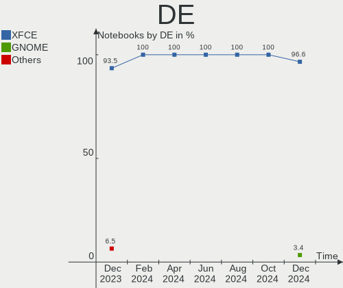
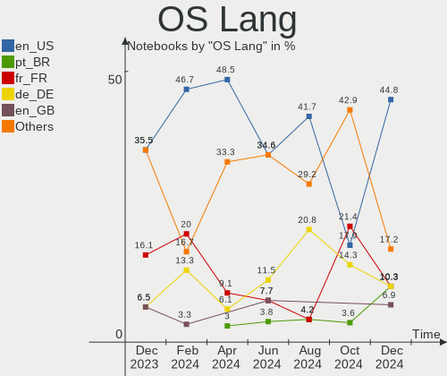
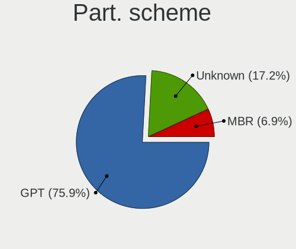
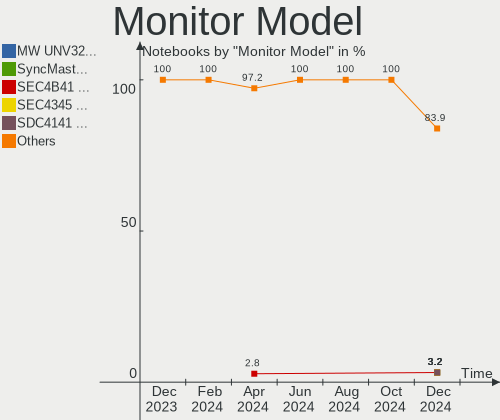
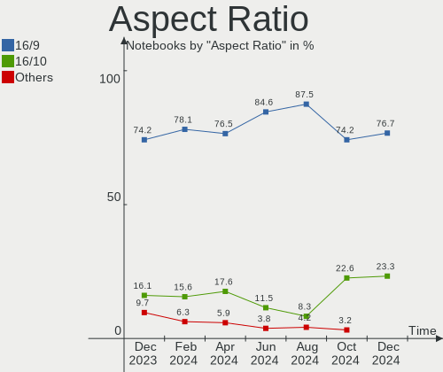
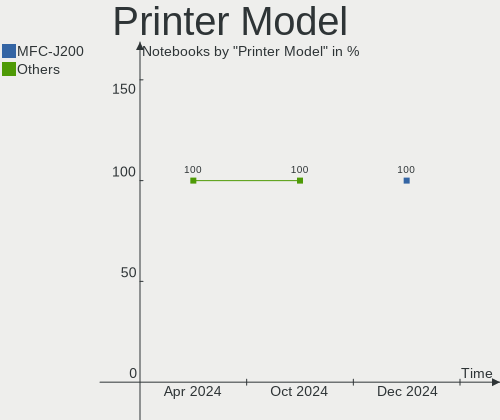
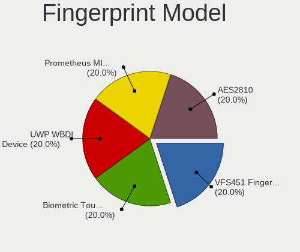

Xubuntu - Hardware Trends (Notebooks)
-------------------------------------

A project to identify most popular hardware characteristics and track their change
over time based on data collected by Linux users at https://Linux-Hardware.org.

Anyone can contribute to this report by the [hw-probe](https://github.com/linuxhw/hw-probe) tool:

    sudo -E hw-probe -all -upload

This report is for one last month. Overall report since the beginning of time: [TestDays](https://github.com/linuxhw/TestDays)

Period: Apr, 2024.

Contents
--------

* [ System ](#system)
  - [ OS                       ](#os)
  - [ OS Family                ](#os-family)
  - [ Kernel                   ](#kernel)
  - [ Kernel Family            ](#kernel-family)
  - [ Kernel Major Ver.        ](#kernel-major-ver)
  - [ Arch                     ](#arch)
  - [ DE                       ](#de)
  - [ Display Server           ](#display-server)
  - [ Display Manager          ](#display-manager)
  - [ OS Lang                  ](#os-lang)
  - [ Boot Mode                ](#boot-mode)
  - [ Filesystem               ](#filesystem)
  - [ Part. scheme             ](#part-scheme)
  - [ Dual Boot with Linux/BSD ](#dual-boot-with-linuxbsd)
  - [ Dual Boot (Win)          ](#dual-boot-win)

* [ Board ](#board)
  - [ Vendor                   ](#vendor)
  - [ Model                    ](#model)
  - [ Model Family             ](#model-family)
  - [ MFG Year                 ](#mfg-year)
  - [ Form Factor              ](#form-factor)
  - [ Secure Boot              ](#secure-boot)
  - [ Coreboot                 ](#coreboot)
  - [ RAM Size                 ](#ram-size)
  - [ RAM Used                 ](#ram-used)
  - [ Total Drives             ](#total-drives)
  - [ Has CD-ROM               ](#has-cd-rom)
  - [ Has Ethernet             ](#has-ethernet)
  - [ Has WiFi                 ](#has-wifi)
  - [ Has Bluetooth            ](#has-bluetooth)

* [ Location ](#location)
  - [ Country                  ](#country)
  - [ City                     ](#city)

* [ Drives ](#drives)
  - [ Drive Vendor             ](#drive-vendor)
  - [ Drive Model              ](#drive-model)
  - [ HDD Vendor               ](#hdd-vendor)
  - [ SSD Vendor               ](#ssd-vendor)
  - [ Drive Kind               ](#drive-kind)
  - [ Drive Connector          ](#drive-connector)
  - [ Drive Size               ](#drive-size)
  - [ Space Total              ](#space-total)
  - [ Space Used               ](#space-used)
  - [ Malfunc. Drives          ](#malfunc-drives)
  - [ Malfunc. Drive Vendor    ](#malfunc-drive-vendor)
  - [ Malfunc. HDD Vendor      ](#malfunc-hdd-vendor)
  - [ Malfunc. Drive Kind      ](#malfunc-drive-kind)
  - [ Failed Drives            ](#failed-drives)
  - [ Failed Drive Vendor      ](#failed-drive-vendor)
  - [ Drive Status             ](#drive-status)

* [ Storage controller ](#storage-controller)
  - [ Storage Vendor           ](#storage-vendor)
  - [ Storage Model            ](#storage-model)
  - [ Storage Kind             ](#storage-kind)

* [ Processor ](#processor)
  - [ CPU Vendor               ](#cpu-vendor)
  - [ CPU Model                ](#cpu-model)
  - [ CPU Model Family         ](#cpu-model-family)
  - [ CPU Cores                ](#cpu-cores)
  - [ CPU Sockets              ](#cpu-sockets)
  - [ CPU Threads              ](#cpu-threads)
  - [ CPU Op-Modes             ](#cpu-op-modes)
  - [ CPU Microcode            ](#cpu-microcode)
  - [ CPU Microarch            ](#cpu-microarch)

* [ Graphics ](#graphics)
  - [ GPU Vendor               ](#gpu-vendor)
  - [ GPU Model                ](#gpu-model)
  - [ GPU Combo                ](#gpu-combo)
  - [ GPU Driver               ](#gpu-driver)
  - [ GPU Memory               ](#gpu-memory)

* [ Monitor ](#monitor)
  - [ Monitor Vendor           ](#monitor-vendor)
  - [ Monitor Model            ](#monitor-model)
  - [ Monitor Resolution       ](#monitor-resolution)
  - [ Monitor Diagonal         ](#monitor-diagonal)
  - [ Monitor Width            ](#monitor-width)
  - [ Aspect Ratio             ](#aspect-ratio)
  - [ Monitor Area             ](#monitor-area)
  - [ Pixel Density            ](#pixel-density)
  - [ Multiple Monitors        ](#multiple-monitors)

* [ Network ](#network)
  - [ Net Controller Vendor    ](#net-controller-vendor)
  - [ Net Controller Model     ](#net-controller-model)
  - [ Wireless Vendor          ](#wireless-vendor)
  - [ Wireless Model           ](#wireless-model)
  - [ Ethernet Vendor          ](#ethernet-vendor)
  - [ Ethernet Model           ](#ethernet-model)
  - [ Net Controller Kind      ](#net-controller-kind)
  - [ Used Controller          ](#used-controller)
  - [ NICs                     ](#nics)
  - [ IPv6                     ](#ipv6)

* [ Bluetooth ](#bluetooth)
  - [ Bluetooth Vendor         ](#bluetooth-vendor)
  - [ Bluetooth Model          ](#bluetooth-model)

* [ Sound ](#sound)
  - [ Sound Vendor             ](#sound-vendor)
  - [ Sound Model              ](#sound-model)

* [ Memory ](#memory)
  - [ Memory Vendor            ](#memory-vendor)
  - [ Memory Model             ](#memory-model)
  - [ Memory Kind              ](#memory-kind)
  - [ Memory Form Factor       ](#memory-form-factor)
  - [ Memory Size              ](#memory-size)
  - [ Memory Speed             ](#memory-speed)

* [ Printers & scanners ](#printers--scanners)
  - [ Printer Vendor           ](#printer-vendor)
  - [ Printer Model            ](#printer-model)
  - [ Scanner Vendor           ](#scanner-vendor)
  - [ Scanner Model            ](#scanner-model)

* [ Camera ](#camera)
  - [ Camera Vendor            ](#camera-vendor)
  - [ Camera Model             ](#camera-model)

* [ Security ](#security)
  - [ Fingerprint Vendor       ](#fingerprint-vendor)
  - [ Fingerprint Model        ](#fingerprint-model)
  - [ Chipcard Vendor          ](#chipcard-vendor)
  - [ Chipcard Model           ](#chipcard-model)

* [ Unsupported ](#unsupported)
  - [ Unsupported Devices      ](#unsupported-devices)
  - [ Unsupported Device Types ](#unsupported-device-types)

System
------

OS
--

Installed operating systems

| Name          | Notebooks | Percent |
|---------------|-----------|---------|
| Xubuntu 22.04 | 22        | 66.67%  |
| Xubuntu 23.10 | 4         | 12.12%  |
| Xubuntu 18.04 | 3         | 9.09%   |
| Xubuntu 24.04 | 2         | 6.06%   |
| Xubuntu 20.04 | 1         | 3.03%   |
| Xubuntu 16.04 | 1         | 3.03%   |

OS Family
---------

OS without a version

| Name    | Notebooks | Percent |
|---------|-----------|---------|
| Xubuntu | 33        | 100%    |

Kernel
------

Version of the Linux kernel

| Version            | Notebooks | Percent |
|--------------------|-----------|---------|
| 6.5.0-28-generic   | 7         | 21.21%  |
| 6.5.0-26-generic   | 5         | 15.15%  |
| 5.15.0-101-generic | 5         | 15.15%  |
| 5.4.0-150-generic  | 3         | 9.09%   |
| 5.15.0-105-generic | 3         | 9.09%   |
| 6.8.0-31-generic   | 2         | 6.06%   |
| 5.15.0-102-generic | 2         | 6.06%   |
| 6.5.0-9-generic    | 1         | 3.03%   |
| 6.5.0-27-generic   | 1         | 3.03%   |
| 6.5.0-18-generic   | 1         | 3.03%   |
| 5.15.0-89-generic  | 1         | 3.03%   |
| 5.15.0-82-generic  | 1         | 3.03%   |
| 4.4.0-210-generic  | 1         | 3.03%   |

Kernel Family
-------------

Linux kernel without a distro release

| Version | Notebooks | Percent |
|---------|-----------|---------|
| 6.5.0   | 15        | 45.45%  |
| 5.15.0  | 12        | 36.36%  |
| 5.4.0   | 3         | 9.09%   |
| 6.8.0   | 2         | 6.06%   |
| 4.4.0   | 1         | 3.03%   |

Kernel Major Ver.
-----------------

Linux kernel major version

| Version | Notebooks | Percent |
|---------|-----------|---------|
| 6.5     | 15        | 45.45%  |
| 5.15    | 12        | 36.36%  |
| 5.4     | 3         | 9.09%   |
| 6.8     | 2         | 6.06%   |
| 4.4     | 1         | 3.03%   |

Arch
----

OS architecture (x86_64, i586, etc.)

| Name   | Notebooks | Percent |
|--------|-----------|---------|
| x86_64 | 29        | 87.88%  |
| i686   | 4         | 12.12%  |

DE
--

Desktop Environment

| Name | Notebooks | Percent |
|------|-----------|---------|
| XFCE | 33        | 100%    |

Display Server
--------------

X11 or Wayland

| Name | Notebooks | Percent |
|------|-----------|---------|
| X11  | 33        | 100%    |

Display Manager
---------------

SDDM, LightDM, etc.

| Name    | Notebooks | Percent |
|---------|-----------|---------|
| LightDM | 28        | 84.85%  |
| Unknown | 3         | 9.09%   |
| SDDM    | 1         | 3.03%   |
| GDM3    | 1         | 3.03%   |

OS Lang
-------

Language

| Lang  | Notebooks | Percent |
|-------|-----------|---------|
| en_US | 16        | 48.48%  |
| it_IT | 4         | 12.12%  |
| fr_FR | 3         | 9.09%   |
| de_DE | 2         | 6.06%   |
| ru_RU | 1         | 3.03%   |
| pt_BR | 1         | 3.03%   |
| es_ES | 1         | 3.03%   |
| en_NZ | 1         | 3.03%   |
| en_CA | 1         | 3.03%   |
| en_AU | 1         | 3.03%   |
| de_CH | 1         | 3.03%   |
| C     | 1         | 3.03%   |

Boot Mode
---------

EFI or BIOS

| Mode | Notebooks | Percent |
|------|-----------|---------|
| BIOS | 22        | 66.67%  |
| EFI  | 11        | 33.33%  |

Filesystem
----------

Type of filesystem

| Type    | Notebooks | Percent |
|---------|-----------|---------|
| Ext4    | 19        | 57.58%  |
| Tmpfs   | 12        | 36.36%  |
| Zfs     | 1         | 3.03%   |
| Overlay | 1         | 3.03%   |

Part. scheme
------------

Scheme of partitioning

| Type    | Notebooks | Percent |
|---------|-----------|---------|
| GPT     | 22        | 66.67%  |
| Unknown | 7         | 21.21%  |
| MBR     | 4         | 12.12%  |

Dual Boot with Linux/BSD
------------------------

Hosting more than one Linux/BSD

| Dual boot | Notebooks | Percent |
|-----------|-----------|---------|
| No        | 30        | 90.91%  |
| Yes       | 3         | 9.09%   |

Dual Boot (Win)
---------------

Hosting Linux and Windows

| Dual boot | Notebooks | Percent |
|-----------|-----------|---------|
| No        | 24        | 72.73%  |
| Yes       | 9         | 27.27%  |

Board
-----

Vendor
------

Motherboard manufacturer

| Name                | Notebooks | Percent |
|---------------------|-----------|---------|
| Hewlett-Packard     | 9         | 27.27%  |
| Lenovo              | 6         | 18.18%  |
| ASUSTek Computer    | 4         | 12.12%  |
| Acer                | 4         | 12.12%  |
| Dell                | 3         | 9.09%   |
| Apple               | 3         | 9.09%   |
| Sony                | 1         | 3.03%   |
| Samsung Electronics | 1         | 3.03%   |
| Philco              | 1         | 3.03%   |
| Clevo               | 1         | 3.03%   |

Model
-----

Motherboard model

| Name                                     | Notebooks | Percent |
|------------------------------------------|-----------|---------|
| HP Notebook                              | 2         | 6.06%   |
| Sony VPCF12M1E                           | 1         | 3.03%   |
| Samsung 300E4C/300E5C/300E7C             | 1         | 3.03%   |
| Philco 14I                               | 1         | 3.03%   |
| Lenovo ThinkPad X131e 3367AH5            | 1         | 3.03%   |
| Lenovo ThinkPad W541 20EGS03W15          | 1         | 3.03%   |
| Lenovo ThinkPad Twist 33474HU            | 1         | 3.03%   |
| Lenovo ThinkPad T60 1951FDG              | 1         | 3.03%   |
| Lenovo Legion S7 15IMH5 82BC             | 1         | 3.03%   |
| Lenovo IdeaPad 1 15AMN7 82VG             | 1         | 3.03%   |
| HP ProBook 4340s                         | 1         | 3.03%   |
| HP Mini 210-1000                         | 1         | 3.03%   |
| HP Laptop 14-dq0xxx                      | 1         | 3.03%   |
| HP EliteBook 2540p                       | 1         | 3.03%   |
| HP Compaq 6730b (GW687AV)                | 1         | 3.03%   |
| HP Compaq 6720s                          | 1         | 3.03%   |
| HP 15                                    | 1         | 3.03%   |
| Dell XPS 13 9370                         | 1         | 3.03%   |
| Dell Latitude 5330                       | 1         | 3.03%   |
| Dell Inspiron 1011                       | 1         | 3.03%   |
| Clevo W240EU/W250EUQ/W270EUQ             | 1         | 3.03%   |
| ASUS X751MA                              | 1         | 3.03%   |
| ASUS VivoBook_ASUSLaptop M3704YA_M3704YA | 1         | 3.03%   |
| ASUS K53E                                | 1         | 3.03%   |
| ASUS ASUS TUF Gaming F15 FX506HCB        | 1         | 3.03%   |
| Apple MacBookPro7,1                      | 1         | 3.03%   |
| Apple MacBookPro5,2                      | 1         | 3.03%   |
| Apple MacBookAir6,2                      | 1         | 3.03%   |
| Acer Aspire V3-331                       | 1         | 3.03%   |
| Acer Aspire E5-521G                      | 1         | 3.03%   |
| Acer Aspire A515-51                      | 1         | 3.03%   |
| Acer Aspire A515-44                      | 1         | 3.03%   |

Model Family
------------

Motherboard model prefix

| Name              | Notebooks | Percent |
|-------------------|-----------|---------|
| Lenovo ThinkPad   | 4         | 12.12%  |
| Acer Aspire       | 4         | 12.12%  |
| HP Notebook       | 2         | 6.06%   |
| HP Compaq         | 2         | 6.06%   |
| Sony VPCF12M1E    | 1         | 3.03%   |
| Samsung 300E4C    | 1         | 3.03%   |
| Philco 14I        | 1         | 3.03%   |
| Lenovo Legion     | 1         | 3.03%   |
| Lenovo IdeaPad    | 1         | 3.03%   |
| HP ProBook        | 1         | 3.03%   |
| HP Mini           | 1         | 3.03%   |
| HP Laptop         | 1         | 3.03%   |
| HP EliteBook      | 1         | 3.03%   |
| HP 15             | 1         | 3.03%   |
| Dell XPS          | 1         | 3.03%   |
| Dell Latitude     | 1         | 3.03%   |
| Dell Inspiron     | 1         | 3.03%   |
| Clevo W240EU      | 1         | 3.03%   |
| ASUS X751MA       | 1         | 3.03%   |
| ASUS VivoBook     | 1         | 3.03%   |
| ASUS K53E         | 1         | 3.03%   |
| ASUS ASUS         | 1         | 3.03%   |
| Apple MacBookPro7 | 1         | 3.03%   |
| Apple MacBookPro5 | 1         | 3.03%   |
| Apple MacBookAir6 | 1         | 3.03%   |

MFG Year
--------

Motherboard manufacture year

| Year    | Notebooks | Percent |
|---------|-----------|---------|
| 2012    | 6         | 18.18%  |
| 2009    | 4         | 12.12%  |
| 2014    | 3         | 9.09%   |
| 2010    | 3         | 9.09%   |
| 2023    | 2         | 6.06%   |
| 2022    | 2         | 6.06%   |
| 2018    | 2         | 6.06%   |
| 2013    | 2         | 6.06%   |
| 2020    | 1         | 3.03%   |
| 2019    | 1         | 3.03%   |
| 2017    | 1         | 3.03%   |
| 2016    | 1         | 3.03%   |
| 2015    | 1         | 3.03%   |
| 2011    | 1         | 3.03%   |
| 2007    | 1         | 3.03%   |
| 2006    | 1         | 3.03%   |
| Unknown | 1         | 3.03%   |

Form Factor
-----------

Physical design of the computer

| Name     | Notebooks | Percent |
|----------|-----------|---------|
| Notebook | 33        | 100%    |

Secure Boot
-----------

Enabled or disabled

| State    | Notebooks | Percent |
|----------|-----------|---------|
| Disabled | 30        | 90.91%  |
| Enabled  | 3         | 9.09%   |

Coreboot
--------

Have coreboot on board

| Used | Notebooks | Percent |
|------|-----------|---------|
| No   | 33        | 100%    |

RAM Size
--------

Total RAM memory

| Size in GB | Notebooks | Percent |
|------------|-----------|---------|
| 3.01-4.0   | 14        | 42.42%  |
| 8.01-16.0  | 7         | 21.21%  |
| 4.01-8.0   | 3         | 9.09%   |
| 16.01-24.0 | 3         | 9.09%   |
| 32.01-64.0 | 2         | 6.06%   |
| 1.01-2.0   | 2         | 6.06%   |
| 2.01-3.0   | 1         | 3.03%   |
| 0.51-1.0   | 1         | 3.03%   |

RAM Used
--------

Used RAM memory

| Used GB   | Notebooks | Percent |
|-----------|-----------|---------|
| 2.01-3.0  | 11        | 33.33%  |
| 1.01-2.0  | 10        | 30.3%   |
| 4.01-8.0  | 6         | 18.18%  |
| 0.51-1.0  | 3         | 9.09%   |
| 8.01-16.0 | 2         | 6.06%   |
| 0.01-0.5  | 1         | 3.03%   |

Total Drives
------------

Number of drives on board

| Drives | Notebooks | Percent |
|--------|-----------|---------|
| 1      | 25        | 75.76%  |
| 2      | 7         | 21.21%  |
| 3      | 1         | 3.03%   |

Has CD-ROM
----------

Has CD-ROM on board

| Presented | Notebooks | Percent |
|-----------|-----------|---------|
| Yes       | 17        | 51.52%  |
| No        | 16        | 48.48%  |

Has Ethernet
------------

Has Ethernet on board

| Presented | Notebooks | Percent |
|-----------|-----------|---------|
| Yes       | 28        | 84.85%  |
| No        | 5         | 15.15%  |

Has WiFi
--------

Has WiFi module

| Presented | Notebooks | Percent |
|-----------|-----------|---------|
| Yes       | 33        | 100%    |

Has Bluetooth
-------------

Has Bluetooth module

| Presented | Notebooks | Percent |
|-----------|-----------|---------|
| Yes       | 25        | 75.76%  |
| No        | 8         | 24.24%  |

Location
--------

Country
-------

Geographic location (country)

| Country     | Notebooks | Percent |
|-------------|-----------|---------|
| USA         | 7         | 21.21%  |
| Italy       | 5         | 15.15%  |
| Germany     | 3         | 9.09%   |
| France      | 3         | 9.09%   |
| Spain       | 2         | 6.06%   |
| Serbia      | 2         | 6.06%   |
| Thailand    | 1         | 3.03%   |
| Switzerland | 1         | 3.03%   |
| Russia      | 1         | 3.03%   |
| Pakistan    | 1         | 3.03%   |
| New Zealand | 1         | 3.03%   |
| Malaysia    | 1         | 3.03%   |
| Lithuania   | 1         | 3.03%   |
| Finland     | 1         | 3.03%   |
| Canada      | 1         | 3.03%   |
| Brazil      | 1         | 3.03%   |
| Australia   | 1         | 3.03%   |

City
----

Geographic location (city)

| City              | Notebooks | Percent |
|-------------------|-----------|---------|
| Rome              | 2         | 6.06%   |
| Zrenjanin         | 1         | 3.03%   |
| Yekaterinburg     | 1         | 3.03%   |
| Winnipeg          | 1         | 3.03%   |
| Vilnius           | 1         | 3.03%   |
| Valdagno          | 1         | 3.03%   |
| Turin             | 1         | 3.03%   |
| Sombor            | 1         | 3.03%   |
| Saint-Estephe     | 1         | 3.03%   |
| Saint Paul        | 1         | 3.03%   |
| Roscanvel         | 1         | 3.03%   |
| Rio de Janeiro    | 1         | 3.03%   |
| Oskaloosa         | 1         | 3.03%   |
| Nuremberg         | 1         | 3.03%   |
| New York          | 1         | 3.03%   |
| Minneapolis       | 1         | 3.03%   |
| Milan             | 1         | 3.03%   |
| Malden            | 1         | 3.03%   |
| Madrid            | 1         | 3.03%   |
| Karachi           | 1         | 3.03%   |
| Ipoh              | 1         | 3.03%   |
| Helsinki          | 1         | 3.03%   |
| Frankfurt am Main | 1         | 3.03%   |
| Düsseldorf       | 1         | 3.03%   |
| Chula Vista       | 1         | 3.03%   |
| Carson            | 1         | 3.03%   |
| Brisbane          | 1         | 3.03%   |
| Bern              | 1         | 3.03%   |
| Berles-Monchel    | 1         | 3.03%   |
| Bangkok           | 1         | 3.03%   |
| Auckland          | 1         | 3.03%   |
| Arona             | 1         | 3.03%   |

Drives
------

Drive Vendor
------------

Hard drive vendors

| Vendor              | Notebooks | Drives | Percent |
|---------------------|-----------|--------|---------|
| WDC                 | 6         | 6      | 15.38%  |
| Seagate             | 5         | 5      | 12.82%  |
| Unknown             | 4         | 6      | 10.26%  |
| Hitachi             | 4         | 5      | 10.26%  |
| Toshiba             | 3         | 3      | 7.69%   |
| Micron Technology   | 3         | 3      | 7.69%   |
| Samsung Electronics | 2         | 2      | 5.13%   |
| Kingston            | 2         | 2      | 5.13%   |
| TO Exter            | 1         | 1      | 2.56%   |
| SPCC                | 1         | 1      | 2.56%   |
| Sandisk             | 1         | 1      | 2.56%   |
| Phison Electronics  | 1         | 1      | 2.56%   |
| PHD 3.0             | 1         | 1      | 2.56%   |
| Patriot             | 1         | 1      | 2.56%   |
| HEORIADY            | 1         | 1      | 2.56%   |
| GOODRAM             | 1         | 1      | 2.56%   |
| Fujitsu             | 1         | 1      | 2.56%   |
| Apple               | 1         | 1      | 2.56%   |

Drive Model
-----------

Hard drive models

| Model                                             | Notebooks | Percent |
|---------------------------------------------------|-----------|---------|
| Unknown SD/MMC/MS PRO 128GB                       | 2         | 4.76%   |
| WDC WDS500G2B0A-00SM50 500GB SSD                  | 1         | 2.38%   |
| WDC WD1600BEVT-75ZCT2 160GB                       | 1         | 2.38%   |
| WDC WD1600BEVT-60ZCT1 160GB                       | 1         | 2.38%   |
| WDC WD10JPVX-22JC3T0 1TB                          | 1         | 2.38%   |
| WDC WD10JPVX-11JC3T0 1TB                          | 1         | 2.38%   |
| WDC PC SN530 SDBPNPZ-256G-1114 256GB              | 1         | 2.38%   |
| Unknown SD32G  32GB                               | 1         | 2.38%   |
| Unknown SD16G  32GB                               | 1         | 2.38%   |
| Unknown MMC Card  32GB                            | 1         | 2.38%   |
| Unknown CUTB42  64GB                              | 1         | 2.38%   |
| Toshiba MK1633GSG 160GB                           | 1         | 2.38%   |
| Toshiba MK1237GSX 120GB                           | 1         | 2.38%   |
| Toshiba KXG50ZNV1T02 NVMe 1024GB                  | 1         | 2.38%   |
| TO Exter nal USB 3.0 500GB                        | 1         | 2.38%   |
| SPCC Solid State Disk 240GB                       | 1         | 2.38%   |
| Seagate ST9250410AS 250GB                         | 1         | 2.38%   |
| Seagate ST320LM001 HN-M320MBB 320GB               | 1         | 2.38%   |
| Seagate ST2000LX001-1RG174 2TB                    | 1         | 2.38%   |
| Seagate ST1000LM024 HN-M101MBB 1TB                | 1         | 2.38%   |
| Seagate Expansion 2TB                             | 1         | 2.38%   |
| Sandisk WD Green SN350 1TB                        | 1         | 2.38%   |
| Samsung SSD 850 PRO 256GB                         | 1         | 2.38%   |
| Samsung NVMe SSD Controller SM981/PM981/PM983 1TB | 1         | 2.38%   |
| Phison PCIe SSD 2TB                               | 1         | 2.38%   |
| PHD 3.0 Silicon-Power 1TB                         | 1         | 2.38%   |
| Patriot P210 512GB SSD                            | 1         | 2.38%   |
| Micron MTFDKCD512QFM-1BD1AABLA 512GB              | 1         | 2.38%   |
| Micron 2450 NVMe 512GB                            | 1         | 2.38%   |
| Micron 2400_MTFDKBA512QFM 512GB                   | 1         | 2.38%   |
| Kingston SV300S37A120G 120GB SSD                  | 1         | 2.38%   |
| Kingston SKC600512G 512GB SSD                     | 1         | 2.38%   |
| Hitachi HTS723232L9SA60 320GB                     | 1         | 2.38%   |
| Hitachi HTS547550A9E384 500GB                     | 1         | 2.38%   |
| Hitachi HTS545032B9A300 320GB                     | 1         | 2.38%   |
| Hitachi HTS545025B9SA02 250GB                     | 1         | 2.38%   |
| Hitachi HTS543232A7A384 320GB                     | 1         | 2.38%   |
| HEORIADY SSD HX-001 F 128G                        | 1         | 2.38%   |
| GOODRAM SSDPR-CL100-120-G3 120GB                  | 1         | 2.38%   |
| Fujitsu MJA2500BH FFS G1 500GB                    | 1         | 2.38%   |

HDD Vendor
----------

Hard disk drive vendors

| Vendor   | Notebooks | Drives | Percent |
|----------|-----------|--------|---------|
| Seagate  | 5         | 5      | 26.32%  |
| WDC      | 4         | 4      | 21.05%  |
| Hitachi  | 4         | 5      | 21.05%  |
| Unknown  | 2         | 2      | 10.53%  |
| Toshiba  | 2         | 2      | 10.53%  |
| TO Exter | 1         | 1      | 5.26%   |
| Fujitsu  | 1         | 1      | 5.26%   |

SSD Vendor
----------

Solid state drive vendors

| Vendor              | Notebooks | Drives | Percent |
|---------------------|-----------|--------|---------|
| Kingston            | 2         | 2      | 20%     |
| WDC                 | 1         | 1      | 10%     |
| SPCC                | 1         | 1      | 10%     |
| Samsung Electronics | 1         | 1      | 10%     |
| PHD 3.0             | 1         | 1      | 10%     |
| Patriot             | 1         | 1      | 10%     |
| HEORIADY            | 1         | 1      | 10%     |
| GOODRAM             | 1         | 1      | 10%     |
| Apple               | 1         | 1      | 10%     |

Drive Kind
----------

HDD or SSD

| Kind | Notebooks | Drives | Percent |
|------|-----------|--------|---------|
| HDD  | 18        | 20     | 47.37%  |
| SSD  | 10        | 10     | 26.32%  |
| NVMe | 7         | 8      | 18.42%  |
| MMC  | 3         | 4      | 7.89%   |

Drive Connector
---------------

SATA, SAS, NVMe, etc.

| Type | Notebooks | Drives | Percent |
|------|-----------|--------|---------|
| SATA | 24        | 25     | 63.16%  |
| NVMe | 7         | 8      | 18.42%  |
| SAS  | 4         | 5      | 10.53%  |
| MMC  | 3         | 4      | 7.89%   |

Drive Size
----------

Size of hard drive

| Size in TB | Notebooks | Drives | Percent |
|------------|-----------|--------|---------|
| 0.01-0.5   | 21        | 22     | 72.41%  |
| 0.51-1.0   | 6         | 6      | 20.69%  |
| 1.01-2.0   | 2         | 2      | 6.9%    |

Space Total
-----------

Amount of disk space available on the file system

| Size in GB | Notebooks | Percent |
|------------|-----------|---------|
| 101-250    | 12        | 36.36%  |
| 251-500    | 9         | 27.27%  |
| 501-1000   | 6         | 18.18%  |
| 1001-2000  | 2         | 6.06%   |
| 1-20       | 2         | 6.06%   |
| 2001-3000  | 1         | 3.03%   |
| 51-100     | 1         | 3.03%   |

Space Used
----------

Amount of used disk space

| Used GB   | Notebooks | Percent |
|-----------|-----------|---------|
| 101-250   | 8         | 24.24%  |
| 1-20      | 8         | 24.24%  |
| 21-50     | 7         | 21.21%  |
| 251-500   | 5         | 15.15%  |
| 51-100    | 3         | 9.09%   |
| 2001-3000 | 1         | 3.03%   |
| 1001-2000 | 1         | 3.03%   |

Malfunc. Drives
---------------

Drive models with a malfunction

| Model                         | Notebooks | Drives | Percent |
|-------------------------------|-----------|--------|---------|
| Toshiba MK1633GSG 160GB       | 1         | 1      | 33.33%  |
| Hitachi HTS545025B9SA02 250GB | 1         | 1      | 33.33%  |
| Apple SSD SD0256F 256GB       | 1         | 1      | 33.33%  |

Malfunc. Drive Vendor
---------------------

Vendors of faulty drives

| Vendor  | Notebooks | Drives | Percent |
|---------|-----------|--------|---------|
| Toshiba | 1         | 1      | 33.33%  |
| Hitachi | 1         | 1      | 33.33%  |
| Apple   | 1         | 1      | 33.33%  |

Malfunc. HDD Vendor
-------------------

Vendors of faulty HDD drives

| Vendor  | Notebooks | Drives | Percent |
|---------|-----------|--------|---------|
| Toshiba | 1         | 1      | 50%     |
| Hitachi | 1         | 1      | 50%     |

Malfunc. Drive Kind
-------------------

Kinds of faulty drives

| Kind | Notebooks | Drives | Percent |
|------|-----------|--------|---------|
| HDD  | 2         | 2      | 66.67%  |
| SSD  | 1         | 1      | 33.33%  |

Failed Drives
-------------

Failed drive models

Zero info for selected period =(

Failed Drive Vendor
-------------------

Failed drive vendors

Zero info for selected period =(

Drive Status
------------

Number of failed and malfunc. drives

| Status   | Notebooks | Drives | Percent |
|----------|-----------|--------|---------|
| Detected | 19        | 24     | 52.78%  |
| Works    | 14        | 15     | 38.89%  |
| Malfunc  | 3         | 3      | 8.33%   |

Storage controller
------------------

Storage Vendor
--------------

Storage controller vendors

| Vendor                       | Notebooks | Percent |
|------------------------------|-----------|---------|
| Intel                        | 22        | 57.89%  |
| AMD                          | 5         | 13.16%  |
| Micron Technology            | 3         | 7.89%   |
| SanDisk                      | 2         | 5.26%   |
| Nvidia                       | 2         | 5.26%   |
| Toshiba America Info Systems | 1         | 2.63%   |
| Samsung Electronics          | 1         | 2.63%   |
| Phison Electronics           | 1         | 2.63%   |
| Marvell Technology Group     | 1         | 2.63%   |

Storage Model
-------------

Storage controller models

| Model                                                                            | Notebooks | Percent |
|----------------------------------------------------------------------------------|-----------|---------|
| Intel 7 Series Chipset Family 6-port SATA Controller [AHCI mode]                 | 5         | 12.5%   |
| AMD FCH SATA Controller [AHCI mode]                                              | 4         | 10%     |
| Micron 2400 NVMe SSD (DRAM-less)                                                 | 2         | 5%      |
| Intel Volume Management Device NVMe RAID Controller                              | 2         | 5%      |
| Intel Atom Processor E3800 Series SATA AHCI Controller                           | 2         | 5%      |
| Toshiba America Info Systems XG5 NVMe SSD Controller                             | 1         | 2.5%    |
| SanDisk WD PC SN540 / Green SN350 NVMe SSD 1 TB (DRAM-less)                      | 1         | 2.5%    |
| SanDisk Ultra 3D / WD Blue SN550 NVMe SSD                                        | 1         | 2.5%    |
| Samsung NVMe SSD Controller SM981/PM981/PM983                                    | 1         | 2.5%    |
| Phison PS5015-E15 PCIe3 NVMe Controller (DRAM-less)                              | 1         | 2.5%    |
| Nvidia MCP89 SATA Controller (AHCI mode)                                         | 1         | 2.5%    |
| Nvidia MCP79 AHCI Controller                                                     | 1         | 2.5%    |
| Micron 2450 NVMe SSD [HendrixV] (DRAM-less)                                      | 1         | 2.5%    |
| Marvell Group 88SS9183 PCIe SSD Controller                                       | 1         | 2.5%    |
| Intel Sunrise Point-LP SATA Controller [AHCI mode]                               | 1         | 2.5%    |
| Intel NM10/ICH7 Family SATA Controller [AHCI mode]                               | 1         | 2.5%    |
| Intel Comet Lake PCH-H RAID                                                      | 1         | 2.5%    |
| Intel Atom/Celeron/Pentium Processor x5-E8000/J3xxx/N3xxx Series SATA Controller | 1         | 2.5%    |
| Intel 82801IBM/IEM (ICH9M/ICH9M-E) 2 port SATA Controller [IDE mode]             | 1         | 2.5%    |
| Intel 82801HM/HEM (ICH8M/ICH8M-E) SATA Controller [AHCI mode]                    | 1         | 2.5%    |
| Intel 82801HM/HEM (ICH8M/ICH8M-E) IDE Controller                                 | 1         | 2.5%    |
| Intel 82801GBM/GHM (ICH7-M Family) SATA Controller [IDE mode]                    | 1         | 2.5%    |
| Intel 82801GBM/GHM (ICH7-M Family) SATA Controller [AHCI mode]                   | 1         | 2.5%    |
| Intel 82801G (ICH7 Family) IDE Controller                                        | 1         | 2.5%    |
| Intel 82801 Mobile SATA Controller [RAID mode]                                   | 1         | 2.5%    |
| Intel 8 Series/C220 Series Chipset Family 6-port SATA Controller 1 [AHCI mode]   | 1         | 2.5%    |
| Intel 8 Series SATA Controller 1 [AHCI mode]                                     | 1         | 2.5%    |
| Intel 6 Series/C200 Series Chipset Family 6 port Mobile SATA AHCI Controller     | 1         | 2.5%    |
| Intel 5 Series/3400 Series Chipset 6 port SATA AHCI Controller                   | 1         | 2.5%    |
| AMD SB7x0/SB8x0/SB9x0 SATA Controller [AHCI mode]                                | 1         | 2.5%    |

Storage Kind
------------

Kind of storage controller (IDE, SATA, NVMe, SAS, ...)

| Kind | Notebooks | Percent |
|------|-----------|---------|
| SATA | 24        | 61.54%  |
| NVMe | 7         | 17.95%  |
| RAID | 4         | 10.26%  |
| IDE  | 4         | 10.26%  |

Processor
---------

CPU Vendor
----------

Processor vendors

| Vendor | Notebooks | Percent |
|--------|-----------|---------|
| Intel  | 27        | 81.82%  |
| AMD    | 6         | 18.18%  |

CPU Model
---------

Processor models

| Model                                       | Notebooks | Percent |
|---------------------------------------------|-----------|---------|
| Intel Core 2 Duo CPU P8600 @ 2.40GHz        | 2         | 6.06%   |
| Intel Pentium CPU N3540 @ 2.16GHz           | 1         | 3.03%   |
| Intel Pentium CPU B960 @ 2.20GHz            | 1         | 3.03%   |
| Intel Pentium 3556U @ 1.70GHz               | 1         | 3.03%   |
| Intel Core i9-10980HK CPU @ 2.40GHz         | 1         | 3.03%   |
| Intel Core i7-8550U CPU @ 1.80GHz           | 1         | 3.03%   |
| Intel Core i7-4810MQ CPU @ 2.80GHz          | 1         | 3.03%   |
| Intel Core i7 CPU L 640 @ 2.13GHz           | 1         | 3.03%   |
| Intel Core i5-4250U CPU @ 1.30GHz           | 1         | 3.03%   |
| Intel Core i5-3317U CPU @ 1.70GHz           | 1         | 3.03%   |
| Intel Core i5 CPU M 520 @ 2.40GHz           | 1         | 3.03%   |
| Intel Core i3-8130U CPU @ 2.20GHz           | 1         | 3.03%   |
| Intel Core i3-2370M CPU @ 2.40GHz           | 1         | 3.03%   |
| Intel Core i3-2310M CPU @ 2.10GHz           | 1         | 3.03%   |
| Intel Core 2 Duo CPU T9600 @ 2.80GHz        | 1         | 3.03%   |
| Intel Core 2 CPU T7600 @ 2.33GHz            | 1         | 3.03%   |
| Intel Celeron N4120 CPU @ 1.10GHz           | 1         | 3.03%   |
| Intel Celeron CPU N3060 @ 1.60GHz           | 1         | 3.03%   |
| Intel Celeron CPU N2830 @ 2.16GHz           | 1         | 3.03%   |
| Intel Celeron CPU B820 @ 1.70GHz            | 1         | 3.03%   |
| Intel Celeron CPU 887 @ 1.50GHz             | 1         | 3.03%   |
| Intel Celeron CPU 540 @ 1.86GHz             | 1         | 3.03%   |
| Intel Atom CPU N450 @ 1.66GHz               | 1         | 3.03%   |
| Intel Atom CPU N270 @ 1.60GHz               | 1         | 3.03%   |
| Intel 12th Gen Core i5-1245U                | 1         | 3.03%   |
| Intel 11th Gen Core i5-11260H @ 2.60GHz     | 1         | 3.03%   |
| AMD Ryzen 7 7730U with Radeon Graphics      | 1         | 3.03%   |
| AMD Ryzen 5 7520U with Radeon Graphics      | 1         | 3.03%   |
| AMD Ryzen 5 4500U with Radeon Graphics      | 1         | 3.03%   |
| AMD C-70 APU with Radeon HD Graphics        | 1         | 3.03%   |
| AMD A8-6410 APU with AMD Radeon R5 Graphics | 1         | 3.03%   |
| AMD A6-7310 APU with AMD Radeon R4 Graphics | 1         | 3.03%   |

CPU Model Family
----------------

Processor model prefix

| Model            | Notebooks | Percent |
|------------------|-----------|---------|
| Intel Celeron    | 6         | 18.18%  |
| Intel Pentium    | 3         | 9.09%   |
| Intel Core i7    | 3         | 9.09%   |
| Intel Core i5    | 3         | 9.09%   |
| Intel Core i3    | 3         | 9.09%   |
| Intel Core 2 Duo | 3         | 9.09%   |
| Other            | 2         | 6.06%   |
| Intel Atom       | 2         | 6.06%   |
| AMD Ryzen 5      | 2         | 6.06%   |
| Intel Core i9    | 1         | 3.03%   |
| Intel Core 2     | 1         | 3.03%   |
| AMD Ryzen 7      | 1         | 3.03%   |
| AMD C-70         | 1         | 3.03%   |
| AMD A8           | 1         | 3.03%   |
| AMD A6           | 1         | 3.03%   |

CPU Cores
---------

Number of processor cores

| Number | Notebooks | Percent |
|--------|-----------|---------|
| 2      | 18        | 54.55%  |
| 4      | 7         | 21.21%  |
| 1      | 3         | 9.09%   |
| 8      | 2         | 6.06%   |
| 6      | 2         | 6.06%   |
| 10     | 1         | 3.03%   |

CPU Sockets
-----------

Number of sockets

| Number | Notebooks | Percent |
|--------|-----------|---------|
| 1      | 33        | 100%    |

CPU Threads
-----------

Threads per core (Hyper-Threading)

| Number | Notebooks | Percent |
|--------|-----------|---------|
| 1      | 17        | 51.52%  |
| 2      | 16        | 48.48%  |

CPU Op-Modes
------------

CPU Operation Modes (32-bit, 64-bit)

| Op mode        | Notebooks | Percent |
|----------------|-----------|---------|
| 32-bit, 64-bit | 32        | 96.97%  |
| 32-bit         | 1         | 3.03%   |

CPU Microcode
-------------

Microcode number

| Number     | Notebooks | Percent |
|------------|-----------|---------|
| Unknown    | 19        | 57.58%  |
| 0x40651    | 2         | 6.06%   |
| 0x806ea    | 1         | 3.03%   |
| 0x306c3    | 1         | 3.03%   |
| 0x206a7    | 1         | 3.03%   |
| 0x20655    | 1         | 3.03%   |
| 0x20652    | 1         | 3.03%   |
| 0x106ca    | 1         | 3.03%   |
| 0x106c2    | 1         | 3.03%   |
| 0x1067a    | 1         | 3.03%   |
| 0x10661    | 1         | 3.03%   |
| 0x0a50000d | 1         | 3.03%   |
| 0x08a00008 | 1         | 3.03%   |
| 0x08600103 | 1         | 3.03%   |

CPU Microarch
-------------

Microarchitecture

| Name             | Notebooks | Percent |
|------------------|-----------|---------|
| SandyBridge      | 5         | 15.15%  |
| Silvermont       | 3         | 9.09%   |
| Penryn           | 3         | 9.09%   |
| Haswell          | 3         | 9.09%   |
| Westmere         | 2         | 6.06%   |
| Puma             | 2         | 6.06%   |
| KabyLake         | 2         | 6.06%   |
| Core             | 2         | 6.06%   |
| Bonnell          | 2         | 6.06%   |
| Unknown          | 2         | 6.06%   |
| Zen 3            | 1         | 3.03%   |
| Zen 2            | 1         | 3.03%   |
| IvyBridge        | 1         | 3.03%   |
| Goldmont plus    | 1         | 3.03%   |
| CometLake        | 1         | 3.03%   |
| Bobcat           | 1         | 3.03%   |
| Alderlake Hybrid | 1         | 3.03%   |

Graphics
--------

GPU Vendor
----------

Vendors of graphics cards

| Vendor | Notebooks | Percent |
|--------|-----------|---------|
| Intel  | 24        | 66.67%  |
| Nvidia | 6         | 16.67%  |
| AMD    | 6         | 16.67%  |

GPU Model
---------

Graphics card models

| Model                                                                                    | Notebooks | Percent |
|------------------------------------------------------------------------------------------|-----------|---------|
| Intel 2nd Generation Core Processor Family Integrated Graphics Controller                | 5         | 12.5%   |
| Intel UHD Graphics 620                                                                   | 2         | 5%      |
| Intel Mobile 945GM/GMS/GME, 943/940GML Express Integrated Graphics Controller            | 2         | 5%      |
| Intel Haswell-ULT Integrated Graphics Controller                                         | 2         | 5%      |
| Intel Atom Processor Z36xxx/Z37xxx Series Graphics & Display                             | 2         | 5%      |
| AMD Mullins [Radeon R4/R5 Graphics]                                                      | 2         | 5%      |
| Nvidia TU106M [GeForce RTX 2060 Max-Q]                                                   | 1         | 2.5%    |
| Nvidia MCP89 [GeForce 320M]                                                              | 1         | 2.5%    |
| Nvidia GT216M [GeForce GT 330M]                                                          | 1         | 2.5%    |
| Nvidia GK107GLM [Quadro K1100M]                                                          | 1         | 2.5%    |
| Nvidia GA107M [GeForce RTX 3050 Mobile]                                                  | 1         | 2.5%    |
| Nvidia G96CM [GeForce 9600M GT]                                                          | 1         | 2.5%    |
| Nvidia C79 [GeForce 9400M]                                                               | 1         | 2.5%    |
| Intel TigerLake-H GT1 [UHD Graphics]                                                     | 1         | 2.5%    |
| Intel Mobile GME965/GLE960 Integrated Graphics Controller                                | 1         | 2.5%    |
| Intel Mobile 945GSE Express Integrated Graphics Controller                               | 1         | 2.5%    |
| Intel Mobile 945GM/GMS, 943/940GML Express Integrated Graphics Controller                | 1         | 2.5%    |
| Intel Mobile 4 Series Chipset Integrated Graphics Controller                             | 1         | 2.5%    |
| Intel GeminiLake [UHD Graphics 600]                                                      | 1         | 2.5%    |
| Intel Core Processor Integrated Graphics Controller                                      | 1         | 2.5%    |
| Intel CometLake-H GT2 [UHD Graphics]                                                     | 1         | 2.5%    |
| Intel Atom/Celeron/Pentium Processor x5-E8000/J3xxx/N3xxx Integrated Graphics Controller | 1         | 2.5%    |
| Intel Atom Processor D4xx/D5xx/N4xx/N5xx Integrated Graphics Controller                  | 1         | 2.5%    |
| Intel Alder Lake-UP3 GT2 [Iris Xe Graphics]                                              | 1         | 2.5%    |
| Intel 4th Gen Core Processor Integrated Graphics Controller                              | 1         | 2.5%    |
| Intel 3rd Gen Core processor Graphics Controller                                         | 1         | 2.5%    |
| AMD Wrestler [Radeon HD 7290]                                                            | 1         | 2.5%    |
| AMD Renoir [Radeon RX Vega 6 (Ryzen 4000/5000 Mobile Series)]                            | 1         | 2.5%    |
| AMD Mendocino                                                                            | 1         | 2.5%    |
| AMD Jet XT [Radeon R5 M240]                                                              | 1         | 2.5%    |
| AMD Barcelo                                                                              | 1         | 2.5%    |

GPU Combo
---------

Combinations of graphics cards

| Name           | Notebooks | Percent |
|----------------|-----------|---------|
| 1 x Intel      | 21        | 63.64%  |
| 1 x AMD        | 5         | 15.15%  |
| Intel + Nvidia | 3         | 9.09%   |
| 1 x Nvidia     | 2         | 6.06%   |
| 2 x Nvidia     | 1         | 3.03%   |
| 2 x AMD        | 1         | 3.03%   |

GPU Driver
----------

Free vs proprietary

| Driver      | Notebooks | Percent |
|-------------|-----------|---------|
| Free        | 32        | 96.97%  |
| Proprietary | 1         | 3.03%   |

GPU Memory
----------

Total video memory

| Size in GB | Notebooks | Percent |
|------------|-----------|---------|
| Unknown    | 24        | 72.73%  |
| 0.01-0.5   | 4         | 12.12%  |
| 1.01-2.0   | 3         | 9.09%   |
| 5.01-6.0   | 1         | 3.03%   |
| 0.51-1.0   | 1         | 3.03%   |

Monitor
-------

Monitor Vendor
--------------

Monitor vendors

| Vendor              | Notebooks | Percent |
|---------------------|-----------|---------|
| AU Optronics        | 8         | 22.22%  |
| Samsung Electronics | 6         | 16.67%  |
| LG Display          | 6         | 16.67%  |
| BOE                 | 5         | 13.89%  |
| Chimei Innolux      | 3         | 8.33%   |
| Apple               | 3         | 8.33%   |
| Lenovo              | 2         | 5.56%   |
| Sony                | 1         | 2.78%   |
| Sharp               | 1         | 2.78%   |
| LG Philips          | 1         | 2.78%   |

Monitor Model
-------------

Monitor models

| Model                                                                 | Notebooks | Percent |
|-----------------------------------------------------------------------|-----------|---------|
| BOE LCD Monitor BOE06A4 1366x768 344x194mm 15.5-inch                  | 2         | 5.56%   |
| Sony Nvidia Defaul t Flat Panel MS_0025 1920x1080 360x200mm 16.2-inch | 1         | 2.78%   |
| Sharp LCD Monitor SHP148B 3840x2160 294x165mm 13.3-inch               | 1         | 2.78%   |
| Samsung Electronics SyncMaster SAM022B 1280x1024 338x270mm 17.0-inch  | 1         | 2.78%   |
| Samsung Electronics S24C31x SAM7311 1920x1080 527x296mm 23.8-inch     | 1         | 2.78%   |
| Samsung Electronics LCD Monitor SEC4B41 1280x800 261x163mm 12.1-inch  | 1         | 2.78%   |
| Samsung Electronics LCD Monitor SEC4445 1280x800 331x207mm 15.4-inch  | 1         | 2.78%   |
| Samsung Electronics LCD Monitor SEC384A 1366x768 344x194mm 15.5-inch  | 1         | 2.78%   |
| Samsung Electronics LCD Monitor SDC4651 1366x768 344x194mm 15.5-inch  | 1         | 2.78%   |
| LG Philips LP154WX4-TLAB LPL3D01 1280x800 331x207mm 15.4-inch         | 1         | 2.78%   |
| LG Display LCD Monitor LGD0563 1920x1080 344x194mm 15.5-inch          | 1         | 2.78%   |
| LG Display LCD Monitor LGD0390 1600x900 382x215mm 17.3-inch           | 1         | 2.78%   |
| LG Display LCD Monitor LGD0385 1366x768 309x174mm 14.0-inch           | 1         | 2.78%   |
| LG Display LCD Monitor LGD037A 1366x768 277x156mm 12.5-inch           | 1         | 2.78%   |
| LG Display LCD Monitor LGD033B 1366x768 344x194mm 15.5-inch           | 1         | 2.78%   |
| LG Display LCD Monitor LGD02DC 1366x768 344x194mm 15.5-inch           | 1         | 2.78%   |
| Lenovo LEN T22i-10 LEN61A9 1920x1080 476x268mm 21.5-inch              | 1         | 2.78%   |
| Lenovo LCD Monitor LEN4020 1024x768 285x214mm 14.0-inch               | 1         | 2.78%   |
| Chimei Innolux LCD Monitor CMN15DC 1366x768 344x193mm 15.5-inch       | 1         | 2.78%   |
| Chimei Innolux LCD Monitor CMN15BE 1366x768 344x193mm 15.5-inch       | 1         | 2.78%   |
| Chimei Innolux LCD Monitor CMN1362 1366x768 293x164mm 13.2-inch       | 1         | 2.78%   |
| BOE LCD Monitor BOE08DF 1920x1080 344x194mm 15.5-inch                 | 1         | 2.78%   |
| BOE LCD Monitor BOE084E 1920x1080 382x215mm 17.3-inch                 | 1         | 2.78%   |
| BOE LCD Monitor BOE0812 1920x1080 344x194mm 15.5-inch                 | 1         | 2.78%   |
| AU Optronics LCD Monitor AUOCE90 1366x768 309x173mm 13.9-inch         | 1         | 2.78%   |
| AU Optronics LCD Monitor AUO4999 1920x1080 344x193mm 15.5-inch        | 1         | 2.78%   |
| AU Optronics LCD Monitor AUO34ED 1920x1080 344x193mm 15.5-inch        | 1         | 2.78%   |
| AU Optronics LCD Monitor AUO31D2 1024x600 223x125mm 10.1-inch         | 1         | 2.78%   |
| AU Optronics LCD Monitor AUO315C 1366x768 256x144mm 11.6-inch         | 1         | 2.78%   |
| AU Optronics LCD Monitor AUO312C 1366x768 293x164mm 13.2-inch         | 1         | 2.78%   |
| AU Optronics LCD Monitor AUO30D2 1024x600 223x125mm 10.1-inch         | 1         | 2.78%   |
| AU Optronics LCD Monitor AUO212D 1920x1080 293x165mm 13.2-inch        | 1         | 2.78%   |
| Apple LCD Monitor APP9CCB 1280x800 286x179mm 13.3-inch                | 1         | 2.78%   |
| Apple Color LCD APP9CF0 1440x900 290x180mm 13.4-inch                  | 1         | 2.78%   |
| Apple Color LCD APP9C99 1920x1200 367x230mm 17.1-inch                 | 1         | 2.78%   |

Monitor Resolution
------------------

Monitor screen resolution

| Resolution        | Notebooks | Percent |
|-------------------|-----------|---------|
| 1366x768 (WXGA)   | 14        | 38.89%  |
| 1920x1080 (FHD)   | 10        | 27.78%  |
| 1280x800 (WXGA)   | 4         | 11.11%  |
| 1024x600          | 2         | 5.56%   |
| 3840x2160 (4K)    | 1         | 2.78%   |
| 1920x1200 (WUXGA) | 1         | 2.78%   |
| 1600x900 (HD+)    | 1         | 2.78%   |
| 1440x900 (WXGA+)  | 1         | 2.78%   |
| 1280x1024 (SXGA)  | 1         | 2.78%   |
| 1024x768 (XGA)    | 1         | 2.78%   |

Monitor Diagonal
----------------

Diagonal size in inches

| Inches | Notebooks | Percent |
|--------|-----------|---------|
| 15     | 15        | 41.67%  |
| 13     | 7         | 19.44%  |
| 17     | 4         | 11.11%  |
| 24     | 2         | 5.56%   |
| 14     | 2         | 5.56%   |
| 12     | 2         | 5.56%   |
| 10     | 2         | 5.56%   |
| 21     | 1         | 2.78%   |
| 11     | 1         | 2.78%   |

Monitor Width
-------------

Physical width

| Width in mm | Notebooks | Percent |
|-------------|-----------|---------|
| 301-350     | 18        | 50%     |
| 201-300     | 12        | 33.33%  |
| 351-400     | 3         | 8.33%   |
| 501-600     | 2         | 5.56%   |
| 401-500     | 1         | 2.78%   |

Aspect Ratio
------------

Proportional relationship between the width and the height

| Ratio | Notebooks | Percent |
|-------|-----------|---------|
| 16/9  | 26        | 76.47%  |
| 16/10 | 6         | 17.65%  |
| 5/4   | 1         | 2.94%   |
| 4/3   | 1         | 2.94%   |

Monitor Area
------------

Area in inch²

| Area in inch² | Notebooks | Percent |
|----------------|-----------|---------|
| 101-110        | 15        | 41.67%  |
| 71-80          | 5         | 13.89%  |
| 81-90          | 3         | 8.33%   |
| 201-250        | 3         | 8.33%   |
| 61-70          | 2         | 5.56%   |
| 41-50          | 2         | 5.56%   |
| 121-130        | 2         | 5.56%   |
| 51-60          | 1         | 2.78%   |
| 141-150        | 1         | 2.78%   |
| 131-140        | 1         | 2.78%   |
| 91-100         | 1         | 2.78%   |

Pixel Density
-------------

Pixels per inch

| Density       | Notebooks | Percent |
|---------------|-----------|---------|
| 101-120       | 17        | 47.22%  |
| 121-160       | 11        | 30.56%  |
| 51-100        | 6         | 16.67%  |
| More than 240 | 1         | 2.78%   |
| 161-240       | 1         | 2.78%   |

Multiple Monitors
-----------------

Total monitors connected

| Total | Notebooks | Percent |
|-------|-----------|---------|
| 1     | 28        | 84.85%  |
| 2     | 5         | 15.15%  |

Network
-------

Net Controller Vendor
---------------------

Controller vendors

| Vendor                   | Notebooks | Percent |
|--------------------------|-----------|---------|
| Realtek Semiconductor    | 20        | 37.04%  |
| Intel                    | 8         | 14.81%  |
| Qualcomm Atheros         | 7         | 12.96%  |
| Broadcom Limited         | 6         | 11.11%  |
| Broadcom                 | 4         | 7.41%   |
| MediaTek                 | 2         | 3.7%    |
| Xiaomi                   | 1         | 1.85%   |
| TP-Link                  | 1         | 1.85%   |
| Nvidia                   | 1         | 1.85%   |
| Marvell Technology Group | 1         | 1.85%   |
| JMicron Technology       | 1         | 1.85%   |
| Huawei Technologies      | 1         | 1.85%   |
| Hewlett-Packard          | 1         | 1.85%   |

Net Controller Model
--------------------

Controller models

| Model                                                                  | Notebooks | Percent |
|------------------------------------------------------------------------|-----------|---------|
| Realtek RTL8111/8168/8211/8411 PCI Express Gigabit Ethernet Controller | 10        | 15.15%  |
| Realtek RTL810xE PCI Express Fast Ethernet controller                  | 5         | 7.58%   |
| Qualcomm Atheros AR9485 Wireless Network Adapter                       | 3         | 4.55%   |
| Realtek RTL8822CE 802.11ac PCIe Wireless Network Adapter               | 2         | 3.03%   |
| Realtek RTL8723BE PCIe Wireless Network Adapter                        | 2         | 3.03%   |
| Realtek RTL8188EE Wireless Network Adapter                             | 2         | 3.03%   |
| Realtek RTL8153 Gigabit Ethernet Adapter                               | 2         | 3.03%   |
| Qualcomm Atheros QCA6174 802.11ac Wireless Network Adapter             | 2         | 3.03%   |
| Intel Centrino Advanced-N 6200                                         | 2         | 3.03%   |
| Broadcom Limited BCM43228 802.11a/b/g/n                                | 2         | 3.03%   |
| Broadcom BCM4322 802.11a/b/g/n Wireless LAN Controller                 | 2         | 3.03%   |
| Xiaomi Mi/Redmi series (RNDIS + ADB)                                   | 1         | 1.52%   |
| TP-Link 802.11ac NIC                                                   | 1         | 1.52%   |
| Realtek RTL88x2bu [AC1200 Techkey]                                     | 1         | 1.52%   |
| Realtek RTL8723AE PCIe Wireless Network Adapter                        | 1         | 1.52%   |
| Realtek RTL8188CE 802.11b/g/n WiFi Adapter                             | 1         | 1.52%   |
| Realtek PCIe GbE Family Controller                                     | 1         | 1.52%   |
| Qualcomm Atheros QCA9377 802.11ac Wireless Network Adapter             | 1         | 1.52%   |
| Qualcomm Atheros AR9462 Wireless Network Adapter                       | 1         | 1.52%   |
| Qualcomm Atheros AR8151 v2.0 Gigabit Ethernet                          | 1         | 1.52%   |
| Nvidia MCP79 Ethernet                                                  | 1         | 1.52%   |
| MediaTek Wi-Fi 6E MT7902 Wireless Network Adapter                      | 1         | 1.52%   |
| MediaTek MT7921 802.11ax PCI Express Wireless Network Adapter          | 1         | 1.52%   |
| Marvell Group 88E8057 PCI-E Gigabit Ethernet Controller                | 1         | 1.52%   |
| JMicron JMC250 PCI Express Gigabit Ethernet Controller                 | 1         | 1.52%   |
| Intel Wireless 7260                                                    | 1         | 1.52%   |
| Intel PRO/Wireless 5100 AGN [Shiloh] Network Connection                | 1         | 1.52%   |
| Intel PRO/Wireless 3945ABG [Golan] Network Connection                  | 1         | 1.52%   |
| Intel Ethernet Connection I217-LM                                      | 1         | 1.52%   |
| Intel Comet Lake PCH CNVi WiFi                                         | 1         | 1.52%   |
| Intel Alder Lake-P PCH CNVi WiFi                                       | 1         | 1.52%   |
| Intel 82577LM Gigabit Network Connection                               | 1         | 1.52%   |
| Intel 82573L Gigabit Ethernet Controller                               | 1         | 1.52%   |
| Intel 82562GT 10/100 Network Connection                                | 1         | 1.52%   |
| Huawei R205 Mobile WiFi (Charging)                                     | 1         | 1.52%   |
| HP hs2350 HSPA+ MobileBroadband                                        | 1         | 1.52%   |
| Broadcom NetXtreme BCM5764M Gigabit Ethernet PCIe                      | 1         | 1.52%   |
| Broadcom Limited NetLink BCM5787M Gigabit Ethernet PCI Express         | 1         | 1.52%   |
| Broadcom Limited BCM4360 802.11ac Dual Band Wireless Network Adapter   | 1         | 1.52%   |
| Broadcom Limited BCM43225 802.11b/g/n                                  | 1         | 1.52%   |

Wireless Vendor
---------------

Wireless vendors

| Vendor                | Notebooks | Percent |
|-----------------------|-----------|---------|
| Realtek Semiconductor | 8         | 23.53%  |
| Qualcomm Atheros      | 7         | 20.59%  |
| Intel                 | 7         | 20.59%  |
| Broadcom Limited      | 5         | 14.71%  |
| Broadcom              | 4         | 11.76%  |
| MediaTek              | 2         | 5.88%   |
| TP-Link               | 1         | 2.94%   |

Wireless Model
--------------

Wireless models

| Model                                                                | Notebooks | Percent |
|----------------------------------------------------------------------|-----------|---------|
| Qualcomm Atheros AR9485 Wireless Network Adapter                     | 3         | 8.57%   |
| Realtek RTL8822CE 802.11ac PCIe Wireless Network Adapter             | 2         | 5.71%   |
| Realtek RTL8723BE PCIe Wireless Network Adapter                      | 2         | 5.71%   |
| Realtek RTL8188EE Wireless Network Adapter                           | 2         | 5.71%   |
| Qualcomm Atheros QCA6174 802.11ac Wireless Network Adapter           | 2         | 5.71%   |
| Intel Centrino Advanced-N 6200                                       | 2         | 5.71%   |
| Broadcom Limited BCM43228 802.11a/b/g/n                              | 2         | 5.71%   |
| Broadcom BCM4322 802.11a/b/g/n Wireless LAN Controller               | 2         | 5.71%   |
| TP-Link 802.11ac NIC                                                 | 1         | 2.86%   |
| Realtek RTL88x2bu [AC1200 Techkey]                                   | 1         | 2.86%   |
| Realtek RTL8723AE PCIe Wireless Network Adapter                      | 1         | 2.86%   |
| Realtek RTL8188CE 802.11b/g/n WiFi Adapter                           | 1         | 2.86%   |
| Qualcomm Atheros QCA9377 802.11ac Wireless Network Adapter           | 1         | 2.86%   |
| Qualcomm Atheros AR9462 Wireless Network Adapter                     | 1         | 2.86%   |
| MediaTek Wi-Fi 6E MT7902 Wireless Network Adapter                    | 1         | 2.86%   |
| MediaTek MT7921 802.11ax PCI Express Wireless Network Adapter        | 1         | 2.86%   |
| Intel Wireless 7260                                                  | 1         | 2.86%   |
| Intel PRO/Wireless 5100 AGN [Shiloh] Network Connection              | 1         | 2.86%   |
| Intel PRO/Wireless 3945ABG [Golan] Network Connection                | 1         | 2.86%   |
| Intel Comet Lake PCH CNVi WiFi                                       | 1         | 2.86%   |
| Intel Alder Lake-P PCH CNVi WiFi                                     | 1         | 2.86%   |
| Broadcom Limited BCM4360 802.11ac Dual Band Wireless Network Adapter | 1         | 2.86%   |
| Broadcom Limited BCM43225 802.11b/g/n                                | 1         | 2.86%   |
| Broadcom Limited BCM4312 802.11b/g LP-PHY                            | 1         | 2.86%   |
| Broadcom BCM43142 802.11b/g/n                                        | 1         | 2.86%   |
| Broadcom BCM4311 802.11a/b/g                                         | 1         | 2.86%   |

Ethernet Vendor
---------------

Ethernet vendors

| Vendor                   | Notebooks | Percent |
|--------------------------|-----------|---------|
| Realtek Semiconductor    | 18        | 62.07%  |
| Intel                    | 4         | 13.79%  |
| Xiaomi                   | 1         | 3.45%   |
| Qualcomm Atheros         | 1         | 3.45%   |
| Nvidia                   | 1         | 3.45%   |
| Marvell Technology Group | 1         | 3.45%   |
| JMicron Technology       | 1         | 3.45%   |
| Broadcom Limited         | 1         | 3.45%   |
| Broadcom                 | 1         | 3.45%   |

Ethernet Model
--------------

Ethernet models

| Model                                                                  | Notebooks | Percent |
|------------------------------------------------------------------------|-----------|---------|
| Realtek RTL8111/8168/8211/8411 PCI Express Gigabit Ethernet Controller | 10        | 34.48%  |
| Realtek RTL810xE PCI Express Fast Ethernet controller                  | 5         | 17.24%  |
| Realtek RTL8153 Gigabit Ethernet Adapter                               | 2         | 6.9%    |
| Xiaomi Mi/Redmi series (RNDIS + ADB)                                   | 1         | 3.45%   |
| Realtek PCIe GbE Family Controller                                     | 1         | 3.45%   |
| Qualcomm Atheros AR8151 v2.0 Gigabit Ethernet                          | 1         | 3.45%   |
| Nvidia MCP79 Ethernet                                                  | 1         | 3.45%   |
| Marvell Group 88E8057 PCI-E Gigabit Ethernet Controller                | 1         | 3.45%   |
| JMicron JMC250 PCI Express Gigabit Ethernet Controller                 | 1         | 3.45%   |
| Intel Ethernet Connection I217-LM                                      | 1         | 3.45%   |
| Intel 82577LM Gigabit Network Connection                               | 1         | 3.45%   |
| Intel 82573L Gigabit Ethernet Controller                               | 1         | 3.45%   |
| Intel 82562GT 10/100 Network Connection                                | 1         | 3.45%   |
| Broadcom NetXtreme BCM5764M Gigabit Ethernet PCIe                      | 1         | 3.45%   |
| Broadcom Limited NetLink BCM5787M Gigabit Ethernet PCI Express         | 1         | 3.45%   |

Net Controller Kind
-------------------

Ethernet, WiFi or modem

| Kind     | Notebooks | Percent |
|----------|-----------|---------|
| WiFi     | 33        | 52.38%  |
| Ethernet | 28        | 44.44%  |
| Modem    | 2         | 3.17%   |

Used Controller
---------------

Currently used network controller

| Kind     | Notebooks | Percent |
|----------|-----------|---------|
| WiFi     | 28        | 75.68%  |
| Ethernet | 9         | 24.32%  |

NICs
----

Total network controllers on board

| Total | Notebooks | Percent |
|-------|-----------|---------|
| 2     | 26        | 78.79%  |
| 1     | 7         | 21.21%  |

IPv6
----

IPv6 vs IPv4

| Used | Notebooks | Percent |
|------|-----------|---------|
| No   | 26        | 78.79%  |
| Yes  | 7         | 21.21%  |

Bluetooth
---------

Bluetooth Vendor
----------------

Controller vendors

| Vendor                          | Notebooks | Percent |
|---------------------------------|-----------|---------|
| Realtek Semiconductor           | 5         | 20%     |
| Lite-On Technology              | 3         | 12%     |
| Intel                           | 3         | 12%     |
| IMC Networks                    | 3         | 12%     |
| Broadcom                        | 3         | 12%     |
| Apple                           | 3         | 12%     |
| Hewlett-Packard                 | 2         | 8%      |
| Foxconn / Hon Hai               | 2         | 8%      |
| Qualcomm Atheros Communications | 1         | 4%      |

Bluetooth Model
---------------

Controller models

| Model                                             | Notebooks | Percent |
|---------------------------------------------------|-----------|---------|
| Realtek Bluetooth Radio                           | 3         | 12%     |
| IMC Networks Wireless_Device                      | 2         | 8%      |
| Foxconn / Hon Hai Bluetooth Device                | 2         | 8%      |
| Broadcom BCM20702A0                               | 2         | 8%      |
| Apple Bluetooth USB Host Controller               | 2         | 8%      |
| Realtek RTL8723A Bluetooth                        | 1         | 4%      |
| Realtek 802.11ac WLAN Adapter                     | 1         | 4%      |
| Qualcomm Atheros Bluetooth                        | 1         | 4%      |
| Lite-On Qualcomm Atheros QCA9377 Bluetooth        | 1         | 4%      |
| Lite-On Bluetooth Device                          | 1         | 4%      |
| Lite-On BCM43142A0                                | 1         | 4%      |
| Intel Bluetooth wireless interface                | 1         | 4%      |
| Intel AX211 Bluetooth                             | 1         | 4%      |
| Intel AX201 Bluetooth                             | 1         | 4%      |
| IMC Networks Atheros AR3012 Bluetooth 4.0 Adapter | 1         | 4%      |
| HP Broadcom 2070 Bluetooth Combo                  | 1         | 4%      |
| HP Bluetooth 2.0 Interface [Broadcom BCM2045]     | 1         | 4%      |
| Broadcom BCM2045B (BDC-2) [Bluetooth Controller]  | 1         | 4%      |
| Apple Bluetooth Host Controller                   | 1         | 4%      |

Sound
-----

Sound Vendor
------------

Sound card vendors

| Vendor | Notebooks | Percent |
|--------|-----------|---------|
| Intel  | 25        | 67.57%  |
| Nvidia | 6         | 16.22%  |
| AMD    | 6         | 16.22%  |

Sound Model
-----------

Sound card models

| Model                                                                                             | Notebooks | Percent |
|---------------------------------------------------------------------------------------------------|-----------|---------|
| Intel 7 Series/C216 Chipset Family High Definition Audio Controller                               | 5         | 10.87%  |
| Intel NM10/ICH7 Family High Definition Audio Controller                                           | 3         | 6.52%   |
| AMD Family 17h/19h HD Audio Controller                                                            | 3         | 6.52%   |
| Intel Sunrise Point-LP HD Audio                                                                   | 2         | 4.35%   |
| Intel Haswell-ULT HD Audio Controller                                                             | 2         | 4.35%   |
| Intel Atom Processor Z36xxx/Z37xxx Series High Definition Audio Controller                        | 2         | 4.35%   |
| Intel 8 Series HD Audio Controller                                                                | 2         | 4.35%   |
| Intel 5 Series/3400 Series Chipset High Definition Audio                                          | 2         | 4.35%   |
| AMD Renoir Radeon High Definition Audio Controller                                                | 2         | 4.35%   |
| AMD Kabini HDMI/DP Audio                                                                          | 2         | 4.35%   |
| AMD FCH Azalia Controller                                                                         | 2         | 4.35%   |
| Nvidia TU106 High Definition Audio Controller                                                     | 1         | 2.17%   |
| Nvidia MCP89 High Definition Audio                                                                | 1         | 2.17%   |
| Nvidia MCP79 High Definition Audio                                                                | 1         | 2.17%   |
| Nvidia GT216 HDMI Audio Controller                                                                | 1         | 2.17%   |
| Nvidia GK107 HDMI Audio Controller                                                                | 1         | 2.17%   |
| Nvidia Audio device                                                                               | 1         | 2.17%   |
| Intel Xeon E3-1200 v3/4th Gen Core Processor HD Audio Controller                                  | 1         | 2.17%   |
| Intel Tiger Lake-H HD Audio Controller                                                            | 1         | 2.17%   |
| Intel Comet Lake PCH cAVS                                                                         | 1         | 2.17%   |
| Intel Celeron/Pentium Silver Processor High Definition Audio                                      | 1         | 2.17%   |
| Intel Atom/Celeron/Pentium Processor x5-E8000/J3xxx/N3xxx Series High Definition Audio Controller | 1         | 2.17%   |
| Intel Alder Lake PCH-P High Definition Audio Controller                                           | 1         | 2.17%   |
| Intel 82801I (ICH9 Family) HD Audio Controller                                                    | 1         | 2.17%   |
| Intel 82801H (ICH8 Family) HD Audio Controller                                                    | 1         | 2.17%   |
| Intel 8 Series/C220 Series Chipset High Definition Audio Controller                               | 1         | 2.17%   |
| Intel 6 Series/C200 Series Chipset Family High Definition Audio Controller                        | 1         | 2.17%   |
| AMD Wrestler HDMI Audio                                                                           | 1         | 2.17%   |
| AMD SBx00 Azalia (Intel HDA)                                                                      | 1         | 2.17%   |
| AMD Rembrandt Radeon High Definition Audio Controller                                             | 1         | 2.17%   |

Memory
------

Memory Vendor
-------------

Memory module vendors

| Vendor              | Notebooks | Percent |
|---------------------|-----------|---------|
| SK hynix            | 7         | 29.17%  |
| Samsung Electronics | 7         | 29.17%  |
| Micron Technology   | 3         | 12.5%   |
| Unknown             | 2         | 8.33%   |
| Kingston            | 2         | 8.33%   |
| Crucial             | 1         | 4.17%   |
| A-DATA Technology   | 1         | 4.17%   |
| Unknown             | 1         | 4.17%   |

Memory Model
------------

Memory module models

| Model                                                                    | Notebooks | Percent |
|--------------------------------------------------------------------------|-----------|---------|
| Samsung RAM M471B5173DB0-YK0 4GB SODIMM DDR3 1600MT/s                    | 2         | 8%      |
| Unknown RAM Module 2GB SODIMM DDR3                                       | 1         | 4%      |
| Unknown RAM Module 2GB SODIMM DDR2                                       | 1         | 4%      |
| SK hynix RAM Module 2GB SODIMM DDR3 1600MT/s                             | 1         | 4%      |
| SK hynix RAM Module 2GB SODIMM DDR3 1067MT/s                             | 1         | 4%      |
| SK hynix RAM HMT451S6BFR8A-PB 4GB SODIMM DDR3 1600MT/s                   | 1         | 4%      |
| SK hynix RAM HMT325S6DFR6C-H9 4GB SODIMM DDR3 1333MT/s                   | 1         | 4%      |
| SK hynix RAM HMT125S6TFR8C-H9 2GB SODIMM DDR3 1334MT/s                   | 1         | 4%      |
| SK hynix RAM HMA851S6AFR6N-UH 4GB SODIMM DDR4 2667MT/s                   | 1         | 4%      |
| SK hynix RAM H9CCNNNCLGALAR-NVD 8GB Row Of Chips LPDDR3 2133MT/s         | 1         | 4%      |
| Samsung RAM Module 2GB SODIMM DDR3 1067MT/s                              | 1         | 4%      |
| Samsung RAM M471B5273DH0-CK0 4096MB SODIMM DDR3 1600MT/s                 | 1         | 4%      |
| Samsung RAM M471A5244CB0-CTD 4GB SODIMM DDR4 3266MT/s                    | 1         | 4%      |
| Samsung RAM M471A1K43EB1-CWE 8GB SODIMM DDR4 3200MT/s                    | 1         | 4%      |
| Samsung RAM M471A1G44BB0-CWE 8GB SODIMM DDR4 3200MT/s                    | 1         | 4%      |
| Samsung RAM 4D3420373054353636334548332D43463720 2GB SODIMM DDR2 667MT/s | 1         | 4%      |
| Micron RAM MT62F2G32D8DR-031 WT 8GB SODIMM LPDDR5 6400MT/s               | 1         | 4%      |
| Micron RAM 8JSF25664HZ-1G4D1 2GB SODIMM DDR3 1334MT/s                    | 1         | 4%      |
| Micron RAM 16KTF51264HZ-1G4M1 4GB SODIMM DDR3 1334MT/s                   | 1         | 4%      |
| Kingston RAM 99U5428-065.A00LF 8GB SODIMM DDR3 1334MT/s                  | 1         | 4%      |
| Kingston RAM 9905700-046.A00G 16GB SODIMM DDR4 3200MT/s                  | 1         | 4%      |
| Crucial RAM CT16G4SFD824A.M16FE 16GB SODIMM DDR4 2400MT/s                | 1         | 4%      |
| A-DATA RAM Module 16GB SODIMM DDR4 3200MT/s                              | 1         | 4%      |
| Unknown                                                                  | 1         | 4%      |

Memory Kind
-----------

Memory module kinds

| Kind   | Notebooks | Percent |
|--------|-----------|---------|
| DDR3   | 11        | 52.38%  |
| DDR4   | 5         | 23.81%  |
| DDR2   | 2         | 9.52%   |
| LPDDR5 | 1         | 4.76%   |
| LPDDR4 | 1         | 4.76%   |
| LPDDR3 | 1         | 4.76%   |

Memory Form Factor
------------------

Physical design of the memory module

| Name         | Notebooks | Percent |
|--------------|-----------|---------|
| SODIMM       | 18        | 90%     |
| Row Of Chips | 2         | 10%     |

Memory Size
-----------

Memory module size

| Size  | Notebooks | Percent |
|-------|-----------|---------|
| 2048  | 7         | 31.82%  |
| 8192  | 6         | 27.27%  |
| 4096  | 6         | 27.27%  |
| 16384 | 3         | 13.64%  |

Memory Speed
------------

Memory module speed

| Speed   | Notebooks | Percent |
|---------|-----------|---------|
| 1600    | 5         | 21.74%  |
| 3200    | 4         | 17.39%  |
| 1334    | 3         | 13.04%  |
| 1067    | 2         | 8.7%    |
| Unknown | 2         | 8.7%    |
| 6400    | 1         | 4.35%   |
| 3266    | 1         | 4.35%   |
| 2667    | 1         | 4.35%   |
| 2400    | 1         | 4.35%   |
| 2133    | 1         | 4.35%   |
| 1333    | 1         | 4.35%   |
| 667     | 1         | 4.35%   |

Printers & scanners
-------------------

Printer Vendor
--------------

Printer device vendors

| Vendor              | Notebooks | Percent |
|---------------------|-----------|---------|
| QinHeng Electronics | 1         | 100%    |

Printer Model
-------------

Printer device models

| Model          | Notebooks | Percent |
|----------------|-----------|---------|
| QinHeng CH340S | 1         | 100%    |

Scanner Vendor
--------------

Scanner device vendors

Zero info for selected period =(

Scanner Model
-------------

Scanner device models

Zero info for selected period =(

Camera
------

Camera Vendor
-------------

Camera device vendors

| Vendor                      | Notebooks | Percent |
|-----------------------------|-----------|---------|
| Chicony Electronics         | 8         | 29.63%  |
| Realtek Semiconductor       | 3         | 11.11%  |
| Silicon Motion              | 2         | 7.41%   |
| IMC Networks                | 2         | 7.41%   |
| Bison Electronics           | 2         | 7.41%   |
| Apple                       | 2         | 7.41%   |
| Syntek                      | 1         | 3.7%    |
| Suyin                       | 1         | 3.7%    |
| Sonix Technology            | 1         | 3.7%    |
| Ricoh                       | 1         | 3.7%    |
| Quanta                      | 1         | 3.7%    |
| Luxvisions Innotech Limited | 1         | 3.7%    |
| Lite-On Technology          | 1         | 3.7%    |
| Arkmicro Technologies       | 1         | 3.7%    |

Camera Model
------------

Camera device models

| Model                                               | Notebooks | Percent |
|-----------------------------------------------------|-----------|---------|
| Chicony Integrated Camera                           | 2         | 7.41%   |
| Chicony HD WebCam                                   | 2         | 7.41%   |
| Apple Built-in iSight                               | 2         | 7.41%   |
| Syntek Integrated Webcam                            | 1         | 3.7%    |
| Suyin HP Webcam                                     | 1         | 3.7%    |
| Sonix USB2.0 HD UVC WebCam                          | 1         | 3.7%    |
| Silicon Motion WebCam SC-13HDL11939N                | 1         | 3.7%    |
| Silicon Motion HP Webcam-50                         | 1         | 3.7%    |
| Ricoh Sony Visual Communication Camera              | 1         | 3.7%    |
| Realtek USB Camera                                  | 1         | 3.7%    |
| Realtek Integrated_Webcam_HD                        | 1         | 3.7%    |
| Realtek Integrated_Webcam_FHD                       | 1         | 3.7%    |
| Quanta HD User Facing                               | 1         | 3.7%    |
| Luxvisions Innotech Limited HP TrueVision HD Camera | 1         | 3.7%    |
| Lite-On Integrated Camera                           | 1         | 3.7%    |
| IMC Networks UVC VGA Webcam                         | 1         | 3.7%    |
| IMC Networks USB2.0 HD UVC WebCam                   | 1         | 3.7%    |
| Chicony HP Webcam [2 MP Macro]                      | 1         | 3.7%    |
| Chicony HP Webcam                                   | 1         | 3.7%    |
| Chicony HP HD Webcam [Fixed]                        | 1         | 3.7%    |
| Chicony CKF7037 HP webcam                           | 1         | 3.7%    |
| Bison Lenovo Integrated Webcam                      | 1         | 3.7%    |
| Bison BisonCam, NB Pro                              | 1         | 3.7%    |
| Arkmicro USB2.0 PC CAMERA                           | 1         | 3.7%    |

Security
--------

Fingerprint Vendor
------------------

Fingerprint sensor vendors

| Vendor             | Notebooks | Percent |
|--------------------|-----------|---------|
| Validity Sensors   | 2         | 66.67%  |
| STMicroelectronics | 1         | 33.33%  |

Fingerprint Model
-----------------

Fingerprint sensor models

| Model                                      | Notebooks | Percent |
|--------------------------------------------|-----------|---------|
| Validity Sensors VFS491                    | 1         | 33.33%  |
| Validity Sensors VFS451 Fingerprint Reader | 1         | 33.33%  |
| STMicroelectronics Fingerprint Reader      | 1         | 33.33%  |

Chipcard Vendor
---------------

Chipcard module vendors

| Vendor      | Notebooks | Percent |
|-------------|-----------|---------|
| Broadcom    | 1         | 50%     |
| Alcor Micro | 1         | 50%     |

Chipcard Model
--------------

Chipcard module models

| Model                               | Notebooks | Percent |
|-------------------------------------|-----------|---------|
| Broadcom 58200                      | 1         | 50%     |
| Alcor Micro AU9540 Smartcard Reader | 1         | 50%     |

Unsupported
-----------

Unsupported Devices
-------------------

Total unsupported devices on board

| Total | Notebooks | Percent |
|-------|-----------|---------|
| 0     | 25        | 75.76%  |
| 1     | 8         | 24.24%  |

Unsupported Device Types
------------------------

Types of unsupported devices

| Type                  | Notebooks | Percent |
|-----------------------|-----------|---------|
| Fingerprint reader    | 3         | 37.5%   |
| Chipcard              | 2         | 25%     |
| Net/wireless          | 1         | 12.5%   |
| Multimedia controller | 1         | 12.5%   |
| Graphics card         | 1         | 12.5%   |

