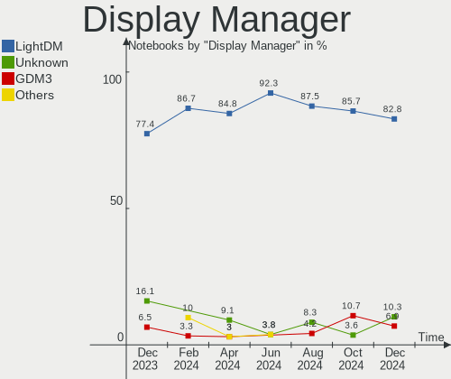
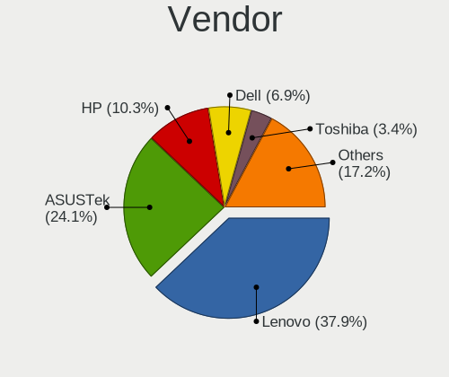

Xubuntu - Hardware Trends (Notebooks)
-------------------------------------

A project to identify most popular hardware characteristics and track their change
over time based on data collected by Linux users at https://Linux-Hardware.org.

Anyone can contribute to this report by the [hw-probe](https://github.com/linuxhw/hw-probe) tool:

    sudo -E hw-probe -all -upload

This report is for one last month. Overall report since the beginning of time: [TestDays](https://github.com/linuxhw/TestDays)

Period: May, 2023.

Contents
--------

* [ System ](#system)
  - [ OS                       ](#os)
  - [ OS Family                ](#os-family)
  - [ Kernel                   ](#kernel)
  - [ Kernel Family            ](#kernel-family)
  - [ Kernel Major Ver.        ](#kernel-major-ver)
  - [ Arch                     ](#arch)
  - [ DE                       ](#de)
  - [ Display Server           ](#display-server)
  - [ Display Manager          ](#display-manager)
  - [ OS Lang                  ](#os-lang)
  - [ Boot Mode                ](#boot-mode)
  - [ Filesystem               ](#filesystem)
  - [ Part. scheme             ](#part-scheme)
  - [ Dual Boot with Linux/BSD ](#dual-boot-with-linuxbsd)
  - [ Dual Boot (Win)          ](#dual-boot-win)

* [ Board ](#board)
  - [ Vendor                   ](#vendor)
  - [ Model                    ](#model)
  - [ Model Family             ](#model-family)
  - [ MFG Year                 ](#mfg-year)
  - [ Form Factor              ](#form-factor)
  - [ Secure Boot              ](#secure-boot)
  - [ Coreboot                 ](#coreboot)
  - [ RAM Size                 ](#ram-size)
  - [ RAM Used                 ](#ram-used)
  - [ Total Drives             ](#total-drives)
  - [ Has CD-ROM               ](#has-cd-rom)
  - [ Has Ethernet             ](#has-ethernet)
  - [ Has WiFi                 ](#has-wifi)
  - [ Has Bluetooth            ](#has-bluetooth)

* [ Location ](#location)
  - [ Country                  ](#country)
  - [ City                     ](#city)

* [ Drives ](#drives)
  - [ Drive Vendor             ](#drive-vendor)
  - [ Drive Model              ](#drive-model)
  - [ HDD Vendor               ](#hdd-vendor)
  - [ SSD Vendor               ](#ssd-vendor)
  - [ Drive Kind               ](#drive-kind)
  - [ Drive Connector          ](#drive-connector)
  - [ Drive Size               ](#drive-size)
  - [ Space Total              ](#space-total)
  - [ Space Used               ](#space-used)
  - [ Malfunc. Drives          ](#malfunc-drives)
  - [ Malfunc. Drive Vendor    ](#malfunc-drive-vendor)
  - [ Malfunc. HDD Vendor      ](#malfunc-hdd-vendor)
  - [ Malfunc. Drive Kind      ](#malfunc-drive-kind)
  - [ Failed Drives            ](#failed-drives)
  - [ Failed Drive Vendor      ](#failed-drive-vendor)
  - [ Drive Status             ](#drive-status)

* [ Storage controller ](#storage-controller)
  - [ Storage Vendor           ](#storage-vendor)
  - [ Storage Model            ](#storage-model)
  - [ Storage Kind             ](#storage-kind)

* [ Processor ](#processor)
  - [ CPU Vendor               ](#cpu-vendor)
  - [ CPU Model                ](#cpu-model)
  - [ CPU Model Family         ](#cpu-model-family)
  - [ CPU Cores                ](#cpu-cores)
  - [ CPU Sockets              ](#cpu-sockets)
  - [ CPU Threads              ](#cpu-threads)
  - [ CPU Op-Modes             ](#cpu-op-modes)
  - [ CPU Microcode            ](#cpu-microcode)
  - [ CPU Microarch            ](#cpu-microarch)

* [ Graphics ](#graphics)
  - [ GPU Vendor               ](#gpu-vendor)
  - [ GPU Model                ](#gpu-model)
  - [ GPU Combo                ](#gpu-combo)
  - [ GPU Driver               ](#gpu-driver)
  - [ GPU Memory               ](#gpu-memory)

* [ Monitor ](#monitor)
  - [ Monitor Vendor           ](#monitor-vendor)
  - [ Monitor Model            ](#monitor-model)
  - [ Monitor Resolution       ](#monitor-resolution)
  - [ Monitor Diagonal         ](#monitor-diagonal)
  - [ Monitor Width            ](#monitor-width)
  - [ Aspect Ratio             ](#aspect-ratio)
  - [ Monitor Area             ](#monitor-area)
  - [ Pixel Density            ](#pixel-density)
  - [ Multiple Monitors        ](#multiple-monitors)

* [ Network ](#network)
  - [ Net Controller Vendor    ](#net-controller-vendor)
  - [ Net Controller Model     ](#net-controller-model)
  - [ Wireless Vendor          ](#wireless-vendor)
  - [ Wireless Model           ](#wireless-model)
  - [ Ethernet Vendor          ](#ethernet-vendor)
  - [ Ethernet Model           ](#ethernet-model)
  - [ Net Controller Kind      ](#net-controller-kind)
  - [ Used Controller          ](#used-controller)
  - [ NICs                     ](#nics)
  - [ IPv6                     ](#ipv6)

* [ Bluetooth ](#bluetooth)
  - [ Bluetooth Vendor         ](#bluetooth-vendor)
  - [ Bluetooth Model          ](#bluetooth-model)

* [ Sound ](#sound)
  - [ Sound Vendor             ](#sound-vendor)
  - [ Sound Model              ](#sound-model)

* [ Memory ](#memory)
  - [ Memory Vendor            ](#memory-vendor)
  - [ Memory Model             ](#memory-model)
  - [ Memory Kind              ](#memory-kind)
  - [ Memory Form Factor       ](#memory-form-factor)
  - [ Memory Size              ](#memory-size)
  - [ Memory Speed             ](#memory-speed)

* [ Printers & scanners ](#printers--scanners)
  - [ Printer Vendor           ](#printer-vendor)
  - [ Printer Model            ](#printer-model)
  - [ Scanner Vendor           ](#scanner-vendor)
  - [ Scanner Model            ](#scanner-model)

* [ Camera ](#camera)
  - [ Camera Vendor            ](#camera-vendor)
  - [ Camera Model             ](#camera-model)

* [ Security ](#security)
  - [ Fingerprint Vendor       ](#fingerprint-vendor)
  - [ Fingerprint Model        ](#fingerprint-model)
  - [ Chipcard Vendor          ](#chipcard-vendor)
  - [ Chipcard Model           ](#chipcard-model)

* [ Unsupported ](#unsupported)
  - [ Unsupported Devices      ](#unsupported-devices)
  - [ Unsupported Device Types ](#unsupported-device-types)

System
------

OS
--

Installed operating systems

| Name                 | Notebooks | Percent |
|----------------------|-----------|---------|
| Xubuntu 22.04        | 21        | 60%     |
| Xubuntu 23.04        | 5         | 14.29%  |
| Xubuntu 20.04        | 4         | 11.43%  |
| Xubuntu 18.04        | 3         | 8.57%   |
| Xubuntu 22.10        | 1         | 2.86%   |
| Xubuntu 2023.1-beta5 | 1         | 2.86%   |

OS Family
---------

OS without a version

| Name    | Notebooks | Percent |
|---------|-----------|---------|
| Xubuntu | 35        | 100%    |

Kernel
------

Version of the Linux kernel

| Version               | Notebooks | Percent |
|-----------------------|-----------|---------|
| 5.19.0-41-generic     | 8         | 22.86%  |
| 5.15.0-71-generic     | 7         | 20%     |
| 6.2.0-20-generic      | 4         | 11.43%  |
| 5.15.0-71-lowlatency  | 4         | 11.43%  |
| 5.19.0-42-generic     | 3         | 8.57%   |
| 6.3.2-060302-generic  | 1         | 2.86%   |
| 6.2.0-060200-generic  | 1         | 2.86%   |
| 5.4.0-148-generic     | 1         | 2.86%   |
| 5.18.0-051800-generic | 1         | 2.86%   |
| 5.15.0-72-generic     | 1         | 2.86%   |
| 5.15.0-46-lowlatency  | 1         | 2.86%   |
| 5.15.0-43-generic     | 1         | 2.86%   |
| 4.15.0-211-generic    | 1         | 2.86%   |
| 4.15.0-206-generic    | 1         | 2.86%   |

Kernel Family
-------------

Linux kernel without a distro release

| Version | Notebooks | Percent |
|---------|-----------|---------|
| 5.15.0  | 14        | 40%     |
| 5.19.0  | 11        | 31.43%  |
| 6.2.0   | 5         | 14.29%  |
| 4.15.0  | 2         | 5.71%   |
| 6.3.2   | 1         | 2.86%   |
| 5.4.0   | 1         | 2.86%   |
| 5.18.0  | 1         | 2.86%   |

Kernel Major Ver.
-----------------

Linux kernel major version

| Version | Notebooks | Percent |
|---------|-----------|---------|
| 5.15    | 14        | 40%     |
| 5.19    | 11        | 31.43%  |
| 6.2     | 5         | 14.29%  |
| 4.15    | 2         | 5.71%   |
| 6.3     | 1         | 2.86%   |
| 5.4     | 1         | 2.86%   |
| 5.18    | 1         | 2.86%   |

Arch
----

OS architecture (x86_64, i586, etc.)

| Name   | Notebooks | Percent |
|--------|-----------|---------|
| x86_64 | 34        | 97.14%  |
| i686   | 1         | 2.86%   |

DE
--

Desktop Environment

| Name  | Notebooks | Percent |
|-------|-----------|---------|
| XFCE  | 34        | 97.14%  |
| GNOME | 1         | 2.86%   |

Display Server
--------------

X11 or Wayland

| Name | Notebooks | Percent |
|------|-----------|---------|
| X11  | 35        | 100%    |

Display Manager
---------------

SDDM, LightDM, etc.

| Name    | Notebooks | Percent |
|---------|-----------|---------|
| LightDM | 31        | 88.57%  |
| Unknown | 4         | 11.43%  |

OS Lang
-------

Language

| Lang  | Notebooks | Percent |
|-------|-----------|---------|
| en_US | 18        | 51.43%  |
| fr_FR | 7         | 20%     |
| it_IT | 2         | 5.71%   |
| en_GB | 2         | 5.71%   |
| en_CA | 2         | 5.71%   |
| ru_RU | 1         | 2.86%   |
| pl_PL | 1         | 2.86%   |
| lt_LT | 1         | 2.86%   |
| cs_CZ | 1         | 2.86%   |

Boot Mode
---------

EFI or BIOS

| Mode | Notebooks | Percent |
|------|-----------|---------|
| BIOS | 18        | 51.43%  |
| EFI  | 17        | 48.57%  |

Filesystem
----------

Type of filesystem

| Type  | Notebooks | Percent |
|-------|-----------|---------|
| Ext4  | 25        | 71.43%  |
| Tmpfs | 9         | 25.71%  |
| Zfs   | 1         | 2.86%   |

Part. scheme
------------

Scheme of partitioning

| Type    | Notebooks | Percent |
|---------|-----------|---------|
| GPT     | 28        | 80%     |
| Unknown | 4         | 11.43%  |
| MBR     | 3         | 8.57%   |

Dual Boot with Linux/BSD
------------------------

Hosting more than one Linux/BSD

| Dual boot | Notebooks | Percent |
|-----------|-----------|---------|
| No        | 33        | 94.29%  |
| Yes       | 2         | 5.71%   |

Dual Boot (Win)
---------------

Hosting Linux and Windows

| Dual boot | Notebooks | Percent |
|-----------|-----------|---------|
| No        | 25        | 71.43%  |
| Yes       | 10        | 28.57%  |

Board
-----

Vendor
------

Motherboard manufacturer

| Name                | Notebooks | Percent |
|---------------------|-----------|---------|
| Dell                | 8         | 22.86%  |
| Lenovo              | 5         | 14.29%  |
| Hewlett-Packard     | 4         | 11.43%  |
| Google              | 4         | 11.43%  |
| Acer                | 3         | 8.57%   |
| Samsung Electronics | 2         | 5.71%   |
| Toshiba             | 1         | 2.86%   |
| MSI                 | 1         | 2.86%   |
| GPU Company         | 1         | 2.86%   |
| Gigabyte Technology | 1         | 2.86%   |
| Fujitsu Siemens     | 1         | 2.86%   |
| Fujitsu             | 1         | 2.86%   |
| Chuwi               | 1         | 2.86%   |
| ASUSTek Computer    | 1         | 2.86%   |
| Unknown             | 1         | 2.86%   |

Model
-----

Motherboard model

| Name                                   | Notebooks | Percent |
|----------------------------------------|-----------|---------|
| Lenovo ThinkPad P50 20EN0013US         | 2         | 5.71%   |
| Google Snappy                          | 2         | 5.71%   |
| Toshiba Satellite L300                 | 1         | 2.86%   |
| Samsung RV410/RV510/S3510/E3510        | 1         | 2.86%   |
| Samsung 730QCJ/730QCR                  | 1         | 2.86%   |
| MSI Modern 15 A5M                      | 1         | 2.86%   |
| Lenovo ThinkPad X201 3680MG1           | 1         | 2.86%   |
| Lenovo ThinkPad W500 40626NG           | 1         | 2.86%   |
| Lenovo ThinkPad T61 7661V3L            | 1         | 2.86%   |
| HP ProBook 640 G1                      | 1         | 2.86%   |
| HP Pavilion dv6                        | 1         | 2.86%   |
| HP ENVY 4                              | 1         | 2.86%   |
| HP 15                                  | 1         | 2.86%   |
| GPU Company GWTC116-2                  | 1         | 2.86%   |
| Google Edgar                           | 1         | 2.86%   |
| Google Auron_Yuna                      | 1         | 2.86%   |
| Gigabyte A7 K1                         | 1         | 2.86%   |
| Fujitsu Siemens ESPRIMO Mobile V6535   | 1         | 2.86%   |
| Fujitsu LIFEBOOK P702                  | 1         | 2.86%   |
| Dell Vostro 5620                       | 1         | 2.86%   |
| Dell Latitude E7270                    | 1         | 2.86%   |
| Dell Latitude E4310                    | 1         | 2.86%   |
| Dell Latitude E4200                    | 1         | 2.86%   |
| Dell Latitude 7390                     | 1         | 2.86%   |
| Dell Inspiron 15-3567                  | 1         | 2.86%   |
| Dell Inspiron 15-3552                  | 1         | 2.86%   |
| Dell G3 3500                           | 1         | 2.86%   |
| Chuwi CoreBook X                       | 1         | 2.86%   |
| ASUS VivoBook_ASUSLaptop X515MA_X515MA | 1         | 2.86%   |
| Acer TravelMate P215-41-G2             | 1         | 2.86%   |
| Acer Aspire V5-552G                    | 1         | 2.86%   |
| Acer Aspire E5-772G                    | 1         | 2.86%   |
| Unknown                                | 1         | 2.86%   |

Model Family
------------

Motherboard model prefix

| Name                    | Notebooks | Percent |
|-------------------------|-----------|---------|
| Lenovo ThinkPad         | 5         | 14.29%  |
| Dell Latitude           | 4         | 11.43%  |
| Google Snappy           | 2         | 5.71%   |
| Dell Inspiron           | 2         | 5.71%   |
| Acer Aspire             | 2         | 5.71%   |
| Toshiba Satellite       | 1         | 2.86%   |
| Samsung RV410           | 1         | 2.86%   |
| Samsung 730QCJ          | 1         | 2.86%   |
| MSI Modern              | 1         | 2.86%   |
| HP ProBook              | 1         | 2.86%   |
| HP Pavilion             | 1         | 2.86%   |
| HP ENVY                 | 1         | 2.86%   |
| HP 15                   | 1         | 2.86%   |
| GPU Company GWTC116-2   | 1         | 2.86%   |
| Google Edgar            | 1         | 2.86%   |
| Google Auron            | 1         | 2.86%   |
| Gigabyte A7             | 1         | 2.86%   |
| Fujitsu Siemens ESPRIMO | 1         | 2.86%   |
| Fujitsu LIFEBOOK        | 1         | 2.86%   |
| Dell Vostro             | 1         | 2.86%   |
| Dell G3                 | 1         | 2.86%   |
| Chuwi CoreBook          | 1         | 2.86%   |
| ASUS VivoBook           | 1         | 2.86%   |
| Acer TravelMate         | 1         | 2.86%   |
| Unknown                 | 1         | 2.86%   |

MFG Year
--------

Motherboard manufacture year

| Year | Notebooks | Percent |
|------|-----------|---------|
| 2021 | 5         | 14.29%  |
| 2022 | 4         | 11.43%  |
| 2015 | 4         | 11.43%  |
| 2020 | 3         | 8.57%   |
| 2013 | 3         | 8.57%   |
| 2010 | 3         | 8.57%   |
| 2008 | 3         | 8.57%   |
| 2023 | 2         | 5.71%   |
| 2016 | 2         | 5.71%   |
| 2012 | 2         | 5.71%   |
| 2009 | 2         | 5.71%   |
| 2018 | 1         | 2.86%   |
| 2007 | 1         | 2.86%   |

Form Factor
-----------

Physical design of the computer

| Name     | Notebooks | Percent |
|----------|-----------|---------|
| Notebook | 35        | 100%    |

Secure Boot
-----------

Enabled or disabled

| State    | Notebooks | Percent |
|----------|-----------|---------|
| Disabled | 34        | 97.14%  |
| Enabled  | 1         | 2.86%   |

Coreboot
--------

Have coreboot on board

| Used | Notebooks | Percent |
|------|-----------|---------|
| No   | 31        | 88.57%  |
| Yes  | 4         | 11.43%  |

RAM Size
--------

Total RAM memory

| Size in GB  | Notebooks | Percent |
|-------------|-----------|---------|
| 3.01-4.0    | 12        | 34.29%  |
| 4.01-8.0    | 10        | 28.57%  |
| 8.01-16.0   | 5         | 14.29%  |
| 16.01-24.0  | 4         | 11.43%  |
| 64.01-256.0 | 3         | 8.57%   |
| 1.01-2.0    | 1         | 2.86%   |

RAM Used
--------

Used RAM memory

| Used GB   | Notebooks | Percent |
|-----------|-----------|---------|
| 1.01-2.0  | 14        | 40%     |
| 2.01-3.0  | 8         | 22.86%  |
| 3.01-4.0  | 6         | 17.14%  |
| 4.01-8.0  | 4         | 11.43%  |
| 8.01-16.0 | 2         | 5.71%   |
| 0.51-1.0  | 1         | 2.86%   |

Total Drives
------------

Number of drives on board

| Drives | Notebooks | Percent |
|--------|-----------|---------|
| 1      | 26        | 74.29%  |
| 2      | 6         | 17.14%  |
| 3      | 2         | 5.71%   |
| 4      | 1         | 2.86%   |

Has CD-ROM
----------

Has CD-ROM on board

| Presented | Notebooks | Percent |
|-----------|-----------|---------|
| No        | 26        | 74.29%  |
| Yes       | 9         | 25.71%  |

Has Ethernet
------------

Has Ethernet on board

| Presented | Notebooks | Percent |
|-----------|-----------|---------|
| Yes       | 24        | 68.57%  |
| No        | 11        | 31.43%  |

Has WiFi
--------

Has WiFi module

| Presented | Notebooks | Percent |
|-----------|-----------|---------|
| Yes       | 35        | 100%    |

Has Bluetooth
-------------

Has Bluetooth module

| Presented | Notebooks | Percent |
|-----------|-----------|---------|
| Yes       | 26        | 74.29%  |
| No        | 9         | 25.71%  |

Location
--------

Country
-------

Geographic location (country)

| Country   | Notebooks | Percent |
|-----------|-----------|---------|
| USA       | 6         | 17.14%  |
| France    | 6         | 17.14%  |
| Germany   | 3         | 8.57%   |
| Sweden    | 2         | 5.71%   |
| Russia    | 2         | 5.71%   |
| Italy     | 2         | 5.71%   |
| Canada    | 2         | 5.71%   |
| Vietnam   | 1         | 2.86%   |
| UK        | 1         | 2.86%   |
| Spain     | 1         | 2.86%   |
| Poland    | 1         | 2.86%   |
| Panama    | 1         | 2.86%   |
| Lithuania | 1         | 2.86%   |
| Denmark   | 1         | 2.86%   |
| Czechia   | 1         | 2.86%   |
| Bulgaria  | 1         | 2.86%   |
| Brazil    | 1         | 2.86%   |
| Belgium   | 1         | 2.86%   |
| Algeria   | 1         | 2.86%   |

City
----

Geographic location (city)

| City               | Notebooks | Percent |
|--------------------|-----------|---------|
| Nykvarn            | 2         | 5.71%   |
| Warsaw             | 1         | 2.86%   |
| Wandsworth         | 1         | 2.86%   |
| Vilnius            | 1         | 2.86%   |
| Veseli nad Luznici | 1         | 2.86%   |
| Varna              | 1         | 2.86%   |
| Toulouse           | 1         | 2.86%   |
| Tifton             | 1         | 2.86%   |
| South Point        | 1         | 2.86%   |
| Seattle            | 1         | 2.86%   |
| Rome               | 1         | 2.86%   |
| Panama City        | 1         | 2.86%   |
| Palo Alto          | 1         | 2.86%   |
| Paiporta           | 1         | 2.86%   |
| North Hills        | 1         | 2.86%   |
| Moscow             | 1         | 2.86%   |
| Milan              | 1         | 2.86%   |
| Marienheide        | 1         | 2.86%   |
| London             | 1         | 2.86%   |
| Le Syndicat        | 1         | 2.86%   |
| Kemerovo           | 1         | 2.86%   |
| Juiz de Fora       | 1         | 2.86%   |
| Hanoi              | 1         | 2.86%   |
| Grand Blanc        | 1         | 2.86%   |
| Ghent              | 1         | 2.86%   |
| Frankfurt am Main  | 1         | 2.86%   |
| Devon              | 1         | 2.86%   |
| Copenhagen         | 1         | 2.86%   |
| Châtenay-Malabry  | 1         | 2.86%   |
| Bouvigny-Boyeffles | 1         | 2.86%   |
| Bordeaux           | 1         | 2.86%   |
| Azay-sur-Cher      | 1         | 2.86%   |
| Aschheim           | 1         | 2.86%   |
| Algiers            | 1         | 2.86%   |

Drives
------

Drive Vendor
------------

Hard drive vendors

| Vendor              | Notebooks | Drives | Percent |
|---------------------|-----------|--------|---------|
| Samsung Electronics | 8         | 8      | 18.18%  |
| WDC                 | 6         | 6      | 13.64%  |
| Unknown             | 5         | 6      | 11.36%  |
| Seagate             | 4         | 5      | 9.09%   |
| Kingston            | 2         | 2      | 4.55%   |
| Unknown             | 2         | 2      | 4.55%   |
| SPCC                | 1         | 1      | 2.27%   |
| SK hynix            | 1         | 1      | 2.27%   |
| ShiJi               | 1         | 2      | 2.27%   |
| SanDisk             | 1         | 3      | 2.27%   |
| PM991a N            | 1         | 1      | 2.27%   |
| Plextor             | 1         | 1      | 2.27%   |
| Phison              | 1         | 1      | 2.27%   |
| Netac               | 1         | 1      | 2.27%   |
| Micron Technology   | 1         | 1      | 2.27%   |
| KIOXIA              | 1         | 1      | 2.27%   |
| KingSpec            | 1         | 1      | 2.27%   |
| Intel               | 1         | 1      | 2.27%   |
| HGST                | 1         | 1      | 2.27%   |
| Emtec               | 1         | 1      | 2.27%   |
| Crucial             | 1         | 1      | 2.27%   |
| China               | 1         | 1      | 2.27%   |
| ASMT                | 1         | 2      | 2.27%   |

Drive Model
-----------

Hard drive models

| Model                                               | Notebooks | Percent |
|-----------------------------------------------------|-----------|---------|
| Unknown MMC Card  32GB                              | 2         | 4.17%   |
| Seagate ST500LT012-1DG142 500GB                     | 2         | 4.17%   |
| Unknown                                             | 2         | 4.17%   |
| WDC WDS240G2G0A-00JH30 240GB SSD                    | 1         | 2.08%   |
| WDC WD2500BEVT-00A23T0 250GB                        | 1         | 2.08%   |
| WDC WD10SPZX-75Z10T3 1TB                            | 1         | 2.08%   |
| WDC WD10SPZX-00Z10T0 1TB                            | 1         | 2.08%   |
| WDC WD10JPVX-22JC3T0 1TB                            | 1         | 2.08%   |
| WDC PC SN530 SDBPNPZ-512G-1114 512GB                | 1         | 2.08%   |
| Unknown MMC Card  30MB                              | 1         | 2.08%   |
| Unknown MMC Card  1073GB                            | 1         | 2.08%   |
| Unknown MMC Card  1072GB                            | 1         | 2.08%   |
| Unknown DF4016  16GB                                | 1         | 2.08%   |
| SPCC Solid State Disk 256GB                         | 1         | 2.08%   |
| SK hynix SC401 SATA 512GB SSD                       | 1         | 2.08%   |
| ShiJi SSD 256GB                                     | 1         | 2.08%   |
| ShiJi 256GB                                         | 1         | 2.08%   |
| Seagate ST250LM004 HN-M250MBB 250GB                 | 1         | 2.08%   |
| Seagate ST1000LM048-2E7172 1TB                      | 1         | 2.08%   |
| Seagate Expansion 1TB                               | 1         | 2.08%   |
| SanDisk SD8SN8U1T001122 1TB SSD                     | 1         | 2.08%   |
| SanDisk SD8SB8U1T001122 1024GB SSD                  | 1         | 2.08%   |
| Samsung SSD PM810 FDE 2.5 128GB                     | 1         | 2.08%   |
| Samsung SSD PB22-JS3 FDE TM 128GB                   | 1         | 2.08%   |
| Samsung SSD 980 PRO 2TB                             | 1         | 2.08%   |
| Samsung SSD 970 EVO Plus 1TB                        | 1         | 2.08%   |
| Samsung NVMe SSD Controller SM981/PM981/PM983 256GB | 1         | 2.08%   |
| Samsung MZVLQ512HALU-00000 512GB                    | 1         | 2.08%   |
| Samsung MZMPC032HBCD-000H1 32GB SSD                 | 1         | 2.08%   |
| Samsung HM321HI 320GB                               | 1         | 2.08%   |
| PM991a N VMe Samsung 256G                           | 1         | 2.08%   |
| Plextor PH6-CE120 120GB SSD                         | 1         | 2.08%   |
| Phison ESR512GTLCW-E6GBTNB4 512GB                   | 1         | 2.08%   |
| Netac SSD 512GB                                     | 1         | 2.08%   |
| Micron 1100_MTFDDAK1T0TBN 1024GB SSD                | 1         | 2.08%   |
| KIOXIA KBG40ZNS256G NVMe 256GB                      | 1         | 2.08%   |
| Kingston SNS4151S316GD 16GB SSD                     | 1         | 2.08%   |
| Kingston SA400S37480G 480GB SSD                     | 1         | 2.08%   |
| KingSpec NT-2TB SSD                                 | 1         | 2.08%   |
| Intel SSDSA2M160G2GC 160GB                          | 1         | 2.08%   |

HDD Vendor
----------

Hard disk drive vendors

| Vendor              | Notebooks | Drives | Percent |
|---------------------|-----------|--------|---------|
| WDC                 | 4         | 4      | 40%     |
| Seagate             | 4         | 5      | 40%     |
| Samsung Electronics | 1         | 1      | 10%     |
| HGST                | 1         | 1      | 10%     |

SSD Vendor
----------

Solid state drive vendors

| Vendor              | Notebooks | Drives | Percent |
|---------------------|-----------|--------|---------|
| Samsung Electronics | 3         | 3      | 15.79%  |
| Kingston            | 2         | 2      | 10.53%  |
| WDC                 | 1         | 1      | 5.26%   |
| SPCC                | 1         | 1      | 5.26%   |
| SK hynix            | 1         | 1      | 5.26%   |
| ShiJi               | 1         | 1      | 5.26%   |
| SanDisk             | 1         | 3      | 5.26%   |
| Plextor             | 1         | 1      | 5.26%   |
| Netac               | 1         | 1      | 5.26%   |
| Micron Technology   | 1         | 1      | 5.26%   |
| KingSpec            | 1         | 1      | 5.26%   |
| Intel               | 1         | 1      | 5.26%   |
| Emtec               | 1         | 1      | 5.26%   |
| Crucial             | 1         | 1      | 5.26%   |
| China               | 1         | 1      | 5.26%   |
| ASMT                | 1         | 2      | 5.26%   |

Drive Kind
----------

HDD or SSD

| Kind    | Notebooks | Drives | Percent |
|---------|-----------|--------|---------|
| SSD     | 16        | 22     | 38.1%   |
| HDD     | 10        | 11     | 23.81%  |
| MMC     | 7         | 8      | 16.67%  |
| NVMe    | 7         | 7      | 16.67%  |
| Unknown | 2         | 2      | 4.76%   |

Drive Connector
---------------

SATA, SAS, NVMe, etc.

| Type | Notebooks | Drives | Percent |
|------|-----------|--------|---------|
| SATA | 25        | 31     | 59.52%  |
| NVMe | 7         | 7      | 16.67%  |
| MMC  | 7         | 8      | 16.67%  |
| SAS  | 3         | 4      | 7.14%   |

Drive Size
----------

Size of hard drive

| Size in TB | Notebooks | Drives | Percent |
|------------|-----------|--------|---------|
| 0.01-0.5   | 16        | 19     | 55.17%  |
| 0.51-1.0   | 10        | 11     | 34.48%  |
| 1.01-2.0   | 3         | 3      | 10.34%  |

Space Total
-----------

Amount of disk space available on the file system

| Size in GB     | Notebooks | Percent |
|----------------|-----------|---------|
| 251-500        | 10        | 28.57%  |
| 101-250        | 8         | 22.86%  |
| 501-1000       | 5         | 14.29%  |
| 1-20           | 3         | 8.57%   |
| More than 3000 | 2         | 5.71%   |
| 21-50          | 2         | 5.71%   |
| 51-100         | 2         | 5.71%   |
| 2001-3000      | 1         | 2.86%   |
| 1001-2000      | 1         | 2.86%   |
| Unknown        | 1         | 2.86%   |

Space Used
----------

Amount of used disk space

| Used GB   | Notebooks | Percent |
|-----------|-----------|---------|
| 1-20      | 12        | 34.29%  |
| 21-50     | 8         | 22.86%  |
| 501-1000  | 5         | 14.29%  |
| 101-250   | 3         | 8.57%   |
| 51-100    | 3         | 8.57%   |
| 251-500   | 2         | 5.71%   |
| 1001-2000 | 1         | 2.86%   |
| Unknown   | 1         | 2.86%   |

Malfunc. Drives
---------------

Drive models with a malfunction

| Model                                       | Notebooks | Drives | Percent |
|---------------------------------------------|-----------|--------|---------|
| SK hynix SC401 SATA 512GB SSD               | 1         | 1      | 25%     |
| Seagate ST500LT012-1DG142 500GB             | 1         | 1      | 25%     |
| Samsung Electronics SSD PM810 FDE 2.5 128GB | 1         | 1      | 25%     |
| Kingston SNS4151S316GD 16GB SSD             | 1         | 1      | 25%     |

Malfunc. Drive Vendor
---------------------

Vendors of faulty drives

| Vendor              | Notebooks | Drives | Percent |
|---------------------|-----------|--------|---------|
| SK hynix            | 1         | 1      | 25%     |
| Seagate             | 1         | 1      | 25%     |
| Samsung Electronics | 1         | 1      | 25%     |
| Kingston            | 1         | 1      | 25%     |

Malfunc. HDD Vendor
-------------------

Vendors of faulty HDD drives

| Vendor  | Notebooks | Drives | Percent |
|---------|-----------|--------|---------|
| Seagate | 1         | 1      | 100%    |

Malfunc. Drive Kind
-------------------

Kinds of faulty drives

| Kind | Notebooks | Drives | Percent |
|------|-----------|--------|---------|
| SSD  | 3         | 3      | 75%     |
| HDD  | 1         | 1      | 25%     |

Failed Drives
-------------

Failed drive models

Zero info for selected period =(

Failed Drive Vendor
-------------------

Failed drive vendors

Zero info for selected period =(

Drive Status
------------

Number of failed and malfunc. drives

| Status   | Notebooks | Drives | Percent |
|----------|-----------|--------|---------|
| Detected | 20        | 26     | 51.28%  |
| Works    | 15        | 20     | 38.46%  |
| Malfunc  | 4         | 4      | 10.26%  |

Storage controller
------------------

Storage Vendor
--------------

Storage controller vendors

| Vendor              | Notebooks | Percent |
|---------------------|-----------|---------|
| Intel               | 26        | 72.22%  |
| Samsung Electronics | 4         | 11.11%  |
| AMD                 | 3         | 8.33%   |
| SanDisk             | 1         | 2.78%   |
| Phison Electronics  | 1         | 2.78%   |
| KIOXIA              | 1         | 2.78%   |

Storage Model
-------------

Storage controller models

| Model                                                                            | Notebooks | Percent |
|----------------------------------------------------------------------------------|-----------|---------|
| Intel 82801IBM/IEM (ICH9M/ICH9M-E) 4 port SATA Controller [AHCI mode]            | 4         | 10.53%  |
| Intel 82801 Mobile SATA Controller [RAID mode]                                   | 4         | 10.53%  |
| Intel Celeron/Pentium Silver Processor SATA Controller                           | 3         | 7.89%   |
| AMD FCH SATA Controller [AHCI mode]                                              | 3         | 7.89%   |
| Samsung NVMe SSD Controller SM981/PM981/PM983                                    | 2         | 5.26%   |
| Intel Wildcat Point-LP SATA Controller [AHCI Mode]                               | 2         | 5.26%   |
| Intel Q170/Q150/B150/H170/H110/Z170/CM236 Chipset SATA Controller [AHCI Mode]    | 2         | 5.26%   |
| Intel 5 Series/3400 Series Chipset 6 port SATA AHCI Controller                   | 2         | 5.26%   |
| SanDisk WD Blue SN550 NVMe SSD                                                   | 1         | 2.63%   |
| Samsung NVMe SSD Controller PM9A1/PM9A3/980PRO                                   | 1         | 2.63%   |
| Samsung NVMe SSD Controller 980                                                  | 1         | 2.63%   |
| Phison E16 PCIe4 NVMe Controller                                                 | 1         | 2.63%   |
| KIOXIA NVMe SSD Controller BG4                                                   | 1         | 2.63%   |
| Intel Volume Management Device NVMe RAID Controller                              | 1         | 2.63%   |
| Intel Sunrise Point-LP SATA Controller [AHCI mode]                               | 1         | 2.63%   |
| Intel Mobile PM965/GM965 PT IDER Controller                                      | 1         | 2.63%   |
| Intel Cannon Point-LP SATA Controller [AHCI Mode]                                | 1         | 2.63%   |
| Intel Atom/Celeron/Pentium Processor x5-E8000/J3xxx/N3xxx Series SATA Controller | 1         | 2.63%   |
| Intel 82801HM/HEM (ICH8M/ICH8M-E) SATA Controller [AHCI mode]                    | 1         | 2.63%   |
| Intel 82801HM/HEM (ICH8M/ICH8M-E) IDE Controller                                 | 1         | 2.63%   |
| Intel 8 Series/C220 Series Chipset Family 6-port SATA Controller 1 [AHCI mode]   | 1         | 2.63%   |
| Intel 7 Series Chipset Family 6-port SATA Controller [AHCI mode]                 | 1         | 2.63%   |
| Intel 5 Series/3400 Series Chipset 4 port SATA AHCI Controller                   | 1         | 2.63%   |
| Intel 400 Series Chipset Family SATA AHCI Controller                             | 1         | 2.63%   |

Storage Kind
------------

Kind of storage controller (IDE, SATA, NVMe, SAS, ...)

| Kind | Notebooks | Percent |
|------|-----------|---------|
| SATA | 24        | 64.86%  |
| NVMe | 7         | 18.92%  |
| RAID | 5         | 13.51%  |
| IDE  | 1         | 2.7%    |

Processor
---------

CPU Vendor
----------

Processor vendors

| Vendor | Notebooks | Percent |
|--------|-----------|---------|
| Intel  | 30        | 85.71%  |
| AMD    | 5         | 14.29%  |

CPU Model
---------

Processor models

| Model                                       | Notebooks | Percent |
|---------------------------------------------|-----------|---------|
| Intel Core i7-6700HQ CPU @ 2.60GHz          | 2         | 5.71%   |
| Intel Celeron CPU N3350 @ 1.10GHz           | 2         | 5.71%   |
| Intel Pentium Silver N5030 CPU @ 1.10GHz    | 1         | 2.86%   |
| Intel Pentium Dual-Core CPU T4200 @ 2.00GHz | 1         | 2.86%   |
| Intel Pentium Dual CPU T3400 @ 2.16GHz      | 1         | 2.86%   |
| Intel Pentium CPU N3700 @ 1.60GHz           | 1         | 2.86%   |
| Intel Core i7-8650U CPU @ 1.90GHz           | 1         | 2.86%   |
| Intel Core i7-10510U CPU @ 1.80GHz          | 1         | 2.86%   |
| Intel Core i5-8259U CPU @ 2.30GHz           | 1         | 2.86%   |
| Intel Core i5-7200U CPU @ 2.50GHz           | 1         | 2.86%   |
| Intel Core i5-6300U CPU @ 2.40GHz           | 1         | 2.86%   |
| Intel Core i5-4300M CPU @ 2.60GHz           | 1         | 2.86%   |
| Intel Core i5-3340M CPU @ 2.70GHz           | 1         | 2.86%   |
| Intel Core i5-3317U CPU @ 1.70GHz           | 1         | 2.86%   |
| Intel Core i5-10300H CPU @ 2.50GHz          | 1         | 2.86%   |
| Intel Core i5 CPU M 560 @ 2.67GHz           | 1         | 2.86%   |
| Intel Core i5 CPU M 520 @ 2.40GHz           | 1         | 2.86%   |
| Intel Core i5 CPU M 460 @ 2.53GHz           | 1         | 2.86%   |
| Intel Core i3-5005U CPU @ 2.00GHz           | 1         | 2.86%   |
| Intel Core 2 Duo CPU U9600 @ 1.60GHz        | 1         | 2.86%   |
| Intel Core 2 Duo CPU T9600 @ 2.80GHz        | 1         | 2.86%   |
| Intel Core 2 Duo CPU T7500 @ 2.20GHz        | 1         | 2.86%   |
| Intel Celeron N4020 CPU @ 1.10GHz           | 1         | 2.86%   |
| Intel Celeron J4105 CPU @ 1.50GHz           | 1         | 2.86%   |
| Intel Celeron Dual-Core CPU T3500 @ 2.10GHz | 1         | 2.86%   |
| Intel Celeron CPU N3160 @ 1.60GHz           | 1         | 2.86%   |
| Intel Celeron 3205U @ 1.50GHz               | 1         | 2.86%   |
| Intel 12th Gen Core i7-1260P                | 1         | 2.86%   |
| AMD Ryzen 7 PRO 5850U with Radeon Graphics  | 1         | 2.86%   |
| AMD Ryzen 7 5800H with Radeon Graphics      | 1         | 2.86%   |
| AMD Ryzen 7 5700U with Radeon Graphics      | 1         | 2.86%   |
| AMD A8-6410 APU with AMD Radeon R5 Graphics | 1         | 2.86%   |
| AMD A8-5557M APU with Radeon HD Graphics    | 1         | 2.86%   |

CPU Model Family
----------------

Processor model prefix

| Model                   | Notebooks | Percent |
|-------------------------|-----------|---------|
| Intel Core i5           | 10        | 28.57%  |
| Intel Celeron           | 6         | 17.14%  |
| Intel Core i7           | 4         | 11.43%  |
| Intel Core 2 Duo        | 3         | 8.57%   |
| AMD Ryzen 7             | 2         | 5.71%   |
| AMD A8                  | 2         | 5.71%   |
| Other                   | 1         | 2.86%   |
| Intel Pentium Silver    | 1         | 2.86%   |
| Intel Pentium Dual-Core | 1         | 2.86%   |
| Intel Pentium Dual      | 1         | 2.86%   |
| Intel Pentium           | 1         | 2.86%   |
| Intel Core i3           | 1         | 2.86%   |
| Intel Celeron Dual-Core | 1         | 2.86%   |
| AMD Ryzen 7 PRO         | 1         | 2.86%   |

CPU Cores
---------

Number of processor cores

| Number | Notebooks | Percent |
|--------|-----------|---------|
| 2      | 20        | 57.14%  |
| 4      | 11        | 31.43%  |
| 8      | 3         | 8.57%   |
| 12     | 1         | 2.86%   |

CPU Sockets
-----------

Number of sockets

| Number | Notebooks | Percent |
|--------|-----------|---------|
| 1      | 35        | 100%    |

CPU Threads
-----------

Threads per core (Hyper-Threading)

| Number | Notebooks | Percent |
|--------|-----------|---------|
| 2      | 20        | 57.14%  |
| 1      | 15        | 42.86%  |

CPU Op-Modes
------------

CPU Operation Modes (32-bit, 64-bit)

| Op mode        | Notebooks | Percent |
|----------------|-----------|---------|
| 32-bit, 64-bit | 35        | 100%    |

CPU Microcode
-------------

Microcode number

| Number     | Notebooks | Percent |
|------------|-----------|---------|
| Unknown    | 14        | 40%     |
| 0x806ea    | 2         | 5.71%   |
| 0x506c9    | 2         | 5.71%   |
| 0x20655    | 2         | 5.71%   |
| 0x1067a    | 2         | 5.71%   |
| 0x906a3    | 1         | 2.86%   |
| 0x806e9    | 1         | 2.86%   |
| 0x706a8    | 1         | 2.86%   |
| 0x706a1    | 1         | 2.86%   |
| 0x6fd      | 1         | 2.86%   |
| 0x6fb      | 1         | 2.86%   |
| 0x506e3    | 1         | 2.86%   |
| 0x406e3    | 1         | 2.86%   |
| 0x306d4    | 1         | 2.86%   |
| 0x306c3    | 1         | 2.86%   |
| 0x306a9    | 1         | 2.86%   |
| 0x0a50000c | 1         | 2.86%   |
| 0x08608103 | 1         | 2.86%   |

CPU Microarch
-------------

Microarchitecture

| Name             | Notebooks | Percent |
|------------------|-----------|---------|
| Penryn           | 4         | 11.43%  |
| KabyLake         | 4         | 11.43%  |
| Westmere         | 3         | 8.57%   |
| Skylake          | 3         | 8.57%   |
| Goldmont plus    | 3         | 8.57%   |
| Zen 3            | 2         | 5.71%   |
| Silvermont       | 2         | 5.71%   |
| IvyBridge        | 2         | 5.71%   |
| Goldmont         | 2         | 5.71%   |
| Core             | 2         | 5.71%   |
| Broadwell        | 2         | 5.71%   |
| Puma             | 1         | 2.86%   |
| Piledriver       | 1         | 2.86%   |
| Haswell          | 1         | 2.86%   |
| CometLake        | 1         | 2.86%   |
| Alderlake Hybrid | 1         | 2.86%   |
| Unknown          | 1         | 2.86%   |

Graphics
--------

GPU Vendor
----------

Vendors of graphics cards

| Vendor | Notebooks | Percent |
|--------|-----------|---------|
| Intel  | 29        | 69.05%  |
| AMD    | 8         | 19.05%  |
| Nvidia | 5         | 11.9%   |

GPU Model
---------

Graphics card models

| Model                                                                                    | Notebooks | Percent |
|------------------------------------------------------------------------------------------|-----------|---------|
| Intel Mobile 4 Series Chipset Integrated Graphics Controller                             | 5         | 11.36%  |
| Intel Core Processor Integrated Graphics Controller                                      | 3         | 6.82%   |
| Nvidia GM107GLM [Quadro M1000M]                                                          | 2         | 4.55%   |
| Intel HD Graphics 500                                                                    | 2         | 4.55%   |
| Intel GeminiLake [UHD Graphics 600]                                                      | 2         | 4.55%   |
| Intel Atom/Celeron/Pentium Processor x5-E8000/J3xxx/N3xxx Integrated Graphics Controller | 2         | 4.55%   |
| Intel 3rd Gen Core processor Graphics Controller                                         | 2         | 4.55%   |
| AMD Cezanne [Radeon Vega Series / Radeon Vega Mobile Series]                             | 2         | 4.55%   |
| Nvidia TU117M                                                                            | 1         | 2.27%   |
| Nvidia GK208BM [GeForce 920M]                                                            | 1         | 2.27%   |
| Nvidia GA106M [GeForce RTX 3060 Mobile / Max-Q]                                          | 1         | 2.27%   |
| Intel UHD Graphics 620                                                                   | 1         | 2.27%   |
| Intel Skylake GT2 [HD Graphics 520]                                                      | 1         | 2.27%   |
| Intel Mobile GM965/GL960 Integrated Graphics Controller (secondary)                      | 1         | 2.27%   |
| Intel Mobile GM965/GL960 Integrated Graphics Controller (primary)                        | 1         | 2.27%   |
| Intel HD Graphics 620                                                                    | 1         | 2.27%   |
| Intel HD Graphics 5500                                                                   | 1         | 2.27%   |
| Intel HD Graphics 530                                                                    | 1         | 2.27%   |
| Intel HD Graphics                                                                        | 1         | 2.27%   |
| Intel GeminiLake [UHD Graphics 605]                                                      | 1         | 2.27%   |
| Intel CometLake-U GT2 [UHD Graphics]                                                     | 1         | 2.27%   |
| Intel CometLake-H GT2 [UHD Graphics]                                                     | 1         | 2.27%   |
| Intel CoffeeLake-U GT3e [Iris Plus Graphics 655]                                         | 1         | 2.27%   |
| Intel Alder Lake-P Integrated Graphics Controller                                        | 1         | 2.27%   |
| Intel 4th Gen Core Processor Integrated Graphics Controller                              | 1         | 2.27%   |
| AMD Sun XT [Radeon HD 8670A/8670M/8690M / R5 M330 / M430 / Radeon 520 Mobile]            | 1         | 2.27%   |
| AMD RV635/M86 [Mobility Radeon HD 3650]                                                  | 1         | 2.27%   |
| AMD Richland [Radeon HD 8550G]                                                           | 1         | 2.27%   |
| AMD Park [Mobility Radeon HD 5430/5450/5470]                                             | 1         | 2.27%   |
| AMD Mullins [Radeon R4/R5 Graphics]                                                      | 1         | 2.27%   |
| AMD Mars [Radeon HD 8670A/8670M/8750M / R7 M370]                                         | 1         | 2.27%   |
| AMD Lucienne                                                                             | 1         | 2.27%   |

GPU Combo
---------

Combinations of graphics cards

| Name           | Notebooks | Percent |
|----------------|-----------|---------|
| 1 x Intel      | 21        | 60%     |
| Intel + Nvidia | 3         | 8.57%   |
| Intel + AMD    | 3         | 8.57%   |
| 1 x AMD        | 3         | 8.57%   |
| Other          | 2         | 5.71%   |
| 2 x AMD        | 1         | 2.86%   |
| 1 x Nvidia     | 1         | 2.86%   |
| AMD + Nvidia   | 1         | 2.86%   |

GPU Driver
----------

Free vs proprietary

| Driver      | Notebooks | Percent |
|-------------|-----------|---------|
| Free        | 30        | 85.71%  |
| Proprietary | 3         | 8.57%   |
| Unknown     | 2         | 5.71%   |

GPU Memory
----------

Total video memory

| Size in GB | Notebooks | Percent |
|------------|-----------|---------|
| Unknown    | 29        | 82.86%  |
| 1.01-2.0   | 3         | 8.57%   |
| 0.01-0.5   | 2         | 5.71%   |
| 3.01-4.0   | 1         | 2.86%   |

Monitor
-------

Monitor Vendor
--------------

Monitor vendors

| Vendor              | Notebooks | Percent |
|---------------------|-----------|---------|
| BOE                 | 9         | 24.32%  |
| Chimei Innolux      | 6         | 16.22%  |
| AU Optronics        | 6         | 16.22%  |
| Samsung Electronics | 4         | 10.81%  |
| LG Display          | 4         | 10.81%  |
| Lenovo              | 3         | 8.11%   |
| LG Philips          | 2         | 5.41%   |
| ViewSonic           | 1         | 2.7%    |
| Iiyama              | 1         | 2.7%    |
| Dell                | 1         | 2.7%    |

Monitor Model
-------------

Monitor models

| Model                                                                  | Notebooks | Percent |
|------------------------------------------------------------------------|-----------|---------|
| ViewSonic VX3209-2K VSC328F 2560x1440 698x393mm 31.5-inch              | 1         | 2.7%    |
| Samsung Electronics LCD Monitor SEC5441 1280x800 331x207mm 15.4-inch   | 1         | 2.7%    |
| Samsung Electronics LCD Monitor SEC3651 1366x768 344x194mm 15.5-inch   | 1         | 2.7%    |
| Samsung Electronics LCD Monitor SEC3245 1366x768 344x194mm 15.5-inch   | 1         | 2.7%    |
| Samsung Electronics LCD Monitor SAM0C28 1920x1080 1209x680mm 54.6-inch | 1         | 2.7%    |
| LG Philips LCD Monitor LPLA101 1440x900 367x230mm 17.1-inch            | 1         | 2.7%    |
| LG Philips LCD Monitor LPL1E01 1280x800 331x207mm 15.4-inch            | 1         | 2.7%    |
| LG Display LCD Monitor LGD04A7 1920x1080 344x194mm 15.5-inch           | 1         | 2.7%    |
| LG Display LCD Monitor LGD045E 1366x768 310x174mm 14.0-inch            | 1         | 2.7%    |
| LG Display LCD Monitor LGD024D 1366x768 294x166mm 13.3-inch            | 1         | 2.7%    |
| LG Display LCD Monitor LGD01F0 1280x800 261x163mm 12.1-inch            | 1         | 2.7%    |
| Lenovo LCD Monitor LEN4055 1920x1200 331x207mm 15.4-inch               | 1         | 2.7%    |
| Lenovo LCD Monitor LEN4031 1280x800 304x190mm 14.1-inch                | 1         | 2.7%    |
| Lenovo LCD Monitor LEN4011 1280x800 261x163mm 12.1-inch                | 1         | 2.7%    |
| Iiyama PLX2783H IVM6611 1920x1080 598x336mm 27.0-inch                  | 1         | 2.7%    |
| Dell P2715Q DEL40BD 3840x2160 597x336mm 27.0-inch                      | 1         | 2.7%    |
| Chimei Innolux P140ZKA-BZ1 CMN8C02 2160x1440 296x197mm 14.0-inch       | 1         | 2.7%    |
| Chimei Innolux LCD Monitor CMN1734 1600x900 382x214mm 17.2-inch        | 1         | 2.7%    |
| Chimei Innolux LCD Monitor CMN15C9 1366x768 344x193mm 15.5-inch        | 1         | 2.7%    |
| Chimei Innolux LCD Monitor CMN15BD 1366x768 344x193mm 15.5-inch        | 1         | 2.7%    |
| Chimei Innolux LCD Monitor CMN15AB 1366x768 344x193mm 15.5-inch        | 1         | 2.7%    |
| Chimei Innolux LCD Monitor CMN14C9 1920x1080 309x173mm 13.9-inch       | 1         | 2.7%    |
| BOE LCD Monitor BOE0A5D 1366x768 256x144mm 11.6-inch                   | 1         | 2.7%    |
| BOE LCD Monitor BOE092E 1920x1080 310x173mm 14.0-inch                  | 1         | 2.7%    |
| BOE LCD Monitor BOE092A 1920x1080 344x194mm 15.5-inch                  | 1         | 2.7%    |
| BOE LCD Monitor BOE08FA 1920x1080 294x165mm 13.3-inch                  | 1         | 2.7%    |
| BOE LCD Monitor BOE0715 1366x768 256x144mm 11.6-inch                   | 1         | 2.7%    |
| BOE LCD Monitor BOE0671 1366x768 344x194mm 15.5-inch                   | 1         | 2.7%    |
| BOE LCD Monitor BOE0630 1920x1080 344x194mm 15.5-inch                  | 1         | 2.7%    |
| BOE LCD Monitor BOE0615 1366x768 309x173mm 13.9-inch                   | 1         | 2.7%    |
| BOE LCD Monitor BOE05F4 1366x768 277x156mm 12.5-inch                   | 1         | 2.7%    |
| AU Optronics LCD Monitor AUO8E8D 1920x1080 382x215mm 17.3-inch         | 1         | 2.7%    |
| AU Optronics LCD Monitor AUO2E8D 1920x1080 344x194mm 15.5-inch         | 1         | 2.7%    |
| AU Optronics LCD Monitor AUO21ED 1920x1080 344x194mm 15.5-inch         | 1         | 2.7%    |
| AU Optronics LCD Monitor AUO219C 1920x1200 344x215mm 16.0-inch         | 1         | 2.7%    |
| AU Optronics LCD Monitor AUO213D 1920x1080 309x173mm 13.9-inch         | 1         | 2.7%    |
| AU Optronics LCD Monitor AUO203C 1366x768 309x173mm 13.9-inch          | 1         | 2.7%    |

Monitor Resolution
------------------

Monitor screen resolution

| Resolution        | Notebooks | Percent |
|-------------------|-----------|---------|
| 1920x1080 (FHD)   | 12        | 32.43%  |
| 1366x768 (WXGA)   | 12        | 32.43%  |
| 1280x800 (WXGA)   | 4         | 10.81%  |
| 3840x2160 (4K)    | 2         | 5.41%   |
| 1920x1200 (WUXGA) | 2         | 5.41%   |
| 1600x900 (HD+)    | 2         | 5.41%   |
| 2560x1440 (QHD)   | 1         | 2.7%    |
| 2160x1440         | 1         | 2.7%    |
| 1440x900 (WXGA+)  | 1         | 2.7%    |

Monitor Diagonal
----------------

Diagonal size in inches

| Inches | Notebooks | Percent |
|--------|-----------|---------|
| 15     | 14        | 37.84%  |
| 14     | 6         | 16.22%  |
| 27     | 3         | 8.11%   |
| 17     | 3         | 8.11%   |
| 13     | 3         | 8.11%   |
| 12     | 3         | 8.11%   |
| 11     | 2         | 5.41%   |
| 54     | 1         | 2.7%    |
| 31     | 1         | 2.7%    |
| 16     | 1         | 2.7%    |

Monitor Width
-------------

Physical width

| Width in mm | Notebooks | Percent |
|-------------|-----------|---------|
| 301-350     | 21        | 56.76%  |
| 201-300     | 7         | 18.92%  |
| 351-400     | 4         | 10.81%  |
| 501-600     | 3         | 8.11%   |
| 601-700     | 1         | 2.7%    |
| 1001-1500   | 1         | 2.7%    |

Aspect Ratio
------------

Proportional relationship between the width and the height

| Ratio | Notebooks | Percent |
|-------|-----------|---------|
| 16/9  | 27        | 77.14%  |
| 16/10 | 6         | 17.14%  |
| 3/2   | 2         | 5.71%   |

Monitor Area
------------

Area in inch²

| Area in inch² | Notebooks | Percent |
|----------------|-----------|---------|
| 101-110        | 14        | 37.84%  |
| 81-90          | 8         | 21.62%  |
| 61-70          | 3         | 8.11%   |
| 301-350        | 3         | 8.11%   |
| 51-60          | 2         | 5.41%   |
| 121-130        | 2         | 5.41%   |
| More than 1000 | 1         | 2.7%    |
| 71-80          | 1         | 2.7%    |
| 351-500        | 1         | 2.7%    |
| 131-140        | 1         | 2.7%    |
| 111-120        | 1         | 2.7%    |

Pixel Density
-------------

Pixels per inch

| Density | Notebooks | Percent |
|---------|-----------|---------|
| 121-160 | 16        | 44.44%  |
| 101-120 | 10        | 27.78%  |
| 51-100  | 5         | 13.89%  |
| 161-240 | 4         | 11.11%  |
| 1-50    | 1         | 2.78%   |

Multiple Monitors
-----------------

Total monitors connected

| Total | Notebooks | Percent |
|-------|-----------|---------|
| 1     | 29        | 82.86%  |
| 2     | 4         | 11.43%  |
| 0     | 2         | 5.71%   |

Network
-------

Net Controller Vendor
---------------------

Controller vendors

| Vendor                   | Notebooks | Percent |
|--------------------------|-----------|---------|
| Intel                    | 25        | 53.19%  |
| Realtek Semiconductor    | 14        | 29.79%  |
| Qualcomm Atheros         | 5         | 10.64%  |
| Ralink Technology        | 1         | 2.13%   |
| MediaTek                 | 1         | 2.13%   |
| Marvell Technology Group | 1         | 2.13%   |

Net Controller Model
--------------------

Controller models

| Model                                                                   | Notebooks | Percent |
|-------------------------------------------------------------------------|-----------|---------|
| Realtek RTL8111/8168/8411 PCI Express Gigabit Ethernet Controller       | 7         | 11.48%  |
| Intel Wireless 7265                                                     | 4         | 6.56%   |
| Realtek RTL810xE PCI Express Fast Ethernet controller                   | 3         | 4.92%   |
| Intel Wireless 8260                                                     | 3         | 4.92%   |
| Intel Wireless 7260                                                     | 3         | 4.92%   |
| Qualcomm Atheros AR242x / AR542x Wireless Network Adapter (PCI-Express) | 2         | 3.28%   |
| Intel Wi-Fi 6 AX200                                                     | 2         | 3.28%   |
| Intel Ultimate N WiFi Link 5300                                         | 2         | 3.28%   |
| Intel Ethernet Connection (2) I219-V                                    | 2         | 3.28%   |
| Intel 82577LM Gigabit Network Connection                                | 2         | 3.28%   |
| Realtek RTL8821CE 802.11ac PCIe Wireless Network Adapter                | 1         | 1.64%   |
| Realtek RTL8723BE PCIe Wireless Network Adapter                         | 1         | 1.64%   |
| Realtek RTL8188EE Wireless Network Adapter                              | 1         | 1.64%   |
| Realtek RTL8125 2.5GbE Controller                                       | 1         | 1.64%   |
| Realtek 802.11n WLAN Adapter                                            | 1         | 1.64%   |
| Ralink RT2501/RT2573 Wireless Adapter                                   | 1         | 1.64%   |
| Qualcomm Atheros QCA9377 802.11ac Wireless Network Adapter              | 1         | 1.64%   |
| Qualcomm Atheros QCA8171 Gigabit Ethernet                               | 1         | 1.64%   |
| Qualcomm Atheros AR9462 Wireless Network Adapter                        | 1         | 1.64%   |
| Qualcomm Atheros AR9285 Wireless Network Adapter (PCI-Express)          | 1         | 1.64%   |
| MediaTek MT7921K (RZ608) Wi-Fi 6E 80MHz                                 | 1         | 1.64%   |
| Marvell Group 88E8040 PCI-E Fast Ethernet Controller                    | 1         | 1.64%   |
| Intel Wireless 8265 / 8275                                              | 1         | 1.64%   |
| Intel Wireless 3165                                                     | 1         | 1.64%   |
| Intel Wi-Fi 6 AX210/AX211/AX411 160MHz                                  | 1         | 1.64%   |
| Intel PRO/Wireless 4965 AG or AGN [Kedron] Network Connection           | 1         | 1.64%   |
| Intel Gemini Lake PCH CNVi WiFi                                         | 1         | 1.64%   |
| Intel Ethernet Connection I219-LM                                       | 1         | 1.64%   |
| Intel Ethernet Connection I217-LM                                       | 1         | 1.64%   |
| Intel Ethernet Connection (4) I219-LM                                   | 1         | 1.64%   |
| Intel Comet Lake PCH-LP CNVi WiFi                                       | 1         | 1.64%   |
| Intel Comet Lake PCH CNVi WiFi                                          | 1         | 1.64%   |
| Intel Centrino Wireless-N 1000 [Condor Peak]                            | 1         | 1.64%   |
| Intel Centrino Ultimate-N 6300                                          | 1         | 1.64%   |
| Intel Centrino Advanced-N 6205 [Taylor Peak]                            | 1         | 1.64%   |
| Intel Centrino Advanced-N 6200                                          | 1         | 1.64%   |
| Intel Alder Lake-P PCH CNVi WiFi                                        | 1         | 1.64%   |
| Intel 82579V Gigabit Network Connection                                 | 1         | 1.64%   |
| Intel 82567LM Gigabit Network Connection                                | 1         | 1.64%   |
| Intel 82567LF Gigabit Network Connection                                | 1         | 1.64%   |

Wireless Vendor
---------------

Wireless vendors

| Vendor                | Notebooks | Percent |
|-----------------------|-----------|---------|
| Intel                 | 25        | 69.44%  |
| Qualcomm Atheros      | 5         | 13.89%  |
| Realtek Semiconductor | 4         | 11.11%  |
| Ralink Technology     | 1         | 2.78%   |
| MediaTek              | 1         | 2.78%   |

Wireless Model
--------------

Wireless models

| Model                                                                   | Notebooks | Percent |
|-------------------------------------------------------------------------|-----------|---------|
| Intel Wireless 7265                                                     | 4         | 10.81%  |
| Intel Wireless 8260                                                     | 3         | 8.11%   |
| Intel Wireless 7260                                                     | 3         | 8.11%   |
| Qualcomm Atheros AR242x / AR542x Wireless Network Adapter (PCI-Express) | 2         | 5.41%   |
| Intel Wi-Fi 6 AX200                                                     | 2         | 5.41%   |
| Intel Ultimate N WiFi Link 5300                                         | 2         | 5.41%   |
| Realtek RTL8821CE 802.11ac PCIe Wireless Network Adapter                | 1         | 2.7%    |
| Realtek RTL8723BE PCIe Wireless Network Adapter                         | 1         | 2.7%    |
| Realtek RTL8188EE Wireless Network Adapter                              | 1         | 2.7%    |
| Realtek 802.11n WLAN Adapter                                            | 1         | 2.7%    |
| Ralink RT2501/RT2573 Wireless Adapter                                   | 1         | 2.7%    |
| Qualcomm Atheros QCA9377 802.11ac Wireless Network Adapter              | 1         | 2.7%    |
| Qualcomm Atheros AR9462 Wireless Network Adapter                        | 1         | 2.7%    |
| Qualcomm Atheros AR9285 Wireless Network Adapter (PCI-Express)          | 1         | 2.7%    |
| MediaTek MT7921K (RZ608) Wi-Fi 6E 80MHz                                 | 1         | 2.7%    |
| Intel Wireless 8265 / 8275                                              | 1         | 2.7%    |
| Intel Wireless 3165                                                     | 1         | 2.7%    |
| Intel Wi-Fi 6 AX210/AX211/AX411 160MHz                                  | 1         | 2.7%    |
| Intel PRO/Wireless 4965 AG or AGN [Kedron] Network Connection           | 1         | 2.7%    |
| Intel Gemini Lake PCH CNVi WiFi                                         | 1         | 2.7%    |
| Intel Comet Lake PCH-LP CNVi WiFi                                       | 1         | 2.7%    |
| Intel Comet Lake PCH CNVi WiFi                                          | 1         | 2.7%    |
| Intel Centrino Wireless-N 1000 [Condor Peak]                            | 1         | 2.7%    |
| Intel Centrino Ultimate-N 6300                                          | 1         | 2.7%    |
| Intel Centrino Advanced-N 6205 [Taylor Peak]                            | 1         | 2.7%    |
| Intel Centrino Advanced-N 6200                                          | 1         | 2.7%    |
| Intel Alder Lake-P PCH CNVi WiFi                                        | 1         | 2.7%    |

Ethernet Vendor
---------------

Ethernet vendors

| Vendor                   | Notebooks | Percent |
|--------------------------|-----------|---------|
| Realtek Semiconductor    | 11        | 45.83%  |
| Intel                    | 11        | 45.83%  |
| Qualcomm Atheros         | 1         | 4.17%   |
| Marvell Technology Group | 1         | 4.17%   |

Ethernet Model
--------------

Ethernet models

| Model                                                             | Notebooks | Percent |
|-------------------------------------------------------------------|-----------|---------|
| Realtek RTL8111/8168/8411 PCI Express Gigabit Ethernet Controller | 7         | 29.17%  |
| Realtek RTL810xE PCI Express Fast Ethernet controller             | 3         | 12.5%   |
| Intel Ethernet Connection (2) I219-V                              | 2         | 8.33%   |
| Intel 82577LM Gigabit Network Connection                          | 2         | 8.33%   |
| Realtek RTL8125 2.5GbE Controller                                 | 1         | 4.17%   |
| Qualcomm Atheros QCA8171 Gigabit Ethernet                         | 1         | 4.17%   |
| Marvell Group 88E8040 PCI-E Fast Ethernet Controller              | 1         | 4.17%   |
| Intel Ethernet Connection I219-LM                                 | 1         | 4.17%   |
| Intel Ethernet Connection I217-LM                                 | 1         | 4.17%   |
| Intel Ethernet Connection (4) I219-LM                             | 1         | 4.17%   |
| Intel 82579V Gigabit Network Connection                           | 1         | 4.17%   |
| Intel 82567LM Gigabit Network Connection                          | 1         | 4.17%   |
| Intel 82567LF Gigabit Network Connection                          | 1         | 4.17%   |
| Intel 82566MM Gigabit Network Connection                          | 1         | 4.17%   |

Net Controller Kind
-------------------

Ethernet, WiFi or modem

| Kind     | Notebooks | Percent |
|----------|-----------|---------|
| WiFi     | 35        | 59.32%  |
| Ethernet | 24        | 40.68%  |

Used Controller
---------------

Currently used network controller

| Kind     | Notebooks | Percent |
|----------|-----------|---------|
| WiFi     | 31        | 83.78%  |
| Ethernet | 6         | 16.22%  |

NICs
----

Total network controllers on board

| Total | Notebooks | Percent |
|-------|-----------|---------|
| 2     | 24        | 68.57%  |
| 1     | 10        | 28.57%  |
| 0     | 1         | 2.86%   |

IPv6
----

IPv6 vs IPv4

| Used | Notebooks | Percent |
|------|-----------|---------|
| No   | 25        | 71.43%  |
| Yes  | 10        | 28.57%  |

Bluetooth
---------

Bluetooth Vendor
----------------

Controller vendors

| Vendor                          | Notebooks | Percent |
|---------------------------------|-----------|---------|
| Intel                           | 18        | 69.23%  |
| Realtek Semiconductor           | 2         | 7.69%   |
| Dell                            | 2         | 7.69%   |
| Qualcomm Atheros Communications | 1         | 3.85%   |
| MediaTek                        | 1         | 3.85%   |
| Lite-On Technology              | 1         | 3.85%   |
| Broadcom                        | 1         | 3.85%   |

Bluetooth Model
---------------

Controller models

| Model                                            | Notebooks | Percent |
|--------------------------------------------------|-----------|---------|
| Intel Bluetooth wireless interface               | 12        | 44.44%  |
| Realtek Bluetooth Radio                          | 2         | 7.41%   |
| Intel Bluetooth 9460/9560 Jefferson Peak (JfP)   | 2         | 7.41%   |
| Intel AX201 Bluetooth                            | 2         | 7.41%   |
| Intel AX200 Bluetooth                            | 2         | 7.41%   |
| Qualcomm Atheros  Bluetooth Device               | 1         | 3.7%    |
| MediaTek Wireless_Device                         | 1         | 3.7%    |
| Lite-On Bluetooth Device                         | 1         | 3.7%    |
| Intel AX210 Bluetooth                            | 1         | 3.7%    |
| Dell Wireless 365 Bluetooth                      | 1         | 3.7%    |
| Dell DW375 Bluetooth Module                      | 1         | 3.7%    |
| Broadcom BCM2045B (BDC-2) [Bluetooth Controller] | 1         | 3.7%    |

Sound
-----

Sound Vendor
------------

Sound card vendors

| Vendor                  | Notebooks | Percent |
|-------------------------|-----------|---------|
| Intel                   | 30        | 71.43%  |
| AMD                     | 6         | 14.29%  |
| Nvidia                  | 5         | 11.9%   |
| BEHRINGER International | 1         | 2.38%   |

Sound Model
-----------

Sound card models

| Model                                                                                             | Notebooks | Percent |
|---------------------------------------------------------------------------------------------------|-----------|---------|
| Intel 82801I (ICH9 Family) HD Audio Controller                                                    | 5         | 10%     |
| Intel Sunrise Point-LP HD Audio                                                                   | 3         | 6%      |
| Intel Celeron/Pentium Silver Processor High Definition Audio                                      | 3         | 6%      |
| Intel 5 Series/3400 Series Chipset High Definition Audio                                          | 3         | 6%      |
| AMD Renoir Radeon High Definition Audio Controller                                                | 3         | 6%      |
| AMD Family 17h/19h HD Audio Controller                                                            | 3         | 6%      |
| Nvidia GM107 High Definition Audio Controller [GeForce 940MX]                                     | 2         | 4%      |
| Intel Wildcat Point-LP High Definition Audio Controller                                           | 2         | 4%      |
| Intel Celeron N3350/Pentium N4200/Atom E3900 Series Audio Cluster                                 | 2         | 4%      |
| Intel Broadwell-U Audio Controller                                                                | 2         | 4%      |
| Intel Atom/Celeron/Pentium Processor x5-E8000/J3xxx/N3xxx Series High Definition Audio Controller | 2         | 4%      |
| Intel 7 Series/C216 Chipset Family High Definition Audio Controller                               | 2         | 4%      |
| Intel 100 Series/C230 Series Chipset Family HD Audio Controller                                   | 2         | 4%      |
| AMD FCH Azalia Controller                                                                         | 2         | 4%      |
| Nvidia TU107 GeForce GTX 1650 High Definition Audio Controller                                    | 1         | 2%      |
| Nvidia GK208 HDMI/DP Audio Controller                                                             | 1         | 2%      |
| Nvidia GA106 High Definition Audio Controller                                                     | 1         | 2%      |
| Intel Xeon E3-1200 v3/4th Gen Core Processor HD Audio Controller                                  | 1         | 2%      |
| Intel Comet Lake PCH-LP cAVS                                                                      | 1         | 2%      |
| Intel Comet Lake PCH cAVS                                                                         | 1         | 2%      |
| Intel Cannon Point-LP High Definition Audio Controller                                            | 1         | 2%      |
| Intel Alder Lake PCH-P High Definition Audio Controller                                           | 1         | 2%      |
| Intel 82801H (ICH8 Family) HD Audio Controller                                                    | 1         | 2%      |
| Intel 8 Series/C220 Series Chipset High Definition Audio Controller                               | 1         | 2%      |
| BEHRINGER International UMC404HD 192k                                                             | 1         | 2%      |
| AMD Trinity HDMI Audio Controller                                                                 | 1         | 2%      |
| AMD Kabini HDMI/DP Audio                                                                          | 1         | 2%      |
| AMD Cedar HDMI Audio [Radeon HD 5400/6300/7300 Series]                                            | 1         | 2%      |

Memory
------

Memory Vendor
-------------

Memory module vendors

| Vendor              | Notebooks | Percent |
|---------------------|-----------|---------|
| Samsung Electronics | 8         | 33.33%  |
| SK hynix            | 6         | 25%     |
| Kingston            | 3         | 12.5%   |
| Unknown (ABCD)      | 2         | 8.33%   |
| fef5                | 2         | 8.33%   |
| Crucial             | 2         | 8.33%   |
| Unknown             | 1         | 4.17%   |

Memory Model
------------

Memory module models

| Model                                                            | Notebooks | Percent |
|------------------------------------------------------------------|-----------|---------|
| Unknown (ABCD) RAM 123456789012345678 2GB SODIMM LPDDR4 2400MT/s | 2         | 8%      |
| Samsung RAM K4F8E304HB-MGCJ 1GB 2400MT/s                         | 2         | 8%      |
| fef5 RAM K4F8E304HB-MGCJ 1GB 2400MT/s                            | 2         | 8%      |
| Unknown RAM DDR4 NB 16G 2666 16384MB SODIMM DDR4 2667MT/s        | 1         | 4%      |
| SK hynix RAM HMT451S6BFR8A-PB 4GB SODIMM DDR3 1600MT/s           | 1         | 4%      |
| SK hynix RAM HMT451S6AFR8A-PB 4GB SODIMM DDR3 1600MT/s           | 1         | 4%      |
| SK hynix RAM HMT425S6CFR6A-PB 2GB SODIMM DDR3 1600MT/s           | 1         | 4%      |
| SK hynix RAM HMT41GS6AFR8A-PB 8GB SODIMM DDR3 1600MT/s           | 1         | 4%      |
| SK hynix RAM HMT112S6AFP8C-G7N0 1GB SODIMM DDR3 1066MT/s         | 1         | 4%      |
| SK hynix RAM HMAA2GS6AJR8N-XN 16384MB SODIMM DDR4 3200MT/s       | 1         | 4%      |
| SK hynix RAM HMA81GS6DJR8N-XN 8GB SODIMM DDR4 3200MT/s           | 1         | 4%      |
| Samsung RAM M471B5773CHS-CH9 2GB SODIMM DDR3 4199MT/s            | 1         | 4%      |
| Samsung RAM M471B5673FH0-CF8 2GB SODIMM DDR3 1067MT/s            | 1         | 4%      |
| Samsung RAM M471B5273CH0-CH9 4GB SODIMM DDR3 1334MT/s            | 1         | 4%      |
| Samsung RAM M471A5244CB0-CWE 4GB SODIMM DDR4 3200MT/s            | 1         | 4%      |
| Samsung RAM M471A2K43BB1-CPB 16GB SODIMM DDR4 2133MT/s           | 1         | 4%      |
| Samsung RAM M471A1G44BB0-CWE 8GB SODIMM DDR4 3200MT/s            | 1         | 4%      |
| Kingston RAM K821PJ-MIE 16GB SODIMM DDR4 2400MT/s                | 1         | 4%      |
| Kingston RAM 9905744-066.A00G 32GB SODIMM DDR4 3200MT/s          | 1         | 4%      |
| Kingston RAM 9905428-005.A02LF 4GB SODIMM DDR3 1067MT/s          | 1         | 4%      |
| Crucial RAM CT8G4SFS832A.C8FR 8GB SODIMM DDR4 3200MT/s           | 1         | 4%      |
| Crucial RAM CT102464BF160B.M16 8GB SODIMM DDR3 1600MT/s          | 1         | 4%      |

Memory Kind
-----------

Memory module kinds

| Kind    | Notebooks | Percent |
|---------|-----------|---------|
| DDR4    | 9         | 39.13%  |
| DDR3    | 7         | 30.43%  |
| LPDDR4  | 4         | 17.39%  |
| Unknown | 2         | 8.7%    |
| SDRAM   | 1         | 4.35%   |

Memory Form Factor
------------------

Physical design of the memory module

| Name    | Notebooks | Percent |
|---------|-----------|---------|
| SODIMM  | 19        | 90.48%  |
| Unknown | 2         | 9.52%   |

Memory Size
-----------

Memory module size

| Size  | Notebooks | Percent |
|-------|-----------|---------|
| 8192  | 7         | 31.82%  |
| 16384 | 5         | 22.73%  |
| 4096  | 3         | 13.64%  |
| 2048  | 3         | 13.64%  |
| 1024  | 3         | 13.64%  |
| 32768 | 1         | 4.55%   |

Memory Speed
------------

Memory module speed

| Speed | Notebooks | Percent |
|-------|-----------|---------|
| 3200  | 6         | 27.27%  |
| 2400  | 5         | 22.73%  |
| 1600  | 4         | 18.18%  |
| 1067  | 2         | 9.09%   |
| 4199  | 1         | 4.55%   |
| 2667  | 1         | 4.55%   |
| 2133  | 1         | 4.55%   |
| 1334  | 1         | 4.55%   |
| 1066  | 1         | 4.55%   |

Printers & scanners
-------------------

Printer Vendor
--------------

Printer device vendors

Zero info for selected period =(

Printer Model
-------------

Printer device models

Zero info for selected period =(

Scanner Vendor
--------------

Scanner device vendors

| Vendor | Notebooks | Percent |
|--------|-----------|---------|
| Canon  | 1         | 100%    |

Scanner Model
-------------

Scanner device models

| Model                | Notebooks | Percent |
|----------------------|-----------|---------|
| Canon CanoScan 4400F | 1         | 100%    |

Camera
------

Camera Vendor
-------------

Camera device vendors

| Vendor                                 | Notebooks | Percent |
|----------------------------------------|-----------|---------|
| Chicony Electronics                    | 7         | 23.33%  |
| Microdia                               | 5         | 16.67%  |
| Sunplus Innovation Technology          | 3         | 10%     |
| Realtek Semiconductor                  | 3         | 10%     |
| Lenovo                                 | 2         | 6.67%   |
| Cheng Uei Precision Industry (Foxlink) | 2         | 6.67%   |
| Z-Star Microelectronics                | 1         | 3.33%   |
| Silicon Motion                         | 1         | 3.33%   |
| Shenzhen Kingcome Optoelectronic       | 1         | 3.33%   |
| Quanta                                 | 1         | 3.33%   |
| Lite-On Technology                     | 1         | 3.33%   |
| IMC Networks                           | 1         | 3.33%   |
| icSpring                               | 1         | 3.33%   |
| Acer                                   | 1         | 3.33%   |

Camera Model
------------

Camera device models

| Model                                                           | Notebooks | Percent |
|-----------------------------------------------------------------|-----------|---------|
| Realtek HD WebCam                                               | 2         | 6.67%   |
| Microdia CameraA                                                | 2         | 6.67%   |
| Chicony Integrated Camera                                       | 2         | 6.67%   |
| Z-Star Laptop_Integrated_Webcam_2M                              | 1         | 3.33%   |
| Sunplus HP Truevision HD                                        | 1         | 3.33%   |
| Sunplus HD WebCam                                               | 1         | 3.33%   |
| Sunplus Dell E5570 integrated webcam                            | 1         | 3.33%   |
| Silicon Motion WebCam SCB-0355N                                 | 1         | 3.33%   |
| Shenzhen Kingcome Optoelectronic 720p HD Camera                 | 1         | 3.33%   |
| Realtek Integrated_Webcam_HD                                    | 1         | 3.33%   |
| Quanta HP Webcam                                                | 1         | 3.33%   |
| Microdia Integrated_Webcam_FHD                                  | 1         | 3.33%   |
| Microdia Integrated_Webcam_2M                                   | 1         | 3.33%   |
| Microdia Integrated Webcam                                      | 1         | 3.33%   |
| Lite-On HP HD Webcam                                            | 1         | 3.33%   |
| Lenovo UVC Camera                                               | 1         | 3.33%   |
| Lenovo Integrated Webcam                                        | 1         | 3.33%   |
| IMC Networks USB2.0 VGA UVC WebCam                              | 1         | 3.33%   |
| icSpring camera                                                 | 1         | 3.33%   |
| Chicony USB2.0 Camera                                           | 1         | 3.33%   |
| Chicony HP Truevision HD camera                                 | 1         | 3.33%   |
| Chicony HD WebCam                                               | 1         | 3.33%   |
| Chicony HD User Facing                                          | 1         | 3.33%   |
| Chicony Camera                                                  | 1         | 3.33%   |
| Cheng Uei Precision Industry (Foxlink) HP Wide Vision HD Camera | 1         | 3.33%   |
| Cheng Uei Precision Industry (Foxlink) FM13FF-82                | 1         | 3.33%   |
| Acer HD Webcam                                                  | 1         | 3.33%   |

Security
--------

Fingerprint Vendor
------------------

Fingerprint sensor vendors

| Vendor              | Notebooks | Percent |
|---------------------|-----------|---------|
| Validity Sensors    | 4         | 50%     |
| Upek                | 1         | 12.5%   |
| STMicroelectronics  | 1         | 12.5%   |
| Samsung Electronics | 1         | 12.5%   |
| AuthenTec           | 1         | 12.5%   |

Fingerprint Model
-----------------

Fingerprint sensor models

| Model                                                  | Notebooks | Percent |
|--------------------------------------------------------|-----------|---------|
| Validity Sensors VFS7500 Touch Fingerprint Sensor      | 2         | 25%     |
| Validity Sensors VFS495 Fingerprint Reader             | 1         | 12.5%   |
| Validity Sensors VFS301 Fingerprint Reader             | 1         | 12.5%   |
| Upek Biometric Touchchip/Touchstrip Fingerprint Sensor | 1         | 12.5%   |
| STMicroelectronics Fingerprint Reader                  | 1         | 12.5%   |
| Samsung Fingerprint Sensor Device - 730B               | 1         | 12.5%   |
| AuthenTec AES2810                                      | 1         | 12.5%   |

Chipcard Vendor
---------------

Chipcard module vendors

| Vendor     | Notebooks | Percent |
|------------|-----------|---------|
| Broadcom   | 4         | 66.67%  |
| O2 Micro   | 1         | 16.67%  |
| Clay Logic | 1         | 16.67%  |

Chipcard Model
--------------

Chipcard module models

| Model                                                                        | Notebooks | Percent |
|------------------------------------------------------------------------------|-----------|---------|
| Broadcom 5880                                                                | 2         | 33.33%  |
| O2 Micro OZ776 CCID Smartcard Reader                                         | 1         | 16.67%  |
| Clay Logic Nitrokey Pro                                                      | 1         | 16.67%  |
| Broadcom BCM5880 Secure Applications Processor with fingerprint swipe sensor | 1         | 16.67%  |
| Broadcom BCM5880 Secure Applications Processor                               | 1         | 16.67%  |

Unsupported
-----------

Unsupported Devices
-------------------

Total unsupported devices on board

| Total | Notebooks | Percent |
|-------|-----------|---------|
| 0     | 18        | 51.43%  |
| 1     | 15        | 42.86%  |
| 8     | 1         | 2.86%   |
| 3     | 1         | 2.86%   |

Unsupported Device Types
------------------------

Types of unsupported devices

| Type                     | Notebooks | Percent |
|--------------------------|-----------|---------|
| Fingerprint reader       | 8         | 30.77%  |
| Chipcard                 | 6         | 23.08%  |
| Graphics card            | 5         | 19.23%  |
| Storage/ide              | 1         | 3.85%   |
| Sound                    | 1         | 3.85%   |
| Net/wireless             | 1         | 3.85%   |
| Communication controller | 1         | 3.85%   |
| Card reader              | 1         | 3.85%   |
| Camera                   | 1         | 3.85%   |
| Bluetooth                | 1         | 3.85%   |

