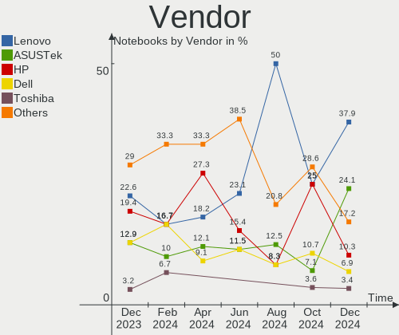
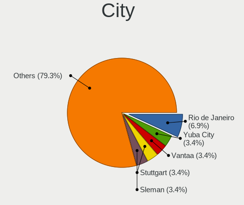
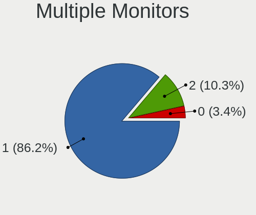

Xubuntu Hardware Trends (Notebooks)
-----------------------------------

A project to identify most popular hardware characteristics and track their change
over time based on data collected by Xubuntu users at https://Linux-Hardware.org.

Anyone can contribute to this report by the [hw-probe](https://github.com/linuxhw/hw-probe) tool:

    sudo -E hw-probe -all -upload

This report is for one last month. Overall report since the beginning of time: [TestCoverage](https://github.com/linuxhw/TestCoverage)

Period: Apr, 2022.

Contents
--------

* [ System ](#system)
  - [ OS                       ](#os)
  - [ OS Family                ](#os-family)
  - [ Kernel                   ](#kernel)
  - [ Kernel Family            ](#kernel-family)
  - [ Kernel Major Ver.        ](#kernel-major-ver)
  - [ Arch                     ](#arch)
  - [ DE                       ](#de)
  - [ Display Server           ](#display-server)
  - [ Display Manager          ](#display-manager)
  - [ OS Lang                  ](#os-lang)
  - [ Boot Mode                ](#boot-mode)
  - [ Filesystem               ](#filesystem)
  - [ Part. scheme             ](#part-scheme)
  - [ Dual Boot with Linux/BSD ](#dual-boot-with-linuxbsd)
  - [ Dual Boot (Win)          ](#dual-boot-win)

* [ Board ](#board)
  - [ Vendor                   ](#vendor)
  - [ Model                    ](#model)
  - [ Model Family             ](#model-family)
  - [ MFG Year                 ](#mfg-year)
  - [ Form Factor              ](#form-factor)
  - [ Secure Boot              ](#secure-boot)
  - [ Coreboot                 ](#coreboot)
  - [ RAM Size                 ](#ram-size)
  - [ RAM Used                 ](#ram-used)
  - [ Total Drives             ](#total-drives)
  - [ Has CD-ROM               ](#has-cd-rom)
  - [ Has Ethernet             ](#has-ethernet)
  - [ Has WiFi                 ](#has-wifi)
  - [ Has Bluetooth            ](#has-bluetooth)

* [ Location ](#location)
  - [ Country                  ](#country)
  - [ City                     ](#city)

* [ Drives ](#drives)
  - [ Drive Vendor             ](#drive-vendor)
  - [ Drive Model              ](#drive-model)
  - [ HDD Vendor               ](#hdd-vendor)
  - [ SSD Vendor               ](#ssd-vendor)
  - [ Drive Kind               ](#drive-kind)
  - [ Drive Connector          ](#drive-connector)
  - [ Drive Size               ](#drive-size)
  - [ Space Total              ](#space-total)
  - [ Space Used               ](#space-used)
  - [ Malfunc. Drives          ](#malfunc-drives)
  - [ Malfunc. Drive Vendor    ](#malfunc-drive-vendor)
  - [ Malfunc. HDD Vendor      ](#malfunc-hdd-vendor)
  - [ Malfunc. Drive Kind      ](#malfunc-drive-kind)
  - [ Failed Drives            ](#failed-drives)
  - [ Failed Drive Vendor      ](#failed-drive-vendor)
  - [ Drive Status             ](#drive-status)

* [ Storage controller ](#storage-controller)
  - [ Storage Vendor           ](#storage-vendor)
  - [ Storage Model            ](#storage-model)
  - [ Storage Kind             ](#storage-kind)

* [ Processor ](#processor)
  - [ CPU Vendor               ](#cpu-vendor)
  - [ CPU Model                ](#cpu-model)
  - [ CPU Model Family         ](#cpu-model-family)
  - [ CPU Cores                ](#cpu-cores)
  - [ CPU Sockets              ](#cpu-sockets)
  - [ CPU Threads              ](#cpu-threads)
  - [ CPU Op-Modes             ](#cpu-op-modes)
  - [ CPU Microcode            ](#cpu-microcode)
  - [ CPU Microarch            ](#cpu-microarch)

* [ Graphics ](#graphics)
  - [ GPU Vendor               ](#gpu-vendor)
  - [ GPU Model                ](#gpu-model)
  - [ GPU Combo                ](#gpu-combo)
  - [ GPU Driver               ](#gpu-driver)
  - [ GPU Memory               ](#gpu-memory)

* [ Monitor ](#monitor)
  - [ Monitor Vendor           ](#monitor-vendor)
  - [ Monitor Model            ](#monitor-model)
  - [ Monitor Resolution       ](#monitor-resolution)
  - [ Monitor Diagonal         ](#monitor-diagonal)
  - [ Monitor Width            ](#monitor-width)
  - [ Aspect Ratio             ](#aspect-ratio)
  - [ Monitor Area             ](#monitor-area)
  - [ Pixel Density            ](#pixel-density)
  - [ Multiple Monitors        ](#multiple-monitors)

* [ Network ](#network)
  - [ Net Controller Vendor    ](#net-controller-vendor)
  - [ Net Controller Model     ](#net-controller-model)
  - [ Wireless Vendor          ](#wireless-vendor)
  - [ Wireless Model           ](#wireless-model)
  - [ Ethernet Vendor          ](#ethernet-vendor)
  - [ Ethernet Model           ](#ethernet-model)
  - [ Net Controller Kind      ](#net-controller-kind)
  - [ Used Controller          ](#used-controller)
  - [ NICs                     ](#nics)
  - [ IPv6                     ](#ipv6)

* [ Bluetooth ](#bluetooth)
  - [ Bluetooth Vendor         ](#bluetooth-vendor)
  - [ Bluetooth Model          ](#bluetooth-model)

* [ Sound ](#sound)
  - [ Sound Vendor             ](#sound-vendor)
  - [ Sound Model              ](#sound-model)

* [ Memory ](#memory)
  - [ Memory Vendor            ](#memory-vendor)
  - [ Memory Model             ](#memory-model)
  - [ Memory Kind              ](#memory-kind)
  - [ Memory Form Factor       ](#memory-form-factor)
  - [ Memory Size              ](#memory-size)
  - [ Memory Speed             ](#memory-speed)

* [ Printers & scanners ](#printers--scanners)
  - [ Printer Vendor           ](#printer-vendor)
  - [ Printer Model            ](#printer-model)
  - [ Scanner Vendor           ](#scanner-vendor)
  - [ Scanner Model            ](#scanner-model)

* [ Camera ](#camera)
  - [ Camera Vendor            ](#camera-vendor)
  - [ Camera Model             ](#camera-model)

* [ Security ](#security)
  - [ Fingerprint Vendor       ](#fingerprint-vendor)
  - [ Fingerprint Model        ](#fingerprint-model)
  - [ Chipcard Vendor          ](#chipcard-vendor)
  - [ Chipcard Model           ](#chipcard-model)

* [ Unsupported ](#unsupported)
  - [ Unsupported Devices      ](#unsupported-devices)
  - [ Unsupported Device Types ](#unsupported-device-types)

System
------

OS
--

Installed operating systems

| Name          | Notebooks | Percent |
|---------------|-----------|---------|
| Xubuntu 20.04 | 23        | 58.97%  |
| Xubuntu 22.04 | 8         | 20.51%  |
| Xubuntu 21.10 | 4         | 10.26%  |
| Xubuntu 18.04 | 3         | 7.69%   |
| Xubuntu 16.04 | 1         | 2.56%   |

OS Family
---------

OS without a version

| Name    | Notebooks | Percent |
|---------|-----------|---------|
| Xubuntu | 39        | 100%    |

Kernel
------

Version of the Linux kernel

| Version               | Notebooks | Percent |
|-----------------------|-----------|---------|
| 5.13.0-39-generic     | 12        | 30.77%  |
| 5.4.0-107-generic     | 8         | 20.51%  |
| 5.15.0-27-generic     | 3         | 7.69%   |
| 5.15.0-25-generic     | 3         | 7.69%   |
| 5.4.0-109-generic     | 2         | 5.13%   |
| 5.13.0-40-generic     | 2         | 5.13%   |
| 5.6.19-050619-generic | 1         | 2.56%   |
| 5.4.0-91-generic      | 1         | 2.56%   |
| 5.4.0-107-lowlatency  | 1         | 2.56%   |
| 5.4.0-100-lowlatency  | 1         | 2.56%   |
| 5.17.3-051703-generic | 1         | 2.56%   |
| 5.17.0-ashpy3-lyesdef | 1         | 2.56%   |
| 5.13.0-39-lowlatency  | 1         | 2.56%   |
| 5.13.0-30-generic     | 1         | 2.56%   |
| 4.4.0-223-generic     | 1         | 2.56%   |

Kernel Family
-------------

Linux kernel without a distro release

| Version | Notebooks | Percent |
|---------|-----------|---------|
| 5.13.0  | 16        | 41.03%  |
| 5.4.0   | 13        | 33.33%  |
| 5.15.0  | 6         | 15.38%  |
| 5.6.19  | 1         | 2.56%   |
| 5.17.3  | 1         | 2.56%   |
| 5.17.0  | 1         | 2.56%   |
| 4.4.0   | 1         | 2.56%   |

Kernel Major Ver.
-----------------

Linux kernel major version

| Version | Notebooks | Percent |
|---------|-----------|---------|
| 5.13    | 16        | 41.03%  |
| 5.4     | 13        | 33.33%  |
| 5.15    | 6         | 15.38%  |
| 5.17    | 2         | 5.13%   |
| 5.6     | 1         | 2.56%   |
| 4.4     | 1         | 2.56%   |

Arch
----

OS architecture (x86_64, i586, etc.)

| Name   | Notebooks | Percent |
|--------|-----------|---------|
| x86_64 | 37        | 94.87%  |
| i686   | 2         | 5.13%   |

DE
--

Desktop Environment

| Name  | Notebooks | Percent |
|-------|-----------|---------|
| XFCE  | 37        | 94.87%  |
| GNOME | 2         | 5.13%   |

Display Server
--------------

X11 or Wayland

| Name    | Notebooks | Percent |
|---------|-----------|---------|
| X11     | 37        | 94.87%  |
| Wayland | 1         | 2.56%   |
| Tty     | 1         | 2.56%   |

Display Manager
---------------

SDDM, LightDM, etc.

| Name    | Notebooks | Percent |
|---------|-----------|---------|
| LightDM | 33        | 84.62%  |
| GDM     | 3         | 7.69%   |
| Unknown | 2         | 5.13%   |
| GDM3    | 1         | 2.56%   |

OS Lang
-------

Language

| Lang  | Notebooks | Percent |
|-------|-----------|---------|
| en_US | 19        | 48.72%  |
| it_IT | 4         | 10.26%  |
| ru_RU | 3         | 7.69%   |
| pl_PL | 2         | 5.13%   |
| en_CA | 2         | 5.13%   |
| zh_CN | 1         | 2.56%   |
| pt_PT | 1         | 2.56%   |
| fr_FR | 1         | 2.56%   |
| es_MX | 1         | 2.56%   |
| es_ES | 1         | 2.56%   |
| en_IN | 1         | 2.56%   |
| en_GB | 1         | 2.56%   |
| de_DE | 1         | 2.56%   |
| bg_BG | 1         | 2.56%   |

Boot Mode
---------

EFI or BIOS

| Mode | Notebooks | Percent |
|------|-----------|---------|
| EFI  | 23        | 58.97%  |
| BIOS | 16        | 41.03%  |

Filesystem
----------

Type of filesystem

| Type    | Notebooks | Percent |
|---------|-----------|---------|
| Ext4    | 36        | 92.31%  |
| Overlay | 2         | 5.13%   |
| Btrfs   | 1         | 2.56%   |

Part. scheme
------------

Scheme of partitioning

| Type    | Notebooks | Percent |
|---------|-----------|---------|
| GPT     | 19        | 48.72%  |
| Unknown | 17        | 43.59%  |
| MBR     | 3         | 7.69%   |

Dual Boot with Linux/BSD
------------------------

Hosting more than one Linux/BSD

| Dual boot | Notebooks | Percent |
|-----------|-----------|---------|
| No        | 36        | 92.31%  |
| Yes       | 3         | 7.69%   |

Dual Boot (Win)
---------------

Hosting Linux and Windows

| Dual boot | Notebooks | Percent |
|-----------|-----------|---------|
| No        | 25        | 64.1%   |
| Yes       | 14        | 35.9%   |

Board
-----

Vendor
------

Motherboard manufacturer

| Name                  | Notebooks | Percent |
|-----------------------|-----------|---------|
| Lenovo                | 11        | 28.21%  |
| Hewlett-Packard       | 10        | 25.64%  |
| Dell                  | 8         | 20.51%  |
| ASUSTek Computer      | 4         | 10.26%  |
| Acer                  | 2         | 5.13%   |
| Toshiba               | 1         | 2.56%   |
| Positivo Bahia - VAIO | 1         | 2.56%   |
| MSI                   | 1         | 2.56%   |
| Dynabook              | 1         | 2.56%   |

Model
-----

Motherboard model

| Name                                    | Notebooks | Percent |
|-----------------------------------------|-----------|---------|
| Toshiba NB505                           | 1         | 2.56%   |
| Positivo Bahia - VAIO VJC141F11X-B0111L | 1         | 2.56%   |
| MSI GX70 3CC                            | 1         | 2.56%   |
| Lenovo ThinkPad X280 20KE001MMX         | 1         | 2.56%   |
| Lenovo ThinkPad T480s 20L7001PIX        | 1         | 2.56%   |
| Lenovo ThinkPad T470s 20HF004MMX        | 1         | 2.56%   |
| Lenovo ThinkPad T440 20B7A0S200         | 1         | 2.56%   |
| Lenovo ThinkPad T14s Gen 2i 20WM00B9MX  | 1         | 2.56%   |
| Lenovo ThinkPad P53 20QNS01C00          | 1         | 2.56%   |
| Lenovo ThinkPad E590 20NB0029GE         | 1         | 2.56%   |
| Lenovo ThinkBook 14 G2 ARE 20VF         | 1         | 2.56%   |
| Lenovo IdeaPad Y550 4186                | 1         | 2.56%   |
| Lenovo IdeaPad 100-15IBY 80MJ           | 1         | 2.56%   |
| Lenovo B590 20206                       | 1         | 2.56%   |
| HP ProBook 455 G8 Notebook PC           | 1         | 2.56%   |
| HP Pavilion dv6500                      | 1         | 2.56%   |
| HP Pavilion 15                          | 1         | 2.56%   |
| HP OMEN by Laptop 16-c0xxx              | 1         | 2.56%   |
| HP Laptop 15s-fq2xxx                    | 1         | 2.56%   |
| HP Laptop 15-bw0xx                      | 1         | 2.56%   |
| HP ENVY Sleekbook 6 PC                  | 1         | 2.56%   |
| HP Compaq 6730s                         | 1         | 2.56%   |
| HP Compaq 6730b (GW687AV)               | 1         | 2.56%   |
| HP 255 G8 Notebook PC                   | 1         | 2.56%   |
| Dynabook TECRA X40-F                    | 1         | 2.56%   |
| Dell XPS M1530                          | 1         | 2.56%   |
| Dell Precision 7550                     | 1         | 2.56%   |
| Dell MXG061                             | 1         | 2.56%   |
| Dell Latitude E6540                     | 1         | 2.56%   |
| Dell Latitude 7480                      | 1         | 2.56%   |
| Dell Latitude 5521                      | 1         | 2.56%   |
| Dell Inspiron 3135                      | 1         | 2.56%   |
| Dell Inspiron 11-3162                   | 1         | 2.56%   |
| ASUS T100HAN                            | 1         | 2.56%   |
| ASUS K53SC                              | 1         | 2.56%   |
| ASUS ASUS TUF Dash F15 FX516PM_FX516PM  | 1         | 2.56%   |
| ASUS 1215N                              | 1         | 2.56%   |
| Acer Aspire ES1-512                     | 1         | 2.56%   |
| Acer Aspire ES1-311                     | 1         | 2.56%   |

Model Family
------------

Motherboard model prefix

| Name                                    | Notebooks | Percent |
|-----------------------------------------|-----------|---------|
| Lenovo ThinkPad                         | 7         | 17.95%  |
| Dell Latitude                           | 3         | 7.69%   |
| Lenovo IdeaPad                          | 2         | 5.13%   |
| HP Pavilion                             | 2         | 5.13%   |
| HP Laptop                               | 2         | 5.13%   |
| HP Compaq                               | 2         | 5.13%   |
| Dell Inspiron                           | 2         | 5.13%   |
| Acer Aspire                             | 2         | 5.13%   |
| Toshiba NB505                           | 1         | 2.56%   |
| Positivo Bahia - VAIO VJC141F11X-B0111L | 1         | 2.56%   |
| MSI GX70                                | 1         | 2.56%   |
| Lenovo ThinkBook                        | 1         | 2.56%   |
| Lenovo B590                             | 1         | 2.56%   |
| HP ProBook                              | 1         | 2.56%   |
| HP OMEN                                 | 1         | 2.56%   |
| HP ENVY                                 | 1         | 2.56%   |
| HP 255                                  | 1         | 2.56%   |
| Dynabook TECRA                          | 1         | 2.56%   |
| Dell XPS                                | 1         | 2.56%   |
| Dell Precision                          | 1         | 2.56%   |
| Dell MXG061                             | 1         | 2.56%   |
| ASUS T100HAN                            | 1         | 2.56%   |
| ASUS K53SC                              | 1         | 2.56%   |
| ASUS ASUS                               | 1         | 2.56%   |
| ASUS 1215N                              | 1         | 2.56%   |

MFG Year
--------

Motherboard manufacture year

| Year | Notebooks | Percent |
|------|-----------|---------|
| 2021 | 5         | 12.82%  |
| 2013 | 5         | 12.82%  |
| 2020 | 4         | 10.26%  |
| 2017 | 4         | 10.26%  |
| 2019 | 3         | 7.69%   |
| 2018 | 2         | 5.13%   |
| 2015 | 2         | 5.13%   |
| 2014 | 2         | 5.13%   |
| 2012 | 2         | 5.13%   |
| 2011 | 2         | 5.13%   |
| 2009 | 2         | 5.13%   |
| 2008 | 2         | 5.13%   |
| 2016 | 1         | 2.56%   |
| 2010 | 1         | 2.56%   |
| 2007 | 1         | 2.56%   |
| 2006 | 1         | 2.56%   |

Form Factor
-----------

Physical design of the computer

| Name     | Notebooks | Percent |
|----------|-----------|---------|
| Notebook | 39        | 100%    |

Secure Boot
-----------

Enabled or disabled

| State    | Notebooks | Percent |
|----------|-----------|---------|
| Disabled | 34        | 87.18%  |
| Enabled  | 5         | 12.82%  |

Coreboot
--------

Have coreboot on board

| Used | Notebooks | Percent |
|------|-----------|---------|
| No   | 39        | 100%    |

RAM Size
--------

Total RAM memory

| Size in GB | Notebooks | Percent |
|------------|-----------|---------|
| 3.01-4.0   | 10        | 25.64%  |
| 16.01-24.0 | 7         | 17.95%  |
| 8.01-16.0  | 7         | 17.95%  |
| 4.01-8.0   | 6         | 15.38%  |
| 1.01-2.0   | 6         | 15.38%  |
| 32.01-64.0 | 3         | 7.69%   |

RAM Used
--------

Used RAM memory

| Used GB   | Notebooks | Percent |
|-----------|-----------|---------|
| 1.01-2.0  | 19        | 48.72%  |
| 2.01-3.0  | 6         | 15.38%  |
| 4.01-8.0  | 4         | 10.26%  |
| 3.01-4.0  | 4         | 10.26%  |
| 8.01-16.0 | 3         | 7.69%   |
| 0.51-1.0  | 3         | 7.69%   |

Total Drives
------------

Number of drives on board

| Drives | Notebooks | Percent |
|--------|-----------|---------|
| 1      | 32        | 82.05%  |
| 2      | 5         | 12.82%  |
| 3      | 2         | 5.13%   |

Has CD-ROM
----------

Has CD-ROM on board

| Presented | Notebooks | Percent |
|-----------|-----------|---------|
| No        | 27        | 69.23%  |
| Yes       | 12        | 30.77%  |

Has Ethernet
------------

Has Ethernet on board

| Presented | Notebooks | Percent |
|-----------|-----------|---------|
| Yes       | 36        | 92.31%  |
| No        | 3         | 7.69%   |

Has WiFi
--------

Has WiFi module

| Presented | Notebooks | Percent |
|-----------|-----------|---------|
| Yes       | 38        | 97.44%  |
| No        | 1         | 2.56%   |

Has Bluetooth
-------------

Has Bluetooth module

| Presented | Notebooks | Percent |
|-----------|-----------|---------|
| Yes       | 29        | 74.36%  |
| No        | 10        | 25.64%  |

Location
--------

Country
-------

Geographic location (country)

| Country  | Notebooks | Percent |
|----------|-----------|---------|
| USA      | 9         | 23.08%  |
| Russia   | 5         | 12.82%  |
| Germany  | 5         | 12.82%  |
| Italy    | 4         | 10.26%  |
| Sweden   | 3         | 7.69%   |
| Poland   | 2         | 5.13%   |
| India    | 2         | 5.13%   |
| Spain    | 1         | 2.56%   |
| Portugal | 1         | 2.56%   |
| Mexico   | 1         | 2.56%   |
| Ireland  | 1         | 2.56%   |
| Hungary  | 1         | 2.56%   |
| France   | 1         | 2.56%   |
| Canada   | 1         | 2.56%   |
| Bulgaria | 1         | 2.56%   |
| Brazil   | 1         | 2.56%   |

City
----

Geographic location (city)

| City               | Notebooks | Percent |
|--------------------|-----------|---------|
| Uppsala            | 3         | 7.69%   |
| St Petersburg      | 2         | 5.13%   |
| Leipzig            | 2         | 5.13%   |
| Youngstown         | 1         | 2.56%   |
| Yakutsk            | 1         | 2.56%   |
| Wylie              | 1         | 2.56%   |
| Upper Marlboro     | 1         | 2.56%   |
| Sofia              | 1         | 2.56%   |
| Simpsonville       | 1         | 2.56%   |
| San Donà di Piave | 1         | 2.56%   |
| Saint Paul         | 1         | 2.56%   |
| Ridgeway           | 1         | 2.56%   |
| Porto              | 1         | 2.56%   |
| Palaiseau          | 1         | 2.56%   |
| Pabianice          | 1         | 2.56%   |
| Ouro Preto         | 1         | 2.56%   |
| Olesnica           | 1         | 2.56%   |
| Nuremberg          | 1         | 2.56%   |
| Mumbai             | 1         | 2.56%   |
| Madrid             | 1         | 2.56%   |
| León              | 1         | 2.56%   |
| Leesville          | 1         | 2.56%   |
| La Maddalena       | 1         | 2.56%   |
| Krasnodar          | 1         | 2.56%   |
| Kazan’           | 1         | 2.56%   |
| Karlsruhe          | 1         | 2.56%   |
| Huntingdon         | 1         | 2.56%   |
| Genoa              | 1         | 2.56%   |
| Frankfurt am Main  | 1         | 2.56%   |
| Fort Collins       | 1         | 2.56%   |
| Feldthurns         | 1         | 2.56%   |
| Ernakulam          | 1         | 2.56%   |
| Dublin             | 1         | 2.56%   |
| Budapest           | 1         | 2.56%   |
| Boulder            | 1         | 2.56%   |

Drives
------

Drive Vendor
------------

Hard drive vendors

| Vendor              | Notebooks | Drives | Percent |
|---------------------|-----------|--------|---------|
| Samsung Electronics | 12        | 13     | 26.09%  |
| WDC                 | 8         | 8      | 17.39%  |
| Seagate             | 5         | 5      | 10.87%  |
| SK Hynix            | 4         | 4      | 8.7%    |
| Unknown             | 3         | 3      | 6.52%   |
| Toshiba             | 3         | 3      | 6.52%   |
| Kingston            | 2         | 2      | 4.35%   |
| Hitachi             | 2         | 2      | 4.35%   |
| ZTC-SM20            | 1         | 1      | 2.17%   |
| WANGCHU             | 1         | 1      | 2.17%   |
| Smartbuy            | 1         | 1      | 2.17%   |
| Micron Technology   | 1         | 1      | 2.17%   |
| JMicron             | 1         | 1      | 2.17%   |
| Fujitsu             | 1         | 1      | 2.17%   |
| China               | 1         | 1      | 2.17%   |

Drive Model
-----------

Hard drive models

| Model                                | Notebooks | Percent |
|--------------------------------------|-----------|---------|
| WDC PC SN730 SDBQNTY-256G-1001 256GB | 2         | 4.26%   |
| Seagate ST500LT012-1DG142 500GB      | 2         | 4.26%   |
| Samsung SSD 980 1TB                  | 2         | 4.26%   |
| Kingston SA400S37480G 480GB SSD      | 2         | 4.26%   |
| ZTC-SM20 1-256G                      | 1         | 2.13%   |
| WDC WDS240G2G0A-00JH30 240GB SSD     | 1         | 2.13%   |
| WDC WD5000LPVX-22V0TT0 500GB         | 1         | 2.13%   |
| WDC WD3200BPVT-22JJ5T0 320GB         | 1         | 2.13%   |
| WDC WD3200BEVT-22ZCT0 320GB          | 1         | 2.13%   |
| WDC WD1600BEVT-60ZCT1 160GB          | 1         | 2.13%   |
| WDC WD10JPVX-22JC3T0 1TB             | 1         | 2.13%   |
| WANGCHU SSD 120GB                    | 1         | 2.13%   |
| Unknown SD08G  8GB                   | 1         | 2.13%   |
| Unknown MMC Card  32GB               | 1         | 2.13%   |
| Unknown CGND3R  64GB                 | 1         | 2.13%   |
| Toshiba MQ01ACF032 320GB             | 1         | 2.13%   |
| Toshiba MK7559GSXF 752GB             | 1         | 2.13%   |
| Toshiba KXG50ZNV1T02 NVMe 1024GB     | 1         | 2.13%   |
| Smartbuy SSD 60GB                    | 1         | 2.13%   |
| SK Hynix PC711 NVMe 512GB            | 1         | 2.13%   |
| SK Hynix PC611 NVMe 512GB            | 1         | 2.13%   |
| SK Hynix HFM512GDHTNG-8710B 512GB    | 1         | 2.13%   |
| SK Hynix BC711 HFM512GD3JX013N 512GB | 1         | 2.13%   |
| Seagate ST9250315AS 250GB            | 1         | 2.13%   |
| Seagate ST500LT012-9WS142 500GB      | 1         | 2.13%   |
| Seagate ST500LM012 HN-M500MBB 500GB  | 1         | 2.13%   |
| Samsung SSD PM851 M.2 2280 128GB     | 1         | 2.13%   |
| Samsung SSD 850 EVO 500GB            | 1         | 2.13%   |
| Samsung SSD 850 EVO 250GB            | 1         | 2.13%   |
| Samsung NVMe SSD Drive 512GB         | 1         | 2.13%   |
| Samsung NVMe SSD Drive 256GB         | 1         | 2.13%   |
| Samsung MZVLW512HMJP-000L7 512GB     | 1         | 2.13%   |
| Samsung MZVLQ512HBLU-00BH1 512GB     | 1         | 2.13%   |
| Samsung MZVLB512HAJQ-000H7 512GB     | 1         | 2.13%   |
| Samsung MZVLB1T0HBLR-000L7 1TB       | 1         | 2.13%   |
| Samsung MZVLB1T0HBLR-000H1 1TB       | 1         | 2.13%   |
| Samsung MZ7LN128HCHP-000L1 128GB SSD | 1         | 2.13%   |
| Micron MTFDDAK256MAM-1K12 256GB SSD  | 1         | 2.13%   |
| JMicron Generic 240GB                | 1         | 2.13%   |
| Hitachi HTS547550A9E384 500GB        | 1         | 2.13%   |
| Hitachi HTS543225L9A300 250GB        | 1         | 2.13%   |
| Fujitsu MHW2160BH PL 160GB           | 1         | 2.13%   |
| China SSD 240GB                      | 1         | 2.13%   |

HDD Vendor
----------

Hard disk drive vendors

| Vendor  | Notebooks | Drives | Percent |
|---------|-----------|--------|---------|
| WDC     | 5         | 5      | 33.33%  |
| Seagate | 5         | 5      | 33.33%  |
| Toshiba | 2         | 2      | 13.33%  |
| Hitachi | 2         | 2      | 13.33%  |
| Fujitsu | 1         | 1      | 6.67%   |

SSD Vendor
----------

Solid state drive vendors

| Vendor              | Notebooks | Drives | Percent |
|---------------------|-----------|--------|---------|
| Samsung Electronics | 4         | 4      | 33.33%  |
| Kingston            | 2         | 2      | 16.67%  |
| WDC                 | 1         | 1      | 8.33%   |
| WANGCHU             | 1         | 1      | 8.33%   |
| Smartbuy            | 1         | 1      | 8.33%   |
| Micron Technology   | 1         | 1      | 8.33%   |
| JMicron             | 1         | 1      | 8.33%   |
| China               | 1         | 1      | 8.33%   |

Drive Kind
----------

HDD or SSD

| Kind    | Notebooks | Drives | Percent |
|---------|-----------|--------|---------|
| NVMe    | 15        | 16     | 33.33%  |
| HDD     | 14        | 15     | 31.11%  |
| SSD     | 12        | 12     | 26.67%  |
| MMC     | 3         | 3      | 6.67%   |
| Unknown | 1         | 1      | 2.22%   |

Drive Connector
---------------

SATA, SAS, NVMe, etc.

| Type | Notebooks | Drives | Percent |
|------|-----------|--------|---------|
| SATA | 23        | 26     | 53.49%  |
| NVMe | 15        | 16     | 34.88%  |
| MMC  | 3         | 3      | 6.98%   |
| SAS  | 2         | 2      | 4.65%   |

Drive Size
----------

Size of hard drive

| Size in TB | Notebooks | Drives | Percent |
|------------|-----------|--------|---------|
| 0.01-0.5   | 23        | 25     | 95.83%  |
| 0.51-1.0   | 1         | 2      | 4.17%   |

Space Total
-----------

Amount of disk space available on the file system

| Size in GB     | Notebooks | Percent |
|----------------|-----------|---------|
| 251-500        | 14        | 35.9%   |
| 101-250        | 12        | 30.77%  |
| 501-1000       | 3         | 7.69%   |
| 51-100         | 3         | 7.69%   |
| 21-50          | 2         | 5.13%   |
| 1001-2000      | 2         | 5.13%   |
| 1-20           | 2         | 5.13%   |
| More than 3000 | 1         | 2.56%   |

Space Used
----------

Amount of used disk space

| Used GB   | Notebooks | Percent |
|-----------|-----------|---------|
| 1-20      | 14        | 35.9%   |
| 21-50     | 9         | 23.08%  |
| 101-250   | 8         | 20.51%  |
| 251-500   | 3         | 7.69%   |
| 51-100    | 3         | 7.69%   |
| 1001-2000 | 1         | 2.56%   |
| 501-1000  | 1         | 2.56%   |

Malfunc. Drives
---------------

Drive models with a malfunction

| Model                                | Notebooks | Drives | Percent |
|--------------------------------------|-----------|--------|---------|
| WDC WD5000LPVX-22V0TT0 500GB         | 1         | 1      | 20%     |
| SK Hynix BC711 HFM512GD3JX013N 512GB | 1         | 1      | 20%     |
| Seagate ST500LT012-9WS142 500GB      | 1         | 1      | 20%     |
| Seagate ST500LT012-1DG142 500GB      | 1         | 1      | 20%     |
| Hitachi HTS543225L9A300 250GB        | 1         | 1      | 20%     |

Malfunc. Drive Vendor
---------------------

Vendors of faulty drives

| Vendor   | Notebooks | Drives | Percent |
|----------|-----------|--------|---------|
| Seagate  | 2         | 2      | 40%     |
| WDC      | 1         | 1      | 20%     |
| SK Hynix | 1         | 1      | 20%     |
| Hitachi  | 1         | 1      | 20%     |

Malfunc. HDD Vendor
-------------------

Vendors of faulty HDD drives

| Vendor  | Notebooks | Drives | Percent |
|---------|-----------|--------|---------|
| Seagate | 2         | 2      | 50%     |
| WDC     | 1         | 1      | 25%     |
| Hitachi | 1         | 1      | 25%     |

Malfunc. Drive Kind
-------------------

Kinds of faulty drives

| Kind | Notebooks | Drives | Percent |
|------|-----------|--------|---------|
| HDD  | 4         | 4      | 80%     |
| NVMe | 1         | 1      | 20%     |

Failed Drives
-------------

Failed drive models

Zero info for selected period =(

Failed Drive Vendor
-------------------

Failed drive vendors

Zero info for selected period =(

Drive Status
------------

Number of failed and malfunc. drives

| Status   | Notebooks | Drives | Percent |
|----------|-----------|--------|---------|
| Detected | 20        | 23     | 50%     |
| Works    | 15        | 19     | 37.5%   |
| Malfunc  | 5         | 5      | 12.5%   |

Storage controller
------------------

Storage Vendor
--------------

Storage controller vendors

| Vendor                       | Notebooks | Percent |
|------------------------------|-----------|---------|
| Intel                        | 21        | 47.73%  |
| Samsung Electronics          | 9         | 20.45%  |
| AMD                          | 6         | 13.64%  |
| SK Hynix                     | 4         | 9.09%   |
| Sandisk                      | 3         | 6.82%   |
| Toshiba America Info Systems | 1         | 2.27%   |

Storage Model
-------------

Storage controller models

| Model                                                                            | Notebooks | Percent |
|----------------------------------------------------------------------------------|-----------|---------|
| AMD FCH SATA Controller [AHCI mode]                                              | 6         | 12.77%  |
| Samsung NVMe SSD Controller SM981/PM981/PM983                                    | 4         | 8.51%   |
| Samsung NVMe SSD Controller 980                                                  | 4         | 8.51%   |
| Intel Atom Processor E3800 Series SATA AHCI Controller                           | 3         | 6.38%   |
| SK Hynix Gold P31 SSD                                                            | 2         | 4.26%   |
| Sandisk WD Black SN750 / PC SN730 NVMe SSD                                       | 2         | 4.26%   |
| Intel Volume Management Device NVMe RAID Controller                              | 2         | 4.26%   |
| Intel NM10/ICH7 Family SATA Controller [AHCI mode]                               | 2         | 4.26%   |
| Intel 82801IBM/IEM (ICH9M/ICH9M-E) 4 port SATA Controller [AHCI mode]            | 2         | 4.26%   |
| Intel 82801HM/HEM (ICH8M/ICH8M-E) SATA Controller [AHCI mode]                    | 2         | 4.26%   |
| Intel 82801HM/HEM (ICH8M/ICH8M-E) IDE Controller                                 | 2         | 4.26%   |
| Intel 8 Series SATA Controller 1 [AHCI mode]                                     | 2         | 4.26%   |
| Toshiba America Info Systems Toshiba America Info Non-Volatile memory controller | 1         | 2.13%   |
| SK Hynix Non-Volatile memory controller                                          | 1         | 2.13%   |
| SK Hynix BC501 NVMe Solid State Drive                                            | 1         | 2.13%   |
| Sandisk Non-Volatile memory controller                                           | 1         | 2.13%   |
| Samsung NVMe SSD Controller SM961/PM961/SM963                                    | 1         | 2.13%   |
| Intel Sunrise Point-LP SATA Controller [AHCI mode]                               | 1         | 2.13%   |
| Intel 82801IBM/IEM (ICH9M/ICH9M-E) 2 port SATA Controller [IDE mode]             | 1         | 2.13%   |
| Intel 82801GBM/GHM (ICH7-M Family) SATA Controller [IDE mode]                    | 1         | 2.13%   |
| Intel 8 Series/C220 Series Chipset Family 6-port SATA Controller 1 [AHCI mode]   | 1         | 2.13%   |
| Intel 7 Series Chipset Family 6-port SATA Controller [AHCI mode]                 | 1         | 2.13%   |
| Intel 6 Series/C200 Series Chipset Family 6 port Mobile SATA AHCI Controller     | 1         | 2.13%   |
| Intel 500 Series Chipset Family SATA AHCI Controller                             | 1         | 2.13%   |
| Intel 400 Series Chipset Family SATA AHCI Controller                             | 1         | 2.13%   |
| AMD FCH IDE Controller                                                           | 1         | 2.13%   |

Storage Kind
------------

Kind of storage controller (IDE, SATA, NVMe, SAS, ...)

| Kind | Notebooks | Percent |
|------|-----------|---------|
| SATA | 23        | 50%     |
| NVMe | 16        | 34.78%  |
| IDE  | 5         | 10.87%  |
| RAID | 2         | 4.35%   |

Processor
---------

CPU Vendor
----------

Processor vendors

| Vendor | Notebooks | Percent |
|--------|-----------|---------|
| Intel  | 31        | 79.49%  |
| AMD    | 8         | 20.51%  |

CPU Model
---------

Processor models

| Model                                           | Notebooks | Percent |
|-------------------------------------------------|-----------|---------|
| Intel Core 2 Duo CPU T6400 @ 2.00GHz            | 2         | 5.13%   |
| Intel Celeron CPU N2840 @ 2.16GHz               | 2         | 5.13%   |
| Intel Xeon W-10855M CPU @ 2.80GHz               | 1         | 2.56%   |
| Intel Pentium CPU N3540 @ 2.16GHz               | 1         | 2.56%   |
| Intel Core i9-9880H CPU @ 2.30GHz               | 1         | 2.56%   |
| Intel Core i7-8665U CPU @ 1.90GHz               | 1         | 2.56%   |
| Intel Core i7-8565U CPU @ 1.80GHz               | 1         | 2.56%   |
| Intel Core i7-8550U CPU @ 1.80GHz               | 1         | 2.56%   |
| Intel Core i7-7500U CPU @ 2.70GHz               | 1         | 2.56%   |
| Intel Core i7-4800MQ CPU @ 2.70GHz              | 1         | 2.56%   |
| Intel Core i7-2670QM CPU @ 2.20GHz              | 1         | 2.56%   |
| Intel Core i5-8350U CPU @ 1.70GHz               | 1         | 2.56%   |
| Intel Core i5-7200U CPU @ 2.50GHz               | 1         | 2.56%   |
| Intel Core i5-4300U CPU @ 1.90GHz               | 1         | 2.56%   |
| Intel Core i5-4210U CPU @ 1.70GHz               | 1         | 2.56%   |
| Intel Core i3-6006U CPU @ 2.00GHz               | 1         | 2.56%   |
| Intel Core 2 Duo CPU T7300 @ 2.00GHz            | 1         | 2.56%   |
| Intel Core 2 Duo CPU T5870 @ 2.00GHz            | 1         | 2.56%   |
| Intel Core 2 Duo CPU P8600 @ 2.40GHz            | 1         | 2.56%   |
| Intel Core 2 CPU T7600 @ 2.33GHz                | 1         | 2.56%   |
| Intel Celeron CPU N3060 @ 1.60GHz               | 1         | 2.56%   |
| Intel Celeron CPU 1005M @ 1.90GHz               | 1         | 2.56%   |
| Intel Atom x5-Z8500 CPU @ 1.44GHz               | 1         | 2.56%   |
| Intel Atom CPU N455 @ 1.66GHz                   | 1         | 2.56%   |
| Intel Atom CPU D525 @ 1.80GHz                   | 1         | 2.56%   |
| Intel 11th Gen Core i7-11850H @ 2.50GHz         | 1         | 2.56%   |
| Intel 11th Gen Core i7-11370H @ 3.30GHz         | 1         | 2.56%   |
| Intel 11th Gen Core i5-1135G7 @ 2.40GHz         | 1         | 2.56%   |
| Intel 11th Gen Core i3-1115G4 @ 3.00GHz         | 1         | 2.56%   |
| AMD Ryzen 7 5800U with Radeon Graphics          | 1         | 2.56%   |
| AMD Ryzen 7 5800H with Radeon Graphics          | 1         | 2.56%   |
| AMD Ryzen 7 4700U with Radeon Graphics          | 1         | 2.56%   |
| AMD Ryzen 5 5500U with Radeon Graphics          | 1         | 2.56%   |
| AMD A8-4555M APU with Radeon HD Graphics        | 1         | 2.56%   |
| AMD A6-1450 APU with Radeon HD Graphics         | 1         | 2.56%   |
| AMD A10-9620P RADEON R5, 10 COMPUTE CORES 4C+6G | 1         | 2.56%   |
| AMD A10-5750M APU with Radeon HD Graphics       | 1         | 2.56%   |

CPU Model Family
----------------

Processor model prefix

| Model            | Notebooks | Percent |
|------------------|-----------|---------|
| Intel Core i7    | 6         | 15.38%  |
| Intel Core 2 Duo | 5         | 12.82%  |
| Other            | 4         | 10.26%  |
| Intel Core i5    | 4         | 10.26%  |
| Intel Celeron    | 4         | 10.26%  |
| Intel Atom       | 3         | 7.69%   |
| AMD Ryzen 7      | 3         | 7.69%   |
| AMD A10          | 2         | 5.13%   |
| Intel Xeon       | 1         | 2.56%   |
| Intel Pentium    | 1         | 2.56%   |
| Intel Core i9    | 1         | 2.56%   |
| Intel Core i3    | 1         | 2.56%   |
| Intel Core 2     | 1         | 2.56%   |
| AMD Ryzen 5      | 1         | 2.56%   |
| AMD A8           | 1         | 2.56%   |
| AMD A6           | 1         | 2.56%   |

CPU Cores
---------

Number of processor cores

| Number | Notebooks | Percent |
|--------|-----------|---------|
| 2      | 20        | 51.28%  |
| 4      | 11        | 28.21%  |
| 8      | 5         | 12.82%  |
| 6      | 2         | 5.13%   |
| 1      | 1         | 2.56%   |

CPU Sockets
-----------

Number of sockets

| Number | Notebooks | Percent |
|--------|-----------|---------|
| 1      | 39        | 100%    |

CPU Threads
-----------

Threads per core (Hyper-Threading)

| Number | Notebooks | Percent |
|--------|-----------|---------|
| 2      | 25        | 64.1%   |
| 1      | 14        | 35.9%   |

CPU Op-Modes
------------

CPU Operation Modes (32-bit, 64-bit)

| Op mode        | Notebooks | Percent |
|----------------|-----------|---------|
| 32-bit, 64-bit | 39        | 100%    |

CPU Microcode
-------------

Microcode number

| Number     | Notebooks | Percent |
|------------|-----------|---------|
| Unknown    | 5         | 12.82%  |
| 0x806c1    | 3         | 7.69%   |
| 0x30678    | 3         | 7.69%   |
| 0x806e9    | 2         | 5.13%   |
| 0x40651    | 2         | 5.13%   |
| 0x106ca    | 2         | 5.13%   |
| 0x1067a    | 2         | 5.13%   |
| 0x0a50000c | 2         | 5.13%   |
| 0xa0652    | 1         | 2.56%   |
| 0x906ed    | 1         | 2.56%   |
| 0x806ec    | 1         | 2.56%   |
| 0x806ea    | 1         | 2.56%   |
| 0x806d1    | 1         | 2.56%   |
| 0x6fd      | 1         | 2.56%   |
| 0x6fa      | 1         | 2.56%   |
| 0x6f6      | 1         | 2.56%   |
| 0x406c4    | 1         | 2.56%   |
| 0x406c3    | 1         | 2.56%   |
| 0x306c3    | 1         | 2.56%   |
| 0x306a9    | 1         | 2.56%   |
| 0x206a7    | 1         | 2.56%   |
| 0x08608103 | 1         | 2.56%   |
| 0x08600106 | 1         | 2.56%   |
| 0x0700010f | 1         | 2.56%   |
| 0x0600611a | 1         | 2.56%   |
| 0x06001119 | 1         | 2.56%   |

CPU Microarch
-------------

Microarchitecture

| Name        | Notebooks | Percent |
|-------------|-----------|---------|
| KabyLake    | 7         | 17.95%  |
| Silvermont  | 5         | 12.82%  |
| TigerLake   | 3         | 7.69%   |
| Penryn      | 3         | 7.69%   |
| Haswell     | 3         | 7.69%   |
| Core        | 3         | 7.69%   |
| Zen 3       | 2         | 5.13%   |
| Piledriver  | 2         | 5.13%   |
| Bonnell     | 2         | 5.13%   |
| Zen 2       | 1         | 2.56%   |
| Skylake     | 1         | 2.56%   |
| SandyBridge | 1         | 2.56%   |
| Jaguar      | 1         | 2.56%   |
| IvyBridge   | 1         | 2.56%   |
| Icelake     | 1         | 2.56%   |
| Excavator   | 1         | 2.56%   |
| CometLake   | 1         | 2.56%   |
| Unknown     | 1         | 2.56%   |

Graphics
--------

GPU Vendor
----------

Vendors of graphics cards

| Vendor | Notebooks | Percent |
|--------|-----------|---------|
| Intel  | 27        | 57.45%  |
| Nvidia | 10        | 21.28%  |
| AMD    | 10        | 21.28%  |

GPU Model
---------

Graphics card models

| Model                                                                                    | Notebooks | Percent |
|------------------------------------------------------------------------------------------|-----------|---------|
| Intel Mobile 4 Series Chipset Integrated Graphics Controller                             | 3         | 6.12%   |
| Intel Atom Processor Z36xxx/Z37xxx Series Graphics & Display                             | 3         | 6.12%   |
| Intel WhiskeyLake-U GT2 [UHD Graphics 620]                                               | 2         | 4.08%   |
| Intel UHD Graphics 620                                                                   | 2         | 4.08%   |
| Intel TigerLake-LP GT2 [Iris Xe Graphics]                                                | 2         | 4.08%   |
| Intel HD Graphics 620                                                                    | 2         | 4.08%   |
| Intel Haswell-ULT Integrated Graphics Controller                                         | 2         | 4.08%   |
| Intel Atom/Celeron/Pentium Processor x5-E8000/J3xxx/N3xxx Integrated Graphics Controller | 2         | 4.08%   |
| Intel Atom Processor D4xx/D5xx/N4xx/N5xx Integrated Graphics Controller                  | 2         | 4.08%   |
| AMD Cezanne                                                                              | 2         | 4.08%   |
| Nvidia TU106GLM [Quadro RTX 3000 Mobile / Max-Q]                                         | 1         | 2.04%   |
| Nvidia TU104GLM [Quadro RTX 4000 Mobile / Max-Q]                                         | 1         | 2.04%   |
| Nvidia GT218M [ION 2]                                                                    | 1         | 2.04%   |
| Nvidia GM108M [GeForce 840M]                                                             | 1         | 2.04%   |
| Nvidia GF119M [GeForce GT 520MX]                                                         | 1         | 2.04%   |
| Nvidia GA106M [GeForce RTX 3060 Mobile / Max-Q]                                          | 1         | 2.04%   |
| Nvidia GA104M [GeForce RTX 3070 Mobile / Max-Q]                                          | 1         | 2.04%   |
| Nvidia G86M [GeForce 8400M GS]                                                           | 1         | 2.04%   |
| Nvidia G84M [GeForce 8600M GT]                                                           | 1         | 2.04%   |
| Nvidia G71M [GeForce Go 7950 GTX]                                                        | 1         | 2.04%   |
| Intel TigerLake-H GT1 [UHD Graphics]                                                     | 1         | 2.04%   |
| Intel Tiger Lake UHD Graphics                                                            | 1         | 2.04%   |
| Intel Skylake GT2 [HD Graphics 520]                                                      | 1         | 2.04%   |
| Intel Comet Lake-H WS GT2 Integrated UHD Graphics Controller                             | 1         | 2.04%   |
| Intel 4th Gen Core Processor Integrated Graphics Controller                              | 1         | 2.04%   |
| Intel 3rd Gen Core processor Graphics Controller                                         | 1         | 2.04%   |
| Intel 2nd Generation Core Processor Family Integrated Graphics Controller                | 1         | 2.04%   |
| AMD Wani [Radeon R5/R6/R7 Graphics]                                                      | 1         | 2.04%   |
| AMD Trinity [Radeon HD 7600G]                                                            | 1         | 2.04%   |
| AMD Topaz XT [Radeon R7 M260/M265 / M340/M360 / M440/M445 / 530/535 / 620/625 Mobile]    | 1         | 2.04%   |
| AMD Temash [Radeon HD 8250/8280G]                                                        | 1         | 2.04%   |
| AMD Richland [Radeon HD 8650G]                                                           | 1         | 2.04%   |
| AMD Renoir                                                                               | 1         | 2.04%   |
| AMD Neptune XT [Radeon HD 8970M]                                                         | 1         | 2.04%   |
| AMD Mars XTX [Radeon HD 8790M]                                                           | 1         | 2.04%   |
| AMD Lucienne                                                                             | 1         | 2.04%   |
| AMD Lexa PRO [Radeon 540/540X/550/550X / RX 540X/550/550X]                               | 1         | 2.04%   |

GPU Combo
---------

Combinations of graphics cards

| Name           | Notebooks | Percent |
|----------------|-----------|---------|
| 1 x Intel      | 20        | 51.28%  |
| Intel + Nvidia | 5         | 12.82%  |
| 1 x AMD        | 5         | 12.82%  |
| 1 x Nvidia     | 4         | 10.26%  |
| 2 x AMD        | 2         | 5.13%   |
| Intel + AMD    | 2         | 5.13%   |
| AMD + Nvidia   | 1         | 2.56%   |

GPU Driver
----------

Free vs proprietary

| Driver      | Notebooks | Percent |
|-------------|-----------|---------|
| Free        | 34        | 87.18%  |
| Proprietary | 4         | 10.26%  |
| Unknown     | 1         | 2.56%   |

GPU Memory
----------

Total video memory

| Size in GB | Notebooks | Percent |
|------------|-----------|---------|
| Unknown    | 24        | 61.54%  |
| 0.01-0.5   | 8         | 20.51%  |
| 1.01-2.0   | 3         | 7.69%   |
| 0.51-1.0   | 2         | 5.13%   |
| 7.01-8.0   | 1         | 2.56%   |
| 5.01-6.0   | 1         | 2.56%   |

Monitor
-------

Monitor Vendor
--------------

Monitor vendors

| Vendor                  | Notebooks | Percent |
|-------------------------|-----------|---------|
| Chimei Innolux          | 8         | 16.67%  |
| AU Optronics            | 7         | 14.58%  |
| Dell                    | 6         | 12.5%   |
| Samsung Electronics     | 5         | 10.42%  |
| LG Display              | 5         | 10.42%  |
| BOE                     | 5         | 10.42%  |
| PANDA                   | 2         | 4.17%   |
| Seiko/Epson             | 1         | 2.08%   |
| Philips                 | 1         | 2.08%   |
| LG Philips              | 1         | 2.08%   |
| Lenovo                  | 1         | 2.08%   |
| InfoVision              | 1         | 2.08%   |
| HannStar                | 1         | 2.08%   |
| Goldstar                | 1         | 2.08%   |
| Chi Mei Optoelectronics | 1         | 2.08%   |
| AOC                     | 1         | 2.08%   |
| Ancor Communications    | 1         | 2.08%   |

Monitor Model
-------------

Monitor models

| Model                                                                     | Notebooks | Percent |
|---------------------------------------------------------------------------|-----------|---------|
| Seiko/Epson LCD Monitor                                                   | 1         | 2.04%   |
| Samsung Electronics LCD Monitor SEC4F45 1280x800 331x207mm 15.4-inch      | 1         | 2.04%   |
| Samsung Electronics LCD Monitor SEC3345 1280x800 331x207mm 15.4-inch      | 1         | 2.04%   |
| Samsung Electronics LCD Monitor SDC4A52 1366x768 344x194mm 15.5-inch      | 1         | 2.04%   |
| Samsung Electronics LCD Monitor SDC314D 1366x768 309x174mm 14.0-inch      | 1         | 2.04%   |
| Samsung Electronics LCD Monitor SAM0B7C 1920x1080 886x498mm 40.0-inch     | 1         | 2.04%   |
| Philips PHL 276E8V PHLC18F 1920x1080 597x336mm 27.0-inch                  | 1         | 2.04%   |
| PANDA LCD Monitor NCP004D 1920x1080 344x194mm 15.5-inch                   | 1         | 2.04%   |
| PANDA LCD Monitor NCP0040 1920x1080 344x194mm 15.5-inch                   | 1         | 2.04%   |
| LG Philips LP154WX4-TLAB LPL3D01 1280x800 331x207mm 15.4-inch             | 1         | 2.04%   |
| LG Display LCD Monitor LGD8C01 1366x768 344x194mm 15.5-inch               | 1         | 2.04%   |
| LG Display LCD Monitor LGD071D 1920x1080 344x194mm 15.5-inch              | 1         | 2.04%   |
| LG Display LCD Monitor LGD0609 1920x1080 309x174mm 14.0-inch              | 1         | 2.04%   |
| LG Display LCD Monitor LGD0521 1920x1080 309x174mm 14.0-inch              | 1         | 2.04%   |
| LG Display LCD Monitor LGD02DC 1366x768 344x194mm 15.5-inch               | 1         | 2.04%   |
| Lenovo LCD Monitor LEN40BA 1920x1080 344x194mm 15.5-inch                  | 1         | 2.04%   |
| InfoVision LCD Monitor IVO04E6 1920x1080 276x156mm 12.5-inch              | 1         | 2.04%   |
| HannStar HSD121PHW1 HSD04B6 1366x768 270x150mm 12.2-inch                  | 1         | 2.04%   |
| Goldstar 22EA53 GSM59A4 1920x1080 480x270mm 21.7-inch                     | 1         | 2.04%   |
| Dell U2515H DELD06F 2560x1440 553x311mm 25.0-inch                         | 1         | 2.04%   |
| Dell U2515H DELD06E 2560x1440 550x310mm 24.9-inch                         | 1         | 2.04%   |
| Dell U2415 DELA0BA 1920x1200 518x324mm 24.1-inch                          | 1         | 2.04%   |
| Dell P2419H DELD0DA 1920x1080 527x296mm 23.8-inch                         | 1         | 2.04%   |
| Dell P2418D DELD0C2 2560x1440 530x300mm 24.0-inch                         | 1         | 2.04%   |
| Dell P2417H DELA0DC 1920x1080 527x296mm 23.8-inch                         | 1         | 2.04%   |
| Dell P2319H DELD0D7 1920x1080 509x286mm 23.0-inch                         | 1         | 2.04%   |
| Chimei Innolux LCD Monitor CMN15E3 1920x1080 344x193mm 15.5-inch          | 1         | 2.04%   |
| Chimei Innolux LCD Monitor CMN15BF 1366x768 344x193mm 15.5-inch           | 1         | 2.04%   |
| Chimei Innolux LCD Monitor CMN15BA 1920x1080 344x194mm 15.5-inch          | 1         | 2.04%   |
| Chimei Innolux LCD Monitor CMN15B6 1366x768 340x190mm 15.3-inch           | 1         | 2.04%   |
| Chimei Innolux LCD Monitor CMN14F5 1920x1080 309x173mm 13.9-inch          | 1         | 2.04%   |
| Chimei Innolux LCD Monitor CMN14F2 1920x1080 309x173mm 13.9-inch          | 1         | 2.04%   |
| Chimei Innolux LCD Monitor CMN14C9 1920x1080 309x173mm 13.9-inch          | 1         | 2.04%   |
| Chimei Innolux LCD Monitor CMN1490 1366x768 309x173mm 13.9-inch           | 1         | 2.04%   |
| Chi Mei Optoelectronics LCD Monitor CMO1720 1920x1080 382x215mm 17.3-inch | 1         | 2.04%   |
| BOE LCD Monitor BOE09F2 1920x1080 355x200mm 16.0-inch                     | 1         | 2.04%   |
| BOE LCD Monitor BOE09D8 1920x1080 344x194mm 15.5-inch                     | 1         | 2.04%   |
| BOE LCD Monitor BOE08CF 1920x1080 344x194mm 15.5-inch                     | 1         | 2.04%   |
| BOE LCD Monitor BOE06EE 1920x1080 309x173mm 13.9-inch                     | 1         | 2.04%   |
| BOE LCD Monitor BOE0623 1366x768 256x144mm 11.6-inch                      | 1         | 2.04%   |
| AU Optronics LCD Monitor AUO45EC 1366x768 344x193mm 15.5-inch             | 1         | 2.04%   |
| AU Optronics LCD Monitor AUO4599 1920x1080 344x194mm 15.5-inch            | 1         | 2.04%   |
| AU Optronics LCD Monitor AUO315C 1366x768 256x144mm 11.6-inch             | 1         | 2.04%   |
| AU Optronics LCD Monitor AUO30D2 1024x600 223x125mm 10.1-inch             | 1         | 2.04%   |
| AU Optronics LCD Monitor AUO2774 1280x800 331x207mm 15.4-inch             | 1         | 2.04%   |
| AU Optronics LCD Monitor AUO21EC 1366x768 344x193mm 15.5-inch             | 1         | 2.04%   |
| AU Optronics LCD Monitor AUO132C 1366x768 293x164mm 13.2-inch             | 1         | 2.04%   |
| AOC 2590G5 AOC2590 1920x1080 544x303mm 24.5-inch                          | 1         | 2.04%   |
| Ancor Communications ASUS VE278 ACI27F6 1920x1080 598x336mm 27.0-inch     | 1         | 2.04%   |

Monitor Resolution
------------------

Monitor screen resolution

| Resolution      | Notebooks | Percent |
|-----------------|-----------|---------|
| 1920x1080 (FHD) | 20        | 47.62%  |
| 1366x768 (WXGA) | 13        | 30.95%  |
| 1280x800 (WXGA) | 4         | 9.52%   |
| 2560x1440 (QHD) | 2         | 4.76%   |
| 3840x2160 (4K)  | 1         | 2.38%   |
| 1024x600        | 1         | 2.38%   |
| Unknown         | 1         | 2.38%   |

Monitor Diagonal
----------------

Diagonal size in inches

| Inches  | Notebooks | Percent |
|---------|-----------|---------|
| 15      | 20        | 41.67%  |
| 24      | 5         | 10.42%  |
| 13      | 5         | 10.42%  |
| 14      | 4         | 8.33%   |
| 27      | 2         | 4.17%   |
| 12      | 2         | 4.17%   |
| 11      | 2         | 4.17%   |
| 40      | 1         | 2.08%   |
| 25      | 1         | 2.08%   |
| 23      | 1         | 2.08%   |
| 21      | 1         | 2.08%   |
| 17      | 1         | 2.08%   |
| 16      | 1         | 2.08%   |
| 10      | 1         | 2.08%   |
| Unknown | 1         | 2.08%   |

Monitor Width
-------------

Physical width

| Width in mm | Notebooks | Percent |
|-------------|-----------|---------|
| 301-350     | 28        | 59.57%  |
| 501-600     | 8         | 17.02%  |
| 201-300     | 6         | 12.77%  |
| 351-400     | 2         | 4.26%   |
| 801-900     | 1         | 2.13%   |
| 401-500     | 1         | 2.13%   |
| Unknown     | 1         | 2.13%   |

Aspect Ratio
------------

Proportional relationship between the width and the height

| Ratio   | Notebooks | Percent |
|---------|-----------|---------|
| 16/9    | 33        | 84.62%  |
| 16/10   | 5         | 12.82%  |
| Unknown | 1         | 2.56%   |

Monitor Area
------------

Area in inch²

| Area in inch² | Notebooks | Percent |
|----------------|-----------|---------|
| 101-110        | 21        | 43.75%  |
| 81-90          | 8         | 16.67%  |
| 201-250        | 5         | 10.42%  |
| 251-300        | 3         | 6.25%   |
| 61-70          | 2         | 4.17%   |
| 51-60          | 2         | 4.17%   |
| 301-350        | 2         | 4.17%   |
| 71-80          | 1         | 2.08%   |
| 41-50          | 1         | 2.08%   |
| 121-130        | 1         | 2.08%   |
| 501-1000       | 1         | 2.08%   |
| Unknown        | 1         | 2.08%   |

Pixel Density
-------------

Pixels per inch

| Density | Notebooks | Percent |
|---------|-----------|---------|
| 121-160 | 21        | 44.68%  |
| 101-120 | 12        | 25.53%  |
| 51-100  | 11        | 23.4%   |
| 161-240 | 2         | 4.26%   |
| Unknown | 1         | 2.13%   |

Multiple Monitors
-----------------

Total monitors connected

| Total | Notebooks | Percent |
|-------|-----------|---------|
| 1     | 30        | 76.92%  |
| 2     | 7         | 17.95%  |
| 3     | 2         | 5.13%   |

Network
-------

Net Controller Vendor
---------------------

Controller vendors

| Vendor                            | Notebooks | Percent |
|-----------------------------------|-----------|---------|
| Intel                             | 22        | 31.88%  |
| Realtek Semiconductor             | 21        | 30.43%  |
| Broadcom                          | 8         | 11.59%  |
| Qualcomm Atheros                  | 4         | 5.8%    |
| Ralink                            | 2         | 2.9%    |
| Marvell Technology Group          | 2         | 2.9%    |
| Fibocom                           | 2         | 2.9%    |
| ASIX Electronics                  | 2         | 2.9%    |
| Xiaomi                            | 1         | 1.45%   |
| TP-Link                           | 1         | 1.45%   |
| Sierra Wireless                   | 1         | 1.45%   |
| Ericsson Business Mobile Networks | 1         | 1.45%   |
| Broadcom Limited                  | 1         | 1.45%   |
| Attansic Technology               | 1         | 1.45%   |

Net Controller Model
--------------------

Controller models

| Model                                                             | Notebooks | Percent |
|-------------------------------------------------------------------|-----------|---------|
| Realtek RTL8111/8168/8411 PCI Express Gigabit Ethernet Controller | 13        | 15.66%  |
| Realtek RTL810xE PCI Express Fast Ethernet controller             | 4         | 4.82%   |
| Intel Wireless 8265 / 8275                                        | 3         | 3.61%   |
| Intel Wi-Fi 6 AX200                                               | 3         | 3.61%   |
| Broadcom BCM43142 802.11b/g/n                                     | 3         | 3.61%   |
| Realtek RTL8822CE 802.11ac PCIe Wireless Network Adapter          | 2         | 2.41%   |
| Realtek RTL8153 Gigabit Ethernet Adapter                          | 2         | 2.41%   |
| Qualcomm Atheros QCA9565 / AR9565 Wireless Network Adapter        | 2         | 2.41%   |
| Intel Wireless-AC 9260                                            | 2         | 2.41%   |
| Intel Wireless 3165                                               | 2         | 2.41%   |
| Intel Wi-Fi 6 AX201                                               | 2         | 2.41%   |
| Intel PRO/Wireless 5100 AGN [Shiloh] Network Connection           | 2         | 2.41%   |
| Intel PRO/Wireless 3945ABG [Golan] Network Connection             | 2         | 2.41%   |
| Intel Ethernet Connection (4) I219-V                              | 2         | 2.41%   |
| Intel Ethernet Connection (4) I219-LM                             | 2         | 2.41%   |
| Fibocom L830-EB-00 LTE WWAN Modem                                 | 2         | 2.41%   |
| Broadcom BCM4312 802.11b/g LP-PHY                                 | 2         | 2.41%   |
| ASIX AX88179 Gigabit Ethernet                                     | 2         | 2.41%   |
| Xiaomi Mi/Redmi series (RNDIS)                                    | 1         | 1.2%    |
| TP-Link AC600 wireless Realtek RTL8811AU [Archer T2U Nano]        | 1         | 1.2%    |
| Sierra Wireless EM7455 Qualcomm Snapdragon X7 LTE-A               | 1         | 1.2%    |
| Realtek RTL8852AE 802.11ax PCIe Wireless Network Adapter          | 1         | 1.2%    |
| Realtek RTL8723DE Wireless Network Adapter                        | 1         | 1.2%    |
| Realtek RTL8723BE PCIe Wireless Network Adapter                   | 1         | 1.2%    |
| Realtek RTL8723AE PCIe Wireless Network Adapter                   | 1         | 1.2%    |
| Realtek Realtek Ethernet controller                               | 1         | 1.2%    |
| Ralink RT3290 Wireless 802.11n 1T/1R PCIe                         | 1         | 1.2%    |
| Ralink RT3090 Wireless 802.11n 1T/1R PCIe                         | 1         | 1.2%    |
| Qualcomm Atheros Killer E220x Gigabit Ethernet Controller         | 1         | 1.2%    |
| Qualcomm Atheros AR9485 Wireless Network Adapter                  | 1         | 1.2%    |
| Marvell Group 88E8042 PCI-E Fast Ethernet Controller              | 1         | 1.2%    |
| Marvell Group 88E8040 PCI-E Fast Ethernet Controller              | 1         | 1.2%    |
| Intel Wireless 7260                                               | 1         | 1.2%    |
| Intel Tiger Lake PCH CNVi WiFi                                    | 1         | 1.2%    |
| Intel Ethernet Connection I218-LM                                 | 1         | 1.2%    |
| Intel Ethernet Connection I217-LM                                 | 1         | 1.2%    |
| Intel Ethernet Connection (7) I219-LM                             | 1         | 1.2%    |
| Intel Ethernet Connection (14) I219-LM                            | 1         | 1.2%    |
| Intel Ethernet Connection (13) I219-V                             | 1         | 1.2%    |
| Intel Ethernet Connection (11) I219-LM                            | 1         | 1.2%    |
| Intel Comet Lake PCH CNVi WiFi                                    | 1         | 1.2%    |
| Intel Centrino Wireless-N 100                                     | 1         | 1.2%    |
| Intel Cannon Point-LP CNVi [Wireless-AC]                          | 1         | 1.2%    |
| Ericsson Business Mobile Networks N5321 gw                        | 1         | 1.2%    |
| Broadcom NetXtreme BCM5752 Gigabit Ethernet PCI Express           | 1         | 1.2%    |
| Broadcom NetLink BCM5784M Gigabit Ethernet PCIe                   | 1         | 1.2%    |
| Broadcom Limited NetLink BCM5787M Gigabit Ethernet PCI Express    | 1         | 1.2%    |
| Broadcom BCM4313 802.11bgn Wireless Network Adapter               | 1         | 1.2%    |
| Attansic AR8152 v2.0 Fast Ethernet                                | 1         | 1.2%    |

Wireless Vendor
---------------

Wireless vendors

| Vendor                | Notebooks | Percent |
|-----------------------|-----------|---------|
| Intel                 | 21        | 50%     |
| Realtek Semiconductor | 6         | 14.29%  |
| Broadcom              | 6         | 14.29%  |
| Qualcomm Atheros      | 3         | 7.14%   |
| Ralink                | 2         | 4.76%   |
| Fibocom               | 2         | 4.76%   |
| TP-Link               | 1         | 2.38%   |
| Sierra Wireless       | 1         | 2.38%   |

Wireless Model
--------------

Wireless models

| Model                                                      | Notebooks | Percent |
|------------------------------------------------------------|-----------|---------|
| Intel Wireless 8265 / 8275                                 | 3         | 7.14%   |
| Intel Wi-Fi 6 AX200                                        | 3         | 7.14%   |
| Broadcom BCM43142 802.11b/g/n                              | 3         | 7.14%   |
| Realtek RTL8822CE 802.11ac PCIe Wireless Network Adapter   | 2         | 4.76%   |
| Qualcomm Atheros QCA9565 / AR9565 Wireless Network Adapter | 2         | 4.76%   |
| Intel Wireless-AC 9260                                     | 2         | 4.76%   |
| Intel Wireless 3165                                        | 2         | 4.76%   |
| Intel Wi-Fi 6 AX201                                        | 2         | 4.76%   |
| Intel PRO/Wireless 5100 AGN [Shiloh] Network Connection    | 2         | 4.76%   |
| Intel PRO/Wireless 3945ABG [Golan] Network Connection      | 2         | 4.76%   |
| Fibocom L830-EB-00 LTE WWAN Modem                          | 2         | 4.76%   |
| Broadcom BCM4312 802.11b/g LP-PHY                          | 2         | 4.76%   |
| TP-Link AC600 wireless Realtek RTL8811AU [Archer T2U Nano] | 1         | 2.38%   |
| Sierra Wireless EM7455 Qualcomm Snapdragon X7 LTE-A        | 1         | 2.38%   |
| Realtek RTL8852AE 802.11ax PCIe Wireless Network Adapter   | 1         | 2.38%   |
| Realtek RTL8723DE Wireless Network Adapter                 | 1         | 2.38%   |
| Realtek RTL8723BE PCIe Wireless Network Adapter            | 1         | 2.38%   |
| Realtek RTL8723AE PCIe Wireless Network Adapter            | 1         | 2.38%   |
| Ralink RT3290 Wireless 802.11n 1T/1R PCIe                  | 1         | 2.38%   |
| Ralink RT3090 Wireless 802.11n 1T/1R PCIe                  | 1         | 2.38%   |
| Qualcomm Atheros AR9485 Wireless Network Adapter           | 1         | 2.38%   |
| Intel Wireless 7260                                        | 1         | 2.38%   |
| Intel Tiger Lake PCH CNVi WiFi                             | 1         | 2.38%   |
| Intel Comet Lake PCH CNVi WiFi                             | 1         | 2.38%   |
| Intel Centrino Wireless-N 100                              | 1         | 2.38%   |
| Intel Cannon Point-LP CNVi [Wireless-AC]                   | 1         | 2.38%   |
| Broadcom BCM4313 802.11bgn Wireless Network Adapter        | 1         | 2.38%   |

Ethernet Vendor
---------------

Ethernet vendors

| Vendor                   | Notebooks | Percent |
|--------------------------|-----------|---------|
| Realtek Semiconductor    | 19        | 48.72%  |
| Intel                    | 10        | 25.64%  |
| Marvell Technology Group | 2         | 5.13%   |
| Broadcom                 | 2         | 5.13%   |
| ASIX Electronics         | 2         | 5.13%   |
| Xiaomi                   | 1         | 2.56%   |
| Qualcomm Atheros         | 1         | 2.56%   |
| Broadcom Limited         | 1         | 2.56%   |
| Attansic Technology      | 1         | 2.56%   |

Ethernet Model
--------------

Ethernet models

| Model                                                             | Notebooks | Percent |
|-------------------------------------------------------------------|-----------|---------|
| Realtek RTL8111/8168/8411 PCI Express Gigabit Ethernet Controller | 13        | 32.5%   |
| Realtek RTL810xE PCI Express Fast Ethernet controller             | 4         | 10%     |
| Realtek RTL8153 Gigabit Ethernet Adapter                          | 2         | 5%      |
| Intel Ethernet Connection (4) I219-V                              | 2         | 5%      |
| Intel Ethernet Connection (4) I219-LM                             | 2         | 5%      |
| ASIX AX88179 Gigabit Ethernet                                     | 2         | 5%      |
| Xiaomi Mi/Redmi series (RNDIS)                                    | 1         | 2.5%    |
| Realtek Realtek Ethernet controller                               | 1         | 2.5%    |
| Qualcomm Atheros Killer E220x Gigabit Ethernet Controller         | 1         | 2.5%    |
| Marvell Group 88E8042 PCI-E Fast Ethernet Controller              | 1         | 2.5%    |
| Marvell Group 88E8040 PCI-E Fast Ethernet Controller              | 1         | 2.5%    |
| Intel Ethernet Connection I218-LM                                 | 1         | 2.5%    |
| Intel Ethernet Connection I217-LM                                 | 1         | 2.5%    |
| Intel Ethernet Connection (7) I219-LM                             | 1         | 2.5%    |
| Intel Ethernet Connection (14) I219-LM                            | 1         | 2.5%    |
| Intel Ethernet Connection (13) I219-V                             | 1         | 2.5%    |
| Intel Ethernet Connection (11) I219-LM                            | 1         | 2.5%    |
| Broadcom NetXtreme BCM5752 Gigabit Ethernet PCI Express           | 1         | 2.5%    |
| Broadcom NetLink BCM5784M Gigabit Ethernet PCIe                   | 1         | 2.5%    |
| Broadcom Limited NetLink BCM5787M Gigabit Ethernet PCI Express    | 1         | 2.5%    |
| Attansic AR8152 v2.0 Fast Ethernet                                | 1         | 2.5%    |

Net Controller Kind
-------------------

Ethernet, WiFi or modem

| Kind     | Notebooks | Percent |
|----------|-----------|---------|
| WiFi     | 38        | 50.67%  |
| Ethernet | 36        | 48%     |
| Modem    | 1         | 1.33%   |

Used Controller
---------------

Currently used network controller

| Kind     | Notebooks | Percent |
|----------|-----------|---------|
| WiFi     | 32        | 78.05%  |
| Ethernet | 9         | 21.95%  |

NICs
----

Total network controllers on board

| Total | Notebooks | Percent |
|-------|-----------|---------|
| 2     | 34        | 87.18%  |
| 1     | 4         | 10.26%  |
| 0     | 1         | 2.56%   |

IPv6
----

IPv6 vs IPv4

| Used | Notebooks | Percent |
|------|-----------|---------|
| No   | 29        | 74.36%  |
| Yes  | 10        | 25.64%  |

Bluetooth
---------

Bluetooth Vendor
----------------

Controller vendors

| Vendor                          | Notebooks | Percent |
|---------------------------------|-----------|---------|
| Intel                           | 14        | 48.28%  |
| Realtek Semiconductor           | 4         | 13.79%  |
| Lite-On Technology              | 2         | 6.9%    |
| IMC Networks                    | 2         | 6.9%    |
| Ralink                          | 1         | 3.45%   |
| Qualcomm Atheros Communications | 1         | 3.45%   |
| Hewlett-Packard                 | 1         | 3.45%   |
| Dell                            | 1         | 3.45%   |
| Chicony Electronics             | 1         | 3.45%   |
| Cambridge Silicon Radio         | 1         | 3.45%   |
| Broadcom                        | 1         | 3.45%   |

Bluetooth Model
---------------

Controller models

| Model                                               | Notebooks | Percent |
|-----------------------------------------------------|-----------|---------|
| Intel Bluetooth wireless interface                  | 5         | 17.24%  |
| Intel Bluetooth Device                              | 4         | 13.79%  |
| Realtek Bluetooth Radio                             | 3         | 10.34%  |
| Intel AX200 Bluetooth                               | 3         | 10.34%  |
| Intel Wireless-AC 9260 Bluetooth Adapter            | 2         | 6.9%    |
| Realtek  Bluetooth 4.2 Adapter                      | 1         | 3.45%   |
| Ralink RT3290 Bluetooth                             | 1         | 3.45%   |
| Qualcomm Atheros AR9462 Bluetooth                   | 1         | 3.45%   |
| Lite-On BCM43142A0                                  | 1         | 3.45%   |
| Lite-On Atheros AR3012 Bluetooth                    | 1         | 3.45%   |
| IMC Networks Bluetooth module                       | 1         | 3.45%   |
| IMC Networks Bluetooth                              | 1         | 3.45%   |
| HP Bluetooth 2.0 Interface [Broadcom BCM2045]       | 1         | 3.45%   |
| Dell Wireless 355 Bluetooth                         | 1         | 3.45%   |
| Chicony Bluetooth (RTL8723BE)                       | 1         | 3.45%   |
| Cambridge Silicon Radio Bluetooth Dongle (HCI mode) | 1         | 3.45%   |
| Broadcom BCM43142A0 Bluetooth Device                | 1         | 3.45%   |

Sound
-----

Sound Vendor
------------

Sound card vendors

| Vendor                | Notebooks | Percent |
|-----------------------|-----------|---------|
| Intel                 | 30        | 63.83%  |
| AMD                   | 8         | 17.02%  |
| Nvidia                | 5         | 10.64%  |
| Realtek Semiconductor | 1         | 2.13%   |
| Logitech              | 1         | 2.13%   |
| Lenovo                | 1         | 2.13%   |
| C-Media Electronics   | 1         | 2.13%   |

Sound Model
-----------

Sound card models

| Model                                                                                             | Notebooks | Percent |
|---------------------------------------------------------------------------------------------------|-----------|---------|
| Intel Sunrise Point-LP HD Audio                                                                   | 5         | 8.62%   |
| AMD Renoir Radeon High Definition Audio Controller                                                | 4         | 6.9%    |
| AMD Family 17h/19h HD Audio Controller                                                            | 4         | 6.9%    |
| Intel Tiger Lake-LP Smart Sound Technology Audio Controller                                       | 3         | 5.17%   |
| Intel NM10/ICH7 Family High Definition Audio Controller                                           | 3         | 5.17%   |
| Intel Atom Processor Z36xxx/Z37xxx Series High Definition Audio Controller                        | 3         | 5.17%   |
| Intel 82801I (ICH9 Family) HD Audio Controller                                                    | 3         | 5.17%   |
| AMD FCH Azalia Controller                                                                         | 3         | 5.17%   |
| Intel Haswell-ULT HD Audio Controller                                                             | 2         | 3.45%   |
| Intel Cannon Point-LP High Definition Audio Controller                                            | 2         | 3.45%   |
| Intel 82801H (ICH8 Family) HD Audio Controller                                                    | 2         | 3.45%   |
| Intel 8 Series HD Audio Controller                                                                | 2         | 3.45%   |
| AMD Trinity HDMI Audio Controller                                                                 | 2         | 3.45%   |
| AMD Kabini HDMI/DP Audio                                                                          | 2         | 3.45%   |
| Realtek Semiconductor USB Audio                                                                   | 1         | 1.72%   |
| Nvidia TU106 High Definition Audio Controller                                                     | 1         | 1.72%   |
| Nvidia TU104 HD Audio Controller                                                                  | 1         | 1.72%   |
| Nvidia High Definition Audio Controller                                                           | 1         | 1.72%   |
| Nvidia GA104 High Definition Audio Controller                                                     | 1         | 1.72%   |
| Nvidia Audio device                                                                               | 1         | 1.72%   |
| Logitech Headset H390                                                                             | 1         | 1.72%   |
| Lenovo ThinkPad Dock USB Audio                                                                    | 1         | 1.72%   |
| Intel Xeon E3-1200 v3/4th Gen Core Processor HD Audio Controller                                  | 1         | 1.72%   |
| Intel Tiger Lake-H HD Audio Controller                                                            | 1         | 1.72%   |
| Intel Comet Lake PCH cAVS                                                                         | 1         | 1.72%   |
| Intel Cannon Lake PCH cAVS                                                                        | 1         | 1.72%   |
| Intel Atom/Celeron/Pentium Processor x5-E8000/J3xxx/N3xxx Series High Definition Audio Controller | 1         | 1.72%   |
| Intel 8 Series/C220 Series Chipset High Definition Audio Controller                               | 1         | 1.72%   |
| Intel 7 Series/C216 Chipset Family High Definition Audio Controller                               | 1         | 1.72%   |
| Intel 6 Series/C200 Series Chipset Family High Definition Audio Controller                        | 1         | 1.72%   |
| C-Media Electronics Blue Snowball                                                                 | 1         | 1.72%   |
| AMD Family 15h (Models 60h-6fh) Audio Controller                                                  | 1         | 1.72%   |

Memory
------

Memory Vendor
-------------

Memory module vendors

| Vendor              | Notebooks | Percent |
|---------------------|-----------|---------|
| Samsung Electronics | 14        | 50%     |
| Unknown             | 4         | 14.29%  |
| SK Hynix            | 4         | 14.29%  |
| Micron Technology   | 3         | 10.71%  |
| Ramaxel Technology  | 1         | 3.57%   |
| Kingston            | 1         | 3.57%   |
| Crucial             | 1         | 3.57%   |

Memory Model
------------

Memory module models

| Model                                                          | Notebooks | Percent |
|----------------------------------------------------------------|-----------|---------|
| Samsung RAM M471A2K43DB1-CTD 16GB SODIMM DDR4 2667MT/s         | 2         | 7.14%   |
| Samsung RAM M471A1K43BB1-CRC 8192MB SODIMM DDR4 2667MT/s       | 2         | 7.14%   |
| Unknown RAM Module 8GB SODIMM DDR3 1333MT/s                    | 1         | 3.57%   |
| Unknown RAM Module 4GB SODIMM DDR4 2400MT/s                    | 1         | 3.57%   |
| Unknown RAM Module 2GB SODIMM DDR3 1600MT/s                    | 1         | 3.57%   |
| Unknown RAM Module 2GB SODIMM 667MT/s                          | 1         | 3.57%   |
| SK Hynix RAM HMT851S6AMR6A-PB 4GB Chip DDR3 1600MT/s           | 1         | 3.57%   |
| SK Hynix RAM HMT351S6EFR8A-PB 4GB SODIMM DDR3 1600MT/s         | 1         | 3.57%   |
| SK Hynix RAM HMT351S6CFR8C-PB 4GB SODIMM DDR3 1600MT/s         | 1         | 3.57%   |
| SK Hynix RAM HCNNNCPMMLXR-NEE 2GB Row Of Chips LPDDR4 4267MT/s | 1         | 3.57%   |
| Samsung RAM Module 8192MB SODIMM DDR4 3200MT/s                 | 1         | 3.57%   |
| Samsung RAM M471B5173DB0-YK0 4096MB SODIMM DDR3 1600MT/s       | 1         | 3.57%   |
| Samsung RAM M471B1G73EB0-YK0 8192MB SODIMM DDR3 1600MT/s       | 1         | 3.57%   |
| Samsung RAM M471A5244CB0-CWE 4GB SODIMM DDR4 3200MT/s          | 1         | 3.57%   |
| Samsung RAM M471A2K43DB1-CWE 16GB SODIMM DDR4 3200MT/s         | 1         | 3.57%   |
| Samsung RAM M471A2K43CB1-CRC 16GB SODIMM DDR4 2667MT/s         | 1         | 3.57%   |
| Samsung RAM M471A2G43BB2-CWE 16GB SODIMM DDR4 3200MT/s         | 1         | 3.57%   |
| Samsung RAM M471A1K43EB1-CWE 8GB SODIMM DDR4 3200MT/s          | 1         | 3.57%   |
| Samsung RAM M471A1K43DB1-CWE 8192MB SODIMM DDR4 3200MT/s       | 1         | 3.57%   |
| Samsung RAM M4 70T5663QZ3-CE6 2048MB SODIMM DDR2 667MT/s       | 1         | 3.57%   |
| Ramaxel RAM RMSA3260ME78HAF-2666 8192MB SODIMM DDR4 2667MT/s   | 1         | 3.57%   |
| Micron RAM 8ATF1G64HZ-3G2R1 8GB SODIMM DDR4 3200MT/s           | 1         | 3.57%   |
| Micron RAM 4KTF51264HZ-1G6A1A 4096MB SODIMM DDR3 1600MT/s      | 1         | 3.57%   |
| Micron RAM 4ATF1G64HZ-3G2E1 8GB SODIMM DDR4 3200MT/s           | 1         | 3.57%   |
| Kingston RAM 9905469-143.A00LF 4GB SODIMM DDR3 1600MT/s        | 1         | 3.57%   |
| Crucial RAM CT8G4SFRA32A.M8FR 8GB SODIMM DDR4 3200MT/s         | 1         | 3.57%   |

Memory Kind
-----------

Memory module kinds

| Kind    | Notebooks | Percent |
|---------|-----------|---------|
| DDR4    | 13        | 56.52%  |
| DDR3    | 7         | 30.43%  |
| LPDDR4  | 1         | 4.35%   |
| DDR2    | 1         | 4.35%   |
| Unknown | 1         | 4.35%   |

Memory Form Factor
------------------

Physical design of the memory module

| Name         | Notebooks | Percent |
|--------------|-----------|---------|
| SODIMM       | 22        | 91.67%  |
| Row Of Chips | 1         | 4.17%   |
| Chip         | 1         | 4.17%   |

Memory Size
-----------

Memory module size

| Size  | Notebooks | Percent |
|-------|-----------|---------|
| 8192  | 9         | 37.5%   |
| 4096  | 7         | 29.17%  |
| 16384 | 5         | 20.83%  |
| 2048  | 3         | 12.5%   |

Memory Speed
------------

Memory module speed

| Speed | Notebooks | Percent |
|-------|-----------|---------|
| 3200  | 7         | 30.43%  |
| 1600  | 6         | 26.09%  |
| 2667  | 5         | 21.74%  |
| 667   | 2         | 8.7%    |
| 4267  | 1         | 4.35%   |
| 2400  | 1         | 4.35%   |
| 1333  | 1         | 4.35%   |

Printers & scanners
-------------------

Printer Vendor
--------------

Printer device vendors

| Vendor                | Notebooks | Percent |
|-----------------------|-----------|---------|
| Lexmark International | 1         | 50%     |
| Hewlett-Packard       | 1         | 50%     |

Printer Model
-------------

Printer device models

| Model                       | Notebooks | Percent |
|-----------------------------|-----------|---------|
| Lexmark International E360d | 1         | 50%     |
| HP LaserJet 1320            | 1         | 50%     |

Scanner Vendor
--------------

Scanner device vendors

Zero info for selected period =(

Scanner Model
-------------

Scanner device models

Zero info for selected period =(

Camera
------

Camera Vendor
-------------

Camera device vendors

| Vendor                        | Notebooks | Percent |
|-------------------------------|-----------|---------|
| Chicony Electronics           | 14        | 41.18%  |
| Realtek Semiconductor         | 5         | 14.71%  |
| Sunplus Innovation Technology | 2         | 5.88%   |
| Microdia                      | 2         | 5.88%   |
| Lite-On Technology            | 2         | 5.88%   |
| Syntek                        | 1         | 2.94%   |
| Suyin                         | 1         | 2.94%   |
| Silicon Motion                | 1         | 2.94%   |
| Quanta                        | 1         | 2.94%   |
| OmniVision Technologies       | 1         | 2.94%   |
| Luxvisions Innotech Limited   | 1         | 2.94%   |
| IMC Networks                  | 1         | 2.94%   |
| Alcor Micro                   | 1         | 2.94%   |
| Acer                          | 1         | 2.94%   |

Camera Model
------------

Camera device models

| Model                                                | Notebooks | Percent |
|------------------------------------------------------|-----------|---------|
| Chicony Integrated Camera                            | 3         | 8.82%   |
| Realtek Integrated_Webcam_HD                         | 2         | 5.88%   |
| Lite-On Integrated Camera                            | 2         | 5.88%   |
| Chicony Integrated Camera (1280x720@30)              | 2         | 5.88%   |
| Chicony HD WebCam                                    | 2         | 5.88%   |
| Syntek Lenovo EasyCamera                             | 1         | 2.94%   |
| Suyin HP TrueVision HD                               | 1         | 2.94%   |
| Sunplus Integrated_Webcam_HD                         | 1         | 2.94%   |
| Sunplus HP TrueVision HD Camera                      | 1         | 2.94%   |
| Silicon Motion Lenovo EasyCamera                     | 1         | 2.94%   |
| Realtek Integrated Webcam HD                         | 1         | 2.94%   |
| Realtek HP "Truevision HD" laptop camera             | 1         | 2.94%   |
| Realtek Acer 640 x 480 laptop camera                 | 1         | 2.94%   |
| Quanta HP TrueVision HD Camera                       | 1         | 2.94%   |
| OmniVision OV2640 Webcam                             | 1         | 2.94%   |
| Microdia Integrated_Webcam_HD                        | 1         | 2.94%   |
| Microdia Integrated Webcam                           | 1         | 2.94%   |
| Luxvisions Innotech Limited HP Wide Vision HD Camera | 1         | 2.94%   |
| IMC Networks UVC VGA Webcam                          | 1         | 2.94%   |
| Chicony VGA 24fps UVC Webcam                         | 1         | 2.94%   |
| Chicony TOSHIBA Web Camera - HD                      | 1         | 2.94%   |
| Chicony ThinkPad T490 Webcam                         | 1         | 2.94%   |
| Chicony HP HD Camera                                 | 1         | 2.94%   |
| Chicony CNF9055 Toshiba Webcam                       | 1         | 2.94%   |
| Chicony CKF7063 Webcam (HP)                          | 1         | 2.94%   |
| Chicony CKF7037 HP webcam                            | 1         | 2.94%   |
| Alcor Micro Asus Integrated Webcam                   | 1         | 2.94%   |
| Acer Lenovo Integrated Webcam                        | 1         | 2.94%   |

Security
--------

Fingerprint Vendor
------------------

Fingerprint sensor vendors

| Vendor             | Notebooks | Percent |
|--------------------|-----------|---------|
| Synaptics          | 4         | 50%     |
| Validity Sensors   | 2         | 25%     |
| STMicroelectronics | 1         | 12.5%   |
| AuthenTec          | 1         | 12.5%   |

Fingerprint Model
-----------------

Fingerprint sensor models

| Model                                             | Notebooks | Percent |
|---------------------------------------------------|-----------|---------|
| Synaptics Metallica MIS Touch Fingerprint Reader  | 2         | 25%     |
| Validity Sensors VFS 5011 fingerprint sensor      | 1         | 12.5%   |
| Validity Sensors Synaptics WBDI                   | 1         | 12.5%   |
| Synaptics Prometheus MIS Touch Fingerprint Reader | 1         | 12.5%   |
| Synaptics Metallica MOH Touch Fingerprint Reader  | 1         | 12.5%   |
| STMicroelectronics Fingerprint Reader             | 1         | 12.5%   |
| AuthenTec AES2501 Fingerprint Sensor              | 1         | 12.5%   |

Chipcard Vendor
---------------

Chipcard module vendors

| Vendor      | Notebooks | Percent |
|-------------|-----------|---------|
| Alcor Micro | 5         | 62.5%   |
| Broadcom    | 2         | 25%     |
| O2 Micro    | 1         | 12.5%   |

Chipcard Model
--------------

Chipcard module models

| Model                               | Notebooks | Percent |
|-------------------------------------|-----------|---------|
| Alcor Micro AU9540 Smartcard Reader | 5         | 62.5%   |
| Broadcom 58200                      | 2         | 25%     |
| O2 Micro Oz776 SmartCard Reader     | 1         | 12.5%   |

Unsupported
-----------

Unsupported Devices
-------------------

Total unsupported devices on board

| Total | Notebooks | Percent |
|-------|-----------|---------|
| 0     | 23        | 58.97%  |
| 1     | 9         | 23.08%  |
| 2     | 6         | 15.38%  |
| 4     | 1         | 2.56%   |

Unsupported Device Types
------------------------

Types of unsupported devices

| Type               | Notebooks | Percent |
|--------------------|-----------|---------|
| Fingerprint reader | 8         | 34.78%  |
| Chipcard           | 8         | 34.78%  |
| Graphics card      | 2         | 8.7%    |
| Card reader        | 2         | 8.7%    |
| Net/wireless       | 1         | 4.35%   |
| Camera             | 1         | 4.35%   |
| Bluetooth          | 1         | 4.35%   |

