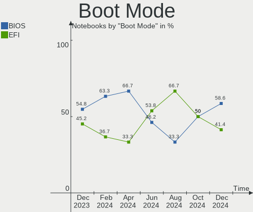
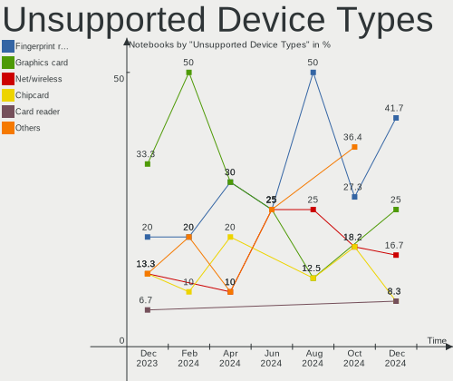

Xubuntu - Hardware Trends (Notebooks)
-------------------------------------

A project to identify most popular hardware characteristics and track their change
over time based on data collected by Linux users at https://Linux-Hardware.org.

Anyone can contribute to this report by the [hw-probe](https://github.com/linuxhw/hw-probe) tool:

    sudo -E hw-probe -all -upload

This report is for one last month. Overall report since the beginning of time: [TestDays](https://github.com/linuxhw/TestDays)

Period: Mar, 2023.

Contents
--------

* [ System ](#system)
  - [ OS                       ](#os)
  - [ OS Family                ](#os-family)
  - [ Kernel                   ](#kernel)
  - [ Kernel Family            ](#kernel-family)
  - [ Kernel Major Ver.        ](#kernel-major-ver)
  - [ Arch                     ](#arch)
  - [ DE                       ](#de)
  - [ Display Server           ](#display-server)
  - [ Display Manager          ](#display-manager)
  - [ OS Lang                  ](#os-lang)
  - [ Boot Mode                ](#boot-mode)
  - [ Filesystem               ](#filesystem)
  - [ Part. scheme             ](#part-scheme)
  - [ Dual Boot with Linux/BSD ](#dual-boot-with-linuxbsd)
  - [ Dual Boot (Win)          ](#dual-boot-win)

* [ Board ](#board)
  - [ Vendor                   ](#vendor)
  - [ Model                    ](#model)
  - [ Model Family             ](#model-family)
  - [ MFG Year                 ](#mfg-year)
  - [ Form Factor              ](#form-factor)
  - [ Secure Boot              ](#secure-boot)
  - [ Coreboot                 ](#coreboot)
  - [ RAM Size                 ](#ram-size)
  - [ RAM Used                 ](#ram-used)
  - [ Total Drives             ](#total-drives)
  - [ Has CD-ROM               ](#has-cd-rom)
  - [ Has Ethernet             ](#has-ethernet)
  - [ Has WiFi                 ](#has-wifi)
  - [ Has Bluetooth            ](#has-bluetooth)

* [ Location ](#location)
  - [ Country                  ](#country)
  - [ City                     ](#city)

* [ Drives ](#drives)
  - [ Drive Vendor             ](#drive-vendor)
  - [ Drive Model              ](#drive-model)
  - [ HDD Vendor               ](#hdd-vendor)
  - [ SSD Vendor               ](#ssd-vendor)
  - [ Drive Kind               ](#drive-kind)
  - [ Drive Connector          ](#drive-connector)
  - [ Drive Size               ](#drive-size)
  - [ Space Total              ](#space-total)
  - [ Space Used               ](#space-used)
  - [ Malfunc. Drives          ](#malfunc-drives)
  - [ Malfunc. Drive Vendor    ](#malfunc-drive-vendor)
  - [ Malfunc. HDD Vendor      ](#malfunc-hdd-vendor)
  - [ Malfunc. Drive Kind      ](#malfunc-drive-kind)
  - [ Failed Drives            ](#failed-drives)
  - [ Failed Drive Vendor      ](#failed-drive-vendor)
  - [ Drive Status             ](#drive-status)

* [ Storage controller ](#storage-controller)
  - [ Storage Vendor           ](#storage-vendor)
  - [ Storage Model            ](#storage-model)
  - [ Storage Kind             ](#storage-kind)

* [ Processor ](#processor)
  - [ CPU Vendor               ](#cpu-vendor)
  - [ CPU Model                ](#cpu-model)
  - [ CPU Model Family         ](#cpu-model-family)
  - [ CPU Cores                ](#cpu-cores)
  - [ CPU Sockets              ](#cpu-sockets)
  - [ CPU Threads              ](#cpu-threads)
  - [ CPU Op-Modes             ](#cpu-op-modes)
  - [ CPU Microcode            ](#cpu-microcode)
  - [ CPU Microarch            ](#cpu-microarch)

* [ Graphics ](#graphics)
  - [ GPU Vendor               ](#gpu-vendor)
  - [ GPU Model                ](#gpu-model)
  - [ GPU Combo                ](#gpu-combo)
  - [ GPU Driver               ](#gpu-driver)
  - [ GPU Memory               ](#gpu-memory)

* [ Monitor ](#monitor)
  - [ Monitor Vendor           ](#monitor-vendor)
  - [ Monitor Model            ](#monitor-model)
  - [ Monitor Resolution       ](#monitor-resolution)
  - [ Monitor Diagonal         ](#monitor-diagonal)
  - [ Monitor Width            ](#monitor-width)
  - [ Aspect Ratio             ](#aspect-ratio)
  - [ Monitor Area             ](#monitor-area)
  - [ Pixel Density            ](#pixel-density)
  - [ Multiple Monitors        ](#multiple-monitors)

* [ Network ](#network)
  - [ Net Controller Vendor    ](#net-controller-vendor)
  - [ Net Controller Model     ](#net-controller-model)
  - [ Wireless Vendor          ](#wireless-vendor)
  - [ Wireless Model           ](#wireless-model)
  - [ Ethernet Vendor          ](#ethernet-vendor)
  - [ Ethernet Model           ](#ethernet-model)
  - [ Net Controller Kind      ](#net-controller-kind)
  - [ Used Controller          ](#used-controller)
  - [ NICs                     ](#nics)
  - [ IPv6                     ](#ipv6)

* [ Bluetooth ](#bluetooth)
  - [ Bluetooth Vendor         ](#bluetooth-vendor)
  - [ Bluetooth Model          ](#bluetooth-model)

* [ Sound ](#sound)
  - [ Sound Vendor             ](#sound-vendor)
  - [ Sound Model              ](#sound-model)

* [ Memory ](#memory)
  - [ Memory Vendor            ](#memory-vendor)
  - [ Memory Model             ](#memory-model)
  - [ Memory Kind              ](#memory-kind)
  - [ Memory Form Factor       ](#memory-form-factor)
  - [ Memory Size              ](#memory-size)
  - [ Memory Speed             ](#memory-speed)

* [ Printers & scanners ](#printers--scanners)
  - [ Printer Vendor           ](#printer-vendor)
  - [ Printer Model            ](#printer-model)
  - [ Scanner Vendor           ](#scanner-vendor)
  - [ Scanner Model            ](#scanner-model)

* [ Camera ](#camera)
  - [ Camera Vendor            ](#camera-vendor)
  - [ Camera Model             ](#camera-model)

* [ Security ](#security)
  - [ Fingerprint Vendor       ](#fingerprint-vendor)
  - [ Fingerprint Model        ](#fingerprint-model)
  - [ Chipcard Vendor          ](#chipcard-vendor)
  - [ Chipcard Model           ](#chipcard-model)

* [ Unsupported ](#unsupported)
  - [ Unsupported Devices      ](#unsupported-devices)
  - [ Unsupported Device Types ](#unsupported-device-types)

System
------

OS
--

Installed operating systems

| Name          | Notebooks | Percent |
|---------------|-----------|---------|
| Xubuntu 22.04 | 17        | 51.52%  |
| Xubuntu 20.04 | 5         | 15.15%  |
| Xubuntu 18.04 | 5         | 15.15%  |
| Xubuntu 22.10 | 4         | 12.12%  |
| Xubuntu 16.04 | 2         | 6.06%   |

OS Family
---------

OS without a version

| Name    | Notebooks | Percent |
|---------|-----------|---------|
| Xubuntu | 33        | 100%    |

Kernel
------

Version of the Linux kernel

| Version                 | Notebooks | Percent |
|-------------------------|-----------|---------|
| 5.15.0-67-generic       | 9         | 27.27%  |
| 5.19.0-35-generic       | 7         | 21.21%  |
| 5.4.0-144-generic       | 3         | 9.09%   |
| 4.4.0-210-generic       | 2         | 6.06%   |
| 6.2.2-060202-generic    | 1         | 3.03%   |
| 5.4.209-0504209-generic | 1         | 3.03%   |
| 5.4.0-135-generic       | 1         | 3.03%   |
| 5.19.0-32-generic       | 1         | 3.03%   |
| 5.19.0-21-generic       | 1         | 3.03%   |
| 5.19.0-1018-lowlatency  | 1         | 3.03%   |
| 5.19.0-1017-lowlatency  | 1         | 3.03%   |
| 5.15.0-69-generic       | 1         | 3.03%   |
| 5.15.0-56-generic       | 1         | 3.03%   |
| 4.15.0-208-generic      | 1         | 3.03%   |
| 4.15.0-206-generic      | 1         | 3.03%   |
| 4.15.0-204-generic      | 1         | 3.03%   |

Kernel Family
-------------

Linux kernel without a distro release

| Version | Notebooks | Percent |
|---------|-----------|---------|
| 5.19.0  | 11        | 33.33%  |
| 5.15.0  | 11        | 33.33%  |
| 5.4.0   | 4         | 12.12%  |
| 4.15.0  | 3         | 9.09%   |
| 4.4.0   | 2         | 6.06%   |
| 6.2.2   | 1         | 3.03%   |
| 5.4.209 | 1         | 3.03%   |

Kernel Major Ver.
-----------------

Linux kernel major version

| Version | Notebooks | Percent |
|---------|-----------|---------|
| 5.19    | 11        | 33.33%  |
| 5.15    | 11        | 33.33%  |
| 5.4     | 5         | 15.15%  |
| 4.15    | 3         | 9.09%   |
| 4.4     | 2         | 6.06%   |
| 6.2     | 1         | 3.03%   |

Arch
----

OS architecture (x86_64, i586, etc.)

| Name   | Notebooks | Percent |
|--------|-----------|---------|
| x86_64 | 31        | 93.94%  |
| i686   | 2         | 6.06%   |

DE
--

Desktop Environment

| Name  | Notebooks | Percent |
|-------|-----------|---------|
| XFCE  | 30        | 90.91%  |
| GNOME | 2         | 6.06%   |
| i3    | 1         | 3.03%   |

Display Server
--------------

X11 or Wayland

| Name | Notebooks | Percent |
|------|-----------|---------|
| X11  | 33        | 100%    |

Display Manager
---------------

SDDM, LightDM, etc.

| Name    | Notebooks | Percent |
|---------|-----------|---------|
| LightDM | 30        | 90.91%  |
| SLiM    | 1         | 3.03%   |
| GDM3    | 1         | 3.03%   |
| Unknown | 1         | 3.03%   |

OS Lang
-------

Language

| Lang  | Notebooks | Percent |
|-------|-----------|---------|
| en_US | 16        | 48.48%  |
| de_DE | 5         | 15.15%  |
| ru_RU | 4         | 12.12%  |
| fr_FR | 3         | 9.09%   |
| zh_CN | 1         | 3.03%   |
| nl_NL | 1         | 3.03%   |
| it_IT | 1         | 3.03%   |
| es_MX | 1         | 3.03%   |
| C     | 1         | 3.03%   |

Boot Mode
---------

EFI or BIOS

| Mode | Notebooks | Percent |
|------|-----------|---------|
| BIOS | 19        | 57.58%  |
| EFI  | 14        | 42.42%  |

Filesystem
----------

Type of filesystem

| Type    | Notebooks | Percent |
|---------|-----------|---------|
| Ext4    | 29        | 87.88%  |
| Overlay | 2         | 6.06%   |
| Zfs     | 1         | 3.03%   |
| Btrfs   | 1         | 3.03%   |

Part. scheme
------------

Scheme of partitioning

| Type    | Notebooks | Percent |
|---------|-----------|---------|
| GPT     | 18        | 54.55%  |
| MBR     | 12        | 36.36%  |
| Unknown | 3         | 9.09%   |

Dual Boot with Linux/BSD
------------------------

Hosting more than one Linux/BSD

| Dual boot | Notebooks | Percent |
|-----------|-----------|---------|
| No        | 29        | 87.88%  |
| Yes       | 4         | 12.12%  |

Dual Boot (Win)
---------------

Hosting Linux and Windows

| Dual boot | Notebooks | Percent |
|-----------|-----------|---------|
| No        | 24        | 72.73%  |
| Yes       | 9         | 27.27%  |

Board
-----

Vendor
------

Motherboard manufacturer

| Name                | Notebooks | Percent |
|---------------------|-----------|---------|
| Lenovo              | 7         | 21.21%  |
| Hewlett-Packard     | 6         | 18.18%  |
| Toshiba             | 3         | 9.09%   |
| Gateway             | 2         | 6.06%   |
| Acer                | 2         | 6.06%   |
| TrekStor            | 1         | 3.03%   |
| Samsung Electronics | 1         | 3.03%   |
| Microtech           | 1         | 3.03%   |
| Medion              | 1         | 3.03%   |
| GPU Company         | 1         | 3.03%   |
| Google              | 1         | 3.03%   |
| Gigabyte Technology | 1         | 3.03%   |
| Getac               | 1         | 3.03%   |
| Fujitsu Siemens     | 1         | 3.03%   |
| Clevo               | 1         | 3.03%   |
| Chuwi               | 1         | 3.03%   |
| Apple               | 1         | 3.03%   |
| Unknown             | 1         | 3.03%   |

Model
-----

Motherboard model

| Name                                 | Notebooks | Percent |
|--------------------------------------|-----------|---------|
| TrekStor Notebook Slim S130          | 1         | 3.03%   |
| Toshiba Satellite L775               | 1         | 3.03%   |
| Toshiba Satellite L300               | 1         | 3.03%   |
| Toshiba Satellite C55D-B             | 1         | 3.03%   |
| Samsung RV408/RV508                  | 1         | 3.03%   |
| Microtech ebookPro                   | 1         | 3.03%   |
| Medion S321X                         | 1         | 3.03%   |
| Lenovo ThinkPad T530 2429LT7         | 1         | 3.03%   |
| Lenovo ThinkPad T510 4384VJZ         | 1         | 3.03%   |
| Lenovo ThinkPad E15 20RES05U00       | 1         | 3.03%   |
| Lenovo ThinkBook 13s-IML 20RR        | 1         | 3.03%   |
| Lenovo IdeaPad 5 15ABA7 82SG         | 1         | 3.03%   |
| Lenovo IdeaPad 330S-14AST 81F8       | 1         | 3.03%   |
| Lenovo G50-45 80E3                   | 1         | 3.03%   |
| HP Victus by Laptop 16-e0xxx         | 1         | 3.03%   |
| HP Pavilion x2 Detachable            | 1         | 3.03%   |
| HP Pavilion Gaming Laptop 15-dk0xxx  | 1         | 3.03%   |
| HP EliteBook 725 G2                  | 1         | 3.03%   |
| HP EliteBook 6930p                   | 1         | 3.03%   |
| HP Compaq Presario C700              | 1         | 3.03%   |
| GPU Company GWTN156-5                | 1         | 3.03%   |
| Google Kefka                         | 1         | 3.03%   |
| Gigabyte AERO 15WV8                  | 1         | 3.03%   |
| Getac F110G3                         | 1         | 3.03%   |
| Gateway LT27                         | 1         | 3.03%   |
| Gateway EC14 Series                  | 1         | 3.03%   |
| Fujitsu Siemens ESPRIMO Mobile V6535 | 1         | 3.03%   |
| Clevo W240EU/W250EUQ/W270EUQ         | 1         | 3.03%   |
| Chuwi CoreBook X                     | 1         | 3.03%   |
| Apple MacBookPro1,1                  | 1         | 3.03%   |
| Acer Aspire ES1-572                  | 1         | 3.03%   |
| Acer Aspire A315-43                  | 1         | 3.03%   |
| Unknown                              | 1         | 3.03%   |

Model Family
------------

Motherboard model prefix

| Name                    | Notebooks | Percent |
|-------------------------|-----------|---------|
| Toshiba Satellite       | 3         | 9.09%   |
| Lenovo ThinkPad         | 3         | 9.09%   |
| Lenovo IdeaPad          | 2         | 6.06%   |
| HP Pavilion             | 2         | 6.06%   |
| HP EliteBook            | 2         | 6.06%   |
| Acer Aspire             | 2         | 6.06%   |
| TrekStor Notebook       | 1         | 3.03%   |
| Samsung RV408           | 1         | 3.03%   |
| Microtech ebookPro      | 1         | 3.03%   |
| Medion S321X            | 1         | 3.03%   |
| Lenovo ThinkBook        | 1         | 3.03%   |
| Lenovo G50-45           | 1         | 3.03%   |
| HP Victus               | 1         | 3.03%   |
| HP Compaq               | 1         | 3.03%   |
| GPU Company GWTN156-5   | 1         | 3.03%   |
| Google Kefka            | 1         | 3.03%   |
| Gigabyte AERO           | 1         | 3.03%   |
| Getac F110G3            | 1         | 3.03%   |
| Gateway LT27            | 1         | 3.03%   |
| Gateway EC14            | 1         | 3.03%   |
| Fujitsu Siemens ESPRIMO | 1         | 3.03%   |
| Clevo W240EU            | 1         | 3.03%   |
| Chuwi CoreBook          | 1         | 3.03%   |
| Apple MacBookPro1       | 1         | 3.03%   |
| Unknown                 | 1         | 3.03%   |

MFG Year
--------

Motherboard manufacture year

| Year | Notebooks | Percent |
|------|-----------|---------|
| 2018 | 4         | 12.12%  |
| 2021 | 3         | 9.09%   |
| 2019 | 3         | 9.09%   |
| 2014 | 3         | 9.09%   |
| 2009 | 3         | 9.09%   |
| 2008 | 3         | 9.09%   |
| 2022 | 2         | 6.06%   |
| 2016 | 2         | 6.06%   |
| 2012 | 2         | 6.06%   |
| 2011 | 2         | 6.06%   |
| 2023 | 1         | 3.03%   |
| 2020 | 1         | 3.03%   |
| 2015 | 1         | 3.03%   |
| 2010 | 1         | 3.03%   |
| 2007 | 1         | 3.03%   |
| 2006 | 1         | 3.03%   |

Form Factor
-----------

Physical design of the computer

| Name     | Notebooks | Percent |
|----------|-----------|---------|
| Notebook | 33        | 100%    |

Secure Boot
-----------

Enabled or disabled

| State    | Notebooks | Percent |
|----------|-----------|---------|
| Disabled | 30        | 90.91%  |
| Enabled  | 3         | 9.09%   |

Coreboot
--------

Have coreboot on board

| Used | Notebooks | Percent |
|------|-----------|---------|
| No   | 32        | 96.97%  |
| Yes  | 1         | 3.03%   |

RAM Size
--------

Total RAM memory

| Size in GB | Notebooks | Percent |
|------------|-----------|---------|
| 3.01-4.0   | 12        | 36.36%  |
| 4.01-8.0   | 7         | 21.21%  |
| 1.01-2.0   | 5         | 15.15%  |
| 8.01-16.0  | 4         | 12.12%  |
| 32.01-64.0 | 2         | 6.06%   |
| 16.01-24.0 | 2         | 6.06%   |
| 0.51-1.0   | 1         | 3.03%   |

RAM Used
--------

Used RAM memory

| Used GB   | Notebooks | Percent |
|-----------|-----------|---------|
| 1.01-2.0  | 15        | 45.45%  |
| 2.01-3.0  | 6         | 18.18%  |
| 0.51-1.0  | 5         | 15.15%  |
| 4.01-8.0  | 2         | 6.06%   |
| 3.01-4.0  | 2         | 6.06%   |
| 8.01-16.0 | 2         | 6.06%   |
| 0.01-0.5  | 1         | 3.03%   |

Total Drives
------------

Number of drives on board

| Drives | Notebooks | Percent |
|--------|-----------|---------|
| 1      | 24        | 72.73%  |
| 2      | 5         | 15.15%  |
| 3      | 3         | 9.09%   |
| 0      | 1         | 3.03%   |

Has CD-ROM
----------

Has CD-ROM on board

| Presented | Notebooks | Percent |
|-----------|-----------|---------|
| No        | 21        | 63.64%  |
| Yes       | 12        | 36.36%  |

Has Ethernet
------------

Has Ethernet on board

| Presented | Notebooks | Percent |
|-----------|-----------|---------|
| Yes       | 25        | 75.76%  |
| No        | 8         | 24.24%  |

Has WiFi
--------

Has WiFi module

| Presented | Notebooks | Percent |
|-----------|-----------|---------|
| Yes       | 33        | 100%    |

Has Bluetooth
-------------

Has Bluetooth module

| Presented | Notebooks | Percent |
|-----------|-----------|---------|
| Yes       | 25        | 75.76%  |
| No        | 8         | 24.24%  |

Location
--------

Country
-------

Geographic location (country)

| Country     | Notebooks | Percent |
|-------------|-----------|---------|
| USA         | 8         | 24.24%  |
| Russia      | 5         | 15.15%  |
| Germany     | 5         | 15.15%  |
| Italy       | 3         | 9.09%   |
| France      | 3         | 9.09%   |
| Netherlands | 2         | 6.06%   |
| Vietnam     | 1         | 3.03%   |
| Turkey      | 1         | 3.03%   |
| Spain       | 1         | 3.03%   |
| Panama      | 1         | 3.03%   |
| Mexico      | 1         | 3.03%   |
| China       | 1         | 3.03%   |
| Australia   | 1         | 3.03%   |

City
----

Geographic location (city)

| City              | Notebooks | Percent |
|-------------------|-----------|---------|
| Springfield       | 2         | 6.06%   |
| Nizhniy Novgorod  | 2         | 6.06%   |
| Lincoln           | 2         | 6.06%   |
| Yekaterinburg     | 1         | 3.03%   |
| Tulsa             | 1         | 3.03%   |
| Tours             | 1         | 3.03%   |
| Toulon            | 1         | 3.03%   |
| Spokane           | 1         | 3.03%   |
| Shanghai          | 1         | 3.03%   |
| Saratov           | 1         | 3.03%   |
| Samara            | 1         | 3.03%   |
| Puebla City       | 1         | 3.03%   |
| Pisa              | 1         | 3.03%   |
| Pinseque          | 1         | 3.03%   |
| Perth             | 1         | 3.03%   |
| Panama City       | 1         | 3.03%   |
| Padova            | 1         | 3.03%   |
| Oberhausen        | 1         | 3.03%   |
| North Versailles  | 1         | 3.03%   |
| Nieder-Olm        | 1         | 3.03%   |
| Munich            | 1         | 3.03%   |
| Milano            | 1         | 3.03%   |
| Meitingen         | 1         | 3.03%   |
| Madison           | 1         | 3.03%   |
| Izmir             | 1         | 3.03%   |
| Hellevoetsluis    | 1         | 3.03%   |
| Heerlen           | 1         | 3.03%   |
| Hanoi             | 1         | 3.03%   |
| Gelsenkirchen     | 1         | 3.03%   |
| Châtenay-Malabry | 1         | 3.03%   |

Drives
------

Drive Vendor
------------

Hard drive vendors

| Vendor              | Notebooks | Drives | Percent |
|---------------------|-----------|--------|---------|
| Unknown             | 7         | 7      | 17.95%  |
| Samsung Electronics | 5         | 6      | 12.82%  |
| Seagate             | 4         | 4      | 10.26%  |
| Toshiba             | 3         | 3      | 7.69%   |
| WDC                 | 2         | 2      | 5.13%   |
| SPCC                | 2         | 2      | 5.13%   |
| Sandisk             | 2         | 2      | 5.13%   |
| Micron Technology   | 2         | 2      | 5.13%   |
| Hitachi             | 2         | 2      | 5.13%   |
| WDC WDS1            | 1         | 1      | 2.56%   |
| Team                | 1         | 1      | 2.56%   |
| SK hynix            | 1         | 1      | 2.56%   |
| Plextor             | 1         | 1      | 2.56%   |
| Netac               | 1         | 1      | 2.56%   |
| Microtech           | 1         | 1      | 2.56%   |
| Fujitsu             | 1         | 1      | 2.56%   |
| FORESEE             | 1         | 1      | 2.56%   |
| Crucial             | 1         | 1      | 2.56%   |
| China               | 1         | 1      | 2.56%   |

Drive Model
-----------

Hard drive models

| Model                                 | Notebooks | Percent |
|---------------------------------------|-----------|---------|
| Unknown MMC Card  32GB                | 2         | 5%      |
| WDC WDS1 00T2G0A-00JH30 1TB SSD       | 1         | 2.5%    |
| WDC WD5000BEVT-00ZAT0 500GB           | 1         | 2.5%    |
| WDC PC SN520 SDAPMUW-256G-1101 256GB  | 1         | 2.5%    |
| Unknown SC32G  32GB                   | 1         | 2.5%    |
| Unknown NCard  64GB                   | 1         | 2.5%    |
| Unknown MMC Card  128GB               | 1         | 2.5%    |
| Unknown DF4016  16GB                  | 1         | 2.5%    |
| Unknown 16M                           | 1         | 2.5%    |
| Toshiba MQ04ABF100 1TB                | 1         | 2.5%    |
| Toshiba MQ01ABD100 1TB                | 1         | 2.5%    |
| Toshiba MK1665GSX 160GB               | 1         | 2.5%    |
| Team TM8PS7512G 512GB SSD             | 1         | 2.5%    |
| SPCC Solid State Disk 512GB           | 1         | 2.5%    |
| SPCC M.2 SSD 1TB                      | 1         | 2.5%    |
| SK hynix HFS128G32TNF-N3A0A 128GB SSD | 1         | 2.5%    |
| Seagate ST320LM001 HN-M320MBB 320GB   | 1         | 2.5%    |
| Seagate ST250LM004 HN-M250MBB 250GB   | 1         | 2.5%    |
| Seagate ST2000LM003 HN-M201RAD 2TB    | 1         | 2.5%    |
| Seagate ST1000LM024 HN-M101MBB 1TB    | 1         | 2.5%    |
| SanDisk SDSSDA240G 240GB              | 1         | 2.5%    |
| Sandisk PC SN520 NVMe SSD 128GB       | 1         | 2.5%    |
| Samsung SSD 870 QVO 4TB               | 1         | 2.5%    |
| Samsung SSD 870 QVO 2TB               | 1         | 2.5%    |
| Samsung SSD 850 EVO 250GB             | 1         | 2.5%    |
| Samsung MZVLQ512HBLU-00B00 512GB      | 1         | 2.5%    |
| Samsung MZ7PD128HCFV-000H1 128GB SSD  | 1         | 2.5%    |
| Samsung HM321HI 320GB                 | 1         | 2.5%    |
| Plextor PH6-CE120 120GB SSD           | 1         | 2.5%    |
| Netac SSD 512GB                       | 1         | 2.5%    |
| Microtech SSD480M2S80 480GB           | 1         | 2.5%    |
| Micron MTFDKCD512TFK 512GB            | 1         | 2.5%    |
| Micron MTFDHBA512TDV-1AZ1AABHA 512GB  | 1         | 2.5%    |
| Hitachi HTS543232A7A384 320GB         | 1         | 2.5%    |
| Hitachi HTS541612J9SA00 120GB         | 1         | 2.5%    |
| Fujitsu MHZ2250BH G2 250GB            | 1         | 2.5%    |
| FORESEE 256GB SSD                     | 1         | 2.5%    |
| Crucial CT1000P2SSD8 1TB              | 1         | 2.5%    |
| China SSD 512GB                       | 1         | 2.5%    |

HDD Vendor
----------

Hard disk drive vendors

| Vendor              | Notebooks | Drives | Percent |
|---------------------|-----------|--------|---------|
| Seagate             | 4         | 4      | 33.33%  |
| Toshiba             | 3         | 3      | 25%     |
| Hitachi             | 2         | 2      | 16.67%  |
| WDC                 | 1         | 1      | 8.33%   |
| Samsung Electronics | 1         | 1      | 8.33%   |
| Fujitsu             | 1         | 1      | 8.33%   |

SSD Vendor
----------

Solid state drive vendors

| Vendor              | Notebooks | Drives | Percent |
|---------------------|-----------|--------|---------|
| Samsung Electronics | 3         | 4      | 21.43%  |
| SPCC                | 2         | 2      | 14.29%  |
| WDC WDS1            | 1         | 1      | 7.14%   |
| Team                | 1         | 1      | 7.14%   |
| SK hynix            | 1         | 1      | 7.14%   |
| SanDisk             | 1         | 1      | 7.14%   |
| Plextor             | 1         | 1      | 7.14%   |
| Netac               | 1         | 1      | 7.14%   |
| Microtech           | 1         | 1      | 7.14%   |
| FORESEE             | 1         | 1      | 7.14%   |
| China               | 1         | 1      | 7.14%   |

Drive Kind
----------

HDD or SSD

| Kind | Notebooks | Drives | Percent |
|------|-----------|--------|---------|
| SSD  | 13        | 15     | 34.21%  |
| HDD  | 12        | 12     | 31.58%  |
| MMC  | 7         | 7      | 18.42%  |
| NVMe | 6         | 6      | 15.79%  |

Drive Connector
---------------

SATA, SAS, NVMe, etc.

| Type | Notebooks | Drives | Percent |
|------|-----------|--------|---------|
| SATA | 24        | 25     | 61.54%  |
| MMC  | 7         | 7      | 17.95%  |
| NVMe | 6         | 6      | 15.38%  |
| SAS  | 2         | 2      | 5.13%   |

Drive Size
----------

Size of hard drive

| Size in TB | Notebooks | Drives | Percent |
|------------|-----------|--------|---------|
| 0.01-0.5   | 15        | 15     | 55.56%  |
| 0.51-1.0   | 9         | 9      | 33.33%  |
| 1.01-2.0   | 2         | 2      | 7.41%   |
| 3.01-4.0   | 1         | 1      | 3.7%    |

Space Total
-----------

Amount of disk space available on the file system

| Size in GB     | Notebooks | Percent |
|----------------|-----------|---------|
| 101-250        | 10        | 30.3%   |
| 251-500        | 9         | 27.27%  |
| 1-20           | 3         | 9.09%   |
| 501-1000       | 3         | 9.09%   |
| 51-100         | 3         | 9.09%   |
| 21-50          | 2         | 6.06%   |
| 1001-2000      | 2         | 6.06%   |
| More than 3000 | 1         | 3.03%   |

Space Used
----------

Amount of used disk space

| Used GB        | Notebooks | Percent |
|----------------|-----------|---------|
| 1-20           | 14        | 42.42%  |
| 21-50          | 8         | 24.24%  |
| 101-250        | 5         | 15.15%  |
| 251-500        | 2         | 6.06%   |
| 51-100         | 2         | 6.06%   |
| More than 3000 | 1         | 3.03%   |
| 501-1000       | 1         | 3.03%   |

Malfunc. Drives
---------------

Drive models with a malfunction

| Model                              | Notebooks | Drives | Percent |
|------------------------------------|-----------|--------|---------|
| Toshiba MK1665GSX 160GB            | 1         | 1      | 25%     |
| Seagate ST1000LM024 HN-M101MBB 1TB | 1         | 1      | 25%     |
| Samsung Electronics HM321HI 320GB  | 1         | 1      | 25%     |
| Fujitsu MHZ2250BH G2 250GB         | 1         | 1      | 25%     |

Malfunc. Drive Vendor
---------------------

Vendors of faulty drives

| Vendor              | Notebooks | Drives | Percent |
|---------------------|-----------|--------|---------|
| Toshiba             | 1         | 1      | 25%     |
| Seagate             | 1         | 1      | 25%     |
| Samsung Electronics | 1         | 1      | 25%     |
| Fujitsu             | 1         | 1      | 25%     |

Malfunc. HDD Vendor
-------------------

Vendors of faulty HDD drives

| Vendor              | Notebooks | Drives | Percent |
|---------------------|-----------|--------|---------|
| Toshiba             | 1         | 1      | 25%     |
| Seagate             | 1         | 1      | 25%     |
| Samsung Electronics | 1         | 1      | 25%     |
| Fujitsu             | 1         | 1      | 25%     |

Malfunc. Drive Kind
-------------------

Kinds of faulty drives

| Kind | Notebooks | Drives | Percent |
|------|-----------|--------|---------|
| HDD  | 4         | 4      | 100%    |

Failed Drives
-------------

Failed drive models

Zero info for selected period =(

Failed Drive Vendor
-------------------

Failed drive vendors

Zero info for selected period =(

Drive Status
------------

Number of failed and malfunc. drives

| Status   | Notebooks | Drives | Percent |
|----------|-----------|--------|---------|
| Detected | 19        | 24     | 55.88%  |
| Works    | 11        | 12     | 32.35%  |
| Malfunc  | 4         | 4      | 11.76%  |

Storage controller
------------------

Storage Vendor
--------------

Storage controller vendors

| Vendor                    | Notebooks | Percent |
|---------------------------|-----------|---------|
| Intel                     | 21        | 60%     |
| AMD                       | 7         | 20%     |
| SanDisk                   | 2         | 5.71%   |
| Samsung Electronics       | 2         | 5.71%   |
| Micron Technology         | 2         | 5.71%   |
| Micron/Crucial Technology | 1         | 2.86%   |

Storage Model
-------------

Storage controller models

| Model                                                                        | Notebooks | Percent |
|------------------------------------------------------------------------------|-----------|---------|
| AMD FCH SATA Controller [AHCI mode]                                          | 6         | 15.79%  |
| Intel 82801IBM/IEM (ICH9M/ICH9M-E) 4 port SATA Controller [AHCI mode]        | 5         | 13.16%  |
| Intel Celeron/Pentium Silver Processor SATA Controller                       | 3         | 7.89%   |
| SanDisk PC SN520 NVMe SSD                                                    | 2         | 5.26%   |
| Micron NVMe Storage Controller                                               | 2         | 5.26%   |
| Intel Sunrise Point-LP SATA Controller [AHCI mode]                           | 2         | 5.26%   |
| Intel 7 Series Chipset Family 6-port SATA Controller [AHCI mode]             | 2         | 5.26%   |
| Samsung NVMe SSD Controller SM981/PM981/PM983                                | 1         | 2.63%   |
| Samsung NVMe SSD Controller 980                                              | 1         | 2.63%   |
| Micron/Crucial P2 NVMe PCIe SSD                                              | 1         | 2.63%   |
| Intel NM10/ICH7 Family SATA Controller [AHCI mode]                           | 1         | 2.63%   |
| Intel Mobile 4 Series Chipset PT IDER Controller                             | 1         | 2.63%   |
| Intel Comet Lake SATA AHCI Controller                                        | 1         | 2.63%   |
| Intel Cannon Point-LP SATA Controller [AHCI Mode]                            | 1         | 2.63%   |
| Intel 82801IBM/IEM (ICH9M/ICH9M-E) 2 port SATA Controller [IDE mode]         | 1         | 2.63%   |
| Intel 82801HM/HEM (ICH8M/ICH8M-E) SATA Controller [AHCI mode]                | 1         | 2.63%   |
| Intel 82801HM/HEM (ICH8M/ICH8M-E) IDE Controller                             | 1         | 2.63%   |
| Intel 82801GBM/GHM (ICH7-M Family) SATA Controller [IDE mode]                | 1         | 2.63%   |
| Intel 82801G (ICH7 Family) IDE Controller                                    | 1         | 2.63%   |
| Intel 82801 Mobile SATA Controller [RAID mode]                               | 1         | 2.63%   |
| Intel 6 Series/C200 Series Chipset Family 6 port Mobile SATA AHCI Controller | 1         | 2.63%   |
| Intel 5 Series/3400 Series Chipset 6 port SATA AHCI Controller               | 1         | 2.63%   |
| AMD FCH SATA Controller [IDE mode]                                           | 1         | 2.63%   |

Storage Kind
------------

Kind of storage controller (IDE, SATA, NVMe, SAS, ...)

| Kind | Notebooks | Percent |
|------|-----------|---------|
| SATA | 25        | 69.44%  |
| NVMe | 7         | 19.44%  |
| IDE  | 3         | 8.33%   |
| RAID | 1         | 2.78%   |

Processor
---------

CPU Vendor
----------

Processor vendors

| Vendor | Notebooks | Percent |
|--------|-----------|---------|
| Intel  | 25        | 75.76%  |
| AMD    | 8         | 24.24%  |

CPU Model
---------

Processor models

| Model                                         | Notebooks | Percent |
|-----------------------------------------------|-----------|---------|
| Intel Pentium Silver N5000 CPU @ 1.10GHz      | 1         | 3.03%   |
| Intel Pentium Dual-Core CPU T4200 @ 2.00GHz   | 1         | 3.03%   |
| Intel Pentium Dual CPU T3400 @ 2.16GHz        | 1         | 3.03%   |
| Intel Pentium Dual CPU T2370 @ 1.73GHz        | 1         | 3.03%   |
| Intel Pentium CPU B960 @ 2.20GHz              | 1         | 3.03%   |
| Intel Pentium CPU B950 @ 2.10GHz              | 1         | 3.03%   |
| Intel Genuine CPU U2300 @ 1.20GHz             | 1         | 3.03%   |
| Intel Genuine CPU T2600 @ 2.16GHz             | 1         | 3.03%   |
| Intel Core i7-8750H CPU @ 2.20GHz             | 1         | 3.03%   |
| Intel Core i7-10510U CPU @ 1.80GHz            | 1         | 3.03%   |
| Intel Core i7 CPU M 620 @ 2.67GHz             | 1         | 3.03%   |
| Intel Core i5-9300H CPU @ 2.40GHz             | 1         | 3.03%   |
| Intel Core i5-8259U CPU @ 2.30GHz             | 1         | 3.03%   |
| Intel Core i5-6200U CPU @ 2.30GHz             | 1         | 3.03%   |
| Intel Core i5-3210M CPU @ 2.50GHz             | 1         | 3.03%   |
| Intel Core i5-10210U CPU @ 1.60GHz            | 1         | 3.03%   |
| Intel Core i3-6006U CPU @ 2.00GHz             | 1         | 3.03%   |
| Intel Core 2 Duo CPU T9550 @ 2.66GHz          | 1         | 3.03%   |
| Intel Celeron N4120 CPU @ 1.10GHz             | 1         | 3.03%   |
| Intel Celeron N4000 CPU @ 1.10GHz             | 1         | 3.03%   |
| Intel Celeron Dual-Core CPU T3500 @ 2.10GHz   | 1         | 3.03%   |
| Intel Celeron CPU N3060 @ 1.60GHz             | 1         | 3.03%   |
| Intel Celeron CPU 743 @ 1.30GHz               | 1         | 3.03%   |
| Intel Atom x5-Z8300 CPU @ 1.44GHz             | 1         | 3.03%   |
| Intel Atom CPU N455 @ 1.66GHz                 | 1         | 3.03%   |
| AMD Ryzen 7 5800H with Radeon Graphics        | 1         | 3.03%   |
| AMD Ryzen 5 5625U with Radeon Graphics        | 1         | 3.03%   |
| AMD Ryzen 5 5500U with Radeon Graphics        | 1         | 3.03%   |
| AMD Ryzen 5 3450U with Radeon Vega Mobile Gfx | 1         | 3.03%   |
| AMD E1-6010 APU with AMD Radeon R2 Graphics   | 1         | 3.03%   |
| AMD A9-9425 RADEON R5, 5 COMPUTE CORES 2C+3G  | 1         | 3.03%   |
| AMD A8-6410 APU with AMD Radeon R5 Graphics   | 1         | 3.03%   |
| AMD A8 PRO-7150B R5, 10 Compute Cores 4C+6G   | 1         | 3.03%   |

CPU Model Family
----------------

Processor model prefix

| Model                   | Notebooks | Percent |
|-------------------------|-----------|---------|
| Intel Core i5           | 5         | 15.15%  |
| Intel Celeron           | 4         | 12.12%  |
| Intel Core i7           | 3         | 9.09%   |
| AMD Ryzen 5             | 3         | 9.09%   |
| Intel Pentium Dual      | 2         | 6.06%   |
| Intel Pentium           | 2         | 6.06%   |
| Intel Genuine           | 2         | 6.06%   |
| Intel Atom              | 2         | 6.06%   |
| AMD A8                  | 2         | 6.06%   |
| Other                   | 1         | 3.03%   |
| Intel Pentium Silver    | 1         | 3.03%   |
| Intel Pentium Dual-Core | 1         | 3.03%   |
| Intel Core i3           | 1         | 3.03%   |
| Intel Core 2 Duo        | 1         | 3.03%   |
| Intel Celeron Dual-Core | 1         | 3.03%   |
| AMD Ryzen 7             | 1         | 3.03%   |
| AMD E1                  | 1         | 3.03%   |

CPU Cores
---------

Number of processor cores

| Number | Notebooks | Percent |
|--------|-----------|---------|
| 2      | 18        | 54.55%  |
| 4      | 9         | 27.27%  |
| 6      | 3         | 9.09%   |
| 1      | 2         | 6.06%   |
| 8      | 1         | 3.03%   |

CPU Sockets
-----------

Number of sockets

| Number | Notebooks | Percent |
|--------|-----------|---------|
| 1      | 33        | 100%    |

CPU Threads
-----------

Threads per core (Hyper-Threading)

| Number | Notebooks | Percent |
|--------|-----------|---------|
| 1      | 18        | 54.55%  |
| 2      | 15        | 45.45%  |

CPU Op-Modes
------------

CPU Operation Modes (32-bit, 64-bit)

| Op mode        | Notebooks | Percent |
|----------------|-----------|---------|
| 32-bit, 64-bit | 32        | 96.97%  |
| 32-bit         | 1         | 3.03%   |

CPU Microcode
-------------

Microcode number

| Number     | Notebooks | Percent |
|------------|-----------|---------|
| Unknown    | 9         | 27.27%  |
| 0x1067a    | 3         | 9.09%   |
| 0x706a1    | 2         | 6.06%   |
| 0x6fd      | 2         | 6.06%   |
| 0x406e3    | 2         | 6.06%   |
| 0x07030105 | 2         | 6.06%   |
| 0x906ea    | 1         | 3.03%   |
| 0x806ec    | 1         | 3.03%   |
| 0x806ea    | 1         | 3.03%   |
| 0x706a8    | 1         | 3.03%   |
| 0x6e8      | 1         | 3.03%   |
| 0x406c4    | 1         | 3.03%   |
| 0x406c3    | 1         | 3.03%   |
| 0x306a9    | 1         | 3.03%   |
| 0x20655    | 1         | 3.03%   |
| 0x106ca    | 1         | 3.03%   |
| 0x0a50000c | 1         | 3.03%   |
| 0x08608102 | 1         | 3.03%   |
| 0x06006705 | 1         | 3.03%   |

CPU Microarch
-------------

Microarchitecture

| Name          | Notebooks | Percent |
|---------------|-----------|---------|
| Penryn        | 5         | 15.15%  |
| KabyLake      | 5         | 15.15%  |
| Goldmont plus | 3         | 9.09%   |
| Zen 3         | 2         | 6.06%   |
| Skylake       | 2         | 6.06%   |
| Silvermont    | 2         | 6.06%   |
| SandyBridge   | 2         | 6.06%   |
| Puma          | 2         | 6.06%   |
| Core          | 2         | 6.06%   |
| Zen+          | 1         | 3.03%   |
| Westmere      | 1         | 3.03%   |
| Steamroller   | 1         | 3.03%   |
| P6            | 1         | 3.03%   |
| IvyBridge     | 1         | 3.03%   |
| Excavator     | 1         | 3.03%   |
| Bonnell       | 1         | 3.03%   |
| Unknown       | 1         | 3.03%   |

Graphics
--------

GPU Vendor
----------

Vendors of graphics cards

| Vendor | Notebooks | Percent |
|--------|-----------|---------|
| Intel  | 22        | 61.11%  |
| AMD    | 10        | 27.78%  |
| Nvidia | 4         | 11.11%  |

GPU Model
---------

Graphics card models

| Model                                                                                    | Notebooks | Percent |
|------------------------------------------------------------------------------------------|-----------|---------|
| Intel Mobile 4 Series Chipset Integrated Graphics Controller                             | 5         | 13.16%  |
| Nvidia TU117M [GeForce GTX 1650 Mobile / Max-Q]                                          | 2         | 5.26%   |
| Intel Skylake GT2 [HD Graphics 520]                                                      | 2         | 5.26%   |
| Intel GeminiLake [UHD Graphics 600]                                                      | 2         | 5.26%   |
| Intel CometLake-U GT2 [UHD Graphics]                                                     | 2         | 5.26%   |
| Intel CoffeeLake-H GT2 [UHD Graphics 630]                                                | 2         | 5.26%   |
| Intel Atom/Celeron/Pentium Processor x5-E8000/J3xxx/N3xxx Integrated Graphics Controller | 2         | 5.26%   |
| Intel 2nd Generation Core Processor Family Integrated Graphics Controller                | 2         | 5.26%   |
| Nvidia GT218M [NVS 3100M]                                                                | 1         | 2.63%   |
| Nvidia GP106M [GeForce GTX 1060 Mobile]                                                  | 1         | 2.63%   |
| Intel Mobile GM965/GL960 Integrated Graphics Controller (secondary)                      | 1         | 2.63%   |
| Intel Mobile GM965/GL960 Integrated Graphics Controller (primary)                        | 1         | 2.63%   |
| Intel GeminiLake [UHD Graphics 605]                                                      | 1         | 2.63%   |
| Intel CoffeeLake-U GT3e [Iris Plus Graphics 655]                                         | 1         | 2.63%   |
| Intel Atom Processor D4xx/D5xx/N4xx/N5xx Integrated Graphics Controller                  | 1         | 2.63%   |
| Intel 3rd Gen Core processor Graphics Controller                                         | 1         | 2.63%   |
| AMD Sun LE [Radeon HD 8550M / R5 M230]                                                   | 1         | 2.63%   |
| AMD Stoney [Radeon R2/R3/R4/R5 Graphics]                                                 | 1         | 2.63%   |
| AMD RV620/M82 [Mobility Radeon HD 3450/3470]                                             | 1         | 2.63%   |
| AMD RV530/M56-P [Mobility Radeon X1600]                                                  | 1         | 2.63%   |
| AMD Picasso/Raven 2 [Radeon Vega Series / Radeon Vega Mobile Series]                     | 1         | 2.63%   |
| AMD Mullins [Radeon R4/R5 Graphics]                                                      | 1         | 2.63%   |
| AMD Mullins [Radeon R2 Graphics]                                                         | 1         | 2.63%   |
| AMD Lucienne                                                                             | 1         | 2.63%   |
| AMD Kaveri [Radeon R6 Graphics]                                                          | 1         | 2.63%   |
| AMD Cezanne [Radeon Vega Series / Radeon Vega Mobile Series]                             | 1         | 2.63%   |
| AMD Barcelo                                                                              | 1         | 2.63%   |

GPU Combo
---------

Combinations of graphics cards

| Name           | Notebooks | Percent |
|----------------|-----------|---------|
| 1 x Intel      | 20        | 60.61%  |
| 1 x AMD        | 8         | 24.24%  |
| Intel + Nvidia | 2         | 6.06%   |
| 2 x AMD        | 1         | 3.03%   |
| 1 x Nvidia     | 1         | 3.03%   |
| AMD + Nvidia   | 1         | 3.03%   |

GPU Driver
----------

Free vs proprietary

| Driver      | Notebooks | Percent |
|-------------|-----------|---------|
| Free        | 31        | 93.94%  |
| Proprietary | 2         | 6.06%   |

GPU Memory
----------

Total video memory

| Size in GB | Notebooks | Percent |
|------------|-----------|---------|
| Unknown    | 19        | 57.58%  |
| 0.01-0.5   | 6         | 18.18%  |
| 1.01-2.0   | 3         | 9.09%   |
| 0.51-1.0   | 3         | 9.09%   |
| 5.01-6.0   | 1         | 3.03%   |
| 3.01-4.0   | 1         | 3.03%   |

Monitor
-------

Monitor Vendor
--------------

Monitor vendors

| Vendor                  | Notebooks | Percent |
|-------------------------|-----------|---------|
| AU Optronics            | 8         | 21.05%  |
| BOE                     | 6         | 15.79%  |
| LG Display              | 4         | 10.53%  |
| Chimei Innolux          | 4         | 10.53%  |
| Samsung Electronics     | 3         | 7.89%   |
| LG Philips              | 2         | 5.26%   |
| ViewSonic               | 1         | 2.63%   |
| Olevia                  | 1         | 2.63%   |
| Lenovo                  | 1         | 2.63%   |
| InfoVision              | 1         | 2.63%   |
| Iiyama                  | 1         | 2.63%   |
| HUAWEI                  | 1         | 2.63%   |
| Dell                    | 1         | 2.63%   |
| Chi Mei Optoelectronics | 1         | 2.63%   |
| Apple                   | 1         | 2.63%   |
| AOC                     | 1         | 2.63%   |
| Acer                    | 1         | 2.63%   |

Monitor Model
-------------

Monitor models

| Model                                                                    | Notebooks | Percent |
|--------------------------------------------------------------------------|-----------|---------|
| ViewSonic VX3209-2K VSC328E 2560x1440 698x393mm 31.5-inch                | 1         | 2.63%   |
| Samsung Electronics LCD Monitor SEC3245 1366x768 344x194mm 15.5-inch     | 1         | 2.63%   |
| Samsung Electronics LCD Monitor SEC3152 1366x768 344x194mm 15.5-inch     | 1         | 2.63%   |
| Samsung Electronics LCD Monitor SEC3052 1366x768 256x144mm 11.6-inch     | 1         | 2.63%   |
| Olevia Non-PnP SYN3000 1920x1080 530x290mm 23.8-inch                     | 1         | 2.63%   |
| LG Philips LCD Monitor LPLA101 1440x900 367x230mm 17.1-inch              | 1         | 2.63%   |
| LG Philips LCD Monitor LPL1E01 1280x800 331x207mm 15.4-inch              | 1         | 2.63%   |
| LG Display LCD Monitor LGD05EC 1920x1080 309x174mm 14.0-inch             | 1         | 2.63%   |
| LG Display LCD Monitor LGD05C0 1920x1080 344x194mm 15.5-inch             | 1         | 2.63%   |
| LG Display LCD Monitor LGD033B 1366x768 344x194mm 15.5-inch              | 1         | 2.63%   |
| LG Display LCD Monitor LGD02F7 1600x900 382x215mm 17.3-inch              | 1         | 2.63%   |
| Lenovo LCD Monitor LEN40B1 1600x900 344x194mm 15.5-inch                  | 1         | 2.63%   |
| InfoVision LCD Monitor IVO03F4 1920x1080 344x193mm 15.5-inch             | 1         | 2.63%   |
| Iiyama PLX2783H IVM6611 1920x1080 598x336mm 27.0-inch                    | 1         | 2.63%   |
| HUAWEI AD80HW HWV2402 1920x1080 527x296mm 23.8-inch                      | 1         | 2.63%   |
| Dell E157FPT DEL7400 1024x768 300x230mm 14.9-inch                        | 1         | 2.63%   |
| Chimei Innolux P140ZKA-BZ1 CMN8C02 2160x1440 296x197mm 14.0-inch         | 1         | 2.63%   |
| Chimei Innolux LCD Monitor CMN160A 1920x1080 355x199mm 16.0-inch         | 1         | 2.63%   |
| Chimei Innolux LCD Monitor CMN15E7 1920x1080 344x193mm 15.5-inch         | 1         | 2.63%   |
| Chimei Innolux LCD Monitor CMN1388 1920x1080 293x165mm 13.2-inch         | 1         | 2.63%   |
| Chi Mei Optoelectronics LCD Monitor CMO15A7 1366x768 344x193mm 15.5-inch | 1         | 2.63%   |
| BOE LCD Monitor BOE0960 1366x768 344x194mm 15.5-inch                     | 1         | 2.63%   |
| BOE LCD Monitor BOE08C2 1920x1080 344x194mm 15.5-inch                    | 1         | 2.63%   |
| BOE LCD Monitor BOE08AD 1920x1080 309x174mm 14.0-inch                    | 1         | 2.63%   |
| BOE LCD Monitor BOE07CE 1366x768 344x193mm 15.5-inch                     | 1         | 2.63%   |
| BOE LCD Monitor BOE06DF 1920x1080 309x173mm 13.9-inch                    | 1         | 2.63%   |
| BOE LCD Monitor BOE06BA 1920x1080 344x193mm 15.5-inch                    | 1         | 2.63%   |
| AU Optronics LCD Monitor AUO61D2 1024x600 222x125mm 10.0-inch            | 1         | 2.63%   |
| AU Optronics LCD Monitor AUO505C 1366x768 256x144mm 11.6-inch            | 1         | 2.63%   |
| AU Optronics LCD Monitor AUO2774 1280x800 331x207mm 15.4-inch            | 1         | 2.63%   |
| AU Optronics LCD Monitor AUO235C 1366x768 256x144mm 11.6-inch            | 1         | 2.63%   |
| AU Optronics LCD Monitor AUO20ED 1920x1080 344x193mm 15.5-inch           | 1         | 2.63%   |
| AU Optronics LCD Monitor AUO206C 1366x768 277x156mm 12.5-inch            | 1         | 2.63%   |
| AU Optronics LCD Monitor AUO18D4 1280x800 216x135mm 10.0-inch            | 1         | 2.63%   |
| AU Optronics LCD Monitor AUO132C 1366x768 293x164mm 13.2-inch            | 1         | 2.63%   |
| Apple Color LCD APP9C56 1440x900 331x207mm 15.4-inch                     | 1         | 2.63%   |
| AOC 27B2G5 AOC2702 1920x1080 598x336mm 27.0-inch                         | 1         | 2.63%   |
| Acer ED270R ACR0804 1920x1080 609x348mm 27.6-inch                        | 1         | 2.63%   |

Monitor Resolution
------------------

Monitor screen resolution

| Resolution        | Notebooks | Percent |
|-------------------|-----------|---------|
| 1920x1080 (FHD)   | 11        | 31.43%  |
| 1366x768 (WXGA)   | 10        | 28.57%  |
| 1600x900 (HD+)    | 3         | 8.57%   |
| 1280x800 (WXGA)   | 3         | 8.57%   |
| 1440x900 (WXGA+)  | 2         | 5.71%   |
| 3840x2160 (4K)    | 1         | 2.86%   |
| 2560x1440 (QHD)   | 1         | 2.86%   |
| 2160x1440         | 1         | 2.86%   |
| 1920x1200 (WUXGA) | 1         | 2.86%   |
| 1024x768 (XGA)    | 1         | 2.86%   |
| 1024x600          | 1         | 2.86%   |

Monitor Diagonal
----------------

Diagonal size in inches

| Inches | Notebooks | Percent |
|--------|-----------|---------|
| 15     | 17        | 44.74%  |
| 14     | 4         | 10.53%  |
| 27     | 3         | 7.89%   |
| 13     | 3         | 7.89%   |
| 17     | 2         | 5.26%   |
| 11     | 2         | 5.26%   |
| 10     | 2         | 5.26%   |
| 31     | 1         | 2.63%   |
| 24     | 1         | 2.63%   |
| 23     | 1         | 2.63%   |
| 16     | 1         | 2.63%   |
| 12     | 1         | 2.63%   |

Monitor Width
-------------

Physical width

| Width in mm | Notebooks | Percent |
|-------------|-----------|---------|
| 301-350     | 20        | 52.63%  |
| 201-300     | 9         | 23.68%  |
| 501-600     | 4         | 10.53%  |
| 351-400     | 3         | 7.89%   |
| 601-700     | 2         | 5.26%   |

Aspect Ratio
------------

Proportional relationship between the width and the height

| Ratio | Notebooks | Percent |
|-------|-----------|---------|
| 16/9  | 27        | 79.41%  |
| 16/10 | 5         | 14.71%  |
| 4/3   | 1         | 2.94%   |
| 3/2   | 1         | 2.94%   |

Monitor Area
------------

Area in inch²

| Area in inch² | Notebooks | Percent |
|----------------|-----------|---------|
| 101-110        | 18        | 48.65%  |
| 81-90          | 4         | 10.81%  |
| 301-350        | 3         | 8.11%   |
| 71-80          | 2         | 5.41%   |
| 51-60          | 2         | 5.41%   |
| 41-50          | 2         | 5.41%   |
| 201-250        | 2         | 5.41%   |
| 61-70          | 1         | 2.7%    |
| 351-500        | 1         | 2.7%    |
| 131-140        | 1         | 2.7%    |
| 121-130        | 1         | 2.7%    |

Pixel Density
-------------

Pixels per inch

| Density | Notebooks | Percent |
|---------|-----------|---------|
| 121-160 | 13        | 37.14%  |
| 101-120 | 12        | 34.29%  |
| 51-100  | 8         | 22.86%  |
| 161-240 | 2         | 5.71%   |

Multiple Monitors
-----------------

Total monitors connected

| Total | Notebooks | Percent |
|-------|-----------|---------|
| 1     | 27        | 81.82%  |
| 2     | 5         | 15.15%  |
| 3     | 1         | 3.03%   |

Network
-------

Net Controller Vendor
---------------------

Controller vendors

| Vendor                   | Notebooks | Percent |
|--------------------------|-----------|---------|
| Realtek Semiconductor    | 20        | 38.46%  |
| Intel                    | 15        | 28.85%  |
| Qualcomm Atheros         | 10        | 19.23%  |
| Marvell Technology Group | 2         | 3.85%   |
| TP-Link                  | 1         | 1.92%   |
| Toshiba                  | 1         | 1.92%   |
| Sierra Wireless          | 1         | 1.92%   |
| MediaTek                 | 1         | 1.92%   |
| Broadcom                 | 1         | 1.92%   |

Net Controller Model
--------------------

Controller models

| Model                                                                   | Notebooks | Percent |
|-------------------------------------------------------------------------|-----------|---------|
| Realtek RTL8111/8168/8411 PCI Express Gigabit Ethernet Controller       | 11        | 16.92%  |
| Qualcomm Atheros AR242x / AR542x Wireless Network Adapter (PCI-Express) | 4         | 6.15%   |
| Intel Wireless 3165                                                     | 4         | 6.15%   |
| Realtek RTL810xE PCI Express Fast Ethernet controller                   | 3         | 4.62%   |
| Realtek RTL8821CE 802.11ac PCIe Wireless Network Adapter                | 2         | 3.08%   |
| Realtek RTL8187 Wireless Adapter                                        | 2         | 3.08%   |
| Qualcomm Atheros AR9485 Wireless Network Adapter                        | 2         | 3.08%   |
| Qualcomm Atheros AR9285 Wireless Network Adapter (PCI-Express)          | 2         | 3.08%   |
| Intel Wireless 7265                                                     | 2         | 3.08%   |
| Intel Comet Lake PCH-LP CNVi WiFi                                       | 2         | 3.08%   |
| TP-Link UE300 10/100/1000 LAN (ethernet mode) [Realtek RTL8153]         | 1         | 1.54%   |
| Toshiba WLM-10U1 802.11abgn Wireless Adapter [Ralink RT3572]            | 1         | 1.54%   |
| Sierra Wireless EM7305 Modem                                            | 1         | 1.54%   |
| Realtek RTL88x2bu [AC1200 Techkey]                                      | 1         | 1.54%   |
| Realtek RTL8852BE PCIe 802.11ax Wireless Network Controller             | 1         | 1.54%   |
| Realtek RTL8852AE 802.11ax PCIe Wireless Network Adapter                | 1         | 1.54%   |
| Realtek RTL8822BE 802.11a/b/g/n/ac WiFi adapter                         | 1         | 1.54%   |
| Realtek RTL8723AE PCIe Wireless Network Adapter                         | 1         | 1.54%   |
| Realtek RTL8191SEvB Wireless LAN Controller                             | 1         | 1.54%   |
| Realtek RTL8188CUS 802.11n WLAN Adapter                                 | 1         | 1.54%   |
| Realtek RTL8153 Gigabit Ethernet Adapter                                | 1         | 1.54%   |
| Realtek RTL8152 Fast Ethernet Adapter                                   | 1         | 1.54%   |
| Realtek RTL-8100/8101L/8139 PCI Fast Ethernet Adapter                   | 1         | 1.54%   |
| Qualcomm Atheros QCA9565 / AR9565 Wireless Network Adapter              | 1         | 1.54%   |
| Qualcomm Atheros AR8152 v1.1 Fast Ethernet                              | 1         | 1.54%   |
| Qualcomm Atheros AR8131 Gigabit Ethernet                                | 1         | 1.54%   |
| MediaTek 802.11AC MT7663 Wireless Network Adapter                       | 1         | 1.54%   |
| Marvell Group 88E8053 PCI-E Gigabit Ethernet Controller                 | 1         | 1.54%   |
| Marvell Group 88E8040 PCI-E Fast Ethernet Controller                    | 1         | 1.54%   |
| Intel Wireless-AC 9260                                                  | 1         | 1.54%   |
| Intel Wireless 8260                                                     | 1         | 1.54%   |
| Intel PRO/Wireless 5100 AGN [Shiloh] Network Connection                 | 1         | 1.54%   |
| Intel Ethernet Connection I219-LM                                       | 1         | 1.54%   |
| Intel Dual Band Wireless-AC 3168NGW [Stone Peak]                        | 1         | 1.54%   |
| Intel Centrino Wireless-N 1000 [Condor Peak]                            | 1         | 1.54%   |
| Intel Centrino Advanced-N 6205 [Taylor Peak]                            | 1         | 1.54%   |
| Intel Centrino Advanced-N 6200                                          | 1         | 1.54%   |
| Intel 82579LM Gigabit Network Connection (Lewisville)                   | 1         | 1.54%   |
| Intel 82577LM Gigabit Network Connection                                | 1         | 1.54%   |
| Intel 82567LM Gigabit Network Connection                                | 1         | 1.54%   |

Wireless Vendor
---------------

Wireless vendors

| Vendor                | Notebooks | Percent |
|-----------------------|-----------|---------|
| Intel                 | 15        | 40.54%  |
| Realtek Semiconductor | 9         | 24.32%  |
| Qualcomm Atheros      | 9         | 24.32%  |
| Toshiba               | 1         | 2.7%    |
| Sierra Wireless       | 1         | 2.7%    |
| MediaTek              | 1         | 2.7%    |
| Broadcom              | 1         | 2.7%    |

Wireless Model
--------------

Wireless models

| Model                                                                   | Notebooks | Percent |
|-------------------------------------------------------------------------|-----------|---------|
| Qualcomm Atheros AR242x / AR542x Wireless Network Adapter (PCI-Express) | 4         | 10.26%  |
| Intel Wireless 3165                                                     | 4         | 10.26%  |
| Realtek RTL8821CE 802.11ac PCIe Wireless Network Adapter                | 2         | 5.13%   |
| Realtek RTL8187 Wireless Adapter                                        | 2         | 5.13%   |
| Qualcomm Atheros AR9485 Wireless Network Adapter                        | 2         | 5.13%   |
| Qualcomm Atheros AR9285 Wireless Network Adapter (PCI-Express)          | 2         | 5.13%   |
| Intel Wireless 7265                                                     | 2         | 5.13%   |
| Intel Comet Lake PCH-LP CNVi WiFi                                       | 2         | 5.13%   |
| Toshiba WLM-10U1 802.11abgn Wireless Adapter [Ralink RT3572]            | 1         | 2.56%   |
| Sierra Wireless EM7305 Modem                                            | 1         | 2.56%   |
| Realtek RTL88x2bu [AC1200 Techkey]                                      | 1         | 2.56%   |
| Realtek RTL8852BE PCIe 802.11ax Wireless Network Controller             | 1         | 2.56%   |
| Realtek RTL8852AE 802.11ax PCIe Wireless Network Adapter                | 1         | 2.56%   |
| Realtek RTL8822BE 802.11a/b/g/n/ac WiFi adapter                         | 1         | 2.56%   |
| Realtek RTL8723AE PCIe Wireless Network Adapter                         | 1         | 2.56%   |
| Realtek RTL8191SEvB Wireless LAN Controller                             | 1         | 2.56%   |
| Realtek RTL8188CUS 802.11n WLAN Adapter                                 | 1         | 2.56%   |
| Qualcomm Atheros QCA9565 / AR9565 Wireless Network Adapter              | 1         | 2.56%   |
| MediaTek 802.11AC MT7663 Wireless Network Adapter                       | 1         | 2.56%   |
| Intel Wireless-AC 9260                                                  | 1         | 2.56%   |
| Intel Wireless 8260                                                     | 1         | 2.56%   |
| Intel PRO/Wireless 5100 AGN [Shiloh] Network Connection                 | 1         | 2.56%   |
| Intel Dual Band Wireless-AC 3168NGW [Stone Peak]                        | 1         | 2.56%   |
| Intel Centrino Wireless-N 1000 [Condor Peak]                            | 1         | 2.56%   |
| Intel Centrino Advanced-N 6205 [Taylor Peak]                            | 1         | 2.56%   |
| Intel Centrino Advanced-N 6200                                          | 1         | 2.56%   |
| Broadcom BCM43228 802.11a/b/g/n                                         | 1         | 2.56%   |

Ethernet Vendor
---------------

Ethernet vendors

| Vendor                   | Notebooks | Percent |
|--------------------------|-----------|---------|
| Realtek Semiconductor    | 16        | 64%     |
| Intel                    | 4         | 16%     |
| Qualcomm Atheros         | 2         | 8%      |
| Marvell Technology Group | 2         | 8%      |
| TP-Link                  | 1         | 4%      |

Ethernet Model
--------------

Ethernet models

| Model                                                             | Notebooks | Percent |
|-------------------------------------------------------------------|-----------|---------|
| Realtek RTL8111/8168/8411 PCI Express Gigabit Ethernet Controller | 11        | 42.31%  |
| Realtek RTL810xE PCI Express Fast Ethernet controller             | 3         | 11.54%  |
| TP-Link UE300 10/100/1000 LAN (ethernet mode) [Realtek RTL8153]   | 1         | 3.85%   |
| Realtek RTL8153 Gigabit Ethernet Adapter                          | 1         | 3.85%   |
| Realtek RTL8152 Fast Ethernet Adapter                             | 1         | 3.85%   |
| Realtek RTL-8100/8101L/8139 PCI Fast Ethernet Adapter             | 1         | 3.85%   |
| Qualcomm Atheros AR8152 v1.1 Fast Ethernet                        | 1         | 3.85%   |
| Qualcomm Atheros AR8131 Gigabit Ethernet                          | 1         | 3.85%   |
| Marvell Group 88E8053 PCI-E Gigabit Ethernet Controller           | 1         | 3.85%   |
| Marvell Group 88E8040 PCI-E Fast Ethernet Controller              | 1         | 3.85%   |
| Intel Ethernet Connection I219-LM                                 | 1         | 3.85%   |
| Intel 82579LM Gigabit Network Connection (Lewisville)             | 1         | 3.85%   |
| Intel 82577LM Gigabit Network Connection                          | 1         | 3.85%   |
| Intel 82567LM Gigabit Network Connection                          | 1         | 3.85%   |

Net Controller Kind
-------------------

Ethernet, WiFi or modem

| Kind     | Notebooks | Percent |
|----------|-----------|---------|
| WiFi     | 33        | 56.9%   |
| Ethernet | 25        | 43.1%   |

Used Controller
---------------

Currently used network controller

| Kind     | Notebooks | Percent |
|----------|-----------|---------|
| WiFi     | 29        | 74.36%  |
| Ethernet | 10        | 25.64%  |

NICs
----

Total network controllers on board

| Total | Notebooks | Percent |
|-------|-----------|---------|
| 2     | 23        | 69.7%   |
| 1     | 10        | 30.3%   |

IPv6
----

IPv6 vs IPv4

| Used | Notebooks | Percent |
|------|-----------|---------|
| No   | 21        | 63.64%  |
| Yes  | 12        | 36.36%  |

Bluetooth
---------

Bluetooth Vendor
----------------

Controller vendors

| Vendor                          | Notebooks | Percent |
|---------------------------------|-----------|---------|
| Intel                           | 11        | 44%     |
| Realtek Semiconductor           | 6         | 24%     |
| Broadcom                        | 3         | 12%     |
| Qualcomm Atheros Communications | 1         | 4%      |
| Lite-On Technology              | 1         | 4%      |
| IMC Networks                    | 1         | 4%      |
| Hewlett-Packard                 | 1         | 4%      |
| Apple                           | 1         | 4%      |

Bluetooth Model
---------------

Controller models

| Model                                          | Notebooks | Percent |
|------------------------------------------------|-----------|---------|
| Intel Bluetooth wireless interface             | 7         | 28%     |
| Realtek Bluetooth Radio                        | 4         | 16%     |
| Realtek RTL8723A Bluetooth                     | 1         | 4%      |
| Realtek  Bluetooth 4.2 Adapter                 | 1         | 4%      |
| Qualcomm Atheros AR3012 Bluetooth 4.0          | 1         | 4%      |
| Lite-On Wireless_Device                        | 1         | 4%      |
| Intel Wireless-AC 9260 Bluetooth Adapter       | 1         | 4%      |
| Intel Wireless-AC 3168 Bluetooth               | 1         | 4%      |
| Intel Bluetooth 9460/9560 Jefferson Peak (JfP) | 1         | 4%      |
| Intel AX201 Bluetooth                          | 1         | 4%      |
| IMC Networks Internal Bluetooth                | 1         | 4%      |
| HP Bluetooth 2.0 Interface [Broadcom BCM2045]  | 1         | 4%      |
| Broadcom HP Portable Bumble Bee                | 1         | 4%      |
| Broadcom BCM20702 Bluetooth 4.0 [ThinkPad]     | 1         | 4%      |
| Broadcom BCM2045B (BDC-2.1)                    | 1         | 4%      |
| Apple Bluetooth HCI                            | 1         | 4%      |

Sound
-----

Sound Vendor
------------

Sound card vendors

| Vendor              | Notebooks | Percent |
|---------------------|-----------|---------|
| Intel               | 24        | 61.54%  |
| AMD                 | 8         | 20.51%  |
| Nvidia              | 4         | 10.26%  |
| Texas Instruments   | 1         | 2.56%   |
| Conexant Systems    | 1         | 2.56%   |
| C-Media Electronics | 1         | 2.56%   |

Sound Model
-----------

Sound card models

| Model                                                                                             | Notebooks | Percent |
|---------------------------------------------------------------------------------------------------|-----------|---------|
| Intel 82801I (ICH9 Family) HD Audio Controller                                                    | 6         | 12.77%  |
| AMD Family 17h/19h HD Audio Controller                                                            | 4         | 8.51%   |
| Intel Celeron/Pentium Silver Processor High Definition Audio                                      | 3         | 6.38%   |
| AMD Renoir Radeon High Definition Audio Controller                                                | 3         | 6.38%   |
| AMD FCH Azalia Controller                                                                         | 3         | 6.38%   |
| Nvidia TU107 GeForce GTX 1650 High Definition Audio Controller                                    | 2         | 4.26%   |
| Intel Sunrise Point-LP HD Audio                                                                   | 2         | 4.26%   |
| Intel NM10/ICH7 Family High Definition Audio Controller                                           | 2         | 4.26%   |
| Intel Comet Lake PCH-LP cAVS                                                                      | 2         | 4.26%   |
| Intel Cannon Lake PCH cAVS                                                                        | 2         | 4.26%   |
| Intel 7 Series/C216 Chipset Family High Definition Audio Controller                               | 2         | 4.26%   |
| AMD Kabini HDMI/DP Audio                                                                          | 2         | 4.26%   |
| Texas Instruments PCM2903B Audio CODEC                                                            | 1         | 2.13%   |
| Nvidia High Definition Audio Controller                                                           | 1         | 2.13%   |
| Nvidia GP106 High Definition Audio Controller                                                     | 1         | 2.13%   |
| Intel Cannon Point-LP High Definition Audio Controller                                            | 1         | 2.13%   |
| Intel Atom/Celeron/Pentium Processor x5-E8000/J3xxx/N3xxx Series High Definition Audio Controller | 1         | 2.13%   |
| Intel 82801H (ICH8 Family) HD Audio Controller                                                    | 1         | 2.13%   |
| Intel 6 Series/C200 Series Chipset Family High Definition Audio Controller                        | 1         | 2.13%   |
| Intel 5 Series/3400 Series Chipset High Definition Audio                                          | 1         | 2.13%   |
| Conexant Systems Hi Res USB-C AUDIO                                                               | 1         | 2.13%   |
| C-Media Electronics USB Audio Device                                                              | 1         | 2.13%   |
| AMD Raven/Raven2/Fenghuang HDMI/DP Audio Controller                                               | 1         | 2.13%   |
| AMD Kaveri HDMI/DP Audio Controller                                                               | 1         | 2.13%   |
| AMD High Definition Audio Controller                                                              | 1         | 2.13%   |
| AMD Family 15h (Models 60h-6fh) Audio Controller                                                  | 1         | 2.13%   |

Memory
------

Memory Vendor
-------------

Memory module vendors

| Vendor              | Notebooks | Percent |
|---------------------|-----------|---------|
| SK hynix            | 6         | 23.08%  |
| Samsung Electronics | 6         | 23.08%  |
| Unknown             | 3         | 11.54%  |
| Unknown (ABCD)      | 2         | 7.69%   |
| Ramaxel Technology  | 2         | 7.69%   |
| Micron Technology   | 2         | 7.69%   |
| V-Color             | 1         | 3.85%   |
| Transcend           | 1         | 3.85%   |
| Nanya Technology    | 1         | 3.85%   |
| Corsair             | 1         | 3.85%   |
| Avant               | 1         | 3.85%   |

Memory Model
------------

Memory module models

| Model                                                                     | Notebooks | Percent |
|---------------------------------------------------------------------------|-----------|---------|
| Unknown (ABCD) RAM 123456789012345678 2GB SODIMM LPDDR4 2400MT/s          | 2         | 7.69%   |
| Samsung RAM M471A1K43DB1-CTD 8GB SODIMM DDR4 2667MT/s                     | 2         | 7.69%   |
| V-Color RAM TN416G26D819-SB 16GB SODIMM DDR4 2667MT/s                     | 1         | 3.85%   |
| Unknown RAM Module 2048MB SODIMM DDR2 800MT/s                             | 1         | 3.85%   |
| Unknown RAM Module 1024MB SODIMM DDR3 667MT/s                             | 1         | 3.85%   |
| Unknown RAM DDR4 NB 16G 2666 16384MB SODIMM DDR4 2667MT/s                 | 1         | 3.85%   |
| Transcend RAM TS1GSH64V4B 8GB SODIMM DDR4 2400MT/s                        | 1         | 3.85%   |
| SK hynix RAM HMT451S6AFR8A-PB 4GB SODIMM DDR3 1600MT/s                    | 1         | 3.85%   |
| SK hynix RAM HMT351S6CFR8C-PB 4GB SODIMM DDR3 1600MT/s                    | 1         | 3.85%   |
| SK hynix RAM HMT351S6BFR8C-H9 4GB SODIMM DDR3 1334MT/s                    | 1         | 3.85%   |
| SK hynix RAM HMAA1GS6CJR6N-XN 8GB SODIMM DDR4 3200MT/s                    | 1         | 3.85%   |
| SK hynix RAM HMA851S6AFR6N-UH 4GB SODIMM DDR4 2400MT/s                    | 1         | 3.85%   |
| SK hynix RAM 3B3B3B3B3B3B3B3B3B3B3B3B3B3B3B3B3B3B 2GB SODIMM DDR2 800MT/s | 1         | 3.85%   |
| Samsung RAM M471B5273DH0-CH9 4GB SODIMM DDR3 1334MT/s                     | 1         | 3.85%   |
| Samsung RAM M471B5173QH0-YK0 4GB SODIMM DDR3 1600MT/s                     | 1         | 3.85%   |
| Samsung RAM M4 70T5663QZ3-CF7 2GB SODIMM DDR2 2048MT/s                    | 1         | 3.85%   |
| Samsung RAM K4E8E324EB-EGCF 2GB LPDDR3 1867MT/s                           | 1         | 3.85%   |
| Ramaxel RAM RMT3160ME68FAF1600 8GB SODIMM DDR3 1600MT/s                   | 1         | 3.85%   |
| Ramaxel RAM RMSA3270ME86H9F-2666 4GB SODIMM DDR4 2667MT/s                 | 1         | 3.85%   |
| Nanya RAM 141414141414141414141414141414141414 2GB SODIMM DDR2 800MT/s    | 1         | 3.85%   |
| Micron RAM 8ATF1G64HZ-3G2R1 8GB SODIMM DDR4 3200MT/s                      | 1         | 3.85%   |
| Micron RAM 4ATF51264HZ-2G3B1 4GB SODIMM DDR4 2400MT/s                     | 1         | 3.85%   |
| Corsair RAM CMSX8GX4M1A2666C18 8GB SODIMM DDR4 2667MT/s                   | 1         | 3.85%   |
| Avant RAM J642GU42J9266N4 16GB SODIMM DDR4 2667MT/s                       | 1         | 3.85%   |

Memory Kind
-----------

Memory module kinds

| Kind   | Notebooks | Percent |
|--------|-----------|---------|
| DDR4   | 9         | 45%     |
| DDR3   | 5         | 25%     |
| LPDDR4 | 2         | 10%     |
| DDR2   | 2         | 10%     |
| SDRAM  | 1         | 5%      |
| LPDDR3 | 1         | 5%      |

Memory Form Factor
------------------

Physical design of the memory module

| Name    | Notebooks | Percent |
|---------|-----------|---------|
| SODIMM  | 19        | 95%     |
| Unknown | 1         | 5%      |

Memory Size
-----------

Memory module size

| Size  | Notebooks | Percent |
|-------|-----------|---------|
| 8192  | 8         | 40%     |
| 4096  | 5         | 25%     |
| 2048  | 4         | 20%     |
| 16384 | 2         | 10%     |
| 1024  | 1         | 5%      |

Memory Speed
------------

Memory module speed

| Speed | Notebooks | Percent |
|-------|-----------|---------|
| 2667  | 5         | 23.81%  |
| 2400  | 5         | 23.81%  |
| 1600  | 3         | 14.29%  |
| 3200  | 2         | 9.52%   |
| 800   | 2         | 9.52%   |
| 2048  | 1         | 4.76%   |
| 1867  | 1         | 4.76%   |
| 1334  | 1         | 4.76%   |
| 667   | 1         | 4.76%   |

Printers & scanners
-------------------

Printer Vendor
--------------

Printer device vendors

Zero info for selected period =(

Printer Model
-------------

Printer device models

Zero info for selected period =(

Scanner Vendor
--------------

Scanner device vendors

Zero info for selected period =(

Scanner Model
-------------

Scanner device models

Zero info for selected period =(

Camera
------

Camera Vendor
-------------

Camera device vendors

| Vendor                                 | Notebooks | Percent |
|----------------------------------------|-----------|---------|
| Chicony Electronics                    | 7         | 26.92%  |
| Syntek                                 | 2         | 7.69%   |
| Sunplus Innovation Technology          | 2         | 7.69%   |
| Realtek Semiconductor                  | 2         | 7.69%   |
| Cheng Uei Precision Industry (Foxlink) | 2         | 7.69%   |
| ALi                                    | 2         | 7.69%   |
| Acer                                   | 2         | 7.69%   |
| Silicon Motion                         | 1         | 3.85%   |
| Quanta                                 | 1         | 3.85%   |
| Microdia                               | 1         | 3.85%   |
| Luxvisions Innotech Limited            | 1         | 3.85%   |
| Lenovo                                 | 1         | 3.85%   |
| Alcor Micro                            | 1         | 3.85%   |
| Unknown                                | 1         | 3.85%   |

Camera Model
------------

Camera device models

| Model                                                 | Notebooks | Percent |
|-------------------------------------------------------|-----------|---------|
| Chicony Integrated Camera                             | 2         | 7.41%   |
| Syntek USB 2.0 UVC PC Camera                          | 1         | 3.7%    |
| Syntek Integrated Camera                              | 1         | 3.7%    |
| Sunplus MTD camera                                    | 1         | 3.7%    |
| Sunplus HD WebCam                                     | 1         | 3.7%    |
| Silicon Motion WebCam SCB-0355N                       | 1         | 3.7%    |
| Realtek Lenovo EasyCamera                             | 1         | 3.7%    |
| Realtek Integrated_Webcam_HD                          | 1         | 3.7%    |
| Quanta HD User Facing                                 | 1         | 3.7%    |
| Microdia USB 2.0 Camera                               | 1         | 3.7%    |
| Luxvisions Innotech Limited HP Wide Vision HD Camera  | 1         | 3.7%    |
| Lenovo Integrated Webcam [R5U877]                     | 1         | 3.7%    |
| Chicony VGA Webcam                                    | 1         | 3.7%    |
| Chicony HP Wide Vision HD Camera                      | 1         | 3.7%    |
| Chicony CKA7216                                       | 1         | 3.7%    |
| Chicony Camera                                        | 1         | 3.7%    |
| Chicony 4-Port Hub                                    | 1         | 3.7%    |
| Cheng Uei Precision Industry (Foxlink) Full HD Camera | 1         | 3.7%    |
| Cheng Uei Precision Industry (Foxlink) FN80AF-443H    | 1         | 3.7%    |
| Cheng Uei Precision Industry (Foxlink) FM13FF-82      | 1         | 3.7%    |
| ALi WebCam                                            | 1         | 3.7%    |
| ALi USB 2.0 Web Camera                                | 1         | 3.7%    |
| Alcor Micro USB 2.0 Camera                            | 1         | 3.7%    |
| Acer Integrated Camera                                | 1         | 3.7%    |
| Acer BisonCam, NB Pro                                 | 1         | 3.7%    |
| Unknown                                               | 1         | 3.7%    |

Security
--------

Fingerprint Vendor
------------------

Fingerprint sensor vendors

| Vendor                     | Notebooks | Percent |
|----------------------------|-----------|---------|
| Upek                       | 1         | 33.33%  |
| Shenzhen Goodix Technology | 1         | 33.33%  |
| Focal-systems.Corp         | 1         | 33.33%  |

Fingerprint Model
-----------------

Fingerprint sensor models

| Model                                                  | Notebooks | Percent |
|--------------------------------------------------------|-----------|---------|
| Upek Biometric Touchchip/Touchstrip Fingerprint Sensor | 1         | 33.33%  |
| Shenzhen Goodix  FingerPrint Device                    | 1         | 33.33%  |
| Focal-systems.Corp FT9201Fingerprint.                  | 1         | 33.33%  |

Chipcard Vendor
---------------

Chipcard module vendors

| Vendor | Notebooks | Percent |
|--------|-----------|---------|
| Upek   | 1         | 100%    |

Chipcard Model
--------------

Chipcard module models

| Model                                                      | Notebooks | Percent |
|------------------------------------------------------------|-----------|---------|
| Upek TouchChip Fingerprint Coprocessor (WBF advanced mode) | 1         | 100%    |

Unsupported
-----------

Unsupported Devices
-------------------

Total unsupported devices on board

| Total | Notebooks | Percent |
|-------|-----------|---------|
| 0     | 28        | 84.85%  |
| 1     | 4         | 12.12%  |
| 3     | 1         | 3.03%   |

Unsupported Device Types
------------------------

Types of unsupported devices

| Type                  | Notebooks | Percent |
|-----------------------|-----------|---------|
| Fingerprint reader    | 3         | 50%     |
| Net/wireless          | 1         | 16.67%  |
| Multimedia controller | 1         | 16.67%  |
| Chipcard              | 1         | 16.67%  |

