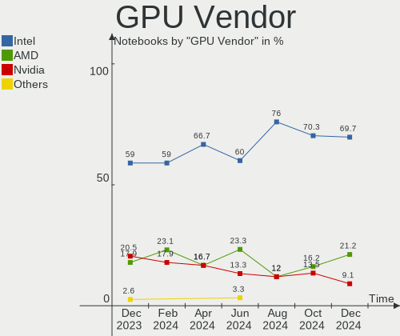
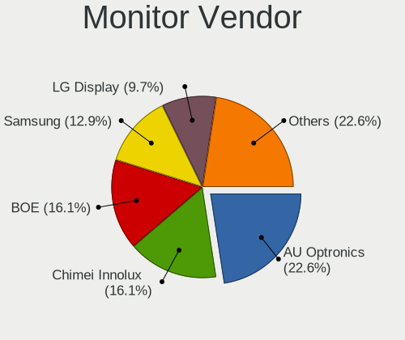
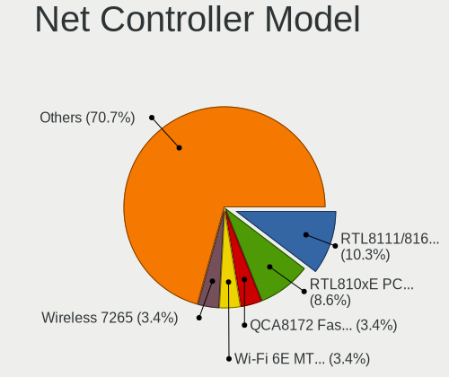
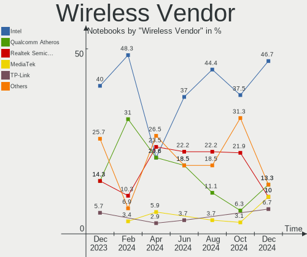
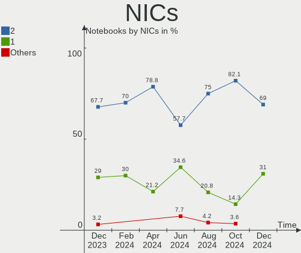

Xubuntu - Hardware Trends (Notebooks)
-------------------------------------

A project to identify most popular hardware characteristics and track their change
over time based on data collected by Linux users at https://Linux-Hardware.org.

Anyone can contribute to this report by the [hw-probe](https://github.com/linuxhw/hw-probe) tool:

    sudo -E hw-probe -all -upload

This report is for one last month. Overall report since the beginning of time: [TestCoverage](https://github.com/linuxhw/TestCoverage)

Period: Dec, 2022.

Contents
--------

* [ System ](#system)
  - [ OS                       ](#os)
  - [ OS Family                ](#os-family)
  - [ Kernel                   ](#kernel)
  - [ Kernel Family            ](#kernel-family)
  - [ Kernel Major Ver.        ](#kernel-major-ver)
  - [ Arch                     ](#arch)
  - [ DE                       ](#de)
  - [ Display Server           ](#display-server)
  - [ Display Manager          ](#display-manager)
  - [ OS Lang                  ](#os-lang)
  - [ Boot Mode                ](#boot-mode)
  - [ Filesystem               ](#filesystem)
  - [ Part. scheme             ](#part-scheme)
  - [ Dual Boot with Linux/BSD ](#dual-boot-with-linuxbsd)
  - [ Dual Boot (Win)          ](#dual-boot-win)

* [ Board ](#board)
  - [ Vendor                   ](#vendor)
  - [ Model                    ](#model)
  - [ Model Family             ](#model-family)
  - [ MFG Year                 ](#mfg-year)
  - [ Form Factor              ](#form-factor)
  - [ Secure Boot              ](#secure-boot)
  - [ Coreboot                 ](#coreboot)
  - [ RAM Size                 ](#ram-size)
  - [ RAM Used                 ](#ram-used)
  - [ Total Drives             ](#total-drives)
  - [ Has CD-ROM               ](#has-cd-rom)
  - [ Has Ethernet             ](#has-ethernet)
  - [ Has WiFi                 ](#has-wifi)
  - [ Has Bluetooth            ](#has-bluetooth)

* [ Location ](#location)
  - [ Country                  ](#country)
  - [ City                     ](#city)

* [ Drives ](#drives)
  - [ Drive Vendor             ](#drive-vendor)
  - [ Drive Model              ](#drive-model)
  - [ HDD Vendor               ](#hdd-vendor)
  - [ SSD Vendor               ](#ssd-vendor)
  - [ Drive Kind               ](#drive-kind)
  - [ Drive Connector          ](#drive-connector)
  - [ Drive Size               ](#drive-size)
  - [ Space Total              ](#space-total)
  - [ Space Used               ](#space-used)
  - [ Malfunc. Drives          ](#malfunc-drives)
  - [ Malfunc. Drive Vendor    ](#malfunc-drive-vendor)
  - [ Malfunc. HDD Vendor      ](#malfunc-hdd-vendor)
  - [ Malfunc. Drive Kind      ](#malfunc-drive-kind)
  - [ Failed Drives            ](#failed-drives)
  - [ Failed Drive Vendor      ](#failed-drive-vendor)
  - [ Drive Status             ](#drive-status)

* [ Storage controller ](#storage-controller)
  - [ Storage Vendor           ](#storage-vendor)
  - [ Storage Model            ](#storage-model)
  - [ Storage Kind             ](#storage-kind)

* [ Processor ](#processor)
  - [ CPU Vendor               ](#cpu-vendor)
  - [ CPU Model                ](#cpu-model)
  - [ CPU Model Family         ](#cpu-model-family)
  - [ CPU Cores                ](#cpu-cores)
  - [ CPU Sockets              ](#cpu-sockets)
  - [ CPU Threads              ](#cpu-threads)
  - [ CPU Op-Modes             ](#cpu-op-modes)
  - [ CPU Microcode            ](#cpu-microcode)
  - [ CPU Microarch            ](#cpu-microarch)

* [ Graphics ](#graphics)
  - [ GPU Vendor               ](#gpu-vendor)
  - [ GPU Model                ](#gpu-model)
  - [ GPU Combo                ](#gpu-combo)
  - [ GPU Driver               ](#gpu-driver)
  - [ GPU Memory               ](#gpu-memory)

* [ Monitor ](#monitor)
  - [ Monitor Vendor           ](#monitor-vendor)
  - [ Monitor Model            ](#monitor-model)
  - [ Monitor Resolution       ](#monitor-resolution)
  - [ Monitor Diagonal         ](#monitor-diagonal)
  - [ Monitor Width            ](#monitor-width)
  - [ Aspect Ratio             ](#aspect-ratio)
  - [ Monitor Area             ](#monitor-area)
  - [ Pixel Density            ](#pixel-density)
  - [ Multiple Monitors        ](#multiple-monitors)

* [ Network ](#network)
  - [ Net Controller Vendor    ](#net-controller-vendor)
  - [ Net Controller Model     ](#net-controller-model)
  - [ Wireless Vendor          ](#wireless-vendor)
  - [ Wireless Model           ](#wireless-model)
  - [ Ethernet Vendor          ](#ethernet-vendor)
  - [ Ethernet Model           ](#ethernet-model)
  - [ Net Controller Kind      ](#net-controller-kind)
  - [ Used Controller          ](#used-controller)
  - [ NICs                     ](#nics)
  - [ IPv6                     ](#ipv6)

* [ Bluetooth ](#bluetooth)
  - [ Bluetooth Vendor         ](#bluetooth-vendor)
  - [ Bluetooth Model          ](#bluetooth-model)

* [ Sound ](#sound)
  - [ Sound Vendor             ](#sound-vendor)
  - [ Sound Model              ](#sound-model)

* [ Memory ](#memory)
  - [ Memory Vendor            ](#memory-vendor)
  - [ Memory Model             ](#memory-model)
  - [ Memory Kind              ](#memory-kind)
  - [ Memory Form Factor       ](#memory-form-factor)
  - [ Memory Size              ](#memory-size)
  - [ Memory Speed             ](#memory-speed)

* [ Printers & scanners ](#printers--scanners)
  - [ Printer Vendor           ](#printer-vendor)
  - [ Printer Model            ](#printer-model)
  - [ Scanner Vendor           ](#scanner-vendor)
  - [ Scanner Model            ](#scanner-model)

* [ Camera ](#camera)
  - [ Camera Vendor            ](#camera-vendor)
  - [ Camera Model             ](#camera-model)

* [ Security ](#security)
  - [ Fingerprint Vendor       ](#fingerprint-vendor)
  - [ Fingerprint Model        ](#fingerprint-model)
  - [ Chipcard Vendor          ](#chipcard-vendor)
  - [ Chipcard Model           ](#chipcard-model)

* [ Unsupported ](#unsupported)
  - [ Unsupported Devices      ](#unsupported-devices)
  - [ Unsupported Device Types ](#unsupported-device-types)

System
------

OS
--

Installed operating systems

| Name          | Notebooks | Percent |
|---------------|-----------|---------|
| Xubuntu 22.04 | 29        | 70.73%  |
| Xubuntu 20.04 | 4         | 9.76%   |
| Xubuntu 22.10 | 3         | 7.32%   |
| Xubuntu 18.04 | 3         | 7.32%   |
| Xubuntu 23.04 | 1         | 2.44%   |
| Xubuntu 21.04 | 1         | 2.44%   |

OS Family
---------

OS without a version

| Name    | Notebooks | Percent |
|---------|-----------|---------|
| Xubuntu | 41        | 100%    |

Kernel
------

Version of the Linux kernel

| Version                | Notebooks | Percent |
|------------------------|-----------|---------|
| 5.15.0-56-generic      | 22        | 53.66%  |
| 5.4.0-135-generic      | 2         | 4.88%   |
| 5.19.0-26-generic      | 2         | 4.88%   |
| 5.15.0-57-generic      | 2         | 4.88%   |
| 6.1.0                  | 1         | 2.44%   |
| 6.0.9-060009-generic   | 1         | 2.44%   |
| 5.4.0-135-lowlatency   | 1         | 2.44%   |
| 5.19.0-21-generic      | 1         | 2.44%   |
| 5.19.0-1013-lowlatency | 1         | 2.44%   |
| 5.17.0-1025-oem        | 1         | 2.44%   |
| 5.17.0-1020-oem        | 1         | 2.44%   |
| 5.15.0-53-generic      | 1         | 2.44%   |
| 5.15.0-52-generic      | 1         | 2.44%   |
| 5.15.0-43-generic      | 1         | 2.44%   |
| 5.13.0-39-generic      | 1         | 2.44%   |
| 5.11.0-49-generic      | 1         | 2.44%   |
| 4.15.0-200-generic     | 1         | 2.44%   |

Kernel Family
-------------

Linux kernel without a distro release

| Version | Notebooks | Percent |
|---------|-----------|---------|
| 5.15.0  | 27        | 65.85%  |
| 5.19.0  | 4         | 9.76%   |
| 5.4.0   | 3         | 7.32%   |
| 5.17.0  | 2         | 4.88%   |
| 6.1.0   | 1         | 2.44%   |
| 6.0.9   | 1         | 2.44%   |
| 5.13.0  | 1         | 2.44%   |
| 5.11.0  | 1         | 2.44%   |
| 4.15.0  | 1         | 2.44%   |

Kernel Major Ver.
-----------------

Linux kernel major version

| Version | Notebooks | Percent |
|---------|-----------|---------|
| 5.15    | 27        | 65.85%  |
| 5.19    | 4         | 9.76%   |
| 5.4     | 3         | 7.32%   |
| 5.17    | 2         | 4.88%   |
| 6.1     | 1         | 2.44%   |
| 6.0     | 1         | 2.44%   |
| 5.13    | 1         | 2.44%   |
| 5.11    | 1         | 2.44%   |
| 4.15    | 1         | 2.44%   |

Arch
----

OS architecture (x86_64, i586, etc.)

| Name   | Notebooks | Percent |
|--------|-----------|---------|
| x86_64 | 38        | 92.68%  |
| i686   | 3         | 7.32%   |

DE
--

Desktop Environment

| Name  | Notebooks | Percent |
|-------|-----------|---------|
| XFCE  | 39        | 95.12%  |
| i3    | 1         | 2.44%   |
| GNOME | 1         | 2.44%   |

Display Server
--------------

X11 or Wayland

| Name | Notebooks | Percent |
|------|-----------|---------|
| X11  | 40        | 97.56%  |
| Tty  | 1         | 2.44%   |

Display Manager
---------------

SDDM, LightDM, etc.

| Name    | Notebooks | Percent |
|---------|-----------|---------|
| LightDM | 38        | 92.68%  |
| GDM3    | 3         | 7.32%   |

OS Lang
-------

Language

| Lang  | Notebooks | Percent |
|-------|-----------|---------|
| en_US | 18        | 43.9%   |
| de_DE | 5         | 12.2%   |
| it_IT | 4         | 9.76%   |
| fr_FR | 4         | 9.76%   |
| en_GB | 2         | 4.88%   |
| tr_TR | 1         | 2.44%   |
| ru_UA | 1         | 2.44%   |
| ru_RU | 1         | 2.44%   |
| es_VE | 1         | 2.44%   |
| es_CO | 1         | 2.44%   |
| en_IN | 1         | 2.44%   |
| en_AU | 1         | 2.44%   |
| de_CH | 1         | 2.44%   |

Boot Mode
---------

EFI or BIOS

| Mode | Notebooks | Percent |
|------|-----------|---------|
| EFI  | 21        | 51.22%  |
| BIOS | 20        | 48.78%  |

Filesystem
----------

Type of filesystem

| Type    | Notebooks | Percent |
|---------|-----------|---------|
| Ext4    | 40        | 97.56%  |
| Overlay | 1         | 2.44%   |

Part. scheme
------------

Scheme of partitioning

| Type    | Notebooks | Percent |
|---------|-----------|---------|
| GPT     | 29        | 70.73%  |
| MBR     | 9         | 21.95%  |
| Unknown | 3         | 7.32%   |

Dual Boot with Linux/BSD
------------------------

Hosting more than one Linux/BSD

| Dual boot | Notebooks | Percent |
|-----------|-----------|---------|
| No        | 36        | 87.8%   |
| Yes       | 5         | 12.2%   |

Dual Boot (Win)
---------------

Hosting Linux and Windows

| Dual boot | Notebooks | Percent |
|-----------|-----------|---------|
| No        | 29        | 70.73%  |
| Yes       | 12        | 29.27%  |

Board
-----

Vendor
------

Motherboard manufacturer

| Name             | Notebooks | Percent |
|------------------|-----------|---------|
| Hewlett-Packard  | 8         | 19.51%  |
| ASUSTek Computer | 8         | 19.51%  |
| Dell             | 5         | 12.2%   |
| Acer             | 5         | 12.2%   |
| Lenovo           | 4         | 9.76%   |
| Toshiba          | 2         | 4.88%   |
| Sony             | 1         | 2.44%   |
| HUAWEI           | 1         | 2.44%   |
| HIGRADED         | 1         | 2.44%   |
| Google           | 1         | 2.44%   |
| Fusion5          | 1         | 2.44%   |
| ECS              | 1         | 2.44%   |
| Clevo            | 1         | 2.44%   |
| Apple            | 1         | 2.44%   |
| Unknown          | 1         | 2.44%   |

Model
-----

Motherboard model

| Name                                       | Notebooks | Percent |
|--------------------------------------------|-----------|---------|
| Dell Latitude E6430                        | 2         | 4.88%   |
| Toshiba Satellite M70                      | 1         | 2.44%   |
| Toshiba Satellite C650                     | 1         | 2.44%   |
| Sony VPCS12V9E                             | 1         | 2.44%   |
| Lenovo ThinkPad X230 23252S4               | 1         | 2.44%   |
| Lenovo ThinkPad X1 Carbon Gen 8 20U9CTO1WW | 1         | 2.44%   |
| Lenovo ThinkPad Edge E545 20B20015GE       | 1         | 2.44%   |
| Lenovo ThinkBook 14 G2 ITL 20VD            | 1         | 2.44%   |
| HUAWEI HVY-WXX9                            | 1         | 2.44%   |
| HIGRADED W651UI                            | 1         | 2.44%   |
| HP Pavilion Laptop 15-cc5xx                | 1         | 2.44%   |
| HP Pavilion dv7                            | 1         | 2.44%   |
| HP Pavilion 17                             | 1         | 2.44%   |
| HP Pavilion 15                             | 1         | 2.44%   |
| HP Laptop 15-bw0xx                         | 1         | 2.44%   |
| HP Compaq Presario C700                    | 1         | 2.44%   |
| HP 350 G1                                  | 1         | 2.44%   |
| HP 250 G5 Notebook PC                      | 1         | 2.44%   |
| Google Auron_Yuna                          | 1         | 2.44%   |
| Fusion5 Lapbook T90B                       | 1         | 2.44%   |
| ECS CMPC                                   | 1         | 2.44%   |
| Dell XPS 15 9560                           | 1         | 2.44%   |
| Dell Latitude E5450                        | 1         | 2.44%   |
| Dell Latitude E5440                        | 1         | 2.44%   |
| Clevo P170EM                               | 1         | 2.44%   |
| ASUS ZenBook UX482EA_UX482EA               | 1         | 2.44%   |
| ASUS X555LF                                | 1         | 2.44%   |
| ASUS UX31E                                 | 1         | 2.44%   |
| ASUS ROG CROSSHAIR VIII DARK HERO          | 1         | 2.44%   |
| ASUS K75VJ                                 | 1         | 2.44%   |
| ASUS K53SC                                 | 1         | 2.44%   |
| ASUS G60JX                                 | 1         | 2.44%   |
| ASUS 1215P                                 | 1         | 2.44%   |
| Apple MacBookPro8,1                        | 1         | 2.44%   |
| Acer Nitro AN515-55                        | 1         | 2.44%   |
| Acer Aspire A317-51K                       | 1         | 2.44%   |
| Acer Aspire A114-31                        | 1         | 2.44%   |
| Acer Aspire 7730ZG                         | 1         | 2.44%   |
| Acer Aspire 5935                           | 1         | 2.44%   |
| Unknown                                    | 1         | 2.44%   |

Model Family
------------

Motherboard model prefix

| Name              | Notebooks | Percent |
|-------------------|-----------|---------|
| HP Pavilion       | 4         | 9.76%   |
| Dell Latitude     | 4         | 9.76%   |
| Acer Aspire       | 4         | 9.76%   |
| Lenovo ThinkPad   | 3         | 7.32%   |
| Toshiba Satellite | 2         | 4.88%   |
| Sony VPCS12V9E    | 1         | 2.44%   |
| Lenovo ThinkBook  | 1         | 2.44%   |
| HUAWEI HVY-WXX9   | 1         | 2.44%   |
| HIGRADED W651UI   | 1         | 2.44%   |
| HP Laptop         | 1         | 2.44%   |
| HP Compaq         | 1         | 2.44%   |
| HP 350            | 1         | 2.44%   |
| HP 250            | 1         | 2.44%   |
| Google Auron      | 1         | 2.44%   |
| Fusion5 Lapbook   | 1         | 2.44%   |
| ECS CMPC          | 1         | 2.44%   |
| Dell XPS          | 1         | 2.44%   |
| Clevo P170EM      | 1         | 2.44%   |
| ASUS ZenBook      | 1         | 2.44%   |
| ASUS X555LF       | 1         | 2.44%   |
| ASUS UX31E        | 1         | 2.44%   |
| ASUS ROG          | 1         | 2.44%   |
| ASUS K75VJ        | 1         | 2.44%   |
| ASUS K53SC        | 1         | 2.44%   |
| ASUS G60JX        | 1         | 2.44%   |
| ASUS 1215P        | 1         | 2.44%   |
| Apple MacBookPro8 | 1         | 2.44%   |
| Acer Nitro        | 1         | 2.44%   |
| Unknown           | 1         | 2.44%   |

MFG Year
--------

Motherboard manufacture year

| Year | Notebooks | Percent |
|------|-----------|---------|
| 2020 | 5         | 12.2%   |
| 2017 | 5         | 12.2%   |
| 2012 | 5         | 12.2%   |
| 2013 | 4         | 9.76%   |
| 2021 | 3         | 7.32%   |
| 2011 | 3         | 7.32%   |
| 2010 | 3         | 7.32%   |
| 2008 | 3         | 7.32%   |
| 2014 | 2         | 4.88%   |
| 2009 | 2         | 4.88%   |
| 2022 | 1         | 2.44%   |
| 2019 | 1         | 2.44%   |
| 2016 | 1         | 2.44%   |
| 2015 | 1         | 2.44%   |
| 2007 | 1         | 2.44%   |
| 2005 | 1         | 2.44%   |

Form Factor
-----------

Physical design of the computer

| Name     | Notebooks | Percent |
|----------|-----------|---------|
| Notebook | 41        | 100%    |

Secure Boot
-----------

Enabled or disabled

| State    | Notebooks | Percent |
|----------|-----------|---------|
| Disabled | 39        | 95.12%  |
| Enabled  | 2         | 4.88%   |

Coreboot
--------

Have coreboot on board

| Used | Notebooks | Percent |
|------|-----------|---------|
| No   | 40        | 97.56%  |
| Yes  | 1         | 2.44%   |

RAM Size
--------

Total RAM memory

| Size in GB  | Notebooks | Percent |
|-------------|-----------|---------|
| 3.01-4.0    | 13        | 31.71%  |
| 4.01-8.0    | 10        | 24.39%  |
| 16.01-24.0  | 6         | 14.63%  |
| 8.01-16.0   | 5         | 12.2%   |
| 1.01-2.0    | 4         | 9.76%   |
| 32.01-64.0  | 1         | 2.44%   |
| 2.01-3.0    | 1         | 2.44%   |
| 64.01-256.0 | 1         | 2.44%   |

RAM Used
--------

Used RAM memory

| Used GB   | Notebooks | Percent |
|-----------|-----------|---------|
| 1.01-2.0  | 18        | 43.9%   |
| 2.01-3.0  | 9         | 21.95%  |
| 4.01-8.0  | 6         | 14.63%  |
| 0.51-1.0  | 5         | 12.2%   |
| 8.01-16.0 | 2         | 4.88%   |
| 3.01-4.0  | 1         | 2.44%   |

Total Drives
------------

Number of drives on board

| Drives | Notebooks | Percent |
|--------|-----------|---------|
| 1      | 31        | 75.61%  |
| 2      | 7         | 17.07%  |
| 3      | 2         | 4.88%   |
| 0      | 1         | 2.44%   |

Has CD-ROM
----------

Has CD-ROM on board

| Presented | Notebooks | Percent |
|-----------|-----------|---------|
| No        | 21        | 51.22%  |
| Yes       | 20        | 48.78%  |

Has Ethernet
------------

Has Ethernet on board

| Presented | Notebooks | Percent |
|-----------|-----------|---------|
| Yes       | 35        | 85.37%  |
| No        | 6         | 14.63%  |

Has WiFi
--------

Has WiFi module

| Presented | Notebooks | Percent |
|-----------|-----------|---------|
| Yes       | 39        | 95.12%  |
| No        | 2         | 4.88%   |

Has Bluetooth
-------------

Has Bluetooth module

| Presented | Notebooks | Percent |
|-----------|-----------|---------|
| Yes       | 28        | 68.29%  |
| No        | 13        | 31.71%  |

Location
--------

Country
-------

Geographic location (country)

| Country     | Notebooks | Percent |
|-------------|-----------|---------|
| USA         | 9         | 21.95%  |
| Italy       | 6         | 14.63%  |
| Germany     | 6         | 14.63%  |
| France      | 5         | 12.2%   |
| UK          | 2         | 4.88%   |
| Russia      | 2         | 4.88%   |
| Vietnam     | 1         | 2.44%   |
| Venezuela   | 1         | 2.44%   |
| Switzerland | 1         | 2.44%   |
| Poland      | 1         | 2.44%   |
| Mexico      | 1         | 2.44%   |
| Iran        | 1         | 2.44%   |
| India       | 1         | 2.44%   |
| Ecuador     | 1         | 2.44%   |
| Czechia     | 1         | 2.44%   |
| Colombia    | 1         | 2.44%   |
| Australia   | 1         | 2.44%   |

City
----

Geographic location (city)

| City           | Notebooks | Percent |
|----------------|-----------|---------|
| Leland         | 3         | 7.32%   |
| Paris          | 2         | 4.88%   |
| Milan          | 2         | 4.88%   |
| Zurich         | 1         | 2.44%   |
| Warsaw         | 1         | 2.44%   |
| Villavicencio  | 1         | 2.44%   |
| Ucel           | 1         | 2.44%   |
| Stroud         | 1         | 2.44%   |
| Stoke-on-Trent | 1         | 2.44%   |
| Saldenburg     | 1         | 2.44%   |
| Prague         | 1         | 2.44%   |
| Portland       | 1         | 2.44%   |
| Plauen         | 1         | 2.44%   |
| Pisa           | 1         | 2.44%   |
| Perm           | 1         | 2.44%   |
| Oberhausen     | 1         | 2.44%   |
| New York       | 1         | 2.44%   |
| Munich         | 1         | 2.44%   |
| Moscow         | 1         | 2.44%   |
| Montluçon     | 1         | 2.44%   |
| Melbourne      | 1         | 2.44%   |
| Los Mochis     | 1         | 2.44%   |
| Legnaro        | 1         | 2.44%   |
| Kochi          | 1         | 2.44%   |
| Karaj          | 1         | 2.44%   |
| Houston        | 1         | 2.44%   |
| Hagen          | 1         | 2.44%   |
| Geretsried     | 1         | 2.44%   |
| Cuenca         | 1         | 2.44%   |
| Corciano       | 1         | 2.44%   |
| Ciudad Guayana | 1         | 2.44%   |
| Briona         | 1         | 2.44%   |
| Bien Hoa       | 1         | 2.44%   |
| Bethlehem      | 1         | 2.44%   |
| Bellevue       | 1         | 2.44%   |
| Belfort        | 1         | 2.44%   |
| Athens         | 1         | 2.44%   |

Drives
------

Drive Vendor
------------

Hard drive vendors

| Vendor              | Notebooks | Drives | Percent |
|---------------------|-----------|--------|---------|
| Samsung Electronics | 6         | 6      | 13.95%  |
| WDC                 | 5         | 5      | 11.63%  |
| Toshiba             | 3         | 3      | 6.98%   |
| Seagate             | 3         | 4      | 6.98%   |
| Hitachi             | 3         | 3      | 6.98%   |
| SK hynix            | 2         | 2      | 4.65%   |
| SanDisk             | 2         | 2      | 4.65%   |
| Kingston            | 2         | 2      | 4.65%   |
| HGST                | 2         | 2      | 4.65%   |
| A-DATA Technology   | 2         | 2      | 4.65%   |
| Unknown             | 1         | 1      | 2.33%   |
| Silicon Motion      | 1         | 1      | 2.33%   |
| PNY                 | 1         | 1      | 2.33%   |
| Phison              | 1         | 2      | 2.33%   |
| LITEONIT            | 1         | 1      | 2.33%   |
| LITEON              | 1         | 1      | 2.33%   |
| Linux               | 1         | 1      | 2.33%   |
| Kimtigo             | 1         | 1      | 2.33%   |
| Hewlett-Packard     | 1         | 1      | 2.33%   |
| Crucial             | 1         | 1      | 2.33%   |
| China               | 1         | 1      | 2.33%   |
| Apacer              | 1         | 1      | 2.33%   |
| Unknown             | 1         | 1      | 2.33%   |

Drive Model
-----------

Hard drive models

| Model                                     | Notebooks | Percent |
|-------------------------------------------|-----------|---------|
| WDC WD5000BEVT-22ZAT0 500GB               | 2         | 4.65%   |
| WDC WD5000LPVX-08V0TT5 500GB              | 1         | 2.33%   |
| WDC WD1200BEVS-60UST0 120GB               | 1         | 2.33%   |
| WDC WD10SPZX-21Z10T0 1TB                  | 1         | 2.33%   |
| Unknown HBG4a2  32GB                      | 1         | 2.33%   |
| Toshiba MQ04ABF100 1TB                    | 1         | 2.33%   |
| Toshiba MQ01ABF050 500GB                  | 1         | 2.33%   |
| Toshiba KXG6AZNV1T02 1TB                  | 1         | 2.33%   |
| SK hynix PC300 NVMe Solid State Drive 1TB | 1         | 2.33%   |
| SK hynix HFM512GD3JX013N 512GB            | 1         | 2.33%   |
| Silicon Motion PCIe-8 SSD 512GB           | 1         | 2.33%   |
| Seagate ST9750420AS 752GB                 | 1         | 2.33%   |
| Seagate ST9500325ASG 500GB                | 1         | 2.33%   |
| Seagate ST500LT012-9WS142 500GB           | 1         | 2.33%   |
| SanDisk SDSSDA-1T00 1TB                   | 1         | 2.33%   |
| SanDisk DF4064  64GB                      | 1         | 2.33%   |
| Samsung SSD 870 QVO 1TB                   | 1         | 2.33%   |
| Samsung SSD 850 EVO 120GB                 | 1         | 2.33%   |
| Samsung SSD 750 EVO 250GB                 | 1         | 2.33%   |
| Samsung MZALQ512HALU-000L2 512GB          | 1         | 2.33%   |
| Samsung MZ7LN512HMJP-000L7 512GB SSD      | 1         | 2.33%   |
| Samsung MZ7KM960HAHP-00005 960GB SSD      | 1         | 2.33%   |
| PNY CS900 480GB SSD                       | 1         | 2.33%   |
| Phison Sabrent Rocket 4.0 Plus 4TB        | 1         | 2.33%   |
| LITEONIT LCS-256L9S-11 2.5 7mm 256GB SSD  | 1         | 2.33%   |
| LITEON LCH-512V2S 512GB SSD               | 1         | 2.33%   |
| Linux scsi_debug 8.3MB                    | 1         | 2.33%   |
| Kingston SNS4151S332GD 32GB SSD           | 1         | 2.33%   |
| Kingston SA400M8240G 240GB SSD            | 1         | 2.33%   |
| Kimtigo SSD 128G                          | 1         | 2.33%   |
| Hitachi HTS727575A9E364 752GB             | 1         | 2.33%   |
| Hitachi HTS547550A9E384 500GB             | 1         | 2.33%   |
| Hitachi HTS543225A7A384 250GB             | 1         | 2.33%   |
| HGST HTS545050A7E380 500GB                | 1         | 2.33%   |
| HGST HTS541010A9E680 1TB                  | 1         | 2.33%   |
| HP SSD S650 120GB                         | 1         | 2.33%   |
| Crucial CT500MX200SSD1 500GB              | 1         | 2.33%   |
| China SATA3 120GB SSD                     | 1         | 2.33%   |
| Apacer AS350 128GB SSD                    | 1         | 2.33%   |
| A-DATA SU650 256GB SSD                    | 1         | 2.33%   |

HDD Vendor
----------

Hard disk drive vendors

| Vendor  | Notebooks | Drives | Percent |
|---------|-----------|--------|---------|
| WDC     | 5         | 5      | 33.33%  |
| Seagate | 3         | 4      | 20%     |
| Hitachi | 3         | 3      | 20%     |
| Toshiba | 2         | 2      | 13.33%  |
| HGST    | 2         | 2      | 13.33%  |

SSD Vendor
----------

Solid state drive vendors

| Vendor              | Notebooks | Drives | Percent |
|---------------------|-----------|--------|---------|
| Samsung Electronics | 5         | 5      | 26.32%  |
| Kingston            | 2         | 2      | 10.53%  |
| A-DATA Technology   | 2         | 2      | 10.53%  |
| SanDisk             | 1         | 1      | 5.26%   |
| PNY                 | 1         | 1      | 5.26%   |
| LITEONIT            | 1         | 1      | 5.26%   |
| LITEON              | 1         | 1      | 5.26%   |
| Linux               | 1         | 1      | 5.26%   |
| Kimtigo             | 1         | 1      | 5.26%   |
| Hewlett-Packard     | 1         | 1      | 5.26%   |
| Crucial             | 1         | 1      | 5.26%   |
| China               | 1         | 1      | 5.26%   |
| Apacer              | 1         | 1      | 5.26%   |

Drive Kind
----------

HDD or SSD

| Kind | Notebooks | Drives | Percent |
|------|-----------|--------|---------|
| SSD  | 18        | 19     | 42.86%  |
| HDD  | 15        | 16     | 35.71%  |
| NVMe | 6         | 7      | 14.29%  |
| MMC  | 3         | 3      | 7.14%   |

Drive Connector
---------------

SATA, SAS, NVMe, etc.

| Type | Notebooks | Drives | Percent |
|------|-----------|--------|---------|
| SATA | 33        | 35     | 78.57%  |
| NVMe | 6         | 7      | 14.29%  |
| MMC  | 3         | 3      | 7.14%   |

Drive Size
----------

Size of hard drive

| Size in TB | Notebooks | Drives | Percent |
|------------|-----------|--------|---------|
| 0.01-0.5   | 24        | 24     | 70.59%  |
| 0.51-1.0   | 10        | 11     | 29.41%  |

Space Total
-----------

Amount of disk space available on the file system

| Size in GB | Notebooks | Percent |
|------------|-----------|---------|
| 101-250    | 15        | 36.59%  |
| 251-500    | 8         | 19.51%  |
| 501-1000   | 8         | 19.51%  |
| 51-100     | 4         | 9.76%   |
| 21-50      | 2         | 4.88%   |
| 1001-2000  | 2         | 4.88%   |
| 2001-3000  | 1         | 2.44%   |
| 1-20       | 1         | 2.44%   |

Space Used
----------

Amount of used disk space

| Used GB  | Notebooks | Percent |
|----------|-----------|---------|
| 1-20     | 17        | 41.46%  |
| 21-50    | 8         | 19.51%  |
| 51-100   | 8         | 19.51%  |
| 251-500  | 4         | 9.76%   |
| 101-250  | 3         | 7.32%   |
| 501-1000 | 1         | 2.44%   |

Malfunc. Drives
---------------

Drive models with a malfunction

| Model                           | Notebooks | Drives | Percent |
|---------------------------------|-----------|--------|---------|
| WDC WD1200BEVS-60UST0 120GB     | 1         | 1      | 16.67%  |
| Seagate ST9750420AS 752GB       | 1         | 2      | 16.67%  |
| Seagate ST9500325ASG 500GB      | 1         | 1      | 16.67%  |
| Seagate ST500LT012-9WS142 500GB | 1         | 1      | 16.67%  |
| LITEON LCH-512V2S 512GB SSD     | 1         | 1      | 16.67%  |
| Kingston SNS4151S332GD 32GB SSD | 1         | 1      | 16.67%  |

Malfunc. Drive Vendor
---------------------

Vendors of faulty drives

| Vendor   | Notebooks | Drives | Percent |
|----------|-----------|--------|---------|
| Seagate  | 3         | 4      | 50%     |
| WDC      | 1         | 1      | 16.67%  |
| LITEON   | 1         | 1      | 16.67%  |
| Kingston | 1         | 1      | 16.67%  |

Malfunc. HDD Vendor
-------------------

Vendors of faulty HDD drives

| Vendor  | Notebooks | Drives | Percent |
|---------|-----------|--------|---------|
| Seagate | 3         | 4      | 75%     |
| WDC     | 1         | 1      | 25%     |

Malfunc. Drive Kind
-------------------

Kinds of faulty drives

| Kind | Notebooks | Drives | Percent |
|------|-----------|--------|---------|
| HDD  | 4         | 5      | 66.67%  |
| SSD  | 2         | 2      | 33.33%  |

Failed Drives
-------------

Failed drive models

Zero info for selected period =(

Failed Drive Vendor
-------------------

Failed drive vendors

Zero info for selected period =(

Drive Status
------------

Number of failed and malfunc. drives

| Status   | Notebooks | Drives | Percent |
|----------|-----------|--------|---------|
| Works    | 22        | 25     | 53.66%  |
| Detected | 13        | 13     | 31.71%  |
| Malfunc  | 6         | 7      | 14.63%  |

Storage controller
------------------

Storage Vendor
--------------

Storage controller vendors

| Vendor                       | Notebooks | Percent |
|------------------------------|-----------|---------|
| Intel                        | 35        | 79.55%  |
| AMD                          | 3         | 6.82%   |
| SK hynix                     | 2         | 4.55%   |
| Toshiba America Info Systems | 1         | 2.27%   |
| Silicon Motion               | 1         | 2.27%   |
| Samsung Electronics          | 1         | 2.27%   |
| Phison Electronics           | 1         | 2.27%   |

Storage Model
-------------

Storage controller models

| Model                                                                            | Notebooks | Percent |
|----------------------------------------------------------------------------------|-----------|---------|
| Intel 7 Series Chipset Family 6-port SATA Controller [AHCI mode]                 | 6         | 12.5%   |
| Intel Wildcat Point-LP SATA Controller [AHCI Mode]                               | 4         | 8.33%   |
| Intel 6 Series/C200 Series Chipset Family 6 port Mobile SATA AHCI Controller     | 4         | 8.33%   |
| Intel 5 Series/3400 Series Chipset 4 port SATA AHCI Controller                   | 3         | 6.25%   |
| AMD FCH SATA Controller [AHCI mode]                                              | 3         | 6.25%   |
| Intel Volume Management Device NVMe RAID Controller                              | 2         | 4.17%   |
| Intel Celeron N3350/Pentium N4200/Atom E3900 Series SATA AHCI Controller         | 2         | 4.17%   |
| Intel 82801IBM/IEM (ICH9M/ICH9M-E) 4 port SATA Controller [AHCI mode]            | 2         | 4.17%   |
| Intel 82801HM/HEM (ICH8M/ICH8M-E) IDE Controller                                 | 2         | 4.17%   |
| Intel 8 Series SATA Controller 1 [AHCI mode]                                     | 2         | 4.17%   |
| Toshiba America Info Systems XG6 NVMe SSD Controller                             | 1         | 2.08%   |
| SK hynix PC300 NVMe Solid State Drive 1TB                                        | 1         | 2.08%   |
| SK hynix Gold P31/PC711 NVMe Solid State Drive                                   | 1         | 2.08%   |
| Silicon Motion Non-Volatile memory controller                                    | 1         | 2.08%   |
| Samsung NVMe SSD Controller 980                                                  | 1         | 2.08%   |
| Phison E18 PCIe4 NVMe Controller                                                 | 1         | 2.08%   |
| Intel Tiger Lake-LP SATA Controller                                              | 1         | 2.08%   |
| Intel Sunrise Point-LP SATA Controller [AHCI mode]                               | 1         | 2.08%   |
| Intel NM10/ICH7 Family SATA Controller [AHCI mode]                               | 1         | 2.08%   |
| Intel HM170/QM170 Chipset SATA Controller [AHCI Mode]                            | 1         | 2.08%   |
| Intel Celeron/Pentium Silver Processor SATA Controller                           | 1         | 2.08%   |
| Intel Atom/Celeron/Pentium Processor x5-E8000/J3xxx/N3xxx Series SATA Controller | 1         | 2.08%   |
| Intel 82801HM/HEM (ICH8M/ICH8M-E) SATA Controller [IDE mode]                     | 1         | 2.08%   |
| Intel 82801HM/HEM (ICH8M/ICH8M-E) SATA Controller [AHCI mode]                    | 1         | 2.08%   |
| Intel 82801FBM (ICH6M) SATA Controller                                           | 1         | 2.08%   |
| Intel 82801FB/FBM/FR/FW/FRW (ICH6 Family) IDE Controller                         | 1         | 2.08%   |
| Intel 82801 Mobile SATA Controller [RAID mode]                                   | 1         | 2.08%   |
| Intel 400 Series Chipset Family SATA AHCI Controller                             | 1         | 2.08%   |

Storage Kind
------------

Kind of storage controller (IDE, SATA, NVMe, SAS, ...)

| Kind | Notebooks | Percent |
|------|-----------|---------|
| SATA | 34        | 73.91%  |
| NVMe | 6         | 13.04%  |
| RAID | 3         | 6.52%   |
| IDE  | 3         | 6.52%   |

Processor
---------

CPU Vendor
----------

Processor vendors

| Vendor | Notebooks | Percent |
|--------|-----------|---------|
| Intel  | 37        | 90.24%  |
| AMD    | 4         | 9.76%   |

CPU Model
---------

Processor models

| Model                                           | Notebooks | Percent |
|-------------------------------------------------|-----------|---------|
| Intel Core i7-2670QM CPU @ 2.20GHz              | 2         | 4.88%   |
| Intel Pentium M processor 1.86GHz               | 1         | 2.44%   |
| Intel Pentium Dual CPU T3400 @ 2.16GHz          | 1         | 2.44%   |
| Intel Pentium Dual CPU T2370 @ 1.73GHz          | 1         | 2.44%   |
| Intel Core i7-7700HQ CPU @ 2.80GHz              | 1         | 2.44%   |
| Intel Core i7-5500U CPU @ 2.40GHz               | 1         | 2.44%   |
| Intel Core i7-3720QM CPU @ 2.60GHz              | 1         | 2.44%   |
| Intel Core i7-3630QM CPU @ 2.40GHz              | 1         | 2.44%   |
| Intel Core i7-2677M CPU @ 1.80GHz               | 1         | 2.44%   |
| Intel Core i7-10610U CPU @ 1.80GHz              | 1         | 2.44%   |
| Intel Core i7 CPU Q 720 @ 1.60GHz               | 1         | 2.44%   |
| Intel Core i5-7200U CPU @ 2.50GHz               | 1         | 2.44%   |
| Intel Core i5-5300U CPU @ 2.30GHz               | 1         | 2.44%   |
| Intel Core i5-4310U CPU @ 2.00GHz               | 1         | 2.44%   |
| Intel Core i5-4210U CPU @ 1.70GHz               | 1         | 2.44%   |
| Intel Core i5-3340M CPU @ 2.70GHz               | 1         | 2.44%   |
| Intel Core i5-3320M CPU @ 2.60GHz               | 1         | 2.44%   |
| Intel Core i5-3210M CPU @ 2.50GHz               | 1         | 2.44%   |
| Intel Core i5-2435M CPU @ 2.40GHz               | 1         | 2.44%   |
| Intel Core i5-10300H CPU @ 2.50GHz              | 1         | 2.44%   |
| Intel Core i5 CPU M 520 @ 2.40GHz               | 1         | 2.44%   |
| Intel Core i3-7020U CPU @ 2.30GHz               | 1         | 2.44%   |
| Intel Core i3-5010U CPU @ 2.10GHz               | 1         | 2.44%   |
| Intel Core i3-3217U CPU @ 1.80GHz               | 1         | 2.44%   |
| Intel Core i3 CPU M 330 @ 2.13GHz               | 1         | 2.44%   |
| Intel Core 2 Duo CPU T8300 @ 2.40GHz            | 1         | 2.44%   |
| Intel Core 2 Duo CPU T6400 @ 2.00GHz            | 1         | 2.44%   |
| Intel Celeron N4000 CPU @ 1.10GHz               | 1         | 2.44%   |
| Intel Celeron CPU N3450 @ 1.10GHz               | 1         | 2.44%   |
| Intel Celeron CPU N3350 @ 1.10GHz               | 1         | 2.44%   |
| Intel Celeron CPU N3060 @ 1.60GHz               | 1         | 2.44%   |
| Intel Celeron 3205U @ 1.50GHz                   | 1         | 2.44%   |
| Intel Atom x5-Z8350 CPU @ 1.44GHz               | 1         | 2.44%   |
| Intel Atom CPU N570 @ 1.66GHz                   | 1         | 2.44%   |
| Intel 11th Gen Core i7-1165G7 @ 2.80GHz         | 1         | 2.44%   |
| Intel 11th Gen Core i3-1115G4 @ 3.00GHz         | 1         | 2.44%   |
| AMD Ryzen 9 5950X 16-Core Processor             | 1         | 2.44%   |
| AMD Ryzen 5 4600H with Radeon Graphics          | 1         | 2.44%   |
| AMD A8-4500M APU with Radeon HD Graphics        | 1         | 2.44%   |
| AMD A10-9620P RADEON R5, 10 COMPUTE CORES 4C+6G | 1         | 2.44%   |

CPU Model Family
----------------

Processor model prefix

| Model              | Notebooks | Percent |
|--------------------|-----------|---------|
| Intel Core i5      | 10        | 24.39%  |
| Intel Core i7      | 9         | 21.95%  |
| Intel Celeron      | 5         | 12.2%   |
| Intel Core i3      | 4         | 9.76%   |
| Other              | 2         | 4.88%   |
| Intel Pentium Dual | 2         | 4.88%   |
| Intel Core 2 Duo   | 2         | 4.88%   |
| Intel Atom         | 2         | 4.88%   |
| Intel Pentium M    | 1         | 2.44%   |
| AMD Ryzen 9        | 1         | 2.44%   |
| AMD Ryzen 5        | 1         | 2.44%   |
| AMD A8             | 1         | 2.44%   |
| AMD A10            | 1         | 2.44%   |

CPU Cores
---------

Number of processor cores

| Number | Notebooks | Percent |
|--------|-----------|---------|
| 2      | 27        | 65.85%  |
| 4      | 11        | 26.83%  |
| 16     | 1         | 2.44%   |
| 6      | 1         | 2.44%   |
| 1      | 1         | 2.44%   |

CPU Sockets
-----------

Number of sockets

| Number | Notebooks | Percent |
|--------|-----------|---------|
| 1      | 41        | 100%    |

CPU Threads
-----------

Threads per core (Hyper-Threading)

| Number | Notebooks | Percent |
|--------|-----------|---------|
| 2      | 30        | 73.17%  |
| 1      | 11        | 26.83%  |

CPU Op-Modes
------------

CPU Operation Modes (32-bit, 64-bit)

| Op mode        | Notebooks | Percent |
|----------------|-----------|---------|
| 32-bit, 64-bit | 40        | 97.56%  |
| 32-bit         | 1         | 2.44%   |

CPU Microcode
-------------

Microcode number

| Number     | Notebooks | Percent |
|------------|-----------|---------|
| Unknown    | 9         | 21.95%  |
| 0x306a9    | 5         | 12.2%   |
| 0x306d4    | 3         | 7.32%   |
| 0x806c1    | 2         | 4.88%   |
| 0x6fd      | 2         | 4.88%   |
| 0x506c9    | 2         | 4.88%   |
| 0x40651    | 2         | 4.88%   |
| 0x206a7    | 2         | 4.88%   |
| 0xa0652    | 1         | 2.44%   |
| 0x806ec    | 1         | 2.44%   |
| 0x706a1    | 1         | 2.44%   |
| 0x6d8      | 1         | 2.44%   |
| 0x406c4    | 1         | 2.44%   |
| 0x20652    | 1         | 2.44%   |
| 0x106e5    | 1         | 2.44%   |
| 0x106ca    | 1         | 2.44%   |
| 0x1067a    | 1         | 2.44%   |
| 0x10676    | 1         | 2.44%   |
| 0x0a201016 | 1         | 2.44%   |
| 0x08600106 | 1         | 2.44%   |
| 0x0600611a | 1         | 2.44%   |
| 0x06001119 | 1         | 2.44%   |

CPU Microarch
-------------

Microarchitecture

| Name          | Notebooks | Percent |
|---------------|-----------|---------|
| IvyBridge     | 6         | 14.63%  |
| SandyBridge   | 4         | 9.76%   |
| KabyLake      | 4         | 9.76%   |
| Broadwell     | 4         | 9.76%   |
| Westmere      | 2         | 4.88%   |
| TigerLake     | 2         | 4.88%   |
| Silvermont    | 2         | 4.88%   |
| Penryn        | 2         | 4.88%   |
| Haswell       | 2         | 4.88%   |
| Goldmont      | 2         | 4.88%   |
| Core          | 2         | 4.88%   |
| Zen 3         | 1         | 2.44%   |
| Zen 2         | 1         | 2.44%   |
| Piledriver    | 1         | 2.44%   |
| P6            | 1         | 2.44%   |
| Nehalem       | 1         | 2.44%   |
| Goldmont plus | 1         | 2.44%   |
| Excavator     | 1         | 2.44%   |
| CometLake     | 1         | 2.44%   |
| Bonnell       | 1         | 2.44%   |

Graphics
--------

GPU Vendor
----------

Vendors of graphics cards

| Vendor | Notebooks | Percent |
|--------|-----------|---------|
| Intel  | 32        | 60.38%  |
| Nvidia | 12        | 22.64%  |
| AMD    | 9         | 16.98%  |

GPU Model
---------

Graphics card models

| Model                                                                                    | Notebooks | Percent |
|------------------------------------------------------------------------------------------|-----------|---------|
| Intel 3rd Gen Core processor Graphics Controller                                         | 6         | 10.91%  |
| Intel 2nd Generation Core Processor Family Integrated Graphics Controller                | 4         | 7.27%   |
| Intel HD Graphics 5500                                                                   | 3         | 5.45%   |
| Intel HD Graphics 620                                                                    | 2         | 3.64%   |
| Intel HD Graphics 500                                                                    | 2         | 3.64%   |
| Intel Haswell-ULT Integrated Graphics Controller                                         | 2         | 3.64%   |
| Intel Atom/Celeron/Pentium Processor x5-E8000/J3xxx/N3xxx Integrated Graphics Controller | 2         | 3.64%   |
| AMD Sun XT [Radeon HD 8670A/8670M/8690M / R5 M330 / M430 / Radeon 520 Mobile]            | 2         | 3.64%   |
| Nvidia TU117M [GeForce GTX 1650 Mobile / Max-Q]                                          | 1         | 1.82%   |
| Nvidia GT218M [GeForce 310M]                                                             | 1         | 1.82%   |
| Nvidia GT215M [GeForce GTS 360M]                                                         | 1         | 1.82%   |
| Nvidia GP107M [GeForce GTX 1050 Mobile]                                                  | 1         | 1.82%   |
| Nvidia GM108M [GeForce 930M]                                                             | 1         | 1.82%   |
| Nvidia GM108M [GeForce 840M]                                                             | 1         | 1.82%   |
| Nvidia GK104M [GeForce GTX 670MX]                                                        | 1         | 1.82%   |
| Nvidia GF119M [GeForce GT 520MX]                                                         | 1         | 1.82%   |
| Nvidia GF108M [GeForce GT 635M]                                                          | 1         | 1.82%   |
| Nvidia GF108GLM [NVS 5200M]                                                              | 1         | 1.82%   |
| Nvidia G98M [GeForce 9300M GS]                                                           | 1         | 1.82%   |
| Nvidia G96CM [GeForce GT 130M]                                                           | 1         | 1.82%   |
| Intel TigerLake-LP GT2 [Iris Xe Graphics]                                                | 1         | 1.82%   |
| Intel Tiger Lake-LP GT2 [UHD Graphics G4]                                                | 1         | 1.82%   |
| Intel Mobile GM965/GL960 Integrated Graphics Controller (secondary)                      | 1         | 1.82%   |
| Intel Mobile GM965/GL960 Integrated Graphics Controller (primary)                        | 1         | 1.82%   |
| Intel Mobile 4 Series Chipset Integrated Graphics Controller                             | 1         | 1.82%   |
| Intel HD Graphics 630                                                                    | 1         | 1.82%   |
| Intel HD Graphics                                                                        | 1         | 1.82%   |
| Intel GeminiLake [UHD Graphics 600]                                                      | 1         | 1.82%   |
| Intel Core Processor Integrated Graphics Controller                                      | 1         | 1.82%   |
| Intel CometLake-U GT2 [UHD Graphics]                                                     | 1         | 1.82%   |
| Intel CometLake-H GT2 [UHD Graphics]                                                     | 1         | 1.82%   |
| Intel Atom Processor D4xx/D5xx/N4xx/N5xx Integrated Graphics Controller                  | 1         | 1.82%   |
| AMD Wani [Radeon R5/R6/R7 Graphics]                                                      | 1         | 1.82%   |
| AMD Trinity [Radeon HD 7640G]                                                            | 1         | 1.82%   |
| AMD Topaz XT [Radeon R7 M260/M265 / M340/M360 / M440/M445 / 530/535 / 620/625 Mobile]    | 1         | 1.82%   |
| AMD Seymour [Radeon HD 6400M/7400M Series]                                               | 1         | 1.82%   |
| AMD RV610/M74 [Mobility Radeon HD 2400 XT]                                               | 1         | 1.82%   |
| AMD RV380/M24C [Mobility Radeon X600 SE]                                                 | 1         | 1.82%   |
| AMD Renoir                                                                               | 1         | 1.82%   |
| AMD Navi 21 [Radeon RX 6800/6800 XT / 6900 XT]                                           | 1         | 1.82%   |

GPU Combo
---------

Combinations of graphics cards

| Name           | Notebooks | Percent |
|----------------|-----------|---------|
| 1 x Intel      | 20        | 48.78%  |
| Intel + Nvidia | 9         | 21.95%  |
| 1 x AMD        | 5         | 12.2%   |
| 1 x Nvidia     | 3         | 7.32%   |
| Intel + AMD    | 3         | 7.32%   |
| 2 x AMD        | 1         | 2.44%   |

GPU Driver
----------

Free vs proprietary

| Driver      | Notebooks | Percent |
|-------------|-----------|---------|
| Free        | 35        | 85.37%  |
| Proprietary | 5         | 12.2%   |
| Unknown     | 1         | 2.44%   |

GPU Memory
----------

Total video memory

| Size in GB | Notebooks | Percent |
|------------|-----------|---------|
| Unknown    | 23        | 56.1%   |
| 0.51-1.0   | 6         | 14.63%  |
| 0.01-0.5   | 6         | 14.63%  |
| 3.01-4.0   | 2         | 4.88%   |
| 1.01-2.0   | 2         | 4.88%   |
| 2.01-3.0   | 1         | 2.44%   |
| 8.01-16.0  | 1         | 2.44%   |

Monitor
-------

Monitor Vendor
--------------

Monitor vendors

| Vendor              | Notebooks | Percent |
|---------------------|-----------|---------|
| AU Optronics        | 11        | 25%     |
| LG Display          | 8         | 18.18%  |
| BOE                 | 8         | 18.18%  |
| Samsung Electronics | 2         | 4.55%   |
| LG Philips          | 2         | 4.55%   |
| Dell                | 2         | 4.55%   |
| Vizio               | 1         | 2.27%   |
| ViewSonic           | 1         | 2.27%   |
| Sony                | 1         | 2.27%   |
| Sharp               | 1         | 2.27%   |
| Philips             | 1         | 2.27%   |
| PANDA               | 1         | 2.27%   |
| HannStar            | 1         | 2.27%   |
| Goldstar            | 1         | 2.27%   |
| CSO                 | 1         | 2.27%   |
| CPT                 | 1         | 2.27%   |
| Apple               | 1         | 2.27%   |

Monitor Model
-------------

Monitor models

| Model                                                                | Notebooks | Percent |
|----------------------------------------------------------------------|-----------|---------|
| Vizio E320VT VIZ0067 1920x1080 698x392mm 31.5-inch                   | 1         | 2.27%   |
| ViewSonic VA2432-FHD VSCB639 1920x1080 530x300mm 24.0-inch           | 1         | 2.27%   |
| Sony NvidiaDefault SNY05FA 1366x768 290x170mm 13.2-inch              | 1         | 2.27%   |
| Sharp LCD Monitor SHP1476 3840x2160 346x194mm 15.6-inch              | 1         | 2.27%   |
| Samsung Electronics LCD Monitor SEC544B 1600x900 382x214mm 17.2-inch | 1         | 2.27%   |
| Samsung Electronics LCD Monitor SEC314F 1600x900 382x215mm 17.3-inch | 1         | 2.27%   |
| Philips PHL 223V5 PHLC0CF 1920x1080 477x268mm 21.5-inch              | 1         | 2.27%   |
| PANDA LCD Monitor NCP004D 1920x1080 344x194mm 15.5-inch              | 1         | 2.27%   |
| LG Philips LCD Monitor LPLE300 1280x800 331x207mm 15.4-inch          | 1         | 2.27%   |
| LG Philips LCD Monitor LPLA103 1440x900 367x230mm 17.1-inch          | 1         | 2.27%   |
| LG Display LP156WH2-TLE1 LGDCF01 1366x768 344x194mm 15.5-inch        | 1         | 2.27%   |
| LG Display LP156WH2-TLAA LGD0230 1366x768 344x194mm 15.5-inch        | 1         | 2.27%   |
| LG Display LCD Monitor LGD059A 1920x1080 344x194mm 15.5-inch         | 1         | 2.27%   |
| LG Display LCD Monitor LGD044F 1920x1080 345x194mm 15.6-inch         | 1         | 2.27%   |
| LG Display LCD Monitor LGD03A3 1366x768 277x156mm 12.5-inch          | 1         | 2.27%   |
| LG Display LCD Monitor LGD039F 1366x768 345x194mm 15.6-inch          | 1         | 2.27%   |
| LG Display LCD Monitor LGD02DF 1600x900 310x174mm 14.0-inch          | 1         | 2.27%   |
| LG Display LCD Monitor LGD02DC 1366x768 344x194mm 15.5-inch          | 1         | 2.27%   |
| HannStar HSD121PHW1 HSD04B6 1366x768 270x150mm 12.2-inch             | 1         | 2.27%   |
| Goldstar HDR WQHD+ GSM774D 3840x1600 879x366mm 37.5-inch             | 1         | 2.27%   |
| Dell U3415W DELA0AA 3440x1440 798x335mm 34.1-inch                    | 1         | 2.27%   |
| Dell U2312HM DEL4071 1920x1080 510x287mm 23.0-inch                   | 1         | 2.27%   |
| CSO LCD Monitor CSO1400 3840x2160 309x174mm 14.0-inch                | 1         | 2.27%   |
| CPT LCD Monitor COR17DB 1600x900 293x164mm 13.2-inch                 | 1         | 2.27%   |
| BOE LCD Monitor BOE0921 1920x515                                     | 1         | 2.27%   |
| BOE LCD Monitor BOE091D 1920x1080 309x174mm 14.0-inch                | 1         | 2.27%   |
| BOE LCD Monitor BOE0878 1920x1080 355x200mm 16.0-inch                | 1         | 2.27%   |
| BOE LCD Monitor BOE06A6 1366x768 293x165mm 13.2-inch                 | 1         | 2.27%   |
| BOE LCD Monitor BOE06A5 1366x768 344x194mm 15.5-inch                 | 1         | 2.27%   |
| BOE LCD Monitor BOE0687 1920x1080 344x193mm 15.5-inch                | 1         | 2.27%   |
| BOE LCD Monitor BOE0618 1366x768 277x156mm 12.5-inch                 | 1         | 2.27%   |
| BOE LCD Monitor BOE05F6 1366x768 309x173mm 13.9-inch                 | 1         | 2.27%   |
| AU Optronics LCD Monitor AUOA48F 1920x1080 309x174mm 14.0-inch       | 1         | 2.27%   |
| AU Optronics LCD Monitor AUO8174 1280x800 331x207mm 15.4-inch        | 1         | 2.27%   |
| AU Optronics LCD Monitor AUO403D 1920x1080 309x173mm 13.9-inch       | 1         | 2.27%   |
| AU Optronics LCD Monitor AUO36ED 1920x1080 344x193mm 15.5-inch       | 1         | 2.27%   |
| AU Optronics LCD Monitor AUO21EC 1366x768 344x193mm 15.5-inch        | 1         | 2.27%   |
| AU Optronics LCD Monitor AUO1E3D 1920x1080 309x173mm 13.9-inch       | 1         | 2.27%   |
| AU Optronics LCD Monitor AUO15ED 1920x1080 344x193mm 15.5-inch       | 1         | 2.27%   |
| AU Optronics LCD Monitor AUO159E 1600x900 382x214mm 17.2-inch        | 1         | 2.27%   |

Monitor Resolution
------------------

Monitor screen resolution

| Resolution       | Notebooks | Percent |
|------------------|-----------|---------|
| 1920x1080 (FHD)  | 16        | 38.1%   |
| 1366x768 (WXGA)  | 12        | 28.57%  |
| 1600x900 (HD+)   | 5         | 11.9%   |
| 1280x800 (WXGA)  | 3         | 7.14%   |
| 3840x2160 (4K)   | 2         | 4.76%   |
| 3840x1600        | 1         | 2.38%   |
| 3440x1440        | 1         | 2.38%   |
| 1920x515         | 1         | 2.38%   |
| 1440x900 (WXGA+) | 1         | 2.38%   |

Monitor Diagonal
----------------

Diagonal size in inches

| Inches  | Notebooks | Percent |
|---------|-----------|---------|
| 15      | 16        | 36.36%  |
| 17      | 6         | 13.64%  |
| 14      | 6         | 13.64%  |
| 13      | 5         | 11.36%  |
| 12      | 3         | 6.82%   |
| 37      | 1         | 2.27%   |
| 34      | 1         | 2.27%   |
| 31      | 1         | 2.27%   |
| 24      | 1         | 2.27%   |
| 23      | 1         | 2.27%   |
| 21      | 1         | 2.27%   |
| 16      | 1         | 2.27%   |
| Unknown | 1         | 2.27%   |

Monitor Width
-------------

Physical width

| Width in mm | Notebooks | Percent |
|-------------|-----------|---------|
| 301-350     | 25        | 56.82%  |
| 351-400     | 7         | 15.91%  |
| 201-300     | 5         | 11.36%  |
| 501-600     | 2         | 4.55%   |
| 801-900     | 1         | 2.27%   |
| 701-800     | 1         | 2.27%   |
| 601-700     | 1         | 2.27%   |
| 401-500     | 1         | 2.27%   |
| Unknown     | 1         | 2.27%   |

Aspect Ratio
------------

Proportional relationship between the width and the height

| Ratio | Notebooks | Percent |
|-------|-----------|---------|
| 16/9  | 33        | 82.5%   |
| 16/10 | 4         | 10%     |
| 21/9  | 2         | 5%      |
| 3.73  | 1         | 2.5%    |

Monitor Area
------------

Area in inch²

| Area in inch² | Notebooks | Percent |
|----------------|-----------|---------|
| 101-110        | 16        | 36.36%  |
| 81-90          | 10        | 22.73%  |
| 121-130        | 5         | 11.36%  |
| 61-70          | 3         | 6.82%   |
| 351-500        | 3         | 6.82%   |
| 201-250        | 3         | 6.82%   |
| 71-80          | 1         | 2.27%   |
| 131-140        | 1         | 2.27%   |
| 91-100         | 1         | 2.27%   |
| Unknown        | 1         | 2.27%   |

Pixel Density
-------------

Pixels per inch

| Density       | Notebooks | Percent |
|---------------|-----------|---------|
| 121-160       | 19        | 43.18%  |
| 101-120       | 15        | 34.09%  |
| 51-100        | 7         | 15.91%  |
| More than 240 | 2         | 4.55%   |
| Unknown       | 1         | 2.27%   |

Multiple Monitors
-----------------

Total monitors connected

| Total | Notebooks | Percent |
|-------|-----------|---------|
| 1     | 34        | 82.93%  |
| 2     | 6         | 14.63%  |
| 0     | 1         | 2.44%   |

Network
-------

Net Controller Vendor
---------------------

Controller vendors

| Vendor                          | Notebooks | Percent |
|---------------------------------|-----------|---------|
| Realtek Semiconductor           | 24        | 36.36%  |
| Intel                           | 20        | 30.3%   |
| Qualcomm Atheros                | 11        | 16.67%  |
| Broadcom                        | 5         | 7.58%   |
| Xiaomi                          | 1         | 1.52%   |
| Ralink                          | 1         | 1.52%   |
| Qualcomm Atheros Communications | 1         | 1.52%   |
| MediaTek                        | 1         | 1.52%   |
| Attansic Technology             | 1         | 1.52%   |
| ASIX Electronics                | 1         | 1.52%   |

Net Controller Model
--------------------

Controller models

| Model                                                                                | Notebooks | Percent |
|--------------------------------------------------------------------------------------|-----------|---------|
| Realtek RTL8111/8168/8411 PCI Express Gigabit Ethernet Controller                    | 13        | 16.67%  |
| Realtek RTL810xE PCI Express Fast Ethernet controller                                | 3         | 3.85%   |
| Intel Wireless 7260                                                                  | 3         | 3.85%   |
| Intel 82579LM Gigabit Network Connection (Lewisville)                                | 3         | 3.85%   |
| Realtek RTL8822CE 802.11ac PCIe Wireless Network Adapter                             | 2         | 2.56%   |
| Realtek RTL-8100/8101L/8139 PCI Fast Ethernet Adapter                                | 2         | 2.56%   |
| Qualcomm Atheros QCA9377 802.11ac Wireless Network Adapter                           | 2         | 2.56%   |
| Qualcomm Atheros AR9485 Wireless Network Adapter                                     | 2         | 2.56%   |
| Qualcomm Atheros AR9285 Wireless Network Adapter (PCI-Express)                       | 2         | 2.56%   |
| Qualcomm Atheros AR8131 Gigabit Ethernet                                             | 2         | 2.56%   |
| Intel Wi-Fi 6 AX200                                                                  | 2         | 2.56%   |
| Broadcom NetXtreme BCM5764M Gigabit Ethernet PCIe                                    | 2         | 2.56%   |
| Broadcom BCM43142 802.11b/g/n                                                        | 2         | 2.56%   |
| Xiaomi Mi/Redmi series (RNDIS)                                                       | 1         | 1.28%   |
| Realtek RTL8723DE Wireless Network Adapter                                           | 1         | 1.28%   |
| Realtek RTL8153 Gigabit Ethernet Adapter                                             | 1         | 1.28%   |
| Realtek RTL8125 2.5GbE Controller                                                    | 1         | 1.28%   |
| Realtek Killer E2600 Gigabit Ethernet Controller                                     | 1         | 1.28%   |
| Realtek 802.11n WLAN Adapter                                                         | 1         | 1.28%   |
| Ralink RT3290 Wireless 802.11n 1T/1R PCIe                                            | 1         | 1.28%   |
| Qualcomm Atheros QCA6174 802.11ac Wireless Network Adapter                           | 1         | 1.28%   |
| Qualcomm Atheros TP-Link TL-WN821N v3 / TL-WN822N v2 802.11n [Atheros AR7010+AR9287] | 1         | 1.28%   |
| Qualcomm Atheros AR928X Wireless Network Adapter (PCI-Express)                       | 1         | 1.28%   |
| Qualcomm Atheros AR9287 Wireless Network Adapter (PCI-Express)                       | 1         | 1.28%   |
| Qualcomm Atheros AR8152 v1.1 Fast Ethernet                                           | 1         | 1.28%   |
| Qualcomm Atheros AR242x / AR542x Wireless Network Adapter (PCI-Express)              | 1         | 1.28%   |
| MediaTek MT7630e 802.11bgn Wireless Network Adapter                                  | 1         | 1.28%   |
| Intel Wireless 7265                                                                  | 1         | 1.28%   |
| Intel Wireless 3165                                                                  | 1         | 1.28%   |
| Intel WiFi Link 5100                                                                 | 1         | 1.28%   |
| Intel Wi-Fi 6 AX210/AX211/AX411 160MHz                                               | 1         | 1.28%   |
| Intel Wi-Fi 6 AX201                                                                  | 1         | 1.28%   |
| Intel PRO/Wireless 3945ABG [Golan] Network Connection                                | 1         | 1.28%   |
| Intel PRO/Wireless 2200BG [Calexico2] Network Connection                             | 1         | 1.28%   |
| Intel I211 Gigabit Network Connection                                                | 1         | 1.28%   |
| Intel Ethernet Connection I218-LM                                                    | 1         | 1.28%   |
| Intel Ethernet Connection (3) I218-LM                                                | 1         | 1.28%   |
| Intel Ethernet Connection (10) I219-LM                                               | 1         | 1.28%   |
| Intel Dual Band Wireless-AC 3168NGW [Stone Peak]                                     | 1         | 1.28%   |
| Intel Comet Lake PCH-LP CNVi WiFi                                                    | 1         | 1.28%   |

Wireless Vendor
---------------

Wireless vendors

| Vendor                          | Notebooks | Percent |
|---------------------------------|-----------|---------|
| Intel                           | 20        | 50%     |
| Qualcomm Atheros                | 10        | 25%     |
| Realtek Semiconductor           | 4         | 10%     |
| Broadcom                        | 3         | 7.5%    |
| Ralink                          | 1         | 2.5%    |
| Qualcomm Atheros Communications | 1         | 2.5%    |
| MediaTek                        | 1         | 2.5%    |

Wireless Model
--------------

Wireless models

| Model                                                                                | Notebooks | Percent |
|--------------------------------------------------------------------------------------|-----------|---------|
| Intel Wireless 7260                                                                  | 3         | 7.5%    |
| Realtek RTL8822CE 802.11ac PCIe Wireless Network Adapter                             | 2         | 5%      |
| Qualcomm Atheros QCA9377 802.11ac Wireless Network Adapter                           | 2         | 5%      |
| Qualcomm Atheros AR9485 Wireless Network Adapter                                     | 2         | 5%      |
| Qualcomm Atheros AR9285 Wireless Network Adapter (PCI-Express)                       | 2         | 5%      |
| Intel Wi-Fi 6 AX200                                                                  | 2         | 5%      |
| Broadcom BCM43142 802.11b/g/n                                                        | 2         | 5%      |
| Realtek RTL8723DE Wireless Network Adapter                                           | 1         | 2.5%    |
| Realtek 802.11n WLAN Adapter                                                         | 1         | 2.5%    |
| Ralink RT3290 Wireless 802.11n 1T/1R PCIe                                            | 1         | 2.5%    |
| Qualcomm Atheros QCA6174 802.11ac Wireless Network Adapter                           | 1         | 2.5%    |
| Qualcomm Atheros TP-Link TL-WN821N v3 / TL-WN822N v2 802.11n [Atheros AR7010+AR9287] | 1         | 2.5%    |
| Qualcomm Atheros AR928X Wireless Network Adapter (PCI-Express)                       | 1         | 2.5%    |
| Qualcomm Atheros AR9287 Wireless Network Adapter (PCI-Express)                       | 1         | 2.5%    |
| Qualcomm Atheros AR242x / AR542x Wireless Network Adapter (PCI-Express)              | 1         | 2.5%    |
| MediaTek MT7630e 802.11bgn Wireless Network Adapter                                  | 1         | 2.5%    |
| Intel Wireless 7265                                                                  | 1         | 2.5%    |
| Intel Wireless 3165                                                                  | 1         | 2.5%    |
| Intel WiFi Link 5100                                                                 | 1         | 2.5%    |
| Intel Wi-Fi 6 AX210/AX211/AX411 160MHz                                               | 1         | 2.5%    |
| Intel Wi-Fi 6 AX201                                                                  | 1         | 2.5%    |
| Intel PRO/Wireless 3945ABG [Golan] Network Connection                                | 1         | 2.5%    |
| Intel PRO/Wireless 2200BG [Calexico2] Network Connection                             | 1         | 2.5%    |
| Intel Dual Band Wireless-AC 3168NGW [Stone Peak]                                     | 1         | 2.5%    |
| Intel Comet Lake PCH-LP CNVi WiFi                                                    | 1         | 2.5%    |
| Intel Comet Lake PCH CNVi WiFi                                                       | 1         | 2.5%    |
| Intel Centrino Wireless-N 1030 [Rainbow Peak]                                        | 1         | 2.5%    |
| Intel Centrino Wireless-N 100                                                        | 1         | 2.5%    |
| Intel Centrino Ultimate-N 6300                                                       | 1         | 2.5%    |
| Intel Centrino Advanced-N 6205 [Taylor Peak]                                         | 1         | 2.5%    |
| Intel Centrino Advanced-N 6200                                                       | 1         | 2.5%    |
| Broadcom BCM4331 802.11a/b/g/n                                                       | 1         | 2.5%    |

Ethernet Vendor
---------------

Ethernet vendors

| Vendor                | Notebooks | Percent |
|-----------------------|-----------|---------|
| Realtek Semiconductor | 21        | 56.76%  |
| Intel                 | 7         | 18.92%  |
| Qualcomm Atheros      | 3         | 8.11%   |
| Broadcom              | 3         | 8.11%   |
| Xiaomi                | 1         | 2.7%    |
| Attansic Technology   | 1         | 2.7%    |
| ASIX Electronics      | 1         | 2.7%    |

Ethernet Model
--------------

Ethernet models

| Model                                                             | Notebooks | Percent |
|-------------------------------------------------------------------|-----------|---------|
| Realtek RTL8111/8168/8411 PCI Express Gigabit Ethernet Controller | 13        | 35.14%  |
| Realtek RTL810xE PCI Express Fast Ethernet controller             | 3         | 8.11%   |
| Intel 82579LM Gigabit Network Connection (Lewisville)             | 3         | 8.11%   |
| Realtek RTL-8100/8101L/8139 PCI Fast Ethernet Adapter             | 2         | 5.41%   |
| Qualcomm Atheros AR8131 Gigabit Ethernet                          | 2         | 5.41%   |
| Broadcom NetXtreme BCM5764M Gigabit Ethernet PCIe                 | 2         | 5.41%   |
| Xiaomi Mi/Redmi series (RNDIS)                                    | 1         | 2.7%    |
| Realtek RTL8153 Gigabit Ethernet Adapter                          | 1         | 2.7%    |
| Realtek RTL8125 2.5GbE Controller                                 | 1         | 2.7%    |
| Realtek Killer E2600 Gigabit Ethernet Controller                  | 1         | 2.7%    |
| Qualcomm Atheros AR8152 v1.1 Fast Ethernet                        | 1         | 2.7%    |
| Intel I211 Gigabit Network Connection                             | 1         | 2.7%    |
| Intel Ethernet Connection I218-LM                                 | 1         | 2.7%    |
| Intel Ethernet Connection (3) I218-LM                             | 1         | 2.7%    |
| Intel Ethernet Connection (10) I219-LM                            | 1         | 2.7%    |
| Broadcom NetXtreme BCM57765 Gigabit Ethernet PCIe                 | 1         | 2.7%    |
| Attansic AR8152 v2.0 Fast Ethernet                                | 1         | 2.7%    |
| ASIX AX88179 Gigabit Ethernet                                     | 1         | 2.7%    |

Net Controller Kind
-------------------

Ethernet, WiFi or modem

| Kind     | Notebooks | Percent |
|----------|-----------|---------|
| WiFi     | 39        | 52%     |
| Ethernet | 35        | 46.67%  |
| Modem    | 1         | 1.33%   |

Used Controller
---------------

Currently used network controller

| Kind     | Notebooks | Percent |
|----------|-----------|---------|
| WiFi     | 34        | 75.56%  |
| Ethernet | 11        | 24.44%  |

NICs
----

Total network controllers on board

| Total | Notebooks | Percent |
|-------|-----------|---------|
| 2     | 31        | 75.61%  |
| 1     | 7         | 17.07%  |
| 0     | 2         | 4.88%   |
| 3     | 1         | 2.44%   |

IPv6
----

IPv6 vs IPv4

| Used | Notebooks | Percent |
|------|-----------|---------|
| No   | 26        | 63.41%  |
| Yes  | 15        | 36.59%  |

Bluetooth
---------

Bluetooth Vendor
----------------

Controller vendors

| Vendor                          | Notebooks | Percent |
|---------------------------------|-----------|---------|
| Intel                           | 12        | 42.86%  |
| Lite-On Technology              | 2         | 7.14%   |
| IMC Networks                    | 2         | 7.14%   |
| Foxconn / Hon Hai               | 2         | 7.14%   |
| Broadcom                        | 2         | 7.14%   |
| Toshiba                         | 1         | 3.57%   |
| Realtek Semiconductor           | 1         | 3.57%   |
| Realtek                         | 1         | 3.57%   |
| Ralink                          | 1         | 3.57%   |
| Qualcomm Atheros Communications | 1         | 3.57%   |
| Foxconn International           | 1         | 3.57%   |
| ASUSTek Computer                | 1         | 3.57%   |
| Apple                           | 1         | 3.57%   |

Bluetooth Model
---------------

Controller models

| Model                                                                               | Notebooks | Percent |
|-------------------------------------------------------------------------------------|-----------|---------|
| Intel Bluetooth wireless interface                                                  | 4         | 14.29%  |
| Intel AX201 Bluetooth                                                               | 3         | 10.71%  |
| Lite-On Qualcomm Atheros QCA9377 Bluetooth                                          | 2         | 7.14%   |
| Intel AX200 Bluetooth                                                               | 2         | 7.14%   |
| Toshiba Integrated Bluetooth HCI                                                    | 1         | 3.57%   |
| Realtek  Bluetooth 4.2 Adapter                                                      | 1         | 3.57%   |
| Realtek Bluetooth Radio                                                             | 1         | 3.57%   |
| Ralink RT3290 Bluetooth                                                             | 1         | 3.57%   |
| Qualcomm Atheros QCA61x4 Bluetooth 4.0                                              | 1         | 3.57%   |
| Intel Wireless-AC 3168 Bluetooth                                                    | 1         | 3.57%   |
| Intel Centrino Advanced-N 6230 Bluetooth adapter                                    | 1         | 3.57%   |
| Intel AX210 Bluetooth                                                               | 1         | 3.57%   |
| IMC Networks Bluetooth Radio                                                        | 1         | 3.57%   |
| IMC Networks Atheros AR3012 Bluetooth 4.0 Adapter                                   | 1         | 3.57%   |
| Foxconn International BCM43142A0 Bluetooth module                                   | 1         | 3.57%   |
| Foxconn / Hon Hai Foxconn T77H114 BCM2070 [Single-Chip Bluetooth 2.1 + EDR Adapter] | 1         | 3.57%   |
| Foxconn / Hon Hai BT                                                                | 1         | 3.57%   |
| Broadcom BCM43142A0 Bluetooth Device                                                | 1         | 3.57%   |
| Broadcom BCM2045 Bluetooth                                                          | 1         | 3.57%   |
| ASUS BT-253 Bluetooth Adapter                                                       | 1         | 3.57%   |
| Apple Bluetooth Host Controller                                                     | 1         | 3.57%   |

Sound
-----

Sound Vendor
------------

Sound card vendors

| Vendor         | Notebooks | Percent |
|----------------|-----------|---------|
| Intel          | 36        | 72%     |
| Nvidia         | 6         | 12%     |
| AMD            | 5         | 10%     |
| MAG Technology | 1         | 2%      |
| Logitech       | 1         | 2%      |
| JMTek          | 1         | 2%      |

Sound Model
-----------

Sound card models

| Model                                                                                             | Notebooks | Percent |
|---------------------------------------------------------------------------------------------------|-----------|---------|
| Intel 7 Series/C216 Chipset Family High Definition Audio Controller                               | 6         | 10.17%  |
| Intel Wildcat Point-LP High Definition Audio Controller                                           | 4         | 6.78%   |
| Intel Broadwell-U Audio Controller                                                                | 4         | 6.78%   |
| Intel 6 Series/C200 Series Chipset Family High Definition Audio Controller                        | 4         | 6.78%   |
| Intel 5 Series/3400 Series Chipset High Definition Audio                                          | 3         | 5.08%   |
| Nvidia High Definition Audio Controller                                                           | 2         | 3.39%   |
| Nvidia GF108 High Definition Audio Controller                                                     | 2         | 3.39%   |
| Intel Tiger Lake-LP Smart Sound Technology Audio Controller                                       | 2         | 3.39%   |
| Intel Sunrise Point-LP HD Audio                                                                   | 2         | 3.39%   |
| Intel Haswell-ULT HD Audio Controller                                                             | 2         | 3.39%   |
| Intel Celeron N3350/Pentium N4200/Atom E3900 Series Audio Cluster                                 | 2         | 3.39%   |
| Intel 82801I (ICH9 Family) HD Audio Controller                                                    | 2         | 3.39%   |
| Intel 82801H (ICH8 Family) HD Audio Controller                                                    | 2         | 3.39%   |
| Intel 8 Series HD Audio Controller                                                                | 2         | 3.39%   |
| Nvidia TU107 GeForce GTX 1650 High Definition Audio Controller                                    | 1         | 1.69%   |
| Nvidia GK104 HDMI Audio Controller                                                                | 1         | 1.69%   |
| MAG Technology ARC AMP DAC                                                                        | 1         | 1.69%   |
| Logitech Headset H340                                                                             | 1         | 1.69%   |
| JMTek USB PnP Audio Device                                                                        | 1         | 1.69%   |
| Intel NM10/ICH7 Family High Definition Audio Controller                                           | 1         | 1.69%   |
| Intel Comet Lake PCH-LP cAVS                                                                      | 1         | 1.69%   |
| Intel Comet Lake PCH cAVS                                                                         | 1         | 1.69%   |
| Intel CM238 HD Audio Controller                                                                   | 1         | 1.69%   |
| Intel Celeron/Pentium Silver Processor High Definition Audio                                      | 1         | 1.69%   |
| Intel Atom/Celeron/Pentium Processor x5-E8000/J3xxx/N3xxx Series High Definition Audio Controller | 1         | 1.69%   |
| Intel 82801FB/FBM/FR/FW/FRW (ICH6 Family) AC'97 Audio Controller                                  | 1         | 1.69%   |
| AMD Trinity HDMI Audio Controller                                                                 | 1         | 1.69%   |
| AMD Starship/Matisse HD Audio Controller                                                          | 1         | 1.69%   |
| AMD RV610 HDMI Audio [Radeon HD 2350 PRO / 2400 PRO/XT / HD 3410]                                 | 1         | 1.69%   |
| AMD Renoir Radeon High Definition Audio Controller                                                | 1         | 1.69%   |
| AMD Navi 21/23 HDMI/DP Audio Controller                                                           | 1         | 1.69%   |
| AMD Kabini HDMI/DP Audio                                                                          | 1         | 1.69%   |
| AMD FCH Azalia Controller                                                                         | 1         | 1.69%   |
| AMD Family 15h (Models 60h-6fh) Audio Controller                                                  | 1         | 1.69%   |

Memory
------

Memory Vendor
-------------

Memory module vendors

| Vendor              | Notebooks | Percent |
|---------------------|-----------|---------|
| SK hynix            | 9         | 25.71%  |
| Unknown             | 6         | 17.14%  |
| Samsung Electronics | 6         | 17.14%  |
| Micron Technology   | 5         | 14.29%  |
| Kingston            | 3         | 8.57%   |
| Crucial             | 2         | 5.71%   |
| Unknown (ABCD)      | 1         | 2.86%   |
| Timetec             | 1         | 2.86%   |
| Qimonda             | 1         | 2.86%   |
| G.Skill             | 1         | 2.86%   |

Memory Model
------------

Memory module models

| Model                                                            | Notebooks | Percent |
|------------------------------------------------------------------|-----------|---------|
| Micron RAM Module 2GB SODIMM DDR3 1333MT/s                       | 2         | 5.41%   |
| Unknown RAM Module 8GB SODIMM DDR3 1600MT/s                      | 1         | 2.7%    |
| Unknown RAM Module 4GB SODIMM DDR3                               | 1         | 2.7%    |
| Unknown RAM Module 2GB SODIMM LPDDR4 2400MT/s                    | 1         | 2.7%    |
| Unknown RAM Module 2GB SODIMM DDR2 667MT/s                       | 1         | 2.7%    |
| Unknown RAM Module 2GB SODIMM 800MT/s                            | 1         | 2.7%    |
| Unknown RAM Module 1GB SODIMM DDR2 667MT/s                       | 1         | 2.7%    |
| Unknown (ABCD) RAM 123456789012345678 2GB SODIMM LPDDR4 2400MT/s | 1         | 2.7%    |
| Timetec RAM SD3-1333 8192MB SODIMM DDR3 1333MT/s                 | 1         | 2.7%    |
| SK hynix RAM Module 8GB Row Of Chips LPDDR3 2133MT/s             | 1         | 2.7%    |
| SK hynix RAM Module 4GB SODIMM DDR3 1600MT/s                     | 1         | 2.7%    |
| SK hynix RAM Module 2GB SODIMM DDR3 1600MT/s                     | 1         | 2.7%    |
| SK hynix RAM HMT451S6BFR8A-PB 4GB SODIMM DDR3 1600MT/s           | 1         | 2.7%    |
| SK hynix RAM HMT425S6CFR6A-PB 2GB SODIMM DDR3 1600MT/s           | 1         | 2.7%    |
| SK hynix RAM HMT425S6AFR6A-PB 2GB DDR3 1600MT/s                  | 1         | 2.7%    |
| SK hynix RAM HMT351S6EFR8A-PB 4GB SODIMM DDR3 1600MT/s           | 1         | 2.7%    |
| SK hynix RAM HMT325S6CFR8C-PB 2GB SODIMM DDR3 1600MT/s           | 1         | 2.7%    |
| SK hynix RAM HMA851S6DJR6N-XN 4GB SODIMM DDR4 3200MT/s           | 1         | 2.7%    |
| SK hynix RAM HCNNNCPMMLXR-NEE 2GB Row Of Chips LPDDR4 4267MT/s   | 1         | 2.7%    |
| Samsung RAM M471B5273DH0-CK0 4GB SODIMM DDR3 1600MT/s            | 1         | 2.7%    |
| Samsung RAM M471B5173EB0-YK0 4GB SODIMM DDR3 1600MT/s            | 1         | 2.7%    |
| Samsung RAM M471B5173DB0-YK0 4GB SODIMM DDR3 1600MT/s            | 1         | 2.7%    |
| Samsung RAM M471A5644EB0-CRC 2GB SODIMM DDR4 2400MT/s            | 1         | 2.7%    |
| Samsung RAM M471A5244CB0-CTD 4GB SODIMM DDR4 3266MT/s            | 1         | 2.7%    |
| Samsung RAM M471A5244CB0-CRC 4GB SODIMM DDR4 2667MT/s            | 1         | 2.7%    |
| Samsung RAM M471A1G44AB0-CWE 8GB Row Of Chips DDR4 3200MT/s      | 1         | 2.7%    |
| Qimonda RAM Module 1GB SODIMM DDR2 533MT/s                       | 1         | 2.7%    |
| Micron RAM 8KTF51264HZ-1G6E1 4GB SODIMM DDR3 1600MT/s            | 1         | 2.7%    |
| Micron RAM 4ATF1G64HZ-3G2B1 8GB Row Of Chips DDR4 3200MT/s       | 1         | 2.7%    |
| Micron RAM 16KTF1G64HZ-1G6P1 8GB SODIMM DDR3 1600MT/s            | 1         | 2.7%    |
| Kingston RAM TSB1600D3S1ELD/4GE 4GB SODIMM DDR3 1600MT/s         | 1         | 2.7%    |
| Kingston RAM KN2M64-ETB 8GB SODIMM DDR3 1600MT/s                 | 1         | 2.7%    |
| Kingston RAM 9905428-417.A00LF 8GB SODIMM DDR3 1600MT/s          | 1         | 2.7%    |
| G.Skill RAM F4-3600C16-32GTRS 32GB DIMM DDR4 3600MT/s            | 1         | 2.7%    |
| Crucial RAM CT8G4SFRA32A.C4FE 8GB SODIMM DDR4 3200MT/s           | 1         | 2.7%    |
| Crucial RAM CT102464BF160B.C16 8GB SODIMM DDR3 1600MT/s          | 1         | 2.7%    |

Memory Kind
-----------

Memory module kinds

| Kind    | Notebooks | Percent |
|---------|-----------|---------|
| DDR3    | 17        | 53.13%  |
| DDR4    | 7         | 21.88%  |
| LPDDR4  | 3         | 9.38%   |
| DDR2    | 3         | 9.38%   |
| LPDDR3  | 1         | 3.13%   |
| Unknown | 1         | 3.13%   |

Memory Form Factor
------------------

Physical design of the memory module

| Name         | Notebooks | Percent |
|--------------|-----------|---------|
| SODIMM       | 26        | 81.25%  |
| Row Of Chips | 4         | 12.5%   |
| DIMM         | 1         | 3.13%   |
| Unknown      | 1         | 3.13%   |

Memory Size
-----------

Memory module size

| Size  | Notebooks | Percent |
|-------|-----------|---------|
| 8192  | 12        | 33.33%  |
| 4096  | 11        | 30.56%  |
| 2048  | 10        | 27.78%  |
| 1024  | 2         | 5.56%   |
| 32768 | 1         | 2.78%   |

Memory Speed
------------

Memory module speed

| Speed   | Notebooks | Percent |
|---------|-----------|---------|
| 1600    | 13        | 39.39%  |
| 3200    | 4         | 12.12%  |
| 2400    | 3         | 9.09%   |
| 1333    | 3         | 9.09%   |
| 667     | 2         | 6.06%   |
| 4267    | 1         | 3.03%   |
| 3600    | 1         | 3.03%   |
| 3266    | 1         | 3.03%   |
| 2667    | 1         | 3.03%   |
| 2133    | 1         | 3.03%   |
| 800     | 1         | 3.03%   |
| 533     | 1         | 3.03%   |
| Unknown | 1         | 3.03%   |

Printers & scanners
-------------------

Printer Vendor
--------------

Printer device vendors

Zero info for selected period =(

Printer Model
-------------

Printer device models

Zero info for selected period =(

Scanner Vendor
--------------

Scanner device vendors

Zero info for selected period =(

Scanner Model
-------------

Scanner device models

Zero info for selected period =(

Camera
------

Camera Vendor
-------------

Camera device vendors

| Vendor                                 | Notebooks | Percent |
|----------------------------------------|-----------|---------|
| Chicony Electronics                    | 7         | 18.42%  |
| Suyin                                  | 5         | 13.16%  |
| Microdia                               | 5         | 13.16%  |
| Quanta                                 | 4         | 10.53%  |
| Cheng Uei Precision Industry (Foxlink) | 3         | 7.89%   |
| Sunplus Innovation Technology          | 2         | 5.26%   |
| IMC Networks                           | 2         | 5.26%   |
| Alcor Micro                            | 2         | 5.26%   |
| USB Camera                             | 1         | 2.63%   |
| Ricoh                                  | 1         | 2.63%   |
| Realtek Semiconductor                  | 1         | 2.63%   |
| OYT Tech                               | 1         | 2.63%   |
| MacroSilicon                           | 1         | 2.63%   |
| Logitech                               | 1         | 2.63%   |
| Importek                               | 1         | 2.63%   |
| Acer                                   | 1         | 2.63%   |

Camera Model
------------

Camera device models

| Model                                                                         | Notebooks | Percent |
|-------------------------------------------------------------------------------|-----------|---------|
| Chicony Integrated Camera [ThinkPad]                                          | 2         | 5.26%   |
| USB Camera USB Camera                                                         | 1         | 2.63%   |
| Suyin Webcam-101                                                              | 1         | 2.63%   |
| Suyin UVC HD Webcam                                                           | 1         | 2.63%   |
| Suyin UVC 0.3M Webcam                                                         | 1         | 2.63%   |
| Suyin HD Video WebCam                                                         | 1         | 2.63%   |
| Suyin Acer/HP Integrated Webcam [CN0314]                                      | 1         | 2.63%   |
| Sunplus Laptop_Integrated_Webcam_HD                                           | 1         | 2.63%   |
| Sunplus Integrated_Webcam_HD                                                  | 1         | 2.63%   |
| Ricoh Sony Visual Communication Camera                                        | 1         | 2.63%   |
| Realtek USB Camera                                                            | 1         | 2.63%   |
| Quanta VGA WebCam                                                             | 1         | 2.63%   |
| Quanta HP Wide Vision HD Camera                                               | 1         | 2.63%   |
| Quanta HP TrueVision HD Camera                                                | 1         | 2.63%   |
| Quanta HD User Facing                                                         | 1         | 2.63%   |
| OYT Tech Integrated Camera 2M                                                 | 1         | 2.63%   |
| Microdia Sonix USB 2.0 Camera                                                 | 1         | 2.63%   |
| Microdia Integrated_Webcam_HD                                                 | 1         | 2.63%   |
| Microdia Integrated Webcam                                                    | 1         | 2.63%   |
| Microdia HP Webcam                                                            | 1         | 2.63%   |
| Microdia Dell Integrated HD Webcam                                            | 1         | 2.63%   |
| MacroSilicon USB Video                                                        | 1         | 2.63%   |
| Logitech BRIO Ultra HD Webcam                                                 | 1         | 2.63%   |
| Importek Laptop Integrated Webcam                                             | 1         | 2.63%   |
| IMC Networks UVC VGA Webcam                                                   | 1         | 2.63%   |
| IMC Networks USB2.0 HD UVC WebCam                                             | 1         | 2.63%   |
| Chicony VGA WebCam                                                            | 1         | 2.63%   |
| Chicony USB2.0 2.0M UVC WebCam                                                | 1         | 2.63%   |
| Chicony Integrated Camera                                                     | 1         | 2.63%   |
| Chicony HP Truevision HD                                                      | 1         | 2.63%   |
| Chicony HD WebCam                                                             | 1         | 2.63%   |
| Cheng Uei Precision Industry (Foxlink) Webcam                                 | 1         | 2.63%   |
| Cheng Uei Precision Industry (Foxlink) SunplusIT INC. HP Truevision HD Webcam | 1         | 2.63%   |
| Cheng Uei Precision Industry (Foxlink) HD Camera                              | 1         | 2.63%   |
| Alcor Micro USB 2.0 Camera                                                    | 1         | 2.63%   |
| Alcor Micro Asus Integrated Webcam                                            | 1         | 2.63%   |
| Acer Integrated Camera                                                        | 1         | 2.63%   |

Security
--------

Fingerprint Vendor
------------------

Fingerprint sensor vendors

| Vendor                     | Notebooks | Percent |
|----------------------------|-----------|---------|
| Upek                       | 3         | 42.86%  |
| Validity Sensors           | 2         | 28.57%  |
| Synaptics                  | 1         | 14.29%  |
| Shenzhen Goodix Technology | 1         | 14.29%  |

Fingerprint Model
-----------------

Fingerprint sensor models

| Model                                                  | Notebooks | Percent |
|--------------------------------------------------------|-----------|---------|
| Upek Biometric Touchchip/Touchstrip Fingerprint Sensor | 2         | 28.57%  |
| Validity Sensors VFS495 Fingerprint Reader             | 1         | 14.29%  |
| Validity Sensors Fingerprint scanner                   | 1         | 14.29%  |
| Upek TCS5B Fingerprint sensor                          | 1         | 14.29%  |
| Synaptics Prometheus MIS Touch Fingerprint Reader      | 1         | 14.29%  |
| Shenzhen Goodix  Fingerprint Device                    | 1         | 14.29%  |

Chipcard Vendor
---------------

Chipcard module vendors

| Vendor   | Notebooks | Percent |
|----------|-----------|---------|
| Broadcom | 1         | 100%    |

Chipcard Model
--------------

Chipcard module models

| Model                                          | Notebooks | Percent |
|------------------------------------------------|-----------|---------|
| Broadcom BCM5880 Secure Applications Processor | 1         | 100%    |

Unsupported
-----------

Unsupported Devices
-------------------

Total unsupported devices on board

| Total | Notebooks | Percent |
|-------|-----------|---------|
| 0     | 26        | 63.41%  |
| 1     | 13        | 31.71%  |
| 2     | 2         | 4.88%   |

Unsupported Device Types
------------------------

Types of unsupported devices

| Type               | Notebooks | Percent |
|--------------------|-----------|---------|
| Fingerprint reader | 7         | 41.18%  |
| Graphics card      | 3         | 17.65%  |
| Bluetooth          | 2         | 11.76%  |
| Network            | 1         | 5.88%   |
| Net/wireless       | 1         | 5.88%   |
| Modem              | 1         | 5.88%   |
| Chipcard           | 1         | 5.88%   |
| Camera             | 1         | 5.88%   |

