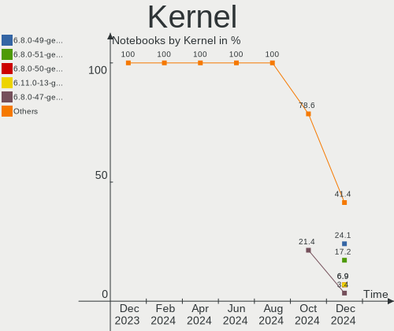
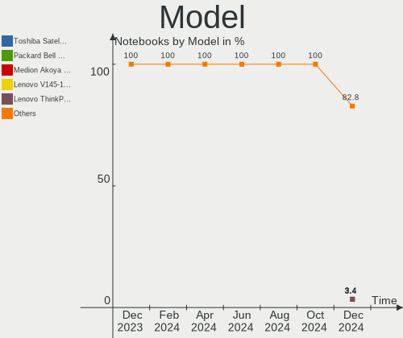
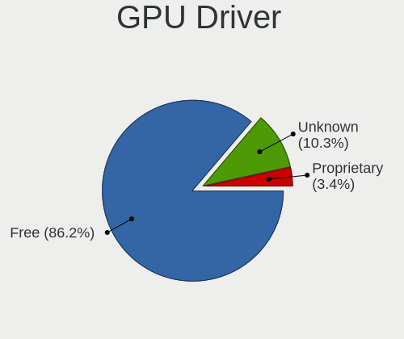
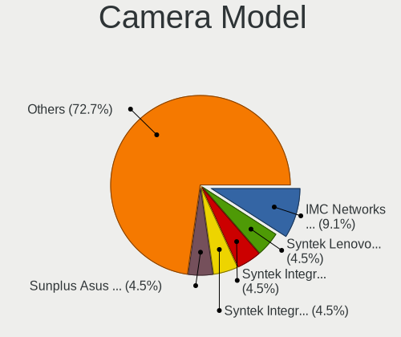
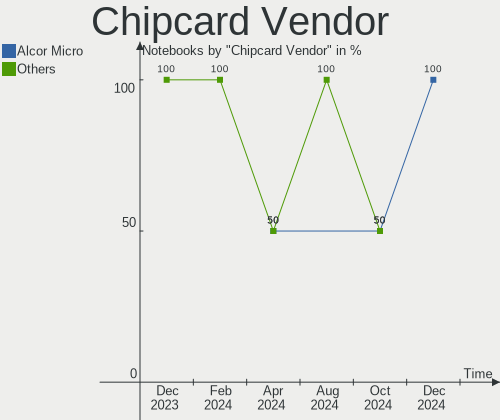

Xubuntu - Hardware Trends (Notebooks)
-------------------------------------

A project to identify most popular hardware characteristics and track their change
over time based on data collected by Linux users at https://Linux-Hardware.org.

Anyone can contribute to this report by the [hw-probe](https://github.com/linuxhw/hw-probe) tool:

    sudo -E hw-probe -all -upload

This report is for one last month. Overall report since the beginning of time: [TestCoverage](https://github.com/linuxhw/TestCoverage)

Period: Jun, 2022.

Contents
--------

* [ System ](#system)
  - [ OS                       ](#os)
  - [ OS Family                ](#os-family)
  - [ Kernel                   ](#kernel)
  - [ Kernel Family            ](#kernel-family)
  - [ Kernel Major Ver.        ](#kernel-major-ver)
  - [ Arch                     ](#arch)
  - [ DE                       ](#de)
  - [ Display Server           ](#display-server)
  - [ Display Manager          ](#display-manager)
  - [ OS Lang                  ](#os-lang)
  - [ Boot Mode                ](#boot-mode)
  - [ Filesystem               ](#filesystem)
  - [ Part. scheme             ](#part-scheme)
  - [ Dual Boot with Linux/BSD ](#dual-boot-with-linuxbsd)
  - [ Dual Boot (Win)          ](#dual-boot-win)

* [ Board ](#board)
  - [ Vendor                   ](#vendor)
  - [ Model                    ](#model)
  - [ Model Family             ](#model-family)
  - [ MFG Year                 ](#mfg-year)
  - [ Form Factor              ](#form-factor)
  - [ Secure Boot              ](#secure-boot)
  - [ Coreboot                 ](#coreboot)
  - [ RAM Size                 ](#ram-size)
  - [ RAM Used                 ](#ram-used)
  - [ Total Drives             ](#total-drives)
  - [ Has CD-ROM               ](#has-cd-rom)
  - [ Has Ethernet             ](#has-ethernet)
  - [ Has WiFi                 ](#has-wifi)
  - [ Has Bluetooth            ](#has-bluetooth)

* [ Location ](#location)
  - [ Country                  ](#country)
  - [ City                     ](#city)

* [ Drives ](#drives)
  - [ Drive Vendor             ](#drive-vendor)
  - [ Drive Model              ](#drive-model)
  - [ HDD Vendor               ](#hdd-vendor)
  - [ SSD Vendor               ](#ssd-vendor)
  - [ Drive Kind               ](#drive-kind)
  - [ Drive Connector          ](#drive-connector)
  - [ Drive Size               ](#drive-size)
  - [ Space Total              ](#space-total)
  - [ Space Used               ](#space-used)
  - [ Malfunc. Drives          ](#malfunc-drives)
  - [ Malfunc. Drive Vendor    ](#malfunc-drive-vendor)
  - [ Malfunc. HDD Vendor      ](#malfunc-hdd-vendor)
  - [ Malfunc. Drive Kind      ](#malfunc-drive-kind)
  - [ Failed Drives            ](#failed-drives)
  - [ Failed Drive Vendor      ](#failed-drive-vendor)
  - [ Drive Status             ](#drive-status)

* [ Storage controller ](#storage-controller)
  - [ Storage Vendor           ](#storage-vendor)
  - [ Storage Model            ](#storage-model)
  - [ Storage Kind             ](#storage-kind)

* [ Processor ](#processor)
  - [ CPU Vendor               ](#cpu-vendor)
  - [ CPU Model                ](#cpu-model)
  - [ CPU Model Family         ](#cpu-model-family)
  - [ CPU Cores                ](#cpu-cores)
  - [ CPU Sockets              ](#cpu-sockets)
  - [ CPU Threads              ](#cpu-threads)
  - [ CPU Op-Modes             ](#cpu-op-modes)
  - [ CPU Microcode            ](#cpu-microcode)
  - [ CPU Microarch            ](#cpu-microarch)

* [ Graphics ](#graphics)
  - [ GPU Vendor               ](#gpu-vendor)
  - [ GPU Model                ](#gpu-model)
  - [ GPU Combo                ](#gpu-combo)
  - [ GPU Driver               ](#gpu-driver)
  - [ GPU Memory               ](#gpu-memory)

* [ Monitor ](#monitor)
  - [ Monitor Vendor           ](#monitor-vendor)
  - [ Monitor Model            ](#monitor-model)
  - [ Monitor Resolution       ](#monitor-resolution)
  - [ Monitor Diagonal         ](#monitor-diagonal)
  - [ Monitor Width            ](#monitor-width)
  - [ Aspect Ratio             ](#aspect-ratio)
  - [ Monitor Area             ](#monitor-area)
  - [ Pixel Density            ](#pixel-density)
  - [ Multiple Monitors        ](#multiple-monitors)

* [ Network ](#network)
  - [ Net Controller Vendor    ](#net-controller-vendor)
  - [ Net Controller Model     ](#net-controller-model)
  - [ Wireless Vendor          ](#wireless-vendor)
  - [ Wireless Model           ](#wireless-model)
  - [ Ethernet Vendor          ](#ethernet-vendor)
  - [ Ethernet Model           ](#ethernet-model)
  - [ Net Controller Kind      ](#net-controller-kind)
  - [ Used Controller          ](#used-controller)
  - [ NICs                     ](#nics)
  - [ IPv6                     ](#ipv6)

* [ Bluetooth ](#bluetooth)
  - [ Bluetooth Vendor         ](#bluetooth-vendor)
  - [ Bluetooth Model          ](#bluetooth-model)

* [ Sound ](#sound)
  - [ Sound Vendor             ](#sound-vendor)
  - [ Sound Model              ](#sound-model)

* [ Memory ](#memory)
  - [ Memory Vendor            ](#memory-vendor)
  - [ Memory Model             ](#memory-model)
  - [ Memory Kind              ](#memory-kind)
  - [ Memory Form Factor       ](#memory-form-factor)
  - [ Memory Size              ](#memory-size)
  - [ Memory Speed             ](#memory-speed)

* [ Printers & scanners ](#printers--scanners)
  - [ Printer Vendor           ](#printer-vendor)
  - [ Printer Model            ](#printer-model)
  - [ Scanner Vendor           ](#scanner-vendor)
  - [ Scanner Model            ](#scanner-model)

* [ Camera ](#camera)
  - [ Camera Vendor            ](#camera-vendor)
  - [ Camera Model             ](#camera-model)

* [ Security ](#security)
  - [ Fingerprint Vendor       ](#fingerprint-vendor)
  - [ Fingerprint Model        ](#fingerprint-model)
  - [ Chipcard Vendor          ](#chipcard-vendor)
  - [ Chipcard Model           ](#chipcard-model)

* [ Unsupported ](#unsupported)
  - [ Unsupported Devices      ](#unsupported-devices)
  - [ Unsupported Device Types ](#unsupported-device-types)

System
------

OS
--

Installed operating systems

| Name          | Notebooks | Percent |
|---------------|-----------|---------|
| Xubuntu 20.04 | 20        | 40.82%  |
| Xubuntu 22.04 | 16        | 32.65%  |
| Xubuntu 18.04 | 8         | 16.33%  |
| Xubuntu 21.10 | 3         | 6.12%   |
| Xubuntu 22.10 | 1         | 2.04%   |
| Xubuntu 16.04 | 1         | 2.04%   |

OS Family
---------

OS without a version

| Name    | Notebooks | Percent |
|---------|-----------|---------|
| Xubuntu | 49        | 100%    |

Kernel
------

Version of the Linux kernel

| Version               | Notebooks | Percent |
|-----------------------|-----------|---------|
| 5.4.0-117-generic     | 5         | 10.2%   |
| 5.15.0-35-generic     | 5         | 10.2%   |
| 5.13.0-51-generic     | 5         | 10.2%   |
| 5.15.0-39-generic     | 3         | 6.12%   |
| 5.15.0-37-generic     | 3         | 6.12%   |
| 5.13.0-48-generic     | 3         | 6.12%   |
| 5.13.0-44-generic     | 3         | 6.12%   |
| 5.4.0-113-lowlatency  | 2         | 4.08%   |
| 5.4.0-113-generic     | 2         | 4.08%   |
| 5.15.0-33-generic     | 2         | 4.08%   |
| 5.15.0-25-generic     | 2         | 4.08%   |
| 4.15.0-188-generic    | 2         | 4.08%   |
| 5.4.0-74-generic      | 1         | 2.04%   |
| 5.4.0-112-generic     | 1         | 2.04%   |
| 5.4.0-107-generic     | 1         | 2.04%   |
| 5.15.0-40-generic     | 1         | 2.04%   |
| 5.15.0-27-generic     | 1         | 2.04%   |
| 5.13.0-52-generic     | 1         | 2.04%   |
| 5.13.0-44-lowlatency  | 1         | 2.04%   |
| 5.13.0-41-generic     | 1         | 2.04%   |
| 5.13.0-39-generic     | 1         | 2.04%   |
| 4.15.0-187-lowlatency | 1         | 2.04%   |
| 4.15.0-184-lowlatency | 1         | 2.04%   |
| 4.15.0-142-generic    | 1         | 2.04%   |

Kernel Family
-------------

Linux kernel without a distro release

| Version | Notebooks | Percent |
|---------|-----------|---------|
| 5.15.0  | 17        | 34.69%  |
| 5.13.0  | 15        | 30.61%  |
| 5.4.0   | 12        | 24.49%  |
| 4.15.0  | 5         | 10.2%   |

Kernel Major Ver.
-----------------

Linux kernel major version

| Version | Notebooks | Percent |
|---------|-----------|---------|
| 5.15    | 17        | 34.69%  |
| 5.13    | 15        | 30.61%  |
| 5.4     | 12        | 24.49%  |
| 4.15    | 5         | 10.2%   |

Arch
----

OS architecture (x86_64, i586, etc.)

| Name   | Notebooks | Percent |
|--------|-----------|---------|
| x86_64 | 44        | 89.8%   |
| i686   | 5         | 10.2%   |

DE
--

Desktop Environment

| Name  | Notebooks | Percent |
|-------|-----------|---------|
| XFCE  | 46        | 93.88%  |
| GNOME | 2         | 4.08%   |
| i3    | 1         | 2.04%   |

Display Server
--------------

X11 or Wayland

| Name | Notebooks | Percent |
|------|-----------|---------|
| X11  | 48        | 97.96%  |
| Tty  | 1         | 2.04%   |

Display Manager
---------------

SDDM, LightDM, etc.

| Name    | Notebooks | Percent |
|---------|-----------|---------|
| LightDM | 42        | 85.71%  |
| Unknown | 4         | 8.16%   |
| GDM3    | 2         | 4.08%   |
| GDM     | 1         | 2.04%   |

OS Lang
-------

Language

| Lang  | Notebooks | Percent |
|-------|-----------|---------|
| en_US | 22        | 44.9%   |
| fr_FR | 4         | 8.16%   |
| de_DE | 4         | 8.16%   |
| es_PE | 3         | 6.12%   |
| en_GB | 3         | 6.12%   |
| ru_RU | 2         | 4.08%   |
| pl_PL | 2         | 4.08%   |
| es_ES | 2         | 4.08%   |
| C     | 2         | 4.08%   |
| pt_BR | 1         | 2.04%   |
| ja_JP | 1         | 2.04%   |
| it_IT | 1         | 2.04%   |
| es_MX | 1         | 2.04%   |
| cs_CZ | 1         | 2.04%   |

Boot Mode
---------

EFI or BIOS

| Mode | Notebooks | Percent |
|------|-----------|---------|
| BIOS | 25        | 51.02%  |
| EFI  | 24        | 48.98%  |

Filesystem
----------

Type of filesystem

| Type    | Notebooks | Percent |
|---------|-----------|---------|
| Ext4    | 47        | 95.92%  |
| Zfs     | 1         | 2.04%   |
| Overlay | 1         | 2.04%   |

Part. scheme
------------

Scheme of partitioning

| Type    | Notebooks | Percent |
|---------|-----------|---------|
| Unknown | 27        | 55.1%   |
| GPT     | 18        | 36.73%  |
| MBR     | 4         | 8.16%   |

Dual Boot with Linux/BSD
------------------------

Hosting more than one Linux/BSD

| Dual boot | Notebooks | Percent |
|-----------|-----------|---------|
| No        | 44        | 89.8%   |
| Yes       | 5         | 10.2%   |

Dual Boot (Win)
---------------

Hosting Linux and Windows

| Dual boot | Notebooks | Percent |
|-----------|-----------|---------|
| No        | 34        | 69.39%  |
| Yes       | 15        | 30.61%  |

Board
-----

Vendor
------

Motherboard manufacturer

| Name                           | Notebooks | Percent |
|--------------------------------|-----------|---------|
| Lenovo                         | 11        | 22.45%  |
| Hewlett-Packard                | 9         | 18.37%  |
| Dell                           | 6         | 12.24%  |
| Acer                           | 4         | 8.16%   |
| MSI                            | 2         | 4.08%   |
| GPU Company                    | 2         | 4.08%   |
| ASUSTek Computer               | 2         | 4.08%   |
| Apple                          | 2         | 4.08%   |
| Standard                       | 1         | 2.04%   |
| Sony                           | 1         | 2.04%   |
| Packard Bell                   | 1         | 2.04%   |
| Matsushita Electric Industrial | 1         | 2.04%   |
| Google                         | 1         | 2.04%   |
| Fujitsu                        | 1         | 2.04%   |
| Dynabook                       | 1         | 2.04%   |
| Digma                          | 1         | 2.04%   |
| Chuwi                          | 1         | 2.04%   |
| AMI                            | 1         | 2.04%   |
| Alienware                      | 1         | 2.04%   |

Model
-----

Motherboard model

| Name                                        | Notebooks | Percent |
|---------------------------------------------|-----------|---------|
| Sony VPCSB1V9R                              | 1         | 2.04%   |
| Packard Bell EasyNote TK11BZ                | 1         | 2.04%   |
| MSI PR601/VR603                             | 1         | 2.04%   |
| MSI Modern 15 A5M                           | 1         | 2.04%   |
| Matsushita Electric Industrial CF-W5LWEZZBM | 1         | 2.04%   |
| Lenovo ThinkPad X200 7459V2R                | 1         | 2.04%   |
| Lenovo ThinkPad W510 431963G                | 1         | 2.04%   |
| Lenovo ThinkPad T530 23923MG                | 1         | 2.04%   |
| Lenovo ThinkPad T440s 20AQ009DGE            | 1         | 2.04%   |
| Lenovo ThinkPad T420s 417152U               | 1         | 2.04%   |
| Lenovo ThinkPad T14s Gen 1 20UHCTO1WW       | 1         | 2.04%   |
| Lenovo ThinkPad P17 Gen 1 20SQS0K700        | 1         | 2.04%   |
| Lenovo ThinkPad L380 20M6S4J400             | 1         | 2.04%   |
| Lenovo IdeaPad 330S-15IKB 81F5              | 1         | 2.04%   |
| Lenovo IdeaPad 330-17IKB 81DK               | 1         | 2.04%   |
| Lenovo G505 20240                           | 1         | 2.04%   |
| HP ProBook 455 G8 Notebook PC               | 1         | 2.04%   |
| HP ProBook 445 G7                           | 1         | 2.04%   |
| HP Pavilion Laptop 15-eh1xxx                | 1         | 2.04%   |
| HP Pavilion g7                              | 1         | 2.04%   |
| HP Pavilion dv5                             | 1         | 2.04%   |
| HP Laptop 15-ef1xxx                         | 1         | 2.04%   |
| HP EliteBook 840 G3                         | 1         | 2.04%   |
| HP 255 G7 Notebook PC                       | 1         | 2.04%   |
| HP 15                                       | 1         | 2.04%   |
| GPU Company GWTN141-4                       | 1         | 2.04%   |
| GPU Company GWTN116-3                       | 1         | 2.04%   |
| Google Kindred                              | 1         | 2.04%   |
| Fujitsu LIFEBOOK U772                       | 1         | 2.04%   |
| Dynabook TECRA A50-J                        | 1         | 2.04%   |
| Digma EVE 15 C413 ES5059EW                  | 1         | 2.04%   |
| Dell Latitude D820                          | 1         | 2.04%   |
| Dell Latitude 7280                          | 1         | 2.04%   |
| Dell Inspiron N4010                         | 1         | 2.04%   |
| Dell Inspiron 5570                          | 1         | 2.04%   |
| Dell Inspiron 15-3567                       | 1         | 2.04%   |
| Dell 500                                    | 1         | 2.04%   |
| Chuwi GemiBook Pro                          | 1         | 2.04%   |
| ASUS X551MA                                 | 1         | 2.04%   |
| ASUS VivoBook_ASUSLaptop X7600PC_N7600PC    | 1         | 2.04%   |
| Apple MacBookPro14,1                        | 1         | 2.04%   |
| Apple MacBookPro1,1                         | 1         | 2.04%   |
| AMI Intel                                   | 1         | 2.04%   |
| Alienware 17 R4                             | 1         | 2.04%   |
| Acer Aspire E5-573                          | 1         | 2.04%   |
| Acer Aspire E5-521                          | 1         | 2.04%   |
| Acer Aspire 7720                            | 1         | 2.04%   |
| Acer Aspire 5740                            | 1         | 2.04%   |
| Unknown                                     | 1         | 2.04%   |

Model Family
------------

Motherboard model prefix

| Name                                        | Notebooks | Percent |
|---------------------------------------------|-----------|---------|
| Lenovo ThinkPad                             | 8         | 16.33%  |
| Acer Aspire                                 | 4         | 8.16%   |
| HP Pavilion                                 | 3         | 6.12%   |
| Dell Inspiron                               | 3         | 6.12%   |
| Lenovo IdeaPad                              | 2         | 4.08%   |
| HP ProBook                                  | 2         | 4.08%   |
| Dell Latitude                               | 2         | 4.08%   |
| Sony VPCSB1V9R                              | 1         | 2.04%   |
| Packard Bell EasyNote                       | 1         | 2.04%   |
| MSI PR601                                   | 1         | 2.04%   |
| MSI Modern                                  | 1         | 2.04%   |
| Matsushita Electric Industrial CF-W5LWEZZBM | 1         | 2.04%   |
| Lenovo G505                                 | 1         | 2.04%   |
| HP Laptop                                   | 1         | 2.04%   |
| HP EliteBook                                | 1         | 2.04%   |
| HP 255                                      | 1         | 2.04%   |
| HP 15                                       | 1         | 2.04%   |
| GPU Company GWTN141-4                       | 1         | 2.04%   |
| GPU Company GWTN116-3                       | 1         | 2.04%   |
| Google Kindred                              | 1         | 2.04%   |
| Fujitsu LIFEBOOK                            | 1         | 2.04%   |
| Dynabook TECRA                              | 1         | 2.04%   |
| Digma EVE                                   | 1         | 2.04%   |
| Dell 500                                    | 1         | 2.04%   |
| Chuwi GemiBook                              | 1         | 2.04%   |
| ASUS X551MA                                 | 1         | 2.04%   |
| ASUS VivoBook                               | 1         | 2.04%   |
| Apple MacBookPro14                          | 1         | 2.04%   |
| Apple MacBookPro1                           | 1         | 2.04%   |
| AMI Intel                                   | 1         | 2.04%   |
| Alienware 17                                | 1         | 2.04%   |
| Unknown                                     | 1         | 2.04%   |

MFG Year
--------

Motherboard manufacture year

| Year | Notebooks | Percent |
|------|-----------|---------|
| 2021 | 8         | 16.33%  |
| 2020 | 5         | 10.2%   |
| 2018 | 4         | 8.16%   |
| 2013 | 4         | 8.16%   |
| 2011 | 4         | 8.16%   |
| 2008 | 4         | 8.16%   |
| 2017 | 3         | 6.12%   |
| 2016 | 3         | 6.12%   |
| 2006 | 3         | 6.12%   |
| 2022 | 2         | 4.08%   |
| 2014 | 2         | 4.08%   |
| 2012 | 2         | 4.08%   |
| 2010 | 2         | 4.08%   |
| 2015 | 1         | 2.04%   |
| 2009 | 1         | 2.04%   |
| 2007 | 1         | 2.04%   |

Form Factor
-----------

Physical design of the computer

| Name     | Notebooks | Percent |
|----------|-----------|---------|
| Notebook | 49        | 100%    |

Secure Boot
-----------

Enabled or disabled

| State    | Notebooks | Percent |
|----------|-----------|---------|
| Disabled | 45        | 91.84%  |
| Enabled  | 4         | 8.16%   |

Coreboot
--------

Have coreboot on board

| Used | Notebooks | Percent |
|------|-----------|---------|
| No   | 48        | 97.96%  |
| Yes  | 1         | 2.04%   |

RAM Size
--------

Total RAM memory

| Size in GB  | Notebooks | Percent |
|-------------|-----------|---------|
| 4.01-8.0    | 15        | 30.61%  |
| 3.01-4.0    | 12        | 24.49%  |
| 8.01-16.0   | 7         | 14.29%  |
| 16.01-24.0  | 5         | 10.2%   |
| 32.01-64.0  | 3         | 6.12%   |
| 1.01-2.0    | 3         | 6.12%   |
| 24.01-32.0  | 1         | 2.04%   |
| 2.01-3.0    | 1         | 2.04%   |
| 64.01-256.0 | 1         | 2.04%   |
| 0.51-1.0    | 1         | 2.04%   |

RAM Used
--------

Used RAM memory

| Used GB  | Notebooks | Percent |
|----------|-----------|---------|
| 1.01-2.0 | 18        | 36.73%  |
| 2.01-3.0 | 11        | 22.45%  |
| 4.01-8.0 | 10        | 20.41%  |
| 0.51-1.0 | 7         | 14.29%  |
| 3.01-4.0 | 2         | 4.08%   |
| 0.01-0.5 | 1         | 2.04%   |

Total Drives
------------

Number of drives on board

| Drives | Notebooks | Percent |
|--------|-----------|---------|
| 1      | 36        | 73.47%  |
| 2      | 13        | 26.53%  |

Has CD-ROM
----------

Has CD-ROM on board

| Presented | Notebooks | Percent |
|-----------|-----------|---------|
| No        | 29        | 59.18%  |
| Yes       | 20        | 40.82%  |

Has Ethernet
------------

Has Ethernet on board

| Presented | Notebooks | Percent |
|-----------|-----------|---------|
| Yes       | 40        | 81.63%  |
| No        | 9         | 18.37%  |

Has WiFi
--------

Has WiFi module

| Presented | Notebooks | Percent |
|-----------|-----------|---------|
| Yes       | 48        | 97.96%  |
| No        | 1         | 2.04%   |

Has Bluetooth
-------------

Has Bluetooth module

| Presented | Notebooks | Percent |
|-----------|-----------|---------|
| Yes       | 34        | 69.39%  |
| No        | 15        | 30.61%  |

Location
--------

Country
-------

Geographic location (country)

| Country   | Notebooks | Percent |
|-----------|-----------|---------|
| USA       | 11        | 22.45%  |
| Germany   | 8         | 16.33%  |
| France    | 5         | 10.2%   |
| Mexico    | 4         | 8.16%   |
| Russia    | 3         | 6.12%   |
| Peru      | 3         | 6.12%   |
| UK        | 2         | 4.08%   |
| Spain     | 2         | 4.08%   |
| Poland    | 2         | 4.08%   |
| Zimbabwe  | 1         | 2.04%   |
| Vietnam   | 1         | 2.04%   |
| Japan     | 1         | 2.04%   |
| Italy     | 1         | 2.04%   |
| Indonesia | 1         | 2.04%   |
| Egypt     | 1         | 2.04%   |
| Czechia   | 1         | 2.04%   |
| Bulgaria  | 1         | 2.04%   |
| Brazil    | 1         | 2.04%   |

City
----

Geographic location (city)

| City                | Notebooks | Percent |
|---------------------|-----------|---------|
| Mexico City         | 3         | 6.12%   |
| Lima                | 3         | 6.12%   |
| Warsaw              | 2         | 4.08%   |
| Palma               | 2         | 4.08%   |
| Oklahoma City       | 2         | 4.08%   |
| Ochsenfurt          | 2         | 4.08%   |
| Moscow              | 2         | 4.08%   |
| West Liberty        | 1         | 2.04%   |
| Varna               | 1         | 2.04%   |
| Surabaya            | 1         | 2.04%   |
| St Petersburg       | 1         | 2.04%   |
| Spring Valley       | 1         | 2.04%   |
| Sombrio             | 1         | 2.04%   |
| Puebla City         | 1         | 2.04%   |
| Orlando             | 1         | 2.04%   |
| Obertraubling       | 1         | 2.04%   |
| Niihama             | 1         | 2.04%   |
| Muncie              | 1         | 2.04%   |
| Monteux             | 1         | 2.04%   |
| Minneapolis         | 1         | 2.04%   |
| Manchester          | 1         | 2.04%   |
| Lyon                | 1         | 2.04%   |
| Ho Chi Minh City    | 1         | 2.04%   |
| Harare              | 1         | 2.04%   |
| Gronau              | 1         | 2.04%   |
| Grenoble            | 1         | 2.04%   |
| Gibsonia            | 1         | 2.04%   |
| Gelsenkirchen       | 1         | 2.04%   |
| Frankfurt am Main   | 1         | 2.04%   |
| Fourneaux-le-Val    | 1         | 2.04%   |
| Feldthurns          | 1         | 2.04%   |
| Dallas              | 1         | 2.04%   |
| České Budějovice | 1         | 2.04%   |
| Brest               | 1         | 2.04%   |
| Bonn                | 1         | 2.04%   |
| Blue Springs        | 1         | 2.04%   |
| Bielefeld           | 1         | 2.04%   |
| Bedford             | 1         | 2.04%   |
| Bacliff             | 1         | 2.04%   |
| Al Mansurah         | 1         | 2.04%   |

Drives
------

Drive Vendor
------------

Hard drive vendors

| Vendor              | Notebooks | Drives | Percent |
|---------------------|-----------|--------|---------|
| Samsung Electronics | 8         | 8      | 14.04%  |
| Toshiba             | 7         | 7      | 12.28%  |
| WDC                 | 6         | 6      | 10.53%  |
| Seagate             | 5         | 5      | 8.77%   |
| Unknown             | 4         | 5      | 7.02%   |
| Kingston            | 4         | 4      | 7.02%   |
| Hitachi             | 4         | 4      | 7.02%   |
| A-DATA Technology   | 3         | 3      | 5.26%   |
| SK hynix            | 2         | 2      | 3.51%   |
| HGST                | 2         | 2      | 3.51%   |
| USB3.0              | 1         | 1      | 1.75%   |
| SanDisk             | 1         | 1      | 1.75%   |
| Phison              | 1         | 1      | 1.75%   |
| Patriot             | 1         | 1      | 1.75%   |
| Micron Technology   | 1         | 1      | 1.75%   |
| KIOXIA              | 1         | 1      | 1.75%   |
| Intel               | 1         | 1      | 1.75%   |
| INNOVATION IT       | 1         | 1      | 1.75%   |
| Gigabyte Technology | 1         | 1      | 1.75%   |
| FORESEE             | 1         | 1      | 1.75%   |
| Apple               | 1         | 2      | 1.75%   |
| Unknown             | 1         | 1      | 1.75%   |

Drive Model
-----------

Hard drive models

| Model                                | Notebooks | Percent |
|--------------------------------------|-----------|---------|
| Samsung NVMe SSD Drive 256GB         | 2         | 3.45%   |
| WDC WDS500G2B0B-00YS70 500GB SSD     | 1         | 1.72%   |
| WDC WD7500BPVT-60HXZT3 752GB         | 1         | 1.72%   |
| WDC WD5000BEVT-00ZAT0 500GB          | 1         | 1.72%   |
| WDC WD3200BEVT-22ZCT0 320GB          | 1         | 1.72%   |
| WDC WD10SPZX-24Z10T0 1TB             | 1         | 1.72%   |
| WDC PC SN530 SDBPNPZ-512G-1006 512GB | 1         | 1.72%   |
| USB3.0 Super Speed 320GB             | 1         | 1.72%   |
| Unknown SD32G  32GB                  | 1         | 1.72%   |
| Unknown NVMe SSD Drive 256GB         | 1         | 1.72%   |
| Unknown MMC Card  32GB               | 1         | 1.72%   |
| Unknown DA4064  64GB                 | 1         | 1.72%   |
| Unknown DA4032  32GB                 | 1         | 1.72%   |
| Toshiba MQ04ABF100 1TB               | 1         | 1.72%   |
| Toshiba MQ01ACF050 500GB             | 1         | 1.72%   |
| Toshiba MQ01ABD100 1TB               | 1         | 1.72%   |
| Toshiba MK6025GAS 64GB               | 1         | 1.72%   |
| Toshiba MK5065GSXN 500GB             | 1         | 1.72%   |
| Toshiba MK5059GSXP 500GB             | 1         | 1.72%   |
| Toshiba KBG40ZNV256G MEMORY 256GB    | 1         | 1.72%   |
| SK hynix NVMe SSD Drive 256GB        | 1         | 1.72%   |
| SK hynix HFM001TD3JX013N 1TB         | 1         | 1.72%   |
| Seagate ST500LM021-1KJ152 500GB      | 1         | 1.72%   |
| Seagate ST500LM012 HN-M500MBB 500GB  | 1         | 1.72%   |
| Seagate ST500LM000-1EJ162 500GB      | 1         | 1.72%   |
| Seagate ST2000LM007-1R8174 2TB       | 1         | 1.72%   |
| Seagate ST1000LM024 HN-M101MBB 1TB   | 1         | 1.72%   |
| SanDisk SD9SN8W-128G-1006 128GB SSD  | 1         | 1.72%   |
| Samsung SSD 980 PRO 2TB              | 1         | 1.72%   |
| Samsung SSD 970 EVO Plus 2TB         | 1         | 1.72%   |
| Samsung SSD 870 EVO 250GB            | 1         | 1.72%   |
| Samsung SSD 860 EVO 1TB              | 1         | 1.72%   |
| Samsung SSD 850 EVO 500GB            | 1         | 1.72%   |
| Samsung MZ7TD256HAFV-00000 256GB SSD | 1         | 1.72%   |
| Phison NVMe SSD Drive 480GB          | 1         | 1.72%   |
| Patriot Burst 480GB SSD              | 1         | 1.72%   |
| Micron 1100 SATA 512GB SSD           | 1         | 1.72%   |
| KIOXIA NVMe SSD Drive 256GB          | 1         | 1.72%   |
| Kingston SNVS2000G 2TB               | 1         | 1.72%   |
| Kingston SA400S37480G 480GB SSD      | 1         | 1.72%   |
| Kingston SA400S37240G 240GB SSD      | 1         | 1.72%   |
| Kingston NVMe SSD Drive 256GB        | 1         | 1.72%   |
| Intel SSDSC2BF180A5L 180GB           | 1         | 1.72%   |
| INNOVATION IT IT 512GB SSD           | 1         | 1.72%   |
| Hitachi HTS723225L9A362 250GB        | 1         | 1.72%   |
| Hitachi HTS545032B9A300 320GB        | 1         | 1.72%   |
| Hitachi HTS543225L9A300 250GB        | 1         | 1.72%   |
| Hitachi HTS541080G9SA00 80GB         | 1         | 1.72%   |
| HGST HTS545050A7E680 500GB           | 1         | 1.72%   |
| HGST HTS541010A9E680 1TB             | 1         | 1.72%   |
| Gigabyte GP-GSTFS31256GTND 256GB     | 1         | 1.72%   |
| FORESEE 256GB SSD                    | 1         | 1.72%   |
| Apple SSD AP0256J 8.1KB              | 1         | 1.72%   |
| A-DATA SU800NS38 512GB SSD           | 1         | 1.72%   |
| A-DATA SP900 128GB SSD               | 1         | 1.72%   |
| A-DATA FALCON 1TB                    | 1         | 1.72%   |
| Unknown                              | 1         | 1.72%   |

HDD Vendor
----------

Hard disk drive vendors

| Vendor  | Notebooks | Drives | Percent |
|---------|-----------|--------|---------|
| Toshiba | 6         | 6      | 28.57%  |
| Seagate | 5         | 5      | 23.81%  |
| WDC     | 4         | 4      | 19.05%  |
| Hitachi | 4         | 4      | 19.05%  |
| HGST    | 2         | 2      | 9.52%   |

SSD Vendor
----------

Solid state drive vendors

| Vendor              | Notebooks | Drives | Percent |
|---------------------|-----------|--------|---------|
| Samsung Electronics | 4         | 4      | 23.53%  |
| Kingston            | 2         | 2      | 11.76%  |
| A-DATA Technology   | 2         | 2      | 11.76%  |
| WDC                 | 1         | 1      | 5.88%   |
| USB3.0              | 1         | 1      | 5.88%   |
| SanDisk             | 1         | 1      | 5.88%   |
| Patriot             | 1         | 1      | 5.88%   |
| Micron Technology   | 1         | 1      | 5.88%   |
| Intel               | 1         | 1      | 5.88%   |
| INNOVATION IT       | 1         | 1      | 5.88%   |
| Gigabyte Technology | 1         | 1      | 5.88%   |
| FORESEE             | 1         | 1      | 5.88%   |

Drive Kind
----------

HDD or SSD

| Kind | Notebooks | Drives | Percent |
|------|-----------|--------|---------|
| HDD  | 21        | 21     | 38.18%  |
| SSD  | 16        | 17     | 29.09%  |
| NVMe | 14        | 16     | 25.45%  |
| MMC  | 4         | 5      | 7.27%   |

Drive Connector
---------------

SATA, SAS, NVMe, etc.

| Type | Notebooks | Drives | Percent |
|------|-----------|--------|---------|
| SATA | 34        | 37     | 64.15%  |
| NVMe | 14        | 16     | 26.42%  |
| MMC  | 4         | 5      | 7.55%   |
| SAS  | 1         | 1      | 1.89%   |

Drive Size
----------

Size of hard drive

| Size in TB | Notebooks | Drives | Percent |
|------------|-----------|--------|---------|
| 0.01-0.5   | 25        | 27     | 69.44%  |
| 0.51-1.0   | 10        | 10     | 27.78%  |
| 1.01-2.0   | 1         | 1      | 2.78%   |

Space Total
-----------

Amount of disk space available on the file system

| Size in GB | Notebooks | Percent |
|------------|-----------|---------|
| 101-250    | 15        | 30.61%  |
| 251-500    | 13        | 26.53%  |
| 501-1000   | 8         | 16.33%  |
| 51-100     | 6         | 12.24%  |
| 1001-2000  | 3         | 6.12%   |
| 21-50      | 2         | 4.08%   |
| 1-20       | 2         | 4.08%   |

Space Used
----------

Amount of used disk space

| Used GB  | Notebooks | Percent |
|----------|-----------|---------|
| 1-20     | 19        | 38.78%  |
| 51-100   | 9         | 18.37%  |
| 21-50    | 7         | 14.29%  |
| 101-250  | 7         | 14.29%  |
| 251-500  | 5         | 10.2%   |
| 501-1000 | 2         | 4.08%   |

Malfunc. Drives
---------------

Drive models with a malfunction

| Model                              | Notebooks | Drives | Percent |
|------------------------------------|-----------|--------|---------|
| Toshiba MQ01ACF050 500GB           | 1         | 1      | 14.29%  |
| Toshiba MQ01ABD100 1TB             | 1         | 1      | 14.29%  |
| Toshiba MK5065GSXN 500GB           | 1         | 1      | 14.29%  |
| Toshiba MK5059GSXP 500GB           | 1         | 1      | 14.29%  |
| Seagate ST1000LM024 HN-M101MBB 1TB | 1         | 1      | 14.29%  |
| Hitachi HTS541080G9SA00 80GB       | 1         | 1      | 14.29%  |
| HGST HTS541010A9E680 1TB           | 1         | 1      | 14.29%  |

Malfunc. Drive Vendor
---------------------

Vendors of faulty drives

| Vendor  | Notebooks | Drives | Percent |
|---------|-----------|--------|---------|
| Toshiba | 4         | 4      | 57.14%  |
| Seagate | 1         | 1      | 14.29%  |
| Hitachi | 1         | 1      | 14.29%  |
| HGST    | 1         | 1      | 14.29%  |

Malfunc. HDD Vendor
-------------------

Vendors of faulty HDD drives

| Vendor  | Notebooks | Drives | Percent |
|---------|-----------|--------|---------|
| Toshiba | 4         | 4      | 57.14%  |
| Seagate | 1         | 1      | 14.29%  |
| Hitachi | 1         | 1      | 14.29%  |
| HGST    | 1         | 1      | 14.29%  |

Malfunc. Drive Kind
-------------------

Kinds of faulty drives

| Kind | Notebooks | Drives | Percent |
|------|-----------|--------|---------|
| HDD  | 7         | 7      | 100%    |

Failed Drives
-------------

Failed drive models

Zero info for selected period =(

Failed Drive Vendor
-------------------

Failed drive vendors

Zero info for selected period =(

Drive Status
------------

Number of failed and malfunc. drives

| Status   | Notebooks | Drives | Percent |
|----------|-----------|--------|---------|
| Detected | 29        | 36     | 58%     |
| Works    | 14        | 16     | 28%     |
| Malfunc  | 7         | 7      | 14%     |

Storage controller
------------------

Storage Vendor
--------------

Storage controller vendors

| Vendor                      | Notebooks | Percent |
|-----------------------------|-----------|---------|
| Intel                       | 33        | 61.11%  |
| AMD                         | 6         | 11.11%  |
| Samsung Electronics         | 4         | 7.41%   |
| SK hynix                    | 2         | 3.7%    |
| KIOXIA                      | 2         | 3.7%    |
| Kingston Technology Company | 2         | 3.7%    |
| Unknown                     | 1         | 1.85%   |
| SanDisk                     | 1         | 1.85%   |
| Realtek Semiconductor       | 1         | 1.85%   |
| Phison Electronics          | 1         | 1.85%   |
| Apple                       | 1         | 1.85%   |

Storage Model
-------------

Storage controller models

| Model                                                                        | Notebooks | Percent |
|------------------------------------------------------------------------------|-----------|---------|
| Intel Sunrise Point-LP SATA Controller [AHCI mode]                           | 5         | 8.77%   |
| AMD FCH SATA Controller [AHCI mode]                                          | 5         | 8.77%   |
| Intel 82801IBM/IEM (ICH9M/ICH9M-E) 4 port SATA Controller [AHCI mode]        | 3         | 5.26%   |
| Intel 8 Series SATA Controller 1 [AHCI mode]                                 | 3         | 5.26%   |
| Intel 7 Series Chipset Family 6-port SATA Controller [AHCI mode]             | 3         | 5.26%   |
| Samsung NVMe SSD Controller SM981/PM981/PM983                                | 2         | 3.51%   |
| KIOXIA Non-Volatile memory controller                                        | 2         | 3.51%   |
| Intel Celeron N3350/Pentium N4200/Atom E3900 Series SATA AHCI Controller     | 2         | 3.51%   |
| Intel 82801HM/HEM (ICH8M/ICH8M-E) IDE Controller                             | 2         | 3.51%   |
| Intel 82801GBM/GHM (ICH7-M Family) SATA Controller [IDE mode]                | 2         | 3.51%   |
| Intel 82801G (ICH7 Family) IDE Controller                                    | 2         | 3.51%   |
| Intel 6 Series/C200 Series Chipset Family 6 port Mobile SATA AHCI Controller | 2         | 3.51%   |
| Intel 5 Series/3400 Series Chipset 6 port SATA AHCI Controller               | 2         | 3.51%   |
| Unknown Non-Volatile memory controller                                       | 1         | 1.75%   |
| SK hynix Non-Volatile memory controller                                      | 1         | 1.75%   |
| SK hynix Gold P31 SSD                                                        | 1         | 1.75%   |
| SanDisk WD Blue SN550 NVMe SSD                                               | 1         | 1.75%   |
| Samsung NVMe SSD Controller PM9A1/PM9A3/980PRO                               | 1         | 1.75%   |
| Samsung NVMe SSD Controller 980                                              | 1         | 1.75%   |
| Realtek Realtek Non-Volatile memory controller                               | 1         | 1.75%   |
| Phison E12 NVMe Controller                                                   | 1         | 1.75%   |
| Kingston Company U-SNS8154P3 NVMe SSD                                        | 1         | 1.75%   |
| Kingston Company Company Non-Volatile memory controller                      | 1         | 1.75%   |
| Intel Volume Management Device NVMe RAID Controller                          | 1         | 1.75%   |
| Intel SATA Controller [RAID mode]                                            | 1         | 1.75%   |
| Intel Jasper Lake SATA AHCI Controller                                       | 1         | 1.75%   |
| Intel Ice Lake-LP SATA Controller [AHCI mode]                                | 1         | 1.75%   |
| Intel Celeron/Pentium Silver Processor SATA Controller                       | 1         | 1.75%   |
| Intel Atom Processor E3800 Series SATA AHCI Controller                       | 1         | 1.75%   |
| Intel 82801HM/HEM (ICH8M/ICH8M-E) SATA Controller [IDE mode]                 | 1         | 1.75%   |
| Intel 82801HM/HEM (ICH8M/ICH8M-E) SATA Controller [AHCI mode]                | 1         | 1.75%   |
| Intel 82801 Mobile SATA Controller [RAID mode]                               | 1         | 1.75%   |
| Intel 5 Series/3400 Series Chipset 4 port SATA AHCI Controller               | 1         | 1.75%   |
| Apple S3X NVMe Controller                                                    | 1         | 1.75%   |
| AMD SB7x0/SB8x0/SB9x0 SATA Controller [AHCI mode]                            | 1         | 1.75%   |

Storage Kind
------------

Kind of storage controller (IDE, SATA, NVMe, SAS, ...)

| Kind | Notebooks | Percent |
|------|-----------|---------|
| SATA | 32        | 59.26%  |
| NVMe | 14        | 25.93%  |
| IDE  | 5         | 9.26%   |
| RAID | 3         | 5.56%   |

Processor
---------

CPU Vendor
----------

Processor vendors

| Vendor | Notebooks | Percent |
|--------|-----------|---------|
| Intel  | 38        | 77.55%  |
| AMD    | 11        | 22.45%  |

CPU Model
---------

Processor models

| Model                                       | Notebooks | Percent |
|---------------------------------------------|-----------|---------|
| Intel Core i5-8250U CPU @ 1.60GHz           | 2         | 4.08%   |
| Intel Core i5-4210U CPU @ 1.70GHz           | 2         | 4.08%   |
| Intel Celeron CPU N3350 @ 1.10GHz           | 2         | 4.08%   |
| AMD Ryzen 7 5700U with Radeon Graphics      | 2         | 4.08%   |
| AMD Ryzen 5 4500U with Radeon Graphics      | 2         | 4.08%   |
| Intel Pentium Dual CPU T3400 @ 2.16GHz      | 1         | 2.04%   |
| Intel Pentium 3556U @ 1.70GHz               | 1         | 2.04%   |
| Intel Genuine CPU U1400 @ 1.20GHz           | 1         | 2.04%   |
| Intel Genuine CPU T2600 @ 2.16GHz           | 1         | 2.04%   |
| Intel Core i7-8550U CPU @ 1.80GHz           | 1         | 2.04%   |
| Intel Core i7-7820HK CPU @ 2.90GHz          | 1         | 2.04%   |
| Intel Core i7-6600U CPU @ 2.60GHz           | 1         | 2.04%   |
| Intel Core i7-3687U CPU @ 2.10GHz           | 1         | 2.04%   |
| Intel Core i7 CPU M 620 @ 2.67GHz           | 1         | 2.04%   |
| Intel Core i5-7360U CPU @ 2.30GHz           | 1         | 2.04%   |
| Intel Core i5-6300U CPU @ 2.40GHz           | 1         | 2.04%   |
| Intel Core i5-3320M CPU @ 2.60GHz           | 1         | 2.04%   |
| Intel Core i5-2520M CPU @ 2.50GHz           | 1         | 2.04%   |
| Intel Core i5-2410M CPU @ 2.30GHz           | 1         | 2.04%   |
| Intel Core i5-10400H CPU @ 2.60GHz          | 1         | 2.04%   |
| Intel Core i5-1035G1 CPU @ 1.00GHz          | 1         | 2.04%   |
| Intel Core i3-7130U CPU @ 2.70GHz           | 1         | 2.04%   |
| Intel Core i3-6006U CPU @ 2.00GHz           | 1         | 2.04%   |
| Intel Core i3-3217U CPU @ 1.80GHz           | 1         | 2.04%   |
| Intel Core i3 CPU M 350 @ 2.27GHz           | 1         | 2.04%   |
| Intel Core i3 CPU M 330 @ 2.13GHz           | 1         | 2.04%   |
| Intel Core 2 Duo CPU T5550 @ 1.83GHz        | 1         | 2.04%   |
| Intel Core 2 Duo CPU P8800 @ 2.66GHz        | 1         | 2.04%   |
| Intel Core 2 Duo CPU P8600 @ 2.40GHz        | 1         | 2.04%   |
| Intel Core 2 CPU T5600 @ 1.83GHz            | 1         | 2.04%   |
| Intel Celeron N5100 @ 1.10GHz               | 1         | 2.04%   |
| Intel Celeron N4020 CPU @ 1.10GHz           | 1         | 2.04%   |
| Intel Celeron CPU N2830 @ 2.16GHz           | 1         | 2.04%   |
| Intel Celeron CPU 550 @ 2.00GHz             | 1         | 2.04%   |
| Intel Celeron CPU 5205U @ 1.90GHz           | 1         | 2.04%   |
| Intel 11th Gen Core i7-11370H @ 3.30GHz     | 1         | 2.04%   |
| Intel 11th Gen Core i5-1135G7 @ 2.40GHz     | 1         | 2.04%   |
| AMD Ryzen 7 PRO 4750U with Radeon Graphics  | 1         | 2.04%   |
| AMD Ryzen 5 5600U with Radeon Graphics      | 1         | 2.04%   |
| AMD E2-3000M APU with Radeon HD Graphics    | 1         | 2.04%   |
| AMD E1-2100 APU with Radeon HD Graphics     | 1         | 2.04%   |
| AMD E-300 APU with Radeon HD Graphics       | 1         | 2.04%   |
| AMD A8-6410 APU with AMD Radeon R5 Graphics | 1         | 2.04%   |
| AMD 3020e with Radeon Graphics              | 1         | 2.04%   |

CPU Model Family
----------------

Processor model prefix

| Model              | Notebooks | Percent |
|--------------------|-----------|---------|
| Intel Core i5      | 11        | 22.45%  |
| Intel Celeron      | 7         | 14.29%  |
| Intel Core i7      | 5         | 10.2%   |
| Intel Core i3      | 5         | 10.2%   |
| Other              | 3         | 6.12%   |
| Intel Core 2 Duo   | 3         | 6.12%   |
| AMD Ryzen 5        | 3         | 6.12%   |
| Intel Genuine      | 2         | 4.08%   |
| AMD Ryzen 7        | 2         | 4.08%   |
| Intel Pentium Dual | 1         | 2.04%   |
| Intel Pentium      | 1         | 2.04%   |
| Intel Core 2       | 1         | 2.04%   |
| AMD Ryzen 7 PRO    | 1         | 2.04%   |
| AMD E2             | 1         | 2.04%   |
| AMD E1             | 1         | 2.04%   |
| AMD E              | 1         | 2.04%   |
| AMD A8             | 1         | 2.04%   |

CPU Cores
---------

Number of processor cores

| Number | Notebooks | Percent |
|--------|-----------|---------|
| 2      | 31        | 63.27%  |
| 4      | 10        | 20.41%  |
| 8      | 3         | 6.12%   |
| 6      | 3         | 6.12%   |
| 1      | 2         | 4.08%   |

CPU Sockets
-----------

Number of sockets

| Number | Notebooks | Percent |
|--------|-----------|---------|
| 1      | 49        | 100%    |

CPU Threads
-----------

Threads per core (Hyper-Threading)

| Number | Notebooks | Percent |
|--------|-----------|---------|
| 2      | 27        | 55.1%   |
| 1      | 22        | 44.9%   |

CPU Op-Modes
------------

CPU Operation Modes (32-bit, 64-bit)

| Op mode        | Notebooks | Percent |
|----------------|-----------|---------|
| 32-bit, 64-bit | 47        | 95.92%  |
| 32-bit         | 2         | 4.08%   |

CPU Microcode
-------------

Microcode number

| Number     | Notebooks | Percent |
|------------|-----------|---------|
| Unknown    | 12        | 24.49%  |
| 0x40651    | 3         | 6.12%   |
| 0x806ea    | 2         | 4.08%   |
| 0x806c1    | 2         | 4.08%   |
| 0x6fd      | 2         | 4.08%   |
| 0x6e8      | 2         | 4.08%   |
| 0x506ca    | 2         | 4.08%   |
| 0x406e3    | 2         | 4.08%   |
| 0x306a9    | 2         | 4.08%   |
| 0x08608103 | 2         | 4.08%   |
| 0x08600106 | 2         | 4.08%   |
| 0xa0652    | 1         | 2.04%   |
| 0x906e9    | 1         | 2.04%   |
| 0x906c0    | 1         | 2.04%   |
| 0x806e9    | 1         | 2.04%   |
| 0x706a8    | 1         | 2.04%   |
| 0x6f6      | 1         | 2.04%   |
| 0x30678    | 1         | 2.04%   |
| 0x206a7    | 1         | 2.04%   |
| 0x20655    | 1         | 2.04%   |
| 0x20652    | 1         | 2.04%   |
| 0x1067a    | 1         | 2.04%   |
| 0x10676    | 1         | 2.04%   |
| 0x10661    | 1         | 2.04%   |
| 0x08200103 | 1         | 2.04%   |
| 0x0700010f | 1         | 2.04%   |
| 0x05000119 | 1         | 2.04%   |

CPU Microarch
-------------

Microarchitecture

| Name          | Notebooks | Percent |
|---------------|-----------|---------|
| KabyLake      | 7         | 14.29%  |
| Core          | 4         | 8.16%   |
| Zen 2         | 3         | 6.12%   |
| Westmere      | 3         | 6.12%   |
| Skylake       | 3         | 6.12%   |
| IvyBridge     | 3         | 6.12%   |
| Haswell       | 3         | 6.12%   |
| TigerLake     | 2         | 4.08%   |
| SandyBridge   | 2         | 4.08%   |
| Penryn        | 2         | 4.08%   |
| P6            | 2         | 4.08%   |
| Goldmont      | 2         | 4.08%   |
| Unknown       | 2         | 4.08%   |
| Zen 3         | 1         | 2.04%   |
| Zen           | 1         | 2.04%   |
| Tremont       | 1         | 2.04%   |
| Silvermont    | 1         | 2.04%   |
| Puma          | 1         | 2.04%   |
| K10 Llano     | 1         | 2.04%   |
| Jaguar        | 1         | 2.04%   |
| IceLake       | 1         | 2.04%   |
| Goldmont plus | 1         | 2.04%   |
| CometLake     | 1         | 2.04%   |
| Bobcat        | 1         | 2.04%   |

Graphics
--------

GPU Vendor
----------

Vendors of graphics cards

| Vendor | Notebooks | Percent |
|--------|-----------|---------|
| Intel  | 34        | 62.96%  |
| AMD    | 14        | 25.93%  |
| Nvidia | 6         | 11.11%  |

GPU Model
---------

Graphics card models

| Model                                                                                 | Notebooks | Percent |
|---------------------------------------------------------------------------------------|-----------|---------|
| Intel UHD Graphics 620                                                                | 3         | 5.26%   |
| Intel Skylake GT2 [HD Graphics 520]                                                   | 3         | 5.26%   |
| Intel Haswell-ULT Integrated Graphics Controller                                      | 3         | 5.26%   |
| Intel 3rd Gen Core processor Graphics Controller                                      | 3         | 5.26%   |
| AMD Renoir                                                                            | 3         | 5.26%   |
| Intel TigerLake-LP GT2 [Iris Xe Graphics]                                             | 2         | 3.51%   |
| Intel Mobile 945GM/GMS/GME, 943/940GML Express Integrated Graphics Controller         | 2         | 3.51%   |
| Intel Mobile 945GM/GMS, 943/940GML Express Integrated Graphics Controller             | 2         | 3.51%   |
| Intel Mobile 4 Series Chipset Integrated Graphics Controller                          | 2         | 3.51%   |
| Intel HD Graphics 500                                                                 | 2         | 3.51%   |
| Intel Core Processor Integrated Graphics Controller                                   | 2         | 3.51%   |
| Intel 2nd Generation Core Processor Family Integrated Graphics Controller             | 2         | 3.51%   |
| AMD Lucienne                                                                          | 2         | 3.51%   |
| Nvidia TU117GLM [Quadro T1000 Mobile]                                                 | 1         | 1.75%   |
| Nvidia GT216GLM [Quadro FX 880M]                                                      | 1         | 1.75%   |
| Nvidia GP104M [GeForce GTX 1070 Mobile]                                               | 1         | 1.75%   |
| Nvidia GA107M [GeForce RTX 3050 Mobile]                                               | 1         | 1.75%   |
| Nvidia G96CM [GeForce 9600M GT]                                                       | 1         | 1.75%   |
| Nvidia G86M [GeForce 8400M GS]                                                        | 1         | 1.75%   |
| Intel Mobile GM965/GL960 Integrated Graphics Controller (secondary)                   | 1         | 1.75%   |
| Intel Mobile GM965/GL960 Integrated Graphics Controller (primary)                     | 1         | 1.75%   |
| Intel JasperLake [UHD Graphics]                                                       | 1         | 1.75%   |
| Intel Iris Plus Graphics G1 (Ice Lake)                                                | 1         | 1.75%   |
| Intel Iris Plus Graphics 640                                                          | 1         | 1.75%   |
| Intel HD Graphics 630                                                                 | 1         | 1.75%   |
| Intel HD Graphics 620                                                                 | 1         | 1.75%   |
| Intel GeminiLake [UHD Graphics 600]                                                   | 1         | 1.75%   |
| Intel CometLake-H GT2 [UHD Graphics]                                                  | 1         | 1.75%   |
| Intel Comet Lake UHD Graphics                                                         | 1         | 1.75%   |
| Intel Atom Processor Z36xxx/Z37xxx Series Graphics & Display                          | 1         | 1.75%   |
| AMD Wrestler [Radeon HD 6310]                                                         | 1         | 1.75%   |
| AMD Topaz XT [Radeon R7 M260/M265 / M340/M360 / M440/M445 / 530/535 / 620/625 Mobile] | 1         | 1.75%   |
| AMD SuperSumo [Radeon HD 6380G]                                                       | 1         | 1.75%   |
| AMD Seymour [Radeon HD 6400M/7400M Series]                                            | 1         | 1.75%   |
| AMD RV530/M56-P [Mobility Radeon X1600]                                               | 1         | 1.75%   |
| AMD Picasso/Raven 2 [Radeon Vega Series / Radeon Vega Mobile Series]                  | 1         | 1.75%   |
| AMD Mullins [Radeon R4/R5 Graphics]                                                   | 1         | 1.75%   |
| AMD Kabini [Radeon HD 8210]                                                           | 1         | 1.75%   |
| AMD Cezanne                                                                           | 1         | 1.75%   |

GPU Combo
---------

Combinations of graphics cards

| Name           | Notebooks | Percent |
|----------------|-----------|---------|
| 1 x Intel      | 29        | 59.18%  |
| 1 x AMD        | 12        | 24.49%  |
| 1 x Nvidia     | 4         | 8.16%   |
| Intel + Nvidia | 2         | 4.08%   |
| Intel + AMD    | 2         | 4.08%   |

GPU Driver
----------

Free vs proprietary

| Driver      | Notebooks | Percent |
|-------------|-----------|---------|
| Free        | 44        | 89.8%   |
| Proprietary | 3         | 6.12%   |
| Unknown     | 2         | 4.08%   |

GPU Memory
----------

Total video memory

| Size in GB | Notebooks | Percent |
|------------|-----------|---------|
| Unknown    | 33        | 67.35%  |
| 0.01-0.5   | 9         | 18.37%  |
| 3.01-4.0   | 3         | 6.12%   |
| 1.01-2.0   | 2         | 4.08%   |
| 7.01-8.0   | 1         | 2.04%   |
| 0.51-1.0   | 1         | 2.04%   |

Monitor
-------

Monitor Vendor
--------------

Monitor vendors

| Vendor                  | Notebooks | Percent |
|-------------------------|-----------|---------|
| Samsung Electronics     | 10        | 19.23%  |
| AU Optronics            | 10        | 19.23%  |
| Chimei Innolux          | 9         | 17.31%  |
| LG Display              | 5         | 9.62%   |
| BOE                     | 5         | 9.62%   |
| Dell                    | 3         | 5.77%   |
| Lenovo                  | 2         | 3.85%   |
| Apple                   | 2         | 3.85%   |
| PANDA                   | 1         | 1.92%   |
| Lenovo Group Limited    | 1         | 1.92%   |
| InfoVision              | 1         | 1.92%   |
| DENON                   | 1         | 1.92%   |
| Chi Mei Optoelectronics | 1         | 1.92%   |
| Unknown                 | 1         | 1.92%   |

Monitor Model
-------------

Monitor models

| Model                                                                    | Notebooks | Percent |
|--------------------------------------------------------------------------|-----------|---------|
| Samsung Electronics S24R35x SAM100E 1920x1080 527x296mm 23.8-inch        | 1         | 1.92%   |
| Samsung Electronics LCD Monitor SEC4E45 1280x800 331x207mm 15.4-inch     | 1         | 1.92%   |
| Samsung Electronics LCD Monitor SEC3945 1280x800 331x207mm 15.4-inch     | 1         | 1.92%   |
| Samsung Electronics LCD Monitor SEC3454 1600x900 382x215mm 17.3-inch     | 1         | 1.92%   |
| Samsung Electronics LCD Monitor SEC3046 1366x768 340x190mm 15.3-inch     | 1         | 1.92%   |
| Samsung Electronics LCD Monitor SDC4752 1366x768 344x194mm 15.5-inch     | 1         | 1.92%   |
| Samsung Electronics LCD Monitor SDC415D 3840x2400 344x215mm 16.0-inch    | 1         | 1.92%   |
| Samsung Electronics LCD Monitor SAM7048 1360x768 522x293mm 23.6-inch     | 1         | 1.92%   |
| Samsung Electronics LCD Monitor SAM0668 1920x1080 886x498mm 40.0-inch    | 1         | 1.92%   |
| Samsung Electronics C27F390 SAM0D32 1920x1080 598x336mm 27.0-inch        | 1         | 1.92%   |
| PANDA LCD Monitor NCP0046 1920x1080 344x194mm 15.5-inch                  | 1         | 1.92%   |
| LG Display LCD Monitor LGD05BE 1920x1080 382x215mm 17.3-inch             | 1         | 1.92%   |
| LG Display LCD Monitor LGD0430 1366x768 345x194mm 15.6-inch              | 1         | 1.92%   |
| LG Display LCD Monitor LGD036B 1366x768 309x174mm 14.0-inch              | 1         | 1.92%   |
| LG Display LCD Monitor LGD033C 1366x768 309x174mm 14.0-inch              | 1         | 1.92%   |
| LG Display LCD Monitor LGD0291 1366x768 310x174mm 14.0-inch              | 1         | 1.92%   |
| Lenovo LCD Monitor LEN40B1 1600x900 344x194mm 15.5-inch                  | 1         | 1.92%   |
| Lenovo LCD Monitor LEN4010 1280x800 261x163mm 12.1-inch                  | 1         | 1.92%   |
| Lenovo Group Limited LCD Monitor 1600x900                                | 1         | 1.92%   |
| InfoVision LCD Monitor IVO8C5F 1920x1080 309x174mm 14.0-inch             | 1         | 1.92%   |
| DENON AVR DON0035 1920x1080 1210x680mm 54.6-inch                         | 1         | 1.92%   |
| Dell S2721NX DEL4200 1920x1080 598x336mm 27.0-inch                       | 1         | 1.92%   |
| Dell S2721NX DEL41FF 1920x1080 598x336mm 27.0-inch                       | 1         | 1.92%   |
| Dell P2217H DELA0D9 1920x1080 476x267mm 21.5-inch                        | 1         | 1.92%   |
| Chimei Innolux P140ZKA-BZ1 CMN8C02 2160x1440 296x197mm 14.0-inch         | 1         | 1.92%   |
| Chimei Innolux LCD Monitor CMN15E7 1920x1080 344x193mm 15.5-inch         | 1         | 1.92%   |
| Chimei Innolux LCD Monitor CMN15DB 1366x768 344x193mm 15.5-inch          | 1         | 1.92%   |
| Chimei Innolux LCD Monitor CMN15C9 1366x768 344x193mm 15.5-inch          | 1         | 1.92%   |
| Chimei Innolux LCD Monitor CMN15AB 1366x768 344x194mm 15.5-inch          | 1         | 1.92%   |
| Chimei Innolux LCD Monitor CMN153D 1920x1080 344x193mm 15.5-inch         | 1         | 1.92%   |
| Chimei Innolux LCD Monitor CMN1537 1366x768 344x193mm 15.5-inch          | 1         | 1.92%   |
| Chimei Innolux LCD Monitor CMN14F2 1920x1080 309x173mm 13.9-inch         | 1         | 1.92%   |
| Chimei Innolux LCD Monitor CMN1482 1600x900 309x174mm 14.0-inch          | 1         | 1.92%   |
| Chi Mei Optoelectronics LCD Monitor CMO15A7 1366x768 344x193mm 15.5-inch | 1         | 1.92%   |
| BOE LCD Monitor BOE0993 1366x768 256x144mm 11.6-inch                     | 1         | 1.92%   |
| BOE LCD Monitor BOE06BF 1920x1080 280x165mm 12.8-inch                    | 1         | 1.92%   |
| BOE LCD Monitor BOE06A5 1366x768 344x194mm 15.5-inch                     | 1         | 1.92%   |
| BOE LCD Monitor BOE0685 1600x900 382x215mm 17.3-inch                     | 1         | 1.92%   |
| BOE LCD Monitor BOE0671 1366x768 344x194mm 15.5-inch                     | 1         | 1.92%   |
| AU Optronics LCD Monitor AUO5699 1920x1080 344x194mm 15.5-inch           | 1         | 1.92%   |
| AU Optronics LCD Monitor AUO27ED 1920x1080 344x194mm 15.5-inch           | 1         | 1.92%   |
| AU Optronics LCD Monitor AUO26EC 1366x768 344x193mm 15.5-inch            | 1         | 1.92%   |
| AU Optronics LCD Monitor AUO22EC 1366x768 344x193mm 15.5-inch            | 1         | 1.92%   |
| AU Optronics LCD Monitor AUO2274 1280x800 331x207mm 15.4-inch            | 1         | 1.92%   |
| AU Optronics LCD Monitor AUO213E 1600x900 309x174mm 14.0-inch            | 1         | 1.92%   |
| AU Optronics LCD Monitor AUO123D 1920x1080 309x173mm 13.9-inch           | 1         | 1.92%   |
| AU Optronics LCD Monitor AUO112D 1920x1080 293x165mm 13.2-inch           | 1         | 1.92%   |
| AU Optronics LCD Monitor AUO1062 1366x912 253x169mm 12.0-inch            | 1         | 1.92%   |
| AU Optronics LCD Monitor 3840x1080                                       | 1         | 1.92%   |
| Apple Color LCD APPA037 2880x1800 286x179mm 13.3-inch                    | 1         | 1.92%   |
| Apple Color LCD APP9C56 1440x900 331x207mm 15.4-inch                     | 1         | 1.92%   |
| Unknown                                                                  | 1         | 1.92%   |

Monitor Resolution
------------------

Monitor screen resolution

| Resolution       | Notebooks | Percent |
|------------------|-----------|---------|
| 1920x1080 (FHD)  | 16        | 32.65%  |
| 1366x768 (WXGA)  | 16        | 32.65%  |
| 1600x900 (HD+)   | 6         | 12.24%  |
| 1280x800 (WXGA)  | 4         | 8.16%   |
| 3840x2400        | 1         | 2.04%   |
| 3840x1080        | 1         | 2.04%   |
| 2880x1800        | 1         | 2.04%   |
| 2160x1440        | 1         | 2.04%   |
| 1440x900 (WXGA+) | 1         | 2.04%   |
| 1366x912         | 1         | 2.04%   |
| Unknown          | 1         | 2.04%   |

Monitor Diagonal
----------------

Diagonal size in inches

| Inches  | Notebooks | Percent |
|---------|-----------|---------|
| 15      | 22        | 43.14%  |
| 14      | 7         | 13.73%  |
| 13      | 4         | 7.84%   |
| 27      | 3         | 5.88%   |
| 17      | 3         | 5.88%   |
| 12      | 3         | 5.88%   |
| Unknown | 2         | 3.92%   |
| 54      | 1         | 1.96%   |
| 40      | 1         | 1.96%   |
| 24      | 1         | 1.96%   |
| 23      | 1         | 1.96%   |
| 21      | 1         | 1.96%   |
| 16      | 1         | 1.96%   |
| 11      | 1         | 1.96%   |

Monitor Width
-------------

Physical width

| Width in mm | Notebooks | Percent |
|-------------|-----------|---------|
| 301-350     | 31        | 60.78%  |
| 201-300     | 7         | 13.73%  |
| 501-600     | 5         | 9.8%    |
| 351-400     | 3         | 5.88%   |
| Unknown     | 2         | 3.92%   |
| 801-900     | 1         | 1.96%   |
| 401-500     | 1         | 1.96%   |
| 1001-1500   | 1         | 1.96%   |

Aspect Ratio
------------

Proportional relationship between the width and the height

| Ratio   | Notebooks | Percent |
|---------|-----------|---------|
| 16/9    | 36        | 76.6%   |
| 16/10   | 7         | 14.89%  |
| 3/2     | 2         | 4.26%   |
| Unknown | 2         | 4.26%   |

Monitor Area
------------

Area in inch²

| Area in inch² | Notebooks | Percent |
|----------------|-----------|---------|
| 101-110        | 22        | 43.14%  |
| 81-90          | 9         | 17.65%  |
| 71-80          | 3         | 5.88%   |
| 301-350        | 3         | 5.88%   |
| 201-250        | 3         | 5.88%   |
| 121-130        | 3         | 5.88%   |
| 61-70          | 2         | 3.92%   |
| Unknown        | 2         | 3.92%   |
| More than 1000 | 1         | 1.96%   |
| 51-60          | 1         | 1.96%   |
| 111-120        | 1         | 1.96%   |
| 501-1000       | 1         | 1.96%   |

Pixel Density
-------------

Pixels per inch

| Density       | Notebooks | Percent |
|---------------|-----------|---------|
| 101-120       | 17        | 33.33%  |
| 121-160       | 14        | 27.45%  |
| 51-100        | 12        | 23.53%  |
| 161-240       | 3         | 5.88%   |
| More than 240 | 2         | 3.92%   |
| Unknown       | 2         | 3.92%   |
| 1-50          | 1         | 1.96%   |

Multiple Monitors
-----------------

Total monitors connected

| Total | Notebooks | Percent |
|-------|-----------|---------|
| 1     | 40        | 81.63%  |
| 2     | 7         | 14.29%  |
| 0     | 2         | 4.08%   |

Network
-------

Net Controller Vendor
---------------------

Controller vendors

| Vendor                   | Notebooks | Percent |
|--------------------------|-----------|---------|
| Intel                    | 25        | 32.05%  |
| Realtek Semiconductor    | 23        | 29.49%  |
| Qualcomm Atheros         | 11        | 14.1%   |
| Broadcom                 | 7         | 8.97%   |
| MediaTek                 | 3         | 3.85%   |
| TP-Link                  | 2         | 2.56%   |
| Marvell Technology Group | 2         | 2.56%   |
| Xiaomi                   | 1         | 1.28%   |
| Sierra Wireless          | 1         | 1.28%   |
| HTC (High Tech Computer) | 1         | 1.28%   |
| Dell                     | 1         | 1.28%   |
| BUFFALO                  | 1         | 1.28%   |

Net Controller Model
--------------------

Controller models

| Model                                                                   | Notebooks | Percent |
|-------------------------------------------------------------------------|-----------|---------|
| Realtek RTL8111/8168/8411 PCI Express Gigabit Ethernet Controller       | 11        | 10.89%  |
| Realtek RTL810xE PCI Express Fast Ethernet controller                   | 5         | 4.95%   |
| Intel PRO/Wireless 3945ABG [Golan] Network Connection                   | 4         | 3.96%   |
| Intel Centrino Advanced-N 6205 [Taylor Peak]                            | 4         | 3.96%   |
| Realtek RTL8821CE 802.11ac PCIe Wireless Network Adapter                | 3         | 2.97%   |
| Intel 82579LM Gigabit Network Connection (Lewisville)                   | 3         | 2.97%   |
| TP-Link Archer T2U PLUS [RTL8821AU]                                     | 2         | 1.98%   |
| Realtek RTL8188CE 802.11b/g/n WiFi Adapter                              | 2         | 1.98%   |
| Realtek RTL8153 Gigabit Ethernet Adapter                                | 2         | 1.98%   |
| Realtek 802.11ac NIC                                                    | 2         | 1.98%   |
| Qualcomm Atheros QCA9565 / AR9565 Wireless Network Adapter              | 2         | 1.98%   |
| Qualcomm Atheros QCA9377 802.11ac Wireless Network Adapter              | 2         | 1.98%   |
| Intel Wireless 8265 / 8275                                              | 2         | 1.98%   |
| Intel Wireless 7260                                                     | 2         | 1.98%   |
| Intel Wi-Fi 6 AX200                                                     | 2         | 1.98%   |
| Intel PRO/Wireless 5100 AGN [Shiloh] Network Connection                 | 2         | 1.98%   |
| Xiaomi Mi/Redmi series (RNDIS)                                          | 1         | 0.99%   |
| Sierra Wireless MC7710                                                  | 1         | 0.99%   |
| Realtek RTL88x2bu [AC1200 Techkey]                                      | 1         | 0.99%   |
| Realtek RTL8852AE 802.11ax PCIe Wireless Network Adapter                | 1         | 0.99%   |
| Realtek RTL8822CE 802.11ac PCIe Wireless Network Adapter                | 1         | 0.99%   |
| Realtek RTL8723BU 802.11b/g/n WLAN Adapter                              | 1         | 0.99%   |
| Realtek RTL8188EUS 802.11n Wireless Network Adapter                     | 1         | 0.99%   |
| Realtek RTL-8100/8101L/8139 PCI Fast Ethernet Adapter                   | 1         | 0.99%   |
| Realtek 802.11n WLAN Adapter                                            | 1         | 0.99%   |
| Qualcomm Atheros QCA8172 Fast Ethernet                                  | 1         | 0.99%   |
| Qualcomm Atheros QCA6174 802.11ac Wireless Network Adapter              | 1         | 0.99%   |
| Qualcomm Atheros Killer E2500 Gigabit Ethernet Controller               | 1         | 0.99%   |
| Qualcomm Atheros AR9485 Wireless Network Adapter                        | 1         | 0.99%   |
| Qualcomm Atheros AR928X Wireless Network Adapter (PCI-Express)          | 1         | 0.99%   |
| Qualcomm Atheros AR8152 v1.1 Fast Ethernet                              | 1         | 0.99%   |
| Qualcomm Atheros AR8151 v2.0 Gigabit Ethernet                           | 1         | 0.99%   |
| Qualcomm Atheros AR242x / AR542x Wireless Network Adapter (PCI-Express) | 1         | 0.99%   |
| MediaTek WiFi                                                           | 1         | 0.99%   |
| MediaTek TECNO SPARK 3                                                  | 1         | 0.99%   |
| MediaTek MT7921K (RZ608) Wi-Fi 6E 80MHz                                 | 1         | 0.99%   |
| MediaTek MT7921 802.11ax PCI Express Wireless Network Adapter           | 1         | 0.99%   |
| Marvell Group 88E8053 PCI-E Gigabit Ethernet Controller                 | 1         | 0.99%   |
| Marvell Group 88E8040 PCI-E Fast Ethernet Controller                    | 1         | 0.99%   |
| Intel Wireless 8260                                                     | 1         | 0.99%   |
| Intel Wireless 3165                                                     | 1         | 0.99%   |
| Intel WiMAX Connection 2400m                                            | 1         | 0.99%   |
| Intel Wi-Fi 6 AX201                                                     | 1         | 0.99%   |
| Intel Ice Lake-LP PCH CNVi WiFi                                         | 1         | 0.99%   |
| Intel Ethernet Connection I219-LM                                       | 1         | 0.99%   |
| Intel Ethernet Connection I218-V                                        | 1         | 0.99%   |
| Intel Ethernet Connection (4) I219-V                                    | 1         | 0.99%   |
| Intel Ethernet Connection (4) I219-LM                                   | 1         | 0.99%   |
| Intel Ethernet Connection (13) I219-V                                   | 1         | 0.99%   |
| Intel Ethernet Connection (11) I219-LM                                  | 1         | 0.99%   |
| Intel Dual Band Wireless-AC 3165 Plus Bluetooth                         | 1         | 0.99%   |
| Intel Comet Lake PCH-LP CNVi WiFi                                       | 1         | 0.99%   |
| Intel Comet Lake PCH CNVi WiFi                                          | 1         | 0.99%   |
| Intel Centrino Advanced-N 6200                                          | 1         | 0.99%   |
| Intel Centrino Advanced-N + WiMAX 6250 [Kilmer Peak]                    | 1         | 0.99%   |
| Intel 82577LM Gigabit Network Connection                                | 1         | 0.99%   |
| Intel 82567LM Gigabit Network Connection                                | 1         | 0.99%   |
| HTC (High Tech Computer) Desire HD (modem mode)                         | 1         | 0.99%   |
| Dell DW5816e Snapdragon™ X7 LTE                                    | 1         | 0.99%   |
| BUFFALO 802.11ac WLAN Adapter                                           | 1         | 0.99%   |

Wireless Vendor
---------------

Wireless vendors

| Vendor                | Notebooks | Percent |
|-----------------------|-----------|---------|
| Intel                 | 25        | 44.64%  |
| Realtek Semiconductor | 11        | 19.64%  |
| Qualcomm Atheros      | 8         | 14.29%  |
| Broadcom              | 4         | 7.14%   |
| MediaTek              | 3         | 5.36%   |
| TP-Link               | 2         | 3.57%   |
| Sierra Wireless       | 1         | 1.79%   |
| Dell                  | 1         | 1.79%   |
| BUFFALO               | 1         | 1.79%   |

Wireless Model
--------------

Wireless models

| Model                                                                   | Notebooks | Percent |
|-------------------------------------------------------------------------|-----------|---------|
| Intel PRO/Wireless 3945ABG [Golan] Network Connection                   | 4         | 6.9%    |
| Intel Centrino Advanced-N 6205 [Taylor Peak]                            | 4         | 6.9%    |
| Realtek RTL8821CE 802.11ac PCIe Wireless Network Adapter                | 3         | 5.17%   |
| TP-Link Archer T2U PLUS [RTL8821AU]                                     | 2         | 3.45%   |
| Realtek RTL8188CE 802.11b/g/n WiFi Adapter                              | 2         | 3.45%   |
| Realtek 802.11ac NIC                                                    | 2         | 3.45%   |
| Qualcomm Atheros QCA9565 / AR9565 Wireless Network Adapter              | 2         | 3.45%   |
| Qualcomm Atheros QCA9377 802.11ac Wireless Network Adapter              | 2         | 3.45%   |
| Intel Wireless 8265 / 8275                                              | 2         | 3.45%   |
| Intel Wireless 7260                                                     | 2         | 3.45%   |
| Intel Wi-Fi 6 AX200                                                     | 2         | 3.45%   |
| Intel PRO/Wireless 5100 AGN [Shiloh] Network Connection                 | 2         | 3.45%   |
| Sierra Wireless MC7710                                                  | 1         | 1.72%   |
| Realtek RTL88x2bu [AC1200 Techkey]                                      | 1         | 1.72%   |
| Realtek RTL8852AE 802.11ax PCIe Wireless Network Adapter                | 1         | 1.72%   |
| Realtek RTL8822CE 802.11ac PCIe Wireless Network Adapter                | 1         | 1.72%   |
| Realtek RTL8723BU 802.11b/g/n WLAN Adapter                              | 1         | 1.72%   |
| Realtek RTL8188EUS 802.11n Wireless Network Adapter                     | 1         | 1.72%   |
| Realtek 802.11n WLAN Adapter                                            | 1         | 1.72%   |
| Qualcomm Atheros QCA6174 802.11ac Wireless Network Adapter              | 1         | 1.72%   |
| Qualcomm Atheros AR9485 Wireless Network Adapter                        | 1         | 1.72%   |
| Qualcomm Atheros AR928X Wireless Network Adapter (PCI-Express)          | 1         | 1.72%   |
| Qualcomm Atheros AR242x / AR542x Wireless Network Adapter (PCI-Express) | 1         | 1.72%   |
| MediaTek WiFi                                                           | 1         | 1.72%   |
| MediaTek MT7921K (RZ608) Wi-Fi 6E 80MHz                                 | 1         | 1.72%   |
| MediaTek MT7921 802.11ax PCI Express Wireless Network Adapter           | 1         | 1.72%   |
| Intel Wireless 8260                                                     | 1         | 1.72%   |
| Intel Wireless 3165                                                     | 1         | 1.72%   |
| Intel Wi-Fi 6 AX201                                                     | 1         | 1.72%   |
| Intel Ice Lake-LP PCH CNVi WiFi                                         | 1         | 1.72%   |
| Intel Dual Band Wireless-AC 3165 Plus Bluetooth                         | 1         | 1.72%   |
| Intel Comet Lake PCH-LP CNVi WiFi                                       | 1         | 1.72%   |
| Intel Comet Lake PCH CNVi WiFi                                          | 1         | 1.72%   |
| Intel Centrino Advanced-N 6200                                          | 1         | 1.72%   |
| Intel Centrino Advanced-N + WiMAX 6250 [Kilmer Peak]                    | 1         | 1.72%   |
| Dell DW5816e Snapdragon™ X7 LTE                                    | 1         | 1.72%   |
| BUFFALO 802.11ac WLAN Adapter                                           | 1         | 1.72%   |
| Broadcom BCM4350 802.11ac Wireless Network Adapter                      | 1         | 1.72%   |
| Broadcom BCM43227 802.11b/g/n                                           | 1         | 1.72%   |
| Broadcom BCM43142 802.11b/g/n                                           | 1         | 1.72%   |
| Broadcom BCM4313 802.11bgn Wireless Network Adapter                     | 1         | 1.72%   |

Ethernet Vendor
---------------

Ethernet vendors

| Vendor                   | Notebooks | Percent |
|--------------------------|-----------|---------|
| Realtek Semiconductor    | 19        | 45.24%  |
| Intel                    | 12        | 28.57%  |
| Qualcomm Atheros         | 4         | 9.52%   |
| Broadcom                 | 3         | 7.14%   |
| Marvell Technology Group | 2         | 4.76%   |
| Xiaomi                   | 1         | 2.38%   |
| MediaTek                 | 1         | 2.38%   |

Ethernet Model
--------------

Ethernet models

| Model                                                             | Notebooks | Percent |
|-------------------------------------------------------------------|-----------|---------|
| Realtek RTL8111/8168/8411 PCI Express Gigabit Ethernet Controller | 11        | 26.19%  |
| Realtek RTL810xE PCI Express Fast Ethernet controller             | 5         | 11.9%   |
| Intel 82579LM Gigabit Network Connection (Lewisville)             | 3         | 7.14%   |
| Realtek RTL8153 Gigabit Ethernet Adapter                          | 2         | 4.76%   |
| Xiaomi Mi/Redmi series (RNDIS)                                    | 1         | 2.38%   |
| Realtek RTL-8100/8101L/8139 PCI Fast Ethernet Adapter             | 1         | 2.38%   |
| Qualcomm Atheros QCA8172 Fast Ethernet                            | 1         | 2.38%   |
| Qualcomm Atheros Killer E2500 Gigabit Ethernet Controller         | 1         | 2.38%   |
| Qualcomm Atheros AR8152 v1.1 Fast Ethernet                        | 1         | 2.38%   |
| Qualcomm Atheros AR8151 v2.0 Gigabit Ethernet                     | 1         | 2.38%   |
| MediaTek TECNO SPARK 3                                            | 1         | 2.38%   |
| Marvell Group 88E8053 PCI-E Gigabit Ethernet Controller           | 1         | 2.38%   |
| Marvell Group 88E8040 PCI-E Fast Ethernet Controller              | 1         | 2.38%   |
| Intel WiMAX Connection 2400m                                      | 1         | 2.38%   |
| Intel Ethernet Connection I219-LM                                 | 1         | 2.38%   |
| Intel Ethernet Connection I218-V                                  | 1         | 2.38%   |
| Intel Ethernet Connection (4) I219-V                              | 1         | 2.38%   |
| Intel Ethernet Connection (4) I219-LM                             | 1         | 2.38%   |
| Intel Ethernet Connection (13) I219-V                             | 1         | 2.38%   |
| Intel Ethernet Connection (11) I219-LM                            | 1         | 2.38%   |
| Intel 82577LM Gigabit Network Connection                          | 1         | 2.38%   |
| Intel 82567LM Gigabit Network Connection                          | 1         | 2.38%   |
| Broadcom NetXtreme BCM5752 Gigabit Ethernet PCI Express           | 1         | 2.38%   |
| Broadcom NetLink BCM5787M Gigabit Ethernet PCI Express            | 1         | 2.38%   |
| Broadcom NetLink BCM57780 Gigabit Ethernet PCIe                   | 1         | 2.38%   |

Net Controller Kind
-------------------

Ethernet, WiFi or modem

| Kind     | Notebooks | Percent |
|----------|-----------|---------|
| WiFi     | 48        | 53.93%  |
| Ethernet | 40        | 44.94%  |
| Modem    | 1         | 1.12%   |

Used Controller
---------------

Currently used network controller

| Kind     | Notebooks | Percent |
|----------|-----------|---------|
| WiFi     | 39        | 76.47%  |
| Ethernet | 12        | 23.53%  |

NICs
----

Total network controllers on board

| Total | Notebooks | Percent |
|-------|-----------|---------|
| 2     | 36        | 73.47%  |
| 1     | 11        | 22.45%  |
| 0     | 2         | 4.08%   |

IPv6
----

IPv6 vs IPv4

| Used | Notebooks | Percent |
|------|-----------|---------|
| No   | 30        | 61.22%  |
| Yes  | 19        | 38.78%  |

Bluetooth
---------

Bluetooth Vendor
----------------

Controller vendors

| Vendor                          | Notebooks | Percent |
|---------------------------------|-----------|---------|
| Intel                           | 12        | 35.29%  |
| Realtek Semiconductor           | 5         | 14.71%  |
| Qualcomm Atheros Communications | 3         | 8.82%   |
| Dell                            | 3         | 8.82%   |
| Broadcom                        | 3         | 8.82%   |
| Lite-On Technology              | 2         | 5.88%   |
| Foxconn / Hon Hai               | 2         | 5.88%   |
| MediaTek                        | 1         | 2.94%   |
| IMC Networks                    | 1         | 2.94%   |
| ASUSTek Computer                | 1         | 2.94%   |
| Apple                           | 1         | 2.94%   |

Bluetooth Model
---------------

Controller models

| Model                                                                               | Notebooks | Percent |
|-------------------------------------------------------------------------------------|-----------|---------|
| Intel Bluetooth wireless interface                                                  | 6         | 17.65%  |
| Realtek Bluetooth Radio                                                             | 3         | 8.82%   |
| Qualcomm Atheros  Bluetooth Device                                                  | 3         | 8.82%   |
| Intel Bluetooth Device                                                              | 3         | 8.82%   |
| Realtek  Bluetooth 4.2 Adapter                                                      | 2         | 5.88%   |
| Intel AX200 Bluetooth                                                               | 2         | 5.88%   |
| Broadcom BCM2045B (BDC-2.1)                                                         | 2         | 5.88%   |
| MediaTek Wireless_Device                                                            | 1         | 2.94%   |
| Lite-On Qualcomm Atheros QCA9377 Bluetooth                                          | 1         | 2.94%   |
| Lite-On Atheros AR3012 Bluetooth                                                    | 1         | 2.94%   |
| Intel Bluetooth 9460/9560 Jefferson Peak (JfP)                                      | 1         | 2.94%   |
| IMC Networks Wireless_Device                                                        | 1         | 2.94%   |
| Foxconn / Hon Hai Foxconn T77H114 BCM2070 [Single-Chip Bluetooth 2.1 + EDR Adapter] | 1         | 2.94%   |
| Foxconn / Hon Hai BCM20702A0                                                        | 1         | 2.94%   |
| Dell Wireless 365 Bluetooth                                                         | 1         | 2.94%   |
| Dell Wireless 355 Bluetooth                                                         | 1         | 2.94%   |
| Dell Wireless 350 Bluetooth                                                         | 1         | 2.94%   |
| Broadcom BCM2045B (BDC-2.1) [Bluetooth Controller]                                  | 1         | 2.94%   |
| ASUS ASUS USB-BT500                                                                 | 1         | 2.94%   |
| Apple Bluetooth HCI                                                                 | 1         | 2.94%   |

Sound
-----

Sound Vendor
------------

Sound card vendors

| Vendor                 | Notebooks | Percent |
|------------------------|-----------|---------|
| Intel                  | 38        | 69.09%  |
| AMD                    | 11        | 20%     |
| Nvidia                 | 3         | 5.45%   |
| Tenx Technology        | 1         | 1.82%   |
| Numark                 | 1         | 1.82%   |
| Generalplus Technology | 1         | 1.82%   |

Sound Model
-----------

Sound card models

| Model                                                                      | Notebooks | Percent |
|----------------------------------------------------------------------------|-----------|---------|
| Intel Sunrise Point-LP HD Audio                                            | 8         | 11.59%  |
| AMD Family 17h/19h HD Audio Controller                                     | 7         | 10.14%  |
| AMD Renoir Radeon High Definition Audio Controller                         | 6         | 8.7%    |
| Intel NM10/ICH7 Family High Definition Audio Controller                    | 3         | 4.35%   |
| Intel Haswell-ULT HD Audio Controller                                      | 3         | 4.35%   |
| Intel 82801I (ICH9 Family) HD Audio Controller                             | 3         | 4.35%   |
| Intel 8 Series HD Audio Controller                                         | 3         | 4.35%   |
| Intel 7 Series/C216 Chipset Family High Definition Audio Controller        | 3         | 4.35%   |
| Intel 5 Series/3400 Series Chipset High Definition Audio                   | 3         | 4.35%   |
| AMD FCH Azalia Controller                                                  | 3         | 4.35%   |
| Intel Tiger Lake-LP Smart Sound Technology Audio Controller                | 2         | 2.9%    |
| Intel Celeron N3350/Pentium N4200/Atom E3900 Series Audio Cluster          | 2         | 2.9%    |
| Intel 82801H (ICH8 Family) HD Audio Controller                             | 2         | 2.9%    |
| Intel 6 Series/C200 Series Chipset Family High Definition Audio Controller | 2         | 2.9%    |
| AMD Kabini HDMI/DP Audio                                                   | 2         | 2.9%    |
| Tenx Technology USB AUDIO                                                  | 1         | 1.45%   |
| Nvidia TU107 GeForce GTX 1650 High Definition Audio Controller             | 1         | 1.45%   |
| Nvidia GT216 HDMI Audio Controller                                         | 1         | 1.45%   |
| Nvidia GP104 High Definition Audio Controller                              | 1         | 1.45%   |
| Numark Ion Discover DJ                                                     | 1         | 1.45%   |
| Intel Jasper Lake HD Audio                                                 | 1         | 1.45%   |
| Intel Ice Lake-LP Smart Sound Technology Audio Controller                  | 1         | 1.45%   |
| Intel Comet Lake PCH-LP cAVS                                               | 1         | 1.45%   |
| Intel Comet Lake PCH cAVS                                                  | 1         | 1.45%   |
| Intel CM238 HD Audio Controller                                            | 1         | 1.45%   |
| Intel Celeron/Pentium Silver Processor High Definition Audio               | 1         | 1.45%   |
| Intel Atom Processor Z36xxx/Z37xxx Series High Definition Audio Controller | 1         | 1.45%   |
| Generalplus Technology IMYB 7.1 Channel                                    | 1         | 1.45%   |
| AMD Wrestler HDMI Audio                                                    | 1         | 1.45%   |
| AMD SBx00 Azalia (Intel HDA)                                               | 1         | 1.45%   |
| AMD Raven/Raven2/Fenghuang HDMI/DP Audio Controller                        | 1         | 1.45%   |
| AMD BeaverCreek HDMI Audio [Radeon HD 6500D and 6400G-6600G series]        | 1         | 1.45%   |

Memory
------

Memory Vendor
-------------

Memory module vendors

| Vendor                     | Notebooks | Percent |
|----------------------------|-----------|---------|
| Samsung Electronics        | 9         | 26.47%  |
| Micron Technology          | 9         | 26.47%  |
| SK hynix                   | 4         | 11.76%  |
| Unknown                    | 3         | 8.82%   |
| Kingston                   | 3         | 8.82%   |
| Unknown (ABCD)             | 2         | 5.88%   |
| Unknown (7F7F7F7F7F7F6B00) | 1         | 2.94%   |
| Ramaxel Technology         | 1         | 2.94%   |
| Nanya Technology           | 1         | 2.94%   |
| Crucial                    | 1         | 2.94%   |

Memory Model
------------

Memory module models

| Model                                                                       | Notebooks | Percent |
|-----------------------------------------------------------------------------|-----------|---------|
| Unknown (ABCD) RAM 123456789012345678 2048MB SODIMM LPDDR4 2400MT/s         | 2         | 5.71%   |
| Unknown RAM Module 8GB SODIMM DDR3                                          | 1         | 2.86%   |
| Unknown RAM Module 4GB SODIMM DDR3                                          | 1         | 2.86%   |
| Unknown RAM Module 1536MB SODIMM LPDDR4 2133MT/s                            | 1         | 2.86%   |
| Unknown RAM 202020202020202020202020202020202020 4096MB SODIMM DDR2 800MT/s | 1         | 2.86%   |
| Unknown (7F7F7F7F7F7F6B00) RAM 8D7T3MN8-NATP 2GB SODIMM DDR 667MT/s         | 1         | 2.86%   |
| SK hynix RAM Module 8GB SODIMM DDR4 2133MT/s                                | 1         | 2.86%   |
| SK hynix RAM Module 2GB DIMM DDR2 667MT/s                                   | 1         | 2.86%   |
| SK hynix RAM HMT451S6BFR8A-PB 4GB SODIMM DDR3 1600MT/s                      | 1         | 2.86%   |
| SK hynix RAM HMT451S6BFR8A-PB 4096MB SODIMM DDR3 1600MT/s                   | 1         | 2.86%   |
| Samsung RAM Module 8GB SODIMM DDR4 2133MT/s                                 | 1         | 2.86%   |
| Samsung RAM Module 16GB SODIMM DDR4 3200MT/s                                | 1         | 2.86%   |
| Samsung RAM M471B5273CH0-CH9 4GB SODIMM DDR3 1334MT/s                       | 1         | 2.86%   |
| Samsung RAM M471B5173QH0-YK0 4GB SODIMM DDR3 1600MT/s                       | 1         | 2.86%   |
| Samsung RAM M471A5244CB0-CTD 4GB SODIMM DDR4 3266MT/s                       | 1         | 2.86%   |
| Samsung RAM M471A1K43DB1-CWE 8GB SODIMM DDR4 3200MT/s                       | 1         | 2.86%   |
| Samsung RAM M471A1K43DB1-CTD 8GB SODIMM DDR4 2667MT/s                       | 1         | 2.86%   |
| Samsung RAM M4 70T2953CZ3-CE6 1GB SODIMM DDR 667MT/s                        | 1         | 2.86%   |
| Samsung RAM 969696969696969696969696969696969696 4GB SODIMM DDR2 800MT/s    | 1         | 2.86%   |
| Ramaxel RAM RMT3170EF68F9W1600 4096MB SODIMM DDR3 1600MT/s                  | 1         | 2.86%   |
| Nanya RAM NT4GC64B8HB0NS-CG 4096MB SODIMM DDR3 1334MT/s                     | 1         | 2.86%   |
| Micron RAM Module 8GB Row Of Chips LPDDR4 3733MT/s                          | 1         | 2.86%   |
| Micron RAM Module 8192MB SODIMM DDR4 3200MT/s                               | 1         | 2.86%   |
| Micron RAM Module 4GB SODIMM LPDDR3 2133MT/s                                | 1         | 2.86%   |
| Micron RAM 8KTF25664HZ-1G6M1 2GB SODIMM DDR3 1600MT/s                       | 1         | 2.86%   |
| Micron RAM 53E1G32D4NQ-046WTE 4GB Row Of Chips LPDDR4 3200MT/s              | 1         | 2.86%   |
| Micron RAM 4ATS2G64HZ-3G2B1 16GB SODIMM DDR4 3200MT/s                       | 1         | 2.86%   |
| Micron RAM 4ATF51264HZ-2G6E1 4GB SODIMM DDR4 2667MT/s                       | 1         | 2.86%   |
| Micron RAM 16JTF51264HZ-1G4M1 4096MB SODIMM DDR3 1334MT/s                   | 1         | 2.86%   |
| Micron RAM 16JSF25664HY-1G1D1 2GB SODIMM DDR3 1066MT/s                      | 1         | 2.86%   |
| Kingston RAM ASU16D3LS1KBG/4G 4GB SODIMM DDR3 1600MT/s                      | 1         | 2.86%   |
| Kingston RAM 99U5428-069.A00LF 8192MB SODIMM DDR3 1600MT/s                  | 1         | 2.86%   |
| Kingston RAM 9905744-066.A00G 32GB SODIMM DDR4 3200MT/s                     | 1         | 2.86%   |
| Crucial RAM CT16G4SFRA32A.M16FRS 16GB SODIMM DDR4 3200MT/s                  | 1         | 2.86%   |

Memory Kind
-----------

Memory module kinds

| Kind   | Notebooks | Percent |
|--------|-----------|---------|
| DDR4   | 9         | 32.14%  |
| DDR3   | 9         | 32.14%  |
| LPDDR4 | 5         | 17.86%  |
| DDR2   | 3         | 10.71%  |
| LPDDR3 | 1         | 3.57%   |
| DDR    | 1         | 3.57%   |

Memory Form Factor
------------------

Physical design of the memory module

| Name         | Notebooks | Percent |
|--------------|-----------|---------|
| SODIMM       | 25        | 89.29%  |
| Row Of Chips | 2         | 7.14%   |
| DIMM         | 1         | 3.57%   |

Memory Size
-----------

Memory module size

| Size  | Notebooks | Percent |
|-------|-----------|---------|
| 4096  | 13        | 43.33%  |
| 8192  | 7         | 23.33%  |
| 2048  | 4         | 13.33%  |
| 16384 | 3         | 10%     |
| 32768 | 1         | 3.33%   |
| 1536  | 1         | 3.33%   |
| 1024  | 1         | 3.33%   |

Memory Speed
------------

Memory module speed

| Speed   | Notebooks | Percent |
|---------|-----------|---------|
| 3200    | 7         | 24.14%  |
| 1600    | 5         | 17.24%  |
| 2133    | 3         | 10.34%  |
| 667     | 3         | 10.34%  |
| 2667    | 2         | 6.9%    |
| 2400    | 2         | 6.9%    |
| 1334    | 2         | 6.9%    |
| 3733    | 1         | 3.45%   |
| 3266    | 1         | 3.45%   |
| 1066    | 1         | 3.45%   |
| 800     | 1         | 3.45%   |
| Unknown | 1         | 3.45%   |

Printers & scanners
-------------------

Printer Vendor
--------------

Printer device vendors

Zero info for selected period =(

Printer Model
-------------

Printer device models

Zero info for selected period =(

Scanner Vendor
--------------

Scanner device vendors

Zero info for selected period =(

Scanner Model
-------------

Scanner device models

Zero info for selected period =(

Camera
------

Camera Vendor
-------------

Camera device vendors

| Vendor                                 | Notebooks | Percent |
|----------------------------------------|-----------|---------|
| Chicony Electronics                    | 8         | 19.05%  |
| Realtek Semiconductor                  | 6         | 14.29%  |
| Acer                                   | 5         | 11.9%   |
| Cheng Uei Precision Industry (Foxlink) | 3         | 7.14%   |
| Suyin                                  | 2         | 4.76%   |
| Sunplus Innovation Technology          | 2         | 4.76%   |
| Quanta                                 | 2         | 4.76%   |
| Microdia                               | 2         | 4.76%   |
| Luxvisions Innotech Limited            | 2         | 4.76%   |
| Lite-On Technology                     | 2         | 4.76%   |
| Lenovo                                 | 2         | 4.76%   |
| IMC Networks                           | 2         | 4.76%   |
| Z-Star Microelectronics                | 1         | 2.38%   |
| USB Camera CS                          | 1         | 2.38%   |
| Syntek                                 | 1         | 2.38%   |
| icSpring                               | 1         | 2.38%   |

Camera Model
------------

Camera device models

| Model                                                          | Notebooks | Percent |
|----------------------------------------------------------------|-----------|---------|
| Chicony Integrated Camera                                      | 2         | 4.76%   |
| Z-Star Traveler TV 6500 SF Dia-scanner                         | 1         | 2.38%   |
| USB Camera CS USB Camera CS                                    | 1         | 2.38%   |
| Syntek Integrated Camera                                       | 1         | 2.38%   |
| Suyin HD WebCam                                                | 1         | 2.38%   |
| Suyin 1.3M HD WebCam                                           | 1         | 2.38%   |
| Sunplus Integrated Webcam                                      | 1         | 2.38%   |
| Sunplus HD WebCam                                              | 1         | 2.38%   |
| Realtek USB Camera                                             | 1         | 2.38%   |
| Realtek Lenovo EasyCamera                                      | 1         | 2.38%   |
| Realtek Integrated Webcam_HD                                   | 1         | 2.38%   |
| Realtek Integrated Webcam HD                                   | 1         | 2.38%   |
| Realtek Integrated Webcam                                      | 1         | 2.38%   |
| Realtek FJ Camera                                              | 1         | 2.38%   |
| Quanta HP Webcam                                               | 1         | 2.38%   |
| Quanta HD User Facing                                          | 1         | 2.38%   |
| Microdia Webcam Vitade AF                                      | 1         | 2.38%   |
| Microdia 1.3 MPixel Integrated Webcam                          | 1         | 2.38%   |
| Luxvisions Innotech Limited HP Wide Vision HD Camera           | 1         | 2.38%   |
| Luxvisions Innotech Limited HP HD Camera                       | 1         | 2.38%   |
| Lite-On Integrated Camera                                      | 1         | 2.38%   |
| Lite-On HP HD Camera                                           | 1         | 2.38%   |
| Lenovo Integrated Webcam [R5U877]                              | 1         | 2.38%   |
| Lenovo Integrated Webcam                                       | 1         | 2.38%   |
| IMC Networks USB2.0 HD UVC WebCam                              | 1         | 2.38%   |
| IMC Networks HP TrueVision HD Camera                           | 1         | 2.38%   |
| icSpring camera                                                | 1         | 2.38%   |
| Chicony USB2.0 HD UVC WebCam                                   | 1         | 2.38%   |
| Chicony Integrated Camera [ThinkPad]                           | 1         | 2.38%   |
| Chicony HP Truevision HD camera                                | 1         | 2.38%   |
| Chicony HD Webcam                                              | 1         | 2.38%   |
| Chicony EasyCamera                                             | 1         | 2.38%   |
| Chicony Acer CrystalEye Webcam                                 | 1         | 2.38%   |
| Cheng Uei Precision Industry (Foxlink) HP Webcam-101           | 1         | 2.38%   |
| Cheng Uei Precision Industry (Foxlink) HP TrueVision HD Camera | 1         | 2.38%   |
| Cheng Uei Precision Industry (Foxlink) HP HD Camera            | 1         | 2.38%   |
| Acer Web Camera - HD                                           | 1         | 2.38%   |
| Acer SunplusIT Integrated Camera                               | 1         | 2.38%   |
| Acer Integrated Camera                                         | 1         | 2.38%   |
| Acer HD Webcam                                                 | 1         | 2.38%   |
| Acer BisonCam NB Pro 1300                                      | 1         | 2.38%   |

Security
--------

Fingerprint Vendor
------------------

Fingerprint sensor vendors

| Vendor           | Notebooks | Percent |
|------------------|-----------|---------|
| AuthenTec        | 2         | 40%     |
| Validity Sensors | 1         | 20%     |
| Upek             | 1         | 20%     |
| Synaptics        | 1         | 20%     |

Fingerprint Model
-----------------

Fingerprint sensor models

| Model                                                  | Notebooks | Percent |
|--------------------------------------------------------|-----------|---------|
| Validity Sensors VFS 5011 fingerprint sensor           | 1         | 20%     |
| Upek Biometric Touchchip/Touchstrip Fingerprint Sensor | 1         | 20%     |
| Synaptics Prometheus MIS Touch Fingerprint Reader      | 1         | 20%     |
| AuthenTec Fingerprint Sensor                           | 1         | 20%     |
| AuthenTec AES1660 Fingerprint Sensor                   | 1         | 20%     |

Chipcard Vendor
---------------

Chipcard module vendors

| Vendor   | Notebooks | Percent |
|----------|-----------|---------|
| Upek     | 1         | 25%     |
| O2 Micro | 1         | 25%     |
| Lenovo   | 1         | 25%     |
| Broadcom | 1         | 25%     |

Chipcard Model
--------------

Chipcard module models

| Model                                                      | Notebooks | Percent |
|------------------------------------------------------------|-----------|---------|
| Upek TouchChip Fingerprint Coprocessor (WBF advanced mode) | 1         | 25%     |
| O2 Micro Oz776 SmartCard Reader                            | 1         | 25%     |
| Lenovo Integrated Smart Card Reader                        | 1         | 25%     |
| Broadcom 5880                                              | 1         | 25%     |

Unsupported
-----------

Unsupported Devices
-------------------

Total unsupported devices on board

| Total | Notebooks | Percent |
|-------|-----------|---------|
| 0     | 36        | 73.47%  |
| 1     | 11        | 22.45%  |
| 2     | 2         | 4.08%   |

Unsupported Device Types
------------------------

Types of unsupported devices

| Type                  | Notebooks | Percent |
|-----------------------|-----------|---------|
| Fingerprint reader    | 5         | 35.71%  |
| Chipcard              | 3         | 21.43%  |
| Net/wireless          | 2         | 14.29%  |
| Graphics card         | 2         | 14.29%  |
| Multimedia controller | 1         | 7.14%   |
| Card reader           | 1         | 7.14%   |

