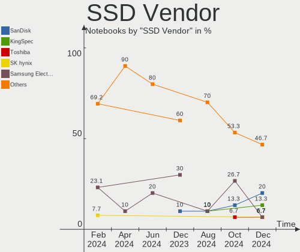

Xubuntu - Hardware Trends (Notebooks)
-------------------------------------

A project to identify most popular hardware characteristics and track their change
over time based on data collected by Linux users at https://Linux-Hardware.org.

Anyone can contribute to this report by the [hw-probe](https://github.com/linuxhw/hw-probe) tool:

    sudo -E hw-probe -all -upload

This report is for one last month. Overall report since the beginning of time: [TestDays](https://github.com/linuxhw/TestDays)

Period: Apr, 2023.

Contents
--------

* [ System ](#system)
  - [ OS                       ](#os)
  - [ OS Family                ](#os-family)
  - [ Kernel                   ](#kernel)
  - [ Kernel Family            ](#kernel-family)
  - [ Kernel Major Ver.        ](#kernel-major-ver)
  - [ Arch                     ](#arch)
  - [ DE                       ](#de)
  - [ Display Server           ](#display-server)
  - [ Display Manager          ](#display-manager)
  - [ OS Lang                  ](#os-lang)
  - [ Boot Mode                ](#boot-mode)
  - [ Filesystem               ](#filesystem)
  - [ Part. scheme             ](#part-scheme)
  - [ Dual Boot with Linux/BSD ](#dual-boot-with-linuxbsd)
  - [ Dual Boot (Win)          ](#dual-boot-win)

* [ Board ](#board)
  - [ Vendor                   ](#vendor)
  - [ Model                    ](#model)
  - [ Model Family             ](#model-family)
  - [ MFG Year                 ](#mfg-year)
  - [ Form Factor              ](#form-factor)
  - [ Secure Boot              ](#secure-boot)
  - [ Coreboot                 ](#coreboot)
  - [ RAM Size                 ](#ram-size)
  - [ RAM Used                 ](#ram-used)
  - [ Total Drives             ](#total-drives)
  - [ Has CD-ROM               ](#has-cd-rom)
  - [ Has Ethernet             ](#has-ethernet)
  - [ Has WiFi                 ](#has-wifi)
  - [ Has Bluetooth            ](#has-bluetooth)

* [ Location ](#location)
  - [ Country                  ](#country)
  - [ City                     ](#city)

* [ Drives ](#drives)
  - [ Drive Vendor             ](#drive-vendor)
  - [ Drive Model              ](#drive-model)
  - [ HDD Vendor               ](#hdd-vendor)
  - [ SSD Vendor               ](#ssd-vendor)
  - [ Drive Kind               ](#drive-kind)
  - [ Drive Connector          ](#drive-connector)
  - [ Drive Size               ](#drive-size)
  - [ Space Total              ](#space-total)
  - [ Space Used               ](#space-used)
  - [ Malfunc. Drives          ](#malfunc-drives)
  - [ Malfunc. Drive Vendor    ](#malfunc-drive-vendor)
  - [ Malfunc. HDD Vendor      ](#malfunc-hdd-vendor)
  - [ Malfunc. Drive Kind      ](#malfunc-drive-kind)
  - [ Failed Drives            ](#failed-drives)
  - [ Failed Drive Vendor      ](#failed-drive-vendor)
  - [ Drive Status             ](#drive-status)

* [ Storage controller ](#storage-controller)
  - [ Storage Vendor           ](#storage-vendor)
  - [ Storage Model            ](#storage-model)
  - [ Storage Kind             ](#storage-kind)

* [ Processor ](#processor)
  - [ CPU Vendor               ](#cpu-vendor)
  - [ CPU Model                ](#cpu-model)
  - [ CPU Model Family         ](#cpu-model-family)
  - [ CPU Cores                ](#cpu-cores)
  - [ CPU Sockets              ](#cpu-sockets)
  - [ CPU Threads              ](#cpu-threads)
  - [ CPU Op-Modes             ](#cpu-op-modes)
  - [ CPU Microcode            ](#cpu-microcode)
  - [ CPU Microarch            ](#cpu-microarch)

* [ Graphics ](#graphics)
  - [ GPU Vendor               ](#gpu-vendor)
  - [ GPU Model                ](#gpu-model)
  - [ GPU Combo                ](#gpu-combo)
  - [ GPU Driver               ](#gpu-driver)
  - [ GPU Memory               ](#gpu-memory)

* [ Monitor ](#monitor)
  - [ Monitor Vendor           ](#monitor-vendor)
  - [ Monitor Model            ](#monitor-model)
  - [ Monitor Resolution       ](#monitor-resolution)
  - [ Monitor Diagonal         ](#monitor-diagonal)
  - [ Monitor Width            ](#monitor-width)
  - [ Aspect Ratio             ](#aspect-ratio)
  - [ Monitor Area             ](#monitor-area)
  - [ Pixel Density            ](#pixel-density)
  - [ Multiple Monitors        ](#multiple-monitors)

* [ Network ](#network)
  - [ Net Controller Vendor    ](#net-controller-vendor)
  - [ Net Controller Model     ](#net-controller-model)
  - [ Wireless Vendor          ](#wireless-vendor)
  - [ Wireless Model           ](#wireless-model)
  - [ Ethernet Vendor          ](#ethernet-vendor)
  - [ Ethernet Model           ](#ethernet-model)
  - [ Net Controller Kind      ](#net-controller-kind)
  - [ Used Controller          ](#used-controller)
  - [ NICs                     ](#nics)
  - [ IPv6                     ](#ipv6)

* [ Bluetooth ](#bluetooth)
  - [ Bluetooth Vendor         ](#bluetooth-vendor)
  - [ Bluetooth Model          ](#bluetooth-model)

* [ Sound ](#sound)
  - [ Sound Vendor             ](#sound-vendor)
  - [ Sound Model              ](#sound-model)

* [ Memory ](#memory)
  - [ Memory Vendor            ](#memory-vendor)
  - [ Memory Model             ](#memory-model)
  - [ Memory Kind              ](#memory-kind)
  - [ Memory Form Factor       ](#memory-form-factor)
  - [ Memory Size              ](#memory-size)
  - [ Memory Speed             ](#memory-speed)

* [ Printers & scanners ](#printers--scanners)
  - [ Printer Vendor           ](#printer-vendor)
  - [ Printer Model            ](#printer-model)
  - [ Scanner Vendor           ](#scanner-vendor)
  - [ Scanner Model            ](#scanner-model)

* [ Camera ](#camera)
  - [ Camera Vendor            ](#camera-vendor)
  - [ Camera Model             ](#camera-model)

* [ Security ](#security)
  - [ Fingerprint Vendor       ](#fingerprint-vendor)
  - [ Fingerprint Model        ](#fingerprint-model)
  - [ Chipcard Vendor          ](#chipcard-vendor)
  - [ Chipcard Model           ](#chipcard-model)

* [ Unsupported ](#unsupported)
  - [ Unsupported Devices      ](#unsupported-devices)
  - [ Unsupported Device Types ](#unsupported-device-types)

System
------

OS
--

Installed operating systems

| Name          | Notebooks | Percent |
|---------------|-----------|---------|
| Xubuntu 22.04 | 26        | 72.22%  |
| Xubuntu 23.04 | 3         | 8.33%   |
| Xubuntu 20.04 | 3         | 8.33%   |
| Xubuntu 22.10 | 2         | 5.56%   |
| Xubuntu 18.04 | 2         | 5.56%   |

OS Family
---------

OS without a version

| Name    | Notebooks | Percent |
|---------|-----------|---------|
| Xubuntu | 36        | 100%    |

Kernel
------

Version of the Linux kernel

| Version                | Notebooks | Percent |
|------------------------|-----------|---------|
| 5.19.0-38-generic      | 11        | 30.56%  |
| 5.15.0-69-generic      | 5         | 13.89%  |
| 5.15.0-70-generic      | 3         | 8.33%   |
| 5.15.0-71-generic      | 2         | 5.56%   |
| 6.2.0-20-generic       | 1         | 2.78%   |
| 6.2.0-18-generic       | 1         | 2.78%   |
| 6.2.0-1002-lowlatency  | 1         | 2.78%   |
| 6.1.0-1008-oem         | 1         | 2.78%   |
| 5.19.0-41-generic      | 1         | 2.78%   |
| 5.19.0-40-generic      | 1         | 2.78%   |
| 5.19.0-35-generic      | 1         | 2.78%   |
| 5.19.0-32-generic      | 1         | 2.78%   |
| 5.17.0-1027-oem        | 1         | 2.78%   |
| 5.17.0-1020-oem        | 1         | 2.78%   |
| 5.15.85-051585-generic | 1         | 2.78%   |
| 5.15.0-70-lowlatency   | 1         | 2.78%   |
| 5.15.0-60-generic      | 1         | 2.78%   |
| 4.15.0-210-generic     | 1         | 2.78%   |
| 4.15.0-208-generic     | 1         | 2.78%   |

Kernel Family
-------------

Linux kernel without a distro release

| Version | Notebooks | Percent |
|---------|-----------|---------|
| 5.19.0  | 15        | 41.67%  |
| 5.15.0  | 12        | 33.33%  |
| 6.2.0   | 3         | 8.33%   |
| 5.17.0  | 2         | 5.56%   |
| 4.15.0  | 2         | 5.56%   |
| 6.1.0   | 1         | 2.78%   |
| 5.15.85 | 1         | 2.78%   |

Kernel Major Ver.
-----------------

Linux kernel major version

| Version | Notebooks | Percent |
|---------|-----------|---------|
| 5.19    | 15        | 41.67%  |
| 5.15    | 13        | 36.11%  |
| 6.2     | 3         | 8.33%   |
| 5.17    | 2         | 5.56%   |
| 4.15    | 2         | 5.56%   |
| 6.1     | 1         | 2.78%   |

Arch
----

OS architecture (x86_64, i586, etc.)

| Name   | Notebooks | Percent |
|--------|-----------|---------|
| x86_64 | 34        | 94.44%  |
| i686   | 2         | 5.56%   |

DE
--

Desktop Environment

| Name  | Notebooks | Percent |
|-------|-----------|---------|
| XFCE  | 35        | 97.22%  |
| GNOME | 1         | 2.78%   |

Display Server
--------------

X11 or Wayland

| Name    | Notebooks | Percent |
|---------|-----------|---------|
| X11     | 34        | 94.44%  |
| Wayland | 2         | 5.56%   |

Display Manager
---------------

SDDM, LightDM, etc.

| Name    | Notebooks | Percent |
|---------|-----------|---------|
| LightDM | 30        | 83.33%  |
| SDDM    | 3         | 8.33%   |
| GDM3    | 2         | 5.56%   |
| Unknown | 1         | 2.78%   |

OS Lang
-------

Language

| Lang  | Notebooks | Percent |
|-------|-----------|---------|
| en_US | 19        | 52.78%  |
| de_DE | 4         | 11.11%  |
| en_GB | 3         | 8.33%   |
| fr_FR | 2         | 5.56%   |
| pl_PL | 1         | 2.78%   |
| ja_JP | 1         | 2.78%   |
| it_IT | 1         | 2.78%   |
| es_ES | 1         | 2.78%   |
| en_IN | 1         | 2.78%   |
| en_CA | 1         | 2.78%   |
| en_AU | 1         | 2.78%   |
| cs_CZ | 1         | 2.78%   |

Boot Mode
---------

EFI or BIOS

| Mode | Notebooks | Percent |
|------|-----------|---------|
| BIOS | 22        | 61.11%  |
| EFI  | 14        | 38.89%  |

Filesystem
----------

Type of filesystem

| Type  | Notebooks | Percent |
|-------|-----------|---------|
| Ext4  | 26        | 72.22%  |
| Tmpfs | 7         | 19.44%  |
| Zfs   | 2         | 5.56%   |
| Xfs   | 1         | 2.78%   |

Part. scheme
------------

Scheme of partitioning

| Type    | Notebooks | Percent |
|---------|-----------|---------|
| GPT     | 27        | 75%     |
| MBR     | 5         | 13.89%  |
| Unknown | 4         | 11.11%  |

Dual Boot with Linux/BSD
------------------------

Hosting more than one Linux/BSD

| Dual boot | Notebooks | Percent |
|-----------|-----------|---------|
| No        | 31        | 86.11%  |
| Yes       | 5         | 13.89%  |

Dual Boot (Win)
---------------

Hosting Linux and Windows

| Dual boot | Notebooks | Percent |
|-----------|-----------|---------|
| No        | 30        | 83.33%  |
| Yes       | 6         | 16.67%  |

Board
-----

Vendor
------

Motherboard manufacturer

| Name             | Notebooks | Percent |
|------------------|-----------|---------|
| Lenovo           | 8         | 22.22%  |
| Hewlett-Packard  | 7         | 19.44%  |
| Dell             | 4         | 11.11%  |
| ASUSTek Computer | 4         | 11.11%  |
| Acer             | 4         | 11.11%  |
| Toshiba          | 2         | 5.56%   |
| Sony             | 1         | 2.78%   |
| SGIN             | 1         | 2.78%   |
| MSI              | 1         | 2.78%   |
| GPU Company      | 1         | 2.78%   |
| Fujitsu Siemens  | 1         | 2.78%   |
| Fujitsu          | 1         | 2.78%   |
| Apple            | 1         | 2.78%   |

Model
-----

Motherboard model

| Name                                              | Notebooks | Percent |
|---------------------------------------------------|-----------|---------|
| Toshiba Satellite L750D                           | 1         | 2.78%   |
| Toshiba EQUIUM P200                               | 1         | 2.78%   |
| Sony VPCZ13M9E                                    | 1         | 2.78%   |
| SGIN M15                                          | 1         | 2.78%   |
| MSI GP65 Leopard 10SDK                            | 1         | 2.78%   |
| Lenovo ThinkPad X270 W10DG 20K5S0B700             | 1         | 2.78%   |
| Lenovo ThinkPad X200s 74664SJ                     | 1         | 2.78%   |
| Lenovo ThinkPad X1 Carbon Gen 10 21CCS72200       | 1         | 2.78%   |
| Lenovo ThinkPad T420 4236PA8                      | 1         | 2.78%   |
| Lenovo ThinkPad T14 Gen 3 21AH00FHYA              | 1         | 2.78%   |
| Lenovo ThinkPad P50 20EN0013US                    | 1         | 2.78%   |
| Lenovo ThinkPad L14 Gen 3 21C5004FGE              | 1         | 2.78%   |
| Lenovo ThinkPad E14 Gen 2 20TA00JLAU              | 1         | 2.78%   |
| HP ZBook Firefly 16 inch G9 Mobile Workstation PC | 1         | 2.78%   |
| HP ProBook 650 G3                                 | 1         | 2.78%   |
| HP ProBook 11 G2                                  | 1         | 2.78%   |
| HP Pavilion g6                                    | 1         | 2.78%   |
| HP Laptop 17-cp2xxx                               | 1         | 2.78%   |
| HP Laptop 15s-fq2xxx                              | 1         | 2.78%   |
| HP 470 17 inch G9 Notebook PC                     | 1         | 2.78%   |
| GPU Company GWTN156-5                             | 1         | 2.78%   |
| Fujitsu Siemens ESPRIMO Mobile V6535              | 1         | 2.78%   |
| Fujitsu LIFEBOOK U759                             | 1         | 2.78%   |
| Dell XPS 13 9333                                  | 1         | 2.78%   |
| Dell XPS 13 9305                                  | 1         | 2.78%   |
| Dell Vostro 1520                                  | 1         | 2.78%   |
| Dell Latitude E6400                               | 1         | 2.78%   |
| ASUS X58C                                         | 1         | 2.78%   |
| ASUS VivoBook_ASUSLaptop X415EA_F415EA            | 1         | 2.78%   |
| ASUS VivoBook_ASUSLaptop E210MAB_E210MA           | 1         | 2.78%   |
| ASUS ASUS TUF Gaming A15 FA507RE_FA507RE          | 1         | 2.78%   |
| Apple MacBookPro8,1                               | 1         | 2.78%   |
| Acer Peppy                                        | 1         | 2.78%   |
| Acer NU-SF314-42-R3S0                             | 1         | 2.78%   |
| Acer Extensa 5620                                 | 1         | 2.78%   |
| Acer Aspire E1-571G                               | 1         | 2.78%   |

Model Family
------------

Motherboard model prefix

| Name                    | Notebooks | Percent |
|-------------------------|-----------|---------|
| Lenovo ThinkPad         | 8         | 22.22%  |
| HP ProBook              | 2         | 5.56%   |
| HP Laptop               | 2         | 5.56%   |
| Dell XPS                | 2         | 5.56%   |
| ASUS VivoBook           | 2         | 5.56%   |
| Toshiba Satellite       | 1         | 2.78%   |
| Toshiba EQUIUM          | 1         | 2.78%   |
| Sony VPCZ13M9E          | 1         | 2.78%   |
| SGIN M15                | 1         | 2.78%   |
| MSI GP65                | 1         | 2.78%   |
| HP ZBook                | 1         | 2.78%   |
| HP Pavilion             | 1         | 2.78%   |
| HP 470                  | 1         | 2.78%   |
| GPU Company GWTN156-5   | 1         | 2.78%   |
| Fujitsu Siemens ESPRIMO | 1         | 2.78%   |
| Fujitsu LIFEBOOK        | 1         | 2.78%   |
| Dell Vostro             | 1         | 2.78%   |
| Dell Latitude           | 1         | 2.78%   |
| ASUS X58C               | 1         | 2.78%   |
| ASUS ASUS               | 1         | 2.78%   |
| Apple MacBookPro8       | 1         | 2.78%   |
| Acer Peppy              | 1         | 2.78%   |
| Acer NU-SF314-42-R3S0   | 1         | 2.78%   |
| Acer Extensa            | 1         | 2.78%   |
| Acer Aspire             | 1         | 2.78%   |

MFG Year
--------

Motherboard manufacture year

| Year | Notebooks | Percent |
|------|-----------|---------|
| 2022 | 7         | 19.44%  |
| 2020 | 5         | 13.89%  |
| 2011 | 4         | 11.11%  |
| 2021 | 3         | 8.33%   |
| 2008 | 3         | 8.33%   |
| 2019 | 2         | 5.56%   |
| 2017 | 2         | 5.56%   |
| 2016 | 2         | 5.56%   |
| 2009 | 2         | 5.56%   |
| 2007 | 2         | 5.56%   |
| 2015 | 1         | 2.78%   |
| 2013 | 1         | 2.78%   |
| 2012 | 1         | 2.78%   |
| 2010 | 1         | 2.78%   |

Form Factor
-----------

Physical design of the computer

| Name     | Notebooks | Percent |
|----------|-----------|---------|
| Notebook | 36        | 100%    |

Secure Boot
-----------

Enabled or disabled

| State    | Notebooks | Percent |
|----------|-----------|---------|
| Disabled | 35        | 97.22%  |
| Enabled  | 1         | 2.78%   |

Coreboot
--------

Have coreboot on board

| Used | Notebooks | Percent |
|------|-----------|---------|
| No   | 35        | 97.22%  |
| Yes  | 1         | 2.78%   |

RAM Size
--------

Total RAM memory

| Size in GB  | Notebooks | Percent |
|-------------|-----------|---------|
| 4.01-8.0    | 8         | 22.22%  |
| 3.01-4.0    | 7         | 19.44%  |
| 8.01-16.0   | 5         | 13.89%  |
| 32.01-64.0  | 4         | 11.11%  |
| 2.01-3.0    | 3         | 8.33%   |
| 64.01-256.0 | 3         | 8.33%   |
| 16.01-24.0  | 3         | 8.33%   |
| 24.01-32.0  | 1         | 2.78%   |
| 1.01-2.0    | 1         | 2.78%   |
| 0.51-1.0    | 1         | 2.78%   |

RAM Used
--------

Used RAM memory

| Used GB    | Notebooks | Percent |
|------------|-----------|---------|
| 1.01-2.0   | 10        | 27.78%  |
| 3.01-4.0   | 6         | 16.67%  |
| 2.01-3.0   | 6         | 16.67%  |
| 4.01-8.0   | 5         | 13.89%  |
| 8.01-16.0  | 3         | 8.33%   |
| 0.51-1.0   | 3         | 8.33%   |
| 24.01-32.0 | 1         | 2.78%   |
| 16.01-24.0 | 1         | 2.78%   |
| 0.01-0.5   | 1         | 2.78%   |

Total Drives
------------

Number of drives on board

| Drives | Notebooks | Percent |
|--------|-----------|---------|
| 1      | 31        | 86.11%  |
| 2      | 4         | 11.11%  |
| 3      | 1         | 2.78%   |

Has CD-ROM
----------

Has CD-ROM on board

| Presented | Notebooks | Percent |
|-----------|-----------|---------|
| No        | 24        | 66.67%  |
| Yes       | 12        | 33.33%  |

Has Ethernet
------------

Has Ethernet on board

| Presented | Notebooks | Percent |
|-----------|-----------|---------|
| Yes       | 25        | 69.44%  |
| No        | 11        | 30.56%  |

Has WiFi
--------

Has WiFi module

| Presented | Notebooks | Percent |
|-----------|-----------|---------|
| Yes       | 36        | 100%    |

Has Bluetooth
-------------

Has Bluetooth module

| Presented | Notebooks | Percent |
|-----------|-----------|---------|
| Yes       | 27        | 75%     |
| No        | 9         | 25%     |

Location
--------

Country
-------

Geographic location (country)

| Country   | Notebooks | Percent |
|-----------|-----------|---------|
| USA       | 9         | 25%     |
| Germany   | 7         | 19.44%  |
| France    | 4         | 11.11%  |
| Spain     | 3         | 8.33%   |
| UK        | 2         | 5.56%   |
| Poland    | 2         | 5.56%   |
| Italy     | 2         | 5.56%   |
| Japan     | 1         | 2.78%   |
| India     | 1         | 2.78%   |
| Denmark   | 1         | 2.78%   |
| Czechia   | 1         | 2.78%   |
| Canada    | 1         | 2.78%   |
| Austria   | 1         | 2.78%   |
| Australia | 1         | 2.78%   |

City
----

Geographic location (city)

| City              | Notebooks | Percent |
|-------------------|-----------|---------|
| North Hills       | 3         | 8.33%   |
| Williston         | 1         | 2.78%   |
| Warsaw            | 1         | 2.78%   |
| Vienna            | 1         | 2.78%   |
| Trieste           | 1         | 2.78%   |
| Trento            | 1         | 2.78%   |
| Torremolinos      | 1         | 2.78%   |
| Stockton          | 1         | 2.78%   |
| Shinjuku          | 1         | 2.78%   |
| Seguin            | 1         | 2.78%   |
| Schnaittach       | 1         | 2.78%   |
| Puteaux           | 1         | 2.78%   |
| Opava             | 1         | 2.78%   |
| O Outeiro         | 1         | 2.78%   |
| New Albany        | 1         | 2.78%   |
| Munich            | 1         | 2.78%   |
| Melbourne         | 1         | 2.78%   |
| Mantes-la-Jolie   | 1         | 2.78%   |
| Lincoln           | 1         | 2.78%   |
| Kolkata           | 1         | 2.78%   |
| Hyżne            | 1         | 2.78%   |
| Hove              | 1         | 2.78%   |
| Hattersheim       | 1         | 2.78%   |
| Hanover           | 1         | 2.78%   |
| Hamburg           | 1         | 2.78%   |
| Fuenlabrada       | 1         | 2.78%   |
| Friesenheim       | 1         | 2.78%   |
| Copenhagen        | 1         | 2.78%   |
| Colchester        | 1         | 2.78%   |
| Châtenay-Malabry | 1         | 2.78%   |
| Charlotte         | 1         | 2.78%   |
| Burnaby           | 1         | 2.78%   |
| Brilon            | 1         | 2.78%   |
| Bordeaux          | 1         | 2.78%   |

Drives
------

Drive Vendor
------------

Hard drive vendors

| Vendor                      | Notebooks | Drives | Percent |
|-----------------------------|-----------|--------|---------|
| Samsung Electronics         | 8         | 9      | 20%     |
| Seagate                     | 4         | 4      | 10%     |
| Toshiba                     | 3         | 3      | 7.5%    |
| WDC                         | 2         | 2      | 5%      |
| SanDisk                     | 2         | 2      | 5%      |
| Kingston Technology Company | 2         | 2      | 5%      |
| Hitachi                     | 2         | 2      | 5%      |
| Crucial                     | 2         | 2      | 5%      |
| Unknown                     | 1         | 1      | 2.5%    |
| UMIS                        | 1         | 1      | 2.5%    |
| Team                        | 1         | 1      | 2.5%    |
| SPCC                        | 1         | 1      | 2.5%    |
| SK hynix                    | 1         | 1      | 2.5%    |
| Realtek Semiconductor       | 1         | 1      | 2.5%    |
| Plextor                     | 1         | 1      | 2.5%    |
| Micron Technology           | 1         | 1      | 2.5%    |
| Kingston                    | 1         | 1      | 2.5%    |
| Intel                       | 1         | 1      | 2.5%    |
| HGST                        | 1         | 1      | 2.5%    |
| Fujitsu                     | 1         | 1      | 2.5%    |
| FORESEE                     | 1         | 1      | 2.5%    |
| Dogfish                     | 1         | 1      | 2.5%    |
| ASMT                        | 1         | 2      | 2.5%    |

Drive Model
-----------

Hard drive models

| Model                                             | Notebooks | Percent |
|---------------------------------------------------|-----------|---------|
| WDC WD5000LPLX-60ZNTT1 500GB                      | 1         | 2.5%    |
| WDC PC SN730 NVMe 512GB                           | 1         | 2.5%    |
| Unknown MMC Card  128GB                           | 1         | 2.5%    |
| UMIS RPJTJ512MGE1QDQ 512GB                        | 1         | 2.5%    |
| Toshiba MQ01ABD075 752GB                          | 1         | 2.5%    |
| Toshiba MK6475GSX 640GB                           | 1         | 2.5%    |
| Toshiba MK1246GSX 120GB                           | 1         | 2.5%    |
| Team TM8PS7512G 512GB SSD                         | 1         | 2.5%    |
| SPCC M.2 SSD 512GB                                | 1         | 2.5%    |
| SK hynix SKHynix_HFM512GD3HX015N 512GB            | 1         | 2.5%    |
| Seagate ST9320325AS 320GB                         | 1         | 2.5%    |
| Seagate ST9250827AS 250GB                         | 1         | 2.5%    |
| Seagate ST1000LM048-2E7172 1TB                    | 1         | 2.5%    |
| Seagate FireCuda HDD 2TB                          | 1         | 2.5%    |
| SanDisk SD8SNAT-128G-1006 128GB SSD               | 1         | 2.5%    |
| SanDisk NVMe SSD Drive 1TB                        | 1         | 2.5%    |
| Samsung SSD 970 EVO Plus 1TB                      | 1         | 2.5%    |
| Samsung SSD 960 PRO 512GB                         | 1         | 2.5%    |
| Samsung NVMe SSD Controller SM981/PM981/PM983 1TB | 1         | 2.5%    |
| Samsung MZVLW256HEHP-000L7 256GB                  | 1         | 2.5%    |
| Samsung MZVLQ256HBJD-00BH1 256GB                  | 1         | 2.5%    |
| Samsung MZVLQ1T0HALB-00000 1TB                    | 1         | 2.5%    |
| Samsung MZVL2512HCJQ-00BL7 512GB                  | 1         | 2.5%    |
| Samsung MMCRE28GQDXP-MVB 64GB SSD                 | 1         | 2.5%    |
| Realtek ADATA SWORDFISH 2TB                       | 1         | 2.5%    |
| Plextor PH6-CE120 120GB SSD                       | 1         | 2.5%    |
| Micron 1100_MTFDDAK1T0TBN 1024GB SSD              | 1         | 2.5%    |
| Kingston Company SNV2S2000G 2TB                   | 1         | 2.5%    |
| Kingston Company A2000 NVMe SSD 500GB             | 1         | 2.5%    |
| Kingston SUV500MS480G 480GB SSD                   | 1         | 2.5%    |
| Intel SSDPEKNW010T8H 1TB                          | 1         | 2.5%    |
| Hitachi HTS545032B9A302 320GB                     | 1         | 2.5%    |
| Hitachi HTS543216L9A300 160GB                     | 1         | 2.5%    |
| HGST HTS545050A7E380 500GB                        | 1         | 2.5%    |
| Fujitsu MHZ2160BJ FFS G2 160GB                    | 1         | 2.5%    |
| FORESEE 256GB SSD                                 | 1         | 2.5%    |
| Dogfish SSD 1TB                                   | 1         | 2.5%    |
| Crucial CT500MX500SSD1 500GB                      | 1         | 2.5%    |
| Crucial CT250MX500SSD1 250GB                      | 1         | 2.5%    |
| ASMT 2115 2TB                                     | 1         | 2.5%    |

HDD Vendor
----------

Hard disk drive vendors

| Vendor  | Notebooks | Drives | Percent |
|---------|-----------|--------|---------|
| Seagate | 4         | 4      | 33.33%  |
| Toshiba | 3         | 3      | 25%     |
| Hitachi | 2         | 2      | 16.67%  |
| WDC     | 1         | 1      | 8.33%   |
| HGST    | 1         | 1      | 8.33%   |
| Fujitsu | 1         | 1      | 8.33%   |

SSD Vendor
----------

Solid state drive vendors

| Vendor              | Notebooks | Drives | Percent |
|---------------------|-----------|--------|---------|
| Crucial             | 2         | 2      | 16.67%  |
| Team                | 1         | 1      | 8.33%   |
| SPCC                | 1         | 1      | 8.33%   |
| SanDisk             | 1         | 1      | 8.33%   |
| Samsung Electronics | 1         | 2      | 8.33%   |
| Plextor             | 1         | 1      | 8.33%   |
| Micron Technology   | 1         | 1      | 8.33%   |
| Kingston            | 1         | 1      | 8.33%   |
| FORESEE             | 1         | 1      | 8.33%   |
| Dogfish             | 1         | 1      | 8.33%   |
| ASMT                | 1         | 2      | 8.33%   |

Drive Kind
----------

HDD or SSD

| Kind | Notebooks | Drives | Percent |
|------|-----------|--------|---------|
| NVMe | 15        | 15     | 39.47%  |
| HDD  | 12        | 12     | 31.58%  |
| SSD  | 10        | 14     | 26.32%  |
| MMC  | 1         | 1      | 2.63%   |

Drive Connector
---------------

SATA, SAS, NVMe, etc.

| Type | Notebooks | Drives | Percent |
|------|-----------|--------|---------|
| SATA | 20        | 23     | 52.63%  |
| NVMe | 15        | 15     | 39.47%  |
| SAS  | 2         | 3      | 5.26%   |
| MMC  | 1         | 1      | 2.63%   |

Drive Size
----------

Size of hard drive

| Size in TB | Notebooks | Drives | Percent |
|------------|-----------|--------|---------|
| 0.01-0.5   | 15        | 16     | 65.22%  |
| 0.51-1.0   | 6         | 6      | 26.09%  |
| 1.01-2.0   | 2         | 4      | 8.7%    |

Space Total
-----------

Amount of disk space available on the file system

| Size in GB     | Notebooks | Percent |
|----------------|-----------|---------|
| 251-500        | 13        | 36.11%  |
| 101-250        | 6         | 16.67%  |
| 501-1000       | 6         | 16.67%  |
| 1001-2000      | 4         | 11.11%  |
| 21-50          | 3         | 8.33%   |
| 1-20           | 2         | 5.56%   |
| More than 3000 | 1         | 2.78%   |
| 51-100         | 1         | 2.78%   |

Space Used
----------

Amount of used disk space

| Used GB   | Notebooks | Percent |
|-----------|-----------|---------|
| 1-20      | 13        | 36.11%  |
| 101-250   | 11        | 30.56%  |
| 21-50     | 4         | 11.11%  |
| 501-1000  | 3         | 8.33%   |
| 251-500   | 2         | 5.56%   |
| 51-100    | 2         | 5.56%   |
| 2001-3000 | 1         | 2.78%   |

Malfunc. Drives
---------------

Drive models with a malfunction

| Model                          | Notebooks | Drives | Percent |
|--------------------------------|-----------|--------|---------|
| Toshiba MK1246GSX 120GB        | 1         | 1      | 33.33%  |
| Hitachi HTS543216L9A300 160GB  | 1         | 1      | 33.33%  |
| Fujitsu MHZ2160BJ FFS G2 160GB | 1         | 1      | 33.33%  |

Malfunc. Drive Vendor
---------------------

Vendors of faulty drives

| Vendor  | Notebooks | Drives | Percent |
|---------|-----------|--------|---------|
| Toshiba | 1         | 1      | 33.33%  |
| Hitachi | 1         | 1      | 33.33%  |
| Fujitsu | 1         | 1      | 33.33%  |

Malfunc. HDD Vendor
-------------------

Vendors of faulty HDD drives

| Vendor  | Notebooks | Drives | Percent |
|---------|-----------|--------|---------|
| Toshiba | 1         | 1      | 33.33%  |
| Hitachi | 1         | 1      | 33.33%  |
| Fujitsu | 1         | 1      | 33.33%  |

Malfunc. Drive Kind
-------------------

Kinds of faulty drives

| Kind | Notebooks | Drives | Percent |
|------|-----------|--------|---------|
| HDD  | 3         | 3      | 100%    |

Failed Drives
-------------

Failed drive models

Zero info for selected period =(

Failed Drive Vendor
-------------------

Failed drive vendors

Zero info for selected period =(

Drive Status
------------

Number of failed and malfunc. drives

| Status   | Notebooks | Drives | Percent |
|----------|-----------|--------|---------|
| Detected | 18        | 23     | 50%     |
| Works    | 15        | 16     | 41.67%  |
| Malfunc  | 3         | 3      | 8.33%   |

Storage controller
------------------

Storage Vendor
--------------

Storage controller vendors

| Vendor                           | Notebooks | Percent |
|----------------------------------|-----------|---------|
| Intel                            | 23        | 56.1%   |
| Samsung Electronics              | 7         | 17.07%  |
| AMD                              | 3         | 7.32%   |
| SanDisk                          | 2         | 4.88%   |
| Kingston Technology Company      | 2         | 4.88%   |
| Union Memory (Shenzhen)          | 1         | 2.44%   |
| SK hynix                         | 1         | 2.44%   |
| Silicon Integrated Systems [SiS] | 1         | 2.44%   |
| Realtek Semiconductor            | 1         | 2.44%   |

Storage Model
-------------

Storage controller models

| Model                                                                         | Notebooks | Percent |
|-------------------------------------------------------------------------------|-----------|---------|
| Intel Volume Management Device NVMe RAID Controller                           | 3         | 6.67%   |
| Samsung NVMe SSD Controller SM981/PM981/PM983                                 | 2         | 4.44%   |
| Samsung NVMe SSD Controller SM961/PM961/SM963                                 | 2         | 4.44%   |
| Samsung NVMe SSD Controller 980                                               | 2         | 4.44%   |
| Intel Sunrise Point-LP SATA Controller [AHCI mode]                            | 2         | 4.44%   |
| Intel Celeron/Pentium Silver Processor SATA Controller                        | 2         | 4.44%   |
| Intel 82801IBM/IEM (ICH9M/ICH9M-E) 4 port SATA Controller [AHCI mode]         | 2         | 4.44%   |
| Intel 82801HM/HEM (ICH8M/ICH8M-E) IDE Controller                              | 2         | 4.44%   |
| Intel 82801 Mobile SATA Controller [RAID mode]                                | 2         | 4.44%   |
| Intel 8 Series SATA Controller 1 [AHCI mode]                                  | 2         | 4.44%   |
| Intel 7 Series Chipset Family 6-port SATA Controller [AHCI mode]              | 2         | 4.44%   |
| Intel 6 Series/C200 Series Chipset Family 6 port Mobile SATA AHCI Controller  | 2         | 4.44%   |
| AMD FCH SATA Controller [AHCI mode]                                           | 2         | 4.44%   |
| Union Memory (Shenzhen) AM630 PCIe 4.0 x4 NVMe SSD Controller                 | 1         | 2.22%   |
| SK hynix Gold P31/PC711 NVMe Solid State Drive                                | 1         | 2.22%   |
| Silicon Integrated Systems [SiS] SATA Controller / IDE mode                   | 1         | 2.22%   |
| SanDisk WD Blue SN570 NVMe SSD 1TB                                            | 1         | 2.22%   |
| SanDisk WD Black SN750 / PC SN730 NVMe SSD                                    | 1         | 2.22%   |
| Samsung NVMe SSD Controller PM9A1/PM9A3/980PRO                                | 1         | 2.22%   |
| Realtek NVMe Controller                                                       | 1         | 2.22%   |
| Kingston Company Company Non-Volatile memory controller                       | 1         | 2.22%   |
| Kingston Company A2000 NVMe SSD                                               | 1         | 2.22%   |
| Intel Tiger Lake-LP SATA Controller                                           | 1         | 2.22%   |
| Intel SSD 660P Series                                                         | 1         | 2.22%   |
| Intel Q170/Q150/B150/H170/H110/Z170/CM236 Chipset SATA Controller [AHCI Mode] | 1         | 2.22%   |
| Intel Alder Lake-P SATA AHCI Controller                                       | 1         | 2.22%   |
| Intel 82801IBM/IEM (ICH9M/ICH9M-E) 2 port SATA Controller [IDE mode]          | 1         | 2.22%   |
| Intel 82801HM/HEM (ICH8M/ICH8M-E) SATA Controller [IDE mode]                  | 1         | 2.22%   |
| Intel 82801HM/HEM (ICH8M/ICH8M-E) SATA Controller [AHCI mode]                 | 1         | 2.22%   |
| Intel 400 Series Chipset Family SATA AHCI Controller                          | 1         | 2.22%   |
| AMD SB7x0/SB8x0/SB9x0 SATA Controller [AHCI mode]                             | 1         | 2.22%   |

Storage Kind
------------

Kind of storage controller (IDE, SATA, NVMe, SAS, ...)

| Kind | Notebooks | Percent |
|------|-----------|---------|
| SATA | 20        | 45.45%  |
| NVMe | 15        | 34.09%  |
| RAID | 5         | 11.36%  |
| IDE  | 4         | 9.09%   |

Processor
---------

CPU Vendor
----------

Processor vendors

| Vendor | Notebooks | Percent |
|--------|-----------|---------|
| Intel  | 30        | 83.33%  |
| AMD    | 6         | 16.67%  |

CPU Model
---------

Processor models

| Model                                         | Notebooks | Percent |
|-----------------------------------------------|-----------|---------|
| Intel Core 2 Duo CPU P8600 @ 2.40GHz          | 2         | 5.56%   |
| Intel 12th Gen Core i7-1260P                  | 2         | 5.56%   |
| Intel 11th Gen Core i5-1135G7 @ 2.40GHz       | 2         | 5.56%   |
| Intel Pentium Dual CPU T3400 @ 2.16GHz        | 1         | 2.78%   |
| Intel Pentium Dual CPU T2330 @ 1.60GHz        | 1         | 2.78%   |
| Intel Core i7-8565U CPU @ 1.80GHz             | 1         | 2.78%   |
| Intel Core i7-6700HQ CPU @ 2.60GHz            | 1         | 2.78%   |
| Intel Core i7-10750H CPU @ 2.60GHz            | 1         | 2.78%   |
| Intel Core i5-7200U CPU @ 2.50GHz             | 1         | 2.78%   |
| Intel Core i5-6200U CPU @ 2.30GHz             | 1         | 2.78%   |
| Intel Core i5-4200U CPU @ 1.60GHz             | 1         | 2.78%   |
| Intel Core i5-3230M CPU @ 2.60GHz             | 1         | 2.78%   |
| Intel Core i5-3210M CPU @ 2.50GHz             | 1         | 2.78%   |
| Intel Core i5-2520M CPU @ 2.50GHz             | 1         | 2.78%   |
| Intel Core i5-2415M CPU @ 2.30GHz             | 1         | 2.78%   |
| Intel Core i5 CPU M 460 @ 2.53GHz             | 1         | 2.78%   |
| Intel Core i3-6100U CPU @ 2.30GHz             | 1         | 2.78%   |
| Intel Core 2 Duo CPU T5550 @ 1.83GHz          | 1         | 2.78%   |
| Intel Core 2 Duo CPU L9400 @ 1.86GHz          | 1         | 2.78%   |
| Intel Celeron N4020C CPU @ 1.10GHz            | 1         | 2.78%   |
| Intel Celeron N4020 CPU @ 1.10GHz             | 1         | 2.78%   |
| Intel Celeron CPU 220 @ 1.20GHz               | 1         | 2.78%   |
| Intel Celeron 2955U @ 1.40GHz                 | 1         | 2.78%   |
| Intel 12th Gen Core i7-1270P                  | 1         | 2.78%   |
| Intel 12th Gen Core i7-1255U                  | 1         | 2.78%   |
| Intel 11th Gen Core i7-1165G7 @ 2.80GHz       | 1         | 2.78%   |
| Intel 11th Gen Core i3-1115G4 @ 3.00GHz       | 1         | 2.78%   |
| AMD Ryzen 7 PRO 5875U with Radeon Graphics    | 1         | 2.78%   |
| AMD Ryzen 7 6800H with Radeon Graphics        | 1         | 2.78%   |
| AMD Ryzen 7 4700U with Radeon Graphics        | 1         | 2.78%   |
| AMD Ryzen 5 3450U with Radeon Vega Mobile Gfx | 1         | 2.78%   |
| AMD Ryzen 3 7320U with Radeon Graphics        | 1         | 2.78%   |
| AMD E-450 APU with Radeon HD Graphics         | 1         | 2.78%   |

CPU Model Family
----------------

Processor model prefix

| Model              | Notebooks | Percent |
|--------------------|-----------|---------|
| Other              | 8         | 22.22%  |
| Intel Core i5      | 8         | 22.22%  |
| Intel Core 2 Duo   | 4         | 11.11%  |
| Intel Celeron      | 4         | 11.11%  |
| Intel Core i7      | 3         | 8.33%   |
| Intel Pentium Dual | 2         | 5.56%   |
| AMD Ryzen 7        | 2         | 5.56%   |
| Intel Core i3      | 1         | 2.78%   |
| AMD Ryzen 7 PRO    | 1         | 2.78%   |
| AMD Ryzen 5        | 1         | 2.78%   |
| AMD Ryzen 3        | 1         | 2.78%   |
| AMD E              | 1         | 2.78%   |

CPU Cores
---------

Number of processor cores

| Number | Notebooks | Percent |
|--------|-----------|---------|
| 2      | 20        | 55.56%  |
| 4      | 7         | 19.44%  |
| 12     | 3         | 8.33%   |
| 8      | 3         | 8.33%   |
| 10     | 1         | 2.78%   |
| 6      | 1         | 2.78%   |
| 1      | 1         | 2.78%   |

CPU Sockets
-----------

Number of sockets

| Number | Notebooks | Percent |
|--------|-----------|---------|
| 1      | 36        | 100%    |

CPU Threads
-----------

Threads per core (Hyper-Threading)

| Number | Notebooks | Percent |
|--------|-----------|---------|
| 2      | 24        | 66.67%  |
| 1      | 12        | 33.33%  |

CPU Op-Modes
------------

CPU Operation Modes (32-bit, 64-bit)

| Op mode        | Notebooks | Percent |
|----------------|-----------|---------|
| 32-bit, 64-bit | 36        | 100%    |

CPU Microcode
-------------

Microcode number

| Number     | Notebooks | Percent |
|------------|-----------|---------|
| Unknown    | 20        | 55.56%  |
| 0x6fd      | 3         | 8.33%   |
| 0x906a4    | 1         | 2.78%   |
| 0x906a3    | 1         | 2.78%   |
| 0x806e9    | 1         | 2.78%   |
| 0x806c1    | 1         | 2.78%   |
| 0x706a8    | 1         | 2.78%   |
| 0x406e3    | 1         | 2.78%   |
| 0x20655    | 1         | 2.78%   |
| 0x1067a    | 1         | 2.78%   |
| 0x10676    | 1         | 2.78%   |
| 0x0a50000d | 1         | 2.78%   |
| 0x08a00006 | 1         | 2.78%   |
| 0x08600102 | 1         | 2.78%   |
| 0x05000119 | 1         | 2.78%   |

CPU Microarch
-------------

Microarchitecture

| Name             | Notebooks | Percent |
|------------------|-----------|---------|
| TigerLake        | 4         | 11.11%  |
| Core             | 4         | 11.11%  |
| Unknown          | 4         | 11.11%  |
| Skylake          | 3         | 8.33%   |
| Penryn           | 3         | 8.33%   |
| SandyBridge      | 2         | 5.56%   |
| KabyLake         | 2         | 5.56%   |
| IvyBridge        | 2         | 5.56%   |
| Haswell          | 2         | 5.56%   |
| Goldmont plus    | 2         | 5.56%   |
| Alderlake Hybrid | 2         | 5.56%   |
| Zen+             | 1         | 2.78%   |
| Zen 3            | 1         | 2.78%   |
| Zen 2            | 1         | 2.78%   |
| Westmere         | 1         | 2.78%   |
| CometLake        | 1         | 2.78%   |
| Bobcat           | 1         | 2.78%   |

Graphics
--------

GPU Vendor
----------

Vendors of graphics cards

| Vendor                           | Notebooks | Percent |
|----------------------------------|-----------|---------|
| Intel                            | 27        | 67.5%   |
| AMD                              | 7         | 17.5%   |
| Nvidia                           | 5         | 12.5%   |
| Silicon Integrated Systems [SiS] | 1         | 2.5%    |

GPU Model
---------

Graphics card models

| Model                                                                     | Notebooks | Percent |
|---------------------------------------------------------------------------|-----------|---------|
| Intel Mobile 4 Series Chipset Integrated Graphics Controller              | 4         | 9.76%   |
| Intel TigerLake-LP GT2 [Iris Xe Graphics]                                 | 3         | 7.32%   |
| Intel Alder Lake-P Integrated Graphics Controller                         | 3         | 7.32%   |
| Intel Skylake GT2 [HD Graphics 520]                                       | 2         | 4.88%   |
| Intel Haswell-ULT Integrated Graphics Controller                          | 2         | 4.88%   |
| Intel GeminiLake [UHD Graphics 600]                                       | 2         | 4.88%   |
| Intel 3rd Gen Core processor Graphics Controller                          | 2         | 4.88%   |
| Intel 2nd Generation Core Processor Family Integrated Graphics Controller | 2         | 4.88%   |
| Silicon Integrated Systems [SiS] 771/671 PCIE VGA Display Adapter         | 1         | 2.44%   |
| Nvidia TU116M [GeForce GTX 1660 Ti Mobile]                                | 1         | 2.44%   |
| Nvidia GT216M [GeForce GT 330M]                                           | 1         | 2.44%   |
| Nvidia GM107GLM [Quadro M1000M]                                           | 1         | 2.44%   |
| Nvidia GF117M [GeForce 610M/710M/810M/820M / GT 620M/625M/630M/720M]      | 1         | 2.44%   |
| Nvidia GA107M [GeForce RTX 3050 Ti Mobile]                                | 1         | 2.44%   |
| Intel WhiskeyLake-U GT2 [UHD Graphics 620]                                | 1         | 2.44%   |
| Intel Tiger Lake-LP GT2 [UHD Graphics G4]                                 | 1         | 2.44%   |
| Intel Mobile GM965/GL960 Integrated Graphics Controller (secondary)       | 1         | 2.44%   |
| Intel Mobile GM965/GL960 Integrated Graphics Controller (primary)         | 1         | 2.44%   |
| Intel HD Graphics 620                                                     | 1         | 2.44%   |
| Intel HD Graphics 530                                                     | 1         | 2.44%   |
| Intel CometLake-H GT2 [UHD Graphics]                                      | 1         | 2.44%   |
| Intel Alder Lake-UP3 GT2 [UHD Graphics]                                   | 1         | 2.44%   |
| AMD Wrestler [Radeon HD 6320]                                             | 1         | 2.44%   |
| AMD RV610/M74 [Mobility Radeon HD 2400 XT]                                | 1         | 2.44%   |
| AMD Renoir                                                                | 1         | 2.44%   |
| AMD Rembrandt [Radeon 680M]                                               | 1         | 2.44%   |
| AMD Picasso/Raven 2 [Radeon Vega Series / Radeon Vega Mobile Series]      | 1         | 2.44%   |
| AMD Mendocino                                                             | 1         | 2.44%   |
| AMD Barcelo                                                               | 1         | 2.44%   |

GPU Combo
---------

Combinations of graphics cards

| Name           | Notebooks | Percent |
|----------------|-----------|---------|
| 1 x Intel      | 24        | 66.67%  |
| 1 x AMD        | 6         | 16.67%  |
| Intel + Nvidia | 3         | 8.33%   |
| 1 x SiS        | 1         | 2.78%   |
| 1 x Nvidia     | 1         | 2.78%   |
| AMD + Nvidia   | 1         | 2.78%   |

GPU Driver
----------

Free vs proprietary

| Driver      | Notebooks | Percent |
|-------------|-----------|---------|
| Free        | 34        | 94.44%  |
| Proprietary | 1         | 2.78%   |
| Unknown     | 1         | 2.78%   |

GPU Memory
----------

Total video memory

| Size in GB | Notebooks | Percent |
|------------|-----------|---------|
| Unknown    | 30        | 83.33%  |
| 0.01-0.5   | 3         | 8.33%   |
| 0.51-1.0   | 2         | 5.56%   |
| 1.01-2.0   | 1         | 2.78%   |

Monitor
-------

Monitor Vendor
--------------

Monitor vendors

| Vendor              | Notebooks | Percent |
|---------------------|-----------|---------|
| Chimei Innolux      | 10        | 23.26%  |
| LG Display          | 7         | 16.28%  |
| BOE                 | 6         | 13.95%  |
| AU Optronics        | 4         | 9.3%    |
| Samsung Electronics | 3         | 6.98%   |
| Dell                | 3         | 6.98%   |
| LG Philips          | 2         | 4.65%   |
| Sony                | 1         | 2.33%   |
| Sharp               | 1         | 2.33%   |
| Lenovo              | 1         | 2.33%   |
| InfoVision          | 1         | 2.33%   |
| Iiyama              | 1         | 2.33%   |
| Hewlett-Packard     | 1         | 2.33%   |
| Apple               | 1         | 2.33%   |
| ADI                 | 1         | 2.33%   |

Monitor Model
-------------

Monitor models

| Model                                                                | Notebooks | Percent |
|----------------------------------------------------------------------|-----------|---------|
| LG Display LCD Monitor LGD02DC 1366x768 344x194mm 15.5-inch          | 2         | 4.55%   |
| Sony LCD SNY06FA 1600x900 291x164mm 13.2-inch                        | 1         | 2.27%   |
| Sharp LCD Monitor SHP14AE 1920x1080 294x165mm 13.3-inch              | 1         | 2.27%   |
| Samsung Electronics U28E570 SAM0D70 3840x2160 608x345mm 27.5-inch    | 1         | 2.27%   |
| Samsung Electronics S22E450 SAM0C7A 1920x1080 477x268mm 21.5-inch    | 1         | 2.27%   |
| Samsung Electronics S22C450 SAM09C4 1920x1080 477x268mm 21.5-inch    | 1         | 2.27%   |
| Samsung Electronics LCD Monitor SEC3945 1280x800 331x207mm 15.4-inch | 1         | 2.27%   |
| LG Philips LCD Monitor LPLA002 1440x900 367x230mm 17.1-inch          | 1         | 2.27%   |
| LG Philips LCD Monitor LPL1E01 1280x800 331x207mm 15.4-inch          | 1         | 2.27%   |
| LG Display LCD Monitor LGD0ABC 1280x800 304x190mm 14.1-inch          | 1         | 2.27%   |
| LG Display LCD Monitor LGD046F 1920x1080 345x194mm 15.6-inch         | 1         | 2.27%   |
| LG Display LCD Monitor LGD034D 1366x768 344x194mm 15.5-inch          | 1         | 2.27%   |
| LG Display LCD Monitor LGD02E2 1600x900 310x174mm 14.0-inch          | 1         | 2.27%   |
| LG Display LCD Monitor LGD01F4 1280x800 331x207mm 15.4-inch          | 1         | 2.27%   |
| Lenovo LCD Monitor LEN4011 1280x800 261x163mm 12.1-inch              | 1         | 2.27%   |
| InfoVision LCD Monitor IVO03F4 1024x600 223x125mm 10.1-inch          | 1         | 2.27%   |
| Iiyama PLX2783H IVM6611 1920x1080 598x336mm 27.0-inch                | 1         | 2.27%   |
| Hewlett-Packard 27er HWP3325 1920x1080 598x336mm 27.0-inch           | 1         | 2.27%   |
| Dell U2419H DEL415D 1920x1080 527x296mm 23.8-inch                    | 1         | 2.27%   |
| Dell P2422H DELA1C5 1920x1080 527x296mm 23.8-inch                    | 1         | 2.27%   |
| Dell DELL2407WFPHC DELA026 1920x1200 519x324mm 24.1-inch             | 1         | 2.27%   |
| Chimei Innolux LCD Monitor CMN176F 1920x1080 381x214mm 17.2-inch     | 1         | 2.27%   |
| Chimei Innolux LCD Monitor CMN15C5 1366x768 344x193mm 15.5-inch      | 1         | 2.27%   |
| Chimei Innolux LCD Monitor CMN153C 1920x1080 344x193mm 15.5-inch     | 1         | 2.27%   |
| Chimei Innolux LCD Monitor CMN153B 1920x1080 344x193mm 15.5-inch     | 1         | 2.27%   |
| Chimei Innolux LCD Monitor CMN14D4 1920x1080 309x173mm 13.9-inch     | 1         | 2.27%   |
| Chimei Innolux LCD Monitor CMN1417 1920x1200 301x188mm 14.0-inch     | 1         | 2.27%   |
| Chimei Innolux LCD Monitor CMN1406 1920x1080 309x173mm 13.9-inch     | 1         | 2.27%   |
| Chimei Innolux LCD Monitor CMN1345 1920x1080 293x165mm 13.2-inch     | 1         | 2.27%   |
| Chimei Innolux LCD Monitor CMN1239 1920x1080 276x155mm 12.5-inch     | 1         | 2.27%   |
| Chimei Innolux LCD Monitor CMN1132 1366x768 256x144mm 11.6-inch      | 1         | 2.27%   |
| BOE LCD Monitor BOE0B1D 1366x768 344x194mm 15.5-inch                 | 1         | 2.27%   |
| BOE LCD Monitor BOE0A9D 1920x1080 382x215mm 17.3-inch                | 1         | 2.27%   |
| BOE LCD Monitor BOE0A35 1920x1200 302x189mm 14.0-inch                | 1         | 2.27%   |
| BOE LCD Monitor BOE07F7 1920x1080 309x174mm 14.0-inch                | 1         | 2.27%   |
| BOE LCD Monitor BOE068F 1366x768 256x144mm 11.6-inch                 | 1         | 2.27%   |
| BOE LCD Monitor BOE0630 1920x1080 344x194mm 15.5-inch                | 1         | 2.27%   |
| AU Optronics LCD Monitor AUOF49A 1920x1200 344x215mm 16.0-inch       | 1         | 2.27%   |
| AU Optronics LCD Monitor AUOAF90 1920x1080 344x193mm 15.5-inch       | 1         | 2.27%   |
| AU Optronics LCD Monitor AUO403D 1920x1080 309x174mm 14.0-inch       | 1         | 2.27%   |

Monitor Resolution
------------------

Monitor screen resolution

| Resolution        | Notebooks | Percent |
|-------------------|-----------|---------|
| 1920x1080 (FHD)   | 17        | 41.46%  |
| 1366x768 (WXGA)   | 8         | 19.51%  |
| 1280x800 (WXGA)   | 6         | 14.63%  |
| 1920x1200 (WUXGA) | 5         | 12.2%   |
| 1600x900 (HD+)    | 2         | 4.88%   |
| 3840x2160 (4K)    | 1         | 2.44%   |
| 1440x900 (WXGA+)  | 1         | 2.44%   |
| 1280x1024 (SXGA)  | 1         | 2.44%   |

Monitor Diagonal
----------------

Diagonal size in inches

| Inches | Notebooks | Percent |
|--------|-----------|---------|
| 15     | 14        | 32.56%  |
| 14     | 6         | 13.95%  |
| 13     | 5         | 11.63%  |
| 17     | 4         | 9.3%    |
| 27     | 3         | 6.98%   |
| 24     | 3         | 6.98%   |
| 11     | 3         | 6.98%   |
| 16     | 2         | 4.65%   |
| 12     | 2         | 4.65%   |
| 21     | 1         | 2.33%   |

Monitor Width
-------------

Physical width

| Width in mm | Notebooks | Percent |
|-------------|-----------|---------|
| 301-350     | 23        | 54.76%  |
| 201-300     | 8         | 19.05%  |
| 501-600     | 5         | 11.9%   |
| 351-400     | 4         | 9.52%   |
| 601-700     | 1         | 2.38%   |
| 401-500     | 1         | 2.38%   |

Aspect Ratio
------------

Proportional relationship between the width and the height

| Ratio | Notebooks | Percent |
|-------|-----------|---------|
| 16/9  | 28        | 70%     |
| 16/10 | 10        | 25%     |
| 6/5   | 1         | 2.5%    |
| 3/2   | 1         | 2.5%    |

Monitor Area
------------

Area in inch²

| Area in inch² | Notebooks | Percent |
|----------------|-----------|---------|
| 101-110        | 14        | 32.56%  |
| 81-90          | 9         | 20.93%  |
| 51-60          | 3         | 6.98%   |
| 301-350        | 3         | 6.98%   |
| 121-130        | 3         | 6.98%   |
| 71-80          | 2         | 4.65%   |
| 61-70          | 2         | 4.65%   |
| 201-250        | 2         | 4.65%   |
| 131-140        | 2         | 4.65%   |
| 251-300        | 1         | 2.33%   |
| 151-200        | 1         | 2.33%   |
| 111-120        | 1         | 2.33%   |

Pixel Density
-------------

Pixels per inch

| Density | Notebooks | Percent |
|---------|-----------|---------|
| 121-160 | 18        | 42.86%  |
| 101-120 | 10        | 23.81%  |
| 51-100  | 9         | 21.43%  |
| 161-240 | 5         | 11.9%   |

Multiple Monitors
-----------------

Total monitors connected

| Total | Notebooks | Percent |
|-------|-----------|---------|
| 1     | 26        | 72.22%  |
| 2     | 8         | 22.22%  |
| 3     | 1         | 2.78%   |
| 0     | 1         | 2.78%   |

Network
-------

Net Controller Vendor
---------------------

Controller vendors

| Vendor                           | Notebooks | Percent |
|----------------------------------|-----------|---------|
| Intel                            | 19        | 35.85%  |
| Realtek Semiconductor            | 16        | 30.19%  |
| Qualcomm Atheros                 | 6         | 11.32%  |
| Broadcom                         | 4         | 7.55%   |
| MediaTek                         | 2         | 3.77%   |
| TP-Link                          | 1         | 1.89%   |
| Silicon Integrated Systems [SiS] | 1         | 1.89%   |
| Sierra Wireless                  | 1         | 1.89%   |
| Ralink                           | 1         | 1.89%   |
| Dell                             | 1         | 1.89%   |
| ASIX Electronics                 | 1         | 1.89%   |

Net Controller Model
--------------------

Controller models

| Model                                                                   | Notebooks | Percent |
|-------------------------------------------------------------------------|-----------|---------|
| Realtek RTL8111/8168/8411 PCI Express Gigabit Ethernet Controller       | 7         | 10.94%  |
| Realtek RTL8821CE 802.11ac PCIe Wireless Network Adapter                | 4         | 6.25%   |
| Intel Wireless 8260                                                     | 3         | 4.69%   |
| Intel Alder Lake-P PCH CNVi WiFi                                        | 3         | 4.69%   |
| Realtek RTL810xE PCI Express Fast Ethernet controller                   | 2         | 3.13%   |
| Qualcomm Atheros AR242x / AR542x Wireless Network Adapter (PCI-Express) | 2         | 3.13%   |
| Intel Wi-Fi 6 AX201                                                     | 2         | 3.13%   |
| Intel Wi-Fi 6 AX200                                                     | 2         | 3.13%   |
| Intel 82567LM Gigabit Network Connection                                | 2         | 3.13%   |
| TP-Link 802.11ac WLAN Adapter                                           | 1         | 1.56%   |
| Silicon Integrated Systems [SiS] 191 Gigabit Ethernet Adapter           | 1         | 1.56%   |
| Sierra Wireless EM7455                                                  | 1         | 1.56%   |
| Realtek RTL8852BE PCIe 802.11ax Wireless Network Controller             | 1         | 1.56%   |
| Realtek RTL8153 Gigabit Ethernet Adapter                                | 1         | 1.56%   |
| Realtek 802.11n WLAN Adapter                                            | 1         | 1.56%   |
| Ralink RT5390R 802.11bgn PCIe Wireless Network Adapter                  | 1         | 1.56%   |
| Qualcomm Atheros AR9485 Wireless Network Adapter                        | 1         | 1.56%   |
| Qualcomm Atheros AR9462 Wireless Network Adapter                        | 1         | 1.56%   |
| Qualcomm Atheros AR928X Wireless Network Adapter (PCI-Express)          | 1         | 1.56%   |
| Qualcomm Atheros AR9285 Wireless Network Adapter (PCI-Express)          | 1         | 1.56%   |
| Qualcomm Atheros AR8152 v2.0 Fast Ethernet                              | 1         | 1.56%   |
| MediaTek MT7922 802.11ax PCI Express Wireless Network Adapter           | 1         | 1.56%   |
| MediaTek MT7921 802.11ax PCI Express Wireless Network Adapter           | 1         | 1.56%   |
| Intel Wireless 8265 / 8275                                              | 1         | 1.56%   |
| Intel Wireless 7260                                                     | 1         | 1.56%   |
| Intel Ultimate N WiFi Link 5300                                         | 1         | 1.56%   |
| Intel PRO/Wireless 5100 AGN [Shiloh] Network Connection                 | 1         | 1.56%   |
| Intel PRO/Wireless 3945ABG [Golan] Network Connection                   | 1         | 1.56%   |
| Intel Ethernet Connection I219-V                                        | 1         | 1.56%   |
| Intel Ethernet Connection (6) I219-LM                                   | 1         | 1.56%   |
| Intel Ethernet Connection (4) I219-V                                    | 1         | 1.56%   |
| Intel Ethernet Connection (2) I219-V                                    | 1         | 1.56%   |
| Intel Ethernet Connection (16) I219-V                                   | 1         | 1.56%   |
| Intel Comet Lake PCH CNVi WiFi                                          | 1         | 1.56%   |
| Intel Centrino Ultimate-N 6300                                          | 1         | 1.56%   |
| Intel Centrino Advanced-N 6200                                          | 1         | 1.56%   |
| Intel Cannon Point-LP CNVi [Wireless-AC]                                | 1         | 1.56%   |
| Intel 82579LM Gigabit Network Connection (Lewisville)                   | 1         | 1.56%   |
| Intel 82577LC Gigabit Network Connection                                | 1         | 1.56%   |
| Dell F3507g Mobile Broadband Module                                     | 1         | 1.56%   |

Wireless Vendor
---------------

Wireless vendors

| Vendor                | Notebooks | Percent |
|-----------------------|-----------|---------|
| Intel                 | 19        | 50%     |
| Realtek Semiconductor | 6         | 15.79%  |
| Qualcomm Atheros      | 6         | 15.79%  |
| MediaTek              | 2         | 5.26%   |
| Broadcom              | 2         | 5.26%   |
| TP-Link               | 1         | 2.63%   |
| Sierra Wireless       | 1         | 2.63%   |
| Ralink                | 1         | 2.63%   |

Wireless Model
--------------

Wireless models

| Model                                                                   | Notebooks | Percent |
|-------------------------------------------------------------------------|-----------|---------|
| Realtek RTL8821CE 802.11ac PCIe Wireless Network Adapter                | 4         | 10.53%  |
| Intel Wireless 8260                                                     | 3         | 7.89%   |
| Intel Alder Lake-P PCH CNVi WiFi                                        | 3         | 7.89%   |
| Qualcomm Atheros AR242x / AR542x Wireless Network Adapter (PCI-Express) | 2         | 5.26%   |
| Intel Wi-Fi 6 AX201                                                     | 2         | 5.26%   |
| Intel Wi-Fi 6 AX200                                                     | 2         | 5.26%   |
| TP-Link 802.11ac WLAN Adapter                                           | 1         | 2.63%   |
| Sierra Wireless EM7455                                                  | 1         | 2.63%   |
| Realtek RTL8852BE PCIe 802.11ax Wireless Network Controller             | 1         | 2.63%   |
| Realtek 802.11n WLAN Adapter                                            | 1         | 2.63%   |
| Ralink RT5390R 802.11bgn PCIe Wireless Network Adapter                  | 1         | 2.63%   |
| Qualcomm Atheros AR9485 Wireless Network Adapter                        | 1         | 2.63%   |
| Qualcomm Atheros AR9462 Wireless Network Adapter                        | 1         | 2.63%   |
| Qualcomm Atheros AR928X Wireless Network Adapter (PCI-Express)          | 1         | 2.63%   |
| Qualcomm Atheros AR9285 Wireless Network Adapter (PCI-Express)          | 1         | 2.63%   |
| MediaTek MT7922 802.11ax PCI Express Wireless Network Adapter           | 1         | 2.63%   |
| MediaTek MT7921 802.11ax PCI Express Wireless Network Adapter           | 1         | 2.63%   |
| Intel Wireless 8265 / 8275                                              | 1         | 2.63%   |
| Intel Wireless 7260                                                     | 1         | 2.63%   |
| Intel Ultimate N WiFi Link 5300                                         | 1         | 2.63%   |
| Intel PRO/Wireless 5100 AGN [Shiloh] Network Connection                 | 1         | 2.63%   |
| Intel PRO/Wireless 3945ABG [Golan] Network Connection                   | 1         | 2.63%   |
| Intel Comet Lake PCH CNVi WiFi                                          | 1         | 2.63%   |
| Intel Centrino Ultimate-N 6300                                          | 1         | 2.63%   |
| Intel Centrino Advanced-N 6200                                          | 1         | 2.63%   |
| Intel Cannon Point-LP CNVi [Wireless-AC]                                | 1         | 2.63%   |
| Broadcom BCM4331 802.11a/b/g/n                                          | 1         | 2.63%   |
| Broadcom BCM4322 802.11a/b/g/n Wireless LAN Controller                  | 1         | 2.63%   |

Ethernet Vendor
---------------

Ethernet vendors

| Vendor                           | Notebooks | Percent |
|----------------------------------|-----------|---------|
| Realtek Semiconductor            | 10        | 40%     |
| Intel                            | 9         | 36%     |
| Broadcom                         | 3         | 12%     |
| Silicon Integrated Systems [SiS] | 1         | 4%      |
| Qualcomm Atheros                 | 1         | 4%      |
| ASIX Electronics                 | 1         | 4%      |

Ethernet Model
--------------

Ethernet models

| Model                                                             | Notebooks | Percent |
|-------------------------------------------------------------------|-----------|---------|
| Realtek RTL8111/8168/8411 PCI Express Gigabit Ethernet Controller | 7         | 28%     |
| Realtek RTL810xE PCI Express Fast Ethernet controller             | 2         | 8%      |
| Intel 82567LM Gigabit Network Connection                          | 2         | 8%      |
| Silicon Integrated Systems [SiS] 191 Gigabit Ethernet Adapter     | 1         | 4%      |
| Realtek RTL8153 Gigabit Ethernet Adapter                          | 1         | 4%      |
| Qualcomm Atheros AR8152 v2.0 Fast Ethernet                        | 1         | 4%      |
| Intel Ethernet Connection I219-V                                  | 1         | 4%      |
| Intel Ethernet Connection (6) I219-LM                             | 1         | 4%      |
| Intel Ethernet Connection (4) I219-V                              | 1         | 4%      |
| Intel Ethernet Connection (2) I219-V                              | 1         | 4%      |
| Intel Ethernet Connection (16) I219-V                             | 1         | 4%      |
| Intel 82579LM Gigabit Network Connection (Lewisville)             | 1         | 4%      |
| Intel 82577LC Gigabit Network Connection                          | 1         | 4%      |
| Broadcom NetXtreme BCM57765 Gigabit Ethernet PCIe                 | 1         | 4%      |
| Broadcom NetLink BCM5787M Gigabit Ethernet PCI Express            | 1         | 4%      |
| Broadcom NetLink BCM57785 Gigabit Ethernet PCIe                   | 1         | 4%      |
| ASIX AX88179 Gigabit Ethernet                                     | 1         | 4%      |

Net Controller Kind
-------------------

Ethernet, WiFi or modem

| Kind     | Notebooks | Percent |
|----------|-----------|---------|
| WiFi     | 36        | 58.06%  |
| Ethernet | 25        | 40.32%  |
| Modem    | 1         | 1.61%   |

Used Controller
---------------

Currently used network controller

| Kind     | Notebooks | Percent |
|----------|-----------|---------|
| WiFi     | 30        | 75%     |
| Ethernet | 10        | 25%     |

NICs
----

Total network controllers on board

| Total | Notebooks | Percent |
|-------|-----------|---------|
| 2     | 23        | 63.89%  |
| 1     | 12        | 33.33%  |
| 0     | 1         | 2.78%   |

IPv6
----

IPv6 vs IPv4

| Used | Notebooks | Percent |
|------|-----------|---------|
| No   | 28        | 77.78%  |
| Yes  | 8         | 22.22%  |

Bluetooth
---------

Bluetooth Vendor
----------------

Controller vendors

| Vendor                          | Notebooks | Percent |
|---------------------------------|-----------|---------|
| Intel                           | 13        | 48.15%  |
| Realtek Semiconductor           | 4         | 14.81%  |
| Broadcom                        | 3         | 11.11%  |
| IMC Networks                    | 2         | 7.41%   |
| Foxconn / Hon Hai               | 2         | 7.41%   |
| Qualcomm Atheros Communications | 1         | 3.7%    |
| Cambridge Silicon Radio         | 1         | 3.7%    |
| Apple                           | 1         | 3.7%    |

Bluetooth Model
---------------

Controller models

| Model                                               | Notebooks | Percent |
|-----------------------------------------------------|-----------|---------|
| Realtek Bluetooth Radio                             | 4         | 14.81%  |
| Intel Bluetooth wireless interface                  | 4         | 14.81%  |
| Intel Bluetooth Device                              | 3         | 11.11%  |
| Intel Bluetooth 9460/9560 Jefferson Peak (JfP)      | 2         | 7.41%   |
| Intel AX201 Bluetooth                               | 2         | 7.41%   |
| Intel AX200 Bluetooth                               | 2         | 7.41%   |
| Qualcomm Atheros AR3011 Bluetooth                   | 1         | 3.7%    |
| IMC Networks Wireless_Device                        | 1         | 3.7%    |
| IMC Networks Bluetooth Radio                        | 1         | 3.7%    |
| Foxconn / Hon Hai Wireless_Device                   | 1         | 3.7%    |
| Foxconn / Hon Hai Bluetooth Device                  | 1         | 3.7%    |
| Cambridge Silicon Radio Bluetooth Dongle (HCI mode) | 1         | 3.7%    |
| Broadcom BCM2045B (BDC-2.1) [Bluetooth Controller]  | 1         | 3.7%    |
| Broadcom BCM2045B (BDC-2.1)                         | 1         | 3.7%    |
| Broadcom BCM2045 Bluetooth                          | 1         | 3.7%    |
| Apple Bluetooth Host Controller                     | 1         | 3.7%    |

Sound
-----

Sound Vendor
------------

Sound card vendors

| Vendor                           | Notebooks | Percent |
|----------------------------------|-----------|---------|
| Intel                            | 29        | 67.44%  |
| AMD                              | 5         | 11.63%  |
| Nvidia                           | 4         | 9.3%    |
| Silicon Integrated Systems [SiS] | 1         | 2.33%   |
| GN Netcom                        | 1         | 2.33%   |
| Fujitsu                          | 1         | 2.33%   |
| Focusrite-Novation               | 1         | 2.33%   |
| ASUSTek Computer                 | 1         | 2.33%   |

Sound Model
-----------

Sound card models

| Model                                                                      | Notebooks | Percent |
|----------------------------------------------------------------------------|-----------|---------|
| Intel Tiger Lake-LP Smart Sound Technology Audio Controller                | 4         | 8%      |
| Intel Alder Lake PCH-P High Definition Audio Controller                    | 4         | 8%      |
| Intel 82801I (ICH9 Family) HD Audio Controller                             | 4         | 8%      |
| AMD Family 17h/19h HD Audio Controller                                     | 4         | 8%      |
| Intel Sunrise Point-LP HD Audio                                            | 3         | 6%      |
| Intel Haswell-ULT HD Audio Controller                                      | 2         | 4%      |
| Intel Celeron/Pentium Silver Processor High Definition Audio               | 2         | 4%      |
| Intel 82801H (ICH8 Family) HD Audio Controller                             | 2         | 4%      |
| Intel 8 Series HD Audio Controller                                         | 2         | 4%      |
| Intel 7 Series/C216 Chipset Family High Definition Audio Controller        | 2         | 4%      |
| Intel 6 Series/C200 Series Chipset Family High Definition Audio Controller | 2         | 4%      |
| AMD Renoir Radeon High Definition Audio Controller                         | 2         | 4%      |
| Silicon Integrated Systems [SiS] Azalia Audio Controller                   | 1         | 2%      |
| Nvidia TU116 High Definition Audio Controller                              | 1         | 2%      |
| Nvidia GT216 HDMI Audio Controller                                         | 1         | 2%      |
| Nvidia GM107 High Definition Audio Controller [GeForce 940MX]              | 1         | 2%      |
| Nvidia Audio device                                                        | 1         | 2%      |
| Intel Comet Lake PCH cAVS                                                  | 1         | 2%      |
| Intel Cannon Point-LP High Definition Audio Controller                     | 1         | 2%      |
| Intel 5 Series/3400 Series Chipset High Definition Audio                   | 1         | 2%      |
| Intel 100 Series/C230 Series Chipset Family HD Audio Controller            | 1         | 2%      |
| GN Netcom Jabra Evolve2 30                                                 | 1         | 2%      |
| Fujitsu USB Audio                                                          | 1         | 2%      |
| Focusrite-Novation Scarlett 2i2 Camera                                     | 1         | 2%      |
| ASUSTek Computer C-Media Audio                                             | 1         | 2%      |
| AMD Wrestler HDMI Audio                                                    | 1         | 2%      |
| AMD SBx00 Azalia (Intel HDA)                                               | 1         | 2%      |
| AMD Rembrandt Radeon High Definition Audio Controller                      | 1         | 2%      |
| AMD Raven/Raven2/Fenghuang HDMI/DP Audio Controller                        | 1         | 2%      |

Memory
------

Memory Vendor
-------------

Memory module vendors

| Vendor              | Notebooks | Percent |
|---------------------|-----------|---------|
| Samsung Electronics | 8         | 34.78%  |
| SK hynix            | 4         | 17.39%  |
| Unknown             | 3         | 13.04%  |
| Crucial             | 3         | 13.04%  |
| Ramaxel Technology  | 2         | 8.7%    |
| Unknown (ABCD)      | 1         | 4.35%   |
| Micron Technology   | 1         | 4.35%   |
| Kingston            | 1         | 4.35%   |

Memory Model
------------

Memory module models

| Model                                                            | Notebooks | Percent |
|------------------------------------------------------------------|-----------|---------|
| SK hynix RAM HYMP125S64CP8-S6 2GB SODIMM DDR 800MT/s             | 2         | 8%      |
| Unknown RAM Module 2GB SODIMM SDRAM                              | 1         | 4%      |
| Unknown RAM Module 2GB SODIMM DDR2 533MT/s                       | 1         | 4%      |
| Unknown RAM Module 2GB Row Of Chips LPDDR4 4267MT/s              | 1         | 4%      |
| Unknown RAM Module 1GB SODIMM DDR2 533MT/s                       | 1         | 4%      |
| Unknown (ABCD) RAM 123456789012345678 3GB SODIMM LPDDR4 2400MT/s | 1         | 4%      |
| SK hynix RAM HMAB2GS6CMR6N-XN 16GB SODIMM DDR4 3200MT/s          | 1         | 4%      |
| SK hynix RAM H9HCNNNCPMALHR-NEE 8GB SODIMM LPDDR4 4266MT/s       | 1         | 4%      |
| Samsung RAM Module 16GB SODIMM DDR5 4800MT/s                     | 1         | 4%      |
| Samsung RAM M471B5773CHS-CH9 2GB SODIMM DDR3 4199MT/s            | 1         | 4%      |
| Samsung RAM M471B5273CH0-CH9 4GB SODIMM DDR3 1334MT/s            | 1         | 4%      |
| Samsung RAM M471A2K43EB1-CWE 16GB SODIMM DDR4 3200MT/s           | 1         | 4%      |
| Samsung RAM M471A2G43BB2-CWE 16GB SODIMM DDR4 3200MT/s           | 1         | 4%      |
| Samsung RAM M471A1K43EB1-CWE 8GB SODIMM DDR4 3200MT/s            | 1         | 4%      |
| Samsung RAM M471A1K43CB1-CRC 8GB SODIMM DDR4 2667MT/s            | 1         | 4%      |
| Samsung RAM M4 70T2864QZ3-CF7 1GB SODIMM DDR2 2048MT/s           | 1         | 4%      |
| Samsung RAM K3LKCKC0BM-MGCP 4GB Row Of Chips LPDDR5 6400MT/s     | 1         | 4%      |
| Ramaxel RAM RMSA3340MB88HBF-3200 16GB SODIMM DDR4 3200MT/s       | 1         | 4%      |
| Ramaxel RAM RMSA3260KE78HAF-3200 8GB SODIMM DDR4 3200MT/s        | 1         | 4%      |
| Micron RAM MT62F1G32D4DR-031 WT 4GB LPDDR5 5500MT/s              | 1         | 4%      |
| Kingston RAM 9905295-051.A00LF 2GB SODIMM DDR2 975MT/s           | 1         | 4%      |
| Crucial RAM CT16G4SFRA32A.C16FN 16GB SODIMM DDR4 3200MT/s        | 1         | 4%      |
| Crucial RAM CT16G4SFD824A.C16FHD 16GB SODIMM DDR4 2400MT/s       | 1         | 4%      |
| Crucial RAM CT102464BF160B.C16 8GB SODIMM DDR3 1600MT/s          | 1         | 4%      |

Memory Kind
-----------

Memory module kinds

| Kind   | Notebooks | Percent |
|--------|-----------|---------|
| DDR4   | 7         | 33.33%  |
| SDRAM  | 3         | 14.29%  |
| LPDDR4 | 3         | 14.29%  |
| DDR2   | 3         | 14.29%  |
| LPDDR5 | 2         | 9.52%   |
| DDR3   | 2         | 9.52%   |
| DDR5   | 1         | 4.76%   |

Memory Form Factor
------------------

Physical design of the memory module

| Name         | Notebooks | Percent |
|--------------|-----------|---------|
| SODIMM       | 16        | 84.21%  |
| Row Of Chips | 2         | 10.53%  |
| Unknown      | 1         | 5.26%   |

Memory Size
-----------

Memory module size

| Size  | Notebooks | Percent |
|-------|-----------|---------|
| 8192  | 6         | 27.27%  |
| 2048  | 6         | 27.27%  |
| 16384 | 5         | 22.73%  |
| 4096  | 3         | 13.64%  |
| 1024  | 2         | 9.09%   |

Memory Speed
------------

Memory module speed

| Speed   | Notebooks | Percent |
|---------|-----------|---------|
| 3200    | 5         | 23.81%  |
| 2400    | 2         | 9.52%   |
| 975     | 2         | 9.52%   |
| 6400    | 1         | 4.76%   |
| 5500    | 1         | 4.76%   |
| 4800    | 1         | 4.76%   |
| 4267    | 1         | 4.76%   |
| 4266    | 1         | 4.76%   |
| 4199    | 1         | 4.76%   |
| 2667    | 1         | 4.76%   |
| 2048    | 1         | 4.76%   |
| 1600    | 1         | 4.76%   |
| 1334    | 1         | 4.76%   |
| 533     | 1         | 4.76%   |
| Unknown | 1         | 4.76%   |

Printers & scanners
-------------------

Printer Vendor
--------------

Printer device vendors

Zero info for selected period =(

Printer Model
-------------

Printer device models

Zero info for selected period =(

Scanner Vendor
--------------

Scanner device vendors

Zero info for selected period =(

Scanner Model
-------------

Scanner device models

Zero info for selected period =(

Camera
------

Camera Vendor
-------------

Camera device vendors

| Vendor                                 | Notebooks | Percent |
|----------------------------------------|-----------|---------|
| Chicony Electronics                    | 9         | 28.13%  |
| Sunplus Innovation Technology          | 3         | 9.38%   |
| Syntek                                 | 2         | 6.25%   |
| Suyin                                  | 2         | 6.25%   |
| Microdia                               | 2         | 6.25%   |
| Luxvisions Innotech Limited            | 2         | 6.25%   |
| IMC Networks                           | 2         | 6.25%   |
| Cheng Uei Precision Industry (Foxlink) | 2         | 6.25%   |
| ValueHD                                | 1         | 3.13%   |
| USB Camera CS                          | 1         | 3.13%   |
| Sonix Technology                       | 1         | 3.13%   |
| Ricoh                                  | 1         | 3.13%   |
| Quanta                                 | 1         | 3.13%   |
| Logitech                               | 1         | 3.13%   |
| Bison Electronics                      | 1         | 3.13%   |
| Apple                                  | 1         | 3.13%   |

Camera Model
------------

Camera device models

| Model                                                   | Notebooks | Percent |
|---------------------------------------------------------|-----------|---------|
| Chicony Integrated Camera                               | 3         | 9.38%   |
| Syntek Integrated Camera                                | 2         | 6.25%   |
| Chicony HD Webcam                                       | 2         | 6.25%   |
| ValueHD Konftel Cam10                                   | 1         | 3.13%   |
| USB Camera CS USB Camera CS                             | 1         | 3.13%   |
| Suyin HP TrueVision HD Integrated Webcam                | 1         | 3.13%   |
| Suyin Acer CrystalEye Webcam                            | 1         | 3.13%   |
| Sunplus MTD camera                                      | 1         | 3.13%   |
| Sunplus Integrated_Webcam_HD                            | 1         | 3.13%   |
| Sunplus HD WebCam                                       | 1         | 3.13%   |
| Sonix USB2.0 VGAUVC WebCam                              | 1         | 3.13%   |
| Ricoh Sony Visual Communication Camera                  | 1         | 3.13%   |
| Quanta HD User Facing                                   | 1         | 3.13%   |
| Microdia Sonix Integrated Webcam                        | 1         | 3.13%   |
| Microdia Integrated_Webcam_HD                           | 1         | 3.13%   |
| Luxvisions Innotech Limited Integrated Camera           | 1         | 3.13%   |
| Luxvisions Innotech Limited HP TrueVision HD Camera     | 1         | 3.13%   |
| Logitech C922 Pro Stream Webcam                         | 1         | 3.13%   |
| IMC Networks USB2.0 VGA UVC WebCam                      | 1         | 3.13%   |
| IMC Networks USB2.0 HD UVC WebCam                       | 1         | 3.13%   |
| Chicony HP TrueVision HD Camera                         | 1         | 3.13%   |
| Chicony HP HD Camera                                    | 1         | 3.13%   |
| Chicony HP 5MP Camera                                   | 1         | 3.13%   |
| Chicony FJ Camera                                       | 1         | 3.13%   |
| Cheng Uei Precision Industry (Foxlink) HP TrueVision HD | 1         | 3.13%   |
| Cheng Uei Precision Industry (Foxlink) FM13FF-82        | 1         | 3.13%   |
| Bison Integrated Camera                                 | 1         | 3.13%   |
| Apple FaceTime HD Camera                                | 1         | 3.13%   |

Security
--------

Fingerprint Vendor
------------------

Fingerprint sensor vendors

| Vendor                     | Notebooks | Percent |
|----------------------------|-----------|---------|
| Validity Sensors           | 2         | 28.57%  |
| Upek                       | 1         | 14.29%  |
| Shenzhen Goodix Technology | 1         | 14.29%  |
| Focal-systems.Corp         | 1         | 14.29%  |
| Elan Microelectronics      | 1         | 14.29%  |
| AuthenTec                  | 1         | 14.29%  |

Fingerprint Model
-----------------

Fingerprint sensor models

| Model                                             | Notebooks | Percent |
|---------------------------------------------------|-----------|---------|
| Validity Sensors VFS7500 Touch Fingerprint Sensor | 1         | 14.29%  |
| Validity Sensors Synaptics WBDI                   | 1         | 14.29%  |
| Upek TCS5B Fingerprint sensor                     | 1         | 14.29%  |
| Shenzhen Goodix  Fingerprint Device               | 1         | 14.29%  |
| Focal-systems.Corp FT9201Fingerprint.             | 1         | 14.29%  |
| Elan ELAN:ARM-M4                                  | 1         | 14.29%  |
| AuthenTec AES2810                                 | 1         | 14.29%  |

Chipcard Vendor
---------------

Chipcard module vendors

| Vendor                | Notebooks | Percent |
|-----------------------|-----------|---------|
| Alcor Micro           | 3         | 50%     |
| Lenovo                | 1         | 16.67%  |
| Gemalto (was Gemplus) | 1         | 16.67%  |
| Broadcom              | 1         | 16.67%  |

Chipcard Model
--------------

Chipcard module models

| Model                                             | Notebooks | Percent |
|---------------------------------------------------|-----------|---------|
| Alcor Micro AU9540 Smartcard Reader               | 3         | 50%     |
| Lenovo Integrated Smart Card Reader               | 1         | 16.67%  |
| Gemalto (was Gemplus) GemPC Twin SmartCard Reader | 1         | 16.67%  |
| Broadcom BCM5880 Secure Applications Processor    | 1         | 16.67%  |

Unsupported
-----------

Unsupported Devices
-------------------

Total unsupported devices on board

| Total | Notebooks | Percent |
|-------|-----------|---------|
| 0     | 21        | 58.33%  |
| 1     | 13        | 36.11%  |
| 2     | 2         | 5.56%   |

Unsupported Device Types
------------------------

Types of unsupported devices

| Type               | Notebooks | Percent |
|--------------------|-----------|---------|
| Fingerprint reader | 6         | 37.5%   |
| Chipcard           | 4         | 25%     |
| Camera             | 4         | 25%     |
| Storage            | 1         | 6.25%   |
| Graphics card      | 1         | 6.25%   |

