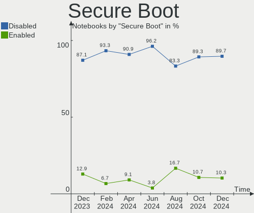
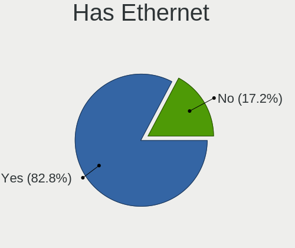
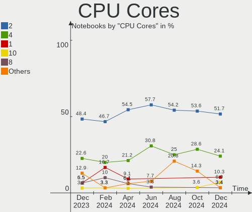
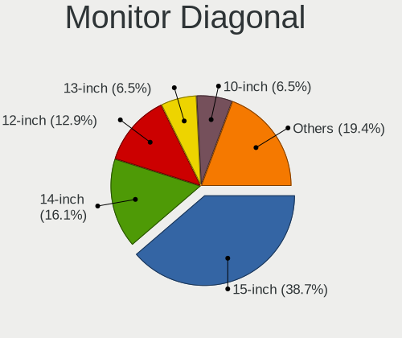
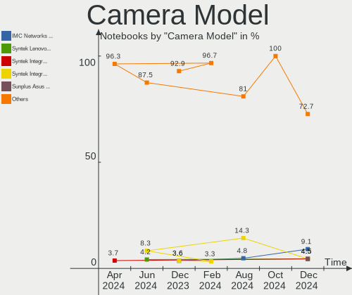
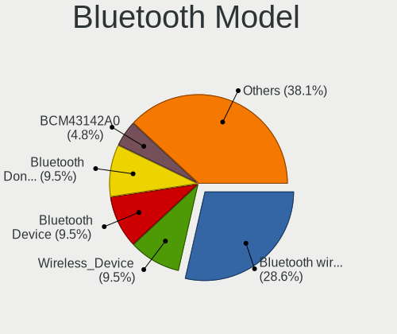

Xubuntu Hardware Trends (Notebook)
----------------------------------

A project to identify most popular hardware characteristics and track their change
over time based on data collected by Xubuntu users at https://Linux-Hardware.org.

Anyone can contribute to the study by uploading probes of their computers by
the [hw-probe](https://github.com/linuxhw/hw-probe) tool:

    sudo -E hw-probe -all -upload

Full-feature report is available here: https://linux-hardware.org/?view=trends&formfactor=notebook

Period: Apr, 2021.

Contents
--------

- [ OS                       ](#os)
- [ OS Family                ](#os-family)
- [ Kernel                   ](#kernel)
- [ Kernel Family            ](#kernel-family)
- [ Kernel Major Ver.        ](#kernel-major-ver)
- [ Arch                     ](#arch)
- [ DE                       ](#de)
- [ Display Server           ](#display-server)
- [ Display Manager          ](#display-manager)
- [ OS Lang                  ](#os-lang)
- [ Boot Mode                ](#boot-mode)
- [ Filesystem               ](#filesystem)
- [ Part. scheme             ](#part-scheme)
- [ Dual Boot with Linux/BSD ](#dual-boot-with-linux/bsd)
- [ Dual Boot (Win)          ](#dual-boot-win)
- [ Country                  ](#country)
- [ City                     ](#city)
- [ Vendor                   ](#vendor)
- [ Model                    ](#model)
- [ Model Family             ](#model-family)
- [ MFG Year                 ](#mfg-year)
- [ Form Factor              ](#form-factor)
- [ Secure Boot              ](#secure-boot)
- [ Coreboot                 ](#coreboot)
- [ RAM Size                 ](#ram-size)
- [ RAM Used                 ](#ram-used)
- [ Has CD-ROM               ](#has-cd-rom)
- [ Total Drives             ](#total-drives)
- [ Has Ethernet             ](#has-ethernet)
- [ Has WiFi                 ](#has-wifi)
- [ Has Bluetooth            ](#has-bluetooth)
- [ Drive Vendor             ](#drive-vendor)
- [ Drive Model              ](#drive-model)
- [ HDD Vendor               ](#hdd-vendor)
- [ SSD Vendor               ](#ssd-vendor)
- [ Drive Kind               ](#drive-kind)
- [ Drive Connector          ](#drive-connector)
- [ Drive Size               ](#drive-size)
- [ Space Total              ](#space-total)
- [ Space Used               ](#space-used)
- [ Malfunc. Drives          ](#malfunc-drives)
- [ Malfunc. Drive Vendor    ](#malfunc-drive-vendor)
- [ Malfunc. HDD Vendor      ](#malfunc-hdd-vendor)
- [ Malfunc. Drive Kind      ](#malfunc-drive-kind)
- [ Failed Drives            ](#failed-drives)
- [ Failed Drive Vendor      ](#failed-drive-vendor)
- [ Drive Status             ](#drive-status)
- [ Storage Vendor           ](#storage-vendor)
- [ Storage Model            ](#storage-model)
- [ Storage Kind             ](#storage-kind)
- [ CPU Vendor               ](#cpu-vendor)
- [ CPU Model                ](#cpu-model)
- [ CPU Model Family         ](#cpu-model-family)
- [ CPU Cores                ](#cpu-cores)
- [ CPU Sockets              ](#cpu-sockets)
- [ CPU Threads              ](#cpu-threads)
- [ CPU Op-Modes             ](#cpu-op-modes)
- [ CPU Microcode            ](#cpu-microcode)
- [ CPU Microarch            ](#cpu-microarch)
- [ GPU Vendor               ](#gpu-vendor)
- [ GPU Model                ](#gpu-model)
- [ GPU Combo                ](#gpu-combo)
- [ GPU Driver               ](#gpu-driver)
- [ GPU Memory               ](#gpu-memory)
- [ Monitor Vendor           ](#monitor-vendor)
- [ Monitor Model            ](#monitor-model)
- [ Monitor Resolution       ](#monitor-resolution)
- [ Monitor Diagonal         ](#monitor-diagonal)
- [ Monitor Width            ](#monitor-width)
- [ Aspect Ratio             ](#aspect-ratio)
- [ Monitor Area             ](#monitor-area)
- [ Pixel Density            ](#pixel-density)
- [ Multiple Monitors        ](#multiple-monitors)
- [ Net Controller Vendor    ](#net-controller-vendor)
- [ Net Controller Model     ](#net-controller-model)
- [ Wireless Vendor          ](#wireless-vendor)
- [ Wireless Model           ](#wireless-model)
- [ Ethernet Vendor          ](#ethernet-vendor)
- [ Ethernet Model           ](#ethernet-model)
- [ Net Controller Kind      ](#net-controller-kind)
- [ Used Controller          ](#used-controller)
- [ NICs                     ](#nics)
- [ IPv6                     ](#ipv6)
- [ Memory Vendor            ](#memory-vendor)
- [ Memory Model             ](#memory-model)
- [ Memory Kind              ](#memory-kind)
- [ Memory Form Factor       ](#memory-form-factor)
- [ Memory Size              ](#memory-size)
- [ Memory Speed             ](#memory-speed)
- [ Sound Vendor             ](#sound-vendor)
- [ Sound Model              ](#sound-model)
- [ Camera Vendor            ](#camera-vendor)
- [ Camera Model             ](#camera-model)
- [ Fingerprint Vendor       ](#fingerprint-vendor)
- [ Fingerprint Model        ](#fingerprint-model)
- [ Chipcard Vendor          ](#chipcard-vendor)
- [ Chipcard Model           ](#chipcard-model)
- [ Printer Vendor           ](#printer-vendor)
- [ Printer Model            ](#printer-model)
- [ Scanner Vendor           ](#scanner-vendor)
- [ Scanner Model            ](#scanner-model)
- [ Bluetooth Vendor         ](#bluetooth-vendor)
- [ Bluetooth Model          ](#bluetooth-model)
- [ Unsupported Devices      ](#unsupported-devices)
- [ Unsupported Device Types ](#unsupported-device-types)

OS
--

Installed operating systems

| Name          | Notebooks | Percent |
|---------------|-----------|---------|
| Xubuntu 20.04 | 40        | 62.5%   |
| Xubuntu 18.04 | 16        | 25%     |
| Xubuntu 20.10 | 6         | 9.38%   |
| Xubuntu 21.04 | 1         | 1.56%   |
| Xubuntu 19.10 | 1         | 1.56%   |

OS Family
---------

OS without a version

| Name    | Notebooks | Percent |
|---------|-----------|---------|
| Xubuntu | 64        | 100%    |

Kernel
------

Version of the Linux kernel

| Version                | Notebooks | Percent |
|------------------------|-----------|---------|
| 5.4.0-72-generic       | 10        | 15.63%  |
| 5.4.0-70-generic       | 8         | 12.5%   |
| 5.8.0-48-generic       | 7         | 10.94%  |
| 5.8.0-50-generic       | 4         | 6.25%   |
| 5.4.0-71-generic       | 3         | 4.69%   |
| 4.15.0-142-generic     | 3         | 4.69%   |
| 5.8.0-50-lowlatency    | 2         | 3.13%   |
| 5.8.0-49-generic       | 2         | 3.13%   |
| 5.4.0-72-lowlatency    | 2         | 3.13%   |
| 4.15.0-140-generic     | 2         | 3.13%   |
| 5.8.0-48-lowlatency    | 1         | 1.56%   |
| 5.8.0-45-lowlatency    | 1         | 1.56%   |
| 5.8.0-45-generic       | 1         | 1.56%   |
| 5.8.0-43-lowlatency    | 1         | 1.56%   |
| 5.4.0-71-lowlatency    | 1         | 1.56%   |
| 5.4.0-66-generic       | 1         | 1.56%   |
| 5.4.0-65-lowlatency    | 1         | 1.56%   |
| 5.4.0-60-generic       | 1         | 1.56%   |
| 5.4.0-58-generic       | 1         | 1.56%   |
| 5.4.0-52-generic       | 1         | 1.56%   |
| 5.4.0-29-generic       | 1         | 1.56%   |
| 5.3.0-64-generic       | 1         | 1.56%   |
| 5.3.0-62-generic       | 1         | 1.56%   |
| 5.3.0-40-generic       | 1         | 1.56%   |
| 5.11.11-xanmod1        | 1         | 1.56%   |
| 5.11.11                | 1         | 1.56%   |
| 5.11.0-13-generic      | 1         | 1.56%   |
| 5.10.11-051011-generic | 1         | 1.56%   |
| 5.0.2-050002-generic   | 1         | 1.56%   |
| 4.16.18-galliumos      | 1         | 1.56%   |
| 4.15.0-36-generic      | 1         | 1.56%   |

Kernel Family
-------------

Linux kernel without a distro release

| Version | Notebooks | Percent |
|---------|-----------|---------|
| 5.4.0   | 30        | 46.88%  |
| 5.8.0   | 19        | 29.69%  |
| 4.15.0  | 6         | 9.38%   |
| 5.3.0   | 3         | 4.69%   |
| 5.11.11 | 2         | 3.13%   |
| 5.11.0  | 1         | 1.56%   |
| 5.10.11 | 1         | 1.56%   |
| 5.0.2   | 1         | 1.56%   |
| 4.16.18 | 1         | 1.56%   |

Kernel Major Ver.
-----------------

Linux kernel major version

| Version | Notebooks | Percent |
|---------|-----------|---------|
| 5.4     | 30        | 46.88%  |
| 5.8     | 19        | 29.69%  |
| 4.15    | 6         | 9.38%   |
| 5.3     | 3         | 4.69%   |
| 5.11    | 3         | 4.69%   |
| 5.10    | 1         | 1.56%   |
| 5.0     | 1         | 1.56%   |
| 4.16    | 1         | 1.56%   |

Arch
----

OS architecture (x86_64, i586, etc.)

| Name   | Notebooks | Percent |
|--------|-----------|---------|
| x86_64 | 55        | 85.94%  |
| i686   | 9         | 14.06%  |

DE
--

Desktop Environment

| Name     | Notebooks | Percent |
|----------|-----------|---------|
| XFCE     | 62        | 96.88%  |
| GNOME    | 1         | 1.56%   |
| Cinnamon | 1         | 1.56%   |

Display Server
--------------

X11 or Wayland

| Name | Notebooks | Percent |
|------|-----------|---------|
| X11  | 64        | 100%    |

Display Manager
---------------

SDDM, LightDM, etc.

| Name    | Notebooks | Percent |
|---------|-----------|---------|
| Unknown | 41        | 64.06%  |
| TDM     | 22        | 34.38%  |
| XDM     | 1         | 1.56%   |

OS Lang
-------

Language

| Lang  | Notebooks | Percent |
|-------|-----------|---------|
| en_US | 22        | 34.38%  |
| fr_FR | 14        | 21.88%  |
| de_DE | 8         | 12.5%   |
| it_IT | 4         | 6.25%   |
| C     | 4         | 6.25%   |
| ru_RU | 2         | 3.13%   |
| pt_BR | 2         | 3.13%   |
| zh_CN | 1         | 1.56%   |
| tr_TR | 1         | 1.56%   |
| id_ID | 1         | 1.56%   |
| es_ES | 1         | 1.56%   |
| es_AR | 1         | 1.56%   |
| en_ZA | 1         | 1.56%   |
| en_GB | 1         | 1.56%   |
| en_CA | 1         | 1.56%   |

Boot Mode
---------

EFI or BIOS

| Mode | Notebooks | Percent |
|------|-----------|---------|
| BIOS | 43        | 67.19%  |
| EFI  | 21        | 32.81%  |

Filesystem
----------

Type of filesystem

| Type    | Notebooks | Percent |
|---------|-----------|---------|
| Ext4    | 61        | 95.31%  |
| Overlay | 3         | 4.69%   |

Part. scheme
------------

Scheme of partitioning

| Type    | Notebooks | Percent |
|---------|-----------|---------|
| Unknown | 41        | 64.06%  |
| GPT     | 13        | 20.31%  |
| MBR     | 10        | 15.63%  |

Dual Boot with Linux/BSD
------------------------

Hosting more than one Linux/BSD

| Dual boot | Notebooks | Percent |
|-----------|-----------|---------|
| No        | 57        | 89.06%  |
| Yes       | 7         | 10.94%  |

Dual Boot (Win)
---------------

Hosting Linux and Windows

| Dual boot | Notebooks | Percent |
|-----------|-----------|---------|
| No        | 46        | 71.88%  |
| Yes       | 18        | 28.13%  |

Country
-------

Geographic location (country)

| Country      | Notebooks | Percent |
|--------------|-----------|---------|
| France       | 15        | 23.44%  |
| Germany      | 11        | 17.19%  |
| USA          | 8         | 12.5%   |
| Italy        | 5         | 7.81%   |
| Chile        | 3         | 4.69%   |
| Spain        | 2         | 3.13%   |
| Finland      | 2         | 3.13%   |
| China        | 2         | 3.13%   |
| Canada       | 2         | 3.13%   |
| Brazil       | 2         | 3.13%   |
| UK           | 1         | 1.56%   |
| Turkey       | 1         | 1.56%   |
| South Africa | 1         | 1.56%   |
| Russia       | 1         | 1.56%   |
| Norway       | 1         | 1.56%   |
| Netherlands  | 1         | 1.56%   |
| Mexico       | 1         | 1.56%   |
| Iran         | 1         | 1.56%   |
| Indonesia    | 1         | 1.56%   |
| Czechia      | 1         | 1.56%   |
| Cabo Verde   | 1         | 1.56%   |
| Argentina    | 1         | 1.56%   |

City
----

Geographic location (city)

| City                      | Notebooks | Percent |
|---------------------------|-----------|---------|
| York                      | 1         | 1.56%   |
| Worcester                 | 1         | 1.56%   |
| Werder                    | 1         | 1.56%   |
| Warwick                   | 1         | 1.56%   |
| Volta Redonda             | 1         | 1.56%   |
| Vizille                   | 1         | 1.56%   |
| Vantaa                    | 1         | 1.56%   |
| Ulm                       | 1         | 1.56%   |
| Ufa                       | 1         | 1.56%   |
| Trieste                   | 1         | 1.56%   |
| Toronto                   | 1         | 1.56%   |
| Tehran                    | 1         | 1.56%   |
| Tarbes                    | 1         | 1.56%   |
| Stabekk                   | 1         | 1.56%   |
| Schwalbach am Taunus      | 1         | 1.56%   |
| Santiago                  | 1         | 1.56%   |
| Rosenheim                 | 1         | 1.56%   |
| Rome                      | 1         | 1.56%   |
| Rock Hill                 | 1         | 1.56%   |
| Rio Piracicaba            | 1         | 1.56%   |
| Reims                     | 1         | 1.56%   |
| Rehoboth                  | 1         | 1.56%   |
| Praia                     | 1         | 1.56%   |
| Prague                    | 1         | 1.56%   |
| Pottstown                 | 1         | 1.56%   |
| Perpignan                 | 1         | 1.56%   |
| Paderborn                 | 1         | 1.56%   |
| Nunoa                     | 1         | 1.56%   |
| New York                  | 1         | 1.56%   |
| Neuilly-sur-Seine         | 1         | 1.56%   |
| Mérignac                 | 1         | 1.56%   |
| Munich                    | 1         | 1.56%   |
| Mont-de-Marsan            | 1         | 1.56%   |
| Modena                    | 1         | 1.56%   |
| Mercier                   | 1         | 1.56%   |
| Marseille                 | 1         | 1.56%   |
| Margny-les-Compiegne      | 1         | 1.56%   |
| Maipu                     | 1         | 1.56%   |
| Los Urrutias              | 1         | 1.56%   |
| Longjing                  | 1         | 1.56%   |
| León                     | 1         | 1.56%   |
| Leipzig                   | 1         | 1.56%   |
| Leander                   | 1         | 1.56%   |
| Le Blanc-Mesnil           | 1         | 1.56%   |
| Landau                    | 1         | 1.56%   |
| Jarrell                   | 1         | 1.56%   |
| Jakarta                   | 1         | 1.56%   |
| Istanbul                  | 1         | 1.56%   |
| Hesperia                  | 1         | 1.56%   |
| Guangzhou Shi             | 1         | 1.56%   |
| Frankfurt am Main         | 1         | 1.56%   |
| Espoo                     | 1         | 1.56%   |
| El Puerto de Santa María | 1         | 1.56%   |
| Durach                    | 1         | 1.56%   |
| Châtenay-Malabry         | 1         | 1.56%   |
| Cherbourg-Octeville       | 1         | 1.56%   |
| Busto Arsizio             | 1         | 1.56%   |
| Buenos Aires              | 1         | 1.56%   |
| Brest                     | 1         | 1.56%   |
| Bordeaux                  | 1         | 1.56%   |

Vendor
------

Motherboard manufacturer

| Name                | Notebooks | Percent |
|---------------------|-----------|---------|
| Lenovo              | 13        | 20.31%  |
| Hewlett-Packard     | 9         | 14.06%  |
| ASUSTek Computer    | 9         | 14.06%  |
| Dell                | 7         | 10.94%  |
| Acer                | 7         | 10.94%  |
| MSI                 | 3         | 4.69%   |
| Clevo               | 2         | 3.13%   |
| Apple               | 2         | 3.13%   |
| Toshiba             | 1         | 1.56%   |
| Sony                | 1         | 1.56%   |
| Samsung Electronics | 1         | 1.56%   |
| Packard Bell        | 1         | 1.56%   |
| Medion              | 1         | 1.56%   |
| Jumper              | 1         | 1.56%   |
| HUAWEI              | 1         | 1.56%   |
| Google              | 1         | 1.56%   |
| Gateway             | 1         | 1.56%   |
| Fujitsu Siemens     | 1         | 1.56%   |
| Coradir             | 1         | 1.56%   |
| ATI                 | 1         | 1.56%   |

Model
-----

Motherboard model

| Name                                     | Notebooks | Percent |
|------------------------------------------|-----------|---------|
| ASUS T100HAN                             | 2         | 3.13%   |
| Toshiba Satellite Pro A40                | 1         | 1.56%   |
| Sony VPCF236FM                           | 1         | 1.56%   |
| Samsung 3570R/370R/470R/450R/510R        | 1         | 1.56%   |
| Packard Bell EasyNote_BU45               | 1         | 1.56%   |
| MSI GS63 7RD                             | 1         | 1.56%   |
| MSI GL62M 7REX                           | 1         | 1.56%   |
| MSI CR61 2M/CX61 2OC/CX61 2OD            | 1         | 1.56%   |
| Medion E7216                             | 1         | 1.56%   |
| Lenovo ZHAOYANG K43c-80 81HX             | 1         | 1.56%   |
| Lenovo V15-ADA 82C7                      | 1         | 1.56%   |
| Lenovo ThinkPad X230 2320JPU             | 1         | 1.56%   |
| Lenovo ThinkPad X200T 7453CTO            | 1         | 1.56%   |
| Lenovo ThinkPad X1 Carbon 7th 20R1001TUS | 1         | 1.56%   |
| Lenovo ThinkPad X1 Carbon 7th 20QD001VUS | 1         | 1.56%   |
| Lenovo ThinkPad W520 4284A95             | 1         | 1.56%   |
| Lenovo ThinkPad T14 Gen 1 20S0004NGE     | 1         | 1.56%   |
| Lenovo ThinkPad R61 8934F9U              | 1         | 1.56%   |
| Lenovo ThinkPad L14 Gen 1 20U2S1TL00     | 1         | 1.56%   |
| Lenovo ThinkPad E495 20NEA001GE          | 1         | 1.56%   |
| Lenovo G50-80 80L0                       | 1         | 1.56%   |
| Lenovo B5400 s20278Q                     | 1         | 1.56%   |
| Jumper EZbook                            | 1         | 1.56%   |
| HUAWEI KPL-W0X                           | 1         | 1.56%   |
| HP Stream Notebook PC 13                 | 1         | 1.56%   |
| HP Pavilion zd8000 (PW944EA#AK8)         | 1         | 1.56%   |
| HP Pavilion dv6500                       | 1         | 1.56%   |
| HP Pavilion dv6                          | 1         | 1.56%   |
| HP OMEN by HP Laptop 15-ce0xx            | 1         | 1.56%   |
| HP EliteBook Folio 9470m                 | 1         | 1.56%   |
| HP Compaq 6530b (GB974ET#ABF)            | 1         | 1.56%   |
| HP 550                                   | 1         | 1.56%   |
| HP 15                                    | 1         | 1.56%   |
| Google Wolf                              | 1         | 1.56%   |
| Gateway NV57H                            | 1         | 1.56%   |
| Fujitsu Siemens ESPRIMO Mobile V6535     | 1         | 1.56%   |
| Dell XPS L702X                           | 1         | 1.56%   |
| Dell Vostro V130                         | 1         | 1.56%   |
| Dell Precision M4500                     | 1         | 1.56%   |
| Dell Latitude E6540                      | 1         | 1.56%   |
| Dell Latitude E6330                      | 1         | 1.56%   |
| Dell Latitude E5440                      | 1         | 1.56%   |
| Dell Inspiron 3442                       | 1         | 1.56%   |
| Coradir Coradir/ES10IS5                  | 1         | 1.56%   |
| Clevo W55xEU                             | 1         | 1.56%   |
| Clevo M7x0S                              | 1         | 1.56%   |
| ATI BONEFISH                             | 1         | 1.56%   |
| ASUS X553MA                              | 1         | 1.56%   |
| ASUS N750JK                              | 1         | 1.56%   |
| ASUS N53SV                               | 1         | 1.56%   |
| ASUS N46VB                               | 1         | 1.56%   |
| ASUS K52Jr                               | 1         | 1.56%   |
| ASUS K50IE                               | 1         | 1.56%   |
| ASUS 1005HA                              | 1         | 1.56%   |
| Apple MacBookPro5,5                      | 1         | 1.56%   |
| Apple MacBookAir3,2                      | 1         | 1.56%   |
| Acer E1-510                              | 1         | 1.56%   |
| Acer Aspire ES1-521                      | 1         | 1.56%   |
| Acer Aspire 9300                         | 1         | 1.56%   |
| Acer Aspire 5315                         | 1         | 1.56%   |

Model Family
------------

Motherboard model prefix

| Name                    | Notebooks | Percent |
|-------------------------|-----------|---------|
| Lenovo ThinkPad         | 9         | 14.06%  |
| Acer Aspire             | 6         | 9.38%   |
| HP Pavilion             | 3         | 4.69%   |
| Dell Latitude           | 3         | 4.69%   |
| ASUS T100HAN            | 2         | 3.13%   |
| Toshiba Satellite       | 1         | 1.56%   |
| Sony VPCF236FM          | 1         | 1.56%   |
| Samsung 3570R           | 1         | 1.56%   |
| Packard Bell EasyNote   | 1         | 1.56%   |
| MSI GS63                | 1         | 1.56%   |
| MSI GL62M               | 1         | 1.56%   |
| MSI CR61                | 1         | 1.56%   |
| Medion E7216            | 1         | 1.56%   |
| Lenovo ZHAOYANG         | 1         | 1.56%   |
| Lenovo V15-ADA          | 1         | 1.56%   |
| Lenovo G50-80           | 1         | 1.56%   |
| Lenovo B5400            | 1         | 1.56%   |
| Jumper EZbook           | 1         | 1.56%   |
| HUAWEI KPL-W0X          | 1         | 1.56%   |
| HP Stream               | 1         | 1.56%   |
| HP OMEN                 | 1         | 1.56%   |
| HP EliteBook            | 1         | 1.56%   |
| HP Compaq               | 1         | 1.56%   |
| HP 550                  | 1         | 1.56%   |
| HP 15                   | 1         | 1.56%   |
| Google Wolf             | 1         | 1.56%   |
| Gateway NV57H           | 1         | 1.56%   |
| Fujitsu Siemens ESPRIMO | 1         | 1.56%   |
| Dell XPS                | 1         | 1.56%   |
| Dell Vostro             | 1         | 1.56%   |
| Dell Precision          | 1         | 1.56%   |
| Dell Inspiron           | 1         | 1.56%   |
| Coradir Coradir         | 1         | 1.56%   |
| Clevo W55xEU            | 1         | 1.56%   |
| Clevo M7x0S             | 1         | 1.56%   |
| ATI BONEFISH            | 1         | 1.56%   |
| ASUS X553MA             | 1         | 1.56%   |
| ASUS N750JK             | 1         | 1.56%   |
| ASUS N53SV              | 1         | 1.56%   |
| ASUS N46VB              | 1         | 1.56%   |
| ASUS K52Jr              | 1         | 1.56%   |
| ASUS K50IE              | 1         | 1.56%   |
| ASUS 1005HA             | 1         | 1.56%   |
| Apple MacBookPro5       | 1         | 1.56%   |
| Apple MacBookAir3       | 1         | 1.56%   |
| Acer E1-510             | 1         | 1.56%   |

MFG Year
--------

Motherboard manufacture year

| Year | Notebooks | Percent |
|------|-----------|---------|
| 2013 | 9         | 14.06%  |
| 2015 | 7         | 10.94%  |
| 2011 | 6         | 9.38%   |
| 2020 | 5         | 7.81%   |
| 2008 | 5         | 7.81%   |
| 2018 | 4         | 6.25%   |
| 2012 | 4         | 6.25%   |
| 2007 | 4         | 6.25%   |
| 2014 | 3         | 4.69%   |
| 2010 | 3         | 4.69%   |
| 2009 | 3         | 4.69%   |
| 2021 | 2         | 3.13%   |
| 2019 | 2         | 3.13%   |
| 2017 | 2         | 3.13%   |
| 2006 | 2         | 3.13%   |
| 2016 | 1         | 1.56%   |
| 2005 | 1         | 1.56%   |
| 2003 | 1         | 1.56%   |

Form Factor
-----------

Physical design of the computer

| Name     | Notebooks | Percent |
|----------|-----------|---------|
| Notebook | 64        | 100%    |

Secure Boot
-----------

Enabled or disabled

| State    | Notebooks | Percent |
|----------|-----------|---------|
| Disabled | 61        | 95.31%  |
| Enabled  | 3         | 4.69%   |

Coreboot
--------

Have coreboot on board

| Used | Notebooks | Percent |
|------|-----------|---------|
| No   | 63        | 98.44%  |
| Yes  | 1         | 1.56%   |

RAM Size
--------

Total RAM memory

| Size in GB | Notebooks | Percent |
|------------|-----------|---------|
| 3.01-4.0   | 19        | 29.69%  |
| 16.01-24.0 | 10        | 15.63%  |
| 8.01-16.0  | 9         | 14.06%  |
| 4.01-8.0   | 8         | 12.5%   |
| 1.01-2.0   | 7         | 10.94%  |
| 2.01-3.0   | 4         | 6.25%   |
| 0.51-1.0   | 4         | 6.25%   |
| 32.01-64.0 | 2         | 3.13%   |
| 24.01-32.0 | 1         | 1.56%   |

RAM Used
--------

Used RAM memory

| Used GB   | Notebooks | Percent |
|-----------|-----------|---------|
| 1.01-2.0  | 21        | 32.81%  |
| 2.01-3.0  | 12        | 18.75%  |
| 0.51-1.0  | 12        | 18.75%  |
| 4.01-8.0  | 9         | 14.06%  |
| 3.01-4.0  | 5         | 7.81%   |
| 8.01-16.0 | 3         | 4.69%   |
| 0.01-0.5  | 2         | 3.13%   |

Has CD-ROM
----------

Has CD-ROM on board

| Presented | Notebooks | Percent |
|-----------|-----------|---------|
| No        | 35        | 54.69%  |
| Yes       | 29        | 45.31%  |

Total Drives
------------

Number of drives on board

| Drives | Notebooks | Percent |
|--------|-----------|---------|
| 1      | 43        | 67.19%  |
| 2      | 17        | 26.56%  |
| 3      | 3         | 4.69%   |
| 0      | 1         | 1.56%   |

Has Ethernet
------------

Has Ethernet on board

| Presented | Notebooks | Percent |
|-----------|-----------|---------|
| Yes       | 57        | 89.06%  |
| No        | 7         | 10.94%  |

Has WiFi
--------

Has WiFi module

| Presented | Notebooks | Percent |
|-----------|-----------|---------|
| Yes       | 61        | 95.31%  |
| No        | 3         | 4.69%   |

Has Bluetooth
-------------

Has Bluetooth module

| Presented | Notebooks | Percent |
|-----------|-----------|---------|
| Yes       | 34        | 53.13%  |
| No        | 30        | 46.88%  |

Drive Vendor
------------

Hard drive vendors

| Vendor              | Notebooks | Drives | Percent |
|---------------------|-----------|--------|---------|
| Seagate             | 12        | 13     | 15.58%  |
| Samsung Electronics | 12        | 13     | 15.58%  |
| WDC                 | 10        | 10     | 12.99%  |
| Toshiba             | 9         | 9      | 11.69%  |
| Unknown             | 6         | 7      | 7.79%   |
| SanDisk             | 5         | 5      | 6.49%   |
| Kingston            | 3         | 3      | 3.9%    |
| HGST                | 2         | 2      | 2.6%    |
| Fujitsu             | 2         | 2      | 2.6%    |
| Crucial             | 2         | 2      | 2.6%    |
| Team                | 1         | 1      | 1.3%    |
| SK Hynix            | 1         | 1      | 1.3%    |
| PLEXTOR             | 1         | 1      | 1.3%    |
| Netac               | 1         | 1      | 1.3%    |
| LITEONIT            | 1         | 1      | 1.3%    |
| Kingchuxing         | 1         | 1      | 1.3%    |
| Intenso             | 1         | 1      | 1.3%    |
| Intel               | 1         | 1      | 1.3%    |
| IBM/Hitachi         | 1         | 1      | 1.3%    |
| Hitachi             | 1         | 1      | 1.3%    |
| BIWIN               | 1         | 1      | 1.3%    |
| Apple               | 1         | 1      | 1.3%    |
| ACASIS              | 1         | 1      | 1.3%    |
| A-DATA Technology   | 1         | 1      | 1.3%    |

Drive Model
-----------

Hard drive models

| Model                                 | Notebooks | Percent |
|---------------------------------------|-----------|---------|
| WDC WD5000LPVX-22V0TT0 500GB          | 2         | 2.5%    |
| Toshiba MK7559GSXP 752GB              | 2         | 2.5%    |
| Seagate ST9750420AS 752GB             | 2         | 2.5%    |
| Seagate ST9120822AS 120GB             | 2         | 2.5%    |
| WDC WDS120G2G0A-00JH30 120GB SSD      | 1         | 1.25%   |
| WDC WDS100T2B0C-00PXH0 1TB            | 1         | 1.25%   |
| WDC WD7500BPVT-80HXZT3 752GB          | 1         | 1.25%   |
| WDC WD3200BEKT-08PVMT1 320GB          | 1         | 1.25%   |
| WDC WD2500AAJS-00L7A0 250GB           | 1         | 1.25%   |
| WDC WD10SPSX-08A6W 1TB                | 1         | 1.25%   |
| WDC WD10JPVX-00JC3T0 1TB              | 1         | 1.25%   |
| WDC PC SN730 SDBQNTY-1T00-1001 1TB    | 1         | 1.25%   |
| Unknown SD/MMC/MS PRO 32GB            | 1         | 1.25%   |
| Unknown SA08G  8GB                    | 1         | 1.25%   |
| Unknown MMC Card  7GB                 | 1         | 1.25%   |
| Unknown MMC Card  32GB                | 1         | 1.25%   |
| Unknown MMC Card  128GB               | 1         | 1.25%   |
| Unknown BGND3R  32GB                  | 1         | 1.25%   |
| Unknown 5WCFP  197GB                  | 1         | 1.25%   |
| Toshiba TR200 480GB SSD               | 1         | 1.25%   |
| Toshiba THNSNJ256G8NY 256GB SSD       | 1         | 1.25%   |
| Toshiba MQ01ACF032 320GB              | 1         | 1.25%   |
| Toshiba MQ01ABD100M 1TB               | 1         | 1.25%   |
| Toshiba MK5061GSYN 500GB              | 1         | 1.25%   |
| Toshiba MK4025GAS 40GB                | 1         | 1.25%   |
| Toshiba MK3259GSXP 320GB              | 1         | 1.25%   |
| Team TIM3F49256GMBA04MA 256GB SSD     | 1         | 1.25%   |
| SK Hynix HFS256G39TNF-N3A0A 256GB SSD | 1         | 1.25%   |
| Seagate ST980811AS 80GB               | 1         | 1.25%   |
| Seagate ST9320325AS 320GB             | 1         | 1.25%   |
| Seagate ST9160314AS 160GB             | 1         | 1.25%   |
| Seagate ST9100822A 100GB              | 1         | 1.25%   |
| Seagate ST500LM012 HN-M500MBB 500GB   | 1         | 1.25%   |
| Seagate ST2000LX001-1RG174 2TB        | 1         | 1.25%   |
| Seagate ST1000LM049-2GH172 1TB        | 1         | 1.25%   |
| Seagate ST1000LM035-1RK172 1TB        | 1         | 1.25%   |
| Seagate Expansion 4TB                 | 1         | 1.25%   |
| SanDisk SSD U100 24GB                 | 1         | 1.25%   |
| SanDisk SSD PLUS 480GB                | 1         | 1.25%   |
| SanDisk SSD PLUS 120GB                | 1         | 1.25%   |
| SanDisk SSD i110 16GB                 | 1         | 1.25%   |
| SanDisk SDSSDA240G 240GB              | 1         | 1.25%   |
| Samsung SSD PM810 2.5 128GB           | 1         | 1.25%   |
| Samsung SSD 970 EVO 1TB               | 1         | 1.25%   |
| Samsung SSD 870 EVO 250GB             | 1         | 1.25%   |
| Samsung SSD 860 EVO 500GB             | 1         | 1.25%   |
| Samsung SSD 850 EVO 250GB             | 1         | 1.25%   |
| Samsung SSD 850 EVO 1TB               | 1         | 1.25%   |
| Samsung MZVLB512HBJQ-000L7 512GB      | 1         | 1.25%   |
| Samsung MZVLB256HBHQ-000L7 256GB      | 1         | 1.25%   |
| Samsung MZVLB256HBHQ-000L2 256GB      | 1         | 1.25%   |
| Samsung MZNLN256HMHQ-00000 256GB SSD  | 1         | 1.25%   |
| Samsung HM641JI 640GB                 | 1         | 1.25%   |
| Samsung HM251JI 250GB                 | 1         | 1.25%   |
| Samsung HM160HI 160GB                 | 1         | 1.25%   |
| PLEXTOR PH6-CE120 120GB SSD           | 1         | 1.25%   |
| Netac SSD 120GB                       | 1         | 1.25%   |
| LITEONIT LMT-128M6M mSATA 128GB SSD   | 1         | 1.25%   |
| Kingston SV300S37A240G 240GB SSD      | 1         | 1.25%   |
| Kingston SA400S37960G 960GB SSD       | 1         | 1.25%   |

HDD Vendor
----------

Hard disk drive vendors

| Vendor              | Notebooks | Drives | Percent |
|---------------------|-----------|--------|---------|
| Seagate             | 12        | 13     | 33.33%  |
| WDC                 | 7         | 7      | 19.44%  |
| Toshiba             | 7         | 7      | 19.44%  |
| Samsung Electronics | 3         | 3      | 8.33%   |
| HGST                | 2         | 2      | 5.56%   |
| Fujitsu             | 2         | 2      | 5.56%   |
| IBM/Hitachi         | 1         | 1      | 2.78%   |
| Hitachi             | 1         | 1      | 2.78%   |
| ACASIS              | 1         | 1      | 2.78%   |

SSD Vendor
----------

Solid state drive vendors

| Vendor              | Notebooks | Drives | Percent |
|---------------------|-----------|--------|---------|
| SanDisk             | 5         | 5      | 17.24%  |
| Samsung Electronics | 5         | 6      | 17.24%  |
| Kingston            | 3         | 3      | 10.34%  |
| Toshiba             | 2         | 2      | 6.9%    |
| Crucial             | 2         | 2      | 6.9%    |
| WDC                 | 1         | 1      | 3.45%   |
| Team                | 1         | 1      | 3.45%   |
| SK Hynix            | 1         | 1      | 3.45%   |
| PLEXTOR             | 1         | 1      | 3.45%   |
| Netac               | 1         | 1      | 3.45%   |
| LITEONIT            | 1         | 1      | 3.45%   |
| Kingchuxing         | 1         | 1      | 3.45%   |
| Intenso             | 1         | 1      | 3.45%   |
| Intel               | 1         | 1      | 3.45%   |
| BIWIN               | 1         | 1      | 3.45%   |
| Apple               | 1         | 1      | 3.45%   |
| A-DATA Technology   | 1         | 1      | 3.45%   |

Drive Kind
----------

HDD or SSD

| Kind    | Notebooks | Drives | Percent |
|---------|-----------|--------|---------|
| HDD     | 34        | 37     | 45.95%  |
| SSD     | 28        | 30     | 37.84%  |
| NVMe    | 6         | 6      | 8.11%   |
| MMC     | 5         | 6      | 6.76%   |
| Unknown | 1         | 1      | 1.35%   |

Drive Connector
---------------

SATA, SAS, NVMe, etc.

| Type | Notebooks | Drives | Percent |
|------|-----------|--------|---------|
| SATA | 56        | 65     | 80%     |
| NVMe | 6         | 6      | 8.57%   |
| MMC  | 5         | 6      | 7.14%   |
| SAS  | 3         | 3      | 4.29%   |

Drive Size
----------

Size of hard drive

| Size in TB | Notebooks | Drives | Percent |
|------------|-----------|--------|---------|
| 0.01-0.5   | 44        | 47     | 70.97%  |
| 0.51-1.0   | 16        | 18     | 25.81%  |
| 3.01-4.0   | 1         | 1      | 1.61%   |
| 1.01-2.0   | 1         | 1      | 1.61%   |

Space Total
-----------

Amount of disk space available on the file system

| Size in GB     | Notebooks | Percent |
|----------------|-----------|---------|
| 101-250        | 21        | 32.81%  |
| 251-500        | 12        | 18.75%  |
| 501-1000       | 9         | 14.06%  |
| 51-100         | 6         | 9.38%   |
| 21-50          | 5         | 7.81%   |
| 1001-2000      | 5         | 7.81%   |
| 1-20           | 4         | 6.25%   |
| More than 3000 | 1         | 1.56%   |
| Unknown        | 1         | 1.56%   |

Space Used
----------

Amount of used disk space

| Used GB   | Notebooks | Percent |
|-----------|-----------|---------|
| 1-20      | 24        | 37.5%   |
| 21-50     | 12        | 18.75%  |
| 51-100    | 9         | 14.06%  |
| 501-1000  | 6         | 9.38%   |
| 251-500   | 5         | 7.81%   |
| 101-250   | 5         | 7.81%   |
| 2001-3000 | 1         | 1.56%   |
| 1001-2000 | 1         | 1.56%   |
| Unknown   | 1         | 1.56%   |

Malfunc. Drives
---------------

Drive models with a malfunction

| Model                                   | Notebooks | Drives | Percent |
|-----------------------------------------|-----------|--------|---------|
| WDC WD7500BPVT-80HXZT3 752GB            | 1         | 1      | 25%     |
| Seagate ST9320325AS 320GB               | 1         | 1      | 25%     |
| Seagate ST1000LM049-2GH172 1TB          | 1         | 1      | 25%     |
| Samsung Electronics SSD PM810 2.5 128GB | 1         | 1      | 25%     |

Malfunc. Drive Vendor
---------------------

Vendors of faulty drives

| Vendor              | Notebooks | Drives | Percent |
|---------------------|-----------|--------|---------|
| Seagate             | 2         | 2      | 50%     |
| WDC                 | 1         | 1      | 25%     |
| Samsung Electronics | 1         | 1      | 25%     |

Malfunc. HDD Vendor
-------------------

Vendors of faulty HDD drives

| Vendor  | Notebooks | Drives | Percent |
|---------|-----------|--------|---------|
| Seagate | 2         | 2      | 66.67%  |
| WDC     | 1         | 1      | 33.33%  |

Malfunc. Drive Kind
-------------------

Kinds of faulty drives

| Kind | Notebooks | Drives | Percent |
|------|-----------|--------|---------|
| HDD  | 3         | 3      | 75%     |
| SSD  | 1         | 1      | 25%     |

Failed Drives
-------------

Failed drive models

Zero info for selected period =(

Failed Drive Vendor
-------------------

Failed drive vendors

Zero info for selected period =(

Drive Status
------------

Number of failed and malfunc. drives

| Status   | Notebooks | Drives | Percent |
|----------|-----------|--------|---------|
| Detected | 44        | 54     | 66.67%  |
| Works    | 18        | 22     | 27.27%  |
| Malfunc  | 4         | 4      | 6.06%   |

Storage Vendor
--------------

Storage controller vendors

| Vendor                           | Notebooks | Percent |
|----------------------------------|-----------|---------|
| Intel                            | 45        | 70.31%  |
| Nvidia                           | 5         | 7.81%   |
| AMD                              | 5         | 7.81%   |
| Samsung Electronics              | 4         | 6.25%   |
| Silicon Integrated Systems [SiS] | 2         | 3.13%   |
| Sandisk                          | 2         | 3.13%   |
| JMicron Technology               | 1         | 1.56%   |

Storage Model
-------------

Storage controller models

| Model                                                                          | Notebooks | Percent |
|--------------------------------------------------------------------------------|-----------|---------|
| Intel 7 Series Chipset Family 6-port SATA Controller [AHCI mode]               | 5         | 6.85%   |
| Intel 6 Series/C200 Series Chipset Family 6 port Mobile SATA AHCI Controller   | 5         | 6.85%   |
| Samsung NVMe SSD Controller SM981/PM981/PM983                                  | 4         | 5.48%   |
| Intel 82801IBM/IEM (ICH9M/ICH9M-E) 4 port SATA Controller [AHCI mode]          | 4         | 5.48%   |
| Intel 82801HM/HEM (ICH8M/ICH8M-E) SATA Controller [AHCI mode]                  | 4         | 5.48%   |
| Intel 82801HM/HEM (ICH8M/ICH8M-E) IDE Controller                               | 4         | 5.48%   |
| Intel 8 Series SATA Controller 1 [AHCI mode]                                   | 4         | 5.48%   |
| AMD FCH SATA Controller [AHCI mode]                                            | 4         | 5.48%   |
| Intel HM170/QM170 Chipset SATA Controller [AHCI Mode]                          | 3         | 4.11%   |
| Intel 8 Series/C220 Series Chipset Family 6-port SATA Controller 1 [AHCI mode] | 3         | 4.11%   |
| Intel 5 Series/3400 Series Chipset 4 port SATA AHCI Controller                 | 3         | 4.11%   |
| Silicon Integrated Systems [SiS] 5513 IDE Controller                           | 2         | 2.74%   |
| Nvidia MCP79 AHCI Controller                                                   | 2         | 2.74%   |
| Intel Atom Processor E3800 Series SATA AHCI Controller                         | 2         | 2.74%   |
| Intel 82801 Mobile SATA Controller [RAID mode]                                 | 2         | 2.74%   |
| Intel 5 Series/3400 Series Chipset 6 port SATA AHCI Controller                 | 2         | 2.74%   |
| Silicon Integrated Systems [SiS] AHCI IDE Controller (0106)                    | 1         | 1.37%   |
| Sandisk WD Blue SN550 NVMe SSD                                                 | 1         | 1.37%   |
| Sandisk WD Black SN750 / PC SN730 NVMe SSD                                     | 1         | 1.37%   |
| Nvidia MCP89 SATA Controller (AHCI mode)                                       | 1         | 1.37%   |
| Nvidia MCP65 SATA Controller                                                   | 1         | 1.37%   |
| Nvidia MCP65 IDE                                                               | 1         | 1.37%   |
| Nvidia MCP51 Serial ATA Controller                                             | 1         | 1.37%   |
| Nvidia MCP51 IDE                                                               | 1         | 1.37%   |
| JMicron JMB368 IDE controller                                                  | 1         | 1.37%   |
| Intel Sunrise Point-LP SATA Controller [AHCI mode]                             | 1         | 1.37%   |
| Intel NM10/ICH7 Family SATA Controller [AHCI mode]                             | 1         | 1.37%   |
| Intel Comet Lake SATA AHCI Controller                                          | 1         | 1.37%   |
| Intel Celeron/Pentium Silver Processor SATA Controller                         | 1         | 1.37%   |
| Intel 82801GBM/GHM (ICH7-M Family) SATA Controller [IDE mode]                  | 1         | 1.37%   |
| Intel 82801GBM/GHM (ICH7-M Family) SATA Controller [AHCI mode]                 | 1         | 1.37%   |
| Intel 82801G (ICH7 Family) IDE Controller                                      | 1         | 1.37%   |
| Intel 82801FB/FBM/FR/FW/FRW (ICH6 Family) IDE Controller                       | 1         | 1.37%   |
| Intel 82801DBM (ICH4-M) IDE Controller                                         | 1         | 1.37%   |
| AMD IXP SB4x0 Serial ATA Controller                                            | 1         | 1.37%   |
| AMD IXP SB4x0 IDE Controller                                                   | 1         | 1.37%   |

Storage Kind
------------

Kind of storage controller (IDE, SATA, NVMe, SAS, ...)

| Kind | Notebooks | Percent |
|------|-----------|---------|
| SATA | 48        | 70.59%  |
| IDE  | 12        | 17.65%  |
| NVMe | 6         | 8.82%   |
| RAID | 2         | 2.94%   |

CPU Vendor
----------

Processor vendors

| Vendor | Notebooks | Percent |
|--------|-----------|---------|
| Intel  | 57        | 89.06%  |
| AMD    | 7         | 10.94%  |

CPU Model
---------

Processor models

| Model                                         | Notebooks | Percent |
|-----------------------------------------------|-----------|---------|
| Intel Core i7-2670QM CPU @ 2.20GHz            | 3         | 4.69%   |
| Intel Core i7-7700HQ CPU @ 2.80GHz            | 2         | 3.13%   |
| Intel Core i7-10510U CPU @ 1.80GHz            | 2         | 3.13%   |
| Intel Core i5-3230M CPU @ 2.60GHz             | 2         | 3.13%   |
| Intel Core 2 Duo CPU P8400 @ 2.26GHz          | 2         | 3.13%   |
| Intel Core 2 Duo CPU L9400 @ 1.86GHz          | 2         | 3.13%   |
| Intel Celeron CPU 550 @ 2.00GHz               | 2         | 3.13%   |
| Intel Atom x5-Z8500 CPU @ 1.44GHz             | 2         | 3.13%   |
| AMD Ryzen 5 3500U with Radeon Vega Mobile Gfx | 2         | 3.13%   |
| Intel Pentium Dual-Core CPU T4400 @ 2.20GHz   | 1         | 1.56%   |
| Intel Pentium Dual-Core CPU T4200 @ 2.00GHz   | 1         | 1.56%   |
| Intel Pentium Dual CPU T3400 @ 2.16GHz        | 1         | 1.56%   |
| Intel Pentium CPU N3540 @ 2.16GHz             | 1         | 1.56%   |
| Intel Pentium 4 CPU 3.40GHz                   | 1         | 1.56%   |
| Intel Mobile Pentium 4 CPU 2.66GHz            | 1         | 1.56%   |
| Intel Core i7-8565U CPU @ 1.80GHz             | 1         | 1.56%   |
| Intel Core i7-4700HQ CPU @ 2.40GHz            | 1         | 1.56%   |
| Intel Core i7-4610M CPU @ 3.00GHz             | 1         | 1.56%   |
| Intel Core i7-3630QM CPU @ 2.40GHz            | 1         | 1.56%   |
| Intel Core i7-3612QM CPU @ 2.10GHz            | 1         | 1.56%   |
| Intel Core i7-2620M CPU @ 2.70GHz             | 1         | 1.56%   |
| Intel Core i7 CPU Q 720 @ 1.60GHz             | 1         | 1.56%   |
| Intel Core i5-8250U CPU @ 1.60GHz             | 1         | 1.56%   |
| Intel Core i5-7300HQ CPU @ 2.50GHz            | 1         | 1.56%   |
| Intel Core i5-4300U CPU @ 1.90GHz             | 1         | 1.56%   |
| Intel Core i5-4200M CPU @ 2.50GHz             | 1         | 1.56%   |
| Intel Core i5-3437U CPU @ 1.90GHz             | 1         | 1.56%   |
| Intel Core i5-3340M CPU @ 2.70GHz             | 1         | 1.56%   |
| Intel Core i5-2410M CPU @ 2.30GHz             | 1         | 1.56%   |
| Intel Core i5-10210U CPU @ 1.60GHz            | 1         | 1.56%   |
| Intel Core i5 CPU U 470 @ 1.33GHz             | 1         | 1.56%   |
| Intel Core i5 CPU M 460 @ 2.53GHz             | 1         | 1.56%   |
| Intel Core i3-4030U CPU @ 1.90GHz             | 1         | 1.56%   |
| Intel Core i3-4005U CPU @ 1.70GHz             | 1         | 1.56%   |
| Intel Core i3 CPU M 380 @ 2.53GHz             | 1         | 1.56%   |
| Intel Core i3 CPU M 350 @ 2.27GHz             | 1         | 1.56%   |
| Intel Core Duo CPU T2450 @ 2.00GHz            | 1         | 1.56%   |
| Intel Core 2 Duo CPU T8100 @ 2.10GHz          | 1         | 1.56%   |
| Intel Core 2 Duo CPU P8700 @ 2.53GHz          | 1         | 1.56%   |
| Intel Celeron N4100 CPU @ 1.10GHz             | 1         | 1.56%   |
| Intel Celeron M processor 1.60GHz             | 1         | 1.56%   |
| Intel Celeron M CPU 440 @ 1.86GHz             | 1         | 1.56%   |
| Intel Celeron CPU N3050 @ 1.60GHz             | 1         | 1.56%   |
| Intel Celeron CPU N2920 @ 1.86GHz             | 1         | 1.56%   |
| Intel Celeron CPU 540 @ 1.86GHz               | 1         | 1.56%   |
| Intel Celeron CPU 2950M @ 2.00GHz             | 1         | 1.56%   |
| Intel Celeron 2955U @ 1.40GHz                 | 1         | 1.56%   |
| Intel Atom CPU N270 @ 1.60GHz                 | 1         | 1.56%   |
| Intel Atom CPU N2600 @ 1.60GHz                | 1         | 1.56%   |
| AMD Turion 64 X2 Mobile Technology TL-50      | 1         | 1.56%   |
| AMD Ryzen 5 2500U with Radeon Vega Mobile Gfx | 1         | 1.56%   |
| AMD E1-6010 APU with AMD Radeon R2 Graphics   | 1         | 1.56%   |
| AMD Athlon 64 X2 Dual-Core Processor TK-53    | 1         | 1.56%   |
| AMD A6-5200 APU with Radeon HD Graphics       | 1         | 1.56%   |

CPU Model Family
----------------

Processor model prefix

| Model                   | Notebooks | Percent |
|-------------------------|-----------|---------|
| Intel Core i7           | 14        | 21.88%  |
| Intel Core i5           | 12        | 18.75%  |
| Intel Celeron           | 8         | 12.5%   |
| Intel Core 2 Duo        | 6         | 9.38%   |
| Intel Core i3           | 4         | 6.25%   |
| Intel Atom              | 4         | 6.25%   |
| AMD Ryzen 5             | 3         | 4.69%   |
| Intel Pentium Dual-Core | 2         | 3.13%   |
| Intel Celeron M         | 2         | 3.13%   |
| Intel Pentium Dual      | 1         | 1.56%   |
| Intel Pentium 4         | 1         | 1.56%   |
| Intel Pentium           | 1         | 1.56%   |
| Intel Mobile Pentium 4  | 1         | 1.56%   |
| Intel Core Duo          | 1         | 1.56%   |
| AMD Turion 64 X2 Mobile | 1         | 1.56%   |
| AMD E1                  | 1         | 1.56%   |
| AMD Athlon 64 X2        | 1         | 1.56%   |
| AMD A6                  | 1         | 1.56%   |

CPU Cores
---------

Number of processor cores

| Number | Notebooks | Percent |
|--------|-----------|---------|
| 2      | 32        | 50%     |
| 4      | 24        | 37.5%   |
| 1      | 8         | 12.5%   |

CPU Sockets
-----------

Number of sockets

| Number | Notebooks | Percent |
|--------|-----------|---------|
| 1      | 64        | 100%    |

CPU Threads
-----------

Threads per core (Hyper-Threading)

| Number | Notebooks | Percent |
|--------|-----------|---------|
| 2      | 34        | 53.13%  |
| 1      | 30        | 46.88%  |

CPU Op-Modes
------------

CPU Operation Modes (32-bit, 64-bit)

| Op mode        | Notebooks | Percent |
|----------------|-----------|---------|
| 32-bit, 64-bit | 59        | 92.19%  |
| 32-bit         | 5         | 7.81%   |

CPU Microcode
-------------

Microcode number

| Number     | Notebooks | Percent |
|------------|-----------|---------|
| Unknown    | 11        | 17.19%  |
| 0x306a9    | 5         | 7.81%   |
| 0x1067a    | 5         | 7.81%   |
| 0x40651    | 4         | 6.25%   |
| 0x206a7    | 4         | 6.25%   |
| 0x906e9    | 3         | 4.69%   |
| 0x406c3    | 3         | 4.69%   |
| 0x306c3    | 3         | 4.69%   |
| 0x10661    | 3         | 4.69%   |
| 0x806ec    | 2         | 3.13%   |
| 0x6ec      | 2         | 3.13%   |
| 0x20655    | 2         | 3.13%   |
| 0x10676    | 2         | 3.13%   |
| 0xf43      | 1         | 1.56%   |
| 0xf29      | 1         | 1.56%   |
| 0x6fd      | 1         | 1.56%   |
| 0x6d8      | 1         | 1.56%   |
| 0x30678    | 1         | 1.56%   |
| 0x30673    | 1         | 1.56%   |
| 0x30661    | 1         | 1.56%   |
| 0x20652    | 1         | 1.56%   |
| 0x106e5    | 1         | 1.56%   |
| 0x106c2    | 1         | 1.56%   |
| 0x08108109 | 1         | 1.56%   |
| 0x08108102 | 1         | 1.56%   |
| 0x08101007 | 1         | 1.56%   |
| 0x07030105 | 1         | 1.56%   |
| 0x0700010f | 1         | 1.56%   |

CPU Microarch
-------------

Microarchitecture

| Name          | Notebooks | Percent |
|---------------|-----------|---------|
| Penryn        | 8         | 12.5%   |
| KabyLake      | 8         | 12.5%   |
| Haswell       | 8         | 12.5%   |
| IvyBridge     | 6         | 9.38%   |
| Silvermont    | 5         | 7.81%   |
| SandyBridge   | 5         | 7.81%   |
| Westmere      | 4         | 6.25%   |
| Core          | 4         | 6.25%   |
| P6            | 3         | 4.69%   |
| Zen+          | 2         | 3.13%   |
| NetBurst      | 2         | 3.13%   |
| K8 Hammer     | 2         | 3.13%   |
| Bonnell       | 2         | 3.13%   |
| Zen           | 1         | 1.56%   |
| Puma          | 1         | 1.56%   |
| Nehalem       | 1         | 1.56%   |
| Jaguar        | 1         | 1.56%   |
| Goldmont plus | 1         | 1.56%   |

GPU Vendor
----------

Vendors of graphics cards

| Vendor                           | Notebooks | Percent |
|----------------------------------|-----------|---------|
| Intel                            | 44        | 59.46%  |
| Nvidia                           | 19        | 25.68%  |
| AMD                              | 9         | 12.16%  |
| Silicon Integrated Systems [SiS] | 2         | 2.7%    |

GPU Model
---------

Graphics card models

| Model                                                                                      | Notebooks | Percent |
|--------------------------------------------------------------------------------------------|-----------|---------|
| Intel 3rd Gen Core processor Graphics Controller                                           | 6         | 7.59%   |
| Intel Haswell-ULT Integrated Graphics Controller                                           | 4         | 5.06%   |
| Nvidia GF108M [GeForce GT 540M]                                                            | 3         | 3.8%    |
| Intel Mobile GM965/GL960 Integrated Graphics Controller (secondary)                        | 3         | 3.8%    |
| Intel Mobile GM965/GL960 Integrated Graphics Controller (primary)                          | 3         | 3.8%    |
| Intel Mobile 4 Series Chipset Integrated Graphics Controller                               | 3         | 3.8%    |
| Intel Core Processor Integrated Graphics Controller                                        | 3         | 3.8%    |
| Intel CometLake-U GT2 [UHD Graphics]                                                       | 3         | 3.8%    |
| Intel Atom/Celeron/Pentium Processor x5-E8000/J3xxx/N3xxx Integrated Graphics Controller   | 3         | 3.8%    |
| Intel 4th Gen Core Processor Integrated Graphics Controller                                | 3         | 3.8%    |
| Intel 2nd Generation Core Processor Family Integrated Graphics Controller                  | 3         | 3.8%    |
| Intel Mobile 945GM/GMS/GME, 943/940GML Express Integrated Graphics Controller              | 2         | 2.53%   |
| Intel HD Graphics 630                                                                      | 2         | 2.53%   |
| Intel Atom Processor Z36xxx/Z37xxx Series Graphics & Display                               | 2         | 2.53%   |
| AMD Picasso                                                                                | 2         | 2.53%   |
| Silicon Integrated Systems [SiS] 771/671 PCIE VGA Display Adapter                          | 1         | 1.27%   |
| Silicon Integrated Systems [SiS] 661/741/760 PCI/AGP or 662/761Gx PCIE VGA Display Adapter | 1         | 1.27%   |
| Nvidia MCP89 [GeForce 320M]                                                                | 1         | 1.27%   |
| Nvidia GT218M [GeForce 310M]                                                               | 1         | 1.27%   |
| Nvidia GT216GLM [Quadro FX 880M]                                                           | 1         | 1.27%   |
| Nvidia GP108M [GeForce MX330]                                                              | 1         | 1.27%   |
| Nvidia GP107M [GeForce GTX 1050 Ti Mobile]                                                 | 1         | 1.27%   |
| Nvidia GP107M [GeForce GTX 1050 Mobile]                                                    | 1         | 1.27%   |
| Nvidia GP106BM [GeForce GTX 1060 Mobile 6GB]                                               | 1         | 1.27%   |
| Nvidia GM107M [GeForce GTX 850M]                                                           | 1         | 1.27%   |
| Nvidia GK107M [GeForce GT 740M]                                                            | 1         | 1.27%   |
| Nvidia GF117M [GeForce 610M/710M/810M/820M / GT 620M/625M/630M/720M]                       | 1         | 1.27%   |
| Nvidia GF116M [GeForce GT 555M/635M]                                                       | 1         | 1.27%   |
| Nvidia GF108M [GeForce GT 420M]                                                            | 1         | 1.27%   |
| Nvidia GF108GLM [Quadro 1000M]                                                             | 1         | 1.27%   |
| Nvidia G86M [GeForce 8400M GS]                                                             | 1         | 1.27%   |
| Nvidia C79 [GeForce 9400M]                                                                 | 1         | 1.27%   |
| Nvidia C51 [GeForce Go 6100]                                                               | 1         | 1.27%   |
| Intel WhiskeyLake-U GT2 [UHD Graphics 620]                                                 | 1         | 1.27%   |
| Intel UHD Graphics 620                                                                     | 1         | 1.27%   |
| Intel Mobile GME965/GLE960 Integrated Graphics Controller                                  | 1         | 1.27%   |
| Intel Mobile 945GSE Express Integrated Graphics Controller                                 | 1         | 1.27%   |
| Intel Mobile 945GM/GMS, 943/940GML Express Integrated Graphics Controller                  | 1         | 1.27%   |
| Intel Haswell Integrated Graphics Controller                                               | 1         | 1.27%   |
| Intel GeminiLake [UHD Graphics 600]                                                        | 1         | 1.27%   |
| Intel Atom Processor D2xxx/N2xxx Integrated Graphics Controller                            | 1         | 1.27%   |
| Intel 82852/855GM Integrated Graphics Device                                               | 1         | 1.27%   |
| AMD RV730/M96 [Mobility Radeon HD 4650/5165]                                               | 1         | 1.27%   |
| AMD RV380/M24 [Mobility Radeon X600]                                                       | 1         | 1.27%   |
| AMD RC410M [Mobility Radeon Xpress 200M]                                                   | 1         | 1.27%   |
| AMD Raven Ridge [Radeon Vega Series / Radeon Vega Mobile Series]                           | 1         | 1.27%   |
| AMD Park [Mobility Radeon HD 5430/5450/5470]                                               | 1         | 1.27%   |
| AMD Mullins [Radeon R2 Graphics]                                                           | 1         | 1.27%   |
| AMD Kabini [Radeon HD 8400 / R3 Series]                                                    | 1         | 1.27%   |

GPU Combo
---------

Combinations of graphics cards

| Name           | Notebooks | Percent |
|----------------|-----------|---------|
| 1 x Intel      | 33        | 51.56%  |
| Intel + Nvidia | 10        | 15.63%  |
| 1 x Nvidia     | 9         | 14.06%  |
| 1 x AMD        | 9         | 14.06%  |
| 1 x SiS        | 2         | 3.13%   |
| Other          | 1         | 1.56%   |

GPU Driver
----------

Free vs proprietary

| Driver      | Notebooks | Percent |
|-------------|-----------|---------|
| Free        | 53        | 82.81%  |
| Proprietary | 9         | 14.06%  |
| Unknown     | 2         | 3.13%   |

GPU Memory
----------

Total video memory

| Size in GB | Notebooks | Percent |
|------------|-----------|---------|
| Unknown    | 34        | 53.13%  |
| 1.01-2.0   | 12        | 18.75%  |
| 0.01-0.5   | 9         | 14.06%  |
| 0.51-1.0   | 6         | 9.38%   |
| 5.01-6.0   | 1         | 1.56%   |
| 3.01-4.0   | 1         | 1.56%   |
| 2.01-3.0   | 1         | 1.56%   |

Monitor Vendor
--------------

Monitor vendors

| Vendor                  | Notebooks | Percent |
|-------------------------|-----------|---------|
| AU Optronics            | 11        | 16.42%  |
| LG Display              | 9         | 13.43%  |
| Samsung Electronics     | 7         | 10.45%  |
| BOE                     | 7         | 10.45%  |
| Chimei Innolux          | 6         | 8.96%   |
| LG Philips              | 4         | 5.97%   |
| BenQ                    | 4         | 5.97%   |
| Lenovo                  | 3         | 4.48%   |
| Goldstar                | 3         | 4.48%   |
| Chi Mei Optoelectronics | 3         | 4.48%   |
| Apple                   | 2         | 2.99%   |
| Ancor Communications    | 2         | 2.99%   |
| UMC                     | 1         | 1.49%   |
| Sceptre Tech            | 1         | 1.49%   |
| LNG                     | 1         | 1.49%   |
| LGD                     | 1         | 1.49%   |
| InfoVision              | 1         | 1.49%   |
| HannStar                | 1         | 1.49%   |

Monitor Model
-------------

Monitor models

| Model                                                                     | Notebooks | Percent |
|---------------------------------------------------------------------------|-----------|---------|
| AU Optronics LCD Monitor AUO312C 1366x768 293x164mm 13.2-inch             | 2         | 2.94%   |
| AU Optronics LCD Monitor AUO119E 1600x900 382x214mm 17.2-inch             | 2         | 2.94%   |
| UMC TV UMCC024 1920x1080 521x293mm 23.5-inch                              | 1         | 1.47%   |
| Sceptre Tech N43 SPT110C 3840x2160 575x323mm 26.0-inch                    | 1         | 1.47%   |
| Samsung Electronics S22D300 SAM0B3F 1920x1080 477x268mm 21.5-inch         | 1         | 1.47%   |
| Samsung Electronics LCD Monitor SEC5441 1366x768 344x194mm 15.5-inch      | 1         | 1.47%   |
| Samsung Electronics LCD Monitor SEC4C42 1280x800 303x190mm 14.1-inch      | 1         | 1.47%   |
| Samsung Electronics LCD Monitor SEC315A 1366x768 344x194mm 15.5-inch      | 1         | 1.47%   |
| Samsung Electronics LCD Monitor SEC3150 1366x768 344x193mm 15.5-inch      | 1         | 1.47%   |
| Samsung Electronics LCD Monitor SEC3047 1366x768 277x156mm 12.5-inch      | 1         | 1.47%   |
| Samsung Electronics LCD Monitor SDC4C48 1920x1080 409x230mm 18.5-inch     | 1         | 1.47%   |
| LNG HDMI LNG0030 1920x1080 708x398mm 32.0-inch                            | 1         | 1.47%   |
| LGD LCD Monitor 1920x1080                                                 | 1         | 1.47%   |
| LG Philips LCD Monitor LPLE800 1280x800 304x190mm 14.1-inch               | 1         | 1.47%   |
| LG Philips LCD Monitor LPLDB00 1280x800 331x207mm 15.4-inch               | 1         | 1.47%   |
| LG Philips LCD Monitor LPLB600 1280x800 261x163mm 12.1-inch               | 1         | 1.47%   |
| LG Philips LCD Monitor LPL1E01 1280x800 330x210mm 15.4-inch               | 1         | 1.47%   |
| LG Display LP156WH2-TLQ1 LGD021B 1366x768 344x194mm 15.5-inch             | 1         | 1.47%   |
| LG Display LCD Monitor LGD0608 1920x1080 309x174mm 14.0-inch              | 1         | 1.47%   |
| LG Display LCD Monitor LGD046F 1920x1080 344x194mm 15.5-inch              | 1         | 1.47%   |
| LG Display LCD Monitor LGD0468 1366x768 340x190mm 15.3-inch               | 1         | 1.47%   |
| LG Display LCD Monitor LGD0456 1366x768 344x194mm 15.5-inch               | 1         | 1.47%   |
| LG Display LCD Monitor LGD0395 1366x768 344x194mm 15.5-inch               | 1         | 1.47%   |
| LG Display LCD Monitor LGD02EC 1366x768 293x165mm 13.2-inch               | 1         | 1.47%   |
| LG Display LCD Monitor LGD02E3 1366x768 344x194mm 15.5-inch               | 1         | 1.47%   |
| LG Display LCD Monitor LGD01E8 1366x768 340x190mm 15.3-inch               | 1         | 1.47%   |
| Lenovo LCD Monitor LEN40B2 1920x1080 344x193mm 15.5-inch                  | 1         | 1.47%   |
| Lenovo LCD Monitor LEN4050 1280x800 331x207mm 15.4-inch                   | 1         | 1.47%   |
| Lenovo LCD Monitor LEN4011 1280x800 261x163mm 12.1-inch                   | 1         | 1.47%   |
| InfoVision LCD Monitor IVO03F4 1920x1200 263x164mm 12.2-inch              | 1         | 1.47%   |
| HannStar LCD Monitor HSD03E9 1024x600 220x129mm 10.0-inch                 | 1         | 1.47%   |
| Goldstar Ultra HD GSM5B08 3840x2160 600x340mm 27.2-inch                   | 1         | 1.47%   |
| Goldstar M2432 GSM595E 1920x1080 521x293mm 23.5-inch                      | 1         | 1.47%   |
| Goldstar FULL HD GSM5B55 1920x1080 480x270mm 21.7-inch                    | 1         | 1.47%   |
| Goldstar E2360 GSM57E4 1920x1080 510x290mm 23.1-inch                      | 1         | 1.47%   |
| Chimei Innolux LCD Monitor CMN15D6 1920x1080 344x193mm 15.5-inch          | 1         | 1.47%   |
| Chimei Innolux LCD Monitor CMN15BF 1366x768 344x193mm 15.5-inch           | 1         | 1.47%   |
| Chimei Innolux LCD Monitor CMN14D6 1366x768 309x173mm 13.9-inch           | 1         | 1.47%   |
| Chimei Innolux LCD Monitor CMN14A7 1920x1080 308x173mm 13.9-inch          | 1         | 1.47%   |
| Chimei Innolux LCD Monitor CMN1481 1600x900 309x174mm 14.0-inch           | 1         | 1.47%   |
| Chimei Innolux LCD Monitor CMN1132 1366x768 260x140mm 11.6-inch           | 1         | 1.47%   |
| Chi Mei Optoelectronics LCD Monitor CMO1720 1920x1080 382x215mm 17.3-inch | 1         | 1.47%   |
| Chi Mei Optoelectronics LCD Monitor CMO1552 1280x800 331x207mm 15.4-inch  | 1         | 1.47%   |
| Chi Mei Optoelectronics LCD Monitor 1920x1080                             | 1         | 1.47%   |
| BOE LCD Monitor BOE08CE 3840x2160 309x174mm 14.0-inch                     | 1         | 1.47%   |
| BOE LCD Monitor BOE083C 1920x1080 309x173mm 13.9-inch                     | 1         | 1.47%   |
| BOE LCD Monitor BOE0812 1920x1080 344x194mm 15.5-inch                     | 1         | 1.47%   |
| BOE LCD Monitor BOE07C8 3840x2160 309x174mm 14.0-inch                     | 1         | 1.47%   |
| BOE LCD Monitor BOE0779 1920x1080 309x173mm 13.9-inch                     | 1         | 1.47%   |
| BOE LCD Monitor BOE0742 1920x1080 309x173mm 13.9-inch                     | 1         | 1.47%   |
| BOE LCD Monitor BOE06D3 1366x768 344x194mm 15.5-inch                      | 1         | 1.47%   |
| BenQ GL955 BNQ78C7 1280x720 410x230mm 18.5-inch                           | 1         | 1.47%   |
| BenQ GL2780 BNQ78EC 1920x1080 598x336mm 27.0-inch                         | 1         | 1.47%   |
| BenQ GL2460 BNQ78CE 1920x1080 531x299mm 24.0-inch                         | 1         | 1.47%   |
| BenQ EW3270U BNQ7950 3840x2160 698x393mm 31.5-inch                        | 1         | 1.47%   |
| AU Optronics LCD Monitor AUO8174 1280x800 331x207mm 15.4-inch             | 1         | 1.47%   |
| AU Optronics LCD Monitor AUO42ED 1920x1080 344x193mm 15.5-inch            | 1         | 1.47%   |
| AU Optronics LCD Monitor AUO313E 1600x900 309x174mm 14.0-inch             | 1         | 1.47%   |
| AU Optronics LCD Monitor AUO313C 1366x768 310x170mm 13.9-inch             | 1         | 1.47%   |
| AU Optronics LCD Monitor AUO2774 1280x800 331x207mm 15.4-inch             | 1         | 1.47%   |

Monitor Resolution
------------------

Monitor screen resolution

| Resolution        | Notebooks | Percent |
|-------------------|-----------|---------|
| 1366x768 (WXGA)   | 21        | 32.81%  |
| 1920x1080 (FHD)   | 19        | 29.69%  |
| 1280x800 (WXGA)   | 10        | 15.63%  |
| 3840x2160 (4K)    | 6         | 9.38%   |
| 1600x900 (HD+)    | 4         | 6.25%   |
| 2288x1287         | 1         | 1.56%   |
| 1920x1200 (WUXGA) | 1         | 1.56%   |
| 1440x900 (WXGA+)  | 1         | 1.56%   |
| 1024x600          | 1         | 1.56%   |

Monitor Diagonal
----------------

Diagonal size in inches

| Inches  | Notebooks | Percent |
|---------|-----------|---------|
| 15      | 23        | 33.82%  |
| 13      | 13        | 19.12%  |
| 14      | 7         | 10.29%  |
| 24      | 3         | 4.41%   |
| 23      | 3         | 4.41%   |
| 17      | 3         | 4.41%   |
| 12      | 3         | 4.41%   |
| 27      | 2         | 2.94%   |
| 21      | 2         | 2.94%   |
| 18      | 2         | 2.94%   |
| Unknown | 2         | 2.94%   |
| 32      | 1         | 1.47%   |
| 31      | 1         | 1.47%   |
| 26      | 1         | 1.47%   |
| 11      | 1         | 1.47%   |
| 10      | 1         | 1.47%   |

Monitor Width
-------------

Physical width

| Width in mm | Notebooks | Percent |
|-------------|-----------|---------|
| 301-350     | 37        | 55.22%  |
| 201-300     | 10        | 14.93%  |
| 501-600     | 8         | 11.94%  |
| 401-500     | 4         | 5.97%   |
| 351-400     | 4         | 5.97%   |
| Unknown     | 2         | 2.99%   |
| 701-800     | 1         | 1.49%   |
| 601-700     | 1         | 1.49%   |

Aspect Ratio
------------

Proportional relationship between the width and the height

| Ratio   | Notebooks | Percent |
|---------|-----------|---------|
| 16/9    | 42        | 75%     |
| 16/10   | 11        | 19.64%  |
| Unknown | 2         | 3.57%   |
| 3/2     | 1         | 1.79%   |

Monitor Area
------------

Area in inch²

| Area in inch² | Notebooks | Percent |
|----------------|-----------|---------|
| 101-110        | 23        | 34.33%  |
| 81-90          | 17        | 25.37%  |
| 201-250        | 7         | 10.45%  |
| 71-80          | 3         | 4.48%   |
| 61-70          | 3         | 4.48%   |
| 121-130        | 3         | 4.48%   |
| 351-500        | 2         | 2.99%   |
| 301-350        | 2         | 2.99%   |
| 141-150        | 2         | 2.99%   |
| Unknown        | 2         | 2.99%   |
| 51-60          | 1         | 1.49%   |
| 41-50          | 1         | 1.49%   |
| 251-300        | 1         | 1.49%   |

Pixel Density
-------------

Pixels per inch

| Density       | Notebooks | Percent |
|---------------|-----------|---------|
| 101-120       | 27        | 40.3%   |
| 121-160       | 19        | 28.36%  |
| 51-100        | 15        | 22.39%  |
| More than 240 | 2         | 2.99%   |
| 161-240       | 2         | 2.99%   |
| Unknown       | 2         | 2.99%   |

Multiple Monitors
-----------------

Total monitors connected

| Total | Notebooks | Percent |
|-------|-----------|---------|
| 1     | 51        | 79.69%  |
| 2     | 10        | 15.63%  |
| 0     | 2         | 3.13%   |
| 3     | 1         | 1.56%   |

Net Controller Vendor
---------------------

Controller vendors

| Vendor                            | Notebooks | Percent |
|-----------------------------------|-----------|---------|
| Realtek Semiconductor             | 31        | 29.25%  |
| Intel                             | 27        | 25.47%  |
| Qualcomm Atheros                  | 20        | 18.87%  |
| Broadcom                          | 11        | 10.38%  |
| Nvidia                            | 3         | 2.83%   |
| Broadcom Limited                  | 3         | 2.83%   |
| Silicon Integrated Systems [SiS]  | 2         | 1.89%   |
| TP-LINK                           | 1         | 0.94%   |
| Samsung Electronics               | 1         | 0.94%   |
| Ralink                            | 1         | 0.94%   |
| Marvell Technology Group          | 1         | 0.94%   |
| Lenovo                            | 1         | 0.94%   |
| JMicron Technology                | 1         | 0.94%   |
| Huawei Technologies               | 1         | 0.94%   |
| Ericsson Business Mobile Networks | 1         | 0.94%   |
| D-Link System                     | 1         | 0.94%   |

Net Controller Model
--------------------

Controller models

| Model                                                                         | Notebooks | Percent |
|-------------------------------------------------------------------------------|-----------|---------|
| Realtek RTL8111/8168/8411 PCI Express Gigabit Ethernet Controller             | 18        | 13.85%  |
| Realtek RTL810xE PCI Express Fast Ethernet controller                         | 5         | 3.85%   |
| Qualcomm Atheros AR9485 Wireless Network Adapter                              | 4         | 3.08%   |
| Intel 82579LM Gigabit Network Connection (Lewisville)                         | 4         | 3.08%   |
| Qualcomm Atheros AR9285 Wireless Network Adapter (PCI-Express)                | 3         | 2.31%   |
| Qualcomm Atheros AR242x / AR542x Wireless Network Adapter (PCI-Express)       | 3         | 2.31%   |
| Intel Ethernet Connection (10) I219-V                                         | 3         | 2.31%   |
| Realtek RTL8723AE PCIe Wireless Network Adapter                               | 2         | 1.54%   |
| Realtek RTL8187B Wireless 802.11g 54Mbps Network Adapter                      | 2         | 1.54%   |
| Realtek RTL-8100/8101L/8139 PCI Fast Ethernet Adapter                         | 2         | 1.54%   |
| Qualcomm Atheros QCA9565 / AR9565 Wireless Network Adapter                    | 2         | 1.54%   |
| Intel PRO/Wireless 5100 AGN [Shiloh] Network Connection                       | 2         | 1.54%   |
| Intel PRO/Wireless 3945ABG [Golan] Network Connection                         | 2         | 1.54%   |
| Intel Comet Lake PCH-LP CNVi WiFi                                             | 2         | 1.54%   |
| Intel Centrino Wireless-N 6150                                                | 2         | 1.54%   |
| Intel Centrino Wireless-N + WiMAX 6150                                        | 2         | 1.54%   |
| Intel Centrino Ultimate-N 6300                                                | 2         | 1.54%   |
| Intel Centrino Advanced-N 6205 [Taylor Peak]                                  | 2         | 1.54%   |
| Broadcom Limited BCM4318 [AirForce One 54g] 802.11g Wireless LAN Controller   | 2         | 1.54%   |
| Broadcom BCM43142 802.11b/g/n                                                 | 2         | 1.54%   |
| Broadcom BCM4312 802.11b/g LP-PHY                                             | 2         | 1.54%   |
| TP-LINK USB 10/100 LAN                                                        | 1         | 0.77%   |
| Silicon Integrated Systems [SiS] SiS900 PCI Fast Ethernet                     | 1         | 0.77%   |
| Silicon Integrated Systems [SiS] AC'97 Modem Controller                       | 1         | 0.77%   |
| Silicon Integrated Systems [SiS] 191 Gigabit Ethernet Adapter                 | 1         | 0.77%   |
| Samsung Galaxy series, misc. (tethering mode)                                 | 1         | 0.77%   |
| Realtek RTL8822CE 802.11ac PCIe Wireless Network Adapter                      | 1         | 0.77%   |
| Realtek RTL8723BE PCIe Wireless Network Adapter                               | 1         | 0.77%   |
| Realtek RTL8191SEvB Wireless LAN Controller                                   | 1         | 0.77%   |
| Realtek RTL8188FTV 802.11b/g/n 1T1R 2.4G WLAN Adapter                         | 1         | 0.77%   |
| Realtek RTL8188EE Wireless Network Adapter                                    | 1         | 0.77%   |
| Realtek RTL8153 Gigabit Ethernet Adapter                                      | 1         | 0.77%   |
| Realtek 802.11ac NIC                                                          | 1         | 0.77%   |
| Ralink RT2800 802.11n PCI                                                     | 1         | 0.77%   |
| Qualcomm Atheros QCA9377 802.11ac Wireless Network Adapter                    | 1         | 0.77%   |
| Qualcomm Atheros QCA8171 Gigabit Ethernet                                     | 1         | 0.77%   |
| Qualcomm Atheros QCA6174 802.11ac Wireless Network Adapter                    | 1         | 0.77%   |
| Qualcomm Atheros Killer E2500 Gigabit Ethernet Controller                     | 1         | 0.77%   |
| Qualcomm Atheros AR9462 Wireless Network Adapter                              | 1         | 0.77%   |
| Qualcomm Atheros AR9287 Wireless Network Adapter (PCI-Express)                | 1         | 0.77%   |
| Qualcomm Atheros AR8161 Gigabit Ethernet                                      | 1         | 0.77%   |
| Qualcomm Atheros AR8132 Fast Ethernet                                         | 1         | 0.77%   |
| Qualcomm Atheros AR8131 Gigabit Ethernet                                      | 1         | 0.77%   |
| Qualcomm Atheros AR2413/AR2414 Wireless Network Adapter [AR5005G(S) 802.11bg] | 1         | 0.77%   |
| Nvidia MCP79 Ethernet                                                         | 1         | 0.77%   |
| Nvidia MCP65 Ethernet                                                         | 1         | 0.77%   |
| Nvidia MCP51 Ethernet Controller                                              | 1         | 0.77%   |
| Marvell Group 88E8039 PCI-E Fast Ethernet Controller                          | 1         | 0.77%   |
| Lenovo ThinkPad Lan                                                           | 1         | 0.77%   |
| JMicron JMC250 PCI Express Gigabit Ethernet Controller                        | 1         | 0.77%   |
| Intel Wireless-AC 9260                                                        | 1         | 0.77%   |
| Intel Wireless 8265 / 8275                                                    | 1         | 0.77%   |
| Intel Wireless 7265                                                           | 1         | 0.77%   |
| Intel Wireless 7260                                                           | 1         | 0.77%   |
| Intel Wireless 3160                                                           | 1         | 0.77%   |
| Intel Wi-Fi 6 AX200                                                           | 1         | 0.77%   |
| Intel Ethernet Connection I218-LM                                             | 1         | 0.77%   |
| Intel Ethernet Connection I217-LM                                             | 1         | 0.77%   |
| Intel Ethernet Connection (6) I219-V                                          | 1         | 0.77%   |
| Intel Dual Band Wireless-AC 3168NGW [Stone Peak]                              | 1         | 0.77%   |

Wireless Vendor
---------------

Wireless vendors

| Vendor                | Notebooks | Percent |
|-----------------------|-----------|---------|
| Intel                 | 24        | 38.1%   |
| Qualcomm Atheros      | 17        | 26.98%  |
| Realtek Semiconductor | 10        | 15.87%  |
| Broadcom              | 8         | 12.7%   |
| Broadcom Limited      | 2         | 3.17%   |
| Ralink                | 1         | 1.59%   |
| D-Link System         | 1         | 1.59%   |

Wireless Model
--------------

Wireless models

| Model                                                                         | Notebooks | Percent |
|-------------------------------------------------------------------------------|-----------|---------|
| Qualcomm Atheros AR9485 Wireless Network Adapter                              | 4         | 6.15%   |
| Qualcomm Atheros AR9285 Wireless Network Adapter (PCI-Express)                | 3         | 4.62%   |
| Qualcomm Atheros AR242x / AR542x Wireless Network Adapter (PCI-Express)       | 3         | 4.62%   |
| Realtek RTL8723AE PCIe Wireless Network Adapter                               | 2         | 3.08%   |
| Realtek RTL8187B Wireless 802.11g 54Mbps Network Adapter                      | 2         | 3.08%   |
| Qualcomm Atheros QCA9565 / AR9565 Wireless Network Adapter                    | 2         | 3.08%   |
| Intel PRO/Wireless 5100 AGN [Shiloh] Network Connection                       | 2         | 3.08%   |
| Intel PRO/Wireless 3945ABG [Golan] Network Connection                         | 2         | 3.08%   |
| Intel Comet Lake PCH-LP CNVi WiFi                                             | 2         | 3.08%   |
| Intel Centrino Wireless-N 6150                                                | 2         | 3.08%   |
| Intel Centrino Wireless-N + WiMAX 6150                                        | 2         | 3.08%   |
| Intel Centrino Ultimate-N 6300                                                | 2         | 3.08%   |
| Intel Centrino Advanced-N 6205 [Taylor Peak]                                  | 2         | 3.08%   |
| Broadcom Limited BCM4318 [AirForce One 54g] 802.11g Wireless LAN Controller   | 2         | 3.08%   |
| Broadcom BCM43142 802.11b/g/n                                                 | 2         | 3.08%   |
| Broadcom BCM4312 802.11b/g LP-PHY                                             | 2         | 3.08%   |
| Realtek RTL8822CE 802.11ac PCIe Wireless Network Adapter                      | 1         | 1.54%   |
| Realtek RTL8723BE PCIe Wireless Network Adapter                               | 1         | 1.54%   |
| Realtek RTL8191SEvB Wireless LAN Controller                                   | 1         | 1.54%   |
| Realtek RTL8188FTV 802.11b/g/n 1T1R 2.4G WLAN Adapter                         | 1         | 1.54%   |
| Realtek RTL8188EE Wireless Network Adapter                                    | 1         | 1.54%   |
| Realtek 802.11ac NIC                                                          | 1         | 1.54%   |
| Ralink RT2800 802.11n PCI                                                     | 1         | 1.54%   |
| Qualcomm Atheros QCA9377 802.11ac Wireless Network Adapter                    | 1         | 1.54%   |
| Qualcomm Atheros QCA6174 802.11ac Wireless Network Adapter                    | 1         | 1.54%   |
| Qualcomm Atheros AR9462 Wireless Network Adapter                              | 1         | 1.54%   |
| Qualcomm Atheros AR9287 Wireless Network Adapter (PCI-Express)                | 1         | 1.54%   |
| Qualcomm Atheros AR2413/AR2414 Wireless Network Adapter [AR5005G(S) 802.11bg] | 1         | 1.54%   |
| Intel Wireless-AC 9260                                                        | 1         | 1.54%   |
| Intel Wireless 8265 / 8275                                                    | 1         | 1.54%   |
| Intel Wireless 7265                                                           | 1         | 1.54%   |
| Intel Wireless 7260                                                           | 1         | 1.54%   |
| Intel Wireless 3160                                                           | 1         | 1.54%   |
| Intel Wi-Fi 6 AX200                                                           | 1         | 1.54%   |
| Intel Dual Band Wireless-AC 3168NGW [Stone Peak]                              | 1         | 1.54%   |
| Intel Centrino Wireless-N 2200                                                | 1         | 1.54%   |
| Intel Centrino Wireless-N 1000 [Condor Peak]                                  | 1         | 1.54%   |
| Intel Centrino Advanced-N 6235                                                | 1         | 1.54%   |
| Intel Centrino Advanced-N 6230 [Rainbow Peak]                                 | 1         | 1.54%   |
| Intel Cannon Point-LP CNVi [Wireless-AC]                                      | 1         | 1.54%   |
| D-Link System AirPlus G DWL-G122 Wireless Adapter(rev.E1) [Ralink RT2070]     | 1         | 1.54%   |
| Broadcom BCM43228 802.11a/b/g/n                                               | 1         | 1.54%   |
| Broadcom BCM43225 802.11b/g/n                                                 | 1         | 1.54%   |
| Broadcom BCM43224 802.11a/b/g/n                                               | 1         | 1.54%   |
| Broadcom BCM4311 802.11a/b/g                                                  | 1         | 1.54%   |

Ethernet Vendor
---------------

Ethernet vendors

| Vendor                           | Notebooks | Percent |
|----------------------------------|-----------|---------|
| Realtek Semiconductor            | 25        | 41.67%  |
| Intel                            | 14        | 23.33%  |
| Qualcomm Atheros                 | 5         | 8.33%   |
| Broadcom                         | 4         | 6.67%   |
| Nvidia                           | 3         | 5%      |
| Silicon Integrated Systems [SiS] | 2         | 3.33%   |
| TP-LINK                          | 1         | 1.67%   |
| Samsung Electronics              | 1         | 1.67%   |
| Marvell Technology Group         | 1         | 1.67%   |
| Lenovo                           | 1         | 1.67%   |
| JMicron Technology               | 1         | 1.67%   |
| Huawei Technologies              | 1         | 1.67%   |
| Broadcom Limited                 | 1         | 1.67%   |

Ethernet Model
--------------

Ethernet models

| Model                                                             | Notebooks | Percent |
|-------------------------------------------------------------------|-----------|---------|
| Realtek RTL8111/8168/8411 PCI Express Gigabit Ethernet Controller | 18        | 29.51%  |
| Realtek RTL810xE PCI Express Fast Ethernet controller             | 5         | 8.2%    |
| Intel 82579LM Gigabit Network Connection (Lewisville)             | 4         | 6.56%   |
| Intel Ethernet Connection (10) I219-V                             | 3         | 4.92%   |
| Realtek RTL-8100/8101L/8139 PCI Fast Ethernet Adapter             | 2         | 3.28%   |
| TP-LINK USB 10/100 LAN                                            | 1         | 1.64%   |
| Silicon Integrated Systems [SiS] SiS900 PCI Fast Ethernet         | 1         | 1.64%   |
| Silicon Integrated Systems [SiS] 191 Gigabit Ethernet Adapter     | 1         | 1.64%   |
| Samsung Galaxy series, misc. (tethering mode)                     | 1         | 1.64%   |
| Realtek RTL8153 Gigabit Ethernet Adapter                          | 1         | 1.64%   |
| Qualcomm Atheros QCA8171 Gigabit Ethernet                         | 1         | 1.64%   |
| Qualcomm Atheros Killer E2500 Gigabit Ethernet Controller         | 1         | 1.64%   |
| Qualcomm Atheros AR8161 Gigabit Ethernet                          | 1         | 1.64%   |
| Qualcomm Atheros AR8132 Fast Ethernet                             | 1         | 1.64%   |
| Qualcomm Atheros AR8131 Gigabit Ethernet                          | 1         | 1.64%   |
| Nvidia MCP79 Ethernet                                             | 1         | 1.64%   |
| Nvidia MCP65 Ethernet                                             | 1         | 1.64%   |
| Nvidia MCP51 Ethernet Controller                                  | 1         | 1.64%   |
| Marvell Group 88E8039 PCI-E Fast Ethernet Controller              | 1         | 1.64%   |
| Lenovo ThinkPad Lan                                               | 1         | 1.64%   |
| JMicron JMC250 PCI Express Gigabit Ethernet Controller            | 1         | 1.64%   |
| Intel Ethernet Connection I218-LM                                 | 1         | 1.64%   |
| Intel Ethernet Connection I217-LM                                 | 1         | 1.64%   |
| Intel Ethernet Connection (6) I219-V                              | 1         | 1.64%   |
| Intel 82801DB PRO/100 VE (MOB) Ethernet Controller                | 1         | 1.64%   |
| Intel 82577LM Gigabit Network Connection                          | 1         | 1.64%   |
| Intel 82567LM Gigabit Network Connection                          | 1         | 1.64%   |
| Intel 82562GT 10/100 Network Connection                           | 1         | 1.64%   |
| Huawei MAR-LX1M                                                   | 1         | 1.64%   |
| Broadcom NetLink BCM5906M Fast Ethernet PCI Express               | 1         | 1.64%   |
| Broadcom NetLink BCM5787M Gigabit Ethernet PCI Express            | 1         | 1.64%   |
| Broadcom NetLink BCM57785 Gigabit Ethernet PCIe                   | 1         | 1.64%   |
| Broadcom NetLink BCM57780 Gigabit Ethernet PCIe                   | 1         | 1.64%   |
| Broadcom Limited NetLink BCM5787M Gigabit Ethernet PCI Express    | 1         | 1.64%   |

Net Controller Kind
-------------------

Ethernet, WiFi or modem

| Kind     | Notebooks | Percent |
|----------|-----------|---------|
| WiFi     | 60        | 49.59%  |
| Ethernet | 57        | 47.11%  |
| Modem    | 4         | 3.31%   |

Used Controller
---------------

Currently used network controller

| Kind     | Notebooks | Percent |
|----------|-----------|---------|
| WiFi     | 50        | 64.1%   |
| Ethernet | 28        | 35.9%   |

NICs
----

Total network controllers on board

| Total | Notebooks | Percent |
|-------|-----------|---------|
| 2     | 53        | 82.81%  |
| 1     | 8         | 12.5%   |
| 0     | 3         | 4.69%   |

IPv6
----

IPv6 vs IPv4

| Used | Notebooks | Percent |
|------|-----------|---------|
| No   | 45        | 70.31%  |
| Yes  | 19        | 29.69%  |

Memory Vendor
-------------

Memory module vendors

| Vendor              | Notebooks | Percent |
|---------------------|-----------|---------|
| SK Hynix            | 11        | 31.43%  |
| Samsung Electronics | 11        | 31.43%  |
| Kingston            | 4         | 11.43%  |
| Unknown             | 2         | 5.71%   |
| Corsair             | 2         | 5.71%   |
| Unknown (ABCD)      | 1         | 2.86%   |
| Transcend           | 1         | 2.86%   |
| Ramaxel Technology  | 1         | 2.86%   |
| Nanya Technology    | 1         | 2.86%   |
| Crucial             | 1         | 2.86%   |

Memory Model
------------

Memory module models

| Model                                                           | Notebooks | Percent |
|-----------------------------------------------------------------|-----------|---------|
| Samsung RAM Module 8192MB Row Of Chips LPDDR3 2133MT/s          | 2         | 5.26%   |
| Unknown RAM Module 8192MB SODIMM DDR3 1333MT/s                  | 1         | 2.63%   |
| Unknown RAM Module 2GB SODIMM DDR2 533MT/s                      | 1         | 2.63%   |
| Unknown RAM Module 1GB SODIMM DDR2 533MT/s                      | 1         | 2.63%   |
| Unknown (ABCD) RAM 123456789012345678 2048MB DIMM DDR3 2400MT/s | 1         | 2.63%   |
| Transcend RAM TS256MSK64W6N 2GB SODIMM DDR3 1600MT/s            | 1         | 2.63%   |
| SK Hynix RAM Module 2048MB Row Of Chips DDR3 1600MT/s           | 1         | 2.63%   |
| SK Hynix RAM Module 1024MB SODIMM DDR2 533MT/s                  | 1         | 2.63%   |
| SK Hynix RAM HYMP125S64CP8-S6 2GB SODIMM DDR2 800MT/s           | 1         | 2.63%   |
| SK Hynix RAM HMT425S6AFR6A-PB 2048MB SODIMM DDR3 1600MT/s       | 1         | 2.63%   |
| SK Hynix RAM HMT41GS6BFR8A-PB 8GB SODIMM DDR3 1600MT/s          | 1         | 2.63%   |
| SK Hynix RAM HMT41GS6AFR8A-PB 8GB SODIMM DDR3 1600MT/s          | 1         | 2.63%   |
| SK Hynix RAM HMT351S6CFR8A-PB 4GB SODIMM DDR3 1600MT/s          | 1         | 2.63%   |
| SK Hynix RAM HMT351S6BFR8C-H9 4GB SODIMM DDR3 1334MT/s          | 1         | 2.63%   |
| SK Hynix RAM HMT351S6BFR8C-H9 4GB SODIMM DDR3 1333MT/s          | 1         | 2.63%   |
| SK Hynix RAM HMT325S6BFR8C-H9 2048MB SODIMM DDR3 1333MT/s       | 1         | 2.63%   |
| SK Hynix RAM HMT125S6AFP8C-G7 2048MB SODIMM DDR3 1066MT/s       | 1         | 2.63%   |
| SK Hynix RAM HMA851S6AFR6N-UH 4096MB Row Of Chips DDR4 2400MT/s | 1         | 2.63%   |
| Samsung RAM M471B5273DH0-CH9 4GB SODIMM DDR3 1334MT/s           | 1         | 2.63%   |
| Samsung RAM M471B5273CH0-CH9 4GB SODIMM DDR3 1334MT/s           | 1         | 2.63%   |
| Samsung RAM M471B5173EB0-YK0 4GB SODIMM DDR3 1600MT/s           | 1         | 2.63%   |
| Samsung RAM M471B1G73QH0-YK0 8GB SODIMM DDR3 1600MT/s           | 1         | 2.63%   |
| Samsung RAM M471B1G73DB0-YK0 8192MB SODIMM DDR3 1600MT/s        | 1         | 2.63%   |
| Samsung RAM M471A5244CB0-CRC 4096MB SODIMM DDR4 2667MT/s        | 1         | 2.63%   |
| Samsung RAM M471A2K43CB1-CRC 16384MB SODIMM DDR4 2667MT/s       | 1         | 2.63%   |
| Samsung RAM M471A2G44AM0-CWE 16384MB SODIMM DDR4 3200MT/s       | 1         | 2.63%   |
| Samsung RAM M471A1K43DB1-CWE 8192MB SODIMM DDR4 3200MT/s        | 1         | 2.63%   |
| Samsung RAM M471A1K43BB1-CRC 8GB SODIMM DDR4 2667MT/s           | 1         | 2.63%   |
| Ramaxel RAM RMSA3270ME86H9F-2666 4GB SODIMM DDR4 2667MT/s       | 1         | 2.63%   |
| Nanya RAM NT2GC64B88B0NS-CG 2GB SODIMM DDR3 1334MT/s            | 1         | 2.63%   |
| Kingston RAM ASU1333D3S9DR8/2G 2048MB SODIMM SDRAM 4199MT/s     | 1         | 2.63%   |
| Kingston RAM 99U5428-063.A00LF 8192MB SODIMM DDR3 1600MT/s      | 1         | 2.63%   |
| Kingston RAM 9905744-067.A00G 32GB SODIMM DDR4 2667MT/s         | 1         | 2.63%   |
| Kingston RAM 9905469-063.A00LF 4GB SODIMM DDR3 1600MT/s         | 1         | 2.63%   |
| Crucial RAM CT8G4SFRA32A.C4FE 8GB SODIMM DDR4 3200MT/s          | 1         | 2.63%   |
| Corsair RAM CMSX8GX3M1A1600C10 8192MB SODIMM DDR3 1600MT/s      | 1         | 2.63%   |
| Corsair RAM CMSX32GX4M2A2400C16 16GB SODIMM DDR4 2400MT/s       | 1         | 2.63%   |

Memory Kind
-----------

Memory module kinds

| Kind   | Notebooks | Percent |
|--------|-----------|---------|
| DDR3   | 16        | 53.33%  |
| DDR4   | 7         | 23.33%  |
| DDR2   | 3         | 10%     |
| LPDDR3 | 2         | 6.67%   |
| SDRAM  | 1         | 3.33%   |
| LPDDR4 | 1         | 3.33%   |

Memory Form Factor
------------------

Physical design of the memory module

| Name         | Notebooks | Percent |
|--------------|-----------|---------|
| SODIMM       | 25        | 83.33%  |
| Row Of Chips | 4         | 13.33%  |
| DIMM         | 1         | 3.33%   |

Memory Size
-----------

Memory module size

| Size  | Notebooks | Percent |
|-------|-----------|---------|
| 8192  | 10        | 28.57%  |
| 4096  | 9         | 25.71%  |
| 2048  | 9         | 25.71%  |
| 16384 | 4         | 11.43%  |
| 1024  | 2         | 5.71%   |
| 32768 | 1         | 2.86%   |

Memory Speed
------------

Memory module speed

| Speed | Notebooks | Percent |
|-------|-----------|---------|
| 1600  | 10        | 31.25%  |
| 2667  | 4         | 12.5%   |
| 1334  | 4         | 12.5%   |
| 2400  | 3         | 9.38%   |
| 3200  | 2         | 6.25%   |
| 2133  | 2         | 6.25%   |
| 1333  | 2         | 6.25%   |
| 533   | 2         | 6.25%   |
| 4199  | 1         | 3.13%   |
| 1066  | 1         | 3.13%   |
| 800   | 1         | 3.13%   |

Sound Vendor
------------

Sound card vendors

| Vendor                           | Notebooks | Percent |
|----------------------------------|-----------|---------|
| Intel                            | 49        | 62.82%  |
| Nvidia                           | 13        | 16.67%  |
| AMD                              | 8         | 10.26%  |
| Silicon Integrated Systems [SiS] | 2         | 2.56%   |
| C-Media Electronics              | 2         | 2.56%   |
| TEAC                             | 1         | 1.28%   |
| Realtek Semiconductor            | 1         | 1.28%   |
| Plantronics                      | 1         | 1.28%   |
| Behringer.......                 | 1         | 1.28%   |

Sound Model
-----------

Sound card models

| Model                                                                                             | Notebooks | Percent |
|---------------------------------------------------------------------------------------------------|-----------|---------|
| Intel 7 Series/C216 Chipset Family High Definition Audio Controller                               | 6         | 6.45%   |
| Nvidia GF108 High Definition Audio Controller                                                     | 5         | 5.38%   |
| Intel 6 Series/C200 Series Chipset Family High Definition Audio Controller                        | 5         | 5.38%   |
| Intel 5 Series/3400 Series Chipset High Definition Audio                                          | 5         | 5.38%   |
| Intel Xeon E3-1200 v3/4th Gen Core Processor HD Audio Controller                                  | 4         | 4.3%    |
| Intel Haswell-ULT HD Audio Controller                                                             | 4         | 4.3%    |
| Intel 82801I (ICH9 Family) HD Audio Controller                                                    | 4         | 4.3%    |
| Intel 82801H (ICH8 Family) HD Audio Controller                                                    | 4         | 4.3%    |
| Intel 8 Series/C220 Series Chipset High Definition Audio Controller                               | 4         | 4.3%    |
| Intel 8 Series HD Audio Controller                                                                | 4         | 4.3%    |
| Intel NM10/ICH7 Family High Definition Audio Controller                                           | 3         | 3.23%   |
| Intel Comet Lake PCH-LP cAVS                                                                      | 3         | 3.23%   |
| Intel CM238 HD Audio Controller                                                                   | 3         | 3.23%   |
| AMD Raven/Raven2/Fenghuang HDMI/DP Audio Controller                                               | 3         | 3.23%   |
| AMD Family 17h (Models 10h-1fh) HD Audio Controller                                               | 3         | 3.23%   |
| Nvidia MCP79 High Definition Audio                                                                | 2         | 2.15%   |
| Intel Atom Processor Z36xxx/Z37xxx Series High Definition Audio Controller                        | 2         | 2.15%   |
| AMD Kabini HDMI/DP Audio                                                                          | 2         | 2.15%   |
| AMD FCH Azalia Controller                                                                         | 2         | 2.15%   |
| TEAC SERIES 208i                                                                                  | 1         | 1.08%   |
| Silicon Integrated Systems [SiS] SiS7012 AC'97 Sound Controller                                   | 1         | 1.08%   |
| Silicon Integrated Systems [SiS] Azalia Audio Controller                                          | 1         | 1.08%   |
| Realtek Semiconductor USB Audio                                                                   | 1         | 1.08%   |
| Plantronics BT600                                                                                 | 1         | 1.08%   |
| Nvidia stereo controller                                                                          | 1         | 1.08%   |
| Nvidia MCP89 High Definition Audio                                                                | 1         | 1.08%   |
| Nvidia MCP65 High Definition Audio                                                                | 1         | 1.08%   |
| Nvidia MCP51 High Definition Audio                                                                | 1         | 1.08%   |
| Nvidia High Definition Audio Controller                                                           | 1         | 1.08%   |
| Nvidia GT216 HDMI Audio Controller                                                                | 1         | 1.08%   |
| Nvidia GP106 High Definition Audio Controller                                                     | 1         | 1.08%   |
| Nvidia GF116 High Definition Audio Controller                                                     | 1         | 1.08%   |
| Intel Sunrise Point-LP HD Audio                                                                   | 1         | 1.08%   |
| Intel Celeron/Pentium Silver Processor High Definition Audio                                      | 1         | 1.08%   |
| Intel Cannon Point-LP High Definition Audio Controller                                            | 1         | 1.08%   |
| Intel Atom/Celeron/Pentium Processor x5-E8000/J3xxx/N3xxx Series High Definition Audio Controller | 1         | 1.08%   |
| Intel 82801FB/FBM/FR/FW/FRW (ICH6 Family) AC'97 Audio Controller                                  | 1         | 1.08%   |
| Intel 82801DB/DBL/DBM (ICH4/ICH4-L/ICH4-M) AC'97 Audio Controller                                 | 1         | 1.08%   |
| C-Media Electronics CM108 Audio Controller                                                        | 1         | 1.08%   |
| C-Media Electronics Audio Adapter (Unitek Y-247A)                                                 | 1         | 1.08%   |
| Behringer....... BIGFOOT                                                                          | 1         | 1.08%   |
| AMD RV710/730 HDMI Audio [Radeon HD 4000 series]                                                  | 1         | 1.08%   |
| AMD IXP SB4x0 High Definition Audio Controller                                                    | 1         | 1.08%   |
| AMD Cedar HDMI Audio [Radeon HD 5400/6300/7300 Series]                                            | 1         | 1.08%   |

Camera Vendor
-------------

Camera device vendors

| Vendor                                 | Notebooks | Percent |
|----------------------------------------|-----------|---------|
| Chicony Electronics                    | 13        | 30.23%  |
| Acer                                   | 8         | 18.6%   |
| IMC Networks                           | 5         | 11.63%  |
| Realtek Semiconductor                  | 4         | 9.3%    |
| Ricoh                                  | 2         | 4.65%   |
| Quanta                                 | 2         | 4.65%   |
| Microdia                               | 2         | 4.65%   |
| Suyin                                  | 1         | 2.33%   |
| Sunplus Innovation Technology          | 1         | 2.33%   |
| Silicon Motion                         | 1         | 2.33%   |
| Cheng Uei Precision Industry (Foxlink) | 1         | 2.33%   |
| Apple                                  | 1         | 2.33%   |
| ALi                                    | 1         | 2.33%   |
| Alcor Micro                            | 1         | 2.33%   |

Camera Model
------------

Camera device models

| Model                                            | Notebooks | Percent |
|--------------------------------------------------|-----------|---------|
| IMC Networks Integrated Camera                   | 3         | 6.82%   |
| Chicony Integrated Camera                        | 2         | 4.55%   |
| Acer Integrated Camera                           | 2         | 4.55%   |
| Suyin Acer CrystalEye Webcam                     | 1         | 2.27%   |
| Sunplus Asus Webcam                              | 1         | 2.27%   |
| Silicon Motion WebCam SC-10HDD12636N             | 1         | 2.27%   |
| Ricoh USB2.0 Camera                              | 1         | 2.27%   |
| Ricoh Pavilion Webcam                            | 1         | 2.27%   |
| Realtek Integrated_Webcam_HD                     | 1         | 2.27%   |
| Realtek HP Wide Vision HD Camera                 | 1         | 2.27%   |
| Realtek HP Truevision HD integrated webcam       | 1         | 2.27%   |
| Realtek HP Truevision HD                         | 1         | 2.27%   |
| Realtek FHD Webcam                               | 1         | 2.27%   |
| Quanta Laptop_Integrated_Webcam_2HDM             | 1         | 2.27%   |
| Quanta hm1091_techfront                          | 1         | 2.27%   |
| Microdia Integrated_Webcam_HD                    | 1         | 2.27%   |
| Microdia Integrated Webcam                       | 1         | 2.27%   |
| IMC Networks USB 2.0 Camera                      | 1         | 2.27%   |
| IMC Networks 2M Integrated Webcam                | 1         | 2.27%   |
| Chicony VGA Webcam                               | 1         | 2.27%   |
| Chicony USB2.0 VGA UVC WebCam                    | 1         | 2.27%   |
| Chicony USB 2.0 Webcam Device                    | 1         | 2.27%   |
| Chicony USB 2.0 Camera                           | 1         | 2.27%   |
| Chicony Laptop_Integrated_Webcam_2M              | 1         | 2.27%   |
| Chicony HP HD Webcam [Fixed]                     | 1         | 2.27%   |
| Chicony HD WebCam (Asus N-series)                | 1         | 2.27%   |
| Chicony HD WebCam (Acer)                         | 1         | 2.27%   |
| Chicony CNF9013                                  | 1         | 2.27%   |
| Chicony CKF7037 HP webcam                        | 1         | 2.27%   |
| Chicony 2.0M UVC Webcam / CNF7129                | 1         | 2.27%   |
| Cheng Uei Precision Industry (Foxlink) FM13FF-82 | 1         | 2.27%   |
| Apple FaceTime Camera                            | 1         | 2.27%   |
| ALi Gateway Webcam                               | 1         | 2.27%   |
| Alcor Micro Acer Integrated Webcam               | 1         | 2.27%   |
| Acer SunplusIT Integrated Camera                 | 1         | 2.27%   |
| Acer OrbiCam                                     | 1         | 2.27%   |
| Acer MSI Integrated Webcam                       | 1         | 2.27%   |
| Acer Lenovo EasyCamera                           | 1         | 2.27%   |
| Acer HD Webcam                                   | 1         | 2.27%   |
| Acer BisonCam, NB Pro                            | 1         | 2.27%   |

Fingerprint Vendor
------------------

Fingerprint sensor vendors

| Vendor                     | Notebooks | Percent |
|----------------------------|-----------|---------|
| Synaptics                  | 3         | 37.5%   |
| AuthenTec                  | 2         | 25%     |
| Validity Sensors           | 1         | 12.5%   |
| Upek                       | 1         | 12.5%   |
| Shenzhen Goodix Technology | 1         | 12.5%   |

Fingerprint Model
-----------------

Fingerprint sensor models

| Model                                                  | Notebooks | Percent |
|--------------------------------------------------------|-----------|---------|
| Synaptics Prometheus MIS Touch Fingerprint Reader      | 3         | 37.5%   |
| Validity Sensors VFS5011 Fingerprint Reader            | 1         | 12.5%   |
| Upek Biometric Touchchip/Touchstrip Fingerprint Sensor | 1         | 12.5%   |
| Shenzhen Goodix Fingerprint Reader                     | 1         | 12.5%   |
| AuthenTec AES2810                                      | 1         | 12.5%   |
| AuthenTec AES1600                                      | 1         | 12.5%   |

Chipcard Vendor
---------------

Chipcard module vendors

| Vendor      | Notebooks | Percent |
|-------------|-----------|---------|
| Broadcom    | 2         | 40%     |
| Upek        | 1         | 20%     |
| Lenovo      | 1         | 20%     |
| Alcor Micro | 1         | 20%     |

Chipcard Model
--------------

Chipcard module models

| Model                                                                        | Notebooks | Percent |
|------------------------------------------------------------------------------|-----------|---------|
| Upek TouchChip Fingerprint Coprocessor (WBF advanced mode)                   | 1         | 20%     |
| Lenovo Integrated Smart Card Reader                                          | 1         | 20%     |
| Broadcom BCM5880 Secure Applications Processor with fingerprint swipe sensor | 1         | 20%     |
| Broadcom BCM5880 Secure Applications Processor                               | 1         | 20%     |
| Alcor Micro AU9540 Smartcard Reader                                          | 1         | 20%     |

Printer Vendor
--------------

Printer device vendors

Zero info for selected period =(

Printer Model
-------------

Printer device models

Zero info for selected period =(

Scanner Vendor
--------------

Scanner device vendors

Zero info for selected period =(

Scanner Model
-------------

Scanner device models

Zero info for selected period =(

Bluetooth Vendor
----------------

Controller vendors

| Vendor                          | Notebooks | Percent |
|---------------------------------|-----------|---------|
| Intel                           | 10        | 29.41%  |
| Qualcomm Atheros Communications | 7         | 20.59%  |
| Broadcom                        | 4         | 11.76%  |
| IMC Networks                    | 3         | 8.82%   |
| Realtek Semiconductor           | 2         | 5.88%   |
| Hewlett-Packard                 | 2         | 5.88%   |
| Foxconn / Hon Hai               | 2         | 5.88%   |
| Lite-On Technology              | 1         | 2.94%   |
| Edimax Technology               | 1         | 2.94%   |
| ASUSTek Computer                | 1         | 2.94%   |
| Apple                           | 1         | 2.94%   |

Bluetooth Model
---------------

Controller models

| Model                                                   | Notebooks | Percent |
|---------------------------------------------------------|-----------|---------|
| Intel Bluetooth Device                                  | 4         | 11.76%  |
| Qualcomm Atheros  Bluetooth Device                      | 3         | 8.82%   |
| Qualcomm Atheros AR3011 Bluetooth                       | 2         | 5.88%   |
| Intel Bluetooth wireless interface                      | 2         | 5.88%   |
| Realtek RTL8723B Bluetooth                              | 1         | 2.94%   |
| Realtek Bluetooth Radio                                 | 1         | 2.94%   |
| Qualcomm Atheros QCA61x4 Bluetooth 4.0                  | 1         | 2.94%   |
| Qualcomm Atheros AR3012 Bluetooth 4.0                   | 1         | 2.94%   |
| Lite-On BCM43142A0                                      | 1         | 2.94%   |
| Intel Wireless-AC 9260 Bluetooth Adapter                | 1         | 2.94%   |
| Intel Wireless-AC 3168 Bluetooth                        | 1         | 2.94%   |
| Intel Centrino Advanced-N 6230 Bluetooth adapter        | 1         | 2.94%   |
| Intel Bluetooth 9460/9560 Jefferson Peak (JfP)          | 1         | 2.94%   |
| IMC Networks Bluetooth USB Host Controller              | 1         | 2.94%   |
| IMC Networks Bluetooth                                  | 1         | 2.94%   |
| IMC Networks Atheros AR3012 Bluetooth 4.0 Adapter       | 1         | 2.94%   |
| HP Bluetooth 2.0 Interface [Broadcom BCM2045]           | 1         | 2.94%   |
| HP Bluetooth 1.2 Interface [Broadcom BCM2035]           | 1         | 2.94%   |
| Foxconn / Hon Hai Bluetooth Device                      | 1         | 2.94%   |
| Foxconn / Hon Hai BCM20702A0                            | 1         | 2.94%   |
| Edimax EW-7611ULB 802.11b/g/n and Bluetooth 4.0 Adapter | 1         | 2.94%   |
| Broadcom BCM43142A0 Bluetooth 4.0                       | 1         | 2.94%   |
| Broadcom BCM20702 Bluetooth 4.0 [ThinkPad]              | 1         | 2.94%   |
| Broadcom BCM2045B (BDC-2.1) [Bluetooth Controller]      | 1         | 2.94%   |
| Broadcom BCM2045B (BDC-2.1)                             | 1         | 2.94%   |
| ASUS BT-183 Bluetooth 2.0+EDR adapter                   | 1         | 2.94%   |
| Apple Bluetooth USB Host Controller                     | 1         | 2.94%   |

Unsupported Devices
-------------------

Total unsupported devices on board

| Total | Notebooks | Percent |
|-------|-----------|---------|
| 0     | 43        | 67.19%  |
| 1     | 17        | 26.56%  |
| 2     | 3         | 4.69%   |
| 4     | 1         | 1.56%   |

Unsupported Device Types
------------------------

Types of unsupported devices

| Type                     | Notebooks | Percent |
|--------------------------|-----------|---------|
| Fingerprint reader       | 8         | 29.63%  |
| Chipcard                 | 5         | 18.52%  |
| Graphics card            | 4         | 14.81%  |
| Net/wireless             | 3         | 11.11%  |
| Modem                    | 3         | 11.11%  |
| Sound                    | 1         | 3.7%    |
| Flash memory             | 1         | 3.7%    |
| Communication controller | 1         | 3.7%    |
| Card reader              | 1         | 3.7%    |

