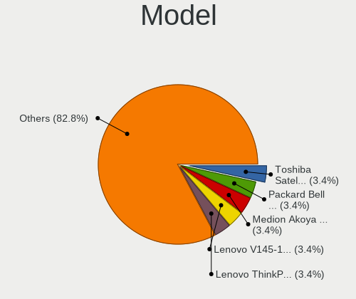
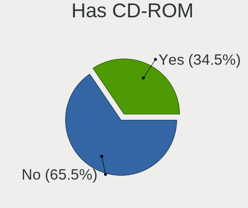
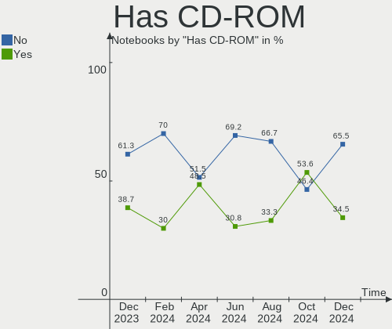
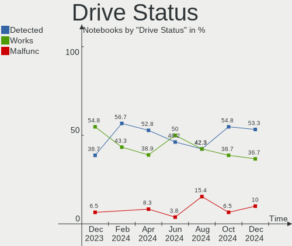
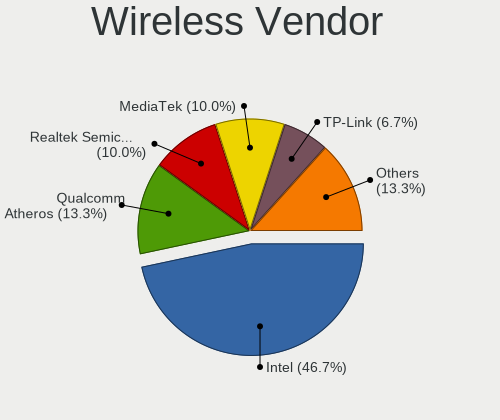
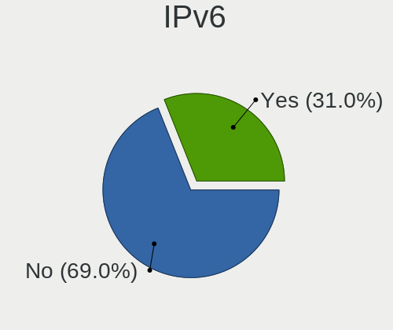
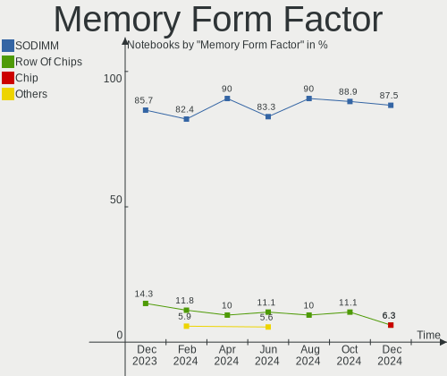

Xubuntu Hardware Trends (Notebooks)
-----------------------------------

A project to identify most popular hardware characteristics and track their change
over time based on data collected by Xubuntu users at https://Linux-Hardware.org.

Anyone can contribute to this report by the [hw-probe](https://github.com/linuxhw/hw-probe) tool:

    sudo -E hw-probe -all -upload

Full-feature report is available here: https://linux-hardware.org/?view=trends

Period: Nov, 2021.

Contents
--------

* [ System ](#system)
  - [ OS                       ](#os)
  - [ OS Family                ](#os-family)
  - [ Kernel                   ](#kernel)
  - [ Kernel Family            ](#kernel-family)
  - [ Kernel Major Ver.        ](#kernel-major-ver)
  - [ Arch                     ](#arch)
  - [ DE                       ](#de)
  - [ Display Server           ](#display-server)
  - [ Display Manager          ](#display-manager)
  - [ OS Lang                  ](#os-lang)
  - [ Boot Mode                ](#boot-mode)
  - [ Filesystem               ](#filesystem)
  - [ Part. scheme             ](#part-scheme)
  - [ Dual Boot with Linux/BSD ](#dual-boot-with-linuxbsd)
  - [ Dual Boot (Win)          ](#dual-boot-win)

* [ Board ](#board)
  - [ Vendor                   ](#vendor)
  - [ Model                    ](#model)
  - [ Model Family             ](#model-family)
  - [ MFG Year                 ](#mfg-year)
  - [ Form Factor              ](#form-factor)
  - [ Secure Boot              ](#secure-boot)
  - [ Coreboot                 ](#coreboot)
  - [ RAM Size                 ](#ram-size)
  - [ RAM Used                 ](#ram-used)
  - [ Total Drives             ](#total-drives)
  - [ Has CD-ROM               ](#has-cd-rom)
  - [ Has Ethernet             ](#has-ethernet)
  - [ Has WiFi                 ](#has-wifi)
  - [ Has Bluetooth            ](#has-bluetooth)

* [ Location ](#location)
  - [ Country                  ](#country)
  - [ City                     ](#city)

* [ Drives ](#drives)
  - [ Drive Vendor             ](#drive-vendor)
  - [ Drive Model              ](#drive-model)
  - [ HDD Vendor               ](#hdd-vendor)
  - [ SSD Vendor               ](#ssd-vendor)
  - [ Drive Kind               ](#drive-kind)
  - [ Drive Connector          ](#drive-connector)
  - [ Drive Size               ](#drive-size)
  - [ Space Total              ](#space-total)
  - [ Space Used               ](#space-used)
  - [ Malfunc. Drives          ](#malfunc-drives)
  - [ Malfunc. Drive Vendor    ](#malfunc-drive-vendor)
  - [ Malfunc. HDD Vendor      ](#malfunc-hdd-vendor)
  - [ Malfunc. Drive Kind      ](#malfunc-drive-kind)
  - [ Failed Drives            ](#failed-drives)
  - [ Failed Drive Vendor      ](#failed-drive-vendor)
  - [ Drive Status             ](#drive-status)

* [ Storage controller ](#storage-controller)
  - [ Storage Vendor           ](#storage-vendor)
  - [ Storage Model            ](#storage-model)
  - [ Storage Kind             ](#storage-kind)

* [ Processor ](#processor)
  - [ CPU Vendor               ](#cpu-vendor)
  - [ CPU Model                ](#cpu-model)
  - [ CPU Model Family         ](#cpu-model-family)
  - [ CPU Cores                ](#cpu-cores)
  - [ CPU Sockets              ](#cpu-sockets)
  - [ CPU Threads              ](#cpu-threads)
  - [ CPU Op-Modes             ](#cpu-op-modes)
  - [ CPU Microcode            ](#cpu-microcode)
  - [ CPU Microarch            ](#cpu-microarch)

* [ Graphics ](#graphics)
  - [ GPU Vendor               ](#gpu-vendor)
  - [ GPU Model                ](#gpu-model)
  - [ GPU Combo                ](#gpu-combo)
  - [ GPU Driver               ](#gpu-driver)
  - [ GPU Memory               ](#gpu-memory)

* [ Monitor ](#monitor)
  - [ Monitor Vendor           ](#monitor-vendor)
  - [ Monitor Model            ](#monitor-model)
  - [ Monitor Resolution       ](#monitor-resolution)
  - [ Monitor Diagonal         ](#monitor-diagonal)
  - [ Monitor Width            ](#monitor-width)
  - [ Aspect Ratio             ](#aspect-ratio)
  - [ Monitor Area             ](#monitor-area)
  - [ Pixel Density            ](#pixel-density)
  - [ Multiple Monitors        ](#multiple-monitors)

* [ Network ](#network)
  - [ Net Controller Vendor    ](#net-controller-vendor)
  - [ Net Controller Model     ](#net-controller-model)
  - [ Wireless Vendor          ](#wireless-vendor)
  - [ Wireless Model           ](#wireless-model)
  - [ Ethernet Vendor          ](#ethernet-vendor)
  - [ Ethernet Model           ](#ethernet-model)
  - [ Net Controller Kind      ](#net-controller-kind)
  - [ Used Controller          ](#used-controller)
  - [ NICs                     ](#nics)
  - [ IPv6                     ](#ipv6)

* [ Bluetooth ](#bluetooth)
  - [ Bluetooth Vendor         ](#bluetooth-vendor)
  - [ Bluetooth Model          ](#bluetooth-model)

* [ Sound ](#sound)
  - [ Sound Vendor             ](#sound-vendor)
  - [ Sound Model              ](#sound-model)

* [ Memory ](#memory)
  - [ Memory Vendor            ](#memory-vendor)
  - [ Memory Model             ](#memory-model)
  - [ Memory Kind              ](#memory-kind)
  - [ Memory Form Factor       ](#memory-form-factor)
  - [ Memory Size              ](#memory-size)
  - [ Memory Speed             ](#memory-speed)

* [ Printers & scanners ](#printers--scanners)
  - [ Printer Vendor           ](#printer-vendor)
  - [ Printer Model            ](#printer-model)
  - [ Scanner Vendor           ](#scanner-vendor)
  - [ Scanner Model            ](#scanner-model)

* [ Camera ](#camera)
  - [ Camera Vendor            ](#camera-vendor)
  - [ Camera Model             ](#camera-model)

* [ Security ](#security)
  - [ Fingerprint Vendor       ](#fingerprint-vendor)
  - [ Fingerprint Model        ](#fingerprint-model)
  - [ Chipcard Vendor          ](#chipcard-vendor)
  - [ Chipcard Model           ](#chipcard-model)

* [ Unsupported ](#unsupported)
  - [ Unsupported Devices      ](#unsupported-devices)
  - [ Unsupported Device Types ](#unsupported-device-types)

System
------

OS
--

Installed operating systems

| Name          | Notebooks | Percent |
|---------------|-----------|---------|
| Xubuntu 20.04 | 50        | 67.57%  |
| Xubuntu 18.04 | 15        | 20.27%  |
| Xubuntu 21.10 | 6         | 8.11%   |
| Xubuntu 21.04 | 1         | 1.35%   |
| Xubuntu 17.04 | 1         | 1.35%   |
| Xubuntu 16.04 | 1         | 1.35%   |

OS Family
---------

OS without a version

| Name    | Notebooks | Percent |
|---------|-----------|---------|
| Xubuntu | 74        | 100%    |

Kernel
------

Version of the Linux kernel

| Version                | Notebooks | Percent |
|------------------------|-----------|---------|
| 5.11.0-27-generic      | 18        | 24.32%  |
| 5.4.0-90-generic       | 12        | 16.22%  |
| 5.4.0-89-generic       | 8         | 10.81%  |
| 5.11.0-38-generic      | 6         | 8.11%   |
| 5.11.0-40-generic      | 5         | 6.76%   |
| 5.13.0-21-generic      | 3         | 4.05%   |
| 5.11.0-40-lowlatency   | 2         | 2.7%    |
| 5.11.0-38-lowlatency   | 2         | 2.7%    |
| 5.11.0-27-lowlatency   | 2         | 2.7%    |
| 4.15.0-161-lowlatency  | 2         | 2.7%    |
| 4.15.0-161-generic     | 2         | 2.7%    |
| 5.4.0-73-lowlatency    | 1         | 1.35%   |
| 5.15.1-051501-generic  | 1         | 1.35%   |
| 5.15.0-051500-generic  | 1         | 1.35%   |
| 5.14.14-051414-generic | 1         | 1.35%   |
| 5.13.0-20-generic      | 1         | 1.35%   |
| 5.13.0-19-generic      | 1         | 1.35%   |
| 5.11.0-7620-generic    | 1         | 1.35%   |
| 4.4.0-210-generic      | 1         | 1.35%   |
| 4.16.18-galliumos      | 1         | 1.35%   |
| 4.15.0-162-generic     | 1         | 1.35%   |
| 4.15.0-144-lowlatency  | 1         | 1.35%   |
| 4.10.0-42-generic      | 1         | 1.35%   |

Kernel Family
-------------

Linux kernel without a distro release

| Version | Notebooks | Percent |
|---------|-----------|---------|
| 5.11.0  | 36        | 48.65%  |
| 5.4.0   | 21        | 28.38%  |
| 4.15.0  | 6         | 8.11%   |
| 5.13.0  | 5         | 6.76%   |
| 5.15.1  | 1         | 1.35%   |
| 5.15.0  | 1         | 1.35%   |
| 5.14.14 | 1         | 1.35%   |
| 4.4.0   | 1         | 1.35%   |
| 4.16.18 | 1         | 1.35%   |
| 4.10.0  | 1         | 1.35%   |

Kernel Major Ver.
-----------------

Linux kernel major version

| Version | Notebooks | Percent |
|---------|-----------|---------|
| 5.11    | 36        | 48.65%  |
| 5.4     | 21        | 28.38%  |
| 4.15    | 6         | 8.11%   |
| 5.13    | 5         | 6.76%   |
| 5.15    | 2         | 2.7%    |
| 5.14    | 1         | 1.35%   |
| 4.4     | 1         | 1.35%   |
| 4.16    | 1         | 1.35%   |
| 4.10    | 1         | 1.35%   |

Arch
----

OS architecture (x86_64, i586, etc.)

| Name   | Notebooks | Percent |
|--------|-----------|---------|
| x86_64 | 66        | 89.19%  |
| i686   | 8         | 10.81%  |

DE
--

Desktop Environment

| Name  | Notebooks | Percent |
|-------|-----------|---------|
| XFCE  | 71        | 95.95%  |
| Unity | 1         | 1.35%   |
| KDE5  | 1         | 1.35%   |
| GNOME | 1         | 1.35%   |

Display Server
--------------

X11 or Wayland

| Name | Notebooks | Percent |
|------|-----------|---------|
| X11  | 74        | 100%    |

Display Manager
---------------

SDDM, LightDM, etc.

| Name    | Notebooks | Percent |
|---------|-----------|---------|
| LightDM | 70        | 94.59%  |
| SDDM    | 1         | 1.35%   |
| LXDM    | 1         | 1.35%   |
| GDM3    | 1         | 1.35%   |
| GDM     | 1         | 1.35%   |

OS Lang
-------

Language

| Lang  | Notebooks | Percent |
|-------|-----------|---------|
| en_US | 28        | 37.84%  |
| C     | 18        | 24.32%  |
| fr_FR | 12        | 16.22%  |
| de_DE | 5         | 6.76%   |
| it_IT | 3         | 4.05%   |
| pl_PL | 2         | 2.7%    |
| fr_BE | 1         | 1.35%   |
| es_CO | 1         | 1.35%   |
| en_IN | 1         | 1.35%   |
| en_GB | 1         | 1.35%   |
| en_CA | 1         | 1.35%   |
| cs_CZ | 1         | 1.35%   |

Boot Mode
---------

EFI or BIOS

| Mode | Notebooks | Percent |
|------|-----------|---------|
| BIOS | 39        | 52.7%   |
| EFI  | 35        | 47.3%   |

Filesystem
----------

Type of filesystem

| Type    | Notebooks | Percent |
|---------|-----------|---------|
| Ext4    | 54        | 72.97%  |
| Overlay | 20        | 27.03%  |

Part. scheme
------------

Scheme of partitioning

| Type    | Notebooks | Percent |
|---------|-----------|---------|
| Unknown | 37        | 50%     |
| GPT     | 28        | 37.84%  |
| MBR     | 9         | 12.16%  |

Dual Boot with Linux/BSD
------------------------

Hosting more than one Linux/BSD

| Dual boot | Notebooks | Percent |
|-----------|-----------|---------|
| No        | 59        | 79.73%  |
| Yes       | 15        | 20.27%  |

Dual Boot (Win)
---------------

Hosting Linux and Windows

| Dual boot | Notebooks | Percent |
|-----------|-----------|---------|
| No        | 50        | 67.57%  |
| Yes       | 24        | 32.43%  |

Board
-----

Vendor
------

Motherboard manufacturer

| Name                   | Notebooks | Percent |
|------------------------|-----------|---------|
| ASUSTek Computer       | 18        | 24.32%  |
| Hewlett-Packard        | 16        | 21.62%  |
| Lenovo                 | 11        | 14.86%  |
| Dell                   | 11        | 14.86%  |
| MSI                    | 4         | 5.41%   |
| Toshiba                | 2         | 2.7%    |
| Samsung Electronics    | 2         | 2.7%    |
| Google                 | 2         | 2.7%    |
| Acer                   | 2         | 2.7%    |
| System76               | 1         | 1.35%   |
| Sony                   | 1         | 1.35%   |
| ONE-NETBOOK TECHNOLOGY | 1         | 1.35%   |
| MAXDATA                | 1         | 1.35%   |
| Fujitsu Siemens        | 1         | 1.35%   |
| Unknown                | 1         | 1.35%   |

Model
-----

Motherboard model

| Name                                        | Notebooks | Percent |
|---------------------------------------------|-----------|---------|
| ASUS VivoBook_ASUSLaptop X571LH_K571LH      | 4         | 5.41%   |
| HP Pavilion dv9700                          | 2         | 2.7%    |
| Toshiba Satellite P745                      | 1         | 1.35%   |
| Toshiba Satellite C70D-B                    | 1         | 1.35%   |
| System76 Oryx Pro                           | 1         | 1.35%   |
| Sony VPCF13M1E                              | 1         | 1.35%   |
| Samsung R530/R730/P590                      | 1         | 1.35%   |
| Samsung 905S3G/906S3G/915S3G/9305SG         | 1         | 1.35%   |
| ONE-NETBOOK TECHNOLOGY A1                   | 1         | 1.35%   |
| MSI MS-1034                                 | 1         | 1.35%   |
| MSI GT75VR 7RE                              | 1         | 1.35%   |
| MSI GL63 8RC                                | 1         | 1.35%   |
| MSI Alpha 17 A4DEK                          | 1         | 1.35%   |
| MAXDATA ECO4000IW                           | 1         | 1.35%   |
| Lenovo ThinkPad X1 Extreme Gen 3 20TKCTO1WW | 1         | 1.35%   |
| Lenovo ThinkPad T61 766511G                 | 1         | 1.35%   |
| Lenovo ThinkPad T495s 20QJCTO1WW            | 1         | 1.35%   |
| Lenovo ThinkPad T410 2537MT3                | 1         | 1.35%   |
| Lenovo ThinkPad R61 77331CU                 | 1         | 1.35%   |
| Lenovo ThinkPad P15s Gen 1 20T4000EUK       | 1         | 1.35%   |
| Lenovo ThinkPad E15 Gen 2 20TD003HUS        | 1         | 1.35%   |
| Lenovo Legion Y540-17IRH-PG0 81T3           | 1         | 1.35%   |
| Lenovo IdeaPad Y570 0862                    | 1         | 1.35%   |
| Lenovo IdeaPad 100-15IBY 80MJ               | 1         | 1.35%   |
| Lenovo Edge 15 80K9                         | 1         | 1.35%   |
| HP ProBook 650 G3                           | 1         | 1.35%   |
| HP ProBook 6450b                            | 1         | 1.35%   |
| HP ProBook 640 G1                           | 1         | 1.35%   |
| HP Pavilion TS 11                           | 1         | 1.35%   |
| HP Pavilion g6                              | 1         | 1.35%   |
| HP Pavilion dv6                             | 1         | 1.35%   |
| HP Pavilion 17                              | 1         | 1.35%   |
| HP Notebook                                 | 1         | 1.35%   |
| HP Laptop 17-ak0xx                          | 1         | 1.35%   |
| HP EliteBook 835 G7 Notebook PC             | 1         | 1.35%   |
| HP Compaq Presario CQ61                     | 1         | 1.35%   |
| HP Compaq nc6320 (RH374EA#AKB)              | 1         | 1.35%   |
| HP Compaq 6710b (RM405UT#ABA)               | 1         | 1.35%   |
| HP Compaq 2510p                             | 1         | 1.35%   |
| Google Terra                                | 1         | 1.35%   |
| Google Auron_Yuna                           | 1         | 1.35%   |
| Fujitsu Siemens AMILO Pro Edition V3505     | 1         | 1.35%   |
| Dell XPS 15 7590                            | 1         | 1.35%   |
| Dell XPS 13 9370                            | 1         | 1.35%   |
| Dell XPS 13 9333                            | 1         | 1.35%   |
| Dell Precision M4600                        | 1         | 1.35%   |
| Dell Latitude E6430                         | 1         | 1.35%   |
| Dell Latitude D630                          | 1         | 1.35%   |
| Dell Latitude 7370                          | 1         | 1.35%   |
| Dell Inspiron N5030                         | 1         | 1.35%   |
| Dell Inspiron 7501                          | 1         | 1.35%   |
| Dell G3 3500                                | 1         | 1.35%   |
| Dell G15 5510                               | 1         | 1.35%   |
| ASUS X51RL                                  | 1         | 1.35%   |
| ASUS X501A                                  | 1         | 1.35%   |
| ASUS VivoBook_ASUSLaptop X512JA_F512JA      | 1         | 1.35%   |
| ASUS VivoBook_ASUSLaptop X509JA_X509JA      | 1         | 1.35%   |
| ASUS VivoBook_ASUSLaptop X412UA             | 1         | 1.35%   |
| ASUS ROG Strix G531GT_GL531GT               | 1         | 1.35%   |
| ASUS P2540UA                                | 1         | 1.35%   |

Model Family
------------

Motherboard model prefix

| Name                      | Notebooks | Percent |
|---------------------------|-----------|---------|
| Lenovo ThinkPad           | 7         | 9.46%   |
| ASUS VivoBook             | 7         | 9.46%   |
| HP Pavilion               | 6         | 8.11%   |
| HP Compaq                 | 4         | 5.41%   |
| HP ProBook                | 3         | 4.05%   |
| Dell XPS                  | 3         | 4.05%   |
| Dell Latitude             | 3         | 4.05%   |
| Toshiba Satellite         | 2         | 2.7%    |
| Lenovo IdeaPad            | 2         | 2.7%    |
| Dell Inspiron             | 2         | 2.7%    |
| ASUS ASUS                 | 2         | 2.7%    |
| Acer Nitro                | 2         | 2.7%    |
| System76 Oryx             | 1         | 1.35%   |
| Sony VPCF13M1E            | 1         | 1.35%   |
| Samsung R530              | 1         | 1.35%   |
| Samsung 905S3G            | 1         | 1.35%   |
| ONE-NETBOOK TECHNOLOGY A1 | 1         | 1.35%   |
| MSI MS-1034               | 1         | 1.35%   |
| MSI GT75VR                | 1         | 1.35%   |
| MSI GL63                  | 1         | 1.35%   |
| MSI Alpha                 | 1         | 1.35%   |
| MAXDATA ECO4000IW         | 1         | 1.35%   |
| Lenovo Legion             | 1         | 1.35%   |
| Lenovo Edge               | 1         | 1.35%   |
| HP Notebook               | 1         | 1.35%   |
| HP Laptop                 | 1         | 1.35%   |
| HP EliteBook              | 1         | 1.35%   |
| Google Terra              | 1         | 1.35%   |
| Google Auron              | 1         | 1.35%   |
| Fujitsu Siemens AMILO     | 1         | 1.35%   |
| Dell Precision            | 1         | 1.35%   |
| Dell G3                   | 1         | 1.35%   |
| Dell G15                  | 1         | 1.35%   |
| ASUS X51RL                | 1         | 1.35%   |
| ASUS X501A                | 1         | 1.35%   |
| ASUS ROG                  | 1         | 1.35%   |
| ASUS P2540UA              | 1         | 1.35%   |
| ASUS GL553VE              | 1         | 1.35%   |
| ASUS E402SA               | 1         | 1.35%   |
| ASUS E203NAS              | 1         | 1.35%   |
| ASUS 1015CX               | 1         | 1.35%   |
| ASUS 1002HA               | 1         | 1.35%   |
| Unknown                   | 1         | 1.35%   |

MFG Year
--------

Motherboard manufacture year

| Year | Notebooks | Percent |
|------|-----------|---------|
| 2021 | 17        | 22.97%  |
| 2020 | 11        | 14.86%  |
| 2010 | 6         | 8.11%   |
| 2018 | 5         | 6.76%   |
| 2016 | 4         | 5.41%   |
| 2009 | 4         | 5.41%   |
| 2019 | 3         | 4.05%   |
| 2014 | 3         | 4.05%   |
| 2012 | 3         | 4.05%   |
| 2011 | 3         | 4.05%   |
| 2008 | 3         | 4.05%   |
| 2007 | 3         | 4.05%   |
| 2006 | 3         | 4.05%   |
| 2017 | 2         | 2.7%    |
| 2015 | 2         | 2.7%    |
| 2013 | 2         | 2.7%    |

Form Factor
-----------

Physical design of the computer

| Name     | Notebooks | Percent |
|----------|-----------|---------|
| Notebook | 74        | 100%    |

Secure Boot
-----------

Enabled or disabled

| State    | Notebooks | Percent |
|----------|-----------|---------|
| Disabled | 71        | 95.95%  |
| Enabled  | 3         | 4.05%   |

Coreboot
--------

Have coreboot on board

| Used | Notebooks | Percent |
|------|-----------|---------|
| No   | 72        | 97.3%   |
| Yes  | 2         | 2.7%    |

RAM Size
--------

Total RAM memory

| Size in GB  | Notebooks | Percent |
|-------------|-----------|---------|
| 3.01-4.0    | 21        | 28.38%  |
| 4.01-8.0    | 14        | 18.92%  |
| 16.01-24.0  | 14        | 18.92%  |
| 8.01-16.0   | 8         | 10.81%  |
| 1.01-2.0    | 7         | 9.46%   |
| 32.01-64.0  | 3         | 4.05%   |
| 2.01-3.0    | 2         | 2.7%    |
| 64.01-256.0 | 2         | 2.7%    |
| 24.01-32.0  | 1         | 1.35%   |
| 0.51-1.0    | 1         | 1.35%   |
| 0.01-0.5    | 1         | 1.35%   |

RAM Used
--------

Used RAM memory

| Used GB   | Notebooks | Percent |
|-----------|-----------|---------|
| 1.01-2.0  | 30        | 40.54%  |
| 2.01-3.0  | 17        | 22.97%  |
| 4.01-8.0  | 11        | 14.86%  |
| 0.51-1.0  | 6         | 8.11%   |
| 3.01-4.0  | 5         | 6.76%   |
| 0.01-0.5  | 4         | 5.41%   |
| 8.01-16.0 | 1         | 1.35%   |

Total Drives
------------

Number of drives on board

| Drives | Notebooks | Percent |
|--------|-----------|---------|
| 1      | 50        | 67.57%  |
| 2      | 16        | 21.62%  |
| 0      | 5         | 6.76%   |
| 3      | 2         | 2.7%    |
| 5      | 1         | 1.35%   |

Has CD-ROM
----------

Has CD-ROM on board

| Presented | Notebooks | Percent |
|-----------|-----------|---------|
| No        | 47        | 63.51%  |
| Yes       | 27        | 36.49%  |

Has Ethernet
------------

Has Ethernet on board

| Presented | Notebooks | Percent |
|-----------|-----------|---------|
| Yes       | 61        | 82.43%  |
| No        | 13        | 17.57%  |

Has WiFi
--------

Has WiFi module

| Presented | Notebooks | Percent |
|-----------|-----------|---------|
| Yes       | 73        | 98.65%  |
| No        | 1         | 1.35%   |

Has Bluetooth
-------------

Has Bluetooth module

| Presented | Notebooks | Percent |
|-----------|-----------|---------|
| Yes       | 56        | 75.68%  |
| No        | 18        | 24.32%  |

Location
--------

Country
-------

Geographic location (country)

| Country     | Notebooks | Percent |
|-------------|-----------|---------|
| Canada      | 19        | 25.68%  |
| USA         | 13        | 17.57%  |
| France      | 11        | 14.86%  |
| Germany     | 5         | 6.76%   |
| Netherlands | 4         | 5.41%   |
| Poland      | 3         | 4.05%   |
| Italy       | 3         | 4.05%   |
| Romania     | 2         | 2.7%    |
| Czechia     | 2         | 2.7%    |
| UK          | 1         | 1.35%   |
| Tunisia     | 1         | 1.35%   |
| Tajikistan  | 1         | 1.35%   |
| Sweden      | 1         | 1.35%   |
| Russia      | 1         | 1.35%   |
| Norway      | 1         | 1.35%   |
| Indonesia   | 1         | 1.35%   |
| India       | 1         | 1.35%   |
| Finland     | 1         | 1.35%   |
| Colombia    | 1         | 1.35%   |
| Bulgaria    | 1         | 1.35%   |
| Belgium     | 1         | 1.35%   |

City
----

Geographic location (city)

| City             | Notebooks | Percent |
|------------------|-----------|---------|
| Qu?©bec          | 15        | 20.27%  |
| Levis            | 3         | 4.05%   |
| Warsaw           | 2         | 2.7%    |
| Prague           | 2         | 2.7%    |
| Delft            | 2         | 2.7%    |
| Woodworth        | 1         | 1.35%   |
| Wisconsin Rapids | 1         | 1.35%   |
| Winter Park      | 1         | 1.35%   |
| Williston        | 1         | 1.35%   |
| White Rock       | 1         | 1.35%   |
| Voronezh         | 1         | 1.35%   |
| Voluntari        | 1         | 1.35%   |
| Tyler            | 1         | 1.35%   |
| Tegal            | 1         | 1.35%   |
| Tampa            | 1         | 1.35%   |
| Stroe            | 1         | 1.35%   |
| Stanwood         | 1         | 1.35%   |
| Solbergelva      | 1         | 1.35%   |
| Sofia            | 1         | 1.35%   |
| Roissy-en-Brie   | 1         | 1.35%   |
| Phoenix          | 1         | 1.35%   |
| Petite-Foret     | 1         | 1.35%   |
| Paris            | 1         | 1.35%   |
| Oldenburg        | 1         | 1.35%   |
| New Rochelle     | 1         | 1.35%   |
| N?®mes           | 1         | 1.35%   |
| Nancy            | 1         | 1.35%   |
| Montlu?§on       | 1         | 1.35%   |
| Milan            | 1         | 1.35%   |
| Marseille        | 1         | 1.35%   |
| Marmande         | 1         | 1.35%   |
| Lund             | 1         | 1.35%   |
| Lancaster        | 1         | 1.35%   |
| Karlsruhe        | 1         | 1.35%   |
| Jyv?¤skyl?¤      | 1         | 1.35%   |
| Hy??res          | 1         | 1.35%   |
| Hammam Sousse    | 1         | 1.35%   |
| Hamilton         | 1         | 1.35%   |
| Gennevilliers    | 1         | 1.35%   |
| Dushanbe         | 1         | 1.35%   |
| Couthuin         | 1         | 1.35%   |
| Constan?›a       | 1         | 1.35%   |
| Chillicothe      | 1         | 1.35%   |
| Castel Mella     | 1         | 1.35%   |
| Camberley        | 1         | 1.35%   |
| Bristol          | 1         | 1.35%   |
| Bremen           | 1         | 1.35%   |
| Borgomanero      | 1         | 1.35%   |
| Bogot??          | 1         | 1.35%   |
| Bielefeld        | 1         | 1.35%   |
| Bialystok        | 1         | 1.35%   |
| Besan?§on        | 1         | 1.35%   |
| Berlin           | 1         | 1.35%   |
| Bengaluru        | 1         | 1.35%   |
| Amsterdam        | 1         | 1.35%   |

Drives
------

Drive Vendor
------------

Hard drive vendors

| Vendor              | Notebooks | Drives | Percent |
|---------------------|-----------|--------|---------|
| WDC                 | 14        | 15     | 17.5%   |
| Seagate             | 14        | 16     | 17.5%   |
| Samsung Electronics | 9         | 11     | 11.25%  |
| Toshiba             | 7         | 8      | 8.75%   |
| Unknown             | 5         | 5      | 6.25%   |
| Intel               | 4         | 8      | 5%      |
| Micron Technology   | 3         | 3      | 3.75%   |
| Hitachi             | 3         | 3      | 3.75%   |
| A-DATA Technology   | 3         | 3      | 3.75%   |
| Kingston            | 2         | 2      | 2.5%    |
| HGST                | 2         | 2      | 2.5%    |
| Crucial             | 2         | 3      | 2.5%    |
| Zheino              | 1         | 1      | 1.25%   |
| Transcend           | 1         | 1      | 1.25%   |
| SK Hynix            | 1         | 1      | 1.25%   |
| Silicon Motion      | 1         | 1      | 1.25%   |
| SanDisk             | 1         | 1      | 1.25%   |
| PNY                 | 1         | 1      | 1.25%   |
| Phison              | 1         | 2      | 1.25%   |
| Netac               | 1         | 1      | 1.25%   |
| LITEONIT            | 1         | 1      | 1.25%   |
| LITEON              | 1         | 1      | 1.25%   |
| Intenso             | 1         | 1      | 1.25%   |
| DREVO               | 1         | 1      | 1.25%   |

Drive Model
-----------

Hard drive models

| Model                                   | Notebooks | Percent |
|-----------------------------------------|-----------|---------|
| Intel HBRPEKNX0202AO 32GB               | 4         | 4.49%   |
| Intel HBRPEKNX0202A 512GB               | 4         | 4.49%   |
| Unknown MMC Card  64GB                  | 2         | 2.25%   |
| Unknown MMC Card  32GB                  | 2         | 2.25%   |
| Seagate ST500LT012-1DG142 500GB         | 2         | 2.25%   |
| Seagate ST1000LM035-1RK172 1TB          | 2         | 2.25%   |
| Samsung SSD 860 EVO 1TB                 | 2         | 2.25%   |
| Zheino CHN-25SATAC3-120 120GB           | 1         | 1.12%   |
| WDC WDS500G2B0C-00PXH0 500GB            | 1         | 1.12%   |
| WDC WDS500G2B0C 500GB                   | 1         | 1.12%   |
| WDC WDS100T2B0C-00PXH0 1TB              | 1         | 1.12%   |
| WDC WDBNCE5000PNC 500GB SSD             | 1         | 1.12%   |
| WDC WD5000LPVX-60V0TT0 500GB            | 1         | 1.12%   |
| WDC WD5000LPLX-60ZNTT1 500GB            | 1         | 1.12%   |
| WDC WD3200BEVT-75A23T0 320GB            | 1         | 1.12%   |
| WDC WD3200BEVT-60ZCT1 320GB             | 1         | 1.12%   |
| WDC WD3200BEVT-22ZCT0 320GB             | 1         | 1.12%   |
| WDC WD3200BEVS-26VAT0 320GB             | 1         | 1.12%   |
| WDC WD2500BEVS-60UST0 250GB             | 1         | 1.12%   |
| WDC WD25 00BPVT-22JJ5T0 250GB           | 1         | 1.12%   |
| WDC WD10JPLX-00MBPT0 1TB                | 1         | 1.12%   |
| WDC PC SN730 SDBQNTY-1T00-1001 1TB      | 1         | 1.12%   |
| WDC PC SN530 NVMe 512GB                 | 1         | 1.12%   |
| Unknown MMC Card  128GB                 | 1         | 1.12%   |
| Transcend TS256GMTS430S 256GB SSD       | 1         | 1.12%   |
| Toshiba NVMe SSD Drive 256GB            | 1         | 1.12%   |
| Toshiba MQ01ACF050 500GB                | 1         | 1.12%   |
| Toshiba MQ01ABF050 500GB                | 1         | 1.12%   |
| Toshiba MQ01ABD032 320GB                | 1         | 1.12%   |
| Toshiba MK6475GSX 640GB                 | 1         | 1.12%   |
| Toshiba MK1011GAH 100GB                 | 1         | 1.12%   |
| Toshiba KXG6AZNV512G 512GB              | 1         | 1.12%   |
| SK Hynix BC511 HFM512GDJTNI-82A0A 512GB | 1         | 1.12%   |
| Silicon Motion NE-256 256GB             | 1         | 1.12%   |
| Seagate ST960821A 64GB                  | 1         | 1.12%   |
| Seagate ST9320325AS 320GB               | 1         | 1.12%   |
| Seagate ST9320320AS 320GB               | 1         | 1.12%   |
| Seagate ST9160310AS 160GB               | 1         | 1.12%   |
| Seagate ST640LM001 HN-M640MBB 640GB     | 1         | 1.12%   |
| Seagate ST500LM012 HN-M500MBB 500GB     | 1         | 1.12%   |
| Seagate ST320LM010-1KJ15C 320GB         | 1         | 1.12%   |
| Seagate ST2000LM015-2E8174 2TB          | 1         | 1.12%   |
| Seagate ST2000LM003 HN-M201RAD 2TB      | 1         | 1.12%   |
| Seagate BUP Slim BK 1TB                 | 1         | 1.12%   |
| Seagate BUP Portable 4TB                | 1         | 1.12%   |
| SanDisk SD9SN8W128G1102 128GB SSD       | 1         | 1.12%   |
| Samsung SSD 970 PRO 1TB                 | 1         | 1.12%   |
| Samsung SSD 970 EVO Plus 2TB            | 1         | 1.12%   |
| Samsung SSD 870 EVO 500GB               | 1         | 1.12%   |
| Samsung SSD 860 PRO 1TB                 | 1         | 1.12%   |
| Samsung PM981 NVMe 512GB                | 1         | 1.12%   |
| Samsung MZVLQ512HBLU-00B00 512GB        | 1         | 1.12%   |
| Samsung MZVLB256HBHQ-000L7 256GB        | 1         | 1.12%   |
| Samsung MZMTD128HAFV-000 128GB SSD      | 1         | 1.12%   |
| Samsung HM321HI 320GB                   | 1         | 1.12%   |
| PNY CS900 240GB SSD                     | 1         | 1.12%   |
| Phison NVMe SSD Drive 240GB             | 1         | 1.12%   |
| Netac NVMe SSD 1TB                      | 1         | 1.12%   |
| Micron 2210_MTFDHBA512QFD 512GB         | 1         | 1.12%   |
| Micron 2200V_MTFDHBA512TCK 512GB        | 1         | 1.12%   |

HDD Vendor
----------

Hard disk drive vendors

| Vendor              | Notebooks | Drives | Percent |
|---------------------|-----------|--------|---------|
| Seagate             | 14        | 16     | 42.42%  |
| WDC                 | 8         | 9      | 24.24%  |
| Toshiba             | 5         | 6      | 15.15%  |
| Hitachi             | 3         | 3      | 9.09%   |
| HGST                | 2         | 2      | 6.06%   |
| Samsung Electronics | 1         | 1      | 3.03%   |

SSD Vendor
----------

Solid state drive vendors

| Vendor              | Notebooks | Drives | Percent |
|---------------------|-----------|--------|---------|
| Samsung Electronics | 5         | 5      | 23.81%  |
| A-DATA Technology   | 3         | 3      | 14.29%  |
| Crucial             | 2         | 3      | 9.52%   |
| Zheino              | 1         | 1      | 4.76%   |
| WDC                 | 1         | 1      | 4.76%   |
| Transcend           | 1         | 1      | 4.76%   |
| SanDisk             | 1         | 1      | 4.76%   |
| PNY                 | 1         | 1      | 4.76%   |
| Micron Technology   | 1         | 1      | 4.76%   |
| LITEONIT            | 1         | 1      | 4.76%   |
| LITEON              | 1         | 1      | 4.76%   |
| Kingston            | 1         | 1      | 4.76%   |
| Intenso             | 1         | 1      | 4.76%   |
| DREVO               | 1         | 1      | 4.76%   |

Drive Kind
----------

HDD or SSD

| Kind | Notebooks | Drives | Percent |
|------|-----------|--------|---------|
| HDD  | 32        | 37     | 40.51%  |
| NVMe | 22        | 28     | 27.85%  |
| SSD  | 20        | 22     | 25.32%  |
| MMC  | 5         | 5      | 6.33%   |

Drive Connector
---------------

SATA, SAS, NVMe, etc.

| Type | Notebooks | Drives | Percent |
|------|-----------|--------|---------|
| SATA | 48        | 54     | 61.54%  |
| NVMe | 22        | 28     | 28.21%  |
| MMC  | 5         | 5      | 6.41%   |
| SAS  | 3         | 5      | 3.85%   |

Drive Size
----------

Size of hard drive

| Size in TB | Notebooks | Drives | Percent |
|------------|-----------|--------|---------|
| 0.01-0.5   | 37        | 41     | 71.15%  |
| 0.51-1.0   | 12        | 14     | 23.08%  |
| 1.01-2.0   | 2         | 2      | 3.85%   |
| 3.01-4.0   | 1         | 2      | 1.92%   |

Space Total
-----------

Amount of disk space available on the file system

| Size in GB     | Notebooks | Percent |
|----------------|-----------|---------|
| 101-250        | 19        | 25.68%  |
| 251-500        | 17        | 22.97%  |
| 1-20           | 10        | 13.51%  |
| 51-100         | 9         | 12.16%  |
| 1001-2000      | 7         | 9.46%   |
| 501-1000       | 6         | 8.11%   |
| 21-50          | 4         | 5.41%   |
| More than 3000 | 1         | 1.35%   |
| Unknown        | 1         | 1.35%   |

Space Used
----------

Amount of used disk space

| Used GB        | Notebooks | Percent |
|----------------|-----------|---------|
| 1-20           | 41        | 55.41%  |
| 21-50          | 11        | 14.86%  |
| 101-250        | 7         | 9.46%   |
| 251-500        | 4         | 5.41%   |
| 501-1000       | 4         | 5.41%   |
| 51-100         | 4         | 5.41%   |
| More than 3000 | 1         | 1.35%   |
| 1001-2000      | 1         | 1.35%   |
| Unknown        | 1         | 1.35%   |

Malfunc. Drives
---------------

Drive models with a malfunction

| Model                                          | Notebooks | Drives | Percent |
|------------------------------------------------|-----------|--------|---------|
| Toshiba MQ01ABD032 320GB                       | 1         | 1      | 25%     |
| Micron Technology 1100_MTFDDAV256TBN 256GB SSD | 1         | 1      | 25%     |
| Hitachi HTS725050A9A364 500GB                  | 1         | 1      | 25%     |
| A-DATA Technology SP920SS 128GB SSD            | 1         | 1      | 25%     |

Malfunc. Drive Vendor
---------------------

Vendors of faulty drives

| Vendor            | Notebooks | Drives | Percent |
|-------------------|-----------|--------|---------|
| Toshiba           | 1         | 1      | 25%     |
| Micron Technology | 1         | 1      | 25%     |
| Hitachi           | 1         | 1      | 25%     |
| A-DATA Technology | 1         | 1      | 25%     |

Malfunc. HDD Vendor
-------------------

Vendors of faulty HDD drives

| Vendor  | Notebooks | Drives | Percent |
|---------|-----------|--------|---------|
| Toshiba | 1         | 1      | 50%     |
| Hitachi | 1         | 1      | 50%     |

Malfunc. Drive Kind
-------------------

Kinds of faulty drives

| Kind | Notebooks | Drives | Percent |
|------|-----------|--------|---------|
| SSD  | 2         | 2      | 50%     |
| HDD  | 2         | 2      | 50%     |

Failed Drives
-------------

Failed drive models

Zero info for selected period =(

Failed Drive Vendor
-------------------

Failed drive vendors

Zero info for selected period =(

Drive Status
------------

Number of failed and malfunc. drives

| Status   | Notebooks | Drives | Percent |
|----------|-----------|--------|---------|
| Detected | 40        | 47     | 53.33%  |
| Works    | 31        | 41     | 41.33%  |
| Malfunc  | 4         | 4      | 5.33%   |

Storage controller
------------------

Storage Vendor
--------------

Storage controller vendors

| Vendor                       | Notebooks | Percent |
|------------------------------|-----------|---------|
| Intel                        | 54        | 65.85%  |
| AMD                          | 7         | 8.54%   |
| Sandisk                      | 5         | 6.1%    |
| Samsung Electronics          | 5         | 6.1%    |
| Toshiba America Info Systems | 2         | 2.44%   |
| Silicon Motion               | 2         | 2.44%   |
| Nvidia                       | 2         | 2.44%   |
| Micron Technology            | 2         | 2.44%   |
| SK Hynix                     | 1         | 1.22%   |
| Phison Electronics           | 1         | 1.22%   |
| Kingston Technology Company  | 1         | 1.22%   |

Storage Model
-------------

Storage controller models

| Model                                                                            | Notebooks | Percent |
|----------------------------------------------------------------------------------|-----------|---------|
| Intel 82801 Mobile SATA Controller [RAID mode]                                   | 10        | 10.42%  |
| AMD FCH SATA Controller [AHCI mode]                                              | 6         | 6.25%   |
| Intel 82801HM/HEM (ICH8M/ICH8M-E) IDE Controller                                 | 5         | 5.21%   |
| Samsung NVMe SSD Controller SM981/PM981/PM983                                    | 4         | 4.17%   |
| Intel Non-Volatile memory controller                                             | 4         | 4.17%   |
| Intel Cannon Lake Mobile PCH SATA AHCI Controller                                | 4         | 4.17%   |
| Intel 5 Series/3400 Series Chipset 6 port SATA AHCI Controller                   | 4         | 4.17%   |
| Intel 82801HM/HEM (ICH8M/ICH8M-E) SATA Controller [AHCI mode]                    | 3         | 3.13%   |
| Intel 7 Series Chipset Family 6-port SATA Controller [AHCI mode]                 | 3         | 3.13%   |
| Intel 6 Series/C200 Series Chipset Family 6 port Mobile SATA AHCI Controller     | 3         | 3.13%   |
| Toshiba America Info Systems XG6 NVMe SSD Controller                             | 2         | 2.08%   |
| Silicon Motion SM2263EN/SM2263XT SSD Controller                                  | 2         | 2.08%   |
| Sandisk WD Blue SN550 NVMe SSD                                                   | 2         | 2.08%   |
| Sandisk Non-Volatile memory controller                                           | 2         | 2.08%   |
| Nvidia MCP67 IDE Controller                                                      | 2         | 2.08%   |
| Nvidia MCP67 AHCI Controller                                                     | 2         | 2.08%   |
| Micron Non-Volatile memory controller                                            | 2         | 2.08%   |
| Intel Wildcat Point-LP SATA Controller [AHCI Mode]                               | 2         | 2.08%   |
| Intel Sunrise Point-LP SATA Controller [AHCI mode]                               | 2         | 2.08%   |
| Intel 82801IBM/IEM (ICH9M/ICH9M-E) 4 port SATA Controller [AHCI mode]            | 2         | 2.08%   |
| Intel 82801GBM/GHM (ICH7-M Family) SATA Controller [IDE mode]                    | 2         | 2.08%   |
| Intel 82801GBM/GHM (ICH7-M Family) SATA Controller [AHCI mode]                   | 2         | 2.08%   |
| Intel 82801G (ICH7 Family) IDE Controller                                        | 2         | 2.08%   |
| Intel 5 Series/3400 Series Chipset 4 port SATA AHCI Controller                   | 2         | 2.08%   |
| SK Hynix BC511                                                                   | 1         | 1.04%   |
| Sandisk WD Black SN750 / PC SN730 NVMe SSD                                       | 1         | 1.04%   |
| Samsung NVMe SSD Controller 980                                                  | 1         | 1.04%   |
| Phison E12 NVMe Controller                                                       | 1         | 1.04%   |
| Kingston Company U-SNS8154P3 NVMe SSD                                            | 1         | 1.04%   |
| Intel Volume Management Device NVMe RAID Controller                              | 1         | 1.04%   |
| Intel SATA Controller [RAID mode]                                                | 1         | 1.04%   |
| Intel NM10/ICH7 Family SATA Controller [AHCI mode]                               | 1         | 1.04%   |
| Intel Mobile PM965/GM965 PT IDER Controller                                      | 1         | 1.04%   |
| Intel HM170/QM170 Chipset SATA Controller [AHCI Mode]                            | 1         | 1.04%   |
| Intel Comet Lake SATA AHCI Controller                                            | 1         | 1.04%   |
| Intel Comet Lake PCH-H RAID                                                      | 1         | 1.04%   |
| Intel Celeron N3350/Pentium N4200/Atom E3900 Series SATA AHCI Controller         | 1         | 1.04%   |
| Intel Atom/Celeron/Pentium Processor x5-E8000/J3xxx/N3xxx Series SATA Controller | 1         | 1.04%   |
| Intel Atom Processor E3800 Series SATA AHCI Controller                           | 1         | 1.04%   |
| Intel 82801HM/HEM (ICH8M/ICH8M-E) SATA Controller [IDE mode]                     | 1         | 1.04%   |
| Intel 82801FBM (ICH6M) SATA Controller                                           | 1         | 1.04%   |
| Intel 8 Series/C220 Series Chipset Family 6-port SATA Controller 1 [AHCI mode]   | 1         | 1.04%   |
| Intel 8 Series SATA Controller 1 [AHCI mode]                                     | 1         | 1.04%   |
| Intel 400 Series Chipset Family SATA AHCI Controller                             | 1         | 1.04%   |
| AMD SB600 Non-Raid-5 SATA                                                        | 1         | 1.04%   |
| AMD SB600 IDE                                                                    | 1         | 1.04%   |

Storage Kind
------------

Kind of storage controller (IDE, SATA, NVMe, SAS, ...)

| Kind | Notebooks | Percent |
|------|-----------|---------|
| SATA | 45        | 49.45%  |
| NVMe | 22        | 24.18%  |
| IDE  | 13        | 14.29%  |
| RAID | 11        | 12.09%  |

Processor
---------

CPU Vendor
----------

Processor vendors

| Vendor | Notebooks | Percent |
|--------|-----------|---------|
| Intel  | 64        | 86.49%  |
| AMD    | 10        | 13.51%  |

CPU Model
---------

Processor models

| Model                                           | Notebooks | Percent |
|-------------------------------------------------|-----------|---------|
| Intel Core i7-10750H CPU @ 2.60GHz              | 6         | 8.11%   |
| Intel Celeron CPU N3060 @ 1.60GHz               | 3         | 4.05%   |
| Intel Core i7-9750H CPU @ 2.60GHz               | 2         | 2.7%    |
| Intel Core i7-10510U CPU @ 1.80GHz              | 2         | 2.7%    |
| Intel Core i5-9300H CPU @ 2.40GHz               | 2         | 2.7%    |
| Intel Core i5-7200U CPU @ 2.50GHz               | 2         | 2.7%    |
| Intel Core i5-1035G1 CPU @ 1.00GHz              | 2         | 2.7%    |
| Intel Core i5-10300H CPU @ 2.50GHz              | 2         | 2.7%    |
| AMD Turion 64 X2 Mobile Technology TL-60        | 2         | 2.7%    |
| AMD Ryzen 7 4800H with Radeon Graphics          | 2         | 2.7%    |
| Intel Pentium M processor 1.86GHz               | 1         | 1.35%   |
| Intel Pentium Dual-Core CPU T4500 @ 2.30GHz     | 1         | 1.35%   |
| Intel Genuine CPU T2050 @ 1.60GHz               | 1         | 1.35%   |
| Intel Core m7-6Y75 CPU @ 1.20GHz                | 1         | 1.35%   |
| Intel Core m3-8100Y CPU @ 1.10GHz               | 1         | 1.35%   |
| Intel Core i7-8750H CPU @ 2.20GHz               | 1         | 1.35%   |
| Intel Core i7-8550U CPU @ 1.80GHz               | 1         | 1.35%   |
| Intel Core i7-7820HK CPU @ 2.90GHz              | 1         | 1.35%   |
| Intel Core i7-7700HQ CPU @ 2.80GHz              | 1         | 1.35%   |
| Intel Core i7-4610M CPU @ 3.00GHz               | 1         | 1.35%   |
| Intel Core i7-4500U CPU @ 1.80GHz               | 1         | 1.35%   |
| Intel Core i7-2820QM CPU @ 2.30GHz              | 1         | 1.35%   |
| Intel Core i7-2670QM CPU @ 2.20GHz              | 1         | 1.35%   |
| Intel Core i7-10870H CPU @ 2.20GHz              | 1         | 1.35%   |
| Intel Core i5-8300H CPU @ 2.30GHz               | 1         | 1.35%   |
| Intel Core i5-3340M CPU @ 2.70GHz               | 1         | 1.35%   |
| Intel Core i5-2430M CPU @ 2.40GHz               | 1         | 1.35%   |
| Intel Core i5 CPU M 560 @ 2.67GHz               | 1         | 1.35%   |
| Intel Core i5 CPU M 520 @ 2.40GHz               | 1         | 1.35%   |
| Intel Core i5 CPU M 450 @ 2.40GHz               | 1         | 1.35%   |
| Intel Core i5 CPU M 430 @ 2.27GHz               | 1         | 1.35%   |
| Intel Core i3-7020U CPU @ 2.30GHz               | 1         | 1.35%   |
| Intel Core i3-5020U CPU @ 2.20GHz               | 1         | 1.35%   |
| Intel Core i3-3110M CPU @ 2.40GHz               | 1         | 1.35%   |
| Intel Core i3-2330M CPU @ 2.20GHz               | 1         | 1.35%   |
| Intel Core i3 CPU M 370 @ 2.40GHz               | 1         | 1.35%   |
| Intel Core i3 CPU M 330 @ 2.13GHz               | 1         | 1.35%   |
| Intel Core 2 Duo CPU U7600 @ 1.20GHz            | 1         | 1.35%   |
| Intel Core 2 Duo CPU T8100 @ 2.10GHz            | 1         | 1.35%   |
| Intel Core 2 Duo CPU T7300 @ 2.00GHz            | 1         | 1.35%   |
| Intel Core 2 Duo CPU T7250 @ 2.00GHz            | 1         | 1.35%   |
| Intel Core 2 Duo CPU T7100 @ 1.80GHz            | 1         | 1.35%   |
| Intel Core 2 Duo CPU T6600 @ 2.20GHz            | 1         | 1.35%   |
| Intel Core 2 Duo CPU T5250 @ 1.50GHz            | 1         | 1.35%   |
| Intel Core 2 CPU T5600 @ 1.83GHz                | 1         | 1.35%   |
| Intel Core 2 CPU T5200 @ 1.60GHz                | 1         | 1.35%   |
| Intel Celeron CPU N3350 @ 1.10GHz               | 1         | 1.35%   |
| Intel Celeron CPU N2840 @ 2.16GHz               | 1         | 1.35%   |
| Intel Celeron 3205U @ 1.50GHz                   | 1         | 1.35%   |
| Intel Atom CPU N270 @ 1.60GHz                   | 1         | 1.35%   |
| Intel Atom CPU N2600 @ 1.60GHz                  | 1         | 1.35%   |
| Intel 11th Gen Core i7-1165G7 @ 2.80GHz         | 1         | 1.35%   |
| Intel 11th Gen Core i7-11370H @ 3.30GHz         | 1         | 1.35%   |
| AMD Ryzen 7 PRO 3700U w/ Radeon Vega Mobile Gfx | 1         | 1.35%   |
| AMD Ryzen 3 PRO 4450U with Radeon Graphics      | 1         | 1.35%   |
| AMD Quad-Core Processor (up to 1.4GHz)          | 1         | 1.35%   |
| AMD E2-9000e RADEON R2, 4 COMPUTE CORES 2C+2G   | 1         | 1.35%   |
| AMD A4-6210 APU with AMD Radeon R3 Graphics     | 1         | 1.35%   |
| AMD A4-1250 APU with Radeon HD Graphics         | 1         | 1.35%   |

CPU Model Family
----------------

Processor model prefix

| Model                   | Notebooks | Percent |
|-------------------------|-----------|---------|
| Intel Core i7           | 19        | 25.68%  |
| Intel Core i5           | 15        | 20.27%  |
| Intel Core 2 Duo        | 7         | 9.46%   |
| Intel Core i3           | 6         | 8.11%   |
| Intel Celeron           | 6         | 8.11%   |
| Other                   | 2         | 2.7%    |
| Intel Core 2            | 2         | 2.7%    |
| Intel Atom              | 2         | 2.7%    |
| AMD Turion 64 X2 Mobile | 2         | 2.7%    |
| AMD Ryzen 7             | 2         | 2.7%    |
| AMD A4                  | 2         | 2.7%    |
| Intel Pentium M         | 1         | 1.35%   |
| Intel Pentium Dual-Core | 1         | 1.35%   |
| Intel Genuine           | 1         | 1.35%   |
| Intel Core m7           | 1         | 1.35%   |
| Intel Core m3           | 1         | 1.35%   |
| AMD Ryzen 7 PRO         | 1         | 1.35%   |
| AMD Ryzen 3 PRO         | 1         | 1.35%   |
| AMD Quad-Core           | 1         | 1.35%   |
| AMD E2                  | 1         | 1.35%   |

CPU Cores
---------

Number of processor cores

| Number | Notebooks | Percent |
|--------|-----------|---------|
| 2      | 40        | 54.05%  |
| 4      | 20        | 27.03%  |
| 6      | 9         | 12.16%  |
| 8      | 3         | 4.05%   |
| 1      | 2         | 2.7%    |

CPU Sockets
-----------

Number of sockets

| Number | Notebooks | Percent |
|--------|-----------|---------|
| 1      | 74        | 100%    |

CPU Threads
-----------

Threads per core (Hyper-Threading)

| Number | Notebooks | Percent |
|--------|-----------|---------|
| 2      | 50        | 67.57%  |
| 1      | 24        | 32.43%  |

CPU Op-Modes
------------

CPU Operation Modes (32-bit, 64-bit)

| Op mode        | Notebooks | Percent |
|----------------|-----------|---------|
| 32-bit, 64-bit | 70        | 94.59%  |
| 32-bit         | 4         | 5.41%   |

CPU Microcode
-------------

Microcode number

| Number     | Notebooks | Percent |
|------------|-----------|---------|
| Unknown    | 12        | 16.22%  |
| 0xa0652    | 9         | 12.16%  |
| 0x906ea    | 4         | 5.41%   |
| 0x6fd      | 4         | 5.41%   |
| 0x206a7    | 4         | 5.41%   |
| 0x806e9    | 3         | 4.05%   |
| 0x406c4    | 3         | 4.05%   |
| 0x20655    | 3         | 4.05%   |
| 0x20652    | 3         | 4.05%   |
| 0x906ed    | 2         | 2.7%    |
| 0x706e5    | 2         | 2.7%    |
| 0x6f6      | 2         | 2.7%    |
| 0x306d4    | 2         | 2.7%    |
| 0x1067a    | 2         | 2.7%    |
| 0x906e9    | 1         | 1.35%   |
| 0x806ec    | 1         | 1.35%   |
| 0x806c1    | 1         | 1.35%   |
| 0x6fa      | 1         | 1.35%   |
| 0x6e8      | 1         | 1.35%   |
| 0x6d8      | 1         | 1.35%   |
| 0x506c9    | 1         | 1.35%   |
| 0x406e3    | 1         | 1.35%   |
| 0x40651    | 1         | 1.35%   |
| 0x306c3    | 1         | 1.35%   |
| 0x306a9    | 1         | 1.35%   |
| 0x30678    | 1         | 1.35%   |
| 0x30661    | 1         | 1.35%   |
| 0x106c2    | 1         | 1.35%   |
| 0x08600106 | 1         | 1.35%   |
| 0x08108102 | 1         | 1.35%   |
| 0x07030105 | 1         | 1.35%   |
| 0x0700010f | 1         | 1.35%   |
| 0x06006704 | 1         | 1.35%   |

CPU Microarch
-------------

Microarchitecture

| Name        | Notebooks | Percent |
|-------------|-----------|---------|
| KabyLake    | 15        | 20.27%  |
| CometLake   | 9         | 12.16%  |
| Core        | 7         | 9.46%   |
| Westmere    | 6         | 8.11%   |
| Silvermont  | 4         | 5.41%   |
| SandyBridge | 4         | 5.41%   |
| Zen 2       | 3         | 4.05%   |
| Penryn      | 3         | 4.05%   |
| TigerLake   | 2         | 2.7%    |
| P6          | 2         | 2.7%    |
| K8 Hammer   | 2         | 2.7%    |
| Jaguar      | 2         | 2.7%    |
| IvyBridge   | 2         | 2.7%    |
| IceLake     | 2         | 2.7%    |
| Haswell     | 2         | 2.7%    |
| Broadwell   | 2         | 2.7%    |
| Bonnell     | 2         | 2.7%    |
| Zen+        | 1         | 1.35%   |
| Skylake     | 1         | 1.35%   |
| Puma        | 1         | 1.35%   |
| Goldmont    | 1         | 1.35%   |
| Excavator   | 1         | 1.35%   |

Graphics
--------

GPU Vendor
----------

Vendors of graphics cards

| Vendor | Notebooks | Percent |
|--------|-----------|---------|
| Intel  | 55        | 59.14%  |
| Nvidia | 29        | 31.18%  |
| AMD    | 9         | 9.68%   |

GPU Model
---------

Graphics card models

| Model                                                                                    | Notebooks | Percent |
|------------------------------------------------------------------------------------------|-----------|---------|
| Intel CometLake-H GT2 [UHD Graphics]                                                     | 9         | 8.82%   |
| Intel CoffeeLake-H GT2 [UHD Graphics 630]                                                | 6         | 5.88%   |
| Nvidia TU117M [GeForce GTX 1650 Mobile / Max-Q]                                          | 4         | 3.92%   |
| Nvidia TU117M                                                                            | 4         | 3.92%   |
| Intel Mobile GM965/GL960 Integrated Graphics Controller (secondary)                      | 4         | 3.92%   |
| Intel Mobile GM965/GL960 Integrated Graphics Controller (primary)                        | 4         | 3.92%   |
| Intel Mobile 945GM/GMS/GME, 943/940GML Express Integrated Graphics Controller            | 4         | 3.92%   |
| Nvidia TU116M [GeForce GTX 1660 Ti Mobile]                                               | 3         | 2.94%   |
| Intel Mobile 945GM/GMS, 943/940GML Express Integrated Graphics Controller                | 3         | 2.94%   |
| Intel Core Processor Integrated Graphics Controller                                      | 3         | 2.94%   |
| Intel Atom/Celeron/Pentium Processor x5-E8000/J3xxx/N3xxx Integrated Graphics Controller | 3         | 2.94%   |
| Intel 2nd Generation Core Processor Family Integrated Graphics Controller                | 3         | 2.94%   |
| AMD Renoir                                                                               | 3         | 2.94%   |
| Nvidia C67 [GeForce 7150M / nForce 630M]                                                 | 2         | 1.96%   |
| Intel TigerLake-LP GT2 [Iris Xe Graphics]                                                | 2         | 1.96%   |
| Intel Iris Plus Graphics G1 (Ice Lake)                                                   | 2         | 1.96%   |
| Intel HD Graphics 620                                                                    | 2         | 1.96%   |
| Intel CometLake-U GT2 [UHD Graphics]                                                     | 2         | 1.96%   |
| Nvidia TU117M [GeForce GTX 1650 Ti Mobile]                                               | 1         | 0.98%   |
| Nvidia GT218M [GeForce G 105M]                                                           | 1         | 0.98%   |
| Nvidia GT218M [GeForce 310M]                                                             | 1         | 0.98%   |
| Nvidia GP108GLM [Quadro P520]                                                            | 1         | 0.98%   |
| Nvidia GP107M [GeForce GTX 1050 Ti Mobile]                                               | 1         | 0.98%   |
| Nvidia GP107M [GeForce GTX 1050 Mobile]                                                  | 1         | 0.98%   |
| Nvidia GP106M [GeForce GTX 1060 Mobile]                                                  | 1         | 0.98%   |
| Nvidia GP104BM [GeForce GTX 1070 Mobile]                                                 | 1         | 0.98%   |
| Nvidia GF108M [GeForce GT 555M]                                                          | 1         | 0.98%   |
| Nvidia GF108M [GeForce GT 425M]                                                          | 1         | 0.98%   |
| Nvidia GF108GLM [NVS 5200M]                                                              | 1         | 0.98%   |
| Nvidia GF106GLM [Quadro 2000M]                                                           | 1         | 0.98%   |
| Nvidia GA107M [GeForce RTX 3050 Ti Mobile]                                               | 1         | 0.98%   |
| Nvidia GA106M [GeForce RTX 3060 Mobile / Max-Q]                                          | 1         | 0.98%   |
| Nvidia G98M [GeForce G 103M]                                                             | 1         | 0.98%   |
| Nvidia G86M [Quadro NVS 140M]                                                            | 1         | 0.98%   |
| Intel UHD Graphics 620                                                                   | 1         | 0.98%   |
| Intel UHD Graphics 615                                                                   | 1         | 0.98%   |
| Intel Mobile 945GSE Express Integrated Graphics Controller                               | 1         | 0.98%   |
| Intel Mobile 915GM/GMS/910GML Express Graphics Controller                                | 1         | 0.98%   |
| Intel Mobile 4 Series Chipset Integrated Graphics Controller                             | 1         | 0.98%   |
| Intel Kaby Lake-U GT2f HD 620 Graphics Controller                                        | 1         | 0.98%   |
| Intel HD Graphics 630                                                                    | 1         | 0.98%   |
| Intel HD Graphics 5500                                                                   | 1         | 0.98%   |
| Intel HD Graphics 515                                                                    | 1         | 0.98%   |
| Intel HD Graphics 500                                                                    | 1         | 0.98%   |
| Intel HD Graphics                                                                        | 1         | 0.98%   |
| Intel Haswell-ULT Integrated Graphics Controller                                         | 1         | 0.98%   |
| Intel Atom Processor Z36xxx/Z37xxx Series Graphics & Display                             | 1         | 0.98%   |
| Intel Atom Processor D2xxx/N2xxx Integrated Graphics Controller                          | 1         | 0.98%   |
| Intel 4th Gen Core Processor Integrated Graphics Controller                              | 1         | 0.98%   |
| Intel 3rd Gen Core processor Graphics Controller                                         | 1         | 0.98%   |
| AMD Temash [Radeon HD 8250/8280G]                                                        | 1         | 0.98%   |
| AMD Stoney [Radeon R2/R3/R4/R5 Graphics]                                                 | 1         | 0.98%   |
| AMD RC410M [Mobility Radeon Xpress 200M]                                                 | 1         | 0.98%   |
| AMD Picasso/Raven 2 [Radeon Vega Series / Radeon Vega Mobile Series]                     | 1         | 0.98%   |
| AMD Navi 10 [Radeon RX 5600 OEM/5600 XT / 5700/5700 XT]                                  | 1         | 0.98%   |
| AMD Mullins [Radeon R3 Graphics]                                                         | 1         | 0.98%   |
| AMD Kabini [Radeon HD 8210]                                                              | 1         | 0.98%   |

GPU Combo
---------

Combinations of graphics cards

| Name           | Notebooks | Percent |
|----------------|-----------|---------|
| 1 x Intel      | 37        | 50%     |
| Intel + Nvidia | 18        | 24.32%  |
| 1 x Nvidia     | 10        | 13.51%  |
| 1 x AMD        | 7         | 9.46%   |
| 2 x AMD        | 1         | 1.35%   |
| AMD + Nvidia   | 1         | 1.35%   |

GPU Driver
----------

Free vs proprietary

| Driver      | Notebooks | Percent |
|-------------|-----------|---------|
| Free        | 70        | 94.59%  |
| Proprietary | 3         | 4.05%   |
| Unknown     | 1         | 1.35%   |

GPU Memory
----------

Total video memory

| Size in GB | Notebooks | Percent |
|------------|-----------|---------|
| Unknown    | 46        | 62.16%  |
| 0.01-0.5   | 11        | 14.86%  |
| 3.01-4.0   | 9         | 12.16%  |
| 1.01-2.0   | 4         | 5.41%   |
| 5.01-6.0   | 3         | 4.05%   |
| 0.51-1.0   | 1         | 1.35%   |

Monitor
-------

Monitor Vendor
--------------

Monitor vendors

| Vendor                  | Notebooks | Percent |
|-------------------------|-----------|---------|
| LG Display              | 15        | 19.48%  |
| Samsung Electronics     | 12        | 15.58%  |
| Chimei Innolux          | 12        | 15.58%  |
| AU Optronics            | 7         | 9.09%   |
| BOE                     | 5         | 6.49%   |
| Sharp                   | 3         | 3.9%    |
| PANDA                   | 3         | 3.9%    |
| Goldstar                | 3         | 3.9%    |
| Chi Mei Optoelectronics | 3         | 3.9%    |
| Lenovo                  | 2         | 2.6%    |
| Hewlett-Packard         | 2         | 2.6%    |
| HannStar                | 2         | 2.6%    |
| Sony                    | 1         | 1.3%    |
| MS_ Nvidia              | 1         | 1.3%    |
| LG Philips              | 1         | 1.3%    |
| InnoLux Display         | 1         | 1.3%    |
| InfoVision              | 1         | 1.3%    |
| Dell                    | 1         | 1.3%    |
| BenQ                    | 1         | 1.3%    |
| Ancor Communications    | 1         | 1.3%    |

Monitor Model
-------------

Monitor models

| Model                                                                    | Notebooks | Percent |
|--------------------------------------------------------------------------|-----------|---------|
| LG Display LCD Monitor LGD0563 1920x1080 344x194mm 15.5-inch             | 5         | 6.41%   |
| PANDA LCD Monitor NCP004D 1920x1080 344x194mm 15.5-inch                  | 2         | 2.56%   |
| LG Display LCD Monitor LGD044F 1920x1080 350x190mm 15.7-inch             | 2         | 2.56%   |
| Sony BW8 MS_9001 1600x2560 113x181mm 8.4-inch                            | 1         | 1.28%   |
| Sharp LCD Monitor SHP14BA 1920x1080 344x194mm 15.5-inch                  | 1         | 1.28%   |
| Sharp LCD Monitor SHP1484 1920x1080 294x165mm 13.3-inch                  | 1         | 1.28%   |
| Sharp LCD Monitor SHP1460 1920x1080 294x165mm 13.3-inch                  | 1         | 1.28%   |
| Samsung Electronics LCD Monitor SEC544B 1600x900 382x214mm 17.2-inch     | 1         | 1.28%   |
| Samsung Electronics LCD Monitor SEC5448 1920x1080 344x194mm 15.5-inch    | 1         | 1.28%   |
| Samsung Electronics LCD Monitor SEC5441 1366x768 344x194mm 15.5-inch     | 1         | 1.28%   |
| Samsung Electronics LCD Monitor SEC4251 1366x768 344x194mm 15.5-inch     | 1         | 1.28%   |
| Samsung Electronics LCD Monitor SEC3741 1280x800 331x207mm 15.4-inch     | 1         | 1.28%   |
| Samsung Electronics LCD Monitor SEC3651 1366x768 344x194mm 15.5-inch     | 1         | 1.28%   |
| Samsung Electronics LCD Monitor SEC3358 1280x800 331x207mm 15.4-inch     | 1         | 1.28%   |
| Samsung Electronics LCD Monitor SEC3345 1280x800 331x207mm 15.4-inch     | 1         | 1.28%   |
| Samsung Electronics LCD Monitor SEC3257 1280x768 305x183mm 14.0-inch     | 1         | 1.28%   |
| Samsung Electronics LCD Monitor SEC304B 1440x900 367x230mm 17.1-inch     | 1         | 1.28%   |
| Samsung Electronics LCD Monitor SDC4A52 1366x768 344x194mm 15.5-inch     | 1         | 1.28%   |
| Samsung Electronics LCD Monitor SDC3654 1600x900 382x215mm 17.3-inch     | 1         | 1.28%   |
| Samsung Electronics LCD Monitor SAM0B30 1920x1080 890x500mm 40.2-inch    | 1         | 1.28%   |
| PANDA LCD Monitor NCP005F 1920x1080 344x194mm 15.5-inch                  | 1         | 1.28%   |
| MS_ Nvidia LCD Monitor Default Flat Panel 1920x1080                      | 1         | 1.28%   |
| LG Philips LCD Monitor LPLBB00 1024x768 304x228mm 15.0-inch              | 1         | 1.28%   |
| LG Display LP156WH1-TLA3 LGD01C2 1366x768 344x194mm 15.5-inch            | 1         | 1.28%   |
| LG Display LCD Monitor LGD061E 1920x1080 344x194mm 15.5-inch             | 1         | 1.28%   |
| LG Display LCD Monitor LGD05C0 1920x1080 344x194mm 15.5-inch             | 1         | 1.28%   |
| LG Display LCD Monitor LGD0582 3000x2000 275x183mm 13.0-inch             | 1         | 1.28%   |
| LG Display LCD Monitor LGD046F 1920x1080 344x194mm 15.5-inch             | 1         | 1.28%   |
| LG Display LCD Monitor LGD0396 1600x900 382x215mm 17.3-inch              | 1         | 1.28%   |
| LG Display LCD Monitor LGD02DF 1600x900 310x174mm 14.0-inch              | 1         | 1.28%   |
| LG Display LCD Monitor LGD02DC 1366x768 344x194mm 15.5-inch              | 1         | 1.28%   |
| Lenovo LCD Monitor LEN4036 1440x900 304x190mm 14.1-inch                  | 1         | 1.28%   |
| Lenovo LCD Monitor LEN4031 1280x800 303x190mm 14.1-inch                  | 1         | 1.28%   |
| InnoLux Display LCD Monitor INL0005 1366x768 344x194mm 15.5-inch         | 1         | 1.28%   |
| InfoVision LCD Monitor IVO061F 1920x1080 344x194mm 15.5-inch             | 1         | 1.28%   |
| Hewlett-Packard vs19 HWP264C 1280x1024 376x301mm 19.0-inch               | 1         | 1.28%   |
| Hewlett-Packard E241i HWP3122 1920x1080 518x324mm 24.1-inch              | 1         | 1.28%   |
| HannStar LCD Monitor HSD03E9 1024x600 220x129mm 10.0-inch                | 1         | 1.28%   |
| HannStar HSD100IFW4A HSD03EE 1024x600 220x129mm 10.0-inch                | 1         | 1.28%   |
| Goldstar HD PLUS GSM5AC5 1600x900 440x250mm 19.9-inch                    | 1         | 1.28%   |
| Goldstar 24GM77 GSM5A91 1920x1080 531x298mm 24.0-inch                    | 1         | 1.28%   |
| Goldstar 22EA53 GSM59A5 1680x1050 480x270mm 21.7-inch                    | 1         | 1.28%   |
| Dell P2217H DELA0D9 1920x1080 476x267mm 21.5-inch                        | 1         | 1.28%   |
| Chimei Innolux LCD Monitor CMN1747 1920x1080 381x214mm 17.2-inch         | 1         | 1.28%   |
| Chimei Innolux LCD Monitor CMN1745 1600x900 380x210mm 17.1-inch          | 1         | 1.28%   |
| Chimei Innolux LCD Monitor CMN15F5 1920x1080 344x193mm 15.5-inch         | 1         | 1.28%   |
| Chimei Innolux LCD Monitor CMN15E6 1366x768 344x193mm 15.5-inch          | 1         | 1.28%   |
| Chimei Innolux LCD Monitor CMN15D6 1920x1080 344x193mm 15.5-inch         | 1         | 1.28%   |
| Chimei Innolux LCD Monitor CMN15C9 1366x768 344x193mm 15.5-inch          | 1         | 1.28%   |
| Chimei Innolux LCD Monitor CMN15C5 1366x768 344x193mm 15.5-inch          | 1         | 1.28%   |
| Chimei Innolux LCD Monitor CMN1522 1920x1080 344x193mm 15.5-inch         | 1         | 1.28%   |
| Chimei Innolux LCD Monitor CMN14A3 1600x900 309x174mm 14.0-inch          | 1         | 1.28%   |
| Chimei Innolux LCD Monitor CMN13AA 1920x1080 293x165mm 13.2-inch         | 1         | 1.28%   |
| Chimei Innolux LCD Monitor CMN1345 1920x1080 293x165mm 13.2-inch         | 1         | 1.28%   |
| Chimei Innolux LCD Monitor CMN1130 1366x768 256x144mm 11.6-inch          | 1         | 1.28%   |
| Chi Mei Optoelectronics LCD Monitor CMO1590 1366x768 344x194mm 15.5-inch | 1         | 1.28%   |
| Chi Mei Optoelectronics LCD Monitor CMO1526 1280x800 331x207mm 15.4-inch | 1         | 1.28%   |
| Chi Mei Optoelectronics LCD Monitor CMO1221 1280x800 261x163mm 12.1-inch | 1         | 1.28%   |
| BOE LCD Monitor BOE08C2 1920x1080 344x194mm 15.5-inch                    | 1         | 1.28%   |
| BOE LCD Monitor BOE086E 1920x1080 344x194mm 15.5-inch                    | 1         | 1.28%   |

Monitor Resolution
------------------

Monitor screen resolution

| Resolution       | Notebooks | Percent |
|------------------|-----------|---------|
| 1920x1080 (FHD)  | 36        | 47.37%  |
| 1366x768 (WXGA)  | 16        | 21.05%  |
| 1600x900 (HD+)   | 7         | 9.21%   |
| 1280x800 (WXGA)  | 6         | 7.89%   |
| 1440x900 (WXGA+) | 2         | 2.63%   |
| 1280x1024 (SXGA) | 2         | 2.63%   |
| 1024x600         | 2         | 2.63%   |
| 3840x2160 (4K)   | 1         | 1.32%   |
| 3000x2000        | 1         | 1.32%   |
| 2560x1600        | 1         | 1.32%   |
| 1280x768         | 1         | 1.32%   |
| 1024x768 (XGA)   | 1         | 1.32%   |

Monitor Diagonal
----------------

Diagonal size in inches

| Inches  | Notebooks | Percent |
|---------|-----------|---------|
| 15      | 39        | 50%     |
| 17      | 8         | 10.26%  |
| 14      | 7         | 8.97%   |
| 13      | 7         | 8.97%   |
| 19      | 3         | 3.85%   |
| 24      | 2         | 2.56%   |
| 21      | 2         | 2.56%   |
| 11      | 2         | 2.56%   |
| 10      | 2         | 2.56%   |
| 40      | 1         | 1.28%   |
| 27      | 1         | 1.28%   |
| 18      | 1         | 1.28%   |
| 12      | 1         | 1.28%   |
| 8       | 1         | 1.28%   |
| Unknown | 1         | 1.28%   |

Monitor Width
-------------

Physical width

| Width in mm | Notebooks | Percent |
|-------------|-----------|---------|
| 301-350     | 46        | 58.97%  |
| 351-400     | 11        | 14.1%   |
| 201-300     | 11        | 14.1%   |
| 401-500     | 4         | 5.13%   |
| 501-600     | 2         | 2.56%   |
| 801-900     | 1         | 1.28%   |
| 601-700     | 1         | 1.28%   |
| 101-200     | 1         | 1.28%   |
| Unknown     | 1         | 1.28%   |

Aspect Ratio
------------

Proportional relationship between the width and the height

| Ratio   | Notebooks | Percent |
|---------|-----------|---------|
| 16/9    | 56        | 76.71%  |
| 16/10   | 11        | 15.07%  |
| 5/4     | 2         | 2.74%   |
| 4/3     | 1         | 1.37%   |
| 3/2     | 1         | 1.37%   |
| 0.62    | 1         | 1.37%   |
| Unknown | 1         | 1.37%   |

Monitor Area
------------

Area in inch²

| Area in inch² | Notebooks | Percent |
|----------------|-----------|---------|
| 101-110        | 39        | 50%     |
| 81-90          | 8         | 10.26%  |
| 121-130        | 7         | 8.97%   |
| 71-80          | 6         | 7.69%   |
| 201-250        | 3         | 3.85%   |
| 151-200        | 3         | 3.85%   |
| 51-60          | 2         | 2.56%   |
| 41-50          | 2         | 2.56%   |
| 61-70          | 1         | 1.28%   |
| 1-40           | 1         | 1.28%   |
| 301-350        | 1         | 1.28%   |
| 251-300        | 1         | 1.28%   |
| 141-150        | 1         | 1.28%   |
| 131-140        | 1         | 1.28%   |
| 501-1000       | 1         | 1.28%   |
| Unknown        | 1         | 1.28%   |

Pixel Density
-------------

Pixels per inch

| Density       | Notebooks | Percent |
|---------------|-----------|---------|
| 121-160       | 34        | 44.74%  |
| 101-120       | 22        | 28.95%  |
| 51-100        | 13        | 17.11%  |
| 161-240       | 4         | 5.26%   |
| More than 240 | 2         | 2.63%   |
| Unknown       | 1         | 1.32%   |

Multiple Monitors
-----------------

Total monitors connected

| Total | Notebooks | Percent |
|-------|-----------|---------|
| 1     | 66        | 89.19%  |
| 2     | 6         | 8.11%   |
| 3     | 1         | 1.35%   |
| 0     | 1         | 1.35%   |

Network
-------

Net Controller Vendor
---------------------

Controller vendors

| Vendor                   | Notebooks | Percent |
|--------------------------|-----------|---------|
| Intel                    | 47        | 37.9%   |
| Realtek Semiconductor    | 41        | 33.06%  |
| Qualcomm Atheros         | 13        | 10.48%  |
| Broadcom                 | 7         | 5.65%   |
| Broadcom Limited         | 4         | 3.23%   |
| Marvell Technology Group | 3         | 2.42%   |
| TP-Link                  | 2         | 1.61%   |
| Ralink                   | 2         | 1.61%   |
| Nvidia                   | 2         | 1.61%   |
| Ralink Technology        | 1         | 0.81%   |
| Attansic Technology      | 1         | 0.81%   |
| Aquantia                 | 1         | 0.81%   |

Net Controller Model
--------------------

Controller models

| Model                                                                          | Notebooks | Percent |
|--------------------------------------------------------------------------------|-----------|---------|
| Realtek RTL8111/8168/8411 PCI Express Gigabit Ethernet Controller              | 23        | 16.31%  |
| Realtek RTL810xE PCI Express Fast Ethernet controller                          | 9         | 6.38%   |
| Intel Comet Lake PCH CNVi WiFi                                                 | 9         | 6.38%   |
| Intel Wi-Fi 6 AX200                                                            | 5         | 3.55%   |
| Intel PRO/Wireless 3945ABG [Golan] Network Connection                          | 4         | 2.84%   |
| Qualcomm Atheros AR9285 Wireless Network Adapter (PCI-Express)                 | 3         | 2.13%   |
| Intel Wireless 7265                                                            | 3         | 2.13%   |
| Intel Cannon Lake PCH CNVi WiFi                                                | 3         | 2.13%   |
| Intel 82566MM Gigabit Network Connection                                       | 3         | 2.13%   |
| Realtek RTL8723BE PCIe Wireless Network Adapter                                | 2         | 1.42%   |
| Realtek RTL-8100/8101L/8139 PCI Fast Ethernet Adapter                          | 2         | 1.42%   |
| Qualcomm Atheros QCA6174 802.11ac Wireless Network Adapter                     | 2         | 1.42%   |
| Qualcomm Atheros AR9485 Wireless Network Adapter                               | 2         | 1.42%   |
| Nvidia MCP67 Ethernet                                                          | 2         | 1.42%   |
| Intel Wireless 8265 / 8275                                                     | 2         | 1.42%   |
| Intel Wireless 8260                                                            | 2         | 1.42%   |
| Intel Wireless 7260                                                            | 2         | 1.42%   |
| Intel Wi-Fi 6 AX201                                                            | 2         | 1.42%   |
| Intel PRO/Wireless 4965 AG or AGN [Kedron] Network Connection                  | 2         | 1.42%   |
| Intel Ice Lake-LP PCH CNVi WiFi                                                | 2         | 1.42%   |
| Intel Centrino Ultimate-N 6300                                                 | 2         | 1.42%   |
| Intel 82579LM Gigabit Network Connection (Lewisville)                          | 2         | 1.42%   |
| Broadcom BCM4313 802.11bgn Wireless Network Adapter                            | 2         | 1.42%   |
| TP-Link TL-WN722N v2/v3 [Realtek RTL8188EUS]                                   | 1         | 0.71%   |
| TP-Link TL WN823N RTL8192EU                                                    | 1         | 0.71%   |
| Realtek USB 10/100 LAN                                                         | 1         | 0.71%   |
| Realtek RTL8822CE 802.11ac PCIe Wireless Network Adapter                       | 1         | 0.71%   |
| Realtek RTL8822BE 802.11a/b/g/n/ac WiFi adapter                                | 1         | 0.71%   |
| Realtek RTL8723DE Wireless Network Adapter                                     | 1         | 0.71%   |
| Realtek RTL8188SU 802.11n WLAN Adapter                                         | 1         | 0.71%   |
| Realtek RTL8188FTV 802.11b/g/n 1T1R 2.4G WLAN Adapter                          | 1         | 0.71%   |
| Realtek RTL8188EE Wireless Network Adapter                                     | 1         | 0.71%   |
| Realtek RTL8188CE 802.11b/g/n WiFi Adapter                                     | 1         | 0.71%   |
| Realtek RTL8187 Wireless Adapter                                               | 1         | 0.71%   |
| Realtek RTL8153 Gigabit Ethernet Adapter                                       | 1         | 0.71%   |
| Realtek Realtek Ethernet controller                                            | 1         | 0.71%   |
| Realtek Killer E2600 Gigabit Ethernet Controller                               | 1         | 0.71%   |
| Realtek Killer E2500 Gigabit Ethernet Controller                               | 1         | 0.71%   |
| Ralink MT7601U Wireless Adapter                                                | 1         | 0.71%   |
| Ralink RT3290 Wireless 802.11n 1T/1R PCIe                                      | 1         | 0.71%   |
| Ralink RT2500 802.11g PCI [PC54G2]                                             | 1         | 0.71%   |
| Qualcomm Atheros QCA9565 / AR9565 Wireless Network Adapter                     | 1         | 0.71%   |
| Qualcomm Atheros QCA9377 802.11ac Wireless Network Adapter                     | 1         | 0.71%   |
| Qualcomm Atheros QCA8171 Gigabit Ethernet                                      | 1         | 0.71%   |
| Qualcomm Atheros AR928X Wireless Network Adapter (PCI-Express)                 | 1         | 0.71%   |
| Qualcomm Atheros AR8152 v2.0 Fast Ethernet                                     | 1         | 0.71%   |
| Qualcomm Atheros AR8121/AR8113/AR8114 Gigabit or Fast Ethernet                 | 1         | 0.71%   |
| Qualcomm Atheros AR5212 802.11abg NIC                                          | 1         | 0.71%   |
| Qualcomm Atheros AR242x / AR542x Wireless Network Adapter (PCI-Express)        | 1         | 0.71%   |
| Marvell Group Yukon Optima 88E8059 [PCIe Gigabit Ethernet Controller with AVB] | 1         | 0.71%   |
| Marvell Group 88E8057 PCI-E Gigabit Ethernet Controller                        | 1         | 0.71%   |
| Marvell Group 88E8055 PCI-E Gigabit Ethernet Controller                        | 1         | 0.71%   |
| Intel Wireless-AC 9260                                                         | 1         | 0.71%   |
| Intel Wireless 3160                                                            | 1         | 0.71%   |
| Intel Ethernet Connection (4) I219-V                                           | 1         | 0.71%   |
| Intel Ethernet Connection (10) I219-V                                          | 1         | 0.71%   |
| Intel Comet Lake PCH-LP CNVi WiFi                                              | 1         | 0.71%   |
| Intel Centrino Wireless-N 6150                                                 | 1         | 0.71%   |
| Intel Centrino Wireless-N 1000 [Condor Peak]                                   | 1         | 0.71%   |
| Intel Centrino Wireless-N + WiMAX 6150                                         | 1         | 0.71%   |

Wireless Vendor
---------------

Wireless vendors

| Vendor                | Notebooks | Percent |
|-----------------------|-----------|---------|
| Intel                 | 44        | 57.14%  |
| Qualcomm Atheros      | 12        | 15.58%  |
| Realtek Semiconductor | 9         | 11.69%  |
| Broadcom              | 6         | 7.79%   |
| TP-Link               | 2         | 2.6%    |
| Ralink                | 2         | 2.6%    |
| Ralink Technology     | 1         | 1.3%    |
| Broadcom Limited      | 1         | 1.3%    |

Wireless Model
--------------

Wireless models

| Model                                                                   | Notebooks | Percent |
|-------------------------------------------------------------------------|-----------|---------|
| Intel Comet Lake PCH CNVi WiFi                                          | 9         | 11.39%  |
| Intel Wi-Fi 6 AX200                                                     | 5         | 6.33%   |
| Intel PRO/Wireless 3945ABG [Golan] Network Connection                   | 4         | 5.06%   |
| Qualcomm Atheros AR9285 Wireless Network Adapter (PCI-Express)          | 3         | 3.8%    |
| Intel Wireless 7265                                                     | 3         | 3.8%    |
| Intel Cannon Lake PCH CNVi WiFi                                         | 3         | 3.8%    |
| Realtek RTL8723BE PCIe Wireless Network Adapter                         | 2         | 2.53%   |
| Qualcomm Atheros QCA6174 802.11ac Wireless Network Adapter              | 2         | 2.53%   |
| Qualcomm Atheros AR9485 Wireless Network Adapter                        | 2         | 2.53%   |
| Intel Wireless 8265 / 8275                                              | 2         | 2.53%   |
| Intel Wireless 8260                                                     | 2         | 2.53%   |
| Intel Wireless 7260                                                     | 2         | 2.53%   |
| Intel Wi-Fi 6 AX201                                                     | 2         | 2.53%   |
| Intel PRO/Wireless 4965 AG or AGN [Kedron] Network Connection           | 2         | 2.53%   |
| Intel Ice Lake-LP PCH CNVi WiFi                                         | 2         | 2.53%   |
| Intel Centrino Ultimate-N 6300                                          | 2         | 2.53%   |
| Broadcom BCM4313 802.11bgn Wireless Network Adapter                     | 2         | 2.53%   |
| TP-Link TL-WN722N v2/v3 [Realtek RTL8188EUS]                            | 1         | 1.27%   |
| TP-Link TL WN823N RTL8192EU                                             | 1         | 1.27%   |
| Realtek RTL8822CE 802.11ac PCIe Wireless Network Adapter                | 1         | 1.27%   |
| Realtek RTL8822BE 802.11a/b/g/n/ac WiFi adapter                         | 1         | 1.27%   |
| Realtek RTL8723DE Wireless Network Adapter                              | 1         | 1.27%   |
| Realtek RTL8188SU 802.11n WLAN Adapter                                  | 1         | 1.27%   |
| Realtek RTL8188FTV 802.11b/g/n 1T1R 2.4G WLAN Adapter                   | 1         | 1.27%   |
| Realtek RTL8188EE Wireless Network Adapter                              | 1         | 1.27%   |
| Realtek RTL8188CE 802.11b/g/n WiFi Adapter                              | 1         | 1.27%   |
| Realtek RTL8187 Wireless Adapter                                        | 1         | 1.27%   |
| Ralink MT7601U Wireless Adapter                                         | 1         | 1.27%   |
| Ralink RT3290 Wireless 802.11n 1T/1R PCIe                               | 1         | 1.27%   |
| Ralink RT2500 802.11g PCI [PC54G2]                                      | 1         | 1.27%   |
| Qualcomm Atheros QCA9565 / AR9565 Wireless Network Adapter              | 1         | 1.27%   |
| Qualcomm Atheros QCA9377 802.11ac Wireless Network Adapter              | 1         | 1.27%   |
| Qualcomm Atheros AR928X Wireless Network Adapter (PCI-Express)          | 1         | 1.27%   |
| Qualcomm Atheros AR5212 802.11abg NIC                                   | 1         | 1.27%   |
| Qualcomm Atheros AR242x / AR542x Wireless Network Adapter (PCI-Express) | 1         | 1.27%   |
| Intel Wireless-AC 9260                                                  | 1         | 1.27%   |
| Intel Wireless 3160                                                     | 1         | 1.27%   |
| Intel Comet Lake PCH-LP CNVi WiFi                                       | 1         | 1.27%   |
| Intel Centrino Wireless-N 6150                                          | 1         | 1.27%   |
| Intel Centrino Wireless-N 1000 [Condor Peak]                            | 1         | 1.27%   |
| Intel Centrino Wireless-N + WiMAX 6150                                  | 1         | 1.27%   |
| Intel Centrino Advanced-N 6200                                          | 1         | 1.27%   |
| Broadcom Limited BCM4352 802.11ac Wireless Network Adapter              | 1         | 1.27%   |
| Broadcom BCM43228 802.11a/b/g/n                                         | 1         | 1.27%   |
| Broadcom BCM4321 802.11a/b/g/n                                          | 1         | 1.27%   |
| Broadcom BCM43142 802.11b/g/n                                           | 1         | 1.27%   |
| Broadcom BCM4312 802.11b/g LP-PHY                                       | 1         | 1.27%   |

Ethernet Vendor
---------------

Ethernet vendors

| Vendor                   | Notebooks | Percent |
|--------------------------|-----------|---------|
| Realtek Semiconductor    | 38        | 62.3%   |
| Intel                    | 9         | 14.75%  |
| Qualcomm Atheros         | 3         | 4.92%   |
| Marvell Technology Group | 3         | 4.92%   |
| Broadcom Limited         | 3         | 4.92%   |
| Nvidia                   | 2         | 3.28%   |
| Broadcom                 | 1         | 1.64%   |
| Attansic Technology      | 1         | 1.64%   |
| Aquantia                 | 1         | 1.64%   |

Ethernet Model
--------------

Ethernet models

| Model                                                                          | Notebooks | Percent |
|--------------------------------------------------------------------------------|-----------|---------|
| Realtek RTL8111/8168/8411 PCI Express Gigabit Ethernet Controller              | 23        | 37.1%   |
| Realtek RTL810xE PCI Express Fast Ethernet controller                          | 9         | 14.52%  |
| Intel 82566MM Gigabit Network Connection                                       | 3         | 4.84%   |
| Realtek RTL-8100/8101L/8139 PCI Fast Ethernet Adapter                          | 2         | 3.23%   |
| Nvidia MCP67 Ethernet                                                          | 2         | 3.23%   |
| Intel 82579LM Gigabit Network Connection (Lewisville)                          | 2         | 3.23%   |
| Realtek USB 10/100 LAN                                                         | 1         | 1.61%   |
| Realtek RTL8153 Gigabit Ethernet Adapter                                       | 1         | 1.61%   |
| Realtek Realtek Ethernet controller                                            | 1         | 1.61%   |
| Realtek Killer E2600 Gigabit Ethernet Controller                               | 1         | 1.61%   |
| Realtek Killer E2500 Gigabit Ethernet Controller                               | 1         | 1.61%   |
| Qualcomm Atheros QCA8171 Gigabit Ethernet                                      | 1         | 1.61%   |
| Qualcomm Atheros AR8152 v2.0 Fast Ethernet                                     | 1         | 1.61%   |
| Qualcomm Atheros AR8121/AR8113/AR8114 Gigabit or Fast Ethernet                 | 1         | 1.61%   |
| Marvell Group Yukon Optima 88E8059 [PCIe Gigabit Ethernet Controller with AVB] | 1         | 1.61%   |
| Marvell Group 88E8057 PCI-E Gigabit Ethernet Controller                        | 1         | 1.61%   |
| Marvell Group 88E8055 PCI-E Gigabit Ethernet Controller                        | 1         | 1.61%   |
| Intel Ethernet Connection (4) I219-V                                           | 1         | 1.61%   |
| Intel Ethernet Connection (10) I219-V                                          | 1         | 1.61%   |
| Intel 82577LM Gigabit Network Connection                                       | 1         | 1.61%   |
| Intel 82577LC Gigabit Network Connection                                       | 1         | 1.61%   |
| Broadcom NetXtreme BCM5755M Gigabit Ethernet PCI Express                       | 1         | 1.61%   |
| Broadcom Limited NetXtreme BCM5788 Gigabit Ethernet                            | 1         | 1.61%   |
| Broadcom Limited NetLink BCM5787M Gigabit Ethernet PCI Express                 | 1         | 1.61%   |
| Broadcom Limited NetLink BCM57781 Gigabit Ethernet PCIe                        | 1         | 1.61%   |
| Attansic AR8152 v2.0 Fast Ethernet                                             | 1         | 1.61%   |
| Aquantia AQC107 NBase-T/IEEE 802.3bz Ethernet Controller [AQtion]              | 1         | 1.61%   |

Net Controller Kind
-------------------

Ethernet, WiFi or modem

| Kind     | Notebooks | Percent |
|----------|-----------|---------|
| WiFi     | 73        | 54.48%  |
| Ethernet | 61        | 45.52%  |

Used Controller
---------------

Currently used network controller

| Kind     | Notebooks | Percent |
|----------|-----------|---------|
| WiFi     | 66        | 70.21%  |
| Ethernet | 28        | 29.79%  |

NICs
----

Total network controllers on board

| Total | Notebooks | Percent |
|-------|-----------|---------|
| 2     | 57        | 77.03%  |
| 1     | 17        | 22.97%  |

IPv6
----

IPv6 vs IPv4

| Used | Notebooks | Percent |
|------|-----------|---------|
| No   | 60        | 81.08%  |
| Yes  | 14        | 18.92%  |

Bluetooth
---------

Bluetooth Vendor
----------------

Controller vendors

| Vendor                          | Notebooks | Percent |
|---------------------------------|-----------|---------|
| Intel                           | 32        | 57.14%  |
| Hewlett-Packard                 | 5         | 8.93%   |
| Broadcom                        | 4         | 7.14%   |
| Foxconn / Hon Hai               | 3         | 5.36%   |
| Realtek Semiconductor           | 2         | 3.57%   |
| Qualcomm Atheros Communications | 2         | 3.57%   |
| IMC Networks                    | 2         | 3.57%   |
| Dell                            | 2         | 3.57%   |
| Ralink                          | 1         | 1.79%   |
| Lite-On Technology              | 1         | 1.79%   |
| Chicony Electronics             | 1         | 1.79%   |
| ASUSTek Computer                | 1         | 1.79%   |

Bluetooth Model
---------------

Controller models

| Model                                                                               | Notebooks | Percent |
|-------------------------------------------------------------------------------------|-----------|---------|
| Intel Bluetooth Device                                                              | 11        | 19.64%  |
| Intel Bluetooth wireless interface                                                  | 9         | 16.07%  |
| Intel Bluetooth 9460/9560 Jefferson Peak (JfP)                                      | 6         | 10.71%  |
| Intel AX200 Bluetooth                                                               | 5         | 8.93%   |
| HP Bluetooth 2.0 Interface [Broadcom BCM2045]                                       | 4         | 7.14%   |
| Realtek Bluetooth Radio                                                             | 1         | 1.79%   |
| Realtek 802.11n WLAN Adapter                                                        | 1         | 1.79%   |
| Ralink RT3290 Bluetooth                                                             | 1         | 1.79%   |
| Qualcomm Atheros QCA61x4 Bluetooth 4.0                                              | 1         | 1.79%   |
| Qualcomm Atheros AR3012 Bluetooth 4.0                                               | 1         | 1.79%   |
| Lite-On Bluetooth Radio                                                             | 1         | 1.79%   |
| Intel Wireless-AC 9260 Bluetooth Adapter                                            | 1         | 1.79%   |
| IMC Networks Bluetooth Radio                                                        | 1         | 1.79%   |
| IMC Networks Bluetooth Device                                                       | 1         | 1.79%   |
| HP Broadcom 2070 Bluetooth Combo                                                    | 1         | 1.79%   |
| Foxconn / Hon Hai Foxconn T77H114 BCM2070 [Single-Chip Bluetooth 2.1 + EDR Adapter] | 1         | 1.79%   |
| Foxconn / Hon Hai Bluetooth Device                                                  | 1         | 1.79%   |
| Foxconn / Hon Hai BCM20702A0                                                        | 1         | 1.79%   |
| Dell DW375 Bluetooth Module                                                         | 1         | 1.79%   |
| Dell BCM20702A0                                                                     | 1         | 1.79%   |
| Chicony Bluetooth (RTL8723BE)                                                       | 1         | 1.79%   |
| Broadcom HP Portable Bumble Bee                                                     | 1         | 1.79%   |
| Broadcom BCM43142A0 Bluetooth 4.0                                                   | 1         | 1.79%   |
| Broadcom BCM2045B (BDC-2.1)                                                         | 1         | 1.79%   |
| Broadcom BCM2045B (BDC-2) [Bluetooth Controller]                                    | 1         | 1.79%   |
| ASUS Broadcom Bluetooth 2.1                                                         | 1         | 1.79%   |

Sound
-----

Sound Vendor
------------

Sound card vendors

| Vendor                    | Notebooks | Percent |
|---------------------------|-----------|---------|
| Intel                     | 63        | 67.02%  |
| Nvidia                    | 19        | 20.21%  |
| AMD                       | 9         | 9.57%   |
| Sennheiser Communications | 1         | 1.06%   |
| Realtek Semiconductor     | 1         | 1.06%   |
| C-Media Electronics       | 1         | 1.06%   |

Sound Model
-----------

Sound card models

| Model                                                                                             | Notebooks | Percent |
|---------------------------------------------------------------------------------------------------|-----------|---------|
| Intel Comet Lake PCH cAVS                                                                         | 9         | 8.49%   |
| Intel Sunrise Point-LP HD Audio                                                                   | 6         | 5.66%   |
| Intel Cannon Lake PCH cAVS                                                                        | 6         | 5.66%   |
| Intel 5 Series/3400 Series Chipset High Definition Audio                                          | 6         | 5.66%   |
| Intel NM10/ICH7 Family High Definition Audio Controller                                           | 5         | 4.72%   |
| Intel 82801H (ICH8 Family) HD Audio Controller                                                    | 5         | 4.72%   |
| Nvidia TU107 GeForce GTX 1650 High Definition Audio Controller                                    | 4         | 3.77%   |
| AMD Family 17h (Models 10h-1fh) HD Audio Controller                                               | 4         | 3.77%   |
| Nvidia TU116 High Definition Audio Controller                                                     | 3         | 2.83%   |
| Nvidia GF108 High Definition Audio Controller                                                     | 3         | 2.83%   |
| Intel Atom/Celeron/Pentium Processor x5-E8000/J3xxx/N3xxx Series High Definition Audio Controller | 3         | 2.83%   |
| Intel 7 Series/C216 Chipset Family High Definition Audio Controller                               | 3         | 2.83%   |
| Intel 6 Series/C200 Series Chipset Family High Definition Audio Controller                        | 3         | 2.83%   |
| AMD Kabini HDMI/DP Audio                                                                          | 3         | 2.83%   |
| AMD FCH Azalia Controller                                                                         | 3         | 2.83%   |
| Nvidia MCP67 High Definition Audio                                                                | 2         | 1.89%   |
| Nvidia High Definition Audio Controller                                                           | 2         | 1.89%   |
| Nvidia Audio device                                                                               | 2         | 1.89%   |
| Intel Wildcat Point-LP High Definition Audio Controller                                           | 2         | 1.89%   |
| Intel Tiger Lake-LP Smart Sound Technology Audio Controller                                       | 2         | 1.89%   |
| Intel Ice Lake-LP Smart Sound Technology Audio Controller                                         | 2         | 1.89%   |
| Intel Comet Lake PCH-LP cAVS                                                                      | 2         | 1.89%   |
| Intel CM238 HD Audio Controller                                                                   | 2         | 1.89%   |
| Intel Broadwell-U Audio Controller                                                                | 2         | 1.89%   |
| Intel 82801I (ICH9 Family) HD Audio Controller                                                    | 2         | 1.89%   |
| AMD Renoir Radeon High Definition Audio Controller                                                | 2         | 1.89%   |
| Sennheiser Communications Headset [PC 8]                                                          | 1         | 0.94%   |
| Realtek Semiconductor USB Audio                                                                   | 1         | 0.94%   |
| Nvidia GP106 High Definition Audio Controller                                                     | 1         | 0.94%   |
| Nvidia GP104 High Definition Audio Controller                                                     | 1         | 0.94%   |
| Nvidia GF106 High Definition Audio Controller                                                     | 1         | 0.94%   |
| Intel Xeon E3-1200 v3/4th Gen Core Processor HD Audio Controller                                  | 1         | 0.94%   |
| Intel Haswell-ULT HD Audio Controller                                                             | 1         | 0.94%   |
| Intel Celeron N3350/Pentium N4200/Atom E3900 Series Audio Cluster                                 | 1         | 0.94%   |
| Intel Atom Processor Z36xxx/Z37xxx Series High Definition Audio Controller                        | 1         | 0.94%   |
| Intel 82801FB/FBM/FR/FW/FRW (ICH6 Family) High Definition Audio Controller                        | 1         | 0.94%   |
| Intel 8 Series/C220 Series Chipset High Definition Audio Controller                               | 1         | 0.94%   |
| Intel 8 Series HD Audio Controller                                                                | 1         | 0.94%   |
| C-Media Electronics Audio Adapter                                                                 | 1         | 0.94%   |
| AMD SBx00 Azalia (Intel HDA)                                                                      | 1         | 0.94%   |
| AMD Raven/Raven2/Fenghuang HDMI/DP Audio Controller                                               | 1         | 0.94%   |
| AMD Navi 10 HDMI Audio                                                                            | 1         | 0.94%   |
| AMD High Definition Audio Controller                                                              | 1         | 0.94%   |
| AMD Family 15h (Models 60h-6fh) Audio Controller                                                  | 1         | 0.94%   |

Memory
------

Memory Vendor
-------------

Memory module vendors

| Vendor              | Notebooks | Percent |
|---------------------|-----------|---------|
| SK Hynix            | 14        | 23.73%  |
| Samsung Electronics | 14        | 23.73%  |
| Unknown             | 11        | 18.64%  |
| Micron Technology   | 7         | 11.86%  |
| Kingston            | 4         | 6.78%   |
| Ramaxel Technology  | 3         | 5.08%   |
| Crucial             | 2         | 3.39%   |
| G.Skill             | 1         | 1.69%   |
| Corsair             | 1         | 1.69%   |
| A-DATA Technology   | 1         | 1.69%   |
| Unknown             | 1         | 1.69%   |

Memory Model
------------

Memory module models

| Model                                                         | Notebooks | Percent |
|---------------------------------------------------------------|-----------|---------|
| Unknown RAM Module 8192MB SODIMM DDR4 2667MT/s                | 4         | 6.35%   |
| SK Hynix RAM HMA81GS6JJR8N-VK 8GB SODIMM DDR4 2667MT/s        | 4         | 6.35%   |
| Unknown RAM Module 2GB SODIMM DDR2 667MT/s                    | 2         | 3.17%   |
| Micron RAM 8ATF1G64HZ-3G2J1 8GB SODIMM DDR4 3200MT/s          | 2         | 3.17%   |
| Unknown RAM Module 8192MB SODIMM LPDDR3 1600MT/s              | 1         | 1.59%   |
| Unknown RAM Module 4096MB SODIMM DDR3 1866MT/s                | 1         | 1.59%   |
| Unknown RAM Module 2GB SODIMM DDR 800MT/s                     | 1         | 1.59%   |
| Unknown RAM Module 1GB SODIMM DDR2 667MT/s                    | 1         | 1.59%   |
| Unknown RAM Module 1GB SODIMM DDR 800MT/s                     | 1         | 1.59%   |
| Unknown RAM Module 1GB SODIMM 400MT/s                         | 1         | 1.59%   |
| SK Hynix RAM Module 4096MB SODIMM DDR3 1333MT/s               | 1         | 1.59%   |
| SK Hynix RAM HMT425S6AFR6A-PB 2GB SODIMM DDR3 1600MT/s        | 1         | 1.59%   |
| SK Hynix RAM HMT41GS6BFR8A-PB 8GB SODIMM DDR3 1600MT/s        | 1         | 1.59%   |
| SK Hynix RAM HMT351S6CFR8C-H9 4096MB SODIMM DDR3 1600MT/s     | 1         | 1.59%   |
| SK Hynix RAM HMT351S6CFR8A-PB 4096MB SODIMM DDR3 1600MT/s     | 1         | 1.59%   |
| SK Hynix RAM HMAA1GS6CMR6N-VK 8192MB SODIMM DDR4 2667MT/s     | 1         | 1.59%   |
| SK Hynix RAM HMAA1GS6CJR6N-XN 8GB SODIMM DDR4 3200MT/s        | 1         | 1.59%   |
| SK Hynix RAM HMA851S6DJR6N-XN 4GB SODIMM DDR4 3200MT/s        | 1         | 1.59%   |
| SK Hynix RAM HMA851S6AFR6N-UH 4096MB SODIMM DDR4 2667MT/s     | 1         | 1.59%   |
| SK Hynix RAM H5TC8G63AMR-PBR 4GB SODIMM DDR3 1600MT/s         | 1         | 1.59%   |
| Samsung RAM Module 8192MB Row Of Chips LPDDR3 1600MT/s        | 1         | 1.59%   |
| Samsung RAM M471B5773DH0-CH9 2GB SODIMM DDR3 1600MT/s         | 1         | 1.59%   |
| Samsung RAM M471B5773CHS-CH9 2048MB SODIMM DDR3 4199MT/s      | 1         | 1.59%   |
| Samsung RAM M471B5673EH1-CF8 2048MB SODIMM DDR3 4199MT/s      | 1         | 1.59%   |
| Samsung RAM M471B5273DH0-CH9 4096MB SODIMM DDR3 1334MT/s      | 1         | 1.59%   |
| Samsung RAM M471B5173QH0-YK0 4096MB SODIMM DDR3 1600MT/s      | 1         | 1.59%   |
| Samsung RAM M471B5173DB0-YK0 4GB SODIMM DDR3 1600MT/s         | 1         | 1.59%   |
| Samsung RAM M471B2874EH1-CH9 1024MB SODIMM DDR3 1333MT/s      | 1         | 1.59%   |
| Samsung RAM M471A5244CB0-CWE 4GB SODIMM DDR4 3200MT/s         | 1         | 1.59%   |
| Samsung RAM M471A5244CB0-CTD 4GB SODIMM DDR4 3266MT/s         | 1         | 1.59%   |
| Samsung RAM M471A5244CB0-CRC 4GB SODIMM DDR4 2667MT/s         | 1         | 1.59%   |
| Samsung RAM M471A2K43DB1-CWE 16GB SODIMM DDR4 3200MT/s        | 1         | 1.59%   |
| Samsung RAM M471A2K43BB1-CRC 16384MB SODIMM DDR4 2400MT/s     | 1         | 1.59%   |
| Samsung RAM M471A2G44AM0-CWE 16GB SODIMM DDR4 3200MT/s        | 1         | 1.59%   |
| Samsung RAM M471A1K43DB1-CWE 8GB SODIMM DDR4 3200MT/s         | 1         | 1.59%   |
| Samsung RAM M471A1K43BB1-CRC 8GB SODIMM DDR4 2667MT/s         | 1         | 1.59%   |
| Ramaxel RAM RMT3020EC58E9F1333 4096MB SODIMM DDR3 4199MT/s    | 1         | 1.59%   |
| Ramaxel RAM RMSA3260ME78HAF-2666 8GB SODIMM DDR4 2667MT/s     | 1         | 1.59%   |
| Ramaxel RAM RMSA3260KC78HAF-2666 8192MB SODIMM DDR4 2667MT/s  | 1         | 1.59%   |
| Micron RAM MT52L256M32D1PF-10 2GB LPDDR3 1600MT/s             | 1         | 1.59%   |
| Micron RAM MT52L1G32D4PG-093 8GB Row Of Chips LPDDR3 2133MT/s | 1         | 1.59%   |
| Micron RAM 8JSF25664HZ-1G4D1 2048MB SODIMM DDR3 1334MT/s      | 1         | 1.59%   |
| Micron RAM 8ATF1G64HZ-2G3B1 8GB SODIMM DDR4 2400MT/s          | 1         | 1.59%   |
| Micron RAM 4ATF51264HZ-2G6E1 4GB SODIMM DDR4 2667MT/s         | 1         | 1.59%   |
| Micron RAM 16JSF25664HZ-1G1F1 2048MB SODIMM DDR3 1067MT/s     | 1         | 1.59%   |
| Kingston RAM Module 4096MB SODIMM DDR3 1333MT/s               | 1         | 1.59%   |
| Kingston RAM KHYXPX-MIE 8GB SODIMM DDR4 2667MT/s              | 1         | 1.59%   |
| Kingston RAM KHX2666C16S4/32G 32GB SODIMM DDR4 2667MT/s       | 1         | 1.59%   |
| Kingston RAM KHX2400C14S4/16G 16384MB SODIMM DDR4 2667MT/s    | 1         | 1.59%   |
| G.Skill RAM Module 8GB SODIMM DDR4 3200MT/s                   | 1         | 1.59%   |
| Crucial RAM CT16G4SFRA32A.C8FE 16GB SODIMM DDR4 3200MT/s      | 1         | 1.59%   |
| Crucial RAM CT16G4SFD8266.M16FJ 16384MB SODIMM DDR4 2667MT/s  | 1         | 1.59%   |
| Corsair RAM CMSX32GX4M2A2400C16 16GB SODIMM DDR4 2400MT/s     | 1         | 1.59%   |
| A-DATA RAM ADOVF1B163GE 2GB SODIMM DDR2 800MT/s               | 1         | 1.59%   |
| Unknown                                                       | 1         | 1.59%   |

Memory Kind
-----------

Memory module kinds

| Kind    | Notebooks | Percent |
|---------|-----------|---------|
| DDR4    | 25        | 47.17%  |
| DDR3    | 13        | 24.53%  |
| DDR2    | 5         | 9.43%   |
| LPDDR3  | 4         | 7.55%   |
| SDRAM   | 3         | 5.66%   |
| LPDDR4  | 1         | 1.89%   |
| DDR     | 1         | 1.89%   |
| Unknown | 1         | 1.89%   |

Memory Form Factor
------------------

Physical design of the memory module

| Name         | Notebooks | Percent |
|--------------|-----------|---------|
| SODIMM       | 48        | 94.12%  |
| Row Of Chips | 2         | 3.92%   |
| Unknown      | 1         | 1.96%   |

Memory Size
-----------

Memory module size

| Size  | Notebooks | Percent |
|-------|-----------|---------|
| 8192  | 18        | 32.73%  |
| 4096  | 13        | 23.64%  |
| 2048  | 12        | 21.82%  |
| 16384 | 7         | 12.73%  |
| 1024  | 4         | 7.27%   |
| 32768 | 1         | 1.82%   |

Memory Speed
------------

Memory module speed

| Speed | Notebooks | Percent |
|-------|-----------|---------|
| 2667  | 13        | 23.64%  |
| 1600  | 11        | 20%     |
| 3200  | 10        | 18.18%  |
| 4199  | 3         | 5.45%   |
| 2400  | 3         | 5.45%   |
| 667   | 3         | 5.45%   |
| 1334  | 2         | 3.64%   |
| 1333  | 2         | 3.64%   |
| 800   | 2         | 3.64%   |
| 3266  | 1         | 1.82%   |
| 2133  | 1         | 1.82%   |
| 1866  | 1         | 1.82%   |
| 1067  | 1         | 1.82%   |
| 975   | 1         | 1.82%   |
| 400   | 1         | 1.82%   |

Printers & scanners
-------------------

Printer Vendor
--------------

Printer device vendors

| Vendor             | Notebooks | Percent |
|--------------------|-----------|---------|
| Brother Industries | 1         | 100%    |

Printer Model
-------------

Printer device models

| Model                    | Notebooks | Percent |
|--------------------------|-----------|---------|
| Brother HL-L2320D series | 1         | 100%    |

Scanner Vendor
--------------

Scanner device vendors

Zero info for selected period =(

Scanner Model
-------------

Scanner device models

Zero info for selected period =(

Camera
------

Camera Vendor
-------------

Camera device vendors

| Vendor                                 | Notebooks | Percent |
|----------------------------------------|-----------|---------|
| IMC Networks                           | 13        | 23.64%  |
| Chicony Electronics                    | 12        | 21.82%  |
| Realtek Semiconductor                  | 9         | 16.36%  |
| Suyin                                  | 4         | 7.27%   |
| Microdia                               | 3         | 5.45%   |
| Acer                                   | 3         | 5.45%   |
| Syntek                                 | 2         | 3.64%   |
| Quanta                                 | 2         | 3.64%   |
| Sunplus Innovation Technology          | 1         | 1.82%   |
| Silicon Motion                         | 1         | 1.82%   |
| Magic Control Technology               | 1         | 1.82%   |
| Goodong Industry                       | 1         | 1.82%   |
| DigiTech                               | 1         | 1.82%   |
| Cheng Uei Precision Industry (Foxlink) | 1         | 1.82%   |
| Alcor Micro                            | 1         | 1.82%   |

Camera Model
------------

Camera device models

| Model                                            | Notebooks | Percent |
|--------------------------------------------------|-----------|---------|
| IMC Networks USB2.0 HD UVC WebCam                | 7         | 12.73%  |
| Realtek Integrated_Webcam_HD                     | 4         | 7.27%   |
| IMC Networks Integrated Camera                   | 3         | 5.45%   |
| Syntek Lenovo EasyCamera                         | 2         | 3.64%   |
| Realtek USB2.0 HD UVC WebCam                     | 2         | 3.64%   |
| Microdia Integrated_Webcam_HD                    | 2         | 3.64%   |
| Chicony USB2.0 VGA UVC WebCam                    | 2         | 3.64%   |
| Chicony HP HD Camera                             | 2         | 3.64%   |
| Acer HD Webcam                                   | 2         | 3.64%   |
| Suyin Sony Visual Communication Camera           | 1         | 1.82%   |
| Suyin Lenovo EasyCamera                          | 1         | 1.82%   |
| Suyin HP Webcam                                  | 1         | 1.82%   |
| Suyin HP Integrated Webcam                       | 1         | 1.82%   |
| Sunplus Integrated_Webcam_HD                     | 1         | 1.82%   |
| Silicon Motion WebCam SC-10HDD13335N             | 1         | 1.82%   |
| Realtek HP Truevision HD integrated webcam       | 1         | 1.82%   |
| Realtek HD WebCam                                | 1         | 1.82%   |
| Realtek 2SF022                                   | 1         | 1.82%   |
| Quanta HP Webcam                                 | 1         | 1.82%   |
| Quanta HD User Facing                            | 1         | 1.82%   |
| Microdia Laptop_Integrated_Webcam_0.3M           | 1         | 1.82%   |
| Magic Control J5-USB Device                      | 1         | 1.82%   |
| IMC Networks USB2.0 VGA UVC WebCam               | 1         | 1.82%   |
| IMC Networks USB Camera                          | 1         | 1.82%   |
| IMC Networks USB 2.0 UVC VGA WebCam              | 1         | 1.82%   |
| Goodong Industry USB2.0 HD UVC WebCam            | 1         | 1.82%   |
| DigiTech USB 2.0 PC Camera                       | 1         | 1.82%   |
| Chicony USB 2.0 Camera                           | 1         | 1.82%   |
| Chicony TOSHIBA Web Camera - HD                  | 1         | 1.82%   |
| Chicony Integrated Camera                        | 1         | 1.82%   |
| Chicony HP Integrated Webcam                     | 1         | 1.82%   |
| Chicony HP HD Webcam                             | 1         | 1.82%   |
| Chicony HD User Facing                           | 1         | 1.82%   |
| Chicony CNF8052                                  | 1         | 1.82%   |
| Chicony 2.0M UVC Webcam / CNF7129                | 1         | 1.82%   |
| Cheng Uei Precision Industry (Foxlink) HP Webcam | 1         | 1.82%   |
| Alcor Micro TOSHIBA Web Camera - MP              | 1         | 1.82%   |
| Acer Integrated Camera                           | 1         | 1.82%   |

Security
--------

Fingerprint Vendor
------------------

Fingerprint sensor vendors

| Vendor                     | Notebooks | Percent |
|----------------------------|-----------|---------|
| Synaptics                  | 4         | 33.33%  |
| AuthenTec                  | 3         | 25%     |
| Validity Sensors           | 2         | 16.67%  |
| Shenzhen Goodix Technology | 2         | 16.67%  |
| STMicroelectronics         | 1         | 8.33%   |

Fingerprint Model
-----------------

Fingerprint sensor models

| Model                                             | Notebooks | Percent |
|---------------------------------------------------|-----------|---------|
| Synaptics Prometheus MIS Touch Fingerprint Reader | 3         | 25%     |
| AuthenTec AES2501 Fingerprint Sensor              | 3         | 25%     |
| Validity Sensors VFS451 Fingerprint Reader        | 1         | 8.33%   |
| Validity Sensors VFS Fingerprint sensor           | 1         | 8.33%   |
| Synaptics WBDI Device                             | 1         | 8.33%   |
| STMicroelectronics Fingerprint Reader             | 1         | 8.33%   |
| Shenzhen Goodix  FingerPrint Device               | 1         | 8.33%   |
| Shenzhen Goodix Fingerprint Reader                | 1         | 8.33%   |

Chipcard Vendor
---------------

Chipcard module vendors

| Vendor      | Notebooks | Percent |
|-------------|-----------|---------|
| Broadcom    | 2         | 33.33%  |
| Alcor Micro | 2         | 33.33%  |
| O2 Micro    | 1         | 16.67%  |
| Lenovo      | 1         | 16.67%  |

Chipcard Model
--------------

Chipcard module models

| Model                                          | Notebooks | Percent |
|------------------------------------------------|-----------|---------|
| Alcor Micro AU9540 Smartcard Reader            | 2         | 33.33%  |
| O2 Micro OZ776 CCID Smartcard Reader           | 1         | 16.67%  |
| Lenovo Integrated Smart Card Reader            | 1         | 16.67%  |
| Broadcom BCM5880 Secure Applications Processor | 1         | 16.67%  |
| Broadcom 5880                                  | 1         | 16.67%  |

Unsupported
-----------

Unsupported Devices
-------------------

Total unsupported devices on board

| Total | Notebooks | Percent |
|-------|-----------|---------|
| 0     | 47        | 63.51%  |
| 1     | 21        | 28.38%  |
| 2     | 5         | 6.76%   |
| 3     | 1         | 1.35%   |

Unsupported Device Types
------------------------

Types of unsupported devices

| Type                     | Notebooks | Percent |
|--------------------------|-----------|---------|
| Fingerprint reader       | 12        | 35.29%  |
| Graphics card            | 6         | 17.65%  |
| Chipcard                 | 6         | 17.65%  |
| Net/wireless             | 5         | 14.71%  |
| Storage                  | 1         | 2.94%   |
| Net/ethernet             | 1         | 2.94%   |
| Flash memory             | 1         | 2.94%   |
| Communication controller | 1         | 2.94%   |
| Bluetooth                | 1         | 2.94%   |

