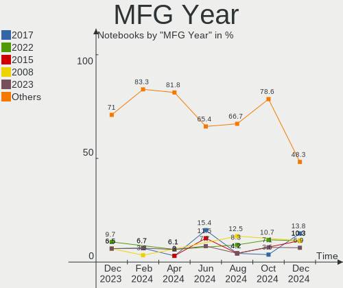
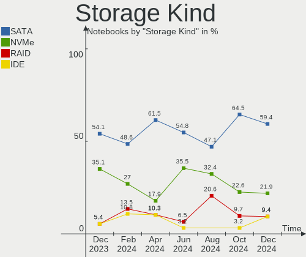
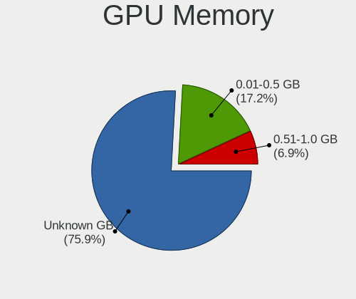
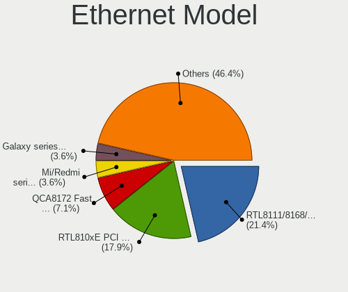
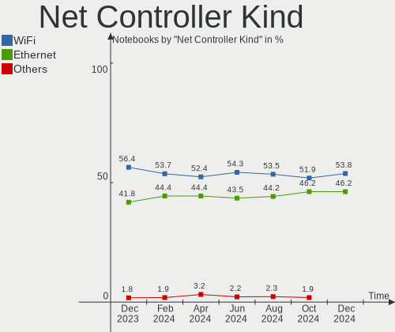

Xubuntu Hardware Trends (Notebooks)
-----------------------------------

A project to identify most popular hardware characteristics and track their change
over time based on data collected by Xubuntu users at https://Linux-Hardware.org.

Anyone can contribute to this report by the [hw-probe](https://github.com/linuxhw/hw-probe) tool:

    sudo -E hw-probe -all -upload

Full-feature report is available here: https://linux-hardware.org/?view=trends

Period: Dec, 2021.

Contents
--------

* [ System ](#system)
  - [ OS                       ](#os)
  - [ OS Family                ](#os-family)
  - [ Kernel                   ](#kernel)
  - [ Kernel Family            ](#kernel-family)
  - [ Kernel Major Ver.        ](#kernel-major-ver)
  - [ Arch                     ](#arch)
  - [ DE                       ](#de)
  - [ Display Server           ](#display-server)
  - [ Display Manager          ](#display-manager)
  - [ OS Lang                  ](#os-lang)
  - [ Boot Mode                ](#boot-mode)
  - [ Filesystem               ](#filesystem)
  - [ Part. scheme             ](#part-scheme)
  - [ Dual Boot with Linux/BSD ](#dual-boot-with-linuxbsd)
  - [ Dual Boot (Win)          ](#dual-boot-win)

* [ Board ](#board)
  - [ Vendor                   ](#vendor)
  - [ Model                    ](#model)
  - [ Model Family             ](#model-family)
  - [ MFG Year                 ](#mfg-year)
  - [ Form Factor              ](#form-factor)
  - [ Secure Boot              ](#secure-boot)
  - [ Coreboot                 ](#coreboot)
  - [ RAM Size                 ](#ram-size)
  - [ RAM Used                 ](#ram-used)
  - [ Total Drives             ](#total-drives)
  - [ Has CD-ROM               ](#has-cd-rom)
  - [ Has Ethernet             ](#has-ethernet)
  - [ Has WiFi                 ](#has-wifi)
  - [ Has Bluetooth            ](#has-bluetooth)

* [ Location ](#location)
  - [ Country                  ](#country)
  - [ City                     ](#city)

* [ Drives ](#drives)
  - [ Drive Vendor             ](#drive-vendor)
  - [ Drive Model              ](#drive-model)
  - [ HDD Vendor               ](#hdd-vendor)
  - [ SSD Vendor               ](#ssd-vendor)
  - [ Drive Kind               ](#drive-kind)
  - [ Drive Connector          ](#drive-connector)
  - [ Drive Size               ](#drive-size)
  - [ Space Total              ](#space-total)
  - [ Space Used               ](#space-used)
  - [ Malfunc. Drives          ](#malfunc-drives)
  - [ Malfunc. Drive Vendor    ](#malfunc-drive-vendor)
  - [ Malfunc. HDD Vendor      ](#malfunc-hdd-vendor)
  - [ Malfunc. Drive Kind      ](#malfunc-drive-kind)
  - [ Failed Drives            ](#failed-drives)
  - [ Failed Drive Vendor      ](#failed-drive-vendor)
  - [ Drive Status             ](#drive-status)

* [ Storage controller ](#storage-controller)
  - [ Storage Vendor           ](#storage-vendor)
  - [ Storage Model            ](#storage-model)
  - [ Storage Kind             ](#storage-kind)

* [ Processor ](#processor)
  - [ CPU Vendor               ](#cpu-vendor)
  - [ CPU Model                ](#cpu-model)
  - [ CPU Model Family         ](#cpu-model-family)
  - [ CPU Cores                ](#cpu-cores)
  - [ CPU Sockets              ](#cpu-sockets)
  - [ CPU Threads              ](#cpu-threads)
  - [ CPU Op-Modes             ](#cpu-op-modes)
  - [ CPU Microcode            ](#cpu-microcode)
  - [ CPU Microarch            ](#cpu-microarch)

* [ Graphics ](#graphics)
  - [ GPU Vendor               ](#gpu-vendor)
  - [ GPU Model                ](#gpu-model)
  - [ GPU Combo                ](#gpu-combo)
  - [ GPU Driver               ](#gpu-driver)
  - [ GPU Memory               ](#gpu-memory)

* [ Monitor ](#monitor)
  - [ Monitor Vendor           ](#monitor-vendor)
  - [ Monitor Model            ](#monitor-model)
  - [ Monitor Resolution       ](#monitor-resolution)
  - [ Monitor Diagonal         ](#monitor-diagonal)
  - [ Monitor Width            ](#monitor-width)
  - [ Aspect Ratio             ](#aspect-ratio)
  - [ Monitor Area             ](#monitor-area)
  - [ Pixel Density            ](#pixel-density)
  - [ Multiple Monitors        ](#multiple-monitors)

* [ Network ](#network)
  - [ Net Controller Vendor    ](#net-controller-vendor)
  - [ Net Controller Model     ](#net-controller-model)
  - [ Wireless Vendor          ](#wireless-vendor)
  - [ Wireless Model           ](#wireless-model)
  - [ Ethernet Vendor          ](#ethernet-vendor)
  - [ Ethernet Model           ](#ethernet-model)
  - [ Net Controller Kind      ](#net-controller-kind)
  - [ Used Controller          ](#used-controller)
  - [ NICs                     ](#nics)
  - [ IPv6                     ](#ipv6)

* [ Bluetooth ](#bluetooth)
  - [ Bluetooth Vendor         ](#bluetooth-vendor)
  - [ Bluetooth Model          ](#bluetooth-model)

* [ Sound ](#sound)
  - [ Sound Vendor             ](#sound-vendor)
  - [ Sound Model              ](#sound-model)

* [ Memory ](#memory)
  - [ Memory Vendor            ](#memory-vendor)
  - [ Memory Model             ](#memory-model)
  - [ Memory Kind              ](#memory-kind)
  - [ Memory Form Factor       ](#memory-form-factor)
  - [ Memory Size              ](#memory-size)
  - [ Memory Speed             ](#memory-speed)

* [ Printers & scanners ](#printers--scanners)
  - [ Printer Vendor           ](#printer-vendor)
  - [ Printer Model            ](#printer-model)
  - [ Scanner Vendor           ](#scanner-vendor)
  - [ Scanner Model            ](#scanner-model)

* [ Camera ](#camera)
  - [ Camera Vendor            ](#camera-vendor)
  - [ Camera Model             ](#camera-model)

* [ Security ](#security)
  - [ Fingerprint Vendor       ](#fingerprint-vendor)
  - [ Fingerprint Model        ](#fingerprint-model)
  - [ Chipcard Vendor          ](#chipcard-vendor)
  - [ Chipcard Model           ](#chipcard-model)

* [ Unsupported ](#unsupported)
  - [ Unsupported Devices      ](#unsupported-devices)
  - [ Unsupported Device Types ](#unsupported-device-types)

System
------

OS
--

Installed operating systems

| Name          | Notebooks | Percent |
|---------------|-----------|---------|
| Xubuntu 20.04 | 37        | 64.91%  |
| Xubuntu 21.10 | 10        | 17.54%  |
| Xubuntu 18.04 | 7         | 12.28%  |
| Xubuntu 21.04 | 1         | 1.75%   |
| Xubuntu 20.10 | 1         | 1.75%   |
| Xubuntu 16.04 | 1         | 1.75%   |

OS Family
---------

OS without a version

| Name    | Notebooks | Percent |
|---------|-----------|---------|
| Xubuntu | 57        | 100%    |

Kernel
------

Version of the Linux kernel

| Version                      | Notebooks | Percent |
|------------------------------|-----------|---------|
| 5.4.0-91-generic             | 10        | 17.54%  |
| 5.13.0-22-generic            | 7         | 12.28%  |
| 5.11.0-41-generic            | 6         | 10.53%  |
| 5.11.0-43-generic            | 4         | 7.02%   |
| 5.4.0-91-lowlatency          | 2         | 3.51%   |
| 5.4.0-90-generic             | 2         | 3.51%   |
| 5.4.0-89-generic             | 2         | 3.51%   |
| 5.4.0-29-generic             | 2         | 3.51%   |
| 5.13.0-22-lowlatency         | 2         | 3.51%   |
| 5.11.0-41-lowlatency         | 2         | 3.51%   |
| 5.11.0-40-generic            | 2         | 3.51%   |
| 5.8.0-63-generic             | 1         | 1.75%   |
| 5.8.0-53-generic             | 1         | 1.75%   |
| 5.6.19-050619-generic        | 1         | 1.75%   |
| 5.4.0-92-generic             | 1         | 1.75%   |
| 5.4.0-73-lowlatency          | 1         | 1.75%   |
| 5.4.0-54-generic             | 1         | 1.75%   |
| 5.4.0-42-generic             | 1         | 1.75%   |
| 5.13.0-23-generic            | 1         | 1.75%   |
| 5.13.0-19-generic            | 1         | 1.75%   |
| 5.11.0-44-generic            | 1         | 1.75%   |
| 5.11.0-43-lowlatency         | 1         | 1.75%   |
| 5.11.0-42-lowlatency         | 1         | 1.75%   |
| 4.4.254-21004-g90921f1f9a15  | 1         | 1.75%   |
| 4.19.202-12118-g8ae2f2219bce | 1         | 1.75%   |
| 4.16.18-galliumos            | 1         | 1.75%   |
| 4.15.0-159-generic           | 1         | 1.75%   |

Kernel Family
-------------

Linux kernel without a distro release

| Version  | Notebooks | Percent |
|----------|-----------|---------|
| 5.4.0    | 22        | 38.6%   |
| 5.11.0   | 17        | 29.82%  |
| 5.13.0   | 11        | 19.3%   |
| 5.8.0    | 2         | 3.51%   |
| 5.6.19   | 1         | 1.75%   |
| 4.4.254  | 1         | 1.75%   |
| 4.19.202 | 1         | 1.75%   |
| 4.16.18  | 1         | 1.75%   |
| 4.15.0   | 1         | 1.75%   |

Kernel Major Ver.
-----------------

Linux kernel major version

| Version | Notebooks | Percent |
|---------|-----------|---------|
| 5.4     | 22        | 38.6%   |
| 5.11    | 17        | 29.82%  |
| 5.13    | 11        | 19.3%   |
| 5.8     | 2         | 3.51%   |
| 5.6     | 1         | 1.75%   |
| 4.4     | 1         | 1.75%   |
| 4.19    | 1         | 1.75%   |
| 4.16    | 1         | 1.75%   |
| 4.15    | 1         | 1.75%   |

Arch
----

OS architecture (x86_64, i586, etc.)

| Name   | Notebooks | Percent |
|--------|-----------|---------|
| x86_64 | 51        | 89.47%  |
| i686   | 6         | 10.53%  |

DE
--

Desktop Environment

| Name  | Notebooks | Percent |
|-------|-----------|---------|
| XFCE  | 56        | 98.25%  |
| GNOME | 1         | 1.75%   |

Display Server
--------------

X11 or Wayland

| Name    | Notebooks | Percent |
|---------|-----------|---------|
| X11     | 56        | 98.25%  |
| Wayland | 1         | 1.75%   |

Display Manager
---------------

SDDM, LightDM, etc.

| Name    | Notebooks | Percent |
|---------|-----------|---------|
| LightDM | 52        | 91.23%  |
| Unknown | 4         | 7.02%   |
| LXDM    | 1         | 1.75%   |

OS Lang
-------

Language

| Lang  | Notebooks | Percent |
|-------|-----------|---------|
| en_US | 26        | 45.61%  |
| fr_FR | 5         | 8.77%   |
| de_DE | 5         | 8.77%   |
| en_GB | 4         | 7.02%   |
| it_IT | 3         | 5.26%   |
| es_ES | 3         | 5.26%   |
| ru_RU | 2         | 3.51%   |
| pt_BR | 2         | 3.51%   |
| nl_NL | 2         | 3.51%   |
| sv_SE | 1         | 1.75%   |
| ru_UA | 1         | 1.75%   |
| pt_PT | 1         | 1.75%   |
| fi_FI | 1         | 1.75%   |
| C     | 1         | 1.75%   |

Boot Mode
---------

EFI or BIOS

| Mode | Notebooks | Percent |
|------|-----------|---------|
| BIOS | 34        | 59.65%  |
| EFI  | 23        | 40.35%  |

Filesystem
----------

Type of filesystem

| Type    | Notebooks | Percent |
|---------|-----------|---------|
| Ext4    | 56        | 98.25%  |
| Overlay | 1         | 1.75%   |

Part. scheme
------------

Scheme of partitioning

| Type    | Notebooks | Percent |
|---------|-----------|---------|
| Unknown | 30        | 52.63%  |
| GPT     | 19        | 33.33%  |
| MBR     | 8         | 14.04%  |

Dual Boot with Linux/BSD
------------------------

Hosting more than one Linux/BSD

| Dual boot | Notebooks | Percent |
|-----------|-----------|---------|
| No        | 47        | 82.46%  |
| Yes       | 10        | 17.54%  |

Dual Boot (Win)
---------------

Hosting Linux and Windows

| Dual boot | Notebooks | Percent |
|-----------|-----------|---------|
| No        | 39        | 68.42%  |
| Yes       | 18        | 31.58%  |

Board
-----

Vendor
------

Motherboard manufacturer

| Name                | Notebooks | Percent |
|---------------------|-----------|---------|
| Hewlett-Packard     | 10        | 17.54%  |
| Lenovo              | 8         | 14.04%  |
| Acer                | 7         | 12.28%  |
| ASUSTek Computer    | 6         | 10.53%  |
| Toshiba             | 5         | 8.77%   |
| Dell                | 5         | 8.77%   |
| Google              | 4         | 7.02%   |
| Samsung Electronics | 2         | 3.51%   |
| Gateway             | 2         | 3.51%   |
| TUXEDO              | 1         | 1.75%   |
| Sony                | 1         | 1.75%   |
| Packard Bell        | 1         | 1.75%   |
| MSI                 | 1         | 1.75%   |
| Intel               | 1         | 1.75%   |
| HUAWEI              | 1         | 1.75%   |
| GPU Company         | 1         | 1.75%   |
| Dixonsxp            | 1         | 1.75%   |

Model
-----

Motherboard model

| Name                                   | Notebooks | Percent |
|----------------------------------------|-----------|---------|
| Toshiba Satellite A105                 | 2         | 3.51%   |
| Dell Inspiron 7501                     | 2         | 3.51%   |
| TUXEDO InfinityBook Pro 14 Gen6        | 1         | 1.75%   |
| Toshiba Satellite L870-196             | 1         | 1.75%   |
| Toshiba Satellite C855                 | 1         | 1.75%   |
| Toshiba Satellite C50-A-19U            | 1         | 1.75%   |
| Sony VGN-SZ2HP_B                       | 1         | 1.75%   |
| Samsung RV411/RV511/E3511/S3511/RV711  | 1         | 1.75%   |
| Samsung RC410/RC510/RC710              | 1         | 1.75%   |
| Packard Bell EasyNote TK13BZ           | 1         | 1.75%   |
| MSI GP76 Leopard 11UG                  | 1         | 1.75%   |
| Lenovo ThinkPad X61 7674CT0            | 1         | 1.75%   |
| Lenovo ThinkPad T61 64669YG            | 1         | 1.75%   |
| Lenovo ThinkPad T530 24296JG           | 1         | 1.75%   |
| Lenovo ThinkPad T510 4384A78           | 1         | 1.75%   |
| Lenovo ThinkPad T495s 20QKS0SD00       | 1         | 1.75%   |
| Lenovo ThinkPad T14s Gen 1 20UJS0D401  | 1         | 1.75%   |
| Lenovo IdeaPad 110S-11IBR 80WG         | 1         | 1.75%   |
| Lenovo B50-30 20382                    | 1         | 1.75%   |
| Intel Crestline & ICH8M Chipset        | 1         | 1.75%   |
| HUAWEI HKD-WXX                         | 1         | 1.75%   |
| HP ProBook 450 G4                      | 1         | 1.75%   |
| HP Pavilion TS 11                      | 1         | 1.75%   |
| HP Pavilion dv7                        | 1         | 1.75%   |
| HP Pavilion dv6                        | 1         | 1.75%   |
| HP Laptop 17-cp0xxx                    | 1         | 1.75%   |
| HP Laptop 17-cn1xxx                    | 1         | 1.75%   |
| HP EliteBook Folio 9470m               | 1         | 1.75%   |
| HP EliteBook 8440p (VD484AV)           | 1         | 1.75%   |
| HP Compaq Mini 311-1100                | 1         | 1.75%   |
| HP 2000                                | 1         | 1.75%   |
| GPU Company GWTN156-11                 | 1         | 1.75%   |
| Google Swanky                          | 1         | 1.75%   |
| Google Nami                            | 1         | 1.75%   |
| Google Kefka                           | 1         | 1.75%   |
| Google Celes                           | 1         | 1.75%   |
| Gateway NV53A                          | 1         | 1.75%   |
| Gateway MT6831                         | 1         | 1.75%   |
| Dell System XPS L502X                  | 1         | 1.75%   |
| Dell Latitude 5401                     | 1         | 1.75%   |
| Dell Inspiron 13-5378                  | 1         | 1.75%   |
| ASUS X55U                              | 1         | 1.75%   |
| ASUS VivoBook_ASUSLaptop X509FA_X509FA | 1         | 1.75%   |
| ASUS TUF GAMING FX504GD_FX80GD         | 1         | 1.75%   |
| ASUS N550JV                            | 1         | 1.75%   |
| ASUS E200HA                            | 1         | 1.75%   |
| ASUS 1001PX                            | 1         | 1.75%   |
| Acer Swift SF314-43                    | 1         | 1.75%   |
| Acer Swift SF114-34                    | 1         | 1.75%   |
| Acer Aspire one                        | 1         | 1.75%   |
| Acer Aspire A515-54G                   | 1         | 1.75%   |
| Acer Aspire A315-34                    | 1         | 1.75%   |
| Acer Aspire 5630                       | 1         | 1.75%   |
| Acer Aspire 5336                       | 1         | 1.75%   |
| Unknown                                | 1         | 1.75%   |

Model Family
------------

Motherboard model prefix

| Name                   | Notebooks | Percent |
|------------------------|-----------|---------|
| Lenovo ThinkPad        | 6         | 10.53%  |
| Toshiba Satellite      | 5         | 8.77%   |
| Acer Aspire            | 5         | 8.77%   |
| HP Pavilion            | 3         | 5.26%   |
| Dell Inspiron          | 3         | 5.26%   |
| HP Laptop              | 2         | 3.51%   |
| HP EliteBook           | 2         | 3.51%   |
| Acer Swift             | 2         | 3.51%   |
| TUXEDO InfinityBook    | 1         | 1.75%   |
| Sony VGN-SZ2HP         | 1         | 1.75%   |
| Samsung RV411          | 1         | 1.75%   |
| Samsung RC410          | 1         | 1.75%   |
| Packard Bell EasyNote  | 1         | 1.75%   |
| MSI GP76               | 1         | 1.75%   |
| Lenovo IdeaPad         | 1         | 1.75%   |
| Lenovo B50-30          | 1         | 1.75%   |
| Intel Crestline        | 1         | 1.75%   |
| HUAWEI HKD-WXX         | 1         | 1.75%   |
| HP ProBook             | 1         | 1.75%   |
| HP Compaq              | 1         | 1.75%   |
| HP 2000                | 1         | 1.75%   |
| GPU Company GWTN156-11 | 1         | 1.75%   |
| Google Swanky          | 1         | 1.75%   |
| Google Nami            | 1         | 1.75%   |
| Google Kefka           | 1         | 1.75%   |
| Google Celes           | 1         | 1.75%   |
| Gateway NV53A          | 1         | 1.75%   |
| Gateway MT6831         | 1         | 1.75%   |
| Dell System            | 1         | 1.75%   |
| Dell Latitude          | 1         | 1.75%   |
| ASUS X55U              | 1         | 1.75%   |
| ASUS VivoBook          | 1         | 1.75%   |
| ASUS TUF               | 1         | 1.75%   |
| ASUS N550JV            | 1         | 1.75%   |
| ASUS E200HA            | 1         | 1.75%   |
| ASUS 1001PX            | 1         | 1.75%   |
| Unknown                | 1         | 1.75%   |

MFG Year
--------

Motherboard manufacture year

| Year | Notebooks | Percent |
|------|-----------|---------|
| 2021 | 15        | 26.32%  |
| 2013 | 7         | 12.28%  |
| 2019 | 6         | 10.53%  |
| 2010 | 5         | 8.77%   |
| 2011 | 4         | 7.02%   |
| 2009 | 4         | 7.02%   |
| 2007 | 3         | 5.26%   |
| 2006 | 3         | 5.26%   |
| 2020 | 2         | 3.51%   |
| 2016 | 2         | 3.51%   |
| 2014 | 2         | 3.51%   |
| 2012 | 2         | 3.51%   |
| 2017 | 1         | 1.75%   |
| 2015 | 1         | 1.75%   |

Form Factor
-----------

Physical design of the computer

| Name     | Notebooks | Percent |
|----------|-----------|---------|
| Notebook | 57        | 100%    |

Secure Boot
-----------

Enabled or disabled

| State    | Notebooks | Percent |
|----------|-----------|---------|
| Disabled | 53        | 92.98%  |
| Enabled  | 4         | 7.02%   |

Coreboot
--------

Have coreboot on board

| Used | Notebooks | Percent |
|------|-----------|---------|
| No   | 53        | 92.98%  |
| Yes  | 4         | 7.02%   |

RAM Size
--------

Total RAM memory

| Size in GB  | Notebooks | Percent |
|-------------|-----------|---------|
| 3.01-4.0    | 21        | 36.84%  |
| 4.01-8.0    | 10        | 17.54%  |
| 8.01-16.0   | 7         | 12.28%  |
| 16.01-24.0  | 6         | 10.53%  |
| 1.01-2.0    | 6         | 10.53%  |
| 2.01-3.0    | 3         | 5.26%   |
| 0.51-1.0    | 2         | 3.51%   |
| 32.01-64.0  | 1         | 1.75%   |
| 64.01-256.0 | 1         | 1.75%   |

RAM Used
--------

Used RAM memory

| Used GB   | Notebooks | Percent |
|-----------|-----------|---------|
| 1.01-2.0  | 26        | 45.61%  |
| 2.01-3.0  | 11        | 19.3%   |
| 0.51-1.0  | 11        | 19.3%   |
| 4.01-8.0  | 4         | 7.02%   |
| 3.01-4.0  | 4         | 7.02%   |
| 8.01-16.0 | 1         | 1.75%   |

Total Drives
------------

Number of drives on board

| Drives | Notebooks | Percent |
|--------|-----------|---------|
| 1      | 42        | 73.68%  |
| 2      | 13        | 22.81%  |
| 3      | 1         | 1.75%   |
| 0      | 1         | 1.75%   |

Has CD-ROM
----------

Has CD-ROM on board

| Presented | Notebooks | Percent |
|-----------|-----------|---------|
| No        | 35        | 61.4%   |
| Yes       | 22        | 38.6%   |

Has Ethernet
------------

Has Ethernet on board

| Presented | Notebooks | Percent |
|-----------|-----------|---------|
| Yes       | 40        | 70.18%  |
| No        | 17        | 29.82%  |

Has WiFi
--------

Has WiFi module

| Presented | Notebooks | Percent |
|-----------|-----------|---------|
| Yes       | 56        | 98.25%  |
| No        | 1         | 1.75%   |

Has Bluetooth
-------------

Has Bluetooth module

| Presented | Notebooks | Percent |
|-----------|-----------|---------|
| Yes       | 37        | 64.91%  |
| No        | 20        | 35.09%  |

Location
--------

Country
-------

Geographic location (country)

| Country     | Notebooks | Percent |
|-------------|-----------|---------|
| USA         | 16        | 28.07%  |
| Germany     | 6         | 10.53%  |
| UK          | 4         | 7.02%   |
| France      | 4         | 7.02%   |
| Spain       | 3         | 5.26%   |
| Italy       | 3         | 5.26%   |
| Brazil      | 3         | 5.26%   |
| Russia      | 2         | 3.51%   |
| Netherlands | 2         | 3.51%   |
| Finland     | 2         | 3.51%   |
| Bulgaria    | 2         | 3.51%   |
| Ukraine     | 1         | 1.75%   |
| Sweden      | 1         | 1.75%   |
| Slovakia    | 1         | 1.75%   |
| Portugal    | 1         | 1.75%   |
| Norway      | 1         | 1.75%   |
| Mexico      | 1         | 1.75%   |
| Iran        | 1         | 1.75%   |
| Czechia     | 1         | 1.75%   |
| Argentina   | 1         | 1.75%   |
| Algeria     | 1         | 1.75%   |

City
----

Geographic location (city)

| City                 | Notebooks | Percent |
|----------------------|-----------|---------|
| Varna                | 2         | 3.51%   |
| Bracknell            | 2         | 3.51%   |
| Yuzhno-Sakhalinsk    | 1         | 1.75%   |
| Yoshkar-Ola          | 1         | 1.75%   |
| Wuppertal            | 1         | 1.75%   |
| Watertown            | 1         | 1.75%   |
| Waterbury            | 1         | 1.75%   |
| Vashon               | 1         | 1.75%   |
| Trnava               | 1         | 1.75%   |
| Tehran               | 1         | 1.75%   |
| Tampere              | 1         | 1.75%   |
| Surzur               | 1         | 1.75%   |
| Stuttgart            | 1         | 1.75%   |
| Solbergelva          | 1         | 1.75%   |
| Seville              | 1         | 1.75%   |
| Rovigo               | 1         | 1.75%   |
| Rome                 | 1         | 1.75%   |
| Remscheid            | 1         | 1.75%   |
| Reichenbach/Vogtland | 1         | 1.75%   |
| Pulaski              | 1         | 1.75%   |
| Puerto Vallarta      | 1         | 1.75%   |
| Pryluky              | 1         | 1.75%   |
| Porto Alegre         | 1         | 1.75%   |
| Phoenix              | 1         | 1.75%   |
| Pato Branco          | 1         | 1.75%   |
| Paris                | 1         | 1.75%   |
| Orrstown             | 1         | 1.75%   |
| Norwich              | 1         | 1.75%   |
| Nar??n               | 1         | 1.75%   |
| Montlu?§on           | 1         | 1.75%   |
| Milan                | 1         | 1.75%   |
| Merritt Island       | 1         | 1.75%   |
| Mauston              | 1         | 1.75%   |
| Luton                | 1         | 1.75%   |
| Lelystad             | 1         | 1.75%   |
| Laguna Niguel        | 1         | 1.75%   |
| La Rioja             | 1         | 1.75%   |
| Koblenz              | 1         | 1.75%   |
| Jonstorp             | 1         | 1.75%   |
| Janesville           | 1         | 1.75%   |
| Glencoe              | 1         | 1.75%   |
| Frankfurt am Main    | 1         | 1.75%   |
| Espoo                | 1         | 1.75%   |
| Edam                 | 1         | 1.75%   |
| East Longmeadow      | 1         | 1.75%   |
| Cordova              | 1         | 1.75%   |
| Cergy                | 1         | 1.75%   |
| Bryan                | 1         | 1.75%   |
| Brno                 | 1         | 1.75%   |
| Boca Raton           | 1         | 1.75%   |
| Blumenau             | 1         | 1.75%   |
| Bellevue             | 1         | 1.75%   |
| Almada               | 1         | 1.75%   |
| Algiers              | 1         | 1.75%   |
| Abilene              | 1         | 1.75%   |

Drives
------

Drive Vendor
------------

Hard drive vendors

| Vendor              | Notebooks | Drives | Percent |
|---------------------|-----------|--------|---------|
| WDC                 | 15        | 15     | 22.73%  |
| Samsung Electronics | 10        | 11     | 15.15%  |
| Unknown             | 9         | 9      | 13.64%  |
| Seagate             | 6         | 6      | 9.09%   |
| Toshiba             | 4         | 4      | 6.06%   |
| Kingston            | 4         | 4      | 6.06%   |
| Micron Technology   | 2         | 2      | 3.03%   |
| HGST                | 2         | 2      | 3.03%   |
| Fujitsu             | 2         | 2      | 3.03%   |
| XPG                 | 1         | 1      | 1.52%   |
| SK Hynix            | 1         | 1      | 1.52%   |
| SanDisk             | 1         | 1      | 1.52%   |
| PNY                 | 1         | 1      | 1.52%   |
| KingSpec            | 1         | 1      | 1.52%   |
| Intel               | 1         | 1      | 1.52%   |
| Hitachi             | 1         | 1      | 1.52%   |
| HGST HTS            | 1         | 1      | 1.52%   |
| DREVO               | 1         | 1      | 1.52%   |
| China               | 1         | 1      | 1.52%   |
| A-DATA Technology   | 1         | 1      | 1.52%   |
| Unknown             | 1         | 1      | 1.52%   |

Drive Model
-----------

Hard drive models

| Model                                  | Notebooks | Percent |
|----------------------------------------|-----------|---------|
| WDC WDS500G2B0C 500GB                  | 2         | 2.99%   |
| WDC WD1600BEVS-08RST2 160GB            | 2         | 2.99%   |
| Toshiba MK1234GSX 120GB                | 2         | 2.99%   |
| XPG NVMe SSD Drive 1024GB              | 1         | 1.49%   |
| WDC WDS250G1B0A-00H9H0 250GB SSD       | 1         | 1.49%   |
| WDC WD7500BPKX-00HPJT0 752GB           | 1         | 1.49%   |
| WDC WD5000LPVX-60V0TT0 500GB           | 1         | 1.49%   |
| WDC WD5000LPCX-21VHAT0 500GB           | 1         | 1.49%   |
| WDC WD5000BEVT-22A0RT0 500GB           | 1         | 1.49%   |
| WDC WD2500BEVT-22A23T0 250GB           | 1         | 1.49%   |
| WDC WD1600BEVT-22ZCT0 160GB            | 1         | 1.49%   |
| WDC PC SN730 SDBPNTY-1T00-1032 1TB     | 1         | 1.49%   |
| WDC PC SN730 NVMe 512GB                | 1         | 1.49%   |
| WDC PC SN520 SDAPNUW-512G-1202 512GB   | 1         | 1.49%   |
| WDC PC SN520 SDAPNUW-512G-1014 512GB   | 1         | 1.49%   |
| Unknown SF64G  64GB                    | 1         | 1.49%   |
| Unknown MMC128  128GB                  | 1         | 1.49%   |
| Unknown MMC Card  64GB                 | 1         | 1.49%   |
| Unknown MMC Card  33GB                 | 1         | 1.49%   |
| Unknown MMC Card  32GB                 | 1         | 1.49%   |
| Unknown MMC Card  128GB                | 1         | 1.49%   |
| Unknown hA8aP  16GB                    | 1         | 1.49%   |
| Unknown DA4128  128GB                  | 1         | 1.49%   |
| Unknown 016GE2  16GB                   | 1         | 1.49%   |
| Toshiba MQ01ABD100 1TB                 | 1         | 1.49%   |
| Toshiba MQ01ABD050 500GB               | 1         | 1.49%   |
| SK Hynix SKHynix_HFS512GDE9X081N 512GB | 1         | 1.49%   |
| Seagate ST98823AS 80GB                 | 1         | 1.49%   |
| Seagate ST9750420AS 752GB              | 1         | 1.49%   |
| Seagate ST9320325AS 320GB              | 1         | 1.49%   |
| Seagate ST9320320AS 320GB              | 1         | 1.49%   |
| Seagate ST9160310AS 160GB              | 1         | 1.49%   |
| Seagate ST1000LX015-1U7172 1TB         | 1         | 1.49%   |
| SanDisk SL32G  32GB                    | 1         | 1.49%   |
| Samsung SSD 970 EVO Plus 500GB         | 1         | 1.49%   |
| Samsung SSD 860 PRO 512GB              | 1         | 1.49%   |
| Samsung SSD 860 EVO 500GB              | 1         | 1.49%   |
| Samsung SSD 850 EVO 250GB              | 1         | 1.49%   |
| Samsung MZVLQ1T0HBLB-00BH1 1TB         | 1         | 1.49%   |
| Samsung MZVLB512HBJQ-00000 512GB       | 1         | 1.49%   |
| Samsung MZVL21T0HCLR-00B00 1TB         | 1         | 1.49%   |
| Samsung MZVKV512HAJH-000L1 512GB       | 1         | 1.49%   |
| Samsung MZNTY256HDHP-000L2 256GB SSD   | 1         | 1.49%   |
| Samsung MZMPA032HMCD-000H1 32GB SSD    | 1         | 1.49%   |
| Samsung HM320JI 320GB                  | 1         | 1.49%   |
| PNY CS900 120GB SSD                    | 1         | 1.49%   |
| Micron MTFDDAK256MAM-1K12 256GB SSD    | 1         | 1.49%   |
| Micron 1100 SATA 256GB SSD             | 1         | 1.49%   |
| Kingston SV300S37A120G 120GB SSD       | 1         | 1.49%   |
| Kingston SA400S37480G 480GB SSD        | 1         | 1.49%   |
| Kingston SA400S37240G 240GB SSD        | 1         | 1.49%   |
| Kingston OM8PDP3512B-AA1 512GB         | 1         | 1.49%   |
| KingSpec P3-256 256GB SSD              | 1         | 1.49%   |
| Intel SSDPEKKF512G8L 512GB             | 1         | 1.49%   |
| Hitachi HTS722010K9SA00 100GB          | 1         | 1.49%   |
| HGST HTS725050A7E630 500GB             | 1         | 1.49%   |
| HGST HTS541010A9E680 1TB               | 1         | 1.49%   |
| HGST HTS 721010A9E630 1TB              | 1         | 1.49%   |
| Fujitsu MJA2500BH G2 500GB             | 1         | 1.49%   |
| Fujitsu MHX2250BT 250GB                | 1         | 1.49%   |

HDD Vendor
----------

Hard disk drive vendors

| Vendor              | Notebooks | Drives | Percent |
|---------------------|-----------|--------|---------|
| WDC                 | 8         | 8      | 32%     |
| Seagate             | 6         | 6      | 24%     |
| Toshiba             | 4         | 4      | 16%     |
| HGST                | 2         | 2      | 8%      |
| Fujitsu             | 2         | 2      | 8%      |
| Samsung Electronics | 1         | 1      | 4%      |
| Hitachi             | 1         | 1      | 4%      |
| HGST HTS            | 1         | 1      | 4%      |

SSD Vendor
----------

Solid state drive vendors

| Vendor              | Notebooks | Drives | Percent |
|---------------------|-----------|--------|---------|
| Samsung Electronics | 5         | 5      | 31.25%  |
| Kingston            | 3         | 3      | 18.75%  |
| Micron Technology   | 2         | 2      | 12.5%   |
| WDC                 | 1         | 1      | 6.25%   |
| PNY                 | 1         | 1      | 6.25%   |
| KingSpec            | 1         | 1      | 6.25%   |
| DREVO               | 1         | 1      | 6.25%   |
| China               | 1         | 1      | 6.25%   |
| A-DATA Technology   | 1         | 1      | 6.25%   |

Drive Kind
----------

HDD or SSD

| Kind | Notebooks | Drives | Percent |
|------|-----------|--------|---------|
| HDD  | 24        | 25     | 38.1%   |
| SSD  | 15        | 16     | 23.81%  |
| NVMe | 13        | 15     | 20.63%  |
| MMC  | 11        | 11     | 17.46%  |

Drive Connector
---------------

SATA, SAS, NVMe, etc.

| Type | Notebooks | Drives | Percent |
|------|-----------|--------|---------|
| SATA | 36        | 39     | 58.06%  |
| NVMe | 13        | 15     | 20.97%  |
| MMC  | 11        | 11     | 17.74%  |
| SAS  | 2         | 2      | 3.23%   |

Drive Size
----------

Size of hard drive

| Size in TB | Notebooks | Drives | Percent |
|------------|-----------|--------|---------|
| 0.01-0.5   | 33        | 33     | 82.5%   |
| 0.51-1.0   | 7         | 8      | 17.5%   |

Space Total
-----------

Amount of disk space available on the file system

| Size in GB | Notebooks | Percent |
|------------|-----------|---------|
| 251-500    | 22        | 38.6%   |
| 101-250    | 18        | 31.58%  |
| 501-1000   | 6         | 10.53%  |
| 51-100     | 6         | 10.53%  |
| 21-50      | 2         | 3.51%   |
| 1-20       | 2         | 3.51%   |
| 1001-2000  | 1         | 1.75%   |

Space Used
----------

Amount of used disk space

| Used GB  | Notebooks | Percent |
|----------|-----------|---------|
| 1-20     | 26        | 45.61%  |
| 101-250  | 11        | 19.3%   |
| 21-50    | 10        | 17.54%  |
| 51-100   | 5         | 8.77%   |
| 251-500  | 3         | 5.26%   |
| 501-1000 | 2         | 3.51%   |

Malfunc. Drives
---------------

Drive models with a malfunction

| Model                     | Notebooks | Drives | Percent |
|---------------------------|-----------|--------|---------|
| Seagate ST9320325AS 320GB | 1         | 1      | 50%     |
| Seagate ST9320320AS 320GB | 1         | 1      | 50%     |

Malfunc. Drive Vendor
---------------------

Vendors of faulty drives

| Vendor  | Notebooks | Drives | Percent |
|---------|-----------|--------|---------|
| Seagate | 2         | 2      | 100%    |

Malfunc. HDD Vendor
-------------------

Vendors of faulty HDD drives

| Vendor  | Notebooks | Drives | Percent |
|---------|-----------|--------|---------|
| Seagate | 2         | 2      | 100%    |

Malfunc. Drive Kind
-------------------

Kinds of faulty drives

| Kind | Notebooks | Drives | Percent |
|------|-----------|--------|---------|
| HDD  | 2         | 2      | 100%    |

Failed Drives
-------------

Failed drive models

Zero info for selected period =(

Failed Drive Vendor
-------------------

Failed drive vendors

Zero info for selected period =(

Drive Status
------------

Number of failed and malfunc. drives

| Status   | Notebooks | Drives | Percent |
|----------|-----------|--------|---------|
| Detected | 33        | 38     | 56.9%   |
| Works    | 23        | 27     | 39.66%  |
| Malfunc  | 2         | 2      | 3.45%   |

Storage controller
------------------

Storage Vendor
--------------

Storage controller vendors

| Vendor                      | Notebooks | Percent |
|-----------------------------|-----------|---------|
| Intel                       | 39        | 66.1%   |
| Sandisk                     | 6         | 10.17%  |
| AMD                         | 6         | 10.17%  |
| Samsung Electronics         | 4         | 6.78%   |
| SK Hynix                    | 1         | 1.69%   |
| Nvidia                      | 1         | 1.69%   |
| Kingston Technology Company | 1         | 1.69%   |
| ADATA Technology            | 1         | 1.69%   |

Storage Model
-------------

Storage controller models

| Model                                                                            | Notebooks | Percent |
|----------------------------------------------------------------------------------|-----------|---------|
| Intel 82801GBM/GHM (ICH7-M Family) SATA Controller [IDE mode]                    | 4         | 5.71%   |
| Intel 82801G (ICH7 Family) IDE Controller                                        | 4         | 5.71%   |
| Intel 7 Series Chipset Family 6-port SATA Controller [AHCI mode]                 | 4         | 5.71%   |
| AMD FCH SATA Controller [AHCI mode]                                              | 4         | 5.71%   |
| Intel 82801HM/HEM (ICH8M/ICH8M-E) SATA Controller [AHCI mode]                    | 3         | 4.29%   |
| Intel 82801HM/HEM (ICH8M/ICH8M-E) IDE Controller                                 | 3         | 4.29%   |
| Intel 82801GBM/GHM (ICH7-M Family) SATA Controller [AHCI mode]                   | 3         | 4.29%   |
| Sandisk WD Blue SN550 NVMe SSD                                                   | 2         | 2.86%   |
| Sandisk WD Blue SN500 / PC SN520 NVMe SSD                                        | 2         | 2.86%   |
| Sandisk WD Black SN750 / PC SN730 NVMe SSD                                       | 2         | 2.86%   |
| Samsung NVMe SSD Controller SM981/PM981/PM983                                    | 2         | 2.86%   |
| Intel Sunrise Point-LP SATA Controller [AHCI mode]                               | 2         | 2.86%   |
| Intel Celeron/Pentium Silver Processor SATA Controller                           | 2         | 2.86%   |
| Intel Cannon Point-LP SATA Controller [AHCI Mode]                                | 2         | 2.86%   |
| Intel Cannon Lake Mobile PCH SATA AHCI Controller                                | 2         | 2.86%   |
| Intel 6 Series/C200 Series Chipset Family 6 port Mobile SATA AHCI Controller     | 2         | 2.86%   |
| Intel 5 Series/3400 Series Chipset 6 port SATA AHCI Controller                   | 2         | 2.86%   |
| Intel 5 Series/3400 Series Chipset 4 port SATA AHCI Controller                   | 2         | 2.86%   |
| Intel 400 Series Chipset Family SATA AHCI Controller                             | 2         | 2.86%   |
| AMD SB7x0/SB8x0/SB9x0 SATA Controller [AHCI mode]                                | 2         | 2.86%   |
| SK Hynix Gold P31 SSD                                                            | 1         | 1.43%   |
| Samsung NVMe SSD Controller SM951/PM951                                          | 1         | 1.43%   |
| Samsung NVMe SSD Controller PM9A1/PM9A3/980PRO                                   | 1         | 1.43%   |
| Samsung NVMe SSD Controller 980                                                  | 1         | 1.43%   |
| Nvidia MCP79 AHCI Controller                                                     | 1         | 1.43%   |
| Kingston Company OM3PDP3 NVMe SSD                                                | 1         | 1.43%   |
| Intel Volume Management Device NVMe RAID Controller                              | 1         | 1.43%   |
| Intel Tiger Lake-LP SATA Controller [AHCI mode]                                  | 1         | 1.43%   |
| Intel SSD Pro 7600p/760p/E 6100p Series                                          | 1         | 1.43%   |
| Intel NM10/ICH7 Family SATA Controller [AHCI mode]                               | 1         | 1.43%   |
| Intel Mobile PM965/GM965 PT IDER Controller                                      | 1         | 1.43%   |
| Intel Atom/Celeron/Pentium Processor x5-E8000/J3xxx/N3xxx Series SATA Controller | 1         | 1.43%   |
| Intel Atom Processor E3800 Series SATA AHCI Controller                           | 1         | 1.43%   |
| Intel 82801IBM/IEM (ICH9M/ICH9M-E) 4 port SATA Controller [AHCI mode]            | 1         | 1.43%   |
| Intel 82801 Mobile SATA Controller [RAID mode]                                   | 1         | 1.43%   |
| Intel 8 Series/C220 Series Chipset Family 6-port SATA Controller 1 [AHCI mode]   | 1         | 1.43%   |
| Intel 7 Series Chipset Family 4-port SATA Controller [IDE mode]                  | 1         | 1.43%   |
| Intel 7 Series Chipset Family 2-port SATA Controller [IDE mode]                  | 1         | 1.43%   |
| ADATA XPG SX8200 Pro PCIe Gen3x4 M.2 2280 Solid State Drive                      | 1         | 1.43%   |

Storage Kind
------------

Kind of storage controller (IDE, SATA, NVMe, SAS, ...)

| Kind | Notebooks | Percent |
|------|-----------|---------|
| SATA | 39        | 60%     |
| NVMe | 13        | 20%     |
| IDE  | 11        | 16.92%  |
| RAID | 2         | 3.08%   |

Processor
---------

CPU Vendor
----------

Processor vendors

| Vendor | Notebooks | Percent |
|--------|-----------|---------|
| Intel  | 48        | 84.21%  |
| AMD    | 9         | 15.79%  |

CPU Model
---------

Processor models

| Model                                           | Notebooks | Percent |
|-------------------------------------------------|-----------|---------|
| Intel Core i5-8265U CPU @ 1.60GHz               | 2         | 3.51%   |
| Intel Core i5-10300H CPU @ 2.50GHz              | 2         | 3.51%   |
| Intel Core i5 CPU M 560 @ 2.67GHz               | 2         | 3.51%   |
| Intel Core 2 CPU T5500 @ 1.66GHz                | 2         | 3.51%   |
| Intel Celeron CPU N3060 @ 1.60GHz               | 2         | 3.51%   |
| Intel Celeron CPU N2840 @ 2.16GHz               | 2         | 3.51%   |
| Intel 11th Gen Core i7-11370H @ 3.30GHz         | 2         | 3.51%   |
| AMD Ryzen 5 5500U with Radeon Graphics          | 2         | 3.51%   |
| Intel Pentium Silver N6000 @ 1.10GHz            | 1         | 1.75%   |
| Intel Pentium Silver N5030 CPU @ 1.10GHz        | 1         | 1.75%   |
| Intel Pentium CPU N3710 @ 1.60GHz               | 1         | 1.75%   |
| Intel Genuine CPU T2300 @ 1.66GHz               | 1         | 1.75%   |
| Intel Genuine CPU T2250 @ 1.73GHz               | 1         | 1.75%   |
| Intel Core i7-9850H CPU @ 2.60GHz               | 1         | 1.75%   |
| Intel Core i7-7500U CPU @ 2.70GHz               | 1         | 1.75%   |
| Intel Core i7-4700HQ CPU @ 2.40GHz              | 1         | 1.75%   |
| Intel Core i7-3630QM CPU @ 2.40GHz              | 1         | 1.75%   |
| Intel Core i7-3610QM CPU @ 2.30GHz              | 1         | 1.75%   |
| Intel Core i7-2670QM CPU @ 2.20GHz              | 1         | 1.75%   |
| Intel Core i5-8300H CPU @ 2.30GHz               | 1         | 1.75%   |
| Intel Core i5-8250U CPU @ 1.60GHz               | 1         | 1.75%   |
| Intel Core i5-3427U CPU @ 1.80GHz               | 1         | 1.75%   |
| Intel Core i5-3230M CPU @ 2.60GHz               | 1         | 1.75%   |
| Intel Core i5-3210M CPU @ 2.50GHz               | 1         | 1.75%   |
| Intel Core i5-2450M CPU @ 2.50GHz               | 1         | 1.75%   |
| Intel Core i5 CPU M 540 @ 2.53GHz               | 1         | 1.75%   |
| Intel Core i3-7130U CPU @ 2.70GHz               | 1         | 1.75%   |
| Intel Core i3 CPU M 380 @ 2.53GHz               | 1         | 1.75%   |
| Intel Core 2 Duo CPU T8100 @ 2.10GHz            | 1         | 1.75%   |
| Intel Core 2 Duo CPU T7300 @ 2.00GHz            | 1         | 1.75%   |
| Intel Core 2 Duo CPU T5800 @ 2.00GHz            | 1         | 1.75%   |
| Intel Core 2 CPU T5300 @ 1.73GHz                | 1         | 1.75%   |
| Intel Core 2 CPU T5200 @ 1.60GHz                | 1         | 1.75%   |
| Intel Celeron N4000C CPU @ 1.10GHz              | 1         | 1.75%   |
| Intel Celeron CPU 900 @ 2.20GHz                 | 1         | 1.75%   |
| Intel Celeron CPU 847 @ 1.10GHz                 | 1         | 1.75%   |
| Intel Atom x5-Z8300 CPU @ 1.44GHz               | 1         | 1.75%   |
| Intel Atom CPU N450 @ 1.66GHz                   | 1         | 1.75%   |
| Intel Atom CPU N280 @ 1.66GHz                   | 1         | 1.75%   |
| Intel Atom CPU N270 @ 1.60GHz                   | 1         | 1.75%   |
| Intel 11th Gen Core i7-11800H @ 2.30GHz         | 1         | 1.75%   |
| Intel 11th Gen Core i5-1155G7 @ 2.50GHz         | 1         | 1.75%   |
| AMD Turion II P540 Dual-Core Processor          | 1         | 1.75%   |
| AMD Ryzen 7 PRO 4750U with Radeon Graphics      | 1         | 1.75%   |
| AMD Ryzen 7 PRO 3700U w/ Radeon Vega Mobile Gfx | 1         | 1.75%   |
| AMD E2-1800 APU with Radeon HD Graphics         | 1         | 1.75%   |
| AMD E-350 Processor                             | 1         | 1.75%   |
| AMD A6-5200 APU with Radeon HD Graphics         | 1         | 1.75%   |
| AMD A4-1250 APU with Radeon HD Graphics         | 1         | 1.75%   |

CPU Model Family
----------------

Processor model prefix

| Model                | Notebooks | Percent |
|----------------------|-----------|---------|
| Intel Core i5        | 13        | 22.81%  |
| Intel Celeron        | 7         | 12.28%  |
| Intel Core i7        | 6         | 10.53%  |
| Other                | 4         | 7.02%   |
| Intel Core 2         | 4         | 7.02%   |
| Intel Atom           | 4         | 7.02%   |
| Intel Core 2 Duo     | 3         | 5.26%   |
| Intel Pentium Silver | 2         | 3.51%   |
| Intel Genuine        | 2         | 3.51%   |
| Intel Core i3        | 2         | 3.51%   |
| AMD Ryzen 7 PRO      | 2         | 3.51%   |
| AMD Ryzen 5          | 2         | 3.51%   |
| Intel Pentium        | 1         | 1.75%   |
| AMD Turion II        | 1         | 1.75%   |
| AMD E2               | 1         | 1.75%   |
| AMD E                | 1         | 1.75%   |
| AMD A6               | 1         | 1.75%   |
| AMD A4               | 1         | 1.75%   |

CPU Cores
---------

Number of processor cores

| Number | Notebooks | Percent |
|--------|-----------|---------|
| 2      | 29        | 50.88%  |
| 4      | 19        | 33.33%  |
| 1      | 4         | 7.02%   |
| 6      | 3         | 5.26%   |
| 8      | 2         | 3.51%   |

CPU Sockets
-----------

Number of sockets

| Number | Notebooks | Percent |
|--------|-----------|---------|
| 1      | 57        | 100%    |

CPU Threads
-----------

Threads per core (Hyper-Threading)

| Number | Notebooks | Percent |
|--------|-----------|---------|
| 2      | 31        | 54.39%  |
| 1      | 26        | 45.61%  |

CPU Op-Modes
------------

CPU Operation Modes (32-bit, 64-bit)

| Op mode        | Notebooks | Percent |
|----------------|-----------|---------|
| 32-bit, 64-bit | 53        | 92.98%  |
| 32-bit         | 4         | 7.02%   |

CPU Microcode
-------------

Microcode number

| Number     | Notebooks | Percent |
|------------|-----------|---------|
| Unknown    | 8         | 14.04%  |
| 0x306a9    | 4         | 7.02%   |
| 0x6f6      | 3         | 5.26%   |
| 0x406c4    | 3         | 5.26%   |
| 0xa0652    | 2         | 3.51%   |
| 0x6e8      | 2         | 3.51%   |
| 0x30678    | 2         | 3.51%   |
| 0x206a7    | 2         | 3.51%   |
| 0x20655    | 2         | 3.51%   |
| 0x106c2    | 2         | 3.51%   |
| 0x0700010f | 2         | 3.51%   |
| 0x906ed    | 1         | 1.75%   |
| 0x906c0    | 1         | 1.75%   |
| 0x806ec    | 1         | 1.75%   |
| 0x806ea    | 1         | 1.75%   |
| 0x806e9    | 1         | 1.75%   |
| 0x806d1    | 1         | 1.75%   |
| 0x806c2    | 1         | 1.75%   |
| 0x806c1    | 1         | 1.75%   |
| 0x706a8    | 1         | 1.75%   |
| 0x706a1    | 1         | 1.75%   |
| 0x6fd      | 1         | 1.75%   |
| 0x6fb      | 1         | 1.75%   |
| 0x6f2      | 1         | 1.75%   |
| 0x406c3    | 1         | 1.75%   |
| 0x306c3    | 1         | 1.75%   |
| 0x106ca    | 1         | 1.75%   |
| 0x1067a    | 1         | 1.75%   |
| 0x10676    | 1         | 1.75%   |
| 0x08608103 | 1         | 1.75%   |
| 0x08608102 | 1         | 1.75%   |
| 0x08600106 | 1         | 1.75%   |
| 0x08108102 | 1         | 1.75%   |
| 0x05000119 | 1         | 1.75%   |
| 0x05000029 | 1         | 1.75%   |
| 0x010000c8 | 1         | 1.75%   |

CPU Microarch
-------------

Microarchitecture

| Name          | Notebooks | Percent |
|---------------|-----------|---------|
| KabyLake      | 7         | 12.28%  |
| Silvermont    | 6         | 10.53%  |
| Core          | 6         | 10.53%  |
| IvyBridge     | 5         | 8.77%   |
| Westmere      | 4         | 7.02%   |
| TigerLake     | 3         | 5.26%   |
| SandyBridge   | 3         | 5.26%   |
| Bonnell       | 3         | 5.26%   |
| Penryn        | 2         | 3.51%   |
| P6            | 2         | 3.51%   |
| Jaguar        | 2         | 3.51%   |
| Goldmont plus | 2         | 3.51%   |
| CometLake     | 2         | 3.51%   |
| Bobcat        | 2         | 3.51%   |
| Unknown       | 2         | 3.51%   |
| Zen+          | 1         | 1.75%   |
| Zen 2         | 1         | 1.75%   |
| Tremont       | 1         | 1.75%   |
| K10           | 1         | 1.75%   |
| Icelake       | 1         | 1.75%   |
| Haswell       | 1         | 1.75%   |

Graphics
--------

GPU Vendor
----------

Vendors of graphics cards

| Vendor | Notebooks | Percent |
|--------|-----------|---------|
| Intel  | 43        | 66.15%  |
| Nvidia | 11        | 16.92%  |
| AMD    | 11        | 16.92%  |

GPU Model
---------

Graphics card models

| Model                                                                                    | Notebooks | Percent |
|------------------------------------------------------------------------------------------|-----------|---------|
| Intel Mobile 945GM/GMS/GME, 943/940GML Express Integrated Graphics Controller            | 5         | 6.85%   |
| Intel Mobile 945GM/GMS, 943/940GML Express Integrated Graphics Controller                | 4         | 5.48%   |
| Intel Core Processor Integrated Graphics Controller                                      | 4         | 5.48%   |
| Intel Atom/Celeron/Pentium Processor x5-E8000/J3xxx/N3xxx Integrated Graphics Controller | 4         | 5.48%   |
| Intel TigerLake-LP GT2 [Iris Xe Graphics]                                                | 3         | 4.11%   |
| Intel Mobile GM965/GL960 Integrated Graphics Controller (secondary)                      | 3         | 4.11%   |
| Intel Mobile GM965/GL960 Integrated Graphics Controller (primary)                        | 3         | 4.11%   |
| Intel 3rd Gen Core processor Graphics Controller                                         | 3         | 4.11%   |
| Intel 2nd Generation Core Processor Family Integrated Graphics Controller                | 3         | 4.11%   |
| Intel WhiskeyLake-U GT2 [UHD Graphics 620]                                               | 2         | 2.74%   |
| Intel HD Graphics 620                                                                    | 2         | 2.74%   |
| Intel CometLake-H GT2 [UHD Graphics]                                                     | 2         | 2.74%   |
| Intel CoffeeLake-H GT2 [UHD Graphics 630]                                                | 2         | 2.74%   |
| Intel Atom Processor Z36xxx/Z37xxx Series Graphics & Display                             | 2         | 2.74%   |
| AMD Lucienne                                                                             | 2         | 2.74%   |
| Nvidia GP108M [GeForce MX250]                                                            | 1         | 1.37%   |
| Nvidia GP108M [GeForce MX150]                                                            | 1         | 1.37%   |
| Nvidia GP107M [GeForce GTX 1050 Mobile]                                                  | 1         | 1.37%   |
| Nvidia GK107M [GeForce GT 750M]                                                          | 1         | 1.37%   |
| Nvidia GK107M [GeForce GT 650M]                                                          | 1         | 1.37%   |
| Nvidia GF108M [NVS 5400M]                                                                | 1         | 1.37%   |
| Nvidia GF108M [GeForce GT 525M]                                                          | 1         | 1.37%   |
| Nvidia GA104M [GeForce RTX 3070 Mobile / Max-Q]                                          | 1         | 1.37%   |
| Nvidia G72M [Quadro NVS 110M/GeForce Go 7300]                                            | 1         | 1.37%   |
| Nvidia G72M [GeForce Go 7400]                                                            | 1         | 1.37%   |
| Nvidia C79 [GeForce 9400M / ION]                                                         | 1         | 1.37%   |
| Intel UHD Graphics 620                                                                   | 1         | 1.37%   |
| Intel TigerLake-H GT1 [UHD Graphics]                                                     | 1         | 1.37%   |
| Intel Mobile 945GSE Express Integrated Graphics Controller                               | 1         | 1.37%   |
| Intel Mobile 4 Series Chipset Integrated Graphics Controller                             | 1         | 1.37%   |
| Intel JasperLake [UHD Graphics]                                                          | 1         | 1.37%   |
| Intel GeminiLake [UHD Graphics 605]                                                      | 1         | 1.37%   |
| Intel GeminiLake [UHD Graphics 600]                                                      | 1         | 1.37%   |
| Intel Atom Processor D4xx/D5xx/N4xx/N5xx Integrated Graphics Controller                  | 1         | 1.37%   |
| Intel 4th Gen Core Processor Integrated Graphics Controller                              | 1         | 1.37%   |
| AMD Wrestler [Radeon HD 7340]                                                            | 1         | 1.37%   |
| AMD Wrestler [Radeon HD 6310]                                                            | 1         | 1.37%   |
| AMD Thames [Radeon HD 7500M/7600M Series]                                                | 1         | 1.37%   |
| AMD Seymour [Radeon HD 6400M/7400M Series]                                               | 1         | 1.37%   |
| AMD RS880M [Mobility Radeon HD 4225/4250]                                                | 1         | 1.37%   |
| AMD Renoir                                                                               | 1         | 1.37%   |
| AMD Picasso/Raven 2 [Radeon Vega Series / Radeon Vega Mobile Series]                     | 1         | 1.37%   |
| AMD Kabini [Radeon HD 8400 / R3 Series]                                                  | 1         | 1.37%   |
| AMD Kabini [Radeon HD 8210]                                                              | 1         | 1.37%   |

GPU Combo
---------

Combinations of graphics cards

| Name           | Notebooks | Percent |
|----------------|-----------|---------|
| 1 x Intel      | 35        | 61.4%   |
| 1 x AMD        | 10        | 17.54%  |
| Intel + Nvidia | 7         | 12.28%  |
| 1 x Nvidia     | 4         | 7.02%   |
| Intel + AMD    | 1         | 1.75%   |

GPU Driver
----------

Free vs proprietary

| Driver      | Notebooks | Percent |
|-------------|-----------|---------|
| Free        | 51        | 89.47%  |
| Proprietary | 5         | 8.77%   |
| Unknown     | 1         | 1.75%   |

GPU Memory
----------

Total video memory

| Size in GB | Notebooks | Percent |
|------------|-----------|---------|
| Unknown    | 37        | 64.91%  |
| 0.01-0.5   | 11        | 19.3%   |
| 1.01-2.0   | 4         | 7.02%   |
| 3.01-4.0   | 2         | 3.51%   |
| 0.51-1.0   | 2         | 3.51%   |
| 7.01-8.0   | 1         | 1.75%   |

Monitor
-------

Monitor Vendor
--------------

Monitor vendors

| Vendor                  | Notebooks | Percent |
|-------------------------|-----------|---------|
| AU Optronics            | 14        | 23.73%  |
| Samsung Electronics     | 8         | 13.56%  |
| LG Display              | 6         | 10.17%  |
| Chimei Innolux          | 5         | 8.47%   |
| Chi Mei Optoelectronics | 5         | 8.47%   |
| BOE                     | 4         | 6.78%   |
| Lenovo                  | 3         | 5.08%   |
| Philips                 | 2         | 3.39%   |
| CSO                     | 2         | 3.39%   |
| Toshiba                 | 1         | 1.69%   |
| Sony                    | 1         | 1.69%   |
| Sharp                   | 1         | 1.69%   |
| PANDA                   | 1         | 1.69%   |
| MTD                     | 1         | 1.69%   |
| InfoVision              | 1         | 1.69%   |
| Hewlett-Packard         | 1         | 1.69%   |
| HannStar                | 1         | 1.69%   |
| Dell                    | 1         | 1.69%   |
| Acer                    | 1         | 1.69%   |

Monitor Model
-------------

Monitor models

| Model                                                                    | Notebooks | Percent |
|--------------------------------------------------------------------------|-----------|---------|
| Chimei Innolux LCD Monitor CMN14D4 1920x1080 309x173mm 13.9-inch         | 2         | 3.39%   |
| AU Optronics LCD Monitor AUO61ED 1920x1080 340x190mm 15.3-inch           | 2         | 3.39%   |
| AU Optronics LCD Monitor AUO403D 1920x1080 309x173mm 13.9-inch           | 2         | 3.39%   |
| Toshiba TV TSB0106 1280x720 1050x590mm 47.4-inch                         | 1         | 1.69%   |
| Sony TV SNY1703 1360x768 1600x900mm 72.3-inch                            | 1         | 1.69%   |
| Sharp LQ173M1JW05 SHP14EC 1920x1080 382x215mm 17.3-inch                  | 1         | 1.69%   |
| Samsung Electronics LCD Monitor SEC5441 1366x768 344x194mm 15.5-inch     | 1         | 1.69%   |
| Samsung Electronics LCD Monitor SEC4542 1280x800 303x190mm 14.1-inch     | 1         | 1.69%   |
| Samsung Electronics LCD Monitor SEC3645 1280x800 331x207mm 15.4-inch     | 1         | 1.69%   |
| Samsung Electronics LCD Monitor SEC3445 1280x800 331x207mm 15.4-inch     | 1         | 1.69%   |
| Samsung Electronics LCD Monitor SEC3252 1600x900 344x194mm 15.5-inch     | 1         | 1.69%   |
| Samsung Electronics LCD Monitor SEC3053 1366x768 256x144mm 11.6-inch     | 1         | 1.69%   |
| Samsung Electronics LCD Monitor SDC4347 1366x768 340x190mm 15.3-inch     | 1         | 1.69%   |
| Samsung Electronics LCD Monitor SDC324C 1920x1080 344x194mm 15.5-inch    | 1         | 1.69%   |
| Philips PHL 246V5 PHLC0C5 1920x1080 530x300mm 24.0-inch                  | 1         | 1.69%   |
| Philips 273ELH PHLC07D 1920x1080 598x336mm 27.0-inch                     | 1         | 1.69%   |
| PANDA LCD Monitor NCP003F 1920x1080 344x194mm 15.5-inch                  | 1         | 1.69%   |
| MTD LCD Monitor MTD0001 1280x800 303x190mm 14.1-inch                     | 1         | 1.69%   |
| LG Display LCD Monitor LGDD801 1366x768 344x194mm 15.5-inch              | 1         | 1.69%   |
| LG Display LCD Monitor LGD0504 1366x768 344x194mm 15.5-inch              | 1         | 1.69%   |
| LG Display LCD Monitor LGD0465 1366x768 344x194mm 15.5-inch              | 1         | 1.69%   |
| LG Display LCD Monitor LGD042D 1920x1080 290x170mm 13.2-inch             | 1         | 1.69%   |
| LG Display LCD Monitor LGD033A 1366x768 340x190mm 15.3-inch              | 1         | 1.69%   |
| LG Display LCD Monitor LGD027A 1600x900 380x210mm 17.1-inch              | 1         | 1.69%   |
| Lenovo LCD Monitor LEN40B0 1366x768 344x194mm 15.5-inch                  | 1         | 1.69%   |
| Lenovo LCD Monitor LEN4050 1280x800 331x207mm 15.4-inch                  | 1         | 1.69%   |
| Lenovo LCD Monitor LEN4000 1024x768 246x185mm 12.1-inch                  | 1         | 1.69%   |
| InfoVision LCD Monitor IVO061F 1920x1080 344x194mm 15.5-inch             | 1         | 1.69%   |
| Hewlett-Packard U28 4K HDR HPN36D6 3840x2160 621x341mm 27.9-inch         | 1         | 1.69%   |
| HannStar LCD Monitor HSD03E9 1024x600 220x129mm 10.0-inch                | 1         | 1.69%   |
| Dell E228WFP DELD014 1680x1050 473x296mm 22.0-inch                       | 1         | 1.69%   |
| CSO LCD Monitor CSO140D 2520x1680 300x200mm 14.2-inch                    | 1         | 1.69%   |
| CSO LCD Monitor CSO1402 2880x1800 302x188mm 14.0-inch                    | 1         | 1.69%   |
| Chimei Innolux LCD Monitor CMN15E6 1366x768 344x193mm 15.5-inch          | 1         | 1.69%   |
| Chimei Innolux LCD Monitor CMN1477 1366x768 309x174mm 14.0-inch          | 1         | 1.69%   |
| Chimei Innolux LCD Monitor CMN1132 1366x768 260x140mm 11.6-inch          | 1         | 1.69%   |
| Chi Mei Optoelectronics LCD Monitor CMO15A7 1366x768 350x190mm 15.7-inch | 1         | 1.69%   |
| Chi Mei Optoelectronics LCD Monitor CMO15A2 1366x768 344x193mm 15.5-inch | 1         | 1.69%   |
| Chi Mei Optoelectronics LCD Monitor CMO1465 1366x768 309x174mm 14.0-inch | 1         | 1.69%   |
| Chi Mei Optoelectronics LCD Monitor CMO1207 1280x800 261x163mm 12.1-inch | 1         | 1.69%   |
| Chi Mei Optoelectronics LCD Monitor CMO1004 1024x600 222x125mm 10.0-inch | 1         | 1.69%   |
| BOE LCD Monitor BOE0953 1920x1080 382x215mm 17.3-inch                    | 1         | 1.69%   |
| BOE LCD Monitor BOE07BB 1920x1080 309x173mm 13.9-inch                    | 1         | 1.69%   |
| BOE LCD Monitor BOE06A7 1920x1080 294x165mm 13.3-inch                    | 1         | 1.69%   |
| BOE LCD Monitor BOE0609 1366x768 256x144mm 11.6-inch                     | 1         | 1.69%   |
| AU Optronics LCD Monitor AUOEB83 1920x1080 344x194mm 15.5-inch           | 1         | 1.69%   |
| AU Optronics LCD Monitor AUO38ED 1920x1080 340x190mm 15.3-inch           | 1         | 1.69%   |
| AU Optronics LCD Monitor AUO26EC 1366x768 344x193mm 15.5-inch            | 1         | 1.69%   |
| AU Optronics LCD Monitor AUO235C 1366x768 260x140mm 11.6-inch            | 1         | 1.69%   |
| AU Optronics LCD Monitor AUO22EC 1366x768 344x193mm 15.5-inch            | 1         | 1.69%   |
| AU Optronics LCD Monitor AUO225C 1366x768 256x144mm 11.6-inch            | 1         | 1.69%   |
| AU Optronics LCD Monitor AUO2174 1280x800 331x207mm 15.4-inch            | 1         | 1.69%   |
| AU Optronics LCD Monitor AUO20ED 1920x1080 344x193mm 15.5-inch           | 1         | 1.69%   |
| AU Optronics LCD Monitor AUO20EC 1366x768 344x193mm 15.5-inch            | 1         | 1.69%   |
| AU Optronics LCD Monitor AUO143C 1366x768 309x173mm 13.9-inch            | 1         | 1.69%   |
| Acer X191 ACRAD94 1280x1024 370x300mm 18.8-inch                          | 1         | 1.69%   |

Monitor Resolution
------------------

Monitor screen resolution

| Resolution         | Notebooks | Percent |
|--------------------|-----------|---------|
| 1366x768 (WXGA)    | 22        | 37.29%  |
| 1920x1080 (FHD)    | 20        | 33.9%   |
| 1280x800 (WXGA)    | 6         | 10.17%  |
| 1600x900 (HD+)     | 2         | 3.39%   |
| 1024x600           | 2         | 3.39%   |
| 3840x2160 (4K)     | 1         | 1.69%   |
| 2880x1800          | 1         | 1.69%   |
| 2520x1680          | 1         | 1.69%   |
| 1920x540           | 1         | 1.69%   |
| 1680x1050 (WSXGA+) | 1         | 1.69%   |
| 1360x768           | 1         | 1.69%   |
| 1280x1024 (SXGA)   | 1         | 1.69%   |

Monitor Diagonal
----------------

Diagonal size in inches

| Inches | Notebooks | Percent |
|--------|-----------|---------|
| 15     | 26        | 44.07%  |
| 14     | 8         | 13.56%  |
| 13     | 6         | 10.17%  |
| 11     | 5         | 8.47%   |
| 17     | 3         | 5.08%   |
| 27     | 2         | 3.39%   |
| 10     | 2         | 3.39%   |
| 72     | 1         | 1.69%   |
| 47     | 1         | 1.69%   |
| 24     | 1         | 1.69%   |
| 23     | 1         | 1.69%   |
| 22     | 1         | 1.69%   |
| 18     | 1         | 1.69%   |
| 12     | 1         | 1.69%   |

Monitor Width
-------------

Physical width

| Width in mm | Notebooks | Percent |
|-------------|-----------|---------|
| 301-350     | 36        | 61.02%  |
| 201-300     | 11        | 18.64%  |
| 351-400     | 5         | 8.47%   |
| 501-600     | 3         | 5.08%   |
| 601-700     | 1         | 1.69%   |
| 401-500     | 1         | 1.69%   |
| 1501-2000   | 1         | 1.69%   |
| 1001-1500   | 1         | 1.69%   |

Aspect Ratio
------------

Proportional relationship between the width and the height

| Ratio | Notebooks | Percent |
|-------|-----------|---------|
| 16/9  | 43        | 79.63%  |
| 16/10 | 9         | 16.67%  |
| 6/5   | 1         | 1.85%   |
| 3/2   | 1         | 1.85%   |

Monitor Area
------------

Area in inch²

| Area in inch² | Notebooks | Percent |
|----------------|-----------|---------|
| 101-110        | 26        | 44.07%  |
| 81-90          | 11        | 18.64%  |
| 51-60          | 5         | 8.47%   |
| 201-250        | 3         | 5.08%   |
| 121-130        | 3         | 5.08%   |
| 71-80          | 2         | 3.39%   |
| 41-50          | 2         | 3.39%   |
| 301-350        | 2         | 3.39%   |
| More than 1000 | 1         | 1.69%   |
| 61-70          | 1         | 1.69%   |
| 151-200        | 1         | 1.69%   |
| 501-1000       | 1         | 1.69%   |
| 91-100         | 1         | 1.69%   |

Pixel Density
-------------

Pixels per inch

| Density       | Notebooks | Percent |
|---------------|-----------|---------|
| 121-160       | 21        | 38.18%  |
| 101-120       | 18        | 32.73%  |
| 51-100        | 10        | 18.18%  |
| 161-240       | 3         | 5.45%   |
| 1-50          | 2         | 3.64%   |
| More than 240 | 1         | 1.82%   |

Multiple Monitors
-----------------

Total monitors connected

| Total | Notebooks | Percent |
|-------|-----------|---------|
| 1     | 49        | 85.96%  |
| 2     | 7         | 12.28%  |
| 0     | 1         | 1.75%   |

Network
-------

Net Controller Vendor
---------------------

Controller vendors

| Vendor                            | Notebooks | Percent |
|-----------------------------------|-----------|---------|
| Intel                             | 28        | 33.33%  |
| Realtek Semiconductor             | 23        | 27.38%  |
| Qualcomm Atheros                  | 17        | 20.24%  |
| Marvell Technology Group          | 3         | 3.57%   |
| Broadcom Limited                  | 3         | 3.57%   |
| Broadcom                          | 3         | 3.57%   |
| Ralink Technology                 | 2         | 2.38%   |
| Ralink                            | 1         | 1.19%   |
| Nvidia                            | 1         | 1.19%   |
| MEDIATEK                          | 1         | 1.19%   |
| Hewlett-Packard                   | 1         | 1.19%   |
| Ericsson Business Mobile Networks | 1         | 1.19%   |

Net Controller Model
--------------------

Controller models

| Model                                                                   | Notebooks | Percent |
|-------------------------------------------------------------------------|-----------|---------|
| Realtek RTL8111/8168/8411 PCI Express Gigabit Ethernet Controller       | 14        | 14%     |
| Intel PRO/Wireless 3945ABG [Golan] Network Connection                   | 6         | 6%      |
| Qualcomm Atheros AR9485 Wireless Network Adapter                        | 5         | 5%      |
| Intel Wireless 7265                                                     | 4         | 4%      |
| Qualcomm Atheros QCA9377 802.11ac Wireless Network Adapter              | 3         | 3%      |
| Realtek RTL8852AE 802.11ax PCIe Wireless Network Adapter                | 2         | 2%      |
| Realtek RTL8821CE 802.11ac PCIe Wireless Network Adapter                | 2         | 2%      |
| Realtek RTL810xE PCI Express Fast Ethernet controller                   | 2         | 2%      |
| Qualcomm Atheros QCA6174 802.11ac Wireless Network Adapter              | 2         | 2%      |
| Intel Wi-Fi 6 AX201                                                     | 2         | 2%      |
| Intel PRO/Wireless 4965 AG or AGN [Kedron] Network Connection           | 2         | 2%      |
| Intel PRO/100 VE Network Connection                                     | 2         | 2%      |
| Intel Comet Lake PCH CNVi WiFi                                          | 2         | 2%      |
| Intel Cannon Lake PCH CNVi WiFi                                         | 2         | 2%      |
| Intel 82579LM Gigabit Network Connection (Lewisville)                   | 2         | 2%      |
| Intel 82577LM Gigabit Network Connection                                | 2         | 2%      |
| Intel 82566MM Gigabit Network Connection                                | 2         | 2%      |
| Broadcom Limited NetLink BCM57780 Gigabit Ethernet PCIe                 | 2         | 2%      |
| Realtek RTL8723BE PCIe Wireless Network Adapter                         | 1         | 1%      |
| Realtek RTL8188CE 802.11b/g/n WiFi Adapter                              | 1         | 1%      |
| Realtek RTL8187B Wireless 802.11g 54Mbps Network Adapter                | 1         | 1%      |
| Realtek RTL8125 2.5GbE Controller                                       | 1         | 1%      |
| Realtek RTL-8100/8101L/8139 PCI Fast Ethernet Adapter                   | 1         | 1%      |
| Realtek 802.11n WLAN Adapter                                            | 1         | 1%      |
| Ralink RT5370 Wireless Adapter                                          | 1         | 1%      |
| Ralink RT2870/RT3070 Wireless Adapter                                   | 1         | 1%      |
| Ralink RT5390 Wireless 802.11n 1T/1R PCIe                               | 1         | 1%      |
| Qualcomm Atheros QCA9565 / AR9565 Wireless Network Adapter              | 1         | 1%      |
| Qualcomm Atheros QCA8172 Fast Ethernet                                  | 1         | 1%      |
| Qualcomm Atheros AR9287 Wireless Network Adapter (PCI-Express)          | 1         | 1%      |
| Qualcomm Atheros AR9285 Wireless Network Adapter (PCI-Express)          | 1         | 1%      |
| Qualcomm Atheros AR8162 Fast Ethernet                                   | 1         | 1%      |
| Qualcomm Atheros AR8161 Gigabit Ethernet                                | 1         | 1%      |
| Qualcomm Atheros AR8151 v2.0 Gigabit Ethernet                           | 1         | 1%      |
| Qualcomm Atheros AR8132 Fast Ethernet                                   | 1         | 1%      |
| Qualcomm Atheros AR8121/AR8113/AR8114 Gigabit or Fast Ethernet          | 1         | 1%      |
| Qualcomm Atheros AR242x / AR542x Wireless Network Adapter (PCI-Express) | 1         | 1%      |
| Qualcomm Atheros AR2427 802.11bg Wireless Network Adapter (PCI-Express) | 1         | 1%      |
| Nvidia MCP79 Ethernet                                                   | 1         | 1%      |
| MEDIATEK Network controller                                             | 1         | 1%      |
| Marvell Group 88E8039 PCI-E Fast Ethernet Controller                    | 1         | 1%      |
| Marvell Group 88E8038 PCI-E Fast Ethernet Controller                    | 1         | 1%      |
| Marvell Group 88E8036 PCI-E Fast Ethernet Controller                    | 1         | 1%      |
| Intel Wireless-AC 9260                                                  | 1         | 1%      |
| Intel Wireless 7260                                                     | 1         | 1%      |
| Intel Wi-Fi 6 AX210/AX211/AX411 160MHz                                  | 1         | 1%      |
| Intel Wi-Fi 6 AX201 160MHz                                              | 1         | 1%      |
| Intel Ethernet Connection (7) I219-LM                                   | 1         | 1%      |
| Intel Centrino Wireless-N 2230                                          | 1         | 1%      |
| Intel Centrino Wireless-N 1030 [Rainbow Peak]                           | 1         | 1%      |
| Intel Centrino Wireless-N 1000 [Condor Peak]                            | 1         | 1%      |
| Intel Centrino Ultimate-N 6300                                          | 1         | 1%      |
| Intel Centrino Advanced-N 6235                                          | 1         | 1%      |
| Intel Centrino Advanced-N 6205 [Taylor Peak]                            | 1         | 1%      |
| HP Gobi 2000 Wireless Modem                                             | 1         | 1%      |
| Ericsson Business Mobile Networks H5321 gw Mobile Broadband Driver      | 1         | 1%      |
| Broadcom Limited BCM43225 802.11b/g/n                                   | 1         | 1%      |
| Broadcom BCM4401-B0 100Base-TX                                          | 1         | 1%      |
| Broadcom BCM43225 802.11b/g/n                                           | 1         | 1%      |
| Broadcom BCM4313 802.11bgn Wireless Network Adapter                     | 1         | 1%      |

Wireless Vendor
---------------

Wireless vendors

| Vendor                | Notebooks | Percent |
|-----------------------|-----------|---------|
| Intel                 | 28        | 47.46%  |
| Qualcomm Atheros      | 15        | 25.42%  |
| Realtek Semiconductor | 8         | 13.56%  |
| Ralink Technology     | 2         | 3.39%   |
| Broadcom              | 2         | 3.39%   |
| Ralink                | 1         | 1.69%   |
| MEDIATEK              | 1         | 1.69%   |
| Hewlett-Packard       | 1         | 1.69%   |
| Broadcom Limited      | 1         | 1.69%   |

Wireless Model
--------------

Wireless models

| Model                                                                   | Notebooks | Percent |
|-------------------------------------------------------------------------|-----------|---------|
| Intel PRO/Wireless 3945ABG [Golan] Network Connection                   | 6         | 10.17%  |
| Qualcomm Atheros AR9485 Wireless Network Adapter                        | 5         | 8.47%   |
| Intel Wireless 7265                                                     | 4         | 6.78%   |
| Qualcomm Atheros QCA9377 802.11ac Wireless Network Adapter              | 3         | 5.08%   |
| Realtek RTL8852AE 802.11ax PCIe Wireless Network Adapter                | 2         | 3.39%   |
| Realtek RTL8821CE 802.11ac PCIe Wireless Network Adapter                | 2         | 3.39%   |
| Qualcomm Atheros QCA6174 802.11ac Wireless Network Adapter              | 2         | 3.39%   |
| Intel Wi-Fi 6 AX201                                                     | 2         | 3.39%   |
| Intel PRO/Wireless 4965 AG or AGN [Kedron] Network Connection           | 2         | 3.39%   |
| Intel Comet Lake PCH CNVi WiFi                                          | 2         | 3.39%   |
| Intel Cannon Lake PCH CNVi WiFi                                         | 2         | 3.39%   |
| Realtek RTL8723BE PCIe Wireless Network Adapter                         | 1         | 1.69%   |
| Realtek RTL8188CE 802.11b/g/n WiFi Adapter                              | 1         | 1.69%   |
| Realtek RTL8187B Wireless 802.11g 54Mbps Network Adapter                | 1         | 1.69%   |
| Realtek 802.11n WLAN Adapter                                            | 1         | 1.69%   |
| Ralink RT5370 Wireless Adapter                                          | 1         | 1.69%   |
| Ralink RT2870/RT3070 Wireless Adapter                                   | 1         | 1.69%   |
| Ralink RT5390 Wireless 802.11n 1T/1R PCIe                               | 1         | 1.69%   |
| Qualcomm Atheros QCA9565 / AR9565 Wireless Network Adapter              | 1         | 1.69%   |
| Qualcomm Atheros AR9287 Wireless Network Adapter (PCI-Express)          | 1         | 1.69%   |
| Qualcomm Atheros AR9285 Wireless Network Adapter (PCI-Express)          | 1         | 1.69%   |
| Qualcomm Atheros AR242x / AR542x Wireless Network Adapter (PCI-Express) | 1         | 1.69%   |
| Qualcomm Atheros AR2427 802.11bg Wireless Network Adapter (PCI-Express) | 1         | 1.69%   |
| MEDIATEK Network controller                                             | 1         | 1.69%   |
| Intel Wireless-AC 9260                                                  | 1         | 1.69%   |
| Intel Wireless 7260                                                     | 1         | 1.69%   |
| Intel Wi-Fi 6 AX210/AX211/AX411 160MHz                                  | 1         | 1.69%   |
| Intel Wi-Fi 6 AX201 160MHz                                              | 1         | 1.69%   |
| Intel Centrino Wireless-N 2230                                          | 1         | 1.69%   |
| Intel Centrino Wireless-N 1030 [Rainbow Peak]                           | 1         | 1.69%   |
| Intel Centrino Wireless-N 1000 [Condor Peak]                            | 1         | 1.69%   |
| Intel Centrino Ultimate-N 6300                                          | 1         | 1.69%   |
| Intel Centrino Advanced-N 6235                                          | 1         | 1.69%   |
| Intel Centrino Advanced-N 6205 [Taylor Peak]                            | 1         | 1.69%   |
| HP Gobi 2000 Wireless Modem                                             | 1         | 1.69%   |
| Broadcom Limited BCM43225 802.11b/g/n                                   | 1         | 1.69%   |
| Broadcom BCM43225 802.11b/g/n                                           | 1         | 1.69%   |
| Broadcom BCM4313 802.11bgn Wireless Network Adapter                     | 1         | 1.69%   |

Ethernet Vendor
---------------

Ethernet vendors

| Vendor                   | Notebooks | Percent |
|--------------------------|-----------|---------|
| Realtek Semiconductor    | 18        | 45%     |
| Intel                    | 9         | 22.5%   |
| Qualcomm Atheros         | 6         | 15%     |
| Marvell Technology Group | 3         | 7.5%    |
| Broadcom Limited         | 2         | 5%      |
| Nvidia                   | 1         | 2.5%    |
| Broadcom                 | 1         | 2.5%    |

Ethernet Model
--------------

Ethernet models

| Model                                                             | Notebooks | Percent |
|-------------------------------------------------------------------|-----------|---------|
| Realtek RTL8111/8168/8411 PCI Express Gigabit Ethernet Controller | 14        | 35%     |
| Realtek RTL810xE PCI Express Fast Ethernet controller             | 2         | 5%      |
| Intel PRO/100 VE Network Connection                               | 2         | 5%      |
| Intel 82579LM Gigabit Network Connection (Lewisville)             | 2         | 5%      |
| Intel 82577LM Gigabit Network Connection                          | 2         | 5%      |
| Intel 82566MM Gigabit Network Connection                          | 2         | 5%      |
| Broadcom Limited NetLink BCM57780 Gigabit Ethernet PCIe           | 2         | 5%      |
| Realtek RTL8125 2.5GbE Controller                                 | 1         | 2.5%    |
| Realtek RTL-8100/8101L/8139 PCI Fast Ethernet Adapter             | 1         | 2.5%    |
| Qualcomm Atheros QCA8172 Fast Ethernet                            | 1         | 2.5%    |
| Qualcomm Atheros AR8162 Fast Ethernet                             | 1         | 2.5%    |
| Qualcomm Atheros AR8161 Gigabit Ethernet                          | 1         | 2.5%    |
| Qualcomm Atheros AR8151 v2.0 Gigabit Ethernet                     | 1         | 2.5%    |
| Qualcomm Atheros AR8132 Fast Ethernet                             | 1         | 2.5%    |
| Qualcomm Atheros AR8121/AR8113/AR8114 Gigabit or Fast Ethernet    | 1         | 2.5%    |
| Nvidia MCP79 Ethernet                                             | 1         | 2.5%    |
| Marvell Group 88E8039 PCI-E Fast Ethernet Controller              | 1         | 2.5%    |
| Marvell Group 88E8038 PCI-E Fast Ethernet Controller              | 1         | 2.5%    |
| Marvell Group 88E8036 PCI-E Fast Ethernet Controller              | 1         | 2.5%    |
| Intel Ethernet Connection (7) I219-LM                             | 1         | 2.5%    |
| Broadcom BCM4401-B0 100Base-TX                                    | 1         | 2.5%    |

Net Controller Kind
-------------------

Ethernet, WiFi or modem

| Kind     | Notebooks | Percent |
|----------|-----------|---------|
| WiFi     | 56        | 57.73%  |
| Ethernet | 40        | 41.24%  |
| Modem    | 1         | 1.03%   |

Used Controller
---------------

Currently used network controller

| Kind     | Notebooks | Percent |
|----------|-----------|---------|
| WiFi     | 55        | 67.9%   |
| Ethernet | 26        | 32.1%   |

NICs
----

Total network controllers on board

| Total | Notebooks | Percent |
|-------|-----------|---------|
| 2     | 38        | 66.67%  |
| 1     | 18        | 31.58%  |
| 0     | 1         | 1.75%   |

IPv6
----

IPv6 vs IPv4

| Used | Notebooks | Percent |
|------|-----------|---------|
| No   | 40        | 70.18%  |
| Yes  | 17        | 29.82%  |

Bluetooth
---------

Bluetooth Vendor
----------------

Controller vendors

| Vendor                          | Notebooks | Percent |
|---------------------------------|-----------|---------|
| Intel                           | 17        | 45.95%  |
| Broadcom                        | 5         | 13.51%  |
| Realtek Semiconductor           | 4         | 10.81%  |
| Qualcomm Atheros Communications | 3         | 8.11%   |
| Lite-On Technology              | 3         | 8.11%   |
| IMC Networks                    | 3         | 8.11%   |
| ASUSTek Computer                | 1         | 2.7%    |
| Alps Electric                   | 1         | 2.7%    |

Bluetooth Model
---------------

Controller models

| Model                                            | Notebooks | Percent |
|--------------------------------------------------|-----------|---------|
| Intel Bluetooth Device                           | 8         | 21.62%  |
| Intel Bluetooth wireless interface               | 5         | 13.51%  |
| Realtek Bluetooth Radio                          | 3         | 8.11%   |
| Qualcomm Atheros  Bluetooth Device               | 2         | 5.41%   |
| Intel Centrino Bluetooth Wireless Transceiver    | 2         | 5.41%   |
| Broadcom BCM2045 Bluetooth                       | 2         | 5.41%   |
| Realtek RTL8723B Bluetooth                       | 1         | 2.7%    |
| Qualcomm Atheros Bluetooth                       | 1         | 2.7%    |
| Lite-On Wireless_Device                          | 1         | 2.7%    |
| Lite-On Qualcomm Atheros QCA9377 Bluetooth       | 1         | 2.7%    |
| Lite-On Bluetooth Device                         | 1         | 2.7%    |
| Intel Wireless-AC 9260 Bluetooth Adapter         | 1         | 2.7%    |
| Intel Centrino Advanced-N 6230 Bluetooth adapter | 1         | 2.7%    |
| IMC Networks Bluetooth USB Host Controller       | 1         | 2.7%    |
| IMC Networks Bluetooth Radio                     | 1         | 2.7%    |
| IMC Networks Bluetooth Device                    | 1         | 2.7%    |
| Broadcom BCM20702 Bluetooth 4.0 [ThinkPad]       | 1         | 2.7%    |
| Broadcom BCM2045B (BDC-2.1)                      | 1         | 2.7%    |
| Broadcom BCM2045B (BDC-2) [Bluetooth Controller] | 1         | 2.7%    |
| ASUS BT-270 Bluetooth Adapter                    | 1         | 2.7%    |
| Alps Electric Bluetooth Controller (ALPS/UGPZ6)  | 1         | 2.7%    |

Sound
-----

Sound Vendor
------------

Sound card vendors

| Vendor              | Notebooks | Percent |
|---------------------|-----------|---------|
| Intel               | 46        | 75.41%  |
| AMD                 | 10        | 16.39%  |
| Nvidia              | 4         | 6.56%   |
| C-Media Electronics | 1         | 1.64%   |

Sound Model
-----------

Sound card models

| Model                                                                                             | Notebooks | Percent |
|---------------------------------------------------------------------------------------------------|-----------|---------|
| Intel NM10/ICH7 Family High Definition Audio Controller                                           | 8         | 11.27%  |
| Intel 7 Series/C216 Chipset Family High Definition Audio Controller                               | 6         | 8.45%   |
| Intel 5 Series/3400 Series Chipset High Definition Audio                                          | 4         | 5.63%   |
| AMD Family 17h (Models 10h-1fh) HD Audio Controller                                               | 4         | 5.63%   |
| Intel Tiger Lake-LP Smart Sound Technology Audio Controller                                       | 3         | 4.23%   |
| Intel Sunrise Point-LP HD Audio                                                                   | 3         | 4.23%   |
| Intel Atom/Celeron/Pentium Processor x5-E8000/J3xxx/N3xxx Series High Definition Audio Controller | 3         | 4.23%   |
| Intel 82801H (ICH8 Family) HD Audio Controller                                                    | 3         | 4.23%   |
| AMD Renoir Radeon High Definition Audio Controller                                                | 3         | 4.23%   |
| AMD FCH Azalia Controller                                                                         | 3         | 4.23%   |
| Nvidia GF108 High Definition Audio Controller                                                     | 2         | 2.82%   |
| Intel Comet Lake PCH cAVS                                                                         | 2         | 2.82%   |
| Intel Celeron/Pentium Silver Processor High Definition Audio                                      | 2         | 2.82%   |
| Intel Cannon Point-LP High Definition Audio Controller                                            | 2         | 2.82%   |
| Intel Cannon Lake PCH cAVS                                                                        | 2         | 2.82%   |
| Intel Atom Processor Z36xxx/Z37xxx Series High Definition Audio Controller                        | 2         | 2.82%   |
| Intel 6 Series/C200 Series Chipset Family High Definition Audio Controller                        | 2         | 2.82%   |
| AMD Wrestler HDMI Audio                                                                           | 2         | 2.82%   |
| AMD SBx00 Azalia (Intel HDA)                                                                      | 2         | 2.82%   |
| AMD Kabini HDMI/DP Audio                                                                          | 2         | 2.82%   |
| Nvidia MCP79 High Definition Audio                                                                | 1         | 1.41%   |
| Nvidia GA104 High Definition Audio Controller                                                     | 1         | 1.41%   |
| Intel Xeon E3-1200 v3/4th Gen Core Processor HD Audio Controller                                  | 1         | 1.41%   |
| Intel Tiger Lake-H HD Audio Controller                                                            | 1         | 1.41%   |
| Intel Jasper Lake HD Graphics SGPC                                                                | 1         | 1.41%   |
| Intel 82801I (ICH9 Family) HD Audio Controller                                                    | 1         | 1.41%   |
| Intel 8 Series/C220 Series Chipset High Definition Audio Controller                               | 1         | 1.41%   |
| C-Media Electronics Audio Adapter (Unitek Y-247A)                                                 | 1         | 1.41%   |
| AMD Turks HDMI Audio [Radeon HD 6500/6600 / 6700M Series]                                         | 1         | 1.41%   |
| AMD RS880 HDMI Audio [Radeon HD 4200 Series]                                                      | 1         | 1.41%   |
| AMD Raven/Raven2/Fenghuang HDMI/DP Audio Controller                                               | 1         | 1.41%   |

Memory
------

Memory Vendor
-------------

Memory module vendors

| Vendor              | Notebooks | Percent |
|---------------------|-----------|---------|
| Samsung Electronics | 14        | 33.33%  |
| Unknown             | 7         | 16.67%  |
| SK Hynix            | 7         | 16.67%  |
| Micron Technology   | 5         | 11.9%   |
| Kingston            | 3         | 7.14%   |
| Crucial             | 2         | 4.76%   |
| Unknown (ABCD)      | 1         | 2.38%   |
| Smart               | 1         | 2.38%   |
| Corsair             | 1         | 2.38%   |
| ChangXin Memory     | 1         | 2.38%   |

Memory Model
------------

Memory module models

| Model                                                            | Notebooks | Percent |
|------------------------------------------------------------------|-----------|---------|
| Crucial RAM CT8G4SFRA32A.M8FRS 8192MB SODIMM DDR4 3200MT/s       | 2         | 4.55%   |
| Unknown RAM Module 4096MB SODIMM DDR4 2400MT/s                   | 1         | 2.27%   |
| Unknown RAM Module 4096MB SODIMM DDR3 1600MT/s                   | 1         | 2.27%   |
| Unknown RAM Module 2GB SODIMM DDR2 667MT/s                       | 1         | 2.27%   |
| Unknown RAM Module 2048MB SODIMM DDR2 667MT/s                    | 1         | 2.27%   |
| Unknown RAM Module 1GB SODIMM DDR2 667MT/s                       | 1         | 2.27%   |
| Unknown RAM Module 1GB SODIMM DDR2 533MT/s                       | 1         | 2.27%   |
| Unknown RAM Module 1GB SODIMM DDR                                | 1         | 2.27%   |
| Unknown (ABCD) RAM 123456789012345678 2GB SODIMM LPDDR4 2400MT/s | 1         | 2.27%   |
| Smart RAM SH564568FH8NWPHSFR 2048MB SODIMM DDR3 1334MT/s         | 1         | 2.27%   |
| SK Hynix RAM HMT451S6MFR8A-PB 4096MB SODIMM DDR3 1600MT/s        | 1         | 2.27%   |
| SK Hynix RAM HMT451S6AFR8C-PB 4GB SODIMM DDR3 1600MT/s           | 1         | 2.27%   |
| SK Hynix RAM HMT425S6AFR6A-PB 2GB SODIMM DDR3 1600MT/s           | 1         | 2.27%   |
| SK Hynix RAM HMT351S6EFR8A-PB 4GB SODIMM DDR3 1600MT/s           | 1         | 2.27%   |
| SK Hynix RAM HMT351S6CFR8C-PB 4GB SODIMM DDR3 1600MT/s           | 1         | 2.27%   |
| SK Hynix RAM HMT351S6CFR8C-PB 4096MB SODIMM DDR3 1600MT/s        | 1         | 2.27%   |
| SK Hynix RAM HMT351S6CFR8A-PB 4096MB SODIMM DDR3 1600MT/s        | 1         | 2.27%   |
| SK Hynix RAM HMA851S6CJR6N-VK 4096MB SODIMM DDR4 2667MT/s        | 1         | 2.27%   |
| Samsung RAM U6E3S4AA-MGCR 4GB Row Of Chips LPDDR4 4267MT/s       | 1         | 2.27%   |
| Samsung RAM M471B5773DH0-CH9 2048MB SODIMM DDR3 1600MT/s         | 1         | 2.27%   |
| Samsung RAM M471B5773CHS-CK0 2GB SODIMM DDR3 1600MT/s            | 1         | 2.27%   |
| Samsung RAM M471B5773CHS-CH9 2GB SODIMM DDR3 4199MT/s            | 1         | 2.27%   |
| Samsung RAM M471B5673EH1-CH9 2048MB SODIMM DDR3 1334MT/s         | 1         | 2.27%   |
| Samsung RAM M471B5173EB0-YK0 4GB SODIMM DDR3 1600MT/s            | 1         | 2.27%   |
| Samsung RAM M471B5173DH0-YK0 4096MB SODIMM DDR3 1600MT/s         | 1         | 2.27%   |
| Samsung RAM M471A5244CB0-CTD 4GB SODIMM DDR4 3266MT/s            | 1         | 2.27%   |
| Samsung RAM M471A5244CB0-CTD 4096MB DDR4 2667MT/s                | 1         | 2.27%   |
| Samsung RAM M471A4G43AB1-CWE 32GB SODIMM DDR4 3200MT/s           | 1         | 2.27%   |
| Samsung RAM M471A2K43DB1-CTD 16384MB SODIMM DDR4 2667MT/s        | 1         | 2.27%   |
| Samsung RAM M471A1K43DB1-CWE 8192MB SODIMM DDR4 3200MT/s         | 1         | 2.27%   |
| Samsung RAM K4UBE3D4AA-MGCR 8GB SODIMM LPDDR4 4266MT/s           | 1         | 2.27%   |
| Samsung RAM K4E8E324EB-EGCF 2GB LPDDR3 1600MT/s                  | 1         | 2.27%   |
| Samsung RAM K4E8E324EB-EGCF 2048MB SODIMM LPDDR3 1867MT/s        | 1         | 2.27%   |
| Micron RAM Module 2GB SODIMM DDR3 1600MT/s                       | 1         | 2.27%   |
| Micron RAM 4ATS1G64HZ-2G6E1 8GB SODIMM DDR4 2667MT/s             | 1         | 2.27%   |
| Micron RAM 4ATF51264HZ-2G3E1 4GB SODIMM DDR4 2667MT/s            | 1         | 2.27%   |
| Micron RAM 4ATF1G64HZ-3G2E2 8192MB SODIMM DDR4 3200MT/s          | 1         | 2.27%   |
| Micron RAM 4ATF1G64HZ-3G2E1 8GB SODIMM DDR4 3200MT/s             | 1         | 2.27%   |
| Kingston RAM KHX2666C15S4/16G 16384MB SODIMM DDR4 2667MT/s       | 1         | 2.27%   |
| Kingston RAM ACR26D4S9S1KA-4 4GB SODIMM DDR4 2667MT/s            | 1         | 2.27%   |
| Kingston RAM 9905469-057.A00LF 2048MB SODIMM DDR3 1333MT/s       | 1         | 2.27%   |
| Corsair RAM CMSO8GX3M1A1333C9 8GB SODIMM DDR3 1334MT/s           | 1         | 2.27%   |
| ChangXin Memory RAM DB5CCAM-MK 2GB Row Of Chips LPDDR4 3733MT/s  | 1         | 2.27%   |

Memory Kind
-----------

Memory module kinds

| Kind   | Notebooks | Percent |
|--------|-----------|---------|
| DDR4   | 12        | 33.33%  |
| DDR3   | 12        | 33.33%  |
| LPDDR4 | 4         | 11.11%  |
| DDR2   | 4         | 11.11%  |
| LPDDR3 | 2         | 5.56%   |
| SDRAM  | 1         | 2.78%   |
| DDR    | 1         | 2.78%   |

Memory Form Factor
------------------

Physical design of the memory module

| Name         | Notebooks | Percent |
|--------------|-----------|---------|
| SODIMM       | 31        | 88.57%  |
| Row Of Chips | 2         | 5.71%   |
| Unknown      | 2         | 5.71%   |

Memory Size
-----------

Memory module size

| Size  | Notebooks | Percent |
|-------|-----------|---------|
| 4096  | 13        | 34.21%  |
| 2048  | 11        | 28.95%  |
| 8192  | 9         | 23.68%  |
| 1024  | 3         | 7.89%   |
| 32768 | 1         | 2.63%   |
| 16384 | 1         | 2.63%   |

Memory Speed
------------

Memory module speed

| Speed   | Notebooks | Percent |
|---------|-----------|---------|
| 1600    | 10        | 26.32%  |
| 3200    | 6         | 15.79%  |
| 2667    | 5         | 13.16%  |
| 1334    | 3         | 7.89%   |
| 667     | 3         | 7.89%   |
| 2400    | 2         | 5.26%   |
| 4267    | 1         | 2.63%   |
| 4266    | 1         | 2.63%   |
| 4199    | 1         | 2.63%   |
| 3733    | 1         | 2.63%   |
| 3266    | 1         | 2.63%   |
| 1867    | 1         | 2.63%   |
| 1333    | 1         | 2.63%   |
| 533     | 1         | 2.63%   |
| Unknown | 1         | 2.63%   |

Printers & scanners
-------------------

Printer Vendor
--------------

Printer device vendors

Zero info for selected period =(

Printer Model
-------------

Printer device models

Zero info for selected period =(

Scanner Vendor
--------------

Scanner device vendors

Zero info for selected period =(

Scanner Model
-------------

Scanner device models

Zero info for selected period =(

Camera
------

Camera Vendor
-------------

Camera device vendors

| Vendor                                 | Notebooks | Percent |
|----------------------------------------|-----------|---------|
| Chicony Electronics                    | 13        | 27.66%  |
| Quanta                                 | 4         | 8.51%   |
| IMC Networks                           | 4         | 8.51%   |
| Realtek Semiconductor                  | 3         | 6.38%   |
| Microdia                               | 3         | 6.38%   |
| Lite-On Technology                     | 3         | 6.38%   |
| Acer                                   | 3         | 6.38%   |
| Suyin                                  | 2         | 4.26%   |
| Silicon Motion                         | 2         | 4.26%   |
| Cheng Uei Precision Industry (Foxlink) | 2         | 4.26%   |
| Sunplus Innovation Technology          | 1         | 2.13%   |
| Samsung Electronics                    | 1         | 2.13%   |
| Ricoh                                  | 1         | 2.13%   |
| Luxvisions Innotech Limited            | 1         | 2.13%   |
| Importek                               | 1         | 2.13%   |
| DigiTech                               | 1         | 2.13%   |
| Creative Technology                    | 1         | 2.13%   |
| ALi                                    | 1         | 2.13%   |

Camera Model
------------

Camera device models

| Model                                                           | Notebooks | Percent |
|-----------------------------------------------------------------|-----------|---------|
| Microdia Integrated_Webcam_HD                                   | 2         | 4.26%   |
| IMC Networks Integrated Camera                                  | 2         | 4.26%   |
| Chicony TOSHIBA Web Camera - HD                                 | 2         | 4.26%   |
| Chicony HP Truevision HD                                        | 2         | 4.26%   |
| Chicony HD WebCam                                               | 2         | 4.26%   |
| Suyin 1.3M WebCam (notebook emachines E730, Acer sub-brand)     | 1         | 2.13%   |
| Suyin 1.3M HD WebCam                                            | 1         | 2.13%   |
| Sunplus MTD Camera                                              | 1         | 2.13%   |
| Silicon Motion WebCam SC-0311139N                               | 1         | 2.13%   |
| Silicon Motion HP Webcam-50                                     | 1         | 2.13%   |
| Samsung Galaxy A5 (MTP)                                         | 1         | 2.13%   |
| Ricoh Visual Communication Camera VGP-VCC2 [R5U870]             | 1         | 2.13%   |
| Realtek Integrated_Webcam_HD                                    | 1         | 2.13%   |
| Realtek Integrated Webcam HD                                    | 1         | 2.13%   |
| Realtek Integrated Webcam                                       | 1         | 2.13%   |
| Quanta VGA WebCam                                               | 1         | 2.13%   |
| Quanta Laptop_Integrated_Webcam_2HDM                            | 1         | 2.13%   |
| Quanta HP TrueVision HD Camera                                  | 1         | 2.13%   |
| Quanta HD User Facing                                           | 1         | 2.13%   |
| Microdia Sonix USB 2.0 Camera                                   | 1         | 2.13%   |
| Luxvisions Innotech Limited USB Camera                          | 1         | 2.13%   |
| Lite-On TOSHIBA Web Camera - HD                                 | 1         | 2.13%   |
| Lite-On Integrated Camera                                       | 1         | 2.13%   |
| Lite-On HP HD Camera                                            | 1         | 2.13%   |
| Importek TOSHIBA Web Camera - HD                                | 1         | 2.13%   |
| IMC Networks USB2.0 VGA UVC WebCam                              | 1         | 2.13%   |
| IMC Networks USB2.0 HD UVC WebCam                               | 1         | 2.13%   |
| DigiTech WebCam SCB-1110M                                       | 1         | 2.13%   |
| Creative Live! Cam Chat HD [VF0700]                             | 1         | 2.13%   |
| Chicony UVC 1.00 device HD UVC WebCam                           | 1         | 2.13%   |
| Chicony USB2.0 VGA UVC WebCam                                   | 1         | 2.13%   |
| Chicony Lenovo EasyCamera                                       | 1         | 2.13%   |
| Chicony Integrated Camera [ThinkPad]                            | 1         | 2.13%   |
| Chicony HD WebCam (Asus N-series)                               | 1         | 2.13%   |
| Chicony HD User Facing                                          | 1         | 2.13%   |
| Chicony 720p HD Camera                                          | 1         | 2.13%   |
| Cheng Uei Precision Industry (Foxlink) HP True Vision HD Camera | 1         | 2.13%   |
| Cheng Uei Precision Industry (Foxlink) HP HD Webcam [Fixed]     | 1         | 2.13%   |
| ALi Newmine Camera                                              | 1         | 2.13%   |
| Acer Lenovo EasyCamera                                          | 1         | 2.13%   |
| Acer HP TrueVision HD Webcam                                    | 1         | 2.13%   |
| Acer HD Webcam                                                  | 1         | 2.13%   |

Security
--------

Fingerprint Vendor
------------------

Fingerprint sensor vendors

| Vendor                     | Notebooks | Percent |
|----------------------------|-----------|---------|
| Validity Sensors           | 5         | 55.56%  |
| STMicroelectronics         | 2         | 22.22%  |
| Synaptics                  | 1         | 11.11%  |
| Shenzhen Goodix Technology | 1         | 11.11%  |

Fingerprint Model
-----------------

Fingerprint sensor models

| Model                                             | Notebooks | Percent |
|---------------------------------------------------|-----------|---------|
| Validity Sensors Fingerprint scanner              | 2         | 22.22%  |
| STMicroelectronics Fingerprint Reader             | 2         | 22.22%  |
| Validity Sensors VFS5011 Fingerprint Reader       | 1         | 11.11%  |
| Validity Sensors VFS495 Fingerprint Reader        | 1         | 11.11%  |
| Validity Sensors VFS451 Fingerprint Reader        | 1         | 11.11%  |
| Synaptics Prometheus MIS Touch Fingerprint Reader | 1         | 11.11%  |
| Shenzhen Goodix  Fingerprint Device               | 1         | 11.11%  |

Chipcard Vendor
---------------

Chipcard module vendors

| Vendor   | Notebooks | Percent |
|----------|-----------|---------|
| Upek     | 1         | 50%     |
| Broadcom | 1         | 50%     |

Chipcard Model
--------------

Chipcard module models

| Model                                                      | Notebooks | Percent |
|------------------------------------------------------------|-----------|---------|
| Upek TouchChip Fingerprint Coprocessor (WBF advanced mode) | 1         | 50%     |
| Broadcom 58200                                             | 1         | 50%     |

Unsupported
-----------

Unsupported Devices
-------------------

Total unsupported devices on board

| Total | Notebooks | Percent |
|-------|-----------|---------|
| 0     | 41        | 71.93%  |
| 1     | 15        | 26.32%  |
| 2     | 1         | 1.75%   |

Unsupported Device Types
------------------------

Types of unsupported devices

| Type               | Notebooks | Percent |
|--------------------|-----------|---------|
| Fingerprint reader | 9         | 56.25%  |
| Chipcard           | 2         | 12.5%   |
| Camera             | 2         | 12.5%   |
| Storage            | 1         | 6.25%   |
| Graphics card      | 1         | 6.25%   |
| Flash memory       | 1         | 6.25%   |

