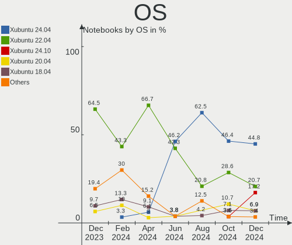
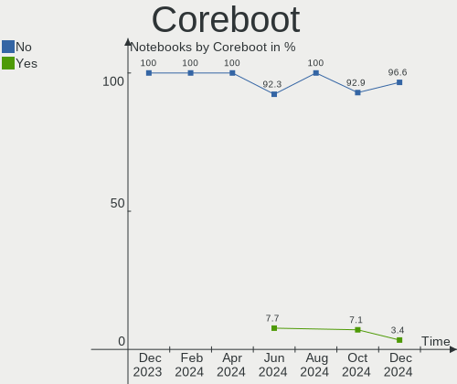
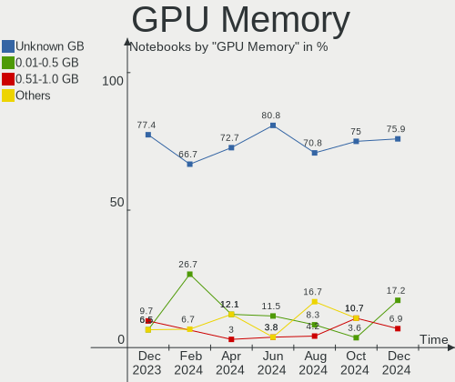
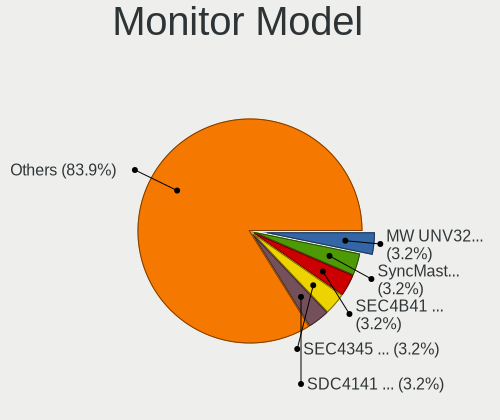
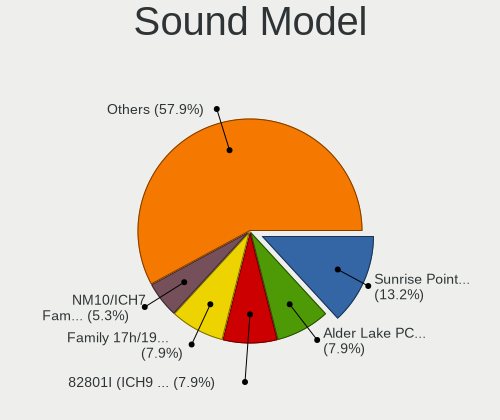

Xubuntu - Hardware Trends (Notebooks)
-------------------------------------

A project to identify most popular hardware characteristics and track their change
over time based on data collected by Linux users at https://Linux-Hardware.org.

Anyone can contribute to this report by the [hw-probe](https://github.com/linuxhw/hw-probe) tool:

    sudo -E hw-probe -all -upload

This report is for one last month. Overall report since the beginning of time: [TestCoverage](https://github.com/linuxhw/TestCoverage)

Period: Sep, 2022.

Contents
--------

* [ System ](#system)
  - [ OS                       ](#os)
  - [ OS Family                ](#os-family)
  - [ Kernel                   ](#kernel)
  - [ Kernel Family            ](#kernel-family)
  - [ Kernel Major Ver.        ](#kernel-major-ver)
  - [ Arch                     ](#arch)
  - [ DE                       ](#de)
  - [ Display Server           ](#display-server)
  - [ Display Manager          ](#display-manager)
  - [ OS Lang                  ](#os-lang)
  - [ Boot Mode                ](#boot-mode)
  - [ Filesystem               ](#filesystem)
  - [ Part. scheme             ](#part-scheme)
  - [ Dual Boot with Linux/BSD ](#dual-boot-with-linuxbsd)
  - [ Dual Boot (Win)          ](#dual-boot-win)

* [ Board ](#board)
  - [ Vendor                   ](#vendor)
  - [ Model                    ](#model)
  - [ Model Family             ](#model-family)
  - [ MFG Year                 ](#mfg-year)
  - [ Form Factor              ](#form-factor)
  - [ Secure Boot              ](#secure-boot)
  - [ Coreboot                 ](#coreboot)
  - [ RAM Size                 ](#ram-size)
  - [ RAM Used                 ](#ram-used)
  - [ Total Drives             ](#total-drives)
  - [ Has CD-ROM               ](#has-cd-rom)
  - [ Has Ethernet             ](#has-ethernet)
  - [ Has WiFi                 ](#has-wifi)
  - [ Has Bluetooth            ](#has-bluetooth)

* [ Location ](#location)
  - [ Country                  ](#country)
  - [ City                     ](#city)

* [ Drives ](#drives)
  - [ Drive Vendor             ](#drive-vendor)
  - [ Drive Model              ](#drive-model)
  - [ HDD Vendor               ](#hdd-vendor)
  - [ SSD Vendor               ](#ssd-vendor)
  - [ Drive Kind               ](#drive-kind)
  - [ Drive Connector          ](#drive-connector)
  - [ Drive Size               ](#drive-size)
  - [ Space Total              ](#space-total)
  - [ Space Used               ](#space-used)
  - [ Malfunc. Drives          ](#malfunc-drives)
  - [ Malfunc. Drive Vendor    ](#malfunc-drive-vendor)
  - [ Malfunc. HDD Vendor      ](#malfunc-hdd-vendor)
  - [ Malfunc. Drive Kind      ](#malfunc-drive-kind)
  - [ Failed Drives            ](#failed-drives)
  - [ Failed Drive Vendor      ](#failed-drive-vendor)
  - [ Drive Status             ](#drive-status)

* [ Storage controller ](#storage-controller)
  - [ Storage Vendor           ](#storage-vendor)
  - [ Storage Model            ](#storage-model)
  - [ Storage Kind             ](#storage-kind)

* [ Processor ](#processor)
  - [ CPU Vendor               ](#cpu-vendor)
  - [ CPU Model                ](#cpu-model)
  - [ CPU Model Family         ](#cpu-model-family)
  - [ CPU Cores                ](#cpu-cores)
  - [ CPU Sockets              ](#cpu-sockets)
  - [ CPU Threads              ](#cpu-threads)
  - [ CPU Op-Modes             ](#cpu-op-modes)
  - [ CPU Microcode            ](#cpu-microcode)
  - [ CPU Microarch            ](#cpu-microarch)

* [ Graphics ](#graphics)
  - [ GPU Vendor               ](#gpu-vendor)
  - [ GPU Model                ](#gpu-model)
  - [ GPU Combo                ](#gpu-combo)
  - [ GPU Driver               ](#gpu-driver)
  - [ GPU Memory               ](#gpu-memory)

* [ Monitor ](#monitor)
  - [ Monitor Vendor           ](#monitor-vendor)
  - [ Monitor Model            ](#monitor-model)
  - [ Monitor Resolution       ](#monitor-resolution)
  - [ Monitor Diagonal         ](#monitor-diagonal)
  - [ Monitor Width            ](#monitor-width)
  - [ Aspect Ratio             ](#aspect-ratio)
  - [ Monitor Area             ](#monitor-area)
  - [ Pixel Density            ](#pixel-density)
  - [ Multiple Monitors        ](#multiple-monitors)

* [ Network ](#network)
  - [ Net Controller Vendor    ](#net-controller-vendor)
  - [ Net Controller Model     ](#net-controller-model)
  - [ Wireless Vendor          ](#wireless-vendor)
  - [ Wireless Model           ](#wireless-model)
  - [ Ethernet Vendor          ](#ethernet-vendor)
  - [ Ethernet Model           ](#ethernet-model)
  - [ Net Controller Kind      ](#net-controller-kind)
  - [ Used Controller          ](#used-controller)
  - [ NICs                     ](#nics)
  - [ IPv6                     ](#ipv6)

* [ Bluetooth ](#bluetooth)
  - [ Bluetooth Vendor         ](#bluetooth-vendor)
  - [ Bluetooth Model          ](#bluetooth-model)

* [ Sound ](#sound)
  - [ Sound Vendor             ](#sound-vendor)
  - [ Sound Model              ](#sound-model)

* [ Memory ](#memory)
  - [ Memory Vendor            ](#memory-vendor)
  - [ Memory Model             ](#memory-model)
  - [ Memory Kind              ](#memory-kind)
  - [ Memory Form Factor       ](#memory-form-factor)
  - [ Memory Size              ](#memory-size)
  - [ Memory Speed             ](#memory-speed)

* [ Printers & scanners ](#printers--scanners)
  - [ Printer Vendor           ](#printer-vendor)
  - [ Printer Model            ](#printer-model)
  - [ Scanner Vendor           ](#scanner-vendor)
  - [ Scanner Model            ](#scanner-model)

* [ Camera ](#camera)
  - [ Camera Vendor            ](#camera-vendor)
  - [ Camera Model             ](#camera-model)

* [ Security ](#security)
  - [ Fingerprint Vendor       ](#fingerprint-vendor)
  - [ Fingerprint Model        ](#fingerprint-model)
  - [ Chipcard Vendor          ](#chipcard-vendor)
  - [ Chipcard Model           ](#chipcard-model)

* [ Unsupported ](#unsupported)
  - [ Unsupported Devices      ](#unsupported-devices)
  - [ Unsupported Device Types ](#unsupported-device-types)

System
------

OS
--

Installed operating systems

| Name          | Notebooks | Percent |
|---------------|-----------|---------|
| Xubuntu 22.04 | 28        | 70%     |
| Xubuntu 20.04 | 10        | 25%     |
| Xubuntu 18.04 | 1         | 2.5%    |
| Xubuntu 16.04 | 1         | 2.5%    |

OS Family
---------

OS without a version

| Name    | Notebooks | Percent |
|---------|-----------|---------|
| Xubuntu | 40        | 100%    |

Kernel
------

Version of the Linux kernel

| Version                      | Notebooks | Percent |
|------------------------------|-----------|---------|
| 5.15.0-47-generic            | 13        | 32.5%   |
| 5.15.0-48-generic            | 9         | 22.5%   |
| 5.4.0-125-generic            | 4         | 10%     |
| 5.4.0-126-generic            | 2         | 5%      |
| 5.15.0-48-lowlatency         | 2         | 5%      |
| 5.15.0-46-generic            | 2         | 5%      |
| 5.19.5-051905-generic        | 1         | 2.5%    |
| 5.19.0-051900-generic        | 1         | 2.5%    |
| 5.15.0-50-lowlatency         | 1         | 2.5%    |
| 5.15.0-25-generic            | 1         | 2.5%    |
| 5.11.0-27-generic            | 1         | 2.5%    |
| 4.4.0-233-generic            | 1         | 2.5%    |
| 4.19.241-13212-ge9b0bab46475 | 1         | 2.5%    |
| 4.15.0-192-lowlatency        | 1         | 2.5%    |

Kernel Family
-------------

Linux kernel without a distro release

| Version  | Notebooks | Percent |
|----------|-----------|---------|
| 5.15.0   | 28        | 70%     |
| 5.4.0    | 6         | 15%     |
| 5.19.5   | 1         | 2.5%    |
| 5.19.0   | 1         | 2.5%    |
| 5.11.0   | 1         | 2.5%    |
| 4.4.0    | 1         | 2.5%    |
| 4.19.241 | 1         | 2.5%    |
| 4.15.0   | 1         | 2.5%    |

Kernel Major Ver.
-----------------

Linux kernel major version

| Version | Notebooks | Percent |
|---------|-----------|---------|
| 5.15    | 28        | 70%     |
| 5.4     | 6         | 15%     |
| 5.19    | 2         | 5%      |
| 5.11    | 1         | 2.5%    |
| 4.4     | 1         | 2.5%    |
| 4.19    | 1         | 2.5%    |
| 4.15    | 1         | 2.5%    |

Arch
----

OS architecture (x86_64, i586, etc.)

| Name   | Notebooks | Percent |
|--------|-----------|---------|
| x86_64 | 40        | 100%    |

DE
--

Desktop Environment

| Name  | Notebooks | Percent |
|-------|-----------|---------|
| XFCE  | 37        | 92.5%   |
| GNOME | 3         | 7.5%    |

Display Server
--------------

X11 or Wayland

| Name    | Notebooks | Percent |
|---------|-----------|---------|
| X11     | 38        | 95%     |
| Wayland | 2         | 5%      |

Display Manager
---------------

SDDM, LightDM, etc.

| Name    | Notebooks | Percent |
|---------|-----------|---------|
| LightDM | 33        | 82.5%   |
| Unknown | 3         | 7.5%    |
| GDM3    | 2         | 5%      |
| GDM     | 2         | 5%      |

OS Lang
-------

Language

| Lang  | Notebooks | Percent |
|-------|-----------|---------|
| en_US | 16        | 40%     |
| fr_FR | 6         | 15%     |
| en_GB | 4         | 10%     |
| de_DE | 4         | 10%     |
| en_AU | 2         | 5%      |
| tr_TR | 1         | 2.5%    |
| ru_RU | 1         | 2.5%    |
| pt_BR | 1         | 2.5%    |
| it_IT | 1         | 2.5%    |
| es_PE | 1         | 2.5%    |
| es_ES | 1         | 2.5%    |
| en_CA | 1         | 2.5%    |
| C     | 1         | 2.5%    |

Boot Mode
---------

EFI or BIOS

| Mode | Notebooks | Percent |
|------|-----------|---------|
| EFI  | 21        | 52.5%   |
| BIOS | 19        | 47.5%   |

Filesystem
----------

Type of filesystem

| Type    | Notebooks | Percent |
|---------|-----------|---------|
| Ext4    | 37        | 92.5%   |
| Zfs     | 1         | 2.5%    |
| Xfs     | 1         | 2.5%    |
| Overlay | 1         | 2.5%    |

Part. scheme
------------

Scheme of partitioning

| Type    | Notebooks | Percent |
|---------|-----------|---------|
| GPT     | 23        | 57.5%   |
| Unknown | 14        | 35%     |
| MBR     | 3         | 7.5%    |

Dual Boot with Linux/BSD
------------------------

Hosting more than one Linux/BSD

| Dual boot | Notebooks | Percent |
|-----------|-----------|---------|
| No        | 37        | 92.5%   |
| Yes       | 3         | 7.5%    |

Dual Boot (Win)
---------------

Hosting Linux and Windows

| Dual boot | Notebooks | Percent |
|-----------|-----------|---------|
| No        | 32        | 80%     |
| Yes       | 8         | 20%     |

Board
-----

Vendor
------

Motherboard manufacturer

| Name             | Notebooks | Percent |
|------------------|-----------|---------|
| Lenovo           | 8         | 20%     |
| Hewlett-Packard  | 8         | 20%     |
| Dell             | 8         | 20%     |
| Toshiba          | 4         | 10%     |
| ASUSTek Computer | 3         | 7.5%    |
| Google           | 2         | 5%      |
| Tactus           | 1         | 2.5%    |
| Sony             | 1         | 2.5%    |
| Panasonic        | 1         | 2.5%    |
| Packard Bell     | 1         | 2.5%    |
| Apple            | 1         | 2.5%    |
| Acer             | 1         | 2.5%    |
| Unknown          | 1         | 2.5%    |

Model
-----

Motherboard model

| Name                                     | Notebooks | Percent |
|------------------------------------------|-----------|---------|
| Toshiba Satellite Pro R50-C              | 1         | 2.5%    |
| Toshiba Satellite C650                   | 1         | 2.5%    |
| Toshiba Satellite C55D-B                 | 1         | 2.5%    |
| Toshiba Satellite A300                   | 1         | 2.5%    |
| Tactus GeoBook 140                       | 1         | 2.5%    |
| Sony SVE1512C6EB                         | 1         | 2.5%    |
| Panasonic CF-D1DVA06F3                   | 1         | 2.5%    |
| Packard Bell EasyNote MH45               | 1         | 2.5%    |
| Lenovo ThinkPad X220 42918F6             | 1         | 2.5%    |
| Lenovo ThinkPad T61p 6457A24             | 1         | 2.5%    |
| Lenovo ThinkPad T61 7659AB7              | 1         | 2.5%    |
| Lenovo ThinkPad T420 42361L0             | 1         | 2.5%    |
| Lenovo ThinkPad P51s 20HCS00F00          | 1         | 2.5%    |
| Lenovo ThinkPad E14 Gen 2 20TA00JLAU     | 1         | 2.5%    |
| Lenovo IdeaPad N585 20179                | 1         | 2.5%    |
| Lenovo IdeaPad 120S-14IAP 81A5           | 1         | 2.5%    |
| HP ProBook 450 G2                        | 1         | 2.5%    |
| HP Pavilion dv7                          | 1         | 2.5%    |
| HP Laptop 15-ef1xxx                      | 1         | 2.5%    |
| HP Laptop 15-dw0xxx                      | 1         | 2.5%    |
| HP EliteBook 840 G3                      | 1         | 2.5%    |
| HP EliteBook 2570p                       | 1         | 2.5%    |
| HP 255 G7 Notebook PC                    | 1         | 2.5%    |
| HP 1000                                  | 1         | 2.5%    |
| Google Reks                              | 1         | 2.5%    |
| Google Kip                               | 1         | 2.5%    |
| Dell Precision 7750                      | 1         | 2.5%    |
| Dell Precision 5540                      | 1         | 2.5%    |
| Dell Latitude 9520                       | 1         | 2.5%    |
| Dell Latitude 7490                       | 1         | 2.5%    |
| Dell Latitude 5420                       | 1         | 2.5%    |
| Dell Latitude 5411                       | 1         | 2.5%    |
| Dell Inspiron 3576                       | 1         | 2.5%    |
| Dell Inspiron 3537                       | 1         | 2.5%    |
| ASUS X453SA                              | 1         | 2.5%    |
| ASUS K55VD                               | 1         | 2.5%    |
| ASUS ASUS TUF Gaming A15 FA506IU_FA506IU | 1         | 2.5%    |
| Apple MacBookPro16,1                     | 1         | 2.5%    |
| Acer Swift SF314-511                     | 1         | 2.5%    |
| Unknown                                  | 1         | 2.5%    |

Model Family
------------

Motherboard model prefix

| Name                   | Notebooks | Percent |
|------------------------|-----------|---------|
| Lenovo ThinkPad        | 6         | 15%     |
| Toshiba Satellite      | 4         | 10%     |
| Dell Latitude          | 4         | 10%     |
| Lenovo IdeaPad         | 2         | 5%      |
| HP Laptop              | 2         | 5%      |
| HP EliteBook           | 2         | 5%      |
| Dell Precision         | 2         | 5%      |
| Dell Inspiron          | 2         | 5%      |
| Tactus GeoBook         | 1         | 2.5%    |
| Sony SVE1512C6EB       | 1         | 2.5%    |
| Panasonic CF-D1DVA06F3 | 1         | 2.5%    |
| Packard Bell EasyNote  | 1         | 2.5%    |
| HP ProBook             | 1         | 2.5%    |
| HP Pavilion            | 1         | 2.5%    |
| HP 255                 | 1         | 2.5%    |
| HP 1000                | 1         | 2.5%    |
| Google Reks            | 1         | 2.5%    |
| Google Kip             | 1         | 2.5%    |
| ASUS X453SA            | 1         | 2.5%    |
| ASUS K55VD             | 1         | 2.5%    |
| ASUS ASUS              | 1         | 2.5%    |
| Apple MacBookPro16     | 1         | 2.5%    |
| Acer Swift             | 1         | 2.5%    |
| Unknown                | 1         | 2.5%    |

MFG Year
--------

Motherboard manufacture year

| Year | Notebooks | Percent |
|------|-----------|---------|
| 2020 | 6         | 15%     |
| 2012 | 5         | 12.5%   |
| 2021 | 4         | 10%     |
| 2019 | 3         | 7.5%    |
| 2018 | 3         | 7.5%    |
| 2017 | 3         | 7.5%    |
| 2011 | 3         | 7.5%    |
| 2008 | 3         | 7.5%    |
| 2015 | 2         | 5%      |
| 2014 | 2         | 5%      |
| 2007 | 2         | 5%      |
| 2022 | 1         | 2.5%    |
| 2016 | 1         | 2.5%    |
| 2013 | 1         | 2.5%    |
| 2010 | 1         | 2.5%    |

Form Factor
-----------

Physical design of the computer

| Name     | Notebooks | Percent |
|----------|-----------|---------|
| Notebook | 40        | 100%    |

Secure Boot
-----------

Enabled or disabled

| State    | Notebooks | Percent |
|----------|-----------|---------|
| Disabled | 35        | 87.5%   |
| Enabled  | 5         | 12.5%   |

Coreboot
--------

Have coreboot on board

| Used | Notebooks | Percent |
|------|-----------|---------|
| No   | 38        | 95%     |
| Yes  | 2         | 5%      |

RAM Size
--------

Total RAM memory

| Size in GB | Notebooks | Percent |
|------------|-----------|---------|
| 3.01-4.0   | 13        | 32.5%   |
| 4.01-8.0   | 11        | 27.5%   |
| 8.01-16.0  | 7         | 17.5%   |
| 32.01-64.0 | 3         | 7.5%    |
| 16.01-24.0 | 3         | 7.5%    |
| 1.01-2.0   | 2         | 5%      |
| 0.51-1.0   | 1         | 2.5%    |

RAM Used
--------

Used RAM memory

| Used GB   | Notebooks | Percent |
|-----------|-----------|---------|
| 1.01-2.0  | 14        | 35%     |
| 2.01-3.0  | 8         | 20%     |
| 0.51-1.0  | 7         | 17.5%   |
| 3.01-4.0  | 5         | 12.5%   |
| 4.01-8.0  | 4         | 10%     |
| 8.01-16.0 | 2         | 5%      |

Total Drives
------------

Number of drives on board

| Drives | Notebooks | Percent |
|--------|-----------|---------|
| 1      | 33        | 82.5%   |
| 2      | 7         | 17.5%   |

Has CD-ROM
----------

Has CD-ROM on board

| Presented | Notebooks | Percent |
|-----------|-----------|---------|
| No        | 23        | 57.5%   |
| Yes       | 17        | 42.5%   |

Has Ethernet
------------

Has Ethernet on board

| Presented | Notebooks | Percent |
|-----------|-----------|---------|
| Yes       | 31        | 77.5%   |
| No        | 9         | 22.5%   |

Has WiFi
--------

Has WiFi module

| Presented | Notebooks | Percent |
|-----------|-----------|---------|
| Yes       | 40        | 100%    |

Has Bluetooth
-------------

Has Bluetooth module

| Presented | Notebooks | Percent |
|-----------|-----------|---------|
| Yes       | 27        | 67.5%   |
| No        | 13        | 32.5%   |

Location
--------

Country
-------

Geographic location (country)

| Country    | Notebooks | Percent |
|------------|-----------|---------|
| USA        | 8         | 20%     |
| France     | 7         | 17.5%   |
| UK         | 4         | 10%     |
| Germany    | 4         | 10%     |
| Italy      | 3         | 7.5%    |
| Australia  | 2         | 5%      |
| Turkey     | 1         | 2.5%    |
| Russia     | 1         | 2.5%    |
| Peru       | 1         | 2.5%    |
| Madagascar | 1         | 2.5%    |
| Israel     | 1         | 2.5%    |
| Iran       | 1         | 2.5%    |
| Indonesia  | 1         | 2.5%    |
| Finland    | 1         | 2.5%    |
| Czechia    | 1         | 2.5%    |
| Brazil     | 1         | 2.5%    |
| Belgium    | 1         | 2.5%    |
| Argentina  | 1         | 2.5%    |

City
----

Geographic location (city)

| City                 | Notebooks | Percent |
|----------------------|-----------|---------|
| Paris                | 2         | 5%      |
| Melbourne            | 2         | 5%      |
| Auxerre              | 2         | 5%      |
| Virgem da Lapa       | 1         | 2.5%    |
| Toamasina            | 1         | 2.5%    |
| Springfield          | 1         | 2.5%    |
| Schaarbeek           | 1         | 2.5%    |
| Rome                 | 1         | 2.5%    |
| Pont-à-Mousson      | 1         | 2.5%    |
| Poggibonsi           | 1         | 2.5%    |
| Petojo Utara         | 1         | 2.5%    |
| Moscow               | 1         | 2.5%    |
| Mering               | 1         | 2.5%    |
| London               | 1         | 2.5%    |
| Lomnice nad Popelkou | 1         | 2.5%    |
| Lima                 | 1         | 2.5%    |
| Kaarst               | 1         | 2.5%    |
| Islington            | 1         | 2.5%    |
| Inverness            | 1         | 2.5%    |
| Helsinki             | 1         | 2.5%    |
| Hamburg              | 1         | 2.5%    |
| Gilbert              | 1         | 2.5%    |
| Garrettsville        | 1         | 2.5%    |
| Frankfurt am Main    | 1         | 2.5%    |
| Florence             | 1         | 2.5%    |
| Fasa                 | 1         | 2.5%    |
| Farmington           | 1         | 2.5%    |
| Denver               | 1         | 2.5%    |
| Crofton              | 1         | 2.5%    |
| Catamarca            | 1         | 2.5%    |
| Carsac-Aillac        | 1         | 2.5%    |
| Canteleu             | 1         | 2.5%    |
| Burton-on-Trent      | 1         | 2.5%    |
| Bristol              | 1         | 2.5%    |
| Bet Shemesh          | 1         | 2.5%    |
| Aurora               | 1         | 2.5%    |
| Ankara               | 1         | 2.5%    |

Drives
------

Drive Vendor
------------

Hard drive vendors

| Vendor              | Notebooks | Drives | Percent |
|---------------------|-----------|--------|---------|
| Samsung Electronics | 7         | 7      | 15.91%  |
| WDC                 | 4         | 4      | 9.09%   |
| SK hynix            | 4         | 4      | 9.09%   |
| Unknown             | 3         | 3      | 6.82%   |
| PNY                 | 3         | 3      | 6.82%   |
| Toshiba             | 2         | 2      | 4.55%   |
| Seagate             | 2         | 3      | 4.55%   |
| Sandisk             | 2         | 2      | 4.55%   |
| Micron Technology   | 2         | 2      | 4.55%   |
| Kingston            | 2         | 2      | 4.55%   |
| Crucial             | 2         | 2      | 4.55%   |
| SSSTC               | 1         | 1      | 2.27%   |
| Silicon Motion      | 1         | 1      | 2.27%   |
| Netac               | 1         | 1      | 2.27%   |
| LITEON              | 1         | 1      | 2.27%   |
| KIOXIA              | 1         | 1      | 2.27%   |
| KingSpec            | 1         | 1      | 2.27%   |
| Intel               | 1         | 1      | 2.27%   |
| Hoodisk             | 1         | 1      | 2.27%   |
| Hitachi             | 1         | 1      | 2.27%   |
| China               | 1         | 1      | 2.27%   |
| Apple               | 1         | 1      | 2.27%   |

Drive Model
-----------

Hard drive models

| Model                                                  | Notebooks | Percent |
|--------------------------------------------------------|-----------|---------|
| Samsung SSD 860 EVO 500GB                              | 3         | 6.67%   |
| PNY CS900 120GB SSD                                    | 2         | 4.44%   |
| WDC WD5000LPZX-08Z10 500GB                             | 1         | 2.22%   |
| WDC WD3200LPVX-75V0TT0 320GB                           | 1         | 2.22%   |
| WDC WD3200BEVT-22ZCT0 320GB                            | 1         | 2.22%   |
| WDC WD2500BEKT-75A25T0 250GB                           | 1         | 2.22%   |
| Unknown SD16G  16GB                                    | 1         | 2.22%   |
| Unknown MMC Card  2GB                                  | 1         | 2.22%   |
| Unknown AJNB4R  16GB                                   | 1         | 2.22%   |
| Toshiba MQ01ABF050 500GB                               | 1         | 2.22%   |
| Toshiba MK2546GSX 250GB                                | 1         | 2.22%   |
| SSSTC CVB-8D128-HP 128GB SSD                           | 1         | 2.22%   |
| SK hynix SKHynix_HFM512GD3HX015N 512GB                 | 1         | 2.22%   |
| SK hynix SC311 SATA 256GB SSD                          | 1         | 2.22%   |
| SK hynix PC611 NVMe 256GB                              | 1         | 2.22%   |
| SK hynix HFS128G39TND-N210A 128GB SSD                  | 1         | 2.22%   |
| Silicon Motion SM2263EN/SM2263XT SSD Controller 1024GB | 1         | 2.22%   |
| Seagate ST500LT012-1DG142 500GB                        | 1         | 2.22%   |
| Seagate ST500LM000-1EJ162 500GB                        | 1         | 2.22%   |
| Seagate ST1000LM014-1EJ164 1TB                         | 1         | 2.22%   |
| Sandisk WD Black SN750 / PC SN730 NVMe SSD 1024GB      | 1         | 2.22%   |
| SanDisk DF4032  32GB                                   | 1         | 2.22%   |
| Samsung SSD 850 EVO 120GB                              | 1         | 2.22%   |
| Samsung Portable SSD T5 500GB                          | 1         | 2.22%   |
| Samsung MZVL2512HCJQ-00BT7 512GB                       | 1         | 2.22%   |
| Samsung MZNLN256HAJQ-000H1 256GB SSD                   | 1         | 2.22%   |
| PNY CS900 240GB SSD                                    | 1         | 2.22%   |
| Netac SSD 128GB                                        | 1         | 2.22%   |
| Micron 2450 NVMe 512GB                                 | 1         | 2.22%   |
| Micron 2210_MTFDHBA512QFD 512GB                        | 1         | 2.22%   |
| LITEON CV5-8Q256-HP 256GB SSD                          | 1         | 2.22%   |
| KIOXIA NVMe SSD Drive 256GB                            | 1         | 2.22%   |
| Kingston SA400S37240G 240GB SSD                        | 1         | 2.22%   |
| Kingston SA400S37120G 120GB SSD                        | 1         | 2.22%   |
| KingSpec NT-512 512GB SSD                              | 1         | 2.22%   |
| Intel SSDPEMKF512G8 NVMe 512GB                         | 1         | 2.22%   |
| Hoodisk SSD 128GB                                      | 1         | 2.22%   |
| Hitachi HTS545050A7E380 500GB                          | 1         | 2.22%   |
| Crucial M4-CT128M4SSD2 128GB                           | 1         | 2.22%   |
| Crucial CT250P2SSD8 250GB                              | 1         | 2.22%   |

HDD Vendor
----------

Hard disk drive vendors

| Vendor  | Notebooks | Drives | Percent |
|---------|-----------|--------|---------|
| WDC     | 4         | 4      | 44.44%  |
| Toshiba | 2         | 2      | 22.22%  |
| Seagate | 2         | 3      | 22.22%  |
| Hitachi | 1         | 1      | 11.11%  |

SSD Vendor
----------

Solid state drive vendors

| Vendor              | Notebooks | Drives | Percent |
|---------------------|-----------|--------|---------|
| Samsung Electronics | 6         | 6      | 30%     |
| PNY                 | 3         | 3      | 15%     |
| SK hynix            | 2         | 2      | 10%     |
| Kingston            | 2         | 2      | 10%     |
| SSSTC               | 1         | 1      | 5%      |
| Netac               | 1         | 1      | 5%      |
| LITEON              | 1         | 1      | 5%      |
| KingSpec            | 1         | 1      | 5%      |
| Hoodisk             | 1         | 1      | 5%      |
| Crucial             | 1         | 1      | 5%      |
| China               | 1         | 1      | 5%      |

Drive Kind
----------

HDD or SSD

| Kind | Notebooks | Drives | Percent |
|------|-----------|--------|---------|
| SSD  | 19        | 20     | 44.19%  |
| NVMe | 11        | 11     | 25.58%  |
| HDD  | 9         | 10     | 20.93%  |
| MMC  | 4         | 4      | 9.3%    |

Drive Connector
---------------

SATA, SAS, NVMe, etc.

| Type | Notebooks | Drives | Percent |
|------|-----------|--------|---------|
| SATA | 27        | 29     | 62.79%  |
| NVMe | 11        | 11     | 25.58%  |
| MMC  | 4         | 4      | 9.3%    |
| SAS  | 1         | 1      | 2.33%   |

Drive Size
----------

Size of hard drive

| Size in TB | Notebooks | Drives | Percent |
|------------|-----------|--------|---------|
| 0.01-0.5   | 26        | 28     | 92.86%  |
| 0.51-1.0   | 2         | 2      | 7.14%   |

Space Total
-----------

Amount of disk space available on the file system

| Size in GB | Notebooks | Percent |
|------------|-----------|---------|
| 101-250    | 17        | 42.5%   |
| 251-500    | 14        | 35%     |
| 1-20       | 3         | 7.5%    |
| 51-100     | 3         | 7.5%    |
| 501-1000   | 2         | 5%      |
| 21-50      | 1         | 2.5%    |

Space Used
----------

Amount of used disk space

| Used GB  | Notebooks | Percent |
|----------|-----------|---------|
| 1-20     | 18        | 45%     |
| 101-250  | 8         | 20%     |
| 51-100   | 6         | 15%     |
| 21-50    | 5         | 12.5%   |
| 251-500  | 2         | 5%      |
| 501-1000 | 1         | 2.5%    |

Malfunc. Drives
---------------

Drive models with a malfunction

| Model                        | Notebooks | Drives | Percent |
|------------------------------|-----------|--------|---------|
| Toshiba MK2546GSX 250GB      | 1         | 1      | 50%     |
| SSSTC CVB-8D128-HP 128GB SSD | 1         | 1      | 50%     |

Malfunc. Drive Vendor
---------------------

Vendors of faulty drives

| Vendor  | Notebooks | Drives | Percent |
|---------|-----------|--------|---------|
| Toshiba | 1         | 1      | 50%     |
| SSSTC   | 1         | 1      | 50%     |

Malfunc. HDD Vendor
-------------------

Vendors of faulty HDD drives

| Vendor  | Notebooks | Drives | Percent |
|---------|-----------|--------|---------|
| Toshiba | 1         | 1      | 100%    |

Malfunc. Drive Kind
-------------------

Kinds of faulty drives

| Kind | Notebooks | Drives | Percent |
|------|-----------|--------|---------|
| SSD  | 1         | 1      | 50%     |
| HDD  | 1         | 1      | 50%     |

Failed Drives
-------------

Failed drive models

Zero info for selected period =(

Failed Drive Vendor
-------------------

Failed drive vendors

Zero info for selected period =(

Drive Status
------------

Number of failed and malfunc. drives

| Status   | Notebooks | Drives | Percent |
|----------|-----------|--------|---------|
| Works    | 22        | 24     | 53.66%  |
| Detected | 17        | 19     | 41.46%  |
| Malfunc  | 2         | 2      | 4.88%   |

Storage controller
------------------

Storage Vendor
--------------

Storage controller vendors

| Vendor                    | Notebooks | Percent |
|---------------------------|-----------|---------|
| Intel                     | 28        | 68.29%  |
| AMD                       | 4         | 9.76%   |
| SK hynix                  | 2         | 4.88%   |
| Silicon Motion            | 1         | 2.44%   |
| SanDisk                   | 1         | 2.44%   |
| Samsung Electronics       | 1         | 2.44%   |
| Micron/Crucial Technology | 1         | 2.44%   |
| Micron Technology         | 1         | 2.44%   |
| KIOXIA                    | 1         | 2.44%   |
| Apple                     | 1         | 2.44%   |

Storage Model
-------------

Storage controller models

| Model                                                                            | Notebooks | Percent |
|----------------------------------------------------------------------------------|-----------|---------|
| Intel Sunrise Point-LP SATA Controller [AHCI mode]                               | 4         | 8.89%   |
| Intel 7 Series Chipset Family 6-port SATA Controller [AHCI mode]                 | 4         | 8.89%   |
| Intel 6 Series/C200 Series Chipset Family 6 port Mobile SATA AHCI Controller     | 4         | 8.89%   |
| AMD FCH SATA Controller [AHCI mode]                                              | 4         | 8.89%   |
| Intel 8 Series SATA Controller 1 [AHCI mode]                                     | 3         | 6.67%   |
| Intel Volume Management Device NVMe RAID Controller                              | 2         | 4.44%   |
| Intel Celeron/Pentium Silver Processor SATA Controller                           | 2         | 4.44%   |
| Intel 82801HM/HEM (ICH8M/ICH8M-E) SATA Controller [AHCI mode]                    | 2         | 4.44%   |
| Intel 82801HM/HEM (ICH8M/ICH8M-E) IDE Controller                                 | 2         | 4.44%   |
| SK hynix Non-Volatile memory controller                                          | 1         | 2.22%   |
| SK hynix Gold P31 SSD                                                            | 1         | 2.22%   |
| Silicon Motion SM2263EN/SM2263XT SSD Controller                                  | 1         | 2.22%   |
| SanDisk WD Black SN750 / PC SN730 NVMe SSD                                       | 1         | 2.22%   |
| Samsung NVMe SSD Controller PM9A1/PM9A3/980PRO                                   | 1         | 2.22%   |
| Micron/Crucial P2 NVMe PCIe SSD                                                  | 1         | 2.22%   |
| Micron Non-Volatile memory controller                                            | 1         | 2.22%   |
| KIOXIA NVMe SSD Controller BG4                                                   | 1         | 2.22%   |
| Intel SSD Pro 7600p/760p/E 6100p Series                                          | 1         | 2.22%   |
| Intel Celeron N3350/Pentium N4200/Atom E3900 Series SATA AHCI Controller         | 1         | 2.22%   |
| Intel Cannon Lake Mobile PCH SATA AHCI Controller                                | 1         | 2.22%   |
| Intel Atom/Celeron/Pentium Processor x5-E8000/J3xxx/N3xxx Series SATA Controller | 1         | 2.22%   |
| Intel 82801IBM/IEM (ICH9M/ICH9M-E) 2 port SATA Controller [IDE mode]             | 1         | 2.22%   |
| Intel 82801HM/HEM (ICH8M/ICH8M-E) SATA Controller [IDE mode]                     | 1         | 2.22%   |
| Intel 5 Series/3400 Series Chipset 4 port SATA AHCI Controller                   | 1         | 2.22%   |
| Intel 400 Series Chipset Family SATA AHCI Controller                             | 1         | 2.22%   |
| Apple ANS2 NVMe Controller                                                       | 1         | 2.22%   |
| AMD RAID Bottom Device                                                           | 1         | 2.22%   |

Storage Kind
------------

Kind of storage controller (IDE, SATA, NVMe, SAS, ...)

| Kind | Notebooks | Percent |
|------|-----------|---------|
| SATA | 28        | 62.22%  |
| NVMe | 11        | 24.44%  |
| IDE  | 4         | 8.89%   |
| RAID | 2         | 4.44%   |

Processor
---------

CPU Vendor
----------

Processor vendors

| Vendor | Notebooks | Percent |
|--------|-----------|---------|
| Intel  | 35        | 87.5%   |
| AMD    | 5         | 12.5%   |

CPU Model
---------

Processor models

| Model                                        | Notebooks | Percent |
|----------------------------------------------|-----------|---------|
| Intel Core i7-9750H CPU @ 2.60GHz            | 2         | 5%      |
| Intel Core i7-3630QM CPU @ 2.40GHz           | 2         | 5%      |
| Intel Core i7-10850H CPU @ 2.70GHz           | 2         | 5%      |
| Intel Core i5-7300U CPU @ 2.60GHz            | 2         | 5%      |
| Intel Pentium Silver N5030 CPU @ 1.10GHz     | 1         | 2.5%    |
| Intel Pentium Dual-Core CPU T4200 @ 2.00GHz  | 1         | 2.5%    |
| Intel Pentium CPU B980 @ 2.40GHz             | 1         | 2.5%    |
| Intel Core i7-8550U CPU @ 1.80GHz            | 1         | 2.5%    |
| Intel Core i7-4650U CPU @ 1.70GHz            | 1         | 2.5%    |
| Intel Core i5-6300U CPU @ 2.40GHz            | 1         | 2.5%    |
| Intel Core i5-4210U CPU @ 1.70GHz            | 1         | 2.5%    |
| Intel Core i5-4200U CPU @ 1.60GHz            | 1         | 2.5%    |
| Intel Core i5-2540M CPU @ 2.60GHz            | 1         | 2.5%    |
| Intel Core i5-2520M CPU @ 2.50GHz            | 1         | 2.5%    |
| Intel Core i5-2410M CPU @ 2.30GHz            | 1         | 2.5%    |
| Intel Core i3-6006U CPU @ 2.00GHz            | 1         | 2.5%    |
| Intel Core i3-2328M CPU @ 2.20GHz            | 1         | 2.5%    |
| Intel Core i3 CPU M 330 @ 2.13GHz            | 1         | 2.5%    |
| Intel Core 2 Duo CPU T7700 @ 2.40GHz         | 1         | 2.5%    |
| Intel Core 2 Duo CPU T7300 @ 2.00GHz         | 1         | 2.5%    |
| Intel Core 2 Duo CPU T5550 @ 1.83GHz         | 1         | 2.5%    |
| Intel Celeron N4020 CPU @ 1.10GHz            | 1         | 2.5%    |
| Intel Celeron CPU N3350 @ 1.10GHz            | 1         | 2.5%    |
| Intel Celeron CPU N3160 @ 1.60GHz            | 1         | 2.5%    |
| Intel Celeron CPU N3050 @ 1.60GHz            | 1         | 2.5%    |
| Intel Celeron CPU N2840 @ 2.16GHz            | 1         | 2.5%    |
| Intel Celeron CPU 847 @ 1.10GHz              | 1         | 2.5%    |
| Intel 11th Gen Core i7-1185G7 @ 3.00GHz      | 1         | 2.5%    |
| Intel 11th Gen Core i5-1145G7 @ 2.60GHz      | 1         | 2.5%    |
| Intel 11th Gen Core i5-1135G7 @ 2.40GHz      | 1         | 2.5%    |
| Intel 11th Gen Core i3-1115G4 @ 3.00GHz      | 1         | 2.5%    |
| AMD Ryzen 7 4800H with Radeon Graphics       | 1         | 2.5%    |
| AMD Ryzen 5 4500U with Radeon Graphics       | 1         | 2.5%    |
| AMD E1-6010 APU with AMD Radeon R2 Graphics  | 1         | 2.5%    |
| AMD E1-1200 APU with Radeon HD Graphics      | 1         | 2.5%    |
| AMD A4-9125 RADEON R3, 4 COMPUTE CORES 2C+2G | 1         | 2.5%    |

CPU Model Family
----------------

Processor model prefix

| Model                   | Notebooks | Percent |
|-------------------------|-----------|---------|
| Intel Core i7           | 8         | 20%     |
| Intel Core i5           | 8         | 20%     |
| Intel Celeron           | 6         | 15%     |
| Other                   | 4         | 10%     |
| Intel Core i3           | 3         | 7.5%    |
| Intel Core 2 Duo        | 3         | 7.5%    |
| AMD E1                  | 2         | 5%      |
| Intel Pentium Silver    | 1         | 2.5%    |
| Intel Pentium Dual-Core | 1         | 2.5%    |
| Intel Pentium           | 1         | 2.5%    |
| AMD Ryzen 7             | 1         | 2.5%    |
| AMD Ryzen 5             | 1         | 2.5%    |
| AMD A4                  | 1         | 2.5%    |

CPU Cores
---------

Number of processor cores

| Number | Notebooks | Percent |
|--------|-----------|---------|
| 2      | 26        | 65%     |
| 4      | 8         | 20%     |
| 6      | 5         | 12.5%   |
| 8      | 1         | 2.5%    |

CPU Sockets
-----------

Number of sockets

| Number | Notebooks | Percent |
|--------|-----------|---------|
| 1      | 40        | 100%    |

CPU Threads
-----------

Threads per core (Hyper-Threading)

| Number | Notebooks | Percent |
|--------|-----------|---------|
| 2      | 24        | 60%     |
| 1      | 16        | 40%     |

CPU Op-Modes
------------

CPU Operation Modes (32-bit, 64-bit)

| Op mode        | Notebooks | Percent |
|----------------|-----------|---------|
| 32-bit, 64-bit | 40        | 100%    |

CPU Microcode
-------------

Microcode number

| Number     | Notebooks | Percent |
|------------|-----------|---------|
| Unknown    | 11        | 27.5%   |
| 0x806c1    | 3         | 7.5%    |
| 0x40651    | 3         | 7.5%    |
| 0x206a7    | 3         | 7.5%    |
| 0xa0652    | 2         | 5%      |
| 0x906ea    | 2         | 5%      |
| 0x6fb      | 2         | 5%      |
| 0x806ea    | 1         | 2.5%    |
| 0x806e9    | 1         | 2.5%    |
| 0x706a8    | 1         | 2.5%    |
| 0x6fd      | 1         | 2.5%    |
| 0x406e3    | 1         | 2.5%    |
| 0x406c4    | 1         | 2.5%    |
| 0x406c3    | 1         | 2.5%    |
| 0x306a9    | 1         | 2.5%    |
| 0x30678    | 1         | 2.5%    |
| 0x1067a    | 1         | 2.5%    |
| 0x08600106 | 1         | 2.5%    |
| 0x08600104 | 1         | 2.5%    |
| 0x07030105 | 1         | 2.5%    |
| 0x06006705 | 1         | 2.5%    |

CPU Microarch
-------------

Microarchitecture

| Name          | Notebooks | Percent |
|---------------|-----------|---------|
| SandyBridge   | 6         | 15%     |
| KabyLake      | 5         | 12.5%   |
| TigerLake     | 4         | 10%     |
| Silvermont    | 3         | 7.5%    |
| Haswell       | 3         | 7.5%    |
| Core          | 3         | 7.5%    |
| Zen 2         | 2         | 5%      |
| Skylake       | 2         | 5%      |
| IvyBridge     | 2         | 5%      |
| Goldmont plus | 2         | 5%      |
| CometLake     | 2         | 5%      |
| Westmere      | 1         | 2.5%    |
| Puma          | 1         | 2.5%    |
| Penryn        | 1         | 2.5%    |
| Goldmont      | 1         | 2.5%    |
| Excavator     | 1         | 2.5%    |
| Bobcat        | 1         | 2.5%    |

Graphics
--------

GPU Vendor
----------

Vendors of graphics cards

| Vendor | Notebooks | Percent |
|--------|-----------|---------|
| Intel  | 33        | 70.21%  |
| Nvidia | 7         | 14.89%  |
| AMD    | 7         | 14.89%  |

GPU Model
---------

Graphics card models

| Model                                                                                    | Notebooks | Percent |
|------------------------------------------------------------------------------------------|-----------|---------|
| Intel 2nd Generation Core Processor Family Integrated Graphics Controller                | 6         | 12.24%  |
| Intel TigerLake-LP GT2 [Iris Xe Graphics]                                                | 3         | 6.12%   |
| Intel Haswell-ULT Integrated Graphics Controller                                         | 3         | 6.12%   |
| Nvidia TU117GLM [Quadro T1000 Mobile]                                                    | 2         | 4.08%   |
| Intel Skylake GT2 [HD Graphics 520]                                                      | 2         | 4.08%   |
| Intel Mobile GM965/GL960 Integrated Graphics Controller (secondary)                      | 2         | 4.08%   |
| Intel Mobile GM965/GL960 Integrated Graphics Controller (primary)                        | 2         | 4.08%   |
| Intel HD Graphics 620                                                                    | 2         | 4.08%   |
| Intel CometLake-H GT2 [UHD Graphics]                                                     | 2         | 4.08%   |
| Intel Atom/Celeron/Pentium Processor x5-E8000/J3xxx/N3xxx Integrated Graphics Controller | 2         | 4.08%   |
| Intel 3rd Gen Core processor Graphics Controller                                         | 2         | 4.08%   |
| AMD Renoir                                                                               | 2         | 4.08%   |
| Nvidia TU116M [GeForce GTX 1660 Ti Mobile]                                               | 1         | 2.04%   |
| Nvidia GP108M [GeForce MX250]                                                            | 1         | 2.04%   |
| Nvidia GM108GLM [Quadro M520 Mobile]                                                     | 1         | 2.04%   |
| Nvidia GF119M [GeForce 610M]                                                             | 1         | 2.04%   |
| Nvidia G84GLM [Quadro FX 570M]                                                           | 1         | 2.04%   |
| Intel UHD Graphics 620                                                                   | 1         | 2.04%   |
| Intel Tiger Lake UHD Graphics                                                            | 1         | 2.04%   |
| Intel Mobile 4 Series Chipset Integrated Graphics Controller                             | 1         | 2.04%   |
| Intel HD Graphics 500                                                                    | 1         | 2.04%   |
| Intel GeminiLake [UHD Graphics 605]                                                      | 1         | 2.04%   |
| Intel GeminiLake [UHD Graphics 600]                                                      | 1         | 2.04%   |
| Intel Core Processor Integrated Graphics Controller                                      | 1         | 2.04%   |
| Intel CoffeeLake-H GT2 [UHD Graphics 630]                                                | 1         | 2.04%   |
| Intel Atom Processor Z36xxx/Z37xxx Series Graphics & Display                             | 1         | 2.04%   |
| AMD Wrestler [Radeon HD 7310]                                                            | 1         | 2.04%   |
| AMD Stoney [Radeon R2/R3/R4/R5 Graphics]                                                 | 1         | 2.04%   |
| AMD Navi 14 [Radeon RX 5500/5500M / Pro 5500M]                                           | 1         | 2.04%   |
| AMD Mullins [Radeon R2 Graphics]                                                         | 1         | 2.04%   |
| AMD Jet PRO [Radeon R5 M230 / R7 M260DX / Radeon 520 Mobile]                             | 1         | 2.04%   |

GPU Combo
---------

Combinations of graphics cards

| Name           | Notebooks | Percent |
|----------------|-----------|---------|
| 1 x Intel      | 27        | 67.5%   |
| Intel + Nvidia | 5         | 12.5%   |
| 1 x AMD        | 5         | 12.5%   |
| 1 x Nvidia     | 1         | 2.5%    |
| Intel + AMD    | 1         | 2.5%    |
| AMD + Nvidia   | 1         | 2.5%    |

GPU Driver
----------

Free vs proprietary

| Driver      | Notebooks | Percent |
|-------------|-----------|---------|
| Free        | 35        | 87.5%   |
| Proprietary | 5         | 12.5%   |

GPU Memory
----------

Total video memory

| Size in GB | Notebooks | Percent |
|------------|-----------|---------|
| Unknown    | 29        | 72.5%   |
| 0.01-0.5   | 5         | 12.5%   |
| 1.01-2.0   | 3         | 7.5%    |
| 3.01-4.0   | 2         | 5%      |
| 0.51-1.0   | 1         | 2.5%    |

Monitor
-------

Monitor Vendor
--------------

Monitor vendors

| Vendor                  | Notebooks | Percent |
|-------------------------|-----------|---------|
| LG Display              | 8         | 16.67%  |
| Chimei Innolux          | 8         | 16.67%  |
| AU Optronics            | 8         | 16.67%  |
| Chi Mei Optoelectronics | 3         | 6.25%   |
| BOE                     | 3         | 6.25%   |
| Samsung Electronics     | 2         | 4.17%   |
| Lenovo                  | 2         | 4.17%   |
| Goldstar                | 2         | 4.17%   |
| Dell                    | 2         | 4.17%   |
| Sharp                   | 1         | 2.08%   |
| Sceptre Tech            | 1         | 2.08%   |
| Philips                 | 1         | 2.08%   |
| PANDA                   | 1         | 2.08%   |
| LG Philips              | 1         | 2.08%   |
| EQV                     | 1         | 2.08%   |
| CPT                     | 1         | 2.08%   |
| BenQ                    | 1         | 2.08%   |
| Apple                   | 1         | 2.08%   |
| Ancor Communications    | 1         | 2.08%   |

Monitor Model
-------------

Monitor models

| Model                                                                    | Notebooks | Percent |
|--------------------------------------------------------------------------|-----------|---------|
| Chi Mei Optoelectronics LCD Monitor CMO15A7 1366x768 344x193mm 15.5-inch | 2         | 4.17%   |
| Sharp LCD Monitor SHP14BA 1920x1080 344x194mm 15.5-inch                  | 1         | 2.08%   |
| Sceptre Tech Sceptre N43 SPT110C 3840x2160 575x323mm 26.0-inch           | 1         | 2.08%   |
| Samsung Electronics LCD Monitor SEC4149 1366x768 292x174mm 13.4-inch     | 1         | 2.08%   |
| Samsung Electronics LCD Monitor SAM03BC 1920x1080                        | 1         | 2.08%   |
| Philips PHL 273V7 PHLC156 1920x1080 598x336mm 27.0-inch                  | 1         | 2.08%   |
| PANDA LCD Monitor NCP004D 1920x1080 344x194mm 15.5-inch                  | 1         | 2.08%   |
| LG Philips LCD Monitor LPL3B01 1280x800 331x207mm 15.4-inch              | 1         | 2.08%   |
| LG Display LP156WH2-TLAA LGD0230 1366x768 344x194mm 15.5-inch            | 1         | 2.08%   |
| LG Display LCD Monitor LGD06C3 1920x1080 309x174mm 14.0-inch             | 1         | 2.08%   |
| LG Display LCD Monitor LGD0541 1920x1080 344x194mm 15.5-inch             | 1         | 2.08%   |
| LG Display LCD Monitor LGD04D1 1366x768 344x194mm 15.5-inch              | 1         | 2.08%   |
| LG Display LCD Monitor LGD03AB 1366x768 344x194mm 15.5-inch              | 1         | 2.08%   |
| LG Display LCD Monitor LGD0385 1366x768 309x174mm 14.0-inch              | 1         | 2.08%   |
| LG Display LCD Monitor LGD033A 1366x768 344x194mm 15.5-inch              | 1         | 2.08%   |
| LG Display LCD Monitor LGD02D3 1366x768 277x156mm 12.5-inch              | 1         | 2.08%   |
| Lenovo LCD Monitor LEN4055 1920x1200 331x207mm 15.4-inch                 | 1         | 2.08%   |
| Lenovo LCD Monitor LEN4033 1440x900 303x190mm 14.1-inch                  | 1         | 2.08%   |
| Goldstar W2243 GSM56FF 1920x1080 477x268mm 21.5-inch                     | 1         | 2.08%   |
| Goldstar 23EA63 GSM598C 1920x1080 510x290mm 23.1-inch                    | 1         | 2.08%   |
| EQV LCD Monitor EQV1081 1920x1080 477x268mm 21.5-inch                    | 1         | 2.08%   |
| Dell U2312HM DEL4071 1920x1080 510x287mm 23.0-inch                       | 1         | 2.08%   |
| Dell 2007FP DELA021 1600x1200 367x275mm 18.1-inch                        | 1         | 2.08%   |
| CPT LCD Monitor CPT1401 1280x800 331x207mm 15.4-inch                     | 1         | 2.08%   |
| Chimei Innolux LCD Monitor CMN176F 1920x1080 381x214mm 17.2-inch         | 1         | 2.08%   |
| Chimei Innolux LCD Monitor CMN15DB 1366x768 344x193mm 15.5-inch          | 1         | 2.08%   |
| Chimei Innolux LCD Monitor CMN15BE 1366x768 344x193mm 15.5-inch          | 1         | 2.08%   |
| Chimei Innolux LCD Monitor CMN1537 1366x768 344x193mm 15.5-inch          | 1         | 2.08%   |
| Chimei Innolux LCD Monitor CMN14D4 1920x1080 309x173mm 13.9-inch         | 1         | 2.08%   |
| Chimei Innolux LCD Monitor CMN14C3 1366x768 309x173mm 13.9-inch          | 1         | 2.08%   |
| Chimei Innolux LCD Monitor CMN1493 1366x768 309x173mm 13.9-inch          | 1         | 2.08%   |
| Chimei Innolux LCD Monitor CMN1139 1366x768 256x144mm 11.6-inch          | 1         | 2.08%   |
| Chi Mei Optoelectronics LCD Monitor CMO1719 1600x900 382x215mm 17.3-inch | 1         | 2.08%   |
| BOE LCD Monitor BOE06EE 1920x1080 309x173mm 13.9-inch                    | 1         | 2.08%   |
| BOE LCD Monitor BOE06BD 1366x768 309x173mm 13.9-inch                     | 1         | 2.08%   |
| BOE LCD Monitor BOE0697 1366x768 309x173mm 13.9-inch                     | 1         | 2.08%   |
| BenQ G900W BNQ7805 1440x900 408x255mm 18.9-inch                          | 1         | 2.08%   |
| AU Optronics LCD Monitor AUOFB91 1920x1080 331x186mm 14.9-inch           | 1         | 2.08%   |
| AU Optronics LCD Monitor AUO683D 1920x1080 309x174mm 14.0-inch           | 1         | 2.08%   |
| AU Optronics LCD Monitor AUO463D 1920x1080 309x174mm 14.0-inch           | 1         | 2.08%   |

Monitor Resolution
------------------

Monitor screen resolution

| Resolution        | Notebooks | Percent |
|-------------------|-----------|---------|
| 1366x768 (WXGA)   | 20        | 44.44%  |
| 1920x1080 (FHD)   | 15        | 33.33%  |
| 1600x900 (HD+)    | 2         | 4.44%   |
| 1440x900 (WXGA+)  | 2         | 4.44%   |
| 1280x800 (WXGA)   | 2         | 4.44%   |
| 3840x2160 (4K)    | 1         | 2.22%   |
| 3072x1920         | 1         | 2.22%   |
| 1920x1200 (WUXGA) | 1         | 2.22%   |
| 1600x1200         | 1         | 2.22%   |

Monitor Diagonal
----------------

Diagonal size in inches

| Inches  | Notebooks | Percent |
|---------|-----------|---------|
| 15      | 18        | 37.5%   |
| 14      | 8         | 16.67%  |
| 13      | 7         | 14.58%  |
| 27      | 2         | 4.17%   |
| 23      | 2         | 4.17%   |
| 21      | 2         | 4.17%   |
| 17      | 2         | 4.17%   |
| 26      | 1         | 2.08%   |
| 20      | 1         | 2.08%   |
| 18      | 1         | 2.08%   |
| 16      | 1         | 2.08%   |
| 12      | 1         | 2.08%   |
| 11      | 1         | 2.08%   |
| Unknown | 1         | 2.08%   |

Monitor Width
-------------

Physical width

| Width in mm | Notebooks | Percent |
|-------------|-----------|---------|
| 301-350     | 33        | 68.75%  |
| 501-600     | 5         | 10.42%  |
| 401-500     | 4         | 8.33%   |
| 201-300     | 3         | 6.25%   |
| 351-400     | 2         | 4.17%   |
| Unknown     | 1         | 2.08%   |

Aspect Ratio
------------

Proportional relationship between the width and the height

| Ratio | Notebooks | Percent |
|-------|-----------|---------|
| 16/9  | 34        | 82.93%  |
| 16/10 | 6         | 14.63%  |
| 4/3   | 1         | 2.44%   |

Monitor Area
------------

Area in inch²

| Area in inch² | Notebooks | Percent |
|----------------|-----------|---------|
| 101-110        | 18        | 37.5%   |
| 81-90          | 13        | 27.08%  |
| 201-250        | 3         | 6.25%   |
| 151-200        | 3         | 6.25%   |
| 301-350        | 2         | 4.17%   |
| 71-80          | 1         | 2.08%   |
| 61-70          | 1         | 2.08%   |
| 51-60          | 1         | 2.08%   |
| 251-300        | 1         | 2.08%   |
| 131-140        | 1         | 2.08%   |
| 121-130        | 1         | 2.08%   |
| 111-120        | 1         | 2.08%   |
| 91-100         | 1         | 2.08%   |
| Unknown        | 1         | 2.08%   |

Pixel Density
-------------

Pixels per inch

| Density | Notebooks | Percent |
|---------|-----------|---------|
| 101-120 | 19        | 40.43%  |
| 121-160 | 16        | 34.04%  |
| 51-100  | 9         | 19.15%  |
| 161-240 | 2         | 4.26%   |
| Unknown | 1         | 2.13%   |

Multiple Monitors
-----------------

Total monitors connected

| Total | Notebooks | Percent |
|-------|-----------|---------|
| 1     | 31        | 77.5%   |
| 2     | 9         | 22.5%   |

Network
-------

Net Controller Vendor
---------------------

Controller vendors

| Vendor                            | Notebooks | Percent |
|-----------------------------------|-----------|---------|
| Intel                             | 24        | 42.11%  |
| Realtek Semiconductor             | 19        | 33.33%  |
| Qualcomm Atheros                  | 7         | 12.28%  |
| Broadcom                          | 2         | 3.51%   |
| TP-Link                           | 1         | 1.75%   |
| Samsung Electronics               | 1         | 1.75%   |
| Marvell Technology Group          | 1         | 1.75%   |
| Hewlett-Packard                   | 1         | 1.75%   |
| Ericsson Business Mobile Networks | 1         | 1.75%   |

Net Controller Model
--------------------

Controller models

| Model                                                             | Notebooks | Percent |
|-------------------------------------------------------------------|-----------|---------|
| Realtek RTL8111/8168/8411 PCI Express Gigabit Ethernet Controller | 10        | 13.33%  |
| Realtek RTL810xE PCI Express Fast Ethernet controller             | 5         | 6.67%   |
| Realtek RTL8821CE 802.11ac PCIe Wireless Network Adapter          | 4         | 5.33%   |
| Intel 82579LM Gigabit Network Connection (Lewisville)             | 4         | 5.33%   |
| Qualcomm Atheros AR9485 Wireless Network Adapter                  | 3         | 4%      |
| Intel Wireless 3165                                               | 3         | 4%      |
| Intel Wi-Fi 6 AX201                                               | 3         | 4%      |
| Intel Centrino Advanced-N 6205 [Taylor Peak]                      | 3         | 4%      |
| Qualcomm Atheros QCA9565 / AR9565 Wireless Network Adapter        | 2         | 2.67%   |
| Intel Wireless 8265 / 8275                                        | 2         | 2.67%   |
| Intel PRO/Wireless 4965 AG or AGN [Kedron] Network Connection     | 2         | 2.67%   |
| Intel Ethernet Connection (4) I219-LM                             | 2         | 2.67%   |
| Intel Ethernet Connection (11) I219-LM                            | 2         | 2.67%   |
| Intel Comet Lake PCH CNVi WiFi                                    | 2         | 2.67%   |
| Intel 82566MM Gigabit Network Connection                          | 2         | 2.67%   |
| TP-Link Archer T2U PLUS [RTL8821AU]                               | 1         | 1.33%   |
| Samsung GT-I9070 (network tethering, USB debugging enabled)       | 1         | 1.33%   |
| Realtek RTL8822CE 802.11ac PCIe Wireless Network Adapter          | 1         | 1.33%   |
| Realtek RTL8723BE PCIe Wireless Network Adapter                   | 1         | 1.33%   |
| Realtek RTL8188CE 802.11b/g/n WiFi Adapter                        | 1         | 1.33%   |
| Realtek RTL8187B Wireless 802.11g 54Mbps Network Adapter          | 1         | 1.33%   |
| Realtek RTL8153 Gigabit Ethernet Adapter                          | 1         | 1.33%   |
| Qualcomm Atheros AR9462 Wireless Network Adapter                  | 1         | 1.33%   |
| Qualcomm Atheros AR9285 Wireless Network Adapter (PCI-Express)    | 1         | 1.33%   |
| Qualcomm Atheros AR8152 v1.1 Fast Ethernet                        | 1         | 1.33%   |
| Marvell Group 88E8040T PCI-E Fast Ethernet Controller             | 1         | 1.33%   |
| Intel Wireless 8260                                               | 1         | 1.33%   |
| Intel Wireless 7265                                               | 1         | 1.33%   |
| Intel Wireless 7260                                               | 1         | 1.33%   |
| Intel Wi-Fi 6 AX200                                               | 1         | 1.33%   |
| Intel PRO/Wireless 3945ABG [Golan] Network Connection             | 1         | 1.33%   |
| Intel Ethernet Connection I219-V                                  | 1         | 1.33%   |
| Intel Ethernet Connection I219-LM                                 | 1         | 1.33%   |
| Intel Ethernet Connection (13) I219-LM                            | 1         | 1.33%   |
| Intel Dual Band Wireless-AC 3165 Plus Bluetooth                   | 1         | 1.33%   |
| Intel Centrino Wireless-N 2230                                    | 1         | 1.33%   |
| Intel Centrino Wireless-N 1000 [Condor Peak]                      | 1         | 1.33%   |
| HP lt4120 Snapdragon X5 LTE                                       | 1         | 1.33%   |
| Ericsson Business Mobile Networks F5521gw                         | 1         | 1.33%   |
| Broadcom BCM4364 802.11ac Wireless Network Adapter                | 1         | 1.33%   |

Wireless Vendor
---------------

Wireless vendors

| Vendor                | Notebooks | Percent |
|-----------------------|-----------|---------|
| Intel                 | 23        | 56.1%   |
| Realtek Semiconductor | 8         | 19.51%  |
| Qualcomm Atheros      | 7         | 17.07%  |
| Broadcom              | 2         | 4.88%   |
| TP-Link               | 1         | 2.44%   |

Wireless Model
--------------

Wireless models

| Model                                                          | Notebooks | Percent |
|----------------------------------------------------------------|-----------|---------|
| Realtek RTL8821CE 802.11ac PCIe Wireless Network Adapter       | 4         | 9.76%   |
| Qualcomm Atheros AR9485 Wireless Network Adapter               | 3         | 7.32%   |
| Intel Wireless 3165                                            | 3         | 7.32%   |
| Intel Wi-Fi 6 AX201                                            | 3         | 7.32%   |
| Intel Centrino Advanced-N 6205 [Taylor Peak]                   | 3         | 7.32%   |
| Qualcomm Atheros QCA9565 / AR9565 Wireless Network Adapter     | 2         | 4.88%   |
| Intel Wireless 8265 / 8275                                     | 2         | 4.88%   |
| Intel PRO/Wireless 4965 AG or AGN [Kedron] Network Connection  | 2         | 4.88%   |
| Intel Comet Lake PCH CNVi WiFi                                 | 2         | 4.88%   |
| TP-Link Archer T2U PLUS [RTL8821AU]                            | 1         | 2.44%   |
| Realtek RTL8822CE 802.11ac PCIe Wireless Network Adapter       | 1         | 2.44%   |
| Realtek RTL8723BE PCIe Wireless Network Adapter                | 1         | 2.44%   |
| Realtek RTL8188CE 802.11b/g/n WiFi Adapter                     | 1         | 2.44%   |
| Realtek RTL8187B Wireless 802.11g 54Mbps Network Adapter       | 1         | 2.44%   |
| Qualcomm Atheros AR9462 Wireless Network Adapter               | 1         | 2.44%   |
| Qualcomm Atheros AR9285 Wireless Network Adapter (PCI-Express) | 1         | 2.44%   |
| Intel Wireless 8260                                            | 1         | 2.44%   |
| Intel Wireless 7265                                            | 1         | 2.44%   |
| Intel Wireless 7260                                            | 1         | 2.44%   |
| Intel Wi-Fi 6 AX200                                            | 1         | 2.44%   |
| Intel PRO/Wireless 3945ABG [Golan] Network Connection          | 1         | 2.44%   |
| Intel Dual Band Wireless-AC 3165 Plus Bluetooth                | 1         | 2.44%   |
| Intel Centrino Wireless-N 2230                                 | 1         | 2.44%   |
| Intel Centrino Wireless-N 1000 [Condor Peak]                   | 1         | 2.44%   |
| Broadcom BCM4364 802.11ac Wireless Network Adapter             | 1         | 2.44%   |
| Broadcom BCM4313 802.11bgn Wireless Network Adapter            | 1         | 2.44%   |

Ethernet Vendor
---------------

Ethernet vendors

| Vendor                   | Notebooks | Percent |
|--------------------------|-----------|---------|
| Realtek Semiconductor    | 16        | 48.48%  |
| Intel                    | 13        | 39.39%  |
| Samsung Electronics      | 1         | 3.03%   |
| Qualcomm Atheros         | 1         | 3.03%   |
| Marvell Technology Group | 1         | 3.03%   |
| Hewlett-Packard          | 1         | 3.03%   |

Ethernet Model
--------------

Ethernet models

| Model                                                             | Notebooks | Percent |
|-------------------------------------------------------------------|-----------|---------|
| Realtek RTL8111/8168/8411 PCI Express Gigabit Ethernet Controller | 10        | 30.3%   |
| Realtek RTL810xE PCI Express Fast Ethernet controller             | 5         | 15.15%  |
| Intel 82579LM Gigabit Network Connection (Lewisville)             | 4         | 12.12%  |
| Intel Ethernet Connection (4) I219-LM                             | 2         | 6.06%   |
| Intel Ethernet Connection (11) I219-LM                            | 2         | 6.06%   |
| Intel 82566MM Gigabit Network Connection                          | 2         | 6.06%   |
| Samsung GT-I9070 (network tethering, USB debugging enabled)       | 1         | 3.03%   |
| Realtek RTL8153 Gigabit Ethernet Adapter                          | 1         | 3.03%   |
| Qualcomm Atheros AR8152 v1.1 Fast Ethernet                        | 1         | 3.03%   |
| Marvell Group 88E8040T PCI-E Fast Ethernet Controller             | 1         | 3.03%   |
| Intel Ethernet Connection I219-V                                  | 1         | 3.03%   |
| Intel Ethernet Connection I219-LM                                 | 1         | 3.03%   |
| Intel Ethernet Connection (13) I219-LM                            | 1         | 3.03%   |
| HP lt4120 Snapdragon X5 LTE                                       | 1         | 3.03%   |

Net Controller Kind
-------------------

Ethernet, WiFi or modem

| Kind     | Notebooks | Percent |
|----------|-----------|---------|
| WiFi     | 40        | 55.56%  |
| Ethernet | 31        | 43.06%  |
| Modem    | 1         | 1.39%   |

Used Controller
---------------

Currently used network controller

| Kind     | Notebooks | Percent |
|----------|-----------|---------|
| WiFi     | 30        | 73.17%  |
| Ethernet | 11        | 26.83%  |

NICs
----

Total network controllers on board

| Total | Notebooks | Percent |
|-------|-----------|---------|
| 2     | 29        | 72.5%   |
| 1     | 11        | 27.5%   |

IPv6
----

IPv6 vs IPv4

| Used | Notebooks | Percent |
|------|-----------|---------|
| No   | 27        | 67.5%   |
| Yes  | 13        | 32.5%   |

Bluetooth
---------

Bluetooth Vendor
----------------

Controller vendors

| Vendor                          | Notebooks | Percent |
|---------------------------------|-----------|---------|
| Intel                           | 15        | 55.56%  |
| Realtek Semiconductor           | 5         | 18.52%  |
| Broadcom                        | 2         | 7.41%   |
| Toshiba                         | 1         | 3.7%    |
| Qualcomm Atheros Communications | 1         | 3.7%    |
| Lite-On Technology              | 1         | 3.7%    |
| Foxconn / Hon Hai               | 1         | 3.7%    |
| Alps Electric                   | 1         | 3.7%    |

Bluetooth Model
---------------

Controller models

| Model                                           | Notebooks | Percent |
|-------------------------------------------------|-----------|---------|
| Intel Bluetooth wireless interface              | 8         | 29.63%  |
| Intel AX201 Bluetooth                           | 5         | 18.52%  |
| Realtek  Bluetooth 4.2 Adapter                  | 3         | 11.11%  |
| Realtek Bluetooth Radio                         | 2         | 7.41%   |
| Toshiba Integrated Bluetooth HCI                | 1         | 3.7%    |
| Qualcomm Atheros AR9462 Bluetooth               | 1         | 3.7%    |
| Lite-On Bluetooth Radio                         | 1         | 3.7%    |
| Intel Centrino Bluetooth Wireless Transceiver   | 1         | 3.7%    |
| Intel AX200 Bluetooth                           | 1         | 3.7%    |
| Foxconn / Hon Hai Bluetooth USB Host Controller | 1         | 3.7%    |
| Broadcom HP Portable SoftSailing                | 1         | 3.7%    |
| Broadcom BCM20702 Bluetooth 4.0 [ThinkPad]      | 1         | 3.7%    |
| Alps Electric UGTZ4 Bluetooth                   | 1         | 3.7%    |

Sound
-----

Sound Vendor
------------

Sound card vendors

| Vendor              | Notebooks | Percent |
|---------------------|-----------|---------|
| Intel               | 34        | 73.91%  |
| AMD                 | 6         | 13.04%  |
| Nvidia              | 2         | 4.35%   |
| Texas Instruments   | 1         | 2.17%   |
| JMTek               | 1         | 2.17%   |
| C-Media Electronics | 1         | 2.17%   |
| Apple               | 1         | 2.17%   |

Sound Model
-----------

Sound card models

| Model                                                                                             | Notebooks | Percent |
|---------------------------------------------------------------------------------------------------|-----------|---------|
| Intel Sunrise Point-LP HD Audio                                                                   | 5         | 9.26%   |
| Intel Tiger Lake-LP Smart Sound Technology Audio Controller                                       | 4         | 7.41%   |
| Intel 7 Series/C216 Chipset Family High Definition Audio Controller                               | 4         | 7.41%   |
| Intel 6 Series/C200 Series Chipset Family High Definition Audio Controller                        | 4         | 7.41%   |
| Intel Haswell-ULT HD Audio Controller                                                             | 3         | 5.56%   |
| Intel 82801H (ICH8 Family) HD Audio Controller                                                    | 3         | 5.56%   |
| Intel 8 Series HD Audio Controller                                                                | 3         | 5.56%   |
| Intel Comet Lake PCH cAVS                                                                         | 2         | 3.7%    |
| Intel Celeron/Pentium Silver Processor High Definition Audio                                      | 2         | 3.7%    |
| Intel Atom/Celeron/Pentium Processor x5-E8000/J3xxx/N3xxx Series High Definition Audio Controller | 2         | 3.7%    |
| AMD Renoir Radeon High Definition Audio Controller                                                | 2         | 3.7%    |
| AMD FCH Azalia Controller                                                                         | 2         | 3.7%    |
| AMD Family 17h/19h HD Audio Controller                                                            | 2         | 3.7%    |
| Texas Instruments PCM2902 Audio Codec                                                             | 1         | 1.85%   |
| Nvidia TU116 High Definition Audio Controller                                                     | 1         | 1.85%   |
| Nvidia TU107 GeForce GTX 1650 High Definition Audio Controller                                    | 1         | 1.85%   |
| JMTek USB PnP Audio Device                                                                        | 1         | 1.85%   |
| Intel Celeron N3350/Pentium N4200/Atom E3900 Series Audio Cluster                                 | 1         | 1.85%   |
| Intel Cannon Lake PCH cAVS                                                                        | 1         | 1.85%   |
| Intel Atom Processor Z36xxx/Z37xxx Series High Definition Audio Controller                        | 1         | 1.85%   |
| Intel 82801I (ICH9 Family) HD Audio Controller                                                    | 1         | 1.85%   |
| Intel 5 Series/3400 Series Chipset High Definition Audio                                          | 1         | 1.85%   |
| C-Media Electronics Audio Adapter (Unitek Y-247A)                                                 | 1         | 1.85%   |
| Apple Audio Device                                                                                | 1         | 1.85%   |
| AMD Wrestler HDMI Audio                                                                           | 1         | 1.85%   |
| AMD Navi 10 HDMI Audio                                                                            | 1         | 1.85%   |
| AMD Kabini HDMI/DP Audio                                                                          | 1         | 1.85%   |
| AMD High Definition Audio Controller                                                              | 1         | 1.85%   |
| AMD Family 15h (Models 60h-6fh) Audio Controller                                                  | 1         | 1.85%   |

Memory
------

Memory Vendor
-------------

Memory module vendors

| Vendor              | Notebooks | Percent |
|---------------------|-----------|---------|
| Samsung Electronics | 9         | 31.03%  |
| SK hynix            | 8         | 27.59%  |
| Unknown             | 5         | 17.24%  |
| Micron Technology   | 3         | 10.34%  |
| Unknown (ABCD)      | 1         | 3.45%   |
| Smart               | 1         | 3.45%   |
| Essencore           | 1         | 3.45%   |
| Apacer              | 1         | 3.45%   |

Memory Model
------------

Memory module models

| Model                                                             | Notebooks | Percent |
|-------------------------------------------------------------------|-----------|---------|
| Unknown RAM Module 1GB SODIMM DDR2 667MT/s                        | 2         | 6.67%   |
| Unknown RAM Module 8GB SODIMM DDR3 1600MT/s                       | 1         | 3.33%   |
| Unknown RAM Module 2GB SODIMM DDR2 667MT/s                        | 1         | 3.33%   |
| Unknown RAM Module 2GB SODIMM 667MT/s                             | 1         | 3.33%   |
| Unknown (ABCD) RAM 123456789012345678 1GB SODIMM LPDDR4 2400MT/s  | 1         | 3.33%   |
| Smart RAM SH564128FH8NZQNSCG 4096MB SODIMM DDR3 1600MT/s          | 1         | 3.33%   |
| SK hynix RAM HMT451S6AFR8A-PB 4GB SODIMM DDR3 1600MT/s            | 1         | 3.33%   |
| SK hynix RAM HMT41GS6AFR8A-PB 8GB SODIMM DDR3 1600MT/s            | 1         | 3.33%   |
| SK hynix RAM HMT351S6CFR8C-PB 4GB SODIMM DDR3 1600MT/s            | 1         | 3.33%   |
| SK hynix RAM HMA851S6DJR6N-XN 4GB SODIMM DDR4 3200MT/s            | 1         | 3.33%   |
| SK hynix RAM HMA81GS6MFR8N-UH 8192MB SODIMM DDR4 2400MT/s         | 1         | 3.33%   |
| SK hynix RAM HMA81GS6JJR8N-VK 8GB SODIMM DDR4 2667MT/s            | 1         | 3.33%   |
| SK hynix RAM HMA81GS6DJR8N-XN 8GB SODIMM DDR4 3200MT/s            | 1         | 3.33%   |
| SK hynix RAM HMA81GS6AFR8N-UH 8192MB SODIMM DDR4 2667MT/s         | 1         | 3.33%   |
| SK hynix RAM HCNNNFAMBLHR-NEE 4096MB Row Of Chips LPDDR4 4267MT/s | 1         | 3.33%   |
| Samsung RAM U6E3S4AA-MGCR 4GB Row Of Chips LPDDR4 4267MT/s        | 1         | 3.33%   |
| Samsung RAM M471B5674QH0-YK0 2048MB SODIMM DDR3 1600MT/s          | 1         | 3.33%   |
| Samsung RAM M471B5273DH0-CH9 4GB SODIMM DDR3 1334MT/s             | 1         | 3.33%   |
| Samsung RAM M471B5173QH0-YK0 4GB SODIMM DDR3 1600MT/s             | 1         | 3.33%   |
| Samsung RAM M471B5173EB0-YK0 4GB SODIMM DDR3 1600MT/s             | 1         | 3.33%   |
| Samsung RAM M471B5173DB0-YK0 4GB SODIMM DDR3 1600MT/s             | 1         | 3.33%   |
| Samsung RAM M471A5244CB0-CTD 4GB SODIMM DDR4 3266MT/s             | 1         | 3.33%   |
| Samsung RAM M471A1K43EB1-CWE 8GB SODIMM DDR4 3200MT/s             | 1         | 3.33%   |
| Samsung RAM M471A1K43DB1-CWE 8192MB SODIMM DDR4 3200MT/s          | 1         | 3.33%   |
| Micron RAM MT52L256M32D1PF107 2GB SODIMM LPDDR3 1776MT/s          | 1         | 3.33%   |
| Micron RAM 8KTF51264HZ-1G6E1 4096MB SODIMM DDR3 1600MT/s          | 1         | 3.33%   |
| Micron RAM 8ATF1G64HZ-2G3E1 8GB SODIMM DDR4 2400MT/s              | 1         | 3.33%   |
| Essencore RAM KD4AGS881-26N1900 16GB SODIMM DDR4 2667MT/s         | 1         | 3.33%   |
| Apacer RAM 76.A305G.C5G0B 2GB SODIMM DDR3 1600MT/s                | 1         | 3.33%   |

Memory Kind
-----------

Memory module kinds

| Kind    | Notebooks | Percent |
|---------|-----------|---------|
| DDR3    | 10        | 37.04%  |
| DDR4    | 9         | 33.33%  |
| LPDDR4  | 3         | 11.11%  |
| DDR2    | 3         | 11.11%  |
| LPDDR3  | 1         | 3.7%    |
| Unknown | 1         | 3.7%    |

Memory Form Factor
------------------

Physical design of the memory module

| Name         | Notebooks | Percent |
|--------------|-----------|---------|
| SODIMM       | 25        | 92.59%  |
| Row Of Chips | 2         | 7.41%   |

Memory Size
-----------

Memory module size

| Size  | Notebooks | Percent |
|-------|-----------|---------|
| 4096  | 11        | 40.74%  |
| 8192  | 8         | 29.63%  |
| 2048  | 5         | 18.52%  |
| 1024  | 2         | 7.41%   |
| 16384 | 1         | 3.7%    |

Memory Speed
------------

Memory module speed

| Speed | Notebooks | Percent |
|-------|-----------|---------|
| 1600  | 10        | 34.48%  |
| 3200  | 4         | 13.79%  |
| 667   | 4         | 13.79%  |
| 2667  | 3         | 10.34%  |
| 2400  | 3         | 10.34%  |
| 4267  | 2         | 6.9%    |
| 3266  | 1         | 3.45%   |
| 1776  | 1         | 3.45%   |
| 1334  | 1         | 3.45%   |

Printers & scanners
-------------------

Printer Vendor
--------------

Printer device vendors

Zero info for selected period =(

Printer Model
-------------

Printer device models

Zero info for selected period =(

Scanner Vendor
--------------

Scanner device vendors

Zero info for selected period =(

Scanner Model
-------------

Scanner device models

Zero info for selected period =(

Camera
------

Camera Vendor
-------------

Camera device vendors

| Vendor                                 | Notebooks | Percent |
|----------------------------------------|-----------|---------|
| Chicony Electronics                    | 8         | 25%     |
| Sunplus Innovation Technology          | 4         | 12.5%   |
| Microdia                               | 4         | 12.5%   |
| Suyin                                  | 2         | 6.25%   |
| Quanta                                 | 2         | 6.25%   |
| Luxvisions Innotech Limited            | 2         | 6.25%   |
| IMC Networks                           | 2         | 6.25%   |
| Cheng Uei Precision Industry (Foxlink) | 2         | 6.25%   |
| Acer                                   | 2         | 6.25%   |
| SunplusIT                              | 1         | 3.13%   |
| Realtek Semiconductor                  | 1         | 3.13%   |
| Lite-On Technology                     | 1         | 3.13%   |
| Importek                               | 1         | 3.13%   |

Camera Model
------------

Camera device models

| Model                                                       | Notebooks | Percent |
|-------------------------------------------------------------|-----------|---------|
| Microdia Integrated_Webcam_HD                               | 3         | 9.38%   |
| Suyin HP TrueVision HD Integrated Webcam                    | 2         | 6.25%   |
| Sunplus Integrated_Webcam_HD                                | 2         | 6.25%   |
| Chicony integrated camera                                   | 2         | 6.25%   |
| SunplusIT USB camera                                        | 1         | 3.13%   |
| Sunplus Integrated_Webcam_FHD                               | 1         | 3.13%   |
| Sunplus ASUS USB2.0 Webcam                                  | 1         | 3.13%   |
| Realtek USB2.0 VGA UVC WebCam                               | 1         | 3.13%   |
| Quanta Lenovo EasyCamera                                    | 1         | 3.13%   |
| Quanta HD User Facing                                       | 1         | 3.13%   |
| Microdia Dell Laptop Integrated Webcam HD                   | 1         | 3.13%   |
| Luxvisions Innotech Limited Integrated Camera               | 1         | 3.13%   |
| Luxvisions Innotech Limited HP TrueVision HD Camera         | 1         | 3.13%   |
| Lite-On HP Webcam                                           | 1         | 3.13%   |
| Importek Laptop Integrated Webcam                           | 1         | 3.13%   |
| IMC Networks USB2.0 HD UVC WebCam                           | 1         | 3.13%   |
| IMC Networks HP TrueVision HD Camera                        | 1         | 3.13%   |
| Chicony USB 2.0 Camera                                      | 1         | 3.13%   |
| Chicony TOSHIBA Web Camera - HD                             | 1         | 3.13%   |
| Chicony Lenovo Integrated Camera (0.3MP)                    | 1         | 3.13%   |
| Chicony HP HD Camera                                        | 1         | 3.13%   |
| Chicony EasyCamera                                          | 1         | 3.13%   |
| Chicony CNF7045                                             | 1         | 3.13%   |
| Cheng Uei Precision Industry (Foxlink) HP HD Webcam [Fixed] | 1         | 3.13%   |
| Cheng Uei Precision Industry (Foxlink) HP HD Webcam         | 1         | 3.13%   |
| Acer USB2.0 Camera                                          | 1         | 3.13%   |
| Acer Lenovo Integrated Webcam                               | 1         | 3.13%   |

Security
--------

Fingerprint Vendor
------------------

Fingerprint sensor vendors

| Vendor             | Notebooks | Percent |
|--------------------|-----------|---------|
| Upek               | 1         | 50%     |
| STMicroelectronics | 1         | 50%     |

Fingerprint Model
-----------------

Fingerprint sensor models

| Model                                                  | Notebooks | Percent |
|--------------------------------------------------------|-----------|---------|
| Upek Biometric Touchchip/Touchstrip Fingerprint Sensor | 1         | 50%     |
| STMicroelectronics Fingerprint Reader                  | 1         | 50%     |

Chipcard Vendor
---------------

Chipcard module vendors

| Vendor      | Notebooks | Percent |
|-------------|-----------|---------|
| Broadcom    | 2         | 66.67%  |
| Alcor Micro | 1         | 33.33%  |

Chipcard Model
--------------

Chipcard module models

| Model                               | Notebooks | Percent |
|-------------------------------------|-----------|---------|
| Broadcom 5880                       | 1         | 33.33%  |
| Broadcom 58200                      | 1         | 33.33%  |
| Alcor Micro AU9540 Smartcard Reader | 1         | 33.33%  |

Unsupported
-----------

Unsupported Devices
-------------------

Total unsupported devices on board

| Total | Notebooks | Percent |
|-------|-----------|---------|
| 0     | 28        | 70%     |
| 1     | 11        | 27.5%   |
| 2     | 1         | 2.5%    |

Unsupported Device Types
------------------------

Types of unsupported devices

| Type               | Notebooks | Percent |
|--------------------|-----------|---------|
| Net/wireless       | 3         | 23.08%  |
| Chipcard           | 3         | 23.08%  |
| Fingerprint reader | 2         | 15.38%  |
| Storage            | 1         | 7.69%   |
| Sound              | 1         | 7.69%   |
| Graphics card      | 1         | 7.69%   |
| Card reader        | 1         | 7.69%   |
| Camera             | 1         | 7.69%   |

