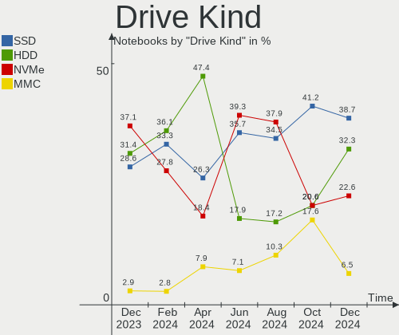

Xubuntu - Hardware Trends (Notebooks)
-------------------------------------

A project to identify most popular hardware characteristics and track their change
over time based on data collected by Linux users at https://Linux-Hardware.org.

Anyone can contribute to this report by the [hw-probe](https://github.com/linuxhw/hw-probe) tool:

    sudo -E hw-probe -all -upload

This report is for one last month. Overall report since the beginning of time: [TestCoverage](https://github.com/linuxhw/TestCoverage)

Period: Jan, 2023.

Contents
--------

* [ System ](#system)
  - [ OS                       ](#os)
  - [ OS Family                ](#os-family)
  - [ Kernel                   ](#kernel)
  - [ Kernel Family            ](#kernel-family)
  - [ Kernel Major Ver.        ](#kernel-major-ver)
  - [ Arch                     ](#arch)
  - [ DE                       ](#de)
  - [ Display Server           ](#display-server)
  - [ Display Manager          ](#display-manager)
  - [ OS Lang                  ](#os-lang)
  - [ Boot Mode                ](#boot-mode)
  - [ Filesystem               ](#filesystem)
  - [ Part. scheme             ](#part-scheme)
  - [ Dual Boot with Linux/BSD ](#dual-boot-with-linuxbsd)
  - [ Dual Boot (Win)          ](#dual-boot-win)

* [ Board ](#board)
  - [ Vendor                   ](#vendor)
  - [ Model                    ](#model)
  - [ Model Family             ](#model-family)
  - [ MFG Year                 ](#mfg-year)
  - [ Form Factor              ](#form-factor)
  - [ Secure Boot              ](#secure-boot)
  - [ Coreboot                 ](#coreboot)
  - [ RAM Size                 ](#ram-size)
  - [ RAM Used                 ](#ram-used)
  - [ Total Drives             ](#total-drives)
  - [ Has CD-ROM               ](#has-cd-rom)
  - [ Has Ethernet             ](#has-ethernet)
  - [ Has WiFi                 ](#has-wifi)
  - [ Has Bluetooth            ](#has-bluetooth)

* [ Location ](#location)
  - [ Country                  ](#country)
  - [ City                     ](#city)

* [ Drives ](#drives)
  - [ Drive Vendor             ](#drive-vendor)
  - [ Drive Model              ](#drive-model)
  - [ HDD Vendor               ](#hdd-vendor)
  - [ SSD Vendor               ](#ssd-vendor)
  - [ Drive Kind               ](#drive-kind)
  - [ Drive Connector          ](#drive-connector)
  - [ Drive Size               ](#drive-size)
  - [ Space Total              ](#space-total)
  - [ Space Used               ](#space-used)
  - [ Malfunc. Drives          ](#malfunc-drives)
  - [ Malfunc. Drive Vendor    ](#malfunc-drive-vendor)
  - [ Malfunc. HDD Vendor      ](#malfunc-hdd-vendor)
  - [ Malfunc. Drive Kind      ](#malfunc-drive-kind)
  - [ Failed Drives            ](#failed-drives)
  - [ Failed Drive Vendor      ](#failed-drive-vendor)
  - [ Drive Status             ](#drive-status)

* [ Storage controller ](#storage-controller)
  - [ Storage Vendor           ](#storage-vendor)
  - [ Storage Model            ](#storage-model)
  - [ Storage Kind             ](#storage-kind)

* [ Processor ](#processor)
  - [ CPU Vendor               ](#cpu-vendor)
  - [ CPU Model                ](#cpu-model)
  - [ CPU Model Family         ](#cpu-model-family)
  - [ CPU Cores                ](#cpu-cores)
  - [ CPU Sockets              ](#cpu-sockets)
  - [ CPU Threads              ](#cpu-threads)
  - [ CPU Op-Modes             ](#cpu-op-modes)
  - [ CPU Microcode            ](#cpu-microcode)
  - [ CPU Microarch            ](#cpu-microarch)

* [ Graphics ](#graphics)
  - [ GPU Vendor               ](#gpu-vendor)
  - [ GPU Model                ](#gpu-model)
  - [ GPU Combo                ](#gpu-combo)
  - [ GPU Driver               ](#gpu-driver)
  - [ GPU Memory               ](#gpu-memory)

* [ Monitor ](#monitor)
  - [ Monitor Vendor           ](#monitor-vendor)
  - [ Monitor Model            ](#monitor-model)
  - [ Monitor Resolution       ](#monitor-resolution)
  - [ Monitor Diagonal         ](#monitor-diagonal)
  - [ Monitor Width            ](#monitor-width)
  - [ Aspect Ratio             ](#aspect-ratio)
  - [ Monitor Area             ](#monitor-area)
  - [ Pixel Density            ](#pixel-density)
  - [ Multiple Monitors        ](#multiple-monitors)

* [ Network ](#network)
  - [ Net Controller Vendor    ](#net-controller-vendor)
  - [ Net Controller Model     ](#net-controller-model)
  - [ Wireless Vendor          ](#wireless-vendor)
  - [ Wireless Model           ](#wireless-model)
  - [ Ethernet Vendor          ](#ethernet-vendor)
  - [ Ethernet Model           ](#ethernet-model)
  - [ Net Controller Kind      ](#net-controller-kind)
  - [ Used Controller          ](#used-controller)
  - [ NICs                     ](#nics)
  - [ IPv6                     ](#ipv6)

* [ Bluetooth ](#bluetooth)
  - [ Bluetooth Vendor         ](#bluetooth-vendor)
  - [ Bluetooth Model          ](#bluetooth-model)

* [ Sound ](#sound)
  - [ Sound Vendor             ](#sound-vendor)
  - [ Sound Model              ](#sound-model)

* [ Memory ](#memory)
  - [ Memory Vendor            ](#memory-vendor)
  - [ Memory Model             ](#memory-model)
  - [ Memory Kind              ](#memory-kind)
  - [ Memory Form Factor       ](#memory-form-factor)
  - [ Memory Size              ](#memory-size)
  - [ Memory Speed             ](#memory-speed)

* [ Printers & scanners ](#printers--scanners)
  - [ Printer Vendor           ](#printer-vendor)
  - [ Printer Model            ](#printer-model)
  - [ Scanner Vendor           ](#scanner-vendor)
  - [ Scanner Model            ](#scanner-model)

* [ Camera ](#camera)
  - [ Camera Vendor            ](#camera-vendor)
  - [ Camera Model             ](#camera-model)

* [ Security ](#security)
  - [ Fingerprint Vendor       ](#fingerprint-vendor)
  - [ Fingerprint Model        ](#fingerprint-model)
  - [ Chipcard Vendor          ](#chipcard-vendor)
  - [ Chipcard Model           ](#chipcard-model)

* [ Unsupported ](#unsupported)
  - [ Unsupported Devices      ](#unsupported-devices)
  - [ Unsupported Device Types ](#unsupported-device-types)

System
------

OS
--

Installed operating systems

| Name          | Notebooks | Percent |
|---------------|-----------|---------|
| Xubuntu 22.04 | 19        | 47.5%   |
| Xubuntu 20.04 | 11        | 27.5%   |
| Xubuntu 22.10 | 6         | 15%     |
| Xubuntu 18.04 | 4         | 10%     |

OS Family
---------

OS without a version

| Name    | Notebooks | Percent |
|---------|-----------|---------|
| Xubuntu | 40        | 100%    |

Kernel
------

Version of the Linux kernel

| Version                 | Notebooks | Percent |
|-------------------------|-----------|---------|
| 5.15.0-58-generic       | 13        | 32.5%   |
| 5.19.0-29-generic       | 5         | 12.5%   |
| 5.15.0-57-generic       | 4         | 10%     |
| 5.15.0-56-generic       | 4         | 10%     |
| 5.4.0-136-generic       | 3         | 7.5%    |
| 5.4.217-0504217-generic | 2         | 5%      |
| 5.4.0-137-generic       | 2         | 5%      |
| 6.1.6-060106-generic    | 1         | 2.5%    |
| 5.4.0-137-lowlatency    | 1         | 2.5%    |
| 5.4.0-122-generic       | 1         | 2.5%    |
| 5.4.0-109-generic       | 1         | 2.5%    |
| 5.19.0-28-generic       | 1         | 2.5%    |
| 5.15.0-58-lowlatency    | 1         | 2.5%    |
| 5.15.0-56-lowlatency    | 1         | 2.5%    |

Kernel Family
-------------

Linux kernel without a distro release

| Version | Notebooks | Percent |
|---------|-----------|---------|
| 5.15.0  | 23        | 57.5%   |
| 5.4.0   | 8         | 20%     |
| 5.19.0  | 6         | 15%     |
| 5.4.217 | 2         | 5%      |
| 6.1.6   | 1         | 2.5%    |

Kernel Major Ver.
-----------------

Linux kernel major version

| Version | Notebooks | Percent |
|---------|-----------|---------|
| 5.15    | 23        | 57.5%   |
| 5.4     | 10        | 25%     |
| 5.19    | 6         | 15%     |
| 6.1     | 1         | 2.5%    |

Arch
----

OS architecture (x86_64, i586, etc.)

| Name   | Notebooks | Percent |
|--------|-----------|---------|
| x86_64 | 38        | 95%     |
| i686   | 2         | 5%      |

DE
--

Desktop Environment

| Name    | Notebooks | Percent |
|---------|-----------|---------|
| XFCE    | 37        | 92.5%   |
| GNOME   | 2         | 5%      |
| GNUstep | 1         | 2.5%    |

Display Server
--------------

X11 or Wayland

| Name    | Notebooks | Percent |
|---------|-----------|---------|
| X11     | 38        | 95%     |
| Wayland | 2         | 5%      |

Display Manager
---------------

SDDM, LightDM, etc.

| Name    | Notebooks | Percent |
|---------|-----------|---------|
| LightDM | 33        | 82.5%   |
| GDM3    | 3         | 7.5%    |
| Unknown | 3         | 7.5%    |
| SDDM    | 1         | 2.5%    |

OS Lang
-------

Language

| Lang  | Notebooks | Percent |
|-------|-----------|---------|
| en_US | 16        | 40%     |
| de_DE | 7         | 17.5%   |
| fr_FR | 6         | 15%     |
| es_CO | 2         | 5%      |
| C     | 2         | 5%      |
| ru_RU | 1         | 2.5%    |
| ro_RO | 1         | 2.5%    |
| it_IT | 1         | 2.5%    |
| es_ES | 1         | 2.5%    |
| en_IN | 1         | 2.5%    |
| el_GR | 1         | 2.5%    |
| cs_CZ | 1         | 2.5%    |

Boot Mode
---------

EFI or BIOS

| Mode | Notebooks | Percent |
|------|-----------|---------|
| BIOS | 22        | 55%     |
| EFI  | 18        | 45%     |

Filesystem
----------

Type of filesystem

| Type  | Notebooks | Percent |
|-------|-----------|---------|
| Ext4  | 37        | 92.5%   |
| Btrfs | 3         | 7.5%    |

Part. scheme
------------

Scheme of partitioning

| Type    | Notebooks | Percent |
|---------|-----------|---------|
| GPT     | 23        | 57.5%   |
| MBR     | 12        | 30%     |
| Unknown | 5         | 12.5%   |

Dual Boot with Linux/BSD
------------------------

Hosting more than one Linux/BSD

| Dual boot | Notebooks | Percent |
|-----------|-----------|---------|
| No        | 35        | 87.5%   |
| Yes       | 5         | 12.5%   |

Dual Boot (Win)
---------------

Hosting Linux and Windows

| Dual boot | Notebooks | Percent |
|-----------|-----------|---------|
| No        | 26        | 65%     |
| Yes       | 14        | 35%     |

Board
-----

Vendor
------

Motherboard manufacturer

| Name                | Notebooks | Percent |
|---------------------|-----------|---------|
| Lenovo              | 9         | 22.5%   |
| Dell                | 9         | 22.5%   |
| ASUSTek Computer    | 6         | 15%     |
| Hewlett-Packard     | 4         | 10%     |
| Acer                | 4         | 10%     |
| Notebook            | 2         | 5%      |
| Toshiba             | 1         | 2.5%    |
| Sony                | 1         | 2.5%    |
| Samsung Electronics | 1         | 2.5%    |
| Philco              | 1         | 2.5%    |
| Packard Bell        | 1         | 2.5%    |
| Apple               | 1         | 2.5%    |

Model
-----

Motherboard model

| Name                                                                                     | Notebooks | Percent |
|------------------------------------------------------------------------------------------|-----------|---------|
| Dell Latitude E6420                                                                      | 2         | 5%      |
| Toshiba NB205                                                                            | 1         | 2.5%    |
| Sony VPCEB3L9E                                                                           | 1         | 2.5%    |
| Samsung 350V5C/350V5X/350V4C/350V4X/351V5C/351V5X/351V4C/351V4X/3540VC/3540VX/3440VC/344 | 1         | 2.5%    |
| Philco 14E                                                                               | 1         | 2.5%    |
| Packard Bell EasyNote TK87                                                               | 1         | 2.5%    |
| Notebook W65_67SZ                                                                        | 1         | 2.5%    |
| Notebook NJx0MU                                                                          | 1         | 2.5%    |
| Lenovo V15 G2 ALC 82KD                                                                   | 1         | 2.5%    |
| Lenovo ThinkPad X61 Tablet 7767B8G                                                       | 1         | 2.5%    |
| Lenovo ThinkPad X260 20F5S4BY00                                                          | 1         | 2.5%    |
| Lenovo ThinkPad T430u 3353A11                                                            | 1         | 2.5%    |
| Lenovo ThinkPad P14s Gen 3 21AK000QMZ                                                    | 1         | 2.5%    |
| Lenovo ThinkPad L14 Gen 2a 20X5003KFR                                                    | 1         | 2.5%    |
| Lenovo ThinkPad E480 20KNCTO1WW                                                          | 1         | 2.5%    |
| Lenovo IdeaPad 330-17AST 81D7                                                            | 1         | 2.5%    |
| Lenovo E41-25 81FS                                                                       | 1         | 2.5%    |
| HP Stream Laptop 11-ah0XX                                                                | 1         | 2.5%    |
| HP Pavilion dv2000 (RX554LA#ABM)                                                         | 1         | 2.5%    |
| HP Laptop 17-bs0xx                                                                       | 1         | 2.5%    |
| HP 240 G8 Notebook PC                                                                    | 1         | 2.5%    |
| Dell Venue 11 Pro 7139                                                                   | 1         | 2.5%    |
| Dell Latitude E6440                                                                      | 1         | 2.5%    |
| Dell Latitude 5590                                                                       | 1         | 2.5%    |
| Dell Inspiron N5110                                                                      | 1         | 2.5%    |
| Dell Inspiron N4010                                                                      | 1         | 2.5%    |
| Dell Inspiron 5423                                                                       | 1         | 2.5%    |
| Dell Inspiron 5391                                                                       | 1         | 2.5%    |
| ASUS X555YI                                                                              | 1         | 2.5%    |
| ASUS X541UVK                                                                             | 1         | 2.5%    |
| ASUS VivoBook_ASUSLaptop X515JAB_F515JA                                                  | 1         | 2.5%    |
| ASUS UX305CA                                                                             | 1         | 2.5%    |
| ASUS ROG Zephyrus G14 GA402RK_GA402RK                                                    | 1         | 2.5%    |
| ASUS N53SN                                                                               | 1         | 2.5%    |
| Apple MacBook4,1                                                                         | 1         | 2.5%    |
| Acer Aspire ES1-131                                                                      | 1         | 2.5%    |
| Acer Aspire E5-771                                                                       | 1         | 2.5%    |
| Acer Aspire A517-51G                                                                     | 1         | 2.5%    |
| Acer Aspire 5920G                                                                        | 1         | 2.5%    |

Model Family
------------

Motherboard model prefix

| Name                  | Notebooks | Percent |
|-----------------------|-----------|---------|
| Lenovo ThinkPad       | 6         | 15%     |
| Dell Latitude         | 4         | 10%     |
| Dell Inspiron         | 4         | 10%     |
| Acer Aspire           | 4         | 10%     |
| Toshiba NB205         | 1         | 2.5%    |
| Sony VPCEB3L9E        | 1         | 2.5%    |
| Samsung 350V5C        | 1         | 2.5%    |
| Philco 14E            | 1         | 2.5%    |
| Packard Bell EasyNote | 1         | 2.5%    |
| Notebook W65          | 1         | 2.5%    |
| Notebook NJx0MU       | 1         | 2.5%    |
| Lenovo V15            | 1         | 2.5%    |
| Lenovo IdeaPad        | 1         | 2.5%    |
| Lenovo E41-25         | 1         | 2.5%    |
| HP Stream             | 1         | 2.5%    |
| HP Pavilion           | 1         | 2.5%    |
| HP Laptop             | 1         | 2.5%    |
| HP 240                | 1         | 2.5%    |
| Dell Venue            | 1         | 2.5%    |
| ASUS X555YI           | 1         | 2.5%    |
| ASUS X541UVK          | 1         | 2.5%    |
| ASUS VivoBook         | 1         | 2.5%    |
| ASUS UX305CA          | 1         | 2.5%    |
| ASUS ROG              | 1         | 2.5%    |
| ASUS N53SN            | 1         | 2.5%    |
| Apple MacBook4        | 1         | 2.5%    |

MFG Year
--------

Motherboard manufacture year

| Year | Notebooks | Percent |
|------|-----------|---------|
| 2011 | 6         | 15%     |
| 2021 | 5         | 12.5%   |
| 2018 | 4         | 10%     |
| 2017 | 4         | 10%     |
| 2015 | 3         | 7.5%    |
| 2012 | 3         | 7.5%    |
| 2007 | 3         | 7.5%    |
| 2022 | 2         | 5%      |
| 2014 | 2         | 5%      |
| 2013 | 2         | 5%      |
| 2010 | 2         | 5%      |
| 2019 | 1         | 2.5%    |
| 2016 | 1         | 2.5%    |
| 2009 | 1         | 2.5%    |
| 2008 | 1         | 2.5%    |

Form Factor
-----------

Physical design of the computer

| Name     | Notebooks | Percent |
|----------|-----------|---------|
| Notebook | 40        | 100%    |

Secure Boot
-----------

Enabled or disabled

| State    | Notebooks | Percent |
|----------|-----------|---------|
| Disabled | 36        | 90%     |
| Enabled  | 4         | 10%     |

Coreboot
--------

Have coreboot on board

| Used | Notebooks | Percent |
|------|-----------|---------|
| No   | 40        | 100%    |

RAM Size
--------

Total RAM memory

| Size in GB | Notebooks | Percent |
|------------|-----------|---------|
| 3.01-4.0   | 15        | 37.5%   |
| 4.01-8.0   | 14        | 35%     |
| 16.01-24.0 | 5         | 12.5%   |
| 8.01-16.0  | 3         | 7.5%    |
| 32.01-64.0 | 1         | 2.5%    |
| 24.01-32.0 | 1         | 2.5%    |
| 0.51-1.0   | 1         | 2.5%    |

RAM Used
--------

Used RAM memory

| Used GB  | Notebooks | Percent |
|----------|-----------|---------|
| 1.01-2.0 | 19        | 47.5%   |
| 2.01-3.0 | 10        | 25%     |
| 3.01-4.0 | 5         | 12.5%   |
| 0.51-1.0 | 4         | 10%     |
| 4.01-8.0 | 1         | 2.5%    |
| 0.01-0.5 | 1         | 2.5%    |

Total Drives
------------

Number of drives on board

| Drives | Notebooks | Percent |
|--------|-----------|---------|
| 1      | 23        | 57.5%   |
| 2      | 16        | 40%     |
| 3      | 1         | 2.5%    |

Has CD-ROM
----------

Has CD-ROM on board

| Presented | Notebooks | Percent |
|-----------|-----------|---------|
| No        | 24        | 60%     |
| Yes       | 16        | 40%     |

Has Ethernet
------------

Has Ethernet on board

| Presented | Notebooks | Percent |
|-----------|-----------|---------|
| Yes       | 33        | 82.5%   |
| No        | 7         | 17.5%   |

Has WiFi
--------

Has WiFi module

| Presented | Notebooks | Percent |
|-----------|-----------|---------|
| Yes       | 39        | 97.5%   |
| No        | 1         | 2.5%    |

Has Bluetooth
-------------

Has Bluetooth module

| Presented | Notebooks | Percent |
|-----------|-----------|---------|
| Yes       | 33        | 82.5%   |
| No        | 7         | 17.5%   |

Location
--------

Country
-------

Geographic location (country)

| Country     | Notebooks | Percent |
|-------------|-----------|---------|
| Germany     | 7         | 17.5%   |
| France      | 6         | 15%     |
| USA         | 5         | 12.5%   |
| Brazil      | 3         | 7.5%    |
| Italy       | 2         | 5%      |
| Colombia    | 2         | 5%      |
| Ukraine     | 1         | 2.5%    |
| Switzerland | 1         | 2.5%    |
| Spain       | 1         | 2.5%    |
| Slovenia    | 1         | 2.5%    |
| Russia      | 1         | 2.5%    |
| Romania     | 1         | 2.5%    |
| Netherlands | 1         | 2.5%    |
| Latvia      | 1         | 2.5%    |
| India       | 1         | 2.5%    |
| Greece      | 1         | 2.5%    |
| Estonia     | 1         | 2.5%    |
| Czechia     | 1         | 2.5%    |
| Cuba        | 1         | 2.5%    |
| Belarus     | 1         | 2.5%    |
| Austria     | 1         | 2.5%    |

City
----

Geographic location (city)

| City              | Notebooks | Percent |
|-------------------|-----------|---------|
| Paris             | 2         | 5%      |
| Berlin            | 2         | 5%      |
| Vaison-la-Romaine | 1         | 2.5%    |
| Timbo             | 1         | 2.5%    |
| Tallinn           | 1         | 2.5%    |
| Spring Valley     | 1         | 2.5%    |
| Speyer            | 1         | 2.5%    |
| Seville           | 1         | 2.5%    |
| Scafati           | 1         | 2.5%    |
| Saussemesnil      | 1         | 2.5%    |
| Salem             | 1         | 2.5%    |
| Riga              | 1         | 2.5%    |
| Rho               | 1         | 2.5%    |
| Padre Paraiso     | 1         | 2.5%    |
| Ortenberg         | 1         | 2.5%    |
| Neiva             | 1         | 2.5%    |
| Mazyr             | 1         | 2.5%    |
| Marpingen         | 1         | 2.5%    |
| Litija            | 1         | 2.5%    |
| Leland            | 1         | 2.5%    |
| King George       | 1         | 2.5%    |
| Kaliningrad       | 1         | 2.5%    |
| Juiz de Fora      | 1         | 2.5%    |
| Herndon           | 1         | 2.5%    |
| Havana            | 1         | 2.5%    |
| Hammond           | 1         | 2.5%    |
| Graz              | 1         | 2.5%    |
| Freiberg          | 1         | 2.5%    |
| Écublens         | 1         | 2.5%    |
| Duitama           | 1         | 2.5%    |
| Dobrichovice      | 1         | 2.5%    |
| Dnipro            | 1         | 2.5%    |
| Cologne           | 1         | 2.5%    |
| Bucharest         | 1         | 2.5%    |
| Bourg-en-Bresse   | 1         | 2.5%    |
| Bordeaux          | 1         | 2.5%    |
| Athens            | 1         | 2.5%    |
| Amsterdam         | 1         | 2.5%    |

Drives
------

Drive Vendor
------------

Hard drive vendors

| Vendor                      | Notebooks | Drives | Percent |
|-----------------------------|-----------|--------|---------|
| WDC                         | 9         | 9      | 16.36%  |
| Seagate                     | 7         | 7      | 12.73%  |
| Samsung Electronics         | 7         | 7      | 12.73%  |
| Toshiba                     | 5         | 5      | 9.09%   |
| Unknown                     | 4         | 5      | 7.27%   |
| Kingston                    | 3         | 3      | 5.45%   |
| SK hynix                    | 2         | 2      | 3.64%   |
| Micron Technology           | 2         | 2      | 3.64%   |
| Intel                       | 2         | 2      | 3.64%   |
| Hitachi                     | 2         | 2      | 3.64%   |
| China                       | 2         | 2      | 3.64%   |
| SanDisk                     | 1         | 1      | 1.82%   |
| Patriot                     | 1         | 1      | 1.82%   |
| Netac                       | 1         | 1      | 1.82%   |
| LITEONIT                    | 1         | 1      | 1.82%   |
| Lite-On Technology          | 1         | 1      | 1.82%   |
| Kingston Technology Company | 1         | 1      | 1.82%   |
| JMicron Technology          | 1         | 1      | 1.82%   |
| HGST                        | 1         | 1      | 1.82%   |
| A-DATA Technology           | 1         | 1      | 1.82%   |
| Unknown                     | 1         | 1      | 1.82%   |

Drive Model
-----------

Hard drive models

| Model                                     | Notebooks | Percent |
|-------------------------------------------|-----------|---------|
| Toshiba MQ04ABF100 1TB                    | 2         | 3.64%   |
| Seagate ST1000LM035-1RK172 1TB            | 2         | 3.64%   |
| WDC WD7500BPVT-75HXZT3 752GB              | 1         | 1.82%   |
| WDC WD5000LPCX-21VHAT0 500GB              | 1         | 1.82%   |
| WDC WD5000LPCX-00VHAT0 500GB              | 1         | 1.82%   |
| WDC WD5000BPKX-22HPJT0 500GB              | 1         | 1.82%   |
| WDC WD3200BEVT-22ZCT0 320GB               | 1         | 1.82%   |
| WDC WD3200BEKT-60PVMT0 320GB              | 1         | 1.82%   |
| WDC WD2500BEVT-75ZCT2 250GB               | 1         | 1.82%   |
| WDC WD1600BEVS-75RST0 160GB               | 1         | 1.82%   |
| WDC WD10SPZX-24Z10 1TB                    | 1         | 1.82%   |
| Unknown SU04G  4GB                        | 1         | 1.82%   |
| Unknown SDU1  64GB                        | 1         | 1.82%   |
| Unknown SD/MMC/MS PRO 2GB                 | 1         | 1.82%   |
| Unknown MMC Card  32GB                    | 1         | 1.82%   |
| Toshiba MQ01ACF050 500GB                  | 1         | 1.82%   |
| Toshiba MK1655GSX 160GB                   | 1         | 1.82%   |
| Toshiba KSG60ZMV256G M.2 2280 256GB SSD   | 1         | 1.82%   |
| SK hynix SKHynix_HFS512GDE9X081N 512GB    | 1         | 1.82%   |
| SK hynix SC311 SATA 128GB SSD             | 1         | 1.82%   |
| Seagate ST9750420AS 752GB                 | 1         | 1.82%   |
| Seagate ST320LT007-9ZV142 320GB           | 1         | 1.82%   |
| Seagate ST1000LM048-2E7172 1TB            | 1         | 1.82%   |
| Seagate ST1000LM024 HN-M101MBB 1TB        | 1         | 1.82%   |
| Seagate Expansion 240GB                   | 1         | 1.82%   |
| SanDisk SSD PLUS 480 GB                   | 1         | 1.82%   |
| Samsung SSD 980 500GB                     | 1         | 1.82%   |
| Samsung SSD 980 250GB                     | 1         | 1.82%   |
| Samsung SSD 850 PRO 512GB                 | 1         | 1.82%   |
| Samsung SSD 850 EVO 500GB                 | 1         | 1.82%   |
| Samsung MZMPC032HBCD-000H1 32GB SSD       | 1         | 1.82%   |
| Samsung MZALQ256HBJD-00BL2 256GB          | 1         | 1.82%   |
| Samsung MZ7LN256HCHP-000H1 256GB SSD      | 1         | 1.82%   |
| Patriot Burst Elite 120GB SSD             | 1         | 1.82%   |
| Netac SSD 720GB                           | 1         | 1.82%   |
| Micron M600_MTFDDAV256MBF 256GB SSD       | 1         | 1.82%   |
| Micron 2450_MTFDKBA1T0TFK 1TB             | 1         | 1.82%   |
| LITEONIT LJT-256L6G-11 M.2 2260 256GB SSD | 1         | 1.82%   |
| Lite-On CL1-3D256-Q11 NVMe LITEON 256GB   | 1         | 1.82%   |
| Kingston Company A2000 NVMe SSD 1TB       | 1         | 1.82%   |

HDD Vendor
----------

Hard disk drive vendors

| Vendor  | Notebooks | Drives | Percent |
|---------|-----------|--------|---------|
| WDC     | 9         | 9      | 37.5%   |
| Seagate | 7         | 7      | 29.17%  |
| Toshiba | 4         | 4      | 16.67%  |
| Hitachi | 2         | 2      | 8.33%   |
| Unknown | 1         | 1      | 4.17%   |
| HGST    | 1         | 1      | 4.17%   |

SSD Vendor
----------

Solid state drive vendors

| Vendor              | Notebooks | Drives | Percent |
|---------------------|-----------|--------|---------|
| Samsung Electronics | 4         | 4      | 21.05%  |
| Kingston            | 3         | 3      | 15.79%  |
| China               | 2         | 2      | 10.53%  |
| Toshiba             | 1         | 1      | 5.26%   |
| SK hynix            | 1         | 1      | 5.26%   |
| SanDisk             | 1         | 1      | 5.26%   |
| Patriot             | 1         | 1      | 5.26%   |
| Netac               | 1         | 1      | 5.26%   |
| Micron Technology   | 1         | 1      | 5.26%   |
| LITEONIT            | 1         | 1      | 5.26%   |
| Intel               | 1         | 1      | 5.26%   |
| A-DATA Technology   | 1         | 1      | 5.26%   |
| Unknown             | 1         | 1      | 5.26%   |

Drive Kind
----------

HDD or SSD

| Kind    | Notebooks | Drives | Percent |
|---------|-----------|--------|---------|
| HDD     | 22        | 24     | 43.14%  |
| SSD     | 17        | 19     | 33.33%  |
| NVMe    | 8         | 8      | 15.69%  |
| MMC     | 3         | 4      | 5.88%   |
| Unknown | 1         | 1      | 1.96%   |

Drive Connector
---------------

SATA, SAS, NVMe, etc.

| Type | Notebooks | Drives | Percent |
|------|-----------|--------|---------|
| SATA | 34        | 41     | 70.83%  |
| NVMe | 8         | 8      | 16.67%  |
| SAS  | 3         | 3      | 6.25%   |
| MMC  | 3         | 4      | 6.25%   |

Drive Size
----------

Size of hard drive

| Size in TB | Notebooks | Drives | Percent |
|------------|-----------|--------|---------|
| 0.01-0.5   | 27        | 30     | 69.23%  |
| 0.51-1.0   | 12        | 13     | 30.77%  |

Space Total
-----------

Amount of disk space available on the file system

| Size in GB | Notebooks | Percent |
|------------|-----------|---------|
| 101-250    | 20        | 50%     |
| 251-500    | 8         | 20%     |
| 501-1000   | 6         | 15%     |
| 1001-2000  | 2         | 5%      |
| 51-100     | 2         | 5%      |
| 21-50      | 1         | 2.5%    |
| 2001-3000  | 1         | 2.5%    |

Space Used
----------

Amount of used disk space

| Used GB   | Notebooks | Percent |
|-----------|-----------|---------|
| 21-50     | 11        | 27.5%   |
| 1-20      | 10        | 25%     |
| 51-100    | 9         | 22.5%   |
| 101-250   | 7         | 17.5%   |
| 251-500   | 2         | 5%      |
| 1001-2000 | 1         | 2.5%    |

Malfunc. Drives
---------------

Drive models with a malfunction

| Model                      | Notebooks | Drives | Percent |
|----------------------------|-----------|--------|---------|
| Netac SSD 720GB            | 1         | 1      | 33.33%  |
| Intel SSDSA2M160G2GC 160GB | 1         | 1      | 33.33%  |
| Unknown                    | 1         | 1      | 33.33%  |

Malfunc. Drive Vendor
---------------------

Vendors of faulty drives

| Vendor  | Notebooks | Drives | Percent |
|---------|-----------|--------|---------|
| Netac   | 1         | 1      | 33.33%  |
| Intel   | 1         | 1      | 33.33%  |
| Unknown | 1         | 1      | 33.33%  |

Malfunc. HDD Vendor
-------------------

Vendors of faulty HDD drives

Zero info for selected period =(

Malfunc. Drive Kind
-------------------

Kinds of faulty drives

| Kind | Notebooks | Drives | Percent |
|------|-----------|--------|---------|
| SSD  | 3         | 3      | 100%    |

Failed Drives
-------------

Failed drive models

Zero info for selected period =(

Failed Drive Vendor
-------------------

Failed drive vendors

Zero info for selected period =(

Drive Status
------------

Number of failed and malfunc. drives

| Status   | Notebooks | Drives | Percent |
|----------|-----------|--------|---------|
| Detected | 26        | 31     | 57.78%  |
| Works    | 16        | 22     | 35.56%  |
| Malfunc  | 3         | 3      | 6.67%   |

Storage controller
------------------

Storage Vendor
--------------

Storage controller vendors

| Vendor                      | Notebooks | Percent |
|-----------------------------|-----------|---------|
| Intel                       | 31        | 73.81%  |
| AMD                         | 4         | 9.52%   |
| Samsung Electronics         | 3         | 7.14%   |
| SK hynix                    | 1         | 2.38%   |
| Micron Technology           | 1         | 2.38%   |
| Lite-On Technology          | 1         | 2.38%   |
| Kingston Technology Company | 1         | 2.38%   |

Storage Model
-------------

Storage controller models

| Model                                                                            | Notebooks | Percent |
|----------------------------------------------------------------------------------|-----------|---------|
| Intel Sunrise Point-LP SATA Controller [AHCI mode]                               | 5         | 10.42%  |
| Intel 6 Series/C200 Series Chipset Family 6 port Mobile SATA AHCI Controller     | 4         | 8.33%   |
| AMD FCH SATA Controller [AHCI mode]                                              | 4         | 8.33%   |
| Samsung NVMe SSD Controller 980                                                  | 3         | 6.25%   |
| Intel 82801HM/HEM (ICH8M/ICH8M-E) SATA Controller [AHCI mode]                    | 3         | 6.25%   |
| Intel 82801HM/HEM (ICH8M/ICH8M-E) IDE Controller                                 | 3         | 6.25%   |
| Intel 82801 Mobile SATA Controller [RAID mode]                                   | 3         | 6.25%   |
| Intel 7 Series Chipset Family 6-port SATA Controller [AHCI mode]                 | 3         | 6.25%   |
| Intel Atom/Celeron/Pentium Processor x5-E8000/J3xxx/N3xxx Series SATA Controller | 2         | 4.17%   |
| Intel 82801GBM/GHM (ICH7-M Family) SATA Controller [IDE mode]                    | 2         | 4.17%   |
| Intel 82801G (ICH7 Family) IDE Controller                                        | 2         | 4.17%   |
| Intel 8 Series/C220 Series Chipset Family 6-port SATA Controller 1 [AHCI mode]   | 2         | 4.17%   |
| Intel 8 Series SATA Controller 1 [AHCI mode]                                     | 2         | 4.17%   |
| Intel 5 Series/3400 Series Chipset 4 port SATA AHCI Controller                   | 2         | 4.17%   |
| SK hynix Gold P31/PC711 NVMe Solid State Drive                                   | 1         | 2.08%   |
| Micron Non-Volatile memory controller                                            | 1         | 2.08%   |
| Lite-On NVMe Controller                                                          | 1         | 2.08%   |
| Kingston Company A2000 NVMe SSD                                                  | 1         | 2.08%   |
| Intel Tiger Lake-LP SATA Controller                                              | 1         | 2.08%   |
| Intel SSD 660P Series                                                            | 1         | 2.08%   |
| Intel Celeron/Pentium Silver Processor SATA Controller                           | 1         | 2.08%   |
| Intel 5 Series/3400 Series Chipset 6 port SATA AHCI Controller                   | 1         | 2.08%   |

Storage Kind
------------

Kind of storage controller (IDE, SATA, NVMe, SAS, ...)

| Kind | Notebooks | Percent |
|------|-----------|---------|
| SATA | 30        | 65.22%  |
| NVMe | 8         | 17.39%  |
| IDE  | 5         | 10.87%  |
| RAID | 3         | 6.52%   |

Processor
---------

CPU Vendor
----------

Processor vendors

| Vendor | Notebooks | Percent |
|--------|-----------|---------|
| Intel  | 34        | 85%     |
| AMD    | 6         | 15%     |

CPU Model
---------

Processor models

| Model                                        | Notebooks | Percent |
|----------------------------------------------|-----------|---------|
| Intel Core i5-3317U CPU @ 1.70GHz            | 2         | 5%      |
| Intel Core i5-2520M CPU @ 2.50GHz            | 2         | 5%      |
| Intel Core i3 CPU M 370 @ 2.40GHz            | 2         | 5%      |
| Intel Celeron CPU N3060 @ 1.60GHz            | 2         | 5%      |
| Intel Pentium CPU P6100 @ 2.00GHz            | 1         | 2.5%    |
| Intel Genuine CPU T2060 @ 1.60GHz            | 1         | 2.5%    |
| Intel Core m3-6Y30 CPU @ 0.90GHz             | 1         | 2.5%    |
| Intel Core i7-8550U CPU @ 1.80GHz            | 1         | 2.5%    |
| Intel Core i7-2630QM CPU @ 2.00GHz           | 1         | 2.5%    |
| Intel Core i5-8250U CPU @ 1.60GHz            | 1         | 2.5%    |
| Intel Core i5-7300U CPU @ 2.60GHz            | 1         | 2.5%    |
| Intel Core i5-7200U CPU @ 2.50GHz            | 1         | 2.5%    |
| Intel Core i5-6300U CPU @ 2.40GHz            | 1         | 2.5%    |
| Intel Core i5-4340M CPU @ 2.90GHz            | 1         | 2.5%    |
| Intel Core i5-4310M CPU @ 2.70GHz            | 1         | 2.5%    |
| Intel Core i5-4300Y CPU @ 1.60GHz            | 1         | 2.5%    |
| Intel Core i5-2450M CPU @ 2.50GHz            | 1         | 2.5%    |
| Intel Core i5-2410M CPU @ 2.30GHz            | 1         | 2.5%    |
| Intel Core i5-1035G1 CPU @ 1.00GHz           | 1         | 2.5%    |
| Intel Core i5-10210U CPU @ 1.60GHz           | 1         | 2.5%    |
| Intel Core i3-4030U CPU @ 1.90GHz            | 1         | 2.5%    |
| Intel Core i3-2370M CPU @ 2.40GHz            | 1         | 2.5%    |
| Intel Core 2 Duo CPU T8100 @ 2.10GHz         | 1         | 2.5%    |
| Intel Core 2 Duo CPU T7500 @ 2.20GHz         | 1         | 2.5%    |
| Intel Core 2 Duo CPU L7500 @ 1.60GHz         | 1         | 2.5%    |
| Intel Celeron N4120 CPU @ 1.10GHz            | 1         | 2.5%    |
| Intel Celeron CPU N3050 @ 1.60GHz            | 1         | 2.5%    |
| Intel Atom CPU N280 @ 1.66GHz                | 1         | 2.5%    |
| Intel 12th Gen Core i7-1260P                 | 1         | 2.5%    |
| Intel 11th Gen Core i5-1135G7 @ 2.40GHz      | 1         | 2.5%    |
| AMD Ryzen 9 6900HS with Radeon Graphics      | 1         | 2.5%    |
| AMD Ryzen 5 PRO 5650U with Radeon Graphics   | 1         | 2.5%    |
| AMD Ryzen 3 5300U with Radeon Graphics       | 1         | 2.5%    |
| AMD PRO A4-4350B R4, 5 COMPUTE CORES 2C+3G   | 1         | 2.5%    |
| AMD A6-9225 RADEON R4, 5 COMPUTE CORES 2C+3G | 1         | 2.5%    |
| AMD A6-7310 APU with AMD Radeon R4 Graphics  | 1         | 2.5%    |

CPU Model Family
----------------

Processor model prefix

| Model            | Notebooks | Percent |
|------------------|-----------|---------|
| Intel Core i5    | 15        | 37.5%   |
| Intel Core i3    | 4         | 10%     |
| Intel Celeron    | 4         | 10%     |
| Other            | 3         | 7.5%    |
| Intel Core 2 Duo | 3         | 7.5%    |
| Intel Core i7    | 2         | 5%      |
| AMD A6           | 2         | 5%      |
| Intel Pentium    | 1         | 2.5%    |
| Intel Genuine    | 1         | 2.5%    |
| Intel Core m3    | 1         | 2.5%    |
| Intel Atom       | 1         | 2.5%    |
| AMD Ryzen 9      | 1         | 2.5%    |
| AMD Ryzen 5 PRO  | 1         | 2.5%    |
| AMD Ryzen 3      | 1         | 2.5%    |

CPU Cores
---------

Number of processor cores

| Number | Notebooks | Percent |
|--------|-----------|---------|
| 2      | 27        | 67.5%   |
| 4      | 9         | 22.5%   |
| 12     | 1         | 2.5%    |
| 8      | 1         | 2.5%    |
| 6      | 1         | 2.5%    |
| 1      | 1         | 2.5%    |

CPU Sockets
-----------

Number of sockets

| Number | Notebooks | Percent |
|--------|-----------|---------|
| 1      | 40        | 100%    |

CPU Threads
-----------

Threads per core (Hyper-Threading)

| Number | Notebooks | Percent |
|--------|-----------|---------|
| 2      | 28        | 70%     |
| 1      | 12        | 30%     |

CPU Op-Modes
------------

CPU Operation Modes (32-bit, 64-bit)

| Op mode        | Notebooks | Percent |
|----------------|-----------|---------|
| 32-bit, 64-bit | 38        | 95%     |
| 32-bit         | 2         | 5%      |

CPU Microcode
-------------

Microcode number

| Number     | Notebooks | Percent |
|------------|-----------|---------|
| Unknown    | 11        | 27.5%   |
| 0x206a7    | 3         | 7.5%    |
| 0x806ea    | 2         | 5%      |
| 0x406e3    | 2         | 5%      |
| 0x40651    | 2         | 5%      |
| 0x306a9    | 2         | 5%      |
| 0x20655    | 2         | 5%      |
| 0x06006705 | 2         | 5%      |
| 0x906a3    | 1         | 2.5%    |
| 0x806ec    | 1         | 2.5%    |
| 0x806c1    | 1         | 2.5%    |
| 0x706a8    | 1         | 2.5%    |
| 0x6fb      | 1         | 2.5%    |
| 0x6fa      | 1         | 2.5%    |
| 0x6ec      | 1         | 2.5%    |
| 0x406c4    | 1         | 2.5%    |
| 0x406c3    | 1         | 2.5%    |
| 0x306c3    | 1         | 2.5%    |
| 0x106c2    | 1         | 2.5%    |
| 0x10676    | 1         | 2.5%    |
| 0x0a50000d | 1         | 2.5%    |
| 0x08608102 | 1         | 2.5%    |

CPU Microarch
-------------

Microarchitecture

| Name             | Notebooks | Percent |
|------------------|-----------|---------|
| SandyBridge      | 6         | 15%     |
| KabyLake         | 5         | 12.5%   |
| Haswell          | 4         | 10%     |
| Westmere         | 3         | 7.5%    |
| Silvermont       | 3         | 7.5%    |
| Skylake          | 2         | 5%      |
| IvyBridge        | 2         | 5%      |
| Excavator        | 2         | 5%      |
| Core             | 2         | 5%      |
| Unknown          | 2         | 5%      |
| Zen 3            | 1         | 2.5%    |
| TigerLake        | 1         | 2.5%    |
| Puma             | 1         | 2.5%    |
| Penryn           | 1         | 2.5%    |
| P6               | 1         | 2.5%    |
| IceLake          | 1         | 2.5%    |
| Goldmont plus    | 1         | 2.5%    |
| Bonnell          | 1         | 2.5%    |
| Alderlake Hybrid | 1         | 2.5%    |

Graphics
--------

GPU Vendor
----------

Vendors of graphics cards

| Vendor | Notebooks | Percent |
|--------|-----------|---------|
| Intel  | 33        | 70.21%  |
| AMD    | 9         | 19.15%  |
| Nvidia | 5         | 10.64%  |

GPU Model
---------

Graphics card models

| Model                                                                                    | Notebooks | Percent |
|------------------------------------------------------------------------------------------|-----------|---------|
| Intel 2nd Generation Core Processor Family Integrated Graphics Controller                | 6         | 11.32%  |
| Intel Core Processor Integrated Graphics Controller                                      | 3         | 5.66%   |
| Intel Atom/Celeron/Pentium Processor x5-E8000/J3xxx/N3xxx Integrated Graphics Controller | 3         | 5.66%   |
| Intel UHD Graphics 620                                                                   | 2         | 3.77%   |
| Intel Mobile GM965/GL960 Integrated Graphics Controller (secondary)                      | 2         | 3.77%   |
| Intel Mobile GM965/GL960 Integrated Graphics Controller (primary)                        | 2         | 3.77%   |
| Intel Mobile 945GM/GMS/GME, 943/940GML Express Integrated Graphics Controller            | 2         | 3.77%   |
| Intel HD Graphics 620                                                                    | 2         | 3.77%   |
| Intel 4th Gen Core Processor Integrated Graphics Controller                              | 2         | 3.77%   |
| Intel 3rd Gen Core processor Graphics Controller                                         | 2         | 3.77%   |
| AMD Stoney [Radeon R2/R3/R4/R5 Graphics]                                                 | 2         | 3.77%   |
| Nvidia TU117GLM [T550 Laptop GPU]                                                        | 1         | 1.89%   |
| Nvidia GP108M [GeForce MX150]                                                            | 1         | 1.89%   |
| Nvidia GM108M [GeForce 920MX]                                                            | 1         | 1.89%   |
| Nvidia GF119M [GeForce GT 520M]                                                          | 1         | 1.89%   |
| Nvidia GF108M [GeForce GT 550M]                                                          | 1         | 1.89%   |
| Intel TigerLake-LP GT2 [Iris Xe Graphics]                                                | 1         | 1.89%   |
| Intel Skylake GT2 [HD Graphics 520]                                                      | 1         | 1.89%   |
| Intel Mobile 945GSE Express Integrated Graphics Controller                               | 1         | 1.89%   |
| Intel Mobile 945GM/GMS, 943/940GML Express Integrated Graphics Controller                | 1         | 1.89%   |
| Intel Iris Plus Graphics G1 (Ice Lake)                                                   | 1         | 1.89%   |
| Intel HD Graphics 515                                                                    | 1         | 1.89%   |
| Intel Haswell-ULT Integrated Graphics Controller                                         | 1         | 1.89%   |
| Intel Haswell-ULT High Definition Audio Controller [HD Graphics]                         | 1         | 1.89%   |
| Intel GeminiLake [UHD Graphics 600]                                                      | 1         | 1.89%   |
| Intel CometLake-U GT2 [UHD Graphics]                                                     | 1         | 1.89%   |
| Intel Alder Lake-P Integrated Graphics Controller                                        | 1         | 1.89%   |
| AMD Thames [Radeon HD 7550M/7570M/7650M]                                                 | 1         | 1.89%   |
| AMD Thames [Radeon HD 7500M/7600M Series]                                                | 1         | 1.89%   |
| AMD RV530/M66-P [Mobility Radeon X1700]                                                  | 1         | 1.89%   |
| AMD Rembrandt [Radeon 680M]                                                              | 1         | 1.89%   |
| AMD Navi 23 [Radeon RX 6650 XT]                                                          | 1         | 1.89%   |
| AMD Mullins [Radeon R4/R5 Graphics]                                                      | 1         | 1.89%   |
| AMD Lucienne                                                                             | 1         | 1.89%   |
| AMD Jet PRO [Radeon R5 M230 / R7 M260DX / Radeon 520 Mobile]                             | 1         | 1.89%   |
| AMD Cezanne [Radeon Vega Series / Radeon Vega Mobile Series]                             | 1         | 1.89%   |

GPU Combo
---------

Combinations of graphics cards

| Name           | Notebooks | Percent |
|----------------|-----------|---------|
| 1 x Intel      | 26        | 65%     |
| Intel + Nvidia | 5         | 12.5%   |
| 1 x AMD        | 5         | 12.5%   |
| 2 x AMD        | 2         | 5%      |
| Intel + AMD    | 2         | 5%      |

GPU Driver
----------

Free vs proprietary

| Driver      | Notebooks | Percent |
|-------------|-----------|---------|
| Free        | 37        | 92.5%   |
| Proprietary | 3         | 7.5%    |

GPU Memory
----------

Total video memory

| Size in GB | Notebooks | Percent |
|------------|-----------|---------|
| Unknown    | 30        | 75%     |
| 0.51-1.0   | 3         | 7.5%    |
| 0.01-0.5   | 3         | 7.5%    |
| 3.01-4.0   | 2         | 5%      |
| 1.01-2.0   | 2         | 5%      |

Monitor
-------

Monitor Vendor
--------------

Monitor vendors

| Vendor                  | Notebooks | Percent |
|-------------------------|-----------|---------|
| AU Optronics            | 14        | 31.82%  |
| LG Display              | 7         | 15.91%  |
| Chimei Innolux          | 7         | 15.91%  |
| Samsung Electronics     | 3         | 6.82%   |
| Chi Mei Optoelectronics | 2         | 4.55%   |
| TMX                     | 1         | 2.27%   |
| STA                     | 1         | 2.27%   |
| PANDA                   | 1         | 2.27%   |
| MiTAC                   | 1         | 2.27%   |
| LG Philips              | 1         | 2.27%   |
| Lenovo                  | 1         | 2.27%   |
| InfoVision              | 1         | 2.27%   |
| Goldstar                | 1         | 2.27%   |
| BOE                     | 1         | 2.27%   |
| Apple                   | 1         | 2.27%   |
| Acer                    | 1         | 2.27%   |

Monitor Model
-------------

Monitor models

| Model                                                                    | Notebooks | Percent |
|--------------------------------------------------------------------------|-----------|---------|
| AU Optronics LCD Monitor AUO219E 1600x900 382x214mm 17.2-inch            | 2         | 4.55%   |
| TMX TL140ADXP01 TMX1481 2560x1600 301x188mm 14.0-inch                    | 1         | 2.27%   |
| STA SEMP LEDTV STA0030 1920x540 708x398mm 32.0-inch                      | 1         | 2.27%   |
| Samsung Electronics LCD Monitor SEC384A 1366x768 344x194mm 15.5-inch     | 1         | 2.27%   |
| Samsung Electronics LCD Monitor SDC4C48 1920x1080 410x230mm 18.5-inch    | 1         | 2.27%   |
| Samsung Electronics LCD Monitor SAM0324 1680x1050                        | 1         | 2.27%   |
| PANDA LCD Monitor NCP0046 1920x1080 344x194mm 15.5-inch                  | 1         | 2.27%   |
| MiTAC DSGi TV SZM0308 1920x540 708x398mm 32.0-inch                       | 1         | 2.27%   |
| LG Philips LCD Monitor LPLA500 1280x800 304x190mm 14.1-inch              | 1         | 2.27%   |
| LG Display LCD Monitor LGD0685 1920x1080 309x174mm 14.0-inch             | 1         | 2.27%   |
| LG Display LCD Monitor LGD05DD 1920x1080 294x165mm 13.3-inch             | 1         | 2.27%   |
| LG Display LCD Monitor LGD056D 1920x1080 382x215mm 17.3-inch             | 1         | 2.27%   |
| LG Display LCD Monitor LGD0546 1920x1080 344x194mm 15.5-inch             | 1         | 2.27%   |
| LG Display LCD Monitor LGD046D 1920x1080 309x174mm 14.0-inch             | 1         | 2.27%   |
| LG Display LCD Monitor LGD036E 1366x768 344x194mm 15.5-inch              | 1         | 2.27%   |
| LG Display LCD Monitor LGD018B 1366x768 310x174mm 14.0-inch              | 1         | 2.27%   |
| Lenovo LCD Monitor LEN4002 1024x768 245x184mm 12.1-inch                  | 1         | 2.27%   |
| InfoVision LCD Monitor IVO04E5 1366x768 276x155mm 12.5-inch              | 1         | 2.27%   |
| Goldstar M237WDP GSM5778 1920x1080 598x336mm 27.0-inch                   | 1         | 2.27%   |
| Chimei Innolux LCD Monitor CMNAE0D 1600x900 388x219mm 17.5-inch          | 1         | 2.27%   |
| Chimei Innolux LCD Monitor CMN1731 1600x900 382x215mm 17.3-inch          | 1         | 2.27%   |
| Chimei Innolux LCD Monitor CMN15F5 1920x1080 344x193mm 15.5-inch         | 1         | 2.27%   |
| Chimei Innolux LCD Monitor CMN14C3 1366x768 309x173mm 13.9-inch          | 1         | 2.27%   |
| Chimei Innolux LCD Monitor CMN1476 1366x768 309x174mm 14.0-inch          | 1         | 2.27%   |
| Chimei Innolux LCD Monitor CMN142C 1366x768 309x173mm 13.9-inch          | 1         | 2.27%   |
| Chimei Innolux LCD Monitor CMN1139 1366x768 256x144mm 11.6-inch          | 1         | 2.27%   |
| Chi Mei Optoelectronics LCD Monitor CMO1592 1366x768 344x193mm 15.5-inch | 1         | 2.27%   |
| Chi Mei Optoelectronics LCD Monitor CMO1552 1280x800 331x207mm 15.4-inch | 1         | 2.27%   |
| BOE LCD Monitor BOE069C 1920x1080 344x193mm 15.5-inch                    | 1         | 2.27%   |
| AU Optronics LCD Monitor AUOF99B 1920x1200 301x188mm 14.0-inch           | 1         | 2.27%   |
| AU Optronics LCD Monitor AUO45EC 1366x768 344x193mm 15.5-inch            | 1         | 2.27%   |
| AU Optronics LCD Monitor AUO429D 1920x1080 382x215mm 17.3-inch           | 1         | 2.27%   |
| AU Optronics LCD Monitor AUO423D 1920x1080 309x173mm 13.9-inch           | 1         | 2.27%   |
| AU Optronics LCD Monitor AUO313E 1600x900 309x174mm 14.0-inch            | 1         | 2.27%   |
| AU Optronics LCD Monitor AUO30D2 1024x600 223x125mm 10.1-inch            | 1         | 2.27%   |
| AU Optronics LCD Monitor AUO272D 1920x1080 293x165mm 13.2-inch           | 1         | 2.27%   |
| AU Optronics LCD Monitor AUO253C 1366x768 309x173mm 13.9-inch            | 1         | 2.27%   |
| AU Optronics LCD Monitor AUO235C 1366x768 256x144mm 11.6-inch            | 1         | 2.27%   |
| AU Optronics LCD Monitor AUO193C 1366x768 309x173mm 13.9-inch            | 1         | 2.27%   |
| AU Optronics LCD Monitor AUO183C 1366x768 309x173mm 13.9-inch            | 1         | 2.27%   |

Monitor Resolution
------------------

Monitor screen resolution

| Resolution         | Notebooks | Percent |
|--------------------|-----------|---------|
| 1920x1080 (FHD)    | 15        | 34.09%  |
| 1366x768 (WXGA)    | 14        | 31.82%  |
| 1600x900 (HD+)     | 5         | 11.36%  |
| 1280x800 (WXGA)    | 3         | 6.82%   |
| 1920x540           | 2         | 4.55%   |
| 2560x1600          | 1         | 2.27%   |
| 1920x1200 (WUXGA)  | 1         | 2.27%   |
| 1680x1050 (WSXGA+) | 1         | 2.27%   |
| 1024x768 (XGA)     | 1         | 2.27%   |
| 1024x600           | 1         | 2.27%   |

Monitor Diagonal
----------------

Diagonal size in inches

| Inches  | Notebooks | Percent |
|---------|-----------|---------|
| 15      | 10        | 22.73%  |
| 13      | 9         | 20.45%  |
| 14      | 8         | 18.18%  |
| 17      | 6         | 13.64%  |
| 27      | 2         | 4.55%   |
| 12      | 2         | 4.55%   |
| 11      | 2         | 4.55%   |
| 39      | 1         | 2.27%   |
| 37      | 1         | 2.27%   |
| 18      | 1         | 2.27%   |
| 10      | 1         | 2.27%   |
| Unknown | 1         | 2.27%   |

Monitor Width
-------------

Physical width

| Width in mm | Notebooks | Percent |
|-------------|-----------|---------|
| 301-350     | 24        | 54.55%  |
| 201-300     | 8         | 18.18%  |
| 351-400     | 6         | 13.64%  |
| 801-900     | 2         | 4.55%   |
| 501-600     | 2         | 4.55%   |
| 401-500     | 1         | 2.27%   |
| Unknown     | 1         | 2.27%   |

Aspect Ratio
------------

Proportional relationship between the width and the height

| Ratio | Notebooks | Percent |
|-------|-----------|---------|
| 16/9  | 36        | 83.72%  |
| 16/10 | 6         | 13.95%  |
| 4/3   | 1         | 2.33%   |

Monitor Area
------------

Area in inch²

| Area in inch² | Notebooks | Percent |
|----------------|-----------|---------|
| 81-90          | 15        | 34.09%  |
| 101-110        | 10        | 22.73%  |
| 121-130        | 4         | 9.09%   |
| 71-80          | 2         | 4.55%   |
| 61-70          | 2         | 4.55%   |
| 51-60          | 2         | 4.55%   |
| 301-350        | 2         | 4.55%   |
| 131-140        | 2         | 4.55%   |
| 501-1000       | 2         | 4.55%   |
| 41-50          | 1         | 2.27%   |
| 141-150        | 1         | 2.27%   |
| Unknown        | 1         | 2.27%   |

Pixel Density
-------------

Pixels per inch

| Density | Notebooks | Percent |
|---------|-----------|---------|
| 101-120 | 19        | 43.18%  |
| 121-160 | 14        | 31.82%  |
| 51-100  | 6         | 13.64%  |
| 161-240 | 4         | 9.09%   |
| Unknown | 1         | 2.27%   |

Multiple Monitors
-----------------

Total monitors connected

| Total | Notebooks | Percent |
|-------|-----------|---------|
| 1     | 36        | 90%     |
| 2     | 4         | 10%     |

Network
-------

Net Controller Vendor
---------------------

Controller vendors

| Vendor                   | Notebooks | Percent |
|--------------------------|-----------|---------|
| Realtek Semiconductor    | 21        | 32.81%  |
| Intel                    | 18        | 28.13%  |
| Qualcomm Atheros         | 10        | 15.63%  |
| Broadcom                 | 4         | 6.25%   |
| Dell                     | 3         | 4.69%   |
| Marvell Technology Group | 2         | 3.13%   |
| Broadcom Limited         | 2         | 3.13%   |
| TP-Link                  | 1         | 1.56%   |
| OPPO Electronics         | 1         | 1.56%   |
| MediaTek                 | 1         | 1.56%   |
| JMicron Technology       | 1         | 1.56%   |

Net Controller Model
--------------------

Controller models

| Model                                                                          | Notebooks | Percent |
|--------------------------------------------------------------------------------|-----------|---------|
| Realtek RTL8111/8168/8411 PCI Express Gigabit Ethernet Controller              | 13        | 16.88%  |
| Realtek RTL810xE PCI Express Fast Ethernet controller                          | 4         | 5.19%   |
| Qualcomm Atheros AR9285 Wireless Network Adapter (PCI-Express)                 | 3         | 3.9%    |
| Realtek RTL8821CE 802.11ac PCIe Wireless Network Adapter                       | 2         | 2.6%    |
| Qualcomm Atheros QCA9565 / AR9565 Wireless Network Adapter                     | 2         | 2.6%    |
| Qualcomm Atheros QCA9377 802.11ac Wireless Network Adapter                     | 2         | 2.6%    |
| Intel Wireless 7260                                                            | 2         | 2.6%    |
| Intel PRO/Wireless 3945ABG [Golan] Network Connection                          | 2         | 2.6%    |
| Intel 82579LM Gigabit Network Connection (Lewisville)                          | 2         | 2.6%    |
| Broadcom BCM4313 802.11bgn Wireless Network Adapter                            | 2         | 2.6%    |
| TP-Link Archer T2U PLUS [RTL8821AU]                                            | 1         | 1.3%    |
| Realtek RTL88x2bu [AC1200 Techkey]                                             | 1         | 1.3%    |
| Realtek RTL8822CE 802.11ac PCIe Wireless Network Adapter                       | 1         | 1.3%    |
| Realtek RTL8822BE 802.11a/b/g/n/ac WiFi adapter                                | 1         | 1.3%    |
| Realtek RTL8723DE Wireless Network Adapter                                     | 1         | 1.3%    |
| Realtek RTL8723BE PCIe Wireless Network Adapter                                | 1         | 1.3%    |
| Realtek RTL8192SE Wireless LAN Controller                                      | 1         | 1.3%    |
| Qualcomm Atheros QCA6174 802.11ac Wireless Network Adapter                     | 1         | 1.3%    |
| Qualcomm Atheros AR9485 Wireless Network Adapter                               | 1         | 1.3%    |
| Qualcomm Atheros AR8162 Fast Ethernet                                          | 1         | 1.3%    |
| OPPO SDM710-MTP _SN:2396E2D4                                                   | 1         | 1.3%    |
| MediaTek WLAN controller                                                       | 1         | 1.3%    |
| Marvell Group Yukon Optima 88E8059 [PCIe Gigabit Ethernet Controller with AVB] | 1         | 1.3%    |
| Marvell Group 88E8058 PCI-E Gigabit Ethernet Controller                        | 1         | 1.3%    |
| JMicron JMC250 PCI Express Gigabit Ethernet Controller                         | 1         | 1.3%    |
| Intel Wireless 8265 / 8275                                                     | 1         | 1.3%    |
| Intel Wireless 8260                                                            | 1         | 1.3%    |
| Intel Wireless 7265                                                            | 1         | 1.3%    |
| Intel Wi-Fi 6 AX201                                                            | 1         | 1.3%    |
| Intel Wi-Fi 6 AX200                                                            | 1         | 1.3%    |
| Intel PRO/Wireless 4965 AG or AGN [Kedron] Network Connection                  | 1         | 1.3%    |
| Intel PRO/100 VE Network Connection                                            | 1         | 1.3%    |
| Intel Ethernet Connection I219-LM                                              | 1         | 1.3%    |
| Intel Ethernet Connection I217-LM                                              | 1         | 1.3%    |
| Intel Ethernet Connection (4) I219-LM                                          | 1         | 1.3%    |
| Intel Ethernet Connection (16) I219-V                                          | 1         | 1.3%    |
| Intel Ethernet Connection (13) I219-V                                          | 1         | 1.3%    |
| Intel Dual Band Wireless-AC 3168NGW [Stone Peak]                               | 1         | 1.3%    |
| Intel Dual Band Wireless-AC 3165 Plus Bluetooth                                | 1         | 1.3%    |
| Intel Comet Lake PCH-LP CNVi WiFi                                              | 1         | 1.3%    |

Wireless Vendor
---------------

Wireless vendors

| Vendor                | Notebooks | Percent |
|-----------------------|-----------|---------|
| Intel                 | 18        | 41.86%  |
| Qualcomm Atheros      | 9         | 20.93%  |
| Realtek Semiconductor | 8         | 18.6%   |
| Broadcom              | 3         | 6.98%   |
| Dell                  | 2         | 4.65%   |
| TP-Link               | 1         | 2.33%   |
| MediaTek              | 1         | 2.33%   |
| Broadcom Limited      | 1         | 2.33%   |

Wireless Model
--------------

Wireless models

| Model                                                          | Notebooks | Percent |
|----------------------------------------------------------------|-----------|---------|
| Qualcomm Atheros AR9285 Wireless Network Adapter (PCI-Express) | 3         | 6.98%   |
| Realtek RTL8821CE 802.11ac PCIe Wireless Network Adapter       | 2         | 4.65%   |
| Qualcomm Atheros QCA9565 / AR9565 Wireless Network Adapter     | 2         | 4.65%   |
| Qualcomm Atheros QCA9377 802.11ac Wireless Network Adapter     | 2         | 4.65%   |
| Intel Wireless 7260                                            | 2         | 4.65%   |
| Intel PRO/Wireless 3945ABG [Golan] Network Connection          | 2         | 4.65%   |
| Broadcom BCM4313 802.11bgn Wireless Network Adapter            | 2         | 4.65%   |
| TP-Link Archer T2U PLUS [RTL8821AU]                            | 1         | 2.33%   |
| Realtek RTL88x2bu [AC1200 Techkey]                             | 1         | 2.33%   |
| Realtek RTL8822CE 802.11ac PCIe Wireless Network Adapter       | 1         | 2.33%   |
| Realtek RTL8822BE 802.11a/b/g/n/ac WiFi adapter                | 1         | 2.33%   |
| Realtek RTL8723DE Wireless Network Adapter                     | 1         | 2.33%   |
| Realtek RTL8723BE PCIe Wireless Network Adapter                | 1         | 2.33%   |
| Realtek RTL8192SE Wireless LAN Controller                      | 1         | 2.33%   |
| Qualcomm Atheros QCA6174 802.11ac Wireless Network Adapter     | 1         | 2.33%   |
| Qualcomm Atheros AR9485 Wireless Network Adapter               | 1         | 2.33%   |
| MediaTek WLAN controller                                       | 1         | 2.33%   |
| Intel Wireless 8265 / 8275                                     | 1         | 2.33%   |
| Intel Wireless 8260                                            | 1         | 2.33%   |
| Intel Wireless 7265                                            | 1         | 2.33%   |
| Intel Wi-Fi 6 AX201                                            | 1         | 2.33%   |
| Intel Wi-Fi 6 AX200                                            | 1         | 2.33%   |
| Intel PRO/Wireless 4965 AG or AGN [Kedron] Network Connection  | 1         | 2.33%   |
| Intel Dual Band Wireless-AC 3168NGW [Stone Peak]               | 1         | 2.33%   |
| Intel Dual Band Wireless-AC 3165 Plus Bluetooth                | 1         | 2.33%   |
| Intel Comet Lake PCH-LP CNVi WiFi                              | 1         | 2.33%   |
| Intel Centrino Wireless-N 135                                  | 1         | 2.33%   |
| Intel Centrino Wireless-N 1000 [Condor Peak]                   | 1         | 2.33%   |
| Intel Centrino Ultimate-N 6300                                 | 1         | 2.33%   |
| Intel Centrino Advanced-N 6205 [Taylor Peak]                   | 1         | 2.33%   |
| Intel Alder Lake-P PCH CNVi WiFi                               | 1         | 2.33%   |
| Dell Wireless 5808e Gobi™ 4G LTE Mobile Broadband Card    | 1         | 2.33%   |
| Dell Wireless 5630 (EVDO-HSPA) Mobile Broadband Mini-Card      | 1         | 2.33%   |
| Broadcom Limited BCM43228 802.11a/b/g/n                        | 1         | 2.33%   |
| Broadcom BCM4321 802.11a/b/g/n                                 | 1         | 2.33%   |

Ethernet Vendor
---------------

Ethernet vendors

| Vendor                   | Notebooks | Percent |
|--------------------------|-----------|---------|
| Realtek Semiconductor    | 17        | 51.52%  |
| Intel                    | 9         | 27.27%  |
| Marvell Technology Group | 2         | 6.06%   |
| Qualcomm Atheros         | 1         | 3.03%   |
| OPPO Electronics         | 1         | 3.03%   |
| JMicron Technology       | 1         | 3.03%   |
| Broadcom Limited         | 1         | 3.03%   |
| Broadcom                 | 1         | 3.03%   |

Ethernet Model
--------------

Ethernet models

| Model                                                                          | Notebooks | Percent |
|--------------------------------------------------------------------------------|-----------|---------|
| Realtek RTL8111/8168/8411 PCI Express Gigabit Ethernet Controller              | 13        | 39.39%  |
| Realtek RTL810xE PCI Express Fast Ethernet controller                          | 4         | 12.12%  |
| Intel 82579LM Gigabit Network Connection (Lewisville)                          | 2         | 6.06%   |
| Qualcomm Atheros AR8162 Fast Ethernet                                          | 1         | 3.03%   |
| OPPO SDM710-MTP _SN:2396E2D4                                                   | 1         | 3.03%   |
| Marvell Group Yukon Optima 88E8059 [PCIe Gigabit Ethernet Controller with AVB] | 1         | 3.03%   |
| Marvell Group 88E8058 PCI-E Gigabit Ethernet Controller                        | 1         | 3.03%   |
| JMicron JMC250 PCI Express Gigabit Ethernet Controller                         | 1         | 3.03%   |
| Intel PRO/100 VE Network Connection                                            | 1         | 3.03%   |
| Intel Ethernet Connection I219-LM                                              | 1         | 3.03%   |
| Intel Ethernet Connection I217-LM                                              | 1         | 3.03%   |
| Intel Ethernet Connection (4) I219-LM                                          | 1         | 3.03%   |
| Intel Ethernet Connection (16) I219-V                                          | 1         | 3.03%   |
| Intel Ethernet Connection (13) I219-V                                          | 1         | 3.03%   |
| Intel 82566MM Gigabit Network Connection                                       | 1         | 3.03%   |
| Broadcom NetLink BCM5787M Gigabit Ethernet PCI Express                         | 1         | 3.03%   |
| Broadcom Limited NetLink BCM57780 Gigabit Ethernet PCIe                        | 1         | 3.03%   |

Net Controller Kind
-------------------

Ethernet, WiFi or modem

| Kind     | Notebooks | Percent |
|----------|-----------|---------|
| WiFi     | 39        | 54.17%  |
| Ethernet | 32        | 44.44%  |
| Modem    | 1         | 1.39%   |

Used Controller
---------------

Currently used network controller

| Kind     | Notebooks | Percent |
|----------|-----------|---------|
| WiFi     | 35        | 83.33%  |
| Ethernet | 7         | 16.67%  |

NICs
----

Total network controllers on board

| Total | Notebooks | Percent |
|-------|-----------|---------|
| 2     | 31        | 77.5%   |
| 1     | 9         | 22.5%   |

IPv6
----

IPv6 vs IPv4

| Used | Notebooks | Percent |
|------|-----------|---------|
| No   | 26        | 65%     |
| Yes  | 14        | 35%     |

Bluetooth
---------

Bluetooth Vendor
----------------

Controller vendors

| Vendor                          | Notebooks | Percent |
|---------------------------------|-----------|---------|
| Intel                           | 11        | 33.33%  |
| Realtek Semiconductor           | 5         | 15.15%  |
| Qualcomm Atheros Communications | 4         | 12.12%  |
| IMC Networks                    | 3         | 9.09%   |
| Broadcom                        | 3         | 9.09%   |
| Dell                            | 2         | 6.06%   |
| Toshiba                         | 1         | 3.03%   |
| Foxconn / Hon Hai               | 1         | 3.03%   |
| Cambridge Silicon Radio         | 1         | 3.03%   |
| ASUSTek Computer                | 1         | 3.03%   |
| Apple                           | 1         | 3.03%   |

Bluetooth Model
---------------

Controller models

| Model                                                                               | Notebooks | Percent |
|-------------------------------------------------------------------------------------|-----------|---------|
| Intel Bluetooth wireless interface                                                  | 5         | 15.15%  |
| Realtek Bluetooth Radio                                                             | 3         | 9.09%   |
| Realtek  Bluetooth 4.2 Adapter                                                      | 2         | 6.06%   |
| Intel Bluetooth Device                                                              | 2         | 6.06%   |
| Dell DW375 Bluetooth Module                                                         | 2         | 6.06%   |
| Toshiba Integrated Bluetooth HCI                                                    | 1         | 3.03%   |
| Qualcomm Atheros  Bluetooth Device                                                  | 1         | 3.03%   |
| Qualcomm Atheros QCA61x4 Bluetooth 4.0                                              | 1         | 3.03%   |
| Qualcomm Atheros AR3012 Bluetooth 4.0                                               | 1         | 3.03%   |
| Qualcomm Atheros AR3011 Bluetooth                                                   | 1         | 3.03%   |
| Intel Wireless-AC 3168 Bluetooth                                                    | 1         | 3.03%   |
| Intel Centrino Bluetooth Wireless Transceiver                                       | 1         | 3.03%   |
| Intel Bluetooth 9460/9560 Jefferson Peak (JfP)                                      | 1         | 3.03%   |
| Intel AX200 Bluetooth                                                               | 1         | 3.03%   |
| IMC Networks Wireless_Device                                                        | 1         | 3.03%   |
| IMC Networks Bluetooth Radio                                                        | 1         | 3.03%   |
| IMC Networks Bluetooth Device                                                       | 1         | 3.03%   |
| Foxconn / Hon Hai Foxconn T77H114 BCM2070 [Single-Chip Bluetooth 2.1 + EDR Adapter] | 1         | 3.03%   |
| Cambridge Silicon Radio Bluetooth Dongle (HCI mode)                                 | 1         | 3.03%   |
| Broadcom BCM20702A0                                                                 | 1         | 3.03%   |
| Broadcom BCM2070 Bluetooth Device                                                   | 1         | 3.03%   |
| Broadcom BCM2045 Bluetooth                                                          | 1         | 3.03%   |
| ASUS BT-270 Bluetooth Adapter                                                       | 1         | 3.03%   |
| Apple Bluetooth HCI                                                                 | 1         | 3.03%   |

Sound
-----

Sound Vendor
------------

Sound card vendors

| Vendor              | Notebooks | Percent |
|---------------------|-----------|---------|
| Intel               | 34        | 80.95%  |
| AMD                 | 6         | 14.29%  |
| Nvidia              | 1         | 2.38%   |
| C-Media Electronics | 1         | 2.38%   |

Sound Model
-----------

Sound card models

| Model                                                                                             | Notebooks | Percent |
|---------------------------------------------------------------------------------------------------|-----------|---------|
| Intel Sunrise Point-LP HD Audio                                                                   | 6         | 11.32%  |
| Intel 6 Series/C200 Series Chipset Family High Definition Audio Controller                        | 5         | 9.43%   |
| Intel Atom/Celeron/Pentium Processor x5-E8000/J3xxx/N3xxx Series High Definition Audio Controller | 3         | 5.66%   |
| Intel 82801H (ICH8 Family) HD Audio Controller                                                    | 3         | 5.66%   |
| Intel 7 Series/C216 Chipset Family High Definition Audio Controller                               | 3         | 5.66%   |
| Intel 5 Series/3400 Series Chipset High Definition Audio                                          | 3         | 5.66%   |
| AMD Family 17h/19h HD Audio Controller                                                            | 3         | 5.66%   |
| Intel Xeon E3-1200 v3/4th Gen Core Processor HD Audio Controller                                  | 2         | 3.77%   |
| Intel NM10/ICH7 Family High Definition Audio Controller                                           | 2         | 3.77%   |
| Intel Haswell-ULT HD Audio Controller                                                             | 2         | 3.77%   |
| Intel 8 Series/C220 Series Chipset High Definition Audio Controller                               | 2         | 3.77%   |
| Intel 8 Series HD Audio Controller                                                                | 2         | 3.77%   |
| AMD Renoir Radeon High Definition Audio Controller                                                | 2         | 3.77%   |
| AMD High Definition Audio Controller                                                              | 2         | 3.77%   |
| AMD Family 15h (Models 60h-6fh) Audio Controller                                                  | 2         | 3.77%   |
| Nvidia GF108 High Definition Audio Controller                                                     | 1         | 1.89%   |
| Intel Tiger Lake-LP Smart Sound Technology Audio Controller                                       | 1         | 1.89%   |
| Intel Ice Lake-LP Smart Sound Technology Audio Controller                                         | 1         | 1.89%   |
| Intel Comet Lake PCH-LP cAVS                                                                      | 1         | 1.89%   |
| Intel Celeron/Pentium Silver Processor High Definition Audio                                      | 1         | 1.89%   |
| Intel Alder Lake PCH-P High Definition Audio Controller                                           | 1         | 1.89%   |
| C-Media Electronics USB Advanced Audio Device                                                     | 1         | 1.89%   |
| AMD Rembrandt Radeon High Definition Audio Controller                                             | 1         | 1.89%   |
| AMD Navi 21/23 HDMI/DP Audio Controller                                                           | 1         | 1.89%   |
| AMD Kabini HDMI/DP Audio                                                                          | 1         | 1.89%   |
| AMD FCH Azalia Controller                                                                         | 1         | 1.89%   |

Memory
------

Memory Vendor
-------------

Memory module vendors

| Vendor              | Notebooks | Percent |
|---------------------|-----------|---------|
| Samsung Electronics | 6         | 22.22%  |
| Kingston            | 6         | 22.22%  |
| SK hynix            | 3         | 11.11%  |
| Unknown             | 2         | 7.41%   |
| Nanya Technology    | 2         | 7.41%   |
| Transcend           | 1         | 3.7%    |
| Smart               | 1         | 3.7%    |
| Ramaxel Technology  | 1         | 3.7%    |
| Micron Technology   | 1         | 3.7%    |
| G.Skill             | 1         | 3.7%    |
| Elpida              | 1         | 3.7%    |
| CSX                 | 1         | 3.7%    |
| Crucial             | 1         | 3.7%    |

Memory Model
------------

Memory module models

| Model                                                        | Notebooks | Percent |
|--------------------------------------------------------------|-----------|---------|
| Unknown RAM Module 2GB SODIMM DDR2 667MT/s                   | 1         | 3.57%   |
| Unknown RAM Module 2048MB SODIMM DDR2 667MT/s                | 1         | 3.57%   |
| Transcend RAM JM3200HSB-16G 16GB SODIMM DDR4 3200MT/s        | 1         | 3.57%   |
| Smart RAM SH564128FH8NZPHSCR 4GB SODIMM DDR3 1333MT/s        | 1         | 3.57%   |
| SK hynix RAM Module 4GB SODIMM DDR3 1600MT/s                 | 1         | 3.57%   |
| SK hynix RAM HMT351S6CFR8C-PB 4096MB SODIMM DDR3 1600MT/s    | 1         | 3.57%   |
| SK hynix RAM HMA81GS6CJR8N-XN 8192MB SODIMM DDR4 2400MT/s    | 1         | 3.57%   |
| Samsung RAM M471B1G73QH0-YK0 8GB SODIMM DDR3 1867MT/s        | 1         | 3.57%   |
| Samsung RAM M471A5244CB0-CWE 4GB SODIMM DDR4 3200MT/s        | 1         | 3.57%   |
| Samsung RAM M471A5244CB0-CWE 4GB Row Of Chips DDR4 3200MT/s  | 1         | 3.57%   |
| Samsung RAM M471A2G44BM0-CWE 16GB SODIMM DDR4 3200MT/s       | 1         | 3.57%   |
| Samsung RAM M471A1K43DB1-CWE 8GB SODIMM DDR4 3200MT/s        | 1         | 3.57%   |
| Samsung RAM M425R1GB4BB0-CQKOL 8GB SODIMM DDR5 4800MT/s      | 1         | 3.57%   |
| Samsung RAM K4E6E3 4EC-EGCG 4GB Row Of Chips LPDDR3 2133MT/s | 1         | 3.57%   |
| Ramaxel RAM RMSA3260MF68H9F-2666 4GB SODIMM DDR4 2400MT/s    | 1         | 3.57%   |
| Nanya RAM NT4GC64B8HB0NS-CG 4GB SODIMM DDR3 1334MT/s         | 1         | 3.57%   |
| Nanya RAM NT2GC64B88G0NS-CG 2GB SODIMM DDR3 1600MT/s         | 1         | 3.57%   |
| Micron RAM MTC4C10163S1SC48BA1 8GB SODIMM DDR5 4800MT/s      | 1         | 3.57%   |
| Kingston RAM HP16D3LS1KBGH/4G 4GB SODIMM DDR3 1600MT/s       | 1         | 3.57%   |
| Kingston RAM ACR26D4S9S8MH-8 8GB SODIMM DDR4 2667MT/s        | 1         | 3.57%   |
| Kingston RAM ACR16D3LS1KNG/4G 4GB SODIMM DDR3 1600MT/s       | 1         | 3.57%   |
| Kingston RAM 9905744-108.A00G 16GB SODIMM DDR4 3200MT/s      | 1         | 3.57%   |
| Kingston RAM 9905663-008.A00G 16GB SODIMM DDR4 2133MT/s      | 1         | 3.57%   |
| Kingston RAM 9905428-155.A00LF 8GB SODIMM DDR3 1600MT/s      | 1         | 3.57%   |
| G.Skill RAM F3-8500CL7-2GBSQ 2GB SODIMM DDR3 1067MT/s        | 1         | 3.57%   |
| Elpida RAM Module 2GB SODIMM LPDDR3 1867MT/s                 | 1         | 3.57%   |
| CSX RAM Module 2GB SODIMM DDR2 667MT/s                       | 1         | 3.57%   |
| Crucial RAM CT8G4SFS8266.C8FD1 8GB SODIMM DDR4 2667MT/s      | 1         | 3.57%   |

Memory Kind
-----------

Memory module kinds

| Kind   | Notebooks | Percent |
|--------|-----------|---------|
| DDR4   | 8         | 36.36%  |
| DDR3   | 8         | 36.36%  |
| DDR2   | 3         | 13.64%  |
| LPDDR3 | 2         | 9.09%   |
| DDR5   | 1         | 4.55%   |

Memory Form Factor
------------------

Physical design of the memory module

| Name         | Notebooks | Percent |
|--------------|-----------|---------|
| SODIMM       | 21        | 91.3%   |
| Row Of Chips | 2         | 8.7%    |

Memory Size
-----------

Memory module size

| Size  | Notebooks | Percent |
|-------|-----------|---------|
| 4096  | 8         | 34.78%  |
| 8192  | 6         | 26.09%  |
| 2048  | 5         | 21.74%  |
| 16384 | 4         | 17.39%  |

Memory Speed
------------

Memory module speed

| Speed | Notebooks | Percent |
|-------|-----------|---------|
| 1600  | 6         | 24%     |
| 3200  | 4         | 16%     |
| 2667  | 3         | 12%     |
| 667   | 3         | 12%     |
| 2400  | 2         | 8%      |
| 2133  | 2         | 8%      |
| 1334  | 2         | 8%      |
| 4800  | 1         | 4%      |
| 1867  | 1         | 4%      |
| 1067  | 1         | 4%      |

Printers & scanners
-------------------

Printer Vendor
--------------

Printer device vendors

Zero info for selected period =(

Printer Model
-------------

Printer device models

Zero info for selected period =(

Scanner Vendor
--------------

Scanner device vendors

Zero info for selected period =(

Scanner Model
-------------

Scanner device models

Zero info for selected period =(

Camera
------

Camera Vendor
-------------

Camera device vendors

| Vendor                                 | Notebooks | Percent |
|----------------------------------------|-----------|---------|
| Chicony Electronics                    | 8         | 23.53%  |
| Microdia                               | 5         | 14.71%  |
| Realtek Semiconductor                  | 4         | 11.76%  |
| IMC Networks                           | 4         | 11.76%  |
| Cheng Uei Precision Industry (Foxlink) | 3         | 8.82%   |
| Sunplus Innovation Technology          | 2         | 5.88%   |
| Acer                                   | 2         | 5.88%   |
| Suyin                                  | 1         | 2.94%   |
| Sonix Technology                       | 1         | 2.94%   |
| Luxvisions Innotech Limited            | 1         | 2.94%   |
| Cubeternet                             | 1         | 2.94%   |
| Alpha Imaging Technology               | 1         | 2.94%   |
| Alcor Micro                            | 1         | 2.94%   |

Camera Model
------------

Camera device models

| Model                                                          | Notebooks | Percent |
|----------------------------------------------------------------|-----------|---------|
| IMC Networks Integrated Camera                                 | 2         | 5.88%   |
| Chicony HD WebCam                                              | 2         | 5.88%   |
| Cheng Uei Precision Industry (Foxlink) HP Webcam               | 2         | 5.88%   |
| Suyin Acer CrystalEye Webcam                                   | 1         | 2.94%   |
| Sunplus Laptop_Integrated_Webcam_FHD                           | 1         | 2.94%   |
| Sunplus Dell HD Webcam                                         | 1         | 2.94%   |
| Sonix USB2.0 HD UVC WebCam                                     | 1         | 2.94%   |
| Realtek Integrated_Webcam_HD                                   | 1         | 2.94%   |
| Realtek Integrated Webcam                                      | 1         | 2.94%   |
| Realtek EasyCamera                                             | 1         | 2.94%   |
| Realtek Acer 640 x 480 laptop camera                           | 1         | 2.94%   |
| Microdia Sonix USB 2.0 Camera                                  | 1         | 2.94%   |
| Microdia Laptop_Integrated_Webcam_HD                           | 1         | 2.94%   |
| Microdia Integrated_Webcam_HD                                  | 1         | 2.94%   |
| Microdia Integrated Webcam                                     | 1         | 2.94%   |
| Microdia 1.3 MPixel Integrated Webcam                          | 1         | 2.94%   |
| Luxvisions Innotech Limited Integrated RGB Camera              | 1         | 2.94%   |
| IMC Networks USB2.0 VGA UVC WebCam                             | 1         | 2.94%   |
| IMC Networks USB2.0 HD UVC WebCam                              | 1         | 2.94%   |
| Cubeternet GL-UPC822 UVC WebCam                                | 1         | 2.94%   |
| Chicony USB2.0 VGA UVC WebCam                                  | 1         | 2.94%   |
| Chicony USB2.0 UVC WebCam                                      | 1         | 2.94%   |
| Chicony USB2.0 Camera                                          | 1         | 2.94%   |
| Chicony Integrated Camera                                      | 1         | 2.94%   |
| Chicony EasyCamera                                             | 1         | 2.94%   |
| Chicony 2.0M UVC WebCam                                        | 1         | 2.94%   |
| Cheng Uei Precision Industry (Foxlink) HP TrueVision HD Camera | 1         | 2.94%   |
| Alpha Imaging Integrated_Webcam_8M                             | 1         | 2.94%   |
| Alcor Micro Acer Integrated Webcam                             | 1         | 2.94%   |
| Acer ThinkPad P50 Integrated Camera                            | 1         | 2.94%   |
| Acer SunplusIT Integrated Camera                               | 1         | 2.94%   |

Security
--------

Fingerprint Vendor
------------------

Fingerprint sensor vendors

| Vendor             | Notebooks | Percent |
|--------------------|-----------|---------|
| Validity Sensors   | 1         | 25%     |
| Upek               | 1         | 25%     |
| Synaptics          | 1         | 25%     |
| STMicroelectronics | 1         | 25%     |

Fingerprint Model
-----------------

Fingerprint sensor models

| Model                                                  | Notebooks | Percent |
|--------------------------------------------------------|-----------|---------|
| Validity Sensors VFS495 Fingerprint Reader             | 1         | 25%     |
| Upek Biometric Touchchip/Touchstrip Fingerprint Sensor | 1         | 25%     |
| Synaptics Prometheus MIS Touch Fingerprint Reader      | 1         | 25%     |
| STMicroelectronics Fingerprint Reader                  | 1         | 25%     |

Chipcard Vendor
---------------

Chipcard module vendors

| Vendor      | Notebooks | Percent |
|-------------|-----------|---------|
| Broadcom    | 4         | 57.14%  |
| Alcor Micro | 2         | 28.57%  |
| O2 Micro    | 1         | 14.29%  |

Chipcard Model
--------------

Chipcard module models

| Model                                                                        | Notebooks | Percent |
|------------------------------------------------------------------------------|-----------|---------|
| Broadcom BCM5880 Secure Applications Processor                               | 2         | 28.57%  |
| Alcor Micro AU9540 Smartcard Reader                                          | 2         | 28.57%  |
| O2 Micro OZ776 CCID Smartcard Reader                                         | 1         | 14.29%  |
| Broadcom BCM5880 Secure Applications Processor with fingerprint swipe sensor | 1         | 14.29%  |
| Broadcom 5880                                                                | 1         | 14.29%  |

Unsupported
-----------

Unsupported Devices
-------------------

Total unsupported devices on board

| Total | Notebooks | Percent |
|-------|-----------|---------|
| 0     | 29        | 72.5%   |
| 2     | 5         | 12.5%   |
| 1     | 4         | 10%     |
| 3     | 2         | 5%      |

Unsupported Device Types
------------------------

Types of unsupported devices

| Type               | Notebooks | Percent |
|--------------------|-----------|---------|
| Chipcard           | 7         | 35%     |
| Fingerprint reader | 4         | 20%     |
| Graphics card      | 3         | 15%     |
| Storage            | 2         | 10%     |
| Net/wireless       | 1         | 5%      |
| Net/ethernet       | 1         | 5%      |
| Card reader        | 1         | 5%      |
| Camera             | 1         | 5%      |

