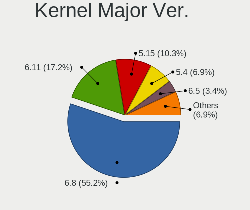
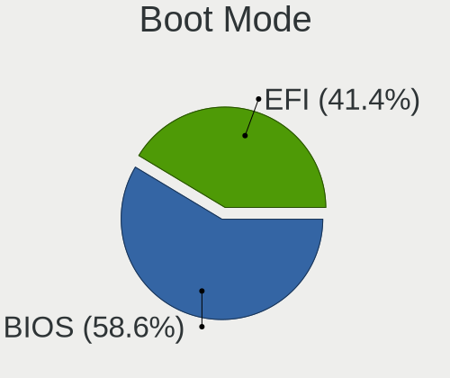
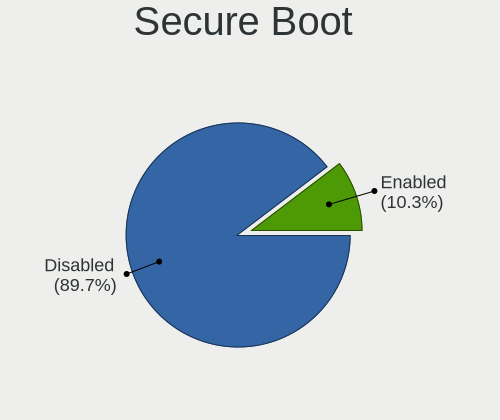
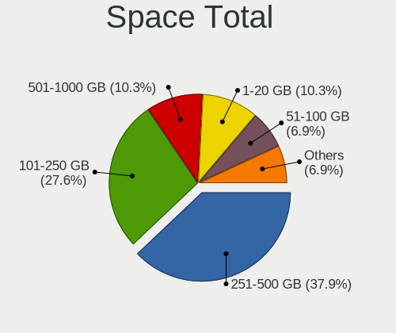

Xubuntu - Hardware Trends (Notebooks)
-------------------------------------

A project to identify most popular hardware characteristics and track their change
over time based on data collected by Linux users at https://Linux-Hardware.org.

Anyone can contribute to this report by the [hw-probe](https://github.com/linuxhw/hw-probe) tool:

    sudo -E hw-probe -all -upload

This report is for one last month. Overall report since the beginning of time: [TestDays](https://github.com/linuxhw/TestDays)

Period: Aug, 2023.

Contents
--------

* [ System ](#system)
  - [ OS                       ](#os)
  - [ OS Family                ](#os-family)
  - [ Kernel                   ](#kernel)
  - [ Kernel Family            ](#kernel-family)
  - [ Kernel Major Ver.        ](#kernel-major-ver)
  - [ Arch                     ](#arch)
  - [ DE                       ](#de)
  - [ Display Server           ](#display-server)
  - [ Display Manager          ](#display-manager)
  - [ OS Lang                  ](#os-lang)
  - [ Boot Mode                ](#boot-mode)
  - [ Filesystem               ](#filesystem)
  - [ Part. scheme             ](#part-scheme)
  - [ Dual Boot with Linux/BSD ](#dual-boot-with-linuxbsd)
  - [ Dual Boot (Win)          ](#dual-boot-win)

* [ Board ](#board)
  - [ Vendor                   ](#vendor)
  - [ Model                    ](#model)
  - [ Model Family             ](#model-family)
  - [ MFG Year                 ](#mfg-year)
  - [ Form Factor              ](#form-factor)
  - [ Secure Boot              ](#secure-boot)
  - [ Coreboot                 ](#coreboot)
  - [ RAM Size                 ](#ram-size)
  - [ RAM Used                 ](#ram-used)
  - [ Total Drives             ](#total-drives)
  - [ Has CD-ROM               ](#has-cd-rom)
  - [ Has Ethernet             ](#has-ethernet)
  - [ Has WiFi                 ](#has-wifi)
  - [ Has Bluetooth            ](#has-bluetooth)

* [ Location ](#location)
  - [ Country                  ](#country)
  - [ City                     ](#city)

* [ Drives ](#drives)
  - [ Drive Vendor             ](#drive-vendor)
  - [ Drive Model              ](#drive-model)
  - [ HDD Vendor               ](#hdd-vendor)
  - [ SSD Vendor               ](#ssd-vendor)
  - [ Drive Kind               ](#drive-kind)
  - [ Drive Connector          ](#drive-connector)
  - [ Drive Size               ](#drive-size)
  - [ Space Total              ](#space-total)
  - [ Space Used               ](#space-used)
  - [ Malfunc. Drives          ](#malfunc-drives)
  - [ Malfunc. Drive Vendor    ](#malfunc-drive-vendor)
  - [ Malfunc. HDD Vendor      ](#malfunc-hdd-vendor)
  - [ Malfunc. Drive Kind      ](#malfunc-drive-kind)
  - [ Failed Drives            ](#failed-drives)
  - [ Failed Drive Vendor      ](#failed-drive-vendor)
  - [ Drive Status             ](#drive-status)

* [ Storage controller ](#storage-controller)
  - [ Storage Vendor           ](#storage-vendor)
  - [ Storage Model            ](#storage-model)
  - [ Storage Kind             ](#storage-kind)

* [ Processor ](#processor)
  - [ CPU Vendor               ](#cpu-vendor)
  - [ CPU Model                ](#cpu-model)
  - [ CPU Model Family         ](#cpu-model-family)
  - [ CPU Cores                ](#cpu-cores)
  - [ CPU Sockets              ](#cpu-sockets)
  - [ CPU Threads              ](#cpu-threads)
  - [ CPU Op-Modes             ](#cpu-op-modes)
  - [ CPU Microcode            ](#cpu-microcode)
  - [ CPU Microarch            ](#cpu-microarch)

* [ Graphics ](#graphics)
  - [ GPU Vendor               ](#gpu-vendor)
  - [ GPU Model                ](#gpu-model)
  - [ GPU Combo                ](#gpu-combo)
  - [ GPU Driver               ](#gpu-driver)
  - [ GPU Memory               ](#gpu-memory)

* [ Monitor ](#monitor)
  - [ Monitor Vendor           ](#monitor-vendor)
  - [ Monitor Model            ](#monitor-model)
  - [ Monitor Resolution       ](#monitor-resolution)
  - [ Monitor Diagonal         ](#monitor-diagonal)
  - [ Monitor Width            ](#monitor-width)
  - [ Aspect Ratio             ](#aspect-ratio)
  - [ Monitor Area             ](#monitor-area)
  - [ Pixel Density            ](#pixel-density)
  - [ Multiple Monitors        ](#multiple-monitors)

* [ Network ](#network)
  - [ Net Controller Vendor    ](#net-controller-vendor)
  - [ Net Controller Model     ](#net-controller-model)
  - [ Wireless Vendor          ](#wireless-vendor)
  - [ Wireless Model           ](#wireless-model)
  - [ Ethernet Vendor          ](#ethernet-vendor)
  - [ Ethernet Model           ](#ethernet-model)
  - [ Net Controller Kind      ](#net-controller-kind)
  - [ Used Controller          ](#used-controller)
  - [ NICs                     ](#nics)
  - [ IPv6                     ](#ipv6)

* [ Bluetooth ](#bluetooth)
  - [ Bluetooth Vendor         ](#bluetooth-vendor)
  - [ Bluetooth Model          ](#bluetooth-model)

* [ Sound ](#sound)
  - [ Sound Vendor             ](#sound-vendor)
  - [ Sound Model              ](#sound-model)

* [ Memory ](#memory)
  - [ Memory Vendor            ](#memory-vendor)
  - [ Memory Model             ](#memory-model)
  - [ Memory Kind              ](#memory-kind)
  - [ Memory Form Factor       ](#memory-form-factor)
  - [ Memory Size              ](#memory-size)
  - [ Memory Speed             ](#memory-speed)

* [ Printers & scanners ](#printers--scanners)
  - [ Printer Vendor           ](#printer-vendor)
  - [ Printer Model            ](#printer-model)
  - [ Scanner Vendor           ](#scanner-vendor)
  - [ Scanner Model            ](#scanner-model)

* [ Camera ](#camera)
  - [ Camera Vendor            ](#camera-vendor)
  - [ Camera Model             ](#camera-model)

* [ Security ](#security)
  - [ Fingerprint Vendor       ](#fingerprint-vendor)
  - [ Fingerprint Model        ](#fingerprint-model)
  - [ Chipcard Vendor          ](#chipcard-vendor)
  - [ Chipcard Model           ](#chipcard-model)

* [ Unsupported ](#unsupported)
  - [ Unsupported Devices      ](#unsupported-devices)
  - [ Unsupported Device Types ](#unsupported-device-types)

System
------

OS
--

Installed operating systems

| Name          | Notebooks | Percent |
|---------------|-----------|---------|
| Xubuntu 22.04 | 25        | 71.43%  |
| Xubuntu 23.04 | 6         | 17.14%  |
| Xubuntu 20.04 | 2         | 5.71%   |
| Xubuntu 22.10 | 1         | 2.86%   |
| Xubuntu 18.04 | 1         | 2.86%   |

OS Family
---------

OS without a version

| Name    | Notebooks | Percent |
|---------|-----------|---------|
| Xubuntu | 35        | 100%    |

Kernel
------

Version of the Linux kernel

| Version           | Notebooks | Percent |
|-------------------|-----------|---------|
| 6.2.0-26-generic  | 13        | 37.14%  |
| 5.15.0-78-generic | 5         | 14.29%  |
| 6.2.0-27-generic  | 4         | 11.43%  |
| 5.15.0-79-generic | 3         | 8.57%   |
| 6.2.0-31-generic  | 2         | 5.71%   |
| 5.4.0-96-generic  | 1         | 2.86%   |
| 5.19.0-50-generic | 1         | 2.86%   |
| 5.19.0-46-generic | 1         | 2.86%   |
| 5.19.0-45-generic | 1         | 2.86%   |
| 5.19.0-40-generic | 1         | 2.86%   |
| 5.15.0-82-generic | 1         | 2.86%   |
| 5.15.0-71-generic | 1         | 2.86%   |
| 5.15.0-39-generic | 1         | 2.86%   |

Kernel Family
-------------

Linux kernel without a distro release

| Version | Notebooks | Percent |
|---------|-----------|---------|
| 6.2.0   | 19        | 54.29%  |
| 5.15.0  | 11        | 31.43%  |
| 5.19.0  | 4         | 11.43%  |
| 5.4.0   | 1         | 2.86%   |

Kernel Major Ver.
-----------------

Linux kernel major version

| Version | Notebooks | Percent |
|---------|-----------|---------|
| 6.2     | 19        | 54.29%  |
| 5.15    | 11        | 31.43%  |
| 5.19    | 4         | 11.43%  |
| 5.4     | 1         | 2.86%   |

Arch
----

OS architecture (x86_64, i586, etc.)

| Name   | Notebooks | Percent |
|--------|-----------|---------|
| x86_64 | 34        | 97.14%  |
| i686   | 1         | 2.86%   |

DE
--

Desktop Environment

| Name | Notebooks | Percent |
|------|-----------|---------|
| XFCE | 35        | 100%    |

Display Server
--------------

X11 or Wayland

| Name | Notebooks | Percent |
|------|-----------|---------|
| X11  | 35        | 100%    |

Display Manager
---------------

SDDM, LightDM, etc.

| Name    | Notebooks | Percent |
|---------|-----------|---------|
| LightDM | 30        | 85.71%  |
| Unknown | 4         | 11.43%  |
| SLiM    | 1         | 2.86%   |

OS Lang
-------

Language

| Lang  | Notebooks | Percent |
|-------|-----------|---------|
| en_US | 10        | 28.57%  |
| de_DE | 6         | 17.14%  |
| it_IT | 3         | 8.57%   |
| fr_FR | 3         | 8.57%   |
| en_GB | 3         | 8.57%   |
| pt_BR | 2         | 5.71%   |
| zh_TW | 1         | 2.86%   |
| ro_RO | 1         | 2.86%   |
| pl_PL | 1         | 2.86%   |
| fr_LU | 1         | 2.86%   |
| es_ES | 1         | 2.86%   |
| en_CA | 1         | 2.86%   |
| de_AT | 1         | 2.86%   |
| C     | 1         | 2.86%   |

Boot Mode
---------

EFI or BIOS

| Mode | Notebooks | Percent |
|------|-----------|---------|
| BIOS | 20        | 57.14%  |
| EFI  | 15        | 42.86%  |

Filesystem
----------

Type of filesystem

| Type  | Notebooks | Percent |
|-------|-----------|---------|
| Ext4  | 28        | 80%     |
| Tmpfs | 7         | 20%     |

Part. scheme
------------

Scheme of partitioning

| Type    | Notebooks | Percent |
|---------|-----------|---------|
| GPT     | 25        | 71.43%  |
| MBR     | 5         | 14.29%  |
| Unknown | 5         | 14.29%  |

Dual Boot with Linux/BSD
------------------------

Hosting more than one Linux/BSD

| Dual boot | Notebooks | Percent |
|-----------|-----------|---------|
| No        | 35        | 100%    |

Dual Boot (Win)
---------------

Hosting Linux and Windows

| Dual boot | Notebooks | Percent |
|-----------|-----------|---------|
| No        | 31        | 88.57%  |
| Yes       | 4         | 11.43%  |

Board
-----

Vendor
------

Motherboard manufacturer

| Name             | Notebooks | Percent |
|------------------|-----------|---------|
| Lenovo           | 8         | 22.86%  |
| Hewlett-Packard  | 6         | 17.14%  |
| Acer             | 6         | 17.14%  |
| Dell             | 4         | 11.43%  |
| ASUSTek Computer | 3         | 8.57%   |
| Toshiba          | 1         | 2.86%   |
| Sony             | 1         | 2.86%   |
| MSI              | 1         | 2.86%   |
| GPU Company      | 1         | 2.86%   |
| Google           | 1         | 2.86%   |
| Daten Tecnologia | 1         | 2.86%   |
| Apple            | 1         | 2.86%   |
| Unknown          | 1         | 2.86%   |

Model
-----

Motherboard model

| Name                                   | Notebooks | Percent |
|----------------------------------------|-----------|---------|
| Toshiba Satellite C55D-B               | 1         | 2.86%   |
| Sony VGN-SR19VN                        | 1         | 2.86%   |
| MSI U90/U100                           | 1         | 2.86%   |
| Lenovo ThinkPad X250 20CM001RMC        | 1         | 2.86%   |
| Lenovo ThinkPad T460s 20F9003VMD       | 1         | 2.86%   |
| Lenovo ThinkPad T14 Gen 3 21AH00C3AU   | 1         | 2.86%   |
| Lenovo IdeaPad Y570 0862               | 1         | 2.86%   |
| Lenovo IdeaPad 5 15ABA7 82SG           | 1         | 2.86%   |
| Lenovo G500 20236                      | 1         | 2.86%   |
| Lenovo G50-70 20351                    | 1         | 2.86%   |
| Lenovo B50-50 80S2                     | 1         | 2.86%   |
| HP ZBook 17 G3                         | 1         | 2.86%   |
| HP Presario CQ42                       | 1         | 2.86%   |
| HP Pavilion 17                         | 1         | 2.86%   |
| HP Laptop 17-cp0xxx                    | 1         | 2.86%   |
| HP EliteBook 820 G3                    | 1         | 2.86%   |
| HP 250 G4 Notebook PC                  | 1         | 2.86%   |
| GPU Company GWTN156-5                  | 1         | 2.86%   |
| Google Banjo                           | 1         | 2.86%   |
| Dell XPS 15 9500                       | 1         | 2.86%   |
| Dell Latitude E5510                    | 1         | 2.86%   |
| Dell Latitude 5411                     | 1         | 2.86%   |
| Dell Latitude 3540                     | 1         | 2.86%   |
| Daten Tecnologia DT02-M4               | 1         | 2.86%   |
| ASUS X541UVK                           | 1         | 2.86%   |
| ASUS VivoBook_ASUSLaptop X515EA_X515EA | 1         | 2.86%   |
| ASUS ROG Strix G733PY_G733PY           | 1         | 2.86%   |
| Apple MacBookPro7,1                    | 1         | 2.86%   |
| Acer TMP255-M                          | 1         | 2.86%   |
| Acer Aspire E1-571G                    | 1         | 2.86%   |
| Acer Aspire A517-52                    | 1         | 2.86%   |
| Acer Aspire A515-54G                   | 1         | 2.86%   |
| Acer Aspire 5732Z                      | 1         | 2.86%   |
| Acer AOD255                            | 1         | 2.86%   |
| Unknown                                | 1         | 2.86%   |

Model Family
------------

Motherboard model prefix

| Name                     | Notebooks | Percent |
|--------------------------|-----------|---------|
| Acer Aspire              | 4         | 11.43%  |
| Lenovo ThinkPad          | 3         | 8.57%   |
| Dell Latitude            | 3         | 8.57%   |
| Lenovo IdeaPad           | 2         | 5.71%   |
| Toshiba Satellite        | 1         | 2.86%   |
| Sony VGN-SR19VN          | 1         | 2.86%   |
| MSI U90                  | 1         | 2.86%   |
| Lenovo G500              | 1         | 2.86%   |
| Lenovo G50-70            | 1         | 2.86%   |
| Lenovo B50-50            | 1         | 2.86%   |
| HP ZBook                 | 1         | 2.86%   |
| HP Presario              | 1         | 2.86%   |
| HP Pavilion              | 1         | 2.86%   |
| HP Laptop                | 1         | 2.86%   |
| HP EliteBook             | 1         | 2.86%   |
| HP 250                   | 1         | 2.86%   |
| GPU Company GWTN156-5    | 1         | 2.86%   |
| Google Banjo             | 1         | 2.86%   |
| Dell XPS                 | 1         | 2.86%   |
| Daten Tecnologia DT02-M4 | 1         | 2.86%   |
| ASUS X541UVK             | 1         | 2.86%   |
| ASUS VivoBook            | 1         | 2.86%   |
| ASUS ROG                 | 1         | 2.86%   |
| Apple MacBookPro7        | 1         | 2.86%   |
| Acer TMP255-M            | 1         | 2.86%   |
| Acer AOD255              | 1         | 2.86%   |
| Unknown                  | 1         | 2.86%   |

MFG Year
--------

Motherboard manufacture year

| Year | Notebooks | Percent |
|------|-----------|---------|
| 2013 | 5         | 14.29%  |
| 2022 | 4         | 11.43%  |
| 2020 | 4         | 11.43%  |
| 2015 | 4         | 11.43%  |
| 2010 | 4         | 11.43%  |
| 2021 | 3         | 8.57%   |
| 2016 | 2         | 5.71%   |
| 2009 | 2         | 5.71%   |
| 2023 | 1         | 2.86%   |
| 2019 | 1         | 2.86%   |
| 2017 | 1         | 2.86%   |
| 2014 | 1         | 2.86%   |
| 2012 | 1         | 2.86%   |
| 2011 | 1         | 2.86%   |
| 2008 | 1         | 2.86%   |

Form Factor
-----------

Physical design of the computer

| Name     | Notebooks | Percent |
|----------|-----------|---------|
| Notebook | 35        | 100%    |

Secure Boot
-----------

Enabled or disabled

| State    | Notebooks | Percent |
|----------|-----------|---------|
| Disabled | 32        | 91.43%  |
| Enabled  | 3         | 8.57%   |

Coreboot
--------

Have coreboot on board

| Used | Notebooks | Percent |
|------|-----------|---------|
| No   | 34        | 97.14%  |
| Yes  | 1         | 2.86%   |

RAM Size
--------

Total RAM memory

| Size in GB  | Notebooks | Percent |
|-------------|-----------|---------|
| 3.01-4.0    | 12        | 34.29%  |
| 4.01-8.0    | 7         | 20%     |
| 8.01-16.0   | 5         | 14.29%  |
| 1.01-2.0    | 4         | 11.43%  |
| 64.01-256.0 | 3         | 8.57%   |
| 16.01-24.0  | 3         | 8.57%   |
| 32.01-64.0  | 1         | 2.86%   |

RAM Used
--------

Used RAM memory

| Used GB    | Notebooks | Percent |
|------------|-----------|---------|
| 1.01-2.0   | 14        | 40%     |
| 2.01-3.0   | 9         | 25.71%  |
| 4.01-8.0   | 4         | 11.43%  |
| 0.51-1.0   | 4         | 11.43%  |
| 3.01-4.0   | 3         | 8.57%   |
| 16.01-24.0 | 1         | 2.86%   |

Total Drives
------------

Number of drives on board

| Drives | Notebooks | Percent |
|--------|-----------|---------|
| 1      | 31        | 88.57%  |
| 2      | 4         | 11.43%  |

Has CD-ROM
----------

Has CD-ROM on board

| Presented | Notebooks | Percent |
|-----------|-----------|---------|
| No        | 23        | 65.71%  |
| Yes       | 12        | 34.29%  |

Has Ethernet
------------

Has Ethernet on board

| Presented | Notebooks | Percent |
|-----------|-----------|---------|
| Yes       | 29        | 82.86%  |
| No        | 6         | 17.14%  |

Has WiFi
--------

Has WiFi module

| Presented | Notebooks | Percent |
|-----------|-----------|---------|
| Yes       | 35        | 100%    |

Has Bluetooth
-------------

Has Bluetooth module

| Presented | Notebooks | Percent |
|-----------|-----------|---------|
| Yes       | 26        | 74.29%  |
| No        | 9         | 25.71%  |

Location
--------

Country
-------

Geographic location (country)

| Country     | Notebooks | Percent |
|-------------|-----------|---------|
| USA         | 6         | 17.14%  |
| Germany     | 6         | 17.14%  |
| France      | 4         | 11.43%  |
| UK          | 3         | 8.57%   |
| Italy       | 3         | 8.57%   |
| Canada      | 2         | 5.71%   |
| Brazil      | 2         | 5.71%   |
| Switzerland | 1         | 2.86%   |
| Spain       | 1         | 2.86%   |
| Russia      | 1         | 2.86%   |
| Romania     | 1         | 2.86%   |
| Poland      | 1         | 2.86%   |
| Netherlands | 1         | 2.86%   |
| Denmark     | 1         | 2.86%   |
| Czechia     | 1         | 2.86%   |
| Austria     | 1         | 2.86%   |

City
----

Geographic location (city)

| City                   | Notebooks | Percent |
|------------------------|-----------|---------|
| Rome                   | 2         | 5.71%   |
| Winsen                 | 1         | 2.86%   |
| Torquay                | 1         | 2.86%   |
| Tandarei               | 1         | 2.86%   |
| Suscevaz               | 1         | 2.86%   |
| Springfield            | 1         | 2.86%   |
| Schnaittach            | 1         | 2.86%   |
| Santa Cruz de Tenerife | 1         | 2.86%   |
| Prague                 | 1         | 2.86%   |
| Potsdam                | 1         | 2.86%   |
| Plattsmouth            | 1         | 2.86%   |
| Paris                  | 1         | 2.86%   |
| Palmyra                | 1         | 2.86%   |
| Paignton               | 1         | 2.86%   |
| Oliveira               | 1         | 2.86%   |
| Nesles-la-Vallee       | 1         | 2.86%   |
| Naaldwijk              | 1         | 2.86%   |
| Moscow                 | 1         | 2.86%   |
| Mesa                   | 1         | 2.86%   |
| Markham                | 1         | 2.86%   |
| Lodz                   | 1         | 2.86%   |
| Lancaster              | 1         | 2.86%   |
| Klagenfurt             | 1         | 2.86%   |
| Jijoca de Jericoacoara | 1         | 2.86%   |
| Greenwich              | 1         | 2.86%   |
| Goldbach               | 1         | 2.86%   |
| Friesoythe             | 1         | 2.86%   |
| Copenhagen             | 1         | 2.86%   |
| Chartres-de-Bretagne   | 1         | 2.86%   |
| Catania                | 1         | 2.86%   |
| Cannes                 | 1         | 2.86%   |
| Bremen                 | 1         | 2.86%   |
| Brandon                | 1         | 2.86%   |
| Berkeley               | 1         | 2.86%   |

Drives
------

Drive Vendor
------------

Hard drive vendors

| Vendor                      | Notebooks | Drives | Percent |
|-----------------------------|-----------|--------|---------|
| Samsung Electronics         | 6         | 6      | 16.22%  |
| Kingston                    | 4         | 4      | 10.81%  |
| Unknown                     | 3         | 3      | 8.11%   |
| SK hynix                    | 3         | 3      | 8.11%   |
| Seagate                     | 3         | 3      | 8.11%   |
| Toshiba                     | 2         | 2      | 5.41%   |
| Micron Technology           | 2         | 2      | 5.41%   |
| Hitachi                     | 2         | 2      | 5.41%   |
| XrayDisk                    | 1         | 1      | 2.7%    |
| WDC                         | 1         | 1      | 2.7%    |
| Team                        | 1         | 1      | 2.7%    |
| Sandisk                     | 1         | 1      | 2.7%    |
| Kingston Technology Company | 1         | 1      | 2.7%    |
| Intenso                     | 1         | 1      | 2.7%    |
| Intel                       | 1         | 1      | 2.7%    |
| HS-SSD-E100                 | 1         | 1      | 2.7%    |
| FORESEE                     | 1         | 1      | 2.7%    |
| Emtec                       | 1         | 1      | 2.7%    |
| A-DATA Technology           | 1         | 1      | 2.7%    |
| Unknown                     | 1         | 1      | 2.7%    |

Drive Model
-----------

Hard drive models

| Model                                           | Notebooks | Percent |
|-------------------------------------------------|-----------|---------|
| XrayDisk 512GB                                  | 1         | 2.7%    |
| WDC WD5000LPCX-24C6HT0 500GB                    | 1         | 2.7%    |
| Unknown MMC128  128GB                           | 1         | 2.7%    |
| Unknown HAG2e  16GB                             | 1         | 2.7%    |
| Unknown 58K722  128GB                           | 1         | 2.7%    |
| Toshiba MQ01ABD075 752GB                        | 1         | 2.7%    |
| Toshiba MK2561GSYN 250GB                        | 1         | 2.7%    |
| Team TM8PS7512G 512GB SSD                       | 1         | 2.7%    |
| SK hynix SKHynix_HFS512GDE9X081N 512GB          | 1         | 2.7%    |
| SK hynix PC611 NVMe 256GB                       | 1         | 2.7%    |
| SK hynix PC611 NVMe 1TB                         | 1         | 2.7%    |
| Seagate ST9320325AS 320GB                       | 1         | 2.7%    |
| Seagate ST2000LM003 HN-M201RAD 2TB              | 1         | 2.7%    |
| Seagate ST1000LM035-1RK172 1TB                  | 1         | 2.7%    |
| Sandisk WD Blue SN500 / PC SN520 NVMe SSD 512GB | 1         | 2.7%    |
| Samsung SSD 970 EVO Plus 2TB                    | 1         | 2.7%    |
| Samsung SSD 870 EVO 500GB                       | 1         | 2.7%    |
| Samsung MZVL4512HBLU-00BH1 512GB                | 1         | 2.7%    |
| Samsung MZNLN512HMJP-000H1 512GB SSD            | 1         | 2.7%    |
| Samsung MZNLF192HCGS-000L1 192GB SSD            | 1         | 2.7%    |
| Samsung MZ7TE512HMHP-000L1 512GB SSD            | 1         | 2.7%    |
| Micron MTFDKCD512TFK 512GB                      | 1         | 2.7%    |
| Micron 2210_MTFDHBA1T0QFD 1TB                   | 1         | 2.7%    |
| Kingston Company SNV2S1000G 1TB                 | 1         | 2.7%    |
| Kingston SV300S37A240G 240GB SSD                | 1         | 2.7%    |
| Kingston SA400S37960G 960GB SSD                 | 1         | 2.7%    |
| Kingston SA400S37480G 480GB SSD                 | 1         | 2.7%    |
| Kingston SA400S37240G 240GB SSD                 | 1         | 2.7%    |
| Intenso SSD Sata III 128GB                      | 1         | 2.7%    |
| Intel SSDPEKNU512GZ 512GB                       | 1         | 2.7%    |
| HS-SSD-E100 128G                                | 1         | 2.7%    |
| Hitachi HTS722020K9SA00 200GB                   | 1         | 2.7%    |
| Hitachi HTS545025B9SA02 250GB                   | 1         | 2.7%    |
| FORESEE 256GB SSD                               | 1         | 2.7%    |
| Emtec X250 512GB SSD                            | 1         | 2.7%    |
| A-DATA SU650 240GB SSD                          | 1         | 2.7%    |
| Unknown                                         | 1         | 2.7%    |

HDD Vendor
----------

Hard disk drive vendors

| Vendor  | Notebooks | Drives | Percent |
|---------|-----------|--------|---------|
| Seagate | 3         | 3      | 37.5%   |
| Toshiba | 2         | 2      | 25%     |
| Hitachi | 2         | 2      | 25%     |
| WDC     | 1         | 1      | 12.5%   |

SSD Vendor
----------

Solid state drive vendors

| Vendor              | Notebooks | Drives | Percent |
|---------------------|-----------|--------|---------|
| Samsung Electronics | 4         | 4      | 28.57%  |
| Kingston            | 4         | 4      | 28.57%  |
| Team                | 1         | 1      | 7.14%   |
| Intenso             | 1         | 1      | 7.14%   |
| FORESEE             | 1         | 1      | 7.14%   |
| Emtec               | 1         | 1      | 7.14%   |
| A-DATA Technology   | 1         | 1      | 7.14%   |
| Unknown             | 1         | 1      | 7.14%   |

Drive Kind
----------

HDD or SSD

| Kind    | Notebooks | Drives | Percent |
|---------|-----------|--------|---------|
| SSD     | 13        | 14     | 36.11%  |
| NVMe    | 10        | 10     | 27.78%  |
| HDD     | 8         | 8      | 22.22%  |
| MMC     | 3         | 3      | 8.33%   |
| Unknown | 2         | 2      | 5.56%   |

Drive Connector
---------------

SATA, SAS, NVMe, etc.

| Type | Notebooks | Drives | Percent |
|------|-----------|--------|---------|
| SATA | 22        | 24     | 62.86%  |
| NVMe | 10        | 10     | 28.57%  |
| MMC  | 3         | 3      | 8.57%   |

Drive Size
----------

Size of hard drive

| Size in TB | Notebooks | Drives | Percent |
|------------|-----------|--------|---------|
| 0.01-0.5   | 13        | 13     | 59.09%  |
| 0.51-1.0   | 8         | 8      | 36.36%  |
| 1.01-2.0   | 1         | 1      | 4.55%   |

Space Total
-----------

Amount of disk space available on the file system

| Size in GB | Notebooks | Percent |
|------------|-----------|---------|
| 101-250    | 13        | 37.14%  |
| 251-500    | 12        | 34.29%  |
| 501-1000   | 5         | 14.29%  |
| 1001-2000  | 3         | 8.57%   |
| 1-20       | 1         | 2.86%   |
| 51-100     | 1         | 2.86%   |

Space Used
----------

Amount of used disk space

| Used GB   | Notebooks | Percent |
|-----------|-----------|---------|
| 21-50     | 10        | 28.57%  |
| 1-20      | 8         | 22.86%  |
| 101-250   | 6         | 17.14%  |
| 51-100    | 6         | 17.14%  |
| 251-500   | 2         | 5.71%   |
| 501-1000  | 2         | 5.71%   |
| 1001-2000 | 1         | 2.86%   |

Malfunc. Drives
---------------

Drive models with a malfunction

| Model                         | Notebooks | Drives | Percent |
|-------------------------------|-----------|--------|---------|
| Hitachi HTS545025B9SA02 250GB | 1         | 1      | 100%    |

Malfunc. Drive Vendor
---------------------

Vendors of faulty drives

| Vendor  | Notebooks | Drives | Percent |
|---------|-----------|--------|---------|
| Hitachi | 1         | 1      | 100%    |

Malfunc. HDD Vendor
-------------------

Vendors of faulty HDD drives

| Vendor  | Notebooks | Drives | Percent |
|---------|-----------|--------|---------|
| Hitachi | 1         | 1      | 100%    |

Malfunc. Drive Kind
-------------------

Kinds of faulty drives

| Kind | Notebooks | Drives | Percent |
|------|-----------|--------|---------|
| HDD  | 1         | 1      | 100%    |

Failed Drives
-------------

Failed drive models

Zero info for selected period =(

Failed Drive Vendor
-------------------

Failed drive vendors

Zero info for selected period =(

Drive Status
------------

Number of failed and malfunc. drives

| Status   | Notebooks | Drives | Percent |
|----------|-----------|--------|---------|
| Works    | 18        | 18     | 51.43%  |
| Detected | 16        | 18     | 45.71%  |
| Malfunc  | 1         | 1      | 2.86%   |

Storage controller
------------------

Storage Vendor
--------------

Storage controller vendors

| Vendor                      | Notebooks | Percent |
|-----------------------------|-----------|---------|
| Intel                       | 24        | 63.16%  |
| AMD                         | 4         | 10.53%  |
| SK hynix                    | 3         | 7.89%   |
| Samsung Electronics         | 2         | 5.26%   |
| Micron Technology           | 2         | 5.26%   |
| SanDisk                     | 1         | 2.63%   |
| Nvidia                      | 1         | 2.63%   |
| Kingston Technology Company | 1         | 2.63%   |

Storage Model
-------------

Storage controller models

| Model                                                                            | Notebooks | Percent |
|----------------------------------------------------------------------------------|-----------|---------|
| Intel Sunrise Point-LP SATA Controller [AHCI mode]                               | 3         | 7.14%   |
| Intel 8 Series SATA Controller 1 [AHCI mode]                                     | 3         | 7.14%   |
| AMD FCH SATA Controller [AHCI mode]                                              | 3         | 7.14%   |
| SK hynix PC611 NVMe Solid State Drive                                            | 2         | 4.76%   |
| Intel Wildcat Point-LP SATA Controller [AHCI Mode]                               | 2         | 4.76%   |
| Intel Volume Management Device NVMe RAID Controller                              | 2         | 4.76%   |
| Intel Tiger Lake-LP SATA Controller                                              | 2         | 4.76%   |
| Intel 82801IBM/IEM (ICH9M/ICH9M-E) 4 port SATA Controller [AHCI mode]            | 2         | 4.76%   |
| SK hynix Gold P31/BC711/PC711 NVMe Solid State Drive                             | 1         | 2.38%   |
| SanDisk WD Blue SN500 / PC SN520 NVMe SSD                                        | 1         | 2.38%   |
| Samsung NVMe SSD Controller SM981/PM981/PM983                                    | 1         | 2.38%   |
| Samsung NVMe SSD Controller PM9B1                                                | 1         | 2.38%   |
| Nvidia MCP89 SATA Controller (AHCI mode)                                         | 1         | 2.38%   |
| Micron 2450 NVMe SSD [HendrixV] (DRAM-less)                                      | 1         | 2.38%   |
| Micron 2210 NVMe SSD [Cobain]                                                    | 1         | 2.38%   |
| Kingston Company Company Non-Volatile memory controller                          | 1         | 2.38%   |
| Intel SSD 670p Series [Keystone Harbor]                                          | 1         | 2.38%   |
| Intel Q170/Q150/B150/H170/H110/Z170/CM236 Chipset SATA Controller [AHCI Mode]    | 1         | 2.38%   |
| Intel NM10/ICH7 Family SATA Controller [IDE mode]                                | 1         | 2.38%   |
| Intel Comet Lake SATA AHCI Controller                                            | 1         | 2.38%   |
| Intel Celeron/Pentium Silver Processor SATA Controller                           | 1         | 2.38%   |
| Intel Celeron N3350/Pentium N4200/Atom E3900 Series SATA AHCI Controller         | 1         | 2.38%   |
| Intel Atom/Celeron/Pentium Processor x5-E8000/J3xxx/N3xxx Series SATA Controller | 1         | 2.38%   |
| Intel 82801GBM/GHM (ICH7-M Family) SATA Controller [IDE mode]                    | 1         | 2.38%   |
| Intel 7 Series Chipset Family 6-port SATA Controller [AHCI mode]                 | 1         | 2.38%   |
| Intel 7 Series Chipset Family 4-port SATA Controller [IDE mode]                  | 1         | 2.38%   |
| Intel 7 Series Chipset Family 2-port SATA Controller [IDE mode]                  | 1         | 2.38%   |
| Intel 6 Series/C200 Series Chipset Family 6 port Mobile SATA AHCI Controller     | 1         | 2.38%   |
| Intel 5 Series/3400 Series Chipset 4 port SATA AHCI Controller                   | 1         | 2.38%   |
| Intel 400 Series Chipset Family SATA AHCI Controller                             | 1         | 2.38%   |
| AMD SB7x0/SB8x0/SB9x0 SATA Controller [AHCI mode]                                | 1         | 2.38%   |

Storage Kind
------------

Kind of storage controller (IDE, SATA, NVMe, SAS, ...)

| Kind | Notebooks | Percent |
|------|-----------|---------|
| SATA | 26        | 63.41%  |
| NVMe | 10        | 24.39%  |
| IDE  | 3         | 7.32%   |
| RAID | 2         | 4.88%   |

Processor
---------

CPU Vendor
----------

Processor vendors

| Vendor | Notebooks | Percent |
|--------|-----------|---------|
| Intel  | 29        | 82.86%  |
| AMD    | 6         | 17.14%  |

CPU Model
---------

Processor models

| Model                                         | Notebooks | Percent |
|-----------------------------------------------|-----------|---------|
| Intel Core i5-6300U CPU @ 2.40GHz             | 2         | 5.71%   |
| Intel Core i5-4210U CPU @ 1.70GHz             | 2         | 5.71%   |
| Intel Pentium Dual-Core CPU T4300 @ 2.10GHz   | 1         | 2.86%   |
| Intel Core i9-10885H CPU @ 2.40GHz            | 1         | 2.86%   |
| Intel Core i7-6820HQ CPU @ 2.70GHz            | 1         | 2.86%   |
| Intel Core i7-5600U CPU @ 2.60GHz             | 1         | 2.86%   |
| Intel Core i7-2630QM CPU @ 2.00GHz            | 1         | 2.86%   |
| Intel Core i7-10850H CPU @ 2.70GHz            | 1         | 2.86%   |
| Intel Core i7-10510U CPU @ 1.80GHz            | 1         | 2.86%   |
| Intel Core i5-7200U CPU @ 2.50GHz             | 1         | 2.86%   |
| Intel Core i5-3210M CPU @ 2.50GHz             | 1         | 2.86%   |
| Intel Core i3-5005U CPU @ 2.00GHz             | 1         | 2.86%   |
| Intel Core i3-4010U CPU @ 1.70GHz             | 1         | 2.86%   |
| Intel Core i3-3110M CPU @ 2.40GHz             | 1         | 2.86%   |
| Intel Core i3 CPU M 350 @ 2.27GHz             | 1         | 2.86%   |
| Intel Core 2 Duo CPU P8600 @ 2.40GHz          | 1         | 2.86%   |
| Intel Core 2 Duo CPU P8400 @ 2.26GHz          | 1         | 2.86%   |
| Intel Celeron N4020 CPU @ 1.10GHz             | 1         | 2.86%   |
| Intel Celeron CPU N3350 @ 1.10GHz             | 1         | 2.86%   |
| Intel Celeron CPU N3050 @ 1.60GHz             | 1         | 2.86%   |
| Intel Celeron CPU N2840 @ 2.16GHz             | 1         | 2.86%   |
| Intel Atom CPU N450 @ 1.66GHz                 | 1         | 2.86%   |
| Intel Atom CPU N270 @ 1.60GHz                 | 1         | 2.86%   |
| Intel 13th Gen Core i5-1335U                  | 1         | 2.86%   |
| Intel 12th Gen Core i7-1255U                  | 1         | 2.86%   |
| Intel 11th Gen Core i7-1165G7 @ 2.80GHz       | 1         | 2.86%   |
| Intel 11th Gen Core i5-1135G7 @ 2.40GHz       | 1         | 2.86%   |
| AMD V120 Processor                            | 1         | 2.86%   |
| AMD Ryzen 9 7945HX with Radeon Graphics       | 1         | 2.86%   |
| AMD Ryzen 5 5625U with Radeon Graphics        | 1         | 2.86%   |
| AMD Ryzen 5 5500U with Radeon Graphics        | 1         | 2.86%   |
| AMD Ryzen 5 3450U with Radeon Vega Mobile Gfx | 1         | 2.86%   |
| AMD E1-6010 APU with AMD Radeon R2 Graphics   | 1         | 2.86%   |

CPU Model Family
----------------

Processor model prefix

| Model                   | Notebooks | Percent |
|-------------------------|-----------|---------|
| Intel Core i5           | 6         | 17.14%  |
| Intel Core i7           | 5         | 14.29%  |
| Other                   | 4         | 11.43%  |
| Intel Core i3           | 4         | 11.43%  |
| Intel Celeron           | 4         | 11.43%  |
| AMD Ryzen 5             | 3         | 8.57%   |
| Intel Core 2 Duo        | 2         | 5.71%   |
| Intel Atom              | 2         | 5.71%   |
| Intel Pentium Dual-Core | 1         | 2.86%   |
| Intel Core i9           | 1         | 2.86%   |
| AMD V120                | 1         | 2.86%   |
| AMD Ryzen 9             | 1         | 2.86%   |
| AMD E1                  | 1         | 2.86%   |

CPU Cores
---------

Number of processor cores

| Number | Notebooks | Percent |
|--------|-----------|---------|
| 2      | 19        | 54.29%  |
| 4      | 6         | 17.14%  |
| 6      | 3         | 8.57%   |
| 1      | 3         | 8.57%   |
| 10     | 2         | 5.71%   |
| 16     | 1         | 2.86%   |
| 8      | 1         | 2.86%   |

CPU Sockets
-----------

Number of sockets

| Number | Notebooks | Percent |
|--------|-----------|---------|
| 1      | 35        | 100%    |

CPU Threads
-----------

Threads per core (Hyper-Threading)

| Number | Notebooks | Percent |
|--------|-----------|---------|
| 2      | 25        | 71.43%  |
| 1      | 10        | 28.57%  |

CPU Op-Modes
------------

CPU Operation Modes (32-bit, 64-bit)

| Op mode        | Notebooks | Percent |
|----------------|-----------|---------|
| 32-bit, 64-bit | 34        | 97.14%  |
| 32-bit         | 1         | 2.86%   |

CPU Microcode
-------------

Microcode number

| Number     | Notebooks | Percent |
|------------|-----------|---------|
| Unknown    | 25        | 71.43%  |
| 0x906a4    | 1         | 2.86%   |
| 0x806c1    | 1         | 2.86%   |
| 0x406e3    | 1         | 2.86%   |
| 0x306a9    | 1         | 2.86%   |
| 0x20655    | 1         | 2.86%   |
| 0x106c2    | 1         | 2.86%   |
| 0x1067a    | 1         | 2.86%   |
| 0x0a601203 | 1         | 2.86%   |
| 0x08608103 | 1         | 2.86%   |
| 0x07030105 | 1         | 2.86%   |

CPU Microarch
-------------

Microarchitecture

| Name             | Notebooks | Percent |
|------------------|-----------|---------|
| Skylake          | 3         | 8.57%   |
| Penryn           | 3         | 8.57%   |
| Haswell          | 3         | 8.57%   |
| Unknown          | 3         | 8.57%   |
| TigerLake        | 2         | 5.71%   |
| Silvermont       | 2         | 5.71%   |
| KabyLake         | 2         | 5.71%   |
| IvyBridge        | 2         | 5.71%   |
| CometLake        | 2         | 5.71%   |
| Broadwell        | 2         | 5.71%   |
| Bonnell          | 2         | 5.71%   |
| Zen+             | 1         | 2.86%   |
| Zen 3            | 1         | 2.86%   |
| Westmere         | 1         | 2.86%   |
| SandyBridge      | 1         | 2.86%   |
| Puma             | 1         | 2.86%   |
| K10              | 1         | 2.86%   |
| Goldmont plus    | 1         | 2.86%   |
| Goldmont         | 1         | 2.86%   |
| Alderlake Hybrid | 1         | 2.86%   |

Graphics
--------

GPU Vendor
----------

Vendors of graphics cards

| Vendor | Notebooks | Percent |
|--------|-----------|---------|
| Intel  | 27        | 61.36%  |
| Nvidia | 10        | 22.73%  |
| AMD    | 7         | 15.91%  |

GPU Model
---------

Graphics card models

| Model                                                                                    | Notebooks | Percent |
|------------------------------------------------------------------------------------------|-----------|---------|
| Intel Haswell-ULT Integrated Graphics Controller                                         | 3         | 6.67%   |
| Nvidia GP108M [GeForce MX250]                                                            | 2         | 4.44%   |
| Intel TigerLake-LP GT2 [Iris Xe Graphics]                                                | 2         | 4.44%   |
| Intel Skylake GT2 [HD Graphics 520]                                                      | 2         | 4.44%   |
| Intel HD Graphics 5500                                                                   | 2         | 4.44%   |
| Intel CometLake-H GT2 [UHD Graphics]                                                     | 2         | 4.44%   |
| Intel 3rd Gen Core processor Graphics Controller                                         | 2         | 4.44%   |
| Nvidia TU117M [GeForce GTX 1650 Ti Mobile]                                               | 1         | 2.22%   |
| Nvidia MCP89 [GeForce 320M]                                                              | 1         | 2.22%   |
| Nvidia GN21-X11                                                                          | 1         | 2.22%   |
| Nvidia GM204GLM [Quadro M3000M]                                                          | 1         | 2.22%   |
| Nvidia GM108M [GeForce 920MX]                                                            | 1         | 2.22%   |
| Nvidia GM108M [GeForce 840M]                                                             | 1         | 2.22%   |
| Nvidia GF117M [GeForce 610M/710M/810M/820M / GT 620M/625M/630M/720M]                     | 1         | 2.22%   |
| Nvidia GF108M [GeForce GT 555M]                                                          | 1         | 2.22%   |
| Intel Raptor Lake-P [Iris Xe Graphics]                                                   | 1         | 2.22%   |
| Intel Mobile 945GSE Express Integrated Graphics Controller                               | 1         | 2.22%   |
| Intel Mobile 945GM/GMS/GME, 943/940GML Express Integrated Graphics Controller            | 1         | 2.22%   |
| Intel Mobile 4 Series Chipset Integrated Graphics Controller                             | 1         | 2.22%   |
| Intel HD Graphics 620                                                                    | 1         | 2.22%   |
| Intel HD Graphics 530                                                                    | 1         | 2.22%   |
| Intel HD Graphics 500                                                                    | 1         | 2.22%   |
| Intel GeminiLake [UHD Graphics 600]                                                      | 1         | 2.22%   |
| Intel Core Processor Integrated Graphics Controller                                      | 1         | 2.22%   |
| Intel CometLake-U GT2 [UHD Graphics]                                                     | 1         | 2.22%   |
| Intel Atom/Celeron/Pentium Processor x5-E8000/J3xxx/N3xxx Integrated Graphics Controller | 1         | 2.22%   |
| Intel Atom Processor Z36xxx/Z37xxx Series Graphics & Display                             | 1         | 2.22%   |
| Intel Atom Processor D4xx/D5xx/N4xx/N5xx Integrated Graphics Controller                  | 1         | 2.22%   |
| Intel Alder Lake-UP3 GT2 [UHD Graphics]                                                  | 1         | 2.22%   |
| Intel 2nd Generation Core Processor Family Integrated Graphics Controller                | 1         | 2.22%   |
| AMD RV620/M82 [Mobility Radeon HD 3450/3470]                                             | 1         | 2.22%   |
| AMD RS880M [Mobility Radeon HD 4225/4250]                                                | 1         | 2.22%   |
| AMD Raphael                                                                              | 1         | 2.22%   |
| AMD Picasso/Raven 2 [Radeon Vega Series / Radeon Vega Mobile Series]                     | 1         | 2.22%   |
| AMD Mullins [Radeon R2 Graphics]                                                         | 1         | 2.22%   |
| AMD Lucienne                                                                             | 1         | 2.22%   |
| AMD Barcelo                                                                              | 1         | 2.22%   |

GPU Combo
---------

Combinations of graphics cards

| Name           | Notebooks | Percent |
|----------------|-----------|---------|
| 1 x Intel      | 19        | 54.29%  |
| Intel + Nvidia | 8         | 22.86%  |
| 1 x AMD        | 6         | 17.14%  |
| 1 x Nvidia     | 1         | 2.86%   |
| AMD + Nvidia   | 1         | 2.86%   |

GPU Driver
----------

Free vs proprietary

| Driver      | Notebooks | Percent |
|-------------|-----------|---------|
| Free        | 30        | 85.71%  |
| Proprietary | 5         | 14.29%  |

GPU Memory
----------

Total video memory

| Size in GB | Notebooks | Percent |
|------------|-----------|---------|
| Unknown    | 30        | 85.71%  |
| 0.51-1.0   | 2         | 5.71%   |
| 0.01-0.5   | 2         | 5.71%   |
| 8.01-16.0  | 1         | 2.86%   |

Monitor
-------

Monitor Vendor
--------------

Monitor vendors

| Vendor                  | Notebooks | Percent |
|-------------------------|-----------|---------|
| AU Optronics            | 10        | 25%     |
| LG Display              | 7         | 17.5%   |
| Chimei Innolux          | 5         | 12.5%   |
| Samsung Electronics     | 4         | 10%     |
| BOE                     | 4         | 10%     |
| Dell                    | 3         | 7.5%    |
| Sharp                   | 1         | 2.5%    |
| InfoVision              | 1         | 2.5%    |
| Hewlett-Packard         | 1         | 2.5%    |
| CPT                     | 1         | 2.5%    |
| Chi Mei Optoelectronics | 1         | 2.5%    |
| BenQ                    | 1         | 2.5%    |
| Apple                   | 1         | 2.5%    |

Monitor Model
-------------

Monitor models

| Model                                                                    | Notebooks | Percent |
|--------------------------------------------------------------------------|-----------|---------|
| LG Display LCD Monitor LGD02DC 1366x768 344x194mm 15.5-inch              | 2         | 4.88%   |
| Sharp LCD Monitor SHP14D0 3840x2400 336x210mm 15.6-inch                  | 1         | 2.44%   |
| Samsung Electronics S27H85x SAM0E0F 2560x1440 597x336mm 27.0-inch        | 1         | 2.44%   |
| Samsung Electronics LCD Monitor SEC3046 1366x768 344x193mm 15.5-inch     | 1         | 2.44%   |
| Samsung Electronics LCD Monitor SDC4852 1366x768 344x194mm 15.5-inch     | 1         | 2.44%   |
| Samsung Electronics LCD Monitor SDC4752 1366x768 344x194mm 15.5-inch     | 1         | 2.44%   |
| Samsung Electronics LCD Monitor SAM07C5 1920x1080 1210x680mm 54.6-inch   | 1         | 2.44%   |
| LG Display LCD Monitor LGD059D 1920x1080 309x174mm 14.0-inch             | 1         | 2.44%   |
| LG Display LCD Monitor LGD04B7 1366x768 344x194mm 15.5-inch              | 1         | 2.44%   |
| LG Display LCD Monitor LGD0437 1920x1080 276x156mm 12.5-inch             | 1         | 2.44%   |
| LG Display LCD Monitor LGD02D1 1600x900 382x215mm 17.3-inch              | 1         | 2.44%   |
| LG Display LCD Monitor LGD024B 1366x768 344x194mm 15.5-inch              | 1         | 2.44%   |
| InfoVision LCD Monitor IVO03F4 1920x1200 263x164mm 12.2-inch             | 1         | 2.44%   |
| Hewlett-Packard LA2306 HWP294A 1920x1080 509x286mm 23.0-inch             | 1         | 2.44%   |
| Dell SE198WFP DELF003 1440x900 408x255mm 18.9-inch                       | 1         | 2.44%   |
| Dell P2411H DELA06D 1920x1080 531x299mm 24.0-inch                        | 1         | 2.44%   |
| Dell E157FPT DEL7400 1024x768 300x230mm 14.9-inch                        | 1         | 2.44%   |
| CPT LCD Monitor CPT04C4 1024x600 222x130mm 10.1-inch                     | 1         | 2.44%   |
| Chimei Innolux LCD Monitor CMN1738 1920x1080 381x214mm 17.2-inch         | 1         | 2.44%   |
| Chimei Innolux LCD Monitor CMN15E7 1920x1080 344x193mm 15.5-inch         | 1         | 2.44%   |
| Chimei Innolux LCD Monitor CMN15E6 1366x768 344x193mm 15.5-inch          | 1         | 2.44%   |
| Chimei Innolux LCD Monitor CMN152E 1920x1080 344x193mm 15.5-inch         | 1         | 2.44%   |
| Chimei Innolux LCD Monitor CMN14F5 1920x1080 309x173mm 13.9-inch         | 1         | 2.44%   |
| Chi Mei Optoelectronics LCD Monitor CMO15A7 1366x768 344x193mm 15.5-inch | 1         | 2.44%   |
| BOE NE173QHM-NZ2 BOE0B69 2560x1440 381x214mm 17.2-inch                   | 1         | 2.44%   |
| BOE LCD Monitor BOE08C2 1920x1080 344x194mm 15.5-inch                    | 1         | 2.44%   |
| BOE LCD Monitor BOE084E 1920x1080 382x215mm 17.3-inch                    | 1         | 2.44%   |
| BOE LCD Monitor BOE069C 1920x1080 344x193mm 15.5-inch                    | 1         | 2.44%   |
| BenQ PD3200U BNQ8025 3840x2160 708x399mm 32.0-inch                       | 1         | 2.44%   |
| AU Optronics LCD Monitor AUOF99B 1920x1200 301x188mm 14.0-inch           | 1         | 2.44%   |
| AU Optronics LCD Monitor AUOF992 1920x1080 382x215mm 17.3-inch           | 1         | 2.44%   |
| AU Optronics LCD Monitor AUO61D2 1024x600 222x125mm 10.0-inch            | 1         | 2.44%   |
| AU Optronics LCD Monitor AUO47EC 1366x768 344x193mm 15.5-inch            | 1         | 2.44%   |
| AU Optronics LCD Monitor AUO46EC 1366x768 344x193mm 15.5-inch            | 1         | 2.44%   |
| AU Optronics LCD Monitor AUO463D 1920x1080 309x174mm 14.0-inch           | 1         | 2.44%   |
| AU Optronics LCD Monitor AUO41EC 1366x768 344x193mm 15.5-inch            | 1         | 2.44%   |
| AU Optronics LCD Monitor AUO2E3C 1366x768 309x173mm 13.9-inch            | 1         | 2.44%   |
| AU Optronics LCD Monitor AUO193C 1366x768 309x173mm 13.9-inch            | 1         | 2.44%   |
| AU Optronics LCD Monitor AUO106C 1366x768 276x155mm 12.5-inch            | 1         | 2.44%   |
| Apple LCD Monitor APP9CCB 1280x800 286x179mm 13.3-inch                   | 1         | 2.44%   |

Monitor Resolution
------------------

Monitor screen resolution

| Resolution        | Notebooks | Percent |
|-------------------|-----------|---------|
| 1366x768 (WXGA)   | 14        | 35%     |
| 1920x1080 (FHD)   | 13        | 32.5%   |
| 3840x2160 (4K)    | 2         | 5%      |
| 2560x1440 (QHD)   | 2         | 5%      |
| 1920x1200 (WUXGA) | 2         | 5%      |
| 1024x600          | 2         | 5%      |
| 3840x2400         | 1         | 2.5%    |
| 1600x900 (HD+)    | 1         | 2.5%    |
| 1440x900 (WXGA+)  | 1         | 2.5%    |
| 1280x800 (WXGA)   | 1         | 2.5%    |
| 1024x768 (XGA)    | 1         | 2.5%    |

Monitor Diagonal
----------------

Diagonal size in inches

| Inches | Notebooks | Percent |
|--------|-----------|---------|
| 15     | 18        | 43.9%   |
| 17     | 5         | 12.2%   |
| 14     | 4         | 9.76%   |
| 13     | 4         | 9.76%   |
| 12     | 2         | 4.88%   |
| 10     | 2         | 4.88%   |
| 54     | 1         | 2.44%   |
| 32     | 1         | 2.44%   |
| 27     | 1         | 2.44%   |
| 24     | 1         | 2.44%   |
| 23     | 1         | 2.44%   |
| 19     | 1         | 2.44%   |

Monitor Width
-------------

Physical width

| Width in mm | Notebooks | Percent |
|-------------|-----------|---------|
| 301-350     | 24        | 58.54%  |
| 201-300     | 6         | 14.63%  |
| 351-400     | 5         | 12.2%   |
| 501-600     | 3         | 7.32%   |
| 701-800     | 1         | 2.44%   |
| 401-500     | 1         | 2.44%   |
| 1001-1500   | 1         | 2.44%   |

Aspect Ratio
------------

Proportional relationship between the width and the height

| Ratio | Notebooks | Percent |
|-------|-----------|---------|
| 16/9  | 32        | 86.49%  |
| 16/10 | 4         | 10.81%  |
| 4/3   | 1         | 2.7%    |

Monitor Area
------------

Area in inch

| Area in inch | Notebooks | Percent |
|----------------|-----------|---------|
| 101-110        | 18        | 45%     |
| 81-90          | 6         | 15%     |
| 121-130        | 5         | 12.5%   |
| 61-70          | 2         | 5%      |
| 41-50          | 2         | 5%      |
| 201-250        | 2         | 5%      |
| More than 1000 | 1         | 2.5%    |
| 71-80          | 1         | 2.5%    |
| 351-500        | 1         | 2.5%    |
| 301-350        | 1         | 2.5%    |
| 151-200        | 1         | 2.5%    |

Pixel Density
-------------

Pixels per inch

| Density       | Notebooks | Percent |
|---------------|-----------|---------|
| 101-120       | 19        | 48.72%  |
| 121-160       | 12        | 30.77%  |
| 161-240       | 3         | 7.69%   |
| 51-100        | 3         | 7.69%   |
| More than 240 | 1         | 2.56%   |
| 1-50          | 1         | 2.56%   |

Multiple Monitors
-----------------

Total monitors connected

| Total | Notebooks | Percent |
|-------|-----------|---------|
| 1     | 28        | 80%     |
| 2     | 5         | 14.29%  |
| 3     | 1         | 2.86%   |
| 0     | 1         | 2.86%   |

Network
-------

Net Controller Vendor
---------------------

Controller vendors

| Vendor                   | Notebooks | Percent |
|--------------------------|-----------|---------|
| Realtek Semiconductor    | 19        | 34.55%  |
| Intel                    | 12        | 21.82%  |
| Qualcomm Atheros         | 9         | 16.36%  |
| Broadcom                 | 5         | 9.09%   |
| MediaTek                 | 2         | 3.64%   |
| Broadcom Limited         | 2         | 3.64%   |
| Xiaomi                   | 1         | 1.82%   |
| TP-Link                  | 1         | 1.82%   |
| Sierra Wireless          | 1         | 1.82%   |
| Ralink                   | 1         | 1.82%   |
| Qualcomm                 | 1         | 1.82%   |
| Marvell Technology Group | 1         | 1.82%   |

Net Controller Model
--------------------

Controller models

| Model                                                             | Notebooks | Percent |
|-------------------------------------------------------------------|-----------|---------|
| Realtek RTL810xE PCI Express Fast Ethernet controller             | 8         | 11.43%  |
| Realtek RTL8723BE PCIe Wireless Network Adapter                   | 3         | 4.29%   |
| Realtek RTL8111/8168/8411 PCI Express Gigabit Ethernet Controller | 3         | 4.29%   |
| Qualcomm Atheros QCA9377 802.11ac Wireless Network Adapter        | 3         | 4.29%   |
| Intel Wireless 8260                                               | 3         | 4.29%   |
| Realtek RTL8821CE 802.11ac PCIe Wireless Network Adapter          | 2         | 2.86%   |
| Qualcomm Atheros AR9485 Wireless Network Adapter                  | 2         | 2.86%   |
| Qualcomm Atheros AR9285 Wireless Network Adapter (PCI-Express)    | 2         | 2.86%   |
| Intel Wireless 7260                                               | 2         | 2.86%   |
| Intel Ethernet Connection I219-LM                                 | 2         | 2.86%   |
| Broadcom BCM43142 802.11b/g/n                                     | 2         | 2.86%   |
| Xiaomi Mi/Redmi series (RNDIS + ADB)                              | 1         | 1.43%   |
| TP-Link Archer T2U PLUS [RTL8821AU]                               | 1         | 1.43%   |
| Sierra Wireless EM7345 4G LTE                                     | 1         | 1.43%   |
| Realtek RTL88x2bu [AC1200 Techkey]                                | 1         | 1.43%   |
| Realtek RTL8852BE PCIe 802.11ax Wireless Network Controller       | 1         | 1.43%   |
| Realtek RTL8852AE 802.11ax PCIe Wireless Network Adapter          | 1         | 1.43%   |
| Realtek RTL8812AU 802.11a/b/g/n/ac 2T2R DB WLAN Adapter           | 1         | 1.43%   |
| Realtek RTL8188EUS 802.11n Wireless Network Adapter               | 1         | 1.43%   |
| Realtek RTL8153 Gigabit Ethernet Adapter                          | 1         | 1.43%   |
| Realtek RTL8152 Fast Ethernet Adapter                             | 1         | 1.43%   |
| Realtek RTL8125 2.5GbE Controller                                 | 1         | 1.43%   |
| Realtek 802.11n WLAN Adapter                                      | 1         | 1.43%   |
| Ralink RT2790 Wireless 802.11n 1T/2R PCIe                         | 1         | 1.43%   |
| Qualcomm QCA6390 Wireless Network Adapter                         | 1         | 1.43%   |
| Qualcomm Atheros QCA8172 Fast Ethernet                            | 1         | 1.43%   |
| Qualcomm Atheros AR928X Wireless Network Adapter (PCI-Express)    | 1         | 1.43%   |
| Qualcomm Atheros AR8152 v1.1 Fast Ethernet                        | 1         | 1.43%   |
| Qualcomm Atheros AR8132 Fast Ethernet                             | 1         | 1.43%   |
| MediaTek MT7922 802.11ax PCI Express Wireless Network Adapter     | 1         | 1.43%   |
| MediaTek MT7921 802.11ax PCI Express Wireless Network Adapter     | 1         | 1.43%   |
| Marvell Group 88E8040 PCI-E Fast Ethernet Controller              | 1         | 1.43%   |
| Intel Wireless 7265                                               | 1         | 1.43%   |
| Intel WiFi Link 5100                                              | 1         | 1.43%   |
| Intel Raptor Lake PCH CNVi WiFi                                   | 1         | 1.43%   |
| Intel Ethernet Connection (3) I218-LM                             | 1         | 1.43%   |
| Intel Ethernet Connection (2) I219-LM                             | 1         | 1.43%   |
| Intel Ethernet Connection (16) I219-V                             | 1         | 1.43%   |
| Intel Ethernet Connection (11) I219-LM                            | 1         | 1.43%   |
| Intel Comet Lake PCH CNVi WiFi                                    | 1         | 1.43%   |

Wireless Vendor
---------------

Wireless vendors

| Vendor                | Notebooks | Percent |
|-----------------------|-----------|---------|
| Intel                 | 12        | 31.58%  |
| Realtek Semiconductor | 9         | 23.68%  |
| Qualcomm Atheros      | 8         | 21.05%  |
| Broadcom              | 3         | 7.89%   |
| MediaTek              | 2         | 5.26%   |
| TP-Link               | 1         | 2.63%   |
| Sierra Wireless       | 1         | 2.63%   |
| Ralink                | 1         | 2.63%   |
| Qualcomm              | 1         | 2.63%   |

Wireless Model
--------------

Wireless models

| Model                                                          | Notebooks | Percent |
|----------------------------------------------------------------|-----------|---------|
| Realtek RTL8723BE PCIe Wireless Network Adapter                | 3         | 7.5%    |
| Qualcomm Atheros QCA9377 802.11ac Wireless Network Adapter     | 3         | 7.5%    |
| Intel Wireless 8260                                            | 3         | 7.5%    |
| Realtek RTL8821CE 802.11ac PCIe Wireless Network Adapter       | 2         | 5%      |
| Qualcomm Atheros AR9485 Wireless Network Adapter               | 2         | 5%      |
| Qualcomm Atheros AR9285 Wireless Network Adapter (PCI-Express) | 2         | 5%      |
| Intel Wireless 7260                                            | 2         | 5%      |
| Broadcom BCM43142 802.11b/g/n                                  | 2         | 5%      |
| TP-Link Archer T2U PLUS [RTL8821AU]                            | 1         | 2.5%    |
| Sierra Wireless EM7345 4G LTE                                  | 1         | 2.5%    |
| Realtek RTL88x2bu [AC1200 Techkey]                             | 1         | 2.5%    |
| Realtek RTL8852BE PCIe 802.11ax Wireless Network Controller    | 1         | 2.5%    |
| Realtek RTL8852AE 802.11ax PCIe Wireless Network Adapter       | 1         | 2.5%    |
| Realtek RTL8812AU 802.11a/b/g/n/ac 2T2R DB WLAN Adapter        | 1         | 2.5%    |
| Realtek RTL8188EUS 802.11n Wireless Network Adapter            | 1         | 2.5%    |
| Realtek 802.11n WLAN Adapter                                   | 1         | 2.5%    |
| Ralink RT2790 Wireless 802.11n 1T/2R PCIe                      | 1         | 2.5%    |
| Qualcomm QCA6390 Wireless Network Adapter                      | 1         | 2.5%    |
| Qualcomm Atheros AR928X Wireless Network Adapter (PCI-Express) | 1         | 2.5%    |
| MediaTek MT7922 802.11ax PCI Express Wireless Network Adapter  | 1         | 2.5%    |
| MediaTek MT7921 802.11ax PCI Express Wireless Network Adapter  | 1         | 2.5%    |
| Intel Wireless 7265                                            | 1         | 2.5%    |
| Intel WiFi Link 5100                                           | 1         | 2.5%    |
| Intel Raptor Lake PCH CNVi WiFi                                | 1         | 2.5%    |
| Intel Comet Lake PCH CNVi WiFi                                 | 1         | 2.5%    |
| Intel Centrino Wireless-N 1000 [Condor Peak]                   | 1         | 2.5%    |
| Intel Centrino Advanced-N 6200                                 | 1         | 2.5%    |
| Intel Alder Lake-P PCH CNVi WiFi                               | 1         | 2.5%    |
| Broadcom BCM4322 802.11a/b/g/n Wireless LAN Controller         | 1         | 2.5%    |

Ethernet Vendor
---------------

Ethernet vendors

| Vendor                   | Notebooks | Percent |
|--------------------------|-----------|---------|
| Realtek Semiconductor    | 14        | 46.67%  |
| Intel                    | 6         | 20%     |
| Qualcomm Atheros         | 3         | 10%     |
| Broadcom                 | 3         | 10%     |
| Broadcom Limited         | 2         | 6.67%   |
| Xiaomi                   | 1         | 3.33%   |
| Marvell Technology Group | 1         | 3.33%   |

Ethernet Model
--------------

Ethernet models

| Model                                                             | Notebooks | Percent |
|-------------------------------------------------------------------|-----------|---------|
| Realtek RTL810xE PCI Express Fast Ethernet controller             | 8         | 26.67%  |
| Realtek RTL8111/8168/8411 PCI Express Gigabit Ethernet Controller | 3         | 10%     |
| Intel Ethernet Connection I219-LM                                 | 2         | 6.67%   |
| Xiaomi Mi/Redmi series (RNDIS + ADB)                              | 1         | 3.33%   |
| Realtek RTL8153 Gigabit Ethernet Adapter                          | 1         | 3.33%   |
| Realtek RTL8152 Fast Ethernet Adapter                             | 1         | 3.33%   |
| Realtek RTL8125 2.5GbE Controller                                 | 1         | 3.33%   |
| Qualcomm Atheros QCA8172 Fast Ethernet                            | 1         | 3.33%   |
| Qualcomm Atheros AR8152 v1.1 Fast Ethernet                        | 1         | 3.33%   |
| Qualcomm Atheros AR8132 Fast Ethernet                             | 1         | 3.33%   |
| Marvell Group 88E8040 PCI-E Fast Ethernet Controller              | 1         | 3.33%   |
| Intel Ethernet Connection (3) I218-LM                             | 1         | 3.33%   |
| Intel Ethernet Connection (2) I219-LM                             | 1         | 3.33%   |
| Intel Ethernet Connection (16) I219-V                             | 1         | 3.33%   |
| Intel Ethernet Connection (11) I219-LM                            | 1         | 3.33%   |
| Broadcom NetXtreme BCM57786 Gigabit Ethernet PCIe                 | 1         | 3.33%   |
| Broadcom NetXtreme BCM5764M Gigabit Ethernet PCIe                 | 1         | 3.33%   |
| Broadcom NetLink BCM57785 Gigabit Ethernet PCIe                   | 1         | 3.33%   |
| Broadcom Limited NetXtreme BCM5761e Gigabit Ethernet PCIe         | 1         | 3.33%   |
| Broadcom Limited NetLink BCM57781 Gigabit Ethernet PCIe           | 1         | 3.33%   |

Net Controller Kind
-------------------

Ethernet, WiFi or modem

| Kind     | Notebooks | Percent |
|----------|-----------|---------|
| WiFi     | 35        | 54.69%  |
| Ethernet | 29        | 45.31%  |

Used Controller
---------------

Currently used network controller

| Kind     | Notebooks | Percent |
|----------|-----------|---------|
| WiFi     | 30        | 83.33%  |
| Ethernet | 6         | 16.67%  |

NICs
----

Total network controllers on board

| Total | Notebooks | Percent |
|-------|-----------|---------|
| 2     | 27        | 77.14%  |
| 1     | 7         | 20%     |
| 0     | 1         | 2.86%   |

IPv6
----

IPv6 vs IPv4

| Used | Notebooks | Percent |
|------|-----------|---------|
| No   | 28        | 80%     |
| Yes  | 7         | 20%     |

Bluetooth
---------

Bluetooth Vendor
----------------

Controller vendors

| Vendor                  | Notebooks | Percent |
|-------------------------|-----------|---------|
| Realtek Semiconductor   | 8         | 29.63%  |
| Intel                   | 8         | 29.63%  |
| Lite-On Technology      | 2         | 7.41%   |
| IMC Networks            | 2         | 7.41%   |
| Foxconn / Hon Hai       | 2         | 7.41%   |
| Cambridge Silicon Radio | 2         | 7.41%   |
| Broadcom                | 1         | 3.7%    |
| Apple                   | 1         | 3.7%    |
| Alps Electric           | 1         | 3.7%    |

Bluetooth Model
---------------

Controller models

| Model                                               | Notebooks | Percent |
|-----------------------------------------------------|-----------|---------|
| Realtek Bluetooth Radio                             | 8         | 29.63%  |
| Intel Bluetooth wireless interface                  | 5         | 18.52%  |
| Intel Bluetooth Device                              | 2         | 7.41%   |
| IMC Networks Bluetooth Device                       | 2         | 7.41%   |
| Cambridge Silicon Radio Bluetooth Dongle (HCI mode) | 2         | 7.41%   |
| Lite-On Wireless_Device                             | 1         | 3.7%    |
| Lite-On Qualcomm Atheros QCA9377 Bluetooth          | 1         | 3.7%    |
| Intel AX201 Bluetooth                               | 1         | 3.7%    |
| Foxconn / Hon Hai Wireless_Device                   | 1         | 3.7%    |
| Foxconn / Hon Hai Broadcom Bluetooth 2.1 Device     | 1         | 3.7%    |
| Broadcom BCM43142A0 Bluetooth Device                | 1         | 3.7%    |
| Apple Bluetooth Host Controller                     | 1         | 3.7%    |
| Alps Electric BCM2046 Bluetooth Device              | 1         | 3.7%    |

Sound
-----

Sound Vendor
------------

Sound card vendors

| Vendor              | Notebooks | Percent |
|---------------------|-----------|---------|
| Intel               | 28        | 70%     |
| AMD                 | 6         | 15%     |
| Nvidia              | 4         | 10%     |
| DCMT Technology     | 1         | 2.5%    |
| C-Media Electronics | 1         | 2.5%    |

Sound Model
-----------

Sound card models

| Model                                                                                             | Notebooks | Percent |
|---------------------------------------------------------------------------------------------------|-----------|---------|
| AMD Family 17h/19h HD Audio Controller                                                            | 4         | 8%      |
| Intel Sunrise Point-LP HD Audio                                                                   | 3         | 6%      |
| Intel Haswell-ULT HD Audio Controller                                                             | 3         | 6%      |
| Intel 8 Series HD Audio Controller                                                                | 3         | 6%      |
| Intel Wildcat Point-LP High Definition Audio Controller                                           | 2         | 4%      |
| Intel Tiger Lake-LP Smart Sound Technology Audio Controller                                       | 2         | 4%      |
| Intel NM10/ICH7 Family High Definition Audio Controller                                           | 2         | 4%      |
| Intel Comet Lake PCH cAVS                                                                         | 2         | 4%      |
| Intel Broadwell-U Audio Controller                                                                | 2         | 4%      |
| Intel 82801I (ICH9 Family) HD Audio Controller                                                    | 2         | 4%      |
| Intel 7 Series/C216 Chipset Family High Definition Audio Controller                               | 2         | 4%      |
| AMD Renoir Radeon High Definition Audio Controller                                                | 2         | 4%      |
| Nvidia MCP89 High Definition Audio                                                                | 1         | 2%      |
| Nvidia GM204 High Definition Audio Controller                                                     | 1         | 2%      |
| Nvidia GF108 High Definition Audio Controller                                                     | 1         | 2%      |
| Nvidia Audio device                                                                               | 1         | 2%      |
| Intel Raptor Lake-P/U/H cAVS                                                                      | 1         | 2%      |
| Intel Comet Lake PCH-LP cAVS                                                                      | 1         | 2%      |
| Intel Celeron/Pentium Silver Processor High Definition Audio                                      | 1         | 2%      |
| Intel Celeron N3350/Pentium N4200/Atom E3900 Series Audio Cluster                                 | 1         | 2%      |
| Intel Atom/Celeron/Pentium Processor x5-E8000/J3xxx/N3xxx Series High Definition Audio Controller | 1         | 2%      |
| Intel Atom Processor Z36xxx/Z37xxx Series High Definition Audio Controller                        | 1         | 2%      |
| Intel Alder Lake PCH-P High Definition Audio Controller                                           | 1         | 2%      |
| Intel 6 Series/C200 Series Chipset Family High Definition Audio Controller                        | 1         | 2%      |
| Intel 5 Series/3400 Series Chipset High Definition Audio                                          | 1         | 2%      |
| Intel 100 Series/C230 Series Chipset Family HD Audio Controller                                   | 1         | 2%      |
| DCMT Technology USB Condenser Microphone                                                          | 1         | 2%      |
| C-Media Electronics Audio Adapter (Unitek Y-247A)                                                 | 1         | 2%      |
| AMD SBx00 Azalia (Intel HDA)                                                                      | 1         | 2%      |
| AMD RS880 HDMI Audio [Radeon HD 4200 Series]                                                      | 1         | 2%      |
| AMD Raven/Raven2/Fenghuang HDMI/DP Audio Controller                                               | 1         | 2%      |
| AMD Kabini HDMI/DP Audio                                                                          | 1         | 2%      |
| AMD FCH Azalia Controller                                                                         | 1         | 2%      |

Memory
------

Memory Vendor
-------------

Memory module vendors

| Vendor              | Notebooks | Percent |
|---------------------|-----------|---------|
| SK hynix            | 9         | 32.14%  |
| Samsung Electronics | 7         | 25%     |
| Unknown             | 3         | 10.71%  |
| Unknown (ABCD)      | 2         | 7.14%   |
| A-DATA Technology   | 2         | 7.14%   |
| Ramaxel Technology  | 1         | 3.57%   |
| Nanya Technology    | 1         | 3.57%   |
| Micron Technology   | 1         | 3.57%   |
| Kingston            | 1         | 3.57%   |
| G.Skill             | 1         | 3.57%   |

Memory Model
------------

Memory module models

| Model                                                                     | Notebooks | Percent |
|---------------------------------------------------------------------------|-----------|---------|
| Unknown (ABCD) RAM 123456789012345678 4GB SODIMM LPDDR4 2400MT/s          | 2         | 6.67%   |
| SK hynix RAM HMA81GS6DJR8N-XN 8GB SODIMM DDR4 3200MT/s                    | 2         | 6.67%   |
| Samsung RAM M471B5773CHS-CH9 2048MB SODIMM DDR3 4199MT/s                  | 2         | 6.67%   |
| Samsung RAM M471B5173QH0-YK0 4GB SODIMM DDR3 1600MT/s                     | 2         | 6.67%   |
| Unknown RAM Module 4GB SODIMM DDR4 2667MT/s                               | 1         | 3.33%   |
| Unknown RAM Module 4GB Chip DDR4 2133MT/s                                 | 1         | 3.33%   |
| Unknown RAM Module 2GB SODIMM DDR2                                        | 1         | 3.33%   |
| SK hynix RAM Module 2GB SODIMM DDR3 1067MT/s                              | 1         | 3.33%   |
| SK hynix RAM HMT451S6AFR8A-PB 4GB SODIMM DDR3 1600MT/s                    | 1         | 3.33%   |
| SK hynix RAM HMT425S6CFR6A-PB 2048MB SODIMM DDR3 1600MT/s                 | 1         | 3.33%   |
| SK hynix RAM HMT41GS6BFR8A-PB 8192MB SODIMM DDR3 1600MT/s                 | 1         | 3.33%   |
| SK hynix RAM HMAA4GS6AJR8N-XN 32GB SODIMM DDR4 3200MT/s                   | 1         | 3.33%   |
| SK hynix RAM HMA451S6AFR8N-TF 4GB SODIMM DDR4 2133MT/s                    | 1         | 3.33%   |
| SK hynix RAM 0E0E0E0E0E0E0E0E0E0E0E0E0E0E0E0E0E0E 2GB SODIMM DDR2 800MT/s | 1         | 3.33%   |
| Samsung RAM Module 8GB SODIMM DDR4 2133MT/s                               | 1         | 3.33%   |
| Samsung RAM M471B5773DH0-CH9 2GB SODIMM DDR3 1600MT/s                     | 1         | 3.33%   |
| Samsung RAM M471B5273CH0-CH9 4GB SODIMM DDR3 1334MT/s                     | 1         | 3.33%   |
| Samsung RAM M471A2G44BM0-CWE 16384MB SODIMM DDR4 3200MT/s                 | 1         | 3.33%   |
| Samsung RAM M425R4GA3BB0-CQKOL 32GB SODIMM DDR5 4800MT/s                  | 1         | 3.33%   |
| Ramaxel RAM RMT3170EF68F9W1600 4GB SODIMM DDR3 1600MT/s                   | 1         | 3.33%   |
| Nanya RAM 161616161616161616161616161616161616 2GB SODIMM DDR2 800MT/s    | 1         | 3.33%   |
| Micron RAM 4ATF1G64HZ-3G2E1 8GB SODIMM DDR4 3200MT/s                      | 1         | 3.33%   |
| Kingston RAM ACR16D3LS1KFG/4G 4GB SODIMM DDR3 1600MT/s                    | 1         | 3.33%   |
| G.Skill RAM F4-3200C22-32GRS 32GB SODIMM DDR4 3200MT/s                    | 1         | 3.33%   |
| A-DATA RAM AO1P32NC8T1-BBVS 8GB SODIMM DDR4 3200MT/s                      | 1         | 3.33%   |
| A-DATA RAM AM1P26KC4U1-BACS 4GB SODIMM DDR4 2667MT/s                      | 1         | 3.33%   |

Memory Kind
-----------

Memory module kinds

| Kind   | Notebooks | Percent |
|--------|-----------|---------|
| DDR4   | 9         | 37.5%   |
| DDR3   | 8         | 33.33%  |
| SDRAM  | 2         | 8.33%   |
| LPDDR4 | 2         | 8.33%   |
| DDR2   | 2         | 8.33%   |
| DDR5   | 1         | 4.17%   |

Memory Form Factor
------------------

Physical design of the memory module

| Name   | Notebooks | Percent |
|--------|-----------|---------|
| SODIMM | 22        | 95.65%  |
| Chip   | 1         | 4.35%   |

Memory Size
-----------

Memory module size

| Size  | Notebooks | Percent |
|-------|-----------|---------|
| 8192  | 7         | 29.17%  |
| 4096  | 7         | 29.17%  |
| 2048  | 6         | 25%     |
| 32768 | 3         | 12.5%   |
| 16384 | 1         | 4.17%   |

Memory Speed
------------

Memory module speed

| Speed   | Notebooks | Percent |
|---------|-----------|---------|
| 3200    | 6         | 25%     |
| 1600    | 6         | 25%     |
| 4199    | 2         | 8.33%   |
| 2400    | 2         | 8.33%   |
| 2133    | 2         | 8.33%   |
| 4800    | 1         | 4.17%   |
| 2667    | 1         | 4.17%   |
| 1334    | 1         | 4.17%   |
| 1067    | 1         | 4.17%   |
| 800     | 1         | 4.17%   |
| Unknown | 1         | 4.17%   |

Printers & scanners
-------------------

Printer Vendor
--------------

Printer device vendors

Zero info for selected period =(

Printer Model
-------------

Printer device models

Zero info for selected period =(

Scanner Vendor
--------------

Scanner device vendors

Zero info for selected period =(

Scanner Model
-------------

Scanner device models

Zero info for selected period =(

Camera
------

Camera Vendor
-------------

Camera device vendors

| Vendor                                 | Notebooks | Percent |
|----------------------------------------|-----------|---------|
| Chicony Electronics                    | 10        | 29.41%  |
| IMC Networks                           | 5         | 14.71%  |
| Acer                                   | 3         | 8.82%   |
| Sunplus Innovation Technology          | 2         | 5.88%   |
| Quanta                                 | 2         | 5.88%   |
| Luxvisions Innotech Limited            | 2         | 5.88%   |
| Logitech                               | 2         | 5.88%   |
| Y Media                                | 1         | 2.94%   |
| Ricoh                                  | 1         | 2.94%   |
| Realtek Semiconductor                  | 1         | 2.94%   |
| Microdia                               | 1         | 2.94%   |
| icSpring                               | 1         | 2.94%   |
| Cheng Uei Precision Industry (Foxlink) | 1         | 2.94%   |
| Apple                                  | 1         | 2.94%   |
| ALi                                    | 1         | 2.94%   |

Camera Model
------------

Camera device models

| Model                                               | Notebooks | Percent |
|-----------------------------------------------------|-----------|---------|
| Chicony HD WebCam                                   | 3         | 8.82%   |
| Quanta HD User Facing                               | 2         | 5.88%   |
| IMC Networks USB2.0 VGA UVC WebCam                  | 2         | 5.88%   |
| Chicony Integrated Camera                           | 2         | 5.88%   |
| Acer Lenovo EasyCamera                              | 2         | 5.88%   |
| Y Media USB Camera                                  | 1         | 2.94%   |
| Sunplus MTD camera                                  | 1         | 2.94%   |
| Sunplus Integrated_Webcam_FHD                       | 1         | 2.94%   |
| Ricoh Visual Communication Camera VGP-VCC9 [R5U870] | 1         | 2.94%   |
| Realtek Lenovo EasyCamera                           | 1         | 2.94%   |
| Microdia Integrated_Webcam_HD                       | 1         | 2.94%   |
| Luxvisions Innotech Limited Integrated RGB Camera   | 1         | 2.94%   |
| Luxvisions Innotech Limited HP TrueVision HD Camera | 1         | 2.94%   |
| Logitech Webcam C930e                               | 1         | 2.94%   |
| Logitech HD Pro Webcam C920                         | 1         | 2.94%   |
| IMC Networks USB2.0 HD UVC WebCam                   | 1         | 2.94%   |
| IMC Networks TOSHIBA Web Camera - HD                | 1         | 2.94%   |
| IMC Networks Lenovo EasyCamera                      | 1         | 2.94%   |
| icSpring camera                                     | 1         | 2.94%   |
| Chicony Webcam-101                                  | 1         | 2.94%   |
| Chicony HP Webcam                                   | 1         | 2.94%   |
| Chicony HP Truevision HD camera                     | 1         | 2.94%   |
| Chicony HP HD Camera                                | 1         | 2.94%   |
| Chicony Acer CrystalEye Webcam                      | 1         | 2.94%   |
| Cheng Uei Precision Industry (Foxlink) HP HD Camera | 1         | 2.94%   |
| Apple Built-in iSight                               | 1         | 2.94%   |
| ALi Gateway Webcam                                  | 1         | 2.94%   |
| Acer ThinkPad P50 Integrated Camera                 | 1         | 2.94%   |

Security
--------

Fingerprint Vendor
------------------

Fingerprint sensor vendors

| Vendor                     | Notebooks | Percent |
|----------------------------|-----------|---------|
| Validity Sensors           | 3         | 37.5%   |
| Shenzhen Goodix Technology | 2         | 25%     |
| Upek                       | 1         | 12.5%   |
| Focal-systems.Corp         | 1         | 12.5%   |
| Elan Microelectronics      | 1         | 12.5%   |

Fingerprint Model
-----------------

Fingerprint sensor models

| Model                                                  | Notebooks | Percent |
|--------------------------------------------------------|-----------|---------|
| Validity Sensors VFS7500 Touch Fingerprint Sensor      | 1         | 12.5%   |
| Validity Sensors VFS495 Fingerprint Reader             | 1         | 12.5%   |
| Validity Sensors VFS 5011 fingerprint sensor           | 1         | 12.5%   |
| Upek Biometric Touchchip/Touchstrip Fingerprint Sensor | 1         | 12.5%   |
| Shenzhen Goodix  FingerPrint Device                    | 1         | 12.5%   |
| Shenzhen Goodix FingerPrint                            | 1         | 12.5%   |
| Focal-systems.Corp FT9201Fingerprint.                  | 1         | 12.5%   |
| Elan ELAN:ARM-M4                                       | 1         | 12.5%   |

Chipcard Vendor
---------------

Chipcard module vendors

| Vendor      | Notebooks | Percent |
|-------------|-----------|---------|
| Alcor Micro | 2         | 66.67%  |
| Broadcom    | 1         | 33.33%  |

Chipcard Model
--------------

Chipcard module models

| Model                               | Notebooks | Percent |
|-------------------------------------|-----------|---------|
| Alcor Micro AU9540 Smartcard Reader | 2         | 66.67%  |
| Broadcom 58200                      | 1         | 33.33%  |

Unsupported
-----------

Unsupported Devices
-------------------

Total unsupported devices on board

| Total | Notebooks | Percent |
|-------|-----------|---------|
| 0     | 25        | 71.43%  |
| 2     | 6         | 17.14%  |
| 1     | 4         | 11.43%  |

Unsupported Device Types
------------------------

Types of unsupported devices

| Type               | Notebooks | Percent |
|--------------------|-----------|---------|
| Fingerprint reader | 8         | 50%     |
| Graphics card      | 3         | 18.75%  |
| Chipcard           | 3         | 18.75%  |
| Net/wireless       | 1         | 6.25%   |
| Card reader        | 1         | 6.25%   |

