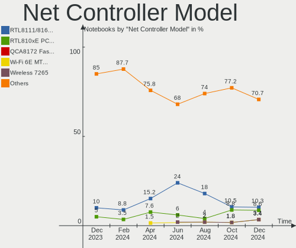
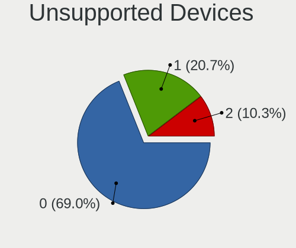

Xubuntu - Hardware Trends (Notebooks)
-------------------------------------

A project to identify most popular hardware characteristics and track their change
over time based on data collected by Linux users at https://Linux-Hardware.org.

Anyone can contribute to this report by the [hw-probe](https://github.com/linuxhw/hw-probe) tool:

    sudo -E hw-probe -all -upload

This report is for one last month. Overall report since the beginning of time: [TestDays](https://github.com/linuxhw/TestDays)

Period: Sep, 2023.

Contents
--------

* [ System ](#system)
  - [ OS                       ](#os)
  - [ OS Family                ](#os-family)
  - [ Kernel                   ](#kernel)
  - [ Kernel Family            ](#kernel-family)
  - [ Kernel Major Ver.        ](#kernel-major-ver)
  - [ Arch                     ](#arch)
  - [ DE                       ](#de)
  - [ Display Server           ](#display-server)
  - [ Display Manager          ](#display-manager)
  - [ OS Lang                  ](#os-lang)
  - [ Boot Mode                ](#boot-mode)
  - [ Filesystem               ](#filesystem)
  - [ Part. scheme             ](#part-scheme)
  - [ Dual Boot with Linux/BSD ](#dual-boot-with-linuxbsd)
  - [ Dual Boot (Win)          ](#dual-boot-win)

* [ Board ](#board)
  - [ Vendor                   ](#vendor)
  - [ Model                    ](#model)
  - [ Model Family             ](#model-family)
  - [ MFG Year                 ](#mfg-year)
  - [ Form Factor              ](#form-factor)
  - [ Secure Boot              ](#secure-boot)
  - [ Coreboot                 ](#coreboot)
  - [ RAM Size                 ](#ram-size)
  - [ RAM Used                 ](#ram-used)
  - [ Total Drives             ](#total-drives)
  - [ Has CD-ROM               ](#has-cd-rom)
  - [ Has Ethernet             ](#has-ethernet)
  - [ Has WiFi                 ](#has-wifi)
  - [ Has Bluetooth            ](#has-bluetooth)

* [ Location ](#location)
  - [ Country                  ](#country)
  - [ City                     ](#city)

* [ Drives ](#drives)
  - [ Drive Vendor             ](#drive-vendor)
  - [ Drive Model              ](#drive-model)
  - [ HDD Vendor               ](#hdd-vendor)
  - [ SSD Vendor               ](#ssd-vendor)
  - [ Drive Kind               ](#drive-kind)
  - [ Drive Connector          ](#drive-connector)
  - [ Drive Size               ](#drive-size)
  - [ Space Total              ](#space-total)
  - [ Space Used               ](#space-used)
  - [ Malfunc. Drives          ](#malfunc-drives)
  - [ Malfunc. Drive Vendor    ](#malfunc-drive-vendor)
  - [ Malfunc. HDD Vendor      ](#malfunc-hdd-vendor)
  - [ Malfunc. Drive Kind      ](#malfunc-drive-kind)
  - [ Failed Drives            ](#failed-drives)
  - [ Failed Drive Vendor      ](#failed-drive-vendor)
  - [ Drive Status             ](#drive-status)

* [ Storage controller ](#storage-controller)
  - [ Storage Vendor           ](#storage-vendor)
  - [ Storage Model            ](#storage-model)
  - [ Storage Kind             ](#storage-kind)

* [ Processor ](#processor)
  - [ CPU Vendor               ](#cpu-vendor)
  - [ CPU Model                ](#cpu-model)
  - [ CPU Model Family         ](#cpu-model-family)
  - [ CPU Cores                ](#cpu-cores)
  - [ CPU Sockets              ](#cpu-sockets)
  - [ CPU Threads              ](#cpu-threads)
  - [ CPU Op-Modes             ](#cpu-op-modes)
  - [ CPU Microcode            ](#cpu-microcode)
  - [ CPU Microarch            ](#cpu-microarch)

* [ Graphics ](#graphics)
  - [ GPU Vendor               ](#gpu-vendor)
  - [ GPU Model                ](#gpu-model)
  - [ GPU Combo                ](#gpu-combo)
  - [ GPU Driver               ](#gpu-driver)
  - [ GPU Memory               ](#gpu-memory)

* [ Monitor ](#monitor)
  - [ Monitor Vendor           ](#monitor-vendor)
  - [ Monitor Model            ](#monitor-model)
  - [ Monitor Resolution       ](#monitor-resolution)
  - [ Monitor Diagonal         ](#monitor-diagonal)
  - [ Monitor Width            ](#monitor-width)
  - [ Aspect Ratio             ](#aspect-ratio)
  - [ Monitor Area             ](#monitor-area)
  - [ Pixel Density            ](#pixel-density)
  - [ Multiple Monitors        ](#multiple-monitors)

* [ Network ](#network)
  - [ Net Controller Vendor    ](#net-controller-vendor)
  - [ Net Controller Model     ](#net-controller-model)
  - [ Wireless Vendor          ](#wireless-vendor)
  - [ Wireless Model           ](#wireless-model)
  - [ Ethernet Vendor          ](#ethernet-vendor)
  - [ Ethernet Model           ](#ethernet-model)
  - [ Net Controller Kind      ](#net-controller-kind)
  - [ Used Controller          ](#used-controller)
  - [ NICs                     ](#nics)
  - [ IPv6                     ](#ipv6)

* [ Bluetooth ](#bluetooth)
  - [ Bluetooth Vendor         ](#bluetooth-vendor)
  - [ Bluetooth Model          ](#bluetooth-model)

* [ Sound ](#sound)
  - [ Sound Vendor             ](#sound-vendor)
  - [ Sound Model              ](#sound-model)

* [ Memory ](#memory)
  - [ Memory Vendor            ](#memory-vendor)
  - [ Memory Model             ](#memory-model)
  - [ Memory Kind              ](#memory-kind)
  - [ Memory Form Factor       ](#memory-form-factor)
  - [ Memory Size              ](#memory-size)
  - [ Memory Speed             ](#memory-speed)

* [ Printers & scanners ](#printers--scanners)
  - [ Printer Vendor           ](#printer-vendor)
  - [ Printer Model            ](#printer-model)
  - [ Scanner Vendor           ](#scanner-vendor)
  - [ Scanner Model            ](#scanner-model)

* [ Camera ](#camera)
  - [ Camera Vendor            ](#camera-vendor)
  - [ Camera Model             ](#camera-model)

* [ Security ](#security)
  - [ Fingerprint Vendor       ](#fingerprint-vendor)
  - [ Fingerprint Model        ](#fingerprint-model)
  - [ Chipcard Vendor          ](#chipcard-vendor)
  - [ Chipcard Model           ](#chipcard-model)

* [ Unsupported ](#unsupported)
  - [ Unsupported Devices      ](#unsupported-devices)
  - [ Unsupported Device Types ](#unsupported-device-types)

System
------

OS
--

Installed operating systems

| Name           | Notebooks | Percent |
|----------------|-----------|---------|
| Xubuntu 22.04  | 19        | 67.86%  |
| Xubuntu 23.04  | 3         | 10.71%  |
| Xubuntu 2023.2 | 2         | 7.14%   |
| Xubuntu 20.04  | 2         | 7.14%   |
| Xubuntu 18.04  | 1         | 3.57%   |
| Xubuntu 16.04  | 1         | 3.57%   |

OS Family
---------

OS without a version

| Name    | Notebooks | Percent |
|---------|-----------|---------|
| Xubuntu | 28        | 100%    |

Kernel
------

Version of the Linux kernel

| Version                 | Notebooks | Percent |
|-------------------------|-----------|---------|
| 6.2.0-32-generic        | 11        | 39.29%  |
| 6.2.0-33-generic        | 3         | 10.71%  |
| 6.5.1-060501-generic    | 1         | 3.57%   |
| 6.5.0-060500-generic    | 1         | 3.57%   |
| 6.4.15-2-liquorix-amd64 | 1         | 3.57%   |
| 6.2.0-31-generic        | 1         | 3.57%   |
| 6.2.0-20-generic        | 1         | 3.57%   |
| 5.4.0-163-generic       | 1         | 3.57%   |
| 5.4.0-150-generic       | 1         | 3.57%   |
| 5.19.17-051917-generic  | 1         | 3.57%   |
| 5.19.0-50-generic       | 1         | 3.57%   |
| 5.15.0-84-generic       | 1         | 3.57%   |
| 5.15.0-83-generic       | 1         | 3.57%   |
| 5.15.0-82-generic       | 1         | 3.57%   |
| 5.15.0-79-generic       | 1         | 3.57%   |
| 4.4.0-210-generic       | 1         | 3.57%   |

Kernel Family
-------------

Linux kernel without a distro release

| Version | Notebooks | Percent |
|---------|-----------|---------|
| 6.2.0   | 16        | 57.14%  |
| 5.15.0  | 4         | 14.29%  |
| 5.4.0   | 2         | 7.14%   |
| 6.5.1   | 1         | 3.57%   |
| 6.5.0   | 1         | 3.57%   |
| 6.4.15  | 1         | 3.57%   |
| 5.19.17 | 1         | 3.57%   |
| 5.19.0  | 1         | 3.57%   |
| 4.4.0   | 1         | 3.57%   |

Kernel Major Ver.
-----------------

Linux kernel major version

| Version | Notebooks | Percent |
|---------|-----------|---------|
| 6.2     | 16        | 57.14%  |
| 5.15    | 4         | 14.29%  |
| 6.5     | 2         | 7.14%   |
| 5.4     | 2         | 7.14%   |
| 5.19    | 2         | 7.14%   |
| 6.4     | 1         | 3.57%   |
| 4.4     | 1         | 3.57%   |

Arch
----

OS architecture (x86_64, i586, etc.)

| Name   | Notebooks | Percent |
|--------|-----------|---------|
| x86_64 | 27        | 96.43%  |
| i686   | 1         | 3.57%   |

DE
--

Desktop Environment

| Name         | Notebooks | Percent |
|--------------|-----------|---------|
| XFCE         | 26        | 92.86%  |
| Unicorn:XFCE | 2         | 7.14%   |

Display Server
--------------

X11 or Wayland

| Name    | Notebooks | Percent |
|---------|-----------|---------|
| X11     | 27        | 96.43%  |
| Wayland | 1         | 3.57%   |

Display Manager
---------------

SDDM, LightDM, etc.

| Name    | Notebooks | Percent |
|---------|-----------|---------|
| LightDM | 22        | 78.57%  |
| Unknown | 4         | 14.29%  |
| GDM3    | 2         | 7.14%   |

OS Lang
-------

Language

| Lang  | Notebooks | Percent |
|-------|-----------|---------|
| en_US | 11        | 39.29%  |
| it_IT | 3         | 10.71%  |
| en_GB | 3         | 10.71%  |
| de_DE | 3         | 10.71%  |
| fr_FR | 2         | 7.14%   |
| ru_UA | 1         | 3.57%   |
| ru_RU | 1         | 3.57%   |
| hu_HU | 1         | 3.57%   |
| es_UY | 1         | 3.57%   |
| en_IN | 1         | 3.57%   |
| en_CA | 1         | 3.57%   |

Boot Mode
---------

EFI or BIOS

| Mode | Notebooks | Percent |
|------|-----------|---------|
| EFI  | 17        | 60.71%  |
| BIOS | 11        | 39.29%  |

Filesystem
----------

Type of filesystem

| Type    | Notebooks | Percent |
|---------|-----------|---------|
| Ext4    | 23        | 82.14%  |
| Tmpfs   | 4         | 14.29%  |
| Overlay | 1         | 3.57%   |

Part. scheme
------------

Scheme of partitioning

| Type    | Notebooks | Percent |
|---------|-----------|---------|
| GPT     | 21        | 75%     |
| Unknown | 5         | 17.86%  |
| MBR     | 2         | 7.14%   |

Dual Boot with Linux/BSD
------------------------

Hosting more than one Linux/BSD

| Dual boot | Notebooks | Percent |
|-----------|-----------|---------|
| No        | 24        | 85.71%  |
| Yes       | 4         | 14.29%  |

Dual Boot (Win)
---------------

Hosting Linux and Windows

| Dual boot | Notebooks | Percent |
|-----------|-----------|---------|
| No        | 17        | 60.71%  |
| Yes       | 11        | 39.29%  |

Board
-----

Vendor
------

Motherboard manufacturer

| Name             | Notebooks | Percent |
|------------------|-----------|---------|
| Lenovo           | 6         | 21.43%  |
| Dell             | 5         | 17.86%  |
| ASUSTek Computer | 5         | 17.86%  |
| Google           | 3         | 10.71%  |
| Acer             | 2         | 7.14%   |
| Toshiba          | 1         | 3.57%   |
| Olivetti         | 1         | 3.57%   |
| MSI              | 1         | 3.57%   |
| Medion           | 1         | 3.57%   |
| HUAWEI           | 1         | 3.57%   |
| Fujitsu          | 1         | 3.57%   |
| Apple            | 1         | 3.57%   |

Model
-----

Motherboard model

| Name                                      | Notebooks | Percent |
|-------------------------------------------|-----------|---------|
| Toshiba Satellite C50D-A-10E              | 1         | 3.57%   |
| Olivetti OLIBOOK PX5-XXXAES               | 1         | 3.57%   |
| MSI GS75 Stealth 10SGS                    | 1         | 3.57%   |
| Medion Akoya P2213T                       | 1         | 3.57%   |
| Lenovo ThinkPad X250 20CLA1YJUK           | 1         | 3.57%   |
| Lenovo ThinkPad T450 20BVA01QHV           | 1         | 3.57%   |
| Lenovo ThinkPad T430 2349BG6              | 1         | 3.57%   |
| Lenovo ThinkPad T14 Gen 3 21AH00CXGE      | 1         | 3.57%   |
| Lenovo ThinkPad T14 Gen 3 21AH00C3AU      | 1         | 3.57%   |
| Lenovo ThinkPad E14 Gen 2 20T6003BRT      | 1         | 3.57%   |
| HUAWEI BOHK-WAX9X                         | 1         | 3.57%   |
| Google Swanky                             | 1         | 3.57%   |
| Google Rabbid                             | 1         | 3.57%   |
| Google Magpie                             | 1         | 3.57%   |
| Fujitsu LIFEBOOK E734                     | 1         | 3.57%   |
| Dell XPS 15 9570                          | 1         | 3.57%   |
| Dell XPS 13 9305                          | 1         | 3.57%   |
| Dell Vostro 3501                          | 1         | 3.57%   |
| Dell Latitude D500                        | 1         | 3.57%   |
| Dell Latitude 3520                        | 1         | 3.57%   |
| ASUS X510UQR                              | 1         | 3.57%   |
| ASUS ROG Zephyrus G14 GA402XV_GA402XV     | 1         | 3.57%   |
| ASUS N550JV                               | 1         | 3.57%   |
| ASUS K72Dr                                | 1         | 3.57%   |
| ASUS ASUS TUF Gaming A15 FA506IV_TUF506IV | 1         | 3.57%   |
| Apple MacBookPro5,4                       | 1         | 3.57%   |
| Acer Aspire E5-473G                       | 1         | 3.57%   |
| Acer Aspire 5349                          | 1         | 3.57%   |

Model Family
------------

Motherboard model prefix

| Name              | Notebooks | Percent |
|-------------------|-----------|---------|
| Lenovo ThinkPad   | 6         | 21.43%  |
| Dell XPS          | 2         | 7.14%   |
| Dell Latitude     | 2         | 7.14%   |
| Acer Aspire       | 2         | 7.14%   |
| Toshiba Satellite | 1         | 3.57%   |
| Olivetti OLIBOOK  | 1         | 3.57%   |
| MSI GS75          | 1         | 3.57%   |
| Medion Akoya      | 1         | 3.57%   |
| HUAWEI BOHK-WAX9X | 1         | 3.57%   |
| Google Swanky     | 1         | 3.57%   |
| Google Rabbid     | 1         | 3.57%   |
| Google Magpie     | 1         | 3.57%   |
| Fujitsu LIFEBOOK  | 1         | 3.57%   |
| Dell Vostro       | 1         | 3.57%   |
| ASUS X510UQR      | 1         | 3.57%   |
| ASUS ROG          | 1         | 3.57%   |
| ASUS N550JV       | 1         | 3.57%   |
| ASUS K72Dr        | 1         | 3.57%   |
| ASUS ASUS         | 1         | 3.57%   |
| Apple MacBookPro5 | 1         | 3.57%   |

MFG Year
--------

Motherboard manufacture year

| Year | Notebooks | Percent |
|------|-----------|---------|
| 2020 | 4         | 14.29%  |
| 2023 | 3         | 10.71%  |
| 2022 | 3         | 10.71%  |
| 2015 | 3         | 10.71%  |
| 2021 | 2         | 7.14%   |
| 2014 | 2         | 7.14%   |
| 2013 | 2         | 7.14%   |
| 2012 | 2         | 7.14%   |
| 2019 | 1         | 3.57%   |
| 2018 | 1         | 3.57%   |
| 2017 | 1         | 3.57%   |
| 2011 | 1         | 3.57%   |
| 2010 | 1         | 3.57%   |
| 2009 | 1         | 3.57%   |
| 2005 | 1         | 3.57%   |

Form Factor
-----------

Physical design of the computer

| Name     | Notebooks | Percent |
|----------|-----------|---------|
| Notebook | 28        | 100%    |

Secure Boot
-----------

Enabled or disabled

| State    | Notebooks | Percent |
|----------|-----------|---------|
| Disabled | 25        | 89.29%  |
| Enabled  | 3         | 10.71%  |

Coreboot
--------

Have coreboot on board

| Used | Notebooks | Percent |
|------|-----------|---------|
| No   | 25        | 89.29%  |
| Yes  | 3         | 10.71%  |

RAM Size
--------

Total RAM memory

| Size in GB | Notebooks | Percent |
|------------|-----------|---------|
| 4.01-8.0   | 7         | 25%     |
| 8.01-16.0  | 6         | 21.43%  |
| 3.01-4.0   | 5         | 17.86%  |
| 32.01-64.0 | 4         | 14.29%  |
| 16.01-24.0 | 2         | 7.14%   |
| 1.01-2.0   | 2         | 7.14%   |
| 24.01-32.0 | 1         | 3.57%   |
| 0.51-1.0   | 1         | 3.57%   |

RAM Used
--------

Used RAM memory

| Used GB    | Notebooks | Percent |
|------------|-----------|---------|
| 1.01-2.0   | 8         | 28.57%  |
| 4.01-8.0   | 7         | 25%     |
| 2.01-3.0   | 6         | 21.43%  |
| 0.51-1.0   | 4         | 14.29%  |
| 3.01-4.0   | 1         | 3.57%   |
| 16.01-24.0 | 1         | 3.57%   |
| 8.01-16.0  | 1         | 3.57%   |

Total Drives
------------

Number of drives on board

| Drives | Notebooks | Percent |
|--------|-----------|---------|
| 1      | 21        | 75%     |
| 2      | 7         | 25%     |

Has CD-ROM
----------

Has CD-ROM on board

| Presented | Notebooks | Percent |
|-----------|-----------|---------|
| No        | 20        | 71.43%  |
| Yes       | 8         | 28.57%  |

Has Ethernet
------------

Has Ethernet on board

| Presented | Notebooks | Percent |
|-----------|-----------|---------|
| Yes       | 20        | 71.43%  |
| No        | 8         | 28.57%  |

Has WiFi
--------

Has WiFi module

| Presented | Notebooks | Percent |
|-----------|-----------|---------|
| Yes       | 28        | 100%    |

Has Bluetooth
-------------

Has Bluetooth module

| Presented | Notebooks | Percent |
|-----------|-----------|---------|
| Yes       | 23        | 82.14%  |
| No        | 5         | 17.86%  |

Location
--------

Country
-------

Geographic location (country)

| Country     | Notebooks | Percent |
|-------------|-----------|---------|
| Germany     | 4         | 14.29%  |
| USA         | 3         | 10.71%  |
| UK          | 3         | 10.71%  |
| Russia      | 3         | 10.71%  |
| Italy       | 2         | 7.14%   |
| France      | 2         | 7.14%   |
| Uruguay     | 1         | 3.57%   |
| Ukraine     | 1         | 3.57%   |
| Switzerland | 1         | 3.57%   |
| Philippines | 1         | 3.57%   |
| India       | 1         | 3.57%   |
| Hungary     | 1         | 3.57%   |
| Greece      | 1         | 3.57%   |
| Cuba        | 1         | 3.57%   |
| Canada      | 1         | 3.57%   |
| Brazil      | 1         | 3.57%   |
| Belarus     | 1         | 3.57%   |

City
----

Geographic location (city)

| City              | Notebooks | Percent |
|-------------------|-----------|---------|
| Zurich            | 1         | 3.57%   |
| Yuzhno-Sakhalinsk | 1         | 3.57%   |
| Valenciennes      | 1         | 3.57%   |
| Vaiano Cremasco   | 1         | 3.57%   |
| Tampa             | 1         | 3.57%   |
| Sunnyvale         | 1         | 3.57%   |
| Sigmaringen       | 1         | 3.57%   |
| Sao Paulo         | 1         | 3.57%   |
| Rome              | 1         | 3.57%   |
| Rickmansworth     | 1         | 3.57%   |
| Quinte West       | 1         | 3.57%   |
| Pune              | 1         | 3.57%   |
| Perm              | 1         | 3.57%   |
| Moscow            | 1         | 3.57%   |
| Montevideo        | 1         | 3.57%   |
| Minsk             | 1         | 3.57%   |
| Mainz             | 1         | 3.57%   |
| Les Hogues        | 1         | 3.57%   |
| Khmelnytskyi      | 1         | 3.57%   |
| Havana            | 1         | 3.57%   |
| Dresden           | 1         | 3.57%   |
| Chippenham        | 1         | 3.57%   |
| Budapest          | 1         | 3.57%   |
| Bedford           | 1         | 3.57%   |
| Barre             | 1         | 3.57%   |
| Bad Durrheim      | 1         | 3.57%   |
| Athens            | 1         | 3.57%   |
| Angeles City      | 1         | 3.57%   |

Drives
------

Drive Vendor
------------

Hard drive vendors

| Vendor                    | Notebooks | Drives | Percent |
|---------------------------|-----------|--------|---------|
| Samsung Electronics       | 6         | 7      | 18.18%  |
| Unknown                   | 4         | 5      | 12.12%  |
| WDC                       | 3         | 3      | 9.09%   |
| Kingston                  | 3         | 3      | 9.09%   |
| Toshiba                   | 2         | 2      | 6.06%   |
| SK hynix                  | 2         | 2      | 6.06%   |
| Seagate                   | 2         | 2      | 6.06%   |
| SPCC                      | 1         | 1      | 3.03%   |
| Sandisk                   | 1         | 1      | 3.03%   |
| Netac                     | 1         | 1      | 3.03%   |
| Micron/Crucial Technology | 1         | 1      | 3.03%   |
| Micron Technology         | 1         | 1      | 3.03%   |
| LITEON                    | 1         | 1      | 3.03%   |
| KIOXIA                    | 1         | 1      | 3.03%   |
| Hitachi                   | 1         | 1      | 3.03%   |
| HGST                      | 1         | 1      | 3.03%   |
| Fujitsu                   | 1         | 1      | 3.03%   |
| A-DATA Technology         | 1         | 1      | 3.03%   |

Drive Model
-----------

Hard drive models

| Model                                        | Notebooks | Percent |
|----------------------------------------------|-----------|---------|
| WDC WD5000BPVT-22HXZT3 500GB                 | 1         | 2.86%   |
| WDC WD10JPVX-22JC3T0 1TB                     | 1         | 2.86%   |
| WDC PC SN730 SDBPNTY-512G-1027 512GB         | 1         | 2.86%   |
| Unknown SD128  128GB                         | 1         | 2.86%   |
| Unknown NVMe SSD Drive 2TB                   | 1         | 2.86%   |
| Unknown MMC Card  64GB                       | 1         | 2.86%   |
| Unknown MMC Card  16GB                       | 1         | 2.86%   |
| Unknown DA4064  64GB                         | 1         | 2.86%   |
| Toshiba MQ01ABF050 500GB                     | 1         | 2.86%   |
| Toshiba MK5065GSXN 500GB                     | 1         | 2.86%   |
| SPCC Solid State Disk 512GB                  | 1         | 2.86%   |
| SK hynix SKHynix_HFS512GDE9X081N 512GB       | 1         | 2.86%   |
| SK hynix HCG8e  64GB                         | 1         | 2.86%   |
| Seagate ST500LT012-1DG142 500GB              | 1         | 2.86%   |
| Seagate ST500LM000-1EJ162 500GB              | 1         | 2.86%   |
| Sandisk WDC PC SN530 SDBPMPZ-256G-1001 256GB | 1         | 2.86%   |
| Samsung SSD 980 PRO 2TB                      | 1         | 2.86%   |
| Samsung SSD 860 PRO 512GB                    | 1         | 2.86%   |
| Samsung SSD 840 Series 250GB                 | 1         | 2.86%   |
| Samsung PM9B1 NVMe 512GB                     | 1         | 2.86%   |
| Samsung MZVLB512HAJQ-00000 512GB             | 1         | 2.86%   |
| Samsung MZVLB1T0HBLR-000L7 1TB               | 1         | 2.86%   |
| Samsung MZ7LN256HCHP-00000 256GB SSD         | 1         | 2.86%   |
| Netac NVMe SSD Drive 1TB                     | 1         | 2.86%   |
| Micron/Crucial CT2000P5PSSD8 2TB             | 1         | 2.86%   |
| Micron 1100_MTFDDAV512TBN 512GB SSD          | 1         | 2.86%   |
| LITEON CV8-8E128-HP 128GB SSD                | 1         | 2.86%   |
| KIOXIA KBG40ZNS256G NVMe 256GB               | 1         | 2.86%   |
| Kingston SNV2S4000G 4TB                      | 1         | 2.86%   |
| Kingston SKC300S37A120G 120GB SSD            | 1         | 2.86%   |
| Kingston SKC3000D2048G 2TB                   | 1         | 2.86%   |
| Hitachi HTS541680J9AT00 80GB                 | 1         | 2.86%   |
| HGST HTS541010A9E680 1TB                     | 1         | 2.86%   |
| Fujitsu MJA2250BH G2 250GB                   | 1         | 2.86%   |
| A-DATA SU650 240GB SSD                       | 1         | 2.86%   |

HDD Vendor
----------

Hard disk drive vendors

| Vendor  | Notebooks | Drives | Percent |
|---------|-----------|--------|---------|
| WDC     | 2         | 2      | 22.22%  |
| Toshiba | 2         | 2      | 22.22%  |
| Seagate | 2         | 2      | 22.22%  |
| Hitachi | 1         | 1      | 11.11%  |
| HGST    | 1         | 1      | 11.11%  |
| Fujitsu | 1         | 1      | 11.11%  |

SSD Vendor
----------

Solid state drive vendors

| Vendor              | Notebooks | Drives | Percent |
|---------------------|-----------|--------|---------|
| Samsung Electronics | 3         | 3      | 37.5%   |
| SPCC                | 1         | 1      | 12.5%   |
| Micron Technology   | 1         | 1      | 12.5%   |
| LITEON              | 1         | 1      | 12.5%   |
| Kingston            | 1         | 1      | 12.5%   |
| A-DATA Technology   | 1         | 1      | 12.5%   |

Drive Kind
----------

HDD or SSD

| Kind | Notebooks | Drives | Percent |
|------|-----------|--------|---------|
| NVMe | 10        | 13     | 32.26%  |
| HDD  | 9         | 9      | 29.03%  |
| SSD  | 8         | 8      | 25.81%  |
| MMC  | 4         | 5      | 12.9%   |

Drive Connector
---------------

SATA, SAS, NVMe, etc.

| Type | Notebooks | Drives | Percent |
|------|-----------|--------|---------|
| SATA | 14        | 17     | 50%     |
| NVMe | 10        | 13     | 35.71%  |
| MMC  | 4         | 5      | 14.29%  |

Drive Size
----------

Size of hard drive

| Size in TB | Notebooks | Drives | Percent |
|------------|-----------|--------|---------|
| 0.01-0.5   | 10        | 12     | 71.43%  |
| 0.51-1.0   | 4         | 5      | 28.57%  |

Space Total
-----------

Amount of disk space available on the file system

| Size in GB     | Notebooks | Percent |
|----------------|-----------|---------|
| 101-250        | 9         | 32.14%  |
| 251-500        | 6         | 21.43%  |
| 1-20           | 3         | 10.71%  |
| 501-1000       | 3         | 10.71%  |
| 51-100         | 3         | 10.71%  |
| More than 3000 | 2         | 7.14%   |
| 2001-3000      | 1         | 3.57%   |
| 1001-2000      | 1         | 3.57%   |

Space Used
----------

Amount of used disk space

| Used GB   | Notebooks | Percent |
|-----------|-----------|---------|
| 1-20      | 8         | 28.57%  |
| 51-100    | 7         | 25%     |
| 101-250   | 4         | 14.29%  |
| 251-500   | 3         | 10.71%  |
| 21-50     | 3         | 10.71%  |
| 1001-2000 | 2         | 7.14%   |
| 501-1000  | 1         | 3.57%   |

Malfunc. Drives
---------------

Drive models with a malfunction

| Model                                          | Notebooks | Drives | Percent |
|------------------------------------------------|-----------|--------|---------|
| WDC WD10JPVX-22JC3T0 1TB                       | 1         | 1      | 25%     |
| Toshiba MK5065GSXN 500GB                       | 1         | 1      | 25%     |
| Micron Technology 1100_MTFDDAV512TBN 512GB SSD | 1         | 1      | 25%     |
| LITEON CV8-8E128-HP 128GB SSD                  | 1         | 1      | 25%     |

Malfunc. Drive Vendor
---------------------

Vendors of faulty drives

| Vendor            | Notebooks | Drives | Percent |
|-------------------|-----------|--------|---------|
| WDC               | 1         | 1      | 25%     |
| Toshiba           | 1         | 1      | 25%     |
| Micron Technology | 1         | 1      | 25%     |
| LITEON            | 1         | 1      | 25%     |

Malfunc. HDD Vendor
-------------------

Vendors of faulty HDD drives

| Vendor  | Notebooks | Drives | Percent |
|---------|-----------|--------|---------|
| WDC     | 1         | 1      | 50%     |
| Toshiba | 1         | 1      | 50%     |

Malfunc. Drive Kind
-------------------

Kinds of faulty drives

| Kind | Notebooks | Drives | Percent |
|------|-----------|--------|---------|
| SSD  | 2         | 2      | 50%     |
| HDD  | 2         | 2      | 50%     |

Failed Drives
-------------

Failed drive models

Zero info for selected period =(

Failed Drive Vendor
-------------------

Failed drive vendors

Zero info for selected period =(

Drive Status
------------

Number of failed and malfunc. drives

| Status   | Notebooks | Drives | Percent |
|----------|-----------|--------|---------|
| Works    | 14        | 15     | 46.67%  |
| Detected | 12        | 16     | 40%     |
| Malfunc  | 4         | 4      | 13.33%  |

Storage controller
------------------

Storage Vendor
--------------

Storage controller vendors

| Vendor                      | Notebooks | Percent |
|-----------------------------|-----------|---------|
| Intel                       | 15        | 48.39%  |
| Samsung Electronics         | 3         | 9.68%   |
| AMD                         | 3         | 9.68%   |
| SanDisk                     | 2         | 6.45%   |
| Kingston Technology Company | 2         | 6.45%   |
| SK hynix                    | 1         | 3.23%   |
| Nvidia                      | 1         | 3.23%   |
| Netac Technology            | 1         | 3.23%   |
| Micron/Crucial Technology   | 1         | 3.23%   |
| KIOXIA                      | 1         | 3.23%   |
| Hosin Global Electronics    | 1         | 3.23%   |

Storage Model
-------------

Storage controller models

| Model                                                                                  | Notebooks | Percent |
|----------------------------------------------------------------------------------------|-----------|---------|
| Intel Wildcat Point-LP SATA Controller [AHCI Mode]                                     | 3         | 8.57%   |
| Samsung NVMe SSD Controller SM981/PM981/PM983                                          | 2         | 5.71%   |
| Intel Volume Management Device NVMe RAID Controller                                    | 2         | 5.71%   |
| Intel 8 Series/C220 Series Chipset Family 6-port SATA Controller 1 [AHCI mode]         | 2         | 5.71%   |
| Intel 7 Series Chipset Family 6-port SATA Controller [AHCI mode]                       | 2         | 5.71%   |
| AMD FCH SATA Controller [AHCI mode]                                                    | 2         | 5.71%   |
| SK hynix Gold P31/BC711/PC711 NVMe Solid State Drive                                   | 1         | 2.86%   |
| SanDisk WD Black SN750 / PC SN730 NVMe SSD                                             | 1         | 2.86%   |
| SanDisk PC SN530 NVMe SSD (DRAM-less)                                                  | 1         | 2.86%   |
| Samsung NVMe SSD Controller PM9B1                                                      | 1         | 2.86%   |
| Samsung NVMe SSD Controller PM9A1/PM9A3/980PRO                                         | 1         | 2.86%   |
| Nvidia MCP79 AHCI Controller                                                           | 1         | 2.86%   |
| Netac Non-Volatile memory controller                                                   | 1         | 2.86%   |
| Micron/Crucial P5 Plus NVMe PCIe SSD                                                   | 1         | 2.86%   |
| KIOXIA NVMe SSD Controller BG4 (DRAM-less)                                             | 1         | 2.86%   |
| Kingston Company Company Non-Volatile memory controller                                | 1         | 2.86%   |
| Kingston Company KC3000/Renegade NVMe SSD                                              | 1         | 2.86%   |
| Intel Tiger Lake-LP SATA Controller                                                    | 1         | 2.86%   |
| Intel Sunrise Point-LP SATA Controller [AHCI mode]                                     | 1         | 2.86%   |
| Intel Ice Lake-LP SATA Controller [AHCI mode]                                          | 1         | 2.86%   |
| Intel Cannon Lake Mobile PCH SATA AHCI Controller                                      | 1         | 2.86%   |
| Intel 82801DBM (ICH4-M) IDE Controller                                                 | 1         | 2.86%   |
| Intel 6 Series/C200 Series Chipset Family Mobile SATA Controller (IDE mode, ports 4-5) | 1         | 2.86%   |
| Intel 6 Series/C200 Series Chipset Family Mobile SATA Controller (IDE mode, ports 0-3) | 1         | 2.86%   |
| Intel 400 Series Chipset Family SATA AHCI Controller                                   | 1         | 2.86%   |
| Hosin Global Non-Volatile memory controller                                            | 1         | 2.86%   |
| AMD SB7x0/SB8x0/SB9x0 SATA Controller [IDE mode]                                       | 1         | 2.86%   |
| AMD SB7x0/SB8x0/SB9x0 IDE Controller                                                   | 1         | 2.86%   |

Storage Kind
------------

Kind of storage controller (IDE, SATA, NVMe, SAS, ...)

| Kind | Notebooks | Percent |
|------|-----------|---------|
| SATA | 16        | 51.61%  |
| NVMe | 10        | 32.26%  |
| IDE  | 3         | 9.68%   |
| RAID | 2         | 6.45%   |

Processor
---------

CPU Vendor
----------

Processor vendors

| Vendor | Notebooks | Percent |
|--------|-----------|---------|
| Intel  | 22        | 78.57%  |
| AMD    | 6         | 21.43%  |

CPU Model
---------

Processor models

| Model                                         | Notebooks | Percent |
|-----------------------------------------------|-----------|---------|
| Intel 12th Gen Core i7-1255U                  | 2         | 7.14%   |
| Intel Pentium M processor 1300MHz             | 1         | 3.57%   |
| Intel Core i7-8750H CPU @ 2.20GHz             | 1         | 3.57%   |
| Intel Core i7-8550U CPU @ 1.80GHz             | 1         | 3.57%   |
| Intel Core i7-5500U CPU @ 2.40GHz             | 1         | 3.57%   |
| Intel Core i7-4700HQ CPU @ 2.40GHz            | 1         | 3.57%   |
| Intel Core i7-3610QM CPU @ 2.30GHz            | 1         | 3.57%   |
| Intel Core i7-10750H CPU @ 2.60GHz            | 1         | 3.57%   |
| Intel Core i5-5300U CPU @ 2.30GHz             | 1         | 3.57%   |
| Intel Core i5-4210M CPU @ 2.60GHz             | 1         | 3.57%   |
| Intel Core i5-3320M CPU @ 2.60GHz             | 1         | 3.57%   |
| Intel Core i5-1035G1 CPU @ 1.00GHz            | 1         | 3.57%   |
| Intel Core i3-5005U CPU @ 2.00GHz             | 1         | 3.57%   |
| Intel Core 2 Duo CPU P8700 @ 2.53GHz          | 1         | 3.57%   |
| Intel Celeron N4500 @ 1.10GHz                 | 1         | 3.57%   |
| Intel Celeron CPU N3350 @ 1.10GHz             | 1         | 3.57%   |
| Intel Celeron CPU N2940 @ 1.83GHz             | 1         | 3.57%   |
| Intel Celeron CPU N2840 @ 2.16GHz             | 1         | 3.57%   |
| Intel Celeron CPU B800 @ 1.50GHz              | 1         | 3.57%   |
| Intel 11th Gen Core i7-1165G7 @ 2.80GHz       | 1         | 3.57%   |
| Intel 11th Gen Core i3-1115G4 @ 3.00GHz       | 1         | 3.57%   |
| AMD Ryzen 9 7940HS w/ Radeon 780M Graphics    | 1         | 3.57%   |
| AMD Ryzen 7 4800H with Radeon Graphics        | 1         | 3.57%   |
| AMD Ryzen 7 4700U with Radeon Graphics        | 1         | 3.57%   |
| AMD Ryzen 7 3700U with Radeon Vega Mobile Gfx | 1         | 3.57%   |
| AMD Athlon II P320 Dual-Core Processor        | 1         | 3.57%   |
| AMD A4-5000 APU with Radeon HD Graphics       | 1         | 3.57%   |

CPU Model Family
----------------

Processor model prefix

| Model            | Notebooks | Percent |
|------------------|-----------|---------|
| Intel Core i7    | 6         | 21.43%  |
| Intel Celeron    | 5         | 17.86%  |
| Other            | 4         | 14.29%  |
| Intel Core i5    | 4         | 14.29%  |
| AMD Ryzen 7      | 3         | 10.71%  |
| Intel Pentium M  | 1         | 3.57%   |
| Intel Core i3    | 1         | 3.57%   |
| Intel Core 2 Duo | 1         | 3.57%   |
| AMD Ryzen 9      | 1         | 3.57%   |
| AMD Athlon II    | 1         | 3.57%   |
| AMD A4           | 1         | 3.57%   |

CPU Cores
---------

Number of processor cores

| Number | Notebooks | Percent |
|--------|-----------|---------|
| 2      | 12        | 42.86%  |
| 4      | 8         | 28.57%  |
| 8      | 3         | 10.71%  |
| 10     | 2         | 7.14%   |
| 6      | 2         | 7.14%   |
| 1      | 1         | 3.57%   |

CPU Sockets
-----------

Number of sockets

| Number | Notebooks | Percent |
|--------|-----------|---------|
| 1      | 28        | 100%    |

CPU Threads
-----------

Threads per core (Hyper-Threading)

| Number | Notebooks | Percent |
|--------|-----------|---------|
| 2      | 17        | 60.71%  |
| 1      | 11        | 39.29%  |

CPU Op-Modes
------------

CPU Operation Modes (32-bit, 64-bit)

| Op mode        | Notebooks | Percent |
|----------------|-----------|---------|
| 32-bit, 64-bit | 27        | 96.43%  |
| 32-bit         | 1         | 3.57%   |

CPU Microcode
-------------

Microcode number

| Number     | Notebooks | Percent |
|------------|-----------|---------|
| Unknown    | 17        | 60.71%  |
| 0x906ea    | 1         | 3.57%   |
| 0x906a4    | 1         | 3.57%   |
| 0x695      | 1         | 3.57%   |
| 0x306c3    | 1         | 3.57%   |
| 0x30678    | 1         | 3.57%   |
| 0x206a7    | 1         | 3.57%   |
| 0x0a704103 | 1         | 3.57%   |
| 0x08600106 | 1         | 3.57%   |
| 0x08108109 | 1         | 3.57%   |
| 0x0700010f | 1         | 3.57%   |
| 0x010000c8 | 1         | 3.57%   |

CPU Microarch
-------------

Microarchitecture

| Name             | Notebooks | Percent |
|------------------|-----------|---------|
| Broadwell        | 3         | 10.71%  |
| Zen 2            | 2         | 7.14%   |
| TigerLake        | 2         | 7.14%   |
| Silvermont       | 2         | 7.14%   |
| KabyLake         | 2         | 7.14%   |
| IvyBridge        | 2         | 7.14%   |
| Haswell          | 2         | 7.14%   |
| Alderlake Hybrid | 2         | 7.14%   |
| Zen+             | 1         | 3.57%   |
| Tremont          | 1         | 3.57%   |
| SandyBridge      | 1         | 3.57%   |
| Penryn           | 1         | 3.57%   |
| P6               | 1         | 3.57%   |
| K10              | 1         | 3.57%   |
| Jaguar           | 1         | 3.57%   |
| IceLake          | 1         | 3.57%   |
| Goldmont         | 1         | 3.57%   |
| CometLake        | 1         | 3.57%   |
| Unknown          | 1         | 3.57%   |

Graphics
--------

GPU Vendor
----------

Vendors of graphics cards

| Vendor | Notebooks | Percent |
|--------|-----------|---------|
| Intel  | 21        | 56.76%  |
| Nvidia | 10        | 27.03%  |
| AMD    | 6         | 16.22%  |

GPU Model
---------

Graphics card models

| Model                                                                     | Notebooks | Percent |
|---------------------------------------------------------------------------|-----------|---------|
| Intel HD Graphics 5500                                                    | 3         | 8.11%   |
| Intel Atom Processor Z36xxx/Z37xxx Series Graphics & Display              | 2         | 5.41%   |
| Intel 4th Gen Core Processor Integrated Graphics Controller               | 2         | 5.41%   |
| Intel 3rd Gen Core processor Graphics Controller                          | 2         | 5.41%   |
| AMD Renoir                                                                | 2         | 5.41%   |
| Nvidia TU106M [GeForce RTX 2060 Mobile]                                   | 1         | 2.7%    |
| Nvidia TU104M [GeForce RTX 2080 SUPER Mobile / Max-Q]                     | 1         | 2.7%    |
| Nvidia GP107M [GeForce GTX 1050 Ti Mobile]                                | 1         | 2.7%    |
| Nvidia GM108M [GeForce 940M]                                              | 1         | 2.7%    |
| Nvidia GM108M [GeForce 940MX]                                             | 1         | 2.7%    |
| Nvidia GK208BM [GeForce 920M]                                             | 1         | 2.7%    |
| Nvidia GK107M [GeForce GT 750M]                                           | 1         | 2.7%    |
| Nvidia GF108M [GeForce GT 620M/630M/635M/640M LE]                         | 1         | 2.7%    |
| Nvidia C79 [GeForce 9400M]                                                | 1         | 2.7%    |
| Nvidia AD107M [GeForce RTX 4060 Max-Q / Mobile]                           | 1         | 2.7%    |
| Intel UHD Graphics 620                                                    | 1         | 2.7%    |
| Intel TigerLake-LP GT2 [Iris Xe Graphics]                                 | 1         | 2.7%    |
| Intel Tiger Lake-LP GT2 [UHD Graphics G4]                                 | 1         | 2.7%    |
| Intel JasperLake [UHD Graphics]                                           | 1         | 2.7%    |
| Intel Iris Plus Graphics G1 (Ice Lake)                                    | 1         | 2.7%    |
| Intel HD Graphics 500                                                     | 1         | 2.7%    |
| Intel CometLake-H GT2 [UHD Graphics]                                      | 1         | 2.7%    |
| Intel CoffeeLake-H GT2 [UHD Graphics 630]                                 | 1         | 2.7%    |
| Intel Alder Lake-UP3 GT2 [UHD Graphics]                                   | 1         | 2.7%    |
| Intel Alder Lake-UP3 GT2 [Iris Xe Graphics]                               | 1         | 2.7%    |
| Intel 82852/855GM Integrated Graphics Device                              | 1         | 2.7%    |
| Intel 2nd Generation Core Processor Family Integrated Graphics Controller | 1         | 2.7%    |
| AMD Picasso/Raven 2 [Radeon Vega Series / Radeon Vega Mobile Series]      | 1         | 2.7%    |
| AMD Phoenix1                                                              | 1         | 2.7%    |
| AMD Park [Mobility Radeon HD 5430/5450/5470]                              | 1         | 2.7%    |
| AMD Kabini [Radeon HD 8330]                                               | 1         | 2.7%    |

GPU Combo
---------

Combinations of graphics cards

| Name           | Notebooks | Percent |
|----------------|-----------|---------|
| 1 x Intel      | 12        | 42.86%  |
| Intel + Nvidia | 7         | 25%     |
| 1 x AMD        | 4         | 14.29%  |
| Other          | 2         | 7.14%   |
| AMD + Nvidia   | 2         | 7.14%   |
| 1 x Nvidia     | 1         | 3.57%   |

GPU Driver
----------

Free vs proprietary

| Driver      | Notebooks | Percent |
|-------------|-----------|---------|
| Free        | 22        | 78.57%  |
| Proprietary | 5         | 17.86%  |
| Unknown     | 1         | 3.57%   |

GPU Memory
----------

Total video memory

| Size in GB | Notebooks | Percent |
|------------|-----------|---------|
| Unknown    | 18        | 64.29%  |
| 0.01-0.5   | 4         | 14.29%  |
| 0.51-1.0   | 3         | 10.71%  |
| 7.01-8.0   | 1         | 3.57%   |
| 3.01-4.0   | 1         | 3.57%   |
| 1.01-2.0   | 1         | 3.57%   |

Monitor
-------

Monitor Vendor
--------------

Monitor vendors

| Vendor              | Notebooks | Percent |
|---------------------|-----------|---------|
| AU Optronics        | 10        | 34.48%  |
| LG Display          | 4         | 13.79%  |
| BOE                 | 4         | 13.79%  |
| Samsung Electronics | 3         | 10.34%  |
| Dell                | 3         | 10.34%  |
| TMX                 | 1         | 3.45%   |
| Sharp               | 1         | 3.45%   |
| PANDA               | 1         | 3.45%   |
| Chimei Innolux      | 1         | 3.45%   |
| BenQ                | 1         | 3.45%   |

Monitor Model
-------------

Monitor models

| Model                                                                 | Notebooks | Percent |
|-----------------------------------------------------------------------|-----------|---------|
| TMX TL140ADXP02-0 TMX1401 2560x1600 301x188mm 14.0-inch               | 1         | 3.45%   |
| Sharp LCD Monitor SHP149A 1920x1080 344x194mm 15.5-inch               | 1         | 3.45%   |
| Samsung Electronics LCD Monitor SEC4258 1024x768 286x214mm 14.1-inch  | 1         | 3.45%   |
| Samsung Electronics LCD Monitor SDC324E 1600x900 309x174mm 14.0-inch  | 1         | 3.45%   |
| Samsung Electronics LCD Monitor SDC324C 1920x1080 344x194mm 15.5-inch | 1         | 3.45%   |
| PANDA LCD Monitor NCP004D 1920x1080 344x194mm 15.5-inch               | 1         | 3.45%   |
| LG Display LCD Monitor LGD05FA 1920x1080 309x174mm 14.0-inch          | 1         | 3.45%   |
| LG Display LCD Monitor LGD0437 1920x1080 276x156mm 12.5-inch          | 1         | 3.45%   |
| LG Display LCD Monitor LGD033A 1366x768 344x194mm 15.5-inch           | 1         | 3.45%   |
| LG Display LCD Monitor LGD02DC 1366x768 344x194mm 15.5-inch           | 1         | 3.45%   |
| Dell U3821DW DELA1AB 3840x1600 880x367mm 37.5-inch                    | 1         | 3.45%   |
| Dell S2721DS DELA19D 2560x1440 597x336mm 27.0-inch                    | 1         | 3.45%   |
| Dell S2421H DEL41EF 1920x1080 527x296mm 23.8-inch                     | 1         | 3.45%   |
| Chimei Innolux LCD Monitor CMN1493 1366x768 309x173mm 13.9-inch       | 1         | 3.45%   |
| BOE LCD Monitor BOE0A89 1920x1080 344x194mm 15.5-inch                 | 1         | 3.45%   |
| BOE LCD Monitor BOE08CD 1366x768 344x194mm 15.5-inch                  | 1         | 3.45%   |
| BOE LCD Monitor BOE084E 1920x1080 382x215mm 17.3-inch                 | 1         | 3.45%   |
| BOE LCD Monitor BOE07F6 1920x1080 309x174mm 14.0-inch                 | 1         | 3.45%   |
| BenQ RL2455 BNQ7F1C 1920x1080 531x298mm 24.0-inch                     | 1         | 3.45%   |
| AU Optronics LCD Monitor AUOF99B 1920x1200 301x188mm 14.0-inch        | 1         | 3.45%   |
| AU Optronics LCD Monitor AUOD291 1920x1200 301x188mm 14.0-inch        | 1         | 3.45%   |
| AU Optronics LCD Monitor AUO5B2D 1920x1080 293x162mm 13.2-inch        | 1         | 3.45%   |
| AU Optronics LCD Monitor AUO348E 1920x1080 382x215mm 17.3-inch        | 1         | 3.45%   |
| AU Optronics LCD Monitor AUO315D 1920x1080 256x144mm 11.6-inch        | 1         | 3.45%   |
| AU Optronics LCD Monitor AUO313C 1366x768 309x173mm 13.9-inch         | 1         | 3.45%   |
| AU Optronics LCD Monitor AUO28ED 1920x1080 344x193mm 15.5-inch        | 1         | 3.45%   |
| AU Optronics LCD Monitor AUO26EC 1366x768 344x193mm 15.5-inch         | 1         | 3.45%   |
| AU Optronics LCD Monitor AUO21ED 1920x1080 344x194mm 15.5-inch        | 1         | 3.45%   |
| AU Optronics LCD Monitor AUO132C 1366x768 293x164mm 13.2-inch         | 1         | 3.45%   |

Monitor Resolution
------------------

Monitor screen resolution

| Resolution        | Notebooks | Percent |
|-------------------|-----------|---------|
| 1920x1080 (FHD)   | 13        | 48.15%  |
| 1366x768 (WXGA)   | 7         | 25.93%  |
| 1920x1200 (WUXGA) | 2         | 7.41%   |
| 3840x1600         | 1         | 3.7%    |
| 2560x1600         | 1         | 3.7%    |
| 2560x1440 (QHD)   | 1         | 3.7%    |
| 1600x900 (HD+)    | 1         | 3.7%    |
| 1024x768 (XGA)    | 1         | 3.7%    |

Monitor Diagonal
----------------

Diagonal size in inches

| Inches | Notebooks | Percent |
|--------|-----------|---------|
| 15     | 10        | 34.48%  |
| 14     | 8         | 27.59%  |
| 13     | 3         | 10.34%  |
| 24     | 2         | 6.9%    |
| 17     | 2         | 6.9%    |
| 37     | 1         | 3.45%   |
| 27     | 1         | 3.45%   |
| 12     | 1         | 3.45%   |
| 11     | 1         | 3.45%   |

Monitor Width
-------------

Physical width

| Width in mm | Notebooks | Percent |
|-------------|-----------|---------|
| 301-350     | 18        | 62.07%  |
| 201-300     | 5         | 17.24%  |
| 501-600     | 3         | 10.34%  |
| 351-400     | 2         | 6.9%    |
| 801-900     | 1         | 3.45%   |

Aspect Ratio
------------

Proportional relationship between the width and the height

| Ratio | Notebooks | Percent |
|-------|-----------|---------|
| 16/9  | 22        | 81.48%  |
| 16/10 | 3         | 11.11%  |
| 4/3   | 1         | 3.7%    |
| 21/9  | 1         | 3.7%    |

Monitor Area
------------

Area in inch

| Area in inch | Notebooks | Percent |
|----------------|-----------|---------|
| 101-110        | 10        | 34.48%  |
| 81-90          | 8         | 27.59%  |
| 71-80          | 2         | 6.9%    |
| 201-250        | 2         | 6.9%    |
| 121-130        | 2         | 6.9%    |
| 61-70          | 1         | 3.45%   |
| 51-60          | 1         | 3.45%   |
| 301-350        | 1         | 3.45%   |
| 501-1000       | 1         | 3.45%   |
| 91-100         | 1         | 3.45%   |

Pixel Density
-------------

Pixels per inch

| Density | Notebooks | Percent |
|---------|-----------|---------|
| 121-160 | 11        | 37.93%  |
| 101-120 | 9         | 31.03%  |
| 161-240 | 6         | 20.69%  |
| 51-100  | 3         | 10.34%  |

Multiple Monitors
-----------------

Total monitors connected

| Total | Notebooks | Percent |
|-------|-----------|---------|
| 1     | 22        | 78.57%  |
| 2     | 5         | 17.86%  |
| 0     | 1         | 3.57%   |

Network
-------

Net Controller Vendor
---------------------

Controller vendors

| Vendor                | Notebooks | Percent |
|-----------------------|-----------|---------|
| Intel                 | 18        | 43.9%   |
| Realtek Semiconductor | 11        | 26.83%  |
| Qualcomm Atheros      | 7         | 17.07%  |
| OPPO Electronics      | 1         | 2.44%   |
| Nvidia                | 1         | 2.44%   |
| MediaTek              | 1         | 2.44%   |
| DisplayLink           | 1         | 2.44%   |
| Broadcom              | 1         | 2.44%   |

Net Controller Model
--------------------

Controller models

| Model                                                                          | Notebooks | Percent |
|--------------------------------------------------------------------------------|-----------|---------|
| Realtek RTL8111/8168/8411 PCI Express Gigabit Ethernet Controller              | 7         | 13.21%  |
| Realtek RTL8153 Gigabit Ethernet Adapter                                       | 3         | 5.66%   |
| Intel Wireless 7265                                                            | 3         | 5.66%   |
| Realtek RTL8822CE 802.11ac PCIe Wireless Network Adapter                       | 2         | 3.77%   |
| Intel Wireless 7260                                                            | 2         | 3.77%   |
| Intel Wi-Fi 6 AX200                                                            | 2         | 3.77%   |
| Intel Ethernet Connection (16) I219-V                                          | 2         | 3.77%   |
| Intel Alder Lake-P PCH CNVi WiFi                                               | 2         | 3.77%   |
| Realtek RTL8188EE Wireless Network Adapter                                     | 1         | 1.89%   |
| Realtek RTL8188CE 802.11b/g/n WiFi Adapter                                     | 1         | 1.89%   |
| Qualcomm Atheros QCA9377 802.11ac Wireless Network Adapter                     | 1         | 1.89%   |
| Qualcomm Atheros QCA8172 Fast Ethernet                                         | 1         | 1.89%   |
| Qualcomm Atheros QCA6174 802.11ac Wireless Network Adapter                     | 1         | 1.89%   |
| Qualcomm Atheros AR9485 Wireless Network Adapter                               | 1         | 1.89%   |
| Qualcomm Atheros AR9285 Wireless Network Adapter (PCI-Express)                 | 1         | 1.89%   |
| Qualcomm Atheros AR8152 v2.0 Fast Ethernet                                     | 1         | 1.89%   |
| Qualcomm Atheros AR8131 Gigabit Ethernet                                       | 1         | 1.89%   |
| Qualcomm Atheros AR5413/AR5414 Wireless Network Adapter [AR5006X(S) 802.11abg] | 1         | 1.89%   |
| OPPO 8                                                                         | 1         | 1.89%   |
| Nvidia MCP79 Ethernet                                                          | 1         | 1.89%   |
| MediaTek MT7922 802.11ax PCI Express Wireless Network Adapter                  | 1         | 1.89%   |
| Intel Wireless 8265 / 8275                                                     | 1         | 1.89%   |
| Intel Wireless 3160                                                            | 1         | 1.89%   |
| Intel Wi-Fi 6 AX201 160MHz                                                     | 1         | 1.89%   |
| Intel Wi-Fi 6 AX201                                                            | 1         | 1.89%   |
| Intel Killer E3100 2.5 Gigabit Ethernet Controller                             | 1         | 1.89%   |
| Intel Ice Lake-LP PCH CNVi WiFi                                                | 1         | 1.89%   |
| Intel Ethernet Connection I217-V                                               | 1         | 1.89%   |
| Intel Ethernet Connection (3) I218-V                                           | 1         | 1.89%   |
| Intel Ethernet Connection (3) I218-LM                                          | 1         | 1.89%   |
| Intel Comet Lake PCH CNVi WiFi                                                 | 1         | 1.89%   |
| Intel Centrino Wireless-N 2200                                                 | 1         | 1.89%   |
| Intel Centrino Advanced-N 6205 [Taylor Peak]                                   | 1         | 1.89%   |
| Intel 82801DB/DBL/DBM (ICH4/ICH4-L/ICH4-M) AC'97 Modem Controller              | 1         | 1.89%   |
| Intel 82801DB PRO/100 VE (MOB) Ethernet Controller                             | 1         | 1.89%   |
| Intel 82579LM Gigabit Network Connection (Lewisville)                          | 1         | 1.89%   |
| DisplayLink USB3.0 dock                                                        | 1         | 1.89%   |
| Broadcom BCM4322 802.11a/b/g/n Wireless LAN Controller                         | 1         | 1.89%   |

Wireless Vendor
---------------

Wireless vendors

| Vendor                | Notebooks | Percent |
|-----------------------|-----------|---------|
| Intel                 | 17        | 60.71%  |
| Qualcomm Atheros      | 5         | 17.86%  |
| Realtek Semiconductor | 4         | 14.29%  |
| MediaTek              | 1         | 3.57%   |
| Broadcom              | 1         | 3.57%   |

Wireless Model
--------------

Wireless models

| Model                                                                          | Notebooks | Percent |
|--------------------------------------------------------------------------------|-----------|---------|
| Intel Wireless 7265                                                            | 3         | 10.71%  |
| Realtek RTL8822CE 802.11ac PCIe Wireless Network Adapter                       | 2         | 7.14%   |
| Intel Wireless 7260                                                            | 2         | 7.14%   |
| Intel Wi-Fi 6 AX200                                                            | 2         | 7.14%   |
| Intel Alder Lake-P PCH CNVi WiFi                                               | 2         | 7.14%   |
| Realtek RTL8188EE Wireless Network Adapter                                     | 1         | 3.57%   |
| Realtek RTL8188CE 802.11b/g/n WiFi Adapter                                     | 1         | 3.57%   |
| Qualcomm Atheros QCA9377 802.11ac Wireless Network Adapter                     | 1         | 3.57%   |
| Qualcomm Atheros QCA6174 802.11ac Wireless Network Adapter                     | 1         | 3.57%   |
| Qualcomm Atheros AR9485 Wireless Network Adapter                               | 1         | 3.57%   |
| Qualcomm Atheros AR9285 Wireless Network Adapter (PCI-Express)                 | 1         | 3.57%   |
| Qualcomm Atheros AR5413/AR5414 Wireless Network Adapter [AR5006X(S) 802.11abg] | 1         | 3.57%   |
| MediaTek MT7922 802.11ax PCI Express Wireless Network Adapter                  | 1         | 3.57%   |
| Intel Wireless 8265 / 8275                                                     | 1         | 3.57%   |
| Intel Wireless 3160                                                            | 1         | 3.57%   |
| Intel Wi-Fi 6 AX201 160MHz                                                     | 1         | 3.57%   |
| Intel Wi-Fi 6 AX201                                                            | 1         | 3.57%   |
| Intel Ice Lake-LP PCH CNVi WiFi                                                | 1         | 3.57%   |
| Intel Comet Lake PCH CNVi WiFi                                                 | 1         | 3.57%   |
| Intel Centrino Wireless-N 2200                                                 | 1         | 3.57%   |
| Intel Centrino Advanced-N 6205 [Taylor Peak]                                   | 1         | 3.57%   |
| Broadcom BCM4322 802.11a/b/g/n Wireless LAN Controller                         | 1         | 3.57%   |

Ethernet Vendor
---------------

Ethernet vendors

| Vendor                | Notebooks | Percent |
|-----------------------|-----------|---------|
| Realtek Semiconductor | 9         | 39.13%  |
| Intel                 | 8         | 34.78%  |
| Qualcomm Atheros      | 3         | 13.04%  |
| OPPO Electronics      | 1         | 4.35%   |
| Nvidia                | 1         | 4.35%   |
| DisplayLink           | 1         | 4.35%   |

Ethernet Model
--------------

Ethernet models

| Model                                                             | Notebooks | Percent |
|-------------------------------------------------------------------|-----------|---------|
| Realtek RTL8111/8168/8411 PCI Express Gigabit Ethernet Controller | 7         | 29.17%  |
| Realtek RTL8153 Gigabit Ethernet Adapter                          | 3         | 12.5%   |
| Intel Ethernet Connection (16) I219-V                             | 2         | 8.33%   |
| Qualcomm Atheros QCA8172 Fast Ethernet                            | 1         | 4.17%   |
| Qualcomm Atheros AR8152 v2.0 Fast Ethernet                        | 1         | 4.17%   |
| Qualcomm Atheros AR8131 Gigabit Ethernet                          | 1         | 4.17%   |
| OPPO 8                                                            | 1         | 4.17%   |
| Nvidia MCP79 Ethernet                                             | 1         | 4.17%   |
| Intel Killer E3100 2.5 Gigabit Ethernet Controller                | 1         | 4.17%   |
| Intel Ethernet Connection I217-V                                  | 1         | 4.17%   |
| Intel Ethernet Connection (3) I218-V                              | 1         | 4.17%   |
| Intel Ethernet Connection (3) I218-LM                             | 1         | 4.17%   |
| Intel 82801DB PRO/100 VE (MOB) Ethernet Controller                | 1         | 4.17%   |
| Intel 82579LM Gigabit Network Connection (Lewisville)             | 1         | 4.17%   |
| DisplayLink USB3.0 dock                                           | 1         | 4.17%   |

Net Controller Kind
-------------------

Ethernet, WiFi or modem

| Kind     | Notebooks | Percent |
|----------|-----------|---------|
| WiFi     | 28        | 57.14%  |
| Ethernet | 20        | 40.82%  |
| Modem    | 1         | 2.04%   |

Used Controller
---------------

Currently used network controller

| Kind     | Notebooks | Percent |
|----------|-----------|---------|
| WiFi     | 24        | 82.76%  |
| Ethernet | 5         | 17.24%  |

NICs
----

Total network controllers on board

| Total | Notebooks | Percent |
|-------|-----------|---------|
| 2     | 19        | 67.86%  |
| 1     | 9         | 32.14%  |

IPv6
----

IPv6 vs IPv4

| Used | Notebooks | Percent |
|------|-----------|---------|
| No   | 16        | 57.14%  |
| Yes  | 12        | 42.86%  |

Bluetooth
---------

Bluetooth Vendor
----------------

Controller vendors

| Vendor                          | Notebooks | Percent |
|---------------------------------|-----------|---------|
| Intel                           | 15        | 65.22%  |
| IMC Networks                    | 2         | 8.7%    |
| Realtek                         | 1         | 4.35%   |
| Qualcomm Atheros Communications | 1         | 4.35%   |
| Lite-On Technology              | 1         | 4.35%   |
| Foxconn / Hon Hai               | 1         | 4.35%   |
| Broadcom                        | 1         | 4.35%   |
| Apple                           | 1         | 4.35%   |

Bluetooth Model
---------------

Controller models

| Model                                          | Notebooks | Percent |
|------------------------------------------------|-----------|---------|
| Intel Bluetooth wireless interface             | 7         | 30.43%  |
| Intel AX201 Bluetooth                          | 3         | 13.04%  |
| Intel Bluetooth Device                         | 2         | 8.7%    |
| Intel AX200 Bluetooth                          | 2         | 8.7%    |
| Realtek Bluetooth Radio                        | 1         | 4.35%   |
| Qualcomm Atheros QCA61x4 Bluetooth 4.0         | 1         | 4.35%   |
| Lite-On Qualcomm Atheros QCA9377 Bluetooth     | 1         | 4.35%   |
| Intel Bluetooth 9460/9560 Jefferson Peak (JfP) | 1         | 4.35%   |
| IMC Networks Bluetooth USB Host Controller     | 1         | 4.35%   |
| IMC Networks Bluetooth Radio                   | 1         | 4.35%   |
| Foxconn / Hon Hai Wireless_Device              | 1         | 4.35%   |
| Broadcom BCM20702 Bluetooth 4.0 [ThinkPad]     | 1         | 4.35%   |
| Apple Bluetooth Host Controller                | 1         | 4.35%   |

Sound
-----

Sound Vendor
------------

Sound card vendors

| Vendor               | Notebooks | Percent |
|----------------------|-----------|---------|
| Intel                | 21        | 55.26%  |
| Nvidia               | 6         | 15.79%  |
| AMD                  | 6         | 15.79%  |
| Lenovo               | 2         | 5.26%   |
| Microchip Technology | 1         | 2.63%   |
| GN Netcom            | 1         | 2.63%   |
| C-Media Electronics  | 1         | 2.63%   |

Sound Model
-----------

Sound card models

| Model                                                                      | Notebooks | Percent |
|----------------------------------------------------------------------------|-----------|---------|
| AMD Family 17h/19h HD Audio Controller                                     | 4         | 8.16%   |
| Intel Wildcat Point-LP High Definition Audio Controller                    | 3         | 6.12%   |
| Intel Broadwell-U Audio Controller                                         | 3         | 6.12%   |
| Intel Xeon E3-1200 v3/4th Gen Core Processor HD Audio Controller           | 2         | 4.08%   |
| Intel Tiger Lake-LP Smart Sound Technology Audio Controller                | 2         | 4.08%   |
| Intel Atom Processor Z36xxx/Z37xxx Series High Definition Audio Controller | 2         | 4.08%   |
| Intel Alder Lake PCH-P High Definition Audio Controller                    | 2         | 4.08%   |
| Intel 8 Series/C220 Series Chipset High Definition Audio Controller        | 2         | 4.08%   |
| Intel 7 Series/C216 Chipset Family High Definition Audio Controller        | 2         | 4.08%   |
| AMD Renoir Radeon High Definition Audio Controller                         | 2         | 4.08%   |
| Nvidia TU106 High Definition Audio Controller                              | 1         | 2.04%   |
| Nvidia TU104 HD Audio Controller                                           | 1         | 2.04%   |
| Nvidia MCP79 High Definition Audio                                         | 1         | 2.04%   |
| Nvidia GK208 HDMI/DP Audio Controller                                      | 1         | 2.04%   |
| Nvidia GF108 High Definition Audio Controller                              | 1         | 2.04%   |
| Nvidia Audio device                                                        | 1         | 2.04%   |
| Microchip Technology timeBuzzer                                            | 1         | 2.04%   |
| Lenovo ThinkPad USB-C Dock Audio                                           | 1         | 2.04%   |
| Lenovo ThinkPad Thunderbolt 3 Dock USB Audio                               | 1         | 2.04%   |
| Intel Sunrise Point-LP HD Audio                                            | 1         | 2.04%   |
| Intel Jasper Lake HD Audio                                                 | 1         | 2.04%   |
| Intel Ice Lake-LP Smart Sound Technology Audio Controller                  | 1         | 2.04%   |
| Intel Comet Lake PCH cAVS                                                  | 1         | 2.04%   |
| Intel Celeron N3350/Pentium N4200/Atom E3900 Series Audio Cluster          | 1         | 2.04%   |
| Intel Cannon Lake PCH cAVS                                                 | 1         | 2.04%   |
| Intel 82801DB/DBL/DBM (ICH4/ICH4-L/ICH4-M) AC'97 Audio Controller          | 1         | 2.04%   |
| Intel 6 Series/C200 Series Chipset Family High Definition Audio Controller | 1         | 2.04%   |
| GN Netcom Jabra SPEAK 510 USB                                              | 1         | 2.04%   |
| C-Media Electronics CM106 Like Sound Device                                | 1         | 2.04%   |
| AMD SBx00 Azalia (Intel HDA)                                               | 1         | 2.04%   |
| AMD Rembrandt Radeon High Definition Audio Controller                      | 1         | 2.04%   |
| AMD Raven/Raven2/Fenghuang HDMI/DP Audio Controller                        | 1         | 2.04%   |
| AMD Kabini HDMI/DP Audio                                                   | 1         | 2.04%   |
| AMD FCH Azalia Controller                                                  | 1         | 2.04%   |
| AMD Cedar HDMI Audio [Radeon HD 5400/6300/7300 Series]                     | 1         | 2.04%   |

Memory
------

Memory Vendor
-------------

Memory module vendors

| Vendor              | Notebooks | Percent |
|---------------------|-----------|---------|
| Samsung Electronics | 7         | 26.92%  |
| SK hynix            | 5         | 19.23%  |
| Unknown             | 3         | 11.54%  |
| Crucial             | 3         | 11.54%  |
| Corsair             | 3         | 11.54%  |
| Micron Technology   | 2         | 7.69%   |
| Kingston            | 2         | 7.69%   |
| Smart               | 1         | 3.85%   |

Memory Model
------------

Memory module models

| Model                                                       | Notebooks | Percent |
|-------------------------------------------------------------|-----------|---------|
| SK hynix RAM HMT451S6BFR8A-PB 4GB SODIMM DDR3 1600MT/s      | 2         | 7.41%   |
| Unknown RAM Module 2GB SODIMM DDR3 1333MT/s                 | 1         | 3.7%    |
| Unknown RAM Module 1GB SODIMM DDR 266MT/s                   | 1         | 3.7%    |
| Unknown RAM Module 1GB Row Of Chips LPDDR4 4267MT/s         | 1         | 3.7%    |
| Smart RAM SMS4WEC8C1K0446FCG 8GB SODIMM DDR4 3200MT/s       | 1         | 3.7%    |
| SK hynix RAM HMT41GS6BFR8A-PB 8GB SODIMM DDR3 1600MT/s      | 1         | 3.7%    |
| SK hynix RAM HMAB2GS6CMR6N-XN 16GB SODIMM DDR4 3200MT/s     | 1         | 3.7%    |
| SK hynix RAM HMA81GS6AFR8N-UH 8GB SODIMM DDR4 2667MT/s      | 1         | 3.7%    |
| Samsung RAM M471B5173QH0-YK0 4GB SODIMM DDR3 1600MT/s       | 1         | 3.7%    |
| Samsung RAM M471B5173DB0-YK0 4GB SODIMM DDR3 1600MT/s       | 1         | 3.7%    |
| Samsung RAM M471A5244CB0-CTD 4GB SODIMM DDR4 3266MT/s       | 1         | 3.7%    |
| Samsung RAM M471A5244CB0-CTD 4GB Row Of Chips DDR4 2667MT/s | 1         | 3.7%    |
| Samsung RAM M471A2K43DB1-CWE 16384MB SODIMM DDR4 3200MT/s   | 1         | 3.7%    |
| Samsung RAM M471A2G44BM0-CWE 16384MB SODIMM DDR4 3200MT/s   | 1         | 3.7%    |
| Samsung RAM M471A1K43DB1-CWE 8GB SODIMM DDR4 3200MT/s       | 1         | 3.7%    |
| Samsung RAM M471A1G44AB0-CWE 8GB SODIMM DDR4 3200MT/s       | 1         | 3.7%    |
| Micron RAM MTC8C1084S1SC48BA1 16GB SODIMM DDR5 4800MT/s     | 1         | 3.7%    |
| Micron RAM Module 4GB Row Of Chips LPDDR4 2933MT/s          | 1         | 3.7%    |
| Kingston RAM ACR16D3LS1KNG/4G 4096MB SODIMM DDR3 1600MT/s   | 1         | 3.7%    |
| Kingston RAM 9905744-114.A00G 32GB SODIMM DDR4 3200MT/s     | 1         | 3.7%    |
| Crucial RAM CT32G48C40S5.M16A1 32GB SODIMM DDR5 4800MT/s    | 1         | 3.7%    |
| Crucial RAM CT16G4SFRA32A.C8FF 16GB SODIMM DDR4 3200MT/s    | 1         | 3.7%    |
| Crucial RAM CT16G4SFD824A.C16FE 16GB SODIMM DDR4 2667MT/s   | 1         | 3.7%    |
| Corsair RAM Module 4GB SODIMM DDR3 1067MT/s                 | 1         | 3.7%    |
| Corsair RAM CMSO8GX3M2C1600C11 4GB SODIMM DDR3 1600MT/s     | 1         | 3.7%    |
| Corsair RAM CMSO4GX3M1A1333C9 4GB SODIMM DDR3 1334MT/s      | 1         | 3.7%    |

Memory Kind
-----------

Memory module kinds

| Kind   | Notebooks | Percent |
|--------|-----------|---------|
| DDR4   | 9         | 42.86%  |
| DDR3   | 8         | 38.1%   |
| LPDDR4 | 2         | 9.52%   |
| DDR5   | 1         | 4.76%   |
| DDR    | 1         | 4.76%   |

Memory Form Factor
------------------

Physical design of the memory module

| Name         | Notebooks | Percent |
|--------------|-----------|---------|
| SODIMM       | 18        | 85.71%  |
| Row Of Chips | 3         | 14.29%  |

Memory Size
-----------

Memory module size

| Size  | Notebooks | Percent |
|-------|-----------|---------|
| 4096  | 10        | 40%     |
| 16384 | 6         | 24%     |
| 8192  | 4         | 16%     |
| 32768 | 2         | 8%      |
| 1024  | 2         | 8%      |
| 2048  | 1         | 4%      |

Memory Speed
------------

Memory module speed

| Speed | Notebooks | Percent |
|-------|-----------|---------|
| 3200  | 6         | 27.27%  |
| 1600  | 5         | 22.73%  |
| 2667  | 3         | 13.64%  |
| 4800  | 1         | 4.55%   |
| 4267  | 1         | 4.55%   |
| 3266  | 1         | 4.55%   |
| 2933  | 1         | 4.55%   |
| 1334  | 1         | 4.55%   |
| 1333  | 1         | 4.55%   |
| 1067  | 1         | 4.55%   |
| 266   | 1         | 4.55%   |

Printers & scanners
-------------------

Printer Vendor
--------------

Printer device vendors

| Vendor | Notebooks | Percent |
|--------|-----------|---------|
| Xiaomi | 1         | 100%    |

Printer Model
-------------

Printer device models

| Model            | Notebooks | Percent |
|------------------|-----------|---------|
| Xiaomi MiMouse 2 | 1         | 100%    |

Scanner Vendor
--------------

Scanner device vendors

Zero info for selected period =(

Scanner Model
-------------

Scanner device models

Zero info for selected period =(

Camera
------

Camera Vendor
-------------

Camera device vendors

| Vendor                        | Notebooks | Percent |
|-------------------------------|-----------|---------|
| Chicony Electronics           | 9         | 34.62%  |
| IMC Networks                  | 6         | 23.08%  |
| Microdia                      | 2         | 7.69%   |
| Lite-On Technology            | 2         | 7.69%   |
| 8SSC21D67422V1SR28902JL       | 2         | 7.69%   |
| Sunplus Innovation Technology | 1         | 3.85%   |
| Sonix Technology              | 1         | 3.85%   |
| Realtek Semiconductor         | 1         | 3.85%   |
| Apple                         | 1         | 3.85%   |
| Acer                          | 1         | 3.85%   |

Camera Model
------------

Camera device models

| Model                                         | Notebooks | Percent |
|-----------------------------------------------|-----------|---------|
| Lite-On Integrated Camera                     | 2         | 7.69%   |
| IMC Networks USB2.0 HD UVC WebCam             | 2         | 7.69%   |
| Chicony TOSHIBA Web Camera - HD               | 2         | 7.69%   |
| 8SSC21D67422V1SR28902JL Integrated RGB Camera | 2         | 7.69%   |
| Sunplus Integrated_Webcam_HD                  | 1         | 3.85%   |
| Sonix USB2.0 FHD UVC WebCam                   | 1         | 3.85%   |
| Realtek Integrated_Webcam_HD                  | 1         | 3.85%   |
| Microdia USB 2.0 Camera                       | 1         | 3.85%   |
| Microdia Integrated_Webcam_HD                 | 1         | 3.85%   |
| IMC Networks VGA UVC WebCam                   | 1         | 3.85%   |
| IMC Networks ov9734_azurewave_camera          | 1         | 3.85%   |
| IMC Networks Integrated Webcam                | 1         | 3.85%   |
| IMC Networks Integrated Camera                | 1         | 3.85%   |
| Chicony WebCam                                | 1         | 3.85%   |
| Chicony USB2.0 HD UVC WebCam                  | 1         | 3.85%   |
| Chicony HD WebCam (Asus N-series)             | 1         | 3.85%   |
| Chicony HD WebCam                             | 1         | 3.85%   |
| Chicony HD User Facing                        | 1         | 3.85%   |
| Chicony FJ Camera                             | 1         | 3.85%   |
| Chicony Camera                                | 1         | 3.85%   |
| Apple Built-in iSight                         | 1         | 3.85%   |
| Acer Integrated Camera                        | 1         | 3.85%   |

Security
--------

Fingerprint Vendor
------------------

Fingerprint sensor vendors

| Vendor                     | Notebooks | Percent |
|----------------------------|-----------|---------|
| Shenzhen Goodix Technology | 2         | 66.67%  |
| Validity Sensors           | 1         | 33.33%  |

Fingerprint Model
-----------------

Fingerprint sensor models

| Model                                        | Notebooks | Percent |
|----------------------------------------------|-----------|---------|
| Shenzhen Goodix  Fingerprint Device          | 2         | 66.67%  |
| Validity Sensors VFS 5011 fingerprint sensor | 1         | 33.33%  |

Chipcard Vendor
---------------

Chipcard module vendors

| Vendor      | Notebooks | Percent |
|-------------|-----------|---------|
| Alcor Micro | 1         | 100%    |

Chipcard Model
--------------

Chipcard module models

| Model                               | Notebooks | Percent |
|-------------------------------------|-----------|---------|
| Alcor Micro AU9540 Smartcard Reader | 1         | 100%    |

Unsupported
-----------

Unsupported Devices
-------------------

Total unsupported devices on board

| Total | Notebooks | Percent |
|-------|-----------|---------|
| 0     | 20        | 71.43%  |
| 1     | 8         | 28.57%  |

Unsupported Device Types
------------------------

Types of unsupported devices

| Type                  | Notebooks | Percent |
|-----------------------|-----------|---------|
| Graphics card         | 3         | 37.5%   |
| Fingerprint reader    | 2         | 25%     |
| Multimedia controller | 1         | 12.5%   |
| Modem                 | 1         | 12.5%   |
| Chipcard              | 1         | 12.5%   |

