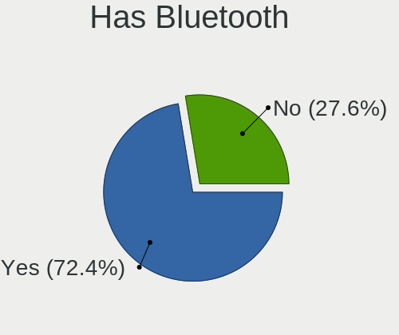
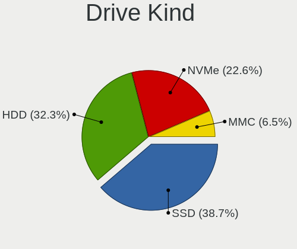
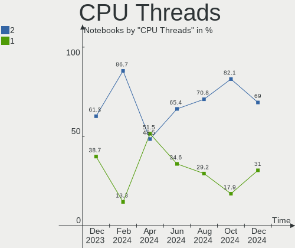
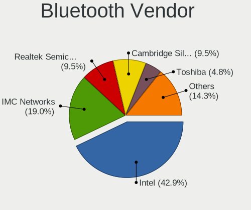

Xubuntu - Hardware Trends (Notebooks)
-------------------------------------

A project to identify most popular hardware characteristics and track their change
over time based on data collected by Linux users at https://Linux-Hardware.org.

Anyone can contribute to this report by the [hw-probe](https://github.com/linuxhw/hw-probe) tool:

    sudo -E hw-probe -all -upload

This report is for one last month. Overall report since the beginning of time: [TestDays](https://github.com/linuxhw/TestDays)

Period: Oct, 2023.

Contents
--------

* [ System ](#system)
  - [ OS                       ](#os)
  - [ OS Family                ](#os-family)
  - [ Kernel                   ](#kernel)
  - [ Kernel Family            ](#kernel-family)
  - [ Kernel Major Ver.        ](#kernel-major-ver)
  - [ Arch                     ](#arch)
  - [ DE                       ](#de)
  - [ Display Server           ](#display-server)
  - [ Display Manager          ](#display-manager)
  - [ OS Lang                  ](#os-lang)
  - [ Boot Mode                ](#boot-mode)
  - [ Filesystem               ](#filesystem)
  - [ Part. scheme             ](#part-scheme)
  - [ Dual Boot with Linux/BSD ](#dual-boot-with-linuxbsd)
  - [ Dual Boot (Win)          ](#dual-boot-win)

* [ Board ](#board)
  - [ Vendor                   ](#vendor)
  - [ Model                    ](#model)
  - [ Model Family             ](#model-family)
  - [ MFG Year                 ](#mfg-year)
  - [ Form Factor              ](#form-factor)
  - [ Secure Boot              ](#secure-boot)
  - [ Coreboot                 ](#coreboot)
  - [ RAM Size                 ](#ram-size)
  - [ RAM Used                 ](#ram-used)
  - [ Total Drives             ](#total-drives)
  - [ Has CD-ROM               ](#has-cd-rom)
  - [ Has Ethernet             ](#has-ethernet)
  - [ Has WiFi                 ](#has-wifi)
  - [ Has Bluetooth            ](#has-bluetooth)

* [ Location ](#location)
  - [ Country                  ](#country)
  - [ City                     ](#city)

* [ Drives ](#drives)
  - [ Drive Vendor             ](#drive-vendor)
  - [ Drive Model              ](#drive-model)
  - [ HDD Vendor               ](#hdd-vendor)
  - [ SSD Vendor               ](#ssd-vendor)
  - [ Drive Kind               ](#drive-kind)
  - [ Drive Connector          ](#drive-connector)
  - [ Drive Size               ](#drive-size)
  - [ Space Total              ](#space-total)
  - [ Space Used               ](#space-used)
  - [ Malfunc. Drives          ](#malfunc-drives)
  - [ Malfunc. Drive Vendor    ](#malfunc-drive-vendor)
  - [ Malfunc. HDD Vendor      ](#malfunc-hdd-vendor)
  - [ Malfunc. Drive Kind      ](#malfunc-drive-kind)
  - [ Failed Drives            ](#failed-drives)
  - [ Failed Drive Vendor      ](#failed-drive-vendor)
  - [ Drive Status             ](#drive-status)

* [ Storage controller ](#storage-controller)
  - [ Storage Vendor           ](#storage-vendor)
  - [ Storage Model            ](#storage-model)
  - [ Storage Kind             ](#storage-kind)

* [ Processor ](#processor)
  - [ CPU Vendor               ](#cpu-vendor)
  - [ CPU Model                ](#cpu-model)
  - [ CPU Model Family         ](#cpu-model-family)
  - [ CPU Cores                ](#cpu-cores)
  - [ CPU Sockets              ](#cpu-sockets)
  - [ CPU Threads              ](#cpu-threads)
  - [ CPU Op-Modes             ](#cpu-op-modes)
  - [ CPU Microcode            ](#cpu-microcode)
  - [ CPU Microarch            ](#cpu-microarch)

* [ Graphics ](#graphics)
  - [ GPU Vendor               ](#gpu-vendor)
  - [ GPU Model                ](#gpu-model)
  - [ GPU Combo                ](#gpu-combo)
  - [ GPU Driver               ](#gpu-driver)
  - [ GPU Memory               ](#gpu-memory)

* [ Monitor ](#monitor)
  - [ Monitor Vendor           ](#monitor-vendor)
  - [ Monitor Model            ](#monitor-model)
  - [ Monitor Resolution       ](#monitor-resolution)
  - [ Monitor Diagonal         ](#monitor-diagonal)
  - [ Monitor Width            ](#monitor-width)
  - [ Aspect Ratio             ](#aspect-ratio)
  - [ Monitor Area             ](#monitor-area)
  - [ Pixel Density            ](#pixel-density)
  - [ Multiple Monitors        ](#multiple-monitors)

* [ Network ](#network)
  - [ Net Controller Vendor    ](#net-controller-vendor)
  - [ Net Controller Model     ](#net-controller-model)
  - [ Wireless Vendor          ](#wireless-vendor)
  - [ Wireless Model           ](#wireless-model)
  - [ Ethernet Vendor          ](#ethernet-vendor)
  - [ Ethernet Model           ](#ethernet-model)
  - [ Net Controller Kind      ](#net-controller-kind)
  - [ Used Controller          ](#used-controller)
  - [ NICs                     ](#nics)
  - [ IPv6                     ](#ipv6)

* [ Bluetooth ](#bluetooth)
  - [ Bluetooth Vendor         ](#bluetooth-vendor)
  - [ Bluetooth Model          ](#bluetooth-model)

* [ Sound ](#sound)
  - [ Sound Vendor             ](#sound-vendor)
  - [ Sound Model              ](#sound-model)

* [ Memory ](#memory)
  - [ Memory Vendor            ](#memory-vendor)
  - [ Memory Model             ](#memory-model)
  - [ Memory Kind              ](#memory-kind)
  - [ Memory Form Factor       ](#memory-form-factor)
  - [ Memory Size              ](#memory-size)
  - [ Memory Speed             ](#memory-speed)

* [ Printers & scanners ](#printers--scanners)
  - [ Printer Vendor           ](#printer-vendor)
  - [ Printer Model            ](#printer-model)
  - [ Scanner Vendor           ](#scanner-vendor)
  - [ Scanner Model            ](#scanner-model)

* [ Camera ](#camera)
  - [ Camera Vendor            ](#camera-vendor)
  - [ Camera Model             ](#camera-model)

* [ Security ](#security)
  - [ Fingerprint Vendor       ](#fingerprint-vendor)
  - [ Fingerprint Model        ](#fingerprint-model)
  - [ Chipcard Vendor          ](#chipcard-vendor)
  - [ Chipcard Model           ](#chipcard-model)

* [ Unsupported ](#unsupported)
  - [ Unsupported Devices      ](#unsupported-devices)
  - [ Unsupported Device Types ](#unsupported-device-types)

System
------

OS
--

Installed operating systems

| Name          | Notebooks | Percent |
|---------------|-----------|---------|
| Xubuntu 22.04 | 15        | 53.57%  |
| Xubuntu 23.04 | 5         | 17.86%  |
| Xubuntu 23.10 | 3         | 10.71%  |
| Xubuntu 20.04 | 2         | 7.14%   |
| Xubuntu 18.04 | 2         | 7.14%   |
| Xubuntu 21.04 | 1         | 3.57%   |

OS Family
---------

OS without a version

| Name    | Notebooks | Percent |
|---------|-----------|---------|
| Xubuntu | 28        | 100%    |

Kernel
------

Version of the Linux kernel

| Version              | Notebooks | Percent |
|----------------------|-----------|---------|
| 6.2.0-34-generic     | 7         | 25%     |
| 6.2.0-33-generic     | 4         | 14.29%  |
| 6.2.0-35-generic     | 3         | 10.71%  |
| 5.15.0-87-generic    | 3         | 10.71%  |
| 6.5.0-9-generic      | 2         | 7.14%   |
| 5.4.0-150-generic    | 2         | 7.14%   |
| 5.15.0-78-generic    | 2         | 7.14%   |
| 6.5.0-10-generic     | 1         | 3.57%   |
| 6.2.0-36-generic     | 1         | 3.57%   |
| 6.2.0-26-generic     | 1         | 3.57%   |
| 5.15.0-86-generic    | 1         | 3.57%   |
| 5.11.0-44-lowlatency | 1         | 3.57%   |

Kernel Family
-------------

Linux kernel without a distro release

| Version | Notebooks | Percent |
|---------|-----------|---------|
| 6.2.0   | 16        | 57.14%  |
| 5.15.0  | 6         | 21.43%  |
| 6.5.0   | 3         | 10.71%  |
| 5.4.0   | 2         | 7.14%   |
| 5.11.0  | 1         | 3.57%   |

Kernel Major Ver.
-----------------

Linux kernel major version

| Version | Notebooks | Percent |
|---------|-----------|---------|
| 6.2     | 16        | 57.14%  |
| 5.15    | 6         | 21.43%  |
| 6.5     | 3         | 10.71%  |
| 5.4     | 2         | 7.14%   |
| 5.11    | 1         | 3.57%   |

Arch
----

OS architecture (x86_64, i586, etc.)

| Name   | Notebooks | Percent |
|--------|-----------|---------|
| x86_64 | 26        | 92.86%  |
| i686   | 2         | 7.14%   |

DE
--

Desktop Environment

| Name  | Notebooks | Percent |
|-------|-----------|---------|
| XFCE  | 27        | 96.43%  |
| GNOME | 1         | 3.57%   |

Display Server
--------------

X11 or Wayland

| Name | Notebooks | Percent |
|------|-----------|---------|
| X11  | 28        | 100%    |

Display Manager
---------------

SDDM, LightDM, etc.

| Name    | Notebooks | Percent |
|---------|-----------|---------|
| LightDM | 26        | 92.86%  |
| GDM3    | 2         | 7.14%   |

OS Lang
-------

Language

| Lang  | Notebooks | Percent |
|-------|-----------|---------|
| en_US | 15        | 53.57%  |
| en_GB | 4         | 14.29%  |
| fr_FR | 2         | 7.14%   |
| ru_RU | 1         | 3.57%   |
| pt_BR | 1         | 3.57%   |
| ja_JP | 1         | 3.57%   |
| it_IT | 1         | 3.57%   |
| en_HK | 1         | 3.57%   |
| en_AU | 1         | 3.57%   |
| C     | 1         | 3.57%   |

Boot Mode
---------

EFI or BIOS

| Mode | Notebooks | Percent |
|------|-----------|---------|
| BIOS | 19        | 67.86%  |
| EFI  | 9         | 32.14%  |

Filesystem
----------

Type of filesystem

| Type  | Notebooks | Percent |
|-------|-----------|---------|
| Tmpfs | 15        | 53.57%  |
| Ext4  | 13        | 46.43%  |

Part. scheme
------------

Scheme of partitioning

| Type    | Notebooks | Percent |
|---------|-----------|---------|
| GPT     | 19        | 67.86%  |
| MBR     | 7         | 25%     |
| Unknown | 2         | 7.14%   |

Dual Boot with Linux/BSD
------------------------

Hosting more than one Linux/BSD

| Dual boot | Notebooks | Percent |
|-----------|-----------|---------|
| No        | 27        | 96.43%  |
| Yes       | 1         | 3.57%   |

Dual Boot (Win)
---------------

Hosting Linux and Windows

| Dual boot | Notebooks | Percent |
|-----------|-----------|---------|
| No        | 21        | 75%     |
| Yes       | 7         | 25%     |

Board
-----

Vendor
------

Motherboard manufacturer

| Name             | Notebooks | Percent |
|------------------|-----------|---------|
| Lenovo           | 7         | 25%     |
| Dell             | 5         | 17.86%  |
| Hewlett-Packard  | 4         | 14.29%  |
| ASUSTek Computer | 3         | 10.71%  |
| Acer             | 2         | 7.14%   |
| Toshiba          | 1         | 3.57%   |
| MSI              | 1         | 3.57%   |
| HUAWEI           | 1         | 3.57%   |
| Fujitsu Siemens  | 1         | 3.57%   |
| Dynabook         | 1         | 3.57%   |
| Apple            | 1         | 3.57%   |
| AMI              | 1         | 3.57%   |

Model
-----

Motherboard model

| Name                                        | Notebooks | Percent |
|---------------------------------------------|-----------|---------|
| Toshiba Satellite C55-C                     | 1         | 3.57%   |
| MSI GP65 Leopard 10SDK                      | 1         | 3.57%   |
| Lenovo ThinkPad X1 Carbon Gen 11 21HNS43700 | 1         | 3.57%   |
| Lenovo ThinkPad T61 64607EU                 | 1         | 3.57%   |
| Lenovo ThinkPad T430u 3352A83               | 1         | 3.57%   |
| Lenovo ThinkBook 16p Gen 2 20YM             | 1         | 3.57%   |
| Lenovo IdeaPad S300 9803                    | 1         | 3.57%   |
| Lenovo IdeaPad L340-15API 81LW              | 1         | 3.57%   |
| Lenovo 15ARE05 81W4                         | 1         | 3.57%   |
| HUAWEI RLEF-XX                              | 1         | 3.57%   |
| HP Presario CQ57                            | 1         | 3.57%   |
| HP Presario C500 (GF849EA#ABU)              | 1         | 3.57%   |
| HP Pavilion g4                              | 1         | 3.57%   |
| HP EliteBook 830 G8 Notebook PC             | 1         | 3.57%   |
| Fujitsu Siemens LIFEBOOK T4215              | 1         | 3.57%   |
| Dynabook B65/ER                             | 1         | 3.57%   |
| Dell MXG061                                 | 1         | 3.57%   |
| Dell Latitude 7330                          | 1         | 3.57%   |
| Dell Latitude 5411                          | 1         | 3.57%   |
| Dell Latitude 3490                          | 1         | 3.57%   |
| Dell Inspiron 1501                          | 1         | 3.57%   |
| ASUS VivoBook_ASUSLaptop M1502IA_M1502IA    | 1         | 3.57%   |
| ASUS ROG Strix G814JU_G814JU                | 1         | 3.57%   |
| ASUS K53E                                   | 1         | 3.57%   |
| Apple MacBook8,1                            | 1         | 3.57%   |
| AMI Intel                                   | 1         | 3.57%   |
| Acer Aspire A317-51K                        | 1         | 3.57%   |
| Acer Aspire 5740                            | 1         | 3.57%   |

Model Family
------------

Motherboard model prefix

| Name                     | Notebooks | Percent |
|--------------------------|-----------|---------|
| Lenovo ThinkPad          | 3         | 10.71%  |
| Dell Latitude            | 3         | 10.71%  |
| Lenovo IdeaPad           | 2         | 7.14%   |
| HP Presario              | 2         | 7.14%   |
| Acer Aspire              | 2         | 7.14%   |
| Toshiba Satellite        | 1         | 3.57%   |
| MSI GP65                 | 1         | 3.57%   |
| Lenovo ThinkBook         | 1         | 3.57%   |
| Lenovo 15ARE05           | 1         | 3.57%   |
| HUAWEI RLEF-XX           | 1         | 3.57%   |
| HP Pavilion              | 1         | 3.57%   |
| HP EliteBook             | 1         | 3.57%   |
| Fujitsu Siemens LIFEBOOK | 1         | 3.57%   |
| Dynabook B65             | 1         | 3.57%   |
| Dell MXG061              | 1         | 3.57%   |
| Dell Inspiron            | 1         | 3.57%   |
| ASUS VivoBook            | 1         | 3.57%   |
| ASUS ROG                 | 1         | 3.57%   |
| ASUS K53E                | 1         | 3.57%   |
| Apple MacBook8           | 1         | 3.57%   |
| AMI Intel                | 1         | 3.57%   |

MFG Year
--------

Motherboard manufacture year

| Year | Notebooks | Percent |
|------|-----------|---------|
| 2022 | 5         | 17.86%  |
| 2020 | 3         | 10.71%  |
| 2019 | 3         | 10.71%  |
| 2011 | 3         | 10.71%  |
| 2006 | 3         | 10.71%  |
| 2023 | 2         | 7.14%   |
| 2021 | 2         | 7.14%   |
| 2012 | 2         | 7.14%   |
| 2007 | 2         | 7.14%   |
| 2018 | 1         | 3.57%   |
| 2015 | 1         | 3.57%   |
| 2009 | 1         | 3.57%   |

Form Factor
-----------

Physical design of the computer

| Name     | Notebooks | Percent |
|----------|-----------|---------|
| Notebook | 28        | 100%    |

Secure Boot
-----------

Enabled or disabled

| State    | Notebooks | Percent |
|----------|-----------|---------|
| Disabled | 27        | 96.43%  |
| Enabled  | 1         | 3.57%   |

Coreboot
--------

Have coreboot on board

| Used | Notebooks | Percent |
|------|-----------|---------|
| No   | 28        | 100%    |

RAM Size
--------

Total RAM memory

| Size in GB  | Notebooks | Percent |
|-------------|-----------|---------|
| 4.01-8.0    | 7         | 25%     |
| 3.01-4.0    | 7         | 25%     |
| 32.01-64.0  | 4         | 14.29%  |
| 8.01-16.0   | 3         | 10.71%  |
| 16.01-24.0  | 2         | 7.14%   |
| 24.01-32.0  | 1         | 3.57%   |
| 2.01-3.0    | 1         | 3.57%   |
| 64.01-256.0 | 1         | 3.57%   |
| 1.01-2.0    | 1         | 3.57%   |
| 0.51-1.0    | 1         | 3.57%   |

RAM Used
--------

Used RAM memory

| Used GB   | Notebooks | Percent |
|-----------|-----------|---------|
| 1.01-2.0  | 7         | 25%     |
| 4.01-8.0  | 6         | 21.43%  |
| 0.51-1.0  | 5         | 17.86%  |
| 2.01-3.0  | 4         | 14.29%  |
| 3.01-4.0  | 3         | 10.71%  |
| 8.01-16.0 | 3         | 10.71%  |

Total Drives
------------

Number of drives on board

| Drives | Notebooks | Percent |
|--------|-----------|---------|
| 1      | 26        | 92.86%  |
| 2      | 2         | 7.14%   |

Has CD-ROM
----------

Has CD-ROM on board

| Presented | Notebooks | Percent |
|-----------|-----------|---------|
| No        | 17        | 60.71%  |
| Yes       | 11        | 39.29%  |

Has Ethernet
------------

Has Ethernet on board

| Presented | Notebooks | Percent |
|-----------|-----------|---------|
| Yes       | 22        | 78.57%  |
| No        | 6         | 21.43%  |

Has WiFi
--------

Has WiFi module

| Presented | Notebooks | Percent |
|-----------|-----------|---------|
| Yes       | 28        | 100%    |

Has Bluetooth
-------------

Has Bluetooth module

| Presented | Notebooks | Percent |
|-----------|-----------|---------|
| Yes       | 20        | 71.43%  |
| No        | 8         | 28.57%  |

Location
--------

Country
-------

Geographic location (country)

| Country     | Notebooks | Percent |
|-------------|-----------|---------|
| USA         | 5         | 17.86%  |
| UK          | 4         | 14.29%  |
| Russia      | 2         | 7.14%   |
| Japan       | 2         | 7.14%   |
| France      | 2         | 7.14%   |
| Brazil      | 2         | 7.14%   |
| Vietnam     | 1         | 3.57%   |
| Romania     | 1         | 3.57%   |
| Poland      | 1         | 3.57%   |
| Philippines | 1         | 3.57%   |
| Italy       | 1         | 3.57%   |
| Israel      | 1         | 3.57%   |
| Hong Kong   | 1         | 3.57%   |
| Czechia     | 1         | 3.57%   |
| Cuba        | 1         | 3.57%   |
| Belgium     | 1         | 3.57%   |
| Azerbaijan  | 1         | 3.57%   |

City
----

Geographic location (city)

| City             | Notebooks | Percent |
|------------------|-----------|---------|
| Charlotte        | 2         | 7.14%   |
| York             | 1         | 3.57%   |
| Yokohama         | 1         | 3.57%   |
| Warsaw           | 1         | 3.57%   |
| St Petersburg    | 1         | 3.57%   |
| Ramat Gan        | 1         | 3.57%   |
| Prague           | 1         | 3.57%   |
| Ploieşti        | 1         | 3.57%   |
| Novosibirsk      | 1         | 3.57%   |
| Northampton      | 1         | 3.57%   |
| North Hills      | 1         | 3.57%   |
| Manila           | 1         | 3.57%   |
| Manchester       | 1         | 3.57%   |
| Machiya          | 1         | 3.57%   |
| Leuven           | 1         | 3.57%   |
| Katonah          | 1         | 3.57%   |
| Jeremoabo        | 1         | 3.57%   |
| Ho Chi Minh City | 1         | 3.57%   |
| Havana           | 1         | 3.57%   |
| Harrisonburg     | 1         | 3.57%   |
| Galatina         | 1         | 3.57%   |
| Central          | 1         | 3.57%   |
| Burgnac          | 1         | 3.57%   |
| Bristol          | 1         | 3.57%   |
| Belfort          | 1         | 3.57%   |
| Barueri          | 1         | 3.57%   |
| Baku             | 1         | 3.57%   |

Drives
------

Drive Vendor
------------

Hard drive vendors

| Vendor                | Notebooks | Drives | Percent |
|-----------------------|-----------|--------|---------|
| WDC                   | 5         | 5      | 16.67%  |
| Unknown               | 2         | 2      | 6.67%   |
| Toshiba               | 2         | 2      | 6.67%   |
| Micron Technology     | 2         | 2      | 6.67%   |
| KIOXIA                | 2         | 2      | 6.67%   |
| A-DATA Technology     | 2         | 2      | 6.67%   |
| SK hynix              | 1         | 1      | 3.33%   |
| Silicon Motion        | 1         | 1      | 3.33%   |
| Seagate               | 1         | 1      | 3.33%   |
| Sandisk               | 1         | 1      | 3.33%   |
| Samsung Electronics   | 1         | 1      | 3.33%   |
| Realtek Semiconductor | 1         | 1      | 3.33%   |
| Phison Electronics    | 1         | 1      | 3.33%   |
| KingDian              | 1         | 1      | 3.33%   |
| Intel                 | 1         | 1      | 3.33%   |
| Hitachi               | 1         | 1      | 3.33%   |
| Fujitsu               | 1         | 1      | 3.33%   |
| Crucial               | 1         | 1      | 3.33%   |
| BR                    | 1         | 1      | 3.33%   |
| Apple                 | 1         | 2      | 3.33%   |
| ADATA Technology      | 1         | 1      | 3.33%   |

Drive Model
-----------

Hard drive models

| Model                                        | Notebooks | Percent |
|----------------------------------------------|-----------|---------|
| Toshiba MQ01ABF050 500GB                     | 2         | 6.45%   |
| WDC WDS250G2B0A 250GB SSD                    | 1         | 3.23%   |
| WDC WD3200BPVT-80ZEST0 320GB                 | 1         | 3.23%   |
| WDC WD2500BEVT-60ZCT1 250GB                  | 1         | 3.23%   |
| WDC WD10SPZX-21Z10T0 1TB                     | 1         | 3.23%   |
| WDC PC SN730 SDBPNTY-1T00-1101 1TB           | 1         | 3.23%   |
| Unknown SD/MMC/MS PRO 16GB                   | 1         | 3.23%   |
| Unknown hDEaP3  128GB                        | 1         | 3.23%   |
| SK hynix PC611 NVMe 512GB                    | 1         | 3.23%   |
| Silicon Motion PCIe-8 SSD 512GB              | 1         | 3.23%   |
| Seagate ST500LM021-1KJ152 500GB              | 1         | 3.23%   |
| Sandisk WD PC SN560 SDDPNQE-1T00-1002 1024GB | 1         | 3.23%   |
| Samsung MZVL22T0HDLB-00BLL 2TB               | 1         | 3.23%   |
| Realtek ADATA SWORDFISH 500GB                | 1         | 3.23%   |
| Phison PS5013 E13 NVMe Controller 256GB      | 1         | 3.23%   |
| Micron MTFDDAK256TDL 256GB SSD               | 1         | 3.23%   |
| Micron C400-MTFDDAK064MAM 64GB SSD           | 1         | 3.23%   |
| KIOXIA KXG60ZNV512G 512GB                    | 1         | 3.23%   |
| KIOXIA KBG50ZNS512G NVMe 512GB               | 1         | 3.23%   |
| KingDian S200 60GB                           | 1         | 3.23%   |
| Intel SSDPEKNU512GZ 512GB                    | 1         | 3.23%   |
| Hitachi HTS541680J9SA00 80GB                 | 1         | 3.23%   |
| Fujitsu MHZ2250BH G2 250GB                   | 1         | 3.23%   |
| Crucial CT275MX300SSD1 275GB                 | 1         | 3.23%   |
| BR SSD 256GB                                 | 1         | 3.23%   |
| Apple SSD AP0256H 256GB                      | 1         | 3.23%   |
| Apple S1X NVMe Controller 256GB              | 1         | 3.23%   |
| ADATA LEGEND 710 512GB                       | 1         | 3.23%   |
| A-DATA SU810NS38 SATA 256 GB SSD             | 1         | 3.23%   |
| A-DATA SP900 128GB SSD                       | 1         | 3.23%   |

HDD Vendor
----------

Hard disk drive vendors

| Vendor  | Notebooks | Drives | Percent |
|---------|-----------|--------|---------|
| WDC     | 3         | 3      | 33.33%  |
| Toshiba | 2         | 2      | 22.22%  |
| Unknown | 1         | 1      | 11.11%  |
| Seagate | 1         | 1      | 11.11%  |
| Hitachi | 1         | 1      | 11.11%  |
| Fujitsu | 1         | 1      | 11.11%  |

SSD Vendor
----------

Solid state drive vendors

| Vendor            | Notebooks | Drives | Percent |
|-------------------|-----------|--------|---------|
| Micron Technology | 2         | 2      | 25%     |
| A-DATA Technology | 2         | 2      | 25%     |
| WDC               | 1         | 1      | 12.5%   |
| KingDian          | 1         | 1      | 12.5%   |
| Crucial           | 1         | 1      | 12.5%   |
| BR                | 1         | 1      | 12.5%   |

Drive Kind
----------

HDD or SSD

| Kind | Notebooks | Drives | Percent |
|------|-----------|--------|---------|
| NVMe | 12        | 13     | 40%     |
| HDD  | 9         | 9      | 30%     |
| SSD  | 8         | 8      | 26.67%  |
| MMC  | 1         | 1      | 3.33%   |

Drive Connector
---------------

SATA, SAS, NVMe, etc.

| Type | Notebooks | Drives | Percent |
|------|-----------|--------|---------|
| SATA | 15        | 16     | 51.72%  |
| NVMe | 12        | 13     | 41.38%  |
| SAS  | 1         | 1      | 3.45%   |
| MMC  | 1         | 1      | 3.45%   |

Drive Size
----------

Size of hard drive

| Size in TB | Notebooks | Drives | Percent |
|------------|-----------|--------|---------|
| 0.01-0.5   | 15        | 16     | 93.75%  |
| 0.51-1.0   | 1         | 1      | 6.25%   |

Space Total
-----------

Amount of disk space available on the file system

| Size in GB     | Notebooks | Percent |
|----------------|-----------|---------|
| 101-250        | 8         | 28.57%  |
| 251-500        | 7         | 25%     |
| 51-100         | 6         | 21.43%  |
| 501-1000       | 4         | 14.29%  |
| 1001-2000      | 2         | 7.14%   |
| More than 3000 | 1         | 3.57%   |

Space Used
----------

Amount of used disk space

| Used GB   | Notebooks | Percent |
|-----------|-----------|---------|
| 1-20      | 8         | 28.57%  |
| 21-50     | 7         | 25%     |
| 101-250   | 4         | 14.29%  |
| 251-500   | 3         | 10.71%  |
| 51-100    | 3         | 10.71%  |
| 501-1000  | 2         | 7.14%   |
| 1001-2000 | 1         | 3.57%   |

Malfunc. Drives
---------------

Drive models with a malfunction

| Model                        | Notebooks | Drives | Percent |
|------------------------------|-----------|--------|---------|
| WDC WD3200BPVT-80ZEST0 320GB | 1         | 1      | 50%     |
| Hitachi HTS541680J9SA00 80GB | 1         | 1      | 50%     |

Malfunc. Drive Vendor
---------------------

Vendors of faulty drives

| Vendor  | Notebooks | Drives | Percent |
|---------|-----------|--------|---------|
| WDC     | 1         | 1      | 50%     |
| Hitachi | 1         | 1      | 50%     |

Malfunc. HDD Vendor
-------------------

Vendors of faulty HDD drives

| Vendor  | Notebooks | Drives | Percent |
|---------|-----------|--------|---------|
| WDC     | 1         | 1      | 50%     |
| Hitachi | 1         | 1      | 50%     |

Malfunc. Drive Kind
-------------------

Kinds of faulty drives

| Kind | Notebooks | Drives | Percent |
|------|-----------|--------|---------|
| HDD  | 2         | 2      | 100%    |

Failed Drives
-------------

Failed drive models

Zero info for selected period =(

Failed Drive Vendor
-------------------

Failed drive vendors

Zero info for selected period =(

Drive Status
------------

Number of failed and malfunc. drives

| Status   | Notebooks | Drives | Percent |
|----------|-----------|--------|---------|
| Detected | 16        | 17     | 55.17%  |
| Works    | 11        | 12     | 37.93%  |
| Malfunc  | 2         | 2      | 6.9%    |

Storage controller
------------------

Storage Vendor
--------------

Storage controller vendors

| Vendor                       | Notebooks | Percent |
|------------------------------|-----------|---------|
| Intel                        | 20        | 58.82%  |
| AMD                          | 3         | 8.82%   |
| SanDisk                      | 2         | 5.88%   |
| Toshiba America Info Systems | 1         | 2.94%   |
| SK hynix                     | 1         | 2.94%   |
| Silicon Motion               | 1         | 2.94%   |
| Samsung Electronics          | 1         | 2.94%   |
| Realtek Semiconductor        | 1         | 2.94%   |
| Phison Electronics           | 1         | 2.94%   |
| KIOXIA                       | 1         | 2.94%   |
| Apple                        | 1         | 2.94%   |
| ADATA Technology             | 1         | 2.94%   |

Storage Model
-------------

Storage controller models

| Model                                                                        | Notebooks | Percent |
|------------------------------------------------------------------------------|-----------|---------|
| Intel 82801GBM/GHM (ICH7-M Family) SATA Controller [AHCI mode]               | 2         | 5.26%   |
| Intel 82801G (ICH7 Family) IDE Controller                                    | 2         | 5.26%   |
| Intel 7 Series Chipset Family 6-port SATA Controller [AHCI mode]             | 2         | 5.26%   |
| Intel 6 Series/C200 Series Chipset Family 6 port Mobile SATA AHCI Controller | 2         | 5.26%   |
| Intel 5 Series/3400 Series Chipset 4 port SATA AHCI Controller               | 2         | 5.26%   |
| Intel 400 Series Chipset Family SATA AHCI Controller                         | 2         | 5.26%   |
| AMD FCH SATA Controller [AHCI mode]                                          | 2         | 5.26%   |
| Toshiba America Info Systems XG6 NVMe SSD Controller                         | 1         | 2.63%   |
| SK hynix PC611 NVMe Solid State Drive                                        | 1         | 2.63%   |
| Silicon Motion Non-Volatile memory controller                                | 1         | 2.63%   |
| SanDisk WD Black SN770 / PC SN740 256GB / PC SN560 (DRAM-less) NVMe SSD      | 1         | 2.63%   |
| SanDisk Extreme Pro / WD Black SN750 / PC SN730 / Red SN700 NVMe SSD         | 1         | 2.63%   |
| Samsung NVMe SSD Controller PM9A1/PM9A3/980PRO                               | 1         | 2.63%   |
| Realtek RTS5763DL NVMe SSD Controller (DRAM-less)                            | 1         | 2.63%   |
| Phison PS5013-E13 PCIe3 NVMe Controller (DRAM-less)                          | 1         | 2.63%   |
| KIOXIA NVMe SSD Controller BG5 (DRAM-less)                                   | 1         | 2.63%   |
| Intel Volume Management Device NVMe RAID Controller Intel Corporation        | 1         | 2.63%   |
| Intel Volume Management Device NVMe RAID Controller                          | 1         | 2.63%   |
| Intel Sunrise Point-LP SATA Controller [AHCI mode]                           | 1         | 2.63%   |
| Intel SSD 670p Series [Keystone Harbor]                                      | 1         | 2.63%   |
| Intel Celeron/Pentium Silver Processor SATA Controller                       | 1         | 2.63%   |
| Intel Cannon Point-LP SATA Controller [AHCI Mode]                            | 1         | 2.63%   |
| Intel 82801HM/HEM (ICH8M/ICH8M-E) SATA Controller [AHCI mode]                | 1         | 2.63%   |
| Intel 82801HM/HEM (ICH8M/ICH8M-E) IDE Controller                             | 1         | 2.63%   |
| Intel 82801GBM/GHM (ICH7-M Family) SATA Controller [IDE mode]                | 1         | 2.63%   |
| Intel 82801 Mobile SATA Controller [RAID mode]                               | 1         | 2.63%   |
| Intel 8 Series SATA Controller 1 [AHCI mode]                                 | 1         | 2.63%   |
| Apple S1X NVMe Controller                                                    | 1         | 2.63%   |
| AMD SB600 Non-Raid-5 SATA                                                    | 1         | 2.63%   |
| AMD SB600 IDE                                                                | 1         | 2.63%   |
| ADATA ADATA XPG GAMMIXS1 1L Media (256 GB SSD)                               | 1         | 2.63%   |

Storage Kind
------------

Kind of storage controller (IDE, SATA, NVMe, SAS, ...)

| Kind | Notebooks | Percent |
|------|-----------|---------|
| SATA | 18        | 47.37%  |
| NVMe | 12        | 31.58%  |
| IDE  | 5         | 13.16%  |
| RAID | 3         | 7.89%   |

Processor
---------

CPU Vendor
----------

Processor vendors

| Vendor | Notebooks | Percent |
|--------|-----------|---------|
| Intel  | 23        | 82.14%  |
| AMD    | 5         | 17.86%  |

CPU Model
---------

Processor models

| Model                                         | Notebooks | Percent |
|-----------------------------------------------|-----------|---------|
| Intel Pentium CPU B940 @ 2.00GHz              | 1         | 3.57%   |
| Intel Genuine CPU T2400 @ 1.83GHz             | 1         | 3.57%   |
| Intel Core M-5Y31 CPU @ 0.90GHz               | 1         | 3.57%   |
| Intel Core i7-10850H CPU @ 2.70GHz            | 1         | 3.57%   |
| Intel Core i7-10750H CPU @ 2.60GHz            | 1         | 3.57%   |
| Intel Core i5-8265U CPU @ 1.60GHz             | 1         | 3.57%   |
| Intel Core i5-8250U CPU @ 1.60GHz             | 1         | 3.57%   |
| Intel Core i3-7020U CPU @ 2.30GHz             | 1         | 3.57%   |
| Intel Core i3-4005U CPU @ 1.70GHz             | 1         | 3.57%   |
| Intel Core i3-3217U CPU @ 1.80GHz             | 1         | 3.57%   |
| Intel Core i3 CPU M 370 @ 2.40GHz             | 1         | 3.57%   |
| Intel Core i3 CPU M 330 @ 2.13GHz             | 1         | 3.57%   |
| Intel Core 2 Duo CPU T7300 @ 2.00GHz          | 1         | 3.57%   |
| Intel Core 2 CPU T5600 @ 1.83GHz              | 1         | 3.57%   |
| Intel Celeron N4020 CPU @ 1.10GHz             | 1         | 3.57%   |
| Intel Celeron M CPU 440 @ 1.86GHz             | 1         | 3.57%   |
| Intel Celeron CPU B800 @ 1.50GHz              | 1         | 3.57%   |
| Intel Celeron CPU 887 @ 1.50GHz               | 1         | 3.57%   |
| Intel 13th Gen Core i7-1365U                  | 1         | 3.57%   |
| Intel 13th Gen Core i7-13650HX                | 1         | 3.57%   |
| Intel 12th Gen Core i7-12700H                 | 1         | 3.57%   |
| Intel 12th Gen Core i7-1265U                  | 1         | 3.57%   |
| Intel 11th Gen Core i7-1165G7 @ 2.80GHz       | 1         | 3.57%   |
| AMD Turion 64 X2 Mobile Technology TL-50      | 1         | 3.57%   |
| AMD Ryzen 7 5800H with Radeon Graphics        | 1         | 3.57%   |
| AMD Ryzen 7 4800H with Radeon Graphics        | 1         | 3.57%   |
| AMD Ryzen 5 4500U with Radeon Graphics        | 1         | 3.57%   |
| AMD Ryzen 3 3200U with Radeon Vega Mobile Gfx | 1         | 3.57%   |

CPU Model Family
----------------

Processor model prefix

| Model                   | Notebooks | Percent |
|-------------------------|-----------|---------|
| Other                   | 5         | 17.86%  |
| Intel Core i3           | 5         | 17.86%  |
| Intel Celeron           | 3         | 10.71%  |
| Intel Core i7           | 2         | 7.14%   |
| Intel Core i5           | 2         | 7.14%   |
| AMD Ryzen 7             | 2         | 7.14%   |
| Intel Pentium           | 1         | 3.57%   |
| Intel Genuine           | 1         | 3.57%   |
| Intel Core M            | 1         | 3.57%   |
| Intel Core 2 Duo        | 1         | 3.57%   |
| Intel Core 2            | 1         | 3.57%   |
| Intel Celeron M         | 1         | 3.57%   |
| AMD Turion 64 X2 Mobile | 1         | 3.57%   |
| AMD Ryzen 5             | 1         | 3.57%   |
| AMD Ryzen 3             | 1         | 3.57%   |

CPU Cores
---------

Number of processor cores

| Number | Notebooks | Percent |
|--------|-----------|---------|
| 2      | 15        | 53.57%  |
| 6      | 3         | 10.71%  |
| 4      | 3         | 10.71%  |
| 14     | 2         | 7.14%   |
| 10     | 2         | 7.14%   |
| 8      | 2         | 7.14%   |
| 1      | 1         | 3.57%   |

CPU Sockets
-----------

Number of sockets

| Number | Notebooks | Percent |
|--------|-----------|---------|
| 1      | 28        | 100%    |

CPU Threads
-----------

Threads per core (Hyper-Threading)

| Number | Notebooks | Percent |
|--------|-----------|---------|
| 2      | 16        | 57.14%  |
| 1      | 12        | 42.86%  |

CPU Op-Modes
------------

CPU Operation Modes (32-bit, 64-bit)

| Op mode        | Notebooks | Percent |
|----------------|-----------|---------|
| 32-bit, 64-bit | 26        | 92.86%  |
| 32-bit         | 2         | 7.14%   |

CPU Microcode
-------------

Microcode number

| Number     | Notebooks | Percent |
|------------|-----------|---------|
| Unknown    | 21        | 75%     |
| 0x206a7    | 2         | 7.14%   |
| 0x6ec      | 1         | 3.57%   |
| 0x6e8      | 1         | 3.57%   |
| 0x0a50000c | 1         | 3.57%   |
| 0x08600106 | 1         | 3.57%   |
| 0x08108102 | 1         | 3.57%   |

CPU Microarch
-------------

Microarchitecture

| Name             | Notebooks | Percent |
|------------------|-----------|---------|
| SandyBridge      | 3         | 10.71%  |
| KabyLake         | 3         | 10.71%  |
| Unknown          | 3         | 10.71%  |
| Zen 2            | 2         | 7.14%   |
| Westmere         | 2         | 7.14%   |
| P6               | 2         | 7.14%   |
| Core             | 2         | 7.14%   |
| CometLake        | 2         | 7.14%   |
| Zen+             | 1         | 3.57%   |
| Zen 3            | 1         | 3.57%   |
| TigerLake        | 1         | 3.57%   |
| K8 Hammer        | 1         | 3.57%   |
| IvyBridge        | 1         | 3.57%   |
| Haswell          | 1         | 3.57%   |
| Goldmont plus    | 1         | 3.57%   |
| Broadwell        | 1         | 3.57%   |
| Alderlake Hybrid | 1         | 3.57%   |

Graphics
--------

GPU Vendor
----------

Vendors of graphics cards

| Vendor | Notebooks | Percent |
|--------|-----------|---------|
| Intel  | 21        | 65.63%  |
| Nvidia | 6         | 18.75%  |
| AMD    | 5         | 15.63%  |

GPU Model
---------

Graphics card models

| Model                                                                         | Notebooks | Percent |
|-------------------------------------------------------------------------------|-----------|---------|
| Intel 2nd Generation Core Processor Family Integrated Graphics Controller     | 3         | 8.82%   |
| Intel Mobile 945GM/GMS/GME, 943/940GML Express Integrated Graphics Controller | 2         | 5.88%   |
| Intel Mobile 945GM/GMS, 943/940GML Express Integrated Graphics Controller     | 2         | 5.88%   |
| Intel Core Processor Integrated Graphics Controller                           | 2         | 5.88%   |
| Intel CometLake-H GT2 [UHD Graphics]                                          | 2         | 5.88%   |
| AMD Renoir [Radeon RX Vega 6 (Ryzen 4000/5000 Mobile Series)]                 | 2         | 5.88%   |
| Nvidia TU116M [GeForce GTX 1660 Ti Mobile]                                    | 1         | 2.94%   |
| Nvidia GF117M [GeForce 610M/710M/810M/820M / GT 620M/625M/630M/720M]          | 1         | 2.94%   |
| Nvidia GA106M [GeForce RTX 3060 Mobile / Max-Q]                               | 1         | 2.94%   |
| Nvidia G86M [Quadro NVS 140M]                                                 | 1         | 2.94%   |
| Nvidia G71M [GeForce Go 7900 GS]                                              | 1         | 2.94%   |
| Nvidia AD107M [GeForce RTX 4050 Max-Q / Mobile]                               | 1         | 2.94%   |
| Intel WhiskeyLake-U GT2 [UHD Graphics 620]                                    | 1         | 2.94%   |
| Intel UHD Graphics 620                                                        | 1         | 2.94%   |
| Intel TigerLake-LP GT2 [Iris Xe Graphics]                                     | 1         | 2.94%   |
| Intel Raptor Lake-S UHD Graphics                                              | 1         | 2.94%   |
| Intel Raptor Lake-P [Iris Xe Graphics]                                        | 1         | 2.94%   |
| Intel HD Graphics 620                                                         | 1         | 2.94%   |
| Intel HD Graphics 5300                                                        | 1         | 2.94%   |
| Intel Haswell-ULT Integrated Graphics Controller                              | 1         | 2.94%   |
| Intel GeminiLake [UHD Graphics 600]                                           | 1         | 2.94%   |
| Intel Alder Lake-UP3 GT2 [Iris Xe Graphics]                                   | 1         | 2.94%   |
| Intel Alder Lake-P GT2 [Iris Xe Graphics]                                     | 1         | 2.94%   |
| Intel 3rd Gen Core processor Graphics Controller                              | 1         | 2.94%   |
| AMD RS482M [Mobility Radeon Xpress 200]                                       | 1         | 2.94%   |
| AMD Picasso/Raven 2 [Radeon Vega Series / Radeon Vega Mobile Series]          | 1         | 2.94%   |
| AMD Cezanne [Radeon Vega Series / Radeon Vega Mobile Series]                  | 1         | 2.94%   |

GPU Combo
---------

Combinations of graphics cards

| Name           | Notebooks | Percent |
|----------------|-----------|---------|
| 1 x Intel      | 18        | 64.29%  |
| 1 x AMD        | 4         | 14.29%  |
| Intel + Nvidia | 3         | 10.71%  |
| 1 x Nvidia     | 2         | 7.14%   |
| AMD + Nvidia   | 1         | 3.57%   |

GPU Driver
----------

Free vs proprietary

| Driver      | Notebooks | Percent |
|-------------|-----------|---------|
| Free        | 24        | 85.71%  |
| Proprietary | 3         | 10.71%  |
| Unknown     | 1         | 3.57%   |

GPU Memory
----------

Total video memory

| Size in GB | Notebooks | Percent |
|------------|-----------|---------|
| Unknown    | 24        | 85.71%  |
| 0.01-0.5   | 4         | 14.29%  |

Monitor
-------

Monitor Vendor
--------------

Monitor vendors

| Vendor              | Notebooks | Percent |
|---------------------|-----------|---------|
| BOE                 | 7         | 25%     |
| LG Display          | 6         | 21.43%  |
| AU Optronics        | 4         | 14.29%  |
| Philips             | 2         | 7.14%   |
| Sharp               | 1         | 3.57%   |
| SANSUI              | 1         | 3.57%   |
| Samsung Electronics | 1         | 3.57%   |
| LG Philips          | 1         | 3.57%   |
| IBM                 | 1         | 3.57%   |
| CSO                 | 1         | 3.57%   |
| CPT                 | 1         | 3.57%   |
| Chimei Innolux      | 1         | 3.57%   |
| Apple               | 1         | 3.57%   |

Monitor Model
-------------

Monitor models

| Model                                                                | Notebooks | Percent |
|----------------------------------------------------------------------|-----------|---------|
| BOE LCD Monitor BOE0812 1920x1080 344x194mm 15.5-inch                | 2         | 6.9%    |
| Sharp LCD Monitor SHP13C1 1920x1200 366x229mm 17.0-inch              | 1         | 3.45%   |
| SANSUI ES-22F1 XEC3150 1920x1080 476x268mm 21.5-inch                 | 1         | 3.45%   |
| Samsung Electronics LCD Monitor SEC414A 1366x768 293x165mm 13.2-inch | 1         | 3.45%   |
| Philips PHL 242G5 PHLC0C4 1920x1080 531x299mm 24.0-inch              | 1         | 3.45%   |
| Philips 150B PHL080D 1024x768 307x230mm 15.1-inch                    | 1         | 3.45%   |
| LG Philips LCD Monitor LPLBC00 1280x800 331x207mm 15.4-inch          | 1         | 3.45%   |
| LG Display LCD Monitor LGD059D 1920x1080 309x174mm 14.0-inch         | 1         | 3.45%   |
| LG Display LCD Monitor LGD0456 1366x768 344x194mm 15.5-inch          | 1         | 3.45%   |
| LG Display LCD Monitor LGD0335 1366x768 310x174mm 14.0-inch          | 1         | 3.45%   |
| LG Display LCD Monitor LGD02F2 1366x768 344x194mm 15.5-inch          | 1         | 3.45%   |
| LG Display LCD Monitor LGD02E9 1366x768 309x174mm 14.0-inch          | 1         | 3.45%   |
| LG Display LCD Monitor LGD02DC 1366x768 344x194mm 15.5-inch          | 1         | 3.45%   |
| IBM LCD Monitor IBM2887 1680x1050 331x207mm 15.4-inch                | 1         | 3.45%   |
| IBM LCD Monitor IBM2887 1680x1050 330x210mm 15.4-inch                | 1         | 3.45%   |
| CSO LCD Monitor CSO1603 2560x1600 344x215mm 16.0-inch                | 1         | 3.45%   |
| CPT LCD Monitor CPT13A6 1280x800 331x207mm 15.4-inch                 | 1         | 3.45%   |
| Chimei Innolux LCD Monitor CMN13CD 1920x1080 293x165mm 13.2-inch     | 1         | 3.45%   |
| BOE NE180WUM-NY1 BOE0B2C 1920x1200 388x242mm 18.0-inch               | 1         | 3.45%   |
| BOE LCD Monitor BOE0AC9 2240x1400 302x189mm 14.0-inch                | 1         | 3.45%   |
| BOE LCD Monitor BOE0A74 1920x1200 345x215mm 16.0-inch                | 1         | 3.45%   |
| BOE LCD Monitor BOE07BB 1920x1080 309x173mm 13.9-inch                | 1         | 3.45%   |
| BOE LCD Monitor BOE0675 1366x768 344x194mm 15.5-inch                 | 1         | 3.45%   |
| AU Optronics LCD Monitor AUOAF90 1920x1080 344x193mm 15.5-inch       | 1         | 3.45%   |
| AU Optronics LCD Monitor AUO22EC 1366x768 344x193mm 15.5-inch        | 1         | 3.45%   |
| AU Optronics LCD Monitor AUO229E 1600x900 382x214mm 17.2-inch        | 1         | 3.45%   |
| AU Optronics LCD Monitor AUO212D 1920x1080 293x165mm 13.2-inch       | 1         | 3.45%   |
| Apple Color LCD APPA027 2304x1440 259x162mm 12.0-inch                | 1         | 3.45%   |

Monitor Resolution
------------------

Monitor screen resolution

| Resolution         | Notebooks | Percent |
|--------------------|-----------|---------|
| 1920x1080 (FHD)    | 8         | 30.77%  |
| 1366x768 (WXGA)    | 8         | 30.77%  |
| 1920x1200 (WUXGA)  | 3         | 11.54%  |
| 1280x800 (WXGA)    | 2         | 7.69%   |
| 2560x1600          | 1         | 3.85%   |
| 2304x1440          | 1         | 3.85%   |
| 2240x1400          | 1         | 3.85%   |
| 1680x1050 (WSXGA+) | 1         | 3.85%   |
| 1024x768 (XGA)     | 1         | 3.85%   |

Monitor Diagonal
----------------

Diagonal size in inches

| Inches | Notebooks | Percent |
|--------|-----------|---------|
| 15     | 12        | 42.86%  |
| 14     | 4         | 14.29%  |
| 13     | 4         | 14.29%  |
| 17     | 2         | 7.14%   |
| 16     | 2         | 7.14%   |
| 24     | 1         | 3.57%   |
| 21     | 1         | 3.57%   |
| 18     | 1         | 3.57%   |
| 12     | 1         | 3.57%   |

Monitor Width
-------------

Physical width

| Width in mm | Notebooks | Percent |
|-------------|-----------|---------|
| 301-350     | 19        | 67.86%  |
| 201-300     | 4         | 14.29%  |
| 351-400     | 3         | 10.71%  |
| 501-600     | 1         | 3.57%   |
| 401-500     | 1         | 3.57%   |

Aspect Ratio
------------

Proportional relationship between the width and the height

| Ratio | Notebooks | Percent |
|-------|-----------|---------|
| 16/9  | 16        | 61.54%  |
| 16/10 | 9         | 34.62%  |
| 4/3   | 1         | 3.85%   |

Monitor Area
------------

Area in inch²

| Area in inch² | Notebooks | Percent |
|----------------|-----------|---------|
| 101-110        | 12        | 42.86%  |
| 81-90          | 5         | 17.86%  |
| 71-80          | 3         | 10.71%  |
| 121-130        | 2         | 7.14%   |
| 111-120        | 2         | 7.14%   |
| 61-70          | 1         | 3.57%   |
| 201-250        | 1         | 3.57%   |
| 151-200        | 1         | 3.57%   |
| 141-150        | 1         | 3.57%   |

Pixel Density
-------------

Pixels per inch

| Density | Notebooks | Percent |
|---------|-----------|---------|
| 101-120 | 10        | 35.71%  |
| 121-160 | 9         | 32.14%  |
| 161-240 | 5         | 17.86%  |
| 51-100  | 4         | 14.29%  |

Multiple Monitors
-----------------

Total monitors connected

| Total | Notebooks | Percent |
|-------|-----------|---------|
| 1     | 25        | 89.29%  |
| 2     | 2         | 7.14%   |
| 0     | 1         | 3.57%   |

Network
-------

Net Controller Vendor
---------------------

Controller vendors

| Vendor                            | Notebooks | Percent |
|-----------------------------------|-----------|---------|
| Realtek Semiconductor             | 16        | 31.37%  |
| Intel                             | 14        | 27.45%  |
| Broadcom                          | 7         | 13.73%  |
| Qualcomm Atheros                  | 6         | 11.76%  |
| TP-Link                           | 1         | 1.96%   |
| Samsung Electronics               | 1         | 1.96%   |
| Motorola PCS                      | 1         | 1.96%   |
| Marvell Technology Group          | 1         | 1.96%   |
| Ericsson Business Mobile Networks | 1         | 1.96%   |
| BUFFALO                           | 1         | 1.96%   |
| Broadcom Limited                  | 1         | 1.96%   |
| Belkin Components                 | 1         | 1.96%   |

Net Controller Model
--------------------

Controller models

| Model                                                                                     | Notebooks | Percent |
|-------------------------------------------------------------------------------------------|-----------|---------|
| Realtek RTL8111/8168/8411 PCI Express Gigabit Ethernet Controller                         | 7         | 12.28%  |
| Realtek RTL810xE PCI Express Fast Ethernet controller                                     | 4         | 7.02%   |
| Realtek RTL8821CE 802.11ac PCIe Wireless Network Adapter                                  | 2         | 3.51%   |
| Realtek RTL8153 Gigabit Ethernet Adapter                                                  | 2         | 3.51%   |
| Qualcomm Atheros QCA9377 802.11ac Wireless Network Adapter                                | 2         | 3.51%   |
| Qualcomm Atheros QCA6174 802.11ac Wireless Network Adapter                                | 2         | 3.51%   |
| Intel Wi-Fi 6 AX200                                                                       | 2         | 3.51%   |
| Intel PRO/Wireless 3945ABG [Golan] Network Connection                                     | 2         | 3.51%   |
| Intel Comet Lake PCH CNVi WiFi                                                            | 2         | 3.51%   |
| Intel Alder Lake-P PCH CNVi WiFi                                                          | 2         | 3.51%   |
| Broadcom BCM4311 802.11b/g WLAN                                                           | 2         | 3.51%   |
| TP-Link Archer T3U [Realtek RTL8812BU]                                                    | 1         | 1.75%   |
| Samsung Galaxy series, misc. (tethering mode)                                             | 1         | 1.75%   |
| Realtek RTL8812AU 802.11a/b/g/n/ac 2T2R DB WLAN Adapter                                   | 1         | 1.75%   |
| Realtek RTL8188CE 802.11b/g/n WiFi Adapter                                                | 1         | 1.75%   |
| Realtek RTL-8100/8101L/8139 PCI Fast Ethernet Adapter                                     | 1         | 1.75%   |
| Qualcomm Atheros AR928X Wireless Network Adapter (PCI-Express)                            | 1         | 1.75%   |
| Qualcomm Atheros AR8151 v2.0 Gigabit Ethernet                                             | 1         | 1.75%   |
| Motorola PCS motorola one macro                                                           | 1         | 1.75%   |
| Marvell Group 88E8055 PCI-E Gigabit Ethernet Controller                                   | 1         | 1.75%   |
| Intel Wi-Fi 6 AX201                                                                       | 1         | 1.75%   |
| Intel Raptor Lake PCH CNVi WiFi                                                           | 1         | 1.75%   |
| Intel PRO/Wireless 4965 AG or AGN [Kedron] Network Connection                             | 1         | 1.75%   |
| Intel Ethernet Connection (6) I219-V                                                      | 1         | 1.75%   |
| Intel Ethernet Connection (11) I219-LM                                                    | 1         | 1.75%   |
| Intel Centrino Wireless-N 2230                                                            | 1         | 1.75%   |
| Intel Centrino Wireless-N 1030 [Rainbow Peak]                                             | 1         | 1.75%   |
| Intel 82566MM Gigabit Network Connection                                                  | 1         | 1.75%   |
| Intel 700 Series Chipset Family Wi-Fi                                                     | 1         | 1.75%   |
| Ericsson Business Mobile Networks H5321 gw Mobile Broadband Module                        | 1         | 1.75%   |
| BUFFALO 802.11ac WLAN Adapter                                                             | 1         | 1.75%   |
| Broadcom NetXtreme BCM5752 Gigabit Ethernet PCI Express                                   | 1         | 1.75%   |
| Broadcom NetLink BCM57780 Gigabit Ethernet PCIe                                           | 1         | 1.75%   |
| Broadcom Limited BCM43228 802.11a/b/g/n                                                   | 1         | 1.75%   |
| Broadcom BCM4401-B0 100Base-TX                                                            | 1         | 1.75%   |
| Broadcom BCM4350 802.11ac Wireless Network Adapter                                        | 1         | 1.75%   |
| Broadcom BCM43142 802.11b/g/n                                                             | 1         | 1.75%   |
| Broadcom BCM4313 802.11bgn Wireless Network Adapter                                       | 1         | 1.75%   |
| Belkin Components F7D2101 802.11n Surf & Share Wireless Adapter v1000 [Realtek RTL8192SU] | 1         | 1.75%   |

Wireless Vendor
---------------

Wireless vendors

| Vendor                | Notebooks | Percent |
|-----------------------|-----------|---------|
| Intel                 | 14        | 43.75%  |
| Qualcomm Atheros      | 5         | 15.63%  |
| Broadcom              | 5         | 15.63%  |
| Realtek Semiconductor | 4         | 12.5%   |
| TP-Link               | 1         | 3.13%   |
| BUFFALO               | 1         | 3.13%   |
| Broadcom Limited      | 1         | 3.13%   |
| Belkin Components     | 1         | 3.13%   |

Wireless Model
--------------

Wireless models

| Model                                                                                     | Notebooks | Percent |
|-------------------------------------------------------------------------------------------|-----------|---------|
| Realtek RTL8821CE 802.11ac PCIe Wireless Network Adapter                                  | 2         | 6.25%   |
| Qualcomm Atheros QCA9377 802.11ac Wireless Network Adapter                                | 2         | 6.25%   |
| Qualcomm Atheros QCA6174 802.11ac Wireless Network Adapter                                | 2         | 6.25%   |
| Intel Wi-Fi 6 AX200                                                                       | 2         | 6.25%   |
| Intel PRO/Wireless 3945ABG [Golan] Network Connection                                     | 2         | 6.25%   |
| Intel Comet Lake PCH CNVi WiFi                                                            | 2         | 6.25%   |
| Intel Alder Lake-P PCH CNVi WiFi                                                          | 2         | 6.25%   |
| Broadcom BCM4311 802.11b/g WLAN                                                           | 2         | 6.25%   |
| TP-Link Archer T3U [Realtek RTL8812BU]                                                    | 1         | 3.13%   |
| Realtek RTL8812AU 802.11a/b/g/n/ac 2T2R DB WLAN Adapter                                   | 1         | 3.13%   |
| Realtek RTL8188CE 802.11b/g/n WiFi Adapter                                                | 1         | 3.13%   |
| Qualcomm Atheros AR928X Wireless Network Adapter (PCI-Express)                            | 1         | 3.13%   |
| Intel Wi-Fi 6 AX201                                                                       | 1         | 3.13%   |
| Intel Raptor Lake PCH CNVi WiFi                                                           | 1         | 3.13%   |
| Intel PRO/Wireless 4965 AG or AGN [Kedron] Network Connection                             | 1         | 3.13%   |
| Intel Centrino Wireless-N 2230                                                            | 1         | 3.13%   |
| Intel Centrino Wireless-N 1030 [Rainbow Peak]                                             | 1         | 3.13%   |
| Intel 700 Series Chipset Family Wi-Fi                                                     | 1         | 3.13%   |
| BUFFALO 802.11ac WLAN Adapter                                                             | 1         | 3.13%   |
| Broadcom Limited BCM43228 802.11a/b/g/n                                                   | 1         | 3.13%   |
| Broadcom BCM4350 802.11ac Wireless Network Adapter                                        | 1         | 3.13%   |
| Broadcom BCM43142 802.11b/g/n                                                             | 1         | 3.13%   |
| Broadcom BCM4313 802.11bgn Wireless Network Adapter                                       | 1         | 3.13%   |
| Belkin Components F7D2101 802.11n Surf & Share Wireless Adapter v1000 [Realtek RTL8192SU] | 1         | 3.13%   |

Ethernet Vendor
---------------

Ethernet vendors

| Vendor                   | Notebooks | Percent |
|--------------------------|-----------|---------|
| Realtek Semiconductor    | 14        | 58.33%  |
| Intel                    | 3         | 12.5%   |
| Broadcom                 | 3         | 12.5%   |
| Samsung Electronics      | 1         | 4.17%   |
| Qualcomm Atheros         | 1         | 4.17%   |
| Motorola PCS             | 1         | 4.17%   |
| Marvell Technology Group | 1         | 4.17%   |

Ethernet Model
--------------

Ethernet models

| Model                                                             | Notebooks | Percent |
|-------------------------------------------------------------------|-----------|---------|
| Realtek RTL8111/8168/8411 PCI Express Gigabit Ethernet Controller | 7         | 29.17%  |
| Realtek RTL810xE PCI Express Fast Ethernet controller             | 4         | 16.67%  |
| Realtek RTL8153 Gigabit Ethernet Adapter                          | 2         | 8.33%   |
| Samsung Galaxy series, misc. (tethering mode)                     | 1         | 4.17%   |
| Realtek RTL-8100/8101L/8139 PCI Fast Ethernet Adapter             | 1         | 4.17%   |
| Qualcomm Atheros AR8151 v2.0 Gigabit Ethernet                     | 1         | 4.17%   |
| Motorola PCS motorola one macro                                   | 1         | 4.17%   |
| Marvell Group 88E8055 PCI-E Gigabit Ethernet Controller           | 1         | 4.17%   |
| Intel Ethernet Connection (6) I219-V                              | 1         | 4.17%   |
| Intel Ethernet Connection (11) I219-LM                            | 1         | 4.17%   |
| Intel 82566MM Gigabit Network Connection                          | 1         | 4.17%   |
| Broadcom NetXtreme BCM5752 Gigabit Ethernet PCI Express           | 1         | 4.17%   |
| Broadcom NetLink BCM57780 Gigabit Ethernet PCIe                   | 1         | 4.17%   |
| Broadcom BCM4401-B0 100Base-TX                                    | 1         | 4.17%   |

Net Controller Kind
-------------------

Ethernet, WiFi or modem

| Kind     | Notebooks | Percent |
|----------|-----------|---------|
| WiFi     | 28        | 54.9%   |
| Ethernet | 22        | 43.14%  |
| Modem    | 1         | 1.96%   |

Used Controller
---------------

Currently used network controller

| Kind     | Notebooks | Percent |
|----------|-----------|---------|
| WiFi     | 24        | 82.76%  |
| Ethernet | 5         | 17.24%  |

NICs
----

Total network controllers on board

| Total | Notebooks | Percent |
|-------|-----------|---------|
| 2     | 20        | 71.43%  |
| 1     | 8         | 28.57%  |

IPv6
----

IPv6 vs IPv4

| Used | Notebooks | Percent |
|------|-----------|---------|
| No   | 20        | 71.43%  |
| Yes  | 8         | 28.57%  |

Bluetooth
---------

Bluetooth Vendor
----------------

Controller vendors

| Vendor                          | Notebooks | Percent |
|---------------------------------|-----------|---------|
| Intel                           | 11        | 52.38%  |
| Qualcomm Atheros Communications | 3         | 14.29%  |
| Lite-On Technology              | 2         | 9.52%   |
| Broadcom                        | 2         | 9.52%   |
| Toshiba                         | 1         | 4.76%   |
| Realtek Semiconductor           | 1         | 4.76%   |
| Cambridge Silicon Radio         | 1         | 4.76%   |

Bluetooth Model
---------------

Controller models

| Model                                               | Notebooks | Percent |
|-----------------------------------------------------|-----------|---------|
| Intel Bluetooth Device                              | 4         | 19.05%  |
| Intel AX201 Bluetooth                               | 4         | 19.05%  |
| Qualcomm Atheros  Bluetooth Device                  | 2         | 9.52%   |
| Intel AX200 Bluetooth                               | 2         | 9.52%   |
| Toshiba BCM43142A0                                  | 1         | 4.76%   |
| Realtek Bluetooth Radio                             | 1         | 4.76%   |
| Qualcomm Atheros QCA61x4 Bluetooth 4.0              | 1         | 4.76%   |
| Lite-On Qualcomm Atheros QCA9377 Bluetooth          | 1         | 4.76%   |
| Lite-On Bluetooth Radio                             | 1         | 4.76%   |
| Intel Centrino Bluetooth Wireless Transceiver       | 1         | 4.76%   |
| Cambridge Silicon Radio Bluetooth Dongle (HCI mode) | 1         | 4.76%   |
| Broadcom BCM20702A0                                 | 1         | 4.76%   |
| Broadcom BCM2070 Bluetooth 2.1 + EDR                | 1         | 4.76%   |

Sound
-----

Sound Vendor
------------

Sound card vendors

| Vendor              | Notebooks | Percent |
|---------------------|-----------|---------|
| Intel               | 23        | 69.7%   |
| AMD                 | 5         | 15.15%  |
| Nvidia              | 3         | 9.09%   |
| Huawei Technologies | 1         | 3.03%   |
| HiBy                | 1         | 3.03%   |

Sound Model
-----------

Sound card models

| Model                                                                      | Notebooks | Percent |
|----------------------------------------------------------------------------|-----------|---------|
| AMD Family 17h/19h HD Audio Controller                                     | 4         | 10.53%  |
| Intel NM10/ICH7 Family High Definition Audio Controller                    | 3         | 7.89%   |
| Intel Sunrise Point-LP HD Audio                                            | 2         | 5.26%   |
| Intel Comet Lake PCH cAVS                                                  | 2         | 5.26%   |
| Intel Alder Lake PCH-P High Definition Audio Controller                    | 2         | 5.26%   |
| Intel 7 Series/C216 Chipset Family High Definition Audio Controller        | 2         | 5.26%   |
| Intel 6 Series/C200 Series Chipset Family High Definition Audio Controller | 2         | 5.26%   |
| Intel 5 Series/3400 Series Chipset High Definition Audio                   | 2         | 5.26%   |
| AMD Renoir Radeon High Definition Audio Controller                         | 2         | 5.26%   |
| Nvidia TU116 High Definition Audio Controller                              | 1         | 2.63%   |
| Nvidia GA106 High Definition Audio Controller                              | 1         | 2.63%   |
| Nvidia Audio device                                                        | 1         | 2.63%   |
| Intel Wildcat Point-LP High Definition Audio Controller                    | 1         | 2.63%   |
| Intel Tiger Lake-LP Smart Sound Technology Audio Controller                | 1         | 2.63%   |
| Intel Raptor Lake-P/U/H cAVS                                               | 1         | 2.63%   |
| Intel Haswell-ULT HD Audio Controller                                      | 1         | 2.63%   |
| Intel Celeron/Pentium Silver Processor High Definition Audio               | 1         | 2.63%   |
| Intel Cannon Point-LP High Definition Audio Controller                     | 1         | 2.63%   |
| Intel Broadwell-U Audio Controller                                         | 1         | 2.63%   |
| Intel 82801H (ICH8 Family) HD Audio Controller                             | 1         | 2.63%   |
| Intel 8 Series HD Audio Controller                                         | 1         | 2.63%   |
| Intel 700 Series Chipset Family Precise Touch and Stylus Port #1           | 1         | 2.63%   |
| Huawei Technologies USB-C HEADSET                                          | 1         | 2.63%   |
| HiBy FC1                                                                   | 1         | 2.63%   |
| AMD SBx00 Azalia (Intel HDA)                                               | 1         | 2.63%   |
| AMD Raven/Raven2/Fenghuang HDMI/DP Audio Controller                        | 1         | 2.63%   |

Memory
------

Memory Vendor
-------------

Memory module vendors

| Vendor              | Notebooks | Percent |
|---------------------|-----------|---------|
| Samsung Electronics | 7         | 38.89%  |
| Unknown             | 3         | 16.67%  |
| Micron Technology   | 3         | 16.67%  |
| Unknown (ABCD)      | 1         | 5.56%   |
| SK hynix            | 1         | 5.56%   |
| Kingston            | 1         | 5.56%   |
| Crucial             | 1         | 5.56%   |
| Unknown             | 1         | 5.56%   |

Memory Model
------------

Memory module models

| Model                                                            | Notebooks | Percent |
|------------------------------------------------------------------|-----------|---------|
| Unknown RAM Module 2GB SODIMM DDR2 667MT/s                       | 1         | 4.55%   |
| Unknown RAM Module 2GB SODIMM DDR2 333MT/s                       | 1         | 4.55%   |
| Unknown RAM Module 2GB Row Of Chips LPDDR4 4267MT/s              | 1         | 4.55%   |
| Unknown RAM Module 2048MB SODIMM DDR2 667MT/s                    | 1         | 4.55%   |
| Unknown RAM Module 1GB SODIMM DDR2 667MT/s                       | 1         | 4.55%   |
| Unknown RAM Module 1024MB SODIMM DDR2 667MT/s                    | 1         | 4.55%   |
| Unknown (ABCD) RAM 123456789012345678 2GB SODIMM LPDDR4 2400MT/s | 1         | 4.55%   |
| SK hynix RAM Module 4GB SODIMM DDR3 1600MT/s                     | 1         | 4.55%   |
| Samsung RAM Module 16GB SODIMM DDR4 3200MT/s                     | 1         | 4.55%   |
| Samsung RAM M471B5273CH0-CH9 4GB SODIMM DDR3 1334MT/s            | 1         | 4.55%   |
| Samsung RAM M471B5173QH0-YK0 4GB SODIMM DDR3 1600MT/s            | 1         | 4.55%   |
| Samsung RAM M471A5244CB0-CTD 4GB SODIMM DDR4 3266MT/s            | 1         | 4.55%   |
| Samsung RAM M471A1G44BB0-CWE 8GB SODIMM DDR4 3200MT/s            | 1         | 4.55%   |
| Samsung RAM M425R1GB4BB0-CQKOL 8GB SODIMM DDR5 4800MT/s          | 1         | 4.55%   |
| Samsung RAM K3KL9L90CM-MGCT 4GB Row Of Chips LPDDR5 7467MT/s     | 1         | 4.55%   |
| Micron RAM 8ATF2G64HZ-3G2E2 16GB SODIMM DDR4 3200MT/s            | 1         | 4.55%   |
| Micron RAM 4ATF51264HZ-2G6E! 4GB SODIMM DDR4 2400MT/s            | 1         | 4.55%   |
| Micron RAM 4ATF1G64HZ-3G2E2 8GB SODIMM DDR4 3200MT/s             | 1         | 4.55%   |
| Micron RAM 4ATF1G64HZ-3G2E1 8GB Row Of Chips DDR4 3200MT/s       | 1         | 4.55%   |
| Kingston RAM 9905744-066.A00G 32GB SODIMM DDR4 3200MT/s          | 1         | 4.55%   |
| Crucial RAM CT51264BF1339.M16F 4096MB SODIMM DDR3 1333MT/s       | 1         | 4.55%   |
| Unknown                                                          | 1         | 4.55%   |

Memory Kind
-----------

Memory module kinds

| Kind   | Notebooks | Percent |
|--------|-----------|---------|
| DDR4   | 6         | 37.5%   |
| DDR3   | 4         | 25%     |
| LPDDR4 | 2         | 12.5%   |
| DDR2   | 2         | 12.5%   |
| LPDDR5 | 1         | 6.25%   |
| DDR5   | 1         | 6.25%   |

Memory Form Factor
------------------

Physical design of the memory module

| Name         | Notebooks | Percent |
|--------------|-----------|---------|
| SODIMM       | 14        | 82.35%  |
| Row Of Chips | 3         | 17.65%  |

Memory Size
-----------

Memory module size

| Size  | Notebooks | Percent |
|-------|-----------|---------|
| 4096  | 7         | 36.84%  |
| 8192  | 4         | 21.05%  |
| 16384 | 3         | 15.79%  |
| 2048  | 3         | 15.79%  |
| 32768 | 1         | 5.26%   |
| 1024  | 1         | 5.26%   |

Memory Speed
------------

Memory module speed

| Speed | Notebooks | Percent |
|-------|-----------|---------|
| 3200  | 4         | 23.53%  |
| 2400  | 2         | 11.76%  |
| 1600  | 2         | 11.76%  |
| 7467  | 1         | 5.88%   |
| 4800  | 1         | 5.88%   |
| 4267  | 1         | 5.88%   |
| 3266  | 1         | 5.88%   |
| 2667  | 1         | 5.88%   |
| 1334  | 1         | 5.88%   |
| 1333  | 1         | 5.88%   |
| 667   | 1         | 5.88%   |
| 333   | 1         | 5.88%   |

Printers & scanners
-------------------

Printer Vendor
--------------

Printer device vendors

Zero info for selected period =(

Printer Model
-------------

Printer device models

Zero info for selected period =(

Scanner Vendor
--------------

Scanner device vendors

Zero info for selected period =(

Scanner Model
-------------

Scanner device models

Zero info for selected period =(

Camera
------

Camera Vendor
-------------

Camera device vendors

| Vendor                        | Notebooks | Percent |
|-------------------------------|-----------|---------|
| Chicony Electronics           | 7         | 35%     |
| Quanta                        | 2         | 10%     |
| Microdia                      | 2         | 10%     |
| IMC Networks                  | 2         | 10%     |
| Acer                          | 2         | 10%     |
| Syntek                        | 1         | 5%      |
| Sunplus Innovation Technology | 1         | 5%      |
| Sonix Technology              | 1         | 5%      |
| Shine-optics                  | 1         | 5%      |
| Realtek Semiconductor         | 1         | 5%      |

Camera Model
------------

Camera device models

| Model                             | Notebooks | Percent |
|-----------------------------------|-----------|---------|
| Chicony TOSHIBA Web Camera - HD   | 2         | 10%     |
| Chicony Integrated Camera         | 2         | 10%     |
| Syntek Integrated Camera          | 1         | 5%      |
| Sunplus Integrated_Webcam_HD      | 1         | 5%      |
| Sonix USB2.0 HD UVC WebCam        | 1         | 5%      |
| Shine-optics USB2.0 HD UVC WebCam | 1         | 5%      |
| Realtek Integrated_Webcam_FHD     | 1         | 5%      |
| Quanta VGA WebCam                 | 1         | 5%      |
| Quanta FHD Camera                 | 1         | 5%      |
| Microdia Integrated_Webcam_HD     | 1         | 5%      |
| Microdia HP Webcam-101            | 1         | 5%      |
| IMC Networks UVC VGA Webcam       | 1         | 5%      |
| IMC Networks Lenovo EasyCamera    | 1         | 5%      |
| Chicony HP HD Camera              | 1         | 5%      |
| Chicony HD Webcam                 | 1         | 5%      |
| Chicony Acer CrystalEye Webcam    | 1         | 5%      |
| Acer Integrated RGB Camera        | 1         | 5%      |
| Acer Integrated Camera            | 1         | 5%      |

Security
--------

Fingerprint Vendor
------------------

Fingerprint sensor vendors

| Vendor             | Notebooks | Percent |
|--------------------|-----------|---------|
| Upek               | 1         | 33.33%  |
| STMicroelectronics | 1         | 33.33%  |
| AuthenTec          | 1         | 33.33%  |

Fingerprint Model
-----------------

Fingerprint sensor models

| Model                                                  | Notebooks | Percent |
|--------------------------------------------------------|-----------|---------|
| Upek Biometric Touchchip/Touchstrip Fingerprint Sensor | 1         | 33.33%  |
| STMicroelectronics Fingerprint Reader                  | 1         | 33.33%  |
| AuthenTec AES2501 Fingerprint Sensor                   | 1         | 33.33%  |

Chipcard Vendor
---------------

Chipcard module vendors

| Vendor   | Notebooks | Percent |
|----------|-----------|---------|
| Broadcom | 2         | 66.67%  |
| O2 Micro | 1         | 33.33%  |

Chipcard Model
--------------

Chipcard module models

| Model                           | Notebooks | Percent |
|---------------------------------|-----------|---------|
| Broadcom 58200                  | 2         | 66.67%  |
| O2 Micro Oz776 SmartCard Reader | 1         | 33.33%  |

Unsupported
-----------

Unsupported Devices
-------------------

Total unsupported devices on board

| Total | Notebooks | Percent |
|-------|-----------|---------|
| 0     | 18        | 64.29%  |
| 1     | 10        | 35.71%  |

Unsupported Device Types
------------------------

Types of unsupported devices

| Type                  | Notebooks | Percent |
|-----------------------|-----------|---------|
| Fingerprint reader    | 3         | 30%     |
| Chipcard              | 3         | 30%     |
| Graphics card         | 2         | 20%     |
| Multimedia controller | 1         | 10%     |
| Camera                | 1         | 10%     |

