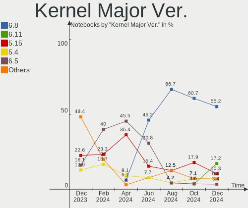
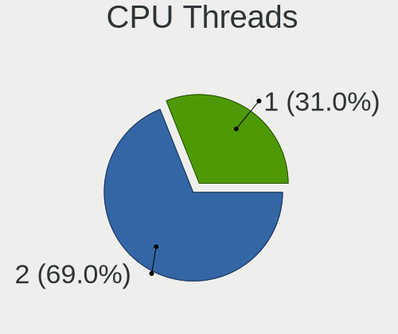
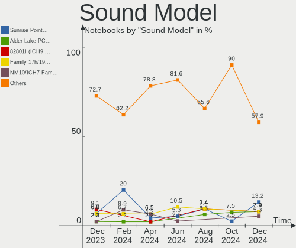

Xubuntu - Hardware Trends (Notebooks)
-------------------------------------

A project to identify most popular hardware characteristics and track their change
over time based on data collected by Linux users at https://Linux-Hardware.org.

Anyone can contribute to this report by the [hw-probe](https://github.com/linuxhw/hw-probe) tool:

    sudo -E hw-probe -all -upload

This report is for one last month. Overall report since the beginning of time: [TestDays](https://github.com/linuxhw/TestDays)

Period: Dec, 2023.

Contents
--------

* [ System ](#system)
  - [ OS                       ](#os)
  - [ OS Family                ](#os-family)
  - [ Kernel                   ](#kernel)
  - [ Kernel Family            ](#kernel-family)
  - [ Kernel Major Ver.        ](#kernel-major-ver)
  - [ Arch                     ](#arch)
  - [ DE                       ](#de)
  - [ Display Server           ](#display-server)
  - [ Display Manager          ](#display-manager)
  - [ OS Lang                  ](#os-lang)
  - [ Boot Mode                ](#boot-mode)
  - [ Filesystem               ](#filesystem)
  - [ Part. scheme             ](#part-scheme)
  - [ Dual Boot with Linux/BSD ](#dual-boot-with-linuxbsd)
  - [ Dual Boot (Win)          ](#dual-boot-win)

* [ Board ](#board)
  - [ Vendor                   ](#vendor)
  - [ Model                    ](#model)
  - [ Model Family             ](#model-family)
  - [ MFG Year                 ](#mfg-year)
  - [ Form Factor              ](#form-factor)
  - [ Secure Boot              ](#secure-boot)
  - [ Coreboot                 ](#coreboot)
  - [ RAM Size                 ](#ram-size)
  - [ RAM Used                 ](#ram-used)
  - [ Total Drives             ](#total-drives)
  - [ Has CD-ROM               ](#has-cd-rom)
  - [ Has Ethernet             ](#has-ethernet)
  - [ Has WiFi                 ](#has-wifi)
  - [ Has Bluetooth            ](#has-bluetooth)

* [ Location ](#location)
  - [ Country                  ](#country)
  - [ City                     ](#city)

* [ Drives ](#drives)
  - [ Drive Vendor             ](#drive-vendor)
  - [ Drive Model              ](#drive-model)
  - [ HDD Vendor               ](#hdd-vendor)
  - [ SSD Vendor               ](#ssd-vendor)
  - [ Drive Kind               ](#drive-kind)
  - [ Drive Connector          ](#drive-connector)
  - [ Drive Size               ](#drive-size)
  - [ Space Total              ](#space-total)
  - [ Space Used               ](#space-used)
  - [ Malfunc. Drives          ](#malfunc-drives)
  - [ Malfunc. Drive Vendor    ](#malfunc-drive-vendor)
  - [ Malfunc. HDD Vendor      ](#malfunc-hdd-vendor)
  - [ Malfunc. Drive Kind      ](#malfunc-drive-kind)
  - [ Failed Drives            ](#failed-drives)
  - [ Failed Drive Vendor      ](#failed-drive-vendor)
  - [ Drive Status             ](#drive-status)

* [ Storage controller ](#storage-controller)
  - [ Storage Vendor           ](#storage-vendor)
  - [ Storage Model            ](#storage-model)
  - [ Storage Kind             ](#storage-kind)

* [ Processor ](#processor)
  - [ CPU Vendor               ](#cpu-vendor)
  - [ CPU Model                ](#cpu-model)
  - [ CPU Model Family         ](#cpu-model-family)
  - [ CPU Cores                ](#cpu-cores)
  - [ CPU Sockets              ](#cpu-sockets)
  - [ CPU Threads              ](#cpu-threads)
  - [ CPU Op-Modes             ](#cpu-op-modes)
  - [ CPU Microcode            ](#cpu-microcode)
  - [ CPU Microarch            ](#cpu-microarch)

* [ Graphics ](#graphics)
  - [ GPU Vendor               ](#gpu-vendor)
  - [ GPU Model                ](#gpu-model)
  - [ GPU Combo                ](#gpu-combo)
  - [ GPU Driver               ](#gpu-driver)
  - [ GPU Memory               ](#gpu-memory)

* [ Monitor ](#monitor)
  - [ Monitor Vendor           ](#monitor-vendor)
  - [ Monitor Model            ](#monitor-model)
  - [ Monitor Resolution       ](#monitor-resolution)
  - [ Monitor Diagonal         ](#monitor-diagonal)
  - [ Monitor Width            ](#monitor-width)
  - [ Aspect Ratio             ](#aspect-ratio)
  - [ Monitor Area             ](#monitor-area)
  - [ Pixel Density            ](#pixel-density)
  - [ Multiple Monitors        ](#multiple-monitors)

* [ Network ](#network)
  - [ Net Controller Vendor    ](#net-controller-vendor)
  - [ Net Controller Model     ](#net-controller-model)
  - [ Wireless Vendor          ](#wireless-vendor)
  - [ Wireless Model           ](#wireless-model)
  - [ Ethernet Vendor          ](#ethernet-vendor)
  - [ Ethernet Model           ](#ethernet-model)
  - [ Net Controller Kind      ](#net-controller-kind)
  - [ Used Controller          ](#used-controller)
  - [ NICs                     ](#nics)
  - [ IPv6                     ](#ipv6)

* [ Bluetooth ](#bluetooth)
  - [ Bluetooth Vendor         ](#bluetooth-vendor)
  - [ Bluetooth Model          ](#bluetooth-model)

* [ Sound ](#sound)
  - [ Sound Vendor             ](#sound-vendor)
  - [ Sound Model              ](#sound-model)

* [ Memory ](#memory)
  - [ Memory Vendor            ](#memory-vendor)
  - [ Memory Model             ](#memory-model)
  - [ Memory Kind              ](#memory-kind)
  - [ Memory Form Factor       ](#memory-form-factor)
  - [ Memory Size              ](#memory-size)
  - [ Memory Speed             ](#memory-speed)

* [ Printers & scanners ](#printers--scanners)
  - [ Printer Vendor           ](#printer-vendor)
  - [ Printer Model            ](#printer-model)
  - [ Scanner Vendor           ](#scanner-vendor)
  - [ Scanner Model            ](#scanner-model)

* [ Camera ](#camera)
  - [ Camera Vendor            ](#camera-vendor)
  - [ Camera Model             ](#camera-model)

* [ Security ](#security)
  - [ Fingerprint Vendor       ](#fingerprint-vendor)
  - [ Fingerprint Model        ](#fingerprint-model)
  - [ Chipcard Vendor          ](#chipcard-vendor)
  - [ Chipcard Model           ](#chipcard-model)

* [ Unsupported ](#unsupported)
  - [ Unsupported Devices      ](#unsupported-devices)
  - [ Unsupported Device Types ](#unsupported-device-types)

System
------

OS
--

Installed operating systems

| Name              | Notebooks | Percent |
|-------------------|-----------|---------|
| Xubuntu 22.04     | 20        | 64.52%  |
| Xubuntu 23.10     | 4         | 12.9%   |
| Xubuntu 18.04     | 3         | 9.68%   |
| Xubuntu 2023.4~rc | 2         | 6.45%   |
| Xubuntu 20.04     | 2         | 6.45%   |

OS Family
---------

OS without a version

| Name    | Notebooks | Percent |
|---------|-----------|---------|
| Xubuntu | 31        | 100%    |

Kernel
------

Version of the Linux kernel

| Version               | Notebooks | Percent |
|-----------------------|-----------|---------|
| 6.2.0-39-generic      | 6         | 19.35%  |
| 6.2.0-37-generic      | 4         | 12.9%   |
| 5.15.0-91-generic     | 4         | 12.9%   |
| 6.5.0-14-generic      | 3         | 9.68%   |
| 5.4.0-150-generic     | 3         | 9.68%   |
| 6.1.0-1027-oem        | 2         | 6.45%   |
| 6.6.7-060607-generic  | 1         | 3.23%   |
| 6.5.5-060505-generic  | 1         | 3.23%   |
| 6.5.0-10-generic      | 1         | 3.23%   |
| 6.2.0-26-generic      | 1         | 3.23%   |
| 6.2.0-1017-lowlatency | 1         | 3.23%   |
| 5.4.0-167-generic     | 1         | 3.23%   |
| 5.15.0-91-lowlatency  | 1         | 3.23%   |
| 5.15.0-88-generic     | 1         | 3.23%   |
| 5.15.0-71-generic     | 1         | 3.23%   |

Kernel Family
-------------

Linux kernel without a distro release

| Version | Notebooks | Percent |
|---------|-----------|---------|
| 6.2.0   | 12        | 38.71%  |
| 5.15.0  | 7         | 22.58%  |
| 6.5.0   | 4         | 12.9%   |
| 5.4.0   | 4         | 12.9%   |
| 6.1.0   | 2         | 6.45%   |
| 6.6.7   | 1         | 3.23%   |
| 6.5.5   | 1         | 3.23%   |

Kernel Major Ver.
-----------------

Linux kernel major version

| Version | Notebooks | Percent |
|---------|-----------|---------|
| 6.2     | 12        | 38.71%  |
| 5.15    | 7         | 22.58%  |
| 6.5     | 5         | 16.13%  |
| 5.4     | 4         | 12.9%   |
| 6.1     | 2         | 6.45%   |
| 6.6     | 1         | 3.23%   |

Arch
----

OS architecture (x86_64, i586, etc.)

| Name   | Notebooks | Percent |
|--------|-----------|---------|
| x86_64 | 28        | 90.32%  |
| i686   | 3         | 9.68%   |

DE
--

Desktop Environment

| Name         | Notebooks | Percent |
|--------------|-----------|---------|
| XFCE         | 29        | 93.55%  |
| Unicorn:XFCE | 2         | 6.45%   |

Display Server
--------------

X11 or Wayland

| Name | Notebooks | Percent |
|------|-----------|---------|
| X11  | 31        | 100%    |

Display Manager
---------------

SDDM, LightDM, etc.

| Name    | Notebooks | Percent |
|---------|-----------|---------|
| LightDM | 24        | 77.42%  |
| Unknown | 5         | 16.13%  |
| GDM3    | 2         | 6.45%   |

OS Lang
-------

Language

| Lang  | Notebooks | Percent |
|-------|-----------|---------|
| en_US | 11        | 35.48%  |
| it_IT | 5         | 16.13%  |
| fr_FR | 5         | 16.13%  |
| en_GB | 2         | 6.45%   |
| de_DE | 2         | 6.45%   |
| ru_RU | 1         | 3.23%   |
| ro_RO | 1         | 3.23%   |
| es_CL | 1         | 3.23%   |
| de_IT | 1         | 3.23%   |
| C     | 1         | 3.23%   |
| be_BY | 1         | 3.23%   |

Boot Mode
---------

EFI or BIOS

| Mode | Notebooks | Percent |
|------|-----------|---------|
| BIOS | 17        | 54.84%  |
| EFI  | 14        | 45.16%  |

Filesystem
----------

Type of filesystem

| Type    | Notebooks | Percent |
|---------|-----------|---------|
| Ext4    | 22        | 70.97%  |
| Tmpfs   | 8         | 25.81%  |
| Overlay | 1         | 3.23%   |

Part. scheme
------------

Scheme of partitioning

| Type    | Notebooks | Percent |
|---------|-----------|---------|
| GPT     | 18        | 58.06%  |
| Unknown | 8         | 25.81%  |
| MBR     | 5         | 16.13%  |

Dual Boot with Linux/BSD
------------------------

Hosting more than one Linux/BSD

| Dual boot | Notebooks | Percent |
|-----------|-----------|---------|
| No        | 25        | 80.65%  |
| Yes       | 6         | 19.35%  |

Dual Boot (Win)
---------------

Hosting Linux and Windows

| Dual boot | Notebooks | Percent |
|-----------|-----------|---------|
| No        | 21        | 67.74%  |
| Yes       | 10        | 32.26%  |

Board
-----

Vendor
------

Motherboard manufacturer

| Name             | Notebooks | Percent |
|------------------|-----------|---------|
| Lenovo           | 7         | 22.58%  |
| Hewlett-Packard  | 6         | 19.35%  |
| Dell             | 4         | 12.9%   |
| ASUSTek Computer | 4         | 12.9%   |
| Acer             | 2         | 6.45%   |
| Toshiba          | 1         | 3.23%   |
| Sony             | 1         | 3.23%   |
| Packard Bell     | 1         | 3.23%   |
| MSI              | 1         | 3.23%   |
| HUAWEI           | 1         | 3.23%   |
| Fujitsu          | 1         | 3.23%   |
| eMachines        | 1         | 3.23%   |
| Apple            | 1         | 3.23%   |

Model
-----

Motherboard model

| Name                                        | Notebooks | Percent |
|---------------------------------------------|-----------|---------|
| Toshiba Satellite Pro C660                  | 1         | 3.23%   |
| Sony VGN-NW270F                             | 1         | 3.23%   |
| Packard Bell EasyNote MH35                  | 1         | 3.23%   |
| MSI GF63 Thin 11UC                          | 1         | 3.23%   |
| Lenovo Yoga 2 11 20332                      | 1         | 3.23%   |
| Lenovo ThinkPad X1 Carbon Gen 11 21HMCTO1WW | 1         | 3.23%   |
| Lenovo ThinkPad T530 2429W1E                | 1         | 3.23%   |
| Lenovo ThinkPad T14 Gen 3 21AH00C3AU        | 1         | 3.23%   |
| Lenovo ThinkPad T14 Gen 1 20UDCTO1WW        | 1         | 3.23%   |
| Lenovo IdeaPad 3 17ADA05 81W2               | 1         | 3.23%   |
| Lenovo IdeaPad 1 15AMN7 82VG                | 1         | 3.23%   |
| HUAWEI MACHD-WXX9                           | 1         | 3.23%   |
| HP ZBook Fury 16 G9 Mobile Workstation PC   | 1         | 3.23%   |
| HP ProBook 6570b                            | 1         | 3.23%   |
| HP ProBook 4535s                            | 1         | 3.23%   |
| HP Pavilion dv6                             | 1         | 3.23%   |
| HP Notebook                                 | 1         | 3.23%   |
| HP Compaq nx7400 (RH609ES#ABZ)              | 1         | 3.23%   |
| Fujitsu LIFEBOOK AH531/GFO                  | 1         | 3.23%   |
| eMachines E527                              | 1         | 3.23%   |
| Dell Latitude E5510                         | 1         | 3.23%   |
| Dell Latitude 7390                          | 1         | 3.23%   |
| Dell Latitude 7370                          | 1         | 3.23%   |
| Dell Inspiron 7591                          | 1         | 3.23%   |
| ASUS X541UVK                                | 1         | 3.23%   |
| ASUS X201EP                                 | 1         | 3.23%   |
| ASUS VivoBook_ASUSLaptop X515EA_F515EA      | 1         | 3.23%   |
| ASUS ASUSLaptop_Q540VJ                      | 1         | 3.23%   |
| Apple MacBookPro8,1                         | 1         | 3.23%   |
| Acer Aspire V5-123                          | 1         | 3.23%   |
| Acer Aspire 5739G                           | 1         | 3.23%   |

Model Family
------------

Motherboard model prefix

| Name                  | Notebooks | Percent |
|-----------------------|-----------|---------|
| Lenovo ThinkPad       | 4         | 12.9%   |
| Dell Latitude         | 3         | 9.68%   |
| Lenovo IdeaPad        | 2         | 6.45%   |
| HP ProBook            | 2         | 6.45%   |
| Acer Aspire           | 2         | 6.45%   |
| Toshiba Satellite     | 1         | 3.23%   |
| Sony VGN-NW270F       | 1         | 3.23%   |
| Packard Bell EasyNote | 1         | 3.23%   |
| MSI GF63              | 1         | 3.23%   |
| Lenovo Yoga           | 1         | 3.23%   |
| HUAWEI MACHD-WXX9     | 1         | 3.23%   |
| HP ZBook              | 1         | 3.23%   |
| HP Pavilion           | 1         | 3.23%   |
| HP Notebook           | 1         | 3.23%   |
| HP Compaq             | 1         | 3.23%   |
| Fujitsu LIFEBOOK      | 1         | 3.23%   |
| eMachines E527        | 1         | 3.23%   |
| Dell Inspiron         | 1         | 3.23%   |
| ASUS X541UVK          | 1         | 3.23%   |
| ASUS X201EP           | 1         | 3.23%   |
| ASUS VivoBook         | 1         | 3.23%   |
| ASUS ASUSLaptop       | 1         | 3.23%   |
| Apple MacBookPro8     | 1         | 3.23%   |

MFG Year
--------

Motherboard manufacture year

| Year | Notebooks | Percent |
|------|-----------|---------|
| 2022 | 3         | 9.68%   |
| 2021 | 3         | 9.68%   |
| 2012 | 3         | 9.68%   |
| 2011 | 3         | 9.68%   |
| 2010 | 3         | 9.68%   |
| 2023 | 2         | 6.45%   |
| 2020 | 2         | 6.45%   |
| 2018 | 2         | 6.45%   |
| 2017 | 2         | 6.45%   |
| 2013 | 2         | 6.45%   |
| 2009 | 2         | 6.45%   |
| 2008 | 2         | 6.45%   |
| 2019 | 1         | 3.23%   |
| 2007 | 1         | 3.23%   |

Form Factor
-----------

Physical design of the computer

| Name     | Notebooks | Percent |
|----------|-----------|---------|
| Notebook | 31        | 100%    |

Secure Boot
-----------

Enabled or disabled

| State    | Notebooks | Percent |
|----------|-----------|---------|
| Disabled | 27        | 87.1%   |
| Enabled  | 4         | 12.9%   |

Coreboot
--------

Have coreboot on board

| Used | Notebooks | Percent |
|------|-----------|---------|
| No   | 31        | 100%    |

RAM Size
--------

Total RAM memory

| Size in GB  | Notebooks | Percent |
|-------------|-----------|---------|
| 3.01-4.0    | 10        | 32.26%  |
| 4.01-8.0    | 7         | 22.58%  |
| 16.01-24.0  | 5         | 16.13%  |
| 32.01-64.0  | 3         | 9.68%   |
| 1.01-2.0    | 2         | 6.45%   |
| 8.01-16.0   | 2         | 6.45%   |
| 2.01-3.0    | 1         | 3.23%   |
| 64.01-256.0 | 1         | 3.23%   |

RAM Used
--------

Used RAM memory

| Used GB   | Notebooks | Percent |
|-----------|-----------|---------|
| 2.01-3.0  | 11        | 35.48%  |
| 1.01-2.0  | 10        | 32.26%  |
| 3.01-4.0  | 4         | 12.9%   |
| 4.01-8.0  | 2         | 6.45%   |
| 0.51-1.0  | 2         | 6.45%   |
| 8.01-16.0 | 1         | 3.23%   |
| 0.01-0.5  | 1         | 3.23%   |

Total Drives
------------

Number of drives on board

| Drives | Notebooks | Percent |
|--------|-----------|---------|
| 1      | 22        | 70.97%  |
| 2      | 9         | 29.03%  |

Has CD-ROM
----------

Has CD-ROM on board

| Presented | Notebooks | Percent |
|-----------|-----------|---------|
| No        | 19        | 61.29%  |
| Yes       | 12        | 38.71%  |

Has Ethernet
------------

Has Ethernet on board

| Presented | Notebooks | Percent |
|-----------|-----------|---------|
| Yes       | 23        | 74.19%  |
| No        | 8         | 25.81%  |

Has WiFi
--------

Has WiFi module

| Presented | Notebooks | Percent |
|-----------|-----------|---------|
| Yes       | 31        | 100%    |

Has Bluetooth
-------------

Has Bluetooth module

| Presented | Notebooks | Percent |
|-----------|-----------|---------|
| Yes       | 22        | 70.97%  |
| No        | 9         | 29.03%  |

Location
--------

Country
-------

Geographic location (country)

| Country     | Notebooks | Percent |
|-------------|-----------|---------|
| Germany     | 6         | 19.35%  |
| Italy       | 5         | 16.13%  |
| France      | 5         | 16.13%  |
| USA         | 3         | 9.68%   |
| UK          | 2         | 6.45%   |
| Russia      | 2         | 6.45%   |
| Turkey      | 1         | 3.23%   |
| Switzerland | 1         | 3.23%   |
| Romania     | 1         | 3.23%   |
| Japan       | 1         | 3.23%   |
| Iran        | 1         | 3.23%   |
| Chile       | 1         | 3.23%   |
| Belarus     | 1         | 3.23%   |
| Austria     | 1         | 3.23%   |

City
----

Geographic location (city)

| City                          | Notebooks | Percent |
|-------------------------------|-----------|---------|
| Augsburg                      | 2         | 6.45%   |
| Valenciennes                  | 1         | 3.23%   |
| Toulouse                      | 1         | 3.23%   |
| Tehran                        | 1         | 3.23%   |
| Taganrog                      | 1         | 3.23%   |
| Sovicille                     | 1         | 3.23%   |
| Santiago                      | 1         | 3.23%   |
| San Nicolò d'Arcidano        | 1         | 3.23%   |
| Salzburg                      | 1         | 3.23%   |
| Saint-Maximin-la-Sainte-Baume | 1         | 3.23%   |
| Saint-Estephe                 | 1         | 3.23%   |
| Saint-Brieuc                  | 1         | 3.23%   |
| Rome                          | 1         | 3.23%   |
| Riaz                          | 1         | 3.23%   |
| Moscow                        | 1         | 3.23%   |
| Minsk                         | 1         | 3.23%   |
| Midorigaoka                   | 1         | 3.23%   |
| Massa Lubrense                | 1         | 3.23%   |
| Malden                        | 1         | 3.23%   |
| Grossenhain                   | 1         | 3.23%   |
| Gilching                      | 1         | 3.23%   |
| Erie                          | 1         | 3.23%   |
| Dallas                        | 1         | 3.23%   |
| Chippenham                    | 1         | 3.23%   |
| Cardiff                       | 1         | 3.23%   |
| Bucharest                     | 1         | 3.23%   |
| Berlin                        | 1         | 3.23%   |
| Bardowick                     | 1         | 3.23%   |
| Ankara                        | 1         | 3.23%   |
| Abbasanta                     | 1         | 3.23%   |

Drives
------

Drive Vendor
------------

Hard drive vendors

| Vendor                      | Notebooks | Drives | Percent |
|-----------------------------|-----------|--------|---------|
| Samsung Electronics         | 7         | 8      | 20%     |
| Toshiba                     | 4         | 4      | 11.43%  |
| Seagate                     | 4         | 4      | 11.43%  |
| WDC                         | 3         | 3      | 8.57%   |
| SK hynix                    | 3         | 3      | 8.57%   |
| Kingston                    | 2         | 2      | 5.71%   |
| Intel                       | 2         | 2      | 5.71%   |
| Unknown                     | 1         | 1      | 2.86%   |
| Team                        | 1         | 1      | 2.86%   |
| SPCC Sol                    | 1         | 1      | 2.86%   |
| SanDisk                     | 1         | 2      | 2.86%   |
| Micron Technology           | 1         | 1      | 2.86%   |
| MAXIO Technology (Hangzhou) | 1         | 1      | 2.86%   |
| LITEONIT                    | 1         | 1      | 2.86%   |
| Intenso                     | 1         | 1      | 2.86%   |
| Hitachi                     | 1         | 1      | 2.86%   |
| A-DATA Technology           | 1         | 1      | 2.86%   |

Drive Model
-----------

Hard drive models

| Model                                               | Notebooks | Percent |
|-----------------------------------------------------|-----------|---------|
| Seagate ST1000LM035-1RK172 1TB                      | 2         | 5.41%   |
| WDC WD5000MPCK-22AWHT0 500GB                        | 1         | 2.7%    |
| WDC WD5000BEVT-22ZAT0 500GB                         | 1         | 2.7%    |
| WDC PC SN540 SDDPNPF-512G-1032 512GB                | 1         | 2.7%    |
| Unknown MMC Card  32GB                              | 1         | 2.7%    |
| Toshiba XG4 NVMe SSD Controller 256GB               | 1         | 2.7%    |
| Toshiba MQ01ABD050 500GB                            | 1         | 2.7%    |
| Toshiba MK6476GSX 640GB                             | 1         | 2.7%    |
| Toshiba MK3261GSYN 320GB                            | 1         | 2.7%    |
| Team TM8FPD001T 1TB                                 | 1         | 2.7%    |
| SPCC Sol id State Disk 1024GB SSD                   | 1         | 2.7%    |
| SK hynix SKHynix_HFS512GDE9X081N 512GB              | 1         | 2.7%    |
| SK hynix SKHynix_HFS512GD9TNI-L2B0B 512GB           | 1         | 2.7%    |
| SK hynix PC611 NVMe 1TB                             | 1         | 2.7%    |
| Seagate ST9500420AS 500GB                           | 1         | 2.7%    |
| Seagate ST9160821AS 160GB                           | 1         | 2.7%    |
| SanDisk SDSSDH3 1T02 1TB                            | 1         | 2.7%    |
| SanDisk SDSSDH3 1T00 1TB                            | 1         | 2.7%    |
| Samsung SSD 970 EVO Plus 2TB S4J4NX0W414774V        | 1         | 2.7%    |
| Samsung SSD 860 EVO 500GB                           | 1         | 2.7%    |
| Samsung SSD 860 EVO 250GB                           | 1         | 2.7%    |
| Samsung SSD 850 EVO 250GB                           | 1         | 2.7%    |
| Samsung NVMe SSD Controller SM981/PM981/PM983 512GB | 1         | 2.7%    |
| Samsung MZVL2512HCJQ-00BH1 512GB                    | 1         | 2.7%    |
| Samsung MZVL21T0HCLR-00BH1 1TB                      | 1         | 2.7%    |
| Samsung HM320II 320GB                               | 1         | 2.7%    |
| Micron MTFDHBA512QFD 512GB                          | 1         | 2.7%    |
| MAXIO (Hangzhou) NVMe SSD Controller MAP1202 256GB  | 1         | 2.7%    |
| LITEONIT LCT-128M3S 128GB SSD                       | 1         | 2.7%    |
| Kingston SUV400S37240G 240GB SSD                    | 1         | 2.7%    |
| Kingston SA400S37240G 240GB SSD                     | 1         | 2.7%    |
| Intenso SSD Sata III 250GB                          | 1         | 2.7%    |
| Intel SSDPEKNU512GZ 512GB                           | 1         | 2.7%    |
| Intel SSDPEKNU010TZ 1024GB                          | 1         | 2.7%    |
| Hitachi HTS545025B9A300 250GB                       | 1         | 2.7%    |
| A-DATA SU650 240GB SSD                              | 1         | 2.7%    |

HDD Vendor
----------

Hard disk drive vendors

| Vendor              | Notebooks | Drives | Percent |
|---------------------|-----------|--------|---------|
| Seagate             | 4         | 4      | 36.36%  |
| Toshiba             | 3         | 3      | 27.27%  |
| WDC                 | 2         | 2      | 18.18%  |
| Samsung Electronics | 1         | 1      | 9.09%   |
| Hitachi             | 1         | 1      | 9.09%   |

SSD Vendor
----------

Solid state drive vendors

| Vendor              | Notebooks | Drives | Percent |
|---------------------|-----------|--------|---------|
| Samsung Electronics | 3         | 3      | 30%     |
| Kingston            | 2         | 2      | 20%     |
| SPCC Sol            | 1         | 1      | 10%     |
| SanDisk             | 1         | 2      | 10%     |
| LITEONIT            | 1         | 1      | 10%     |
| Intenso             | 1         | 1      | 10%     |
| A-DATA Technology   | 1         | 1      | 10%     |

Drive Kind
----------

HDD or SSD

| Kind | Notebooks | Drives | Percent |
|------|-----------|--------|---------|
| NVMe | 13        | 14     | 37.14%  |
| HDD  | 11        | 11     | 31.43%  |
| SSD  | 10        | 11     | 28.57%  |
| MMC  | 1         | 1      | 2.86%   |

Drive Connector
---------------

SATA, SAS, NVMe, etc.

| Type | Notebooks | Drives | Percent |
|------|-----------|--------|---------|
| SATA | 19        | 21     | 55.88%  |
| NVMe | 13        | 14     | 38.24%  |
| SAS  | 1         | 1      | 2.94%   |
| MMC  | 1         | 1      | 2.94%   |

Drive Size
----------

Size of hard drive

| Size in TB | Notebooks | Drives | Percent |
|------------|-----------|--------|---------|
| 0.01-0.5   | 16        | 16     | 76.19%  |
| 0.51-1.0   | 4         | 5      | 19.05%  |
| 1.01-2.0   | 1         | 1      | 4.76%   |

Space Total
-----------

Amount of disk space available on the file system

| Size in GB | Notebooks | Percent |
|------------|-----------|---------|
| 251-500    | 9         | 29.03%  |
| 101-250    | 9         | 29.03%  |
| 501-1000   | 9         | 29.03%  |
| 21-50      | 1         | 3.23%   |
| 1001-2000  | 1         | 3.23%   |
| 1-20       | 1         | 3.23%   |
| 51-100     | 1         | 3.23%   |

Space Used
----------

Amount of used disk space

| Used GB  | Notebooks | Percent |
|----------|-----------|---------|
| 1-20     | 12        | 38.71%  |
| 21-50    | 10        | 32.26%  |
| 251-500  | 6         | 19.35%  |
| 101-250  | 2         | 6.45%   |
| 501-1000 | 1         | 3.23%   |

Malfunc. Drives
---------------

Drive models with a malfunction

| Model                      | Notebooks | Drives | Percent |
|----------------------------|-----------|--------|---------|
| Seagate ST9160821AS 160GB  | 1         | 1      | 50%     |
| Intenso SSD Sata III 250GB | 1         | 1      | 50%     |

Malfunc. Drive Vendor
---------------------

Vendors of faulty drives

| Vendor  | Notebooks | Drives | Percent |
|---------|-----------|--------|---------|
| Seagate | 1         | 1      | 50%     |
| Intenso | 1         | 1      | 50%     |

Malfunc. HDD Vendor
-------------------

Vendors of faulty HDD drives

| Vendor  | Notebooks | Drives | Percent |
|---------|-----------|--------|---------|
| Seagate | 1         | 1      | 100%    |

Malfunc. Drive Kind
-------------------

Kinds of faulty drives

| Kind | Notebooks | Drives | Percent |
|------|-----------|--------|---------|
| SSD  | 1         | 1      | 50%     |
| HDD  | 1         | 1      | 50%     |

Failed Drives
-------------

Failed drive models

Zero info for selected period =(

Failed Drive Vendor
-------------------

Failed drive vendors

Zero info for selected period =(

Drive Status
------------

Number of failed and malfunc. drives

| Status   | Notebooks | Drives | Percent |
|----------|-----------|--------|---------|
| Works    | 17        | 20     | 54.84%  |
| Detected | 12        | 15     | 38.71%  |
| Malfunc  | 2         | 2      | 6.45%   |

Storage controller
------------------

Storage Vendor
--------------

Storage controller vendors

| Vendor                           | Notebooks | Percent |
|----------------------------------|-----------|---------|
| Intel                            | 18        | 54.55%  |
| SK hynix                         | 3         | 9.09%   |
| Samsung Electronics              | 3         | 9.09%   |
| AMD                              | 3         | 9.09%   |
| MAXIO Technology (Hangzhou)      | 2         | 6.06%   |
| Toshiba America Info Systems     | 1         | 3.03%   |
| Silicon Integrated Systems [SiS] | 1         | 3.03%   |
| SanDisk                          | 1         | 3.03%   |
| Micron Technology                | 1         | 3.03%   |

Storage Model
-------------

Storage controller models

| Model                                                                        | Notebooks | Percent |
|------------------------------------------------------------------------------|-----------|---------|
| Intel 82801IBM/IEM (ICH9M/ICH9M-E) 4 port SATA Controller [AHCI mode]        | 4         | 10.53%  |
| Intel 7 Series Chipset Family 6-port SATA Controller [AHCI mode]             | 3         | 7.89%   |
| Intel 6 Series/C200 Series Chipset Family 6 port Mobile SATA AHCI Controller | 3         | 7.89%   |
| AMD FCH SATA Controller [AHCI mode]                                          | 3         | 7.89%   |
| SK hynix PC611 NVMe Solid State Drive                                        | 2         | 5.26%   |
| Samsung NVMe SSD Controller SM981/PM981/PM983                                | 2         | 5.26%   |
| MAXIO (Hangzhou) NVMe SSD Controller MAP1202                                 | 2         | 5.26%   |
| Intel SSD 670p Series [Keystone Harbor]                                      | 2         | 5.26%   |
| Toshiba America Info Systems XG4 NVMe SSD Controller                         | 1         | 2.63%   |
| SK hynix Gold P31/BC711/PC711 NVMe Solid State Drive                         | 1         | 2.63%   |
| Silicon Integrated Systems [SiS] SATA Controller / IDE mode                  | 1         | 2.63%   |
| Silicon Integrated Systems [SiS] 5513 IDE Controller                         | 1         | 2.63%   |
| SanDisk WD PC SN540 / Green SN350 NVMe SSD 1 TB (DRAM-less)                  | 1         | 2.63%   |
| Samsung NVMe SSD Controller PM9A1/PM9A3/980PRO                               | 1         | 2.63%   |
| Micron 2210 NVMe SSD [Cobain]                                                | 1         | 2.63%   |
| Intel Volume Management Device NVMe RAID Controller Intel Corporation        | 1         | 2.63%   |
| Intel Volume Management Device NVMe RAID Controller                          | 1         | 2.63%   |
| Intel Tiger Lake-LP SATA Controller                                          | 1         | 2.63%   |
| Intel Tiger Lake SATA AHCI Controller                                        | 1         | 2.63%   |
| Intel Sunrise Point-LP SATA Controller [AHCI mode]                           | 1         | 2.63%   |
| Intel Cannon Lake Mobile PCH SATA AHCI Controller                            | 1         | 2.63%   |
| Intel Atom Processor E3800 Series SATA AHCI Controller                       | 1         | 2.63%   |
| Intel 82801GBM/GHM (ICH7-M Family) SATA Controller [AHCI mode]               | 1         | 2.63%   |
| Intel 82801G (ICH7 Family) IDE Controller                                    | 1         | 2.63%   |
| Intel 5 Series/3400 Series Chipset 4 port SATA AHCI Controller               | 1         | 2.63%   |

Storage Kind
------------

Kind of storage controller (IDE, SATA, NVMe, SAS, ...)

| Kind | Notebooks | Percent |
|------|-----------|---------|
| SATA | 20        | 54.05%  |
| NVMe | 13        | 35.14%  |
| RAID | 2         | 5.41%   |
| IDE  | 2         | 5.41%   |

Processor
---------

CPU Vendor
----------

Processor vendors

| Vendor | Notebooks | Percent |
|--------|-----------|---------|
| Intel  | 25        | 80.65%  |
| AMD    | 6         | 19.35%  |

CPU Model
---------

Processor models

| Model                                         | Notebooks | Percent |
|-----------------------------------------------|-----------|---------|
| Intel Core i7-3520M CPU @ 2.90GHz             | 2         | 6.45%   |
| Intel Pentium Dual CPU T2370 @ 1.73GHz        | 1         | 3.23%   |
| Intel Core m7-6Y75 CPU @ 1.20GHz              | 1         | 3.23%   |
| Intel Core i7-9750H CPU @ 2.60GHz             | 1         | 3.23%   |
| Intel Core i7-8650U CPU @ 1.90GHz             | 1         | 3.23%   |
| Intel Core i5-7200U CPU @ 2.50GHz             | 1         | 3.23%   |
| Intel Core i5-2435M CPU @ 2.40GHz             | 1         | 3.23%   |
| Intel Core i3-2350M CPU @ 2.30GHz             | 1         | 3.23%   |
| Intel Core i3-2310M CPU @ 2.10GHz             | 1         | 3.23%   |
| Intel Core i3 CPU M 380 @ 2.53GHz             | 1         | 3.23%   |
| Intel Core 2 Duo CPU T6670 @ 2.20GHz          | 1         | 3.23%   |
| Intel Core 2 Duo CPU T6600 @ 2.20GHz          | 1         | 3.23%   |
| Intel Core 2 Duo CPU P7450 @ 2.13GHz          | 1         | 3.23%   |
| Intel Celeron M CPU 430 @ 1.73GHz             | 1         | 3.23%   |
| Intel Celeron CPU N2930 @ 1.83GHz             | 1         | 3.23%   |
| Intel Celeron CPU 900 @ 2.20GHz               | 1         | 3.23%   |
| Intel Celeron CPU 847 @ 1.10GHz               | 1         | 3.23%   |
| Intel 13th Gen Core i9-13900H                 | 1         | 3.23%   |
| Intel 13th Gen Core i7-1370P                  | 1         | 3.23%   |
| Intel 12th Gen Core i7-12850HX                | 1         | 3.23%   |
| Intel 12th Gen Core i7-1255U                  | 1         | 3.23%   |
| Intel 11th Gen Core i7-11800H @ 2.30GHz       | 1         | 3.23%   |
| Intel 11th Gen Core i7-1165G7 @ 2.80GHz       | 1         | 3.23%   |
| Intel 11th Gen Core i5-1135G7 @ 2.40GHz       | 1         | 3.23%   |
| AMD Ryzen 7 PRO 4750U with Radeon Graphics    | 1         | 3.23%   |
| AMD Ryzen 5 3500U with Radeon Vega Mobile Gfx | 1         | 3.23%   |
| AMD Ryzen 3 7320U with Radeon Graphics        | 1         | 3.23%   |
| AMD E1-2100 APU with Radeon HD Graphics       | 1         | 3.23%   |
| AMD A6-7310 APU with AMD Radeon R4 Graphics   | 1         | 3.23%   |
| AMD A4-3305M APU with Radeon HD Graphics      | 1         | 3.23%   |

CPU Model Family
----------------

Processor model prefix

| Model              | Notebooks | Percent |
|--------------------|-----------|---------|
| Other              | 7         | 22.58%  |
| Intel Core i7      | 4         | 12.9%   |
| Intel Core i3      | 3         | 9.68%   |
| Intel Core 2 Duo   | 3         | 9.68%   |
| Intel Celeron      | 3         | 9.68%   |
| Intel Core i5      | 2         | 6.45%   |
| Intel Pentium Dual | 1         | 3.23%   |
| Intel Core m7      | 1         | 3.23%   |
| Intel Celeron M    | 1         | 3.23%   |
| AMD Ryzen 7 PRO    | 1         | 3.23%   |
| AMD Ryzen 5        | 1         | 3.23%   |
| AMD Ryzen 3        | 1         | 3.23%   |
| AMD E1             | 1         | 3.23%   |
| AMD A6             | 1         | 3.23%   |
| AMD A4             | 1         | 3.23%   |

CPU Cores
---------

Number of processor cores

| Number | Notebooks | Percent |
|--------|-----------|---------|
| 2      | 15        | 48.39%  |
| 4      | 7         | 22.58%  |
| 14     | 2         | 6.45%   |
| 8      | 2         | 6.45%   |
| 1      | 2         | 6.45%   |
| 16     | 1         | 3.23%   |
| 10     | 1         | 3.23%   |
| 6      | 1         | 3.23%   |

CPU Sockets
-----------

Number of sockets

| Number | Notebooks | Percent |
|--------|-----------|---------|
| 1      | 31        | 100%    |

CPU Threads
-----------

Threads per core (Hyper-Threading)

| Number | Notebooks | Percent |
|--------|-----------|---------|
| 2      | 19        | 61.29%  |
| 1      | 12        | 38.71%  |

CPU Op-Modes
------------

CPU Operation Modes (32-bit, 64-bit)

| Op mode        | Notebooks | Percent |
|----------------|-----------|---------|
| 32-bit, 64-bit | 30        | 96.77%  |
| 32-bit         | 1         | 3.23%   |

CPU Microcode
-------------

Microcode number

| Number     | Notebooks | Percent |
|------------|-----------|---------|
| Unknown    | 22        | 70.97%  |
| 0x206a7    | 2         | 6.45%   |
| 0xb06a2    | 1         | 3.23%   |
| 0x906ea    | 1         | 3.23%   |
| 0x6fd      | 1         | 3.23%   |
| 0x6e8      | 1         | 3.23%   |
| 0x08600106 | 1         | 3.23%   |
| 0x08108109 | 1         | 3.23%   |
| 0x0700010f | 1         | 3.23%   |

CPU Microarch
-------------

Microarchitecture

| Name             | Notebooks | Percent |
|------------------|-----------|---------|
| SandyBridge      | 4         | 12.9%   |
| Penryn           | 4         | 12.9%   |
| KabyLake         | 3         | 9.68%   |
| Alderlake Hybrid | 3         | 9.68%   |
| TigerLake        | 2         | 6.45%   |
| IvyBridge        | 2         | 6.45%   |
| Unknown          | 2         | 6.45%   |
| Zen+             | 1         | 3.23%   |
| Zen 2            | 1         | 3.23%   |
| Westmere         | 1         | 3.23%   |
| Skylake          | 1         | 3.23%   |
| Silvermont       | 1         | 3.23%   |
| Puma             | 1         | 3.23%   |
| P6               | 1         | 3.23%   |
| K10 Llano        | 1         | 3.23%   |
| Jaguar           | 1         | 3.23%   |
| Icelake          | 1         | 3.23%   |
| Core             | 1         | 3.23%   |

Graphics
--------

GPU Vendor
----------

Vendors of graphics cards

| Vendor                           | Notebooks | Percent |
|----------------------------------|-----------|---------|
| Intel                            | 23        | 58.97%  |
| Nvidia                           | 8         | 20.51%  |
| AMD                              | 7         | 17.95%  |
| Silicon Integrated Systems [SiS] | 1         | 2.56%   |

GPU Model
---------

Graphics card models

| Model                                                                         | Notebooks | Percent |
|-------------------------------------------------------------------------------|-----------|---------|
| Intel 2nd Generation Core Processor Family Integrated Graphics Controller     | 4         | 9.76%   |
| Intel Mobile 4 Series Chipset Integrated Graphics Controller                  | 3         | 7.32%   |
| Intel TigerLake-LP GT2 [Iris Xe Graphics]                                     | 2         | 4.88%   |
| Intel Raptor Lake-P [Iris Xe Graphics]                                        | 2         | 4.88%   |
| Intel 3rd Gen Core processor Graphics Controller                              | 2         | 4.88%   |
| AMD Seymour [Radeon HD 6400M/7400M Series]                                    | 2         | 4.88%   |
| Silicon Integrated Systems [SiS] 771/671 PCIE VGA Display Adapter             | 1         | 2.44%   |
| Nvidia TU117M [GeForce GTX 1650 Mobile / Max-Q]                               | 1         | 2.44%   |
| Nvidia GT216M [GeForce GT 240M]                                               | 1         | 2.44%   |
| Nvidia GN20-P0-R-K2 [GeForce RTX 3050 6GB Laptop GPU]                         | 1         | 2.44%   |
| Nvidia GM108M [GeForce 920MX]                                                 | 1         | 2.44%   |
| Nvidia GF108M [NVS 5400M]                                                     | 1         | 2.44%   |
| Nvidia GF108M [GeForce GT 525M]                                               | 1         | 2.44%   |
| Nvidia GA107M [GeForce RTX 3050 Mobile]                                       | 1         | 2.44%   |
| Nvidia GA107GLM [RTX A1000 Laptop GPU]                                        | 1         | 2.44%   |
| Intel UHD Graphics 620                                                        | 1         | 2.44%   |
| Intel TigerLake-H GT1 [UHD Graphics]                                          | 1         | 2.44%   |
| Intel Mobile 945GM/GMS/GME, 943/940GML Express Integrated Graphics Controller | 1         | 2.44%   |
| Intel Mobile 945GM/GMS, 943/940GML Express Integrated Graphics Controller     | 1         | 2.44%   |
| Intel HD Graphics 620                                                         | 1         | 2.44%   |
| Intel HD Graphics 515                                                         | 1         | 2.44%   |
| Intel Core Processor Integrated Graphics Controller                           | 1         | 2.44%   |
| Intel CoffeeLake-H GT2 [UHD Graphics 630]                                     | 1         | 2.44%   |
| Intel Atom Processor Z36xxx/Z37xxx Series Graphics & Display                  | 1         | 2.44%   |
| Intel Alder Lake-UP3 GT2 [UHD Graphics]                                       | 1         | 2.44%   |
| Intel Alder Lake-HX GT1 [UHD Graphics 770]                                    | 1         | 2.44%   |
| AMD SuperSumo [Radeon HD 6480G]                                               | 1         | 2.44%   |
| AMD Renoir [Radeon RX Vega 6 (Ryzen 4000/5000 Mobile Series)]                 | 1         | 2.44%   |
| AMD Picasso/Raven 2 [Radeon Vega Series / Radeon Vega Mobile Series]          | 1         | 2.44%   |
| AMD Mullins [Radeon R4/R5 Graphics]                                           | 1         | 2.44%   |
| AMD Mendocino                                                                 | 1         | 2.44%   |
| AMD Kabini [Radeon HD 8210]                                                   | 1         | 2.44%   |

GPU Combo
---------

Combinations of graphics cards

| Name           | Notebooks | Percent |
|----------------|-----------|---------|
| 1 x Intel      | 15        | 48.39%  |
| Intel + Nvidia | 7         | 22.58%  |
| 1 x AMD        | 5         | 16.13%  |
| 2 x AMD        | 1         | 3.23%   |
| 1 x SiS        | 1         | 3.23%   |
| 1 x Nvidia     | 1         | 3.23%   |
| Intel + AMD    | 1         | 3.23%   |

GPU Driver
----------

Free vs proprietary

| Driver      | Notebooks | Percent |
|-------------|-----------|---------|
| Free        | 27        | 87.1%   |
| Proprietary | 3         | 9.68%   |
| Unknown     | 1         | 3.23%   |

GPU Memory
----------

Total video memory

| Size in GB | Notebooks | Percent |
|------------|-----------|---------|
| Unknown    | 24        | 77.42%  |
| 0.51-1.0   | 3         | 9.68%   |
| 0.01-0.5   | 2         | 6.45%   |
| 5.01-6.0   | 1         | 3.23%   |
| 1.01-2.0   | 1         | 3.23%   |

Monitor
-------

Monitor Vendor
--------------

Monitor vendors

| Vendor              | Notebooks | Percent |
|---------------------|-----------|---------|
| AU Optronics        | 8         | 22.86%  |
| LG Display          | 7         | 20%     |
| Samsung Electronics | 4         | 11.43%  |
| BOE                 | 3         | 8.57%   |
| Hewlett-Packard     | 2         | 5.71%   |
| Dell                | 2         | 5.71%   |
| Chimei Innolux      | 2         | 5.71%   |
| SNC                 | 1         | 2.86%   |
| Sharp               | 1         | 2.86%   |
| LG Philips          | 1         | 2.86%   |
| InfoVision          | 1         | 2.86%   |
| Goldstar            | 1         | 2.86%   |
| CSO                 | 1         | 2.86%   |
| Apple               | 1         | 2.86%   |

Monitor Model
-------------

Monitor models

| Model                                                                 | Notebooks | Percent |
|-----------------------------------------------------------------------|-----------|---------|
| SNC SKP_E5-24 SNC2360 1920x1080 521x293mm 23.5-inch                   | 1         | 2.86%   |
| Sharp LCD Monitor SHP1461 3200x1800 294x165mm 13.3-inch               | 1         | 2.86%   |
| Samsung Electronics TV SAM0289 1280x720                               | 1         | 2.86%   |
| Samsung Electronics LCD Monitor SEC4351 1366x768 344x194mm 15.5-inch  | 1         | 2.86%   |
| Samsung Electronics LCD Monitor SEC325A 1366x768 344x194mm 15.5-inch  | 1         | 2.86%   |
| Samsung Electronics LCD Monitor SDC4180 2880x1620 344x194mm 15.5-inch | 1         | 2.86%   |
| LG Philips LP154WX4-TLAB LPL3D01 1280x800 331x207mm 15.4-inch         | 1         | 2.86%   |
| LG Display LP156WH2-TLE1 LGDCF01 1366x768 344x194mm 15.5-inch         | 1         | 2.86%   |
| LG Display LCD Monitor LGD071E 1920x1080 344x194mm 15.5-inch          | 1         | 2.86%   |
| LG Display LCD Monitor LGD061A 1920x1080 344x194mm 15.5-inch          | 1         | 2.86%   |
| LG Display LCD Monitor LGD02F2 1366x768 344x194mm 15.5-inch           | 1         | 2.86%   |
| LG Display LCD Monitor LGD02DC 1366x768 344x194mm 15.5-inch           | 1         | 2.86%   |
| LG Display LCD Monitor LGD026C 1366x768 345x194mm 15.6-inch           | 1         | 2.86%   |
| LG Display LCD Monitor LGD024B 1366x768 344x194mm 15.5-inch           | 1         | 2.86%   |
| InfoVision M116NWR1 R0 IVO0489 1366x768 256x144mm 11.6-inch           | 1         | 2.86%   |
| Hewlett-Packard E24q G4 HPN368C 2560x1440 526x296mm 23.8-inch         | 1         | 2.86%   |
| Hewlett-Packard E190i HWP3119 1280x1024 374x299mm 18.9-inch           | 1         | 2.86%   |
| Goldstar LG Ultra HD GSM5B09 3840x2160 600x340mm 27.2-inch            | 1         | 2.86%   |
| Dell U2715H DELD065 2560x1440 597x336mm 27.0-inch                     | 1         | 2.86%   |
| Dell P2417H DELA0DC 1920x1080 527x296mm 23.8-inch                     | 1         | 2.86%   |
| CSO LCD Monitor CSO1309 3000x2000 293x195mm 13.9-inch                 | 1         | 2.86%   |
| Chimei Innolux LCD Monitor CMN1521 1920x1080 344x193mm 15.5-inch      | 1         | 2.86%   |
| Chimei Innolux LCD Monitor CMN1382 1920x1080 293x165mm 13.2-inch      | 1         | 2.86%   |
| BOE LCD Monitor BOE0AED 1920x1080 344x194mm 15.5-inch                 | 1         | 2.86%   |
| BOE LCD Monitor BOE08E4 1600x900 382x215mm 17.3-inch                  | 1         | 2.86%   |
| BOE LCD Monitor BOE069C 1920x1080 344x193mm 15.5-inch                 | 1         | 2.86%   |
| AU Optronics LCD Monitor AUOF99B 1920x1200 301x188mm 14.0-inch        | 1         | 2.86%   |
| AU Optronics LCD Monitor AUOD291 1920x1200 301x188mm 14.0-inch        | 1         | 2.86%   |
| AU Optronics LCD Monitor AUO70EC 1366x768 344x193mm 15.5-inch         | 1         | 2.86%   |
| AU Optronics LCD Monitor AUO573D 1920x1080 309x174mm 14.0-inch        | 1         | 2.86%   |
| AU Optronics LCD Monitor AUO21ED 1920x1080 344x193mm 15.5-inch        | 1         | 2.86%   |
| AU Optronics LCD Monitor AUO11ED 1920x1080 344x193mm 15.5-inch        | 1         | 2.86%   |
| AU Optronics LCD Monitor AUO10EC 1366x768 344x193mm 15.5-inch         | 1         | 2.86%   |
| AU Optronics LCD Monitor AUO105C 1366x768 256x144mm 11.6-inch         | 1         | 2.86%   |
| Apple LCD Monitor APP9CCB 1280x800 286x179mm 13.3-inch                | 1         | 2.86%   |

Monitor Resolution
------------------

Monitor screen resolution

| Resolution        | Notebooks | Percent |
|-------------------|-----------|---------|
| 1366x768 (WXGA)   | 11        | 33.33%  |
| 1920x1080 (FHD)   | 10        | 30.3%   |
| 1920x1200 (WUXGA) | 2         | 6.06%   |
| 1280x800 (WXGA)   | 2         | 6.06%   |
| 3840x2160 (4K)    | 1         | 3.03%   |
| 3200x1800 (QHD+)  | 1         | 3.03%   |
| 3000x2000         | 1         | 3.03%   |
| 2880x1620         | 1         | 3.03%   |
| 2560x1440 (QHD)   | 1         | 3.03%   |
| 1920x540          | 1         | 3.03%   |
| 1600x900 (HD+)    | 1         | 3.03%   |
| 1280x1024 (SXGA)  | 1         | 3.03%   |

Monitor Diagonal
----------------

Diagonal size in inches

| Inches  | Notebooks | Percent |
|---------|-----------|---------|
| 15      | 19        | 54.29%  |
| 13      | 4         | 11.43%  |
| 14      | 3         | 8.57%   |
| 27      | 2         | 5.71%   |
| 24      | 2         | 5.71%   |
| 23      | 1         | 2.86%   |
| 18      | 1         | 2.86%   |
| 17      | 1         | 2.86%   |
| 11      | 1         | 2.86%   |
| Unknown | 1         | 2.86%   |

Monitor Width
-------------

Physical width

| Width in mm | Notebooks | Percent |
|-------------|-----------|---------|
| 301-350     | 22        | 64.71%  |
| 201-300     | 5         | 14.71%  |
| 501-600     | 4         | 11.76%  |
| 351-400     | 2         | 5.88%   |
| Unknown     | 1         | 2.94%   |

Aspect Ratio
------------

Proportional relationship between the width and the height

| Ratio | Notebooks | Percent |
|-------|-----------|---------|
| 16/9  | 23        | 74.19%  |
| 16/10 | 5         | 16.13%  |
| 5/4   | 1         | 3.23%   |
| 32/9  | 1         | 3.23%   |
| 3/2   | 1         | 3.23%   |

Monitor Area
------------

Area in inch²

| Area in inch² | Notebooks | Percent |
|----------------|-----------|---------|
| 101-110        | 19        | 54.29%  |
| 81-90          | 4         | 11.43%  |
| 71-80          | 3         | 8.57%   |
| 201-250        | 3         | 8.57%   |
| 301-350        | 2         | 5.71%   |
| 51-60          | 1         | 2.86%   |
| 151-200        | 1         | 2.86%   |
| 121-130        | 1         | 2.86%   |
| Unknown        | 1         | 2.86%   |

Pixel Density
-------------

Pixels per inch

| Density       | Notebooks | Percent |
|---------------|-----------|---------|
| 101-120       | 13        | 39.39%  |
| 121-160       | 9         | 27.27%  |
| 161-240       | 4         | 12.12%  |
| 51-100        | 4         | 12.12%  |
| More than 240 | 2         | 6.06%   |
| Unknown       | 1         | 3.03%   |

Multiple Monitors
-----------------

Total monitors connected

| Total | Notebooks | Percent |
|-------|-----------|---------|
| 1     | 25        | 80.65%  |
| 2     | 3         | 9.68%   |
| 3     | 2         | 6.45%   |
| 0     | 1         | 3.23%   |

Network
-------

Net Controller Vendor
---------------------

Controller vendors

| Vendor                            | Notebooks | Percent |
|-----------------------------------|-----------|---------|
| Realtek Semiconductor             | 14        | 28%     |
| Intel                             | 14        | 28%     |
| Qualcomm Atheros                  | 7         | 14%     |
| Broadcom                          | 6         | 12%     |
| TP-Link                           | 2         | 4%      |
| Silicon Integrated Systems [SiS]  | 1         | 2%      |
| Ralink                            | 1         | 2%      |
| Qcom                              | 1         | 2%      |
| NetGear                           | 1         | 2%      |
| Marvell Technology Group          | 1         | 2%      |
| Ericsson Business Mobile Networks | 1         | 2%      |
| Broadcom Limited                  | 1         | 2%      |

Net Controller Model
--------------------

Controller models

| Model                                                              | Notebooks | Percent |
|--------------------------------------------------------------------|-----------|---------|
| Realtek RTL8111/8168/8411 PCI Express Gigabit Ethernet Controller  | 6         | 10%     |
| Realtek RTL810xE PCI Express Fast Ethernet controller              | 3         | 5%      |
| Qualcomm Atheros AR9285 Wireless Network Adapter (PCI-Express)     | 3         | 5%      |
| Intel Raptor Lake PCH CNVi WiFi                                    | 2         | 3.33%   |
| Intel Centrino Advanced-N 6205 [Taylor Peak]                       | 2         | 3.33%   |
| Intel 82579LM Gigabit Network Connection (Lewisville)              | 2         | 3.33%   |
| Broadcom BCM4313 802.11bgn Wireless Network Adapter                | 2         | 3.33%   |
| TP-Link Archer T2U PLUS [RTL8821AU]                                | 1         | 1.67%   |
| TP-Link AC600 wireless Realtek RTL8811AU [Archer T2U Nano]         | 1         | 1.67%   |
| Silicon Integrated Systems [SiS] 191 Gigabit Ethernet Adapter      | 1         | 1.67%   |
| Realtek RTL8852BE PCIe 802.11ax Wireless Network Controller        | 1         | 1.67%   |
| Realtek RTL8822CE 802.11ac PCIe Wireless Network Adapter           | 1         | 1.67%   |
| Realtek RTL8821CE 802.11ac PCIe Wireless Network Adapter           | 1         | 1.67%   |
| Realtek RTL8723BE PCIe Wireless Network Adapter                    | 1         | 1.67%   |
| Realtek RTL8191SU 802.11n WLAN Adapter                             | 1         | 1.67%   |
| Realtek RTL8153 Gigabit Ethernet Adapter                           | 1         | 1.67%   |
| Ralink RT5390 [802.11 b/g/n 1T1R G-band PCI Express Single Chip]   | 1         | 1.67%   |
| Qualcomm Atheros QCA9565 / AR9565 Wireless Network Adapter         | 1         | 1.67%   |
| Qualcomm Atheros QCA9377 802.11ac Wireless Network Adapter         | 1         | 1.67%   |
| Qualcomm Atheros QCA8171 Gigabit Ethernet                          | 1         | 1.67%   |
| Qualcomm Atheros AR8162 Fast Ethernet                              | 1         | 1.67%   |
| Qualcomm Atheros AR8132 Fast Ethernet                              | 1         | 1.67%   |
| Qualcomm Atheros AR8131 Gigabit Ethernet                           | 1         | 1.67%   |
| Qcom RT2573                                                        | 1         | 1.67%   |
| NetGear A6210                                                      | 1         | 1.67%   |
| Marvell Group 88E8057 PCI-E Gigabit Ethernet Controller            | 1         | 1.67%   |
| Intel Wireless 8265 / 8275                                         | 1         | 1.67%   |
| Intel Wireless 8260                                                | 1         | 1.67%   |
| Intel WiFi Link 5100                                               | 1         | 1.67%   |
| Intel Wi-Fi 6 AX201                                                | 1         | 1.67%   |
| Intel Wi-Fi 6 AX200                                                | 1         | 1.67%   |
| Intel Tiger Lake PCH CNVi WiFi                                     | 1         | 1.67%   |
| Intel Ethernet Connection (4) I219-LM                              | 1         | 1.67%   |
| Intel Ethernet Connection (17) I219-LM                             | 1         | 1.67%   |
| Intel Ethernet Connection (16) I219-V                              | 1         | 1.67%   |
| Intel Centrino Wireless-N 1030 [Rainbow Peak]                      | 1         | 1.67%   |
| Intel Cannon Lake PCH CNVi WiFi                                    | 1         | 1.67%   |
| Intel Alder Lake-S PCH CNVi WiFi                                   | 1         | 1.67%   |
| Intel Alder Lake-P PCH CNVi WiFi                                   | 1         | 1.67%   |
| Ericsson Business Mobile Networks H5321 gw Mobile Broadband Module | 1         | 1.67%   |

Wireless Vendor
---------------

Wireless vendors

| Vendor                | Notebooks | Percent |
|-----------------------|-----------|---------|
| Intel                 | 14        | 40%     |
| Broadcom              | 6         | 17.14%  |
| Realtek Semiconductor | 5         | 14.29%  |
| Qualcomm Atheros      | 5         | 14.29%  |
| TP-Link               | 2         | 5.71%   |
| Ralink                | 1         | 2.86%   |
| Qcom                  | 1         | 2.86%   |
| NetGear               | 1         | 2.86%   |

Wireless Model
--------------

Wireless models

| Model                                                            | Notebooks | Percent |
|------------------------------------------------------------------|-----------|---------|
| Qualcomm Atheros AR9285 Wireless Network Adapter (PCI-Express)   | 3         | 8.57%   |
| Intel Raptor Lake PCH CNVi WiFi                                  | 2         | 5.71%   |
| Intel Centrino Advanced-N 6205 [Taylor Peak]                     | 2         | 5.71%   |
| Broadcom BCM4313 802.11bgn Wireless Network Adapter              | 2         | 5.71%   |
| TP-Link Archer T2U PLUS [RTL8821AU]                              | 1         | 2.86%   |
| TP-Link AC600 wireless Realtek RTL8811AU [Archer T2U Nano]       | 1         | 2.86%   |
| Realtek RTL8852BE PCIe 802.11ax Wireless Network Controller      | 1         | 2.86%   |
| Realtek RTL8822CE 802.11ac PCIe Wireless Network Adapter         | 1         | 2.86%   |
| Realtek RTL8821CE 802.11ac PCIe Wireless Network Adapter         | 1         | 2.86%   |
| Realtek RTL8723BE PCIe Wireless Network Adapter                  | 1         | 2.86%   |
| Realtek RTL8191SU 802.11n WLAN Adapter                           | 1         | 2.86%   |
| Ralink RT5390 [802.11 b/g/n 1T1R G-band PCI Express Single Chip] | 1         | 2.86%   |
| Qualcomm Atheros QCA9565 / AR9565 Wireless Network Adapter       | 1         | 2.86%   |
| Qualcomm Atheros QCA9377 802.11ac Wireless Network Adapter       | 1         | 2.86%   |
| Qcom RT2573                                                      | 1         | 2.86%   |
| NetGear A6210                                                    | 1         | 2.86%   |
| Intel Wireless 8265 / 8275                                       | 1         | 2.86%   |
| Intel Wireless 8260                                              | 1         | 2.86%   |
| Intel WiFi Link 5100                                             | 1         | 2.86%   |
| Intel Wi-Fi 6 AX201                                              | 1         | 2.86%   |
| Intel Wi-Fi 6 AX200                                              | 1         | 2.86%   |
| Intel Tiger Lake PCH CNVi WiFi                                   | 1         | 2.86%   |
| Intel Centrino Wireless-N 1030 [Rainbow Peak]                    | 1         | 2.86%   |
| Intel Cannon Lake PCH CNVi WiFi                                  | 1         | 2.86%   |
| Intel Alder Lake-S PCH CNVi WiFi                                 | 1         | 2.86%   |
| Intel Alder Lake-P PCH CNVi WiFi                                 | 1         | 2.86%   |
| Broadcom BCM4331 802.11a/b/g/n                                   | 1         | 2.86%   |
| Broadcom BCM43224 802.11a/b/g/n                                  | 1         | 2.86%   |
| Broadcom BCM43142 802.11b/g/n                                    | 1         | 2.86%   |
| Broadcom BCM4311 802.11b/g WLAN                                  | 1         | 2.86%   |

Ethernet Vendor
---------------

Ethernet vendors

| Vendor                           | Notebooks | Percent |
|----------------------------------|-----------|---------|
| Realtek Semiconductor            | 10        | 41.67%  |
| Intel                            | 5         | 20.83%  |
| Qualcomm Atheros                 | 4         | 16.67%  |
| Broadcom                         | 2         | 8.33%   |
| Silicon Integrated Systems [SiS] | 1         | 4.17%   |
| Marvell Technology Group         | 1         | 4.17%   |
| Broadcom Limited                 | 1         | 4.17%   |

Ethernet Model
--------------

Ethernet models

| Model                                                             | Notebooks | Percent |
|-------------------------------------------------------------------|-----------|---------|
| Realtek RTL8111/8168/8411 PCI Express Gigabit Ethernet Controller | 6         | 25%     |
| Realtek RTL810xE PCI Express Fast Ethernet controller             | 3         | 12.5%   |
| Intel 82579LM Gigabit Network Connection (Lewisville)             | 2         | 8.33%   |
| Silicon Integrated Systems [SiS] 191 Gigabit Ethernet Adapter     | 1         | 4.17%   |
| Realtek RTL8153 Gigabit Ethernet Adapter                          | 1         | 4.17%   |
| Qualcomm Atheros QCA8171 Gigabit Ethernet                         | 1         | 4.17%   |
| Qualcomm Atheros AR8162 Fast Ethernet                             | 1         | 4.17%   |
| Qualcomm Atheros AR8132 Fast Ethernet                             | 1         | 4.17%   |
| Qualcomm Atheros AR8131 Gigabit Ethernet                          | 1         | 4.17%   |
| Marvell Group 88E8057 PCI-E Gigabit Ethernet Controller           | 1         | 4.17%   |
| Intel Ethernet Connection (4) I219-LM                             | 1         | 4.17%   |
| Intel Ethernet Connection (17) I219-LM                            | 1         | 4.17%   |
| Intel Ethernet Connection (16) I219-V                             | 1         | 4.17%   |
| Broadcom NetXtreme BCM57765 Gigabit Ethernet PCIe                 | 1         | 4.17%   |
| Broadcom Limited NetXtreme BCM5761e Gigabit Ethernet PCIe         | 1         | 4.17%   |
| Broadcom BCM4401-B0 100Base-TX                                    | 1         | 4.17%   |

Net Controller Kind
-------------------

Ethernet, WiFi or modem

| Kind     | Notebooks | Percent |
|----------|-----------|---------|
| WiFi     | 31        | 56.36%  |
| Ethernet | 23        | 41.82%  |
| Modem    | 1         | 1.82%   |

Used Controller
---------------

Currently used network controller

| Kind     | Notebooks | Percent |
|----------|-----------|---------|
| WiFi     | 27        | 90%     |
| Ethernet | 3         | 10%     |

NICs
----

Total network controllers on board

| Total | Notebooks | Percent |
|-------|-----------|---------|
| 2     | 21        | 67.74%  |
| 1     | 9         | 29.03%  |
| 3     | 1         | 3.23%   |

IPv6
----

IPv6 vs IPv4

| Used | Notebooks | Percent |
|------|-----------|---------|
| No   | 19        | 61.29%  |
| Yes  | 12        | 38.71%  |

Bluetooth
---------

Bluetooth Vendor
----------------

Controller vendors

| Vendor                          | Notebooks | Percent |
|---------------------------------|-----------|---------|
| Intel                           | 10        | 45.45%  |
| Realtek Semiconductor           | 3         | 13.64%  |
| IMC Networks                    | 2         | 9.09%   |
| Broadcom                        | 2         | 9.09%   |
| Ralink Technology               | 1         | 4.55%   |
| Qualcomm Atheros Communications | 1         | 4.55%   |
| Foxconn International           | 1         | 4.55%   |
| Foxconn / Hon Hai               | 1         | 4.55%   |
| Apple                           | 1         | 4.55%   |

Bluetooth Model
---------------

Controller models

| Model                                             | Notebooks | Percent |
|---------------------------------------------------|-----------|---------|
| Intel Bluetooth Device                            | 6         | 27.27%  |
| Realtek Bluetooth Radio                           | 3         | 13.64%  |
| Intel Bluetooth wireless interface                | 2         | 9.09%   |
| Ralink CSR BS8510                                 | 1         | 4.55%   |
| Qualcomm Atheros AR3011 Bluetooth                 | 1         | 4.55%   |
| Intel Centrino Advanced-N 6230 Bluetooth adapter  | 1         | 4.55%   |
| Intel Bluetooth 9460/9560 Jefferson Peak (JfP)    | 1         | 4.55%   |
| IMC Networks Bluetooth Radio                      | 1         | 4.55%   |
| IMC Networks Bluetooth Device                     | 1         | 4.55%   |
| Foxconn International BCM43142A0 Bluetooth module | 1         | 4.55%   |
| Foxconn / Hon Hai Bluetooth Device                | 1         | 4.55%   |
| Broadcom HP Portable SoftSailing                  | 1         | 4.55%   |
| Broadcom BCM20702 Bluetooth 4.0 [ThinkPad]        | 1         | 4.55%   |
| Apple Bluetooth Host Controller                   | 1         | 4.55%   |

Sound
-----

Sound Vendor
------------

Sound card vendors

| Vendor                           | Notebooks | Percent |
|----------------------------------|-----------|---------|
| Intel                            | 24        | 63.16%  |
| AMD                              | 6         | 15.79%  |
| Nvidia                           | 5         | 13.16%  |
| Silicon Integrated Systems [SiS] | 1         | 2.63%   |
| Logitech                         | 1         | 2.63%   |
| Lenovo                           | 1         | 2.63%   |

Sound Model
-----------

Sound card models

| Model                                                                      | Notebooks | Percent |
|----------------------------------------------------------------------------|-----------|---------|
| Intel 82801I (ICH9 Family) HD Audio Controller                             | 4         | 9.09%   |
| Intel Sunrise Point-LP HD Audio                                            | 3         | 6.82%   |
| Intel 7 Series/C216 Chipset Family High Definition Audio Controller        | 3         | 6.82%   |
| Intel 6 Series/C200 Series Chipset Family High Definition Audio Controller | 3         | 6.82%   |
| AMD FCH Azalia Controller                                                  | 3         | 6.82%   |
| AMD Family 17h/19h HD Audio Controller                                     | 3         | 6.82%   |
| Nvidia GF108 High Definition Audio Controller                              | 2         | 4.55%   |
| Nvidia Audio device                                                        | 2         | 4.55%   |
| Intel Tiger Lake-LP Smart Sound Technology Audio Controller                | 2         | 4.55%   |
| Intel Raptor Lake-P/U/H cAVS                                               | 2         | 4.55%   |
| AMD Kabini HDMI/DP Audio                                                   | 2         | 4.55%   |
| Silicon Integrated Systems [SiS] Azalia Audio Controller                   | 1         | 2.27%   |
| Nvidia GT216 HDMI Audio Controller                                         | 1         | 2.27%   |
| Logitech H390 headset with microphone                                      | 1         | 2.27%   |
| Lenovo ThinkPad USB-C Dock Audio                                           | 1         | 2.27%   |
| Intel Tiger Lake-H HD Audio Controller                                     | 1         | 2.27%   |
| Intel NM10/ICH7 Family High Definition Audio Controller                    | 1         | 2.27%   |
| Intel Cannon Lake PCH cAVS                                                 | 1         | 2.27%   |
| Intel Atom Processor Z36xxx/Z37xxx Series High Definition Audio Controller | 1         | 2.27%   |
| Intel Alder Lake-S HD Audio Controller                                     | 1         | 2.27%   |
| Intel Alder Lake PCH-P High Definition Audio Controller                    | 1         | 2.27%   |
| Intel 5 Series/3400 Series Chipset High Definition Audio                   | 1         | 2.27%   |
| AMD Renoir Radeon High Definition Audio Controller                         | 1         | 2.27%   |
| AMD Rembrandt Radeon High Definition Audio Controller                      | 1         | 2.27%   |
| AMD Raven/Raven2/Fenghuang HDMI/DP Audio Controller                        | 1         | 2.27%   |
| AMD BeaverCreek HDMI Audio [Radeon HD 6500D and 6400G-6600G series]        | 1         | 2.27%   |

Memory
------

Memory Vendor
-------------

Memory module vendors

| Vendor              | Notebooks | Percent |
|---------------------|-----------|---------|
| Micron Technology   | 6         | 26.09%  |
| SK hynix            | 5         | 21.74%  |
| Samsung Electronics | 4         | 17.39%  |
| Unknown             | 3         | 13.04%  |
| Crucial             | 2         | 8.7%    |
| Nanya Technology    | 1         | 4.35%   |
| Kingston            | 1         | 4.35%   |
| Unknown             | 1         | 4.35%   |

Memory Model
------------

Memory module models

| Model                                                            | Notebooks | Percent |
|------------------------------------------------------------------|-----------|---------|
| Unknown RAM Module 2GB SODIMM DDR2                               | 1         | 4.17%   |
| Unknown RAM Module 2GB SODIMM 800MT/s                            | 1         | 4.17%   |
| Unknown RAM Module 1GB SODIMM DRAM                               | 1         | 4.17%   |
| Unknown RAM Module 1GB SODIMM 800MT/s                            | 1         | 4.17%   |
| SK hynix RAM HMAB2GS6AMR6N-XN 16GB SODIMM DDR4 3200MT/s          | 1         | 4.17%   |
| SK hynix RAM HMAA1GS6CJR6N-XN 8GB SODIMM DDR4 3200MT/s           | 1         | 4.17%   |
| SK hynix RAM HMA851S6CJR6N-VK 4GB SODIMM DDR4 2667MT/s           | 1         | 4.17%   |
| SK hynix RAM HMA81GS6DJR8N-XN 8GB SODIMM DDR4 3200MT/s           | 1         | 4.17%   |
| SK hynix RAM HMA81GS6DJR8N-VK 8GB SODIMM DDR4 2667MT/s           | 1         | 4.17%   |
| Samsung RAM Module 16GB SODIMM DDR5 4800MT/s                     | 1         | 4.17%   |
| Samsung RAM M471A5244CB0-CWE 4GB Row Of Chips DDR4 3200MT/s      | 1         | 4.17%   |
| Samsung RAM M471A2G44BM0-CWE 16GB SODIMM DDR4 3200MT/s           | 1         | 4.17%   |
| Samsung RAM M425R1GB4BB0-CQKOL 8GB SODIMM DDR5 4800MT/s          | 1         | 4.17%   |
| Nanya RAM NT4GC64B8HB0NS-CG 4GB SODIMM DDR3 1334MT/s             | 1         | 4.17%   |
| Micron RAM MTC4C10163S1SC48BA1 8GB SODIMM DDR5 4800MT/s          | 1         | 4.17%   |
| Micron RAM MT62F4G32D8DV-026 WT 8GB Row Of Chips LPDDR5 6400MT/s | 1         | 4.17%   |
| Micron RAM Module 2GB SODIMM DDR3 1333MT/s                       | 1         | 4.17%   |
| Micron RAM 8ATF2G64HZ-3G2E1 16GB SODIMM DDR4 3200MT/s            | 1         | 4.17%   |
| Micron RAM 53E1G32D2NP-046 2GB Row Of Chips LPDDR4 4267MT/s      | 1         | 4.17%   |
| Micron RAM 4KTF25664HZ-1G4E1 2GB SODIMM DDR3 1333MT/s            | 1         | 4.17%   |
| Kingston RAM SNY1600S11-4G-EDEG 4GB SODIMM DDR3 1600MT/s         | 1         | 4.17%   |
| Crucial RAM CT32G4SFD832A.M16FF 32GB SODIMM DDR4 3200MT/s        | 1         | 4.17%   |
| Crucial RAM CT102464BF160B.C16 8GB SODIMM DDR3 1600MT/s          | 1         | 4.17%   |
| Unknown                                                          | 1         | 4.17%   |

Memory Kind
-----------

Memory module kinds

| Kind    | Notebooks | Percent |
|---------|-----------|---------|
| DDR4    | 7         | 35%     |
| DDR3    | 5         | 25%     |
| DDR5    | 2         | 10%     |
| Unknown | 2         | 10%     |
| LPDDR5  | 1         | 5%      |
| LPDDR4  | 1         | 5%      |
| DRAM    | 1         | 5%      |
| DDR2    | 1         | 5%      |

Memory Form Factor
------------------

Physical design of the memory module

| Name         | Notebooks | Percent |
|--------------|-----------|---------|
| SODIMM       | 18        | 85.71%  |
| Row Of Chips | 3         | 14.29%  |

Memory Size
-----------

Memory module size

| Size  | Notebooks | Percent |
|-------|-----------|---------|
| 8192  | 7         | 33.33%  |
| 2048  | 5         | 23.81%  |
| 16384 | 3         | 14.29%  |
| 4096  | 3         | 14.29%  |
| 1024  | 2         | 9.52%   |
| 32768 | 1         | 4.76%   |

Memory Speed
------------

Memory module speed

| Speed   | Notebooks | Percent |
|---------|-----------|---------|
| 3200    | 6         | 28.57%  |
| 4800    | 2         | 9.52%   |
| 2667    | 2         | 9.52%   |
| 1600    | 2         | 9.52%   |
| 1333    | 2         | 9.52%   |
| Unknown | 2         | 9.52%   |
| 6400    | 1         | 4.76%   |
| 4267    | 1         | 4.76%   |
| 1334    | 1         | 4.76%   |
| 1066    | 1         | 4.76%   |
| 800     | 1         | 4.76%   |

Printers & scanners
-------------------

Printer Vendor
--------------

Printer device vendors

Zero info for selected period =(

Printer Model
-------------

Printer device models

Zero info for selected period =(

Scanner Vendor
--------------

Scanner device vendors

Zero info for selected period =(

Scanner Model
-------------

Scanner device models

Zero info for selected period =(

Camera
------

Camera Vendor
-------------

Camera device vendors

| Vendor                        | Notebooks | Percent |
|-------------------------------|-----------|---------|
| Chicony Electronics           | 10        | 35.71%  |
| Realtek Semiconductor         | 3         | 10.71%  |
| Sunplus Innovation Technology | 2         | 7.14%   |
| Sonix Technology              | 2         | 7.14%   |
| Acer                          | 2         | 7.14%   |
| Syntek                        | 1         | 3.57%   |
| Suyin                         | 1         | 3.57%   |
| Primax Electronics            | 1         | 3.57%   |
| Logitech                      | 1         | 3.57%   |
| kingcome                      | 1         | 3.57%   |
| IMC Networks                  | 1         | 3.57%   |
| GEMBIRD                       | 1         | 3.57%   |
| Apple                         | 1         | 3.57%   |
| 8SSC21D67422V1SR28902JL       | 1         | 3.57%   |

Camera Model
------------

Camera device models

| Model                                         | Notebooks | Percent |
|-----------------------------------------------|-----------|---------|
| Realtek Integrated_Webcam_HD                  | 2         | 7.14%   |
| Chicony Integrated Camera                     | 2         | 7.14%   |
| Syntek Integrated Camera                      | 1         | 3.57%   |
| Suyin HD Video WebCam                         | 1         | 3.57%   |
| Sunplus Lenovo EasyCamera                     | 1         | 3.57%   |
| Sunplus HD WebCam                             | 1         | 3.57%   |
| Sonix USB2.0 HD UVC WebCam                    | 1         | 3.57%   |
| Sonix USB2.0 FHD UVC WebCam                   | 1         | 3.57%   |
| Realtek Asus laptop camera                    | 1         | 3.57%   |
| Primax HP HD Webcam [Fixed]                   | 1         | 3.57%   |
| Logitech HD Pro Webcam C920                   | 1         | 3.57%   |
| kingcome HD Camera                            | 1         | 3.57%   |
| IMC Networks USB2.0 VGA UVC WebCam            | 1         | 3.57%   |
| GEMBIRD TIGA Device                           | 1         | 3.57%   |
| Chicony Sony Visual Communication Camera      | 1         | 3.57%   |
| Chicony Integrated HP HD Webcam               | 1         | 3.57%   |
| Chicony HP TrueVision HD                      | 1         | 3.57%   |
| Chicony HP 5MP Camera                         | 1         | 3.57%   |
| Chicony Fujitsu Integrated Camera             | 1         | 3.57%   |
| Chicony CNF9055 Toshiba Webcam                | 1         | 3.57%   |
| Chicony CNF7045                               | 1         | 3.57%   |
| Chicony 1.3M Webcam                           | 1         | 3.57%   |
| Apple FaceTime HD Camera                      | 1         | 3.57%   |
| Acer Integrated Camera                        | 1         | 3.57%   |
| Acer HP TrueVision HD Webcam                  | 1         | 3.57%   |
| 8SSC21D67422V1SR28902JL Integrated RGB Camera | 1         | 3.57%   |

Security
--------

Fingerprint Vendor
------------------

Fingerprint sensor vendors

| Vendor    | Notebooks | Percent |
|-----------|-----------|---------|
| Synaptics | 1         | 50%     |
| AuthenTec | 1         | 50%     |

Fingerprint Model
-----------------

Fingerprint sensor models

| Model                                                    | Notebooks | Percent |
|----------------------------------------------------------|-----------|---------|
| Synaptics FS7604 Touch Fingerprint Sensor with PurePrint | 1         | 50%     |
| AuthenTec AES2810                                        | 1         | 50%     |

Chipcard Vendor
---------------

Chipcard module vendors

| Vendor   | Notebooks | Percent |
|----------|-----------|---------|
| O2 Micro | 1         | 33.33%  |
| Lenovo   | 1         | 33.33%  |
| Broadcom | 1         | 33.33%  |

Chipcard Model
--------------

Chipcard module models

| Model                                | Notebooks | Percent |
|--------------------------------------|-----------|---------|
| O2 Micro OZ776 CCID Smartcard Reader | 1         | 33.33%  |
| Lenovo Integrated Smart Card Reader  | 1         | 33.33%  |
| Broadcom 5880                        | 1         | 33.33%  |

Unsupported
-----------

Unsupported Devices
-------------------

Total unsupported devices on board

| Total | Notebooks | Percent |
|-------|-----------|---------|
| 0     | 21        | 67.74%  |
| 1     | 7         | 22.58%  |
| 2     | 3         | 9.68%   |

Unsupported Device Types
------------------------

Types of unsupported devices

| Type               | Notebooks | Percent |
|--------------------|-----------|---------|
| Graphics card      | 4         | 30.77%  |
| Net/wireless       | 2         | 15.38%  |
| Fingerprint reader | 2         | 15.38%  |
| Chipcard           | 2         | 15.38%  |
| Card reader        | 1         | 7.69%   |
| Camera             | 1         | 7.69%   |
| Bluetooth          | 1         | 7.69%   |

