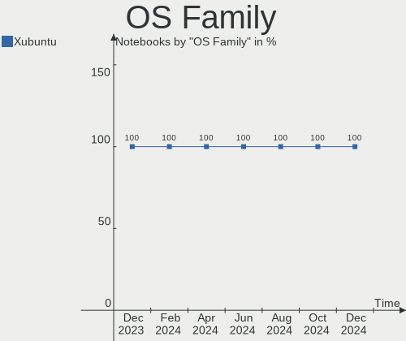
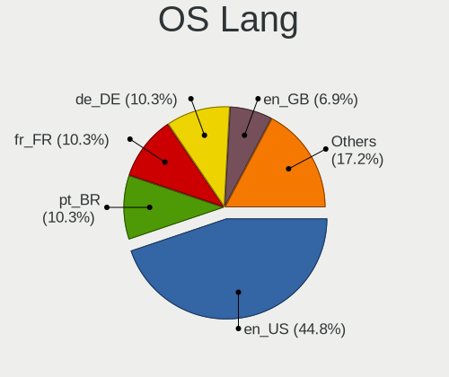
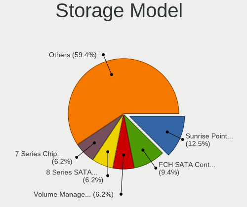
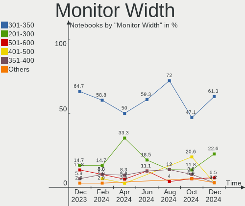
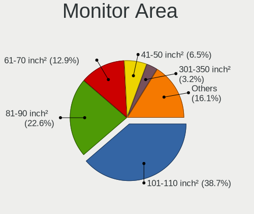
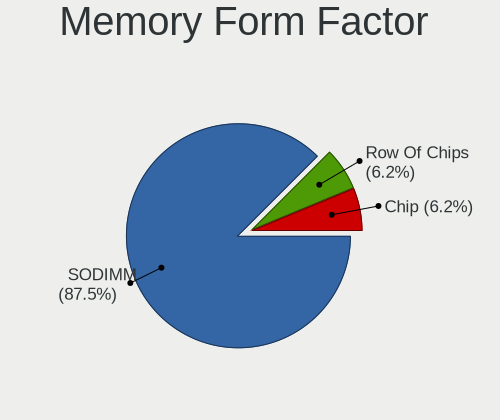
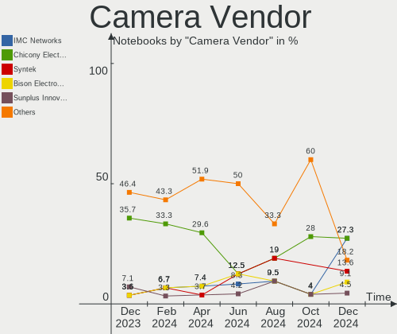
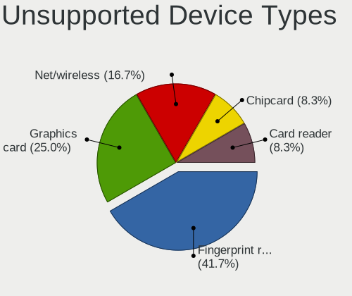

Xubuntu Hardware Trends (Notebook)
----------------------------------

A project to identify most popular hardware characteristics and track their change
over time based on data collected by Xubuntu users at https://Linux-Hardware.org.

Anyone can contribute to the study by uploading probes of their computers by
the [hw-probe](https://github.com/linuxhw/hw-probe) tool:

    sudo -E hw-probe -all -upload

Full-feature report is available here: https://linux-hardware.org/?view=trends&formfactor=notebook

Period: May, 2021.

Contents
--------

- [ OS                       ](#os)
- [ OS Family                ](#os-family)
- [ Kernel                   ](#kernel)
- [ Kernel Family            ](#kernel-family)
- [ Kernel Major Ver.        ](#kernel-major-ver)
- [ Arch                     ](#arch)
- [ DE                       ](#de)
- [ Display Server           ](#display-server)
- [ Display Manager          ](#display-manager)
- [ OS Lang                  ](#os-lang)
- [ Boot Mode                ](#boot-mode)
- [ Filesystem               ](#filesystem)
- [ Part. scheme             ](#part-scheme)
- [ Dual Boot with Linux/BSD ](#dual-boot-with-linux/bsd)
- [ Dual Boot (Win)          ](#dual-boot-win)
- [ Country                  ](#country)
- [ City                     ](#city)
- [ Vendor                   ](#vendor)
- [ Model                    ](#model)
- [ Model Family             ](#model-family)
- [ MFG Year                 ](#mfg-year)
- [ Form Factor              ](#form-factor)
- [ Secure Boot              ](#secure-boot)
- [ Coreboot                 ](#coreboot)
- [ RAM Size                 ](#ram-size)
- [ RAM Used                 ](#ram-used)
- [ Has CD-ROM               ](#has-cd-rom)
- [ Total Drives             ](#total-drives)
- [ Has Ethernet             ](#has-ethernet)
- [ Has WiFi                 ](#has-wifi)
- [ Has Bluetooth            ](#has-bluetooth)
- [ Drive Vendor             ](#drive-vendor)
- [ Drive Model              ](#drive-model)
- [ HDD Vendor               ](#hdd-vendor)
- [ SSD Vendor               ](#ssd-vendor)
- [ Drive Kind               ](#drive-kind)
- [ Drive Connector          ](#drive-connector)
- [ Drive Size               ](#drive-size)
- [ Space Total              ](#space-total)
- [ Space Used               ](#space-used)
- [ Malfunc. Drives          ](#malfunc-drives)
- [ Malfunc. Drive Vendor    ](#malfunc-drive-vendor)
- [ Malfunc. HDD Vendor      ](#malfunc-hdd-vendor)
- [ Malfunc. Drive Kind      ](#malfunc-drive-kind)
- [ Failed Drives            ](#failed-drives)
- [ Failed Drive Vendor      ](#failed-drive-vendor)
- [ Drive Status             ](#drive-status)
- [ Storage Vendor           ](#storage-vendor)
- [ Storage Model            ](#storage-model)
- [ Storage Kind             ](#storage-kind)
- [ CPU Vendor               ](#cpu-vendor)
- [ CPU Model                ](#cpu-model)
- [ CPU Model Family         ](#cpu-model-family)
- [ CPU Cores                ](#cpu-cores)
- [ CPU Sockets              ](#cpu-sockets)
- [ CPU Threads              ](#cpu-threads)
- [ CPU Op-Modes             ](#cpu-op-modes)
- [ CPU Microcode            ](#cpu-microcode)
- [ CPU Microarch            ](#cpu-microarch)
- [ GPU Vendor               ](#gpu-vendor)
- [ GPU Model                ](#gpu-model)
- [ GPU Combo                ](#gpu-combo)
- [ GPU Driver               ](#gpu-driver)
- [ GPU Memory               ](#gpu-memory)
- [ Monitor Vendor           ](#monitor-vendor)
- [ Monitor Model            ](#monitor-model)
- [ Monitor Resolution       ](#monitor-resolution)
- [ Monitor Diagonal         ](#monitor-diagonal)
- [ Monitor Width            ](#monitor-width)
- [ Aspect Ratio             ](#aspect-ratio)
- [ Monitor Area             ](#monitor-area)
- [ Pixel Density            ](#pixel-density)
- [ Multiple Monitors        ](#multiple-monitors)
- [ Net Controller Vendor    ](#net-controller-vendor)
- [ Net Controller Model     ](#net-controller-model)
- [ Wireless Vendor          ](#wireless-vendor)
- [ Wireless Model           ](#wireless-model)
- [ Ethernet Vendor          ](#ethernet-vendor)
- [ Ethernet Model           ](#ethernet-model)
- [ Net Controller Kind      ](#net-controller-kind)
- [ Used Controller          ](#used-controller)
- [ NICs                     ](#nics)
- [ IPv6                     ](#ipv6)
- [ Memory Vendor            ](#memory-vendor)
- [ Memory Model             ](#memory-model)
- [ Memory Kind              ](#memory-kind)
- [ Memory Form Factor       ](#memory-form-factor)
- [ Memory Size              ](#memory-size)
- [ Memory Speed             ](#memory-speed)
- [ Sound Vendor             ](#sound-vendor)
- [ Sound Model              ](#sound-model)
- [ Camera Vendor            ](#camera-vendor)
- [ Camera Model             ](#camera-model)
- [ Fingerprint Vendor       ](#fingerprint-vendor)
- [ Fingerprint Model        ](#fingerprint-model)
- [ Chipcard Vendor          ](#chipcard-vendor)
- [ Chipcard Model           ](#chipcard-model)
- [ Printer Vendor           ](#printer-vendor)
- [ Printer Model            ](#printer-model)
- [ Scanner Vendor           ](#scanner-vendor)
- [ Scanner Model            ](#scanner-model)
- [ Bluetooth Vendor         ](#bluetooth-vendor)
- [ Bluetooth Model          ](#bluetooth-model)
- [ Unsupported Devices      ](#unsupported-devices)
- [ Unsupported Device Types ](#unsupported-device-types)

OS
--

Installed operating systems

| Name          | Notebooks | Percent |
|---------------|-----------|---------|
| Xubuntu 20.04 | 32        | 61.54%  |
| Xubuntu 18.04 | 8         | 15.38%  |
| Xubuntu 21.04 | 7         | 13.46%  |
| Xubuntu 20.10 | 3         | 5.77%   |
| Xubuntu 16.04 | 1         | 1.92%   |
| Xubuntu       | 1         | 1.92%   |

OS Family
---------

OS without a version

| Name    | Notebooks | Percent |
|---------|-----------|---------|
| Xubuntu | 52        | 100%    |

Kernel
------

Version of the Linux kernel

| Version                 | Notebooks | Percent |
|-------------------------|-----------|---------|
| 5.4.0-73-generic        | 10        | 19.23%  |
| 5.8.0-53-generic        | 8         | 15.38%  |
| 5.11.0-17-generic       | 6         | 11.54%  |
| 5.4.0-72-generic        | 4         | 7.69%   |
| 5.8.0-50-lowlatency     | 3         | 5.77%   |
| 5.8.0-50-generic        | 3         | 5.77%   |
| 5.8.0-43-generic        | 3         | 5.77%   |
| 5.8.0-54-generic        | 1         | 1.92%   |
| 5.8.0-53-lowlatency     | 1         | 1.92%   |
| 5.6.19-050619-generic   | 1         | 1.92%   |
| 5.4.107-0504107-generic | 1         | 1.92%   |
| 5.4.0-73-lowlatency     | 1         | 1.92%   |
| 5.4.0-72-lowlatency     | 1         | 1.92%   |
| 5.4.0-71-generic        | 1         | 1.92%   |
| 5.4.0-65-lowlatency     | 1         | 1.92%   |
| 5.4.0-48-generic        | 1         | 1.92%   |
| 5.12.7                  | 1         | 1.92%   |
| 5.10.17-051017-generic  | 1         | 1.92%   |
| 4.15.0-99-lowlatency    | 1         | 1.92%   |
| 4.15.0-36-generic       | 1         | 1.92%   |
| 4.15.0-143-generic      | 1         | 1.92%   |
| 4.15.0-142-generic      | 1         | 1.92%   |

Kernel Family
-------------

Linux kernel without a distro release

| Version | Notebooks | Percent |
|---------|-----------|---------|
| 5.8.0   | 19        | 36.54%  |
| 5.4.0   | 19        | 36.54%  |
| 5.11.0  | 6         | 11.54%  |
| 4.15.0  | 4         | 7.69%   |
| 5.6.19  | 1         | 1.92%   |
| 5.4.107 | 1         | 1.92%   |
| 5.12.7  | 1         | 1.92%   |
| 5.10.17 | 1         | 1.92%   |

Kernel Major Ver.
-----------------

Linux kernel major version

| Version | Notebooks | Percent |
|---------|-----------|---------|
| 5.4     | 20        | 38.46%  |
| 5.8     | 19        | 36.54%  |
| 5.11    | 6         | 11.54%  |
| 4.15    | 4         | 7.69%   |
| 5.6     | 1         | 1.92%   |
| 5.12    | 1         | 1.92%   |
| 5.10    | 1         | 1.92%   |

Arch
----

OS architecture (x86_64, i586, etc.)

| Name   | Notebooks | Percent |
|--------|-----------|---------|
| x86_64 | 47        | 90.38%  |
| i686   | 5         | 9.62%   |

DE
--

Desktop Environment

| Name     | Notebooks | Percent |
|----------|-----------|---------|
| XFCE     | 50        | 96.15%  |
| Cinnamon | 1         | 1.92%   |
| awesome  | 1         | 1.92%   |

Display Server
--------------

X11 or Wayland

| Name | Notebooks | Percent |
|------|-----------|---------|
| X11  | 51        | 98.08%  |
| Tty  | 1         | 1.92%   |

Display Manager
---------------

SDDM, LightDM, etc.

| Name    | Notebooks | Percent |
|---------|-----------|---------|
| Unknown | 31        | 59.62%  |
| TDM     | 21        | 40.38%  |

OS Lang
-------

Language

| Lang  | Notebooks | Percent |
|-------|-----------|---------|
| en_US | 23        | 44.23%  |
| en_GB | 7         | 13.46%  |
| it_IT | 3         | 5.77%   |
| fr_FR | 3         | 5.77%   |
| de_DE | 3         | 5.77%   |
| C     | 2         | 3.85%   |
| ru_RU | 1         | 1.92%   |
| pt_PT | 1         | 1.92%   |
| pt_BR | 1         | 1.92%   |
| pl_PL | 1         | 1.92%   |
| id_ID | 1         | 1.92%   |
| hu_HU | 1         | 1.92%   |
| fr_BE | 1         | 1.92%   |
| es_MX | 1         | 1.92%   |
| es_ES | 1         | 1.92%   |
| en_IN | 1         | 1.92%   |
| cs_CZ | 1         | 1.92%   |

Boot Mode
---------

EFI or BIOS

| Mode | Notebooks | Percent |
|------|-----------|---------|
| BIOS | 34        | 65.38%  |
| EFI  | 18        | 34.62%  |

Filesystem
----------

Type of filesystem

| Type    | Notebooks | Percent |
|---------|-----------|---------|
| Ext4    | 48        | 92.31%  |
| Overlay | 3         | 5.77%   |
| Btrfs   | 1         | 1.92%   |

Part. scheme
------------

Scheme of partitioning

| Type    | Notebooks | Percent |
|---------|-----------|---------|
| Unknown | 31        | 59.62%  |
| GPT     | 13        | 25%     |
| MBR     | 8         | 15.38%  |

Dual Boot with Linux/BSD
------------------------

Hosting more than one Linux/BSD

| Dual boot | Notebooks | Percent |
|-----------|-----------|---------|
| No        | 44        | 84.62%  |
| Yes       | 8         | 15.38%  |

Dual Boot (Win)
---------------

Hosting Linux and Windows

| Dual boot | Notebooks | Percent |
|-----------|-----------|---------|
| No        | 38        | 73.08%  |
| Yes       | 14        | 26.92%  |

Country
-------

Geographic location (country)

| Country   | Notebooks | Percent |
|-----------|-----------|---------|
| Germany   | 11        | 21.15%  |
| USA       | 8         | 15.38%  |
| UK        | 8         | 15.38%  |
| Italy     | 4         | 7.69%   |
| France    | 3         | 5.77%   |
| Russia    | 2         | 3.85%   |
| Mexico    | 2         | 3.85%   |
| Indonesia | 2         | 3.85%   |
| Bulgaria  | 2         | 3.85%   |
| Vietnam   | 1         | 1.92%   |
| Spain     | 1         | 1.92%   |
| Portugal  | 1         | 1.92%   |
| India     | 1         | 1.92%   |
| Iceland   | 1         | 1.92%   |
| Hungary   | 1         | 1.92%   |
| Finland   | 1         | 1.92%   |
| Czechia   | 1         | 1.92%   |
| Brazil    | 1         | 1.92%   |
| Belgium   | 1         | 1.92%   |

City
----

Geographic location (city)

| City                         | Notebooks | Percent |
|------------------------------|-----------|---------|
| Berlin                       | 3         | 5.77%   |
| Munich                       | 2         | 3.85%   |
| Milan                        | 2         | 3.85%   |
| London                       | 2         | 3.85%   |
| Wismar                       | 1         | 1.92%   |
| Walthamstow                  | 1         | 1.92%   |
| Varna                        | 1         | 1.92%   |
| Telford                      | 1         | 1.92%   |
| Stablovice                   | 1         | 1.92%   |
| Slidell                      | 1         | 1.92%   |
| Semarang                     | 1         | 1.92%   |
| Schwalbach am Taunus         | 1         | 1.92%   |
| Sankt Georgen im Schwarzwald | 1         | 1.92%   |
| Royal Tunbridge Wells        | 1         | 1.92%   |
| Reykjavik                    | 1         | 1.92%   |
| Rehoboth                     | 1         | 1.92%   |
| Pottstown                    | 1         | 1.92%   |
| Pernik                       | 1         | 1.92%   |
| Paris                        | 1         | 1.92%   |
| Neath                        | 1         | 1.92%   |
| Moscow                       | 1         | 1.92%   |
| Minneapolis                  | 1         | 1.92%   |
| Mexico City                  | 1         | 1.92%   |
| Massa                        | 1         | 1.92%   |
| Madrid                       | 1         | 1.92%   |
| León                        | 1         | 1.92%   |
| Kolkata                      | 1         | 1.92%   |
| Izhevsk                      | 1         | 1.92%   |
| Ho Chi Minh City             | 1         | 1.92%   |
| Hesperia                     | 1         | 1.92%   |
| Hemel Hempstead              | 1         | 1.92%   |
| Hajdusamson                  | 1         | 1.92%   |
| Gruendau                     | 1         | 1.92%   |
| Grivegnee                    | 1         | 1.92%   |
| Genoa                        | 1         | 1.92%   |
| Filderstadt                  | 1         | 1.92%   |
| Espoo                        | 1         | 1.92%   |
| Dover                        | 1         | 1.92%   |
| Contagem                     | 1         | 1.92%   |
| Compiègne                   | 1         | 1.92%   |
| Chicago                      | 1         | 1.92%   |
| Burgthann                    | 1         | 1.92%   |
| Bristol                      | 1         | 1.92%   |
| Bernex                       | 1         | 1.92%   |
| Bekasi                       | 1         | 1.92%   |
| Beckley                      | 1         | 1.92%   |
| Amadora                      | 1         | 1.92%   |

Vendor
------

Motherboard manufacturer

| Name                | Notebooks | Percent |
|---------------------|-----------|---------|
| Hewlett-Packard     | 11        | 21.15%  |
| Dell                | 9         | 17.31%  |
| Lenovo              | 7         | 13.46%  |
| ASUSTek Computer    | 6         | 11.54%  |
| Acer                | 6         | 11.54%  |
| Toshiba             | 4         | 7.69%   |
| Samsung Electronics | 2         | 3.85%   |
| Sony                | 1         | 1.92%   |
| Schenker            | 1         | 1.92%   |
| Packard Bell        | 1         | 1.92%   |
| Notebook            | 1         | 1.92%   |
| Dixonsxp            | 1         | 1.92%   |
| Apple               | 1         | 1.92%   |
| Unknown             | 1         | 1.92%   |

Model
-----

Motherboard model

| Name                                 | Notebooks | Percent |
|--------------------------------------|-----------|---------|
| Dell Inspiron 7501                   | 2         | 3.85%   |
| Toshiba Satellite S55-C              | 1         | 1.92%   |
| Toshiba Satellite P755               | 1         | 1.92%   |
| Toshiba Satellite L500D              | 1         | 1.92%   |
| Toshiba Satellite L500               | 1         | 1.92%   |
| Sony VPCF236FM                       | 1         | 1.92%   |
| Schenker XMG CORE 14 XCO14L20        | 1         | 1.92%   |
| Samsung 900X3C/900X4C/900X4D         | 1         | 1.92%   |
| Samsung 300E4Z/300E5Z/300E7Z         | 1         | 1.92%   |
| Packard Bell EasyNote NX69HR         | 1         | 1.92%   |
| Notebook N85_87HP6                   | 1         | 1.92%   |
| Lenovo ThinkPad W510 431963G         | 1         | 1.92%   |
| Lenovo ThinkPad T495s 20QKS0SD00     | 1         | 1.92%   |
| Lenovo ThinkPad T490 20N2004AGE      | 1         | 1.92%   |
| Lenovo ThinkPad T470 20HES0FX00      | 1         | 1.92%   |
| Lenovo ThinkPad R61 8934F9U          | 1         | 1.92%   |
| Lenovo ThinkPad P17 Gen 1 20SQS0K700 | 1         | 1.92%   |
| Lenovo C-Notebook XXXX 3000 G400     | 1         | 1.92%   |
| HP ZBook 15                          | 1         | 1.92%   |
| HP Stream Notebook PC 11             | 1         | 1.92%   |
| HP ProBook 6570b                     | 1         | 1.92%   |
| HP Pavilion dv7                      | 1         | 1.92%   |
| HP Pavilion dv2700                   | 1         | 1.92%   |
| HP Laptop 15-gw0xxx                  | 1         | 1.92%   |
| HP EliteBook Folio 9470m             | 1         | 1.92%   |
| HP EliteBook 820 G3                  | 1         | 1.92%   |
| HP Compaq 6730s                      | 1         | 1.92%   |
| HP 250 G7 Notebook PC                | 1         | 1.92%   |
| HP 15                                | 1         | 1.92%   |
| Dixonsxp F71IX1                      | 1         | 1.92%   |
| Dell Studio 1535                     | 1         | 1.92%   |
| Dell Precision M6500                 | 1         | 1.92%   |
| Dell Latitude E6330                  | 1         | 1.92%   |
| Dell Latitude E6320                  | 1         | 1.92%   |
| Dell Latitude D630                   | 1         | 1.92%   |
| Dell Inspiron 3442                   | 1         | 1.92%   |
| Dell Inspiron 1545                   | 1         | 1.92%   |
| ASUS UX305FA                         | 1         | 1.92%   |
| ASUS F5SR                            | 1         | 1.92%   |
| ASUS E200HA                          | 1         | 1.92%   |
| ASUS A6M                             | 1         | 1.92%   |
| ASUS 1215N                           | 1         | 1.92%   |
| ASUS 1015PX                          | 1         | 1.92%   |
| Apple MacBookAir3,2                  | 1         | 1.92%   |
| Acer Swift SF114-32                  | 1         | 1.92%   |
| Acer Aspire E5-772G                  | 1         | 1.92%   |
| Acer Aspire E5-575                   | 1         | 1.92%   |
| Acer Aspire E5-573                   | 1         | 1.92%   |
| Acer Aspire 5740                     | 1         | 1.92%   |
| Acer AOA150                          | 1         | 1.92%   |
| Unknown                              | 1         | 1.92%   |

Model Family
------------

Motherboard model prefix

| Name                  | Notebooks | Percent |
|-----------------------|-----------|---------|
| Lenovo ThinkPad       | 6         | 11.54%  |
| Toshiba Satellite     | 4         | 7.69%   |
| Dell Inspiron         | 4         | 7.69%   |
| Acer Aspire           | 4         | 7.69%   |
| Dell Latitude         | 3         | 5.77%   |
| HP Pavilion           | 2         | 3.85%   |
| HP EliteBook          | 2         | 3.85%   |
| Sony VPCF236FM        | 1         | 1.92%   |
| Schenker XMG          | 1         | 1.92%   |
| Samsung 900X3C        | 1         | 1.92%   |
| Samsung 300E4Z        | 1         | 1.92%   |
| Packard Bell EasyNote | 1         | 1.92%   |
| Notebook N85          | 1         | 1.92%   |
| Lenovo C-Notebook     | 1         | 1.92%   |
| HP ZBook              | 1         | 1.92%   |
| HP Stream             | 1         | 1.92%   |
| HP ProBook            | 1         | 1.92%   |
| HP Laptop             | 1         | 1.92%   |
| HP Compaq             | 1         | 1.92%   |
| HP 250                | 1         | 1.92%   |
| HP 15                 | 1         | 1.92%   |
| Dixonsxp F71IX1       | 1         | 1.92%   |
| Dell Studio           | 1         | 1.92%   |
| Dell Precision        | 1         | 1.92%   |
| ASUS UX305FA          | 1         | 1.92%   |
| ASUS F5SR             | 1         | 1.92%   |
| ASUS E200HA           | 1         | 1.92%   |
| ASUS A6M              | 1         | 1.92%   |
| ASUS 1215N            | 1         | 1.92%   |
| ASUS 1015PX           | 1         | 1.92%   |
| Apple MacBookAir3     | 1         | 1.92%   |
| Acer Swift            | 1         | 1.92%   |
| Acer AOA150           | 1         | 1.92%   |
| Unknown               | 1         | 1.92%   |

MFG Year
--------

Motherboard manufacture year

| Year | Notebooks | Percent |
|------|-----------|---------|
| 2011 | 8         | 15.38%  |
| 2017 | 5         | 9.62%   |
| 2013 | 5         | 9.62%   |
| 2008 | 5         | 9.62%   |
| 2021 | 4         | 7.69%   |
| 2020 | 4         | 7.69%   |
| 2009 | 4         | 7.69%   |
| 2016 | 3         | 5.77%   |
| 2007 | 3         | 5.77%   |
| 2019 | 2         | 3.85%   |
| 2015 | 2         | 3.85%   |
| 2014 | 2         | 3.85%   |
| 2012 | 2         | 3.85%   |
| 2010 | 2         | 3.85%   |
| 2018 | 1         | 1.92%   |

Form Factor
-----------

Physical design of the computer

| Name     | Notebooks | Percent |
|----------|-----------|---------|
| Notebook | 52        | 100%    |

Secure Boot
-----------

Enabled or disabled

| State    | Notebooks | Percent |
|----------|-----------|---------|
| Disabled | 46        | 88.46%  |
| Enabled  | 6         | 11.54%  |

Coreboot
--------

Have coreboot on board

| Used | Notebooks | Percent |
|------|-----------|---------|
| No   | 52        | 100%    |

RAM Size
--------

Total RAM memory

| Size in GB | Notebooks | Percent |
|------------|-----------|---------|
| 3.01-4.0   | 13        | 25%     |
| 4.01-8.0   | 12        | 23.08%  |
| 8.01-16.0  | 11        | 21.15%  |
| 1.01-2.0   | 6         | 11.54%  |
| 2.01-3.0   | 3         | 5.77%   |
| 16.01-24.0 | 3         | 5.77%   |
| 32.01-64.0 | 2         | 3.85%   |
| 0.51-1.0   | 2         | 3.85%   |

RAM Used
--------

Used RAM memory

| Used GB  | Notebooks | Percent |
|----------|-----------|---------|
| 1.01-2.0 | 18        | 34.62%  |
| 2.01-3.0 | 16        | 30.77%  |
| 0.51-1.0 | 10        | 19.23%  |
| 4.01-8.0 | 5         | 9.62%   |
| 3.01-4.0 | 3         | 5.77%   |

Has CD-ROM
----------

Has CD-ROM on board

| Presented | Notebooks | Percent |
|-----------|-----------|---------|
| Yes       | 27        | 51.92%  |
| No        | 25        | 48.08%  |

Total Drives
------------

Number of drives on board

| Drives | Notebooks | Percent |
|--------|-----------|---------|
| 1      | 40        | 76.92%  |
| 2      | 11        | 21.15%  |
| 0      | 1         | 1.92%   |

Has Ethernet
------------

Has Ethernet on board

| Presented | Notebooks | Percent |
|-----------|-----------|---------|
| Yes       | 42        | 80.77%  |
| No        | 10        | 19.23%  |

Has WiFi
--------

Has WiFi module

| Presented | Notebooks | Percent |
|-----------|-----------|---------|
| Yes       | 50        | 96.15%  |
| No        | 2         | 3.85%   |

Has Bluetooth
-------------

Has Bluetooth module

| Presented | Notebooks | Percent |
|-----------|-----------|---------|
| Yes       | 34        | 65.38%  |
| No        | 18        | 34.62%  |

Drive Vendor
------------

Hard drive vendors

| Vendor              | Notebooks | Drives | Percent |
|---------------------|-----------|--------|---------|
| Samsung Electronics | 8         | 8      | 13.56%  |
| WDC                 | 7         | 8      | 11.86%  |
| Toshiba             | 6         | 6      | 10.17%  |
| Seagate             | 6         | 6      | 10.17%  |
| Intel               | 5         | 5      | 8.47%   |
| Hitachi             | 5         | 5      | 8.47%   |
| Unknown             | 3         | 3      | 5.08%   |
| Kingston            | 3         | 3      | 5.08%   |
| Fujitsu             | 3         | 3      | 5.08%   |
| KIOXIA              | 2         | 2      | 3.39%   |
| A-DATA Technology   | 2         | 2      | 3.39%   |
| Transcend           | 1         | 1      | 1.69%   |
| Team                | 1         | 1      | 1.69%   |
| SK Hynix            | 1         | 1      | 1.69%   |
| SanDisk             | 1         | 1      | 1.69%   |
| LITEON              | 1         | 1      | 1.69%   |
| Kingchuxing         | 1         | 1      | 1.69%   |
| HGST                | 1         | 1      | 1.69%   |
| Crucial             | 1         | 1      | 1.69%   |
| Apple               | 1         | 1      | 1.69%   |

Drive Model
-----------

Hard drive models

| Model                             | Notebooks | Percent |
|-----------------------------------|-----------|---------|
| Toshiba MQ01ABD100 1TB            | 2         | 3.33%   |
| Seagate ST2000LX001-1RG174 2TB    | 2         | 3.33%   |
| KIOXIA KBG40ZNS256G NVMe 256GB    | 2         | 3.33%   |
| WDC WD3200LPVX-22V0TT0 320GB      | 1         | 1.67%   |
| WDC WD3200BJKT-75F4T0 320GB       | 1         | 1.67%   |
| WDC WD3200BEVT-75ZCT2 320GB       | 1         | 1.67%   |
| WDC WD3200BEVT-26ZCT0 320GB       | 1         | 1.67%   |
| WDC WD2500BEVS-60UST0 250GB       | 1         | 1.67%   |
| WDC WD1600BEVT-22ZCT0 160GB       | 1         | 1.67%   |
| WDC WD10JPVX-22JC3T0 1TB          | 1         | 1.67%   |
| WDC WD10JPVX-00JC3T0 1TB          | 1         | 1.67%   |
| Unknown MMC Card  7GB             | 1         | 1.67%   |
| Unknown MMC Card  32GB            | 1         | 1.67%   |
| Unknown HBG4a2  32GB              | 1         | 1.67%   |
| Transcend TS128GMSA230S 128GB SSD | 1         | 1.67%   |
| Toshiba MQ04ABF100 1TB            | 1         | 1.67%   |
| Toshiba MQ01ABF050 500GB          | 1         | 1.67%   |
| Toshiba MK7559GSXP 752GB          | 1         | 1.67%   |
| Toshiba MK3252GSX 320GB           | 1         | 1.67%   |
| Team TIM3F49256GMBA04MA 256GB SSD | 1         | 1.67%   |
| SK Hynix NVMe SSD Drive 256GB     | 1         | 1.67%   |
| Seagate ST9500420AS 500GB         | 1         | 1.67%   |
| Seagate ST9250315AS 250GB         | 1         | 1.67%   |
| Seagate ST9160314AS 160GB         | 1         | 1.67%   |
| Seagate ST500LT012-9WS142 500GB   | 1         | 1.67%   |
| SanDisk SD7SN3Q256G1002 256GB SSD | 1         | 1.67%   |
| Samsung SSD 960 EVO 250GB         | 1         | 1.67%   |
| Samsung SSD 870 EVO 250GB         | 1         | 1.67%   |
| Samsung SSD 860 EVO mSATA 1TB     | 1         | 1.67%   |
| Samsung SSD 850 EVO 500GB         | 1         | 1.67%   |
| Samsung SSD 830 Series 128GB      | 1         | 1.67%   |
| Samsung NVMe SSD Drive 500GB      | 1         | 1.67%   |
| Samsung MZVLQ256HAJD-000H1 256GB  | 1         | 1.67%   |
| Samsung HM160HC 160GB             | 1         | 1.67%   |
| LITEON L8H-256V2G-HP 256GB SSD    | 1         | 1.67%   |
| Kingston SV300S37A120G 120GB SSD  | 1         | 1.67%   |
| Kingston SA400S37240G 240GB SSD   | 1         | 1.67%   |
| Kingston RBUSNS8154P3128GJ1 128GB | 1         | 1.67%   |
| Kingchuxing SSD 1TB               | 1         | 1.67%   |
| Intel SSDSC2KW512G8 512GB         | 1         | 1.67%   |
| Intel SSDSC2BW120H6 120GB         | 1         | 1.67%   |
| Intel SSDPEKKF512G8L 512GB        | 1         | 1.67%   |
| Intel SSDPEKKF512G7L 512GB        | 1         | 1.67%   |
| Intel SSDPEKKF010T8L 1TB          | 1         | 1.67%   |
| Hitachi HTS725050A7E630 500GB     | 1         | 1.67%   |
| Hitachi HTS723216A7A364 160GB     | 1         | 1.67%   |
| Hitachi HTS547575A9E384 752GB     | 1         | 1.67%   |
| Hitachi HTS543225L9SA00 250GB     | 1         | 1.67%   |
| Hitachi HTS543225L9A300 250GB     | 1         | 1.67%   |
| HGST HTS541010A9E680 1TB          | 1         | 1.67%   |
| Fujitsu MJA2500BH G2 500GB        | 1         | 1.67%   |
| Fujitsu MHZ2160BJ FFS G2 160GB    | 1         | 1.67%   |
| Fujitsu MHZ2160BH G2 160GB        | 1         | 1.67%   |
| Crucial CT240BX500SSD1 240GB      | 1         | 1.67%   |
| Apple SSD TS128C 121GB            | 1         | 1.67%   |
| A-DATA SU800NS38 128GB SSD        | 1         | 1.67%   |
| A-DATA SU650 120GB SSD            | 1         | 1.67%   |

HDD Vendor
----------

Hard disk drive vendors

| Vendor              | Notebooks | Drives | Percent |
|---------------------|-----------|--------|---------|
| WDC                 | 7         | 8      | 24.14%  |
| Toshiba             | 6         | 6      | 20.69%  |
| Seagate             | 6         | 6      | 20.69%  |
| Hitachi             | 5         | 5      | 17.24%  |
| Fujitsu             | 3         | 3      | 10.34%  |
| Samsung Electronics | 1         | 1      | 3.45%   |
| HGST                | 1         | 1      | 3.45%   |

SSD Vendor
----------

Solid state drive vendors

| Vendor              | Notebooks | Drives | Percent |
|---------------------|-----------|--------|---------|
| Samsung Electronics | 4         | 4      | 23.53%  |
| Kingston            | 2         | 2      | 11.76%  |
| Intel               | 2         | 2      | 11.76%  |
| A-DATA Technology   | 2         | 2      | 11.76%  |
| Transcend           | 1         | 1      | 5.88%   |
| Team                | 1         | 1      | 5.88%   |
| SanDisk             | 1         | 1      | 5.88%   |
| LITEON              | 1         | 1      | 5.88%   |
| Kingchuxing         | 1         | 1      | 5.88%   |
| Crucial             | 1         | 1      | 5.88%   |
| Apple               | 1         | 1      | 5.88%   |

Drive Kind
----------

HDD or SSD

| Kind | Notebooks | Drives | Percent |
|------|-----------|--------|---------|
| HDD  | 28        | 30     | 49.12%  |
| SSD  | 16        | 17     | 28.07%  |
| NVMe | 10        | 10     | 17.54%  |
| MMC  | 3         | 3      | 5.26%   |

Drive Connector
---------------

SATA, SAS, NVMe, etc.

| Type | Notebooks | Drives | Percent |
|------|-----------|--------|---------|
| SATA | 40        | 47     | 75.47%  |
| NVMe | 10        | 10     | 18.87%  |
| MMC  | 3         | 3      | 5.66%   |

Drive Size
----------

Size of hard drive

| Size in TB | Notebooks | Drives | Percent |
|------------|-----------|--------|---------|
| 0.01-0.5   | 30        | 34     | 69.77%  |
| 0.51-1.0   | 11        | 11     | 25.58%  |
| 1.01-2.0   | 2         | 2      | 4.65%   |

Space Total
-----------

Amount of disk space available on the file system

| Size in GB | Notebooks | Percent |
|------------|-----------|---------|
| 101-250    | 17        | 32.69%  |
| 251-500    | 12        | 23.08%  |
| 21-50      | 6         | 11.54%  |
| 501-1000   | 6         | 11.54%  |
| 51-100     | 5         | 9.62%   |
| 1-20       | 3         | 5.77%   |
| 2001-3000  | 2         | 3.85%   |
| 1001-2000  | 1         | 1.92%   |

Space Used
----------

Amount of used disk space

| Used GB   | Notebooks | Percent |
|-----------|-----------|---------|
| 1-20      | 19        | 36.54%  |
| 21-50     | 11        | 21.15%  |
| 101-250   | 11        | 21.15%  |
| 51-100    | 6         | 11.54%  |
| 1001-2000 | 2         | 3.85%   |
| 501-1000  | 2         | 3.85%   |
| 251-500   | 1         | 1.92%   |

Malfunc. Drives
---------------

Drive models with a malfunction

| Model                          | Notebooks | Drives | Percent |
|--------------------------------|-----------|--------|---------|
| Toshiba MQ01ABD100 1TB         | 1         | 1      | 25%     |
| Hitachi HTS725050A7E630 500GB  | 1         | 1      | 25%     |
| Hitachi HTS547575A9E384 752GB  | 1         | 1      | 25%     |
| Fujitsu MHZ2160BJ FFS G2 160GB | 1         | 1      | 25%     |

Malfunc. Drive Vendor
---------------------

Vendors of faulty drives

| Vendor  | Notebooks | Drives | Percent |
|---------|-----------|--------|---------|
| Hitachi | 2         | 2      | 50%     |
| Toshiba | 1         | 1      | 25%     |
| Fujitsu | 1         | 1      | 25%     |

Malfunc. HDD Vendor
-------------------

Vendors of faulty HDD drives

| Vendor  | Notebooks | Drives | Percent |
|---------|-----------|--------|---------|
| Hitachi | 2         | 2      | 50%     |
| Toshiba | 1         | 1      | 25%     |
| Fujitsu | 1         | 1      | 25%     |

Malfunc. Drive Kind
-------------------

Kinds of faulty drives

| Kind | Notebooks | Drives | Percent |
|------|-----------|--------|---------|
| HDD  | 4         | 4      | 100%    |

Failed Drives
-------------

Failed drive models

Zero info for selected period =(

Failed Drive Vendor
-------------------

Failed drive vendors

Zero info for selected period =(

Drive Status
------------

Number of failed and malfunc. drives

| Status   | Notebooks | Drives | Percent |
|----------|-----------|--------|---------|
| Detected | 31        | 36     | 59.62%  |
| Works    | 17        | 20     | 32.69%  |
| Malfunc  | 4         | 4      | 7.69%   |

Storage Vendor
--------------

Storage controller vendors

| Vendor                           | Notebooks | Percent |
|----------------------------------|-----------|---------|
| Intel                            | 40        | 74.07%  |
| Samsung Electronics              | 3         | 5.56%   |
| Nvidia                           | 3         | 5.56%   |
| AMD                              | 3         | 5.56%   |
| KIOXIA                           | 2         | 3.7%    |
| SK Hynix                         | 1         | 1.85%   |
| Silicon Integrated Systems [SiS] | 1         | 1.85%   |
| Kingston Technology Company      | 1         | 1.85%   |

Storage Model
-------------

Storage controller models

| Model                                                                            | Notebooks | Percent |
|----------------------------------------------------------------------------------|-----------|---------|
| Intel 82801 Mobile SATA Controller [RAID mode]                                   | 4         | 6.67%   |
| Intel 6 Series/C200 Series Chipset Family 6 port Mobile SATA AHCI Controller     | 4         | 6.67%   |
| Intel Wildcat Point-LP SATA Controller [AHCI Mode]                               | 3         | 5%      |
| Intel 82801IBM/IEM (ICH9M/ICH9M-E) 4 port SATA Controller [AHCI mode]            | 3         | 5%      |
| KIOXIA Non-Volatile memory controller                                            | 2         | 3.33%   |
| Intel Sunrise Point-LP SATA Controller [AHCI mode]                               | 2         | 3.33%   |
| Intel SSD Pro 7600p/760p/E 6100p Series                                          | 2         | 3.33%   |
| Intel NM10/ICH7 Family SATA Controller [AHCI mode]                               | 2         | 3.33%   |
| Intel 82801HM/HEM (ICH8M/ICH8M-E) SATA Controller [IDE mode]                     | 2         | 3.33%   |
| Intel 82801HM/HEM (ICH8M/ICH8M-E) IDE Controller                                 | 2         | 3.33%   |
| Intel 82801GBM/GHM (ICH7-M Family) SATA Controller [IDE mode]                    | 2         | 3.33%   |
| Intel 8 Series SATA Controller 1 [AHCI mode]                                     | 2         | 3.33%   |
| Intel 7 Series Chipset Family 6-port SATA Controller [AHCI mode]                 | 2         | 3.33%   |
| Intel 400 Series Chipset Family SATA AHCI Controller                             | 2         | 3.33%   |
| AMD FCH SATA Controller [AHCI mode]                                              | 2         | 3.33%   |
| SK Hynix Non-Volatile memory controller                                          | 1         | 1.67%   |
| Silicon Integrated Systems [SiS] SATA Controller / IDE mode                      | 1         | 1.67%   |
| Silicon Integrated Systems [SiS] 5513 IDE Controller                             | 1         | 1.67%   |
| Samsung NVMe SSD Controller SM961/PM961/SM963                                    | 1         | 1.67%   |
| Samsung NVMe SSD Controller PM9A1/PM9A3/980PRO                                   | 1         | 1.67%   |
| Samsung NVMe Controller                                                          | 1         | 1.67%   |
| Nvidia MCP89 SATA Controller (AHCI mode)                                         | 1         | 1.67%   |
| Nvidia MCP67 IDE Controller                                                      | 1         | 1.67%   |
| Nvidia MCP67 AHCI Controller                                                     | 1         | 1.67%   |
| Nvidia MCP51 IDE                                                                 | 1         | 1.67%   |
| Kingston Company U-SNS8154P3 NVMe SSD                                            | 1         | 1.67%   |
| Intel SSD 600P Series                                                            | 1         | 1.67%   |
| Intel HM170/QM170 Chipset SATA Controller [AHCI Mode]                            | 1         | 1.67%   |
| Intel Celeron/Pentium Silver Processor SATA Controller                           | 1         | 1.67%   |
| Intel Atom/Celeron/Pentium Processor x5-E8000/J3xxx/N3xxx Series SATA Controller | 1         | 1.67%   |
| Intel 82801IBM/IEM (ICH9M/ICH9M-E) 2 port SATA Controller [IDE mode]             | 1         | 1.67%   |
| Intel 82801HM/HEM (ICH8M/ICH8M-E) SATA Controller [AHCI mode]                    | 1         | 1.67%   |
| Intel 8 Series/C220 Series Chipset Family 6-port SATA Controller 1 [AHCI mode]   | 1         | 1.67%   |
| Intel 7 Series Chipset Family 4-port SATA Controller [IDE mode]                  | 1         | 1.67%   |
| Intel 7 Series Chipset Family 2-port SATA Controller [IDE mode]                  | 1         | 1.67%   |
| Intel 5 Series/3400 Series Chipset 6 port SATA AHCI Controller                   | 1         | 1.67%   |
| Intel 5 Series/3400 Series Chipset 4 port SATA AHCI Controller                   | 1         | 1.67%   |
| AMD SB7x0/SB8x0/SB9x0 SATA Controller [IDE mode]                                 | 1         | 1.67%   |
| AMD FCH IDE Controller                                                           | 1         | 1.67%   |

Storage Kind
------------

Kind of storage controller (IDE, SATA, NVMe, SAS, ...)

| Kind | Notebooks | Percent |
|------|-----------|---------|
| SATA | 31        | 55.36%  |
| IDE  | 11        | 19.64%  |
| NVMe | 10        | 17.86%  |
| RAID | 4         | 7.14%   |

CPU Vendor
----------

Processor vendors

| Vendor | Notebooks | Percent |
|--------|-----------|---------|
| Intel  | 45        | 86.54%  |
| AMD    | 7         | 13.46%  |

CPU Model
---------

Processor models

| Model                                           | Notebooks | Percent |
|-------------------------------------------------|-----------|---------|
| Intel Pentium Dual-Core CPU T4200 @ 2.00GHz     | 2         | 3.85%   |
| Intel Core i5-10300H CPU @ 2.50GHz              | 2         | 3.85%   |
| Intel Processor 5Y10 CPU @ 0.80GHz              | 1         | 1.92%   |
| Intel Pentium Silver N5030 CPU @ 1.10GHz        | 1         | 1.92%   |
| Intel Pentium Dual CPU T3400 @ 2.16GHz          | 1         | 1.92%   |
| Intel Pentium 3556U @ 1.70GHz                   | 1         | 1.92%   |
| Intel Genuine CPU T2130 @ 1.86GHz               | 1         | 1.92%   |
| Intel Genuine CPU 575 @ 2.00GHz                 | 1         | 1.92%   |
| Intel Core i7-8565U CPU @ 1.80GHz               | 1         | 1.92%   |
| Intel Core i7-7700HQ CPU @ 2.80GHz              | 1         | 1.92%   |
| Intel Core i7-7500U CPU @ 2.70GHz               | 1         | 1.92%   |
| Intel Core i7-5500U CPU @ 2.40GHz               | 1         | 1.92%   |
| Intel Core i7-4700MQ CPU @ 2.40GHz              | 1         | 1.92%   |
| Intel Core i7-2670QM CPU @ 2.20GHz              | 1         | 1.92%   |
| Intel Core i7-2630QM CPU @ 2.00GHz              | 1         | 1.92%   |
| Intel Core i7-2620M CPU @ 2.70GHz               | 1         | 1.92%   |
| Intel Core i7 CPU Q 720 @ 1.60GHz               | 1         | 1.92%   |
| Intel Core i7 CPU M 620 @ 2.67GHz               | 1         | 1.92%   |
| Intel Core i5-6200U CPU @ 2.30GHz               | 1         | 1.92%   |
| Intel Core i5-3437U CPU @ 1.90GHz               | 1         | 1.92%   |
| Intel Core i5-3340M CPU @ 2.70GHz               | 1         | 1.92%   |
| Intel Core i5-3320M CPU @ 2.60GHz               | 1         | 1.92%   |
| Intel Core i5-3317U CPU @ 1.70GHz               | 1         | 1.92%   |
| Intel Core i5-2410M CPU @ 2.30GHz               | 1         | 1.92%   |
| Intel Core i5-10400H CPU @ 2.60GHz              | 1         | 1.92%   |
| Intel Core i3-7100U CPU @ 2.40GHz               | 1         | 1.92%   |
| Intel Core i3-5005U CPU @ 2.00GHz               | 1         | 1.92%   |
| Intel Core i3-4030U CPU @ 1.90GHz               | 1         | 1.92%   |
| Intel Core i3-2350M CPU @ 2.30GHz               | 1         | 1.92%   |
| Intel Core i3-1005G1 CPU @ 1.20GHz              | 1         | 1.92%   |
| Intel Core i3 CPU M 330 @ 2.13GHz               | 1         | 1.92%   |
| Intel Core 2 Duo CPU T8100 @ 2.10GHz            | 1         | 1.92%   |
| Intel Core 2 Duo CPU T7300 @ 2.00GHz            | 1         | 1.92%   |
| Intel Core 2 Duo CPU T6600 @ 2.20GHz            | 1         | 1.92%   |
| Intel Core 2 Duo CPU T5750 @ 2.00GHz            | 1         | 1.92%   |
| Intel Core 2 Duo CPU L9400 @ 1.86GHz            | 1         | 1.92%   |
| Intel Celeron CPU N3060 @ 1.60GHz               | 1         | 1.92%   |
| Intel Celeron CPU N2840 @ 2.16GHz               | 1         | 1.92%   |
| Intel Atom x5-Z8350 CPU @ 1.44GHz               | 1         | 1.92%   |
| Intel Atom CPU N570 @ 1.66GHz                   | 1         | 1.92%   |
| Intel Atom CPU N270 @ 1.60GHz                   | 1         | 1.92%   |
| Intel Atom CPU D525 @ 1.80GHz                   | 1         | 1.92%   |
| Intel 11th Gen Core i7-1165G7 @ 2.80GHz         | 1         | 1.92%   |
| AMD Turion 64 X2 TL-60                          | 1         | 1.92%   |
| AMD Ryzen 7 PRO 3700U w/ Radeon Vega Mobile Gfx | 1         | 1.92%   |
| AMD Mobile Sempron Processor 3200+              | 1         | 1.92%   |
| AMD Athlon II Dual-Core M300                    | 1         | 1.92%   |
| AMD Athlon Gold 3150U with Radeon Graphics      | 1         | 1.92%   |
| AMD A8-3520M APU with Radeon HD Graphics        | 1         | 1.92%   |
| AMD A6-5200 APU with Radeon HD Graphics         | 1         | 1.92%   |

CPU Model Family
----------------

Processor model prefix

| Model                   | Notebooks | Percent |
|-------------------------|-----------|---------|
| Intel Core i7           | 10        | 19.23%  |
| Intel Core i5           | 9         | 17.31%  |
| Intel Core i3           | 6         | 11.54%  |
| Intel Core 2 Duo        | 5         | 9.62%   |
| Intel Atom              | 4         | 7.69%   |
| Other                   | 2         | 3.85%   |
| Intel Pentium Dual-Core | 2         | 3.85%   |
| Intel Genuine           | 2         | 3.85%   |
| Intel Celeron           | 2         | 3.85%   |
| Intel Pentium Silver    | 1         | 1.92%   |
| Intel Pentium Dual      | 1         | 1.92%   |
| Intel Pentium           | 1         | 1.92%   |
| AMD Turion 64 X2        | 1         | 1.92%   |
| AMD Ryzen 7 PRO         | 1         | 1.92%   |
| AMD Mobile Sempron      | 1         | 1.92%   |
| AMD Athlon II Dual-Core | 1         | 1.92%   |
| AMD Athlon              | 1         | 1.92%   |
| AMD A8                  | 1         | 1.92%   |
| AMD A6                  | 1         | 1.92%   |

CPU Cores
---------

Number of processor cores

| Number | Notebooks | Percent |
|--------|-----------|---------|
| 2      | 34        | 65.38%  |
| 4      | 15        | 28.85%  |
| 1      | 3         | 5.77%   |

CPU Sockets
-----------

Number of sockets

| Number | Notebooks | Percent |
|--------|-----------|---------|
| 1      | 52        | 100%    |

CPU Threads
-----------

Threads per core (Hyper-Threading)

| Number | Notebooks | Percent |
|--------|-----------|---------|
| 2      | 32        | 61.54%  |
| 1      | 20        | 38.46%  |

CPU Op-Modes
------------

CPU Operation Modes (32-bit, 64-bit)

| Op mode        | Notebooks | Percent |
|----------------|-----------|---------|
| 32-bit, 64-bit | 50        | 96.15%  |
| 32-bit         | 2         | 3.85%   |

CPU Microcode
-------------

Microcode number

| Number     | Notebooks | Percent |
|------------|-----------|---------|
| Unknown    | 10        | 19.23%  |
| 0x206a7    | 5         | 9.62%   |
| 0x306a9    | 4         | 7.69%   |
| 0xa0652    | 3         | 5.77%   |
| 0x6fd      | 3         | 5.77%   |
| 0x306d4    | 3         | 5.77%   |
| 0x1067a    | 3         | 5.77%   |
| 0x806e9    | 2         | 3.85%   |
| 0x406c4    | 2         | 3.85%   |
| 0x40651    | 2         | 3.85%   |
| 0x906e9    | 1         | 1.92%   |
| 0x806eb    | 1         | 1.92%   |
| 0x806c1    | 1         | 1.92%   |
| 0x706e5    | 1         | 1.92%   |
| 0x706a8    | 1         | 1.92%   |
| 0x6fa      | 1         | 1.92%   |
| 0x30678    | 1         | 1.92%   |
| 0x20655    | 1         | 1.92%   |
| 0x20652    | 1         | 1.92%   |
| 0x106e5    | 1         | 1.92%   |
| 0x106ca    | 1         | 1.92%   |
| 0x106c2    | 1         | 1.92%   |
| 0x10676    | 1         | 1.92%   |
| 0x08108109 | 1         | 1.92%   |
| 0x08108102 | 1         | 1.92%   |

CPU Microarch
-------------

Microarchitecture

| Name          | Notebooks | Percent |
|---------------|-----------|---------|
| SandyBridge   | 5         | 9.62%   |
| Penryn        | 5         | 9.62%   |
| KabyLake      | 4         | 7.69%   |
| IvyBridge     | 4         | 7.69%   |
| Core          | 4         | 7.69%   |
| Silvermont    | 3         | 5.77%   |
| Haswell       | 3         | 5.77%   |
| CometLake     | 3         | 5.77%   |
| Broadwell     | 3         | 5.77%   |
| Bonnell       | 3         | 5.77%   |
| Zen+          | 2         | 3.85%   |
| Westmere      | 2         | 3.85%   |
| K8 Hammer     | 2         | 3.85%   |
| TigerLake     | 1         | 1.92%   |
| Skylake       | 1         | 1.92%   |
| P6            | 1         | 1.92%   |
| Nehalem       | 1         | 1.92%   |
| K10 Llano     | 1         | 1.92%   |
| K10           | 1         | 1.92%   |
| Jaguar        | 1         | 1.92%   |
| IceLake       | 1         | 1.92%   |
| Goldmont plus | 1         | 1.92%   |

GPU Vendor
----------

Vendors of graphics cards

| Vendor | Notebooks | Percent |
|--------|-----------|---------|
| Intel  | 38        | 62.3%   |
| Nvidia | 15        | 24.59%  |
| AMD    | 8         | 13.11%  |

GPU Model
---------

Graphics card models

| Model                                                                                    | Notebooks | Percent |
|------------------------------------------------------------------------------------------|-----------|---------|
| Intel 3rd Gen Core processor Graphics Controller                                         | 4         | 6.06%   |
| Intel 2nd Generation Core Processor Family Integrated Graphics Controller                | 4         | 6.06%   |
| Nvidia GF108M [GeForce GT 540M]                                                          | 3         | 4.55%   |
| Intel Mobile 4 Series Chipset Integrated Graphics Controller                             | 3         | 4.55%   |
| Intel CometLake-H GT2 [UHD Graphics]                                                     | 3         | 4.55%   |
| Intel Mobile GM965/GL960 Integrated Graphics Controller (secondary)                      | 2         | 3.03%   |
| Intel Mobile GM965/GL960 Integrated Graphics Controller (primary)                        | 2         | 3.03%   |
| Intel Mobile 945GM/GMS/GME, 943/940GML Express Integrated Graphics Controller            | 2         | 3.03%   |
| Intel HD Graphics 620                                                                    | 2         | 3.03%   |
| Intel HD Graphics 5500                                                                   | 2         | 3.03%   |
| Intel Haswell-ULT Integrated Graphics Controller                                         | 2         | 3.03%   |
| Intel Atom/Celeron/Pentium Processor x5-E8000/J3xxx/N3xxx Integrated Graphics Controller | 2         | 3.03%   |
| Intel Atom Processor D4xx/D5xx/N4xx/N5xx Integrated Graphics Controller                  | 2         | 3.03%   |
| AMD RV710/M92 [Mobility Radeon HD 4530/4570/545v]                                        | 2         | 3.03%   |
| AMD RV620/M82 [Mobility Radeon HD 3450/3470]                                             | 2         | 3.03%   |
| AMD Picasso                                                                              | 2         | 3.03%   |
| Nvidia TU117M                                                                            | 1         | 1.52%   |
| Nvidia TU117GLM [Quadro T1000 Mobile]                                                    | 1         | 1.52%   |
| Nvidia MCP89 [GeForce 320M]                                                              | 1         | 1.52%   |
| Nvidia GT218M [ION 2]                                                                    | 1         | 1.52%   |
| Nvidia GT216GLM [Quadro FX 880M]                                                         | 1         | 1.52%   |
| Nvidia GP106M [GeForce GTX 1060 Mobile]                                                  | 1         | 1.52%   |
| Nvidia GK208BM [GeForce 920M]                                                            | 1         | 1.52%   |
| Nvidia GK107GLM [Quadro K1100M]                                                          | 1         | 1.52%   |
| Nvidia GF119M [GeForce GT 520MX]                                                         | 1         | 1.52%   |
| Nvidia G92GLM [Quadro FX 2800M]                                                          | 1         | 1.52%   |
| Nvidia C67 [GeForce 7150M / nForce 630M]                                                 | 1         | 1.52%   |
| Nvidia C51 [GeForce Go 6100]                                                             | 1         | 1.52%   |
| Intel WhiskeyLake-U GT2 [UHD Graphics 620]                                               | 1         | 1.52%   |
| Intel TigerLake-LP GT2 [Iris Xe Graphics]                                                | 1         | 1.52%   |
| Intel Skylake GT2 [HD Graphics 520]                                                      | 1         | 1.52%   |
| Intel Mobile 945GSE Express Integrated Graphics Controller                               | 1         | 1.52%   |
| Intel Mobile 945GM/GMS, 943/940GML Express Integrated Graphics Controller                | 1         | 1.52%   |
| Intel Iris Plus Graphics G1 (Ice Lake)                                                   | 1         | 1.52%   |
| Intel HD Graphics 630                                                                    | 1         | 1.52%   |
| Intel HD Graphics 5300                                                                   | 1         | 1.52%   |
| Intel GeminiLake [UHD Graphics 605]                                                      | 1         | 1.52%   |
| Intel Core Processor Integrated Graphics Controller                                      | 1         | 1.52%   |
| Intel Atom Processor Z36xxx/Z37xxx Series Graphics & Display                             | 1         | 1.52%   |
| Intel 4th Gen Core Processor Integrated Graphics Controller                              | 1         | 1.52%   |
| AMD Topaz XT [Radeon R7 M260/M265 / M340/M360 / M440/M445 / 530/535 / 620/625 Mobile]    | 1         | 1.52%   |
| AMD Sumo [Radeon HD 6620G]                                                               | 1         | 1.52%   |
| AMD Kabini [Radeon HD 8400 / R3 Series]                                                  | 1         | 1.52%   |

GPU Combo
---------

Combinations of graphics cards

| Name           | Notebooks | Percent |
|----------------|-----------|---------|
| 1 x Intel      | 29        | 55.77%  |
| Intel + Nvidia | 9         | 17.31%  |
| 1 x AMD        | 7         | 13.46%  |
| 1 x Nvidia     | 6         | 11.54%  |
| 2 x AMD        | 1         | 1.92%   |

GPU Driver
----------

Free vs proprietary

| Driver      | Notebooks | Percent |
|-------------|-----------|---------|
| Free        | 43        | 82.69%  |
| Proprietary | 7         | 13.46%  |
| Unknown     | 2         | 3.85%   |

GPU Memory
----------

Total video memory

| Size in GB | Notebooks | Percent |
|------------|-----------|---------|
| Unknown    | 31        | 59.62%  |
| 0.01-0.5   | 8         | 15.38%  |
| 0.51-1.0   | 6         | 11.54%  |
| 1.01-2.0   | 4         | 7.69%   |
| 3.01-4.0   | 2         | 3.85%   |
| 5.01-6.0   | 1         | 1.92%   |

Monitor Vendor
--------------

Monitor vendors

| Vendor                  | Notebooks | Percent |
|-------------------------|-----------|---------|
| AU Optronics            | 18        | 31.03%  |
| Samsung Electronics     | 8         | 13.79%  |
| LG Display              | 8         | 13.79%  |
| Chimei Innolux          | 5         | 8.62%   |
| LG Philips              | 3         | 5.17%   |
| HannStar                | 2         | 3.45%   |
| Chi Mei Optoelectronics | 2         | 3.45%   |
| Vizio                   | 1         | 1.72%   |
| PANDA                   | 1         | 1.72%   |
| NECCI                   | 1         | 1.72%   |
| NEC Computers           | 1         | 1.72%   |
| LGD                     | 1         | 1.72%   |
| Lenovo Group Limited    | 1         | 1.72%   |
| Lenovo                  | 1         | 1.72%   |
| InfoVision              | 1         | 1.72%   |
| Goldstar                | 1         | 1.72%   |
| BOE                     | 1         | 1.72%   |
| BenQ                    | 1         | 1.72%   |
| Apple                   | 1         | 1.72%   |

Monitor Model
-------------

Monitor models

| Model                                                                     | Notebooks | Percent |
|---------------------------------------------------------------------------|-----------|---------|
| AU Optronics LCD Monitor AUO8174 1280x800 331x207mm 15.4-inch             | 2         | 3.39%   |
| Vizio E241i-A1 VIZ1005 1920x1080 521x293mm 23.5-inch                      | 1         | 1.69%   |
| Samsung Electronics S24R35x SAM100E 1920x1080 530x300mm 24.0-inch         | 1         | 1.69%   |
| Samsung Electronics LCD Monitor SEC5441 1366x768 344x194mm 15.5-inch      | 1         | 1.69%   |
| Samsung Electronics LCD Monitor SEC4F45 1280x800 331x207mm 15.4-inch      | 1         | 1.69%   |
| Samsung Electronics LCD Monitor SEC3659 1600x900 344x194mm 15.5-inch      | 1         | 1.69%   |
| Samsung Electronics LCD Monitor SEC3649 1366x768 309x174mm 14.0-inch      | 1         | 1.69%   |
| Samsung Electronics LCD Monitor SEC3546 1600x900 293x165mm 13.2-inch      | 1         | 1.69%   |
| Samsung Electronics LCD Monitor SEC315A 1366x768 344x194mm 15.5-inch      | 1         | 1.69%   |
| Samsung Electronics LCD Monitor SDC374A 3200x1800 293x165mm 13.2-inch     | 1         | 1.69%   |
| PANDA LCD Monitor NCP0050 1920x1080 309x174mm 14.0-inch                   | 1         | 1.69%   |
| NECCI MAE190W NCI5050 1440x900 410x256mm 19.0-inch                        | 1         | 1.69%   |
| NEC Computers LCD195VXM+ NEC66C1 1280x1024 376x301mm 19.0-inch            | 1         | 1.69%   |
| LGD LCD Monitor 1920x1200                                                 | 1         | 1.69%   |
| LG Philips LCD Monitor LPL1201 1280x800 300x190mm 14.0-inch               | 1         | 1.69%   |
| LG Philips LCD Monitor LPL0A01 1440x900 367x230mm 17.1-inch               | 1         | 1.69%   |
| LG Philips LCD Monitor LPL0129 1280x800 304x190mm 14.1-inch               | 1         | 1.69%   |
| LG Display LCD Monitor LGD6E01 1366x768 344x194mm 15.5-inch               | 1         | 1.69%   |
| LG Display LCD Monitor LGD0608 1920x1080 309x174mm 14.0-inch              | 1         | 1.69%   |
| LG Display LCD Monitor LGD05BE 1920x1080 382x215mm 17.3-inch              | 1         | 1.69%   |
| LG Display LCD Monitor LGD046F 1920x1080 344x194mm 15.5-inch              | 1         | 1.69%   |
| LG Display LCD Monitor LGD0456 1366x768 344x194mm 15.5-inch               | 1         | 1.69%   |
| LG Display LCD Monitor LGD033A 1366x768 340x190mm 15.3-inch               | 1         | 1.69%   |
| LG Display LCD Monitor LGD02F9 1366x768 310x174mm 14.0-inch               | 1         | 1.69%   |
| LG Display LCD Monitor LGD02DC 1366x768 344x194mm 15.5-inch               | 1         | 1.69%   |
| Lenovo LCD Monitor LEN4050 1280x800 331x207mm 15.4-inch                   | 1         | 1.69%   |
| Lenovo Group Limited LCD Monitor 1600x900                                 | 1         | 1.69%   |
| InfoVision LCD Monitor IVO061F 1920x1080 344x194mm 15.5-inch              | 1         | 1.69%   |
| HannStar LCD Monitor HSD03E9 1024x600 220x129mm 10.0-inch                 | 1         | 1.69%   |
| HannStar HSD121PHW1 HSD04B6 1366x768 270x150mm 12.2-inch                  | 1         | 1.69%   |
| Goldstar L1753T GSM4476 1280x1024 338x270mm 17.0-inch                     | 1         | 1.69%   |
| Chimei Innolux LCD Monitor CMN1734 1600x900 382x214mm 17.2-inch           | 1         | 1.69%   |
| Chimei Innolux LCD Monitor CMN15D2 1920x1080 340x190mm 15.3-inch          | 1         | 1.69%   |
| Chimei Innolux LCD Monitor CMN15C9 1366x768 344x193mm 15.5-inch           | 1         | 1.69%   |
| Chimei Innolux LCD Monitor CMN14D4 1920x1080 309x173mm 13.9-inch          | 1         | 1.69%   |
| Chimei Innolux LCD Monitor CMN1130 1366x768 256x144mm 11.6-inch           | 1         | 1.69%   |
| Chi Mei Optoelectronics LCD Monitor CMO1680 1366x768 344x193mm 15.5-inch  | 1         | 1.69%   |
| Chi Mei Optoelectronics LCD Monitor CMO1601 1920x1080 374x192mm 16.6-inch | 1         | 1.69%   |
| Chi Mei Optoelectronics LCD Monitor 1920x1080                             | 1         | 1.69%   |
| BOE LCD Monitor BOE0852 1920x1080 344x194mm 15.5-inch                     | 1         | 1.69%   |
| BenQ GL2450H BNQ78A7 1920x1080 530x300mm 24.0-inch                        | 1         | 1.69%   |
| AU Optronics LCD Monitor AUOEB83 1920x1080 344x194mm 15.5-inch            | 1         | 1.69%   |
| AU Optronics LCD Monitor AUO71EC 1366x768 340x190mm 15.3-inch             | 1         | 1.69%   |
| AU Optronics LCD Monitor AUO70EC 1366x768 340x190mm 15.3-inch             | 1         | 1.69%   |
| AU Optronics LCD Monitor AUO403D 1920x1080 309x173mm 13.9-inch            | 1         | 1.69%   |
| AU Optronics LCD Monitor AUO315C 1366x768 260x140mm 11.6-inch             | 1         | 1.69%   |
| AU Optronics LCD Monitor AUO313E 1600x900 309x174mm 14.0-inch             | 1         | 1.69%   |
| AU Optronics LCD Monitor AUO312C 1366x768 293x164mm 13.2-inch             | 1         | 1.69%   |
| AU Optronics LCD Monitor AUO243D 1920x1080 309x173mm 13.9-inch            | 1         | 1.69%   |
| AU Optronics LCD Monitor AUO226D 1920x1080 276x155mm 12.5-inch            | 1         | 1.69%   |
| AU Optronics LCD Monitor AUO1974 1280x800 331x207mm 15.4-inch             | 1         | 1.69%   |
| AU Optronics LCD Monitor AUO139E 1600x900 382x214mm 17.2-inch             | 1         | 1.69%   |
| AU Optronics LCD Monitor AUO1347 1440x900 303x189mm 14.1-inch             | 1         | 1.69%   |
| AU Optronics LCD Monitor AUO12EC 1366x768 344x193mm 15.5-inch             | 1         | 1.69%   |
| AU Optronics LCD Monitor AUO11ED 1920x1080 344x193mm 15.5-inch            | 1         | 1.69%   |
| AU Optronics LCD Monitor AUO11C2 1024x600 195x113mm 8.9-inch              | 1         | 1.69%   |
| AU Optronics LCD Monitor AUO119E 1600x900 382x214mm 17.2-inch             | 1         | 1.69%   |
| Apple Color LCD APP9CF0 1440x900 290x180mm 13.4-inch                      | 1         | 1.69%   |

Monitor Resolution
------------------

Monitor screen resolution

| Resolution        | Notebooks | Percent |
|-------------------|-----------|---------|
| 1366x768 (WXGA)   | 17        | 31.48%  |
| 1920x1080 (FHD)   | 14        | 25.93%  |
| 1600x900 (HD+)    | 7         | 12.96%  |
| 1280x800 (WXGA)   | 7         | 12.96%  |
| 1440x900 (WXGA+)  | 3         | 5.56%   |
| 1280x1024 (SXGA)  | 2         | 3.7%    |
| 1024x600          | 2         | 3.7%    |
| 3200x1800 (QHD+)  | 1         | 1.85%   |
| 1920x1200 (WUXGA) | 1         | 1.85%   |

Monitor Diagonal
----------------

Diagonal size in inches

| Inches  | Notebooks | Percent |
|---------|-----------|---------|
| 15      | 23        | 38.98%  |
| 14      | 10        | 16.95%  |
| 17      | 6         | 10.17%  |
| 13      | 5         | 8.47%   |
| Unknown | 3         | 5.08%   |
| 24      | 2         | 3.39%   |
| 19      | 2         | 3.39%   |
| 12      | 2         | 3.39%   |
| 11      | 2         | 3.39%   |
| 31      | 1         | 1.69%   |
| 16      | 1         | 1.69%   |
| 10      | 1         | 1.69%   |
| 8       | 1         | 1.69%   |

Monitor Width
-------------

Physical width

| Width in mm | Notebooks | Percent |
|-------------|-----------|---------|
| 301-350     | 34        | 57.63%  |
| 201-300     | 9         | 15.25%  |
| 351-400     | 8         | 13.56%  |
| Unknown     | 3         | 5.08%   |
| 501-600     | 2         | 3.39%   |
| 601-700     | 1         | 1.69%   |
| 401-500     | 1         | 1.69%   |
| 101-200     | 1         | 1.69%   |

Aspect Ratio
------------

Proportional relationship between the width and the height

| Ratio   | Notebooks | Percent |
|---------|-----------|---------|
| 16/9    | 40        | 72.73%  |
| 16/10   | 10        | 18.18%  |
| Unknown | 3         | 5.45%   |
| 5/4     | 2         | 3.64%   |

Monitor Area
------------

Area in inch²

| Area in inch² | Notebooks | Percent |
|----------------|-----------|---------|
| 101-110        | 23        | 38.98%  |
| 81-90          | 12        | 20.34%  |
| 121-130        | 4         | 6.78%   |
| 71-80          | 3         | 5.08%   |
| Unknown        | 3         | 5.08%   |
| 61-70          | 2         | 3.39%   |
| 51-60          | 2         | 3.39%   |
| 201-250        | 2         | 3.39%   |
| 151-200        | 2         | 3.39%   |
| 351-500        | 1         | 1.69%   |
| 41-50          | 1         | 1.69%   |
| 1-40           | 1         | 1.69%   |
| 141-150        | 1         | 1.69%   |
| 131-140        | 1         | 1.69%   |
| 111-120        | 1         | 1.69%   |

Pixel Density
-------------

Pixels per inch

| Density       | Notebooks | Percent |
|---------------|-----------|---------|
| 121-160       | 21        | 36.21%  |
| 101-120       | 19        | 32.76%  |
| 51-100        | 13        | 22.41%  |
| Unknown       | 3         | 5.17%   |
| More than 240 | 1         | 1.72%   |
| 161-240       | 1         | 1.72%   |

Multiple Monitors
-----------------

Total monitors connected

| Total | Notebooks | Percent |
|-------|-----------|---------|
| 1     | 45        | 86.54%  |
| 2     | 7         | 13.46%  |

Net Controller Vendor
---------------------

Controller vendors

| Vendor                           | Notebooks | Percent |
|----------------------------------|-----------|---------|
| Intel                            | 24        | 30.38%  |
| Realtek Semiconductor            | 21        | 26.58%  |
| Qualcomm Atheros                 | 11        | 13.92%  |
| Broadcom                         | 10        | 12.66%  |
| Broadcom Limited                 | 3         | 3.8%    |
| Marvell Technology Group         | 2         | 2.53%   |
| Attansic Technology              | 2         | 2.53%   |
| TP-Link                          | 1         | 1.27%   |
| Silicon Integrated Systems [SiS] | 1         | 1.27%   |
| Nvidia                           | 1         | 1.27%   |
| Micro Star International         | 1         | 1.27%   |
| Huawei Technologies              | 1         | 1.27%   |
| Fibocom                          | 1         | 1.27%   |

Net Controller Model
--------------------

Controller models

| Model                                                                   | Notebooks | Percent |
|-------------------------------------------------------------------------|-----------|---------|
| Realtek RTL8111/8168/8411 PCI Express Gigabit Ethernet Controller       | 14        | 14.58%  |
| Realtek RTL810xE PCI Express Fast Ethernet controller                   | 5         | 5.21%   |
| Qualcomm Atheros QCA9377 802.11ac Wireless Network Adapter              | 3         | 3.13%   |
| Intel Comet Lake PCH CNVi WiFi                                          | 3         | 3.13%   |
| Intel Centrino Advanced-N 6235                                          | 3         | 3.13%   |
| Intel 82579LM Gigabit Network Connection (Lewisville)                   | 3         | 3.13%   |
| Realtek RTL8191SEvB Wireless LAN Controller                             | 2         | 2.08%   |
| Qualcomm Atheros QCA9565 / AR9565 Wireless Network Adapter              | 2         | 2.08%   |
| Qualcomm Atheros AR928X Wireless Network Adapter (PCI-Express)          | 2         | 2.08%   |
| Intel Wireless 7265                                                     | 2         | 2.08%   |
| Intel Centrino Advanced-N 6205 [Taylor Peak]                            | 2         | 2.08%   |
| Broadcom Limited BCM4312 802.11b/g LP-PHY                               | 2         | 2.08%   |
| Broadcom BCM4312 802.11b/g LP-PHY                                       | 2         | 2.08%   |
| Attansic AR8152 v2.0 Fast Ethernet                                      | 2         | 2.08%   |
| TP-Link UE300 10/100/1000 LAN (ethernet mode) [Realtek RTL8153]         | 1         | 1.04%   |
| Silicon Integrated Systems [SiS] 191 Gigabit Ethernet Adapter           | 1         | 1.04%   |
| Realtek RTL88x2bu [AC1200 Techkey]                                      | 1         | 1.04%   |
| Realtek RTL8822CE 802.11ac PCIe Wireless Network Adapter                | 1         | 1.04%   |
| Realtek RTL8821CE 802.11ac PCIe Wireless Network Adapter                | 1         | 1.04%   |
| Realtek RTL8723BE PCIe Wireless Network Adapter                         | 1         | 1.04%   |
| Realtek RTL8188EE Wireless Network Adapter                              | 1         | 1.04%   |
| Realtek RTL8188CE 802.11b/g/n WiFi Adapter                              | 1         | 1.04%   |
| Qualcomm Atheros QCA6174 802.11ac Wireless Network Adapter              | 1         | 1.04%   |
| Qualcomm Atheros AR9287 Wireless Network Adapter (PCI-Express)          | 1         | 1.04%   |
| Qualcomm Atheros AR9285 Wireless Network Adapter (PCI-Express)          | 1         | 1.04%   |
| Qualcomm Atheros AR242x / AR542x Wireless Network Adapter (PCI-Express) | 1         | 1.04%   |
| Nvidia MCP67 Ethernet                                                   | 1         | 1.04%   |
| Micro Star International RT2573                                         | 1         | 1.04%   |
| Marvell Group 88E8042 PCI-E Fast Ethernet Controller                    | 1         | 1.04%   |
| Marvell Group 88E8040 PCI-E Fast Ethernet Controller                    | 1         | 1.04%   |
| Intel Wireless-AC 9260                                                  | 1         | 1.04%   |
| Intel Wireless 8265 / 8275                                              | 1         | 1.04%   |
| Intel Wireless 8260                                                     | 1         | 1.04%   |
| Intel Wireless 3165                                                     | 1         | 1.04%   |
| Intel Wi-Fi 6 AX201                                                     | 1         | 1.04%   |
| Intel Ultimate N WiFi Link 5300                                         | 1         | 1.04%   |
| Intel PRO/Wireless 4965 AG or AGN [Kedron] Network Connection           | 1         | 1.04%   |
| Intel PRO/Wireless 3945ABG [Golan] Network Connection                   | 1         | 1.04%   |
| Intel Gemini Lake PCH CNVi WiFi                                         | 1         | 1.04%   |
| Intel Ethernet Connection I219-V                                        | 1         | 1.04%   |
| Intel Ethernet Connection I217-LM                                       | 1         | 1.04%   |
| Intel Ethernet Connection (6) I219-V                                    | 1         | 1.04%   |
| Intel Ethernet Connection (4) I219-V                                    | 1         | 1.04%   |
| Intel Ethernet Connection (11) I219-LM                                  | 1         | 1.04%   |
| Intel Centrino Wireless-N 6150                                          | 1         | 1.04%   |
| Intel Centrino Wireless-N 130                                           | 1         | 1.04%   |
| Intel Centrino Wireless-N + WiMAX 6150                                  | 1         | 1.04%   |
| Intel Centrino Ultimate-N 6300                                          | 1         | 1.04%   |
| Intel Centrino Advanced-N 6200                                          | 1         | 1.04%   |
| Intel Cannon Point-LP CNVi [Wireless-AC]                                | 1         | 1.04%   |
| Intel 82579V Gigabit Network Connection                                 | 1         | 1.04%   |
| Intel 82577LM Gigabit Network Connection                                | 1         | 1.04%   |
| Huawei ME936 LTE/HSDPA+ 4G modem                                        | 1         | 1.04%   |
| Fibocom L830-EB-00 LTE WWAN Modem                                       | 1         | 1.04%   |
| Broadcom NetXtreme BCM5761e Gigabit Ethernet PCIe                       | 1         | 1.04%   |
| Broadcom NetXtreme BCM5755M Gigabit Ethernet PCI Express                | 1         | 1.04%   |
| Broadcom NetLink BCM5787M Gigabit Ethernet PCI Express                  | 1         | 1.04%   |
| Broadcom NetLink BCM5784M Gigabit Ethernet PCIe                         | 1         | 1.04%   |
| Broadcom NetLink BCM57780 Gigabit Ethernet PCIe                         | 1         | 1.04%   |
| Broadcom Limited NetLink BCM5906M Fast Ethernet PCI Express             | 1         | 1.04%   |

Wireless Vendor
---------------

Wireless vendors

| Vendor                   | Notebooks | Percent |
|--------------------------|-----------|---------|
| Intel                    | 24        | 46.15%  |
| Qualcomm Atheros         | 11        | 21.15%  |
| Realtek Semiconductor    | 8         | 15.38%  |
| Broadcom                 | 5         | 9.62%   |
| Broadcom Limited         | 2         | 3.85%   |
| Micro Star International | 1         | 1.92%   |
| Fibocom                  | 1         | 1.92%   |

Wireless Model
--------------

Wireless models

| Model                                                                   | Notebooks | Percent |
|-------------------------------------------------------------------------|-----------|---------|
| Qualcomm Atheros QCA9377 802.11ac Wireless Network Adapter              | 3         | 5.66%   |
| Intel Comet Lake PCH CNVi WiFi                                          | 3         | 5.66%   |
| Intel Centrino Advanced-N 6235                                          | 3         | 5.66%   |
| Realtek RTL8191SEvB Wireless LAN Controller                             | 2         | 3.77%   |
| Qualcomm Atheros QCA9565 / AR9565 Wireless Network Adapter              | 2         | 3.77%   |
| Qualcomm Atheros AR928X Wireless Network Adapter (PCI-Express)          | 2         | 3.77%   |
| Intel Wireless 7265                                                     | 2         | 3.77%   |
| Intel Centrino Advanced-N 6205 [Taylor Peak]                            | 2         | 3.77%   |
| Broadcom Limited BCM4312 802.11b/g LP-PHY                               | 2         | 3.77%   |
| Broadcom BCM4312 802.11b/g LP-PHY                                       | 2         | 3.77%   |
| Realtek RTL88x2bu [AC1200 Techkey]                                      | 1         | 1.89%   |
| Realtek RTL8822CE 802.11ac PCIe Wireless Network Adapter                | 1         | 1.89%   |
| Realtek RTL8821CE 802.11ac PCIe Wireless Network Adapter                | 1         | 1.89%   |
| Realtek RTL8723BE PCIe Wireless Network Adapter                         | 1         | 1.89%   |
| Realtek RTL8188EE Wireless Network Adapter                              | 1         | 1.89%   |
| Realtek RTL8188CE 802.11b/g/n WiFi Adapter                              | 1         | 1.89%   |
| Qualcomm Atheros QCA6174 802.11ac Wireless Network Adapter              | 1         | 1.89%   |
| Qualcomm Atheros AR9287 Wireless Network Adapter (PCI-Express)          | 1         | 1.89%   |
| Qualcomm Atheros AR9285 Wireless Network Adapter (PCI-Express)          | 1         | 1.89%   |
| Qualcomm Atheros AR242x / AR542x Wireless Network Adapter (PCI-Express) | 1         | 1.89%   |
| Micro Star International RT2573                                         | 1         | 1.89%   |
| Intel Wireless-AC 9260                                                  | 1         | 1.89%   |
| Intel Wireless 8265 / 8275                                              | 1         | 1.89%   |
| Intel Wireless 8260                                                     | 1         | 1.89%   |
| Intel Wireless 3165                                                     | 1         | 1.89%   |
| Intel Wi-Fi 6 AX201                                                     | 1         | 1.89%   |
| Intel Ultimate N WiFi Link 5300                                         | 1         | 1.89%   |
| Intel PRO/Wireless 4965 AG or AGN [Kedron] Network Connection           | 1         | 1.89%   |
| Intel PRO/Wireless 3945ABG [Golan] Network Connection                   | 1         | 1.89%   |
| Intel Gemini Lake PCH CNVi WiFi                                         | 1         | 1.89%   |
| Intel Centrino Wireless-N 6150                                          | 1         | 1.89%   |
| Intel Centrino Wireless-N 130                                           | 1         | 1.89%   |
| Intel Centrino Wireless-N + WiMAX 6150                                  | 1         | 1.89%   |
| Intel Centrino Ultimate-N 6300                                          | 1         | 1.89%   |
| Intel Centrino Advanced-N 6200                                          | 1         | 1.89%   |
| Intel Cannon Point-LP CNVi [Wireless-AC]                                | 1         | 1.89%   |
| Fibocom L830-EB-00 LTE WWAN Modem                                       | 1         | 1.89%   |
| Broadcom BCM43224 802.11a/b/g/n                                         | 1         | 1.89%   |
| Broadcom BCM4313 802.11bgn Wireless Network Adapter                     | 1         | 1.89%   |
| Broadcom BCM4311 802.11b/g WLAN                                         | 1         | 1.89%   |

Ethernet Vendor
---------------

Ethernet vendors

| Vendor                           | Notebooks | Percent |
|----------------------------------|-----------|---------|
| Realtek Semiconductor            | 19        | 45.24%  |
| Intel                            | 10        | 23.81%  |
| Broadcom                         | 5         | 11.9%   |
| Marvell Technology Group         | 2         | 4.76%   |
| Attansic Technology              | 2         | 4.76%   |
| TP-Link                          | 1         | 2.38%   |
| Silicon Integrated Systems [SiS] | 1         | 2.38%   |
| Nvidia                           | 1         | 2.38%   |
| Broadcom Limited                 | 1         | 2.38%   |

Ethernet Model
--------------

Ethernet models

| Model                                                             | Notebooks | Percent |
|-------------------------------------------------------------------|-----------|---------|
| Realtek RTL8111/8168/8411 PCI Express Gigabit Ethernet Controller | 14        | 33.33%  |
| Realtek RTL810xE PCI Express Fast Ethernet controller             | 5         | 11.9%   |
| Intel 82579LM Gigabit Network Connection (Lewisville)             | 3         | 7.14%   |
| Attansic AR8152 v2.0 Fast Ethernet                                | 2         | 4.76%   |
| TP-Link UE300 10/100/1000 LAN (ethernet mode) [Realtek RTL8153]   | 1         | 2.38%   |
| Silicon Integrated Systems [SiS] 191 Gigabit Ethernet Adapter     | 1         | 2.38%   |
| Nvidia MCP67 Ethernet                                             | 1         | 2.38%   |
| Marvell Group 88E8042 PCI-E Fast Ethernet Controller              | 1         | 2.38%   |
| Marvell Group 88E8040 PCI-E Fast Ethernet Controller              | 1         | 2.38%   |
| Intel Ethernet Connection I219-V                                  | 1         | 2.38%   |
| Intel Ethernet Connection I217-LM                                 | 1         | 2.38%   |
| Intel Ethernet Connection (6) I219-V                              | 1         | 2.38%   |
| Intel Ethernet Connection (4) I219-V                              | 1         | 2.38%   |
| Intel Ethernet Connection (11) I219-LM                            | 1         | 2.38%   |
| Intel 82579V Gigabit Network Connection                           | 1         | 2.38%   |
| Intel 82577LM Gigabit Network Connection                          | 1         | 2.38%   |
| Broadcom NetXtreme BCM5761e Gigabit Ethernet PCIe                 | 1         | 2.38%   |
| Broadcom NetXtreme BCM5755M Gigabit Ethernet PCI Express          | 1         | 2.38%   |
| Broadcom NetLink BCM5787M Gigabit Ethernet PCI Express            | 1         | 2.38%   |
| Broadcom NetLink BCM5784M Gigabit Ethernet PCIe                   | 1         | 2.38%   |
| Broadcom NetLink BCM57780 Gigabit Ethernet PCIe                   | 1         | 2.38%   |
| Broadcom Limited NetLink BCM5906M Fast Ethernet PCI Express       | 1         | 2.38%   |

Net Controller Kind
-------------------

Ethernet, WiFi or modem

| Kind     | Notebooks | Percent |
|----------|-----------|---------|
| WiFi     | 51        | 54.26%  |
| Ethernet | 42        | 44.68%  |
| Modem    | 1         | 1.06%   |

Used Controller
---------------

Currently used network controller

| Kind     | Notebooks | Percent |
|----------|-----------|---------|
| WiFi     | 45        | 70.31%  |
| Ethernet | 19        | 29.69%  |

NICs
----

Total network controllers on board

| Total | Notebooks | Percent |
|-------|-----------|---------|
| 2     | 39        | 75%     |
| 1     | 12        | 23.08%  |
| 0     | 1         | 1.92%   |

IPv6
----

IPv6 vs IPv4

| Used | Notebooks | Percent |
|------|-----------|---------|
| No   | 37        | 71.15%  |
| Yes  | 15        | 28.85%  |

Memory Vendor
-------------

Memory module vendors

| Vendor              | Notebooks | Percent |
|---------------------|-----------|---------|
| Micron Technology   | 7         | 25%     |
| Samsung Electronics | 6         | 21.43%  |
| Unknown             | 5         | 17.86%  |
| Kingston            | 3         | 10.71%  |
| SK Hynix            | 2         | 7.14%   |
| Ramaxel Technology  | 2         | 7.14%   |
| Crucial             | 2         | 7.14%   |
| A-DATA Technology   | 1         | 3.57%   |

Memory Model
------------

Memory module models

| Model                                                        | Notebooks | Percent |
|--------------------------------------------------------------|-----------|---------|
| Micron RAM 4ATS1G64HZ-2G6E1 8GB SODIMM DDR4 2667MT/s         | 2         | 6.9%    |
| Unknown RAM Module 4096MB SODIMM LPDDR3 1600MT/s             | 1         | 3.45%   |
| Unknown RAM Module 4096MB SODIMM DDR4 2400MT/s               | 1         | 3.45%   |
| Unknown RAM Module 4096MB SODIMM DDR3 1600MT/s               | 1         | 3.45%   |
| Unknown RAM Module 4096MB SODIMM DDR3                        | 1         | 3.45%   |
| Unknown RAM Module 1GB SODIMM DDR3 800MT/s                   | 1         | 3.45%   |
| SK Hynix RAM HMT451S6BFR8A-PB 4GB SODIMM DDR3 1600MT/s       | 1         | 3.45%   |
| SK Hynix RAM HMT351S6EFR8A-PB 4GB SODIMM DDR3 1600MT/s       | 1         | 3.45%   |
| Samsung RAM M471B5773CHS-CH9 2GB SODIMM DDR3 4199MT/s        | 1         | 3.45%   |
| Samsung RAM M471B5273DH0-CH9 4GB SODIMM DDR3 1334MT/s        | 1         | 3.45%   |
| Samsung RAM M471B5174BM0-CH9 2048MB SODIMM DDR3 1600MT/s     | 1         | 3.45%   |
| Samsung RAM M471B1G73QH0-YK0 8GB SODIMM DDR3 1600MT/s        | 1         | 3.45%   |
| Samsung RAM M471B1G73DB0-YK0 8192MB SODIMM DDR3 1600MT/s     | 1         | 3.45%   |
| Samsung RAM M471A1K43BB0-CPB 8GB SODIMM DDR4 2133MT/s        | 1         | 3.45%   |
| Samsung RAM M4 70T2953EZ3-CE6 1024MB SODIMM DDR 667MT/s      | 1         | 3.45%   |
| Ramaxel RAM RMSA3310NA86H9F-2666 4GB SODIMM DDR4 2667MT/s    | 1         | 3.45%   |
| Ramaxel RAM RMSA3260ME78HAF-2666 8192MB SODIMM DDR4 2667MT/s | 1         | 3.45%   |
| Micron RAM Module 2048MB SODIMM DDR3 1333MT/s                | 1         | 3.45%   |
| Micron RAM 8KTF25664HZ-1G6M1 2GB SODIMM DDR3 1600MT/s        | 1         | 3.45%   |
| Micron RAM 8ATF1G64HZ-2G6H1 8192MB SODIMM DDR4 2667MT/s      | 1         | 3.45%   |
| Micron RAM 4ATF51264HZ-2G3B1 4096MB SODIMM DDR4 2400MT/s     | 1         | 3.45%   |
| Micron RAM 16KTF1G64HZ-1G6E1 8192MB SODIMM DDR3 1600MT/s     | 1         | 3.45%   |
| Kingston RAM HP32D4S2S1ME-4 4096MB SODIMM DDR4 3200MT/s      | 1         | 3.45%   |
| Kingston RAM ACR16D3LS1KNG/4G 4096MB SODIMM DDR3 1600MT/s    | 1         | 3.45%   |
| Kingston RAM 99U5428-065.A00LF 8192MB SODIMM DDR3 1333MT/s   | 1         | 3.45%   |
| Crucial RAM CT4G4SFS824A.M8FB 4096MB SODIMM DDR4 2400MT/s    | 1         | 3.45%   |
| Crucial RAM BLS8G4S240FSD.16FBD 8192MB SODIMM DDR4 2400MT/s  | 1         | 3.45%   |
| A-DATA RAM AM1U16BC4P2-B19B 4GB SODIMM DDR3 1333MT/s         | 1         | 3.45%   |

Memory Kind
-----------

Memory module kinds

| Kind   | Notebooks | Percent |
|--------|-----------|---------|
| DDR3   | 11        | 47.83%  |
| DDR4   | 9         | 39.13%  |
| SDRAM  | 1         | 4.35%   |
| LPDDR3 | 1         | 4.35%   |
| DDR2   | 1         | 4.35%   |

Memory Form Factor
------------------

Physical design of the memory module

| Name   | Notebooks | Percent |
|--------|-----------|---------|
| SODIMM | 22        | 100%    |

Memory Size
-----------

Memory module size

| Size | Notebooks | Percent |
|------|-----------|---------|
| 4096 | 12        | 46.15%  |
| 8192 | 8         | 30.77%  |
| 2048 | 4         | 15.38%  |
| 1024 | 2         | 7.69%   |

Memory Speed
------------

Memory module speed

| Speed   | Notebooks | Percent |
|---------|-----------|---------|
| 1600    | 7         | 30.43%  |
| 2667    | 4         | 17.39%  |
| 2400    | 3         | 13.04%  |
| 1333    | 2         | 8.7%    |
| 4199    | 1         | 4.35%   |
| 3200    | 1         | 4.35%   |
| 2133    | 1         | 4.35%   |
| 1334    | 1         | 4.35%   |
| 800     | 1         | 4.35%   |
| 667     | 1         | 4.35%   |
| Unknown | 1         | 4.35%   |

Sound Vendor
------------

Sound card vendors

| Vendor                           | Notebooks | Percent |
|----------------------------------|-----------|---------|
| Intel                            | 42        | 63.64%  |
| Nvidia                           | 12        | 18.18%  |
| AMD                              | 7         | 10.61%  |
| XMOS                             | 1         | 1.52%   |
| Silicon Integrated Systems [SiS] | 1         | 1.52%   |
| QinHeng Electronics              | 1         | 1.52%   |
| Logitech                         | 1         | 1.52%   |
| C-Media Electronics              | 1         | 1.52%   |

Sound Model
-----------

Sound card models

| Model                                                                                             | Notebooks | Percent |
|---------------------------------------------------------------------------------------------------|-----------|---------|
| Intel 6 Series/C200 Series Chipset Family High Definition Audio Controller                        | 5         | 6.58%   |
| Intel NM10/ICH7 Family High Definition Audio Controller                                           | 4         | 5.26%   |
| Intel 82801I (ICH9 Family) HD Audio Controller                                                    | 4         | 5.26%   |
| Intel 7 Series/C216 Chipset Family High Definition Audio Controller                               | 4         | 5.26%   |
| Nvidia GF108 High Definition Audio Controller                                                     | 3         | 3.95%   |
| Intel Wildcat Point-LP High Definition Audio Controller                                           | 3         | 3.95%   |
| Intel Sunrise Point-LP HD Audio                                                                   | 3         | 3.95%   |
| Intel Comet Lake PCH cAVS                                                                         | 3         | 3.95%   |
| Intel Broadwell-U Audio Controller                                                                | 3         | 3.95%   |
| Intel 82801H (ICH8 Family) HD Audio Controller                                                    | 3         | 3.95%   |
| Intel 5 Series/3400 Series Chipset High Definition Audio                                          | 3         | 3.95%   |
| Intel Haswell-ULT HD Audio Controller                                                             | 2         | 2.63%   |
| Intel 8 Series HD Audio Controller                                                                | 2         | 2.63%   |
| AMD RV710/730 HDMI Audio [Radeon HD 4000 series]                                                  | 2         | 2.63%   |
| AMD Raven/Raven2/Fenghuang HDMI/DP Audio Controller                                               | 2         | 2.63%   |
| AMD FCH Azalia Controller                                                                         | 2         | 2.63%   |
| AMD Family 17h (Models 10h-1fh) HD Audio Controller                                               | 2         | 2.63%   |
| XMOS Khadas Tone Control                                                                          | 1         | 1.32%   |
| Silicon Integrated Systems [SiS] Azalia Audio Controller                                          | 1         | 1.32%   |
| QinHeng Electronics CH345 MIDI adapter                                                            | 1         | 1.32%   |
| Nvidia TU107 GeForce GTX 1650 High Definition Audio Controller                                    | 1         | 1.32%   |
| Nvidia MCP89 High Definition Audio                                                                | 1         | 1.32%   |
| Nvidia MCP67 High Definition Audio                                                                | 1         | 1.32%   |
| Nvidia MCP51 High Definition Audio                                                                | 1         | 1.32%   |
| Nvidia High Definition Audio Controller                                                           | 1         | 1.32%   |
| Nvidia GT216 HDMI Audio Controller                                                                | 1         | 1.32%   |
| Nvidia GP106 High Definition Audio Controller                                                     | 1         | 1.32%   |
| Nvidia GK208 HDMI/DP Audio Controller                                                             | 1         | 1.32%   |
| Nvidia GK107 HDMI Audio Controller                                                                | 1         | 1.32%   |
| Logitech H600 [Wireless Headset]                                                                  | 1         | 1.32%   |
| Intel Tiger Lake-LP Smart Sound Technology Audio Controller                                       | 1         | 1.32%   |
| Intel Ice Lake-LP Smart Sound Technology Audio Controller                                         | 1         | 1.32%   |
| Intel CM238 HD Audio Controller                                                                   | 1         | 1.32%   |
| Intel Celeron/Pentium Silver Processor High Definition Audio                                      | 1         | 1.32%   |
| Intel Cannon Point-LP High Definition Audio Controller                                            | 1         | 1.32%   |
| Intel Atom/Celeron/Pentium Processor x5-E8000/J3xxx/N3xxx Series High Definition Audio Controller | 1         | 1.32%   |
| Intel Atom Processor Z36xxx/Z37xxx Series High Definition Audio Controller                        | 1         | 1.32%   |
| Intel 8 Series/C220 Series Chipset High Definition Audio Controller                               | 1         | 1.32%   |
| C-Media Electronics USB Audio Device                                                              | 1         | 1.32%   |
| AMD SBx00 Azalia (Intel HDA)                                                                      | 1         | 1.32%   |
| AMD RV620 HDMI Audio [Radeon HD 3450/3470/3550/3570]                                              | 1         | 1.32%   |
| AMD Kabini HDMI/DP Audio                                                                          | 1         | 1.32%   |
| AMD BeaverCreek HDMI Audio [Radeon HD 6500D and 6400G-6600G series]                               | 1         | 1.32%   |

Camera Vendor
-------------

Camera device vendors

| Vendor                                 | Notebooks | Percent |
|----------------------------------------|-----------|---------|
| Chicony Electronics                    | 13        | 26%     |
| Sunplus Innovation Technology          | 5         | 10%     |
| Suyin                                  | 4         | 8%      |
| Ricoh                                  | 4         | 8%      |
| Microdia                               | 4         | 8%      |
| Realtek Semiconductor                  | 3         | 6%      |
| IMC Networks                           | 3         | 6%      |
| Cheng Uei Precision Industry (Foxlink) | 3         | 6%      |
| Silicon Motion                         | 2         | 4%      |
| Acer                                   | 2         | 4%      |
| Sunplus Technology                     | 1         | 2%      |
| Quanta                                 | 1         | 2%      |
| MacroSilicon                           | 1         | 2%      |
| Logitech                               | 1         | 2%      |
| Lenovo                                 | 1         | 2%      |
| GEMBIRD                                | 1         | 2%      |
| Apple                                  | 1         | 2%      |

Camera Model
------------

Camera device models

| Model                                                          | Notebooks | Percent |
|----------------------------------------------------------------|-----------|---------|
| Sunplus HD WebCam                                              | 2         | 4%      |
| Ricoh Integrated Webcam                                        | 2         | 4%      |
| Realtek Integrated_Webcam_HD                                   | 2         | 4%      |
| Microdia Integrated_Webcam_HD                                  | 2         | 4%      |
| IMC Networks UVC VGA Webcam                                    | 2         | 4%      |
| Acer Integrated Camera                                         | 2         | 4%      |
| Suyin USB2.0 UVC 1.3M WebCam                                   | 1         | 2%      |
| Suyin USB 2.0 Camera                                           | 1         | 2%      |
| Suyin HP TrueVision HD                                         | 1         | 2%      |
| Suyin Acer/HP Integrated Webcam [CN0314]                       | 1         | 2%      |
| Sunplus Siri A9 UVC chipset                                    | 1         | 2%      |
| Sunplus Laptop_Integrated_Webcam_HD                            | 1         | 2%      |
| Sunplus HP HD Webcam [Fixed]                                   | 1         | 2%      |
| Sunplus 1.3M HD WebCam                                         | 1         | 2%      |
| Silicon Motion Webcam SC-13HDL11624N                           | 1         | 2%      |
| Silicon Motion WebCam SC-03FFL11939N                           | 1         | 2%      |
| Ricoh USB2.0 Camera                                            | 1         | 2%      |
| Ricoh Dell Laptop Integrated Webcam                            | 1         | 2%      |
| Realtek HP Truevision HD                                       | 1         | 2%      |
| Quanta HD WebCam                                               | 1         | 2%      |
| Microdia Sonix USB 2.0 Camera                                  | 1         | 2%      |
| Microdia Integrated Webcam                                     | 1         | 2%      |
| MacroSilicon MS210x Video Grabber [EasierCAP]                  | 1         | 2%      |
| Logitech HD Pro Webcam C920                                    | 1         | 2%      |
| Lenovo Integrated Webcam [R5U877]                              | 1         | 2%      |
| IMC Networks Integrated Camera                                 | 1         | 2%      |
| GEMBIRD Generic UVC 1.00 camera [AppoTech AX2311]              | 1         | 2%      |
| Chicony VGA 30fps UVC Webcam                                   | 1         | 2%      |
| Chicony USB2.0 VGA UVC WebCam                                  | 1         | 2%      |
| Chicony USB2.0 UVC WebCam                                      | 1         | 2%      |
| Chicony USB2.0 Camera                                          | 1         | 2%      |
| Chicony USB 2.0 Camera                                         | 1         | 2%      |
| Chicony TOSHIBA Web Camera - HD                                | 1         | 2%      |
| Chicony ThinkPad T490 Webcam                                   | 1         | 2%      |
| Chicony HP TrueVision HD Camera                                | 1         | 2%      |
| Chicony HP HD Webcam [Fixed]                                   | 1         | 2%      |
| Chicony HP HD Camera                                           | 1         | 2%      |
| Chicony HD WebCam                                              | 1         | 2%      |
| Chicony CNF8111                                                | 1         | 2%      |
| Chicony CKF7063 Webcam (HP)                                    | 1         | 2%      |
| Cheng Uei Precision Industry (Foxlink) Webcam                  | 1         | 2%      |
| Cheng Uei Precision Industry (Foxlink) HP TrueVision HD Camera | 1         | 2%      |
| Cheng Uei Precision Industry (Foxlink) HP HD Webcam            | 1         | 2%      |
| Apple FaceTime Camera                                          | 1         | 2%      |

Fingerprint Vendor
------------------

Fingerprint sensor vendors

| Vendor                | Notebooks | Percent |
|-----------------------|-----------|---------|
| Validity Sensors      | 3         | 33.33%  |
| Synaptics             | 3         | 33.33%  |
| Upek                  | 2         | 22.22%  |
| LighTuning Technology | 1         | 11.11%  |

Fingerprint Model
-----------------

Fingerprint sensor models

| Model                                                  | Notebooks | Percent |
|--------------------------------------------------------|-----------|---------|
| Synaptics Prometheus MIS Touch Fingerprint Reader      | 3         | 33.33%  |
| Upek Biometric Touchchip/Touchstrip Fingerprint Sensor | 2         | 22.22%  |
| Validity Sensors VFS495 Fingerprint Reader             | 1         | 11.11%  |
| Validity Sensors VFS491                                | 1         | 11.11%  |
| Validity Sensors Fingerprint scanner                   | 1         | 11.11%  |
| LighTuning EgisTec Touch Fingerprint Sensor            | 1         | 11.11%  |

Chipcard Vendor
---------------

Chipcard module vendors

| Vendor      | Notebooks | Percent |
|-------------|-----------|---------|
| Broadcom    | 2         | 40%     |
| Alcor Micro | 2         | 40%     |
| O2 Micro    | 1         | 20%     |

Chipcard Model
--------------

Chipcard module models

| Model                                                                        | Notebooks | Percent |
|------------------------------------------------------------------------------|-----------|---------|
| Alcor Micro AU9540 Smartcard Reader                                          | 2         | 40%     |
| O2 Micro OZ776 CCID Smartcard Reader                                         | 1         | 20%     |
| Broadcom BCM5880 Secure Applications Processor with fingerprint swipe sensor | 1         | 20%     |
| Broadcom BCM5880 Secure Applications Processor                               | 1         | 20%     |

Printer Vendor
--------------

Printer device vendors

Zero info for selected period =(

Printer Model
-------------

Printer device models

Zero info for selected period =(

Scanner Vendor
--------------

Scanner device vendors

Zero info for selected period =(

Scanner Model
-------------

Scanner device models

Zero info for selected period =(

Bluetooth Vendor
----------------

Controller vendors

| Vendor                          | Notebooks | Percent |
|---------------------------------|-----------|---------|
| Intel                           | 15        | 44.12%  |
| Realtek Semiconductor           | 4         | 11.76%  |
| Qualcomm Atheros Communications | 4         | 11.76%  |
| Dell                            | 3         | 8.82%   |
| Lite-On Technology              | 2         | 5.88%   |
| IMC Networks                    | 2         | 5.88%   |
| Hewlett-Packard                 | 1         | 2.94%   |
| Foxconn / Hon Hai               | 1         | 2.94%   |
| Broadcom                        | 1         | 2.94%   |
| Apple                           | 1         | 2.94%   |

Bluetooth Model
---------------

Controller models

| Model                                          | Notebooks | Percent |
|------------------------------------------------|-----------|---------|
| Intel Bluetooth Device                         | 6         | 17.65%  |
| Realtek Bluetooth Radio                        | 4         | 11.76%  |
| Intel Centrino Bluetooth Wireless Transceiver  | 3         | 8.82%   |
| Intel Bluetooth 9460/9560 Jefferson Peak (JfP) | 3         | 8.82%   |
| Qualcomm Atheros  Bluetooth Device             | 2         | 5.88%   |
| Lite-On Qualcomm Atheros QCA9377 Bluetooth     | 2         | 5.88%   |
| Intel Bluetooth wireless interface             | 2         | 5.88%   |
| Qualcomm Atheros AR9462 Bluetooth              | 1         | 2.94%   |
| Qualcomm Atheros AR3011 Bluetooth              | 1         | 2.94%   |
| Intel Wireless-AC 9260 Bluetooth Adapter       | 1         | 2.94%   |
| IMC Networks Bluetooth module                  | 1         | 2.94%   |
| IMC Networks Bluetooth Device                  | 1         | 2.94%   |
| HP Bluetooth 2.0 Interface [Broadcom BCM2045]  | 1         | 2.94%   |
| Foxconn / Hon Hai Acer Bluetooth module        | 1         | 2.94%   |
| Dell Wireless 370 Bluetooth Mini-card          | 1         | 2.94%   |
| Dell Wireless 365 Bluetooth                    | 1         | 2.94%   |
| Dell DW375 Bluetooth Module                    | 1         | 2.94%   |
| Broadcom HP Portable SoftSailing               | 1         | 2.94%   |
| Apple Bluetooth USB Host Controller            | 1         | 2.94%   |

Unsupported Devices
-------------------

Total unsupported devices on board

| Total | Notebooks | Percent |
|-------|-----------|---------|
| 0     | 37        | 71.15%  |
| 1     | 13        | 25%     |
| 2     | 2         | 3.85%   |

Unsupported Device Types
------------------------

Types of unsupported devices

| Type               | Notebooks | Percent |
|--------------------|-----------|---------|
| Fingerprint reader | 9         | 50%     |
| Chipcard           | 5         | 27.78%  |
| Net/wireless       | 2         | 11.11%  |
| Graphics card      | 2         | 11.11%  |

