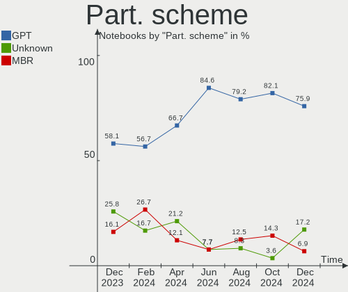
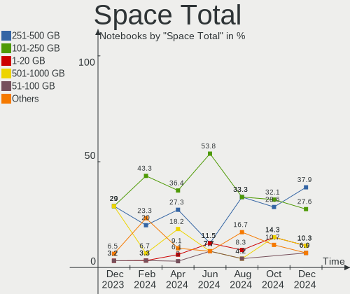

Xubuntu - Hardware Trends (Notebooks)
-------------------------------------

A project to identify most popular hardware characteristics and track their change
over time based on data collected by Linux users at https://Linux-Hardware.org.

Anyone can contribute to this report by the [hw-probe](https://github.com/linuxhw/hw-probe) tool:

    sudo -E hw-probe -all -upload

This report is for one last month. Overall report since the beginning of time: [TestDays](https://github.com/linuxhw/TestDays)

Period: Nov, 2023.

Contents
--------

* [ System ](#system)
  - [ OS                       ](#os)
  - [ OS Family                ](#os-family)
  - [ Kernel                   ](#kernel)
  - [ Kernel Family            ](#kernel-family)
  - [ Kernel Major Ver.        ](#kernel-major-ver)
  - [ Arch                     ](#arch)
  - [ DE                       ](#de)
  - [ Display Server           ](#display-server)
  - [ Display Manager          ](#display-manager)
  - [ OS Lang                  ](#os-lang)
  - [ Boot Mode                ](#boot-mode)
  - [ Filesystem               ](#filesystem)
  - [ Part. scheme             ](#part-scheme)
  - [ Dual Boot with Linux/BSD ](#dual-boot-with-linuxbsd)
  - [ Dual Boot (Win)          ](#dual-boot-win)

* [ Board ](#board)
  - [ Vendor                   ](#vendor)
  - [ Model                    ](#model)
  - [ Model Family             ](#model-family)
  - [ MFG Year                 ](#mfg-year)
  - [ Form Factor              ](#form-factor)
  - [ Secure Boot              ](#secure-boot)
  - [ Coreboot                 ](#coreboot)
  - [ RAM Size                 ](#ram-size)
  - [ RAM Used                 ](#ram-used)
  - [ Total Drives             ](#total-drives)
  - [ Has CD-ROM               ](#has-cd-rom)
  - [ Has Ethernet             ](#has-ethernet)
  - [ Has WiFi                 ](#has-wifi)
  - [ Has Bluetooth            ](#has-bluetooth)

* [ Location ](#location)
  - [ Country                  ](#country)
  - [ City                     ](#city)

* [ Drives ](#drives)
  - [ Drive Vendor             ](#drive-vendor)
  - [ Drive Model              ](#drive-model)
  - [ HDD Vendor               ](#hdd-vendor)
  - [ SSD Vendor               ](#ssd-vendor)
  - [ Drive Kind               ](#drive-kind)
  - [ Drive Connector          ](#drive-connector)
  - [ Drive Size               ](#drive-size)
  - [ Space Total              ](#space-total)
  - [ Space Used               ](#space-used)
  - [ Malfunc. Drives          ](#malfunc-drives)
  - [ Malfunc. Drive Vendor    ](#malfunc-drive-vendor)
  - [ Malfunc. HDD Vendor      ](#malfunc-hdd-vendor)
  - [ Malfunc. Drive Kind      ](#malfunc-drive-kind)
  - [ Failed Drives            ](#failed-drives)
  - [ Failed Drive Vendor      ](#failed-drive-vendor)
  - [ Drive Status             ](#drive-status)

* [ Storage controller ](#storage-controller)
  - [ Storage Vendor           ](#storage-vendor)
  - [ Storage Model            ](#storage-model)
  - [ Storage Kind             ](#storage-kind)

* [ Processor ](#processor)
  - [ CPU Vendor               ](#cpu-vendor)
  - [ CPU Model                ](#cpu-model)
  - [ CPU Model Family         ](#cpu-model-family)
  - [ CPU Cores                ](#cpu-cores)
  - [ CPU Sockets              ](#cpu-sockets)
  - [ CPU Threads              ](#cpu-threads)
  - [ CPU Op-Modes             ](#cpu-op-modes)
  - [ CPU Microcode            ](#cpu-microcode)
  - [ CPU Microarch            ](#cpu-microarch)

* [ Graphics ](#graphics)
  - [ GPU Vendor               ](#gpu-vendor)
  - [ GPU Model                ](#gpu-model)
  - [ GPU Combo                ](#gpu-combo)
  - [ GPU Driver               ](#gpu-driver)
  - [ GPU Memory               ](#gpu-memory)

* [ Monitor ](#monitor)
  - [ Monitor Vendor           ](#monitor-vendor)
  - [ Monitor Model            ](#monitor-model)
  - [ Monitor Resolution       ](#monitor-resolution)
  - [ Monitor Diagonal         ](#monitor-diagonal)
  - [ Monitor Width            ](#monitor-width)
  - [ Aspect Ratio             ](#aspect-ratio)
  - [ Monitor Area             ](#monitor-area)
  - [ Pixel Density            ](#pixel-density)
  - [ Multiple Monitors        ](#multiple-monitors)

* [ Network ](#network)
  - [ Net Controller Vendor    ](#net-controller-vendor)
  - [ Net Controller Model     ](#net-controller-model)
  - [ Wireless Vendor          ](#wireless-vendor)
  - [ Wireless Model           ](#wireless-model)
  - [ Ethernet Vendor          ](#ethernet-vendor)
  - [ Ethernet Model           ](#ethernet-model)
  - [ Net Controller Kind      ](#net-controller-kind)
  - [ Used Controller          ](#used-controller)
  - [ NICs                     ](#nics)
  - [ IPv6                     ](#ipv6)

* [ Bluetooth ](#bluetooth)
  - [ Bluetooth Vendor         ](#bluetooth-vendor)
  - [ Bluetooth Model          ](#bluetooth-model)

* [ Sound ](#sound)
  - [ Sound Vendor             ](#sound-vendor)
  - [ Sound Model              ](#sound-model)

* [ Memory ](#memory)
  - [ Memory Vendor            ](#memory-vendor)
  - [ Memory Model             ](#memory-model)
  - [ Memory Kind              ](#memory-kind)
  - [ Memory Form Factor       ](#memory-form-factor)
  - [ Memory Size              ](#memory-size)
  - [ Memory Speed             ](#memory-speed)

* [ Printers & scanners ](#printers--scanners)
  - [ Printer Vendor           ](#printer-vendor)
  - [ Printer Model            ](#printer-model)
  - [ Scanner Vendor           ](#scanner-vendor)
  - [ Scanner Model            ](#scanner-model)

* [ Camera ](#camera)
  - [ Camera Vendor            ](#camera-vendor)
  - [ Camera Model             ](#camera-model)

* [ Security ](#security)
  - [ Fingerprint Vendor       ](#fingerprint-vendor)
  - [ Fingerprint Model        ](#fingerprint-model)
  - [ Chipcard Vendor          ](#chipcard-vendor)
  - [ Chipcard Model           ](#chipcard-model)

* [ Unsupported ](#unsupported)
  - [ Unsupported Devices      ](#unsupported-devices)
  - [ Unsupported Device Types ](#unsupported-device-types)

System
------

OS
--

Installed operating systems

| Name          | Notebooks | Percent |
|---------------|-----------|---------|
| Xubuntu 22.04 | 15        | 40.54%  |
| Xubuntu 23.10 | 9         | 24.32%  |
| Xubuntu 20.04 | 8         | 21.62%  |
| Xubuntu 23.04 | 3         | 8.11%   |
| Xubuntu 18.04 | 2         | 5.41%   |

OS Family
---------

OS without a version

| Name    | Notebooks | Percent |
|---------|-----------|---------|
| Xubuntu | 37        | 100%    |

Kernel
------

Version of the Linux kernel

| Version               | Notebooks | Percent |
|-----------------------|-----------|---------|
| 6.2.0-36-generic      | 8         | 21.62%  |
| 6.5.0-10-generic      | 7         | 18.92%  |
| 5.15.0-88-generic     | 4         | 10.81%  |
| 6.2.0-37-generic      | 2         | 5.41%   |
| 5.4.0-150-generic     | 2         | 5.41%   |
| 6.5.0-9-generic       | 1         | 2.7%    |
| 6.5.0-1004-oem        | 1         | 2.7%    |
| 6.5.0-10-lowlatency   | 1         | 2.7%    |
| 6.2.0-35-generic      | 1         | 2.7%    |
| 6.2.0-26-generic      | 1         | 2.7%    |
| 6.2.0-1017-lowlatency | 1         | 2.7%    |
| 5.9.8-050908-generic  | 1         | 2.7%    |
| 5.4.0-166-generic     | 1         | 2.7%    |
| 5.4.0-165-generic     | 1         | 2.7%    |
| 5.4.0-164-generic     | 1         | 2.7%    |
| 5.15.0-90-generic     | 1         | 2.7%    |
| 5.15.0-89-generic     | 1         | 2.7%    |
| 5.15.0-87-generic     | 1         | 2.7%    |
| 5.15.0-67-generic     | 1         | 2.7%    |

Kernel Family
-------------

Linux kernel without a distro release

| Version | Notebooks | Percent |
|---------|-----------|---------|
| 6.2.0   | 13        | 35.14%  |
| 6.5.0   | 10        | 27.03%  |
| 5.15.0  | 8         | 21.62%  |
| 5.4.0   | 5         | 13.51%  |
| 5.9.8   | 1         | 2.7%    |

Kernel Major Ver.
-----------------

Linux kernel major version

| Version | Notebooks | Percent |
|---------|-----------|---------|
| 6.2     | 13        | 35.14%  |
| 6.5     | 10        | 27.03%  |
| 5.15    | 8         | 21.62%  |
| 5.4     | 5         | 13.51%  |
| 5.9     | 1         | 2.7%    |

Arch
----

OS architecture (x86_64, i586, etc.)

| Name   | Notebooks | Percent |
|--------|-----------|---------|
| x86_64 | 36        | 97.3%   |
| i686   | 1         | 2.7%    |

DE
--

Desktop Environment

| Name | Notebooks | Percent |
|------|-----------|---------|
| XFCE | 37        | 100%    |

Display Server
--------------

X11 or Wayland

| Name | Notebooks | Percent |
|------|-----------|---------|
| X11  | 37        | 100%    |

Display Manager
---------------

SDDM, LightDM, etc.

| Name    | Notebooks | Percent |
|---------|-----------|---------|
| LightDM | 32        | 86.49%  |
| Unknown | 3         | 8.11%   |
| GDM3    | 2         | 5.41%   |

OS Lang
-------

Language

| Lang  | Notebooks | Percent |
|-------|-----------|---------|
| en_US | 15        | 40.54%  |
| fr_FR | 9         | 24.32%  |
| it_IT | 3         | 8.11%   |
| en_GB | 3         | 8.11%   |
| zh_CN | 1         | 2.7%    |
| ru_RU | 1         | 2.7%    |
| pl_PL | 1         | 2.7%    |
| nl_NL | 1         | 2.7%    |
| ja_JP | 1         | 2.7%    |
| en_CA | 1         | 2.7%    |
| C     | 1         | 2.7%    |

Boot Mode
---------

EFI or BIOS

| Mode | Notebooks | Percent |
|------|-----------|---------|
| BIOS | 21        | 56.76%  |
| EFI  | 16        | 43.24%  |

Filesystem
----------

Type of filesystem

| Type  | Notebooks | Percent |
|-------|-----------|---------|
| Ext4  | 17        | 45.95%  |
| Tmpfs | 16        | 43.24%  |
| Ext3  | 2         | 5.41%   |
| Xfs   | 1         | 2.7%    |
| Btrfs | 1         | 2.7%    |

Part. scheme
------------

Scheme of partitioning

| Type    | Notebooks | Percent |
|---------|-----------|---------|
| GPT     | 23        | 62.16%  |
| MBR     | 10        | 27.03%  |
| Unknown | 4         | 10.81%  |

Dual Boot with Linux/BSD
------------------------

Hosting more than one Linux/BSD

| Dual boot | Notebooks | Percent |
|-----------|-----------|---------|
| No        | 33        | 89.19%  |
| Yes       | 4         | 10.81%  |

Dual Boot (Win)
---------------

Hosting Linux and Windows

| Dual boot | Notebooks | Percent |
|-----------|-----------|---------|
| No        | 21        | 56.76%  |
| Yes       | 16        | 43.24%  |

Board
-----

Vendor
------

Motherboard manufacturer

| Name             | Notebooks | Percent |
|------------------|-----------|---------|
| Lenovo           | 12        | 32.43%  |
| Hewlett-Packard  | 7         | 18.92%  |
| Dell             | 6         | 16.22%  |
| Acer             | 3         | 8.11%   |
| Thomson          | 2         | 5.41%   |
| ASUSTek Computer | 2         | 5.41%   |
| Sony             | 1         | 2.7%    |
| SiComputer       | 1         | 2.7%    |
| Medion           | 1         | 2.7%    |
| MECHREVO         | 1         | 2.7%    |
| Apple            | 1         | 2.7%    |

Model
-----

Motherboard model

| Name                                     | Notebooks | Percent |
|------------------------------------------|-----------|---------|
| Lenovo ThinkPad T14 Gen 3 21AJS7P700     | 2         | 5.41%   |
| Thomson N15C8BK2T                        | 1         | 2.7%    |
| Thomson N14C4WH64                        | 1         | 2.7%    |
| Sony VGN-NS12M_W                         | 1         | 2.7%    |
| SiComputer Nauta 01E                     | 1         | 2.7%    |
| Medion Crawler E25                       | 1         | 2.7%    |
| MECHREVO Code 01 Series PF5NU1G          | 1         | 2.7%    |
| Lenovo Yoga Creator 7 15IMH05 82DS       | 1         | 2.7%    |
| Lenovo ThinkPad X250 20CLS2P703          | 1         | 2.7%    |
| Lenovo ThinkPad T440p 20AN0069US         | 1         | 2.7%    |
| Lenovo ThinkPad P72 20MBCTO1WW           | 1         | 2.7%    |
| Lenovo ThinkPad E470 20H1006NHV          | 1         | 2.7%    |
| Lenovo Legion Y740-17IRHg 81UJ           | 1         | 2.7%    |
| Lenovo IdeaPad S340-15IIL 81VW           | 1         | 2.7%    |
| Lenovo IdeaPad S300 9803                 | 1         | 2.7%    |
| Lenovo IdeaPad N585 20179                | 1         | 2.7%    |
| Lenovo G505 20240                        | 1         | 2.7%    |
| HP ProBook 6570b                         | 1         | 2.7%    |
| HP ProBook 650 G2                        | 1         | 2.7%    |
| HP ProBook 450 G1                        | 1         | 2.7%    |
| HP Presario CQ57                         | 1         | 2.7%    |
| HP Presario C500 (GF849EA#ABU)           | 1         | 2.7%    |
| HP Pavilion g6                           | 1         | 2.7%    |
| HP EliteBook 725 G2                      | 1         | 2.7%    |
| Dell System XPS L502X                    | 1         | 2.7%    |
| Dell Latitude E6330                      | 1         | 2.7%    |
| Dell Latitude E5420                      | 1         | 2.7%    |
| Dell Latitude 7370                       | 1         | 2.7%    |
| Dell Inspiron 7501                       | 1         | 2.7%    |
| Dell Inspiron 15 3511                    | 1         | 2.7%    |
| ASUS VivoBook_ASUSLaptop K3502ZA_K3502ZA | 1         | 2.7%    |
| ASUS GL753VD                             | 1         | 2.7%    |
| Apple MacBookAir4,2                      | 1         | 2.7%    |
| Acer Predator PH717-71                   | 1         | 2.7%    |
| Acer Aspire A114-33                      | 1         | 2.7%    |
| Acer Aspire 5740                         | 1         | 2.7%    |

Model Family
------------

Motherboard model prefix

| Name              | Notebooks | Percent |
|-------------------|-----------|---------|
| Lenovo ThinkPad   | 6         | 16.22%  |
| Lenovo IdeaPad    | 3         | 8.11%   |
| HP ProBook        | 3         | 8.11%   |
| Dell Latitude     | 3         | 8.11%   |
| HP Presario       | 2         | 5.41%   |
| Dell Inspiron     | 2         | 5.41%   |
| Acer Aspire       | 2         | 5.41%   |
| Thomson N15C8BK2T | 1         | 2.7%    |
| Thomson N14C4WH64 | 1         | 2.7%    |
| Sony VGN-NS12M    | 1         | 2.7%    |
| SiComputer Nauta  | 1         | 2.7%    |
| Medion Crawler    | 1         | 2.7%    |
| MECHREVO Code     | 1         | 2.7%    |
| Lenovo Yoga       | 1         | 2.7%    |
| Lenovo Legion     | 1         | 2.7%    |
| Lenovo G505       | 1         | 2.7%    |
| HP Pavilion       | 1         | 2.7%    |
| HP EliteBook      | 1         | 2.7%    |
| Dell System       | 1         | 2.7%    |
| ASUS VivoBook     | 1         | 2.7%    |
| ASUS GL753VD      | 1         | 2.7%    |
| Apple MacBookAir4 | 1         | 2.7%    |
| Acer Predator     | 1         | 2.7%    |

MFG Year
--------

Motherboard manufacture year

| Year | Notebooks | Percent |
|------|-----------|---------|
| 2020 | 6         | 16.22%  |
| 2012 | 5         | 13.51%  |
| 2021 | 4         | 10.81%  |
| 2011 | 4         | 10.81%  |
| 2022 | 3         | 8.11%   |
| 2019 | 3         | 8.11%   |
| 2013 | 3         | 8.11%   |
| 2016 | 2         | 5.41%   |
| 2018 | 1         | 2.7%    |
| 2017 | 1         | 2.7%    |
| 2015 | 1         | 2.7%    |
| 2014 | 1         | 2.7%    |
| 2009 | 1         | 2.7%    |
| 2008 | 1         | 2.7%    |
| 2007 | 1         | 2.7%    |

Form Factor
-----------

Physical design of the computer

| Name     | Notebooks | Percent |
|----------|-----------|---------|
| Notebook | 37        | 100%    |

Secure Boot
-----------

Enabled or disabled

| State    | Notebooks | Percent |
|----------|-----------|---------|
| Disabled | 34        | 91.89%  |
| Enabled  | 3         | 8.11%   |

Coreboot
--------

Have coreboot on board

| Used | Notebooks | Percent |
|------|-----------|---------|
| No   | 37        | 100%    |

RAM Size
--------

Total RAM memory

| Size in GB  | Notebooks | Percent |
|-------------|-----------|---------|
| 3.01-4.0    | 9         | 24.32%  |
| 4.01-8.0    | 8         | 21.62%  |
| 8.01-16.0   | 7         | 18.92%  |
| 16.01-24.0  | 6         | 16.22%  |
| 32.01-64.0  | 4         | 10.81%  |
| 24.01-32.0  | 1         | 2.7%    |
| 64.01-256.0 | 1         | 2.7%    |
| 0.51-1.0    | 1         | 2.7%    |

RAM Used
--------

Used RAM memory

| Used GB    | Notebooks | Percent |
|------------|-----------|---------|
| 1.01-2.0   | 10        | 27.03%  |
| 2.01-3.0   | 9         | 24.32%  |
| 3.01-4.0   | 6         | 16.22%  |
| 4.01-8.0   | 5         | 13.51%  |
| 8.01-16.0  | 4         | 10.81%  |
| 0.51-1.0   | 2         | 5.41%   |
| 16.01-24.0 | 1         | 2.7%    |

Total Drives
------------

Number of drives on board

| Drives | Notebooks | Percent |
|--------|-----------|---------|
| 1      | 28        | 75.68%  |
| 2      | 7         | 18.92%  |
| 4      | 1         | 2.7%    |
| 3      | 1         | 2.7%    |

Has CD-ROM
----------

Has CD-ROM on board

| Presented | Notebooks | Percent |
|-----------|-----------|---------|
| No        | 25        | 67.57%  |
| Yes       | 12        | 32.43%  |

Has Ethernet
------------

Has Ethernet on board

| Presented | Notebooks | Percent |
|-----------|-----------|---------|
| Yes       | 30        | 81.08%  |
| No        | 7         | 18.92%  |

Has WiFi
--------

Has WiFi module

| Presented | Notebooks | Percent |
|-----------|-----------|---------|
| Yes       | 37        | 100%    |

Has Bluetooth
-------------

Has Bluetooth module

| Presented | Notebooks | Percent |
|-----------|-----------|---------|
| Yes       | 27        | 72.97%  |
| No        | 10        | 27.03%  |

Location
--------

Country
-------

Geographic location (country)

| Country     | Notebooks | Percent |
|-------------|-----------|---------|
| France      | 9         | 24.32%  |
| USA         | 5         | 13.51%  |
| UK          | 3         | 8.11%   |
| Italy       | 3         | 8.11%   |
| Russia      | 2         | 5.41%   |
| Venezuela   | 1         | 2.7%    |
| Switzerland | 1         | 2.7%    |
| Sweden      | 1         | 2.7%    |
| Poland      | 1         | 2.7%    |
| Netherlands | 1         | 2.7%    |
| Lebanon     | 1         | 2.7%    |
| Japan       | 1         | 2.7%    |
| Israel      | 1         | 2.7%    |
| Hungary     | 1         | 2.7%    |
| Germany     | 1         | 2.7%    |
| Czechia     | 1         | 2.7%    |
| Colombia    | 1         | 2.7%    |
| China       | 1         | 2.7%    |
| Canada      | 1         | 2.7%    |
| Belgium     | 1         | 2.7%    |

City
----

Geographic location (city)

| City               | Notebooks | Percent |
|--------------------|-----------|---------|
| Burgnac            | 3         | 8.11%   |
| Florence           | 2         | 5.41%   |
| Yokohama           | 1         | 2.7%    |
| Stillwater         | 1         | 2.7%    |
| Southampton        | 1         | 2.7%    |
| Solna              | 1         | 2.7%    |
| Rotterdam          | 1         | 2.7%    |
| Prague             | 1         | 2.7%    |
| Pinsaguel          | 1         | 2.7%    |
| Nadarzyn           | 1         | 2.7%    |
| Moscow             | 1         | 2.7%    |
| Manchester         | 1         | 2.7%    |
| Lecherias          | 1         | 2.7%    |
| Kostroma           | 1         | 2.7%    |
| Kitchener          | 1         | 2.7%    |
| Hot Springs        | 1         | 2.7%    |
| Hasselt            | 1         | 2.7%    |
| Grenoble           | 1         | 2.7%    |
| Fameck             | 1         | 2.7%    |
| Dongguan           | 1         | 2.7%    |
| Dallas             | 1         | 2.7%    |
| Cosenza            | 1         | 2.7%    |
| Chatenay-sur-Seine | 1         | 2.7%    |
| Charlotte          | 1         | 2.7%    |
| Cerons             | 1         | 2.7%    |
| Cergy              | 1         | 2.7%    |
| Budapest           | 1         | 2.7%    |
| Bristol            | 1         | 2.7%    |
| Bournemouth        | 1         | 2.7%    |
| Bogotá            | 1         | 2.7%    |
| Berlin             | 1         | 2.7%    |
| Bellinzona         | 1         | 2.7%    |
| Beirut             | 1         | 2.7%    |
| Bat Yam            | 1         | 2.7%    |

Drives
------

Drive Vendor
------------

Hard drive vendors

| Vendor              | Notebooks | Drives | Percent |
|---------------------|-----------|--------|---------|
| Samsung Electronics | 11        | 13     | 23.4%   |
| WDC                 | 5         | 5      | 10.64%  |
| SanDisk             | 5         | 5      | 10.64%  |
| Unknown             | 4         | 5      | 8.51%   |
| Toshiba             | 4         | 4      | 8.51%   |
| Seagate             | 3         | 3      | 6.38%   |
| Crucial             | 3         | 3      | 6.38%   |
| China               | 2         | 2      | 4.26%   |
| SK hynix            | 1         | 1      | 2.13%   |
| Phison Electronics  | 1         | 1      | 2.13%   |
| Micron Technology   | 1         | 1      | 2.13%   |
| Lexar               | 1         | 1      | 2.13%   |
| Kingston            | 1         | 1      | 2.13%   |
| KingDian            | 1         | 1      | 2.13%   |
| Intel               | 1         | 1      | 2.13%   |
| Fujitsu             | 1         | 1      | 2.13%   |
| Apple               | 1         | 1      | 2.13%   |
| A-DATA Technology   | 1         | 1      | 2.13%   |

Drive Model
-----------

Hard drive models

| Model                                               | Notebooks | Percent |
|-----------------------------------------------------|-----------|---------|
| Seagate ST1000LM049-2GH172 1TB                      | 3         | 6.12%   |
| Samsung NVMe SSD Controller SM981/PM981/PM983 250GB | 3         | 6.12%   |
| Crucial CT240BX500SSD1 240GB                        | 2         | 4.08%   |
| WDC WDS500G2B0C 500GB                               | 1         | 2.04%   |
| WDC WD5000LPVT-08G33T1 500GB                        | 1         | 2.04%   |
| WDC WD2500BEVT-60ZCT1 250GB                         | 1         | 2.04%   |
| WDC PC SN730 SDBPNTY-512G-1101 512GB                | 1         | 2.04%   |
| WDC PC SN720 SDAPNTW-256G-1014 256GB                | 1         | 2.04%   |
| Unknown SU08G  8GB                                  | 1         | 2.04%   |
| Unknown MMC Card  64GB                              | 1         | 2.04%   |
| Unknown MMC Card  4GB                               | 1         | 2.04%   |
| Unknown MMC Card  128GB                             | 1         | 2.04%   |
| Unknown DA4128  128GB                               | 1         | 2.04%   |
| Toshiba XG4 NVMe SSD Controller 512GB               | 1         | 2.04%   |
| Toshiba MK3261GSYN 320GB                            | 1         | 2.04%   |
| Toshiba MK2552GSX 250GB                             | 1         | 2.04%   |
| Toshiba A100 120GB SSD                              | 1         | 2.04%   |
| SK hynix SKHynix_HFS512GD9TNG-L3A0B 512GB           | 1         | 2.04%   |
| Sandisk WD PC SN740 SDDQNQD-512G-1001 512GB         | 1         | 2.04%   |
| Sandisk WD Blue SN550 NVMe SSD 512GB                | 1         | 2.04%   |
| SanDisk NVMe SSD Drive 512GB                        | 1         | 2.04%   |
| SanDisk Extreme Pro 500GB                           | 1         | 2.04%   |
| SanDisk Extreme 55AE 1TB SSD                        | 1         | 2.04%   |
| Samsung SSD 870 QVO 2TB                             | 1         | 2.04%   |
| Samsung SSD 870 EVO 1TB                             | 1         | 2.04%   |
| Samsung SSD 860 EVO 500GB                           | 1         | 2.04%   |
| Samsung SSD 860 EVO 1TB                             | 1         | 2.04%   |
| Samsung SSD 850 PRO 512GB                           | 1         | 2.04%   |
| Samsung SSD 850 EVO 500GB                           | 1         | 2.04%   |
| Samsung SSD 840 PRO Series 256GB                    | 1         | 2.04%   |
| Samsung MZ7PD128HCFV-000H1 128GB SSD                | 1         | 2.04%   |
| Samsung MZ7LN256HCHP-000L7 256GB SSD                | 1         | 2.04%   |
| Phison E15-512G-PHISON-SSD-B47R 512GB               | 1         | 2.04%   |
| Micron 2450_MTFDKBA1T0TFK 1TB                       | 1         | 2.04%   |
| Lexar SSD NM100 256GB                               | 1         | 2.04%   |
| Kingston SA400S37240G 240GB SSD                     | 1         | 2.04%   |
| KingDian S200 60GB SSD                              | 1         | 2.04%   |
| Intel 670p SSDPEKNU512GZ NVMe 512GB                 | 1         | 2.04%   |
| Fujitsu MHZ2250BH G2 250GB                          | 1         | 2.04%   |
| Crucial CT250BX100SSD1 250GB                        | 1         | 2.04%   |

HDD Vendor
----------

Hard disk drive vendors

| Vendor  | Notebooks | Drives | Percent |
|---------|-----------|--------|---------|
| Seagate | 3         | 3      | 37.5%   |
| WDC     | 2         | 2      | 25%     |
| Toshiba | 2         | 2      | 25%     |
| Fujitsu | 1         | 1      | 12.5%   |

SSD Vendor
----------

Solid state drive vendors

| Vendor              | Notebooks | Drives | Percent |
|---------------------|-----------|--------|---------|
| Samsung Electronics | 8         | 9      | 40%     |
| Crucial             | 3         | 3      | 15%     |
| China               | 2         | 2      | 10%     |
| Toshiba             | 1         | 1      | 5%      |
| SanDisk             | 1         | 1      | 5%      |
| Lexar               | 1         | 1      | 5%      |
| Kingston            | 1         | 1      | 5%      |
| KingDian            | 1         | 1      | 5%      |
| Apple               | 1         | 1      | 5%      |
| A-DATA Technology   | 1         | 1      | 5%      |

Drive Kind
----------

HDD or SSD

| Kind | Notebooks | Drives | Percent |
|------|-----------|--------|---------|
| SSD  | 17        | 21     | 39.53%  |
| NVMe | 14        | 16     | 32.56%  |
| HDD  | 8         | 8      | 18.6%   |
| MMC  | 4         | 5      | 9.3%    |

Drive Connector
---------------

SATA, SAS, NVMe, etc.

| Type | Notebooks | Drives | Percent |
|------|-----------|--------|---------|
| SATA | 25        | 28     | 56.82%  |
| NVMe | 14        | 16     | 31.82%  |
| MMC  | 4         | 5      | 9.09%   |
| SAS  | 1         | 1      | 2.27%   |

Drive Size
----------

Size of hard drive

| Size in TB | Notebooks | Drives | Percent |
|------------|-----------|--------|---------|
| 0.01-0.5   | 19        | 20     | 70.37%  |
| 0.51-1.0   | 7         | 8      | 25.93%  |
| 1.01-2.0   | 1         | 1      | 3.7%    |

Space Total
-----------

Amount of disk space available on the file system

| Size in GB | Notebooks | Percent |
|------------|-----------|---------|
| 101-250    | 11        | 29.73%  |
| 251-500    | 7         | 18.92%  |
| 501-1000   | 6         | 16.22%  |
| 51-100     | 5         | 13.51%  |
| 1001-2000  | 3         | 8.11%   |
| 21-50      | 2         | 5.41%   |
| 1-20       | 2         | 5.41%   |
| 2001-3000  | 1         | 2.7%    |

Space Used
----------

Amount of used disk space

| Used GB  | Notebooks | Percent |
|----------|-----------|---------|
| 1-20     | 11        | 29.73%  |
| 101-250  | 7         | 18.92%  |
| 21-50    | 6         | 16.22%  |
| 51-100   | 6         | 16.22%  |
| 501-1000 | 5         | 13.51%  |
| 251-500  | 2         | 5.41%   |

Malfunc. Drives
---------------

Drive models with a malfunction

| Model                        | Notebooks | Drives | Percent |
|------------------------------|-----------|--------|---------|
| WDC WD5000LPVT-08G33T1 500GB | 1         | 1      | 50%     |
| Apple SSD SM256C 256GB       | 1         | 1      | 50%     |

Malfunc. Drive Vendor
---------------------

Vendors of faulty drives

| Vendor | Notebooks | Drives | Percent |
|--------|-----------|--------|---------|
| WDC    | 1         | 1      | 50%     |
| Apple  | 1         | 1      | 50%     |

Malfunc. HDD Vendor
-------------------

Vendors of faulty HDD drives

| Vendor | Notebooks | Drives | Percent |
|--------|-----------|--------|---------|
| WDC    | 1         | 1      | 100%    |

Malfunc. Drive Kind
-------------------

Kinds of faulty drives

| Kind | Notebooks | Drives | Percent |
|------|-----------|--------|---------|
| SSD  | 1         | 1      | 50%     |
| HDD  | 1         | 1      | 50%     |

Failed Drives
-------------

Failed drive models

Zero info for selected period =(

Failed Drive Vendor
-------------------

Failed drive vendors

Zero info for selected period =(

Drive Status
------------

Number of failed and malfunc. drives

| Status   | Notebooks | Drives | Percent |
|----------|-----------|--------|---------|
| Detected | 21        | 27     | 53.85%  |
| Works    | 16        | 21     | 41.03%  |
| Malfunc  | 2         | 2      | 5.13%   |

Storage controller
------------------

Storage Vendor
--------------

Storage controller vendors

| Vendor                       | Notebooks | Percent |
|------------------------------|-----------|---------|
| Intel                        | 27        | 58.7%   |
| SanDisk                      | 6         | 13.04%  |
| AMD                          | 6         | 13.04%  |
| Samsung Electronics          | 3         | 6.52%   |
| Toshiba America Info Systems | 1         | 2.17%   |
| SK hynix                     | 1         | 2.17%   |
| Phison Electronics           | 1         | 2.17%   |
| Micron Technology            | 1         | 2.17%   |

Storage Model
-------------

Storage controller models

| Model                                                                          | Notebooks | Percent |
|--------------------------------------------------------------------------------|-----------|---------|
| AMD FCH SATA Controller [AHCI mode]                                            | 6         | 12.5%   |
| Intel 6 Series/C200 Series Chipset Family 6 port Mobile SATA AHCI Controller   | 4         | 8.33%   |
| Samsung NVMe SSD Controller SM981/PM981/PM983                                  | 3         | 6.25%   |
| Intel Cannon Lake Mobile PCH SATA AHCI Controller                              | 3         | 6.25%   |
| Intel 7 Series Chipset Family 6-port SATA Controller [AHCI mode]               | 3         | 6.25%   |
| SanDisk WD Black SN770 / PC SN740 256GB / PC SN560 (DRAM-less) NVMe SSD        | 2         | 4.17%   |
| SanDisk Ultra 3D / WD Blue SN550 NVMe SSD                                      | 2         | 4.17%   |
| Intel Sunrise Point-LP SATA Controller [AHCI mode]                             | 2         | 4.17%   |
| Intel Ice Lake-LP SATA Controller [AHCI mode]                                  | 2         | 4.17%   |
| Intel Celeron/Pentium Silver Processor SATA Controller                         | 2         | 4.17%   |
| Intel 8 Series/C220 Series Chipset Family 6-port SATA Controller 1 [AHCI mode] | 2         | 4.17%   |
| Toshiba America Info Systems XG4 NVMe SSD Controller                           | 1         | 2.08%   |
| SK hynix PC601 NVMe Solid State Drive                                          | 1         | 2.08%   |
| SanDisk Extreme Pro / WD Black SN750 / PC SN730 / Red SN700 NVMe SSD           | 1         | 2.08%   |
| SanDisk Extreme Pro / WD Black 2018/SN750/PC SN720 NVMe SSD                    | 1         | 2.08%   |
| Phison PS5015-E15 PCIe3 NVMe Controller (DRAM-less)                            | 1         | 2.08%   |
| Micron 2450 NVMe SSD [HendrixV] (DRAM-less)                                    | 1         | 2.08%   |
| Intel Wildcat Point-LP SATA Controller [AHCI Mode]                             | 1         | 2.08%   |
| Intel Volume Management Device NVMe RAID Controller                            | 1         | 2.08%   |
| Intel SSD 670p Series [Keystone Harbor]                                        | 1         | 2.08%   |
| Intel Jasper Lake SATA AHCI Controller                                         | 1         | 2.08%   |
| Intel HM170/QM170 Chipset SATA Controller [AHCI Mode]                          | 1         | 2.08%   |
| Intel Celeron N3350/Pentium N4200/Atom E3900 Series SATA AHCI Controller       | 1         | 2.08%   |
| Intel 82801IBM/IEM (ICH9M/ICH9M-E) 4 port SATA Controller [AHCI mode]          | 1         | 2.08%   |
| Intel 82801GBM/GHM (ICH7-M Family) SATA Controller [AHCI mode]                 | 1         | 2.08%   |
| Intel 82801G (ICH7 Family) IDE Controller                                      | 1         | 2.08%   |
| Intel 5 Series/3400 Series Chipset 4 port SATA AHCI Controller                 | 1         | 2.08%   |
| Intel 400 Series Chipset Family SATA AHCI Controller                           | 1         | 2.08%   |

Storage Kind
------------

Kind of storage controller (IDE, SATA, NVMe, SAS, ...)

| Kind | Notebooks | Percent |
|------|-----------|---------|
| SATA | 32        | 66.67%  |
| NVMe | 14        | 29.17%  |
| RAID | 1         | 2.08%   |
| IDE  | 1         | 2.08%   |

Processor
---------

CPU Vendor
----------

Processor vendors

| Vendor | Notebooks | Percent |
|--------|-----------|---------|
| Intel  | 31        | 83.78%  |
| AMD    | 6         | 16.22%  |

CPU Model
---------

Processor models

| Model                                       | Notebooks | Percent |
|---------------------------------------------|-----------|---------|
| Intel Core i7-3520M CPU @ 2.90GHz           | 2         | 5.41%   |
| Intel 12th Gen Core i7-1260P                | 2         | 5.41%   |
| Intel Core m7-6Y75 CPU @ 1.20GHz            | 1         | 2.7%    |
| Intel Core i9-9980HK CPU @ 2.40GHz          | 1         | 2.7%    |
| Intel Core i7-9750H CPU @ 2.60GHz           | 1         | 2.7%    |
| Intel Core i7-8850H CPU @ 2.60GHz           | 1         | 2.7%    |
| Intel Core i7-7700HQ CPU @ 2.80GHz          | 1         | 2.7%    |
| Intel Core i7-7500U CPU @ 2.70GHz           | 1         | 2.7%    |
| Intel Core i7-5600U CPU @ 2.60GHz           | 1         | 2.7%    |
| Intel Core i7-10750H CPU @ 2.60GHz          | 1         | 2.7%    |
| Intel Core i5-6200U CPU @ 2.30GHz           | 1         | 2.7%    |
| Intel Core i5-4200M CPU @ 2.50GHz           | 1         | 2.7%    |
| Intel Core i5-2557M CPU @ 1.70GHz           | 1         | 2.7%    |
| Intel Core i5-2520M CPU @ 2.50GHz           | 1         | 2.7%    |
| Intel Core i5-2410M CPU @ 2.30GHz           | 1         | 2.7%    |
| Intel Core i5-1035G4 CPU @ 1.10GHz          | 1         | 2.7%    |
| Intel Core i5-1035G1 CPU @ 1.00GHz          | 1         | 2.7%    |
| Intel Core i5-10300H CPU @ 2.50GHz          | 1         | 2.7%    |
| Intel Core i3-4000M CPU @ 2.40GHz           | 1         | 2.7%    |
| Intel Core i3 CPU M 330 @ 2.13GHz           | 1         | 2.7%    |
| Intel Core 2 Duo CPU T5800 @ 2.00GHz        | 1         | 2.7%    |
| Intel Celeron N4500 @ 1.10GHz               | 1         | 2.7%    |
| Intel Celeron N4020 CPU @ 1.10GHz           | 1         | 2.7%    |
| Intel Celeron N4000 CPU @ 1.10GHz           | 1         | 2.7%    |
| Intel Celeron M CPU 440 @ 1.86GHz           | 1         | 2.7%    |
| Intel Celeron CPU N3350 @ 1.10GHz           | 1         | 2.7%    |
| Intel Celeron CPU B800 @ 1.50GHz            | 1         | 2.7%    |
| Intel Celeron CPU 887 @ 1.50GHz             | 1         | 2.7%    |
| Intel 12th Gen Core i7-12700H               | 1         | 2.7%    |
| AMD Ryzen 7 4800H with Radeon Graphics      | 1         | 2.7%    |
| AMD Ryzen 5 5600H with Radeon Graphics      | 1         | 2.7%    |
| AMD E1-1200 APU with Radeon HD Graphics     | 1         | 2.7%    |
| AMD A8 PRO-7150B R5, 10 Compute Cores 4C+6G | 1         | 2.7%    |
| AMD A4-5000 APU with Radeon HD Graphics     | 1         | 2.7%    |
| AMD A10-5750M APU with Radeon HD Graphics   | 1         | 2.7%    |

CPU Model Family
----------------

Processor model prefix

| Model            | Notebooks | Percent |
|------------------|-----------|---------|
| Intel Core i7    | 8         | 21.62%  |
| Intel Core i5    | 8         | 21.62%  |
| Intel Celeron    | 6         | 16.22%  |
| Other            | 3         | 8.11%   |
| Intel Core i3    | 2         | 5.41%   |
| Intel Core m7    | 1         | 2.7%    |
| Intel Core i9    | 1         | 2.7%    |
| Intel Core 2 Duo | 1         | 2.7%    |
| Intel Celeron M  | 1         | 2.7%    |
| AMD Ryzen 7      | 1         | 2.7%    |
| AMD Ryzen 5      | 1         | 2.7%    |
| AMD E1           | 1         | 2.7%    |
| AMD A8           | 1         | 2.7%    |
| AMD A4           | 1         | 2.7%    |
| AMD A10          | 1         | 2.7%    |

CPU Cores
---------

Number of processor cores

| Number | Notebooks | Percent |
|--------|-----------|---------|
| 2      | 22        | 59.46%  |
| 4      | 5         | 13.51%  |
| 6      | 4         | 10.81%  |
| 12     | 2         | 5.41%   |
| 8      | 2         | 5.41%   |
| 14     | 1         | 2.7%    |
| 1      | 1         | 2.7%    |

CPU Sockets
-----------

Number of sockets

| Number | Notebooks | Percent |
|--------|-----------|---------|
| 1      | 37        | 100%    |

CPU Threads
-----------

Threads per core (Hyper-Threading)

| Number | Notebooks | Percent |
|--------|-----------|---------|
| 2      | 25        | 67.57%  |
| 1      | 12        | 32.43%  |

CPU Op-Modes
------------

CPU Operation Modes (32-bit, 64-bit)

| Op mode        | Notebooks | Percent |
|----------------|-----------|---------|
| 32-bit, 64-bit | 36        | 97.3%   |
| 32-bit         | 1         | 2.7%    |

CPU Microcode
-------------

Microcode number

| Number     | Notebooks | Percent |
|------------|-----------|---------|
| Unknown    | 28        | 75.68%  |
| 0x206a7    | 3         | 8.11%   |
| 0x906a3    | 1         | 2.7%    |
| 0x6fd      | 1         | 2.7%    |
| 0x6ec      | 1         | 2.7%    |
| 0x406e3    | 1         | 2.7%    |
| 0x08600103 | 1         | 2.7%    |
| 0x0700010f | 1         | 2.7%    |

CPU Microarch
-------------

Microarchitecture

| Name             | Notebooks | Percent |
|------------------|-----------|---------|
| SandyBridge      | 5         | 13.51%  |
| KabyLake         | 5         | 13.51%  |
| Skylake          | 2         | 5.41%   |
| IvyBridge        | 2         | 5.41%   |
| IceLake          | 2         | 5.41%   |
| Haswell          | 2         | 5.41%   |
| Goldmont plus    | 2         | 5.41%   |
| CometLake        | 2         | 5.41%   |
| Alderlake Hybrid | 2         | 5.41%   |
| Zen 3            | 1         | 2.7%    |
| Zen 2            | 1         | 2.7%    |
| Westmere         | 1         | 2.7%    |
| Tremont          | 1         | 2.7%    |
| Steamroller      | 1         | 2.7%    |
| Piledriver       | 1         | 2.7%    |
| P6               | 1         | 2.7%    |
| Jaguar           | 1         | 2.7%    |
| Goldmont         | 1         | 2.7%    |
| Core             | 1         | 2.7%    |
| Broadwell        | 1         | 2.7%    |
| Bobcat           | 1         | 2.7%    |
| Unknown          | 1         | 2.7%    |

Graphics
--------

GPU Vendor
----------

Vendors of graphics cards

| Vendor | Notebooks | Percent |
|--------|-----------|---------|
| Intel  | 27        | 64.29%  |
| Nvidia | 8         | 19.05%  |
| AMD    | 7         | 16.67%  |

GPU Model
---------

Graphics card models

| Model                                                                         | Notebooks | Percent |
|-------------------------------------------------------------------------------|-----------|---------|
| Intel 2nd Generation Core Processor Family Integrated Graphics Controller     | 5         | 11.36%  |
| Intel Alder Lake-P GT2 [Iris Xe Graphics]                                     | 3         | 6.82%   |
| Intel GeminiLake [UHD Graphics 600]                                           | 2         | 4.55%   |
| Intel CometLake-H GT2 [UHD Graphics]                                          | 2         | 4.55%   |
| Intel 4th Gen Core Processor Integrated Graphics Controller                   | 2         | 4.55%   |
| Intel 3rd Gen Core processor Graphics Controller                              | 2         | 4.55%   |
| Nvidia TU117M [GeForce GTX 1650 Mobile / Max-Q]                               | 1         | 2.27%   |
| Nvidia TU106BM [GeForce RTX 2070 Mobile / Max-Q]                              | 1         | 2.27%   |
| Nvidia TU104BM [GeForce RTX 2080 Mobile]                                      | 1         | 2.27%   |
| Nvidia GP107M [GeForce GTX 1050 Mobile]                                       | 1         | 2.27%   |
| Nvidia GP107GLM [Quadro P2000 Mobile]                                         | 1         | 2.27%   |
| Nvidia GM108M [GeForce 940MX]                                                 | 1         | 2.27%   |
| Nvidia GF108M [GeForce GT 540M]                                               | 1         | 2.27%   |
| Nvidia GA107M [GeForce RTX 3050 Mobile]                                       | 1         | 2.27%   |
| Intel Skylake GT2 [HD Graphics 520]                                           | 1         | 2.27%   |
| Intel Mobile 945GM/GMS/GME, 943/940GML Express Integrated Graphics Controller | 1         | 2.27%   |
| Intel Mobile 945GM/GMS, 943/940GML Express Integrated Graphics Controller     | 1         | 2.27%   |
| Intel JasperLake [UHD Graphics]                                               | 1         | 2.27%   |
| Intel Iris Plus Graphics G4 (Ice Lake)                                        | 1         | 2.27%   |
| Intel Iris Plus Graphics G1 (Ice Lake)                                        | 1         | 2.27%   |
| Intel HD Graphics 630                                                         | 1         | 2.27%   |
| Intel HD Graphics 620                                                         | 1         | 2.27%   |
| Intel HD Graphics 5500                                                        | 1         | 2.27%   |
| Intel HD Graphics 515                                                         | 1         | 2.27%   |
| Intel HD Graphics 500                                                         | 1         | 2.27%   |
| Intel Core Processor Integrated Graphics Controller                           | 1         | 2.27%   |
| AMD Wrestler [Radeon HD 7310]                                                 | 1         | 2.27%   |
| AMD RV620/M82 [Mobility Radeon HD 3410/3430]                                  | 1         | 2.27%   |
| AMD Richland [Radeon HD 8650G]                                                | 1         | 2.27%   |
| AMD Renoir [Radeon RX Vega 6 (Ryzen 4000/5000 Mobile Series)]                 | 1         | 2.27%   |
| AMD Kaveri [Radeon R6 Graphics]                                               | 1         | 2.27%   |
| AMD Kabini [Radeon HD 8330]                                                   | 1         | 2.27%   |
| AMD Jet PRO [Radeon R5 M230 / R7 M260DX / Radeon 520/610 Mobile]              | 1         | 2.27%   |
| AMD Cezanne [Radeon Vega Series / Radeon Vega Mobile Series]                  | 1         | 2.27%   |

GPU Combo
---------

Combinations of graphics cards

| Name           | Notebooks | Percent |
|----------------|-----------|---------|
| 1 x Intel      | 23        | 62.16%  |
| 1 x AMD        | 5         | 13.51%  |
| Intel + Nvidia | 4         | 10.81%  |
| 1 x Nvidia     | 3         | 8.11%   |
| 2 x AMD        | 1         | 2.7%    |
| AMD + Nvidia   | 1         | 2.7%    |

GPU Driver
----------

Free vs proprietary

| Driver      | Notebooks | Percent |
|-------------|-----------|---------|
| Free        | 31        | 83.78%  |
| Proprietary | 5         | 13.51%  |
| Unknown     | 1         | 2.7%    |

GPU Memory
----------

Total video memory

| Size in GB | Notebooks | Percent |
|------------|-----------|---------|
| Unknown    | 31        | 83.78%  |
| 0.01-0.5   | 3         | 8.11%   |
| 7.01-8.0   | 1         | 2.7%    |
| 3.01-4.0   | 1         | 2.7%    |
| 1.01-2.0   | 1         | 2.7%    |

Monitor
-------

Monitor Vendor
--------------

Monitor vendors

| Vendor                  | Notebooks | Percent |
|-------------------------|-----------|---------|
| AU Optronics            | 10        | 23.26%  |
| LG Display              | 6         | 13.95%  |
| Samsung Electronics     | 5         | 11.63%  |
| BOE                     | 4         | 9.3%    |
| Sharp                   | 2         | 4.65%   |
| PANDA                   | 2         | 4.65%   |
| Goldstar                | 2         | 4.65%   |
| Chimei Innolux          | 2         | 4.65%   |
| SLD                     | 1         | 2.33%   |
| MSI                     | 1         | 2.33%   |
| LG Philips              | 1         | 2.33%   |
| InfoVision              | 1         | 2.33%   |
| Hewlett-Packard         | 1         | 2.33%   |
| DPL                     | 1         | 2.33%   |
| Denver                  | 1         | 2.33%   |
| Chi Mei Optoelectronics | 1         | 2.33%   |
| Apple                   | 1         | 2.33%   |
| Acer                    | 1         | 2.33%   |

Monitor Model
-------------

Monitor models

| Model                                                                    | Notebooks | Percent |
|--------------------------------------------------------------------------|-----------|---------|
| LG Display LCD Monitor LGD033A 1366x768 344x194mm 15.5-inch              | 2         | 4.55%   |
| BOE LCD Monitor BOE0A35 1920x1200 302x189mm 14.0-inch                    | 2         | 4.55%   |
| SLD LCD Monitor SLD003C 1366x768 309x173mm 13.9-inch                     | 1         | 2.27%   |
| Sharp LQ156M1JW01 SHP14C3 1920x1080 344x194mm 15.5-inch                  | 1         | 2.27%   |
| Sharp LCD Monitor SHP1461 3200x1800 294x165mm 13.3-inch                  | 1         | 2.27%   |
| Samsung Electronics LCD Monitor SEC5441 1366x768 309x174mm 14.0-inch     | 1         | 2.27%   |
| Samsung Electronics LCD Monitor SEC414A 1366x768 293x165mm 13.2-inch     | 1         | 2.27%   |
| Samsung Electronics LCD Monitor SEC325A 1366x768 344x194mm 15.5-inch     | 1         | 2.27%   |
| Samsung Electronics LCD Monitor SDC4161 1920x1080 344x194mm 15.5-inch    | 1         | 2.27%   |
| Samsung Electronics LC27G5xT SAM7079 2560x1440 597x336mm 27.0-inch       | 1         | 2.27%   |
| Samsung Electronics EPSON PJ SECA519 1920x1080                           | 1         | 2.27%   |
| PANDA LM156LF1L03 NCP001C 1920x1080 344x194mm 15.5-inch                  | 1         | 2.27%   |
| PANDA LCD Monitor NCP0046 1920x1080 344x194mm 15.5-inch                  | 1         | 2.27%   |
| MSI G273Q MSI3CA8 3840x2160 596x335mm 26.9-inch                          | 1         | 2.27%   |
| LG Philips LCD Monitor LPLBC00 1280x800 331x207mm 15.4-inch              | 1         | 2.27%   |
| LG Display LCD Monitor LGD0633 1920x1080 344x194mm 15.5-inch             | 1         | 2.27%   |
| LG Display LCD Monitor LGD04E8 1920x1080 382x215mm 17.3-inch             | 1         | 2.27%   |
| LG Display LCD Monitor LGD045E 1366x768 310x174mm 14.0-inch              | 1         | 2.27%   |
| LG Display LCD Monitor LGD02F2 1366x768 344x194mm 15.5-inch              | 1         | 2.27%   |
| InfoVision LCD Monitor IVO061F 1920x1080 344x194mm 15.5-inch             | 1         | 2.27%   |
| Hewlett-Packard E190i HWP3119 1280x1024 374x299mm 18.9-inch              | 1         | 2.27%   |
| Goldstar LG Ultra HD GSM5B09 3840x2160 600x340mm 27.2-inch               | 1         | 2.27%   |
| Goldstar 23MP65 GSM5A45 1920x1080 510x290mm 23.1-inch                    | 1         | 2.27%   |
| DPL DP DPL2700 2560x1440 597x336mm 27.0-inch                             | 1         | 2.27%   |
| Denver 27C1R LHC2700 2560x1440 597x336mm 27.0-inch                       | 1         | 2.27%   |
| Chimei Innolux LCD Monitor CMN15C3 1920x1080 344x193mm 15.5-inch         | 1         | 2.27%   |
| Chimei Innolux LCD Monitor CMN15BC 1366x768 344x194mm 15.5-inch          | 1         | 2.27%   |
| Chi Mei Optoelectronics LCD Monitor CMO15A2 1366x768 344x193mm 15.5-inch | 1         | 2.27%   |
| BOE LCD Monitor BOE08B9 1920x1080 344x194mm 15.5-inch                    | 1         | 2.27%   |
| BOE LCD Monitor BOE0757 1366x768 344x194mm 15.5-inch                     | 1         | 2.27%   |
| AU Optronics LCD Monitor AUO4199 1920x1080 344x193mm 15.5-inch           | 1         | 2.27%   |
| AU Optronics LCD Monitor AUO403D 1920x1080 309x174mm 14.0-inch           | 1         | 2.27%   |
| AU Optronics LCD Monitor AUO329D 1920x1080 382x214mm 17.2-inch           | 1         | 2.27%   |
| AU Optronics LCD Monitor AUO319D 1920x1080 382x214mm 17.2-inch           | 1         | 2.27%   |
| AU Optronics LCD Monitor AUO313E 1600x900 309x174mm 14.0-inch            | 1         | 2.27%   |
| AU Optronics LCD Monitor AUO22EC 1366x768 344x193mm 15.5-inch            | 1         | 2.27%   |
| AU Optronics LCD Monitor AUO206C 1366x768 277x156mm 12.5-inch            | 1         | 2.27%   |
| AU Optronics LCD Monitor AUO1E3D 1920x1080 309x173mm 13.9-inch           | 1         | 2.27%   |
| AU Optronics LCD Monitor AUO17ED 1920x1080 344x193mm 15.5-inch           | 1         | 2.27%   |
| AU Optronics LCD Monitor 3840x2160                                       | 1         | 2.27%   |

Monitor Resolution
------------------

Monitor screen resolution

| Resolution         | Notebooks | Percent |
|--------------------|-----------|---------|
| 1920x1080 (FHD)    | 17        | 38.64%  |
| 1366x768 (WXGA)    | 13        | 29.55%  |
| 3840x2160 (4K)     | 4         | 9.09%   |
| 2560x1440 (QHD)    | 2         | 4.55%   |
| 1920x1200 (WUXGA)  | 2         | 4.55%   |
| 3200x1800 (QHD+)   | 1         | 2.27%   |
| 1680x1050 (WSXGA+) | 1         | 2.27%   |
| 1600x900 (HD+)     | 1         | 2.27%   |
| 1440x900 (WXGA+)   | 1         | 2.27%   |
| 1280x800 (WXGA)    | 1         | 2.27%   |
| 1280x1024 (SXGA)   | 1         | 2.27%   |

Monitor Diagonal
----------------

Diagonal size in inches

| Inches  | Notebooks | Percent |
|---------|-----------|---------|
| 15      | 20        | 45.45%  |
| 14      | 5         | 11.36%  |
| 13      | 5         | 11.36%  |
| 27      | 4         | 9.09%   |
| 17      | 3         | 6.82%   |
| Unknown | 2         | 4.55%   |
| 31      | 1         | 2.27%   |
| 23      | 1         | 2.27%   |
| 22      | 1         | 2.27%   |
| 18      | 1         | 2.27%   |
| 12      | 1         | 2.27%   |

Monitor Width
-------------

Physical width

| Width in mm | Notebooks | Percent |
|-------------|-----------|---------|
| 301-350     | 26        | 59.09%  |
| 501-600     | 5         | 11.36%  |
| 351-400     | 5         | 11.36%  |
| 201-300     | 4         | 9.09%   |
| Unknown     | 2         | 4.55%   |
| 601-700     | 1         | 2.27%   |
| 401-500     | 1         | 2.27%   |

Aspect Ratio
------------

Proportional relationship between the width and the height

| Ratio   | Notebooks | Percent |
|---------|-----------|---------|
| 16/9    | 32        | 80%     |
| 16/10   | 6         | 15%     |
| 5/4     | 1         | 2.5%    |
| Unknown | 1         | 2.5%    |

Monitor Area
------------

Area in inch²

| Area in inch² | Notebooks | Percent |
|----------------|-----------|---------|
| 101-110        | 20        | 45.45%  |
| 81-90          | 8         | 18.18%  |
| 301-350        | 4         | 9.09%   |
| 121-130        | 3         | 6.82%   |
| 71-80          | 2         | 4.55%   |
| 201-250        | 2         | 4.55%   |
| Unknown        | 2         | 4.55%   |
| 61-70          | 1         | 2.27%   |
| 351-500        | 1         | 2.27%   |
| 151-200        | 1         | 2.27%   |

Pixel Density
-------------

Pixels per inch

| Density       | Notebooks | Percent |
|---------------|-----------|---------|
| 121-160       | 18        | 42.86%  |
| 101-120       | 12        | 28.57%  |
| 51-100        | 7         | 16.67%  |
| 161-240       | 2         | 4.76%   |
| Unknown       | 2         | 4.76%   |
| More than 240 | 1         | 2.38%   |

Multiple Monitors
-----------------

Total monitors connected

| Total | Notebooks | Percent |
|-------|-----------|---------|
| 1     | 30        | 81.08%  |
| 2     | 4         | 10.81%  |
| 3     | 2         | 5.41%   |
| 0     | 1         | 2.7%    |

Network
-------

Net Controller Vendor
---------------------

Controller vendors

| Vendor                   | Notebooks | Percent |
|--------------------------|-----------|---------|
| Realtek Semiconductor    | 22        | 36.07%  |
| Intel                    | 19        | 31.15%  |
| Broadcom                 | 7         | 11.48%  |
| Qualcomm Atheros         | 5         | 8.2%    |
| MediaTek                 | 2         | 3.28%   |
| SEGGER                   | 1         | 1.64%   |
| Marvell Technology Group | 1         | 1.64%   |
| Hewlett-Packard          | 1         | 1.64%   |
| Dell                     | 1         | 1.64%   |
| BUFFALO                  | 1         | 1.64%   |
| Broadcom Limited         | 1         | 1.64%   |

Net Controller Model
--------------------

Controller models

| Model                                                             | Notebooks | Percent |
|-------------------------------------------------------------------|-----------|---------|
| Realtek RTL8111/8168/8411 PCI Express Gigabit Ethernet Controller | 10        | 13.33%  |
| Realtek RTL8153 Gigabit Ethernet Adapter                          | 4         | 5.33%   |
| Realtek RTL8821CE 802.11ac PCIe Wireless Network Adapter          | 3         | 4%      |
| Realtek RTL810xE PCI Express Fast Ethernet controller             | 3         | 4%      |
| Intel Wi-Fi 6 AX200                                               | 3         | 4%      |
| Intel Alder Lake-P PCH CNVi WiFi                                  | 3         | 4%      |
| Qualcomm Atheros AR928X Wireless Network Adapter (PCI-Express)    | 2         | 2.67%   |
| Intel Wireless 8260                                               | 2         | 2.67%   |
| Intel Wireless 7265                                               | 2         | 2.67%   |
| Intel Ethernet Connection (16) I219-V                             | 2         | 2.67%   |
| Intel Comet Lake PCH CNVi WiFi                                    | 2         | 2.67%   |
| Intel Centrino Advanced-N 6205 [Taylor Peak]                      | 2         | 2.67%   |
| Intel Cannon Lake PCH CNVi WiFi                                   | 2         | 2.67%   |
| Intel 82579LM Gigabit Network Connection (Lewisville)             | 2         | 2.67%   |
| Broadcom BCM43228 802.11a/b/g/n                                   | 2         | 2.67%   |
| SEGGER J-Link                                                     | 1         | 1.33%   |
| Realtek RTL8723BU 802.11b/g/n WLAN Adapter                        | 1         | 1.33%   |
| Realtek RTL8188CE 802.11b/g/n WiFi Adapter                        | 1         | 1.33%   |
| Realtek RTL8152 Fast Ethernet Adapter                             | 1         | 1.33%   |
| Realtek RTL8125 2.5GbE Controller                                 | 1         | 1.33%   |
| Realtek RTL-8100/8101L/8139 PCI Fast Ethernet Adapter             | 1         | 1.33%   |
| Realtek Killer E3000 2.5GbE Controller                            | 1         | 1.33%   |
| Realtek 802.11n WLAN Adapter                                      | 1         | 1.33%   |
| Realtek 802.11ac NIC                                              | 1         | 1.33%   |
| Qualcomm Atheros QCA9377 802.11ac Wireless Network Adapter        | 1         | 1.33%   |
| Qualcomm Atheros QCA8172 Fast Ethernet                            | 1         | 1.33%   |
| Qualcomm Atheros AR9485 Wireless Network Adapter                  | 1         | 1.33%   |
| MediaTek Wi-Fi 6E MT7902 Wireless Network Adapter                 | 1         | 1.33%   |
| MediaTek MT7630e 802.11bgn Wireless Network Adapter               | 1         | 1.33%   |
| Marvell Group 88E8055 PCI-E Gigabit Ethernet Controller           | 1         | 1.33%   |
| Intel Wireless 7260                                               | 1         | 1.33%   |
| Intel WiFi Link 5100                                              | 1         | 1.33%   |
| Intel Ethernet Connection I219-V                                  | 1         | 1.33%   |
| Intel Ethernet Connection I217-LM                                 | 1         | 1.33%   |
| Intel Ethernet Connection (7) I219-LM                             | 1         | 1.33%   |
| Intel Ethernet Connection (3) I218-LM                             | 1         | 1.33%   |
| Intel Centrino Wireless-N 2230                                    | 1         | 1.33%   |
| HP lt4120 Snapdragon X5 LTE                                       | 1         | 1.33%   |
| Dell Hub of E-Port Replicator                                     | 1         | 1.33%   |
| BUFFALO 802.11ac WLAN Adapter                                     | 1         | 1.33%   |

Wireless Vendor
---------------

Wireless vendors

| Vendor                | Notebooks | Percent |
|-----------------------|-----------|---------|
| Intel                 | 19        | 47.5%   |
| Realtek Semiconductor | 7         | 17.5%   |
| Broadcom              | 6         | 15%     |
| Qualcomm Atheros      | 4         | 10%     |
| MediaTek              | 2         | 5%      |
| Dell                  | 1         | 2.5%    |
| BUFFALO               | 1         | 2.5%    |

Wireless Model
--------------

Wireless models

| Model                                                          | Notebooks | Percent |
|----------------------------------------------------------------|-----------|---------|
| Realtek RTL8821CE 802.11ac PCIe Wireless Network Adapter       | 3         | 7.5%    |
| Intel Wi-Fi 6 AX200                                            | 3         | 7.5%    |
| Intel Alder Lake-P PCH CNVi WiFi                               | 3         | 7.5%    |
| Qualcomm Atheros AR928X Wireless Network Adapter (PCI-Express) | 2         | 5%      |
| Intel Wireless 8260                                            | 2         | 5%      |
| Intel Wireless 7265                                            | 2         | 5%      |
| Intel Comet Lake PCH CNVi WiFi                                 | 2         | 5%      |
| Intel Centrino Advanced-N 6205 [Taylor Peak]                   | 2         | 5%      |
| Intel Cannon Lake PCH CNVi WiFi                                | 2         | 5%      |
| Broadcom BCM43228 802.11a/b/g/n                                | 2         | 5%      |
| Realtek RTL8723BU 802.11b/g/n WLAN Adapter                     | 1         | 2.5%    |
| Realtek RTL8188CE 802.11b/g/n WiFi Adapter                     | 1         | 2.5%    |
| Realtek 802.11n WLAN Adapter                                   | 1         | 2.5%    |
| Realtek 802.11ac NIC                                           | 1         | 2.5%    |
| Qualcomm Atheros QCA9377 802.11ac Wireless Network Adapter     | 1         | 2.5%    |
| Qualcomm Atheros AR9485 Wireless Network Adapter               | 1         | 2.5%    |
| MediaTek Wi-Fi 6E MT7902 Wireless Network Adapter              | 1         | 2.5%    |
| MediaTek MT7630e 802.11bgn Wireless Network Adapter            | 1         | 2.5%    |
| Intel Wireless 7260                                            | 1         | 2.5%    |
| Intel WiFi Link 5100                                           | 1         | 2.5%    |
| Intel Centrino Wireless-N 2230                                 | 1         | 2.5%    |
| Dell Hub of E-Port Replicator                                  | 1         | 2.5%    |
| BUFFALO 802.11ac WLAN Adapter                                  | 1         | 2.5%    |
| Broadcom BCM43224 802.11a/b/g/n                                | 1         | 2.5%    |
| Broadcom BCM43142 802.11b/g/n                                  | 1         | 2.5%    |
| Broadcom BCM4313 802.11bgn Wireless Network Adapter            | 1         | 2.5%    |
| Broadcom BCM4311 802.11b/g WLAN                                | 1         | 2.5%    |

Ethernet Vendor
---------------

Ethernet vendors

| Vendor                   | Notebooks | Percent |
|--------------------------|-----------|---------|
| Realtek Semiconductor    | 20        | 60.61%  |
| Intel                    | 8         | 24.24%  |
| Qualcomm Atheros         | 1         | 3.03%   |
| Marvell Technology Group | 1         | 3.03%   |
| Hewlett-Packard          | 1         | 3.03%   |
| Broadcom Limited         | 1         | 3.03%   |
| Broadcom                 | 1         | 3.03%   |

Ethernet Model
--------------

Ethernet models

| Model                                                             | Notebooks | Percent |
|-------------------------------------------------------------------|-----------|---------|
| Realtek RTL8111/8168/8411 PCI Express Gigabit Ethernet Controller | 10        | 29.41%  |
| Realtek RTL8153 Gigabit Ethernet Adapter                          | 4         | 11.76%  |
| Realtek RTL810xE PCI Express Fast Ethernet controller             | 3         | 8.82%   |
| Intel Ethernet Connection (16) I219-V                             | 2         | 5.88%   |
| Intel 82579LM Gigabit Network Connection (Lewisville)             | 2         | 5.88%   |
| Realtek RTL8152 Fast Ethernet Adapter                             | 1         | 2.94%   |
| Realtek RTL8125 2.5GbE Controller                                 | 1         | 2.94%   |
| Realtek RTL-8100/8101L/8139 PCI Fast Ethernet Adapter             | 1         | 2.94%   |
| Realtek Killer E3000 2.5GbE Controller                            | 1         | 2.94%   |
| Qualcomm Atheros QCA8172 Fast Ethernet                            | 1         | 2.94%   |
| Marvell Group 88E8055 PCI-E Gigabit Ethernet Controller           | 1         | 2.94%   |
| Intel Ethernet Connection I219-V                                  | 1         | 2.94%   |
| Intel Ethernet Connection I217-LM                                 | 1         | 2.94%   |
| Intel Ethernet Connection (7) I219-LM                             | 1         | 2.94%   |
| Intel Ethernet Connection (3) I218-LM                             | 1         | 2.94%   |
| HP lt4120 Snapdragon X5 LTE                                       | 1         | 2.94%   |
| Broadcom NetLink BCM57780 Gigabit Ethernet PCIe                   | 1         | 2.94%   |
| Broadcom Limited NetXtreme BCM5761 Gigabit Ethernet PCIe          | 1         | 2.94%   |

Net Controller Kind
-------------------

Ethernet, WiFi or modem

| Kind     | Notebooks | Percent |
|----------|-----------|---------|
| WiFi     | 37        | 53.62%  |
| Ethernet | 31        | 44.93%  |
| Modem    | 1         | 1.45%   |

Used Controller
---------------

Currently used network controller

| Kind     | Notebooks | Percent |
|----------|-----------|---------|
| WiFi     | 29        | 72.5%   |
| Ethernet | 11        | 27.5%   |

NICs
----

Total network controllers on board

| Total | Notebooks | Percent |
|-------|-----------|---------|
| 2     | 28        | 75.68%  |
| 1     | 7         | 18.92%  |
| 0     | 2         | 5.41%   |

IPv6
----

IPv6 vs IPv4

| Used | Notebooks | Percent |
|------|-----------|---------|
| No   | 23        | 62.16%  |
| Yes  | 14        | 37.84%  |

Bluetooth
---------

Bluetooth Vendor
----------------

Controller vendors

| Vendor                          | Notebooks | Percent |
|---------------------------------|-----------|---------|
| Intel                           | 16        | 59.26%  |
| Realtek Semiconductor           | 2         | 7.41%   |
| IMC Networks                    | 2         | 7.41%   |
| Broadcom                        | 2         | 7.41%   |
| Qualcomm Atheros Communications | 1         | 3.7%    |
| MediaTek                        | 1         | 3.7%    |
| Foxconn International           | 1         | 3.7%    |
| Dell                            | 1         | 3.7%    |
| Apple                           | 1         | 3.7%    |

Bluetooth Model
---------------

Controller models

| Model                                             | Notebooks | Percent |
|---------------------------------------------------|-----------|---------|
| Intel Bluetooth wireless interface                | 5         | 18.52%  |
| Intel Bluetooth Device                            | 3         | 11.11%  |
| Intel Bluetooth 9460/9560 Jefferson Peak (JfP)    | 3         | 11.11%  |
| Intel AX200 Bluetooth                             | 3         | 11.11%  |
| Realtek Bluetooth Radio                           | 2         | 7.41%   |
| Qualcomm Atheros  Bluetooth Device                | 1         | 3.7%    |
| MediaTek MT7630e Bluetooth Adapter                | 1         | 3.7%    |
| Intel Centrino Bluetooth Wireless Transceiver     | 1         | 3.7%    |
| Intel AX201 Bluetooth                             | 1         | 3.7%    |
| IMC Networks Wireless_Device                      | 1         | 3.7%    |
| IMC Networks Bluetooth Radio                      | 1         | 3.7%    |
| Foxconn International BCM43142A0 Bluetooth module | 1         | 3.7%    |
| Dell DW375 Bluetooth Module                       | 1         | 3.7%    |
| Broadcom HP Portable SoftSailing                  | 1         | 3.7%    |
| Broadcom HP Portable Bumble Bee                   | 1         | 3.7%    |
| Apple Built-in Bluetooth 2.0+EDR HCI              | 1         | 3.7%    |

Sound
-----

Sound Vendor
------------

Sound card vendors

| Vendor              | Notebooks | Percent |
|---------------------|-----------|---------|
| Intel               | 31        | 60.78%  |
| Nvidia              | 6         | 11.76%  |
| AMD                 | 6         | 11.76%  |
| Logitech            | 3         | 5.88%   |
| Razer USA           | 1         | 1.96%   |
| Lenovo              | 1         | 1.96%   |
| Kingston Technology | 1         | 1.96%   |
| JMTek               | 1         | 1.96%   |
| GYROCOM C&C         | 1         | 1.96%   |

Sound Model
-----------

Sound card models

| Model                                                                      | Notebooks | Percent |
|----------------------------------------------------------------------------|-----------|---------|
| Intel 6 Series/C200 Series Chipset Family High Definition Audio Controller | 4         | 6.67%   |
| AMD FCH Azalia Controller                                                  | 4         | 6.67%   |
| Intel Sunrise Point-LP HD Audio                                            | 3         | 5%      |
| Intel Cannon Lake PCH cAVS                                                 | 3         | 5%      |
| Intel Alder Lake PCH-P High Definition Audio Controller                    | 3         | 5%      |
| Intel 7 Series/C216 Chipset Family High Definition Audio Controller        | 3         | 5%      |
| Intel Xeon E3-1200 v3/4th Gen Core Processor HD Audio Controller           | 2         | 3.33%   |
| Intel Ice Lake-LP Smart Sound Technology Audio Controller                  | 2         | 3.33%   |
| Intel Comet Lake PCH cAVS                                                  | 2         | 3.33%   |
| Intel Celeron/Pentium Silver Processor High Definition Audio               | 2         | 3.33%   |
| Intel 8 Series/C220 Series Chipset High Definition Audio Controller        | 2         | 3.33%   |
| AMD Renoir Radeon High Definition Audio Controller                         | 2         | 3.33%   |
| AMD Family 17h/19h HD Audio Controller                                     | 2         | 3.33%   |
| Razer USA Razer USB Sound Card                                             | 1         | 1.67%   |
| Nvidia TU107 GeForce GTX 1650 High Definition Audio Controller             | 1         | 1.67%   |
| Nvidia TU106 High Definition Audio Controller                              | 1         | 1.67%   |
| Nvidia TU104 HD Audio Controller                                           | 1         | 1.67%   |
| Nvidia GP107GL High Definition Audio Controller                            | 1         | 1.67%   |
| Nvidia GF108 High Definition Audio Controller                              | 1         | 1.67%   |
| Nvidia Audio device                                                        | 1         | 1.67%   |
| Logitech PRO X Wireless Gaming Headset                                     | 1         | 1.67%   |
| Logitech Logi USB Headset                                                  | 1         | 1.67%   |
| Logitech Blue Snowball iCE                                                 | 1         | 1.67%   |
| Lenovo ThinkPad USB-C Dock Audio                                           | 1         | 1.67%   |
| Kingston Technology HyperX Cloud II Wireless                               | 1         | 1.67%   |
| JMTek USB Audio Device                                                     | 1         | 1.67%   |
| Intel Wildcat Point-LP High Definition Audio Controller                    | 1         | 1.67%   |
| Intel NM10/ICH7 Family High Definition Audio Controller                    | 1         | 1.67%   |
| Intel Jasper Lake HD Audio                                                 | 1         | 1.67%   |
| Intel CM238 HD Audio Controller                                            | 1         | 1.67%   |
| Intel Celeron N3350/Pentium N4200/Atom E3900 Series Audio Cluster          | 1         | 1.67%   |
| Intel Broadwell-U Audio Controller                                         | 1         | 1.67%   |
| Intel 82801I (ICH9 Family) HD Audio Controller                             | 1         | 1.67%   |
| Intel 5 Series/3400 Series Chipset High Definition Audio                   | 1         | 1.67%   |
| GYROCOM C&C FiiO USB DAC-E07K                                              | 1         | 1.67%   |
| AMD Wrestler HDMI Audio                                                    | 1         | 1.67%   |
| AMD Trinity HDMI Audio Controller                                          | 1         | 1.67%   |
| AMD Kaveri HDMI/DP Audio Controller                                        | 1         | 1.67%   |
| AMD Kabini HDMI/DP Audio                                                   | 1         | 1.67%   |

Memory
------

Memory Vendor
-------------

Memory module vendors

| Vendor              | Notebooks | Percent |
|---------------------|-----------|---------|
| Samsung Electronics | 7         | 26.92%  |
| SK hynix            | 5         | 19.23%  |
| Crucial             | 4         | 15.38%  |
| Ramaxel Technology  | 3         | 11.54%  |
| Unknown (ABCD)      | 2         | 7.69%   |
| Micron Technology   | 2         | 7.69%   |
| Kingston            | 2         | 7.69%   |
| Unknown             | 1         | 3.85%   |

Memory Model
------------

Memory module models

| Model                                                            | Notebooks | Percent |
|------------------------------------------------------------------|-----------|---------|
| Unknown (ABCD) RAM 123456789012345678 2GB SODIMM LPDDR4 2400MT/s | 2         | 6.67%   |
| Samsung RAM M471A2G44BM0-CWE 16GB SODIMM DDR4 3200MT/s           | 2         | 6.67%   |
| Samsung RAM M471A2G43BB2-CWE 16GB SODIMM DDR4 3200MT/s           | 2         | 6.67%   |
| Unknown RAM Module 2048MB SODIMM DDR2                            | 1         | 3.33%   |
| SK hynix RAM Module 2GB SODIMM DDR3 1333MT/s                     | 1         | 3.33%   |
| SK hynix RAM HMT351S6CFR8C-H9 4GB SODIMM DDR3 1333MT/s           | 1         | 3.33%   |
| SK hynix RAM HMA851S6DJR6N-XN 4GB SODIMM DDR4 3200MT/s           | 1         | 3.33%   |
| SK hynix RAM HMA851S6CJR6N-VK 4GB SODIMM DDR4 2667MT/s           | 1         | 3.33%   |
| SK hynix RAM HMA82GS6CJR8N-VK 16GB SODIMM DDR4 2667MT/s          | 1         | 3.33%   |
| SK hynix RAM HMA81GS6JJR8N-VK 8GB SODIMM DDR4 2667MT/s           | 1         | 3.33%   |
| Samsung RAM M471B5173DB0-YK0 4GB SODIMM DDR3 1600MT/s            | 1         | 3.33%   |
| Samsung RAM M471B1G73DB0-YK0 8GB SODIMM DDR3 1600MT/s            | 1         | 3.33%   |
| Samsung RAM M471A2K43DB1-CWE 16GB SODIMM DDR4 3200MT/s           | 1         | 3.33%   |
| Samsung RAM M471A2K43CB1-CTD 16GB SODIMM DDR4 8400MT/s           | 1         | 3.33%   |
| Samsung RAM M471A1K43EB1-CWE 8GB SODIMM DDR4 3200MT/s            | 1         | 3.33%   |
| Samsung RAM M471A1G44BB0-CWE 8GB SODIMM DDR4 3200MT/s            | 1         | 3.33%   |
| Ramaxel RAM RMT3160ED58E9W1600 4GB SODIMM DDR3 1600MT/s          | 1         | 3.33%   |
| Ramaxel RAM RMSA3260ME78HAF-2666 8GB SODIMM DDR4 2667MT/s        | 1         | 3.33%   |
| Ramaxel RAM RMSA3260MB78HAF2400 8192MB SODIMM DDR4 2400MT/s      | 1         | 3.33%   |
| Micron RAM 16KTF1G64HZ-1G9P1 8GB SODIMM DDR3 1867MT/s            | 1         | 3.33%   |
| Micron RAM 16KTF1G64HZ-1G6E1 8GB SODIMM DDR3 1600MT/s            | 1         | 3.33%   |
| Kingston RAM KHX2400C14S4/16G 16384MB SODIMM DDR4 2667MT/s       | 1         | 3.33%   |
| Kingston RAM KHX1600C9S3L/8G 8GB SODIMM DDR3 1600MT/s            | 1         | 3.33%   |
| Crucial RAM CT8G4SFS824A.C8FJ 8GB SODIMM DDR4 2400MT/s           | 1         | 3.33%   |
| Crucial RAM CT8G4SFRA32A.M8FRS 8GB SODIMM DDR4 3200MT/s          | 1         | 3.33%   |
| Crucial RAM CT51264BF1339.M16F 4096MB SODIMM DDR3 1333MT/s       | 1         | 3.33%   |
| Crucial RAM CT32G4SFD8266.C16FE 32GB SODIMM DDR4 2667MT/s        | 1         | 3.33%   |

Memory Kind
-----------

Memory module kinds

| Kind   | Notebooks | Percent |
|--------|-----------|---------|
| DDR4   | 12        | 50%     |
| DDR3   | 9         | 37.5%   |
| LPDDR4 | 2         | 8.33%   |
| DDR2   | 1         | 4.17%   |

Memory Form Factor
------------------

Physical design of the memory module

| Name   | Notebooks | Percent |
|--------|-----------|---------|
| SODIMM | 24        | 100%    |

Memory Size
-----------

Memory module size

| Size  | Notebooks | Percent |
|-------|-----------|---------|
| 8192  | 12        | 46.15%  |
| 16384 | 6         | 23.08%  |
| 4096  | 5         | 19.23%  |
| 2048  | 2         | 7.69%   |
| 32768 | 1         | 3.85%   |

Memory Speed
------------

Memory module speed

| Speed   | Notebooks | Percent |
|---------|-----------|---------|
| 3200    | 6         | 23.08%  |
| 2667    | 5         | 19.23%  |
| 1600    | 5         | 19.23%  |
| 2400    | 4         | 15.38%  |
| 1333    | 3         | 11.54%  |
| 8400    | 1         | 3.85%   |
| 1867    | 1         | 3.85%   |
| Unknown | 1         | 3.85%   |

Printers & scanners
-------------------

Printer Vendor
--------------

Printer device vendors

Zero info for selected period =(

Printer Model
-------------

Printer device models

Zero info for selected period =(

Scanner Vendor
--------------

Scanner device vendors

Zero info for selected period =(

Scanner Model
-------------

Scanner device models

Zero info for selected period =(

Camera
------

Camera Vendor
-------------

Camera device vendors

| Vendor                                 | Notebooks | Percent |
|----------------------------------------|-----------|---------|
| Chicony Electronics                    | 6         | 17.14%  |
| Realtek Semiconductor                  | 5         | 14.29%  |
| IMC Networks                           | 4         | 11.43%  |
| Microdia                               | 3         | 8.57%   |
| Quanta                                 | 2         | 5.71%   |
| Lite-On Technology                     | 2         | 5.71%   |
| Cheng Uei Precision Industry (Foxlink) | 2         | 5.71%   |
| Bison Electronics                      | 2         | 5.71%   |
| Acer                                   | 2         | 5.71%   |
| Y Media                                | 1         | 2.86%   |
| Trust                                  | 1         | 2.86%   |
| Sunplus Innovation Technology          | 1         | 2.86%   |
| Ricoh                                  | 1         | 2.86%   |
| Primax Electronics                     | 1         | 2.86%   |
| OYT Tech                               | 1         | 2.86%   |
| Apple                                  | 1         | 2.86%   |

Camera Model
------------

Camera device models

| Model                                                   | Notebooks | Percent |
|---------------------------------------------------------|-----------|---------|
| Realtek Integrated_Webcam_HD                            | 2         | 5.56%   |
| Lite-On Integrated Camera                               | 2         | 5.56%   |
| IMC Networks USB2.0 HD UVC WebCam                       | 2         | 5.56%   |
| Acer Integrated RGB Camera                              | 2         | 5.56%   |
| Y Media USB Camera                                      | 1         | 2.78%   |
| Trust Full HD Webcam                                    | 1         | 2.78%   |
| Sunplus SPCA2087 PC Camera                              | 1         | 2.78%   |
| Ricoh Sony Vaio Integrated Webcam                       | 1         | 2.78%   |
| Realtek USB Camera                                      | 1         | 2.78%   |
| Realtek Lenovo EasyCamera                               | 1         | 2.78%   |
| Realtek Integrated Camera                               | 1         | 2.78%   |
| Quanta Laptop_Integrated_Webcam_2HDM                    | 1         | 2.78%   |
| Quanta HD User Facing                                   | 1         | 2.78%   |
| Primax HP HD Webcam [Fixed]                             | 1         | 2.78%   |
| OYT Tech OYV1RDFF5                                      | 1         | 2.78%   |
| Microdia Laptop_Integrated_Webcam_E4HD                  | 1         | 2.78%   |
| Microdia Integrated_Webcam_HD                           | 1         | 2.78%   |
| Microdia HP Integrated Webcam                           | 1         | 2.78%   |
| IMC Networks Lenovo EasyCamera                          | 1         | 2.78%   |
| IMC Networks Integrated Camera                          | 1         | 2.78%   |
| Chicony USB2.0 Camera                                   | 1         | 2.78%   |
| Chicony Integrated IR Camera                            | 1         | 2.78%   |
| Chicony Integrated Camera (1280x720@30)                 | 1         | 2.78%   |
| Chicony Integrated Camera                               | 1         | 2.78%   |
| Chicony HP HD Webcam                                    | 1         | 2.78%   |
| Chicony FHD User Facing                                 | 1         | 2.78%   |
| Chicony Acer CrystalEye Webcam                          | 1         | 2.78%   |
| Cheng Uei Precision Industry (Foxlink) HP Truevision HD | 1         | 2.78%   |
| Cheng Uei Precision Industry (Foxlink) HP HD Camera     | 1         | 2.78%   |
| Bison Lenovo Integrated Webcam                          | 1         | 2.78%   |
| Bison HD Webcam                                         | 1         | 2.78%   |
| Apple FaceTime Camera                                   | 1         | 2.78%   |

Security
--------

Fingerprint Vendor
------------------

Fingerprint sensor vendors

| Vendor                             | Notebooks | Percent |
|------------------------------------|-----------|---------|
| Validity Sensors                   | 4         | 44.44%  |
| Synaptics                          | 3         | 33.33%  |
| Realtek USB2.0 Finger Print Bridge | 1         | 11.11%  |
| LighTuning Technology              | 1         | 11.11%  |

Fingerprint Model
-----------------

Fingerprint sensor models

| Model                                                           | Notebooks | Percent |
|-----------------------------------------------------------------|-----------|---------|
| Validity Sensors VFS495 Fingerprint Reader                      | 2         | 22.22%  |
| Synaptics UWP WBDI Device                                       | 2         | 22.22%  |
| Validity Sensors VFS5011 Fingerprint Reader                     | 1         | 11.11%  |
| Validity Sensors VFS 5011 fingerprint sensor                    | 1         | 11.11%  |
| Synaptics Metallica MIS Touch Fingerprint Reader                | 1         | 11.11%  |
| Realtek USB2.0 Finger Print Bridge FocalTech Fingerprint Device | 1         | 11.11%  |
| LighTuning ES603 Swipe Fingerprint Sensor                       | 1         | 11.11%  |

Chipcard Vendor
---------------

Chipcard module vendors

| Vendor      | Notebooks | Percent |
|-------------|-----------|---------|
| Broadcom    | 1         | 50%     |
| Alcor Micro | 1         | 50%     |

Chipcard Model
--------------

Chipcard module models

| Model                               | Notebooks | Percent |
|-------------------------------------|-----------|---------|
| Broadcom 5880                       | 1         | 50%     |
| Alcor Micro AU9540 Smartcard Reader | 1         | 50%     |

Unsupported
-----------

Unsupported Devices
-------------------

Total unsupported devices on board

| Total | Notebooks | Percent |
|-------|-----------|---------|
| 0     | 24        | 64.86%  |
| 1     | 8         | 21.62%  |
| 2     | 5         | 13.51%  |

Unsupported Device Types
------------------------

Types of unsupported devices

| Type                  | Notebooks | Percent |
|-----------------------|-----------|---------|
| Fingerprint reader    | 9         | 50%     |
| Graphics card         | 2         | 11.11%  |
| Chipcard              | 2         | 11.11%  |
| Storage               | 1         | 5.56%   |
| Net/wireless          | 1         | 5.56%   |
| Multimedia controller | 1         | 5.56%   |
| Camera                | 1         | 5.56%   |
| Bluetooth             | 1         | 5.56%   |

