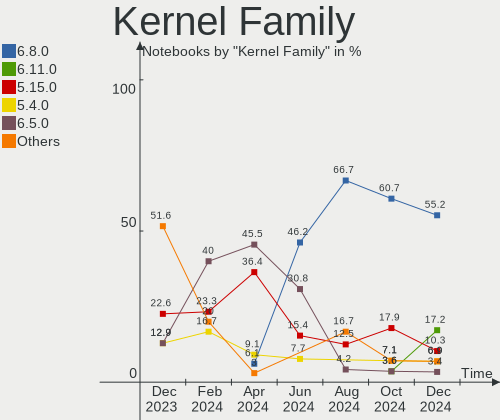
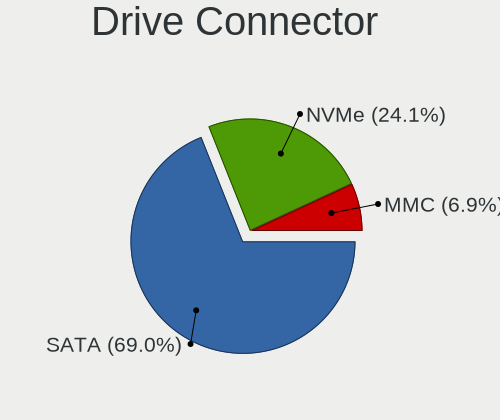
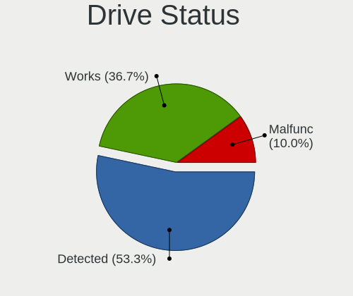
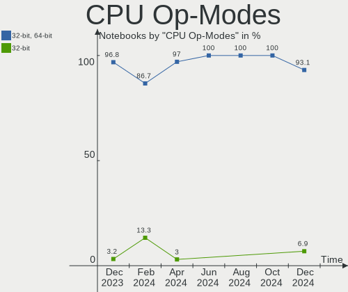

Xubuntu - Hardware Trends (Notebooks)
-------------------------------------

A project to identify most popular hardware characteristics and track their change
over time based on data collected by Linux users at https://Linux-Hardware.org.

Anyone can contribute to this report by the [hw-probe](https://github.com/linuxhw/hw-probe) tool:

    sudo -E hw-probe -all -upload

This report is for one last month. Overall report since the beginning of time: [TestCoverage](https://github.com/linuxhw/TestCoverage)

Period: Nov, 2022.

Contents
--------

* [ System ](#system)
  - [ OS                       ](#os)
  - [ OS Family                ](#os-family)
  - [ Kernel                   ](#kernel)
  - [ Kernel Family            ](#kernel-family)
  - [ Kernel Major Ver.        ](#kernel-major-ver)
  - [ Arch                     ](#arch)
  - [ DE                       ](#de)
  - [ Display Server           ](#display-server)
  - [ Display Manager          ](#display-manager)
  - [ OS Lang                  ](#os-lang)
  - [ Boot Mode                ](#boot-mode)
  - [ Filesystem               ](#filesystem)
  - [ Part. scheme             ](#part-scheme)
  - [ Dual Boot with Linux/BSD ](#dual-boot-with-linuxbsd)
  - [ Dual Boot (Win)          ](#dual-boot-win)

* [ Board ](#board)
  - [ Vendor                   ](#vendor)
  - [ Model                    ](#model)
  - [ Model Family             ](#model-family)
  - [ MFG Year                 ](#mfg-year)
  - [ Form Factor              ](#form-factor)
  - [ Secure Boot              ](#secure-boot)
  - [ Coreboot                 ](#coreboot)
  - [ RAM Size                 ](#ram-size)
  - [ RAM Used                 ](#ram-used)
  - [ Total Drives             ](#total-drives)
  - [ Has CD-ROM               ](#has-cd-rom)
  - [ Has Ethernet             ](#has-ethernet)
  - [ Has WiFi                 ](#has-wifi)
  - [ Has Bluetooth            ](#has-bluetooth)

* [ Location ](#location)
  - [ Country                  ](#country)
  - [ City                     ](#city)

* [ Drives ](#drives)
  - [ Drive Vendor             ](#drive-vendor)
  - [ Drive Model              ](#drive-model)
  - [ HDD Vendor               ](#hdd-vendor)
  - [ SSD Vendor               ](#ssd-vendor)
  - [ Drive Kind               ](#drive-kind)
  - [ Drive Connector          ](#drive-connector)
  - [ Drive Size               ](#drive-size)
  - [ Space Total              ](#space-total)
  - [ Space Used               ](#space-used)
  - [ Malfunc. Drives          ](#malfunc-drives)
  - [ Malfunc. Drive Vendor    ](#malfunc-drive-vendor)
  - [ Malfunc. HDD Vendor      ](#malfunc-hdd-vendor)
  - [ Malfunc. Drive Kind      ](#malfunc-drive-kind)
  - [ Failed Drives            ](#failed-drives)
  - [ Failed Drive Vendor      ](#failed-drive-vendor)
  - [ Drive Status             ](#drive-status)

* [ Storage controller ](#storage-controller)
  - [ Storage Vendor           ](#storage-vendor)
  - [ Storage Model            ](#storage-model)
  - [ Storage Kind             ](#storage-kind)

* [ Processor ](#processor)
  - [ CPU Vendor               ](#cpu-vendor)
  - [ CPU Model                ](#cpu-model)
  - [ CPU Model Family         ](#cpu-model-family)
  - [ CPU Cores                ](#cpu-cores)
  - [ CPU Sockets              ](#cpu-sockets)
  - [ CPU Threads              ](#cpu-threads)
  - [ CPU Op-Modes             ](#cpu-op-modes)
  - [ CPU Microcode            ](#cpu-microcode)
  - [ CPU Microarch            ](#cpu-microarch)

* [ Graphics ](#graphics)
  - [ GPU Vendor               ](#gpu-vendor)
  - [ GPU Model                ](#gpu-model)
  - [ GPU Combo                ](#gpu-combo)
  - [ GPU Driver               ](#gpu-driver)
  - [ GPU Memory               ](#gpu-memory)

* [ Monitor ](#monitor)
  - [ Monitor Vendor           ](#monitor-vendor)
  - [ Monitor Model            ](#monitor-model)
  - [ Monitor Resolution       ](#monitor-resolution)
  - [ Monitor Diagonal         ](#monitor-diagonal)
  - [ Monitor Width            ](#monitor-width)
  - [ Aspect Ratio             ](#aspect-ratio)
  - [ Monitor Area             ](#monitor-area)
  - [ Pixel Density            ](#pixel-density)
  - [ Multiple Monitors        ](#multiple-monitors)

* [ Network ](#network)
  - [ Net Controller Vendor    ](#net-controller-vendor)
  - [ Net Controller Model     ](#net-controller-model)
  - [ Wireless Vendor          ](#wireless-vendor)
  - [ Wireless Model           ](#wireless-model)
  - [ Ethernet Vendor          ](#ethernet-vendor)
  - [ Ethernet Model           ](#ethernet-model)
  - [ Net Controller Kind      ](#net-controller-kind)
  - [ Used Controller          ](#used-controller)
  - [ NICs                     ](#nics)
  - [ IPv6                     ](#ipv6)

* [ Bluetooth ](#bluetooth)
  - [ Bluetooth Vendor         ](#bluetooth-vendor)
  - [ Bluetooth Model          ](#bluetooth-model)

* [ Sound ](#sound)
  - [ Sound Vendor             ](#sound-vendor)
  - [ Sound Model              ](#sound-model)

* [ Memory ](#memory)
  - [ Memory Vendor            ](#memory-vendor)
  - [ Memory Model             ](#memory-model)
  - [ Memory Kind              ](#memory-kind)
  - [ Memory Form Factor       ](#memory-form-factor)
  - [ Memory Size              ](#memory-size)
  - [ Memory Speed             ](#memory-speed)

* [ Printers & scanners ](#printers--scanners)
  - [ Printer Vendor           ](#printer-vendor)
  - [ Printer Model            ](#printer-model)
  - [ Scanner Vendor           ](#scanner-vendor)
  - [ Scanner Model            ](#scanner-model)

* [ Camera ](#camera)
  - [ Camera Vendor            ](#camera-vendor)
  - [ Camera Model             ](#camera-model)

* [ Security ](#security)
  - [ Fingerprint Vendor       ](#fingerprint-vendor)
  - [ Fingerprint Model        ](#fingerprint-model)
  - [ Chipcard Vendor          ](#chipcard-vendor)
  - [ Chipcard Model           ](#chipcard-model)

* [ Unsupported ](#unsupported)
  - [ Unsupported Devices      ](#unsupported-devices)
  - [ Unsupported Device Types ](#unsupported-device-types)

System
------

OS
--

Installed operating systems

| Name          | Notebooks | Percent |
|---------------|-----------|---------|
| Xubuntu 22.04 | 19        | 47.5%   |
| Xubuntu 20.04 | 10        | 25%     |
| Xubuntu 18.04 | 6         | 15%     |
| Xubuntu 22.10 | 5         | 12.5%   |

OS Family
---------

OS without a version

| Name    | Notebooks | Percent |
|---------|-----------|---------|
| Xubuntu | 40        | 100%    |

Kernel
------

Version of the Linux kernel

| Version                 | Notebooks | Percent |
|-------------------------|-----------|---------|
| 5.15.0-52-generic       | 11        | 27.5%   |
| 5.15.0-53-generic       | 6         | 15%     |
| 5.4.0-132-generic       | 3         | 7.5%    |
| 5.4.0-131-generic       | 2         | 5%      |
| 5.19.0-21-generic       | 2         | 5%      |
| 5.15.0-25-generic       | 2         | 5%      |
| 6.0.9-060009-generic    | 1         | 2.5%    |
| 6.0.7-x64v3-xanmod1     | 1         | 2.5%    |
| 6.0.0-1007-oem          | 1         | 2.5%    |
| 5.4.217-0504217-generic | 1         | 2.5%    |
| 5.4.0-132-lowlatency    | 1         | 2.5%    |
| 5.4.0-122-generic       | 1         | 2.5%    |
| 5.19.0-23-generic       | 1         | 2.5%    |
| 5.19.0-1009-lowlatency  | 1         | 2.5%    |
| 5.17.0-1020-oem         | 1         | 2.5%    |
| 5.15.0-54-generic       | 1         | 2.5%    |
| 5.15.0-53-lowlatency    | 1         | 2.5%    |
| 4.15.0-197-lowlatency   | 1         | 2.5%    |
| 4.15.0-197-generic      | 1         | 2.5%    |
| 4.15.0-196-generic      | 1         | 2.5%    |

Kernel Family
-------------

Linux kernel without a distro release

| Version | Notebooks | Percent |
|---------|-----------|---------|
| 5.15.0  | 21        | 52.5%   |
| 5.4.0   | 7         | 17.5%   |
| 5.19.0  | 4         | 10%     |
| 4.15.0  | 3         | 7.5%    |
| 6.0.9   | 1         | 2.5%    |
| 6.0.7   | 1         | 2.5%    |
| 6.0.0   | 1         | 2.5%    |
| 5.4.217 | 1         | 2.5%    |
| 5.17.0  | 1         | 2.5%    |

Kernel Major Ver.
-----------------

Linux kernel major version

| Version | Notebooks | Percent |
|---------|-----------|---------|
| 5.15    | 21        | 52.5%   |
| 5.4     | 8         | 20%     |
| 5.19    | 4         | 10%     |
| 6.0     | 3         | 7.5%    |
| 4.15    | 3         | 7.5%    |
| 5.17    | 1         | 2.5%    |

Arch
----

OS architecture (x86_64, i586, etc.)

| Name   | Notebooks | Percent |
|--------|-----------|---------|
| x86_64 | 36        | 90%     |
| i686   | 4         | 10%     |

DE
--

Desktop Environment

| Name | Notebooks | Percent |
|------|-----------|---------|
| XFCE | 40        | 100%    |

Display Server
--------------

X11 or Wayland

| Name | Notebooks | Percent |
|------|-----------|---------|
| X11  | 40        | 100%    |

Display Manager
---------------

SDDM, LightDM, etc.

| Name    | Notebooks | Percent |
|---------|-----------|---------|
| LightDM | 38        | 95%     |
| GDM3    | 1         | 2.5%    |
| Unknown | 1         | 2.5%    |

OS Lang
-------

Language

| Lang  | Notebooks | Percent |
|-------|-----------|---------|
| en_US | 11        | 27.5%   |
| de_DE | 11        | 27.5%   |
| fr_FR | 5         | 12.5%   |
| it_IT | 3         | 7.5%    |
| ru_RU | 2         | 5%      |
| pt_BR | 2         | 5%      |
| en_GB | 2         | 5%      |
| tr_TR | 1         | 2.5%    |
| en_IN | 1         | 2.5%    |
| de_CH | 1         | 2.5%    |
| cs_CZ | 1         | 2.5%    |

Boot Mode
---------

EFI or BIOS

| Mode | Notebooks | Percent |
|------|-----------|---------|
| BIOS | 20        | 50%     |
| EFI  | 20        | 50%     |

Filesystem
----------

Type of filesystem

| Type    | Notebooks | Percent |
|---------|-----------|---------|
| Ext4    | 36        | 90%     |
| Overlay | 3         | 7.5%    |
| Zfs     | 1         | 2.5%    |

Part. scheme
------------

Scheme of partitioning

| Type    | Notebooks | Percent |
|---------|-----------|---------|
| GPT     | 26        | 65%     |
| MBR     | 9         | 22.5%   |
| Unknown | 5         | 12.5%   |

Dual Boot with Linux/BSD
------------------------

Hosting more than one Linux/BSD

| Dual boot | Notebooks | Percent |
|-----------|-----------|---------|
| No        | 38        | 95%     |
| Yes       | 2         | 5%      |

Dual Boot (Win)
---------------

Hosting Linux and Windows

| Dual boot | Notebooks | Percent |
|-----------|-----------|---------|
| No        | 27        | 67.5%   |
| Yes       | 13        | 32.5%   |

Board
-----

Vendor
------

Motherboard manufacturer

| Name             | Notebooks | Percent |
|------------------|-----------|---------|
| Lenovo           | 11        | 27.5%   |
| Hewlett-Packard  | 10        | 25%     |
| Dell             | 5         | 12.5%   |
| ASUSTek Computer | 4         | 10%     |
| Acer             | 3         | 7.5%    |
| Sony             | 1         | 2.5%    |
| Positivo         | 1         | 2.5%    |
| HUAWEI           | 1         | 2.5%    |
| Google           | 1         | 2.5%    |
| Fujitsu Siemens  | 1         | 2.5%    |
| Apple            | 1         | 2.5%    |
| Unknown          | 1         | 2.5%    |

Model
-----

Motherboard model

| Name                                   | Notebooks | Percent |
|----------------------------------------|-----------|---------|
| Sony VPCEH25EN                         | 1         | 2.5%    |
| Positivo Mobile                        | 1         | 2.5%    |
| Lenovo ThinkPad T450s 20BWS33U00       | 1         | 2.5%    |
| Lenovo ThinkPad T440p 20AN0033RT       | 1         | 2.5%    |
| Lenovo ThinkPad T430 23501K1           | 1         | 2.5%    |
| Lenovo ThinkPad T14s Gen 2a 20XF006HGE | 1         | 2.5%    |
| Lenovo ThinkPad P51 20HH0014IX         | 1         | 2.5%    |
| Lenovo ThinkPad L380 20M6S4E000        | 1         | 2.5%    |
| Lenovo ThinkPad Edge E431 6277CTO      | 1         | 2.5%    |
| Lenovo ThinkBook 15 G2 ITL 20VE        | 1         | 2.5%    |
| Lenovo IdeaPad Gaming 3 15ARH05 82EY   | 1         | 2.5%    |
| Lenovo IdeaPad 110-17ACL 80UM          | 1         | 2.5%    |
| Lenovo G50-80 80E5                     | 1         | 2.5%    |
| HUAWEI BOM-WXX9                        | 1         | 2.5%    |
| HP ProBook 6450b                       | 1         | 2.5%    |
| HP ProBook 640 G4                      | 1         | 2.5%    |
| HP Pavilion g6                         | 1         | 2.5%    |
| HP Pavilion dv9000 (RP919EA#UUZ)       | 1         | 2.5%    |
| HP Laptop 17-cp0xxx                    | 1         | 2.5%    |
| HP EliteBook Folio 1040 G1             | 1         | 2.5%    |
| HP EliteBook 840 G3                    | 1         | 2.5%    |
| HP 8540w                               | 1         | 2.5%    |
| HP 255 G8 Notebook PC                  | 1         | 2.5%    |
| HP 245 G8 Notebook PC                  | 1         | 2.5%    |
| Google Akemi                           | 1         | 2.5%    |
| Fujitsu Siemens ESPRIMO Mobile V5535   | 1         | 2.5%    |
| Dell Precision M6400                   | 1         | 2.5%    |
| Dell Latitude D610                     | 1         | 2.5%    |
| Dell Latitude 5490                     | 1         | 2.5%    |
| Dell Inspiron 7501                     | 1         | 2.5%    |
| Dell Inspiron 15-3567                  | 1         | 2.5%    |
| ASUS K53U                              | 1         | 2.5%    |
| ASUS K53SC                             | 1         | 2.5%    |
| ASUS 1015CX                            | 1         | 2.5%    |
| ASUS 1002HA                            | 1         | 2.5%    |
| Apple MacBookAir6,2                    | 1         | 2.5%    |
| Acer Aspire one 1-431                  | 1         | 2.5%    |
| Acer Aspire E5-571G                    | 1         | 2.5%    |
| Acer Aspire A315-21                    | 1         | 2.5%    |
| Unknown                                | 1         | 2.5%    |

Model Family
------------

Motherboard model prefix

| Name                    | Notebooks | Percent |
|-------------------------|-----------|---------|
| Lenovo ThinkPad         | 7         | 17.5%   |
| Acer Aspire             | 3         | 7.5%    |
| Lenovo IdeaPad          | 2         | 5%      |
| HP ProBook              | 2         | 5%      |
| HP Pavilion             | 2         | 5%      |
| HP EliteBook            | 2         | 5%      |
| Dell Latitude           | 2         | 5%      |
| Dell Inspiron           | 2         | 5%      |
| Sony VPCEH25EN          | 1         | 2.5%    |
| Positivo Mobile         | 1         | 2.5%    |
| Lenovo ThinkBook        | 1         | 2.5%    |
| Lenovo G50-80           | 1         | 2.5%    |
| HUAWEI BOM-WXX9         | 1         | 2.5%    |
| HP Laptop               | 1         | 2.5%    |
| HP 8540w                | 1         | 2.5%    |
| HP 255                  | 1         | 2.5%    |
| HP 245                  | 1         | 2.5%    |
| Google Akemi            | 1         | 2.5%    |
| Fujitsu Siemens ESPRIMO | 1         | 2.5%    |
| Dell Precision          | 1         | 2.5%    |
| ASUS K53U               | 1         | 2.5%    |
| ASUS K53SC              | 1         | 2.5%    |
| ASUS 1015CX             | 1         | 2.5%    |
| ASUS 1002HA             | 1         | 2.5%    |
| Apple MacBookAir6       | 1         | 2.5%    |
| Unknown                 | 1         | 2.5%    |

MFG Year
--------

Motherboard manufacture year

| Year | Notebooks | Percent |
|------|-----------|---------|
| 2021 | 4         | 10%     |
| 2020 | 4         | 10%     |
| 2016 | 4         | 10%     |
| 2013 | 4         | 10%     |
| 2011 | 4         | 10%     |
| 2009 | 3         | 7.5%    |
| 2019 | 2         | 5%      |
| 2018 | 2         | 5%      |
| 2017 | 2         | 5%      |
| 2015 | 2         | 5%      |
| 2014 | 2         | 5%      |
| 2012 | 2         | 5%      |
| 2007 | 2         | 5%      |
| 2022 | 1         | 2.5%    |
| 2010 | 1         | 2.5%    |
| 2005 | 1         | 2.5%    |

Form Factor
-----------

Physical design of the computer

| Name     | Notebooks | Percent |
|----------|-----------|---------|
| Notebook | 40        | 100%    |

Secure Boot
-----------

Enabled or disabled

| State    | Notebooks | Percent |
|----------|-----------|---------|
| Disabled | 38        | 95%     |
| Enabled  | 2         | 5%      |

Coreboot
--------

Have coreboot on board

| Used | Notebooks | Percent |
|------|-----------|---------|
| No   | 39        | 97.5%   |
| Yes  | 1         | 2.5%    |

RAM Size
--------

Total RAM memory

| Size in GB | Notebooks | Percent |
|------------|-----------|---------|
| 4.01-8.0   | 11        | 27.5%   |
| 3.01-4.0   | 11        | 27.5%   |
| 8.01-16.0  | 9         | 22.5%   |
| 1.01-2.0   | 3         | 7.5%    |
| 16.01-24.0 | 2         | 5%      |
| 0.51-1.0   | 2         | 5%      |
| 32.01-64.0 | 1         | 2.5%    |
| 2.01-3.0   | 1         | 2.5%    |

RAM Used
--------

Used RAM memory

| Used GB   | Notebooks | Percent |
|-----------|-----------|---------|
| 2.01-3.0  | 18        | 45%     |
| 1.01-2.0  | 9         | 22.5%   |
| 0.51-1.0  | 6         | 15%     |
| 3.01-4.0  | 3         | 7.5%    |
| 4.01-8.0  | 2         | 5%      |
| 8.01-16.0 | 1         | 2.5%    |
| 0.01-0.5  | 1         | 2.5%    |

Total Drives
------------

Number of drives on board

| Drives | Notebooks | Percent |
|--------|-----------|---------|
| 1      | 29        | 72.5%   |
| 2      | 10        | 25%     |
| 4      | 1         | 2.5%    |

Has CD-ROM
----------

Has CD-ROM on board

| Presented | Notebooks | Percent |
|-----------|-----------|---------|
| No        | 25        | 62.5%   |
| Yes       | 15        | 37.5%   |

Has Ethernet
------------

Has Ethernet on board

| Presented | Notebooks | Percent |
|-----------|-----------|---------|
| Yes       | 35        | 87.5%   |
| No        | 5         | 12.5%   |

Has WiFi
--------

Has WiFi module

| Presented | Notebooks | Percent |
|-----------|-----------|---------|
| Yes       | 40        | 100%    |

Has Bluetooth
-------------

Has Bluetooth module

| Presented | Notebooks | Percent |
|-----------|-----------|---------|
| Yes       | 29        | 72.5%   |
| No        | 11        | 27.5%   |

Location
--------

Country
-------

Geographic location (country)

| Country     | Notebooks | Percent |
|-------------|-----------|---------|
| Germany     | 10        | 25%     |
| France      | 7         | 17.5%   |
| Italy       | 3         | 7.5%    |
| USA         | 2         | 5%      |
| UK          | 2         | 5%      |
| Russia      | 2         | 5%      |
| Netherlands | 2         | 5%      |
| India       | 2         | 5%      |
| Brazil      | 2         | 5%      |
| Turkey      | 1         | 2.5%    |
| Switzerland | 1         | 2.5%    |
| Portugal    | 1         | 2.5%    |
| Poland      | 1         | 2.5%    |
| Iran        | 1         | 2.5%    |
| Czechia     | 1         | 2.5%    |
| Belarus     | 1         | 2.5%    |
| Austria     | 1         | 2.5%    |

City
----

Geographic location (city)

| City                      | Notebooks | Percent |
|---------------------------|-----------|---------|
| Munich                    | 2         | 5%      |
| Windsor                   | 1         | 2.5%    |
| Wierden                   | 1         | 2.5%    |
| Warsaw                    | 1         | 2.5%    |
| Vitebsk                   | 1         | 2.5%    |
| Villach                   | 1         | 2.5%    |
| Verona                    | 1         | 2.5%    |
| Tehran                    | 1         | 2.5%    |
| St Petersburg             | 1         | 2.5%    |
| Shrewsbury                | 1         | 2.5%    |
| Saint-Hilaire-sur-Benaize | 1         | 2.5%    |
| Rome                      | 1         | 2.5%    |
| Rio Rancho                | 1         | 2.5%    |
| Petropavlovsk-Kamchatsky  | 1         | 2.5%    |
| Pau                       | 1         | 2.5%    |
| Paris                     | 1         | 2.5%    |
| Mumbai                    | 1         | 2.5%    |
| Mladá Boleslav           | 1         | 2.5%    |
| Milan                     | 1         | 2.5%    |
| Middletown                | 1         | 2.5%    |
| Mem Martins               | 1         | 2.5%    |
| Ludwigsburg               | 1         | 2.5%    |
| Lübeck                   | 1         | 2.5%    |
| Ladenburg                 | 1         | 2.5%    |
| Kummersbruck              | 1         | 2.5%    |
| Kanpur                    | 1         | 2.5%    |
| Hauzenberg                | 1         | 2.5%    |
| Gossau                    | 1         | 2.5%    |
| Fos-sur-Mer               | 1         | 2.5%    |
| Esslingen am Neckar       | 1         | 2.5%    |
| Curitiba                  | 1         | 2.5%    |
| Caluire-et-Cuire          | 1         | 2.5%    |
| Brest                     | 1         | 2.5%    |
| Bremen                    | 1         | 2.5%    |
| Brasília                 | 1         | 2.5%    |
| Berlin                    | 1         | 2.5%    |
| Belfort                   | 1         | 2.5%    |
| Ankara                    | 1         | 2.5%    |
| Amsterdam                 | 1         | 2.5%    |

Drives
------

Drive Vendor
------------

Hard drive vendors

| Vendor              | Notebooks | Drives | Percent |
|---------------------|-----------|--------|---------|
| Samsung Electronics | 9         | 9      | 17.31%  |
| WDC                 | 7         | 7      | 13.46%  |
| Seagate             | 6         | 6      | 11.54%  |
| Unknown             | 4         | 4      | 7.69%   |
| Crucial             | 4         | 4      | 7.69%   |
| Toshiba             | 3         | 3      | 5.77%   |
| SK hynix            | 2         | 2      | 3.85%   |
| SanDisk             | 2         | 2      | 3.85%   |
| Intel               | 2         | 2      | 3.85%   |
| Hitachi             | 2         | 2      | 3.85%   |
| Transcend           | 1         | 1      | 1.92%   |
| SPCC                | 1         | 1      | 1.92%   |
| PNY                 | 1         | 1      | 1.92%   |
| Phison              | 1         | 1      | 1.92%   |
| Lenovo              | 1         | 1      | 1.92%   |
| Kingston            | 1         | 1      | 1.92%   |
| Inateck             | 1         | 1      | 1.92%   |
| Hoodisk             | 1         | 1      | 1.92%   |
| HGST                | 1         | 1      | 1.92%   |
| Fujitsu             | 1         | 1      | 1.92%   |
| Apple               | 1         | 1      | 1.92%   |

Drive Model
-----------

Hard drive models

| Model                                | Notebooks | Percent |
|--------------------------------------|-----------|---------|
| SK hynix BC711 HFM512GD3JX013N 512GB | 2         | 3.85%   |
| WDC WDS500G2B0C 500GB                | 1         | 1.92%   |
| WDC WDS500G2B0A-00SM50 500GB SSD     | 1         | 1.92%   |
| WDC WD10SPZX-75Z10T1 1TB             | 1         | 1.92%   |
| WDC WD10JPVT-55A1YT0 1TB             | 1         | 1.92%   |
| WDC WD10JPCX-24UE4T0 1TB             | 1         | 1.92%   |
| WDC WD Blue SA510 2.5 500GB          | 1         | 1.92%   |
| WDC PC SN530 SDBPMPZ-256G-1101 256GB | 1         | 1.92%   |
| Unknown USD  128GB                   | 1         | 1.92%   |
| Unknown MMC Card  32GB               | 1         | 1.92%   |
| Unknown MMC Card  256GB              | 1         | 1.92%   |
| Unknown MMC Card  128GB              | 1         | 1.92%   |
| Transcend TS512GMTS400 512GB SSD     | 1         | 1.92%   |
| Toshiba THNSF5256GPUK 256GB          | 1         | 1.92%   |
| Toshiba MQ04ABF100 1TB               | 1         | 1.92%   |
| Toshiba KXG50ZNV512G 512GB           | 1         | 1.92%   |
| SPCC Solid State Disk 128GB          | 1         | 1.92%   |
| Seagate ST9320325AS 320GB            | 1         | 1.92%   |
| Seagate ST9160314AS 160GB            | 1         | 1.92%   |
| Seagate ST9160310AS 160GB            | 1         | 1.92%   |
| Seagate ST500LM030-2E717D 500GB      | 1         | 1.92%   |
| Seagate ST1000LM049-2GH172 1TB       | 1         | 1.92%   |
| Seagate ST1000LM024 HN-M101MBB 1TB   | 1         | 1.92%   |
| SanDisk SSD PLUS 240GB               | 1         | 1.92%   |
| SanDisk SD8SN8U-256G-1006 256GB SSD  | 1         | 1.92%   |
| Samsung SSD PM830 FDE 2.5 7mm 256GB  | 1         | 1.92%   |
| Samsung SSD 870 QVO 4TB              | 1         | 1.92%   |
| Samsung SSD 840 PRO Series 512GB     | 1         | 1.92%   |
| Samsung Portable SSD T5 500GB        | 1         | 1.92%   |
| Samsung MZVLB512HBJQ-000L7 512GB     | 1         | 1.92%   |
| Samsung MZNLH128HBHQ-000H1 128GB SSD | 1         | 1.92%   |
| Samsung MZALQ128HBHQ-000L2 128GB     | 1         | 1.92%   |
| Samsung MZ7TE256HMHP-000L7 256GB SSD | 1         | 1.92%   |
| Samsung MZ7LN256HCHP-000L7 256GB SSD | 1         | 1.92%   |
| PNY CS900 240GB SSD                  | 1         | 1.92%   |
| Phison 311CD0512GB                   | 1         | 1.92%   |
| Lenovo LENSE30256GMSP34MEAT3TA 256GB | 1         | 1.92%   |
| Kingston SVP200S3120G 120GB SSD      | 1         | 1.92%   |
| Intel SSDSCKJF180A5H REF 180GB       | 1         | 1.92%   |
| Intel SSDPEKNW512G8L 512GB           | 1         | 1.92%   |

HDD Vendor
----------

Hard disk drive vendors

| Vendor  | Notebooks | Drives | Percent |
|---------|-----------|--------|---------|
| Seagate | 6         | 6      | 42.86%  |
| WDC     | 3         | 3      | 21.43%  |
| Hitachi | 2         | 2      | 14.29%  |
| Toshiba | 1         | 1      | 7.14%   |
| HGST    | 1         | 1      | 7.14%   |
| Fujitsu | 1         | 1      | 7.14%   |

SSD Vendor
----------

Solid state drive vendors

| Vendor              | Notebooks | Drives | Percent |
|---------------------|-----------|--------|---------|
| Samsung Electronics | 7         | 7      | 31.82%  |
| Crucial             | 4         | 4      | 18.18%  |
| WDC                 | 2         | 2      | 9.09%   |
| SanDisk             | 2         | 2      | 9.09%   |
| Transcend           | 1         | 1      | 4.55%   |
| SPCC                | 1         | 1      | 4.55%   |
| PNY                 | 1         | 1      | 4.55%   |
| Kingston            | 1         | 1      | 4.55%   |
| Intel               | 1         | 1      | 4.55%   |
| Hoodisk             | 1         | 1      | 4.55%   |
| Apple               | 1         | 1      | 4.55%   |

Drive Kind
----------

HDD or SSD

| Kind | Notebooks | Drives | Percent |
|------|-----------|--------|---------|
| SSD  | 17        | 22     | 36.96%  |
| HDD  | 14        | 14     | 30.43%  |
| NVMe | 11        | 12     | 23.91%  |
| MMC  | 4         | 4      | 8.7%    |

Drive Connector
---------------

SATA, SAS, NVMe, etc.

| Type | Notebooks | Drives | Percent |
|------|-----------|--------|---------|
| SATA | 30        | 35     | 63.83%  |
| NVMe | 11        | 11     | 23.4%   |
| MMC  | 4         | 4      | 8.51%   |
| SAS  | 2         | 2      | 4.26%   |

Drive Size
----------

Size of hard drive

| Size in TB | Notebooks | Drives | Percent |
|------------|-----------|--------|---------|
| 0.01-0.5   | 23        | 26     | 69.7%   |
| 0.51-1.0   | 8         | 8      | 24.24%  |
| 3.01-4.0   | 1         | 1      | 3.03%   |
| 1.01-2.0   | 1         | 1      | 3.03%   |

Space Total
-----------

Amount of disk space available on the file system

| Size in GB | Notebooks | Percent |
|------------|-----------|---------|
| 101-250    | 15        | 37.5%   |
| 251-500    | 9         | 22.5%   |
| 1-20       | 5         | 12.5%   |
| 51-100     | 5         | 12.5%   |
| 501-1000   | 3         | 7.5%    |
| 1001-2000  | 2         | 5%      |
| 21-50      | 1         | 2.5%    |

Space Used
----------

Amount of used disk space

| Used GB  | Notebooks | Percent |
|----------|-----------|---------|
| 1-20     | 18        | 45%     |
| 21-50    | 10        | 25%     |
| 51-100   | 7         | 17.5%   |
| 251-500  | 2         | 5%      |
| 501-1000 | 2         | 5%      |
| 101-250  | 1         | 2.5%    |

Malfunc. Drives
---------------

Drive models with a malfunction

| Model                                            | Notebooks | Drives | Percent |
|--------------------------------------------------|-----------|--------|---------|
| SanDisk SSD PLUS 240GB                           | 1         | 1      | 33.33%  |
| Samsung Electronics MZNLH128HBHQ-000H1 128GB SSD | 1         | 1      | 33.33%  |
| Hitachi HTS725050A9A364 500GB                    | 1         | 1      | 33.33%  |

Malfunc. Drive Vendor
---------------------

Vendors of faulty drives

| Vendor              | Notebooks | Drives | Percent |
|---------------------|-----------|--------|---------|
| SanDisk             | 1         | 1      | 33.33%  |
| Samsung Electronics | 1         | 1      | 33.33%  |
| Hitachi             | 1         | 1      | 33.33%  |

Malfunc. HDD Vendor
-------------------

Vendors of faulty HDD drives

| Vendor  | Notebooks | Drives | Percent |
|---------|-----------|--------|---------|
| Hitachi | 1         | 1      | 100%    |

Malfunc. Drive Kind
-------------------

Kinds of faulty drives

| Kind | Notebooks | Drives | Percent |
|------|-----------|--------|---------|
| SSD  | 2         | 2      | 66.67%  |
| HDD  | 1         | 1      | 33.33%  |

Failed Drives
-------------

Failed drive models

Zero info for selected period =(

Failed Drive Vendor
-------------------

Failed drive vendors

Zero info for selected period =(

Drive Status
------------

Number of failed and malfunc. drives

| Status   | Notebooks | Drives | Percent |
|----------|-----------|--------|---------|
| Works    | 21        | 26     | 50%     |
| Detected | 18        | 23     | 42.86%  |
| Malfunc  | 3         | 3      | 7.14%   |

Storage controller
------------------

Storage Vendor
--------------

Storage controller vendors

| Vendor                           | Notebooks | Percent |
|----------------------------------|-----------|---------|
| Intel                            | 26        | 56.52%  |
| AMD                              | 7         | 15.22%  |
| Samsung Electronics              | 3         | 6.52%   |
| Toshiba America Info Systems     | 2         | 4.35%   |
| SK hynix                         | 2         | 4.35%   |
| Silicon Integrated Systems [SiS] | 2         | 4.35%   |
| SanDisk                          | 2         | 4.35%   |
| Phison Electronics               | 1         | 2.17%   |
| Lenovo                           | 1         | 2.17%   |

Storage Model
-------------

Storage controller models

| Model                                                                          | Notebooks | Percent |
|--------------------------------------------------------------------------------|-----------|---------|
| AMD FCH SATA Controller [AHCI mode]                                            | 6         | 11.76%  |
| Intel Sunrise Point-LP SATA Controller [AHCI mode]                             | 4         | 7.84%   |
| Intel Wildcat Point-LP SATA Controller [AHCI Mode]                             | 3         | 5.88%   |
| SK hynix Gold P31/PC711 NVMe Solid State Drive                                 | 2         | 3.92%   |
| Silicon Integrated Systems [SiS] 5513 IDE Controller                           | 2         | 3.92%   |
| Intel 8 Series SATA Controller 1 [AHCI mode]                                   | 2         | 3.92%   |
| Intel 7 Series Chipset Family 6-port SATA Controller [AHCI mode]               | 2         | 3.92%   |
| Intel 6 Series/C200 Series Chipset Family 6 port Mobile SATA AHCI Controller   | 2         | 3.92%   |
| Intel 5 Series/3400 Series Chipset 6 port SATA AHCI Controller                 | 2         | 3.92%   |
| Toshiba America Info Systems XG5 NVMe SSD Controller                           | 1         | 1.96%   |
| Toshiba America Info Systems XG4 NVMe SSD Controller                           | 1         | 1.96%   |
| Silicon Integrated Systems [SiS] SATA Controller / IDE mode                    | 1         | 1.96%   |
| Silicon Integrated Systems [SiS] AHCI IDE Controller (0106)                    | 1         | 1.96%   |
| SanDisk WD Blue SN550 NVMe SSD                                                 | 1         | 1.96%   |
| SanDisk Non-Volatile memory controller                                         | 1         | 1.96%   |
| Samsung NVMe SSD Controller SM981/PM981/PM983                                  | 1         | 1.96%   |
| Samsung NVMe SSD Controller 980                                                | 1         | 1.96%   |
| Samsung Apple PCIe SSD                                                         | 1         | 1.96%   |
| Phison PS5013 E13 NVMe Controller                                              | 1         | 1.96%   |
| Lenovo Non-Volatile memory controller                                          | 1         | 1.96%   |
| Intel Volume Management Device NVMe RAID Controller                            | 1         | 1.96%   |
| Intel Tiger Lake-LP SATA Controller                                            | 1         | 1.96%   |
| Intel SSD 660P Series                                                          | 1         | 1.96%   |
| Intel Q170/Q150/B150/H170/H110/Z170/CM236 Chipset SATA Controller [AHCI Mode]  | 1         | 1.96%   |
| Intel NM10/ICH7 Family SATA Controller [AHCI mode]                             | 1         | 1.96%   |
| Intel Comet Lake SATA AHCI Controller                                          | 1         | 1.96%   |
| Intel 82801IBM/IEM (ICH9M/ICH9M-E) 4 port SATA Controller [AHCI mode]          | 1         | 1.96%   |
| Intel 82801GBM/GHM (ICH7-M Family) SATA Controller [IDE mode]                  | 1         | 1.96%   |
| Intel 82801GBM/GHM (ICH7-M Family) SATA Controller [AHCI mode]                 | 1         | 1.96%   |
| Intel 82801G (ICH7 Family) IDE Controller                                      | 1         | 1.96%   |
| Intel 82801FBM (ICH6M) SATA Controller                                         | 1         | 1.96%   |
| Intel 8 Series/C220 Series Chipset Family 6-port SATA Controller 1 [AHCI mode] | 1         | 1.96%   |
| Intel 400 Series Chipset Family SATA AHCI Controller                           | 1         | 1.96%   |
| AMD SB7x0/SB8x0/SB9x0 SATA Controller [AHCI mode]                              | 1         | 1.96%   |
| AMD SB7x0/SB8x0/SB9x0 IDE Controller                                           | 1         | 1.96%   |

Storage Kind
------------

Kind of storage controller (IDE, SATA, NVMe, SAS, ...)

| Kind | Notebooks | Percent |
|------|-----------|---------|
| SATA | 32        | 64%     |
| NVMe | 11        | 22%     |
| IDE  | 6         | 12%     |
| RAID | 1         | 2%      |

Processor
---------

CPU Vendor
----------

Processor vendors

| Vendor | Notebooks | Percent |
|--------|-----------|---------|
| Intel  | 30        | 75%     |
| AMD    | 10        | 25%     |

CPU Model
---------

Processor models

| Model                                         | Notebooks | Percent |
|-----------------------------------------------|-----------|---------|
| AMD Ryzen 5 5500U with Radeon Graphics        | 3         | 7.5%    |
| Intel Core i5-8350U CPU @ 1.70GHz             | 2         | 5%      |
| Intel Pentium M processor 1.73GHz             | 1         | 2.5%    |
| Intel Pentium Dual CPU T3400 @ 2.16GHz        | 1         | 2.5%    |
| Intel Pentium Dual CPU T3200 @ 2.00GHz        | 1         | 2.5%    |
| Intel Core i7-7700HQ CPU @ 2.80GHz            | 1         | 2.5%    |
| Intel Core i7-5600U CPU @ 2.60GHz             | 1         | 2.5%    |
| Intel Core i7-4910MQ CPU @ 2.90GHz            | 1         | 2.5%    |
| Intel Core i7-4650U CPU @ 1.70GHz             | 1         | 2.5%    |
| Intel Core i7-4600U CPU @ 2.10GHz             | 1         | 2.5%    |
| Intel Core i7-2670QM CPU @ 2.20GHz            | 1         | 2.5%    |
| Intel Core i5-7300U CPU @ 2.60GHz             | 1         | 2.5%    |
| Intel Core i5-7200U CPU @ 2.50GHz             | 1         | 2.5%    |
| Intel Core i5-6200U CPU @ 2.30GHz             | 1         | 2.5%    |
| Intel Core i5-5200U CPU @ 2.20GHz             | 1         | 2.5%    |
| Intel Core i5-4260U CPU @ 1.40GHz             | 1         | 2.5%    |
| Intel Core i5-3320M CPU @ 2.60GHz             | 1         | 2.5%    |
| Intel Core i5-3230M CPU @ 2.60GHz             | 1         | 2.5%    |
| Intel Core i5-10300H CPU @ 2.50GHz            | 1         | 2.5%    |
| Intel Core i5 CPU M 540 @ 2.53GHz             | 1         | 2.5%    |
| Intel Core i5 CPU M 450 @ 2.40GHz             | 1         | 2.5%    |
| Intel Core i3-5005U CPU @ 2.00GHz             | 1         | 2.5%    |
| Intel Core i3-2330M CPU @ 2.20GHz             | 1         | 2.5%    |
| Intel Core i3-10110U CPU @ 2.10GHz            | 1         | 2.5%    |
| Intel Core 2 Extreme CPU Q9300 @ 2.53GHz      | 1         | 2.5%    |
| Intel Core 2 CPU T7200 @ 2.00GHz              | 1         | 2.5%    |
| Intel Celeron CPU N3050 @ 1.60GHz             | 1         | 2.5%    |
| Intel Atom CPU N270 @ 1.60GHz                 | 1         | 2.5%    |
| Intel Atom CPU N2600 @ 1.60GHz                | 1         | 2.5%    |
| Intel 11th Gen Core i5-1135G7 @ 2.40GHz       | 1         | 2.5%    |
| AMD Ryzen 7 PRO 5850U with Radeon Graphics    | 1         | 2.5%    |
| AMD Ryzen 7 4800H with Radeon Graphics        | 1         | 2.5%    |
| AMD E2-1800 APU with Radeon HD Graphics       | 1         | 2.5%    |
| AMD E-450 APU with Radeon HD Graphics         | 1         | 2.5%    |
| AMD Athlon Silver 3050U with Radeon Graphics  | 1         | 2.5%    |
| AMD A9-9420e RADEON R5, 5 COMPUTE CORES 2C+3G | 1         | 2.5%    |
| AMD A4-7210 APU with AMD Radeon R3 Graphics   | 1         | 2.5%    |

CPU Model Family
----------------

Processor model prefix

| Model                | Notebooks | Percent |
|----------------------|-----------|---------|
| Intel Core i5        | 12        | 30%     |
| Intel Core i7        | 6         | 15%     |
| Intel Core i3        | 3         | 7.5%    |
| AMD Ryzen 5          | 3         | 7.5%    |
| Other                | 2         | 5%      |
| Intel Pentium Dual   | 2         | 5%      |
| Intel Atom           | 2         | 5%      |
| Intel Pentium M      | 1         | 2.5%    |
| Intel Core 2 Extreme | 1         | 2.5%    |
| Intel Core 2         | 1         | 2.5%    |
| Intel Celeron        | 1         | 2.5%    |
| AMD Ryzen 7 PRO      | 1         | 2.5%    |
| AMD Ryzen 7          | 1         | 2.5%    |
| AMD E2               | 1         | 2.5%    |
| AMD E                | 1         | 2.5%    |
| AMD Athlon           | 1         | 2.5%    |
| AMD A4               | 1         | 2.5%    |

CPU Cores
---------

Number of processor cores

| Number | Notebooks | Percent |
|--------|-----------|---------|
| 2      | 24        | 60%     |
| 4      | 9         | 22.5%   |
| 6      | 3         | 7.5%    |
| 8      | 2         | 5%      |
| 1      | 2         | 5%      |

CPU Sockets
-----------

Number of sockets

| Number | Notebooks | Percent |
|--------|-----------|---------|
| 1      | 40        | 100%    |

CPU Threads
-----------

Threads per core (Hyper-Threading)

| Number | Notebooks | Percent |
|--------|-----------|---------|
| 2      | 29        | 72.5%   |
| 1      | 11        | 27.5%   |

CPU Op-Modes
------------

CPU Operation Modes (32-bit, 64-bit)

| Op mode        | Notebooks | Percent |
|----------------|-----------|---------|
| 32-bit, 64-bit | 37        | 92.5%   |
| 32-bit         | 3         | 7.5%    |

CPU Microcode
-------------

Microcode number

| Number     | Notebooks | Percent |
|------------|-----------|---------|
| Unknown    | 7         | 17.5%   |
| 0x40651    | 3         | 7.5%    |
| 0x08608103 | 3         | 7.5%    |
| 0x806e9    | 2         | 5%      |
| 0x6fd      | 2         | 5%      |
| 0x306d4    | 2         | 5%      |
| 0x05000119 | 2         | 5%      |
| 0xa0652    | 1         | 2.5%    |
| 0x906e9    | 1         | 2.5%    |
| 0x806ec    | 1         | 2.5%    |
| 0x806ea    | 1         | 2.5%    |
| 0x806c1    | 1         | 2.5%    |
| 0x6f6      | 1         | 2.5%    |
| 0x6d8      | 1         | 2.5%    |
| 0x306a9    | 1         | 2.5%    |
| 0x30661    | 1         | 2.5%    |
| 0x206a7    | 1         | 2.5%    |
| 0x20655    | 1         | 2.5%    |
| 0x20652    | 1         | 2.5%    |
| 0x106c2    | 1         | 2.5%    |
| 0x1067a    | 1         | 2.5%    |
| 0x0a50000c | 1         | 2.5%    |
| 0x08600104 | 1         | 2.5%    |
| 0x08108109 | 1         | 2.5%    |
| 0x07030105 | 1         | 2.5%    |
| 0x06006705 | 1         | 2.5%    |

CPU Microarch
-------------

Microarchitecture

| Name        | Notebooks | Percent |
|-------------|-----------|---------|
| KabyLake    | 6         | 15%     |
| Haswell     | 4         | 10%     |
| Core        | 3         | 7.5%    |
| Broadwell   | 3         | 7.5%    |
| Unknown     | 3         | 7.5%    |
| Westmere    | 2         | 5%      |
| SandyBridge | 2         | 5%      |
| IvyBridge   | 2         | 5%      |
| Bonnell     | 2         | 5%      |
| Bobcat      | 2         | 5%      |
| Zen+        | 1         | 2.5%    |
| Zen 3       | 1         | 2.5%    |
| Zen 2       | 1         | 2.5%    |
| TigerLake   | 1         | 2.5%    |
| Skylake     | 1         | 2.5%    |
| Silvermont  | 1         | 2.5%    |
| Puma        | 1         | 2.5%    |
| Penryn      | 1         | 2.5%    |
| P6          | 1         | 2.5%    |
| Excavator   | 1         | 2.5%    |
| CometLake   | 1         | 2.5%    |

Graphics
--------

GPU Vendor
----------

Vendors of graphics cards

| Vendor                           | Notebooks | Percent |
|----------------------------------|-----------|---------|
| Intel                            | 23        | 51.11%  |
| Nvidia                           | 10        | 22.22%  |
| AMD                              | 10        | 22.22%  |
| Silicon Integrated Systems [SiS] | 2         | 4.44%   |

GPU Model
---------

Graphics card models

| Model                                                                                    | Notebooks | Percent |
|------------------------------------------------------------------------------------------|-----------|---------|
| Intel HD Graphics 5500                                                                   | 3         | 6.52%   |
| Intel Haswell-ULT Integrated Graphics Controller                                         | 3         | 6.52%   |
| AMD Lucienne                                                                             | 3         | 6.52%   |
| Silicon Integrated Systems [SiS] 771/671 PCIE VGA Display Adapter                        | 2         | 4.35%   |
| Intel UHD Graphics 620                                                                   | 2         | 4.35%   |
| Intel HD Graphics 620                                                                    | 2         | 4.35%   |
| Intel 3rd Gen Core processor Graphics Controller                                         | 2         | 4.35%   |
| Nvidia TU117M [GeForce MX450]                                                            | 1         | 2.17%   |
| Nvidia TU117M                                                                            | 1         | 2.17%   |
| Nvidia GT216GLM [Quadro FX 880M]                                                         | 1         | 2.17%   |
| Nvidia GM108M [GeForce 840M]                                                             | 1         | 2.17%   |
| Nvidia GM107GLM [Quadro M1200 Mobile]                                                    | 1         | 2.17%   |
| Nvidia GK208M [GeForce GT 730M]                                                          | 1         | 2.17%   |
| Nvidia GF119M [GeForce GT 520MX]                                                         | 1         | 2.17%   |
| Nvidia GF119M [GeForce 410M]                                                             | 1         | 2.17%   |
| Nvidia G92GLM [Quadro FX 3700M]                                                          | 1         | 2.17%   |
| Nvidia G73M [GeForce Go 7600]                                                            | 1         | 2.17%   |
| Intel TigerLake-LP GT2 [Iris Xe Graphics]                                                | 1         | 2.17%   |
| Intel Skylake GT2 [HD Graphics 520]                                                      | 1         | 2.17%   |
| Intel Mobile 945GSE Express Integrated Graphics Controller                               | 1         | 2.17%   |
| Intel Mobile 945GM/GMS/GME, 943/940GML Express Integrated Graphics Controller            | 1         | 2.17%   |
| Intel Mobile 915GM/GMS/910GML Express Graphics Controller                                | 1         | 2.17%   |
| Intel Core Processor Integrated Graphics Controller                                      | 1         | 2.17%   |
| Intel CometLake-U GT2 [UHD Graphics]                                                     | 1         | 2.17%   |
| Intel CometLake-H GT2 [UHD Graphics]                                                     | 1         | 2.17%   |
| Intel Atom/Celeron/Pentium Processor x5-E8000/J3xxx/N3xxx Integrated Graphics Controller | 1         | 2.17%   |
| Intel Atom Processor D2xxx/N2xxx Integrated Graphics Controller                          | 1         | 2.17%   |
| Intel 4th Gen Core Processor Integrated Graphics Controller                              | 1         | 2.17%   |
| Intel 2nd Generation Core Processor Family Integrated Graphics Controller                | 1         | 2.17%   |
| AMD Wrestler [Radeon HD 7340]                                                            | 1         | 2.17%   |
| AMD Wrestler [Radeon HD 6320]                                                            | 1         | 2.17%   |
| AMD Stoney [Radeon R2/R3/R4/R5 Graphics]                                                 | 1         | 2.17%   |
| AMD Renoir                                                                               | 1         | 2.17%   |
| AMD Picasso/Raven 2 [Radeon Vega Series / Radeon Vega Mobile Series]                     | 1         | 2.17%   |
| AMD Mullins [Radeon R3 Graphics]                                                         | 1         | 2.17%   |
| AMD Cezanne [Radeon Vega Series / Radeon Vega Mobile Series]                             | 1         | 2.17%   |

GPU Combo
---------

Combinations of graphics cards

| Name           | Notebooks | Percent |
|----------------|-----------|---------|
| 1 x Intel      | 19        | 47.5%   |
| 1 x AMD        | 9         | 22.5%   |
| 1 x Nvidia     | 5         | 12.5%   |
| Intel + Nvidia | 4         | 10%     |
| 1 x SiS        | 2         | 5%      |
| AMD + Nvidia   | 1         | 2.5%    |

GPU Driver
----------

Free vs proprietary

| Driver      | Notebooks | Percent |
|-------------|-----------|---------|
| Free        | 32        | 80%     |
| Proprietary | 6         | 15%     |
| Unknown     | 2         | 5%      |

GPU Memory
----------

Total video memory

| Size in GB | Notebooks | Percent |
|------------|-----------|---------|
| Unknown    | 20        | 50%     |
| 0.01-0.5   | 11        | 27.5%   |
| 0.51-1.0   | 5         | 12.5%   |
| 3.01-4.0   | 3         | 7.5%    |
| 1.01-2.0   | 1         | 2.5%    |

Monitor
-------

Monitor Vendor
--------------

Monitor vendors

| Vendor                  | Notebooks | Percent |
|-------------------------|-----------|---------|
| AU Optronics            | 9         | 20.93%  |
| LG Display              | 8         | 18.6%   |
| Chimei Innolux          | 6         | 13.95%  |
| BOE                     | 5         | 11.63%  |
| Samsung Electronics     | 4         | 9.3%    |
| InfoVision              | 2         | 4.65%   |
| HannStar                | 2         | 4.65%   |
| SAC                     | 1         | 2.33%   |
| Iiyama                  | 1         | 2.33%   |
| Goldstar                | 1         | 2.33%   |
| Dell                    | 1         | 2.33%   |
| Chi Mei Optoelectronics | 1         | 2.33%   |
| Apple                   | 1         | 2.33%   |
| Ancor Communications    | 1         | 2.33%   |

Monitor Model
-------------

Monitor models

| Model                                                                    | Notebooks | Percent |
|--------------------------------------------------------------------------|-----------|---------|
| Samsung Electronics SMC23A550U SAM07F3 1920x1080 510x287mm 23.0-inch     | 1         | 2.27%   |
| Samsung Electronics LCD Monitor SEC5443 1920x1200 367x230mm 17.1-inch    | 1         | 2.27%   |
| Samsung Electronics LCD Monitor SEC3450 1400x1050 286x214mm 14.1-inch    | 1         | 2.27%   |
| Samsung Electronics LCD Monitor SDC4852 1366x768 344x194mm 15.5-inch     | 1         | 2.27%   |
| SAC LED MONITOR SACE324 1600x900 477x268mm 21.5-inch                     | 1         | 2.27%   |
| LG Display LCD Monitor LGD071D 1920x1080 344x194mm 15.5-inch             | 1         | 2.27%   |
| LG Display LCD Monitor LGD059D 1920x1080 309x174mm 14.0-inch             | 1         | 2.27%   |
| LG Display LCD Monitor LGD0538 1920x1080 344x194mm 15.5-inch             | 1         | 2.27%   |
| LG Display LCD Monitor LGD046D 1920x1080 309x174mm 14.0-inch             | 1         | 2.27%   |
| LG Display LCD Monitor LGD0362 1600x900 309x174mm 14.0-inch              | 1         | 2.27%   |
| LG Display LCD Monitor LGD034D 1366x768 344x194mm 15.5-inch              | 1         | 2.27%   |
| LG Display LCD Monitor LGD02DF 1600x900 310x174mm 14.0-inch              | 1         | 2.27%   |
| LG Display LCD Monitor LGD02DC 1366x768 344x194mm 15.5-inch              | 1         | 2.27%   |
| InfoVision LCD Monitor IVO061F 1920x1080 344x194mm 15.5-inch             | 1         | 2.27%   |
| InfoVision LCD Monitor IVO0536 1920x1080 294x165mm 13.3-inch             | 1         | 2.27%   |
| Iiyama PL2493H IVM6149 1920x1080 527x296mm 23.8-inch                     | 1         | 2.27%   |
| HannStar HSD101PFW2 HSD03E9 1024x600 222x125mm 10.0-inch                 | 1         | 2.27%   |
| HannStar HSD100IFW4A HSD03EE 1024x600 220x129mm 10.0-inch                | 1         | 2.27%   |
| Goldstar Ultra HD GSM5B09 3840x2160 600x340mm 27.2-inch                  | 1         | 2.27%   |
| Dell U2415 DELA0B9 1920x1200 518x324mm 24.1-inch                         | 1         | 2.27%   |
| Dell U2415 DELA0B8 1920x1200 518x324mm 24.1-inch                         | 1         | 2.27%   |
| Chimei Innolux LCD Monitor CMN15E7 1920x1080 344x193mm 15.5-inch         | 1         | 2.27%   |
| Chimei Innolux LCD Monitor CMN15BE 1366x768 344x194mm 15.5-inch          | 1         | 2.27%   |
| Chimei Innolux LCD Monitor CMN14FF 1920x1080 309x173mm 13.9-inch         | 1         | 2.27%   |
| Chimei Innolux LCD Monitor CMN14F2 1920x1080 309x173mm 13.9-inch         | 1         | 2.27%   |
| Chimei Innolux LCD Monitor CMN14C9 1920x1080 309x173mm 13.9-inch         | 1         | 2.27%   |
| Chimei Innolux LCD Monitor CMN1490 1366x768 309x173mm 13.9-inch          | 1         | 2.27%   |
| Chi Mei Optoelectronics LCD Monitor CMO15A7 1366x768 344x193mm 15.5-inch | 1         | 2.27%   |
| BOE LCD Monitor BOE0953 1920x1080 382x215mm 17.3-inch                    | 1         | 2.27%   |
| BOE LCD Monitor BOE0872 1920x1080 344x194mm 15.5-inch                    | 1         | 2.27%   |
| BOE LCD Monitor BOE06BA 1920x1080 344x193mm 15.5-inch                    | 1         | 2.27%   |
| BOE LCD Monitor BOE0684 1600x900 382x215mm 17.3-inch                     | 1         | 2.27%   |
| BOE LCD Monitor BOE0674 1366x768 344x194mm 15.5-inch                     | 1         | 2.27%   |
| AU Optronics LCD Monitor AUOE48D 1920x1080 344x194mm 15.5-inch           | 1         | 2.27%   |
| AU Optronics LCD Monitor AUO3487 1440x900 367x230mm 17.1-inch            | 1         | 2.27%   |
| AU Optronics LCD Monitor AUO313C 1366x768 309x173mm 13.9-inch            | 1         | 2.27%   |
| AU Optronics LCD Monitor AUO303E 1600x900 309x174mm 14.0-inch            | 1         | 2.27%   |
| AU Optronics LCD Monitor AUO233E 1600x900 309x174mm 14.0-inch            | 1         | 2.27%   |
| AU Optronics LCD Monitor AUO162C 1366x768 293x164mm 13.2-inch            | 1         | 2.27%   |
| AU Optronics LCD Monitor AUO123D 1920x1080 309x173mm 13.9-inch           | 1         | 2.27%   |

Monitor Resolution
------------------

Monitor screen resolution

| Resolution        | Notebooks | Percent |
|-------------------|-----------|---------|
| 1920x1080 (FHD)   | 17        | 40.48%  |
| 1366x768 (WXGA)   | 9         | 21.43%  |
| 1600x900 (HD+)    | 7         | 16.67%  |
| 3840x2160 (4K)    | 2         | 4.76%   |
| 1920x1200 (WUXGA) | 2         | 4.76%   |
| 1440x900 (WXGA+)  | 2         | 4.76%   |
| 1024x600          | 2         | 4.76%   |
| 1400x1050         | 1         | 2.38%   |

Monitor Diagonal
----------------

Diagonal size in inches

| Inches  | Notebooks | Percent |
|---------|-----------|---------|
| 15      | 14        | 32.56%  |
| 14      | 8         | 18.6%   |
| 13      | 8         | 18.6%   |
| 17      | 4         | 9.3%    |
| 27      | 2         | 4.65%   |
| 23      | 2         | 4.65%   |
| 10      | 2         | 4.65%   |
| 24      | 1         | 2.33%   |
| 21      | 1         | 2.33%   |
| Unknown | 1         | 2.33%   |

Monitor Width
-------------

Physical width

| Width in mm | Notebooks | Percent |
|-------------|-----------|---------|
| 301-350     | 26        | 61.9%   |
| 201-300     | 6         | 14.29%  |
| 501-600     | 4         | 9.52%   |
| 351-400     | 4         | 9.52%   |
| 401-500     | 1         | 2.38%   |
| Unknown     | 1         | 2.38%   |

Aspect Ratio
------------

Proportional relationship between the width and the height

| Ratio   | Notebooks | Percent |
|---------|-----------|---------|
| 16/9    | 33        | 82.5%   |
| 16/10   | 5         | 12.5%   |
| 4/3     | 1         | 2.5%    |
| Unknown | 1         | 2.5%    |

Monitor Area
------------

Area in inch²

| Area in inch² | Notebooks | Percent |
|----------------|-----------|---------|
| 101-110        | 14        | 32.56%  |
| 81-90          | 13        | 30.23%  |
| 71-80          | 2         | 4.65%   |
| 41-50          | 2         | 4.65%   |
| 301-350        | 2         | 4.65%   |
| 201-250        | 2         | 4.65%   |
| 131-140        | 2         | 4.65%   |
| 121-130        | 2         | 4.65%   |
| 251-300        | 1         | 2.33%   |
| 151-200        | 1         | 2.33%   |
| 91-100         | 1         | 2.33%   |
| Unknown        | 1         | 2.33%   |

Pixel Density
-------------

Pixels per inch

| Density | Notebooks | Percent |
|---------|-----------|---------|
| 121-160 | 21        | 50%     |
| 101-120 | 12        | 28.57%  |
| 51-100  | 7         | 16.67%  |
| 161-240 | 1         | 2.38%   |
| Unknown | 1         | 2.38%   |

Multiple Monitors
-----------------

Total monitors connected

| Total | Notebooks | Percent |
|-------|-----------|---------|
| 1     | 34        | 85%     |
| 3     | 2         | 5%      |
| 2     | 2         | 5%      |
| 0     | 2         | 5%      |

Network
-------

Net Controller Vendor
---------------------

Controller vendors

| Vendor                           | Notebooks | Percent |
|----------------------------------|-----------|---------|
| Intel                            | 22        | 32.84%  |
| Realtek Semiconductor            | 19        | 28.36%  |
| Qualcomm Atheros                 | 9         | 13.43%  |
| Broadcom Limited                 | 3         | 4.48%   |
| Silicon Integrated Systems [SiS] | 2         | 2.99%   |
| Hewlett-Packard                  | 2         | 2.99%   |
| Broadcom                         | 2         | 2.99%   |
| TP-Link                          | 1         | 1.49%   |
| Spreadtrum Communications        | 1         | 1.49%   |
| Sierra Wireless                  | 1         | 1.49%   |
| Ralink                           | 1         | 1.49%   |
| Microchip Technology             | 1         | 1.49%   |
| Dell                             | 1         | 1.49%   |
| D-Link                           | 1         | 1.49%   |
| Attansic Technology              | 1         | 1.49%   |

Net Controller Model
--------------------

Controller models

| Model                                                                   | Notebooks | Percent |
|-------------------------------------------------------------------------|-----------|---------|
| Realtek RTL8111/8168/8411 PCI Express Gigabit Ethernet Controller       | 13        | 15.66%  |
| Intel Wireless 8265 / 8275                                              | 4         | 4.82%   |
| Realtek RTL8822CE 802.11ac PCIe Wireless Network Adapter                | 3         | 3.61%   |
| Realtek RTL810xE PCI Express Fast Ethernet controller                   | 3         | 3.61%   |
| Intel Ethernet Connection (4) I219-LM                                   | 3         | 3.61%   |
| Silicon Integrated Systems [SiS] 191 Gigabit Ethernet Adapter           | 2         | 2.41%   |
| Realtek RTL8821CE 802.11ac PCIe Wireless Network Adapter                | 2         | 2.41%   |
| Qualcomm Atheros QCA9565 / AR9565 Wireless Network Adapter              | 2         | 2.41%   |
| Qualcomm Atheros QCA9377 802.11ac Wireless Network Adapter              | 2         | 2.41%   |
| Intel Wireless 7260                                                     | 2         | 2.41%   |
| Intel Wireless 3160                                                     | 2         | 2.41%   |
| Broadcom BCM4313 802.11bgn Wireless Network Adapter                     | 2         | 2.41%   |
| TP-Link TL-WN821N v5/v6 [RTL8192EU]                                     | 1         | 1.2%    |
| Spreadtrum Unisoc Phone                                                 | 1         | 1.2%    |
| Sierra Wireless EM7345 4G LTE                                           | 1         | 1.2%    |
| Realtek RTL8187B Wireless 802.11g 54Mbps Network Adapter                | 1         | 1.2%    |
| Realtek RTL8153 Gigabit Ethernet Adapter                                | 1         | 1.2%    |
| Ralink RT3290 Wireless 802.11n 1T/1R PCIe                               | 1         | 1.2%    |
| Qualcomm Atheros AR9485 Wireless Network Adapter                        | 1         | 1.2%    |
| Qualcomm Atheros AR9462 Wireless Network Adapter                        | 1         | 1.2%    |
| Qualcomm Atheros AR928X Wireless Network Adapter (PCI-Express)          | 1         | 1.2%    |
| Qualcomm Atheros AR9285 Wireless Network Adapter (PCI-Express)          | 1         | 1.2%    |
| Qualcomm Atheros AR8121/AR8113/AR8114 Gigabit or Fast Ethernet          | 1         | 1.2%    |
| Qualcomm Atheros AR242x / AR542x Wireless Network Adapter (PCI-Express) | 1         | 1.2%    |
| Microchip SMSC9512/9514 Fast Ethernet Adapter                           | 1         | 1.2%    |
| Intel Wireless 8260                                                     | 1         | 1.2%    |
| Intel Wireless 7265                                                     | 1         | 1.2%    |
| Intel Wi-Fi 6 AX201                                                     | 1         | 1.2%    |
| Intel Wi-Fi 6 AX200                                                     | 1         | 1.2%    |
| Intel Ultimate N WiFi Link 5300                                         | 1         | 1.2%    |
| Intel PRO/Wireless 3945ABG [Golan] Network Connection                   | 1         | 1.2%    |
| Intel PRO/Wireless 2200BG [Calexico2] Network Connection                | 1         | 1.2%    |
| Intel Ethernet Connection I219-V                                        | 1         | 1.2%    |
| Intel Ethernet Connection I218-LM                                       | 1         | 1.2%    |
| Intel Ethernet Connection I217-LM                                       | 1         | 1.2%    |
| Intel Ethernet Connection (5) I219-V                                    | 1         | 1.2%    |
| Intel Ethernet Connection (3) I218-LM                                   | 1         | 1.2%    |
| Intel Comet Lake PCH-LP CNVi WiFi                                       | 1         | 1.2%    |
| Intel Comet Lake PCH CNVi WiFi                                          | 1         | 1.2%    |
| Intel Centrino Wireless-N 2230                                          | 1         | 1.2%    |

Wireless Vendor
---------------

Wireless vendors

| Vendor                | Notebooks | Percent |
|-----------------------|-----------|---------|
| Intel                 | 21        | 45.65%  |
| Qualcomm Atheros      | 9         | 19.57%  |
| Realtek Semiconductor | 6         | 13.04%  |
| Hewlett-Packard       | 2         | 4.35%   |
| Broadcom              | 2         | 4.35%   |
| TP-Link               | 1         | 2.17%   |
| Sierra Wireless       | 1         | 2.17%   |
| Ralink                | 1         | 2.17%   |
| Dell                  | 1         | 2.17%   |
| D-Link                | 1         | 2.17%   |
| Broadcom Limited      | 1         | 2.17%   |

Wireless Model
--------------

Wireless models

| Model                                                                        | Notebooks | Percent |
|------------------------------------------------------------------------------|-----------|---------|
| Intel Wireless 8265 / 8275                                                   | 4         | 8.7%    |
| Realtek RTL8822CE 802.11ac PCIe Wireless Network Adapter                     | 3         | 6.52%   |
| Realtek RTL8821CE 802.11ac PCIe Wireless Network Adapter                     | 2         | 4.35%   |
| Qualcomm Atheros QCA9565 / AR9565 Wireless Network Adapter                   | 2         | 4.35%   |
| Qualcomm Atheros QCA9377 802.11ac Wireless Network Adapter                   | 2         | 4.35%   |
| Intel Wireless 7260                                                          | 2         | 4.35%   |
| Intel Wireless 3160                                                          | 2         | 4.35%   |
| Broadcom BCM4313 802.11bgn Wireless Network Adapter                          | 2         | 4.35%   |
| TP-Link TL-WN821N v5/v6 [RTL8192EU]                                          | 1         | 2.17%   |
| Sierra Wireless EM7345 4G LTE                                                | 1         | 2.17%   |
| Realtek RTL8187B Wireless 802.11g 54Mbps Network Adapter                     | 1         | 2.17%   |
| Ralink RT3290 Wireless 802.11n 1T/1R PCIe                                    | 1         | 2.17%   |
| Qualcomm Atheros AR9485 Wireless Network Adapter                             | 1         | 2.17%   |
| Qualcomm Atheros AR9462 Wireless Network Adapter                             | 1         | 2.17%   |
| Qualcomm Atheros AR928X Wireless Network Adapter (PCI-Express)               | 1         | 2.17%   |
| Qualcomm Atheros AR9285 Wireless Network Adapter (PCI-Express)               | 1         | 2.17%   |
| Qualcomm Atheros AR242x / AR542x Wireless Network Adapter (PCI-Express)      | 1         | 2.17%   |
| Intel Wireless 8260                                                          | 1         | 2.17%   |
| Intel Wireless 7265                                                          | 1         | 2.17%   |
| Intel Wi-Fi 6 AX201                                                          | 1         | 2.17%   |
| Intel Wi-Fi 6 AX200                                                          | 1         | 2.17%   |
| Intel Ultimate N WiFi Link 5300                                              | 1         | 2.17%   |
| Intel PRO/Wireless 3945ABG [Golan] Network Connection                        | 1         | 2.17%   |
| Intel PRO/Wireless 2200BG [Calexico2] Network Connection                     | 1         | 2.17%   |
| Intel Comet Lake PCH-LP CNVi WiFi                                            | 1         | 2.17%   |
| Intel Comet Lake PCH CNVi WiFi                                               | 1         | 2.17%   |
| Intel Centrino Wireless-N 2230                                               | 1         | 2.17%   |
| Intel Centrino Wireless-N 100                                                | 1         | 2.17%   |
| Intel Centrino Ultimate-N 6300                                               | 1         | 2.17%   |
| Intel Centrino Advanced-N 6205 [Taylor Peak]                                 | 1         | 2.17%   |
| HP lt4120 Snapdragon X5 LTE                                                  | 1         | 2.17%   |
| HP lt4112 Gobi 4G Module Network Device                                      | 1         | 2.17%   |
| Dell Wireless 5809e Gobi™ 4G LTE Mobile Broadband Card                  | 1         | 2.17%   |
| D-Link DWA-160 802.11abgn Xtreme N Dual Band Adapter(rev.B2) [Ralink RT5572] | 1         | 2.17%   |
| Broadcom Limited BCM4360 802.11ac Wireless Network Adapter                   | 1         | 2.17%   |

Ethernet Vendor
---------------

Ethernet vendors

| Vendor                           | Notebooks | Percent |
|----------------------------------|-----------|---------|
| Realtek Semiconductor            | 17        | 45.95%  |
| Intel                            | 12        | 32.43%  |
| Silicon Integrated Systems [SiS] | 2         | 5.41%   |
| Broadcom Limited                 | 2         | 5.41%   |
| Spreadtrum Communications        | 1         | 2.7%    |
| Qualcomm Atheros                 | 1         | 2.7%    |
| Microchip Technology             | 1         | 2.7%    |
| Attansic Technology              | 1         | 2.7%    |

Ethernet Model
--------------

Ethernet models

| Model                                                             | Notebooks | Percent |
|-------------------------------------------------------------------|-----------|---------|
| Realtek RTL8111/8168/8411 PCI Express Gigabit Ethernet Controller | 13        | 35.14%  |
| Realtek RTL810xE PCI Express Fast Ethernet controller             | 3         | 8.11%   |
| Intel Ethernet Connection (4) I219-LM                             | 3         | 8.11%   |
| Silicon Integrated Systems [SiS] 191 Gigabit Ethernet Adapter     | 2         | 5.41%   |
| Spreadtrum Unisoc Phone                                           | 1         | 2.7%    |
| Realtek RTL8153 Gigabit Ethernet Adapter                          | 1         | 2.7%    |
| Qualcomm Atheros AR8121/AR8113/AR8114 Gigabit or Fast Ethernet    | 1         | 2.7%    |
| Microchip SMSC9512/9514 Fast Ethernet Adapter                     | 1         | 2.7%    |
| Intel Ethernet Connection I219-V                                  | 1         | 2.7%    |
| Intel Ethernet Connection I218-LM                                 | 1         | 2.7%    |
| Intel Ethernet Connection I217-LM                                 | 1         | 2.7%    |
| Intel Ethernet Connection (5) I219-V                              | 1         | 2.7%    |
| Intel Ethernet Connection (3) I218-LM                             | 1         | 2.7%    |
| Intel 82579LM Gigabit Network Connection (Lewisville)             | 1         | 2.7%    |
| Intel 82577LM Gigabit Network Connection                          | 1         | 2.7%    |
| Intel 82577LC Gigabit Network Connection                          | 1         | 2.7%    |
| Intel 82573L Gigabit Ethernet Controller                          | 1         | 2.7%    |
| Broadcom Limited NetXtreme BCM5761e Gigabit Ethernet PCIe         | 1         | 2.7%    |
| Broadcom Limited NetXtreme BCM5751 Gigabit Ethernet PCI Express   | 1         | 2.7%    |
| Attansic AR8152 v2.0 Fast Ethernet                                | 1         | 2.7%    |

Net Controller Kind
-------------------

Ethernet, WiFi or modem

| Kind     | Notebooks | Percent |
|----------|-----------|---------|
| WiFi     | 40        | 53.33%  |
| Ethernet | 35        | 46.67%  |

Used Controller
---------------

Currently used network controller

| Kind     | Notebooks | Percent |
|----------|-----------|---------|
| WiFi     | 32        | 78.05%  |
| Ethernet | 9         | 21.95%  |

NICs
----

Total network controllers on board

| Total | Notebooks | Percent |
|-------|-----------|---------|
| 2     | 33        | 82.5%   |
| 1     | 7         | 17.5%   |

IPv6
----

IPv6 vs IPv4

| Used | Notebooks | Percent |
|------|-----------|---------|
| No   | 23        | 57.5%   |
| Yes  | 17        | 42.5%   |

Bluetooth
---------

Bluetooth Vendor
----------------

Controller vendors

| Vendor                          | Notebooks | Percent |
|---------------------------------|-----------|---------|
| Intel                           | 13        | 44.83%  |
| Realtek Semiconductor           | 4         | 13.79%  |
| Qualcomm Atheros Communications | 3         | 10.34%  |
| Lite-On Technology              | 2         | 6.9%    |
| Realtek                         | 1         | 3.45%   |
| Ralink                          | 1         | 3.45%   |
| Hewlett-Packard                 | 1         | 3.45%   |
| Dell                            | 1         | 3.45%   |
| Broadcom                        | 1         | 3.45%   |
| ASUSTek Computer                | 1         | 3.45%   |
| Apple                           | 1         | 3.45%   |

Bluetooth Model
---------------

Controller models

| Model                                          | Notebooks | Percent |
|------------------------------------------------|-----------|---------|
| Intel Bluetooth wireless interface             | 9         | 31.03%  |
| Realtek Bluetooth Radio                        | 4         | 13.79%  |
| Qualcomm Atheros  Bluetooth Device             | 2         | 6.9%    |
| Intel AX201 Bluetooth                          | 2         | 6.9%    |
| Realtek Bluetooth Radio                        | 1         | 3.45%   |
| Ralink RT3290 Bluetooth                        | 1         | 3.45%   |
| Qualcomm Atheros AR3011 Bluetooth              | 1         | 3.45%   |
| Lite-On Qualcomm Atheros QCA9377 Bluetooth     | 1         | 3.45%   |
| Lite-On Qualcomm Atheros Bluetooth             | 1         | 3.45%   |
| Intel Centrino Bluetooth Wireless Transceiver  | 1         | 3.45%   |
| Intel Bluetooth 9460/9560 Jefferson Peak (JfP) | 1         | 3.45%   |
| HP Bluetooth 2.0 Interface [Broadcom BCM2045]  | 1         | 3.45%   |
| Dell Wireless 350 Bluetooth                    | 1         | 3.45%   |
| Broadcom BCM20702 Bluetooth 4.0 [ThinkPad]     | 1         | 3.45%   |
| ASUS Broadcom Bluetooth 2.1                    | 1         | 3.45%   |
| Apple Bluetooth USB Host Controller            | 1         | 3.45%   |

Sound
-----

Sound Vendor
------------

Sound card vendors

| Vendor                           | Notebooks | Percent |
|----------------------------------|-----------|---------|
| Intel                            | 28        | 59.57%  |
| AMD                              | 10        | 21.28%  |
| Nvidia                           | 4         | 8.51%   |
| Silicon Integrated Systems [SiS] | 2         | 4.26%   |
| Texas Instruments                | 1         | 2.13%   |
| Generalplus Technology           | 1         | 2.13%   |
| C-Media Electronics              | 1         | 2.13%   |

Sound Model
-----------

Sound card models

| Model                                                                                             | Notebooks | Percent |
|---------------------------------------------------------------------------------------------------|-----------|---------|
| Intel Sunrise Point-LP HD Audio                                                                   | 5         | 8.06%   |
| AMD Family 17h/19h HD Audio Controller                                                            | 5         | 8.06%   |
| AMD Renoir Radeon High Definition Audio Controller                                                | 4         | 6.45%   |
| Intel Wildcat Point-LP High Definition Audio Controller                                           | 3         | 4.84%   |
| Intel NM10/ICH7 Family High Definition Audio Controller                                           | 3         | 4.84%   |
| Intel Haswell-ULT HD Audio Controller                                                             | 3         | 4.84%   |
| Intel Broadwell-U Audio Controller                                                                | 3         | 4.84%   |
| Intel 8 Series HD Audio Controller                                                                | 3         | 4.84%   |
| Silicon Integrated Systems [SiS] Azalia Audio Controller                                          | 2         | 3.23%   |
| Intel 7 Series/C216 Chipset Family High Definition Audio Controller                               | 2         | 3.23%   |
| Intel 6 Series/C200 Series Chipset Family High Definition Audio Controller                        | 2         | 3.23%   |
| Intel 5 Series/3400 Series Chipset High Definition Audio                                          | 2         | 3.23%   |
| AMD Wrestler HDMI Audio                                                                           | 2         | 3.23%   |
| AMD FCH Azalia Controller                                                                         | 2         | 3.23%   |
| Texas Instruments PCM2704 16-bit stereo audio DAC                                                 | 1         | 1.61%   |
| Nvidia TU107 GeForce GTX 1650 High Definition Audio Controller                                    | 1         | 1.61%   |
| Nvidia GT216 HDMI Audio Controller                                                                | 1         | 1.61%   |
| Nvidia GM107 High Definition Audio Controller [GeForce 940MX]                                     | 1         | 1.61%   |
| Nvidia GF119 HDMI Audio Controller                                                                | 1         | 1.61%   |
| Intel Xeon E3-1200 v3/4th Gen Core Processor HD Audio Controller                                  | 1         | 1.61%   |
| Intel Tiger Lake-LP Smart Sound Technology Audio Controller                                       | 1         | 1.61%   |
| Intel Comet Lake PCH-LP cAVS                                                                      | 1         | 1.61%   |
| Intel Comet Lake PCH cAVS                                                                         | 1         | 1.61%   |
| Intel CM238 HD Audio Controller                                                                   | 1         | 1.61%   |
| Intel Atom/Celeron/Pentium Processor x5-E8000/J3xxx/N3xxx Series High Definition Audio Controller | 1         | 1.61%   |
| Intel 82801I (ICH9 Family) HD Audio Controller                                                    | 1         | 1.61%   |
| Intel 82801FB/FBM/FR/FW/FRW (ICH6 Family) AC'97 Audio Controller                                  | 1         | 1.61%   |
| Intel 8 Series/C220 Series Chipset High Definition Audio Controller                               | 1         | 1.61%   |
| Generalplus Technology USB Audio Device                                                           | 1         | 1.61%   |
| C-Media Electronics Auna Mic CM900                                                                | 1         | 1.61%   |
| AMD SBx00 Azalia (Intel HDA)                                                                      | 1         | 1.61%   |
| AMD Raven/Raven2/Fenghuang HDMI/DP Audio Controller                                               | 1         | 1.61%   |
| AMD Kabini HDMI/DP Audio                                                                          | 1         | 1.61%   |
| AMD High Definition Audio Controller                                                              | 1         | 1.61%   |
| AMD Family 15h (Models 60h-6fh) Audio Controller                                                  | 1         | 1.61%   |

Memory
------

Memory Vendor
-------------

Memory module vendors

| Vendor              | Notebooks | Percent |
|---------------------|-----------|---------|
| Samsung Electronics | 8         | 28.57%  |
| Micron Technology   | 4         | 14.29%  |
| Unknown             | 3         | 10.71%  |
| SK hynix            | 3         | 10.71%  |
| Elpida              | 3         | 10.71%  |
| Crucial             | 3         | 10.71%  |
| Ramaxel Technology  | 2         | 7.14%   |
| Kingston            | 2         | 7.14%   |

Memory Model
------------

Memory module models

| Model                                                       | Notebooks | Percent |
|-------------------------------------------------------------|-----------|---------|
| Unknown RAM Module 4GB SODIMM DDR4 2667MT/s                 | 1         | 3.57%   |
| Unknown RAM Module 2GB SODIMM DDR2 667MT/s                  | 1         | 3.57%   |
| Unknown RAM Module 1024MB SODIMM DRAM                       | 1         | 3.57%   |
| SK hynix RAM Module 8GB SODIMM DDR4 2133MT/s                | 1         | 3.57%   |
| SK hynix RAM HMT451S6AFR8A-PB 4GB SODIMM DDR3 1600MT/s      | 1         | 3.57%   |
| SK hynix RAM H9HCNNNCPMMLXR-NEE 8GB SODIMM LPDDR4 4266MT/s  | 1         | 3.57%   |
| Samsung RAM Module 16GB SODIMM DDR4 2400MT/s                | 1         | 3.57%   |
| Samsung RAM M471B5173QHY-YK0 4096MB SODIMM DDR3 1600MT/s    | 1         | 3.57%   |
| Samsung RAM M471B5173EB0-YK0 4GB SODIMM DDR3 1600MT/s       | 1         | 3.57%   |
| Samsung RAM M471B5173DB0-YK0 4096MB SODIMM DDR3 1600MT/s    | 1         | 3.57%   |
| Samsung RAM M471B1G73EB0-YK0 8GB SODIMM DDR3 1600MT/s       | 1         | 3.57%   |
| Samsung RAM M471A5244CB0-CWE 4GB Row Of Chips DDR4 3200MT/s | 1         | 3.57%   |
| Samsung RAM M471A1K43BB1-CRC 8GB SODIMM DDR4 2667MT/s       | 1         | 3.57%   |
| Samsung RAM M471A1G44AB0-CWE 8GB Row Of Chips DDR4 3200MT/s | 1         | 3.57%   |
| Ramaxel RAM RMT3170EB68F9W1600 4GB SODIMM DDR3 1600MT/s     | 1         | 3.57%   |
| Ramaxel RAM RMT1970ED48E8F1066 2GB SODIMM DDR3 1067MT/s     | 1         | 3.57%   |
| Micron RAM 8KTF51264HZ-1G6E1 4GB SODIMM DDR3 1600MT/s       | 1         | 3.57%   |
| Micron RAM 8JSF25664HZ-1G4D1 2GB SODIMM DDR3 1334MT/s       | 1         | 3.57%   |
| Micron RAM 8ATF1G64HZ-3G2R1 8GB SODIMM DDR4 3200MT/s        | 1         | 3.57%   |
| Micron RAM 16JSF25664HZ-1G1F1 2GB SODIMM DDR3 1067MT/s      | 1         | 3.57%   |
| Kingston RAM LV32D4S2S8HD-8 8GB SODIMM DDR4 3200MT/s        | 1         | 3.57%   |
| Kingston RAM HP32D4S2S1ME-4 4GB SODIMM DDR4 3200MT/s        | 1         | 3.57%   |
| Elpida RAM EBJ40UG8BBU0-GN-F 4GB SODIMM DDR3 1600MT/s       | 1         | 3.57%   |
| Elpida RAM EBJ21UE8BDS0-DJ-F 2048MB SODIMM DDR3 1334MT/s    | 1         | 3.57%   |
| Elpida RAM EBJ21UE8BASA-AE-E 2GB SODIMM DDR3 1067MT/s       | 1         | 3.57%   |
| Crucial RAM CT8G4SFRA32A.M8FRS 8192MB SODIMM DDR4 3200MT/s  | 1         | 3.57%   |
| Crucial RAM CT8G4SFRA32A.C8FP 8GB SODIMM DDR4 3200MT/s      | 1         | 3.57%   |
| Crucial RAM CT51264BF160BJ.C8F 4GB SODIMM DDR3 1600MT/s     | 1         | 3.57%   |

Memory Kind
-----------

Memory module kinds

| Kind   | Notebooks | Percent |
|--------|-----------|---------|
| DDR3   | 11        | 45.83%  |
| DDR4   | 10        | 41.67%  |
| LPDDR4 | 1         | 4.17%   |
| DRAM   | 1         | 4.17%   |
| DDR2   | 1         | 4.17%   |

Memory Form Factor
------------------

Physical design of the memory module

| Name         | Notebooks | Percent |
|--------------|-----------|---------|
| SODIMM       | 22        | 91.67%  |
| Row Of Chips | 2         | 8.33%   |

Memory Size
-----------

Memory module size

| Size  | Notebooks | Percent |
|-------|-----------|---------|
| 4096  | 10        | 41.67%  |
| 8192  | 8         | 33.33%  |
| 2048  | 3         | 12.5%   |
| 16384 | 2         | 8.33%   |
| 1024  | 1         | 4.17%   |

Memory Speed
------------

Memory module speed

| Speed   | Notebooks | Percent |
|---------|-----------|---------|
| 1600    | 8         | 33.33%  |
| 3200    | 6         | 25%     |
| 2667    | 2         | 8.33%   |
| 1334    | 2         | 8.33%   |
| 4266    | 1         | 4.17%   |
| 2400    | 1         | 4.17%   |
| 2133    | 1         | 4.17%   |
| 1067    | 1         | 4.17%   |
| 667     | 1         | 4.17%   |
| Unknown | 1         | 4.17%   |

Printers & scanners
-------------------

Printer Vendor
--------------

Printer device vendors

Zero info for selected period =(

Printer Model
-------------

Printer device models

Zero info for selected period =(

Scanner Vendor
--------------

Scanner device vendors

Zero info for selected period =(

Scanner Model
-------------

Scanner device models

Zero info for selected period =(

Camera
------

Camera Vendor
-------------

Camera device vendors

| Vendor                                 | Notebooks | Percent |
|----------------------------------------|-----------|---------|
| Chicony Electronics                    | 14        | 38.89%  |
| Realtek Semiconductor                  | 3         | 8.33%   |
| Quanta                                 | 3         | 8.33%   |
| Acer                                   | 3         | 8.33%   |
| Suyin                                  | 2         | 5.56%   |
| Microdia                               | 2         | 5.56%   |
| IMC Networks                           | 2         | 5.56%   |
| Cheng Uei Precision Industry (Foxlink) | 2         | 5.56%   |
| Z-Star Microelectronics                | 1         | 2.78%   |
| Xiongmai                               | 1         | 2.78%   |
| Sunplus Innovation Technology          | 1         | 2.78%   |
| Ricoh                                  | 1         | 2.78%   |
| Alcor Micro                            | 1         | 2.78%   |

Camera Model
------------

Camera device models

| Model                                               | Notebooks | Percent |
|-----------------------------------------------------|-----------|---------|
| Chicony Integrated Camera                           | 6         | 16.67%  |
| Acer Integrated Camera                              | 2         | 5.56%   |
| Z-Star Vimicro USB Camera (Altair)                  | 1         | 2.78%   |
| Xiongmai web camera                                 | 1         | 2.78%   |
| Suyin VGA Webcam                                    | 1         | 2.78%   |
| Suyin HP TrueVision HD Integrated Webcam            | 1         | 2.78%   |
| Sunplus Integrated_Webcam_HD                        | 1         | 2.78%   |
| Ricoh Integrated Webcam                             | 1         | 2.78%   |
| Realtek USB Camera                                  | 1         | 2.78%   |
| Realtek Integrated_Webcam_HD                        | 1         | 2.78%   |
| Realtek Integrated Webcam HD                        | 1         | 2.78%   |
| Quanta VGA WebCam                                   | 1         | 2.78%   |
| Quanta HP Webcam                                    | 1         | 2.78%   |
| Quanta HP TrueVision HD Camera                      | 1         | 2.78%   |
| Microdia Sonix USB 2.0 Camera                       | 1         | 2.78%   |
| Microdia Lenovo EasyCamera                          | 1         | 2.78%   |
| IMC Networks USB 2.0 UVC VGA WebCam                 | 1         | 2.78%   |
| IMC Networks HD Camera                              | 1         | 2.78%   |
| Chicony thinkpad t430s camera                       | 1         | 2.78%   |
| Chicony Sony Visual Communication Camera            | 1         | 2.78%   |
| Chicony HP Webcam [2 MP Macro]                      | 1         | 2.78%   |
| Chicony HP HD Webcam                                | 1         | 2.78%   |
| Chicony HD WebCam                                   | 1         | 2.78%   |
| Chicony EasyCamera                                  | 1         | 2.78%   |
| Chicony CNFA078                                     | 1         | 2.78%   |
| Chicony 2.0M UVC Webcam / CNF7129                   | 1         | 2.78%   |
| Cheng Uei Precision Industry (Foxlink) HP Webcam    | 1         | 2.78%   |
| Cheng Uei Precision Industry (Foxlink) HP HD Camera | 1         | 2.78%   |
| Alcor Micro Asus Integrated Webcam                  | 1         | 2.78%   |
| Acer SunplusIT Integrated Camera                    | 1         | 2.78%   |

Security
--------

Fingerprint Vendor
------------------

Fingerprint sensor vendors

| Vendor                     | Notebooks | Percent |
|----------------------------|-----------|---------|
| Validity Sensors           | 4         | 80%     |
| Shenzhen Goodix Technology | 1         | 20%     |

Fingerprint Model
-----------------

Fingerprint sensor models

| Model                                      | Notebooks | Percent |
|--------------------------------------------|-----------|---------|
| Validity Sensors VFS451 Fingerprint Reader | 2         | 40%     |
| Validity Sensors VFS495 Fingerprint Reader | 1         | 20%     |
| Validity Sensors Synaptics WBDI            | 1         | 20%     |
| Shenzhen Goodix  Fingerprint Device        | 1         | 20%     |

Chipcard Vendor
---------------

Chipcard module vendors

| Vendor      | Notebooks | Percent |
|-------------|-----------|---------|
| Alcor Micro | 3         | 50%     |
| Broadcom    | 2         | 33.33%  |
| Lenovo      | 1         | 16.67%  |

Chipcard Model
--------------

Chipcard module models

| Model                                          | Notebooks | Percent |
|------------------------------------------------|-----------|---------|
| Alcor Micro AU9540 Smartcard Reader            | 3         | 50%     |
| Lenovo Integrated Smart Card Reader            | 1         | 16.67%  |
| Broadcom BCM5880 Secure Applications Processor | 1         | 16.67%  |
| Broadcom 5880                                  | 1         | 16.67%  |

Unsupported
-----------

Unsupported Devices
-------------------

Total unsupported devices on board

| Total | Notebooks | Percent |
|-------|-----------|---------|
| 0     | 24        | 60%     |
| 1     | 14        | 35%     |
| 2     | 2         | 5%      |

Unsupported Device Types
------------------------

Types of unsupported devices

| Type                     | Notebooks | Percent |
|--------------------------|-----------|---------|
| Chipcard                 | 6         | 33.33%  |
| Fingerprint reader       | 5         | 27.78%  |
| Graphics card            | 3         | 16.67%  |
| Net/wireless             | 1         | 5.56%   |
| Multimedia controller    | 1         | 5.56%   |
| Communication controller | 1         | 5.56%   |
| Bluetooth                | 1         | 5.56%   |

