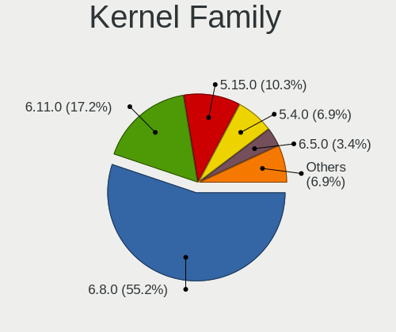
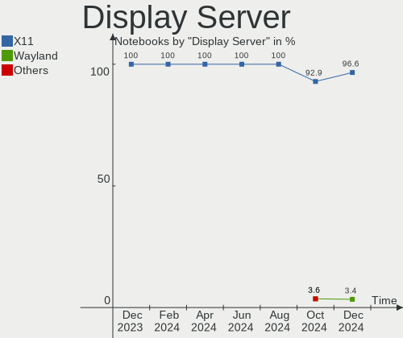
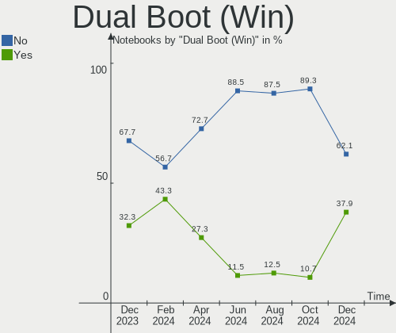
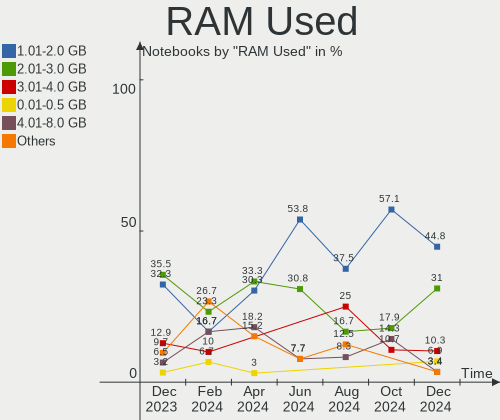
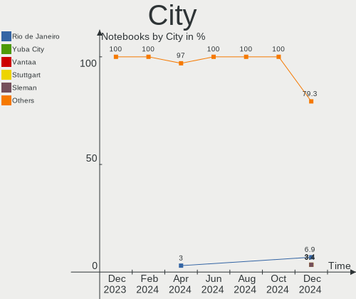
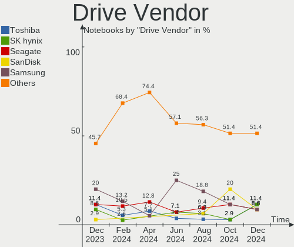
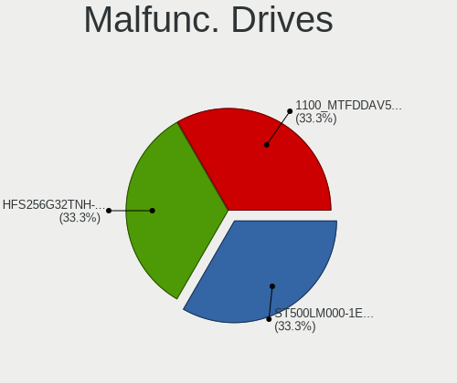
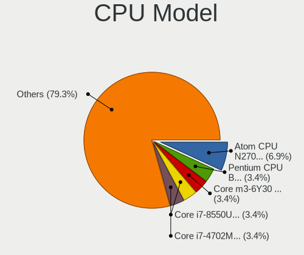
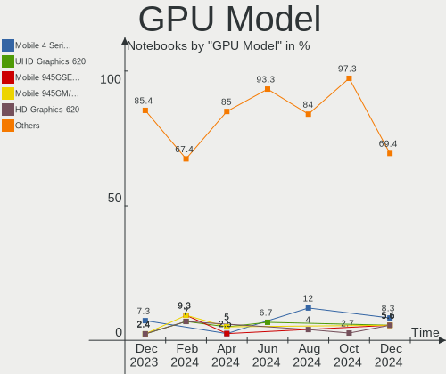
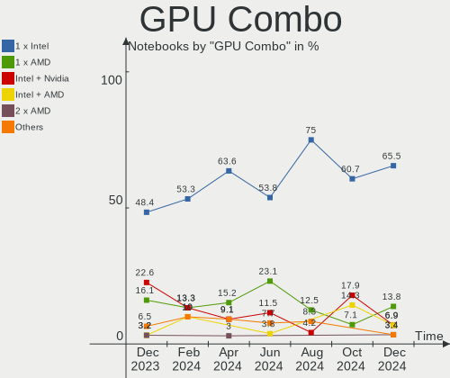

Xubuntu - Hardware Trends (Notebooks)
-------------------------------------

A project to identify most popular hardware characteristics and track their change
over time based on data collected by Linux users at https://Linux-Hardware.org.

Anyone can contribute to this report by the [hw-probe](https://github.com/linuxhw/hw-probe) tool:

    sudo -E hw-probe -all -upload

This report is for one last month. Overall report since the beginning of time: [TestCoverage](https://github.com/linuxhw/TestCoverage)

Period: Oct, 2022.

Contents
--------

* [ System ](#system)
  - [ OS                       ](#os)
  - [ OS Family                ](#os-family)
  - [ Kernel                   ](#kernel)
  - [ Kernel Family            ](#kernel-family)
  - [ Kernel Major Ver.        ](#kernel-major-ver)
  - [ Arch                     ](#arch)
  - [ DE                       ](#de)
  - [ Display Server           ](#display-server)
  - [ Display Manager          ](#display-manager)
  - [ OS Lang                  ](#os-lang)
  - [ Boot Mode                ](#boot-mode)
  - [ Filesystem               ](#filesystem)
  - [ Part. scheme             ](#part-scheme)
  - [ Dual Boot with Linux/BSD ](#dual-boot-with-linuxbsd)
  - [ Dual Boot (Win)          ](#dual-boot-win)

* [ Board ](#board)
  - [ Vendor                   ](#vendor)
  - [ Model                    ](#model)
  - [ Model Family             ](#model-family)
  - [ MFG Year                 ](#mfg-year)
  - [ Form Factor              ](#form-factor)
  - [ Secure Boot              ](#secure-boot)
  - [ Coreboot                 ](#coreboot)
  - [ RAM Size                 ](#ram-size)
  - [ RAM Used                 ](#ram-used)
  - [ Total Drives             ](#total-drives)
  - [ Has CD-ROM               ](#has-cd-rom)
  - [ Has Ethernet             ](#has-ethernet)
  - [ Has WiFi                 ](#has-wifi)
  - [ Has Bluetooth            ](#has-bluetooth)

* [ Location ](#location)
  - [ Country                  ](#country)
  - [ City                     ](#city)

* [ Drives ](#drives)
  - [ Drive Vendor             ](#drive-vendor)
  - [ Drive Model              ](#drive-model)
  - [ HDD Vendor               ](#hdd-vendor)
  - [ SSD Vendor               ](#ssd-vendor)
  - [ Drive Kind               ](#drive-kind)
  - [ Drive Connector          ](#drive-connector)
  - [ Drive Size               ](#drive-size)
  - [ Space Total              ](#space-total)
  - [ Space Used               ](#space-used)
  - [ Malfunc. Drives          ](#malfunc-drives)
  - [ Malfunc. Drive Vendor    ](#malfunc-drive-vendor)
  - [ Malfunc. HDD Vendor      ](#malfunc-hdd-vendor)
  - [ Malfunc. Drive Kind      ](#malfunc-drive-kind)
  - [ Failed Drives            ](#failed-drives)
  - [ Failed Drive Vendor      ](#failed-drive-vendor)
  - [ Drive Status             ](#drive-status)

* [ Storage controller ](#storage-controller)
  - [ Storage Vendor           ](#storage-vendor)
  - [ Storage Model            ](#storage-model)
  - [ Storage Kind             ](#storage-kind)

* [ Processor ](#processor)
  - [ CPU Vendor               ](#cpu-vendor)
  - [ CPU Model                ](#cpu-model)
  - [ CPU Model Family         ](#cpu-model-family)
  - [ CPU Cores                ](#cpu-cores)
  - [ CPU Sockets              ](#cpu-sockets)
  - [ CPU Threads              ](#cpu-threads)
  - [ CPU Op-Modes             ](#cpu-op-modes)
  - [ CPU Microcode            ](#cpu-microcode)
  - [ CPU Microarch            ](#cpu-microarch)

* [ Graphics ](#graphics)
  - [ GPU Vendor               ](#gpu-vendor)
  - [ GPU Model                ](#gpu-model)
  - [ GPU Combo                ](#gpu-combo)
  - [ GPU Driver               ](#gpu-driver)
  - [ GPU Memory               ](#gpu-memory)

* [ Monitor ](#monitor)
  - [ Monitor Vendor           ](#monitor-vendor)
  - [ Monitor Model            ](#monitor-model)
  - [ Monitor Resolution       ](#monitor-resolution)
  - [ Monitor Diagonal         ](#monitor-diagonal)
  - [ Monitor Width            ](#monitor-width)
  - [ Aspect Ratio             ](#aspect-ratio)
  - [ Monitor Area             ](#monitor-area)
  - [ Pixel Density            ](#pixel-density)
  - [ Multiple Monitors        ](#multiple-monitors)

* [ Network ](#network)
  - [ Net Controller Vendor    ](#net-controller-vendor)
  - [ Net Controller Model     ](#net-controller-model)
  - [ Wireless Vendor          ](#wireless-vendor)
  - [ Wireless Model           ](#wireless-model)
  - [ Ethernet Vendor          ](#ethernet-vendor)
  - [ Ethernet Model           ](#ethernet-model)
  - [ Net Controller Kind      ](#net-controller-kind)
  - [ Used Controller          ](#used-controller)
  - [ NICs                     ](#nics)
  - [ IPv6                     ](#ipv6)

* [ Bluetooth ](#bluetooth)
  - [ Bluetooth Vendor         ](#bluetooth-vendor)
  - [ Bluetooth Model          ](#bluetooth-model)

* [ Sound ](#sound)
  - [ Sound Vendor             ](#sound-vendor)
  - [ Sound Model              ](#sound-model)

* [ Memory ](#memory)
  - [ Memory Vendor            ](#memory-vendor)
  - [ Memory Model             ](#memory-model)
  - [ Memory Kind              ](#memory-kind)
  - [ Memory Form Factor       ](#memory-form-factor)
  - [ Memory Size              ](#memory-size)
  - [ Memory Speed             ](#memory-speed)

* [ Printers & scanners ](#printers--scanners)
  - [ Printer Vendor           ](#printer-vendor)
  - [ Printer Model            ](#printer-model)
  - [ Scanner Vendor           ](#scanner-vendor)
  - [ Scanner Model            ](#scanner-model)

* [ Camera ](#camera)
  - [ Camera Vendor            ](#camera-vendor)
  - [ Camera Model             ](#camera-model)

* [ Security ](#security)
  - [ Fingerprint Vendor       ](#fingerprint-vendor)
  - [ Fingerprint Model        ](#fingerprint-model)
  - [ Chipcard Vendor          ](#chipcard-vendor)
  - [ Chipcard Model           ](#chipcard-model)

* [ Unsupported ](#unsupported)
  - [ Unsupported Devices      ](#unsupported-devices)
  - [ Unsupported Device Types ](#unsupported-device-types)

System
------

OS
--

Installed operating systems

| Name          | Notebooks | Percent |
|---------------|-----------|---------|
| Xubuntu 22.04 | 28        | 52.83%  |
| Xubuntu 20.04 | 19        | 35.85%  |
| Xubuntu 18.04 | 2         | 3.77%   |
| Xubuntu 16.04 | 2         | 3.77%   |
| Xubuntu 22.10 | 1         | 1.89%   |
| Xubuntu 20.10 | 1         | 1.89%   |

OS Family
---------

OS without a version

| Name    | Notebooks | Percent |
|---------|-----------|---------|
| Xubuntu | 53        | 100%    |

Kernel
------

Version of the Linux kernel

| Version                   | Notebooks | Percent |
|---------------------------|-----------|---------|
| 5.15.0-48-generic         | 11        | 20.75%  |
| 5.15.0-50-generic         | 8         | 15.09%  |
| 5.15.0-52-generic         | 7         | 13.21%  |
| 5.15.0-47-generic         | 4         | 7.55%   |
| 5.4.0-131-generic         | 2         | 3.77%   |
| 5.15.0-46-generic         | 2         | 3.77%   |
| 5.15.0-25-generic         | 2         | 3.77%   |
| 4.4.0-210-generic         | 2         | 3.77%   |
| 5.8.0-63-generic          | 1         | 1.89%   |
| 5.4.0-131-lowlatency      | 1         | 1.89%   |
| 5.4.0-128-generic         | 1         | 1.89%   |
| 5.4.0-126-lowlatency      | 1         | 1.89%   |
| 5.4.0-126-generic         | 1         | 1.89%   |
| 5.4.0-113-generic         | 1         | 1.89%   |
| 5.19.0-1009-lowlatency    | 1         | 1.89%   |
| 5.16.0-9.1-liquorix-amd64 | 1         | 1.89%   |
| 5.15.0-48-lowlatency      | 1         | 1.89%   |
| 5.13.0-52-generic         | 1         | 1.89%   |
| 5.13.0-39-generic         | 1         | 1.89%   |
| 5.13.0-30-generic         | 1         | 1.89%   |
| 5.13.0-27-generic         | 1         | 1.89%   |
| 5.11.0-43-generic         | 1         | 1.89%   |
| 4.15.0-192-generic        | 1         | 1.89%   |

Kernel Family
-------------

Linux kernel without a distro release

| Version | Notebooks | Percent |
|---------|-----------|---------|
| 5.15.0  | 35        | 66.04%  |
| 5.4.0   | 7         | 13.21%  |
| 5.13.0  | 4         | 7.55%   |
| 4.4.0   | 2         | 3.77%   |
| 5.8.0   | 1         | 1.89%   |
| 5.19.0  | 1         | 1.89%   |
| 5.16.0  | 1         | 1.89%   |
| 5.11.0  | 1         | 1.89%   |
| 4.15.0  | 1         | 1.89%   |

Kernel Major Ver.
-----------------

Linux kernel major version

| Version | Notebooks | Percent |
|---------|-----------|---------|
| 5.15    | 35        | 66.04%  |
| 5.4     | 7         | 13.21%  |
| 5.13    | 4         | 7.55%   |
| 4.4     | 2         | 3.77%   |
| 5.8     | 1         | 1.89%   |
| 5.19    | 1         | 1.89%   |
| 5.16    | 1         | 1.89%   |
| 5.11    | 1         | 1.89%   |
| 4.15    | 1         | 1.89%   |

Arch
----

OS architecture (x86_64, i586, etc.)

| Name   | Notebooks | Percent |
|--------|-----------|---------|
| x86_64 | 49        | 92.45%  |
| i686   | 4         | 7.55%   |

DE
--

Desktop Environment

| Name   | Notebooks | Percent |
|--------|-----------|---------|
| XFCE   | 52        | 98.11%  |
| xmonad | 1         | 1.89%   |

Display Server
--------------

X11 or Wayland

| Name    | Notebooks | Percent |
|---------|-----------|---------|
| X11     | 51        | 96.23%  |
| Wayland | 1         | 1.89%   |
| Tty     | 1         | 1.89%   |

Display Manager
---------------

SDDM, LightDM, etc.

| Name    | Notebooks | Percent |
|---------|-----------|---------|
| LightDM | 46        | 86.79%  |
| GDM3    | 4         | 7.55%   |
| Unknown | 3         | 5.66%   |

OS Lang
-------

Language

| Lang  | Notebooks | Percent |
|-------|-----------|---------|
| en_US | 23        | 43.4%   |
| it_IT | 7         | 13.21%  |
| en_GB | 5         | 9.43%   |
| de_DE | 4         | 7.55%   |
| fr_FR | 3         | 5.66%   |
| pt_BR | 2         | 3.77%   |
| en_CA | 2         | 3.77%   |
| ru_RU | 1         | 1.89%   |
| hu_HU | 1         | 1.89%   |
| fr_BE | 1         | 1.89%   |
| es_MX | 1         | 1.89%   |
| es_ES | 1         | 1.89%   |
| en_IL | 1         | 1.89%   |
| en_AU | 1         | 1.89%   |

Boot Mode
---------

EFI or BIOS

| Mode | Notebooks | Percent |
|------|-----------|---------|
| BIOS | 30        | 56.6%   |
| EFI  | 23        | 43.4%   |

Filesystem
----------

Type of filesystem

| Type    | Notebooks | Percent |
|---------|-----------|---------|
| Ext4    | 48        | 90.57%  |
| Overlay | 3         | 5.66%   |
| Zfs     | 1         | 1.89%   |
| Btrfs   | 1         | 1.89%   |

Part. scheme
------------

Scheme of partitioning

| Type    | Notebooks | Percent |
|---------|-----------|---------|
| GPT     | 33        | 62.26%  |
| MBR     | 14        | 26.42%  |
| Unknown | 6         | 11.32%  |

Dual Boot with Linux/BSD
------------------------

Hosting more than one Linux/BSD

| Dual boot | Notebooks | Percent |
|-----------|-----------|---------|
| No        | 48        | 90.57%  |
| Yes       | 5         | 9.43%   |

Dual Boot (Win)
---------------

Hosting Linux and Windows

| Dual boot | Notebooks | Percent |
|-----------|-----------|---------|
| No        | 35        | 66.04%  |
| Yes       | 18        | 33.96%  |

Board
-----

Vendor
------

Motherboard manufacturer

| Name                | Notebooks | Percent |
|---------------------|-----------|---------|
| Lenovo              | 15        | 28.3%   |
| Dell                | 11        | 20.75%  |
| Hewlett-Packard     | 7         | 13.21%  |
| ASUSTek Computer    | 7         | 13.21%  |
| Acer                | 5         | 9.43%   |
| GPU Company         | 2         | 3.77%   |
| Toshiba             | 1         | 1.89%   |
| Samsung Electronics | 1         | 1.89%   |
| MSI                 | 1         | 1.89%   |
| eMachines           | 1         | 1.89%   |
| Apple               | 1         | 1.89%   |
| Unknown             | 1         | 1.89%   |

Model
-----

Motherboard model

| Name                                   | Notebooks | Percent |
|----------------------------------------|-----------|---------|
| HP Pavilion Notebook                   | 2         | 3.77%   |
| GPU Company GWTN116-3                  | 2         | 3.77%   |
| Toshiba Satellite C75D-B               | 1         | 1.89%   |
| Samsung NC10                           | 1         | 1.89%   |
| MSI GS40 6QE Phantom                   | 1         | 1.89%   |
| Lenovo ThinkPad W530 2438CTO           | 1         | 1.89%   |
| Lenovo ThinkPad T490 20N20046US        | 1         | 1.89%   |
| Lenovo ThinkPad T460s 20FAS30L01       | 1         | 1.89%   |
| Lenovo ThinkPad T460 20FMS08H00        | 1         | 1.89%   |
| Lenovo ThinkPad T440 20B7A0S200        | 1         | 1.89%   |
| Lenovo ThinkPad T410 2537AF8           | 1         | 1.89%   |
| Lenovo ThinkPad T14s Gen 2a 20XF004RUS | 1         | 1.89%   |
| Lenovo ThinkPad P17 Gen 2i 20YU002LUS  | 1         | 1.89%   |
| Lenovo ThinkPad L520 5017AL3           | 1         | 1.89%   |
| Lenovo ThinkPad E14 Gen 2 20TA00JLAU   | 1         | 1.89%   |
| Lenovo IdeaPad S510p 20298             | 1         | 1.89%   |
| Lenovo IdeaPad N585 20179              | 1         | 1.89%   |
| Lenovo IdeaPad 330S-15ARR 81FB         | 1         | 1.89%   |
| Lenovo IdeaPad 3 14IML05 81WA          | 1         | 1.89%   |
| Lenovo B70-80 80MR                     | 1         | 1.89%   |
| HP Stream Notebook PC 13               | 1         | 1.89%   |
| HP Notebook                            | 1         | 1.89%   |
| HP EliteBook 840 G3                    | 1         | 1.89%   |
| HP 255 G1                              | 1         | 1.89%   |
| HP 15                                  | 1         | 1.89%   |
| eMachines eME528                       | 1         | 1.89%   |
| Dell Precision 7560                    | 1         | 1.89%   |
| Dell Latitude E6510                    | 1         | 1.89%   |
| Dell Latitude E5470                    | 1         | 1.89%   |
| Dell Latitude E5270                    | 1         | 1.89%   |
| Dell Latitude 5411                     | 1         | 1.89%   |
| Dell Inspiron N5030                    | 1         | 1.89%   |
| Dell Inspiron 7520                     | 1         | 1.89%   |
| Dell Inspiron 5490                     | 1         | 1.89%   |
| Dell Inspiron 3521                     | 1         | 1.89%   |
| Dell Inspiron 3421                     | 1         | 1.89%   |
| Dell 500                               | 1         | 1.89%   |
| ASUS X555YI                            | 1         | 1.89%   |
| ASUS VivoBook_ASUSLaptop X571LH_F571LH | 1         | 1.89%   |
| ASUS VivoBook_ASUSLaptop X513EA_K513EA | 1         | 1.89%   |

Model Family
------------

Motherboard model prefix

| Name                  | Notebooks | Percent |
|-----------------------|-----------|---------|
| Lenovo ThinkPad       | 10        | 18.87%  |
| Dell Inspiron         | 5         | 9.43%   |
| Lenovo IdeaPad        | 4         | 7.55%   |
| Dell Latitude         | 4         | 7.55%   |
| ASUS VivoBook         | 4         | 7.55%   |
| Acer Aspire           | 3         | 5.66%   |
| HP Pavilion           | 2         | 3.77%   |
| GPU Company GWTN116-3 | 2         | 3.77%   |
| Toshiba Satellite     | 1         | 1.89%   |
| Samsung NC10          | 1         | 1.89%   |
| MSI GS40              | 1         | 1.89%   |
| Lenovo B70-80         | 1         | 1.89%   |
| HP Stream             | 1         | 1.89%   |
| HP Notebook           | 1         | 1.89%   |
| HP EliteBook          | 1         | 1.89%   |
| HP 255                | 1         | 1.89%   |
| HP 15                 | 1         | 1.89%   |
| eMachines eME528      | 1         | 1.89%   |
| Dell Precision        | 1         | 1.89%   |
| Dell 500              | 1         | 1.89%   |
| ASUS X555YI           | 1         | 1.89%   |
| ASUS N551ZU           | 1         | 1.89%   |
| ASUS K50ID            | 1         | 1.89%   |
| Apple MacBookPro6     | 1         | 1.89%   |
| Acer Predator         | 1         | 1.89%   |
| Acer Extensa          | 1         | 1.89%   |
| Unknown               | 1         | 1.89%   |

MFG Year
--------

Motherboard manufacture year

| Year | Notebooks | Percent |
|------|-----------|---------|
| 2016 | 7         | 13.21%  |
| 2021 | 5         | 9.43%   |
| 2020 | 5         | 9.43%   |
| 2015 | 5         | 9.43%   |
| 2012 | 5         | 9.43%   |
| 2019 | 4         | 7.55%   |
| 2018 | 4         | 7.55%   |
| 2013 | 4         | 7.55%   |
| 2010 | 4         | 7.55%   |
| 2009 | 3         | 5.66%   |
| 2008 | 3         | 5.66%   |
| 2014 | 2         | 3.77%   |
| 2011 | 1         | 1.89%   |
| 2007 | 1         | 1.89%   |

Form Factor
-----------

Physical design of the computer

| Name     | Notebooks | Percent |
|----------|-----------|---------|
| Notebook | 53        | 100%    |

Secure Boot
-----------

Enabled or disabled

| State    | Notebooks | Percent |
|----------|-----------|---------|
| Disabled | 48        | 90.57%  |
| Enabled  | 5         | 9.43%   |

Coreboot
--------

Have coreboot on board

| Used | Notebooks | Percent |
|------|-----------|---------|
| No   | 53        | 100%    |

RAM Size
--------

Total RAM memory

| Size in GB  | Notebooks | Percent |
|-------------|-----------|---------|
| 4.01-8.0    | 16        | 30.19%  |
| 3.01-4.0    | 15        | 28.3%   |
| 8.01-16.0   | 9         | 16.98%  |
| 16.01-24.0  | 5         | 9.43%   |
| 1.01-2.0    | 3         | 5.66%   |
| 32.01-64.0  | 2         | 3.77%   |
| 2.01-3.0    | 1         | 1.89%   |
| 64.01-256.0 | 1         | 1.89%   |
| 0.51-1.0    | 1         | 1.89%   |

RAM Used
--------

Used RAM memory

| Used GB    | Notebooks | Percent |
|------------|-----------|---------|
| 1.01-2.0   | 21        | 39.62%  |
| 2.01-3.0   | 12        | 22.64%  |
| 4.01-8.0   | 7         | 13.21%  |
| 0.51-1.0   | 7         | 13.21%  |
| 3.01-4.0   | 2         | 3.77%   |
| 8.01-16.0  | 2         | 3.77%   |
| 16.01-24.0 | 1         | 1.89%   |
| 0.01-0.5   | 1         | 1.89%   |

Total Drives
------------

Number of drives on board

| Drives | Notebooks | Percent |
|--------|-----------|---------|
| 1      | 39        | 73.58%  |
| 2      | 11        | 20.75%  |
| 4      | 1         | 1.89%   |
| 3      | 1         | 1.89%   |
| 0      | 1         | 1.89%   |

Has CD-ROM
----------

Has CD-ROM on board

| Presented | Notebooks | Percent |
|-----------|-----------|---------|
| No        | 29        | 54.72%  |
| Yes       | 24        | 45.28%  |

Has Ethernet
------------

Has Ethernet on board

| Presented | Notebooks | Percent |
|-----------|-----------|---------|
| Yes       | 47        | 88.68%  |
| No        | 6         | 11.32%  |

Has WiFi
--------

Has WiFi module

| Presented | Notebooks | Percent |
|-----------|-----------|---------|
| Yes       | 53        | 100%    |

Has Bluetooth
-------------

Has Bluetooth module

| Presented | Notebooks | Percent |
|-----------|-----------|---------|
| Yes       | 41        | 77.36%  |
| No        | 12        | 22.64%  |

Location
--------

Country
-------

Geographic location (country)

| Country      | Notebooks | Percent |
|--------------|-----------|---------|
| USA          | 11        | 20.75%  |
| Italy        | 7         | 13.21%  |
| Germany      | 6         | 11.32%  |
| UK           | 4         | 7.55%   |
| Russia       | 3         | 5.66%   |
| Malaysia     | 2         | 3.77%   |
| France       | 2         | 3.77%   |
| Canada       | 2         | 3.77%   |
| Brazil       | 2         | 3.77%   |
| Turkey       | 1         | 1.89%   |
| Spain        | 1         | 1.89%   |
| Sint Maarten | 1         | 1.89%   |
| Netherlands  | 1         | 1.89%   |
| Morocco      | 1         | 1.89%   |
| Mexico       | 1         | 1.89%   |
| Israel       | 1         | 1.89%   |
| Ireland      | 1         | 1.89%   |
| Iran         | 1         | 1.89%   |
| Hungary      | 1         | 1.89%   |
| Colombia     | 1         | 1.89%   |
| Belgium      | 1         | 1.89%   |
| Australia    | 1         | 1.89%   |
| Argentina    | 1         | 1.89%   |

City
----

Geographic location (city)

| City                   | Notebooks | Percent |
|------------------------|-----------|---------|
| Milan                  | 3         | 5.66%   |
| Biella                 | 3         | 5.66%   |
| London                 | 2         | 3.77%   |
| Kuala Lumpur           | 2         | 3.77%   |
| Woodworth              | 1         | 1.89%   |
| Vancouver              | 1         | 1.89%   |
| Torrance               | 1         | 1.89%   |
| Tehran                 | 1         | 1.89%   |
| St Petersburg          | 1         | 1.89%   |
| Spring Valley          | 1         | 1.89%   |
| Smiths Falls           | 1         | 1.89%   |
| Seattle                | 1         | 1.89%   |
| Schwarzenberg          | 1         | 1.89%   |
| Saratov                | 1         | 1.89%   |
| Sao Paulo              | 1         | 1.89%   |
| San Miguel de Tucumán | 1         | 1.89%   |
| San Luis Potosí City  | 1         | 1.89%   |
| San Diego              | 1         | 1.89%   |
| Rabat                  | 1         | 1.89%   |
| Philipsburg            | 1         | 1.89%   |
| Offenburg              | 1         | 1.89%   |
| Nettetal               | 1         | 1.89%   |
| Munich                 | 1         | 1.89%   |
| Moscow                 | 1         | 1.89%   |
| Melbourne              | 1         | 1.89%   |
| Malpartida de Caceres  | 1         | 1.89%   |
| Los Angeles            | 1         | 1.89%   |
| Long Beach             | 1         | 1.89%   |
| Liège                 | 1         | 1.89%   |
| Kazincbarcika          | 1         | 1.89%   |
| Jerusalem              | 1         | 1.89%   |
| Inverness              | 1         | 1.89%   |
| Indianapolis           | 1         | 1.89%   |
| Hamm                   | 1         | 1.89%   |
| Hamburg                | 1         | 1.89%   |
| Glatens                | 1         | 1.89%   |
| Farmington             | 1         | 1.89%   |
| Elmira                 | 1         | 1.89%   |
| Downingtown            | 1         | 1.89%   |
| Clane                  | 1         | 1.89%   |

Drives
------

Drive Vendor
------------

Hard drive vendors

| Vendor                    | Notebooks | Drives | Percent |
|---------------------------|-----------|--------|---------|
| WDC                       | 12        | 12     | 18.46%  |
| Unknown                   | 8         | 9      | 12.31%  |
| Seagate                   | 8         | 8      | 12.31%  |
| Samsung Electronics       | 7         | 7      | 10.77%  |
| SK hynix                  | 5         | 5      | 7.69%   |
| Intel                     | 4         | 4      | 6.15%   |
| Sandisk                   | 3         | 3      | 4.62%   |
| HGST                      | 3         | 3      | 4.62%   |
| Transcend                 | 2         | 3      | 3.08%   |
| TO Exter                  | 2         | 2      | 3.08%   |
| A-DATA Technology         | 2         | 2      | 3.08%   |
| Toshiba                   | 1         | 1      | 1.54%   |
| SSD0240S                  | 1         | 1      | 1.54%   |
| Micron/Crucial Technology | 1         | 1      | 1.54%   |
| Micron Technology         | 1         | 1      | 1.54%   |
| Kingston                  | 1         | 1      | 1.54%   |
| Hitachi                   | 1         | 1      | 1.54%   |
| Crucial                   | 1         | 1      | 1.54%   |
| China                     | 1         | 1      | 1.54%   |
| Apacer                    | 1         | 1      | 1.54%   |

Drive Model
-----------

Hard drive models

| Model                                           | Notebooks | Percent |
|-------------------------------------------------|-----------|---------|
| WDC WD3200BEVT-22ZCT0 320GB                     | 2         | 2.99%   |
| WDC WD10SPZX-80Z10T2 1TB                        | 2         | 2.99%   |
| Unknown SA08G  8GB                              | 2         | 2.99%   |
| Unknown MMC64G  64GB                            | 2         | 2.99%   |
| TO Exter nal USB 3.0 1TB                        | 2         | 2.99%   |
| Seagate ST500LM000-1EJ162 500GB                 | 2         | 2.99%   |
| Sandisk WD Black SN750 / PC SN730 NVMe SSD 1TB  | 2         | 2.99%   |
| HGST HTS541010A9E680 1TB                        | 2         | 2.99%   |
| WDC WDS480G2G0A-00JH30 480GB SSD                | 1         | 1.49%   |
| WDC WDS100T2B0A 1TB SSD                         | 1         | 1.49%   |
| WDC WD5000LPCX-00VHAT0 500GB                    | 1         | 1.49%   |
| WDC WD3200BEVT-75A23T0 320GB                    | 1         | 1.49%   |
| WDC WD1600BEKT-00A25T0 160GB                    | 1         | 1.49%   |
| WDC WD10SPZX-24Z10T0 1TB                        | 1         | 1.49%   |
| WDC WD10SPZX-00Z10T0 1TB                        | 1         | 1.49%   |
| WDC WD10JPCX-24UE4T0 1TB                        | 1         | 1.49%   |
| Unknown SD64G  64GB                             | 1         | 1.49%   |
| Unknown SD/MMC/MS PRO 1TB                       | 1         | 1.49%   |
| Unknown MMC Card  8GB                           | 1         | 1.49%   |
| Unknown MMC Card  32GB                          | 1         | 1.49%   |
| Unknown BGND3R  32GB                            | 1         | 1.49%   |
| Transcend TS512GMTE220S 512GB                   | 1         | 1.49%   |
| Transcend TS256GSSD370S 256GB                   | 1         | 1.49%   |
| Transcend TS240GMTS820S 240GB SSD               | 1         | 1.49%   |
| Toshiba MQ01ABD075 752GB                        | 1         | 1.49%   |
| SSD0240S 00 240GB                               | 1         | 1.49%   |
| SK hynix SKHynix_HFM512GD3HX015N 512GB          | 1         | 1.49%   |
| SK hynix SC308 SATA 256GB SSD                   | 1         | 1.49%   |
| SK hynix PC711 NVMe 1TB                         | 1         | 1.49%   |
| SK hynix PC611 NVMe 256GB                       | 1         | 1.49%   |
| SK hynix BC511 NVMe 256GB                       | 1         | 1.49%   |
| Seagate ST750LM022 HN-M750MBB 752GB             | 1         | 1.49%   |
| Seagate ST500LT012-1DG142 500GB                 | 1         | 1.49%   |
| Seagate ST2000LM007-1R8174 2TB                  | 1         | 1.49%   |
| Seagate ST1000LM048-2E7172 1TB                  | 1         | 1.49%   |
| Seagate ST1000LM035-1RK172 1TB                  | 1         | 1.49%   |
| Seagate ST1000LM014-1EJ164 1TB                  | 1         | 1.49%   |
| Sandisk WD Blue SN500 / PC SN520 NVMe SSD 512GB | 1         | 1.49%   |
| Samsung SSD PM830 2.5 7mm 256GB                 | 1         | 1.49%   |
| Samsung SSD 870 EVO 1TB                         | 1         | 1.49%   |

HDD Vendor
----------

Hard disk drive vendors

| Vendor              | Notebooks | Drives | Percent |
|---------------------|-----------|--------|---------|
| WDC                 | 10        | 10     | 40%     |
| Seagate             | 8         | 8      | 32%     |
| HGST                | 3         | 3      | 12%     |
| Unknown             | 1         | 1      | 4%      |
| Toshiba             | 1         | 1      | 4%      |
| Samsung Electronics | 1         | 1      | 4%      |
| Hitachi             | 1         | 1      | 4%      |

SSD Vendor
----------

Solid state drive vendors

| Vendor              | Notebooks | Drives | Percent |
|---------------------|-----------|--------|---------|
| Samsung Electronics | 5         | 5      | 25%     |
| WDC                 | 2         | 2      | 10%     |
| Transcend           | 2         | 2      | 10%     |
| TO Exter            | 2         | 2      | 10%     |
| Intel               | 2         | 2      | 10%     |
| A-DATA Technology   | 2         | 2      | 10%     |
| SK hynix            | 1         | 1      | 5%      |
| Kingston            | 1         | 1      | 5%      |
| Crucial             | 1         | 1      | 5%      |
| China               | 1         | 1      | 5%      |
| Apacer              | 1         | 1      | 5%      |

Drive Kind
----------

HDD or SSD

| Kind    | Notebooks | Drives | Percent |
|---------|-----------|--------|---------|
| HDD     | 24        | 25     | 38.1%   |
| SSD     | 18        | 20     | 28.57%  |
| NVMe    | 13        | 13     | 20.63%  |
| MMC     | 7         | 8      | 11.11%  |
| Unknown | 1         | 1      | 1.59%   |

Drive Connector
---------------

SATA, SAS, NVMe, etc.

| Type | Notebooks | Drives | Percent |
|------|-----------|--------|---------|
| SATA | 38        | 41     | 60.32%  |
| NVMe | 13        | 13     | 20.63%  |
| MMC  | 7         | 8      | 11.11%  |
| SAS  | 5         | 5      | 7.94%   |

Drive Size
----------

Size of hard drive

| Size in TB | Notebooks | Drives | Percent |
|------------|-----------|--------|---------|
| 0.01-0.5   | 24        | 25     | 55.81%  |
| 0.51-1.0   | 18        | 19     | 41.86%  |
| 1.01-2.0   | 1         | 1      | 2.33%   |

Space Total
-----------

Amount of disk space available on the file system

| Size in GB | Notebooks | Percent |
|------------|-----------|---------|
| 251-500    | 17        | 32.08%  |
| 501-1000   | 13        | 24.53%  |
| 101-250    | 11        | 20.75%  |
| 51-100     | 4         | 7.55%   |
| 1-20       | 3         | 5.66%   |
| 21-50      | 2         | 3.77%   |
| 1001-2000  | 2         | 3.77%   |
| Unknown    | 1         | 1.89%   |

Space Used
----------

Amount of used disk space

| Used GB   | Notebooks | Percent |
|-----------|-----------|---------|
| 1-20      | 22        | 41.51%  |
| 21-50     | 12        | 22.64%  |
| 101-250   | 5         | 9.43%   |
| 51-100    | 5         | 9.43%   |
| 501-1000  | 4         | 7.55%   |
| 251-500   | 3         | 5.66%   |
| 1001-2000 | 1         | 1.89%   |
| Unknown   | 1         | 1.89%   |

Malfunc. Drives
---------------

Drive models with a malfunction

| Model                            | Notebooks | Drives | Percent |
|----------------------------------|-----------|--------|---------|
| WDC WDS480G2G0A-00JH30 480GB SSD | 1         | 1      | 16.67%  |
| Seagate ST500LT012-1DG142 500GB  | 1         | 1      | 16.67%  |
| Intel SSDSCKKF240H6L 240GB       | 1         | 1      | 16.67%  |
| Hitachi HTS543216L9A300 160GB    | 1         | 1      | 16.67%  |
| HGST HTS725050A7E630 500GB       | 1         | 1      | 16.67%  |
| HGST HTS541010A9E680 1TB         | 1         | 1      | 16.67%  |

Malfunc. Drive Vendor
---------------------

Vendors of faulty drives

| Vendor  | Notebooks | Drives | Percent |
|---------|-----------|--------|---------|
| HGST    | 2         | 2      | 33.33%  |
| WDC     | 1         | 1      | 16.67%  |
| Seagate | 1         | 1      | 16.67%  |
| Intel   | 1         | 1      | 16.67%  |
| Hitachi | 1         | 1      | 16.67%  |

Malfunc. HDD Vendor
-------------------

Vendors of faulty HDD drives

| Vendor  | Notebooks | Drives | Percent |
|---------|-----------|--------|---------|
| HGST    | 2         | 2      | 50%     |
| Seagate | 1         | 1      | 25%     |
| Hitachi | 1         | 1      | 25%     |

Malfunc. Drive Kind
-------------------

Kinds of faulty drives

| Kind | Notebooks | Drives | Percent |
|------|-----------|--------|---------|
| HDD  | 4         | 4      | 66.67%  |
| SSD  | 2         | 2      | 33.33%  |

Failed Drives
-------------

Failed drive models

Zero info for selected period =(

Failed Drive Vendor
-------------------

Failed drive vendors

Zero info for selected period =(

Drive Status
------------

Number of failed and malfunc. drives

| Status   | Notebooks | Drives | Percent |
|----------|-----------|--------|---------|
| Detected | 27        | 34     | 48.21%  |
| Works    | 23        | 27     | 41.07%  |
| Malfunc  | 6         | 6      | 10.71%  |

Storage controller
------------------

Storage Vendor
--------------

Storage controller vendors

| Vendor                    | Notebooks | Percent |
|---------------------------|-----------|---------|
| Intel                     | 36        | 62.07%  |
| AMD                       | 10        | 17.24%  |
| SK hynix                  | 4         | 6.9%    |
| SanDisk                   | 3         | 5.17%   |
| Silicon Motion            | 1         | 1.72%   |
| Samsung Electronics       | 1         | 1.72%   |
| Nvidia                    | 1         | 1.72%   |
| Micron/Crucial Technology | 1         | 1.72%   |
| Micron Technology         | 1         | 1.72%   |

Storage Model
-------------

Storage controller models

| Model                                                                            | Notebooks | Percent |
|----------------------------------------------------------------------------------|-----------|---------|
| AMD FCH SATA Controller [AHCI mode]                                              | 10        | 15.15%  |
| Intel Sunrise Point-LP SATA Controller [AHCI mode]                               | 5         | 7.58%   |
| Intel 82801 Mobile SATA Controller [RAID mode]                                   | 5         | 7.58%   |
| Intel 82801IBM/IEM (ICH9M/ICH9M-E) 4 port SATA Controller [AHCI mode]            | 3         | 4.55%   |
| Intel 7 Series Chipset Family 6-port SATA Controller [AHCI mode]                 | 3         | 4.55%   |
| SK hynix Gold P31 SSD                                                            | 2         | 3.03%   |
| SanDisk WD Black SN750 / PC SN730 NVMe SSD                                       | 2         | 3.03%   |
| Intel SSD 660P Series                                                            | 2         | 3.03%   |
| Intel Comet Lake SATA AHCI Controller                                            | 2         | 3.03%   |
| Intel Celeron/Pentium Silver Processor SATA Controller                           | 2         | 3.03%   |
| Intel 82801HM/HEM (ICH8M/ICH8M-E) IDE Controller                                 | 2         | 3.03%   |
| Intel 8 Series SATA Controller 1 [AHCI mode]                                     | 2         | 3.03%   |
| SK hynix Non-Volatile memory controller                                          | 1         | 1.52%   |
| SK hynix BC511                                                                   | 1         | 1.52%   |
| Silicon Motion SM2262/SM2262EN SSD Controller                                    | 1         | 1.52%   |
| SanDisk WD Blue SN500 / PC SN520 NVMe SSD                                        | 1         | 1.52%   |
| Samsung NVMe SSD Controller 980                                                  | 1         | 1.52%   |
| Nvidia MCP79 AHCI Controller                                                     | 1         | 1.52%   |
| Micron/Crucial NVMe Controller                                                   | 1         | 1.52%   |
| Micron Non-Volatile memory controller                                            | 1         | 1.52%   |
| Intel Wildcat Point-LP SATA Controller [AHCI Mode]                               | 1         | 1.52%   |
| Intel Volume Management Device NVMe RAID Controller                              | 1         | 1.52%   |
| Intel Tiger Lake-LP SATA Controller                                              | 1         | 1.52%   |
| Intel Q170/Q150/B150/H170/H110/Z170/CM236 Chipset SATA Controller [AHCI Mode]    | 1         | 1.52%   |
| Intel HM170/QM170 Chipset SATA Controller [AHCI Mode]                            | 1         | 1.52%   |
| Intel Cannon Point-LP SATA Controller [AHCI Mode]                                | 1         | 1.52%   |
| Intel Atom/Celeron/Pentium Processor x5-E8000/J3xxx/N3xxx Series SATA Controller | 1         | 1.52%   |
| Intel 82801IBM/IEM (ICH9M/ICH9M-E) 2 port SATA Controller [IDE mode]             | 1         | 1.52%   |
| Intel 82801HM/HEM (ICH8M/ICH8M-E) SATA Controller [IDE mode]                     | 1         | 1.52%   |
| Intel 82801HM/HEM (ICH8M/ICH8M-E) SATA Controller [AHCI mode]                    | 1         | 1.52%   |
| Intel 82801GBM/GHM (ICH7-M Family) SATA Controller [IDE mode]                    | 1         | 1.52%   |
| Intel 6 Series/C200 Series Chipset Family 6 port Mobile SATA AHCI Controller     | 1         | 1.52%   |
| Intel 5 Series/3400 Series Chipset 6 port SATA AHCI Controller                   | 1         | 1.52%   |
| Intel 5 Series/3400 Series Chipset 4 port SATA IDE Controller                    | 1         | 1.52%   |
| Intel 5 Series/3400 Series Chipset 4 port SATA AHCI Controller                   | 1         | 1.52%   |
| Intel 5 Series/3400 Series Chipset 2 port SATA IDE Controller                    | 1         | 1.52%   |
| Intel 400 Series Chipset Family SATA AHCI Controller                             | 1         | 1.52%   |
| AMD 400 Series Chipset SATA Controller                                           | 1         | 1.52%   |

Storage Kind
------------

Kind of storage controller (IDE, SATA, NVMe, SAS, ...)

| Kind | Notebooks | Percent |
|------|-----------|---------|
| SATA | 39        | 61.9%   |
| NVMe | 13        | 20.63%  |
| RAID | 6         | 9.52%   |
| IDE  | 5         | 7.94%   |

Processor
---------

CPU Vendor
----------

Processor vendors

| Vendor | Notebooks | Percent |
|--------|-----------|---------|
| Intel  | 42        | 79.25%  |
| AMD    | 11        | 20.75%  |

CPU Model
---------

Processor models

| Model                                       | Notebooks | Percent |
|---------------------------------------------|-----------|---------|
| Intel Core i7-6600U CPU @ 2.60GHz           | 2         | 3.77%   |
| Intel Core i5-6300U CPU @ 2.40GHz           | 2         | 3.77%   |
| Intel Core i5-10210U CPU @ 1.60GHz          | 2         | 3.77%   |
| Intel Core i3-3217U CPU @ 1.80GHz           | 2         | 3.77%   |
| Intel Celeron N4020 CPU @ 1.10GHz           | 2         | 3.77%   |
| Intel Celeron CPU N3050 @ 1.60GHz           | 2         | 3.77%   |
| AMD A8-6410 APU with AMD Radeon R5 Graphics | 2         | 3.77%   |
| AMD A6-7310 APU with AMD Radeon R4 Graphics | 2         | 3.77%   |
| Intel Pentium Dual-Core CPU T4500 @ 2.30GHz | 1         | 1.89%   |
| Intel Genuine CPU 575 @ 2.00GHz             | 1         | 1.89%   |
| Intel Core i7-8665U CPU @ 1.90GHz           | 1         | 1.89%   |
| Intel Core i7-8565U CPU @ 1.80GHz           | 1         | 1.89%   |
| Intel Core i7-6820HQ CPU @ 2.70GHz          | 1         | 1.89%   |
| Intel Core i7-6700HQ CPU @ 2.60GHz          | 1         | 1.89%   |
| Intel Core i7-4500U CPU @ 1.80GHz           | 1         | 1.89%   |
| Intel Core i7-3632QM CPU @ 2.20GHz          | 1         | 1.89%   |
| Intel Core i7-3610QM CPU @ 2.30GHz          | 1         | 1.89%   |
| Intel Core i7-10850H CPU @ 2.70GHz          | 1         | 1.89%   |
| Intel Core i7-10750H CPU @ 2.60GHz          | 1         | 1.89%   |
| Intel Core i7 CPU M 620 @ 2.67GHz           | 1         | 1.89%   |
| Intel Core i5-6200U CPU @ 2.30GHz           | 1         | 1.89%   |
| Intel Core i5-5200U CPU @ 2.20GHz           | 1         | 1.89%   |
| Intel Core i5-4300U CPU @ 1.90GHz           | 1         | 1.89%   |
| Intel Core i5-2520M CPU @ 2.50GHz           | 1         | 1.89%   |
| Intel Core i5 CPU M 520 @ 2.40GHz           | 1         | 1.89%   |
| Intel Core i3-8145U CPU @ 2.10GHz           | 1         | 1.89%   |
| Intel Core i3-7020U CPU @ 2.30GHz           | 1         | 1.89%   |
| Intel Core i3 CPU M 370 @ 2.40GHz           | 1         | 1.89%   |
| Intel Core 2 Duo CPU T7250 @ 2.00GHz        | 1         | 1.89%   |
| Intel Core 2 Duo CPU T6670 @ 2.20GHz        | 1         | 1.89%   |
| Intel Core 2 Duo CPU P7450 @ 2.13GHz        | 1         | 1.89%   |
| Intel Celeron CPU 925 @ 2.30GHz             | 1         | 1.89%   |
| Intel Celeron CPU 550 @ 2.00GHz             | 1         | 1.89%   |
| Intel Atom CPU N270 @ 1.60GHz               | 1         | 1.89%   |
| Intel 11th Gen Core i7-11850H @ 2.50GHz     | 1         | 1.89%   |
| Intel 11th Gen Core i7-11800H @ 2.30GHz     | 1         | 1.89%   |
| Intel 11th Gen Core i7-1165G7 @ 2.80GHz     | 1         | 1.89%   |
| Intel 11th Gen Core i5-1135G7 @ 2.40GHz     | 1         | 1.89%   |
| AMD Ryzen 7 2700 Eight-Core Processor       | 1         | 1.89%   |
| AMD Ryzen 5 PRO 5650U with Radeon Graphics  | 1         | 1.89%   |

CPU Model Family
----------------

Processor model prefix

| Model                   | Notebooks | Percent |
|-------------------------|-----------|---------|
| Intel Core i7           | 12        | 22.64%  |
| Intel Core i5           | 9         | 16.98%  |
| Intel Celeron           | 6         | 11.32%  |
| Intel Core i3           | 5         | 9.43%   |
| Other                   | 4         | 7.55%   |
| Intel Core 2 Duo        | 3         | 5.66%   |
| AMD E1                  | 2         | 3.77%   |
| AMD A8                  | 2         | 3.77%   |
| AMD A6                  | 2         | 3.77%   |
| Intel Pentium Dual-Core | 1         | 1.89%   |
| Intel Genuine           | 1         | 1.89%   |
| Intel Atom              | 1         | 1.89%   |
| AMD Ryzen 7             | 1         | 1.89%   |
| AMD Ryzen 5 PRO         | 1         | 1.89%   |
| AMD Ryzen 5             | 1         | 1.89%   |
| AMD FX                  | 1         | 1.89%   |
| AMD A10                 | 1         | 1.89%   |

CPU Cores
---------

Number of processor cores

| Number | Notebooks | Percent |
|--------|-----------|---------|
| 2      | 28        | 52.83%  |
| 4      | 15        | 28.3%   |
| 1      | 4         | 7.55%   |
| 8      | 3         | 5.66%   |
| 6      | 3         | 5.66%   |

CPU Sockets
-----------

Number of sockets

| Number | Notebooks | Percent |
|--------|-----------|---------|
| 1      | 53        | 100%    |

CPU Threads
-----------

Threads per core (Hyper-Threading)

| Number | Notebooks | Percent |
|--------|-----------|---------|
| 2      | 36        | 67.92%  |
| 1      | 17        | 32.08%  |

CPU Op-Modes
------------

CPU Operation Modes (32-bit, 64-bit)

| Op mode        | Notebooks | Percent |
|----------------|-----------|---------|
| 32-bit, 64-bit | 52        | 98.11%  |
| 32-bit         | 1         | 1.89%   |

CPU Microcode
-------------

Microcode number

| Number     | Notebooks | Percent |
|------------|-----------|---------|
| Unknown    | 12        | 22.64%  |
| 0x1067a    | 4         | 7.55%   |
| 0x406e3    | 3         | 5.66%   |
| 0x306a9    | 3         | 5.66%   |
| 0xa0652    | 2         | 3.77%   |
| 0x806ec    | 2         | 3.77%   |
| 0x806d1    | 2         | 3.77%   |
| 0x806c1    | 2         | 3.77%   |
| 0x706a8    | 2         | 3.77%   |
| 0x6fd      | 2         | 3.77%   |
| 0x40651    | 2         | 3.77%   |
| 0x20655    | 2         | 3.77%   |
| 0x07030105 | 2         | 3.77%   |
| 0x806eb    | 1         | 1.89%   |
| 0x506e3    | 1         | 1.89%   |
| 0x406c3    | 1         | 1.89%   |
| 0x306d4    | 1         | 1.89%   |
| 0x206a7    | 1         | 1.89%   |
| 0x106c2    | 1         | 1.89%   |
| 0x10661    | 1         | 1.89%   |
| 0x0a50000c | 1         | 1.89%   |
| 0x0810100b | 1         | 1.89%   |
| 0x08008206 | 1         | 1.89%   |
| 0x06006110 | 1         | 1.89%   |
| 0x06003106 | 1         | 1.89%   |
| 0x05000119 | 1         | 1.89%   |

CPU Microarch
-------------

Microarchitecture

| Name          | Notebooks | Percent |
|---------------|-----------|---------|
| Skylake       | 7         | 13.21%  |
| KabyLake      | 6         | 11.32%  |
| Puma          | 4         | 7.55%   |
| Penryn        | 4         | 7.55%   |
| IvyBridge     | 4         | 7.55%   |
| Westmere      | 3         | 5.66%   |
| Core          | 3         | 5.66%   |
| TigerLake     | 2         | 3.77%   |
| Silvermont    | 2         | 3.77%   |
| Icelake       | 2         | 3.77%   |
| Haswell       | 2         | 3.77%   |
| Goldmont plus | 2         | 3.77%   |
| CometLake     | 2         | 3.77%   |
| Bobcat        | 2         | 3.77%   |
| Zen+          | 1         | 1.89%   |
| Zen 3         | 1         | 1.89%   |
| Zen           | 1         | 1.89%   |
| Steamroller   | 1         | 1.89%   |
| SandyBridge   | 1         | 1.89%   |
| Excavator     | 1         | 1.89%   |
| Broadwell     | 1         | 1.89%   |
| Bonnell       | 1         | 1.89%   |

Graphics
--------

GPU Vendor
----------

Vendors of graphics cards

| Vendor | Notebooks | Percent |
|--------|-----------|---------|
| Intel  | 39        | 60.94%  |
| Nvidia | 13        | 20.31%  |
| AMD    | 12        | 18.75%  |

GPU Model
---------

Graphics card models

| Model                                                                                    | Notebooks | Percent |
|------------------------------------------------------------------------------------------|-----------|---------|
| Intel Skylake GT2 [HD Graphics 520]                                                      | 5         | 7.25%   |
| AMD Mullins [Radeon R4/R5 Graphics]                                                      | 4         | 5.8%    |
| Intel WhiskeyLake-U GT2 [UHD Graphics 620]                                               | 3         | 4.35%   |
| Intel Mobile 4 Series Chipset Integrated Graphics Controller                             | 3         | 4.35%   |
| Intel Core Processor Integrated Graphics Controller                                      | 3         | 4.35%   |
| Intel 3rd Gen Core processor Graphics Controller                                         | 3         | 4.35%   |
| Nvidia GP108M [GeForce MX230]                                                            | 2         | 2.9%    |
| Intel TigerLake-LP GT2 [Iris Xe Graphics]                                                | 2         | 2.9%    |
| Intel TigerLake-H GT1 [UHD Graphics]                                                     | 2         | 2.9%    |
| Intel Mobile GM965/GL960 Integrated Graphics Controller (secondary)                      | 2         | 2.9%    |
| Intel Mobile GM965/GL960 Integrated Graphics Controller (primary)                        | 2         | 2.9%    |
| Intel HD Graphics 530                                                                    | 2         | 2.9%    |
| Intel Haswell-ULT Integrated Graphics Controller                                         | 2         | 2.9%    |
| Intel GeminiLake [UHD Graphics 600]                                                      | 2         | 2.9%    |
| Intel CometLake-U GT2 [UHD Graphics]                                                     | 2         | 2.9%    |
| Intel CometLake-H GT2 [UHD Graphics]                                                     | 2         | 2.9%    |
| Intel Atom/Celeron/Pentium Processor x5-E8000/J3xxx/N3xxx Integrated Graphics Controller | 2         | 2.9%    |
| AMD Wrestler [Radeon HD 7310]                                                            | 2         | 2.9%    |
| Nvidia TU117M                                                                            | 1         | 1.45%   |
| Nvidia TU117GLM [T1200 Laptop GPU]                                                       | 1         | 1.45%   |
| Nvidia GT216M [GeForce GT 330M]                                                          | 1         | 1.45%   |
| Nvidia GT216M [GeForce GT 320M]                                                          | 1         | 1.45%   |
| Nvidia GT216M [GeForce GT 240M]                                                          | 1         | 1.45%   |
| Nvidia GP108M [GeForce MX250]                                                            | 1         | 1.45%   |
| Nvidia GM204M [GeForce GTX 970M]                                                         | 1         | 1.45%   |
| Nvidia GK208BM [GeForce 920M]                                                            | 1         | 1.45%   |
| Nvidia GK107GLM [Quadro K2000M]                                                          | 1         | 1.45%   |
| Nvidia GF117M [GeForce 610M/710M/810M/820M / GT 620M/625M/630M/720M]                     | 1         | 1.45%   |
| Nvidia GA107GLM [RTX A2000 Mobile]                                                       | 1         | 1.45%   |
| Intel Mobile 945GSE Express Integrated Graphics Controller                               | 1         | 1.45%   |
| Intel Mobile 945GM/GMS/GME, 943/940GML Express Integrated Graphics Controller            | 1         | 1.45%   |
| Intel Kaby Lake-U GT2f HD 620 Graphics Controller                                        | 1         | 1.45%   |
| Intel HD Graphics 5500                                                                   | 1         | 1.45%   |
| Intel 2nd Generation Core Processor Family Integrated Graphics Controller                | 1         | 1.45%   |
| AMD Wani [Radeon R5/R6/R7 Graphics]                                                      | 1         | 1.45%   |
| AMD Vega 10 XL/XT [Radeon RX Vega 56/64]                                                 | 1         | 1.45%   |
| AMD Saturn PRO/XT [Radeon R9 M270X/M280X]                                                | 1         | 1.45%   |
| AMD Raven Ridge [Radeon Vega Series / Radeon Vega Mobile Series]                         | 1         | 1.45%   |
| AMD Kaveri [Radeon R7 Graphics]                                                          | 1         | 1.45%   |
| AMD Jet PRO [Radeon R5 M230 / R7 M260DX / Radeon 520 Mobile]                             | 1         | 1.45%   |

GPU Combo
---------

Combinations of graphics cards

| Name           | Notebooks | Percent |
|----------------|-----------|---------|
| 1 x Intel      | 28        | 52.83%  |
| Intel + Nvidia | 10        | 18.87%  |
| 1 x AMD        | 9         | 16.98%  |
| 1 x Nvidia     | 3         | 5.66%   |
| 2 x AMD        | 2         | 3.77%   |
| Intel + AMD    | 1         | 1.89%   |

GPU Driver
----------

Free vs proprietary

| Driver      | Notebooks | Percent |
|-------------|-----------|---------|
| Free        | 44        | 83.02%  |
| Proprietary | 9         | 16.98%  |

GPU Memory
----------

Total video memory

| Size in GB | Notebooks | Percent |
|------------|-----------|---------|
| Unknown    | 34        | 64.15%  |
| 1.01-2.0   | 6         | 11.32%  |
| 0.51-1.0   | 6         | 11.32%  |
| 0.01-0.5   | 5         | 9.43%   |
| 7.01-8.0   | 1         | 1.89%   |
| 3.01-4.0   | 1         | 1.89%   |

Monitor
-------

Monitor Vendor
--------------

Monitor vendors

| Vendor                  | Notebooks | Percent |
|-------------------------|-----------|---------|
| LG Display              | 12        | 19.67%  |
| AU Optronics            | 11        | 18.03%  |
| BOE                     | 9         | 14.75%  |
| Chimei Innolux          | 7         | 11.48%  |
| Samsung Electronics     | 6         | 9.84%   |
| Lenovo                  | 3         | 4.92%   |
| Goldstar                | 2         | 3.28%   |
| Acer                    | 2         | 3.28%   |
| ViewSonic               | 1         | 1.64%   |
| KDC                     | 1         | 1.64%   |
| InfoVision              | 1         | 1.64%   |
| CPT                     | 1         | 1.64%   |
| Chi Mei Optoelectronics | 1         | 1.64%   |
| BenQ                    | 1         | 1.64%   |
| ASUSTek Computer        | 1         | 1.64%   |
| Apple                   | 1         | 1.64%   |
| Ancor Communications    | 1         | 1.64%   |

Monitor Model
-------------

Monitor models

| Model                                                                    | Notebooks | Percent |
|--------------------------------------------------------------------------|-----------|---------|
| Samsung Electronics LCD Monitor SEC5441 1366x768 344x194mm 15.5-inch     | 2         | 3.28%   |
| AU Optronics LCD Monitor AUO70EC 1366x768 344x193mm 15.5-inch            | 2         | 3.28%   |
| ViewSonic VA2419 Series VSC7B32 1920x1080 527x296mm 23.8-inch            | 1         | 1.64%   |
| Samsung Electronics LCD Monitor SEC5448 1920x1080 344x194mm 15.5-inch    | 1         | 1.64%   |
| Samsung Electronics LCD Monitor SDC5441 1366x768 309x174mm 14.0-inch     | 1         | 1.64%   |
| Samsung Electronics LCD Monitor SDC3654 1600x900 382x215mm 17.3-inch     | 1         | 1.64%   |
| Samsung Electronics LCD Monitor SDC314D 1366x768 309x174mm 14.0-inch     | 1         | 1.64%   |
| LG Display LP156WH2-TLE1 LGDCF01 1366x768 344x194mm 15.5-inch            | 1         | 1.64%   |
| LG Display LCD Monitor LGD05BE 1920x1080 380x210mm 17.1-inch             | 1         | 1.64%   |
| LG Display LCD Monitor LGD0563 1920x1080 344x194mm 15.5-inch             | 1         | 1.64%   |
| LG Display LCD Monitor LGD0514 1920x1080 309x174mm 14.0-inch             | 1         | 1.64%   |
| LG Display LCD Monitor LGD0503 1366x768 344x194mm 15.5-inch              | 1         | 1.64%   |
| LG Display LCD Monitor LGD0490 1920x1080 309x174mm 14.0-inch             | 1         | 1.64%   |
| LG Display LCD Monitor LGD046D 1920x1080 309x174mm 14.0-inch             | 1         | 1.64%   |
| LG Display LCD Monitor LGD03AB 1366x768 344x194mm 15.5-inch              | 1         | 1.64%   |
| LG Display LCD Monitor LGD0396 1600x900 382x215mm 17.3-inch              | 1         | 1.64%   |
| LG Display LCD Monitor LGD0395 1366x768 344x194mm 15.5-inch              | 1         | 1.64%   |
| LG Display LCD Monitor LGD033A 1366x768 344x194mm 15.5-inch              | 1         | 1.64%   |
| LG Display LCD Monitor LGD01E8 1366x768 344x194mm 15.5-inch              | 1         | 1.64%   |
| Lenovo LCD Monitor LEN40B2 1920x1080 340x190mm 15.3-inch                 | 1         | 1.64%   |
| Lenovo LCD Monitor LEN40B1 1600x900 345x194mm 15.6-inch                  | 1         | 1.64%   |
| Lenovo LCD Monitor LEN4036 1440x900 303x190mm 14.1-inch                  | 1         | 1.64%   |
| KDC LCD Monitor KDC0830 1920x1080 344x193mm 15.5-inch                    | 1         | 1.64%   |
| InfoVision LCD Monitor IVO057D 1920x1080 309x174mm 14.0-inch             | 1         | 1.64%   |
| Goldstar FULL HD GSM5ABB 1920x1080 480x270mm 21.7-inch                   | 1         | 1.64%   |
| Goldstar 22EA53 GSM59A4 1920x1080 477x268mm 21.5-inch                    | 1         | 1.64%   |
| CPT LCD Monitor CPT04C4 1024x600 222x130mm 10.1-inch                     | 1         | 1.64%   |
| Chimei Innolux LCD Monitor CMN15F5 1920x1080 344x193mm 15.5-inch         | 1         | 1.64%   |
| Chimei Innolux LCD Monitor CMN15E6 1366x768 344x193mm 15.5-inch          | 1         | 1.64%   |
| Chimei Innolux LCD Monitor CMN15AB 1366x768 344x194mm 15.5-inch          | 1         | 1.64%   |
| Chimei Innolux LCD Monitor CMN14D4 1920x1080 309x173mm 13.9-inch         | 1         | 1.64%   |
| Chimei Innolux LCD Monitor CMN14B1 1920x1080 308x173mm 13.9-inch         | 1         | 1.64%   |
| Chimei Innolux LCD Monitor CMN1476 1366x768 309x174mm 14.0-inch          | 1         | 1.64%   |
| Chimei Innolux LCD Monitor CMN1362 1366x768 293x164mm 13.2-inch          | 1         | 1.64%   |
| Chi Mei Optoelectronics LCD Monitor CMO1526 1280x800 331x207mm 15.4-inch | 1         | 1.64%   |
| BOE LCD Monitor BOE09AD 1366x768 256x144mm 11.6-inch                     | 1         | 1.64%   |
| BOE LCD Monitor BOE097D 1920x1080 344x194mm 15.5-inch                    | 1         | 1.64%   |
| BOE LCD Monitor BOE08E3 1920x1080 309x174mm 14.0-inch                    | 1         | 1.64%   |
| BOE LCD Monitor BOE082E 1920x1080 309x174mm 14.0-inch                    | 1         | 1.64%   |
| BOE LCD Monitor BOE07CE 1366x768 344x193mm 15.5-inch                     | 1         | 1.64%   |

Monitor Resolution
------------------

Monitor screen resolution

| Resolution         | Notebooks | Percent |
|--------------------|-----------|---------|
| 1920x1080 (FHD)    | 24        | 41.38%  |
| 1366x768 (WXGA)    | 23        | 39.66%  |
| 1600x900 (HD+)     | 4         | 6.9%    |
| 1280x800 (WXGA)    | 3         | 5.17%   |
| 1440x900 (WXGA+)   | 2         | 3.45%   |
| 1680x1050 (WSXGA+) | 1         | 1.72%   |
| 1024x600           | 1         | 1.72%   |

Monitor Diagonal
----------------

Diagonal size in inches

| Inches | Notebooks | Percent |
|--------|-----------|---------|
| 15     | 27        | 44.26%  |
| 14     | 11        | 18.03%  |
| 17     | 5         | 8.2%    |
| 13     | 5         | 8.2%    |
| 24     | 3         | 4.92%   |
| 21     | 2         | 3.28%   |
| 11     | 2         | 3.28%   |
| 27     | 1         | 1.64%   |
| 23     | 1         | 1.64%   |
| 20     | 1         | 1.64%   |
| 18     | 1         | 1.64%   |
| 12     | 1         | 1.64%   |
| 10     | 1         | 1.64%   |

Monitor Width
-------------

Physical width

| Width in mm | Notebooks | Percent |
|-------------|-----------|---------|
| 301-350     | 39        | 63.93%  |
| 351-400     | 7         | 11.48%  |
| 201-300     | 6         | 9.84%   |
| 501-600     | 5         | 8.2%    |
| 401-500     | 4         | 6.56%   |

Aspect Ratio
------------

Proportional relationship between the width and the height

| Ratio | Notebooks | Percent |
|-------|-----------|---------|
| 16/9  | 50        | 89.29%  |
| 16/10 | 6         | 10.71%  |

Monitor Area
------------

Area in inch²

| Area in inch² | Notebooks | Percent |
|----------------|-----------|---------|
| 101-110        | 27        | 44.26%  |
| 81-90          | 14        | 22.95%  |
| 201-250        | 6         | 9.84%   |
| 121-130        | 5         | 8.2%    |
| 71-80          | 2         | 3.28%   |
| 51-60          | 2         | 3.28%   |
| 61-70          | 1         | 1.64%   |
| 41-50          | 1         | 1.64%   |
| 301-350        | 1         | 1.64%   |
| 151-200        | 1         | 1.64%   |
| 141-150        | 1         | 1.64%   |

Pixel Density
-------------

Pixels per inch

| Density | Notebooks | Percent |
|---------|-----------|---------|
| 101-120 | 26        | 43.33%  |
| 121-160 | 21        | 35%     |
| 51-100  | 12        | 20%     |
| 161-240 | 1         | 1.67%   |

Multiple Monitors
-----------------

Total monitors connected

| Total | Notebooks | Percent |
|-------|-----------|---------|
| 1     | 45        | 84.91%  |
| 2     | 8         | 15.09%  |

Network
-------

Net Controller Vendor
---------------------

Controller vendors

| Vendor                            | Notebooks | Percent |
|-----------------------------------|-----------|---------|
| Intel                             | 25        | 29.07%  |
| Realtek Semiconductor             | 24        | 27.91%  |
| Qualcomm Atheros                  | 16        | 18.6%   |
| Broadcom                          | 8         | 9.3%    |
| Samsung Electronics               | 2         | 2.33%   |
| Marvell Technology Group          | 2         | 2.33%   |
| Ericsson Business Mobile Networks | 2         | 2.33%   |
| Ralink Technology                 | 1         | 1.16%   |
| Ralink                            | 1         | 1.16%   |
| Qualcomm                          | 1         | 1.16%   |
| LG Electronics                    | 1         | 1.16%   |
| Huawei Technologies               | 1         | 1.16%   |
| Dell                              | 1         | 1.16%   |
| Apple                             | 1         | 1.16%   |

Net Controller Model
--------------------

Controller models

| Model                                                                   | Notebooks | Percent |
|-------------------------------------------------------------------------|-----------|---------|
| Realtek RTL8111/8168/8411 PCI Express Gigabit Ethernet Controller       | 13        | 11.93%  |
| Realtek RTL810xE PCI Express Fast Ethernet controller                   | 7         | 6.42%   |
| Intel Wireless 8260                                                     | 5         | 4.59%   |
| Qualcomm Atheros QCA9565 / AR9565 Wireless Network Adapter              | 4         | 3.67%   |
| Intel Wi-Fi 6 AX210/AX211/AX411 160MHz                                  | 4         | 3.67%   |
| Intel Ethernet Connection I219-LM                                       | 4         | 3.67%   |
| Realtek RTL8723BE PCIe Wireless Network Adapter                         | 3         | 2.75%   |
| Qualcomm Atheros QCA9377 802.11ac Wireless Network Adapter              | 3         | 2.75%   |
| Broadcom BCM43142 802.11b/g/n                                           | 3         | 2.75%   |
| Realtek 802.11n WLAN Adapter                                            | 2         | 1.83%   |
| Qualcomm Atheros AR8131 Gigabit Ethernet                                | 2         | 1.83%   |
| Marvell Group 88E8040 PCI-E Fast Ethernet Controller                    | 2         | 1.83%   |
| Intel Wi-Fi 6 AX201                                                     | 2         | 1.83%   |
| Intel Comet Lake PCH-LP CNVi WiFi                                       | 2         | 1.83%   |
| Intel Comet Lake PCH CNVi WiFi                                          | 2         | 1.83%   |
| Intel Centrino Ultimate-N 6300                                          | 2         | 1.83%   |
| Intel 82577LM Gigabit Network Connection                                | 2         | 1.83%   |
| Broadcom NetXtreme BCM5764M Gigabit Ethernet PCIe                       | 2         | 1.83%   |
| Broadcom BCM43224 802.11a/b/g/n                                         | 2         | 1.83%   |
| Samsung HSPA Modem                                                      | 1         | 0.92%   |
| Samsung Galaxy series, misc. (tethering mode)                           | 1         | 0.92%   |
| Realtek RTL88x2bu [AC1200 Techkey]                                      | 1         | 0.92%   |
| Realtek RTL8821CE 802.11ac PCIe Wireless Network Adapter                | 1         | 0.92%   |
| Realtek RTL8188SU 802.11n WLAN Adapter                                  | 1         | 0.92%   |
| Realtek RTL8188EE Wireless Network Adapter                              | 1         | 0.92%   |
| Realtek RTL8188CE 802.11b/g/n WiFi Adapter                              | 1         | 0.92%   |
| Realtek 802.11ac NIC                                                    | 1         | 0.92%   |
| Ralink MT7601U Wireless Adapter                                         | 1         | 0.92%   |
| Ralink RT3290 Wireless 802.11n 1T/1R PCIe                               | 1         | 0.92%   |
| Qualcomm QCNFA765 Wireless Network Adapter                              | 1         | 0.92%   |
| Qualcomm Atheros QCA6174 802.11ac Wireless Network Adapter              | 1         | 0.92%   |
| Qualcomm Atheros Killer E2500 Gigabit Ethernet Controller               | 1         | 0.92%   |
| Qualcomm Atheros Killer E2400 Gigabit Ethernet Controller               | 1         | 0.92%   |
| Qualcomm Atheros AR9485 Wireless Network Adapter                        | 1         | 0.92%   |
| Qualcomm Atheros AR928X Wireless Network Adapter (PCI-Express)          | 1         | 0.92%   |
| Qualcomm Atheros AR9287 Wireless Network Adapter (PCI-Express)          | 1         | 0.92%   |
| Qualcomm Atheros AR9285 Wireless Network Adapter (PCI-Express)          | 1         | 0.92%   |
| Qualcomm Atheros AR8162 Fast Ethernet                                   | 1         | 0.92%   |
| Qualcomm Atheros AR8152 v2.0 Fast Ethernet                              | 1         | 0.92%   |
| Qualcomm Atheros AR242x / AR542x Wireless Network Adapter (PCI-Express) | 1         | 0.92%   |

Wireless Vendor
---------------

Wireless vendors

| Vendor                | Notebooks | Percent |
|-----------------------|-----------|---------|
| Intel                 | 24        | 42.86%  |
| Qualcomm Atheros      | 13        | 23.21%  |
| Realtek Semiconductor | 9         | 16.07%  |
| Broadcom              | 6         | 10.71%  |
| Ralink Technology     | 1         | 1.79%   |
| Ralink                | 1         | 1.79%   |
| Qualcomm              | 1         | 1.79%   |
| Dell                  | 1         | 1.79%   |

Wireless Model
--------------

Wireless models

| Model                                                                   | Notebooks | Percent |
|-------------------------------------------------------------------------|-----------|---------|
| Intel Wireless 8260                                                     | 5         | 8.62%   |
| Qualcomm Atheros QCA9565 / AR9565 Wireless Network Adapter              | 4         | 6.9%    |
| Intel Wi-Fi 6 AX210/AX211/AX411 160MHz                                  | 4         | 6.9%    |
| Realtek RTL8723BE PCIe Wireless Network Adapter                         | 3         | 5.17%   |
| Qualcomm Atheros QCA9377 802.11ac Wireless Network Adapter              | 3         | 5.17%   |
| Broadcom BCM43142 802.11b/g/n                                           | 3         | 5.17%   |
| Realtek 802.11n WLAN Adapter                                            | 2         | 3.45%   |
| Intel Wi-Fi 6 AX201                                                     | 2         | 3.45%   |
| Intel Comet Lake PCH-LP CNVi WiFi                                       | 2         | 3.45%   |
| Intel Comet Lake PCH CNVi WiFi                                          | 2         | 3.45%   |
| Intel Centrino Ultimate-N 6300                                          | 2         | 3.45%   |
| Broadcom BCM43224 802.11a/b/g/n                                         | 2         | 3.45%   |
| Realtek RTL88x2bu [AC1200 Techkey]                                      | 1         | 1.72%   |
| Realtek RTL8821CE 802.11ac PCIe Wireless Network Adapter                | 1         | 1.72%   |
| Realtek RTL8188SU 802.11n WLAN Adapter                                  | 1         | 1.72%   |
| Realtek RTL8188EE Wireless Network Adapter                              | 1         | 1.72%   |
| Realtek RTL8188CE 802.11b/g/n WiFi Adapter                              | 1         | 1.72%   |
| Realtek 802.11ac NIC                                                    | 1         | 1.72%   |
| Ralink MT7601U Wireless Adapter                                         | 1         | 1.72%   |
| Ralink RT3290 Wireless 802.11n 1T/1R PCIe                               | 1         | 1.72%   |
| Qualcomm QCNFA765 Wireless Network Adapter                              | 1         | 1.72%   |
| Qualcomm Atheros QCA6174 802.11ac Wireless Network Adapter              | 1         | 1.72%   |
| Qualcomm Atheros AR9485 Wireless Network Adapter                        | 1         | 1.72%   |
| Qualcomm Atheros AR928X Wireless Network Adapter (PCI-Express)          | 1         | 1.72%   |
| Qualcomm Atheros AR9287 Wireless Network Adapter (PCI-Express)          | 1         | 1.72%   |
| Qualcomm Atheros AR9285 Wireless Network Adapter (PCI-Express)          | 1         | 1.72%   |
| Qualcomm Atheros AR242x / AR542x Wireless Network Adapter (PCI-Express) | 1         | 1.72%   |
| Intel Wireless 7260                                                     | 1         | 1.72%   |
| Intel Wireless 3160                                                     | 1         | 1.72%   |
| Intel WiFi Link 5100                                                    | 1         | 1.72%   |
| Intel PRO/Wireless 4965 AG or AGN [Kedron] Network Connection           | 1         | 1.72%   |
| Intel PRO/Wireless 3945ABG [Golan] Network Connection                   | 1         | 1.72%   |
| Intel Centrino Advanced-N 6205 [Taylor Peak]                            | 1         | 1.72%   |
| Intel Cannon Point-LP CNVi [Wireless-AC]                                | 1         | 1.72%   |
| Dell DW5811e Snapdragon™ X7 LTE                                    | 1         | 1.72%   |
| Broadcom BCM4313 802.11bgn Wireless Network Adapter                     | 1         | 1.72%   |

Ethernet Vendor
---------------

Ethernet vendors

| Vendor                   | Notebooks | Percent |
|--------------------------|-----------|---------|
| Realtek Semiconductor    | 20        | 41.67%  |
| Intel                    | 13        | 27.08%  |
| Qualcomm Atheros         | 6         | 12.5%   |
| Broadcom                 | 3         | 6.25%   |
| Marvell Technology Group | 2         | 4.17%   |
| Samsung Electronics      | 1         | 2.08%   |
| LG Electronics           | 1         | 2.08%   |
| Huawei Technologies      | 1         | 2.08%   |
| Apple                    | 1         | 2.08%   |

Ethernet Model
--------------

Ethernet models

| Model                                                             | Notebooks | Percent |
|-------------------------------------------------------------------|-----------|---------|
| Realtek RTL8111/8168/8411 PCI Express Gigabit Ethernet Controller | 13        | 27.08%  |
| Realtek RTL810xE PCI Express Fast Ethernet controller             | 7         | 14.58%  |
| Intel Ethernet Connection I219-LM                                 | 4         | 8.33%   |
| Qualcomm Atheros AR8131 Gigabit Ethernet                          | 2         | 4.17%   |
| Marvell Group 88E8040 PCI-E Fast Ethernet Controller              | 2         | 4.17%   |
| Intel 82577LM Gigabit Network Connection                          | 2         | 4.17%   |
| Broadcom NetXtreme BCM5764M Gigabit Ethernet PCIe                 | 2         | 4.17%   |
| Samsung Galaxy series, misc. (tethering mode)                     | 1         | 2.08%   |
| Qualcomm Atheros Killer E2500 Gigabit Ethernet Controller         | 1         | 2.08%   |
| Qualcomm Atheros Killer E2400 Gigabit Ethernet Controller         | 1         | 2.08%   |
| Qualcomm Atheros AR8162 Fast Ethernet                             | 1         | 2.08%   |
| Qualcomm Atheros AR8152 v2.0 Fast Ethernet                        | 1         | 2.08%   |
| LG LM-X420xxx/G2 Android Phone (USB tethering mode)               | 1         | 2.08%   |
| Intel Ethernet Controller I225-V                                  | 1         | 2.08%   |
| Intel Ethernet Connection I218-LM                                 | 1         | 2.08%   |
| Intel Ethernet Connection (6) I219-LM                             | 1         | 2.08%   |
| Intel Ethernet Connection (2) I219-LM                             | 1         | 2.08%   |
| Intel Ethernet Connection (14) I219-LM                            | 1         | 2.08%   |
| Intel Ethernet Connection (11) I219-LM                            | 1         | 2.08%   |
| Intel 82579LM Gigabit Network Connection (Lewisville)             | 1         | 2.08%   |
| Huawei LYA-L09                                                    | 1         | 2.08%   |
| Broadcom NetLink BCM5906M Fast Ethernet PCI Express               | 1         | 2.08%   |
| Apple Ethernet Adapter [A1277]                                    | 1         | 2.08%   |

Net Controller Kind
-------------------

Ethernet, WiFi or modem

| Kind     | Notebooks | Percent |
|----------|-----------|---------|
| WiFi     | 53        | 51.46%  |
| Ethernet | 47        | 45.63%  |
| Modem    | 3         | 2.91%   |

Used Controller
---------------

Currently used network controller

| Kind     | Notebooks | Percent |
|----------|-----------|---------|
| WiFi     | 45        | 78.95%  |
| Ethernet | 12        | 21.05%  |

NICs
----

Total network controllers on board

| Total | Notebooks | Percent |
|-------|-----------|---------|
| 2     | 44        | 83.02%  |
| 1     | 7         | 13.21%  |
| 0     | 2         | 3.77%   |

IPv6
----

IPv6 vs IPv4

| Used | Notebooks | Percent |
|------|-----------|---------|
| No   | 40        | 75.47%  |
| Yes  | 13        | 24.53%  |

Bluetooth
---------

Bluetooth Vendor
----------------

Controller vendors

| Vendor                          | Notebooks | Percent |
|---------------------------------|-----------|---------|
| Intel                           | 17        | 41.46%  |
| Qualcomm Atheros Communications | 6         | 14.63%  |
| Broadcom                        | 5         | 12.2%   |
| Realtek Semiconductor           | 3         | 7.32%   |
| Lite-On Technology              | 2         | 4.88%   |
| Foxconn / Hon Hai               | 2         | 4.88%   |
| Dell                            | 2         | 4.88%   |
| Toshiba                         | 1         | 2.44%   |
| Ralink                          | 1         | 2.44%   |
| IMC Networks                    | 1         | 2.44%   |
| Apple                           | 1         | 2.44%   |

Bluetooth Model
---------------

Controller models

| Model                                          | Notebooks | Percent |
|------------------------------------------------|-----------|---------|
| Intel Bluetooth wireless interface             | 6         | 14.63%  |
| Intel Bluetooth 9460/9560 Jefferson Peak (JfP) | 4         | 9.76%   |
| Intel AX210 Bluetooth                          | 4         | 9.76%   |
| Realtek Bluetooth Radio                        | 3         | 7.32%   |
| Intel AX201 Bluetooth                          | 3         | 7.32%   |
| Qualcomm Atheros AR9462 Bluetooth              | 2         | 4.88%   |
| Foxconn / Hon Hai Bluetooth Device             | 2         | 4.88%   |
| Broadcom BCM43142A0 Bluetooth 4.0              | 2         | 4.88%   |
| Broadcom BCM2045B (BDC-2.1)                    | 2         | 4.88%   |
| Toshiba BCM43142A0                             | 1         | 2.44%   |
| Ralink RT3290 Bluetooth                        | 1         | 2.44%   |
| Qualcomm Atheros  Bluetooth Device             | 1         | 2.44%   |
| Qualcomm Atheros QCA61x4 Bluetooth 4.0         | 1         | 2.44%   |
| Qualcomm Atheros Bluetooth USB Host Controller | 1         | 2.44%   |
| Qualcomm Atheros AR3012 Bluetooth 4.0          | 1         | 2.44%   |
| Lite-On Qualcomm Atheros QCA9377 Bluetooth     | 1         | 2.44%   |
| Lite-On Bluetooth Device                       | 1         | 2.44%   |
| IMC Networks Bluetooth Radio                   | 1         | 2.44%   |
| Dell Wireless 355 Bluetooth                    | 1         | 2.44%   |
| Dell DW375 Bluetooth Module                    | 1         | 2.44%   |
| Broadcom Bluetooth                             | 1         | 2.44%   |
| Apple Bluetooth Host Controller                | 1         | 2.44%   |

Sound
-----

Sound Vendor
------------

Sound card vendors

| Vendor                | Notebooks | Percent |
|-----------------------|-----------|---------|
| Intel                 | 41        | 66.13%  |
| AMD                   | 11        | 17.74%  |
| Nvidia                | 7         | 11.29%  |
| Textech International | 1         | 1.61%   |
| Drop                  | 1         | 1.61%   |
| C-Media Electronics   | 1         | 1.61%   |

Sound Model
-----------

Sound card models

| Model                                                                                             | Notebooks | Percent |
|---------------------------------------------------------------------------------------------------|-----------|---------|
| AMD FCH Azalia Controller                                                                         | 7         | 9.09%   |
| Intel Sunrise Point-LP HD Audio                                                                   | 6         | 7.79%   |
| AMD Kabini HDMI/DP Audio                                                                          | 5         | 6.49%   |
| Intel 82801I (ICH9 Family) HD Audio Controller                                                    | 4         | 5.19%   |
| Intel 7 Series/C216 Chipset Family High Definition Audio Controller                               | 4         | 5.19%   |
| Nvidia GT216 HDMI Audio Controller                                                                | 3         | 3.9%    |
| Intel Cannon Point-LP High Definition Audio Controller                                            | 3         | 3.9%    |
| Intel 5 Series/3400 Series Chipset High Definition Audio                                          | 3         | 3.9%    |
| Intel Tiger Lake-LP Smart Sound Technology Audio Controller                                       | 2         | 2.6%    |
| Intel Tiger Lake-H HD Audio Controller                                                            | 2         | 2.6%    |
| Intel Haswell-ULT HD Audio Controller                                                             | 2         | 2.6%    |
| Intel Comet Lake PCH-LP cAVS                                                                      | 2         | 2.6%    |
| Intel Comet Lake PCH cAVS                                                                         | 2         | 2.6%    |
| Intel Celeron/Pentium Silver Processor High Definition Audio                                      | 2         | 2.6%    |
| Intel Atom/Celeron/Pentium Processor x5-E8000/J3xxx/N3xxx Series High Definition Audio Controller | 2         | 2.6%    |
| Intel 82801H (ICH8 Family) HD Audio Controller                                                    | 2         | 2.6%    |
| Intel 8 Series HD Audio Controller                                                                | 2         | 2.6%    |
| Intel 100 Series/C230 Series Chipset Family HD Audio Controller                                   | 2         | 2.6%    |
| AMD Wrestler HDMI Audio                                                                           | 2         | 2.6%    |
| AMD Family 17h/19h HD Audio Controller                                                            | 2         | 2.6%    |
| Textech International MIDI Interface cable                                                        | 1         | 1.3%    |
| Nvidia TU107 GeForce GTX 1650 High Definition Audio Controller                                    | 1         | 1.3%    |
| Nvidia MCP79 High Definition Audio                                                                | 1         | 1.3%    |
| Nvidia GK208 HDMI/DP Audio Controller                                                             | 1         | 1.3%    |
| Nvidia GK107 HDMI Audio Controller                                                                | 1         | 1.3%    |
| Nvidia Audio device                                                                               | 1         | 1.3%    |
| Intel Wildcat Point-LP High Definition Audio Controller                                           | 1         | 1.3%    |
| Intel NM10/ICH7 Family High Definition Audio Controller                                           | 1         | 1.3%    |
| Intel Broadwell-U Audio Controller                                                                | 1         | 1.3%    |
| Intel 6 Series/C200 Series Chipset Family High Definition Audio Controller                        | 1         | 1.3%    |
| Drop Planck                                                                                       | 1         | 1.3%    |
| C-Media Electronics Audio Adapter (Unitek Y-247A)                                                 | 1         | 1.3%    |
| AMD Vega 10 HDMI Audio [Radeon Vega 56/64]                                                        | 1         | 1.3%    |
| AMD Renoir Radeon High Definition Audio Controller                                                | 1         | 1.3%    |
| AMD Raven/Raven2/Fenghuang HDMI/DP Audio Controller                                               | 1         | 1.3%    |
| AMD Kaveri HDMI/DP Audio Controller                                                               | 1         | 1.3%    |
| AMD Family 17h (Models 00h-0fh) HD Audio Controller                                               | 1         | 1.3%    |
| AMD Family 15h (Models 60h-6fh) Audio Controller                                                  | 1         | 1.3%    |

Memory
------

Memory Vendor
-------------

Memory module vendors

| Vendor              | Notebooks | Percent |
|---------------------|-----------|---------|
| Samsung Electronics | 14        | 32.56%  |
| SK hynix            | 9         | 20.93%  |
| Kingston            | 6         | 13.95%  |
| Unknown             | 5         | 11.63%  |
| Micron Technology   | 4         | 9.3%    |
| Unknown (ABCD)      | 2         | 4.65%   |
| G.Skill             | 1         | 2.33%   |
| Crucial             | 1         | 2.33%   |
| Unknown             | 1         | 2.33%   |

Memory Model
------------

Memory module models

| Model                                                            | Notebooks | Percent |
|------------------------------------------------------------------|-----------|---------|
| Unknown (ABCD) RAM 123456789012345678 2GB SODIMM LPDDR4 2400MT/s | 2         | 4.17%   |
| Samsung RAM M471B5773DH0-CH9 2GB SODIMM DDR3 1600MT/s            | 2         | 4.17%   |
| Samsung RAM M471A5244CB0-CWE 4GB SODIMM DDR4 3200MT/s            | 2         | 4.17%   |
| Samsung RAM M471A1G43DB0-CPB 8GB SODIMM DDR4 2400MT/s            | 2         | 4.17%   |
| Unknown RAM Module 8GB SODIMM DDR4 2667MT/s                      | 1         | 2.08%   |
| Unknown RAM Module 4GB Chip DDR4 2133MT/s                        | 1         | 2.08%   |
| Unknown RAM Module 2048MB SODIMM DDR2 667MT/s                    | 1         | 2.08%   |
| Unknown RAM Module 2048MB SODIMM 800MT/s                         | 1         | 2.08%   |
| Unknown RAM Module 1GB SODIMM DDR2 667MT/s                       | 1         | 2.08%   |
| Unknown RAM Module 1024MB SODIMM DDR2 667MT/s                    | 1         | 2.08%   |
| SK hynix RAM Module 2GB Row Of Chips DDR3 1600MT/s               | 1         | 2.08%   |
| SK hynix RAM HMT451S6AFR8A-PB 4GB SODIMM DDR3 1600MT/s           | 1         | 2.08%   |
| SK hynix RAM HMT41GS6BFR8A-PB 8GB SODIMM DDR3 1600MT/s           | 1         | 2.08%   |
| SK hynix RAM HMAA1GS6CJR6N-XN 8GB SODIMM DDR4 3200MT/s           | 1         | 2.08%   |
| SK hynix RAM HMA851S6CJR6N-VK 4GB SODIMM DDR4 2667MT/s           | 1         | 2.08%   |
| SK hynix RAM HMA82GS6MFR8N-TF 16GB SODIMM DDR4 2133MT/s          | 1         | 2.08%   |
| SK hynix RAM HMA81GS6DJR8N-XN 8GB SODIMM DDR4 3200MT/s           | 1         | 2.08%   |
| SK hynix RAM HMA81GS6AFR8N-UH 8GB SODIMM DDR4 2667MT/s           | 1         | 2.08%   |
| SK hynix RAM HMA81GS6AFR8N-UH 8GB SODIMM DDR4 2400MT/s           | 1         | 2.08%   |
| Samsung RAM M471B5773CHS-CH9 2GB SODIMM DDR3 4199MT/s            | 1         | 2.08%   |
| Samsung RAM M471B5674QH0-YK0 2GB SODIMM DDR3 1600MT/s            | 1         | 2.08%   |
| Samsung RAM M471B5673FH0-CH9 2GB SODIMM DDR3 1334MT/s            | 1         | 2.08%   |
| Samsung RAM M471B5173QH0-YK0 4GB SODIMM DDR3 1600MT/s            | 1         | 2.08%   |
| Samsung RAM M471B1G73EB0-YK0 8GB SODIMM DDR3 1600MT/s            | 1         | 2.08%   |
| Samsung RAM M471B1G73DB0-YK0 8GB SODIMM DDR3 1600MT/s            | 1         | 2.08%   |
| Samsung RAM M471B1G73BH0-YK0 8GB SODIMM DDR3 1600MT/s            | 1         | 2.08%   |
| Samsung RAM M471A5244CB0-CWE 4GB Row Of Chips DDR4 3200MT/s      | 1         | 2.08%   |
| Samsung RAM M471A2G44AM0-CTD 16GB SODIMM DDR4 2667MT/s           | 1         | 2.08%   |
| Samsung RAM M471A1K43EB1-CWE 8GB SODIMM DDR4 3200MT/s            | 1         | 2.08%   |
| Samsung RAM M471A1K43DB1-CTD 8GB SODIMM DDR4 2667MT/s            | 1         | 2.08%   |
| Samsung RAM M471A1K43BB0-CPB 8GB SODIMM DDR4 2133MT/s            | 1         | 2.08%   |
| Micron RAM MT53E1G32D2NP-046 8GB SODIMM LPDDR4 4266MT/s          | 1         | 2.08%   |
| Micron RAM 8KTF51264HZ-1G6E1 4GB SODIMM DDR3 1600MT/s            | 1         | 2.08%   |
| Micron RAM 8KTF51264HDZ-1G6E1 4GB SODIMM DDR3 1600MT/s           | 1         | 2.08%   |
| Micron RAM 16KTF1G64HZ-1G6E1 8GB SODIMM DDR3 1600MT/s            | 1         | 2.08%   |
| Kingston RAM KP6FH5-MIE 32GB SODIMM DDR4 3200MT/s                | 1         | 2.08%   |
| Kingston RAM KHX2133C11S3L/4G 4GB SODIMM DDR3 2134MT/s           | 1         | 2.08%   |
| Kingston RAM HP687515-H66-MCN 4GB SODIMM DDR3 1600MT/s           | 1         | 2.08%   |
| Kingston RAM ASU1333D3S9DR8/2G 2GB SODIMM SDRAM 4199MT/s         | 1         | 2.08%   |
| Kingston RAM ACR26D4S9S1KA-4 4GB SODIMM DDR4 2667MT/s            | 1         | 2.08%   |

Memory Kind
-----------

Memory module kinds

| Kind    | Notebooks | Percent |
|---------|-----------|---------|
| DDR4    | 14        | 37.84%  |
| DDR3    | 14        | 37.84%  |
| LPDDR4  | 3         | 8.11%   |
| SDRAM   | 2         | 5.41%   |
| DDR2    | 2         | 5.41%   |
| Unknown | 2         | 5.41%   |

Memory Form Factor
------------------

Physical design of the memory module

| Name         | Notebooks | Percent |
|--------------|-----------|---------|
| SODIMM       | 35        | 92.11%  |
| Row Of Chips | 2         | 5.26%   |
| Chip         | 1         | 2.63%   |

Memory Size
-----------

Memory module size

| Size  | Notebooks | Percent |
|-------|-----------|---------|
| 8192  | 15        | 34.09%  |
| 4096  | 15        | 34.09%  |
| 2048  | 8         | 18.18%  |
| 16384 | 3         | 6.82%   |
| 1024  | 2         | 4.55%   |
| 32768 | 1         | 2.27%   |

Memory Speed
------------

Memory module speed

| Speed | Notebooks | Percent |
|-------|-----------|---------|
| 1600  | 12        | 30%     |
| 3200  | 6         | 15%     |
| 2667  | 5         | 12.5%   |
| 2400  | 5         | 12.5%   |
| 4199  | 2         | 5%      |
| 2133  | 2         | 5%      |
| 667   | 2         | 5%      |
| 4266  | 1         | 2.5%    |
| 2134  | 1         | 2.5%    |
| 1334  | 1         | 2.5%    |
| 1067  | 1         | 2.5%    |
| 1066  | 1         | 2.5%    |
| 800   | 1         | 2.5%    |

Printers & scanners
-------------------

Printer Vendor
--------------

Printer device vendors

Zero info for selected period =(

Printer Model
-------------

Printer device models

Zero info for selected period =(

Scanner Vendor
--------------

Scanner device vendors

Zero info for selected period =(

Scanner Model
-------------

Scanner device models

Zero info for selected period =(

Camera
------

Camera Vendor
-------------

Camera device vendors

| Vendor                                 | Notebooks | Percent |
|----------------------------------------|-----------|---------|
| Chicony Electronics                    | 13        | 27.08%  |
| Realtek Semiconductor                  | 5         | 10.42%  |
| IMC Networks                           | 5         | 10.42%  |
| Suyin                                  | 3         | 6.25%   |
| Quanta                                 | 3         | 6.25%   |
| Microdia                               | 3         | 6.25%   |
| Acer                                   | 3         | 6.25%   |
| Sunplus Innovation Technology          | 2         | 4.17%   |
| icSpring                               | 2         | 4.17%   |
| Cheng Uei Precision Industry (Foxlink) | 2         | 4.17%   |
| Z-Star Microelectronics                | 1         | 2.08%   |
| Syntek                                 | 1         | 2.08%   |
| Ricoh                                  | 1         | 2.08%   |
| Luxvisions Innotech Limited            | 1         | 2.08%   |
| Logitech                               | 1         | 2.08%   |
| Lenovo                                 | 1         | 2.08%   |
| Apple                                  | 1         | 2.08%   |

Camera Model
------------

Camera device models

| Model                                                                      | Notebooks | Percent |
|----------------------------------------------------------------------------|-----------|---------|
| Chicony Integrated Camera                                                  | 6         | 12.5%   |
| IMC Networks USB2.0 VGA UVC WebCam                                         | 2         | 4.17%   |
| icSpring camera                                                            | 2         | 4.17%   |
| Chicony HP Truevision HD                                                   | 2         | 4.17%   |
| Z-Star Namuga 1.3M Webcam                                                  | 1         | 2.08%   |
| Syntek Lenovo EasyCamera                                                   | 1         | 2.08%   |
| Suyin HP TrueVision HD Integrated Webcam                                   | 1         | 2.08%   |
| Suyin HD Video WebCam                                                      | 1         | 2.08%   |
| Suyin Acer/HP Integrated Webcam [CN0314]                                   | 1         | 2.08%   |
| Sunplus Integrated_Webcam_HD                                               | 1         | 2.08%   |
| Sunplus Integrated Webcam                                                  | 1         | 2.08%   |
| Ricoh Laptop_Integrated_Webcam_3M                                          | 1         | 2.08%   |
| Realtek Lenovo EasyCamera                                                  | 1         | 2.08%   |
| Realtek Integrated_Webcam_HD                                               | 1         | 2.08%   |
| Realtek Integrated Webcam HD                                               | 1         | 2.08%   |
| Realtek HP Truevision HD                                                   | 1         | 2.08%   |
| Realtek Acer 640 x 480 laptop camera                                       | 1         | 2.08%   |
| Quanta VGA WebCam                                                          | 1         | 2.08%   |
| Quanta USB2.0 HD UVC WebCam                                                | 1         | 2.08%   |
| Quanta HD Webcam                                                           | 1         | 2.08%   |
| Microdia Laptop_Integrated_Webcam_0.3M                                     | 1         | 2.08%   |
| Microdia Integrated_Webcam_HD                                              | 1         | 2.08%   |
| Microdia Dell Laptop Integrated Webcam HD                                  | 1         | 2.08%   |
| Luxvisions Innotech Limited Integrated Camera                              | 1         | 2.08%   |
| Logitech C922 Pro Stream Webcam                                            | 1         | 2.08%   |
| Lenovo Integrated Webcam [R5U877]                                          | 1         | 2.08%   |
| IMC Networks USB2.0 UVC HD Webcam                                          | 1         | 2.08%   |
| IMC Networks USB2.0 HD UVC WebCam                                          | 1         | 2.08%   |
| IMC Networks Integrated Camera                                             | 1         | 2.08%   |
| Chicony USB2.0 VGA UVC WebCam                                              | 1         | 2.08%   |
| Chicony ThinkPad T490 Webcam                                               | 1         | 2.08%   |
| Chicony Integrated Camera [ThinkPad]                                       | 1         | 2.08%   |
| Chicony HP Truevision HD camera                                            | 1         | 2.08%   |
| Chicony 2.0M UVC Webcam / CNF7129                                          | 1         | 2.08%   |
| Cheng Uei Precision Industry (Foxlink) HP Wide Vision HD integrated webcam | 1         | 2.08%   |
| Cheng Uei Precision Industry (Foxlink) HP HD Camera                        | 1         | 2.08%   |
| Apple Built-in iSight                                                      | 1         | 2.08%   |
| Acer ThinkPad P50 Integrated Camera                                        | 1         | 2.08%   |
| Acer Lenovo Integrated Webcam                                              | 1         | 2.08%   |
| Acer BisonCam, NB Pro                                                      | 1         | 2.08%   |

Security
--------

Fingerprint Vendor
------------------

Fingerprint sensor vendors

| Vendor           | Notebooks | Percent |
|------------------|-----------|---------|
| Validity Sensors | 4         | 57.14%  |
| Synaptics        | 2         | 28.57%  |
| Upek             | 1         | 14.29%  |

Fingerprint Model
-----------------

Fingerprint sensor models

| Model                                                  | Notebooks | Percent |
|--------------------------------------------------------|-----------|---------|
| Validity Sensors VFS 5011 fingerprint sensor           | 2         | 28.57%  |
| Synaptics Prometheus MIS Touch Fingerprint Reader      | 2         | 28.57%  |
| Validity Sensors VFS7500 Touch Fingerprint Sensor      | 1         | 14.29%  |
| Validity Sensors VFS495 Fingerprint Reader             | 1         | 14.29%  |
| Upek Biometric Touchchip/Touchstrip Fingerprint Sensor | 1         | 14.29%  |

Chipcard Vendor
---------------

Chipcard module vendors

| Vendor      | Notebooks | Percent |
|-------------|-----------|---------|
| Broadcom    | 4         | 66.67%  |
| Lenovo      | 1         | 16.67%  |
| Alcor Micro | 1         | 16.67%  |

Chipcard Model
--------------

Chipcard module models

| Model                                          | Notebooks | Percent |
|------------------------------------------------|-----------|---------|
| Broadcom 5880                                  | 2         | 33.33%  |
| Lenovo Integrated Smart Card Reader            | 1         | 16.67%  |
| Broadcom BCM5880 Secure Applications Processor | 1         | 16.67%  |
| Broadcom 58200                                 | 1         | 16.67%  |
| Alcor Micro AU9540 Smartcard Reader            | 1         | 16.67%  |

Unsupported
-----------

Unsupported Devices
-------------------

Total unsupported devices on board

| Total | Notebooks | Percent |
|-------|-----------|---------|
| 0     | 30        | 56.6%   |
| 1     | 20        | 37.74%  |
| 2     | 2         | 3.77%   |
| 4     | 1         | 1.89%   |

Unsupported Device Types
------------------------

Types of unsupported devices

| Type               | Notebooks | Percent |
|--------------------|-----------|---------|
| Fingerprint reader | 7         | 25%     |
| Chipcard           | 6         | 21.43%  |
| Net/wireless       | 4         | 14.29%  |
| Camera             | 3         | 10.71%  |
| Network            | 2         | 7.14%   |
| Bluetooth          | 2         | 7.14%   |
| Storage            | 1         | 3.57%   |
| Sound              | 1         | 3.57%   |
| Graphics card      | 1         | 3.57%   |
| Card reader        | 1         | 3.57%   |

