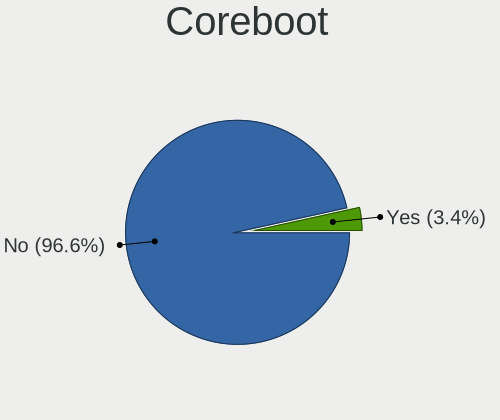
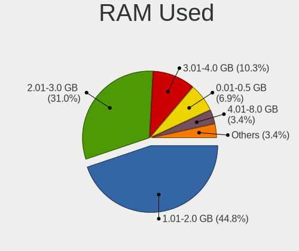
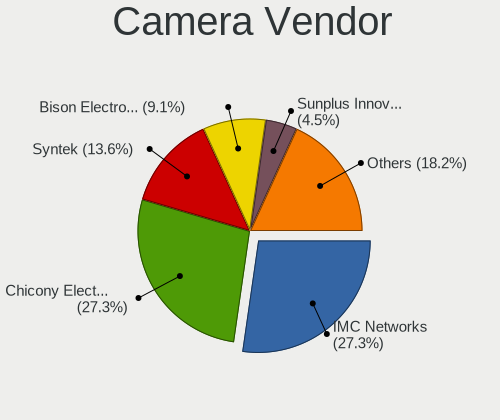

Xubuntu Hardware Trends (Notebooks)
-----------------------------------

A project to identify most popular hardware characteristics and track their change
over time based on data collected by Xubuntu users at https://Linux-Hardware.org.

Anyone can contribute to this report by the [hw-probe](https://github.com/linuxhw/hw-probe) tool:

    sudo -E hw-probe -all -upload

Full-feature report is available here: https://linux-hardware.org/?view=trends&formfactor=notebook

Period: Sep, 2021.

Contents
--------

* [ System ](#system)
  - [ OS                       ](#os)
  - [ OS Family                ](#os-family)
  - [ Kernel                   ](#kernel)
  - [ Kernel Family            ](#kernel-family)
  - [ Kernel Major Ver.        ](#kernel-major-ver)
  - [ Arch                     ](#arch)
  - [ DE                       ](#de)
  - [ Display Server           ](#display-server)
  - [ Display Manager          ](#display-manager)
  - [ OS Lang                  ](#os-lang)
  - [ Boot Mode                ](#boot-mode)
  - [ Filesystem               ](#filesystem)
  - [ Part. scheme             ](#part-scheme)
  - [ Dual Boot with Linux/BSD ](#dual-boot-with-linuxbsd)
  - [ Dual Boot (Win)          ](#dual-boot-win)

* [ Board ](#board)
  - [ Vendor                   ](#vendor)
  - [ Model                    ](#model)
  - [ Model Family             ](#model-family)
  - [ MFG Year                 ](#mfg-year)
  - [ Form Factor              ](#form-factor)
  - [ Secure Boot              ](#secure-boot)
  - [ Coreboot                 ](#coreboot)
  - [ RAM Size                 ](#ram-size)
  - [ RAM Used                 ](#ram-used)
  - [ Total Drives             ](#total-drives)
  - [ Has CD-ROM               ](#has-cd-rom)
  - [ Has Ethernet             ](#has-ethernet)
  - [ Has WiFi                 ](#has-wifi)
  - [ Has Bluetooth            ](#has-bluetooth)

* [ Location ](#location)
  - [ Country                  ](#country)
  - [ City                     ](#city)

* [ Drives ](#drives)
  - [ Drive Vendor             ](#drive-vendor)
  - [ Drive Model              ](#drive-model)
  - [ HDD Vendor               ](#hdd-vendor)
  - [ SSD Vendor               ](#ssd-vendor)
  - [ Drive Kind               ](#drive-kind)
  - [ Drive Connector          ](#drive-connector)
  - [ Drive Size               ](#drive-size)
  - [ Space Total              ](#space-total)
  - [ Space Used               ](#space-used)
  - [ Malfunc. Drives          ](#malfunc-drives)
  - [ Malfunc. Drive Vendor    ](#malfunc-drive-vendor)
  - [ Malfunc. HDD Vendor      ](#malfunc-hdd-vendor)
  - [ Malfunc. Drive Kind      ](#malfunc-drive-kind)
  - [ Failed Drives            ](#failed-drives)
  - [ Failed Drive Vendor      ](#failed-drive-vendor)
  - [ Drive Status             ](#drive-status)

* [ Storage controller ](#storage-controller)
  - [ Storage Vendor           ](#storage-vendor)
  - [ Storage Model            ](#storage-model)
  - [ Storage Kind             ](#storage-kind)

* [ Processor ](#processor)
  - [ CPU Vendor               ](#cpu-vendor)
  - [ CPU Model                ](#cpu-model)
  - [ CPU Model Family         ](#cpu-model-family)
  - [ CPU Cores                ](#cpu-cores)
  - [ CPU Sockets              ](#cpu-sockets)
  - [ CPU Threads              ](#cpu-threads)
  - [ CPU Op-Modes             ](#cpu-op-modes)
  - [ CPU Microcode            ](#cpu-microcode)
  - [ CPU Microarch            ](#cpu-microarch)

* [ Graphics ](#graphics)
  - [ GPU Vendor               ](#gpu-vendor)
  - [ GPU Model                ](#gpu-model)
  - [ GPU Combo                ](#gpu-combo)
  - [ GPU Driver               ](#gpu-driver)
  - [ GPU Memory               ](#gpu-memory)

* [ Monitor ](#monitor)
  - [ Monitor Vendor           ](#monitor-vendor)
  - [ Monitor Model            ](#monitor-model)
  - [ Monitor Resolution       ](#monitor-resolution)
  - [ Monitor Diagonal         ](#monitor-diagonal)
  - [ Monitor Width            ](#monitor-width)
  - [ Aspect Ratio             ](#aspect-ratio)
  - [ Monitor Area             ](#monitor-area)
  - [ Pixel Density            ](#pixel-density)
  - [ Multiple Monitors        ](#multiple-monitors)

* [ Network ](#network)
  - [ Net Controller Vendor    ](#net-controller-vendor)
  - [ Net Controller Model     ](#net-controller-model)
  - [ Wireless Vendor          ](#wireless-vendor)
  - [ Wireless Model           ](#wireless-model)
  - [ Ethernet Vendor          ](#ethernet-vendor)
  - [ Ethernet Model           ](#ethernet-model)
  - [ Net Controller Kind      ](#net-controller-kind)
  - [ Used Controller          ](#used-controller)
  - [ NICs                     ](#nics)
  - [ IPv6                     ](#ipv6)

* [ Bluetooth ](#bluetooth)
  - [ Bluetooth Vendor         ](#bluetooth-vendor)
  - [ Bluetooth Model          ](#bluetooth-model)

* [ Sound ](#sound)
  - [ Sound Vendor             ](#sound-vendor)
  - [ Sound Model              ](#sound-model)

* [ Memory ](#memory)
  - [ Memory Vendor            ](#memory-vendor)
  - [ Memory Model             ](#memory-model)
  - [ Memory Kind              ](#memory-kind)
  - [ Memory Form Factor       ](#memory-form-factor)
  - [ Memory Size              ](#memory-size)
  - [ Memory Speed             ](#memory-speed)

* [ Printers & scanners ](#printers--scanners)
  - [ Printer Vendor           ](#printer-vendor)
  - [ Printer Model            ](#printer-model)
  - [ Scanner Vendor           ](#scanner-vendor)
  - [ Scanner Model            ](#scanner-model)

* [ Camera ](#camera)
  - [ Camera Vendor            ](#camera-vendor)
  - [ Camera Model             ](#camera-model)

* [ Security ](#security)
  - [ Fingerprint Vendor       ](#fingerprint-vendor)
  - [ Fingerprint Model        ](#fingerprint-model)
  - [ Chipcard Vendor          ](#chipcard-vendor)
  - [ Chipcard Model           ](#chipcard-model)

* [ Unsupported ](#unsupported)
  - [ Unsupported Devices      ](#unsupported-devices)
  - [ Unsupported Device Types ](#unsupported-device-types)

System
------

OS
--

Installed operating systems

| Name          | Notebooks | Percent |
|---------------|-----------|---------|
| Xubuntu 20.04 | 35        | 61.4%   |
| Xubuntu 18.04 | 14        | 24.56%  |
| Xubuntu 21.04 | 5         | 8.77%   |
| Xubuntu 20.10 | 2         | 3.51%   |
| Xubuntu 21.10 | 1         | 1.75%   |

OS Family
---------

OS without a version

| Name    | Notebooks | Percent |
|---------|-----------|---------|
| Xubuntu | 57        | 100%    |

Kernel
------

Version of the Linux kernel

| Version               | Notebooks | Percent |
|-----------------------|-----------|---------|
| 5.11.0-34-generic     | 8         | 14.04%  |
| 5.11.0-27-generic     | 8         | 14.04%  |
| 5.4.0-81-generic      | 6         | 10.53%  |
| 5.4.0-84-generic      | 5         | 8.77%   |
| 5.8.0-63-generic      | 3         | 5.26%   |
| 5.4.0-86-generic      | 3         | 5.26%   |
| 5.11.0-36-generic     | 3         | 5.26%   |
| 5.11.0-34-lowlatency  | 3         | 5.26%   |
| 5.4.0-42-generic      | 2         | 3.51%   |
| 5.11.0-25-generic     | 2         | 3.51%   |
| 5.8.0-33-generic      | 1         | 1.75%   |
| 5.5.19-050519-generic | 1         | 1.75%   |
| 5.4.0-86-lowlatency   | 1         | 1.75%   |
| 5.4.0-81-lowlatency   | 1         | 1.75%   |
| 5.4.0-80-generic      | 1         | 1.75%   |
| 5.4.0-77-generic      | 1         | 1.75%   |
| 5.14.2-051402-generic | 1         | 1.75%   |
| 5.13.0-16-generic     | 1         | 1.75%   |
| 5.11.0-37-lowlatency  | 1         | 1.75%   |
| 5.11.0-31-generic     | 1         | 1.75%   |
| 5.11.0-27-lowlatency  | 1         | 1.75%   |
| 4.16.18-galliumos     | 1         | 1.75%   |
| 4.15.0-157-generic    | 1         | 1.75%   |
| 4.15.0-154-generic    | 1         | 1.75%   |

Kernel Family
-------------

Linux kernel without a distro release

| Version | Notebooks | Percent |
|---------|-----------|---------|
| 5.11.0  | 27        | 47.37%  |
| 5.4.0   | 20        | 35.09%  |
| 5.8.0   | 4         | 7.02%   |
| 4.15.0  | 2         | 3.51%   |
| 5.5.19  | 1         | 1.75%   |
| 5.14.2  | 1         | 1.75%   |
| 5.13.0  | 1         | 1.75%   |
| 4.16.18 | 1         | 1.75%   |

Kernel Major Ver.
-----------------

Linux kernel major version

| Version | Notebooks | Percent |
|---------|-----------|---------|
| 5.11    | 27        | 47.37%  |
| 5.4     | 20        | 35.09%  |
| 5.8     | 4         | 7.02%   |
| 4.15    | 2         | 3.51%   |
| 5.5     | 1         | 1.75%   |
| 5.14    | 1         | 1.75%   |
| 5.13    | 1         | 1.75%   |
| 4.16    | 1         | 1.75%   |

Arch
----

OS architecture (x86_64, i586, etc.)

| Name   | Notebooks | Percent |
|--------|-----------|---------|
| x86_64 | 48        | 84.21%  |
| i686   | 9         | 15.79%  |

DE
--

Desktop Environment

| Name | Notebooks | Percent |
|------|-----------|---------|
| XFCE | 56        | 98.25%  |
| i3   | 1         | 1.75%   |

Display Server
--------------

X11 or Wayland

| Name | Notebooks | Percent |
|------|-----------|---------|
| X11  | 56        | 98.25%  |
| Tty  | 1         | 1.75%   |

Display Manager
---------------

SDDM, LightDM, etc.

| Name    | Notebooks | Percent |
|---------|-----------|---------|
| LightDM | 31        | 54.39%  |
| Unknown | 24        | 42.11%  |
| LXDM    | 1         | 1.75%   |
| GDM3    | 1         | 1.75%   |

OS Lang
-------

Language

| Lang  | Notebooks | Percent |
|-------|-----------|---------|
| en_US | 26        | 45.61%  |
| de_DE | 7         | 12.28%  |
| hu_HU | 5         | 8.77%   |
| fr_FR | 3         | 5.26%   |
| pt_BR | 2         | 3.51%   |
| nb_NO | 2         | 3.51%   |
| it_IT | 2         | 3.51%   |
| es_ES | 2         | 3.51%   |
| en_IN | 2         | 3.51%   |
| sv_SE | 1         | 1.75%   |
| ru_RU | 1         | 1.75%   |
| nl_NL | 1         | 1.75%   |
| es_MX | 1         | 1.75%   |
| en_GB | 1         | 1.75%   |
| de_CH | 1         | 1.75%   |

Boot Mode
---------

EFI or BIOS

| Mode | Notebooks | Percent |
|------|-----------|---------|
| BIOS | 36        | 63.16%  |
| EFI  | 21        | 36.84%  |

Filesystem
----------

Type of filesystem

| Type    | Notebooks | Percent |
|---------|-----------|---------|
| Ext4    | 55        | 96.49%  |
| Xfs     | 1         | 1.75%   |
| Overlay | 1         | 1.75%   |

Part. scheme
------------

Scheme of partitioning

| Type    | Notebooks | Percent |
|---------|-----------|---------|
| Unknown | 33        | 57.89%  |
| MBR     | 14        | 24.56%  |
| GPT     | 10        | 17.54%  |

Dual Boot with Linux/BSD
------------------------

Hosting more than one Linux/BSD

| Dual boot | Notebooks | Percent |
|-----------|-----------|---------|
| No        | 54        | 94.74%  |
| Yes       | 3         | 5.26%   |

Dual Boot (Win)
---------------

Hosting Linux and Windows

| Dual boot | Notebooks | Percent |
|-----------|-----------|---------|
| No        | 42        | 73.68%  |
| Yes       | 15        | 26.32%  |

Board
-----

Vendor
------

Motherboard manufacturer

| Name                | Notebooks | Percent |
|---------------------|-----------|---------|
| Hewlett-Packard     | 21        | 36.84%  |
| Lenovo              | 10        | 17.54%  |
| Dell                | 8         | 14.04%  |
| ASUSTek Computer    | 5         | 8.77%   |
| Fujitsu Siemens     | 3         | 5.26%   |
| Samsung Electronics | 2         | 3.51%   |
| Acer                | 2         | 3.51%   |
| Toshiba             | 1         | 1.75%   |
| MSI                 | 1         | 1.75%   |
| Itautec             | 1         | 1.75%   |
| Gateway             | 1         | 1.75%   |
| Clevo               | 1         | 1.75%   |
| Apple               | 1         | 1.75%   |

Model
-----

Motherboard model

| Name                                                  | Notebooks | Percent |
|-------------------------------------------------------|-----------|---------|
| HP Notebook                                           | 3         | 5.26%   |
| Lenovo ThinkPad T14 Gen 2i 20W000AUGE                 | 2         | 3.51%   |
| Toshiba Satellite C55-A                               | 1         | 1.75%   |
| Samsung 300E5EV/300E4EV/270E5EV/270E4EV/2470EV/2470EE | 1         | 1.75%   |
| Samsung 300E4C/300E5C/300E7C                          | 1         | 1.75%   |
| MSI GF75 Thin 9SD                                     | 1         | 1.75%   |
| Lenovo ThinkPad X395 20NLS0J400                       | 1         | 1.75%   |
| Lenovo ThinkPad X1 Carbon 3rd 20BTS11W00              | 1         | 1.75%   |
| Lenovo ThinkPad T520 4243AP1                          | 1         | 1.75%   |
| Lenovo IdeaPad 500-15ACZ 80K4                         | 1         | 1.75%   |
| Lenovo IdeaPad 5 Pro 16ACH6 82L5                      | 1         | 1.75%   |
| Lenovo IdeaPad 110S-11IBR 80WG                        | 1         | 1.75%   |
| Lenovo G480 20150                                     | 1         | 1.75%   |
| Lenovo G460 0677                                      | 1         | 1.75%   |
| Itautec Infoway a7420                                 | 1         | 1.75%   |
| HP Stream Notebook PC 13                              | 1         | 1.75%   |
| HP Snappy                                             | 1         | 1.75%   |
| HP ProBook 4520s                                      | 1         | 1.75%   |
| HP ProBook 4510s                                      | 1         | 1.75%   |
| HP Pavilion Gaming Laptop 15-cx0xxx                   | 1         | 1.75%   |
| HP Pavilion dv6                                       | 1         | 1.75%   |
| HP Pavilion dv2500                                    | 1         | 1.75%   |
| HP Pavilion dm4                                       | 1         | 1.75%   |
| HP G60                                                | 1         | 1.75%   |
| HP EliteBook 850 G2                                   | 1         | 1.75%   |
| HP Compaq nx8220 (PG801ET#ABZ)                        | 1         | 1.75%   |
| HP Compaq CQ45                                        | 1         | 1.75%   |
| HP Compaq 6730b (GW687AV)                             | 1         | 1.75%   |
| HP Compaq 6710b (GB889ET#ABE)                         | 1         | 1.75%   |
| HP 620                                                | 1         | 1.75%   |
| HP 550                                                | 1         | 1.75%   |
| HP 15                                                 | 1         | 1.75%   |
| HP 14                                                 | 1         | 1.75%   |
| Gateway NV57H                                         | 1         | 1.75%   |
| Fujitsu Siemens AMILO Xi 3650                         | 1         | 1.75%   |
| Fujitsu Siemens AMILO PRO V3515                       | 1         | 1.75%   |
| Fujitsu Siemens AMILO Pa 1510                         | 1         | 1.75%   |
| Dell XPS 15 9560                                      | 1         | 1.75%   |
| Dell Vostro 1700                                      | 1         | 1.75%   |
| Dell Studio 1558                                      | 1         | 1.75%   |
| Dell Latitude E5530 non-vPro                          | 1         | 1.75%   |
| Dell Latitude E4310                                   | 1         | 1.75%   |
| Dell Latitude D630                                    | 1         | 1.75%   |
| Dell Inspiron 5577                                    | 1         | 1.75%   |
| Dell Inspiron 3437                                    | 1         | 1.75%   |
| Clevo W760SUB                                         | 1         | 1.75%   |
| ASUS VivoBook_ASUSLaptop X521IA_M533IA                | 1         | 1.75%   |
| ASUS T100HAN                                          | 1         | 1.75%   |
| ASUS K70AB                                            | 1         | 1.75%   |
| ASUS A6JC                                             | 1         | 1.75%   |
| ASUS 1215P                                            | 1         | 1.75%   |
| Apple MacBook9,1                                      | 1         | 1.75%   |
| Acer TravelMate 5310                                  | 1         | 1.75%   |
| Acer Aspire E1-772                                    | 1         | 1.75%   |

Model Family
------------

Motherboard model prefix

| Name                  | Notebooks | Percent |
|-----------------------|-----------|---------|
| Lenovo ThinkPad       | 5         | 8.77%   |
| HP Pavilion           | 4         | 7.02%   |
| HP Compaq             | 4         | 7.02%   |
| Lenovo IdeaPad        | 3         | 5.26%   |
| HP Notebook           | 3         | 5.26%   |
| Fujitsu Siemens AMILO | 3         | 5.26%   |
| Dell Latitude         | 3         | 5.26%   |
| HP ProBook            | 2         | 3.51%   |
| Dell Inspiron         | 2         | 3.51%   |
| Toshiba Satellite     | 1         | 1.75%   |
| Samsung 300E5EV       | 1         | 1.75%   |
| Samsung 300E4C        | 1         | 1.75%   |
| MSI GF75              | 1         | 1.75%   |
| Lenovo G480           | 1         | 1.75%   |
| Lenovo G460           | 1         | 1.75%   |
| Itautec Infoway       | 1         | 1.75%   |
| HP Stream             | 1         | 1.75%   |
| HP Snappy             | 1         | 1.75%   |
| HP G60                | 1         | 1.75%   |
| HP EliteBook          | 1         | 1.75%   |
| HP 620                | 1         | 1.75%   |
| HP 550                | 1         | 1.75%   |
| HP 15                 | 1         | 1.75%   |
| HP 14                 | 1         | 1.75%   |
| Gateway NV57H         | 1         | 1.75%   |
| Dell XPS              | 1         | 1.75%   |
| Dell Vostro           | 1         | 1.75%   |
| Dell Studio           | 1         | 1.75%   |
| Clevo W760SUB         | 1         | 1.75%   |
| ASUS VivoBook         | 1         | 1.75%   |
| ASUS T100HAN          | 1         | 1.75%   |
| ASUS K70AB            | 1         | 1.75%   |
| ASUS A6JC             | 1         | 1.75%   |
| ASUS 1215P            | 1         | 1.75%   |
| Apple MacBook9        | 1         | 1.75%   |
| Acer TravelMate       | 1         | 1.75%   |
| Acer Aspire           | 1         | 1.75%   |

MFG Year
--------

Motherboard manufacture year

| Year | Notebooks | Percent |
|------|-----------|---------|
| 2013 | 6         | 10.53%  |
| 2011 | 6         | 10.53%  |
| 2021 | 5         | 8.77%   |
| 2020 | 5         | 8.77%   |
| 2018 | 5         | 8.77%   |
| 2010 | 5         | 8.77%   |
| 2009 | 5         | 8.77%   |
| 2015 | 4         | 7.02%   |
| 2007 | 4         | 7.02%   |
| 2016 | 3         | 5.26%   |
| 2014 | 2         | 3.51%   |
| 2012 | 2         | 3.51%   |
| 2008 | 2         | 3.51%   |
| 2017 | 1         | 1.75%   |
| 2006 | 1         | 1.75%   |
| 2005 | 1         | 1.75%   |

Form Factor
-----------

Physical design of the computer

| Name     | Notebooks | Percent |
|----------|-----------|---------|
| Notebook | 57        | 100%    |

Secure Boot
-----------

Enabled or disabled

| State    | Notebooks | Percent |
|----------|-----------|---------|
| Disabled | 54        | 94.74%  |
| Enabled  | 3         | 5.26%   |

Coreboot
--------

Have coreboot on board

| Used | Notebooks | Percent |
|------|-----------|---------|
| No   | 56        | 98.25%  |
| Yes  | 1         | 1.75%   |

RAM Size
--------

Total RAM memory

| Size in GB  | Notebooks | Percent |
|-------------|-----------|---------|
| 4.01-8.0    | 17        | 29.82%  |
| 3.01-4.0    | 16        | 28.07%  |
| 1.01-2.0    | 8         | 14.04%  |
| 8.01-16.0   | 6         | 10.53%  |
| 2.01-3.0    | 4         | 7.02%   |
| 32.01-64.0  | 3         | 5.26%   |
| 24.01-32.0  | 1         | 1.75%   |
| 64.01-256.0 | 1         | 1.75%   |
| 0.51-1.0    | 1         | 1.75%   |

RAM Used
--------

Used RAM memory

| Used GB   | Notebooks | Percent |
|-----------|-----------|---------|
| 1.01-2.0  | 29        | 50.88%  |
| 0.51-1.0  | 13        | 22.81%  |
| 2.01-3.0  | 6         | 10.53%  |
| 3.01-4.0  | 5         | 8.77%   |
| 4.01-8.0  | 2         | 3.51%   |
| 8.01-16.0 | 1         | 1.75%   |
| 0.01-0.5  | 1         | 1.75%   |

Total Drives
------------

Number of drives on board

| Drives | Notebooks | Percent |
|--------|-----------|---------|
| 1      | 45        | 78.95%  |
| 2      | 12        | 21.05%  |

Has CD-ROM
----------

Has CD-ROM on board

| Presented | Notebooks | Percent |
|-----------|-----------|---------|
| Yes       | 36        | 63.16%  |
| No        | 21        | 36.84%  |

Has Ethernet
------------

Has Ethernet on board

| Presented | Notebooks | Percent |
|-----------|-----------|---------|
| Yes       | 48        | 84.21%  |
| No        | 9         | 15.79%  |

Has WiFi
--------

Has WiFi module

| Presented | Notebooks | Percent |
|-----------|-----------|---------|
| Yes       | 54        | 94.74%  |
| No        | 3         | 5.26%   |

Has Bluetooth
-------------

Has Bluetooth module

| Presented | Notebooks | Percent |
|-----------|-----------|---------|
| Yes       | 34        | 59.65%  |
| No        | 23        | 40.35%  |

Location
--------

Country
-------

Geographic location (country)

| Country     | Notebooks | Percent |
|-------------|-----------|---------|
| USA         | 11        | 19.3%   |
| Germany     | 9         | 15.79%  |
| Hungary     | 5         | 8.77%   |
| France      | 5         | 8.77%   |
| Netherlands | 3         | 5.26%   |
| Brazil      | 3         | 5.26%   |
| Spain       | 2         | 3.51%   |
| Norway      | 2         | 3.51%   |
| Italy       | 2         | 3.51%   |
| India       | 2         | 3.51%   |
| Austria     | 2         | 3.51%   |
| UAE         | 1         | 1.75%   |
| Turkey      | 1         | 1.75%   |
| Switzerland | 1         | 1.75%   |
| Sweden      | 1         | 1.75%   |
| Russia      | 1         | 1.75%   |
| Mexico      | 1         | 1.75%   |
| Kuwait      | 1         | 1.75%   |
| Indonesia   | 1         | 1.75%   |
| Costa Rica  | 1         | 1.75%   |
| Cabo Verde  | 1         | 1.75%   |
| Argentina   | 1         | 1.75%   |

City
----

Geographic location (city)

| City                 | Notebooks | Percent |
|----------------------|-----------|---------|
| Tatab??nya           | 2         | 3.51%   |
| Graz                 | 2         | 3.51%   |
| Wilmington           | 1         | 1.75%   |
| Wellington           | 1         | 1.75%   |
| W??rzburg            | 1         | 1.75%   |
| Vitr?©               | 1         | 1.75%   |
| Valparaiso           | 1         | 1.75%   |
| Tlaxcala City        | 1         | 1.75%   |
| Terrassa             | 1         | 1.75%   |
| Stuttgart            | 1         | 1.75%   |
| Solothurn            | 1         | 1.75%   |
| S??o Paulo           | 1         | 1.75%   |
| Sant'Omobono Terme   | 1         | 1.75%   |
| San Jos?©            | 1         | 1.75%   |
| San Diego            | 1         | 1.75%   |
| Salamanca            | 1         | 1.75%   |
| Saint Paul           | 1         | 1.75%   |
| Pune                 | 1         | 1.75%   |
| Princeton            | 1         | 1.75%   |
| Praia                | 1         | 1.75%   |
| Palermo              | 1         | 1.75%   |
| Osterholz-Scharmbeck | 1         | 1.75%   |
| Oslo                 | 1         | 1.75%   |
| OErbyhus             | 1         | 1.75%   |
| New Delhi            | 1         | 1.75%   |
| Nashville            | 1         | 1.75%   |
| Munich               | 1         | 1.75%   |
| Monte Alto           | 1         | 1.75%   |
| Marolles-en-Brie     | 1         | 1.75%   |
| Makkum               | 1         | 1.75%   |
| Leland               | 1         | 1.75%   |
| Le Mans              | 1         | 1.75%   |
| Kuwait City          | 1         | 1.75%   |
| Krasnodar            | 1         | 1.75%   |
| Kecskem?©t           | 1         | 1.75%   |
| Jakarta              | 1         | 1.75%   |
| Harstad              | 1         | 1.75%   |
| Grovetown            | 1         | 1.75%   |
| Gifhorn              | 1         | 1.75%   |
| Genoa                | 1         | 1.75%   |
| Frankfurt am Main    | 1         | 1.75%   |
| Fortaleza            | 1         | 1.75%   |
| Exeter               | 1         | 1.75%   |
| Dunaharaszti         | 1         | 1.75%   |
| Dresden              | 1         | 1.75%   |
| Dortmund             | 1         | 1.75%   |
| Clichy-sous-Bois     | 1         | 1.75%   |
| Budapest             | 1         | 1.75%   |
| Bristol              | 1         | 1.75%   |
| Brest                | 1         | 1.75%   |
| Braunschweig         | 1         | 1.75%   |
| Ankara               | 1         | 1.75%   |
| Amsterdam            | 1         | 1.75%   |
| Abu Dhabi            | 1         | 1.75%   |
| Unknown              | 1         | 1.75%   |

Drives
------

Drive Vendor
------------

Hard drive vendors

| Vendor              | Notebooks | Drives | Percent |
|---------------------|-----------|--------|---------|
| Seagate             | 11        | 11     | 17.19%  |
| Toshiba             | 8         | 8      | 12.5%   |
| Samsung Electronics | 8         | 8      | 12.5%   |
| Unknown             | 7         | 8      | 10.94%  |
| Hitachi             | 6         | 6      | 9.38%   |
| WDC                 | 5         | 5      | 7.81%   |
| Fujitsu             | 4         | 4      | 6.25%   |
| Intel               | 3         | 3      | 4.69%   |
| Kingston            | 2         | 3      | 3.13%   |
| Crucial             | 2         | 2      | 3.13%   |
| A-DATA Technology   | 2         | 2      | 3.13%   |
| SK Hynix            | 1         | 1      | 1.56%   |
| Micron Technology   | 1         | 1      | 1.56%   |
| LITEONIT            | 1         | 1      | 1.56%   |
| HGST                | 1         | 1      | 1.56%   |
| China               | 1         | 1      | 1.56%   |
| Apple               | 1         | 2      | 1.56%   |

Drive Model
-----------

Hard drive models

| Model                                    | Notebooks | Percent |
|------------------------------------------|-----------|---------|
| Toshiba MQ01ABD075 752GB                 | 2         | 2.99%   |
| Toshiba KXG6AZNV1T02 1TB                 | 2         | 2.99%   |
| Seagate ST500LT012-1DG142 500GB          | 2         | 2.99%   |
| Hitachi HTS547550A9E384 500GB            | 2         | 2.99%   |
| WDC WDS500G2B0C-00PXH0 500GB             | 1         | 1.49%   |
| WDC WDS500G2B0A-00SM50 500GB SSD         | 1         | 1.49%   |
| WDC WD5000LPCX-60VHAT0 500GB             | 1         | 1.49%   |
| WDC WD1600BEVT-60ZCT1 160GB              | 1         | 1.49%   |
| WDC WD10JPCX-24UE4T0 1TB                 | 1         | 1.49%   |
| Unknown SA08G  8GB                       | 1         | 1.49%   |
| Unknown MMC Card  67GB                   | 1         | 1.49%   |
| Unknown MMC Card  64GB                   | 1         | 1.49%   |
| Unknown MMC Card  33GB                   | 1         | 1.49%   |
| Unknown DA4032  32GB                     | 1         | 1.49%   |
| Unknown C2S3T/240G 240GB SSD             | 1         | 1.49%   |
| Unknown BGND3R  32GB                     | 1         | 1.49%   |
| Unknown 00000  64GB                      | 1         | 1.49%   |
| Toshiba MQ01ABF032 320GB                 | 1         | 1.49%   |
| Toshiba MQ01ABD100 1TB                   | 1         | 1.49%   |
| Toshiba MK7559GSXP 752GB                 | 1         | 1.49%   |
| Toshiba MK2035GSS 200GB                  | 1         | 1.49%   |
| SK Hynix NVMe SSD Drive 1024GB           | 1         | 1.49%   |
| Seagate ST980811AS 80GB                  | 1         | 1.49%   |
| Seagate ST9500423AS 500GB                | 1         | 1.49%   |
| Seagate ST9250827AS 250GB                | 1         | 1.49%   |
| Seagate ST9250315AS 250GB                | 1         | 1.49%   |
| Seagate ST2000LX001-1RG174 2TB           | 1         | 1.49%   |
| Seagate ST2000LM007-1R8174 2TB           | 1         | 1.49%   |
| Seagate ST1000LM049-2GH172 1TB           | 1         | 1.49%   |
| Seagate ST1000LM035-1RK172 1TB           | 1         | 1.49%   |
| Seagate ST1000LM024 HN-M101MBB 1TB       | 1         | 1.49%   |
| Samsung SSD 850 EVO 250GB                | 1         | 1.49%   |
| Samsung NVMe SSD Drive 1024GB            | 1         | 1.49%   |
| Samsung MZVLB512HBJQ-000L7 512GB         | 1         | 1.49%   |
| Samsung MZNTY256HDHP-000L2 256GB SSD     | 1         | 1.49%   |
| Samsung MZNTE128HMGR-000L1 128GB SSD     | 1         | 1.49%   |
| Samsung HN-M500MBB 500GB                 | 1         | 1.49%   |
| Samsung HM251HI 250GB                    | 1         | 1.49%   |
| Samsung HM160HC 160GB                    | 1         | 1.49%   |
| Micron MTFDDAK256TBN-1AR1ZABHA 256GB SSD | 1         | 1.49%   |
| LITEONIT LCS-128M6S 128GB SSD            | 1         | 1.49%   |
| Kingston SA400S37480G 480GB SSD          | 1         | 1.49%   |
| Kingston NVMe SSD Drive 512GB            | 1         | 1.49%   |
| Kingston NVMe SSD Drive 250GB            | 1         | 1.49%   |
| Intel SSDSC2CW240A3 240GB                | 1         | 1.49%   |
| Intel SSDSC2CW120A3 120GB                | 1         | 1.49%   |
| Intel SSDSC2BF180A4H 180GB               | 1         | 1.49%   |
| Hitachi HTS545032B9A300 320GB            | 1         | 1.49%   |
| Hitachi HTS543232A7A384 320GB            | 1         | 1.49%   |
| Hitachi HTS543225L9A300 250GB            | 1         | 1.49%   |
| Hitachi HTS541680J9AT00 80GB             | 1         | 1.49%   |
| HGST HTS721010A9E630 1TB                 | 1         | 1.49%   |
| Fujitsu MHZ2500BT G1 500GB               | 1         | 1.49%   |
| Fujitsu MHZ2320BH G2 320GB               | 1         | 1.49%   |
| Fujitsu MHZ2160BJ FFS G2 160GB           | 1         | 1.49%   |
| Fujitsu MHZ2160BH G2 160GB               | 1         | 1.49%   |
| Crucial CT500MX500SSD1 500GB             | 1         | 1.49%   |
| Crucial CT120M500SSD1 120GB              | 1         | 1.49%   |
| China SSD 120GB                          | 1         | 1.49%   |
| Apple NVMe SSD Drive 8KB                 | 1         | 1.49%   |

HDD Vendor
----------

Hard disk drive vendors

| Vendor              | Notebooks | Drives | Percent |
|---------------------|-----------|--------|---------|
| Seagate             | 11        | 11     | 32.35%  |
| Toshiba             | 6         | 6      | 17.65%  |
| Hitachi             | 6         | 6      | 17.65%  |
| Fujitsu             | 4         | 4      | 11.76%  |
| WDC                 | 3         | 3      | 8.82%   |
| Samsung Electronics | 3         | 3      | 8.82%   |
| HGST                | 1         | 1      | 2.94%   |

SSD Vendor
----------

Solid state drive vendors

| Vendor              | Notebooks | Drives | Percent |
|---------------------|-----------|--------|---------|
| Samsung Electronics | 3         | 3      | 20%     |
| Intel               | 3         | 3      | 20%     |
| Crucial             | 2         | 2      | 13.33%  |
| WDC                 | 1         | 1      | 6.67%   |
| Unknown             | 1         | 1      | 6.67%   |
| Micron Technology   | 1         | 1      | 6.67%   |
| LITEONIT            | 1         | 1      | 6.67%   |
| Kingston            | 1         | 1      | 6.67%   |
| China               | 1         | 1      | 6.67%   |
| A-DATA Technology   | 1         | 1      | 6.67%   |

Drive Kind
----------

HDD or SSD

| Kind | Notebooks | Drives | Percent |
|------|-----------|--------|---------|
| HDD  | 34        | 34     | 53.97%  |
| SSD  | 14        | 15     | 22.22%  |
| NVMe | 9         | 11     | 14.29%  |
| MMC  | 6         | 7      | 9.52%   |

Drive Connector
---------------

SATA, SAS, NVMe, etc.

| Type | Notebooks | Drives | Percent |
|------|-----------|--------|---------|
| SATA | 47        | 49     | 75.81%  |
| NVMe | 9         | 11     | 14.52%  |
| MMC  | 6         | 7      | 9.68%   |

Drive Size
----------

Size of hard drive

| Size in TB | Notebooks | Drives | Percent |
|------------|-----------|--------|---------|
| 0.01-0.5   | 36        | 38     | 76.6%   |
| 0.51-1.0   | 9         | 9      | 19.15%  |
| 1.01-2.0   | 2         | 2      | 4.26%   |

Space Total
-----------

Amount of disk space available on the file system

| Size in GB | Notebooks | Percent |
|------------|-----------|---------|
| 101-250    | 20        | 35.09%  |
| 251-500    | 15        | 26.32%  |
| 501-1000   | 10        | 17.54%  |
| 51-100     | 7         | 12.28%  |
| 21-50      | 2         | 3.51%   |
| 2001-3000  | 1         | 1.75%   |
| 1001-2000  | 1         | 1.75%   |
| Unknown    | 1         | 1.75%   |

Space Used
----------

Amount of used disk space

| Used GB  | Notebooks | Percent |
|----------|-----------|---------|
| 1-20     | 24        | 42.11%  |
| 21-50    | 14        | 24.56%  |
| 101-250  | 7         | 12.28%  |
| 251-500  | 4         | 7.02%   |
| 51-100   | 4         | 7.02%   |
| 501-1000 | 3         | 5.26%   |
| Unknown  | 1         | 1.75%   |

Malfunc. Drives
---------------

Drive models with a malfunction

| Model                              | Notebooks | Drives | Percent |
|------------------------------------|-----------|--------|---------|
| Toshiba MQ01ABD100 1TB             | 1         | 1      | 11.11%  |
| Seagate ST980811AS 80GB            | 1         | 1      | 11.11%  |
| Seagate ST1000LM049-2GH172 1TB     | 1         | 1      | 11.11%  |
| Seagate ST1000LM024 HN-M101MBB 1TB | 1         | 1      | 11.11%  |
| Hitachi HTS547550A9E384 500GB      | 1         | 1      | 11.11%  |
| Hitachi HTS545032B9A300 320GB      | 1         | 1      | 11.11%  |
| Fujitsu MHZ2320BH G2 320GB         | 1         | 1      | 11.11%  |
| Fujitsu MHZ2160BJ FFS G2 160GB     | 1         | 1      | 11.11%  |
| Crucial CT120M500SSD1 120GB        | 1         | 1      | 11.11%  |

Malfunc. Drive Vendor
---------------------

Vendors of faulty drives

| Vendor  | Notebooks | Drives | Percent |
|---------|-----------|--------|---------|
| Seagate | 3         | 3      | 33.33%  |
| Hitachi | 2         | 2      | 22.22%  |
| Fujitsu | 2         | 2      | 22.22%  |
| Toshiba | 1         | 1      | 11.11%  |
| Crucial | 1         | 1      | 11.11%  |

Malfunc. HDD Vendor
-------------------

Vendors of faulty HDD drives

| Vendor  | Notebooks | Drives | Percent |
|---------|-----------|--------|---------|
| Seagate | 3         | 3      | 37.5%   |
| Hitachi | 2         | 2      | 25%     |
| Fujitsu | 2         | 2      | 25%     |
| Toshiba | 1         | 1      | 12.5%   |

Malfunc. Drive Kind
-------------------

Kinds of faulty drives

| Kind | Notebooks | Drives | Percent |
|------|-----------|--------|---------|
| HDD  | 8         | 8      | 88.89%  |
| SSD  | 1         | 1      | 11.11%  |

Failed Drives
-------------

Failed drive models

Zero info for selected period =(

Failed Drive Vendor
-------------------

Failed drive vendors

Zero info for selected period =(

Drive Status
------------

Number of failed and malfunc. drives

| Status   | Notebooks | Drives | Percent |
|----------|-----------|--------|---------|
| Detected | 37        | 43     | 62.71%  |
| Works    | 13        | 15     | 22.03%  |
| Malfunc  | 9         | 9      | 15.25%  |

Storage controller
------------------

Storage Vendor
--------------

Storage controller vendors

| Vendor                           | Notebooks | Percent |
|----------------------------------|-----------|---------|
| Intel                            | 37        | 62.71%  |
| AMD                              | 11        | 18.64%  |
| Toshiba America Info Systems     | 2         | 3.39%   |
| Samsung Electronics              | 2         | 3.39%   |
| VIA Technologies                 | 1         | 1.69%   |
| SK Hynix                         | 1         | 1.69%   |
| Silicon Integrated Systems [SiS] | 1         | 1.69%   |
| Sandisk                          | 1         | 1.69%   |
| Realtek Semiconductor            | 1         | 1.69%   |
| Kingston Technology Company      | 1         | 1.69%   |
| Apple                            | 1         | 1.69%   |

Storage Model
-------------

Storage controller models

| Model                                                                            | Notebooks | Percent |
|----------------------------------------------------------------------------------|-----------|---------|
| AMD FCH SATA Controller [AHCI mode]                                              | 8         | 10.96%  |
| Intel 82801HM/HEM (ICH8M/ICH8M-E) IDE Controller                                 | 5         | 6.85%   |
| Intel 82801HM/HEM (ICH8M/ICH8M-E) SATA Controller [AHCI mode]                    | 4         | 5.48%   |
| Intel 82801IBM/IEM (ICH9M/ICH9M-E) 4 port SATA Controller [AHCI mode]            | 3         | 4.11%   |
| Intel 82801 Mobile SATA Controller [RAID mode]                                   | 3         | 4.11%   |
| Intel 7 Series Chipset Family 6-port SATA Controller [AHCI mode]                 | 3         | 4.11%   |
| Toshiba America Info Systems XG6 NVMe SSD Controller                             | 2         | 2.74%   |
| Samsung NVMe SSD Controller SM981/PM981/PM983                                    | 2         | 2.74%   |
| Intel Wildcat Point-LP SATA Controller [AHCI Mode]                               | 2         | 2.74%   |
| Intel HM170/QM170 Chipset SATA Controller [AHCI Mode]                            | 2         | 2.74%   |
| Intel Cannon Lake Mobile PCH SATA AHCI Controller                                | 2         | 2.74%   |
| Intel Atom/Celeron/Pentium Processor x5-E8000/J3xxx/N3xxx Series SATA Controller | 2         | 2.74%   |
| Intel 82801G (ICH7 Family) IDE Controller                                        | 2         | 2.74%   |
| Intel 8 Series/C220 Series Chipset Family 6-port SATA Controller 1 [AHCI mode]   | 2         | 2.74%   |
| Intel 6 Series/C200 Series Chipset Family 6 port Mobile SATA AHCI Controller     | 2         | 2.74%   |
| Intel 5 Series/3400 Series Chipset 4 port SATA IDE Controller                    | 2         | 2.74%   |
| Intel 5 Series/3400 Series Chipset 2 port SATA IDE Controller                    | 2         | 2.74%   |
| AMD SB7x0/SB8x0/SB9x0 SATA Controller [AHCI mode]                                | 2         | 2.74%   |
| VIA VT82C586A/B/VT82C686/A/B/VT823x/A/C PIPC Bus Master IDE                      | 1         | 1.37%   |
| VIA VT8237A SATA 2-Port Controller                                               | 1         | 1.37%   |
| SK Hynix PC300 NVMe Solid State Drive 1TB                                        | 1         | 1.37%   |
| Silicon Integrated Systems [SiS] SATA Controller / IDE mode                      | 1         | 1.37%   |
| Sandisk WD Blue SN550 NVMe SSD                                                   | 1         | 1.37%   |
| Realtek Realtek Non-Volatile memory controller                                   | 1         | 1.37%   |
| Kingston Company Company Non-Volatile memory controller                          | 1         | 1.37%   |
| Kingston Company A2000 NVMe SSD                                                  | 1         | 1.37%   |
| Intel NM10/ICH7 Family SATA Controller [AHCI mode]                               | 1         | 1.37%   |
| Intel 82801IBM/IEM (ICH9M/ICH9M-E) 2 port SATA Controller [IDE mode]             | 1         | 1.37%   |
| Intel 82801HM/HEM (ICH8M/ICH8M-E) SATA Controller [IDE mode]                     | 1         | 1.37%   |
| Intel 82801GBM/GHM (ICH7-M Family) SATA Controller [AHCI mode]                   | 1         | 1.37%   |
| Intel 82801FB/FBM/FR/FW/FRW (ICH6 Family) IDE Controller                         | 1         | 1.37%   |
| Intel 8 Series SATA Controller 1 [AHCI mode]                                     | 1         | 1.37%   |
| Intel 7 Series Chipset Family 4-port SATA Controller [IDE mode]                  | 1         | 1.37%   |
| Intel 7 Series Chipset Family 2-port SATA Controller [IDE mode]                  | 1         | 1.37%   |
| Intel 5 Series/3400 Series Chipset 6 port SATA AHCI Controller                   | 1         | 1.37%   |
| Intel 5 Series/3400 Series Chipset 4 port SATA AHCI Controller                   | 1         | 1.37%   |
| Apple S3X NVMe Controller                                                        | 1         | 1.37%   |
| AMD SB7x0/SB8x0/SB9x0 IDE Controller                                             | 1         | 1.37%   |
| AMD IXP SB4x0 Serial ATA Controller                                              | 1         | 1.37%   |
| AMD IXP SB4x0 IDE Controller                                                     | 1         | 1.37%   |
| AMD FCH IDE Controller                                                           | 1         | 1.37%   |

Storage Kind
------------

Kind of storage controller (IDE, SATA, NVMe, SAS, ...)

| Kind | Notebooks | Percent |
|------|-----------|---------|
| SATA | 37        | 56.06%  |
| IDE  | 17        | 25.76%  |
| NVMe | 9         | 13.64%  |
| RAID | 3         | 4.55%   |

Processor
---------

CPU Vendor
----------

Processor vendors

| Vendor | Notebooks | Percent |
|--------|-----------|---------|
| Intel  | 45        | 78.95%  |
| AMD    | 12        | 21.05%  |

CPU Model
---------

Processor models

| Model                                           | Notebooks | Percent |
|-------------------------------------------------|-----------|---------|
| Intel Core i7-7700HQ CPU @ 2.80GHz              | 2         | 3.51%   |
| Intel Core i3-3120M CPU @ 2.50GHz               | 2         | 3.51%   |
| Intel Core 2 Duo CPU T7300 @ 2.00GHz            | 2         | 3.51%   |
| Intel 11th Gen Core i7-1165G7 @ 2.80GHz         | 2         | 3.51%   |
| Intel Pentium M processor 1.73GHz               | 1         | 1.75%   |
| Intel Pentium Dual-Core CPU T4500 @ 2.30GHz     | 1         | 1.75%   |
| Intel Pentium Dual-Core CPU T4200 @ 2.00GHz     | 1         | 1.75%   |
| Intel Pentium CPU N3710 @ 1.60GHz               | 1         | 1.75%   |
| Intel Genuine CPU T2400 @ 1.83GHz               | 1         | 1.75%   |
| Intel Core m5-6Y54 CPU @ 1.10GHz                | 1         | 1.75%   |
| Intel Core i7-9750H CPU @ 2.60GHz               | 1         | 1.75%   |
| Intel Core i7-5600U CPU @ 2.60GHz               | 1         | 1.75%   |
| Intel Core i5-8300H CPU @ 2.30GHz               | 1         | 1.75%   |
| Intel Core i5-5300U CPU @ 2.30GHz               | 1         | 1.75%   |
| Intel Core i5-4200U CPU @ 1.60GHz               | 1         | 1.75%   |
| Intel Core i5-4200M CPU @ 2.50GHz               | 1         | 1.75%   |
| Intel Core i5-3230M CPU @ 2.60GHz               | 1         | 1.75%   |
| Intel Core i5-2520M CPU @ 2.50GHz               | 1         | 1.75%   |
| Intel Core i5-2450M CPU @ 2.50GHz               | 1         | 1.75%   |
| Intel Core i5-2410M CPU @ 2.30GHz               | 1         | 1.75%   |
| Intel Core i5 CPU M 540 @ 2.53GHz               | 1         | 1.75%   |
| Intel Core i5 CPU M 520 @ 2.40GHz               | 1         | 1.75%   |
| Intel Core i5 CPU M 450 @ 2.40GHz               | 1         | 1.75%   |
| Intel Core i3-4000M CPU @ 2.40GHz               | 1         | 1.75%   |
| Intel Core i3-3110M CPU @ 2.40GHz               | 1         | 1.75%   |
| Intel Core i3-2310M CPU @ 2.10GHz               | 1         | 1.75%   |
| Intel Core i3 CPU M 370 @ 2.40GHz               | 1         | 1.75%   |
| Intel Core Duo CPU T2350 @ 1.86GHz              | 1         | 1.75%   |
| Intel Core 2 Duo CPU T8300 @ 2.40GHz            | 1         | 1.75%   |
| Intel Core 2 Duo CPU T6670 @ 2.20GHz            | 1         | 1.75%   |
| Intel Core 2 Duo CPU T6570 @ 2.10GHz            | 1         | 1.75%   |
| Intel Core 2 Duo CPU T5250 @ 1.50GHz            | 1         | 1.75%   |
| Intel Core 2 Duo CPU P8600 @ 2.40GHz            | 1         | 1.75%   |
| Intel Core 2 Duo CPU P8400 @ 2.26GHz            | 1         | 1.75%   |
| Intel Celeron M CPU 520 @ 1.60GHz               | 1         | 1.75%   |
| Intel Celeron CPU N3350 @ 1.10GHz               | 1         | 1.75%   |
| Intel Celeron CPU N3060 @ 1.60GHz               | 1         | 1.75%   |
| Intel Celeron CPU N3050 @ 1.60GHz               | 1         | 1.75%   |
| Intel Celeron CPU 550 @ 2.00GHz                 | 1         | 1.75%   |
| Intel Atom x5-Z8500 CPU @ 1.44GHz               | 1         | 1.75%   |
| Intel Atom CPU N550 @ 1.50GHz                   | 1         | 1.75%   |
| AMD Turion 64 X2 Mobile Technology TL-64        | 1         | 1.75%   |
| AMD Ryzen 9 5900HX with Radeon Graphics         | 1         | 1.75%   |
| AMD Ryzen 7 PRO 3700U w/ Radeon Vega Mobile Gfx | 1         | 1.75%   |
| AMD Ryzen 7 4700U with Radeon Graphics          | 1         | 1.75%   |
| AMD E-300 APU with Radeon HD Graphics           | 1         | 1.75%   |
| AMD C-60                                        | 1         | 1.75%   |
| AMD Athlon X2 Dual-Core QL-64                   | 1         | 1.75%   |
| AMD A8-8600P Radeon R6, 10 Compute Cores 4C+6G  | 1         | 1.75%   |
| AMD A8-6410 APU with AMD Radeon R5 Graphics     | 1         | 1.75%   |
| AMD A6-7310 APU with AMD Radeon R4 Graphics     | 1         | 1.75%   |
| AMD A6-5200 APU with Radeon HD Graphics         | 1         | 1.75%   |
| AMD A6-3420M APU with Radeon HD Graphics        | 1         | 1.75%   |

CPU Model Family
----------------

Processor model prefix

| Model                   | Notebooks | Percent |
|-------------------------|-----------|---------|
| Intel Core i5           | 11        | 19.3%   |
| Intel Core 2 Duo        | 8         | 14.04%  |
| Intel Core i3           | 6         | 10.53%  |
| Intel Core i7           | 4         | 7.02%   |
| Intel Celeron           | 4         | 7.02%   |
| AMD A6                  | 3         | 5.26%   |
| Other                   | 2         | 3.51%   |
| Intel Pentium Dual-Core | 2         | 3.51%   |
| Intel Atom              | 2         | 3.51%   |
| AMD A8                  | 2         | 3.51%   |
| Intel Pentium M         | 1         | 1.75%   |
| Intel Pentium           | 1         | 1.75%   |
| Intel Genuine           | 1         | 1.75%   |
| Intel Core m5           | 1         | 1.75%   |
| Intel Core Duo          | 1         | 1.75%   |
| Intel Celeron M         | 1         | 1.75%   |
| AMD Turion 64 X2 Mobile | 1         | 1.75%   |
| AMD Ryzen 9             | 1         | 1.75%   |
| AMD Ryzen 7 PRO         | 1         | 1.75%   |
| AMD Ryzen 7             | 1         | 1.75%   |
| AMD E                   | 1         | 1.75%   |
| AMD C-60                | 1         | 1.75%   |
| AMD Athlon X2           | 1         | 1.75%   |

CPU Cores
---------

Number of processor cores

| Number | Notebooks | Percent |
|--------|-----------|---------|
| 2      | 39        | 68.42%  |
| 4      | 12        | 21.05%  |
| 1      | 3         | 5.26%   |
| 8      | 2         | 3.51%   |
| 6      | 1         | 1.75%   |

CPU Sockets
-----------

Number of sockets

| Number | Notebooks | Percent |
|--------|-----------|---------|
| 1      | 57        | 100%    |

CPU Threads
-----------

Threads per core (Hyper-Threading)

| Number | Notebooks | Percent |
|--------|-----------|---------|
| 1      | 29        | 50.88%  |
| 2      | 28        | 49.12%  |

CPU Op-Modes
------------

CPU Operation Modes (32-bit, 64-bit)

| Op mode        | Notebooks | Percent |
|----------------|-----------|---------|
| 32-bit, 64-bit | 54        | 94.74%  |
| 32-bit         | 3         | 5.26%   |

CPU Microcode
-------------

Microcode number

| Number     | Notebooks | Percent |
|------------|-----------|---------|
| Unknown    | 10        | 17.54%  |
| 0x206a7    | 4         | 7.02%   |
| 0x1067a    | 4         | 7.02%   |
| 0x306a9    | 3         | 5.26%   |
| 0x806c1    | 2         | 3.51%   |
| 0x6fa      | 2         | 3.51%   |
| 0x406c3    | 2         | 3.51%   |
| 0x306d4    | 2         | 3.51%   |
| 0x306c3    | 2         | 3.51%   |
| 0x20652    | 2         | 3.51%   |
| 0x10676    | 2         | 3.51%   |
| 0x05000119 | 2         | 3.51%   |
| 0x906ea    | 1         | 1.75%   |
| 0x906e9    | 1         | 1.75%   |
| 0x6f6      | 1         | 1.75%   |
| 0x6ec      | 1         | 1.75%   |
| 0x6e8      | 1         | 1.75%   |
| 0x6d8      | 1         | 1.75%   |
| 0x506c9    | 1         | 1.75%   |
| 0x406e3    | 1         | 1.75%   |
| 0x406c4    | 1         | 1.75%   |
| 0x40651    | 1         | 1.75%   |
| 0x20655    | 1         | 1.75%   |
| 0x106ca    | 1         | 1.75%   |
| 0x10661    | 1         | 1.75%   |
| 0x0a50000c | 1         | 1.75%   |
| 0x08108102 | 1         | 1.75%   |
| 0x07030106 | 1         | 1.75%   |
| 0x0700010f | 1         | 1.75%   |
| 0x06006110 | 1         | 1.75%   |
| 0x03000027 | 1         | 1.75%   |
| 0x02000057 | 1         | 1.75%   |

CPU Microarch
-------------

Microarchitecture

| Name            | Notebooks | Percent |
|-----------------|-----------|---------|
| Penryn          | 7         | 12.28%  |
| Core            | 5         | 8.77%   |
| Westmere        | 4         | 7.02%   |
| Silvermont      | 4         | 7.02%   |
| SandyBridge     | 4         | 7.02%   |
| KabyLake        | 4         | 7.02%   |
| IvyBridge       | 4         | 7.02%   |
| P6              | 3         | 5.26%   |
| Haswell         | 3         | 5.26%   |
| TigerLake       | 2         | 3.51%   |
| Puma            | 2         | 3.51%   |
| Broadwell       | 2         | 3.51%   |
| Bobcat          | 2         | 3.51%   |
| Zen+            | 1         | 1.75%   |
| Zen 3           | 1         | 1.75%   |
| Zen 2           | 1         | 1.75%   |
| Skylake         | 1         | 1.75%   |
| K8 Hammer       | 1         | 1.75%   |
| K8 & K10 hybrid | 1         | 1.75%   |
| K10 Llano       | 1         | 1.75%   |
| Jaguar          | 1         | 1.75%   |
| Goldmont        | 1         | 1.75%   |
| Excavator       | 1         | 1.75%   |
| Bonnell         | 1         | 1.75%   |

Graphics
--------

GPU Vendor
----------

Vendors of graphics cards

| Vendor           | Notebooks | Percent |
|------------------|-----------|---------|
| Intel            | 40        | 61.54%  |
| AMD              | 14        | 21.54%  |
| Nvidia           | 10        | 15.38%  |
| VIA Technologies | 1         | 1.54%   |

GPU Model
---------

Graphics card models

| Model                                                                                    | Notebooks | Percent |
|------------------------------------------------------------------------------------------|-----------|---------|
| Intel Mobile 4 Series Chipset Integrated Graphics Controller                             | 5         | 7.14%   |
| Intel Core Processor Integrated Graphics Controller                                      | 4         | 5.71%   |
| Intel Atom/Celeron/Pentium Processor x5-E8000/J3xxx/N3xxx Integrated Graphics Controller | 4         | 5.71%   |
| Intel 3rd Gen Core processor Graphics Controller                                         | 4         | 5.71%   |
| Intel 2nd Generation Core Processor Family Integrated Graphics Controller                | 4         | 5.71%   |
| Intel Mobile GM965/GL960 Integrated Graphics Controller (secondary)                      | 3         | 4.29%   |
| Intel Mobile GM965/GL960 Integrated Graphics Controller (primary)                        | 3         | 4.29%   |
| Nvidia GP107M [GeForce GTX 1050 Mobile]                                                  | 2         | 2.86%   |
| Intel TigerLake-LP GT2 [Iris Xe Graphics]                                                | 2         | 2.86%   |
| Intel HD Graphics 630                                                                    | 2         | 2.86%   |
| Intel HD Graphics 5500                                                                   | 2         | 2.86%   |
| Intel CoffeeLake-H GT2 [UHD Graphics 630]                                                | 2         | 2.86%   |
| Intel 4th Gen Core Processor Integrated Graphics Controller                              | 2         | 2.86%   |
| AMD Mullins [Radeon R4/R5 Graphics]                                                      | 2         | 2.86%   |
| VIA Technologies CN896/VN896/P4M900 [Chrome 9 HC]                                        | 1         | 1.43%   |
| Nvidia TU116M [GeForce GTX 1660 Ti Mobile]                                               | 1         | 1.43%   |
| Nvidia GT218M [GeForce 310M]                                                             | 1         | 1.43%   |
| Nvidia GP107M [GeForce GTX 1050 Ti Mobile]                                               | 1         | 1.43%   |
| Nvidia GF117M [GeForce 610M/710M/810M/820M / GT 620M/625M/630M/720M]                     | 1         | 1.43%   |
| Nvidia GF108M [GeForce GT 540M]                                                          | 1         | 1.43%   |
| Nvidia GA107M [GeForce RTX 3050 Mobile]                                                  | 1         | 1.43%   |
| Nvidia G84M [GeForce 8600M GT]                                                           | 1         | 1.43%   |
| Nvidia G72M [Quadro NVS 110M/GeForce Go 7300]                                            | 1         | 1.43%   |
| Intel Mobile GME965/GLE960 Integrated Graphics Controller                                | 1         | 1.43%   |
| Intel Mobile 945GM/GMS/GME, 943/940GML Express Integrated Graphics Controller            | 1         | 1.43%   |
| Intel Mobile 945GM/GMS, 943/940GML Express Integrated Graphics Controller                | 1         | 1.43%   |
| Intel HD Graphics 515                                                                    | 1         | 1.43%   |
| Intel HD Graphics 500                                                                    | 1         | 1.43%   |
| Intel Haswell-ULT Integrated Graphics Controller                                         | 1         | 1.43%   |
| Intel Atom Processor D4xx/D5xx/N4xx/N5xx Integrated Graphics Controller                  | 1         | 1.43%   |
| AMD Wrestler [Radeon HD 6310]                                                            | 1         | 1.43%   |
| AMD Wrestler [Radeon HD 6290]                                                            | 1         | 1.43%   |
| AMD Wani [Radeon R5/R6/R7 Graphics]                                                      | 1         | 1.43%   |
| AMD Sun XT [Radeon HD 8670A/8670M/8690M / R5 M330 / M430 / Radeon 520 Mobile]            | 1         | 1.43%   |
| AMD Sumo [Radeon HD 6520G]                                                               | 1         | 1.43%   |
| AMD Seymour [Radeon HD 6400M/7400M Series]                                               | 1         | 1.43%   |
| AMD RV710/M92 [Mobility Radeon HD 4530/4570/545v]                                        | 1         | 1.43%   |
| AMD RV380/M24 [Mobility Radeon X600]                                                     | 1         | 1.43%   |
| AMD RS482M [Mobility Radeon Xpress 200]                                                  | 1         | 1.43%   |
| AMD Renoir                                                                               | 1         | 1.43%   |
| AMD Picasso                                                                              | 1         | 1.43%   |
| AMD Kabini [Radeon HD 8400 / R3 Series]                                                  | 1         | 1.43%   |
| AMD Cezanne                                                                              | 1         | 1.43%   |

GPU Combo
---------

Combinations of graphics cards

| Name           | Notebooks | Percent |
|----------------|-----------|---------|
| 1 x Intel      | 33        | 57.89%  |
| 1 x AMD        | 11        | 19.3%   |
| Intel + Nvidia | 6         | 10.53%  |
| 1 x Nvidia     | 3         | 5.26%   |
| 2 x AMD        | 1         | 1.75%   |
| 1 x VIA        | 1         | 1.75%   |
| Intel + AMD    | 1         | 1.75%   |
| AMD + Nvidia   | 1         | 1.75%   |

GPU Driver
----------

Free vs proprietary

| Driver      | Notebooks | Percent |
|-------------|-----------|---------|
| Free        | 48        | 84.21%  |
| Proprietary | 5         | 8.77%   |
| Unknown     | 4         | 7.02%   |

GPU Memory
----------

Total video memory

| Size in GB | Notebooks | Percent |
|------------|-----------|---------|
| Unknown    | 40        | 70.18%  |
| 0.01-0.5   | 10        | 17.54%  |
| 3.01-4.0   | 3         | 5.26%   |
| 0.51-1.0   | 3         | 5.26%   |
| 1.01-2.0   | 1         | 1.75%   |

Monitor
-------

Monitor Vendor
--------------

Monitor vendors

| Vendor                  | Notebooks | Percent |
|-------------------------|-----------|---------|
| LG Display              | 10        | 18.18%  |
| AU Optronics            | 9         | 16.36%  |
| Samsung Electronics     | 8         | 14.55%  |
| Chimei Innolux          | 5         | 9.09%   |
| Chi Mei Optoelectronics | 5         | 9.09%   |
| BOE                     | 4         | 7.27%   |
| LG Philips              | 3         | 5.45%   |
| CPT                     | 2         | 3.64%   |
| Sony                    | 1         | 1.82%   |
| Sharp                   | 1         | 1.82%   |
| LPL                     | 1         | 1.82%   |
| Lenovo                  | 1         | 1.82%   |
| InfoVision              | 1         | 1.82%   |
| HannStar                | 1         | 1.82%   |
| Dell                    | 1         | 1.82%   |
| CSO                     | 1         | 1.82%   |
| Apple                   | 1         | 1.82%   |

Monitor Model
-------------

Monitor models

| Model                                                                     | Notebooks | Percent |
|---------------------------------------------------------------------------|-----------|---------|
| CPT LCD Monitor CPT13B1 1280x800 331x207mm 15.4-inch                      | 2         | 3.57%   |
| Chimei Innolux LCD Monitor CMN15C3 1920x1080 340x190mm 15.3-inch          | 2         | 3.57%   |
| Chi Mei Optoelectronics LCD Monitor CMO15A2 1366x768 344x193mm 15.5-inch  | 2         | 3.57%   |
| Sony TV SNYCC03 1360x768 1600x900mm 72.3-inch                             | 1         | 1.79%   |
| Sharp LCD Monitor SHP1476 3840x2160 346x194mm 15.6-inch                   | 1         | 1.79%   |
| Samsung Electronics S22F350 SAM0D1A 1920x1080 480x270mm 21.7-inch         | 1         | 1.79%   |
| Samsung Electronics LCD Monitor SEC4E45 1280x800 331x207mm 15.4-inch      | 1         | 1.79%   |
| Samsung Electronics LCD Monitor SEC4845 1280x800 331x207mm 15.4-inch      | 1         | 1.79%   |
| Samsung Electronics LCD Monitor SEC3942 1366x768 309x174mm 14.0-inch      | 1         | 1.79%   |
| Samsung Electronics LCD Monitor SEC3551 1366x768 344x194mm 15.5-inch      | 1         | 1.79%   |
| Samsung Electronics LCD Monitor SEC354C 1366x768 353x198mm 15.9-inch      | 1         | 1.79%   |
| Samsung Electronics LCD Monitor SEC3150 1366x768 344x193mm 15.5-inch      | 1         | 1.79%   |
| Samsung Electronics LCD Monitor SAM090B 1920x1080 1020x570mm 46.0-inch    | 1         | 1.79%   |
| Samsung Electronics EPSON PJ SECA60D 1920x1080                            | 1         | 1.79%   |
| LPL LCD Monitor 1440x900                                                  | 1         | 1.79%   |
| LG Philips LP154WX4-TLAB LPL3D01 1280x800 331x207mm 15.4-inch             | 1         | 1.79%   |
| LG Philips LCD Monitor LPLE800 1280x800 304x190mm 14.1-inch               | 1         | 1.79%   |
| LG Philips LCD Monitor LPLBD00 1280x800 331x207mm 15.4-inch               | 1         | 1.79%   |
| LG Display LCD Monitor LGD0563 1920x1080 344x194mm 15.5-inch              | 1         | 1.79%   |
| LG Display LCD Monitor LGD0418 2560x1440 310x174mm 14.0-inch              | 1         | 1.79%   |
| LG Display LCD Monitor LGD03B7 1366x768 309x174mm 14.0-inch               | 1         | 1.79%   |
| LG Display LCD Monitor LGD033B 1366x768 344x194mm 15.5-inch               | 1         | 1.79%   |
| LG Display LCD Monitor LGD032C 1920x1080 344x194mm 15.5-inch              | 1         | 1.79%   |
| LG Display LCD Monitor LGD02F8 1366x768 309x174mm 14.0-inch               | 1         | 1.79%   |
| LG Display LCD Monitor LGD02E3 1366x768 344x194mm 15.5-inch               | 1         | 1.79%   |
| LG Display LCD Monitor LGD02AD 1366x768 344x194mm 15.5-inch               | 1         | 1.79%   |
| LG Display LCD Monitor LGD024D 1366x768 294x166mm 13.3-inch               | 1         | 1.79%   |
| LG Display LCD Monitor LGD018B 1366x768 310x174mm 14.0-inch               | 1         | 1.79%   |
| Lenovo LCD Monitor LEN40A0 1366x768 309x174mm 14.0-inch                   | 1         | 1.79%   |
| InfoVision LCD Monitor IVO0536 1920x1080 294x165mm 13.3-inch              | 1         | 1.79%   |
| HannStar HSD121PHW1 HSD04B6 1366x768 270x150mm 12.2-inch                  | 1         | 1.79%   |
| Dell P2719H DEL4185 1920x1080 598x336mm 27.0-inch                         | 1         | 1.79%   |
| CSO LCD Monitor CSO1601 2560x1600 345x215mm 16.0-inch                     | 1         | 1.79%   |
| Chimei Innolux LCD Monitor CMNAE0D 1600x900 388x219mm 17.5-inch           | 1         | 1.79%   |
| Chimei Innolux LCD Monitor CMN15CA 1366x768 340x190mm 15.3-inch           | 1         | 1.79%   |
| Chimei Innolux LCD Monitor CMN14A1 1366x768 309x174mm 14.0-inch           | 1         | 1.79%   |
| Chi Mei Optoelectronics LCD Monitor CMO1803 1920x1080 408x230mm 18.4-inch | 1         | 1.79%   |
| Chi Mei Optoelectronics LCD Monitor CMO15A3 1366x768 344x193mm 15.5-inch  | 1         | 1.79%   |
| Chi Mei Optoelectronics LCD Monitor CMO1504 1280x800 331x207mm 15.4-inch  | 1         | 1.79%   |
| BOE LCD Monitor BOE06D3 1366x768 344x194mm 15.5-inch                      | 1         | 1.79%   |
| BOE LCD Monitor BOE06A4 1366x768 344x194mm 15.5-inch                      | 1         | 1.79%   |
| BOE LCD Monitor BOE0696 1366x768 309x173mm 13.9-inch                      | 1         | 1.79%   |
| BOE LCD Monitor BOE0609 1366x768 256x144mm 11.6-inch                      | 1         | 1.79%   |
| AU Optronics LCD Monitor AUO978F 1920x1080 382x215mm 17.3-inch            | 1         | 1.79%   |
| AU Optronics LCD Monitor AUO82ED 1920x1080 344x194mm 15.5-inch            | 1         | 1.79%   |
| AU Optronics LCD Monitor AUO573D 1920x1080 309x174mm 14.0-inch            | 1         | 1.79%   |
| AU Optronics LCD Monitor AUO38ED 1920x1080 340x190mm 15.3-inch            | 1         | 1.79%   |
| AU Optronics LCD Monitor AUO312C 1366x768 293x164mm 13.2-inch             | 1         | 1.79%   |
| AU Optronics LCD Monitor AUO235C 1366x768 260x140mm 11.6-inch             | 1         | 1.79%   |
| AU Optronics LCD Monitor AUO20EC 1366x768 344x193mm 15.5-inch             | 1         | 1.79%   |
| AU Optronics LCD Monitor AUO183C 1366x768 309x173mm 13.9-inch             | 1         | 1.79%   |
| AU Optronics LCD Monitor AUO1347 1440x900 303x189mm 14.1-inch             | 1         | 1.79%   |
| Apple Color LCD APPA027 2304x1440 259x162mm 12.0-inch                     | 1         | 1.79%   |

Monitor Resolution
------------------

Monitor screen resolution

| Resolution       | Notebooks | Percent |
|------------------|-----------|---------|
| 1366x768 (WXGA)  | 25        | 44.64%  |
| 1920x1080 (FHD)  | 14        | 25%     |
| 1280x800 (WXGA)  | 7         | 12.5%   |
| 3840x2160 (4K)   | 2         | 3.57%   |
| 1440x900 (WXGA+) | 2         | 3.57%   |
| 2560x1600        | 1         | 1.79%   |
| 2560x1440 (QHD)  | 1         | 1.79%   |
| 2304x1440        | 1         | 1.79%   |
| 2288x1287        | 1         | 1.79%   |
| 1600x900 (HD+)   | 1         | 1.79%   |
| 1360x768         | 1         | 1.79%   |

Monitor Diagonal
----------------

Diagonal size in inches

| Inches  | Notebooks | Percent |
|---------|-----------|---------|
| 15      | 27        | 48.21%  |
| 14      | 10        | 17.86%  |
| 13      | 4         | 7.14%   |
| 72      | 2         | 3.57%   |
| 27      | 2         | 3.57%   |
| 17      | 2         | 3.57%   |
| 12      | 2         | 3.57%   |
| 11      | 2         | 3.57%   |
| 54      | 1         | 1.79%   |
| 21      | 1         | 1.79%   |
| 18      | 1         | 1.79%   |
| 16      | 1         | 1.79%   |
| Unknown | 1         | 1.79%   |

Monitor Width
-------------

Physical width

| Width in mm | Notebooks | Percent |
|-------------|-----------|---------|
| 301-350     | 39        | 69.64%  |
| 201-300     | 6         | 10.71%  |
| 351-400     | 3         | 5.36%   |
| 501-600     | 2         | 3.57%   |
| 401-500     | 2         | 3.57%   |
| 1501-2000   | 2         | 3.57%   |
| 1001-1500   | 1         | 1.79%   |
| Unknown     | 1         | 1.79%   |

Aspect Ratio
------------

Proportional relationship between the width and the height

| Ratio   | Notebooks | Percent |
|---------|-----------|---------|
| 16/9    | 40        | 76.92%  |
| 16/10   | 11        | 21.15%  |
| Unknown | 1         | 1.92%   |

Monitor Area
------------

Area in inch²

| Area in inch² | Notebooks | Percent |
|----------------|-----------|---------|
| 101-110        | 27        | 48.21%  |
| 81-90          | 12        | 21.43%  |
| More than 1000 | 3         | 5.36%   |
| 71-80          | 2         | 3.57%   |
| 61-70          | 2         | 3.57%   |
| 51-60          | 2         | 3.57%   |
| 301-350        | 2         | 3.57%   |
| 201-250        | 1         | 1.79%   |
| 141-150        | 1         | 1.79%   |
| 131-140        | 1         | 1.79%   |
| 121-130        | 1         | 1.79%   |
| 111-120        | 1         | 1.79%   |
| Unknown        | 1         | 1.79%   |

Pixel Density
-------------

Pixels per inch

| Density       | Notebooks | Percent |
|---------------|-----------|---------|
| 101-120       | 22        | 39.29%  |
| 121-160       | 12        | 21.43%  |
| 51-100        | 12        | 21.43%  |
| 161-240       | 5         | 8.93%   |
| 1-50          | 3         | 5.36%   |
| More than 240 | 1         | 1.79%   |
| Unknown       | 1         | 1.79%   |

Multiple Monitors
-----------------

Total monitors connected

| Total | Notebooks | Percent |
|-------|-----------|---------|
| 1     | 48        | 84.21%  |
| 2     | 5         | 8.77%   |
| 0     | 4         | 7.02%   |

Network
-------

Net Controller Vendor
---------------------

Controller vendors

| Vendor                           | Notebooks | Percent |
|----------------------------------|-----------|---------|
| Realtek Semiconductor            | 27        | 29.67%  |
| Intel                            | 22        | 24.18%  |
| Qualcomm Atheros                 | 15        | 16.48%  |
| Broadcom                         | 13        | 14.29%  |
| Broadcom Limited                 | 3         | 3.3%    |
| Marvell Technology Group         | 2         | 2.2%    |
| Xiaomi                           | 1         | 1.1%    |
| VIA Technologies                 | 1         | 1.1%    |
| TP-Link                          | 1         | 1.1%    |
| Silicon Integrated Systems [SiS] | 1         | 1.1%    |
| Ralink                           | 1         | 1.1%    |
| Qualcomm Atheros Communications  | 1         | 1.1%    |
| MEDIATEK                         | 1         | 1.1%    |
| JMicron Technology               | 1         | 1.1%    |
| Attansic Technology              | 1         | 1.1%    |

Net Controller Model
--------------------

Controller models

| Model                                                                         | Notebooks | Percent |
|-------------------------------------------------------------------------------|-----------|---------|
| Realtek RTL8111/8168/8411 PCI Express Gigabit Ethernet Controller             | 11        | 10.28%  |
| Realtek RTL810xE PCI Express Fast Ethernet controller                         | 11        | 10.28%  |
| Broadcom BCM4313 802.11bgn Wireless Network Adapter                           | 5         | 4.67%   |
| Intel PRO/Wireless 3945ABG [Golan] Network Connection                         | 4         | 3.74%   |
| Realtek RTL8188EE Wireless Network Adapter                                    | 3         | 2.8%    |
| Qualcomm Atheros AR9485 Wireless Network Adapter                              | 3         | 2.8%    |
| Realtek RTL8723BE PCIe Wireless Network Adapter                               | 2         | 1.87%   |
| Qualcomm Atheros QCA9565 / AR9565 Wireless Network Adapter                    | 2         | 1.87%   |
| Qualcomm Atheros AR9285 Wireless Network Adapter (PCI-Express)                | 2         | 1.87%   |
| Qualcomm Atheros AR8162 Fast Ethernet                                         | 2         | 1.87%   |
| Qualcomm Atheros AR2413/AR2414 Wireless Network Adapter [AR5005G(S) 802.11bg] | 2         | 1.87%   |
| Intel Wireless 7265                                                           | 2         | 1.87%   |
| Intel Wi-Fi 6 AX201                                                           | 2         | 1.87%   |
| Intel Ethernet Connection (3) I218-LM                                         | 2         | 1.87%   |
| Intel Ethernet Connection (13) I219-V                                         | 2         | 1.87%   |
| Intel Centrino Wireless-N 1000 [Condor Peak]                                  | 2         | 1.87%   |
| Xiaomi Mi/Redmi series (RNDIS)                                                | 1         | 0.93%   |
| VIA VT6102/VT6103 [Rhine-II]                                                  | 1         | 0.93%   |
| TP-Link 802.11ac WLAN Adapter                                                 | 1         | 0.93%   |
| Silicon Integrated Systems [SiS] 191 Gigabit Ethernet Adapter                 | 1         | 0.93%   |
| Realtek RTL8822BE 802.11a/b/g/n/ac WiFi adapter                               | 1         | 0.93%   |
| Realtek RTL8188EUS 802.11n Wireless Network Adapter                           | 1         | 0.93%   |
| Realtek RTL8188CUS 802.11n WLAN Adapter                                       | 1         | 0.93%   |
| Realtek RTL8188CE 802.11b/g/n WiFi Adapter                                    | 1         | 0.93%   |
| Realtek RTL-8100/8101L/8139 PCI Fast Ethernet Adapter                         | 1         | 0.93%   |
| Ralink RT3090 Wireless 802.11n 1T/1R PCIe                                     | 1         | 0.93%   |
| Qualcomm Atheros QCA9377 802.11ac Wireless Network Adapter                    | 1         | 0.93%   |
| Qualcomm Atheros QCA6174 802.11ac Wireless Network Adapter                    | 1         | 0.93%   |
| Qualcomm Atheros QCA6164 802.11ac Wireless Network Adapter                    | 1         | 0.93%   |
| Qualcomm Atheros AR9271 802.11n                                               | 1         | 0.93%   |
| Qualcomm Atheros AR9287 Wireless Network Adapter (PCI-Express)                | 1         | 0.93%   |
| Qualcomm Atheros AR8121/AR8113/AR8114 Gigabit or Fast Ethernet                | 1         | 0.93%   |
| Qualcomm Atheros AR242x / AR542x Wireless Network Adapter (PCI-Express)       | 1         | 0.93%   |
| MEDIATEK Network controller                                                   | 1         | 0.93%   |
| Marvell Group 88E8072 PCI-E Gigabit Ethernet Controller                       | 1         | 0.93%   |
| Marvell Group 88E8039 PCI-E Fast Ethernet Controller                          | 1         | 0.93%   |
| JMicron JMC260 PCI Express Fast Ethernet Controller                           | 1         | 0.93%   |
| Intel Wireless-AC 9260                                                        | 1         | 0.93%   |
| Intel Wireless 7260                                                           | 1         | 0.93%   |
| Intel Wireless 3165                                                           | 1         | 0.93%   |
| Intel WiFi Link 5100                                                          | 1         | 0.93%   |
| Intel Wi-Fi 6 AX200                                                           | 1         | 0.93%   |
| Intel PRO/Wireless 5100 AGN [Shiloh] Network Connection                       | 1         | 0.93%   |
| Intel PRO/Wireless 4965 AG or AGN [Kedron] Network Connection                 | 1         | 0.93%   |
| Intel PRO/Wireless 2200BG [Calexico2] Network Connection                      | 1         | 0.93%   |
| Intel Centrino Advanced-N 6200                                                | 1         | 0.93%   |
| Intel Cannon Lake PCH CNVi WiFi                                               | 1         | 0.93%   |
| Intel 82801FB/FBM/FR/FW/FRW (ICH6 Family) AC'97 Modem Controller              | 1         | 0.93%   |
| Intel 82579LM Gigabit Network Connection (Lewisville)                         | 1         | 0.93%   |
| Intel 82577LM Gigabit Network Connection                                      | 1         | 0.93%   |
| Intel 82567LF Gigabit Network Connection                                      | 1         | 0.93%   |
| Intel 82562GT 10/100 Network Connection                                       | 1         | 0.93%   |
| Broadcom NetXtreme BCM5761 Gigabit Ethernet PCIe                              | 1         | 0.93%   |
| Broadcom NetXtreme BCM5755M Gigabit Ethernet PCI Express                      | 1         | 0.93%   |
| Broadcom NetXtreme BCM5751M Gigabit Ethernet PCI Express                      | 1         | 0.93%   |
| Broadcom NetLink BCM5787M Gigabit Ethernet PCI Express                        | 1         | 0.93%   |
| Broadcom NetLink BCM57785 Gigabit Ethernet PCIe                               | 1         | 0.93%   |
| Broadcom NetLink BCM57780 Gigabit Ethernet PCIe                               | 1         | 0.93%   |
| Broadcom Limited NetLink BCM5787M Gigabit Ethernet PCI Express                | 1         | 0.93%   |
| Broadcom Limited BCM4401-B0 100Base-TX                                        | 1         | 0.93%   |

Wireless Vendor
---------------

Wireless vendors

| Vendor                          | Notebooks | Percent |
|---------------------------------|-----------|---------|
| Intel                           | 20        | 35.71%  |
| Qualcomm Atheros                | 14        | 25%     |
| Realtek Semiconductor           | 9         | 16.07%  |
| Broadcom                        | 9         | 16.07%  |
| TP-Link                         | 1         | 1.79%   |
| Ralink                          | 1         | 1.79%   |
| Qualcomm Atheros Communications | 1         | 1.79%   |
| Broadcom Limited                | 1         | 1.79%   |

Wireless Model
--------------

Wireless models

| Model                                                                         | Notebooks | Percent |
|-------------------------------------------------------------------------------|-----------|---------|
| Broadcom BCM4313 802.11bgn Wireless Network Adapter                           | 5         | 8.93%   |
| Intel PRO/Wireless 3945ABG [Golan] Network Connection                         | 4         | 7.14%   |
| Realtek RTL8188EE Wireless Network Adapter                                    | 3         | 5.36%   |
| Qualcomm Atheros AR9485 Wireless Network Adapter                              | 3         | 5.36%   |
| Realtek RTL8723BE PCIe Wireless Network Adapter                               | 2         | 3.57%   |
| Qualcomm Atheros QCA9565 / AR9565 Wireless Network Adapter                    | 2         | 3.57%   |
| Qualcomm Atheros AR9285 Wireless Network Adapter (PCI-Express)                | 2         | 3.57%   |
| Qualcomm Atheros AR2413/AR2414 Wireless Network Adapter [AR5005G(S) 802.11bg] | 2         | 3.57%   |
| Intel Wireless 7265                                                           | 2         | 3.57%   |
| Intel Wi-Fi 6 AX201                                                           | 2         | 3.57%   |
| Intel Centrino Wireless-N 1000 [Condor Peak]                                  | 2         | 3.57%   |
| TP-Link 802.11ac WLAN Adapter                                                 | 1         | 1.79%   |
| Realtek RTL8822BE 802.11a/b/g/n/ac WiFi adapter                               | 1         | 1.79%   |
| Realtek RTL8188EUS 802.11n Wireless Network Adapter                           | 1         | 1.79%   |
| Realtek RTL8188CUS 802.11n WLAN Adapter                                       | 1         | 1.79%   |
| Realtek RTL8188CE 802.11b/g/n WiFi Adapter                                    | 1         | 1.79%   |
| Ralink RT3090 Wireless 802.11n 1T/1R PCIe                                     | 1         | 1.79%   |
| Qualcomm Atheros QCA9377 802.11ac Wireless Network Adapter                    | 1         | 1.79%   |
| Qualcomm Atheros QCA6174 802.11ac Wireless Network Adapter                    | 1         | 1.79%   |
| Qualcomm Atheros QCA6164 802.11ac Wireless Network Adapter                    | 1         | 1.79%   |
| Qualcomm Atheros AR9271 802.11n                                               | 1         | 1.79%   |
| Qualcomm Atheros AR9287 Wireless Network Adapter (PCI-Express)                | 1         | 1.79%   |
| Qualcomm Atheros AR242x / AR542x Wireless Network Adapter (PCI-Express)       | 1         | 1.79%   |
| Intel Wireless-AC 9260                                                        | 1         | 1.79%   |
| Intel Wireless 7260                                                           | 1         | 1.79%   |
| Intel Wireless 3165                                                           | 1         | 1.79%   |
| Intel WiFi Link 5100                                                          | 1         | 1.79%   |
| Intel Wi-Fi 6 AX200                                                           | 1         | 1.79%   |
| Intel PRO/Wireless 5100 AGN [Shiloh] Network Connection                       | 1         | 1.79%   |
| Intel PRO/Wireless 4965 AG or AGN [Kedron] Network Connection                 | 1         | 1.79%   |
| Intel PRO/Wireless 2200BG [Calexico2] Network Connection                      | 1         | 1.79%   |
| Intel Centrino Advanced-N 6200                                                | 1         | 1.79%   |
| Intel Cannon Lake PCH CNVi WiFi                                               | 1         | 1.79%   |
| Broadcom Limited BCM4352 802.11ac Wireless Network Adapter                    | 1         | 1.79%   |
| Broadcom BCM4350 802.11ac Wireless Network Adapter                            | 1         | 1.79%   |
| Broadcom BCM43142 802.11b/g/n                                                 | 1         | 1.79%   |
| Broadcom BCM4312 802.11b/g LP-PHY                                             | 1         | 1.79%   |
| Broadcom BCM4311 802.11b/g WLAN                                               | 1         | 1.79%   |

Ethernet Vendor
---------------

Ethernet vendors

| Vendor                           | Notebooks | Percent |
|----------------------------------|-----------|---------|
| Realtek Semiconductor            | 23        | 46.94%  |
| Intel                            | 8         | 16.33%  |
| Broadcom                         | 6         | 12.24%  |
| Qualcomm Atheros                 | 3         | 6.12%   |
| Marvell Technology Group         | 2         | 4.08%   |
| Broadcom Limited                 | 2         | 4.08%   |
| Xiaomi                           | 1         | 2.04%   |
| VIA Technologies                 | 1         | 2.04%   |
| Silicon Integrated Systems [SiS] | 1         | 2.04%   |
| JMicron Technology               | 1         | 2.04%   |
| Attansic Technology              | 1         | 2.04%   |

Ethernet Model
--------------

Ethernet models

| Model                                                             | Notebooks | Percent |
|-------------------------------------------------------------------|-----------|---------|
| Realtek RTL8111/8168/8411 PCI Express Gigabit Ethernet Controller | 11        | 22.45%  |
| Realtek RTL810xE PCI Express Fast Ethernet controller             | 11        | 22.45%  |
| Qualcomm Atheros AR8162 Fast Ethernet                             | 2         | 4.08%   |
| Intel Ethernet Connection (3) I218-LM                             | 2         | 4.08%   |
| Intel Ethernet Connection (13) I219-V                             | 2         | 4.08%   |
| Xiaomi Mi/Redmi series (RNDIS)                                    | 1         | 2.04%   |
| VIA VT6102/VT6103 [Rhine-II]                                      | 1         | 2.04%   |
| Silicon Integrated Systems [SiS] 191 Gigabit Ethernet Adapter     | 1         | 2.04%   |
| Realtek RTL-8100/8101L/8139 PCI Fast Ethernet Adapter             | 1         | 2.04%   |
| Qualcomm Atheros AR8121/AR8113/AR8114 Gigabit or Fast Ethernet    | 1         | 2.04%   |
| Marvell Group 88E8072 PCI-E Gigabit Ethernet Controller           | 1         | 2.04%   |
| Marvell Group 88E8039 PCI-E Fast Ethernet Controller              | 1         | 2.04%   |
| JMicron JMC260 PCI Express Fast Ethernet Controller               | 1         | 2.04%   |
| Intel 82579LM Gigabit Network Connection (Lewisville)             | 1         | 2.04%   |
| Intel 82577LM Gigabit Network Connection                          | 1         | 2.04%   |
| Intel 82567LF Gigabit Network Connection                          | 1         | 2.04%   |
| Intel 82562GT 10/100 Network Connection                           | 1         | 2.04%   |
| Broadcom NetXtreme BCM5761 Gigabit Ethernet PCIe                  | 1         | 2.04%   |
| Broadcom NetXtreme BCM5755M Gigabit Ethernet PCI Express          | 1         | 2.04%   |
| Broadcom NetXtreme BCM5751M Gigabit Ethernet PCI Express          | 1         | 2.04%   |
| Broadcom NetLink BCM5787M Gigabit Ethernet PCI Express            | 1         | 2.04%   |
| Broadcom NetLink BCM57785 Gigabit Ethernet PCIe                   | 1         | 2.04%   |
| Broadcom NetLink BCM57780 Gigabit Ethernet PCIe                   | 1         | 2.04%   |
| Broadcom Limited NetLink BCM5787M Gigabit Ethernet PCI Express    | 1         | 2.04%   |
| Broadcom Limited BCM4401-B0 100Base-TX                            | 1         | 2.04%   |
| Attansic AR8152 v2.0 Fast Ethernet                                | 1         | 2.04%   |

Net Controller Kind
-------------------

Ethernet, WiFi or modem

| Kind     | Notebooks | Percent |
|----------|-----------|---------|
| WiFi     | 54        | 51.92%  |
| Ethernet | 48        | 46.15%  |
| Modem    | 1         | 0.96%   |
| Unknown  | 1         | 0.96%   |

Used Controller
---------------

Currently used network controller

| Kind     | Notebooks | Percent |
|----------|-----------|---------|
| WiFi     | 52        | 74.29%  |
| Ethernet | 18        | 25.71%  |

NICs
----

Total network controllers on board

| Total | Notebooks | Percent |
|-------|-----------|---------|
| 2     | 45        | 78.95%  |
| 1     | 11        | 19.3%   |
| 0     | 1         | 1.75%   |

IPv6
----

IPv6 vs IPv4

| Used | Notebooks | Percent |
|------|-----------|---------|
| No   | 44        | 77.19%  |
| Yes  | 13        | 22.81%  |

Bluetooth
---------

Bluetooth Vendor
----------------

Controller vendors

| Vendor                          | Notebooks | Percent |
|---------------------------------|-----------|---------|
| Qualcomm Atheros Communications | 9         | 25%     |
| Intel                           | 8         | 22.22%  |
| Broadcom                        | 5         | 13.89%  |
| Realtek Semiconductor           | 3         | 8.33%   |
| Hewlett-Packard                 | 3         | 8.33%   |
| Foxconn / Hon Hai               | 3         | 8.33%   |
| Cambridge Silicon Radio         | 2         | 5.56%   |
| Ralink Technology               | 1         | 2.78%   |
| Lite-On Technology              | 1         | 2.78%   |
| IMC Networks                    | 1         | 2.78%   |

Bluetooth Model
---------------

Controller models

| Model                                               | Notebooks | Percent |
|-----------------------------------------------------|-----------|---------|
| Intel Bluetooth Device                              | 4         | 11.11%  |
| Realtek Bluetooth Radio                             | 3         | 8.33%   |
| Qualcomm Atheros  Bluetooth Device                  | 3         | 8.33%   |
| Qualcomm Atheros QCA61x4 Bluetooth 4.0              | 2         | 5.56%   |
| Qualcomm Atheros AR3012 Bluetooth 4.0               | 2         | 5.56%   |
| Cambridge Silicon Radio Bluetooth Dongle (HCI mode) | 2         | 5.56%   |
| Broadcom HP Portable Valentine                      | 2         | 5.56%   |
| Ralink Motorola BC4 Bluetooth 3.0+HS Adapter        | 1         | 2.78%   |
| Qualcomm Atheros AR9462 Bluetooth                   | 1         | 2.78%   |
| Qualcomm Atheros AR3011 Bluetooth                   | 1         | 2.78%   |
| Lite-On Qualcomm Atheros Bluetooth                  | 1         | 2.78%   |
| Intel Bluetooth wireless interface                  | 1         | 2.78%   |
| Intel Bluetooth 9460/9560 Jefferson Peak (JfP)      | 1         | 2.78%   |
| Intel AX201 Bluetooth                               | 1         | 2.78%   |
| Intel AX200 Bluetooth                               | 1         | 2.78%   |
| IMC Networks Bluetooth module                       | 1         | 2.78%   |
| HP Broadcom 2070 Bluetooth Combo                    | 1         | 2.78%   |
| HP Bluetooth 2.0 Interface [Broadcom BCM2045]       | 1         | 2.78%   |
| HP Bluetooth 1.2 Interface [Broadcom BCM2035]       | 1         | 2.78%   |
| Foxconn / Hon Hai Wireless_Device                   | 1         | 2.78%   |
| Foxconn / Hon Hai Broadcom Bluetooth 2.1 Device     | 1         | 2.78%   |
| Foxconn / Hon Hai BCM20702A0                        | 1         | 2.78%   |
| Broadcom BCM43142A0 Bluetooth 4.0                   | 1         | 2.78%   |
| Broadcom BCM2070 Bluetooth 2.1 + EDR                | 1         | 2.78%   |
| Broadcom BCM2045B (BDC-2.1)                         | 1         | 2.78%   |

Sound
-----

Sound Vendor
------------

Sound card vendors

| Vendor                           | Notebooks | Percent |
|----------------------------------|-----------|---------|
| Intel                            | 42        | 70%     |
| AMD                              | 12        | 20%     |
| Nvidia                           | 4         | 6.67%   |
| VIA Technologies                 | 1         | 1.67%   |
| Silicon Integrated Systems [SiS] | 1         | 1.67%   |

Sound Model
-----------

Sound card models

| Model                                                                                             | Notebooks | Percent |
|---------------------------------------------------------------------------------------------------|-----------|---------|
| Intel 82801I (ICH9 Family) HD Audio Controller                                                    | 5         | 6.58%   |
| Intel 82801H (ICH8 Family) HD Audio Controller                                                    | 5         | 6.58%   |
| Intel 7 Series/C216 Chipset Family High Definition Audio Controller                               | 5         | 6.58%   |
| AMD FCH Azalia Controller                                                                         | 5         | 6.58%   |
| Intel 5 Series/3400 Series Chipset High Definition Audio                                          | 4         | 5.26%   |
| AMD Kabini HDMI/DP Audio                                                                          | 4         | 5.26%   |
| Intel NM10/ICH7 Family High Definition Audio Controller                                           | 3         | 3.95%   |
| Intel Atom/Celeron/Pentium Processor x5-E8000/J3xxx/N3xxx Series High Definition Audio Controller | 3         | 3.95%   |
| Intel 6 Series/C200 Series Chipset Family High Definition Audio Controller                        | 3         | 3.95%   |
| AMD Family 17h (Models 10h-1fh) HD Audio Controller                                               | 3         | 3.95%   |
| Intel Xeon E3-1200 v3/4th Gen Core Processor HD Audio Controller                                  | 2         | 2.63%   |
| Intel Wildcat Point-LP High Definition Audio Controller                                           | 2         | 2.63%   |
| Intel Tiger Lake-LP Smart Sound Technology Audio Controller                                       | 2         | 2.63%   |
| Intel CM238 HD Audio Controller                                                                   | 2         | 2.63%   |
| Intel Cannon Lake PCH cAVS                                                                        | 2         | 2.63%   |
| Intel Broadwell-U Audio Controller                                                                | 2         | 2.63%   |
| Intel 8 Series/C220 Series Chipset High Definition Audio Controller                               | 2         | 2.63%   |
| AMD Wrestler HDMI Audio                                                                           | 2         | 2.63%   |
| AMD SBx00 Azalia (Intel HDA)                                                                      | 2         | 2.63%   |
| AMD Renoir Radeon High Definition Audio Controller                                                | 2         | 2.63%   |
| VIA Technologies VX900/VT8xxx High Definition Audio Controller                                    | 1         | 1.32%   |
| Silicon Integrated Systems [SiS] Azalia Audio Controller                                          | 1         | 1.32%   |
| Nvidia TU116 High Definition Audio Controller                                                     | 1         | 1.32%   |
| Nvidia High Definition Audio Controller                                                           | 1         | 1.32%   |
| Nvidia GP107GL High Definition Audio Controller                                                   | 1         | 1.32%   |
| Nvidia GF108 High Definition Audio Controller                                                     | 1         | 1.32%   |
| Intel Sunrise Point-LP HD Audio                                                                   | 1         | 1.32%   |
| Intel Haswell-ULT HD Audio Controller                                                             | 1         | 1.32%   |
| Intel Celeron N3350/Pentium N4200/Atom E3900 Series Audio Cluster                                 | 1         | 1.32%   |
| Intel 82801FB/FBM/FR/FW/FRW (ICH6 Family) AC'97 Audio Controller                                  | 1         | 1.32%   |
| Intel 8 Series HD Audio Controller                                                                | 1         | 1.32%   |
| AMD RV710/730 HDMI Audio [Radeon HD 4000 series]                                                  | 1         | 1.32%   |
| AMD Raven/Raven2/Fenghuang HDMI/DP Audio Controller                                               | 1         | 1.32%   |
| AMD IXP SB4x0 High Definition Audio Controller                                                    | 1         | 1.32%   |
| AMD Family 15h (Models 60h-6fh) Audio Controller                                                  | 1         | 1.32%   |
| AMD BeaverCreek HDMI Audio [Radeon HD 6500D and 6400G-6600G series]                               | 1         | 1.32%   |

Memory
------

Memory Vendor
-------------

Memory module vendors

| Vendor              | Notebooks | Percent |
|---------------------|-----------|---------|
| Samsung Electronics | 10        | 29.41%  |
| SK Hynix            | 6         | 17.65%  |
| Micron Technology   | 5         | 14.71%  |
| Unknown             | 3         | 8.82%   |
| Kingston            | 3         | 8.82%   |
| Elpida              | 3         | 8.82%   |
| Smart               | 1         | 2.94%   |
| Nanya Technology    | 1         | 2.94%   |
| Memox               | 1         | 2.94%   |
| A-DATA Technology   | 1         | 2.94%   |

Memory Model
------------

Memory module models

| Model                                                           | Notebooks | Percent |
|-----------------------------------------------------------------|-----------|---------|
| SK Hynix RAM HYMP125S64CP8-Y5 2048MB SODIMM DDR 667MT/s         | 2         | 5.26%   |
| SK Hynix RAM HYMP112S64CP6-Y5 1024MB SODIMM DDR 667MT/s         | 2         | 5.26%   |
| Samsung RAM M471A2G43AB2-CWE 16384MB SODIMM DDR4 3200MT/s       | 2         | 5.26%   |
| Micron RAM 4ATS2G64HZ-3G2B1 16384MB SODIMM DDR4 3200MT/s        | 2         | 5.26%   |
| Unknown RAM Module 2048MB SODIMM DRAM                           | 1         | 2.63%   |
| Unknown RAM Module 2048MB SODIMM DDR2                           | 1         | 2.63%   |
| Unknown RAM Module 1024MB SODIMM DDR3 667MT/s                   | 1         | 2.63%   |
| Smart RAM SH564568FJ8NZRNSDG 2048MB SODIMM DDR3 1600MT/s        | 1         | 2.63%   |
| Smart RAM SH564128FJ8NWRNSQG 4096MB SODIMM DDR3 1600MT/s        | 1         | 2.63%   |
| SK Hynix RAM Module 2048MB Row Of Chips DDR3 1600MT/s           | 1         | 2.63%   |
| SK Hynix RAM HMT41GS6BFR8A-PB 8GB SODIMM DDR3 1600MT/s          | 1         | 2.63%   |
| SK Hynix RAM HMA81GS6AFR8N-UH 8192MB SODIMM DDR4 2667MT/s       | 1         | 2.63%   |
| SK Hynix RAM H9HCNNN8KUMLHR 1024MB 2400MT/s                     | 1         | 2.63%   |
| Samsung RAM M471B5674-M0-YK0 4GB Chip DDR3 1600MT/s             | 1         | 2.63%   |
| Samsung RAM M471B5273DH0-CH9 4096MB SODIMM DDR3 1334MT/s        | 1         | 2.63%   |
| Samsung RAM M471B5273CH0-CH9 4096MB SODIMM DDR3 1334MT/s        | 1         | 2.63%   |
| Samsung RAM M471B5173EB0-YK0 4GB SODIMM DDR3 1600MT/s           | 1         | 2.63%   |
| Samsung RAM M471B1G73DB0-YK0 8192MB SODIMM DDR3 1600MT/s        | 1         | 2.63%   |
| Samsung RAM M471A2G44AM0-CWE 16384MB Row Of Chips DDR4 3200MT/s | 1         | 2.63%   |
| Samsung RAM M4 70T5663QZ3-CF7 2048MB SODIMM DDR2 2048MT/s       | 1         | 2.63%   |
| Samsung RAM M4 70T2953EZ3-CE6 1024MB SODIMM DDR2 667MT/s        | 1         | 2.63%   |
| Nanya RAM M2S4G64CB8HG5N-CG 4GB SODIMM DDR3 1334MT/s            | 1         | 2.63%   |
| Micron RAM 8KTF25664HZ-1G4M1 2048MB SODIMM DDR3 1334MT/s        | 1         | 2.63%   |
| Micron RAM 4ATS1G64HZ-2G6E1 8192MB SODIMM DDR4 2667MT/s         | 1         | 2.63%   |
| Micron RAM 4ATF51264HZ-2G6E1 4096MB SODIMM DDR4 2667MT/s        | 1         | 2.63%   |
| Memox RAM LN-SD304160011SA7L 4096MB SODIMM DDR3 1600MT/s        | 1         | 2.63%   |
| Kingston RAM TSB1600D3S1ELD/4GE 4096MB SODIMM DDR3 1067MT/s     | 1         | 2.63%   |
| Kingston RAM Module 2048MB SODIMM DDR2 667MT/s                  | 1         | 2.63%   |
| Kingston RAM KF073F-ELD 2048MB SODIMM DDR3 1067MT/s             | 1         | 2.63%   |
| Kingston RAM HP594908-HR1-ELD 2048MB SODIMM DDR3 1333MT/s       | 1         | 2.63%   |
| Elpida RAM EBJ40UG8EFU0-GN-F 4096MB SODIMM DDR3 1600MT/s        | 1         | 2.63%   |
| Elpida RAM EBJ21UE8BFU0-DJ-F 2048MB SODIMM DDR3 1334MT/s        | 1         | 2.63%   |
| Elpida RAM EBJ20UF8BCS0-DJ-F 2048MB SODIMM DDR3 1334MT/s        | 1         | 2.63%   |
| A-DATA RAM Module 32GB SODIMM DDR4 2667MT/s                     | 1         | 2.63%   |

Memory Kind
-----------

Memory module kinds

| Kind   | Notebooks | Percent |
|--------|-----------|---------|
| DDR3   | 14        | 48.28%  |
| DDR4   | 7         | 24.14%  |
| DDR2   | 5         | 17.24%  |
| SDRAM  | 1         | 3.45%   |
| LPDDR4 | 1         | 3.45%   |
| DRAM   | 1         | 3.45%   |

Memory Form Factor
------------------

Physical design of the memory module

| Name         | Notebooks | Percent |
|--------------|-----------|---------|
| SODIMM       | 24        | 85.71%  |
| Row Of Chips | 2         | 7.14%   |
| Chip         | 1         | 3.57%   |
| Unknown      | 1         | 3.57%   |

Memory Size
-----------

Memory module size

| Size  | Notebooks | Percent |
|-------|-----------|---------|
| 2048  | 12        | 35.29%  |
| 4096  | 9         | 26.47%  |
| 1024  | 5         | 14.71%  |
| 8192  | 4         | 11.76%  |
| 16384 | 3         | 8.82%   |
| 32768 | 1         | 2.94%   |

Memory Speed
------------

Memory module speed

| Speed   | Notebooks | Percent |
|---------|-----------|---------|
| 1600    | 8         | 26.67%  |
| 667     | 5         | 16.67%  |
| 2667    | 4         | 13.33%  |
| 1334    | 4         | 13.33%  |
| 3200    | 3         | 10%     |
| Unknown | 2         | 6.67%   |
| 2400    | 1         | 3.33%   |
| 2048    | 1         | 3.33%   |
| 1333    | 1         | 3.33%   |
| 1067    | 1         | 3.33%   |

Printers & scanners
-------------------

Printer Vendor
--------------

Printer device vendors

Zero info for selected period =(

Printer Model
-------------

Printer device models

Zero info for selected period =(

Scanner Vendor
--------------

Scanner device vendors

Zero info for selected period =(

Scanner Model
-------------

Scanner device models

Zero info for selected period =(

Camera
------

Camera Vendor
-------------

Camera device vendors

| Vendor                                 | Notebooks | Percent |
|----------------------------------------|-----------|---------|
| Chicony Electronics                    | 11        | 25.58%  |
| Suyin                                  | 5         | 11.63%  |
| Microdia                               | 5         | 11.63%  |
| Cheng Uei Precision Industry (Foxlink) | 4         | 9.3%    |
| Silicon Motion                         | 3         | 6.98%   |
| Sunplus Innovation Technology          | 2         | 4.65%   |
| Realtek Semiconductor                  | 2         | 4.65%   |
| Primax Electronics                     | 2         | 4.65%   |
| IMC Networks                           | 2         | 4.65%   |
| Syntek                                 | 1         | 2.33%   |
| SunplusIT                              | 1         | 2.33%   |
| OmniVision Technologies                | 1         | 2.33%   |
| Microsoft                              | 1         | 2.33%   |
| Lite-On Technology                     | 1         | 2.33%   |
| Alcor Micro                            | 1         | 2.33%   |
| Acer                                   | 1         | 2.33%   |

Camera Model
------------

Camera device models

| Model                                                                    | Notebooks | Percent |
|--------------------------------------------------------------------------|-----------|---------|
| Chicony Integrated Camera                                                | 4         | 9.3%    |
| Suyin HP TrueVision HD Integrated Webcam                                 | 2         | 4.65%   |
| Chicony Lenovo EasyCamera                                                | 2         | 4.65%   |
| Chicony HP Webcam                                                        | 2         | 4.65%   |
| Cheng Uei Precision Industry (Foxlink) Webcam                            | 2         | 4.65%   |
| Syntek Lenovo EasyCamera                                                 | 1         | 2.33%   |
| Suyin UVC 1.3MPixel WebCam                                               | 1         | 2.33%   |
| Suyin TOSHIBA Web Camera - HD                                            | 1         | 2.33%   |
| Suyin HP TrueVision HD                                                   | 1         | 2.33%   |
| SunplusIT HP TrueVision HD Camera                                        | 1         | 2.33%   |
| Sunplus Integrated_Webcam_HD                                             | 1         | 2.33%   |
| Sunplus HD WebCam                                                        | 1         | 2.33%   |
| Silicon Motion WebCam SC-10HDD12636N                                     | 1         | 2.33%   |
| Silicon Motion WebCam SC-03FFL11939N                                     | 1         | 2.33%   |
| Silicon Motion Lenovo EasyCamera                                         | 1         | 2.33%   |
| Realtek HP Truevision HD integrated webcam                               | 1         | 2.33%   |
| Realtek HP Truevision HD                                                 | 1         | 2.33%   |
| Primax Villem                                                            | 1         | 2.33%   |
| Primax Dell Laptop Integrated Webcam 2Mpix                               | 1         | 2.33%   |
| OmniVision OV2640 Webcam                                                 | 1         | 2.33%   |
| Microsoft LifeCam HD-3000                                                | 1         | 2.33%   |
| Microdia Laptop_Integrated_Webcam_HD                                     | 1         | 2.33%   |
| Microdia Integrated_Webcam_HD                                            | 1         | 2.33%   |
| Microdia Integrated Webcam                                               | 1         | 2.33%   |
| Microdia HP Webcam                                                       | 1         | 2.33%   |
| Microdia Dell Integrated HD Webcam                                       | 1         | 2.33%   |
| Lite-On Integrated Camera                                                | 1         | 2.33%   |
| IMC Networks UVC VGA Webcam                                              | 1         | 2.33%   |
| IMC Networks USB2.0 HD UVC WebCam                                        | 1         | 2.33%   |
| Chicony VGA 30fps UVC Webcam                                             | 1         | 2.33%   |
| Chicony Lenovo Integrated Camera (0.3MP)                                 | 1         | 2.33%   |
| Chicony CKF7037 HP webcam                                                | 1         | 2.33%   |
| Cheng Uei Precision Industry (Foxlink) HP Wide Vision HD Camera          | 1         | 2.33%   |
| Cheng Uei Precision Industry (Foxlink) HP EliteBook integrated HD Webcam | 1         | 2.33%   |
| Alcor Micro Acer Integrated Webcam                                       | 1         | 2.33%   |
| Acer BisonCam, NB Pro                                                    | 1         | 2.33%   |

Security
--------

Fingerprint Vendor
------------------

Fingerprint sensor vendors

| Vendor                | Notebooks | Percent |
|-----------------------|-----------|---------|
| Synaptics             | 3         | 37.5%   |
| Validity Sensors      | 2         | 25%     |
| AuthenTec             | 2         | 25%     |
| Elan Microelectronics | 1         | 12.5%   |

Fingerprint Model
-----------------

Fingerprint sensor models

| Model                                             | Notebooks | Percent |
|---------------------------------------------------|-----------|---------|
| Synaptics Prometheus MIS Touch Fingerprint Reader | 3         | 37.5%   |
| Validity Sensors VFS 5011 fingerprint sensor      | 1         | 12.5%   |
| Validity Sensors Fingerprint scanner              | 1         | 12.5%   |
| Elan ELAN:Fingerprint                             | 1         | 12.5%   |
| AuthenTec Fingerprint Sensor                      | 1         | 12.5%   |
| AuthenTec AES2501 Fingerprint Sensor              | 1         | 12.5%   |

Chipcard Vendor
---------------

Chipcard module vendors

| Vendor      | Notebooks | Percent |
|-------------|-----------|---------|
| Alcor Micro | 2         | 40%     |
| O2 Micro    | 1         | 20%     |
| Lenovo      | 1         | 20%     |
| Broadcom    | 1         | 20%     |

Chipcard Model
--------------

Chipcard module models

| Model                                          | Notebooks | Percent |
|------------------------------------------------|-----------|---------|
| Alcor Micro AU9540 Smartcard Reader            | 2         | 40%     |
| O2 Micro OZ776 CCID Smartcard Reader           | 1         | 20%     |
| Lenovo Integrated Smart Card Reader            | 1         | 20%     |
| Broadcom BCM5880 Secure Applications Processor | 1         | 20%     |

Unsupported
-----------

Unsupported Devices
-------------------

Total unsupported devices on board

| Total | Notebooks | Percent |
|-------|-----------|---------|
| 0     | 34        | 59.65%  |
| 1     | 17        | 29.82%  |
| 2     | 4         | 7.02%   |
| 5     | 1         | 1.75%   |
| 4     | 1         | 1.75%   |

Unsupported Device Types
------------------------

Types of unsupported devices

| Type                     | Notebooks | Percent |
|--------------------------|-----------|---------|
| Graphics card            | 8         | 23.53%  |
| Fingerprint reader       | 8         | 23.53%  |
| Chipcard                 | 5         | 14.71%  |
| Multimedia controller    | 3         | 8.82%   |
| Unassigned class         | 2         | 5.88%   |
| Communication controller | 2         | 5.88%   |
| Storage                  | 1         | 2.94%   |
| Network                  | 1         | 2.94%   |
| Net/ethernet             | 1         | 2.94%   |
| Modem                    | 1         | 2.94%   |
| Card reader              | 1         | 2.94%   |
| Camera                   | 1         | 2.94%   |

