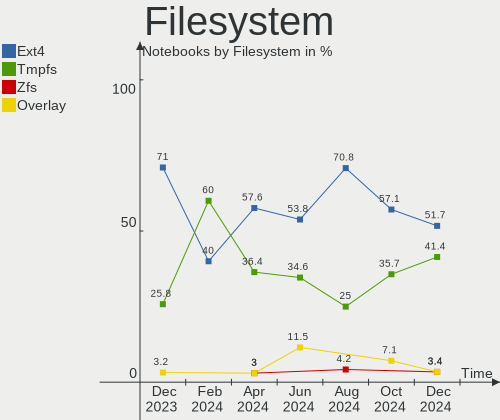
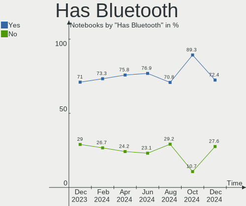
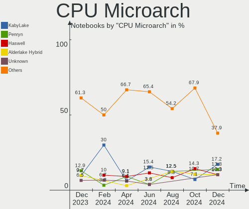
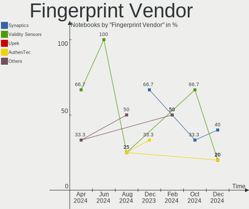

Xubuntu - Hardware Trends (Notebooks)
-------------------------------------

A project to identify most popular hardware characteristics and track their change
over time based on data collected by Linux users at https://Linux-Hardware.org.

Anyone can contribute to this report by the [hw-probe](https://github.com/linuxhw/hw-probe) tool:

    sudo -E hw-probe -all -upload

This report is for one last month. Overall report since the beginning of time: [TestDays](https://github.com/linuxhw/TestDays)

Period: Jul, 2023.

Contents
--------

* [ System ](#system)
  - [ OS                       ](#os)
  - [ OS Family                ](#os-family)
  - [ Kernel                   ](#kernel)
  - [ Kernel Family            ](#kernel-family)
  - [ Kernel Major Ver.        ](#kernel-major-ver)
  - [ Arch                     ](#arch)
  - [ DE                       ](#de)
  - [ Display Server           ](#display-server)
  - [ Display Manager          ](#display-manager)
  - [ OS Lang                  ](#os-lang)
  - [ Boot Mode                ](#boot-mode)
  - [ Filesystem               ](#filesystem)
  - [ Part. scheme             ](#part-scheme)
  - [ Dual Boot with Linux/BSD ](#dual-boot-with-linuxbsd)
  - [ Dual Boot (Win)          ](#dual-boot-win)

* [ Board ](#board)
  - [ Vendor                   ](#vendor)
  - [ Model                    ](#model)
  - [ Model Family             ](#model-family)
  - [ MFG Year                 ](#mfg-year)
  - [ Form Factor              ](#form-factor)
  - [ Secure Boot              ](#secure-boot)
  - [ Coreboot                 ](#coreboot)
  - [ RAM Size                 ](#ram-size)
  - [ RAM Used                 ](#ram-used)
  - [ Total Drives             ](#total-drives)
  - [ Has CD-ROM               ](#has-cd-rom)
  - [ Has Ethernet             ](#has-ethernet)
  - [ Has WiFi                 ](#has-wifi)
  - [ Has Bluetooth            ](#has-bluetooth)

* [ Location ](#location)
  - [ Country                  ](#country)
  - [ City                     ](#city)

* [ Drives ](#drives)
  - [ Drive Vendor             ](#drive-vendor)
  - [ Drive Model              ](#drive-model)
  - [ HDD Vendor               ](#hdd-vendor)
  - [ SSD Vendor               ](#ssd-vendor)
  - [ Drive Kind               ](#drive-kind)
  - [ Drive Connector          ](#drive-connector)
  - [ Drive Size               ](#drive-size)
  - [ Space Total              ](#space-total)
  - [ Space Used               ](#space-used)
  - [ Malfunc. Drives          ](#malfunc-drives)
  - [ Malfunc. Drive Vendor    ](#malfunc-drive-vendor)
  - [ Malfunc. HDD Vendor      ](#malfunc-hdd-vendor)
  - [ Malfunc. Drive Kind      ](#malfunc-drive-kind)
  - [ Failed Drives            ](#failed-drives)
  - [ Failed Drive Vendor      ](#failed-drive-vendor)
  - [ Drive Status             ](#drive-status)

* [ Storage controller ](#storage-controller)
  - [ Storage Vendor           ](#storage-vendor)
  - [ Storage Model            ](#storage-model)
  - [ Storage Kind             ](#storage-kind)

* [ Processor ](#processor)
  - [ CPU Vendor               ](#cpu-vendor)
  - [ CPU Model                ](#cpu-model)
  - [ CPU Model Family         ](#cpu-model-family)
  - [ CPU Cores                ](#cpu-cores)
  - [ CPU Sockets              ](#cpu-sockets)
  - [ CPU Threads              ](#cpu-threads)
  - [ CPU Op-Modes             ](#cpu-op-modes)
  - [ CPU Microcode            ](#cpu-microcode)
  - [ CPU Microarch            ](#cpu-microarch)

* [ Graphics ](#graphics)
  - [ GPU Vendor               ](#gpu-vendor)
  - [ GPU Model                ](#gpu-model)
  - [ GPU Combo                ](#gpu-combo)
  - [ GPU Driver               ](#gpu-driver)
  - [ GPU Memory               ](#gpu-memory)

* [ Monitor ](#monitor)
  - [ Monitor Vendor           ](#monitor-vendor)
  - [ Monitor Model            ](#monitor-model)
  - [ Monitor Resolution       ](#monitor-resolution)
  - [ Monitor Diagonal         ](#monitor-diagonal)
  - [ Monitor Width            ](#monitor-width)
  - [ Aspect Ratio             ](#aspect-ratio)
  - [ Monitor Area             ](#monitor-area)
  - [ Pixel Density            ](#pixel-density)
  - [ Multiple Monitors        ](#multiple-monitors)

* [ Network ](#network)
  - [ Net Controller Vendor    ](#net-controller-vendor)
  - [ Net Controller Model     ](#net-controller-model)
  - [ Wireless Vendor          ](#wireless-vendor)
  - [ Wireless Model           ](#wireless-model)
  - [ Ethernet Vendor          ](#ethernet-vendor)
  - [ Ethernet Model           ](#ethernet-model)
  - [ Net Controller Kind      ](#net-controller-kind)
  - [ Used Controller          ](#used-controller)
  - [ NICs                     ](#nics)
  - [ IPv6                     ](#ipv6)

* [ Bluetooth ](#bluetooth)
  - [ Bluetooth Vendor         ](#bluetooth-vendor)
  - [ Bluetooth Model          ](#bluetooth-model)

* [ Sound ](#sound)
  - [ Sound Vendor             ](#sound-vendor)
  - [ Sound Model              ](#sound-model)

* [ Memory ](#memory)
  - [ Memory Vendor            ](#memory-vendor)
  - [ Memory Model             ](#memory-model)
  - [ Memory Kind              ](#memory-kind)
  - [ Memory Form Factor       ](#memory-form-factor)
  - [ Memory Size              ](#memory-size)
  - [ Memory Speed             ](#memory-speed)

* [ Printers & scanners ](#printers--scanners)
  - [ Printer Vendor           ](#printer-vendor)
  - [ Printer Model            ](#printer-model)
  - [ Scanner Vendor           ](#scanner-vendor)
  - [ Scanner Model            ](#scanner-model)

* [ Camera ](#camera)
  - [ Camera Vendor            ](#camera-vendor)
  - [ Camera Model             ](#camera-model)

* [ Security ](#security)
  - [ Fingerprint Vendor       ](#fingerprint-vendor)
  - [ Fingerprint Model        ](#fingerprint-model)
  - [ Chipcard Vendor          ](#chipcard-vendor)
  - [ Chipcard Model           ](#chipcard-model)

* [ Unsupported ](#unsupported)
  - [ Unsupported Devices      ](#unsupported-devices)
  - [ Unsupported Device Types ](#unsupported-device-types)

System
------

OS
--

Installed operating systems

| Name          | Notebooks | Percent |
|---------------|-----------|---------|
| Xubuntu 22.04 | 27        | 65.85%  |
| Xubuntu 23.04 | 5         | 12.2%   |
| Xubuntu 20.04 | 4         | 9.76%   |
| Xubuntu 18.04 | 2         | 4.88%   |
| Xubuntu 23.10 | 1         | 2.44%   |
| Xubuntu 22.10 | 1         | 2.44%   |
| Xubuntu 21.04 | 1         | 2.44%   |

OS Family
---------

OS without a version

| Name    | Notebooks | Percent |
|---------|-----------|---------|
| Xubuntu | 41        | 100%    |

Kernel
------

Version of the Linux kernel

| Version              | Notebooks | Percent |
|----------------------|-----------|---------|
| 5.19.0-46-generic    | 8         | 19.51%  |
| 5.15.0-76-generic    | 6         | 14.63%  |
| 5.19.0-45-generic    | 5         | 12.2%   |
| 6.2.0-25-generic     | 3         | 7.32%   |
| 5.4.0-153-generic    | 2         | 4.88%   |
| 5.19.0-50-generic    | 2         | 4.88%   |
| 5.15.0-78-generic    | 2         | 4.88%   |
| 5.15.0-72-generic    | 2         | 4.88%   |
| 6.4.2-060402-generic | 1         | 2.44%   |
| 6.4.0-060400-generic | 1         | 2.44%   |
| 6.2.0-26-generic     | 1         | 2.44%   |
| 6.2.0-20-generic     | 1         | 2.44%   |
| 6.0.0-1011-oem       | 1         | 2.44%   |
| 5.4.0-150-generic    | 1         | 2.44%   |
| 5.4.0-121-lowlatency | 1         | 2.44%   |
| 5.19.0-32-generic    | 1         | 2.44%   |
| 5.13.0-30-generic    | 1         | 2.44%   |
| 5.11.0-44-lowlatency | 1         | 2.44%   |
| 4.15.0-213-generic   | 1         | 2.44%   |

Kernel Family
-------------

Linux kernel without a distro release

| Version | Notebooks | Percent |
|---------|-----------|---------|
| 5.19.0  | 16        | 39.02%  |
| 5.15.0  | 10        | 24.39%  |
| 6.2.0   | 5         | 12.2%   |
| 5.4.0   | 4         | 9.76%   |
| 6.4.2   | 1         | 2.44%   |
| 6.4.0   | 1         | 2.44%   |
| 6.0.0   | 1         | 2.44%   |
| 5.13.0  | 1         | 2.44%   |
| 5.11.0  | 1         | 2.44%   |
| 4.15.0  | 1         | 2.44%   |

Kernel Major Ver.
-----------------

Linux kernel major version

| Version | Notebooks | Percent |
|---------|-----------|---------|
| 5.19    | 16        | 39.02%  |
| 5.15    | 10        | 24.39%  |
| 6.2     | 5         | 12.2%   |
| 5.4     | 4         | 9.76%   |
| 6.4     | 2         | 4.88%   |
| 6.0     | 1         | 2.44%   |
| 5.13    | 1         | 2.44%   |
| 5.11    | 1         | 2.44%   |
| 4.15    | 1         | 2.44%   |

Arch
----

OS architecture (x86_64, i586, etc.)

| Name   | Notebooks | Percent |
|--------|-----------|---------|
| x86_64 | 39        | 95.12%  |
| i686   | 2         | 4.88%   |

DE
--

Desktop Environment

| Name | Notebooks | Percent |
|------|-----------|---------|
| XFCE | 40        | 97.56%  |
| KDE5 | 1         | 2.44%   |

Display Server
--------------

X11 or Wayland

| Name | Notebooks | Percent |
|------|-----------|---------|
| X11  | 40        | 97.56%  |
| Tty  | 1         | 2.44%   |

Display Manager
---------------

SDDM, LightDM, etc.

| Name    | Notebooks | Percent |
|---------|-----------|---------|
| LightDM | 34        | 82.93%  |
| SDDM    | 2         | 4.88%   |
| GDM3    | 2         | 4.88%   |
| Unknown | 2         | 4.88%   |
| LXDM    | 1         | 2.44%   |

OS Lang
-------

Language

| Lang  | Notebooks | Percent |
|-------|-----------|---------|
| en_US | 12        | 29.27%  |
| fr_FR | 7         | 17.07%  |
| de_DE | 4         | 9.76%   |
| pl_PL | 3         | 7.32%   |
| it_IT | 3         | 7.32%   |
| en_GB | 3         | 7.32%   |
| pt_BR | 2         | 4.88%   |
| es_ES | 2         | 4.88%   |
| nl_NL | 1         | 2.44%   |
| en_CA | 1         | 2.44%   |
| en_AU | 1         | 2.44%   |
| de_CH | 1         | 2.44%   |
| C     | 1         | 2.44%   |

Boot Mode
---------

EFI or BIOS

| Mode | Notebooks | Percent |
|------|-----------|---------|
| BIOS | 22        | 53.66%  |
| EFI  | 19        | 46.34%  |

Filesystem
----------

Type of filesystem

| Type    | Notebooks | Percent |
|---------|-----------|---------|
| Ext4    | 21        | 51.22%  |
| Tmpfs   | 17        | 41.46%  |
| Overlay | 2         | 4.88%   |
| Xfs     | 1         | 2.44%   |

Part. scheme
------------

Scheme of partitioning

| Type    | Notebooks | Percent |
|---------|-----------|---------|
| GPT     | 27        | 65.85%  |
| MBR     | 10        | 24.39%  |
| Unknown | 4         | 9.76%   |

Dual Boot with Linux/BSD
------------------------

Hosting more than one Linux/BSD

| Dual boot | Notebooks | Percent |
|-----------|-----------|---------|
| No        | 36        | 87.8%   |
| Yes       | 5         | 12.2%   |

Dual Boot (Win)
---------------

Hosting Linux and Windows

| Dual boot | Notebooks | Percent |
|-----------|-----------|---------|
| No        | 27        | 65.85%  |
| Yes       | 14        | 34.15%  |

Board
-----

Vendor
------

Motherboard manufacturer

| Name                | Notebooks | Percent |
|---------------------|-----------|---------|
| Hewlett-Packard     | 8         | 19.51%  |
| Lenovo              | 7         | 17.07%  |
| MSI                 | 5         | 12.2%   |
| Acer                | 4         | 9.76%   |
| Dell                | 3         | 7.32%   |
| Samsung Electronics | 2         | 4.88%   |
| Fujitsu Siemens     | 2         | 4.88%   |
| TUXEDO              | 1         | 2.44%   |
| Thomson             | 1         | 2.44%   |
| SiComputer          | 1         | 2.44%   |
| Olidata             | 1         | 2.44%   |
| Medion              | 1         | 2.44%   |
| Itautec             | 1         | 2.44%   |
| GPU Company         | 1         | 2.44%   |
| Google              | 1         | 2.44%   |
| Gateway             | 1         | 2.44%   |
| Dynabook            | 1         | 2.44%   |

Model
-----

Motherboard model

| Name                                  | Notebooks | Percent |
|---------------------------------------|-----------|---------|
| HP Laptop 15s-fq2xxx                  | 2         | 4.88%   |
| TUXEDO N85_N87HCHNHZ                  | 1         | 2.44%   |
| Thomson N15C8BK2T                     | 1         | 2.44%   |
| SiComputer NL40_50CU                  | 1         | 2.44%   |
| Samsung N250P/N145P                   | 1         | 2.44%   |
| Samsung 305E4A/305E5A/305E7A          | 1         | 2.44%   |
| Olidata Stainer 8050                  | 1         | 2.44%   |
| MSI PR601/VR603                       | 1         | 2.44%   |
| MSI Modern 15 A10RBS                  | 1         | 2.44%   |
| MSI MEGA BOOK GX620                   | 1         | 2.44%   |
| MSI GF65 Thin 10SER                   | 1         | 2.44%   |
| MSI GF63 Thin 11UC                    | 1         | 2.44%   |
| Medion Akoya P2213T                   | 1         | 2.44%   |
| Lenovo ThinkPad X260 20F5S4BY00       | 1         | 2.44%   |
| Lenovo ThinkPad T480 20L6S01Q3U       | 1         | 2.44%   |
| Lenovo ThinkPad T460s 20FAS42W01      | 1         | 2.44%   |
| Lenovo IdeaPad 330S-15AST 81F9        | 1         | 2.44%   |
| Lenovo IdeaPad 3 15ALC6 82KU          | 1         | 2.44%   |
| Lenovo IdeaPad 100S-14IBR 80R9        | 1         | 2.44%   |
| Lenovo G50-70 20351                   | 1         | 2.44%   |
| Itautec Infoway w7535                 | 1         | 2.44%   |
| HP Stream Laptop 14-ds0xxx            | 1         | 2.44%   |
| HP ProBook 4525s                      | 1         | 2.44%   |
| HP ProBook 445 14 inch G9 Notebook PC | 1         | 2.44%   |
| HP ProBook 11 G2                      | 1         | 2.44%   |
| HP Pavilion 17                        | 1         | 2.44%   |
| HP Compaq Presario CQ60               | 1         | 2.44%   |
| GPU Company GWNC21524                 | 1         | 2.44%   |
| Google Snappy                         | 1         | 2.44%   |
| Gateway NV57H                         | 1         | 2.44%   |
| Fujitsu Siemens ESPRIMO Mobile V6535  | 1         | 2.44%   |
| Fujitsu Siemens ESPRIMO Mobile U9200  | 1         | 2.44%   |
| Dynabook B65/ER                       | 1         | 2.44%   |
| Dell Latitude 5590                    | 1         | 2.44%   |
| Dell Latitude 3540                    | 1         | 2.44%   |
| Dell Inspiron 1501                    | 1         | 2.44%   |
| Acer Extensa 2510                     | 1         | 2.44%   |
| Acer Aspire A517-52                   | 1         | 2.44%   |
| Acer Aspire A315-54                   | 1         | 2.44%   |
| Acer AOD255                           | 1         | 2.44%   |

Model Family
------------

Motherboard model prefix

| Name                    | Notebooks | Percent |
|-------------------------|-----------|---------|
| Lenovo ThinkPad         | 3         | 7.32%   |
| Lenovo IdeaPad          | 3         | 7.32%   |
| HP ProBook              | 3         | 7.32%   |
| HP Laptop               | 2         | 4.88%   |
| Fujitsu Siemens ESPRIMO | 2         | 4.88%   |
| Dell Latitude           | 2         | 4.88%   |
| Acer Aspire             | 2         | 4.88%   |
| TUXEDO N85              | 1         | 2.44%   |
| Thomson N15C8BK2T       | 1         | 2.44%   |
| SiComputer NL40         | 1         | 2.44%   |
| Samsung N250P           | 1         | 2.44%   |
| Samsung 305E4A          | 1         | 2.44%   |
| Olidata Stainer         | 1         | 2.44%   |
| MSI PR601               | 1         | 2.44%   |
| MSI Modern              | 1         | 2.44%   |
| MSI MEGA                | 1         | 2.44%   |
| MSI GF65                | 1         | 2.44%   |
| MSI GF63                | 1         | 2.44%   |
| Medion Akoya            | 1         | 2.44%   |
| Lenovo G50-70           | 1         | 2.44%   |
| Itautec Infoway         | 1         | 2.44%   |
| HP Stream               | 1         | 2.44%   |
| HP Pavilion             | 1         | 2.44%   |
| HP Compaq               | 1         | 2.44%   |
| GPU Company GWNC21524   | 1         | 2.44%   |
| Google Snappy           | 1         | 2.44%   |
| Gateway NV57H           | 1         | 2.44%   |
| Dynabook B65            | 1         | 2.44%   |
| Dell Inspiron           | 1         | 2.44%   |
| Acer Extensa            | 1         | 2.44%   |
| Acer AOD255             | 1         | 2.44%   |

MFG Year
--------

Motherboard manufacture year

| Year | Notebooks | Percent |
|------|-----------|---------|
| 2020 | 8         | 19.51%  |
| 2008 | 5         | 12.2%   |
| 2011 | 4         | 9.76%   |
| 2018 | 3         | 7.32%   |
| 2016 | 3         | 7.32%   |
| 2013 | 3         | 7.32%   |
| 2022 | 2         | 4.88%   |
| 2021 | 2         | 4.88%   |
| 2019 | 2         | 4.88%   |
| 2015 | 2         | 4.88%   |
| 2010 | 2         | 4.88%   |
| 2023 | 1         | 2.44%   |
| 2017 | 1         | 2.44%   |
| 2014 | 1         | 2.44%   |
| 2009 | 1         | 2.44%   |
| 2006 | 1         | 2.44%   |

Form Factor
-----------

Physical design of the computer

| Name     | Notebooks | Percent |
|----------|-----------|---------|
| Notebook | 41        | 100%    |

Secure Boot
-----------

Enabled or disabled

| State    | Notebooks | Percent |
|----------|-----------|---------|
| Disabled | 39        | 95.12%  |
| Enabled  | 2         | 4.88%   |

Coreboot
--------

Have coreboot on board

| Used | Notebooks | Percent |
|------|-----------|---------|
| No   | 40        | 97.56%  |
| Yes  | 1         | 2.44%   |

RAM Size
--------

Total RAM memory

| Size in GB  | Notebooks | Percent |
|-------------|-----------|---------|
| 3.01-4.0    | 12        | 29.27%  |
| 4.01-8.0    | 11        | 26.83%  |
| 16.01-24.0  | 5         | 12.2%   |
| 8.01-16.0   | 5         | 12.2%   |
| 1.01-2.0    | 4         | 9.76%   |
| 32.01-64.0  | 1         | 2.44%   |
| 24.01-32.0  | 1         | 2.44%   |
| 2.01-3.0    | 1         | 2.44%   |
| 64.01-256.0 | 1         | 2.44%   |

RAM Used
--------

Used RAM memory

| Used GB   | Notebooks | Percent |
|-----------|-----------|---------|
| 1.01-2.0  | 19        | 46.34%  |
| 2.01-3.0  | 9         | 21.95%  |
| 4.01-8.0  | 5         | 12.2%   |
| 0.51-1.0  | 4         | 9.76%   |
| 3.01-4.0  | 3         | 7.32%   |
| 8.01-16.0 | 1         | 2.44%   |

Total Drives
------------

Number of drives on board

| Drives | Notebooks | Percent |
|--------|-----------|---------|
| 1      | 33        | 80.49%  |
| 2      | 7         | 17.07%  |
| 0      | 1         | 2.44%   |

Has CD-ROM
----------

Has CD-ROM on board

| Presented | Notebooks | Percent |
|-----------|-----------|---------|
| No        | 28        | 68.29%  |
| Yes       | 13        | 31.71%  |

Has Ethernet
------------

Has Ethernet on board

| Presented | Notebooks | Percent |
|-----------|-----------|---------|
| Yes       | 32        | 78.05%  |
| No        | 9         | 21.95%  |

Has WiFi
--------

Has WiFi module

| Presented | Notebooks | Percent |
|-----------|-----------|---------|
| Yes       | 41        | 100%    |

Has Bluetooth
-------------

Has Bluetooth module

| Presented | Notebooks | Percent |
|-----------|-----------|---------|
| Yes       | 27        | 65.85%  |
| No        | 14        | 34.15%  |

Location
--------

Country
-------

Geographic location (country)

| Country     | Notebooks | Percent |
|-------------|-----------|---------|
| France      | 8         | 19.51%  |
| USA         | 5         | 12.2%   |
| Italy       | 4         | 9.76%   |
| Germany     | 4         | 9.76%   |
| UK          | 2         | 4.88%   |
| Sweden      | 2         | 4.88%   |
| Poland      | 2         | 4.88%   |
| Brazil      | 2         | 4.88%   |
| Switzerland | 1         | 2.44%   |
| Spain       | 1         | 2.44%   |
| South Korea | 1         | 2.44%   |
| Slovakia    | 1         | 2.44%   |
| Romania     | 1         | 2.44%   |
| Pakistan    | 1         | 2.44%   |
| Netherlands | 1         | 2.44%   |
| Japan       | 1         | 2.44%   |
| Honduras    | 1         | 2.44%   |
| Canada      | 1         | 2.44%   |
| Belgium     | 1         | 2.44%   |
| Australia   | 1         | 2.44%   |

City
----

Geographic location (city)

| City                  | Notebooks | Percent |
|-----------------------|-----------|---------|
| Rho                   | 2         | 4.88%   |
| Warsaw                | 1         | 2.44%   |
| Västerås            | 1         | 2.44%   |
| Uppsala               | 1         | 2.44%   |
| Swindon               | 1         | 2.44%   |
| Schnaittach           | 1         | 2.44%   |
| Sassari               | 1         | 2.44%   |
| Sao Jose do Rio Preto | 1         | 2.44%   |
| San Pedro Sula        | 1         | 2.44%   |
| Rosemead              | 1         | 2.44%   |
| Roquecor              | 1         | 2.44%   |
| Reynoldsburg          | 1         | 2.44%   |
| Reading               | 1         | 2.44%   |
| Przeworsk             | 1         | 2.44%   |
| Phoenix               | 1         | 2.44%   |
| Oignies               | 1         | 2.44%   |
| Nussbaumen            | 1         | 2.44%   |
| Nowon-gu              | 1         | 2.44%   |
| New Orleans           | 1         | 2.44%   |
| Milan                 | 1         | 2.44%   |
| Mainz                 | 1         | 2.44%   |
| Machiya               | 1         | 2.44%   |
| Leinster              | 1         | 2.44%   |
| Le Clerjus            | 1         | 2.44%   |
| Las Vegas             | 1         | 2.44%   |
| Lahore                | 1         | 2.44%   |
| Châtenay-Malabry     | 1         | 2.44%   |
| Campinas              | 1         | 2.44%   |
| Burgnac               | 1         | 2.44%   |
| Bucharest             | 1         | 2.44%   |
| Brussels              | 1         | 2.44%   |
| Brilon                | 1         | 2.44%   |
| Brignoles             | 1         | 2.44%   |
| Bremen                | 1         | 2.44%   |
| Bratislava            | 1         | 2.44%   |
| Brandon               | 1         | 2.44%   |
| Barcelona             | 1         | 2.44%   |
| Arnage                | 1         | 2.44%   |
| Arleux                | 1         | 2.44%   |
| Alkmaar               | 1         | 2.44%   |

Drives
------

Drive Vendor
------------

Hard drive vendors

| Vendor                      | Notebooks | Drives | Percent |
|-----------------------------|-----------|--------|---------|
| Samsung Electronics         | 7         | 7      | 15.56%  |
| WDC                         | 5         | 5      | 11.11%  |
| Unknown                     | 4         | 4      | 8.89%   |
| Hitachi                     | 4         | 4      | 8.89%   |
| SK hynix                    | 3         | 3      | 6.67%   |
| SanDisk                     | 3         | 3      | 6.67%   |
| Kingston                    | 2         | 2      | 4.44%   |
| Intel                       | 2         | 2      | 4.44%   |
| Toshiba                     | 1         | 1      | 2.22%   |
| Seagate                     | 1         | 1      | 2.22%   |
| Realtek                     | 1         | 1      | 2.22%   |
| PNY                         | 1         | 1      | 2.22%   |
| Plextor                     | 1         | 1      | 2.22%   |
| Phison Electronics          | 1         | 1      | 2.22%   |
| Micron Technology           | 1         | 1      | 2.22%   |
| LITEON                      | 1         | 1      | 2.22%   |
| Lenovo                      | 1         | 1      | 2.22%   |
| Kingston Technology Company | 1         | 1      | 2.22%   |
| KingDian                    | 1         | 1      | 2.22%   |
| HGST                        | 1         | 1      | 2.22%   |
| Gigabyte Technology         | 1         | 1      | 2.22%   |
| BHT                         | 1         | 1      | 2.22%   |
| A-DATA Technology           | 1         | 1      | 2.22%   |

Drive Model
-----------

Hard drive models

| Model                                   | Notebooks | Percent |
|-----------------------------------------|-----------|---------|
| WDC WD5000LPCX-24C6HT0 500GB            | 1         | 2.22%   |
| WDC WD3200BEVT-22ZCT0 320GB             | 1         | 2.22%   |
| WDC WD1600BEVT-60ZCT1 160GB             | 1         | 2.22%   |
| WDC WD1600BEVT-22ZCT0 160GB             | 1         | 2.22%   |
| WDC PC SN540 SDDPNPF-512G-1032 512GB    | 1         | 2.22%   |
| Unknown SD/MMC/MS PRO 128GB             | 1         | 2.22%   |
| Unknown MMC Card  32GB                  | 1         | 2.22%   |
| Unknown MMC Card  128GB                 | 1         | 2.22%   |
| Unknown DB4032  32GB                    | 1         | 2.22%   |
| Toshiba KXG50ZNV256G NVMe 256GB         | 1         | 2.22%   |
| SK hynix HFS256GD9TNG-62A0A 256GB       | 1         | 2.22%   |
| SK hynix HCG8e  64GB                    | 1         | 2.22%   |
| SK hynix BC511 HFM256GDJTNI-82A0A 256GB | 1         | 2.22%   |
| Seagate ST1000LX015-1U7172 1TB          | 1         | 2.22%   |
| SanDisk SSD PLUS 480GB                  | 1         | 2.22%   |
| SanDisk SD8TN8U256G1001 256GB SSD       | 1         | 2.22%   |
| SanDisk SD8SNAT-128G-1006 128GB SSD     | 1         | 2.22%   |
| Samsung SSD 980 PRO 1TB                 | 1         | 2.22%   |
| Samsung SSD 870 QVO 4TB                 | 1         | 2.22%   |
| Samsung SSD 870 EVO 500GB               | 1         | 2.22%   |
| Samsung SSD 850 EVO M.2 250GB           | 1         | 2.22%   |
| Samsung SSD 850 EVO 500GB               | 1         | 2.22%   |
| Samsung SSD 850 EVO 250GB               | 1         | 2.22%   |
| Samsung MZVLQ512HALU-00000 512GB        | 1         | 2.22%   |
| Realtek RTL9210B NVME 256GB             | 1         | 2.22%   |
| PNY CS900 500GB SSD                     | 1         | 2.22%   |
| Plextor PH6-CE120 120GB SSD             | 1         | 2.22%   |
| Phison PS5013 E13 NVMe Controller 256GB | 1         | 2.22%   |
| Micron 2210_MTFDHBA1T0QFD 1024GB        | 1         | 2.22%   |
| LITEON IT LCS-128L9S-HP 128GB SSD       | 1         | 2.22%   |
| Lenovo LENSE30512GMSP34MEAT3TA 512GB    | 1         | 2.22%   |
| Kingston Company SNV2S1000G 1TB         | 1         | 2.22%   |
| Kingston SA400S37480G 480GB SSD         | 1         | 2.22%   |
| Kingston OM8PCP3512F-AI1 512GB          | 1         | 2.22%   |
| KingDian S200 60GB SSD                  | 1         | 2.22%   |
| Intel SSDPEKNW512GZL 512GB              | 1         | 2.22%   |
| Intel SSDPEKNW010T8H 1TB                | 1         | 2.22%   |
| Hitachi HTS547550A9E384 500GB           | 1         | 2.22%   |
| Hitachi HTS545050A7E380 500GB           | 1         | 2.22%   |
| Hitachi HTS543232L9A300 320GB           | 1         | 2.22%   |

HDD Vendor
----------

Hard disk drive vendors

| Vendor  | Notebooks | Drives | Percent |
|---------|-----------|--------|---------|
| WDC     | 4         | 4      | 36.36%  |
| Hitachi | 4         | 4      | 36.36%  |
| Unknown | 1         | 1      | 9.09%   |
| Seagate | 1         | 1      | 9.09%   |
| HGST    | 1         | 1      | 9.09%   |

SSD Vendor
----------

Solid state drive vendors

| Vendor              | Notebooks | Drives | Percent |
|---------------------|-----------|--------|---------|
| Samsung Electronics | 5         | 5      | 33.33%  |
| SanDisk             | 3         | 3      | 20%     |
| PNY                 | 1         | 1      | 6.67%   |
| Plextor             | 1         | 1      | 6.67%   |
| LITEON              | 1         | 1      | 6.67%   |
| Kingston            | 1         | 1      | 6.67%   |
| KingDian            | 1         | 1      | 6.67%   |
| Gigabyte Technology | 1         | 1      | 6.67%   |
| BHT                 | 1         | 1      | 6.67%   |

Drive Kind
----------

HDD or SSD

| Kind | Notebooks | Drives | Percent |
|------|-----------|--------|---------|
| NVMe | 15        | 15     | 33.33%  |
| SSD  | 15        | 15     | 33.33%  |
| HDD  | 11        | 11     | 24.44%  |
| MMC  | 4         | 4      | 8.89%   |

Drive Connector
---------------

SATA, SAS, NVMe, etc.

| Type | Notebooks | Drives | Percent |
|------|-----------|--------|---------|
| SATA | 23        | 24     | 52.27%  |
| NVMe | 14        | 14     | 31.82%  |
| MMC  | 4         | 4      | 9.09%   |
| SAS  | 3         | 3      | 6.82%   |

Drive Size
----------

Size of hard drive

| Size in TB | Notebooks | Drives | Percent |
|------------|-----------|--------|---------|
| 0.01-0.5   | 23        | 24     | 92%     |
| 3.01-4.0   | 1         | 1      | 4%      |
| 0.51-1.0   | 1         | 1      | 4%      |

Space Total
-----------

Amount of disk space available on the file system

| Size in GB     | Notebooks | Percent |
|----------------|-----------|---------|
| 251-500        | 12        | 29.27%  |
| 101-250        | 10        | 24.39%  |
| 501-1000       | 6         | 14.63%  |
| 21-50          | 5         | 12.2%   |
| 51-100         | 5         | 12.2%   |
| 1-20           | 2         | 4.88%   |
| More than 3000 | 1         | 2.44%   |

Space Used
----------

Amount of used disk space

| Used GB  | Notebooks | Percent |
|----------|-----------|---------|
| 1-20     | 14        | 34.15%  |
| 21-50    | 10        | 24.39%  |
| 101-250  | 9         | 21.95%  |
| 51-100   | 5         | 12.2%   |
| 501-1000 | 2         | 4.88%   |
| 251-500  | 1         | 2.44%   |

Malfunc. Drives
---------------

Drive models with a malfunction

| Model                  | Notebooks | Drives | Percent |
|------------------------|-----------|--------|---------|
| SanDisk SSD PLUS 480GB | 1         | 1      | 100%    |

Malfunc. Drive Vendor
---------------------

Vendors of faulty drives

| Vendor  | Notebooks | Drives | Percent |
|---------|-----------|--------|---------|
| SanDisk | 1         | 1      | 100%    |

Malfunc. HDD Vendor
-------------------

Vendors of faulty HDD drives

Zero info for selected period =(

Malfunc. Drive Kind
-------------------

Kinds of faulty drives

| Kind | Notebooks | Drives | Percent |
|------|-----------|--------|---------|
| SSD  | 1         | 1      | 100%    |

Failed Drives
-------------

Failed drive models

Zero info for selected period =(

Failed Drive Vendor
-------------------

Failed drive vendors

Zero info for selected period =(

Drive Status
------------

Number of failed and malfunc. drives

| Status   | Notebooks | Drives | Percent |
|----------|-----------|--------|---------|
| Detected | 22        | 23     | 53.66%  |
| Works    | 18        | 21     | 43.9%   |
| Malfunc  | 1         | 1      | 2.44%   |

Storage controller
------------------

Storage Vendor
--------------

Storage controller vendors

| Vendor                       | Notebooks | Percent |
|------------------------------|-----------|---------|
| Intel                        | 25        | 55.56%  |
| AMD                          | 8         | 17.78%  |
| SK hynix                     | 2         | 4.44%   |
| Samsung Electronics          | 2         | 4.44%   |
| Kingston Technology Company  | 2         | 4.44%   |
| Toshiba America Info Systems | 1         | 2.22%   |
| SanDisk                      | 1         | 2.22%   |
| Phison Electronics           | 1         | 2.22%   |
| Micron Technology            | 1         | 2.22%   |
| Lenovo                       | 1         | 2.22%   |
| ADATA Technology             | 1         | 2.22%   |

Storage Model
-------------

Storage controller models

| Model                                                                            | Notebooks | Percent |
|----------------------------------------------------------------------------------|-----------|---------|
| Intel 82801IBM/IEM (ICH9M/ICH9M-E) 4 port SATA Controller [AHCI mode]            | 4         | 8%      |
| AMD FCH SATA Controller [AHCI mode]                                              | 4         | 8%      |
| Intel Volume Management Device NVMe RAID Controller                              | 3         | 6%      |
| Intel Sunrise Point-LP SATA Controller [AHCI mode]                               | 3         | 6%      |
| Intel 8 Series SATA Controller 1 [AHCI mode]                                     | 2         | 4%      |
| Intel 6 Series/C200 Series Chipset Family 6 port Mobile SATA AHCI Controller     | 2         | 4%      |
| AMD SB7x0/SB8x0/SB9x0 SATA Controller [AHCI mode]                                | 2         | 4%      |
| Toshiba America Info Systems XG5 NVMe SSD Controller                             | 1         | 2%      |
| SK hynix PC401 NVMe Solid State Drive 256GB                                      | 1         | 2%      |
| SK hynix BC511 NVMe SSD                                                          | 1         | 2%      |
| SanDisk WD Green SN350 NVMe SSD 1 TB (DRAM-less)                                 | 1         | 2%      |
| Samsung NVMe SSD Controller PM9A1/PM9A3/980PRO                                   | 1         | 2%      |
| Samsung NVMe SSD Controller 980                                                  | 1         | 2%      |
| Phison PS5013 E13 NVMe Controller                                                | 1         | 2%      |
| Micron 2210 NVMe SSD [Cobain]                                                    | 1         | 2%      |
| Lenovo LENSE30512GMSP34MEAT3TA                                                   | 1         | 2%      |
| Kingston Company Company Non-Volatile memory controller                          | 1         | 2%      |
| Kingston Company OM8PCP Design-In PCIe 3 NVMe SSD (DRAM-less)                    | 1         | 2%      |
| Intel Tiger Lake-LP SATA Controller                                              | 1         | 2%      |
| Intel Tiger Lake SATA AHCI Controller                                            | 1         | 2%      |
| Intel SSD 670p Series [Keystone Harbor]                                          | 1         | 2%      |
| Intel SSD 660P Series                                                            | 1         | 2%      |
| Intel NM10/ICH7 Family SATA Controller [IDE mode]                                | 1         | 2%      |
| Intel NM10/ICH7 Family SATA Controller [AHCI mode]                               | 1         | 2%      |
| Intel HM170/QM170 Chipset SATA Controller [AHCI Mode]                            | 1         | 2%      |
| Intel Comet Lake SATA AHCI Controller                                            | 1         | 2%      |
| Intel Celeron N3350/Pentium N4200/Atom E3900 Series SATA AHCI Controller         | 1         | 2%      |
| Intel Cannon Point-LP SATA Controller [AHCI Mode]                                | 1         | 2%      |
| Intel Atom/Celeron/Pentium Processor x5-E8000/J3xxx/N3xxx Series SATA Controller | 1         | 2%      |
| Intel 82801HM/HEM (ICH8M/ICH8M-E) SATA Controller [AHCI mode]                    | 1         | 2%      |
| Intel 82801HM/HEM (ICH8M/ICH8M-E) IDE Controller                                 | 1         | 2%      |
| Intel 82801 Mobile SATA Controller [RAID mode]                                   | 1         | 2%      |
| AMD SB7x0/SB8x0/SB9x0 IDE Controller                                             | 1         | 2%      |
| AMD SB600 Non-Raid-5 SATA                                                        | 1         | 2%      |
| AMD SB600 IDE                                                                    | 1         | 2%      |
| AMD FCH SATA Controller [IDE mode]                                               | 1         | 2%      |
| ADATA XPG SX8200 Pro PCIe Gen3x4 M.2 2280 Solid State Drive                      | 1         | 2%      |

Storage Kind
------------

Kind of storage controller (IDE, SATA, NVMe, SAS, ...)

| Kind | Notebooks | Percent |
|------|-----------|---------|
| SATA | 28        | 56%     |
| NVMe | 14        | 28%     |
| RAID | 4         | 8%      |
| IDE  | 4         | 8%      |

Processor
---------

CPU Vendor
----------

Processor vendors

| Vendor | Notebooks | Percent |
|--------|-----------|---------|
| Intel  | 32        | 78.05%  |
| AMD    | 9         | 21.95%  |

CPU Model
---------

Processor models

| Model                                         | Notebooks | Percent |
|-----------------------------------------------|-----------|---------|
| Intel Pentium Dual CPU T3400 @ 2.16GHz        | 2         | 4.88%   |
| Intel Core i5-8265U CPU @ 1.60GHz             | 2         | 4.88%   |
| Intel Core i5-6300U CPU @ 2.40GHz             | 2         | 4.88%   |
| Intel Core i5-10210U CPU @ 1.60GHz            | 2         | 4.88%   |
| Intel 11th Gen Core i7-1165G7 @ 2.80GHz       | 2         | 4.88%   |
| Intel Genuine CPU T1600 @ 1.66GHz             | 1         | 2.44%   |
| Intel Core i7-8650U CPU @ 1.90GHz             | 1         | 2.44%   |
| Intel Core i7-2620M CPU @ 2.70GHz             | 1         | 2.44%   |
| Intel Core i5-8350U CPU @ 1.70GHz             | 1         | 2.44%   |
| Intel Core i5-7300HQ CPU @ 2.50GHz            | 1         | 2.44%   |
| Intel Core i5-4210U CPU @ 1.70GHz             | 1         | 2.44%   |
| Intel Core i5-2410M CPU @ 2.30GHz             | 1         | 2.44%   |
| Intel Core i5-10300H CPU @ 2.50GHz            | 1         | 2.44%   |
| Intel Core i3-6100U CPU @ 2.30GHz             | 1         | 2.44%   |
| Intel Core i3-4030U CPU @ 1.90GHz             | 1         | 2.44%   |
| Intel Core 2 Duo CPU T9300 @ 2.50GHz          | 1         | 2.44%   |
| Intel Core 2 Duo CPU P8600 @ 2.40GHz          | 1         | 2.44%   |
| Intel Celeron N4020 CPU @ 1.10GHz             | 1         | 2.44%   |
| Intel Celeron CPU N3450 @ 1.10GHz             | 1         | 2.44%   |
| Intel Celeron CPU N3350 @ 1.10GHz             | 1         | 2.44%   |
| Intel Celeron CPU N3060 @ 1.60GHz             | 1         | 2.44%   |
| Intel Celeron CPU N2940 @ 1.83GHz             | 1         | 2.44%   |
| Intel Atom CPU N455 @ 1.66GHz                 | 1         | 2.44%   |
| Intel Atom CPU N450 @ 1.66GHz                 | 1         | 2.44%   |
| Intel 13th Gen Core i5-1335U                  | 1         | 2.44%   |
| Intel 11th Gen Core i7-11800H @ 2.30GHz       | 1         | 2.44%   |
| Intel 11th Gen Core i5-1135G7 @ 2.40GHz       | 1         | 2.44%   |
| AMD Turion 64 X2 Mobile Technology TL-50      | 1         | 2.44%   |
| AMD Ryzen 7 5700U with Radeon Graphics        | 1         | 2.44%   |
| AMD Ryzen 5 5625U with Radeon Graphics        | 1         | 2.44%   |
| AMD Athlon QI-46                              | 1         | 2.44%   |
| AMD Athlon II P320 Dual-Core Processor        | 1         | 2.44%   |
| AMD A6-9225 RADEON R4, 5 COMPUTE CORES 2C+3G  | 1         | 2.44%   |
| AMD A4-9120e RADEON R3, 4 COMPUTE CORES 2C+2G | 1         | 2.44%   |
| AMD A4-6210 APU with AMD Radeon R3 Graphics   | 1         | 2.44%   |
| AMD A4-3305M APU with Radeon HD Graphics      | 1         | 2.44%   |

CPU Model Family
----------------

Processor model prefix

| Model                   | Notebooks | Percent |
|-------------------------|-----------|---------|
| Intel Core i5           | 11        | 26.83%  |
| Other                   | 5         | 12.2%   |
| Intel Celeron           | 5         | 12.2%   |
| AMD A4                  | 3         | 7.32%   |
| Intel Pentium Dual      | 2         | 4.88%   |
| Intel Core i7           | 2         | 4.88%   |
| Intel Core i3           | 2         | 4.88%   |
| Intel Core 2 Duo        | 2         | 4.88%   |
| Intel Atom              | 2         | 4.88%   |
| Intel Genuine           | 1         | 2.44%   |
| AMD Turion 64 X2 Mobile | 1         | 2.44%   |
| AMD Ryzen 7             | 1         | 2.44%   |
| AMD Ryzen 5             | 1         | 2.44%   |
| AMD Athlon II           | 1         | 2.44%   |
| AMD Athlon              | 1         | 2.44%   |
| AMD A6                  | 1         | 2.44%   |

CPU Cores
---------

Number of processor cores

| Number | Notebooks | Percent |
|--------|-----------|---------|
| 2      | 19        | 46.34%  |
| 4      | 14        | 34.15%  |
| 1      | 4         | 9.76%   |
| 8      | 2         | 4.88%   |
| 10     | 1         | 2.44%   |
| 6      | 1         | 2.44%   |

CPU Sockets
-----------

Number of sockets

| Number | Notebooks | Percent |
|--------|-----------|---------|
| 1      | 41        | 100%    |

CPU Threads
-----------

Threads per core (Hyper-Threading)

| Number | Notebooks | Percent |
|--------|-----------|---------|
| 2      | 23        | 56.1%   |
| 1      | 18        | 43.9%   |

CPU Op-Modes
------------

CPU Operation Modes (32-bit, 64-bit)

| Op mode        | Notebooks | Percent |
|----------------|-----------|---------|
| 32-bit, 64-bit | 41        | 100%    |

CPU Microcode
-------------

Microcode number

| Number     | Notebooks | Percent |
|------------|-----------|---------|
| Unknown    | 16        | 39.02%  |
| 0x6fd      | 3         | 7.32%   |
| 0x806c1    | 2         | 4.88%   |
| 0x10676    | 2         | 4.88%   |
| 0x06006705 | 2         | 4.88%   |
| 0xb06a3    | 1         | 2.44%   |
| 0x906e9    | 1         | 2.44%   |
| 0x806ec    | 1         | 2.44%   |
| 0x806ea    | 1         | 2.44%   |
| 0x706a8    | 1         | 2.44%   |
| 0x506c9    | 1         | 2.44%   |
| 0x406e3    | 1         | 2.44%   |
| 0x406c4    | 1         | 2.44%   |
| 0x40651    | 1         | 2.44%   |
| 0x30678    | 1         | 2.44%   |
| 0x206a7    | 1         | 2.44%   |
| 0x106ca    | 1         | 2.44%   |
| 0x08608103 | 1         | 2.44%   |
| 0x07030105 | 1         | 2.44%   |
| 0x03000027 | 1         | 2.44%   |
| 0x02000032 | 1         | 2.44%   |

CPU Microarch
-------------

Microarchitecture

| Name             | Notebooks | Percent |
|------------------|-----------|---------|
| KabyLake         | 6         | 14.63%  |
| TigerLake        | 3         | 7.32%   |
| Skylake          | 3         | 7.32%   |
| Core             | 3         | 7.32%   |
| Silvermont       | 2         | 4.88%   |
| SandyBridge      | 2         | 4.88%   |
| Penryn           | 2         | 4.88%   |
| Haswell          | 2         | 4.88%   |
| Goldmont         | 2         | 4.88%   |
| Excavator        | 2         | 4.88%   |
| CometLake        | 2         | 4.88%   |
| Bonnell          | 2         | 4.88%   |
| Unknown          | 2         | 4.88%   |
| Zen 3            | 1         | 2.44%   |
| Puma             | 1         | 2.44%   |
| K8 Hammer        | 1         | 2.44%   |
| K8 & K10 hybrid  | 1         | 2.44%   |
| K10 Llano        | 1         | 2.44%   |
| K10              | 1         | 2.44%   |
| Goldmont plus    | 1         | 2.44%   |
| Alderlake Hybrid | 1         | 2.44%   |

Graphics
--------

GPU Vendor
----------

Vendors of graphics cards

| Vendor | Notebooks | Percent |
|--------|-----------|---------|
| Intel  | 31        | 70.45%  |
| AMD    | 9         | 20.45%  |
| Nvidia | 4         | 9.09%   |

GPU Model
---------

Graphics card models

| Model                                                                                    | Notebooks | Percent |
|------------------------------------------------------------------------------------------|-----------|---------|
| Intel TigerLake-LP GT2 [Iris Xe Graphics]                                                | 3         | 6.67%   |
| Intel Skylake GT2 [HD Graphics 520]                                                      | 3         | 6.67%   |
| Intel Mobile 4 Series Chipset Integrated Graphics Controller                             | 3         | 6.67%   |
| Intel WhiskeyLake-U GT2 [UHD Graphics 620]                                               | 2         | 4.44%   |
| Intel UHD Graphics 620                                                                   | 2         | 4.44%   |
| Intel HD Graphics 500                                                                    | 2         | 4.44%   |
| Intel Haswell-ULT Integrated Graphics Controller                                         | 2         | 4.44%   |
| Intel Atom Processor D4xx/D5xx/N4xx/N5xx Integrated Graphics Controller                  | 2         | 4.44%   |
| Intel 2nd Generation Core Processor Family Integrated Graphics Controller                | 2         | 4.44%   |
| AMD Stoney [Radeon R2/R3/R4/R5 Graphics]                                                 | 2         | 4.44%   |
| Nvidia TU106M [GeForce RTX 2060 Mobile]                                                  | 1         | 2.22%   |
| Nvidia GP107M [GeForce MX350]                                                            | 1         | 2.22%   |
| Nvidia GA107M [GeForce RTX 3050 Mobile]                                                  | 1         | 2.22%   |
| Nvidia G96CM [GeForce 9600M GT]                                                          | 1         | 2.22%   |
| Intel TigerLake-H GT1 [UHD Graphics]                                                     | 1         | 2.22%   |
| Intel Raptor Lake-P [Iris Xe Graphics]                                                   | 1         | 2.22%   |
| Intel Mobile GM965/GL960 Integrated Graphics Controller (secondary)                      | 1         | 2.22%   |
| Intel Mobile GM965/GL960 Integrated Graphics Controller (primary)                        | 1         | 2.22%   |
| Intel HD Graphics 630                                                                    | 1         | 2.22%   |
| Intel GeminiLake [UHD Graphics 600]                                                      | 1         | 2.22%   |
| Intel CometLake-U GT2 [UHD Graphics]                                                     | 1         | 2.22%   |
| Intel CometLake-H GT2 [UHD Graphics]                                                     | 1         | 2.22%   |
| Intel Comet Lake UHD Graphics                                                            | 1         | 2.22%   |
| Intel Atom/Celeron/Pentium Processor x5-E8000/J3xxx/N3xxx Integrated Graphics Controller | 1         | 2.22%   |
| Intel Atom Processor Z36xxx/Z37xxx Series Graphics & Display                             | 1         | 2.22%   |
| AMD SuperSumo [Radeon HD 6480G]                                                          | 1         | 2.22%   |
| AMD RV711/M93 [Mobility Radeon HD 4350/4550/530v/540v/545v / FirePro RG220]              | 1         | 2.22%   |
| AMD RS780M [Mobility Radeon HD 3200]                                                     | 1         | 2.22%   |
| AMD RS482M [Mobility Radeon Xpress 200]                                                  | 1         | 2.22%   |
| AMD Mullins [Radeon R3 Graphics]                                                         | 1         | 2.22%   |
| AMD Lucienne                                                                             | 1         | 2.22%   |
| AMD Barcelo                                                                              | 1         | 2.22%   |

GPU Combo
---------

Combinations of graphics cards

| Name           | Notebooks | Percent |
|----------------|-----------|---------|
| 1 x Intel      | 27        | 65.85%  |
| 1 x AMD        | 9         | 21.95%  |
| Intel + Nvidia | 3         | 7.32%   |
| Other          | 1         | 2.44%   |
| 1 x Nvidia     | 1         | 2.44%   |

GPU Driver
----------

Free vs proprietary

| Driver | Notebooks | Percent |
|--------|-----------|---------|
| Free   | 41        | 100%    |

GPU Memory
----------

Total video memory

| Size in GB | Notebooks | Percent |
|------------|-----------|---------|
| Unknown    | 33        | 80.49%  |
| 0.01-0.5   | 5         | 12.2%   |
| 1.01-2.0   | 3         | 7.32%   |

Monitor
-------

Monitor Vendor
--------------

Monitor vendors

| Vendor                  | Notebooks | Percent |
|-------------------------|-----------|---------|
| BOE                     | 8         | 16.67%  |
| Samsung Electronics     | 7         | 14.58%  |
| Chimei Innolux          | 7         | 14.58%  |
| AU Optronics            | 7         | 14.58%  |
| LG Display              | 6         | 12.5%   |
| Dell                    | 3         | 6.25%   |
| InfoVision              | 2         | 4.17%   |
| Goldstar                | 2         | 4.17%   |
| Chi Mei Optoelectronics | 2         | 4.17%   |
| PANDA                   | 1         | 2.08%   |
| LG Philips              | 1         | 2.08%   |
| Hewlett-Packard         | 1         | 2.08%   |
| CPT                     | 1         | 2.08%   |

Monitor Model
-------------

Monitor models

| Model                                                                    | Notebooks | Percent |
|--------------------------------------------------------------------------|-----------|---------|
| BOE LCD Monitor BOE0757 1366x768 344x194mm 15.5-inch                     | 2         | 4.08%   |
| Samsung Electronics SyncMaster SAM0593 1920x1080 477x268mm 21.5-inch     | 1         | 2.04%   |
| Samsung Electronics LCD Monitor SEC4249 1366x768 309x174mm 14.0-inch     | 1         | 2.04%   |
| Samsung Electronics LCD Monitor SEC4141 1366x768 344x193mm 15.5-inch     | 1         | 2.04%   |
| Samsung Electronics LCD Monitor SEC3945 1280x800 331x207mm 15.4-inch     | 1         | 2.04%   |
| Samsung Electronics LCD Monitor SEC3446 1680x1050 331x207mm 15.4-inch    | 1         | 2.04%   |
| Samsung Electronics LCD Monitor SDC4852 1920x1080 344x194mm 15.5-inch    | 1         | 2.04%   |
| Samsung Electronics LCD Monitor SAM0900 1366x768 410x230mm 18.5-inch     | 1         | 2.04%   |
| Samsung Electronics LCD Monitor SAM07C0 1920x1080 480x270mm 21.7-inch    | 1         | 2.04%   |
| PANDA LM156LF1L03 NCP001C 1920x1080 344x194mm 15.5-inch                  | 1         | 2.04%   |
| LG Philips LCD Monitor LPL1E01 1280x800 331x207mm 15.4-inch              | 1         | 2.04%   |
| LG Display LP156WH2-TLRA LGD026B 1366x768 344x194mm 15.5-inch            | 1         | 2.04%   |
| LG Display LCD Monitor LGD05E5 1920x1080 344x194mm 15.5-inch             | 1         | 2.04%   |
| LG Display LCD Monitor LGD0521 1920x1080 309x174mm 14.0-inch             | 1         | 2.04%   |
| LG Display LCD Monitor LGD046D 1920x1080 309x174mm 14.0-inch             | 1         | 2.04%   |
| LG Display LCD Monitor LGD045E 1366x768 310x174mm 14.0-inch              | 1         | 2.04%   |
| LG Display LCD Monitor LGD0289 1600x900 382x215mm 17.3-inch              | 1         | 2.04%   |
| InfoVision M140NWR2 R1 IVO057A 1366x768 309x174mm 14.0-inch              | 1         | 2.04%   |
| InfoVision LCD Monitor IVO04E5 1366x768 276x155mm 12.5-inch              | 1         | 2.04%   |
| Hewlett-Packard LA2306 HWP294A 1920x1080 509x286mm 23.0-inch             | 1         | 2.04%   |
| Goldstar M237WDP GSM5777 1920x1080 598x336mm 27.0-inch                   | 1         | 2.04%   |
| Goldstar E2240 GSM57A3 1920x1080 477x268mm 21.5-inch                     | 1         | 2.04%   |
| Dell SE198WFP DELF003 1440x900 408x255mm 18.9-inch                       | 1         | 2.04%   |
| Dell P2419H DELD0DA 1920x1080 527x296mm 23.8-inch                        | 1         | 2.04%   |
| Dell P2411H DELA06D 1920x1080 531x299mm 24.0-inch                        | 1         | 2.04%   |
| CPT LCD Monitor CPT13A6 1280x800 331x207mm 15.4-inch                     | 1         | 2.04%   |
| Chimei Innolux LCD Monitor CMN1738 1920x1080 381x214mm 17.2-inch         | 1         | 2.04%   |
| Chimei Innolux LCD Monitor CMN15E6 1366x768 344x193mm 15.5-inch          | 1         | 2.04%   |
| Chimei Innolux LCD Monitor CMN15BE 1366x768 344x193mm 15.5-inch          | 1         | 2.04%   |
| Chimei Innolux LCD Monitor CMN153B 1920x1080 344x193mm 15.5-inch         | 1         | 2.04%   |
| Chimei Innolux LCD Monitor CMN152E 1920x1080 344x193mm 15.5-inch         | 1         | 2.04%   |
| Chimei Innolux LCD Monitor CMN1521 1920x1080 344x193mm 15.5-inch         | 1         | 2.04%   |
| Chimei Innolux LCD Monitor CMN151E 1920x1080 344x193mm 15.5-inch         | 1         | 2.04%   |
| Chi Mei Optoelectronics LCD Monitor CMO1554 1280x800 331x207mm 15.4-inch | 1         | 2.04%   |
| Chi Mei Optoelectronics LCD Monitor CMO1032 1024x600 222x125mm 10.0-inch | 1         | 2.04%   |
| BOE LCD Monitor BOE0991 1920x1080 344x194mm 15.5-inch                    | 1         | 2.04%   |
| BOE LCD Monitor BOE084E 1920x1080 382x215mm 17.3-inch                    | 1         | 2.04%   |
| BOE LCD Monitor BOE06CB 1920x1080 344x194mm 15.5-inch                    | 1         | 2.04%   |
| BOE LCD Monitor BOE0696 1366x768 309x173mm 13.9-inch                     | 1         | 2.04%   |
| BOE LCD Monitor BOE068F 1366x768 256x144mm 11.6-inch                     | 1         | 2.04%   |

Monitor Resolution
------------------

Monitor screen resolution

| Resolution         | Notebooks | Percent |
|--------------------|-----------|---------|
| 1920x1080 (FHD)    | 19        | 43.18%  |
| 1366x768 (WXGA)    | 15        | 34.09%  |
| 1280x800 (WXGA)    | 4         | 9.09%   |
| 1024x600           | 2         | 4.55%   |
| 3840x2160 (4K)     | 1         | 2.27%   |
| 1680x1050 (WSXGA+) | 1         | 2.27%   |
| 1600x900 (HD+)     | 1         | 2.27%   |
| 1440x900 (WXGA+)   | 1         | 2.27%   |

Monitor Diagonal
----------------

Diagonal size in inches

| Inches | Notebooks | Percent |
|--------|-----------|---------|
| 15     | 24        | 48.98%  |
| 14     | 6         | 12.24%  |
| 17     | 3         | 6.12%   |
| 24     | 2         | 4.08%   |
| 21     | 2         | 4.08%   |
| 13     | 2         | 4.08%   |
| 11     | 2         | 4.08%   |
| 10     | 2         | 4.08%   |
| 46     | 1         | 2.04%   |
| 31     | 1         | 2.04%   |
| 27     | 1         | 2.04%   |
| 23     | 1         | 2.04%   |
| 19     | 1         | 2.04%   |
| 12     | 1         | 2.04%   |

Monitor Width
-------------

Physical width

| Width in mm | Notebooks | Percent |
|-------------|-----------|---------|
| 301-350     | 32        | 65.31%  |
| 201-300     | 5         | 10.2%   |
| 501-600     | 4         | 8.16%   |
| 401-500     | 3         | 6.12%   |
| 351-400     | 3         | 6.12%   |
| 601-700     | 1         | 2.04%   |
| 1001-1500   | 1         | 2.04%   |

Aspect Ratio
------------

Proportional relationship between the width and the height

| Ratio | Notebooks | Percent |
|-------|-----------|---------|
| 16/9  | 36        | 85.71%  |
| 16/10 | 6         | 14.29%  |

Monitor Area
------------

Area in inch²

| Area in inch² | Notebooks | Percent |
|----------------|-----------|---------|
| 101-110        | 24        | 48.98%  |
| 81-90          | 8         | 16.33%  |
| 201-250        | 5         | 10.2%   |
| 121-130        | 3         | 6.12%   |
| 51-60          | 2         | 4.08%   |
| 41-50          | 2         | 4.08%   |
| 61-70          | 1         | 2.04%   |
| 351-500        | 1         | 2.04%   |
| 301-350        | 1         | 2.04%   |
| 151-200        | 1         | 2.04%   |
| 501-1000       | 1         | 2.04%   |

Pixel Density
-------------

Pixels per inch

| Density | Notebooks | Percent |
|---------|-----------|---------|
| 121-160 | 18        | 39.13%  |
| 101-120 | 18        | 39.13%  |
| 51-100  | 7         | 15.22%  |
| 1-50    | 2         | 4.35%   |
| 161-240 | 1         | 2.17%   |

Multiple Monitors
-----------------

Total monitors connected

| Total | Notebooks | Percent |
|-------|-----------|---------|
| 1     | 34        | 82.93%  |
| 2     | 5         | 12.2%   |
| 3     | 2         | 4.88%   |

Network
-------

Net Controller Vendor
---------------------

Controller vendors

| Vendor                   | Notebooks | Percent |
|--------------------------|-----------|---------|
| Realtek Semiconductor    | 27        | 41.54%  |
| Intel                    | 20        | 30.77%  |
| Qualcomm Atheros         | 6         | 9.23%   |
| Broadcom                 | 3         | 4.62%   |
| Samsung Electronics      | 2         | 3.08%   |
| Ralink Technology        | 2         | 3.08%   |
| Marvell Technology Group | 2         | 3.08%   |
| TP-Link                  | 1         | 1.54%   |
| MediaTek                 | 1         | 1.54%   |
| JMicron Technology       | 1         | 1.54%   |

Net Controller Model
--------------------

Controller models

| Model                                                                   | Notebooks | Percent |
|-------------------------------------------------------------------------|-----------|---------|
| Realtek RTL8111/8168/8411 PCI Express Gigabit Ethernet Controller       | 16        | 21.05%  |
| Realtek RTL8821CE 802.11ac PCIe Wireless Network Adapter                | 3         | 3.95%   |
| Realtek RTL810xE PCI Express Fast Ethernet controller                   | 3         | 3.95%   |
| Intel Wireless 8265 / 8275                                              | 3         | 3.95%   |
| Intel Wireless 8260                                                     | 3         | 3.95%   |
| Samsung Galaxy series, misc. (tethering mode)                           | 2         | 2.63%   |
| Realtek RTL8822CE 802.11ac PCIe Wireless Network Adapter                | 2         | 2.63%   |
| Realtek RTL8723BE PCIe Wireless Network Adapter                         | 2         | 2.63%   |
| Qualcomm Atheros AR242x / AR542x Wireless Network Adapter (PCI-Express) | 2         | 2.63%   |
| Intel Wireless 3160                                                     | 2         | 2.63%   |
| Intel Ethernet Connection I219-LM                                       | 2         | 2.63%   |
| Intel Ethernet Connection (4) I219-LM                                   | 2         | 2.63%   |
| Intel Comet Lake PCH-LP CNVi WiFi                                       | 2         | 2.63%   |
| TP-Link TL-WN823N v2/v3 [Realtek RTL8192EU]                             | 1         | 1.32%   |
| Realtek RTL8723BU 802.11b/g/n WLAN Adapter                              | 1         | 1.32%   |
| Realtek RTL8187B Wireless 802.11g 54Mbps Network Adapter                | 1         | 1.32%   |
| Realtek RTL8152 Fast Ethernet Adapter                                   | 1         | 1.32%   |
| Realtek 802.11n WLAN Adapter                                            | 1         | 1.32%   |
| Realtek 802.11ac NIC                                                    | 1         | 1.32%   |
| Ralink RT2070 Wireless Adapter                                          | 1         | 1.32%   |
| Ralink MT7601U Wireless Adapter                                         | 1         | 1.32%   |
| Qualcomm Atheros QCA9565 / AR9565 Wireless Network Adapter              | 1         | 1.32%   |
| Qualcomm Atheros QCA9377 802.11ac Wireless Network Adapter              | 1         | 1.32%   |
| Qualcomm Atheros AR9485 Wireless Network Adapter                        | 1         | 1.32%   |
| Qualcomm Atheros AR9285 Wireless Network Adapter (PCI-Express)          | 1         | 1.32%   |
| Qualcomm Atheros AR8152 v1.1 Fast Ethernet                              | 1         | 1.32%   |
| MediaTek MT7921 802.11ax PCI Express Wireless Network Adapter           | 1         | 1.32%   |
| Marvell Group 88E8055 PCI-E Gigabit Ethernet Controller                 | 1         | 1.32%   |
| Marvell Group 88E8040 PCI-E Fast Ethernet Controller                    | 1         | 1.32%   |
| JMicron JMC250 PCI Express Gigabit Ethernet Controller                  | 1         | 1.32%   |
| Intel Wireless 7265                                                     | 1         | 1.32%   |
| Intel Wireless 7260                                                     | 1         | 1.32%   |
| Intel WiFi Link 5100                                                    | 1         | 1.32%   |
| Intel Wi-Fi 6 AX210/AX211/AX411 160MHz                                  | 1         | 1.32%   |
| Intel Wi-Fi 6 AX200                                                     | 1         | 1.32%   |
| Intel Tiger Lake PCH CNVi WiFi                                          | 1         | 1.32%   |
| Intel Raptor Lake PCH CNVi WiFi                                         | 1         | 1.32%   |
| Intel Ethernet Connection (6) I219-V                                    | 1         | 1.32%   |
| Intel Comet Lake PCH CNVi WiFi                                          | 1         | 1.32%   |
| Intel Centrino Wireless-N 100                                           | 1         | 1.32%   |

Wireless Vendor
---------------

Wireless vendors

| Vendor                | Notebooks | Percent |
|-----------------------|-----------|---------|
| Intel                 | 20        | 46.51%  |
| Realtek Semiconductor | 11        | 25.58%  |
| Qualcomm Atheros      | 6         | 13.95%  |
| Ralink Technology     | 2         | 4.65%   |
| Broadcom              | 2         | 4.65%   |
| TP-Link               | 1         | 2.33%   |
| MediaTek              | 1         | 2.33%   |

Wireless Model
--------------

Wireless models

| Model                                                                   | Notebooks | Percent |
|-------------------------------------------------------------------------|-----------|---------|
| Realtek RTL8821CE 802.11ac PCIe Wireless Network Adapter                | 3         | 6.98%   |
| Intel Wireless 8265 / 8275                                              | 3         | 6.98%   |
| Intel Wireless 8260                                                     | 3         | 6.98%   |
| Realtek RTL8822CE 802.11ac PCIe Wireless Network Adapter                | 2         | 4.65%   |
| Realtek RTL8723BE PCIe Wireless Network Adapter                         | 2         | 4.65%   |
| Qualcomm Atheros AR242x / AR542x Wireless Network Adapter (PCI-Express) | 2         | 4.65%   |
| Intel Wireless 3160                                                     | 2         | 4.65%   |
| Intel Comet Lake PCH-LP CNVi WiFi                                       | 2         | 4.65%   |
| TP-Link TL-WN823N v2/v3 [Realtek RTL8192EU]                             | 1         | 2.33%   |
| Realtek RTL8723BU 802.11b/g/n WLAN Adapter                              | 1         | 2.33%   |
| Realtek RTL8187B Wireless 802.11g 54Mbps Network Adapter                | 1         | 2.33%   |
| Realtek 802.11n WLAN Adapter                                            | 1         | 2.33%   |
| Realtek 802.11ac NIC                                                    | 1         | 2.33%   |
| Ralink RT2070 Wireless Adapter                                          | 1         | 2.33%   |
| Ralink MT7601U Wireless Adapter                                         | 1         | 2.33%   |
| Qualcomm Atheros QCA9565 / AR9565 Wireless Network Adapter              | 1         | 2.33%   |
| Qualcomm Atheros QCA9377 802.11ac Wireless Network Adapter              | 1         | 2.33%   |
| Qualcomm Atheros AR9485 Wireless Network Adapter                        | 1         | 2.33%   |
| Qualcomm Atheros AR9285 Wireless Network Adapter (PCI-Express)          | 1         | 2.33%   |
| MediaTek MT7921 802.11ax PCI Express Wireless Network Adapter           | 1         | 2.33%   |
| Intel Wireless 7265                                                     | 1         | 2.33%   |
| Intel Wireless 7260                                                     | 1         | 2.33%   |
| Intel WiFi Link 5100                                                    | 1         | 2.33%   |
| Intel Wi-Fi 6 AX210/AX211/AX411 160MHz                                  | 1         | 2.33%   |
| Intel Wi-Fi 6 AX200                                                     | 1         | 2.33%   |
| Intel Tiger Lake PCH CNVi WiFi                                          | 1         | 2.33%   |
| Intel Raptor Lake PCH CNVi WiFi                                         | 1         | 2.33%   |
| Intel Comet Lake PCH CNVi WiFi                                          | 1         | 2.33%   |
| Intel Centrino Wireless-N 100                                           | 1         | 2.33%   |
| Intel Centrino Advanced-N 6205 [Taylor Peak]                            | 1         | 2.33%   |
| Broadcom BCM4313 802.11bgn Wireless Network Adapter                     | 1         | 2.33%   |
| Broadcom BCM4311 802.11b/g WLAN                                         | 1         | 2.33%   |

Ethernet Vendor
---------------

Ethernet vendors

| Vendor                   | Notebooks | Percent |
|--------------------------|-----------|---------|
| Realtek Semiconductor    | 20        | 60.61%  |
| Intel                    | 5         | 15.15%  |
| Samsung Electronics      | 2         | 6.06%   |
| Marvell Technology Group | 2         | 6.06%   |
| Broadcom                 | 2         | 6.06%   |
| Qualcomm Atheros         | 1         | 3.03%   |
| JMicron Technology       | 1         | 3.03%   |

Ethernet Model
--------------

Ethernet models

| Model                                                             | Notebooks | Percent |
|-------------------------------------------------------------------|-----------|---------|
| Realtek RTL8111/8168/8411 PCI Express Gigabit Ethernet Controller | 16        | 48.48%  |
| Realtek RTL810xE PCI Express Fast Ethernet controller             | 3         | 9.09%   |
| Samsung Galaxy series, misc. (tethering mode)                     | 2         | 6.06%   |
| Intel Ethernet Connection I219-LM                                 | 2         | 6.06%   |
| Intel Ethernet Connection (4) I219-LM                             | 2         | 6.06%   |
| Realtek RTL8152 Fast Ethernet Adapter                             | 1         | 3.03%   |
| Qualcomm Atheros AR8152 v1.1 Fast Ethernet                        | 1         | 3.03%   |
| Marvell Group 88E8055 PCI-E Gigabit Ethernet Controller           | 1         | 3.03%   |
| Marvell Group 88E8040 PCI-E Fast Ethernet Controller              | 1         | 3.03%   |
| JMicron JMC250 PCI Express Gigabit Ethernet Controller            | 1         | 3.03%   |
| Intel Ethernet Connection (6) I219-V                              | 1         | 3.03%   |
| Broadcom NetLink BCM57785 Gigabit Ethernet PCIe                   | 1         | 3.03%   |
| Broadcom BCM4401-B0 100Base-TX                                    | 1         | 3.03%   |

Net Controller Kind
-------------------

Ethernet, WiFi or modem

| Kind     | Notebooks | Percent |
|----------|-----------|---------|
| WiFi     | 41        | 56.16%  |
| Ethernet | 32        | 43.84%  |

Used Controller
---------------

Currently used network controller

| Kind     | Notebooks | Percent |
|----------|-----------|---------|
| WiFi     | 32        | 78.05%  |
| Ethernet | 9         | 21.95%  |

NICs
----

Total network controllers on board

| Total | Notebooks | Percent |
|-------|-----------|---------|
| 2     | 27        | 65.85%  |
| 1     | 12        | 29.27%  |
| 0     | 2         | 4.88%   |

IPv6
----

IPv6 vs IPv4

| Used | Notebooks | Percent |
|------|-----------|---------|
| No   | 28        | 68.29%  |
| Yes  | 13        | 31.71%  |

Bluetooth
---------

Bluetooth Vendor
----------------

Controller vendors

| Vendor                          | Notebooks | Percent |
|---------------------------------|-----------|---------|
| Intel                           | 13        | 48.15%  |
| Realtek Semiconductor           | 7         | 25.93%  |
| Lite-On Technology              | 3         | 11.11%  |
| Qualcomm Atheros Communications | 1         | 3.7%    |
| Micro Star International        | 1         | 3.7%    |
| Hewlett-Packard                 | 1         | 3.7%    |
| Cambridge Silicon Radio         | 1         | 3.7%    |

Bluetooth Model
---------------

Controller models

| Model                                               | Notebooks | Percent |
|-----------------------------------------------------|-----------|---------|
| Intel Bluetooth wireless interface                  | 7         | 25.93%  |
| Realtek Bluetooth Radio                             | 6         | 22.22%  |
| Intel Bluetooth 9460/9560 Jefferson Peak (JfP)      | 2         | 7.41%   |
| Intel AX201 Bluetooth                               | 2         | 7.41%   |
| Realtek RTL8723B Bluetooth                          | 1         | 3.7%    |
| Qualcomm Atheros AR3012 Bluetooth 4.0               | 1         | 3.7%    |
| Micro Star International Bluetooth EDR Device       | 1         | 3.7%    |
| Lite-On Wireless_Device                             | 1         | 3.7%    |
| Lite-On Qualcomm Atheros QCA9377 Bluetooth          | 1         | 3.7%    |
| Lite-On Atheros AR3012 Bluetooth                    | 1         | 3.7%    |
| Intel Bluetooth Device                              | 1         | 3.7%    |
| Intel AX210 Bluetooth                               | 1         | 3.7%    |
| HP Broadcom 2070 Bluetooth Combo                    | 1         | 3.7%    |
| Cambridge Silicon Radio Bluetooth Dongle (HCI mode) | 1         | 3.7%    |

Sound
-----

Sound Vendor
------------

Sound card vendors

| Vendor                | Notebooks | Percent |
|-----------------------|-----------|---------|
| Intel                 | 32        | 71.11%  |
| AMD                   | 9         | 20%     |
| Textech International | 1         | 2.22%   |
| Nvidia                | 1         | 2.22%   |
| M-Audio               | 1         | 2.22%   |
| C-Media Electronics   | 1         | 2.22%   |

Sound Model
-----------

Sound card models

| Model                                                                                             | Notebooks | Percent |
|---------------------------------------------------------------------------------------------------|-----------|---------|
| Intel Sunrise Point-LP HD Audio                                                                   | 5         | 9.09%   |
| Intel 82801I (ICH9 Family) HD Audio Controller                                                    | 4         | 7.27%   |
| Intel Tiger Lake-LP Smart Sound Technology Audio Controller                                       | 3         | 5.45%   |
| AMD SBx00 Azalia (Intel HDA)                                                                      | 3         | 5.45%   |
| Intel NM10/ICH7 Family High Definition Audio Controller                                           | 2         | 3.64%   |
| Intel Haswell-ULT HD Audio Controller                                                             | 2         | 3.64%   |
| Intel Comet Lake PCH-LP cAVS                                                                      | 2         | 3.64%   |
| Intel Celeron N3350/Pentium N4200/Atom E3900 Series Audio Cluster                                 | 2         | 3.64%   |
| Intel Cannon Point-LP High Definition Audio Controller                                            | 2         | 3.64%   |
| Intel 8 Series HD Audio Controller                                                                | 2         | 3.64%   |
| Intel 6 Series/C200 Series Chipset Family High Definition Audio Controller                        | 2         | 3.64%   |
| AMD Renoir Radeon High Definition Audio Controller                                                | 2         | 3.64%   |
| AMD High Definition Audio Controller                                                              | 2         | 3.64%   |
| AMD FCH Azalia Controller                                                                         | 2         | 3.64%   |
| AMD Family 17h/19h HD Audio Controller                                                            | 2         | 3.64%   |
| AMD Family 15h (Models 60h-6fh) Audio Controller                                                  | 2         | 3.64%   |
| Textech International MIDI Interface cable                                                        | 1         | 1.82%   |
| Nvidia TU106 High Definition Audio Controller                                                     | 1         | 1.82%   |
| M-Audio M-Track                                                                                   | 1         | 1.82%   |
| Intel Tiger Lake-H HD Audio Controller                                                            | 1         | 1.82%   |
| Intel Raptor Lake-P/U/H cAVS                                                                      | 1         | 1.82%   |
| Intel Comet Lake PCH cAVS                                                                         | 1         | 1.82%   |
| Intel CM238 HD Audio Controller                                                                   | 1         | 1.82%   |
| Intel Celeron/Pentium Silver Processor High Definition Audio                                      | 1         | 1.82%   |
| Intel Atom/Celeron/Pentium Processor x5-E8000/J3xxx/N3xxx Series High Definition Audio Controller | 1         | 1.82%   |
| Intel Atom Processor Z36xxx/Z37xxx Series High Definition Audio Controller                        | 1         | 1.82%   |
| Intel 82801H (ICH8 Family) HD Audio Controller                                                    | 1         | 1.82%   |
| C-Media Electronics Audio Adapter (Unitek Y-247A)                                                 | 1         | 1.82%   |
| AMD RV710/730 HDMI Audio [Radeon HD 4000 series]                                                  | 1         | 1.82%   |
| AMD RS780 HDMI Audio [Radeon 3000/3100 / HD 3200/3300]                                            | 1         | 1.82%   |
| AMD Kabini HDMI/DP Audio                                                                          | 1         | 1.82%   |
| AMD BeaverCreek HDMI Audio [Radeon HD 6500D and 6400G-6600G series]                               | 1         | 1.82%   |

Memory
------

Memory Vendor
-------------

Memory module vendors

| Vendor              | Notebooks | Percent |
|---------------------|-----------|---------|
| SK hynix            | 5         | 17.24%  |
| Samsung Electronics | 5         | 17.24%  |
| Unknown             | 3         | 10.34%  |
| Kingston            | 3         | 10.34%  |
| Unknown (ABCD)      | 2         | 6.9%    |
| Smart               | 2         | 6.9%    |
| Micron Technology   | 2         | 6.9%    |
| Crucial             | 2         | 6.9%    |
| Unifosa             | 1         | 3.45%   |
| Ramaxel Technology  | 1         | 3.45%   |
| Lexar               | 1         | 3.45%   |
| G.Skill             | 1         | 3.45%   |
| 48spaces            | 1         | 3.45%   |

Memory Model
------------

Memory module models

| Model                                                                     | Notebooks | Percent |
|---------------------------------------------------------------------------|-----------|---------|
| Unknown (ABCD) RAM 123456789012345678 2GB SODIMM LPDDR4 2400MT/s          | 2         | 6.25%   |
| SK hynix RAM HMA81GS6DJR8N-XN 8GB SODIMM DDR4 3200MT/s                    | 2         | 6.25%   |
| Unknown RAM Module 4GB Chip DDR4 2133MT/s                                 | 1         | 3.13%   |
| Unknown RAM Module 2GB SODIMM DDR3 1333MT/s                               | 1         | 3.13%   |
| Unknown RAM Module 2GB SODIMM DDR2                                        | 1         | 3.13%   |
| Unifosa RAM GU332G0ALEPR8H2C6F 2GB SODIMM DDR2 800MT/s                    | 1         | 3.13%   |
| Smart RAM SH564568FH8NZPHSCR 2GB SODIMM DDR3 1333MT/s                     | 1         | 3.13%   |
| Smart RAM SH564128FJ8NWRNSQR 4GB SODIMM DDR3 1600MT/s                     | 1         | 3.13%   |
| Smart RAM SH564128FH8NZQNSCG 4GB SODIMM DDR3 1600MT/s                     | 1         | 3.13%   |
| SK hynix RAM Module 2GB SODIMM DDR3 1600MT/s                              | 1         | 3.13%   |
| SK hynix RAM HMT451S6BFR8A-PB 4GB SODIMM DDR3 1600MT/s                    | 1         | 3.13%   |
| SK hynix RAM HMT351S6EFR8A-PB 4GB SODIMM DDR3 1600MT/s                    | 1         | 3.13%   |
| SK hynix RAM HMA81GS6AFR8N-UH 8GB SODIMM DDR4 2667MT/s                    | 1         | 3.13%   |
| Samsung RAM Module 8GB SODIMM DDR4 3200MT/s                               | 1         | 3.13%   |
| Samsung RAM M471B5173DB0-YK0 4GB SODIMM DDR3 1600MT/s                     | 1         | 3.13%   |
| Samsung RAM M471A5244CB0-CTD 4GB SODIMM DDR4 3266MT/s                     | 1         | 3.13%   |
| Samsung RAM M471A1K43CB1-CRC 8GB SODIMM DDR4 2667MT/s                     | 1         | 3.13%   |
| Samsung RAM M471A1G44BB0-CWE 8GB SODIMM DDR4 3200MT/s                     | 1         | 3.13%   |
| Ramaxel RAM RMSA3260KE78HAF-3200 8GB SODIMM DDR4 3200MT/s                 | 1         | 3.13%   |
| Micron RAM 4ATF51264HZ-3G2J1 4GB SODIMM DDR4 3200MT/s                     | 1         | 3.13%   |
| Micron RAM 4ATF1G64HZ-3G2E1 8GB Row Of Chips DDR4 3200MT/s                | 1         | 3.13%   |
| Lexar RAM LD4AS008G-H3200GST 8GB SODIMM DDR4 3200MT/s                     | 1         | 3.13%   |
| Lexar RAM LD4AS008G-H2666GST 8GB SODIMM DDR4 2667MT/s                     | 1         | 3.13%   |
| Kingston RAM KVR24S17S8/16 16GB SODIMM DDR4 2400MT/s                      | 1         | 3.13%   |
| Kingston RAM KHX2400C15S4/8G 8192MB SODIMM DDR4 2400MT/s                  | 1         | 3.13%   |
| Kingston RAM 99U5428-04tNumber0 4GB SODIMM DDR3 1333MT/s                  | 1         | 3.13%   |
| G.Skill RAM F4-3200C22-32GRS 32GB SODIMM DDR4 3200MT/s                    | 1         | 3.13%   |
| Crucial RAM CT16G4SFD8266.C16FE 16GB SODIMM DDR4 2667MT/s                 | 1         | 3.13%   |
| Crucial RAM CT16G4SFD824A.C16FE 16GB SODIMM DDR4 2667MT/s                 | 1         | 3.13%   |
| 48spaces RAM 012345678901234567890123456789012345 2GB SODIMM DDR2 667MT/s | 1         | 3.13%   |

Memory Kind
-----------

Memory module kinds

| Kind   | Notebooks | Percent |
|--------|-----------|---------|
| DDR4   | 14        | 56%     |
| DDR3   | 7         | 28%     |
| LPDDR4 | 2         | 8%      |
| DDR2   | 2         | 8%      |

Memory Form Factor
------------------

Physical design of the memory module

| Name         | Notebooks | Percent |
|--------------|-----------|---------|
| SODIMM       | 25        | 92.59%  |
| Row Of Chips | 1         | 3.7%    |
| Chip         | 1         | 3.7%    |

Memory Size
-----------

Memory module size

| Size  | Notebooks | Percent |
|-------|-----------|---------|
| 8192  | 11        | 40.74%  |
| 4096  | 6         | 22.22%  |
| 2048  | 6         | 22.22%  |
| 16384 | 3         | 11.11%  |
| 32768 | 1         | 3.7%    |

Memory Speed
------------

Memory module speed

| Speed   | Notebooks | Percent |
|---------|-----------|---------|
| 3200    | 8         | 27.59%  |
| 1600    | 5         | 17.24%  |
| 2667    | 4         | 13.79%  |
| 2400    | 4         | 13.79%  |
| 1333    | 2         | 6.9%    |
| 3266    | 1         | 3.45%   |
| 2133    | 1         | 3.45%   |
| 1334    | 1         | 3.45%   |
| 800     | 1         | 3.45%   |
| 667     | 1         | 3.45%   |
| Unknown | 1         | 3.45%   |

Printers & scanners
-------------------

Printer Vendor
--------------

Printer device vendors

Zero info for selected period =(

Printer Model
-------------

Printer device models

Zero info for selected period =(

Scanner Vendor
--------------

Scanner device vendors

Zero info for selected period =(

Scanner Model
-------------

Scanner device models

Zero info for selected period =(

Camera
------

Camera Vendor
-------------

Camera device vendors

| Vendor                                 | Notebooks | Percent |
|----------------------------------------|-----------|---------|
| Chicony Electronics                    | 7         | 19.44%  |
| Bison Electronics                      | 5         | 13.89%  |
| Cheng Uei Precision Industry (Foxlink) | 4         | 11.11%  |
| Acer                                   | 4         | 11.11%  |
| Quanta                                 | 3         | 8.33%   |
| Sunplus Innovation Technology          | 2         | 5.56%   |
| Realtek Semiconductor                  | 2         | 5.56%   |
| Luxvisions Innotech Limited            | 2         | 5.56%   |
| Syntek                                 | 1         | 2.78%   |
| Silicon Motion                         | 1         | 2.78%   |
| Samsung Electronics                    | 1         | 2.78%   |
| Primax Electronics                     | 1         | 2.78%   |
| Lite-On Technology                     | 1         | 2.78%   |
| DigiTech                               | 1         | 2.78%   |
| ALi                                    | 1         | 2.78%   |

Camera Model
------------

Camera device models

| Model                                                   | Notebooks | Percent |
|---------------------------------------------------------|-----------|---------|
| Luxvisions Innotech Limited HP TrueVision HD Camera     | 2         | 5.56%   |
| Syntek Integrated Camera                                | 1         | 2.78%   |
| Sunplus Integrated_Webcam_FHD                           | 1         | 2.78%   |
| Sunplus Hy-HD(75M2)-Camera                              | 1         | 2.78%   |
| Silicon Motion WebCam SCB-1100N                         | 1         | 2.78%   |
| Samsung Galaxy series, misc. (MTP mode)                 | 1         | 2.78%   |
| Realtek Integrated Webcam HD                            | 1         | 2.78%   |
| Realtek 2SF022                                          | 1         | 2.78%   |
| Quanta VGA WebCam                                       | 1         | 2.78%   |
| Quanta HP Wide Vision HD Camera                         | 1         | 2.78%   |
| Quanta HD User Facing                                   | 1         | 2.78%   |
| Primax Villem                                           | 1         | 2.78%   |
| Lite-On Integrated Camera                               | 1         | 2.78%   |
| DigiTech USB 2.0 PC Camera                              | 1         | 2.78%   |
| Chicony Webcam                                          | 1         | 2.78%   |
| Chicony USB2.0 HD UVC WebCam                            | 1         | 2.78%   |
| Chicony USB2.0 Camera                                   | 1         | 2.78%   |
| Chicony TOSHIBA Web Camera - HD                         | 1         | 2.78%   |
| Chicony HP Truevision HD                                | 1         | 2.78%   |
| Chicony HP HD Camera                                    | 1         | 2.78%   |
| Chicony HD WebCam                                       | 1         | 2.78%   |
| Cheng Uei Precision Industry (Foxlink) HP Webcam        | 1         | 2.78%   |
| Cheng Uei Precision Industry (Foxlink) HP TrueVision HD | 1         | 2.78%   |
| Cheng Uei Precision Industry (Foxlink) FO13FF-65 PC-CAM | 1         | 2.78%   |
| Cheng Uei Precision Industry (Foxlink) FM13FF-82        | 1         | 2.78%   |
| Bison SunplusIT Integrated Camera                       | 1         | 2.78%   |
| Bison Lenovo EasyCamera                                 | 1         | 2.78%   |
| Bison HD Webcam                                         | 1         | 2.78%   |
| Bison BisonCam NB Pro 1300                              | 1         | 2.78%   |
| Bison Acer OrbiCam                                      | 1         | 2.78%   |
| ALi Gateway Webcam                                      | 1         | 2.78%   |
| Acer ThinkPad P50 Integrated Camera                     | 1         | 2.78%   |
| Acer Lenovo EasyCamera                                  | 1         | 2.78%   |
| Acer Integrated Camera                                  | 1         | 2.78%   |
| Acer BisonCam,NB Pro                                    | 1         | 2.78%   |

Security
--------

Fingerprint Vendor
------------------

Fingerprint sensor vendors

| Vendor                | Notebooks | Percent |
|-----------------------|-----------|---------|
| Validity Sensors      | 1         | 33.33%  |
| Synaptics             | 1         | 33.33%  |
| Elan Microelectronics | 1         | 33.33%  |

Fingerprint Model
-----------------

Fingerprint sensor models

| Model                                            | Notebooks | Percent |
|--------------------------------------------------|-----------|---------|
| Validity Sensors VFS451 Fingerprint Reader       | 1         | 33.33%  |
| Synaptics Metallica MIS Touch Fingerprint Reader | 1         | 33.33%  |
| Elan ELAN:ARM-M4                                 | 1         | 33.33%  |

Chipcard Vendor
---------------

Chipcard module vendors

| Vendor      | Notebooks | Percent |
|-------------|-----------|---------|
| Alcor Micro | 2         | 66.67%  |
| Broadcom    | 1         | 33.33%  |

Chipcard Model
--------------

Chipcard module models

| Model                               | Notebooks | Percent |
|-------------------------------------|-----------|---------|
| Alcor Micro AU9540 Smartcard Reader | 2         | 66.67%  |
| Broadcom 5880                       | 1         | 33.33%  |

Unsupported
-----------

Unsupported Devices
-------------------

Total unsupported devices on board

| Total | Notebooks | Percent |
|-------|-----------|---------|
| 0     | 33        | 80.49%  |
| 1     | 7         | 17.07%  |
| 2     | 1         | 2.44%   |

Unsupported Device Types
------------------------

Types of unsupported devices

| Type               | Notebooks | Percent |
|--------------------|-----------|---------|
| Fingerprint reader | 3         | 33.33%  |
| Graphics card      | 2         | 22.22%  |
| Chipcard           | 2         | 22.22%  |
| Camera             | 2         | 22.22%  |

