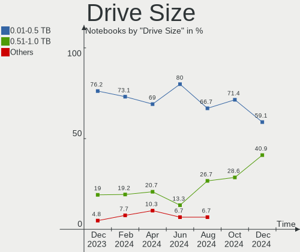
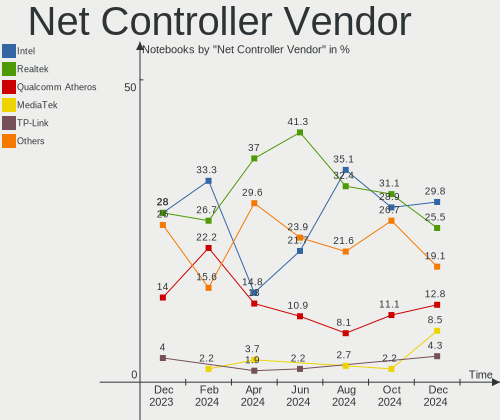
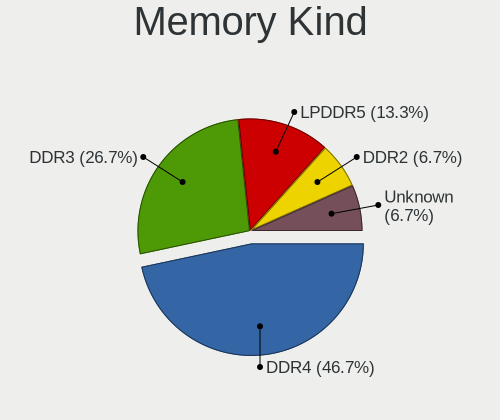

Xubuntu Hardware Trends (Notebooks)
-----------------------------------

A project to identify most popular hardware characteristics and track their change
over time based on data collected by Xubuntu users at https://Linux-Hardware.org.

Anyone can contribute to this report by the [hw-probe](https://github.com/linuxhw/hw-probe) tool:

    sudo -E hw-probe -all -upload

Full-feature report is available here: https://linux-hardware.org/?view=trends

Period: Mar, 2022.

Contents
--------

* [ System ](#system)
  - [ OS                       ](#os)
  - [ OS Family                ](#os-family)
  - [ Kernel                   ](#kernel)
  - [ Kernel Family            ](#kernel-family)
  - [ Kernel Major Ver.        ](#kernel-major-ver)
  - [ Arch                     ](#arch)
  - [ DE                       ](#de)
  - [ Display Server           ](#display-server)
  - [ Display Manager          ](#display-manager)
  - [ OS Lang                  ](#os-lang)
  - [ Boot Mode                ](#boot-mode)
  - [ Filesystem               ](#filesystem)
  - [ Part. scheme             ](#part-scheme)
  - [ Dual Boot with Linux/BSD ](#dual-boot-with-linuxbsd)
  - [ Dual Boot (Win)          ](#dual-boot-win)

* [ Board ](#board)
  - [ Vendor                   ](#vendor)
  - [ Model                    ](#model)
  - [ Model Family             ](#model-family)
  - [ MFG Year                 ](#mfg-year)
  - [ Form Factor              ](#form-factor)
  - [ Secure Boot              ](#secure-boot)
  - [ Coreboot                 ](#coreboot)
  - [ RAM Size                 ](#ram-size)
  - [ RAM Used                 ](#ram-used)
  - [ Total Drives             ](#total-drives)
  - [ Has CD-ROM               ](#has-cd-rom)
  - [ Has Ethernet             ](#has-ethernet)
  - [ Has WiFi                 ](#has-wifi)
  - [ Has Bluetooth            ](#has-bluetooth)

* [ Location ](#location)
  - [ Country                  ](#country)
  - [ City                     ](#city)

* [ Drives ](#drives)
  - [ Drive Vendor             ](#drive-vendor)
  - [ Drive Model              ](#drive-model)
  - [ HDD Vendor               ](#hdd-vendor)
  - [ SSD Vendor               ](#ssd-vendor)
  - [ Drive Kind               ](#drive-kind)
  - [ Drive Connector          ](#drive-connector)
  - [ Drive Size               ](#drive-size)
  - [ Space Total              ](#space-total)
  - [ Space Used               ](#space-used)
  - [ Malfunc. Drives          ](#malfunc-drives)
  - [ Malfunc. Drive Vendor    ](#malfunc-drive-vendor)
  - [ Malfunc. HDD Vendor      ](#malfunc-hdd-vendor)
  - [ Malfunc. Drive Kind      ](#malfunc-drive-kind)
  - [ Failed Drives            ](#failed-drives)
  - [ Failed Drive Vendor      ](#failed-drive-vendor)
  - [ Drive Status             ](#drive-status)

* [ Storage controller ](#storage-controller)
  - [ Storage Vendor           ](#storage-vendor)
  - [ Storage Model            ](#storage-model)
  - [ Storage Kind             ](#storage-kind)

* [ Processor ](#processor)
  - [ CPU Vendor               ](#cpu-vendor)
  - [ CPU Model                ](#cpu-model)
  - [ CPU Model Family         ](#cpu-model-family)
  - [ CPU Cores                ](#cpu-cores)
  - [ CPU Sockets              ](#cpu-sockets)
  - [ CPU Threads              ](#cpu-threads)
  - [ CPU Op-Modes             ](#cpu-op-modes)
  - [ CPU Microcode            ](#cpu-microcode)
  - [ CPU Microarch            ](#cpu-microarch)

* [ Graphics ](#graphics)
  - [ GPU Vendor               ](#gpu-vendor)
  - [ GPU Model                ](#gpu-model)
  - [ GPU Combo                ](#gpu-combo)
  - [ GPU Driver               ](#gpu-driver)
  - [ GPU Memory               ](#gpu-memory)

* [ Monitor ](#monitor)
  - [ Monitor Vendor           ](#monitor-vendor)
  - [ Monitor Model            ](#monitor-model)
  - [ Monitor Resolution       ](#monitor-resolution)
  - [ Monitor Diagonal         ](#monitor-diagonal)
  - [ Monitor Width            ](#monitor-width)
  - [ Aspect Ratio             ](#aspect-ratio)
  - [ Monitor Area             ](#monitor-area)
  - [ Pixel Density            ](#pixel-density)
  - [ Multiple Monitors        ](#multiple-monitors)

* [ Network ](#network)
  - [ Net Controller Vendor    ](#net-controller-vendor)
  - [ Net Controller Model     ](#net-controller-model)
  - [ Wireless Vendor          ](#wireless-vendor)
  - [ Wireless Model           ](#wireless-model)
  - [ Ethernet Vendor          ](#ethernet-vendor)
  - [ Ethernet Model           ](#ethernet-model)
  - [ Net Controller Kind      ](#net-controller-kind)
  - [ Used Controller          ](#used-controller)
  - [ NICs                     ](#nics)
  - [ IPv6                     ](#ipv6)

* [ Bluetooth ](#bluetooth)
  - [ Bluetooth Vendor         ](#bluetooth-vendor)
  - [ Bluetooth Model          ](#bluetooth-model)

* [ Sound ](#sound)
  - [ Sound Vendor             ](#sound-vendor)
  - [ Sound Model              ](#sound-model)

* [ Memory ](#memory)
  - [ Memory Vendor            ](#memory-vendor)
  - [ Memory Model             ](#memory-model)
  - [ Memory Kind              ](#memory-kind)
  - [ Memory Form Factor       ](#memory-form-factor)
  - [ Memory Size              ](#memory-size)
  - [ Memory Speed             ](#memory-speed)

* [ Printers & scanners ](#printers--scanners)
  - [ Printer Vendor           ](#printer-vendor)
  - [ Printer Model            ](#printer-model)
  - [ Scanner Vendor           ](#scanner-vendor)
  - [ Scanner Model            ](#scanner-model)

* [ Camera ](#camera)
  - [ Camera Vendor            ](#camera-vendor)
  - [ Camera Model             ](#camera-model)

* [ Security ](#security)
  - [ Fingerprint Vendor       ](#fingerprint-vendor)
  - [ Fingerprint Model        ](#fingerprint-model)
  - [ Chipcard Vendor          ](#chipcard-vendor)
  - [ Chipcard Model           ](#chipcard-model)

* [ Unsupported ](#unsupported)
  - [ Unsupported Devices      ](#unsupported-devices)
  - [ Unsupported Device Types ](#unsupported-device-types)

System
------

OS
--

Installed operating systems

| Name          | Notebooks | Percent |
|---------------|-----------|---------|
| Xubuntu 20.04 | 27        | 62.79%  |
| Xubuntu 21.10 | 8         | 18.6%   |
| Xubuntu 18.04 | 6         | 13.95%  |
| Xubuntu 21.04 | 1         | 2.33%   |
| Xubuntu 16.04 | 1         | 2.33%   |

OS Family
---------

OS without a version

| Name    | Notebooks | Percent |
|---------|-----------|---------|
| Xubuntu | 43        | 100%    |

Kernel
------

Version of the Linux kernel

| Version                    | Notebooks | Percent |
|----------------------------|-----------|---------|
| 5.13.0-35-generic          | 12        | 27.91%  |
| 5.13.0-30-generic          | 6         | 13.95%  |
| 5.4.0-104-generic          | 5         | 11.63%  |
| 5.13.0-37-generic          | 3         | 6.98%   |
| 5.4.0-105-generic          | 2         | 4.65%   |
| 5.4.0-100-generic          | 2         | 4.65%   |
| 5.4.0-99-generic           | 1         | 2.33%   |
| 5.4.0-94-generic           | 1         | 2.33%   |
| 5.4.0-81-generic           | 1         | 2.33%   |
| 5.4.0-802109090909-generic | 1         | 2.33%   |
| 5.4.0-100-lowlatency       | 1         | 2.33%   |
| 5.13.0-35-lowlatency       | 1         | 2.33%   |
| 5.13.0-19-generic          | 1         | 2.33%   |
| 5.13.0-1009-intel          | 1         | 2.33%   |
| 5.11.0-49-generic          | 1         | 2.33%   |
| 5.11.0-44-generic          | 1         | 2.33%   |
| 5.0.0-37-generic           | 1         | 2.33%   |
| 4.16.18-galliumos          | 1         | 2.33%   |
| 4.15.0-142-generic         | 1         | 2.33%   |

Kernel Family
-------------

Linux kernel without a distro release

| Version | Notebooks | Percent |
|---------|-----------|---------|
| 5.13.0  | 24        | 55.81%  |
| 5.4.0   | 14        | 32.56%  |
| 5.11.0  | 2         | 4.65%   |
| 5.0.0   | 1         | 2.33%   |
| 4.16.18 | 1         | 2.33%   |
| 4.15.0  | 1         | 2.33%   |

Kernel Major Ver.
-----------------

Linux kernel major version

| Version | Notebooks | Percent |
|---------|-----------|---------|
| 5.13    | 24        | 55.81%  |
| 5.4     | 14        | 32.56%  |
| 5.11    | 2         | 4.65%   |
| 5.0     | 1         | 2.33%   |
| 4.16    | 1         | 2.33%   |
| 4.15    | 1         | 2.33%   |

Arch
----

OS architecture (x86_64, i586, etc.)

| Name   | Notebooks | Percent |
|--------|-----------|---------|
| x86_64 | 39        | 90.7%   |
| i686   | 4         | 9.3%    |

DE
--

Desktop Environment

| Name | Notebooks | Percent |
|------|-----------|---------|
| XFCE | 43        | 100%    |

Display Server
--------------

X11 or Wayland

| Name | Notebooks | Percent |
|------|-----------|---------|
| X11  | 43        | 100%    |

Display Manager
---------------

SDDM, LightDM, etc.

| Name    | Notebooks | Percent |
|---------|-----------|---------|
| LightDM | 36        | 83.72%  |
| Unknown | 3         | 6.98%   |
| GDM3    | 2         | 4.65%   |
| LXDM    | 1         | 2.33%   |
| GDM     | 1         | 2.33%   |

OS Lang
-------

Language

| Lang  | Notebooks | Percent |
|-------|-----------|---------|
| en_US | 18        | 41.86%  |
| fr_FR | 6         | 13.95%  |
| it_IT | 4         | 9.3%    |
| ru_RU | 2         | 4.65%   |
| es_ES | 2         | 4.65%   |
| en_GB | 2         | 4.65%   |
| en_AU | 2         | 4.65%   |
| pt_BR | 1         | 2.33%   |
| hu_HU | 1         | 2.33%   |
| es_MX | 1         | 2.33%   |
| en_ZA | 1         | 2.33%   |
| en_IN | 1         | 2.33%   |
| de_AT | 1         | 2.33%   |
| cs_CZ | 1         | 2.33%   |

Boot Mode
---------

EFI or BIOS

| Mode | Notebooks | Percent |
|------|-----------|---------|
| BIOS | 24        | 55.81%  |
| EFI  | 19        | 44.19%  |

Filesystem
----------

Type of filesystem

| Type    | Notebooks | Percent |
|---------|-----------|---------|
| Ext4    | 42        | 97.67%  |
| Overlay | 1         | 2.33%   |

Part. scheme
------------

Scheme of partitioning

| Type    | Notebooks | Percent |
|---------|-----------|---------|
| Unknown | 26        | 60.47%  |
| GPT     | 12        | 27.91%  |
| MBR     | 5         | 11.63%  |

Dual Boot with Linux/BSD
------------------------

Hosting more than one Linux/BSD

| Dual boot | Notebooks | Percent |
|-----------|-----------|---------|
| No        | 37        | 86.05%  |
| Yes       | 6         | 13.95%  |

Dual Boot (Win)
---------------

Hosting Linux and Windows

| Dual boot | Notebooks | Percent |
|-----------|-----------|---------|
| No        | 33        | 76.74%  |
| Yes       | 10        | 23.26%  |

Board
-----

Vendor
------

Motherboard manufacturer

| Name                | Notebooks | Percent |
|---------------------|-----------|---------|
| Dell                | 8         | 18.6%   |
| ASUSTek Computer    | 7         | 16.28%  |
| Lenovo              | 5         | 11.63%  |
| Hewlett-Packard     | 5         | 11.63%  |
| Acer                | 5         | 11.63%  |
| Toshiba             | 2         | 4.65%   |
| Samsung Electronics | 2         | 4.65%   |
| Packard Bell        | 2         | 4.65%   |
| Teclast             | 1         | 2.33%   |
| Notebook            | 1         | 2.33%   |
| Medion              | 1         | 2.33%   |
| HUAWEI              | 1         | 2.33%   |
| GPU Company         | 1         | 2.33%   |
| Google              | 1         | 2.33%   |
| Fujitsu Siemens     | 1         | 2.33%   |

Model
-----

Motherboard model

| Name                                    | Notebooks | Percent |
|-----------------------------------------|-----------|---------|
| Packard Bell EasyNote TM85              | 2         | 4.65%   |
| Toshiba NB505                           | 1         | 2.33%   |
| Toshiba NB205                           | 1         | 2.33%   |
| Teclast F15 Plus                        | 1         | 2.33%   |
| Samsung R530/R730/R540                  | 1         | 2.33%   |
| Samsung R510/P510                       | 1         | 2.33%   |
| Notebook PC5x_7xHP_HR_HS                | 1         | 2.33%   |
| Medion Crawler E25                      | 1         | 2.33%   |
| Lenovo ThinkPad X270 20HNS0LW00         | 1         | 2.33%   |
| Lenovo ThinkPad T450 20BUS06B00         | 1         | 2.33%   |
| Lenovo ThinkPad T14s Gen 1 20T1S8E400   | 1         | 2.33%   |
| Lenovo Legion 7 16ACHg6 82N6            | 1         | 2.33%   |
| Lenovo B590 20208                       | 1         | 2.33%   |
| HUAWEI KPL-W0X                          | 1         | 2.33%   |
| HP ZBook 15                             | 1         | 2.33%   |
| HP Stream 11 Pro G2 Notebook PC         | 1         | 2.33%   |
| HP Notebook PC                          | 1         | 2.33%   |
| HP Laptop 15-ef2xxx                     | 1         | 2.33%   |
| HP EliteBook 2540p                      | 1         | 2.33%   |
| GPU Company GWTC116-2                   | 1         | 2.33%   |
| Google Banon                            | 1         | 2.33%   |
| Fujitsu Siemens AMILO Xi 3650           | 1         | 2.33%   |
| Dell Vostro 3458                        | 1         | 2.33%   |
| Dell Studio 1450                        | 1         | 2.33%   |
| Dell Latitude E6430                     | 1         | 2.33%   |
| Dell Latitude E6400                     | 1         | 2.33%   |
| Dell Latitude 7490                      | 1         | 2.33%   |
| Dell Latitude 5510                      | 1         | 2.33%   |
| Dell Inspiron 7520                      | 1         | 2.33%   |
| Dell Inspiron 7437                      | 1         | 2.33%   |
| ASUS X555LAB                            | 1         | 2.33%   |
| ASUS X501A                              | 1         | 2.33%   |
| ASUS X450CC                             | 1         | 2.33%   |
| ASUS VivoBook_ASUSLaptop E210MAB_R214MA | 1         | 2.33%   |
| ASUS U31SD                              | 1         | 2.33%   |
| ASUS K55VD                              | 1         | 2.33%   |
| ASUS K53SC                              | 1         | 2.33%   |
| Acer TP-SW5-012-16UW                    | 1         | 2.33%   |
| Acer Nitro AN515-42                     | 1         | 2.33%   |
| Acer Aspire VN7-572                     | 1         | 2.33%   |
| Acer Aspire one                         | 1         | 2.33%   |
| Acer Aspire 5935                        | 1         | 2.33%   |

Model Family
------------

Motherboard model prefix

| Name                  | Notebooks | Percent |
|-----------------------|-----------|---------|
| Dell Latitude         | 4         | 9.3%    |
| Lenovo ThinkPad       | 3         | 6.98%   |
| Acer Aspire           | 3         | 6.98%   |
| Packard Bell EasyNote | 2         | 4.65%   |
| Dell Inspiron         | 2         | 4.65%   |
| Toshiba NB505         | 1         | 2.33%   |
| Toshiba NB205         | 1         | 2.33%   |
| Teclast F15           | 1         | 2.33%   |
| Samsung R530          | 1         | 2.33%   |
| Samsung R510          | 1         | 2.33%   |
| Notebook PC5x         | 1         | 2.33%   |
| Medion Crawler        | 1         | 2.33%   |
| Lenovo Legion         | 1         | 2.33%   |
| Lenovo B590           | 1         | 2.33%   |
| HUAWEI KPL-W0X        | 1         | 2.33%   |
| HP ZBook              | 1         | 2.33%   |
| HP Stream             | 1         | 2.33%   |
| HP Notebook           | 1         | 2.33%   |
| HP Laptop             | 1         | 2.33%   |
| HP EliteBook          | 1         | 2.33%   |
| GPU Company GWTC116-2 | 1         | 2.33%   |
| Google Banon          | 1         | 2.33%   |
| Fujitsu Siemens AMILO | 1         | 2.33%   |
| Dell Vostro           | 1         | 2.33%   |
| Dell Studio           | 1         | 2.33%   |
| ASUS X555LAB          | 1         | 2.33%   |
| ASUS X501A            | 1         | 2.33%   |
| ASUS X450CC           | 1         | 2.33%   |
| ASUS VivoBook         | 1         | 2.33%   |
| ASUS U31SD            | 1         | 2.33%   |
| ASUS K55VD            | 1         | 2.33%   |
| ASUS K53SC            | 1         | 2.33%   |
| Acer TP-SW5-012-16UW  | 1         | 2.33%   |
| Acer Nitro            | 1         | 2.33%   |

MFG Year
--------

Motherboard manufacture year

| Year | Notebooks | Percent |
|------|-----------|---------|
| 2021 | 8         | 18.6%   |
| 2012 | 5         | 11.63%  |
| 2018 | 4         | 9.3%    |
| 2010 | 4         | 9.3%    |
| 2009 | 4         | 9.3%    |
| 2016 | 3         | 6.98%   |
| 2011 | 3         | 6.98%   |
| 2008 | 3         | 6.98%   |
| 2020 | 2         | 4.65%   |
| 2017 | 2         | 4.65%   |
| 2014 | 2         | 4.65%   |
| 2013 | 2         | 4.65%   |
| 2015 | 1         | 2.33%   |

Form Factor
-----------

Physical design of the computer

| Name     | Notebooks | Percent |
|----------|-----------|---------|
| Notebook | 43        | 100%    |

Secure Boot
-----------

Enabled or disabled

| State    | Notebooks | Percent |
|----------|-----------|---------|
| Disabled | 34        | 79.07%  |
| Enabled  | 9         | 20.93%  |

Coreboot
--------

Have coreboot on board

| Used | Notebooks | Percent |
|------|-----------|---------|
| No   | 42        | 97.67%  |
| Yes  | 1         | 2.33%   |

RAM Size
--------

Total RAM memory

| Size in GB | Notebooks | Percent |
|------------|-----------|---------|
| 4.01-8.0   | 15        | 34.88%  |
| 3.01-4.0   | 12        | 27.91%  |
| 8.01-16.0  | 6         | 13.95%  |
| 32.01-64.0 | 5         | 11.63%  |
| 1.01-2.0   | 2         | 4.65%   |
| 0.51-1.0   | 2         | 4.65%   |
| 16.01-24.0 | 1         | 2.33%   |

RAM Used
--------

Used RAM memory

| Used GB   | Notebooks | Percent |
|-----------|-----------|---------|
| 1.01-2.0  | 23        | 53.49%  |
| 4.01-8.0  | 6         | 13.95%  |
| 2.01-3.0  | 4         | 9.3%    |
| 0.51-1.0  | 4         | 9.3%    |
| 3.01-4.0  | 3         | 6.98%   |
| 8.01-16.0 | 2         | 4.65%   |
| 0.01-0.5  | 1         | 2.33%   |

Total Drives
------------

Number of drives on board

| Drives | Notebooks | Percent |
|--------|-----------|---------|
| 1      | 35        | 81.4%   |
| 2      | 7         | 16.28%  |
| 3      | 1         | 2.33%   |

Has CD-ROM
----------

Has CD-ROM on board

| Presented | Notebooks | Percent |
|-----------|-----------|---------|
| No        | 25        | 58.14%  |
| Yes       | 18        | 41.86%  |

Has Ethernet
------------

Has Ethernet on board

| Presented | Notebooks | Percent |
|-----------|-----------|---------|
| Yes       | 35        | 81.4%   |
| No        | 8         | 18.6%   |

Has WiFi
--------

Has WiFi module

| Presented | Notebooks | Percent |
|-----------|-----------|---------|
| Yes       | 41        | 95.35%  |
| No        | 2         | 4.65%   |

Has Bluetooth
-------------

Has Bluetooth module

| Presented | Notebooks | Percent |
|-----------|-----------|---------|
| Yes       | 29        | 67.44%  |
| No        | 14        | 32.56%  |

Location
--------

Country
-------

Geographic location (country)

| Country      | Notebooks | Percent |
|--------------|-----------|---------|
| USA          | 8         | 18.6%   |
| France       | 6         | 13.95%  |
| Russia       | 4         | 9.3%    |
| Italy        | 4         | 9.3%    |
| Mexico       | 3         | 6.98%   |
| UK           | 2         | 4.65%   |
| Spain        | 2         | 4.65%   |
| Germany      | 2         | 4.65%   |
| Australia    | 2         | 4.65%   |
| Venezuela    | 1         | 2.33%   |
| South Africa | 1         | 2.33%   |
| Netherlands  | 1         | 2.33%   |
| India        | 1         | 2.33%   |
| Hungary      | 1         | 2.33%   |
| Czechia      | 1         | 2.33%   |
| Colombia     | 1         | 2.33%   |
| Brazil       | 1         | 2.33%   |
| Belgium      | 1         | 2.33%   |
| Austria      | 1         | 2.33%   |

City
----

Geographic location (city)

| City                      | Notebooks | Percent |
|---------------------------|-----------|---------|
| Walsall                   | 2         | 4.65%   |
| Neumarkt in der Oberpfalz | 2         | 4.65%   |
| Moscow                    | 2         | 4.65%   |
| Zlín                     | 1         | 2.33%   |
| Vilafranca del Penedès   | 1         | 2.33%   |
| Vienna                    | 1         | 2.33%   |
| Ulyanovsk                 | 1         | 2.33%   |
| Tuineje                   | 1         | 2.33%   |
| Tijuana                   | 1         | 2.33%   |
| Talence                   | 1         | 2.33%   |
| Santiago de Cali          | 1         | 2.33%   |
| San Giovanni Lupatoto     | 1         | 2.33%   |
| Saginaw                   | 1         | 2.33%   |
| Queens                    | 1         | 2.33%   |
| Pretoria                  | 1         | 2.33%   |
| Portland                  | 1         | 2.33%   |
| Payson                    | 1         | 2.33%   |
| Nashville                 | 1         | 2.33%   |
| Morsang-sur-Orge          | 1         | 2.33%   |
| Milan                     | 1         | 2.33%   |
| Mesa                      | 1         | 2.33%   |
| Melbourne                 | 1         | 2.33%   |
| Lorient                   | 1         | 2.33%   |
| León                     | 1         | 2.33%   |
| King George               | 1         | 2.33%   |
| Juazeiro do Norte         | 1         | 2.33%   |
| Huntingdon                | 1         | 2.33%   |
| Hochfelden                | 1         | 2.33%   |
| Genoa                     | 1         | 2.33%   |
| Geelong                   | 1         | 2.33%   |
| Florence                  | 1         | 2.33%   |
| Dunaharaszti              | 1         | 2.33%   |
| Donetsk                   | 1         | 2.33%   |
| Chennai                   | 1         | 2.33%   |
| Brussels                  | 1         | 2.33%   |
| Brest                     | 1         | 2.33%   |
| Barcelona                 | 1         | 2.33%   |
| Bannalec                  | 1         | 2.33%   |
| Amsterdam                 | 1         | 2.33%   |
| Aguascalientes            | 1         | 2.33%   |

Drives
------

Drive Vendor
------------

Hard drive vendors

| Vendor              | Notebooks | Drives | Percent |
|---------------------|-----------|--------|---------|
| Samsung Electronics | 10        | 10     | 19.23%  |
| Seagate             | 9         | 9      | 17.31%  |
| WDC                 | 4         | 4      | 7.69%   |
| Unknown             | 3         | 3      | 5.77%   |
| Toshiba             | 3         | 3      | 5.77%   |
| Transcend           | 2         | 2      | 3.85%   |
| Kingston            | 2         | 2      | 3.85%   |
| Intel               | 2         | 2      | 3.85%   |
| HGST                | 2         | 2      | 3.85%   |
| A-DATA Technology   | 2         | 2      | 3.85%   |
| Unknown             | 2         | 2      | 3.85%   |
| Teclast             | 1         | 1      | 1.92%   |
| SK Hynix            | 1         | 1      | 1.92%   |
| Pioneer             | 1         | 1      | 1.92%   |
| Phison              | 1         | 1      | 1.92%   |
| Micron Technology   | 1         | 1      | 1.92%   |
| LaCie               | 1         | 1      | 1.92%   |
| KIOXIA              | 1         | 1      | 1.92%   |
| Hitachi             | 1         | 1      | 1.92%   |
| Fujitsu             | 1         | 1      | 1.92%   |
| Crucial             | 1         | 1      | 1.92%   |
| Apacer              | 1         | 1      | 1.92%   |

Drive Model
-----------

Hard drive models

| Model                                | Notebooks | Percent |
|--------------------------------------|-----------|---------|
| Seagate ST1000LM024 HN-M101MBB 1TB   | 2         | 3.85%   |
| Samsung SSD 860 EVO 250GB            | 2         | 3.85%   |
| Unknown                              | 2         | 3.85%   |
| WDC WDS240G2G0A-00JH30 240GB SSD     | 1         | 1.92%   |
| WDC WDS120G2G0A-00JH30 120GB SSD     | 1         | 1.92%   |
| WDC WDBNCE0010PNC 1TB SSD            | 1         | 1.92%   |
| WDC WD5000BEVT-22ZAT0 500GB          | 1         | 1.92%   |
| Unknown MMC Card  64GB               | 1         | 1.92%   |
| Unknown MMC Card  32GB               | 1         | 1.92%   |
| Unknown MMC Card  128GB              | 1         | 1.92%   |
| Transcend TS240GSSD220S 240GB        | 1         | 1.92%   |
| Transcend TS120GMTS420S 120GB SSD    | 1         | 1.92%   |
| Toshiba MQ01ABD100 1TB               | 1         | 1.92%   |
| Toshiba MK1655GSX 160GB              | 1         | 1.92%   |
| Toshiba HDWJ105 500GB                | 1         | 1.92%   |
| Teclast BD256GB SHCB-2280 SSD        | 1         | 1.92%   |
| SK Hynix HCG8e  64GB                 | 1         | 1.92%   |
| Seagate ST980411ASG 80GB             | 1         | 1.92%   |
| Seagate ST9500420ASG 500GB           | 1         | 1.92%   |
| Seagate ST500LT032-1E9142 500GB      | 1         | 1.92%   |
| Seagate ST500LT012-9WS142 500GB      | 1         | 1.92%   |
| Seagate ST500LT012-1DG142 500GB      | 1         | 1.92%   |
| Seagate ST500LM021-1KJ152 500GB      | 1         | 1.92%   |
| Seagate ST500LM000-1EJ162 500GB      | 1         | 1.92%   |
| Samsung SSD 980 PRO 2TB              | 1         | 1.92%   |
| Samsung SSD 860 EVO 500GB            | 1         | 1.92%   |
| Samsung SSD 750 EVO 500GB            | 1         | 1.92%   |
| Samsung NVMe SSD Drive 256GB         | 1         | 1.92%   |
| Samsung MZVLB512HBJQ-000L7 512GB     | 1         | 1.92%   |
| Samsung MZVLB1T0HBLR-000L2 1TB       | 1         | 1.92%   |
| Samsung MZNLN256HAJQ-00000 256GB SSD | 1         | 1.92%   |
| Samsung MZMPC032HBCD-000D1 32GB SSD  | 1         | 1.92%   |
| Pioneer APS-SL3N-240 240GB           | 1         | 1.92%   |
| Phison NVMe SSD Drive 512GB          | 1         | 1.92%   |
| Micron 1100 SATA 512GB SSD           | 1         | 1.92%   |
| LaCie d2 Quadra v3C 2TB              | 1         | 1.92%   |
| KIOXIA KBG40ZNS256G NVMe 256GB       | 1         | 1.92%   |
| Kingston SV300S37A240G 240GB SSD     | 1         | 1.92%   |
| Kingston SA400S37240G 240GB SSD      | 1         | 1.92%   |
| Intel SSDSC2CW240A3 240GB            | 1         | 1.92%   |
| Intel SSDSA1M080G2HP 80GB            | 1         | 1.92%   |
| Hitachi HTS547550A9E384 500GB        | 1         | 1.92%   |
| HGST HTS725032A7E630 320GB           | 1         | 1.92%   |
| HGST HTS541010A9E680 1TB             | 1         | 1.92%   |
| Fujitsu MHZ2500BT G1 500GB           | 1         | 1.92%   |
| Crucial CT960M500SSD1 960GB          | 1         | 1.92%   |
| Apacer AS2280P4 512GB                | 1         | 1.92%   |
| A-DATA XPG EX500 480GB SSD           | 1         | 1.92%   |
| A-DATA SWORDFISH 1TB                 | 1         | 1.92%   |

HDD Vendor
----------

Hard disk drive vendors

| Vendor  | Notebooks | Drives | Percent |
|---------|-----------|--------|---------|
| Seagate | 9         | 9      | 52.94%  |
| Toshiba | 3         | 3      | 17.65%  |
| HGST    | 2         | 2      | 11.76%  |
| WDC     | 1         | 1      | 5.88%   |
| Hitachi | 1         | 1      | 5.88%   |
| Fujitsu | 1         | 1      | 5.88%   |

SSD Vendor
----------

Solid state drive vendors

| Vendor              | Notebooks | Drives | Percent |
|---------------------|-----------|--------|---------|
| Samsung Electronics | 6         | 6      | 30%     |
| WDC                 | 3         | 3      | 15%     |
| Transcend           | 2         | 2      | 10%     |
| Kingston            | 2         | 2      | 10%     |
| Intel               | 2         | 2      | 10%     |
| Teclast             | 1         | 1      | 5%      |
| Pioneer             | 1         | 1      | 5%      |
| Micron Technology   | 1         | 1      | 5%      |
| Crucial             | 1         | 1      | 5%      |
| A-DATA Technology   | 1         | 1      | 5%      |

Drive Kind
----------

HDD or SSD

| Kind    | Notebooks | Drives | Percent |
|---------|-----------|--------|---------|
| SSD     | 19        | 20     | 38%     |
| HDD     | 17        | 17     | 34%     |
| NVMe    | 7         | 8      | 14%     |
| MMC     | 6         | 6      | 12%     |
| Unknown | 1         | 1      | 2%      |

Drive Connector
---------------

SATA, SAS, NVMe, etc.

| Type | Notebooks | Drives | Percent |
|------|-----------|--------|---------|
| SATA | 31        | 36     | 67.39%  |
| NVMe | 7         | 8      | 15.22%  |
| MMC  | 6         | 6      | 13.04%  |
| SAS  | 2         | 2      | 4.35%   |

Drive Size
----------

Size of hard drive

| Size in TB | Notebooks | Drives | Percent |
|------------|-----------|--------|---------|
| 0.01-0.5   | 26        | 30     | 78.79%  |
| 0.51-1.0   | 7         | 7      | 21.21%  |

Space Total
-----------

Amount of disk space available on the file system

| Size in GB | Notebooks | Percent |
|------------|-----------|---------|
| 101-250    | 18        | 41.86%  |
| 251-500    | 9         | 20.93%  |
| 51-100     | 6         | 13.95%  |
| 501-1000   | 4         | 9.3%    |
| 2001-3000  | 3         | 6.98%   |
| 1001-2000  | 2         | 4.65%   |
| 1-20       | 1         | 2.33%   |

Space Used
----------

Amount of used disk space

| Used GB   | Notebooks | Percent |
|-----------|-----------|---------|
| 1-20      | 17        | 39.53%  |
| 21-50     | 10        | 23.26%  |
| 51-100    | 5         | 11.63%  |
| 101-250   | 4         | 9.3%    |
| 251-500   | 3         | 6.98%   |
| 501-1000  | 3         | 6.98%   |
| 1001-2000 | 1         | 2.33%   |

Malfunc. Drives
---------------

Drive models with a malfunction

| Model                              | Notebooks | Drives | Percent |
|------------------------------------|-----------|--------|---------|
| Seagate ST1000LM024 HN-M101MBB 1TB | 2         | 2      | 40%     |
| Seagate ST9500420ASG 500GB         | 1         | 1      | 20%     |
| Seagate ST500LT012-9WS142 500GB    | 1         | 1      | 20%     |
| Seagate ST500LM021-1KJ152 500GB    | 1         | 1      | 20%     |

Malfunc. Drive Vendor
---------------------

Vendors of faulty drives

| Vendor  | Notebooks | Drives | Percent |
|---------|-----------|--------|---------|
| Seagate | 5         | 5      | 100%    |

Malfunc. HDD Vendor
-------------------

Vendors of faulty HDD drives

| Vendor  | Notebooks | Drives | Percent |
|---------|-----------|--------|---------|
| Seagate | 5         | 5      | 100%    |

Malfunc. Drive Kind
-------------------

Kinds of faulty drives

| Kind | Notebooks | Drives | Percent |
|------|-----------|--------|---------|
| HDD  | 5         | 5      | 100%    |

Failed Drives
-------------

Failed drive models

Zero info for selected period =(

Failed Drive Vendor
-------------------

Failed drive vendors

Zero info for selected period =(

Drive Status
------------

Number of failed and malfunc. drives

| Status   | Notebooks | Drives | Percent |
|----------|-----------|--------|---------|
| Detected | 30        | 32     | 62.5%   |
| Works    | 13        | 15     | 27.08%  |
| Malfunc  | 5         | 5      | 10.42%  |

Storage controller
------------------

Storage Vendor
--------------

Storage controller vendors

| Vendor                | Notebooks | Percent |
|-----------------------|-----------|---------|
| Intel                 | 30        | 69.77%  |
| AMD                   | 5         | 11.63%  |
| Samsung Electronics   | 4         | 9.3%    |
| Phison Electronics    | 2         | 4.65%   |
| Realtek Semiconductor | 1         | 2.33%   |
| KIOXIA                | 1         | 2.33%   |

Storage Model
-------------

Storage controller models

| Model                                                                          | Notebooks | Percent |
|--------------------------------------------------------------------------------|-----------|---------|
| AMD FCH SATA Controller [AHCI mode]                                            | 5         | 10.64%  |
| Intel 82801 Mobile SATA Controller [RAID mode]                                 | 4         | 8.51%   |
| Intel 7 Series Chipset Family 6-port SATA Controller [AHCI mode]               | 4         | 8.51%   |
| Intel Wildcat Point-LP SATA Controller [AHCI Mode]                             | 3         | 6.38%   |
| Samsung NVMe SSD Controller SM981/PM981/PM983                                  | 2         | 4.26%   |
| Intel Sunrise Point-LP SATA Controller [AHCI mode]                             | 2         | 4.26%   |
| Intel Celeron/Pentium Silver Processor SATA Controller                         | 2         | 4.26%   |
| Intel 82801IBM/IEM (ICH9M/ICH9M-E) 4 port SATA Controller [AHCI mode]          | 2         | 4.26%   |
| Intel 6 Series/C200 Series Chipset Family 6 port Mobile SATA AHCI Controller   | 2         | 4.26%   |
| Intel 5 Series/3400 Series Chipset 4 port SATA IDE Controller                  | 2         | 4.26%   |
| Intel 5 Series/3400 Series Chipset 4 port SATA AHCI Controller                 | 2         | 4.26%   |
| Intel 5 Series/3400 Series Chipset 2 port SATA IDE Controller                  | 2         | 4.26%   |
| Samsung NVMe SSD Controller SM961/PM961/SM963                                  | 1         | 2.13%   |
| Samsung NVMe SSD Controller PM9A1/PM9A3/980PRO                                 | 1         | 2.13%   |
| Realtek Realtek Non-Volatile memory controller                                 | 1         | 2.13%   |
| Phison PS5013 E13 NVMe Controller                                              | 1         | 2.13%   |
| Phison E12 NVMe Controller                                                     | 1         | 2.13%   |
| KIOXIA Non-Volatile memory controller                                          | 1         | 2.13%   |
| Intel NM10/ICH7 Family SATA Controller [AHCI mode]                             | 1         | 2.13%   |
| Intel Mobile 4 Series Chipset PT IDER Controller                               | 1         | 2.13%   |
| Intel Comet Lake SATA AHCI Controller                                          | 1         | 2.13%   |
| Intel 82801IBM/IEM (ICH9M/ICH9M-E) 2 port SATA Controller [IDE mode]           | 1         | 2.13%   |
| Intel 82801GBM/GHM (ICH7-M Family) SATA Controller [IDE mode]                  | 1         | 2.13%   |
| Intel 82801GBM/GHM (ICH7-M Family) SATA Controller [AHCI mode]                 | 1         | 2.13%   |
| Intel 82801G (ICH7 Family) IDE Controller                                      | 1         | 2.13%   |
| Intel 8 Series/C220 Series Chipset Family 6-port SATA Controller 1 [AHCI mode] | 1         | 2.13%   |
| Intel 8 Series SATA Controller 1 [AHCI mode]                                   | 1         | 2.13%   |

Storage Kind
------------

Kind of storage controller (IDE, SATA, NVMe, SAS, ...)

| Kind | Notebooks | Percent |
|------|-----------|---------|
| SATA | 27        | 62.79%  |
| NVMe | 7         | 16.28%  |
| IDE  | 5         | 11.63%  |
| RAID | 4         | 9.3%    |

Processor
---------

CPU Vendor
----------

Processor vendors

| Vendor | Notebooks | Percent |
|--------|-----------|---------|
| Intel  | 37        | 86.05%  |
| AMD    | 6         | 13.95%  |

CPU Model
---------

Processor models

| Model                                           | Notebooks | Percent |
|-------------------------------------------------|-----------|---------|
| Intel Core i5-10310U CPU @ 1.70GHz              | 2         | 4.65%   |
| Intel Core i5 CPU M 460 @ 2.53GHz               | 2         | 4.65%   |
| Intel Core i3-2330M CPU @ 2.20GHz               | 2         | 4.65%   |
| Intel Core 2 Duo CPU P8400 @ 2.26GHz            | 2         | 4.65%   |
| Intel Celeron N4020 CPU @ 1.10GHz               | 2         | 4.65%   |
| AMD Ryzen 5 2500U with Radeon Vega Mobile Gfx   | 2         | 4.65%   |
| Intel Core i7-4700MQ CPU @ 2.40GHz              | 1         | 2.33%   |
| Intel Core i7-3630QM CPU @ 2.40GHz              | 1         | 2.33%   |
| Intel Core i7-2670QM CPU @ 2.20GHz              | 1         | 2.33%   |
| Intel Core i7 CPU L 640 @ 2.13GHz               | 1         | 2.33%   |
| Intel Core i5-8350U CPU @ 1.70GHz               | 1         | 2.33%   |
| Intel Core i5-7300U CPU @ 2.60GHz               | 1         | 2.33%   |
| Intel Core i5-6200U CPU @ 2.30GHz               | 1         | 2.33%   |
| Intel Core i5-5300U CPU @ 2.30GHz               | 1         | 2.33%   |
| Intel Core i5-5200U CPU @ 2.20GHz               | 1         | 2.33%   |
| Intel Core i5-4210U CPU @ 1.70GHz               | 1         | 2.33%   |
| Intel Core i5-3340M CPU @ 2.70GHz               | 1         | 2.33%   |
| Intel Core i5-3230M CPU @ 2.60GHz               | 1         | 2.33%   |
| Intel Core i3-3217U CPU @ 1.80GHz               | 1         | 2.33%   |
| Intel Core i3-3110M CPU @ 2.40GHz               | 1         | 2.33%   |
| Intel Core i3 CPU M 380 @ 2.53GHz               | 1         | 2.33%   |
| Intel Core 2 Duo CPU T6400 @ 2.00GHz            | 1         | 2.33%   |
| Intel Core 2 Duo CPU T5750 @ 2.00GHz            | 1         | 2.33%   |
| Intel Core 2 Duo CPU P8800 @ 2.66GHz            | 1         | 2.33%   |
| Intel Celeron N4120 CPU @ 1.10GHz               | 1         | 2.33%   |
| Intel Celeron CPU N3160 @ 1.60GHz               | 1         | 2.33%   |
| Intel Celeron CPU N3050 @ 1.60GHz               | 1         | 2.33%   |
| Intel Celeron 3205U @ 1.50GHz                   | 1         | 2.33%   |
| Intel Atom CPU Z3735F @ 1.33GHz                 | 1         | 2.33%   |
| Intel Atom CPU N455 @ 1.66GHz                   | 1         | 2.33%   |
| Intel Atom CPU N280 @ 1.66GHz                   | 1         | 2.33%   |
| Intel Atom CPU N270 @ 1.60GHz                   | 1         | 2.33%   |
| Intel 11th Gen Core i7-11800H @ 2.30GHz         | 1         | 2.33%   |
| AMD Ryzen 9 5900HX with Radeon Graphics         | 1         | 2.33%   |
| AMD Ryzen 5 5600H with Radeon Graphics          | 1         | 2.33%   |
| AMD Ryzen 5 5500U with Radeon Graphics          | 1         | 2.33%   |
| AMD A10-9600P RADEON R5, 10 COMPUTE CORES 4C+6G | 1         | 2.33%   |

CPU Model Family
----------------

Processor model prefix

| Model            | Notebooks | Percent |
|------------------|-----------|---------|
| Intel Core i5    | 12        | 27.91%  |
| Intel Celeron    | 6         | 13.95%  |
| Intel Core i3    | 5         | 11.63%  |
| Intel Core 2 Duo | 5         | 11.63%  |
| Intel Core i7    | 4         | 9.3%    |
| Intel Atom       | 4         | 9.3%    |
| AMD Ryzen 5      | 4         | 9.3%    |
| Other            | 1         | 2.33%   |
| AMD Ryzen 9      | 1         | 2.33%   |
| AMD A10          | 1         | 2.33%   |

CPU Cores
---------

Number of processor cores

| Number | Notebooks | Percent |
|--------|-----------|---------|
| 2      | 25        | 58.14%  |
| 4      | 11        | 25.58%  |
| 1      | 3         | 6.98%   |
| 8      | 2         | 4.65%   |
| 6      | 2         | 4.65%   |

CPU Sockets
-----------

Number of sockets

| Number | Notebooks | Percent |
|--------|-----------|---------|
| 1      | 43        | 100%    |

CPU Threads
-----------

Threads per core (Hyper-Threading)

| Number | Notebooks | Percent |
|--------|-----------|---------|
| 2      | 31        | 72.09%  |
| 1      | 12        | 27.91%  |

CPU Op-Modes
------------

CPU Operation Modes (32-bit, 64-bit)

| Op mode        | Notebooks | Percent |
|----------------|-----------|---------|
| 32-bit, 64-bit | 41        | 95.35%  |
| 32-bit         | 2         | 4.65%   |

CPU Microcode
-------------

Microcode number

| Number     | Notebooks | Percent |
|------------|-----------|---------|
| Unknown    | 8         | 18.6%   |
| 0x306a9    | 5         | 11.63%  |
| 0x706a8    | 3         | 6.98%   |
| 0x306d4    | 2         | 4.65%   |
| 0x206a7    | 2         | 4.65%   |
| 0x20655    | 2         | 4.65%   |
| 0x106c2    | 2         | 4.65%   |
| 0x10676    | 2         | 4.65%   |
| 0x806ec    | 1         | 2.33%   |
| 0x806ea    | 1         | 2.33%   |
| 0x806d1    | 1         | 2.33%   |
| 0x6fd      | 1         | 2.33%   |
| 0x406c4    | 1         | 2.33%   |
| 0x406c3    | 1         | 2.33%   |
| 0x40651    | 1         | 2.33%   |
| 0x306c3    | 1         | 2.33%   |
| 0x30678    | 1         | 2.33%   |
| 0x106ca    | 1         | 2.33%   |
| 0x1067a    | 1         | 2.33%   |
| 0x0a50000c | 1         | 2.33%   |
| 0x0a50000b | 1         | 2.33%   |
| 0x08608103 | 1         | 2.33%   |
| 0x0810100b | 1         | 2.33%   |
| 0x08101007 | 1         | 2.33%   |
| 0x06006118 | 1         | 2.33%   |

CPU Microarch
-------------

Microarchitecture

| Name          | Notebooks | Percent |
|---------------|-----------|---------|
| IvyBridge     | 5         | 11.63%  |
| Westmere      | 4         | 9.3%    |
| Penryn        | 4         | 9.3%    |
| KabyLake      | 4         | 9.3%    |
| Silvermont    | 3         | 6.98%   |
| SandyBridge   | 3         | 6.98%   |
| Goldmont plus | 3         | 6.98%   |
| Broadwell     | 3         | 6.98%   |
| Bonnell       | 3         | 6.98%   |
| Zen 3         | 2         | 4.65%   |
| Zen           | 2         | 4.65%   |
| Haswell       | 2         | 4.65%   |
| Skylake       | 1         | 2.33%   |
| Icelake       | 1         | 2.33%   |
| Excavator     | 1         | 2.33%   |
| Core          | 1         | 2.33%   |
| Unknown       | 1         | 2.33%   |

Graphics
--------

GPU Vendor
----------

Vendors of graphics cards

| Vendor | Notebooks | Percent |
|--------|-----------|---------|
| Intel  | 33        | 62.26%  |
| Nvidia | 12        | 22.64%  |
| AMD    | 8         | 15.09%  |

GPU Model
---------

Graphics card models

| Model                                                                                    | Notebooks | Percent |
|------------------------------------------------------------------------------------------|-----------|---------|
| Intel 3rd Gen Core processor Graphics Controller                                         | 5         | 8.77%   |
| Intel Mobile 4 Series Chipset Integrated Graphics Controller                             | 4         | 7.02%   |
| Intel GeminiLake [UHD Graphics 600]                                                      | 3         | 5.26%   |
| Intel 2nd Generation Core Processor Family Integrated Graphics Controller                | 3         | 5.26%   |
| Nvidia GF117M [GeForce 610M/710M/810M/820M / GT 620M/625M/630M/720M]                     | 2         | 3.51%   |
| Intel Mobile 945GSE Express Integrated Graphics Controller                               | 2         | 3.51%   |
| Intel Mobile 945GM/GMS/GME, 943/940GML Express Integrated Graphics Controller            | 2         | 3.51%   |
| Intel HD Graphics 5500                                                                   | 2         | 3.51%   |
| Intel Core Processor Integrated Graphics Controller                                      | 2         | 3.51%   |
| Intel CometLake-U GT2 [UHD Graphics]                                                     | 2         | 3.51%   |
| Intel Atom/Celeron/Pentium Processor x5-E8000/J3xxx/N3xxx Integrated Graphics Controller | 2         | 3.51%   |
| AMD Raven Ridge [Radeon Vega Series / Radeon Vega Mobile Series]                         | 2         | 3.51%   |
| AMD Park [Mobility Radeon HD 5430/5450/5470]                                             | 2         | 3.51%   |
| Nvidia GK208GLM [Quadro K610M]                                                           | 1         | 1.75%   |
| Nvidia GF119M [GeForce GT 520M]                                                          | 1         | 1.75%   |
| Nvidia GF119M [GeForce GT 520MX]                                                         | 1         | 1.75%   |
| Nvidia GF119M [GeForce 610M]                                                             | 1         | 1.75%   |
| Nvidia GF108GLM [NVS 5200M]                                                              | 1         | 1.75%   |
| Nvidia GA107M [GeForce RTX 3050 Mobile]                                                  | 1         | 1.75%   |
| Nvidia GA104M [GeForce RTX 3080 Mobile / Max-Q 8GB/16GB]                                 | 1         | 1.75%   |
| Nvidia GA104M [GeForce RTX 3070 Mobile / Max-Q]                                          | 1         | 1.75%   |
| Nvidia G98M [Quadro NVS 160M]                                                            | 1         | 1.75%   |
| Nvidia G96CM [GeForce GT 130M]                                                           | 1         | 1.75%   |
| Intel UHD Graphics 620                                                                   | 1         | 1.75%   |
| Intel TigerLake-H GT1 [UHD Graphics]                                                     | 1         | 1.75%   |
| Intel Skylake GT2 [HD Graphics 520]                                                      | 1         | 1.75%   |
| Intel HD Graphics 620                                                                    | 1         | 1.75%   |
| Intel HD Graphics                                                                        | 1         | 1.75%   |
| Intel Haswell-ULT Integrated Graphics Controller                                         | 1         | 1.75%   |
| Intel Atom Processor Z36xxx/Z37xxx Series Graphics & Display                             | 1         | 1.75%   |
| Intel Atom Processor D4xx/D5xx/N4xx/N5xx Integrated Graphics Controller                  | 1         | 1.75%   |
| AMD Wani [Radeon R5/R6/R7 Graphics]                                                      | 1         | 1.75%   |
| AMD Topaz XT [Radeon R7 M260/M265 / M340/M360 / M440/M445 / 530/535 / 620/625 Mobile]    | 1         | 1.75%   |
| AMD Lucienne                                                                             | 1         | 1.75%   |
| AMD Chelsea LP [Radeon HD 7730M]                                                         | 1         | 1.75%   |
| AMD Cezanne                                                                              | 1         | 1.75%   |
| AMD Baffin [Radeon RX 460/560D / Pro 450/455/460/555/555X/560/560X]                      | 1         | 1.75%   |

GPU Combo
---------

Combinations of graphics cards

| Name           | Notebooks | Percent |
|----------------|-----------|---------|
| 1 x Intel      | 24        | 55.81%  |
| Intel + Nvidia | 8         | 18.6%   |
| 1 x AMD        | 4         | 9.3%    |
| 1 x Nvidia     | 3         | 6.98%   |
| 2 x AMD        | 2         | 4.65%   |
| Intel + AMD    | 1         | 2.33%   |
| AMD + Nvidia   | 1         | 2.33%   |

GPU Driver
----------

Free vs proprietary

| Driver      | Notebooks | Percent |
|-------------|-----------|---------|
| Free        | 36        | 83.72%  |
| Proprietary | 7         | 16.28%  |

GPU Memory
----------

Total video memory

| Size in GB | Notebooks | Percent |
|------------|-----------|---------|
| Unknown    | 27        | 62.79%  |
| 0.51-1.0   | 6         | 13.95%  |
| 0.01-0.5   | 4         | 9.3%    |
| 1.01-2.0   | 3         | 6.98%   |
| 7.01-8.0   | 1         | 2.33%   |
| 3.01-4.0   | 1         | 2.33%   |
| 8.01-16.0  | 1         | 2.33%   |

Monitor
-------

Monitor Vendor
--------------

Monitor vendors

| Vendor                  | Notebooks | Percent |
|-------------------------|-----------|---------|
| LG Display              | 10        | 21.74%  |
| AU Optronics            | 9         | 19.57%  |
| BOE                     | 6         | 13.04%  |
| Samsung Electronics     | 5         | 10.87%  |
| Chimei Innolux          | 5         | 10.87%  |
| Chi Mei Optoelectronics | 3         | 6.52%   |
| Hewlett-Packard         | 2         | 4.35%   |
| Seiko/Epson             | 1         | 2.17%   |
| Lenovo                  | 1         | 2.17%   |
| InnoLux Display         | 1         | 2.17%   |
| Iiyama                  | 1         | 2.17%   |
| CSO                     | 1         | 2.17%   |
| Ancor Communications    | 1         | 2.17%   |

Monitor Model
-------------

Monitor models

| Model                                                                     | Notebooks | Percent |
|---------------------------------------------------------------------------|-----------|---------|
| Samsung Electronics LCD Monitor SEC3245 1366x768 344x194mm 15.5-inch      | 2         | 4.35%   |
| Chimei Innolux LCD Monitor CMN1490 1366x768 309x173mm 13.9-inch           | 2         | 4.35%   |
| AU Optronics LCD Monitor AUO30D2 1024x600 223x125mm 10.1-inch             | 2         | 4.35%   |
| Seiko/Epson LCD Monitor 3120x1050                                         | 1         | 2.17%   |
| Samsung Electronics LCD Monitor SEC5448 1920x1080 344x194mm 15.5-inch     | 1         | 2.17%   |
| Samsung Electronics LCD Monitor SDC5344 1920x1080 340x190mm 15.3-inch     | 1         | 2.17%   |
| Samsung Electronics LC49G95T SAM7053 3840x1080 1193x336mm 48.8-inch       | 1         | 2.17%   |
| LG Display LP156WH2-TLE1 LGDCF01 1366x768 344x194mm 15.5-inch             | 1         | 2.17%   |
| LG Display LCD Monitor LGD065B 1920x1080 382x215mm 17.3-inch              | 1         | 2.17%   |
| LG Display LCD Monitor LGD062C 1920x1080 309x174mm 14.0-inch              | 1         | 2.17%   |
| LG Display LCD Monitor LGD05D8 1920x1080 344x194mm 15.5-inch              | 1         | 2.17%   |
| LG Display LCD Monitor LGD05A2 1920x1080 309x174mm 14.0-inch              | 1         | 2.17%   |
| LG Display LCD Monitor LGD03E3 1366x768 309x174mm 14.0-inch               | 1         | 2.17%   |
| LG Display LCD Monitor LGD03B3 1366x768 310x174mm 14.0-inch               | 1         | 2.17%   |
| LG Display LCD Monitor LGD033E 1366x768 309x174mm 14.0-inch               | 1         | 2.17%   |
| LG Display LCD Monitor LGD02DC 1366x768 344x194mm 15.5-inch               | 1         | 2.17%   |
| LG Display LCD Monitor LGD024F 1280x800 260x160mm 12.0-inch               | 1         | 2.17%   |
| Lenovo LEN S22e-19 LEN61C9 1920x1080 476x268mm 21.5-inch                  | 1         | 2.17%   |
| InnoLux Display LCD Monitor INL0003 1024x600 222x125mm 10.0-inch          | 1         | 2.17%   |
| Iiyama X2483/2481 IVM6128 1920x1080 527x296mm 23.8-inch                   | 1         | 2.17%   |
| Hewlett-Packard LCD Monitor v220                                          | 1         | 2.17%   |
| Hewlett-Packard LA2405 HWP284C 1920x1200 520x320mm 24.0-inch              | 1         | 2.17%   |
| CSO LCD Monitor CSO1609 2560x1600 345x215mm 16.0-inch                     | 1         | 2.17%   |
| Chimei Innolux LCD Monitor CMN15C5 1366x768 344x193mm 15.5-inch           | 1         | 2.17%   |
| Chimei Innolux LCD Monitor CMN15AB 1366x768 344x193mm 15.5-inch           | 1         | 2.17%   |
| Chimei Innolux LCD Monitor CMN1131 1366x768 256x144mm 11.6-inch           | 1         | 2.17%   |
| Chi Mei Optoelectronics LCD Monitor CMO1803 1920x1080 408x230mm 18.4-inch | 1         | 2.17%   |
| Chi Mei Optoelectronics LCD Monitor CMO15A7 1366x768 344x193mm 15.5-inch  | 1         | 2.17%   |
| Chi Mei Optoelectronics LCD Monitor CMO1590 1366x768 344x194mm 15.5-inch  | 1         | 2.17%   |
| BOE LCD Monitor BOE08C2 1920x1080 344x194mm 15.5-inch                     | 1         | 2.17%   |
| BOE LCD Monitor BOE0869 1920x1080 344x194mm 15.5-inch                     | 1         | 2.17%   |
| BOE LCD Monitor BOE084D 1920x1080 344x193mm 15.5-inch                     | 1         | 2.17%   |
| BOE LCD Monitor BOE083C 1920x1080 309x173mm 13.9-inch                     | 1         | 2.17%   |
| BOE LCD Monitor BOE0771 1366x768 256x144mm 11.6-inch                      | 1         | 2.17%   |
| BOE LCD Monitor BOE0741 1366x768 256x144mm 11.6-inch                      | 1         | 2.17%   |
| AU Optronics LCD Monitor AUO499F 1920x1080 344x194mm 15.5-inch            | 1         | 2.17%   |
| AU Optronics LCD Monitor AUO4199 1920x1080 344x193mm 15.5-inch            | 1         | 2.17%   |
| AU Optronics LCD Monitor AUO342C 1366x768 293x164mm 13.2-inch             | 1         | 2.17%   |
| AU Optronics LCD Monitor AUO229E 1600x900 382x214mm 17.2-inch             | 1         | 2.17%   |
| AU Optronics LCD Monitor AUO226D 1920x1080 276x155mm 12.5-inch            | 1         | 2.17%   |
| AU Optronics LCD Monitor AUO21EC 1366x768 344x193mm 15.5-inch             | 1         | 2.17%   |
| AU Optronics LCD Monitor AUO103E 1600x900 309x174mm 14.0-inch             | 1         | 2.17%   |
| Ancor Communications ASUS VS228 ACI22FD 1920x1080 480x270mm 21.7-inch     | 1         | 2.17%   |

Monitor Resolution
------------------

Monitor screen resolution

| Resolution        | Notebooks | Percent |
|-------------------|-----------|---------|
| 1366x768 (WXGA)   | 16        | 36.36%  |
| 1920x1080 (FHD)   | 15        | 34.09%  |
| 1600x900 (HD+)    | 4         | 9.09%   |
| 1024x600          | 3         | 6.82%   |
| 3840x1080         | 1         | 2.27%   |
| 3120x1050         | 1         | 2.27%   |
| 2560x1600         | 1         | 2.27%   |
| 1920x1200 (WUXGA) | 1         | 2.27%   |
| 1280x800 (WXGA)   | 1         | 2.27%   |
| Unknown           | 1         | 2.27%   |

Monitor Diagonal
----------------

Diagonal size in inches

| Inches  | Notebooks | Percent |
|---------|-----------|---------|
| 15      | 16        | 35.56%  |
| 14      | 8         | 17.78%  |
| 11      | 3         | 6.67%   |
| 10      | 3         | 6.67%   |
| 24      | 2         | 4.44%   |
| 21      | 2         | 4.44%   |
| 18      | 2         | 4.44%   |
| 17      | 2         | 4.44%   |
| 13      | 2         | 4.44%   |
| 12      | 2         | 4.44%   |
| 48      | 1         | 2.22%   |
| 16      | 1         | 2.22%   |
| Unknown | 1         | 2.22%   |

Monitor Width
-------------

Physical width

| Width in mm | Notebooks | Percent |
|-------------|-----------|---------|
| 301-350     | 26        | 59.09%  |
| 201-300     | 9         | 20.45%  |
| 401-500     | 3         | 6.82%   |
| 501-600     | 2         | 4.55%   |
| 351-400     | 2         | 4.55%   |
| 1001-1500   | 1         | 2.27%   |
| Unknown     | 1         | 2.27%   |

Aspect Ratio
------------

Proportional relationship between the width and the height

| Ratio   | Notebooks | Percent |
|---------|-----------|---------|
| 16/9    | 37        | 88.1%   |
| 16/10   | 3         | 7.14%   |
| 32/9    | 1         | 2.38%   |
| Unknown | 1         | 2.38%   |

Monitor Area
------------

Area in inch²

| Area in inch² | Notebooks | Percent |
|----------------|-----------|---------|
| 101-110        | 16        | 35.56%  |
| 81-90          | 9         | 20%     |
| 51-60          | 3         | 6.67%   |
| 41-50          | 3         | 6.67%   |
| 61-70          | 2         | 4.44%   |
| 201-250        | 2         | 4.44%   |
| 141-150        | 2         | 4.44%   |
| 121-130        | 2         | 4.44%   |
| 71-80          | 1         | 2.22%   |
| 251-300        | 1         | 2.22%   |
| 151-200        | 1         | 2.22%   |
| 111-120        | 1         | 2.22%   |
| 501-1000       | 1         | 2.22%   |
| Unknown        | 1         | 2.22%   |

Pixel Density
-------------

Pixels per inch

| Density | Notebooks | Percent |
|---------|-----------|---------|
| 101-120 | 19        | 44.19%  |
| 121-160 | 16        | 37.21%  |
| 51-100  | 5         | 11.63%  |
| 161-240 | 2         | 4.65%   |
| Unknown | 1         | 2.33%   |

Multiple Monitors
-----------------

Total monitors connected

| Total | Notebooks | Percent |
|-------|-----------|---------|
| 1     | 37        | 86.05%  |
| 2     | 6         | 13.95%  |

Network
-------

Net Controller Vendor
---------------------

Controller vendors

| Vendor                   | Notebooks | Percent |
|--------------------------|-----------|---------|
| Realtek Semiconductor    | 23        | 34.33%  |
| Intel                    | 22        | 32.84%  |
| Qualcomm Atheros         | 9         | 13.43%  |
| Broadcom                 | 5         | 7.46%   |
| Ralink                   | 2         | 2.99%   |
| Marvell Technology Group | 2         | 2.99%   |
| ZyDAS                    | 1         | 1.49%   |
| TP-Link                  | 1         | 1.49%   |
| MEDIATEK                 | 1         | 1.49%   |
| DisplayLink              | 1         | 1.49%   |

Net Controller Model
--------------------

Controller models

| Model                                                                   | Notebooks | Percent |
|-------------------------------------------------------------------------|-----------|---------|
| Realtek RTL8111/8168/8411 PCI Express Gigabit Ethernet Controller       | 12        | 14.81%  |
| Realtek RTL8821CE 802.11ac PCIe Wireless Network Adapter                | 3         | 3.7%    |
| Realtek RTL810xE PCI Express Fast Ethernet controller                   | 3         | 3.7%    |
| Qualcomm Atheros AR9285 Wireless Network Adapter (PCI-Express)          | 3         | 3.7%    |
| Intel Wireless 8265 / 8275                                              | 3         | 3.7%    |
| Intel Wireless 7265                                                     | 3         | 3.7%    |
| Intel WiFi Link 5100                                                    | 3         | 3.7%    |
| Qualcomm Atheros QCA6174 802.11ac Wireless Network Adapter              | 2         | 2.47%   |
| Qualcomm Atheros AR9485 Wireless Network Adapter                        | 2         | 2.47%   |
| Intel Ethernet Connection (4) I219-LM                                   | 2         | 2.47%   |
| Intel Ethernet Connection (10) I219-LM                                  | 2         | 2.47%   |
| Intel Comet Lake PCH-LP CNVi WiFi                                       | 2         | 2.47%   |
| Intel Centrino Wireless-N 100                                           | 2         | 2.47%   |
| Broadcom NetLink BCM57780 Gigabit Ethernet PCIe                         | 2         | 2.47%   |
| ZyDAS ZD1211 802.11g                                                    | 1         | 1.23%   |
| TP-Link AC600 wireless Realtek RTL8811AU [Archer T2U Nano]              | 1         | 1.23%   |
| Realtek RTL88x2bu [AC1200 Techkey]                                      | 1         | 1.23%   |
| Realtek RTL8723BE PCIe Wireless Network Adapter                         | 1         | 1.23%   |
| Realtek RTL8192SE Wireless LAN Controller                               | 1         | 1.23%   |
| Realtek RTL8188CUS 802.11n WLAN Adapter                                 | 1         | 1.23%   |
| Realtek RTL8153 Gigabit Ethernet Adapter                                | 1         | 1.23%   |
| Realtek RTL8152 Fast Ethernet Adapter                                   | 1         | 1.23%   |
| Realtek RTL8125 2.5GbE Controller                                       | 1         | 1.23%   |
| Realtek 802.11n WLAN Adapter                                            | 1         | 1.23%   |
| Ralink RT3290 Wireless 802.11n 1T/1R PCIe                               | 1         | 1.23%   |
| Ralink RT3090 Wireless 802.11n 1T/1R PCIe                               | 1         | 1.23%   |
| Qualcomm Atheros AR8151 v2.0 Gigabit Ethernet                           | 1         | 1.23%   |
| Qualcomm Atheros AR8132 Fast Ethernet                                   | 1         | 1.23%   |
| Qualcomm Atheros AR242x / AR542x Wireless Network Adapter (PCI-Express) | 1         | 1.23%   |
| MEDIATEK MT7630e 802.11bgn Wireless Network Adapter                     | 1         | 1.23%   |
| Marvell Group 88E8055 PCI-E Gigabit Ethernet Controller                 | 1         | 1.23%   |
| Marvell Group 88E8040 PCI-E Fast Ethernet Controller                    | 1         | 1.23%   |
| Intel Wireless 7260                                                     | 1         | 1.23%   |
| Intel Wi-Fi 6 AX210/AX211/AX411 160MHz                                  | 1         | 1.23%   |
| Intel Wi-Fi 6 AX200                                                     | 1         | 1.23%   |
| Intel Ultimate N WiFi Link 5300                                         | 1         | 1.23%   |
| Intel Tiger Lake PCH CNVi WiFi                                          | 1         | 1.23%   |
| Intel Ethernet Connection I217-LM                                       | 1         | 1.23%   |
| Intel Ethernet Connection (3) I218-LM                                   | 1         | 1.23%   |
| Intel Centrino Wireless-N 2230                                          | 1         | 1.23%   |
| Intel Centrino Ultimate-N 6300                                          | 1         | 1.23%   |
| Intel Centrino Advanced-N 6235                                          | 1         | 1.23%   |
| Intel Centrino Advanced-N 6200                                          | 1         | 1.23%   |
| Intel 82579LM Gigabit Network Connection (Lewisville)                   | 1         | 1.23%   |
| Intel 82577LM Gigabit Network Connection                                | 1         | 1.23%   |
| Intel 82567LM Gigabit Network Connection                                | 1         | 1.23%   |
| Intel 82567LF Gigabit Network Connection                                | 1         | 1.23%   |
| DisplayLink Universal Dual 4K Video Dock                                | 1         | 1.23%   |
| Broadcom NetXtreme BCM5764M Gigabit Ethernet PCIe                       | 1         | 1.23%   |
| Broadcom NetLink BCM5784M Gigabit Ethernet PCIe                         | 1         | 1.23%   |
| Broadcom BCM43142 802.11b/g/n                                           | 1         | 1.23%   |

Wireless Vendor
---------------

Wireless vendors

| Vendor                | Notebooks | Percent |
|-----------------------|-----------|---------|
| Intel                 | 22        | 51.16%  |
| Qualcomm Atheros      | 8         | 18.6%   |
| Realtek Semiconductor | 7         | 16.28%  |
| Ralink                | 2         | 4.65%   |
| ZyDAS                 | 1         | 2.33%   |
| TP-Link               | 1         | 2.33%   |
| MEDIATEK              | 1         | 2.33%   |
| Broadcom              | 1         | 2.33%   |

Wireless Model
--------------

Wireless models

| Model                                                                   | Notebooks | Percent |
|-------------------------------------------------------------------------|-----------|---------|
| Realtek RTL8821CE 802.11ac PCIe Wireless Network Adapter                | 3         | 6.82%   |
| Qualcomm Atheros AR9285 Wireless Network Adapter (PCI-Express)          | 3         | 6.82%   |
| Intel Wireless 8265 / 8275                                              | 3         | 6.82%   |
| Intel Wireless 7265                                                     | 3         | 6.82%   |
| Intel WiFi Link 5100                                                    | 3         | 6.82%   |
| Qualcomm Atheros QCA6174 802.11ac Wireless Network Adapter              | 2         | 4.55%   |
| Qualcomm Atheros AR9485 Wireless Network Adapter                        | 2         | 4.55%   |
| Intel Comet Lake PCH-LP CNVi WiFi                                       | 2         | 4.55%   |
| Intel Centrino Wireless-N 100                                           | 2         | 4.55%   |
| ZyDAS ZD1211 802.11g                                                    | 1         | 2.27%   |
| TP-Link AC600 wireless Realtek RTL8811AU [Archer T2U Nano]              | 1         | 2.27%   |
| Realtek RTL88x2bu [AC1200 Techkey]                                      | 1         | 2.27%   |
| Realtek RTL8723BE PCIe Wireless Network Adapter                         | 1         | 2.27%   |
| Realtek RTL8192SE Wireless LAN Controller                               | 1         | 2.27%   |
| Realtek RTL8188CUS 802.11n WLAN Adapter                                 | 1         | 2.27%   |
| Realtek 802.11n WLAN Adapter                                            | 1         | 2.27%   |
| Ralink RT3290 Wireless 802.11n 1T/1R PCIe                               | 1         | 2.27%   |
| Ralink RT3090 Wireless 802.11n 1T/1R PCIe                               | 1         | 2.27%   |
| Qualcomm Atheros AR242x / AR542x Wireless Network Adapter (PCI-Express) | 1         | 2.27%   |
| MEDIATEK MT7630e 802.11bgn Wireless Network Adapter                     | 1         | 2.27%   |
| Intel Wireless 7260                                                     | 1         | 2.27%   |
| Intel Wi-Fi 6 AX210/AX211/AX411 160MHz                                  | 1         | 2.27%   |
| Intel Wi-Fi 6 AX200                                                     | 1         | 2.27%   |
| Intel Ultimate N WiFi Link 5300                                         | 1         | 2.27%   |
| Intel Tiger Lake PCH CNVi WiFi                                          | 1         | 2.27%   |
| Intel Centrino Wireless-N 2230                                          | 1         | 2.27%   |
| Intel Centrino Ultimate-N 6300                                          | 1         | 2.27%   |
| Intel Centrino Advanced-N 6235                                          | 1         | 2.27%   |
| Intel Centrino Advanced-N 6200                                          | 1         | 2.27%   |
| Broadcom BCM43142 802.11b/g/n                                           | 1         | 2.27%   |

Ethernet Vendor
---------------

Ethernet vendors

| Vendor                   | Notebooks | Percent |
|--------------------------|-----------|---------|
| Realtek Semiconductor    | 18        | 48.65%  |
| Intel                    | 10        | 27.03%  |
| Broadcom                 | 4         | 10.81%  |
| Qualcomm Atheros         | 2         | 5.41%   |
| Marvell Technology Group | 2         | 5.41%   |
| DisplayLink              | 1         | 2.7%    |

Ethernet Model
--------------

Ethernet models

| Model                                                             | Notebooks | Percent |
|-------------------------------------------------------------------|-----------|---------|
| Realtek RTL8111/8168/8411 PCI Express Gigabit Ethernet Controller | 12        | 32.43%  |
| Realtek RTL810xE PCI Express Fast Ethernet controller             | 3         | 8.11%   |
| Intel Ethernet Connection (4) I219-LM                             | 2         | 5.41%   |
| Intel Ethernet Connection (10) I219-LM                            | 2         | 5.41%   |
| Broadcom NetLink BCM57780 Gigabit Ethernet PCIe                   | 2         | 5.41%   |
| Realtek RTL8153 Gigabit Ethernet Adapter                          | 1         | 2.7%    |
| Realtek RTL8152 Fast Ethernet Adapter                             | 1         | 2.7%    |
| Realtek RTL8125 2.5GbE Controller                                 | 1         | 2.7%    |
| Qualcomm Atheros AR8151 v2.0 Gigabit Ethernet                     | 1         | 2.7%    |
| Qualcomm Atheros AR8132 Fast Ethernet                             | 1         | 2.7%    |
| Marvell Group 88E8055 PCI-E Gigabit Ethernet Controller           | 1         | 2.7%    |
| Marvell Group 88E8040 PCI-E Fast Ethernet Controller              | 1         | 2.7%    |
| Intel Ethernet Connection I217-LM                                 | 1         | 2.7%    |
| Intel Ethernet Connection (3) I218-LM                             | 1         | 2.7%    |
| Intel 82579LM Gigabit Network Connection (Lewisville)             | 1         | 2.7%    |
| Intel 82577LM Gigabit Network Connection                          | 1         | 2.7%    |
| Intel 82567LM Gigabit Network Connection                          | 1         | 2.7%    |
| Intel 82567LF Gigabit Network Connection                          | 1         | 2.7%    |
| DisplayLink Universal Dual 4K Video Dock                          | 1         | 2.7%    |
| Broadcom NetXtreme BCM5764M Gigabit Ethernet PCIe                 | 1         | 2.7%    |
| Broadcom NetLink BCM5784M Gigabit Ethernet PCIe                   | 1         | 2.7%    |

Net Controller Kind
-------------------

Ethernet, WiFi or modem

| Kind     | Notebooks | Percent |
|----------|-----------|---------|
| WiFi     | 41        | 53.95%  |
| Ethernet | 35        | 46.05%  |

Used Controller
---------------

Currently used network controller

| Kind     | Notebooks | Percent |
|----------|-----------|---------|
| WiFi     | 36        | 66.67%  |
| Ethernet | 18        | 33.33%  |

NICs
----

Total network controllers on board

| Total | Notebooks | Percent |
|-------|-----------|---------|
| 2     | 32        | 74.42%  |
| 1     | 9         | 20.93%  |
| 0     | 2         | 4.65%   |

IPv6
----

IPv6 vs IPv4

| Used | Notebooks | Percent |
|------|-----------|---------|
| No   | 36        | 83.72%  |
| Yes  | 7         | 16.28%  |

Bluetooth
---------

Bluetooth Vendor
----------------

Controller vendors

| Vendor                          | Notebooks | Percent |
|---------------------------------|-----------|---------|
| Intel                           | 14        | 48.28%  |
| Realtek Semiconductor           | 3         | 10.34%  |
| Lite-On Technology              | 2         | 6.9%    |
| Cambridge Silicon Radio         | 2         | 6.9%    |
| Toshiba                         | 1         | 3.45%   |
| Ralink                          | 1         | 3.45%   |
| Qualcomm Atheros Communications | 1         | 3.45%   |
| Integrated System Solution      | 1         | 3.45%   |
| IMC Networks                    | 1         | 3.45%   |
| Foxconn International           | 1         | 3.45%   |
| Foxconn / Hon Hai               | 1         | 3.45%   |
| Broadcom                        | 1         | 3.45%   |

Bluetooth Model
---------------

Controller models

| Model                                                 | Notebooks | Percent |
|-------------------------------------------------------|-----------|---------|
| Intel Bluetooth wireless interface                    | 7         | 24.14%  |
| Realtek Bluetooth Radio                               | 3         | 10.34%  |
| Intel AX201 Bluetooth                                 | 3         | 10.34%  |
| Lite-On Bluetooth Device                              | 2         | 6.9%    |
| Intel Centrino Bluetooth Wireless Transceiver         | 2         | 6.9%    |
| Cambridge Silicon Radio Bluetooth Dongle (HCI mode)   | 2         | 6.9%    |
| Toshiba Integrated Bluetooth HCI                      | 1         | 3.45%   |
| Ralink RT3290 Bluetooth                               | 1         | 3.45%   |
| Qualcomm Atheros Bluetooth USB Host Controller        | 1         | 3.45%   |
| Intel AX210 Bluetooth                                 | 1         | 3.45%   |
| Intel AX200 Bluetooth                                 | 1         | 3.45%   |
| Integrated System Solution KY-BT100 Bluetooth Adapter | 1         | 3.45%   |
| IMC Networks Bluetooth Radio                          | 1         | 3.45%   |
| Foxconn International BCM43142A0 Bluetooth module     | 1         | 3.45%   |
| Foxconn / Hon Hai BT                                  | 1         | 3.45%   |
| Broadcom BCM2045 Bluetooth                            | 1         | 3.45%   |

Sound
-----

Sound Vendor
------------

Sound card vendors

| Vendor    | Notebooks | Percent |
|-----------|-----------|---------|
| Intel     | 36        | 66.67%  |
| AMD       | 8         | 14.81%  |
| Nvidia    | 6         | 11.11%  |
| GN Netcom | 2         | 3.7%    |
| Logitech  | 1         | 1.85%   |
| JMTek     | 1         | 1.85%   |

Sound Model
-----------

Sound card models

| Model                                                                                             | Notebooks | Percent |
|---------------------------------------------------------------------------------------------------|-----------|---------|
| Intel 7 Series/C216 Chipset Family High Definition Audio Controller                               | 6         | 9.23%   |
| Intel 82801I (ICH9 Family) HD Audio Controller                                                    | 5         | 7.69%   |
| AMD Family 17h/19h HD Audio Controller                                                            | 5         | 7.69%   |
| Intel 5 Series/3400 Series Chipset High Definition Audio                                          | 4         | 6.15%   |
| Intel Wildcat Point-LP High Definition Audio Controller                                           | 3         | 4.62%   |
| Intel Sunrise Point-LP HD Audio                                                                   | 3         | 4.62%   |
| Intel NM10/ICH7 Family High Definition Audio Controller                                           | 3         | 4.62%   |
| Intel Celeron/Pentium Silver Processor High Definition Audio                                      | 3         | 4.62%   |
| Intel Broadwell-U Audio Controller                                                                | 3         | 4.62%   |
| Nvidia GA104 High Definition Audio Controller                                                     | 2         | 3.08%   |
| Intel Comet Lake PCH-LP cAVS                                                                      | 2         | 3.08%   |
| Intel Atom/Celeron/Pentium Processor x5-E8000/J3xxx/N3xxx Series High Definition Audio Controller | 2         | 3.08%   |
| Intel 6 Series/C200 Series Chipset Family High Definition Audio Controller                        | 2         | 3.08%   |
| AMD Renoir Radeon High Definition Audio Controller                                                | 2         | 3.08%   |
| AMD Raven/Raven2/Fenghuang HDMI/DP Audio Controller                                               | 2         | 3.08%   |
| AMD Cedar HDMI Audio [Radeon HD 5400/6300/7300 Series]                                            | 2         | 3.08%   |
| Nvidia GK208 HDMI/DP Audio Controller                                                             | 1         | 1.54%   |
| Nvidia GF119 HDMI Audio Controller                                                                | 1         | 1.54%   |
| Nvidia GF108 High Definition Audio Controller                                                     | 1         | 1.54%   |
| Nvidia Audio device                                                                               | 1         | 1.54%   |
| Logitech G935 Gaming Headset                                                                      | 1         | 1.54%   |
| Logitech G560 Gaming Speaker                                                                      | 1         | 1.54%   |
| JMTek USB PnP Audio Device                                                                        | 1         | 1.54%   |
| JMTek DRELANMIC                                                                                   | 1         | 1.54%   |
| Intel Tiger Lake-H HD Audio Controller                                                            | 1         | 1.54%   |
| Intel Haswell-ULT HD Audio Controller                                                             | 1         | 1.54%   |
| Intel 8 Series/C220 Series Chipset High Definition Audio Controller                               | 1         | 1.54%   |
| Intel 8 Series HD Audio Controller                                                                | 1         | 1.54%   |
| GN Netcom Jabra Link 370                                                                          | 1         | 1.54%   |
| GN Netcom Jabra EVOLVE 20 MS                                                                      | 1         | 1.54%   |
| AMD Kabini HDMI/DP Audio                                                                          | 1         | 1.54%   |
| AMD Family 15h (Models 60h-6fh) Audio Controller                                                  | 1         | 1.54%   |

Memory
------

Memory Vendor
-------------

Memory module vendors

| Vendor              | Notebooks | Percent |
|---------------------|-----------|---------|
| Samsung Electronics | 8         | 25.81%  |
| Elpida              | 4         | 12.9%   |
| SK Hynix            | 3         | 9.68%   |
| Micron Technology   | 3         | 9.68%   |
| Unknown (ABCD)      | 2         | 6.45%   |
| Unknown             | 2         | 6.45%   |
| Kingston            | 2         | 6.45%   |
| Transcend           | 1         | 3.23%   |
| Team                | 1         | 3.23%   |
| Smart               | 1         | 3.23%   |
| Ramaxel Technology  | 1         | 3.23%   |
| High Bridge         | 1         | 3.23%   |
| Crucial             | 1         | 3.23%   |
| A-DATA Technology   | 1         | 3.23%   |

Memory Model
------------

Memory module models

| Model                                                               | Notebooks | Percent |
|---------------------------------------------------------------------|-----------|---------|
| Unknown (ABCD) RAM 123456789012345678 2048MB SODIMM LPDDR4 2400MT/s | 2         | 6.06%   |
| Samsung RAM M471B5273DH0-CH9 4096MB SODIMM DDR3 1334MT/s            | 2         | 6.06%   |
| Samsung RAM M471B5173DB0-YK0 4GB SODIMM DDR3 1600MT/s               | 2         | 6.06%   |
| Unknown RAM Module 4096MB SODIMM DDR4 2400MT/s                      | 1         | 3.03%   |
| Unknown RAM Module 2048MB SODIMM DDR3 1333MT/s                      | 1         | 3.03%   |
| Transcend RAM JM800QSU-2G 2GB SODIMM DDR 975MT/s                    | 1         | 3.03%   |
| Team RAM TEAMGROUP-SD4-2666 8GB SODIMM DDR4 2667MT/s                | 1         | 3.03%   |
| Smart RAM SH564128FH8NZQNSCG 4GB SODIMM DDR3 1600MT/s               | 1         | 3.03%   |
| SK Hynix RAM HMT41GS6AFR8A-PB 8192MB SODIMM DDR3 1600MT/s           | 1         | 3.03%   |
| SK Hynix RAM HMA851S6DJR6N-XN 4GB SODIMM DDR4 3200MT/s              | 1         | 3.03%   |
| SK Hynix RAM HMA851S6AFR6N-UH 4096MB Row Of Chips DDR4 2400MT/s     | 1         | 3.03%   |
| Samsung RAM M471B5773CHS-CF8 2048MB SODIMM DDR3 1067MT/s            | 1         | 3.03%   |
| Samsung RAM M471B5173CB0-YK0 4GB SODIMM DDR3 1600MT/s               | 1         | 3.03%   |
| Samsung RAM M471B5173BH0-CK0 4GB SODIMM DDR3 1600MT/s               | 1         | 3.03%   |
| Samsung RAM M471B1G73DB0-YK0 8GB SODIMM DDR3 1600MT/s               | 1         | 3.03%   |
| Samsung RAM M4 70T5663RZ3-CF7 2GB SODIMM DDR 975MT/s                | 1         | 3.03%   |
| Ramaxel RAM RMT3170ME68F9F1600 4GB SODIMM DDR3 1600MT/s             | 1         | 3.03%   |
| Micron RAM 8ATF2G64HZ-3G2E2 16GB SODIMM DDR4 3200MT/s               | 1         | 3.03%   |
| Micron RAM 4KTF25664HZ-1G6E1 2GB SODIMM DDR3 1600MT/s               | 1         | 3.03%   |
| Micron RAM 4ATF1G64HZ-3G2E1 8GB SODIMM DDR4 3200MT/s                | 1         | 3.03%   |
| Kingston RAM KN2M64-ETB 8GB SODIMM DDR3 1600MT/s                    | 1         | 3.03%   |
| Kingston RAM KCRXJ6-HYJ 16384MB SODIMM DDR4 2667MT/s                | 1         | 3.03%   |
| Kingston RAM 9905744-103.A00G 16384MB SODIMM DDR4 2667MT/s          | 1         | 3.03%   |
| High Bridge RAM HB3SU004GFM8MMC16 4GB SODIMM DDR3 1600MT/s          | 1         | 3.03%   |
| Elpida RAM Module 4096MB SODIMM DDR3 1600MT/s                       | 1         | 3.03%   |
| Elpida RAM EBJ81UG8EFU0-GN-F 8192MB SODIMM DDR3 1600MT/s            | 1         | 3.03%   |
| Elpida RAM EBJ41UF8BCS0-DJ-F 4096MB SODIMM DDR3 1334MT/s            | 1         | 3.03%   |
| Elpida RAM EBJ21UE8BAU0-AE-E 2048MB SODIMM DDR3 1067MT/s            | 1         | 3.03%   |
| Crucial RAM CT16G4SFRA32A.M16FRS 16GB SODIMM DDR4 3200MT/s          | 1         | 3.03%   |
| A-DATA RAM AO1P26KC8T1-BPXS 8GB SODIMM DDR4 2667MT/s                | 1         | 3.03%   |

Memory Kind
-----------

Memory module kinds

| Kind   | Notebooks | Percent |
|--------|-----------|---------|
| DDR3   | 11        | 47.83%  |
| DDR4   | 8         | 34.78%  |
| LPDDR4 | 2         | 8.7%    |
| SDRAM  | 1         | 4.35%   |
| DDR2   | 1         | 4.35%   |

Memory Form Factor
------------------

Physical design of the memory module

| Name         | Notebooks | Percent |
|--------------|-----------|---------|
| SODIMM       | 21        | 95.45%  |
| Row Of Chips | 1         | 4.55%   |

Memory Size
-----------

Memory module size

| Size  | Notebooks | Percent |
|-------|-----------|---------|
| 4096  | 13        | 52%     |
| 8192  | 4         | 16%     |
| 2048  | 4         | 16%     |
| 16384 | 3         | 12%     |
| 32768 | 1         | 4%      |

Memory Speed
------------

Memory module speed

| Speed | Notebooks | Percent |
|-------|-----------|---------|
| 1600  | 8         | 33.33%  |
| 3200  | 4         | 16.67%  |
| 2400  | 4         | 16.67%  |
| 1334  | 3         | 12.5%   |
| 2667  | 2         | 8.33%   |
| 1333  | 1         | 4.17%   |
| 1067  | 1         | 4.17%   |
| 975   | 1         | 4.17%   |

Printers & scanners
-------------------

Printer Vendor
--------------

Printer device vendors

| Vendor          | Notebooks | Percent |
|-----------------|-----------|---------|
| Hewlett-Packard | 1         | 50%     |
| Canon           | 1         | 50%     |

Printer Model
-------------

Printer device models

| Model                    | Notebooks | Percent |
|--------------------------|-----------|---------|
| HP LaserJet 1015         | 1         | 50%     |
| Canon PIXMA MX320 series | 1         | 50%     |

Scanner Vendor
--------------

Scanner device vendors

Zero info for selected period =(

Scanner Model
-------------

Scanner device models

Zero info for selected period =(

Camera
------

Camera Vendor
-------------

Camera device vendors

| Vendor                        | Notebooks | Percent |
|-------------------------------|-----------|---------|
| Chicony Electronics           | 10        | 25%     |
| Sunplus Innovation Technology | 4         | 10%     |
| Microdia                      | 4         | 10%     |
| Realtek Semiconductor         | 3         | 7.5%    |
| USB Camera                    | 2         | 5%      |
| Samsung Electronics           | 2         | 5%      |
| Quanta                        | 2         | 5%      |
| Lite-On Technology            | 2         | 5%      |
| IMC Networks                  | 2         | 5%      |
| Acer                          | 2         | 5%      |
| Z-Star Microelectronics       | 1         | 2.5%    |
| Unknown                       | 1         | 2.5%    |
| Suyin                         | 1         | 2.5%    |
| Luxvisions Innotech Limited   | 1         | 2.5%    |
| Logitech                      | 1         | 2.5%    |
| DigiTech                      | 1         | 2.5%    |
| Alcor Micro                   | 1         | 2.5%    |

Camera Model
------------

Camera device models

| Model                                               | Notebooks | Percent |
|-----------------------------------------------------|-----------|---------|
| USB Camera USB Camera                               | 2         | 5%      |
| Samsung Galaxy series, misc. (MTP mode)             | 2         | 5%      |
| Chicony Integrated Camera                           | 2         | 5%      |
| Chicony 1.3M Webcam                                 | 2         | 5%      |
| Z-Star Vega USB 2.0 Camera                          | 1         | 2.5%    |
| Suyin Acer HD Crystal Eye webcam                    | 1         | 2.5%    |
| Sunplus SPCA2281 Web Camera                         | 1         | 2.5%    |
| Sunplus Integrated_Webcam_HD                        | 1         | 2.5%    |
| Sunplus HD WebCam                                   | 1         | 2.5%    |
| Sunplus Asus Webcam                                 | 1         | 2.5%    |
| Realtek USB2.0 HD UVC WebCam                        | 1         | 2.5%    |
| Realtek Integrated_Webcam_HD                        | 1         | 2.5%    |
| Realtek HP Truevision HD                            | 1         | 2.5%    |
| Quanta hm1091_techfront                             | 1         | 2.5%    |
| Quanta HD Webcam                                    | 1         | 2.5%    |
| Microdia Sonix USB 2.0 Camera                       | 1         | 2.5%    |
| Microdia Laptop_Integrated_Webcam_2M                | 1         | 2.5%    |
| Microdia Integrated_Webcam_HD                       | 1         | 2.5%    |
| Microdia Integrated HD Webcam                       | 1         | 2.5%    |
| Luxvisions Innotech Limited HP TrueVision HD Camera | 1         | 2.5%    |
| Logitech HD Pro Webcam C920                         | 1         | 2.5%    |
| Lite-On Integrated Camera                           | 1         | 2.5%    |
| Lite-On HP HD Webcam                                | 1         | 2.5%    |
| IMC Networks USB2.0 VGA UVC WebCam                  | 1         | 2.5%    |
| IMC Networks USB Camera                             | 1         | 2.5%    |
| DigiTech USB 2.0 PC Camera                          | 1         | 2.5%    |
| Chicony USB2.0 VGA UVC WebCam                       | 1         | 2.5%    |
| Chicony USB2.0 UVC WebCam                           | 1         | 2.5%    |
| Chicony USB2.0 Camera                               | 1         | 2.5%    |
| Chicony HP Webcam                                   | 1         | 2.5%    |
| Chicony HD WebCam                                   | 1         | 2.5%    |
| Chicony CNF9055 Toshiba Webcam                      | 1         | 2.5%    |
| Alcor Micro Asus Integrated Webcam                  | 1         | 2.5%    |
| Acer Lenovo EasyCamera                              | 1         | 2.5%    |
| Acer BisonCam,NB Pro                                | 1         | 2.5%    |
| Unknown                                             | 1         | 2.5%    |

Security
--------

Fingerprint Vendor
------------------

Fingerprint sensor vendors

| Vendor           | Notebooks | Percent |
|------------------|-----------|---------|
| Validity Sensors | 3         | 60%     |
| Synaptics        | 2         | 40%     |

Fingerprint Model
-----------------

Fingerprint sensor models

| Model                                             | Notebooks | Percent |
|---------------------------------------------------|-----------|---------|
| Validity Sensors VFS495 Fingerprint Reader        | 1         | 20%     |
| Validity Sensors VFS451 Fingerprint Reader        | 1         | 20%     |
| Validity Sensors Synaptics WBDI                   | 1         | 20%     |
| Synaptics Prometheus MIS Touch Fingerprint Reader | 1         | 20%     |
| Unknown                                           | 1         | 20%     |

Chipcard Vendor
---------------

Chipcard module vendors

| Vendor                | Notebooks | Percent |
|-----------------------|-----------|---------|
| Broadcom              | 4         | 50%     |
| Alcor Micro           | 2         | 25%     |
| C3PO                  | 1         | 12.5%   |
| Advanced Card Systems | 1         | 12.5%   |

Chipcard Model
--------------

Chipcard module models

| Model                                                                        | Notebooks | Percent |
|------------------------------------------------------------------------------|-----------|---------|
| Alcor Micro AU9540 Smartcard Reader                                          | 2         | 25%     |
| C3PO USB SMART CARD READER                                                   | 1         | 12.5%   |
| Broadcom BCM5880 Secure Applications Processor with fingerprint swipe sensor | 1         | 12.5%   |
| Broadcom BCM5880 Secure Applications Processor                               | 1         | 12.5%   |
| Broadcom 5880                                                                | 1         | 12.5%   |
| Broadcom 58200                                                               | 1         | 12.5%   |
| Advanced Card Systems ACR38 SmartCard Reader                                 | 1         | 12.5%   |

Unsupported
-----------

Unsupported Devices
-------------------

Total unsupported devices on board

| Total | Notebooks | Percent |
|-------|-----------|---------|
| 0     | 27        | 62.79%  |
| 1     | 12        | 27.91%  |
| 2     | 3         | 6.98%   |
| 3     | 1         | 2.33%   |

Unsupported Device Types
------------------------

Types of unsupported devices

| Type               | Notebooks | Percent |
|--------------------|-----------|---------|
| Chipcard           | 8         | 40%     |
| Fingerprint reader | 5         | 25%     |
| Net/wireless       | 2         | 10%     |
| Bluetooth          | 2         | 10%     |
| Sound              | 1         | 5%      |
| Net/ethernet       | 1         | 5%      |
| Graphics card      | 1         | 5%      |

