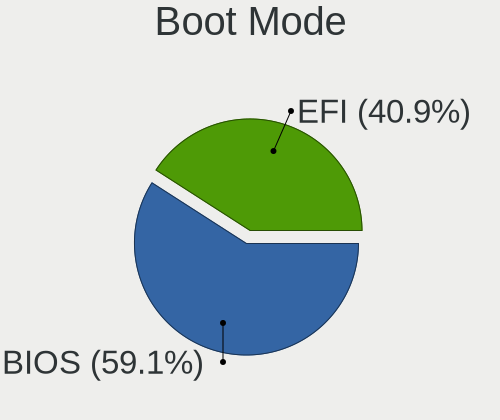
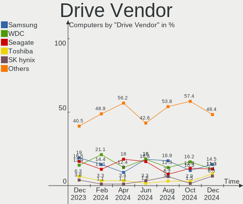
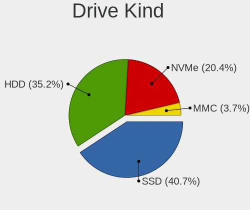
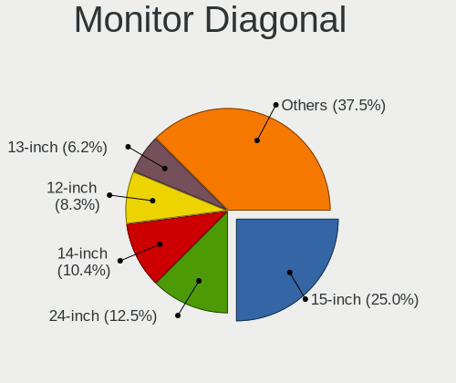
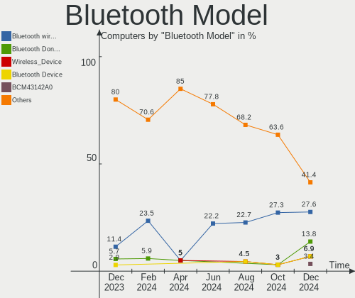
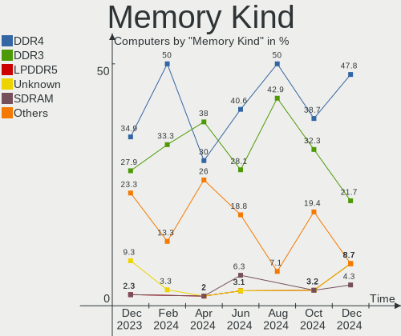
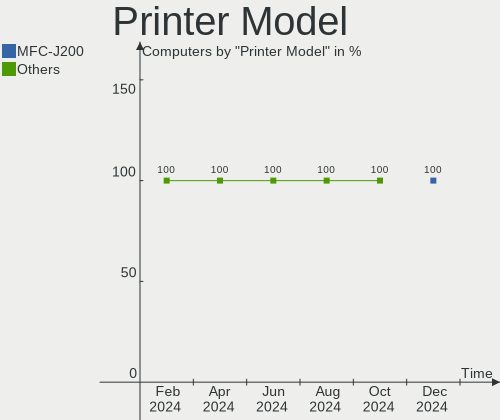

Xubuntu - Hardware Trends
-------------------------

A project to identify most popular hardware characteristics and track their change
over time based on data collected by Linux users at https://Linux-Hardware.org.

Anyone can contribute to this report by the [hw-probe](https://github.com/linuxhw/hw-probe) tool:

    sudo -E hw-probe -all -upload

This is a report for all computer types. See also reports for [desktops](/Dist/Xubuntu/Desktop/README.md) and [notebooks](/Dist/Xubuntu/Notebook/README.md).

This report is for one last month. Overall report since the beginning of time: [TestDays](https://github.com/linuxhw/TestDays)

Period: Feb, 2023.

Contents
--------

* [ System ](#system)
  - [ OS                       ](#os)
  - [ OS Family                ](#os-family)
  - [ Kernel                   ](#kernel)
  - [ Kernel Family            ](#kernel-family)
  - [ Kernel Major Ver.        ](#kernel-major-ver)
  - [ Arch                     ](#arch)
  - [ DE                       ](#de)
  - [ Display Server           ](#display-server)
  - [ Display Manager          ](#display-manager)
  - [ OS Lang                  ](#os-lang)
  - [ Boot Mode                ](#boot-mode)
  - [ Filesystem               ](#filesystem)
  - [ Part. scheme             ](#part-scheme)
  - [ Dual Boot with Linux/BSD ](#dual-boot-with-linuxbsd)
  - [ Dual Boot (Win)          ](#dual-boot-win)

* [ Board ](#board)
  - [ Vendor                   ](#vendor)
  - [ Model                    ](#model)
  - [ Model Family             ](#model-family)
  - [ MFG Year                 ](#mfg-year)
  - [ Form Factor              ](#form-factor)
  - [ Secure Boot              ](#secure-boot)
  - [ Coreboot                 ](#coreboot)
  - [ RAM Size                 ](#ram-size)
  - [ RAM Used                 ](#ram-used)
  - [ Total Drives             ](#total-drives)
  - [ Has CD-ROM               ](#has-cd-rom)
  - [ Has Ethernet             ](#has-ethernet)
  - [ Has WiFi                 ](#has-wifi)
  - [ Has Bluetooth            ](#has-bluetooth)

* [ Location ](#location)
  - [ Country                  ](#country)
  - [ City                     ](#city)

* [ Drives ](#drives)
  - [ Drive Vendor             ](#drive-vendor)
  - [ Drive Model              ](#drive-model)
  - [ HDD Vendor               ](#hdd-vendor)
  - [ SSD Vendor               ](#ssd-vendor)
  - [ Drive Kind               ](#drive-kind)
  - [ Drive Connector          ](#drive-connector)
  - [ Drive Size               ](#drive-size)
  - [ Space Total              ](#space-total)
  - [ Space Used               ](#space-used)
  - [ Malfunc. Drives          ](#malfunc-drives)
  - [ Malfunc. Drive Vendor    ](#malfunc-drive-vendor)
  - [ Malfunc. HDD Vendor      ](#malfunc-hdd-vendor)
  - [ Malfunc. Drive Kind      ](#malfunc-drive-kind)
  - [ Failed Drives            ](#failed-drives)
  - [ Failed Drive Vendor      ](#failed-drive-vendor)
  - [ Drive Status             ](#drive-status)

* [ Storage controller ](#storage-controller)
  - [ Storage Vendor           ](#storage-vendor)
  - [ Storage Model            ](#storage-model)
  - [ Storage Kind             ](#storage-kind)

* [ Processor ](#processor)
  - [ CPU Vendor               ](#cpu-vendor)
  - [ CPU Model                ](#cpu-model)
  - [ CPU Model Family         ](#cpu-model-family)
  - [ CPU Cores                ](#cpu-cores)
  - [ CPU Sockets              ](#cpu-sockets)
  - [ CPU Threads              ](#cpu-threads)
  - [ CPU Op-Modes             ](#cpu-op-modes)
  - [ CPU Microcode            ](#cpu-microcode)
  - [ CPU Microarch            ](#cpu-microarch)

* [ Graphics ](#graphics)
  - [ GPU Vendor               ](#gpu-vendor)
  - [ GPU Model                ](#gpu-model)
  - [ GPU Combo                ](#gpu-combo)
  - [ GPU Driver               ](#gpu-driver)
  - [ GPU Memory               ](#gpu-memory)

* [ Monitor ](#monitor)
  - [ Monitor Vendor           ](#monitor-vendor)
  - [ Monitor Model            ](#monitor-model)
  - [ Monitor Resolution       ](#monitor-resolution)
  - [ Monitor Diagonal         ](#monitor-diagonal)
  - [ Monitor Width            ](#monitor-width)
  - [ Aspect Ratio             ](#aspect-ratio)
  - [ Monitor Area             ](#monitor-area)
  - [ Pixel Density            ](#pixel-density)
  - [ Multiple Monitors        ](#multiple-monitors)

* [ Network ](#network)
  - [ Net Controller Vendor    ](#net-controller-vendor)
  - [ Net Controller Model     ](#net-controller-model)
  - [ Wireless Vendor          ](#wireless-vendor)
  - [ Wireless Model           ](#wireless-model)
  - [ Ethernet Vendor          ](#ethernet-vendor)
  - [ Ethernet Model           ](#ethernet-model)
  - [ Net Controller Kind      ](#net-controller-kind)
  - [ Used Controller          ](#used-controller)
  - [ NICs                     ](#nics)
  - [ IPv6                     ](#ipv6)

* [ Bluetooth ](#bluetooth)
  - [ Bluetooth Vendor         ](#bluetooth-vendor)
  - [ Bluetooth Model          ](#bluetooth-model)

* [ Sound ](#sound)
  - [ Sound Vendor             ](#sound-vendor)
  - [ Sound Model              ](#sound-model)

* [ Memory ](#memory)
  - [ Memory Vendor            ](#memory-vendor)
  - [ Memory Model             ](#memory-model)
  - [ Memory Kind              ](#memory-kind)
  - [ Memory Form Factor       ](#memory-form-factor)
  - [ Memory Size              ](#memory-size)
  - [ Memory Speed             ](#memory-speed)

* [ Printers & scanners ](#printers--scanners)
  - [ Printer Vendor           ](#printer-vendor)
  - [ Printer Model            ](#printer-model)
  - [ Scanner Vendor           ](#scanner-vendor)
  - [ Scanner Model            ](#scanner-model)

* [ Camera ](#camera)
  - [ Camera Vendor            ](#camera-vendor)
  - [ Camera Model             ](#camera-model)

* [ Security ](#security)
  - [ Fingerprint Vendor       ](#fingerprint-vendor)
  - [ Fingerprint Model        ](#fingerprint-model)
  - [ Chipcard Vendor          ](#chipcard-vendor)
  - [ Chipcard Model           ](#chipcard-model)

* [ Unsupported ](#unsupported)
  - [ Unsupported Devices      ](#unsupported-devices)
  - [ Unsupported Device Types ](#unsupported-device-types)

System
------

OS
--

Installed operating systems

| Name          | Computers | Percent |
|---------------|-----------|---------|
| Xubuntu 22.04 | 40        | 52.63%  |
| Xubuntu 20.04 | 14        | 18.42%  |
| Xubuntu 18.04 | 12        | 15.79%  |
| Xubuntu 22.10 | 10        | 13.16%  |

OS Family
---------

OS without a version

| Name    | Computers | Percent |
|---------|-----------|---------|
| Xubuntu | 76        | 100%    |

Kernel
------

Version of the Linux kernel

| Version                  | Computers | Percent |
|--------------------------|-----------|---------|
| 5.15.0-60-generic        | 21        | 27.63%  |
| 5.15.0-58-generic        | 10        | 13.16%  |
| 5.4.0-137-generic        | 6         | 7.89%   |
| 5.19.0-31-generic        | 6         | 7.89%   |
| 5.15.0-60-lowlatency     | 5         | 6.58%   |
| 5.4.0-139-generic        | 3         | 3.95%   |
| 4.15.0-204-generic       | 3         | 3.95%   |
| 4.15.0-202-generic       | 3         | 3.95%   |
| 6.1.0-1006-oem           | 2         | 2.63%   |
| 5.19.0-32-generic        | 2         | 2.63%   |
| 5.15.0-52-generic        | 2         | 2.63%   |
| 6.2.0                    | 1         | 1.32%   |
| 6.1.10.mmn               | 1         | 1.32%   |
| 5.4.0-139-lowlatency     | 1         | 1.32%   |
| 5.4.0-137-lowlatency     | 1         | 1.32%   |
| 5.4.0-104-generic        | 1         | 1.32%   |
| 5.19.0-28-generic        | 1         | 1.32%   |
| 5.19.0-26-generic        | 1         | 1.32%   |
| 5.19.0-21-generic        | 1         | 1.32%   |
| 5.19.0-1017-lowlatency   | 1         | 1.32%   |
| 5.15.0-67-generic        | 1         | 1.32%   |
| 5.15.0-53-generic        | 1         | 1.32%   |
| 5.10.110-rockchip-rk3588 | 1         | 1.32%   |
| 4.15.0-204-lowlatency    | 1         | 1.32%   |

Kernel Family
-------------

Linux kernel without a distro release

| Version  | Computers | Percent |
|----------|-----------|---------|
| 5.15.0   | 40        | 52.63%  |
| 5.4.0    | 12        | 15.79%  |
| 5.19.0   | 12        | 15.79%  |
| 4.15.0   | 7         | 9.21%   |
| 6.1.0    | 2         | 2.63%   |
| 6.2.0    | 1         | 1.32%   |
| 6.1.10   | 1         | 1.32%   |
| 5.10.110 | 1         | 1.32%   |

Kernel Major Ver.
-----------------

Linux kernel major version

| Version | Computers | Percent |
|---------|-----------|---------|
| 5.15    | 40        | 52.63%  |
| 5.4     | 12        | 15.79%  |
| 5.19    | 12        | 15.79%  |
| 4.15    | 7         | 9.21%   |
| 6.1     | 3         | 3.95%   |
| 6.2     | 1         | 1.32%   |
| 5.10    | 1         | 1.32%   |

Arch
----

OS architecture (x86_64, i586, etc.)

| Name    | Computers | Percent |
|---------|-----------|---------|
| x86_64  | 67        | 88.16%  |
| i686    | 8         | 10.53%  |
| aarch64 | 1         | 1.32%   |

DE
--

Desktop Environment

| Name  | Computers | Percent |
|-------|-----------|---------|
| XFCE  | 71        | 93.42%  |
| GNOME | 4         | 5.26%   |
| i3    | 1         | 1.32%   |

Display Server
--------------

X11 or Wayland

| Name | Computers | Percent |
|------|-----------|---------|
| X11  | 76        | 100%    |

Display Manager
---------------

SDDM, LightDM, etc.

| Name    | Computers | Percent |
|---------|-----------|---------|
| LightDM | 65        | 85.53%  |
| Unknown | 7         | 9.21%   |
| GDM3    | 3         | 3.95%   |
| SDDM    | 1         | 1.32%   |

OS Lang
-------

Language

| Lang  | Computers | Percent |
|-------|-----------|---------|
| en_US | 20        | 26.32%  |
| de_DE | 10        | 13.16%  |
| fr_FR | 9         | 11.84%  |
| ru_RU | 4         | 5.26%   |
| it_IT | 4         | 5.26%   |
| en_CA | 4         | 5.26%   |
| pt_BR | 2         | 2.63%   |
| nl_NL | 2         | 2.63%   |
| ja_JP | 2         | 2.63%   |
| cs_CZ | 2         | 2.63%   |
| ru_UA | 1         | 1.32%   |
| pt_PT | 1         | 1.32%   |
| pl_PL | 1         | 1.32%   |
| hu_HU | 1         | 1.32%   |
| fr_CH | 1         | 1.32%   |
| fr_BE | 1         | 1.32%   |
| es_VE | 1         | 1.32%   |
| es_UY | 1         | 1.32%   |
| es_MX | 1         | 1.32%   |
| es_ES | 1         | 1.32%   |
| en_ZA | 1         | 1.32%   |
| en_IL | 1         | 1.32%   |
| en_IE | 1         | 1.32%   |
| en_GB | 1         | 1.32%   |
| en_AU | 1         | 1.32%   |
| de_AT | 1         | 1.32%   |
| C     | 1         | 1.32%   |

Boot Mode
---------

EFI or BIOS

| Mode | Computers | Percent |
|------|-----------|---------|
| BIOS | 47        | 61.84%  |
| EFI  | 29        | 38.16%  |

Filesystem
----------

Type of filesystem

| Type  | Computers | Percent |
|-------|-----------|---------|
| Ext4  | 71        | 93.42%  |
| Btrfs | 3         | 3.95%   |
| Zfs   | 2         | 2.63%   |

Part. scheme
------------

Scheme of partitioning

| Type    | Computers | Percent |
|---------|-----------|---------|
| GPT     | 46        | 60.53%  |
| MBR     | 16        | 21.05%  |
| Unknown | 14        | 18.42%  |

Dual Boot with Linux/BSD
------------------------

Hosting more than one Linux/BSD

| Dual boot | Computers | Percent |
|-----------|-----------|---------|
| No        | 67        | 88.16%  |
| Yes       | 9         | 11.84%  |

Dual Boot (Win)
---------------

Hosting Linux and Windows

| Dual boot | Computers | Percent |
|-----------|-----------|---------|
| No        | 54        | 71.05%  |
| Yes       | 22        | 28.95%  |

Board
-----

Vendor
------

Motherboard manufacturer

| Name                | Computers | Percent |
|---------------------|-----------|---------|
| Lenovo              | 10        | 13.16%  |
| Hewlett-Packard     | 9         | 11.84%  |
| Dell                | 9         | 11.84%  |
| ASUSTek Computer    | 8         | 10.53%  |
| MSI                 | 7         | 9.21%   |
| Gigabyte Technology | 7         | 9.21%   |
| Acer                | 4         | 5.26%   |
| Sony                | 3         | 3.95%   |
| Packard Bell        | 2         | 2.63%   |
| Intel               | 2         | 2.63%   |
| HONOR               | 2         | 2.63%   |
| Fujitsu Siemens     | 2         | 2.63%   |
| ASRock              | 2         | 2.63%   |
| Toshiba             | 1         | 1.32%   |
| Rockchip            | 1         | 1.32%   |
| Pegatron            | 1         | 1.32%   |
| Fujitsu             | 1         | 1.32%   |
| Daten Tecnologia    | 1         | 1.32%   |
| AZW                 | 1         | 1.32%   |
| Apple               | 1         | 1.32%   |
| Alienware           | 1         | 1.32%   |
| Unknown             | 1         | 1.32%   |

Model
-----

Motherboard model

| Name                                  | Computers | Percent |
|---------------------------------------|-----------|---------|
| Unknown                               | 2         | 2.63%   |
| Toshiba Satellite Pro R50-B           | 1         | 1.32%   |
| Sony VPCZ13M9E                        | 1         | 1.32%   |
| Sony VPCX11Z6R                        | 1         | 1.32%   |
| Sony VPCEA3S1E                        | 1         | 1.32%   |
| Rockchip Orange Pi 5                  | 1         | 1.32%   |
| Pegatron KT457AA-ABA IQ804            | 1         | 1.32%   |
| Packard Bell IXTREME M5800            | 1         | 1.32%   |
| Packard Bell DOT S                    | 1         | 1.32%   |
| MSI MS-7D25                           | 1         | 1.32%   |
| MSI MS-7C37                           | 1         | 1.32%   |
| MSI MS-7A32                           | 1         | 1.32%   |
| MSI MS-7982                           | 1         | 1.32%   |
| MSI MS-7835                           | 1         | 1.32%   |
| MSI MS-7788                           | 1         | 1.32%   |
| MSI MS-7309                           | 1         | 1.32%   |
| Lenovo Yoga 7 16IAH7 82UF             | 1         | 1.32%   |
| Lenovo ThinkPad X131e 3367AH5         | 1         | 1.32%   |
| Lenovo ThinkPad T440p 20AN006NUS      | 1         | 1.32%   |
| Lenovo ThinkPad T430u 3353A11         | 1         | 1.32%   |
| Lenovo ThinkPad T430s 23562Z3         | 1         | 1.32%   |
| Lenovo ThinkPad T15 Gen 1 20S6CTO1WW  | 1         | 1.32%   |
| Lenovo ThinkPad R500 2716W2K          | 1         | 1.32%   |
| Lenovo ThinkPad P16s Gen 1 21CK0033FR | 1         | 1.32%   |
| Lenovo IdeaPad S12 20021,2959         | 1         | 1.32%   |
| Lenovo IdeaPad 320-15IKB 80YH         | 1         | 1.32%   |
| Intel X79                             | 1         | 1.32%   |
| HONOR NMH-WCX9                        | 1         | 1.32%   |
| HONOR BMH-WCX9                        | 1         | 1.32%   |
| HP Z620 Workstation                   | 1         | 1.32%   |
| HP Pavilion g6                        | 1         | 1.32%   |
| HP Pavilion 15                        | 1         | 1.32%   |
| HP EliteBook 820 G3                   | 1         | 1.32%   |
| HP Compaq Presario CQ60               | 1         | 1.32%   |
| HP Compaq Presario A900               | 1         | 1.32%   |
| HP Compaq nc6400 (RM741PA#ABG)        | 1         | 1.32%   |
| HP 655                                | 1         | 1.32%   |
| HP 250 G7 Notebook PC                 | 1         | 1.32%   |
| Gigabyte Z170XP-SLI                   | 1         | 1.32%   |
| Gigabyte H410M S2 V3                  | 1         | 1.32%   |

Model Family
------------

Motherboard model prefix

| Name                      | Computers | Percent |
|---------------------------|-----------|---------|
| Lenovo ThinkPad           | 7         | 9.21%   |
| HP Compaq                 | 3         | 3.95%   |
| Dell OptiPlex             | 3         | 3.95%   |
| Dell Latitude             | 3         | 3.95%   |
| Acer Aspire               | 3         | 3.95%   |
| Lenovo IdeaPad            | 2         | 2.63%   |
| HP Pavilion               | 2         | 2.63%   |
| Unknown                   | 2         | 2.63%   |
| Toshiba Satellite         | 1         | 1.32%   |
| Sony VPCZ13M9E            | 1         | 1.32%   |
| Sony VPCX11Z6R            | 1         | 1.32%   |
| Sony VPCEA3S1E            | 1         | 1.32%   |
| Rockchip Orange           | 1         | 1.32%   |
| Pegatron KT457AA-ABA      | 1         | 1.32%   |
| Packard Bell IXTREME      | 1         | 1.32%   |
| Packard Bell DOT          | 1         | 1.32%   |
| MSI MS-7D25               | 1         | 1.32%   |
| MSI MS-7C37               | 1         | 1.32%   |
| MSI MS-7A32               | 1         | 1.32%   |
| MSI MS-7982               | 1         | 1.32%   |
| MSI MS-7835               | 1         | 1.32%   |
| MSI MS-7788               | 1         | 1.32%   |
| MSI MS-7309               | 1         | 1.32%   |
| Lenovo Yoga               | 1         | 1.32%   |
| Intel X79                 | 1         | 1.32%   |
| HONOR NMH-WCX9            | 1         | 1.32%   |
| HONOR BMH-WCX9            | 1         | 1.32%   |
| HP Z620                   | 1         | 1.32%   |
| HP EliteBook              | 1         | 1.32%   |
| HP 655                    | 1         | 1.32%   |
| HP 250                    | 1         | 1.32%   |
| Gigabyte Z170XP-SLI       | 1         | 1.32%   |
| Gigabyte H410M            | 1         | 1.32%   |
| Gigabyte GB-BACE-3160     | 1         | 1.32%   |
| Gigabyte GB-BACE-3150     | 1         | 1.32%   |
| Gigabyte GA-A75-UD4H      | 1         | 1.32%   |
| Gigabyte B550             | 1         | 1.32%   |
| Gigabyte 945GZM-S2        | 1         | 1.32%   |
| Fujitsu Siemens STYLISTIC | 1         | 1.32%   |
| Fujitsu Siemens ESPRIMO   | 1         | 1.32%   |

MFG Year
--------

Motherboard manufacture year

| Year    | Computers | Percent |
|---------|-----------|---------|
| 2012    | 8         | 10.53%  |
| 2009    | 8         | 10.53%  |
| 2021    | 6         | 7.89%   |
| 2017    | 5         | 6.58%   |
| 2015    | 5         | 6.58%   |
| 2013    | 5         | 6.58%   |
| 2010    | 5         | 6.58%   |
| 2007    | 5         | 6.58%   |
| 2022    | 4         | 5.26%   |
| 2014    | 4         | 5.26%   |
| 2011    | 4         | 5.26%   |
| 2008    | 4         | 5.26%   |
| 2020    | 3         | 3.95%   |
| 2019    | 3         | 3.95%   |
| 2016    | 3         | 3.95%   |
| 2006    | 2         | 2.63%   |
| 2018    | 1         | 1.32%   |
| Unknown | 1         | 1.32%   |

Form Factor
-----------

Physical design of the computer

| Name           | Computers | Percent |
|----------------|-----------|---------|
| Notebook       | 39        | 51.32%  |
| Desktop        | 33        | 43.42%  |
| System on chip | 1         | 1.32%   |
| Convertible    | 1         | 1.32%   |
| All in one     | 1         | 1.32%   |
| Server         | 1         | 1.32%   |

Secure Boot
-----------

Enabled or disabled

| State    | Computers | Percent |
|----------|-----------|---------|
| Disabled | 71        | 93.42%  |
| Enabled  | 5         | 6.58%   |

Coreboot
--------

Have coreboot on board

| Used | Computers | Percent |
|------|-----------|---------|
| No   | 76        | 100%    |

RAM Size
--------

Total RAM memory

| Size in GB  | Computers | Percent |
|-------------|-----------|---------|
| 4.01-8.0    | 17        | 22.37%  |
| 3.01-4.0    | 14        | 18.42%  |
| 16.01-24.0  | 14        | 18.42%  |
| 8.01-16.0   | 8         | 10.53%  |
| 32.01-64.0  | 6         | 7.89%   |
| 1.01-2.0    | 6         | 7.89%   |
| 24.01-32.0  | 4         | 5.26%   |
| 64.01-256.0 | 4         | 5.26%   |
| 2.01-3.0    | 2         | 2.63%   |
| 0.51-1.0    | 1         | 1.32%   |

RAM Used
--------

Used RAM memory

| Used GB   | Computers | Percent |
|-----------|-----------|---------|
| 1.01-2.0  | 33        | 43.42%  |
| 2.01-3.0  | 18        | 23.68%  |
| 4.01-8.0  | 10        | 13.16%  |
| 0.51-1.0  | 6         | 7.89%   |
| 3.01-4.0  | 5         | 6.58%   |
| 8.01-16.0 | 3         | 3.95%   |
| 0.01-0.5  | 1         | 1.32%   |

Total Drives
------------

Number of drives on board

| Drives | Computers | Percent |
|--------|-----------|---------|
| 1      | 38        | 50%     |
| 2      | 24        | 31.58%  |
| 3      | 7         | 9.21%   |
| 5      | 3         | 3.95%   |
| 11     | 1         | 1.32%   |
| 9      | 1         | 1.32%   |
| 7      | 1         | 1.32%   |
| 4      | 1         | 1.32%   |

Has CD-ROM
----------

Has CD-ROM on board

| Presented | Computers | Percent |
|-----------|-----------|---------|
| Yes       | 38        | 50%     |
| No        | 38        | 50%     |

Has Ethernet
------------

Has Ethernet on board

| Presented | Computers | Percent |
|-----------|-----------|---------|
| Yes       | 72        | 94.74%  |
| No        | 4         | 5.26%   |

Has WiFi
--------

Has WiFi module

| Presented | Computers | Percent |
|-----------|-----------|---------|
| Yes       | 50        | 65.79%  |
| No        | 26        | 34.21%  |

Has Bluetooth
-------------

Has Bluetooth module

| Presented | Computers | Percent |
|-----------|-----------|---------|
| Yes       | 39        | 51.32%  |
| No        | 37        | 48.68%  |

Location
--------

Country
-------

Geographic location (country)

| Country      | Computers | Percent |
|--------------|-----------|---------|
| Germany      | 13        | 17.11%  |
| France       | 10        | 13.16%  |
| USA          | 6         | 7.89%   |
| Russia       | 5         | 6.58%   |
| Italy        | 5         | 6.58%   |
| Canada       | 4         | 5.26%   |
| Brazil       | 3         | 3.95%   |
| Venezuela    | 2         | 2.63%   |
| Poland       | 2         | 2.63%   |
| Netherlands  | 2         | 2.63%   |
| Mexico       | 2         | 2.63%   |
| Japan        | 2         | 2.63%   |
| Czechia      | 2         | 2.63%   |
| Austria      | 2         | 2.63%   |
| Australia    | 2         | 2.63%   |
| Uruguay      | 1         | 1.32%   |
| UK           | 1         | 1.32%   |
| Switzerland  | 1         | 1.32%   |
| Spain        | 1         | 1.32%   |
| South Africa | 1         | 1.32%   |
| Romania      | 1         | 1.32%   |
| Israel       | 1         | 1.32%   |
| Ireland      | 1         | 1.32%   |
| India        | 1         | 1.32%   |
| Hungary      | 1         | 1.32%   |
| Cuba         | 1         | 1.32%   |
| China        | 1         | 1.32%   |
| Belgium      | 1         | 1.32%   |
| Belarus      | 1         | 1.32%   |

City
----

Geographic location (city)

| City                   | Computers | Percent |
|------------------------|-----------|---------|
| Witten                 | 2         | 2.63%   |
| Vancouver              | 2         | 2.63%   |
| Milan                  | 2         | 2.63%   |
| Mexico City            | 2         | 2.63%   |
| Marseille              | 2         | 2.63%   |
| Hanover                | 2         | 2.63%   |
| Donetsk                | 2         | 2.63%   |
| Yunfu                  | 1         | 1.32%   |
| Wittenborn             | 1         | 1.32%   |
| Wetzlar                | 1         | 1.32%   |
| Villeurbanne           | 1         | 1.32%   |
| Vienna                 | 1         | 1.32%   |
| Toulouse               | 1         | 1.32%   |
| Toledo                 | 1         | 1.32%   |
| Toccoa                 | 1         | 1.32%   |
| Sydney                 | 1         | 1.32%   |
| Stuttgart              | 1         | 1.32%   |
| St Louis               | 1         | 1.32%   |
| Siemianowice Śląskie | 1         | 1.32%   |
| Sherbrooke             | 1         | 1.32%   |
| Shchelkovo             | 1         | 1.32%   |
| Schopfloch             | 1         | 1.32%   |
| Santo André           | 1         | 1.32%   |
| Rochester              | 1         | 1.32%   |
| Rinteln                | 1         | 1.32%   |
| Ried im Innkreis       | 1         | 1.32%   |
| Rastatt                | 1         | 1.32%   |
| Quetigny               | 1         | 1.32%   |
| Plounerin              | 1         | 1.32%   |
| Pilsen                 | 1         | 1.32%   |
| Paris                  | 1         | 1.32%   |
| Osaka                  | 1         | 1.32%   |
| Niterói               | 1         | 1.32%   |
| Neuenhof               | 1         | 1.32%   |
| Moscow                 | 1         | 1.32%   |
| Montevideo             | 1         | 1.32%   |
| Minsk                  | 1         | 1.32%   |
| Minatomirai            | 1         | 1.32%   |
| Milano                 | 1         | 1.32%   |
| Melbourne              | 1         | 1.32%   |

Drives
------

Drive Vendor
------------

Hard drive vendors

| Vendor                      | Computers | Drives | Percent |
|-----------------------------|-----------|--------|---------|
| Seagate                     | 24        | 34     | 19.05%  |
| WDC                         | 17        | 23     | 13.49%  |
| Samsung Electronics         | 15        | 17     | 11.9%   |
| Kingston                    | 10        | 12     | 7.94%   |
| SanDisk                     | 8         | 9      | 6.35%   |
| Toshiba                     | 7         | 9      | 5.56%   |
| A-DATA Technology           | 7         | 7      | 5.56%   |
| Hitachi                     | 5         | 5      | 3.97%   |
| Unknown                     | 3         | 3      | 2.38%   |
| Phison                      | 3         | 4      | 2.38%   |
| Intenso                     | 3         | 3      | 2.38%   |
| Crucial                     | 3         | 3      | 2.38%   |
| SK hynix                    | 2         | 2      | 1.59%   |
| Intel                       | 2         | 2      | 1.59%   |
| TECHLEAF-SSD                | 1         | 1      | 0.79%   |
| Plextor                     | 1         | 1      | 0.79%   |
| Phison Electronics          | 1         | 1      | 0.79%   |
| OCZ                         | 1         | 1      | 0.79%   |
| Maxtor                      | 1         | 1      | 0.79%   |
| LaCie                       | 1         | 1      | 0.79%   |
| Kingston Technology Company | 1         | 1      | 0.79%   |
| JMicron Technology          | 1         | 1      | 0.79%   |
| HGST                        | 1         | 1      | 0.79%   |
| GOODRAM                     | 1         | 1      | 0.79%   |
| Fujitsu                     | 1         | 1      | 0.79%   |
| EVM                         | 1         | 1      | 0.79%   |
| Dogfish                     | 1         | 1      | 0.79%   |
| China                       | 1         | 1      | 0.79%   |
| ASint Technology            | 1         | 1      | 0.79%   |
| addlink                     | 1         | 1      | 0.79%   |
| Unknown                     | 1         | 1      | 0.79%   |

Drive Model
-----------

Hard drive models

| Model                                               | Computers | Percent |
|-----------------------------------------------------|-----------|---------|
| Seagate ST500DM002-1BD142 500GB                     | 3         | 2.1%    |
| Kingston SA400S37240G 240GB SSD                     | 3         | 2.1%    |
| WDC PC SN530 SDBPNPZ-512G-1036 512GB                | 2         | 1.4%    |
| Seagate ST500LT012-1DG142 500GB                     | 2         | 1.4%    |
| Seagate ST500DM002-1BC142 500GB                     | 2         | 1.4%    |
| Seagate ST4000VX007-2DT166 4TB                      | 2         | 1.4%    |
| Samsung NVMe SSD Controller SM981/PM981/PM983 250GB | 2         | 1.4%    |
| Kingston SUV400S37240G 240GB SSD                    | 2         | 1.4%    |
| Kingston SA400S37480G 480GB SSD                     | 2         | 1.4%    |
| A-DATA SU800 256GB SSD                              | 2         | 1.4%    |
| WDC WUH721816ALE6L4 16TB                            | 1         | 0.7%    |
| WDC WD60EFZX-68B3FN0 6TB                            | 1         | 0.7%    |
| WDC WD5000BPVT-80HXZT3 500GB                        | 1         | 0.7%    |
| WDC WD5000AZLX-60K2TA0 500GB                        | 1         | 0.7%    |
| WDC WD5000AAKX-003CA0 500GB                         | 1         | 0.7%    |
| WDC WD40EZRZ-00GXCB0 4TB                            | 1         | 0.7%    |
| WDC WD4003FRYZ-01F0DB0 4TB                          | 1         | 0.7%    |
| WDC WD2500BEVS-22UST0 250GB                         | 1         | 0.7%    |
| WDC WD2500AAKS-00VSA0 250GB                         | 1         | 0.7%    |
| WDC WD20NPVZ-00WFZT0 2TB                            | 1         | 0.7%    |
| WDC WD20EARS-00MVWB0 2TB                            | 1         | 0.7%    |
| WDC WD2003FZEX-00Z4SA0 2TB                          | 1         | 0.7%    |
| WDC WD1600BEVT-60ZCT1 160GB                         | 1         | 0.7%    |
| WDC WD10EZEX-60WN4A1 1TB                            | 1         | 0.7%    |
| WDC WD10EZEX-22MFCA0 1TB                            | 1         | 0.7%    |
| WDC WD10EZEX-08M2NA0 1TB                            | 1         | 0.7%    |
| WDC WD10EZEX-07WN4A0 1TB                            | 1         | 0.7%    |
| WDC WD1003FBYX-01Y7B1 1TB                           | 1         | 0.7%    |
| WDC WD1001FALS-40Y6A0 1TB                           | 1         | 0.7%    |
| WDC WD10 EAVS-00D7B1 1TB                            | 1         | 0.7%    |
| Unknown SD/MMC/MS PRO 16GB                          | 1         | 0.7%    |
| Unknown ED2S5  128GB                                | 1         | 0.7%    |
| Unknown 00000  64GB                                 | 1         | 0.7%    |
| Toshiba THNSNF128GCSS 128GB SSD                     | 1         | 0.7%    |
| Toshiba MK8009GAH 80GB                              | 1         | 0.7%    |
| Toshiba MK6034GSX 64GB                              | 1         | 0.7%    |
| Toshiba MG06ACA800E 8TB                             | 1         | 0.7%    |
| Toshiba HDWD120 2TB                                 | 1         | 0.7%    |
| Toshiba DT01ACA300 3TB                              | 1         | 0.7%    |
| Toshiba DT01ACA200 2TB                              | 1         | 0.7%    |

HDD Vendor
----------

Hard disk drive vendors

| Vendor              | Computers | Drives | Percent |
|---------------------|-----------|--------|---------|
| Seagate             | 24        | 34     | 40.68%  |
| WDC                 | 15        | 21     | 25.42%  |
| Toshiba             | 6         | 8      | 10.17%  |
| Hitachi             | 5         | 5      | 8.47%   |
| Samsung Electronics | 3         | 3      | 5.08%   |
| Unknown             | 1         | 1      | 1.69%   |
| Maxtor              | 1         | 1      | 1.69%   |
| LaCie               | 1         | 1      | 1.69%   |
| JMicron Technology  | 1         | 1      | 1.69%   |
| HGST                | 1         | 1      | 1.69%   |
| Fujitsu             | 1         | 1      | 1.69%   |

SSD Vendor
----------

Solid state drive vendors

| Vendor              | Computers | Drives | Percent |
|---------------------|-----------|--------|---------|
| Kingston            | 10        | 12     | 22.73%  |
| A-DATA Technology   | 7         | 7      | 15.91%  |
| Samsung Electronics | 6         | 8      | 13.64%  |
| SanDisk             | 5         | 5      | 11.36%  |
| Intenso             | 3         | 3      | 6.82%   |
| Crucial             | 3         | 3      | 6.82%   |
| Toshiba             | 1         | 1      | 2.27%   |
| Plextor             | 1         | 1      | 2.27%   |
| OCZ                 | 1         | 1      | 2.27%   |
| Intel               | 1         | 1      | 2.27%   |
| GOODRAM             | 1         | 1      | 2.27%   |
| EVM                 | 1         | 1      | 2.27%   |
| Dogfish             | 1         | 1      | 2.27%   |
| China               | 1         | 1      | 2.27%   |
| ASint Technology    | 1         | 1      | 2.27%   |
| addlink             | 1         | 1      | 2.27%   |

Drive Kind
----------

HDD or SSD

| Kind    | Computers | Drives | Percent |
|---------|-----------|--------|---------|
| HDD     | 42        | 77     | 40.38%  |
| SSD     | 41        | 48     | 39.42%  |
| NVMe    | 17        | 21     | 16.35%  |
| MMC     | 3         | 3      | 2.88%   |
| Unknown | 1         | 1      | 0.96%   |

Drive Connector
---------------

SATA, SAS, NVMe, etc.

| Type | Computers | Drives | Percent |
|------|-----------|--------|---------|
| SATA | 64        | 116    | 68.82%  |
| NVMe | 17        | 21     | 18.28%  |
| SAS  | 9         | 10     | 9.68%   |
| MMC  | 3         | 3      | 3.23%   |

Drive Size
----------

Size of hard drive

| Size in TB | Computers | Drives | Percent |
|------------|-----------|--------|---------|
| 0.01-0.5   | 57        | 74     | 58.76%  |
| 0.51-1.0   | 18        | 22     | 18.56%  |
| 1.01-2.0   | 11        | 15     | 11.34%  |
| 3.01-4.0   | 7         | 9      | 7.22%   |
| 4.01-10.0  | 2         | 3      | 2.06%   |
| 2.01-3.0   | 1         | 1      | 1.03%   |
| 10.01-20.0 | 1         | 1      | 1.03%   |

Space Total
-----------

Amount of disk space available on the file system

| Size in GB     | Computers | Percent |
|----------------|-----------|---------|
| 101-250        | 24        | 31.58%  |
| 251-500        | 16        | 21.05%  |
| 501-1000       | 12        | 15.79%  |
| More than 3000 | 5         | 6.58%   |
| 2001-3000      | 5         | 6.58%   |
| 1001-2000      | 5         | 6.58%   |
| 51-100         | 5         | 6.58%   |
| 1-20           | 3         | 3.95%   |
| 21-50          | 1         | 1.32%   |

Space Used
----------

Amount of used disk space

| Used GB        | Computers | Percent |
|----------------|-----------|---------|
| 1-20           | 25        | 32.89%  |
| 51-100         | 12        | 15.79%  |
| 101-250        | 10        | 13.16%  |
| 21-50          | 9         | 11.84%  |
| 251-500        | 7         | 9.21%   |
| 501-1000       | 7         | 9.21%   |
| More than 3000 | 4         | 5.26%   |
| 2001-3000      | 1         | 1.32%   |
| 1001-2000      | 1         | 1.32%   |

Malfunc. Drives
---------------

Drive models with a malfunction

| Model                                        | Computers | Drives | Percent |
|----------------------------------------------|-----------|--------|---------|
| WDC WD2500AAKS-00VSA0 250GB                  | 1         | 1      | 8.33%   |
| WDC WD20EARS-00MVWB0 2TB                     | 1         | 1      | 8.33%   |
| WDC WD1001FALS-40Y6A0 1TB                    | 1         | 1      | 8.33%   |
| Seagate ST9500325AS 500GB                    | 1         | 1      | 8.33%   |
| Seagate ST320LT007-9ZV142 320GB              | 1         | 1      | 8.33%   |
| Seagate ST1000LM 035-1RK172 1TB              | 1         | 1      | 8.33%   |
| Samsung Electronics SSD 840 PRO Series 256GB | 1         | 1      | 8.33%   |
| Samsung Electronics HM250JI 250GB            | 1         | 1      | 8.33%   |
| Maxtor STM3320620A 320GB                     | 1         | 1      | 8.33%   |
| JMicron Technology Generic 200GB             | 1         | 1      | 8.33%   |
| Hitachi HTS545032A7E380 320GB                | 1         | 1      | 8.33%   |
| Fujitsu MHW2060BH 64GB                       | 1         | 1      | 8.33%   |

Malfunc. Drive Vendor
---------------------

Vendors of faulty drives

| Vendor              | Computers | Drives | Percent |
|---------------------|-----------|--------|---------|
| Seagate             | 3         | 3      | 27.27%  |
| WDC                 | 2         | 3      | 18.18%  |
| Samsung Electronics | 2         | 2      | 18.18%  |
| Maxtor              | 1         | 1      | 9.09%   |
| JMicron Technology  | 1         | 1      | 9.09%   |
| Hitachi             | 1         | 1      | 9.09%   |
| Fujitsu             | 1         | 1      | 9.09%   |

Malfunc. HDD Vendor
-------------------

Vendors of faulty HDD drives

| Vendor              | Computers | Drives | Percent |
|---------------------|-----------|--------|---------|
| Seagate             | 3         | 3      | 30%     |
| WDC                 | 2         | 3      | 20%     |
| Samsung Electronics | 1         | 1      | 10%     |
| Maxtor              | 1         | 1      | 10%     |
| JMicron Technology  | 1         | 1      | 10%     |
| Hitachi             | 1         | 1      | 10%     |
| Fujitsu             | 1         | 1      | 10%     |

Malfunc. Drive Kind
-------------------

Kinds of faulty drives

| Kind | Computers | Drives | Percent |
|------|-----------|--------|---------|
| HDD  | 9         | 11     | 90%     |
| SSD  | 1         | 1      | 10%     |

Failed Drives
-------------

Failed drive models

Zero info for selected period =(

Failed Drive Vendor
-------------------

Failed drive vendors

Zero info for selected period =(

Drive Status
------------

Number of failed and malfunc. drives

| Status   | Computers | Drives | Percent |
|----------|-----------|--------|---------|
| Detected | 44        | 92     | 51.16%  |
| Works    | 32        | 46     | 37.21%  |
| Malfunc  | 10        | 12     | 11.63%  |

Storage controller
------------------

Storage Vendor
--------------

Storage controller vendors

| Vendor                           | Computers | Percent |
|----------------------------------|-----------|---------|
| Intel                            | 55        | 59.14%  |
| AMD                              | 9         | 9.68%   |
| Samsung Electronics              | 6         | 6.45%   |
| SanDisk                          | 5         | 5.38%   |
| Phison Electronics               | 3         | 3.23%   |
| SK hynix                         | 2         | 2.15%   |
| Silicon Image                    | 2         | 2.15%   |
| Nvidia                           | 2         | 2.15%   |
| JMicron Technology               | 2         | 2.15%   |
| Broadcom / LSI                   | 2         | 2.15%   |
| VIA Technologies                 | 1         | 1.08%   |
| Silicon Integrated Systems [SiS] | 1         | 1.08%   |
| Marvell Technology Group         | 1         | 1.08%   |
| Kingston Technology Company      | 1         | 1.08%   |
| ASMedia Technology               | 1         | 1.08%   |

Storage Model
-------------

Storage controller models

| Model                                                                            | Computers | Percent |
|----------------------------------------------------------------------------------|-----------|---------|
| Intel 82801IBM/IEM (ICH9M/ICH9M-E) 4 port SATA Controller [AHCI mode]            | 6         | 5.56%   |
| AMD FCH SATA Controller [AHCI mode]                                              | 6         | 5.56%   |
| Intel Q170/Q150/B150/H170/H110/Z170/CM236 Chipset SATA Controller [AHCI Mode]    | 4         | 3.7%    |
| Intel 8 Series/C220 Series Chipset Family 6-port SATA Controller 1 [AHCI mode]   | 4         | 3.7%    |
| Samsung NVMe SSD Controller SM981/PM981/PM983                                    | 3         | 2.78%   |
| Intel 82801G (ICH7 Family) IDE Controller                                        | 3         | 2.78%   |
| Intel 82801 Mobile SATA Controller [RAID mode]                                   | 3         | 2.78%   |
| Intel 7 Series Chipset Family 6-port SATA Controller [AHCI mode]                 | 3         | 2.78%   |
| Silicon Image SiI 3114 [SATALink/SATARaid] Serial ATA Controller                 | 2         | 1.85%   |
| SanDisk WD Blue SN550 NVMe SSD                                                   | 2         | 1.85%   |
| SanDisk Non-Volatile memory controller                                           | 2         | 1.85%   |
| JMicron JMB363 SATA/IDE Controller                                               | 2         | 1.85%   |
| Intel Sunrise Point-LP SATA Controller [AHCI mode]                               | 2         | 1.85%   |
| Intel SATA Controller [RAID mode]                                                | 2         | 1.85%   |
| Intel Comet Lake SATA AHCI Controller                                            | 2         | 1.85%   |
| Intel Atom/Celeron/Pentium Processor x5-E8000/J3xxx/N3xxx Series SATA Controller | 2         | 1.85%   |
| Intel 82801HM/HEM (ICH8M/ICH8M-E) SATA Controller [AHCI mode]                    | 2         | 1.85%   |
| Intel 82801HM/HEM (ICH8M/ICH8M-E) IDE Controller                                 | 2         | 1.85%   |
| Intel 82801GBM/GHM (ICH7-M Family) SATA Controller [AHCI mode]                   | 2         | 1.85%   |
| Intel 8 Series SATA Controller 1 [AHCI mode]                                     | 2         | 1.85%   |
| Intel 5 Series/3400 Series Chipset 6 port SATA AHCI Controller                   | 2         | 1.85%   |
| Intel 5 Series/3400 Series Chipset 4 port SATA AHCI Controller                   | 2         | 1.85%   |
| AMD SB7x0/SB8x0/SB9x0 SATA Controller [AHCI mode]                                | 2         | 1.85%   |
| VIA VT82C586A/B/VT82C686/A/B/VT823x/A/C PIPC Bus Master IDE                      | 1         | 0.93%   |
| VIA VT8237A SATA 2-Port Controller                                               | 1         | 0.93%   |
| SK hynix Gold P31/PC711 NVMe Solid State Drive                                   | 1         | 0.93%   |
| SK hynix BC511                                                                   | 1         | 0.93%   |
| Silicon Integrated Systems [SiS] SATA Controller / IDE mode                      | 1         | 0.93%   |
| Silicon Integrated Systems [SiS] 5513 IDE Controller                             | 1         | 0.93%   |
| SanDisk WD Black SN750 / PC SN730 NVMe SSD                                       | 1         | 0.93%   |
| Samsung NVMe SSD Controller PM9B1                                                | 1         | 0.93%   |
| Samsung NVMe SSD Controller PM9A1/PM9A3/980PRO                                   | 1         | 0.93%   |
| Samsung NVMe SSD Controller 980                                                  | 1         | 0.93%   |
| Phison PS5013 E13 NVMe Controller                                                | 1         | 0.93%   |
| Phison E18 PCIe4 NVMe Controller                                                 | 1         | 0.93%   |
| Phison E16 PCIe4 NVMe Controller                                                 | 1         | 0.93%   |
| Nvidia MCP79 AHCI Controller                                                     | 1         | 0.93%   |
| Nvidia MCP61 SATA Controller                                                     | 1         | 0.93%   |
| Nvidia MCP61 IDE                                                                 | 1         | 0.93%   |
| Marvell Group 88SE9215 PCIe 2.0 x1 4-port SATA 6 Gb/s Controller                 | 1         | 0.93%   |

Storage Kind
------------

Kind of storage controller (IDE, SATA, NVMe, SAS, ...)

| Kind | Computers | Percent |
|------|-----------|---------|
| SATA | 53        | 56.38%  |
| NVMe | 16        | 17.02%  |
| IDE  | 14        | 14.89%  |
| RAID | 10        | 10.64%  |
| SAS  | 1         | 1.06%   |

Processor
---------

CPU Vendor
----------

Processor vendors

| Vendor | Computers | Percent |
|--------|-----------|---------|
| Intel  | 61        | 80.26%  |
| AMD    | 14        | 18.42%  |
| ARM    | 1         | 1.32%   |

CPU Model
---------

Processor models

| Model                                       | Computers | Percent |
|---------------------------------------------|-----------|---------|
| Intel Core i7-6700K CPU @ 4.00GHz           | 2         | 2.63%   |
| Intel Core i5-4670 CPU @ 3.40GHz            | 2         | 2.63%   |
| Intel Core i5-4210U CPU @ 1.70GHz           | 2         | 2.63%   |
| Intel Core 2 CPU 6300 @ 1.86GHz             | 2         | 2.63%   |
| AMD Ryzen 5 5500U with Radeon Graphics      | 2         | 2.63%   |
| Intel Xeon CPU E5-4650 v2 @ 2.40GHz         | 1         | 1.32%   |
| Intel Xeon CPU E5-2658 v2 @ 2.40GHz         | 1         | 1.32%   |
| Intel Xeon CPU E5-2640 v3 @ 2.60GHz         | 1         | 1.32%   |
| Intel Pentium Dual-Core CPU T4400 @ 2.20GHz | 1         | 1.32%   |
| Intel Pentium Dual CPU T3400 @ 2.16GHz      | 1         | 1.32%   |
| Intel Pentium Dual CPU T2390 @ 1.86GHz      | 1         | 1.32%   |
| Intel Genuine CPU T1600 @ 1.66GHz           | 1         | 1.32%   |
| Intel Core i7-9700T CPU @ 2.00GHz           | 1         | 1.32%   |
| Intel Core i7-7820HK CPU @ 2.90GHz          | 1         | 1.32%   |
| Intel Core i7-7500U CPU @ 2.70GHz           | 1         | 1.32%   |
| Intel Core i7-6820HQ CPU @ 2.70GHz          | 1         | 1.32%   |
| Intel Core i7-6700 CPU @ 3.40GHz            | 1         | 1.32%   |
| Intel Core i7-4712MQ CPU @ 2.30GHz          | 1         | 1.32%   |
| Intel Core i7-4600M CPU @ 2.90GHz           | 1         | 1.32%   |
| Intel Core i7-3770T CPU @ 2.50GHz           | 1         | 1.32%   |
| Intel Core i7-3520M CPU @ 2.90GHz           | 1         | 1.32%   |
| Intel Core i7-2600 CPU @ 3.40GHz            | 1         | 1.32%   |
| Intel Core i7-10510U CPU @ 1.80GHz          | 1         | 1.32%   |
| Intel Core i7 CPU 870 @ 2.93GHz             | 1         | 1.32%   |
| Intel Core i5-6600 CPU @ 3.30GHz            | 1         | 1.32%   |
| Intel Core i5-6300U CPU @ 2.40GHz           | 1         | 1.32%   |
| Intel Core i5-3317U CPU @ 1.70GHz           | 1         | 1.32%   |
| Intel Core i5-10210U CPU @ 1.60GHz          | 1         | 1.32%   |
| Intel Core i5 CPU M 460 @ 2.53GHz           | 1         | 1.32%   |
| Intel Core i5 CPU 760 @ 2.80GHz             | 1         | 1.32%   |
| Intel Core i3-5010U CPU @ 2.10GHz           | 1         | 1.32%   |
| Intel Core i3-4330 CPU @ 3.50GHz            | 1         | 1.32%   |
| Intel Core i3-3250 CPU @ 3.50GHz            | 1         | 1.32%   |
| Intel Core i3-10110U CPU @ 2.10GHz          | 1         | 1.32%   |
| Intel Core i3-10100 CPU @ 3.60GHz           | 1         | 1.32%   |
| Intel Core i3-1005G1 CPU @ 1.20GHz          | 1         | 1.32%   |
| Intel Core i3 CPU M 370 @ 2.40GHz           | 1         | 1.32%   |
| Intel Core i3 CPU M 330 @ 2.13GHz           | 1         | 1.32%   |
| Intel Core Duo CPU U2500 @ 1.20GHz          | 1         | 1.32%   |
| Intel Core 2 Quad CPU Q6600 @ 2.40GHz       | 1         | 1.32%   |

CPU Model Family
----------------

Processor model prefix

| Model                   | Computers | Percent |
|-------------------------|-----------|---------|
| Intel Core i7           | 14        | 18.42%  |
| Intel Core i5           | 10        | 13.16%  |
| Intel Core i3           | 8         | 10.53%  |
| Intel Core 2 Duo        | 5         | 6.58%   |
| Intel Celeron           | 5         | 6.58%   |
| Other                   | 4         | 5.26%   |
| Intel Atom              | 4         | 5.26%   |
| AMD Ryzen 5             | 4         | 5.26%   |
| Intel Xeon              | 3         | 3.95%   |
| Intel Core 2            | 3         | 3.95%   |
| Intel Pentium Dual      | 2         | 2.63%   |
| AMD Ryzen 9             | 2         | 2.63%   |
| Intel Pentium Dual-Core | 1         | 1.32%   |
| Intel Genuine           | 1         | 1.32%   |
| Intel Core Duo          | 1         | 1.32%   |
| Intel Core 2 Quad       | 1         | 1.32%   |
| AMD Ryzen 7 PRO         | 1         | 1.32%   |
| AMD Ryzen 7             | 1         | 1.32%   |
| AMD Phenom II X4        | 1         | 1.32%   |
| AMD FX                  | 1         | 1.32%   |
| AMD E2                  | 1         | 1.32%   |
| AMD E1                  | 1         | 1.32%   |
| AMD Athlon 64 X2        | 1         | 1.32%   |
| AMD A8                  | 1         | 1.32%   |

CPU Cores
---------

Number of processor cores

| Number | Computers | Percent |
|--------|-----------|---------|
| 2      | 33        | 43.42%  |
| 4      | 24        | 31.58%  |
| 1      | 5         | 6.58%   |
| 6      | 4         | 5.26%   |
| 8      | 3         | 3.95%   |
| 16     | 2         | 2.63%   |
| 12     | 2         | 2.63%   |
| 20     | 1         | 1.32%   |
| 14     | 1         | 1.32%   |
| 10     | 1         | 1.32%   |

CPU Sockets
-----------

Number of sockets

| Number | Computers | Percent |
|--------|-----------|---------|
| 1      | 73        | 96.05%  |
| 2      | 3         | 3.95%   |

CPU Threads
-----------

Threads per core (Hyper-Threading)

| Number | Computers | Percent |
|--------|-----------|---------|
| 2      | 46        | 60.53%  |
| 1      | 29        | 38.16%  |
| 4      | 1         | 1.32%   |

CPU Op-Modes
------------

CPU Operation Modes (32-bit, 64-bit)

| Op mode        | Computers | Percent |
|----------------|-----------|---------|
| 32-bit, 64-bit | 73        | 96.05%  |
| 32-bit         | 3         | 3.95%   |

CPU Microcode
-------------

Microcode number

| Number     | Computers | Percent |
|------------|-----------|---------|
| Unknown    | 25        | 32.89%  |
| 0x506e3    | 4         | 5.26%   |
| 0x306a9    | 4         | 5.26%   |
| 0x6fd      | 3         | 3.95%   |
| 0x306c3    | 3         | 3.95%   |
| 0x106c2    | 3         | 3.95%   |
| 0x6f6      | 2         | 2.63%   |
| 0x306e4    | 2         | 2.63%   |
| 0x206a7    | 2         | 2.63%   |
| 0x20655    | 2         | 2.63%   |
| 0x106e5    | 2         | 2.63%   |
| 0x08608103 | 2         | 2.63%   |
| 0xa0660    | 1         | 1.32%   |
| 0x906ed    | 1         | 1.32%   |
| 0x906e9    | 1         | 1.32%   |
| 0x906a3    | 1         | 1.32%   |
| 0x90672    | 1         | 1.32%   |
| 0x806ec    | 1         | 1.32%   |
| 0x806e9    | 1         | 1.32%   |
| 0x806c1    | 1         | 1.32%   |
| 0x706e5    | 1         | 1.32%   |
| 0x6f2      | 1         | 1.32%   |
| 0x6ec      | 1         | 1.32%   |
| 0x406e3    | 1         | 1.32%   |
| 0x406c4    | 1         | 1.32%   |
| 0x406c3    | 1         | 1.32%   |
| 0x106ca    | 1         | 1.32%   |
| 0x1067a    | 1         | 1.32%   |
| 0x0a404102 | 1         | 1.32%   |
| 0x0a201025 | 1         | 1.32%   |
| 0x08701013 | 1         | 1.32%   |
| 0x08600106 | 1         | 1.32%   |
| 0x05000119 | 1         | 1.32%   |
| 0x010000db | 1         | 1.32%   |

CPU Microarch
-------------

Microarchitecture

| Name             | Computers | Percent |
|------------------|-----------|---------|
| Core             | 9         | 11.84%  |
| Haswell          | 8         | 10.53%  |
| Skylake          | 6         | 7.89%   |
| IvyBridge        | 6         | 7.89%   |
| KabyLake         | 5         | 6.58%   |
| Unknown          | 5         | 6.58%   |
| Zen 2            | 4         | 5.26%   |
| Penryn           | 4         | 5.26%   |
| Bonnell          | 4         | 5.26%   |
| Westmere         | 3         | 3.95%   |
| SandyBridge      | 3         | 3.95%   |
| Silvermont       | 2         | 2.63%   |
| Nehalem          | 2         | 2.63%   |
| CometLake        | 2         | 2.63%   |
| Bobcat           | 2         | 2.63%   |
| Alderlake Hybrid | 2         | 2.63%   |
| Zen 3            | 1         | 1.32%   |
| TigerLake        | 1         | 1.32%   |
| Piledriver       | 1         | 1.32%   |
| P6               | 1         | 1.32%   |
| K8 Hammer        | 1         | 1.32%   |
| K10 Llano        | 1         | 1.32%   |
| K10              | 1         | 1.32%   |
| IceLake          | 1         | 1.32%   |
| Broadwell        | 1         | 1.32%   |

Graphics
--------

GPU Vendor
----------

Vendors of graphics cards

| Vendor                           | Computers | Percent |
|----------------------------------|-----------|---------|
| Intel                            | 46        | 52.87%  |
| Nvidia                           | 24        | 27.59%  |
| AMD                              | 15        | 17.24%  |
| Silicon Integrated Systems [SiS] | 1         | 1.15%   |
| Matrox Electronics Systems       | 1         | 1.15%   |

GPU Model
---------

Graphics card models

| Model                                                                                    | Computers | Percent |
|------------------------------------------------------------------------------------------|-----------|---------|
| Intel Mobile 4 Series Chipset Integrated Graphics Controller                             | 4         | 4.35%   |
| Intel Xeon E3-1200 v3/4th Gen Core Processor Integrated Graphics Controller              | 3         | 3.26%   |
| Intel Mobile 945GM/GMS/GME, 943/940GML Express Integrated Graphics Controller            | 3         | 3.26%   |
| Intel Mobile 945GM/GMS, 943/940GML Express Integrated Graphics Controller                | 3         | 3.26%   |
| Intel HD Graphics 530                                                                    | 3         | 3.26%   |
| Intel 2nd Generation Core Processor Family Integrated Graphics Controller                | 3         | 3.26%   |
| Nvidia GM108M [GeForce 840M]                                                             | 2         | 2.17%   |
| Intel Haswell-ULT Integrated Graphics Controller                                         | 2         | 2.17%   |
| Intel Core Processor Integrated Graphics Controller                                      | 2         | 2.17%   |
| Intel CometLake-U GT2 [UHD Graphics]                                                     | 2         | 2.17%   |
| Intel Atom/Celeron/Pentium Processor x5-E8000/J3xxx/N3xxx Integrated Graphics Controller | 2         | 2.17%   |
| Intel 4th Gen Core Processor Integrated Graphics Controller                              | 2         | 2.17%   |
| Intel 3rd Gen Core processor Graphics Controller                                         | 2         | 2.17%   |
| AMD Lucienne                                                                             | 2         | 2.17%   |
| AMD Lexa PRO [Radeon 540/540X/550/550X / RX 540X/550/550X]                               | 2         | 2.17%   |
| AMD Ellesmere [Radeon RX 470/480/570/570X/580/580X/590]                                  | 2         | 2.17%   |
| Silicon Integrated Systems [SiS] 771/671 PCIE VGA Display Adapter                        | 1         | 1.09%   |
| Nvidia TU117M [GeForce MX450]                                                            | 1         | 1.09%   |
| Nvidia TU104 [GeForce RTX 2060]                                                          | 1         | 1.09%   |
| Nvidia GT218M [GeForce G210M]                                                            | 1         | 1.09%   |
| Nvidia GT218 [GeForce 210]                                                               | 1         | 1.09%   |
| Nvidia GT216M [GeForce GT 330M]                                                          | 1         | 1.09%   |
| Nvidia GP108M [GeForce MX330]                                                            | 1         | 1.09%   |
| Nvidia GP104M [GeForce GTX 1070 Mobile]                                                  | 1         | 1.09%   |
| Nvidia GM204 [GeForce GTX 970]                                                           | 1         | 1.09%   |
| Nvidia GM108M [GeForce 940MX]                                                            | 1         | 1.09%   |
| Nvidia GK208M [GeForce GT 730M]                                                          | 1         | 1.09%   |
| Nvidia GK208B [GeForce GT 730]                                                           | 1         | 1.09%   |
| Nvidia GK208B [GeForce GT 720]                                                           | 1         | 1.09%   |
| Nvidia GK208B [GeForce GT 710]                                                           | 1         | 1.09%   |
| Nvidia GK106GL [Quadro K4000]                                                            | 1         | 1.09%   |
| Nvidia GF117M [GeForce 610M/710M/810M/820M / GT 620M/625M/630M/720M]                     | 1         | 1.09%   |
| Nvidia GA107M [GeForce RTX 3050 Mobile]                                                  | 1         | 1.09%   |
| Nvidia GA107 [GeForce RTX 3050 8GB]                                                      | 1         | 1.09%   |
| Nvidia G98M [GeForce G 105M]                                                             | 1         | 1.09%   |
| Nvidia G98M [GeForce 9300M GS]                                                           | 1         | 1.09%   |
| Nvidia G92 [GeForce GTS 250]                                                             | 1         | 1.09%   |
| Nvidia C79 [GeForce 9400M / ION]                                                         | 1         | 1.09%   |
| Nvidia C61 [GeForce 6100 nForce 405]                                                     | 1         | 1.09%   |
| Matrox Electronics Systems G200eR2                                                       | 1         | 1.09%   |

GPU Combo
---------

Combinations of graphics cards

| Name           | Computers | Percent |
|----------------|-----------|---------|
| 1 x Intel      | 34        | 44.74%  |
| 1 x Nvidia     | 15        | 19.74%  |
| 1 x AMD        | 14        | 18.42%  |
| Intel + Nvidia | 8         | 10.53%  |
| Other          | 1         | 1.32%   |
| 2 x Intel      | 1         | 1.32%   |
| 1 x SiS        | 1         | 1.32%   |
| 1 x Matrox     | 1         | 1.32%   |
| AMD + Nvidia   | 1         | 1.32%   |

GPU Driver
----------

Free vs proprietary

| Driver      | Computers | Percent |
|-------------|-----------|---------|
| Free        | 60        | 78.95%  |
| Proprietary | 11        | 14.47%  |
| Unknown     | 5         | 6.58%   |

GPU Memory
----------

Total video memory

| Size in GB | Computers | Percent |
|------------|-----------|---------|
| Unknown    | 48        | 63.16%  |
| 1.01-2.0   | 8         | 10.53%  |
| 0.01-0.5   | 8         | 10.53%  |
| 7.01-8.0   | 3         | 3.95%   |
| 3.01-4.0   | 3         | 3.95%   |
| 0.51-1.0   | 3         | 3.95%   |
| 5.01-6.0   | 1         | 1.32%   |
| 2.01-3.0   | 1         | 1.32%   |
| 8.01-16.0  | 1         | 1.32%   |

Monitor
-------

Monitor Vendor
--------------

Monitor vendors

| Vendor                  | Computers | Percent |
|-------------------------|-----------|---------|
| AU Optronics            | 12        | 15.58%  |
| Samsung Electronics     | 10        | 12.99%  |
| BOE                     | 9         | 11.69%  |
| Goldstar                | 6         | 7.79%   |
| Hewlett-Packard         | 5         | 6.49%   |
| LG Display              | 4         | 5.19%   |
| Iiyama                  | 3         | 3.9%    |
| AOC                     | 3         | 3.9%    |
| ViewSonic               | 2         | 2.6%    |
| Sony                    | 2         | 2.6%    |
| IBM                     | 2         | 2.6%    |
| Chimei Innolux          | 2         | 2.6%    |
| Vizio                   | 1         | 1.3%    |
| Unknown                 | 1         | 1.3%    |
| Toshiba                 | 1         | 1.3%    |
| Quanta Display          | 1         | 1.3%    |
| NEC Computers           | 1         | 1.3%    |
| LG Philips              | 1         | 1.3%    |
| LG Electronics          | 1         | 1.3%    |
| Lenovo                  | 1         | 1.3%    |
| Eizo                    | 1         | 1.3%    |
| Dell                    | 1         | 1.3%    |
| Compal                  | 1         | 1.3%    |
| Chi Mei Optoelectronics | 1         | 1.3%    |
| BenQ                    | 1         | 1.3%    |
| ASUSTek Computer        | 1         | 1.3%    |
| Apple                   | 1         | 1.3%    |
| Ancor Communications    | 1         | 1.3%    |
| Acer                    | 1         | 1.3%    |

Monitor Model
-------------

Monitor models

| Model                                                                | Computers | Percent |
|----------------------------------------------------------------------|-----------|---------|
| Vizio E421VO VIZ0070 1920x1080 930x523mm 42.0-inch                   | 1         | 1.25%   |
| ViewSonic VX2457 VSCB931 1920x1080 521x293mm 23.5-inch               | 1         | 1.25%   |
| ViewSonic VA2265 SERIES VSCB330 1920x1080 476x268mm 21.5-inch        | 1         | 1.25%   |
| Unknown LCD Monitor Dell SP2208WFP                                   | 1         | 1.25%   |
| Toshiba LCD Monitor LCD3706 1280x800 261x163mm 12.1-inch             | 1         | 1.25%   |
| Sony LCD SNY06FA 1600x900 291x164mm 13.2-inch                        | 1         | 1.25%   |
| Sony LCD Monitor SNY05FA 1366x768 310x170mm 13.9-inch                | 1         | 1.25%   |
| Samsung Electronics SyncMaster SAM0586 1920x1200 518x324mm 24.1-inch | 1         | 1.25%   |
| Samsung Electronics SyncMaster SAM01AE 1600x1200 408x306mm 20.1-inch | 1         | 1.25%   |
| Samsung Electronics SMB2430L SAM0645 1920x1080 521x293mm 23.5-inch   | 1         | 1.25%   |
| Samsung Electronics S22E200 SAM0C6D 1920x1080 477x268mm 21.5-inch    | 1         | 1.25%   |
| Samsung Electronics S19A33x SAM711F 1366x768 410x230mm 18.5-inch     | 1         | 1.25%   |
| Samsung Electronics LCD Monitor SyncMaster 1280x1024                 | 1         | 1.25%   |
| Samsung Electronics LCD Monitor SMB2430L 3840x1080                   | 1         | 1.25%   |
| Samsung Electronics LCD Monitor SMB2430L                             | 1         | 1.25%   |
| Samsung Electronics LCD Monitor SEC325A 1366x768 344x194mm 15.5-inch | 1         | 1.25%   |
| Samsung Electronics LCD Monitor SEC304B 1440x900 367x230mm 17.1-inch | 1         | 1.25%   |
| Samsung Electronics LCD Monitor SAM0659 1920x1080                    | 1         | 1.25%   |
| Quanta Display LCD Monitor QDS0053 1280x800 304x190mm 14.1-inch      | 1         | 1.25%   |
| NEC Computers EA241F NEC2EA1 1920x1080 527x296mm 23.8-inch           | 1         | 1.25%   |
| LG Philips LCD Monitor LPL1E01 1280x800 331x207mm 15.4-inch          | 1         | 1.25%   |
| LG Electronics LCD Monitor W2452 1920x1200                           | 1         | 1.25%   |
| LG Display LP156WH2-TLF1 LGD021F 1366x768 344x194mm 15.5-inch        | 1         | 1.25%   |
| LG Display LCD Monitor LGD03FC 1600x900 309x174mm 14.0-inch          | 1         | 1.25%   |
| LG Display LCD Monitor LGD0362 1600x900 309x174mm 14.0-inch          | 1         | 1.25%   |
| LG Display LCD Monitor LGD034D 1366x768 344x194mm 15.5-inch          | 1         | 1.25%   |
| Lenovo LCD Monitor LEN4050 1280x800 331x207mm 15.4-inch              | 1         | 1.25%   |
| Iiyama PLX2783H IVM6648 1920x1080 598x336mm 27.0-inch                | 1         | 1.25%   |
| Iiyama PLE2483H IVM6113 1920x1080 531x299mm 24.0-inch                | 1         | 1.25%   |
| Iiyama PL3270Q IVM7607 2560x1440 698x393mm 31.5-inch                 | 1         | 1.25%   |
| Iiyama PL2793Q IVM6693 2560x1440 597x336mm 27.0-inch                 | 1         | 1.25%   |
| IBM L150 IBM19EC 1024x768 304x228mm 15.0-inch                        | 1         | 1.25%   |
| IBM E74 IBM18BC 1280x1024 306x230mm 15.1-inch                        | 1         | 1.25%   |
| Hewlett-Packard vs17 HWP2647 1280x1024 337x270mm 17.0-inch           | 1         | 1.25%   |
| Hewlett-Packard LCD Monitor ZR2440w 5760x1200                        | 1         | 1.25%   |
| Hewlett-Packard LCD Monitor ZR2440w                                  | 1         | 1.25%   |
| Hewlett-Packard L1702 HWP2601 1280x1024 337x270mm 17.0-inch          | 1         | 1.25%   |
| Hewlett-Packard ENVY 32 HWP315F 2560x1440 708x399mm 32.0-inch        | 1         | 1.25%   |
| Hewlett-Packard 27m HPN3579 1920x1080 598x336mm 27.0-inch            | 1         | 1.25%   |
| Goldstar W2261 GSM56CE 1920x1080 477x268mm 21.5-inch                 | 1         | 1.25%   |

Monitor Resolution
------------------

Monitor screen resolution

| Resolution        | Computers | Percent |
|-------------------|-----------|---------|
| 1920x1080 (FHD)   | 23        | 30.26%  |
| 1366x768 (WXGA)   | 12        | 15.79%  |
| 2560x1440 (QHD)   | 6         | 7.89%   |
| 1280x1024 (SXGA)  | 6         | 7.89%   |
| 1920x1200 (WUXGA) | 5         | 6.58%   |
| 1600x900 (HD+)    | 5         | 6.58%   |
| 1280x800 (WXGA)   | 5         | 6.58%   |
| Unknown           | 3         | 3.95%   |
| 5760x1200         | 1         | 1.32%   |
| 3840x2160 (4K)    | 1         | 1.32%   |
| 3840x1600         | 1         | 1.32%   |
| 3840x1080         | 1         | 1.32%   |
| 3600x1080         | 1         | 1.32%   |
| 3440x1440         | 1         | 1.32%   |
| 2560x1600         | 1         | 1.32%   |
| 1600x1200         | 1         | 1.32%   |
| 1440x900 (WXGA+)  | 1         | 1.32%   |
| 1024x768 (XGA)    | 1         | 1.32%   |
| 1024x600          | 1         | 1.32%   |

Monitor Diagonal
----------------

Diagonal size in inches

| Inches  | Computers | Percent |
|---------|-----------|---------|
| 15      | 17        | 22.08%  |
| 24      | 7         | 9.09%   |
| 17      | 7         | 9.09%   |
| Unknown | 7         | 9.09%   |
| 27      | 6         | 7.79%   |
| 14      | 6         | 7.79%   |
| 23      | 5         | 6.49%   |
| 21      | 3         | 3.9%    |
| 13      | 3         | 3.9%    |
| 12      | 3         | 3.9%    |
| 18      | 2         | 2.6%    |
| 16      | 2         | 2.6%    |
| 42      | 1         | 1.3%    |
| 37      | 1         | 1.3%    |
| 34      | 1         | 1.3%    |
| 32      | 1         | 1.3%    |
| 31      | 1         | 1.3%    |
| 20      | 1         | 1.3%    |
| 19      | 1         | 1.3%    |
| 11      | 1         | 1.3%    |
| 10      | 1         | 1.3%    |

Monitor Width
-------------

Physical width

| Width in mm | Computers | Percent |
|-------------|-----------|---------|
| 301-350     | 31        | 40.79%  |
| 501-600     | 16        | 21.05%  |
| Unknown     | 7         | 9.21%   |
| 401-500     | 6         | 7.89%   |
| 351-400     | 5         | 6.58%   |
| 201-300     | 5         | 6.58%   |
| 701-800     | 2         | 2.63%   |
| 601-700     | 2         | 2.63%   |
| 801-900     | 1         | 1.32%   |
| 901-1000    | 1         | 1.32%   |

Aspect Ratio
------------

Proportional relationship between the width and the height

| Ratio   | Computers | Percent |
|---------|-----------|---------|
| 16/9    | 43        | 62.32%  |
| 16/10   | 10        | 14.49%  |
| Unknown | 6         | 8.7%    |
| 5/4     | 4         | 5.8%    |
| 4/3     | 3         | 4.35%   |
| 21/9    | 2         | 2.9%    |
| 3/2     | 1         | 1.45%   |

Monitor Area
------------

Area in inch²

| Area in inch² | Computers | Percent |
|----------------|-----------|---------|
| 101-110        | 16        | 21.62%  |
| 81-90          | 9         | 12.16%  |
| 201-250        | 8         | 10.81%  |
| Unknown        | 7         | 9.46%   |
| 301-350        | 6         | 8.11%   |
| 141-150        | 5         | 6.76%   |
| 351-500        | 4         | 5.41%   |
| 61-70          | 3         | 4.05%   |
| 251-300        | 3         | 4.05%   |
| 151-200        | 3         | 4.05%   |
| 121-130        | 3         | 4.05%   |
| 111-120        | 2         | 2.7%    |
| 51-60          | 1         | 1.35%   |
| 41-50          | 1         | 1.35%   |
| 131-140        | 1         | 1.35%   |
| 501-1000       | 1         | 1.35%   |
| 91-100         | 1         | 1.35%   |

Pixel Density
-------------

Pixels per inch

| Density | Computers | Percent |
|---------|-----------|---------|
| 51-100  | 26        | 35.14%  |
| 121-160 | 20        | 27.03%  |
| 101-120 | 20        | 27.03%  |
| Unknown | 7         | 9.46%   |
| 161-240 | 1         | 1.35%   |

Multiple Monitors
-----------------

Total monitors connected

| Total | Computers | Percent |
|-------|-----------|---------|
| 1     | 58        | 76.32%  |
| 2     | 14        | 18.42%  |
| 0     | 4         | 5.26%   |

Network
-------

Net Controller Vendor
---------------------

Controller vendors

| Vendor                          | Computers | Percent |
|---------------------------------|-----------|---------|
| Realtek Semiconductor           | 37        | 31.9%   |
| Intel                           | 31        | 26.72%  |
| Qualcomm Atheros                | 13        | 11.21%  |
| Broadcom                        | 9         | 7.76%   |
| Marvell Technology Group        | 4         | 3.45%   |
| Broadcom Limited                | 4         | 3.45%   |
| Qualcomm                        | 3         | 2.59%   |
| Ralink                          | 2         | 1.72%   |
| ASIX Electronics                | 2         | 1.72%   |
| Xiaomi                          | 1         | 0.86%   |
| VIA Technologies                | 1         | 0.86%   |
| TP-Link                         | 1         | 0.86%   |
| Ralink Technology               | 1         | 0.86%   |
| Qualcomm Atheros Communications | 1         | 0.86%   |
| QinHeng Electronics             | 1         | 0.86%   |
| Nvidia                          | 1         | 0.86%   |
| NetGear                         | 1         | 0.86%   |
| MediaTek                        | 1         | 0.86%   |
| Huawei Technologies             | 1         | 0.86%   |
| BUFFALO                         | 1         | 0.86%   |

Net Controller Model
--------------------

Controller models

| Model                                                                          | Computers | Percent |
|--------------------------------------------------------------------------------|-----------|---------|
| Realtek RTL8111/8168/8411 PCI Express Gigabit Ethernet Controller              | 29        | 21.8%   |
| Realtek RTL810xE PCI Express Fast Ethernet controller                          | 4         | 3.01%   |
| Qualcomm Atheros AR242x / AR542x Wireless Network Adapter (PCI-Express)        | 4         | 3.01%   |
| Qualcomm QCNFA765 Wireless Network Adapter                                     | 3         | 2.26%   |
| Qualcomm Atheros AR928X Wireless Network Adapter (PCI-Express)                 | 3         | 2.26%   |
| Qualcomm Atheros AR9285 Wireless Network Adapter (PCI-Express)                 | 3         | 2.26%   |
| Intel Wi-Fi 6 AX210/AX211/AX411 160MHz                                         | 3         | 2.26%   |
| Intel 82579LM Gigabit Network Connection (Lewisville)                          | 3         | 2.26%   |
| Realtek RTL8125 2.5GbE Controller                                              | 2         | 1.5%    |
| Intel Wireless 8260                                                            | 2         | 1.5%    |
| Intel Wireless 7260                                                            | 2         | 1.5%    |
| Intel I211 Gigabit Network Connection                                          | 2         | 1.5%    |
| Intel Ethernet Connection I217-LM                                              | 2         | 1.5%    |
| Intel Ethernet Connection (2) I219-V                                           | 2         | 1.5%    |
| Intel Ethernet Connection (10) I219-V                                          | 2         | 1.5%    |
| Intel Dual Band Wireless-AC 3168NGW [Stone Peak]                               | 2         | 1.5%    |
| Intel Comet Lake PCH-LP CNVi WiFi                                              | 2         | 1.5%    |
| Broadcom NetLink BCM5784M Gigabit Ethernet PCIe                                | 2         | 1.5%    |
| Xiaomi Mi/Redmi series (RNDIS + ADB)                                           | 1         | 0.75%   |
| VIA VT6102/VT6103 [Rhine-II]                                                   | 1         | 0.75%   |
| TP-Link 802.11ac NIC                                                           | 1         | 0.75%   |
| Realtek RTL8822CE 802.11ac PCIe Wireless Network Adapter                       | 1         | 0.75%   |
| Realtek RTL8188EUS 802.11n Wireless Network Adapter                            | 1         | 0.75%   |
| Realtek RTL8187 Wireless Adapter                                               | 1         | 0.75%   |
| Realtek RTL-8100/8101L/8139 PCI Fast Ethernet Adapter                          | 1         | 0.75%   |
| Ralink RT5572 Wireless Adapter                                                 | 1         | 0.75%   |
| Ralink RT3290 Wireless 802.11n 1T/1R PCIe                                      | 1         | 0.75%   |
| Ralink RT2790 Wireless 802.11n 1T/2R PCIe                                      | 1         | 0.75%   |
| Qualcomm Atheros QCA6174 802.11ac Wireless Network Adapter                     | 1         | 0.75%   |
| Qualcomm Atheros Killer E2500 Gigabit Ethernet Controller                      | 1         | 0.75%   |
| Qualcomm Atheros AR9271 802.11n                                                | 1         | 0.75%   |
| Qualcomm Atheros Attansic L1 Gigabit Ethernet                                  | 1         | 0.75%   |
| Qualcomm Atheros AR9485 Wireless Network Adapter                               | 1         | 0.75%   |
| Qualcomm Atheros AR8131 Gigabit Ethernet                                       | 1         | 0.75%   |
| QinHeng SONOFF Zigbee 3.0 USB Dongle Plus V2                                   | 1         | 0.75%   |
| Nvidia MCP61 Ethernet                                                          | 1         | 0.75%   |
| NetGear WG111v3 54 Mbps Wireless [realtek RTL8187B]                            | 1         | 0.75%   |
| MediaTek MT7921 802.11ax PCI Express Wireless Network Adapter                  | 1         | 0.75%   |
| Marvell Group Yukon Optima 88E8059 [PCIe Gigabit Ethernet Controller with AVB] | 1         | 0.75%   |
| Marvell Group 88E8057 PCI-E Gigabit Ethernet Controller                        | 1         | 0.75%   |

Wireless Vendor
---------------

Wireless vendors

| Vendor                          | Computers | Percent |
|---------------------------------|-----------|---------|
| Intel                           | 24        | 44.44%  |
| Qualcomm Atheros                | 12        | 22.22%  |
| Realtek Semiconductor           | 3         | 5.56%   |
| Qualcomm                        | 3         | 5.56%   |
| Ralink                          | 2         | 3.7%    |
| Broadcom Limited                | 2         | 3.7%    |
| Broadcom                        | 2         | 3.7%    |
| TP-Link                         | 1         | 1.85%   |
| Ralink Technology               | 1         | 1.85%   |
| Qualcomm Atheros Communications | 1         | 1.85%   |
| NetGear                         | 1         | 1.85%   |
| MediaTek                        | 1         | 1.85%   |
| BUFFALO                         | 1         | 1.85%   |

Wireless Model
--------------

Wireless models

| Model                                                                   | Computers | Percent |
|-------------------------------------------------------------------------|-----------|---------|
| Qualcomm Atheros AR242x / AR542x Wireless Network Adapter (PCI-Express) | 4         | 7.41%   |
| Qualcomm QCNFA765 Wireless Network Adapter                              | 3         | 5.56%   |
| Qualcomm Atheros AR928X Wireless Network Adapter (PCI-Express)          | 3         | 5.56%   |
| Qualcomm Atheros AR9285 Wireless Network Adapter (PCI-Express)          | 3         | 5.56%   |
| Intel Wi-Fi 6 AX210/AX211/AX411 160MHz                                  | 3         | 5.56%   |
| Intel Wireless 8260                                                     | 2         | 3.7%    |
| Intel Wireless 7260                                                     | 2         | 3.7%    |
| Intel Dual Band Wireless-AC 3168NGW [Stone Peak]                        | 2         | 3.7%    |
| Intel Comet Lake PCH-LP CNVi WiFi                                       | 2         | 3.7%    |
| TP-Link 802.11ac NIC                                                    | 1         | 1.85%   |
| Realtek RTL8822CE 802.11ac PCIe Wireless Network Adapter                | 1         | 1.85%   |
| Realtek RTL8188EUS 802.11n Wireless Network Adapter                     | 1         | 1.85%   |
| Realtek RTL8187 Wireless Adapter                                        | 1         | 1.85%   |
| Ralink RT5572 Wireless Adapter                                          | 1         | 1.85%   |
| Ralink RT3290 Wireless 802.11n 1T/1R PCIe                               | 1         | 1.85%   |
| Ralink RT2790 Wireless 802.11n 1T/2R PCIe                               | 1         | 1.85%   |
| Qualcomm Atheros QCA6174 802.11ac Wireless Network Adapter              | 1         | 1.85%   |
| Qualcomm Atheros AR9271 802.11n                                         | 1         | 1.85%   |
| Qualcomm Atheros AR9485 Wireless Network Adapter                        | 1         | 1.85%   |
| NetGear WG111v3 54 Mbps Wireless [realtek RTL8187B]                     | 1         | 1.85%   |
| MediaTek MT7921 802.11ax PCI Express Wireless Network Adapter           | 1         | 1.85%   |
| Intel Wireless-AC 9260                                                  | 1         | 1.85%   |
| Intel Wireless 8265 / 8275                                              | 1         | 1.85%   |
| Intel Wireless 7265                                                     | 1         | 1.85%   |
| Intel Wireless 3165                                                     | 1         | 1.85%   |
| Intel Wireless 3160                                                     | 1         | 1.85%   |
| Intel WiFi Link 5100                                                    | 1         | 1.85%   |
| Intel Wi-Fi 6 AX200                                                     | 1         | 1.85%   |
| Intel Ultimate N WiFi Link 5300                                         | 1         | 1.85%   |
| Intel PRO/Wireless 3945ABG [Golan] Network Connection                   | 1         | 1.85%   |
| Intel Dual Band Wireless-AC 3165 Plus Bluetooth                         | 1         | 1.85%   |
| Intel Centrino Advanced-N 6200                                          | 1         | 1.85%   |
| Intel Alder Lake-S PCH CNVi WiFi                                        | 1         | 1.85%   |
| Intel Alder Lake-P PCH CNVi WiFi                                        | 1         | 1.85%   |
| BUFFALO 802.11ac WLAN Adapter                                           | 1         | 1.85%   |
| Broadcom Limited BCM43228 802.11a/b/g/n                                 | 1         | 1.85%   |
| Broadcom Limited BCM4311 802.11a/b/g                                    | 1         | 1.85%   |
| Broadcom BCM43142 802.11b/g/n                                           | 1         | 1.85%   |
| Broadcom BCM4312 802.11b/g LP-PHY                                       | 1         | 1.85%   |

Ethernet Vendor
---------------

Ethernet vendors

| Vendor                   | Computers | Percent |
|--------------------------|-----------|---------|
| Realtek Semiconductor    | 36        | 47.37%  |
| Intel                    | 19        | 25%     |
| Broadcom                 | 7         | 9.21%   |
| Marvell Technology Group | 4         | 5.26%   |
| Qualcomm Atheros         | 3         | 3.95%   |
| Broadcom Limited         | 2         | 2.63%   |
| ASIX Electronics         | 2         | 2.63%   |
| Xiaomi                   | 1         | 1.32%   |
| VIA Technologies         | 1         | 1.32%   |
| Nvidia                   | 1         | 1.32%   |

Ethernet Model
--------------

Ethernet models

| Model                                                                          | Computers | Percent |
|--------------------------------------------------------------------------------|-----------|---------|
| Realtek RTL8111/8168/8411 PCI Express Gigabit Ethernet Controller              | 29        | 37.66%  |
| Realtek RTL810xE PCI Express Fast Ethernet controller                          | 4         | 5.19%   |
| Intel 82579LM Gigabit Network Connection (Lewisville)                          | 3         | 3.9%    |
| Realtek RTL8125 2.5GbE Controller                                              | 2         | 2.6%    |
| Intel I211 Gigabit Network Connection                                          | 2         | 2.6%    |
| Intel Ethernet Connection I217-LM                                              | 2         | 2.6%    |
| Intel Ethernet Connection (2) I219-V                                           | 2         | 2.6%    |
| Intel Ethernet Connection (10) I219-V                                          | 2         | 2.6%    |
| Broadcom NetLink BCM5784M Gigabit Ethernet PCIe                                | 2         | 2.6%    |
| Xiaomi Mi/Redmi series (RNDIS + ADB)                                           | 1         | 1.3%    |
| VIA VT6102/VT6103 [Rhine-II]                                                   | 1         | 1.3%    |
| Realtek RTL-8100/8101L/8139 PCI Fast Ethernet Adapter                          | 1         | 1.3%    |
| Qualcomm Atheros Killer E2500 Gigabit Ethernet Controller                      | 1         | 1.3%    |
| Qualcomm Atheros Attansic L1 Gigabit Ethernet                                  | 1         | 1.3%    |
| Qualcomm Atheros AR8131 Gigabit Ethernet                                       | 1         | 1.3%    |
| Nvidia MCP61 Ethernet                                                          | 1         | 1.3%    |
| Marvell Group Yukon Optima 88E8059 [PCIe Gigabit Ethernet Controller with AVB] | 1         | 1.3%    |
| Marvell Group 88E8057 PCI-E Gigabit Ethernet Controller                        | 1         | 1.3%    |
| Marvell Group 88E8055 PCI-E Gigabit Ethernet Controller                        | 1         | 1.3%    |
| Marvell Group 88E8001 Gigabit Ethernet Controller                              | 1         | 1.3%    |
| Intel Ethernet Controller I225-V                                               | 1         | 1.3%    |
| Intel Ethernet Connection I219-LM                                              | 1         | 1.3%    |
| Intel Ethernet Connection (7) I219-LM                                          | 1         | 1.3%    |
| Intel Ethernet Connection (5) I219-LM                                          | 1         | 1.3%    |
| Intel Ethernet Connection (3) I218-LM                                          | 1         | 1.3%    |
| Intel Ethernet Connection (2) I219-LM                                          | 1         | 1.3%    |
| Intel Ethernet Connection (13) I219-V                                          | 1         | 1.3%    |
| Intel 82577LC Gigabit Network Connection                                       | 1         | 1.3%    |
| Intel 82574L Gigabit Network Connection                                        | 1         | 1.3%    |
| Broadcom NetXtreme BCM5764M Gigabit Ethernet PCIe                              | 1         | 1.3%    |
| Broadcom NetXtreme BCM5753M Gigabit Ethernet PCI Express                       | 1         | 1.3%    |
| Broadcom NetXtreme BCM5752 Gigabit Ethernet PCI Express                        | 1         | 1.3%    |
| Broadcom NetLink BCM5787M Gigabit Ethernet PCI Express                         | 1         | 1.3%    |
| Broadcom NetLink BCM57780 Gigabit Ethernet PCIe                                | 1         | 1.3%    |
| Broadcom Limited NetXtreme BCM5720 Gigabit Ethernet PCIe                       | 1         | 1.3%    |
| Broadcom Limited NetLink BCM5906M Fast Ethernet PCI Express                    | 1         | 1.3%    |
| ASIX AX88772B                                                                  | 1         | 1.3%    |
| ASIX AX88179 Gigabit Ethernet                                                  | 1         | 1.3%    |

Net Controller Kind
-------------------

Ethernet, WiFi or modem

| Kind     | Computers | Percent |
|----------|-----------|---------|
| Ethernet | 72        | 58.06%  |
| WiFi     | 50        | 40.32%  |
| Modem    | 1         | 0.81%   |
| Unknown  | 1         | 0.81%   |

Used Controller
---------------

Currently used network controller

| Kind     | Computers | Percent |
|----------|-----------|---------|
| Ethernet | 41        | 54.67%  |
| WiFi     | 34        | 45.33%  |

NICs
----

Total network controllers on board

| Total | Computers | Percent |
|-------|-----------|---------|
| 2     | 43        | 56.58%  |
| 1     | 29        | 38.16%  |
| 3     | 2         | 2.63%   |
| 4     | 1         | 1.32%   |
| 0     | 1         | 1.32%   |

IPv6
----

IPv6 vs IPv4

| Used | Computers | Percent |
|------|-----------|---------|
| No   | 49        | 64.47%  |
| Yes  | 27        | 35.53%  |

Bluetooth
---------

Bluetooth Vendor
----------------

Controller vendors

| Vendor                          | Computers | Percent |
|---------------------------------|-----------|---------|
| Intel                           | 19        | 48.72%  |
| Foxconn / Hon Hai               | 3         | 7.69%   |
| Broadcom                        | 3         | 7.69%   |
| Hewlett-Packard                 | 2         | 5.13%   |
| Cambridge Silicon Radio         | 2         | 5.13%   |
| USI                             | 1         | 2.56%   |
| Taiyo Yuden                     | 1         | 2.56%   |
| Realtek Semiconductor           | 1         | 2.56%   |
| Ralink                          | 1         | 2.56%   |
| Qualcomm Atheros Communications | 1         | 2.56%   |
| Integrated System Solution      | 1         | 2.56%   |
| IMC Networks                    | 1         | 2.56%   |
| ASUSTek Computer                | 1         | 2.56%   |
| Apple                           | 1         | 2.56%   |
| Alps Electric                   | 1         | 2.56%   |

Bluetooth Model
---------------

Controller models

| Model                                                                               | Computers | Percent |
|-------------------------------------------------------------------------------------|-----------|---------|
| Intel Bluetooth wireless interface                                                  | 9         | 23.08%  |
| Intel Wireless-AC 3168 Bluetooth                                                    | 2         | 5.13%   |
| Intel AX210 Bluetooth                                                               | 2         | 5.13%   |
| Intel AX201 Bluetooth                                                               | 2         | 5.13%   |
| HP Bluetooth 2.0 Interface [Broadcom BCM2045]                                       | 2         | 5.13%   |
| Foxconn / Hon Hai Bluetooth Device                                                  | 2         | 5.13%   |
| Cambridge Silicon Radio Bluetooth Dongle (HCI mode)                                 | 2         | 5.13%   |
| USI Bluetooth Device                                                                | 1         | 2.56%   |
| Taiyo Yuden Bluetooth Device (V2.0+EDR)                                             | 1         | 2.56%   |
| Realtek Bluetooth Radio                                                             | 1         | 2.56%   |
| Ralink RT3290 Bluetooth                                                             | 1         | 2.56%   |
| Qualcomm Atheros  Bluetooth Device                                                  | 1         | 2.56%   |
| Intel Wireless-AC 9260 Bluetooth Adapter                                            | 1         | 2.56%   |
| Intel Bluetooth Device                                                              | 1         | 2.56%   |
| Intel Bluetooth 9460/9560 Jefferson Peak (JfP)                                      | 1         | 2.56%   |
| Intel AX200 Bluetooth                                                               | 1         | 2.56%   |
| Integrated System Solution Bluetooth Device                                         | 1         | 2.56%   |
| IMC Networks Wireless_Device                                                        | 1         | 2.56%   |
| Foxconn / Hon Hai Foxconn T77H114 BCM2070 [Single-Chip Bluetooth 2.1 + EDR Adapter] | 1         | 2.56%   |
| Broadcom BCM43142A0 Bluetooth Device                                                | 1         | 2.56%   |
| Broadcom BCM20702A0                                                                 | 1         | 2.56%   |
| Broadcom BCM2046 Bluetooth Device                                                   | 1         | 2.56%   |
| ASUS Broadcom BCM20702A0 Bluetooth                                                  | 1         | 2.56%   |
| Apple Built-in Bluetooth 2.0+EDR HCI                                                | 1         | 2.56%   |
| Alps Electric BCM2046 Bluetooth Device                                              | 1         | 2.56%   |

Sound
-----

Sound Vendor
------------

Sound card vendors

| Vendor                           | Computers | Percent |
|----------------------------------|-----------|---------|
| Intel                            | 57        | 58.16%  |
| AMD                              | 17        | 17.35%  |
| Nvidia                           | 14        | 14.29%  |
| VIA Technologies                 | 2         | 2.04%   |
| Creative Labs                    | 2         | 2.04%   |
| Yamaha                           | 1         | 1.02%   |
| Silicon Integrated Systems [SiS] | 1         | 1.02%   |
| MAG Technology                   | 1         | 1.02%   |
| KTMicro                          | 1         | 1.02%   |
| JMTek                            | 1         | 1.02%   |
| Corsair                          | 1         | 1.02%   |

Sound Model
-----------

Sound card models

| Model                                                                                             | Computers | Percent |
|---------------------------------------------------------------------------------------------------|-----------|---------|
| Intel 82801I (ICH9 Family) HD Audio Controller                                                    | 7         | 6.03%   |
| Intel Xeon E3-1200 v3/4th Gen Core Processor HD Audio Controller                                  | 5         | 4.31%   |
| Intel NM10/ICH7 Family High Definition Audio Controller                                           | 5         | 4.31%   |
| Intel 8 Series/C220 Series Chipset High Definition Audio Controller                               | 5         | 4.31%   |
| Intel 7 Series/C216 Chipset Family High Definition Audio Controller                               | 5         | 4.31%   |
| Intel 5 Series/3400 Series Chipset High Definition Audio                                          | 5         | 4.31%   |
| Intel 100 Series/C230 Series Chipset Family HD Audio Controller                                   | 4         | 3.45%   |
| AMD Family 17h/19h HD Audio Controller                                                            | 4         | 3.45%   |
| Nvidia GK208 HDMI/DP Audio Controller                                                             | 3         | 2.59%   |
| Intel Comet Lake PCH-LP cAVS                                                                      | 3         | 2.59%   |
| AMD Starship/Matisse HD Audio Controller                                                          | 3         | 2.59%   |
| AMD Renoir Radeon High Definition Audio Controller                                                | 3         | 2.59%   |
| AMD FCH Azalia Controller                                                                         | 3         | 2.59%   |
| AMD Baffin HDMI/DP Audio [Radeon RX 550 640SP / RX 560/560X]                                      | 3         | 2.59%   |
| Nvidia High Definition Audio Controller                                                           | 2         | 1.72%   |
| Nvidia Audio device                                                                               | 2         | 1.72%   |
| Intel Sunrise Point-LP HD Audio                                                                   | 2         | 1.72%   |
| Intel Haswell-ULT HD Audio Controller                                                             | 2         | 1.72%   |
| Intel C600/X79 series chipset High Definition Audio Controller                                    | 2         | 1.72%   |
| Intel Atom/Celeron/Pentium Processor x5-E8000/J3xxx/N3xxx Series High Definition Audio Controller | 2         | 1.72%   |
| Intel 82801H (ICH8 Family) HD Audio Controller                                                    | 2         | 1.72%   |
| Intel 8 Series HD Audio Controller                                                                | 2         | 1.72%   |
| Intel 6 Series/C200 Series Chipset Family High Definition Audio Controller                        | 2         | 1.72%   |
| AMD Wrestler HDMI Audio                                                                           | 2         | 1.72%   |
| AMD SBx00 Azalia (Intel HDA)                                                                      | 2         | 1.72%   |
| AMD Ellesmere HDMI Audio [Radeon RX 470/480 / 570/580/590]                                        | 2         | 1.72%   |
| Yamaha Steinberg UR44C                                                                            | 1         | 0.86%   |
| VIA Technologies VX900/VT8xxx High Definition Audio Controller                                    | 1         | 0.86%   |
| VIA Technologies VT1720/24 [Envy24PT/HT] PCI Multi-Channel Audio Controller                       | 1         | 0.86%   |
| Silicon Integrated Systems [SiS] Azalia Audio Controller                                          | 1         | 0.86%   |
| Nvidia TU104 HD Audio Controller                                                                  | 1         | 0.86%   |
| Nvidia MCP79 High Definition Audio                                                                | 1         | 0.86%   |
| Nvidia MCP61 High Definition Audio                                                                | 1         | 0.86%   |
| Nvidia GT216 HDMI Audio Controller                                                                | 1         | 0.86%   |
| Nvidia GP104 High Definition Audio Controller                                                     | 1         | 0.86%   |
| Nvidia GM204 High Definition Audio Controller                                                     | 1         | 0.86%   |
| Nvidia GK106 HDMI Audio Controller                                                                | 1         | 0.86%   |
| MAG Technology ARC AMP DAC                                                                        | 1         | 0.86%   |
| KTMicro KT USB Audio                                                                              | 1         | 0.86%   |
| JMTek USB PnP Audio Device                                                                        | 1         | 0.86%   |

Memory
------

Memory Vendor
-------------

Memory module vendors

| Vendor              | Computers | Percent |
|---------------------|-----------|---------|
| Samsung Electronics | 16        | 28.57%  |
| Kingston            | 10        | 17.86%  |
| Unknown             | 8         | 14.29%  |
| Micron Technology   | 5         | 8.93%   |
| SK hynix            | 4         | 7.14%   |
| G.Skill             | 4         | 7.14%   |
| Crucial             | 3         | 5.36%   |
| Ramaxel Technology  | 1         | 1.79%   |
| Qimonda             | 1         | 1.79%   |
| GeIL                | 1         | 1.79%   |
| Daten Tecnologia    | 1         | 1.79%   |
| Corsair             | 1         | 1.79%   |
| A-DATA Technology   | 1         | 1.79%   |

Memory Model
------------

Memory module models

| Model                                                         | Computers | Percent |
|---------------------------------------------------------------|-----------|---------|
| Unknown RAM Module 8GB DIMM DDR3 1333MT/s                     | 1         | 1.72%   |
| Unknown RAM Module 4GB DIMM DDR3 1333MT/s                     | 1         | 1.72%   |
| Unknown RAM Module 2GB SODIMM DDR3                            | 1         | 1.72%   |
| Unknown RAM Module 2GB DIMM DDR2 400MT/s                      | 1         | 1.72%   |
| Unknown RAM Module 2048MB DIMM DDR2 533MT/s                   | 1         | 1.72%   |
| Unknown RAM Module 1GB SODIMM DDR2 533MT/s                    | 1         | 1.72%   |
| Unknown RAM Module 1024MB DIMM SDRAM                          | 1         | 1.72%   |
| Unknown RAM Module 1024MB DIMM DDR2 533MT/s                   | 1         | 1.72%   |
| Unknown RAM DDR4 NB 8G 2666 8GB SODIMM DDR4 2667MT/s          | 1         | 1.72%   |
| SK hynix RAM HMT451S6BFR8A-PB 4GB SODIMM DDR3 1600MT/s        | 1         | 1.72%   |
| SK hynix RAM HMT351S6EFR8C-PB 4GB SODIMM DDR3 1600MT/s        | 1         | 1.72%   |
| SK hynix RAM HMA81GS6AFR8N-UH 8GB SODIMM DDR4 2667MT/s        | 1         | 1.72%   |
| SK hynix RAM H9JCNNNFA5MLYR-N6E 8GB SODIMM LPDDR5 6400MT/s    | 1         | 1.72%   |
| Samsung RAM Module 8GB SODIMM DDR4 2133MT/s                   | 1         | 1.72%   |
| Samsung RAM Module 2GB SODIMM DDR2 533MT/s                    | 1         | 1.72%   |
| Samsung RAM Module 1GB SODIMM DDR2 533MT/s                    | 1         | 1.72%   |
| Samsung RAM M471B5773DH0-CH9 2GB SODIMM DDR3 1600MT/s         | 1         | 1.72%   |
| Samsung RAM M471B5273DH0-CH9 4GB SODIMM DDR3 1334MT/s         | 1         | 1.72%   |
| Samsung RAM M471B5173QH0-YK0 4GB SODIMM DDR3 1600MT/s         | 1         | 1.72%   |
| Samsung RAM M471B5173DB0-YK0 4GB SODIMM DDR3 1600MT/s         | 1         | 1.72%   |
| Samsung RAM M471B1G73QH0-YK0 8GB SODIMM DDR3 1867MT/s         | 1         | 1.72%   |
| Samsung RAM M471B1G73EB0-YK0 8192MB SODIMM DDR3 1600MT/s      | 1         | 1.72%   |
| Samsung RAM M471A5244CB0-CWE 4GB Row Of Chips DDR4 3200MT/s   | 1         | 1.72%   |
| Samsung RAM M471A2K43CB1-CRC 16GB SODIMM DDR4 2667MT/s        | 1         | 1.72%   |
| Samsung RAM M471A2G44AM0-CWE 16GB SODIMM DDR4 3200MT/s        | 1         | 1.72%   |
| Samsung RAM M471A1K43CB1-CTD 8GB SODIMM DDR4 2667MT/s         | 1         | 1.72%   |
| Samsung RAM M4 70T6554EZ3-CE6 512MB SODIMM DDR2 667MT/s       | 1         | 1.72%   |
| Samsung RAM M378B5173DB0-CK0 4096MB DIMM DDR3 1600MT/s        | 1         | 1.72%   |
| Samsung RAM K3LKCKC0BM-MGCP 4GB Row Of Chips LPDDR5 6400MT/s  | 1         | 1.72%   |
| Samsung RAM 16ATF2G64HZ-2G6H1 16GB SODIMM DDR4 2667MT/s       | 1         | 1.72%   |
| Ramaxel RAM RMN1150HC48D7F-667 1GB SODIMM DDR2 667MT/s        | 1         | 1.72%   |
| Qimonda RAM 64T256020EDL2.5C2 2048MB SODIMM DDR2 2048MT/s     | 1         | 1.72%   |
| Micron RAM MTA4ATF1G64HZ-3G2E2 8GB Row Of Chips DDR4 3200MT/s | 1         | 1.72%   |
| Micron RAM 8KTF25664HZ-1G6M1 2GB SODIMM DDR3 1600MT/s         | 1         | 1.72%   |
| Micron RAM 8ATF1G64HZ-3G2R1 8GB SODIMM DDR4 3200MT/s          | 1         | 1.72%   |
| Micron RAM 36ASF2G72PZ-2G1A2 16GB DIMM DDR4 2133MT/s          | 1         | 1.72%   |
| Micron RAM 16KTF1G64HZ-1G6E1 8GB DIMM DDR3 1600MT/s           | 1         | 1.72%   |
| Kingston RAM Module 4GB SODIMM DDR3 1333MT/s                  | 1         | 1.72%   |
| Kingston RAM KHX2666C15D4/4G 4GB DIMM DDR4 3200MT/s           | 1         | 1.72%   |
| Kingston RAM KHX1866C10D3/8G 8GB DIMM DDR3 2133MT/s           | 1         | 1.72%   |

Memory Kind
-----------

Memory module kinds

| Kind   | Computers | Percent |
|--------|-----------|---------|
| DDR4   | 17        | 37.78%  |
| DDR3   | 17        | 37.78%  |
| DDR2   | 6         | 13.33%  |
| SDRAM  | 2         | 4.44%   |
| LPDDR5 | 2         | 4.44%   |
| DRAM   | 1         | 2.22%   |

Memory Form Factor
------------------

Physical design of the memory module

| Name         | Computers | Percent |
|--------------|-----------|---------|
| SODIMM       | 24        | 53.33%  |
| DIMM         | 18        | 40%     |
| Row Of Chips | 3         | 6.67%   |

Memory Size
-----------

Memory module size

| Size  | Computers | Percent |
|-------|-----------|---------|
| 8192  | 17        | 31.48%  |
| 4096  | 15        | 27.78%  |
| 16384 | 8         | 14.81%  |
| 2048  | 8         | 14.81%  |
| 1024  | 4         | 7.41%   |
| 32768 | 1         | 1.85%   |
| 512   | 1         | 1.85%   |

Memory Speed
------------

Memory module speed

| Speed   | Computers | Percent |
|---------|-----------|---------|
| 1600    | 10        | 20.41%  |
| 3200    | 7         | 14.29%  |
| 2667    | 6         | 12.24%  |
| 2133    | 5         | 10.2%   |
| 1333    | 3         | 6.12%   |
| 533     | 3         | 6.12%   |
| 6400    | 2         | 4.08%   |
| 667     | 2         | 4.08%   |
| Unknown | 2         | 4.08%   |
| 3600    | 1         | 2.04%   |
| 3000    | 1         | 2.04%   |
| 2733    | 1         | 2.04%   |
| 2400    | 1         | 2.04%   |
| 2048    | 1         | 2.04%   |
| 1866    | 1         | 2.04%   |
| 1334    | 1         | 2.04%   |
| 800     | 1         | 2.04%   |
| 400     | 1         | 2.04%   |

Printers & scanners
-------------------

Printer Vendor
--------------

Printer device vendors

| Vendor | Computers | Percent |
|--------|-----------|---------|
| Canon  | 1         | 100%    |

Printer Model
-------------

Printer device models

| Model               | Computers | Percent |
|---------------------|-----------|---------|
| Canon TS3100 series | 1         | 100%    |

Scanner Vendor
--------------

Scanner device vendors

| Vendor      | Computers | Percent |
|-------------|-----------|---------|
| Canon       | 5         | 83.33%  |
| Seiko Epson | 1         | 16.67%  |

Scanner Model
-------------

Scanner device models

| Model                                  | Computers | Percent |
|----------------------------------------|-----------|---------|
| Canon CanoScan LiDE 110                | 2         | 33.33%  |
| Canon CanoScan LiDE 100                | 2         | 33.33%  |
| Seiko Epson GT-9800F [Perfection 3200] | 1         | 16.67%  |
| Canon CanoScan LiDE 50/LiDE 35/LiDE 40 | 1         | 16.67%  |

Camera
------

Camera Vendor
-------------

Camera device vendors

| Vendor                                 | Computers | Percent |
|----------------------------------------|-----------|---------|
| Chicony Electronics                    | 13        | 30.23%  |
| Suyin                                  | 4         | 9.3%    |
| Realtek Semiconductor                  | 4         | 9.3%    |
| Logitech                               | 4         | 9.3%    |
| Cheng Uei Precision Industry (Foxlink) | 3         | 6.98%   |
| Sunplus Innovation Technology          | 2         | 4.65%   |
| Ricoh                                  | 2         | 4.65%   |
| IMC Networks                           | 2         | 4.65%   |
| Acer                                   | 2         | 4.65%   |
| Syntek                                 | 1         | 2.33%   |
| Sonix Technology                       | 1         | 2.33%   |
| Quanta                                 | 1         | 2.33%   |
| Microdia                               | 1         | 2.33%   |
| GEMBIRD                                | 1         | 2.33%   |
| Apple                                  | 1         | 2.33%   |
| Alcor Micro                            | 1         | 2.33%   |

Camera Model
------------

Camera device models

| Model                                               | Computers | Percent |
|-----------------------------------------------------|-----------|---------|
| Chicony Integrated Camera                           | 5         | 11.63%  |
| Ricoh Sony Visual Communication Camera              | 2         | 4.65%   |
| Logitech Webcam C270                                | 2         | 4.65%   |
| Chicony Acer CrystalEye Webcam                      | 2         | 4.65%   |
| Syntek EasyCamera                                   | 1         | 2.33%   |
| Suyin WebCam                                        | 1         | 2.33%   |
| Suyin USB 2.0 Camera                                | 1         | 2.33%   |
| Suyin HP TrueVision HD Integrated Webcam            | 1         | 2.33%   |
| Suyin Acer/HP Integrated Webcam [CN0314]            | 1         | 2.33%   |
| Sunplus Integrated_Webcam_HD                        | 1         | 2.33%   |
| Sunplus Hy HD Camera                                | 1         | 2.33%   |
| Sonix USB2.0 HD UVC WebCam                          | 1         | 2.33%   |
| Realtek NexiGo N960E FHD Webcam                     | 1         | 2.33%   |
| Realtek Integrated_Webcam_HD                        | 1         | 2.33%   |
| Realtek Integrated_Webcam_FHD                       | 1         | 2.33%   |
| Realtek Integrated Webcam HD                        | 1         | 2.33%   |
| Quanta HP TrueVision HD Camera                      | 1         | 2.33%   |
| Microdia Laptop_Integrated_Webcam_2M                | 1         | 2.33%   |
| Logitech C922 Pro Stream Webcam                     | 1         | 2.33%   |
| Logitech BRIO Ultra HD Webcam                       | 1         | 2.33%   |
| IMC Networks ov9734_azurewave_camera                | 1         | 2.33%   |
| IMC Networks HD Camera                              | 1         | 2.33%   |
| GEMBIRD Generic UVC 1.00 camera [AppoTech AX2311]   | 1         | 2.33%   |
| Chicony Webcam                                      | 1         | 2.33%   |
| Chicony TOSHIBA Web Camera - HD                     | 1         | 2.33%   |
| Chicony integrated USB webcam                       | 1         | 2.33%   |
| Chicony HP Webcam-50                                | 1         | 2.33%   |
| Chicony HD WebCam                                   | 1         | 2.33%   |
| Chicony CNF7042                                     | 1         | 2.33%   |
| Cheng Uei Precision Industry (Foxlink) Webcam       | 1         | 2.33%   |
| Cheng Uei Precision Industry (Foxlink) HP HD Camera | 1         | 2.33%   |
| Cheng Uei Precision Industry (Foxlink) FM13FF-82    | 1         | 2.33%   |
| Apple Built-in iSight                               | 1         | 2.33%   |
| Alcor Micro USB2.0 Camera                           | 1         | 2.33%   |
| Acer Integrated Camera                              | 1         | 2.33%   |
| Acer BisonCam, NB Pro                               | 1         | 2.33%   |

Security
--------

Fingerprint Vendor
------------------

Fingerprint sensor vendors

| Vendor                     | Computers | Percent |
|----------------------------|-----------|---------|
| Shenzhen Goodix Technology | 3         | 33.33%  |
| Upek                       | 2         | 22.22%  |
| AuthenTec                  | 2         | 22.22%  |
| Validity Sensors           | 1         | 11.11%  |
| Synaptics                  | 1         | 11.11%  |

Fingerprint Model
-----------------

Fingerprint sensor models

| Model                                                  | Computers | Percent |
|--------------------------------------------------------|-----------|---------|
| Shenzhen Goodix  Fingerprint Device                    | 2         | 22.22%  |
| AuthenTec AES2501 Fingerprint Sensor                   | 2         | 22.22%  |
| Validity Sensors VFS 5011 fingerprint sensor           | 1         | 11.11%  |
| Upek TCS5B Fingerprint sensor                          | 1         | 11.11%  |
| Upek Biometric Touchchip/Touchstrip Fingerprint Sensor | 1         | 11.11%  |
| Shenzhen Goodix Fingerprint Reader                     | 1         | 11.11%  |
| Unknown                                                | 1         | 11.11%  |

Chipcard Vendor
---------------

Chipcard module vendors

| Vendor   | Computers | Percent |
|----------|-----------|---------|
| Upek     | 1         | 25%     |
| O2 Micro | 1         | 25%     |
| Lenovo   | 1         | 25%     |
| Broadcom | 1         | 25%     |

Chipcard Model
--------------

Chipcard module models

| Model                                                      | Computers | Percent |
|------------------------------------------------------------|-----------|---------|
| Upek TouchChip Fingerprint Coprocessor (WBF advanced mode) | 1         | 25%     |
| O2 Micro Oz776 SmartCard Reader                            | 1         | 25%     |
| Lenovo Integrated Smart Card Reader                        | 1         | 25%     |
| Broadcom 5880                                              | 1         | 25%     |

Unsupported
-----------

Unsupported Devices
-------------------

Total unsupported devices on board

| Total | Computers | Percent |
|-------|-----------|---------|
| 0     | 52        | 68.42%  |
| 1     | 18        | 23.68%  |
| 2     | 5         | 6.58%   |
| 3     | 1         | 1.32%   |

Unsupported Device Types
------------------------

Types of unsupported devices

| Type                     | Computers | Percent |
|--------------------------|-----------|---------|
| Fingerprint reader       | 9         | 28.13%  |
| Graphics card            | 8         | 25%     |
| Communication controller | 4         | 12.5%   |
| Chipcard                 | 4         | 12.5%   |
| Bluetooth                | 3         | 9.38%   |
| Unassigned class         | 1         | 3.13%   |
| Net/wireless             | 1         | 3.13%   |
| Card reader              | 1         | 3.13%   |
| Camera                   | 1         | 3.13%   |

