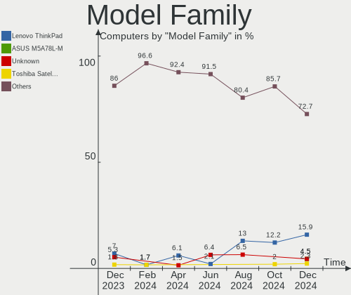
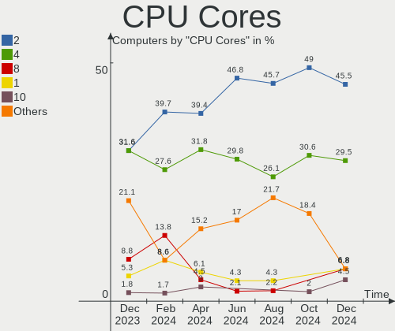
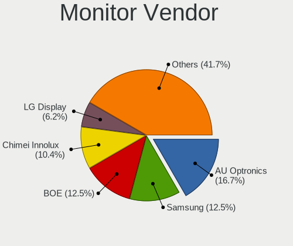
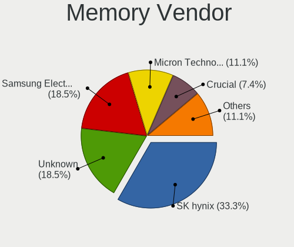
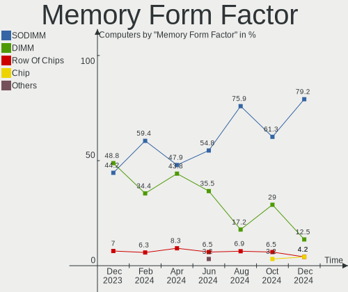

Xubuntu - Hardware Trends
-------------------------

A project to identify most popular hardware characteristics and track their change
over time based on data collected by Linux users at https://Linux-Hardware.org.

Anyone can contribute to this report by the [hw-probe](https://github.com/linuxhw/hw-probe) tool:

    sudo -E hw-probe -all -upload

This is a report for all computer types. See also reports for [desktops](/Dist/Xubuntu/Desktop/README.md) and [notebooks](/Dist/Xubuntu/Notebook/README.md).

This report is for one last month. Overall report since the beginning of time: [TestCoverage](https://github.com/linuxhw/TestCoverage)

Period: Jun, 2022.

Contents
--------

* [ System ](#system)
  - [ OS                       ](#os)
  - [ OS Family                ](#os-family)
  - [ Kernel                   ](#kernel)
  - [ Kernel Family            ](#kernel-family)
  - [ Kernel Major Ver.        ](#kernel-major-ver)
  - [ Arch                     ](#arch)
  - [ DE                       ](#de)
  - [ Display Server           ](#display-server)
  - [ Display Manager          ](#display-manager)
  - [ OS Lang                  ](#os-lang)
  - [ Boot Mode                ](#boot-mode)
  - [ Filesystem               ](#filesystem)
  - [ Part. scheme             ](#part-scheme)
  - [ Dual Boot with Linux/BSD ](#dual-boot-with-linuxbsd)
  - [ Dual Boot (Win)          ](#dual-boot-win)

* [ Board ](#board)
  - [ Vendor                   ](#vendor)
  - [ Model                    ](#model)
  - [ Model Family             ](#model-family)
  - [ MFG Year                 ](#mfg-year)
  - [ Form Factor              ](#form-factor)
  - [ Secure Boot              ](#secure-boot)
  - [ Coreboot                 ](#coreboot)
  - [ RAM Size                 ](#ram-size)
  - [ RAM Used                 ](#ram-used)
  - [ Total Drives             ](#total-drives)
  - [ Has CD-ROM               ](#has-cd-rom)
  - [ Has Ethernet             ](#has-ethernet)
  - [ Has WiFi                 ](#has-wifi)
  - [ Has Bluetooth            ](#has-bluetooth)

* [ Location ](#location)
  - [ Country                  ](#country)
  - [ City                     ](#city)

* [ Drives ](#drives)
  - [ Drive Vendor             ](#drive-vendor)
  - [ Drive Model              ](#drive-model)
  - [ HDD Vendor               ](#hdd-vendor)
  - [ SSD Vendor               ](#ssd-vendor)
  - [ Drive Kind               ](#drive-kind)
  - [ Drive Connector          ](#drive-connector)
  - [ Drive Size               ](#drive-size)
  - [ Space Total              ](#space-total)
  - [ Space Used               ](#space-used)
  - [ Malfunc. Drives          ](#malfunc-drives)
  - [ Malfunc. Drive Vendor    ](#malfunc-drive-vendor)
  - [ Malfunc. HDD Vendor      ](#malfunc-hdd-vendor)
  - [ Malfunc. Drive Kind      ](#malfunc-drive-kind)
  - [ Failed Drives            ](#failed-drives)
  - [ Failed Drive Vendor      ](#failed-drive-vendor)
  - [ Drive Status             ](#drive-status)

* [ Storage controller ](#storage-controller)
  - [ Storage Vendor           ](#storage-vendor)
  - [ Storage Model            ](#storage-model)
  - [ Storage Kind             ](#storage-kind)

* [ Processor ](#processor)
  - [ CPU Vendor               ](#cpu-vendor)
  - [ CPU Model                ](#cpu-model)
  - [ CPU Model Family         ](#cpu-model-family)
  - [ CPU Cores                ](#cpu-cores)
  - [ CPU Sockets              ](#cpu-sockets)
  - [ CPU Threads              ](#cpu-threads)
  - [ CPU Op-Modes             ](#cpu-op-modes)
  - [ CPU Microcode            ](#cpu-microcode)
  - [ CPU Microarch            ](#cpu-microarch)

* [ Graphics ](#graphics)
  - [ GPU Vendor               ](#gpu-vendor)
  - [ GPU Model                ](#gpu-model)
  - [ GPU Combo                ](#gpu-combo)
  - [ GPU Driver               ](#gpu-driver)
  - [ GPU Memory               ](#gpu-memory)

* [ Monitor ](#monitor)
  - [ Monitor Vendor           ](#monitor-vendor)
  - [ Monitor Model            ](#monitor-model)
  - [ Monitor Resolution       ](#monitor-resolution)
  - [ Monitor Diagonal         ](#monitor-diagonal)
  - [ Monitor Width            ](#monitor-width)
  - [ Aspect Ratio             ](#aspect-ratio)
  - [ Monitor Area             ](#monitor-area)
  - [ Pixel Density            ](#pixel-density)
  - [ Multiple Monitors        ](#multiple-monitors)

* [ Network ](#network)
  - [ Net Controller Vendor    ](#net-controller-vendor)
  - [ Net Controller Model     ](#net-controller-model)
  - [ Wireless Vendor          ](#wireless-vendor)
  - [ Wireless Model           ](#wireless-model)
  - [ Ethernet Vendor          ](#ethernet-vendor)
  - [ Ethernet Model           ](#ethernet-model)
  - [ Net Controller Kind      ](#net-controller-kind)
  - [ Used Controller          ](#used-controller)
  - [ NICs                     ](#nics)
  - [ IPv6                     ](#ipv6)

* [ Bluetooth ](#bluetooth)
  - [ Bluetooth Vendor         ](#bluetooth-vendor)
  - [ Bluetooth Model          ](#bluetooth-model)

* [ Sound ](#sound)
  - [ Sound Vendor             ](#sound-vendor)
  - [ Sound Model              ](#sound-model)

* [ Memory ](#memory)
  - [ Memory Vendor            ](#memory-vendor)
  - [ Memory Model             ](#memory-model)
  - [ Memory Kind              ](#memory-kind)
  - [ Memory Form Factor       ](#memory-form-factor)
  - [ Memory Size              ](#memory-size)
  - [ Memory Speed             ](#memory-speed)

* [ Printers & scanners ](#printers--scanners)
  - [ Printer Vendor           ](#printer-vendor)
  - [ Printer Model            ](#printer-model)
  - [ Scanner Vendor           ](#scanner-vendor)
  - [ Scanner Model            ](#scanner-model)

* [ Camera ](#camera)
  - [ Camera Vendor            ](#camera-vendor)
  - [ Camera Model             ](#camera-model)

* [ Security ](#security)
  - [ Fingerprint Vendor       ](#fingerprint-vendor)
  - [ Fingerprint Model        ](#fingerprint-model)
  - [ Chipcard Vendor          ](#chipcard-vendor)
  - [ Chipcard Model           ](#chipcard-model)

* [ Unsupported ](#unsupported)
  - [ Unsupported Devices      ](#unsupported-devices)
  - [ Unsupported Device Types ](#unsupported-device-types)

System
------

OS
--

Installed operating systems

| Name          | Computers | Percent |
|---------------|-----------|---------|
| Xubuntu 20.04 | 37        | 48.05%  |
| Xubuntu 22.04 | 22        | 28.57%  |
| Xubuntu 18.04 | 11        | 14.29%  |
| Xubuntu 21.10 | 3         | 3.9%    |
| Xubuntu 22.10 | 1         | 1.3%    |
| Xubuntu 20.10 | 1         | 1.3%    |
| Xubuntu 19.10 | 1         | 1.3%    |
| Xubuntu 16.04 | 1         | 1.3%    |

OS Family
---------

OS without a version

| Name    | Computers | Percent |
|---------|-----------|---------|
| Xubuntu | 77        | 100%    |

Kernel
------

Version of the Linux kernel

| Version                    | Computers | Percent |
|----------------------------|-----------|---------|
| 5.4.0-117-generic          | 9         | 11.69%  |
| 5.13.0-51-generic          | 6         | 7.79%   |
| 5.15.0-37-generic          | 5         | 6.49%   |
| 5.15.0-35-generic          | 5         | 6.49%   |
| 5.4.0-120-generic          | 4         | 5.19%   |
| 5.13.0-44-generic          | 4         | 5.19%   |
| 5.4.0-113-generic          | 3         | 3.9%    |
| 5.15.0-39-generic          | 3         | 3.9%    |
| 5.15.0-25-generic          | 3         | 3.9%    |
| 5.13.0-48-generic          | 3         | 3.9%    |
| 5.4.0-113-lowlatency       | 2         | 2.6%    |
| 5.15.0-40-generic          | 2         | 2.6%    |
| 5.15.0-33-generic          | 2         | 2.6%    |
| 5.13.0-52-generic          | 2         | 2.6%    |
| 4.15.0-188-generic         | 2         | 2.6%    |
| 5.8.0-63-generic           | 1         | 1.3%    |
| 5.4.0-99-generic           | 1         | 1.3%    |
| 5.4.0-97-lowlatency        | 1         | 1.3%    |
| 5.4.0-74-generic           | 1         | 1.3%    |
| 5.4.0-73-generic           | 1         | 1.3%    |
| 5.4.0-121-lowlatency       | 1         | 1.3%    |
| 5.4.0-112-generic          | 1         | 1.3%    |
| 5.4.0-107-generic          | 1         | 1.3%    |
| 5.3.0-61-generic           | 1         | 1.3%    |
| 5.17.0-8-generic           | 1         | 1.3%    |
| 5.15.25-rockchip64         | 1         | 1.3%    |
| 5.15.0-39-lowlatency       | 1         | 1.3%    |
| 5.15.0-27-generic          | 1         | 1.3%    |
| 5.15.0-14.1-liquorix-amd64 | 1         | 1.3%    |
| 5.13.0-46-generic          | 1         | 1.3%    |
| 5.13.0-44-lowlatency       | 1         | 1.3%    |
| 5.13.0-41-generic          | 1         | 1.3%    |
| 5.13.0-40-generic          | 1         | 1.3%    |
| 5.13.0-39-generic          | 1         | 1.3%    |
| 4.15.0-187-lowlatency      | 1         | 1.3%    |
| 4.15.0-184-lowlatency      | 1         | 1.3%    |
| 4.15.0-142-generic         | 1         | 1.3%    |

Kernel Family
-------------

Linux kernel without a distro release

| Version | Computers | Percent |
|---------|-----------|---------|
| 5.4.0   | 25        | 32.47%  |
| 5.15.0  | 23        | 29.87%  |
| 5.13.0  | 20        | 25.97%  |
| 4.15.0  | 5         | 6.49%   |
| 5.8.0   | 1         | 1.3%    |
| 5.3.0   | 1         | 1.3%    |
| 5.17.0  | 1         | 1.3%    |
| 5.15.25 | 1         | 1.3%    |

Kernel Major Ver.
-----------------

Linux kernel major version

| Version | Computers | Percent |
|---------|-----------|---------|
| 5.4     | 25        | 32.47%  |
| 5.15    | 24        | 31.17%  |
| 5.13    | 20        | 25.97%  |
| 4.15    | 5         | 6.49%   |
| 5.8     | 1         | 1.3%    |
| 5.3     | 1         | 1.3%    |
| 5.17    | 1         | 1.3%    |

Arch
----

OS architecture (x86_64, i586, etc.)

| Name    | Computers | Percent |
|---------|-----------|---------|
| x86_64  | 69        | 89.61%  |
| i686    | 7         | 9.09%   |
| aarch64 | 1         | 1.3%    |

DE
--

Desktop Environment

| Name  | Computers | Percent |
|-------|-----------|---------|
| XFCE  | 74        | 96.1%   |
| GNOME | 2         | 2.6%    |
| i3    | 1         | 1.3%    |

Display Server
--------------

X11 or Wayland

| Name | Computers | Percent |
|------|-----------|---------|
| X11  | 75        | 97.4%   |
| Tty  | 2         | 2.6%    |

Display Manager
---------------

SDDM, LightDM, etc.

| Name    | Computers | Percent |
|---------|-----------|---------|
| LightDM | 67        | 87.01%  |
| Unknown | 6         | 7.79%   |
| GDM3    | 3         | 3.9%    |
| GDM     | 1         | 1.3%    |

OS Lang
-------

Language

| Lang  | Computers | Percent |
|-------|-----------|---------|
| en_US | 29        | 37.66%  |
| fr_FR | 8         | 10.39%  |
| de_DE | 7         | 9.09%   |
| ru_RU | 6         | 7.79%   |
| es_PE | 4         | 5.19%   |
| it_IT | 3         | 3.9%    |
| en_GB | 3         | 3.9%    |
| pt_BR | 2         | 2.6%    |
| pl_PL | 2         | 2.6%    |
| es_MX | 2         | 2.6%    |
| es_ES | 2         | 2.6%    |
| en_CA | 2         | 2.6%    |
| C     | 2         | 2.6%    |
| ru_UA | 1         | 1.3%    |
| ja_JP | 1         | 1.3%    |
| hu_HU | 1         | 1.3%    |
| es_CO | 1         | 1.3%    |
| cs_CZ | 1         | 1.3%    |

Boot Mode
---------

EFI or BIOS

| Mode | Computers | Percent |
|------|-----------|---------|
| BIOS | 44        | 57.14%  |
| EFI  | 33        | 42.86%  |

Filesystem
----------

Type of filesystem

| Type    | Computers | Percent |
|---------|-----------|---------|
| Ext4    | 70        | 90.91%  |
| Overlay | 3         | 3.9%    |
| Zfs     | 2         | 2.6%    |
| Ext3    | 1         | 1.3%    |
| Btrfs   | 1         | 1.3%    |

Part. scheme
------------

Scheme of partitioning

| Type    | Computers | Percent |
|---------|-----------|---------|
| Unknown | 42        | 54.55%  |
| GPT     | 27        | 35.06%  |
| MBR     | 8         | 10.39%  |

Dual Boot with Linux/BSD
------------------------

Hosting more than one Linux/BSD

| Dual boot | Computers | Percent |
|-----------|-----------|---------|
| No        | 65        | 84.42%  |
| Yes       | 12        | 15.58%  |

Dual Boot (Win)
---------------

Hosting Linux and Windows

| Dual boot | Computers | Percent |
|-----------|-----------|---------|
| No        | 54        | 70.13%  |
| Yes       | 23        | 29.87%  |

Board
-----

Vendor
------

Motherboard manufacturer

| Name                           | Computers | Percent |
|--------------------------------|-----------|---------|
| Lenovo                         | 14        | 18.18%  |
| Hewlett-Packard                | 10        | 12.99%  |
| ASUSTek Computer               | 10        | 12.99%  |
| Dell                           | 8         | 10.39%  |
| MSI                            | 5         | 6.49%   |
| Acer                           | 5         | 6.49%   |
| Intel                          | 3         | 3.9%    |
| GPU Company                    | 2         | 2.6%    |
| Gigabyte Technology            | 2         | 2.6%    |
| Apple                          | 2         | 2.6%    |
| Supermicro                     | 1         | 1.3%    |
| Standard                       | 1         | 1.3%    |
| Sony                           | 1         | 1.3%    |
| Packard Bell                   | 1         | 1.3%    |
| Medion                         | 1         | 1.3%    |
| Matsushita Electric Industrial | 1         | 1.3%    |
| Google                         | 1         | 1.3%    |
| Fujitsu                        | 1         | 1.3%    |
| Dynabook                       | 1         | 1.3%    |
| Digma                          | 1         | 1.3%    |
| Chuwi                          | 1         | 1.3%    |
| ASRockRack                     | 1         | 1.3%    |
| ASRock                         | 1         | 1.3%    |
| AMI                            | 1         | 1.3%    |
| Alienware                      | 1         | 1.3%    |
| Unknown                        | 1         | 1.3%    |

Model
-----

Motherboard model

| Name                                        | Computers | Percent |
|---------------------------------------------|-----------|---------|
| Unknown                                     | 2         | 2.6%    |
| Supermicro X10SRA                           | 1         | 1.3%    |
| Sony VPCSB1V9R                              | 1         | 1.3%    |
| Packard Bell EasyNote TK11BZ                | 1         | 1.3%    |
| MSI PR601/VR603                             | 1         | 1.3%    |
| MSI MS-7C52                                 | 1         | 1.3%    |
| MSI MS-7C37                                 | 1         | 1.3%    |
| MSI MS-7529                                 | 1         | 1.3%    |
| MSI Modern 15 A5M                           | 1         | 1.3%    |
| Medion E2221T MD60684                       | 1         | 1.3%    |
| Matsushita Electric Industrial CF-W5LWEZZBM | 1         | 1.3%    |
| Lenovo ThinkPad X200 7459V2R                | 1         | 1.3%    |
| Lenovo ThinkPad W510 431963G                | 1         | 1.3%    |
| Lenovo ThinkPad T530 23923MG                | 1         | 1.3%    |
| Lenovo ThinkPad T440s 20AQ009DGE            | 1         | 1.3%    |
| Lenovo ThinkPad T420s 417152U               | 1         | 1.3%    |
| Lenovo ThinkPad T14s Gen 1 20UHCTO1WW       | 1         | 1.3%    |
| Lenovo ThinkPad P17 Gen 1 20SQS0K700        | 1         | 1.3%    |
| Lenovo ThinkPad L380 20M6S4J400             | 1         | 1.3%    |
| Lenovo ThinkCentre M71e 5033AR1             | 1         | 1.3%    |
| Lenovo ThinkCentre E63z 10E00025IX          | 1         | 1.3%    |
| Lenovo ThinkCentre A70 7844H9G              | 1         | 1.3%    |
| Lenovo IdeaPad 330S-15IKB 81F5              | 1         | 1.3%    |
| Lenovo IdeaPad 330-17IKB 81DK               | 1         | 1.3%    |
| Lenovo G505 20240                           | 1         | 1.3%    |
| Intel NUC7i3BNH                             | 1         | 1.3%    |
| Intel DG33BU AAD79951-407                   | 1         | 1.3%    |
| Intel D102GGC2 AAD42789-204                 | 1         | 1.3%    |
| HP ProBook 455 G8 Notebook PC               | 1         | 1.3%    |
| HP ProBook 445 G7                           | 1         | 1.3%    |
| HP Pavilion Laptop 15-eh1xxx                | 1         | 1.3%    |
| HP Pavilion g7                              | 1         | 1.3%    |
| HP Pavilion dv5                             | 1         | 1.3%    |
| HP Laptop 15-ef1xxx                         | 1         | 1.3%    |
| HP EliteBook 840 G3                         | 1         | 1.3%    |
| HP Compaq Elite 8300 SFF                    | 1         | 1.3%    |
| HP 255 G7 Notebook PC                       | 1         | 1.3%    |
| HP 15                                       | 1         | 1.3%    |
| GPU Company GWTN141-4                       | 1         | 1.3%    |
| GPU Company GWTN116-3                       | 1         | 1.3%    |
| Google Kindred                              | 1         | 1.3%    |
| Gigabyte H97-HD3                            | 1         | 1.3%    |
| Gigabyte H61M-S2PV                          | 1         | 1.3%    |
| Fujitsu LIFEBOOK U772                       | 1         | 1.3%    |
| Dynabook TECRA A50-J                        | 1         | 1.3%    |
| Digma EVE 15 C413 ES5059EW                  | 1         | 1.3%    |
| Dell OptiPlex 380                           | 1         | 1.3%    |
| Dell OptiPlex 3020                          | 1         | 1.3%    |
| Dell Latitude D820                          | 1         | 1.3%    |
| Dell Latitude 7280                          | 1         | 1.3%    |
| Dell Inspiron N4010                         | 1         | 1.3%    |
| Dell Inspiron 5570                          | 1         | 1.3%    |
| Dell Inspiron 15-3567                       | 1         | 1.3%    |
| Dell 500                                    | 1         | 1.3%    |
| Chuwi GemiBook Pro                          | 1         | 1.3%    |
| ASUS X551MA                                 | 1         | 1.3%    |
| ASUS VivoBook_ASUSLaptop X7600PC_N7600PC    | 1         | 1.3%    |
| ASUS TUF Gaming X570-PLUS                   | 1         | 1.3%    |
| ASUS ROG STRIX B450-F GAMING II             | 1         | 1.3%    |
| ASUS P8Z77-V                                | 1         | 1.3%    |

Model Family
------------

Motherboard model prefix

| Name                                        | Computers | Percent |
|---------------------------------------------|-----------|---------|
| Lenovo ThinkPad                             | 8         | 10.39%  |
| Acer Aspire                                 | 4         | 5.19%   |
| Lenovo ThinkCentre                          | 3         | 3.9%    |
| HP Pavilion                                 | 3         | 3.9%    |
| Dell Inspiron                               | 3         | 3.9%    |
| Lenovo IdeaPad                              | 2         | 2.6%    |
| HP ProBook                                  | 2         | 2.6%    |
| Dell OptiPlex                               | 2         | 2.6%    |
| Dell Latitude                               | 2         | 2.6%    |
| Unknown                                     | 2         | 2.6%    |
| Supermicro X10SRA                           | 1         | 1.3%    |
| Sony VPCSB1V9R                              | 1         | 1.3%    |
| Packard Bell EasyNote                       | 1         | 1.3%    |
| MSI PR601                                   | 1         | 1.3%    |
| MSI MS-7C52                                 | 1         | 1.3%    |
| MSI MS-7C37                                 | 1         | 1.3%    |
| MSI MS-7529                                 | 1         | 1.3%    |
| MSI Modern                                  | 1         | 1.3%    |
| Medion E2221T                               | 1         | 1.3%    |
| Matsushita Electric Industrial CF-W5LWEZZBM | 1         | 1.3%    |
| Lenovo G505                                 | 1         | 1.3%    |
| Intel NUC7i3BNH                             | 1         | 1.3%    |
| Intel DG33BU                                | 1         | 1.3%    |
| Intel D102GGC2                              | 1         | 1.3%    |
| HP Laptop                                   | 1         | 1.3%    |
| HP EliteBook                                | 1         | 1.3%    |
| HP Compaq                                   | 1         | 1.3%    |
| HP 255                                      | 1         | 1.3%    |
| HP 15                                       | 1         | 1.3%    |
| GPU Company GWTN141-4                       | 1         | 1.3%    |
| GPU Company GWTN116-3                       | 1         | 1.3%    |
| Google Kindred                              | 1         | 1.3%    |
| Gigabyte H97-HD3                            | 1         | 1.3%    |
| Gigabyte H61M-S2PV                          | 1         | 1.3%    |
| Fujitsu LIFEBOOK                            | 1         | 1.3%    |
| Dynabook TECRA                              | 1         | 1.3%    |
| Digma EVE                                   | 1         | 1.3%    |
| Dell 500                                    | 1         | 1.3%    |
| Chuwi GemiBook                              | 1         | 1.3%    |
| ASUS X551MA                                 | 1         | 1.3%    |
| ASUS VivoBook                               | 1         | 1.3%    |
| ASUS TUF                                    | 1         | 1.3%    |
| ASUS ROG                                    | 1         | 1.3%    |
| ASUS P8Z77-V                                | 1         | 1.3%    |
| ASUS P8H67-M                                | 1         | 1.3%    |
| ASUS M5A97                                  | 1         | 1.3%    |
| ASUS M5A78L-M                               | 1         | 1.3%    |
| ASUS M2N-E                                  | 1         | 1.3%    |
| ASUS All                                    | 1         | 1.3%    |
| ASRockRack ROMED8-2T                        | 1         | 1.3%    |
| ASRock N68-S3                               | 1         | 1.3%    |
| Apple MacBookPro14                          | 1         | 1.3%    |
| Apple MacBookPro1                           | 1         | 1.3%    |
| AMI Intel                                   | 1         | 1.3%    |
| Alienware 17                                | 1         | 1.3%    |
| Acer Switch                                 | 1         | 1.3%    |

MFG Year
--------

Motherboard manufacture year

| Year    | Computers | Percent |
|---------|-----------|---------|
| 2021    | 8         | 10.39%  |
| 2020    | 7         | 9.09%   |
| 2011    | 7         | 9.09%   |
| 2014    | 6         | 7.79%   |
| 2012    | 6         | 7.79%   |
| 2018    | 5         | 6.49%   |
| 2017    | 5         | 6.49%   |
| 2013    | 4         | 5.19%   |
| 2010    | 4         | 5.19%   |
| 2008    | 4         | 5.19%   |
| 2006    | 4         | 5.19%   |
| 2019    | 3         | 3.9%    |
| 2016    | 3         | 3.9%    |
| 2009    | 3         | 3.9%    |
| 2007    | 3         | 3.9%    |
| 2022    | 2         | 2.6%    |
| 2015    | 2         | 2.6%    |
| Unknown | 1         | 1.3%    |

Form Factor
-----------

Physical design of the computer

| Name           | Computers | Percent |
|----------------|-----------|---------|
| Notebook       | 49        | 63.64%  |
| Desktop        | 22        | 28.57%  |
| System on chip | 1         | 1.3%    |
| Tablet         | 1         | 1.3%    |
| Convertible    | 1         | 1.3%    |
| Mini pc        | 1         | 1.3%    |
| All in one     | 1         | 1.3%    |
| Server         | 1         | 1.3%    |

Secure Boot
-----------

Enabled or disabled

| State    | Computers | Percent |
|----------|-----------|---------|
| Disabled | 70        | 90.91%  |
| Enabled  | 7         | 9.09%   |

Coreboot
--------

Have coreboot on board

| Used | Computers | Percent |
|------|-----------|---------|
| No   | 76        | 98.7%   |
| Yes  | 1         | 1.3%    |

RAM Size
--------

Total RAM memory

| Size in GB      | Computers | Percent |
|-----------------|-----------|---------|
| 3.01-4.0        | 21        | 27.27%  |
| 4.01-8.0        | 20        | 25.97%  |
| 8.01-16.0       | 11        | 14.29%  |
| 16.01-24.0      | 8         | 10.39%  |
| 32.01-64.0      | 5         | 6.49%   |
| 1.01-2.0        | 4         | 5.19%   |
| 24.01-32.0      | 2         | 2.6%    |
| 64.01-256.0     | 2         | 2.6%    |
| 0.51-1.0        | 2         | 2.6%    |
| More than 256.0 | 1         | 1.3%    |
| 2.01-3.0        | 1         | 1.3%    |

RAM Used
--------

Used RAM memory

| Used GB   | Computers | Percent |
|-----------|-----------|---------|
| 1.01-2.0  | 28        | 36.36%  |
| 2.01-3.0  | 17        | 22.08%  |
| 4.01-8.0  | 14        | 18.18%  |
| 0.51-1.0  | 10        | 12.99%  |
| 3.01-4.0  | 5         | 6.49%   |
| 8.01-16.0 | 2         | 2.6%    |
| 0.01-0.5  | 1         | 1.3%    |

Total Drives
------------

Number of drives on board

| Drives | Computers | Percent |
|--------|-----------|---------|
| 1      | 47        | 61.04%  |
| 2      | 20        | 25.97%  |
| 5      | 3         | 3.9%    |
| 4      | 3         | 3.9%    |
| 3      | 3         | 3.9%    |
| 6      | 1         | 1.3%    |

Has CD-ROM
----------

Has CD-ROM on board

| Presented | Computers | Percent |
|-----------|-----------|---------|
| No        | 44        | 57.14%  |
| Yes       | 33        | 42.86%  |

Has Ethernet
------------

Has Ethernet on board

| Presented | Computers | Percent |
|-----------|-----------|---------|
| Yes       | 66        | 85.71%  |
| No        | 11        | 14.29%  |

Has WiFi
--------

Has WiFi module

| Presented | Computers | Percent |
|-----------|-----------|---------|
| Yes       | 58        | 75.32%  |
| No        | 19        | 24.68%  |

Has Bluetooth
-------------

Has Bluetooth module

| Presented | Computers | Percent |
|-----------|-----------|---------|
| Yes       | 40        | 51.95%  |
| No        | 37        | 48.05%  |

Location
--------

Country
-------

Geographic location (country)

| Country   | Computers | Percent |
|-----------|-----------|---------|
| USA       | 15        | 19.48%  |
| Germany   | 11        | 14.29%  |
| France    | 9         | 11.69%  |
| Russia    | 7         | 9.09%   |
| Mexico    | 5         | 6.49%   |
| Peru      | 4         | 5.19%   |
| Italy     | 3         | 3.9%    |
| Ukraine   | 2         | 2.6%    |
| UK        | 2         | 2.6%    |
| Spain     | 2         | 2.6%    |
| Poland    | 2         | 2.6%    |
| Canada    | 2         | 2.6%    |
| Brazil    | 2         | 2.6%    |
| Zimbabwe  | 1         | 1.3%    |
| Vietnam   | 1         | 1.3%    |
| Turkey    | 1         | 1.3%    |
| Sweden    | 1         | 1.3%    |
| Japan     | 1         | 1.3%    |
| Indonesia | 1         | 1.3%    |
| Hungary   | 1         | 1.3%    |
| Egypt     | 1         | 1.3%    |
| Czechia   | 1         | 1.3%    |
| Colombia  | 1         | 1.3%    |
| Bulgaria  | 1         | 1.3%    |

City
----

Geographic location (city)

| City                | Computers | Percent |
|---------------------|-----------|---------|
| Mexico City         | 4         | 5.19%   |
| Lima                | 4         | 5.19%   |
| Warsaw              | 2         | 2.6%    |
| St Petersburg       | 2         | 2.6%    |
| Palma               | 2         | 2.6%    |
| Ottawa              | 2         | 2.6%    |
| Oklahoma City       | 2         | 2.6%    |
| Ochsenfurt          | 2         | 2.6%    |
| Moscow              | 2         | 2.6%    |
| Zelenogorsk         | 1         | 1.3%    |
| West Liberty        | 1         | 1.3%    |
| Vicenza             | 1         | 1.3%    |
| Varna               | 1         | 1.3%    |
| Tucson              | 1         | 1.3%    |
| Trimport            | 1         | 1.3%    |
| Tholey              | 1         | 1.3%    |
| Székesfehérvár   | 1         | 1.3%    |
| Surabaya            | 1         | 1.3%    |
| Spring Valley       | 1         | 1.3%    |
| Sombrio             | 1         | 1.3%    |
| Santiago de Cali    | 1         | 1.3%    |
| San Jose            | 1         | 1.3%    |
| Punta Gorda         | 1         | 1.3%    |
| Puebla City         | 1         | 1.3%    |
| Paris Crossing      | 1         | 1.3%    |
| Orlando             | 1         | 1.3%    |
| Odessa              | 1         | 1.3%    |
| Obertraubling       | 1         | 1.3%    |
| Novopskov           | 1         | 1.3%    |
| Nizhniy Novgorod    | 1         | 1.3%    |
| Niihama             | 1         | 1.3%    |
| Muncie              | 1         | 1.3%    |
| Monteux             | 1         | 1.3%    |
| Minneapolis         | 1         | 1.3%    |
| Manchester          | 1         | 1.3%    |
| Lyon                | 1         | 1.3%    |
| Linköping          | 1         | 1.3%    |
| Léognan            | 1         | 1.3%    |
| Lavras              | 1         | 1.3%    |
| Kamensk-Shakhtinsky | 1         | 1.3%    |
| Ho Chi Minh City    | 1         | 1.3%    |
| Harare              | 1         | 1.3%    |
| Habsheim            | 1         | 1.3%    |
| Gronau              | 1         | 1.3%    |
| Grenoble            | 1         | 1.3%    |
| Gibsonia            | 1         | 1.3%    |
| Gelsenkirchen       | 1         | 1.3%    |
| Frankfurt am Main   | 1         | 1.3%    |
| Fourneaux-le-Val    | 1         | 1.3%    |
| Feldthurns          | 1         | 1.3%    |
| Dresden             | 1         | 1.3%    |
| Dallas              | 1         | 1.3%    |
| Colmar              | 1         | 1.3%    |
| České Budějovice | 1         | 1.3%    |
| Casagiove           | 1         | 1.3%    |
| Brest               | 1         | 1.3%    |
| Bonn                | 1         | 1.3%    |
| Blue Springs        | 1         | 1.3%    |
| Bielefeld           | 1         | 1.3%    |
| Bedford             | 1         | 1.3%    |

Drives
------

Drive Vendor
------------

Hard drive vendors

| Vendor                    | Computers | Drives | Percent |
|---------------------------|-----------|--------|---------|
| Samsung Electronics       | 19        | 24     | 17.76%  |
| WDC                       | 14        | 20     | 13.08%  |
| Seagate                   | 11        | 14     | 10.28%  |
| Toshiba                   | 10        | 10     | 9.35%   |
| Unknown                   | 7         | 9      | 6.54%   |
| Kingston                  | 5         | 5      | 4.67%   |
| Hitachi                   | 4         | 4      | 3.74%   |
| Crucial                   | 4         | 4      | 3.74%   |
| A-DATA Technology         | 4         | 4      | 3.74%   |
| SanDisk                   | 3         | 3      | 2.8%    |
| SK hynix                  | 2         | 2      | 1.87%   |
| Phison                    | 2         | 2      | 1.87%   |
| HGST                      | 2         | 2      | 1.87%   |
| USB3.0                    | 1         | 1      | 0.93%   |
| SSK                       | 1         | 1      | 0.93%   |
| PNY                       | 1         | 1      | 0.93%   |
| Patriot                   | 1         | 1      | 0.93%   |
| Micron/Crucial Technology | 1         | 1      | 0.93%   |
| Micron Technology         | 1         | 1      | 0.93%   |
| Maxtor                    | 1         | 1      | 0.93%   |
| KIOXIA                    | 1         | 1      | 0.93%   |
| JMicron Technology        | 1         | 1      | 0.93%   |
| Intenso                   | 1         | 1      | 0.93%   |
| Intel                     | 1         | 1      | 0.93%   |
| INNOVATION IT             | 1         | 1      | 0.93%   |
| Hewlett-Packard           | 1         | 3      | 0.93%   |
| Goodram                   | 1         | 1      | 0.93%   |
| Gigabyte Technology       | 1         | 1      | 0.93%   |
| Fujitsu                   | 1         | 1      | 0.93%   |
| FORESEE                   | 1         | 1      | 0.93%   |
| EMTEC                     | 1         | 1      | 0.93%   |
| Apple                     | 1         | 2      | 0.93%   |
| Unknown                   | 1         | 1      | 0.93%   |

Drive Model
-----------

Hard drive models

| Model                                | Computers | Percent |
|--------------------------------------|-----------|---------|
| Samsung SSD 860 EVO 500GB            | 2         | 1.68%   |
| Samsung NVMe SSD Drive 256GB         | 2         | 1.68%   |
| Kingston SA400S37240G 240GB SSD      | 2         | 1.68%   |
| WDC WDS500G2B0B-00YS70 500GB SSD     | 1         | 0.84%   |
| WDC WDS250G2B0A-00SM50 250GB SSD     | 1         | 0.84%   |
| WDC WDS240G2G0B-00EPW0 240GB SSD     | 1         | 0.84%   |
| WDC WD7500BPVT-60HXZT3 752GB         | 1         | 0.84%   |
| WDC WD60EFAX-68JH4N1 6TB             | 1         | 0.84%   |
| WDC WD5000BEVT-00ZAT0 500GB          | 1         | 0.84%   |
| WDC WD5000AAKX-08ERMA0 500GB         | 1         | 0.84%   |
| WDC WD5000AAKS-00UU3A0 500GB         | 1         | 0.84%   |
| WDC WD5000AAKS-00A7B0 500GB          | 1         | 0.84%   |
| WDC WD360ADFD-00NLR1 37GB            | 1         | 0.84%   |
| WDC WD3200BEVT-22ZCT0 320GB          | 1         | 0.84%   |
| WDC WD30EZRX-00MMMB0 3TB             | 1         | 0.84%   |
| WDC WD30EFRX-68EUZN0 3TB             | 1         | 0.84%   |
| WDC WD2500HHTZ-04N21V0 250GB         | 1         | 0.84%   |
| WDC WD1600BEVT-60ZCT0 160GB          | 1         | 0.84%   |
| WDC WD10SPZX-24Z10T0 1TB             | 1         | 0.84%   |
| WDC PC SN530 SDBPNPZ-512G-1006 512GB | 1         | 0.84%   |
| USB3.0 Super Speed 320GB             | 1         | 0.84%   |
| Unknown SLD32G  32GB                 | 1         | 0.84%   |
| Unknown SD32G  32GB                  | 1         | 0.84%   |
| Unknown NVMe SSD Drive 256GB         | 1         | 0.84%   |
| Unknown MMC Card  32GB               | 1         | 0.84%   |
| Unknown GB1QT  32GB                  | 1         | 0.84%   |
| Unknown EC2QT  64GB                  | 1         | 0.84%   |
| Unknown DA4064  64GB                 | 1         | 0.84%   |
| Unknown DA4032  32GB                 | 1         | 0.84%   |
| Unknown 032G72  32GB                 | 1         | 0.84%   |
| Toshiba MQ04ABF100 1TB               | 1         | 0.84%   |
| Toshiba MQ01ACF050 500GB             | 1         | 0.84%   |
| Toshiba MQ01ABD100 1TB               | 1         | 0.84%   |
| Toshiba MQ01ABD032 320GB             | 1         | 0.84%   |
| Toshiba MK6025GAS 64GB               | 1         | 0.84%   |
| Toshiba MK5065GSXN 500GB             | 1         | 0.84%   |
| Toshiba MK5059GSXP 500GB             | 1         | 0.84%   |
| Toshiba KBG40ZNV256G MEMORY 256GB    | 1         | 0.84%   |
| Toshiba DT01ACA200 2TB               | 1         | 0.84%   |
| Toshiba DT01ACA100 1TB               | 1         | 0.84%   |
| SSK Disk 480GB                       | 1         | 0.84%   |
| SK hynix NVMe SSD Drive 256GB        | 1         | 0.84%   |
| SK hynix HFM001TD3JX013N 1TB         | 1         | 0.84%   |
| Seagate ST500LM021-1KJ152 500GB      | 1         | 0.84%   |
| Seagate ST500LM012 HN-M500MBB 500GB  | 1         | 0.84%   |
| Seagate ST500LM000-1EJ162 500GB      | 1         | 0.84%   |
| Seagate ST3500413AS 500GB            | 1         | 0.84%   |
| Seagate ST3250318AS 250GB            | 1         | 0.84%   |
| Seagate ST3250312AS 250GB            | 1         | 0.84%   |
| Seagate ST3250310AS 250GB            | 1         | 0.84%   |
| Seagate ST31000528AS 1TB             | 1         | 0.84%   |
| Seagate ST250DM000-1BD141 250GB      | 1         | 0.84%   |
| Seagate ST2000LM007-1R8174 2TB       | 1         | 0.84%   |
| Seagate ST2000LM003 HN-M201RAD 2TB   | 1         | 0.84%   |
| Seagate ST1000LM024 HN-M101MBB 1TB   | 1         | 0.84%   |
| Seagate ST1000DM010-2EP102 1TB       | 1         | 0.84%   |
| Seagate ST1000DL002-9TT153 1TB       | 1         | 0.84%   |
| SanDisk SL32G  32GB                  | 1         | 0.84%   |
| SanDisk SD9SN8W-128G-1006 128GB SSD  | 1         | 0.84%   |
| SanDisk DF4064  64GB                 | 1         | 0.84%   |

HDD Vendor
----------

Hard disk drive vendors

| Vendor              | Computers | Drives | Percent |
|---------------------|-----------|--------|---------|
| Seagate             | 11        | 14     | 25.58%  |
| WDC                 | 10        | 16     | 23.26%  |
| Toshiba             | 9         | 9      | 20.93%  |
| Samsung Electronics | 5         | 7      | 11.63%  |
| Hitachi             | 4         | 4      | 9.3%    |
| HGST                | 2         | 2      | 4.65%   |
| Maxtor              | 1         | 1      | 2.33%   |
| Fujitsu             | 1         | 1      | 2.33%   |

SSD Vendor
----------

Solid state drive vendors

| Vendor              | Computers | Drives | Percent |
|---------------------|-----------|--------|---------|
| Samsung Electronics | 9         | 10     | 27.27%  |
| Crucial             | 4         | 4      | 12.12%  |
| WDC                 | 3         | 3      | 9.09%   |
| Kingston            | 3         | 3      | 9.09%   |
| A-DATA Technology   | 3         | 3      | 9.09%   |
| USB3.0              | 1         | 1      | 3.03%   |
| SanDisk             | 1         | 1      | 3.03%   |
| PNY                 | 1         | 1      | 3.03%   |
| Patriot             | 1         | 1      | 3.03%   |
| Micron Technology   | 1         | 1      | 3.03%   |
| Intel               | 1         | 1      | 3.03%   |
| INNOVATION IT       | 1         | 1      | 3.03%   |
| Goodram             | 1         | 1      | 3.03%   |
| Gigabyte Technology | 1         | 1      | 3.03%   |
| FORESEE             | 1         | 1      | 3.03%   |
| EMTEC               | 1         | 1      | 3.03%   |

Drive Kind
----------

HDD or SSD

| Kind    | Computers | Drives | Percent |
|---------|-----------|--------|---------|
| HDD     | 37        | 54     | 39.36%  |
| SSD     | 29        | 34     | 30.85%  |
| NVMe    | 18        | 24     | 19.15%  |
| MMC     | 7         | 11     | 7.45%   |
| Unknown | 3         | 3      | 3.19%   |

Drive Connector
---------------

SATA, SAS, NVMe, etc.

| Type | Computers | Drives | Percent |
|------|-----------|--------|---------|
| SATA | 58        | 86     | 65.91%  |
| NVMe | 18        | 24     | 20.45%  |
| MMC  | 7         | 11     | 7.95%   |
| SAS  | 5         | 5      | 5.68%   |

Drive Size
----------

Size of hard drive

| Size in TB | Computers | Drives | Percent |
|------------|-----------|--------|---------|
| 0.01-0.5   | 45        | 60     | 66.18%  |
| 0.51-1.0   | 17        | 19     | 25%     |
| 1.01-2.0   | 3         | 3      | 4.41%   |
| 2.01-3.0   | 2         | 5      | 2.94%   |
| 4.01-10.0  | 1         | 1      | 1.47%   |

Space Total
-----------

Amount of disk space available on the file system

| Size in GB     | Computers | Percent |
|----------------|-----------|---------|
| 101-250        | 24        | 31.17%  |
| 251-500        | 16        | 20.78%  |
| 501-1000       | 11        | 14.29%  |
| 1001-2000      | 10        | 12.99%  |
| 51-100         | 6         | 7.79%   |
| 21-50          | 4         | 5.19%   |
| 1-20           | 4         | 5.19%   |
| More than 3000 | 2         | 2.6%    |

Space Used
----------

Amount of used disk space

| Used GB        | Computers | Percent |
|----------------|-----------|---------|
| 1-20           | 23        | 29.87%  |
| 51-100         | 13        | 16.88%  |
| 21-50          | 12        | 15.58%  |
| 101-250        | 11        | 14.29%  |
| 251-500        | 10        | 12.99%  |
| 501-1000       | 5         | 6.49%   |
| 1001-2000      | 2         | 2.6%    |
| More than 3000 | 1         | 1.3%    |

Malfunc. Drives
---------------

Drive models with a malfunction

| Model                               | Computers | Drives | Percent |
|-------------------------------------|-----------|--------|---------|
| WDC WDS240G2G0B-00EPW0 240GB SSD    | 1         | 1      | 5.56%   |
| WDC WD5000AAKX-08ERMA0 500GB        | 1         | 1      | 5.56%   |
| WDC WD5000AAKS-00A7B0 500GB         | 1         | 1      | 5.56%   |
| Toshiba MQ01ACF050 500GB            | 1         | 1      | 5.56%   |
| Toshiba MQ01ABD100 1TB              | 1         | 1      | 5.56%   |
| Toshiba MK5065GSXN 500GB            | 1         | 1      | 5.56%   |
| Toshiba MK5059GSXP 500GB            | 1         | 1      | 5.56%   |
| Toshiba DT01ACA100 1TB              | 1         | 1      | 5.56%   |
| Seagate ST3250318AS 250GB           | 1         | 1      | 5.56%   |
| Seagate ST3250310AS 250GB           | 1         | 1      | 5.56%   |
| Seagate ST1000LM024 HN-M101MBB 1TB  | 1         | 1      | 5.56%   |
| Seagate ST1000DL002-9TT153 1TB      | 1         | 1      | 5.56%   |
| Samsung Electronics SSD 870 EVO 1TB | 1         | 1      | 5.56%   |
| Samsung Electronics HD103SI 1TB     | 1         | 1      | 5.56%   |
| Maxtor STM3160215AS 160GB           | 1         | 1      | 5.56%   |
| Hitachi HTS541080G9SA00 80GB        | 1         | 1      | 5.56%   |
| HGST HTS541010A9E680 1TB            | 1         | 1      | 5.56%   |
| Crucial CT128MX100SSD1 128GB        | 1         | 1      | 5.56%   |

Malfunc. Drive Vendor
---------------------

Vendors of faulty drives

| Vendor              | Computers | Drives | Percent |
|---------------------|-----------|--------|---------|
| Toshiba             | 5         | 5      | 31.25%  |
| Seagate             | 3         | 4      | 18.75%  |
| WDC                 | 2         | 3      | 12.5%   |
| Samsung Electronics | 2         | 2      | 12.5%   |
| Maxtor              | 1         | 1      | 6.25%   |
| Hitachi             | 1         | 1      | 6.25%   |
| HGST                | 1         | 1      | 6.25%   |
| Crucial             | 1         | 1      | 6.25%   |

Malfunc. HDD Vendor
-------------------

Vendors of faulty HDD drives

| Vendor              | Computers | Drives | Percent |
|---------------------|-----------|--------|---------|
| Toshiba             | 5         | 5      | 38.46%  |
| Seagate             | 3         | 4      | 23.08%  |
| WDC                 | 1         | 2      | 7.69%   |
| Samsung Electronics | 1         | 1      | 7.69%   |
| Maxtor              | 1         | 1      | 7.69%   |
| Hitachi             | 1         | 1      | 7.69%   |
| HGST                | 1         | 1      | 7.69%   |

Malfunc. Drive Kind
-------------------

Kinds of faulty drives

| Kind | Computers | Drives | Percent |
|------|-----------|--------|---------|
| HDD  | 10        | 15     | 83.33%  |
| SSD  | 2         | 3      | 16.67%  |

Failed Drives
-------------

Failed drive models

Zero info for selected period =(

Failed Drive Vendor
-------------------

Failed drive vendors

Zero info for selected period =(

Drive Status
------------

Number of failed and malfunc. drives

| Status   | Computers | Drives | Percent |
|----------|-----------|--------|---------|
| Detected | 48        | 75     | 59.26%  |
| Works    | 22        | 33     | 27.16%  |
| Malfunc  | 11        | 18     | 13.58%  |

Storage controller
------------------

Storage Vendor
--------------

Storage controller vendors

| Vendor                      | Computers | Percent |
|-----------------------------|-----------|---------|
| Intel                       | 49        | 54.44%  |
| AMD                         | 14        | 15.56%  |
| Samsung Electronics         | 6         | 6.67%   |
| ASMedia Technology          | 3         | 3.33%   |
| SK hynix                    | 2         | 2.22%   |
| Phison Electronics          | 2         | 2.22%   |
| Nvidia                      | 2         | 2.22%   |
| KIOXIA                      | 2         | 2.22%   |
| Kingston Technology Company | 2         | 2.22%   |
| Unknown                     | 1         | 1.11%   |
| Silicon Motion              | 1         | 1.11%   |
| SanDisk                     | 1         | 1.11%   |
| Realtek Semiconductor       | 1         | 1.11%   |
| Micron/Crucial Technology   | 1         | 1.11%   |
| Marvell Technology Group    | 1         | 1.11%   |
| Biwin Storage Technology    | 1         | 1.11%   |
| Apple                       | 1         | 1.11%   |

Storage Model
-------------

Storage controller models

| Model                                                                                   | Computers | Percent |
|-----------------------------------------------------------------------------------------|-----------|---------|
| AMD FCH SATA Controller [AHCI mode]                                                     | 10        | 9.52%   |
| Intel Sunrise Point-LP SATA Controller [AHCI mode]                                      | 6         | 5.71%   |
| Samsung NVMe SSD Controller SM981/PM981/PM983                                           | 4         | 3.81%   |
| Intel 82801G (ICH7 Family) IDE Controller                                               | 4         | 3.81%   |
| Intel 8 Series SATA Controller 1 [AHCI mode]                                            | 4         | 3.81%   |
| Intel NM10/ICH7 Family SATA Controller [IDE mode]                                       | 3         | 2.86%   |
| Intel Celeron N3350/Pentium N4200/Atom E3900 Series SATA AHCI Controller                | 3         | 2.86%   |
| Intel 82801IBM/IEM (ICH9M/ICH9M-E) 4 port SATA Controller [AHCI mode]                   | 3         | 2.86%   |
| Intel 7 Series Chipset Family 6-port SATA Controller [AHCI mode]                        | 3         | 2.86%   |
| ASMedia ASM1062 Serial ATA Controller                                                   | 3         | 2.86%   |
| Phison E12 NVMe Controller                                                              | 2         | 1.9%    |
| KIOXIA Non-Volatile memory controller                                                   | 2         | 1.9%    |
| Intel 9 Series Chipset Family SATA Controller [AHCI Mode]                               | 2         | 1.9%    |
| Intel 82801HM/HEM (ICH8M/ICH8M-E) IDE Controller                                        | 2         | 1.9%    |
| Intel 82801GBM/GHM (ICH7-M Family) SATA Controller [IDE mode]                           | 2         | 1.9%    |
| Intel 6 Series/C200 Series Chipset Family 6 port Mobile SATA AHCI Controller            | 2         | 1.9%    |
| Intel 6 Series/C200 Series Chipset Family 6 port Desktop SATA AHCI Controller           | 2         | 1.9%    |
| Intel 5 Series/3400 Series Chipset 6 port SATA AHCI Controller                          | 2         | 1.9%    |
| AMD SB7x0/SB8x0/SB9x0 SATA Controller [AHCI mode]                                       | 2         | 1.9%    |
| AMD 400 Series Chipset SATA Controller                                                  | 2         | 1.9%    |
| Unknown Non-Volatile memory controller                                                  | 1         | 0.95%   |
| SK hynix Non-Volatile memory controller                                                 | 1         | 0.95%   |
| SK hynix Gold P31 SSD                                                                   | 1         | 0.95%   |
| Silicon Motion SM2262/SM2262EN SSD Controller                                           | 1         | 0.95%   |
| SanDisk WD Blue SN550 NVMe SSD                                                          | 1         | 0.95%   |
| Samsung NVMe SSD Controller PM9A1/PM9A3/980PRO                                          | 1         | 0.95%   |
| Samsung NVMe SSD Controller 980                                                         | 1         | 0.95%   |
| Realtek Realtek Non-Volatile memory controller                                          | 1         | 0.95%   |
| Nvidia MCP61 SATA Controller                                                            | 1         | 0.95%   |
| Nvidia MCP61 IDE                                                                        | 1         | 0.95%   |
| Nvidia MCP55 SATA Controller                                                            | 1         | 0.95%   |
| Nvidia MCP55 IDE                                                                        | 1         | 0.95%   |
| Micron/Crucial Non-Volatile memory controller                                           | 1         | 0.95%   |
| Marvell Group 88SE6101/6102 single-port PATA133 interface                               | 1         | 0.95%   |
| Kingston Company U-SNS8154P3 NVMe SSD                                                   | 1         | 0.95%   |
| Kingston Company Company Non-Volatile memory controller                                 | 1         | 0.95%   |
| Intel Volume Management Device NVMe RAID Controller                                     | 1         | 0.95%   |
| Intel SATA Controller [RAID mode]                                                       | 1         | 0.95%   |
| Intel Jasper Lake SATA AHCI Controller                                                  | 1         | 0.95%   |
| Intel Ice Lake-LP SATA Controller [AHCI mode]                                           | 1         | 0.95%   |
| Intel Celeron/Pentium Silver Processor SATA Controller                                  | 1         | 0.95%   |
| Intel C610/X99 series chipset sSATA Controller [RAID mode]                              | 1         | 0.95%   |
| Intel C600/X79 series chipset SATA RAID Controller                                      | 1         | 0.95%   |
| Intel Atom Processor E3800 Series SATA AHCI Controller                                  | 1         | 0.95%   |
| Intel 82801IR/IO/IH (ICH9R/DO/DH) 6 port SATA Controller [AHCI mode]                    | 1         | 0.95%   |
| Intel 82801HM/HEM (ICH8M/ICH8M-E) SATA Controller [IDE mode]                            | 1         | 0.95%   |
| Intel 82801HM/HEM (ICH8M/ICH8M-E) SATA Controller [AHCI mode]                           | 1         | 0.95%   |
| Intel 82801 Mobile SATA Controller [RAID mode]                                          | 1         | 0.95%   |
| Intel 8 Series/C220 Series Chipset Family 6-port SATA Controller 1 [AHCI mode]          | 1         | 0.95%   |
| Intel 7 Series/C210 Series Chipset Family 6-port SATA Controller [AHCI mode]            | 1         | 0.95%   |
| Intel 7 Series/C210 Series Chipset Family 4-port SATA Controller [IDE mode]             | 1         | 0.95%   |
| Intel 7 Series/C210 Series Chipset Family 2-port SATA Controller [IDE mode]             | 1         | 0.95%   |
| Intel 6 Series/C200 Series Chipset Family Desktop SATA Controller (IDE mode, ports 4-5) | 1         | 0.95%   |
| Intel 6 Series/C200 Series Chipset Family Desktop SATA Controller (IDE mode, ports 0-3) | 1         | 0.95%   |
| Intel 5 Series/3400 Series Chipset 4 port SATA AHCI Controller                          | 1         | 0.95%   |
| Biwin Storage Non-Volatile memory controller                                            | 1         | 0.95%   |
| Apple S3X NVMe Controller                                                               | 1         | 0.95%   |
| AMD SB7x0/SB8x0/SB9x0 SATA Controller [IDE mode]                                        | 1         | 0.95%   |
| AMD SB7x0/SB8x0/SB9x0 IDE Controller                                                    | 1         | 0.95%   |
| AMD IXP SB4x0 Serial ATA Controller                                                     | 1         | 0.95%   |

Storage Kind
------------

Kind of storage controller (IDE, SATA, NVMe, SAS, ...)

| Kind | Computers | Percent |
|------|-----------|---------|
| SATA | 49        | 56.98%  |
| NVMe | 18        | 20.93%  |
| IDE  | 15        | 17.44%  |
| RAID | 4         | 4.65%   |

Processor
---------

CPU Vendor
----------

Processor vendors

| Vendor | Computers | Percent |
|--------|-----------|---------|
| Intel  | 56        | 72.73%  |
| AMD    | 20        | 25.97%  |
| ARM    | 1         | 1.3%    |

CPU Model
---------

Processor models

| Model                                       | Computers | Percent |
|---------------------------------------------|-----------|---------|
| Intel Core i5-8250U CPU @ 1.60GHz           | 2         | 2.6%    |
| Intel Core i5-4210U CPU @ 1.70GHz           | 2         | 2.6%    |
| Intel Celeron CPU N3350 @ 1.10GHz           | 2         | 2.6%    |
| AMD Ryzen 7 5700U with Radeon Graphics      | 2         | 2.6%    |
| AMD Ryzen 5 4500U with Radeon Graphics      | 2         | 2.6%    |
| AMD FX-8350 Eight-Core Processor            | 2         | 2.6%    |
| Intel Xeon CPU E5-2660 v3 @ 2.60GHz         | 1         | 1.3%    |
| Intel Pentium Dual-Core CPU E5300 @ 2.60GHz | 1         | 1.3%    |
| Intel Pentium Dual CPU T3400 @ 2.16GHz      | 1         | 1.3%    |
| Intel Pentium CPU N4200 @ 1.10GHz           | 1         | 1.3%    |
| Intel Pentium CPU G2020 @ 2.90GHz           | 1         | 1.3%    |
| Intel Pentium 4 CPU 3.20GHz                 | 1         | 1.3%    |
| Intel Pentium 3556U @ 1.70GHz               | 1         | 1.3%    |
| Intel Genuine CPU U1400 @ 1.20GHz           | 1         | 1.3%    |
| Intel Genuine CPU T2600 @ 2.16GHz           | 1         | 1.3%    |
| Intel Core i7-8550U CPU @ 1.80GHz           | 1         | 1.3%    |
| Intel Core i7-7820HK CPU @ 2.90GHz          | 1         | 1.3%    |
| Intel Core i7-6600U CPU @ 2.60GHz           | 1         | 1.3%    |
| Intel Core i7-4771 CPU @ 3.50GHz            | 1         | 1.3%    |
| Intel Core i7-3770K CPU @ 3.50GHz           | 1         | 1.3%    |
| Intel Core i7-3770 CPU @ 3.40GHz            | 1         | 1.3%    |
| Intel Core i7-3687U CPU @ 2.10GHz           | 1         | 1.3%    |
| Intel Core i7 CPU M 620 @ 2.67GHz           | 1         | 1.3%    |
| Intel Core i5-7360U CPU @ 2.30GHz           | 1         | 1.3%    |
| Intel Core i5-6300U CPU @ 2.40GHz           | 1         | 1.3%    |
| Intel Core i5-4460 CPU @ 3.20GHz            | 1         | 1.3%    |
| Intel Core i5-3320M CPU @ 2.60GHz           | 1         | 1.3%    |
| Intel Core i5-2520M CPU @ 2.50GHz           | 1         | 1.3%    |
| Intel Core i5-2410M CPU @ 2.30GHz           | 1         | 1.3%    |
| Intel Core i5-10400H CPU @ 2.60GHz          | 1         | 1.3%    |
| Intel Core i5-1035G1 CPU @ 1.00GHz          | 1         | 1.3%    |
| Intel Core i3-7130U CPU @ 2.70GHz           | 1         | 1.3%    |
| Intel Core i3-7100U CPU @ 2.40GHz           | 1         | 1.3%    |
| Intel Core i3-6006U CPU @ 2.00GHz           | 1         | 1.3%    |
| Intel Core i3-4160 CPU @ 3.60GHz            | 1         | 1.3%    |
| Intel Core i3-4005U CPU @ 1.70GHz           | 1         | 1.3%    |
| Intel Core i3-3217U CPU @ 1.80GHz           | 1         | 1.3%    |
| Intel Core i3-2100 CPU @ 3.10GHz            | 1         | 1.3%    |
| Intel Core i3 CPU M 350 @ 2.27GHz           | 1         | 1.3%    |
| Intel Core i3 CPU M 330 @ 2.13GHz           | 1         | 1.3%    |
| Intel Core 2 Quad CPU Q9500 @ 2.83GHz       | 1         | 1.3%    |
| Intel Core 2 Duo CPU T5550 @ 1.83GHz        | 1         | 1.3%    |
| Intel Core 2 Duo CPU P8800 @ 2.66GHz        | 1         | 1.3%    |
| Intel Core 2 Duo CPU P8600 @ 2.40GHz        | 1         | 1.3%    |
| Intel Core 2 Duo CPU E7500 @ 2.93GHz        | 1         | 1.3%    |
| Intel Core 2 Duo CPU E7300 @ 2.66GHz        | 1         | 1.3%    |
| Intel Core 2 CPU T5600 @ 1.83GHz            | 1         | 1.3%    |
| Intel Celeron N5100 @ 1.10GHz               | 1         | 1.3%    |
| Intel Celeron N4020 CPU @ 1.10GHz           | 1         | 1.3%    |
| Intel Celeron CPU N2830 @ 2.16GHz           | 1         | 1.3%    |
| Intel Celeron CPU G530 @ 2.40GHz            | 1         | 1.3%    |
| Intel Celeron CPU 550 @ 2.00GHz             | 1         | 1.3%    |
| Intel Celeron CPU 5205U @ 1.90GHz           | 1         | 1.3%    |
| Intel Atom x5-Z8350 CPU @ 1.44GHz           | 1         | 1.3%    |
| Intel 11th Gen Core i7-11370H @ 3.30GHz     | 1         | 1.3%    |
| Intel 11th Gen Core i5-1135G7 @ 2.40GHz     | 1         | 1.3%    |
| ARM Processor                               | 1         | 1.3%    |
| AMD Ryzen 7 PRO 5750G with Radeon Graphics  | 1         | 1.3%    |
| AMD Ryzen 7 PRO 4750U with Radeon Graphics  | 1         | 1.3%    |
| AMD Ryzen 7 2700 Eight-Core Processor       | 1         | 1.3%    |

CPU Model Family
----------------

Processor model prefix

| Model                   | Computers | Percent |
|-------------------------|-----------|---------|
| Intel Core i5           | 12        | 15.58%  |
| Intel Core i3           | 9         | 11.69%  |
| Intel Core i7           | 8         | 10.39%  |
| Intel Celeron           | 8         | 10.39%  |
| Intel Core 2 Duo        | 5         | 6.49%   |
| AMD Ryzen 5             | 5         | 6.49%   |
| Other                   | 4         | 5.19%   |
| Intel Pentium           | 3         | 3.9%    |
| AMD Ryzen 7             | 3         | 3.9%    |
| Intel Genuine           | 2         | 2.6%    |
| AMD Ryzen 7 PRO         | 2         | 2.6%    |
| AMD FX                  | 2         | 2.6%    |
| Intel Xeon              | 1         | 1.3%    |
| Intel Pentium Dual-Core | 1         | 1.3%    |
| Intel Pentium Dual      | 1         | 1.3%    |
| Intel Pentium 4         | 1         | 1.3%    |
| Intel Core 2 Quad       | 1         | 1.3%    |
| Intel Core 2            | 1         | 1.3%    |
| Intel Atom              | 1         | 1.3%    |
| AMD EPYC                | 1         | 1.3%    |
| AMD E2                  | 1         | 1.3%    |
| AMD E1                  | 1         | 1.3%    |
| AMD E                   | 1         | 1.3%    |
| AMD Athlon II X4        | 1         | 1.3%    |
| AMD Athlon 64 X2        | 1         | 1.3%    |
| AMD A8                  | 1         | 1.3%    |

CPU Cores
---------

Number of processor cores

| Number | Computers | Percent |
|--------|-----------|---------|
| 2      | 41        | 53.25%  |
| 4      | 20        | 25.97%  |
| 6      | 6         | 7.79%   |
| 8      | 5         | 6.49%   |
| 1      | 3         | 3.9%    |
| 16     | 1         | 1.3%    |
| 10     | 1         | 1.3%    |

CPU Sockets
-----------

Number of sockets

| Number | Computers | Percent |
|--------|-----------|---------|
| 1      | 76        | 98.7%   |
| 2      | 1         | 1.3%    |

CPU Threads
-----------

Threads per core (Hyper-Threading)

| Number | Computers | Percent |
|--------|-----------|---------|
| 2      | 43        | 55.84%  |
| 1      | 34        | 44.16%  |

CPU Op-Modes
------------

CPU Operation Modes (32-bit, 64-bit)

| Op mode        | Computers | Percent |
|----------------|-----------|---------|
| 32-bit, 64-bit | 75        | 97.4%   |
| 32-bit         | 2         | 2.6%    |

CPU Microcode
-------------

Microcode number

| Number     | Computers | Percent |
|------------|-----------|---------|
| Unknown    | 17        | 22.08%  |
| 0x306a9    | 5         | 6.49%   |
| 0x40651    | 4         | 5.19%   |
| 0x306c3    | 3         | 3.9%    |
| 0x206a7    | 3         | 3.9%    |
| 0x1067a    | 3         | 3.9%    |
| 0x806ea    | 2         | 2.6%    |
| 0x806e9    | 2         | 2.6%    |
| 0x806c1    | 2         | 2.6%    |
| 0x6fd      | 2         | 2.6%    |
| 0x6e8      | 2         | 2.6%    |
| 0x506ca    | 2         | 2.6%    |
| 0x406e3    | 2         | 2.6%    |
| 0x10676    | 2         | 2.6%    |
| 0x08608103 | 2         | 2.6%    |
| 0x08600106 | 2         | 2.6%    |
| 0x06000852 | 2         | 2.6%    |
| 0xf49      | 1         | 1.3%    |
| 0xa0652    | 1         | 1.3%    |
| 0x906e9    | 1         | 1.3%    |
| 0x906c0    | 1         | 1.3%    |
| 0x706a8    | 1         | 1.3%    |
| 0x6f6      | 1         | 1.3%    |
| 0x506c9    | 1         | 1.3%    |
| 0x406c4    | 1         | 1.3%    |
| 0x306f2    | 1         | 1.3%    |
| 0x30678    | 1         | 1.3%    |
| 0x20655    | 1         | 1.3%    |
| 0x20652    | 1         | 1.3%    |
| 0x10661    | 1         | 1.3%    |
| 0x0a50000c | 1         | 1.3%    |
| 0x0a201016 | 1         | 1.3%    |
| 0x08701021 | 1         | 1.3%    |
| 0x08200103 | 1         | 1.3%    |
| 0x0800820d | 1         | 1.3%    |
| 0x0700010f | 1         | 1.3%    |
| 0x05000119 | 1         | 1.3%    |

CPU Microarch
-------------

Microarchitecture

| Name          | Computers | Percent |
|---------------|-----------|---------|
| KabyLake      | 8         | 10.39%  |
| Haswell       | 8         | 10.39%  |
| Penryn        | 6         | 7.79%   |
| IvyBridge     | 6         | 7.79%   |
| Zen 2         | 5         | 6.49%   |
| SandyBridge   | 4         | 5.19%   |
| Core          | 4         | 5.19%   |
| Zen 3         | 3         | 3.9%    |
| Westmere      | 3         | 3.9%    |
| Skylake       | 3         | 3.9%    |
| Goldmont      | 3         | 3.9%    |
| Unknown       | 3         | 3.9%    |
| TigerLake     | 2         | 2.6%    |
| Silvermont    | 2         | 2.6%    |
| Piledriver    | 2         | 2.6%    |
| P6            | 2         | 2.6%    |
| Zen+          | 1         | 1.3%    |
| Zen           | 1         | 1.3%    |
| Tremont       | 1         | 1.3%    |
| Puma          | 1         | 1.3%    |
| NetBurst      | 1         | 1.3%    |
| K8 Hammer     | 1         | 1.3%    |
| K10 Llano     | 1         | 1.3%    |
| K10           | 1         | 1.3%    |
| Jaguar        | 1         | 1.3%    |
| IceLake       | 1         | 1.3%    |
| Goldmont plus | 1         | 1.3%    |
| CometLake     | 1         | 1.3%    |
| Bobcat        | 1         | 1.3%    |

Graphics
--------

GPU Vendor
----------

Vendors of graphics cards

| Vendor            | Computers | Percent |
|-------------------|-----------|---------|
| Intel             | 47        | 56.63%  |
| AMD               | 20        | 24.1%   |
| Nvidia            | 15        | 18.07%  |
| ASPEED Technology | 1         | 1.2%    |

GPU Model
---------

Graphics card models

| Model                                                                                    | Computers | Percent |
|------------------------------------------------------------------------------------------|-----------|---------|
| Intel Haswell-ULT Integrated Graphics Controller                                         | 4         | 4.6%    |
| Intel 2nd Generation Core Processor Family Integrated Graphics Controller                | 4         | 4.6%    |
| Intel UHD Graphics 620                                                                   | 3         | 3.45%   |
| Intel Skylake GT2 [HD Graphics 520]                                                      | 3         | 3.45%   |
| Intel 3rd Gen Core processor Graphics Controller                                         | 3         | 3.45%   |
| AMD Renoir                                                                               | 3         | 3.45%   |
| Intel TigerLake-LP GT2 [Iris Xe Graphics]                                                | 2         | 2.3%    |
| Intel Mobile 945GM/GMS/GME, 943/940GML Express Integrated Graphics Controller            | 2         | 2.3%    |
| Intel Mobile 945GM/GMS, 943/940GML Express Integrated Graphics Controller                | 2         | 2.3%    |
| Intel Mobile 4 Series Chipset Integrated Graphics Controller                             | 2         | 2.3%    |
| Intel IvyBridge GT2 [HD Graphics 4000]                                                   | 2         | 2.3%    |
| Intel HD Graphics 620                                                                    | 2         | 2.3%    |
| Intel HD Graphics 500                                                                    | 2         | 2.3%    |
| Intel Core Processor Integrated Graphics Controller                                      | 2         | 2.3%    |
| Intel 82G33/G31 Express Integrated Graphics Controller                                   | 2         | 2.3%    |
| AMD Lucienne                                                                             | 2         | 2.3%    |
| AMD Cezanne                                                                              | 2         | 2.3%    |
| Nvidia TU117GLM [Quadro T1000 Mobile]                                                    | 1         | 1.15%   |
| Nvidia GT216GLM [Quadro FX 880M]                                                         | 1         | 1.15%   |
| Nvidia GP108 [GeForce GT 1030]                                                           | 1         | 1.15%   |
| Nvidia GP104M [GeForce GTX 1070 Mobile]                                                  | 1         | 1.15%   |
| Nvidia GP102 [GeForce GTX 1080 Ti]                                                       | 1         | 1.15%   |
| Nvidia GM206 [GeForce GTX 960]                                                           | 1         | 1.15%   |
| Nvidia GK208B [GeForce GT 720]                                                           | 1         | 1.15%   |
| Nvidia GK208B [GeForce GT 710]                                                           | 1         | 1.15%   |
| Nvidia GK104 [GeForce GTX 690]                                                           | 1         | 1.15%   |
| Nvidia GF116 [GeForce GTX 550 Ti]                                                        | 1         | 1.15%   |
| Nvidia GA107M [GeForce RTX 3050 Mobile]                                                  | 1         | 1.15%   |
| Nvidia GA106 [GeForce RTX 3060]                                                          | 1         | 1.15%   |
| Nvidia GA102 [GeForce RTX 3090]                                                          | 1         | 1.15%   |
| Nvidia G96CM [GeForce 9600M GT]                                                          | 1         | 1.15%   |
| Nvidia G86M [GeForce 8400M GS]                                                           | 1         | 1.15%   |
| Intel Xeon E3-1200 v3/4th Gen Core Processor Integrated Graphics Controller              | 1         | 1.15%   |
| Intel Xeon E3-1200 v2/3rd Gen Core processor Graphics Controller                         | 1         | 1.15%   |
| Intel Mobile GM965/GL960 Integrated Graphics Controller (secondary)                      | 1         | 1.15%   |
| Intel Mobile GM965/GL960 Integrated Graphics Controller (primary)                        | 1         | 1.15%   |
| Intel JasperLake [UHD Graphics]                                                          | 1         | 1.15%   |
| Intel Iris Plus Graphics G1 (Ice Lake)                                                   | 1         | 1.15%   |
| Intel Iris Plus Graphics 640                                                             | 1         | 1.15%   |
| Intel HD Graphics 630                                                                    | 1         | 1.15%   |
| Intel GeminiLake [UHD Graphics 600]                                                      | 1         | 1.15%   |
| Intel CometLake-H GT2 [UHD Graphics]                                                     | 1         | 1.15%   |
| Intel Comet Lake UHD Graphics                                                            | 1         | 1.15%   |
| Intel Celeron N3350/Pentium N4200/Atom E3900 Series Integrated Graphics Controller       | 1         | 1.15%   |
| Intel Atom/Celeron/Pentium Processor x5-E8000/J3xxx/N3xxx Integrated Graphics Controller | 1         | 1.15%   |
| Intel Atom Processor Z36xxx/Z37xxx Series Graphics & Display                             | 1         | 1.15%   |
| Intel 4th Generation Core Processor Family Integrated Graphics Controller                | 1         | 1.15%   |
| ASPEED Technology ASPEED Graphics Family                                                 | 1         | 1.15%   |
| AMD Wrestler [Radeon HD 6310]                                                            | 1         | 1.15%   |
| AMD Topaz XT [Radeon R7 M260/M265 / M340/M360 / M440/M445 / 530/535 / 620/625 Mobile]    | 1         | 1.15%   |
| AMD SuperSumo [Radeon HD 6380G]                                                          | 1         | 1.15%   |
| AMD Seymour [Radeon HD 6400M/7400M Series]                                               | 1         | 1.15%   |
| AMD RV570 [Radeon X1950 PRO] (Secondary)                                                 | 1         | 1.15%   |
| AMD RV570 [Radeon X1950 PRO]                                                             | 1         | 1.15%   |
| AMD RV530/M56-P [Mobility Radeon X1600]                                                  | 1         | 1.15%   |
| AMD RS780L [Radeon 3000]                                                                 | 1         | 1.15%   |
| AMD RC410 [Radeon Xpress 200/1100]                                                       | 1         | 1.15%   |
| AMD Picasso/Raven 2 [Radeon Vega Series / Radeon Vega Mobile Series]                     | 1         | 1.15%   |
| AMD Mullins [Radeon R4/R5 Graphics]                                                      | 1         | 1.15%   |
| AMD Lexa PRO [Radeon 540/540X/550/550X / RX 540X/550/550X]                               | 1         | 1.15%   |

GPU Combo
---------

Combinations of graphics cards

| Name            | Computers | Percent |
|-----------------|-----------|---------|
| 1 x Intel       | 41        | 53.25%  |
| 1 x AMD         | 17        | 22.08%  |
| 1 x Nvidia      | 12        | 15.58%  |
| Intel + Nvidia  | 2         | 2.6%    |
| Intel + AMD     | 2         | 2.6%    |
| Other           | 1         | 1.3%    |
| 2 x AMD         | 1         | 1.3%    |
| Nvidia + ASPEED | 1         | 1.3%    |

GPU Driver
----------

Free vs proprietary

| Driver      | Computers | Percent |
|-------------|-----------|---------|
| Free        | 63        | 81.82%  |
| Proprietary | 10        | 12.99%  |
| Unknown     | 4         | 5.19%   |

GPU Memory
----------

Total video memory

| Size in GB | Computers | Percent |
|------------|-----------|---------|
| Unknown    | 46        | 59.74%  |
| 0.01-0.5   | 12        | 15.58%  |
| 1.01-2.0   | 7         | 9.09%   |
| 0.51-1.0   | 5         | 6.49%   |
| 3.01-4.0   | 3         | 3.9%    |
| 8.01-16.0  | 2         | 2.6%    |
| 7.01-8.0   | 1         | 1.3%    |
| 16.01-24.0 | 1         | 1.3%    |

Monitor
-------

Monitor Vendor
--------------

Monitor vendors

| Vendor                  | Computers | Percent |
|-------------------------|-----------|---------|
| Samsung Electronics     | 15        | 19.48%  |
| AU Optronics            | 10        | 12.99%  |
| Chimei Innolux          | 9         | 11.69%  |
| LG Display              | 5         | 6.49%   |
| BOE                     | 5         | 6.49%   |
| Lenovo                  | 4         | 5.19%   |
| Goldstar                | 4         | 5.19%   |
| Dell                    | 4         | 5.19%   |
| Philips                 | 2         | 2.6%    |
| InfoVision              | 2         | 2.6%    |
| Hewlett-Packard         | 2         | 2.6%    |
| Apple                   | 2         | 2.6%    |
| Toshiba                 | 1         | 1.3%    |
| PANDA                   | 1         | 1.3%    |
| Medion                  | 1         | 1.3%    |
| LG Electronics          | 1         | 1.3%    |
| Lenovo Group Limited    | 1         | 1.3%    |
| Iiyama                  | 1         | 1.3%    |
| HKC                     | 1         | 1.3%    |
| FUS                     | 1         | 1.3%    |
| DENON                   | 1         | 1.3%    |
| Compaq Computer         | 1         | 1.3%    |
| Chi Mei Optoelectronics | 1         | 1.3%    |
| Acer                    | 1         | 1.3%    |
| Unknown                 | 1         | 1.3%    |

Monitor Model
-------------

Monitor models

| Model                                                                 | Computers | Percent |
|-----------------------------------------------------------------------|-----------|---------|
| Toshiba TV TSB0109 1920x1080                                          | 1         | 1.25%   |
| Samsung Electronics U28E590 SAM0C4D 3840x2160 607x345mm 27.5-inch     | 1         | 1.25%   |
| Samsung Electronics U28E590 SAM0C4C 3840x2160 608x345mm 27.5-inch     | 1         | 1.25%   |
| Samsung Electronics SyncMaster SAM0522 1600x900 443x249mm 20.0-inch   | 1         | 1.25%   |
| Samsung Electronics SME1920N SAM06A3 1360x768 410x230mm 18.5-inch     | 1         | 1.25%   |
| Samsung Electronics S24R35x SAM100E 1920x1080 527x296mm 23.8-inch     | 1         | 1.25%   |
| Samsung Electronics LCD Monitor SEC4E45 1280x800 331x207mm 15.4-inch  | 1         | 1.25%   |
| Samsung Electronics LCD Monitor SEC3945 1280x800 331x207mm 15.4-inch  | 1         | 1.25%   |
| Samsung Electronics LCD Monitor SEC3454 1600x900 382x215mm 17.3-inch  | 1         | 1.25%   |
| Samsung Electronics LCD Monitor SEC3046 1366x768 340x190mm 15.3-inch  | 1         | 1.25%   |
| Samsung Electronics LCD Monitor SDC4752 1366x768 344x194mm 15.5-inch  | 1         | 1.25%   |
| Samsung Electronics LCD Monitor SDC415D 3840x2400 344x215mm 16.0-inch | 1         | 1.25%   |
| Samsung Electronics LCD Monitor SAM7048 1360x768 522x293mm 23.6-inch  | 1         | 1.25%   |
| Samsung Electronics LCD Monitor SAM0668 1920x1080 886x498mm 40.0-inch | 1         | 1.25%   |
| Samsung Electronics LCD Monitor S20B300 3200x900                      | 1         | 1.25%   |
| Samsung Electronics LCD Monitor S20B300                               | 1         | 1.25%   |
| Samsung Electronics C32R50x SAM7000 1920x1080 700x390mm 31.5-inch     | 1         | 1.25%   |
| Samsung Electronics C27F390 SAM0D32 1920x1080 598x336mm 27.0-inch     | 1         | 1.25%   |
| Philips PHL 246V5 PHLC0C5 1920x1080 531x299mm 24.0-inch               | 1         | 1.25%   |
| Philips LCD Monitor PHLC014 1440x900 400x250mm 18.6-inch              | 1         | 1.25%   |
| Philips 221TE PHLC062 1920x1080 476x268mm 21.5-inch                   | 1         | 1.25%   |
| PANDA LCD Monitor NCP0046 1920x1080 344x194mm 15.5-inch               | 1         | 1.25%   |
| Medion MD 20144 MED3634 1920x1080 521x293mm 23.5-inch                 | 1         | 1.25%   |
| LG Electronics LCD Monitor L1753T 1024x768                            | 1         | 1.25%   |
| LG Display LCD Monitor LGD05BE 1920x1080 382x215mm 17.3-inch          | 1         | 1.25%   |
| LG Display LCD Monitor LGD0430 1366x768 345x194mm 15.6-inch           | 1         | 1.25%   |
| LG Display LCD Monitor LGD036B 1366x768 309x174mm 14.0-inch           | 1         | 1.25%   |
| LG Display LCD Monitor LGD033C 1366x768 309x174mm 14.0-inch           | 1         | 1.25%   |
| LG Display LCD Monitor LGD0291 1366x768 310x174mm 14.0-inch           | 1         | 1.25%   |
| Lenovo LCD Monitor LEN40B1 1600x900 344x194mm 15.5-inch               | 1         | 1.25%   |
| Lenovo LCD Monitor LEN4010 1280x800 261x163mm 12.1-inch               | 1         | 1.25%   |
| Lenovo Group Limited LCD Monitor 1600x900                             | 1         | 1.25%   |
| Lenovo D27-30 LEN66B8 1920x1080 597x336mm 27.0-inch                   | 1         | 1.25%   |
| Lenovo AIO PC LEN0063 1600x900 434x236mm 19.4-inch                    | 1         | 1.25%   |
| InfoVision LCD Monitor IVO8C5F 1920x1080 309x174mm 14.0-inch          | 1         | 1.25%   |
| InfoVision LCD Monitor IVO03F4 1024x600 223x125mm 10.1-inch           | 1         | 1.25%   |
| Iiyama PL2377 IVM561D 1920x1080 510x287mm 23.0-inch                   | 1         | 1.25%   |
| HKC LCDTV HKC3393 1920x1080 520x290mm 23.4-inch                       | 1         | 1.25%   |
| Hewlett-Packard LV2311 HWP3006 1920x1080 510x287mm 23.0-inch          | 1         | 1.25%   |
| Hewlett-Packard L1925 HWP259A 1280x1024 376x301mm 19.0-inch           | 1         | 1.25%   |
| Goldstar L1970HR GSM4AE8 1280x1024 376x301mm 19.0-inch                | 1         | 1.25%   |
| Goldstar FULL HD GSM5B55 1920x1080 480x270mm 21.7-inch                | 1         | 1.25%   |
| Goldstar E2051 GSM4ED1 1600x900 440x250mm 19.9-inch                   | 1         | 1.25%   |
| Goldstar 2D HD TV GSM59C8 1366x768 509x286mm 23.0-inch                | 1         | 1.25%   |
| FUS LCD Monitor L20T-2 LED 1600x900                                   | 1         | 1.25%   |
| DENON AVR DON0035 1920x1080 1210x680mm 54.6-inch                      | 1         | 1.25%   |
| Dell S2721NX DEL4200 1920x1080 598x336mm 27.0-inch                    | 1         | 1.25%   |
| Dell S2721NX DEL41FF 1920x1080 598x336mm 27.0-inch                    | 1         | 1.25%   |
| Dell P2414H DELA09B 1920x1080 527x297mm 23.8-inch                     | 1         | 1.25%   |
| Dell P2217H DELA0D9 1920x1080 476x267mm 21.5-inch                     | 1         | 1.25%   |
| Compaq Computer Q1859 CPQ2826 1366x768 410x230mm 18.5-inch            | 1         | 1.25%   |
| Chimei Innolux P140ZKA-BZ1 CMN8C02 2160x1440 296x197mm 14.0-inch      | 1         | 1.25%   |
| Chimei Innolux LCD Monitor CMN15E7 1920x1080 344x193mm 15.5-inch      | 1         | 1.25%   |
| Chimei Innolux LCD Monitor CMN15DB 1366x768 344x193mm 15.5-inch       | 1         | 1.25%   |
| Chimei Innolux LCD Monitor CMN15C9 1366x768 344x193mm 15.5-inch       | 1         | 1.25%   |
| Chimei Innolux LCD Monitor CMN15AB 1366x768 344x194mm 15.5-inch       | 1         | 1.25%   |
| Chimei Innolux LCD Monitor CMN153D 1920x1080 344x193mm 15.5-inch      | 1         | 1.25%   |
| Chimei Innolux LCD Monitor CMN1537 1366x768 344x193mm 15.5-inch       | 1         | 1.25%   |
| Chimei Innolux LCD Monitor CMN14F2 1920x1080 309x173mm 13.9-inch      | 1         | 1.25%   |
| Chimei Innolux LCD Monitor CMN1482 1600x900 309x174mm 14.0-inch       | 1         | 1.25%   |

Monitor Resolution
------------------

Monitor screen resolution

| Resolution        | Computers | Percent |
|-------------------|-----------|---------|
| 1920x1080 (FHD)   | 24        | 32.88%  |
| 1366x768 (WXGA)   | 19        | 26.03%  |
| 1600x900 (HD+)    | 10        | 13.7%   |
| 1280x800 (WXGA)   | 4         | 5.48%   |
| 3840x2160 (4K)    | 2         | 2.74%   |
| 1440x900 (WXGA+)  | 2         | 2.74%   |
| 1280x1024 (SXGA)  | 2         | 2.74%   |
| Unknown           | 2         | 2.74%   |
| 3840x2400         | 1         | 1.37%   |
| 3840x1080         | 1         | 1.37%   |
| 3200x900          | 1         | 1.37%   |
| 2880x1800         | 1         | 1.37%   |
| 2160x1440         | 1         | 1.37%   |
| 1920x1200 (WUXGA) | 1         | 1.37%   |
| 1366x912          | 1         | 1.37%   |
| 1024x768 (XGA)    | 1         | 1.37%   |

Monitor Diagonal
----------------

Diagonal size in inches

| Inches  | Computers | Percent |
|---------|-----------|---------|
| 15      | 23        | 29.87%  |
| 14      | 7         | 9.09%   |
| 27      | 5         | 6.49%   |
| Unknown | 5         | 6.49%   |
| 24      | 4         | 5.19%   |
| 23      | 4         | 5.19%   |
| 13      | 4         | 5.19%   |
| 21      | 3         | 3.9%    |
| 19      | 3         | 3.9%    |
| 18      | 3         | 3.9%    |
| 17      | 3         | 3.9%    |
| 12      | 3         | 3.9%    |
| 40      | 2         | 2.6%    |
| 20      | 2         | 2.6%    |
| 72      | 1         | 1.3%    |
| 54      | 1         | 1.3%    |
| 31      | 1         | 1.3%    |
| 26      | 1         | 1.3%    |
| 16      | 1         | 1.3%    |
| 11      | 1         | 1.3%    |

Monitor Width
-------------

Physical width

| Width in mm | Computers | Percent |
|-------------|-----------|---------|
| 301-350     | 32        | 41.56%  |
| 501-600     | 13        | 16.88%  |
| 401-500     | 9         | 11.69%  |
| 201-300     | 7         | 9.09%   |
| 351-400     | 5         | 6.49%   |
| Unknown     | 5         | 6.49%   |
| 801-900     | 2         | 2.6%    |
| 601-700     | 2         | 2.6%    |
| 1501-2000   | 1         | 1.3%    |
| 1001-1500   | 1         | 1.3%    |

Aspect Ratio
------------

Proportional relationship between the width and the height

| Ratio   | Computers | Percent |
|---------|-----------|---------|
| 16/9    | 53        | 75.71%  |
| 16/10   | 8         | 11.43%  |
| Unknown | 5         | 7.14%   |
| 5/4     | 2         | 2.86%   |
| 3/2     | 2         | 2.86%   |

Monitor Area
------------

Area in inch²

| Area in inch² | Computers | Percent |
|----------------|-----------|---------|
| 101-110        | 23        | 30.26%  |
| 201-250        | 10        | 13.16%  |
| 81-90          | 9         | 11.84%  |
| 151-200        | 6         | 7.89%   |
| 301-350        | 5         | 6.58%   |
| Unknown        | 5         | 6.58%   |
| 71-80          | 3         | 3.95%   |
| 121-130        | 3         | 3.95%   |
| More than 1000 | 2         | 2.63%   |
| 61-70          | 2         | 2.63%   |
| 141-150        | 2         | 2.63%   |
| 501-1000       | 2         | 2.63%   |
| 51-60          | 1         | 1.32%   |
| 351-500        | 1         | 1.32%   |
| 251-300        | 1         | 1.32%   |
| 111-120        | 1         | 1.32%   |

Pixel Density
-------------

Pixels per inch

| Density       | Computers | Percent |
|---------------|-----------|---------|
| 51-100        | 29        | 37.66%  |
| 101-120       | 20        | 25.97%  |
| 121-160       | 15        | 19.48%  |
| Unknown       | 5         | 6.49%   |
| 1-50          | 3         | 3.9%    |
| 161-240       | 3         | 3.9%    |
| More than 240 | 2         | 2.6%    |

Multiple Monitors
-----------------

Total monitors connected

| Total | Computers | Percent |
|-------|-----------|---------|
| 1     | 62        | 80.52%  |
| 2     | 10        | 12.99%  |
| 0     | 4         | 5.19%   |
| 3     | 1         | 1.3%    |

Network
-------

Net Controller Vendor
---------------------

Controller vendors

| Vendor                          | Computers | Percent |
|---------------------------------|-----------|---------|
| Realtek Semiconductor           | 38        | 33.63%  |
| Intel                           | 37        | 32.74%  |
| Qualcomm Atheros                | 12        | 10.62%  |
| Broadcom                        | 8         | 7.08%   |
| TP-Link                         | 3         | 2.65%   |
| MediaTek                        | 3         | 2.65%   |
| Nvidia                          | 2         | 1.77%   |
| Marvell Technology Group        | 2         | 1.77%   |
| Xiaomi                          | 1         | 0.88%   |
| Sierra Wireless                 | 1         | 0.88%   |
| Qualcomm Atheros Communications | 1         | 0.88%   |
| NetGear                         | 1         | 0.88%   |
| Microsoft                       | 1         | 0.88%   |
| HTC (High Tech Computer)        | 1         | 0.88%   |
| Dell                            | 1         | 0.88%   |
| BUFFALO                         | 1         | 0.88%   |

Net Controller Model
--------------------

Controller models

| Model                                                                   | Computers | Percent |
|-------------------------------------------------------------------------|-----------|---------|
| Realtek RTL8111/8168/8411 PCI Express Gigabit Ethernet Controller       | 23        | 16.55%  |
| Realtek RTL810xE PCI Express Fast Ethernet controller                   | 6         | 4.32%   |
| Intel PRO/Wireless 3945ABG [Golan] Network Connection                   | 4         | 2.88%   |
| Intel Centrino Advanced-N 6205 [Taylor Peak]                            | 4         | 2.88%   |
| Intel 82579LM Gigabit Network Connection (Lewisville)                   | 4         | 2.88%   |
| Realtek RTL8821CE 802.11ac PCIe Wireless Network Adapter                | 3         | 2.16%   |
| Realtek 802.11ac NIC                                                    | 3         | 2.16%   |
| Intel Wireless 8265 / 8275                                              | 3         | 2.16%   |
| TP-Link Archer T2U PLUS [RTL8821AU]                                     | 2         | 1.44%   |
| Realtek RTL8188CE 802.11b/g/n WiFi Adapter                              | 2         | 1.44%   |
| Realtek RTL8153 Gigabit Ethernet Adapter                                | 2         | 1.44%   |
| Realtek RTL-8100/8101L/8139 PCI Fast Ethernet Adapter                   | 2         | 1.44%   |
| Qualcomm Atheros QCA9565 / AR9565 Wireless Network Adapter              | 2         | 1.44%   |
| Qualcomm Atheros QCA9377 802.11ac Wireless Network Adapter              | 2         | 1.44%   |
| Intel Wireless 7260                                                     | 2         | 1.44%   |
| Intel Wireless 3165                                                     | 2         | 1.44%   |
| Intel Wi-Fi 6 AX200                                                     | 2         | 1.44%   |
| Intel PRO/Wireless 5100 AGN [Shiloh] Network Connection                 | 2         | 1.44%   |
| Intel Ethernet Connection (4) I219-V                                    | 2         | 1.44%   |
| Broadcom NetLink BCM57780 Gigabit Ethernet PCIe                         | 2         | 1.44%   |
| Xiaomi Mi/Redmi series (RNDIS)                                          | 1         | 0.72%   |
| TP-Link TL-WN823N v2/v3 [Realtek RTL8192EU]                             | 1         | 0.72%   |
| Sierra Wireless MC7710                                                  | 1         | 0.72%   |
| Realtek RTL88x2bu [AC1200 Techkey]                                      | 1         | 0.72%   |
| Realtek RTL8852AE 802.11ax PCIe Wireless Network Adapter                | 1         | 0.72%   |
| Realtek RTL8822CE 802.11ac PCIe Wireless Network Adapter                | 1         | 0.72%   |
| Realtek RTL8723BU 802.11b/g/n WLAN Adapter                              | 1         | 0.72%   |
| Realtek RTL8723BE PCIe Wireless Network Adapter                         | 1         | 0.72%   |
| Realtek RTL8188EUS 802.11n Wireless Network Adapter                     | 1         | 0.72%   |
| Realtek 802.11n WLAN Adapter                                            | 1         | 0.72%   |
| Qualcomm Atheros QCA8172 Fast Ethernet                                  | 1         | 0.72%   |
| Qualcomm Atheros QCA6174 802.11ac Wireless Network Adapter              | 1         | 0.72%   |
| Qualcomm Atheros Killer E2500 Gigabit Ethernet Controller               | 1         | 0.72%   |
| Qualcomm Atheros AR9271 802.11n                                         | 1         | 0.72%   |
| Qualcomm Atheros AR9485 Wireless Network Adapter                        | 1         | 0.72%   |
| Qualcomm Atheros AR928X Wireless Network Adapter (PCI-Express)          | 1         | 0.72%   |
| Qualcomm Atheros AR9227 Wireless Network Adapter                        | 1         | 0.72%   |
| Qualcomm Atheros AR8152 v1.1 Fast Ethernet                              | 1         | 0.72%   |
| Qualcomm Atheros AR8151 v2.0 Gigabit Ethernet                           | 1         | 0.72%   |
| Qualcomm Atheros AR242x / AR542x Wireless Network Adapter (PCI-Express) | 1         | 0.72%   |
| Nvidia MCP61 Ethernet                                                   | 1         | 0.72%   |
| Nvidia MCP55 Ethernet                                                   | 1         | 0.72%   |
| NetGear A6210                                                           | 1         | 0.72%   |
| Microsoft XBOX ACC                                                      | 1         | 0.72%   |
| MediaTek WiFi                                                           | 1         | 0.72%   |
| MediaTek TECNO SPARK 3                                                  | 1         | 0.72%   |
| MediaTek MT7921K (RZ608) Wi-Fi 6E 80MHz                                 | 1         | 0.72%   |
| MediaTek MT7921 802.11ax PCI Express Wireless Network Adapter           | 1         | 0.72%   |
| Marvell Group 88E8053 PCI-E Gigabit Ethernet Controller                 | 1         | 0.72%   |
| Marvell Group 88E8040 PCI-E Fast Ethernet Controller                    | 1         | 0.72%   |
| Intel Wireless-AC 9260                                                  | 1         | 0.72%   |
| Intel Wireless 8260                                                     | 1         | 0.72%   |
| Intel Wireless 7265                                                     | 1         | 0.72%   |
| Intel WiMAX Connection 2400m                                            | 1         | 0.72%   |
| Intel Wi-Fi 6 AX201                                                     | 1         | 0.72%   |
| Intel Ice Lake-LP PCH CNVi WiFi                                         | 1         | 0.72%   |
| Intel I350 Gigabit Fiber Network Connection                             | 1         | 0.72%   |
| Intel I211 Gigabit Network Connection                                   | 1         | 0.72%   |
| Intel I210 Gigabit Network Connection                                   | 1         | 0.72%   |
| Intel Ethernet Controller X550                                          | 1         | 0.72%   |

Wireless Vendor
---------------

Wireless vendors

| Vendor                          | Computers | Percent |
|---------------------------------|-----------|---------|
| Intel                           | 29        | 43.28%  |
| Realtek Semiconductor           | 13        | 19.4%   |
| Qualcomm Atheros                | 9         | 13.43%  |
| Broadcom                        | 4         | 5.97%   |
| TP-Link                         | 3         | 4.48%   |
| MediaTek                        | 3         | 4.48%   |
| Sierra Wireless                 | 1         | 1.49%   |
| Qualcomm Atheros Communications | 1         | 1.49%   |
| NetGear                         | 1         | 1.49%   |
| Microsoft                       | 1         | 1.49%   |
| Dell                            | 1         | 1.49%   |
| BUFFALO                         | 1         | 1.49%   |

Wireless Model
--------------

Wireless models

| Model                                                                   | Computers | Percent |
|-------------------------------------------------------------------------|-----------|---------|
| Intel PRO/Wireless 3945ABG [Golan] Network Connection                   | 4         | 5.8%    |
| Intel Centrino Advanced-N 6205 [Taylor Peak]                            | 4         | 5.8%    |
| Realtek RTL8821CE 802.11ac PCIe Wireless Network Adapter                | 3         | 4.35%   |
| Realtek 802.11ac NIC                                                    | 3         | 4.35%   |
| Intel Wireless 8265 / 8275                                              | 3         | 4.35%   |
| TP-Link Archer T2U PLUS [RTL8821AU]                                     | 2         | 2.9%    |
| Realtek RTL8188CE 802.11b/g/n WiFi Adapter                              | 2         | 2.9%    |
| Qualcomm Atheros QCA9565 / AR9565 Wireless Network Adapter              | 2         | 2.9%    |
| Qualcomm Atheros QCA9377 802.11ac Wireless Network Adapter              | 2         | 2.9%    |
| Intel Wireless 7260                                                     | 2         | 2.9%    |
| Intel Wireless 3165                                                     | 2         | 2.9%    |
| Intel Wi-Fi 6 AX200                                                     | 2         | 2.9%    |
| Intel PRO/Wireless 5100 AGN [Shiloh] Network Connection                 | 2         | 2.9%    |
| TP-Link TL-WN823N v2/v3 [Realtek RTL8192EU]                             | 1         | 1.45%   |
| Sierra Wireless MC7710                                                  | 1         | 1.45%   |
| Realtek RTL88x2bu [AC1200 Techkey]                                      | 1         | 1.45%   |
| Realtek RTL8852AE 802.11ax PCIe Wireless Network Adapter                | 1         | 1.45%   |
| Realtek RTL8822CE 802.11ac PCIe Wireless Network Adapter                | 1         | 1.45%   |
| Realtek RTL8723BU 802.11b/g/n WLAN Adapter                              | 1         | 1.45%   |
| Realtek RTL8723BE PCIe Wireless Network Adapter                         | 1         | 1.45%   |
| Realtek RTL8188EUS 802.11n Wireless Network Adapter                     | 1         | 1.45%   |
| Realtek 802.11n WLAN Adapter                                            | 1         | 1.45%   |
| Qualcomm Atheros QCA6174 802.11ac Wireless Network Adapter              | 1         | 1.45%   |
| Qualcomm Atheros AR9271 802.11n                                         | 1         | 1.45%   |
| Qualcomm Atheros AR9485 Wireless Network Adapter                        | 1         | 1.45%   |
| Qualcomm Atheros AR928X Wireless Network Adapter (PCI-Express)          | 1         | 1.45%   |
| Qualcomm Atheros AR9227 Wireless Network Adapter                        | 1         | 1.45%   |
| Qualcomm Atheros AR242x / AR542x Wireless Network Adapter (PCI-Express) | 1         | 1.45%   |
| NetGear A6210                                                           | 1         | 1.45%   |
| Microsoft XBOX ACC                                                      | 1         | 1.45%   |
| MediaTek WiFi                                                           | 1         | 1.45%   |
| MediaTek MT7921K (RZ608) Wi-Fi 6E 80MHz                                 | 1         | 1.45%   |
| MediaTek MT7921 802.11ax PCI Express Wireless Network Adapter           | 1         | 1.45%   |
| Intel Wireless-AC 9260                                                  | 1         | 1.45%   |
| Intel Wireless 8260                                                     | 1         | 1.45%   |
| Intel Wireless 7265                                                     | 1         | 1.45%   |
| Intel Wi-Fi 6 AX201                                                     | 1         | 1.45%   |
| Intel Ice Lake-LP PCH CNVi WiFi                                         | 1         | 1.45%   |
| Intel Dual Band Wireless-AC 3165 Plus Bluetooth                         | 1         | 1.45%   |
| Intel Comet Lake PCH-LP CNVi WiFi                                       | 1         | 1.45%   |
| Intel Comet Lake PCH CNVi WiFi                                          | 1         | 1.45%   |
| Intel Centrino Advanced-N 6200                                          | 1         | 1.45%   |
| Intel Centrino Advanced-N + WiMAX 6250 [Kilmer Peak]                    | 1         | 1.45%   |
| Dell DW5816e Snapdragon™ X7 LTE                                    | 1         | 1.45%   |
| BUFFALO 802.11ac WLAN Adapter                                           | 1         | 1.45%   |
| Broadcom BCM4350 802.11ac Wireless Network Adapter                      | 1         | 1.45%   |
| Broadcom BCM43227 802.11b/g/n                                           | 1         | 1.45%   |
| Broadcom BCM43142 802.11b/g/n                                           | 1         | 1.45%   |
| Broadcom BCM4313 802.11bgn Wireless Network Adapter                     | 1         | 1.45%   |

Ethernet Vendor
---------------

Ethernet vendors

| Vendor                   | Computers | Percent |
|--------------------------|-----------|---------|
| Realtek Semiconductor    | 33        | 48.53%  |
| Intel                    | 21        | 30.88%  |
| Qualcomm Atheros         | 4         | 5.88%   |
| Broadcom                 | 4         | 5.88%   |
| Nvidia                   | 2         | 2.94%   |
| Marvell Technology Group | 2         | 2.94%   |
| Xiaomi                   | 1         | 1.47%   |
| MediaTek                 | 1         | 1.47%   |

Ethernet Model
--------------

Ethernet models

| Model                                                                         | Computers | Percent |
|-------------------------------------------------------------------------------|-----------|---------|
| Realtek RTL8111/8168/8411 PCI Express Gigabit Ethernet Controller             | 23        | 33.33%  |
| Realtek RTL810xE PCI Express Fast Ethernet controller                         | 6         | 8.7%    |
| Intel 82579LM Gigabit Network Connection (Lewisville)                         | 4         | 5.8%    |
| Realtek RTL8153 Gigabit Ethernet Adapter                                      | 2         | 2.9%    |
| Realtek RTL-8100/8101L/8139 PCI Fast Ethernet Adapter                         | 2         | 2.9%    |
| Intel Ethernet Connection (4) I219-V                                          | 2         | 2.9%    |
| Broadcom NetLink BCM57780 Gigabit Ethernet PCIe                               | 2         | 2.9%    |
| Xiaomi Mi/Redmi series (RNDIS)                                                | 1         | 1.45%   |
| Qualcomm Atheros QCA8172 Fast Ethernet                                        | 1         | 1.45%   |
| Qualcomm Atheros Killer E2500 Gigabit Ethernet Controller                     | 1         | 1.45%   |
| Qualcomm Atheros AR8152 v1.1 Fast Ethernet                                    | 1         | 1.45%   |
| Qualcomm Atheros AR8151 v2.0 Gigabit Ethernet                                 | 1         | 1.45%   |
| Nvidia MCP61 Ethernet                                                         | 1         | 1.45%   |
| Nvidia MCP55 Ethernet                                                         | 1         | 1.45%   |
| MediaTek TECNO SPARK 3                                                        | 1         | 1.45%   |
| Marvell Group 88E8053 PCI-E Gigabit Ethernet Controller                       | 1         | 1.45%   |
| Marvell Group 88E8040 PCI-E Fast Ethernet Controller                          | 1         | 1.45%   |
| Intel WiMAX Connection 2400m                                                  | 1         | 1.45%   |
| Intel I350 Gigabit Fiber Network Connection                                   | 1         | 1.45%   |
| Intel I211 Gigabit Network Connection                                         | 1         | 1.45%   |
| Intel I210 Gigabit Network Connection                                         | 1         | 1.45%   |
| Intel Ethernet Controller X550                                                | 1         | 1.45%   |
| Intel Ethernet Connection I219-LM                                             | 1         | 1.45%   |
| Intel Ethernet Connection I218-V                                              | 1         | 1.45%   |
| Intel Ethernet Connection (4) I219-LM                                         | 1         | 1.45%   |
| Intel Ethernet Connection (2) I218-V                                          | 1         | 1.45%   |
| Intel Ethernet Connection (13) I219-V                                         | 1         | 1.45%   |
| Intel Ethernet Connection (11) I219-LM                                        | 1         | 1.45%   |
| Intel 82579V Gigabit Network Connection                                       | 1         | 1.45%   |
| Intel 82577LM Gigabit Network Connection                                      | 1         | 1.45%   |
| Intel 82571EB/82571GB Gigabit Ethernet Controller D0/D1 (copper applications) | 1         | 1.45%   |
| Intel 82567LM Gigabit Network Connection                                      | 1         | 1.45%   |
| Intel 82566DC-2 Gigabit Network Connection                                    | 1         | 1.45%   |
| Broadcom NetXtreme BCM5752 Gigabit Ethernet PCI Express                       | 1         | 1.45%   |
| Broadcom NetLink BCM5787M Gigabit Ethernet PCI Express                        | 1         | 1.45%   |

Net Controller Kind
-------------------

Ethernet, WiFi or modem

| Kind     | Computers | Percent |
|----------|-----------|---------|
| Ethernet | 65        | 52.42%  |
| WiFi     | 58        | 46.77%  |
| Modem    | 1         | 0.81%   |

Used Controller
---------------

Currently used network controller

| Kind     | Computers | Percent |
|----------|-----------|---------|
| WiFi     | 46        | 58.23%  |
| Ethernet | 33        | 41.77%  |

NICs
----

Total network controllers on board

| Total | Computers | Percent |
|-------|-----------|---------|
| 2     | 41        | 53.25%  |
| 1     | 31        | 40.26%  |
| 0     | 3         | 3.9%    |
| 4     | 1         | 1.3%    |
| 3     | 1         | 1.3%    |

IPv6
----

IPv6 vs IPv4

| Used | Computers | Percent |
|------|-----------|---------|
| No   | 47        | 61.04%  |
| Yes  | 30        | 38.96%  |

Bluetooth
---------

Bluetooth Vendor
----------------

Controller vendors

| Vendor                          | Computers | Percent |
|---------------------------------|-----------|---------|
| Intel                           | 16        | 40%     |
| Realtek Semiconductor           | 6         | 15%     |
| Qualcomm Atheros Communications | 3         | 7.5%    |
| Dell                            | 3         | 7.5%    |
| Broadcom                        | 3         | 7.5%    |
| Lite-On Technology              | 2         | 5%      |
| Foxconn / Hon Hai               | 2         | 5%      |
| MediaTek                        | 1         | 2.5%    |
| IMC Networks                    | 1         | 2.5%    |
| Cambridge Silicon Radio         | 1         | 2.5%    |
| ASUSTek Computer                | 1         | 2.5%    |
| Apple                           | 1         | 2.5%    |

Bluetooth Model
---------------

Controller models

| Model                                                                               | Computers | Percent |
|-------------------------------------------------------------------------------------|-----------|---------|
| Intel Bluetooth wireless interface                                                  | 9         | 22.5%   |
| Realtek Bluetooth Radio                                                             | 3         | 7.5%    |
| Qualcomm Atheros  Bluetooth Device                                                  | 3         | 7.5%    |
| Intel Bluetooth Device                                                              | 3         | 7.5%    |
| Realtek  Bluetooth 4.2 Adapter                                                      | 2         | 5%      |
| Intel AX200 Bluetooth                                                               | 2         | 5%      |
| Broadcom BCM2045B (BDC-2.1)                                                         | 2         | 5%      |
| Realtek RTL8723B Bluetooth                                                          | 1         | 2.5%    |
| MediaTek Wireless_Device                                                            | 1         | 2.5%    |
| Lite-On Qualcomm Atheros QCA9377 Bluetooth                                          | 1         | 2.5%    |
| Lite-On Atheros AR3012 Bluetooth                                                    | 1         | 2.5%    |
| Intel Wireless-AC 9260 Bluetooth Adapter                                            | 1         | 2.5%    |
| Intel Bluetooth 9460/9560 Jefferson Peak (JfP)                                      | 1         | 2.5%    |
| IMC Networks Wireless_Device                                                        | 1         | 2.5%    |
| Foxconn / Hon Hai Foxconn T77H114 BCM2070 [Single-Chip Bluetooth 2.1 + EDR Adapter] | 1         | 2.5%    |
| Foxconn / Hon Hai BCM20702A0                                                        | 1         | 2.5%    |
| Dell Wireless 365 Bluetooth                                                         | 1         | 2.5%    |
| Dell Wireless 355 Bluetooth                                                         | 1         | 2.5%    |
| Dell Wireless 350 Bluetooth                                                         | 1         | 2.5%    |
| Cambridge Silicon Radio Bluetooth Dongle (HCI mode)                                 | 1         | 2.5%    |
| Broadcom BCM2045B (BDC-2.1) [Bluetooth Controller]                                  | 1         | 2.5%    |
| ASUS ASUS USB-BT500                                                                 | 1         | 2.5%    |
| Apple Bluetooth HCI                                                                 | 1         | 2.5%    |

Sound
-----

Sound Vendor
------------

Sound card vendors

| Vendor                 | Computers | Percent |
|------------------------|-----------|---------|
| Intel                  | 54        | 56.84%  |
| AMD                    | 18        | 18.95%  |
| Nvidia                 | 13        | 13.68%  |
| Texas Instruments      | 3         | 3.16%   |
| VIA Technologies       | 1         | 1.05%   |
| TerraTec Electronic    | 1         | 1.05%   |
| Tenx Technology        | 1         | 1.05%   |
| SAVITECH               | 1         | 1.05%   |
| Numark                 | 1         | 1.05%   |
| GN Netcom              | 1         | 1.05%   |
| Generalplus Technology | 1         | 1.05%   |

Sound Model
-----------

Sound card models

| Model                                                                      | Computers | Percent |
|----------------------------------------------------------------------------|-----------|---------|
| Intel Sunrise Point-LP HD Audio                                            | 9         | 7.76%   |
| AMD Family 17h/19h HD Audio Controller                                     | 8         | 6.9%    |
| AMD Renoir Radeon High Definition Audio Controller                         | 7         | 6.03%   |
| Intel NM10/ICH7 Family High Definition Audio Controller                    | 6         | 5.17%   |
| Intel 7 Series/C216 Chipset Family High Definition Audio Controller        | 5         | 4.31%   |
| Intel 6 Series/C200 Series Chipset Family High Definition Audio Controller | 5         | 4.31%   |
| Intel Haswell-ULT HD Audio Controller                                      | 4         | 3.45%   |
| Intel 82801I (ICH9 Family) HD Audio Controller                             | 4         | 3.45%   |
| Intel 8 Series HD Audio Controller                                         | 4         | 3.45%   |
| Intel Celeron N3350/Pentium N4200/Atom E3900 Series Audio Cluster          | 3         | 2.59%   |
| Intel 5 Series/3400 Series Chipset High Definition Audio                   | 3         | 2.59%   |
| AMD FCH Azalia Controller                                                  | 3         | 2.59%   |
| Nvidia GK208 HDMI/DP Audio Controller                                      | 2         | 1.72%   |
| Intel Xeon E3-1200 v3/4th Gen Core Processor HD Audio Controller           | 2         | 1.72%   |
| Intel Tiger Lake-LP Smart Sound Technology Audio Controller                | 2         | 1.72%   |
| Intel 9 Series Chipset Family HD Audio Controller                          | 2         | 1.72%   |
| Intel 82801H (ICH8 Family) HD Audio Controller                             | 2         | 1.72%   |
| AMD Starship/Matisse HD Audio Controller                                   | 2         | 1.72%   |
| AMD SBx00 Azalia (Intel HDA)                                               | 2         | 1.72%   |
| AMD Kabini HDMI/DP Audio                                                   | 2         | 1.72%   |
| VIA Technologies ICE1712 [Envy24] PCI Multi-Channel I/O Controller         | 1         | 0.86%   |
| Texas Instruments PCM2900C Audio CODEC                                     | 1         | 0.86%   |
| Texas Instruments PCM2900 Audio Codec                                      | 1         | 0.86%   |
| Texas Instruments ATH-G1WL                                                 | 1         | 0.86%   |
| TerraTec Electronic Aureon Dual USB                                        | 1         | 0.86%   |
| Tenx Technology USB AUDIO                                                  | 1         | 0.86%   |
| SAVITECH SA9023 audio controller                                           | 1         | 0.86%   |
| Nvidia TU107 GeForce GTX 1650 High Definition Audio Controller             | 1         | 0.86%   |
| Nvidia MCP61 High Definition Audio                                         | 1         | 0.86%   |
| Nvidia MCP55 High Definition Audio                                         | 1         | 0.86%   |
| Nvidia GT216 HDMI Audio Controller                                         | 1         | 0.86%   |
| Nvidia GP108 High Definition Audio Controller                              | 1         | 0.86%   |
| Nvidia GP104 High Definition Audio Controller                              | 1         | 0.86%   |
| Nvidia GP102 HDMI Audio Controller                                         | 1         | 0.86%   |
| Nvidia GM206 High Definition Audio Controller                              | 1         | 0.86%   |
| Nvidia GK104 HDMI Audio Controller                                         | 1         | 0.86%   |
| Nvidia GF116 High Definition Audio Controller                              | 1         | 0.86%   |
| Nvidia GA102 High Definition Audio Controller                              | 1         | 0.86%   |
| Nvidia Audio device                                                        | 1         | 0.86%   |
| Numark Ion Discover DJ                                                     | 1         | 0.86%   |
| Intel Jasper Lake HD Audio                                                 | 1         | 0.86%   |
| Intel Ice Lake-LP Smart Sound Technology Audio Controller                  | 1         | 0.86%   |
| Intel Comet Lake PCH-LP cAVS                                               | 1         | 0.86%   |
| Intel Comet Lake PCH cAVS                                                  | 1         | 0.86%   |
| Intel CM238 HD Audio Controller                                            | 1         | 0.86%   |
| Intel Celeron/Pentium Silver Processor High Definition Audio               | 1         | 0.86%   |
| Intel C610/X99 series chipset HD Audio Controller                          | 1         | 0.86%   |
| Intel Atom Processor Z36xxx/Z37xxx Series High Definition Audio Controller | 1         | 0.86%   |
| Intel 8 Series/C220 Series Chipset High Definition Audio Controller        | 1         | 0.86%   |
| GN Netcom Jabra EVOLVE 20 MS                                               | 1         | 0.86%   |
| Generalplus Technology IMYB 7.1 Channel                                    | 1         | 0.86%   |
| AMD Wrestler HDMI Audio                                                    | 1         | 0.86%   |
| AMD RS780 HDMI Audio [Radeon 3000/3100 / HD 3200/3300]                     | 1         | 0.86%   |
| AMD Raven/Raven2/Fenghuang HDMI/DP Audio Controller                        | 1         | 0.86%   |
| AMD IXP SB4x0 High Definition Audio Controller                             | 1         | 0.86%   |
| AMD Family 17h (Models 00h-0fh) HD Audio Controller                        | 1         | 0.86%   |
| AMD BeaverCreek HDMI Audio [Radeon HD 6500D and 6400G-6600G series]        | 1         | 0.86%   |
| AMD Barts HDMI Audio [Radeon HD 6790/6850/6870 / 7720 OEM]                 | 1         | 0.86%   |
| AMD Baffin HDMI/DP Audio [Radeon RX 550 640SP / RX 560/560X]               | 1         | 0.86%   |

Memory
------

Memory Vendor
-------------

Memory module vendors

| Vendor                       | Computers | Percent |
|------------------------------|-----------|---------|
| Samsung Electronics          | 13        | 23.21%  |
| Micron Technology            | 9         | 16.07%  |
| Unknown                      | 8         | 14.29%  |
| SK hynix                     | 7         | 12.5%   |
| Kingston                     | 5         | 8.93%   |
| Crucial                      | 3         | 5.36%   |
| Unknown (ABCD)               | 2         | 3.57%   |
| Transcend                    | 2         | 3.57%   |
| Unknown (7F7F7F7F7F7F6B00)   | 1         | 1.79%   |
| Unknown (0x7FA8000000000000) | 1         | 1.79%   |
| Unknown (0x7F7FB5FFFFFFFFFF) | 1         | 1.79%   |
| Ramaxel Technology           | 1         | 1.79%   |
| Nanya Technology             | 1         | 1.79%   |
| G.Skill                      | 1         | 1.79%   |
| Corsair                      | 1         | 1.79%   |

Memory Model
------------

Memory module models

| Model                                                                       | Computers | Percent |
|-----------------------------------------------------------------------------|-----------|---------|
| Unknown (ABCD) RAM 123456789012345678 2048MB SODIMM LPDDR4 2400MT/s         | 2         | 3.45%   |
| Samsung RAM M378B5773DH0-CH9 2048MB DIMM DDR3 1333MT/s                      | 2         | 3.45%   |
| Unknown RAM Module 8GB SODIMM DDR3                                          | 1         | 1.72%   |
| Unknown RAM Module 8192MB DIMM 1600MT/s                                     | 1         | 1.72%   |
| Unknown RAM Module 4GB SODIMM DDR3                                          | 1         | 1.72%   |
| Unknown RAM Module 2GB DIMM SDRAM                                           | 1         | 1.72%   |
| Unknown RAM Module 2048MB DIMM DDR3 1333MT/s                                | 1         | 1.72%   |
| Unknown RAM Module 2048MB DIMM DDR2 800MT/s                                 | 1         | 1.72%   |
| Unknown RAM Module 2048MB DIMM 1600MT/s                                     | 1         | 1.72%   |
| Unknown RAM Module 1GB SODIMM LPDDR3 1600MT/s                               | 1         | 1.72%   |
| Unknown RAM Module 1536MB SODIMM LPDDR4 2133MT/s                            | 1         | 1.72%   |
| Unknown RAM 202020202020202020202020202020202020 4096MB SODIMM DDR2 800MT/s | 1         | 1.72%   |
| Unknown (7F7F7F7F7F7F6B00) RAM 8D7T3MN8-NATP 2GB SODIMM DDR 667MT/s         | 1         | 1.72%   |
| Unknown (0x7FA8000000000000) RAM Module 512MB DIMM DDR2 533MT/s             | 1         | 1.72%   |
| Unknown (0x7F7FB5FFFFFFFFFF) RAM Module 512MB DIMM DDR2 533MT/s             | 1         | 1.72%   |
| Transcend RAM Module 2048MB DIMM DDR2 800MT/s                               | 1         | 1.72%   |
| Transcend RAM JM1333KLN-2G 2048MB DIMM DDR3 1333MT/s                        | 1         | 1.72%   |
| SK hynix RAM Module 8GB SODIMM DDR4 2133MT/s                                | 1         | 1.72%   |
| SK hynix RAM Module 2GB SODIMM DDR3 1066MT/s                                | 1         | 1.72%   |
| SK hynix RAM Module 2GB DIMM DDR2 667MT/s                                   | 1         | 1.72%   |
| SK hynix RAM HMT451S6BFR8A-PB 4GB SODIMM DDR3 1600MT/s                      | 1         | 1.72%   |
| SK hynix RAM HMT451S6BFR8A-PB 4096MB SODIMM DDR3 1600MT/s                   | 1         | 1.72%   |
| SK hynix RAM HMT325U6CFR8C-H9 2GB DIMM DDR3 1600MT/s                        | 1         | 1.72%   |
| SK hynix RAM HMA41GU6AFR8N-TF 8192MB DIMM DDR4 2465MT/s                     | 1         | 1.72%   |
| Samsung RAM Module 8GB SODIMM DDR4 2133MT/s                                 | 1         | 1.72%   |
| Samsung RAM Module 16GB SODIMM DDR4 3200MT/s                                | 1         | 1.72%   |
| Samsung RAM M471B5273CH0-CH9 4GB SODIMM DDR3 1334MT/s                       | 1         | 1.72%   |
| Samsung RAM M471B5173QH0-YK0 4GB SODIMM DDR3 1600MT/s                       | 1         | 1.72%   |
| Samsung RAM M471A5244CB0-CTD 4GB SODIMM DDR4 3266MT/s                       | 1         | 1.72%   |
| Samsung RAM M471A1K43DB1-CWE 8GB SODIMM DDR4 3200MT/s                       | 1         | 1.72%   |
| Samsung RAM M471A1K43DB1-CTD 8GB SODIMM DDR4 2667MT/s                       | 1         | 1.72%   |
| Samsung RAM M4 70T2953CZ3-CE6 1GB SODIMM DDR 667MT/s                        | 1         | 1.72%   |
| Samsung RAM M393A1G40DB0-CPB 8GB DIMM DDR4 2133MT/s                         | 1         | 1.72%   |
| Samsung RAM M378B5173BH0-CH9 4096MB DIMM DDR3 1867MT/s                      | 1         | 1.72%   |
| Samsung RAM 969696969696969696969696969696969696 4GB SODIMM DDR2 800MT/s    | 1         | 1.72%   |
| Ramaxel RAM RMT3170EF68F9W1600 4096MB SODIMM DDR3 1600MT/s                  | 1         | 1.72%   |
| Nanya RAM NT4GC64B8HB0NS-CG 4096MB SODIMM DDR3 1334MT/s                     | 1         | 1.72%   |
| Micron RAM Module 8GB Row Of Chips LPDDR4 3733MT/s                          | 1         | 1.72%   |
| Micron RAM Module 8192MB SODIMM DDR4 3200MT/s                               | 1         | 1.72%   |
| Micron RAM Module 4GB SODIMM LPDDR3 2133MT/s                                | 1         | 1.72%   |
| Micron RAM 8KTF25664HZ-1G6M1 2GB SODIMM DDR3 1600MT/s                       | 1         | 1.72%   |
| Micron RAM 53E1G32D4NQ-046WTE 4GB Row Of Chips LPDDR4 3200MT/s              | 1         | 1.72%   |
| Micron RAM 4ATS2G64HZ-3G2B1 16GB SODIMM DDR4 3200MT/s                       | 1         | 1.72%   |
| Micron RAM 4ATF51264HZ-2G6E1 4GB SODIMM DDR4 2667MT/s                       | 1         | 1.72%   |
| Micron RAM 16JTF51264HZ-1G4M1 4096MB SODIMM DDR3 1334MT/s                   | 1         | 1.72%   |
| Micron RAM 16JSF25664HY-1G1D1 2GB SODIMM DDR3 1066MT/s                      | 1         | 1.72%   |
| Kingston RAM KHX3200C16D4/8GX 8192MB DIMM DDR4 3533MT/s                     | 1         | 1.72%   |
| Kingston RAM ASU16D3LS1KBG/4G 4GB SODIMM DDR3 1600MT/s                      | 1         | 1.72%   |
| Kingston RAM 99U5428-069.A00LF 8192MB SODIMM DDR3 1600MT/s                  | 1         | 1.72%   |
| Kingston RAM 9965745-020.A00G 32GB DIMM DDR4 3600MT/s                       | 1         | 1.72%   |
| Kingston RAM 9905744-066.A00G 32GB SODIMM DDR4 3200MT/s                     | 1         | 1.72%   |
| G.Skill RAM F3-12800CL9-4GBXL 4GB DIMM DDR3 1867MT/s                        | 1         | 1.72%   |
| Crucial RAM CT8G4SFD8213.C16FHP 8192MB SODIMM DDR4 2133MT/s                 | 1         | 1.72%   |
| Crucial RAM CT16G4SFRA32A.M16FRS 16GB SODIMM DDR4 3200MT/s                  | 1         | 1.72%   |
| Crucial RAM CT102464BA1339.M16 8GB DIMM DDR3 1333MT/s                       | 1         | 1.72%   |
| Corsair RAM CMK16GX4M2D3600C18 8192MB DIMM DDR4 3600MT/s                    | 1         | 1.72%   |

Memory Kind
-----------

Memory module kinds

| Kind    | Computers | Percent |
|---------|-----------|---------|
| DDR4    | 14        | 31.11%  |
| DDR3    | 14        | 31.11%  |
| LPDDR4  | 5         | 11.11%  |
| DDR2    | 5         | 11.11%  |
| SDRAM   | 3         | 6.67%   |
| LPDDR3  | 2         | 4.44%   |
| DDR     | 1         | 2.22%   |
| Unknown | 1         | 2.22%   |

Memory Form Factor
------------------

Physical design of the memory module

| Name         | Computers | Percent |
|--------------|-----------|---------|
| SODIMM       | 28        | 65.12%  |
| DIMM         | 13        | 30.23%  |
| Row Of Chips | 2         | 4.65%   |

Memory Size
-----------

Memory module size

| Size  | Computers | Percent |
|-------|-----------|---------|
| 4096  | 15        | 31.25%  |
| 8192  | 13        | 27.08%  |
| 2048  | 11        | 22.92%  |
| 16384 | 3         | 6.25%   |
| 32768 | 2         | 4.17%   |
| 1024  | 2         | 4.17%   |
| 1536  | 1         | 2.08%   |
| 512   | 1         | 2.08%   |

Memory Speed
------------

Memory module speed

| Speed   | Computers | Percent |
|---------|-----------|---------|
| 1600    | 8         | 17.02%  |
| 3200    | 7         | 14.89%  |
| 2133    | 5         | 10.64%  |
| 1333    | 3         | 6.38%   |
| 667     | 3         | 6.38%   |
| 3600    | 2         | 4.26%   |
| 2667    | 2         | 4.26%   |
| 2400    | 2         | 4.26%   |
| 1867    | 2         | 4.26%   |
| 1334    | 2         | 4.26%   |
| 1066    | 2         | 4.26%   |
| 800     | 2         | 4.26%   |
| Unknown | 2         | 4.26%   |
| 3733    | 1         | 2.13%   |
| 3533    | 1         | 2.13%   |
| 3266    | 1         | 2.13%   |
| 2465    | 1         | 2.13%   |
| 533     | 1         | 2.13%   |

Printers & scanners
-------------------

Printer Vendor
--------------

Printer device vendors

| Vendor              | Computers | Percent |
|---------------------|-----------|---------|
| Samsung Electronics | 1         | 33.33%  |
| Canon               | 1         | 33.33%  |
| Brother Industries  | 1         | 33.33%  |

Printer Model
-------------

Printer device models

| Model                                   | Computers | Percent |
|-----------------------------------------|-----------|---------|
| Samsung Xerox Phaser 3117 Laser Printer | 1         | 33.33%  |
| Canon PIXMA MP190                       | 1         | 33.33%  |
| Brother DCP-7030                        | 1         | 33.33%  |

Scanner Vendor
--------------

Scanner device vendors

Zero info for selected period =(

Scanner Model
-------------

Scanner device models

Zero info for selected period =(

Camera
------

Camera Vendor
-------------

Camera device vendors

| Vendor                                 | Computers | Percent |
|----------------------------------------|-----------|---------|
| Chicony Electronics                    | 8         | 15.38%  |
| Realtek Semiconductor                  | 6         | 11.54%  |
| Acer                                   | 5         | 9.62%   |
| Microdia                               | 3         | 5.77%   |
| Cheng Uei Precision Industry (Foxlink) | 3         | 5.77%   |
| Z-Star Microelectronics                | 2         | 3.85%   |
| Syntek                                 | 2         | 3.85%   |
| Suyin                                  | 2         | 3.85%   |
| Sunplus Innovation Technology          | 2         | 3.85%   |
| Quanta                                 | 2         | 3.85%   |
| Luxvisions Innotech Limited            | 2         | 3.85%   |
| Logitech                               | 2         | 3.85%   |
| Lite-On Technology                     | 2         | 3.85%   |
| Lenovo                                 | 2         | 3.85%   |
| IMC Networks                           | 2         | 3.85%   |
| USB Camera CS                          | 1         | 1.92%   |
| Sunplus Technology                     | 1         | 1.92%   |
| Microsoft                              | 1         | 1.92%   |
| KYE Systems (Mouse Systems)            | 1         | 1.92%   |
| icSpring                               | 1         | 1.92%   |
| ARC International                      | 1         | 1.92%   |
| Apple                                  | 1         | 1.92%   |

Camera Model
------------

Camera device models

| Model                                                          | Computers | Percent |
|----------------------------------------------------------------|-----------|---------|
| Syntek Integrated Camera                                       | 2         | 3.85%   |
| Chicony Integrated Camera                                      | 2         | 3.85%   |
| Z-Star Traveler TV 6500 SF Dia-scanner                         | 1         | 1.92%   |
| Z-Star A4 tech USB2.0 Camera                                   | 1         | 1.92%   |
| USB Camera CS USB Camera CS                                    | 1         | 1.92%   |
| Suyin HD WebCam                                                | 1         | 1.92%   |
| Suyin 1.3M HD WebCam                                           | 1         | 1.92%   |
| Sunplus HD Camera                                              | 1         | 1.92%   |
| Sunplus Integrated Webcam                                      | 1         | 1.92%   |
| Sunplus HD WebCam                                              | 1         | 1.92%   |
| Realtek USB Camera                                             | 1         | 1.92%   |
| Realtek Lenovo EasyCamera                                      | 1         | 1.92%   |
| Realtek Integrated Webcam_HD                                   | 1         | 1.92%   |
| Realtek Integrated Webcam HD                                   | 1         | 1.92%   |
| Realtek Integrated Webcam                                      | 1         | 1.92%   |
| Realtek FJ Camera                                              | 1         | 1.92%   |
| Quanta HP Webcam                                               | 1         | 1.92%   |
| Quanta HD User Facing                                          | 1         | 1.92%   |
| Microsoft LifeCam VX-2000                                      | 1         | 1.92%   |
| Microdia Webcam Vitade AF                                      | 1         | 1.92%   |
| Microdia Sonix USB 2.0 Camera                                  | 1         | 1.92%   |
| Microdia 1.3 MPixel Integrated Webcam                          | 1         | 1.92%   |
| Luxvisions Innotech Limited HP Wide Vision HD Camera           | 1         | 1.92%   |
| Luxvisions Innotech Limited HP HD Camera                       | 1         | 1.92%   |
| Logitech Webcam C270                                           | 1         | 1.92%   |
| Logitech QuickCam E 3500                                       | 1         | 1.92%   |
| Lite-On Integrated Camera                                      | 1         | 1.92%   |
| Lite-On HP HD Camera                                           | 1         | 1.92%   |
| Lenovo Integrated Webcam [R5U877]                              | 1         | 1.92%   |
| Lenovo Integrated Webcam                                       | 1         | 1.92%   |
| KYE Systems (Mouse Systems) iSlim 2020AF                       | 1         | 1.92%   |
| IMC Networks USB2.0 HD UVC WebCam                              | 1         | 1.92%   |
| IMC Networks HP TrueVision HD Camera                           | 1         | 1.92%   |
| icSpring camera                                                | 1         | 1.92%   |
| Chicony USB2.0 HD UVC WebCam                                   | 1         | 1.92%   |
| Chicony Integrated Camera [ThinkPad]                           | 1         | 1.92%   |
| Chicony HP Truevision HD camera                                | 1         | 1.92%   |
| Chicony HD Webcam                                              | 1         | 1.92%   |
| Chicony EasyCamera                                             | 1         | 1.92%   |
| Chicony Acer CrystalEye Webcam                                 | 1         | 1.92%   |
| Cheng Uei Precision Industry (Foxlink) HP Webcam-101           | 1         | 1.92%   |
| Cheng Uei Precision Industry (Foxlink) HP TrueVision HD Camera | 1         | 1.92%   |
| Cheng Uei Precision Industry (Foxlink) HP HD Camera            | 1         | 1.92%   |
| ARC International Camera                                       | 1         | 1.92%   |
| Apple iPhone 5/5C/5S/6/SE                                      | 1         | 1.92%   |
| Acer Web Camera - HD                                           | 1         | 1.92%   |
| Acer SunplusIT Integrated Camera                               | 1         | 1.92%   |
| Acer Integrated Camera                                         | 1         | 1.92%   |
| Acer HD Webcam                                                 | 1         | 1.92%   |
| Acer BisonCam NB Pro 1300                                      | 1         | 1.92%   |

Security
--------

Fingerprint Vendor
------------------

Fingerprint sensor vendors

| Vendor           | Computers | Percent |
|------------------|-----------|---------|
| AuthenTec        | 2         | 40%     |
| Validity Sensors | 1         | 20%     |
| Upek             | 1         | 20%     |
| Synaptics        | 1         | 20%     |

Fingerprint Model
-----------------

Fingerprint sensor models

| Model                                                  | Computers | Percent |
|--------------------------------------------------------|-----------|---------|
| Validity Sensors VFS 5011 fingerprint sensor           | 1         | 20%     |
| Upek Biometric Touchchip/Touchstrip Fingerprint Sensor | 1         | 20%     |
| Synaptics Prometheus MIS Touch Fingerprint Reader      | 1         | 20%     |
| AuthenTec Fingerprint Sensor                           | 1         | 20%     |
| AuthenTec AES1660 Fingerprint Sensor                   | 1         | 20%     |

Chipcard Vendor
---------------

Chipcard module vendors

| Vendor   | Computers | Percent |
|----------|-----------|---------|
| Upek     | 1         | 25%     |
| O2 Micro | 1         | 25%     |
| Lenovo   | 1         | 25%     |
| Broadcom | 1         | 25%     |

Chipcard Model
--------------

Chipcard module models

| Model                                                      | Computers | Percent |
|------------------------------------------------------------|-----------|---------|
| Upek TouchChip Fingerprint Coprocessor (WBF advanced mode) | 1         | 25%     |
| O2 Micro Oz776 SmartCard Reader                            | 1         | 25%     |
| Lenovo Integrated Smart Card Reader                        | 1         | 25%     |
| Broadcom 5880                                              | 1         | 25%     |

Unsupported
-----------

Unsupported Devices
-------------------

Total unsupported devices on board

| Total | Computers | Percent |
|-------|-----------|---------|
| 0     | 61        | 79.22%  |
| 1     | 13        | 16.88%  |
| 2     | 2         | 2.6%    |
| 4     | 1         | 1.3%    |

Unsupported Device Types
------------------------

Types of unsupported devices

| Type                     | Computers | Percent |
|--------------------------|-----------|---------|
| Fingerprint reader       | 5         | 25%     |
| Graphics card            | 3         | 15%     |
| Chipcard                 | 3         | 15%     |
| Net/wireless             | 2         | 10%     |
| Multimedia controller    | 2         | 10%     |
| Unassigned class         | 1         | 5%      |
| Sound                    | 1         | 5%      |
| Communication controller | 1         | 5%      |
| Card reader              | 1         | 5%      |
| Camera                   | 1         | 5%      |

