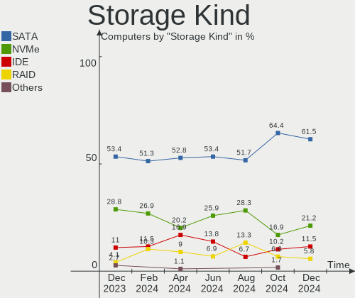
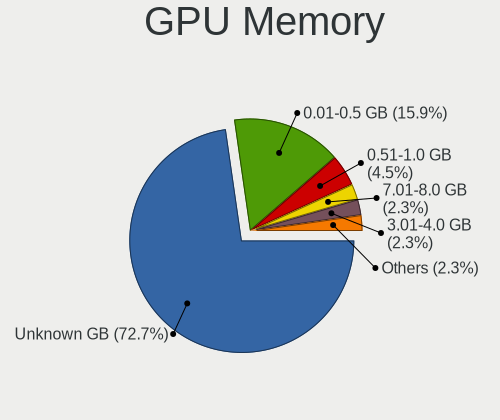

Xubuntu - Hardware Trends
-------------------------

A project to identify most popular hardware characteristics and track their change
over time based on data collected by Linux users at https://Linux-Hardware.org.

Anyone can contribute to this report by the [hw-probe](https://github.com/linuxhw/hw-probe) tool:

    sudo -E hw-probe -all -upload

This is a report for all computer types. See also reports for [desktops](/Dist/Xubuntu/Desktop/README.md) and [notebooks](/Dist/Xubuntu/Notebook/README.md).

This report is for one last month. Overall report since the beginning of time: [TestDays](https://github.com/linuxhw/TestDays)

Period: Dec, 2024.

Contents
--------

* [ System ](#system)
  - [ OS                       ](#os)
  - [ OS Family                ](#os-family)
  - [ Kernel                   ](#kernel)
  - [ Kernel Family            ](#kernel-family)
  - [ Kernel Major Ver.        ](#kernel-major-ver)
  - [ Arch                     ](#arch)
  - [ DE                       ](#de)
  - [ Display Server           ](#display-server)
  - [ Display Manager          ](#display-manager)
  - [ OS Lang                  ](#os-lang)
  - [ Boot Mode                ](#boot-mode)
  - [ Filesystem               ](#filesystem)
  - [ Part. scheme             ](#part-scheme)
  - [ Dual Boot with Linux/BSD ](#dual-boot-with-linuxbsd)
  - [ Dual Boot (Win)          ](#dual-boot-win)

* [ Board ](#board)
  - [ Vendor                   ](#vendor)
  - [ Model                    ](#model)
  - [ Model Family             ](#model-family)
  - [ MFG Year                 ](#mfg-year)
  - [ Form Factor              ](#form-factor)
  - [ Secure Boot              ](#secure-boot)
  - [ Coreboot                 ](#coreboot)
  - [ RAM Size                 ](#ram-size)
  - [ RAM Used                 ](#ram-used)
  - [ Total Drives             ](#total-drives)
  - [ Has CD-ROM               ](#has-cd-rom)
  - [ Has Ethernet             ](#has-ethernet)
  - [ Has WiFi                 ](#has-wifi)
  - [ Has Bluetooth            ](#has-bluetooth)

* [ Location ](#location)
  - [ Country                  ](#country)
  - [ City                     ](#city)

* [ Drives ](#drives)
  - [ Drive Vendor             ](#drive-vendor)
  - [ Drive Model              ](#drive-model)
  - [ HDD Vendor               ](#hdd-vendor)
  - [ SSD Vendor               ](#ssd-vendor)
  - [ Drive Kind               ](#drive-kind)
  - [ Drive Connector          ](#drive-connector)
  - [ Drive Size               ](#drive-size)
  - [ Space Total              ](#space-total)
  - [ Space Used               ](#space-used)
  - [ Malfunc. Drives          ](#malfunc-drives)
  - [ Malfunc. Drive Vendor    ](#malfunc-drive-vendor)
  - [ Malfunc. HDD Vendor      ](#malfunc-hdd-vendor)
  - [ Malfunc. Drive Kind      ](#malfunc-drive-kind)
  - [ Failed Drives            ](#failed-drives)
  - [ Failed Drive Vendor      ](#failed-drive-vendor)
  - [ Drive Status             ](#drive-status)

* [ Storage controller ](#storage-controller)
  - [ Storage Vendor           ](#storage-vendor)
  - [ Storage Model            ](#storage-model)
  - [ Storage Kind             ](#storage-kind)

* [ Processor ](#processor)
  - [ CPU Vendor               ](#cpu-vendor)
  - [ CPU Model                ](#cpu-model)
  - [ CPU Model Family         ](#cpu-model-family)
  - [ CPU Cores                ](#cpu-cores)
  - [ CPU Sockets              ](#cpu-sockets)
  - [ CPU Threads              ](#cpu-threads)
  - [ CPU Op-Modes             ](#cpu-op-modes)
  - [ CPU Microcode            ](#cpu-microcode)
  - [ CPU Microarch            ](#cpu-microarch)

* [ Graphics ](#graphics)
  - [ GPU Vendor               ](#gpu-vendor)
  - [ GPU Model                ](#gpu-model)
  - [ GPU Combo                ](#gpu-combo)
  - [ GPU Driver               ](#gpu-driver)
  - [ GPU Memory               ](#gpu-memory)

* [ Monitor ](#monitor)
  - [ Monitor Vendor           ](#monitor-vendor)
  - [ Monitor Model            ](#monitor-model)
  - [ Monitor Resolution       ](#monitor-resolution)
  - [ Monitor Diagonal         ](#monitor-diagonal)
  - [ Monitor Width            ](#monitor-width)
  - [ Aspect Ratio             ](#aspect-ratio)
  - [ Monitor Area             ](#monitor-area)
  - [ Pixel Density            ](#pixel-density)
  - [ Multiple Monitors        ](#multiple-monitors)

* [ Network ](#network)
  - [ Net Controller Vendor    ](#net-controller-vendor)
  - [ Net Controller Model     ](#net-controller-model)
  - [ Wireless Vendor          ](#wireless-vendor)
  - [ Wireless Model           ](#wireless-model)
  - [ Ethernet Vendor          ](#ethernet-vendor)
  - [ Ethernet Model           ](#ethernet-model)
  - [ Net Controller Kind      ](#net-controller-kind)
  - [ Used Controller          ](#used-controller)
  - [ NICs                     ](#nics)
  - [ IPv6                     ](#ipv6)

* [ Bluetooth ](#bluetooth)
  - [ Bluetooth Vendor         ](#bluetooth-vendor)
  - [ Bluetooth Model          ](#bluetooth-model)

* [ Sound ](#sound)
  - [ Sound Vendor             ](#sound-vendor)
  - [ Sound Model              ](#sound-model)

* [ Memory ](#memory)
  - [ Memory Vendor            ](#memory-vendor)
  - [ Memory Model             ](#memory-model)
  - [ Memory Kind              ](#memory-kind)
  - [ Memory Form Factor       ](#memory-form-factor)
  - [ Memory Size              ](#memory-size)
  - [ Memory Speed             ](#memory-speed)

* [ Printers & scanners ](#printers--scanners)
  - [ Printer Vendor           ](#printer-vendor)
  - [ Printer Model            ](#printer-model)
  - [ Scanner Vendor           ](#scanner-vendor)
  - [ Scanner Model            ](#scanner-model)

* [ Camera ](#camera)
  - [ Camera Vendor            ](#camera-vendor)
  - [ Camera Model             ](#camera-model)

* [ Security ](#security)
  - [ Fingerprint Vendor       ](#fingerprint-vendor)
  - [ Fingerprint Model        ](#fingerprint-model)
  - [ Chipcard Vendor          ](#chipcard-vendor)
  - [ Chipcard Model           ](#chipcard-model)

* [ Unsupported ](#unsupported)
  - [ Unsupported Devices      ](#unsupported-devices)
  - [ Unsupported Device Types ](#unsupported-device-types)

System
------

OS
--

Installed operating systems

| Name          | Computers | Percent |
|---------------|-----------|---------|
| Xubuntu 24.04 | 24        | 54.55%  |
| Xubuntu 22.04 | 7         | 15.91%  |
| Xubuntu 24.10 | 5         | 11.36%  |
| Xubuntu 20.04 | 4         | 9.09%   |
| Xubuntu 18.04 | 3         | 6.82%   |
| Xubuntu 23.10 | 1         | 2.27%   |

OS Family
---------

OS without a version

| Name    | Computers | Percent |
|---------|-----------|---------|
| Xubuntu | 44        | 100%    |

Kernel
------

Version of the Linux kernel

| Version               | Computers | Percent |
|-----------------------|-----------|---------|
| 6.8.0-51-generic      | 10        | 22.73%  |
| 6.8.0-49-generic      | 10        | 22.73%  |
| 6.8.0-50-generic      | 4         | 9.09%   |
| 6.8.12-4-pve          | 2         | 4.55%   |
| 6.11.0-13-generic     | 2         | 4.55%   |
| 6.8.0-50-lowlatency   | 1         | 2.27%   |
| 6.8.0-47-generic      | 1         | 2.27%   |
| 6.8.0-45-generic      | 1         | 2.27%   |
| 6.8.0-41-generic      | 1         | 2.27%   |
| 6.5.0-9-generic       | 1         | 2.27%   |
| 6.12.3-061203-generic | 1         | 2.27%   |
| 6.11.0-9-generic      | 1         | 2.27%   |
| 6.11.0-8-generic      | 1         | 2.27%   |
| 6.11.0-12-generic     | 1         | 2.27%   |
| 5.4.0-202-generic     | 1         | 2.27%   |
| 5.4.0-150-generic     | 1         | 2.27%   |
| 5.15.0-71-generic     | 1         | 2.27%   |
| 5.15.0-128-lowlatency | 1         | 2.27%   |
| 5.15.0-124-lowlatency | 1         | 2.27%   |
| 4.15.0-202-generic    | 1         | 2.27%   |
| 4.15.0-142-generic    | 1         | 2.27%   |

Kernel Family
-------------

Linux kernel without a distro release

| Version | Computers | Percent |
|---------|-----------|---------|
| 6.8.0   | 28        | 63.64%  |
| 6.11.0  | 5         | 11.36%  |
| 5.15.0  | 3         | 6.82%   |
| 6.8.12  | 2         | 4.55%   |
| 5.4.0   | 2         | 4.55%   |
| 4.15.0  | 2         | 4.55%   |
| 6.5.0   | 1         | 2.27%   |
| 6.12.3  | 1         | 2.27%   |

Kernel Major Ver.
-----------------

Linux kernel major version

| Version | Computers | Percent |
|---------|-----------|---------|
| 6.8     | 30        | 68.18%  |
| 6.11    | 5         | 11.36%  |
| 5.15    | 3         | 6.82%   |
| 5.4     | 2         | 4.55%   |
| 4.15    | 2         | 4.55%   |
| 6.5     | 1         | 2.27%   |
| 6.12    | 1         | 2.27%   |

Arch
----

OS architecture (x86_64, i586, etc.)

| Name   | Computers | Percent |
|--------|-----------|---------|
| x86_64 | 42        | 95.45%  |
| i686   | 2         | 4.55%   |

DE
--

Desktop Environment

| Name  | Computers | Percent |
|-------|-----------|---------|
| XFCE  | 42        | 95.45%  |
| LXQt  | 1         | 2.27%   |
| GNOME | 1         | 2.27%   |

Display Server
--------------

X11 or Wayland

| Name    | Computers | Percent |
|---------|-----------|---------|
| X11     | 42        | 95.45%  |
| Wayland | 1         | 2.27%   |
| Tty     | 1         | 2.27%   |

Display Manager
---------------

SDDM, LightDM, etc.

| Name    | Computers | Percent |
|---------|-----------|---------|
| LightDM | 38        | 86.36%  |
| Unknown | 3         | 6.82%   |
| GDM3    | 2         | 4.55%   |
| SDDM    | 1         | 2.27%   |

OS Lang
-------

Language

| Lang    | Computers | Percent |
|---------|-----------|---------|
| en_US   | 20        | 45.45%  |
| C       | 5         | 11.36%  |
| pt_BR   | 4         | 9.09%   |
| fr_FR   | 4         | 9.09%   |
| de_DE   | 3         | 6.82%   |
| it_IT   | 2         | 4.55%   |
| en_GB   | 2         | 4.55%   |
| ro_RO   | 1         | 2.27%   |
| hu_HU   | 1         | 2.27%   |
| eu_ES   | 1         | 2.27%   |
| Unknown | 1         | 2.27%   |

Boot Mode
---------

EFI or BIOS

| Mode | Computers | Percent |
|------|-----------|---------|
| BIOS | 26        | 59.09%  |
| EFI  | 18        | 40.91%  |

Filesystem
----------

Type of filesystem

| Type    | Computers | Percent |
|---------|-----------|---------|
| Tmpfs   | 21        | 47.73%  |
| Ext4    | 21        | 47.73%  |
| Zfs     | 1         | 2.27%   |
| Overlay | 1         | 2.27%   |

Part. scheme
------------

Scheme of partitioning

| Type    | Computers | Percent |
|---------|-----------|---------|
| GPT     | 33        | 75%     |
| Unknown | 7         | 15.91%  |
| MBR     | 4         | 9.09%   |

Dual Boot with Linux/BSD
------------------------

Hosting more than one Linux/BSD

| Dual boot | Computers | Percent |
|-----------|-----------|---------|
| No        | 34        | 77.27%  |
| Yes       | 10        | 22.73%  |

Dual Boot (Win)
---------------

Hosting Linux and Windows

| Dual boot | Computers | Percent |
|-----------|-----------|---------|
| No        | 30        | 68.18%  |
| Yes       | 14        | 31.82%  |

Board
-----

Vendor
------

Motherboard manufacturer

| Name                | Computers | Percent |
|---------------------|-----------|---------|
| Lenovo              | 12        | 27.27%  |
| ASUSTek Computer    | 11        | 25%     |
| Hewlett-Packard     | 3         | 6.82%   |
| Dell                | 3         | 6.82%   |
| ASRock              | 2         | 4.55%   |
| Unknown             | 2         | 4.55%   |
| Toshiba             | 1         | 2.27%   |
| Packard Bell        | 1         | 2.27%   |
| Medion              | 1         | 2.27%   |
| Intel               | 1         | 2.27%   |
| Google              | 1         | 2.27%   |
| Gigabyte Technology | 1         | 2.27%   |
| Fujitsu Siemens     | 1         | 2.27%   |
| BESSTAR Tech        | 1         | 2.27%   |
| AZW                 | 1         | 2.27%   |
| Apple               | 1         | 2.27%   |
| Acer                | 1         | 2.27%   |

Model
-----

Motherboard model

| Name                                     | Computers | Percent |
|------------------------------------------|-----------|---------|
| Unknown                                  | 2         | 4.55%   |
| Toshiba Satellite C55-C                  | 1         | 2.27%   |
| Packard Bell EasyNote MH36               | 1         | 2.27%   |
| Medion Akoya P2214T                      | 1         | 2.27%   |
| Lenovo V145-15AST 81MT                   | 1         | 2.27%   |
| Lenovo ThinkPad X250 20CLS35P00          | 1         | 2.27%   |
| Lenovo ThinkPad T590 20N40033GE          | 1         | 2.27%   |
| Lenovo ThinkPad T400 6473D2G             | 1         | 2.27%   |
| Lenovo ThinkPad T14 Gen 3 21CF001PPH     | 1         | 2.27%   |
| Lenovo ThinkPad T14 Gen 3 21AJS1AW01     | 1         | 2.27%   |
| Lenovo ThinkPad S1 Yoga 20C0A0CGAU       | 1         | 2.27%   |
| Lenovo ThinkPad R61 8918DFG              | 1         | 2.27%   |
| Lenovo ThinkCentre M83 10AM0009US        | 1         | 2.27%   |
| Lenovo IdeaPad 3 14ALC6 82KT             | 1         | 2.27%   |
| Lenovo G510 20238                        | 1         | 2.27%   |
| Lenovo G400s VILG1                       | 1         | 2.27%   |
| Intel H61 V1.6B                          | 1         | 2.27%   |
| HP Pavilion g7                           | 1         | 2.27%   |
| HP Laptop 15-bs1xx                       | 1         | 2.27%   |
| HP EliteBook 2540p                       | 1         | 2.27%   |
| Google Cave                              | 1         | 2.27%   |
| Gigabyte H410M H V3                      | 1         | 2.27%   |
| Fujitsu Siemens AMILO Xi 3650            | 1         | 2.27%   |
| Dell Vostro 3558                         | 1         | 2.27%   |
| Dell OptiPlex 790                        | 1         | 2.27%   |
| Dell Inspiron 1011                       | 1         | 2.27%   |
| BESSTAR Tech HX90                        | 1         | 2.27%   |
| AZW EQ                                   | 1         | 2.27%   |
| ASUS X541UVK                             | 1         | 2.27%   |
| ASUS X540UA                              | 1         | 2.27%   |
| ASUS X510UQR                             | 1         | 2.27%   |
| ASUS X45C                                | 1         | 2.27%   |
| ASUS VivoBook_ASUSLaptop X1404ZA_X1404ZA | 1         | 2.27%   |
| ASUS Vivobook Go E1404FA_E1404FA         | 1         | 2.27%   |
| ASUS TP410UA                             | 1         | 2.27%   |
| ASUS MINIPC PB50                         | 1         | 2.27%   |
| ASUS M5A78L-M LX3                        | 1         | 2.27%   |
| ASUS M5A78L-M LX PLUS                    | 1         | 2.27%   |
| ASUS 1005HA                              | 1         | 2.27%   |
| ASRock G31M-GS                           | 1         | 2.27%   |

Model Family
------------

Motherboard model prefix

| Name                  | Computers | Percent |
|-----------------------|-----------|---------|
| Lenovo ThinkPad       | 7         | 15.91%  |
| ASUS Vivobook         | 2         | 4.55%   |
| ASUS M5A78L-M         | 2         | 4.55%   |
| Unknown               | 2         | 4.55%   |
| Toshiba Satellite     | 1         | 2.27%   |
| Packard Bell EasyNote | 1         | 2.27%   |
| Medion Akoya          | 1         | 2.27%   |
| Lenovo V145-15AST     | 1         | 2.27%   |
| Lenovo ThinkCentre    | 1         | 2.27%   |
| Lenovo IdeaPad        | 1         | 2.27%   |
| Lenovo G510           | 1         | 2.27%   |
| Lenovo G400s          | 1         | 2.27%   |
| Intel H61             | 1         | 2.27%   |
| HP Pavilion           | 1         | 2.27%   |
| HP Laptop             | 1         | 2.27%   |
| HP EliteBook          | 1         | 2.27%   |
| Google Cave           | 1         | 2.27%   |
| Gigabyte H410M        | 1         | 2.27%   |
| Fujitsu Siemens AMILO | 1         | 2.27%   |
| Dell Vostro           | 1         | 2.27%   |
| Dell OptiPlex         | 1         | 2.27%   |
| Dell Inspiron         | 1         | 2.27%   |
| BESSTAR Tech HX90     | 1         | 2.27%   |
| AZW EQ                | 1         | 2.27%   |
| ASUS X541UVK          | 1         | 2.27%   |
| ASUS X540UA           | 1         | 2.27%   |
| ASUS X510UQR          | 1         | 2.27%   |
| ASUS X45C             | 1         | 2.27%   |
| ASUS TP410UA          | 1         | 2.27%   |
| ASUS MINIPC           | 1         | 2.27%   |
| ASUS 1005HA           | 1         | 2.27%   |
| ASRock G31M-GS        | 1         | 2.27%   |
| ASRock B75M           | 1         | 2.27%   |
| Apple MacPro5         | 1         | 2.27%   |
| Acer Aspire           | 1         | 2.27%   |

MFG Year
--------

Motherboard manufacture year

| Year | Computers | Percent |
|------|-----------|---------|
| 2023 | 5         | 11.36%  |
| 2022 | 4         | 9.09%   |
| 2017 | 4         | 9.09%   |
| 2008 | 4         | 9.09%   |
| 2021 | 3         | 6.82%   |
| 2015 | 3         | 6.82%   |
| 2013 | 3         | 6.82%   |
| 2012 | 3         | 6.82%   |
| 2011 | 3         | 6.82%   |
| 2024 | 2         | 4.55%   |
| 2018 | 2         | 4.55%   |
| 2014 | 2         | 4.55%   |
| 2010 | 2         | 4.55%   |
| 2009 | 2         | 4.55%   |
| 2019 | 1         | 2.27%   |
| 2007 | 1         | 2.27%   |

Form Factor
-----------

Physical design of the computer

| Name        | Computers | Percent |
|-------------|-----------|---------|
| Notebook    | 29        | 65.91%  |
| Desktop     | 13        | 29.55%  |
| Convertible | 1         | 2.27%   |
| Mini pc     | 1         | 2.27%   |

Secure Boot
-----------

Enabled or disabled

| State    | Computers | Percent |
|----------|-----------|---------|
| Disabled | 41        | 93.18%  |
| Enabled  | 3         | 6.82%   |

Coreboot
--------

Have coreboot on board

| Used | Computers | Percent |
|------|-----------|---------|
| No   | 43        | 97.73%  |
| Yes  | 1         | 2.27%   |

RAM Size
--------

Total RAM memory

| Size in GB  | Computers | Percent |
|-------------|-----------|---------|
| 4.01-8.0    | 18        | 40.91%  |
| 3.01-4.0    | 9         | 20.45%  |
| 16.01-24.0  | 5         | 11.36%  |
| 8.01-16.0   | 5         | 11.36%  |
| 32.01-64.0  | 3         | 6.82%   |
| 0.51-1.0    | 2         | 4.55%   |
| 64.01-256.0 | 1         | 2.27%   |
| 1.01-2.0    | 1         | 2.27%   |

RAM Used
--------

Used RAM memory

| Used GB    | Computers | Percent |
|------------|-----------|---------|
| 1.01-2.0   | 22        | 50%     |
| 2.01-3.0   | 12        | 27.27%  |
| 3.01-4.0   | 3         | 6.82%   |
| 8.01-16.0  | 2         | 4.55%   |
| 0.01-0.5   | 2         | 4.55%   |
| 4.01-8.0   | 1         | 2.27%   |
| 32.01-64.0 | 1         | 2.27%   |
| 0.51-1.0   | 1         | 2.27%   |

Total Drives
------------

Number of drives on board

| Drives | Computers | Percent |
|--------|-----------|---------|
| 1      | 26        | 59.09%  |
| 2      | 12        | 27.27%  |
| 3      | 4         | 9.09%   |
| 6      | 1         | 2.27%   |
| 0      | 1         | 2.27%   |

Has CD-ROM
----------

Has CD-ROM on board

| Presented | Computers | Percent |
|-----------|-----------|---------|
| No        | 31        | 70.45%  |
| Yes       | 13        | 29.55%  |

Has Ethernet
------------

Has Ethernet on board

| Presented | Computers | Percent |
|-----------|-----------|---------|
| Yes       | 38        | 86.36%  |
| No        | 6         | 13.64%  |

Has WiFi
--------

Has WiFi module

| Presented | Computers | Percent |
|-----------|-----------|---------|
| Yes       | 36        | 81.82%  |
| No        | 8         | 18.18%  |

Has Bluetooth
-------------

Has Bluetooth module

| Presented | Computers | Percent |
|-----------|-----------|---------|
| Yes       | 29        | 65.91%  |
| No        | 15        | 34.09%  |

Location
--------

Country
-------

Geographic location (country)

| Country     | Computers | Percent |
|-------------|-----------|---------|
| USA         | 8         | 18.18%  |
| France      | 4         | 9.09%   |
| Brazil      | 4         | 9.09%   |
| Italy       | 3         | 6.82%   |
| Germany     | 3         | 6.82%   |
| UK          | 2         | 4.55%   |
| Spain       | 2         | 4.55%   |
| Russia      | 2         | 4.55%   |
| Poland      | 2         | 4.55%   |
| Pakistan    | 2         | 4.55%   |
| Argentina   | 2         | 4.55%   |
| Ukraine     | 1         | 2.27%   |
| Romania     | 1         | 2.27%   |
| Philippines | 1         | 2.27%   |
| Nepal       | 1         | 2.27%   |
| Indonesia   | 1         | 2.27%   |
| India       | 1         | 2.27%   |
| Hungary     | 1         | 2.27%   |
| Finland     | 1         | 2.27%   |
| Cuba        | 1         | 2.27%   |
| Austria     | 1         | 2.27%   |

City
----

Geographic location (city)

| City                    | Computers | Percent |
|-------------------------|-----------|---------|
| Rio de Janeiro          | 2         | 4.55%   |
| Omsk                    | 2         | 4.55%   |
| Yuba City               | 1         | 2.27%   |
| Vienna                  | 1         | 2.27%   |
| Vantaa                  | 1         | 2.27%   |
| Toul                    | 1         | 2.27%   |
| Tampa                   | 1         | 2.27%   |
| Stuttgart               | 1         | 2.27%   |
| Sleman                  | 1         | 2.27%   |
| Settimo Milanese        | 1         | 2.27%   |
| Santa Coloma de Farners | 1         | 2.27%   |
| San Rafael              | 1         | 2.27%   |
| Rochester               | 1         | 2.27%   |
| Reno                    | 1         | 2.27%   |
| Port Orchard            | 1         | 2.27%   |
| Pokhara                 | 1         | 2.27%   |
| Nuremberg               | 1         | 2.27%   |
| Nasugbu                 | 1         | 2.27%   |
| Mysore                  | 1         | 2.27%   |
| Milan                   | 1         | 2.27%   |
| Manassas                | 1         | 2.27%   |
| Lviv                    | 1         | 2.27%   |
| Krakow                  | 1         | 2.27%   |
| Katowice                | 1         | 2.27%   |
| Karachi                 | 1         | 2.27%   |
| Isleworth               | 1         | 2.27%   |
| Hyannis                 | 1         | 2.27%   |
| Hiddenhausen            | 1         | 2.27%   |
| Havana                  | 1         | 2.27%   |
| Gharo                   | 1         | 2.27%   |
| Gerzat                  | 1         | 2.27%   |
| Ferrara                 | 1         | 2.27%   |
| Eibar                   | 1         | 2.27%   |
| Dunaharaszti            | 1         | 2.27%   |
| Curitiba                | 1         | 2.27%   |
| Clermont-Ferrand        | 1         | 2.27%   |
| City of London          | 1         | 2.27%   |
| California              | 1         | 2.27%   |
| Buenos Aires            | 1         | 2.27%   |
| Bucharest               | 1         | 2.27%   |

Drives
------

Drive Vendor
------------

Hard drive vendors

| Vendor                  | Computers | Drives | Percent |
|-------------------------|-----------|--------|---------|
| Samsung Electronics     | 9         | 9      | 14.52%  |
| WDC                     | 7         | 10     | 11.29%  |
| Seagate                 | 7         | 8      | 11.29%  |
| Toshiba                 | 5         | 5      | 8.06%   |
| SK hynix                | 4         | 4      | 6.45%   |
| SanDisk                 | 4         | 4      | 6.45%   |
| Unknown                 | 3         | 3      | 4.84%   |
| Kingston                | 3         | 3      | 4.84%   |
| Micron Technology       | 2         | 2      | 3.23%   |
| KingSpec                | 2         | 2      | 3.23%   |
| Intel                   | 2         | 3      | 3.23%   |
| Hitachi                 | 2         | 2      | 3.23%   |
| Union Memory (Shenzhen) | 1         | 1      | 1.61%   |
| UMIS                    | 1         | 1      | 1.61%   |
| SSK Port                | 1         | 1      | 1.61%   |
| MidasForce              | 1         | 1      | 1.61%   |
| LITEONIT                | 1         | 1      | 1.61%   |
| HUSKY                   | 1         | 1      | 1.61%   |
| HGST                    | 1         | 1      | 1.61%   |
| GOODRAM                 | 1         | 1      | 1.61%   |
| Fujitsu                 | 1         | 1      | 1.61%   |
| Crucial                 | 1         | 1      | 1.61%   |
| ASMT                    | 1         | 1      | 1.61%   |
| A-DATA Technology       | 1         | 1      | 1.61%   |

Drive Model
-----------

Hard drive models

| Model                                                | Computers | Percent |
|------------------------------------------------------|-----------|---------|
| WDC WD20EARS-00M                                     | 2         | 3.08%   |
| Unknown NVMe SSD Drive 512GB                         | 2         | 3.08%   |
| Seagate ST1000DM003-1CH162 1TB                       | 2         | 3.08%   |
| Samsung SSD 860 EVO 1TB                              | 2         | 3.08%   |
| Kingston SA400S37480G 480GB SSD                      | 2         | 3.08%   |
| WDC WDBNCE0010PNC 1TB SSD                            | 1         | 1.54%   |
| WDC WD5000AZLX-00K2TA0 500GB                         | 1         | 1.54%   |
| WDC WD40EFRX-68N32N0 4TB                             | 1         | 1.54%   |
| WDC WD30EFRX-68EUZN0 3TB                             | 1         | 1.54%   |
| WDC WD1600BEVT-75ZCT2 160GB                          | 1         | 1.54%   |
| WDC PC SN530 SDBPNPZ-512G-1114 512GB                 | 1         | 1.54%   |
| Unknown MMC Card  64GB                               | 1         | 1.54%   |
| Union Memory (Shenzhen) NVMe 256G SSD device         | 1         | 1.54%   |
| UMIS LENSE40256GMSP34MESTB3A 256GB                   | 1         | 1.54%   |
| Toshiba THNSNJ128GCSU 128GB SSD                      | 1         | 1.54%   |
| Toshiba MQ01ABF050 500GB                             | 1         | 1.54%   |
| Toshiba MQ01ABD075 752GB                             | 1         | 1.54%   |
| Toshiba MK1665GSX 160GB                              | 1         | 1.54%   |
| Toshiba HDWD130 3TB                                  | 1         | 1.54%   |
| SSK Port able SSD 1TB                                | 1         | 1.54%   |
| SK hynix SKHynix_HFM128GD3HX015N 128GB               | 1         | 1.54%   |
| SK hynix HFS256G32TNH-73A0A 256GB SSD                | 1         | 1.54%   |
| SK hynix HFS001TEJ9X108N 1TB                         | 1         | 1.54%   |
| SK hynix HCG8e  64GB                                 | 1         | 1.54%   |
| Seagate ST500LM000-1EJ162 500GB                      | 1         | 1.54%   |
| Seagate ST500DM002-1BD142 500GB                      | 1         | 1.54%   |
| Seagate ST3500413AS 500GB                            | 1         | 1.54%   |
| Seagate ST20000N M004E-3HR103 20TB                   | 1         | 1.54%   |
| Seagate ST1000LM035-1RK172 1TB                       | 1         | 1.54%   |
| Seagate ST1000LM024 HN-M101MBB 1TB                   | 1         | 1.54%   |
| SanDisk Z400s 2.5 7MM 256GB SSD                      | 1         | 1.54%   |
| SanDisk SSD PLUS 240GB                               | 1         | 1.54%   |
| SanDisk SDSSDA960G 960GB                             | 1         | 1.54%   |
| SanDisk SD9SN8W-256G-1006 256GB SSD                  | 1         | 1.54%   |
| Samsung SSD 990 PRO 1TB                              | 1         | 1.54%   |
| Samsung SSD 980 500GB                                | 1         | 1.54%   |
| Samsung SSD 870 EVO 2TB                              | 1         | 1.54%   |
| Samsung SSD 840 EVO 250GB                            | 1         | 1.54%   |
| Samsung SP2004C 200GB                                | 1         | 1.54%   |
| Samsung NVMe SSD Controller PM9A1/PM9A3/980PRO 512GB | 1         | 1.54%   |

HDD Vendor
----------

Hard disk drive vendors

| Vendor              | Computers | Drives | Percent |
|---------------------|-----------|--------|---------|
| Seagate             | 7         | 8      | 30.43%  |
| WDC                 | 5         | 8      | 21.74%  |
| Toshiba             | 4         | 4      | 17.39%  |
| Samsung Electronics | 2         | 2      | 8.7%    |
| Hitachi             | 2         | 2      | 8.7%    |
| HGST                | 1         | 1      | 4.35%   |
| Fujitsu             | 1         | 1      | 4.35%   |
| ASMT                | 1         | 1      | 4.35%   |

SSD Vendor
----------

Solid state drive vendors

| Vendor              | Computers | Drives | Percent |
|---------------------|-----------|--------|---------|
| SanDisk             | 4         | 4      | 16%     |
| Samsung Electronics | 4         | 4      | 16%     |
| Kingston            | 3         | 3      | 12%     |
| KingSpec            | 2         | 2      | 8%      |
| Intel               | 2         | 3      | 8%      |
| WDC                 | 1         | 1      | 4%      |
| Toshiba             | 1         | 1      | 4%      |
| SSK Port            | 1         | 1      | 4%      |
| SK hynix            | 1         | 1      | 4%      |
| MidasForce          | 1         | 1      | 4%      |
| Micron Technology   | 1         | 1      | 4%      |
| LITEONIT            | 1         | 1      | 4%      |
| HUSKY               | 1         | 1      | 4%      |
| GOODRAM             | 1         | 1      | 4%      |
| A-DATA Technology   | 1         | 1      | 4%      |

Drive Kind
----------

HDD or SSD

| Kind | Computers | Drives | Percent |
|------|-----------|--------|---------|
| SSD  | 22        | 26     | 40.74%  |
| HDD  | 19        | 27     | 35.19%  |
| NVMe | 11        | 12     | 20.37%  |
| MMC  | 2         | 2      | 3.7%    |

Drive Connector
---------------

SATA, SAS, NVMe, etc.

| Type | Computers | Drives | Percent |
|------|-----------|--------|---------|
| SATA | 33        | 50     | 68.75%  |
| NVMe | 11        | 12     | 22.92%  |
| SAS  | 2         | 3      | 4.17%   |
| MMC  | 2         | 2      | 4.17%   |

Drive Size
----------

Size of hard drive

| Size in TB | Computers | Drives | Percent |
|------------|-----------|--------|---------|
| 0.01-0.5   | 23        | 29     | 51.11%  |
| 0.51-1.0   | 15        | 15     | 33.33%  |
| 1.01-2.0   | 3         | 3      | 6.67%   |
| 2.01-3.0   | 2         | 3      | 4.44%   |
| 3.01-4.0   | 1         | 2      | 2.22%   |
| 10.01-20.0 | 1         | 1      | 2.22%   |

Space Total
-----------

Amount of disk space available on the file system

| Size in GB     | Computers | Percent |
|----------------|-----------|---------|
| 251-500        | 13        | 29.55%  |
| 101-250        | 11        | 25%     |
| 501-1000       | 5         | 11.36%  |
| 1001-2000      | 4         | 9.09%   |
| 21-50          | 3         | 6.82%   |
| 1-20           | 3         | 6.82%   |
| 51-100         | 3         | 6.82%   |
| More than 3000 | 2         | 4.55%   |

Space Used
----------

Amount of used disk space

| Used GB   | Computers | Percent |
|-----------|-----------|---------|
| 1-20      | 15        | 34.09%  |
| 21-50     | 8         | 18.18%  |
| 101-250   | 7         | 15.91%  |
| 51-100    | 6         | 13.64%  |
| 251-500   | 4         | 9.09%   |
| 501-1000  | 2         | 4.55%   |
| 2001-3000 | 1         | 2.27%   |
| 1001-2000 | 1         | 2.27%   |

Malfunc. Drives
---------------

Drive models with a malfunction

| Model                                          | Computers | Drives | Percent |
|------------------------------------------------|-----------|--------|---------|
| Toshiba HDWD130 3TB                            | 1         | 1      | 14.29%  |
| SK hynix HFS256G32TNH-73A0A 256GB SSD          | 1         | 1      | 14.29%  |
| Seagate ST500LM000-1EJ162 500GB                | 1         | 1      | 14.29%  |
| Seagate ST500DM002-1BD142 500GB                | 1         | 1      | 14.29%  |
| Samsung Electronics SP2004C 200GB              | 1         | 1      | 14.29%  |
| Micron Technology 1100_MTFDDAV512TBN 512GB SSD | 1         | 1      | 14.29%  |
| Intel SSDSA2M160G2GC 160GB                     | 1         | 1      | 14.29%  |

Malfunc. Drive Vendor
---------------------

Vendors of faulty drives

| Vendor              | Computers | Drives | Percent |
|---------------------|-----------|--------|---------|
| Seagate             | 2         | 2      | 28.57%  |
| Toshiba             | 1         | 1      | 14.29%  |
| SK hynix            | 1         | 1      | 14.29%  |
| Samsung Electronics | 1         | 1      | 14.29%  |
| Micron Technology   | 1         | 1      | 14.29%  |
| Intel               | 1         | 1      | 14.29%  |

Malfunc. HDD Vendor
-------------------

Vendors of faulty HDD drives

| Vendor              | Computers | Drives | Percent |
|---------------------|-----------|--------|---------|
| Seagate             | 2         | 2      | 50%     |
| Toshiba             | 1         | 1      | 25%     |
| Samsung Electronics | 1         | 1      | 25%     |

Malfunc. Drive Kind
-------------------

Kinds of faulty drives

| Kind | Computers | Drives | Percent |
|------|-----------|--------|---------|
| SSD  | 3         | 3      | 60%     |
| HDD  | 2         | 4      | 40%     |

Failed Drives
-------------

Failed drive models

Zero info for selected period =(

Failed Drive Vendor
-------------------

Failed drive vendors

Zero info for selected period =(

Drive Status
------------

Number of failed and malfunc. drives

| Status   | Computers | Drives | Percent |
|----------|-----------|--------|---------|
| Detected | 28        | 41     | 59.57%  |
| Works    | 14        | 19     | 29.79%  |
| Malfunc  | 5         | 7      | 10.64%  |

Storage controller
------------------

Storage Vendor
--------------

Storage controller vendors

| Vendor                  | Computers | Percent |
|-------------------------|-----------|---------|
| Intel                   | 30        | 61.22%  |
| AMD                     | 7         | 14.29%  |
| Samsung Electronics     | 3         | 6.12%   |
| SK hynix                | 2         | 4.08%   |
| Micron Technology       | 2         | 4.08%   |
| ADATA Technology        | 2         | 4.08%   |
| Union Memory (Shenzhen) | 1         | 2.04%   |
| SanDisk                 | 1         | 2.04%   |
| ASMedia Technology      | 1         | 2.04%   |

Storage Model
-------------

Storage controller models

| Model                                                                            | Computers | Percent |
|----------------------------------------------------------------------------------|-----------|---------|
| Intel Sunrise Point-LP SATA Controller [AHCI mode]                               | 5         | 9.26%   |
| AMD FCH SATA Controller [AHCI mode]                                              | 5         | 9.26%   |
| Intel Volume Management Device NVMe RAID Controller                              | 2         | 3.7%    |
| Intel Jasper Lake SATA AHCI Controller                                           | 2         | 3.7%    |
| Intel 8 Series/C220 Series Chipset Family 6-port SATA Controller 1 [AHCI mode]   | 2         | 3.7%    |
| Intel 8 Series SATA Controller 1 [AHCI mode]                                     | 2         | 3.7%    |
| Intel 7 Series/C210 Series Chipset Family 6-port SATA Controller [AHCI mode]     | 2         | 3.7%    |
| Intel 7 Series Chipset Family 6-port SATA Controller [AHCI mode]                 | 2         | 3.7%    |
| AMD SB7x0/SB8x0/SB9x0 IDE Controller                                             | 2         | 3.7%    |
| ADATA XPG SX8200 Pro PCIe Gen3x4 M.2 2280 Solid State Drive                      | 2         | 3.7%    |
| Union Memory (Shenzhen) AH631 PCIe 3.0 NVMe SSD 256GB                            | 1         | 1.85%   |
| SK hynix Gold P31/BC711/PC711 NVMe Solid State Drive                             | 1         | 1.85%   |
| SK hynix BC901 NVMe Solid State Drive (DRAM-less)                                | 1         | 1.85%   |
| SanDisk Ultra 3D / WD PC SN530, IX SN530, Blue SN550 NVMe SSD (DRAM-less)        | 1         | 1.85%   |
| Samsung NVMe SSD Controller S4LV008[Pascal]                                      | 1         | 1.85%   |
| Samsung NVMe SSD Controller PM9A1/PM9A3/980PRO                                   | 1         | 1.85%   |
| Samsung NVMe SSD Controller 980 (DRAM-less)                                      | 1         | 1.85%   |
| Micron 2550 NVMe SSD (DRAM-less)                                                 | 1         | 1.85%   |
| Micron 2450 NVMe SSD [HendrixV] (DRAM-less)                                      | 1         | 1.85%   |
| Intel Wildcat Point-LP SATA Controller [AHCI Mode]                               | 1         | 1.85%   |
| Intel NM10/ICH7 Family SATA Controller [IDE mode]                                | 1         | 1.85%   |
| Intel Atom/Celeron/Pentium Processor x5-E8000/J3xxx/N3xxx Series SATA Controller | 1         | 1.85%   |
| Intel Alder Lake-P SATA AHCI Controller                                          | 1         | 1.85%   |
| Intel 82801JI (ICH10 Family) SATA AHCI Controller                                | 1         | 1.85%   |
| Intel 82801IBM/IEM (ICH9M/ICH9M-E) 4 port SATA Controller [AHCI mode]            | 1         | 1.85%   |
| Intel 82801IBM/IEM (ICH9M/ICH9M-E) 2 port SATA Controller [IDE mode]             | 1         | 1.85%   |
| Intel 82801HM/HEM (ICH8M/ICH8M-E) SATA Controller [AHCI mode]                    | 1         | 1.85%   |
| Intel 82801HM/HEM (ICH8M/ICH8M-E) IDE Controller                                 | 1         | 1.85%   |
| Intel 82801GBM/GHM (ICH7-M Family) SATA Controller [IDE mode]                    | 1         | 1.85%   |
| Intel 82801GBM/GHM (ICH7-M Family) SATA Controller [AHCI mode]                   | 1         | 1.85%   |
| Intel 82801G (ICH7 Family) IDE Controller                                        | 1         | 1.85%   |
| Intel 82801 Mobile SATA Controller [RAID mode]                                   | 1         | 1.85%   |
| Intel 6 Series/C200 Series Chipset Family 6 port Desktop SATA AHCI Controller    | 1         | 1.85%   |
| Intel 500 Series Chipset Family SATA AHCI Controller                             | 1         | 1.85%   |
| Intel 5 Series/3400 Series Chipset 6 port SATA AHCI Controller                   | 1         | 1.85%   |
| ASMedia ASM1061/ASM1062 Serial ATA Controller                                    | 1         | 1.85%   |
| AMD SB7x0/SB8x0/SB9x0 SATA Controller [IDE mode]                                 | 1         | 1.85%   |
| AMD SB7x0/SB8x0/SB9x0 SATA Controller [AHCI mode]                                | 1         | 1.85%   |

Storage Kind
------------

Kind of storage controller (IDE, SATA, NVMe, SAS, ...)

| Kind | Computers | Percent |
|------|-----------|---------|
| SATA | 32        | 61.54%  |
| NVMe | 11        | 21.15%  |
| IDE  | 6         | 11.54%  |
| RAID | 3         | 5.77%   |

Processor
---------

CPU Vendor
----------

Processor vendors

| Vendor | Computers | Percent |
|--------|-----------|---------|
| Intel  | 34        | 77.27%  |
| AMD    | 10        | 22.73%  |

CPU Model
---------

Processor models

| Model                                         | Computers | Percent |
|-----------------------------------------------|-----------|---------|
| Intel Core i5-7200U CPU @ 2.50GHz             | 2         | 4.55%   |
| Intel Celeron N5095 @ 2.00GHz                 | 2         | 4.55%   |
| Intel Atom CPU N270 @ 1.60GHz                 | 2         | 4.55%   |
| Intel Xeon CPU X5675 @ 3.07GHz                | 1         | 2.27%   |
| Intel Pentium CPU B980 @ 2.40GHz              | 1         | 2.27%   |
| Intel Core m3-6Y30 CPU @ 0.90GHz              | 1         | 2.27%   |
| Intel Core i7-8550U CPU @ 1.80GHz             | 1         | 2.27%   |
| Intel Core i7-4770 CPU @ 3.40GHz              | 1         | 2.27%   |
| Intel Core i7-4702MQ CPU @ 2.20GHz            | 1         | 2.27%   |
| Intel Core i7-10700F CPU @ 2.90GHz            | 1         | 2.27%   |
| Intel Core i7 CPU L 640 @ 2.13GHz             | 1         | 2.27%   |
| Intel Core i5-8265U CPU @ 1.60GHz             | 1         | 2.27%   |
| Intel Core i5-8250U CPU @ 1.60GHz             | 1         | 2.27%   |
| Intel Core i5-4300U CPU @ 1.90GHz             | 1         | 2.27%   |
| Intel Core i5-4210U CPU @ 1.70GHz             | 1         | 2.27%   |
| Intel Core i5-2500 CPU @ 3.30GHz              | 1         | 2.27%   |
| Intel Core i3-7100U CPU @ 2.40GHz             | 1         | 2.27%   |
| Intel Core i3-5005U CPU @ 2.00GHz             | 1         | 2.27%   |
| Intel Core i3-3245 CPU @ 3.40GHz              | 1         | 2.27%   |
| Intel Core i3-3240 CPU @ 3.40GHz              | 1         | 2.27%   |
| Intel Core i3-3110M CPU @ 2.40GHz             | 1         | 2.27%   |
| Intel Core 2 Duo CPU T8100 @ 2.10GHz          | 1         | 2.27%   |
| Intel Core 2 Duo CPU P8600 @ 2.40GHz          | 1         | 2.27%   |
| Intel Core 2 Duo CPU P8400 @ 2.26GHz          | 1         | 2.27%   |
| Intel Celeron CPU N3050 @ 1.60GHz             | 1         | 2.27%   |
| Intel Celeron CPU N2940 @ 1.83GHz             | 1         | 2.27%   |
| Intel Celeron CPU E3300 @ 2.50GHz             | 1         | 2.27%   |
| Intel Celeron CPU 900 @ 2.20GHz               | 1         | 2.27%   |
| Intel 12th Gen Core i5-1245U                  | 1         | 2.27%   |
| Intel 12th Gen Core i5-1235U                  | 1         | 2.27%   |
| Intel 12th Gen Core i3-1215U                  | 1         | 2.27%   |
| AMD Ryzen 9 5900HX with Radeon Graphics       | 1         | 2.27%   |
| AMD Ryzen 7 PRO 6850U with Radeon Graphics    | 1         | 2.27%   |
| AMD Ryzen 5 6600H with Radeon Graphics        | 1         | 2.27%   |
| AMD Ryzen 5 3550H with Radeon Vega Mobile Gfx | 1         | 2.27%   |
| AMD Ryzen 3 7320U with Radeon Graphics        | 1         | 2.27%   |
| AMD Ryzen 3 5300U with Radeon Graphics        | 1         | 2.27%   |
| AMD FX-8300 Eight-Core Processor              | 1         | 2.27%   |
| AMD FX-4300 Quad-Core Processor               | 1         | 2.27%   |
| AMD E2-3000M APU with Radeon HD Graphics      | 1         | 2.27%   |

CPU Model Family
----------------

Processor model prefix

| Model            | Computers | Percent |
|------------------|-----------|---------|
| Intel Core i5    | 7         | 15.91%  |
| Intel Celeron    | 6         | 13.64%  |
| Intel Core i7    | 5         | 11.36%  |
| Intel Core i3    | 5         | 11.36%  |
| Other            | 4         | 9.09%   |
| Intel Core 2 Duo | 3         | 6.82%   |
| Intel Atom       | 2         | 4.55%   |
| AMD Ryzen 5      | 2         | 4.55%   |
| AMD Ryzen 3      | 2         | 4.55%   |
| AMD FX           | 2         | 4.55%   |
| Intel Xeon       | 1         | 2.27%   |
| Intel Pentium    | 1         | 2.27%   |
| Intel Core m3    | 1         | 2.27%   |
| AMD Ryzen 9      | 1         | 2.27%   |
| AMD Ryzen 7 PRO  | 1         | 2.27%   |
| AMD E2           | 1         | 2.27%   |

CPU Cores
---------

Number of processor cores

| Number | Computers | Percent |
|--------|-----------|---------|
| 2      | 20        | 45.45%  |
| 4      | 13        | 29.55%  |
| 8      | 3         | 6.82%   |
| 1      | 3         | 6.82%   |
| 10     | 2         | 4.55%   |
| 6      | 2         | 4.55%   |
| 12     | 1         | 2.27%   |

CPU Sockets
-----------

Number of sockets

| Number | Computers | Percent |
|--------|-----------|---------|
| 1      | 43        | 97.73%  |
| 2      | 1         | 2.27%   |

CPU Threads
-----------

Threads per core (Hyper-Threading)

| Number | Computers | Percent |
|--------|-----------|---------|
| 2      | 31        | 70.45%  |
| 1      | 13        | 29.55%  |

CPU Op-Modes
------------

CPU Operation Modes (32-bit, 64-bit)

| Op mode        | Computers | Percent |
|----------------|-----------|---------|
| 32-bit, 64-bit | 42        | 95.45%  |
| 32-bit         | 2         | 4.55%   |

CPU Microcode
-------------

Microcode number

| Number     | Computers | Percent |
|------------|-----------|---------|
| Unknown    | 39        | 88.64%  |
| 0x106c2    | 2         | 4.55%   |
| 0x206a7    | 1         | 2.27%   |
| 0x10676    | 1         | 2.27%   |
| 0x03000027 | 1         | 2.27%   |

CPU Microarch
-------------

Microarchitecture

| Name             | Computers | Percent |
|------------------|-----------|---------|
| KabyLake         | 6         | 13.64%  |
| Penryn           | 5         | 11.36%  |
| Haswell          | 4         | 9.09%   |
| Unknown          | 4         | 9.09%   |
| IvyBridge        | 3         | 6.82%   |
| Alderlake Hybrid | 3         | 6.82%   |
| Westmere         | 2         | 4.55%   |
| Tremont          | 2         | 4.55%   |
| Silvermont       | 2         | 4.55%   |
| SandyBridge      | 2         | 4.55%   |
| Piledriver       | 2         | 4.55%   |
| Bonnell          | 2         | 4.55%   |
| Zen+             | 1         | 2.27%   |
| Zen 3            | 1         | 2.27%   |
| Skylake          | 1         | 2.27%   |
| K10 Llano        | 1         | 2.27%   |
| Excavator        | 1         | 2.27%   |
| CometLake        | 1         | 2.27%   |
| Broadwell        | 1         | 2.27%   |

Graphics
--------

GPU Vendor
----------

Vendors of graphics cards

| Vendor | Computers | Percent |
|--------|-----------|---------|
| Intel  | 30        | 62.5%   |
| AMD    | 13        | 27.08%  |
| Nvidia | 5         | 10.42%  |

GPU Model
---------

Graphics card models

| Model                                                                                    | Computers | Percent |
|------------------------------------------------------------------------------------------|-----------|---------|
| Intel Mobile 4 Series Chipset Integrated Graphics Controller                             | 3         | 5.88%   |
| Intel HD Graphics 620                                                                    | 3         | 5.88%   |
| Intel UHD Graphics 620                                                                   | 2         | 3.92%   |
| Intel Mobile 945GSE Express Integrated Graphics Controller                               | 2         | 3.92%   |
| Intel Mobile 945GM/GMS/GME, 943/940GML Express Integrated Graphics Controller            | 2         | 3.92%   |
| Intel JasperLake [UHD Graphics]                                                          | 2         | 3.92%   |
| Intel Haswell-ULT Integrated Graphics Controller                                         | 2         | 3.92%   |
| Intel Alder Lake-UP3 GT2 [Iris Xe Graphics]                                              | 2         | 3.92%   |
| Intel 2nd Generation Core Processor Family Integrated Graphics Controller                | 2         | 3.92%   |
| AMD Rembrandt [Radeon 680M]                                                              | 2         | 3.92%   |
| AMD Juniper XT [Radeon HD 5770]                                                          | 2         | 3.92%   |
| Nvidia GM108M [GeForce 940MX]                                                            | 1         | 1.96%   |
| Nvidia GM108M [GeForce 920MX]                                                            | 1         | 1.96%   |
| Nvidia GK208B [GeForce GT 730]                                                           | 1         | 1.96%   |
| Nvidia GA104 [GeForce RTX 3060 Ti Lite Hash Rate]                                        | 1         | 1.96%   |
| Nvidia G86M [Quadro NVS 140M]                                                            | 1         | 1.96%   |
| Intel Xeon E3-1200 v3/4th Gen Core Processor Integrated Graphics Controller              | 1         | 1.96%   |
| Intel WhiskeyLake-U GT2 [UHD Graphics 620]                                               | 1         | 1.96%   |
| Intel IvyBridge GT2 [HD Graphics 4000]                                                   | 1         | 1.96%   |
| Intel HD Graphics 5500                                                                   | 1         | 1.96%   |
| Intel HD Graphics 515                                                                    | 1         | 1.96%   |
| Intel Core Processor Integrated Graphics Controller                                      | 1         | 1.96%   |
| Intel Atom/Celeron/Pentium Processor x5-E8000/J3xxx/N3xxx Integrated Graphics Controller | 1         | 1.96%   |
| Intel Atom Processor Z36xxx/Z37xxx Series Graphics & Display                             | 1         | 1.96%   |
| Intel Alder Lake-UP3 GT1 [UHD Graphics]                                                  | 1         | 1.96%   |
| Intel 82G33/G31 Express Integrated Graphics Controller                                   | 1         | 1.96%   |
| Intel 4th Gen Core Processor Integrated Graphics Controller                              | 1         | 1.96%   |
| Intel 3rd Gen Core processor Graphics Controller                                         | 1         | 1.96%   |
| AMD Topaz XT [Radeon R7 M260/M265 / M340/M360 / M440/M445 / 530/535 / 620/625 Mobile]    | 1         | 1.96%   |
| AMD SuperSumo [Radeon HD 6380G]                                                          | 1         | 1.96%   |
| AMD Sun XT [Radeon HD 8670A/8670M/8690M / R5 M330 / M430 / Radeon 520 Mobile]            | 1         | 1.96%   |
| AMD Sun PRO [Radeon HD 8570A/8570M]                                                      | 1         | 1.96%   |
| AMD Stoney [Radeon R2/R3/R4/R5 Graphics]                                                 | 1         | 1.96%   |
| AMD RS780L [Radeon 3000]                                                                 | 1         | 1.96%   |
| AMD Picasso/Raven 2 [Radeon Vega Series / Radeon Vega Mobile Series]                     | 1         | 1.96%   |
| AMD Mendocino                                                                            | 1         | 1.96%   |
| AMD Lucienne                                                                             | 1         | 1.96%   |
| AMD Cezanne [Radeon Vega Series / Radeon Vega Mobile Series]                             | 1         | 1.96%   |

GPU Combo
---------

Combinations of graphics cards

| Name           | Computers | Percent |
|----------------|-----------|---------|
| 1 x Intel      | 26        | 59.09%  |
| 1 x AMD        | 10        | 22.73%  |
| 1 x Nvidia     | 3         | 6.82%   |
| Intel + Nvidia | 2         | 4.55%   |
| Intel + AMD    | 2         | 4.55%   |
| 2 x AMD        | 1         | 2.27%   |

GPU Driver
----------

Free vs proprietary

| Driver      | Computers | Percent |
|-------------|-----------|---------|
| Free        | 37        | 84.09%  |
| Unknown     | 4         | 9.09%   |
| Proprietary | 3         | 6.82%   |

GPU Memory
----------

Total video memory

| Size in GB | Computers | Percent |
|------------|-----------|---------|
| Unknown    | 32        | 72.73%  |
| 0.01-0.5   | 7         | 15.91%  |
| 0.51-1.0   | 2         | 4.55%   |
| 7.01-8.0   | 1         | 2.27%   |
| 3.01-4.0   | 1         | 2.27%   |
| 1.01-2.0   | 1         | 2.27%   |

Monitor
-------

Monitor Vendor
--------------

Monitor vendors

| Vendor                  | Computers | Percent |
|-------------------------|-----------|---------|
| AU Optronics            | 8         | 16.67%  |
| Samsung Electronics     | 6         | 12.5%   |
| BOE                     | 6         | 12.5%   |
| Chimei Innolux          | 5         | 10.42%  |
| LG Display              | 3         | 6.25%   |
| Lenovo                  | 2         | 4.17%   |
| Hewlett-Packard         | 2         | 4.17%   |
| HannStar                | 2         | 4.17%   |
| CS_                     | 2         | 4.17%   |
| BenQ                    | 2         | 4.17%   |
| UNV                     | 1         | 2.08%   |
| Philips                 | 1         | 2.08%   |
| LG Electronics          | 1         | 2.08%   |
| IBM                     | 1         | 2.08%   |
| Goldstar                | 1         | 2.08%   |
| Dell                    | 1         | 2.08%   |
| CHO                     | 1         | 2.08%   |
| Chi Mei Optoelectronics | 1         | 2.08%   |
| AOC                     | 1         | 2.08%   |
| Ancor Communications    | 1         | 2.08%   |

Monitor Model
-------------

Monitor models

| Model                                                                     | Computers | Percent |
|---------------------------------------------------------------------------|-----------|---------|
| CS_ LCD Monitor CS_5211 1920x1080 519x324mm 24.1-inch                     | 2         | 4.08%   |
| UNV MW UNV3224 1920x1080 527x296mm 23.8-inch                              | 1         | 2.04%   |
| Samsung Electronics SyncMaster SAM03BA 1680x1050                          | 1         | 2.04%   |
| Samsung Electronics SyncMaster SAM0375 1680x1050 494x320mm 23.2-inch      | 1         | 2.04%   |
| Samsung Electronics LCD Monitor SEC4B41 1280x800 261x163mm 12.1-inch      | 1         | 2.04%   |
| Samsung Electronics LCD Monitor SEC4345 1366x768 309x174mm 14.0-inch      | 1         | 2.04%   |
| Samsung Electronics LCD Monitor SDC4141 1366x768 344x194mm 15.5-inch      | 1         | 2.04%   |
| Samsung Electronics C27F390 SAM0D32 1920x1080 600x340mm 27.2-inch         | 1         | 2.04%   |
| Philips LCD Monitor PHL 246E9Q 1920x1080                                  | 1         | 2.04%   |
| LG Electronics LCD Monitor LG ULTRAWIDE 7680x1080                         | 1         | 2.04%   |
| LG Electronics LCD Monitor LG ULTRAWIDE                                   | 1         | 2.04%   |
| LG Display LCD Monitor LGD0437 1920x1080 276x156mm 12.5-inch              | 1         | 2.04%   |
| LG Display LCD Monitor LGD03CD 1366x768 277x156mm 12.5-inch               | 1         | 2.04%   |
| LG Display LCD Monitor LGD033A 1366x768 340x190mm 15.3-inch               | 1         | 2.04%   |
| Lenovo LCD Monitor LEN40BA 1920x1080 344x194mm 15.5-inch                  | 1         | 2.04%   |
| Lenovo LCD Monitor LEN4031 1280x800 304x190mm 14.1-inch                   | 1         | 2.04%   |
| IBM LCD Monitor IBM2887 1680x1050 331x207mm 15.4-inch                     | 1         | 2.04%   |
| Hewlett-Packard w2408 HWP26CF 1920x1200 518x324mm 24.1-inch               | 1         | 2.04%   |
| Hewlett-Packard P242va HWP3238 1920x1080 531x299mm 24.0-inch              | 1         | 2.04%   |
| HannStar LCD Monitor HSD03E9 1024x600 220x129mm 10.0-inch                 | 1         | 2.04%   |
| HannStar HL205DPB HSD62E0 1600x900 430x240mm 19.4-inch                    | 1         | 2.04%   |
| Goldstar E2242 GSM58BE 1920x1080 477x268mm 21.5-inch                      | 1         | 2.04%   |
| Dell U2711 DELA055 2560x1440 597x336mm 27.0-inch                          | 1         | 2.04%   |
| CHO MNT CHO2380 1920x1080 527x296mm 23.8-inch                             | 1         | 2.04%   |
| Chimei Innolux LCD Monitor CMN1733 1600x900 382x215mm 17.3-inch           | 1         | 2.04%   |
| Chimei Innolux LCD Monitor CMN15E7 1920x1080 344x193mm 15.5-inch          | 1         | 2.04%   |
| Chimei Innolux LCD Monitor CMN15DC 1366x768 344x193mm 15.5-inch           | 1         | 2.04%   |
| Chimei Innolux LCD Monitor CMN1468 1920x1080 309x173mm 13.9-inch          | 1         | 2.04%   |
| Chimei Innolux LCD Monitor CMN143F 1920x1200 301x188mm 14.0-inch          | 1         | 2.04%   |
| Chi Mei Optoelectronics LCD Monitor CMO1803 1920x1080 408x230mm 18.4-inch | 1         | 2.04%   |
| BOE LCD Monitor BOE0B56 1920x1080 309x174mm 14.0-inch                     | 1         | 2.04%   |
| BOE LCD Monitor BOE0718 1920x1080 309x173mm 13.9-inch                     | 1         | 2.04%   |
| BOE LCD Monitor BOE06A5 1366x768 344x194mm 15.5-inch                      | 1         | 2.04%   |
| BOE LCD Monitor BOE069C 1920x1080 344x193mm 15.5-inch                     | 1         | 2.04%   |
| BOE LCD Monitor BOE0620 1366x768 344x194mm 15.5-inch                      | 1         | 2.04%   |
| BOE LCD Monitor BOE05B1 1366x768 309x173mm 13.9-inch                      | 1         | 2.04%   |
| BenQ GL2055 BNQ78B8 1600x900 443x249mm 20.0-inch                          | 1         | 2.04%   |
| BenQ BenQG2110W BNQ7811 1680x1050 474x296mm 22.0-inch                     | 1         | 2.04%   |
| AU Optronics LCD Monitor AUOFA9B 1920x1200 301x188mm 14.0-inch            | 1         | 2.04%   |
| AU Optronics LCD Monitor AUOE9A6 1920x1200 340x220mm 15.9-inch            | 1         | 2.04%   |

Monitor Resolution
------------------

Monitor screen resolution

| Resolution         | Computers | Percent |
|--------------------|-----------|---------|
| 1920x1080 (FHD)    | 23        | 46.94%  |
| 1366x768 (WXGA)    | 7         | 14.29%  |
| 1920x1200 (WUXGA)  | 4         | 8.16%   |
| 1680x1050 (WSXGA+) | 4         | 8.16%   |
| 1600x900 (HD+)     | 3         | 6.12%   |
| 1280x800 (WXGA)    | 2         | 4.08%   |
| 1024x600           | 2         | 4.08%   |
| 7680x1080          | 1         | 2.04%   |
| 3840x2160 (4K)     | 1         | 2.04%   |
| 2560x1440 (QHD)    | 1         | 2.04%   |
| Unknown            | 1         | 2.04%   |

Monitor Diagonal
----------------

Diagonal size in inches

| Inches  | Computers | Percent |
|---------|-----------|---------|
| 15      | 12        | 25%     |
| 24      | 6         | 12.5%   |
| 14      | 5         | 10.42%  |
| 12      | 4         | 8.33%   |
| 13      | 3         | 6.25%   |
| Unknown | 3         | 6.25%   |
| 27      | 2         | 4.17%   |
| 23      | 2         | 4.17%   |
| 10      | 2         | 4.17%   |
| 40      | 1         | 2.08%   |
| 22      | 1         | 2.08%   |
| 21      | 1         | 2.08%   |
| 20      | 1         | 2.08%   |
| 19      | 1         | 2.08%   |
| 18      | 1         | 2.08%   |
| 17      | 1         | 2.08%   |
| 16      | 1         | 2.08%   |
| 11      | 1         | 2.08%   |

Monitor Width
-------------

Physical width

| Width in mm | Computers | Percent |
|-------------|-----------|---------|
| 301-350     | 21        | 44.68%  |
| 501-600     | 9         | 19.15%  |
| 201-300     | 7         | 14.89%  |
| 401-500     | 5         | 10.64%  |
| Unknown     | 3         | 6.38%   |
| 801-900     | 1         | 2.13%   |
| 351-400     | 1         | 2.13%   |

Aspect Ratio
------------

Proportional relationship between the width and the height

| Ratio   | Computers | Percent |
|---------|-----------|---------|
| 16/9    | 31        | 67.39%  |
| 16/10   | 12        | 26.09%  |
| Unknown | 2         | 4.35%   |
| 3/2     | 1         | 2.17%   |

Monitor Area
------------

Area in inch

| Area in inch | Computers | Percent |
|----------------|-----------|---------|
| 101-110        | 12        | 25.53%  |
| 81-90          | 8         | 17.02%  |
| 201-250        | 6         | 12.77%  |
| 61-70          | 4         | 8.51%   |
| 251-300        | 3         | 6.38%   |
| Unknown        | 3         | 6.38%   |
| 41-50          | 2         | 4.26%   |
| 301-350        | 2         | 4.26%   |
| 151-200        | 2         | 4.26%   |
| 51-60          | 1         | 2.13%   |
| 141-150        | 1         | 2.13%   |
| 131-140        | 1         | 2.13%   |
| 111-120        | 1         | 2.13%   |
| 501-1000       | 1         | 2.13%   |

Pixel Density
-------------

Pixels per inch

| Density       | Computers | Percent |
|---------------|-----------|---------|
| 121-160       | 13        | 28.26%  |
| 101-120       | 12        | 26.09%  |
| 51-100        | 12        | 26.09%  |
| 161-240       | 5         | 10.87%  |
| Unknown       | 3         | 6.52%   |
| More than 240 | 1         | 2.17%   |

Multiple Monitors
-----------------

Total monitors connected

| Total | Computers | Percent |
|-------|-----------|---------|
| 1     | 38        | 86.36%  |
| 2     | 4         | 9.09%   |
| 3     | 1         | 2.27%   |
| 0     | 1         | 2.27%   |

Network
-------

Net Controller Vendor
---------------------

Controller vendors

| Vendor                          | Computers | Percent |
|---------------------------------|-----------|---------|
| Realtek Semiconductor           | 21        | 30%     |
| Intel                           | 21        | 30%     |
| Qualcomm Atheros                | 8         | 11.43%  |
| MediaTek                        | 5         | 7.14%   |
| Broadcom                        | 3         | 4.29%   |
| TP-Link                         | 2         | 2.86%   |
| QinHeng Electronics             | 2         | 2.86%   |
| Xiaomi                          | 1         | 1.43%   |
| Samsung Electronics             | 1         | 1.43%   |
| Ralink Technology               | 1         | 1.43%   |
| Qualcomm Atheros Communications | 1         | 1.43%   |
| OPPO Electronics                | 1         | 1.43%   |
| Huawei Technologies             | 1         | 1.43%   |
| Broadcom Limited                | 1         | 1.43%   |
| ASIX Electronics                | 1         | 1.43%   |

Net Controller Model
--------------------

Controller models

| Model                                                                         | Computers | Percent |
|-------------------------------------------------------------------------------|-----------|---------|
| Realtek RTL8111/8168/8211/8411 PCI Express Gigabit Ethernet Controller        | 13        | 15.66%  |
| Realtek RTL810xE PCI Express Fast Ethernet controller                         | 6         | 7.23%   |
| Intel Wireless 8265 / 8275                                                    | 3         | 3.61%   |
| Qualcomm Atheros QCA8172 Fast Ethernet                                        | 2         | 2.41%   |
| QinHeng SONOFF Zigbee 3.0 USB Dongle Plus V2                                  | 2         | 2.41%   |
| MediaTek Wi-Fi 6E MT7902 Wireless Network Adapter                             | 2         | 2.41%   |
| Intel Wireless 7265                                                           | 2         | 2.41%   |
| Intel Wireless 3160                                                           | 2         | 2.41%   |
| Broadcom BCM43142 802.11b/g/n                                                 | 2         | 2.41%   |
| Xiaomi Mi/Redmi series (RNDIS)                                                | 1         | 1.2%    |
| TP-Link TL-WN821N v5/v6 [RTL8192EU]                                           | 1         | 1.2%    |
| TP-Link AC600 wireless Realtek RTL8811AU [Archer T2U Nano]                    | 1         | 1.2%    |
| Samsung Galaxy series, misc. (tethering mode)                                 | 1         | 1.2%    |
| Realtek RTL8822CE 802.11ac PCIe Wireless Network Adapter                      | 1         | 1.2%    |
| Realtek RTL8821CE 802.11ac PCIe Wireless Network Adapter                      | 1         | 1.2%    |
| Realtek RTL8814AU 802.11a/b/g/n/ac Wireless Adapter                           | 1         | 1.2%    |
| Realtek RTL8188CE 802.11b/g/n WiFi Adapter                                    | 1         | 1.2%    |
| Realtek RTL8153 Gigabit Ethernet Adapter                                      | 1         | 1.2%    |
| Realtek 802.11ac NIC                                                          | 1         | 1.2%    |
| Ralink RT2501/RT2573 Wireless Adapter                                         | 1         | 1.2%    |
| Qualcomm Atheros QCA9565 / AR9565 Wireless Network Adapter                    | 1         | 1.2%    |
| Qualcomm Atheros QCA9377 802.11ac Wireless Network Adapter                    | 1         | 1.2%    |
| Qualcomm Atheros QCA8171 Gigabit Ethernet                                     | 1         | 1.2%    |
| Qualcomm Atheros AR9271 802.11n                                               | 1         | 1.2%    |
| Qualcomm Atheros AR9485 Wireless Network Adapter                              | 1         | 1.2%    |
| Qualcomm Atheros AR9285 Wireless Network Adapter (PCI-Express)                | 1         | 1.2%    |
| Qualcomm Atheros AR8132 Fast Ethernet                                         | 1         | 1.2%    |
| Qualcomm Atheros AR2413/AR2414 Wireless Network Adapter [AR5005G(S) 802.11bg] | 1         | 1.2%    |
| OPPO OnePlus Nord 4                                                           | 1         | 1.2%    |
| MediaTek MT7922 802.11ax PCI Express Wireless Network Adapter                 | 1         | 1.2%    |
| MediaTek MT7921K (RZ608) Wi-Fi 6E 80MHz                                       | 1         | 1.2%    |
| MediaTek MT7921 802.11ax PCI Express Wireless Network Adapter                 | 1         | 1.2%    |
| Intel Wireless 7260                                                           | 1         | 1.2%    |
| Intel WiFi Link 5100                                                          | 1         | 1.2%    |
| Intel Wi-Fi 6 AX200                                                           | 1         | 1.2%    |
| Intel PRO/Wireless 5100 AGN [Shiloh] Network Connection                       | 1         | 1.2%    |
| Intel PRO/Wireless 4965 AG or AGN [Kedron] Network Connection                 | 1         | 1.2%    |
| Intel I211 Gigabit Network Connection                                         | 1         | 1.2%    |
| Intel Ethernet Controller I226-V                                              | 1         | 1.2%    |
| Intel Ethernet Connection I218-LM                                             | 1         | 1.2%    |

Wireless Vendor
---------------

Wireless vendors

| Vendor                          | Computers | Percent |
|---------------------------------|-----------|---------|
| Intel                           | 17        | 44.74%  |
| Qualcomm Atheros                | 5         | 13.16%  |
| Realtek Semiconductor           | 4         | 10.53%  |
| MediaTek                        | 4         | 10.53%  |
| Broadcom                        | 3         | 7.89%   |
| TP-Link                         | 2         | 5.26%   |
| Ralink Technology               | 1         | 2.63%   |
| Qualcomm Atheros Communications | 1         | 2.63%   |
| Broadcom Limited                | 1         | 2.63%   |

Wireless Model
--------------

Wireless models

| Model                                                                         | Computers | Percent |
|-------------------------------------------------------------------------------|-----------|---------|
| Intel Wireless 8265 / 8275                                                    | 3         | 7.69%   |
| MediaTek Wi-Fi 6E MT7902 Wireless Network Adapter                             | 2         | 5.13%   |
| Intel Wireless 7265                                                           | 2         | 5.13%   |
| Intel Wireless 3160                                                           | 2         | 5.13%   |
| Broadcom BCM43142 802.11b/g/n                                                 | 2         | 5.13%   |
| TP-Link TL-WN821N v5/v6 [RTL8192EU]                                           | 1         | 2.56%   |
| TP-Link AC600 wireless Realtek RTL8811AU [Archer T2U Nano]                    | 1         | 2.56%   |
| Realtek RTL8822CE 802.11ac PCIe Wireless Network Adapter                      | 1         | 2.56%   |
| Realtek RTL8821CE 802.11ac PCIe Wireless Network Adapter                      | 1         | 2.56%   |
| Realtek RTL8814AU 802.11a/b/g/n/ac Wireless Adapter                           | 1         | 2.56%   |
| Realtek RTL8188CE 802.11b/g/n WiFi Adapter                                    | 1         | 2.56%   |
| Realtek 802.11ac NIC                                                          | 1         | 2.56%   |
| Ralink RT2501/RT2573 Wireless Adapter                                         | 1         | 2.56%   |
| Qualcomm Atheros QCA9565 / AR9565 Wireless Network Adapter                    | 1         | 2.56%   |
| Qualcomm Atheros QCA9377 802.11ac Wireless Network Adapter                    | 1         | 2.56%   |
| Qualcomm Atheros AR9271 802.11n                                               | 1         | 2.56%   |
| Qualcomm Atheros AR9485 Wireless Network Adapter                              | 1         | 2.56%   |
| Qualcomm Atheros AR9285 Wireless Network Adapter (PCI-Express)                | 1         | 2.56%   |
| Qualcomm Atheros AR2413/AR2414 Wireless Network Adapter [AR5005G(S) 802.11bg] | 1         | 2.56%   |
| MediaTek MT7921K (RZ608) Wi-Fi 6E 80MHz                                       | 1         | 2.56%   |
| MediaTek MT7921 802.11ax PCI Express Wireless Network Adapter                 | 1         | 2.56%   |
| Intel Wireless 7260                                                           | 1         | 2.56%   |
| Intel WiFi Link 5100                                                          | 1         | 2.56%   |
| Intel Wi-Fi 6 AX200                                                           | 1         | 2.56%   |
| Intel PRO/Wireless 5100 AGN [Shiloh] Network Connection                       | 1         | 2.56%   |
| Intel PRO/Wireless 4965 AG or AGN [Kedron] Network Connection                 | 1         | 2.56%   |
| Intel Dual Band Wireless-AC 3168NGW [Stone Peak]                              | 1         | 2.56%   |
| Intel Centrino Wireless-N 135                                                 | 1         | 2.56%   |
| Intel Centrino Advanced-N 6200                                                | 1         | 2.56%   |
| Intel Cannon Point-LP CNVi [Wireless-AC]                                      | 1         | 2.56%   |
| Intel Alder Lake-P PCH CNVi WiFi                                              | 1         | 2.56%   |
| Broadcom Limited BCM4312 802.11b/g LP-PHY                                     | 1         | 2.56%   |
| Broadcom BCM4322 802.11a/b/g/n Wireless LAN Controller                        | 1         | 2.56%   |

Ethernet Vendor
---------------

Ethernet vendors

| Vendor                | Computers | Percent |
|-----------------------|-----------|---------|
| Realtek Semiconductor | 19        | 46.34%  |
| Intel                 | 12        | 29.27%  |
| Qualcomm Atheros      | 4         | 9.76%   |
| Xiaomi                | 1         | 2.44%   |
| Samsung Electronics   | 1         | 2.44%   |
| OPPO Electronics      | 1         | 2.44%   |
| MediaTek              | 1         | 2.44%   |
| Huawei Technologies   | 1         | 2.44%   |
| ASIX Electronics      | 1         | 2.44%   |

Ethernet Model
--------------

Ethernet models

| Model                                                                  | Computers | Percent |
|------------------------------------------------------------------------|-----------|---------|
| Realtek RTL8111/8168/8211/8411 PCI Express Gigabit Ethernet Controller | 13        | 30.95%  |
| Realtek RTL810xE PCI Express Fast Ethernet controller                  | 6         | 14.29%  |
| Qualcomm Atheros QCA8172 Fast Ethernet                                 | 2         | 4.76%   |
| Xiaomi Mi/Redmi series (RNDIS)                                         | 1         | 2.38%   |
| Samsung Galaxy series, misc. (tethering mode)                          | 1         | 2.38%   |
| Realtek RTL8153 Gigabit Ethernet Adapter                               | 1         | 2.38%   |
| Qualcomm Atheros QCA8171 Gigabit Ethernet                              | 1         | 2.38%   |
| Qualcomm Atheros AR8132 Fast Ethernet                                  | 1         | 2.38%   |
| OPPO OnePlus Nord 4                                                    | 1         | 2.38%   |
| MediaTek MT7922 802.11ax PCI Express Wireless Network Adapter          | 1         | 2.38%   |
| Intel I211 Gigabit Network Connection                                  | 1         | 2.38%   |
| Intel Ethernet Controller I226-V                                       | 1         | 2.38%   |
| Intel Ethernet Connection I218-LM                                      | 1         | 2.38%   |
| Intel Ethernet Connection I217-LM                                      | 1         | 2.38%   |
| Intel Ethernet Connection (6) I219-V                                   | 1         | 2.38%   |
| Intel Ethernet Connection (16) I219-LM                                 | 1         | 2.38%   |
| Intel 82579LM Gigabit Network Connection (Lewisville)                  | 1         | 2.38%   |
| Intel 82577LM Gigabit Network Connection                               | 1         | 2.38%   |
| Intel 82574L Gigabit Network Connection                                | 1         | 2.38%   |
| Intel 82567LM Gigabit Network Connection                               | 1         | 2.38%   |
| Intel 82567LF Gigabit Network Connection                               | 1         | 2.38%   |
| Intel 82566MC Gigabit Network Connection                               | 1         | 2.38%   |
| Huawei E353/E3131                                                      | 1         | 2.38%   |
| ASIX AX88772A Fast Ethernet                                            | 1         | 2.38%   |

Net Controller Kind
-------------------

Ethernet, WiFi or modem

| Kind     | Computers | Percent |
|----------|-----------|---------|
| Ethernet | 38        | 50%     |
| WiFi     | 36        | 47.37%  |
| Modem    | 2         | 2.63%   |

Used Controller
---------------

Currently used network controller

| Kind     | Computers | Percent |
|----------|-----------|---------|
| WiFi     | 27        | 60%     |
| Ethernet | 18        | 40%     |

NICs
----

Total network controllers on board

| Total | Computers | Percent |
|-------|-----------|---------|
| 2     | 23        | 52.27%  |
| 1     | 19        | 43.18%  |
| 3     | 2         | 4.55%   |

IPv6
----

IPv6 vs IPv4

| Used | Computers | Percent |
|------|-----------|---------|
| No   | 32        | 72.73%  |
| Yes  | 12        | 27.27%  |

Bluetooth
---------

Bluetooth Vendor
----------------

Controller vendors

| Vendor                  | Computers | Percent |
|-------------------------|-----------|---------|
| Intel                   | 12        | 41.38%  |
| IMC Networks            | 4         | 13.79%  |
| Cambridge Silicon Radio | 4         | 13.79%  |
| Realtek Semiconductor   | 2         | 6.9%    |
| Broadcom                | 2         | 6.9%    |
| Toshiba                 | 1         | 3.45%   |
| MediaTek                | 1         | 3.45%   |
| Lite-On Technology      | 1         | 3.45%   |
| Foxconn / Hon Hai       | 1         | 3.45%   |
| Apple                   | 1         | 3.45%   |

Bluetooth Model
---------------

Controller models

| Model                                               | Computers | Percent |
|-----------------------------------------------------|-----------|---------|
| Intel Bluetooth wireless interface                  | 8         | 27.59%  |
| Cambridge Silicon Radio Bluetooth Dongle (HCI mode) | 4         | 13.79%  |
| IMC Networks Wireless_Device                        | 2         | 6.9%    |
| IMC Networks Bluetooth Device                       | 2         | 6.9%    |
| Toshiba BCM43142A0                                  | 1         | 3.45%   |
| Realtek Bluetooth Radio                             | 1         | 3.45%   |
| Realtek 802.11ac WLAN Adapter                       | 1         | 3.45%   |
| MediaTek Wireless_Device                            | 1         | 3.45%   |
| Lite-On Wireless_Device                             | 1         | 3.45%   |
| Intel Wireless-AC 3168 Bluetooth                    | 1         | 3.45%   |
| Intel Centrino Bluetooth Wireless Transceiver       | 1         | 3.45%   |
| Intel AX211 Bluetooth                               | 1         | 3.45%   |
| Intel AX200 Bluetooth                               | 1         | 3.45%   |
| Foxconn / Hon Hai Wireless_Device                   | 1         | 3.45%   |
| Broadcom BCM20702A0 Bluetooth 4.0                   | 1         | 3.45%   |
| Broadcom BCM2045B (BDC-2) [Bluetooth Controller]    | 1         | 3.45%   |
| Apple Built-in Bluetooth 2.0+EDR HCI                | 1         | 3.45%   |

Sound
-----

Sound Vendor
------------

Sound card vendors

| Vendor              | Computers | Percent |
|---------------------|-----------|---------|
| Intel               | 34        | 66.67%  |
| AMD                 | 12        | 23.53%  |
| Nvidia              | 2         | 3.92%   |
| Texas Instruments   | 1         | 1.96%   |
| Jieli Technology    | 1         | 1.96%   |
| C-Media Electronics | 1         | 1.96%   |

Sound Model
-----------

Sound card models

| Model                                                                                             | Computers | Percent |
|---------------------------------------------------------------------------------------------------|-----------|---------|
| Intel Sunrise Point-LP HD Audio                                                                   | 6         | 9.38%   |
| AMD Family 17h/19h/1ah HD Audio Controller                                                        | 6         | 9.38%   |
| Intel 7 Series/C216 Chipset Family High Definition Audio Controller                               | 4         | 6.25%   |
| Intel NM10/ICH7 Family High Definition Audio Controller                                           | 3         | 4.69%   |
| Intel Alder Lake PCH-P High Definition Audio Controller                                           | 3         | 4.69%   |
| Intel 82801I (ICH9 Family) HD Audio Controller                                                    | 3         | 4.69%   |
| AMD Rembrandt Radeon High Definition Audio Controller                                             | 3         | 4.69%   |
| Intel Xeon E3-1200 v3/4th Gen Core Processor HD Audio Controller                                  | 2         | 3.13%   |
| Intel Jasper Lake HD Audio                                                                        | 2         | 3.13%   |
| Intel Haswell-ULT HD Audio Controller                                                             | 2         | 3.13%   |
| Intel 8 Series/C220 Series Chipset High Definition Audio Controller                               | 2         | 3.13%   |
| Intel 8 Series HD Audio Controller                                                                | 2         | 3.13%   |
| AMD SBx00 Azalia (Intel HDA)                                                                      | 2         | 3.13%   |
| AMD Renoir Radeon High Definition Audio Controller                                                | 2         | 3.13%   |
| AMD Juniper HDMI Audio [Radeon HD 5700 Series]                                                    | 2         | 3.13%   |
| Texas Instruments PCM2704 16-bit stereo audio DAC                                                 | 1         | 1.56%   |
| Nvidia GK208 HDMI/DP Audio Controller                                                             | 1         | 1.56%   |
| Nvidia GA104 High Definition Audio Controller                                                     | 1         | 1.56%   |
| Jieli Technology GO Work USB                                                                      | 1         | 1.56%   |
| Intel Wildcat Point-LP High Definition Audio Controller                                           | 1         | 1.56%   |
| Intel Smart Sound Technology (SST) Audio Controller                                               | 1         | 1.56%   |
| Intel Cannon Point-LP High Definition Audio Controller                                            | 1         | 1.56%   |
| Intel Broadwell-U Audio Controller                                                                | 1         | 1.56%   |
| Intel Atom/Celeron/Pentium Processor x5-E8000/J3xxx/N3xxx Series High Definition Audio Controller | 1         | 1.56%   |
| Intel Atom Processor Z36xxx/Z37xxx Series High Definition Audio Controller                        | 1         | 1.56%   |
| Intel 82801JI (ICH10 Family) HD Audio Controller                                                  | 1         | 1.56%   |
| Intel 82801H (ICH8 Family) HD Audio Controller                                                    | 1         | 1.56%   |
| Intel 6 Series/C200 Series Chipset Family High Definition Audio Controller                        | 1         | 1.56%   |
| Intel 5 Series/3400 Series Chipset High Definition Audio                                          | 1         | 1.56%   |
| C-Media Electronics Audio Adapter (Unitek Y-247A)                                                 | 1         | 1.56%   |
| AMD Raven/Raven2/Fenghuang HDMI/DP Audio Controller                                               | 1         | 1.56%   |
| AMD High Definition Audio Controller                                                              | 1         | 1.56%   |
| AMD FCH Azalia Controller                                                                         | 1         | 1.56%   |
| AMD Family 15h (Models 60h-6fh) Audio Controller                                                  | 1         | 1.56%   |
| AMD BeaverCreek HDMI Audio [Radeon HD 6500D and 6400G-6600G series]                               | 1         | 1.56%   |

Memory
------

Memory Vendor
-------------

Memory module vendors

| Vendor              | Computers | Percent |
|---------------------|-----------|---------|
| SK hynix            | 9         | 33.33%  |
| Unknown             | 5         | 18.52%  |
| Samsung Electronics | 5         | 18.52%  |
| Micron Technology   | 3         | 11.11%  |
| Crucial             | 2         | 7.41%   |
| Team                | 1         | 3.7%    |
| Lexar Co Limited    | 1         | 3.7%    |
| Corsair             | 1         | 3.7%    |

Memory Model
------------

Memory module models

| Model                                                          | Computers | Percent |
|----------------------------------------------------------------|-----------|---------|
| Crucial RAM CT8G4SFS832A.M8FR 8GB SODIMM DDR4 3200MT/s         | 2         | 6.9%    |
| Unknown RAM Module 8GB DIMM 667MT/s                            | 1         | 3.45%   |
| Unknown RAM Module 4GB DIMM 667MT/s                            | 1         | 3.45%   |
| Unknown RAM Module 2GB SODIMM DDR3 1333MT/s                    | 1         | 3.45%   |
| Unknown RAM Module 2GB SODIMM DDR2 667MT/s                     | 1         | 3.45%   |
| Unknown RAM Module 2GB SODIMM 667MT/s                          | 1         | 3.45%   |
| Unknown RAM Module 2GB DIMM SDRAM                              | 1         | 3.45%   |
| Team RAM TEAMGROUP-SD4-3200 16GB SODIMM DDR4 3200MT/s          | 1         | 3.45%   |
| SK hynix RAM HMT851S6AMR6R-PB 4GB Chip DDR3 1600MT/s           | 1         | 3.45%   |
| SK hynix RAM HMT351S6CFR8C-PB 4GB SODIMM DDR3 1600MT/s         | 1         | 3.45%   |
| SK hynix RAM HMT125S6TFR8C-H9 2GB SODIMM DDR3 1334MT/s         | 1         | 3.45%   |
| SK hynix RAM HMAB2GS6CMR6N-XN 16GB SODIMM DDR4 3200MT/s        | 1         | 3.45%   |
| SK hynix RAM HMA851S6DJR6N-XN 4GB SODIMM DDR4 3200MT/s         | 1         | 3.45%   |
| SK hynix RAM HMA81GS6CJR8N-VK 8GB SODIMM DDR4 2667MT/s         | 1         | 3.45%   |
| SK hynix RAM HMA81GS6AFR8N-UH 8GB SODIMM DDR4 2667MT/s         | 1         | 3.45%   |
| SK hynix RAM HMA451S6AFR8N-TF 4GB SODIMM DDR4 2133MT/s         | 1         | 3.45%   |
| SK hynix RAM HMA425S6AFR6N-UH 2GB SODIMM DDR4 2400MT/s         | 1         | 3.45%   |
| SK hynix RAM H9JCNNNCP3MLYR-N6E 4GB SODIMM LPDDR5 6400MT/s     | 1         | 3.45%   |
| Samsung RAM Module 16384MB DIMM DDR3 1333MT/s                  | 1         | 3.45%   |
| Samsung RAM M471A5244CB0-CWE 4096MB SODIMM DDR4 3200MT/s       | 1         | 3.45%   |
| Samsung RAM M471A5244CB0-CWE 4096MB Row Of Chips DDR4 3200MT/s | 1         | 3.45%   |
| Samsung RAM M471A1K43BB1-CTD 8GB SODIMM DDR4 2667MT/s          | 1         | 3.45%   |
| Samsung RAM M471A1G44CB0-CWE 8GB SODIMM DDR4 3200MT/s          | 1         | 3.45%   |
| Micron RAM MTC4C10163S1SC48BA1 8GB SODIMM DDR5 4800MT/s        | 1         | 3.45%   |
| Micron RAM MT62F1G32D4DR-031 WT 4GB SODIMM LPDDR5 6400MT/s     | 1         | 3.45%   |
| Micron RAM 8JSF25664HZ-1G4D1 2GB SODIMM DDR3 1334MT/s          | 1         | 3.45%   |
| Lexar Co Limited RAM LD4S08G32C22ST 8GB SODIMM DDR4 3200MT/s   | 1         | 3.45%   |
| Corsair RAM CMSX16GX4M1A3200C22 16GB SODIMM DDR4 3200MT/s      | 1         | 3.45%   |

Memory Kind
-----------

Memory module kinds

| Kind    | Computers | Percent |
|---------|-----------|---------|
| DDR4    | 11        | 47.83%  |
| DDR3    | 5         | 21.74%  |
| LPDDR5  | 2         | 8.7%    |
| Unknown | 2         | 8.7%    |
| SDRAM   | 1         | 4.35%   |
| DDR5    | 1         | 4.35%   |
| DDR2    | 1         | 4.35%   |

Memory Form Factor
------------------

Physical design of the memory module

| Name         | Computers | Percent |
|--------------|-----------|---------|
| SODIMM       | 19        | 79.17%  |
| DIMM         | 3         | 12.5%   |
| Row Of Chips | 1         | 4.17%   |
| Chip         | 1         | 4.17%   |

Memory Size
-----------

Memory module size

| Size  | Computers | Percent |
|-------|-----------|---------|
| 4096  | 8         | 30.77%  |
| 8192  | 7         | 26.92%  |
| 2048  | 6         | 23.08%  |
| 16384 | 4         | 15.38%  |
| 32768 | 1         | 3.85%   |

Memory Speed
------------

Memory module speed

| Speed   | Computers | Percent |
|---------|-----------|---------|
| 3200    | 7         | 29.17%  |
| 2667    | 3         | 12.5%   |
| 667     | 3         | 12.5%   |
| 6400    | 2         | 8.33%   |
| 1600    | 2         | 8.33%   |
| 1333    | 2         | 8.33%   |
| 4800    | 1         | 4.17%   |
| 2400    | 1         | 4.17%   |
| 2133    | 1         | 4.17%   |
| 1334    | 1         | 4.17%   |
| Unknown | 1         | 4.17%   |

Printers & scanners
-------------------

Printer Vendor
--------------

Printer device vendors

| Vendor             | Computers | Percent |
|--------------------|-----------|---------|
| Brother Industries | 1         | 100%    |

Printer Model
-------------

Printer device models

| Model            | Computers | Percent |
|------------------|-----------|---------|
| Brother MFC-J200 | 1         | 100%    |

Scanner Vendor
--------------

Scanner device vendors

Zero info for selected period =(

Scanner Model
-------------

Scanner device models

Zero info for selected period =(

Camera
------

Camera Vendor
-------------

Camera device vendors

| Vendor                        | Computers | Percent |
|-------------------------------|-----------|---------|
| IMC Networks                  | 7         | 29.17%  |
| Chicony Electronics           | 6         | 25%     |
| Syntek                        | 3         | 12.5%   |
| Bison Electronics             | 2         | 8.33%   |
| Sunplus Innovation Technology | 1         | 4.17%   |
| ShineTech                     | 1         | 4.17%   |
| Quanta                        | 1         | 4.17%   |
| Microdia                      | 1         | 4.17%   |
| Logitech                      | 1         | 4.17%   |
| Lite-On Technology            | 1         | 4.17%   |

Camera Model
------------

Camera device models

| Model                              | Computers | Percent |
|------------------------------------|-----------|---------|
| IMC Networks USB2.0 VGA UVC WebCam | 3         | 12.5%   |
| Syntek Lenovo EasyCamera           | 1         | 4.17%   |
| Syntek Integrated Webcam           | 1         | 4.17%   |
| Syntek Integrated Camera           | 1         | 4.17%   |
| Sunplus Asus Webcam                | 1         | 4.17%   |
| ShineTech USB2.0 HD UVC WebCam     | 1         | 4.17%   |
| Quanta ACER HD User Facing         | 1         | 4.17%   |
| Microdia Integrated Webcam         | 1         | 4.17%   |
| Logitech C922 Pro Stream Webcam    | 1         | 4.17%   |
| Lite-On Integrated Camera          | 1         | 4.17%   |
| IMC Networks VGA UVC WebCam        | 1         | 4.17%   |
| IMC Networks USB2.0 HD UVC WebCam  | 1         | 4.17%   |
| IMC Networks USB 2.0 Camera        | 1         | 4.17%   |
| IMC Networks Integrated Camera     | 1         | 4.17%   |
| Chicony USB2.0 HD UVC WebCam       | 1         | 4.17%   |
| Chicony ThinkPad T490 Webcam       | 1         | 4.17%   |
| Chicony Integrated Camera          | 1         | 4.17%   |
| Chicony HP Webcam-101              | 1         | 4.17%   |
| Chicony HP Webcam [2 MP Macro]     | 1         | 4.17%   |
| Chicony HP TrueVision HD Camera    | 1         | 4.17%   |
| Bison Integrated Camera            | 1         | 4.17%   |
| Bison EasyCamera                   | 1         | 4.17%   |

Security
--------

Fingerprint Vendor
------------------

Fingerprint sensor vendors

| Vendor           | Computers | Percent |
|------------------|-----------|---------|
| Synaptics        | 2         | 40%     |
| Validity Sensors | 1         | 20%     |
| Upek             | 1         | 20%     |
| AuthenTec        | 1         | 20%     |

Fingerprint Model
-----------------

Fingerprint sensor models

| Model                                                  | Computers | Percent |
|--------------------------------------------------------|-----------|---------|
| Validity Sensors VFS451 Fingerprint Reader             | 1         | 20%     |
| Upek Biometric Touchchip/Touchstrip Fingerprint Sensor | 1         | 20%     |
| Synaptics UWP WBDI Device                              | 1         | 20%     |
| Synaptics Prometheus MIS Touch Fingerprint Reader      | 1         | 20%     |
| AuthenTec AES2810                                      | 1         | 20%     |

Chipcard Vendor
---------------

Chipcard module vendors

| Vendor      | Computers | Percent |
|-------------|-----------|---------|
| Alcor Micro | 1         | 100%    |

Chipcard Model
--------------

Chipcard module models

| Model                               | Computers | Percent |
|-------------------------------------|-----------|---------|
| Alcor Micro AU9540 Smartcard Reader | 1         | 100%    |

Unsupported
-----------

Unsupported Devices
-------------------

Total unsupported devices on board

| Total | Computers | Percent |
|-------|-----------|---------|
| 0     | 33        | 75%     |
| 1     | 7         | 15.91%  |
| 2     | 4         | 9.09%   |

Unsupported Device Types
------------------------

Types of unsupported devices

| Type               | Computers | Percent |
|--------------------|-----------|---------|
| Graphics card      | 5         | 33.33%  |
| Fingerprint reader | 5         | 33.33%  |
| Net/wireless       | 2         | 13.33%  |
| Sound              | 1         | 6.67%   |
| Chipcard           | 1         | 6.67%   |
| Card reader        | 1         | 6.67%   |

