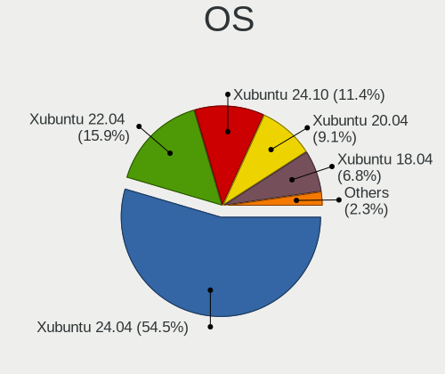
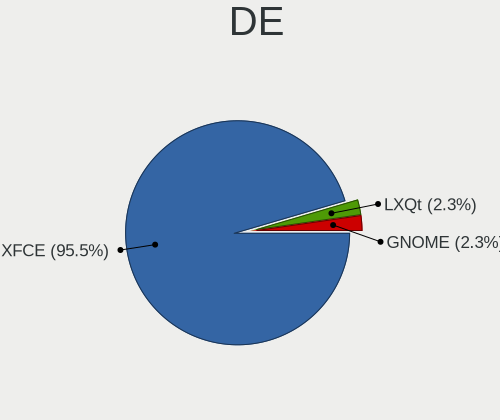
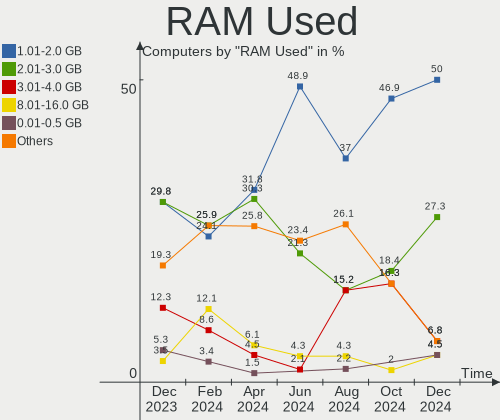
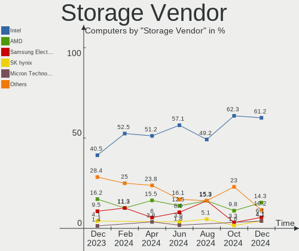
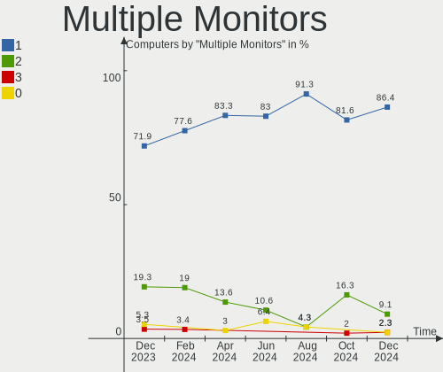
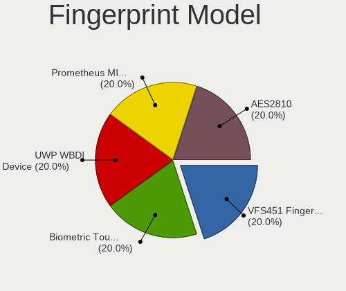

Xubuntu Hardware Trends
-----------------------

A project to identify most popular hardware characteristics and track their change
over time based on data collected by Xubuntu users at https://Linux-Hardware.org.

Anyone can contribute to this report by the [hw-probe](https://github.com/linuxhw/hw-probe) tool:

    sudo -E hw-probe -all -upload

This is a report for all computer types. See also reports for [desktops](/Dist/Xubuntu/Desktop/README.md) and [notebooks](/Dist/Xubuntu/Notebook/README.md).

Full-feature report is available here: https://linux-hardware.org/?view=trends

Period: Jan, 2022.

Contents
--------

* [ System ](#system)
  - [ OS                       ](#os)
  - [ OS Family                ](#os-family)
  - [ Kernel                   ](#kernel)
  - [ Kernel Family            ](#kernel-family)
  - [ Kernel Major Ver.        ](#kernel-major-ver)
  - [ Arch                     ](#arch)
  - [ DE                       ](#de)
  - [ Display Server           ](#display-server)
  - [ Display Manager          ](#display-manager)
  - [ OS Lang                  ](#os-lang)
  - [ Boot Mode                ](#boot-mode)
  - [ Filesystem               ](#filesystem)
  - [ Part. scheme             ](#part-scheme)
  - [ Dual Boot with Linux/BSD ](#dual-boot-with-linuxbsd)
  - [ Dual Boot (Win)          ](#dual-boot-win)

* [ Board ](#board)
  - [ Vendor                   ](#vendor)
  - [ Model                    ](#model)
  - [ Model Family             ](#model-family)
  - [ MFG Year                 ](#mfg-year)
  - [ Form Factor              ](#form-factor)
  - [ Secure Boot              ](#secure-boot)
  - [ Coreboot                 ](#coreboot)
  - [ RAM Size                 ](#ram-size)
  - [ RAM Used                 ](#ram-used)
  - [ Total Drives             ](#total-drives)
  - [ Has CD-ROM               ](#has-cd-rom)
  - [ Has Ethernet             ](#has-ethernet)
  - [ Has WiFi                 ](#has-wifi)
  - [ Has Bluetooth            ](#has-bluetooth)

* [ Location ](#location)
  - [ Country                  ](#country)
  - [ City                     ](#city)

* [ Drives ](#drives)
  - [ Drive Vendor             ](#drive-vendor)
  - [ Drive Model              ](#drive-model)
  - [ HDD Vendor               ](#hdd-vendor)
  - [ SSD Vendor               ](#ssd-vendor)
  - [ Drive Kind               ](#drive-kind)
  - [ Drive Connector          ](#drive-connector)
  - [ Drive Size               ](#drive-size)
  - [ Space Total              ](#space-total)
  - [ Space Used               ](#space-used)
  - [ Malfunc. Drives          ](#malfunc-drives)
  - [ Malfunc. Drive Vendor    ](#malfunc-drive-vendor)
  - [ Malfunc. HDD Vendor      ](#malfunc-hdd-vendor)
  - [ Malfunc. Drive Kind      ](#malfunc-drive-kind)
  - [ Failed Drives            ](#failed-drives)
  - [ Failed Drive Vendor      ](#failed-drive-vendor)
  - [ Drive Status             ](#drive-status)

* [ Storage controller ](#storage-controller)
  - [ Storage Vendor           ](#storage-vendor)
  - [ Storage Model            ](#storage-model)
  - [ Storage Kind             ](#storage-kind)

* [ Processor ](#processor)
  - [ CPU Vendor               ](#cpu-vendor)
  - [ CPU Model                ](#cpu-model)
  - [ CPU Model Family         ](#cpu-model-family)
  - [ CPU Cores                ](#cpu-cores)
  - [ CPU Sockets              ](#cpu-sockets)
  - [ CPU Threads              ](#cpu-threads)
  - [ CPU Op-Modes             ](#cpu-op-modes)
  - [ CPU Microcode            ](#cpu-microcode)
  - [ CPU Microarch            ](#cpu-microarch)

* [ Graphics ](#graphics)
  - [ GPU Vendor               ](#gpu-vendor)
  - [ GPU Model                ](#gpu-model)
  - [ GPU Combo                ](#gpu-combo)
  - [ GPU Driver               ](#gpu-driver)
  - [ GPU Memory               ](#gpu-memory)

* [ Monitor ](#monitor)
  - [ Monitor Vendor           ](#monitor-vendor)
  - [ Monitor Model            ](#monitor-model)
  - [ Monitor Resolution       ](#monitor-resolution)
  - [ Monitor Diagonal         ](#monitor-diagonal)
  - [ Monitor Width            ](#monitor-width)
  - [ Aspect Ratio             ](#aspect-ratio)
  - [ Monitor Area             ](#monitor-area)
  - [ Pixel Density            ](#pixel-density)
  - [ Multiple Monitors        ](#multiple-monitors)

* [ Network ](#network)
  - [ Net Controller Vendor    ](#net-controller-vendor)
  - [ Net Controller Model     ](#net-controller-model)
  - [ Wireless Vendor          ](#wireless-vendor)
  - [ Wireless Model           ](#wireless-model)
  - [ Ethernet Vendor          ](#ethernet-vendor)
  - [ Ethernet Model           ](#ethernet-model)
  - [ Net Controller Kind      ](#net-controller-kind)
  - [ Used Controller          ](#used-controller)
  - [ NICs                     ](#nics)
  - [ IPv6                     ](#ipv6)

* [ Bluetooth ](#bluetooth)
  - [ Bluetooth Vendor         ](#bluetooth-vendor)
  - [ Bluetooth Model          ](#bluetooth-model)

* [ Sound ](#sound)
  - [ Sound Vendor             ](#sound-vendor)
  - [ Sound Model              ](#sound-model)

* [ Memory ](#memory)
  - [ Memory Vendor            ](#memory-vendor)
  - [ Memory Model             ](#memory-model)
  - [ Memory Kind              ](#memory-kind)
  - [ Memory Form Factor       ](#memory-form-factor)
  - [ Memory Size              ](#memory-size)
  - [ Memory Speed             ](#memory-speed)

* [ Printers & scanners ](#printers--scanners)
  - [ Printer Vendor           ](#printer-vendor)
  - [ Printer Model            ](#printer-model)
  - [ Scanner Vendor           ](#scanner-vendor)
  - [ Scanner Model            ](#scanner-model)

* [ Camera ](#camera)
  - [ Camera Vendor            ](#camera-vendor)
  - [ Camera Model             ](#camera-model)

* [ Security ](#security)
  - [ Fingerprint Vendor       ](#fingerprint-vendor)
  - [ Fingerprint Model        ](#fingerprint-model)
  - [ Chipcard Vendor          ](#chipcard-vendor)
  - [ Chipcard Model           ](#chipcard-model)

* [ Unsupported ](#unsupported)
  - [ Unsupported Devices      ](#unsupported-devices)
  - [ Unsupported Device Types ](#unsupported-device-types)

System
------

OS
--

Installed operating systems

| Name          | Computers | Percent |
|---------------|-----------|---------|
| Xubuntu 20.04 | 60        | 59.41%  |
| Xubuntu 21.10 | 22        | 21.78%  |
| Xubuntu 18.04 | 16        | 15.84%  |
| Xubuntu 16.04 | 2         | 1.98%   |
| Xubuntu 20.10 | 1         | 0.99%   |

OS Family
---------

OS without a version

| Name    | Computers | Percent |
|---------|-----------|---------|
| Xubuntu | 101       | 100%    |

Kernel
------

Version of the Linux kernel

| Version                    | Computers | Percent |
|----------------------------|-----------|---------|
| 5.13.0-27-generic          | 11        | 10.89%  |
| 5.11.0-44-generic          | 9         | 8.91%   |
| 5.4.0-96-generic           | 8         | 7.92%   |
| 5.13.0-25-generic          | 8         | 7.92%   |
| 5.4.0-91-generic           | 6         | 5.94%   |
| 5.11.0-43-generic          | 5         | 4.95%   |
| 4.15.0-166-generic         | 5         | 4.95%   |
| 5.4.0-92-generic           | 4         | 3.96%   |
| 5.4.0-94-generic           | 3         | 2.97%   |
| 5.4.0-92-lowlatency        | 3         | 2.97%   |
| 5.13.0-23-generic          | 3         | 2.97%   |
| 5.13.0-19-generic          | 3         | 2.97%   |
| 5.11.0-46-generic          | 3         | 2.97%   |
| 5.11.0-27-generic          | 3         | 2.97%   |
| 5.4.0-96-lowlatency        | 2         | 1.98%   |
| 5.13.0-22-generic          | 2         | 1.98%   |
| 5.11.0-46-lowlatency       | 2         | 1.98%   |
| 5.11.0-43-lowlatency       | 2         | 1.98%   |
| 5.8.0-63-generic           | 1         | 0.99%   |
| 5.4.0-94-lowlatency        | 1         | 0.99%   |
| 5.4.0-91-lowlatency        | 1         | 0.99%   |
| 5.4.0-89-generic           | 1         | 0.99%   |
| 5.4.0-42-generic           | 1         | 0.99%   |
| 5.16.1-051601-generic      | 1         | 0.99%   |
| 5.15.0-13.1-liquorix-amd64 | 1         | 0.99%   |
| 5.14.9-051409-generic      | 1         | 0.99%   |
| 5.14.0-1007-oem            | 1         | 0.99%   |
| 5.13.0-28-lowlatency       | 1         | 0.99%   |
| 5.13.0-27-lowlatency       | 1         | 0.99%   |
| 5.11.0-44-lowlatency       | 1         | 0.99%   |
| 5.11.0-34-generic          | 1         | 0.99%   |
| 4.15.0-96-generic          | 1         | 0.99%   |
| 4.15.0-163-lowlatency      | 1         | 0.99%   |
| 4.15.0-163-generic         | 1         | 0.99%   |
| 4.15.0-142-lowlatency      | 1         | 0.99%   |
| 4.15.0-142-generic         | 1         | 0.99%   |
| 4.15.0-122-lowlatency      | 1         | 0.99%   |

Kernel Family
-------------

Linux kernel without a distro release

| Version | Computers | Percent |
|---------|-----------|---------|
| 5.4.0   | 30        | 29.7%   |
| 5.13.0  | 29        | 28.71%  |
| 5.11.0  | 26        | 25.74%  |
| 4.15.0  | 11        | 10.89%  |
| 5.8.0   | 1         | 0.99%   |
| 5.16.1  | 1         | 0.99%   |
| 5.15.0  | 1         | 0.99%   |
| 5.14.9  | 1         | 0.99%   |
| 5.14.0  | 1         | 0.99%   |

Kernel Major Ver.
-----------------

Linux kernel major version

| Version | Computers | Percent |
|---------|-----------|---------|
| 5.4     | 30        | 29.7%   |
| 5.13    | 29        | 28.71%  |
| 5.11    | 26        | 25.74%  |
| 4.15    | 11        | 10.89%  |
| 5.14    | 2         | 1.98%   |
| 5.8     | 1         | 0.99%   |
| 5.16    | 1         | 0.99%   |
| 5.15    | 1         | 0.99%   |

Arch
----

OS architecture (x86_64, i586, etc.)

| Name   | Computers | Percent |
|--------|-----------|---------|
| x86_64 | 89        | 88.12%  |
| i686   | 12        | 11.88%  |

DE
--

Desktop Environment

| Name  | Computers | Percent |
|-------|-----------|---------|
| XFCE  | 98        | 97.03%  |
| GNOME | 2         | 1.98%   |
| i3    | 1         | 0.99%   |

Display Server
--------------

X11 or Wayland

| Name    | Computers | Percent |
|---------|-----------|---------|
| X11     | 99        | 98.02%  |
| Wayland | 1         | 0.99%   |
| Tty     | 1         | 0.99%   |

Display Manager
---------------

SDDM, LightDM, etc.

| Name    | Computers | Percent |
|---------|-----------|---------|
| LightDM | 88        | 87.13%  |
| Unknown | 7         | 6.93%   |
| GDM3    | 3         | 2.97%   |
| GDM     | 2         | 1.98%   |
| SDDM    | 1         | 0.99%   |

OS Lang
-------

Language

| Lang  | Computers | Percent |
|-------|-----------|---------|
| en_US | 39        | 38.61%  |
| de_DE | 11        | 10.89%  |
| it_IT | 9         | 8.91%   |
| fr_FR | 7         | 6.93%   |
| en_GB | 6         | 5.94%   |
| pt_BR | 4         | 3.96%   |
| ru_RU | 3         | 2.97%   |
| pl_PL | 3         | 2.97%   |
| C     | 3         | 2.97%   |
| fr_CH | 2         | 1.98%   |
| es_UY | 2         | 1.98%   |
| uk_UA | 1         | 0.99%   |
| sk_SK | 1         | 0.99%   |
| ru_UA | 1         | 0.99%   |
| pt_PT | 1         | 0.99%   |
| nb_NO | 1         | 0.99%   |
| hu_HU | 1         | 0.99%   |
| fr_CA | 1         | 0.99%   |
| es_ES | 1         | 0.99%   |
| en_ZA | 1         | 0.99%   |
| en_IN | 1         | 0.99%   |
| en_AU | 1         | 0.99%   |
| cs_CZ | 1         | 0.99%   |

Boot Mode
---------

EFI or BIOS

| Mode | Computers | Percent |
|------|-----------|---------|
| BIOS | 67        | 66.34%  |
| EFI  | 34        | 33.66%  |

Filesystem
----------

Type of filesystem

| Type    | Computers | Percent |
|---------|-----------|---------|
| Ext4    | 93        | 92.08%  |
| Zfs     | 4         | 3.96%   |
| Overlay | 2         | 1.98%   |
| Ext3    | 1         | 0.99%   |
| Btrfs   | 1         | 0.99%   |

Part. scheme
------------

Scheme of partitioning

| Type    | Computers | Percent |
|---------|-----------|---------|
| Unknown | 60        | 59.41%  |
| GPT     | 28        | 27.72%  |
| MBR     | 13        | 12.87%  |

Dual Boot with Linux/BSD
------------------------

Hosting more than one Linux/BSD

| Dual boot | Computers | Percent |
|-----------|-----------|---------|
| No        | 83        | 82.18%  |
| Yes       | 18        | 17.82%  |

Dual Boot (Win)
---------------

Hosting Linux and Windows

| Dual boot | Computers | Percent |
|-----------|-----------|---------|
| No        | 64        | 63.37%  |
| Yes       | 37        | 36.63%  |

Board
-----

Vendor
------

Motherboard manufacturer

| Name                | Computers | Percent |
|---------------------|-----------|---------|
| Hewlett-Packard     | 18        | 17.82%  |
| Lenovo              | 16        | 15.84%  |
| Dell                | 15        | 14.85%  |
| ASUSTek Computer    | 12        | 11.88%  |
| Gigabyte Technology | 8         | 7.92%   |
| MSI                 | 4         | 3.96%   |
| ASRock              | 4         | 3.96%   |
| Fujitsu             | 3         | 2.97%   |
| Acer                | 3         | 2.97%   |
| Gateway             | 2         | 1.98%   |
| Fujitsu Siemens     | 2         | 1.98%   |
| VIA Technologies    | 1         | 0.99%   |
| Sony                | 1         | 0.99%   |
| Pegatron            | 1         | 0.99%   |
| Packard Bell        | 1         | 0.99%   |
| MOTION              | 1         | 0.99%   |
| Medion              | 1         | 0.99%   |
| KOGAN               | 1         | 0.99%   |
| Intel               | 1         | 0.99%   |
| Insyde              | 1         | 0.99%   |
| Google              | 1         | 0.99%   |
| Foxconn             | 1         | 0.99%   |
| Chuwi               | 1         | 0.99%   |
| Apple               | 1         | 0.99%   |
| Alienware           | 1         | 0.99%   |

Model
-----

Motherboard model

| Name                                   | Computers | Percent |
|----------------------------------------|-----------|---------|
| HP G60                                 | 2         | 1.98%   |
| Dell Latitude D630                     | 2         | 1.98%   |
| VIA VT8366-8233/5                      | 1         | 0.99%   |
| Sony SVF15A190X                        | 1         | 0.99%   |
| Pegatron NY802AV-ABA p6110t            | 1         | 0.99%   |
| Packard Bell EasyNote TK87             | 1         | 0.99%   |
| MSI VR610                              | 1         | 0.99%   |
| MSI U90/U100                           | 1         | 0.99%   |
| MSI Prestige 15 A11SC                  | 1         | 0.99%   |
| MSI MS-7680                            | 1         | 0.99%   |
| MOTION J3400                           | 1         | 0.99%   |
| Medion Akoya THE TOUCH 10              | 1         | 0.99%   |
| Lenovo ThinkPad X260 20F5S22K0Z        | 1         | 0.99%   |
| Lenovo ThinkPad W520 42844MG           | 1         | 0.99%   |
| Lenovo ThinkPad W510 431963G           | 1         | 0.99%   |
| Lenovo ThinkPad T470s W10DG 20JTS0R800 | 1         | 0.99%   |
| Lenovo ThinkPad P17 Gen 1 20SNCTO1WW   | 1         | 0.99%   |
| Lenovo ThinkPad E590 20NB002AMH        | 1         | 0.99%   |
| Lenovo ThinkCentre M91p 4518A13        | 1         | 0.99%   |
| Lenovo ThinkCentre A70 7099A5G         | 1         | 0.99%   |
| Lenovo IdeaPad Yoga 13 20175           | 1         | 0.99%   |
| Lenovo IdeaPad S415 Touch 20319        | 1         | 0.99%   |
| Lenovo IdeaPad S145-15IWL 81MV         | 1         | 0.99%   |
| Lenovo IdeaPad 120S-14IAP 81A5         | 1         | 0.99%   |
| Lenovo IdeaCentre 700-25ISH 90ED0009US | 1         | 0.99%   |
| Lenovo IdeaCentre 510-15ABR 90G7002RGE | 1         | 0.99%   |
| Lenovo IdeaCentre 510-15ABR 90G7000QUK | 1         | 0.99%   |
| Lenovo B590 37612MG                    | 1         | 0.99%   |
| KOGAN KAL11C250SB                      | 1         | 0.99%   |
| Intel DP35DP AAD81073-209              | 1         | 0.99%   |
| Insyde Braswell                        | 1         | 0.99%   |
| HP ProBook 640 G1                      | 1         | 0.99%   |
| HP ProBook 440 G6                      | 1         | 0.99%   |
| HP Pavilion x360 Convertible           | 1         | 0.99%   |
| HP Pavilion dv6000 (GH912EA#UUW)       | 1         | 0.99%   |
| HP Laptop 17-ca1xxx                    | 1         | 0.99%   |
| HP G42                                 | 1         | 0.99%   |
| HP ENVY Laptop 17-ch1xxx               | 1         | 0.99%   |
| HP ENVY Laptop 14-eb0xxx               | 1         | 0.99%   |
| HP EliteDesk 800 G3 DM 65W             | 1         | 0.99%   |
| HP EliteBook 830 G8 Notebook PC        | 1         | 0.99%   |
| HP EliteBook 745 G3                    | 1         | 0.99%   |
| HP Compaq dc7900 Small Form Factor     | 1         | 0.99%   |
| HP Compaq dc7800p Small Form Factor    | 1         | 0.99%   |
| HP Compaq dc7600 Small Form Factor     | 1         | 0.99%   |
| HP Compaq 6200 Pro MT PC               | 1         | 0.99%   |
| HP 255 G8 Notebook PC                  | 1         | 0.99%   |
| Google Auron_Yuna                      | 1         | 0.99%   |
| Gigabyte Z97X-UD3H-BK                  | 1         | 0.99%   |
| Gigabyte Z170-HD3P                     | 1         | 0.99%   |
| Gigabyte M68MT-S2P                     | 1         | 0.99%   |
| Gigabyte GB-BMPD-6005                  | 1         | 0.99%   |
| Gigabyte GB-BACE-3150                  | 1         | 0.99%   |
| Gigabyte GA-970A-D3                    | 1         | 0.99%   |
| Gigabyte EX58-UD4P                     | 1         | 0.99%   |
| Gigabyte EP43-DS3                      | 1         | 0.99%   |
| Gateway NV53A                          | 1         | 0.99%   |
| Gateway MT6831                         | 1         | 0.99%   |
| Fujitsu Siemens ESPRIMO Mobile V6535   | 1         | 0.99%   |
| Fujitsu Siemens AMILO PRO V3515        | 1         | 0.99%   |

Model Family
------------

Motherboard model prefix

| Name                    | Computers | Percent |
|-------------------------|-----------|---------|
| Dell Latitude           | 8         | 7.92%   |
| Lenovo ThinkPad         | 6         | 5.94%   |
| Lenovo IdeaPad          | 4         | 3.96%   |
| HP Compaq               | 4         | 3.96%   |
| Lenovo IdeaCentre       | 3         | 2.97%   |
| Fujitsu LIFEBOOK        | 3         | 2.97%   |
| Dell Inspiron           | 3         | 2.97%   |
| Lenovo ThinkCentre      | 2         | 1.98%   |
| HP ProBook              | 2         | 1.98%   |
| HP Pavilion             | 2         | 1.98%   |
| HP G60                  | 2         | 1.98%   |
| HP ENVY                 | 2         | 1.98%   |
| HP EliteBook            | 2         | 1.98%   |
| Dell XPS                | 2         | 1.98%   |
| VIA VT8366-8233         | 1         | 0.99%   |
| Sony SVF15A190X         | 1         | 0.99%   |
| Pegatron NY802AV-ABA    | 1         | 0.99%   |
| Packard Bell EasyNote   | 1         | 0.99%   |
| MSI VR610               | 1         | 0.99%   |
| MSI U90                 | 1         | 0.99%   |
| MSI Prestige            | 1         | 0.99%   |
| MSI MS-7680             | 1         | 0.99%   |
| MOTION J3400            | 1         | 0.99%   |
| Medion Akoya            | 1         | 0.99%   |
| Lenovo B590             | 1         | 0.99%   |
| KOGAN KAL11C250SB       | 1         | 0.99%   |
| Intel DP35DP            | 1         | 0.99%   |
| Insyde Braswell         | 1         | 0.99%   |
| HP Laptop               | 1         | 0.99%   |
| HP G42                  | 1         | 0.99%   |
| HP EliteDesk            | 1         | 0.99%   |
| HP 255                  | 1         | 0.99%   |
| Google Auron            | 1         | 0.99%   |
| Gigabyte Z97X-UD3H-BK   | 1         | 0.99%   |
| Gigabyte Z170-HD3P      | 1         | 0.99%   |
| Gigabyte M68MT-S2P      | 1         | 0.99%   |
| Gigabyte GB-BMPD-6005   | 1         | 0.99%   |
| Gigabyte GB-BACE-3150   | 1         | 0.99%   |
| Gigabyte GA-970A-D3     | 1         | 0.99%   |
| Gigabyte EX58-UD4P      | 1         | 0.99%   |
| Gigabyte EP43-DS3       | 1         | 0.99%   |
| Gateway NV53A           | 1         | 0.99%   |
| Gateway MT6831          | 1         | 0.99%   |
| Fujitsu Siemens ESPRIMO | 1         | 0.99%   |
| Fujitsu Siemens AMILO   | 1         | 0.99%   |
| Foxconn Pro             | 1         | 0.99%   |
| Dell Studio             | 1         | 0.99%   |
| Dell Precision          | 1         | 0.99%   |
| Chuwi RZBOX             | 1         | 0.99%   |
| ASUS VivoBook           | 1         | 0.99%   |
| ASUS TP500LA            | 1         | 0.99%   |
| ASUS P9X79              | 1         | 0.99%   |
| ASUS N56VZ              | 1         | 0.99%   |
| ASUS N550JV             | 1         | 0.99%   |
| ASUS M4A88T-M           | 1         | 0.99%   |
| ASUS M4A78L-M           | 1         | 0.99%   |
| ASUS K8V-MXG            | 1         | 0.99%   |
| ASUS K53SC              | 1         | 0.99%   |
| ASUS K50IJ              | 1         | 0.99%   |
| ASUS All                | 1         | 0.99%   |

MFG Year
--------

Motherboard manufacture year

| Year | Computers | Percent |
|------|-----------|---------|
| 2010 | 11        | 10.89%  |
| 2021 | 10        | 9.9%    |
| 2011 | 10        | 9.9%    |
| 2008 | 9         | 8.91%   |
| 2013 | 7         | 6.93%   |
| 2007 | 7         | 6.93%   |
| 2020 | 6         | 5.94%   |
| 2014 | 6         | 5.94%   |
| 2012 | 6         | 5.94%   |
| 2009 | 6         | 5.94%   |
| 2019 | 5         | 4.95%   |
| 2017 | 5         | 4.95%   |
| 2016 | 4         | 3.96%   |
| 2015 | 4         | 3.96%   |
| 2006 | 3         | 2.97%   |
| 2005 | 1         | 0.99%   |
| 2003 | 1         | 0.99%   |

Form Factor
-----------

Physical design of the computer

| Name        | Computers | Percent |
|-------------|-----------|---------|
| Notebook    | 63        | 62.38%  |
| Desktop     | 34        | 33.66%  |
| Convertible | 2         | 1.98%   |
| Mini pc     | 1         | 0.99%   |
| All in one  | 1         | 0.99%   |

Secure Boot
-----------

Enabled or disabled

| State    | Computers | Percent |
|----------|-----------|---------|
| Disabled | 93        | 92.08%  |
| Enabled  | 8         | 7.92%   |

Coreboot
--------

Have coreboot on board

| Used | Computers | Percent |
|------|-----------|---------|
| No   | 100       | 99.01%  |
| Yes  | 1         | 0.99%   |

RAM Size
--------

Total RAM memory

| Size in GB  | Computers | Percent |
|-------------|-----------|---------|
| 4.01-8.0    | 24        | 23.76%  |
| 3.01-4.0    | 23        | 22.77%  |
| 8.01-16.0   | 18        | 17.82%  |
| 16.01-24.0  | 11        | 10.89%  |
| 1.01-2.0    | 10        | 9.9%    |
| 32.01-64.0  | 6         | 5.94%   |
| 2.01-3.0    | 4         | 3.96%   |
| 0.51-1.0    | 3         | 2.97%   |
| 24.01-32.0  | 1         | 0.99%   |
| 64.01-256.0 | 1         | 0.99%   |

RAM Used
--------

Used RAM memory

| Used GB   | Computers | Percent |
|-----------|-----------|---------|
| 1.01-2.0  | 45        | 44.55%  |
| 2.01-3.0  | 17        | 16.83%  |
| 0.51-1.0  | 17        | 16.83%  |
| 4.01-8.0  | 10        | 9.9%    |
| 3.01-4.0  | 7         | 6.93%   |
| 8.01-16.0 | 4         | 3.96%   |
| 0.01-0.5  | 1         | 0.99%   |

Total Drives
------------

Number of drives on board

| Drives | Computers | Percent |
|--------|-----------|---------|
| 1      | 68        | 67.33%  |
| 2      | 19        | 18.81%  |
| 3      | 12        | 11.88%  |
| 5      | 1         | 0.99%   |
| 4      | 1         | 0.99%   |

Has CD-ROM
----------

Has CD-ROM on board

| Presented | Computers | Percent |
|-----------|-----------|---------|
| Yes       | 54        | 53.47%  |
| No        | 47        | 46.53%  |

Has Ethernet
------------

Has Ethernet on board

| Presented | Computers | Percent |
|-----------|-----------|---------|
| Yes       | 92        | 91.09%  |
| No        | 9         | 8.91%   |

Has WiFi
--------

Has WiFi module

| Presented | Computers | Percent |
|-----------|-----------|---------|
| Yes       | 77        | 76.24%  |
| No        | 24        | 23.76%  |

Has Bluetooth
-------------

Has Bluetooth module

| Presented | Computers | Percent |
|-----------|-----------|---------|
| No        | 52        | 51.49%  |
| Yes       | 49        | 48.51%  |

Location
--------

Country
-------

Geographic location (country)

| Country      | Computers | Percent |
|--------------|-----------|---------|
| USA          | 20        | 19.8%   |
| Germany      | 13        | 12.87%  |
| Italy        | 9         | 8.91%   |
| UK           | 7         | 6.93%   |
| France       | 5         | 4.95%   |
| Russia       | 4         | 3.96%   |
| Poland       | 4         | 3.96%   |
| Brazil       | 4         | 3.96%   |
| Uruguay      | 2         | 1.98%   |
| Ukraine      | 2         | 1.98%   |
| Switzerland  | 2         | 1.98%   |
| Spain        | 2         | 1.98%   |
| Serbia       | 2         | 1.98%   |
| Canada       | 2         | 1.98%   |
| Bulgaria     | 2         | 1.98%   |
| Belgium      | 2         | 1.98%   |
| Australia    | 2         | 1.98%   |
| Sweden       | 1         | 0.99%   |
| South Africa | 1         | 0.99%   |
| Slovenia     | 1         | 0.99%   |
| Slovakia     | 1         | 0.99%   |
| Portugal     | 1         | 0.99%   |
| Norway       | 1         | 0.99%   |
| Netherlands  | 1         | 0.99%   |
| Malta        | 1         | 0.99%   |
| Luxembourg   | 1         | 0.99%   |
| Indonesia    | 1         | 0.99%   |
| India        | 1         | 0.99%   |
| Hungary      | 1         | 0.99%   |
| Greece       | 1         | 0.99%   |
| Finland      | 1         | 0.99%   |
| Czechia      | 1         | 0.99%   |
| Belarus      | 1         | 0.99%   |
| Armenia      | 1         | 0.99%   |

City
----

Geographic location (city)

| City                    | Computers | Percent |
|-------------------------|-----------|---------|
| Saint Paul              | 2         | 1.98%   |
| Rome                    | 2         | 1.98%   |
| Munich                  | 2         | 1.98%   |
| Denver                  | 2         | 1.98%   |
| Belgrade                | 2         | 1.98%   |
| Yuzhno-Sakhalinsk       | 1         | 0.99%   |
| Yogyakarta              | 1         | 0.99%   |
| Yerevan                 | 1         | 0.99%   |
| Vohenstrauss            | 1         | 0.99%   |
| Vitebsk                 | 1         | 0.99%   |
| Villefranche-sur-Sa??ne | 1         | 0.99%   |
| Vila Nova de Gaia       | 1         | 0.99%   |
| Turin                   | 1         | 0.99%   |
| Thetford-Mines          | 1         | 0.99%   |
| Terttilae               | 1         | 0.99%   |
| Suzano                  | 1         | 0.99%   |
| Stuttgart               | 1         | 0.99%   |
| St. Petersburg          | 1         | 0.99%   |
| Sofia                   | 1         | 0.99%   |
| Smyrna                  | 1         | 0.99%   |
| Sliema                  | 1         | 0.99%   |
| Shumen                  | 1         | 0.99%   |
| Schwerin                | 1         | 0.99%   |
| S??o Jos?© dos Campos   | 1         | 0.99%   |
| S??o Jo??o del Rei      | 1         | 0.99%   |
| Saulieu                 | 1         | 0.99%   |
| Santa Barbara           | 1         | 0.99%   |
| Samara                  | 1         | 0.99%   |
| Saint-Brieuc            | 1         | 0.99%   |
| Royal Oak               | 1         | 0.99%   |
| Quedlinburg             | 1         | 0.99%   |
| Prague                  | 1         | 0.99%   |
| Poznan                  | 1         | 0.99%   |
| Pinneberg               | 1         | 0.99%   |
| Oslo                    | 1         | 0.99%   |
| Oakland                 | 1         | 0.99%   |
| Oak Ridge               | 1         | 0.99%   |
| Nykvarn                 | 1         | 0.99%   |
| Nowy Targ               | 1         | 0.99%   |
| Nottingham              | 1         | 0.99%   |
| Naples                  | 1         | 0.99%   |
| Mumbai                  | 1         | 0.99%   |
| Montreal                | 1         | 0.99%   |
| Montevideo              | 1         | 0.99%   |
| M??laga                 | 1         | 0.99%   |
| Maldonado               | 1         | 0.99%   |
| Mablethorpe             | 1         | 0.99%   |
| Luxembourg              | 1         | 0.99%   |
| Lodz                    | 1         | 0.99%   |
| Ljubljana               | 1         | 0.99%   |
| Leuven                  | 1         | 0.99%   |
| Le Kremlin-Bicetre      | 1         | 0.99%   |
| La Tour-de-Peilz        | 1         | 0.99%   |
| La Jolla                | 1         | 0.99%   |
| Kremenchug              | 1         | 0.99%   |
| Kopeysk                 | 1         | 0.99%   |
| Karlsruhe               | 1         | 0.99%   |
| Kaliningrad             | 1         | 0.99%   |
| Ivano-Frankivsk         | 1         | 0.99%   |
| Hemmingen               | 1         | 0.99%   |

Drives
------

Drive Vendor
------------

Hard drive vendors

| Vendor              | Computers | Drives | Percent |
|---------------------|-----------|--------|---------|
| WDC                 | 31        | 35     | 23.66%  |
| Seagate             | 23        | 29     | 17.56%  |
| Samsung Electronics | 22        | 24     | 16.79%  |
| Toshiba             | 8         | 8      | 6.11%   |
| Unknown             | 5         | 5      | 3.82%   |
| SanDisk             | 5         | 5      | 3.82%   |
| SK Hynix            | 4         | 5      | 3.05%   |
| Kingston            | 4         | 4      | 3.05%   |
| Hitachi             | 4         | 4      | 3.05%   |
| HGST                | 3         | 3      | 2.29%   |
| Crucial             | 3         | 3      | 2.29%   |
| Mushkin             | 2         | 2      | 1.53%   |
| MAXTOR              | 2         | 2      | 1.53%   |
| KIOXIA              | 2         | 2      | 1.53%   |
| Intel               | 2         | 2      | 1.53%   |
| Unknown             | 2         | 2      | 1.53%   |
| PLEXTOR             | 1         | 1      | 0.76%   |
| Netac               | 1         | 1      | 0.76%   |
| Micron Technology   | 1         | 1      | 0.76%   |
| KingFast            | 1         | 1      | 0.76%   |
| HUAWEI              | 1         | 1      | 0.76%   |
| Fujitsu             | 1         | 1      | 0.76%   |
| DREVO               | 1         | 1      | 0.76%   |
| China               | 1         | 1      | 0.76%   |
| A-DATA Technology   | 1         | 1      | 0.76%   |

Drive Model
-----------

Hard drive models

| Model                                | Computers | Percent |
|--------------------------------------|-----------|---------|
| Seagate ST3500413AS 500GB            | 3         | 2.14%   |
| WDC PC SN530 SDBPNPZ-256G-1006 256GB | 2         | 1.43%   |
| Unknown MMC Card  64GB               | 2         | 1.43%   |
| Seagate ST1000LM024 HN-M101MBB 1TB   | 2         | 1.43%   |
| Seagate ST1000DM010-2EP102 1TB       | 2         | 1.43%   |
| Samsung SSD 840 EVO 500GB            | 2         | 1.43%   |
| HGST HTS541010A9E680 1TB             | 2         | 1.43%   |
| Unknown                              | 2         | 1.43%   |
| WDC WDS500G2B0A-00SM50 500GB SSD     | 1         | 0.71%   |
| WDC WDS480G2G0A-00JH30 480GB SSD     | 1         | 0.71%   |
| WDC WDS250G2B0A-00SM50 250GB SSD     | 1         | 0.71%   |
| WDC WD7500BPKT-80PK4T0 752GB         | 1         | 0.71%   |
| WDC WD5000LPCX-60VHAT0 500GB         | 1         | 0.71%   |
| WDC WD5000BPVT-22HXZT3 500GB         | 1         | 0.71%   |
| WDC WD5000BEVT-22A0RT0 500GB         | 1         | 0.71%   |
| WDC WD5000AZRX-00A8LB0 500GB         | 1         | 0.71%   |
| WDC WD5000AAKS-75A7B0 500GB          | 1         | 0.71%   |
| WDC WD5000AAKS-22V1A0 500GB          | 1         | 0.71%   |
| WDC WD5000AACS-00G8B0 500GB          | 1         | 0.71%   |
| WDC WD3200BEVT-60ZCT1 320GB          | 1         | 0.71%   |
| WDC WD3200BEKT-75PVMT0 320GB         | 1         | 0.71%   |
| WDC WD3200AAKX-753CA0 320GB          | 1         | 0.71%   |
| WDC WD3200AAJS-08L7A0 320GB          | 1         | 0.71%   |
| WDC WD30EZRZ-00Z5HB0 3TB             | 1         | 0.71%   |
| WDC WD2500AAKX-753CA1 250GB          | 1         | 0.71%   |
| WDC WD20EZRZ-22Z5HB0 2TB             | 1         | 0.71%   |
| WDC WD2003FZEX-00SRLA0 2TB           | 1         | 0.71%   |
| WDC WD1600BEVS-08RST2 160GB          | 1         | 0.71%   |
| WDC WD1600AAJB-00PVA0 160GB          | 1         | 0.71%   |
| WDC WD1200BEVS-22UST0 120GB          | 1         | 0.71%   |
| WDC WD10JPVT-75A1YT0 1TB             | 1         | 0.71%   |
| WDC WD10EZRZ-00HTKB0 1TB             | 1         | 0.71%   |
| WDC WD10EZRX-00D8PB0 1TB             | 1         | 0.71%   |
| WDC WD10EZEX-22RKKA0 1TB             | 1         | 0.71%   |
| WDC WD10EZEX-08WN4A0 1TB             | 1         | 0.71%   |
| WDC WD10EZEX-00BN5A0 1TB             | 1         | 0.71%   |
| WDC WD10EARS-00Y5B1 1TB              | 1         | 0.71%   |
| WDC WD1003FZEX-00MK2A0 1TB           | 1         | 0.71%   |
| WDC WD1003FBYX-18Y7B0 1TB            | 1         | 0.71%   |
| WDC PC SN530 SDBPNPZ-1T00-1006 1TB   | 1         | 0.71%   |
| WDC PC SN520 SDAPMUW-256G-1101 256GB | 1         | 0.71%   |
| Unknown MMC Card  32GB               | 1         | 0.71%   |
| Unknown MMC Card  256GB              | 1         | 0.71%   |
| Unknown ASTC  32GB                   | 1         | 0.71%   |
| Toshiba Q300. 240GB SSD              | 1         | 0.71%   |
| Toshiba MQ01ABF050 500GB             | 1         | 0.71%   |
| Toshiba MQ01ABD100V 1TB              | 1         | 0.71%   |
| Toshiba MQ01ABD100 1TB               | 1         | 0.71%   |
| Toshiba MQ01ABD050V 500GB            | 1         | 0.71%   |
| Toshiba MK3261GSYN 320GB             | 1         | 0.71%   |
| Toshiba MK1229GSG 120GB              | 1         | 0.71%   |
| Toshiba DT01ACA100 1TB               | 1         | 0.71%   |
| SK Hynix SC308 SATA 512GB SSD        | 1         | 0.71%   |
| SK Hynix NVMe SSD Drive 512GB        | 1         | 0.71%   |
| SK Hynix NVMe SSD Drive 256GB        | 1         | 0.71%   |
| SK Hynix HFM512GDHTNG-8710B 512GB    | 1         | 0.71%   |
| Seagate ST980811AS 80GB              | 1         | 0.71%   |
| Seagate ST9500420ASG 500GB           | 1         | 0.71%   |
| Seagate ST9320423AS 320GB            | 1         | 0.71%   |
| Seagate ST9320325AS 320GB            | 1         | 0.71%   |

HDD Vendor
----------

Hard disk drive vendors

| Vendor              | Computers | Drives | Percent |
|---------------------|-----------|--------|---------|
| WDC                 | 25        | 28     | 35.21%  |
| Seagate             | 23        | 29     | 32.39%  |
| Toshiba             | 7         | 7      | 9.86%   |
| Samsung Electronics | 6         | 6      | 8.45%   |
| Hitachi             | 4         | 4      | 5.63%   |
| HGST                | 3         | 3      | 4.23%   |
| MAXTOR              | 2         | 2      | 2.82%   |
| Fujitsu             | 1         | 1      | 1.41%   |

SSD Vendor
----------

Solid state drive vendors

| Vendor              | Computers | Drives | Percent |
|---------------------|-----------|--------|---------|
| Samsung Electronics | 13        | 15     | 38.24%  |
| SanDisk             | 4         | 4      | 11.76%  |
| WDC                 | 3         | 3      | 8.82%   |
| Kingston            | 2         | 2      | 5.88%   |
| Crucial             | 2         | 2      | 5.88%   |
| Toshiba             | 1         | 1      | 2.94%   |
| SK Hynix            | 1         | 1      | 2.94%   |
| PLEXTOR             | 1         | 1      | 2.94%   |
| Netac               | 1         | 1      | 2.94%   |
| Mushkin             | 1         | 1      | 2.94%   |
| Intel               | 1         | 1      | 2.94%   |
| DREVO               | 1         | 1      | 2.94%   |
| China               | 1         | 1      | 2.94%   |
| A-DATA Technology   | 1         | 1      | 2.94%   |
| Unknown             | 1         | 1      | 2.94%   |

Drive Kind
----------

HDD or SSD

| Kind    | Computers | Drives | Percent |
|---------|-----------|--------|---------|
| HDD     | 62        | 80     | 52.1%   |
| SSD     | 31        | 36     | 26.05%  |
| NVMe    | 18        | 20     | 15.13%  |
| MMC     | 6         | 6      | 5.04%   |
| Unknown | 2         | 2      | 1.68%   |

Drive Connector
---------------

SATA, SAS, NVMe, etc.

| Type | Computers | Drives | Percent |
|------|-----------|--------|---------|
| SATA | 83        | 115    | 75.45%  |
| NVMe | 18        | 20     | 16.36%  |
| MMC  | 6         | 6      | 5.45%   |
| SAS  | 3         | 3      | 2.73%   |

Drive Size
----------

Size of hard drive

| Size in TB | Computers | Drives | Percent |
|------------|-----------|--------|---------|
| 0.01-0.5   | 63        | 77     | 65.63%  |
| 0.51-1.0   | 27        | 30     | 28.13%  |
| 1.01-2.0   | 4         | 4      | 4.17%   |
| 3.01-4.0   | 1         | 4      | 1.04%   |
| 2.01-3.0   | 1         | 1      | 1.04%   |

Space Total
-----------

Amount of disk space available on the file system

| Size in GB     | Computers | Percent |
|----------------|-----------|---------|
| 101-250        | 29        | 28.71%  |
| 251-500        | 26        | 25.74%  |
| 501-1000       | 17        | 16.83%  |
| 51-100         | 8         | 7.92%   |
| 21-50          | 6         | 5.94%   |
| 1001-2000      | 5         | 4.95%   |
| 1-20           | 5         | 4.95%   |
| More than 3000 | 3         | 2.97%   |
| 2001-3000      | 2         | 1.98%   |

Space Used
----------

Amount of used disk space

| Used GB        | Computers | Percent |
|----------------|-----------|---------|
| 1-20           | 37        | 36.63%  |
| 21-50          | 24        | 23.76%  |
| 101-250        | 15        | 14.85%  |
| 51-100         | 12        | 11.88%  |
| 251-500        | 8         | 7.92%   |
| 2001-3000      | 2         | 1.98%   |
| More than 3000 | 1         | 0.99%   |
| 1001-2000      | 1         | 0.99%   |
| 501-1000       | 1         | 0.99%   |

Malfunc. Drives
---------------

Drive models with a malfunction

| Model                             | Computers | Drives | Percent |
|-----------------------------------|-----------|--------|---------|
| WDC WDS480G2G0A-00JH30 480GB SSD  | 1         | 1      | 7.69%   |
| WDC WD5000AAKS-22V1A0 500GB       | 1         | 1      | 7.69%   |
| WDC WD3200BEKT-75PVMT0 320GB      | 1         | 1      | 7.69%   |
| WDC WD3200AAJS-08L7A0 320GB       | 1         | 1      | 7.69%   |
| Toshiba Q300. 240GB SSD           | 1         | 1      | 7.69%   |
| SK Hynix SC308 SATA 512GB SSD     | 1         | 1      | 7.69%   |
| Seagate ST9500420ASG 500GB        | 1         | 1      | 7.69%   |
| Seagate ST9320423AS 320GB         | 1         | 1      | 7.69%   |
| Seagate ST380811AS 80GB           | 1         | 1      | 7.69%   |
| Samsung Electronics SP2504C 250GB | 1         | 1      | 7.69%   |
| Kingston SNS4151S332GD 32GB SSD   | 1         | 1      | 7.69%   |
| Hitachi HDS721010CLA332 1TB       | 1         | 1      | 7.69%   |
| DREVO X1 SSD 128GB                | 1         | 1      | 7.69%   |

Malfunc. Drive Vendor
---------------------

Vendors of faulty drives

| Vendor              | Computers | Drives | Percent |
|---------------------|-----------|--------|---------|
| WDC                 | 4         | 4      | 30.77%  |
| Seagate             | 3         | 3      | 23.08%  |
| Toshiba             | 1         | 1      | 7.69%   |
| SK Hynix            | 1         | 1      | 7.69%   |
| Samsung Electronics | 1         | 1      | 7.69%   |
| Kingston            | 1         | 1      | 7.69%   |
| Hitachi             | 1         | 1      | 7.69%   |
| DREVO               | 1         | 1      | 7.69%   |

Malfunc. HDD Vendor
-------------------

Vendors of faulty HDD drives

| Vendor              | Computers | Drives | Percent |
|---------------------|-----------|--------|---------|
| WDC                 | 3         | 3      | 37.5%   |
| Seagate             | 3         | 3      | 37.5%   |
| Samsung Electronics | 1         | 1      | 12.5%   |
| Hitachi             | 1         | 1      | 12.5%   |

Malfunc. Drive Kind
-------------------

Kinds of faulty drives

| Kind | Computers | Drives | Percent |
|------|-----------|--------|---------|
| HDD  | 8         | 8      | 66.67%  |
| SSD  | 4         | 5      | 33.33%  |

Failed Drives
-------------

Failed drive models

Zero info for selected period =(

Failed Drive Vendor
-------------------

Failed drive vendors

Zero info for selected period =(

Drive Status
------------

Number of failed and malfunc. drives

| Status   | Computers | Drives | Percent |
|----------|-----------|--------|---------|
| Detected | 62        | 81     | 56.36%  |
| Works    | 37        | 50     | 33.64%  |
| Malfunc  | 11        | 13     | 10%     |

Storage controller
------------------

Storage Vendor
--------------

Storage controller vendors

| Vendor                        | Computers | Percent |
|-------------------------------|-----------|---------|
| Intel                         | 70        | 60.87%  |
| AMD                           | 14        | 12.17%  |
| Nvidia                        | 7         | 6.09%   |
| Sandisk                       | 5         | 4.35%   |
| VIA Technologies              | 3         | 2.61%   |
| SK Hynix                      | 3         | 2.61%   |
| Toshiba America Info Systems  | 2         | 1.74%   |
| Samsung Electronics           | 2         | 1.74%   |
| Kingston Technology Company   | 2         | 1.74%   |
| Silicon Motion                | 1         | 0.87%   |
| Micron/Crucial Technology     | 1         | 0.87%   |
| Micron Technology             | 1         | 0.87%   |
| Marvell Technology Group      | 1         | 0.87%   |
| JMicron Technology            | 1         | 0.87%   |
| Integrated Technology Express | 1         | 0.87%   |
| ASMedia Technology            | 1         | 0.87%   |

Storage Model
-------------

Storage controller models

| Model                                                                            | Computers | Percent |
|----------------------------------------------------------------------------------|-----------|---------|
| AMD FCH SATA Controller [AHCI mode]                                              | 7         | 5%      |
| Intel 82801IBM/IEM (ICH9M/ICH9M-E) 4 port SATA Controller [AHCI mode]            | 6         | 4.29%   |
| Intel 8 Series/C220 Series Chipset Family 6-port SATA Controller 1 [AHCI mode]   | 5         | 3.57%   |
| Intel 7 Series Chipset Family 6-port SATA Controller [AHCI mode]                 | 5         | 3.57%   |
| Nvidia MCP61 SATA Controller                                                     | 4         | 2.86%   |
| VIA VT82C586A/B/VT82C686/A/B/VT823x/A/C PIPC Bus Master IDE                      | 3         | 2.14%   |
| Sandisk WD Blue SN550 NVMe SSD                                                   | 3         | 2.14%   |
| Nvidia MCP61 IDE                                                                 | 3         | 2.14%   |
| Intel Volume Management Device NVMe RAID Controller                              | 3         | 2.14%   |
| Intel Q170/Q150/B150/H170/H110/Z170/CM236 Chipset SATA Controller [AHCI Mode]    | 3         | 2.14%   |
| Intel Atom/Celeron/Pentium Processor x5-E8000/J3xxx/N3xxx Series SATA Controller | 3         | 2.14%   |
| Intel 82801HM/HEM (ICH8M/ICH8M-E) IDE Controller                                 | 3         | 2.14%   |
| Intel 82801G (ICH7 Family) IDE Controller                                        | 3         | 2.14%   |
| Intel 6 Series/C200 Series Chipset Family 6 port Mobile SATA AHCI Controller     | 3         | 2.14%   |
| Intel 6 Series/C200 Series Chipset Family 6 port Desktop SATA AHCI Controller    | 3         | 2.14%   |
| AMD SB7x0/SB8x0/SB9x0 SATA Controller [AHCI mode]                                | 3         | 2.14%   |
| AMD SB7x0/SB8x0/SB9x0 IDE Controller                                             | 3         | 2.14%   |
| Toshiba America Info Systems XG6 NVMe SSD Controller                             | 2         | 1.43%   |
| SK Hynix BC501 NVMe Solid State Drive                                            | 2         | 1.43%   |
| Nvidia MCP78S [GeForce 8200] SATA Controller (non-AHCI mode)                     | 2         | 1.43%   |
| Nvidia MCP78S [GeForce 8200] IDE                                                 | 2         | 1.43%   |
| Intel Sunrise Point-LP SATA Controller [AHCI mode]                               | 2         | 1.43%   |
| Intel NM10/ICH7 Family SATA Controller [IDE mode]                                | 2         | 1.43%   |
| Intel NM10/ICH7 Family SATA Controller [AHCI mode]                               | 2         | 1.43%   |
| Intel Celeron N3350/Pentium N4200/Atom E3900 Series SATA AHCI Controller         | 2         | 1.43%   |
| Intel Cannon Point-LP SATA Controller [AHCI Mode]                                | 2         | 1.43%   |
| Intel 82801IR/IO/IH (ICH9R/DO/DH) 4 port SATA Controller [IDE mode]              | 2         | 1.43%   |
| Intel 82801I (ICH9 Family) 2 port SATA Controller [IDE mode]                     | 2         | 1.43%   |
| Intel 82801HM/HEM (ICH8M/ICH8M-E) SATA Controller [IDE mode]                     | 2         | 1.43%   |
| Intel 82801GBM/GHM (ICH7-M Family) SATA Controller [IDE mode]                    | 2         | 1.43%   |
| Intel 82801GBM/GHM (ICH7-M Family) SATA Controller [AHCI mode]                   | 2         | 1.43%   |
| Intel 8 Series SATA Controller 1 [AHCI mode]                                     | 2         | 1.43%   |
| Intel 5 Series/3400 Series Chipset 6 port SATA AHCI Controller                   | 2         | 1.43%   |
| AMD SB7x0/SB8x0/SB9x0 SATA Controller [IDE mode]                                 | 2         | 1.43%   |
| AMD SB600 Non-Raid-5 SATA                                                        | 2         | 1.43%   |
| AMD SB600 IDE                                                                    | 2         | 1.43%   |
| VIA VT8237A SATA 2-Port Controller                                               | 1         | 0.71%   |
| VIA VIA VT6420 SATA RAID Controller                                              | 1         | 0.71%   |
| SK Hynix Non-Volatile memory controller                                          | 1         | 0.71%   |
| Silicon Motion SM2263EN/SM2263XT SSD Controller                                  | 1         | 0.71%   |
| Sandisk WD Black SN750 / PC SN730 NVMe SSD                                       | 1         | 0.71%   |
| Sandisk PC SN520 NVMe SSD                                                        | 1         | 0.71%   |
| Samsung NVMe SSD Controller SM961/PM961/SM963                                    | 1         | 0.71%   |
| Samsung NVMe SSD Controller 980                                                  | 1         | 0.71%   |
| Nvidia MCP51 Serial ATA Controller                                               | 1         | 0.71%   |
| Nvidia MCP51 IDE                                                                 | 1         | 0.71%   |
| Micron/Crucial P2 NVMe PCIe SSD                                                  | 1         | 0.71%   |
| Micron Non-Volatile memory controller                                            | 1         | 0.71%   |
| Marvell Group 88SE6101/6102 single-port PATA133 interface                        | 1         | 0.71%   |
| Kingston Company Company Non-Volatile memory controller                          | 1         | 0.71%   |
| Kingston Company OM3PDP3 NVMe SSD                                                | 1         | 0.71%   |
| JMicron JMB363 SATA/IDE Controller                                               | 1         | 0.71%   |
| Intel Wildcat Point-LP SATA Controller [AHCI Mode]                               | 1         | 0.71%   |
| Intel SSD 660P Series                                                            | 1         | 0.71%   |
| Intel SATA Controller [RAID mode]                                                | 1         | 0.71%   |
| Intel Jasper Lake SATA AHCI Controller                                           | 1         | 0.71%   |
| Intel Ice Lake-LP SATA Controller [AHCI mode]                                    | 1         | 0.71%   |
| Intel C600/X79 series chipset 6-Port SATA AHCI Controller                        | 1         | 0.71%   |
| Intel Atom Processor E3800 Series SATA AHCI Controller                           | 1         | 0.71%   |
| Intel 9 Series Chipset Family SATA Controller [AHCI Mode]                        | 1         | 0.71%   |

Storage Kind
------------

Kind of storage controller (IDE, SATA, NVMe, SAS, ...)

| Kind | Computers | Percent |
|------|-----------|---------|
| SATA | 68        | 55.74%  |
| IDE  | 30        | 24.59%  |
| NVMe | 17        | 13.93%  |
| RAID | 7         | 5.74%   |

Processor
---------

CPU Vendor
----------

Processor vendors

| Vendor | Computers | Percent |
|--------|-----------|---------|
| Intel  | 77        | 76.24%  |
| AMD    | 24        | 23.76%  |

CPU Model
---------

Processor models

| Model                                          | Computers | Percent |
|------------------------------------------------|-----------|---------|
| Intel Genuine CPU T2080 @ 1.73GHz              | 2         | 1.98%   |
| Intel Core i7-2860QM CPU @ 2.50GHz             | 2         | 1.98%   |
| Intel Core i5-6500 CPU @ 3.20GHz               | 2         | 1.98%   |
| Intel Core i5-6300U CPU @ 2.40GHz              | 2         | 1.98%   |
| Intel Core i3-2100 CPU @ 3.10GHz               | 2         | 1.98%   |
| Intel Core 2 Duo CPU E8400 @ 3.00GHz           | 2         | 1.98%   |
| Intel Celeron CPU N3350 @ 1.10GHz              | 2         | 1.98%   |
| Intel 11th Gen Core i7-1185G7 @ 3.00GHz        | 2         | 1.98%   |
| AMD A10-9700 RADEON R7, 10 COMPUTE CORES 4C+6G | 2         | 1.98%   |
| Intel Xeon CPU L5420 @ 2.50GHz                 | 1         | 0.99%   |
| Intel Pentium Silver N6005 @ 2.00GHz           | 1         | 0.99%   |
| Intel Pentium Dual-Core CPU T4500 @ 2.30GHz    | 1         | 0.99%   |
| Intel Pentium Dual-Core CPU T4400 @ 2.20GHz    | 1         | 0.99%   |
| Intel Pentium Dual-Core CPU E5200 @ 2.50GHz    | 1         | 0.99%   |
| Intel Pentium Dual CPU T3400 @ 2.16GHz         | 1         | 0.99%   |
| Intel Pentium Dual CPU T2310 @ 1.46GHz         | 1         | 0.99%   |
| Intel Pentium CPU N3710 @ 1.60GHz              | 1         | 0.99%   |
| Intel Pentium CPU N3700 @ 1.60GHz              | 1         | 0.99%   |
| Intel Pentium CPU B960 @ 2.20GHz               | 1         | 0.99%   |
| Intel Pentium CPU 5405U @ 2.30GHz              | 1         | 0.99%   |
| Intel Pentium 4 CPU 3.00GHz                    | 1         | 0.99%   |
| Intel Genuine CPU T2300 @ 1.66GHz              | 1         | 0.99%   |
| Intel Core i7-8565U CPU @ 1.80GHz              | 1         | 0.99%   |
| Intel Core i7-4930K CPU @ 3.40GHz              | 1         | 0.99%   |
| Intel Core i7-4770 CPU @ 3.40GHz               | 1         | 0.99%   |
| Intel Core i7-4702MQ CPU @ 2.20GHz             | 1         | 0.99%   |
| Intel Core i7-4700HQ CPU @ 2.40GHz             | 1         | 0.99%   |
| Intel Core i7-4510U CPU @ 2.00GHz              | 1         | 0.99%   |
| Intel Core i7-3632QM CPU @ 2.20GHz             | 1         | 0.99%   |
| Intel Core i7-3630QM CPU @ 2.40GHz             | 1         | 0.99%   |
| Intel Core i7-3540M CPU @ 3.00GHz              | 1         | 0.99%   |
| Intel Core i7-3537U CPU @ 2.00GHz              | 1         | 0.99%   |
| Intel Core i7-3517U CPU @ 1.90GHz              | 1         | 0.99%   |
| Intel Core i7-2670QM CPU @ 2.20GHz             | 1         | 0.99%   |
| Intel Core i7-10875H CPU @ 2.30GHz             | 1         | 0.99%   |
| Intel Core i7-10750H CPU @ 2.60GHz             | 1         | 0.99%   |
| Intel Core i7 CPU M 620 @ 2.67GHz              | 1         | 0.99%   |
| Intel Core i7 CPU 960 @ 3.20GHz                | 1         | 0.99%   |
| Intel Core i5-8265U CPU @ 1.60GHz              | 1         | 0.99%   |
| Intel Core i5-7440HQ CPU @ 2.80GHz             | 1         | 0.99%   |
| Intel Core i5-6400 CPU @ 2.70GHz               | 1         | 0.99%   |
| Intel Core i5-4690K CPU @ 3.50GHz              | 1         | 0.99%   |
| Intel Core i5-4440 CPU @ 3.10GHz               | 1         | 0.99%   |
| Intel Core i5-4310U CPU @ 2.00GHz              | 1         | 0.99%   |
| Intel Core i5-4300M CPU @ 2.60GHz              | 1         | 0.99%   |
| Intel Core i5-3330S CPU @ 2.70GHz              | 1         | 0.99%   |
| Intel Core i5-2500 CPU @ 3.30GHz               | 1         | 0.99%   |
| Intel Core i5-2400 CPU @ 3.10GHz               | 1         | 0.99%   |
| Intel Core i5-1035G1 CPU @ 1.00GHz             | 1         | 0.99%   |
| Intel Core i5 CPU M 560 @ 2.67GHz              | 1         | 0.99%   |
| Intel Core i3-6006U CPU @ 2.00GHz              | 1         | 0.99%   |
| Intel Core i3 CPU M 370 @ 2.40GHz              | 1         | 0.99%   |
| Intel Core 2 Quad CPU Q9550 @ 2.83GHz          | 1         | 0.99%   |
| Intel Core 2 Duo CPU U9600 @ 1.60GHz           | 1         | 0.99%   |
| Intel Core 2 Duo CPU T9600 @ 2.80GHz           | 1         | 0.99%   |
| Intel Core 2 Duo CPU T7250 @ 2.00GHz           | 1         | 0.99%   |
| Intel Core 2 Duo CPU T7100 @ 1.80GHz           | 1         | 0.99%   |
| Intel Core 2 Duo CPU P8800 @ 2.66GHz           | 1         | 0.99%   |
| Intel Core 2 Duo CPU E8300 @ 2.83GHz           | 1         | 0.99%   |
| Intel Core 2 Duo CPU E7500 @ 2.93GHz           | 1         | 0.99%   |

CPU Model Family
----------------

Processor model prefix

| Model                   | Computers | Percent |
|-------------------------|-----------|---------|
| Intel Core i7           | 18        | 17.82%  |
| Intel Core i5           | 16        | 15.84%  |
| Intel Core 2 Duo        | 9         | 8.91%   |
| Other                   | 6         | 5.94%   |
| Intel Celeron           | 5         | 4.95%   |
| Intel Pentium           | 4         | 3.96%   |
| Intel Core i3           | 4         | 3.96%   |
| Intel Pentium Dual-Core | 3         | 2.97%   |
| Intel Genuine           | 3         | 2.97%   |
| Intel Atom              | 3         | 2.97%   |
| AMD Athlon II X2        | 3         | 2.97%   |
| Intel Pentium Dual      | 2         | 1.98%   |
| AMD Ryzen 7             | 2         | 1.98%   |
| AMD Athlon              | 2         | 1.98%   |
| AMD A10                 | 2         | 1.98%   |
| Intel Xeon              | 1         | 0.99%   |
| Intel Pentium Silver    | 1         | 0.99%   |
| Intel Pentium 4         | 1         | 0.99%   |
| Intel Core 2 Quad       | 1         | 0.99%   |
| Intel Core 2            | 1         | 0.99%   |
| AMD Turion II           | 1         | 0.99%   |
| AMD Turion Dual-Core    | 1         | 0.99%   |
| AMD Sempron             | 1         | 0.99%   |
| AMD Ryzen 9             | 1         | 0.99%   |
| AMD PRO A10             | 1         | 0.99%   |
| AMD Phenom II X4        | 1         | 0.99%   |
| AMD FX                  | 1         | 0.99%   |
| AMD Athlon XP           | 1         | 0.99%   |
| AMD Athlon II X4        | 1         | 0.99%   |
| AMD Athlon II X3        | 1         | 0.99%   |
| AMD Athlon II           | 1         | 0.99%   |
| AMD Athlon Dual Core    | 1         | 0.99%   |
| AMD Athlon 64 X2        | 1         | 0.99%   |
| AMD A6                  | 1         | 0.99%   |

CPU Cores
---------

Number of processor cores

| Number | Computers | Percent |
|--------|-----------|---------|
| 2      | 54        | 53.47%  |
| 4      | 37        | 36.63%  |
| 1      | 4         | 3.96%   |
| 8      | 3         | 2.97%   |
| 6      | 2         | 1.98%   |
| 3      | 1         | 0.99%   |

CPU Sockets
-----------

Number of sockets

| Number | Computers | Percent |
|--------|-----------|---------|
| 1      | 101       | 100%    |

CPU Threads
-----------

Threads per core (Hyper-Threading)

| Number | Computers | Percent |
|--------|-----------|---------|
| 1      | 56        | 55.45%  |
| 2      | 45        | 44.55%  |

CPU Op-Modes
------------

CPU Operation Modes (32-bit, 64-bit)

| Op mode        | Computers | Percent |
|----------------|-----------|---------|
| 32-bit, 64-bit | 95        | 94.06%  |
| 32-bit         | 6         | 5.94%   |

CPU Microcode
-------------

Microcode number

| Number     | Computers | Percent |
|------------|-----------|---------|
| Unknown    | 24        | 23.76%  |
| 0x1067a    | 8         | 7.92%   |
| 0x010000c8 | 6         | 5.94%   |
| 0x306c3    | 5         | 4.95%   |
| 0x206a7    | 5         | 4.95%   |
| 0x6fd      | 4         | 3.96%   |
| 0x306a9    | 4         | 3.96%   |
| 0x806c1    | 3         | 2.97%   |
| 0x506e3    | 3         | 2.97%   |
| 0x406e3    | 3         | 2.97%   |
| 0x20655    | 3         | 2.97%   |
| 0x806eb    | 2         | 1.98%   |
| 0x406c3    | 2         | 1.98%   |
| 0x40651    | 2         | 1.98%   |
| 0x10676    | 2         | 1.98%   |
| 0x08108109 | 2         | 1.98%   |
| 0xa0652    | 1         | 0.99%   |
| 0x906c0    | 1         | 0.99%   |
| 0x806ec    | 1         | 0.99%   |
| 0x806c2    | 1         | 0.99%   |
| 0x706e5    | 1         | 0.99%   |
| 0x6f2      | 1         | 0.99%   |
| 0x6ec      | 1         | 0.99%   |
| 0x6e8      | 1         | 0.99%   |
| 0x506c9    | 1         | 0.99%   |
| 0x406c4    | 1         | 0.99%   |
| 0x306d4    | 1         | 0.99%   |
| 0x30678    | 1         | 0.99%   |
| 0x30661    | 1         | 0.99%   |
| 0x106ca    | 1         | 0.99%   |
| 0x106c2    | 1         | 0.99%   |
| 0x10677    | 1         | 0.99%   |
| 0x08600106 | 1         | 0.99%   |
| 0x08600104 | 1         | 0.99%   |
| 0x0700010f | 1         | 0.99%   |
| 0x0600611a | 1         | 0.99%   |
| 0x06006110 | 1         | 0.99%   |
| 0x06000852 | 1         | 0.99%   |
| 0x02000057 | 1         | 0.99%   |

CPU Microarch
-------------

Microarchitecture

| Name            | Computers | Percent |
|-----------------|-----------|---------|
| Penryn          | 12        | 11.88%  |
| SandyBridge     | 8         | 7.92%   |
| K10             | 8         | 7.92%   |
| Haswell         | 8         | 7.92%   |
| IvyBridge       | 7         | 6.93%   |
| Skylake         | 6         | 5.94%   |
| TigerLake       | 5         | 4.95%   |
| Core            | 5         | 4.95%   |
| Silvermont      | 4         | 3.96%   |
| KabyLake        | 4         | 3.96%   |
| Excavator       | 4         | 3.96%   |
| Westmere        | 3         | 2.97%   |
| P6              | 3         | 2.97%   |
| K8 Hammer       | 3         | 2.97%   |
| Bonnell         | 3         | 2.97%   |
| Zen+            | 2         | 1.98%   |
| Zen 2           | 2         | 1.98%   |
| K8 & K10 hybrid | 2         | 1.98%   |
| Goldmont        | 2         | 1.98%   |
| CometLake       | 2         | 1.98%   |
| Tremont         | 1         | 0.99%   |
| Piledriver      | 1         | 0.99%   |
| NetBurst        | 1         | 0.99%   |
| Nehalem         | 1         | 0.99%   |
| K6              | 1         | 0.99%   |
| Jaguar          | 1         | 0.99%   |
| IceLake         | 1         | 0.99%   |
| Broadwell       | 1         | 0.99%   |

Graphics
--------

GPU Vendor
----------

Vendors of graphics cards

| Vendor           | Computers | Percent |
|------------------|-----------|---------|
| Intel            | 61        | 53.04%  |
| Nvidia           | 29        | 25.22%  |
| AMD              | 23        | 20%     |
| VIA Technologies | 2         | 1.74%   |

GPU Model
---------

Graphics card models

| Model                                                                                    | Computers | Percent |
|------------------------------------------------------------------------------------------|-----------|---------|
| Intel Mobile 4 Series Chipset Integrated Graphics Controller                             | 6         | 4.92%   |
| Intel TigerLake-LP GT2 [Iris Xe Graphics]                                                | 5         | 4.1%    |
| Intel 3rd Gen Core processor Graphics Controller                                         | 5         | 4.1%    |
| Intel 2nd Generation Core Processor Family Integrated Graphics Controller                | 5         | 4.1%    |
| Intel Mobile 945GM/GMS/GME, 943/940GML Express Integrated Graphics Controller            | 4         | 3.28%   |
| Intel Skylake GT2 [HD Graphics 520]                                                      | 3         | 2.46%   |
| Intel Mobile GM965/GL960 Integrated Graphics Controller (secondary)                      | 3         | 2.46%   |
| Intel Mobile GM965/GL960 Integrated Graphics Controller (primary)                        | 3         | 2.46%   |
| Intel Mobile 945GM/GMS, 943/940GML Express Integrated Graphics Controller                | 3         | 2.46%   |
| Intel Atom/Celeron/Pentium Processor x5-E8000/J3xxx/N3xxx Integrated Graphics Controller | 3         | 2.46%   |
| Intel 4th Gen Core Processor Integrated Graphics Controller                              | 3         | 2.46%   |
| Nvidia GF108 [GeForce GT 630]                                                            | 2         | 1.64%   |
| Nvidia C77 [GeForce 8200M G]                                                             | 2         | 1.64%   |
| Intel Xeon E3-1200 v3/4th Gen Core Processor Integrated Graphics Controller              | 2         | 1.64%   |
| Intel WhiskeyLake-U GT2 [UHD Graphics 620]                                               | 2         | 1.64%   |
| Intel HD Graphics 500                                                                    | 2         | 1.64%   |
| Intel Haswell-ULT Integrated Graphics Controller                                         | 2         | 1.64%   |
| Intel 4 Series Chipset Integrated Graphics Controller                                    | 2         | 1.64%   |
| AMD Wani [Radeon R5/R6/R7 Graphics]                                                      | 2         | 1.64%   |
| AMD RS880M [Mobility Radeon HD 4225/4250]                                                | 2         | 1.64%   |
| AMD Renoir                                                                               | 2         | 1.64%   |
| AMD Picasso/Raven 2 [Radeon Vega Series / Radeon Vega Mobile Series]                     | 2         | 1.64%   |
| AMD Cedar [Radeon HD 5000/6000/7350/8350 Series]                                         | 2         | 1.64%   |
| VIA Technologies K8M800/K8N800/K8N800A [S3 UniChrome Pro]                                | 1         | 0.82%   |
| VIA Technologies CN896/VN896/P4M900 [Chrome 9 HC]                                        | 1         | 0.82%   |
| Nvidia TU117M [GeForce MX450]                                                            | 1         | 0.82%   |
| Nvidia TU117M [GeForce GTX 1650 Mobile / Max-Q]                                          | 1         | 0.82%   |
| Nvidia TU117GLM [Quadro T2000 Mobile / Max-Q]                                            | 1         | 0.82%   |
| Nvidia TU104M [GeForce RTX 2070 SUPER Mobile / Max-Q]                                    | 1         | 0.82%   |
| Nvidia GT218M [NVS 3100M]                                                                | 1         | 0.82%   |
| Nvidia GT218 [GeForce 210]                                                               | 1         | 0.82%   |
| Nvidia GT216GLM [Quadro FX 880M]                                                         | 1         | 0.82%   |
| Nvidia GP104 [GeForce GTX 1080]                                                          | 1         | 0.82%   |
| Nvidia GM204 [GeForce GTX 970]                                                           | 1         | 0.82%   |
| Nvidia GM107 [GeForce GTX 750 Ti]                                                        | 1         | 0.82%   |
| Nvidia GM107 [GeForce 940MX]                                                             | 1         | 0.82%   |
| Nvidia GK208M [GeForce GT 735M]                                                          | 1         | 0.82%   |
| Nvidia GK208B [GeForce GT 730]                                                           | 1         | 0.82%   |
| Nvidia GK107M [GeForce GT 750M]                                                          | 1         | 0.82%   |
| Nvidia GK107M [GeForce GT 650M]                                                          | 1         | 0.82%   |
| Nvidia GK107M [GeForce GT 640M Mac Edition]                                              | 1         | 0.82%   |
| Nvidia GK107GL [Quadro K600]                                                             | 1         | 0.82%   |
| Nvidia GF119M [GeForce GT 520M]                                                          | 1         | 0.82%   |
| Nvidia GF119M [GeForce GT 520MX]                                                         | 1         | 0.82%   |
| Nvidia GF116 [GeForce GTX 550 Ti]                                                        | 1         | 0.82%   |
| Nvidia GF108M [GeForce GT 525M]                                                          | 1         | 0.82%   |
| Nvidia GF108 [GeForce GT 730]                                                            | 1         | 0.82%   |
| Nvidia GF106GLM [Quadro 2000M]                                                           | 1         | 0.82%   |
| Nvidia G92 [GeForce 9800 GT]                                                             | 1         | 0.82%   |
| Nvidia C61 [GeForce 6150SE nForce 430]                                                   | 1         | 0.82%   |
| Intel Mobile 945GSE Express Integrated Graphics Controller                               | 1         | 0.82%   |
| Intel JasperLake [UHD Graphics]                                                          | 1         | 0.82%   |
| Intel Iris Plus Graphics G1 (Ice Lake)                                                   | 1         | 0.82%   |
| Intel HD Graphics 630                                                                    | 1         | 0.82%   |
| Intel HD Graphics 530                                                                    | 1         | 0.82%   |
| Intel HD Graphics                                                                        | 1         | 0.82%   |
| Intel Core Processor Integrated Graphics Controller                                      | 1         | 0.82%   |
| Intel CometLake-H GT2 [UHD Graphics]                                                     | 1         | 0.82%   |
| Intel Coffee Lake UHD 610 Graphics Controller                                            | 1         | 0.82%   |
| Intel Atom Processor Z36xxx/Z37xxx Series Graphics & Display                             | 1         | 0.82%   |

GPU Combo
---------

Combinations of graphics cards

| Name           | Computers | Percent |
|----------------|-----------|---------|
| 1 x Intel      | 48        | 47.52%  |
| 1 x AMD        | 20        | 19.8%   |
| 1 x Nvidia     | 18        | 17.82%  |
| Intel + Nvidia | 10        | 9.9%    |
| 1 x VIA        | 2         | 1.98%   |
| Intel + AMD    | 2         | 1.98%   |
| AMD + Nvidia   | 1         | 0.99%   |

GPU Driver
----------

Free vs proprietary

| Driver      | Computers | Percent |
|-------------|-----------|---------|
| Free        | 79        | 78.22%  |
| Proprietary | 19        | 18.81%  |
| Unknown     | 3         | 2.97%   |

GPU Memory
----------

Total video memory

| Size in GB | Computers | Percent |
|------------|-----------|---------|
| Unknown    | 57        | 56.44%  |
| 0.01-0.5   | 15        | 14.85%  |
| 1.01-2.0   | 14        | 13.86%  |
| 0.51-1.0   | 8         | 7.92%   |
| 3.01-4.0   | 4         | 3.96%   |
| 7.01-8.0   | 3         | 2.97%   |

Monitor
-------

Monitor Vendor
--------------

Monitor vendors

| Vendor                  | Computers | Percent |
|-------------------------|-----------|---------|
| Samsung Electronics     | 17        | 15.6%   |
| AU Optronics            | 12        | 11.01%  |
| LG Display              | 11        | 10.09%  |
| BOE                     | 11        | 10.09%  |
| Chimei Innolux          | 6         | 5.5%    |
| Acer                    | 6         | 5.5%    |
| Hewlett-Packard         | 5         | 4.59%   |
| Chi Mei Optoelectronics | 4         | 3.67%   |
| ViewSonic               | 3         | 2.75%   |
| Dell                    | 3         | 2.75%   |
| Unknown                 | 2         | 1.83%   |
| Philips                 | 2         | 1.83%   |
| Lenovo                  | 2         | 1.83%   |
| HannStar                | 2         | 1.83%   |
| CVT                     | 2         | 1.83%   |
| CPT                     | 2         | 1.83%   |
| AOC                     | 2         | 1.83%   |
| Ancor Communications    | 2         | 1.83%   |
| Vestel Elektronik       | 1         | 0.92%   |
| Sharp                   | 1         | 0.92%   |
| PANDA                   | 1         | 0.92%   |
| Panasonic               | 1         | 0.92%   |
| Packard Bell            | 1         | 0.92%   |
| LGD                     | 1         | 0.92%   |
| LG Philips              | 1         | 0.92%   |
| Lenovo Group Limited    | 1         | 0.92%   |
| InfoVision              | 1         | 0.92%   |
| Haier                   | 1         | 0.92%   |
| Goldstar                | 1         | 0.92%   |
| FUS                     | 1         | 0.92%   |
| ASUSTek Computer        | 1         | 0.92%   |
| Apple                   | 1         | 0.92%   |
| Unknown                 | 1         | 0.92%   |

Monitor Model
-------------

Monitor models

| Model                                                                    | Computers | Percent |
|--------------------------------------------------------------------------|-----------|---------|
| LG Display LCD Monitor LGD02DC 1366x768 344x194mm 15.5-inch              | 2         | 1.75%   |
| Chimei Innolux LCD Monitor CMN14D4 1920x1080 309x173mm 13.9-inch         | 2         | 1.75%   |
| Chi Mei Optoelectronics LCD Monitor CMO1526 1280x800 331x207mm 15.4-inch | 2         | 1.75%   |
| BOE LCD Monitor BOE0672 1366x768 344x194mm 15.5-inch                     | 2         | 1.75%   |
| ViewSonic VA926 Series VSC7D20 1280x1024 376x301mm 19.0-inch             | 1         | 0.88%   |
| ViewSonic VA902b VSC211C 1280x1024 376x301mm 19.0-inch                   | 1         | 0.88%   |
| ViewSonic VA2408-FHD VSC3BD7 1920x1080 527x296mm 23.8-inch               | 1         | 0.88%   |
| Vestel Elektronik LCD Monitor VES3700 1920x540                           | 1         | 0.88%   |
| Unknown LCD Monitor QMX Q24 1920x1080                                    | 1         | 0.88%   |
| Unknown LCD Monitor FFFF 2288x1287 2550x2550mm 142.0-inch                | 1         | 0.88%   |
| Sharp LCD Monitor SHP14F9 1920x1200 288x180mm 13.4-inch                  | 1         | 0.88%   |
| Samsung Electronics U32J59x SAM0F34 3840x2160 697x392mm 31.5-inch        | 1         | 0.88%   |
| Samsung Electronics SyncMaster SAM041E 2048x1152 510x287mm 23.0-inch     | 1         | 0.88%   |
| Samsung Electronics S24E450 SAM0C9A 1920x1080 521x293mm 23.5-inch        | 1         | 0.88%   |
| Samsung Electronics S24D300 SAM0B42 1920x1080 531x299mm 24.0-inch        | 1         | 0.88%   |
| Samsung Electronics S24C450 SAM0A03 1920x1080 521x293mm 23.5-inch        | 1         | 0.88%   |
| Samsung Electronics S22C300 SAM0A20 1920x1080 477x268mm 21.5-inch        | 1         | 0.88%   |
| Samsung Electronics LS32R75 SAM0F92 3840x2160 697x392mm 31.5-inch        | 1         | 0.88%   |
| Samsung Electronics LCD Monitor SyncMaster 1920x1080                     | 1         | 0.88%   |
| Samsung Electronics LCD Monitor SEC5448 1920x1080 344x194mm 15.5-inch    | 1         | 0.88%   |
| Samsung Electronics LCD Monitor SEC5441 1366x768 344x194mm 15.5-inch     | 1         | 0.88%   |
| Samsung Electronics LCD Monitor SEC4634 1366x768 344x193mm 15.5-inch     | 1         | 0.88%   |
| Samsung Electronics LCD Monitor SEC354C 1366x768 353x198mm 15.9-inch     | 1         | 0.88%   |
| Samsung Electronics LCD Monitor SEC3445 1280x800 331x207mm 15.4-inch     | 1         | 0.88%   |
| Samsung Electronics LCD Monitor SEC3345 1280x800 331x207mm 15.4-inch     | 1         | 0.88%   |
| Samsung Electronics LCD Monitor SEC3157 1280x800 303x190mm 14.1-inch     | 1         | 0.88%   |
| Samsung Electronics LCD Monitor SEC314C 1920x1080 344x194mm 15.5-inch    | 1         | 0.88%   |
| Samsung Electronics LCD Monitor SDC324C 1920x1080 344x194mm 15.5-inch    | 1         | 0.88%   |
| Samsung Electronics LCD Monitor SAM0B30 1920x1080 885x498mm 40.0-inch    | 1         | 0.88%   |
| Samsung Electronics LCD Monitor SAM07C5 1920x1080 890x500mm 40.2-inch    | 1         | 0.88%   |
| Philips PHL 276E9Q PHLC17B 1920x1080 598x336mm 27.0-inch                 | 1         | 0.88%   |
| Philips 190S5 PHL0824 1280x1024 376x301mm 19.0-inch                      | 1         | 0.88%   |
| PANDA LM116LF3L01 NCP000A 1920x1080 256x144mm 11.6-inch                  | 1         | 0.88%   |
| Panasonic TV MEIA045 1920x540 920x518mm 41.6-inch                        | 1         | 0.88%   |
| Packard Bell Viseo 230Ws PKB00C1 1920x1080 509x286mm 23.0-inch           | 1         | 0.88%   |
| LGD LCD Monitor 1920x1080                                                | 1         | 0.88%   |
| LG Philips LCD Monitor LPL1E01 1280x800 331x207mm 15.4-inch              | 1         | 0.88%   |
| LG Display LP156WH1-TLA1 LGD6301 1366x768 344x194mm 15.5-inch            | 1         | 0.88%   |
| LG Display LCD Monitor LGD062E 1920x1080 344x194mm 15.5-inch             | 1         | 0.88%   |
| LG Display LCD Monitor LGD0521 1920x1080 309x174mm 14.0-inch             | 1         | 0.88%   |
| LG Display LCD Monitor LGD045E 1366x768 310x174mm 14.0-inch              | 1         | 0.88%   |
| LG Display LCD Monitor LGD044F 1920x1080 345x194mm 15.6-inch             | 1         | 0.88%   |
| LG Display LCD Monitor LGD03CD 1366x768 277x156mm 12.5-inch              | 1         | 0.88%   |
| LG Display LCD Monitor LGD0360 1600x900 294x166mm 13.3-inch              | 1         | 0.88%   |
| LG Display LCD Monitor LGD024B 1366x768 344x194mm 15.5-inch              | 1         | 0.88%   |
| LG Display LCD Monitor LGD018F 1920x1200 331x207mm 15.4-inch             | 1         | 0.88%   |
| Lenovo T24i-10 LEN61A6 1920x1080 530x300mm 24.0-inch                     | 1         | 0.88%   |
| Lenovo LCD Monitor LEN40B2 1920x1080 344x193mm 15.5-inch                 | 1         | 0.88%   |
| Lenovo Group Limited LCD Monitor 1600x900                                | 1         | 0.88%   |
| InfoVision LCD Monitor IVO03F4 1024x600 223x125mm 10.1-inch              | 1         | 0.88%   |
| Hewlett-Packard x2301 HWP2975 1920x1080 509x286mm 23.0-inch              | 1         | 0.88%   |
| Hewlett-Packard w1858 HWP2835 1366x768 413x234mm 18.7-inch               | 1         | 0.88%   |
| Hewlett-Packard P19A HWP3087 1280x1024 338x270mm 17.0-inch               | 1         | 0.88%   |
| Hewlett-Packard L1755 HWP264A 1280x1024 376x301mm 19.0-inch              | 1         | 0.88%   |
| Hewlett-Packard E233 HPN3460 1920x1080 510x290mm 23.1-inch               | 1         | 0.88%   |
| HannStar HSD140PHW1 HSD0583 1366x768 309x174mm 14.0-inch                 | 1         | 0.88%   |
| HannStar HL273HPB HSD6542 1920x1080 597x336mm 27.0-inch                  | 1         | 0.88%   |
| HannStar HL272HPB HSD6537 1920x1080 597x336mm 27.0-inch                  | 1         | 0.88%   |
| Haier LED39C800F HAI17FC 1920x1080 1150x650mm 52.0-inch                  | 1         | 0.88%   |
| Goldstar BK750Y GSM5B3E 1920x1080 600x340mm 27.2-inch                    | 1         | 0.88%   |

Monitor Resolution
------------------

Monitor screen resolution

| Resolution        | Computers | Percent |
|-------------------|-----------|---------|
| 1920x1080 (FHD)   | 41        | 38.32%  |
| 1366x768 (WXGA)   | 24        | 22.43%  |
| 1280x800 (WXGA)   | 7         | 6.54%   |
| 1600x900 (HD+)    | 6         | 5.61%   |
| 3840x2160 (4K)    | 5         | 4.67%   |
| 1280x1024 (SXGA)  | 5         | 4.67%   |
| 1920x1200 (WUXGA) | 4         | 3.74%   |
| 1440x900 (WXGA+)  | 3         | 2.8%    |
| 1024x600          | 2         | 1.87%   |
| Unknown           | 2         | 1.87%   |
| 3840x1080         | 1         | 0.93%   |
| 3200x1080         | 1         | 0.93%   |
| 2560x1440 (QHD)   | 1         | 0.93%   |
| 2288x1287         | 1         | 0.93%   |
| 2048x1152         | 1         | 0.93%   |
| 1920x540          | 1         | 0.93%   |
| 1600x1200         | 1         | 0.93%   |
| 1280x720 (HD)     | 1         | 0.93%   |

Monitor Diagonal
----------------

Diagonal size in inches

| Inches  | Computers | Percent |
|---------|-----------|---------|
| 15      | 31        | 28.44%  |
| 13      | 12        | 11.01%  |
| 23      | 9         | 8.26%   |
| Unknown | 9         | 8.26%   |
| 14      | 8         | 7.34%   |
| 19      | 5         | 4.59%   |
| 18      | 5         | 4.59%   |
| 17      | 5         | 4.59%   |
| 27      | 4         | 3.67%   |
| 24      | 4         | 3.67%   |
| 21      | 3         | 2.75%   |
| 10      | 3         | 2.75%   |
| 31      | 2         | 1.83%   |
| 11      | 2         | 1.83%   |
| 142     | 1         | 0.92%   |
| 84      | 1         | 0.92%   |
| 54      | 1         | 0.92%   |
| 52      | 1         | 0.92%   |
| 41      | 1         | 0.92%   |
| 40      | 1         | 0.92%   |
| 12      | 1         | 0.92%   |

Monitor Width
-------------

Physical width

| Width in mm    | Computers | Percent |
|----------------|-----------|---------|
| 301-350        | 44        | 41.51%  |
| 501-600        | 16        | 15.09%  |
| 351-400        | 12        | 11.32%  |
| 201-300        | 11        | 10.38%  |
| Unknown        | 9         | 8.49%   |
| 401-500        | 6         | 5.66%   |
| 601-700        | 2         | 1.89%   |
| 1001-1500      | 2         | 1.89%   |
| More than 2000 | 1         | 0.94%   |
| 801-900        | 1         | 0.94%   |
| 1501-2000      | 1         | 0.94%   |
| 901-1000       | 1         | 0.94%   |

Aspect Ratio
------------

Proportional relationship between the width and the height

| Ratio   | Computers | Percent |
|---------|-----------|---------|
| 16/9    | 69        | 69%     |
| 16/10   | 14        | 14%     |
| Unknown | 9         | 9%      |
| 5/4     | 5         | 5%      |
| 6/5     | 2         | 2%      |
| 1.00    | 1         | 1%      |

Monitor Area
------------

Area in inch²

| Area in inch² | Computers | Percent |
|----------------|-----------|---------|
| 101-110        | 31        | 28.7%   |
| 81-90          | 15        | 13.89%  |
| 201-250        | 13        | 12.04%  |
| 151-200        | 9         | 8.33%   |
| Unknown        | 9         | 8.33%   |
| 71-80          | 5         | 4.63%   |
| More than 1000 | 4         | 3.7%    |
| 301-350        | 4         | 3.7%    |
| 141-150        | 4         | 3.7%    |
| 121-130        | 4         | 3.7%    |
| 41-50          | 3         | 2.78%   |
| 51-60          | 2         | 1.85%   |
| 351-500        | 2         | 1.85%   |
| 501-1000       | 2         | 1.85%   |
| 61-70          | 1         | 0.93%   |

Pixel Density
-------------

Pixels per inch

| Density       | Computers | Percent |
|---------------|-----------|---------|
| 51-100        | 33        | 32.35%  |
| 101-120       | 27        | 26.47%  |
| 121-160       | 22        | 21.57%  |
| Unknown       | 9         | 8.82%   |
| 161-240       | 5         | 4.9%    |
| 1-50          | 4         | 3.92%   |
| More than 240 | 2         | 1.96%   |

Multiple Monitors
-----------------

Total monitors connected

| Total | Computers | Percent |
|-------|-----------|---------|
| 1     | 82        | 81.19%  |
| 2     | 16        | 15.84%  |
| 0     | 2         | 1.98%   |
| 3     | 1         | 0.99%   |

Network
-------

Net Controller Vendor
---------------------

Controller vendors

| Vendor                          | Computers | Percent |
|---------------------------------|-----------|---------|
| Realtek Semiconductor           | 50        | 30.3%   |
| Intel                           | 46        | 27.88%  |
| Qualcomm Atheros                | 18        | 10.91%  |
| Broadcom                        | 11        | 6.67%   |
| Nvidia                          | 7         | 4.24%   |
| Ralink Technology               | 4         | 2.42%   |
| Ralink                          | 4         | 2.42%   |
| Broadcom Limited                | 4         | 2.42%   |
| VIA Technologies                | 3         | 1.82%   |
| Qualcomm                        | 3         | 1.82%   |
| TP-Link                         | 2         | 1.21%   |
| Sierra Wireless                 | 2         | 1.21%   |
| Qualcomm Atheros Communications | 2         | 1.21%   |
| Lenovo                          | 2         | 1.21%   |
| Samsung Electronics             | 1         | 0.61%   |
| MEDIATEK                        | 1         | 0.61%   |
| Marvell Technology Group        | 1         | 0.61%   |
| ICS Advent                      | 1         | 0.61%   |
| Huawei Technologies             | 1         | 0.61%   |
| Foxconn / Hon Hai               | 1         | 0.61%   |
| Attansic Technology             | 1         | 0.61%   |

Net Controller Model
--------------------

Controller models

| Model                                                                   | Computers | Percent |
|-------------------------------------------------------------------------|-----------|---------|
| Realtek RTL8111/8168/8411 PCI Express Gigabit Ethernet Controller       | 33        | 17.28%  |
| Realtek RTL810xE PCI Express Fast Ethernet controller                   | 6         | 3.14%   |
| Qualcomm Atheros AR9485 Wireless Network Adapter                        | 5         | 2.62%   |
| Realtek RTL8153 Gigabit Ethernet Adapter                                | 4         | 2.09%   |
| Qualcomm Atheros QCA9377 802.11ac Wireless Network Adapter              | 4         | 2.09%   |
| Nvidia MCP61 Ethernet                                                   | 4         | 2.09%   |
| Intel 82579LM Gigabit Network Connection (Lewisville)                   | 4         | 2.09%   |
| VIA VT6102/VT6103 [Rhine-II]                                            | 3         | 1.57%   |
| Realtek RTL88x2bu [AC1200 Techkey]                                      | 3         | 1.57%   |
| Qualcomm Atheros AR242x / AR542x Wireless Network Adapter (PCI-Express) | 3         | 1.57%   |
| Intel Wireless 8260                                                     | 3         | 1.57%   |
| Intel Wireless 7260                                                     | 3         | 1.57%   |
| Intel Ultimate N WiFi Link 5300                                         | 3         | 1.57%   |
| Intel PRO/Wireless 3945ABG [Golan] Network Connection                   | 3         | 1.57%   |
| Intel Ethernet Connection I217-LM                                       | 3         | 1.57%   |
| Broadcom BCM4311 802.11b/g WLAN                                         | 3         | 1.57%   |
| Sierra Wireless EM7455                                                  | 2         | 1.05%   |
| Realtek RTL8821CE 802.11ac PCIe Wireless Network Adapter                | 2         | 1.05%   |
| Realtek RTL8188EUS 802.11n Wireless Network Adapter                     | 2         | 1.05%   |
| Ralink MT7601U Wireless Adapter                                         | 2         | 1.05%   |
| Ralink RT2561/RT61 802.11g PCI                                          | 2         | 1.05%   |
| Qualcomm U673C                                                          | 2         | 1.05%   |
| Qualcomm Atheros AR9271 802.11n                                         | 2         | 1.05%   |
| Qualcomm Atheros AR9285 Wireless Network Adapter (PCI-Express)          | 2         | 1.05%   |
| Nvidia MCP77 Ethernet                                                   | 2         | 1.05%   |
| Intel Wireless 3165                                                     | 2         | 1.05%   |
| Intel Wireless 3160                                                     | 2         | 1.05%   |
| Intel Wi-Fi 6 AX210/AX211/AX411 160MHz                                  | 2         | 1.05%   |
| Intel Wi-Fi 6 AX201                                                     | 2         | 1.05%   |
| Intel Wi-Fi 6 AX200                                                     | 2         | 1.05%   |
| Intel Ethernet Connection I219-LM                                       | 2         | 1.05%   |
| Intel Ethernet Connection (5) I219-LM                                   | 2         | 1.05%   |
| Intel Centrino Advanced-N 6200                                          | 2         | 1.05%   |
| Intel 82577LM Gigabit Network Connection                                | 2         | 1.05%   |
| Broadcom NetXtreme BCM5755M Gigabit Ethernet PCI Express                | 2         | 1.05%   |
| Broadcom Limited NetLink BCM57780 Gigabit Ethernet PCIe                 | 2         | 1.05%   |
| Broadcom BCM43142 802.11b/g/n                                           | 2         | 1.05%   |
| VIA AC'97 Modem Controller                                              | 1         | 0.52%   |
| TP-Link TL-WN823N v2/v3 [Realtek RTL8192EU]                             | 1         | 0.52%   |
| TP-Link TL-WN822N Version 4 RTL8192EU                                   | 1         | 0.52%   |
| Samsung Galaxy series, misc. (tethering mode)                           | 1         | 0.52%   |
| Realtek RTL8852AE 802.11ax PCIe Wireless Network Adapter                | 1         | 0.52%   |
| Realtek RTL8822CE 802.11ac PCIe Wireless Network Adapter                | 1         | 0.52%   |
| Realtek RTL8723BE PCIe Wireless Network Adapter                         | 1         | 0.52%   |
| Realtek RTL8723AU 802.11n WLAN Adapter                                  | 1         | 0.52%   |
| Realtek RTL8192SE Wireless LAN Controller                               | 1         | 0.52%   |
| Realtek RTL8188RU 802.11n WLAN Adapter                                  | 1         | 0.52%   |
| Realtek RTL8152 Fast Ethernet Adapter                                   | 1         | 0.52%   |
| Realtek Killer E3000 2.5GbE Controller                                  | 1         | 0.52%   |
| Ralink RT5372 Wireless Adapter                                          | 1         | 0.52%   |
| Ralink RT3072 Wireless Adapter                                          | 1         | 0.52%   |
| Ralink RT2870/RT3070 Wireless Adapter                                   | 1         | 0.52%   |
| Ralink RT3090 Wireless 802.11n 1T/1R PCIe                               | 1         | 0.52%   |
| Ralink RT2790 Wireless 802.11n 1T/2R PCIe                               | 1         | 0.52%   |
| Qualcomm QCA6390 Wireless Network Adapter [AX500-DBS (2x2)]             | 1         | 0.52%   |
| Qualcomm Atheros QCA6174 802.11ac Wireless Network Adapter              | 1         | 0.52%   |
| Qualcomm Atheros AR9287 Wireless Network Adapter (PCI-Express)          | 1         | 0.52%   |
| Qualcomm Atheros AR8161 Gigabit Ethernet                                | 1         | 0.52%   |
| Qualcomm Atheros AR8152 v2.0 Fast Ethernet                              | 1         | 0.52%   |
| Qualcomm Atheros AR8151 v2.0 Gigabit Ethernet                           | 1         | 0.52%   |

Wireless Vendor
---------------

Wireless vendors

| Vendor                          | Computers | Percent |
|---------------------------------|-----------|---------|
| Intel                           | 34        | 40%     |
| Qualcomm Atheros                | 17        | 20%     |
| Realtek Semiconductor           | 11        | 12.94%  |
| Broadcom                        | 6         | 7.06%   |
| Ralink Technology               | 4         | 4.71%   |
| Ralink                          | 4         | 4.71%   |
| TP-Link                         | 2         | 2.35%   |
| Sierra Wireless                 | 2         | 2.35%   |
| Qualcomm Atheros Communications | 2         | 2.35%   |
| Qualcomm                        | 1         | 1.18%   |
| MEDIATEK                        | 1         | 1.18%   |
| Broadcom Limited                | 1         | 1.18%   |

Wireless Model
--------------

Wireless models

| Model                                                                         | Computers | Percent |
|-------------------------------------------------------------------------------|-----------|---------|
| Qualcomm Atheros AR9485 Wireless Network Adapter                              | 5         | 5.68%   |
| Qualcomm Atheros QCA9377 802.11ac Wireless Network Adapter                    | 4         | 4.55%   |
| Realtek RTL88x2bu [AC1200 Techkey]                                            | 3         | 3.41%   |
| Qualcomm Atheros AR242x / AR542x Wireless Network Adapter (PCI-Express)       | 3         | 3.41%   |
| Intel Wireless 8260                                                           | 3         | 3.41%   |
| Intel Wireless 7260                                                           | 3         | 3.41%   |
| Intel Ultimate N WiFi Link 5300                                               | 3         | 3.41%   |
| Intel PRO/Wireless 3945ABG [Golan] Network Connection                         | 3         | 3.41%   |
| Broadcom BCM4311 802.11b/g WLAN                                               | 3         | 3.41%   |
| Sierra Wireless EM7455                                                        | 2         | 2.27%   |
| Realtek RTL8821CE 802.11ac PCIe Wireless Network Adapter                      | 2         | 2.27%   |
| Realtek RTL8188EUS 802.11n Wireless Network Adapter                           | 2         | 2.27%   |
| Ralink MT7601U Wireless Adapter                                               | 2         | 2.27%   |
| Ralink RT2561/RT61 802.11g PCI                                                | 2         | 2.27%   |
| Qualcomm Atheros AR9271 802.11n                                               | 2         | 2.27%   |
| Qualcomm Atheros AR9285 Wireless Network Adapter (PCI-Express)                | 2         | 2.27%   |
| Intel Wireless 3165                                                           | 2         | 2.27%   |
| Intel Wireless 3160                                                           | 2         | 2.27%   |
| Intel Wi-Fi 6 AX210/AX211/AX411 160MHz                                        | 2         | 2.27%   |
| Intel Wi-Fi 6 AX201                                                           | 2         | 2.27%   |
| Intel Wi-Fi 6 AX200                                                           | 2         | 2.27%   |
| Intel Centrino Advanced-N 6200                                                | 2         | 2.27%   |
| Broadcom BCM43142 802.11b/g/n                                                 | 2         | 2.27%   |
| TP-Link TL-WN823N v2/v3 [Realtek RTL8192EU]                                   | 1         | 1.14%   |
| TP-Link TL-WN822N Version 4 RTL8192EU                                         | 1         | 1.14%   |
| Realtek RTL8852AE 802.11ax PCIe Wireless Network Adapter                      | 1         | 1.14%   |
| Realtek RTL8822CE 802.11ac PCIe Wireless Network Adapter                      | 1         | 1.14%   |
| Realtek RTL8723BE PCIe Wireless Network Adapter                               | 1         | 1.14%   |
| Realtek RTL8723AU 802.11n WLAN Adapter                                        | 1         | 1.14%   |
| Realtek RTL8192SE Wireless LAN Controller                                     | 1         | 1.14%   |
| Realtek RTL8188RU 802.11n WLAN Adapter                                        | 1         | 1.14%   |
| Ralink RT5372 Wireless Adapter                                                | 1         | 1.14%   |
| Ralink RT3072 Wireless Adapter                                                | 1         | 1.14%   |
| Ralink RT2870/RT3070 Wireless Adapter                                         | 1         | 1.14%   |
| Ralink RT3090 Wireless 802.11n 1T/1R PCIe                                     | 1         | 1.14%   |
| Ralink RT2790 Wireless 802.11n 1T/2R PCIe                                     | 1         | 1.14%   |
| Qualcomm QCA6390 Wireless Network Adapter [AX500-DBS (2x2)]                   | 1         | 1.14%   |
| Qualcomm Atheros QCA6174 802.11ac Wireless Network Adapter                    | 1         | 1.14%   |
| Qualcomm Atheros AR9287 Wireless Network Adapter (PCI-Express)                | 1         | 1.14%   |
| Qualcomm Atheros AR2413/AR2414 Wireless Network Adapter [AR5005G(S) 802.11bg] | 1         | 1.14%   |
| MEDIATEK MT7630e 802.11bgn Wireless Network Adapter                           | 1         | 1.14%   |
| Intel Wireless-AC 9260                                                        | 1         | 1.14%   |
| Intel Wireless 8265 / 8275                                                    | 1         | 1.14%   |
| Intel Wireless 7265                                                           | 1         | 1.14%   |
| Intel Ice Lake-LP PCH CNVi WiFi                                               | 1         | 1.14%   |
| Intel Comet Lake PCH CNVi WiFi                                                | 1         | 1.14%   |
| Intel Centrino Wireless-N 2230                                                | 1         | 1.14%   |
| Intel Centrino Wireless-N 1030 [Rainbow Peak]                                 | 1         | 1.14%   |
| Intel Centrino Wireless-N 100                                                 | 1         | 1.14%   |
| Intel Centrino Ultimate-N 6300                                                | 1         | 1.14%   |
| Intel Cannon Point-LP CNVi [Wireless-AC]                                      | 1         | 1.14%   |
| Broadcom Limited BCM4331 802.11a/b/g/n                                        | 1         | 1.14%   |
| Broadcom BCM4313 802.11bgn Wireless Network Adapter                           | 1         | 1.14%   |

Ethernet Vendor
---------------

Ethernet vendors

| Vendor                   | Computers | Percent |
|--------------------------|-----------|---------|
| Realtek Semiconductor    | 44        | 44%     |
| Intel                    | 23        | 23%     |
| Nvidia                   | 7         | 7%      |
| Broadcom                 | 7         | 7%      |
| Qualcomm Atheros         | 4         | 4%      |
| VIA Technologies         | 3         | 3%      |
| Broadcom Limited         | 3         | 3%      |
| Qualcomm                 | 2         | 2%      |
| Lenovo                   | 2         | 2%      |
| Samsung Electronics      | 1         | 1%      |
| Marvell Technology Group | 1         | 1%      |
| ICS Advent               | 1         | 1%      |
| Foxconn / Hon Hai        | 1         | 1%      |
| Attansic Technology      | 1         | 1%      |

Ethernet Model
--------------

Ethernet models

| Model                                                             | Computers | Percent |
|-------------------------------------------------------------------|-----------|---------|
| Realtek RTL8111/8168/8411 PCI Express Gigabit Ethernet Controller | 33        | 32.67%  |
| Realtek RTL810xE PCI Express Fast Ethernet controller             | 6         | 5.94%   |
| Realtek RTL8153 Gigabit Ethernet Adapter                          | 4         | 3.96%   |
| Nvidia MCP61 Ethernet                                             | 4         | 3.96%   |
| Intel 82579LM Gigabit Network Connection (Lewisville)             | 4         | 3.96%   |
| VIA VT6102/VT6103 [Rhine-II]                                      | 3         | 2.97%   |
| Intel Ethernet Connection I217-LM                                 | 3         | 2.97%   |
| Qualcomm U673C                                                    | 2         | 1.98%   |
| Nvidia MCP77 Ethernet                                             | 2         | 1.98%   |
| Intel Ethernet Connection I219-LM                                 | 2         | 1.98%   |
| Intel Ethernet Connection (5) I219-LM                             | 2         | 1.98%   |
| Intel 82577LM Gigabit Network Connection                          | 2         | 1.98%   |
| Broadcom NetXtreme BCM5755M Gigabit Ethernet PCI Express          | 2         | 1.98%   |
| Broadcom Limited NetLink BCM57780 Gigabit Ethernet PCIe           | 2         | 1.98%   |
| Samsung Galaxy series, misc. (tethering mode)                     | 1         | 0.99%   |
| Realtek RTL8152 Fast Ethernet Adapter                             | 1         | 0.99%   |
| Realtek Killer E3000 2.5GbE Controller                            | 1         | 0.99%   |
| Qualcomm Atheros AR8161 Gigabit Ethernet                          | 1         | 0.99%   |
| Qualcomm Atheros AR8152 v2.0 Fast Ethernet                        | 1         | 0.99%   |
| Qualcomm Atheros AR8151 v2.0 Gigabit Ethernet                     | 1         | 0.99%   |
| Qualcomm Atheros AR8121/AR8113/AR8114 Gigabit or Fast Ethernet    | 1         | 0.99%   |
| Nvidia MCP51 Ethernet Controller                                  | 1         | 0.99%   |
| Marvell Group 88E8038 PCI-E Fast Ethernet Controller              | 1         | 0.99%   |
| Lenovo USB-C Dock Ethernet                                        | 1         | 0.99%   |
| Lenovo ThinkPad Lan                                               | 1         | 0.99%   |
| Intel PRO/100 VE Network Connection                               | 1         | 0.99%   |
| Intel Ethernet Connection I218-LM                                 | 1         | 0.99%   |
| Intel Ethernet Connection I217-V                                  | 1         | 0.99%   |
| Intel Ethernet Connection (2) I219-LM                             | 1         | 0.99%   |
| Intel Ethernet Connection (11) I219-V                             | 1         | 0.99%   |
| Intel 82579V Gigabit Network Connection                           | 1         | 0.99%   |
| Intel 82567LM-3 Gigabit Network Connection                        | 1         | 0.99%   |
| Intel 82567LM Gigabit Network Connection                          | 1         | 0.99%   |
| Intel 82566DM-2 Gigabit Network Connection                        | 1         | 0.99%   |
| Intel 82566DC-2 Gigabit Network Connection                        | 1         | 0.99%   |
| ICS Advent DM9601 Fast Ethernet Adapter                           | 1         | 0.99%   |
| Foxconn / Hon Hai Nokia 6.1                                       | 1         | 0.99%   |
| Broadcom NetXtreme BCM57766 Gigabit Ethernet PCIe                 | 1         | 0.99%   |
| Broadcom NetXtreme BCM5762 Gigabit Ethernet PCIe                  | 1         | 0.99%   |
| Broadcom NetXtreme BCM5752 Gigabit Ethernet PCI Express           | 1         | 0.99%   |
| Broadcom NetLink BCM5787M Gigabit Ethernet PCI Express            | 1         | 0.99%   |
| Broadcom NetLink BCM5784M Gigabit Ethernet PCIe                   | 1         | 0.99%   |
| Broadcom Limited NetXtreme BCM5752 Gigabit Ethernet PCI Express   | 1         | 0.99%   |
| Attansic AR8152 v2.0 Fast Ethernet                                | 1         | 0.99%   |

Net Controller Kind
-------------------

Ethernet, WiFi or modem

| Kind     | Computers | Percent |
|----------|-----------|---------|
| Ethernet | 92        | 54.12%  |
| WiFi     | 76        | 44.71%  |
| Modem    | 2         | 1.18%   |

Used Controller
---------------

Currently used network controller

| Kind     | Computers | Percent |
|----------|-----------|---------|
| Ethernet | 77        | 53.47%  |
| WiFi     | 67        | 46.53%  |

NICs
----

Total network controllers on board

| Total | Computers | Percent |
|-------|-----------|---------|
| 2     | 60        | 59.41%  |
| 1     | 38        | 37.62%  |
| 0     | 2         | 1.98%   |
| 3     | 1         | 0.99%   |

IPv6
----

IPv6 vs IPv4

| Used | Computers | Percent |
|------|-----------|---------|
| No   | 69        | 68.32%  |
| Yes  | 32        | 31.68%  |

Bluetooth
---------

Bluetooth Vendor
----------------

Controller vendors

| Vendor                          | Computers | Percent |
|---------------------------------|-----------|---------|
| Intel                           | 23        | 46%     |
| Dell                            | 5         | 10%     |
| Realtek Semiconductor           | 4         | 8%      |
| Qualcomm Atheros Communications | 4         | 8%      |
| IMC Networks                    | 3         | 6%      |
| Foxconn / Hon Hai               | 3         | 6%      |
| Cambridge Silicon Radio         | 3         | 6%      |
| Broadcom                        | 2         | 4%      |
| Ralink Technology               | 1         | 2%      |
| MediaTek                        | 1         | 2%      |
| Apple                           | 1         | 2%      |

Bluetooth Model
---------------

Controller models

| Model                                               | Computers | Percent |
|-----------------------------------------------------|-----------|---------|
| Intel Bluetooth Device                              | 12        | 24%     |
| Qualcomm Atheros  Bluetooth Device                  | 4         | 8%      |
| Intel Bluetooth wireless interface                  | 4         | 8%      |
| Cambridge Silicon Radio Bluetooth Dongle (HCI mode) | 3         | 6%      |
| Realtek Bluetooth Radio                             | 2         | 4%      |
| Intel Bluetooth 9460/9560 Jefferson Peak (JfP)      | 2         | 4%      |
| Intel AX210 Bluetooth                               | 2         | 4%      |
| IMC Networks Bluetooth Radio                        | 2         | 4%      |
| Dell Wireless 360 Bluetooth                         | 2         | 4%      |
| Realtek RTL8821A Bluetooth                          | 1         | 2%      |
| Realtek  Bluetooth 4.2 Adapter                      | 1         | 2%      |
| Ralink Motorola BC4 Bluetooth 3.0+HS Adapter        | 1         | 2%      |
| MediaTek BT                                         | 1         | 2%      |
| Intel Wireless-AC 9260 Bluetooth Adapter            | 1         | 2%      |
| Intel Centrino Bluetooth Wireless Transceiver       | 1         | 2%      |
| Intel Centrino Advanced-N 6230 Bluetooth adapter    | 1         | 2%      |
| IMC Networks Bluetooth USB Host Controller          | 1         | 2%      |
| Foxconn / Hon Hai Bluetooth Device                  | 1         | 2%      |
| Foxconn / Hon Hai BCM43142A0                        | 1         | 2%      |
| Foxconn / Hon Hai Acer Module                       | 1         | 2%      |
| Dell Wireless 370 Bluetooth Mini-card               | 1         | 2%      |
| Dell Wireless 350 Bluetooth                         | 1         | 2%      |
| Dell DW375 Bluetooth Module                         | 1         | 2%      |
| Broadcom BCM20702A0 Bluetooth 4.0                   | 1         | 2%      |
| Broadcom BCM2045B (BDC-2.1)                         | 1         | 2%      |
| Apple Bluetooth USB Host Controller                 | 1         | 2%      |

Sound
-----

Sound Vendor
------------

Sound card vendors

| Vendor                  | Computers | Percent |
|-------------------------|-----------|---------|
| Intel                   | 75        | 52.45%  |
| Nvidia                  | 23        | 16.08%  |
| AMD                     | 23        | 16.08%  |
| Creative Labs           | 4         | 2.8%    |
| C-Media Electronics     | 4         | 2.8%    |
| Logitech                | 3         | 2.1%    |
| VIA Technologies        | 2         | 1.4%    |
| BEHRINGER International | 2         | 1.4%    |
| Texas Instruments       | 1         | 0.7%    |
| TEAC                    | 1         | 0.7%    |
| Lenovo                  | 1         | 0.7%    |
| JMTek                   | 1         | 0.7%    |
| Generalplus Technology  | 1         | 0.7%    |
| Focusrite-Novation      | 1         | 0.7%    |
| Ensoniq                 | 1         | 0.7%    |

Sound Model
-----------

Sound card models

| Model                                                                                             | Computers | Percent |
|---------------------------------------------------------------------------------------------------|-----------|---------|
| Intel 82801I (ICH9 Family) HD Audio Controller                                                    | 9         | 5.39%   |
| Intel NM10/ICH7 Family High Definition Audio Controller                                           | 8         | 4.79%   |
| Intel 7 Series/C216 Chipset Family High Definition Audio Controller                               | 7         | 4.19%   |
| Intel 6 Series/C200 Series Chipset Family High Definition Audio Controller                        | 7         | 4.19%   |
| AMD SBx00 Azalia (Intel HDA)                                                                      | 7         | 4.19%   |
| Intel Xeon E3-1200 v3/4th Gen Core Processor HD Audio Controller                                  | 5         | 2.99%   |
| Intel Tiger Lake-LP Smart Sound Technology Audio Controller                                       | 5         | 2.99%   |
| Intel 8 Series/C220 Series Chipset High Definition Audio Controller                               | 5         | 2.99%   |
| Nvidia GF108 High Definition Audio Controller                                                     | 4         | 2.4%    |
| AMD Family 17h (Models 10h-1fh) HD Audio Controller                                               | 4         | 2.4%    |
| AMD Family 15h (Models 60h-6fh) Audio Controller                                                  | 4         | 2.4%    |
| Nvidia MCP61 High Definition Audio                                                                | 3         | 1.8%    |
| Nvidia GK107 HDMI Audio Controller                                                                | 3         | 1.8%    |
| Intel Sunrise Point-LP HD Audio                                                                   | 3         | 1.8%    |
| Intel Cannon Point-LP High Definition Audio Controller                                            | 3         | 1.8%    |
| Intel Atom/Celeron/Pentium Processor x5-E8000/J3xxx/N3xxx Series High Definition Audio Controller | 3         | 1.8%    |
| Intel 82801H (ICH8 Family) HD Audio Controller                                                    | 3         | 1.8%    |
| Intel 5 Series/3400 Series Chipset High Definition Audio                                          | 3         | 1.8%    |
| AMD Kabini HDMI/DP Audio                                                                          | 3         | 1.8%    |
| Nvidia MCP72XE/MCP72P/MCP78U/MCP78S High Definition Audio                                         | 2         | 1.2%    |
| Nvidia High Definition Audio Controller                                                           | 2         | 1.2%    |
| Nvidia GM107 High Definition Audio Controller [GeForce 940MX]                                     | 2         | 1.2%    |
| Intel Haswell-ULT HD Audio Controller                                                             | 2         | 1.2%    |
| Intel Comet Lake PCH cAVS                                                                         | 2         | 1.2%    |
| Intel Celeron N3350/Pentium N4200/Atom E3900 Series Audio Cluster                                 | 2         | 1.2%    |
| Intel 82801JI (ICH10 Family) HD Audio Controller                                                  | 2         | 1.2%    |
| Intel 8 Series HD Audio Controller                                                                | 2         | 1.2%    |
| Intel 100 Series/C230 Series Chipset Family HD Audio Controller                                   | 2         | 1.2%    |
| C-Media Electronics USB Audio Device                                                              | 2         | 1.2%    |
| BEHRINGER International UMC204HD 192k                                                             | 2         | 1.2%    |
| AMD RS880 HDMI Audio [Radeon HD 4200 Series]                                                      | 2         | 1.2%    |
| AMD Renoir Radeon High Definition Audio Controller                                                | 2         | 1.2%    |
| AMD Raven/Raven2/Fenghuang HDMI/DP Audio Controller                                               | 2         | 1.2%    |
| AMD Cedar HDMI Audio [Radeon HD 5400/6300/7300 Series]                                            | 2         | 1.2%    |
| VIA Technologies VX900/VT8xxx High Definition Audio Controller                                    | 1         | 0.6%    |
| VIA Technologies VT8233/A/8235/8237 AC97 Audio Controller                                         | 1         | 0.6%    |
| Texas Instruments PCM2902 Audio Codec                                                             | 1         | 0.6%    |
| TEAC US-16x08                                                                                     | 1         | 0.6%    |
| Nvidia TU107 GeForce GTX 1650 High Definition Audio Controller                                    | 1         | 0.6%    |
| Nvidia TU104 HD Audio Controller                                                                  | 1         | 0.6%    |
| Nvidia MCP51 High Definition Audio                                                                | 1         | 0.6%    |
| Nvidia GT216 HDMI Audio Controller                                                                | 1         | 0.6%    |
| Nvidia GP104 High Definition Audio Controller                                                     | 1         | 0.6%    |
| Nvidia GM204 High Definition Audio Controller                                                     | 1         | 0.6%    |
| Nvidia GK208 HDMI/DP Audio Controller                                                             | 1         | 0.6%    |
| Nvidia GF116 High Definition Audio Controller                                                     | 1         | 0.6%    |
| Nvidia GF106 High Definition Audio Controller                                                     | 1         | 0.6%    |
| Logitech H600 [Wireless Headset]                                                                  | 1         | 0.6%    |
| Logitech H390 headset with microphone                                                             | 1         | 0.6%    |
| Logitech Clear Chat Comfort USB Headset                                                           | 1         | 0.6%    |
| Lenovo ThinkPad USB-C Dock Gen2 USB Audio                                                         | 1         | 0.6%    |
| JMTek USB Speaker                                                                                 | 1         | 0.6%    |
| Intel Wildcat Point-LP High Definition Audio Controller                                           | 1         | 0.6%    |
| Intel Jasper Lake HD Audio                                                                        | 1         | 0.6%    |
| Intel Ice Lake-LP Smart Sound Technology Audio Controller                                         | 1         | 0.6%    |
| Intel CM238 HD Audio Controller                                                                   | 1         | 0.6%    |
| Intel C600/X79 series chipset High Definition Audio Controller                                    | 1         | 0.6%    |
| Intel Broadwell-U Audio Controller                                                                | 1         | 0.6%    |
| Intel Atom Processor Z36xxx/Z37xxx Series High Definition Audio Controller                        | 1         | 0.6%    |
| Intel 9 Series Chipset Family HD Audio Controller                                                 | 1         | 0.6%    |

Memory
------

Memory Vendor
-------------

Memory module vendors

| Vendor              | Computers | Percent |
|---------------------|-----------|---------|
| Samsung Electronics | 15        | 26.79%  |
| Unknown             | 9         | 16.07%  |
| SK Hynix            | 8         | 14.29%  |
| Kingston            | 8         | 14.29%  |
| Micron Technology   | 4         | 7.14%   |
| Crucial             | 2         | 3.57%   |
| Unknown             | 2         | 3.57%   |
| V-GeN               | 1         | 1.79%   |
| Smart               | 1         | 1.79%   |
| SHARETRONIC         | 1         | 1.79%   |
| Patriot             | 1         | 1.79%   |
| Elpida              | 1         | 1.79%   |
| Corsair             | 1         | 1.79%   |
| Avant               | 1         | 1.79%   |
| ASint Technology    | 1         | 1.79%   |

Memory Model
------------

Memory module models

| Model                                                         | Computers | Percent |
|---------------------------------------------------------------|-----------|---------|
| Samsung RAM M471B5173DB0-YK0 4GB SODIMM DDR3 1600MT/s         | 2         | 3.33%   |
| Samsung RAM M3 78T5663QZ3-CF7 2048MB DIMM DDR2 1639MT/s       | 2         | 3.33%   |
| Unknown                                                       | 2         | 3.33%   |
| V-GeN RAM D4R16GS24A8R 16384MB SODIMM DDR4 2133MT/s           | 1         | 1.67%   |
| Unknown RAM Module 8GB SODIMM DDR4 3200MT/s                   | 1         | 1.67%   |
| Unknown RAM Module 8192MB SODIMM DDR3                         | 1         | 1.67%   |
| Unknown RAM Module 512MB SODIMM DDR2 533MT/s                  | 1         | 1.67%   |
| Unknown RAM Module 4GB Row Of Chips LPDDR4 4267MT/s           | 1         | 1.67%   |
| Unknown RAM Module 4096MB SODIMM DDR3                         | 1         | 1.67%   |
| Unknown RAM Module 4096MB DIMM SDRAM 1066MT/s                 | 1         | 1.67%   |
| Unknown RAM Module 4096MB DIMM 400MT/s                        | 1         | 1.67%   |
| Unknown RAM Module 2GB SODIMM DDR2 667MT/s                    | 1         | 1.67%   |
| Unknown RAM Module 2048MB DIMM 400MT/s                        | 1         | 1.67%   |
| Unknown RAM Module 2048MB DIMM 1333MT/s                       | 1         | 1.67%   |
| Unknown RAM Module 1GB SODIMM DDR2 667MT/s                    | 1         | 1.67%   |
| Unknown RAM Module 1GB DIMM                                   | 1         | 1.67%   |
| Smart RAM SH564128FH8NZQNSCR 4096MB SODIMM DDR3 1600MT/s      | 1         | 1.67%   |
| SK Hynix RAM Module 8192MB SODIMM DDR3 1600MT/s               | 1         | 1.67%   |
| SK Hynix RAM Module 4096MB SODIMM DDR3 1600MT/s               | 1         | 1.67%   |
| SK Hynix RAM HYMP512S64CP8-Y5 1024MB SODIMM DDR 667MT/s       | 1         | 1.67%   |
| SK Hynix RAM HMT425S6AFR6A-PB 2GB DDR3 1600MT/s               | 1         | 1.67%   |
| SK Hynix RAM HMAA2GS6AJR8N-XN 16384MB SODIMM DDR4 3200MT/s    | 1         | 1.67%   |
| SK Hynix RAM HMA851S6JJR6N-VK 4096MB SODIMM DDR4 2667MT/s     | 1         | 1.67%   |
| SK Hynix RAM HMA81GU6AFR8N-UH 8GB DIMM DDR4 2400MT/s          | 1         | 1.67%   |
| SK Hynix RAM HMA81GS6DJR8N-XN 8GB SODIMM DDR4 3200MT/s        | 1         | 1.67%   |
| SHARETRONIC RAM Module 4096MB SODIMM DDR3 1333MT/s            | 1         | 1.67%   |
| Samsung RAM Module 8192MB SODIMM DDR3 1600MT/s                | 1         | 1.67%   |
| Samsung RAM M471B5773CHS-CF8 2048MB SODIMM DDR3 1067MT/s      | 1         | 1.67%   |
| Samsung RAM M471B5273DH0-CH9 4GB SODIMM DDR3 1334MT/s         | 1         | 1.67%   |
| Samsung RAM M471B5273CH0-CH9 4GB SODIMM DDR3 1334MT/s         | 1         | 1.67%   |
| Samsung RAM M471B1G73QH0-YK0 8192MB SODIMM DDR3 2667MT/s      | 1         | 1.67%   |
| Samsung RAM M471A5244CB0-CTD 4GB SODIMM DDR4 3266MT/s         | 1         | 1.67%   |
| Samsung RAM M471A2G43AB2-CWE 16GB SODIMM DDR4 3200MT/s        | 1         | 1.67%   |
| Samsung RAM M471A1K43DB1-CWE 8GB SODIMM DDR4 3200MT/s         | 1         | 1.67%   |
| Samsung RAM M378B5173DB0-CK0 4096MB DIMM DDR3 1600MT/s        | 1         | 1.67%   |
| Samsung RAM M378A1K43BB1-CPB 8GB DIMM DDR4 2733MT/s           | 1         | 1.67%   |
| Samsung RAM K4AAG165WA-BCWE 8192MB Row Of Chips DDR4 3200MT/s | 1         | 1.67%   |
| Patriot RAM PSD34G160081 4096MB DIMM DDR3 1600MT/s            | 1         | 1.67%   |
| Micron RAM Module 8GB SODIMM DDR4 3200MT/s                    | 1         | 1.67%   |
| Micron RAM 4ATF51264HZ-2G3B2 4096MB SODIMM DDR4 2400MT/s      | 1         | 1.67%   |
| Micron RAM 4ATF1G64HZ-3G2E2 8GB SODIMM DDR4 3200MT/s          | 1         | 1.67%   |
| Micron RAM 16ATF2G64HZ-2G6E1 16GB SODIMM DDR4 2667MT/s        | 1         | 1.67%   |
| Kingston RAM ACR24D4S7S8MB-8 8GB SODIMM DDR4 2400MT/s         | 1         | 1.67%   |
| Kingston RAM 99U5584-005.A00LF 4096MB DIMM DDR3 1600MT/s      | 1         | 1.67%   |
| Kingston RAM 99U5584-003.A00LF 4096MB DIMM DDR3 1600MT/s      | 1         | 1.67%   |
| Kingston RAM 99U5471-056.A00LF 8192MB DIMM DDR3 1600MT/s      | 1         | 1.67%   |
| Kingston RAM 99U5403-123.A00LF 8192MB DIMM DDR3 1600MT/s      | 1         | 1.67%   |
| Kingston RAM 9905700-080.A00G 16384MB SODIMM DDR4 2667MT/s    | 1         | 1.67%   |
| Kingston RAM 9905624-033.A00G 8192MB SODIMM DDR4 2400MT/s     | 1         | 1.67%   |
| Kingston RAM 9905622-058.A00G 8GB DIMM DDR4 2133MT/s          | 1         | 1.67%   |
| Kingston RAM 9905428-417.A00LF 8192MB SODIMM DDR3 1600MT/s    | 1         | 1.67%   |
| Elpida RAM EBE21UE8AFFA-8G-F 2GB DIMM DDR2 800MT/s            | 1         | 1.67%   |
| Crucial RAM CT51264BF160B.C16F 4GB SODIMM DDR3 1600MT/s       | 1         | 1.67%   |
| Crucial RAM CT102464BF160B.C16 8GB SODIMM DDR3 1600MT/s       | 1         | 1.67%   |
| Corsair RAM CMSX4GX3M1A1600C9 4096MB SODIMM DDR3 1600MT/s     | 1         | 1.67%   |
| Avant RAM J641GU42J2320NN 8GB SODIMM DDR4 3200MT/s            | 1         | 1.67%   |
| ASint RAM SSA302G08-GDJEC 4096MB SODIMM DDR3 1334MT/s         | 1         | 1.67%   |

Memory Kind
-----------

Memory module kinds

| Kind    | Computers | Percent |
|---------|-----------|---------|
| DDR3    | 20        | 40%     |
| DDR4    | 19        | 38%     |
| DDR2    | 4         | 8%      |
| SDRAM   | 3         | 6%      |
| Unknown | 3         | 6%      |
| LPDDR4  | 1         | 2%      |

Memory Form Factor
------------------

Physical design of the memory module

| Name         | Computers | Percent |
|--------------|-----------|---------|
| SODIMM       | 32        | 65.31%  |
| DIMM         | 14        | 28.57%  |
| Row Of Chips | 2         | 4.08%   |
| Unknown      | 1         | 2.04%   |

Memory Size
-----------

Memory module size

| Size  | Computers | Percent |
|-------|-----------|---------|
| 8192  | 20        | 37.04%  |
| 4096  | 18        | 33.33%  |
| 2048  | 7         | 12.96%  |
| 16384 | 5         | 9.26%   |
| 1024  | 3         | 5.56%   |
| 512   | 1         | 1.85%   |

Memory Speed
------------

Memory module speed

| Speed   | Computers | Percent |
|---------|-----------|---------|
| 1600    | 14        | 26.92%  |
| 3200    | 9         | 17.31%  |
| 2667    | 4         | 7.69%   |
| 2400    | 3         | 5.77%   |
| 1334    | 3         | 5.77%   |
| 2133    | 2         | 3.85%   |
| 1639    | 2         | 3.85%   |
| 1333    | 2         | 3.85%   |
| 800     | 2         | 3.85%   |
| 667     | 2         | 3.85%   |
| Unknown | 2         | 3.85%   |
| 4267    | 1         | 1.92%   |
| 3266    | 1         | 1.92%   |
| 2733    | 1         | 1.92%   |
| 1067    | 1         | 1.92%   |
| 1066    | 1         | 1.92%   |
| 533     | 1         | 1.92%   |
| 400     | 1         | 1.92%   |

Printers & scanners
-------------------

Printer Vendor
--------------

Printer device vendors

| Vendor              | Computers | Percent |
|---------------------|-----------|---------|
| Zebra               | 1         | 25%     |
| Samsung Electronics | 1         | 25%     |
| Pantum              | 1         | 25%     |
| Hewlett-Packard     | 1         | 25%     |

Printer Model
-------------

Printer device models

| Model                   | Computers | Percent |
|-------------------------|-----------|---------|
| Zebra ZP 450 Printer    | 1         | 25%     |
| Samsung SF-760 Series   | 1         | 25%     |
| Pantum P2000 Series     | 1         | 25%     |
| HP LaserJet 400 M401dne | 1         | 25%     |

Scanner Vendor
--------------

Scanner device vendors

Zero info for selected period =(

Scanner Model
-------------

Scanner device models

Zero info for selected period =(

Camera
------

Camera Vendor
-------------

Camera device vendors

| Vendor                                 | Computers | Percent |
|----------------------------------------|-----------|---------|
| Chicony Electronics                    | 17        | 29.82%  |
| Sunplus Innovation Technology          | 5         | 8.77%   |
| Microdia                               | 5         | 8.77%   |
| Lite-On Technology                     | 4         | 7.02%   |
| Acer                                   | 4         | 7.02%   |
| Alcor Micro                            | 3         | 5.26%   |
| Suyin                                  | 2         | 3.51%   |
| Realtek Semiconductor                  | 2         | 3.51%   |
| Logitech                               | 2         | 3.51%   |
| IMC Networks                           | 2         | 3.51%   |
| Sunplus IT                             | 1         | 1.75%   |
| Ricoh                                  | 1         | 1.75%   |
| Quanta                                 | 1         | 1.75%   |
| Lenovo                                 | 1         | 1.75%   |
| Jieli Technology                       | 1         | 1.75%   |
| Importek                               | 1         | 1.75%   |
| GEMBIRD                                | 1         | 1.75%   |
| DJJHFA1BIEW726                         | 1         | 1.75%   |
| Cubeternet                             | 1         | 1.75%   |
| Cheng Uei Precision Industry (Foxlink) | 1         | 1.75%   |
| Apple                                  | 1         | 1.75%   |

Camera Model
------------

Camera device models

| Model                                                       | Computers | Percent |
|-------------------------------------------------------------|-----------|---------|
| Chicony Integrated Camera                                   | 4         | 7.02%   |
| Lite-On HP HD Camera                                        | 2         | 3.51%   |
| Chicony HD WebCam                                           | 2         | 3.51%   |
| Suyin Acer/Lenovo Webcam [CN0316]                           | 1         | 1.75%   |
| Suyin 1.3M WebCam (notebook emachines E730, Acer sub-brand) | 1         | 1.75%   |
| Sunplus IT AUKEY PC-LM1 USB Camera                          | 1         | 1.75%   |
| Sunplus USB2.0 Camera                                       | 1         | 1.75%   |
| Sunplus Laptop_Integrated_Webcam_HD                         | 1         | 1.75%   |
| Sunplus Integrated_Webcam_HD                                | 1         | 1.75%   |
| Sunplus HP Wide Vision HD                                   | 1         | 1.75%   |
| Sunplus Asus Webcam                                         | 1         | 1.75%   |
| Ricoh HD Webcam                                             | 1         | 1.75%   |
| Realtek USB Camera                                          | 1         | 1.75%   |
| Realtek Integrated_Webcam_HD                                | 1         | 1.75%   |
| Quanta HP Wide Vision HD Camera                             | 1         | 1.75%   |
| Microdia Laptop_Integrated_Webcam_HD                        | 1         | 1.75%   |
| Microdia Laptop_Integrated_Webcam_2M                        | 1         | 1.75%   |
| Microdia Laptop_Integrated_Webcam_0.3M                      | 1         | 1.75%   |
| Microdia Integrated_Webcam_HD                               | 1         | 1.75%   |
| Microdia Integrated Webcam                                  | 1         | 1.75%   |
| Logitech Webcam C270                                        | 1         | 1.75%   |
| Logitech Webcam C210                                        | 1         | 1.75%   |
| Lite-On HP Webcam                                           | 1         | 1.75%   |
| Lite-On HP HD Webcam                                        | 1         | 1.75%   |
| Lenovo Integrated Webcam [R5U877]                           | 1         | 1.75%   |
| Jieli USB PHY 2.0                                           | 1         | 1.75%   |
| Importek Webcam HD                                          | 1         | 1.75%   |
| IMC Networks USB2.0 HD UVC WebCam                           | 1         | 1.75%   |
| IMC Networks Integrated Camera                              | 1         | 1.75%   |
| GEMBIRD Generic UVC 1.00 camera [AppoTech AX2311]           | 1         | 1.75%   |
| DJJHFA1BIEW726 HP HD Camera                                 | 1         | 1.75%   |
| Cubeternet GL-UPC822 UVC WebCam                             | 1         | 1.75%   |
| Chicony WebCam                                              | 1         | 1.75%   |
| Chicony USB2.0 0.3M UVC WebCam                              | 1         | 1.75%   |
| Chicony Lenovo Integrated Camera (0.3MP)                    | 1         | 1.75%   |
| Chicony Lenovo EasyCamera                                   | 1         | 1.75%   |
| Chicony HP TrueVision HD Camera                             | 1         | 1.75%   |
| Chicony HD WebCam (Asus N-series)                           | 1         | 1.75%   |
| Chicony Fujitsu Integrated Camera                           | 1         | 1.75%   |
| Chicony Front Camera                                        | 1         | 1.75%   |
| Chicony FJ Camera                                           | 1         | 1.75%   |
| Chicony EasyCamera                                          | 1         | 1.75%   |
| Chicony 2.0M UVC Webcam / CNF7129                           | 1         | 1.75%   |
| Cheng Uei Precision Industry (Foxlink) FM13FF-82            | 1         | 1.75%   |
| Apple FaceTime HD Camera (Built-in)                         | 1         | 1.75%   |
| Alcor Micro MikrOkularHD                                    | 1         | 1.75%   |
| Alcor Micro Asus Integrated Webcam                          | 1         | 1.75%   |
| Alcor Micro Acer Integrated Webcam                          | 1         | 1.75%   |
| Acer SunplusIT Integrated Camera                            | 1         | 1.75%   |
| Acer Lenovo EasyCamera                                      | 1         | 1.75%   |
| Acer HP Webcam-101                                          | 1         | 1.75%   |
| Acer HD Camera                                              | 1         | 1.75%   |

Security
--------

Fingerprint Vendor
------------------

Fingerprint sensor vendors

| Vendor                | Computers | Percent |
|-----------------------|-----------|---------|
| Validity Sensors      | 5         | 41.67%  |
| Synaptics             | 3         | 25%     |
| Upek                  | 2         | 16.67%  |
| Elan Microelectronics | 1         | 8.33%   |
| AuthenTec             | 1         | 8.33%   |

Fingerprint Model
-----------------

Fingerprint sensor models

| Model                                                                      | Computers | Percent |
|----------------------------------------------------------------------------|-----------|---------|
| Validity Sensors VFS495 Fingerprint Reader                                 | 3         | 25%     |
| Upek Biometric Touchchip/Touchstrip Fingerprint Sensor                     | 2         | 16.67%  |
| Validity Sensors Synaptics WBDI                                            | 1         | 8.33%   |
| Validity Sensors Synaptics VFS7552 Touch Fingerprint Sensor with PurePrint | 1         | 8.33%   |
| Synaptics Prometheus MIS Touch Fingerprint Reader                          | 1         | 8.33%   |
| Synaptics Metallica MOH Touch Fingerprint Reader                           | 1         | 8.33%   |
| Elan ELAN:Fingerprint                                                      | 1         | 8.33%   |
| AuthenTec AES2550 Fingerprint Sensor                                       | 1         | 8.33%   |
| Unknown                                                                    | 1         | 8.33%   |

Chipcard Vendor
---------------

Chipcard module vendors

| Vendor                   | Computers | Percent |
|--------------------------|-----------|---------|
| Broadcom                 | 4         | 44.44%  |
| O2 Micro                 | 3         | 33.33%  |
| Reiner SCT Kartensysteme | 1         | 11.11%  |
| OmniKey                  | 1         | 11.11%  |

Chipcard Model
--------------

Chipcard module models

| Model                                                                        | Computers | Percent |
|------------------------------------------------------------------------------|-----------|---------|
| O2 Micro OZ776 CCID Smartcard Reader                                         | 2         | 22.22%  |
| Broadcom BCM5880 Secure Applications Processor                               | 2         | 22.22%  |
| Reiner SCT Kartensysteme cyberJack one                                       | 1         | 11.11%  |
| OmniKey CardMan Smart@Link                                                   | 1         | 11.11%  |
| O2 Micro Oz776 SmartCard Reader                                              | 1         | 11.11%  |
| Broadcom BCM5880 Secure Applications Processor with fingerprint swipe sensor | 1         | 11.11%  |
| Broadcom 5880                                                                | 1         | 11.11%  |

Unsupported
-----------

Unsupported Devices
-------------------

Total unsupported devices on board

| Total | Computers | Percent |
|-------|-----------|---------|
| 0     | 74        | 73.27%  |
| 1     | 24        | 23.76%  |
| 2     | 2         | 1.98%   |
| 3     | 1         | 0.99%   |

Unsupported Device Types
------------------------

Types of unsupported devices

| Type               | Computers | Percent |
|--------------------|-----------|---------|
| Fingerprint reader | 12        | 40%     |
| Chipcard           | 9         | 30%     |
| Graphics card      | 4         | 13.33%  |
| Net/wireless       | 3         | 10%     |
| Card reader        | 1         | 3.33%   |
| Camera             | 1         | 3.33%   |

