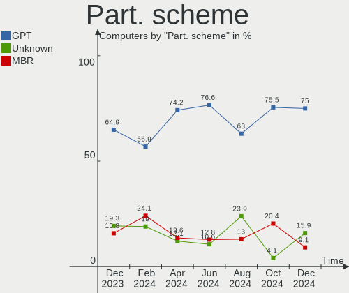
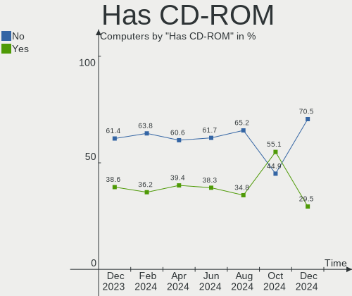
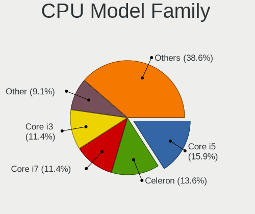
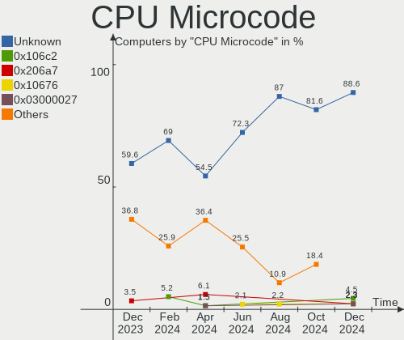
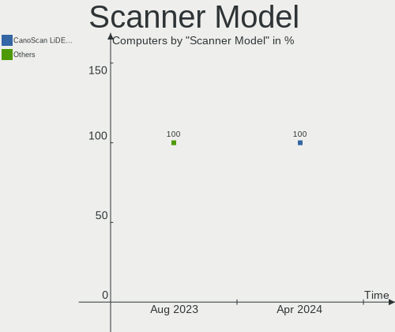

Xubuntu - Hardware Trends
-------------------------

A project to identify most popular hardware characteristics and track their change
over time based on data collected by Linux users at https://Linux-Hardware.org.

Anyone can contribute to this report by the [hw-probe](https://github.com/linuxhw/hw-probe) tool:

    sudo -E hw-probe -all -upload

This is a report for all computer types. See also reports for [desktops](/Dist/Xubuntu/Desktop/README.md) and [notebooks](/Dist/Xubuntu/Notebook/README.md).

This report is for one last month. Overall report since the beginning of time: [TestDays](https://github.com/linuxhw/TestDays)

Period: Apr, 2024.

Contents
--------

* [ System ](#system)
  - [ OS                       ](#os)
  - [ OS Family                ](#os-family)
  - [ Kernel                   ](#kernel)
  - [ Kernel Family            ](#kernel-family)
  - [ Kernel Major Ver.        ](#kernel-major-ver)
  - [ Arch                     ](#arch)
  - [ DE                       ](#de)
  - [ Display Server           ](#display-server)
  - [ Display Manager          ](#display-manager)
  - [ OS Lang                  ](#os-lang)
  - [ Boot Mode                ](#boot-mode)
  - [ Filesystem               ](#filesystem)
  - [ Part. scheme             ](#part-scheme)
  - [ Dual Boot with Linux/BSD ](#dual-boot-with-linuxbsd)
  - [ Dual Boot (Win)          ](#dual-boot-win)

* [ Board ](#board)
  - [ Vendor                   ](#vendor)
  - [ Model                    ](#model)
  - [ Model Family             ](#model-family)
  - [ MFG Year                 ](#mfg-year)
  - [ Form Factor              ](#form-factor)
  - [ Secure Boot              ](#secure-boot)
  - [ Coreboot                 ](#coreboot)
  - [ RAM Size                 ](#ram-size)
  - [ RAM Used                 ](#ram-used)
  - [ Total Drives             ](#total-drives)
  - [ Has CD-ROM               ](#has-cd-rom)
  - [ Has Ethernet             ](#has-ethernet)
  - [ Has WiFi                 ](#has-wifi)
  - [ Has Bluetooth            ](#has-bluetooth)

* [ Location ](#location)
  - [ Country                  ](#country)
  - [ City                     ](#city)

* [ Drives ](#drives)
  - [ Drive Vendor             ](#drive-vendor)
  - [ Drive Model              ](#drive-model)
  - [ HDD Vendor               ](#hdd-vendor)
  - [ SSD Vendor               ](#ssd-vendor)
  - [ Drive Kind               ](#drive-kind)
  - [ Drive Connector          ](#drive-connector)
  - [ Drive Size               ](#drive-size)
  - [ Space Total              ](#space-total)
  - [ Space Used               ](#space-used)
  - [ Malfunc. Drives          ](#malfunc-drives)
  - [ Malfunc. Drive Vendor    ](#malfunc-drive-vendor)
  - [ Malfunc. HDD Vendor      ](#malfunc-hdd-vendor)
  - [ Malfunc. Drive Kind      ](#malfunc-drive-kind)
  - [ Failed Drives            ](#failed-drives)
  - [ Failed Drive Vendor      ](#failed-drive-vendor)
  - [ Drive Status             ](#drive-status)

* [ Storage controller ](#storage-controller)
  - [ Storage Vendor           ](#storage-vendor)
  - [ Storage Model            ](#storage-model)
  - [ Storage Kind             ](#storage-kind)

* [ Processor ](#processor)
  - [ CPU Vendor               ](#cpu-vendor)
  - [ CPU Model                ](#cpu-model)
  - [ CPU Model Family         ](#cpu-model-family)
  - [ CPU Cores                ](#cpu-cores)
  - [ CPU Sockets              ](#cpu-sockets)
  - [ CPU Threads              ](#cpu-threads)
  - [ CPU Op-Modes             ](#cpu-op-modes)
  - [ CPU Microcode            ](#cpu-microcode)
  - [ CPU Microarch            ](#cpu-microarch)

* [ Graphics ](#graphics)
  - [ GPU Vendor               ](#gpu-vendor)
  - [ GPU Model                ](#gpu-model)
  - [ GPU Combo                ](#gpu-combo)
  - [ GPU Driver               ](#gpu-driver)
  - [ GPU Memory               ](#gpu-memory)

* [ Monitor ](#monitor)
  - [ Monitor Vendor           ](#monitor-vendor)
  - [ Monitor Model            ](#monitor-model)
  - [ Monitor Resolution       ](#monitor-resolution)
  - [ Monitor Diagonal         ](#monitor-diagonal)
  - [ Monitor Width            ](#monitor-width)
  - [ Aspect Ratio             ](#aspect-ratio)
  - [ Monitor Area             ](#monitor-area)
  - [ Pixel Density            ](#pixel-density)
  - [ Multiple Monitors        ](#multiple-monitors)

* [ Network ](#network)
  - [ Net Controller Vendor    ](#net-controller-vendor)
  - [ Net Controller Model     ](#net-controller-model)
  - [ Wireless Vendor          ](#wireless-vendor)
  - [ Wireless Model           ](#wireless-model)
  - [ Ethernet Vendor          ](#ethernet-vendor)
  - [ Ethernet Model           ](#ethernet-model)
  - [ Net Controller Kind      ](#net-controller-kind)
  - [ Used Controller          ](#used-controller)
  - [ NICs                     ](#nics)
  - [ IPv6                     ](#ipv6)

* [ Bluetooth ](#bluetooth)
  - [ Bluetooth Vendor         ](#bluetooth-vendor)
  - [ Bluetooth Model          ](#bluetooth-model)

* [ Sound ](#sound)
  - [ Sound Vendor             ](#sound-vendor)
  - [ Sound Model              ](#sound-model)

* [ Memory ](#memory)
  - [ Memory Vendor            ](#memory-vendor)
  - [ Memory Model             ](#memory-model)
  - [ Memory Kind              ](#memory-kind)
  - [ Memory Form Factor       ](#memory-form-factor)
  - [ Memory Size              ](#memory-size)
  - [ Memory Speed             ](#memory-speed)

* [ Printers & scanners ](#printers--scanners)
  - [ Printer Vendor           ](#printer-vendor)
  - [ Printer Model            ](#printer-model)
  - [ Scanner Vendor           ](#scanner-vendor)
  - [ Scanner Model            ](#scanner-model)

* [ Camera ](#camera)
  - [ Camera Vendor            ](#camera-vendor)
  - [ Camera Model             ](#camera-model)

* [ Security ](#security)
  - [ Fingerprint Vendor       ](#fingerprint-vendor)
  - [ Fingerprint Model        ](#fingerprint-model)
  - [ Chipcard Vendor          ](#chipcard-vendor)
  - [ Chipcard Model           ](#chipcard-model)

* [ Unsupported ](#unsupported)
  - [ Unsupported Devices      ](#unsupported-devices)
  - [ Unsupported Device Types ](#unsupported-device-types)

System
------

OS
--

Installed operating systems

| Name          | Computers | Percent |
|---------------|-----------|---------|
| Xubuntu 22.04 | 41        | 62.12%  |
| Xubuntu 23.10 | 8         | 12.12%  |
| Xubuntu 20.04 | 7         | 10.61%  |
| Xubuntu 24.04 | 4         | 6.06%   |
| Xubuntu 18.04 | 3         | 4.55%   |
| Xubuntu 23.04 | 2         | 3.03%   |
| Xubuntu 16.04 | 1         | 1.52%   |

OS Family
---------

OS without a version

| Name    | Computers | Percent |
|---------|-----------|---------|
| Xubuntu | 66        | 100%    |

Kernel
------

Version of the Linux kernel

| Version                   | Computers | Percent |
|---------------------------|-----------|---------|
| 6.5.0-26-generic          | 12        | 18.18%  |
| 6.5.0-28-generic          | 10        | 15.15%  |
| 5.15.0-105-generic        | 7         | 10.61%  |
| 5.15.0-101-generic        | 7         | 10.61%  |
| 5.15.0-102-generic        | 6         | 9.09%   |
| 6.5.0-27-generic          | 4         | 6.06%   |
| 5.4.0-150-generic         | 3         | 4.55%   |
| 6.8.0-31-generic          | 2         | 3.03%   |
| 6.8.0-22-generic          | 2         | 3.03%   |
| 6.5.0-18-generic          | 2         | 3.03%   |
| 6.5.0-9-generic           | 1         | 1.52%   |
| 6.5.0-21-generic          | 1         | 1.52%   |
| 6.2.0-39-generic          | 1         | 1.52%   |
| 6.2.0-20-generic          | 1         | 1.52%   |
| 5.4.0-174-generic         | 1         | 1.52%   |
| 5.15.0-89-generic         | 1         | 1.52%   |
| 5.15.0-82-generic         | 1         | 1.52%   |
| 5.15.0-43-generic         | 1         | 1.52%   |
| 5.14.0-1052-oem           | 1         | 1.52%   |
| 4.4.0-210-generic         | 1         | 1.52%   |
| 4.15.18-041518-lowlatency | 1         | 1.52%   |

Kernel Family
-------------

Linux kernel without a distro release

| Version | Computers | Percent |
|---------|-----------|---------|
| 6.5.0   | 30        | 45.45%  |
| 5.15.0  | 23        | 34.85%  |
| 6.8.0   | 4         | 6.06%   |
| 5.4.0   | 4         | 6.06%   |
| 6.2.0   | 2         | 3.03%   |
| 5.14.0  | 1         | 1.52%   |
| 4.4.0   | 1         | 1.52%   |
| 4.15.18 | 1         | 1.52%   |

Kernel Major Ver.
-----------------

Linux kernel major version

| Version | Computers | Percent |
|---------|-----------|---------|
| 6.5     | 30        | 45.45%  |
| 5.15    | 23        | 34.85%  |
| 6.8     | 4         | 6.06%   |
| 5.4     | 4         | 6.06%   |
| 6.2     | 2         | 3.03%   |
| 5.14    | 1         | 1.52%   |
| 4.4     | 1         | 1.52%   |
| 4.15    | 1         | 1.52%   |

Arch
----

OS architecture (x86_64, i586, etc.)

| Name   | Computers | Percent |
|--------|-----------|---------|
| x86_64 | 62        | 93.94%  |
| i686   | 4         | 6.06%   |

DE
--

Desktop Environment

| Name       | Computers | Percent |
|------------|-----------|---------|
| XFCE       | 63        | 95.45%  |
| GNOME      | 2         | 3.03%   |
| X-Cinnamon | 1         | 1.52%   |

Display Server
--------------

X11 or Wayland

| Name    | Computers | Percent |
|---------|-----------|---------|
| X11     | 64        | 96.97%  |
| Wayland | 1         | 1.52%   |
| Tty     | 1         | 1.52%   |

Display Manager
---------------

SDDM, LightDM, etc.

| Name    | Computers | Percent |
|---------|-----------|---------|
| LightDM | 57        | 86.36%  |
| GDM3    | 4         | 6.06%   |
| Unknown | 4         | 6.06%   |
| SDDM    | 1         | 1.52%   |

OS Lang
-------

Language

| Lang  | Computers | Percent |
|-------|-----------|---------|
| en_US | 30        | 45.45%  |
| it_IT | 7         | 10.61%  |
| fr_FR | 7         | 10.61%  |
| de_DE | 4         | 6.06%   |
| ru_RU | 3         | 4.55%   |
| pt_BR | 2         | 3.03%   |
| es_ES | 2         | 3.03%   |
| C     | 2         | 3.03%   |
| nl_NL | 1         | 1.52%   |
| nl_BE | 1         | 1.52%   |
| fr_CA | 1         | 1.52%   |
| eo    | 1         | 1.52%   |
| en_NZ | 1         | 1.52%   |
| en_IE | 1         | 1.52%   |
| en_CA | 1         | 1.52%   |
| en_AU | 1         | 1.52%   |
| de_CH | 1         | 1.52%   |

Boot Mode
---------

EFI or BIOS

| Mode | Computers | Percent |
|------|-----------|---------|
| BIOS | 36        | 54.55%  |
| EFI  | 30        | 45.45%  |

Filesystem
----------

Type of filesystem

| Type    | Computers | Percent |
|---------|-----------|---------|
| Ext4    | 44        | 66.67%  |
| Tmpfs   | 17        | 25.76%  |
| Overlay | 3         | 4.55%   |
| Zfs     | 2         | 3.03%   |

Part. scheme
------------

Scheme of partitioning

| Type    | Computers | Percent |
|---------|-----------|---------|
| GPT     | 49        | 74.24%  |
| MBR     | 9         | 13.64%  |
| Unknown | 8         | 12.12%  |

Dual Boot with Linux/BSD
------------------------

Hosting more than one Linux/BSD

| Dual boot | Computers | Percent |
|-----------|-----------|---------|
| No        | 55        | 83.33%  |
| Yes       | 11        | 16.67%  |

Dual Boot (Win)
---------------

Hosting Linux and Windows

| Dual boot | Computers | Percent |
|-----------|-----------|---------|
| No        | 44        | 66.67%  |
| Yes       | 22        | 33.33%  |

Board
-----

Vendor
------

Motherboard manufacturer

| Name                                 | Computers | Percent |
|--------------------------------------|-----------|---------|
| ASUSTek Computer                     | 14        | 21.21%  |
| Hewlett-Packard                      | 11        | 16.67%  |
| Lenovo                               | 10        | 15.15%  |
| Dell                                 | 9         | 13.64%  |
| Acer                                 | 4         | 6.06%   |
| Gigabyte Technology                  | 3         | 4.55%   |
| Apple                                | 3         | 4.55%   |
| Sony                                 | 1         | 1.52%   |
| Shenzhen Meigao Electronic Equipment | 1         | 1.52%   |
| Samsung Electronics                  | 1         | 1.52%   |
| Philco                               | 1         | 1.52%   |
| MSI                                  | 1         | 1.52%   |
| Hardkernel                           | 1         | 1.52%   |
| Fujitsu                              | 1         | 1.52%   |
| Clevo                                | 1         | 1.52%   |
| AZW                                  | 1         | 1.52%   |
| ASRock                               | 1         | 1.52%   |
| AMI                                  | 1         | 1.52%   |
| Unknown                              | 1         | 1.52%   |

Model
-----

Motherboard model

| Name                                            | Computers | Percent |
|-------------------------------------------------|-----------|---------|
| HP Notebook                                     | 2         | 3.03%   |
| ASUS PRIME A320M-K                              | 2         | 3.03%   |
| Sony VPCF12M1E                                  | 1         | 1.52%   |
| Shenzhen Meigao Electronic Equipment UM773 Lite | 1         | 1.52%   |
| Samsung 300E4C/300E5C/300E7C                    | 1         | 1.52%   |
| Philco 14I                                      | 1         | 1.52%   |
| MSI MS-7522                                     | 1         | 1.52%   |
| Lenovo Yoga 730-13IKB 81CT                      | 1         | 1.52%   |
| Lenovo ThinkStation S30 43512E6                 | 1         | 1.52%   |
| Lenovo ThinkPad X131e 3367AH5                   | 1         | 1.52%   |
| Lenovo ThinkPad W541 20EGS03W15                 | 1         | 1.52%   |
| Lenovo ThinkPad Twist 33474HU                   | 1         | 1.52%   |
| Lenovo ThinkPad T60 1951FDG                     | 1         | 1.52%   |
| Lenovo ThinkCentre M900 10FLS0SJ00              | 1         | 1.52%   |
| Lenovo Legion S7 15IMH5 82BC                    | 1         | 1.52%   |
| Lenovo IdeaPad 1 15AMN7 82VG                    | 1         | 1.52%   |
| Lenovo FLEX-14IWL Laptop 81SQ                   | 1         | 1.52%   |
| HP ProBook 4340s                                | 1         | 1.52%   |
| HP Mini 210-1000                                | 1         | 1.52%   |
| HP Laptop 14-dq0xxx                             | 1         | 1.52%   |
| HP ENVY x360 2-in-1 Laptop 13-bf0xxx            | 1         | 1.52%   |
| HP EliteBook 2540p                              | 1         | 1.52%   |
| HP Compaq dc7600 Small Form Factor              | 1         | 1.52%   |
| HP Compaq 6730b (GW687AV)                       | 1         | 1.52%   |
| HP Compaq 6720s                                 | 1         | 1.52%   |
| HP 15                                           | 1         | 1.52%   |
| Hardkernel ODROID-H2                            | 1         | 1.52%   |
| Gigabyte M68M-S2P                               | 1         | 1.52%   |
| Gigabyte H110M-S2                               | 1         | 1.52%   |
| Gigabyte B150-HD3 DDR3-CF                       | 1         | 1.52%   |
| Fujitsu FujitsuTP7000                           | 1         | 1.52%   |
| Dell XPS 13 9370                                | 1         | 1.52%   |
| Dell Studio XPS 7100                            | 1         | 1.52%   |
| Dell Precision 7920 Tower                       | 1         | 1.52%   |
| Dell OptiPlex 7020                              | 1         | 1.52%   |
| Dell OptiPlex 7010                              | 1         | 1.52%   |
| Dell Latitude 5330                              | 1         | 1.52%   |
| Dell Inspiron 3847                              | 1         | 1.52%   |
| Dell Inspiron 1011                              | 1         | 1.52%   |
| Dell DM061                                      | 1         | 1.52%   |

Model Family
------------

Motherboard model prefix

| Name                                       | Computers | Percent |
|--------------------------------------------|-----------|---------|
| Lenovo ThinkPad                            | 4         | 6.06%   |
| ASUS PRIME                                 | 4         | 6.06%   |
| Acer Aspire                                | 4         | 6.06%   |
| HP Compaq                                  | 3         | 4.55%   |
| HP Notebook                                | 2         | 3.03%   |
| Dell OptiPlex                              | 2         | 3.03%   |
| Dell Inspiron                              | 2         | 3.03%   |
| Sony VPCF12M1E                             | 1         | 1.52%   |
| Shenzhen Meigao Electronic Equipment UM773 | 1         | 1.52%   |
| Samsung 300E4C                             | 1         | 1.52%   |
| Philco 14I                                 | 1         | 1.52%   |
| MSI MS-7522                                | 1         | 1.52%   |
| Lenovo Yoga                                | 1         | 1.52%   |
| Lenovo ThinkStation                        | 1         | 1.52%   |
| Lenovo ThinkCentre                         | 1         | 1.52%   |
| Lenovo Legion                              | 1         | 1.52%   |
| Lenovo IdeaPad                             | 1         | 1.52%   |
| Lenovo FLEX-14IWL                          | 1         | 1.52%   |
| HP ProBook                                 | 1         | 1.52%   |
| HP Mini                                    | 1         | 1.52%   |
| HP Laptop                                  | 1         | 1.52%   |
| HP ENVY                                    | 1         | 1.52%   |
| HP EliteBook                               | 1         | 1.52%   |
| HP 15                                      | 1         | 1.52%   |
| Hardkernel ODROID-H2                       | 1         | 1.52%   |
| Gigabyte M68M-S2P                          | 1         | 1.52%   |
| Gigabyte H110M-S2                          | 1         | 1.52%   |
| Gigabyte B150-HD3                          | 1         | 1.52%   |
| Fujitsu FujitsuTP7000                      | 1         | 1.52%   |
| Dell XPS                                   | 1         | 1.52%   |
| Dell Studio                                | 1         | 1.52%   |
| Dell Precision                             | 1         | 1.52%   |
| Dell Latitude                              | 1         | 1.52%   |
| Dell DM061                                 | 1         | 1.52%   |
| Clevo W240EU                               | 1         | 1.52%   |
| AZW EQ                                     | 1         | 1.52%   |
| ASUS X751MA                                | 1         | 1.52%   |
| ASUS VivoBook                              | 1         | 1.52%   |
| ASUS TUF                                   | 1         | 1.52%   |
| ASUS Studio                                | 1         | 1.52%   |

MFG Year
--------

Motherboard manufacture year

| Year    | Computers | Percent |
|---------|-----------|---------|
| 2012    | 8         | 12.12%  |
| 2023    | 6         | 9.09%   |
| 2009    | 6         | 9.09%   |
| 2022    | 5         | 7.58%   |
| 2010    | 5         | 7.58%   |
| 2018    | 4         | 6.06%   |
| 2014    | 4         | 6.06%   |
| 2013    | 4         | 6.06%   |
| 2019    | 3         | 4.55%   |
| 2017    | 3         | 4.55%   |
| 2015    | 3         | 4.55%   |
| 2011    | 3         | 4.55%   |
| 2021    | 2         | 3.03%   |
| 2020    | 2         | 3.03%   |
| 2016    | 2         | 3.03%   |
| 2006    | 2         | 3.03%   |
| 2008    | 1         | 1.52%   |
| 2007    | 1         | 1.52%   |
| 2005    | 1         | 1.52%   |
| Unknown | 1         | 1.52%   |

Form Factor
-----------

Physical design of the computer

| Name        | Computers | Percent |
|-------------|-----------|---------|
| Notebook    | 33        | 50%     |
| Desktop     | 28        | 42.42%  |
| Convertible | 3         | 4.55%   |
| Mini pc     | 1         | 1.52%   |
| Server      | 1         | 1.52%   |

Secure Boot
-----------

Enabled or disabled

| State    | Computers | Percent |
|----------|-----------|---------|
| Disabled | 62        | 93.94%  |
| Enabled  | 4         | 6.06%   |

Coreboot
--------

Have coreboot on board

| Used | Computers | Percent |
|------|-----------|---------|
| No   | 66        | 100%    |

RAM Size
--------

Total RAM memory

| Size in GB  | Computers | Percent |
|-------------|-----------|---------|
| 3.01-4.0    | 17        | 25.76%  |
| 8.01-16.0   | 15        | 22.73%  |
| 16.01-24.0  | 10        | 15.15%  |
| 4.01-8.0    | 9         | 13.64%  |
| 1.01-2.0    | 5         | 7.58%   |
| 32.01-64.0  | 3         | 4.55%   |
| 64.01-256.0 | 3         | 4.55%   |
| 24.01-32.0  | 2         | 3.03%   |
| 2.01-3.0    | 1         | 1.52%   |
| 0.51-1.0    | 1         | 1.52%   |

RAM Used
--------

Used RAM memory

| Used GB    | Computers | Percent |
|------------|-----------|---------|
| 1.01-2.0   | 21        | 31.82%  |
| 2.01-3.0   | 20        | 30.3%   |
| 4.01-8.0   | 10        | 15.15%  |
| 0.51-1.0   | 6         | 9.09%   |
| 8.01-16.0  | 4         | 6.06%   |
| 3.01-4.0   | 3         | 4.55%   |
| 32.01-64.0 | 1         | 1.52%   |
| 0.01-0.5   | 1         | 1.52%   |

Total Drives
------------

Number of drives on board

| Drives | Computers | Percent |
|--------|-----------|---------|
| 1      | 42        | 63.64%  |
| 2      | 16        | 24.24%  |
| 4      | 4         | 6.06%   |
| 3      | 3         | 4.55%   |
| 0      | 1         | 1.52%   |

Has CD-ROM
----------

Has CD-ROM on board

| Presented | Computers | Percent |
|-----------|-----------|---------|
| No        | 39        | 59.09%  |
| Yes       | 27        | 40.91%  |

Has Ethernet
------------

Has Ethernet on board

| Presented | Computers | Percent |
|-----------|-----------|---------|
| Yes       | 58        | 87.88%  |
| No        | 8         | 12.12%  |

Has WiFi
--------

Has WiFi module

| Presented | Computers | Percent |
|-----------|-----------|---------|
| Yes       | 49        | 74.24%  |
| No        | 17        | 25.76%  |

Has Bluetooth
-------------

Has Bluetooth module

| Presented | Computers | Percent |
|-----------|-----------|---------|
| Yes       | 40        | 60.61%  |
| No        | 26        | 39.39%  |

Location
--------

Country
-------

Geographic location (country)

| Country         | Computers | Percent |
|-----------------|-----------|---------|
| USA             | 13        | 19.7%   |
| Italy           | 8         | 12.12%  |
| France          | 7         | 10.61%  |
| Serbia          | 5         | 7.58%   |
| Germany         | 5         | 7.58%   |
| Spain           | 4         | 6.06%   |
| Russia          | 4         | 6.06%   |
| Canada          | 3         | 4.55%   |
| Finland         | 2         | 3.03%   |
| Brazil          | 2         | 3.03%   |
| The Netherlands | 1         | 1.52%   |
| Thailand        | 1         | 1.52%   |
| Switzerland     | 1         | 1.52%   |
| Slovakia        | 1         | 1.52%   |
| Pakistan        | 1         | 1.52%   |
| New Zealand     | 1         | 1.52%   |
| Malaysia        | 1         | 1.52%   |
| Lithuania       | 1         | 1.52%   |
| Hungary         | 1         | 1.52%   |
| Czechia         | 1         | 1.52%   |
| Bulgaria        | 1         | 1.52%   |
| Belgium         | 1         | 1.52%   |
| Australia       | 1         | 1.52%   |

City
----

Geographic location (city)

| City                    | Computers | Percent |
|-------------------------|-----------|---------|
| Zrenjanin               | 3         | 4.55%   |
| Sombor                  | 2         | 3.03%   |
| Rome                    | 2         | 3.03%   |
| Munich                  | 2         | 3.03%   |
| Madrid                  | 2         | 3.03%   |
| Helsinki                | 2         | 3.03%   |
| Arona                   | 2         | 3.03%   |
| Yekaterinburg           | 1         | 1.52%   |
| Winnipeg                | 1         | 1.52%   |
| Vilnius                 | 1         | 1.52%   |
| Vanves                  | 1         | 1.52%   |
| Valdagno                | 1         | 1.52%   |
| Turin                   | 1         | 1.52%   |
| Toronto                 | 1         | 1.52%   |
| Springfield             | 1         | 1.52%   |
| Sofia                   | 1         | 1.52%   |
| Sao Paulo               | 1         | 1.52%   |
| Sannazzaro de' Burgondi | 1         | 1.52%   |
| Saint-Eustache          | 1         | 1.52%   |
| Saint-Estephe           | 1         | 1.52%   |
| Saint Paul              | 1         | 1.52%   |
| Roscanvel               | 1         | 1.52%   |
| Rio de Janeiro          | 1         | 1.52%   |
| Rennes                  | 1         | 1.52%   |
| Oskaloosa               | 1         | 1.52%   |
| Nuremberg               | 1         | 1.52%   |
| Novokuznetsk            | 1         | 1.52%   |
| New York                | 1         | 1.52%   |
| Naples                  | 1         | 1.52%   |
| Moscow                  | 1         | 1.52%   |
| Minneapolis             | 1         | 1.52%   |
| Milan                   | 1         | 1.52%   |
| Massy                   | 1         | 1.52%   |
| Mason                   | 1         | 1.52%   |
| Markelo                 | 1         | 1.52%   |
| Malden                  | 1         | 1.52%   |
| Le Petit-Quevilly       | 1         | 1.52%   |
| Klatovy                 | 1         | 1.52%   |
| Keene                   | 1         | 1.52%   |
| Karachi                 | 1         | 1.52%   |

Drives
------

Drive Vendor
------------

Hard drive vendors

| Vendor                      | Computers | Drives | Percent |
|-----------------------------|-----------|--------|---------|
| Seagate                     | 16        | 20     | 17.98%  |
| WDC                         | 11        | 12     | 12.36%  |
| Unknown                     | 9         | 11     | 10.11%  |
| Samsung Electronics         | 8         | 9      | 8.99%   |
| Kingston                    | 8         | 8      | 8.99%   |
| Hitachi                     | 5         | 6      | 5.62%   |
| Toshiba                     | 3         | 3      | 3.37%   |
| Micron Technology           | 3         | 3      | 3.37%   |
| Kingston Technology Company | 3         | 3      | 3.37%   |
| SanDisk                     | 2         | 2      | 2.25%   |
| PHD 3.0                     | 2         | 2      | 2.25%   |
| A-DATA Technology           | 2         | 3      | 2.25%   |
| Transcend                   | 1         | 1      | 1.12%   |
| TO Exter                    | 1         | 1      | 1.12%   |
| SPCC                        | 1         | 1      | 1.12%   |
| SK hynix                    | 1         | 1      | 1.12%   |
| Realtek Semiconductor       | 1         | 1      | 1.12%   |
| PNY                         | 1         | 1      | 1.12%   |
| Phison Electronics          | 1         | 1      | 1.12%   |
| Patriot                     | 1         | 1      | 1.12%   |
| OCZ                         | 1         | 1      | 1.12%   |
| Micron/Crucial Technology   | 1         | 1      | 1.12%   |
| KIOXIA                      | 1         | 1      | 1.12%   |
| Intenso                     | 1         | 1      | 1.12%   |
| HEORIADY                    | 1         | 1      | 1.12%   |
| GOODRAM                     | 1         | 1      | 1.12%   |
| Fujitsu                     | 1         | 1      | 1.12%   |
| Fanxiang                    | 1         | 1      | 1.12%   |
| Apple                       | 1         | 1      | 1.12%   |

Drive Model
-----------

Hard drive models

| Model                                             | Computers | Percent |
|---------------------------------------------------|-----------|---------|
| Unknown SD/MMC/MS PRO 128GB                       | 3         | 3.13%   |
| Samsung NVMe SSD Controller SM981/PM981/PM983 1TB | 2         | 2.08%   |
| PHD 3.0 Silicon-Power 1TB                         | 2         | 2.08%   |
| Kingston SV300S37A120G 120GB SSD                  | 2         | 2.08%   |
| Kingston SA400S37240G 240GB SSD                   | 2         | 2.08%   |
| WDC WDS500G2B0A-00SM50 500GB SSD                  | 1         | 1.04%   |
| WDC WDS240G2G0A-00JH30 240GB SSD                  | 1         | 1.04%   |
| WDC WD800JD-08MSA1 80GB                           | 1         | 1.04%   |
| WDC WD5000LPLX-75ZNTT1 500GB                      | 1         | 1.04%   |
| WDC WD4000AAJS-00YFA0 400GB                       | 1         | 1.04%   |
| WDC WD1600BEVT-75ZCT2 160GB                       | 1         | 1.04%   |
| WDC WD1600BEVT-60ZCT1 160GB                       | 1         | 1.04%   |
| WDC WD1600AAJS-07PSA0 160GB                       | 1         | 1.04%   |
| WDC WD10JPVX-22JC3T0 1TB                          | 1         | 1.04%   |
| WDC WD10JPVX-11JC3T0 1TB                          | 1         | 1.04%   |
| WDC WD1001FAES-75W7A0 1TB                         | 1         | 1.04%   |
| WDC PC SN530 SDBPNPZ-256G-1114 256GB              | 1         | 1.04%   |
| Unknown SD32G  32GB                               | 1         | 1.04%   |
| Unknown SD16G  32GB                               | 1         | 1.04%   |
| Unknown NVMe SSD Drive 512GB                      | 1         | 1.04%   |
| Unknown MMC Card  64GB                            | 1         | 1.04%   |
| Unknown MMC Card  32GB                            | 1         | 1.04%   |
| Unknown MMC Card  128GB                           | 1         | 1.04%   |
| Unknown CUTB42  64GB                              | 1         | 1.04%   |
| Unknown CJTD4R  64GB                              | 1         | 1.04%   |
| Transcend TS1TSSD225S 1TB                         | 1         | 1.04%   |
| Toshiba MK1633GSG 160GB                           | 1         | 1.04%   |
| Toshiba MK1237GSX 120GB                           | 1         | 1.04%   |
| Toshiba KXG50ZNV1T02 NVMe 1024GB                  | 1         | 1.04%   |
| TO Exter nal USB 3.0 500GB                        | 1         | 1.04%   |
| SPCC Solid State Disk 240GB                       | 1         | 1.04%   |
| SK hynix SC401 SATA 512GB SSD                     | 1         | 1.04%   |
| Seagate ST9250410AS 250GB                         | 1         | 1.04%   |
| Seagate ST8000DM004-2CX188 8TB                    | 1         | 1.04%   |
| Seagate ST500LT012-1DG142 500GB                   | 1         | 1.04%   |
| Seagate ST5000LM000-2U8170 5TB                    | 1         | 1.04%   |
| Seagate ST3750528AS 752GB                         | 1         | 1.04%   |
| Seagate ST3500630AS 500GB                         | 1         | 1.04%   |
| Seagate ST3500413AS 500GB                         | 1         | 1.04%   |
| Seagate ST3320620NS 320GB                         | 1         | 1.04%   |

HDD Vendor
----------

Hard disk drive vendors

| Vendor   | Computers | Drives | Percent |
|----------|-----------|--------|---------|
| Seagate  | 15        | 19     | 42.86%  |
| WDC      | 8         | 9      | 22.86%  |
| Hitachi  | 5         | 6      | 14.29%  |
| Unknown  | 3         | 3      | 8.57%   |
| Toshiba  | 2         | 2      | 5.71%   |
| TO Exter | 1         | 1      | 2.86%   |
| Fujitsu  | 1         | 1      | 2.86%   |

SSD Vendor
----------

Solid state drive vendors

| Vendor              | Computers | Drives | Percent |
|---------------------|-----------|--------|---------|
| Kingston            | 8         | 8      | 27.59%  |
| Samsung Electronics | 3         | 4      | 10.34%  |
| WDC                 | 2         | 2      | 6.9%    |
| PHD 3.0             | 2         | 2      | 6.9%    |
| A-DATA Technology   | 2         | 3      | 6.9%    |
| Transcend           | 1         | 1      | 3.45%   |
| SPCC                | 1         | 1      | 3.45%   |
| SK hynix            | 1         | 1      | 3.45%   |
| SanDisk             | 1         | 1      | 3.45%   |
| PNY                 | 1         | 1      | 3.45%   |
| Patriot             | 1         | 1      | 3.45%   |
| OCZ                 | 1         | 1      | 3.45%   |
| Intenso             | 1         | 1      | 3.45%   |
| HEORIADY            | 1         | 1      | 3.45%   |
| GOODRAM             | 1         | 1      | 3.45%   |
| Fanxiang            | 1         | 1      | 3.45%   |
| Apple               | 1         | 1      | 3.45%   |

Drive Kind
----------

HDD or SSD

| Kind | Computers | Drives | Percent |
|------|-----------|--------|---------|
| HDD  | 33        | 41     | 40.24%  |
| SSD  | 25        | 31     | 30.49%  |
| NVMe | 18        | 20     | 21.95%  |
| MMC  | 6         | 7      | 7.32%   |

Drive Connector
---------------

SATA, SAS, NVMe, etc.

| Type | Computers | Drives | Percent |
|------|-----------|--------|---------|
| SATA | 46        | 63     | 58.97%  |
| NVMe | 18        | 20     | 23.08%  |
| SAS  | 8         | 9      | 10.26%  |
| MMC  | 6         | 7      | 7.69%   |

Drive Size
----------

Size of hard drive

| Size in TB | Computers | Drives | Percent |
|------------|-----------|--------|---------|
| 0.01-0.5   | 40        | 49     | 66.67%  |
| 0.51-1.0   | 14        | 15     | 23.33%  |
| 1.01-2.0   | 3         | 5      | 5%      |
| 4.01-10.0  | 2         | 2      | 3.33%   |
| 2.01-3.0   | 1         | 1      | 1.67%   |

Space Total
-----------

Amount of disk space available on the file system

| Size in GB     | Computers | Percent |
|----------------|-----------|---------|
| 101-250        | 23        | 34.85%  |
| 251-500        | 15        | 22.73%  |
| 501-1000       | 11        | 16.67%  |
| 1-20           | 5         | 7.58%   |
| More than 3000 | 3         | 4.55%   |
| 1001-2000      | 3         | 4.55%   |
| 51-100         | 3         | 4.55%   |
| 2001-3000      | 2         | 3.03%   |
| 21-50          | 1         | 1.52%   |

Space Used
----------

Amount of used disk space

| Used GB   | Computers | Percent |
|-----------|-----------|---------|
| 1-20      | 18        | 27.27%  |
| 101-250   | 15        | 22.73%  |
| 21-50     | 11        | 16.67%  |
| 251-500   | 9         | 13.64%  |
| 51-100    | 6         | 9.09%   |
| 501-1000  | 3         | 4.55%   |
| 2001-3000 | 2         | 3.03%   |
| 1001-2000 | 2         | 3.03%   |

Malfunc. Drives
---------------

Drive models with a malfunction

| Model                               | Computers | Drives | Percent |
|-------------------------------------|-----------|--------|---------|
| WDC WD5000LPLX-75ZNTT1 500GB        | 1         | 1      | 11.11%  |
| Toshiba MK1633GSG 160GB             | 1         | 1      | 11.11%  |
| Seagate ST3750528AS 752GB           | 1         | 1      | 11.11%  |
| Seagate ST3500630AS 500GB           | 1         | 1      | 11.11%  |
| Seagate ST3250312AS 250GB           | 1         | 1      | 11.11%  |
| Seagate ST3000DM008-2DM166 3TB      | 1         | 1      | 11.11%  |
| Samsung Electronics SSD 980 PRO 2TB | 1         | 1      | 11.11%  |
| Hitachi HTS545025B9SA02 250GB       | 1         | 1      | 11.11%  |
| Apple SSD SD0256F 256GB             | 1         | 1      | 11.11%  |

Malfunc. Drive Vendor
---------------------

Vendors of faulty drives

| Vendor              | Computers | Drives | Percent |
|---------------------|-----------|--------|---------|
| Seagate             | 4         | 4      | 44.44%  |
| WDC                 | 1         | 1      | 11.11%  |
| Toshiba             | 1         | 1      | 11.11%  |
| Samsung Electronics | 1         | 1      | 11.11%  |
| Hitachi             | 1         | 1      | 11.11%  |
| Apple               | 1         | 1      | 11.11%  |

Malfunc. HDD Vendor
-------------------

Vendors of faulty HDD drives

| Vendor  | Computers | Drives | Percent |
|---------|-----------|--------|---------|
| Seagate | 4         | 4      | 57.14%  |
| WDC     | 1         | 1      | 14.29%  |
| Toshiba | 1         | 1      | 14.29%  |
| Hitachi | 1         | 1      | 14.29%  |

Malfunc. Drive Kind
-------------------

Kinds of faulty drives

| Kind | Computers | Drives | Percent |
|------|-----------|--------|---------|
| HDD  | 7         | 7      | 77.78%  |
| NVMe | 1         | 1      | 11.11%  |
| SSD  | 1         | 1      | 11.11%  |

Failed Drives
-------------

Failed drive models

| Model                           | Computers | Drives | Percent |
|---------------------------------|-----------|--------|---------|
| Seagate ST500LT012-1DG142 500GB | 1         | 1      | 100%    |

Failed Drive Vendor
-------------------

Failed drive vendors

| Vendor  | Computers | Drives | Percent |
|---------|-----------|--------|---------|
| Seagate | 1         | 1      | 100%    |

Drive Status
------------

Number of failed and malfunc. drives

| Status   | Computers | Drives | Percent |
|----------|-----------|--------|---------|
| Detected | 34        | 41     | 43.59%  |
| Works    | 34        | 48     | 43.59%  |
| Malfunc  | 9         | 9      | 11.54%  |
| Failed   | 1         | 1      | 1.28%   |

Storage controller
------------------

Storage Vendor
--------------

Storage controller vendors

| Vendor                       | Computers | Percent |
|------------------------------|-----------|---------|
| Intel                        | 43        | 51.19%  |
| AMD                          | 13        | 15.48%  |
| Samsung Electronics          | 5         | 5.95%   |
| Nvidia                       | 3         | 3.57%   |
| Micron Technology            | 3         | 3.57%   |
| Marvell Technology Group     | 3         | 3.57%   |
| Kingston Technology Company  | 3         | 3.57%   |
| SanDisk                      | 2         | 2.38%   |
| JMicron Technology           | 2         | 2.38%   |
| Toshiba America Info Systems | 1         | 1.19%   |
| Seagate Technology           | 1         | 1.19%   |
| Realtek Semiconductor        | 1         | 1.19%   |
| Phison Electronics           | 1         | 1.19%   |
| Micron/Crucial Technology    | 1         | 1.19%   |
| MAXIO Technology (Hangzhou)  | 1         | 1.19%   |
| KIOXIA                       | 1         | 1.19%   |

Storage Model
-------------

Storage controller models

| Model                                                                          | Computers | Percent |
|--------------------------------------------------------------------------------|-----------|---------|
| AMD FCH SATA Controller [AHCI mode]                                            | 9         | 8.74%   |
| Intel 7 Series Chipset Family 6-port SATA Controller [AHCI mode]               | 5         | 4.85%   |
| Intel Volume Management Device NVMe RAID Controller                            | 4         | 3.88%   |
| Intel SATA Controller [RAID mode]                                              | 3         | 2.91%   |
| Intel Q170/Q150/B150/H170/H110/Z170/CM236 Chipset SATA Controller [AHCI Mode]  | 3         | 2.91%   |
| Intel 8 Series/C220 Series Chipset Family 6-port SATA Controller 1 [AHCI mode] | 3         | 2.91%   |
| Samsung NVMe SSD Controller SM981/PM981/PM983                                  | 2         | 1.94%   |
| Micron 2400 NVMe SSD (DRAM-less)                                               | 2         | 1.94%   |
| JMicron JMB363 SATA/IDE Controller                                             | 2         | 1.94%   |
| Intel Raptor Lake SATA AHCI Controller                                         | 2         | 1.94%   |
| Intel Celeron/Pentium Silver Processor SATA Controller                         | 2         | 1.94%   |
| Intel Atom Processor E3800 Series SATA AHCI Controller                         | 2         | 1.94%   |
| Intel 82801JI (ICH10 Family) 4 port SATA IDE Controller #1                     | 2         | 1.94%   |
| Intel 82801JI (ICH10 Family) 2 port SATA IDE Controller #2                     | 2         | 1.94%   |
| Intel 82801G (ICH7 Family) IDE Controller                                      | 2         | 1.94%   |
| AMD SB7x0/SB8x0/SB9x0 SATA Controller [AHCI mode]                              | 2         | 1.94%   |
| AMD SB7x0/SB8x0/SB9x0 IDE Controller                                           | 2         | 1.94%   |
| AMD FCH SATA Controller D                                                      | 2         | 1.94%   |
| Toshiba America Info Systems XG5 NVMe SSD Controller                           | 1         | 0.97%   |
| Seagate FireCuda 530 SSD                                                       | 1         | 0.97%   |
| SanDisk WD PC SN540 / Green SN350 NVMe SSD 1 TB (DRAM-less)                    | 1         | 0.97%   |
| SanDisk Ultra 3D / WD Blue SN550 NVMe SSD                                      | 1         | 0.97%   |
| Samsung NVMe SSD Controller SM961/PM961/SM963                                  | 1         | 0.97%   |
| Samsung NVMe SSD Controller PM9A1/PM9A3/980PRO                                 | 1         | 0.97%   |
| Samsung NVMe SSD Controller 980 (DRAM-less)                                    | 1         | 0.97%   |
| Realtek RTS5765DL NVMe SSD Controller (DRAM-less)                              | 1         | 0.97%   |
| Phison PS5015-E15 PCIe3 NVMe Controller (DRAM-less)                            | 1         | 0.97%   |
| Nvidia MCP89 SATA Controller (AHCI mode)                                       | 1         | 0.97%   |
| Nvidia MCP79 AHCI Controller                                                   | 1         | 0.97%   |
| Nvidia MCP61 SATA Controller                                                   | 1         | 0.97%   |
| Nvidia MCP61 IDE                                                               | 1         | 0.97%   |
| Micron/Crucial T500 NVMe PCIe SSD                                              | 1         | 0.97%   |
| Micron 2450 NVMe SSD [HendrixV] (DRAM-less)                                    | 1         | 0.97%   |
| MAXIO (Hangzhou) NVMe SSD Controller MAP1202 (DRAM-less)                       | 1         | 0.97%   |
| Marvell Group 88SS9183 PCIe SSD Controller                                     | 1         | 0.97%   |
| Marvell Group 88SE912x SATA 6Gb/s Controller [IDE mode]                        | 1         | 0.97%   |
| Marvell Group 88SE912x IDE Controller                                          | 1         | 0.97%   |
| Marvell Group 88SE6111/6121 SATA II / PATA Controller                          | 1         | 0.97%   |
| KIOXIA NVMe SSD Controller BG5 (DRAM-less)                                     | 1         | 0.97%   |
| Kingston Company OM8PGP4 NVMe PCIe SSD (DRAM-less)                             | 1         | 0.97%   |

Storage Kind
------------

Kind of storage controller (IDE, SATA, NVMe, SAS, ...)

| Kind | Computers | Percent |
|------|-----------|---------|
| SATA | 48        | 53.33%  |
| NVMe | 18        | 20%     |
| IDE  | 15        | 16.67%  |
| RAID | 8         | 8.89%   |
| SAS  | 1         | 1.11%   |

Processor
---------

CPU Vendor
----------

Processor vendors

| Vendor | Computers | Percent |
|--------|-----------|---------|
| Intel  | 51        | 77.27%  |
| AMD    | 15        | 22.73%  |

CPU Model
---------

Processor models

| Model                                 | Computers | Percent |
|---------------------------------------|-----------|---------|
| Intel Core 2 Duo CPU P8600 @ 2.40GHz  | 2         | 3.03%   |
| Intel Xeon Gold 6230 CPU @ 2.10GHz    | 1         | 1.52%   |
| Intel Xeon CPU E5-1620 v2 @ 3.70GHz   | 1         | 1.52%   |
| Intel Pentium D CPU 2.80GHz           | 1         | 1.52%   |
| Intel Pentium CPU N3540 @ 2.16GHz     | 1         | 1.52%   |
| Intel Pentium CPU G870 @ 3.10GHz      | 1         | 1.52%   |
| Intel Pentium CPU G4400 @ 3.30GHz     | 1         | 1.52%   |
| Intel Pentium CPU B960 @ 2.20GHz      | 1         | 1.52%   |
| Intel Pentium 4 CPU 3.00GHz           | 1         | 1.52%   |
| Intel Pentium 3556U @ 1.70GHz         | 1         | 1.52%   |
| Intel N100                            | 1         | 1.52%   |
| Intel Core i9-10980HK CPU @ 2.40GHz   | 1         | 1.52%   |
| Intel Core i7-8550U CPU @ 1.80GHz     | 1         | 1.52%   |
| Intel Core i7-4810MQ CPU @ 2.80GHz    | 1         | 1.52%   |
| Intel Core i7-4790 CPU @ 3.60GHz      | 1         | 1.52%   |
| Intel Core i7-1060NG7 CPU @ 1.20GHz   | 1         | 1.52%   |
| Intel Core i7 CPU L 640 @ 2.13GHz     | 1         | 1.52%   |
| Intel Core i7 CPU 920 @ 2.67GHz       | 1         | 1.52%   |
| Intel Core i5-8265U CPU @ 1.60GHz     | 1         | 1.52%   |
| Intel Core i5-8250U CPU @ 1.60GHz     | 1         | 1.52%   |
| Intel Core i5-6500T CPU @ 2.50GHz     | 1         | 1.52%   |
| Intel Core i5-4440 CPU @ 3.10GHz      | 1         | 1.52%   |
| Intel Core i5-4250U CPU @ 1.30GHz     | 1         | 1.52%   |
| Intel Core i5-3470S CPU @ 2.90GHz     | 1         | 1.52%   |
| Intel Core i5-3317U CPU @ 1.70GHz     | 1         | 1.52%   |
| Intel Core i5-2400 CPU @ 3.10GHz      | 1         | 1.52%   |
| Intel Core i5 CPU M 520 @ 2.40GHz     | 1         | 1.52%   |
| Intel Core i3-8130U CPU @ 2.20GHz     | 1         | 1.52%   |
| Intel Core i3-6300 CPU @ 3.80GHz      | 1         | 1.52%   |
| Intel Core i3-2370M CPU @ 2.40GHz     | 1         | 1.52%   |
| Intel Core i3-2310M CPU @ 2.10GHz     | 1         | 1.52%   |
| Intel Core i3-2100 CPU @ 3.10GHz      | 1         | 1.52%   |
| Intel Core 2 Quad CPU Q8200 @ 2.33GHz | 1         | 1.52%   |
| Intel Core 2 Duo CPU T9600 @ 2.80GHz  | 1         | 1.52%   |
| Intel Core 2 CPU T7600 @ 2.33GHz      | 1         | 1.52%   |
| Intel Celeron N4120 CPU @ 1.10GHz     | 1         | 1.52%   |
| Intel Celeron N4020 CPU @ 1.10GHz     | 1         | 1.52%   |
| Intel Celeron J4105 CPU @ 1.50GHz     | 1         | 1.52%   |
| Intel Celeron CPU N3060 @ 1.60GHz     | 1         | 1.52%   |
| Intel Celeron CPU N2830 @ 2.16GHz     | 1         | 1.52%   |

CPU Model Family
----------------

Processor model prefix

| Model             | Computers | Percent |
|-------------------|-----------|---------|
| Intel Core i5     | 9         | 13.64%  |
| Intel Celeron     | 8         | 12.12%  |
| Other             | 6         | 9.09%   |
| Intel Core i7     | 6         | 9.09%   |
| Intel Pentium     | 5         | 7.58%   |
| Intel Core i3     | 5         | 7.58%   |
| Intel Core 2 Duo  | 3         | 4.55%   |
| AMD Ryzen 5       | 3         | 4.55%   |
| Intel Atom        | 2         | 3.03%   |
| AMD Ryzen 7       | 2         | 3.03%   |
| AMD Phenom II X6  | 2         | 3.03%   |
| Intel Xeon Gold   | 1         | 1.52%   |
| Intel Xeon        | 1         | 1.52%   |
| Intel Pentium D   | 1         | 1.52%   |
| Intel Pentium 4   | 1         | 1.52%   |
| Intel Core i9     | 1         | 1.52%   |
| Intel Core 2 Quad | 1         | 1.52%   |
| Intel Core 2      | 1         | 1.52%   |
| AMD Ryzen 9       | 1         | 1.52%   |
| AMD Ryzen 5 PRO   | 1         | 1.52%   |
| AMD Ryzen 3       | 1         | 1.52%   |
| AMD C-70          | 1         | 1.52%   |
| AMD Athlon II X2  | 1         | 1.52%   |
| AMD A8            | 1         | 1.52%   |
| AMD A6            | 1         | 1.52%   |
| AMD A4            | 1         | 1.52%   |

CPU Cores
---------

Number of processor cores

| Number | Computers | Percent |
|--------|-----------|---------|
| 2      | 26        | 39.39%  |
| 4      | 21        | 31.82%  |
| 6      | 5         | 7.58%   |
| 1      | 4         | 6.06%   |
| 8      | 3         | 4.55%   |
| 16     | 2         | 3.03%   |
| 10     | 2         | 3.03%   |
| 40     | 1         | 1.52%   |
| 14     | 1         | 1.52%   |
| 5      | 1         | 1.52%   |

CPU Sockets
-----------

Number of sockets

| Number | Computers | Percent |
|--------|-----------|---------|
| 1      | 65        | 98.48%  |
| 2      | 1         | 1.52%   |

CPU Threads
-----------

Threads per core (Hyper-Threading)

| Number | Computers | Percent |
|--------|-----------|---------|
| 1      | 34        | 51.52%  |
| 2      | 32        | 48.48%  |

CPU Op-Modes
------------

CPU Operation Modes (32-bit, 64-bit)

| Op mode        | Computers | Percent |
|----------------|-----------|---------|
| 32-bit, 64-bit | 65        | 98.48%  |
| 32-bit         | 1         | 1.52%   |

CPU Microcode
-------------

Microcode number

| Number     | Computers | Percent |
|------------|-----------|---------|
| Unknown    | 36        | 54.55%  |
| 0x206a7    | 4         | 6.06%   |
| 0x506e3    | 2         | 3.03%   |
| 0x40651    | 2         | 3.03%   |
| 0x010000dc | 2         | 3.03%   |
| 0xb06e0    | 1         | 1.52%   |
| 0x806ec    | 1         | 1.52%   |
| 0x806ea    | 1         | 1.52%   |
| 0x706a1    | 1         | 1.52%   |
| 0x50657    | 1         | 1.52%   |
| 0x306c3    | 1         | 1.52%   |
| 0x20655    | 1         | 1.52%   |
| 0x20652    | 1         | 1.52%   |
| 0x106ca    | 1         | 1.52%   |
| 0x106c2    | 1         | 1.52%   |
| 0x1067a    | 1         | 1.52%   |
| 0x10661    | 1         | 1.52%   |
| 0x0a50000d | 1         | 1.52%   |
| 0x0a201204 | 1         | 1.52%   |
| 0x08a00008 | 1         | 1.52%   |
| 0x08600109 | 1         | 1.52%   |
| 0x08600103 | 1         | 1.52%   |
| 0x08108109 | 1         | 1.52%   |
| 0x03000027 | 1         | 1.52%   |
| 0x010000c8 | 1         | 1.52%   |

CPU Microarch
-------------

Microarchitecture

| Name             | Computers | Percent |
|------------------|-----------|---------|
| SandyBridge      | 8         | 12.12%  |
| Haswell          | 5         | 7.58%   |
| Unknown          | 5         | 7.58%   |
| Skylake          | 4         | 6.06%   |
| Penryn           | 4         | 6.06%   |
| KabyLake         | 4         | 6.06%   |
| Zen 3            | 3         | 4.55%   |
| Silvermont       | 3         | 4.55%   |
| K10              | 3         | 4.55%   |
| IvyBridge        | 3         | 4.55%   |
| Goldmont plus    | 3         | 4.55%   |
| Alderlake Hybrid | 3         | 4.55%   |
| Zen 2            | 2         | 3.03%   |
| Westmere         | 2         | 3.03%   |
| Puma             | 2         | 3.03%   |
| NetBurst         | 2         | 3.03%   |
| Core             | 2         | 3.03%   |
| Bonnell          | 2         | 3.03%   |
| Zen+             | 1         | 1.52%   |
| Nehalem          | 1         | 1.52%   |
| K10 Llano        | 1         | 1.52%   |
| IceLake          | 1         | 1.52%   |
| CometLake        | 1         | 1.52%   |
| Bobcat           | 1         | 1.52%   |

Graphics
--------

GPU Vendor
----------

Vendors of graphics cards

| Vendor | Computers | Percent |
|--------|-----------|---------|
| Intel  | 39        | 55.71%  |
| AMD    | 16        | 22.86%  |
| Nvidia | 15        | 21.43%  |

GPU Model
---------

Graphics card models

| Model                                                                                    | Computers | Percent |
|------------------------------------------------------------------------------------------|-----------|---------|
| Intel 2nd Generation Core Processor Family Integrated Graphics Controller                | 6         | 7.89%   |
| Intel UHD Graphics 620                                                                   | 3         | 3.95%   |
| Intel GeminiLake [UHD Graphics 600]                                                      | 3         | 3.95%   |
| Nvidia GA106 [GeForce RTX 3060 Lite Hash Rate]                                           | 2         | 2.63%   |
| Intel Mobile 945GM/GMS/GME, 943/940GML Express Integrated Graphics Controller            | 2         | 2.63%   |
| Intel HD Graphics 530                                                                    | 2         | 2.63%   |
| Intel Haswell-ULT Integrated Graphics Controller                                         | 2         | 2.63%   |
| Intel Atom Processor Z36xxx/Z37xxx Series Graphics & Display                             | 2         | 2.63%   |
| AMD Renoir [Radeon RX Vega 6 (Ryzen 4000/5000 Mobile Series)]                            | 2         | 2.63%   |
| AMD Mullins [Radeon R4/R5 Graphics]                                                      | 2         | 2.63%   |
| AMD Ellesmere [Radeon RX 470/480/570/570X/580/580X/590]                                  | 2         | 2.63%   |
| Nvidia TU116 [GeForce GTX 1660 SUPER]                                                    | 1         | 1.32%   |
| Nvidia TU106M [GeForce RTX 2060 Max-Q]                                                   | 1         | 1.32%   |
| Nvidia TU104GL [Quadro RTX 4000]                                                         | 1         | 1.32%   |
| Nvidia MCP89 [GeForce 320M]                                                              | 1         | 1.32%   |
| Nvidia GT216M [GeForce GT 330M]                                                          | 1         | 1.32%   |
| Nvidia GK107GLM [Quadro K1100M]                                                          | 1         | 1.32%   |
| Nvidia GK107GL [Quadro K2000]                                                            | 1         | 1.32%   |
| Nvidia GK107 [GeForce GTX 650]                                                           | 1         | 1.32%   |
| Nvidia GA107M [GeForce RTX 3050 Mobile]                                                  | 1         | 1.32%   |
| Nvidia GA104 [GeForce RTX 3060]                                                          | 1         | 1.32%   |
| Nvidia G96CM [GeForce 9600M GT]                                                          | 1         | 1.32%   |
| Nvidia G72 [GeForce 7300 LE]                                                             | 1         | 1.32%   |
| Nvidia C79 [GeForce 9400M]                                                               | 1         | 1.32%   |
| Nvidia C61 [GeForce 7025 / nForce 630a]                                                  | 1         | 1.32%   |
| Intel Xeon E3-1200 v3/4th Gen Core Processor Integrated Graphics Controller              | 1         | 1.32%   |
| Intel Xeon E3-1200 v2/3rd Gen Core processor Graphics Controller                         | 1         | 1.32%   |
| Intel WhiskeyLake-U GT2 [UHD Graphics 620]                                               | 1         | 1.32%   |
| Intel TigerLake-H GT1 [UHD Graphics]                                                     | 1         | 1.32%   |
| Intel Raptor Lake-S GT1 [UHD Graphics 770]                                               | 1         | 1.32%   |
| Intel Mobile GME965/GLE960 Integrated Graphics Controller                                | 1         | 1.32%   |
| Intel Mobile 945GSE Express Integrated Graphics Controller                               | 1         | 1.32%   |
| Intel Mobile 945GM/GMS, 943/940GML Express Integrated Graphics Controller                | 1         | 1.32%   |
| Intel Mobile 4 Series Chipset Integrated Graphics Controller                             | 1         | 1.32%   |
| Intel Iris Plus Graphics G7 (Ice Lake)                                                   | 1         | 1.32%   |
| Intel HD Graphics 510                                                                    | 1         | 1.32%   |
| Intel Core Processor Integrated Graphics Controller                                      | 1         | 1.32%   |
| Intel CometLake-H GT2 [UHD Graphics]                                                     | 1         | 1.32%   |
| Intel Atom/Celeron/Pentium Processor x5-E8000/J3xxx/N3xxx Integrated Graphics Controller | 1         | 1.32%   |
| Intel Atom Processor D4xx/D5xx/N4xx/N5xx Integrated Graphics Controller                  | 1         | 1.32%   |

GPU Combo
---------

Combinations of graphics cards

| Name           | Computers | Percent |
|----------------|-----------|---------|
| 1 x Intel      | 35        | 53.03%  |
| 1 x AMD        | 14        | 21.21%  |
| 1 x Nvidia     | 10        | 15.15%  |
| Intel + Nvidia | 4         | 6.06%   |
| 2 x AMD        | 2         | 3.03%   |
| 2 x Nvidia     | 1         | 1.52%   |

GPU Driver
----------

Free vs proprietary

| Driver      | Computers | Percent |
|-------------|-----------|---------|
| Free        | 57        | 86.36%  |
| Proprietary | 7         | 10.61%  |
| Unknown     | 2         | 3.03%   |

GPU Memory
----------

Total video memory

| Size in GB | Computers | Percent |
|------------|-----------|---------|
| Unknown    | 41        | 62.12%  |
| 0.01-0.5   | 9         | 13.64%  |
| 1.01-2.0   | 7         | 10.61%  |
| 0.51-1.0   | 3         | 4.55%   |
| 7.01-8.0   | 2         | 3.03%   |
| 5.01-6.0   | 2         | 3.03%   |
| 8.01-16.0  | 2         | 3.03%   |

Monitor
-------

Monitor Vendor
--------------

Monitor vendors

| Vendor              | Computers | Percent |
|---------------------|-----------|---------|
| Samsung Electronics | 11        | 16.42%  |
| AU Optronics        | 8         | 11.94%  |
| LG Display          | 7         | 10.45%  |
| Hewlett-Packard     | 7         | 10.45%  |
| BOE                 | 6         | 8.96%   |
| Goldstar            | 3         | 4.48%   |
| Dell                | 3         | 4.48%   |
| Chimei Innolux      | 3         | 4.48%   |
| Apple               | 3         | 4.48%   |
| Sony                | 2         | 2.99%   |
| Lenovo              | 2         | 2.99%   |
| AOC                 | 2         | 2.99%   |
| ViewSonic           | 1         | 1.49%   |
| Vestel              | 1         | 1.49%   |
| Sharp               | 1         | 1.49%   |
| Philips             | 1         | 1.49%   |
| NEC Computers       | 1         | 1.49%   |
| MiTAC               | 1         | 1.49%   |
| LG Philips          | 1         | 1.49%   |
| CTC                 | 1         | 1.49%   |
| BenQ                | 1         | 1.49%   |
| Acer                | 1         | 1.49%   |

Monitor Model
-------------

Monitor models

| Model                                                                 | Computers | Percent |
|-----------------------------------------------------------------------|-----------|---------|
| Hewlett-Packard V24i HPN36AC 1920x1080 527x296mm 23.8-inch            | 2         | 2.9%    |
| BOE LCD Monitor BOE06A4 1366x768 344x194mm 15.5-inch                  | 2         | 2.9%    |
| ViewSonic VE710b-2 VSC3919 1280x1024 338x270mm 17.0-inch              | 1         | 1.45%   |
| Vestel LCD Monitor 55UHD_LCD_TV 1920x1080                             | 1         | 1.45%   |
| Sony TV SNY5803 1360x768                                              | 1         | 1.45%   |
| Sony Nvidia Defaul t Flat Panel MS_0025 1920x1080 360x200mm 16.2-inch | 1         | 1.45%   |
| Sharp LCD Monitor SHP148B 3840x2160 294x165mm 13.3-inch               | 1         | 1.45%   |
| Samsung Electronics SyncMaster SAM022B 1280x1024 338x270mm 17.0-inch  | 1         | 1.45%   |
| Samsung Electronics SMEX2220 SAM0685 1920x1080 477x268mm 21.5-inch    | 1         | 1.45%   |
| Samsung Electronics S24C31x SAM7311 1920x1080 527x296mm 23.8-inch     | 1         | 1.45%   |
| Samsung Electronics S22E390 SAM0C18 1920x1080 477x268mm 21.5-inch     | 1         | 1.45%   |
| Samsung Electronics S22E200 SAM0C6E 1920x1080 477x268mm 21.5-inch     | 1         | 1.45%   |
| Samsung Electronics LU28R55 SAM1016 3840x2160 632x360mm 28.6-inch     | 1         | 1.45%   |
| Samsung Electronics LF24T450F SAM7094 1920x1080 527x296mm 23.8-inch   | 1         | 1.45%   |
| Samsung Electronics LCD Monitor SEC4B41 1280x800 261x163mm 12.1-inch  | 1         | 1.45%   |
| Samsung Electronics LCD Monitor SEC4445 1280x800 331x207mm 15.4-inch  | 1         | 1.45%   |
| Samsung Electronics LCD Monitor SEC384A 1366x768 344x194mm 15.5-inch  | 1         | 1.45%   |
| Samsung Electronics LCD Monitor SDC4651 1366x768 344x194mm 15.5-inch  | 1         | 1.45%   |
| Samsung Electronics LCD Monitor SDC4166 2880x1800 289x186mm 13.5-inch | 1         | 1.45%   |
| Philips 247ELH PHLC085 1920x1080 521x293mm 23.5-inch                  | 1         | 1.45%   |
| NEC Computers LCD72VM NEC6659 1280x1024 338x270mm 17.0-inch           | 1         | 1.45%   |
| MiTAC MON-SIS289 MTC0289 1920x1080 930x530mm 42.1-inch                | 1         | 1.45%   |
| LG Philips LP154WX4-TLAB LPL3D01 1280x800 331x207mm 15.4-inch         | 1         | 1.45%   |
| LG Display LCD Monitor LGD05B4 1920x1080 294x165mm 13.3-inch          | 1         | 1.45%   |
| LG Display LCD Monitor LGD0563 1920x1080 344x194mm 15.5-inch          | 1         | 1.45%   |
| LG Display LCD Monitor LGD0390 1600x900 382x215mm 17.3-inch           | 1         | 1.45%   |
| LG Display LCD Monitor LGD0385 1366x768 309x174mm 14.0-inch           | 1         | 1.45%   |
| LG Display LCD Monitor LGD037A 1366x768 277x156mm 12.5-inch           | 1         | 1.45%   |
| LG Display LCD Monitor LGD033B 1366x768 344x194mm 15.5-inch           | 1         | 1.45%   |
| LG Display LCD Monitor LGD02DC 1366x768 344x194mm 15.5-inch           | 1         | 1.45%   |
| Lenovo LEN T22i-10 LEN61A9 1920x1080 476x268mm 21.5-inch              | 1         | 1.45%   |
| Lenovo LCD Monitor LEN4020 1024x768 285x214mm 14.0-inch               | 1         | 1.45%   |
| Hewlett-Packard w19b/w19e HWP26A1 1440x900 410x256mm 19.0-inch        | 1         | 1.45%   |
| Hewlett-Packard w1907 HWP26A3 1440x900 408x255mm 18.9-inch            | 1         | 1.45%   |
| Hewlett-Packard w1907 HWP26A2 1440x900 408x255mm 18.9-inch            | 1         | 1.45%   |
| Hewlett-Packard V24e HPN36AE 1920x1080 527x296mm 23.8-inch            | 1         | 1.45%   |
| Hewlett-Packard E243 HPN3469 1920x1080 527x296mm 23.8-inch            | 1         | 1.45%   |
| Hewlett-Packard 24uh HWP3220 1920x1080 531x299mm 24.0-inch            | 1         | 1.45%   |
| Goldstar ULTRAWIDE GSM59F1 2560x1080 673x284mm 28.8-inch              | 1         | 1.45%   |
| Goldstar L1952S GSM4AE0 1280x1024 376x301mm 19.0-inch                 | 1         | 1.45%   |

Monitor Resolution
------------------

Monitor screen resolution

| Resolution        | Computers | Percent |
|-------------------|-----------|---------|
| 1920x1080 (FHD)   | 26        | 38.81%  |
| 1366x768 (WXGA)   | 15        | 22.39%  |
| 1440x900 (WXGA+)  | 5         | 7.46%   |
| 1280x800 (WXGA)   | 4         | 5.97%   |
| 1280x1024 (SXGA)  | 4         | 5.97%   |
| 3840x2160 (4K)    | 2         | 2.99%   |
| 2560x1440 (QHD)   | 2         | 2.99%   |
| 1024x768 (XGA)    | 2         | 2.99%   |
| 1024x600          | 2         | 2.99%   |
| 2880x1800         | 1         | 1.49%   |
| 2560x1080         | 1         | 1.49%   |
| 1920x1200 (WUXGA) | 1         | 1.49%   |
| 1600x900 (HD+)    | 1         | 1.49%   |
| 1360x768          | 1         | 1.49%   |

Monitor Diagonal
----------------

Diagonal size in inches

| Inches  | Computers | Percent |
|---------|-----------|---------|
| 15      | 16        | 23.53%  |
| 13      | 10        | 14.71%  |
| 24      | 9         | 13.24%  |
| 17      | 6         | 8.82%   |
| 23      | 5         | 7.35%   |
| 19      | 5         | 7.35%   |
| 21      | 4         | 5.88%   |
| 14      | 2         | 2.94%   |
| 12      | 2         | 2.94%   |
| 10      | 2         | 2.94%   |
| 72      | 1         | 1.47%   |
| 42      | 1         | 1.47%   |
| 34      | 1         | 1.47%   |
| 28      | 1         | 1.47%   |
| 18      | 1         | 1.47%   |
| 11      | 1         | 1.47%   |
| Unknown | 1         | 1.47%   |

Monitor Width
-------------

Physical width

| Width in mm | Computers | Percent |
|-------------|-----------|---------|
| 301-350     | 22        | 32.84%  |
| 201-300     | 14        | 20.9%   |
| 501-600     | 13        | 19.4%   |
| 401-500     | 9         | 13.43%  |
| 351-400     | 4         | 5.97%   |
| 701-800     | 1         | 1.49%   |
| 601-700     | 1         | 1.49%   |
| 1501-2000   | 1         | 1.49%   |
| 901-1000    | 1         | 1.49%   |
| Unknown     | 1         | 1.49%   |

Aspect Ratio
------------

Proportional relationship between the width and the height

| Ratio   | Computers | Percent |
|---------|-----------|---------|
| 16/9    | 45        | 70.31%  |
| 16/10   | 11        | 17.19%  |
| 5/4     | 4         | 6.25%   |
| 4/3     | 2         | 3.13%   |
| 21/9    | 1         | 1.56%   |
| Unknown | 1         | 1.56%   |

Monitor Area
------------

Area in inch

| Area in inch | Computers | Percent |
|----------------|-----------|---------|
| 101-110        | 16        | 23.88%  |
| 201-250        | 15        | 22.39%  |
| 71-80          | 6         | 8.96%   |
| 151-200        | 6         | 8.96%   |
| 81-90          | 5         | 7.46%   |
| 141-150        | 4         | 5.97%   |
| 61-70          | 2         | 2.99%   |
| 351-500        | 2         | 2.99%   |
| 41-50          | 2         | 2.99%   |
| 121-130        | 2         | 2.99%   |
| More than 1000 | 1         | 1.49%   |
| 51-60          | 1         | 1.49%   |
| 251-300        | 1         | 1.49%   |
| 131-140        | 1         | 1.49%   |
| 501-1000       | 1         | 1.49%   |
| 91-100         | 1         | 1.49%   |
| Unknown        | 1         | 1.49%   |

Pixel Density
-------------

Pixels per inch

| Density       | Computers | Percent |
|---------------|-----------|---------|
| 51-100        | 26        | 39.39%  |
| 101-120       | 20        | 30.3%   |
| 121-160       | 14        | 21.21%  |
| More than 240 | 2         | 3.03%   |
| 161-240       | 2         | 3.03%   |
| 1-50          | 1         | 1.52%   |
| Unknown       | 1         | 1.52%   |

Multiple Monitors
-----------------

Total monitors connected

| Total | Computers | Percent |
|-------|-----------|---------|
| 1     | 55        | 83.33%  |
| 2     | 9         | 13.64%  |
| 0     | 2         | 3.03%   |

Network
-------

Net Controller Vendor
---------------------

Controller vendors

| Vendor                   | Computers | Percent |
|--------------------------|-----------|---------|
| Realtek Semiconductor    | 37        | 37%     |
| Intel                    | 25        | 25%     |
| Qualcomm Atheros         | 10        | 10%     |
| Broadcom Limited         | 7         | 7%      |
| Broadcom                 | 6         | 6%      |
| MediaTek                 | 3         | 3%      |
| Xiaomi                   | 2         | 2%      |
| Nvidia                   | 2         | 2%      |
| Marvell Technology Group | 2         | 2%      |
| TP-Link                  | 1         | 1%      |
| Ralink Technology        | 1         | 1%      |
| JMicron Technology       | 1         | 1%      |
| Huawei Technologies      | 1         | 1%      |
| Hewlett-Packard          | 1         | 1%      |
| D-Link System            | 1         | 1%      |

Net Controller Model
--------------------

Controller models

| Model                                                                          | Computers | Percent |
|--------------------------------------------------------------------------------|-----------|---------|
| Realtek RTL8111/8168/8211/8411 PCI Express Gigabit Ethernet Controller         | 21        | 17.95%  |
| Realtek RTL810xE PCI Express Fast Ethernet controller                          | 5         | 4.27%   |
| Realtek RTL8125 2.5GbE Controller                                              | 4         | 3.42%   |
| Qualcomm Atheros AR9485 Wireless Network Adapter                               | 3         | 2.56%   |
| Intel 82579LM Gigabit Network Connection (Lewisville)                          | 3         | 2.56%   |
| Xiaomi Mi/Redmi series (RNDIS + ADB)                                           | 2         | 1.71%   |
| Realtek RTL8822CE 802.11ac PCIe Wireless Network Adapter                       | 2         | 1.71%   |
| Realtek RTL8723BE PCIe Wireless Network Adapter                                | 2         | 1.71%   |
| Realtek RTL8188EE Wireless Network Adapter                                     | 2         | 1.71%   |
| Realtek RTL8153 Gigabit Ethernet Adapter                                       | 2         | 1.71%   |
| Qualcomm Atheros QCA6174 802.11ac Wireless Network Adapter                     | 2         | 1.71%   |
| Intel Wi-Fi 6E(802.11ax) AX210/AX1675* 2x2 [Typhoon Peak]                      | 2         | 1.71%   |
| Intel Ethernet Controller I225-V                                               | 2         | 1.71%   |
| Intel Ethernet Connection I217-LM                                              | 2         | 1.71%   |
| Intel Centrino Advanced-N 6200                                                 | 2         | 1.71%   |
| Intel Alder Lake-P PCH CNVi WiFi                                               | 2         | 1.71%   |
| Broadcom Limited BCM43228 802.11a/b/g/n                                        | 2         | 1.71%   |
| Broadcom BCM4322 802.11a/b/g/n Wireless LAN Controller                         | 2         | 1.71%   |
| TP-Link 802.11ac NIC                                                           | 1         | 0.85%   |
| Realtek RTL88x2bu [AC1200 Techkey]                                             | 1         | 0.85%   |
| Realtek RTL8852BE PCIe 802.11ax Wireless Network Controller                    | 1         | 0.85%   |
| Realtek RTL8822BE 802.11a/b/g/n/ac WiFi adapter                                | 1         | 0.85%   |
| Realtek RTL8723AE PCIe Wireless Network Adapter                                | 1         | 0.85%   |
| Realtek RTL8192CU 802.11n WLAN Adapter                                         | 1         | 0.85%   |
| Realtek RTL8188CE 802.11b/g/n WiFi Adapter                                     | 1         | 0.85%   |
| Realtek PCIe GbE Family Controller                                             | 1         | 0.85%   |
| Realtek 802.11ac NIC                                                           | 1         | 0.85%   |
| Ralink MT7601U Wireless Adapter                                                | 1         | 0.85%   |
| Qualcomm Atheros QCA9377 802.11ac Wireless Network Adapter                     | 1         | 0.85%   |
| Qualcomm Atheros AR9462 Wireless Network Adapter                               | 1         | 0.85%   |
| Qualcomm Atheros AR9227 Wireless Network Adapter                               | 1         | 0.85%   |
| Qualcomm Atheros AR8151 v2.0 Gigabit Ethernet                                  | 1         | 0.85%   |
| Qualcomm Atheros AR8121/AR8113/AR8114 Gigabit or Fast Ethernet                 | 1         | 0.85%   |
| Qualcomm Atheros AR5212/5213/2414 Wireless Network Adapter                     | 1         | 0.85%   |
| Nvidia MCP79 Ethernet                                                          | 1         | 0.85%   |
| Nvidia MCP61 Ethernet                                                          | 1         | 0.85%   |
| MediaTek Wi-Fi 6E MT7902 Wireless Network Adapter                              | 1         | 0.85%   |
| MediaTek MT7921K (RZ608) Wi-Fi 6E 80MHz                                        | 1         | 0.85%   |
| MediaTek MT7921 802.11ax PCI Express Wireless Network Adapter                  | 1         | 0.85%   |
| Marvell Group Yukon Optima 88E8059 [PCIe Gigabit Ethernet Controller with AVB] | 1         | 0.85%   |

Wireless Vendor
---------------

Wireless vendors

| Vendor                | Computers | Percent |
|-----------------------|-----------|---------|
| Intel                 | 14        | 27.45%  |
| Realtek Semiconductor | 12        | 23.53%  |
| Qualcomm Atheros      | 9         | 17.65%  |
| Broadcom Limited      | 5         | 9.8%    |
| Broadcom              | 5         | 9.8%    |
| MediaTek              | 3         | 5.88%   |
| TP-Link               | 1         | 1.96%   |
| Ralink Technology     | 1         | 1.96%   |
| D-Link System         | 1         | 1.96%   |

Wireless Model
--------------

Wireless models

| Model                                                                             | Computers | Percent |
|-----------------------------------------------------------------------------------|-----------|---------|
| Qualcomm Atheros AR9485 Wireless Network Adapter                                  | 3         | 5.77%   |
| Realtek RTL8822CE 802.11ac PCIe Wireless Network Adapter                          | 2         | 3.85%   |
| Realtek RTL8723BE PCIe Wireless Network Adapter                                   | 2         | 3.85%   |
| Realtek RTL8188EE Wireless Network Adapter                                        | 2         | 3.85%   |
| Qualcomm Atheros QCA6174 802.11ac Wireless Network Adapter                        | 2         | 3.85%   |
| Intel Wi-Fi 6E(802.11ax) AX210/AX1675* 2x2 [Typhoon Peak]                         | 2         | 3.85%   |
| Intel Centrino Advanced-N 6200                                                    | 2         | 3.85%   |
| Intel Alder Lake-P PCH CNVi WiFi                                                  | 2         | 3.85%   |
| Broadcom Limited BCM43228 802.11a/b/g/n                                           | 2         | 3.85%   |
| Broadcom BCM4322 802.11a/b/g/n Wireless LAN Controller                            | 2         | 3.85%   |
| TP-Link 802.11ac NIC                                                              | 1         | 1.92%   |
| Realtek RTL88x2bu [AC1200 Techkey]                                                | 1         | 1.92%   |
| Realtek RTL8852BE PCIe 802.11ax Wireless Network Controller                       | 1         | 1.92%   |
| Realtek RTL8822BE 802.11a/b/g/n/ac WiFi adapter                                   | 1         | 1.92%   |
| Realtek RTL8723AE PCIe Wireless Network Adapter                                   | 1         | 1.92%   |
| Realtek RTL8192CU 802.11n WLAN Adapter                                            | 1         | 1.92%   |
| Realtek RTL8188CE 802.11b/g/n WiFi Adapter                                        | 1         | 1.92%   |
| Realtek 802.11ac NIC                                                              | 1         | 1.92%   |
| Ralink MT7601U Wireless Adapter                                                   | 1         | 1.92%   |
| Qualcomm Atheros QCA9377 802.11ac Wireless Network Adapter                        | 1         | 1.92%   |
| Qualcomm Atheros AR9462 Wireless Network Adapter                                  | 1         | 1.92%   |
| Qualcomm Atheros AR9227 Wireless Network Adapter                                  | 1         | 1.92%   |
| Qualcomm Atheros AR5212/5213/2414 Wireless Network Adapter                        | 1         | 1.92%   |
| MediaTek Wi-Fi 6E MT7902 Wireless Network Adapter                                 | 1         | 1.92%   |
| MediaTek MT7921K (RZ608) Wi-Fi 6E 80MHz                                           | 1         | 1.92%   |
| MediaTek MT7921 802.11ax PCI Express Wireless Network Adapter                     | 1         | 1.92%   |
| Intel Wireless 7260                                                               | 1         | 1.92%   |
| Intel Wi-Fi 6 AX200                                                               | 1         | 1.92%   |
| Intel Raptor Lake-S PCH CNVi WiFi                                                 | 1         | 1.92%   |
| Intel PRO/Wireless 5100 AGN [Shiloh] Network Connection                           | 1         | 1.92%   |
| Intel PRO/Wireless 3945ABG [Golan] Network Connection                             | 1         | 1.92%   |
| Intel Gemini Lake PCH CNVi WiFi                                                   | 1         | 1.92%   |
| Intel Comet Lake PCH CNVi WiFi                                                    | 1         | 1.92%   |
| Intel CNVi: Wi-Fi                                                                 | 1         | 1.92%   |
| D-Link System DWA-131 802.11n Wireless N Nano Adapter(rev.A1) [Realtek RTL8192SU] | 1         | 1.92%   |
| Broadcom Limited BCM4360 802.11ac Dual Band Wireless Network Adapter              | 1         | 1.92%   |
| Broadcom Limited BCM43225 802.11b/g/n                                             | 1         | 1.92%   |
| Broadcom Limited BCM4312 802.11b/g LP-PHY                                         | 1         | 1.92%   |
| Broadcom BCM43228 802.11a/b/g/n                                                   | 1         | 1.92%   |
| Broadcom BCM43142 802.11b/g/n                                                     | 1         | 1.92%   |

Ethernet Vendor
---------------

Ethernet vendors

| Vendor                   | Computers | Percent |
|--------------------------|-----------|---------|
| Realtek Semiconductor    | 33        | 53.23%  |
| Intel                    | 16        | 25.81%  |
| Xiaomi                   | 2         | 3.23%   |
| Qualcomm Atheros         | 2         | 3.23%   |
| Nvidia                   | 2         | 3.23%   |
| Marvell Technology Group | 2         | 3.23%   |
| Broadcom Limited         | 2         | 3.23%   |
| Broadcom                 | 2         | 3.23%   |
| JMicron Technology       | 1         | 1.61%   |

Ethernet Model
--------------

Ethernet models

| Model                                                                          | Computers | Percent |
|--------------------------------------------------------------------------------|-----------|---------|
| Realtek RTL8111/8168/8211/8411 PCI Express Gigabit Ethernet Controller         | 21        | 33.33%  |
| Realtek RTL810xE PCI Express Fast Ethernet controller                          | 5         | 7.94%   |
| Realtek RTL8125 2.5GbE Controller                                              | 4         | 6.35%   |
| Intel 82579LM Gigabit Network Connection (Lewisville)                          | 3         | 4.76%   |
| Xiaomi Mi/Redmi series (RNDIS + ADB)                                           | 2         | 3.17%   |
| Realtek RTL8153 Gigabit Ethernet Adapter                                       | 2         | 3.17%   |
| Intel Ethernet Controller I225-V                                               | 2         | 3.17%   |
| Intel Ethernet Connection I217-LM                                              | 2         | 3.17%   |
| Realtek PCIe GbE Family Controller                                             | 1         | 1.59%   |
| Qualcomm Atheros AR8151 v2.0 Gigabit Ethernet                                  | 1         | 1.59%   |
| Qualcomm Atheros AR8121/AR8113/AR8114 Gigabit or Fast Ethernet                 | 1         | 1.59%   |
| Nvidia MCP79 Ethernet                                                          | 1         | 1.59%   |
| Nvidia MCP61 Ethernet                                                          | 1         | 1.59%   |
| Marvell Group Yukon Optima 88E8059 [PCIe Gigabit Ethernet Controller with AVB] | 1         | 1.59%   |
| Marvell Group 88E8057 PCI-E Gigabit Ethernet Controller                        | 1         | 1.59%   |
| JMicron JMC250 PCI Express Gigabit Ethernet Controller                         | 1         | 1.59%   |
| Intel I211 Gigabit Network Connection                                          | 1         | 1.59%   |
| Intel I210 Gigabit Network Connection                                          | 1         | 1.59%   |
| Intel Ethernet Connection (3) I219-LM                                          | 1         | 1.59%   |
| Intel Ethernet Connection (2) I219-V                                           | 1         | 1.59%   |
| Intel Ethernet Connection (2) I219-LM                                          | 1         | 1.59%   |
| Intel 82577LM Gigabit Network Connection                                       | 1         | 1.59%   |
| Intel 82574L Gigabit Network Connection                                        | 1         | 1.59%   |
| Intel 82573L Gigabit Ethernet Controller                                       | 1         | 1.59%   |
| Intel 82562V 10/100 Network Connection                                         | 1         | 1.59%   |
| Intel 82562GT 10/100 Network Connection                                        | 1         | 1.59%   |
| Broadcom NetXtreme BCM5764M Gigabit Ethernet PCIe                              | 1         | 1.59%   |
| Broadcom NetLink BCM57788 Gigabit Ethernet PCIe                                | 1         | 1.59%   |
| Broadcom Limited NetXtreme BCM5752 Gigabit Ethernet PCI Express                | 1         | 1.59%   |
| Broadcom Limited NetLink BCM5787M Gigabit Ethernet PCI Express                 | 1         | 1.59%   |

Net Controller Kind
-------------------

Ethernet, WiFi or modem

| Kind     | Computers | Percent |
|----------|-----------|---------|
| Ethernet | 58        | 53.21%  |
| WiFi     | 49        | 44.95%  |
| Modem    | 2         | 1.83%   |

Used Controller
---------------

Currently used network controller

| Kind     | Computers | Percent |
|----------|-----------|---------|
| WiFi     | 40        | 56.34%  |
| Ethernet | 31        | 43.66%  |

NICs
----

Total network controllers on board

| Total | Computers | Percent |
|-------|-----------|---------|
| 2     | 37        | 56.06%  |
| 1     | 27        | 40.91%  |
| 3     | 2         | 3.03%   |

IPv6
----

IPv6 vs IPv4

| Used | Computers | Percent |
|------|-----------|---------|
| No   | 52        | 78.79%  |
| Yes  | 14        | 21.21%  |

Bluetooth
---------

Bluetooth Vendor
----------------

Controller vendors

| Vendor                          | Computers | Percent |
|---------------------------------|-----------|---------|
| Intel                           | 10        | 25%     |
| Realtek Semiconductor           | 7         | 17.5%   |
| Broadcom                        | 4         | 10%     |
| Lite-On Technology              | 3         | 7.5%    |
| IMC Networks                    | 3         | 7.5%    |
| Apple                           | 3         | 7.5%    |
| Hewlett-Packard                 | 2         | 5%      |
| Foxconn / Hon Hai               | 2         | 5%      |
| Cambridge Silicon Radio         | 2         | 5%      |
| Qualcomm Atheros Communications | 1         | 2.5%    |
| MediaTek                        | 1         | 2.5%    |
| ASUSTek Computer                | 1         | 2.5%    |
| Unknown                         | 1         | 2.5%    |

Bluetooth Model
---------------

Controller models

| Model                                               | Computers | Percent |
|-----------------------------------------------------|-----------|---------|
| Realtek Bluetooth Radio                             | 4         | 10%     |
| Intel AX201 Bluetooth                               | 3         | 7.5%    |
| Intel AX211 Bluetooth                               | 2         | 5%      |
| Intel AX210 Bluetooth                               | 2         | 5%      |
| IMC Networks Wireless_Device                        | 2         | 5%      |
| Foxconn / Hon Hai Bluetooth Device                  | 2         | 5%      |
| Cambridge Silicon Radio Bluetooth Dongle (HCI mode) | 2         | 5%      |
| Broadcom BCM20702A0                                 | 2         | 5%      |
| Apple Bluetooth USB Host Controller                 | 2         | 5%      |
| Realtek RTL8822BE Bluetooth 4.2 Adapter             | 1         | 2.5%    |
| Realtek RTL8723A Bluetooth                          | 1         | 2.5%    |
| Realtek 802.11ac WLAN Adapter                       | 1         | 2.5%    |
| Qualcomm Atheros Bluetooth                          | 1         | 2.5%    |
| MediaTek Wireless_Device                            | 1         | 2.5%    |
| Lite-On Qualcomm Atheros QCA9377 Bluetooth          | 1         | 2.5%    |
| Lite-On Bluetooth Device                            | 1         | 2.5%    |
| Lite-On BCM43142A0                                  | 1         | 2.5%    |
| Intel Bluetooth wireless interface                  | 1         | 2.5%    |
| Intel Bluetooth Device                              | 1         | 2.5%    |
| Intel Bluetooth 9460/9560 Jefferson Peak (JfP)      | 1         | 2.5%    |
| IMC Networks Atheros AR3012 Bluetooth 4.0 Adapter   | 1         | 2.5%    |
| HP Broadcom 2070 Bluetooth Combo                    | 1         | 2.5%    |
| HP Bluetooth 2.0 Interface [Broadcom BCM2045]       | 1         | 2.5%    |
| Broadcom HP Portable Bumble Bee                     | 1         | 2.5%    |
| Broadcom BCM2045B (BDC-2) [Bluetooth Controller]    | 1         | 2.5%    |
| ASUS ASUS USB-BT500                                 | 1         | 2.5%    |
| Apple Bluetooth Host Controller                     | 1         | 2.5%    |
| Unknown                                             | 1         | 2.5%    |

Sound
-----

Sound Vendor
------------

Sound card vendors

| Vendor                 | Computers | Percent |
|------------------------|-----------|---------|
| Intel                  | 49        | 60.49%  |
| AMD                    | 16        | 19.75%  |
| Nvidia                 | 14        | 17.28%  |
| Generalplus Technology | 1         | 1.23%   |
| ASUSTek Computer       | 1         | 1.23%   |

Sound Model
-----------

Sound card models

| Model                                                                                             | Computers | Percent |
|---------------------------------------------------------------------------------------------------|-----------|---------|
| AMD Family 17h/19h HD Audio Controller                                                            | 7         | 7.14%   |
| Intel 7 Series/C216 Chipset Family High Definition Audio Controller                               | 6         | 6.12%   |
| Intel NM10/ICH7 Family High Definition Audio Controller                                           | 4         | 4.08%   |
| Intel 6 Series/C200 Series Chipset Family High Definition Audio Controller                        | 4         | 4.08%   |
| AMD Renoir Radeon High Definition Audio Controller                                                | 4         | 4.08%   |
| Nvidia GK107 HDMI Audio Controller                                                                | 3         | 3.06%   |
| Intel Sunrise Point-LP HD Audio                                                                   | 3         | 3.06%   |
| Intel Celeron/Pentium Silver Processor High Definition Audio                                      | 3         | 3.06%   |
| Intel 8 Series/C220 Series Chipset High Definition Audio Controller                               | 3         | 3.06%   |
| Intel 100 Series/C230 Series Chipset Family HD Audio Controller                                   | 3         | 3.06%   |
| AMD SBx00 Azalia (Intel HDA)                                                                      | 3         | 3.06%   |
| AMD FCH Azalia Controller                                                                         | 3         | 3.06%   |
| Nvidia GA106 High Definition Audio Controller                                                     | 2         | 2.04%   |
| Intel Xeon E3-1200 v3/4th Gen Core Processor HD Audio Controller                                  | 2         | 2.04%   |
| Intel Raptor Lake High Definition Audio Controller                                                | 2         | 2.04%   |
| Intel Haswell-ULT HD Audio Controller                                                             | 2         | 2.04%   |
| Intel Atom Processor Z36xxx/Z37xxx Series High Definition Audio Controller                        | 2         | 2.04%   |
| Intel 82801JI (ICH10 Family) HD Audio Controller                                                  | 2         | 2.04%   |
| Intel 82801H (ICH8 Family) HD Audio Controller                                                    | 2         | 2.04%   |
| Intel 8 Series HD Audio Controller                                                                | 2         | 2.04%   |
| Intel 5 Series/3400 Series Chipset High Definition Audio                                          | 2         | 2.04%   |
| AMD Rembrandt Radeon High Definition Audio Controller                                             | 2         | 2.04%   |
| AMD Kabini HDMI/DP Audio                                                                          | 2         | 2.04%   |
| AMD Ellesmere HDMI Audio [Radeon RX 470/480 / 570/580/590]                                        | 2         | 2.04%   |
| Nvidia TU116 High Definition Audio Controller                                                     | 1         | 1.02%   |
| Nvidia TU106 High Definition Audio Controller                                                     | 1         | 1.02%   |
| Nvidia TU104 HD Audio Controller                                                                  | 1         | 1.02%   |
| Nvidia MCP89 High Definition Audio                                                                | 1         | 1.02%   |
| Nvidia MCP79 High Definition Audio                                                                | 1         | 1.02%   |
| Nvidia MCP61 High Definition Audio                                                                | 1         | 1.02%   |
| Nvidia GT216 HDMI Audio Controller                                                                | 1         | 1.02%   |
| Nvidia GA104 High Definition Audio Controller                                                     | 1         | 1.02%   |
| Nvidia Audio device                                                                               | 1         | 1.02%   |
| Intel Tiger Lake-H HD Audio Controller                                                            | 1         | 1.02%   |
| Intel Smart Sound Technology Audio Controller                                                     | 1         | 1.02%   |
| Intel Lewisburg MROM 0                                                                            | 1         | 1.02%   |
| Intel Comet Lake PCH cAVS                                                                         | 1         | 1.02%   |
| Intel Cannon Point-LP High Definition Audio Controller                                            | 1         | 1.02%   |
| Intel C600/X79 series chipset High Definition Audio Controller                                    | 1         | 1.02%   |
| Intel Atom/Celeron/Pentium Processor x5-E8000/J3xxx/N3xxx Series High Definition Audio Controller | 1         | 1.02%   |

Memory
------

Memory Vendor
-------------

Memory module vendors

| Vendor              | Computers | Percent |
|---------------------|-----------|---------|
| SK hynix            | 13        | 23.64%  |
| Samsung Electronics | 12        | 21.82%  |
| Kingston            | 7         | 12.73%  |
| Unknown             | 4         | 7.27%   |
| Crucial             | 4         | 7.27%   |
| Micron Technology   | 3         | 5.45%   |
| Unknown (ABCD)      | 2         | 3.64%   |
| Corsair             | 2         | 3.64%   |
| A-DATA Technology   | 2         | 3.64%   |
| Ramaxel Technology  | 1         | 1.82%   |
| Mushkin             | 1         | 1.82%   |
| KETECH              | 1         | 1.82%   |
| GeIL                | 1         | 1.82%   |
| G.Skill             | 1         | 1.82%   |
| Unknown             | 1         | 1.82%   |

Memory Model
------------

Memory module models

| Model                                                                    | Computers | Percent |
|--------------------------------------------------------------------------|-----------|---------|
| Unknown (ABCD) RAM 123456789012345678 4GB DIMM DDR4 2400MT/s             | 2         | 3.13%   |
| SK hynix RAM HMT451U6AFR8C-PB 4GB DIMM DDR3 1600MT/s                     | 2         | 3.13%   |
| Samsung RAM M471B5173DB0-YK0 4GB SODIMM DDR3 1600MT/s                    | 2         | 3.13%   |
| Samsung RAM M471A5244CB0-CTD 4GB SODIMM DDR4 3266MT/s                    | 2         | 3.13%   |
| Unknown RAM Module 2GB SODIMM DDR3                                       | 1         | 1.56%   |
| Unknown RAM Module 2GB SODIMM DDR2                                       | 1         | 1.56%   |
| Unknown RAM Module 2GB DIMM DDR2 800MT/s                                 | 1         | 1.56%   |
| Unknown RAM Module 1GB DIMM 800MT/s                                      | 1         | 1.56%   |
| SK hynix RAM Module 2GB SODIMM DDR3 1600MT/s                             | 1         | 1.56%   |
| SK hynix RAM Module 2GB SODIMM DDR3 1067MT/s                             | 1         | 1.56%   |
| SK hynix RAM HMT451S6BFR8A-PB 4GB SODIMM DDR3 1600MT/s                   | 1         | 1.56%   |
| SK hynix RAM HMT41GU6MFR8C-PB 8GB DIMM DDR3 1600MT/s                     | 1         | 1.56%   |
| SK hynix RAM HMT41GU6BFR8A-PB 8GB DIMM DDR3 2000MT/s                     | 1         | 1.56%   |
| SK hynix RAM HMT351S6CFR8C-PB 4GB DIMM DDR3 1600MT/s                     | 1         | 1.56%   |
| SK hynix RAM HMT325S6DFR6C-H9 4GB SODIMM DDR3 1333MT/s                   | 1         | 1.56%   |
| SK hynix RAM HMT125S6TFR8C-H9 2GB SODIMM DDR3 1334MT/s                   | 1         | 1.56%   |
| SK hynix RAM HMA851S6AFR6N-UH 4GB SODIMM DDR4 2667MT/s                   | 1         | 1.56%   |
| SK hynix RAM HMA82GR7JJR8N-WM 16384MB DIMM DDR4 2933MT/s                 | 1         | 1.56%   |
| SK hynix RAM HMA82GR7CJR8N-WM 16384MB DIMM DDR4 2933MT/s                 | 1         | 1.56%   |
| SK hynix RAM H9CCNNNCLGALAR-NVD 8GB Row Of Chips LPDDR3 2133MT/s         | 1         | 1.56%   |
| SK hynix RAM H54G66CYRBX275N 8GB Row Of Chips LPDDR4 4267MT/s            | 1         | 1.56%   |
| Samsung RAM MT53D512M64D4RQ-046 8GB Row Of Chips LPDDR4 3733MT/s         | 1         | 1.56%   |
| Samsung RAM Module 2GB SODIMM DDR3 1067MT/s                              | 1         | 1.56%   |
| Samsung RAM M471B5273DH0-CK0 4096MB SODIMM DDR3 1600MT/s                 | 1         | 1.56%   |
| Samsung RAM M471A1K43EB1-CWE 8GB SODIMM DDR4 3200MT/s                    | 1         | 1.56%   |
| Samsung RAM M471A1K43CB1-CRC 8GB SODIMM DDR4 2667MT/s                    | 1         | 1.56%   |
| Samsung RAM M471A1G44BB0-CWE 8GB SODIMM DDR4 3200MT/s                    | 1         | 1.56%   |
| Samsung RAM M378B5673FH0-CH9 2GB DIMM DDR3 1600MT/s                      | 1         | 1.56%   |
| Samsung RAM M3 78T6553CZ3-CE6 512MB DIMM DDR 667MT/s                     | 1         | 1.56%   |
| Samsung RAM 4D3420373054353636334548332D43463720 2GB SODIMM DDR2 667MT/s | 1         | 1.56%   |
| Ramaxel RAM RMSA3300ME78HBF-2666 16GB SODIMM DDR4 2667MT/s               | 1         | 1.56%   |
| Mushkin RAM 991558 (996558) 2GB DIMM DDR 667MT/s                         | 1         | 1.56%   |
| Mushkin RAM 991529 (996529) 1GB DIMM DDR 800MT/s                         | 1         | 1.56%   |
| Micron RAM MT62F2G32D8DR-031 WT 8GB SODIMM LPDDR5 6400MT/s               | 1         | 1.56%   |
| Micron RAM 8JSF25664HZ-1G4D1 2GB SODIMM DDR3 1334MT/s                    | 1         | 1.56%   |
| Micron RAM 16KTF51264HZ-1G4M1 4GB SODIMM DDR3 1334MT/s                   | 1         | 1.56%   |
| Kingston RAM KHX2666C16/16G 16GB DIMM DDR4 3200MT/s                      | 1         | 1.56%   |
| Kingston RAM KHX1600C10D3/4G 4GB DIMM DDR3 1600MT/s                      | 1         | 1.56%   |
| Kingston RAM KF3200C16D4/8GX 8192MB DIMM DDR4 3600MT/s                   | 1         | 1.56%   |
| Kingston RAM 99U5584-005.A00LF 4GB DIMM DDR3 1600MT/s                    | 1         | 1.56%   |

Memory Kind
-----------

Memory module kinds

| Kind    | Computers | Percent |
|---------|-----------|---------|
| DDR3    | 20        | 40%     |
| DDR4    | 14        | 28%     |
| LPDDR4  | 5         | 10%     |
| DDR2    | 4         | 8%      |
| DDR5    | 2         | 4%      |
| SDRAM   | 1         | 2%      |
| LPDDR5  | 1         | 2%      |
| LPDDR3  | 1         | 2%      |
| DDR     | 1         | 2%      |
| Unknown | 1         | 2%      |

Memory Form Factor
------------------

Physical design of the memory module

| Name         | Computers | Percent |
|--------------|-----------|---------|
| SODIMM       | 23        | 47.92%  |
| DIMM         | 21        | 43.75%  |
| Row Of Chips | 4         | 8.33%   |

Memory Size
-----------

Memory module size

| Size  | Computers | Percent |
|-------|-----------|---------|
| 4096  | 15        | 27.78%  |
| 8192  | 12        | 22.22%  |
| 2048  | 12        | 22.22%  |
| 16384 | 11        | 20.37%  |
| 1024  | 2         | 3.7%    |
| 32768 | 1         | 1.85%   |
| 512   | 1         | 1.85%   |

Memory Speed
------------

Memory module speed

| Speed   | Computers | Percent |
|---------|-----------|---------|
| 1600    | 12        | 20.69%  |
| 3200    | 8         | 13.79%  |
| 2667    | 4         | 6.9%    |
| 1334    | 4         | 6.9%    |
| 1333    | 4         | 6.9%    |
| 2400    | 3         | 5.17%   |
| 800     | 3         | 5.17%   |
| 3266    | 2         | 3.45%   |
| 1067    | 2         | 3.45%   |
| 667     | 2         | 3.45%   |
| Unknown | 2         | 3.45%   |
| 6400    | 1         | 1.72%   |
| 5600    | 1         | 1.72%   |
| 4800    | 1         | 1.72%   |
| 4267    | 1         | 1.72%   |
| 3733    | 1         | 1.72%   |
| 3600    | 1         | 1.72%   |
| 2933    | 1         | 1.72%   |
| 2666    | 1         | 1.72%   |
| 2133    | 1         | 1.72%   |
| 2000    | 1         | 1.72%   |
| 1867    | 1         | 1.72%   |
| 1866    | 1         | 1.72%   |

Printers & scanners
-------------------

Printer Vendor
--------------

Printer device vendors

| Vendor              | Computers | Percent |
|---------------------|-----------|---------|
| QinHeng Electronics | 1         | 100%    |

Printer Model
-------------

Printer device models

| Model          | Computers | Percent |
|----------------|-----------|---------|
| QinHeng CH340S | 1         | 100%    |

Scanner Vendor
--------------

Scanner device vendors

| Vendor | Computers | Percent |
|--------|-----------|---------|
| Canon  | 1         | 100%    |

Scanner Model
-------------

Scanner device models

| Model                   | Computers | Percent |
|-------------------------|-----------|---------|
| Canon CanoScan LiDE 220 | 1         | 100%    |

Camera
------

Camera Vendor
-------------

Camera device vendors

| Vendor                      | Computers | Percent |
|-----------------------------|-----------|---------|
| Chicony Electronics         | 8         | 23.53%  |
| Realtek Semiconductor       | 3         | 8.82%   |
| IMC Networks                | 3         | 8.82%   |
| Bison Electronics           | 3         | 8.82%   |
| Z-Star Microelectronics     | 2         | 5.88%   |
| Silicon Motion              | 2         | 5.88%   |
| Apple                       | 2         | 5.88%   |
| Syntek                      | 1         | 2.94%   |
| Suyin                       | 1         | 2.94%   |
| Sonix Technology            | 1         | 2.94%   |
| Ricoh                       | 1         | 2.94%   |
| Quanta                      | 1         | 2.94%   |
| Luxvisions Innotech Limited | 1         | 2.94%   |
| Lite-On Technology          | 1         | 2.94%   |
| KYE Systems (Mouse Systems) | 1         | 2.94%   |
| Huawei Technologies         | 1         | 2.94%   |
| Blackmagic Design           | 1         | 2.94%   |
| Arkmicro Technologies       | 1         | 2.94%   |

Camera Model
------------

Camera device models

| Model                                               | Computers | Percent |
|-----------------------------------------------------|-----------|---------|
| Chicony Integrated Camera                           | 2         | 5.88%   |
| Chicony HD WebCam                                   | 2         | 5.88%   |
| Apple Built-in iSight                               | 2         | 5.88%   |
| Z-Star Vimicro USB2.0 Camera                        | 1         | 2.94%   |
| Z-Star Vimicro USB Camera (Altair)                  | 1         | 2.94%   |
| Syntek Integrated Webcam                            | 1         | 2.94%   |
| Suyin HP Webcam                                     | 1         | 2.94%   |
| Sonix USB2.0 HD UVC WebCam                          | 1         | 2.94%   |
| Silicon Motion WebCam SC-13HDL11939N                | 1         | 2.94%   |
| Silicon Motion HP Webcam-50                         | 1         | 2.94%   |
| Ricoh Sony Visual Communication Camera              | 1         | 2.94%   |
| Realtek USB Camera                                  | 1         | 2.94%   |
| Realtek Integrated_Webcam_HD                        | 1         | 2.94%   |
| Realtek Integrated_Webcam_FHD                       | 1         | 2.94%   |
| Quanta HD User Facing                               | 1         | 2.94%   |
| Luxvisions Innotech Limited HP TrueVision HD Camera | 1         | 2.94%   |
| Lite-On Integrated Camera                           | 1         | 2.94%   |
| KYE Systems (Mouse Systems) FaceCam 1000X           | 1         | 2.94%   |
| IMC Networks UVC VGA Webcam                         | 1         | 2.94%   |
| IMC Networks USB2.0 HD UVC WebCam                   | 1         | 2.94%   |
| IMC Networks Integrated Camera                      | 1         | 2.94%   |
| Huawei HiCamera                                     | 1         | 2.94%   |
| Chicony HP Webcam [2 MP Macro]                      | 1         | 2.94%   |
| Chicony HP Webcam                                   | 1         | 2.94%   |
| Chicony HP HD Webcam [Fixed]                        | 1         | 2.94%   |
| Chicony CKF7037 HP webcam                           | 1         | 2.94%   |
| Blackmagic Design                                   | 1         | 2.94%   |
| Bison Lenovo Integrated Webcam                      | 1         | 2.94%   |
| Bison Integrated Camera                             | 1         | 2.94%   |
| Bison BisonCam, NB Pro                              | 1         | 2.94%   |
| Arkmicro USB2.0 PC CAMERA                           | 1         | 2.94%   |

Security
--------

Fingerprint Vendor
------------------

Fingerprint sensor vendors

| Vendor                     | Computers | Percent |
|----------------------------|-----------|---------|
| Validity Sensors           | 2         | 40%     |
| Synaptics                  | 1         | 20%     |
| STMicroelectronics         | 1         | 20%     |
| Shenzhen Goodix Technology | 1         | 20%     |

Fingerprint Model
-----------------

Fingerprint sensor models

| Model                                      | Computers | Percent |
|--------------------------------------------|-----------|---------|
| Validity Sensors VFS491                    | 1         | 20%     |
| Validity Sensors VFS451 Fingerprint Reader | 1         | 20%     |
| Synaptics  WBDI                            | 1         | 20%     |
| STMicroelectronics Fingerprint Reader      | 1         | 20%     |
| Shenzhen Goodix Fingerprint Reader         | 1         | 20%     |

Chipcard Vendor
---------------

Chipcard module vendors

| Vendor      | Computers | Percent |
|-------------|-----------|---------|
| Broadcom    | 1         | 50%     |
| Alcor Micro | 1         | 50%     |

Chipcard Model
--------------

Chipcard module models

| Model                               | Computers | Percent |
|-------------------------------------|-----------|---------|
| Broadcom 58200                      | 1         | 50%     |
| Alcor Micro AU9540 Smartcard Reader | 1         | 50%     |

Unsupported
-----------

Unsupported Devices
-------------------

Total unsupported devices on board

| Total | Computers | Percent |
|-------|-----------|---------|
| 0     | 50        | 75.76%  |
| 1     | 14        | 21.21%  |
| 2     | 2         | 3.03%   |

Unsupported Device Types
------------------------

Types of unsupported devices

| Type                  | Computers | Percent |
|-----------------------|-----------|---------|
| Fingerprint reader    | 5         | 29.41%  |
| Graphics card         | 4         | 23.53%  |
| Net/wireless          | 2         | 11.76%  |
| Multimedia controller | 2         | 11.76%  |
| Chipcard              | 2         | 11.76%  |
| Unassigned class      | 1         | 5.88%   |
| Camera                | 1         | 5.88%   |

