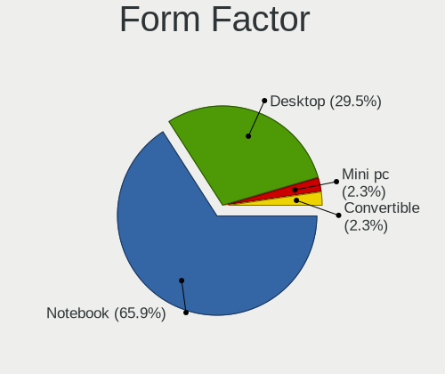
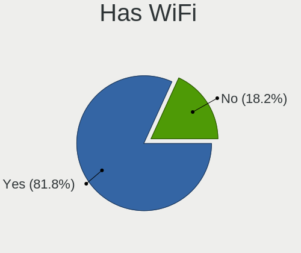
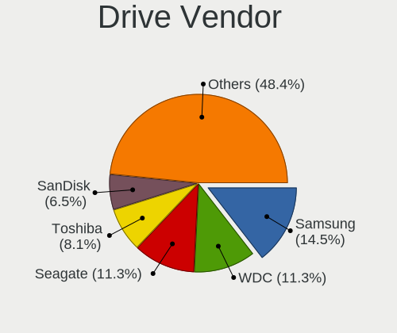
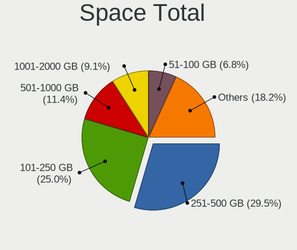
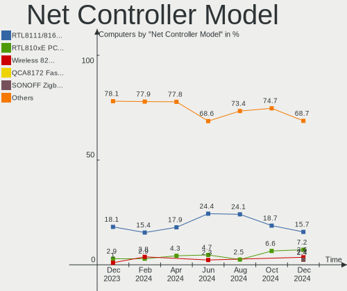
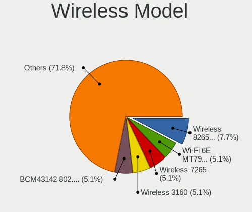
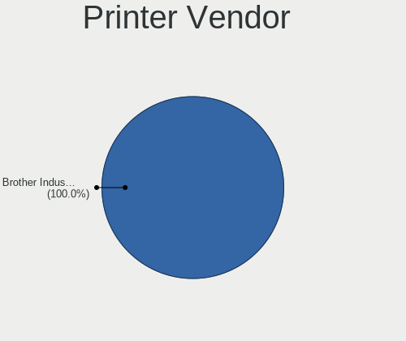
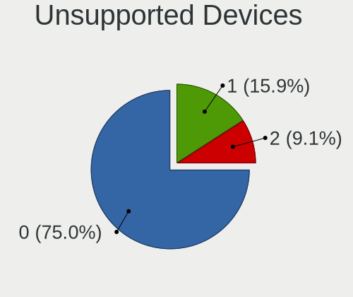

Xubuntu Hardware Trends
-----------------------

A project to identify most popular hardware characteristics and track their change
over time based on data collected by Xubuntu users at https://Linux-Hardware.org.

Anyone can contribute to the study by uploading probes of their computers by
the [hw-probe](https://github.com/linuxhw/hw-probe) tool:

    sudo -E hw-probe -all -upload

This is a report for all computer types. See also reports for [desktops](/Dist/Xubuntu/Desktop/README.md) and [notebooks](/Dist/Xubuntu/Notebook/README.md).

Full-feature report is available here: https://linux-hardware.org/?view=trends

Period: Apr, 2021.

Contents
--------

- [ OS                       ](#os)
- [ OS Family                ](#os-family)
- [ Kernel                   ](#kernel)
- [ Kernel Family            ](#kernel-family)
- [ Kernel Major Ver.        ](#kernel-major-ver)
- [ Arch                     ](#arch)
- [ DE                       ](#de)
- [ Display Server           ](#display-server)
- [ Display Manager          ](#display-manager)
- [ OS Lang                  ](#os-lang)
- [ Boot Mode                ](#boot-mode)
- [ Filesystem               ](#filesystem)
- [ Part. scheme             ](#part-scheme)
- [ Dual Boot with Linux/BSD ](#dual-boot-with-linux/bsd)
- [ Dual Boot (Win)          ](#dual-boot-win)
- [ Country                  ](#country)
- [ City                     ](#city)
- [ Vendor                   ](#vendor)
- [ Model                    ](#model)
- [ Model Family             ](#model-family)
- [ MFG Year                 ](#mfg-year)
- [ Form Factor              ](#form-factor)
- [ Secure Boot              ](#secure-boot)
- [ Coreboot                 ](#coreboot)
- [ RAM Size                 ](#ram-size)
- [ RAM Used                 ](#ram-used)
- [ Has CD-ROM               ](#has-cd-rom)
- [ Total Drives             ](#total-drives)
- [ Has Ethernet             ](#has-ethernet)
- [ Has WiFi                 ](#has-wifi)
- [ Has Bluetooth            ](#has-bluetooth)
- [ Drive Vendor             ](#drive-vendor)
- [ Drive Model              ](#drive-model)
- [ HDD Vendor               ](#hdd-vendor)
- [ SSD Vendor               ](#ssd-vendor)
- [ Drive Kind               ](#drive-kind)
- [ Drive Connector          ](#drive-connector)
- [ Drive Size               ](#drive-size)
- [ Space Total              ](#space-total)
- [ Space Used               ](#space-used)
- [ Malfunc. Drives          ](#malfunc-drives)
- [ Malfunc. Drive Vendor    ](#malfunc-drive-vendor)
- [ Malfunc. HDD Vendor      ](#malfunc-hdd-vendor)
- [ Malfunc. Drive Kind      ](#malfunc-drive-kind)
- [ Failed Drives            ](#failed-drives)
- [ Failed Drive Vendor      ](#failed-drive-vendor)
- [ Drive Status             ](#drive-status)
- [ Storage Vendor           ](#storage-vendor)
- [ Storage Model            ](#storage-model)
- [ Storage Kind             ](#storage-kind)
- [ CPU Vendor               ](#cpu-vendor)
- [ CPU Model                ](#cpu-model)
- [ CPU Model Family         ](#cpu-model-family)
- [ CPU Cores                ](#cpu-cores)
- [ CPU Sockets              ](#cpu-sockets)
- [ CPU Threads              ](#cpu-threads)
- [ CPU Op-Modes             ](#cpu-op-modes)
- [ CPU Microcode            ](#cpu-microcode)
- [ CPU Microarch            ](#cpu-microarch)
- [ GPU Vendor               ](#gpu-vendor)
- [ GPU Model                ](#gpu-model)
- [ GPU Combo                ](#gpu-combo)
- [ GPU Driver               ](#gpu-driver)
- [ GPU Memory               ](#gpu-memory)
- [ Monitor Vendor           ](#monitor-vendor)
- [ Monitor Model            ](#monitor-model)
- [ Monitor Resolution       ](#monitor-resolution)
- [ Monitor Diagonal         ](#monitor-diagonal)
- [ Monitor Width            ](#monitor-width)
- [ Aspect Ratio             ](#aspect-ratio)
- [ Monitor Area             ](#monitor-area)
- [ Pixel Density            ](#pixel-density)
- [ Multiple Monitors        ](#multiple-monitors)
- [ Net Controller Vendor    ](#net-controller-vendor)
- [ Net Controller Model     ](#net-controller-model)
- [ Wireless Vendor          ](#wireless-vendor)
- [ Wireless Model           ](#wireless-model)
- [ Ethernet Vendor          ](#ethernet-vendor)
- [ Ethernet Model           ](#ethernet-model)
- [ Net Controller Kind      ](#net-controller-kind)
- [ Used Controller          ](#used-controller)
- [ NICs                     ](#nics)
- [ IPv6                     ](#ipv6)
- [ Memory Vendor            ](#memory-vendor)
- [ Memory Model             ](#memory-model)
- [ Memory Kind              ](#memory-kind)
- [ Memory Form Factor       ](#memory-form-factor)
- [ Memory Size              ](#memory-size)
- [ Memory Speed             ](#memory-speed)
- [ Sound Vendor             ](#sound-vendor)
- [ Sound Model              ](#sound-model)
- [ Camera Vendor            ](#camera-vendor)
- [ Camera Model             ](#camera-model)
- [ Fingerprint Vendor       ](#fingerprint-vendor)
- [ Fingerprint Model        ](#fingerprint-model)
- [ Chipcard Vendor          ](#chipcard-vendor)
- [ Chipcard Model           ](#chipcard-model)
- [ Printer Vendor           ](#printer-vendor)
- [ Printer Model            ](#printer-model)
- [ Scanner Vendor           ](#scanner-vendor)
- [ Scanner Model            ](#scanner-model)
- [ Bluetooth Vendor         ](#bluetooth-vendor)
- [ Bluetooth Model          ](#bluetooth-model)
- [ Unsupported Devices      ](#unsupported-devices)
- [ Unsupported Device Types ](#unsupported-device-types)

OS
--

Installed operating systems

| Name          | Computers | Percent |
|---------------|-----------|---------|
| Xubuntu 20.04 | 83        | 67.48%  |
| Xubuntu 18.04 | 22        | 17.89%  |
| Xubuntu 20.10 | 12        | 9.76%   |
| Xubuntu 21.04 | 4         | 3.25%   |
| Xubuntu 19.10 | 1         | 0.81%   |
| Xubuntu 16.04 | 1         | 0.81%   |

OS Family
---------

OS without a version

| Name    | Computers | Percent |
|---------|-----------|---------|
| Xubuntu | 123       | 100%    |

Kernel
------

Version of the Linux kernel

| Version                | Computers | Percent |
|------------------------|-----------|---------|
| 5.4.0-72-generic       | 19        | 15.45%  |
| 5.4.0-70-generic       | 16        | 13.01%  |
| 5.8.0-48-generic       | 13        | 10.57%  |
| 5.8.0-50-generic       | 8         | 6.5%    |
| 5.8.0-49-generic       | 5         | 4.07%   |
| 5.8.0-48-lowlatency    | 4         | 3.25%   |
| 5.4.0-71-lowlatency    | 4         | 3.25%   |
| 5.4.0-71-generic       | 4         | 3.25%   |
| 5.4.0-70-lowlatency    | 4         | 3.25%   |
| 4.15.0-140-generic     | 4         | 3.25%   |
| 5.8.0-50-lowlatency    | 3         | 2.44%   |
| 5.4.0-72-lowlatency    | 3         | 2.44%   |
| 4.15.0-142-generic     | 3         | 2.44%   |
| 5.8.0-45-generic       | 2         | 1.63%   |
| 5.11.0-16-generic      | 2         | 1.63%   |
| 5.8.0-49-lowlatency    | 1         | 0.81%   |
| 5.8.0-45-lowlatency    | 1         | 0.81%   |
| 5.8.0-43-lowlatency    | 1         | 0.81%   |
| 5.8.0-36-generic       | 1         | 0.81%   |
| 5.8.0-1021-raspi       | 1         | 0.81%   |
| 5.4.0-66-generic       | 1         | 0.81%   |
| 5.4.0-65-lowlatency    | 1         | 0.81%   |
| 5.4.0-65-generic       | 1         | 0.81%   |
| 5.4.0-60-generic       | 1         | 0.81%   |
| 5.4.0-58-generic       | 1         | 0.81%   |
| 5.4.0-52-generic       | 1         | 0.81%   |
| 5.4.0-29-generic       | 1         | 0.81%   |
| 5.3.0-64-generic       | 1         | 0.81%   |
| 5.3.0-62-generic       | 1         | 0.81%   |
| 5.3.0-40-generic       | 1         | 0.81%   |
| 5.12.0-rc6             | 1         | 0.81%   |
| 5.11.16-xanmod1        | 1         | 0.81%   |
| 5.11.16-051116-generic | 1         | 0.81%   |
| 5.11.11-xanmod1        | 1         | 0.81%   |
| 5.11.11                | 1         | 0.81%   |
| 5.11.0-13-generic      | 1         | 0.81%   |
| 5.10.27-051027-generic | 1         | 0.81%   |
| 5.10.11-051011-generic | 1         | 0.81%   |
| 5.0.2-050002-generic   | 1         | 0.81%   |
| 4.16.18-galliumos      | 1         | 0.81%   |
| 4.15.0-45-generic      | 1         | 0.81%   |
| 4.15.0-36-generic      | 1         | 0.81%   |
| 4.15.0-141-generic     | 1         | 0.81%   |
| 4.15.0-140-lowlatency  | 1         | 0.81%   |

Kernel Family
-------------

Linux kernel without a distro release

| Version | Computers | Percent |
|---------|-----------|---------|
| 5.4.0   | 57        | 46.34%  |
| 5.8.0   | 40        | 32.52%  |
| 4.15.0  | 11        | 8.94%   |
| 5.3.0   | 3         | 2.44%   |
| 5.11.0  | 3         | 2.44%   |
| 5.11.16 | 2         | 1.63%   |
| 5.11.11 | 2         | 1.63%   |
| 5.12.0  | 1         | 0.81%   |
| 5.10.27 | 1         | 0.81%   |
| 5.10.11 | 1         | 0.81%   |
| 5.0.2   | 1         | 0.81%   |
| 4.16.18 | 1         | 0.81%   |

Kernel Major Ver.
-----------------

Linux kernel major version

| Version | Computers | Percent |
|---------|-----------|---------|
| 5.4     | 57        | 46.34%  |
| 5.8     | 40        | 32.52%  |
| 4.15    | 11        | 8.94%   |
| 5.11    | 7         | 5.69%   |
| 5.3     | 3         | 2.44%   |
| 5.10    | 2         | 1.63%   |
| 5.12    | 1         | 0.81%   |
| 5.0     | 1         | 0.81%   |
| 4.16    | 1         | 0.81%   |

Arch
----

OS architecture (x86_64, i586, etc.)

| Name    | Computers | Percent |
|---------|-----------|---------|
| x86_64  | 109       | 88.62%  |
| i686    | 13        | 10.57%  |
| aarch64 | 1         | 0.81%   |

DE
--

Desktop Environment

| Name     | Computers | Percent |
|----------|-----------|---------|
| XFCE     | 120       | 97.56%  |
| Cinnamon | 2         | 1.63%   |
| GNOME    | 1         | 0.81%   |

Display Server
--------------

X11 or Wayland

| Name | Computers | Percent |
|------|-----------|---------|
| X11  | 122       | 99.19%  |
| Tty  | 1         | 0.81%   |

Display Manager
---------------

SDDM, LightDM, etc.

| Name    | Computers | Percent |
|---------|-----------|---------|
| Unknown | 76        | 61.79%  |
| TDM     | 46        | 37.4%   |
| XDM     | 1         | 0.81%   |

OS Lang
-------

Language

| Lang  | Computers | Percent |
|-------|-----------|---------|
| en_US | 36        | 29.27%  |
| fr_FR | 26        | 21.14%  |
| de_DE | 16        | 13.01%  |
| ru_RU | 5         | 4.07%   |
| pt_BR | 5         | 4.07%   |
| it_IT | 5         | 4.07%   |
| en_GB | 5         | 4.07%   |
| C     | 4         | 3.25%   |
| en_CA | 3         | 2.44%   |
| id_ID | 2         | 1.63%   |
| hu_HU | 2         | 1.63%   |
| es_ES | 2         | 1.63%   |
| en_ZA | 2         | 1.63%   |
| zh_CN | 1         | 0.81%   |
| tr_TR | 1         | 0.81%   |
| pl_PL | 1         | 0.81%   |
| nl_NL | 1         | 0.81%   |
| lv_LV | 1         | 0.81%   |
| ja_JP | 1         | 0.81%   |
| es_MX | 1         | 0.81%   |
| es_AR | 1         | 0.81%   |
| en_AU | 1         | 0.81%   |
| de_AT | 1         | 0.81%   |

Boot Mode
---------

EFI or BIOS

| Mode | Computers | Percent |
|------|-----------|---------|
| BIOS | 86        | 69.92%  |
| EFI  | 37        | 30.08%  |

Filesystem
----------

Type of filesystem

| Type    | Computers | Percent |
|---------|-----------|---------|
| Ext4    | 116       | 94.31%  |
| Overlay | 4         | 3.25%   |
| Btrfs   | 2         | 1.63%   |
| Ext2    | 1         | 0.81%   |

Part. scheme
------------

Scheme of partitioning

| Type    | Computers | Percent |
|---------|-----------|---------|
| Unknown | 76        | 61.79%  |
| GPT     | 27        | 21.95%  |
| MBR     | 20        | 16.26%  |

Dual Boot with Linux/BSD
------------------------

Hosting more than one Linux/BSD

| Dual boot | Computers | Percent |
|-----------|-----------|---------|
| No        | 109       | 88.62%  |
| Yes       | 14        | 11.38%  |

Dual Boot (Win)
---------------

Hosting Linux and Windows

| Dual boot | Computers | Percent |
|-----------|-----------|---------|
| No        | 93        | 75.61%  |
| Yes       | 30        | 24.39%  |

Country
-------

Geographic location (country)

| Country      | Computers | Percent |
|--------------|-----------|---------|
| France       | 26        | 21.14%  |
| Germany      | 19        | 15.45%  |
| USA          | 15        | 12.2%   |
| Italy        | 7         | 5.69%   |
| UK           | 5         | 4.07%   |
| Canada       | 5         | 4.07%   |
| Brazil       | 5         | 4.07%   |
| Russia       | 4         | 3.25%   |
| Chile        | 4         | 3.25%   |
| Spain        | 3         | 2.44%   |
| Hungary      | 3         | 2.44%   |
| South Africa | 2         | 1.63%   |
| Netherlands  | 2         | 1.63%   |
| Indonesia    | 2         | 1.63%   |
| Finland      | 2         | 1.63%   |
| China        | 2         | 1.63%   |
| Venezuela    | 1         | 0.81%   |
| Ukraine      | 1         | 0.81%   |
| Turkey       | 1         | 0.81%   |
| Switzerland  | 1         | 0.81%   |
| Poland       | 1         | 0.81%   |
| Peru         | 1         | 0.81%   |
| Norway       | 1         | 0.81%   |
| Mexico       | 1         | 0.81%   |
| Latvia       | 1         | 0.81%   |
| Japan        | 1         | 0.81%   |
| Iran         | 1         | 0.81%   |
| Czechia      | 1         | 0.81%   |
| Cabo Verde   | 1         | 0.81%   |
| Belgium      | 1         | 0.81%   |
| Austria      | 1         | 0.81%   |
| Australia    | 1         | 0.81%   |
| Argentina    | 1         | 0.81%   |

City
----

Geographic location (city)

| City                       | Computers | Percent |
|----------------------------|-----------|---------|
| Hanover                    | 3         | 2.44%   |
| Paris                      | 2         | 1.63%   |
| Jakarta                    | 2         | 1.63%   |
| Budapest                   | 2         | 1.63%   |
| Ōtsu                      | 1         | 0.81%   |
| York                       | 1         | 0.81%   |
| Wrexham                    | 1         | 0.81%   |
| Worcester                  | 1         | 0.81%   |
| Wilrijk                    | 1         | 0.81%   |
| Werder                     | 1         | 0.81%   |
| Warwick                    | 1         | 0.81%   |
| Warsaw                     | 1         | 0.81%   |
| Voskresensk                | 1         | 0.81%   |
| Volta Redonda              | 1         | 0.81%   |
| Vlaardingen                | 1         | 0.81%   |
| Vizille                    | 1         | 0.81%   |
| Vienna                     | 1         | 0.81%   |
| Verdun                     | 1         | 0.81%   |
| Vantaa                     | 1         | 0.81%   |
| Utrera                     | 1         | 0.81%   |
| Ulm                        | 1         | 0.81%   |
| Ufa                        | 1         | 0.81%   |
| Trieste                    | 1         | 0.81%   |
| Toronto                    | 1         | 0.81%   |
| Tehran                     | 1         | 0.81%   |
| Tarbes                     | 1         | 0.81%   |
| São Paulo                 | 1         | 0.81%   |
| Sydney                     | 1         | 0.81%   |
| Strasbourg                 | 1         | 0.81%   |
| Stabekk                    | 1         | 0.81%   |
| Springfield                | 1         | 0.81%   |
| Southminster               | 1         | 0.81%   |
| Sochi                      | 1         | 0.81%   |
| Seattle                    | 1         | 0.81%   |
| Schwalbach am Taunus       | 1         | 0.81%   |
| Santiago                   | 1         | 0.81%   |
| Santa Isabel do Para       | 1         | 0.81%   |
| San Miguel                 | 1         | 0.81%   |
| San Cristóbal             | 1         | 0.81%   |
| Saint-Martin-de-Valgalgues | 1         | 0.81%   |
| Saint-Marcellin-en-Forez   | 1         | 0.81%   |
| Rosenheim                  | 1         | 0.81%   |
| Ronchin                    | 1         | 0.81%   |
| Rome                       | 1         | 0.81%   |
| Rock Hill                  | 1         | 0.81%   |
| Rio Piracicaba             | 1         | 0.81%   |
| Reims                      | 1         | 0.81%   |
| Rehoboth                   | 1         | 0.81%   |
| Pécs                      | 1         | 0.81%   |
| Praia                      | 1         | 0.81%   |
| Prague                     | 1         | 0.81%   |
| Pottstown                  | 1         | 0.81%   |
| Perpignan                  | 1         | 0.81%   |
| Parsberg                   | 1         | 0.81%   |
| Palis                      | 1         | 0.81%   |
| Paderborn                  | 1         | 0.81%   |
| Opfikon                    | 1         | 0.81%   |
| Oldenburg                  | 1         | 0.81%   |
| Nunoa                      | 1         | 0.81%   |
| New York                   | 1         | 0.81%   |

Vendor
------

Motherboard manufacturer

| Name                | Computers | Percent |
|---------------------|-----------|---------|
| Hewlett-Packard     | 17        | 13.82%  |
| ASUSTek Computer    | 16        | 13.01%  |
| Lenovo              | 15        | 12.2%   |
| Dell                | 11        | 8.94%   |
| Acer                | 11        | 8.94%   |
| MSI                 | 9         | 7.32%   |
| Gigabyte Technology | 7         | 5.69%   |
| ASRock              | 6         | 4.88%   |
| Packard Bell        | 2         | 1.63%   |
| Intel               | 2         | 1.63%   |
| Fujitsu Siemens     | 2         | 1.63%   |
| Fujitsu             | 2         | 1.63%   |
| Foxconn             | 2         | 1.63%   |
| Clevo               | 2         | 1.63%   |
| Apple               | 2         | 1.63%   |
| Toshiba             | 1         | 0.81%   |
| Sony                | 1         | 0.81%   |
| Semp Toshiba        | 1         | 0.81%   |
| Samsung Electronics | 1         | 0.81%   |
| Pegatron            | 1         | 0.81%   |
| Medion              | 1         | 0.81%   |
| Jumper              | 1         | 0.81%   |
| IBM                 | 1         | 0.81%   |
| HUAWEI              | 1         | 0.81%   |
| Huanan              | 1         | 0.81%   |
| Google              | 1         | 0.81%   |
| Gateway             | 1         | 0.81%   |
| Coradir             | 1         | 0.81%   |
| Chuwi               | 1         | 0.81%   |
| Biostar             | 1         | 0.81%   |
| ATI                 | 1         | 0.81%   |
| Unknown             | 1         | 0.81%   |

Model
-----

Motherboard model

| Name                                     | Computers | Percent |
|------------------------------------------|-----------|---------|
| ASUS T100HAN                             | 2         | 1.63%   |
| ASUS All Series                          | 2         | 1.63%   |
| Toshiba Satellite Pro A40                | 1         | 0.81%   |
| Sony VPCF236FM                           | 1         | 0.81%   |
| Semp Toshiba STI                         | 1         | 0.81%   |
| Samsung 3570R/370R/470R/450R/510R        | 1         | 0.81%   |
| Pegatron p7-1030                         | 1         | 0.81%   |
| Packard Bell oneTwo S3280                | 1         | 0.81%   |
| Packard Bell EasyNote_BU45               | 1         | 0.81%   |
| MSI MS-7B89                              | 1         | 0.81%   |
| MSI MS-7758                              | 1         | 0.81%   |
| MSI MS-7693                              | 1         | 0.81%   |
| MSI MS-7599                              | 1         | 0.81%   |
| MSI MS-7519                              | 1         | 0.81%   |
| MSI GS63 7RD                             | 1         | 0.81%   |
| MSI GL62M 7REX                           | 1         | 0.81%   |
| MSI FZ079AA-ABF a6625fr                  | 1         | 0.81%   |
| MSI CR61 2M/CX61 2OC/CX61 2OD            | 1         | 0.81%   |
| Medion E7216                             | 1         | 0.81%   |
| Lenovo ZHAOYANG K43c-80 81HX             | 1         | 0.81%   |
| Lenovo V15-ADA 82C7                      | 1         | 0.81%   |
| Lenovo ThinkPad X230 2320JPU             | 1         | 0.81%   |
| Lenovo ThinkPad X200T 7453CTO            | 1         | 0.81%   |
| Lenovo ThinkPad X1 Carbon 7th 20R1001TUS | 1         | 0.81%   |
| Lenovo ThinkPad X1 Carbon 7th 20QD001VUS | 1         | 0.81%   |
| Lenovo ThinkPad W520 4284A95             | 1         | 0.81%   |
| Lenovo ThinkPad T14 Gen 1 20S0004NGE     | 1         | 0.81%   |
| Lenovo ThinkPad R61 8934F9U              | 1         | 0.81%   |
| Lenovo ThinkPad L14 Gen 1 20U2S1TL00     | 1         | 0.81%   |
| Lenovo ThinkPad E495 20NEA001GE          | 1         | 0.81%   |
| Lenovo ThinkCentre M93p 10A8S45S00       | 1         | 0.81%   |
| Lenovo ThinkCentre A70 7844H9G           | 1         | 0.81%   |
| Lenovo G50-80 80L0                       | 1         | 0.81%   |
| Lenovo B5400 s20278Q                     | 1         | 0.81%   |
| Jumper EZbook                            | 1         | 0.81%   |
| Intel DH61WW AAG23116-203                | 1         | 0.81%   |
| Intel DG31PR AAD97573-302                | 1         | 0.81%   |
| IBM System x3300 M4 -[7382K2G]           | 1         | 0.81%   |
| HUAWEI KPL-W0X                           | 1         | 0.81%   |
| Huanan Thurley                           | 1         | 0.81%   |
| HP t620 Quad Core TC                     | 1         | 0.81%   |
| HP Stream Notebook PC 13                 | 1         | 0.81%   |
| HP Spectre x360 Convertible 13-aw0xxx    | 1         | 0.81%   |
| HP ProLiant ML110 G4                     | 1         | 0.81%   |
| HP ProLiant DL380p Gen8                  | 1         | 0.81%   |
| HP ProDesk 405 G6 Desktop Mini PC        | 1         | 0.81%   |
| HP Pavilion zd8000 (PW944EA#AK8)         | 1         | 0.81%   |
| HP Pavilion dv6500                       | 1         | 0.81%   |
| HP Pavilion dv6                          | 1         | 0.81%   |
| HP OMEN by HP Laptop 15-ce0xx            | 1         | 0.81%   |
| HP EliteBook Folio 9470m                 | 1         | 0.81%   |
| HP EG157AA-ABF m1260.fr                  | 1         | 0.81%   |
| HP Compaq Pro 6300 SFF                   | 1         | 0.81%   |
| HP Compaq 6530b (GB974ET#ABF)            | 1         | 0.81%   |
| HP Compaq 6005 Pro MT PC                 | 1         | 0.81%   |
| HP 550                                   | 1         | 0.81%   |
| HP 15                                    | 1         | 0.81%   |
| Google Wolf                              | 1         | 0.81%   |
| Gigabyte Z68MA-D2H-B3                    | 1         | 0.81%   |
| Gigabyte X99-UD4-CF                      | 1         | 0.81%   |

Model Family
------------

Motherboard model prefix

| Name                    | Computers | Percent |
|-------------------------|-----------|---------|
| Lenovo ThinkPad         | 9         | 7.32%   |
| Acer Aspire             | 9         | 7.32%   |
| Dell OptiPlex           | 4         | 3.25%   |
| HP Pavilion             | 3         | 2.44%   |
| HP Compaq               | 3         | 2.44%   |
| Dell Latitude           | 3         | 2.44%   |
| Lenovo ThinkCentre      | 2         | 1.63%   |
| HP ProLiant             | 2         | 1.63%   |
| Fujitsu Siemens ESPRIMO | 2         | 1.63%   |
| Fujitsu ESPRIMO         | 2         | 1.63%   |
| ASUS T100HAN            | 2         | 1.63%   |
| ASUS All                | 2         | 1.63%   |
| Toshiba Satellite       | 1         | 0.81%   |
| Sony VPCF236FM          | 1         | 0.81%   |
| Semp Toshiba STI        | 1         | 0.81%   |
| Samsung 3570R           | 1         | 0.81%   |
| Pegatron p7-1030        | 1         | 0.81%   |
| Packard Bell oneTwo     | 1         | 0.81%   |
| Packard Bell EasyNote   | 1         | 0.81%   |
| MSI MS-7B89             | 1         | 0.81%   |
| MSI MS-7758             | 1         | 0.81%   |
| MSI MS-7693             | 1         | 0.81%   |
| MSI MS-7599             | 1         | 0.81%   |
| MSI MS-7519             | 1         | 0.81%   |
| MSI GS63                | 1         | 0.81%   |
| MSI GL62M               | 1         | 0.81%   |
| MSI FZ079AA-ABF         | 1         | 0.81%   |
| MSI CR61                | 1         | 0.81%   |
| Medion E7216            | 1         | 0.81%   |
| Lenovo ZHAOYANG         | 1         | 0.81%   |
| Lenovo V15-ADA          | 1         | 0.81%   |
| Lenovo G50-80           | 1         | 0.81%   |
| Lenovo B5400            | 1         | 0.81%   |
| Jumper EZbook           | 1         | 0.81%   |
| Intel DH61WW            | 1         | 0.81%   |
| Intel DG31PR            | 1         | 0.81%   |
| IBM System              | 1         | 0.81%   |
| HUAWEI KPL-W0X          | 1         | 0.81%   |
| Huanan Thurley          | 1         | 0.81%   |
| HP t620                 | 1         | 0.81%   |
| HP Stream               | 1         | 0.81%   |
| HP Spectre              | 1         | 0.81%   |
| HP ProDesk              | 1         | 0.81%   |
| HP OMEN                 | 1         | 0.81%   |
| HP EliteBook            | 1         | 0.81%   |
| HP EG157AA-ABF          | 1         | 0.81%   |
| HP 550                  | 1         | 0.81%   |
| HP 15                   | 1         | 0.81%   |
| Google Wolf             | 1         | 0.81%   |
| Gigabyte Z68MA-D2H-B3   | 1         | 0.81%   |
| Gigabyte X99-UD4-CF     | 1         | 0.81%   |
| Gigabyte X570           | 1         | 0.81%   |
| Gigabyte H270-HD3       | 1         | 0.81%   |
| Gigabyte G31M-ES2C      | 1         | 0.81%   |
| Gigabyte B450M          | 1         | 0.81%   |
| Gigabyte A320M-S2H      | 1         | 0.81%   |
| Gateway NV57H           | 1         | 0.81%   |
| Foxconn Pro3500         | 1         | 0.81%   |
| Foxconn Pro             | 1         | 0.81%   |
| Dell XPS                | 1         | 0.81%   |

MFG Year
--------

Motherboard manufacture year

| Year    | Computers | Percent |
|---------|-----------|---------|
| 2013    | 14        | 11.38%  |
| 2011    | 13        | 10.57%  |
| 2018    | 11        | 8.94%   |
| 2020    | 10        | 8.13%   |
| 2015    | 9         | 7.32%   |
| 2012    | 9         | 7.32%   |
| 2008    | 9         | 7.32%   |
| 2019    | 6         | 4.88%   |
| 2010    | 6         | 4.88%   |
| 2009    | 6         | 4.88%   |
| 2021    | 5         | 4.07%   |
| 2014    | 5         | 4.07%   |
| 2007    | 5         | 4.07%   |
| 2016    | 4         | 3.25%   |
| 2017    | 3         | 2.44%   |
| 2006    | 3         | 2.44%   |
| 2005    | 3         | 2.44%   |
| 2003    | 1         | 0.81%   |
| Unknown | 1         | 0.81%   |

Form Factor
-----------

Physical design of the computer

| Name           | Computers | Percent |
|----------------|-----------|---------|
| Notebook       | 64        | 52.03%  |
| Desktop        | 52        | 42.28%  |
| Server         | 2         | 1.63%   |
| System on chip | 1         | 0.81%   |
| Tablet         | 1         | 0.81%   |
| Convertible    | 1         | 0.81%   |
| Mini pc        | 1         | 0.81%   |
| All in one     | 1         | 0.81%   |

Secure Boot
-----------

Enabled or disabled

| State    | Computers | Percent |
|----------|-----------|---------|
| Disabled | 120       | 97.56%  |
| Enabled  | 3         | 2.44%   |

Coreboot
--------

Have coreboot on board

| Used | Computers | Percent |
|------|-----------|---------|
| No   | 122       | 99.19%  |
| Yes  | 1         | 0.81%   |

RAM Size
--------

Total RAM memory

| Size in GB  | Computers | Percent |
|-------------|-----------|---------|
| 3.01-4.0    | 31        | 25.2%   |
| 4.01-8.0    | 21        | 17.07%  |
| 8.01-16.0   | 19        | 15.45%  |
| 16.01-24.0  | 17        | 13.82%  |
| 1.01-2.0    | 11        | 8.94%   |
| 32.01-64.0  | 8         | 6.5%    |
| 2.01-3.0    | 8         | 6.5%    |
| 0.51-1.0    | 5         | 4.07%   |
| 24.01-32.0  | 2         | 1.63%   |
| 64.01-256.0 | 1         | 0.81%   |

RAM Used
--------

Used RAM memory

| Used GB    | Computers | Percent |
|------------|-----------|---------|
| 1.01-2.0   | 45        | 36.59%  |
| 2.01-3.0   | 24        | 19.51%  |
| 0.51-1.0   | 22        | 17.89%  |
| 4.01-8.0   | 18        | 14.63%  |
| 3.01-4.0   | 6         | 4.88%   |
| 0.01-0.5   | 4         | 3.25%   |
| 8.01-16.0  | 3         | 2.44%   |
| 32.01-64.0 | 1         | 0.81%   |

Has CD-ROM
----------

Has CD-ROM on board

| Presented | Computers | Percent |
|-----------|-----------|---------|
| No        | 72        | 58.54%  |
| Yes       | 51        | 41.46%  |

Total Drives
------------

Number of drives on board

| Drives | Computers | Percent |
|--------|-----------|---------|
| 1      | 76        | 61.79%  |
| 2      | 28        | 22.76%  |
| 3      | 8         | 6.5%    |
| 4      | 6         | 4.88%   |
| 5      | 3         | 2.44%   |
| 0      | 2         | 1.63%   |

Has Ethernet
------------

Has Ethernet on board

| Presented | Computers | Percent |
|-----------|-----------|---------|
| Yes       | 113       | 91.87%  |
| No        | 10        | 8.13%   |

Has WiFi
--------

Has WiFi module

| Presented | Computers | Percent |
|-----------|-----------|---------|
| Yes       | 90        | 73.17%  |
| No        | 33        | 26.83%  |

Has Bluetooth
-------------

Has Bluetooth module

| Presented | Computers | Percent |
|-----------|-----------|---------|
| No        | 74        | 60.16%  |
| Yes       | 49        | 39.84%  |

Drive Vendor
------------

Hard drive vendors

| Vendor              | Computers | Drives | Percent |
|---------------------|-----------|--------|---------|
| WDC                 | 29        | 35     | 17.68%  |
| Seagate             | 28        | 31     | 17.07%  |
| Samsung Electronics | 28        | 35     | 17.07%  |
| Toshiba             | 12        | 12     | 7.32%   |
| Sandisk             | 9         | 9      | 5.49%   |
| Unknown             | 7         | 8      | 4.27%   |
| Hitachi             | 6         | 6      | 3.66%   |
| Kingston            | 5         | 6      | 3.05%   |
| Crucial             | 3         | 3      | 1.83%   |
| A-DATA Technology   | 3         | 3      | 1.83%   |
| XPG                 | 2         | 2      | 1.22%   |
| SK Hynix            | 2         | 2      | 1.22%   |
| Patriot             | 2         | 2      | 1.22%   |
| MAXTOR              | 2         | 3      | 1.22%   |
| Intenso             | 2         | 2      | 1.22%   |
| IBM/Hitachi         | 2         | 2      | 1.22%   |
| HGST                | 2         | 2      | 1.22%   |
| Fujitsu             | 2         | 2      | 1.22%   |
| Vaseky              | 1         | 1      | 0.61%   |
| Team                | 1         | 1      | 0.61%   |
| PNY                 | 1         | 1      | 0.61%   |
| PLEXTOR             | 1         | 1      | 0.61%   |
| OCZ                 | 1         | 1      | 0.61%   |
| Netac               | 1         | 1      | 0.61%   |
| LITEONIT            | 1         | 1      | 0.61%   |
| KingDian            | 1         | 1      | 0.61%   |
| Kingchuxing         | 1         | 1      | 0.61%   |
| INTEL SS            | 1         | 1      | 0.61%   |
| Intel               | 1         | 1      | 0.61%   |
| Hewlett-Packard     | 1         | 1      | 0.61%   |
| DREVO               | 1         | 1      | 0.61%   |
| Corsair             | 1         | 1      | 0.61%   |
| China               | 1         | 1      | 0.61%   |
| BIWIN               | 1         | 1      | 0.61%   |
| Apple               | 1         | 1      | 0.61%   |
| ACASIS              | 1         | 1      | 0.61%   |

Drive Model
-----------

Hard drive models

| Model                               | Computers | Percent |
|-------------------------------------|-----------|---------|
| Seagate ST9750420AS 752GB           | 3         | 1.68%   |
| SanDisk SDSSDA240G 240GB            | 3         | 1.68%   |
| WDC WDS500G2B0C-00PXH0 500GB        | 2         | 1.12%   |
| WDC WD80EFAX-68KNBN0 8TB            | 2         | 1.12%   |
| WDC WD5000LPVX-22V0TT0 500GB        | 2         | 1.12%   |
| Toshiba MK7559GSXP 752GB            | 2         | 1.12%   |
| Seagate ST9120822AS 120GB           | 2         | 1.12%   |
| Seagate ST500LM012 HN-M500MBB 500GB | 2         | 1.12%   |
| Seagate ST2000LX001-1RG174 2TB      | 2         | 1.12%   |
| Samsung SSD 860 EVO 500GB           | 2         | 1.12%   |
| Samsung SSD 850 EVO 500GB           | 2         | 1.12%   |
| Samsung HD204UI 2TB                 | 2         | 1.12%   |
| Patriot Burst 120GB SSD             | 2         | 1.12%   |
| XPG NVMe SSD Drive 2TB              | 1         | 0.56%   |
| XPG NVMe SSD Drive 1024GB           | 1         | 0.56%   |
| WDC WDS250G2B0C-00PXH0 250GB        | 1         | 0.56%   |
| WDC WDS120G2G0A-00JH30 120GB SSD    | 1         | 0.56%   |
| WDC WDS100T2B0C-00PXH0 1TB          | 1         | 0.56%   |
| WDC WD7500BPVT-80HXZT3 752GB        | 1         | 0.56%   |
| WDC WD5000LUCT-62RC2Y0 500GB        | 1         | 0.56%   |
| WDC WD5000BEVT-22ZAT0 500GB         | 1         | 0.56%   |
| WDC WD5000AZLX-75K2TA0 500GB        | 1         | 0.56%   |
| WDC WD5000AAKS-40V6A0 500GB         | 1         | 0.56%   |
| WDC WD4000FYYZ-01UL1B1 4TB          | 1         | 0.56%   |
| WDC WD3200BEKT-08PVMT1 320GB        | 1         | 0.56%   |
| WDC WD30EZRX-00MMMB0 3TB            | 1         | 0.56%   |
| WDC WD2500JS-75NCB2 250GB           | 1         | 0.56%   |
| WDC WD2500JS-60MHB1 250GB           | 1         | 0.56%   |
| WDC WD2500AAJS-60M0A0 250GB         | 1         | 0.56%   |
| WDC WD2500AAJS-00L7A0 250GB         | 1         | 0.56%   |
| WDC WD20PURX-64PFUY0 2TB            | 1         | 0.56%   |
| WDC WD20EARX-00PASB0 2TB            | 1         | 0.56%   |
| WDC WD20EARS-00MVWB0 2TB            | 1         | 0.56%   |
| WDC WD2003FZEX-00Z4SA0 2TB          | 1         | 0.56%   |
| WDC WD2003FZEX-00SRLA0 2TB          | 1         | 0.56%   |
| WDC WD1600BJKT-00F4T0 160GB         | 1         | 0.56%   |
| WDC WD1600AAJS-22L7A0 160GB         | 1         | 0.56%   |
| WDC WD10SPSX-08A6W 1TB              | 1         | 0.56%   |
| WDC WD10JPVX-22JC3T0 1TB            | 1         | 0.56%   |
| WDC WD10JPVX-00JC3T0 1TB            | 1         | 0.56%   |
| WDC WD10EZEX-08WN4A0 1TB            | 1         | 0.56%   |
| WDC WD10EZEX-08RKKA0 1TB            | 1         | 0.56%   |
| WDC PC SN730 SDBQNTY-1T00-1001 1TB  | 1         | 0.56%   |
| Vaseky V900/256G 256GB              | 1         | 0.56%   |
| Unknown SD/MMC/MS PRO 32GB          | 1         | 0.56%   |
| Unknown SA08G  8GB                  | 1         | 0.56%   |
| Unknown S0J38Y  64GB                | 1         | 0.56%   |
| Unknown MMC Card  7GB               | 1         | 0.56%   |
| Unknown MMC Card  32GB              | 1         | 0.56%   |
| Unknown MMC Card  128GB             | 1         | 0.56%   |
| Unknown BGND3R  32GB                | 1         | 0.56%   |
| Unknown 5WCFP  197GB                | 1         | 0.56%   |
| Toshiba TR200 480GB SSD             | 1         | 0.56%   |
| Toshiba THNSNJ256G8NY 256GB SSD     | 1         | 0.56%   |
| Toshiba MQ04ABD200 2TB              | 1         | 0.56%   |
| Toshiba MQ01ACF032 320GB            | 1         | 0.56%   |
| Toshiba MQ01ABD100M 1TB             | 1         | 0.56%   |
| Toshiba MQ01ABD100 1TB              | 1         | 0.56%   |
| Toshiba MK5061GSYN 500GB            | 1         | 0.56%   |
| Toshiba MK4025GAS 40GB              | 1         | 0.56%   |

HDD Vendor
----------

Hard disk drive vendors

| Vendor              | Computers | Drives | Percent |
|---------------------|-----------|--------|---------|
| Seagate             | 28        | 31     | 32.56%  |
| WDC                 | 24        | 29     | 27.91%  |
| Toshiba             | 10        | 10     | 11.63%  |
| Samsung Electronics | 9         | 9      | 10.47%  |
| Hitachi             | 6         | 6      | 6.98%   |
| Maxtor              | 2         | 3      | 2.33%   |
| IBM/Hitachi         | 2         | 2      | 2.33%   |
| HGST                | 2         | 2      | 2.33%   |
| Fujitsu             | 2         | 2      | 2.33%   |
| ACASIS              | 1         | 1      | 1.16%   |

SSD Vendor
----------

Solid state drive vendors

| Vendor              | Computers | Drives | Percent |
|---------------------|-----------|--------|---------|
| Samsung Electronics | 11        | 13     | 20.75%  |
| SanDisk             | 8         | 8      | 15.09%  |
| Kingston            | 5         | 5      | 9.43%   |
| Crucial             | 3         | 3      | 5.66%   |
| Toshiba             | 2         | 2      | 3.77%   |
| SK Hynix            | 2         | 2      | 3.77%   |
| Patriot             | 2         | 2      | 3.77%   |
| A-DATA Technology   | 2         | 2      | 3.77%   |
| WDC                 | 1         | 1      | 1.89%   |
| Team                | 1         | 1      | 1.89%   |
| PNY                 | 1         | 1      | 1.89%   |
| PLEXTOR             | 1         | 1      | 1.89%   |
| OCZ                 | 1         | 1      | 1.89%   |
| Netac               | 1         | 1      | 1.89%   |
| LITEONIT            | 1         | 1      | 1.89%   |
| KingDian            | 1         | 1      | 1.89%   |
| Kingchuxing         | 1         | 1      | 1.89%   |
| Intenso             | 1         | 1      | 1.89%   |
| INTEL SS            | 1         | 1      | 1.89%   |
| Intel               | 1         | 1      | 1.89%   |
| Hewlett-Packard     | 1         | 1      | 1.89%   |
| DREVO               | 1         | 1      | 1.89%   |
| Corsair             | 1         | 1      | 1.89%   |
| China               | 1         | 1      | 1.89%   |
| BIWIN               | 1         | 1      | 1.89%   |
| Apple               | 1         | 1      | 1.89%   |

Drive Kind
----------

HDD or SSD

| Kind    | Computers | Drives | Percent |
|---------|-----------|--------|---------|
| HDD     | 75        | 95     | 48.7%   |
| SSD     | 50        | 55     | 32.47%  |
| NVMe    | 20        | 23     | 12.99%  |
| MMC     | 6         | 7      | 3.9%    |
| Unknown | 3         | 3      | 1.95%   |

Drive Connector
---------------

SATA, SAS, NVMe, etc.

| Type | Computers | Drives | Percent |
|------|-----------|--------|---------|
| SATA | 108       | 149    | 78.26%  |
| NVMe | 20        | 23     | 14.49%  |
| MMC  | 6         | 7      | 4.35%   |
| SAS  | 4         | 4      | 2.9%    |

Drive Size
----------

Size of hard drive

| Size in TB | Computers | Drives | Percent |
|------------|-----------|--------|---------|
| 0.01-0.5   | 84        | 102    | 67.2%   |
| 0.51-1.0   | 22        | 24     | 17.6%   |
| 1.01-2.0   | 11        | 13     | 8.8%    |
| 3.01-4.0   | 4         | 6      | 3.2%    |
| 2.01-3.0   | 2         | 2      | 1.6%    |
| 4.01-10.0  | 2         | 3      | 1.6%    |

Space Total
-----------

Amount of disk space available on the file system

| Size in GB     | Computers | Percent |
|----------------|-----------|---------|
| 101-250        | 39        | 31.71%  |
| 251-500        | 21        | 17.07%  |
| 501-1000       | 15        | 12.2%   |
| 51-100         | 12        | 9.76%   |
| 1001-2000      | 11        | 8.94%   |
| More than 3000 | 8         | 6.5%    |
| 21-50          | 8         | 6.5%    |
| 1-20           | 6         | 4.88%   |
| 2001-3000      | 2         | 1.63%   |
| Unknown        | 1         | 0.81%   |

Space Used
----------

Amount of used disk space

| Used GB        | Computers | Percent |
|----------------|-----------|---------|
| 1-20           | 46        | 37.4%   |
| 21-50          | 23        | 18.7%   |
| 51-100         | 14        | 11.38%  |
| 101-250        | 13        | 10.57%  |
| 501-1000       | 10        | 8.13%   |
| 251-500        | 7         | 5.69%   |
| 1001-2000      | 4         | 3.25%   |
| More than 3000 | 3         | 2.44%   |
| 2001-3000      | 2         | 1.63%   |
| Unknown        | 1         | 0.81%   |

Malfunc. Drives
---------------

Drive models with a malfunction

| Model                                   | Computers | Drives | Percent |
|-----------------------------------------|-----------|--------|---------|
| WDC WD7500BPVT-80HXZT3 752GB            | 1         | 1      | 12.5%   |
| SK Hynix HFS128G39MNC-2300A 128GB SSD   | 1         | 1      | 12.5%   |
| Seagate ST9320325AS 320GB               | 1         | 1      | 12.5%   |
| Seagate ST500DM002-1BD142 500GB         | 1         | 1      | 12.5%   |
| Seagate ST1000LM049-2GH172 1TB          | 1         | 1      | 12.5%   |
| Samsung Electronics SSD PM810 2.5 128GB | 1         | 1      | 12.5%   |
| Hitachi HDT725025VLA380 250GB           | 1         | 1      | 12.5%   |
| Hitachi HDS722020ALA330 2TB             | 1         | 1      | 12.5%   |

Malfunc. Drive Vendor
---------------------

Vendors of faulty drives

| Vendor              | Computers | Drives | Percent |
|---------------------|-----------|--------|---------|
| Seagate             | 3         | 3      | 37.5%   |
| Hitachi             | 2         | 2      | 25%     |
| WDC                 | 1         | 1      | 12.5%   |
| SK Hynix            | 1         | 1      | 12.5%   |
| Samsung Electronics | 1         | 1      | 12.5%   |

Malfunc. HDD Vendor
-------------------

Vendors of faulty HDD drives

| Vendor  | Computers | Drives | Percent |
|---------|-----------|--------|---------|
| Seagate | 3         | 3      | 50%     |
| Hitachi | 2         | 2      | 33.33%  |
| WDC     | 1         | 1      | 16.67%  |

Malfunc. Drive Kind
-------------------

Kinds of faulty drives

| Kind | Computers | Drives | Percent |
|------|-----------|--------|---------|
| HDD  | 6         | 6      | 75%     |
| SSD  | 2         | 2      | 25%     |

Failed Drives
-------------

Failed drive models

Zero info for selected period =(

Failed Drive Vendor
-------------------

Failed drive vendors

Zero info for selected period =(

Drive Status
------------

Number of failed and malfunc. drives

| Status   | Computers | Drives | Percent |
|----------|-----------|--------|---------|
| Detected | 76        | 109    | 60.8%   |
| Works    | 41        | 66     | 32.8%   |
| Malfunc  | 8         | 8      | 6.4%    |

Storage Vendor
--------------

Storage controller vendors

| Vendor                           | Computers | Percent |
|----------------------------------|-----------|---------|
| Intel                            | 81        | 56.25%  |
| AMD                              | 24        | 16.67%  |
| Samsung Electronics              | 11        | 7.64%   |
| Sandisk                          | 6         | 4.17%   |
| Nvidia                           | 6         | 4.17%   |
| JMicron Technology               | 3         | 2.08%   |
| ADATA Technology                 | 3         | 2.08%   |
| Silicon Integrated Systems [SiS] | 2         | 1.39%   |
| ASMedia Technology               | 2         | 1.39%   |
| VIA Technologies                 | 1         | 0.69%   |
| Marvell Technology Group         | 1         | 0.69%   |
| LSI Logic / Symbios Logic        | 1         | 0.69%   |
| Kingston Technology Company      | 1         | 0.69%   |
| Hewlett-Packard                  | 1         | 0.69%   |
| Adaptec                          | 1         | 0.69%   |

Storage Model
-------------

Storage controller models

| Model                                                                          | Computers | Percent |
|--------------------------------------------------------------------------------|-----------|---------|
| AMD FCH SATA Controller [AHCI mode]                                            | 12        | 6.9%    |
| Samsung NVMe SSD Controller SM981/PM981/PM983                                  | 9         | 5.17%   |
| Intel NM10/ICH7 Family SATA Controller [IDE mode]                              | 6         | 3.45%   |
| Intel 8 Series/C220 Series Chipset Family 6-port SATA Controller 1 [AHCI mode] | 6         | 3.45%   |
| Intel 6 Series/C200 Series Chipset Family 6 port Desktop SATA AHCI Controller  | 6         | 3.45%   |
| Sandisk WD Blue SN550 NVMe SSD                                                 | 5         | 2.87%   |
| Intel 82801G (ICH7 Family) IDE Controller                                      | 5         | 2.87%   |
| Intel 7 Series Chipset Family 6-port SATA Controller [AHCI mode]               | 5         | 2.87%   |
| Intel 6 Series/C200 Series Chipset Family 6 port Mobile SATA AHCI Controller   | 5         | 2.87%   |
| Intel 82801IBM/IEM (ICH9M/ICH9M-E) 4 port SATA Controller [AHCI mode]          | 4         | 2.3%    |
| Intel 82801HM/HEM (ICH8M/ICH8M-E) SATA Controller [AHCI mode]                  | 4         | 2.3%    |
| Intel 82801HM/HEM (ICH8M/ICH8M-E) IDE Controller                               | 4         | 2.3%    |
| Intel 8 Series SATA Controller 1 [AHCI mode]                                   | 4         | 2.3%    |
| AMD SB7x0/SB8x0/SB9x0 SATA Controller [AHCI mode]                              | 4         | 2.3%    |
| AMD SB7x0/SB8x0/SB9x0 IDE Controller                                           | 4         | 2.3%    |
| AMD 400 Series Chipset SATA Controller                                         | 4         | 2.3%    |
| Intel HM170/QM170 Chipset SATA Controller [AHCI Mode]                          | 3         | 1.72%   |
| Intel 82801 Mobile SATA Controller [RAID mode]                                 | 3         | 1.72%   |
| Intel 7 Series/C210 Series Chipset Family 6-port SATA Controller [AHCI mode]   | 3         | 1.72%   |
| Intel 5 Series/3400 Series Chipset 4 port SATA AHCI Controller                 | 3         | 1.72%   |
| Intel 200 Series PCH SATA controller [AHCI mode]                               | 3         | 1.72%   |
| ADATA XPG SX8200 Pro PCIe Gen3x4 M.2 2280 Solid State Drive                    | 3         | 1.72%   |
| Silicon Integrated Systems [SiS] 5513 IDE Controller                           | 2         | 1.15%   |
| Nvidia MCP79 AHCI Controller                                                   | 2         | 1.15%   |
| Nvidia MCP51 Serial ATA Controller                                             | 2         | 1.15%   |
| Nvidia MCP51 IDE                                                               | 2         | 1.15%   |
| JMicron JMB368 IDE controller                                                  | 2         | 1.15%   |
| Intel Q170/Q150/B150/H170/H110/Z170/CM236 Chipset SATA Controller [AHCI Mode]  | 2         | 1.15%   |
| Intel NM10/ICH7 Family SATA Controller [AHCI mode]                             | 2         | 1.15%   |
| Intel Cannon Lake PCH SATA AHCI Controller                                     | 2         | 1.15%   |
| Intel C600/X79 series chipset 6-Port SATA AHCI Controller                      | 2         | 1.15%   |
| Intel Atom Processor E3800 Series SATA AHCI Controller                         | 2         | 1.15%   |
| Intel 82801JI (ICH10 Family) 4 port SATA IDE Controller #1                     | 2         | 1.15%   |
| Intel 82801JI (ICH10 Family) 2 port SATA IDE Controller #2                     | 2         | 1.15%   |
| Intel 82801GBM/GHM (ICH7-M Family) SATA Controller [IDE mode]                  | 2         | 1.15%   |
| Intel 5 Series/3400 Series Chipset 6 port SATA AHCI Controller                 | 2         | 1.15%   |
| ASMedia ASM1062 Serial ATA Controller                                          | 2         | 1.15%   |
| AMD Starship/Matisse Chipset SATA Controller [AHCI mode]                       | 2         | 1.15%   |
| AMD SB7x0/SB8x0/SB9x0 SATA Controller [IDE mode]                               | 2         | 1.15%   |
| AMD IXP SB4x0 Serial ATA Controller                                            | 2         | 1.15%   |
| AMD IXP SB4x0 IDE Controller                                                   | 2         | 1.15%   |
| VIA VT82C586A/B/VT82C686/A/B/VT823x/A/C PIPC Bus Master IDE                    | 1         | 0.57%   |
| VIA VT8237/8251 Serial ATA Controller                                          | 1         | 0.57%   |
| Silicon Integrated Systems [SiS] AHCI IDE Controller (0106)                    | 1         | 0.57%   |
| Sandisk WD Black SN750 / PC SN730 NVMe SSD                                     | 1         | 0.57%   |
| Samsung NVMe SSD Controller PM9A1/980PRO                                       | 1         | 0.57%   |
| Samsung NVMe Controller                                                        | 1         | 0.57%   |
| Nvidia MCP89 SATA Controller (AHCI mode)                                       | 1         | 0.57%   |
| Nvidia MCP65 SATA Controller                                                   | 1         | 0.57%   |
| Nvidia MCP65 IDE                                                               | 1         | 0.57%   |
| Marvell Group 88SE9172 SATA 6Gb/s Controller                                   | 1         | 0.57%   |
| LSI Logic / Symbios Logic MegaRAID SAS 2208 [Thunderbolt]                      | 1         | 0.57%   |
| Kingston Company A2000 NVMe SSD                                                | 1         | 0.57%   |
| JMicron JMB362 SATA Controller                                                 | 1         | 0.57%   |
| Intel Sunrise Point-LP SATA Controller [AHCI mode]                             | 1         | 0.57%   |
| Intel Comet Lake SATA AHCI Controller                                          | 1         | 0.57%   |
| Intel Celeron/Pentium Silver Processor SATA Controller                         | 1         | 0.57%   |
| Intel C610/X99 series chipset sSATA Controller [AHCI mode]                     | 1         | 0.57%   |
| Intel C610/X99 series chipset 6-Port SATA Controller [AHCI mode]               | 1         | 0.57%   |
| Intel 82Q35 Express PT IDER Controller                                         | 1         | 0.57%   |

Storage Kind
------------

Kind of storage controller (IDE, SATA, NVMe, SAS, ...)

| Kind | Computers | Percent |
|------|-----------|---------|
| SATA | 91        | 61.49%  |
| IDE  | 31        | 20.95%  |
| NVMe | 20        | 13.51%  |
| RAID | 5         | 3.38%   |
| SCSI | 1         | 0.68%   |

CPU Vendor
----------

Processor vendors

| Vendor | Computers | Percent |
|--------|-----------|---------|
| Intel  | 95        | 77.24%  |
| AMD    | 27        | 21.95%  |
| ARM    | 1         | 0.81%   |

CPU Model
---------

Processor models

| Model                                         | Computers | Percent |
|-----------------------------------------------|-----------|---------|
| Intel Core i7-2670QM CPU @ 2.20GHz            | 3         | 2.44%   |
| Intel Pentium Dual CPU E2200 @ 2.20GHz        | 2         | 1.63%   |
| Intel Core i7-7700HQ CPU @ 2.80GHz            | 2         | 1.63%   |
| Intel Core i7-10510U CPU @ 1.80GHz            | 2         | 1.63%   |
| Intel Core i5-3470 CPU @ 3.20GHz              | 2         | 1.63%   |
| Intel Core i5-3230M CPU @ 2.60GHz             | 2         | 1.63%   |
| Intel Core i5-2500K CPU @ 3.30GHz             | 2         | 1.63%   |
| Intel Core i3-2120 CPU @ 3.30GHz              | 2         | 1.63%   |
| Intel Core i3-2100 CPU @ 3.10GHz              | 2         | 1.63%   |
| Intel Core 2 Duo CPU P8400 @ 2.26GHz          | 2         | 1.63%   |
| Intel Core 2 Duo CPU L9400 @ 1.86GHz          | 2         | 1.63%   |
| Intel Celeron CPU 550 @ 2.00GHz               | 2         | 1.63%   |
| Intel Atom x5-Z8500 CPU @ 1.44GHz             | 2         | 1.63%   |
| Intel Atom CPU N270 @ 1.60GHz                 | 2         | 1.63%   |
| AMD Ryzen 5 3500U with Radeon Vega Mobile Gfx | 2         | 1.63%   |
| AMD Ryzen 5 2600 Six-Core Processor           | 2         | 1.63%   |
| Intel Xeon CPU E5-2630 v2 @ 2.60GHz           | 1         | 0.81%   |
| Intel Xeon CPU E5-2440 0 @ 2.40GHz            | 1         | 0.81%   |
| Intel Xeon CPU 3040 @ 1.86GHz                 | 1         | 0.81%   |
| Intel Pentium Dual-Core CPU T4400 @ 2.20GHz   | 1         | 0.81%   |
| Intel Pentium Dual-Core CPU T4200 @ 2.00GHz   | 1         | 0.81%   |
| Intel Pentium Dual-Core CPU E5300 @ 2.60GHz   | 1         | 0.81%   |
| Intel Pentium Dual CPU T3400 @ 2.16GHz        | 1         | 0.81%   |
| Intel Pentium Dual CPU E2160 @ 1.80GHz        | 1         | 0.81%   |
| Intel Pentium CPU N3540 @ 2.16GHz             | 1         | 0.81%   |
| Intel Pentium CPU G4560 @ 3.50GHz             | 1         | 0.81%   |
| Intel Pentium CPU G3220 @ 3.00GHz             | 1         | 0.81%   |
| Intel Pentium 4 CPU 3.40GHz                   | 1         | 0.81%   |
| Intel Mobile Pentium 4 CPU 2.66GHz            | 1         | 0.81%   |
| Intel Core i9-9900K CPU @ 3.60GHz             | 1         | 0.81%   |
| Intel Core i7-8565U CPU @ 1.80GHz             | 1         | 0.81%   |
| Intel Core i7-7700K CPU @ 4.20GHz             | 1         | 0.81%   |
| Intel Core i7-5820K CPU @ 3.30GHz             | 1         | 0.81%   |
| Intel Core i7-4790 CPU @ 3.60GHz              | 1         | 0.81%   |
| Intel Core i7-4700HQ CPU @ 2.40GHz            | 1         | 0.81%   |
| Intel Core i7-4610M CPU @ 3.00GHz             | 1         | 0.81%   |
| Intel Core i7-3630QM CPU @ 2.40GHz            | 1         | 0.81%   |
| Intel Core i7-3612QM CPU @ 2.10GHz            | 1         | 0.81%   |
| Intel Core i7-2620M CPU @ 2.70GHz             | 1         | 0.81%   |
| Intel Core i7-1065G7 CPU @ 1.30GHz            | 1         | 0.81%   |
| Intel Core i7 CPU Q 720 @ 1.60GHz             | 1         | 0.81%   |
| Intel Core i7 CPU 975 @ 3.33GHz               | 1         | 0.81%   |
| Intel Core i5-9400T CPU @ 1.80GHz             | 1         | 0.81%   |
| Intel Core i5-8250U CPU @ 1.60GHz             | 1         | 0.81%   |
| Intel Core i5-7300HQ CPU @ 2.50GHz            | 1         | 0.81%   |
| Intel Core i5-6600K CPU @ 3.50GHz             | 1         | 0.81%   |
| Intel Core i5-6400 CPU @ 2.70GHz              | 1         | 0.81%   |
| Intel Core i5-4440 CPU @ 3.10GHz              | 1         | 0.81%   |
| Intel Core i5-4300U CPU @ 1.90GHz             | 1         | 0.81%   |
| Intel Core i5-4200M CPU @ 2.50GHz             | 1         | 0.81%   |
| Intel Core i5-3437U CPU @ 1.90GHz             | 1         | 0.81%   |
| Intel Core i5-3340M CPU @ 2.70GHz             | 1         | 0.81%   |
| Intel Core i5-2500 CPU @ 3.30GHz              | 1         | 0.81%   |
| Intel Core i5-2410M CPU @ 2.30GHz             | 1         | 0.81%   |
| Intel Core i5-10210U CPU @ 1.60GHz            | 1         | 0.81%   |
| Intel Core i5 CPU U 470 @ 1.33GHz             | 1         | 0.81%   |
| Intel Core i5 CPU M 460 @ 2.53GHz             | 1         | 0.81%   |
| Intel Core i3-4030U CPU @ 1.90GHz             | 1         | 0.81%   |
| Intel Core i3-4005U CPU @ 1.70GHz             | 1         | 0.81%   |
| Intel Core i3-3220 CPU @ 3.30GHz              | 1         | 0.81%   |

CPU Model Family
----------------

Processor model prefix

| Model                   | Computers | Percent |
|-------------------------|-----------|---------|
| Intel Core i5           | 21        | 17.07%  |
| Intel Core i7           | 19        | 15.45%  |
| Intel Celeron           | 10        | 8.13%   |
| Intel Core i3           | 9         | 7.32%   |
| Intel Core 2 Duo        | 9         | 7.32%   |
| Intel Atom              | 7         | 5.69%   |
| AMD Ryzen 5             | 7         | 5.69%   |
| Intel Pentium Dual      | 4         | 3.25%   |
| Intel Xeon              | 3         | 2.44%   |
| Intel Pentium Dual-Core | 3         | 2.44%   |
| Intel Pentium           | 3         | 2.44%   |
| Intel Celeron M         | 2         | 1.63%   |
| AMD Ryzen 5 PRO         | 2         | 1.63%   |
| AMD Athlon II X2        | 2         | 1.63%   |
| AMD Athlon 64           | 2         | 1.63%   |
| Other                   | 1         | 0.81%   |
| Intel Pentium 4         | 1         | 0.81%   |
| Intel Mobile Pentium 4  | 1         | 0.81%   |
| Intel Core i9           | 1         | 0.81%   |
| Intel Core Duo          | 1         | 0.81%   |
| Intel Core 2 Quad       | 1         | 0.81%   |
| AMD Turion 64 X2 Mobile | 1         | 0.81%   |
| AMD Ryzen 9             | 1         | 0.81%   |
| AMD Ryzen 7 PRO         | 1         | 0.81%   |
| AMD Phenom II X4        | 1         | 0.81%   |
| AMD GX                  | 1         | 0.81%   |
| AMD FX                  | 1         | 0.81%   |
| AMD E2                  | 1         | 0.81%   |
| AMD E1                  | 1         | 0.81%   |
| AMD E                   | 1         | 0.81%   |
| AMD Athlon Dual Core    | 1         | 0.81%   |
| AMD Athlon 64 X2        | 1         | 0.81%   |
| AMD Athlon              | 1         | 0.81%   |
| AMD A8                  | 1         | 0.81%   |
| AMD A6                  | 1         | 0.81%   |

CPU Cores
---------

Number of processor cores

| Number | Computers | Percent |
|--------|-----------|---------|
| 2      | 53        | 43.09%  |
| 4      | 45        | 36.59%  |
| 1      | 13        | 10.57%  |
| 6      | 8         | 6.5%    |
| 12     | 2         | 1.63%   |
| 8      | 2         | 1.63%   |

CPU Sockets
-----------

Number of sockets

| Number | Computers | Percent |
|--------|-----------|---------|
| 1      | 122       | 99.19%  |
| 2      | 1         | 0.81%   |

CPU Threads
-----------

Threads per core (Hyper-Threading)

| Number | Computers | Percent |
|--------|-----------|---------|
| 1      | 63        | 51.22%  |
| 2      | 60        | 48.78%  |

CPU Op-Modes
------------

CPU Operation Modes (32-bit, 64-bit)

| Op mode        | Computers | Percent |
|----------------|-----------|---------|
| 32-bit, 64-bit | 116       | 94.31%  |
| 32-bit         | 6         | 4.88%   |
| Unknown        | 1         | 0.81%   |

CPU Microcode
-------------

Microcode number

| Number     | Computers | Percent |
|------------|-----------|---------|
| Unknown    | 23        | 18.7%   |
| 0x206a7    | 11        | 8.94%   |
| 0x306a9    | 8         | 6.5%    |
| 0x1067a    | 8         | 6.5%    |
| 0x906e9    | 6         | 4.88%   |
| 0x306c3    | 5         | 4.07%   |
| 0x6fd      | 4         | 3.25%   |
| 0x40651    | 4         | 3.25%   |
| 0x10661    | 4         | 3.25%   |
| 0x406c3    | 3         | 2.44%   |
| 0x0700010f | 3         | 2.44%   |
| 0x806ec    | 2         | 1.63%   |
| 0x6ec      | 2         | 1.63%   |
| 0x20655    | 2         | 1.63%   |
| 0x106c2    | 2         | 1.63%   |
| 0x10676    | 2         | 1.63%   |
| 0x08108109 | 2         | 1.63%   |
| 0x0800820d | 2         | 1.63%   |
| 0x07030105 | 2         | 1.63%   |
| 0x010000c8 | 2         | 1.63%   |
| 0xf43      | 1         | 0.81%   |
| 0xf29      | 1         | 0.81%   |
| 0x906ea    | 1         | 0.81%   |
| 0x6fb      | 1         | 0.81%   |
| 0x6f6      | 1         | 0.81%   |
| 0x6d8      | 1         | 0.81%   |
| 0x506e3    | 1         | 0.81%   |
| 0x406c4    | 1         | 0.81%   |
| 0x306f2    | 1         | 0.81%   |
| 0x306e4    | 1         | 0.81%   |
| 0x30678    | 1         | 0.81%   |
| 0x30673    | 1         | 0.81%   |
| 0x30661    | 1         | 0.81%   |
| 0x206d7    | 1         | 0.81%   |
| 0x20652    | 1         | 0.81%   |
| 0x106e5    | 1         | 0.81%   |
| 0x106ca    | 1         | 0.81%   |
| 0x106a5    | 1         | 0.81%   |
| 0x0a201009 | 1         | 0.81%   |
| 0x08701021 | 1         | 0.81%   |
| 0x08600103 | 1         | 0.81%   |
| 0x08108102 | 1         | 0.81%   |
| 0x08101007 | 1         | 0.81%   |
| 0x0600611a | 1         | 0.81%   |
| 0x06000852 | 1         | 0.81%   |
| 0x05000119 | 1         | 0.81%   |

CPU Microarch
-------------

Microarchitecture

| Name          | Computers | Percent |
|---------------|-----------|---------|
| SandyBridge   | 13        | 10.57%  |
| KabyLake      | 13        | 10.57%  |
| Penryn        | 12        | 9.76%   |
| Haswell       | 12        | 9.76%   |
| IvyBridge     | 10        | 8.13%   |
| Core          | 10        | 8.13%   |
| Silvermont    | 6         | 4.88%   |
| Zen+          | 5         | 4.07%   |
| K8 Hammer     | 5         | 4.07%   |
| Zen 2         | 4         | 3.25%   |
| Westmere      | 4         | 3.25%   |
| Bonnell       | 4         | 3.25%   |
| P6            | 3         | 2.44%   |
| K10           | 3         | 2.44%   |
| Jaguar        | 3         | 2.44%   |
| Skylake       | 2         | 1.63%   |
| Puma          | 2         | 1.63%   |
| NetBurst      | 2         | 1.63%   |
| Nehalem       | 2         | 1.63%   |
| Zen 3         | 1         | 0.81%   |
| Zen           | 1         | 0.81%   |
| Piledriver    | 1         | 0.81%   |
| IceLake       | 1         | 0.81%   |
| Goldmont plus | 1         | 0.81%   |
| Excavator     | 1         | 0.81%   |
| Bobcat        | 1         | 0.81%   |
| Unknown       | 1         | 0.81%   |

GPU Vendor
----------

Vendors of graphics cards

| Vendor                           | Computers | Percent |
|----------------------------------|-----------|---------|
| Intel                            | 62        | 45.93%  |
| Nvidia                           | 40        | 29.63%  |
| AMD                              | 27        | 20%     |
| Matrox Electronics Systems       | 3         | 2.22%   |
| Silicon Integrated Systems [SiS] | 2         | 1.48%   |
| VIA Technologies                 | 1         | 0.74%   |

GPU Model
---------

Graphics card models

| Model                                                                                      | Computers | Percent |
|--------------------------------------------------------------------------------------------|-----------|---------|
| Intel 2nd Generation Core Processor Family Integrated Graphics Controller                  | 8         | 5.59%   |
| Intel 3rd Gen Core processor Graphics Controller                                           | 6         | 4.2%    |
| AMD Ellesmere [Radeon RX 470/480/570/570X/580/580X/590]                                    | 5         | 3.5%    |
| Intel Haswell-ULT Integrated Graphics Controller                                           | 4         | 2.8%    |
| Intel Atom/Celeron/Pentium Processor x5-E8000/J3xxx/N3xxx Integrated Graphics Controller   | 4         | 2.8%    |
| Nvidia GF108M [GeForce GT 540M]                                                            | 3         | 2.1%    |
| Intel Mobile GM965/GL960 Integrated Graphics Controller (secondary)                        | 3         | 2.1%    |
| Intel Mobile GM965/GL960 Integrated Graphics Controller (primary)                          | 3         | 2.1%    |
| Intel Mobile 4 Series Chipset Integrated Graphics Controller                               | 3         | 2.1%    |
| Intel Core Processor Integrated Graphics Controller                                        | 3         | 2.1%    |
| Intel CometLake-U GT2 [UHD Graphics]                                                       | 3         | 2.1%    |
| Intel 4th Gen Core Processor Integrated Graphics Controller                                | 3         | 2.1%    |
| AMD Picasso                                                                                | 3         | 2.1%    |
| Nvidia GP107 [GeForce GTX 1050 Ti]                                                         | 2         | 1.4%    |
| Nvidia G96C [GeForce 9500 GT]                                                              | 2         | 1.4%    |
| Intel Xeon E3-1200 v3/4th Gen Core Processor Integrated Graphics Controller                | 2         | 1.4%    |
| Intel Mobile 945GM/GMS/GME, 943/940GML Express Integrated Graphics Controller              | 2         | 1.4%    |
| Intel HD Graphics 630                                                                      | 2         | 1.4%    |
| Intel Atom Processor Z36xxx/Z37xxx Series Graphics & Display                               | 2         | 1.4%    |
| Intel 82G33/G31 Express Integrated Graphics Controller                                     | 2         | 1.4%    |
| AMD Mullins [Radeon R2 Graphics]                                                           | 2         | 1.4%    |
| AMD Kabini [Radeon HD 8400 / R3 Series]                                                    | 2         | 1.4%    |
| VIA Technologies CN896/VN896/P4M900 [Chrome 9 HC]                                          | 1         | 0.7%    |
| Silicon Integrated Systems [SiS] 771/671 PCIE VGA Display Adapter                          | 1         | 0.7%    |
| Silicon Integrated Systems [SiS] 661/741/760 PCI/AGP or 662/761Gx PCIE VGA Display Adapter | 1         | 0.7%    |
| Nvidia TU106 [GeForce RTX 2060 Rev. A]                                                     | 1         | 0.7%    |
| Nvidia TU104 [GeForce RTX 2070 SUPER]                                                      | 1         | 0.7%    |
| Nvidia MCP89 [GeForce 320M]                                                                | 1         | 0.7%    |
| Nvidia GT218M [GeForce 310M]                                                               | 1         | 0.7%    |
| Nvidia GT218 [ION]                                                                         | 1         | 0.7%    |
| Nvidia GT218 [GeForce 210]                                                                 | 1         | 0.7%    |
| Nvidia GT216GLM [Quadro FX 880M]                                                           | 1         | 0.7%    |
| Nvidia GP108M [GeForce MX330]                                                              | 1         | 0.7%    |
| Nvidia GP107M [GeForce GTX 1050 Ti Mobile]                                                 | 1         | 0.7%    |
| Nvidia GP107M [GeForce GTX 1050 Mobile]                                                    | 1         | 0.7%    |
| Nvidia GP106BM [GeForce GTX 1060 Mobile 6GB]                                               | 1         | 0.7%    |
| Nvidia GP104 [GeForce GTX 1070]                                                            | 1         | 0.7%    |
| Nvidia GP104 [GeForce GTX 1070 Ti]                                                         | 1         | 0.7%    |
| Nvidia GP102 [GeForce GTX 1080 Ti]                                                         | 1         | 0.7%    |
| Nvidia GM200 [GeForce GTX 980 Ti]                                                          | 1         | 0.7%    |
| Nvidia GM107M [GeForce GTX 850M]                                                           | 1         | 0.7%    |
| Nvidia GK208B [GeForce GT 720]                                                             | 1         | 0.7%    |
| Nvidia GK208 [GeForce GT 720]                                                              | 1         | 0.7%    |
| Nvidia GK208 [GeForce GT 635]                                                              | 1         | 0.7%    |
| Nvidia GK107M [GeForce GT 740M]                                                            | 1         | 0.7%    |
| Nvidia GK104 [GeForce GTX 760]                                                             | 1         | 0.7%    |
| Nvidia GF117M [GeForce 610M/710M/810M/820M / GT 620M/625M/630M/720M]                       | 1         | 0.7%    |
| Nvidia GF116M [GeForce GT 555M/635M]                                                       | 1         | 0.7%    |
| Nvidia GF116 [GeForce GTX 550 Ti]                                                          | 1         | 0.7%    |
| Nvidia GF108M [GeForce GT 420M]                                                            | 1         | 0.7%    |
| Nvidia GF108GLM [Quadro 1000M]                                                             | 1         | 0.7%    |
| Nvidia G98 [GeForce 8400 GS Rev. 2]                                                        | 1         | 0.7%    |
| Nvidia G96CGL [Quadro FX 580]                                                              | 1         | 0.7%    |
| Nvidia G86M [GeForce 8400M GS]                                                             | 1         | 0.7%    |
| Nvidia G84 [GeForce 8400 GS]                                                               | 1         | 0.7%    |
| Nvidia G72 [GeForce 7300 LE]                                                               | 1         | 0.7%    |
| Nvidia C79 [GeForce 9400M]                                                                 | 1         | 0.7%    |
| Nvidia C51 [GeForce Go 6100]                                                               | 1         | 0.7%    |
| Matrox Electronics Systems MGA G200EH                                                      | 1         | 0.7%    |
| Matrox Electronics Systems MGA G200e [Pilot] ServerEngines (SEP1)                          | 1         | 0.7%    |

GPU Combo
---------

Combinations of graphics cards

| Name                     | Computers | Percent |
|--------------------------|-----------|---------|
| 1 x Intel                | 49        | 39.84%  |
| 1 x Nvidia               | 28        | 22.76%  |
| 1 x AMD                  | 24        | 19.51%  |
| Intel + Nvidia           | 11        | 8.94%   |
| 1 x Matrox               | 3         | 2.44%   |
| Other                    | 2         | 1.63%   |
| 1 x SiS                  | 2         | 1.63%   |
| 3 x AMD                  | 1         | 0.81%   |
| 2 x AMD                  | 1         | 0.81%   |
| 1 x VIA                  | 1         | 0.81%   |
| Intel + AMD + 1 x Nvidia | 1         | 0.81%   |

GPU Driver
----------

Free vs proprietary

| Driver      | Computers | Percent |
|-------------|-----------|---------|
| Free        | 95        | 77.24%  |
| Proprietary | 24        | 19.51%  |
| Unknown     | 4         | 3.25%   |

GPU Memory
----------

Total video memory

| Size in GB | Computers | Percent |
|------------|-----------|---------|
| Unknown    | 55        | 44.72%  |
| 0.01-0.5   | 23        | 18.7%   |
| 1.01-2.0   | 18        | 14.63%  |
| 0.51-1.0   | 13        | 10.57%  |
| 7.01-8.0   | 6         | 4.88%   |
| 5.01-6.0   | 3         | 2.44%   |
| 3.01-4.0   | 3         | 2.44%   |
| 2.01-3.0   | 1         | 0.81%   |
| 8.01-16.0  | 1         | 0.81%   |

Monitor Vendor
--------------

Monitor vendors

| Vendor                  | Computers | Percent |
|-------------------------|-----------|---------|
| Samsung Electronics     | 12        | 9.76%   |
| AU Optronics            | 12        | 9.76%   |
| Goldstar                | 10        | 8.13%   |
| LG Display              | 9         | 7.32%   |
| BOE                     | 8         | 6.5%    |
| BenQ                    | 8         | 6.5%    |
| Chimei Innolux          | 6         | 4.88%   |
| LG Philips              | 4         | 3.25%   |
| Lenovo                  | 4         | 3.25%   |
| HannStar                | 4         | 3.25%   |
| Ancor Communications    | 4         | 3.25%   |
| Acer                    | 4         | 3.25%   |
| Iiyama                  | 3         | 2.44%   |
| Hewlett-Packard         | 3         | 2.44%   |
| Dell                    | 3         | 2.44%   |
| Chi Mei Optoelectronics | 3         | 2.44%   |
| AOC                     | 3         | 2.44%   |
| Unknown                 | 2         | 1.63%   |
| Philips                 | 2         | 1.63%   |
| NEC Computers           | 2         | 1.63%   |
| Apple                   | 2         | 1.63%   |
| UMC                     | 1         | 0.81%   |
| SENSY                   | 1         | 0.81%   |
| Sceptre Tech            | 1         | 0.81%   |
| PKB                     | 1         | 0.81%   |
| Panasonic               | 1         | 0.81%   |
| ONN                     | 1         | 0.81%   |
| Medion                  | 1         | 0.81%   |
| LNG                     | 1         | 0.81%   |
| LGD                     | 1         | 0.81%   |
| LG Electronics          | 1         | 0.81%   |
| Lenovo Group Limited    | 1         | 0.81%   |
| InfoVision              | 1         | 0.81%   |
| Idek Iiyama             | 1         | 0.81%   |
| Fujitsu Siemens         | 1         | 0.81%   |
| CHE                     | 1         | 0.81%   |

Monitor Model
-------------

Monitor models

| Model                                                                 | Computers | Percent |
|-----------------------------------------------------------------------|-----------|---------|
| Goldstar FULL HD GSM5B55 1920x1080 480x270mm 21.7-inch                | 2         | 1.57%   |
| BenQ GL2460 BNQ78CE 1920x1080 531x299mm 24.0-inch                     | 2         | 1.57%   |
| AU Optronics LCD Monitor AUO312C 1366x768 293x164mm 13.2-inch         | 2         | 1.57%   |
| AU Optronics LCD Monitor AUO119E 1600x900 382x214mm 17.2-inch         | 2         | 1.57%   |
| Unknown LCD Monitor SAMSUNG 3840x2160                                 | 1         | 0.79%   |
| Unknown LCD Monitor Dell S2418H/HX 1920x1080                          | 1         | 0.79%   |
| UMC TV UMCC024 1920x1080 521x293mm 23.5-inch                          | 1         | 0.79%   |
| SENSY LCD22JET-M PCK2206 1680x1050 433x270mm 20.1-inch                | 1         | 0.79%   |
| Sceptre Tech N43 SPT110C 3840x2160 575x323mm 26.0-inch                | 1         | 0.79%   |
| Samsung Electronics SyncMaster SAM0253 1280x1024 376x301mm 19.0-inch  | 1         | 0.79%   |
| Samsung Electronics SMB1930N SAM0632 1366x768 410x230mm 18.5-inch     | 1         | 0.79%   |
| Samsung Electronics SA300/SA350 SAM0789 1366x768 410x230mm 18.5-inch  | 1         | 0.79%   |
| Samsung Electronics S24F350 SAM0D21 1680x1050 520x290mm 23.4-inch     | 1         | 0.79%   |
| Samsung Electronics S24D330 SAM0D92 1920x1080 531x299mm 24.0-inch     | 1         | 0.79%   |
| Samsung Electronics S22D300 SAM0B3F 1920x1080 477x268mm 21.5-inch     | 1         | 0.79%   |
| Samsung Electronics LS32R75 SAM0F92 3840x2160 697x392mm 31.5-inch     | 1         | 0.79%   |
| Samsung Electronics LCD Monitor SEC5441 1366x768 344x194mm 15.5-inch  | 1         | 0.79%   |
| Samsung Electronics LCD Monitor SEC4C42 1280x800 303x190mm 14.1-inch  | 1         | 0.79%   |
| Samsung Electronics LCD Monitor SEC315A 1366x768 344x194mm 15.5-inch  | 1         | 0.79%   |
| Samsung Electronics LCD Monitor SEC3150 1366x768 344x193mm 15.5-inch  | 1         | 0.79%   |
| Samsung Electronics LCD Monitor SEC3047 1366x768 277x156mm 12.5-inch  | 1         | 0.79%   |
| Samsung Electronics LCD Monitor SDC4C48 1920x1080 409x230mm 18.5-inch | 1         | 0.79%   |
| PKB LCD Monitor Maestro236D                                           | 1         | 0.79%   |
| Philips 227E4LH PHLC0AC 1920x1080 477x268mm 21.5-inch                 | 1         | 0.79%   |
| Philips 170S PHL081E 1280x1024 338x270mm 17.0-inch                    | 1         | 0.79%   |
| Panasonic TV MEIA296 1920x1080 1280x720mm 57.8-inch                   | 1         | 0.79%   |
| ONN ONA18HO015 ONN0101 1920x1080 698x393mm 31.5-inch                  | 1         | 0.79%   |
| NEC Computers LCD1990SX NEC66DB 1280x1024 376x301mm 19.0-inch         | 1         | 0.79%   |
| NEC Computers EA244WMi NEC68D7 1920x1200 519x324mm 24.1-inch          | 1         | 0.79%   |
| Medion MD 20144 MED3634 1920x1080 521x293mm 23.5-inch                 | 1         | 0.79%   |
| LNG HDMI LNG0030 1920x1080 708x398mm 32.0-inch                        | 1         | 0.79%   |
| LGD LCD Monitor 1920x1080                                             | 1         | 0.79%   |
| LG Philips LCD Monitor LPLE800 1280x800 304x190mm 14.1-inch           | 1         | 0.79%   |
| LG Philips LCD Monitor LPLDB00 1280x800 331x207mm 15.4-inch           | 1         | 0.79%   |
| LG Philips LCD Monitor LPLB600 1280x800 261x163mm 12.1-inch           | 1         | 0.79%   |
| LG Philips LCD Monitor LPL1E01 1280x800 330x210mm 15.4-inch           | 1         | 0.79%   |
| LG Electronics LCD Monitor LG TV                                      | 1         | 0.79%   |
| LG Display LP156WH2-TLQ1 LGD021B 1366x768 344x194mm 15.5-inch         | 1         | 0.79%   |
| LG Display LCD Monitor LGD0608 1920x1080 309x174mm 14.0-inch          | 1         | 0.79%   |
| LG Display LCD Monitor LGD046F 1920x1080 344x194mm 15.5-inch          | 1         | 0.79%   |
| LG Display LCD Monitor LGD0468 1366x768 340x190mm 15.3-inch           | 1         | 0.79%   |
| LG Display LCD Monitor LGD0456 1366x768 344x194mm 15.5-inch           | 1         | 0.79%   |
| LG Display LCD Monitor LGD0395 1366x768 344x194mm 15.5-inch           | 1         | 0.79%   |
| LG Display LCD Monitor LGD02EC 1366x768 293x165mm 13.2-inch           | 1         | 0.79%   |
| LG Display LCD Monitor LGD02E3 1366x768 344x194mm 15.5-inch           | 1         | 0.79%   |
| LG Display LCD Monitor LGD01E8 1366x768 340x190mm 15.3-inch           | 1         | 0.79%   |
| Lenovo LEN L171 LEN240B 1280x1024 337x270mm 17.0-inch                 | 1         | 0.79%   |
| Lenovo LCD Monitor LEN40B2 1920x1080 344x193mm 15.5-inch              | 1         | 0.79%   |
| Lenovo LCD Monitor LEN4050 1280x800 331x207mm 15.4-inch               | 1         | 0.79%   |
| Lenovo LCD Monitor LEN4011 1280x800 261x163mm 12.1-inch               | 1         | 0.79%   |
| Lenovo Group Limited LCD Monitor LEN Q27h-10 5120x1440                | 1         | 0.79%   |
| Lenovo Group Limited LCD Monitor LEN Q27h-10                          | 1         | 0.79%   |
| InfoVision LCD Monitor IVO03F4 1920x1200 263x164mm 12.2-inch          | 1         | 0.79%   |
| Iiyama PLE485S IVM4822 1280x1024 376x301mm 19.0-inch                  | 1         | 0.79%   |
| Iiyama PLE2483H IVM6113 1920x1080 531x299mm 24.0-inch                 | 1         | 0.79%   |
| Iiyama PL3270Q IVM7607 2560x1440 700x390mm 31.5-inch                  | 1         | 0.79%   |
| Idek Iiyama LCD Monitor PL2792Q 5120x1440                             | 1         | 0.79%   |
| Hewlett-Packard P19A HWP3087 1280x1024 338x270mm 17.0-inch            | 1         | 0.79%   |
| Hewlett-Packard HP2159 HWP282A 1920x1080 477x268mm 21.5-inch          | 1         | 0.79%   |
| Hewlett-Packard Compaq S1922 HWP290B 1366x768 413x234mm 18.7-inch     | 1         | 0.79%   |

Monitor Resolution
------------------

Monitor screen resolution

| Resolution         | Computers | Percent |
|--------------------|-----------|---------|
| 1920x1080 (FHD)    | 39        | 31.97%  |
| 1366x768 (WXGA)    | 23        | 18.85%  |
| 3840x2160 (4K)     | 11        | 9.02%   |
| 1280x800 (WXGA)    | 10        | 8.2%    |
| 1280x1024 (SXGA)   | 9         | 7.38%   |
| Unknown            | 5         | 4.1%    |
| 1680x1050 (WSXGA+) | 4         | 3.28%   |
| 1600x900 (HD+)     | 4         | 3.28%   |
| 5120x1440          | 2         | 1.64%   |
| 2560x1440 (QHD)    | 2         | 1.64%   |
| 2288x1287          | 2         | 1.64%   |
| 1920x1200 (WUXGA)  | 2         | 1.64%   |
| 1440x900 (WXGA+)   | 2         | 1.64%   |
| 3840x1080          | 1         | 0.82%   |
| 3280x1080          | 1         | 0.82%   |
| 2560x1080          | 1         | 0.82%   |
| 1360x768           | 1         | 0.82%   |
| 1280x720 (HD)      | 1         | 0.82%   |
| 1024x768 (XGA)     | 1         | 0.82%   |
| 1024x600           | 1         | 0.82%   |

Monitor Diagonal
----------------

Diagonal size in inches

| Inches  | Computers | Percent |
|---------|-----------|---------|
| 15      | 23        | 18.85%  |
| 13      | 14        | 11.48%  |
| 23      | 10        | 8.2%    |
| Unknown | 9         | 7.38%   |
| 24      | 8         | 6.56%   |
| 21      | 8         | 6.56%   |
| 19      | 8         | 6.56%   |
| 17      | 8         | 6.56%   |
| 14      | 8         | 6.56%   |
| 31      | 5         | 4.1%    |
| 27      | 4         | 3.28%   |
| 18      | 4         | 3.28%   |
| 12      | 3         | 2.46%   |
| 22      | 2         | 1.64%   |
| 20      | 2         | 1.64%   |
| 84      | 1         | 0.82%   |
| 32      | 1         | 0.82%   |
| 28      | 1         | 0.82%   |
| 26      | 1         | 0.82%   |
| 11      | 1         | 0.82%   |
| 10      | 1         | 0.82%   |

Monitor Width
-------------

Physical width

| Width in mm | Computers | Percent |
|-------------|-----------|---------|
| 301-350     | 42        | 34.71%  |
| 501-600     | 21        | 17.36%  |
| 401-500     | 17        | 14.05%  |
| 201-300     | 12        | 9.92%   |
| 351-400     | 11        | 9.09%   |
| Unknown     | 9         | 7.44%   |
| 601-700     | 7         | 5.79%   |
| 701-800     | 1         | 0.83%   |
| 1501-2000   | 1         | 0.83%   |

Aspect Ratio
------------

Proportional relationship between the width and the height

| Ratio   | Computers | Percent |
|---------|-----------|---------|
| 16/9    | 69        | 62.73%  |
| 16/10   | 17        | 15.45%  |
| 5/4     | 12        | 10.91%  |
| Unknown | 9         | 8.18%   |
| 4/3     | 1         | 0.91%   |
| 3/2     | 1         | 0.91%   |
| 21/9    | 1         | 0.91%   |

Monitor Area
------------

Area in inch²

| Area in inch² | Computers | Percent |
|----------------|-----------|---------|
| 201-250        | 24        | 19.83%  |
| 101-110        | 24        | 19.83%  |
| 81-90          | 17        | 14.05%  |
| 151-200        | 12        | 9.92%   |
| 141-150        | 9         | 7.44%   |
| Unknown        | 9         | 7.44%   |
| 351-500        | 6         | 4.96%   |
| 71-80          | 4         | 3.31%   |
| 301-350        | 4         | 3.31%   |
| 61-70          | 3         | 2.48%   |
| 251-300        | 3         | 2.48%   |
| 121-130        | 3         | 2.48%   |
| More than 1000 | 1         | 0.83%   |
| 51-60          | 1         | 0.83%   |
| 41-50          | 1         | 0.83%   |

Pixel Density
-------------

Pixels per inch

| Density       | Computers | Percent |
|---------------|-----------|---------|
| 51-100        | 51        | 42.86%  |
| 101-120       | 33        | 27.73%  |
| 121-160       | 21        | 17.65%  |
| Unknown       | 9         | 7.56%   |
| 161-240       | 3         | 2.52%   |
| More than 240 | 2         | 1.68%   |

Multiple Monitors
-----------------

Total monitors connected

| Total | Computers | Percent |
|-------|-----------|---------|
| 1     | 99        | 80.49%  |
| 2     | 17        | 13.82%  |
| 0     | 6         | 4.88%   |
| 3     | 1         | 0.81%   |

Net Controller Vendor
---------------------

Controller vendors

| Vendor                            | Computers | Percent |
|-----------------------------------|-----------|---------|
| Realtek Semiconductor             | 64        | 33.16%  |
| Intel                             | 52        | 26.94%  |
| Qualcomm Atheros                  | 27        | 13.99%  |
| Broadcom                          | 15        | 7.77%   |
| Ralink                            | 4         | 2.07%   |
| Nvidia                            | 4         | 2.07%   |
| D-Link                            | 4         | 2.07%   |
| TP-LINK                           | 3         | 1.55%   |
| Broadcom Limited                  | 3         | 1.55%   |
| Silicon Integrated Systems [SiS]  | 2         | 1.04%   |
| Marvell Technology Group          | 2         | 1.04%   |
| D-Link System                     | 2         | 1.04%   |
| VIA Technologies                  | 1         | 0.52%   |
| Samsung Electronics               | 1         | 0.52%   |
| Ralink Technology                 | 1         | 0.52%   |
| NetGear                           | 1         | 0.52%   |
| Microsoft                         | 1         | 0.52%   |
| Lenovo                            | 1         | 0.52%   |
| JMicron Technology                | 1         | 0.52%   |
| IBM                               | 1         | 0.52%   |
| Huawei Technologies               | 1         | 0.52%   |
| Ericsson Business Mobile Networks | 1         | 0.52%   |
| ASUSTek Computer                  | 1         | 0.52%   |

Net Controller Model
--------------------

Controller models

| Model                                                                       | Computers | Percent |
|-----------------------------------------------------------------------------|-----------|---------|
| Realtek RTL8111/8168/8411 PCI Express Gigabit Ethernet Controller           | 44        | 19.64%  |
| Realtek RTL810xE PCI Express Fast Ethernet controller                       | 8         | 3.57%   |
| Intel 82579LM Gigabit Network Connection (Lewisville)                       | 7         | 3.13%   |
| Intel Wi-Fi 6 AX200                                                         | 6         | 2.68%   |
| Realtek RTL-8100/8101L/8139 PCI Fast Ethernet Adapter                       | 4         | 1.79%   |
| Qualcomm Atheros AR9485 Wireless Network Adapter                            | 4         | 1.79%   |
| Qualcomm Atheros AR9285 Wireless Network Adapter (PCI-Express)              | 4         | 1.79%   |
| Qualcomm Atheros QCA9565 / AR9565 Wireless Network Adapter                  | 3         | 1.34%   |
| Qualcomm Atheros AR242x / AR542x Wireless Network Adapter (PCI-Express)     | 3         | 1.34%   |
| Intel Wireless 7260                                                         | 3         | 1.34%   |
| Intel Ethernet Connection (2) I219-V                                        | 3         | 1.34%   |
| Intel Ethernet Connection (10) I219-V                                       | 3         | 1.34%   |
| Realtek RTL8723AE PCIe Wireless Network Adapter                             | 2         | 0.89%   |
| Realtek RTL8187B Wireless 802.11g 54Mbps Network Adapter                    | 2         | 0.89%   |
| Qualcomm Atheros AR9287 Wireless Network Adapter (PCI-Express)              | 2         | 0.89%   |
| Qualcomm Atheros AR8131 Gigabit Ethernet                                    | 2         | 0.89%   |
| Nvidia MCP51 Ethernet Controller                                            | 2         | 0.89%   |
| Intel Wireless 7265                                                         | 2         | 0.89%   |
| Intel Wireless 3160                                                         | 2         | 0.89%   |
| Intel PRO/Wireless 5100 AGN [Shiloh] Network Connection                     | 2         | 0.89%   |
| Intel PRO/Wireless 3945ABG [Golan] Network Connection                       | 2         | 0.89%   |
| Intel I211 Gigabit Network Connection                                       | 2         | 0.89%   |
| Intel Ethernet Connection I217-LM                                           | 2         | 0.89%   |
| Intel Dual Band Wireless-AC 3168NGW [Stone Peak]                            | 2         | 0.89%   |
| Intel Comet Lake PCH-LP CNVi WiFi                                           | 2         | 0.89%   |
| Intel Centrino Wireless-N 6150                                              | 2         | 0.89%   |
| Intel Centrino Wireless-N + WiMAX 6150                                      | 2         | 0.89%   |
| Intel Centrino Ultimate-N 6300                                              | 2         | 0.89%   |
| Intel Centrino Advanced-N 6205 [Taylor Peak]                                | 2         | 0.89%   |
| Intel 82579V Gigabit Network Connection                                     | 2         | 0.89%   |
| Broadcom Limited BCM4318 [AirForce One 54g] 802.11g Wireless LAN Controller | 2         | 0.89%   |
| Broadcom BCM43142 802.11b/g/n                                               | 2         | 0.89%   |
| Broadcom BCM4312 802.11b/g LP-PHY                                           | 2         | 0.89%   |
| VIA VT6102/VT6103 [Rhine-II]                                                | 1         | 0.45%   |
| TP-LINK USB 10/100 LAN                                                      | 1         | 0.45%   |
| TP-Link TL-WN821N v5/v6 [RTL8192EU]                                         | 1         | 0.45%   |
| TP-Link TL-WN722N v2                                                        | 1         | 0.45%   |
| Silicon Integrated Systems [SiS] SiS900 PCI Fast Ethernet                   | 1         | 0.45%   |
| Silicon Integrated Systems [SiS] AC'97 Modem Controller                     | 1         | 0.45%   |
| Silicon Integrated Systems [SiS] 191 Gigabit Ethernet Adapter               | 1         | 0.45%   |
| Samsung Galaxy series, misc. (tethering mode)                               | 1         | 0.45%   |
| Realtek RTL8822CE 802.11ac PCIe Wireless Network Adapter                    | 1         | 0.45%   |
| Realtek RTL8812AE 802.11ac PCIe Wireless Network Adapter                    | 1         | 0.45%   |
| Realtek RTL8811AU 802.11a/b/g/n/ac WLAN Adapter                             | 1         | 0.45%   |
| Realtek RTL8723BU 802.11b/g/n WLAN Adapter                                  | 1         | 0.45%   |
| Realtek RTL8723BE PCIe Wireless Network Adapter                             | 1         | 0.45%   |
| Realtek RTL8191SEvB Wireless LAN Controller                                 | 1         | 0.45%   |
| Realtek RTL8188FTV 802.11b/g/n 1T1R 2.4G WLAN Adapter                       | 1         | 0.45%   |
| Realtek RTL8188EE Wireless Network Adapter                                  | 1         | 0.45%   |
| Realtek RTL8153 Gigabit Ethernet Adapter                                    | 1         | 0.45%   |
| Realtek RTL8125 2.5GbE Controller                                           | 1         | 0.45%   |
| Realtek RTL-8110SC/8169SC Gigabit Ethernet                                  | 1         | 0.45%   |
| Realtek 802.11ac NIC                                                        | 1         | 0.45%   |
| Ralink MT7601U Wireless Adapter                                             | 1         | 0.45%   |
| Ralink RT3090 Wireless 802.11n 1T/1R PCIe                                   | 1         | 0.45%   |
| Ralink RT3060 Wireless 802.11n 1T/1R                                        | 1         | 0.45%   |
| Ralink RT2800 802.11n PCI                                                   | 1         | 0.45%   |
| Ralink RT2561/RT61 802.11g PCI                                              | 1         | 0.45%   |
| Qualcomm Atheros QCA9377 802.11ac Wireless Network Adapter                  | 1         | 0.45%   |
| Qualcomm Atheros QCA8171 Gigabit Ethernet                                   | 1         | 0.45%   |

Wireless Vendor
---------------

Wireless vendors

| Vendor                | Computers | Percent |
|-----------------------|-----------|---------|
| Intel                 | 35        | 36.46%  |
| Qualcomm Atheros      | 22        | 22.92%  |
| Realtek Semiconductor | 12        | 12.5%   |
| Broadcom              | 9         | 9.38%   |
| Ralink                | 4         | 4.17%   |
| D-Link                | 4         | 4.17%   |
| TP-Link               | 2         | 2.08%   |
| D-Link System         | 2         | 2.08%   |
| Broadcom Limited      | 2         | 2.08%   |
| Ralink Technology     | 1         | 1.04%   |
| NetGear               | 1         | 1.04%   |
| Microsoft             | 1         | 1.04%   |
| ASUSTek Computer      | 1         | 1.04%   |

Wireless Model
--------------

Wireless models

| Model                                                                         | Computers | Percent |
|-------------------------------------------------------------------------------|-----------|---------|
| Intel Wi-Fi 6 AX200                                                           | 6         | 6.06%   |
| Qualcomm Atheros AR9485 Wireless Network Adapter                              | 4         | 4.04%   |
| Qualcomm Atheros AR9285 Wireless Network Adapter (PCI-Express)                | 4         | 4.04%   |
| Qualcomm Atheros QCA9565 / AR9565 Wireless Network Adapter                    | 3         | 3.03%   |
| Qualcomm Atheros AR242x / AR542x Wireless Network Adapter (PCI-Express)       | 3         | 3.03%   |
| Intel Wireless 7260                                                           | 3         | 3.03%   |
| Realtek RTL8723AE PCIe Wireless Network Adapter                               | 2         | 2.02%   |
| Realtek RTL8187B Wireless 802.11g 54Mbps Network Adapter                      | 2         | 2.02%   |
| Qualcomm Atheros AR9287 Wireless Network Adapter (PCI-Express)                | 2         | 2.02%   |
| Intel Wireless 7265                                                           | 2         | 2.02%   |
| Intel Wireless 3160                                                           | 2         | 2.02%   |
| Intel PRO/Wireless 5100 AGN [Shiloh] Network Connection                       | 2         | 2.02%   |
| Intel PRO/Wireless 3945ABG [Golan] Network Connection                         | 2         | 2.02%   |
| Intel Dual Band Wireless-AC 3168NGW [Stone Peak]                              | 2         | 2.02%   |
| Intel Comet Lake PCH-LP CNVi WiFi                                             | 2         | 2.02%   |
| Intel Centrino Wireless-N 6150                                                | 2         | 2.02%   |
| Intel Centrino Wireless-N + WiMAX 6150                                        | 2         | 2.02%   |
| Intel Centrino Ultimate-N 6300                                                | 2         | 2.02%   |
| Intel Centrino Advanced-N 6205 [Taylor Peak]                                  | 2         | 2.02%   |
| Broadcom Limited BCM4318 [AirForce One 54g] 802.11g Wireless LAN Controller   | 2         | 2.02%   |
| Broadcom BCM43142 802.11b/g/n                                                 | 2         | 2.02%   |
| Broadcom BCM4312 802.11b/g LP-PHY                                             | 2         | 2.02%   |
| TP-Link TL-WN821N v5/v6 [RTL8192EU]                                           | 1         | 1.01%   |
| TP-Link TL-WN722N v2                                                          | 1         | 1.01%   |
| Realtek RTL8822CE 802.11ac PCIe Wireless Network Adapter                      | 1         | 1.01%   |
| Realtek RTL8812AE 802.11ac PCIe Wireless Network Adapter                      | 1         | 1.01%   |
| Realtek RTL8811AU 802.11a/b/g/n/ac WLAN Adapter                               | 1         | 1.01%   |
| Realtek RTL8723BU 802.11b/g/n WLAN Adapter                                    | 1         | 1.01%   |
| Realtek RTL8723BE PCIe Wireless Network Adapter                               | 1         | 1.01%   |
| Realtek RTL8191SEvB Wireless LAN Controller                                   | 1         | 1.01%   |
| Realtek RTL8188FTV 802.11b/g/n 1T1R 2.4G WLAN Adapter                         | 1         | 1.01%   |
| Realtek RTL8188EE Wireless Network Adapter                                    | 1         | 1.01%   |
| Realtek 802.11ac NIC                                                          | 1         | 1.01%   |
| Ralink MT7601U Wireless Adapter                                               | 1         | 1.01%   |
| Ralink RT3090 Wireless 802.11n 1T/1R PCIe                                     | 1         | 1.01%   |
| Ralink RT3060 Wireless 802.11n 1T/1R                                          | 1         | 1.01%   |
| Ralink RT2800 802.11n PCI                                                     | 1         | 1.01%   |
| Ralink RT2561/RT61 802.11g PCI                                                | 1         | 1.01%   |
| Qualcomm Atheros QCA9377 802.11ac Wireless Network Adapter                    | 1         | 1.01%   |
| Qualcomm Atheros QCA6174 802.11ac Wireless Network Adapter                    | 1         | 1.01%   |
| Qualcomm Atheros AR9462 Wireless Network Adapter                              | 1         | 1.01%   |
| Qualcomm Atheros AR9227 Wireless Network Adapter                              | 1         | 1.01%   |
| Qualcomm Atheros AR5212/5213/2414 Wireless Network Adapter                    | 1         | 1.01%   |
| Qualcomm Atheros AR2413/AR2414 Wireless Network Adapter [AR5005G(S) 802.11bg] | 1         | 1.01%   |
| NetGear WNA3100M(v1) Wireless-N 300 [Realtek RTL8192CU]                       | 1         | 1.01%   |
| Microsoft Xbox 360 Wireless Adapter                                           | 1         | 1.01%   |
| Intel Wireless-AC 9260                                                        | 1         | 1.01%   |
| Intel Wireless 8265 / 8275                                                    | 1         | 1.01%   |
| Intel Killer Wi-Fi 6 AX1650i 160MHz Wireless Network Adapter (201NGW)         | 1         | 1.01%   |
| Intel Centrino Wireless-N 2200                                                | 1         | 1.01%   |
| Intel Centrino Wireless-N 1000 [Condor Peak]                                  | 1         | 1.01%   |
| Intel Centrino Advanced-N 6235                                                | 1         | 1.01%   |
| Intel Centrino Advanced-N 6230 [Rainbow Peak]                                 | 1         | 1.01%   |
| Intel Cannon Point-LP CNVi [Wireless-AC]                                      | 1         | 1.01%   |
| D-Link System DWA-110 Wireless G Adapter(rev.A1) [Ralink RT2571W]             | 1         | 1.01%   |
| D-Link System AirPlus G DWL-G122 Wireless Adapter(rev.E1) [Ralink RT2070]     | 1         | 1.01%   |
| D-Link DWA-160 Xtreme N Dual Band USB Adapter(rev.C1)                         | 1         | 1.01%   |
| D-Link DWA-160 802.11abgn Xtreme N Dual Band Adapter(rev.B2) [Ralink RT5572]  | 1         | 1.01%   |
| D-Link DWA-131 802.11n Wireless N Nano Adapter (rev.B1) [Realtek RTL8192CU]   | 1         | 1.01%   |
| D-Link DWA-121 802.11n Wireless N 150 Pico Adapter [Realtek RTL8188CUS]       | 1         | 1.01%   |

Ethernet Vendor
---------------

Ethernet vendors

| Vendor                           | Computers | Percent |
|----------------------------------|-----------|---------|
| Realtek Semiconductor            | 58        | 48.74%  |
| Intel                            | 31        | 26.05%  |
| Qualcomm Atheros                 | 7         | 5.88%   |
| Broadcom                         | 7         | 5.88%   |
| Nvidia                           | 4         | 3.36%   |
| Silicon Integrated Systems [SiS] | 2         | 1.68%   |
| Marvell Technology Group         | 2         | 1.68%   |
| VIA Technologies                 | 1         | 0.84%   |
| TP-LINK                          | 1         | 0.84%   |
| Samsung Electronics              | 1         | 0.84%   |
| Lenovo                           | 1         | 0.84%   |
| JMicron Technology               | 1         | 0.84%   |
| IBM                              | 1         | 0.84%   |
| Huawei Technologies              | 1         | 0.84%   |
| Broadcom Limited                 | 1         | 0.84%   |

Ethernet Model
--------------

Ethernet models

| Model                                                             | Computers | Percent |
|-------------------------------------------------------------------|-----------|---------|
| Realtek RTL8111/8168/8411 PCI Express Gigabit Ethernet Controller | 44        | 36.36%  |
| Realtek RTL810xE PCI Express Fast Ethernet controller             | 8         | 6.61%   |
| Intel 82579LM Gigabit Network Connection (Lewisville)             | 7         | 5.79%   |
| Realtek RTL-8100/8101L/8139 PCI Fast Ethernet Adapter             | 4         | 3.31%   |
| Intel Ethernet Connection (2) I219-V                              | 3         | 2.48%   |
| Intel Ethernet Connection (10) I219-V                             | 3         | 2.48%   |
| Qualcomm Atheros AR8131 Gigabit Ethernet                          | 2         | 1.65%   |
| Nvidia MCP51 Ethernet Controller                                  | 2         | 1.65%   |
| Intel I211 Gigabit Network Connection                             | 2         | 1.65%   |
| Intel Ethernet Connection I217-LM                                 | 2         | 1.65%   |
| Intel 82579V Gigabit Network Connection                           | 2         | 1.65%   |
| VIA VT6102/VT6103 [Rhine-II]                                      | 1         | 0.83%   |
| TP-LINK USB 10/100 LAN                                            | 1         | 0.83%   |
| Silicon Integrated Systems [SiS] SiS900 PCI Fast Ethernet         | 1         | 0.83%   |
| Silicon Integrated Systems [SiS] 191 Gigabit Ethernet Adapter     | 1         | 0.83%   |
| Samsung Galaxy series, misc. (tethering mode)                     | 1         | 0.83%   |
| Realtek RTL8153 Gigabit Ethernet Adapter                          | 1         | 0.83%   |
| Realtek RTL8125 2.5GbE Controller                                 | 1         | 0.83%   |
| Realtek RTL-8110SC/8169SC Gigabit Ethernet                        | 1         | 0.83%   |
| Qualcomm Atheros QCA8171 Gigabit Ethernet                         | 1         | 0.83%   |
| Qualcomm Atheros Killer E2500 Gigabit Ethernet Controller         | 1         | 0.83%   |
| Qualcomm Atheros Killer E2400 Gigabit Ethernet Controller         | 1         | 0.83%   |
| Qualcomm Atheros AR8161 Gigabit Ethernet                          | 1         | 0.83%   |
| Qualcomm Atheros AR8132 Fast Ethernet                             | 1         | 0.83%   |
| Nvidia MCP79 Ethernet                                             | 1         | 0.83%   |
| Nvidia MCP65 Ethernet                                             | 1         | 0.83%   |
| Marvell Group 88E8071 PCI-E Gigabit Ethernet Controller           | 1         | 0.83%   |
| Marvell Group 88E8039 PCI-E Fast Ethernet Controller              | 1         | 0.83%   |
| Lenovo ThinkPad Lan                                               | 1         | 0.83%   |
| JMicron JMC250 PCI Express Gigabit Ethernet Controller            | 1         | 0.83%   |
| Intel I350 Gigabit Network Connection                             | 1         | 0.83%   |
| Intel Ethernet Controller I225-V                                  | 1         | 0.83%   |
| Intel Ethernet Connection I218-LM                                 | 1         | 0.83%   |
| Intel Ethernet Connection I217-V                                  | 1         | 0.83%   |
| Intel Ethernet Connection (7) I219-V                              | 1         | 0.83%   |
| Intel Ethernet Connection (6) I219-V                              | 1         | 0.83%   |
| Intel Ethernet Connection (2) I218-V                              | 1         | 0.83%   |
| Intel 82801DB PRO/100 VE (MOB) Ethernet Controller                | 1         | 0.83%   |
| Intel 82577LM Gigabit Network Connection                          | 1         | 0.83%   |
| Intel 82567LM Gigabit Network Connection                          | 1         | 0.83%   |
| Intel 82567LF-3 Gigabit Network Connection                        | 1         | 0.83%   |
| Intel 82566DM-2 Gigabit Network Connection                        | 1         | 0.83%   |
| Intel 82562GT 10/100 Network Connection                           | 1         | 0.83%   |
| IBM RNDIS/Ethernet Gadget                                         | 1         | 0.83%   |
| Huawei MAR-LX1M                                                   | 1         | 0.83%   |
| Broadcom NetXtreme BCM5761 Gigabit Ethernet PCIe                  | 1         | 0.83%   |
| Broadcom NetXtreme BCM5721 Gigabit Ethernet PCI Express           | 1         | 0.83%   |
| Broadcom NetXtreme BCM5719 Gigabit Ethernet PCIe                  | 1         | 0.83%   |
| Broadcom NetLink BCM5906M Fast Ethernet PCI Express               | 1         | 0.83%   |
| Broadcom NetLink BCM5787M Gigabit Ethernet PCI Express            | 1         | 0.83%   |
| Broadcom NetLink BCM57785 Gigabit Ethernet PCIe                   | 1         | 0.83%   |
| Broadcom NetLink BCM57780 Gigabit Ethernet PCIe                   | 1         | 0.83%   |
| Broadcom Limited NetLink BCM5787M Gigabit Ethernet PCI Express    | 1         | 0.83%   |

Net Controller Kind
-------------------

Ethernet, WiFi or modem

| Kind     | Computers | Percent |
|----------|-----------|---------|
| Ethernet | 113       | 54.85%  |
| WiFi     | 89        | 43.2%   |
| Modem    | 4         | 1.94%   |

Used Controller
---------------

Currently used network controller

| Kind     | Computers | Percent |
|----------|-----------|---------|
| WiFi     | 75        | 50.68%  |
| Ethernet | 73        | 49.32%  |

NICs
----

Total network controllers on board

| Total | Computers | Percent |
|-------|-----------|---------|
| 2     | 72        | 58.54%  |
| 1     | 43        | 34.96%  |
| 0     | 5         | 4.07%   |
| 3     | 2         | 1.63%   |
| 4     | 1         | 0.81%   |

IPv6
----

IPv6 vs IPv4

| Used | Computers | Percent |
|------|-----------|---------|
| No   | 85        | 69.11%  |
| Yes  | 38        | 30.89%  |

Memory Vendor
-------------

Memory module vendors

| Vendor              | Computers | Percent |
|---------------------|-----------|---------|
| Samsung Electronics | 19        | 27.14%  |
| SK Hynix            | 16        | 22.86%  |
| Kingston            | 9         | 12.86%  |
| Unknown             | 8         | 11.43%  |
| Crucial             | 6         | 8.57%   |
| Corsair             | 3         | 4.29%   |
| G.Skill             | 2         | 2.86%   |
| Unknown (ABCD)      | 1         | 1.43%   |
| Unknown (02B5)      | 1         | 1.43%   |
| Transcend           | 1         | 1.43%   |
| Ramaxel Technology  | 1         | 1.43%   |
| Nanya Technology    | 1         | 1.43%   |
| Micron Technology   | 1         | 1.43%   |
| Hewlett-Packard     | 1         | 1.43%   |

Memory Model
------------

Memory module models

| Model                                                           | Computers | Percent |
|-----------------------------------------------------------------|-----------|---------|
| Samsung RAM Module 8192MB Row Of Chips LPDDR3 2133MT/s          | 2         | 2.6%    |
| Samsung RAM M471B5173EB0-YK0 4GB SODIMM DDR3 1600MT/s           | 2         | 2.6%    |
| Unknown RAM Module 8192MB SODIMM DDR3 1333MT/s                  | 1         | 1.3%    |
| Unknown RAM Module 512MB DIMM DDR2 667MT/s                      | 1         | 1.3%    |
| Unknown RAM Module 512MB DIMM DDR 400MT/s                       | 1         | 1.3%    |
| Unknown RAM Module 512MB DIMM                                   | 1         | 1.3%    |
| Unknown RAM Module 2GB SODIMM DDR2 533MT/s                      | 1         | 1.3%    |
| Unknown RAM Module 2GB DIMM DDR 800MT/s                         | 1         | 1.3%    |
| Unknown RAM Module 2048MB DIMM DDR2 667MT/s                     | 1         | 1.3%    |
| Unknown RAM Module 2048MB DIMM DDR2 533MT/s                     | 1         | 1.3%    |
| Unknown RAM Module 1GB SODIMM DDR2 533MT/s                      | 1         | 1.3%    |
| Unknown RAM Module 16GB DIMM DDR3 1866MT/s                      | 1         | 1.3%    |
| Unknown RAM Module 1024MB DIMM DDR 400MT/s                      | 1         | 1.3%    |
| Unknown (ABCD) RAM 123456789012345678 2048MB DIMM DDR3 2400MT/s | 1         | 1.3%    |
| Unknown (02B5) RAM Module 4096MB DIMM DDR3 1333MT/s             | 1         | 1.3%    |
| Transcend RAM TS256MSK64W6N 2GB SODIMM DDR3 1600MT/s            | 1         | 1.3%    |
| SK Hynix RAM TMT41GU6BFR8C-PBSC 8192MB DIMM DDR3 1600MT/s       | 1         | 1.3%    |
| SK Hynix RAM Module 4096MB SODIMM DDR3 1600MT/s                 | 1         | 1.3%    |
| SK Hynix RAM Module 4096MB DIMM DDR3 1066MT/s                   | 1         | 1.3%    |
| SK Hynix RAM Module 2048MB SODIMM DDR3 1600MT/s                 | 1         | 1.3%    |
| SK Hynix RAM Module 2048MB Row Of Chips DDR3 1600MT/s           | 1         | 1.3%    |
| SK Hynix RAM Module 1024MB SODIMM DDR2 533MT/s                  | 1         | 1.3%    |
| SK Hynix RAM HYMP125S64CP8-S6 2GB SODIMM DDR2 800MT/s           | 1         | 1.3%    |
| SK Hynix RAM HMT451S6AFR8A-PB 4GB SODIMM DDR3 1600MT/s          | 1         | 1.3%    |
| SK Hynix RAM HMT425S6AFR6A-PB 2048MB SODIMM DDR3 1600MT/s       | 1         | 1.3%    |
| SK Hynix RAM HMT41GS6BFR8A-PB 8GB SODIMM DDR3 1600MT/s          | 1         | 1.3%    |
| SK Hynix RAM HMT41GS6AFR8A-PB 8GB SODIMM DDR3 1600MT/s          | 1         | 1.3%    |
| SK Hynix RAM HMT351S6CFR8A-PB 4GB SODIMM DDR3 1600MT/s          | 1         | 1.3%    |
| SK Hynix RAM HMT351S6BFR8C-H9 4GB SODIMM DDR3 1334MT/s          | 1         | 1.3%    |
| SK Hynix RAM HMT351S6BFR8C-H9 4GB SODIMM DDR3 1333MT/s          | 1         | 1.3%    |
| SK Hynix RAM HMT325S6BFR8C-H9 2048MB SODIMM DDR3 1333MT/s       | 1         | 1.3%    |
| SK Hynix RAM HMT125S6AFP8C-G7 2048MB SODIMM DDR3 1066MT/s       | 1         | 1.3%    |
| SK Hynix RAM HMT112U6BFR8C-H9 1GB DIMM DDR3 1333MT/s            | 1         | 1.3%    |
| SK Hynix RAM HMA851S6AFR6N-UH 4096MB Row Of Chips DDR4 2400MT/s | 1         | 1.3%    |
| Samsung RAM Module 8192MB SODIMM DDR4 3200MT/s                  | 1         | 1.3%    |
| Samsung RAM M471B5273DH0-CH9 4GB SODIMM DDR3 1334MT/s           | 1         | 1.3%    |
| Samsung RAM M471B5273CH0-CH9 4GB SODIMM DDR3 1334MT/s           | 1         | 1.3%    |
| Samsung RAM M471B1G73QH0-YK0 8GB SODIMM DDR3 1600MT/s           | 1         | 1.3%    |
| Samsung RAM M471B1G73DB0-YK0 8192MB SODIMM DDR3 1600MT/s        | 1         | 1.3%    |
| Samsung RAM M471A5244CB0-CRC 4096MB SODIMM DDR4 2667MT/s        | 1         | 1.3%    |
| Samsung RAM M471A2K43CB1-CRC 16384MB SODIMM DDR4 2667MT/s       | 1         | 1.3%    |
| Samsung RAM M471A2G44AM0-CWE 16384MB SODIMM DDR4 3200MT/s       | 1         | 1.3%    |
| Samsung RAM M471A1K43DB1-CWE 8192MB SODIMM DDR4 3200MT/s        | 1         | 1.3%    |
| Samsung RAM M471A1K43BB1-CRC 8GB SODIMM DDR4 2667MT/s           | 1         | 1.3%    |
| Samsung RAM M471A1G44AB0-CWE 8GB SODIMM DDR4 3200MT/s           | 1         | 1.3%    |
| Samsung RAM M378B5773QB0-CK0 2048MB DIMM DDR3 1600MT/s          | 1         | 1.3%    |
| Samsung RAM M378B5273DH0-CK0 4096MB DIMM DDR3 2200MT/s          | 1         | 1.3%    |
| Samsung RAM M378B5273DH0-CH9 4GB DIMM DDR3 2133MT/s             | 1         | 1.3%    |
| Samsung RAM M378B5173DB0-CK0 4096MB DIMM DDR3 1600MT/s          | 1         | 1.3%    |
| Samsung RAM M3 78T5663QZ3-CF7 2048MB DIMM DDR2 1639MT/s         | 1         | 1.3%    |
| Ramaxel RAM RMSA3270ME86H9F-2666 4GB SODIMM DDR4 2667MT/s       | 1         | 1.3%    |
| Nanya RAM NT2GC64B88B0NS-CG 2GB SODIMM DDR3 1334MT/s            | 1         | 1.3%    |
| Micron RAM 8ATF1G64HZ-2G6E1 8GB SODIMM DDR4 2667MT/s            | 1         | 1.3%    |
| Kingston RAM KHX2400C15D4/8G 8GB DIMM DDR4 2400MT/s             | 1         | 1.3%    |
| Kingston RAM ASU1333D3S9DR8/2G 2048MB SODIMM SDRAM 4199MT/s     | 1         | 1.3%    |
| Kingston RAM 99U5474-020.A00LF 4GB DIMM DDR3 1333MT/s           | 1         | 1.3%    |
| Kingston RAM 99U5471-012.A00LF 4GB DIMM DDR3 1600MT/s           | 1         | 1.3%    |
| Kingston RAM 99U5458-035.A00LF 8192MB DIMM DDR3 1333MT/s        | 1         | 1.3%    |
| Kingston RAM 99U5428-063.A00LF 8192MB SODIMM DDR3 1600MT/s      | 1         | 1.3%    |
| Kingston RAM 9905744-067.A00G 32GB SODIMM DDR4 2667MT/s         | 1         | 1.3%    |

Memory Kind
-----------

Memory module kinds

| Kind    | Computers | Percent |
|---------|-----------|---------|
| DDR3    | 29        | 49.15%  |
| DDR4    | 17        | 28.81%  |
| DDR2    | 5         | 8.47%   |
| SDRAM   | 2         | 3.39%   |
| LPDDR3  | 2         | 3.39%   |
| DDR     | 2         | 3.39%   |
| LPDDR4  | 1         | 1.69%   |
| Unknown | 1         | 1.69%   |

Memory Form Factor
------------------

Physical design of the memory module

| Name         | Computers | Percent |
|--------------|-----------|---------|
| SODIMM       | 30        | 50.85%  |
| DIMM         | 25        | 42.37%  |
| Row Of Chips | 4         | 6.78%   |

Memory Size
-----------

Memory module size

| Size  | Computers | Percent |
|-------|-----------|---------|
| 8192  | 19        | 27.54%  |
| 4096  | 17        | 24.64%  |
| 2048  | 17        | 24.64%  |
| 16384 | 8         | 11.59%  |
| 1024  | 4         | 5.8%    |
| 512   | 3         | 4.35%   |
| 32768 | 1         | 1.45%   |

Memory Speed
------------

Memory module speed

| Speed   | Computers | Percent |
|---------|-----------|---------|
| 1600    | 18        | 28.13%  |
| 2667    | 6         | 9.38%   |
| 2400    | 6         | 9.38%   |
| 1333    | 6         | 9.38%   |
| 2133    | 5         | 7.81%   |
| 3200    | 4         | 6.25%   |
| 1334    | 4         | 6.25%   |
| 533     | 3         | 4.69%   |
| 1066    | 2         | 3.13%   |
| 800     | 2         | 3.13%   |
| 4199    | 1         | 1.56%   |
| 3400    | 1         | 1.56%   |
| 2200    | 1         | 1.56%   |
| 1866    | 1         | 1.56%   |
| 1639    | 1         | 1.56%   |
| 667     | 1         | 1.56%   |
| 400     | 1         | 1.56%   |
| Unknown | 1         | 1.56%   |

Sound Vendor
------------

Sound card vendors

| Vendor                            | Computers | Percent |
|-----------------------------------|-----------|---------|
| Intel                             | 82        | 50.93%  |
| AMD                               | 31        | 19.25%  |
| Nvidia                            | 29        | 18.01%  |
| C-Media Electronics               | 5         | 3.11%   |
| VIA Technologies                  | 2         | 1.24%   |
| Silicon Integrated Systems [SiS]  | 2         | 1.24%   |
| ZOOM                              | 1         | 0.62%   |
| Yamaha                            | 1         | 0.62%   |
| TEAC                              | 1         | 0.62%   |
| Realtek Semiconductor             | 1         | 0.62%   |
| Plantronics                       | 1         | 0.62%   |
| M-Audio                           | 1         | 0.62%   |
| JMTek                             | 1         | 0.62%   |
| Elitegroup Computer Systems (ECS) | 1         | 0.62%   |
| Creative Labs                     | 1         | 0.62%   |
| Behringer.......                  | 1         | 0.62%   |

Sound Model
-----------

Sound card models

| Model                                                                      | Computers | Percent |
|----------------------------------------------------------------------------|-----------|---------|
| Intel 6 Series/C200 Series Chipset Family High Definition Audio Controller | 12        | 6.28%   |
| Intel NM10/ICH7 Family High Definition Audio Controller                    | 10        | 5.24%   |
| Intel 7 Series/C216 Chipset Family High Definition Audio Controller        | 9         | 4.71%   |
| Intel 8 Series/C220 Series Chipset High Definition Audio Controller        | 7         | 3.66%   |
| Intel Xeon E3-1200 v3/4th Gen Core Processor HD Audio Controller           | 6         | 3.14%   |
| AMD SBx00 Azalia (Intel HDA)                                               | 6         | 3.14%   |
| Nvidia GF108 High Definition Audio Controller                              | 5         | 2.62%   |
| Intel 82801I (ICH9 Family) HD Audio Controller                             | 5         | 2.62%   |
| Intel 5 Series/3400 Series Chipset High Definition Audio                   | 5         | 2.62%   |
| AMD Kabini HDMI/DP Audio                                                   | 5         | 2.62%   |
| AMD FCH Azalia Controller                                                  | 5         | 2.62%   |
| AMD Family 17h (Models 10h-1fh) HD Audio Controller                        | 5         | 2.62%   |
| AMD Ellesmere HDMI Audio [Radeon RX 470/480 / 570/580/590]                 | 5         | 2.62%   |
| Intel Haswell-ULT HD Audio Controller                                      | 4         | 2.09%   |
| Intel 82801H (ICH8 Family) HD Audio Controller                             | 4         | 2.09%   |
| Intel 8 Series HD Audio Controller                                         | 4         | 2.09%   |
| AMD Raven/Raven2/Fenghuang HDMI/DP Audio Controller                        | 4         | 2.09%   |
| Nvidia High Definition Audio Controller                                    | 3         | 1.57%   |
| Nvidia GK208 HDMI/DP Audio Controller                                      | 3         | 1.57%   |
| Nvidia GF116 High Definition Audio Controller                              | 3         | 1.57%   |
| Intel Comet Lake PCH-LP cAVS                                               | 3         | 1.57%   |
| Intel CM238 HD Audio Controller                                            | 3         | 1.57%   |
| Intel 200 Series PCH HD Audio                                              | 3         | 1.57%   |
| AMD Starship/Matisse HD Audio Controller                                   | 3         | 1.57%   |
| Nvidia MCP79 High Definition Audio                                         | 2         | 1.05%   |
| Nvidia GP104 High Definition Audio Controller                              | 2         | 1.05%   |
| Intel Cannon Lake PCH cAVS                                                 | 2         | 1.05%   |
| Intel Atom Processor Z36xxx/Z37xxx Series High Definition Audio Controller | 2         | 1.05%   |
| Intel 82801JI (ICH10 Family) HD Audio Controller                           | 2         | 1.05%   |
| Intel 100 Series/C230 Series Chipset Family HD Audio Controller            | 2         | 1.05%   |
| C-Media Electronics Audio Adapter (Unitek Y-247A)                          | 2         | 1.05%   |
| AMD RV710/730 HDMI Audio [Radeon HD 4000 series]                           | 2         | 1.05%   |
| AMD Renoir Radeon High Definition Audio Controller                         | 2         | 1.05%   |
| AMD Family 17h (Models 00h-0fh) HD Audio Controller                        | 2         | 1.05%   |
| ZOOM H1n                                                                   | 1         | 0.52%   |
| Yamaha AG06/AG03                                                           | 1         | 0.52%   |
| VIA Technologies VX900/VT8xxx High Definition Audio Controller             | 1         | 0.52%   |
| VIA Technologies ICE1712 [Envy24] PCI Multi-Channel I/O Controller         | 1         | 0.52%   |
| TEAC SERIES 208i                                                           | 1         | 0.52%   |
| Silicon Integrated Systems [SiS] SiS7012 AC'97 Sound Controller            | 1         | 0.52%   |
| Silicon Integrated Systems [SiS] Azalia Audio Controller                   | 1         | 0.52%   |
| Realtek Semiconductor USB Audio                                            | 1         | 0.52%   |
| Plantronics BT600                                                          | 1         | 0.52%   |
| Nvidia TU106 High Definition Audio Controller                              | 1         | 0.52%   |
| Nvidia TU104 HD Audio Controller                                           | 1         | 0.52%   |
| Nvidia stereo controller                                                   | 1         | 0.52%   |
| Nvidia MCP89 High Definition Audio                                         | 1         | 0.52%   |
| Nvidia MCP65 High Definition Audio                                         | 1         | 0.52%   |
| Nvidia MCP51 High Definition Audio                                         | 1         | 0.52%   |
| Nvidia MCP51 AC97 Audio Controller                                         | 1         | 0.52%   |
| Nvidia GT216 HDMI Audio Controller                                         | 1         | 0.52%   |
| Nvidia GP107GL High Definition Audio Controller                            | 1         | 0.52%   |
| Nvidia GP106 High Definition Audio Controller                              | 1         | 0.52%   |
| Nvidia GP102 HDMI Audio Controller                                         | 1         | 0.52%   |
| Nvidia GM200 High Definition Audio                                         | 1         | 0.52%   |
| Nvidia GK104 HDMI Audio Controller                                         | 1         | 0.52%   |
| M-Audio M-Audio Uno                                                        | 1         | 0.52%   |
| JMTek USB PnP Audio Device                                                 | 1         | 0.52%   |
| Intel Sunrise Point-LP HD Audio                                            | 1         | 0.52%   |
| Intel Ice Lake-LP Smart Sound Technology Audio Controller                  | 1         | 0.52%   |

Camera Vendor
-------------

Camera device vendors

| Vendor                                 | Computers | Percent |
|----------------------------------------|-----------|---------|
| Chicony Electronics                    | 13        | 25.49%  |
| Acer                                   | 8         | 15.69%  |
| Logitech                               | 7         | 13.73%  |
| IMC Networks                           | 5         | 9.8%    |
| Realtek Semiconductor                  | 4         | 7.84%   |
| Ricoh                                  | 2         | 3.92%   |
| Quanta                                 | 2         | 3.92%   |
| Microdia                               | 2         | 3.92%   |
| Syntek                                 | 1         | 1.96%   |
| Suyin                                  | 1         | 1.96%   |
| Sunplus Innovation Technology          | 1         | 1.96%   |
| Silicon Motion                         | 1         | 1.96%   |
| Cheng Uei Precision Industry (Foxlink) | 1         | 1.96%   |
| Apple                                  | 1         | 1.96%   |
| ALi                                    | 1         | 1.96%   |
| Alcor Micro                            | 1         | 1.96%   |

Camera Model
------------

Camera device models

| Model                                            | Computers | Percent |
|--------------------------------------------------|-----------|---------|
| IMC Networks Integrated Camera                   | 3         | 5.77%   |
| Logitech Webcam C270                             | 2         | 3.85%   |
| Logitech C922 Pro Stream Webcam                  | 2         | 3.85%   |
| Chicony Integrated Camera                        | 2         | 3.85%   |
| Acer Integrated Camera                           | 2         | 3.85%   |
| Syntek USB Video Device                          | 1         | 1.92%   |
| Suyin Acer CrystalEye Webcam                     | 1         | 1.92%   |
| Sunplus Asus Webcam                              | 1         | 1.92%   |
| Silicon Motion WebCam SC-10HDD12636N             | 1         | 1.92%   |
| Ricoh USB2.0 Camera                              | 1         | 1.92%   |
| Ricoh Pavilion Webcam                            | 1         | 1.92%   |
| Realtek Integrated_Webcam_HD                     | 1         | 1.92%   |
| Realtek HP Wide Vision HD Camera                 | 1         | 1.92%   |
| Realtek HP Truevision HD integrated webcam       | 1         | 1.92%   |
| Realtek HP Truevision HD                         | 1         | 1.92%   |
| Realtek FHD Webcam                               | 1         | 1.92%   |
| Quanta Laptop_Integrated_Webcam_2HDM             | 1         | 1.92%   |
| Quanta hm1091_techfront                          | 1         | 1.92%   |
| Microdia Integrated_Webcam_HD                    | 1         | 1.92%   |
| Microdia Integrated Webcam                       | 1         | 1.92%   |
| Logitech Webcam B500                             | 1         | 1.92%   |
| Logitech Portable Webcam C905                    | 1         | 1.92%   |
| Logitech HD Webcam C525                          | 1         | 1.92%   |
| IMC Networks USB 2.0 Camera                      | 1         | 1.92%   |
| IMC Networks 2M Integrated Webcam                | 1         | 1.92%   |
| Chicony VGA Webcam                               | 1         | 1.92%   |
| Chicony USB2.0 VGA UVC WebCam                    | 1         | 1.92%   |
| Chicony USB 2.0 Webcam Device                    | 1         | 1.92%   |
| Chicony USB 2.0 Camera                           | 1         | 1.92%   |
| Chicony Laptop_Integrated_Webcam_2M              | 1         | 1.92%   |
| Chicony HP HD Webcam [Fixed]                     | 1         | 1.92%   |
| Chicony HD WebCam (Asus N-series)                | 1         | 1.92%   |
| Chicony HD WebCam (Acer)                         | 1         | 1.92%   |
| Chicony CNF9013                                  | 1         | 1.92%   |
| Chicony CKF7037 HP webcam                        | 1         | 1.92%   |
| Chicony 2.0M UVC Webcam / CNF7129                | 1         | 1.92%   |
| Cheng Uei Precision Industry (Foxlink) FM13FF-82 | 1         | 1.92%   |
| Apple FaceTime Camera                            | 1         | 1.92%   |
| ALi Gateway Webcam                               | 1         | 1.92%   |
| Alcor Micro Acer Integrated Webcam               | 1         | 1.92%   |
| Acer SunplusIT Integrated Camera                 | 1         | 1.92%   |
| Acer OrbiCam                                     | 1         | 1.92%   |
| Acer MSI Integrated Webcam                       | 1         | 1.92%   |
| Acer Lenovo EasyCamera                           | 1         | 1.92%   |
| Acer HD Webcam                                   | 1         | 1.92%   |
| Acer BisonCam, NB Pro                            | 1         | 1.92%   |

Fingerprint Vendor
------------------

Fingerprint sensor vendors

| Vendor                     | Computers | Percent |
|----------------------------|-----------|---------|
| Synaptics                  | 4         | 44.44%  |
| AuthenTec                  | 2         | 22.22%  |
| Validity Sensors           | 1         | 11.11%  |
| Upek                       | 1         | 11.11%  |
| Shenzhen Goodix Technology | 1         | 11.11%  |

Fingerprint Model
-----------------

Fingerprint sensor models

| Model                                                  | Computers | Percent |
|--------------------------------------------------------|-----------|---------|
| Synaptics Prometheus MIS Touch Fingerprint Reader      | 3         | 33.33%  |
| Validity Sensors VFS5011 Fingerprint Reader            | 1         | 11.11%  |
| Upek Biometric Touchchip/Touchstrip Fingerprint Sensor | 1         | 11.11%  |
| Shenzhen Goodix Fingerprint Reader                     | 1         | 11.11%  |
| AuthenTec AES2810                                      | 1         | 11.11%  |
| AuthenTec AES1600                                      | 1         | 11.11%  |
| Unknown                                                | 1         | 11.11%  |

Chipcard Vendor
---------------

Chipcard module vendors

| Vendor      | Computers | Percent |
|-------------|-----------|---------|
| Broadcom    | 2         | 40%     |
| Upek        | 1         | 20%     |
| Lenovo      | 1         | 20%     |
| Alcor Micro | 1         | 20%     |

Chipcard Model
--------------

Chipcard module models

| Model                                                                        | Computers | Percent |
|------------------------------------------------------------------------------|-----------|---------|
| Upek TouchChip Fingerprint Coprocessor (WBF advanced mode)                   | 1         | 20%     |
| Lenovo Integrated Smart Card Reader                                          | 1         | 20%     |
| Broadcom BCM5880 Secure Applications Processor with fingerprint swipe sensor | 1         | 20%     |
| Broadcom BCM5880 Secure Applications Processor                               | 1         | 20%     |
| Alcor Micro AU9540 Smartcard Reader                                          | 1         | 20%     |

Printer Vendor
--------------

Printer device vendors

| Vendor              | Computers | Percent |
|---------------------|-----------|---------|
| Brother Industries  | 2         | 50%     |
| QinHeng Electronics | 1         | 25%     |
| Hewlett-Packard     | 1         | 25%     |

Printer Model
-------------

Printer device models

| Model                        | Computers | Percent |
|------------------------------|-----------|---------|
| QinHeng CH340S               | 1         | 25%     |
| HP OfficeJet Pro 7730 series | 1         | 25%     |
| Brother HL-5370DW series     | 1         | 25%     |
| Brother HL-1210W series      | 1         | 25%     |

Scanner Vendor
--------------

Scanner device vendors

Zero info for selected period =(

Scanner Model
-------------

Scanner device models

Zero info for selected period =(

Bluetooth Vendor
----------------

Controller vendors

| Vendor                          | Computers | Percent |
|---------------------------------|-----------|---------|
| Intel                           | 18        | 36.73%  |
| Qualcomm Atheros Communications | 8         | 16.33%  |
| Cambridge Silicon Radio         | 4         | 8.16%   |
| Broadcom                        | 4         | 8.16%   |
| Realtek Semiconductor           | 3         | 6.12%   |
| IMC Networks                    | 3         | 6.12%   |
| Lite-On Technology              | 2         | 4.08%   |
| Hewlett-Packard                 | 2         | 4.08%   |
| Foxconn / Hon Hai               | 2         | 4.08%   |
| Edimax Technology               | 1         | 2.04%   |
| ASUSTek Computer                | 1         | 2.04%   |
| Apple                           | 1         | 2.04%   |

Bluetooth Model
---------------

Controller models

| Model                                                   | Computers | Percent |
|---------------------------------------------------------|-----------|---------|
| Intel Bluetooth Device                                  | 11        | 22.45%  |
| Cambridge Silicon Radio Bluetooth Dongle (HCI mode)     | 4         | 8.16%   |
| Qualcomm Atheros  Bluetooth Device                      | 3         | 6.12%   |
| Qualcomm Atheros AR3011 Bluetooth                       | 3         | 6.12%   |
| Realtek Bluetooth Radio                                 | 2         | 4.08%   |
| Intel Wireless-AC 3168 Bluetooth                        | 2         | 4.08%   |
| Intel Bluetooth wireless interface                      | 2         | 4.08%   |
| Realtek RTL8723B Bluetooth                              | 1         | 2.04%   |
| Qualcomm Atheros QCA61x4 Bluetooth 4.0                  | 1         | 2.04%   |
| Qualcomm Atheros AR3012 Bluetooth 4.0                   | 1         | 2.04%   |
| Lite-On BCM43142A0                                      | 1         | 2.04%   |
| Lite-On Atheros AR3012 Bluetooth                        | 1         | 2.04%   |
| Intel Wireless-AC 9260 Bluetooth Adapter                | 1         | 2.04%   |
| Intel Centrino Advanced-N 6230 Bluetooth adapter        | 1         | 2.04%   |
| Intel Bluetooth 9460/9560 Jefferson Peak (JfP)          | 1         | 2.04%   |
| IMC Networks Bluetooth USB Host Controller              | 1         | 2.04%   |
| IMC Networks Bluetooth                                  | 1         | 2.04%   |
| IMC Networks Atheros AR3012 Bluetooth 4.0 Adapter       | 1         | 2.04%   |
| HP Bluetooth 2.0 Interface [Broadcom BCM2045]           | 1         | 2.04%   |
| HP Bluetooth 1.2 Interface [Broadcom BCM2035]           | 1         | 2.04%   |
| Foxconn / Hon Hai Bluetooth Device                      | 1         | 2.04%   |
| Foxconn / Hon Hai BCM20702A0                            | 1         | 2.04%   |
| Edimax EW-7611ULB 802.11b/g/n and Bluetooth 4.0 Adapter | 1         | 2.04%   |
| Broadcom BCM43142A0 Bluetooth 4.0                       | 1         | 2.04%   |
| Broadcom BCM20702 Bluetooth 4.0 [ThinkPad]              | 1         | 2.04%   |
| Broadcom BCM2045B (BDC-2.1) [Bluetooth Controller]      | 1         | 2.04%   |
| Broadcom BCM2045B (BDC-2.1)                             | 1         | 2.04%   |
| ASUS BT-183 Bluetooth 2.0+EDR adapter                   | 1         | 2.04%   |
| Apple Bluetooth USB Host Controller                     | 1         | 2.04%   |

Unsupported Devices
-------------------

Total unsupported devices on board

| Total | Computers | Percent |
|-------|-----------|---------|
| 0     | 95        | 77.24%  |
| 1     | 23        | 18.7%   |
| 2     | 4         | 3.25%   |
| 4     | 1         | 0.81%   |

Unsupported Device Types
------------------------

Types of unsupported devices

| Type                     | Computers | Percent |
|--------------------------|-----------|---------|
| Fingerprint reader       | 9         | 27.27%  |
| Graphics card            | 5         | 15.15%  |
| Chipcard                 | 5         | 15.15%  |
| Net/wireless             | 4         | 12.12%  |
| Modem                    | 3         | 9.09%   |
| Unassigned class         | 2         | 6.06%   |
| Sound                    | 2         | 6.06%   |
| Flash memory             | 1         | 3.03%   |
| Communication controller | 1         | 3.03%   |
| Card reader              | 1         | 3.03%   |

