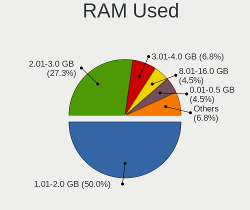
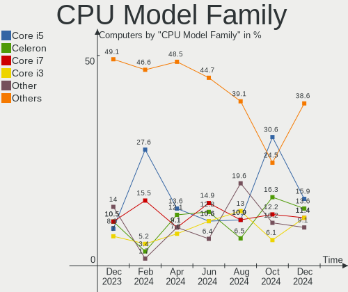
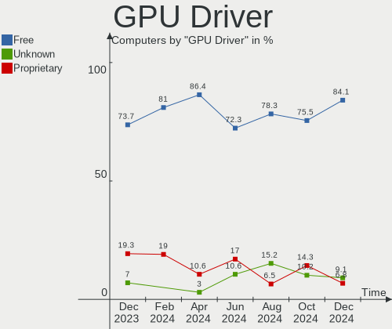
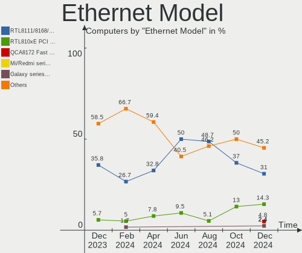
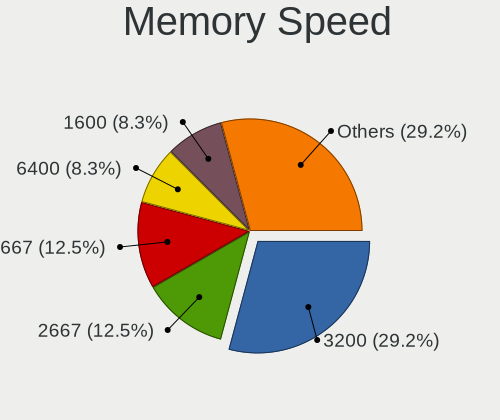

Xubuntu Hardware Trends
-----------------------

A project to identify most popular hardware characteristics and track their change
over time based on data collected by Xubuntu users at https://Linux-Hardware.org.

Anyone can contribute to this report by the [hw-probe](https://github.com/linuxhw/hw-probe) tool:

    sudo -E hw-probe -all -upload

This is a report for all computer types. See also reports for [desktops](/Dist/Xubuntu/Desktop/README.md) and [notebooks](/Dist/Xubuntu/Notebook/README.md).

Full-feature report is available here: https://linux-hardware.org/?view=trends

Period: Sep, 2021.

Contents
--------

* [ System ](#system)
  - [ OS                       ](#os)
  - [ OS Family                ](#os-family)
  - [ Kernel                   ](#kernel)
  - [ Kernel Family            ](#kernel-family)
  - [ Kernel Major Ver.        ](#kernel-major-ver)
  - [ Arch                     ](#arch)
  - [ DE                       ](#de)
  - [ Display Server           ](#display-server)
  - [ Display Manager          ](#display-manager)
  - [ OS Lang                  ](#os-lang)
  - [ Boot Mode                ](#boot-mode)
  - [ Filesystem               ](#filesystem)
  - [ Part. scheme             ](#part-scheme)
  - [ Dual Boot with Linux/BSD ](#dual-boot-with-linuxbsd)
  - [ Dual Boot (Win)          ](#dual-boot-win)

* [ Board ](#board)
  - [ Vendor                   ](#vendor)
  - [ Model                    ](#model)
  - [ Model Family             ](#model-family)
  - [ MFG Year                 ](#mfg-year)
  - [ Form Factor              ](#form-factor)
  - [ Secure Boot              ](#secure-boot)
  - [ Coreboot                 ](#coreboot)
  - [ RAM Size                 ](#ram-size)
  - [ RAM Used                 ](#ram-used)
  - [ Total Drives             ](#total-drives)
  - [ Has CD-ROM               ](#has-cd-rom)
  - [ Has Ethernet             ](#has-ethernet)
  - [ Has WiFi                 ](#has-wifi)
  - [ Has Bluetooth            ](#has-bluetooth)

* [ Location ](#location)
  - [ Country                  ](#country)
  - [ City                     ](#city)

* [ Drives ](#drives)
  - [ Drive Vendor             ](#drive-vendor)
  - [ Drive Model              ](#drive-model)
  - [ HDD Vendor               ](#hdd-vendor)
  - [ SSD Vendor               ](#ssd-vendor)
  - [ Drive Kind               ](#drive-kind)
  - [ Drive Connector          ](#drive-connector)
  - [ Drive Size               ](#drive-size)
  - [ Space Total              ](#space-total)
  - [ Space Used               ](#space-used)
  - [ Malfunc. Drives          ](#malfunc-drives)
  - [ Malfunc. Drive Vendor    ](#malfunc-drive-vendor)
  - [ Malfunc. HDD Vendor      ](#malfunc-hdd-vendor)
  - [ Malfunc. Drive Kind      ](#malfunc-drive-kind)
  - [ Failed Drives            ](#failed-drives)
  - [ Failed Drive Vendor      ](#failed-drive-vendor)
  - [ Drive Status             ](#drive-status)

* [ Storage controller ](#storage-controller)
  - [ Storage Vendor           ](#storage-vendor)
  - [ Storage Model            ](#storage-model)
  - [ Storage Kind             ](#storage-kind)

* [ Processor ](#processor)
  - [ CPU Vendor               ](#cpu-vendor)
  - [ CPU Model                ](#cpu-model)
  - [ CPU Model Family         ](#cpu-model-family)
  - [ CPU Cores                ](#cpu-cores)
  - [ CPU Sockets              ](#cpu-sockets)
  - [ CPU Threads              ](#cpu-threads)
  - [ CPU Op-Modes             ](#cpu-op-modes)
  - [ CPU Microcode            ](#cpu-microcode)
  - [ CPU Microarch            ](#cpu-microarch)

* [ Graphics ](#graphics)
  - [ GPU Vendor               ](#gpu-vendor)
  - [ GPU Model                ](#gpu-model)
  - [ GPU Combo                ](#gpu-combo)
  - [ GPU Driver               ](#gpu-driver)
  - [ GPU Memory               ](#gpu-memory)

* [ Monitor ](#monitor)
  - [ Monitor Vendor           ](#monitor-vendor)
  - [ Monitor Model            ](#monitor-model)
  - [ Monitor Resolution       ](#monitor-resolution)
  - [ Monitor Diagonal         ](#monitor-diagonal)
  - [ Monitor Width            ](#monitor-width)
  - [ Aspect Ratio             ](#aspect-ratio)
  - [ Monitor Area             ](#monitor-area)
  - [ Pixel Density            ](#pixel-density)
  - [ Multiple Monitors        ](#multiple-monitors)

* [ Network ](#network)
  - [ Net Controller Vendor    ](#net-controller-vendor)
  - [ Net Controller Model     ](#net-controller-model)
  - [ Wireless Vendor          ](#wireless-vendor)
  - [ Wireless Model           ](#wireless-model)
  - [ Ethernet Vendor          ](#ethernet-vendor)
  - [ Ethernet Model           ](#ethernet-model)
  - [ Net Controller Kind      ](#net-controller-kind)
  - [ Used Controller          ](#used-controller)
  - [ NICs                     ](#nics)
  - [ IPv6                     ](#ipv6)

* [ Bluetooth ](#bluetooth)
  - [ Bluetooth Vendor         ](#bluetooth-vendor)
  - [ Bluetooth Model          ](#bluetooth-model)

* [ Sound ](#sound)
  - [ Sound Vendor             ](#sound-vendor)
  - [ Sound Model              ](#sound-model)

* [ Memory ](#memory)
  - [ Memory Vendor            ](#memory-vendor)
  - [ Memory Model             ](#memory-model)
  - [ Memory Kind              ](#memory-kind)
  - [ Memory Form Factor       ](#memory-form-factor)
  - [ Memory Size              ](#memory-size)
  - [ Memory Speed             ](#memory-speed)

* [ Printers & scanners ](#printers--scanners)
  - [ Printer Vendor           ](#printer-vendor)
  - [ Printer Model            ](#printer-model)
  - [ Scanner Vendor           ](#scanner-vendor)
  - [ Scanner Model            ](#scanner-model)

* [ Camera ](#camera)
  - [ Camera Vendor            ](#camera-vendor)
  - [ Camera Model             ](#camera-model)

* [ Security ](#security)
  - [ Fingerprint Vendor       ](#fingerprint-vendor)
  - [ Fingerprint Model        ](#fingerprint-model)
  - [ Chipcard Vendor          ](#chipcard-vendor)
  - [ Chipcard Model           ](#chipcard-model)

* [ Unsupported ](#unsupported)
  - [ Unsupported Devices      ](#unsupported-devices)
  - [ Unsupported Device Types ](#unsupported-device-types)

System
------

OS
--

Installed operating systems

| Name          | Computers | Percent |
|---------------|-----------|---------|
| Xubuntu 20.04 | 60        | 60.61%  |
| Xubuntu 18.04 | 22        | 22.22%  |
| Xubuntu 21.04 | 12        | 12.12%  |
| Xubuntu 20.10 | 3         | 3.03%   |
| Xubuntu 21.10 | 2         | 2.02%   |

OS Family
---------

OS without a version

| Name    | Computers | Percent |
|---------|-----------|---------|
| Xubuntu | 99        | 100%    |

Kernel
------

Version of the Linux kernel

| Version               | Computers | Percent |
|-----------------------|-----------|---------|
| 5.11.0-34-generic     | 17        | 17.17%  |
| 5.4.0-81-generic      | 10        | 10.1%   |
| 5.11.0-27-generic     | 10        | 10.1%   |
| 5.4.0-84-generic      | 8         | 8.08%   |
| 5.11.0-36-generic     | 7         | 7.07%   |
| 5.4.0-86-generic      | 6         | 6.06%   |
| 5.8.0-63-generic      | 4         | 4.04%   |
| 5.4.0-42-generic      | 4         | 4.04%   |
| 5.11.0-34-lowlatency  | 4         | 4.04%   |
| 5.4.0-81-lowlatency   | 2         | 2.02%   |
| 5.4.0-80-generic      | 2         | 2.02%   |
| 5.11.0-31-generic     | 2         | 2.02%   |
| 5.11.0-25-generic     | 2         | 2.02%   |
| 5.9.0-arm-64          | 1         | 1.01%   |
| 5.8.0-59-lowlatency   | 1         | 1.01%   |
| 5.8.0-43-generic      | 1         | 1.01%   |
| 5.8.0-33-generic      | 1         | 1.01%   |
| 5.5.19-050519-generic | 1         | 1.01%   |
| 5.4.0-88-generic      | 1         | 1.01%   |
| 5.4.0-86-lowlatency   | 1         | 1.01%   |
| 5.4.0-84-lowlatency   | 1         | 1.01%   |
| 5.4.0-77-generic      | 1         | 1.01%   |
| 5.14.2-051402-generic | 1         | 1.01%   |
| 5.13.0-16-generic     | 1         | 1.01%   |
| 5.13.0-14-generic     | 1         | 1.01%   |
| 5.11.0-37-lowlatency  | 1         | 1.01%   |
| 5.11.0-36-lowlatency  | 1         | 1.01%   |
| 5.11.0-27-lowlatency  | 1         | 1.01%   |
| 4.16.18-galliumos     | 1         | 1.01%   |
| 4.15.0-157-generic    | 1         | 1.01%   |
| 4.15.0-154-generic    | 1         | 1.01%   |
| 4.15.0-145-generic    | 1         | 1.01%   |
| 4.15.0-142-generic    | 1         | 1.01%   |
| 4.15.0-139-generic    | 1         | 1.01%   |

Kernel Family
-------------

Linux kernel without a distro release

| Version | Computers | Percent |
|---------|-----------|---------|
| 5.11.0  | 45        | 45.45%  |
| 5.4.0   | 36        | 36.36%  |
| 5.8.0   | 7         | 7.07%   |
| 4.15.0  | 5         | 5.05%   |
| 5.13.0  | 2         | 2.02%   |
| 5.9.0   | 1         | 1.01%   |
| 5.5.19  | 1         | 1.01%   |
| 5.14.2  | 1         | 1.01%   |
| 4.16.18 | 1         | 1.01%   |

Kernel Major Ver.
-----------------

Linux kernel major version

| Version | Computers | Percent |
|---------|-----------|---------|
| 5.11    | 45        | 45.45%  |
| 5.4     | 36        | 36.36%  |
| 5.8     | 7         | 7.07%   |
| 4.15    | 5         | 5.05%   |
| 5.13    | 2         | 2.02%   |
| 5.9     | 1         | 1.01%   |
| 5.5     | 1         | 1.01%   |
| 5.14    | 1         | 1.01%   |
| 4.16    | 1         | 1.01%   |

Arch
----

OS architecture (x86_64, i586, etc.)

| Name    | Computers | Percent |
|---------|-----------|---------|
| x86_64  | 86        | 86.87%  |
| i686    | 12        | 12.12%  |
| aarch64 | 1         | 1.01%   |

DE
--

Desktop Environment

| Name  | Computers | Percent |
|-------|-----------|---------|
| XFCE  | 97        | 97.98%  |
| i3    | 1         | 1.01%   |
| GNOME | 1         | 1.01%   |

Display Server
--------------

X11 or Wayland

| Name | Computers | Percent |
|------|-----------|---------|
| X11  | 96        | 96.97%  |
| Tty  | 2         | 2.02%   |
| Web  | 1         | 1.01%   |

Display Manager
---------------

SDDM, LightDM, etc.

| Name    | Computers | Percent |
|---------|-----------|---------|
| LightDM | 54        | 54.55%  |
| Unknown | 41        | 41.41%  |
| GDM3    | 2         | 2.02%   |
| XDM     | 1         | 1.01%   |
| LXDM    | 1         | 1.01%   |

OS Lang
-------

Language

| Lang  | Computers | Percent |
|-------|-----------|---------|
| en_US | 40        | 40.4%   |
| de_DE | 12        | 12.12%  |
| hu_HU | 6         | 6.06%   |
| fr_FR | 5         | 5.05%   |
| en_CA | 4         | 4.04%   |
| ru_RU | 3         | 3.03%   |
| pt_BR | 3         | 3.03%   |
| it_IT | 3         | 3.03%   |
| sv_SE | 2         | 2.02%   |
| nb_NO | 2         | 2.02%   |
| es_ES | 2         | 2.02%   |
| en_IN | 2         | 2.02%   |
| de_CH | 2         | 2.02%   |
| C     | 2         | 2.02%   |
| zh_CN | 1         | 1.01%   |
| pt_PT | 1         | 1.01%   |
| nl_NL | 1         | 1.01%   |
| nl_BE | 1         | 1.01%   |
| fr_CA | 1         | 1.01%   |
| fi_FI | 1         | 1.01%   |
| et_EE | 1         | 1.01%   |
| es_MX | 1         | 1.01%   |
| en_GB | 1         | 1.01%   |
| en_AU | 1         | 1.01%   |
| de_AT | 1         | 1.01%   |

Boot Mode
---------

EFI or BIOS

| Mode | Computers | Percent |
|------|-----------|---------|
| BIOS | 63        | 63.64%  |
| EFI  | 36        | 36.36%  |

Filesystem
----------

Type of filesystem

| Type    | Computers | Percent |
|---------|-----------|---------|
| Ext4    | 94        | 94.95%  |
| Overlay | 3         | 3.03%   |
| Zfs     | 1         | 1.01%   |
| Xfs     | 1         | 1.01%   |

Part. scheme
------------

Scheme of partitioning

| Type    | Computers | Percent |
|---------|-----------|---------|
| Unknown | 58        | 58.59%  |
| MBR     | 22        | 22.22%  |
| GPT     | 19        | 19.19%  |

Dual Boot with Linux/BSD
------------------------

Hosting more than one Linux/BSD

| Dual boot | Computers | Percent |
|-----------|-----------|---------|
| No        | 89        | 89.9%   |
| Yes       | 10        | 10.1%   |

Dual Boot (Win)
---------------

Hosting Linux and Windows

| Dual boot | Computers | Percent |
|-----------|-----------|---------|
| No        | 70        | 70.71%  |
| Yes       | 29        | 29.29%  |

Board
-----

Vendor
------

Motherboard manufacturer

| Name                | Computers | Percent |
|---------------------|-----------|---------|
| Hewlett-Packard     | 26        | 26.26%  |
| ASUSTek Computer    | 17        | 17.17%  |
| Lenovo              | 10        | 10.1%   |
| Dell                | 10        | 10.1%   |
| Gigabyte Technology | 4         | 4.04%   |
| Samsung Electronics | 3         | 3.03%   |
| Fujitsu Siemens     | 3         | 3.03%   |
| Foxconn             | 3         | 3.03%   |
| ASRock              | 3         | 3.03%   |
| Apple               | 3         | 3.03%   |
| Acer                | 3         | 3.03%   |
| MSI                 | 2         | 2.02%   |
| ZOTAC               | 1         | 1.01%   |
| Toshiba             | 1         | 1.01%   |
| Prestigio           | 1         | 1.01%   |
| OEM                 | 1         | 1.01%   |
| NCR                 | 1         | 1.01%   |
| Medion              | 1         | 1.01%   |
| Itautec             | 1         | 1.01%   |
| Insyde              | 1         | 1.01%   |
| Gateway             | 1         | 1.01%   |
| Clevo               | 1         | 1.01%   |
| AAEON               | 1         | 1.01%   |
| Unknown             | 1         | 1.01%   |

Model
-----

Motherboard model

| Name                                                  | Computers | Percent |
|-------------------------------------------------------|-----------|---------|
| HP Notebook                                           | 3         | 3.03%   |
| Lenovo ThinkPad T14 Gen 2i 20W000AUGE                 | 2         | 2.02%   |
| ZOTAC ZBOX-CI320NANO series                           | 1         | 1.01%   |
| Toshiba Satellite C55-A                               | 1         | 1.01%   |
| Samsung 930QCG                                        | 1         | 1.01%   |
| Samsung 300E5EV/300E4EV/270E5EV/270E4EV/2470EV/2470EE | 1         | 1.01%   |
| Samsung 300E4C/300E5C/300E7C                          | 1         | 1.01%   |
| Prestigio PNT10131DEDB                                | 1         | 1.01%   |
| OEM BayTrail JHS365                                   | 1         | 1.01%   |
| NCR xxxx-xxxx-xxxx                                    | 1         | 1.01%   |
| MSI MS-7A38                                           | 1         | 1.01%   |
| MSI GF75 Thin 9SD                                     | 1         | 1.01%   |
| Medion Akoya P2120 D MD8836/2452                      | 1         | 1.01%   |
| Lenovo ThinkPad X395 20NLS0J400                       | 1         | 1.01%   |
| Lenovo ThinkPad X1 Carbon 3rd 20BTS11W00              | 1         | 1.01%   |
| Lenovo ThinkPad T520 4243AP1                          | 1         | 1.01%   |
| Lenovo IdeaPad 500-15ACZ 80K4                         | 1         | 1.01%   |
| Lenovo IdeaPad 5 Pro 16ACH6 82L5                      | 1         | 1.01%   |
| Lenovo IdeaPad 110S-11IBR 80WG                        | 1         | 1.01%   |
| Lenovo G480 20150                                     | 1         | 1.01%   |
| Lenovo G460 0677                                      | 1         | 1.01%   |
| Itautec Infoway a7420                                 | 1         | 1.01%   |
| Insyde Harrisonville                                  | 1         | 1.01%   |
| HP Z230 Tower Workstation                             | 1         | 1.01%   |
| HP Stream Notebook PC 13                              | 1         | 1.01%   |
| HP Snappy                                             | 1         | 1.01%   |
| HP RP5 Retail System Model 5810                       | 1         | 1.01%   |
| HP ProDesk 490 G2 MT                                  | 1         | 1.01%   |
| HP ProBook 4520s                                      | 1         | 1.01%   |
| HP ProBook 4510s                                      | 1         | 1.01%   |
| HP Pavilion Gaming Laptop 15-cx0xxx                   | 1         | 1.01%   |
| HP Pavilion dv6                                       | 1         | 1.01%   |
| HP Pavilion dv2500                                    | 1         | 1.01%   |
| HP Pavilion dm4                                       | 1         | 1.01%   |
| HP G60                                                | 1         | 1.01%   |
| HP EliteBook 850 G2                                   | 1         | 1.01%   |
| HP Compaq nx8220 (PG801ET#ABZ)                        | 1         | 1.01%   |
| HP Compaq Elite 8300 CMT                              | 1         | 1.01%   |
| HP Compaq dc7900 Convertible Minitower                | 1         | 1.01%   |
| HP Compaq CQ45                                        | 1         | 1.01%   |
| HP Compaq 6730b (GW687AV)                             | 1         | 1.01%   |
| HP Compaq 6710b (GB889ET#ABE)                         | 1         | 1.01%   |
| HP 620                                                | 1         | 1.01%   |
| HP 550                                                | 1         | 1.01%   |
| HP 15                                                 | 1         | 1.01%   |
| HP 14                                                 | 1         | 1.01%   |
| Gigabyte GA-970A-UD3                                  | 1         | 1.01%   |
| Gigabyte G41M-ES2L                                    | 1         | 1.01%   |
| Gigabyte F2A88XM-D3H                                  | 1         | 1.01%   |
| Gigabyte B550 AORUS PRO AC                            | 1         | 1.01%   |
| Gateway NV57H                                         | 1         | 1.01%   |
| Fujitsu Siemens AMILO Xi 3650                         | 1         | 1.01%   |
| Fujitsu Siemens AMILO PRO V3515                       | 1         | 1.01%   |
| Fujitsu Siemens AMILO Pa 1510                         | 1         | 1.01%   |
| Foxconn s5-1014                                       | 1         | 1.01%   |
| Foxconn Pro 3300 Series MT                            | 1         | 1.01%   |
| Foxconn M61PMV                                        | 1         | 1.01%   |
| Dell XPS 15 9560                                      | 1         | 1.01%   |
| Dell Vostro 1700                                      | 1         | 1.01%   |
| Dell Studio 1558                                      | 1         | 1.01%   |

Model Family
------------

Motherboard model prefix

| Name                   | Computers | Percent |
|------------------------|-----------|---------|
| HP Compaq              | 6         | 6.06%   |
| Lenovo ThinkPad        | 5         | 5.05%   |
| HP Pavilion            | 4         | 4.04%   |
| Lenovo IdeaPad         | 3         | 3.03%   |
| HP Notebook            | 3         | 3.03%   |
| Fujitsu Siemens AMILO  | 3         | 3.03%   |
| Dell Latitude          | 3         | 3.03%   |
| Dell Inspiron          | 3         | 3.03%   |
| HP ProBook             | 2         | 2.02%   |
| Acer Aspire            | 2         | 2.02%   |
| ZOTAC ZBOX-CI320NANO   | 1         | 1.01%   |
| Toshiba Satellite      | 1         | 1.01%   |
| Samsung 930QCG         | 1         | 1.01%   |
| Samsung 300E5EV        | 1         | 1.01%   |
| Samsung 300E4C         | 1         | 1.01%   |
| Prestigio PNT10131DEDB | 1         | 1.01%   |
| OEM BayTrail           | 1         | 1.01%   |
| NCR xxxx-xxxx-xxxx     | 1         | 1.01%   |
| MSI MS-7A38            | 1         | 1.01%   |
| MSI GF75               | 1         | 1.01%   |
| Medion Akoya           | 1         | 1.01%   |
| Lenovo G480            | 1         | 1.01%   |
| Lenovo G460            | 1         | 1.01%   |
| Itautec Infoway        | 1         | 1.01%   |
| Insyde Harrisonville   | 1         | 1.01%   |
| HP Z230                | 1         | 1.01%   |
| HP Stream              | 1         | 1.01%   |
| HP Snappy              | 1         | 1.01%   |
| HP RP5                 | 1         | 1.01%   |
| HP ProDesk             | 1         | 1.01%   |
| HP G60                 | 1         | 1.01%   |
| HP EliteBook           | 1         | 1.01%   |
| HP 620                 | 1         | 1.01%   |
| HP 550                 | 1         | 1.01%   |
| HP 15                  | 1         | 1.01%   |
| HP 14                  | 1         | 1.01%   |
| Gigabyte GA-970A-UD3   | 1         | 1.01%   |
| Gigabyte G41M-ES2L     | 1         | 1.01%   |
| Gigabyte F2A88XM-D3H   | 1         | 1.01%   |
| Gigabyte B550          | 1         | 1.01%   |
| Gateway NV57H          | 1         | 1.01%   |
| Foxconn s5-1014        | 1         | 1.01%   |
| Foxconn Pro            | 1         | 1.01%   |
| Foxconn M61PMV         | 1         | 1.01%   |
| Dell XPS               | 1         | 1.01%   |
| Dell Vostro            | 1         | 1.01%   |
| Dell Studio            | 1         | 1.01%   |
| Dell OptiPlex          | 1         | 1.01%   |
| Clevo W760SUB          | 1         | 1.01%   |
| ASUS VivoBook          | 1         | 1.01%   |
| ASUS V-M3N8200         | 1         | 1.01%   |
| ASUS T100HAN           | 1         | 1.01%   |
| ASUS PRIME             | 1         | 1.01%   |
| ASUS P8Z68-V           | 1         | 1.01%   |
| ASUS P8Z68             | 1         | 1.01%   |
| ASUS P8H67             | 1         | 1.01%   |
| ASUS P5Q-PRO           | 1         | 1.01%   |
| ASUS P5L-MX            | 1         | 1.01%   |
| ASUS MINIPC            | 1         | 1.01%   |
| ASUS MaestroII         | 1         | 1.01%   |

MFG Year
--------

Motherboard manufacture year

| Year    | Computers | Percent |
|---------|-----------|---------|
| 2021    | 10        | 10.1%   |
| 2020    | 9         | 9.09%   |
| 2011    | 9         | 9.09%   |
| 2009    | 9         | 9.09%   |
| 2018    | 8         | 8.08%   |
| 2015    | 8         | 8.08%   |
| 2013    | 8         | 8.08%   |
| 2012    | 7         | 7.07%   |
| 2010    | 6         | 6.06%   |
| 2016    | 5         | 5.05%   |
| 2014    | 5         | 5.05%   |
| 2008    | 5         | 5.05%   |
| 2007    | 5         | 5.05%   |
| 2019    | 1         | 1.01%   |
| 2017    | 1         | 1.01%   |
| 2006    | 1         | 1.01%   |
| 2005    | 1         | 1.01%   |
| Unknown | 1         | 1.01%   |

Form Factor
-----------

Physical design of the computer

| Name           | Computers | Percent |
|----------------|-----------|---------|
| Notebook       | 57        | 57.58%  |
| Desktop        | 35        | 35.35%  |
| Mini pc        | 3         | 3.03%   |
| Convertible    | 2         | 2.02%   |
| System on chip | 1         | 1.01%   |
| All in one     | 1         | 1.01%   |

Secure Boot
-----------

Enabled or disabled

| State    | Computers | Percent |
|----------|-----------|---------|
| Disabled | 95        | 95.96%  |
| Enabled  | 4         | 4.04%   |

Coreboot
--------

Have coreboot on board

| Used | Computers | Percent |
|------|-----------|---------|
| No   | 98        | 98.99%  |
| Yes  | 1         | 1.01%   |

RAM Size
--------

Total RAM memory

| Size in GB  | Computers | Percent |
|-------------|-----------|---------|
| 3.01-4.0    | 28        | 28.28%  |
| 4.01-8.0    | 24        | 24.24%  |
| 8.01-16.0   | 15        | 15.15%  |
| 1.01-2.0    | 11        | 11.11%  |
| 32.01-64.0  | 9         | 9.09%   |
| 2.01-3.0    | 4         | 4.04%   |
| 16.01-24.0  | 4         | 4.04%   |
| 64.01-256.0 | 2         | 2.02%   |
| 24.01-32.0  | 1         | 1.01%   |
| 0.51-1.0    | 1         | 1.01%   |

RAM Used
--------

Used RAM memory

| Used GB   | Computers | Percent |
|-----------|-----------|---------|
| 1.01-2.0  | 48        | 48.48%  |
| 2.01-3.0  | 17        | 17.17%  |
| 0.51-1.0  | 16        | 16.16%  |
| 4.01-8.0  | 10        | 10.1%   |
| 3.01-4.0  | 6         | 6.06%   |
| 8.01-16.0 | 1         | 1.01%   |
| 0.01-0.5  | 1         | 1.01%   |

Total Drives
------------

Number of drives on board

| Drives | Computers | Percent |
|--------|-----------|---------|
| 1      | 66        | 66.67%  |
| 2      | 19        | 19.19%  |
| 3      | 8         | 8.08%   |
| 4      | 5         | 5.05%   |
| 6      | 1         | 1.01%   |

Has CD-ROM
----------

Has CD-ROM on board

| Presented | Computers | Percent |
|-----------|-----------|---------|
| Yes       | 61        | 61.62%  |
| No        | 38        | 38.38%  |

Has Ethernet
------------

Has Ethernet on board

| Presented | Computers | Percent |
|-----------|-----------|---------|
| Yes       | 88        | 88.89%  |
| No        | 11        | 11.11%  |

Has WiFi
--------

Has WiFi module

| Presented | Computers | Percent |
|-----------|-----------|---------|
| Yes       | 74        | 74.75%  |
| No        | 25        | 25.25%  |

Has Bluetooth
-------------

Has Bluetooth module

| Presented | Computers | Percent |
|-----------|-----------|---------|
| No        | 52        | 52.53%  |
| Yes       | 47        | 47.47%  |

Location
--------

Country
-------

Geographic location (country)

| Country     | Computers | Percent |
|-------------|-----------|---------|
| USA         | 22        | 22.22%  |
| Germany     | 15        | 15.15%  |
| France      | 7         | 7.07%   |
| Hungary     | 6         | 6.06%   |
| Canada      | 5         | 5.05%   |
| Sweden      | 4         | 4.04%   |
| Russia      | 4         | 4.04%   |
| Italy       | 4         | 4.04%   |
| Brazil      | 4         | 4.04%   |
| Netherlands | 3         | 3.03%   |
| Austria     | 3         | 3.03%   |
| Switzerland | 2         | 2.02%   |
| Spain       | 2         | 2.02%   |
| Norway      | 2         | 2.02%   |
| India       | 2         | 2.02%   |
| Venezuela   | 1         | 1.01%   |
| UAE         | 1         | 1.01%   |
| Turkey      | 1         | 1.01%   |
| Portugal    | 1         | 1.01%   |
| Mexico      | 1         | 1.01%   |
| Kuwait      | 1         | 1.01%   |
| Indonesia   | 1         | 1.01%   |
| Finland     | 1         | 1.01%   |
| Estonia     | 1         | 1.01%   |
| Costa Rica  | 1         | 1.01%   |
| Cabo Verde  | 1         | 1.01%   |
| Belgium     | 1         | 1.01%   |
| Australia   | 1         | 1.01%   |
| Argentina   | 1         | 1.01%   |

City
----

Geographic location (city)

| City                  | Computers | Percent |
|-----------------------|-----------|---------|
| Tatab??nya            | 2         | 2.02%   |
| Graz                  | 2         | 2.02%   |
| Wuppertal             | 1         | 1.01%   |
| Wilmington            | 1         | 1.01%   |
| Whitinsville          | 1         | 1.01%   |
| Wellington            | 1         | 1.01%   |
| W??rzburg             | 1         | 1.01%   |
| Vitr?©                | 1         | 1.01%   |
| Vienna                | 1         | 1.01%   |
| Vancouver             | 1         | 1.01%   |
| Valparaiso            | 1         | 1.01%   |
| Valenza               | 1         | 1.01%   |
| Tularosa              | 1         | 1.01%   |
| Tlaxcala City         | 1         | 1.01%   |
| Terrassa              | 1         | 1.01%   |
| Tallinn               | 1         | 1.01%   |
| Sydney                | 1         | 1.01%   |
| Suwanee               | 1         | 1.01%   |
| Sulz am Neckar        | 1         | 1.01%   |
| Stuttgart             | 1         | 1.01%   |
| Solothurn             | 1         | 1.01%   |
| S??o Paulo            | 1         | 1.01%   |
| Sant'Omobono Terme    | 1         | 1.01%   |
| San Jose              | 1         | 1.01%   |
| San Jos?©             | 1         | 1.01%   |
| San Diego             | 1         | 1.01%   |
| Salamanca             | 1         | 1.01%   |
| Saint-Raphael         | 1         | 1.01%   |
| Saint Paul            | 1         | 1.01%   |
| Rochester             | 1         | 1.01%   |
| Reutlingen            | 1         | 1.01%   |
| Pushkino              | 1         | 1.01%   |
| Pune                  | 1         | 1.01%   |
| Princeton             | 1         | 1.01%   |
| Praia                 | 1         | 1.01%   |
| Porto Velho           | 1         | 1.01%   |
| Paris                 | 1         | 1.01%   |
| Palermo               | 1         | 1.01%   |
| Osterholz-Scharmbeck  | 1         | 1.01%   |
| Oslo                  | 1         | 1.01%   |
| Orekhovo-Zuyevo       | 1         | 1.01%   |
| OErbyhus              | 1         | 1.01%   |
| Nuremberg             | 1         | 1.01%   |
| New Delhi             | 1         | 1.01%   |
| Nashville             | 1         | 1.01%   |
| Naples                | 1         | 1.01%   |
| Nanaimo               | 1         | 1.01%   |
| Murr                  | 1         | 1.01%   |
| Munich                | 1         | 1.01%   |
| Moscow                | 1         | 1.01%   |
| Montgeron             | 1         | 1.01%   |
| Monte Alto            | 1         | 1.01%   |
| Milan                 | 1         | 1.01%   |
| Matur?­n              | 1         | 1.01%   |
| Marolles-en-Brie      | 1         | 1.01%   |
| Manchester-by-the-Sea | 1         | 1.01%   |
| Makkum                | 1         | 1.01%   |
| Leland                | 1         | 1.01%   |
| Le Mans               | 1         | 1.01%   |
| Las Vegas             | 1         | 1.01%   |

Drives
------

Drive Vendor
------------

Hard drive vendors

| Vendor                | Computers | Drives | Percent |
|-----------------------|-----------|--------|---------|
| Seagate               | 24        | 26     | 17.78%  |
| WDC                   | 20        | 25     | 14.81%  |
| Samsung Electronics   | 20        | 24     | 14.81%  |
| Toshiba               | 13        | 13     | 9.63%   |
| Hitachi               | 12        | 13     | 8.89%   |
| Unknown               | 10        | 12     | 7.41%   |
| Intel                 | 8         | 8      | 5.93%   |
| Fujitsu               | 4         | 4      | 2.96%   |
| Crucial               | 4         | 4      | 2.96%   |
| A-DATA Technology     | 3         | 3      | 2.22%   |
| Kingston              | 2         | 3      | 1.48%   |
| HGST                  | 2         | 2      | 1.48%   |
| FORESEE               | 2         | 2      | 1.48%   |
| Transcend             | 1         | 1      | 0.74%   |
| SK Hynix              | 1         | 1      | 0.74%   |
| SanDisk               | 1         | 1      | 0.74%   |
| Realtek Semiconductor | 1         | 1      | 0.74%   |
| Qumox                 | 1         | 1      | 0.74%   |
| OCZ                   | 1         | 1      | 0.74%   |
| Micron Technology     | 1         | 1      | 0.74%   |
| LITEONIT              | 1         | 1      | 0.74%   |
| China                 | 1         | 1      | 0.74%   |
| Apple                 | 1         | 2      | 0.74%   |
| Unknown               | 1         | 1      | 0.74%   |

Drive Model
-----------

Hard drive models

| Model                            | Computers | Percent |
|----------------------------------|-----------|---------|
| Seagate ST3500418AS 500GB        | 4         | 2.68%   |
| WDC WD20EARX-00PASB0 2TB         | 2         | 1.34%   |
| Unknown MMC Card  64GB           | 2         | 1.34%   |
| Toshiba MQ01ABD075 752GB         | 2         | 1.34%   |
| Toshiba KXG6AZNV1T02 1TB         | 2         | 1.34%   |
| Toshiba DT01ACA050 500GB         | 2         | 1.34%   |
| Seagate ST500LT012-1DG142 500GB  | 2         | 1.34%   |
| Samsung SSD 850 EVO 250GB        | 2         | 1.34%   |
| Hitachi HTS547550A9E384 500GB    | 2         | 1.34%   |
| HGST HTS721010A9E630 1TB         | 2         | 1.34%   |
| FORESEE 64GB SSD                 | 2         | 1.34%   |
| Crucial CT500MX500SSD1 500GB     | 2         | 1.34%   |
| WDC WDS500G2B0C-00PXH0 500GB     | 1         | 0.67%   |
| WDC WDS500G2B0A-00SM50 500GB SSD | 1         | 0.67%   |
| WDC WDS120G2G0A-00JH30 120GB SSD | 1         | 0.67%   |
| WDC WDS100T2B0B-00YS70 1TB SSD   | 1         | 0.67%   |
| WDC WD5000LPLX-08ZNTT0 500GB     | 1         | 0.67%   |
| WDC WD5000LPCX-60VHAT0 500GB     | 1         | 0.67%   |
| WDC WD5000BPVT-22HXZT3 500GB     | 1         | 0.67%   |
| WDC WD5000AZLX-75K2TA0 500GB     | 1         | 0.67%   |
| WDC WD5000AAKX-22ERMA0 500GB     | 1         | 0.67%   |
| WDC WD5000AAKX-001CA0 500GB      | 1         | 0.67%   |
| WDC WD3200AVVS-62L2B0 320GB      | 1         | 0.67%   |
| WDC WD2500BEVS-60UST0 250GB      | 1         | 0.67%   |
| WDC WD20SPZX-60UA7T0 2TB         | 1         | 0.67%   |
| WDC WD20EZAZ-00GGJB0 2TB         | 1         | 0.67%   |
| WDC WD1600BEVT-60ZCT1 160GB      | 1         | 0.67%   |
| WDC WD1600AAJS-56M0A0 160GB      | 1         | 0.67%   |
| WDC WD10JPCX-24UE4T0 1TB         | 1         | 0.67%   |
| WDC WD10EARX-00N0YB0 1TB         | 1         | 0.67%   |
| WDC WD10EARS-22Y5B1 1TB          | 1         | 0.67%   |
| WDC WD10EARS-00MVWB0 1TB         | 1         | 0.67%   |
| WDC WD10EADS-65M2B0 1TB          | 1         | 0.67%   |
| Unknown SU32G  32GB              | 1         | 0.67%   |
| Unknown SA08G  8GB               | 1         | 0.67%   |
| Unknown MMC Card  67GB           | 1         | 0.67%   |
| Unknown MMC Card  33GB           | 1         | 0.67%   |
| Unknown HBG4a2  32GB             | 1         | 0.67%   |
| Unknown DA4032  32GB             | 1         | 0.67%   |
| Unknown C2S3T/240G 240GB SSD     | 1         | 0.67%   |
| Unknown Biwin  32GB              | 1         | 0.67%   |
| Unknown BGND3R  32GB             | 1         | 0.67%   |
| Unknown 00000  64GB              | 1         | 0.67%   |
| Transcend TS32GMSA370 32GB SSD   | 1         | 0.67%   |
| Toshiba MQ01ABF032 320GB         | 1         | 0.67%   |
| Toshiba MQ01ABD100 1TB           | 1         | 0.67%   |
| Toshiba MK8034GSX 80GB           | 1         | 0.67%   |
| Toshiba MK7559GSXP 752GB         | 1         | 0.67%   |
| Toshiba MK2565GSX 250GB          | 1         | 0.67%   |
| Toshiba MK2035GSS 200GB          | 1         | 0.67%   |
| Toshiba KXG50ZNV512G NVMe 512GB  | 1         | 0.67%   |
| SK Hynix NVMe SSD Drive 1024GB   | 1         | 0.67%   |
| Seagate ST980811AS 80GB          | 1         | 0.67%   |
| Seagate ST9500423AS 500GB        | 1         | 0.67%   |
| Seagate ST9320325ASG 320GB       | 1         | 0.67%   |
| Seagate ST9250827AS 250GB        | 1         | 0.67%   |
| Seagate ST9250315AS 250GB        | 1         | 0.67%   |
| Seagate ST4000DM004-2CV104 4TB   | 1         | 0.67%   |
| Seagate ST4000DM000-1F2168 4TB   | 1         | 0.67%   |
| Seagate ST380815AS 80GB          | 1         | 0.67%   |

HDD Vendor
----------

Hard disk drive vendors

| Vendor              | Computers | Drives | Percent |
|---------------------|-----------|--------|---------|
| Seagate             | 24        | 25     | 32%     |
| WDC                 | 17        | 20     | 22.67%  |
| Hitachi             | 12        | 13     | 16%     |
| Toshiba             | 10        | 10     | 13.33%  |
| Samsung Electronics | 6         | 6      | 8%      |
| Fujitsu             | 4         | 4      | 5.33%   |
| HGST                | 2         | 2      | 2.67%   |

SSD Vendor
----------

Solid state drive vendors

| Vendor              | Computers | Drives | Percent |
|---------------------|-----------|--------|---------|
| Samsung Electronics | 11        | 13     | 28.95%  |
| Intel               | 6         | 6      | 15.79%  |
| Crucial             | 4         | 4      | 10.53%  |
| WDC                 | 3         | 4      | 7.89%   |
| FORESEE             | 2         | 2      | 5.26%   |
| A-DATA Technology   | 2         | 2      | 5.26%   |
| Unknown             | 1         | 1      | 2.63%   |
| Transcend           | 1         | 1      | 2.63%   |
| SanDisk             | 1         | 1      | 2.63%   |
| Qumox               | 1         | 1      | 2.63%   |
| OCZ                 | 1         | 1      | 2.63%   |
| Micron Technology   | 1         | 1      | 2.63%   |
| LITEONIT            | 1         | 1      | 2.63%   |
| Kingston            | 1         | 1      | 2.63%   |
| China               | 1         | 1      | 2.63%   |
| Unknown             | 1         | 1      | 2.63%   |

Drive Kind
----------

HDD or SSD

| Kind    | Computers | Drives | Percent |
|---------|-----------|--------|---------|
| HDD     | 64        | 80     | 51.2%   |
| SSD     | 36        | 41     | 28.8%   |
| NVMe    | 15        | 18     | 12%     |
| MMC     | 9         | 11     | 7.2%    |
| Unknown | 1         | 1      | 0.8%    |

Drive Connector
---------------

SATA, SAS, NVMe, etc.

| Type | Computers | Drives | Percent |
|------|-----------|--------|---------|
| SATA | 86        | 120    | 76.79%  |
| NVMe | 15        | 18     | 13.39%  |
| MMC  | 9         | 11     | 8.04%   |
| SAS  | 2         | 2      | 1.79%   |

Drive Size
----------

Size of hard drive

| Size in TB | Computers | Drives | Percent |
|------------|-----------|--------|---------|
| 0.01-0.5   | 70        | 86     | 70%     |
| 0.51-1.0   | 19        | 23     | 19%     |
| 1.01-2.0   | 9         | 10     | 9%      |
| 3.01-4.0   | 2         | 2      | 2%      |

Space Total
-----------

Amount of disk space available on the file system

| Size in GB     | Computers | Percent |
|----------------|-----------|---------|
| 101-250        | 28        | 28.28%  |
| 251-500        | 23        | 23.23%  |
| 501-1000       | 14        | 14.14%  |
| 51-100         | 10        | 10.1%   |
| 21-50          | 7         | 7.07%   |
| 2001-3000      | 6         | 6.06%   |
| 1001-2000      | 6         | 6.06%   |
| More than 3000 | 2         | 2.02%   |
| 1-20           | 2         | 2.02%   |
| Unknown        | 1         | 1.01%   |

Space Used
----------

Amount of used disk space

| Used GB        | Computers | Percent |
|----------------|-----------|---------|
| 1-20           | 41        | 41.41%  |
| 21-50          | 18        | 18.18%  |
| 101-250        | 12        | 12.12%  |
| 251-500        | 8         | 8.08%   |
| 501-1000       | 8         | 8.08%   |
| 51-100         | 6         | 6.06%   |
| 2001-3000      | 2         | 2.02%   |
| 1001-2000      | 2         | 2.02%   |
| More than 3000 | 1         | 1.01%   |
| Unknown        | 1         | 1.01%   |

Malfunc. Drives
---------------

Drive models with a malfunction

| Model                              | Computers | Drives | Percent |
|------------------------------------|-----------|--------|---------|
| Toshiba MQ01ABD100 1TB             | 1         | 1      | 7.69%   |
| Toshiba DT01ACA050 500GB           | 1         | 1      | 7.69%   |
| Seagate ST980811AS 80GB            | 1         | 1      | 7.69%   |
| Seagate ST3500418AS 500GB          | 1         | 1      | 7.69%   |
| Seagate ST1000LM049-2GH172 1TB     | 1         | 1      | 7.69%   |
| Seagate ST1000LM024 HN-M101MBB 1TB | 1         | 1      | 7.69%   |
| Hitachi HTS547550A9E384 500GB      | 1         | 1      | 7.69%   |
| Hitachi HTS545032B9A300 320GB      | 1         | 1      | 7.69%   |
| Hitachi HDS721050CLA360 500GB      | 1         | 1      | 7.69%   |
| Fujitsu MHZ2320BH G2 320GB         | 1         | 1      | 7.69%   |
| Fujitsu MHZ2160BJ FFS G2 160GB     | 1         | 1      | 7.69%   |
| FORESEE 64GB SSD                   | 1         | 1      | 7.69%   |
| Crucial CT120M500SSD1 120GB        | 1         | 1      | 7.69%   |

Malfunc. Drive Vendor
---------------------

Vendors of faulty drives

| Vendor  | Computers | Drives | Percent |
|---------|-----------|--------|---------|
| Seagate | 4         | 4      | 30.77%  |
| Hitachi | 3         | 3      | 23.08%  |
| Toshiba | 2         | 2      | 15.38%  |
| Fujitsu | 2         | 2      | 15.38%  |
| FORESEE | 1         | 1      | 7.69%   |
| Crucial | 1         | 1      | 7.69%   |

Malfunc. HDD Vendor
-------------------

Vendors of faulty HDD drives

| Vendor  | Computers | Drives | Percent |
|---------|-----------|--------|---------|
| Seagate | 4         | 4      | 36.36%  |
| Hitachi | 3         | 3      | 27.27%  |
| Toshiba | 2         | 2      | 18.18%  |
| Fujitsu | 2         | 2      | 18.18%  |

Malfunc. Drive Kind
-------------------

Kinds of faulty drives

| Kind | Computers | Drives | Percent |
|------|-----------|--------|---------|
| HDD  | 11        | 11     | 84.62%  |
| SSD  | 2         | 2      | 15.38%  |

Failed Drives
-------------

Failed drive models

Zero info for selected period =(

Failed Drive Vendor
-------------------

Failed drive vendors

Zero info for selected period =(

Drive Status
------------

Number of failed and malfunc. drives

| Status   | Computers | Drives | Percent |
|----------|-----------|--------|---------|
| Detected | 62        | 91     | 59.62%  |
| Works    | 29        | 47     | 27.88%  |
| Malfunc  | 13        | 13     | 12.5%   |

Storage controller
------------------

Storage Vendor
--------------

Storage controller vendors

| Vendor                           | Computers | Percent |
|----------------------------------|-----------|---------|
| Intel                            | 67        | 62.62%  |
| AMD                              | 18        | 16.82%  |
| Samsung Electronics              | 4         | 3.74%   |
| Nvidia                           | 4         | 3.74%   |
| Toshiba America Info Systems     | 3         | 2.8%    |
| VIA Technologies                 | 2         | 1.87%   |
| Realtek Semiconductor            | 2         | 1.87%   |
| SK Hynix                         | 1         | 0.93%   |
| Silicon Integrated Systems [SiS] | 1         | 0.93%   |
| Sandisk                          | 1         | 0.93%   |
| Marvell Technology Group         | 1         | 0.93%   |
| Kingston Technology Company      | 1         | 0.93%   |
| JMicron Technology               | 1         | 0.93%   |
| Apple                            | 1         | 0.93%   |

Storage Model
-------------

Storage controller models

| Model                                                                                   | Computers | Percent |
|-----------------------------------------------------------------------------------------|-----------|---------|
| AMD FCH SATA Controller [AHCI mode]                                                     | 11        | 8.03%   |
| Intel 82801HM/HEM (ICH8M/ICH8M-E) IDE Controller                                        | 5         | 3.65%   |
| Samsung NVMe SSD Controller SM981/PM981/PM983                                           | 4         | 2.92%   |
| Intel 82801HM/HEM (ICH8M/ICH8M-E) SATA Controller [AHCI mode]                           | 4         | 2.92%   |
| Intel 82801G (ICH7 Family) IDE Controller                                               | 4         | 2.92%   |
| Intel Q170/Q150/B150/H170/H110/Z170/CM236 Chipset SATA Controller [AHCI Mode]           | 3         | 2.19%   |
| Intel NM10/ICH7 Family SATA Controller [IDE mode]                                       | 3         | 2.19%   |
| Intel Atom Processor E3800 Series SATA AHCI Controller                                  | 3         | 2.19%   |
| Intel 82801IBM/IEM (ICH9M/ICH9M-E) 4 port SATA Controller [AHCI mode]                   | 3         | 2.19%   |
| Intel 82801 Mobile SATA Controller [RAID mode]                                          | 3         | 2.19%   |
| Intel 8 Series/C220 Series Chipset Family 6-port SATA Controller 1 [AHCI mode]          | 3         | 2.19%   |
| Intel 7 Series Chipset Family 6-port SATA Controller [AHCI mode]                        | 3         | 2.19%   |
| Intel 6 Series/C200 Series Chipset Family Desktop SATA Controller (IDE mode, ports 4-5) | 3         | 2.19%   |
| Intel 6 Series/C200 Series Chipset Family Desktop SATA Controller (IDE mode, ports 0-3) | 3         | 2.19%   |
| Intel 6 Series/C200 Series Chipset Family 6 port Desktop SATA AHCI Controller           | 3         | 2.19%   |
| AMD SB7x0/SB8x0/SB9x0 IDE Controller                                                    | 3         | 2.19%   |
| Toshiba America Info Systems XG6 NVMe SSD Controller                                    | 2         | 1.46%   |
| Realtek Realtek Non-Volatile memory controller                                          | 2         | 1.46%   |
| Nvidia MCP78S [GeForce 8200] SATA Controller (non-AHCI mode)                            | 2         | 1.46%   |
| Nvidia MCP78S [GeForce 8200] IDE                                                        | 2         | 1.46%   |
| Intel Wildcat Point-LP SATA Controller [AHCI Mode]                                      | 2         | 1.46%   |
| Intel HM170/QM170 Chipset SATA Controller [AHCI Mode]                                   | 2         | 1.46%   |
| Intel Cannon Lake Mobile PCH SATA AHCI Controller                                       | 2         | 1.46%   |
| Intel Atom/Celeron/Pentium Processor x5-E8000/J3xxx/N3xxx Series SATA Controller        | 2         | 1.46%   |
| Intel 6 Series/C200 Series Chipset Family 6 port Mobile SATA AHCI Controller            | 2         | 1.46%   |
| Intel 5 Series/3400 Series Chipset 4 port SATA IDE Controller                           | 2         | 1.46%   |
| Intel 5 Series/3400 Series Chipset 4 port SATA AHCI Controller                          | 2         | 1.46%   |
| Intel 5 Series/3400 Series Chipset 2 port SATA IDE Controller                           | 2         | 1.46%   |
| AMD SB7x0/SB8x0/SB9x0 SATA Controller [IDE mode]                                        | 2         | 1.46%   |
| AMD SB7x0/SB8x0/SB9x0 SATA Controller [AHCI mode]                                       | 2         | 1.46%   |
| VIA VT82C586A/B/VT82C686/A/B/VT823x/A/C PIPC Bus Master IDE                             | 1         | 0.73%   |
| VIA VT8237A SATA 2-Port Controller                                                      | 1         | 0.73%   |
| VIA VT6415 PATA IDE Host Controller                                                     | 1         | 0.73%   |
| Toshiba America Info Systems Toshiba America Info Non-Volatile memory controller        | 1         | 0.73%   |
| SK Hynix PC300 NVMe Solid State Drive 1TB                                               | 1         | 0.73%   |
| Silicon Integrated Systems [SiS] SATA Controller / IDE mode                             | 1         | 0.73%   |
| Sandisk WD Blue SN550 NVMe SSD                                                          | 1         | 0.73%   |
| Nvidia MCP89 SATA Controller (AHCI mode)                                                | 1         | 0.73%   |
| Nvidia MCP61 SATA Controller                                                            | 1         | 0.73%   |
| Nvidia MCP61 IDE                                                                        | 1         | 0.73%   |
| Marvell Group 88SE9128 PCIe SATA 6 Gb/s RAID controller with HyperDuo                   | 1         | 0.73%   |
| Kingston Company Company Non-Volatile memory controller                                 | 1         | 0.73%   |
| Kingston Company A2000 NVMe SSD                                                         | 1         | 0.73%   |
| JMicron JMB362 SATA Controller                                                          | 1         | 0.73%   |
| Intel SSD 660P Series                                                                   | 1         | 0.73%   |
| Intel SSD 600P Series                                                                   | 1         | 0.73%   |
| Intel SATA Controller [RAID mode]                                                       | 1         | 0.73%   |
| Intel NM10/ICH7 Family SATA Controller [AHCI mode]                                      | 1         | 0.73%   |
| Intel Celeron N3350/Pentium N4200/Atom E3900 Series SATA AHCI Controller                | 1         | 0.73%   |
| Intel Cannon Lake PCH SATA AHCI Controller                                              | 1         | 0.73%   |
| Intel Atom Processor C3000 Series SATA Controller 1                                     | 1         | 0.73%   |
| Intel Atom Processor C3000 Series SATA Controller 0                                     | 1         | 0.73%   |
| Intel 9 Series Chipset Family SATA Controller [AHCI Mode]                               | 1         | 0.73%   |
| Intel 82801JI (ICH10 Family) 4 port SATA IDE Controller #1                              | 1         | 0.73%   |
| Intel 82801JI (ICH10 Family) 2 port SATA IDE Controller #2                              | 1         | 0.73%   |
| Intel 82801JD/DO (ICH10 Family) 4-port SATA IDE Controller                              | 1         | 0.73%   |
| Intel 82801JD/DO (ICH10 Family) 2-port SATA IDE Controller                              | 1         | 0.73%   |
| Intel 82801IR/IO/IH (ICH9R/DO/DH) 4 port SATA Controller [IDE mode]                     | 1         | 0.73%   |
| Intel 82801IBM/IEM (ICH9M/ICH9M-E) 2 port SATA Controller [IDE mode]                    | 1         | 0.73%   |
| Intel 82801I (ICH9 Family) 2 port SATA Controller [IDE mode]                            | 1         | 0.73%   |

Storage Kind
------------

Kind of storage controller (IDE, SATA, NVMe, SAS, ...)

| Kind | Computers | Percent |
|------|-----------|---------|
| SATA | 62        | 54.87%  |
| IDE  | 31        | 27.43%  |
| NVMe | 15        | 13.27%  |
| RAID | 5         | 4.42%   |

Processor
---------

CPU Vendor
----------

Processor vendors

| Vendor | Computers | Percent |
|--------|-----------|---------|
| Intel  | 76        | 76.77%  |
| AMD    | 22        | 22.22%  |
| ARM    | 1         | 1.01%   |

CPU Model
---------

Processor models

| Model                                       | Computers | Percent |
|---------------------------------------------|-----------|---------|
| Intel Core i7-7700HQ CPU @ 2.80GHz          | 2         | 2.02%   |
| Intel Core i7-4790 CPU @ 3.60GHz            | 2         | 2.02%   |
| Intel Core i7-2600K CPU @ 3.40GHz           | 2         | 2.02%   |
| Intel Core i3-3120M CPU @ 2.50GHz           | 2         | 2.02%   |
| Intel Core i3 CPU M 370 @ 2.40GHz           | 2         | 2.02%   |
| Intel Core 2 Duo CPU T7300 @ 2.00GHz        | 2         | 2.02%   |
| Intel Core 2 Duo CPU P8600 @ 2.40GHz        | 2         | 2.02%   |
| Intel Celeron CPU J1900 @ 1.99GHz           | 2         | 2.02%   |
| Intel 11th Gen Core i7-1165G7 @ 2.80GHz     | 2         | 2.02%   |
| Intel Pentium M processor 1.73GHz           | 1         | 1.01%   |
| Intel Pentium Dual-Core CPU T4500 @ 2.30GHz | 1         | 1.01%   |
| Intel Pentium Dual-Core CPU T4200 @ 2.00GHz | 1         | 1.01%   |
| Intel Pentium Dual-Core CPU E5800 @ 3.20GHz | 1         | 1.01%   |
| Intel Pentium D CPU 3.40GHz                 | 1         | 1.01%   |
| Intel Pentium CPU N4200 @ 1.10GHz           | 1         | 1.01%   |
| Intel Pentium CPU N3710 @ 1.60GHz           | 1         | 1.01%   |
| Intel Genuine CPU T2400 @ 1.83GHz           | 1         | 1.01%   |
| Intel Core m5-6Y54 CPU @ 1.10GHz            | 1         | 1.01%   |
| Intel Core i7-9750H CPU @ 2.60GHz           | 1         | 1.01%   |
| Intel Core i7-8700 CPU @ 3.20GHz            | 1         | 1.01%   |
| Intel Core i7-7700 CPU @ 3.60GHz            | 1         | 1.01%   |
| Intel Core i7-5600U CPU @ 2.60GHz           | 1         | 1.01%   |
| Intel Core i7-2700K CPU @ 3.50GHz           | 1         | 1.01%   |
| Intel Core i7-1065G7 CPU @ 1.30GHz          | 1         | 1.01%   |
| Intel Core i5-8300H CPU @ 2.30GHz           | 1         | 1.01%   |
| Intel Core i5-6600K CPU @ 3.50GHz           | 1         | 1.01%   |
| Intel Core i5-6500 CPU @ 3.20GHz            | 1         | 1.01%   |
| Intel Core i5-5300U CPU @ 2.30GHz           | 1         | 1.01%   |
| Intel Core i5-4570S CPU @ 2.90GHz           | 1         | 1.01%   |
| Intel Core i5-4200U CPU @ 1.60GHz           | 1         | 1.01%   |
| Intel Core i5-4200M CPU @ 2.50GHz           | 1         | 1.01%   |
| Intel Core i5-3570 CPU @ 3.40GHz            | 1         | 1.01%   |
| Intel Core i5-3230M CPU @ 2.60GHz           | 1         | 1.01%   |
| Intel Core i5-2520M CPU @ 2.50GHz           | 1         | 1.01%   |
| Intel Core i5-2450M CPU @ 2.50GHz           | 1         | 1.01%   |
| Intel Core i5-2410M CPU @ 2.30GHz           | 1         | 1.01%   |
| Intel Core i5-2400S CPU @ 2.50GHz           | 1         | 1.01%   |
| Intel Core i5-2400 CPU @ 3.10GHz            | 1         | 1.01%   |
| Intel Core i5 CPU M 540 @ 2.53GHz           | 1         | 1.01%   |
| Intel Core i5 CPU M 520 @ 2.40GHz           | 1         | 1.01%   |
| Intel Core i5 CPU M 450 @ 2.40GHz           | 1         | 1.01%   |
| Intel Core i3-6100 CPU @ 3.70GHz            | 1         | 1.01%   |
| Intel Core i3-4000M CPU @ 2.40GHz           | 1         | 1.01%   |
| Intel Core i3-3110M CPU @ 2.40GHz           | 1         | 1.01%   |
| Intel Core i3-2310M CPU @ 2.10GHz           | 1         | 1.01%   |
| Intel Core i3-2100 CPU @ 3.10GHz            | 1         | 1.01%   |
| Intel Core Duo CPU T2350 @ 1.86GHz          | 1         | 1.01%   |
| Intel Core 2 Quad CPU Q8300 @ 2.50GHz       | 1         | 1.01%   |
| Intel Core 2 Duo CPU T8300 @ 2.40GHz        | 1         | 1.01%   |
| Intel Core 2 Duo CPU T6670 @ 2.20GHz        | 1         | 1.01%   |
| Intel Core 2 Duo CPU T6570 @ 2.10GHz        | 1         | 1.01%   |
| Intel Core 2 Duo CPU T5250 @ 1.50GHz        | 1         | 1.01%   |
| Intel Core 2 Duo CPU P8400 @ 2.26GHz        | 1         | 1.01%   |
| Intel Core 2 Duo CPU E8400 @ 3.00GHz        | 1         | 1.01%   |
| Intel Core 2 Duo CPU E7300 @ 2.66GHz        | 1         | 1.01%   |
| Intel Core 2 Duo CPU E4500 @ 2.20GHz        | 1         | 1.01%   |
| Intel Celeron M CPU 520 @ 1.60GHz           | 1         | 1.01%   |
| Intel Celeron CPU N3350 @ 1.10GHz           | 1         | 1.01%   |
| Intel Celeron CPU N3060 @ 1.60GHz           | 1         | 1.01%   |
| Intel Celeron CPU N3050 @ 1.60GHz           | 1         | 1.01%   |

CPU Model Family
----------------

Processor model prefix

| Model                   | Computers | Percent |
|-------------------------|-----------|---------|
| Intel Core i5           | 17        | 17.17%  |
| Intel Core i7           | 12        | 12.12%  |
| Intel Core 2 Duo        | 12        | 12.12%  |
| Intel Core i3           | 9         | 9.09%   |
| Intel Celeron           | 7         | 7.07%   |
| Other                   | 4         | 4.04%   |
| Intel Atom              | 4         | 4.04%   |
| AMD Ryzen 7             | 4         | 4.04%   |
| Intel Pentium Dual-Core | 3         | 3.03%   |
| AMD A8                  | 3         | 3.03%   |
| AMD A6                  | 3         | 3.03%   |
| Intel Pentium           | 2         | 2.02%   |
| AMD Ryzen 9             | 2         | 2.02%   |
| AMD FX                  | 2         | 2.02%   |
| Intel Pentium M         | 1         | 1.01%   |
| Intel Pentium D         | 1         | 1.01%   |
| Intel Genuine           | 1         | 1.01%   |
| Intel Core m5           | 1         | 1.01%   |
| Intel Core Duo          | 1         | 1.01%   |
| Intel Core 2 Quad       | 1         | 1.01%   |
| Intel Celeron M         | 1         | 1.01%   |
| AMD Turion 64 X2 Mobile | 1         | 1.01%   |
| AMD Ryzen 7 PRO         | 1         | 1.01%   |
| AMD E                   | 1         | 1.01%   |
| AMD C-60                | 1         | 1.01%   |
| AMD Athlon X2           | 1         | 1.01%   |
| AMD Athlon Dual Core    | 1         | 1.01%   |
| AMD Athlon 64 X2        | 1         | 1.01%   |
| AMD Athlon              | 1         | 1.01%   |

CPU Cores
---------

Number of processor cores

| Number | Computers | Percent |
|--------|-----------|---------|
| 2      | 53        | 53.54%  |
| 4      | 33        | 33.33%  |
| 8      | 5         | 5.05%   |
| 1      | 4         | 4.04%   |
| 6      | 3         | 3.03%   |
| 12     | 1         | 1.01%   |

CPU Sockets
-----------

Number of sockets

| Number | Computers | Percent |
|--------|-----------|---------|
| 1      | 99        | 100%    |

CPU Threads
-----------

Threads per core (Hyper-Threading)

| Number | Computers | Percent |
|--------|-----------|---------|
| 1      | 52        | 52.53%  |
| 2      | 47        | 47.47%  |

CPU Op-Modes
------------

CPU Operation Modes (32-bit, 64-bit)

| Op mode        | Computers | Percent |
|----------------|-----------|---------|
| 32-bit, 64-bit | 96        | 96.97%  |
| 32-bit         | 3         | 3.03%   |

CPU Microcode
-------------

Microcode number

| Number     | Computers | Percent |
|------------|-----------|---------|
| Unknown    | 19        | 19.19%  |
| 0x206a7    | 9         | 9.09%   |
| 0x1067a    | 8         | 8.08%   |
| 0x306c3    | 5         | 5.05%   |
| 0x506e3    | 3         | 3.03%   |
| 0x306a9    | 3         | 3.03%   |
| 0x10676    | 3         | 3.03%   |
| 0x906ea    | 2         | 2.02%   |
| 0x906e9    | 2         | 2.02%   |
| 0x806c1    | 2         | 2.02%   |
| 0x6fa      | 2         | 2.02%   |
| 0x406c4    | 2         | 2.02%   |
| 0x406c3    | 2         | 2.02%   |
| 0x306d4    | 2         | 2.02%   |
| 0x30678    | 2         | 2.02%   |
| 0x20655    | 2         | 2.02%   |
| 0x20652    | 2         | 2.02%   |
| 0x0a50000c | 2         | 2.02%   |
| 0x08701021 | 2         | 2.02%   |
| 0x05000119 | 2         | 2.02%   |
| 0xa0671    | 1         | 1.01%   |
| 0x706e5    | 1         | 1.01%   |
| 0x6fd      | 1         | 1.01%   |
| 0x6f6      | 1         | 1.01%   |
| 0x6ec      | 1         | 1.01%   |
| 0x6e8      | 1         | 1.01%   |
| 0x6d8      | 1         | 1.01%   |
| 0x506f1    | 1         | 1.01%   |
| 0x506ca    | 1         | 1.01%   |
| 0x506c9    | 1         | 1.01%   |
| 0x406e3    | 1         | 1.01%   |
| 0x40651    | 1         | 1.01%   |
| 0x106ca    | 1         | 1.01%   |
| 0x10661    | 1         | 1.01%   |
| 0x08600106 | 1         | 1.01%   |
| 0x08108102 | 1         | 1.01%   |
| 0x07030106 | 1         | 1.01%   |
| 0x0700010f | 1         | 1.01%   |
| 0x06006110 | 1         | 1.01%   |
| 0x06001119 | 1         | 1.01%   |
| 0x06000852 | 1         | 1.01%   |
| 0x03000027 | 1         | 1.01%   |
| 0x02000057 | 1         | 1.01%   |

CPU Microarch
-------------

Microarchitecture

| Name            | Computers | Percent |
|-----------------|-----------|---------|
| Penryn          | 12        | 12.12%  |
| SandyBridge     | 10        | 10.1%   |
| Silvermont      | 8         | 8.08%   |
| KabyLake        | 6         | 6.06%   |
| Haswell         | 6         | 6.06%   |
| Core            | 6         | 6.06%   |
| Westmere        | 5         | 5.05%   |
| IvyBridge       | 5         | 5.05%   |
| Zen 2           | 4         | 4.04%   |
| Skylake         | 4         | 4.04%   |
| K8 Hammer       | 4         | 4.04%   |
| P6              | 3         | 3.03%   |
| Goldmont        | 3         | 3.03%   |
| Zen 3           | 2         | 2.02%   |
| TigerLake       | 2         | 2.02%   |
| Puma            | 2         | 2.02%   |
| Piledriver      | 2         | 2.02%   |
| Broadwell       | 2         | 2.02%   |
| Bobcat          | 2         | 2.02%   |
| Unknown         | 2         | 2.02%   |
| Zen+            | 1         | 1.01%   |
| NetBurst        | 1         | 1.01%   |
| K8 & K10 hybrid | 1         | 1.01%   |
| K10 Llano       | 1         | 1.01%   |
| Jaguar          | 1         | 1.01%   |
| IceLake         | 1         | 1.01%   |
| Excavator       | 1         | 1.01%   |
| Bulldozer       | 1         | 1.01%   |
| Bonnell         | 1         | 1.01%   |

Graphics
--------

GPU Vendor
----------

Vendors of graphics cards

| Vendor           | Computers | Percent |
|------------------|-----------|---------|
| Intel            | 56        | 51.85%  |
| Nvidia           | 26        | 24.07%  |
| AMD              | 25        | 23.15%  |
| VIA Technologies | 1         | 0.93%   |

GPU Model
---------

Graphics card models

| Model                                                                                    | Computers | Percent |
|------------------------------------------------------------------------------------------|-----------|---------|
| Intel 2nd Generation Core Processor Family Integrated Graphics Controller                | 6         | 5.26%   |
| Intel Mobile 4 Series Chipset Integrated Graphics Controller                             | 5         | 4.39%   |
| Intel Atom/Celeron/Pentium Processor x5-E8000/J3xxx/N3xxx Integrated Graphics Controller | 5         | 4.39%   |
| Intel Core Processor Integrated Graphics Controller                                      | 4         | 3.51%   |
| Intel 3rd Gen Core processor Graphics Controller                                         | 4         | 3.51%   |
| Nvidia GP107 [GeForce GTX 1050 Ti]                                                       | 3         | 2.63%   |
| Intel Mobile GM965/GL960 Integrated Graphics Controller (secondary)                      | 3         | 2.63%   |
| Intel Mobile GM965/GL960 Integrated Graphics Controller (primary)                        | 3         | 2.63%   |
| Intel HD Graphics 630                                                                    | 3         | 2.63%   |
| Intel Atom Processor Z36xxx/Z37xxx Series Graphics & Display                             | 3         | 2.63%   |
| Nvidia GP107M [GeForce GTX 1050 Mobile]                                                  | 2         | 1.75%   |
| Intel Xeon E3-1200 v3/4th Gen Core Processor Integrated Graphics Controller              | 2         | 1.75%   |
| Intel TigerLake-LP GT2 [Iris Xe Graphics]                                                | 2         | 1.75%   |
| Intel HD Graphics 5500                                                                   | 2         | 1.75%   |
| Intel CoffeeLake-H GT2 [UHD Graphics 630]                                                | 2         | 1.75%   |
| Intel 4th Gen Core Processor Integrated Graphics Controller                              | 2         | 1.75%   |
| AMD Renoir                                                                               | 2         | 1.75%   |
| AMD Mullins [Radeon R4/R5 Graphics]                                                      | 2         | 1.75%   |
| AMD Cezanne                                                                              | 2         | 1.75%   |
| VIA Technologies CN896/VN896/P4M900 [Chrome 9 HC]                                        | 1         | 0.88%   |
| Nvidia TU116M [GeForce GTX 1660 Ti Mobile]                                               | 1         | 0.88%   |
| Nvidia MCP89 [GeForce 320M]                                                              | 1         | 0.88%   |
| Nvidia GT218M [GeForce 310M]                                                             | 1         | 0.88%   |
| Nvidia GT218 [GeForce 210]                                                               | 1         | 0.88%   |
| Nvidia GP107M [GeForce GTX 1050 Ti Mobile]                                               | 1         | 0.88%   |
| Nvidia GP106 [GeForce GTX 1060 6GB]                                                      | 1         | 0.88%   |
| Nvidia GP102 [GeForce GTX 1080 Ti]                                                       | 1         | 0.88%   |
| Nvidia GK208B [GeForce GT 710]                                                           | 1         | 0.88%   |
| Nvidia GF119 [GeForce GT 610]                                                            | 1         | 0.88%   |
| Nvidia GF117M [GeForce 610M/710M/810M/820M / GT 620M/625M/630M/720M]                     | 1         | 0.88%   |
| Nvidia GF114 [GeForce GTX 560]                                                           | 1         | 0.88%   |
| Nvidia GF108M [GeForce GT 540M]                                                          | 1         | 0.88%   |
| Nvidia GF108M [GeForce GT 425M]                                                          | 1         | 0.88%   |
| Nvidia GF108 [GeForce GT 630]                                                            | 1         | 0.88%   |
| Nvidia GF108 [GeForce GT 530]                                                            | 1         | 0.88%   |
| Nvidia GA107M [GeForce RTX 3050 Mobile]                                                  | 1         | 0.88%   |
| Nvidia G84M [GeForce 8600M GT]                                                           | 1         | 0.88%   |
| Nvidia G84 [GeForce 8600 GS]                                                             | 1         | 0.88%   |
| Nvidia G72M [Quadro NVS 110M/GeForce Go 7300]                                            | 1         | 0.88%   |
| Nvidia C77 [GeForce 8200]                                                                | 1         | 0.88%   |
| Nvidia C61 [GeForce 6150SE nForce 430]                                                   | 1         | 0.88%   |
| Intel Xeon E3-1200 v2/3rd Gen Core processor Graphics Controller                         | 1         | 0.88%   |
| Intel Mobile GME965/GLE960 Integrated Graphics Controller                                | 1         | 0.88%   |
| Intel Mobile 945GM/GMS/GME, 943/940GML Express Integrated Graphics Controller            | 1         | 0.88%   |
| Intel Mobile 945GM/GMS, 943/940GML Express Integrated Graphics Controller                | 1         | 0.88%   |
| Intel Iris Plus Graphics G7                                                              | 1         | 0.88%   |
| Intel HD Graphics 530                                                                    | 1         | 0.88%   |
| Intel HD Graphics 515                                                                    | 1         | 0.88%   |
| Intel HD Graphics 500                                                                    | 1         | 0.88%   |
| Intel Haswell-ULT Integrated Graphics Controller                                         | 1         | 0.88%   |
| Intel CometLake-S GT2 [UHD Graphics 630]                                                 | 1         | 0.88%   |
| Intel Celeron N3350/Pentium N4200/Atom E3900 Series Integrated Graphics Controller       | 1         | 0.88%   |
| Intel Atom Processor D4xx/D5xx/N4xx/N5xx Integrated Graphics Controller                  | 1         | 0.88%   |
| Intel 82945G/GZ Integrated Graphics Controller                                           | 1         | 0.88%   |
| Intel 4 Series Chipset Integrated Graphics Controller                                    | 1         | 0.88%   |
| AMD Wrestler [Radeon HD 6310]                                                            | 1         | 0.88%   |
| AMD Wrestler [Radeon HD 6290]                                                            | 1         | 0.88%   |
| AMD Whistler [Radeon HD 6630M/6650M/6750M/7670M/7690M]                                   | 1         | 0.88%   |
| AMD Wani [Radeon R5/R6/R7 Graphics]                                                      | 1         | 0.88%   |
| AMD Sun XT [Radeon HD 8670A/8670M/8690M / R5 M330 / M430 / Radeon 520 Mobile]            | 1         | 0.88%   |

GPU Combo
---------

Combinations of graphics cards

| Name           | Computers | Percent |
|----------------|-----------|---------|
| 1 x Intel      | 46        | 46.46%  |
| 1 x AMD        | 21        | 21.21%  |
| 1 x Nvidia     | 19        | 19.19%  |
| Intel + Nvidia | 6         | 6.06%   |
| Other          | 2         | 2.02%   |
| 2 x AMD        | 2         | 2.02%   |
| 1 x VIA        | 1         | 1.01%   |
| Intel + AMD    | 1         | 1.01%   |
| AMD + Nvidia   | 1         | 1.01%   |

GPU Driver
----------

Free vs proprietary

| Driver      | Computers | Percent |
|-------------|-----------|---------|
| Free        | 77        | 77.78%  |
| Proprietary | 15        | 15.15%  |
| Unknown     | 7         | 7.07%   |

GPU Memory
----------

Total video memory

| Size in GB | Computers | Percent |
|------------|-----------|---------|
| Unknown    | 56        | 56.57%  |
| 0.01-0.5   | 17        | 17.17%  |
| 0.51-1.0   | 10        | 10.1%   |
| 3.01-4.0   | 8         | 8.08%   |
| 1.01-2.0   | 6         | 6.06%   |
| 5.01-6.0   | 1         | 1.01%   |
| 8.01-16.0  | 1         | 1.01%   |

Monitor
-------

Monitor Vendor
--------------

Monitor vendors

| Vendor                  | Computers | Percent |
|-------------------------|-----------|---------|
| Samsung Electronics     | 16        | 16.67%  |
| LG Display              | 10        | 10.42%  |
| AU Optronics            | 9         | 9.38%   |
| Goldstar                | 6         | 6.25%   |
| Chimei Innolux          | 5         | 5.21%   |
| Chi Mei Optoelectronics | 5         | 5.21%   |
| BOE                     | 5         | 5.21%   |
| Hewlett-Packard         | 4         | 4.17%   |
| Dell                    | 4         | 4.17%   |
| LG Philips              | 3         | 3.13%   |
| Acer                    | 3         | 3.13%   |
| Unknown                 | 2         | 2.08%   |
| CPT                     | 2         | 2.08%   |
| Apple                   | 2         | 2.08%   |
| Vestel Elektronik       | 1         | 1.04%   |
| Sony                    | 1         | 1.04%   |
| Sharp                   | 1         | 1.04%   |
| Sceptre Tech            | 1         | 1.04%   |
| PANDA                   | 1         | 1.04%   |
| Panasonic               | 1         | 1.04%   |
| MStar                   | 1         | 1.04%   |
| MSI                     | 1         | 1.04%   |
| Medion                  | 1         | 1.04%   |
| LPL                     | 1         | 1.04%   |
| LG Electronics          | 1         | 1.04%   |
| Lenovo                  | 1         | 1.04%   |
| InfoVision              | 1         | 1.04%   |
| Idek Iiyama             | 1         | 1.04%   |
| HannStar                | 1         | 1.04%   |
| Fujitsu Siemens         | 1         | 1.04%   |
| CSO                     | 1         | 1.04%   |
| CHR                     | 1         | 1.04%   |
| BenQ                    | 1         | 1.04%   |
| Ancor Communications    | 1         | 1.04%   |

Monitor Model
-------------

Monitor models

| Model                                                                    | Computers | Percent |
|--------------------------------------------------------------------------|-----------|---------|
| CPT LCD Monitor CPT13B1 1280x800 331x207mm 15.4-inch                     | 2         | 2.02%   |
| Chimei Innolux LCD Monitor CMN15C3 1920x1080 340x190mm 15.3-inch         | 2         | 2.02%   |
| Chi Mei Optoelectronics LCD Monitor CMO15A2 1366x768 344x193mm 15.5-inch | 2         | 2.02%   |
| Vestel Elektronik 50UHD_LCD_TV VES3700 3840x2160 1872x1053mm 84.6-inch   | 1         | 1.01%   |
| Unknown LCD Monitor SAMSUNG 1440x900                                     | 1         | 1.01%   |
| Unknown LCD Monitor SAMSUNG                                              | 1         | 1.01%   |
| Sony TV SNYCC03 1360x768 1600x900mm 72.3-inch                            | 1         | 1.01%   |
| Sharp LCD Monitor SHP1476 3840x2160 346x194mm 15.6-inch                  | 1         | 1.01%   |
| Sceptre Tech E205W-1600 SPT080D 1600x900 477x268mm 21.5-inch             | 1         | 1.01%   |
| Samsung Electronics U28E590 SAM0C4C 3840x2160 608x345mm 27.5-inch        | 1         | 1.01%   |
| Samsung Electronics U28E510 SAM0D68 3840x2160 608x345mm 27.5-inch        | 1         | 1.01%   |
| Samsung Electronics SyncMaster SAM0582 1680x1050 480x270mm 21.7-inch     | 1         | 1.01%   |
| Samsung Electronics SyncMaster SAM03EF 1680x1050 433x271mm 20.1-inch     | 1         | 1.01%   |
| Samsung Electronics S22F350 SAM0D1A 1920x1080 480x270mm 21.7-inch        | 1         | 1.01%   |
| Samsung Electronics S19C300 SAM0A13 1366x768 410x230mm 18.5-inch         | 1         | 1.01%   |
| Samsung Electronics LCD Monitor SMB2340 5760x1080                        | 1         | 1.01%   |
| Samsung Electronics LCD Monitor SMB2340                                  | 1         | 1.01%   |
| Samsung Electronics LCD Monitor SEC4E45 1280x800 331x207mm 15.4-inch     | 1         | 1.01%   |
| Samsung Electronics LCD Monitor SEC4845 1280x800 331x207mm 15.4-inch     | 1         | 1.01%   |
| Samsung Electronics LCD Monitor SEC3942 1366x768 309x174mm 14.0-inch     | 1         | 1.01%   |
| Samsung Electronics LCD Monitor SEC3551 1366x768 344x194mm 15.5-inch     | 1         | 1.01%   |
| Samsung Electronics LCD Monitor SEC354C 1366x768 353x198mm 15.9-inch     | 1         | 1.01%   |
| Samsung Electronics LCD Monitor SEC3150 1366x768 344x193mm 15.5-inch     | 1         | 1.01%   |
| Samsung Electronics LCD Monitor SAM0C28 1920x1080 1209x680mm 54.6-inch   | 1         | 1.01%   |
| Samsung Electronics LCD Monitor SAM090B 1920x1080 1020x570mm 46.0-inch   | 1         | 1.01%   |
| Samsung Electronics LCD Monitor SAM07C0 1920x1080 700x390mm 31.5-inch    | 1         | 1.01%   |
| Samsung Electronics EPSON PJ SECA60D 1920x1080                           | 1         | 1.01%   |
| PANDA LC133LF2L03 NCP0015 1920x1080 294x165mm 13.3-inch                  | 1         | 1.01%   |
| Panasonic TV MEIA08E 1920x540 698x392mm 31.5-inch                        | 1         | 1.01%   |
| MStar TV_MONITOR MST0030 1440x900 1150x650mm 52.0-inch                   | 1         | 1.01%   |
| MSI Optix AG32C MSI1462 1920x1080 700x390mm 31.5-inch                    | 1         | 1.01%   |
| Medion MD20435 MED36D5 1920x1080 521x293mm 23.5-inch                     | 1         | 1.01%   |
| LPL LCD Monitor 1440x900                                                 | 1         | 1.01%   |
| LG Philips LP154WX4-TLAB LPL3D01 1280x800 331x207mm 15.4-inch            | 1         | 1.01%   |
| LG Philips LCD Monitor LPLE800 1280x800 304x190mm 14.1-inch              | 1         | 1.01%   |
| LG Philips LCD Monitor LPLBD00 1280x800 331x207mm 15.4-inch              | 1         | 1.01%   |
| LG Electronics LCD Monitor LG HDR QHD 4480x1440                          | 1         | 1.01%   |
| LG Display LCD Monitor LGD0563 1920x1080 344x194mm 15.5-inch             | 1         | 1.01%   |
| LG Display LCD Monitor LGD0418 2560x1440 310x174mm 14.0-inch             | 1         | 1.01%   |
| LG Display LCD Monitor LGD03B7 1366x768 309x174mm 14.0-inch              | 1         | 1.01%   |
| LG Display LCD Monitor LGD033B 1366x768 344x194mm 15.5-inch              | 1         | 1.01%   |
| LG Display LCD Monitor LGD032C 1920x1080 344x194mm 15.5-inch             | 1         | 1.01%   |
| LG Display LCD Monitor LGD02F8 1366x768 309x174mm 14.0-inch              | 1         | 1.01%   |
| LG Display LCD Monitor LGD02E3 1366x768 344x194mm 15.5-inch              | 1         | 1.01%   |
| LG Display LCD Monitor LGD02AD 1366x768 344x194mm 15.5-inch              | 1         | 1.01%   |
| LG Display LCD Monitor LGD024D 1366x768 294x166mm 13.3-inch              | 1         | 1.01%   |
| LG Display LCD Monitor LGD018B 1366x768 310x174mm 14.0-inch              | 1         | 1.01%   |
| Lenovo LCD Monitor LEN40A0 1366x768 309x174mm 14.0-inch                  | 1         | 1.01%   |
| InfoVision LCD Monitor IVO0536 1920x1080 294x165mm 13.3-inch             | 1         | 1.01%   |
| Idek Iiyama LCD Monitor PL2792Q 5120x1440                                | 1         | 1.01%   |
| Hewlett-Packard ZR24w HWP286A 1920x1200 546x352mm 25.6-inch              | 1         | 1.01%   |
| Hewlett-Packard w1907 HWP26A3 1440x900 410x260mm 19.1-inch               | 1         | 1.01%   |
| Hewlett-Packard P19A HWP3087 1280x1024 338x270mm 17.0-inch               | 1         | 1.01%   |
| Hewlett-Packard LE1901w HWP2842 1440x900 410x256mm 19.0-inch             | 1         | 1.01%   |
| HannStar HSD121PHW1 HSD04B6 1366x768 270x150mm 12.2-inch                 | 1         | 1.01%   |
| Goldstar Ultra HD GSM5B09 3840x2160 600x340mm 27.2-inch                  | 1         | 1.01%   |
| Goldstar L194WT GSM4B05 1440x900 408x255mm 18.9-inch                     | 1         | 1.01%   |
| Goldstar HDR 4K GSM7707 3840x2160 600x340mm 27.2-inch                    | 1         | 1.01%   |
| Goldstar FULL HD GSM5B55 1920x1080 480x270mm 21.7-inch                   | 1         | 1.01%   |
| Goldstar E2351 GSM5871 1920x1080 510x290mm 23.1-inch                     | 1         | 1.01%   |

Monitor Resolution
------------------

Monitor screen resolution

| Resolution         | Computers | Percent |
|--------------------|-----------|---------|
| 1920x1080 (FHD)    | 28        | 28.57%  |
| 1366x768 (WXGA)    | 26        | 26.53%  |
| 3840x2160 (4K)     | 10        | 10.2%   |
| 1280x800 (WXGA)    | 7         | 7.14%   |
| 1440x900 (WXGA+)   | 6         | 6.12%   |
| 1600x900 (HD+)     | 3         | 3.06%   |
| Unknown            | 3         | 3.06%   |
| 2560x1440 (QHD)    | 2         | 2.04%   |
| 5760x1080          | 1         | 1.02%   |
| 5120x1440          | 1         | 1.02%   |
| 4480x1440          | 1         | 1.02%   |
| 3440x1440          | 1         | 1.02%   |
| 2560x1600          | 1         | 1.02%   |
| 2304x1440          | 1         | 1.02%   |
| 2288x1287          | 1         | 1.02%   |
| 1920x540           | 1         | 1.02%   |
| 1920x1200 (WUXGA)  | 1         | 1.02%   |
| 1680x1050 (WSXGA+) | 1         | 1.02%   |
| 1360x768           | 1         | 1.02%   |
| 1280x720 (HD)      | 1         | 1.02%   |
| 1280x1024 (SXGA)   | 1         | 1.02%   |

Monitor Diagonal
----------------

Diagonal size in inches

| Inches  | Computers | Percent |
|---------|-----------|---------|
| 15      | 27        | 28.42%  |
| 14      | 10        | 10.53%  |
| 27      | 7         | 7.37%   |
| 21      | 6         | 6.32%   |
| 13      | 6         | 6.32%   |
| Unknown | 6         | 6.32%   |
| 17      | 4         | 4.21%   |
| 23      | 3         | 3.16%   |
| 19      | 3         | 3.16%   |
| 72      | 2         | 2.11%   |
| 54      | 2         | 2.11%   |
| 40      | 2         | 2.11%   |
| 24      | 2         | 2.11%   |
| 20      | 2         | 2.11%   |
| 18      | 2         | 2.11%   |
| 12      | 2         | 2.11%   |
| 11      | 2         | 2.11%   |
| 84      | 1         | 1.05%   |
| 52      | 1         | 1.05%   |
| 34      | 1         | 1.05%   |
| 31      | 1         | 1.05%   |
| 26      | 1         | 1.05%   |
| 25      | 1         | 1.05%   |
| 16      | 1         | 1.05%   |

Monitor Width
-------------

Physical width

| Width in mm | Computers | Percent |
|-------------|-----------|---------|
| 301-350     | 41        | 43.62%  |
| 401-500     | 12        | 12.77%  |
| 501-600     | 11        | 11.7%   |
| 201-300     | 8         | 8.51%   |
| Unknown     | 6         | 6.38%   |
| 601-700     | 4         | 4.26%   |
| 351-400     | 3         | 3.19%   |
| 1501-2000   | 3         | 3.19%   |
| 1001-1500   | 3         | 3.19%   |
| 801-900     | 2         | 2.13%   |
| 701-800     | 1         | 1.06%   |

Aspect Ratio
------------

Proportional relationship between the width and the height

| Ratio   | Computers | Percent |
|---------|-----------|---------|
| 16/9    | 62        | 70.45%  |
| 16/10   | 17        | 19.32%  |
| Unknown | 6         | 6.82%   |
| 5/4     | 2         | 2.27%   |
| 21/9    | 1         | 1.14%   |

Monitor Area
------------

Area in inch²

| Area in inch² | Computers | Percent |
|----------------|-----------|---------|
| 101-110        | 27        | 28.42%  |
| 81-90          | 12        | 12.63%  |
| 301-350        | 8         | 8.42%   |
| 201-250        | 8         | 8.42%   |
| 151-200        | 7         | 7.37%   |
| More than 1000 | 6         | 6.32%   |
| Unknown        | 6         | 6.32%   |
| 71-80          | 4         | 4.21%   |
| 141-150        | 4         | 4.21%   |
| 61-70          | 2         | 2.11%   |
| 51-60          | 2         | 2.11%   |
| 351-500        | 2         | 2.11%   |
| 251-300        | 2         | 2.11%   |
| 501-1000       | 2         | 2.11%   |
| 131-140        | 1         | 1.05%   |
| 121-130        | 1         | 1.05%   |
| 111-120        | 1         | 1.05%   |

Pixel Density
-------------

Pixels per inch

| Density       | Computers | Percent |
|---------------|-----------|---------|
| 51-100        | 30        | 31.91%  |
| 101-120       | 28        | 29.79%  |
| 121-160       | 15        | 15.96%  |
| 161-240       | 9         | 9.57%   |
| Unknown       | 6         | 6.38%   |
| 1-50          | 5         | 5.32%   |
| More than 240 | 1         | 1.06%   |

Multiple Monitors
-----------------

Total monitors connected

| Total | Computers | Percent |
|-------|-----------|---------|
| 1     | 78        | 78.79%  |
| 2     | 12        | 12.12%  |
| 0     | 8         | 8.08%   |
| 3     | 1         | 1.01%   |

Network
-------

Net Controller Vendor
---------------------

Controller vendors

| Vendor                           | Computers | Percent |
|----------------------------------|-----------|---------|
| Realtek Semiconductor            | 49        | 31.61%  |
| Intel                            | 40        | 25.81%  |
| Qualcomm Atheros                 | 21        | 13.55%  |
| Broadcom                         | 16        | 10.32%  |
| Ralink Technology                | 3         | 1.94%   |
| Marvell Technology Group         | 3         | 1.94%   |
| Broadcom Limited                 | 3         | 1.94%   |
| TP-Link                          | 2         | 1.29%   |
| Qualcomm Atheros Communications  | 2         | 1.29%   |
| D-Link                           | 2         | 1.29%   |
| Xiaomi                           | 1         | 0.65%   |
| VIA Technologies                 | 1         | 0.65%   |
| Silicon Integrated Systems [SiS] | 1         | 0.65%   |
| Ralink                           | 1         | 0.65%   |
| Nvidia                           | 1         | 0.65%   |
| NetGear                          | 1         | 0.65%   |
| MEDIATEK                         | 1         | 0.65%   |
| JMicron Technology               | 1         | 0.65%   |
| Huawei Technologies              | 1         | 0.65%   |
| Hangzhou Silan Microelectronics  | 1         | 0.65%   |
| D-Link System                    | 1         | 0.65%   |
| Attansic Technology              | 1         | 0.65%   |
| ASIX Electronics                 | 1         | 0.65%   |
| Arduino SA                       | 1         | 0.65%   |

Net Controller Model
--------------------

Controller models

| Model                                                                          | Computers | Percent |
|--------------------------------------------------------------------------------|-----------|---------|
| Realtek RTL8111/8168/8411 PCI Express Gigabit Ethernet Controller              | 28        | 16.09%  |
| Realtek RTL810xE PCI Express Fast Ethernet controller                          | 13        | 7.47%   |
| Broadcom BCM4313 802.11bgn Wireless Network Adapter                            | 5         | 2.87%   |
| Intel PRO/Wireless 3945ABG [Golan] Network Connection                          | 4         | 2.3%    |
| Realtek RTL8188EE Wireless Network Adapter                                     | 3         | 1.72%   |
| Qualcomm Atheros AR9485 Wireless Network Adapter                               | 3         | 1.72%   |
| Intel Wireless-AC 9260                                                         | 3         | 1.72%   |
| Intel Wi-Fi 6 AX200                                                            | 3         | 1.72%   |
| Intel 82579LM Gigabit Network Connection (Lewisville)                          | 3         | 1.72%   |
| Realtek RTL8723BE PCIe Wireless Network Adapter                                | 2         | 1.15%   |
| Ralink MT7601U Wireless Adapter                                                | 2         | 1.15%   |
| Qualcomm Atheros QCA9565 / AR9565 Wireless Network Adapter                     | 2         | 1.15%   |
| Qualcomm Atheros AR9271 802.11n                                                | 2         | 1.15%   |
| Qualcomm Atheros AR9285 Wireless Network Adapter (PCI-Express)                 | 2         | 1.15%   |
| Qualcomm Atheros AR8162 Fast Ethernet                                          | 2         | 1.15%   |
| Qualcomm Atheros AR8121/AR8113/AR8114 Gigabit or Fast Ethernet                 | 2         | 1.15%   |
| Qualcomm Atheros AR2413/AR2414 Wireless Network Adapter [AR5005G(S) 802.11bg]  | 2         | 1.15%   |
| Intel Wireless 7265                                                            | 2         | 1.15%   |
| Intel Wireless 7260                                                            | 2         | 1.15%   |
| Intel Wi-Fi 6 AX201                                                            | 2         | 1.15%   |
| Intel I211 Gigabit Network Connection                                          | 2         | 1.15%   |
| Intel Ethernet Connection I217-LM                                              | 2         | 1.15%   |
| Intel Ethernet Connection (3) I218-LM                                          | 2         | 1.15%   |
| Intel Ethernet Connection (13) I219-V                                          | 2         | 1.15%   |
| Intel Centrino Wireless-N 1000 [Condor Peak]                                   | 2         | 1.15%   |
| Broadcom NetXtreme BCM57765 Gigabit Ethernet PCIe                              | 2         | 1.15%   |
| Xiaomi Mi/Redmi series (RNDIS)                                                 | 1         | 0.57%   |
| VIA VT6102/VT6103 [Rhine-II]                                                   | 1         | 0.57%   |
| TP-Link TL-WN722N v2                                                           | 1         | 0.57%   |
| TP-Link 802.11ac WLAN Adapter                                                  | 1         | 0.57%   |
| Silicon Integrated Systems [SiS] 191 Gigabit Ethernet Adapter                  | 1         | 0.57%   |
| Realtek USB 10/100 LAN                                                         | 1         | 0.57%   |
| Realtek RTL8822BE 802.11a/b/g/n/ac WiFi adapter                                | 1         | 0.57%   |
| Realtek RTL8188EUS 802.11n Wireless Network Adapter                            | 1         | 0.57%   |
| Realtek RTL8188CUS 802.11n WLAN Adapter                                        | 1         | 0.57%   |
| Realtek RTL8188CE 802.11b/g/n WiFi Adapter                                     | 1         | 0.57%   |
| Realtek RTL8125 2.5GbE Controller                                              | 1         | 0.57%   |
| Realtek RTL-8100/8101L/8139 PCI Fast Ethernet Adapter                          | 1         | 0.57%   |
| Realtek 802.11ac WLAN Adapter                                                  | 1         | 0.57%   |
| Realtek 802.11ac NIC                                                           | 1         | 0.57%   |
| Ralink RT2501/RT2573 Wireless Adapter                                          | 1         | 0.57%   |
| Ralink RT3090 Wireless 802.11n 1T/1R PCIe                                      | 1         | 0.57%   |
| Qualcomm Atheros QCA9377 802.11ac Wireless Network Adapter                     | 1         | 0.57%   |
| Qualcomm Atheros QCA6174 802.11ac Wireless Network Adapter                     | 1         | 0.57%   |
| Qualcomm Atheros QCA6164 802.11ac Wireless Network Adapter                     | 1         | 0.57%   |
| Qualcomm Atheros Killer E2400 Gigabit Ethernet Controller                      | 1         | 0.57%   |
| Qualcomm Atheros Attansic L1 Gigabit Ethernet                                  | 1         | 0.57%   |
| Qualcomm Atheros AR9462 Wireless Network Adapter                               | 1         | 0.57%   |
| Qualcomm Atheros AR93xx Wireless Network Adapter                               | 1         | 0.57%   |
| Qualcomm Atheros AR9287 Wireless Network Adapter (PCI-Express)                 | 1         | 0.57%   |
| Qualcomm Atheros AR5413/AR5414 Wireless Network Adapter [AR5006X(S) 802.11abg] | 1         | 0.57%   |
| Qualcomm Atheros AR242x / AR542x Wireless Network Adapter (PCI-Express)        | 1         | 0.57%   |
| Nvidia MCP61 Ethernet                                                          | 1         | 0.57%   |
| NetGear A6210                                                                  | 1         | 0.57%   |
| MEDIATEK Network controller                                                    | 1         | 0.57%   |
| Marvell Group 88E8072 PCI-E Gigabit Ethernet Controller                        | 1         | 0.57%   |
| Marvell Group 88E8056 PCI-E Gigabit Ethernet Controller                        | 1         | 0.57%   |
| Marvell Group 88E8039 PCI-E Fast Ethernet Controller                           | 1         | 0.57%   |
| JMicron JMC260 PCI Express Fast Ethernet Controller                            | 1         | 0.57%   |
| Intel Wireless 3165                                                            | 1         | 0.57%   |

Wireless Vendor
---------------

Wireless vendors

| Vendor                          | Computers | Percent |
|---------------------------------|-----------|---------|
| Intel                           | 27        | 35.06%  |
| Qualcomm Atheros                | 17        | 22.08%  |
| Realtek Semiconductor           | 11        | 14.29%  |
| Broadcom                        | 10        | 12.99%  |
| Ralink Technology               | 3         | 3.9%    |
| TP-Link                         | 2         | 2.6%    |
| Qualcomm Atheros Communications | 2         | 2.6%    |
| D-Link                          | 2         | 2.6%    |
| Ralink                          | 1         | 1.3%    |
| NetGear                         | 1         | 1.3%    |
| Broadcom Limited                | 1         | 1.3%    |

Wireless Model
--------------

Wireless models

| Model                                                                          | Computers | Percent |
|--------------------------------------------------------------------------------|-----------|---------|
| Broadcom BCM4313 802.11bgn Wireless Network Adapter                            | 5         | 6.49%   |
| Intel PRO/Wireless 3945ABG [Golan] Network Connection                          | 4         | 5.19%   |
| Realtek RTL8188EE Wireless Network Adapter                                     | 3         | 3.9%    |
| Qualcomm Atheros AR9485 Wireless Network Adapter                               | 3         | 3.9%    |
| Intel Wireless-AC 9260                                                         | 3         | 3.9%    |
| Intel Wi-Fi 6 AX200                                                            | 3         | 3.9%    |
| Realtek RTL8723BE PCIe Wireless Network Adapter                                | 2         | 2.6%    |
| Ralink MT7601U Wireless Adapter                                                | 2         | 2.6%    |
| Qualcomm Atheros QCA9565 / AR9565 Wireless Network Adapter                     | 2         | 2.6%    |
| Qualcomm Atheros AR9271 802.11n                                                | 2         | 2.6%    |
| Qualcomm Atheros AR9285 Wireless Network Adapter (PCI-Express)                 | 2         | 2.6%    |
| Qualcomm Atheros AR2413/AR2414 Wireless Network Adapter [AR5005G(S) 802.11bg]  | 2         | 2.6%    |
| Intel Wireless 7265                                                            | 2         | 2.6%    |
| Intel Wireless 7260                                                            | 2         | 2.6%    |
| Intel Wi-Fi 6 AX201                                                            | 2         | 2.6%    |
| Intel Centrino Wireless-N 1000 [Condor Peak]                                   | 2         | 2.6%    |
| TP-Link TL-WN722N v2                                                           | 1         | 1.3%    |
| TP-Link 802.11ac WLAN Adapter                                                  | 1         | 1.3%    |
| Realtek RTL8822BE 802.11a/b/g/n/ac WiFi adapter                                | 1         | 1.3%    |
| Realtek RTL8188EUS 802.11n Wireless Network Adapter                            | 1         | 1.3%    |
| Realtek RTL8188CUS 802.11n WLAN Adapter                                        | 1         | 1.3%    |
| Realtek RTL8188CE 802.11b/g/n WiFi Adapter                                     | 1         | 1.3%    |
| Realtek 802.11ac WLAN Adapter                                                  | 1         | 1.3%    |
| Realtek 802.11ac NIC                                                           | 1         | 1.3%    |
| Ralink RT2501/RT2573 Wireless Adapter                                          | 1         | 1.3%    |
| Ralink RT3090 Wireless 802.11n 1T/1R PCIe                                      | 1         | 1.3%    |
| Qualcomm Atheros QCA9377 802.11ac Wireless Network Adapter                     | 1         | 1.3%    |
| Qualcomm Atheros QCA6174 802.11ac Wireless Network Adapter                     | 1         | 1.3%    |
| Qualcomm Atheros QCA6164 802.11ac Wireless Network Adapter                     | 1         | 1.3%    |
| Qualcomm Atheros AR9462 Wireless Network Adapter                               | 1         | 1.3%    |
| Qualcomm Atheros AR93xx Wireless Network Adapter                               | 1         | 1.3%    |
| Qualcomm Atheros AR9287 Wireless Network Adapter (PCI-Express)                 | 1         | 1.3%    |
| Qualcomm Atheros AR5413/AR5414 Wireless Network Adapter [AR5006X(S) 802.11abg] | 1         | 1.3%    |
| Qualcomm Atheros AR242x / AR542x Wireless Network Adapter (PCI-Express)        | 1         | 1.3%    |
| NetGear A6210                                                                  | 1         | 1.3%    |
| Intel Wireless 3165                                                            | 1         | 1.3%    |
| Intel Wireless 3160                                                            | 1         | 1.3%    |
| Intel WiFi Link 5100                                                           | 1         | 1.3%    |
| Intel PRO/Wireless 5100 AGN [Shiloh] Network Connection                        | 1         | 1.3%    |
| Intel PRO/Wireless 4965 AG or AGN [Kedron] Network Connection                  | 1         | 1.3%    |
| Intel PRO/Wireless 2200BG [Calexico2] Network Connection                       | 1         | 1.3%    |
| Intel Ice Lake-LP PCH CNVi WiFi                                                | 1         | 1.3%    |
| Intel Centrino Advanced-N 6200                                                 | 1         | 1.3%    |
| Intel Cannon Lake PCH CNVi WiFi                                                | 1         | 1.3%    |
| D-Link DWA-160 802.11abgn Xtreme N Dual Band Adapter(rev.B2) [Ralink RT5572]   | 1         | 1.3%    |
| D-Link 802.11 n WLAN                                                           | 1         | 1.3%    |
| Broadcom Limited BCM4352 802.11ac Wireless Network Adapter                     | 1         | 1.3%    |
| Broadcom BCM4350 802.11ac Wireless Network Adapter                             | 1         | 1.3%    |
| Broadcom BCM43224 802.11a/b/g/n                                                | 1         | 1.3%    |
| Broadcom BCM43142 802.11b/g/n                                                  | 1         | 1.3%    |
| Broadcom BCM4312 802.11b/g LP-PHY                                              | 1         | 1.3%    |
| Broadcom BCM4311 802.11b/g WLAN                                                | 1         | 1.3%    |

Ethernet Vendor
---------------

Ethernet vendors

| Vendor                           | Computers | Percent |
|----------------------------------|-----------|---------|
| Realtek Semiconductor            | 44        | 46.81%  |
| Intel                            | 20        | 21.28%  |
| Broadcom                         | 9         | 9.57%   |
| Qualcomm Atheros                 | 6         | 6.38%   |
| Marvell Technology Group         | 3         | 3.19%   |
| Broadcom Limited                 | 2         | 2.13%   |
| Xiaomi                           | 1         | 1.06%   |
| VIA Technologies                 | 1         | 1.06%   |
| Silicon Integrated Systems [SiS] | 1         | 1.06%   |
| Nvidia                           | 1         | 1.06%   |
| JMicron Technology               | 1         | 1.06%   |
| Huawei Technologies              | 1         | 1.06%   |
| Hangzhou Silan Microelectronics  | 1         | 1.06%   |
| D-Link System                    | 1         | 1.06%   |
| Attansic Technology              | 1         | 1.06%   |
| ASIX Electronics                 | 1         | 1.06%   |

Ethernet Model
--------------

Ethernet models

| Model                                                               | Computers | Percent |
|---------------------------------------------------------------------|-----------|---------|
| Realtek RTL8111/8168/8411 PCI Express Gigabit Ethernet Controller   | 28        | 29.79%  |
| Realtek RTL810xE PCI Express Fast Ethernet controller               | 13        | 13.83%  |
| Intel 82579LM Gigabit Network Connection (Lewisville)               | 3         | 3.19%   |
| Qualcomm Atheros AR8162 Fast Ethernet                               | 2         | 2.13%   |
| Qualcomm Atheros AR8121/AR8113/AR8114 Gigabit or Fast Ethernet      | 2         | 2.13%   |
| Intel I211 Gigabit Network Connection                               | 2         | 2.13%   |
| Intel Ethernet Connection I217-LM                                   | 2         | 2.13%   |
| Intel Ethernet Connection (3) I218-LM                               | 2         | 2.13%   |
| Intel Ethernet Connection (13) I219-V                               | 2         | 2.13%   |
| Broadcom NetXtreme BCM57765 Gigabit Ethernet PCIe                   | 2         | 2.13%   |
| Xiaomi Mi/Redmi series (RNDIS)                                      | 1         | 1.06%   |
| VIA VT6102/VT6103 [Rhine-II]                                        | 1         | 1.06%   |
| Silicon Integrated Systems [SiS] 191 Gigabit Ethernet Adapter       | 1         | 1.06%   |
| Realtek USB 10/100 LAN                                              | 1         | 1.06%   |
| Realtek RTL8125 2.5GbE Controller                                   | 1         | 1.06%   |
| Realtek RTL-8100/8101L/8139 PCI Fast Ethernet Adapter               | 1         | 1.06%   |
| Qualcomm Atheros Killer E2400 Gigabit Ethernet Controller           | 1         | 1.06%   |
| Qualcomm Atheros Attansic L1 Gigabit Ethernet                       | 1         | 1.06%   |
| Nvidia MCP61 Ethernet                                               | 1         | 1.06%   |
| Marvell Group 88E8072 PCI-E Gigabit Ethernet Controller             | 1         | 1.06%   |
| Marvell Group 88E8056 PCI-E Gigabit Ethernet Controller             | 1         | 1.06%   |
| Marvell Group 88E8039 PCI-E Fast Ethernet Controller                | 1         | 1.06%   |
| JMicron JMC260 PCI Express Fast Ethernet Controller                 | 1         | 1.06%   |
| Intel I210 Gigabit Network Connection                               | 1         | 1.06%   |
| Intel Ethernet Connection (5) I219-LM                               | 1         | 1.06%   |
| Intel Ethernet Connection (2) I219-V                                | 1         | 1.06%   |
| Intel Ethernet Connection (14) I219-V                               | 1         | 1.06%   |
| Intel 82579V Gigabit Network Connection                             | 1         | 1.06%   |
| Intel 82577LM Gigabit Network Connection                            | 1         | 1.06%   |
| Intel 82567LM-3 Gigabit Network Connection                          | 1         | 1.06%   |
| Intel 82567LF Gigabit Network Connection                            | 1         | 1.06%   |
| Intel 82562GT 10/100 Network Connection                             | 1         | 1.06%   |
| Huawei ANE-LX1                                                      | 1         | 1.06%   |
| Hangzhou Silan RTL8139D [Realtek] PCI 10/100BaseTX ethernet adaptor | 1         | 1.06%   |
| D-Link System DGE-528T Gigabit Ethernet Adapter                     | 1         | 1.06%   |
| Broadcom NetXtreme BCM5761 Gigabit Ethernet PCIe                    | 1         | 1.06%   |
| Broadcom NetXtreme BCM5755M Gigabit Ethernet PCI Express            | 1         | 1.06%   |
| Broadcom NetXtreme BCM5751M Gigabit Ethernet PCI Express            | 1         | 1.06%   |
| Broadcom NetLink BCM5787M Gigabit Ethernet PCI Express              | 1         | 1.06%   |
| Broadcom NetLink BCM57785 Gigabit Ethernet PCIe                     | 1         | 1.06%   |
| Broadcom NetLink BCM57780 Gigabit Ethernet PCIe                     | 1         | 1.06%   |
| Broadcom Limited NetLink BCM5787M Gigabit Ethernet PCI Express      | 1         | 1.06%   |
| Broadcom Limited BCM4401-B0 100Base-TX                              | 1         | 1.06%   |
| Broadcom Ethernet controller                                        | 1         | 1.06%   |
| Attansic AR8152 v2.0 Fast Ethernet                                  | 1         | 1.06%   |
| ASIX AX88179 Gigabit Ethernet                                       | 1         | 1.06%   |

Net Controller Kind
-------------------

Ethernet, WiFi or modem

| Kind     | Computers | Percent |
|----------|-----------|---------|
| Ethernet | 88        | 53.33%  |
| WiFi     | 74        | 44.85%  |
| Modem    | 2         | 1.21%   |
| Unknown  | 1         | 0.61%   |

Used Controller
---------------

Currently used network controller

| Kind     | Computers | Percent |
|----------|-----------|---------|
| WiFi     | 70        | 59.32%  |
| Ethernet | 48        | 40.68%  |

NICs
----

Total network controllers on board

| Total | Computers | Percent |
|-------|-----------|---------|
| 2     | 55        | 55.56%  |
| 1     | 38        | 38.38%  |
| 3     | 3         | 3.03%   |
| 0     | 3         | 3.03%   |

IPv6
----

IPv6 vs IPv4

| Used | Computers | Percent |
|------|-----------|---------|
| No   | 75        | 75.76%  |
| Yes  | 24        | 24.24%  |

Bluetooth
---------

Bluetooth Vendor
----------------

Controller vendors

| Vendor                          | Computers | Percent |
|---------------------------------|-----------|---------|
| Intel                           | 15        | 30%     |
| Qualcomm Atheros Communications | 10        | 20%     |
| Broadcom                        | 5         | 10%     |
| Cambridge Silicon Radio         | 4         | 8%      |
| Realtek Semiconductor           | 3         | 6%      |
| Hewlett-Packard                 | 3         | 6%      |
| Foxconn / Hon Hai               | 3         | 6%      |
| Lite-On Technology              | 2         | 4%      |
| Apple                           | 2         | 4%      |
| Ralink Technology               | 1         | 2%      |
| IMC Networks                    | 1         | 2%      |
| ASUSTek Computer                | 1         | 2%      |

Bluetooth Model
---------------

Controller models

| Model                                               | Computers | Percent |
|-----------------------------------------------------|-----------|---------|
| Intel Bluetooth Device                              | 6         | 12%     |
| Cambridge Silicon Radio Bluetooth Dongle (HCI mode) | 4         | 8%      |
| Realtek Bluetooth Radio                             | 3         | 6%      |
| Qualcomm Atheros  Bluetooth Device                  | 3         | 6%      |
| Intel Bluetooth wireless interface                  | 3         | 6%      |
| Intel AX200 Bluetooth                               | 3         | 6%      |
| Qualcomm Atheros QCA61x4 Bluetooth 4.0              | 2         | 4%      |
| Qualcomm Atheros AR3012 Bluetooth 4.0               | 2         | 4%      |
| Qualcomm Atheros AR3011 Bluetooth                   | 2         | 4%      |
| Intel AX201 Bluetooth                               | 2         | 4%      |
| Broadcom HP Portable Valentine                      | 2         | 4%      |
| Ralink Motorola BC4 Bluetooth 3.0+HS Adapter        | 1         | 2%      |
| Qualcomm Atheros AR9462 Bluetooth                   | 1         | 2%      |
| Lite-On Qualcomm Atheros Bluetooth                  | 1         | 2%      |
| Lite-On Bluetooth Device                            | 1         | 2%      |
| Intel Bluetooth 9460/9560 Jefferson Peak (JfP)      | 1         | 2%      |
| IMC Networks Bluetooth module                       | 1         | 2%      |
| HP Broadcom 2070 Bluetooth Combo                    | 1         | 2%      |
| HP Bluetooth 2.0 Interface [Broadcom BCM2045]       | 1         | 2%      |
| HP Bluetooth 1.2 Interface [Broadcom BCM2035]       | 1         | 2%      |
| Foxconn / Hon Hai Wireless_Device                   | 1         | 2%      |
| Foxconn / Hon Hai Broadcom Bluetooth 2.1 Device     | 1         | 2%      |
| Foxconn / Hon Hai BCM20702A0                        | 1         | 2%      |
| Broadcom BCM43142A0 Bluetooth 4.0                   | 1         | 2%      |
| Broadcom BCM2070 Bluetooth 2.1 + EDR                | 1         | 2%      |
| Broadcom BCM2045B (BDC-2.1)                         | 1         | 2%      |
| ASUS ASUS USB-BT500                                 | 1         | 2%      |
| Apple Built-in Bluetooth 2.0+EDR HCI                | 1         | 2%      |
| Apple Bluetooth Host Controller                     | 1         | 2%      |

Sound
-----

Sound Vendor
------------

Sound card vendors

| Vendor                           | Computers | Percent |
|----------------------------------|-----------|---------|
| Intel                            | 70        | 55.56%  |
| AMD                              | 25        | 19.84%  |
| Nvidia                           | 20        | 15.87%  |
| Creative Labs                    | 2         | 1.59%   |
| ZOOM                             | 1         | 0.79%   |
| VIA Technologies                 | 1         | 0.79%   |
| Texas Instruments                | 1         | 0.79%   |
| Silicon Integrated Systems [SiS] | 1         | 0.79%   |
| Samson Technologies              | 1         | 0.79%   |
| Plantronics                      | 1         | 0.79%   |
| Logitech                         | 1         | 0.79%   |
| Creative Technology              | 1         | 0.79%   |
| C-Media Electronics              | 1         | 0.79%   |

Sound Model
-----------

Sound card models

| Model                                                                                             | Computers | Percent |
|---------------------------------------------------------------------------------------------------|-----------|---------|
| Intel 6 Series/C200 Series Chipset Family High Definition Audio Controller                        | 9         | 6.08%   |
| Intel NM10/ICH7 Family High Definition Audio Controller                                           | 6         | 4.05%   |
| Intel 82801I (ICH9 Family) HD Audio Controller                                                    | 6         | 4.05%   |
| Intel 7 Series/C216 Chipset Family High Definition Audio Controller                               | 6         | 4.05%   |
| AMD FCH Azalia Controller                                                                         | 6         | 4.05%   |
| Intel 82801H (ICH8 Family) HD Audio Controller                                                    | 5         | 3.38%   |
| Intel 5 Series/3400 Series Chipset High Definition Audio                                          | 5         | 3.38%   |
| AMD Family 17h (Models 10h-1fh) HD Audio Controller                                               | 5         | 3.38%   |
| Nvidia GP107GL High Definition Audio Controller                                                   | 4         | 2.7%    |
| Nvidia GF108 High Definition Audio Controller                                                     | 4         | 2.7%    |
| Intel Xeon E3-1200 v3/4th Gen Core Processor HD Audio Controller                                  | 4         | 2.7%    |
| Intel 8 Series/C220 Series Chipset High Definition Audio Controller                               | 4         | 2.7%    |
| AMD SBx00 Azalia (Intel HDA)                                                                      | 4         | 2.7%    |
| AMD Renoir Radeon High Definition Audio Controller                                                | 4         | 2.7%    |
| AMD Kabini HDMI/DP Audio                                                                          | 4         | 2.7%    |
| Intel Cannon Lake PCH cAVS                                                                        | 3         | 2.03%   |
| Intel Atom/Celeron/Pentium Processor x5-E8000/J3xxx/N3xxx Series High Definition Audio Controller | 3         | 2.03%   |
| Intel Atom Processor Z36xxx/Z37xxx Series High Definition Audio Controller                        | 3         | 2.03%   |
| Intel 100 Series/C230 Series Chipset Family HD Audio Controller                                   | 3         | 2.03%   |
| Nvidia MCP72XE/MCP72P/MCP78U/MCP78S High Definition Audio                                         | 2         | 1.35%   |
| Nvidia High Definition Audio Controller                                                           | 2         | 1.35%   |
| Intel Wildcat Point-LP High Definition Audio Controller                                           | 2         | 1.35%   |
| Intel Tiger Lake-LP Smart Sound Technology Audio Controller                                       | 2         | 1.35%   |
| Intel CM238 HD Audio Controller                                                                   | 2         | 1.35%   |
| Intel Celeron N3350/Pentium N4200/Atom E3900 Series Audio Cluster                                 | 2         | 1.35%   |
| Intel Broadwell-U Audio Controller                                                                | 2         | 1.35%   |
| Creative Labs EMU10k1 [Sound Blaster Live! Series]                                                | 2         | 1.35%   |
| AMD Wrestler HDMI Audio                                                                           | 2         | 1.35%   |
| AMD Starship/Matisse HD Audio Controller                                                          | 2         | 1.35%   |
| AMD Oland/Hainan/Cape Verde/Pitcairn HDMI Audio [Radeon HD 7000 Series]                           | 2         | 1.35%   |
| ZOOM H1n                                                                                          | 1         | 0.68%   |
| VIA Technologies VX900/VT8xxx High Definition Audio Controller                                    | 1         | 0.68%   |
| Texas Instruments PCM2902 Audio Codec                                                             | 1         | 0.68%   |
| Silicon Integrated Systems [SiS] Azalia Audio Controller                                          | 1         | 0.68%   |
| Samson Technologies Q1U dynamic microphone                                                        | 1         | 0.68%   |
| Plantronics USB DSP v4 Audio Interface                                                            | 1         | 0.68%   |
| Nvidia TU116 High Definition Audio Controller                                                     | 1         | 0.68%   |
| Nvidia MCP89 High Definition Audio                                                                | 1         | 0.68%   |
| Nvidia MCP61 High Definition Audio                                                                | 1         | 0.68%   |
| Nvidia GP106 High Definition Audio Controller                                                     | 1         | 0.68%   |
| Nvidia GP102 HDMI Audio Controller                                                                | 1         | 0.68%   |
| Nvidia GK208 HDMI/DP Audio Controller                                                             | 1         | 0.68%   |
| Nvidia GF119 HDMI Audio Controller                                                                | 1         | 0.68%   |
| Nvidia GF114 HDMI Audio Controller                                                                | 1         | 0.68%   |
| Logitech G733 Gaming Headset                                                                      | 1         | 0.68%   |
| Intel Tiger Lake-H HD Audio Controller                                                            | 1         | 0.68%   |
| Intel Sunrise Point-LP HD Audio                                                                   | 1         | 0.68%   |
| Intel Ice Lake-LP Smart Sound Technology Audio Controller                                         | 1         | 0.68%   |
| Intel Haswell-ULT HD Audio Controller                                                             | 1         | 0.68%   |
| Intel 9 Series Chipset Family HD Audio Controller                                                 | 1         | 0.68%   |
| Intel 82801JI (ICH10 Family) HD Audio Controller                                                  | 1         | 0.68%   |
| Intel 82801JD/DO (ICH10 Family) HD Audio Controller                                               | 1         | 0.68%   |
| Intel 82801FB/FBM/FR/FW/FRW (ICH6 Family) AC'97 Audio Controller                                  | 1         | 0.68%   |
| Intel 8 Series HD Audio Controller                                                                | 1         | 0.68%   |
| Intel 200 Series PCH HD Audio                                                                     | 1         | 0.68%   |
| Creative Technology E-Mu Xmidi 1x1                                                                | 1         | 0.68%   |
| C-Media Electronics CM102-A+/102S+ Audio Controller                                               | 1         | 0.68%   |
| AMD Turks HDMI Audio [Radeon HD 6500/6600 / 6700M Series]                                         | 1         | 0.68%   |
| AMD Trinity HDMI Audio Controller                                                                 | 1         | 0.68%   |
| AMD RV770 HDMI Audio [Radeon HD 4850/4870]                                                        | 1         | 0.68%   |

Memory
------

Memory Vendor
-------------

Memory module vendors

| Vendor              | Computers | Percent |
|---------------------|-----------|---------|
| Samsung Electronics | 15        | 24.59%  |
| SK Hynix            | 10        | 16.39%  |
| Unknown             | 9         | 14.75%  |
| Kingston            | 7         | 11.48%  |
| Micron Technology   | 6         | 9.84%   |
| Elpida              | 3         | 4.92%   |
| Team                | 2         | 3.28%   |
| Transcend           | 1         | 1.64%   |
| Smart               | 1         | 1.64%   |
| Nanya Technology    | 1         | 1.64%   |
| Memox               | 1         | 1.64%   |
| G.Skill             | 1         | 1.64%   |
| Crucial             | 1         | 1.64%   |
| Corsair             | 1         | 1.64%   |
| AMD                 | 1         | 1.64%   |
| A-DATA Technology   | 1         | 1.64%   |

Memory Model
------------

Memory module models

| Model                                                           | Computers | Percent |
|-----------------------------------------------------------------|-----------|---------|
| SK Hynix RAM HYMP125S64CP8-Y5 2048MB SODIMM DDR 667MT/s         | 2         | 2.99%   |
| SK Hynix RAM HYMP112S64CP6-Y5 1024MB SODIMM DDR 667MT/s         | 2         | 2.99%   |
| Samsung RAM M471A2G43AB2-CWE 16384MB SODIMM DDR4 3200MT/s       | 2         | 2.99%   |
| Micron RAM 4ATS2G64HZ-3G2B1 16384MB SODIMM DDR4 3200MT/s        | 2         | 2.99%   |
| Unknown RAM Module 8192MB SODIMM DDR4 2400MT/s                  | 1         | 1.49%   |
| Unknown RAM Module 8192MB DIMM 1600MT/s                         | 1         | 1.49%   |
| Unknown RAM Module 4GB DIMM 1333MT/s                            | 1         | 1.49%   |
| Unknown RAM Module 2048MB SODIMM DRAM                           | 1         | 1.49%   |
| Unknown RAM Module 2048MB SODIMM DDR2                           | 1         | 1.49%   |
| Unknown RAM Module 2048MB DIMM DDR2 400MT/s                     | 1         | 1.49%   |
| Unknown RAM Module 2048MB DIMM 800MT/s                          | 1         | 1.49%   |
| Unknown RAM Module 1GB DIMM DDR 800MT/s                         | 1         | 1.49%   |
| Unknown RAM Module 1024MB SODIMM DDR3 667MT/s                   | 1         | 1.49%   |
| Unknown RAM Module 1024MB DIMM DDR2 400MT/s                     | 1         | 1.49%   |
| Transcend RAM TS256MSK64W8N 2048MB SODIMM DDR3 1866MT/s         | 1         | 1.49%   |
| Team RAM Xteem-LV-1866 4GB DIMM DDR3 1600MT/s                   | 1         | 1.49%   |
| Team RAM TEAMGROUP-UD4-2666 8192MB DIMM DDR4 2667MT/s           | 1         | 1.49%   |
| Smart RAM SH564568FJ8NZRNSDG 2048MB SODIMM DDR3 1600MT/s        | 1         | 1.49%   |
| Smart RAM SH564128FJ8NWRNSQG 4096MB SODIMM DDR3 1600MT/s        | 1         | 1.49%   |
| SK Hynix RAM Module 4GB SODIMM DDR3 1066MT/s                    | 1         | 1.49%   |
| SK Hynix RAM Module 2048MB Row Of Chips DDR3 1600MT/s           | 1         | 1.49%   |
| SK Hynix RAM HMT451U6BFR8A-PB 4096MB DIMM DDR3 1600MT/s         | 1         | 1.49%   |
| SK Hynix RAM HMT451U6AFR8C-PB 4096MB DIMM DDR3 1600MT/s         | 1         | 1.49%   |
| SK Hynix RAM HMT451S6AFR8A-PB 4096MB DIMM DDR3 1600MT/s         | 1         | 1.49%   |
| SK Hynix RAM HMT41GS6BFR8A-PB 8GB SODIMM DDR3 1600MT/s          | 1         | 1.49%   |
| SK Hynix RAM HMA81GS6AFR8N-UH 8192MB SODIMM DDR4 2667MT/s       | 1         | 1.49%   |
| SK Hynix RAM H9HCNNN8KUMLHR 1024MB 2400MT/s                     | 1         | 1.49%   |
| Samsung RAM Module 2GB SODIMM DDR3 1333MT/s                     | 1         | 1.49%   |
| Samsung RAM M471B5674-M0-YK0 4GB Chip DDR3 1600MT/s             | 1         | 1.49%   |
| Samsung RAM M471B5273DH0-CH9 4096MB SODIMM DDR3 1334MT/s        | 1         | 1.49%   |
| Samsung RAM M471B5273CH0-CH9 4096MB SODIMM DDR3 1334MT/s        | 1         | 1.49%   |
| Samsung RAM M471B5173EB0-YK0 4GB SODIMM DDR3 1600MT/s           | 1         | 1.49%   |
| Samsung RAM M471B1G73DB0-YK0 8192MB SODIMM DDR3 1600MT/s        | 1         | 1.49%   |
| Samsung RAM M471A4G43AB1-CWE 32GB SODIMM DDR4 3200MT/s          | 1         | 1.49%   |
| Samsung RAM M471A2G44AM0-CWE 16384MB Row Of Chips DDR4 3200MT/s | 1         | 1.49%   |
| Samsung RAM M4 70T5663QZ3-CF7 2048MB SODIMM DDR2 2048MT/s       | 1         | 1.49%   |
| Samsung RAM M4 70T2953EZ3-CE6 1024MB SODIMM DDR2 667MT/s        | 1         | 1.49%   |
| Samsung RAM M378A2K43CB1-CRC 16GB DIMM DDR4 2400MT/s            | 1         | 1.49%   |
| Samsung RAM M378A1G43EB1-CPB 8192MB DIMM DDR4 2133MT/s          | 1         | 1.49%   |
| Samsung RAM K4U6E3S4AA-MGCL 4096MB Row Of Chips LPDDR4 4267MT/s | 1         | 1.49%   |
| Nanya RAM M2S4G64CB8HG5N-CG 4GB SODIMM DDR3 1334MT/s            | 1         | 1.49%   |
| Micron RAM 8KTF25664HZ-1G4M1 2048MB SODIMM DDR3 1334MT/s        | 1         | 1.49%   |
| Micron RAM 8ATF1G64AZ-2G3E1 8GB DIMM DDR4 2400MT/s              | 1         | 1.49%   |
| Micron RAM 4ATS1G64HZ-2G6E1 8192MB SODIMM DDR4 2667MT/s         | 1         | 1.49%   |
| Micron RAM 4ATF51264HZ-2G6E1 4096MB SODIMM DDR4 2667MT/s        | 1         | 1.49%   |
| Memox RAM LN-SD304160011SA7L 4096MB SODIMM DDR3 1600MT/s        | 1         | 1.49%   |
| Kingston RAM TSB1600D3S1ELD/4GE 4096MB SODIMM DDR3 1067MT/s     | 1         | 1.49%   |
| Kingston RAM TCM633-ELF 1024MB DIMM DDR2 667MT/s                | 1         | 1.49%   |
| Kingston RAM Module 4GB SODIMM DDR3 1333MT/s                    | 1         | 1.49%   |
| Kingston RAM Module 2048MB SODIMM DDR2 667MT/s                  | 1         | 1.49%   |
| Kingston RAM KHX2400C12D4/16GX 16GB DIMM DDR4 2400MT/s          | 1         | 1.49%   |
| Kingston RAM KF073F-ELD 2048MB SODIMM DDR3 1067MT/s             | 1         | 1.49%   |
| Kingston RAM HP594908-HR1-ELD 2048MB SODIMM DDR3 1333MT/s       | 1         | 1.49%   |
| Kingston RAM 99U5471-020.A00LF 4096MB DIMM DDR3 1600MT/s        | 1         | 1.49%   |
| Kingston RAM 99U5316-010.A00LF 1024MB DIMM DDR2 667MT/s         | 1         | 1.49%   |
| G.Skill RAM F4-3333C16-8GTZKW 8GB DIMM DDR4 3600MT/s            | 1         | 1.49%   |
| Elpida RAM EBJ40UG8EFU0-GN-F 4096MB SODIMM DDR3 1600MT/s        | 1         | 1.49%   |
| Elpida RAM EBJ21UE8BFU0-DJ-F 2048MB SODIMM DDR3 1334MT/s        | 1         | 1.49%   |
| Elpida RAM EBJ20UF8BCS0-DJ-F 2048MB SODIMM DDR3 1334MT/s        | 1         | 1.49%   |
| Crucial RAM CT8G4DFS824A.C8FE 8GB DIMM DDR4 3000MT/s            | 1         | 1.49%   |

Memory Kind
-----------

Memory module kinds

| Kind    | Computers | Percent |
|---------|-----------|---------|
| DDR3    | 22        | 42.31%  |
| DDR4    | 15        | 28.85%  |
| DDR2    | 7         | 13.46%  |
| Unknown | 3         | 5.77%   |
| LPDDR4  | 2         | 3.85%   |
| SDRAM   | 1         | 1.92%   |
| DRAM    | 1         | 1.92%   |
| DDR     | 1         | 1.92%   |

Memory Form Factor
------------------

Physical design of the memory module

| Name         | Computers | Percent |
|--------------|-----------|---------|
| SODIMM       | 29        | 56.86%  |
| DIMM         | 17        | 33.33%  |
| Row Of Chips | 3         | 5.88%   |
| Chip         | 1         | 1.96%   |
| Unknown      | 1         | 1.96%   |

Memory Size
-----------

Memory module size

| Size  | Computers | Percent |
|-------|-----------|---------|
| 4096  | 18        | 29.51%  |
| 2048  | 17        | 27.87%  |
| 8192  | 10        | 16.39%  |
| 1024  | 8         | 13.11%  |
| 16384 | 6         | 9.84%   |
| 32768 | 2         | 3.28%   |

Memory Speed
------------

Memory module speed

| Speed   | Computers | Percent |
|---------|-----------|---------|
| 1600    | 14        | 25.93%  |
| 667     | 6         | 11.11%  |
| 2667    | 5         | 9.26%   |
| 3200    | 4         | 7.41%   |
| 2400    | 4         | 7.41%   |
| 1334    | 4         | 7.41%   |
| 1333    | 3         | 5.56%   |
| 3600    | 2         | 3.7%    |
| 800     | 2         | 3.7%    |
| Unknown | 2         | 3.7%    |
| 4267    | 1         | 1.85%   |
| 3000    | 1         | 1.85%   |
| 2133    | 1         | 1.85%   |
| 2048    | 1         | 1.85%   |
| 1866    | 1         | 1.85%   |
| 1067    | 1         | 1.85%   |
| 1066    | 1         | 1.85%   |
| 400     | 1         | 1.85%   |

Printers & scanners
-------------------

Printer Vendor
--------------

Printer device vendors

| Vendor             | Computers | Percent |
|--------------------|-----------|---------|
| Canon              | 2         | 33.33%  |
| Brother Industries | 2         | 33.33%  |
| Zebra              | 1         | 16.67%  |
| Hewlett-Packard    | 1         | 16.67%  |

Printer Model
-------------

Printer device models

| Model                    | Computers | Percent |
|--------------------------|-----------|---------|
| Zebra ZP 450 Printer     | 1         | 16.67%  |
| HP LaserJet 400 M401n    | 1         | 16.67%  |
| Canon PIXMA MX530 Series | 1         | 16.67%  |
| Canon G6000 series       | 1         | 16.67%  |
| Brother MFC-J480DW       | 1         | 16.67%  |
| Brother HL-5370DW series | 1         | 16.67%  |

Scanner Vendor
--------------

Scanner device vendors

| Vendor | Computers | Percent |
|--------|-----------|---------|
| Canon  | 1         | 100%    |

Scanner Model
-------------

Scanner device models

| Model                   | Computers | Percent |
|-------------------------|-----------|---------|
| Canon CanoScan LiDE 100 | 1         | 100%    |

Camera
------

Camera Vendor
-------------

Camera device vendors

| Vendor                                 | Computers | Percent |
|----------------------------------------|-----------|---------|
| Chicony Electronics                    | 11        | 20%     |
| Microdia                               | 7         | 12.73%  |
| Suyin                                  | 5         | 9.09%   |
| Logitech                               | 5         | 9.09%   |
| Cheng Uei Precision Industry (Foxlink) | 4         | 7.27%   |
| Silicon Motion                         | 3         | 5.45%   |
| Sunplus Innovation Technology          | 2         | 3.64%   |
| Realtek Semiconductor                  | 2         | 3.64%   |
| Primax Electronics                     | 2         | 3.64%   |
| IMC Networks                           | 2         | 3.64%   |
| Alcor Micro                            | 2         | 3.64%   |
| Unknown                                | 1         | 1.82%   |
| Syntek                                 | 1         | 1.82%   |
| SunplusIT                              | 1         | 1.82%   |
| OmniVision Technologies                | 1         | 1.82%   |
| Microsoft                              | 1         | 1.82%   |
| Lite-On Technology                     | 1         | 1.82%   |
| Hewlett-Packard                        | 1         | 1.82%   |
| Apple                                  | 1         | 1.82%   |
| Acer                                   | 1         | 1.82%   |
| A4Tech                                 | 1         | 1.82%   |

Camera Model
------------

Camera device models

| Model                                                                    | Computers | Percent |
|--------------------------------------------------------------------------|-----------|---------|
| Chicony Integrated Camera                                                | 4         | 7.27%   |
| Suyin HP TrueVision HD Integrated Webcam                                 | 2         | 3.64%   |
| Microdia Integrated Webcam                                               | 2         | 3.64%   |
| Logitech Webcam C270                                                     | 2         | 3.64%   |
| Logitech HD Pro Webcam C920                                              | 2         | 3.64%   |
| Chicony Lenovo EasyCamera                                                | 2         | 3.64%   |
| Chicony HP Webcam                                                        | 2         | 3.64%   |
| Cheng Uei Precision Industry (Foxlink) Webcam                            | 2         | 3.64%   |
| Unknown 720p HD Camera                                                   | 1         | 1.82%   |
| Syntek Lenovo EasyCamera                                                 | 1         | 1.82%   |
| Suyin UVC 1.3MPixel WebCam                                               | 1         | 1.82%   |
| Suyin TOSHIBA Web Camera - HD                                            | 1         | 1.82%   |
| Suyin HP TrueVision HD                                                   | 1         | 1.82%   |
| SunplusIT HP TrueVision HD Camera                                        | 1         | 1.82%   |
| Sunplus Integrated_Webcam_HD                                             | 1         | 1.82%   |
| Sunplus HD WebCam                                                        | 1         | 1.82%   |
| Silicon Motion WebCam SC-10HDD12636N                                     | 1         | 1.82%   |
| Silicon Motion WebCam SC-03FFL11939N                                     | 1         | 1.82%   |
| Silicon Motion Lenovo EasyCamera                                         | 1         | 1.82%   |
| Realtek HP Truevision HD integrated webcam                               | 1         | 1.82%   |
| Realtek HP Truevision HD                                                 | 1         | 1.82%   |
| Primax Villem                                                            | 1         | 1.82%   |
| Primax Dell Laptop Integrated Webcam 2Mpix                               | 1         | 1.82%   |
| OmniVision OV2640 Webcam                                                 | 1         | 1.82%   |
| Microsoft LifeCam HD-3000                                                | 1         | 1.82%   |
| Microdia USB 2.0 Camera                                                  | 1         | 1.82%   |
| Microdia Laptop_Integrated_Webcam_HD                                     | 1         | 1.82%   |
| Microdia Integrated_Webcam_HD                                            | 1         | 1.82%   |
| Microdia HP Webcam                                                       | 1         | 1.82%   |
| Microdia Dell Integrated HD Webcam                                       | 1         | 1.82%   |
| Logitech Webcam C170                                                     | 1         | 1.82%   |
| Lite-On Integrated Camera                                                | 1         | 1.82%   |
| IMC Networks UVC VGA Webcam                                              | 1         | 1.82%   |
| IMC Networks USB2.0 HD UVC WebCam                                        | 1         | 1.82%   |
| HP Webcam HD 2300                                                        | 1         | 1.82%   |
| Chicony VGA 30fps UVC Webcam                                             | 1         | 1.82%   |
| Chicony Lenovo Integrated Camera (0.3MP)                                 | 1         | 1.82%   |
| Chicony CKF7037 HP webcam                                                | 1         | 1.82%   |
| Cheng Uei Precision Industry (Foxlink) HP Wide Vision HD Camera          | 1         | 1.82%   |
| Cheng Uei Precision Industry (Foxlink) HP EliteBook integrated HD Webcam | 1         | 1.82%   |
| Apple FaceTime HD Camera (Built-in)                                      | 1         | 1.82%   |
| Alcor Micro USB 2.0 Camera                                               | 1         | 1.82%   |
| Alcor Micro Acer Integrated Webcam                                       | 1         | 1.82%   |
| Acer BisonCam, NB Pro                                                    | 1         | 1.82%   |
| A4Tech USB Live camera                                                   | 1         | 1.82%   |

Security
--------

Fingerprint Vendor
------------------

Fingerprint sensor vendors

| Vendor                | Computers | Percent |
|-----------------------|-----------|---------|
| Synaptics             | 3         | 33.33%  |
| Validity Sensors      | 2         | 22.22%  |
| AuthenTec             | 2         | 22.22%  |
| Samsung Electronics   | 1         | 11.11%  |
| Elan Microelectronics | 1         | 11.11%  |

Fingerprint Model
-----------------

Fingerprint sensor models

| Model                                             | Computers | Percent |
|---------------------------------------------------|-----------|---------|
| Synaptics Prometheus MIS Touch Fingerprint Reader | 3         | 33.33%  |
| Validity Sensors VFS 5011 fingerprint sensor      | 1         | 11.11%  |
| Validity Sensors Fingerprint scanner              | 1         | 11.11%  |
| Samsung Fingerprint Sensor Device - 730B          | 1         | 11.11%  |
| Elan ELAN:Fingerprint                             | 1         | 11.11%  |
| AuthenTec Fingerprint Sensor                      | 1         | 11.11%  |
| AuthenTec AES2501 Fingerprint Sensor              | 1         | 11.11%  |

Chipcard Vendor
---------------

Chipcard module vendors

| Vendor      | Computers | Percent |
|-------------|-----------|---------|
| Alcor Micro | 2         | 40%     |
| O2 Micro    | 1         | 20%     |
| Lenovo      | 1         | 20%     |
| Broadcom    | 1         | 20%     |

Chipcard Model
--------------

Chipcard module models

| Model                                          | Computers | Percent |
|------------------------------------------------|-----------|---------|
| Alcor Micro AU9540 Smartcard Reader            | 2         | 40%     |
| O2 Micro OZ776 CCID Smartcard Reader           | 1         | 20%     |
| Lenovo Integrated Smart Card Reader            | 1         | 20%     |
| Broadcom BCM5880 Secure Applications Processor | 1         | 20%     |

Unsupported
-----------

Unsupported Devices
-------------------

Total unsupported devices on board

| Total | Computers | Percent |
|-------|-----------|---------|
| 0     | 71        | 71.72%  |
| 1     | 19        | 19.19%  |
| 2     | 7         | 7.07%   |
| 5     | 1         | 1.01%   |
| 4     | 1         | 1.01%   |

Unsupported Device Types
------------------------

Types of unsupported devices

| Type                     | Computers | Percent |
|--------------------------|-----------|---------|
| Graphics card            | 10        | 24.39%  |
| Fingerprint reader       | 9         | 21.95%  |
| Chipcard                 | 5         | 12.2%   |
| Communication controller | 4         | 9.76%   |
| Net/ethernet             | 3         | 7.32%   |
| Multimedia controller    | 3         | 7.32%   |
| Unassigned class         | 2         | 4.88%   |
| Storage                  | 1         | 2.44%   |
| Network                  | 1         | 2.44%   |
| Modem                    | 1         | 2.44%   |
| Card reader              | 1         | 2.44%   |
| Camera                   | 1         | 2.44%   |

