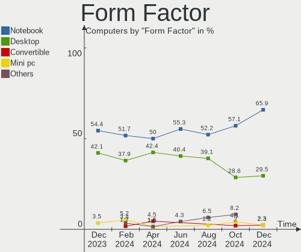
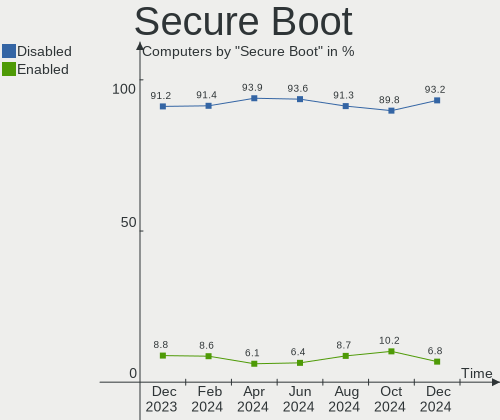
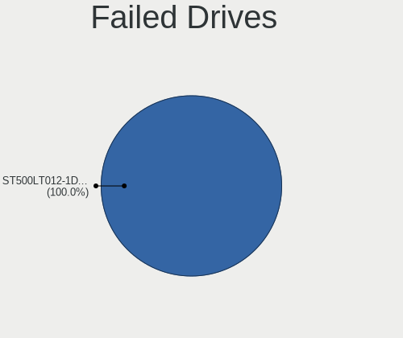
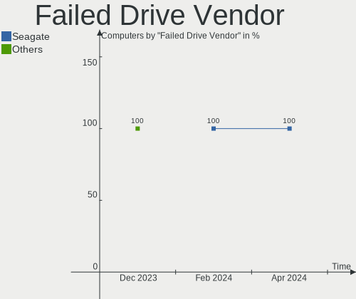
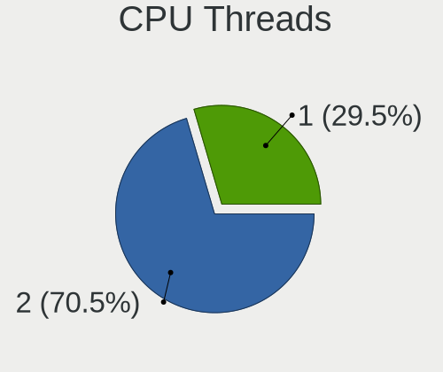
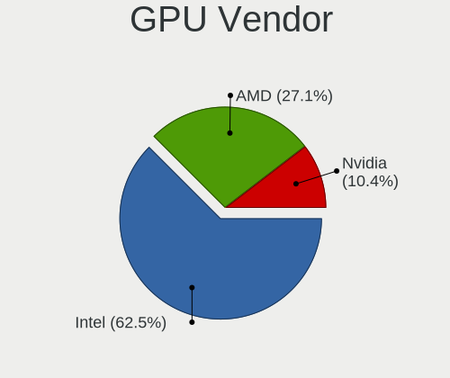
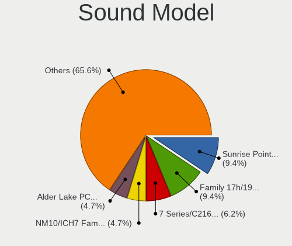

Xubuntu - Hardware Trends
-------------------------

A project to identify most popular hardware characteristics and track their change
over time based on data collected by Linux users at https://Linux-Hardware.org.

Anyone can contribute to this report by the [hw-probe](https://github.com/linuxhw/hw-probe) tool:

    sudo -E hw-probe -all -upload

This is a report for all computer types. See also reports for [desktops](/Dist/Xubuntu/Desktop/README.md) and [notebooks](/Dist/Xubuntu/Notebook/README.md).

This report is for one last month. Overall report since the beginning of time: [TestCoverage](https://github.com/linuxhw/TestCoverage)

Period: Dec, 2022.

Contents
--------

* [ System ](#system)
  - [ OS                       ](#os)
  - [ OS Family                ](#os-family)
  - [ Kernel                   ](#kernel)
  - [ Kernel Family            ](#kernel-family)
  - [ Kernel Major Ver.        ](#kernel-major-ver)
  - [ Arch                     ](#arch)
  - [ DE                       ](#de)
  - [ Display Server           ](#display-server)
  - [ Display Manager          ](#display-manager)
  - [ OS Lang                  ](#os-lang)
  - [ Boot Mode                ](#boot-mode)
  - [ Filesystem               ](#filesystem)
  - [ Part. scheme             ](#part-scheme)
  - [ Dual Boot with Linux/BSD ](#dual-boot-with-linuxbsd)
  - [ Dual Boot (Win)          ](#dual-boot-win)

* [ Board ](#board)
  - [ Vendor                   ](#vendor)
  - [ Model                    ](#model)
  - [ Model Family             ](#model-family)
  - [ MFG Year                 ](#mfg-year)
  - [ Form Factor              ](#form-factor)
  - [ Secure Boot              ](#secure-boot)
  - [ Coreboot                 ](#coreboot)
  - [ RAM Size                 ](#ram-size)
  - [ RAM Used                 ](#ram-used)
  - [ Total Drives             ](#total-drives)
  - [ Has CD-ROM               ](#has-cd-rom)
  - [ Has Ethernet             ](#has-ethernet)
  - [ Has WiFi                 ](#has-wifi)
  - [ Has Bluetooth            ](#has-bluetooth)

* [ Location ](#location)
  - [ Country                  ](#country)
  - [ City                     ](#city)

* [ Drives ](#drives)
  - [ Drive Vendor             ](#drive-vendor)
  - [ Drive Model              ](#drive-model)
  - [ HDD Vendor               ](#hdd-vendor)
  - [ SSD Vendor               ](#ssd-vendor)
  - [ Drive Kind               ](#drive-kind)
  - [ Drive Connector          ](#drive-connector)
  - [ Drive Size               ](#drive-size)
  - [ Space Total              ](#space-total)
  - [ Space Used               ](#space-used)
  - [ Malfunc. Drives          ](#malfunc-drives)
  - [ Malfunc. Drive Vendor    ](#malfunc-drive-vendor)
  - [ Malfunc. HDD Vendor      ](#malfunc-hdd-vendor)
  - [ Malfunc. Drive Kind      ](#malfunc-drive-kind)
  - [ Failed Drives            ](#failed-drives)
  - [ Failed Drive Vendor      ](#failed-drive-vendor)
  - [ Drive Status             ](#drive-status)

* [ Storage controller ](#storage-controller)
  - [ Storage Vendor           ](#storage-vendor)
  - [ Storage Model            ](#storage-model)
  - [ Storage Kind             ](#storage-kind)

* [ Processor ](#processor)
  - [ CPU Vendor               ](#cpu-vendor)
  - [ CPU Model                ](#cpu-model)
  - [ CPU Model Family         ](#cpu-model-family)
  - [ CPU Cores                ](#cpu-cores)
  - [ CPU Sockets              ](#cpu-sockets)
  - [ CPU Threads              ](#cpu-threads)
  - [ CPU Op-Modes             ](#cpu-op-modes)
  - [ CPU Microcode            ](#cpu-microcode)
  - [ CPU Microarch            ](#cpu-microarch)

* [ Graphics ](#graphics)
  - [ GPU Vendor               ](#gpu-vendor)
  - [ GPU Model                ](#gpu-model)
  - [ GPU Combo                ](#gpu-combo)
  - [ GPU Driver               ](#gpu-driver)
  - [ GPU Memory               ](#gpu-memory)

* [ Monitor ](#monitor)
  - [ Monitor Vendor           ](#monitor-vendor)
  - [ Monitor Model            ](#monitor-model)
  - [ Monitor Resolution       ](#monitor-resolution)
  - [ Monitor Diagonal         ](#monitor-diagonal)
  - [ Monitor Width            ](#monitor-width)
  - [ Aspect Ratio             ](#aspect-ratio)
  - [ Monitor Area             ](#monitor-area)
  - [ Pixel Density            ](#pixel-density)
  - [ Multiple Monitors        ](#multiple-monitors)

* [ Network ](#network)
  - [ Net Controller Vendor    ](#net-controller-vendor)
  - [ Net Controller Model     ](#net-controller-model)
  - [ Wireless Vendor          ](#wireless-vendor)
  - [ Wireless Model           ](#wireless-model)
  - [ Ethernet Vendor          ](#ethernet-vendor)
  - [ Ethernet Model           ](#ethernet-model)
  - [ Net Controller Kind      ](#net-controller-kind)
  - [ Used Controller          ](#used-controller)
  - [ NICs                     ](#nics)
  - [ IPv6                     ](#ipv6)

* [ Bluetooth ](#bluetooth)
  - [ Bluetooth Vendor         ](#bluetooth-vendor)
  - [ Bluetooth Model          ](#bluetooth-model)

* [ Sound ](#sound)
  - [ Sound Vendor             ](#sound-vendor)
  - [ Sound Model              ](#sound-model)

* [ Memory ](#memory)
  - [ Memory Vendor            ](#memory-vendor)
  - [ Memory Model             ](#memory-model)
  - [ Memory Kind              ](#memory-kind)
  - [ Memory Form Factor       ](#memory-form-factor)
  - [ Memory Size              ](#memory-size)
  - [ Memory Speed             ](#memory-speed)

* [ Printers & scanners ](#printers--scanners)
  - [ Printer Vendor           ](#printer-vendor)
  - [ Printer Model            ](#printer-model)
  - [ Scanner Vendor           ](#scanner-vendor)
  - [ Scanner Model            ](#scanner-model)

* [ Camera ](#camera)
  - [ Camera Vendor            ](#camera-vendor)
  - [ Camera Model             ](#camera-model)

* [ Security ](#security)
  - [ Fingerprint Vendor       ](#fingerprint-vendor)
  - [ Fingerprint Model        ](#fingerprint-model)
  - [ Chipcard Vendor          ](#chipcard-vendor)
  - [ Chipcard Model           ](#chipcard-model)

* [ Unsupported ](#unsupported)
  - [ Unsupported Devices      ](#unsupported-devices)
  - [ Unsupported Device Types ](#unsupported-device-types)

System
------

OS
--

Installed operating systems

| Name          | Computers | Percent |
|---------------|-----------|---------|
| Xubuntu 22.04 | 50        | 64.1%   |
| Xubuntu 20.04 | 14        | 17.95%  |
| Xubuntu 22.10 | 8         | 10.26%  |
| Xubuntu 18.04 | 4         | 5.13%   |
| Xubuntu 23.04 | 1         | 1.28%   |
| Xubuntu 21.04 | 1         | 1.28%   |

OS Family
---------

OS without a version

| Name    | Computers | Percent |
|---------|-----------|---------|
| Xubuntu | 78        | 100%    |

Kernel
------

Version of the Linux kernel

| Version                         | Computers | Percent |
|---------------------------------|-----------|---------|
| 5.15.0-56-generic               | 38        | 48.72%  |
| 5.4.0-135-generic               | 7         | 8.97%   |
| 5.19.0-26-generic               | 5         | 6.41%   |
| 5.15.0-57-generic               | 3         | 3.85%   |
| 5.15.0-25-generic               | 3         | 3.85%   |
| 5.4.0-132-generic               | 2         | 2.56%   |
| 5.15.0-53-generic               | 2         | 2.56%   |
| 5.15.0-52-generic               | 2         | 2.56%   |
| 6.1.0                           | 1         | 1.28%   |
| 6.0.9-060009-generic            | 1         | 1.28%   |
| 5.4.0-135-lowlatency            | 1         | 1.28%   |
| 5.19.13-xanmod1                 | 1         | 1.28%   |
| 5.19.0-27-generic               | 1         | 1.28%   |
| 5.19.0-23-generic               | 1         | 1.28%   |
| 5.19.0-21-generic               | 1         | 1.28%   |
| 5.19.0-1013-lowlatency          | 1         | 1.28%   |
| 5.17.0-1025-oem                 | 1         | 1.28%   |
| 5.17.0-1020-oem                 | 1         | 1.28%   |
| 5.15.0-48-generic               | 1         | 1.28%   |
| 5.15.0-43-generic               | 1         | 1.28%   |
| 5.13.0-39-generic               | 1         | 1.28%   |
| 5.11.0-49-generic               | 1         | 1.28%   |
| 5.0.0-aml-s912-gf2f3a8c1a-dirty | 1         | 1.28%   |
| 4.15.0-200-generic              | 1         | 1.28%   |

Kernel Family
-------------

Linux kernel without a distro release

| Version | Computers | Percent |
|---------|-----------|---------|
| 5.15.0  | 50        | 64.1%   |
| 5.4.0   | 10        | 12.82%  |
| 5.19.0  | 9         | 11.54%  |
| 5.17.0  | 2         | 2.56%   |
| 6.1.0   | 1         | 1.28%   |
| 6.0.9   | 1         | 1.28%   |
| 5.19.13 | 1         | 1.28%   |
| 5.13.0  | 1         | 1.28%   |
| 5.11.0  | 1         | 1.28%   |
| 5.0.0   | 1         | 1.28%   |
| 4.15.0  | 1         | 1.28%   |

Kernel Major Ver.
-----------------

Linux kernel major version

| Version | Computers | Percent |
|---------|-----------|---------|
| 5.15    | 50        | 64.1%   |
| 5.4     | 10        | 12.82%  |
| 5.19    | 10        | 12.82%  |
| 5.17    | 2         | 2.56%   |
| 6.1     | 1         | 1.28%   |
| 6.0     | 1         | 1.28%   |
| 5.13    | 1         | 1.28%   |
| 5.11    | 1         | 1.28%   |
| 5.0     | 1         | 1.28%   |
| 4.15    | 1         | 1.28%   |

Arch
----

OS architecture (x86_64, i586, etc.)

| Name    | Computers | Percent |
|---------|-----------|---------|
| x86_64  | 74        | 94.87%  |
| i686    | 3         | 3.85%   |
| aarch64 | 1         | 1.28%   |

DE
--

Desktop Environment

| Name  | Computers | Percent |
|-------|-----------|---------|
| XFCE  | 74        | 94.87%  |
| GNOME | 3         | 3.85%   |
| i3    | 1         | 1.28%   |

Display Server
--------------

X11 or Wayland

| Name | Computers | Percent |
|------|-----------|---------|
| X11  | 77        | 98.72%  |
| Tty  | 1         | 1.28%   |

Display Manager
---------------

SDDM, LightDM, etc.

| Name    | Computers | Percent |
|---------|-----------|---------|
| LightDM | 68        | 87.18%  |
| GDM3    | 5         | 6.41%   |
| Unknown | 4         | 5.13%   |
| GDM     | 1         | 1.28%   |

OS Lang
-------

Language

| Lang  | Computers | Percent |
|-------|-----------|---------|
| en_US | 29        | 37.18%  |
| fr_FR | 12        | 15.38%  |
| de_DE | 12        | 15.38%  |
| ru_RU | 5         | 6.41%   |
| it_IT | 5         | 6.41%   |
| en_GB | 4         | 5.13%   |
| tr_TR | 1         | 1.28%   |
| ru_UA | 1         | 1.28%   |
| pt_BR | 1         | 1.28%   |
| pl_PL | 1         | 1.28%   |
| nl_NL | 1         | 1.28%   |
| es_VE | 1         | 1.28%   |
| es_CO | 1         | 1.28%   |
| en_IN | 1         | 1.28%   |
| en_AU | 1         | 1.28%   |
| de_CH | 1         | 1.28%   |
| cs_CZ | 1         | 1.28%   |

Boot Mode
---------

EFI or BIOS

| Mode | Computers | Percent |
|------|-----------|---------|
| BIOS | 42        | 53.85%  |
| EFI  | 36        | 46.15%  |

Filesystem
----------

Type of filesystem

| Type    | Computers | Percent |
|---------|-----------|---------|
| Ext4    | 74        | 94.87%  |
| Overlay | 3         | 3.85%   |
| Btrfs   | 1         | 1.28%   |

Part. scheme
------------

Scheme of partitioning

| Type    | Computers | Percent |
|---------|-----------|---------|
| GPT     | 52        | 66.67%  |
| MBR     | 19        | 24.36%  |
| Unknown | 7         | 8.97%   |

Dual Boot with Linux/BSD
------------------------

Hosting more than one Linux/BSD

| Dual boot | Computers | Percent |
|-----------|-----------|---------|
| No        | 62        | 79.49%  |
| Yes       | 16        | 20.51%  |

Dual Boot (Win)
---------------

Hosting Linux and Windows

| Dual boot | Computers | Percent |
|-----------|-----------|---------|
| No        | 56        | 71.79%  |
| Yes       | 22        | 28.21%  |

Board
-----

Vendor
------

Motherboard manufacturer

| Name                | Computers | Percent |
|---------------------|-----------|---------|
| ASUSTek Computer    | 17        | 21.79%  |
| Hewlett-Packard     | 13        | 16.67%  |
| Lenovo              | 7         | 8.97%   |
| Dell                | 7         | 8.97%   |
| Acer                | 7         | 8.97%   |
| MSI                 | 4         | 5.13%   |
| ASRock              | 3         | 3.85%   |
| Toshiba             | 2         | 2.56%   |
| Gigabyte Technology | 2         | 2.56%   |
| Unknown             | 2         | 2.56%   |
| TrekStor            | 1         | 1.28%   |
| Sony                | 1         | 1.28%   |
| PCWare              | 1         | 1.28%   |
| Packard Bell        | 1         | 1.28%   |
| Microsoft           | 1         | 1.28%   |
| Khadas              | 1         | 1.28%   |
| Intel               | 1         | 1.28%   |
| HUAWEI              | 1         | 1.28%   |
| HIGRADED            | 1         | 1.28%   |
| Google              | 1         | 1.28%   |
| Fusion5             | 1         | 1.28%   |
| ECS                 | 1         | 1.28%   |
| Clevo               | 1         | 1.28%   |
| Apple               | 1         | 1.28%   |

Model
-----

Motherboard model

| Name                                                           | Computers | Percent |
|----------------------------------------------------------------|-----------|---------|
| Dell Latitude E6430                                            | 2         | 2.56%   |
| Unknown                                                        | 2         | 2.56%   |
| TrekStor Primebook C11B                                        | 1         | 1.28%   |
| Toshiba Satellite M70                                          | 1         | 1.28%   |
| Toshiba Satellite C650                                         | 1         | 1.28%   |
| Sony VPCS12V9E                                                 | 1         | 1.28%   |
| PCWare IPMH81G1                                                | 1         | 1.28%   |
| Packard Bell IMEDIA X9305                                      | 1         | 1.28%   |
| MSI MS-7D70                                                    | 1         | 1.28%   |
| MSI MS-7D25                                                    | 1         | 1.28%   |
| MSI MS-7B98                                                    | 1         | 1.28%   |
| MSI MS-7798                                                    | 1         | 1.28%   |
| Microsoft Surface Pro 3                                        | 1         | 1.28%   |
| Lenovo V530S-07ICB 10TX0010PB                                  | 1         | 1.28%   |
| Lenovo ThinkPad X230 23252S4                                   | 1         | 1.28%   |
| Lenovo ThinkPad X1 Carbon Gen 8 20U9CTO1WW                     | 1         | 1.28%   |
| Lenovo ThinkPad Edge E545 20B20015GE                           | 1         | 1.28%   |
| Lenovo ThinkCentre M32 10BV000CMD                              | 1         | 1.28%   |
| Lenovo ThinkBook 14 G2 ITL 20VD                                | 1         | 1.28%   |
| Lenovo FLEX-14IWL Laptop 81SQ                                  | 1         | 1.28%   |
| Khadas VIM2                                                    | 1         | 1.28%   |
| Intel X79 (INTEL Xeon E5/Corei7 DMI2 - C600/C200 Cipset V5.33B | 1         | 1.28%   |
| HUAWEI HVY-WXX9                                                | 1         | 1.28%   |
| HIGRADED W651UI                                                | 1         | 1.28%   |
| HP Pavilion Wave Desktop 600-a0xx                              | 1         | 1.28%   |
| HP Pavilion Laptop 15-cc5xx                                    | 1         | 1.28%   |
| HP Pavilion dv7                                                | 1         | 1.28%   |
| HP Pavilion 17                                                 | 1         | 1.28%   |
| HP Pavilion 15                                                 | 1         | 1.28%   |
| HP Laptop 15-bw0xx                                             | 1         | 1.28%   |
| HP EliteDesk 800 G5 Desktop Mini                               | 1         | 1.28%   |
| HP EliteDesk 800 G1 SFF                                        | 1         | 1.28%   |
| HP Compaq Presario C700                                        | 1         | 1.28%   |
| HP Compaq 6200 Pro MT PC                                       | 1         | 1.28%   |
| HP 350 G1                                                      | 1         | 1.28%   |
| HP 280 G1 MT                                                   | 1         | 1.28%   |
| HP 250 G5 Notebook PC                                          | 1         | 1.28%   |
| Google Auron_Yuna                                              | 1         | 1.28%   |
| Gigabyte GA-880GM-UD2H                                         | 1         | 1.28%   |
| Gigabyte B360M-D3H                                             | 1         | 1.28%   |

Model Family
------------

Motherboard model prefix

| Name                   | Computers | Percent |
|------------------------|-----------|---------|
| HP Pavilion            | 5         | 6.41%   |
| Dell Latitude          | 4         | 5.13%   |
| ASUS PRIME             | 4         | 5.13%   |
| Acer Aspire            | 4         | 5.13%   |
| Lenovo ThinkPad        | 3         | 3.85%   |
| Toshiba Satellite      | 2         | 2.56%   |
| HP EliteDesk           | 2         | 2.56%   |
| HP Compaq              | 2         | 2.56%   |
| Dell XPS               | 2         | 2.56%   |
| ASUS ROG               | 2         | 2.56%   |
| Unknown                | 2         | 2.56%   |
| TrekStor Primebook     | 1         | 1.28%   |
| Sony VPCS12V9E         | 1         | 1.28%   |
| PCWare IPMH81G1        | 1         | 1.28%   |
| Packard Bell IMEDIA    | 1         | 1.28%   |
| MSI MS-7D70            | 1         | 1.28%   |
| MSI MS-7D25            | 1         | 1.28%   |
| MSI MS-7B98            | 1         | 1.28%   |
| MSI MS-7798            | 1         | 1.28%   |
| Microsoft Surface      | 1         | 1.28%   |
| Lenovo V530S-07ICB     | 1         | 1.28%   |
| Lenovo ThinkCentre     | 1         | 1.28%   |
| Lenovo ThinkBook       | 1         | 1.28%   |
| Lenovo FLEX-14IWL      | 1         | 1.28%   |
| Khadas VIM2            | 1         | 1.28%   |
| Intel X79              | 1         | 1.28%   |
| HUAWEI HVY-WXX9        | 1         | 1.28%   |
| HIGRADED W651UI        | 1         | 1.28%   |
| HP Laptop              | 1         | 1.28%   |
| HP 350                 | 1         | 1.28%   |
| HP 280                 | 1         | 1.28%   |
| HP 250                 | 1         | 1.28%   |
| Google Auron           | 1         | 1.28%   |
| Gigabyte GA-880GM-UD2H | 1         | 1.28%   |
| Gigabyte B360M-D3H     | 1         | 1.28%   |
| Fusion5 Lapbook        | 1         | 1.28%   |
| ECS CMPC               | 1         | 1.28%   |
| Dell OptiPlex          | 1         | 1.28%   |
| Clevo P170EM           | 1         | 1.28%   |
| ASUS ZenBook           | 1         | 1.28%   |

MFG Year
--------

Motherboard manufacture year

| Year    | Computers | Percent |
|---------|-----------|---------|
| 2018    | 10        | 12.82%  |
| 2012    | 9         | 11.54%  |
| 2017    | 7         | 8.97%   |
| 2010    | 6         | 7.69%   |
| 2021    | 5         | 6.41%   |
| 2020    | 5         | 6.41%   |
| 2019    | 5         | 6.41%   |
| 2014    | 5         | 6.41%   |
| 2013    | 5         | 6.41%   |
| 2011    | 4         | 5.13%   |
| 2016    | 3         | 3.85%   |
| 2015    | 3         | 3.85%   |
| 2008    | 3         | 3.85%   |
| 2022    | 2         | 2.56%   |
| 2009    | 2         | 2.56%   |
| 2007    | 2         | 2.56%   |
| 2005    | 1         | 1.28%   |
| Unknown | 1         | 1.28%   |

Form Factor
-----------

Physical design of the computer

| Name           | Computers | Percent |
|----------------|-----------|---------|
| Notebook       | 41        | 52.56%  |
| Desktop        | 32        | 41.03%  |
| Tablet         | 2         | 2.56%   |
| Convertible    | 2         | 2.56%   |
| System on chip | 1         | 1.28%   |

Secure Boot
-----------

Enabled or disabled

| State    | Computers | Percent |
|----------|-----------|---------|
| Disabled | 74        | 94.87%  |
| Enabled  | 4         | 5.13%   |

Coreboot
--------

Have coreboot on board

| Used | Computers | Percent |
|------|-----------|---------|
| No   | 77        | 98.72%  |
| Yes  | 1         | 1.28%   |

RAM Size
--------

Total RAM memory

| Size in GB  | Computers | Percent |
|-------------|-----------|---------|
| 3.01-4.0    | 21        | 26.92%  |
| 4.01-8.0    | 20        | 25.64%  |
| 16.01-24.0  | 14        | 17.95%  |
| 8.01-16.0   | 9         | 11.54%  |
| 32.01-64.0  | 4         | 5.13%   |
| 1.01-2.0    | 4         | 5.13%   |
| 2.01-3.0    | 3         | 3.85%   |
| 24.01-32.0  | 2         | 2.56%   |
| 64.01-256.0 | 1         | 1.28%   |

RAM Used
--------

Used RAM memory

| Used GB   | Computers | Percent |
|-----------|-----------|---------|
| 1.01-2.0  | 34        | 43.59%  |
| 2.01-3.0  | 18        | 23.08%  |
| 4.01-8.0  | 11        | 14.1%   |
| 0.51-1.0  | 6         | 7.69%   |
| 3.01-4.0  | 5         | 6.41%   |
| 8.01-16.0 | 4         | 5.13%   |

Total Drives
------------

Number of drives on board

| Drives | Computers | Percent |
|--------|-----------|---------|
| 1      | 49        | 62.82%  |
| 2      | 18        | 23.08%  |
| 3      | 5         | 6.41%   |
| 4      | 4         | 5.13%   |
| 5      | 1         | 1.28%   |
| 0      | 1         | 1.28%   |

Has CD-ROM
----------

Has CD-ROM on board

| Presented | Computers | Percent |
|-----------|-----------|---------|
| No        | 42        | 53.85%  |
| Yes       | 36        | 46.15%  |

Has Ethernet
------------

Has Ethernet on board

| Presented | Computers | Percent |
|-----------|-----------|---------|
| Yes       | 67        | 85.9%   |
| No        | 11        | 14.1%   |

Has WiFi
--------

Has WiFi module

| Presented | Computers | Percent |
|-----------|-----------|---------|
| Yes       | 52        | 66.67%  |
| No        | 26        | 33.33%  |

Has Bluetooth
-------------

Has Bluetooth module

| Presented | Computers | Percent |
|-----------|-----------|---------|
| No        | 40        | 51.28%  |
| Yes       | 38        | 48.72%  |

Location
--------

Country
-------

Geographic location (country)

| Country     | Computers | Percent |
|-------------|-----------|---------|
| France      | 14        | 17.95%  |
| Germany     | 13        | 16.67%  |
| USA         | 11        | 14.1%   |
| Italy       | 7         | 8.97%   |
| Russia      | 5         | 6.41%   |
| UK          | 4         | 5.13%   |
| Sweden      | 2         | 2.56%   |
| Poland      | 2         | 2.56%   |
| Czechia     | 2         | 2.56%   |
| Brazil      | 2         | 2.56%   |
| Belarus     | 2         | 2.56%   |
| Vietnam     | 1         | 1.28%   |
| Venezuela   | 1         | 1.28%   |
| Switzerland | 1         | 1.28%   |
| Slovenia    | 1         | 1.28%   |
| Netherlands | 1         | 1.28%   |
| Mexico      | 1         | 1.28%   |
| Libya       | 1         | 1.28%   |
| Iran        | 1         | 1.28%   |
| Indonesia   | 1         | 1.28%   |
| India       | 1         | 1.28%   |
| Ecuador     | 1         | 1.28%   |
| Colombia    | 1         | 1.28%   |
| Belgium     | 1         | 1.28%   |
| Australia   | 1         | 1.28%   |

City
----

Geographic location (city)

| City                 | Computers | Percent |
|----------------------|-----------|---------|
| Paris                | 3         | 3.85%   |
| Milan                | 3         | 3.85%   |
| Leland               | 3         | 3.85%   |
| Zurich               | 1         | 1.28%   |
| Warsaw               | 1         | 1.28%   |
| Waghausel            | 1         | 1.28%   |
| Voronezh             | 1         | 1.28%   |
| Vohenstrauss         | 1         | 1.28%   |
| Vohburg an der Donau | 1         | 1.28%   |
| Villavicencio        | 1         | 1.28%   |
| Uppsala              | 1         | 1.28%   |
| Unstone              | 1         | 1.28%   |
| Ucel                 | 1         | 1.28%   |
| Tripoli              | 1         | 1.28%   |
| Tomsk                | 1         | 1.28%   |
| Stuttgart            | 1         | 1.28%   |
| Stroud               | 1         | 1.28%   |
| Stoke-on-Trent       | 1         | 1.28%   |
| Springfield          | 1         | 1.28%   |
| Sölvesborg          | 1         | 1.28%   |
| Saldenburg           | 1         | 1.28%   |
| Roubaix              | 1         | 1.28%   |
| Rotterdam            | 1         | 1.28%   |
| Rio de Janeiro       | 1         | 1.28%   |
| Rennes               | 1         | 1.28%   |
| Prague               | 1         | 1.28%   |
| Portland             | 1         | 1.28%   |
| Poitiers             | 1         | 1.28%   |
| Plauen               | 1         | 1.28%   |
| Pisa                 | 1         | 1.28%   |
| Perm                 | 1         | 1.28%   |
| Olathe               | 1         | 1.28%   |
| Oberhausen           | 1         | 1.28%   |
| Novosibirsk          | 1         | 1.28%   |
| Newton Abbot         | 1         | 1.28%   |
| New York             | 1         | 1.28%   |
| Munich               | 1         | 1.28%   |
| Moscow               | 1         | 1.28%   |
| Montluçon           | 1         | 1.28%   |
| Minsk                | 1         | 1.28%   |

Drives
------

Drive Vendor
------------

Hard drive vendors

| Vendor              | Computers | Drives | Percent |
|---------------------|-----------|--------|---------|
| WDC                 | 18        | 20     | 16.98%  |
| Samsung Electronics | 18        | 20     | 16.98%  |
| Seagate             | 11        | 13     | 10.38%  |
| Hitachi             | 7         | 8      | 6.6%    |
| Toshiba             | 6         | 6      | 5.66%   |
| SanDisk             | 5         | 5      | 4.72%   |
| Unknown             | 4         | 4      | 3.77%   |
| Crucial             | 4         | 5      | 3.77%   |
| SK hynix            | 3         | 3      | 2.83%   |
| Silicon Motion      | 3         | 3      | 2.83%   |
| Kingston            | 3         | 3      | 2.83%   |
| A-DATA Technology   | 3         | 3      | 2.83%   |
| KIOXIA              | 2         | 2      | 1.89%   |
| HGST                | 2         | 2      | 1.89%   |
| Apacer              | 2         | 2      | 1.89%   |
| SPCC                | 1         | 1      | 0.94%   |
| PNY                 | 1         | 1      | 0.94%   |
| Phison Electronics  | 1         | 1      | 0.94%   |
| Phison              | 1         | 2      | 0.94%   |
| PHD 3.0             | 1         | 1      | 0.94%   |
| LITEONIT            | 1         | 1      | 0.94%   |
| LITEON              | 1         | 1      | 0.94%   |
| Linux               | 1         | 1      | 0.94%   |
| KingSpec            | 1         | 1      | 0.94%   |
| KingDian            | 1         | 1      | 0.94%   |
| Kimtigo             | 1         | 1      | 0.94%   |
| Hewlett-Packard     | 1         | 1      | 0.94%   |
| China               | 1         | 1      | 0.94%   |
| AMD                 | 1         | 1      | 0.94%   |
| Unknown             | 1         | 1      | 0.94%   |

Drive Model
-----------

Hard drive models

| Model                                             | Computers | Percent |
|---------------------------------------------------|-----------|---------|
| WDC WD5000BEVT-22ZAT0 500GB                       | 2         | 1.8%    |
| Seagate ST3500418AS 500GB                         | 2         | 1.8%    |
| SanDisk DF4064  64GB                              | 2         | 1.8%    |
| Samsung HD103SJ 1TB                               | 2         | 1.8%    |
| WDC WDS120G2G0A-00JH30 120GB SSD                  | 1         | 0.9%    |
| WDC WD5000LPVX-08V0TT5 500GB                      | 1         | 0.9%    |
| WDC WD5000AAKX-60U6AA0 500GB                      | 1         | 0.9%    |
| WDC WD40PURZ-85TTDY0 4TB                          | 1         | 0.9%    |
| WDC WD30EZRZ-00GXCB0 3TB                          | 1         | 0.9%    |
| WDC WD30EURS-63SPKY0 3TB                          | 1         | 0.9%    |
| WDC WD20EZRZ-22Z5HB0 2TB                          | 1         | 0.9%    |
| WDC WD20EFRX-68EUZN0 2TB                          | 1         | 0.9%    |
| WDC WD20EFRX-68AX9N0 2TB                          | 1         | 0.9%    |
| WDC WD20EARS-00J99B0 2TB                          | 1         | 0.9%    |
| WDC WD1200BEVS-60UST0 120GB                       | 1         | 0.9%    |
| WDC WD10SPZX-21Z10T0 1TB                          | 1         | 0.9%    |
| WDC WD10JPVX-60JC3T1 1TB                          | 1         | 0.9%    |
| WDC WD10EZRX-00D8PB0 1TB                          | 1         | 0.9%    |
| WDC WD10EZEX-00BN5A0 1TB                          | 1         | 0.9%    |
| WDC WD10EUCX-73YZ1Y0 1TB                          | 1         | 0.9%    |
| WDC WD10EARX-00PASB0 1TB                          | 1         | 0.9%    |
| WDC WD10EARS-00Y5B1 1TB                           | 1         | 0.9%    |
| Unknown SD/MMC/MS PRO 64GB                        | 1         | 0.9%    |
| Unknown MMC Card  64GB                            | 1         | 0.9%    |
| Unknown MMC Card  32GB                            | 1         | 0.9%    |
| Unknown HBG4a2  32GB                              | 1         | 0.9%    |
| Toshiba MQ04ABF100 1TB                            | 1         | 0.9%    |
| Toshiba MQ01ABF050 500GB                          | 1         | 0.9%    |
| Toshiba KXG6AZNV1T02 1TB                          | 1         | 0.9%    |
| Toshiba DT01ACA200 2TB                            | 1         | 0.9%    |
| Toshiba DT01ACA100 1TB                            | 1         | 0.9%    |
| Toshiba A100 120GB SSD                            | 1         | 0.9%    |
| SPCC Solid State Disk 1TB                         | 1         | 0.9%    |
| SK hynix PC300 NVMe Solid State Drive 1TB         | 1         | 0.9%    |
| SK hynix HFM512GD3JX013N 512GB                    | 1         | 0.9%    |
| SK hynix BC711 NVMe 128GB                         | 1         | 0.9%    |
| Silicon Motion SM2262/SM2262EN SSD Controller 2TB | 1         | 0.9%    |
| Silicon Motion PCIe-8 SSD 512GB                   | 1         | 0.9%    |
| Silicon Motion NE-256 256GB                       | 1         | 0.9%    |
| Seagate ST9750420AS 752GB                         | 1         | 0.9%    |

HDD Vendor
----------

Hard disk drive vendors

| Vendor              | Computers | Drives | Percent |
|---------------------|-----------|--------|---------|
| WDC                 | 17        | 19     | 36.17%  |
| Seagate             | 11        | 12     | 23.4%   |
| Hitachi             | 7         | 8      | 14.89%  |
| Toshiba             | 4         | 4      | 8.51%   |
| Samsung Electronics | 4         | 5      | 8.51%   |
| HGST                | 2         | 2      | 4.26%   |
| Unknown             | 1         | 1      | 2.13%   |
| PHD 3.0             | 1         | 1      | 2.13%   |

SSD Vendor
----------

Solid state drive vendors

| Vendor              | Computers | Drives | Percent |
|---------------------|-----------|--------|---------|
| Samsung Electronics | 12        | 12     | 31.58%  |
| Crucial             | 4         | 5      | 10.53%  |
| Kingston            | 3         | 3      | 7.89%   |
| A-DATA Technology   | 3         | 3      | 7.89%   |
| SanDisk             | 2         | 2      | 5.26%   |
| Apacer              | 2         | 2      | 5.26%   |
| WDC                 | 1         | 1      | 2.63%   |
| Toshiba             | 1         | 1      | 2.63%   |
| SPCC                | 1         | 1      | 2.63%   |
| PNY                 | 1         | 1      | 2.63%   |
| LITEONIT            | 1         | 1      | 2.63%   |
| LITEON              | 1         | 1      | 2.63%   |
| Linux               | 1         | 1      | 2.63%   |
| KingSpec            | 1         | 1      | 2.63%   |
| KingDian            | 1         | 1      | 2.63%   |
| Kimtigo             | 1         | 1      | 2.63%   |
| Hewlett-Packard     | 1         | 1      | 2.63%   |
| China               | 1         | 1      | 2.63%   |

Drive Kind
----------

HDD or SSD

| Kind    | Computers | Drives | Percent |
|---------|-----------|--------|---------|
| HDD     | 39        | 52     | 40.63%  |
| SSD     | 34        | 39     | 35.42%  |
| NVMe    | 16        | 17     | 16.67%  |
| MMC     | 6         | 6      | 6.25%   |
| Unknown | 1         | 1      | 1.04%   |

Drive Connector
---------------

SATA, SAS, NVMe, etc.

| Type | Computers | Drives | Percent |
|------|-----------|--------|---------|
| SATA | 64        | 89     | 71.91%  |
| NVMe | 16        | 17     | 17.98%  |
| MMC  | 6         | 6      | 6.74%   |
| SAS  | 3         | 3      | 3.37%   |

Drive Size
----------

Size of hard drive

| Size in TB | Computers | Drives | Percent |
|------------|-----------|--------|---------|
| 0.01-0.5   | 46        | 53     | 59.74%  |
| 0.51-1.0   | 23        | 28     | 29.87%  |
| 1.01-2.0   | 5         | 6      | 6.49%   |
| 2.01-3.0   | 2         | 2      | 2.6%    |
| 3.01-4.0   | 1         | 2      | 1.3%    |

Space Total
-----------

Amount of disk space available on the file system

| Size in GB     | Computers | Percent |
|----------------|-----------|---------|
| 101-250        | 23        | 29.49%  |
| 251-500        | 18        | 23.08%  |
| 501-1000       | 12        | 15.38%  |
| 51-100         | 7         | 8.97%   |
| More than 3000 | 4         | 5.13%   |
| 21-50          | 4         | 5.13%   |
| 1001-2000      | 4         | 5.13%   |
| 2001-3000      | 3         | 3.85%   |
| 1-20           | 3         | 3.85%   |

Space Used
----------

Amount of used disk space

| Used GB   | Computers | Percent |
|-----------|-----------|---------|
| 1-20      | 24        | 30.77%  |
| 51-100    | 16        | 20.51%  |
| 21-50     | 14        | 17.95%  |
| 251-500   | 8         | 10.26%  |
| 101-250   | 8         | 10.26%  |
| 2001-3000 | 3         | 3.85%   |
| 1001-2000 | 3         | 3.85%   |
| 501-1000  | 2         | 2.56%   |

Malfunc. Drives
---------------

Drive models with a malfunction

| Model                             | Computers | Drives | Percent |
|-----------------------------------|-----------|--------|---------|
| WDC WD5000AAKX-60U6AA0 500GB      | 1         | 1      | 6.67%   |
| WDC WD1200BEVS-60UST0 120GB       | 1         | 1      | 6.67%   |
| Toshiba DT01ACA200 2TB            | 1         | 1      | 6.67%   |
| Toshiba DT01ACA100 1TB            | 1         | 1      | 6.67%   |
| Seagate ST9750420AS 752GB         | 1         | 2      | 6.67%   |
| Seagate ST9500325ASG 500GB        | 1         | 1      | 6.67%   |
| Seagate ST9250410AS 250GB         | 1         | 1      | 6.67%   |
| Seagate ST500LT012-9WS142 500GB   | 1         | 1      | 6.67%   |
| Samsung Electronics SP2514N 250GB | 1         | 1      | 6.67%   |
| Samsung Electronics HD753LJ 752GB | 1         | 1      | 6.67%   |
| Samsung Electronics HD250HJ 250GB | 1         | 1      | 6.67%   |
| Samsung Electronics HD103SJ 1TB   | 1         | 1      | 6.67%   |
| LITEON LCH-512V2S 512GB SSD       | 1         | 1      | 6.67%   |
| Kingston SNS4151S332GD 32GB SSD   | 1         | 1      | 6.67%   |
| Hitachi HDS722540VLAT20 40GB      | 1         | 1      | 6.67%   |

Malfunc. Drive Vendor
---------------------

Vendors of faulty drives

| Vendor              | Computers | Drives | Percent |
|---------------------|-----------|--------|---------|
| Seagate             | 4         | 5      | 28.57%  |
| Samsung Electronics | 3         | 4      | 21.43%  |
| WDC                 | 2         | 2      | 14.29%  |
| Toshiba             | 2         | 2      | 14.29%  |
| LITEON              | 1         | 1      | 7.14%   |
| Kingston            | 1         | 1      | 7.14%   |
| Hitachi             | 1         | 1      | 7.14%   |

Malfunc. HDD Vendor
-------------------

Vendors of faulty HDD drives

| Vendor              | Computers | Drives | Percent |
|---------------------|-----------|--------|---------|
| Seagate             | 4         | 5      | 33.33%  |
| Samsung Electronics | 3         | 4      | 25%     |
| WDC                 | 2         | 2      | 16.67%  |
| Toshiba             | 2         | 2      | 16.67%  |
| Hitachi             | 1         | 1      | 8.33%   |

Malfunc. Drive Kind
-------------------

Kinds of faulty drives

| Kind | Computers | Drives | Percent |
|------|-----------|--------|---------|
| HDD  | 12        | 14     | 85.71%  |
| SSD  | 2         | 2      | 14.29%  |

Failed Drives
-------------

Failed drive models

| Model                    | Computers | Drives | Percent |
|--------------------------|-----------|--------|---------|
| WDC WD20EARS-00J99B0 2TB | 1         | 1      | 100%    |

Failed Drive Vendor
-------------------

Failed drive vendors

| Vendor | Computers | Drives | Percent |
|--------|-----------|--------|---------|
| WDC    | 1         | 1      | 100%    |

Drive Status
------------

Number of failed and malfunc. drives

| Status   | Computers | Drives | Percent |
|----------|-----------|--------|---------|
| Works    | 39        | 53     | 45.88%  |
| Detected | 31        | 45     | 36.47%  |
| Malfunc  | 14        | 16     | 16.47%  |
| Failed   | 1         | 1      | 1.18%   |

Storage controller
------------------

Storage Vendor
--------------

Storage controller vendors

| Vendor                       | Computers | Percent |
|------------------------------|-----------|---------|
| Intel                        | 60        | 66.67%  |
| AMD                          | 12        | 13.33%  |
| Silicon Motion               | 4         | 4.44%   |
| SK hynix                     | 3         | 3.33%   |
| Samsung Electronics          | 3         | 3.33%   |
| Phison Electronics           | 2         | 2.22%   |
| KIOXIA                       | 2         | 2.22%   |
| VIA Technologies             | 1         | 1.11%   |
| Toshiba America Info Systems | 1         | 1.11%   |
| SanDisk                      | 1         | 1.11%   |
| ASMedia Technology           | 1         | 1.11%   |

Storage Model
-------------

Storage controller models

| Model                                                                            | Computers | Percent |
|----------------------------------------------------------------------------------|-----------|---------|
| AMD FCH SATA Controller [AHCI mode]                                              | 8         | 7.69%   |
| Intel 7 Series Chipset Family 6-port SATA Controller [AHCI mode]                 | 7         | 6.73%   |
| Intel Wildcat Point-LP SATA Controller [AHCI Mode]                               | 4         | 3.85%   |
| Intel Celeron N3350/Pentium N4200/Atom E3900 Series SATA AHCI Controller         | 4         | 3.85%   |
| Intel Cannon Lake PCH SATA AHCI Controller                                       | 4         | 3.85%   |
| Intel 8 Series/C220 Series Chipset Family 6-port SATA Controller 1 [AHCI mode]   | 4         | 3.85%   |
| Intel 6 Series/C200 Series Chipset Family 6 port Mobile SATA AHCI Controller     | 4         | 3.85%   |
| AMD 400 Series Chipset SATA Controller                                           | 4         | 3.85%   |
| Intel 8 Series SATA Controller 1 [AHCI mode]                                     | 3         | 2.88%   |
| Intel 7 Series/C210 Series Chipset Family 6-port SATA Controller [AHCI mode]     | 3         | 2.88%   |
| Intel 6 Series/C200 Series Chipset Family 6 port Desktop SATA AHCI Controller    | 3         | 2.88%   |
| Intel 5 Series/3400 Series Chipset 4 port SATA AHCI Controller                   | 3         | 2.88%   |
| SK hynix Gold P31/PC711 NVMe Solid State Drive                                   | 2         | 1.92%   |
| Silicon Motion SM2263EN/SM2263XT SSD Controller                                  | 2         | 1.92%   |
| Samsung NVMe SSD Controller 980                                                  | 2         | 1.92%   |
| KIOXIA NVMe SSD Controller BG4                                                   | 2         | 1.92%   |
| Intel Volume Management Device NVMe RAID Controller                              | 2         | 1.92%   |
| Intel Q170/Q150/B150/H170/H110/Z170/CM236 Chipset SATA Controller [AHCI Mode]    | 2         | 1.92%   |
| Intel 82801IBM/IEM (ICH9M/ICH9M-E) 4 port SATA Controller [AHCI mode]            | 2         | 1.92%   |
| Intel 82801HM/HEM (ICH8M/ICH8M-E) IDE Controller                                 | 2         | 1.92%   |
| AMD SB7x0/SB8x0/SB9x0 IDE Controller                                             | 2         | 1.92%   |
| AMD FCH SATA Controller D                                                        | 2         | 1.92%   |
| VIA VT82C586A/B/VT82C686/A/B/VT823x/A/C PIPC Bus Master IDE                      | 1         | 0.96%   |
| VIA Serial ATA Controller                                                        | 1         | 0.96%   |
| Toshiba America Info Systems XG6 NVMe SSD Controller                             | 1         | 0.96%   |
| SK hynix PC300 NVMe Solid State Drive 1TB                                        | 1         | 0.96%   |
| Silicon Motion SM2262/SM2262EN SSD Controller                                    | 1         | 0.96%   |
| Silicon Motion Non-Volatile memory controller                                    | 1         | 0.96%   |
| SanDisk Non-Volatile memory controller                                           | 1         | 0.96%   |
| Samsung NVMe SSD Controller SM981/PM981/PM983                                    | 1         | 0.96%   |
| Phison E18 PCIe4 NVMe Controller                                                 | 1         | 0.96%   |
| Phison E12 NVMe Controller                                                       | 1         | 0.96%   |
| Intel Tiger Lake-LP SATA Controller                                              | 1         | 0.96%   |
| Intel Sunrise Point-LP SATA Controller [AHCI mode]                               | 1         | 0.96%   |
| Intel NM10/ICH7 Family SATA Controller [IDE mode]                                | 1         | 0.96%   |
| Intel NM10/ICH7 Family SATA Controller [AHCI mode]                               | 1         | 0.96%   |
| Intel HM170/QM170 Chipset SATA Controller [AHCI Mode]                            | 1         | 0.96%   |
| Intel Celeron/Pentium Silver Processor SATA Controller                           | 1         | 0.96%   |
| Intel Cannon Point-LP SATA Controller [AHCI Mode]                                | 1         | 0.96%   |
| Intel Atom/Celeron/Pentium Processor x5-E8000/J3xxx/N3xxx Series SATA Controller | 1         | 0.96%   |

Storage Kind
------------

Kind of storage controller (IDE, SATA, NVMe, SAS, ...)

| Kind | Computers | Percent |
|------|-----------|---------|
| SATA | 67        | 71.28%  |
| NVMe | 16        | 17.02%  |
| IDE  | 8         | 8.51%   |
| RAID | 3         | 3.19%   |

Processor
---------

CPU Vendor
----------

Processor vendors

| Vendor | Computers | Percent |
|--------|-----------|---------|
| Intel  | 64        | 82.05%  |
| AMD    | 13        | 16.67%  |
| ARM    | 1         | 1.28%   |

CPU Model
---------

Processor models

| Model                                       | Computers | Percent |
|---------------------------------------------|-----------|---------|
| Intel Core i7-2670QM CPU @ 2.20GHz          | 2         | 2.56%   |
| Intel Core i5-8400 CPU @ 2.80GHz            | 2         | 2.56%   |
| Intel Core i5-4590 CPU @ 3.30GHz            | 2         | 2.56%   |
| Intel Celeron CPU N3350 @ 1.10GHz           | 2         | 2.56%   |
| Intel Xeon CPU E5-2689 0 @ 2.60GHz          | 1         | 1.28%   |
| Intel Xeon CPU E5-2470 0 @ 2.30GHz          | 1         | 1.28%   |
| Intel Pentium M processor 1.86GHz           | 1         | 1.28%   |
| Intel Pentium Gold G5420 CPU @ 3.80GHz      | 1         | 1.28%   |
| Intel Pentium Dual-Core CPU E5700 @ 3.00GHz | 1         | 1.28%   |
| Intel Pentium Dual CPU T3400 @ 2.16GHz      | 1         | 1.28%   |
| Intel Pentium Dual CPU T2370 @ 1.73GHz      | 1         | 1.28%   |
| Intel Pentium CPU N4200 @ 1.10GHz           | 1         | 1.28%   |
| Intel Pentium CPU N3700 @ 1.60GHz           | 1         | 1.28%   |
| Intel Pentium CPU G860 @ 3.00GHz            | 1         | 1.28%   |
| Intel Core i7-7700HQ CPU @ 2.80GHz          | 1         | 1.28%   |
| Intel Core i7-5500U CPU @ 2.40GHz           | 1         | 1.28%   |
| Intel Core i7-3770 CPU @ 3.40GHz            | 1         | 1.28%   |
| Intel Core i7-3720QM CPU @ 2.60GHz          | 1         | 1.28%   |
| Intel Core i7-3630QM CPU @ 2.40GHz          | 1         | 1.28%   |
| Intel Core i7-2677M CPU @ 1.80GHz           | 1         | 1.28%   |
| Intel Core i7-10610U CPU @ 1.80GHz          | 1         | 1.28%   |
| Intel Core i7 CPU Q 720 @ 1.60GHz           | 1         | 1.28%   |
| Intel Core i5-9600K CPU @ 3.70GHz           | 1         | 1.28%   |
| Intel Core i5-8265U CPU @ 1.60GHz           | 1         | 1.28%   |
| Intel Core i5-7200U CPU @ 2.50GHz           | 1         | 1.28%   |
| Intel Core i5-6400T CPU @ 2.20GHz           | 1         | 1.28%   |
| Intel Core i5-5300U CPU @ 2.30GHz           | 1         | 1.28%   |
| Intel Core i5-4460 CPU @ 3.20GHz            | 1         | 1.28%   |
| Intel Core i5-4310U CPU @ 2.00GHz           | 1         | 1.28%   |
| Intel Core i5-4300U CPU @ 1.90GHz           | 1         | 1.28%   |
| Intel Core i5-4210U CPU @ 1.70GHz           | 1         | 1.28%   |
| Intel Core i5-3340M CPU @ 2.70GHz           | 1         | 1.28%   |
| Intel Core i5-3320M CPU @ 2.60GHz           | 1         | 1.28%   |
| Intel Core i5-3210M CPU @ 2.50GHz           | 1         | 1.28%   |
| Intel Core i5-2435M CPU @ 2.40GHz           | 1         | 1.28%   |
| Intel Core i5-10300H CPU @ 2.50GHz          | 1         | 1.28%   |
| Intel Core i5 CPU M 520 @ 2.40GHz           | 1         | 1.28%   |
| Intel Core i3-9100 CPU @ 3.60GHz            | 1         | 1.28%   |
| Intel Core i3-7020U CPU @ 2.30GHz           | 1         | 1.28%   |
| Intel Core i3-6100T CPU @ 3.20GHz           | 1         | 1.28%   |

CPU Model Family
----------------

Processor model prefix

| Model                   | Computers | Percent |
|-------------------------|-----------|---------|
| Intel Core i5           | 19        | 24.36%  |
| Intel Core i7           | 10        | 12.82%  |
| Intel Core i3           | 9         | 11.54%  |
| Intel Celeron           | 8         | 10.26%  |
| Other                   | 4         | 5.13%   |
| AMD Ryzen 5             | 4         | 5.13%   |
| Intel Pentium           | 3         | 3.85%   |
| AMD Ryzen 9             | 3         | 3.85%   |
| Intel Xeon              | 2         | 2.56%   |
| Intel Pentium Dual      | 2         | 2.56%   |
| Intel Core 2 Duo        | 2         | 2.56%   |
| Intel Atom              | 2         | 2.56%   |
| Intel Pentium M         | 1         | 1.28%   |
| Intel Pentium Gold      | 1         | 1.28%   |
| Intel Pentium Dual-Core | 1         | 1.28%   |
| Intel Core 2 Quad       | 1         | 1.28%   |
| AMD Ryzen 7             | 1         | 1.28%   |
| AMD Ryzen 3             | 1         | 1.28%   |
| AMD Phenom II X4        | 1         | 1.28%   |
| AMD Athlon II X4        | 1         | 1.28%   |
| AMD A8                  | 1         | 1.28%   |
| AMD A10                 | 1         | 1.28%   |

CPU Cores
---------

Number of processor cores

| Number | Computers | Percent |
|--------|-----------|---------|
| 2      | 38        | 48.72%  |
| 4      | 25        | 32.05%  |
| 6      | 6         | 7.69%   |
| 8      | 4         | 5.13%   |
| 16     | 2         | 2.56%   |
| 14     | 1         | 1.28%   |
| 12     | 1         | 1.28%   |
| 1      | 1         | 1.28%   |

CPU Sockets
-----------

Number of sockets

| Number | Computers | Percent |
|--------|-----------|---------|
| 1      | 77        | 98.72%  |
| 2      | 1         | 1.28%   |

CPU Threads
-----------

Threads per core (Hyper-Threading)

| Number | Computers | Percent |
|--------|-----------|---------|
| 2      | 47        | 60.26%  |
| 1      | 31        | 39.74%  |

CPU Op-Modes
------------

CPU Operation Modes (32-bit, 64-bit)

| Op mode        | Computers | Percent |
|----------------|-----------|---------|
| 32-bit, 64-bit | 76        | 97.44%  |
| 64-bit         | 1         | 1.28%   |
| 32-bit         | 1         | 1.28%   |

CPU Microcode
-------------

Microcode number

| Number     | Computers | Percent |
|------------|-----------|---------|
| Unknown    | 19        | 24.36%  |
| 0x306a9    | 7         | 8.97%   |
| 0x206a7    | 5         | 6.41%   |
| 0x506c9    | 3         | 3.85%   |
| 0x40651    | 3         | 3.85%   |
| 0x306d4    | 3         | 3.85%   |
| 0x306c3    | 3         | 3.85%   |
| 0x906ea    | 2         | 2.56%   |
| 0x806ec    | 2         | 2.56%   |
| 0x806c1    | 2         | 2.56%   |
| 0x6fd      | 2         | 2.56%   |
| 0x206d7    | 2         | 2.56%   |
| 0x1067a    | 2         | 2.56%   |
| 0x0800820d | 2         | 2.56%   |
| 0x010000c8 | 2         | 2.56%   |
| 0xb0671    | 1         | 1.28%   |
| 0xa0652    | 1         | 1.28%   |
| 0x906eb    | 1         | 1.28%   |
| 0x706a1    | 1         | 1.28%   |
| 0x6fb      | 1         | 1.28%   |
| 0x6d8      | 1         | 1.28%   |
| 0x506e3    | 1         | 1.28%   |
| 0x406c4    | 1         | 1.28%   |
| 0x406c3    | 1         | 1.28%   |
| 0x20652    | 1         | 1.28%   |
| 0x106e5    | 1         | 1.28%   |
| 0x106ca    | 1         | 1.28%   |
| 0x10676    | 1         | 1.28%   |
| 0x0a601201 | 1         | 1.28%   |
| 0x0a201016 | 1         | 1.28%   |
| 0x08600106 | 1         | 1.28%   |
| 0x08108109 | 1         | 1.28%   |
| 0x0600611a | 1         | 1.28%   |
| 0x06001119 | 1         | 1.28%   |

CPU Microarch
-------------

Microarchitecture

| Name             | Computers | Percent |
|------------------|-----------|---------|
| SandyBridge      | 10        | 12.82%  |
| KabyLake         | 10        | 12.82%  |
| IvyBridge        | 8         | 10.26%  |
| Haswell          | 7         | 8.97%   |
| Zen+             | 5         | 6.41%   |
| Goldmont         | 4         | 5.13%   |
| Broadwell        | 4         | 5.13%   |
| Silvermont       | 3         | 3.85%   |
| Penryn           | 3         | 3.85%   |
| Core             | 3         | 3.85%   |
| Zen 3            | 2         | 2.56%   |
| Westmere         | 2         | 2.56%   |
| TigerLake        | 2         | 2.56%   |
| Skylake          | 2         | 2.56%   |
| K10              | 2         | 2.56%   |
| Unknown          | 2         | 2.56%   |
| Zen 2            | 1         | 1.28%   |
| Piledriver       | 1         | 1.28%   |
| P6               | 1         | 1.28%   |
| Nehalem          | 1         | 1.28%   |
| Goldmont plus    | 1         | 1.28%   |
| Excavator        | 1         | 1.28%   |
| CometLake        | 1         | 1.28%   |
| Bonnell          | 1         | 1.28%   |
| Alderlake Hybrid | 1         | 1.28%   |

Graphics
--------

GPU Vendor
----------

Vendors of graphics cards

| Vendor | Computers | Percent |
|--------|-----------|---------|
| Intel  | 51        | 56.67%  |
| Nvidia | 22        | 24.44%  |
| AMD    | 17        | 18.89%  |

GPU Model
---------

Graphics card models

| Model                                                                                    | Computers | Percent |
|------------------------------------------------------------------------------------------|-----------|---------|
| Intel 2nd Generation Core Processor Family Integrated Graphics Controller                | 7         | 7.53%   |
| Intel 3rd Gen Core processor Graphics Controller                                         | 6         | 6.45%   |
| Intel Xeon E3-1200 v3/4th Gen Core Processor Integrated Graphics Controller              | 4         | 4.3%    |
| Intel HD Graphics 5500                                                                   | 3         | 3.23%   |
| Intel HD Graphics 500                                                                    | 3         | 3.23%   |
| Intel Haswell-ULT Integrated Graphics Controller                                         | 3         | 3.23%   |
| Intel Atom/Celeron/Pentium Processor x5-E8000/J3xxx/N3xxx Integrated Graphics Controller | 3         | 3.23%   |
| Nvidia GP108 [GeForce GT 1030]                                                           | 2         | 2.15%   |
| Nvidia GK208B [GeForce GT 710]                                                           | 2         | 2.15%   |
| Intel HD Graphics 620                                                                    | 2         | 2.15%   |
| Intel HD Graphics 530                                                                    | 2         | 2.15%   |
| Intel CoffeeLake-S GT2 [UHD Graphics 630]                                                | 2         | 2.15%   |
| AMD Sun XT [Radeon HD 8670A/8670M/8690M / R5 M330 / M430 / Radeon 520 Mobile]            | 2         | 2.15%   |
| AMD RS880 [Radeon HD 4250]                                                               | 2         | 2.15%   |
| AMD Picasso/Raven 2 [Radeon Vega Series / Radeon Vega Mobile Series]                     | 2         | 2.15%   |
| Nvidia TU117M [GeForce GTX 1650 Mobile / Max-Q]                                          | 1         | 1.08%   |
| Nvidia GT218M [GeForce 310M]                                                             | 1         | 1.08%   |
| Nvidia GT215M [GeForce GTS 360M]                                                         | 1         | 1.08%   |
| Nvidia GP107M [GeForce GTX 1050 Mobile]                                                  | 1         | 1.08%   |
| Nvidia GP107 [GeForce GTX 1050 Ti]                                                       | 1         | 1.08%   |
| Nvidia GM206 [GeForce GTX 950]                                                           | 1         | 1.08%   |
| Nvidia GM204 [GeForce GTX 970]                                                           | 1         | 1.08%   |
| Nvidia GM108M [GeForce 930M]                                                             | 1         | 1.08%   |
| Nvidia GM108M [GeForce 840M]                                                             | 1         | 1.08%   |
| Nvidia GM107 [GeForce GTX 750]                                                           | 1         | 1.08%   |
| Nvidia GK104M [GeForce GTX 670MX]                                                        | 1         | 1.08%   |
| Nvidia GF119M [GeForce GT 520MX]                                                         | 1         | 1.08%   |
| Nvidia GF108M [GeForce GT 635M]                                                          | 1         | 1.08%   |
| Nvidia GF108GLM [NVS 5200M]                                                              | 1         | 1.08%   |
| Nvidia GF108 [GeForce GT 620]                                                            | 1         | 1.08%   |
| Nvidia G98M [GeForce 9300M GS]                                                           | 1         | 1.08%   |
| Nvidia G96CM [GeForce GT 130M]                                                           | 1         | 1.08%   |
| Nvidia G84 [GeForce 8600 GS]                                                             | 1         | 1.08%   |
| Intel WhiskeyLake-U GT2 [UHD Graphics 620]                                               | 1         | 1.08%   |
| Intel TigerLake-LP GT2 [Iris Xe Graphics]                                                | 1         | 1.08%   |
| Intel Tiger Lake-LP GT2 [UHD Graphics G4]                                                | 1         | 1.08%   |
| Intel Raptor Lake-S UHD Graphics                                                         | 1         | 1.08%   |
| Intel Mobile GM965/GL960 Integrated Graphics Controller (secondary)                      | 1         | 1.08%   |
| Intel Mobile GM965/GL960 Integrated Graphics Controller (primary)                        | 1         | 1.08%   |
| Intel Mobile 4 Series Chipset Integrated Graphics Controller                             | 1         | 1.08%   |

GPU Combo
---------

Combinations of graphics cards

| Name           | Computers | Percent |
|----------------|-----------|---------|
| 1 x Intel      | 38        | 48.72%  |
| 1 x Nvidia     | 13        | 16.67%  |
| 1 x AMD        | 11        | 14.1%   |
| Intel + Nvidia | 9         | 11.54%  |
| Intel + AMD    | 4         | 5.13%   |
| 2 x AMD        | 2         | 2.56%   |
| Other          | 1         | 1.28%   |

GPU Driver
----------

Free vs proprietary

| Driver      | Computers | Percent |
|-------------|-----------|---------|
| Free        | 65        | 83.33%  |
| Proprietary | 11        | 14.1%   |
| Unknown     | 2         | 2.56%   |

GPU Memory
----------

Total video memory

| Size in GB | Computers | Percent |
|------------|-----------|---------|
| Unknown    | 49        | 62.82%  |
| 0.01-0.5   | 9         | 11.54%  |
| 0.51-1.0   | 8         | 10.26%  |
| 1.01-2.0   | 5         | 6.41%   |
| 3.01-4.0   | 4         | 5.13%   |
| 7.01-8.0   | 1         | 1.28%   |
| 2.01-3.0   | 1         | 1.28%   |
| 8.01-16.0  | 1         | 1.28%   |

Monitor
-------

Monitor Vendor
--------------

Monitor vendors

| Vendor               | Computers | Percent |
|----------------------|-----------|---------|
| AU Optronics         | 11        | 13.58%  |
| BOE                  | 9         | 11.11%  |
| LG Display           | 8         | 9.88%   |
| Dell                 | 8         | 9.88%   |
| Samsung Electronics  | 5         | 6.17%   |
| Goldstar             | 4         | 4.94%   |
| AOC                  | 4         | 4.94%   |
| Hewlett-Packard      | 3         | 3.7%    |
| Acer                 | 3         | 3.7%    |
| ViewSonic            | 2         | 2.47%   |
| Philips              | 2         | 2.47%   |
| LG Philips           | 2         | 2.47%   |
| BenQ                 | 2         | 2.47%   |
| Vizio                | 1         | 1.23%   |
| Sony                 | 1         | 1.23%   |
| Sharp                | 1         | 1.23%   |
| PANDA                | 1         | 1.23%   |
| Packard Bell         | 1         | 1.23%   |
| ONN                  | 1         | 1.23%   |
| Microstep            | 1         | 1.23%   |
| Lenovo               | 1         | 1.23%   |
| JRP                  | 1         | 1.23%   |
| Iiyama               | 1         | 1.23%   |
| Hitachi              | 1         | 1.23%   |
| HannStar             | 1         | 1.23%   |
| Fujitsu Siemens      | 1         | 1.23%   |
| Envision Peripherals | 1         | 1.23%   |
| CSO                  | 1         | 1.23%   |
| CPT                  | 1         | 1.23%   |
| ASUSTek Computer     | 1         | 1.23%   |
| Apple                | 1         | 1.23%   |

Monitor Model
-------------

Monitor models

| Model                                                                 | Computers | Percent |
|-----------------------------------------------------------------------|-----------|---------|
| BenQ GW2270 BNQ78DB 1920x1080 480x270mm 21.7-inch                     | 2         | 2.41%   |
| Vizio E320VT VIZ0067 1920x1080 698x392mm 31.5-inch                    | 1         | 1.2%    |
| ViewSonic VA702 SERIES VSC231C 1280x1024 338x270mm 17.0-inch          | 1         | 1.2%    |
| ViewSonic VA2432-FHD VSCB639 1920x1080 530x300mm 24.0-inch            | 1         | 1.2%    |
| Sony NvidiaDefault SNY05FA 1366x768 290x170mm 13.2-inch               | 1         | 1.2%    |
| Sharp LCD Monitor SHP1476 3840x2160 346x194mm 15.6-inch               | 1         | 1.2%    |
| Samsung Electronics SyncMaster SAM03E3 1680x1050 433x271mm 20.1-inch  | 1         | 1.2%    |
| Samsung Electronics LCD Monitor SEC544B 1600x900 382x214mm 17.2-inch  | 1         | 1.2%    |
| Samsung Electronics LCD Monitor SEC3542 2160x1440 254x169mm 12.0-inch | 1         | 1.2%    |
| Samsung Electronics LCD Monitor SEC314F 1600x900 382x215mm 17.3-inch  | 1         | 1.2%    |
| Samsung Electronics C27FG7x SAM0E41 1920x1080 598x337mm 27.0-inch     | 1         | 1.2%    |
| Philips PHL 223V5 PHLC0CF 1920x1080 477x268mm 21.5-inch               | 1         | 1.2%    |
| Philips 170S PHL082B 1280x1024 338x270mm 17.0-inch                    | 1         | 1.2%    |
| PANDA LCD Monitor NCP004D 1920x1080 344x194mm 15.5-inch               | 1         | 1.2%    |
| Packard Bell Viseo 230Ws PKB00C1 1920x1080 509x286mm 23.0-inch        | 1         | 1.2%    |
| ONN ONA18HO015 ONN0101 1920x1080 470x290mm 21.7-inch                  | 1         | 1.2%    |
| Microstep LCD Monitor MSI G273Q 2560x1440                             | 1         | 1.2%    |
| LG Philips LCD Monitor LPLE300 1280x800 331x207mm 15.4-inch           | 1         | 1.2%    |
| LG Philips LCD Monitor LPLA103 1440x900 367x230mm 17.1-inch           | 1         | 1.2%    |
| LG Display LP156WH2-TLE1 LGDCF01 1366x768 344x194mm 15.5-inch         | 1         | 1.2%    |
| LG Display LP156WH2-TLAA LGD0230 1366x768 344x194mm 15.5-inch         | 1         | 1.2%    |
| LG Display LCD Monitor LGD059A 1920x1080 344x194mm 15.5-inch          | 1         | 1.2%    |
| LG Display LCD Monitor LGD044F 1920x1080 345x194mm 15.6-inch          | 1         | 1.2%    |
| LG Display LCD Monitor LGD03A3 1366x768 277x156mm 12.5-inch           | 1         | 1.2%    |
| LG Display LCD Monitor LGD039F 1366x768 345x194mm 15.6-inch           | 1         | 1.2%    |
| LG Display LCD Monitor LGD02DF 1600x900 310x174mm 14.0-inch           | 1         | 1.2%    |
| LG Display LCD Monitor LGD02DC 1366x768 344x194mm 15.5-inch           | 1         | 1.2%    |
| Lenovo LCD Monitor LEN60A0 1600x900 430x240mm 19.4-inch               | 1         | 1.2%    |
| JRP JRP7007 JRP7007 1280x1024 470x260mm 21.1-inch                     | 1         | 1.2%    |
| Iiyama X2483_2480-DP IVM6129 1920x1080 527x296mm 23.8-inch            | 1         | 1.2%    |
| Hitachi HISENSE HEC002F 3840x2160 1872x1053mm 84.6-inch               | 1         | 1.2%    |
| Hewlett-Packard LE1901w HWP2842 1440x900 410x256mm 19.0-inch          | 1         | 1.2%    |
| Hewlett-Packard LA2006 HWP2944 1600x900 443x249mm 20.0-inch           | 1         | 1.2%    |
| Hewlett-Packard E243i HPN3463 1920x1200 518x324mm 24.1-inch           | 1         | 1.2%    |
| Hewlett-Packard E243 HPN3468 1920x1080 527x296mm 23.8-inch            | 1         | 1.2%    |
| HannStar HSD121PHW1 HSD04B6 1366x768 270x150mm 12.2-inch              | 1         | 1.2%    |
| Goldstar HDR WQHD+ GSM774D 3840x1600 879x366mm 37.5-inch              | 1         | 1.2%    |
| Goldstar E2750 GSM57DB 1920x1080 510x290mm 23.1-inch                  | 1         | 1.2%    |
| Goldstar E2240 GSM57A3 1920x1080 480x270mm 21.7-inch                  | 1         | 1.2%    |
| Goldstar E2210 GSM57FB 1680x1050 474x296mm 22.0-inch                  | 1         | 1.2%    |

Monitor Resolution
------------------

Monitor screen resolution

| Resolution         | Computers | Percent |
|--------------------|-----------|---------|
| 1920x1080 (FHD)    | 33        | 42.31%  |
| 1366x768 (WXGA)    | 14        | 17.95%  |
| 1600x900 (HD+)     | 7         | 8.97%   |
| 3840x2160 (4K)     | 6         | 7.69%   |
| 1280x1024 (SXGA)   | 5         | 6.41%   |
| 1280x800 (WXGA)    | 3         | 3.85%   |
| 2560x1440 (QHD)    | 2         | 2.56%   |
| 1680x1050 (WSXGA+) | 2         | 2.56%   |
| 1440x900 (WXGA+)   | 2         | 2.56%   |
| 3840x1600          | 1         | 1.28%   |
| 3440x1440          | 1         | 1.28%   |
| 2160x1440          | 1         | 1.28%   |
| 1920x515           | 1         | 1.28%   |

Monitor Diagonal
----------------

Diagonal size in inches

| Inches  | Computers | Percent |
|---------|-----------|---------|
| 15      | 17        | 20.73%  |
| 17      | 8         | 9.76%   |
| 24      | 7         | 8.54%   |
| 23      | 6         | 7.32%   |
| 21      | 6         | 7.32%   |
| 14      | 6         | 7.32%   |
| 13      | 6         | 7.32%   |
| 19      | 4         | 4.88%   |
| 31      | 3         | 3.66%   |
| 27      | 3         | 3.66%   |
| 12      | 3         | 3.66%   |
| Unknown | 3         | 3.66%   |
| 22      | 2         | 2.44%   |
| 20      | 2         | 2.44%   |
| 18      | 2         | 2.44%   |
| 84      | 1         | 1.22%   |
| 37      | 1         | 1.22%   |
| 34      | 1         | 1.22%   |
| 16      | 1         | 1.22%   |

Monitor Width
-------------

Physical width

| Width in mm | Computers | Percent |
|-------------|-----------|---------|
| 301-350     | 29        | 37.18%  |
| 501-600     | 13        | 16.67%  |
| 401-500     | 13        | 16.67%  |
| 351-400     | 9         | 11.54%  |
| 201-300     | 5         | 6.41%   |
| 601-700     | 3         | 3.85%   |
| Unknown     | 3         | 3.85%   |
| 801-900     | 1         | 1.28%   |
| 701-800     | 1         | 1.28%   |
| 1501-2000   | 1         | 1.28%   |

Aspect Ratio
------------

Proportional relationship between the width and the height

| Ratio   | Computers | Percent |
|---------|-----------|---------|
| 16/9    | 56        | 74.67%  |
| 16/10   | 10        | 13.33%  |
| 5/4     | 4         | 5.33%   |
| 21/9    | 2         | 2.67%   |
| Unknown | 2         | 2.67%   |
| 3.73    | 1         | 1.33%   |

Monitor Area
------------

Area in inch²

| Area in inch² | Computers | Percent |
|----------------|-----------|---------|
| 201-250        | 17        | 20.99%  |
| 101-110        | 17        | 20.99%  |
| 81-90          | 11        | 13.58%  |
| 151-200        | 7         | 8.64%   |
| 351-500        | 5         | 6.17%   |
| 121-130        | 5         | 6.17%   |
| 141-150        | 4         | 4.94%   |
| 61-70          | 3         | 3.7%    |
| 301-350        | 3         | 3.7%    |
| Unknown        | 3         | 3.7%    |
| 251-300        | 2         | 2.47%   |
| More than 1000 | 1         | 1.23%   |
| 71-80          | 1         | 1.23%   |
| 131-140        | 1         | 1.23%   |
| 91-100         | 1         | 1.23%   |

Pixel Density
-------------

Pixels per inch

| Density       | Computers | Percent |
|---------------|-----------|---------|
| 51-100        | 31        | 39.74%  |
| 121-160       | 22        | 28.21%  |
| 101-120       | 20        | 25.64%  |
| Unknown       | 3         | 3.85%   |
| More than 240 | 2         | 2.56%   |

Multiple Monitors
-----------------

Total monitors connected

| Total | Computers | Percent |
|-------|-----------|---------|
| 1     | 65        | 83.33%  |
| 2     | 12        | 15.38%  |
| 0     | 1         | 1.28%   |

Network
-------

Net Controller Vendor
---------------------

Controller vendors

| Vendor                          | Computers | Percent |
|---------------------------------|-----------|---------|
| Realtek Semiconductor           | 51        | 44.74%  |
| Intel                           | 32        | 28.07%  |
| Qualcomm Atheros                | 15        | 13.16%  |
| Broadcom                        | 5         | 4.39%   |
| MediaTek                        | 2         | 1.75%   |
| Xiaomi                          | 1         | 0.88%   |
| TP-Link                         | 1         | 0.88%   |
| Ralink                          | 1         | 0.88%   |
| Qualcomm Atheros Communications | 1         | 0.88%   |
| Microchip Technology            | 1         | 0.88%   |
| Marvell Technology Group        | 1         | 0.88%   |
| D-Link System                   | 1         | 0.88%   |
| Attansic Technology             | 1         | 0.88%   |
| ASIX Electronics                | 1         | 0.88%   |

Net Controller Model
--------------------

Controller models

| Model                                                                                | Computers | Percent |
|--------------------------------------------------------------------------------------|-----------|---------|
| Realtek RTL8111/8168/8411 PCI Express Gigabit Ethernet Controller                    | 36        | 28.13%  |
| Intel 82579LM Gigabit Network Connection (Lewisville)                                | 4         | 3.13%   |
| Realtek RTL810xE PCI Express Fast Ethernet controller                                | 3         | 2.34%   |
| Realtek RTL-8100/8101L/8139 PCI Fast Ethernet Adapter                                | 3         | 2.34%   |
| Qualcomm Atheros AR9485 Wireless Network Adapter                                     | 3         | 2.34%   |
| Qualcomm Atheros AR8131 Gigabit Ethernet                                             | 3         | 2.34%   |
| Intel Wireless 7265                                                                  | 3         | 2.34%   |
| Intel Wireless 7260                                                                  | 3         | 2.34%   |
| Intel Wi-Fi 6 AX200                                                                  | 3         | 2.34%   |
| Realtek RTL8822CE 802.11ac PCIe Wireless Network Adapter                             | 2         | 1.56%   |
| Realtek RTL8125 2.5GbE Controller                                                    | 2         | 1.56%   |
| Qualcomm Atheros QCA9377 802.11ac Wireless Network Adapter                           | 2         | 1.56%   |
| Qualcomm Atheros AR9287 Wireless Network Adapter (PCI-Express)                       | 2         | 1.56%   |
| Qualcomm Atheros AR9285 Wireless Network Adapter (PCI-Express)                       | 2         | 1.56%   |
| Intel Wireless 3165                                                                  | 2         | 1.56%   |
| Intel Wi-Fi 6 AX210/AX211/AX411 160MHz                                               | 2         | 1.56%   |
| Intel I211 Gigabit Network Connection                                                | 2         | 1.56%   |
| Intel Ethernet Connection (7) I219-V                                                 | 2         | 1.56%   |
| Intel Dual Band Wireless-AC 3168NGW [Stone Peak]                                     | 2         | 1.56%   |
| Broadcom NetXtreme BCM5764M Gigabit Ethernet PCIe                                    | 2         | 1.56%   |
| Broadcom BCM43142 802.11b/g/n                                                        | 2         | 1.56%   |
| Xiaomi Mi/Redmi series (RNDIS)                                                       | 1         | 0.78%   |
| TP-Link TL-WN823N v2/v3 [Realtek RTL8192EU]                                          | 1         | 0.78%   |
| Realtek USB 10/100/1G/2.5G LAN                                                       | 1         | 0.78%   |
| Realtek RTL8723DE Wireless Network Adapter                                           | 1         | 0.78%   |
| Realtek RTL8192CU 802.11n WLAN Adapter                                               | 1         | 0.78%   |
| Realtek RTL8188EUS 802.11n Wireless Network Adapter                                  | 1         | 0.78%   |
| Realtek RTL8153 Gigabit Ethernet Adapter                                             | 1         | 0.78%   |
| Realtek Killer E2600 Gigabit Ethernet Controller                                     | 1         | 0.78%   |
| Realtek 802.11n WLAN Adapter                                                         | 1         | 0.78%   |
| Ralink RT3290 Wireless 802.11n 1T/1R PCIe                                            | 1         | 0.78%   |
| Qualcomm Atheros QCA6174 802.11ac Wireless Network Adapter                           | 1         | 0.78%   |
| Qualcomm Atheros TP-Link TL-WN821N v3 / TL-WN822N v2 802.11n [Atheros AR7010+AR9287] | 1         | 0.78%   |
| Qualcomm Atheros AR928X Wireless Network Adapter (PCI-Express)                       | 1         | 0.78%   |
| Qualcomm Atheros AR8152 v1.1 Fast Ethernet                                           | 1         | 0.78%   |
| Qualcomm Atheros AR5212/5213/2414 Wireless Network Adapter                           | 1         | 0.78%   |
| Qualcomm Atheros AR242x / AR542x Wireless Network Adapter (PCI-Express)              | 1         | 0.78%   |
| Microchip TrueRNG                                                                    | 1         | 0.78%   |
| MediaTek MT7922 802.11ax PCI Express Wireless Network Adapter                        | 1         | 0.78%   |
| MediaTek MT7630e 802.11bgn Wireless Network Adapter                                  | 1         | 0.78%   |

Wireless Vendor
---------------

Wireless vendors

| Vendor                          | Computers | Percent |
|---------------------------------|-----------|---------|
| Intel                           | 26        | 48.15%  |
| Qualcomm Atheros                | 13        | 24.07%  |
| Realtek Semiconductor           | 6         | 11.11%  |
| Broadcom                        | 3         | 5.56%   |
| MediaTek                        | 2         | 3.7%    |
| TP-Link                         | 1         | 1.85%   |
| Ralink                          | 1         | 1.85%   |
| Qualcomm Atheros Communications | 1         | 1.85%   |
| Marvell Technology Group        | 1         | 1.85%   |

Wireless Model
--------------

Wireless models

| Model                                                                                | Computers | Percent |
|--------------------------------------------------------------------------------------|-----------|---------|
| Qualcomm Atheros AR9485 Wireless Network Adapter                                     | 3         | 5.56%   |
| Intel Wireless 7265                                                                  | 3         | 5.56%   |
| Intel Wireless 7260                                                                  | 3         | 5.56%   |
| Intel Wi-Fi 6 AX200                                                                  | 3         | 5.56%   |
| Realtek RTL8822CE 802.11ac PCIe Wireless Network Adapter                             | 2         | 3.7%    |
| Qualcomm Atheros QCA9377 802.11ac Wireless Network Adapter                           | 2         | 3.7%    |
| Qualcomm Atheros AR9287 Wireless Network Adapter (PCI-Express)                       | 2         | 3.7%    |
| Qualcomm Atheros AR9285 Wireless Network Adapter (PCI-Express)                       | 2         | 3.7%    |
| Intel Wireless 3165                                                                  | 2         | 3.7%    |
| Intel Wi-Fi 6 AX210/AX211/AX411 160MHz                                               | 2         | 3.7%    |
| Intel Dual Band Wireless-AC 3168NGW [Stone Peak]                                     | 2         | 3.7%    |
| Broadcom BCM43142 802.11b/g/n                                                        | 2         | 3.7%    |
| TP-Link TL-WN823N v2/v3 [Realtek RTL8192EU]                                          | 1         | 1.85%   |
| Realtek RTL8723DE Wireless Network Adapter                                           | 1         | 1.85%   |
| Realtek RTL8192CU 802.11n WLAN Adapter                                               | 1         | 1.85%   |
| Realtek RTL8188EUS 802.11n Wireless Network Adapter                                  | 1         | 1.85%   |
| Realtek 802.11n WLAN Adapter                                                         | 1         | 1.85%   |
| Ralink RT3290 Wireless 802.11n 1T/1R PCIe                                            | 1         | 1.85%   |
| Qualcomm Atheros QCA6174 802.11ac Wireless Network Adapter                           | 1         | 1.85%   |
| Qualcomm Atheros TP-Link TL-WN821N v3 / TL-WN822N v2 802.11n [Atheros AR7010+AR9287] | 1         | 1.85%   |
| Qualcomm Atheros AR928X Wireless Network Adapter (PCI-Express)                       | 1         | 1.85%   |
| Qualcomm Atheros AR5212/5213/2414 Wireless Network Adapter                           | 1         | 1.85%   |
| Qualcomm Atheros AR242x / AR542x Wireless Network Adapter (PCI-Express)              | 1         | 1.85%   |
| MediaTek MT7922 802.11ax PCI Express Wireless Network Adapter                        | 1         | 1.85%   |
| MediaTek MT7630e 802.11bgn Wireless Network Adapter                                  | 1         | 1.85%   |
| Marvell Group 88W8897 [AVASTAR] 802.11ac Wireless                                    | 1         | 1.85%   |
| Intel WiFi Link 5100                                                                 | 1         | 1.85%   |
| Intel Wi-Fi 6 AX201                                                                  | 1         | 1.85%   |
| Intel PRO/Wireless 3945ABG [Golan] Network Connection                                | 1         | 1.85%   |
| Intel PRO/Wireless 2200BG [Calexico2] Network Connection                             | 1         | 1.85%   |
| Intel Comet Lake PCH-LP CNVi WiFi                                                    | 1         | 1.85%   |
| Intel Comet Lake PCH CNVi WiFi                                                       | 1         | 1.85%   |
| Intel Centrino Wireless-N 1030 [Rainbow Peak]                                        | 1         | 1.85%   |
| Intel Centrino Wireless-N 100                                                        | 1         | 1.85%   |
| Intel Centrino Ultimate-N 6300                                                       | 1         | 1.85%   |
| Intel Centrino Advanced-N 6205 [Taylor Peak]                                         | 1         | 1.85%   |
| Intel Centrino Advanced-N 6200                                                       | 1         | 1.85%   |
| Broadcom BCM4331 802.11a/b/g/n                                                       | 1         | 1.85%   |

Ethernet Vendor
---------------

Ethernet vendors

| Vendor                | Computers | Percent |
|-----------------------|-----------|---------|
| Realtek Semiconductor | 47        | 65.28%  |
| Intel                 | 14        | 19.44%  |
| Qualcomm Atheros      | 4         | 5.56%   |
| Broadcom              | 3         | 4.17%   |
| Xiaomi                | 1         | 1.39%   |
| D-Link System         | 1         | 1.39%   |
| Attansic Technology   | 1         | 1.39%   |
| ASIX Electronics      | 1         | 1.39%   |

Ethernet Model
--------------

Ethernet models

| Model                                                             | Computers | Percent |
|-------------------------------------------------------------------|-----------|---------|
| Realtek RTL8111/8168/8411 PCI Express Gigabit Ethernet Controller | 36        | 50%     |
| Intel 82579LM Gigabit Network Connection (Lewisville)             | 4         | 5.56%   |
| Realtek RTL810xE PCI Express Fast Ethernet controller             | 3         | 4.17%   |
| Realtek RTL-8100/8101L/8139 PCI Fast Ethernet Adapter             | 3         | 4.17%   |
| Qualcomm Atheros AR8131 Gigabit Ethernet                          | 3         | 4.17%   |
| Realtek RTL8125 2.5GbE Controller                                 | 2         | 2.78%   |
| Intel I211 Gigabit Network Connection                             | 2         | 2.78%   |
| Intel Ethernet Connection (7) I219-V                              | 2         | 2.78%   |
| Broadcom NetXtreme BCM5764M Gigabit Ethernet PCIe                 | 2         | 2.78%   |
| Xiaomi Mi/Redmi series (RNDIS)                                    | 1         | 1.39%   |
| Realtek USB 10/100/1G/2.5G LAN                                    | 1         | 1.39%   |
| Realtek RTL8153 Gigabit Ethernet Adapter                          | 1         | 1.39%   |
| Realtek Killer E2600 Gigabit Ethernet Controller                  | 1         | 1.39%   |
| Qualcomm Atheros AR8152 v1.1 Fast Ethernet                        | 1         | 1.39%   |
| Intel Ethernet Controller I225-V                                  | 1         | 1.39%   |
| Intel Ethernet Connection I218-LM                                 | 1         | 1.39%   |
| Intel Ethernet Connection I217-LM                                 | 1         | 1.39%   |
| Intel Ethernet Connection (7) I219-LM                             | 1         | 1.39%   |
| Intel Ethernet Connection (3) I218-LM                             | 1         | 1.39%   |
| Intel Ethernet Connection (10) I219-LM                            | 1         | 1.39%   |
| D-Link System RTL8139 Ethernet                                    | 1         | 1.39%   |
| Broadcom NetXtreme BCM57765 Gigabit Ethernet PCIe                 | 1         | 1.39%   |
| Attansic AR8152 v2.0 Fast Ethernet                                | 1         | 1.39%   |
| ASIX AX88179 Gigabit Ethernet                                     | 1         | 1.39%   |

Net Controller Kind
-------------------

Ethernet, WiFi or modem

| Kind     | Computers | Percent |
|----------|-----------|---------|
| Ethernet | 67        | 55.37%  |
| WiFi     | 52        | 42.98%  |
| Modem    | 2         | 1.65%   |

Used Controller
---------------

Currently used network controller

| Kind     | Computers | Percent |
|----------|-----------|---------|
| WiFi     | 43        | 52.44%  |
| Ethernet | 39        | 47.56%  |

NICs
----

Total network controllers on board

| Total | Computers | Percent |
|-------|-----------|---------|
| 2     | 39        | 50%     |
| 1     | 35        | 44.87%  |
| 0     | 3         | 3.85%   |
| 3     | 1         | 1.28%   |

IPv6
----

IPv6 vs IPv4

| Used | Computers | Percent |
|------|-----------|---------|
| No   | 51        | 65.38%  |
| Yes  | 27        | 34.62%  |

Bluetooth
---------

Bluetooth Vendor
----------------

Controller vendors

| Vendor                          | Computers | Percent |
|---------------------------------|-----------|---------|
| Intel                           | 18        | 47.37%  |
| Realtek Semiconductor           | 2         | 5.26%   |
| Qualcomm Atheros Communications | 2         | 5.26%   |
| Lite-On Technology              | 2         | 5.26%   |
| IMC Networks                    | 2         | 5.26%   |
| Foxconn / Hon Hai               | 2         | 5.26%   |
| Broadcom                        | 2         | 5.26%   |
| Toshiba                         | 1         | 2.63%   |
| Realtek                         | 1         | 2.63%   |
| Ralink                          | 1         | 2.63%   |
| MediaTek                        | 1         | 2.63%   |
| Marvell Semiconductor           | 1         | 2.63%   |
| Foxconn International           | 1         | 2.63%   |
| ASUSTek Computer                | 1         | 2.63%   |
| Apple                           | 1         | 2.63%   |

Bluetooth Model
---------------

Controller models

| Model                                                                               | Computers | Percent |
|-------------------------------------------------------------------------------------|-----------|---------|
| Intel Bluetooth wireless interface                                                  | 7         | 18.42%  |
| Intel AX201 Bluetooth                                                               | 3         | 7.89%   |
| Intel AX200 Bluetooth                                                               | 3         | 7.89%   |
| Lite-On Qualcomm Atheros QCA9377 Bluetooth                                          | 2         | 5.26%   |
| Intel Wireless-AC 3168 Bluetooth                                                    | 2         | 5.26%   |
| Intel AX210 Bluetooth                                                               | 2         | 5.26%   |
| Toshiba Integrated Bluetooth HCI                                                    | 1         | 2.63%   |
| Realtek  Bluetooth 4.2 Adapter                                                      | 1         | 2.63%   |
| Realtek Bluetooth Radio                                                             | 1         | 2.63%   |
| Realtek Bluetooth Radio                                                             | 1         | 2.63%   |
| Ralink RT3290 Bluetooth                                                             | 1         | 2.63%   |
| Qualcomm Atheros QCA61x4 Bluetooth 4.0                                              | 1         | 2.63%   |
| Qualcomm Atheros Bluetooth USB Host Controller                                      | 1         | 2.63%   |
| MediaTek Wireless_Device                                                            | 1         | 2.63%   |
| Marvell Bluetooth and Wireless LAN Composite Device                                 | 1         | 2.63%   |
| Intel Centrino Advanced-N 6230 Bluetooth adapter                                    | 1         | 2.63%   |
| IMC Networks Bluetooth Radio                                                        | 1         | 2.63%   |
| IMC Networks Atheros AR3012 Bluetooth 4.0 Adapter                                   | 1         | 2.63%   |
| Foxconn International BCM43142A0 Bluetooth module                                   | 1         | 2.63%   |
| Foxconn / Hon Hai Foxconn T77H114 BCM2070 [Single-Chip Bluetooth 2.1 + EDR Adapter] | 1         | 2.63%   |
| Foxconn / Hon Hai BT                                                                | 1         | 2.63%   |
| Broadcom BCM43142A0 Bluetooth Device                                                | 1         | 2.63%   |
| Broadcom BCM2045 Bluetooth                                                          | 1         | 2.63%   |
| ASUS BT-253 Bluetooth Adapter                                                       | 1         | 2.63%   |
| Apple Bluetooth Host Controller                                                     | 1         | 2.63%   |

Sound
-----

Sound Vendor
------------

Sound card vendors

| Vendor                   | Computers | Percent |
|--------------------------|-----------|---------|
| Intel                    | 63        | 63%     |
| Nvidia                   | 15        | 15%     |
| AMD                      | 15        | 15%     |
| VIA Technologies         | 1         | 1%      |
| Micro Star International | 1         | 1%      |
| MAG Technology           | 1         | 1%      |
| Logitech                 | 1         | 1%      |
| JMTek                    | 1         | 1%      |
| Creative Labs            | 1         | 1%      |
| C-Media Electronics      | 1         | 1%      |

Sound Model
-----------

Sound card models

| Model                                                                                             | Computers | Percent |
|---------------------------------------------------------------------------------------------------|-----------|---------|
| Intel 7 Series/C216 Chipset Family High Definition Audio Controller                               | 10        | 8.4%    |
| Intel 6 Series/C200 Series Chipset Family High Definition Audio Controller                        | 8         | 6.72%   |
| Intel Wildcat Point-LP High Definition Audio Controller                                           | 4         | 3.36%   |
| Intel Celeron N3350/Pentium N4200/Atom E3900 Series Audio Cluster                                 | 4         | 3.36%   |
| Intel Cannon Lake PCH cAVS                                                                        | 4         | 3.36%   |
| Intel Broadwell-U Audio Controller                                                                | 4         | 3.36%   |
| Intel 8 Series/C220 Series Chipset High Definition Audio Controller                               | 4         | 3.36%   |
| Nvidia GF108 High Definition Audio Controller                                                     | 3         | 2.52%   |
| Intel Xeon E3-1200 v3/4th Gen Core Processor HD Audio Controller                                  | 3         | 2.52%   |
| Intel Haswell-ULT HD Audio Controller                                                             | 3         | 2.52%   |
| Intel 8 Series HD Audio Controller                                                                | 3         | 2.52%   |
| Intel 5 Series/3400 Series Chipset High Definition Audio                                          | 3         | 2.52%   |
| AMD Family 17h/19h HD Audio Controller                                                            | 3         | 2.52%   |
| Nvidia High Definition Audio Controller                                                           | 2         | 1.68%   |
| Nvidia GP108 High Definition Audio Controller                                                     | 2         | 1.68%   |
| Nvidia GK208 HDMI/DP Audio Controller                                                             | 2         | 1.68%   |
| Intel Tiger Lake-LP Smart Sound Technology Audio Controller                                       | 2         | 1.68%   |
| Intel Sunrise Point-LP HD Audio                                                                   | 2         | 1.68%   |
| Intel NM10/ICH7 Family High Definition Audio Controller                                           | 2         | 1.68%   |
| Intel Atom/Celeron/Pentium Processor x5-E8000/J3xxx/N3xxx Series High Definition Audio Controller | 2         | 1.68%   |
| Intel 82801I (ICH9 Family) HD Audio Controller                                                    | 2         | 1.68%   |
| Intel 82801H (ICH8 Family) HD Audio Controller                                                    | 2         | 1.68%   |
| Intel 100 Series/C230 Series Chipset Family HD Audio Controller                                   | 2         | 1.68%   |
| AMD Starship/Matisse HD Audio Controller                                                          | 2         | 1.68%   |
| AMD SBx00 Azalia (Intel HDA)                                                                      | 2         | 1.68%   |
| AMD RS880 HDMI Audio [Radeon HD 4200 Series]                                                      | 2         | 1.68%   |
| AMD Raven/Raven2/Fenghuang HDMI/DP Audio Controller                                               | 2         | 1.68%   |
| AMD Navi 21/23 HDMI/DP Audio Controller                                                           | 2         | 1.68%   |
| AMD Family 17h (Models 00h-0fh) HD Audio Controller                                               | 2         | 1.68%   |
| VIA Technologies VX900/VT8xxx High Definition Audio Controller                                    | 1         | 0.84%   |
| Nvidia TU107 GeForce GTX 1650 High Definition Audio Controller                                    | 1         | 0.84%   |
| Nvidia GP107GL High Definition Audio Controller                                                   | 1         | 0.84%   |
| Nvidia GM206 High Definition Audio Controller                                                     | 1         | 0.84%   |
| Nvidia GM204 High Definition Audio Controller                                                     | 1         | 0.84%   |
| Nvidia GM107 High Definition Audio Controller [GeForce 940MX]                                     | 1         | 0.84%   |
| Nvidia GK104 HDMI Audio Controller                                                                | 1         | 0.84%   |
| Micro Star International USB Audio                                                                | 1         | 0.84%   |
| MAG Technology ARC AMP DAC                                                                        | 1         | 0.84%   |
| Logitech Headset H340                                                                             | 1         | 0.84%   |
| JMTek USB PnP Audio Device                                                                        | 1         | 0.84%   |

Memory
------

Memory Vendor
-------------

Memory module vendors

| Vendor              | Computers | Percent |
|---------------------|-----------|---------|
| Unknown             | 12        | 18.75%  |
| SK hynix            | 10        | 15.63%  |
| Samsung Electronics | 10        | 15.63%  |
| Micron Technology   | 8         | 12.5%   |
| Kingston            | 8         | 12.5%   |
| Crucial             | 5         | 7.81%   |
| Ramaxel Technology  | 3         | 4.69%   |
| Corsair             | 2         | 3.13%   |
| Unknown (ABCD)      | 1         | 1.56%   |
| Timetec             | 1         | 1.56%   |
| Qimonda             | 1         | 1.56%   |
| Nanya Technology    | 1         | 1.56%   |
| G.Skill             | 1         | 1.56%   |
| Elpida              | 1         | 1.56%   |

Memory Model
------------

Memory module models

| Model                                                            | Computers | Percent |
|------------------------------------------------------------------|-----------|---------|
| Samsung RAM M393B1K70DH0 8GB DIMM DDR3 1866MT/s                  | 2         | 2.82%   |
| Micron RAM Module 2GB SODIMM DDR3 1333MT/s                       | 2         | 2.82%   |
| Micron RAM 8KTF51264HZ-1G6E1 4GB SODIMM DDR3 1600MT/s            | 2         | 2.82%   |
| Unknown RAM Module 8GB SODIMM DDR3 1600MT/s                      | 1         | 1.41%   |
| Unknown RAM Module 4GB SODIMM DDR3                               | 1         | 1.41%   |
| Unknown RAM Module 4GB DIMM DDR3 1333MT/s                        | 1         | 1.41%   |
| Unknown RAM Module 4GB DIMM 1600MT/s                             | 1         | 1.41%   |
| Unknown RAM Module 2GB SODIMM LPDDR4 2400MT/s                    | 1         | 1.41%   |
| Unknown RAM Module 2GB SODIMM DDR3 1600MT/s                      | 1         | 1.41%   |
| Unknown RAM Module 2GB SODIMM DDR2 667MT/s                       | 1         | 1.41%   |
| Unknown RAM Module 2GB SODIMM 800MT/s                            | 1         | 1.41%   |
| Unknown RAM Module 2GB DIMM DDR2                                 | 1         | 1.41%   |
| Unknown RAM Module 2GB DIMM 800MT/s                              | 1         | 1.41%   |
| Unknown RAM Module 1GB SODIMM LPDDR3 1600MT/s                    | 1         | 1.41%   |
| Unknown RAM Module 1GB SODIMM DDR2 667MT/s                       | 1         | 1.41%   |
| Unknown RAM Module 1GB DIMM DDR2                                 | 1         | 1.41%   |
| Unknown RAM Module 1GB DIMM 800MT/s                              | 1         | 1.41%   |
| Unknown (ABCD) RAM 123456789012345678 2GB SODIMM LPDDR4 2400MT/s | 1         | 1.41%   |
| Timetec RAM SD3-1333 8192MB SODIMM DDR3 1333MT/s                 | 1         | 1.41%   |
| SK hynix RAM Module 8GB SODIMM DDR4 3200MT/s                     | 1         | 1.41%   |
| SK hynix RAM Module 8GB Row Of Chips LPDDR3 2133MT/s             | 1         | 1.41%   |
| SK hynix RAM Module 4GB SODIMM DDR3 1600MT/s                     | 1         | 1.41%   |
| SK hynix RAM Module 2GB SODIMM DDR3 1600MT/s                     | 1         | 1.41%   |
| SK hynix RAM HMT451S6BFR8A-PB 4GB SODIMM DDR3 1600MT/s           | 1         | 1.41%   |
| SK hynix RAM HMT425S6CFR6A-PB 2GB SODIMM DDR3 1600MT/s           | 1         | 1.41%   |
| SK hynix RAM HMT425S6AFR6A-PB 2GB DDR3 1600MT/s                  | 1         | 1.41%   |
| SK hynix RAM HMT351S6EFR8A-PB 4GB SODIMM DDR3 1600MT/s           | 1         | 1.41%   |
| SK hynix RAM HMT325S6CFR8C-PB 2GB SODIMM DDR3 1600MT/s           | 1         | 1.41%   |
| SK hynix RAM HMA851S6DJR6N-XN 4GB SODIMM DDR4 3200MT/s           | 1         | 1.41%   |
| SK hynix RAM HCNNNCPMMLXR-NEE 2GB Row Of Chips LPDDR4 4267MT/s   | 1         | 1.41%   |
| Samsung RAM M471B5273DH0-CK0 4GB SODIMM DDR3 1600MT/s            | 1         | 1.41%   |
| Samsung RAM M471B5173EB0-YK0 4GB SODIMM DDR3 1600MT/s            | 1         | 1.41%   |
| Samsung RAM M471B5173DB0-YK0 4GB SODIMM DDR3 1600MT/s            | 1         | 1.41%   |
| Samsung RAM M471A5644EB0-CRC 2GB SODIMM DDR4 2400MT/s            | 1         | 1.41%   |
| Samsung RAM M471A5244CB0-CTD 4GB SODIMM DDR4 3266MT/s            | 1         | 1.41%   |
| Samsung RAM M471A5244CB0-CRC 4GB SODIMM DDR4 2667MT/s            | 1         | 1.41%   |
| Samsung RAM M471A1G44AB0-CWE 8GB Row Of Chips DDR4 3200MT/s      | 1         | 1.41%   |
| Samsung RAM M391B5673GB0-CH9 2GB DIMM DDR3 1333MT/s              | 1         | 1.41%   |
| Samsung RAM M378A2G43MX3-CTD 16GB DIMM DDR4 3466MT/s             | 1         | 1.41%   |
| Ramaxel RAM RMUA5120ME86H9F-2666 4GB DIMM DDR4 2667MT/s          | 1         | 1.41%   |

Memory Kind
-----------

Memory module kinds

| Kind    | Computers | Percent |
|---------|-----------|---------|
| DDR3    | 26        | 45.61%  |
| DDR4    | 17        | 29.82%  |
| DDR2    | 4         | 7.02%   |
| LPDDR4  | 3         | 5.26%   |
| Unknown | 3         | 5.26%   |
| LPDDR3  | 2         | 3.51%   |
| SDRAM   | 1         | 1.75%   |
| DDR5    | 1         | 1.75%   |

Memory Form Factor
------------------

Physical design of the memory module

| Name         | Computers | Percent |
|--------------|-----------|---------|
| SODIMM       | 32        | 56.14%  |
| DIMM         | 20        | 35.09%  |
| Row Of Chips | 4         | 7.02%   |
| Unknown      | 1         | 1.75%   |

Memory Size
-----------

Memory module size

| Size  | Computers | Percent |
|-------|-----------|---------|
| 8192  | 20        | 31.25%  |
| 4096  | 19        | 29.69%  |
| 2048  | 15        | 23.44%  |
| 1024  | 5         | 7.81%   |
| 16384 | 4         | 6.25%   |
| 32768 | 1         | 1.56%   |

Memory Speed
------------

Memory module speed

| Speed   | Computers | Percent |
|---------|-----------|---------|
| 1600    | 22        | 35.48%  |
| 3200    | 7         | 11.29%  |
| 1333    | 6         | 9.68%   |
| 2400    | 5         | 8.06%   |
| 2667    | 3         | 4.84%   |
| 3600    | 2         | 3.23%   |
| 2133    | 2         | 3.23%   |
| 1866    | 2         | 3.23%   |
| 800     | 2         | 3.23%   |
| 667     | 2         | 3.23%   |
| Unknown | 2         | 3.23%   |
| 4800    | 1         | 1.61%   |
| 4267    | 1         | 1.61%   |
| 3466    | 1         | 1.61%   |
| 3266    | 1         | 1.61%   |
| 3000    | 1         | 1.61%   |
| 2666    | 1         | 1.61%   |
| 533     | 1         | 1.61%   |

Printers & scanners
-------------------

Printer Vendor
--------------

Printer device vendors

| Vendor              | Computers | Percent |
|---------------------|-----------|---------|
| Hewlett-Packard     | 2         | 50%     |
| Samsung Electronics | 1         | 25%     |
| Brother Industries  | 1         | 25%     |

Printer Model
-------------

Printer device models

| Model                         | Computers | Percent |
|-------------------------------|-----------|---------|
| Samsung SF-760 Series         | 1         | 25%     |
| HP LaserJet 1015              | 1         | 25%     |
| HP ENVY 4520 series           | 1         | 25%     |
| Brother HL-2030 Laser Printer | 1         | 25%     |

Scanner Vendor
--------------

Scanner device vendors

Zero info for selected period =(

Scanner Model
-------------

Scanner device models

Zero info for selected period =(

Camera
------

Camera Vendor
-------------

Camera device vendors

| Vendor                                 | Computers | Percent |
|----------------------------------------|-----------|---------|
| Microdia                               | 8         | 18.18%  |
| Chicony Electronics                    | 7         | 15.91%  |
| Suyin                                  | 5         | 11.36%  |
| Quanta                                 | 4         | 9.09%   |
| IMC Networks                           | 3         | 6.82%   |
| Cheng Uei Precision Industry (Foxlink) | 3         | 6.82%   |
| Alcor Micro                            | 3         | 6.82%   |
| Sunplus Innovation Technology          | 2         | 4.55%   |
| USB Camera                             | 1         | 2.27%   |
| Ricoh                                  | 1         | 2.27%   |
| Realtek Semiconductor                  | 1         | 2.27%   |
| OYT Tech                               | 1         | 2.27%   |
| Microsoft                              | 1         | 2.27%   |
| MacroSilicon                           | 1         | 2.27%   |
| Logitech                               | 1         | 2.27%   |
| Importek                               | 1         | 2.27%   |
| Acer                                   | 1         | 2.27%   |

Camera Model
------------

Camera device models

| Model                                                                         | Computers | Percent |
|-------------------------------------------------------------------------------|-----------|---------|
| Chicony Integrated Camera [ThinkPad]                                          | 2         | 4.44%   |
| USB Camera USB Camera                                                         | 1         | 2.22%   |
| Suyin Webcam-101                                                              | 1         | 2.22%   |
| Suyin UVC HD Webcam                                                           | 1         | 2.22%   |
| Suyin UVC 0.3M Webcam                                                         | 1         | 2.22%   |
| Suyin HD Video WebCam                                                         | 1         | 2.22%   |
| Suyin Acer/HP Integrated Webcam [CN0314]                                      | 1         | 2.22%   |
| Sunplus Laptop_Integrated_Webcam_HD                                           | 1         | 2.22%   |
| Sunplus Integrated_Webcam_HD                                                  | 1         | 2.22%   |
| Ricoh Sony Visual Communication Camera                                        | 1         | 2.22%   |
| Realtek USB Camera                                                            | 1         | 2.22%   |
| Quanta VGA WebCam                                                             | 1         | 2.22%   |
| Quanta HP Wide Vision HD Camera                                               | 1         | 2.22%   |
| Quanta HP TrueVision HD Camera                                                | 1         | 2.22%   |
| Quanta HD User Facing                                                         | 1         | 2.22%   |
| OYT Tech Integrated Camera 2M                                                 | 1         | 2.22%   |
| Microsoft LifeCam Rear                                                        | 1         | 2.22%   |
| Microsoft LifeCam Front                                                       | 1         | 2.22%   |
| Microdia Webcam Vitade AF                                                     | 1         | 2.22%   |
| Microdia USB 2.0 Camera                                                       | 1         | 2.22%   |
| Microdia Sonix USB 2.0 Camera                                                 | 1         | 2.22%   |
| Microdia Integrated_Webcam_HD                                                 | 1         | 2.22%   |
| Microdia Integrated Webcam                                                    | 1         | 2.22%   |
| Microdia HP Webcam                                                            | 1         | 2.22%   |
| Microdia Dell Integrated HD Webcam                                            | 1         | 2.22%   |
| Microdia Camera                                                               | 1         | 2.22%   |
| MacroSilicon USB Video                                                        | 1         | 2.22%   |
| Logitech BRIO Ultra HD Webcam                                                 | 1         | 2.22%   |
| Importek Laptop Integrated Webcam                                             | 1         | 2.22%   |
| IMC Networks UVC VGA Webcam                                                   | 1         | 2.22%   |
| IMC Networks USB2.0 HD UVC WebCam                                             | 1         | 2.22%   |
| IMC Networks Integrated Camera                                                | 1         | 2.22%   |
| Chicony VGA WebCam                                                            | 1         | 2.22%   |
| Chicony USB2.0 2.0M UVC WebCam                                                | 1         | 2.22%   |
| Chicony Integrated Camera                                                     | 1         | 2.22%   |
| Chicony HP Truevision HD                                                      | 1         | 2.22%   |
| Chicony HD WebCam                                                             | 1         | 2.22%   |
| Cheng Uei Precision Industry (Foxlink) Webcam                                 | 1         | 2.22%   |
| Cheng Uei Precision Industry (Foxlink) SunplusIT INC. HP Truevision HD Webcam | 1         | 2.22%   |
| Cheng Uei Precision Industry (Foxlink) HD Camera                              | 1         | 2.22%   |

Security
--------

Fingerprint Vendor
------------------

Fingerprint sensor vendors

| Vendor                     | Computers | Percent |
|----------------------------|-----------|---------|
| Upek                       | 3         | 37.5%   |
| Validity Sensors           | 2         | 25%     |
| Shenzhen Goodix Technology | 2         | 25%     |
| Synaptics                  | 1         | 12.5%   |

Fingerprint Model
-----------------

Fingerprint sensor models

| Model                                                  | Computers | Percent |
|--------------------------------------------------------|-----------|---------|
| Upek Biometric Touchchip/Touchstrip Fingerprint Sensor | 2         | 25%     |
| Validity Sensors VFS495 Fingerprint Reader             | 1         | 12.5%   |
| Validity Sensors Fingerprint scanner                   | 1         | 12.5%   |
| Upek TCS5B Fingerprint sensor                          | 1         | 12.5%   |
| Synaptics Prometheus MIS Touch Fingerprint Reader      | 1         | 12.5%   |
| Shenzhen Goodix  Fingerprint Device                    | 1         | 12.5%   |
| Shenzhen Goodix Fingerprint Reader                     | 1         | 12.5%   |

Chipcard Vendor
---------------

Chipcard module vendors

| Vendor                   | Computers | Percent |
|--------------------------|-----------|---------|
| Reiner SCT Kartensysteme | 1         | 50%     |
| Broadcom                 | 1         | 50%     |

Chipcard Model
--------------

Chipcard module models

| Model                                          | Computers | Percent |
|------------------------------------------------|-----------|---------|
| Reiner SCT Kartensysteme cyberJack one         | 1         | 50%     |
| Broadcom BCM5880 Secure Applications Processor | 1         | 50%     |

Unsupported
-----------

Unsupported Devices
-------------------

Total unsupported devices on board

| Total | Computers | Percent |
|-------|-----------|---------|
| 0     | 59        | 75.64%  |
| 1     | 17        | 21.79%  |
| 2     | 2         | 2.56%   |

Unsupported Device Types
------------------------

Types of unsupported devices

| Type                  | Computers | Percent |
|-----------------------|-----------|---------|
| Fingerprint reader    | 8         | 38.1%   |
| Graphics card         | 3         | 14.29%  |
| Chipcard              | 2         | 9.52%   |
| Camera                | 2         | 9.52%   |
| Bluetooth             | 2         | 9.52%   |
| Network               | 1         | 4.76%   |
| Net/wireless          | 1         | 4.76%   |
| Multimedia controller | 1         | 4.76%   |
| Modem                 | 1         | 4.76%   |

