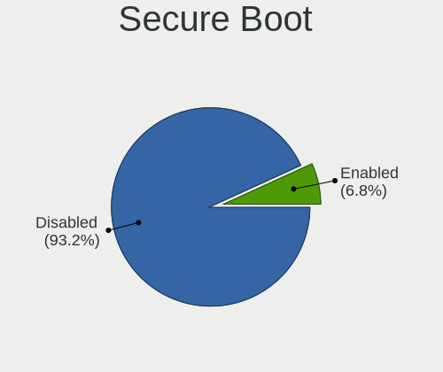
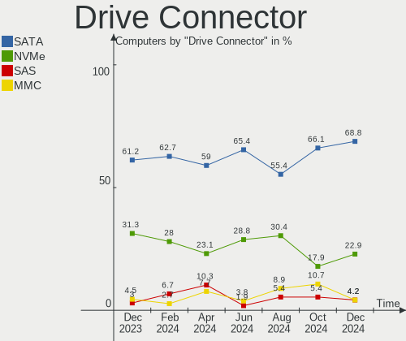
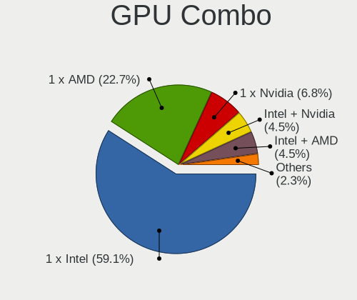

Xubuntu - Hardware Trends
-------------------------

A project to identify most popular hardware characteristics and track their change
over time based on data collected by Linux users at https://Linux-Hardware.org.

Anyone can contribute to this report by the [hw-probe](https://github.com/linuxhw/hw-probe) tool:

    sudo -E hw-probe -all -upload

This is a report for all computer types. See also reports for [desktops](/Dist/Xubuntu/Desktop/README.md) and [notebooks](/Dist/Xubuntu/Notebook/README.md).

This report is for one last month. Overall report since the beginning of time: [TestDays](https://github.com/linuxhw/TestDays)

Period: Jul, 2023.

Contents
--------

* [ System ](#system)
  - [ OS                       ](#os)
  - [ OS Family                ](#os-family)
  - [ Kernel                   ](#kernel)
  - [ Kernel Family            ](#kernel-family)
  - [ Kernel Major Ver.        ](#kernel-major-ver)
  - [ Arch                     ](#arch)
  - [ DE                       ](#de)
  - [ Display Server           ](#display-server)
  - [ Display Manager          ](#display-manager)
  - [ OS Lang                  ](#os-lang)
  - [ Boot Mode                ](#boot-mode)
  - [ Filesystem               ](#filesystem)
  - [ Part. scheme             ](#part-scheme)
  - [ Dual Boot with Linux/BSD ](#dual-boot-with-linuxbsd)
  - [ Dual Boot (Win)          ](#dual-boot-win)

* [ Board ](#board)
  - [ Vendor                   ](#vendor)
  - [ Model                    ](#model)
  - [ Model Family             ](#model-family)
  - [ MFG Year                 ](#mfg-year)
  - [ Form Factor              ](#form-factor)
  - [ Secure Boot              ](#secure-boot)
  - [ Coreboot                 ](#coreboot)
  - [ RAM Size                 ](#ram-size)
  - [ RAM Used                 ](#ram-used)
  - [ Total Drives             ](#total-drives)
  - [ Has CD-ROM               ](#has-cd-rom)
  - [ Has Ethernet             ](#has-ethernet)
  - [ Has WiFi                 ](#has-wifi)
  - [ Has Bluetooth            ](#has-bluetooth)

* [ Location ](#location)
  - [ Country                  ](#country)
  - [ City                     ](#city)

* [ Drives ](#drives)
  - [ Drive Vendor             ](#drive-vendor)
  - [ Drive Model              ](#drive-model)
  - [ HDD Vendor               ](#hdd-vendor)
  - [ SSD Vendor               ](#ssd-vendor)
  - [ Drive Kind               ](#drive-kind)
  - [ Drive Connector          ](#drive-connector)
  - [ Drive Size               ](#drive-size)
  - [ Space Total              ](#space-total)
  - [ Space Used               ](#space-used)
  - [ Malfunc. Drives          ](#malfunc-drives)
  - [ Malfunc. Drive Vendor    ](#malfunc-drive-vendor)
  - [ Malfunc. HDD Vendor      ](#malfunc-hdd-vendor)
  - [ Malfunc. Drive Kind      ](#malfunc-drive-kind)
  - [ Failed Drives            ](#failed-drives)
  - [ Failed Drive Vendor      ](#failed-drive-vendor)
  - [ Drive Status             ](#drive-status)

* [ Storage controller ](#storage-controller)
  - [ Storage Vendor           ](#storage-vendor)
  - [ Storage Model            ](#storage-model)
  - [ Storage Kind             ](#storage-kind)

* [ Processor ](#processor)
  - [ CPU Vendor               ](#cpu-vendor)
  - [ CPU Model                ](#cpu-model)
  - [ CPU Model Family         ](#cpu-model-family)
  - [ CPU Cores                ](#cpu-cores)
  - [ CPU Sockets              ](#cpu-sockets)
  - [ CPU Threads              ](#cpu-threads)
  - [ CPU Op-Modes             ](#cpu-op-modes)
  - [ CPU Microcode            ](#cpu-microcode)
  - [ CPU Microarch            ](#cpu-microarch)

* [ Graphics ](#graphics)
  - [ GPU Vendor               ](#gpu-vendor)
  - [ GPU Model                ](#gpu-model)
  - [ GPU Combo                ](#gpu-combo)
  - [ GPU Driver               ](#gpu-driver)
  - [ GPU Memory               ](#gpu-memory)

* [ Monitor ](#monitor)
  - [ Monitor Vendor           ](#monitor-vendor)
  - [ Monitor Model            ](#monitor-model)
  - [ Monitor Resolution       ](#monitor-resolution)
  - [ Monitor Diagonal         ](#monitor-diagonal)
  - [ Monitor Width            ](#monitor-width)
  - [ Aspect Ratio             ](#aspect-ratio)
  - [ Monitor Area             ](#monitor-area)
  - [ Pixel Density            ](#pixel-density)
  - [ Multiple Monitors        ](#multiple-monitors)

* [ Network ](#network)
  - [ Net Controller Vendor    ](#net-controller-vendor)
  - [ Net Controller Model     ](#net-controller-model)
  - [ Wireless Vendor          ](#wireless-vendor)
  - [ Wireless Model           ](#wireless-model)
  - [ Ethernet Vendor          ](#ethernet-vendor)
  - [ Ethernet Model           ](#ethernet-model)
  - [ Net Controller Kind      ](#net-controller-kind)
  - [ Used Controller          ](#used-controller)
  - [ NICs                     ](#nics)
  - [ IPv6                     ](#ipv6)

* [ Bluetooth ](#bluetooth)
  - [ Bluetooth Vendor         ](#bluetooth-vendor)
  - [ Bluetooth Model          ](#bluetooth-model)

* [ Sound ](#sound)
  - [ Sound Vendor             ](#sound-vendor)
  - [ Sound Model              ](#sound-model)

* [ Memory ](#memory)
  - [ Memory Vendor            ](#memory-vendor)
  - [ Memory Model             ](#memory-model)
  - [ Memory Kind              ](#memory-kind)
  - [ Memory Form Factor       ](#memory-form-factor)
  - [ Memory Size              ](#memory-size)
  - [ Memory Speed             ](#memory-speed)

* [ Printers & scanners ](#printers--scanners)
  - [ Printer Vendor           ](#printer-vendor)
  - [ Printer Model            ](#printer-model)
  - [ Scanner Vendor           ](#scanner-vendor)
  - [ Scanner Model            ](#scanner-model)

* [ Camera ](#camera)
  - [ Camera Vendor            ](#camera-vendor)
  - [ Camera Model             ](#camera-model)

* [ Security ](#security)
  - [ Fingerprint Vendor       ](#fingerprint-vendor)
  - [ Fingerprint Model        ](#fingerprint-model)
  - [ Chipcard Vendor          ](#chipcard-vendor)
  - [ Chipcard Model           ](#chipcard-model)

* [ Unsupported ](#unsupported)
  - [ Unsupported Devices      ](#unsupported-devices)
  - [ Unsupported Device Types ](#unsupported-device-types)

System
------

OS
--

Installed operating systems

| Name          | Computers | Percent |
|---------------|-----------|---------|
| Xubuntu 22.04 | 38        | 49.35%  |
| Xubuntu 20.04 | 19        | 24.68%  |
| Xubuntu 23.04 | 13        | 16.88%  |
| Xubuntu 18.04 | 3         | 3.9%    |
| Xubuntu 22.10 | 2         | 2.6%    |
| Xubuntu 23.10 | 1         | 1.3%    |
| Xubuntu 21.04 | 1         | 1.3%    |

OS Family
---------

OS without a version

| Name    | Computers | Percent |
|---------|-----------|---------|
| Xubuntu | 77        | 100%    |

Kernel
------

Version of the Linux kernel

| Version                     | Computers | Percent |
|-----------------------------|-----------|---------|
| 5.19.0-46-generic           | 13        | 16.88%  |
| 5.15.0-76-generic           | 10        | 12.99%  |
| 5.4.0-156-generic           | 9         | 11.69%  |
| 6.2.0-25-generic            | 5         | 6.49%   |
| 5.19.0-45-generic           | 5         | 6.49%   |
| 5.15.0-78-generic           | 5         | 6.49%   |
| 6.2.0-24-generic            | 3         | 3.9%    |
| 5.4.0-153-generic           | 3         | 3.9%    |
| 5.19.0-50-generic           | 3         | 3.9%    |
| 6.2.0-26-generic            | 2         | 2.6%    |
| 5.15.0-72-generic           | 2         | 2.6%    |
| 6.4.2-060402-generic        | 1         | 1.3%    |
| 6.4.1                       | 1         | 1.3%    |
| 6.4.0-060400-generic        | 1         | 1.3%    |
| 6.2.0-23-generic            | 1         | 1.3%    |
| 6.2.0-20-generic            | 1         | 1.3%    |
| 6.0.0-1011-oem              | 1         | 1.3%    |
| 5.4.0-153-lowlatency        | 1         | 1.3%    |
| 5.4.0-150-generic           | 1         | 1.3%    |
| 5.4.0-121-lowlatency        | 1         | 1.3%    |
| 5.19.0-32-generic           | 1         | 1.3%    |
| 5.15.0-76-lowlatency        | 1         | 1.3%    |
| 5.15.0-69-generic           | 1         | 1.3%    |
| 5.15.0-522304060810-generic | 1         | 1.3%    |
| 5.13.0-30-generic           | 1         | 1.3%    |
| 5.11.0-44-lowlatency        | 1         | 1.3%    |
| 4.15.0-213-lowlatency       | 1         | 1.3%    |
| 4.15.0-213-generic          | 1         | 1.3%    |

Kernel Family
-------------

Linux kernel without a distro release

| Version | Computers | Percent |
|---------|-----------|---------|
| 5.19.0  | 22        | 28.57%  |
| 5.15.0  | 20        | 25.97%  |
| 5.4.0   | 15        | 19.48%  |
| 6.2.0   | 12        | 15.58%  |
| 4.15.0  | 2         | 2.6%    |
| 6.4.2   | 1         | 1.3%    |
| 6.4.1   | 1         | 1.3%    |
| 6.4.0   | 1         | 1.3%    |
| 6.0.0   | 1         | 1.3%    |
| 5.13.0  | 1         | 1.3%    |
| 5.11.0  | 1         | 1.3%    |

Kernel Major Ver.
-----------------

Linux kernel major version

| Version | Computers | Percent |
|---------|-----------|---------|
| 5.19    | 22        | 28.57%  |
| 5.15    | 20        | 25.97%  |
| 5.4     | 15        | 19.48%  |
| 6.2     | 12        | 15.58%  |
| 6.4     | 3         | 3.9%    |
| 4.15    | 2         | 2.6%    |
| 6.0     | 1         | 1.3%    |
| 5.13    | 1         | 1.3%    |
| 5.11    | 1         | 1.3%    |

Arch
----

OS architecture (x86_64, i586, etc.)

| Name   | Computers | Percent |
|--------|-----------|---------|
| x86_64 | 75        | 97.4%   |
| i686   | 2         | 2.6%    |

DE
--

Desktop Environment

| Name  | Computers | Percent |
|-------|-----------|---------|
| XFCE  | 74        | 96.1%   |
| KDE5  | 1         | 1.3%    |
| i3    | 1         | 1.3%    |
| GNOME | 1         | 1.3%    |

Display Server
--------------

X11 or Wayland

| Name | Computers | Percent |
|------|-----------|---------|
| X11  | 76        | 98.7%   |
| Tty  | 1         | 1.3%    |

Display Manager
---------------

SDDM, LightDM, etc.

| Name    | Computers | Percent |
|---------|-----------|---------|
| LightDM | 65        | 84.42%  |
| Unknown | 5         | 6.49%   |
| GDM3    | 4         | 5.19%   |
| SDDM    | 2         | 2.6%    |
| LXDM    | 1         | 1.3%    |

OS Lang
-------

Language

| Lang  | Computers | Percent |
|-------|-----------|---------|
| en_US | 24        | 31.17%  |
| ru_RU | 9         | 11.69%  |
| fr_FR | 9         | 11.69%  |
| de_DE | 8         | 10.39%  |
| pt_BR | 4         | 5.19%   |
| it_IT | 4         | 5.19%   |
| en_GB | 4         | 5.19%   |
| pl_PL | 3         | 3.9%    |
| ja_JP | 2         | 2.6%    |
| es_ES | 2         | 2.6%    |
| en_CA | 2         | 2.6%    |
| nl_NL | 1         | 1.3%    |
| fr_BE | 1         | 1.3%    |
| en_IE | 1         | 1.3%    |
| en_AU | 1         | 1.3%    |
| de_CH | 1         | 1.3%    |
| C     | 1         | 1.3%    |

Boot Mode
---------

EFI or BIOS

| Mode | Computers | Percent |
|------|-----------|---------|
| BIOS | 47        | 61.04%  |
| EFI  | 30        | 38.96%  |

Filesystem
----------

Type of filesystem

| Type    | Computers | Percent |
|---------|-----------|---------|
| Ext4    | 46        | 59.74%  |
| Tmpfs   | 28        | 36.36%  |
| Overlay | 2         | 2.6%    |
| Xfs     | 1         | 1.3%    |

Part. scheme
------------

Scheme of partitioning

| Type    | Computers | Percent |
|---------|-----------|---------|
| GPT     | 45        | 58.44%  |
| MBR     | 25        | 32.47%  |
| Unknown | 7         | 9.09%   |

Dual Boot with Linux/BSD
------------------------

Hosting more than one Linux/BSD

| Dual boot | Computers | Percent |
|-----------|-----------|---------|
| No        | 63        | 81.82%  |
| Yes       | 14        | 18.18%  |

Dual Boot (Win)
---------------

Hosting Linux and Windows

| Dual boot | Computers | Percent |
|-----------|-----------|---------|
| No        | 55        | 71.43%  |
| Yes       | 22        | 28.57%  |

Board
-----

Vendor
------

Motherboard manufacturer

| Name                | Computers | Percent |
|---------------------|-----------|---------|
| Gigabyte Technology | 12        | 15.58%  |
| MSI                 | 10        | 12.99%  |
| Hewlett-Packard     | 9         | 11.69%  |
| Lenovo              | 7         | 9.09%   |
| Dell                | 7         | 9.09%   |
| ASRock              | 5         | 6.49%   |
| ASUSTek Computer    | 4         | 5.19%   |
| Acer                | 4         | 5.19%   |
| Samsung Electronics | 2         | 2.6%    |
| Fujitsu Siemens     | 2         | 2.6%    |
| TUXEDO              | 1         | 1.3%    |
| Thomson             | 1         | 1.3%    |
| SiComputer          | 1         | 1.3%    |
| Semp Toshiba        | 1         | 1.3%    |
| Pegatron            | 1         | 1.3%    |
| Olidata             | 1         | 1.3%    |
| Nuvision            | 1         | 1.3%    |
| Medion              | 1         | 1.3%    |
| Itautec             | 1         | 1.3%    |
| GPU Company         | 1         | 1.3%    |
| Google              | 1         | 1.3%    |
| Gateway             | 1         | 1.3%    |
| Foxconn             | 1         | 1.3%    |
| Dynabook            | 1         | 1.3%    |
| Chuwi               | 1         | 1.3%    |

Model
-----

Motherboard model

| Name                                  | Computers | Percent |
|---------------------------------------|-----------|---------|
| Gigabyte H81M-S2V                     | 9         | 11.69%  |
| HP Laptop 15s-fq2xxx                  | 2         | 2.6%    |
| TUXEDO N85_N87HCHNHZ                  | 1         | 1.3%    |
| Thomson N15C8BK2T                     | 1         | 1.3%    |
| SiComputer NL40_50CU                  | 1         | 1.3%    |
| Semp Toshiba STI                      | 1         | 1.3%    |
| Samsung N250P/N145P                   | 1         | 1.3%    |
| Samsung 305E4A/305E5A/305E7A          | 1         | 1.3%    |
| Pegatron KOUZIRODT                    | 1         | 1.3%    |
| Olidata Stainer 8050                  | 1         | 1.3%    |
| Nuvision NEBP12                       | 1         | 1.3%    |
| MSI PR601/VR603                       | 1         | 1.3%    |
| MSI MS-7C56                           | 1         | 1.3%    |
| MSI MS-7C08                           | 1         | 1.3%    |
| MSI MS-7B89                           | 1         | 1.3%    |
| MSI MS-7846                           | 1         | 1.3%    |
| MSI Modern 15 A10RBS                  | 1         | 1.3%    |
| MSI MEGA BOOK GX620                   | 1         | 1.3%    |
| MSI GF65 Thin 10SER                   | 1         | 1.3%    |
| MSI GF63 Thin 11UC                    | 1         | 1.3%    |
| MSI 5860                              | 1         | 1.3%    |
| Medion Akoya P2213T                   | 1         | 1.3%    |
| Lenovo ThinkPad X260 20F5S4BY00       | 1         | 1.3%    |
| Lenovo ThinkPad T480 20L6S01Q3U       | 1         | 1.3%    |
| Lenovo ThinkPad T460s 20FAS42W01      | 1         | 1.3%    |
| Lenovo IdeaPad 330S-15AST 81F9        | 1         | 1.3%    |
| Lenovo IdeaPad 3 15ALC6 82KU          | 1         | 1.3%    |
| Lenovo IdeaPad 100S-14IBR 80R9        | 1         | 1.3%    |
| Lenovo G50-70 20351                   | 1         | 1.3%    |
| Itautec Infoway w7535                 | 1         | 1.3%    |
| HP Z620 Workstation                   | 1         | 1.3%    |
| HP Stream Laptop 14-ds0xxx            | 1         | 1.3%    |
| HP ProBook 4525s                      | 1         | 1.3%    |
| HP ProBook 445 14 inch G9 Notebook PC | 1         | 1.3%    |
| HP ProBook 11 G2                      | 1         | 1.3%    |
| HP Pavilion 17                        | 1         | 1.3%    |
| HP Compaq Presario CQ60               | 1         | 1.3%    |
| GPU Company GWNC21524                 | 1         | 1.3%    |
| Google Snappy                         | 1         | 1.3%    |
| Gigabyte Z97X-UD3H                    | 1         | 1.3%    |

Model Family
------------

Motherboard model prefix

| Name                    | Computers | Percent |
|-------------------------|-----------|---------|
| Gigabyte H81M-S2V       | 9         | 11.69%  |
| Lenovo ThinkPad         | 3         | 3.9%    |
| Lenovo IdeaPad          | 3         | 3.9%    |
| HP ProBook              | 3         | 3.9%    |
| HP Laptop               | 2         | 2.6%    |
| Fujitsu Siemens ESPRIMO | 2         | 2.6%    |
| Dell OptiPlex           | 2         | 2.6%    |
| Dell Latitude           | 2         | 2.6%    |
| Dell Inspiron           | 2         | 2.6%    |
| Acer Aspire             | 2         | 2.6%    |
| TUXEDO N85              | 1         | 1.3%    |
| Thomson N15C8BK2T       | 1         | 1.3%    |
| SiComputer NL40         | 1         | 1.3%    |
| Semp Toshiba STI        | 1         | 1.3%    |
| Samsung N250P           | 1         | 1.3%    |
| Samsung 305E4A          | 1         | 1.3%    |
| Pegatron KOUZIRODT      | 1         | 1.3%    |
| Olidata Stainer         | 1         | 1.3%    |
| Nuvision NEBP12         | 1         | 1.3%    |
| MSI PR601               | 1         | 1.3%    |
| MSI MS-7C56             | 1         | 1.3%    |
| MSI MS-7C08             | 1         | 1.3%    |
| MSI MS-7B89             | 1         | 1.3%    |
| MSI MS-7846             | 1         | 1.3%    |
| MSI Modern              | 1         | 1.3%    |
| MSI MEGA                | 1         | 1.3%    |
| MSI GF65                | 1         | 1.3%    |
| MSI GF63                | 1         | 1.3%    |
| MSI 5860                | 1         | 1.3%    |
| Medion Akoya            | 1         | 1.3%    |
| Lenovo G50-70           | 1         | 1.3%    |
| Itautec Infoway         | 1         | 1.3%    |
| HP Z620                 | 1         | 1.3%    |
| HP Stream               | 1         | 1.3%    |
| HP Pavilion             | 1         | 1.3%    |
| HP Compaq               | 1         | 1.3%    |
| GPU Company GWNC21524   | 1         | 1.3%    |
| Google Snappy           | 1         | 1.3%    |
| Gigabyte Z97X-UD3H      | 1         | 1.3%    |
| Gigabyte F2A88XM-D3H    | 1         | 1.3%    |

MFG Year
--------

Motherboard manufacture year

| Year | Computers | Percent |
|------|-----------|---------|
| 2014 | 12        | 15.58%  |
| 2020 | 10        | 12.99%  |
| 2018 | 7         | 9.09%   |
| 2013 | 7         | 9.09%   |
| 2021 | 6         | 7.79%   |
| 2011 | 5         | 6.49%   |
| 2008 | 5         | 6.49%   |
| 2022 | 4         | 5.19%   |
| 2019 | 4         | 5.19%   |
| 2016 | 4         | 5.19%   |
| 2017 | 3         | 3.9%    |
| 2009 | 3         | 3.9%    |
| 2015 | 2         | 2.6%    |
| 2010 | 2         | 2.6%    |
| 2023 | 1         | 1.3%    |
| 2012 | 1         | 1.3%    |
| 2006 | 1         | 1.3%    |

Form Factor
-----------

Physical design of the computer

| Name        | Computers | Percent |
|-------------|-----------|---------|
| Notebook    | 41        | 53.25%  |
| Desktop     | 33        | 42.86%  |
| Mini pc     | 2         | 2.6%    |
| Convertible | 1         | 1.3%    |

Secure Boot
-----------

Enabled or disabled

| State    | Computers | Percent |
|----------|-----------|---------|
| Disabled | 75        | 97.4%   |
| Enabled  | 2         | 2.6%    |

Coreboot
--------

Have coreboot on board

| Used | Computers | Percent |
|------|-----------|---------|
| No   | 76        | 98.7%   |
| Yes  | 1         | 1.3%    |

RAM Size
--------

Total RAM memory

| Size in GB  | Computers | Percent |
|-------------|-----------|---------|
| 3.01-4.0    | 21        | 27.27%  |
| 4.01-8.0    | 17        | 22.08%  |
| 16.01-24.0  | 16        | 20.78%  |
| 8.01-16.0   | 8         | 10.39%  |
| 64.01-256.0 | 4         | 5.19%   |
| 1.01-2.0    | 4         | 5.19%   |
| 32.01-64.0  | 3         | 3.9%    |
| 24.01-32.0  | 3         | 3.9%    |
| 2.01-3.0    | 1         | 1.3%    |

RAM Used
--------

Used RAM memory

| Used GB   | Computers | Percent |
|-----------|-----------|---------|
| 1.01-2.0  | 28        | 36.36%  |
| 2.01-3.0  | 15        | 19.48%  |
| 0.51-1.0  | 13        | 16.88%  |
| 4.01-8.0  | 12        | 15.58%  |
| 3.01-4.0  | 6         | 7.79%   |
| 8.01-16.0 | 3         | 3.9%    |

Total Drives
------------

Number of drives on board

| Drives | Computers | Percent |
|--------|-----------|---------|
| 1      | 50        | 64.94%  |
| 2      | 16        | 20.78%  |
| 4      | 4         | 5.19%   |
| 3      | 4         | 5.19%   |
| 6      | 1         | 1.3%    |
| 5      | 1         | 1.3%    |
| 0      | 1         | 1.3%    |

Has CD-ROM
----------

Has CD-ROM on board

| Presented | Computers | Percent |
|-----------|-----------|---------|
| No        | 51        | 66.23%  |
| Yes       | 26        | 33.77%  |

Has Ethernet
------------

Has Ethernet on board

| Presented | Computers | Percent |
|-----------|-----------|---------|
| Yes       | 67        | 87.01%  |
| No        | 10        | 12.99%  |

Has WiFi
--------

Has WiFi module

| Presented | Computers | Percent |
|-----------|-----------|---------|
| Yes       | 55        | 71.43%  |
| No        | 22        | 28.57%  |

Has Bluetooth
-------------

Has Bluetooth module

| Presented | Computers | Percent |
|-----------|-----------|---------|
| Yes       | 39        | 50.65%  |
| No        | 38        | 49.35%  |

Location
--------

Country
-------

Geographic location (country)

| Country     | Computers | Percent |
|-------------|-----------|---------|
| USA         | 9         | 11.69%  |
| Russia      | 9         | 11.69%  |
| France      | 9         | 11.69%  |
| Germany     | 8         | 10.39%  |
| Italy       | 6         | 7.79%   |
| Brazil      | 5         | 6.49%   |
| UK          | 3         | 3.9%    |
| Poland      | 3         | 3.9%    |
| Japan       | 3         | 3.9%    |
| Belgium     | 3         | 3.9%    |
| Sweden      | 2         | 2.6%    |
| Canada      | 2         | 2.6%    |
| Switzerland | 1         | 1.3%    |
| Spain       | 1         | 1.3%    |
| South Korea | 1         | 1.3%    |
| Slovakia    | 1         | 1.3%    |
| Romania     | 1         | 1.3%    |
| Pakistan    | 1         | 1.3%    |
| Norway      | 1         | 1.3%    |
| Netherlands | 1         | 1.3%    |
| Latvia      | 1         | 1.3%    |
| Ireland     | 1         | 1.3%    |
| Honduras    | 1         | 1.3%    |
| Guadeloupe  | 1         | 1.3%    |
| Costa Rica  | 1         | 1.3%    |
| Austria     | 1         | 1.3%    |
| Australia   | 1         | 1.3%    |

City
----

Geographic location (city)

| City                  | Computers | Percent |
|-----------------------|-----------|---------|
| Voronezh              | 9         | 11.69%  |
| Rho                   | 3         | 3.9%    |
| Warsaw                | 1         | 1.3%    |
| Västerås            | 1         | 1.3%    |
| Uppsala               | 1         | 1.3%    |
| Swindon               | 1         | 1.3%    |
| Stockach              | 1         | 1.3%    |
| Seattle               | 1         | 1.3%    |
| Schnaittach           | 1         | 1.3%    |
| Sassari               | 1         | 1.3%    |
| Sao Paulo             | 1         | 1.3%    |
| Sao Jose do Rio Preto | 1         | 1.3%    |
| Sandnes               | 1         | 1.3%    |
| San Pedro Sula        | 1         | 1.3%    |
| Rosemead              | 1         | 1.3%    |
| Roquecor              | 1         | 1.3%    |
| Riga                  | 1         | 1.3%    |
| Reynoldsburg          | 1         | 1.3%    |
| Reading               | 1         | 1.3%    |
| Puntarenas            | 1         | 1.3%    |
| Przeworsk             | 1         | 1.3%    |
| Pointe-à-Pitre       | 1         | 1.3%    |
| Phoenix               | 1         | 1.3%    |
| Osaka                 | 1         | 1.3%    |
| Oignies               | 1         | 1.3%    |
| Nussbaumen            | 1         | 1.3%    |
| Nowon-gu              | 1         | 1.3%    |
| Nova Iguaçu          | 1         | 1.3%    |
| New Orleans           | 1         | 1.3%    |
| Mortsel               | 1         | 1.3%    |
| Minatomirai           | 1         | 1.3%    |
| Milan                 | 1         | 1.3%    |
| Mainz                 | 1         | 1.3%    |
| Machiya               | 1         | 1.3%    |
| Ludwigsburg           | 1         | 1.3%    |
| Louvain-la-Neuve      | 1         | 1.3%    |
| London                | 1         | 1.3%    |
| Leinster              | 1         | 1.3%    |
| Legnaro               | 1         | 1.3%    |
| Le Clerjus            | 1         | 1.3%    |

Drives
------

Drive Vendor
------------

Hard drive vendors

| Vendor                      | Computers | Drives | Percent |
|-----------------------------|-----------|--------|---------|
| Samsung Electronics         | 19        | 22     | 17.59%  |
| Seagate                     | 16        | 18     | 14.81%  |
| WDC                         | 13        | 15     | 12.04%  |
| Hitachi                     | 9         | 10     | 8.33%   |
| SanDisk                     | 7         | 7      | 6.48%   |
| Unknown                     | 6         | 6      | 5.56%   |
| SK hynix                    | 4         | 4      | 3.7%    |
| Kingston                    | 4         | 4      | 3.7%    |
| Intel                       | 3         | 3      | 2.78%   |
| PNY                         | 2         | 2      | 1.85%   |
| Kingston Technology Company | 2         | 2      | 1.85%   |
| HGST                        | 2         | 2      | 1.85%   |
| Transcend                   | 1         | 1      | 0.93%   |
| Toshiba                     | 1         | 1      | 0.93%   |
| Teclast                     | 1         | 1      | 0.93%   |
| Realtek Semiconductor       | 1         | 1      | 0.93%   |
| Realtek                     | 1         | 1      | 0.93%   |
| Plextor                     | 1         | 1      | 0.93%   |
| Phison Electronics          | 1         | 1      | 0.93%   |
| Phison                      | 1         | 2      | 0.93%   |
| OCZ                         | 1         | 1      | 0.93%   |
| Netac                       | 1         | 1      | 0.93%   |
| Micron Technology           | 1         | 1      | 0.93%   |
| Maxtor                      | 1         | 1      | 0.93%   |
| LITEON                      | 1         | 1      | 0.93%   |
| Lenovo                      | 1         | 1      | 0.93%   |
| KingDian                    | 1         | 1      | 0.93%   |
| Hjwdz                       | 1         | 1      | 0.93%   |
| Hewlett-Packard             | 1         | 2      | 0.93%   |
| Gigabyte Technology         | 1         | 1      | 0.93%   |
| Crucial                     | 1         | 2      | 0.93%   |
| BHT                         | 1         | 1      | 0.93%   |
| A-DATA Technology           | 1         | 1      | 0.93%   |

Drive Model
-----------

Hard drive models

| Model                                               | Computers | Percent |
|-----------------------------------------------------|-----------|---------|
| Seagate ST1000DM003-1ER162 1TB                      | 9         | 7.96%   |
| SanDisk SSD PLUS 480GB                              | 3         | 2.65%   |
| Samsung NVMe SSD Controller SM981/PM981/PM983 500GB | 3         | 2.65%   |
| Unknown SD/MMC/MS PRO 128GB                         | 2         | 1.77%   |
| Seagate ST1000DM003-1CH162 1TB                      | 2         | 1.77%   |
| Samsung SSD 980 1TB                                 | 2         | 1.77%   |
| Samsung SSD 870 EVO 500GB                           | 2         | 1.77%   |
| Samsung HD160JJ/ 160GB                              | 2         | 1.77%   |
| Kingston Company SNV2S1000G 1TB                     | 2         | 1.77%   |
| Hitachi HDE721010SLA330 1TB                         | 2         | 1.77%   |
| WDC WD7500BPVX-22JC3T0 752GB                        | 1         | 0.88%   |
| WDC WD6003FZBX-00K5WB0 6TB                          | 1         | 0.88%   |
| WDC WD5000LPCX-24C6HT0 500GB                        | 1         | 0.88%   |
| WDC WD5000AZLX-60K2TA0 500GB                        | 1         | 0.88%   |
| WDC WD5000AADS-00S9B0 500GB                         | 1         | 0.88%   |
| WDC WD3200BEVT-22ZCT0 320GB                         | 1         | 0.88%   |
| WDC WD20EARX-00PASB0 2TB                            | 1         | 0.88%   |
| WDC WD1600BEVT-60ZCT1 160GB                         | 1         | 0.88%   |
| WDC WD1600BEVT-22ZCT0 160GB                         | 1         | 0.88%   |
| WDC WD10EZEX-08WN4A0 1TB                            | 1         | 0.88%   |
| WDC WD10EZEX-00WN4A0 1TB                            | 1         | 0.88%   |
| WDC WD10EZEX-00BN5A0 1TB                            | 1         | 0.88%   |
| WDC WD10EARS-00Y5B1 1TB                             | 1         | 0.88%   |
| WDC PC SN540 SDDPNPF-512G-1032 512GB                | 1         | 0.88%   |
| Unknown MMC Card  64GB                              | 1         | 0.88%   |
| Unknown MMC Card  32GB                              | 1         | 0.88%   |
| Unknown MMC Card  128GB                             | 1         | 0.88%   |
| Unknown DB4032  32GB                                | 1         | 0.88%   |
| Transcend TS120GMTS420S 120GB SSD                   | 1         | 0.88%   |
| Toshiba KXG50ZNV256G NVMe 256GB                     | 1         | 0.88%   |
| Teclast 120GB SSD                                   | 1         | 0.88%   |
| SK hynix SC311 SATA 256GB SSD                       | 1         | 0.88%   |
| SK hynix HFS256GD9TNG-62A0A 256GB                   | 1         | 0.88%   |
| SK hynix HCG8e  64GB                                | 1         | 0.88%   |
| SK hynix BC511 HFM256GDJTNI-82A0A 256GB             | 1         | 0.88%   |
| Seagate ST4000DM004-2CV104 4TB                      | 1         | 0.88%   |
| Seagate ST2000LM015-2E8174 2TB                      | 1         | 0.88%   |
| Seagate ST1000LX015-1U7172 1TB                      | 1         | 0.88%   |
| Seagate ST1000LM048-2E7172 1TB                      | 1         | 0.88%   |
| Seagate ST1000DM010-2EP102 1TB                      | 1         | 0.88%   |

HDD Vendor
----------

Hard disk drive vendors

| Vendor              | Computers | Drives | Percent |
|---------------------|-----------|--------|---------|
| Seagate             | 16        | 18     | 34.78%  |
| WDC                 | 12        | 14     | 26.09%  |
| Hitachi             | 9         | 10     | 19.57%  |
| Samsung Electronics | 3         | 3      | 6.52%   |
| Unknown             | 2         | 2      | 4.35%   |
| HGST                | 2         | 2      | 4.35%   |
| Maxtor              | 1         | 1      | 2.17%   |
| Hewlett-Packard     | 1         | 2      | 2.17%   |

SSD Vendor
----------

Solid state drive vendors

| Vendor              | Computers | Drives | Percent |
|---------------------|-----------|--------|---------|
| Samsung Electronics | 10        | 11     | 32.26%  |
| SanDisk             | 6         | 6      | 19.35%  |
| Kingston            | 3         | 3      | 9.68%   |
| Transcend           | 1         | 1      | 3.23%   |
| Teclast             | 1         | 1      | 3.23%   |
| SK hynix            | 1         | 1      | 3.23%   |
| PNY                 | 1         | 1      | 3.23%   |
| Plextor             | 1         | 1      | 3.23%   |
| OCZ                 | 1         | 1      | 3.23%   |
| Netac               | 1         | 1      | 3.23%   |
| LITEON              | 1         | 1      | 3.23%   |
| KingDian            | 1         | 1      | 3.23%   |
| Gigabyte Technology | 1         | 1      | 3.23%   |
| Crucial             | 1         | 2      | 3.23%   |
| BHT                 | 1         | 1      | 3.23%   |

Drive Kind
----------

HDD or SSD

| Kind    | Computers | Drives | Percent |
|---------|-----------|--------|---------|
| HDD     | 38        | 52     | 37.62%  |
| SSD     | 30        | 33     | 29.7%   |
| NVMe    | 27        | 28     | 26.73%  |
| MMC     | 5         | 5      | 4.95%   |
| Unknown | 1         | 1      | 0.99%   |

Drive Connector
---------------

SATA, SAS, NVMe, etc.

| Type | Computers | Drives | Percent |
|------|-----------|--------|---------|
| SATA | 55        | 81     | 60.44%  |
| NVMe | 26        | 27     | 28.57%  |
| SAS  | 5         | 6      | 5.49%   |
| MMC  | 5         | 5      | 5.49%   |

Drive Size
----------

Size of hard drive

| Size in TB | Computers | Drives | Percent |
|------------|-----------|--------|---------|
| 0.01-0.5   | 40        | 47     | 57.14%  |
| 0.51-1.0   | 23        | 30     | 32.86%  |
| 3.01-4.0   | 3         | 3      | 4.29%   |
| 1.01-2.0   | 3         | 4      | 4.29%   |
| 4.01-10.0  | 1         | 1      | 1.43%   |

Space Total
-----------

Amount of disk space available on the file system

| Size in GB     | Computers | Percent |
|----------------|-----------|---------|
| 501-1000       | 19        | 24.68%  |
| 251-500        | 15        | 19.48%  |
| 101-250        | 15        | 19.48%  |
| 51-100         | 6         | 7.79%   |
| More than 3000 | 5         | 6.49%   |
| 21-50          | 5         | 6.49%   |
| 2001-3000      | 5         | 6.49%   |
| 1001-2000      | 5         | 6.49%   |
| 1-20           | 2         | 2.6%    |

Space Used
----------

Amount of used disk space

| Used GB   | Computers | Percent |
|-----------|-----------|---------|
| 1-20      | 25        | 32.47%  |
| 21-50     | 16        | 20.78%  |
| 101-250   | 12        | 15.58%  |
| 501-1000  | 7         | 9.09%   |
| 51-100    | 6         | 7.79%   |
| 251-500   | 5         | 6.49%   |
| 1001-2000 | 4         | 5.19%   |
| 2001-3000 | 2         | 2.6%    |

Malfunc. Drives
---------------

Drive models with a malfunction

| Model                          | Computers | Drives | Percent |
|--------------------------------|-----------|--------|---------|
| WDC WD10EARS-00Y5B1 1TB        | 1         | 1      | 20%     |
| Seagate ST1000DM010-2EP102 1TB | 1         | 1      | 20%     |
| SanDisk SSD PLUS 480GB         | 1         | 1      | 20%     |
| Maxtor 6L160M0 160GB           | 1         | 1      | 20%     |
| Hitachi HTS723216L9A360 160GB  | 1         | 1      | 20%     |

Malfunc. Drive Vendor
---------------------

Vendors of faulty drives

| Vendor  | Computers | Drives | Percent |
|---------|-----------|--------|---------|
| WDC     | 1         | 1      | 20%     |
| Seagate | 1         | 1      | 20%     |
| SanDisk | 1         | 1      | 20%     |
| Maxtor  | 1         | 1      | 20%     |
| Hitachi | 1         | 1      | 20%     |

Malfunc. HDD Vendor
-------------------

Vendors of faulty HDD drives

| Vendor  | Computers | Drives | Percent |
|---------|-----------|--------|---------|
| WDC     | 1         | 1      | 25%     |
| Seagate | 1         | 1      | 25%     |
| Maxtor  | 1         | 1      | 25%     |
| Hitachi | 1         | 1      | 25%     |

Malfunc. Drive Kind
-------------------

Kinds of faulty drives

| Kind | Computers | Drives | Percent |
|------|-----------|--------|---------|
| HDD  | 4         | 4      | 80%     |
| SSD  | 1         | 1      | 20%     |

Failed Drives
-------------

Failed drive models

Zero info for selected period =(

Failed Drive Vendor
-------------------

Failed drive vendors

Zero info for selected period =(

Drive Status
------------

Number of failed and malfunc. drives

| Status   | Computers | Drives | Percent |
|----------|-----------|--------|---------|
| Works    | 39        | 57     | 48.15%  |
| Detected | 37        | 57     | 45.68%  |
| Malfunc  | 5         | 5      | 6.17%   |

Storage controller
------------------

Storage Vendor
--------------

Storage controller vendors

| Vendor                       | Computers | Percent |
|------------------------------|-----------|---------|
| Intel                        | 49        | 51.58%  |
| AMD                          | 20        | 21.05%  |
| Samsung Electronics          | 8         | 8.42%   |
| Phison Electronics           | 3         | 3.16%   |
| Kingston Technology Company  | 3         | 3.16%   |
| SK hynix                     | 2         | 2.11%   |
| SanDisk                      | 2         | 2.11%   |
| Toshiba America Info Systems | 1         | 1.05%   |
| Silicon Image                | 1         | 1.05%   |
| Realtek Semiconductor        | 1         | 1.05%   |
| Micron Technology            | 1         | 1.05%   |
| Lenovo                       | 1         | 1.05%   |
| Broadcom / LSI               | 1         | 1.05%   |
| ASMedia Technology           | 1         | 1.05%   |
| ADATA Technology             | 1         | 1.05%   |

Storage Model
-------------

Storage controller models

| Model                                                                          | Computers | Percent |
|--------------------------------------------------------------------------------|-----------|---------|
| AMD FCH SATA Controller [AHCI mode]                                            | 11        | 10.09%  |
| Intel 8 Series/C220 Series Chipset Family 6-port SATA Controller 1 [AHCI mode] | 9         | 8.26%   |
| Intel 82801IBM/IEM (ICH9M/ICH9M-E) 4 port SATA Controller [AHCI mode]          | 4         | 3.67%   |
| Samsung NVMe SSD Controller SM981/PM981/PM983                                  | 3         | 2.75%   |
| Samsung NVMe SSD Controller 980                                                | 3         | 2.75%   |
| Intel Volume Management Device NVMe RAID Controller                            | 3         | 2.75%   |
| Intel Sunrise Point-LP SATA Controller [AHCI mode]                             | 3         | 2.75%   |
| Intel NM10/ICH7 Family SATA Controller [IDE mode]                              | 3         | 2.75%   |
| AMD SB7x0/SB8x0/SB9x0 SATA Controller [AHCI mode]                              | 3         | 2.75%   |
| AMD 500 Series Chipset SATA Controller                                         | 3         | 2.75%   |
| Samsung NVMe SSD Controller PM9A1/PM9A3/980PRO                                 | 2         | 1.83%   |
| Kingston Company Company Non-Volatile memory controller                        | 2         | 1.83%   |
| Intel Celeron N3350/Pentium N4200/Atom E3900 Series SATA AHCI Controller       | 2         | 1.83%   |
| Intel Cannon Point-LP SATA Controller [AHCI Mode]                              | 2         | 1.83%   |
| Intel 82801G (ICH7 Family) IDE Controller                                      | 2         | 1.83%   |
| Intel 8 Series SATA Controller 1 [AHCI mode]                                   | 2         | 1.83%   |
| Intel 6 Series/C200 Series Chipset Family 6 port Mobile SATA AHCI Controller   | 2         | 1.83%   |
| Intel 200 Series PCH SATA controller [AHCI mode]                               | 2         | 1.83%   |
| AMD SB7x0/SB8x0/SB9x0 IDE Controller                                           | 2         | 1.83%   |
| AMD 400 Series Chipset SATA Controller                                         | 2         | 1.83%   |
| Toshiba America Info Systems XG5 NVMe SSD Controller                           | 1         | 0.92%   |
| SK hynix PC401 NVMe Solid State Drive 256GB                                    | 1         | 0.92%   |
| SK hynix BC511 NVMe SSD                                                        | 1         | 0.92%   |
| Silicon Image SiI 3114 [SATALink/SATARaid] Serial ATA Controller               | 1         | 0.92%   |
| SanDisk WD PC SN810 / Black SN850 NVMe SSD                                     | 1         | 0.92%   |
| SanDisk WD Green SN350 NVMe SSD 1 TB (DRAM-less)                               | 1         | 0.92%   |
| Realtek RTS5763DL NVMe SSD Controller                                          | 1         | 0.92%   |
| Phison PS5013 E13 NVMe Controller                                              | 1         | 0.92%   |
| Phison E18 PCIe4 NVMe Controller                                               | 1         | 0.92%   |
| Phison E12 NVMe Controller                                                     | 1         | 0.92%   |
| Micron 2210 NVMe SSD [Cobain]                                                  | 1         | 0.92%   |
| Lenovo LENSE30512GMSP34MEAT3TA                                                 | 1         | 0.92%   |
| Kingston Company OM8PCP Design-In PCIe 3 NVMe SSD (DRAM-less)                  | 1         | 0.92%   |
| Intel Tiger Lake-LP SATA Controller                                            | 1         | 0.92%   |
| Intel Tiger Lake SATA AHCI Controller                                          | 1         | 0.92%   |
| Intel SSD 670p Series [Keystone Harbor]                                        | 1         | 0.92%   |
| Intel SSD 660P Series                                                          | 1         | 0.92%   |
| Intel SSD 600P Series                                                          | 1         | 0.92%   |
| Intel SATA Controller [RAID mode]                                              | 1         | 0.92%   |
| Intel Q170/Q150/B150/H170/H110/Z170/CM236 Chipset SATA Controller [AHCI Mode]  | 1         | 0.92%   |

Storage Kind
------------

Kind of storage controller (IDE, SATA, NVMe, SAS, ...)

| Kind | Computers | Percent |
|------|-----------|---------|
| SATA | 59        | 57.84%  |
| NVMe | 26        | 25.49%  |
| IDE  | 9         | 8.82%   |
| RAID | 7         | 6.86%   |
| SAS  | 1         | 0.98%   |

Processor
---------

CPU Vendor
----------

Processor vendors

| Vendor | Computers | Percent |
|--------|-----------|---------|
| Intel  | 56        | 72.73%  |
| AMD    | 21        | 27.27%  |

CPU Model
---------

Processor models

| Model                                       | Computers | Percent |
|---------------------------------------------|-----------|---------|
| Intel Core i3-4130 CPU @ 3.40GHz            | 9         | 11.69%  |
| Intel Pentium Dual CPU T3400 @ 2.16GHz      | 2         | 2.6%    |
| Intel Core i5-8265U CPU @ 1.60GHz           | 2         | 2.6%    |
| Intel Core i5-6300U CPU @ 2.40GHz           | 2         | 2.6%    |
| Intel Core i5-10210U CPU @ 1.60GHz          | 2         | 2.6%    |
| Intel Celeron CPU N3350 @ 1.10GHz           | 2         | 2.6%    |
| Intel 11th Gen Core i7-1165G7 @ 2.80GHz     | 2         | 2.6%    |
| AMD Ryzen 7 5700U with Radeon Graphics      | 2         | 2.6%    |
| AMD Ryzen 5 3600 6-Core Processor           | 2         | 2.6%    |
| Intel Xeon CPU E5-2697 v2 @ 2.70GHz         | 1         | 1.3%    |
| Intel Xeon CPU E5-1607 v2 @ 3.00GHz         | 1         | 1.3%    |
| Intel Pentium Dual-Core CPU E5500 @ 2.80GHz | 1         | 1.3%    |
| Intel Genuine CPU T1600 @ 1.66GHz           | 1         | 1.3%    |
| Intel Core i7-8700K CPU @ 3.70GHz           | 1         | 1.3%    |
| Intel Core i7-8650U CPU @ 1.90GHz           | 1         | 1.3%    |
| Intel Core i7-7700 CPU @ 3.60GHz            | 1         | 1.3%    |
| Intel Core i7-6700 CPU @ 3.40GHz            | 1         | 1.3%    |
| Intel Core i7-4790 CPU @ 3.60GHz            | 1         | 1.3%    |
| Intel Core i7-2620M CPU @ 2.70GHz           | 1         | 1.3%    |
| Intel Core i7-2600 CPU @ 3.40GHz            | 1         | 1.3%    |
| Intel Core i5-8350U CPU @ 1.70GHz           | 1         | 1.3%    |
| Intel Core i5-8259U CPU @ 2.30GHz           | 1         | 1.3%    |
| Intel Core i5-7300HQ CPU @ 2.50GHz          | 1         | 1.3%    |
| Intel Core i5-4690K CPU @ 3.50GHz           | 1         | 1.3%    |
| Intel Core i5-4210U CPU @ 1.70GHz           | 1         | 1.3%    |
| Intel Core i5-2410M CPU @ 2.30GHz           | 1         | 1.3%    |
| Intel Core i5-10300H CPU @ 2.50GHz          | 1         | 1.3%    |
| Intel Core i3-9100 CPU @ 3.60GHz            | 1         | 1.3%    |
| Intel Core i3-6100U CPU @ 2.30GHz           | 1         | 1.3%    |
| Intel Core i3-4030U CPU @ 1.90GHz           | 1         | 1.3%    |
| Intel Core 2 Duo CPU T9300 @ 2.50GHz        | 1         | 1.3%    |
| Intel Core 2 Duo CPU P8600 @ 2.40GHz        | 1         | 1.3%    |
| Intel Core 2 Duo CPU E7500 @ 2.93GHz        | 1         | 1.3%    |
| Intel Celeron N4020 CPU @ 1.10GHz           | 1         | 1.3%    |
| Intel Celeron CPU N3450 @ 1.10GHz           | 1         | 1.3%    |
| Intel Celeron CPU N3060 @ 1.60GHz           | 1         | 1.3%    |
| Intel Celeron CPU N2940 @ 1.83GHz           | 1         | 1.3%    |
| Intel Celeron CPU J1800 @ 2.41GHz           | 1         | 1.3%    |
| Intel Atom CPU N455 @ 1.66GHz               | 1         | 1.3%    |
| Intel Atom CPU N450 @ 1.66GHz               | 1         | 1.3%    |

CPU Model Family
----------------

Processor model prefix

| Model                   | Computers | Percent |
|-------------------------|-----------|---------|
| Intel Core i5           | 13        | 16.88%  |
| Intel Core i3           | 12        | 15.58%  |
| Intel Core i7           | 7         | 9.09%   |
| Intel Celeron           | 7         | 9.09%   |
| Other                   | 6         | 7.79%   |
| AMD Ryzen 5             | 5         | 6.49%   |
| AMD Ryzen 7             | 4         | 5.19%   |
| Intel Core 2 Duo        | 3         | 3.9%    |
| AMD A4                  | 3         | 3.9%    |
| Intel Xeon              | 2         | 2.6%    |
| Intel Pentium Dual      | 2         | 2.6%    |
| Intel Atom              | 2         | 2.6%    |
| Intel Pentium Dual-Core | 1         | 1.3%    |
| Intel Genuine           | 1         | 1.3%    |
| AMD Turion 64 X2 Mobile | 1         | 1.3%    |
| AMD Ryzen Threadripper  | 1         | 1.3%    |
| AMD Ryzen 9             | 1         | 1.3%    |
| AMD Ryzen 5 PRO         | 1         | 1.3%    |
| AMD Phenom II X4        | 1         | 1.3%    |
| AMD Athlon II           | 1         | 1.3%    |
| AMD Athlon              | 1         | 1.3%    |
| AMD A8                  | 1         | 1.3%    |
| AMD A6                  | 1         | 1.3%    |

CPU Cores
---------

Number of processor cores

| Number | Computers | Percent |
|--------|-----------|---------|
| 2      | 32        | 41.56%  |
| 4      | 24        | 31.17%  |
| 6      | 7         | 9.09%   |
| 8      | 5         | 6.49%   |
| 1      | 5         | 6.49%   |
| 24     | 2         | 2.6%    |
| 16     | 1         | 1.3%    |
| 10     | 1         | 1.3%    |

CPU Sockets
-----------

Number of sockets

| Number | Computers | Percent |
|--------|-----------|---------|
| 1      | 76        | 98.7%   |
| 2      | 1         | 1.3%    |

CPU Threads
-----------

Threads per core (Hyper-Threading)

| Number | Computers | Percent |
|--------|-----------|---------|
| 2      | 51        | 66.23%  |
| 1      | 26        | 33.77%  |

CPU Op-Modes
------------

CPU Operation Modes (32-bit, 64-bit)

| Op mode        | Computers | Percent |
|----------------|-----------|---------|
| 32-bit, 64-bit | 77        | 100%    |

CPU Microcode
-------------

Microcode number

| Number     | Computers | Percent |
|------------|-----------|---------|
| Unknown    | 26        | 33.77%  |
| 0x306c3    | 10        | 12.99%  |
| 0x6fd      | 3         | 3.9%    |
| 0x906e9    | 2         | 2.6%    |
| 0x806ea    | 2         | 2.6%    |
| 0x806c1    | 2         | 2.6%    |
| 0x306e4    | 2         | 2.6%    |
| 0x30678    | 2         | 2.6%    |
| 0x206a7    | 2         | 2.6%    |
| 0x1067a    | 2         | 2.6%    |
| 0x10676    | 2         | 2.6%    |
| 0x06006705 | 2         | 2.6%    |
| 0xb06a3    | 1         | 1.3%    |
| 0x906ea    | 1         | 1.3%    |
| 0x806ec    | 1         | 1.3%    |
| 0x706a8    | 1         | 1.3%    |
| 0x506e3    | 1         | 1.3%    |
| 0x506c9    | 1         | 1.3%    |
| 0x406e3    | 1         | 1.3%    |
| 0x406c4    | 1         | 1.3%    |
| 0x40651    | 1         | 1.3%    |
| 0x106ca    | 1         | 1.3%    |
| 0x0a201205 | 1         | 1.3%    |
| 0x0a201025 | 1         | 1.3%    |
| 0x08701030 | 1         | 1.3%    |
| 0x08608103 | 1         | 1.3%    |
| 0x08301039 | 1         | 1.3%    |
| 0x0800820d | 1         | 1.3%    |
| 0x07030105 | 1         | 1.3%    |
| 0x03000027 | 1         | 1.3%    |
| 0x02000032 | 1         | 1.3%    |
| 0x010000c8 | 1         | 1.3%    |

CPU Microarch
-------------

Microarchitecture

| Name             | Computers | Percent |
|------------------|-----------|---------|
| Haswell          | 13        | 16.88%  |
| KabyLake         | 10        | 12.99%  |
| Zen 2            | 4         | 5.19%   |
| Skylake          | 4         | 5.19%   |
| Penryn           | 4         | 5.19%   |
| Unknown          | 4         | 5.19%   |
| Zen 3            | 3         | 3.9%    |
| TigerLake        | 3         | 3.9%    |
| Silvermont       | 3         | 3.9%    |
| SandyBridge      | 3         | 3.9%    |
| Goldmont         | 3         | 3.9%    |
| Core             | 3         | 3.9%    |
| K10              | 2         | 2.6%    |
| IvyBridge        | 2         | 2.6%    |
| Excavator        | 2         | 2.6%    |
| CometLake        | 2         | 2.6%    |
| Bonnell          | 2         | 2.6%    |
| Alderlake Hybrid | 2         | 2.6%    |
| Zen+             | 1         | 1.3%    |
| Zen              | 1         | 1.3%    |
| Puma             | 1         | 1.3%    |
| Piledriver       | 1         | 1.3%    |
| K8 Hammer        | 1         | 1.3%    |
| K8 & K10 hybrid  | 1         | 1.3%    |
| K10 Llano        | 1         | 1.3%    |
| Goldmont plus    | 1         | 1.3%    |

Graphics
--------

GPU Vendor
----------

Vendors of graphics cards

| Vendor | Computers | Percent |
|--------|-----------|---------|
| Intel  | 51        | 54.84%  |
| AMD    | 22        | 23.66%  |
| Nvidia | 20        | 21.51%  |

GPU Model
---------

Graphics card models

| Model                                                                                    | Computers | Percent |
|------------------------------------------------------------------------------------------|-----------|---------|
| Nvidia GF108 [GeForce GT 730]                                                            | 9         | 9.57%   |
| Intel 4th Generation Core Processor Family Integrated Graphics Controller                | 9         | 9.57%   |
| Intel TigerLake-LP GT2 [Iris Xe Graphics]                                                | 3         | 3.19%   |
| Intel Skylake GT2 [HD Graphics 520]                                                      | 3         | 3.19%   |
| Intel Mobile 4 Series Chipset Integrated Graphics Controller                             | 3         | 3.19%   |
| Intel HD Graphics 500                                                                    | 3         | 3.19%   |
| Intel 2nd Generation Core Processor Family Integrated Graphics Controller                | 3         | 3.19%   |
| AMD Ellesmere [Radeon RX 470/480/570/570X/580/580X/590]                                  | 3         | 3.19%   |
| Nvidia GK208B [GeForce GT 710]                                                           | 2         | 2.13%   |
| Intel WhiskeyLake-U GT2 [UHD Graphics 620]                                               | 2         | 2.13%   |
| Intel UHD Graphics 620                                                                   | 2         | 2.13%   |
| Intel HD Graphics 630                                                                    | 2         | 2.13%   |
| Intel Haswell-ULT Integrated Graphics Controller                                         | 2         | 2.13%   |
| Intel CoffeeLake-S GT2 [UHD Graphics 630]                                                | 2         | 2.13%   |
| Intel Atom Processor Z36xxx/Z37xxx Series Graphics & Display                             | 2         | 2.13%   |
| Intel Atom Processor D4xx/D5xx/N4xx/N5xx Integrated Graphics Controller                  | 2         | 2.13%   |
| AMD Stoney [Radeon R2/R3/R4/R5 Graphics]                                                 | 2         | 2.13%   |
| AMD Lucienne                                                                             | 2         | 2.13%   |
| Nvidia TU106M [GeForce RTX 2060 Mobile]                                                  | 1         | 1.06%   |
| Nvidia GP107M [GeForce MX350]                                                            | 1         | 1.06%   |
| Nvidia GP106 [GeForce GTX 1060 3GB]                                                      | 1         | 1.06%   |
| Nvidia GK208B [GeForce GT 730]                                                           | 1         | 1.06%   |
| Nvidia GK107GL [Quadro K2000]                                                            | 1         | 1.06%   |
| Nvidia GK104GL [Quadro K5000]                                                            | 1         | 1.06%   |
| Nvidia GF119 [GeForce GT 610]                                                            | 1         | 1.06%   |
| Nvidia GA107M [GeForce RTX 3050 Mobile]                                                  | 1         | 1.06%   |
| Nvidia G96CM [GeForce 9600M GT]                                                          | 1         | 1.06%   |
| Intel Xeon E3-1200 v3/4th Gen Core Processor Integrated Graphics Controller              | 1         | 1.06%   |
| Intel TigerLake-H GT1 [UHD Graphics]                                                     | 1         | 1.06%   |
| Intel Raptor Lake-P [Iris Xe Graphics]                                                   | 1         | 1.06%   |
| Intel Mobile GM965/GL960 Integrated Graphics Controller (secondary)                      | 1         | 1.06%   |
| Intel Mobile GM965/GL960 Integrated Graphics Controller (primary)                        | 1         | 1.06%   |
| Intel HD Graphics 530                                                                    | 1         | 1.06%   |
| Intel GeminiLake [UHD Graphics 600]                                                      | 1         | 1.06%   |
| Intel CometLake-U GT2 [UHD Graphics]                                                     | 1         | 1.06%   |
| Intel CometLake-H GT2 [UHD Graphics]                                                     | 1         | 1.06%   |
| Intel Comet Lake UHD Graphics                                                            | 1         | 1.06%   |
| Intel CoffeeLake-U GT3e [Iris Plus Graphics 655]                                         | 1         | 1.06%   |
| Intel Atom/Celeron/Pentium Processor x5-E8000/J3xxx/N3xxx Integrated Graphics Controller | 1         | 1.06%   |
| Intel Alder Lake-S GT1 [UHD Graphics 730]                                                | 1         | 1.06%   |

GPU Combo
---------

Combinations of graphics cards

| Name           | Computers | Percent |
|----------------|-----------|---------|
| 1 x Intel      | 35        | 45.45%  |
| 1 x AMD        | 19        | 24.68%  |
| Intel + Nvidia | 13        | 16.88%  |
| 1 x Nvidia     | 6         | 7.79%   |
| Intel + AMD    | 2         | 2.6%    |
| Other          | 1         | 1.3%    |
| AMD + Nvidia   | 1         | 1.3%    |

GPU Driver
----------

Free vs proprietary

| Driver      | Computers | Percent |
|-------------|-----------|---------|
| Free        | 61        | 79.22%  |
| Proprietary | 16        | 20.78%  |

GPU Memory
----------

Total video memory

| Size in GB | Computers | Percent |
|------------|-----------|---------|
| Unknown    | 48        | 62.34%  |
| 1.01-2.0   | 17        | 22.08%  |
| 0.01-0.5   | 5         | 6.49%   |
| 7.01-8.0   | 3         | 3.9%    |
| 0.51-1.0   | 2         | 2.6%    |
| 3.01-4.0   | 1         | 1.3%    |
| 8.01-16.0  | 1         | 1.3%    |

Monitor
-------

Monitor Vendor
--------------

Monitor vendors

| Vendor                  | Computers | Percent |
|-------------------------|-----------|---------|
| Samsung Electronics     | 12        | 12%     |
| PKB                     | 9         | 9%      |
| BOE                     | 9         | 9%      |
| Packard Bell            | 8         | 8%      |
| Goldstar                | 8         | 8%      |
| Chimei Innolux          | 7         | 7%      |
| AU Optronics            | 7         | 7%      |
| LG Display              | 6         | 6%      |
| Dell                    | 6         | 6%      |
| Philips                 | 4         | 4%      |
| BenQ                    | 3         | 3%      |
| InfoVision              | 2         | 2%      |
| Hewlett-Packard         | 2         | 2%      |
| Chi Mei Optoelectronics | 2         | 2%      |
| AOC                     | 2         | 2%      |
| Unknown                 | 1         | 1%      |
| UGD                     | 1         | 1%      |
| TCL                     | 1         | 1%      |
| Sony                    | 1         | 1%      |
| Sharp                   | 1         | 1%      |
| RS                      | 1         | 1%      |
| PANDA                   | 1         | 1%      |
| LG Philips              | 1         | 1%      |
| Iiyama                  | 1         | 1%      |
| Fujitsu Siemens         | 1         | 1%      |
| CPT                     | 1         | 1%      |
| Ancor Communications    | 1         | 1%      |
| Acer                    | 1         | 1%      |

Monitor Model
-------------

Monitor models

| Model                                                                 | Computers | Percent |
|-----------------------------------------------------------------------|-----------|---------|
| PKB LCD Monitor Viseo223DX 1920x1080                                  | 9         | 8.65%   |
| Packard Bell Viseo223DX PKB0385 1920x1080 477x268mm 21.5-inch         | 8         | 7.69%   |
| BOE LCD Monitor BOE0757 1366x768 344x194mm 15.5-inch                  | 2         | 1.92%   |
| BenQ GL2460 BNQ78CE 1920x1080 531x299mm 24.0-inch                     | 2         | 1.92%   |
| Unknown LCD Monitor IODATA EX-LD4K271D 2048x1152                      | 1         | 0.96%   |
| UGD CD220F (H) UGD2210 1920x1080 527x296mm 23.8-inch                  | 1         | 0.96%   |
| TCL LCD TV TCL0030 1920x1080 708x398mm 32.0-inch                      | 1         | 0.96%   |
| Sony TV SNYAB03 1920x1080                                             | 1         | 0.96%   |
| Sharp LQ125T1JX03 SHP142C 2560x1440 277x155mm 12.5-inch               | 1         | 0.96%   |
| Samsung Electronics U32J59x SAM0F33 3840x2160 697x392mm 31.5-inch     | 1         | 0.96%   |
| Samsung Electronics T27B350 SAM0943 1920x1080 598x336mm 27.0-inch     | 1         | 0.96%   |
| Samsung Electronics SyncMaster SAM0598 1360x768 410x230mm 18.5-inch   | 1         | 0.96%   |
| Samsung Electronics SyncMaster SAM0593 1920x1080 477x268mm 21.5-inch  | 1         | 0.96%   |
| Samsung Electronics SyncMaster SAM01D0 1600x1200 430x320mm 21.1-inch  | 1         | 0.96%   |
| Samsung Electronics S24D330 SAM0D92 1920x1080 531x299mm 24.0-inch     | 1         | 0.96%   |
| Samsung Electronics LCD Monitor SEC4249 1366x768 309x174mm 14.0-inch  | 1         | 0.96%   |
| Samsung Electronics LCD Monitor SEC4141 1366x768 344x193mm 15.5-inch  | 1         | 0.96%   |
| Samsung Electronics LCD Monitor SEC3945 1280x800 331x207mm 15.4-inch  | 1         | 0.96%   |
| Samsung Electronics LCD Monitor SEC3446 1680x1050 331x207mm 15.4-inch | 1         | 0.96%   |
| Samsung Electronics LCD Monitor SDC4852 1920x1080 344x194mm 15.5-inch | 1         | 0.96%   |
| Samsung Electronics LCD Monitor SAM0900 1366x768 410x230mm 18.5-inch  | 1         | 0.96%   |
| Samsung Electronics LCD Monitor SAM07C0 1920x1080 480x270mm 21.7-inch | 1         | 0.96%   |
| RS Vw19B2 BTC19C1 1440x900 410x256mm 19.0-inch                        | 1         | 0.96%   |
| Philips PHL 258B6QJEB PHL08E9 2560x1440 553x311mm 25.0-inch           | 1         | 0.96%   |
| Philips PHL 246E9Q PHLC17C 1920x1080 527x296mm 23.8-inch              | 1         | 0.96%   |
| Philips PHL 193V5 PHLC0CD 1366x768 410x230mm 18.5-inch                | 1         | 0.96%   |
| Philips 191V PHL0887 1366x768 409x230mm 18.5-inch                     | 1         | 0.96%   |
| PANDA LM156LF1L03 NCP001C 1920x1080 344x194mm 15.5-inch               | 1         | 0.96%   |
| LG Philips LCD Monitor LPL1E01 1280x800 331x207mm 15.4-inch           | 1         | 0.96%   |
| LG Display LP156WH2-TLRA LGD026B 1366x768 344x194mm 15.5-inch         | 1         | 0.96%   |
| LG Display LCD Monitor LGD05E5 1920x1080 344x194mm 15.5-inch          | 1         | 0.96%   |
| LG Display LCD Monitor LGD0521 1920x1080 309x174mm 14.0-inch          | 1         | 0.96%   |
| LG Display LCD Monitor LGD046D 1920x1080 309x174mm 14.0-inch          | 1         | 0.96%   |
| LG Display LCD Monitor LGD045E 1366x768 310x174mm 14.0-inch           | 1         | 0.96%   |
| LG Display LCD Monitor LGD0289 1600x900 382x215mm 17.3-inch           | 1         | 0.96%   |
| InfoVision M140NWR2 R1 IVO057A 1366x768 309x174mm 14.0-inch           | 1         | 0.96%   |
| InfoVision LCD Monitor IVO04E5 1366x768 276x155mm 12.5-inch           | 1         | 0.96%   |
| Iiyama PL2783Q IVM661E 2560x1440 597x336mm 27.0-inch                  | 1         | 0.96%   |
| Hewlett-Packard LCD Monitor ZR2440w 7360x1200                         | 1         | 0.96%   |
| Hewlett-Packard LCD Monitor ZR2440w                                   | 1         | 0.96%   |

Monitor Resolution
------------------

Monitor screen resolution

| Resolution         | Computers | Percent |
|--------------------|-----------|---------|
| 1920x1080 (FHD)    | 42        | 48.84%  |
| 1366x768 (WXGA)    | 17        | 19.77%  |
| 3840x2160 (4K)     | 4         | 4.65%   |
| 1280x800 (WXGA)    | 4         | 4.65%   |
| 2560x1440 (QHD)    | 3         | 3.49%   |
| 1600x900 (HD+)     | 2         | 2.33%   |
| 1440x900 (WXGA+)   | 2         | 2.33%   |
| 1280x1024 (SXGA)   | 2         | 2.33%   |
| 1024x600           | 2         | 2.33%   |
| 7360x1200          | 1         | 1.16%   |
| 3840x1600          | 1         | 1.16%   |
| 2560x1080          | 1         | 1.16%   |
| 2048x1152          | 1         | 1.16%   |
| 1680x1050 (WSXGA+) | 1         | 1.16%   |
| 1600x1200          | 1         | 1.16%   |
| 1360x768           | 1         | 1.16%   |
| Unknown            | 1         | 1.16%   |

Monitor Diagonal
----------------

Diagonal size in inches

| Inches  | Computers | Percent |
|---------|-----------|---------|
| 15      | 24        | 23.76%  |
| 21      | 14        | 13.86%  |
| Unknown | 11        | 10.89%  |
| 24      | 7         | 6.93%   |
| 14      | 7         | 6.93%   |
| 23      | 6         | 5.94%   |
| 17      | 5         | 4.95%   |
| 27      | 4         | 3.96%   |
| 18      | 3         | 2.97%   |
| 34      | 2         | 1.98%   |
| 31      | 2         | 1.98%   |
| 19      | 2         | 1.98%   |
| 13      | 2         | 1.98%   |
| 12      | 2         | 1.98%   |
| 11      | 2         | 1.98%   |
| 10      | 2         | 1.98%   |
| 72      | 1         | 0.99%   |
| 46      | 1         | 0.99%   |
| 37      | 1         | 0.99%   |
| 32      | 1         | 0.99%   |
| 25      | 1         | 0.99%   |
| 20      | 1         | 0.99%   |

Monitor Width
-------------

Physical width

| Width in mm | Computers | Percent |
|-------------|-----------|---------|
| 301-350     | 35        | 35%     |
| 401-500     | 20        | 20%     |
| 501-600     | 16        | 16%     |
| Unknown     | 11        | 11%     |
| 201-300     | 6         | 6%      |
| 701-800     | 3         | 3%      |
| 601-700     | 3         | 3%      |
| 351-400     | 3         | 3%      |
| 801-900     | 1         | 1%      |
| 1501-2000   | 1         | 1%      |
| 1001-1500   | 1         | 1%      |

Aspect Ratio
------------

Proportional relationship between the width and the height

| Ratio   | Computers | Percent |
|---------|-----------|---------|
| 16/9    | 64        | 72.73%  |
| Unknown | 11        | 12.5%   |
| 16/10   | 7         | 7.95%   |
| 21/9    | 3         | 3.41%   |
| 5/4     | 2         | 2.27%   |
| 4/3     | 1         | 1.14%   |

Monitor Area
------------

Area in inch²

| Area in inch² | Computers | Percent |
|----------------|-----------|---------|
| 101-110        | 24        | 24.49%  |
| 201-250        | 15        | 15.31%  |
| 151-200        | 12        | 12.24%  |
| Unknown        | 11        | 11.22%  |
| 81-90          | 9         | 9.18%   |
| 351-500        | 6         | 6.12%   |
| 141-150        | 5         | 5.1%    |
| 301-350        | 4         | 4.08%   |
| 121-130        | 3         | 3.06%   |
| 61-70          | 2         | 2.04%   |
| 51-60          | 2         | 2.04%   |
| 41-50          | 2         | 2.04%   |
| More than 1000 | 1         | 1.02%   |
| 251-300        | 1         | 1.02%   |
| 501-1000       | 1         | 1.02%   |

Pixel Density
-------------

Pixels per inch

| Density | Computers | Percent |
|---------|-----------|---------|
| 101-120 | 33        | 35.48%  |
| 51-100  | 24        | 25.81%  |
| 121-160 | 20        | 21.51%  |
| Unknown | 11        | 11.83%  |
| 1-50    | 3         | 3.23%   |
| 161-240 | 2         | 2.15%   |

Multiple Monitors
-----------------

Total monitors connected

| Total | Computers | Percent |
|-------|-----------|---------|
| 1     | 59        | 76.62%  |
| 2     | 13        | 16.88%  |
| 3     | 4         | 5.19%   |
| 0     | 1         | 1.3%    |

Network
-------

Net Controller Vendor
---------------------

Controller vendors

| Vendor                   | Computers | Percent |
|--------------------------|-----------|---------|
| Realtek Semiconductor    | 55        | 49.55%  |
| Intel                    | 33        | 29.73%  |
| Qualcomm Atheros         | 6         | 5.41%   |
| Ralink Technology        | 4         | 3.6%    |
| Broadcom                 | 3         | 2.7%    |
| Samsung Electronics      | 2         | 1.8%    |
| Marvell Technology Group | 2         | 1.8%    |
| TP-Link                  | 1         | 0.9%    |
| MicroPython              | 1         | 0.9%    |
| MediaTek                 | 1         | 0.9%    |
| JMicron Technology       | 1         | 0.9%    |
| Dell                     | 1         | 0.9%    |
| Aquantia                 | 1         | 0.9%    |

Net Controller Model
--------------------

Controller models

| Model                                                                   | Computers | Percent |
|-------------------------------------------------------------------------|-----------|---------|
| Realtek RTL8111/8168/8411 PCI Express Gigabit Ethernet Controller       | 35        | 26.72%  |
| Realtek RTL8125 2.5GbE Controller                                       | 5         | 3.82%   |
| Intel Wireless 8260                                                     | 4         | 3.05%   |
| Intel Wi-Fi 6 AX200                                                     | 4         | 3.05%   |
| Realtek RTL8821CE 802.11ac PCIe Wireless Network Adapter                | 3         | 2.29%   |
| Realtek RTL810xE PCI Express Fast Ethernet controller                   | 3         | 2.29%   |
| Ralink MT7601U Wireless Adapter                                         | 3         | 2.29%   |
| Intel Wireless 8265 / 8275                                              | 3         | 2.29%   |
| Intel Ethernet Connection (2) I219-V                                    | 3         | 2.29%   |
| Intel 82579LM Gigabit Network Connection (Lewisville)                   | 3         | 2.29%   |
| Samsung Galaxy series, misc. (tethering mode)                           | 2         | 1.53%   |
| Realtek RTL8822CE 802.11ac PCIe Wireless Network Adapter                | 2         | 1.53%   |
| Realtek RTL8723BE PCIe Wireless Network Adapter                         | 2         | 1.53%   |
| Realtek RTL8188EUS 802.11n Wireless Network Adapter                     | 2         | 1.53%   |
| Realtek RTL8153 Gigabit Ethernet Adapter                                | 2         | 1.53%   |
| Realtek RTL8152 Fast Ethernet Adapter                                   | 2         | 1.53%   |
| Qualcomm Atheros AR242x / AR542x Wireless Network Adapter (PCI-Express) | 2         | 1.53%   |
| Intel Wireless 7265                                                     | 2         | 1.53%   |
| Intel Wireless 3160                                                     | 2         | 1.53%   |
| Intel I211 Gigabit Network Connection                                   | 2         | 1.53%   |
| Intel Ethernet Connection I219-LM                                       | 2         | 1.53%   |
| Intel Ethernet Connection (6) I219-V                                    | 2         | 1.53%   |
| Intel Ethernet Connection (4) I219-LM                                   | 2         | 1.53%   |
| Intel Comet Lake PCH-LP CNVi WiFi                                       | 2         | 1.53%   |
| TP-Link TL-WN823N v2/v3 [Realtek RTL8192EU]                             | 1         | 0.76%   |
| Realtek RTL8852BE PCIe 802.11ax Wireless Network Controller             | 1         | 0.76%   |
| Realtek RTL8811AU 802.11a/b/g/n/ac WLAN Adapter                         | 1         | 0.76%   |
| Realtek RTL8723BU 802.11b/g/n WLAN Adapter                              | 1         | 0.76%   |
| Realtek RTL8187B Wireless 802.11g 54Mbps Network Adapter                | 1         | 0.76%   |
| Realtek RTL8187 Wireless Adapter                                        | 1         | 0.76%   |
| Realtek 802.11n WLAN Adapter                                            | 1         | 0.76%   |
| Realtek 802.11ac NIC                                                    | 1         | 0.76%   |
| Ralink RT2070 Wireless Adapter                                          | 1         | 0.76%   |
| Qualcomm Atheros QCA9565 / AR9565 Wireless Network Adapter              | 1         | 0.76%   |
| Qualcomm Atheros QCA9377 802.11ac Wireless Network Adapter              | 1         | 0.76%   |
| Qualcomm Atheros AR9485 Wireless Network Adapter                        | 1         | 0.76%   |
| Qualcomm Atheros AR9285 Wireless Network Adapter (PCI-Express)          | 1         | 0.76%   |
| Qualcomm Atheros AR8152 v1.1 Fast Ethernet                              | 1         | 0.76%   |
| MicroPython Board in FS mode                                            | 1         | 0.76%   |
| MediaTek MT7921 802.11ax PCI Express Wireless Network Adapter           | 1         | 0.76%   |

Wireless Vendor
---------------

Wireless vendors

| Vendor                | Computers | Percent |
|-----------------------|-----------|---------|
| Intel                 | 26        | 45.61%  |
| Realtek Semiconductor | 16        | 28.07%  |
| Qualcomm Atheros      | 6         | 10.53%  |
| Ralink Technology     | 4         | 7.02%   |
| Broadcom              | 2         | 3.51%   |
| TP-Link               | 1         | 1.75%   |
| MediaTek              | 1         | 1.75%   |
| Dell                  | 1         | 1.75%   |

Wireless Model
--------------

Wireless models

| Model                                                                   | Computers | Percent |
|-------------------------------------------------------------------------|-----------|---------|
| Intel Wireless 8260                                                     | 4         | 7.02%   |
| Intel Wi-Fi 6 AX200                                                     | 4         | 7.02%   |
| Realtek RTL8821CE 802.11ac PCIe Wireless Network Adapter                | 3         | 5.26%   |
| Ralink MT7601U Wireless Adapter                                         | 3         | 5.26%   |
| Intel Wireless 8265 / 8275                                              | 3         | 5.26%   |
| Realtek RTL8822CE 802.11ac PCIe Wireless Network Adapter                | 2         | 3.51%   |
| Realtek RTL8723BE PCIe Wireless Network Adapter                         | 2         | 3.51%   |
| Realtek RTL8188EUS 802.11n Wireless Network Adapter                     | 2         | 3.51%   |
| Qualcomm Atheros AR242x / AR542x Wireless Network Adapter (PCI-Express) | 2         | 3.51%   |
| Intel Wireless 7265                                                     | 2         | 3.51%   |
| Intel Wireless 3160                                                     | 2         | 3.51%   |
| Intel Comet Lake PCH-LP CNVi WiFi                                       | 2         | 3.51%   |
| TP-Link TL-WN823N v2/v3 [Realtek RTL8192EU]                             | 1         | 1.75%   |
| Realtek RTL8852BE PCIe 802.11ax Wireless Network Controller             | 1         | 1.75%   |
| Realtek RTL8811AU 802.11a/b/g/n/ac WLAN Adapter                         | 1         | 1.75%   |
| Realtek RTL8723BU 802.11b/g/n WLAN Adapter                              | 1         | 1.75%   |
| Realtek RTL8187B Wireless 802.11g 54Mbps Network Adapter                | 1         | 1.75%   |
| Realtek RTL8187 Wireless Adapter                                        | 1         | 1.75%   |
| Realtek 802.11n WLAN Adapter                                            | 1         | 1.75%   |
| Realtek 802.11ac NIC                                                    | 1         | 1.75%   |
| Ralink RT2070 Wireless Adapter                                          | 1         | 1.75%   |
| Qualcomm Atheros QCA9565 / AR9565 Wireless Network Adapter              | 1         | 1.75%   |
| Qualcomm Atheros QCA9377 802.11ac Wireless Network Adapter              | 1         | 1.75%   |
| Qualcomm Atheros AR9485 Wireless Network Adapter                        | 1         | 1.75%   |
| Qualcomm Atheros AR9285 Wireless Network Adapter (PCI-Express)          | 1         | 1.75%   |
| MediaTek MT7921 802.11ax PCI Express Wireless Network Adapter           | 1         | 1.75%   |
| Intel Wireless 7260                                                     | 1         | 1.75%   |
| Intel Wireless 3165                                                     | 1         | 1.75%   |
| Intel WiFi Link 5100                                                    | 1         | 1.75%   |
| Intel Wi-Fi 6 AX210/AX211/AX411 160MHz                                  | 1         | 1.75%   |
| Intel Tiger Lake PCH CNVi WiFi                                          | 1         | 1.75%   |
| Intel Raptor Lake PCH CNVi WiFi                                         | 1         | 1.75%   |
| Intel Comet Lake PCH CNVi WiFi                                          | 1         | 1.75%   |
| Intel Centrino Wireless-N 100                                           | 1         | 1.75%   |
| Intel Centrino Advanced-N 6205 [Taylor Peak]                            | 1         | 1.75%   |
| Dell Wireless 1450 Dual-band (802.11a/b/g) Adapter [Intersil ISL3887]   | 1         | 1.75%   |
| Broadcom BCM4313 802.11bgn Wireless Network Adapter                     | 1         | 1.75%   |
| Broadcom BCM4311 802.11b/g WLAN                                         | 1         | 1.75%   |

Ethernet Vendor
---------------

Ethernet vendors

| Vendor                   | Computers | Percent |
|--------------------------|-----------|---------|
| Realtek Semiconductor    | 46        | 65.71%  |
| Intel                    | 15        | 21.43%  |
| Samsung Electronics      | 2         | 2.86%   |
| Marvell Technology Group | 2         | 2.86%   |
| Broadcom                 | 2         | 2.86%   |
| Qualcomm Atheros         | 1         | 1.43%   |
| JMicron Technology       | 1         | 1.43%   |
| Aquantia                 | 1         | 1.43%   |

Ethernet Model
--------------

Ethernet models

| Model                                                             | Computers | Percent |
|-------------------------------------------------------------------|-----------|---------|
| Realtek RTL8111/8168/8411 PCI Express Gigabit Ethernet Controller | 35        | 47.95%  |
| Realtek RTL8125 2.5GbE Controller                                 | 5         | 6.85%   |
| Realtek RTL810xE PCI Express Fast Ethernet controller             | 3         | 4.11%   |
| Intel Ethernet Connection (2) I219-V                              | 3         | 4.11%   |
| Intel 82579LM Gigabit Network Connection (Lewisville)             | 3         | 4.11%   |
| Samsung Galaxy series, misc. (tethering mode)                     | 2         | 2.74%   |
| Realtek RTL8153 Gigabit Ethernet Adapter                          | 2         | 2.74%   |
| Realtek RTL8152 Fast Ethernet Adapter                             | 2         | 2.74%   |
| Intel I211 Gigabit Network Connection                             | 2         | 2.74%   |
| Intel Ethernet Connection I219-LM                                 | 2         | 2.74%   |
| Intel Ethernet Connection (6) I219-V                              | 2         | 2.74%   |
| Intel Ethernet Connection (4) I219-LM                             | 2         | 2.74%   |
| Qualcomm Atheros AR8152 v1.1 Fast Ethernet                        | 1         | 1.37%   |
| Marvell Group 88E8055 PCI-E Gigabit Ethernet Controller           | 1         | 1.37%   |
| Marvell Group 88E8040 PCI-E Fast Ethernet Controller              | 1         | 1.37%   |
| JMicron JMC250 PCI Express Gigabit Ethernet Controller            | 1         | 1.37%   |
| Intel Ethernet Connection I217-V                                  | 1         | 1.37%   |
| Intel Ethernet Connection (5) I219-V                              | 1         | 1.37%   |
| Intel 82574L Gigabit Network Connection                           | 1         | 1.37%   |
| Broadcom NetLink BCM57785 Gigabit Ethernet PCIe                   | 1         | 1.37%   |
| Broadcom BCM4401-B0 100Base-TX                                    | 1         | 1.37%   |
| Aquantia AQC107 NBase-T/IEEE 802.3bz Ethernet Controller [AQtion] | 1         | 1.37%   |

Net Controller Kind
-------------------

Ethernet, WiFi or modem

| Kind     | Computers | Percent |
|----------|-----------|---------|
| Ethernet | 67        | 54.47%  |
| WiFi     | 55        | 44.72%  |
| Modem    | 1         | 0.81%   |

Used Controller
---------------

Currently used network controller

| Kind     | Computers | Percent |
|----------|-----------|---------|
| WiFi     | 44        | 51.16%  |
| Ethernet | 42        | 48.84%  |

NICs
----

Total network controllers on board

| Total | Computers | Percent |
|-------|-----------|---------|
| 1     | 40        | 51.95%  |
| 2     | 31        | 40.26%  |
| 3     | 3         | 3.9%    |
| 0     | 3         | 3.9%    |

IPv6
----

IPv6 vs IPv4

| Used | Computers | Percent |
|------|-----------|---------|
| No   | 53        | 68.83%  |
| Yes  | 24        | 31.17%  |

Bluetooth
---------

Bluetooth Vendor
----------------

Controller vendors

| Vendor                          | Computers | Percent |
|---------------------------------|-----------|---------|
| Intel                           | 19        | 48.72%  |
| Realtek Semiconductor           | 7         | 17.95%  |
| Cambridge Silicon Radio         | 5         | 12.82%  |
| Lite-On Technology              | 3         | 7.69%   |
| TP-Link                         | 1         | 2.56%   |
| Qualcomm Atheros Communications | 1         | 2.56%   |
| Micro Star International        | 1         | 2.56%   |
| IMC Networks                    | 1         | 2.56%   |
| Hewlett-Packard                 | 1         | 2.56%   |

Bluetooth Model
---------------

Controller models

| Model                                               | Computers | Percent |
|-----------------------------------------------------|-----------|---------|
| Intel Bluetooth wireless interface                  | 10        | 25.64%  |
| Realtek Bluetooth Radio                             | 6         | 15.38%  |
| Cambridge Silicon Radio Bluetooth Dongle (HCI mode) | 5         | 12.82%  |
| Intel AX200 Bluetooth                               | 3         | 7.69%   |
| Intel Bluetooth 9460/9560 Jefferson Peak (JfP)      | 2         | 5.13%   |
| Intel AX201 Bluetooth                               | 2         | 5.13%   |
| TP-Link UB500 Adapter                               | 1         | 2.56%   |
| Realtek RTL8723B Bluetooth                          | 1         | 2.56%   |
| Qualcomm Atheros AR3012 Bluetooth 4.0               | 1         | 2.56%   |
| Micro Star International Bluetooth EDR Device       | 1         | 2.56%   |
| Lite-On Wireless_Device                             | 1         | 2.56%   |
| Lite-On Qualcomm Atheros QCA9377 Bluetooth          | 1         | 2.56%   |
| Lite-On Atheros AR3012 Bluetooth                    | 1         | 2.56%   |
| Intel Bluetooth Device                              | 1         | 2.56%   |
| Intel AX210 Bluetooth                               | 1         | 2.56%   |
| IMC Networks Bluetooth Radio                        | 1         | 2.56%   |
| HP Broadcom 2070 Bluetooth Combo                    | 1         | 2.56%   |

Sound
-----

Sound Vendor
------------

Sound card vendors

| Vendor                  | Computers | Percent |
|-------------------------|-----------|---------|
| Intel                   | 55        | 49.55%  |
| AMD                     | 24        | 21.62%  |
| Nvidia                  | 17        | 15.32%  |
| VIA Technologies        | 2         | 1.8%    |
| Texas Instruments       | 2         | 1.8%    |
| Textech International   | 1         | 0.9%    |
| Roland                  | 1         | 0.9%    |
| MAG Technology          | 1         | 0.9%    |
| M-Audio                 | 1         | 0.9%    |
| Logitech                | 1         | 0.9%    |
| JMTek                   | 1         | 0.9%    |
| Generalplus Technology  | 1         | 0.9%    |
| Focusrite-Novation      | 1         | 0.9%    |
| C-Media Electronics     | 1         | 0.9%    |
| BEHRINGER International | 1         | 0.9%    |
| ASRock                  | 1         | 0.9%    |

Sound Model
-----------

Sound card models

| Model                                                                       | Computers | Percent |
|-----------------------------------------------------------------------------|-----------|---------|
| Nvidia GF108 High Definition Audio Controller                               | 10        | 7.14%   |
| Intel Xeon E3-1200 v3/4th Gen Core Processor HD Audio Controller            | 10        | 7.14%   |
| Intel 8 Series/C220 Series Chipset High Definition Audio Controller         | 10        | 7.14%   |
| AMD Family 17h/19h HD Audio Controller                                      | 6         | 4.29%   |
| Intel Sunrise Point-LP HD Audio                                             | 5         | 3.57%   |
| AMD Starship/Matisse HD Audio Controller                                    | 5         | 3.57%   |
| Intel NM10/ICH7 Family High Definition Audio Controller                     | 4         | 2.86%   |
| Intel 82801I (ICH9 Family) HD Audio Controller                              | 4         | 2.86%   |
| AMD SBx00 Azalia (Intel HDA)                                                | 4         | 2.86%   |
| AMD Renoir Radeon High Definition Audio Controller                          | 4         | 2.86%   |
| Nvidia GK208 HDMI/DP Audio Controller                                       | 3         | 2.14%   |
| Intel Tiger Lake-LP Smart Sound Technology Audio Controller                 | 3         | 2.14%   |
| Intel Celeron N3350/Pentium N4200/Atom E3900 Series Audio Cluster           | 3         | 2.14%   |
| Intel Cannon Point-LP High Definition Audio Controller                      | 3         | 2.14%   |
| Intel 6 Series/C200 Series Chipset Family High Definition Audio Controller  | 3         | 2.14%   |
| AMD FCH Azalia Controller                                                   | 3         | 2.14%   |
| AMD Ellesmere HDMI Audio [Radeon RX 470/480 / 570/580/590]                  | 3         | 2.14%   |
| Intel Haswell-ULT HD Audio Controller                                       | 2         | 1.43%   |
| Intel Comet Lake PCH-LP cAVS                                                | 2         | 1.43%   |
| Intel C600/X79 series chipset High Definition Audio Controller              | 2         | 1.43%   |
| Intel Atom Processor Z36xxx/Z37xxx Series High Definition Audio Controller  | 2         | 1.43%   |
| Intel 8 Series HD Audio Controller                                          | 2         | 1.43%   |
| Intel 200 Series PCH HD Audio                                               | 2         | 1.43%   |
| AMD High Definition Audio Controller                                        | 2         | 1.43%   |
| AMD Family 15h (Models 60h-6fh) Audio Controller                            | 2         | 1.43%   |
| VIA Technologies VT1720/24 [Envy24PT/HT] PCI Multi-Channel Audio Controller | 1         | 0.71%   |
| VIA Technologies FX-Audio DAC-X6                                            | 1         | 0.71%   |
| Textech International MIDI Interface cable                                  | 1         | 0.71%   |
| Texas Instruments PCM2902 Audio Codec                                       | 1         | 0.71%   |
| Texas Instruments PCM2900C Audio CODEC                                      | 1         | 0.71%   |
| Roland EDIROL PC-50                                                         | 1         | 0.71%   |
| Nvidia TU106 High Definition Audio Controller                               | 1         | 0.71%   |
| Nvidia GP106 High Definition Audio Controller                               | 1         | 0.71%   |
| Nvidia GK107 HDMI Audio Controller                                          | 1         | 0.71%   |
| Nvidia GK104 HDMI Audio Controller                                          | 1         | 0.71%   |
| MAG Technology ARC AMP DAC                                                  | 1         | 0.71%   |
| M-Audio M-Track                                                             | 1         | 0.71%   |
| Logitech H390 headset with microphone                                       | 1         | 0.71%   |
| JMTek USB audio                                                             | 1         | 0.71%   |
| Intel Tiger Lake-H HD Audio Controller                                      | 1         | 0.71%   |

Memory
------

Memory Vendor
-------------

Memory module vendors

| Vendor              | Computers | Percent |
|---------------------|-----------|---------|
| SK hynix            | 8         | 14.81%  |
| Kingston            | 8         | 14.81%  |
| Unknown             | 5         | 9.26%   |
| Samsung Electronics | 5         | 9.26%   |
| Crucial             | 5         | 9.26%   |
| Patriot             | 4         | 7.41%   |
| Micron Technology   | 3         | 5.56%   |
| Corsair             | 3         | 5.56%   |
| Unknown (ABCD)      | 2         | 3.7%    |
| Smart               | 2         | 3.7%    |
| G.Skill             | 2         | 3.7%    |
| V-Color             | 1         | 1.85%   |
| Unifosa             | 1         | 1.85%   |
| Ramaxel Technology  | 1         | 1.85%   |
| Lexar               | 1         | 1.85%   |
| BiNFUL              | 1         | 1.85%   |
| 48spaces            | 1         | 1.85%   |
| Unknown             | 1         | 1.85%   |

Memory Model
------------

Memory module models

| Model                                                            | Computers | Percent |
|------------------------------------------------------------------|-----------|---------|
| Patriot RAM PSD38G13332 8GB DIMM DDR3 1333MT/s                   | 4         | 7.02%   |
| Kingston RAM 99U5584-010.A00LF 4GB DIMM 1866MT/s                 | 4         | 7.02%   |
| Unknown (ABCD) RAM 123456789012345678 2GB SODIMM LPDDR4 2400MT/s | 2         | 3.51%   |
| SK hynix RAM HMA81GS6DJR8N-XN 8GB SODIMM DDR4 3200MT/s           | 2         | 3.51%   |
| V-Color RAM TN4G8C11-H11 4GB DIMM DDR3 1600MT/s                  | 1         | 1.75%   |
| Unknown RAM Module 4GB Chip DDR4 2133MT/s                        | 1         | 1.75%   |
| Unknown RAM Module 2GB SODIMM DDR3 1333MT/s                      | 1         | 1.75%   |
| Unknown RAM Module 2GB SODIMM DDR2                               | 1         | 1.75%   |
| Unknown RAM Module 2GB DIMM SDRAM                                | 1         | 1.75%   |
| Unknown RAM DDR4 NB 16G 2666 16384MB SODIMM DDR4 2667MT/s        | 1         | 1.75%   |
| Unifosa RAM GU332G0ALEPR8H2C6F 2GB SODIMM DDR2 800MT/s           | 1         | 1.75%   |
| Smart RAM SH564568FH8NZPHSCR 2GB SODIMM DDR3 1333MT/s            | 1         | 1.75%   |
| Smart RAM SH564128FJ8NWRNSQR 4GB SODIMM DDR3 1600MT/s            | 1         | 1.75%   |
| Smart RAM SH564128FH8NZQNSCG 4GB SODIMM DDR3 1600MT/s            | 1         | 1.75%   |
| SK hynix RAM Module 2GB SODIMM DDR3 1600MT/s                     | 1         | 1.75%   |
| SK hynix RAM HMT451S6BFR8A-PB 4GB SODIMM DDR3 1600MT/s           | 1         | 1.75%   |
| SK hynix RAM HMT451R7AFR8C-RD 4GB DIMM DDR3 1866MT/s             | 1         | 1.75%   |
| SK hynix RAM HMT351S6EFR8A-PB 4GB SODIMM DDR3 1600MT/s           | 1         | 1.75%   |
| SK hynix RAM HMA81GU6AFR8N-UH 8GB DIMM DDR4 2400MT/s             | 1         | 1.75%   |
| SK hynix RAM HMA81GS6AFR8N-UH 8GB SODIMM DDR4 2667MT/s           | 1         | 1.75%   |
| SK hynix RAM 4GBPC1600 PB N0 4GB DIMM DDR3 1600MT/s              | 1         | 1.75%   |
| Samsung RAM Module 8GB SODIMM DDR4 3200MT/s                      | 1         | 1.75%   |
| Samsung RAM M471B5173DB0-YK0 4GB SODIMM DDR3 1600MT/s            | 1         | 1.75%   |
| Samsung RAM M471A5244CB0-CTD 4GB SODIMM DDR4 3266MT/s            | 1         | 1.75%   |
| Samsung RAM M471A1K43CB1-CRC 8GB SODIMM DDR4 2667MT/s            | 1         | 1.75%   |
| Samsung RAM M471A1G44BB0-CWE 8GB SODIMM DDR4 3200MT/s            | 1         | 1.75%   |
| Ramaxel RAM RMSA3260KE78HAF-3200 8GB SODIMM DDR4 3200MT/s        | 1         | 1.75%   |
| Micron RAM 4ATF51264HZ-3G2J1 4GB SODIMM DDR4 3200MT/s            | 1         | 1.75%   |
| Micron RAM 4ATF1G64HZ-3G2E1 8GB Row Of Chips DDR4 3200MT/s       | 1         | 1.75%   |
| Micron RAM 16JTF51264AZ-1G6M1 4GB DIMM DDR3 1600MT/s             | 1         | 1.75%   |
| Lexar RAM LD4AS008G-H3200GST 8GB SODIMM DDR4 3200MT/s            | 1         | 1.75%   |
| Lexar RAM LD4AS008G-H2666GST 8GB SODIMM DDR4 2667MT/s            | 1         | 1.75%   |
| Kingston RAM KVR24S17S8/16 16GB SODIMM DDR4 2400MT/s             | 1         | 1.75%   |
| Kingston RAM KHX2400C15S4/8G 8192MB SODIMM DDR4 2400MT/s         | 1         | 1.75%   |
| Kingston RAM KF3600C17D4/8GX 8GB DIMM DDR4 3600MT/s              | 1         | 1.75%   |
| Kingston RAM 99U5428-04tNumber0 4GB SODIMM DDR3 1333MT/s         | 1         | 1.75%   |
| G.Skill RAM F4-3600C16-32GTRS 32GB DIMM DDR4 3600MT/s            | 1         | 1.75%   |
| G.Skill RAM F4-3200C22-32GRS 32GB SODIMM DDR4 3200MT/s           | 1         | 1.75%   |
| Crucial RAM CT8G4DFS8266.M8FE 8GB DIMM DDR4 2667MT/s             | 1         | 1.75%   |
| Crucial RAM CT16G4SFD8266.C16FE 16GB SODIMM DDR4 2667MT/s        | 1         | 1.75%   |

Memory Kind
-----------

Memory module kinds

| Kind    | Computers | Percent |
|---------|-----------|---------|
| DDR4    | 21        | 43.75%  |
| DDR3    | 20        | 41.67%  |
| DDR2    | 3         | 6.25%   |
| LPDDR4  | 2         | 4.17%   |
| SDRAM   | 1         | 2.08%   |
| Unknown | 1         | 2.08%   |

Memory Form Factor
------------------

Physical design of the memory module

| Name         | Computers | Percent |
|--------------|-----------|---------|
| SODIMM       | 26        | 53.06%  |
| DIMM         | 21        | 42.86%  |
| Row Of Chips | 1         | 2.04%   |
| Chip         | 1         | 2.04%   |

Memory Size
-----------

Memory module size

| Size  | Computers | Percent |
|-------|-----------|---------|
| 8192  | 21        | 42%     |
| 4096  | 14        | 28%     |
| 2048  | 7         | 14%     |
| 16384 | 6         | 12%     |
| 32768 | 2         | 4%      |

Memory Speed
------------

Memory module speed

| Speed   | Computers | Percent |
|---------|-----------|---------|
| 3200    | 8         | 14.81%  |
| 1600    | 8         | 14.81%  |
| 1333    | 7         | 12.96%  |
| 2667    | 6         | 11.11%  |
| 2400    | 5         | 9.26%   |
| 1866    | 5         | 9.26%   |
| 3600    | 2         | 3.7%    |
| 3000    | 2         | 3.7%    |
| Unknown | 2         | 3.7%    |
| 52217   | 1         | 1.85%   |
| 3400    | 1         | 1.85%   |
| 3266    | 1         | 1.85%   |
| 2666    | 1         | 1.85%   |
| 2133    | 1         | 1.85%   |
| 1800    | 1         | 1.85%   |
| 1334    | 1         | 1.85%   |
| 800     | 1         | 1.85%   |
| 667     | 1         | 1.85%   |

Printers & scanners
-------------------

Printer Vendor
--------------

Printer device vendors

| Vendor          | Computers | Percent |
|-----------------|-----------|---------|
| Kyocera         | 1         | 50%     |
| Hewlett-Packard | 1         | 50%     |

Printer Model
-------------

Printer device models

| Model               | Computers | Percent |
|---------------------|-----------|---------|
| Kyocera FS-1300D    | 1         | 50%     |
| HP ENVY 6400 series | 1         | 50%     |

Scanner Vendor
--------------

Scanner device vendors

Zero info for selected period =(

Scanner Model
-------------

Scanner device models

Zero info for selected period =(

Camera
------

Camera Vendor
-------------

Camera device vendors

| Vendor                                 | Computers | Percent |
|----------------------------------------|-----------|---------|
| Chicony Electronics                    | 7         | 16.67%  |
| Bison Electronics                      | 5         | 11.9%   |
| Cheng Uei Precision Industry (Foxlink) | 4         | 9.52%   |
| Acer                                   | 4         | 9.52%   |
| Sunplus Innovation Technology          | 3         | 7.14%   |
| Quanta                                 | 3         | 7.14%   |
| Logitech                               | 3         | 7.14%   |
| Realtek Semiconductor                  | 2         | 4.76%   |
| Luxvisions Innotech Limited            | 2         | 4.76%   |
| Syntek                                 | 1         | 2.38%   |
| Silicon Motion                         | 1         | 2.38%   |
| Samsung Electronics                    | 1         | 2.38%   |
| Primax Electronics                     | 1         | 2.38%   |
| Lite-On Technology                     | 1         | 2.38%   |
| DigiTech                               | 1         | 2.38%   |
| BUFFALO                                | 1         | 2.38%   |
| ALi                                    | 1         | 2.38%   |
| Alcor Micro                            | 1         | 2.38%   |

Camera Model
------------

Camera device models

| Model                                                   | Computers | Percent |
|---------------------------------------------------------|-----------|---------|
| Luxvisions Innotech Limited HP TrueVision HD Camera     | 2         | 4.76%   |
| Syntek Integrated Camera                                | 1         | 2.38%   |
| Sunplus Integrated_Webcam_HD                            | 1         | 2.38%   |
| Sunplus Integrated_Webcam_FHD                           | 1         | 2.38%   |
| Sunplus Hy-HD(75M2)-Camera                              | 1         | 2.38%   |
| Silicon Motion WebCam SCB-1100N                         | 1         | 2.38%   |
| Samsung Galaxy series, misc. (MTP mode)                 | 1         | 2.38%   |
| Realtek Integrated Webcam HD                            | 1         | 2.38%   |
| Realtek 2SF022                                          | 1         | 2.38%   |
| Quanta VGA WebCam                                       | 1         | 2.38%   |
| Quanta HP Wide Vision HD Camera                         | 1         | 2.38%   |
| Quanta HD User Facing                                   | 1         | 2.38%   |
| Primax Villem                                           | 1         | 2.38%   |
| Logitech QuickCam Pro 9000                              | 1         | 2.38%   |
| Logitech C922 Pro Stream Webcam                         | 1         | 2.38%   |
| Logitech BRIO Ultra HD Webcam                           | 1         | 2.38%   |
| Lite-On Integrated Camera                               | 1         | 2.38%   |
| DigiTech USB 2.0 PC Camera                              | 1         | 2.38%   |
| Chicony Webcam                                          | 1         | 2.38%   |
| Chicony USB2.0 HD UVC WebCam                            | 1         | 2.38%   |
| Chicony USB2.0 Camera                                   | 1         | 2.38%   |
| Chicony TOSHIBA Web Camera - HD                         | 1         | 2.38%   |
| Chicony HP Truevision HD                                | 1         | 2.38%   |
| Chicony HP HD Camera                                    | 1         | 2.38%   |
| Chicony HD WebCam                                       | 1         | 2.38%   |
| Cheng Uei Precision Industry (Foxlink) HP Webcam        | 1         | 2.38%   |
| Cheng Uei Precision Industry (Foxlink) HP TrueVision HD | 1         | 2.38%   |
| Cheng Uei Precision Industry (Foxlink) FO13FF-65 PC-CAM | 1         | 2.38%   |
| Cheng Uei Precision Industry (Foxlink) FM13FF-82        | 1         | 2.38%   |
| BUFFALO USB 2.0 Camera                                  | 1         | 2.38%   |
| Bison SunplusIT Integrated Camera                       | 1         | 2.38%   |
| Bison Lenovo EasyCamera                                 | 1         | 2.38%   |
| Bison HD Webcam                                         | 1         | 2.38%   |
| Bison BisonCam NB Pro 1300                              | 1         | 2.38%   |
| Bison Acer OrbiCam                                      | 1         | 2.38%   |
| ALi Gateway Webcam                                      | 1         | 2.38%   |
| Alcor Micro USB 2.0 Camera                              | 1         | 2.38%   |
| Acer ThinkPad P50 Integrated Camera                     | 1         | 2.38%   |
| Acer Lenovo EasyCamera                                  | 1         | 2.38%   |
| Acer Integrated Camera                                  | 1         | 2.38%   |

Security
--------

Fingerprint Vendor
------------------

Fingerprint sensor vendors

| Vendor                | Computers | Percent |
|-----------------------|-----------|---------|
| Validity Sensors      | 1         | 25%     |
| Synaptics             | 1         | 25%     |
| Gingytech             | 1         | 25%     |
| Elan Microelectronics | 1         | 25%     |

Fingerprint Model
-----------------

Fingerprint sensor models

| Model                                            | Computers | Percent |
|--------------------------------------------------|-----------|---------|
| Validity Sensors VFS451 Fingerprint Reader       | 1         | 25%     |
| Synaptics Metallica MIS Touch Fingerprint Reader | 1         | 25%     |
| Gingytech Fingerprint sensor                     | 1         | 25%     |
| Elan ELAN:ARM-M4                                 | 1         | 25%     |

Chipcard Vendor
---------------

Chipcard module vendors

| Vendor      | Computers | Percent |
|-------------|-----------|---------|
| Alcor Micro | 2         | 66.67%  |
| Broadcom    | 1         | 33.33%  |

Chipcard Model
--------------

Chipcard module models

| Model                               | Computers | Percent |
|-------------------------------------|-----------|---------|
| Alcor Micro AU9540 Smartcard Reader | 2         | 66.67%  |
| Broadcom 5880                       | 1         | 33.33%  |

Unsupported
-----------

Unsupported Devices
-------------------

Total unsupported devices on board

| Total | Computers | Percent |
|-------|-----------|---------|
| 0     | 66        | 85.71%  |
| 1     | 9         | 11.69%  |
| 2     | 2         | 2.6%    |

Unsupported Device Types
------------------------

Types of unsupported devices

| Type                     | Computers | Percent |
|--------------------------|-----------|---------|
| Fingerprint reader       | 4         | 30.77%  |
| Graphics card            | 3         | 23.08%  |
| Chipcard                 | 2         | 15.38%  |
| Camera                   | 2         | 15.38%  |
| Multimedia controller    | 1         | 7.69%   |
| Communication controller | 1         | 7.69%   |

