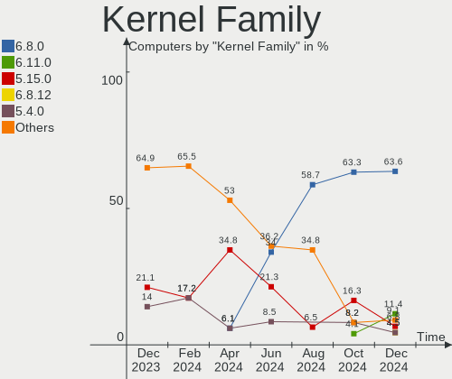
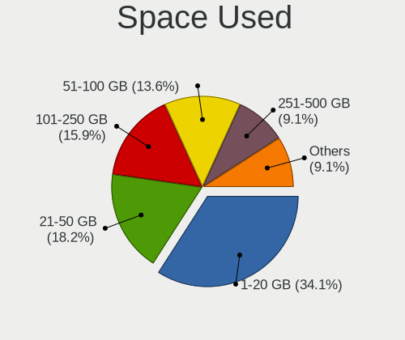
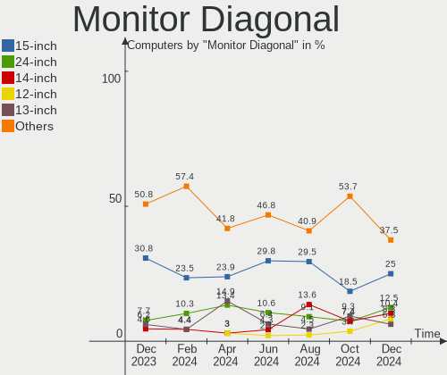

Xubuntu Hardware Trends
-----------------------

A project to identify most popular hardware characteristics and track their change
over time based on data collected by Xubuntu users at https://Linux-Hardware.org.

Anyone can contribute to this report by the [hw-probe](https://github.com/linuxhw/hw-probe) tool:

    sudo -E hw-probe -all -upload

This is a report for all computer types. See also reports for [desktops](/Dist/Xubuntu/Desktop/README.md) and [notebooks](/Dist/Xubuntu/Notebook/README.md).

Full-feature report is available here: https://linux-hardware.org/?view=trends

Period: Nov, 2021.

Contents
--------

* [ System ](#system)
  - [ OS                       ](#os)
  - [ OS Family                ](#os-family)
  - [ Kernel                   ](#kernel)
  - [ Kernel Family            ](#kernel-family)
  - [ Kernel Major Ver.        ](#kernel-major-ver)
  - [ Arch                     ](#arch)
  - [ DE                       ](#de)
  - [ Display Server           ](#display-server)
  - [ Display Manager          ](#display-manager)
  - [ OS Lang                  ](#os-lang)
  - [ Boot Mode                ](#boot-mode)
  - [ Filesystem               ](#filesystem)
  - [ Part. scheme             ](#part-scheme)
  - [ Dual Boot with Linux/BSD ](#dual-boot-with-linuxbsd)
  - [ Dual Boot (Win)          ](#dual-boot-win)

* [ Board ](#board)
  - [ Vendor                   ](#vendor)
  - [ Model                    ](#model)
  - [ Model Family             ](#model-family)
  - [ MFG Year                 ](#mfg-year)
  - [ Form Factor              ](#form-factor)
  - [ Secure Boot              ](#secure-boot)
  - [ Coreboot                 ](#coreboot)
  - [ RAM Size                 ](#ram-size)
  - [ RAM Used                 ](#ram-used)
  - [ Total Drives             ](#total-drives)
  - [ Has CD-ROM               ](#has-cd-rom)
  - [ Has Ethernet             ](#has-ethernet)
  - [ Has WiFi                 ](#has-wifi)
  - [ Has Bluetooth            ](#has-bluetooth)

* [ Location ](#location)
  - [ Country                  ](#country)
  - [ City                     ](#city)

* [ Drives ](#drives)
  - [ Drive Vendor             ](#drive-vendor)
  - [ Drive Model              ](#drive-model)
  - [ HDD Vendor               ](#hdd-vendor)
  - [ SSD Vendor               ](#ssd-vendor)
  - [ Drive Kind               ](#drive-kind)
  - [ Drive Connector          ](#drive-connector)
  - [ Drive Size               ](#drive-size)
  - [ Space Total              ](#space-total)
  - [ Space Used               ](#space-used)
  - [ Malfunc. Drives          ](#malfunc-drives)
  - [ Malfunc. Drive Vendor    ](#malfunc-drive-vendor)
  - [ Malfunc. HDD Vendor      ](#malfunc-hdd-vendor)
  - [ Malfunc. Drive Kind      ](#malfunc-drive-kind)
  - [ Failed Drives            ](#failed-drives)
  - [ Failed Drive Vendor      ](#failed-drive-vendor)
  - [ Drive Status             ](#drive-status)

* [ Storage controller ](#storage-controller)
  - [ Storage Vendor           ](#storage-vendor)
  - [ Storage Model            ](#storage-model)
  - [ Storage Kind             ](#storage-kind)

* [ Processor ](#processor)
  - [ CPU Vendor               ](#cpu-vendor)
  - [ CPU Model                ](#cpu-model)
  - [ CPU Model Family         ](#cpu-model-family)
  - [ CPU Cores                ](#cpu-cores)
  - [ CPU Sockets              ](#cpu-sockets)
  - [ CPU Threads              ](#cpu-threads)
  - [ CPU Op-Modes             ](#cpu-op-modes)
  - [ CPU Microcode            ](#cpu-microcode)
  - [ CPU Microarch            ](#cpu-microarch)

* [ Graphics ](#graphics)
  - [ GPU Vendor               ](#gpu-vendor)
  - [ GPU Model                ](#gpu-model)
  - [ GPU Combo                ](#gpu-combo)
  - [ GPU Driver               ](#gpu-driver)
  - [ GPU Memory               ](#gpu-memory)

* [ Monitor ](#monitor)
  - [ Monitor Vendor           ](#monitor-vendor)
  - [ Monitor Model            ](#monitor-model)
  - [ Monitor Resolution       ](#monitor-resolution)
  - [ Monitor Diagonal         ](#monitor-diagonal)
  - [ Monitor Width            ](#monitor-width)
  - [ Aspect Ratio             ](#aspect-ratio)
  - [ Monitor Area             ](#monitor-area)
  - [ Pixel Density            ](#pixel-density)
  - [ Multiple Monitors        ](#multiple-monitors)

* [ Network ](#network)
  - [ Net Controller Vendor    ](#net-controller-vendor)
  - [ Net Controller Model     ](#net-controller-model)
  - [ Wireless Vendor          ](#wireless-vendor)
  - [ Wireless Model           ](#wireless-model)
  - [ Ethernet Vendor          ](#ethernet-vendor)
  - [ Ethernet Model           ](#ethernet-model)
  - [ Net Controller Kind      ](#net-controller-kind)
  - [ Used Controller          ](#used-controller)
  - [ NICs                     ](#nics)
  - [ IPv6                     ](#ipv6)

* [ Bluetooth ](#bluetooth)
  - [ Bluetooth Vendor         ](#bluetooth-vendor)
  - [ Bluetooth Model          ](#bluetooth-model)

* [ Sound ](#sound)
  - [ Sound Vendor             ](#sound-vendor)
  - [ Sound Model              ](#sound-model)

* [ Memory ](#memory)
  - [ Memory Vendor            ](#memory-vendor)
  - [ Memory Model             ](#memory-model)
  - [ Memory Kind              ](#memory-kind)
  - [ Memory Form Factor       ](#memory-form-factor)
  - [ Memory Size              ](#memory-size)
  - [ Memory Speed             ](#memory-speed)

* [ Printers & scanners ](#printers--scanners)
  - [ Printer Vendor           ](#printer-vendor)
  - [ Printer Model            ](#printer-model)
  - [ Scanner Vendor           ](#scanner-vendor)
  - [ Scanner Model            ](#scanner-model)

* [ Camera ](#camera)
  - [ Camera Vendor            ](#camera-vendor)
  - [ Camera Model             ](#camera-model)

* [ Security ](#security)
  - [ Fingerprint Vendor       ](#fingerprint-vendor)
  - [ Fingerprint Model        ](#fingerprint-model)
  - [ Chipcard Vendor          ](#chipcard-vendor)
  - [ Chipcard Model           ](#chipcard-model)

* [ Unsupported ](#unsupported)
  - [ Unsupported Devices      ](#unsupported-devices)
  - [ Unsupported Device Types ](#unsupported-device-types)

System
------

OS
--

Installed operating systems

| Name          | Computers | Percent |
|---------------|-----------|---------|
| Xubuntu 20.04 | 79        | 66.39%  |
| Xubuntu 18.04 | 25        | 21.01%  |
| Xubuntu 21.10 | 9         | 7.56%   |
| Xubuntu 21.04 | 2         | 1.68%   |
| Xubuntu 16.04 | 2         | 1.68%   |
| Xubuntu 20.10 | 1         | 0.84%   |
| Xubuntu 17.04 | 1         | 0.84%   |

OS Family
---------

OS without a version

| Name    | Computers | Percent |
|---------|-----------|---------|
| Xubuntu | 119       | 100%    |

Kernel
------

Version of the Linux kernel

| Version                | Computers | Percent |
|------------------------|-----------|---------|
| 5.11.0-27-generic      | 21        | 17.65%  |
| 5.4.0-90-generic       | 17        | 14.29%  |
| 5.4.0-89-generic       | 16        | 13.45%  |
| 5.11.0-40-generic      | 13        | 10.92%  |
| 5.11.0-38-generic      | 7         | 5.88%   |
| 5.11.0-40-lowlatency   | 5         | 4.2%    |
| 5.13.0-21-generic      | 4         | 3.36%   |
| 4.15.0-161-generic     | 4         | 3.36%   |
| 5.15.1-051501-generic  | 3         | 2.52%   |
| 5.13.0-20-generic      | 3         | 2.52%   |
| 5.4.0-90-lowlatency    | 2         | 1.68%   |
| 5.11.0-38-lowlatency   | 2         | 1.68%   |
| 5.11.0-27-lowlatency   | 2         | 1.68%   |
| 4.4.0-210-generic      | 2         | 1.68%   |
| 4.15.0-161-lowlatency  | 2         | 1.68%   |
| 5.8.0-63-generic       | 1         | 0.84%   |
| 5.4.0-91-generic       | 1         | 0.84%   |
| 5.4.0-89-lowlatency    | 1         | 0.84%   |
| 5.4.0-73-lowlatency    | 1         | 0.84%   |
| 5.15.0-051500-generic  | 1         | 0.84%   |
| 5.14.14-051414-generic | 1         | 0.84%   |
| 5.13.0-linuxlite       | 1         | 0.84%   |
| 5.13.0-19-generic      | 1         | 0.84%   |
| 5.11.0-7620-generic    | 1         | 0.84%   |
| 5.11.0-37-generic      | 1         | 0.84%   |
| 4.16.18-galliumos      | 1         | 0.84%   |
| 4.15.0-162-lowlatency  | 1         | 0.84%   |
| 4.15.0-162-generic     | 1         | 0.84%   |
| 4.15.0-147-generic     | 1         | 0.84%   |
| 4.15.0-144-lowlatency  | 1         | 0.84%   |
| 4.10.0-42-generic      | 1         | 0.84%   |

Kernel Family
-------------

Linux kernel without a distro release

| Version | Computers | Percent |
|---------|-----------|---------|
| 5.11.0  | 52        | 43.7%   |
| 5.4.0   | 38        | 31.93%  |
| 4.15.0  | 10        | 8.4%    |
| 5.13.0  | 9         | 7.56%   |
| 5.15.1  | 3         | 2.52%   |
| 4.4.0   | 2         | 1.68%   |
| 5.8.0   | 1         | 0.84%   |
| 5.15.0  | 1         | 0.84%   |
| 5.14.14 | 1         | 0.84%   |
| 4.16.18 | 1         | 0.84%   |
| 4.10.0  | 1         | 0.84%   |

Kernel Major Ver.
-----------------

Linux kernel major version

| Version | Computers | Percent |
|---------|-----------|---------|
| 5.11    | 52        | 43.7%   |
| 5.4     | 38        | 31.93%  |
| 4.15    | 10        | 8.4%    |
| 5.13    | 9         | 7.56%   |
| 5.15    | 4         | 3.36%   |
| 4.4     | 2         | 1.68%   |
| 5.8     | 1         | 0.84%   |
| 5.14    | 1         | 0.84%   |
| 4.16    | 1         | 0.84%   |
| 4.10    | 1         | 0.84%   |

Arch
----

OS architecture (x86_64, i586, etc.)

| Name   | Computers | Percent |
|--------|-----------|---------|
| x86_64 | 108       | 90.76%  |
| i686   | 11        | 9.24%   |

DE
--

Desktop Environment

| Name  | Computers | Percent |
|-------|-----------|---------|
| XFCE  | 116       | 97.48%  |
| Unity | 1         | 0.84%   |
| KDE5  | 1         | 0.84%   |
| GNOME | 1         | 0.84%   |

Display Server
--------------

X11 or Wayland

| Name | Computers | Percent |
|------|-----------|---------|
| X11  | 118       | 99.16%  |
| Tty  | 1         | 0.84%   |

Display Manager
---------------

SDDM, LightDM, etc.

| Name    | Computers | Percent |
|---------|-----------|---------|
| LightDM | 110       | 92.44%  |
| GDM3    | 2         | 1.68%   |
| GDM     | 2         | 1.68%   |
| Unknown | 2         | 1.68%   |
| XDM     | 1         | 0.84%   |
| SDDM    | 1         | 0.84%   |
| LXDM    | 1         | 0.84%   |

OS Lang
-------

Language

| Lang  | Computers | Percent |
|-------|-----------|---------|
| en_US | 46        | 38.66%  |
| C     | 22        | 18.49%  |
| fr_FR | 14        | 11.76%  |
| de_DE | 11        | 9.24%   |
| it_IT | 4         | 3.36%   |
| pl_PL | 3         | 2.52%   |
| en_CA | 3         | 2.52%   |
| es_ES | 2         | 1.68%   |
| zh_TW | 1         | 0.84%   |
| th_TH | 1         | 0.84%   |
| sv_SE | 1         | 0.84%   |
| ru_RU | 1         | 0.84%   |
| nl_NL | 1         | 0.84%   |
| nl_BE | 1         | 0.84%   |
| hu_HU | 1         | 0.84%   |
| fr_BE | 1         | 0.84%   |
| fi_FI | 1         | 0.84%   |
| es_CO | 1         | 0.84%   |
| en_ZA | 1         | 0.84%   |
| en_IN | 1         | 0.84%   |
| en_GB | 1         | 0.84%   |
| cs_CZ | 1         | 0.84%   |

Boot Mode
---------

EFI or BIOS

| Mode | Computers | Percent |
|------|-----------|---------|
| BIOS | 70        | 58.82%  |
| EFI  | 49        | 41.18%  |

Filesystem
----------

Type of filesystem

| Type    | Computers | Percent |
|---------|-----------|---------|
| Ext4    | 95        | 79.83%  |
| Overlay | 23        | 19.33%  |
| Zfs     | 1         | 0.84%   |

Part. scheme
------------

Scheme of partitioning

| Type    | Computers | Percent |
|---------|-----------|---------|
| Unknown | 69        | 57.98%  |
| GPT     | 36        | 30.25%  |
| MBR     | 14        | 11.76%  |

Dual Boot with Linux/BSD
------------------------

Hosting more than one Linux/BSD

| Dual boot | Computers | Percent |
|-----------|-----------|---------|
| No        | 93        | 78.15%  |
| Yes       | 26        | 21.85%  |

Dual Boot (Win)
---------------

Hosting Linux and Windows

| Dual boot | Computers | Percent |
|-----------|-----------|---------|
| No        | 76        | 63.87%  |
| Yes       | 43        | 36.13%  |

Board
-----

Vendor
------

Motherboard manufacturer

| Name                   | Computers | Percent |
|------------------------|-----------|---------|
| ASUSTek Computer       | 30        | 25.21%  |
| Hewlett-Packard        | 20        | 16.81%  |
| Dell                   | 15        | 12.61%  |
| Lenovo                 | 14        | 11.76%  |
| MSI                    | 6         | 5.04%   |
| ASRock                 | 4         | 3.36%   |
| Gigabyte Technology    | 3         | 2.52%   |
| Apple                  | 3         | 2.52%   |
| Acer                   | 3         | 2.52%   |
| Toshiba                | 2         | 1.68%   |
| Samsung Electronics    | 2         | 1.68%   |
| Medion                 | 2         | 1.68%   |
| Google                 | 2         | 1.68%   |
| System76               | 1         | 0.84%   |
| Sony                   | 1         | 0.84%   |
| Shuttle                | 1         | 0.84%   |
| ONE-NETBOOK TECHNOLOGY | 1         | 0.84%   |
| NCR                    | 1         | 0.84%   |
| MAXDATA                | 1         | 0.84%   |
| Gateway                | 1         | 0.84%   |
| Fujitsu Siemens        | 1         | 0.84%   |
| Fujitsu                | 1         | 0.84%   |
| EVGA                   | 1         | 0.84%   |
| ECS                    | 1         | 0.84%   |
| ABIT                   | 1         | 0.84%   |
| Unknown                | 1         | 0.84%   |

Model
-----

Motherboard model

| Name                                        | Computers | Percent |
|---------------------------------------------|-----------|---------|
| ASUS VivoBook_ASUSLaptop X571LH_K571LH      | 4         | 3.36%   |
| HP Pavilion dv9700                          | 2         | 1.68%   |
| HP ENVY x360 Convertible 15-ed1xxx          | 2         | 1.68%   |
| Toshiba Satellite P745                      | 1         | 0.84%   |
| Toshiba Satellite C70D-B                    | 1         | 0.84%   |
| System76 Oryx Pro                           | 1         | 0.84%   |
| Sony VPCF13M1E                              | 1         | 0.84%   |
| Shuttle NC03U                               | 1         | 0.84%   |
| Samsung R530/R730/P590                      | 1         | 0.84%   |
| Samsung 905S3G/906S3G/915S3G/9305SG         | 1         | 0.84%   |
| ONE-NETBOOK TECHNOLOGY A1                   | 1         | 0.84%   |
| NCR 7606-1309-8801                          | 1         | 0.84%   |
| MSI Pro 2000/2080                           | 1         | 0.84%   |
| MSI MS-7B79                                 | 1         | 0.84%   |
| MSI MS-1034                                 | 1         | 0.84%   |
| MSI GT75VR 7RE                              | 1         | 0.84%   |
| MSI GL63 8RC                                | 1         | 0.84%   |
| MSI Alpha 17 A4DEK                          | 1         | 0.84%   |
| Medion MS-7366                              | 1         | 0.84%   |
| Medion Akoya P2120 D MD8836/2452            | 1         | 0.84%   |
| MAXDATA ECO4000IW                           | 1         | 0.84%   |
| Lenovo Yoga 27-ARH F0FN0002CP               | 1         | 0.84%   |
| Lenovo ThinkPad X1 Extreme Gen 3 20TKCTO1WW | 1         | 0.84%   |
| Lenovo ThinkPad T61 766511G                 | 1         | 0.84%   |
| Lenovo ThinkPad T495s 20QJCTO1WW            | 1         | 0.84%   |
| Lenovo ThinkPad T410 2537MT3                | 1         | 0.84%   |
| Lenovo ThinkPad R61 77331CU                 | 1         | 0.84%   |
| Lenovo ThinkPad P15s Gen 1 20T4000EUK       | 1         | 0.84%   |
| Lenovo ThinkPad E15 Gen 2 20TD003HUS        | 1         | 0.84%   |
| Lenovo ThinkCentre A70 7844H9G              | 1         | 0.84%   |
| Lenovo Legion Y540-17IRH-PG0 81T3           | 1         | 0.84%   |
| Lenovo IdeaPadFlex 5 14ARE05 81X2           | 1         | 0.84%   |
| Lenovo IdeaPad Y570 0862                    | 1         | 0.84%   |
| Lenovo IdeaPad 100-15IBY 80MJ               | 1         | 0.84%   |
| Lenovo Edge 15 80K9                         | 1         | 0.84%   |
| HP ProBook 650 G3                           | 1         | 0.84%   |
| HP ProBook 6450b                            | 1         | 0.84%   |
| HP ProBook 640 G1                           | 1         | 0.84%   |
| HP Pavilion TS 11                           | 1         | 0.84%   |
| HP Pavilion g6                              | 1         | 0.84%   |
| HP Pavilion dv6                             | 1         | 0.84%   |
| HP Pavilion 17                              | 1         | 0.84%   |
| HP Notebook                                 | 1         | 0.84%   |
| HP Laptop 17-ak0xx                          | 1         | 0.84%   |
| HP EliteBook 835 G7 Notebook PC             | 1         | 0.84%   |
| HP Compaq Presario CQ61                     | 1         | 0.84%   |
| HP Compaq nc6320 (RH374EA#AKB)              | 1         | 0.84%   |
| HP Compaq dc7800p Small Form Factor         | 1         | 0.84%   |
| HP Compaq dc7800p Convertible Minitower     | 1         | 0.84%   |
| HP Compaq 6710b (RM405UT#ABA)               | 1         | 0.84%   |
| HP Compaq 2510p                             | 1         | 0.84%   |
| Google Terra                                | 1         | 0.84%   |
| Google Auron_Yuna                           | 1         | 0.84%   |
| Gigabyte Z97X-UD3H                          | 1         | 0.84%   |
| Gigabyte H370HD3                            | 1         | 0.84%   |
| Gigabyte 945GZM-S2                          | 1         | 0.84%   |
| Gateway DX4840                              | 1         | 0.84%   |
| Fujitsu Siemens AMILO Pro Edition V3505     | 1         | 0.84%   |
| Fujitsu D3417-B2 S26361-D3417-B2            | 1         | 0.84%   |
| EVGA 111-CS-E371                            | 1         | 0.84%   |

Model Family
------------

Motherboard model prefix

| Name                      | Computers | Percent |
|---------------------------|-----------|---------|
| Lenovo ThinkPad           | 7         | 5.88%   |
| ASUS VivoBook             | 7         | 5.88%   |
| HP Pavilion               | 6         | 5.04%   |
| HP Compaq                 | 6         | 5.04%   |
| HP ProBook                | 3         | 2.52%   |
| Dell XPS                  | 3         | 2.52%   |
| Dell Latitude             | 3         | 2.52%   |
| Dell Inspiron             | 3         | 2.52%   |
| Toshiba Satellite         | 2         | 1.68%   |
| Lenovo IdeaPad            | 2         | 1.68%   |
| HP ENVY                   | 2         | 1.68%   |
| Dell Precision            | 2         | 1.68%   |
| Dell OptiPlex             | 2         | 1.68%   |
| ASUS ROG                  | 2         | 1.68%   |
| ASUS PRIME                | 2         | 1.68%   |
| ASUS ASUS                 | 2         | 1.68%   |
| Acer Nitro                | 2         | 1.68%   |
| System76 Oryx             | 1         | 0.84%   |
| Sony VPCF13M1E            | 1         | 0.84%   |
| Shuttle NC03U             | 1         | 0.84%   |
| Samsung R530              | 1         | 0.84%   |
| Samsung 905S3G            | 1         | 0.84%   |
| ONE-NETBOOK TECHNOLOGY A1 | 1         | 0.84%   |
| NCR 7606-1309-8801        | 1         | 0.84%   |
| MSI Pro                   | 1         | 0.84%   |
| MSI MS-7B79               | 1         | 0.84%   |
| MSI MS-1034               | 1         | 0.84%   |
| MSI GT75VR                | 1         | 0.84%   |
| MSI GL63                  | 1         | 0.84%   |
| MSI Alpha                 | 1         | 0.84%   |
| Medion MS-7366            | 1         | 0.84%   |
| Medion Akoya              | 1         | 0.84%   |
| MAXDATA ECO4000IW         | 1         | 0.84%   |
| Lenovo Yoga               | 1         | 0.84%   |
| Lenovo ThinkCentre        | 1         | 0.84%   |
| Lenovo Legion             | 1         | 0.84%   |
| Lenovo IdeaPadFlex        | 1         | 0.84%   |
| Lenovo Edge               | 1         | 0.84%   |
| HP Notebook               | 1         | 0.84%   |
| HP Laptop                 | 1         | 0.84%   |
| HP EliteBook              | 1         | 0.84%   |
| Google Terra              | 1         | 0.84%   |
| Google Auron              | 1         | 0.84%   |
| Gigabyte Z97X-UD3H        | 1         | 0.84%   |
| Gigabyte H370HD3          | 1         | 0.84%   |
| Gigabyte 945GZM-S2        | 1         | 0.84%   |
| Gateway DX4840            | 1         | 0.84%   |
| Fujitsu Siemens AMILO     | 1         | 0.84%   |
| Fujitsu D3417-B2          | 1         | 0.84%   |
| EVGA 111-CS-E371          | 1         | 0.84%   |
| ECS H81H3-M4              | 1         | 0.84%   |
| Dell G3                   | 1         | 0.84%   |
| Dell G15                  | 1         | 0.84%   |
| ASUS X51RL                | 1         | 0.84%   |
| ASUS X501A                | 1         | 0.84%   |
| ASUS P7P55D               | 1         | 0.84%   |
| ASUS P5LD2-VM             | 1         | 0.84%   |
| ASUS P2540UA              | 1         | 0.84%   |
| ASUS M4A89GTD-PRO         | 1         | 0.84%   |
| ASUS M3N78-EM             | 1         | 0.84%   |

MFG Year
--------

Motherboard manufacture year

| Year | Computers | Percent |
|------|-----------|---------|
| 2021 | 21        | 17.65%  |
| 2020 | 16        | 13.45%  |
| 2010 | 10        | 8.4%    |
| 2009 | 10        | 8.4%    |
| 2018 | 8         | 6.72%   |
| 2007 | 8         | 6.72%   |
| 2019 | 6         | 5.04%   |
| 2014 | 6         | 5.04%   |
| 2011 | 6         | 5.04%   |
| 2016 | 5         | 4.2%    |
| 2015 | 5         | 4.2%    |
| 2013 | 4         | 3.36%   |
| 2008 | 4         | 3.36%   |
| 2006 | 4         | 3.36%   |
| 2012 | 3         | 2.52%   |
| 2017 | 2         | 1.68%   |
| 2004 | 1         | 0.84%   |

Form Factor
-----------

Physical design of the computer

| Name        | Computers | Percent |
|-------------|-----------|---------|
| Notebook    | 74        | 62.18%  |
| Desktop     | 38        | 31.93%  |
| All in one  | 4         | 3.36%   |
| Convertible | 3         | 2.52%   |

Secure Boot
-----------

Enabled or disabled

| State    | Computers | Percent |
|----------|-----------|---------|
| Disabled | 115       | 96.64%  |
| Enabled  | 4         | 3.36%   |

Coreboot
--------

Have coreboot on board

| Used | Computers | Percent |
|------|-----------|---------|
| No   | 117       | 98.32%  |
| Yes  | 2         | 1.68%   |

RAM Size
--------

Total RAM memory

| Size in GB  | Computers | Percent |
|-------------|-----------|---------|
| 3.01-4.0    | 30        | 25.21%  |
| 16.01-24.0  | 25        | 21.01%  |
| 4.01-8.0    | 20        | 16.81%  |
| 8.01-16.0   | 16        | 13.45%  |
| 1.01-2.0    | 11        | 9.24%   |
| 32.01-64.0  | 6         | 5.04%   |
| 2.01-3.0    | 4         | 3.36%   |
| 64.01-256.0 | 3         | 2.52%   |
| 24.01-32.0  | 2         | 1.68%   |
| 0.51-1.0    | 1         | 0.84%   |
| 0.01-0.5    | 1         | 0.84%   |

RAM Used
--------

Used RAM memory

| Used GB   | Computers | Percent |
|-----------|-----------|---------|
| 1.01-2.0  | 43        | 36.13%  |
| 2.01-3.0  | 30        | 25.21%  |
| 0.51-1.0  | 17        | 14.29%  |
| 4.01-8.0  | 16        | 13.45%  |
| 3.01-4.0  | 6         | 5.04%   |
| 0.01-0.5  | 4         | 3.36%   |
| 8.01-16.0 | 3         | 2.52%   |

Total Drives
------------

Number of drives on board

| Drives | Computers | Percent |
|--------|-----------|---------|
| 1      | 72        | 60.5%   |
| 2      | 24        | 20.17%  |
| 3      | 10        | 8.4%    |
| 0      | 5         | 4.2%    |
| 5      | 3         | 2.52%   |
| 4      | 3         | 2.52%   |
| 7      | 2         | 1.68%   |

Has CD-ROM
----------

Has CD-ROM on board

| Presented | Computers | Percent |
|-----------|-----------|---------|
| No        | 64        | 53.78%  |
| Yes       | 55        | 46.22%  |

Has Ethernet
------------

Has Ethernet on board

| Presented | Computers | Percent |
|-----------|-----------|---------|
| Yes       | 103       | 86.55%  |
| No        | 16        | 13.45%  |

Has WiFi
--------

Has WiFi module

| Presented | Computers | Percent |
|-----------|-----------|---------|
| Yes       | 94        | 78.99%  |
| No        | 25        | 21.01%  |

Has Bluetooth
-------------

Has Bluetooth module

| Presented | Computers | Percent |
|-----------|-----------|---------|
| Yes       | 69        | 57.98%  |
| No        | 50        | 42.02%  |

Location
--------

Country
-------

Geographic location (country)

| Country                | Computers | Percent |
|------------------------|-----------|---------|
| Canada                 | 24        | 20.17%  |
| USA                    | 22        | 18.49%  |
| France                 | 14        | 11.76%  |
| Germany                | 11        | 9.24%   |
| Netherlands            | 6         | 5.04%   |
| Poland                 | 4         | 3.36%   |
| Italy                  | 4         | 3.36%   |
| Finland                | 3         | 2.52%   |
| Ukraine                | 2         | 1.68%   |
| Sweden                 | 2         | 1.68%   |
| Spain                  | 2         | 1.68%   |
| Romania                | 2         | 1.68%   |
| Czechia                | 2         | 1.68%   |
| Belgium                | 2         | 1.68%   |
| UK                     | 1         | 0.84%   |
| Tunisia                | 1         | 0.84%   |
| Thailand               | 1         | 0.84%   |
| Tajikistan             | 1         | 0.84%   |
| Taiwan                 | 1         | 0.84%   |
| South Africa           | 1         | 0.84%   |
| Slovenia               | 1         | 0.84%   |
| Russia                 | 1         | 0.84%   |
| Qatar                  | 1         | 0.84%   |
| Norway                 | 1         | 0.84%   |
| Morocco                | 1         | 0.84%   |
| Indonesia              | 1         | 0.84%   |
| India                  | 1         | 0.84%   |
| Hungary                | 1         | 0.84%   |
| Colombia               | 1         | 0.84%   |
| China                  | 1         | 0.84%   |
| Bulgaria               | 1         | 0.84%   |
| Bosnia and Herzegovina | 1         | 0.84%   |
| Argentina              | 1         | 0.84%   |

City
----

Geographic location (city)

| City               | Computers | Percent |
|--------------------|-----------|---------|
| Qu?©bec            | 16        | 13.45%  |
| Levis              | 4         | 3.36%   |
| Berlin             | 3         | 2.52%   |
| Warsaw             | 2         | 1.68%   |
| Prague             | 2         | 1.68%   |
| Delft              | 2         | 1.68%   |
| Amsterdam          | 2         | 1.68%   |
| Zgornja Besnica    | 1         | 0.84%   |
| Woodworth          | 1         | 0.84%   |
| Wisconsin Rapids   | 1         | 0.84%   |
| Winter Park        | 1         | 0.84%   |
| Williston          | 1         | 0.84%   |
| White Rock         | 1         | 0.84%   |
| Voronezh           | 1         | 0.84%   |
| Voluntari          | 1         | 0.84%   |
| Uzhhorod           | 1         | 0.84%   |
| Tyler              | 1         | 0.84%   |
| The Hague          | 1         | 0.84%   |
| Tegal              | 1         | 0.84%   |
| Tampere            | 1         | 0.84%   |
| Tampa              | 1         | 0.84%   |
| Talence            | 1         | 0.84%   |
| Stroe              | 1         | 0.84%   |
| Stanwood           | 1         | 0.84%   |
| Springfield        | 1         | 0.84%   |
| Solbergelva        | 1         | 0.84%   |
| Sofia              | 1         | 0.84%   |
| Rosario            | 1         | 0.84%   |
| Roissy-en-Brie     | 1         | 0.84%   |
| Reno               | 1         | 0.84%   |
| Rapid City         | 1         | 0.84%   |
| Queens             | 1         | 0.84%   |
| Pretoria           | 1         | 0.84%   |
| Poznan             | 1         | 0.84%   |
| Potsdam            | 1         | 0.84%   |
| Phuket             | 1         | 0.84%   |
| Phoenix            | 1         | 0.84%   |
| Petite-Foret       | 1         | 0.84%   |
| Paris              | 1         | 0.84%   |
| Ozzano dell'Emilia | 1         | 0.84%   |
| Oldenburg          | 1         | 0.84%   |
| Odessa             | 1         | 0.84%   |
| New Taipei         | 1         | 0.84%   |
| New Rochelle       | 1         | 0.84%   |
| N?®mes             | 1         | 0.84%   |
| Navalmanzano       | 1         | 0.84%   |
| Nantes             | 1         | 0.84%   |
| Nancy              | 1         | 0.84%   |
| Montlu?§on         | 1         | 0.84%   |
| Milan              | 1         | 0.84%   |
| M?©rignac          | 1         | 0.84%   |
| Marseille          | 1         | 0.84%   |
| Marmande           | 1         | 0.84%   |
| Madrid             | 1         | 0.84%   |
| Lund               | 1         | 0.84%   |
| Lebach             | 1         | 0.84%   |
| Lancaster          | 1         | 0.84%   |
| L'Ancienne-Lorette | 1         | 0.84%   |
| Kuopio             | 1         | 0.84%   |
| Kortrijk           | 1         | 0.84%   |

Drives
------

Drive Vendor
------------

Hard drive vendors

| Vendor                  | Computers | Drives | Percent |
|-------------------------|-----------|--------|---------|
| WDC                     | 32        | 47     | 20.92%  |
| Seagate                 | 29        | 34     | 18.95%  |
| Samsung Electronics     | 21        | 29     | 13.73%  |
| Toshiba                 | 8         | 9      | 5.23%   |
| Kingston                | 7         | 7      | 4.58%   |
| Hitachi                 | 7         | 7      | 4.58%   |
| Unknown                 | 5         | 5      | 3.27%   |
| Crucial                 | 5         | 6      | 3.27%   |
| Intel                   | 4         | 8      | 2.61%   |
| Sandisk                 | 3         | 3      | 1.96%   |
| Micron Technology       | 3         | 3      | 1.96%   |
| A-DATA Technology       | 3         | 3      | 1.96%   |
| SK Hynix                | 2         | 2      | 1.31%   |
| Phison                  | 2         | 3      | 1.31%   |
| Intenso                 | 2         | 2      | 1.31%   |
| HGST                    | 2         | 2      | 1.31%   |
| Zheino                  | 1         | 1      | 0.65%   |
| Union Memory (Shenzhen) | 1         | 1      | 0.65%   |
| Transcend               | 1         | 1      | 0.65%   |
| SPCC                    | 1         | 1      | 0.65%   |
| Silicon Motion          | 1         | 1      | 0.65%   |
| PNY                     | 1         | 1      | 0.65%   |
| Netac                   | 1         | 1      | 0.65%   |
| MAXTOR                  | 1         | 1      | 0.65%   |
| LITEONIT                | 1         | 1      | 0.65%   |
| LITEON                  | 1         | 1      | 0.65%   |
| Lexar                   | 1         | 1      | 0.65%   |
| KIOXIA                  | 1         | 1      | 0.65%   |
| HDD                     | 1         | 1      | 0.65%   |
| DREVO                   | 1         | 1      | 0.65%   |
| d2                      | 1         | 1      | 0.65%   |
| Corsair                 | 1         | 1      | 0.65%   |
| CHN25SATAS1             | 1         | 1      | 0.65%   |
| Apple                   | 1         | 1      | 0.65%   |

Drive Model
-----------

Hard drive models

| Model                                        | Computers | Percent |
|----------------------------------------------|-----------|---------|
| Intel HBRPEKNX0202AO 32GB                    | 4         | 2.2%    |
| Intel HBRPEKNX0202A 512GB                    | 4         | 2.2%    |
| Samsung SSD 860 EVO 1TB                      | 3         | 1.65%   |
| WDC WD10EZEX-00BN5A0 1TB                     | 2         | 1.1%    |
| Unknown MMC Card  64GB                       | 2         | 1.1%    |
| Unknown MMC Card  32GB                       | 2         | 1.1%    |
| Seagate ST500LT012-1DG142 500GB              | 2         | 1.1%    |
| Seagate ST1000LM035-1RK172 1TB               | 2         | 1.1%    |
| Samsung MZVLB1T0HBLR-000H1 1TB               | 2         | 1.1%    |
| Samsung HD322HJ 320GB                        | 2         | 1.1%    |
| Crucial CT1000MX500SSD1 1TB                  | 2         | 1.1%    |
| Zheino CHN-25SATAC3-120 120GB                | 1         | 0.55%   |
| WDC WDS500G2B0C-00PXH0 500GB                 | 1         | 0.55%   |
| WDC WDS500G2B0C 500GB                        | 1         | 0.55%   |
| WDC WDS500G2B0A-00SM50 500GB SSD             | 1         | 0.55%   |
| WDC WDS250G2B0A-00SM50 250GB SSD             | 1         | 0.55%   |
| WDC WDS100T2B0C-00PXH0 1TB                   | 1         | 0.55%   |
| WDC WDBNCE5000PNC 500GB SSD                  | 1         | 0.55%   |
| WDC WD800JB-00JJC0 80GB                      | 1         | 0.55%   |
| WDC WD6400AAKS-00A7B2 640GB                  | 1         | 0.55%   |
| WDC WD60 EFRX-68L0BN1 6TB                    | 1         | 0.55%   |
| WDC WD5003AZEX-00K1GA0 500GB                 | 1         | 0.55%   |
| WDC WD5000LPVX-60V0TT0 500GB                 | 1         | 0.55%   |
| WDC WD5000LPLX-60ZNTT1 500GB                 | 1         | 0.55%   |
| WDC WD5000AZRX-00L4HB0 500GB                 | 1         | 0.55%   |
| WDC WD5000AAKS-75A7B2 500GB                  | 1         | 0.55%   |
| WDC WD5000AAKS-22V1A0 500GB                  | 1         | 0.55%   |
| WDC WD40PURZ-85TTDY0 4TB                     | 1         | 0.55%   |
| WDC WD3200BEVT-75ZCT1 320GB                  | 1         | 0.55%   |
| WDC WD3200BEVT-75A23T0 320GB                 | 1         | 0.55%   |
| WDC WD3200BEVT-60ZCT1 320GB                  | 1         | 0.55%   |
| WDC WD3200BEVT-22ZCT0 320GB                  | 1         | 0.55%   |
| WDC WD3200BEVS-26VAT0 320GB                  | 1         | 0.55%   |
| WDC WD3200AAJS-65RYA0 320GB                  | 1         | 0.55%   |
| WDC WD3200AAJS-00B4A0 320GB                  | 1         | 0.55%   |
| WDC WD3000HLFS-01G6U4 304GB                  | 1         | 0.55%   |
| WDC WD2500BEVT-00A23T0 250GB                 | 1         | 0.55%   |
| WDC WD2500BEVS-60UST0 250GB                  | 1         | 0.55%   |
| WDC WD2500AAKX-001CA0 250GB                  | 1         | 0.55%   |
| WDC WD2500AAJS-75B4A0 250GB                  | 1         | 0.55%   |
| WDC WD25 00BPVT-22JJ5T0 250GB                | 1         | 0.55%   |
| WDC WD20SPZX-08UA7 2TB                       | 1         | 0.55%   |
| WDC WD20EFRX-68EUZN0 2TB                     | 1         | 0.55%   |
| WDC WD20EARX-00PASB0 2TB                     | 1         | 0.55%   |
| WDC WD20EARS-00MVWB0 2TB                     | 1         | 0.55%   |
| WDC WD20EARS-00J2GB0 2TB                     | 1         | 0.55%   |
| WDC WD2002FAEX-007BA0 2TB                    | 1         | 0.55%   |
| WDC WD10JPLX-00MBPT0 1TB                     | 1         | 0.55%   |
| WDC WD10EZEX-21WN4A0 1TB                     | 1         | 0.55%   |
| WDC WD10EZEX-08WN4A0 1TB                     | 1         | 0.55%   |
| WDC WD10EARS-00Y5B1 1TB                      | 1         | 0.55%   |
| WDC WD10EACS-00D6B0 1TB                      | 1         | 0.55%   |
| WDC WD10EACS-00C7B0 1TB                      | 1         | 0.55%   |
| WDC PC SN730 SDBQNTY-1T00-1001 1TB           | 1         | 0.55%   |
| WDC PC SN530 NVMe 512GB                      | 1         | 0.55%   |
| Unknown MMC Card  128GB                      | 1         | 0.55%   |
| Union Memory (Shenzhen) NVMe SSD Drive 512GB | 1         | 0.55%   |
| Transcend TS256GMTS430S 256GB SSD            | 1         | 0.55%   |
| Toshiba NVMe SSD Drive 256GB                 | 1         | 0.55%   |
| Toshiba MQ01ACF050 500GB                     | 1         | 0.55%   |

HDD Vendor
----------

Hard disk drive vendors

| Vendor              | Computers | Drives | Percent |
|---------------------|-----------|--------|---------|
| Seagate             | 29        | 34     | 38.16%  |
| WDC                 | 25        | 39     | 32.89%  |
| Hitachi             | 7         | 7      | 9.21%   |
| Toshiba             | 6         | 7      | 7.89%   |
| Samsung Electronics | 5         | 6      | 6.58%   |
| HGST                | 2         | 2      | 2.63%   |
| MAXTOR              | 1         | 1      | 1.32%   |
| Apple               | 1         | 1      | 1.32%   |

SSD Vendor
----------

Solid state drive vendors

| Vendor              | Computers | Drives | Percent |
|---------------------|-----------|--------|---------|
| Samsung Electronics | 11        | 14     | 27.5%   |
| Kingston            | 5         | 5      | 12.5%   |
| Crucial             | 5         | 6      | 12.5%   |
| WDC                 | 3         | 3      | 7.5%    |
| A-DATA Technology   | 3         | 3      | 7.5%    |
| SanDisk             | 2         | 2      | 5%      |
| Zheino              | 1         | 1      | 2.5%    |
| Transcend           | 1         | 1      | 2.5%    |
| SPCC                | 1         | 1      | 2.5%    |
| PNY                 | 1         | 1      | 2.5%    |
| Micron Technology   | 1         | 1      | 2.5%    |
| LITEONIT            | 1         | 1      | 2.5%    |
| LITEON              | 1         | 1      | 2.5%    |
| Lexar               | 1         | 1      | 2.5%    |
| Intenso             | 1         | 1      | 2.5%    |
| DREVO               | 1         | 1      | 2.5%    |
| Corsair             | 1         | 1      | 2.5%    |

Drive Kind
----------

HDD or SSD

| Kind    | Computers | Drives | Percent |
|---------|-----------|--------|---------|
| HDD     | 65        | 97     | 45.45%  |
| SSD     | 37        | 44     | 25.87%  |
| NVMe    | 32        | 38     | 22.38%  |
| MMC     | 5         | 5      | 3.5%    |
| Unknown | 4         | 4      | 2.8%    |

Drive Connector
---------------

SATA, SAS, NVMe, etc.

| Type | Computers | Drives | Percent |
|------|-----------|--------|---------|
| SATA | 88        | 136    | 66.67%  |
| NVMe | 32        | 38     | 24.24%  |
| SAS  | 7         | 9      | 5.3%    |
| MMC  | 5         | 5      | 3.79%   |

Drive Size
----------

Size of hard drive

| Size in TB | Computers | Drives | Percent |
|------------|-----------|--------|---------|
| 0.01-0.5   | 69        | 86     | 65.71%  |
| 0.51-1.0   | 24        | 38     | 22.86%  |
| 1.01-2.0   | 7         | 10     | 6.67%   |
| 3.01-4.0   | 2         | 4      | 1.9%    |
| 4.01-10.0  | 2         | 2      | 1.9%    |
| 10.01-20.0 | 1         | 1      | 0.95%   |

Space Total
-----------

Amount of disk space available on the file system

| Size in GB     | Computers | Percent |
|----------------|-----------|---------|
| 101-250        | 34        | 28.57%  |
| 251-500        | 23        | 19.33%  |
| 1001-2000      | 12        | 10.08%  |
| 1-20           | 12        | 10.08%  |
| 51-100         | 11        | 9.24%   |
| 501-1000       | 10        | 8.4%    |
| 21-50          | 9         | 7.56%   |
| 2001-3000      | 5         | 4.2%    |
| More than 3000 | 2         | 1.68%   |
| Unknown        | 1         | 0.84%   |

Space Used
----------

Amount of used disk space

| Used GB        | Computers | Percent |
|----------------|-----------|---------|
| 1-20           | 56        | 47.06%  |
| 21-50          | 21        | 17.65%  |
| 101-250        | 13        | 10.92%  |
| 51-100         | 9         | 7.56%   |
| 501-1000       | 7         | 5.88%   |
| 251-500        | 5         | 4.2%    |
| 1001-2000      | 4         | 3.36%   |
| More than 3000 | 2         | 1.68%   |
| 2001-3000      | 1         | 0.84%   |
| Unknown        | 1         | 0.84%   |

Malfunc. Drives
---------------

Drive models with a malfunction

| Model                                          | Computers | Drives | Percent |
|------------------------------------------------|-----------|--------|---------|
| WDC WD3200BEVT-75ZCT1 320GB                    | 1         | 1      | 14.29%  |
| WDC WD20EFRX-68EUZN0 2TB                       | 1         | 1      | 14.29%  |
| Toshiba MQ01ABD032 320GB                       | 1         | 1      | 14.29%  |
| Seagate ST1000DM003-1SB102 1TB                 | 1         | 1      | 14.29%  |
| Micron Technology 1100_MTFDDAV256TBN 256GB SSD | 1         | 1      | 14.29%  |
| Hitachi HTS725050A9A364 500GB                  | 1         | 1      | 14.29%  |
| A-DATA Technology SP920SS 128GB SSD            | 1         | 1      | 14.29%  |

Malfunc. Drive Vendor
---------------------

Vendors of faulty drives

| Vendor            | Computers | Drives | Percent |
|-------------------|-----------|--------|---------|
| WDC               | 1         | 2      | 16.67%  |
| Toshiba           | 1         | 1      | 16.67%  |
| Seagate           | 1         | 1      | 16.67%  |
| Micron Technology | 1         | 1      | 16.67%  |
| Hitachi           | 1         | 1      | 16.67%  |
| A-DATA Technology | 1         | 1      | 16.67%  |

Malfunc. HDD Vendor
-------------------

Vendors of faulty HDD drives

| Vendor  | Computers | Drives | Percent |
|---------|-----------|--------|---------|
| WDC     | 1         | 2      | 25%     |
| Toshiba | 1         | 1      | 25%     |
| Seagate | 1         | 1      | 25%     |
| Hitachi | 1         | 1      | 25%     |

Malfunc. Drive Kind
-------------------

Kinds of faulty drives

| Kind | Computers | Drives | Percent |
|------|-----------|--------|---------|
| HDD  | 4         | 5      | 66.67%  |
| SSD  | 2         | 2      | 33.33%  |

Failed Drives
-------------

Failed drive models

Zero info for selected period =(

Failed Drive Vendor
-------------------

Failed drive vendors

Zero info for selected period =(

Drive Status
------------

Number of failed and malfunc. drives

| Status   | Computers | Drives | Percent |
|----------|-----------|--------|---------|
| Detected | 72        | 117    | 59.02%  |
| Works    | 44        | 64     | 36.07%  |
| Malfunc  | 6         | 7      | 4.92%   |

Storage controller
------------------

Storage Vendor
--------------

Storage controller vendors

| Vendor                       | Computers | Percent |
|------------------------------|-----------|---------|
| Intel                        | 84        | 60%     |
| AMD                          | 14        | 10%     |
| Samsung Electronics          | 9         | 6.43%   |
| Nvidia                       | 9         | 6.43%   |
| Sandisk                      | 6         | 4.29%   |
| Toshiba America Info Systems | 2         | 1.43%   |
| SK Hynix                     | 2         | 1.43%   |
| Silicon Motion               | 2         | 1.43%   |
| Phison Electronics           | 2         | 1.43%   |
| Micron Technology            | 2         | 1.43%   |
| Kingston Technology Company  | 2         | 1.43%   |
| Union Memory (Shenzhen)      | 1         | 0.71%   |
| Silicon Image                | 1         | 0.71%   |
| KIOXIA                       | 1         | 0.71%   |
| JMicron Technology           | 1         | 0.71%   |
| ASMedia Technology           | 1         | 0.71%   |
| Adaptec                      | 1         | 0.71%   |

Storage Model
-------------

Storage controller models

| Model                                                                          | Computers | Percent |
|--------------------------------------------------------------------------------|-----------|---------|
| AMD FCH SATA Controller [AHCI mode]                                            | 11        | 6.32%   |
| Intel 82801 Mobile SATA Controller [RAID mode]                                 | 10        | 5.75%   |
| Samsung NVMe SSD Controller SM981/PM981/PM983                                  | 7         | 4.02%   |
| Intel 82801HM/HEM (ICH8M/ICH8M-E) IDE Controller                               | 6         | 3.45%   |
| Intel 5 Series/3400 Series Chipset 6 port SATA AHCI Controller                 | 5         | 2.87%   |
| Intel Non-Volatile memory controller                                           | 4         | 2.3%    |
| Intel NM10/ICH7 Family SATA Controller [IDE mode]                              | 4         | 2.3%    |
| Intel Cannon Lake Mobile PCH SATA AHCI Controller                              | 4         | 2.3%    |
| Intel 82801HM/HEM (ICH8M/ICH8M-E) SATA Controller [AHCI mode]                  | 4         | 2.3%    |
| Intel 82801G (ICH7 Family) IDE Controller                                      | 4         | 2.3%    |
| Intel 8 Series/C220 Series Chipset Family 6-port SATA Controller 1 [AHCI mode] | 4         | 2.3%    |
| Intel Volume Management Device NVMe RAID Controller                            | 3         | 1.72%   |
| Intel Sunrise Point-LP SATA Controller [AHCI mode]                             | 3         | 1.72%   |
| Intel SATA Controller [RAID mode]                                              | 3         | 1.72%   |
| Intel Q170/Q150/B150/H170/H110/Z170/CM236 Chipset SATA Controller [AHCI Mode]  | 3         | 1.72%   |
| Intel 82801IR/IO/IH (ICH9R/DO/DH) 4 port SATA Controller [IDE mode]            | 3         | 1.72%   |
| Intel 82801I (ICH9 Family) 2 port SATA Controller [IDE mode]                   | 3         | 1.72%   |
| Intel 7 Series Chipset Family 6-port SATA Controller [AHCI mode]               | 3         | 1.72%   |
| Intel 6 Series/C200 Series Chipset Family 6 port Mobile SATA AHCI Controller   | 3         | 1.72%   |
| AMD 400 Series Chipset SATA Controller                                         | 3         | 1.72%   |
| Toshiba America Info Systems XG6 NVMe SSD Controller                           | 2         | 1.15%   |
| Silicon Motion SM2263EN/SM2263XT SSD Controller                                | 2         | 1.15%   |
| Sandisk WD Blue SN550 NVMe SSD                                                 | 2         | 1.15%   |
| Sandisk WD Black SN750 / PC SN730 NVMe SSD                                     | 2         | 1.15%   |
| Sandisk Non-Volatile memory controller                                         | 2         | 1.15%   |
| Phison E12 NVMe Controller                                                     | 2         | 1.15%   |
| Nvidia MCP79 AHCI Controller                                                   | 2         | 1.15%   |
| Nvidia MCP67 IDE Controller                                                    | 2         | 1.15%   |
| Nvidia MCP67 AHCI Controller                                                   | 2         | 1.15%   |
| Nvidia MCP61 SATA Controller                                                   | 2         | 1.15%   |
| Nvidia MCP61 IDE                                                               | 2         | 1.15%   |
| Micron Non-Volatile memory controller                                          | 2         | 1.15%   |
| Intel Wildcat Point-LP SATA Controller [AHCI Mode]                             | 2         | 1.15%   |
| Intel Comet Lake SATA AHCI Controller                                          | 2         | 1.15%   |
| Intel Cannon Lake PCH SATA AHCI Controller                                     | 2         | 1.15%   |
| Intel 9 Series Chipset Family SATA Controller [AHCI Mode]                      | 2         | 1.15%   |
| Intel 82Q35 Express PT IDER Controller                                         | 2         | 1.15%   |
| Intel 82801IBM/IEM (ICH9M/ICH9M-E) 4 port SATA Controller [AHCI mode]          | 2         | 1.15%   |
| Intel 82801GBM/GHM (ICH7-M Family) SATA Controller [IDE mode]                  | 2         | 1.15%   |
| Intel 82801GBM/GHM (ICH7-M Family) SATA Controller [AHCI mode]                 | 2         | 1.15%   |
| Intel 5 Series/3400 Series Chipset 4 port SATA AHCI Controller                 | 2         | 1.15%   |
| Union Memory (Shenzhen) Non-Volatile memory controller                         | 1         | 0.57%   |
| SK Hynix Non-Volatile memory controller                                        | 1         | 0.57%   |
| SK Hynix BC511                                                                 | 1         | 0.57%   |
| Silicon Image SiI 3132 Serial ATA Raid II Controller                           | 1         | 0.57%   |
| Samsung NVMe SSD Controller SM951/PM951                                        | 1         | 0.57%   |
| Samsung NVMe SSD Controller 980                                                | 1         | 0.57%   |
| Nvidia MCP78S [GeForce 8200] SATA Controller (non-AHCI mode)                   | 1         | 0.57%   |
| Nvidia MCP78S [GeForce 8200] IDE                                               | 1         | 0.57%   |
| Nvidia MCP73 IDE Controller                                                    | 1         | 0.57%   |
| Nvidia GeForce 7100/nForce 630i SATA                                           | 1         | 0.57%   |
| Nvidia CK804 Serial ATA Controller                                             | 1         | 0.57%   |
| Nvidia CK804 IDE                                                               | 1         | 0.57%   |
| KIOXIA Non-Volatile memory controller                                          | 1         | 0.57%   |
| Kingston Company U-SNS8154P3 NVMe SSD                                          | 1         | 0.57%   |
| Kingston Company Company Non-Volatile memory controller                        | 1         | 0.57%   |
| JMicron JMB361 AHCI/IDE                                                        | 1         | 0.57%   |
| Intel NM10/ICH7 Family SATA Controller [AHCI mode]                             | 1         | 0.57%   |
| Intel Mobile PM965/GM965 PT IDER Controller                                    | 1         | 0.57%   |
| Intel HM170/QM170 Chipset SATA Controller [AHCI Mode]                          | 1         | 0.57%   |

Storage Kind
------------

Kind of storage controller (IDE, SATA, NVMe, SAS, ...)

| Kind | Computers | Percent |
|------|-----------|---------|
| SATA | 71        | 47.02%  |
| NVMe | 32        | 21.19%  |
| IDE  | 30        | 19.87%  |
| RAID | 17        | 11.26%  |
| SCSI | 1         | 0.66%   |

Processor
---------

CPU Vendor
----------

Processor vendors

| Vendor | Computers | Percent |
|--------|-----------|---------|
| Intel  | 97        | 81.51%  |
| AMD    | 22        | 18.49%  |

CPU Model
---------

Processor models

| Model                                       | Computers | Percent |
|---------------------------------------------|-----------|---------|
| Intel Core i7-10750H CPU @ 2.60GHz          | 6         | 5.04%   |
| Intel Celeron CPU N3060 @ 1.60GHz           | 3         | 2.52%   |
| Intel 11th Gen Core i7-1165G7 @ 2.80GHz     | 3         | 2.52%   |
| AMD Ryzen 7 4800H with Radeon Graphics      | 3         | 2.52%   |
| Intel Core i7-9750H CPU @ 2.60GHz           | 2         | 1.68%   |
| Intel Core i7-10510U CPU @ 1.80GHz          | 2         | 1.68%   |
| Intel Core i5-9300H CPU @ 2.40GHz           | 2         | 1.68%   |
| Intel Core i5-7200U CPU @ 2.50GHz           | 2         | 1.68%   |
| Intel Core i5-1035G1 CPU @ 1.00GHz          | 2         | 1.68%   |
| Intel Core i5-10300H CPU @ 2.50GHz          | 2         | 1.68%   |
| AMD Turion 64 X2 Mobile Technology TL-60    | 2         | 1.68%   |
| Intel Xeon CPU W3520 @ 2.67GHz              | 1         | 0.84%   |
| Intel Xeon CPU E3-1225 v6 @ 3.30GHz         | 1         | 0.84%   |
| Intel Pentium M processor 1.86GHz           | 1         | 0.84%   |
| Intel Pentium Dual-Core CPU T4500 @ 2.30GHz | 1         | 0.84%   |
| Intel Pentium Dual-Core CPU E5500 @ 2.80GHz | 1         | 0.84%   |
| Intel Pentium Dual-Core CPU E5200 @ 2.50GHz | 1         | 0.84%   |
| Intel Pentium Dual CPU E2200 @ 2.20GHz      | 1         | 0.84%   |
| Intel Pentium CPU G850 @ 2.90GHz            | 1         | 0.84%   |
| Intel Pentium CPU G3420 @ 3.20GHz           | 1         | 0.84%   |
| Intel Pentium CPU G3240 @ 3.10GHz           | 1         | 0.84%   |
| Intel Pentium CPU G3220 @ 3.00GHz           | 1         | 0.84%   |
| Intel Pentium 4 CPU 3.20GHz                 | 1         | 0.84%   |
| Intel Pentium 4 CPU 3.00GHz                 | 1         | 0.84%   |
| Intel Genuine CPU T2050 @ 1.60GHz           | 1         | 0.84%   |
| Intel Core m7-6Y75 CPU @ 1.20GHz            | 1         | 0.84%   |
| Intel Core m3-8100Y CPU @ 1.10GHz           | 1         | 0.84%   |
| Intel Core i9-9900 CPU @ 3.10GHz            | 1         | 0.84%   |
| Intel Core i7-8750H CPU @ 2.20GHz           | 1         | 0.84%   |
| Intel Core i7-8550U CPU @ 1.80GHz           | 1         | 0.84%   |
| Intel Core i7-7820HK CPU @ 2.90GHz          | 1         | 0.84%   |
| Intel Core i7-7700HQ CPU @ 2.80GHz          | 1         | 0.84%   |
| Intel Core i7-5775C CPU @ 3.30GHz           | 1         | 0.84%   |
| Intel Core i7-4610M CPU @ 3.00GHz           | 1         | 0.84%   |
| Intel Core i7-4500U CPU @ 1.80GHz           | 1         | 0.84%   |
| Intel Core i7-2820QM CPU @ 2.30GHz          | 1         | 0.84%   |
| Intel Core i7-2670QM CPU @ 2.20GHz          | 1         | 0.84%   |
| Intel Core i7-10870H CPU @ 2.20GHz          | 1         | 0.84%   |
| Intel Core i5-9600K CPU @ 3.70GHz           | 1         | 0.84%   |
| Intel Core i5-8300H CPU @ 2.30GHz           | 1         | 0.84%   |
| Intel Core i5-6600 CPU @ 3.30GHz            | 1         | 0.84%   |
| Intel Core i5-4690K CPU @ 3.50GHz           | 1         | 0.84%   |
| Intel Core i5-3340M CPU @ 2.70GHz           | 1         | 0.84%   |
| Intel Core i5-2430M CPU @ 2.40GHz           | 1         | 0.84%   |
| Intel Core i5 CPU M 560 @ 2.67GHz           | 1         | 0.84%   |
| Intel Core i5 CPU M 520 @ 2.40GHz           | 1         | 0.84%   |
| Intel Core i5 CPU M 450 @ 2.40GHz           | 1         | 0.84%   |
| Intel Core i5 CPU M 430 @ 2.27GHz           | 1         | 0.84%   |
| Intel Core i5 CPU 650 @ 3.20GHz             | 1         | 0.84%   |
| Intel Core i3-7020U CPU @ 2.30GHz           | 1         | 0.84%   |
| Intel Core i3-6100 CPU @ 3.70GHz            | 1         | 0.84%   |
| Intel Core i3-5020U CPU @ 2.20GHz           | 1         | 0.84%   |
| Intel Core i3-4130 CPU @ 3.40GHz            | 1         | 0.84%   |
| Intel Core i3-3110M CPU @ 2.40GHz           | 1         | 0.84%   |
| Intel Core i3-2330M CPU @ 2.20GHz           | 1         | 0.84%   |
| Intel Core i3-10100 CPU @ 3.60GHz           | 1         | 0.84%   |
| Intel Core i3 CPU M 370 @ 2.40GHz           | 1         | 0.84%   |
| Intel Core i3 CPU M 330 @ 2.13GHz           | 1         | 0.84%   |
| Intel Core i3 CPU 540 @ 3.07GHz             | 1         | 0.84%   |
| Intel Core 2 Quad CPU Q8400 @ 2.66GHz       | 1         | 0.84%   |

CPU Model Family
----------------

Processor model prefix

| Model                   | Computers | Percent |
|-------------------------|-----------|---------|
| Intel Core i7           | 20        | 16.81%  |
| Intel Core i5           | 19        | 15.97%  |
| Intel Core 2 Duo        | 13        | 10.92%  |
| Intel Core i3           | 10        | 8.4%    |
| Intel Celeron           | 7         | 5.88%   |
| Other                   | 5         | 4.2%    |
| AMD Ryzen 7             | 5         | 4.2%    |
| Intel Pentium           | 4         | 3.36%   |
| Intel Pentium Dual-Core | 3         | 2.52%   |
| Intel Xeon              | 2         | 1.68%   |
| Intel Pentium 4         | 2         | 1.68%   |
| Intel Core 2            | 2         | 1.68%   |
| Intel Atom              | 2         | 1.68%   |
| AMD Turion 64 X2 Mobile | 2         | 1.68%   |
| AMD Ryzen 5             | 2         | 1.68%   |
| AMD A4                  | 2         | 1.68%   |
| Intel Pentium M         | 1         | 0.84%   |
| Intel Pentium Dual      | 1         | 0.84%   |
| Intel Genuine           | 1         | 0.84%   |
| Intel Core m7           | 1         | 0.84%   |
| Intel Core m3           | 1         | 0.84%   |
| Intel Core i9           | 1         | 0.84%   |
| Intel Core 2 Quad       | 1         | 0.84%   |
| Intel Core 2 Extreme    | 1         | 0.84%   |
| AMD Ryzen 7 PRO         | 1         | 0.84%   |
| AMD Ryzen 3 PRO         | 1         | 0.84%   |
| AMD Ryzen 3             | 1         | 0.84%   |
| AMD Quad-Core           | 1         | 0.84%   |
| AMD Phenom II X6        | 1         | 0.84%   |
| AMD Phenom II X4        | 1         | 0.84%   |
| AMD E2                  | 1         | 0.84%   |
| AMD Athlon II X4        | 1         | 0.84%   |
| AMD Athlon 64 X2        | 1         | 0.84%   |
| AMD Athlon 64           | 1         | 0.84%   |
| AMD A10                 | 1         | 0.84%   |

CPU Cores
---------

Number of processor cores

| Number | Computers | Percent |
|--------|-----------|---------|
| 2      | 61        | 51.26%  |
| 4      | 32        | 26.89%  |
| 6      | 13        | 10.92%  |
| 8      | 8         | 6.72%   |
| 1      | 5         | 4.2%    |

CPU Sockets
-----------

Number of sockets

| Number | Computers | Percent |
|--------|-----------|---------|
| 1      | 119       | 100%    |

CPU Threads
-----------

Threads per core (Hyper-Threading)

| Number | Computers | Percent |
|--------|-----------|---------|
| 2      | 68        | 57.14%  |
| 1      | 51        | 42.86%  |

CPU Op-Modes
------------

CPU Operation Modes (32-bit, 64-bit)

| Op mode        | Computers | Percent |
|----------------|-----------|---------|
| 32-bit, 64-bit | 114       | 95.8%   |
| 32-bit         | 5         | 4.2%    |

CPU Microcode
-------------

Microcode number

| Number     | Computers | Percent |
|------------|-----------|---------|
| Unknown    | 20        | 16.81%  |
| 0xa0652    | 9         | 7.56%   |
| 0x1067a    | 7         | 5.88%   |
| 0x6fd      | 6         | 5.04%   |
| 0x306c3    | 5         | 4.2%    |
| 0x206a7    | 5         | 4.2%    |
| 0x906ed    | 4         | 3.36%   |
| 0x906ea    | 4         | 3.36%   |
| 0x806e9    | 4         | 3.36%   |
| 0x20652    | 4         | 3.36%   |
| 0x806c1    | 3         | 2.52%   |
| 0x406c4    | 3         | 2.52%   |
| 0x20655    | 3         | 2.52%   |
| 0x08600106 | 3         | 2.52%   |
| 0x906e9    | 2         | 1.68%   |
| 0x706e5    | 2         | 1.68%   |
| 0x6fa      | 2         | 1.68%   |
| 0x6f6      | 2         | 1.68%   |
| 0x506e3    | 2         | 1.68%   |
| 0x306d4    | 2         | 1.68%   |
| 0x010000dc | 2         | 1.68%   |
| 0xf65      | 1         | 0.84%   |
| 0xf29      | 1         | 0.84%   |
| 0xa0671    | 1         | 0.84%   |
| 0x806ec    | 1         | 0.84%   |
| 0x6fb      | 1         | 0.84%   |
| 0x6e8      | 1         | 0.84%   |
| 0x6d8      | 1         | 0.84%   |
| 0x506c9    | 1         | 0.84%   |
| 0x406e3    | 1         | 0.84%   |
| 0x40671    | 1         | 0.84%   |
| 0x40651    | 1         | 0.84%   |
| 0x306a9    | 1         | 0.84%   |
| 0x30678    | 1         | 0.84%   |
| 0x30661    | 1         | 0.84%   |
| 0x106c2    | 1         | 0.84%   |
| 0x10676    | 1         | 0.84%   |
| 0x0a50000c | 1         | 0.84%   |
| 0x08108109 | 1         | 0.84%   |
| 0x08108102 | 1         | 0.84%   |
| 0x0800820d | 1         | 0.84%   |
| 0x08001137 | 1         | 0.84%   |
| 0x07030105 | 1         | 0.84%   |
| 0x0700010f | 1         | 0.84%   |
| 0x06006704 | 1         | 0.84%   |
| 0x06001119 | 1         | 0.84%   |

CPU Microarch
-------------

Microarchitecture

| Name        | Computers | Percent |
|-------------|-----------|---------|
| KabyLake    | 19        | 15.97%  |
| Core        | 12        | 10.08%  |
| CometLake   | 10        | 8.4%    |
| Penryn      | 9         | 7.56%   |
| Westmere    | 8         | 6.72%   |
| Haswell     | 7         | 5.88%   |
| Zen 2       | 5         | 4.2%    |
| SandyBridge | 5         | 4.2%    |
| TigerLake   | 4         | 3.36%   |
| Silvermont  | 4         | 3.36%   |
| K8 Hammer   | 4         | 3.36%   |
| Zen+        | 3         | 2.52%   |
| Skylake     | 3         | 2.52%   |
| K10         | 3         | 2.52%   |
| IceLake     | 3         | 2.52%   |
| Broadwell   | 3         | 2.52%   |
| P6          | 2         | 1.68%   |
| NetBurst    | 2         | 1.68%   |
| Jaguar      | 2         | 1.68%   |
| IvyBridge   | 2         | 1.68%   |
| Bonnell     | 2         | 1.68%   |
| Zen 3       | 1         | 0.84%   |
| Zen         | 1         | 0.84%   |
| Puma        | 1         | 0.84%   |
| Piledriver  | 1         | 0.84%   |
| Nehalem     | 1         | 0.84%   |
| Goldmont    | 1         | 0.84%   |
| Excavator   | 1         | 0.84%   |

Graphics
--------

GPU Vendor
----------

Vendors of graphics cards

| Vendor | Computers | Percent |
|--------|-----------|---------|
| Intel  | 70        | 50%     |
| Nvidia | 45        | 32.14%  |
| AMD    | 25        | 17.86%  |

GPU Model
---------

Graphics card models

| Model                                                                                    | Computers | Percent |
|------------------------------------------------------------------------------------------|-----------|---------|
| Intel CometLake-H GT2 [UHD Graphics]                                                     | 9         | 6.04%   |
| Intel CoffeeLake-H GT2 [UHD Graphics 630]                                                | 6         | 4.03%   |
| AMD Renoir                                                                               | 5         | 3.36%   |
| Nvidia TU117M [GeForce GTX 1650 Mobile / Max-Q]                                          | 4         | 2.68%   |
| Nvidia TU117M                                                                            | 4         | 2.68%   |
| Intel TigerLake-LP GT2 [Iris Xe Graphics]                                                | 4         | 2.68%   |
| Intel Mobile GM965/GL960 Integrated Graphics Controller (secondary)                      | 4         | 2.68%   |
| Intel Mobile GM965/GL960 Integrated Graphics Controller (primary)                        | 4         | 2.68%   |
| Intel Mobile 945GM/GMS/GME, 943/940GML Express Integrated Graphics Controller            | 4         | 2.68%   |
| Intel Core Processor Integrated Graphics Controller                                      | 4         | 2.68%   |
| Intel 2nd Generation Core Processor Family Integrated Graphics Controller                | 4         | 2.68%   |
| Nvidia TU116M [GeForce GTX 1660 Ti Mobile]                                               | 3         | 2.01%   |
| Intel Xeon E3-1200 v3/4th Gen Core Processor Integrated Graphics Controller              | 3         | 2.01%   |
| Intel Mobile 945GM/GMS, 943/940GML Express Integrated Graphics Controller                | 3         | 2.01%   |
| Intel Atom/Celeron/Pentium Processor x5-E8000/J3xxx/N3xxx Integrated Graphics Controller | 3         | 2.01%   |
| Nvidia GF116 [GeForce GTX 550 Ti]                                                        | 2         | 1.34%   |
| Nvidia C67 [GeForce 7150M / nForce 630M]                                                 | 2         | 1.34%   |
| Intel Iris Plus Graphics G1 (Ice Lake)                                                   | 2         | 1.34%   |
| Intel HD Graphics 620                                                                    | 2         | 1.34%   |
| Intel CometLake-U GT2 [UHD Graphics]                                                     | 2         | 1.34%   |
| AMD Picasso/Raven 2 [Radeon Vega Series / Radeon Vega Mobile Series]                     | 2         | 1.34%   |
| AMD Ellesmere [Radeon RX 470/480/570/570X/580/580X/590]                                  | 2         | 1.34%   |
| Nvidia TU117M [GeForce GTX 1650 Ti Mobile]                                               | 1         | 0.67%   |
| Nvidia TU106M [GeForce RTX 2060 Mobile]                                                  | 1         | 0.67%   |
| Nvidia TU106 [GeForce RTX 2060 SUPER]                                                    | 1         | 0.67%   |
| Nvidia NV34 [GeForce FX 5200]                                                            | 1         | 0.67%   |
| Nvidia GT218M [GeForce G 105M]                                                           | 1         | 0.67%   |
| Nvidia GT218M [GeForce 310M]                                                             | 1         | 0.67%   |
| Nvidia GP108GLM [Quadro P520]                                                            | 1         | 0.67%   |
| Nvidia GP107M [GeForce GTX 1050 Ti Mobile]                                               | 1         | 0.67%   |
| Nvidia GP107M [GeForce GTX 1050 Mobile]                                                  | 1         | 0.67%   |
| Nvidia GP106M [GeForce GTX 1060 Mobile]                                                  | 1         | 0.67%   |
| Nvidia GP104BM [GeForce GTX 1070 Mobile]                                                 | 1         | 0.67%   |
| Nvidia GP104 [GeForce GTX 1070]                                                          | 1         | 0.67%   |
| Nvidia GP104 [GeForce GTX 1070 Ti]                                                       | 1         | 0.67%   |
| Nvidia GM107 [GeForce GTX 750]                                                           | 1         | 0.67%   |
| Nvidia GM107 [GeForce GTX 750 Ti]                                                        | 1         | 0.67%   |
| Nvidia GK208B [GeForce GT 720]                                                           | 1         | 0.67%   |
| Nvidia GF108M [GeForce GT 555M]                                                          | 1         | 0.67%   |
| Nvidia GF108M [GeForce GT 425M]                                                          | 1         | 0.67%   |
| Nvidia GF108GLM [NVS 5200M]                                                              | 1         | 0.67%   |
| Nvidia GF108 [GeForce GT 630]                                                            | 1         | 0.67%   |
| Nvidia GF106GLM [Quadro 2000M]                                                           | 1         | 0.67%   |
| Nvidia GA107M [GeForce RTX 3050 Ti Mobile]                                               | 1         | 0.67%   |
| Nvidia GA106M [GeForce RTX 3060 Mobile / Max-Q]                                          | 1         | 0.67%   |
| Nvidia G98M [GeForce G 103M]                                                             | 1         | 0.67%   |
| Nvidia G96CGL [Quadro FX 580]                                                            | 1         | 0.67%   |
| Nvidia G86M [Quadro NVS 140M]                                                            | 1         | 0.67%   |
| Nvidia G86 [GeForce 8500 GT]                                                             | 1         | 0.67%   |
| Nvidia G72 [GeForce 7300 GS]                                                             | 1         | 0.67%   |
| Nvidia C79 [GeForce 9400]                                                                | 1         | 0.67%   |
| Nvidia C77 [GeForce 8300]                                                                | 1         | 0.67%   |
| Intel UHD Graphics 620                                                                   | 1         | 0.67%   |
| Intel UHD Graphics 615                                                                   | 1         | 0.67%   |
| Intel RocketLake-S GT1 [UHD Graphics 750]                                                | 1         | 0.67%   |
| Intel Mobile 945GSE Express Integrated Graphics Controller                               | 1         | 0.67%   |
| Intel Mobile 915GM/GMS/910GML Express Graphics Controller                                | 1         | 0.67%   |
| Intel Mobile 4 Series Chipset Integrated Graphics Controller                             | 1         | 0.67%   |
| Intel Kaby Lake-U GT2f HD 620 Graphics Controller                                        | 1         | 0.67%   |
| Intel Kaby Lake-U GT1 Integrated Graphics Controller                                     | 1         | 0.67%   |

GPU Combo
---------

Combinations of graphics cards

| Name           | Computers | Percent |
|----------------|-----------|---------|
| 1 x Intel      | 51        | 42.86%  |
| 1 x Nvidia     | 25        | 21.01%  |
| 1 x AMD        | 21        | 17.65%  |
| Intel + Nvidia | 18        | 15.13%  |
| AMD + Nvidia   | 2         | 1.68%   |
| 2 x AMD        | 1         | 0.84%   |
| Intel + AMD    | 1         | 0.84%   |

GPU Driver
----------

Free vs proprietary

| Driver      | Computers | Percent |
|-------------|-----------|---------|
| Free        | 105       | 88.24%  |
| Proprietary | 11        | 9.24%   |
| Unknown     | 3         | 2.52%   |

GPU Memory
----------

Total video memory

| Size in GB | Computers | Percent |
|------------|-----------|---------|
| Unknown    | 65        | 54.62%  |
| 0.01-0.5   | 19        | 15.97%  |
| 3.01-4.0   | 10        | 8.4%    |
| 1.01-2.0   | 9         | 7.56%   |
| 0.51-1.0   | 9         | 7.56%   |
| 5.01-6.0   | 4         | 3.36%   |
| 7.01-8.0   | 3         | 2.52%   |

Monitor
-------

Monitor Vendor
--------------

Monitor vendors

| Vendor                  | Computers | Percent |
|-------------------------|-----------|---------|
| LG Display              | 15        | 12.4%   |
| Samsung Electronics     | 14        | 11.57%  |
| Chimei Innolux          | 13        | 10.74%  |
| Hewlett-Packard         | 7         | 5.79%   |
| Goldstar                | 7         | 5.79%   |
| BOE                     | 7         | 5.79%   |
| AU Optronics            | 7         | 5.79%   |
| Dell                    | 6         | 4.96%   |
| Lenovo                  | 4         | 3.31%   |
| Chi Mei Optoelectronics | 4         | 3.31%   |
| Sharp                   | 3         | 2.48%   |
| Philips                 | 3         | 2.48%   |
| PANDA                   | 3         | 2.48%   |
| Medion                  | 3         | 2.48%   |
| AOC                     | 3         | 2.48%   |
| HannStar                | 2         | 1.65%   |
| BenQ                    | 2         | 1.65%   |
| ASUSTek Computer        | 2         | 1.65%   |
| Apple                   | 2         | 1.65%   |
| Vizio                   | 1         | 0.83%   |
| Sony                    | 1         | 0.83%   |
| RS                      | 1         | 0.83%   |
| MS_ Nvidia              | 1         | 0.83%   |
| LG Philips              | 1         | 0.83%   |
| InnoLux Display         | 1         | 0.83%   |
| InfoVision              | 1         | 0.83%   |
| Idek Iiyama             | 1         | 0.83%   |
| FUS                     | 1         | 0.83%   |
| FUN                     | 1         | 0.83%   |
| Fujitsu Siemens         | 1         | 0.83%   |
| CHO                     | 1         | 0.83%   |
| Ancor Communications    | 1         | 0.83%   |
| Acer                    | 1         | 0.83%   |

Monitor Model
-------------

Monitor models

| Model                                                                 | Computers | Percent |
|-----------------------------------------------------------------------|-----------|---------|
| LG Display LCD Monitor LGD0563 1920x1080 344x194mm 15.5-inch          | 5         | 4%      |
| Philips 170S PHL0839 1280x1024 338x270mm 17.0-inch                    | 2         | 1.6%    |
| PANDA LCD Monitor NCP004D 1920x1080 344x194mm 15.5-inch               | 2         | 1.6%    |
| LG Display LCD Monitor LGD044F 1920x1080 350x190mm 15.7-inch          | 2         | 1.6%    |
| Goldstar 22EA53 GSM59A5 1680x1050 480x270mm 21.7-inch                 | 2         | 1.6%    |
| BOE LCD Monitor BOE08A8 1920x1080 344x194mm 15.5-inch                 | 2         | 1.6%    |
| Vizio D32h-D1 VIZ1002 1360x768 697x392mm 31.5-inch                    | 1         | 0.8%    |
| Sony BW8 MS_9001 1600x2560 113x181mm 8.4-inch                         | 1         | 0.8%    |
| Sharp LCD Monitor SHP14BA 1920x1080 344x194mm 15.5-inch               | 1         | 0.8%    |
| Sharp LCD Monitor SHP1484 1920x1080 294x165mm 13.3-inch               | 1         | 0.8%    |
| Sharp LCD Monitor SHP1460 1920x1080 294x165mm 13.3-inch               | 1         | 0.8%    |
| Samsung Electronics SyncMaster SAM03C2 1680x1050 459x296mm 21.5-inch  | 1         | 0.8%    |
| Samsung Electronics S24F350 SAM0D21 1680x1050 520x290mm 23.4-inch     | 1         | 0.8%    |
| Samsung Electronics LCD Monitor SEC544B 1600x900 382x214mm 17.2-inch  | 1         | 0.8%    |
| Samsung Electronics LCD Monitor SEC5448 1920x1080 344x194mm 15.5-inch | 1         | 0.8%    |
| Samsung Electronics LCD Monitor SEC5441 1366x768 344x194mm 15.5-inch  | 1         | 0.8%    |
| Samsung Electronics LCD Monitor SEC4251 1366x768 344x194mm 15.5-inch  | 1         | 0.8%    |
| Samsung Electronics LCD Monitor SEC3741 1280x800 331x207mm 15.4-inch  | 1         | 0.8%    |
| Samsung Electronics LCD Monitor SEC3651 1366x768 344x194mm 15.5-inch  | 1         | 0.8%    |
| Samsung Electronics LCD Monitor SEC3358 1280x800 331x207mm 15.4-inch  | 1         | 0.8%    |
| Samsung Electronics LCD Monitor SEC3345 1280x800 331x207mm 15.4-inch  | 1         | 0.8%    |
| Samsung Electronics LCD Monitor SEC3257 1280x768 305x183mm 14.0-inch  | 1         | 0.8%    |
| Samsung Electronics LCD Monitor SEC304B 1440x900 367x230mm 17.1-inch  | 1         | 0.8%    |
| Samsung Electronics LCD Monitor SDC4A52 1366x768 344x194mm 15.5-inch  | 1         | 0.8%    |
| Samsung Electronics LCD Monitor SDC3654 1600x900 382x215mm 17.3-inch  | 1         | 0.8%    |
| Samsung Electronics LCD Monitor SAM0B30 1920x1080 890x500mm 40.2-inch | 1         | 0.8%    |
| RS LE2262 BTC2262 1680x1050 473x296mm 22.0-inch                       | 1         | 0.8%    |
| Philips PHL 243V7 PHLC155 1920x1080 530x300mm 24.0-inch               | 1         | 0.8%    |
| PANDA LCD Monitor NCP005F 1920x1080 344x194mm 15.5-inch               | 1         | 0.8%    |
| MS_ Nvidia LCD Monitor Default Flat Panel 1920x1080                   | 1         | 0.8%    |
| Medion MD20435 MED36D5 1920x1080 521x293mm 23.5-inch                  | 1         | 0.8%    |
| Medion MD20433 MED36B4 1920x1080 521x293mm 23.5-inch                  | 1         | 0.8%    |
| Medion MD 20144 MED3634 1920x1080 521x293mm 23.5-inch                 | 1         | 0.8%    |
| LG Philips LCD Monitor LPLBB00 1024x768 304x228mm 15.0-inch           | 1         | 0.8%    |
| LG Display LP156WH1-TLA3 LGD01C2 1366x768 344x194mm 15.5-inch         | 1         | 0.8%    |
| LG Display LCD Monitor LGD061E 1920x1080 344x194mm 15.5-inch          | 1         | 0.8%    |
| LG Display LCD Monitor LGD05C0 1920x1080 344x194mm 15.5-inch          | 1         | 0.8%    |
| LG Display LCD Monitor LGD0582 3000x2000 275x183mm 13.0-inch          | 1         | 0.8%    |
| LG Display LCD Monitor LGD046F 1920x1080 344x194mm 15.5-inch          | 1         | 0.8%    |
| LG Display LCD Monitor LGD0396 1600x900 382x215mm 17.3-inch           | 1         | 0.8%    |
| LG Display LCD Monitor LGD02DF 1600x900 310x174mm 14.0-inch           | 1         | 0.8%    |
| LG Display LCD Monitor LGD02DC 1366x768 344x194mm 15.5-inch           | 1         | 0.8%    |
| Lenovo LEN-Yoga27-A LEN1000 3840x2160 708x399mm 32.0-inch             | 1         | 0.8%    |
| Lenovo LEN L220xwC LEN1151 1920x1200 474x296mm 22.0-inch              | 1         | 0.8%    |
| Lenovo LCD Monitor LEN4036 1440x900 304x190mm 14.1-inch               | 1         | 0.8%    |
| Lenovo LCD Monitor LEN4031 1280x800 303x190mm 14.1-inch               | 1         | 0.8%    |
| InnoLux Display LCD Monitor INL0005 1366x768 344x194mm 15.5-inch      | 1         | 0.8%    |
| InfoVision LCD Monitor IVO061F 1920x1080 344x194mm 15.5-inch          | 1         | 0.8%    |
| Idek Iiyama LCD Monitor PL2290 3840x1080                              | 1         | 0.8%    |
| Idek Iiyama LCD Monitor PL2290                                        | 1         | 0.8%    |
| Hewlett-Packard w2408 HWP26CF 1920x1200 518x324mm 24.1-inch           | 1         | 0.8%    |
| Hewlett-Packard vs19 HWP264C 1280x1024 376x301mm 19.0-inch            | 1         | 0.8%    |
| Hewlett-Packard S2031 HWP2904 1600x900 443x249mm 20.0-inch            | 1         | 0.8%    |
| Hewlett-Packard LCD Monitor E232 1920x1080                            | 1         | 0.8%    |
| Hewlett-Packard E241i HWP3122 1920x1080 518x324mm 24.1-inch           | 1         | 0.8%    |
| Hewlett-Packard E233 HPN3460 1920x1080 509x286mm 23.0-inch            | 1         | 0.8%    |
| Hewlett-Packard 27xi HWP3039 1920x1080 600x340mm 27.2-inch            | 1         | 0.8%    |
| Hewlett-Packard 27xi HWP3038 1920x1080 600x340mm 27.2-inch            | 1         | 0.8%    |
| Hewlett-Packard 27xi HWP3037 1920x1080 600x340mm 27.2-inch            | 1         | 0.8%    |
| HannStar LCD Monitor HSD03E9 1024x600 220x129mm 10.0-inch             | 1         | 0.8%    |

Monitor Resolution
------------------

Monitor screen resolution

| Resolution         | Computers | Percent |
|--------------------|-----------|---------|
| 1920x1080 (FHD)    | 56        | 47.06%  |
| 1366x768 (WXGA)    | 18        | 15.13%  |
| 1600x900 (HD+)     | 9         | 7.56%   |
| 1280x800 (WXGA)    | 6         | 5.04%   |
| 1280x1024 (SXGA)   | 5         | 4.2%    |
| 1680x1050 (WSXGA+) | 4         | 3.36%   |
| 3840x2160 (4K)     | 3         | 2.52%   |
| 1920x1200 (WUXGA)  | 3         | 2.52%   |
| 1440x900 (WXGA+)   | 3         | 2.52%   |
| 1024x600           | 2         | 1.68%   |
| 5360x1440          | 1         | 0.84%   |
| 3840x1080          | 1         | 0.84%   |
| 3000x2000          | 1         | 0.84%   |
| 2560x1600          | 1         | 0.84%   |
| 2560x1440 (QHD)    | 1         | 0.84%   |
| 1600x1200          | 1         | 0.84%   |
| 1360x768           | 1         | 0.84%   |
| 1280x768           | 1         | 0.84%   |
| 1024x768 (XGA)     | 1         | 0.84%   |
| Unknown            | 1         | 0.84%   |

Monitor Diagonal
----------------

Diagonal size in inches

| Inches  | Computers | Percent |
|---------|-----------|---------|
| 15      | 41        | 33.88%  |
| 17      | 10        | 8.26%   |
| 23      | 8         | 6.61%   |
| 13      | 8         | 6.61%   |
| 24      | 7         | 5.79%   |
| 14      | 7         | 5.79%   |
| 21      | 6         | 4.96%   |
| 27      | 5         | 4.13%   |
| 19      | 5         | 4.13%   |
| Unknown | 5         | 4.13%   |
| 22      | 3         | 2.48%   |
| 20      | 3         | 2.48%   |
| 18      | 3         | 2.48%   |
| 32      | 2         | 1.65%   |
| 11      | 2         | 1.65%   |
| 10      | 2         | 1.65%   |
| 40      | 1         | 0.83%   |
| 38      | 1         | 0.83%   |
| 12      | 1         | 0.83%   |
| 8       | 1         | 0.83%   |

Monitor Width
-------------

Physical width

| Width in mm | Computers | Percent |
|-------------|-----------|---------|
| 301-350     | 51        | 42.15%  |
| 501-600     | 19        | 15.7%   |
| 401-500     | 17        | 14.05%  |
| 351-400     | 12        | 9.92%   |
| 201-300     | 11        | 9.09%   |
| Unknown     | 5         | 4.13%   |
| 801-900     | 2         | 1.65%   |
| 701-800     | 2         | 1.65%   |
| 601-700     | 1         | 0.83%   |
| 101-200     | 1         | 0.83%   |

Aspect Ratio
------------

Proportional relationship between the width and the height

| Ratio   | Computers | Percent |
|---------|-----------|---------|
| 16/9    | 80        | 70.18%  |
| 16/10   | 20        | 17.54%  |
| Unknown | 5         | 4.39%   |
| 5/4     | 4         | 3.51%   |
| 4/3     | 2         | 1.75%   |
| 6/5     | 1         | 0.88%   |
| 3/2     | 1         | 0.88%   |
| 0.62    | 1         | 0.88%   |

Monitor Area
------------

Area in inch²

| Area in inch² | Computers | Percent |
|----------------|-----------|---------|
| 101-110        | 41        | 33.88%  |
| 201-250        | 20        | 16.53%  |
| 81-90          | 9         | 7.44%   |
| 151-200        | 8         | 6.61%   |
| 121-130        | 7         | 5.79%   |
| 71-80          | 6         | 4.96%   |
| 301-350        | 5         | 4.13%   |
| 141-150        | 5         | 4.13%   |
| Unknown        | 5         | 4.13%   |
| 251-300        | 4         | 3.31%   |
| 51-60          | 2         | 1.65%   |
| 351-500        | 2         | 1.65%   |
| 41-50          | 2         | 1.65%   |
| 501-1000       | 2         | 1.65%   |
| 61-70          | 1         | 0.83%   |
| 1-40           | 1         | 0.83%   |
| 131-140        | 1         | 0.83%   |

Pixel Density
-------------

Pixels per inch

| Density       | Computers | Percent |
|---------------|-----------|---------|
| 51-100        | 43        | 36.13%  |
| 121-160       | 39        | 32.77%  |
| 101-120       | 25        | 21.01%  |
| Unknown       | 5         | 4.2%    |
| 161-240       | 4         | 3.36%   |
| More than 240 | 2         | 1.68%   |
| 1-50          | 1         | 0.84%   |

Multiple Monitors
-----------------

Total monitors connected

| Total | Computers | Percent |
|-------|-----------|---------|
| 1     | 104       | 87.39%  |
| 2     | 10        | 8.4%    |
| 0     | 3         | 2.52%   |
| 3     | 2         | 1.68%   |

Network
-------

Net Controller Vendor
---------------------

Controller vendors

| Vendor                   | Computers | Percent |
|--------------------------|-----------|---------|
| Intel                    | 66        | 35.29%  |
| Realtek Semiconductor    | 62        | 33.16%  |
| Qualcomm Atheros         | 14        | 7.49%   |
| Broadcom                 | 10        | 5.35%   |
| Nvidia                   | 9         | 4.81%   |
| Marvell Technology Group | 7         | 3.74%   |
| Broadcom Limited         | 4         | 2.14%   |
| TP-Link                  | 3         | 1.6%    |
| Ralink Technology        | 2         | 1.07%   |
| Ralink                   | 2         | 1.07%   |
| Aquantia                 | 2         | 1.07%   |
| VIA Technologies         | 1         | 0.53%   |
| Samsung Electronics      | 1         | 0.53%   |
| NetGear                  | 1         | 0.53%   |
| D-Link System            | 1         | 0.53%   |
| D-Link                   | 1         | 0.53%   |
| Attansic Technology      | 1         | 0.53%   |

Net Controller Model
--------------------

Controller models

| Model                                                             | Computers | Percent |
|-------------------------------------------------------------------|-----------|---------|
| Realtek RTL8111/8168/8411 PCI Express Gigabit Ethernet Controller | 38        | 17.92%  |
| Realtek RTL810xE PCI Express Fast Ethernet controller             | 9         | 4.25%   |
| Intel Comet Lake PCH CNVi WiFi                                    | 9         | 4.25%   |
| Intel Wi-Fi 6 AX200                                               | 8         | 3.77%   |
| Intel Wi-Fi 6 AX201                                               | 4         | 1.89%   |
| Intel PRO/Wireless 3945ABG [Golan] Network Connection             | 4         | 1.89%   |
| Intel Cannon Lake PCH CNVi WiFi                                   | 4         | 1.89%   |
| Realtek RTL-8100/8101L/8139 PCI Fast Ethernet Adapter             | 3         | 1.42%   |
| Qualcomm Atheros AR9285 Wireless Network Adapter (PCI-Express)    | 3         | 1.42%   |
| Intel Wireless 7265                                               | 3         | 1.42%   |
| Intel 82579LM Gigabit Network Connection (Lewisville)             | 3         | 1.42%   |
| Intel 82566MM Gigabit Network Connection                          | 3         | 1.42%   |
| TP-Link TL-WN722N v2/v3 [Realtek RTL8188EUS]                      | 2         | 0.94%   |
| Realtek RTL8822CE 802.11ac PCIe Wireless Network Adapter          | 2         | 0.94%   |
| Realtek RTL8723BE PCIe Wireless Network Adapter                   | 2         | 0.94%   |
| Realtek RTL8188EUS 802.11n Wireless Network Adapter               | 2         | 0.94%   |
| Realtek RTL8188EE Wireless Network Adapter                        | 2         | 0.94%   |
| Realtek RTL8153 Gigabit Ethernet Adapter                          | 2         | 0.94%   |
| Ralink MT7601U Wireless Adapter                                   | 2         | 0.94%   |
| Qualcomm Atheros QCA6174 802.11ac Wireless Network Adapter        | 2         | 0.94%   |
| Qualcomm Atheros AR9485 Wireless Network Adapter                  | 2         | 0.94%   |
| Nvidia MCP79 Ethernet                                             | 2         | 0.94%   |
| Nvidia MCP67 Ethernet                                             | 2         | 0.94%   |
| Nvidia MCP61 Ethernet                                             | 2         | 0.94%   |
| Intel Wireless 8265 / 8275                                        | 2         | 0.94%   |
| Intel Wireless 8260                                               | 2         | 0.94%   |
| Intel Wireless 7260                                               | 2         | 0.94%   |
| Intel PRO/Wireless 4965 AG or AGN [Kedron] Network Connection     | 2         | 0.94%   |
| Intel Ice Lake-LP PCH CNVi WiFi                                   | 2         | 0.94%   |
| Intel I211 Gigabit Network Connection                             | 2         | 0.94%   |
| Intel Ethernet Connection (7) I219-V                              | 2         | 0.94%   |
| Intel Centrino Ultimate-N 6300                                    | 2         | 0.94%   |
| Intel 82566DM-2 Gigabit Network Connection                        | 2         | 0.94%   |
| Broadcom BCM4321 802.11a/b/g/n                                    | 2         | 0.94%   |
| Broadcom BCM4313 802.11bgn Wireless Network Adapter               | 2         | 0.94%   |
| Aquantia AQC107 NBase-T/IEEE 802.3bz Ethernet Controller [AQtion] | 2         | 0.94%   |
| VIA VT6105/VT6106S [Rhine-III]                                    | 1         | 0.47%   |
| TP-Link TL WN823N RTL8192EU                                       | 1         | 0.47%   |
| Samsung GT-I9070 (network tethering, USB debugging enabled)       | 1         | 0.47%   |
| Realtek USB 10/100 LAN                                            | 1         | 0.47%   |
| Realtek RTL8852AE 802.11ax PCIe Wireless Network Adapter          | 1         | 0.47%   |
| Realtek RTL8822BE 802.11a/b/g/n/ac WiFi adapter                   | 1         | 0.47%   |
| Realtek RTL8723DE Wireless Network Adapter                        | 1         | 0.47%   |
| Realtek RTL8192EE PCIe Wireless Network Adapter                   | 1         | 0.47%   |
| Realtek RTL8188SU 802.11n WLAN Adapter                            | 1         | 0.47%   |
| Realtek RTL8188FTV 802.11b/g/n 1T1R 2.4G WLAN Adapter             | 1         | 0.47%   |
| Realtek RTL8188CE 802.11b/g/n WiFi Adapter                        | 1         | 0.47%   |
| Realtek RTL8187 Wireless Adapter                                  | 1         | 0.47%   |
| Realtek RTL-8110SC/8169SC Gigabit Ethernet                        | 1         | 0.47%   |
| Realtek Realtek Ethernet controller                               | 1         | 0.47%   |
| Realtek Killer E2600 Gigabit Ethernet Controller                  | 1         | 0.47%   |
| Realtek Killer E2500 Gigabit Ethernet Controller                  | 1         | 0.47%   |
| Realtek B1680191051                                               | 1         | 0.47%   |
| Realtek 802.11ac NIC                                              | 1         | 0.47%   |
| Ralink RT3290 Wireless 802.11n 1T/1R PCIe                         | 1         | 0.47%   |
| Ralink RT2500 802.11g PCI [PC54G2]                                | 1         | 0.47%   |
| Qualcomm Atheros QCA9565 / AR9565 Wireless Network Adapter        | 1         | 0.47%   |
| Qualcomm Atheros QCA9377 802.11ac Wireless Network Adapter        | 1         | 0.47%   |
| Qualcomm Atheros QCA8171 Gigabit Ethernet                         | 1         | 0.47%   |
| Qualcomm Atheros AR928X Wireless Network Adapter (PCI-Express)    | 1         | 0.47%   |

Wireless Vendor
---------------

Wireless vendors

| Vendor                   | Computers | Percent |
|--------------------------|-----------|---------|
| Intel                    | 50        | 51.02%  |
| Realtek Semiconductor    | 16        | 16.33%  |
| Qualcomm Atheros         | 13        | 13.27%  |
| Broadcom                 | 8         | 8.16%   |
| TP-Link                  | 3         | 3.06%   |
| Ralink Technology        | 2         | 2.04%   |
| Ralink                   | 2         | 2.04%   |
| NetGear                  | 1         | 1.02%   |
| Marvell Technology Group | 1         | 1.02%   |
| D-Link                   | 1         | 1.02%   |
| Broadcom Limited         | 1         | 1.02%   |

Wireless Model
--------------

Wireless models

| Model                                                                   | Computers | Percent |
|-------------------------------------------------------------------------|-----------|---------|
| Intel Comet Lake PCH CNVi WiFi                                          | 9         | 8.91%   |
| Intel Wi-Fi 6 AX200                                                     | 8         | 7.92%   |
| Intel Wi-Fi 6 AX201                                                     | 4         | 3.96%   |
| Intel PRO/Wireless 3945ABG [Golan] Network Connection                   | 4         | 3.96%   |
| Intel Cannon Lake PCH CNVi WiFi                                         | 4         | 3.96%   |
| Qualcomm Atheros AR9285 Wireless Network Adapter (PCI-Express)          | 3         | 2.97%   |
| Intel Wireless 7265                                                     | 3         | 2.97%   |
| TP-Link TL-WN722N v2/v3 [Realtek RTL8188EUS]                            | 2         | 1.98%   |
| Realtek RTL8822CE 802.11ac PCIe Wireless Network Adapter                | 2         | 1.98%   |
| Realtek RTL8723BE PCIe Wireless Network Adapter                         | 2         | 1.98%   |
| Realtek RTL8188EUS 802.11n Wireless Network Adapter                     | 2         | 1.98%   |
| Realtek RTL8188EE Wireless Network Adapter                              | 2         | 1.98%   |
| Ralink MT7601U Wireless Adapter                                         | 2         | 1.98%   |
| Qualcomm Atheros QCA6174 802.11ac Wireless Network Adapter              | 2         | 1.98%   |
| Qualcomm Atheros AR9485 Wireless Network Adapter                        | 2         | 1.98%   |
| Intel Wireless 8265 / 8275                                              | 2         | 1.98%   |
| Intel Wireless 8260                                                     | 2         | 1.98%   |
| Intel Wireless 7260                                                     | 2         | 1.98%   |
| Intel PRO/Wireless 4965 AG or AGN [Kedron] Network Connection           | 2         | 1.98%   |
| Intel Ice Lake-LP PCH CNVi WiFi                                         | 2         | 1.98%   |
| Intel Centrino Ultimate-N 6300                                          | 2         | 1.98%   |
| Broadcom BCM4321 802.11a/b/g/n                                          | 2         | 1.98%   |
| Broadcom BCM4313 802.11bgn Wireless Network Adapter                     | 2         | 1.98%   |
| TP-Link TL WN823N RTL8192EU                                             | 1         | 0.99%   |
| Realtek RTL8852AE 802.11ax PCIe Wireless Network Adapter                | 1         | 0.99%   |
| Realtek RTL8822BE 802.11a/b/g/n/ac WiFi adapter                         | 1         | 0.99%   |
| Realtek RTL8723DE Wireless Network Adapter                              | 1         | 0.99%   |
| Realtek RTL8192EE PCIe Wireless Network Adapter                         | 1         | 0.99%   |
| Realtek RTL8188SU 802.11n WLAN Adapter                                  | 1         | 0.99%   |
| Realtek RTL8188FTV 802.11b/g/n 1T1R 2.4G WLAN Adapter                   | 1         | 0.99%   |
| Realtek RTL8188CE 802.11b/g/n WiFi Adapter                              | 1         | 0.99%   |
| Realtek RTL8187 Wireless Adapter                                        | 1         | 0.99%   |
| Realtek B1680191051                                                     | 1         | 0.99%   |
| Realtek 802.11ac NIC                                                    | 1         | 0.99%   |
| Ralink RT3290 Wireless 802.11n 1T/1R PCIe                               | 1         | 0.99%   |
| Ralink RT2500 802.11g PCI [PC54G2]                                      | 1         | 0.99%   |
| Qualcomm Atheros QCA9565 / AR9565 Wireless Network Adapter              | 1         | 0.99%   |
| Qualcomm Atheros QCA9377 802.11ac Wireless Network Adapter              | 1         | 0.99%   |
| Qualcomm Atheros AR928X Wireless Network Adapter (PCI-Express)          | 1         | 0.99%   |
| Qualcomm Atheros AR9287 Wireless Network Adapter (PCI-Express)          | 1         | 0.99%   |
| Qualcomm Atheros AR5212 802.11abg NIC                                   | 1         | 0.99%   |
| Qualcomm Atheros AR242x / AR542x Wireless Network Adapter (PCI-Express) | 1         | 0.99%   |
| NetGear A6100 AC600 DB Wireless Adapter [Realtek RTL8811AU]             | 1         | 0.99%   |
| Marvell Group 88w8335 [Libertas] 802.11b/g Wireless                     | 1         | 0.99%   |
| Intel Wireless-AC 9260                                                  | 1         | 0.99%   |
| Intel Wireless 3160                                                     | 1         | 0.99%   |
| Intel Comet Lake PCH-LP CNVi WiFi                                       | 1         | 0.99%   |
| Intel Centrino Wireless-N 6150                                          | 1         | 0.99%   |
| Intel Centrino Wireless-N 1000 [Condor Peak]                            | 1         | 0.99%   |
| Intel Centrino Wireless-N + WiMAX 6150                                  | 1         | 0.99%   |
| Intel Centrino Advanced-N 6200                                          | 1         | 0.99%   |
| D-Link DWA-123 Wireless N 150 Adapter (rev.D1)                          | 1         | 0.99%   |
| Broadcom Limited BCM4352 802.11ac Wireless Network Adapter              | 1         | 0.99%   |
| Broadcom BCM43228 802.11a/b/g/n                                         | 1         | 0.99%   |
| Broadcom BCM4322 802.11a/b/g/n Wireless LAN Controller                  | 1         | 0.99%   |
| Broadcom BCM43142 802.11b/g/n                                           | 1         | 0.99%   |
| Broadcom BCM4312 802.11b/g LP-PHY                                       | 1         | 0.99%   |

Ethernet Vendor
---------------

Ethernet vendors

| Vendor                   | Computers | Percent |
|--------------------------|-----------|---------|
| Realtek Semiconductor    | 56        | 51.85%  |
| Intel                    | 23        | 21.3%   |
| Nvidia                   | 9         | 8.33%   |
| Marvell Technology Group | 6         | 5.56%   |
| Qualcomm Atheros         | 3         | 2.78%   |
| Broadcom Limited         | 3         | 2.78%   |
| Broadcom                 | 2         | 1.85%   |
| Aquantia                 | 2         | 1.85%   |
| VIA Technologies         | 1         | 0.93%   |
| Samsung Electronics      | 1         | 0.93%   |
| D-Link System            | 1         | 0.93%   |
| Attansic Technology      | 1         | 0.93%   |

Ethernet Model
--------------

Ethernet models

| Model                                                                          | Computers | Percent |
|--------------------------------------------------------------------------------|-----------|---------|
| Realtek RTL8111/8168/8411 PCI Express Gigabit Ethernet Controller              | 38        | 34.23%  |
| Realtek RTL810xE PCI Express Fast Ethernet controller                          | 9         | 8.11%   |
| Realtek RTL-8100/8101L/8139 PCI Fast Ethernet Adapter                          | 3         | 2.7%    |
| Intel 82579LM Gigabit Network Connection (Lewisville)                          | 3         | 2.7%    |
| Intel 82566MM Gigabit Network Connection                                       | 3         | 2.7%    |
| Realtek RTL8153 Gigabit Ethernet Adapter                                       | 2         | 1.8%    |
| Nvidia MCP79 Ethernet                                                          | 2         | 1.8%    |
| Nvidia MCP67 Ethernet                                                          | 2         | 1.8%    |
| Nvidia MCP61 Ethernet                                                          | 2         | 1.8%    |
| Intel I211 Gigabit Network Connection                                          | 2         | 1.8%    |
| Intel Ethernet Connection (7) I219-V                                           | 2         | 1.8%    |
| Intel 82566DM-2 Gigabit Network Connection                                     | 2         | 1.8%    |
| Aquantia AQC107 NBase-T/IEEE 802.3bz Ethernet Controller [AQtion]              | 2         | 1.8%    |
| VIA VT6105/VT6106S [Rhine-III]                                                 | 1         | 0.9%    |
| Samsung GT-I9070 (network tethering, USB debugging enabled)                    | 1         | 0.9%    |
| Realtek USB 10/100 LAN                                                         | 1         | 0.9%    |
| Realtek RTL-8110SC/8169SC Gigabit Ethernet                                     | 1         | 0.9%    |
| Realtek Realtek Ethernet controller                                            | 1         | 0.9%    |
| Realtek Killer E2600 Gigabit Ethernet Controller                               | 1         | 0.9%    |
| Realtek Killer E2500 Gigabit Ethernet Controller                               | 1         | 0.9%    |
| Qualcomm Atheros QCA8171 Gigabit Ethernet                                      | 1         | 0.9%    |
| Qualcomm Atheros AR8152 v2.0 Fast Ethernet                                     | 1         | 0.9%    |
| Qualcomm Atheros AR8121/AR8113/AR8114 Gigabit or Fast Ethernet                 | 1         | 0.9%    |
| Nvidia MCP77 Ethernet                                                          | 1         | 0.9%    |
| Nvidia MCP73 Ethernet                                                          | 1         | 0.9%    |
| Nvidia CK804 Ethernet Controller                                               | 1         | 0.9%    |
| Marvell Group Yukon Optima 88E8059 [PCIe Gigabit Ethernet Controller with AVB] | 1         | 0.9%    |
| Marvell Group 88E8071 PCI-E Gigabit Ethernet Controller                        | 1         | 0.9%    |
| Marvell Group 88E8058 PCI-E Gigabit Ethernet Controller                        | 1         | 0.9%    |
| Marvell Group 88E8057 PCI-E Gigabit Ethernet Controller                        | 1         | 0.9%    |
| Marvell Group 88E8055 PCI-E Gigabit Ethernet Controller                        | 1         | 0.9%    |
| Marvell Group 88E8053 PCI-E Gigabit Ethernet Controller                        | 1         | 0.9%    |
| Intel Ethernet Connection I217-V                                               | 1         | 0.9%    |
| Intel Ethernet Connection I217-LM                                              | 1         | 0.9%    |
| Intel Ethernet Connection (4) I219-V                                           | 1         | 0.9%    |
| Intel Ethernet Connection (2) I219-LM                                          | 1         | 0.9%    |
| Intel Ethernet Connection (2) I218-V                                           | 1         | 0.9%    |
| Intel Ethernet Connection (14) I219-V                                          | 1         | 0.9%    |
| Intel Ethernet Connection (11) I219-V                                          | 1         | 0.9%    |
| Intel Ethernet Connection (10) I219-V                                          | 1         | 0.9%    |
| Intel 82577LM Gigabit Network Connection                                       | 1         | 0.9%    |
| Intel 82577LC Gigabit Network Connection                                       | 1         | 0.9%    |
| Intel 82576 Gigabit Network Connection                                         | 1         | 0.9%    |
| Intel 82573L Gigabit Ethernet Controller                                       | 1         | 0.9%    |
| Intel 82571EB/82571GB Gigabit Ethernet Controller D0/D1 (copper applications)  | 1         | 0.9%    |
| D-Link System RTL8139 Ethernet                                                 | 1         | 0.9%    |
| Broadcom NetXtreme BCM5761 Gigabit Ethernet PCIe                               | 1         | 0.9%    |
| Broadcom NetXtreme BCM5755M Gigabit Ethernet PCI Express                       | 1         | 0.9%    |
| Broadcom Limited NetXtreme BCM5788 Gigabit Ethernet                            | 1         | 0.9%    |
| Broadcom Limited NetLink BCM5787M Gigabit Ethernet PCI Express                 | 1         | 0.9%    |
| Broadcom Limited NetLink BCM57781 Gigabit Ethernet PCIe                        | 1         | 0.9%    |
| Attansic AR8152 v2.0 Fast Ethernet                                             | 1         | 0.9%    |

Net Controller Kind
-------------------

Ethernet, WiFi or modem

| Kind     | Computers | Percent |
|----------|-----------|---------|
| Ethernet | 103       | 52.28%  |
| WiFi     | 94        | 47.72%  |

Used Controller
---------------

Currently used network controller

| Kind     | Computers | Percent |
|----------|-----------|---------|
| WiFi     | 80        | 55.94%  |
| Ethernet | 63        | 44.06%  |

NICs
----

Total network controllers on board

| Total | Computers | Percent |
|-------|-----------|---------|
| 2     | 72        | 60.5%   |
| 1     | 45        | 37.82%  |
| 5     | 1         | 0.84%   |
| 0     | 1         | 0.84%   |

IPv6
----

IPv6 vs IPv4

| Used | Computers | Percent |
|------|-----------|---------|
| No   | 91        | 76.47%  |
| Yes  | 28        | 23.53%  |

Bluetooth
---------

Bluetooth Vendor
----------------

Controller vendors

| Vendor                          | Computers | Percent |
|---------------------------------|-----------|---------|
| Intel                           | 38        | 55.07%  |
| Realtek Semiconductor           | 5         | 7.25%   |
| Hewlett-Packard                 | 5         | 7.25%   |
| Broadcom                        | 5         | 7.25%   |
| Foxconn / Hon Hai               | 3         | 4.35%   |
| Apple                           | 3         | 4.35%   |
| Qualcomm Atheros Communications | 2         | 2.9%    |
| IMC Networks                    | 2         | 2.9%    |
| Dell                            | 2         | 2.9%    |
| Ralink                          | 1         | 1.45%   |
| Lite-On Technology              | 1         | 1.45%   |
| Chicony Electronics             | 1         | 1.45%   |
| ASUSTek Computer                | 1         | 1.45%   |

Bluetooth Model
---------------

Controller models

| Model                                                                               | Computers | Percent |
|-------------------------------------------------------------------------------------|-----------|---------|
| Intel Bluetooth Device                                                              | 13        | 18.84%  |
| Intel Bluetooth wireless interface                                                  | 9         | 13.04%  |
| Intel AX200 Bluetooth                                                               | 8         | 11.59%  |
| Intel Bluetooth 9460/9560 Jefferson Peak (JfP)                                      | 7         | 10.14%  |
| Realtek Bluetooth Radio                                                             | 4         | 5.8%    |
| HP Bluetooth 2.0 Interface [Broadcom BCM2045]                                       | 4         | 5.8%    |
| Apple Built-in Bluetooth 2.0+EDR HCI                                                | 2         | 2.9%    |
| Realtek 802.11n WLAN Adapter                                                        | 1         | 1.45%   |
| Ralink RT3290 Bluetooth                                                             | 1         | 1.45%   |
| Qualcomm Atheros QCA61x4 Bluetooth 4.0                                              | 1         | 1.45%   |
| Qualcomm Atheros AR3012 Bluetooth 4.0                                               | 1         | 1.45%   |
| Lite-On Bluetooth Radio                                                             | 1         | 1.45%   |
| Intel Wireless-AC 9260 Bluetooth Adapter                                            | 1         | 1.45%   |
| IMC Networks Bluetooth Radio                                                        | 1         | 1.45%   |
| IMC Networks Bluetooth Device                                                       | 1         | 1.45%   |
| HP Broadcom 2070 Bluetooth Combo                                                    | 1         | 1.45%   |
| Foxconn / Hon Hai Foxconn T77H114 BCM2070 [Single-Chip Bluetooth 2.1 + EDR Adapter] | 1         | 1.45%   |
| Foxconn / Hon Hai Bluetooth Device                                                  | 1         | 1.45%   |
| Foxconn / Hon Hai BCM20702A0                                                        | 1         | 1.45%   |
| Dell DW375 Bluetooth Module                                                         | 1         | 1.45%   |
| Dell BCM20702A0                                                                     | 1         | 1.45%   |
| Chicony Bluetooth (RTL8723BE)                                                       | 1         | 1.45%   |
| Broadcom HP Portable Bumble Bee                                                     | 1         | 1.45%   |
| Broadcom BCM92045B3 ROM                                                             | 1         | 1.45%   |
| Broadcom BCM43142A0 Bluetooth 4.0                                                   | 1         | 1.45%   |
| Broadcom BCM2045B (BDC-2.1)                                                         | 1         | 1.45%   |
| Broadcom BCM2045B (BDC-2) [Bluetooth Controller]                                    | 1         | 1.45%   |
| ASUS Broadcom Bluetooth 2.1                                                         | 1         | 1.45%   |
| Apple Bluetooth HCI                                                                 | 1         | 1.45%   |

Sound
-----

Sound Vendor
------------

Sound card vendors

| Vendor                    | Computers | Percent |
|---------------------------|-----------|---------|
| Intel                     | 89        | 57.05%  |
| Nvidia                    | 34        | 21.79%  |
| AMD                       | 26        | 16.67%  |
| C-Media Electronics       | 2         | 1.28%   |
| VIA Technologies          | 1         | 0.64%   |
| Sennheiser Communications | 1         | 0.64%   |
| Realtek Semiconductor     | 1         | 0.64%   |
| Ensoniq                   | 1         | 0.64%   |
| Creative Labs             | 1         | 0.64%   |

Sound Model
-----------

Sound card models

| Model                                                                                             | Computers | Percent |
|---------------------------------------------------------------------------------------------------|-----------|---------|
| Intel NM10/ICH7 Family High Definition Audio Controller                                           | 9         | 5.11%   |
| Intel Comet Lake PCH cAVS                                                                         | 9         | 5.11%   |
| Intel Cannon Lake PCH cAVS                                                                        | 8         | 4.55%   |
| Intel Sunrise Point-LP HD Audio                                                                   | 7         | 3.98%   |
| Intel 5 Series/3400 Series Chipset High Definition Audio                                          | 7         | 3.98%   |
| AMD Family 17h (Models 10h-1fh) HD Audio Controller                                               | 7         | 3.98%   |
| Intel 82801H (ICH8 Family) HD Audio Controller                                                    | 6         | 3.41%   |
| Intel Xeon E3-1200 v3/4th Gen Core Processor HD Audio Controller                                  | 5         | 2.84%   |
| Intel 8 Series/C220 Series Chipset High Definition Audio Controller                               | 5         | 2.84%   |
| Nvidia TU107 GeForce GTX 1650 High Definition Audio Controller                                    | 4         | 2.27%   |
| Nvidia GF108 High Definition Audio Controller                                                     | 4         | 2.27%   |
| Intel Tiger Lake-LP Smart Sound Technology Audio Controller                                       | 4         | 2.27%   |
| Intel 82801I (ICH9 Family) HD Audio Controller                                                    | 4         | 2.27%   |
| Intel 6 Series/C200 Series Chipset Family High Definition Audio Controller                        | 4         | 2.27%   |
| AMD Renoir Radeon High Definition Audio Controller                                                | 4         | 2.27%   |
| AMD FCH Azalia Controller                                                                         | 4         | 2.27%   |
| Nvidia TU116 High Definition Audio Controller                                                     | 3         | 1.7%    |
| Nvidia GP104 High Definition Audio Controller                                                     | 3         | 1.7%    |
| Intel Broadwell-U Audio Controller                                                                | 3         | 1.7%    |
| Intel Atom/Celeron/Pentium Processor x5-E8000/J3xxx/N3xxx Series High Definition Audio Controller | 3         | 1.7%    |
| Intel 7 Series/C216 Chipset Family High Definition Audio Controller                               | 3         | 1.7%    |
| AMD RV710/730 HDMI Audio [Radeon HD 4000 series]                                                  | 3         | 1.7%    |
| AMD Kabini HDMI/DP Audio                                                                          | 3         | 1.7%    |
| Nvidia MCP79 High Definition Audio                                                                | 2         | 1.14%   |
| Nvidia MCP67 High Definition Audio                                                                | 2         | 1.14%   |
| Nvidia MCP61 High Definition Audio                                                                | 2         | 1.14%   |
| Nvidia High Definition Audio Controller                                                           | 2         | 1.14%   |
| Nvidia GM107 High Definition Audio Controller [GeForce 940MX]                                     | 2         | 1.14%   |
| Nvidia GF116 High Definition Audio Controller                                                     | 2         | 1.14%   |
| Nvidia Audio device                                                                               | 2         | 1.14%   |
| Intel Wildcat Point-LP High Definition Audio Controller                                           | 2         | 1.14%   |
| Intel Ice Lake-LP Smart Sound Technology Audio Controller                                         | 2         | 1.14%   |
| Intel Comet Lake PCH-LP cAVS                                                                      | 2         | 1.14%   |
| Intel CM238 HD Audio Controller                                                                   | 2         | 1.14%   |
| Intel 9 Series Chipset Family HD Audio Controller                                                 | 2         | 1.14%   |
| Intel 82801JI (ICH10 Family) HD Audio Controller                                                  | 2         | 1.14%   |
| Intel 100 Series/C230 Series Chipset Family HD Audio Controller                                   | 2         | 1.14%   |
| AMD Raven/Raven2/Fenghuang HDMI/DP Audio Controller                                               | 2         | 1.14%   |
| AMD Family 17h (Models 00h-0fh) HD Audio Controller                                               | 2         | 1.14%   |
| AMD Ellesmere HDMI Audio [Radeon RX 470/480 / 570/580/590]                                        | 2         | 1.14%   |
| VIA Technologies ICE1712 [Envy24] PCI Multi-Channel I/O Controller                                | 1         | 0.57%   |
| Sennheiser Communications Headset [PC 8]                                                          | 1         | 0.57%   |
| Realtek Semiconductor USB Audio                                                                   | 1         | 0.57%   |
| Nvidia TU106 High Definition Audio Controller                                                     | 1         | 0.57%   |
| Nvidia MCP73 High Definition Audio                                                                | 1         | 0.57%   |
| Nvidia MCP72XE/MCP72P/MCP78U/MCP78S High Definition Audio                                         | 1         | 0.57%   |
| Nvidia GP106 High Definition Audio Controller                                                     | 1         | 0.57%   |
| Nvidia GK208 HDMI/DP Audio Controller                                                             | 1         | 0.57%   |
| Nvidia GF106 High Definition Audio Controller                                                     | 1         | 0.57%   |
| Nvidia CK804 AC'97 Audio Controller                                                               | 1         | 0.57%   |
| Intel USB PnP Sound Device                                                                        | 1         | 0.57%   |
| Intel Tiger Lake-H HD Audio Controller                                                            | 1         | 0.57%   |
| Intel Haswell-ULT HD Audio Controller                                                             | 1         | 0.57%   |
| Intel Celeron N3350/Pentium N4200/Atom E3900 Series Audio Cluster                                 | 1         | 0.57%   |
| Intel Atom Processor Z36xxx/Z37xxx Series High Definition Audio Controller                        | 1         | 0.57%   |
| Intel 82801FB/FBM/FR/FW/FRW (ICH6 Family) High Definition Audio Controller                        | 1         | 0.57%   |
| Intel 8 Series HD Audio Controller                                                                | 1         | 0.57%   |
| Ensoniq 5880B / Creative Labs CT5880                                                              | 1         | 0.57%   |
| Creative Labs EMU10k1 [Sound Blaster Live! Series]                                                | 1         | 0.57%   |
| C-Media Electronics CMI8738/CMI8768 PCI Audio                                                     | 1         | 0.57%   |

Memory
------

Memory Vendor
-------------

Memory module vendors

| Vendor              | Computers | Percent |
|---------------------|-----------|---------|
| Samsung Electronics | 18        | 24.32%  |
| SK Hynix            | 16        | 21.62%  |
| Unknown             | 13        | 17.57%  |
| Micron Technology   | 7         | 9.46%   |
| Kingston            | 6         | 8.11%   |
| Ramaxel Technology  | 3         | 4.05%   |
| Crucial             | 3         | 4.05%   |
| Corsair             | 3         | 4.05%   |
| TIMETEC             | 1         | 1.35%   |
| G.Skill             | 1         | 1.35%   |
| EVGA                | 1         | 1.35%   |
| A-DATA Technology   | 1         | 1.35%   |
| Unknown             | 1         | 1.35%   |

Memory Model
------------

Memory module models

| Model                                                          | Computers | Percent |
|----------------------------------------------------------------|-----------|---------|
| Unknown RAM Module 8192MB SODIMM DDR4 2667MT/s                 | 4         | 5%      |
| SK Hynix RAM HMA81GS6JJR8N-VK 8GB SODIMM DDR4 2667MT/s         | 4         | 5%      |
| Unknown RAM Module 2GB SODIMM DDR2 667MT/s                     | 2         | 2.5%    |
| Samsung RAM M471A1K43DB1-CWE 8GB SODIMM DDR4 3200MT/s          | 2         | 2.5%    |
| Micron RAM 8ATF1G64HZ-3G2J1 8GB SODIMM DDR4 3200MT/s           | 2         | 2.5%    |
| Unknown RAM Module 8192MB SODIMM LPDDR3 1600MT/s               | 1         | 1.25%   |
| Unknown RAM Module 512MB DIMM SDRAM                            | 1         | 1.25%   |
| Unknown RAM Module 4096MB SODIMM DDR3 1866MT/s                 | 1         | 1.25%   |
| Unknown RAM Module 4096MB DIMM DDR 1333MT/s                    | 1         | 1.25%   |
| Unknown RAM Module 2GB SODIMM DDR 800MT/s                      | 1         | 1.25%   |
| Unknown RAM Module 2048MB DIMM DDR 1333MT/s                    | 1         | 1.25%   |
| Unknown RAM Module 1GB SODIMM DDR2 667MT/s                     | 1         | 1.25%   |
| Unknown RAM Module 1GB SODIMM DDR 800MT/s                      | 1         | 1.25%   |
| Unknown RAM Module 1GB SODIMM 400MT/s                          | 1         | 1.25%   |
| Unknown RAM Module 1024MB DIMM SDRAM                           | 1         | 1.25%   |
| TIMETEC RAM Module 4GB SODIMM DDR3 1067MT/s                    | 1         | 1.25%   |
| SK Hynix RAM Module 4096MB SODIMM DDR3 1333MT/s                | 1         | 1.25%   |
| SK Hynix RAM Module 2048MB SODIMM DDR3 1067MT/s                | 1         | 1.25%   |
| SK Hynix RAM HMT425S6AFR6A-PB 2GB SODIMM DDR3 1600MT/s         | 1         | 1.25%   |
| SK Hynix RAM HMT41GS6BFR8A-PB 8GB SODIMM DDR3 1600MT/s         | 1         | 1.25%   |
| SK Hynix RAM HMT351S6CFR8C-H9 4096MB SODIMM DDR3 1600MT/s      | 1         | 1.25%   |
| SK Hynix RAM HMT351S6CFR8A-PB 4096MB SODIMM DDR3 1600MT/s      | 1         | 1.25%   |
| SK Hynix RAM HMAA1GS6CMR6N-VK 8192MB SODIMM DDR4 2667MT/s      | 1         | 1.25%   |
| SK Hynix RAM HMAA1GS6CJR6N-XN 8GB SODIMM DDR4 3200MT/s         | 1         | 1.25%   |
| SK Hynix RAM HMA851S6DJR6N-XN 4GB SODIMM DDR4 3200MT/s         | 1         | 1.25%   |
| SK Hynix RAM HMA851S6AFR6N-UH 4096MB SODIMM DDR4 2667MT/s      | 1         | 1.25%   |
| SK Hynix RAM HMA81GS6DJR8N-XN 8GB SODIMM DDR4 3200MT/s         | 1         | 1.25%   |
| SK Hynix RAM H5TC8G63AMR-PBR 4GB SODIMM DDR3 1600MT/s          | 1         | 1.25%   |
| Samsung RAM Module 8192MB Row Of Chips LPDDR3 1600MT/s         | 1         | 1.25%   |
| Samsung RAM M471B5773DH0-CH9 2GB SODIMM DDR3 1600MT/s          | 1         | 1.25%   |
| Samsung RAM M471B5773CHS-CH9 2048MB SODIMM DDR3 4199MT/s       | 1         | 1.25%   |
| Samsung RAM M471B5673EH1-CF8 2048MB SODIMM DDR3 4199MT/s       | 1         | 1.25%   |
| Samsung RAM M471B5273DH0-CH9 4096MB SODIMM DDR3 1334MT/s       | 1         | 1.25%   |
| Samsung RAM M471B5173QH0-YK0 4096MB SODIMM DDR3 1600MT/s       | 1         | 1.25%   |
| Samsung RAM M471B5173DB0-YK0 4GB SODIMM DDR3 1600MT/s          | 1         | 1.25%   |
| Samsung RAM M471B2874EH1-CH9 1024MB SODIMM DDR3 1333MT/s       | 1         | 1.25%   |
| Samsung RAM M471A5244CB0-CWE 4GB SODIMM DDR4 3200MT/s          | 1         | 1.25%   |
| Samsung RAM M471A5244CB0-CTD 4GB SODIMM DDR4 3266MT/s          | 1         | 1.25%   |
| Samsung RAM M471A5244CB0-CRC 4GB SODIMM DDR4 2667MT/s          | 1         | 1.25%   |
| Samsung RAM M471A2K43DB1-CWE 16GB SODIMM DDR4 3200MT/s         | 1         | 1.25%   |
| Samsung RAM M471A2K43BB1-CRC 16384MB SODIMM DDR4 2400MT/s      | 1         | 1.25%   |
| Samsung RAM M471A2G44AM0-CWE 16GB SODIMM DDR4 3200MT/s         | 1         | 1.25%   |
| Samsung RAM M471A1K43BB1-CRC 8GB SODIMM DDR4 2667MT/s          | 1         | 1.25%   |
| Samsung RAM M471A1G44AB0-CWE 8192MB Row Of Chips DDR4 3200MT/s | 1         | 1.25%   |
| Samsung RAM M391A2K43BB1-CRC 16384MB DIMM DDR4 2866MT/s        | 1         | 1.25%   |
| Samsung RAM M378B5173DB0-CK0 4GB DIMM DDR3 1600MT/s            | 1         | 1.25%   |
| Ramaxel RAM RMT3020EC58E9F1333 4096MB SODIMM DDR3 4199MT/s     | 1         | 1.25%   |
| Ramaxel RAM RMSA3260ME78HAF-2666 8GB SODIMM DDR4 2667MT/s      | 1         | 1.25%   |
| Ramaxel RAM RMSA3260KC78HAF-2666 8192MB SODIMM DDR4 2667MT/s   | 1         | 1.25%   |
| Micron RAM MT52L256M32D1PF-10 2GB LPDDR3 1600MT/s              | 1         | 1.25%   |
| Micron RAM MT52L1G32D4PG-093 8GB Row Of Chips LPDDR3 2133MT/s  | 1         | 1.25%   |
| Micron RAM 8JSF25664HZ-1G4D1 2048MB SODIMM DDR3 1334MT/s       | 1         | 1.25%   |
| Micron RAM 8ATF1G64HZ-2G3B1 8GB SODIMM DDR4 2400MT/s           | 1         | 1.25%   |
| Micron RAM 4ATF51264HZ-2G6E1 4GB SODIMM DDR4 2667MT/s          | 1         | 1.25%   |
| Micron RAM 16JSF25664HZ-1G1F1 2048MB SODIMM DDR3 1067MT/s      | 1         | 1.25%   |
| Kingston RAM Module 4096MB SODIMM DDR3 1333MT/s                | 1         | 1.25%   |
| Kingston RAM Module 4096MB SODIMM DDR3 1067MT/s                | 1         | 1.25%   |
| Kingston RAM KHYXPX-MIE 8GB SODIMM DDR4 2667MT/s               | 1         | 1.25%   |
| Kingston RAM KHX2666C16S4/32G 32GB SODIMM DDR4 2667MT/s        | 1         | 1.25%   |
| Kingston RAM KHX2400C14S4/16G 16384MB SODIMM DDR4 2667MT/s     | 1         | 1.25%   |

Memory Kind
-----------

Memory module kinds

| Kind    | Computers | Percent |
|---------|-----------|---------|
| DDR4    | 33        | 49.25%  |
| DDR3    | 17        | 25.37%  |
| DDR2    | 5         | 7.46%   |
| SDRAM   | 4         | 5.97%   |
| LPDDR3  | 4         | 5.97%   |
| DDR     | 2         | 2.99%   |
| LPDDR4  | 1         | 1.49%   |
| Unknown | 1         | 1.49%   |

Memory Form Factor
------------------

Physical design of the memory module

| Name         | Computers | Percent |
|--------------|-----------|---------|
| SODIMM       | 52        | 80%     |
| DIMM         | 9         | 13.85%  |
| Row Of Chips | 3         | 4.62%   |
| Unknown      | 1         | 1.54%   |

Memory Size
-----------

Memory module size

| Size  | Computers | Percent |
|-------|-----------|---------|
| 8192  | 23        | 31.94%  |
| 4096  | 18        | 25%     |
| 2048  | 14        | 19.44%  |
| 16384 | 9         | 12.5%   |
| 1024  | 5         | 6.94%   |
| 32768 | 2         | 2.78%   |
| 512   | 1         | 1.39%   |

Memory Speed
------------

Memory module speed

| Speed   | Computers | Percent |
|---------|-----------|---------|
| 3200    | 13        | 18.84%  |
| 2667    | 13        | 18.84%  |
| 1600    | 12        | 17.39%  |
| 2400    | 4         | 5.8%    |
| 4199    | 3         | 4.35%   |
| 1333    | 3         | 4.35%   |
| 1067    | 3         | 4.35%   |
| 667     | 3         | 4.35%   |
| 3266    | 2         | 2.9%    |
| 2133    | 2         | 2.9%    |
| 1334    | 2         | 2.9%    |
| 800     | 2         | 2.9%    |
| 3600    | 1         | 1.45%   |
| 2866    | 1         | 1.45%   |
| 1866    | 1         | 1.45%   |
| 1800    | 1         | 1.45%   |
| 975     | 1         | 1.45%   |
| 400     | 1         | 1.45%   |
| Unknown | 1         | 1.45%   |

Printers & scanners
-------------------

Printer Vendor
--------------

Printer device vendors

| Vendor             | Computers | Percent |
|--------------------|-----------|---------|
| Hewlett-Packard    | 2         | 66.67%  |
| Brother Industries | 1         | 33.33%  |

Printer Model
-------------

Printer device models

| Model                    | Computers | Percent |
|--------------------------|-----------|---------|
| HP LaserJet P1005        | 1         | 33.33%  |
| HP ENVY 4520 series      | 1         | 33.33%  |
| Brother HL-L2320D series | 1         | 33.33%  |

Scanner Vendor
--------------

Scanner device vendors

Zero info for selected period =(

Scanner Model
-------------

Scanner device models

Zero info for selected period =(

Camera
------

Camera Vendor
-------------

Camera device vendors

| Vendor                                 | Computers | Percent |
|----------------------------------------|-----------|---------|
| IMC Networks                           | 13        | 20.63%  |
| Chicony Electronics                    | 12        | 19.05%  |
| Realtek Semiconductor                  | 9         | 14.29%  |
| Suyin                                  | 4         | 6.35%   |
| Syntek                                 | 3         | 4.76%   |
| Microdia                               | 3         | 4.76%   |
| Apple                                  | 3         | 4.76%   |
| Acer                                   | 3         | 4.76%   |
| Quanta                                 | 2         | 3.17%   |
| Logitech                               | 2         | 3.17%   |
| Sunplus Innovation Technology          | 1         | 1.59%   |
| Silicon Motion                         | 1         | 1.59%   |
| Magic Control Technology               | 1         | 1.59%   |
| KYE Systems (Mouse Systems)            | 1         | 1.59%   |
| Jieli Technology                       | 1         | 1.59%   |
| Goodong Industry                       | 1         | 1.59%   |
| DigiTech                               | 1         | 1.59%   |
| Cheng Uei Precision Industry (Foxlink) | 1         | 1.59%   |
| Alcor Micro                            | 1         | 1.59%   |

Camera Model
------------

Camera device models

| Model                                            | Computers | Percent |
|--------------------------------------------------|-----------|---------|
| IMC Networks USB2.0 HD UVC WebCam                | 7         | 11.11%  |
| Realtek Integrated_Webcam_HD                     | 4         | 6.35%   |
| IMC Networks Integrated Camera                   | 3         | 4.76%   |
| Apple Built-in iSight                            | 3         | 4.76%   |
| Syntek Lenovo EasyCamera                         | 2         | 3.17%   |
| Realtek USB2.0 HD UVC WebCam                     | 2         | 3.17%   |
| Microdia Integrated_Webcam_HD                    | 2         | 3.17%   |
| Logitech Webcam C270                             | 2         | 3.17%   |
| Chicony USB2.0 VGA UVC WebCam                    | 2         | 3.17%   |
| Chicony HP HD Camera                             | 2         | 3.17%   |
| Acer HD Webcam                                   | 2         | 3.17%   |
| Syntek Integrated Camera                         | 1         | 1.59%   |
| Suyin Sony Visual Communication Camera           | 1         | 1.59%   |
| Suyin Lenovo EasyCamera                          | 1         | 1.59%   |
| Suyin HP Webcam                                  | 1         | 1.59%   |
| Suyin HP Integrated Webcam                       | 1         | 1.59%   |
| Sunplus Integrated_Webcam_HD                     | 1         | 1.59%   |
| Silicon Motion WebCam SC-10HDD13335N             | 1         | 1.59%   |
| Realtek HP Truevision HD integrated webcam       | 1         | 1.59%   |
| Realtek HD WebCam                                | 1         | 1.59%   |
| Realtek 2SF022                                   | 1         | 1.59%   |
| Quanta HP Webcam                                 | 1         | 1.59%   |
| Quanta HD User Facing                            | 1         | 1.59%   |
| Microdia Laptop_Integrated_Webcam_0.3M           | 1         | 1.59%   |
| Magic Control J5-USB Device                      | 1         | 1.59%   |
| KYE Systems (Mouse Systems) Genius FaceCam 320   | 1         | 1.59%   |
| Jieli USB PHY 2.0                                | 1         | 1.59%   |
| IMC Networks USB2.0 VGA UVC WebCam               | 1         | 1.59%   |
| IMC Networks USB Camera                          | 1         | 1.59%   |
| IMC Networks USB 2.0 UVC VGA WebCam              | 1         | 1.59%   |
| Goodong Industry USB2.0 HD UVC WebCam            | 1         | 1.59%   |
| DigiTech USB 2.0 PC Camera                       | 1         | 1.59%   |
| Chicony USB 2.0 Camera                           | 1         | 1.59%   |
| Chicony TOSHIBA Web Camera - HD                  | 1         | 1.59%   |
| Chicony Integrated Camera                        | 1         | 1.59%   |
| Chicony HP Integrated Webcam                     | 1         | 1.59%   |
| Chicony HP HD Webcam                             | 1         | 1.59%   |
| Chicony HD User Facing                           | 1         | 1.59%   |
| Chicony CNF8052                                  | 1         | 1.59%   |
| Chicony 2.0M UVC Webcam / CNF7129                | 1         | 1.59%   |
| Cheng Uei Precision Industry (Foxlink) HP Webcam | 1         | 1.59%   |
| Alcor Micro TOSHIBA Web Camera - MP              | 1         | 1.59%   |
| Acer Integrated Camera                           | 1         | 1.59%   |

Security
--------

Fingerprint Vendor
------------------

Fingerprint sensor vendors

| Vendor                     | Computers | Percent |
|----------------------------|-----------|---------|
| Synaptics                  | 5         | 38.46%  |
| AuthenTec                  | 3         | 23.08%  |
| Validity Sensors           | 2         | 15.38%  |
| Shenzhen Goodix Technology | 2         | 15.38%  |
| STMicroelectronics         | 1         | 7.69%   |

Fingerprint Model
-----------------

Fingerprint sensor models

| Model                                             | Computers | Percent |
|---------------------------------------------------|-----------|---------|
| Synaptics Prometheus MIS Touch Fingerprint Reader | 3         | 23.08%  |
| AuthenTec AES2501 Fingerprint Sensor              | 3         | 23.08%  |
| Validity Sensors VFS451 Fingerprint Reader        | 1         | 7.69%   |
| Validity Sensors VFS Fingerprint sensor           | 1         | 7.69%   |
| Synaptics WBDI Device                             | 1         | 7.69%   |
| STMicroelectronics Fingerprint Reader             | 1         | 7.69%   |
| Shenzhen Goodix  FingerPrint Device               | 1         | 7.69%   |
| Shenzhen Goodix Fingerprint Reader                | 1         | 7.69%   |
| Unknown                                           | 1         | 7.69%   |

Chipcard Vendor
---------------

Chipcard module vendors

| Vendor      | Computers | Percent |
|-------------|-----------|---------|
| Broadcom    | 2         | 33.33%  |
| Alcor Micro | 2         | 33.33%  |
| O2 Micro    | 1         | 16.67%  |
| Lenovo      | 1         | 16.67%  |

Chipcard Model
--------------

Chipcard module models

| Model                                          | Computers | Percent |
|------------------------------------------------|-----------|---------|
| Alcor Micro AU9540 Smartcard Reader            | 2         | 33.33%  |
| O2 Micro OZ776 CCID Smartcard Reader           | 1         | 16.67%  |
| Lenovo Integrated Smart Card Reader            | 1         | 16.67%  |
| Broadcom BCM5880 Secure Applications Processor | 1         | 16.67%  |
| Broadcom 5880                                  | 1         | 16.67%  |

Unsupported
-----------

Unsupported Devices
-------------------

Total unsupported devices on board

| Total | Computers | Percent |
|-------|-----------|---------|
| 0     | 86        | 72.27%  |
| 1     | 25        | 21.01%  |
| 2     | 7         | 5.88%   |
| 3     | 1         | 0.84%   |

Unsupported Device Types
------------------------

Types of unsupported devices

| Type                     | Computers | Percent |
|--------------------------|-----------|---------|
| Fingerprint reader       | 13        | 31.71%  |
| Net/wireless             | 8         | 19.51%  |
| Graphics card            | 8         | 19.51%  |
| Chipcard                 | 6         | 14.63%  |
| Storage                  | 1         | 2.44%   |
| Sound                    | 1         | 2.44%   |
| Net/ethernet             | 1         | 2.44%   |
| Flash memory             | 1         | 2.44%   |
| Communication controller | 1         | 2.44%   |
| Bluetooth                | 1         | 2.44%   |

