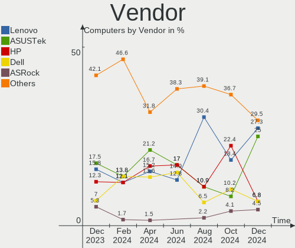
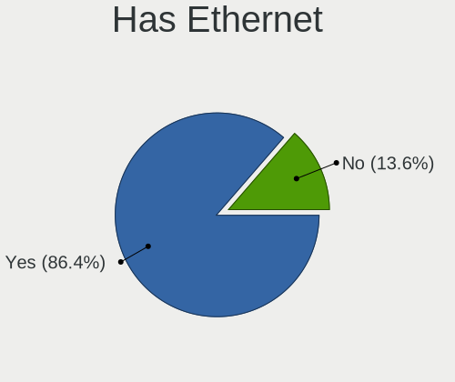
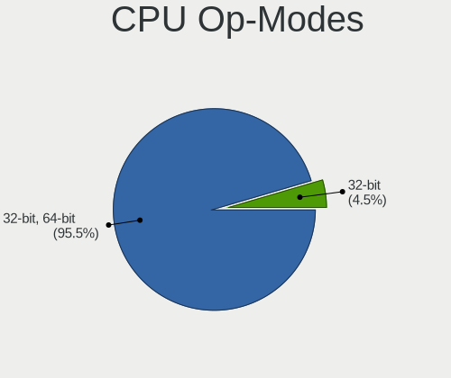
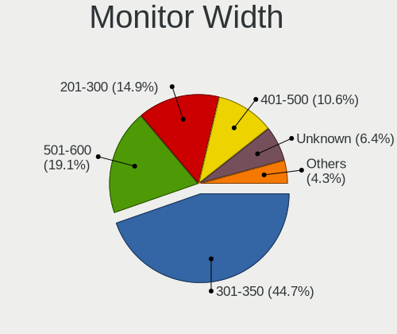
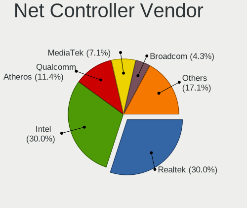
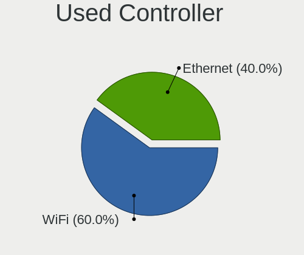

Xubuntu - Hardware Trends
-------------------------

A project to identify most popular hardware characteristics and track their change
over time based on data collected by Linux users at https://Linux-Hardware.org.

Anyone can contribute to this report by the [hw-probe](https://github.com/linuxhw/hw-probe) tool:

    sudo -E hw-probe -all -upload

This is a report for all computer types. See also reports for [desktops](/Dist/Xubuntu/Desktop/README.md) and [notebooks](/Dist/Xubuntu/Notebook/README.md).

This report is for one last month. Overall report since the beginning of time: [TestDays](https://github.com/linuxhw/TestDays)

Period: Oct, 2023.

Contents
--------

* [ System ](#system)
  - [ OS                       ](#os)
  - [ OS Family                ](#os-family)
  - [ Kernel                   ](#kernel)
  - [ Kernel Family            ](#kernel-family)
  - [ Kernel Major Ver.        ](#kernel-major-ver)
  - [ Arch                     ](#arch)
  - [ DE                       ](#de)
  - [ Display Server           ](#display-server)
  - [ Display Manager          ](#display-manager)
  - [ OS Lang                  ](#os-lang)
  - [ Boot Mode                ](#boot-mode)
  - [ Filesystem               ](#filesystem)
  - [ Part. scheme             ](#part-scheme)
  - [ Dual Boot with Linux/BSD ](#dual-boot-with-linuxbsd)
  - [ Dual Boot (Win)          ](#dual-boot-win)

* [ Board ](#board)
  - [ Vendor                   ](#vendor)
  - [ Model                    ](#model)
  - [ Model Family             ](#model-family)
  - [ MFG Year                 ](#mfg-year)
  - [ Form Factor              ](#form-factor)
  - [ Secure Boot              ](#secure-boot)
  - [ Coreboot                 ](#coreboot)
  - [ RAM Size                 ](#ram-size)
  - [ RAM Used                 ](#ram-used)
  - [ Total Drives             ](#total-drives)
  - [ Has CD-ROM               ](#has-cd-rom)
  - [ Has Ethernet             ](#has-ethernet)
  - [ Has WiFi                 ](#has-wifi)
  - [ Has Bluetooth            ](#has-bluetooth)

* [ Location ](#location)
  - [ Country                  ](#country)
  - [ City                     ](#city)

* [ Drives ](#drives)
  - [ Drive Vendor             ](#drive-vendor)
  - [ Drive Model              ](#drive-model)
  - [ HDD Vendor               ](#hdd-vendor)
  - [ SSD Vendor               ](#ssd-vendor)
  - [ Drive Kind               ](#drive-kind)
  - [ Drive Connector          ](#drive-connector)
  - [ Drive Size               ](#drive-size)
  - [ Space Total              ](#space-total)
  - [ Space Used               ](#space-used)
  - [ Malfunc. Drives          ](#malfunc-drives)
  - [ Malfunc. Drive Vendor    ](#malfunc-drive-vendor)
  - [ Malfunc. HDD Vendor      ](#malfunc-hdd-vendor)
  - [ Malfunc. Drive Kind      ](#malfunc-drive-kind)
  - [ Failed Drives            ](#failed-drives)
  - [ Failed Drive Vendor      ](#failed-drive-vendor)
  - [ Drive Status             ](#drive-status)

* [ Storage controller ](#storage-controller)
  - [ Storage Vendor           ](#storage-vendor)
  - [ Storage Model            ](#storage-model)
  - [ Storage Kind             ](#storage-kind)

* [ Processor ](#processor)
  - [ CPU Vendor               ](#cpu-vendor)
  - [ CPU Model                ](#cpu-model)
  - [ CPU Model Family         ](#cpu-model-family)
  - [ CPU Cores                ](#cpu-cores)
  - [ CPU Sockets              ](#cpu-sockets)
  - [ CPU Threads              ](#cpu-threads)
  - [ CPU Op-Modes             ](#cpu-op-modes)
  - [ CPU Microcode            ](#cpu-microcode)
  - [ CPU Microarch            ](#cpu-microarch)

* [ Graphics ](#graphics)
  - [ GPU Vendor               ](#gpu-vendor)
  - [ GPU Model                ](#gpu-model)
  - [ GPU Combo                ](#gpu-combo)
  - [ GPU Driver               ](#gpu-driver)
  - [ GPU Memory               ](#gpu-memory)

* [ Monitor ](#monitor)
  - [ Monitor Vendor           ](#monitor-vendor)
  - [ Monitor Model            ](#monitor-model)
  - [ Monitor Resolution       ](#monitor-resolution)
  - [ Monitor Diagonal         ](#monitor-diagonal)
  - [ Monitor Width            ](#monitor-width)
  - [ Aspect Ratio             ](#aspect-ratio)
  - [ Monitor Area             ](#monitor-area)
  - [ Pixel Density            ](#pixel-density)
  - [ Multiple Monitors        ](#multiple-monitors)

* [ Network ](#network)
  - [ Net Controller Vendor    ](#net-controller-vendor)
  - [ Net Controller Model     ](#net-controller-model)
  - [ Wireless Vendor          ](#wireless-vendor)
  - [ Wireless Model           ](#wireless-model)
  - [ Ethernet Vendor          ](#ethernet-vendor)
  - [ Ethernet Model           ](#ethernet-model)
  - [ Net Controller Kind      ](#net-controller-kind)
  - [ Used Controller          ](#used-controller)
  - [ NICs                     ](#nics)
  - [ IPv6                     ](#ipv6)

* [ Bluetooth ](#bluetooth)
  - [ Bluetooth Vendor         ](#bluetooth-vendor)
  - [ Bluetooth Model          ](#bluetooth-model)

* [ Sound ](#sound)
  - [ Sound Vendor             ](#sound-vendor)
  - [ Sound Model              ](#sound-model)

* [ Memory ](#memory)
  - [ Memory Vendor            ](#memory-vendor)
  - [ Memory Model             ](#memory-model)
  - [ Memory Kind              ](#memory-kind)
  - [ Memory Form Factor       ](#memory-form-factor)
  - [ Memory Size              ](#memory-size)
  - [ Memory Speed             ](#memory-speed)

* [ Printers & scanners ](#printers--scanners)
  - [ Printer Vendor           ](#printer-vendor)
  - [ Printer Model            ](#printer-model)
  - [ Scanner Vendor           ](#scanner-vendor)
  - [ Scanner Model            ](#scanner-model)

* [ Camera ](#camera)
  - [ Camera Vendor            ](#camera-vendor)
  - [ Camera Model             ](#camera-model)

* [ Security ](#security)
  - [ Fingerprint Vendor       ](#fingerprint-vendor)
  - [ Fingerprint Model        ](#fingerprint-model)
  - [ Chipcard Vendor          ](#chipcard-vendor)
  - [ Chipcard Model           ](#chipcard-model)

* [ Unsupported ](#unsupported)
  - [ Unsupported Devices      ](#unsupported-devices)
  - [ Unsupported Device Types ](#unsupported-device-types)

System
------

OS
--

Installed operating systems

| Name           | Computers | Percent |
|----------------|-----------|---------|
| Xubuntu 22.04  | 31        | 57.41%  |
| Xubuntu 23.04  | 8         | 14.81%  |
| Xubuntu 18.04  | 6         | 11.11%  |
| Xubuntu 23.10  | 4         | 7.41%   |
| Xubuntu 20.04  | 3         | 5.56%   |
| Xubuntu 21.04  | 1         | 1.85%   |
| Xubuntu 2023.3 | 1         | 1.85%   |

OS Family
---------

OS without a version

| Name    | Computers | Percent |
|---------|-----------|---------|
| Xubuntu | 54        | 100%    |

Kernel
------

Version of the Linux kernel

| Version                     | Computers | Percent |
|-----------------------------|-----------|---------|
| 6.2.0-34-generic            | 11        | 20.37%  |
| 6.2.0-33-generic            | 6         | 11.11%  |
| 6.2.0-35-generic            | 4         | 7.41%   |
| 5.15.0-87-generic           | 4         | 7.41%   |
| 6.5.0-9-generic             | 3         | 5.56%   |
| 6.2.0-36-generic            | 2         | 3.7%    |
| 6.1.31-sun50iw9             | 2         | 3.7%    |
| 5.4.0-150-generic           | 2         | 3.7%    |
| 5.15.0-84-generic           | 2         | 3.7%    |
| 5.15.0-78-generic           | 2         | 3.7%    |
| 4.15.0-213-generic          | 2         | 3.7%    |
| 6.6.0                       | 1         | 1.85%   |
| 6.5.1-060501-generic        | 1         | 1.85%   |
| 6.5.0-10-generic            | 1         | 1.85%   |
| 6.2.0-26-generic            | 1         | 1.85%   |
| 6.2.0-20-generic            | 1         | 1.85%   |
| 6.2.0-060200-generic        | 1         | 1.85%   |
| 5.4.0-164-generic           | 1         | 1.85%   |
| 5.15.0-86-generic           | 1         | 1.85%   |
| 5.15.0-74-generic           | 1         | 1.85%   |
| 5.15.0-522304060810-generic | 1         | 1.85%   |
| 5.15.0-25-generic           | 1         | 1.85%   |
| 5.13.0-40-generic           | 1         | 1.85%   |
| 5.11.0-44-lowlatency        | 1         | 1.85%   |
| 4.15.0-70-generic           | 1         | 1.85%   |

Kernel Family
-------------

Linux kernel without a distro release

| Version | Computers | Percent |
|---------|-----------|---------|
| 6.2.0   | 26        | 48.15%  |
| 5.15.0  | 12        | 22.22%  |
| 6.5.0   | 4         | 7.41%   |
| 5.4.0   | 3         | 5.56%   |
| 4.15.0  | 3         | 5.56%   |
| 6.1.31  | 2         | 3.7%    |
| 6.6.0   | 1         | 1.85%   |
| 6.5.1   | 1         | 1.85%   |
| 5.13.0  | 1         | 1.85%   |
| 5.11.0  | 1         | 1.85%   |

Kernel Major Ver.
-----------------

Linux kernel major version

| Version | Computers | Percent |
|---------|-----------|---------|
| 6.2     | 26        | 48.15%  |
| 5.15    | 12        | 22.22%  |
| 6.5     | 5         | 9.26%   |
| 5.4     | 3         | 5.56%   |
| 4.15    | 3         | 5.56%   |
| 6.1     | 2         | 3.7%    |
| 6.6     | 1         | 1.85%   |
| 5.13    | 1         | 1.85%   |
| 5.11    | 1         | 1.85%   |

Arch
----

OS architecture (x86_64, i586, etc.)

| Name    | Computers | Percent |
|---------|-----------|---------|
| x86_64  | 49        | 90.74%  |
| i686    | 3         | 5.56%   |
| aarch64 | 2         | 3.7%    |

DE
--

Desktop Environment

| Name         | Computers | Percent |
|--------------|-----------|---------|
| XFCE         | 51        | 94.44%  |
| Unicorn:XFCE | 1         | 1.85%   |
| i3           | 1         | 1.85%   |
| GNOME        | 1         | 1.85%   |

Display Server
--------------

X11 or Wayland

| Name | Computers | Percent |
|------|-----------|---------|
| X11  | 52        | 96.3%   |
| Tty  | 2         | 3.7%    |

Display Manager
---------------

SDDM, LightDM, etc.

| Name    | Computers | Percent |
|---------|-----------|---------|
| LightDM | 48        | 88.89%  |
| GDM3    | 4         | 7.41%   |
| SDDM    | 1         | 1.85%   |
| Unknown | 1         | 1.85%   |

OS Lang
-------

Language

| Lang  | Computers | Percent |
|-------|-----------|---------|
| en_US | 27        | 50%     |
| en_GB | 6         | 11.11%  |
| fr_FR | 5         | 9.26%   |
| it_IT | 4         | 7.41%   |
| de_DE | 2         | 3.7%    |
| C     | 2         | 3.7%    |
| ru_RU | 1         | 1.85%   |
| pt_BR | 1         | 1.85%   |
| pl_PL | 1         | 1.85%   |
| ja_JP | 1         | 1.85%   |
| fr_CH | 1         | 1.85%   |
| es_ES | 1         | 1.85%   |
| en_HK | 1         | 1.85%   |
| en_AU | 1         | 1.85%   |

Boot Mode
---------

EFI or BIOS

| Mode | Computers | Percent |
|------|-----------|---------|
| BIOS | 38        | 70.37%  |
| EFI  | 16        | 29.63%  |

Filesystem
----------

Type of filesystem

| Type    | Computers | Percent |
|---------|-----------|---------|
| Ext4    | 28        | 51.85%  |
| Tmpfs   | 25        | 46.3%   |
| Overlay | 1         | 1.85%   |

Part. scheme
------------

Scheme of partitioning

| Type    | Computers | Percent |
|---------|-----------|---------|
| GPT     | 35        | 64.81%  |
| MBR     | 15        | 27.78%  |
| Unknown | 4         | 7.41%   |

Dual Boot with Linux/BSD
------------------------

Hosting more than one Linux/BSD

| Dual boot | Computers | Percent |
|-----------|-----------|---------|
| No        | 50        | 92.59%  |
| Yes       | 4         | 7.41%   |

Dual Boot (Win)
---------------

Hosting Linux and Windows

| Dual boot | Computers | Percent |
|-----------|-----------|---------|
| No        | 37        | 68.52%  |
| Yes       | 17        | 31.48%  |

Board
-----

Vendor
------

Motherboard manufacturer

| Name                | Computers | Percent |
|---------------------|-----------|---------|
| ASUSTek Computer    | 9         | 16.67%  |
| Hewlett-Packard     | 8         | 14.81%  |
| Lenovo              | 7         | 12.96%  |
| Dell                | 6         | 11.11%  |
| MSI                 | 4         | 7.41%   |
| Gigabyte Technology | 4         | 7.41%   |
| OrangePi            | 2         | 3.7%    |
| AMI                 | 2         | 3.7%    |
| Acer                | 2         | 3.7%    |
| Toshiba             | 1         | 1.85%   |
| Nuvision            | 1         | 1.85%   |
| Medion              | 1         | 1.85%   |
| Intel               | 1         | 1.85%   |
| HUAWEI              | 1         | 1.85%   |
| Fujitsu Siemens     | 1         | 1.85%   |
| Foxconn             | 1         | 1.85%   |
| Dynabook            | 1         | 1.85%   |
| Apple               | 1         | 1.85%   |
| Unknown             | 1         | 1.85%   |

Model
-----

Motherboard model

| Name                                        | Computers | Percent |
|---------------------------------------------|-----------|---------|
| OrangePi Zero3                              | 2         | 3.7%    |
| Toshiba Satellite C55-C                     | 1         | 1.85%   |
| Nuvision NEBP12                             | 1         | 1.85%   |
| MSI MS-7C95                                 | 1         | 1.85%   |
| MSI MS-7B89                                 | 1         | 1.85%   |
| MSI MS-7B86                                 | 1         | 1.85%   |
| MSI GP65 Leopard 10SDK                      | 1         | 1.85%   |
| Medion E3223                                | 1         | 1.85%   |
| Lenovo ThinkPad X1 Carbon Gen 11 21HNS43700 | 1         | 1.85%   |
| Lenovo ThinkPad T61 64607EU                 | 1         | 1.85%   |
| Lenovo ThinkPad T430u 3352A83               | 1         | 1.85%   |
| Lenovo ThinkBook 16p Gen 2 20YM             | 1         | 1.85%   |
| Lenovo IdeaPad S300 9803                    | 1         | 1.85%   |
| Lenovo IdeaPad L340-15API 81LW              | 1         | 1.85%   |
| Lenovo 15ARE05 81W4                         | 1         | 1.85%   |
| Intel DB75EN                                | 1         | 1.85%   |
| HUAWEI RLEF-XX                              | 1         | 1.85%   |
| HP xw4400 Workstation                       | 1         | 1.85%   |
| HP Presario CQ57                            | 1         | 1.85%   |
| HP Presario C500 (GF849EA#ABU)              | 1         | 1.85%   |
| HP Pavilion g4                              | 1         | 1.85%   |
| HP EliteDesk 800 G1 USDT                    | 1         | 1.85%   |
| HP EliteBook 830 G8 Notebook PC             | 1         | 1.85%   |
| HP Compaq Pro 6300 SFF                      | 1         | 1.85%   |
| HP Compaq dc7600 Small Form Factor          | 1         | 1.85%   |
| Gigabyte H97M-D3H                           | 1         | 1.85%   |
| Gigabyte H77M-D3H                           | 1         | 1.85%   |
| Gigabyte G1.Sniper B5                       | 1         | 1.85%   |
| Gigabyte 965P-DS3                           | 1         | 1.85%   |
| Fujitsu Siemens LIFEBOOK T4215              | 1         | 1.85%   |
| Foxconn Pro 3300 Series MT                  | 1         | 1.85%   |
| Dynabook B65/ER                             | 1         | 1.85%   |
| Dell MXG061                                 | 1         | 1.85%   |
| Dell Latitude 7330                          | 1         | 1.85%   |
| Dell Latitude 5411                          | 1         | 1.85%   |
| Dell Latitude 3490                          | 1         | 1.85%   |
| Dell Inspiron 3020 S                        | 1         | 1.85%   |
| Dell Inspiron 1501                          | 1         | 1.85%   |
| ASUS VivoBook_ASUSLaptop M1502IA_M1502IA    | 1         | 1.85%   |
| ASUS ROG Strix G814JU_G814JU                | 1         | 1.85%   |

Model Family
------------

Motherboard model prefix

| Name                     | Computers | Percent |
|--------------------------|-----------|---------|
| ASUS ROG                 | 5         | 9.26%   |
| Lenovo ThinkPad          | 3         | 5.56%   |
| Dell Latitude            | 3         | 5.56%   |
| OrangePi Zero3           | 2         | 3.7%    |
| Lenovo IdeaPad           | 2         | 3.7%    |
| HP Presario              | 2         | 3.7%    |
| HP Compaq                | 2         | 3.7%    |
| Dell Inspiron            | 2         | 3.7%    |
| Acer Aspire              | 2         | 3.7%    |
| Toshiba Satellite        | 1         | 1.85%   |
| Nuvision NEBP12          | 1         | 1.85%   |
| MSI MS-7C95              | 1         | 1.85%   |
| MSI MS-7B89              | 1         | 1.85%   |
| MSI MS-7B86              | 1         | 1.85%   |
| MSI GP65                 | 1         | 1.85%   |
| Medion E3223             | 1         | 1.85%   |
| Lenovo ThinkBook         | 1         | 1.85%   |
| Lenovo 15ARE05           | 1         | 1.85%   |
| Intel DB75EN             | 1         | 1.85%   |
| HUAWEI RLEF-XX           | 1         | 1.85%   |
| HP xw4400                | 1         | 1.85%   |
| HP Pavilion              | 1         | 1.85%   |
| HP EliteDesk             | 1         | 1.85%   |
| HP EliteBook             | 1         | 1.85%   |
| Gigabyte H97M-D3H        | 1         | 1.85%   |
| Gigabyte H77M-D3H        | 1         | 1.85%   |
| Gigabyte G1.Sniper       | 1         | 1.85%   |
| Gigabyte 965P-DS3        | 1         | 1.85%   |
| Fujitsu Siemens LIFEBOOK | 1         | 1.85%   |
| Foxconn Pro              | 1         | 1.85%   |
| Dynabook B65             | 1         | 1.85%   |
| Dell MXG061              | 1         | 1.85%   |
| ASUS VivoBook            | 1         | 1.85%   |
| ASUS P5Q                 | 1         | 1.85%   |
| ASUS K53E                | 1         | 1.85%   |
| ASUS F2A85-M             | 1         | 1.85%   |
| Apple MacBook8           | 1         | 1.85%   |
| AMI Intel                | 1         | 1.85%   |
| AMI Aptio                | 1         | 1.85%   |
| Unknown                  | 1         | 1.85%   |

MFG Year
--------

Motherboard manufacture year

| Year    | Computers | Percent |
|---------|-----------|---------|
| 2020    | 7         | 12.96%  |
| 2022    | 6         | 11.11%  |
| 2012    | 6         | 11.11%  |
| 2023    | 5         | 9.26%   |
| 2006    | 5         | 9.26%   |
| 2021    | 4         | 7.41%   |
| 2011    | 4         | 7.41%   |
| 2019    | 3         | 5.56%   |
| 2014    | 3         | 5.56%   |
| 2018    | 2         | 3.7%    |
| 2007    | 2         | 3.7%    |
| Unknown | 2         | 3.7%    |
| 2015    | 1         | 1.85%   |
| 2013    | 1         | 1.85%   |
| 2009    | 1         | 1.85%   |
| 2008    | 1         | 1.85%   |
| 2005    | 1         | 1.85%   |

Form Factor
-----------

Physical design of the computer

| Name           | Computers | Percent |
|----------------|-----------|---------|
| Notebook       | 28        | 51.85%  |
| Desktop        | 21        | 38.89%  |
| System on chip | 2         | 3.7%    |
| Mini pc        | 2         | 3.7%    |
| Convertible    | 1         | 1.85%   |

Secure Boot
-----------

Enabled or disabled

| State    | Computers | Percent |
|----------|-----------|---------|
| Disabled | 53        | 98.15%  |
| Enabled  | 1         | 1.85%   |

Coreboot
--------

Have coreboot on board

| Used | Computers | Percent |
|------|-----------|---------|
| No   | 54        | 100%    |

RAM Size
--------

Total RAM memory

| Size in GB  | Computers | Percent |
|-------------|-----------|---------|
| 3.01-4.0    | 12        | 22.22%  |
| 4.01-8.0    | 10        | 18.52%  |
| 32.01-64.0  | 9         | 16.67%  |
| 8.01-16.0   | 7         | 12.96%  |
| 16.01-24.0  | 5         | 9.26%   |
| 64.01-256.0 | 4         | 7.41%   |
| 1.01-2.0    | 3         | 5.56%   |
| 2.01-3.0    | 2         | 3.7%    |
| 24.01-32.0  | 1         | 1.85%   |
| 0.51-1.0    | 1         | 1.85%   |

RAM Used
--------

Used RAM memory

| Used GB   | Computers | Percent |
|-----------|-----------|---------|
| 1.01-2.0  | 13        | 24.07%  |
| 4.01-8.0  | 12        | 22.22%  |
| 2.01-3.0  | 11        | 20.37%  |
| 0.51-1.0  | 9         | 16.67%  |
| 8.01-16.0 | 5         | 9.26%   |
| 3.01-4.0  | 4         | 7.41%   |

Total Drives
------------

Number of drives on board

| Drives | Computers | Percent |
|--------|-----------|---------|
| 1      | 42        | 77.78%  |
| 2      | 9         | 16.67%  |
| 3      | 2         | 3.7%    |
| 5      | 1         | 1.85%   |

Has CD-ROM
----------

Has CD-ROM on board

| Presented | Computers | Percent |
|-----------|-----------|---------|
| No        | 29        | 53.7%   |
| Yes       | 25        | 46.3%   |

Has Ethernet
------------

Has Ethernet on board

| Presented | Computers | Percent |
|-----------|-----------|---------|
| Yes       | 44        | 81.48%  |
| No        | 10        | 18.52%  |

Has WiFi
--------

Has WiFi module

| Presented | Computers | Percent |
|-----------|-----------|---------|
| Yes       | 41        | 75.93%  |
| No        | 13        | 24.07%  |

Has Bluetooth
-------------

Has Bluetooth module

| Presented | Computers | Percent |
|-----------|-----------|---------|
| Yes       | 30        | 55.56%  |
| No        | 24        | 44.44%  |

Location
--------

Country
-------

Geographic location (country)

| Country     | Computers | Percent |
|-------------|-----------|---------|
| USA         | 11        | 20.37%  |
| UK          | 5         | 9.26%   |
| France      | 5         | 9.26%   |
| Italy       | 4         | 7.41%   |
| Russia      | 3         | 5.56%   |
| Poland      | 3         | 5.56%   |
| Netherlands | 2         | 3.7%    |
| Japan       | 2         | 3.7%    |
| Germany     | 2         | 3.7%    |
| Brazil      | 2         | 3.7%    |
| Belgium     | 2         | 3.7%    |
| Vietnam     | 1         | 1.85%   |
| Turkey      | 1         | 1.85%   |
| Switzerland | 1         | 1.85%   |
| Spain       | 1         | 1.85%   |
| Romania     | 1         | 1.85%   |
| Philippines | 1         | 1.85%   |
| Mexico      | 1         | 1.85%   |
| Israel      | 1         | 1.85%   |
| Hong Kong   | 1         | 1.85%   |
| Czechia     | 1         | 1.85%   |
| Cuba        | 1         | 1.85%   |
| China       | 1         | 1.85%   |
| Azerbaijan  | 1         | 1.85%   |

City
----

Geographic location (city)

| City                    | Computers | Percent |
|-------------------------|-----------|---------|
| Warsaw                  | 2         | 3.7%    |
| Harrisonburg            | 2         | 3.7%    |
| Charlotte               | 2         | 3.7%    |
| York                    | 1         | 1.85%   |
| Yokohama                | 1         | 1.85%   |
| Winkelhaid              | 1         | 1.85%   |
| Vise                    | 1         | 1.85%   |
| Vanves                  | 1         | 1.85%   |
| Świętochłowice       | 1         | 1.85%   |
| St Petersburg           | 1         | 1.85%   |
| Santa Maria             | 1         | 1.85%   |
| Sannazzaro de' Burgondi | 1         | 1.85%   |
| Saint-Nazaire           | 1         | 1.85%   |
| Ramat Gan               | 1         | 1.85%   |
| Prague                  | 1         | 1.85%   |
| Ploieşti               | 1         | 1.85%   |
| Oberwangen              | 1         | 1.85%   |
| Novosibirsk             | 1         | 1.85%   |
| Northampton             | 1         | 1.85%   |
| North Hills             | 1         | 1.85%   |
| Manila                  | 1         | 1.85%   |
| Manchester              | 1         | 1.85%   |
| Machiya                 | 1         | 1.85%   |
| Leuven                  | 1         | 1.85%   |
| Legnaro                 | 1         | 1.85%   |
| Lake Placid             | 1         | 1.85%   |
| Lake Elsinore           | 1         | 1.85%   |
| Kursk                   | 1         | 1.85%   |
| Katonah                 | 1         | 1.85%   |
| Jeremoabo               | 1         | 1.85%   |
| Istanbul                | 1         | 1.85%   |
| Huber Heights           | 1         | 1.85%   |
| Ho Chi Minh City        | 1         | 1.85%   |
| Havana                  | 1         | 1.85%   |
| Gustavo Adolfo Madero   | 1         | 1.85%   |
| Galatina                | 1         | 1.85%   |
| Fort Thomas             | 1         | 1.85%   |
| Cologno Monzese         | 1         | 1.85%   |
| City of Westminster     | 1         | 1.85%   |
| Chengdu                 | 1         | 1.85%   |

Drives
------

Drive Vendor
------------

Hard drive vendors

| Vendor                | Computers | Drives | Percent |
|-----------------------|-----------|--------|---------|
| WDC                   | 9         | 11     | 13.43%  |
| Seagate               | 9         | 10     | 13.43%  |
| Unknown               | 6         | 6      | 8.96%   |
| Crucial               | 6         | 6      | 8.96%   |
| Kingston              | 4         | 4      | 5.97%   |
| SanDisk               | 3         | 3      | 4.48%   |
| A-DATA Technology     | 3         | 3      | 4.48%   |
| Toshiba               | 2         | 2      | 2.99%   |
| Samsung Electronics   | 2         | 2      | 2.99%   |
| Micron Technology     | 2         | 2      | 2.99%   |
| KIOXIA                | 2         | 2      | 2.99%   |
| Hitachi               | 2         | 2      | 2.99%   |
| Transcend             | 1         | 1      | 1.49%   |
| SK hynix              | 1         | 1      | 1.49%   |
| Silicon Motion        | 1         | 1      | 1.49%   |
| ShiJi                 | 1         | 1      | 1.49%   |
| Realtek Semiconductor | 1         | 1      | 1.49%   |
| PNY                   | 1         | 1      | 1.49%   |
| Phison Electronics    | 1         | 1      | 1.49%   |
| Phison                | 1         | 2      | 1.49%   |
| KingDian              | 1         | 1      | 1.49%   |
| Intenso               | 1         | 1      | 1.49%   |
| Intel                 | 1         | 1      | 1.49%   |
| Hewlett-Packard       | 1         | 1      | 1.49%   |
| Fujitsu               | 1         | 1      | 1.49%   |
| BR                    | 1         | 1      | 1.49%   |
| Apple                 | 1         | 2      | 1.49%   |
| ADATA Technology      | 1         | 1      | 1.49%   |
| Unknown               | 1         | 1      | 1.49%   |

Drive Model
-----------

Hard drive models

| Model                                        | Computers | Percent |
|----------------------------------------------|-----------|---------|
| Toshiba MQ01ABF050 500GB                     | 2         | 2.86%   |
| WDC WDS250G2B0A 250GB SSD                    | 1         | 1.43%   |
| WDC WD5000AADS-00S9B0 500GB                  | 1         | 1.43%   |
| WDC WD4000AAJS-00YFA0 400GB                  | 1         | 1.43%   |
| WDC WD3200BPVT-80ZEST0 320GB                 | 1         | 1.43%   |
| WDC WD30EZRZ-00GXCB0 3TB                     | 1         | 1.43%   |
| WDC WD30EFRX-68EUZN0 3TB                     | 1         | 1.43%   |
| WDC WD2500BEVT-60ZCT1 250GB                  | 1         | 1.43%   |
| WDC WD10SPZX-21Z10T0 1TB                     | 1         | 1.43%   |
| WDC WD10EZEX-08M2NA0 1TB                     | 1         | 1.43%   |
| WDC PC SN730 SDBPNTY-1T00-1101 1TB           | 1         | 1.43%   |
| Unknown SDU1  256GB                          | 1         | 1.43%   |
| Unknown SD/MMC/MS PRO 16GB                   | 1         | 1.43%   |
| Unknown SC64G  64GB                          | 1         | 1.43%   |
| Unknown NVMe SSD Drive 1TB                   | 1         | 1.43%   |
| Unknown MMC Card  64GB                       | 1         | 1.43%   |
| Unknown hDEaP3  128GB                        | 1         | 1.43%   |
| Transcend TS120GMTS420S 120GB SSD            | 1         | 1.43%   |
| SK hynix PC611 NVMe 512GB                    | 1         | 1.43%   |
| Silicon Motion PCIe-8 SSD 512GB              | 1         | 1.43%   |
| ShiJi 128GB                                  | 1         | 1.43%   |
| Seagate ST500LM030-2E717D 500GB              | 1         | 1.43%   |
| Seagate ST500LM021-1KJ152 500GB              | 1         | 1.43%   |
| Seagate ST4000DM004-2CV104 4TB               | 1         | 1.43%   |
| Seagate ST3500413AS 500GB                    | 1         | 1.43%   |
| Seagate ST3320620AS 320GB                    | 1         | 1.43%   |
| Seagate ST3250620AS 250GB                    | 1         | 1.43%   |
| Seagate ST31500341AS 1TB                     | 1         | 1.43%   |
| Seagate ST31000528AS 1TB                     | 1         | 1.43%   |
| Seagate ST2000DM006-2DM164 2TB               | 1         | 1.43%   |
| Seagate Expansion HDD 8TB                    | 1         | 1.43%   |
| Sandisk WD PC SN560 SDDPNQE-1T00-1002 1024GB | 1         | 1.43%   |
| SanDisk SDSSDHP128G 128GB                    | 1         | 1.43%   |
| SanDisk SDSSDA240G 240GB                     | 1         | 1.43%   |
| Samsung SSD 860 EVO 500GB                    | 1         | 1.43%   |
| Samsung MZVL22T0HDLB-00BLL 2TB               | 1         | 1.43%   |
| Realtek ADATA SWORDFISH 500GB                | 1         | 1.43%   |
| PNY CS900 250GB SSD                          | 1         | 1.43%   |
| Phison Sabrent Rocket 4.0 Plus 4TB           | 1         | 1.43%   |
| Phison PS5013 E13 NVMe Controller 256GB      | 1         | 1.43%   |

HDD Vendor
----------

Hard disk drive vendors

| Vendor  | Computers | Drives | Percent |
|---------|-----------|--------|---------|
| Seagate | 9         | 10     | 40.91%  |
| WDC     | 7         | 9      | 31.82%  |
| Toshiba | 2         | 2      | 9.09%   |
| Hitachi | 2         | 2      | 9.09%   |
| Unknown | 1         | 1      | 4.55%   |
| Fujitsu | 1         | 1      | 4.55%   |

SSD Vendor
----------

Solid state drive vendors

| Vendor              | Computers | Drives | Percent |
|---------------------|-----------|--------|---------|
| Crucial             | 6         | 6      | 27.27%  |
| SanDisk             | 2         | 2      | 9.09%   |
| Micron Technology   | 2         | 2      | 9.09%   |
| Kingston            | 2         | 2      | 9.09%   |
| A-DATA Technology   | 2         | 2      | 9.09%   |
| WDC                 | 1         | 1      | 4.55%   |
| Transcend           | 1         | 1      | 4.55%   |
| Samsung Electronics | 1         | 1      | 4.55%   |
| PNY                 | 1         | 1      | 4.55%   |
| KingDian            | 1         | 1      | 4.55%   |
| Intenso             | 1         | 1      | 4.55%   |
| Hewlett-Packard     | 1         | 1      | 4.55%   |
| BR                  | 1         | 1      | 4.55%   |

Drive Kind
----------

HDD or SSD

| Kind    | Computers | Drives | Percent |
|---------|-----------|--------|---------|
| HDD     | 21        | 25     | 33.33%  |
| SSD     | 19        | 22     | 30.16%  |
| NVMe    | 17        | 19     | 26.98%  |
| MMC     | 5         | 5      | 7.94%   |
| Unknown | 1         | 1      | 1.59%   |

Drive Connector
---------------

SATA, SAS, NVMe, etc.

| Type | Computers | Drives | Percent |
|------|-----------|--------|---------|
| SATA | 37        | 46     | 60.66%  |
| NVMe | 17        | 19     | 27.87%  |
| MMC  | 5         | 5      | 8.2%    |
| SAS  | 2         | 2      | 3.28%   |

Drive Size
----------

Size of hard drive

| Size in TB | Computers | Drives | Percent |
|------------|-----------|--------|---------|
| 0.01-0.5   | 30        | 33     | 71.43%  |
| 0.51-1.0   | 6         | 6      | 14.29%  |
| 1.01-2.0   | 3         | 3      | 7.14%   |
| 3.01-4.0   | 1         | 1      | 2.38%   |
| 2.01-3.0   | 1         | 3      | 2.38%   |
| 4.01-10.0  | 1         | 1      | 2.38%   |

Space Total
-----------

Amount of disk space available on the file system

| Size in GB     | Computers | Percent |
|----------------|-----------|---------|
| 101-250        | 16        | 29.63%  |
| 251-500        | 12        | 22.22%  |
| 51-100         | 8         | 14.81%  |
| 501-1000       | 7         | 12.96%  |
| 1001-2000      | 6         | 11.11%  |
| More than 3000 | 4         | 7.41%   |
| 2001-3000      | 1         | 1.85%   |

Space Used
----------

Amount of used disk space

| Used GB        | Computers | Percent |
|----------------|-----------|---------|
| 1-20           | 14        | 25.93%  |
| 21-50          | 11        | 20.37%  |
| 51-100         | 8         | 14.81%  |
| 251-500        | 7         | 12.96%  |
| 101-250        | 5         | 9.26%   |
| 501-1000       | 5         | 9.26%   |
| More than 3000 | 2         | 3.7%    |
| 1001-2000      | 2         | 3.7%    |

Malfunc. Drives
---------------

Drive models with a malfunction

| Model                           | Computers | Drives | Percent |
|---------------------------------|-----------|--------|---------|
| WDC WD3200BPVT-80ZEST0 320GB    | 1         | 1      | 33.33%  |
| Hitachi HTS541680J9SA00 80GB    | 1         | 1      | 33.33%  |
| A-DATA Technology SWORDFISH 1TB | 1         | 1      | 33.33%  |

Malfunc. Drive Vendor
---------------------

Vendors of faulty drives

| Vendor            | Computers | Drives | Percent |
|-------------------|-----------|--------|---------|
| WDC               | 1         | 1      | 33.33%  |
| Hitachi           | 1         | 1      | 33.33%  |
| A-DATA Technology | 1         | 1      | 33.33%  |

Malfunc. HDD Vendor
-------------------

Vendors of faulty HDD drives

| Vendor  | Computers | Drives | Percent |
|---------|-----------|--------|---------|
| WDC     | 1         | 1      | 50%     |
| Hitachi | 1         | 1      | 50%     |

Malfunc. Drive Kind
-------------------

Kinds of faulty drives

| Kind | Computers | Drives | Percent |
|------|-----------|--------|---------|
| HDD  | 2         | 2      | 66.67%  |
| NVMe | 1         | 1      | 33.33%  |

Failed Drives
-------------

Failed drive models

Zero info for selected period =(

Failed Drive Vendor
-------------------

Failed drive vendors

Zero info for selected period =(

Drive Status
------------

Number of failed and malfunc. drives

| Status   | Computers | Drives | Percent |
|----------|-----------|--------|---------|
| Detected | 33        | 37     | 56.9%   |
| Works    | 22        | 32     | 37.93%  |
| Malfunc  | 3         | 3      | 5.17%   |

Storage controller
------------------

Storage Vendor
--------------

Storage controller vendors

| Vendor                       | Computers | Percent |
|------------------------------|-----------|---------|
| Intel                        | 35        | 54.69%  |
| AMD                          | 11        | 17.19%  |
| SanDisk                      | 2         | 3.13%   |
| Realtek Semiconductor        | 2         | 3.13%   |
| Phison Electronics           | 2         | 3.13%   |
| Kingston Technology Company  | 2         | 3.13%   |
| Toshiba America Info Systems | 1         | 1.56%   |
| SK hynix                     | 1         | 1.56%   |
| Silicon Motion               | 1         | 1.56%   |
| Samsung Electronics          | 1         | 1.56%   |
| MAXIO Technology (Hangzhou)  | 1         | 1.56%   |
| Marvell Technology Group     | 1         | 1.56%   |
| KIOXIA                       | 1         | 1.56%   |
| JMicron Technology           | 1         | 1.56%   |
| Apple                        | 1         | 1.56%   |
| ADATA Technology             | 1         | 1.56%   |

Storage Model
-------------

Storage controller models

| Model                                                                            | Computers | Percent |
|----------------------------------------------------------------------------------|-----------|---------|
| AMD FCH SATA Controller [AHCI mode]                                              | 5         | 6.76%   |
| Intel 82801G (ICH7 Family) IDE Controller                                        | 4         | 5.41%   |
| AMD 500 Series Chipset SATA Controller                                           | 3         | 4.05%   |
| Realtek RTS5763DL NVMe SSD Controller (DRAM-less)                                | 2         | 2.7%    |
| Intel Volume Management Device NVMe RAID Controller                              | 2         | 2.7%    |
| Intel Celeron/Pentium Silver Processor SATA Controller                           | 2         | 2.7%    |
| Intel 82801GBM/GHM (ICH7-M Family) SATA Controller [AHCI mode]                   | 2         | 2.7%    |
| Intel 8 Series/C220 Series Chipset Family 6-port SATA Controller 1 [AHCI mode]   | 2         | 2.7%    |
| Intel 7 Series/C210 Series Chipset Family 6-port SATA Controller [AHCI mode]     | 2         | 2.7%    |
| Intel 7 Series Chipset Family 6-port SATA Controller [AHCI mode]                 | 2         | 2.7%    |
| Intel 6 Series/C200 Series Chipset Family 6 port Mobile SATA AHCI Controller     | 2         | 2.7%    |
| Intel 5 Series/3400 Series Chipset 4 port SATA AHCI Controller                   | 2         | 2.7%    |
| Intel 400 Series Chipset Family SATA AHCI Controller                             | 2         | 2.7%    |
| AMD 400 Series Chipset SATA Controller                                           | 2         | 2.7%    |
| Toshiba America Info Systems XG6 NVMe SSD Controller                             | 1         | 1.35%   |
| SK hynix PC611 NVMe Solid State Drive                                            | 1         | 1.35%   |
| Silicon Motion Non-Volatile memory controller                                    | 1         | 1.35%   |
| SanDisk WD Black SN770 / PC SN740 256GB / PC SN560 (DRAM-less) NVMe SSD          | 1         | 1.35%   |
| SanDisk Extreme Pro / WD Black SN750 / PC SN730 / Red SN700 NVMe SSD             | 1         | 1.35%   |
| Samsung NVMe SSD Controller PM9A1/PM9A3/980PRO                                   | 1         | 1.35%   |
| Phison PS5013-E13 PCIe3 NVMe Controller (DRAM-less)                              | 1         | 1.35%   |
| Phison E18 PCIe4 NVMe Controller                                                 | 1         | 1.35%   |
| MAXIO (Hangzhou) NVMe SSD Controller MAP1202                                     | 1         | 1.35%   |
| Marvell Group 88SE6101/6102 single-port PATA133 interface                        | 1         | 1.35%   |
| KIOXIA NVMe SSD Controller BG5 (DRAM-less)                                       | 1         | 1.35%   |
| Kingston Company NV1 NVMe SSD SM2263XT                                           | 1         | 1.35%   |
| Kingston Company A2000 NVMe SSD SM2263EN                                         | 1         | 1.35%   |
| JMicron JMB363 SATA/IDE Controller                                               | 1         | 1.35%   |
| Intel Volume Management Device NVMe RAID Controller Intel Corporation            | 1         | 1.35%   |
| Intel Sunrise Point-LP SATA Controller [AHCI mode]                               | 1         | 1.35%   |
| Intel SSD 670p Series [Keystone Harbor]                                          | 1         | 1.35%   |
| Intel NM10/ICH7 Family SATA Controller [IDE mode]                                | 1         | 1.35%   |
| Intel Celeron N3350/Pentium N4200/Atom E3900 Series SATA AHCI Controller         | 1         | 1.35%   |
| Intel Cannon Point-LP SATA Controller [AHCI Mode]                                | 1         | 1.35%   |
| Intel Atom/Celeron/Pentium Processor x5-E8000/J3xxx/N3xxx Series SATA Controller | 1         | 1.35%   |
| Intel Alder Lake-S PCH SATA Controller [AHCI Mode]                               | 1         | 1.35%   |
| Intel 9 Series Chipset Family SATA Controller [AHCI Mode]                        | 1         | 1.35%   |
| Intel 82801JI (ICH10 Family) 4 port SATA IDE Controller #1                       | 1         | 1.35%   |
| Intel 82801JI (ICH10 Family) 2 port SATA IDE Controller #2                       | 1         | 1.35%   |
| Intel 82801HR/HO/HH (ICH8R/DO/DH) 2 port SATA Controller [IDE mode]              | 1         | 1.35%   |

Storage Kind
------------

Kind of storage controller (IDE, SATA, NVMe, SAS, ...)

| Kind | Computers | Percent |
|------|-----------|---------|
| SATA | 36        | 52.94%  |
| NVMe | 17        | 25%     |
| IDE  | 10        | 14.71%  |
| RAID | 5         | 7.35%   |

Processor
---------

CPU Vendor
----------

Processor vendors

| Vendor | Computers | Percent |
|--------|-----------|---------|
| Intel  | 38        | 70.37%  |
| AMD    | 14        | 25.93%  |
| ARM    | 2         | 3.7%    |

CPU Model
---------

Processor models

| Model                                    | Computers | Percent |
|------------------------------------------|-----------|---------|
| ARM Processor                            | 2         | 3.7%    |
| Intel Pentium CPU B940 @ 2.00GHz         | 1         | 1.85%   |
| Intel Pentium 4 CPU 3.00GHz              | 1         | 1.85%   |
| Intel Genuine CPU T2400 @ 1.83GHz        | 1         | 1.85%   |
| Intel Core M-5Y31 CPU @ 0.90GHz          | 1         | 1.85%   |
| Intel Core i7-4790 CPU @ 3.60GHz         | 1         | 1.85%   |
| Intel Core i7-10850H CPU @ 2.70GHz       | 1         | 1.85%   |
| Intel Core i7-10750H CPU @ 2.60GHz       | 1         | 1.85%   |
| Intel Core i5-8265U CPU @ 1.60GHz        | 1         | 1.85%   |
| Intel Core i5-8250U CPU @ 1.60GHz        | 1         | 1.85%   |
| Intel Core i5-4570S CPU @ 2.90GHz        | 1         | 1.85%   |
| Intel Core i5-4460 CPU @ 3.20GHz         | 1         | 1.85%   |
| Intel Core i5-3450 CPU @ 3.10GHz         | 1         | 1.85%   |
| Intel Core i5-3330 CPU @ 3.00GHz         | 1         | 1.85%   |
| Intel Core i3-7020U CPU @ 2.30GHz        | 1         | 1.85%   |
| Intel Core i3-4005U CPU @ 1.70GHz        | 1         | 1.85%   |
| Intel Core i3-3220 CPU @ 3.30GHz         | 1         | 1.85%   |
| Intel Core i3-3217U CPU @ 1.80GHz        | 1         | 1.85%   |
| Intel Core i3-2100 CPU @ 3.10GHz         | 1         | 1.85%   |
| Intel Core i3 CPU M 370 @ 2.40GHz        | 1         | 1.85%   |
| Intel Core i3 CPU M 330 @ 2.13GHz        | 1         | 1.85%   |
| Intel Core 2 Quad CPU Q9400 @ 2.66GHz    | 1         | 1.85%   |
| Intel Core 2 Duo CPU T7300 @ 2.00GHz     | 1         | 1.85%   |
| Intel Core 2 CPU T5600 @ 1.83GHz         | 1         | 1.85%   |
| Intel Core 2 CPU 6700 @ 2.66GHz          | 1         | 1.85%   |
| Intel Core 2 CPU 6300 @ 1.86GHz          | 1         | 1.85%   |
| Intel Celeron N4120 CPU @ 1.10GHz        | 1         | 1.85%   |
| Intel Celeron N4020 CPU @ 1.10GHz        | 1         | 1.85%   |
| Intel Celeron M CPU 440 @ 1.86GHz        | 1         | 1.85%   |
| Intel Celeron CPU N3350 @ 1.10GHz        | 1         | 1.85%   |
| Intel Celeron CPU N3150 @ 1.60GHz        | 1         | 1.85%   |
| Intel Celeron CPU B800 @ 1.50GHz         | 1         | 1.85%   |
| Intel Celeron CPU 887 @ 1.50GHz          | 1         | 1.85%   |
| Intel 13th Gen Core i7-1365U             | 1         | 1.85%   |
| Intel 13th Gen Core i7-13650HX           | 1         | 1.85%   |
| Intel 13th Gen Core i5-13400             | 1         | 1.85%   |
| Intel 12th Gen Core i7-12700H            | 1         | 1.85%   |
| Intel 12th Gen Core i7-1265U             | 1         | 1.85%   |
| Intel 11th Gen Core i7-1165G7 @ 2.80GHz  | 1         | 1.85%   |
| AMD Turion 64 X2 Mobile Technology TL-50 | 1         | 1.85%   |

CPU Model Family
----------------

Processor model prefix

| Model                   | Computers | Percent |
|-------------------------|-----------|---------|
| Other                   | 8         | 14.81%  |
| Intel Core i3           | 7         | 12.96%  |
| Intel Core i5           | 6         | 11.11%  |
| Intel Celeron           | 6         | 11.11%  |
| AMD Ryzen 7             | 5         | 9.26%   |
| Intel Core i7           | 3         | 5.56%   |
| Intel Core 2            | 3         | 5.56%   |
| AMD Ryzen 5             | 3         | 5.56%   |
| AMD Ryzen 9             | 2         | 3.7%    |
| AMD Ryzen 3             | 2         | 3.7%    |
| Intel Pentium 4         | 1         | 1.85%   |
| Intel Pentium           | 1         | 1.85%   |
| Intel Genuine           | 1         | 1.85%   |
| Intel Core M            | 1         | 1.85%   |
| Intel Core 2 Quad       | 1         | 1.85%   |
| Intel Core 2 Duo        | 1         | 1.85%   |
| Intel Celeron M         | 1         | 1.85%   |
| AMD Turion 64 X2 Mobile | 1         | 1.85%   |
| AMD A8                  | 1         | 1.85%   |

CPU Cores
---------

Number of processor cores

| Number  | Computers | Percent |
|---------|-----------|---------|
| 2       | 21        | 38.89%  |
| 4       | 12        | 22.22%  |
| 8       | 5         | 9.26%   |
| 6       | 5         | 9.26%   |
| 10      | 3         | 5.56%   |
| 14      | 2         | 3.7%    |
| 1       | 2         | 3.7%    |
| Unknown | 2         | 3.7%    |
| 16      | 1         | 1.85%   |
| 12      | 1         | 1.85%   |

CPU Sockets
-----------

Number of sockets

| Number  | Computers | Percent |
|---------|-----------|---------|
| 1       | 52        | 96.3%   |
| Unknown | 2         | 3.7%    |

CPU Threads
-----------

Threads per core (Hyper-Threading)

| Number  | Computers | Percent |
|---------|-----------|---------|
| 2       | 29        | 53.7%   |
| 1       | 23        | 42.59%  |
| Unknown | 2         | 3.7%    |

CPU Op-Modes
------------

CPU Operation Modes (32-bit, 64-bit)

| Op mode        | Computers | Percent |
|----------------|-----------|---------|
| 32-bit, 64-bit | 52        | 96.3%   |
| 32-bit         | 2         | 3.7%    |

CPU Microcode
-------------

Microcode number

| Number     | Computers | Percent |
|------------|-----------|---------|
| Unknown    | 36        | 66.67%  |
| 0x6f6      | 2         | 3.7%    |
| 0x306a9    | 2         | 3.7%    |
| 0x206a7    | 2         | 3.7%    |
| 0x0a201025 | 2         | 3.7%    |
| 0x08701021 | 2         | 3.7%    |
| 0x6ec      | 1         | 1.85%   |
| 0x6e8      | 1         | 1.85%   |
| 0x0a50000d | 1         | 1.85%   |
| 0x0a50000c | 1         | 1.85%   |
| 0x08600106 | 1         | 1.85%   |
| 0x08108109 | 1         | 1.85%   |
| 0x08108102 | 1         | 1.85%   |
| 0x06001116 | 1         | 1.85%   |

CPU Microarch
-------------

Microarchitecture

| Name             | Computers | Percent |
|------------------|-----------|---------|
| Zen 3            | 6         | 11.11%  |
| Unknown          | 6         | 11.11%  |
| Zen 2            | 4         | 7.41%   |
| SandyBridge      | 4         | 7.41%   |
| IvyBridge        | 4         | 7.41%   |
| Haswell          | 4         | 7.41%   |
| Core             | 4         | 7.41%   |
| KabyLake         | 3         | 5.56%   |
| Zen+             | 2         | 3.7%    |
| Westmere         | 2         | 3.7%    |
| P6               | 2         | 3.7%    |
| Goldmont plus    | 2         | 3.7%    |
| CometLake        | 2         | 3.7%    |
| TigerLake        | 1         | 1.85%   |
| Silvermont       | 1         | 1.85%   |
| Piledriver       | 1         | 1.85%   |
| Penryn           | 1         | 1.85%   |
| NetBurst         | 1         | 1.85%   |
| K8 Hammer        | 1         | 1.85%   |
| Goldmont         | 1         | 1.85%   |
| Broadwell        | 1         | 1.85%   |
| Alderlake Hybrid | 1         | 1.85%   |

Graphics
--------

GPU Vendor
----------

Vendors of graphics cards

| Vendor | Computers | Percent |
|--------|-----------|---------|
| Intel  | 30        | 51.72%  |
| AMD    | 16        | 27.59%  |
| Nvidia | 12        | 20.69%  |

GPU Model
---------

Graphics card models

| Model                                                                                    | Computers | Percent |
|------------------------------------------------------------------------------------------|-----------|---------|
| Intel Xeon E3-1200 v3/4th Gen Core Processor Integrated Graphics Controller              | 3         | 4.92%   |
| Intel 2nd Generation Core Processor Family Integrated Graphics Controller                | 3         | 4.92%   |
| Intel Mobile 945GM/GMS/GME, 943/940GML Express Integrated Graphics Controller            | 2         | 3.28%   |
| Intel Mobile 945GM/GMS, 943/940GML Express Integrated Graphics Controller                | 2         | 3.28%   |
| Intel GeminiLake [UHD Graphics 600]                                                      | 2         | 3.28%   |
| Intel Core Processor Integrated Graphics Controller                                      | 2         | 3.28%   |
| Intel CometLake-H GT2 [UHD Graphics]                                                     | 2         | 3.28%   |
| AMD Renoir [Radeon RX Vega 6 (Ryzen 4000/5000 Mobile Series)]                            | 2         | 3.28%   |
| AMD Cezanne [Radeon Vega Series / Radeon Vega Mobile Series]                             | 2         | 3.28%   |
| Nvidia TU116M [GeForce GTX 1660 Ti Mobile]                                               | 1         | 1.64%   |
| Nvidia GP107 [GeForce GTX 1050 Ti]                                                       | 1         | 1.64%   |
| Nvidia GM206 [GeForce GTX 950]                                                           | 1         | 1.64%   |
| Nvidia GM107 [GeForce GTX 750 Ti]                                                        | 1         | 1.64%   |
| Nvidia GK208B [GeForce GT 710]                                                           | 1         | 1.64%   |
| Nvidia GK107 [GeForce GTX 650]                                                           | 1         | 1.64%   |
| Nvidia GF117M [GeForce 610M/710M/810M/820M / GT 620M/625M/630M/720M]                     | 1         | 1.64%   |
| Nvidia GA106M [GeForce RTX 3060 Mobile / Max-Q]                                          | 1         | 1.64%   |
| Nvidia G86M [Quadro NVS 140M]                                                            | 1         | 1.64%   |
| Nvidia G71M [GeForce Go 7900 GS]                                                         | 1         | 1.64%   |
| Nvidia G71GL [Quadro FX 1500]                                                            | 1         | 1.64%   |
| Nvidia AD107M [GeForce RTX 4050 Max-Q / Mobile]                                          | 1         | 1.64%   |
| Intel Xeon E3-1200 v2/3rd Gen Core processor Graphics Controller                         | 1         | 1.64%   |
| Intel WhiskeyLake-U GT2 [UHD Graphics 620]                                               | 1         | 1.64%   |
| Intel UHD Graphics 620                                                                   | 1         | 1.64%   |
| Intel TigerLake-LP GT2 [Iris Xe Graphics]                                                | 1         | 1.64%   |
| Intel Raptor Lake-S UHD Graphics                                                         | 1         | 1.64%   |
| Intel Raptor Lake-P [Iris Xe Graphics]                                                   | 1         | 1.64%   |
| Intel HD Graphics 620                                                                    | 1         | 1.64%   |
| Intel HD Graphics 5300                                                                   | 1         | 1.64%   |
| Intel HD Graphics 500                                                                    | 1         | 1.64%   |
| Intel Haswell-ULT Integrated Graphics Controller                                         | 1         | 1.64%   |
| Intel Atom/Celeron/Pentium Processor x5-E8000/J3xxx/N3xxx Integrated Graphics Controller | 1         | 1.64%   |
| Intel Alder Lake-UP3 GT2 [Iris Xe Graphics]                                              | 1         | 1.64%   |
| Intel Alder Lake-S GT1 [UHD Graphics 730]                                                | 1         | 1.64%   |
| Intel Alder Lake-P GT2 [Iris Xe Graphics]                                                | 1         | 1.64%   |
| Intel 82945G/GZ Integrated Graphics Controller                                           | 1         | 1.64%   |
| Intel 3rd Gen Core processor Graphics Controller                                         | 1         | 1.64%   |
| AMD Trinity [Radeon HD 7560D]                                                            | 1         | 1.64%   |
| AMD Thames [Radeon HD 7670M]                                                             | 1         | 1.64%   |
| AMD Tahiti PRO [Radeon HD 7950/8950 OEM / R9 280]                                        | 1         | 1.64%   |

GPU Combo
---------

Combinations of graphics cards

| Name           | Computers | Percent |
|----------------|-----------|---------|
| 1 x Intel      | 25        | 46.3%   |
| 1 x AMD        | 12        | 22.22%  |
| 1 x Nvidia     | 8         | 14.81%  |
| Intel + Nvidia | 3         | 5.56%   |
| Other          | 2         | 3.7%    |
| Intel + AMD    | 2         | 3.7%    |
| 2 x AMD        | 1         | 1.85%   |
| AMD + Nvidia   | 1         | 1.85%   |

GPU Driver
----------

Free vs proprietary

| Driver      | Computers | Percent |
|-------------|-----------|---------|
| Free        | 44        | 81.48%  |
| Proprietary | 5         | 9.26%   |
| Unknown     | 5         | 9.26%   |

GPU Memory
----------

Total video memory

| Size in GB | Computers | Percent |
|------------|-----------|---------|
| Unknown    | 39        | 72.22%  |
| 0.01-0.5   | 8         | 14.81%  |
| 1.01-2.0   | 3         | 5.56%   |
| 3.01-4.0   | 2         | 3.7%    |
| 8.01-16.0  | 1         | 1.85%   |
| 0.51-1.0   | 1         | 1.85%   |

Monitor
-------

Monitor Vendor
--------------

Monitor vendors

| Vendor               | Computers | Percent |
|----------------------|-----------|---------|
| BOE                  | 8         | 14.55%  |
| LG Display           | 6         | 10.91%  |
| Samsung Electronics  | 5         | 9.09%   |
| Philips              | 5         | 9.09%   |
| Goldstar             | 4         | 7.27%   |
| AU Optronics         | 4         | 7.27%   |
| Sharp                | 2         | 3.64%   |
| Hewlett-Packard      | 2         | 3.64%   |
| Ancor Communications | 2         | 3.64%   |
| ViewSonic            | 1         | 1.82%   |
| Vestel Elektronik    | 1         | 1.82%   |
| SANSUI               | 1         | 1.82%   |
| PANDA                | 1         | 1.82%   |
| NEC Computers        | 1         | 1.82%   |
| LG Philips           | 1         | 1.82%   |
| Lenovo               | 1         | 1.82%   |
| Iiyama               | 1         | 1.82%   |
| IBM                  | 1         | 1.82%   |
| Dell                 | 1         | 1.82%   |
| CSO                  | 1         | 1.82%   |
| CPT                  | 1         | 1.82%   |
| Chimei Innolux       | 1         | 1.82%   |
| ASUSTek Computer     | 1         | 1.82%   |
| Apple                | 1         | 1.82%   |
| AOC                  | 1         | 1.82%   |
| Acer                 | 1         | 1.82%   |

Monitor Model
-------------

Monitor models

| Model                                                                | Computers | Percent |
|----------------------------------------------------------------------|-----------|---------|
| BOE LCD Monitor BOE0812 1920x1080 344x194mm 15.5-inch                | 2         | 3.45%   |
| ViewSonic VX2250 SERIES VSCCB25 1920x1080 477x268mm 21.5-inch        | 1         | 1.72%   |
| Vestel Elektronik 42 FHD_LCD-TV VES3700 1920x540                     | 1         | 1.72%   |
| Sharp LQ125T1JX03 SHP142C 2560x1440 277x155mm 12.5-inch              | 1         | 1.72%   |
| Sharp LCD Monitor SHP13C1 1920x1200 366x229mm 17.0-inch              | 1         | 1.72%   |
| SANSUI ES-22F1 XEC3150 1920x1080 476x268mm 21.5-inch                 | 1         | 1.72%   |
| Samsung Electronics SyncMaster SAM05C4 1920x1080 510x290mm 23.1-inch | 1         | 1.72%   |
| Samsung Electronics S27F350 SAM0D22 1920x1080 598x336mm 27.0-inch    | 1         | 1.72%   |
| Samsung Electronics LU28R55 SAM1018 3840x2160 632x360mm 28.6-inch    | 1         | 1.72%   |
| Samsung Electronics LCD Monitor SEC414A 1366x768 293x165mm 13.2-inch | 1         | 1.72%   |
| Samsung Electronics C27F390 SAM0D32 1920x1080 598x336mm 27.0-inch    | 1         | 1.72%   |
| Philips PHL 246E9Q PHLC17C 1920x1080 527x296mm 23.8-inch             | 1         | 1.72%   |
| Philips PHL 242G5 PHLC0C4 1920x1080 531x299mm 24.0-inch              | 1         | 1.72%   |
| Philips 226V4 PHLC0B1 1920x1080 477x268mm 21.5-inch                  | 1         | 1.72%   |
| Philips 19PFL3403DEU PHLD056 1600x1200 410x260mm 19.1-inch           | 1         | 1.72%   |
| Philips 150B PHL080D 1024x768 307x230mm 15.1-inch                    | 1         | 1.72%   |
| PANDA LCD Monitor NCP0045 1920x1080 294x165mm 13.3-inch              | 1         | 1.72%   |
| NEC Computers EA244WMi NEC68D5 1920x1200 519x324mm 24.1-inch         | 1         | 1.72%   |
| NEC Computers EA244WMi NEC68D4 1920x1200 519x324mm 24.1-inch         | 1         | 1.72%   |
| LG Philips LCD Monitor LPLBC00 1280x800 331x207mm 15.4-inch          | 1         | 1.72%   |
| LG Display LCD Monitor LGD059D 1920x1080 309x174mm 14.0-inch         | 1         | 1.72%   |
| LG Display LCD Monitor LGD0456 1366x768 344x194mm 15.5-inch          | 1         | 1.72%   |
| LG Display LCD Monitor LGD0335 1366x768 310x174mm 14.0-inch          | 1         | 1.72%   |
| LG Display LCD Monitor LGD02F2 1366x768 344x194mm 15.5-inch          | 1         | 1.72%   |
| LG Display LCD Monitor LGD02E9 1366x768 309x174mm 14.0-inch          | 1         | 1.72%   |
| LG Display LCD Monitor LGD02DC 1366x768 344x194mm 15.5-inch          | 1         | 1.72%   |
| Lenovo LEN D32q-20B LEN65F7 2560x1440 698x393mm 31.5-inch            | 1         | 1.72%   |
| Iiyama PL2792H IVM6638 1920x1080 598x336mm 27.0-inch                 | 1         | 1.72%   |
| IBM LCD Monitor IBM2887 1680x1050 331x207mm 15.4-inch                | 1         | 1.72%   |
| IBM LCD Monitor IBM2887 1680x1050 330x210mm 15.4-inch                | 1         | 1.72%   |
| Hewlett-Packard w1907 HWP26A2 1440x900 408x255mm 18.9-inch           | 1         | 1.72%   |
| Hewlett-Packard 24fw HPN3605 1920x1080 530x300mm 24.0-inch           | 1         | 1.72%   |
| Goldstar LG ULTRAWIDE GSM59F1 2560x1080 800x340mm 34.2-inch          | 1         | 1.72%   |
| Goldstar HDR WQHD+ GSM774D 3840x1600 879x366mm 37.5-inch             | 1         | 1.72%   |
| Goldstar HDR WFHD GSM7714 2560x1080 798x334mm 34.1-inch              | 1         | 1.72%   |
| Goldstar E2240 GSM57A3 1920x1080 477x268mm 21.5-inch                 | 1         | 1.72%   |
| Goldstar 22EA53 GSM59A6 1920x1080 477x268mm 21.5-inch                | 1         | 1.72%   |
| Dell S199WFP DELF00A 1440x900 408x255mm 18.9-inch                    | 1         | 1.72%   |
| CSO LCD Monitor CSO1603 2560x1600 344x215mm 16.0-inch                | 1         | 1.72%   |
| CPT LCD Monitor CPT13A6 1280x800 331x207mm 15.4-inch                 | 1         | 1.72%   |

Monitor Resolution
------------------

Monitor screen resolution

| Resolution         | Computers | Percent |
|--------------------|-----------|---------|
| 1920x1080 (FHD)    | 21        | 41.18%  |
| 1366x768 (WXGA)    | 8         | 15.69%  |
| 2560x1440 (QHD)    | 4         | 7.84%   |
| 1920x1200 (WUXGA)  | 4         | 7.84%   |
| 3840x2160 (4K)     | 2         | 3.92%   |
| 1440x900 (WXGA+)   | 2         | 3.92%   |
| 1280x800 (WXGA)    | 2         | 3.92%   |
| 3840x1600          | 1         | 1.96%   |
| 2560x1600          | 1         | 1.96%   |
| 2560x1080          | 1         | 1.96%   |
| 2304x1440          | 1         | 1.96%   |
| 2240x1400          | 1         | 1.96%   |
| 1680x1050 (WSXGA+) | 1         | 1.96%   |
| 1600x1200          | 1         | 1.96%   |
| 1024x768 (XGA)     | 1         | 1.96%   |

Monitor Diagonal
----------------

Diagonal size in inches

| Inches | Computers | Percent |
|--------|-----------|---------|
| 15     | 12        | 21.82%  |
| 21     | 6         | 10.91%  |
| 14     | 5         | 9.09%   |
| 13     | 5         | 9.09%   |
| 27     | 4         | 7.27%   |
| 24     | 4         | 7.27%   |
| 19     | 3         | 5.45%   |
| 23     | 2         | 3.64%   |
| 17     | 2         | 3.64%   |
| 16     | 2         | 3.64%   |
| 12     | 2         | 3.64%   |
| 84     | 1         | 1.82%   |
| 40     | 1         | 1.82%   |
| 37     | 1         | 1.82%   |
| 34     | 1         | 1.82%   |
| 31     | 1         | 1.82%   |
| 28     | 1         | 1.82%   |
| 25     | 1         | 1.82%   |
| 18     | 1         | 1.82%   |

Monitor Width
-------------

Physical width

| Width in mm | Computers | Percent |
|-------------|-----------|---------|
| 301-350     | 20        | 36.36%  |
| 501-600     | 11        | 20%     |
| 401-500     | 9         | 16.36%  |
| 201-300     | 6         | 10.91%  |
| 351-400     | 3         | 5.45%   |
| 801-900     | 2         | 3.64%   |
| 601-700     | 2         | 3.64%   |
| 701-800     | 1         | 1.82%   |
| 1501-2000   | 1         | 1.82%   |

Aspect Ratio
------------

Proportional relationship between the width and the height

| Ratio | Computers | Percent |
|-------|-----------|---------|
| 16/9  | 34        | 68%     |
| 16/10 | 13        | 26%     |
| 21/9  | 2         | 4%      |
| 4/3   | 1         | 2%      |

Monitor Area
------------

Area in inch²

| Area in inch² | Computers | Percent |
|----------------|-----------|---------|
| 101-110        | 12        | 21.82%  |
| 201-250        | 10        | 18.18%  |
| 81-90          | 6         | 10.91%  |
| 71-80          | 4         | 7.27%   |
| 351-500        | 4         | 7.27%   |
| 301-350        | 4         | 7.27%   |
| 151-200        | 4         | 7.27%   |
| 61-70          | 2         | 3.64%   |
| 251-300        | 2         | 3.64%   |
| 121-130        | 2         | 3.64%   |
| 111-120        | 2         | 3.64%   |
| More than 1000 | 1         | 1.82%   |
| 141-150        | 1         | 1.82%   |
| 501-1000       | 1         | 1.82%   |

Pixel Density
-------------

Pixels per inch

| Density | Computers | Percent |
|---------|-----------|---------|
| 101-120 | 19        | 35.19%  |
| 51-100  | 17        | 31.48%  |
| 121-160 | 11        | 20.37%  |
| 161-240 | 7         | 12.96%  |

Multiple Monitors
-----------------

Total monitors connected

| Total | Computers | Percent |
|-------|-----------|---------|
| 1     | 44        | 81.48%  |
| 2     | 6         | 11.11%  |
| 0     | 3         | 5.56%   |
| 3     | 1         | 1.85%   |

Network
-------

Net Controller Vendor
---------------------

Controller vendors

| Vendor                            | Computers | Percent |
|-----------------------------------|-----------|---------|
| Realtek Semiconductor             | 31        | 35.63%  |
| Intel                             | 25        | 28.74%  |
| Broadcom                          | 9         | 10.34%  |
| Qualcomm Atheros                  | 7         | 8.05%   |
| MediaTek                          | 2         | 2.3%    |
| Marvell Technology Group          | 2         | 2.3%    |
| Broadcom Limited                  | 2         | 2.3%    |
| Belkin Components                 | 2         | 2.3%    |
| TP-Link                           | 1         | 1.15%   |
| Samsung Electronics               | 1         | 1.15%   |
| Ralink Technology                 | 1         | 1.15%   |
| Motorola PCS                      | 1         | 1.15%   |
| Ericsson Business Mobile Networks | 1         | 1.15%   |
| BUFFALO                           | 1         | 1.15%   |
| ASIX Electronics                  | 1         | 1.15%   |

Net Controller Model
--------------------

Controller models

| Model                                                             | Computers | Percent |
|-------------------------------------------------------------------|-----------|---------|
| Realtek RTL8111/8168/8411 PCI Express Gigabit Ethernet Controller | 17        | 17.35%  |
| Realtek RTL810xE PCI Express Fast Ethernet controller             | 4         | 4.08%   |
| Intel Wi-Fi 6 AX200                                               | 4         | 4.08%   |
| Realtek RTL8821CE 802.11ac PCIe Wireless Network Adapter          | 3         | 3.06%   |
| Realtek RTL-8100/8101L/8139 PCI Fast Ethernet Adapter             | 3         | 3.06%   |
| Intel I211 Gigabit Network Connection                             | 3         | 3.06%   |
| Realtek RTL8188EUS 802.11n Wireless Network Adapter               | 2         | 2.04%   |
| Realtek RTL8153 Gigabit Ethernet Adapter                          | 2         | 2.04%   |
| Realtek RTL8125 2.5GbE Controller                                 | 2         | 2.04%   |
| Qualcomm Atheros QCA9377 802.11ac Wireless Network Adapter        | 2         | 2.04%   |
| Qualcomm Atheros QCA6174 802.11ac Wireless Network Adapter        | 2         | 2.04%   |
| Qualcomm Atheros AR8151 v2.0 Gigabit Ethernet                     | 2         | 2.04%   |
| Intel PRO/Wireless 3945ABG [Golan] Network Connection             | 2         | 2.04%   |
| Intel Comet Lake PCH CNVi WiFi                                    | 2         | 2.04%   |
| Intel Alder Lake-P PCH CNVi WiFi                                  | 2         | 2.04%   |
| Broadcom BCM4311 802.11b/g WLAN                                   | 2         | 2.04%   |
| TP-Link Archer T3U [Realtek RTL8812BU]                            | 1         | 1.02%   |
| Samsung Galaxy series, misc. (tethering mode)                     | 1         | 1.02%   |
| Realtek RTL8852BE PCIe 802.11ax Wireless Network Controller       | 1         | 1.02%   |
| Realtek RTL8812AU 802.11a/b/g/n/ac 2T2R DB WLAN Adapter           | 1         | 1.02%   |
| Realtek RTL8188CE 802.11b/g/n WiFi Adapter                        | 1         | 1.02%   |
| Ralink RT2870/RT3070 Wireless Adapter                             | 1         | 1.02%   |
| Qualcomm Atheros AR928X Wireless Network Adapter (PCI-Express)    | 1         | 1.02%   |
| Motorola PCS motorola one macro                                   | 1         | 1.02%   |
| MediaTek MT7922 802.11ax PCI Express Wireless Network Adapter     | 1         | 1.02%   |
| MediaTek MT7612U 802.11a/b/g/n/ac Wireless Adapter                | 1         | 1.02%   |
| Marvell Group 88E8055 PCI-E Gigabit Ethernet Controller           | 1         | 1.02%   |
| Marvell Group 88E8053 PCI-E Gigabit Ethernet Controller           | 1         | 1.02%   |
| Intel Wireless 7265                                               | 1         | 1.02%   |
| Intel Wireless 3165                                               | 1         | 1.02%   |
| Intel Wi-Fi 6 AX201                                               | 1         | 1.02%   |
| Intel Raptor Lake PCH CNVi WiFi                                   | 1         | 1.02%   |
| Intel PRO/Wireless 4965 AG or AGN [Kedron] Network Connection     | 1         | 1.02%   |
| Intel Gemini Lake PCH CNVi WiFi                                   | 1         | 1.02%   |
| Intel Ethernet Controller I225-V                                  | 1         | 1.02%   |
| Intel Ethernet Connection I217-V                                  | 1         | 1.02%   |
| Intel Ethernet Connection I217-LM                                 | 1         | 1.02%   |
| Intel Ethernet Connection (6) I219-V                              | 1         | 1.02%   |
| Intel Ethernet Connection (11) I219-LM                            | 1         | 1.02%   |
| Intel Centrino Wireless-N 2230                                    | 1         | 1.02%   |

Wireless Vendor
---------------

Wireless vendors

| Vendor                | Computers | Percent |
|-----------------------|-----------|---------|
| Intel                 | 19        | 41.3%   |
| Realtek Semiconductor | 8         | 17.39%  |
| Broadcom              | 6         | 13.04%  |
| Qualcomm Atheros      | 5         | 10.87%  |
| MediaTek              | 2         | 4.35%   |
| Belkin Components     | 2         | 4.35%   |
| TP-Link               | 1         | 2.17%   |
| Ralink Technology     | 1         | 2.17%   |
| BUFFALO               | 1         | 2.17%   |
| Broadcom Limited      | 1         | 2.17%   |

Wireless Model
--------------

Wireless models

| Model                                                                                     | Computers | Percent |
|-------------------------------------------------------------------------------------------|-----------|---------|
| Intel Wi-Fi 6 AX200                                                                       | 4         | 8.7%    |
| Realtek RTL8821CE 802.11ac PCIe Wireless Network Adapter                                  | 3         | 6.52%   |
| Realtek RTL8188EUS 802.11n Wireless Network Adapter                                       | 2         | 4.35%   |
| Qualcomm Atheros QCA9377 802.11ac Wireless Network Adapter                                | 2         | 4.35%   |
| Qualcomm Atheros QCA6174 802.11ac Wireless Network Adapter                                | 2         | 4.35%   |
| Intel PRO/Wireless 3945ABG [Golan] Network Connection                                     | 2         | 4.35%   |
| Intel Comet Lake PCH CNVi WiFi                                                            | 2         | 4.35%   |
| Intel Alder Lake-P PCH CNVi WiFi                                                          | 2         | 4.35%   |
| Broadcom BCM4311 802.11b/g WLAN                                                           | 2         | 4.35%   |
| TP-Link Archer T3U [Realtek RTL8812BU]                                                    | 1         | 2.17%   |
| Realtek RTL8852BE PCIe 802.11ax Wireless Network Controller                               | 1         | 2.17%   |
| Realtek RTL8812AU 802.11a/b/g/n/ac 2T2R DB WLAN Adapter                                   | 1         | 2.17%   |
| Realtek RTL8188CE 802.11b/g/n WiFi Adapter                                                | 1         | 2.17%   |
| Ralink RT2870/RT3070 Wireless Adapter                                                     | 1         | 2.17%   |
| Qualcomm Atheros AR928X Wireless Network Adapter (PCI-Express)                            | 1         | 2.17%   |
| MediaTek MT7922 802.11ax PCI Express Wireless Network Adapter                             | 1         | 2.17%   |
| MediaTek MT7612U 802.11a/b/g/n/ac Wireless Adapter                                        | 1         | 2.17%   |
| Intel Wireless 7265                                                                       | 1         | 2.17%   |
| Intel Wireless 3165                                                                       | 1         | 2.17%   |
| Intel Wi-Fi 6 AX201                                                                       | 1         | 2.17%   |
| Intel Raptor Lake PCH CNVi WiFi                                                           | 1         | 2.17%   |
| Intel PRO/Wireless 4965 AG or AGN [Kedron] Network Connection                             | 1         | 2.17%   |
| Intel Gemini Lake PCH CNVi WiFi                                                           | 1         | 2.17%   |
| Intel Centrino Wireless-N 2230                                                            | 1         | 2.17%   |
| Intel Centrino Wireless-N 1030 [Rainbow Peak]                                             | 1         | 2.17%   |
| Intel 700 Series Chipset Family Wi-Fi                                                     | 1         | 2.17%   |
| BUFFALO 802.11ac WLAN Adapter                                                             | 1         | 2.17%   |
| Broadcom Limited BCM43228 802.11a/b/g/n                                                   | 1         | 2.17%   |
| Broadcom BCM4350 802.11ac Wireless Network Adapter                                        | 1         | 2.17%   |
| Broadcom BCM43142 802.11b/g/n                                                             | 1         | 2.17%   |
| Broadcom BCM4313 802.11bgn Wireless Network Adapter                                       | 1         | 2.17%   |
| Broadcom BCM4306 802.11b/g Wireless LAN Controller                                        | 1         | 2.17%   |
| Belkin Components F7D2101 802.11n Surf & Share Wireless Adapter v1000 [Realtek RTL8192SU] | 1         | 2.17%   |
| Belkin Components F5D7050 Wireless G Adapter v4000 [Zydas ZD1211B]                        | 1         | 2.17%   |

Ethernet Vendor
---------------

Ethernet vendors

| Vendor                   | Computers | Percent |
|--------------------------|-----------|---------|
| Realtek Semiconductor    | 27        | 54%     |
| Intel                    | 11        | 22%     |
| Broadcom                 | 4         | 8%      |
| Qualcomm Atheros         | 2         | 4%      |
| Marvell Technology Group | 2         | 4%      |
| Samsung Electronics      | 1         | 2%      |
| Motorola PCS             | 1         | 2%      |
| Broadcom Limited         | 1         | 2%      |
| ASIX Electronics         | 1         | 2%      |

Ethernet Model
--------------

Ethernet models

| Model                                                             | Computers | Percent |
|-------------------------------------------------------------------|-----------|---------|
| Realtek RTL8111/8168/8411 PCI Express Gigabit Ethernet Controller | 17        | 33.33%  |
| Realtek RTL810xE PCI Express Fast Ethernet controller             | 4         | 7.84%   |
| Realtek RTL-8100/8101L/8139 PCI Fast Ethernet Adapter             | 3         | 5.88%   |
| Intel I211 Gigabit Network Connection                             | 3         | 5.88%   |
| Realtek RTL8153 Gigabit Ethernet Adapter                          | 2         | 3.92%   |
| Realtek RTL8125 2.5GbE Controller                                 | 2         | 3.92%   |
| Qualcomm Atheros AR8151 v2.0 Gigabit Ethernet                     | 2         | 3.92%   |
| Samsung Galaxy series, misc. (tethering mode)                     | 1         | 1.96%   |
| Motorola PCS motorola one macro                                   | 1         | 1.96%   |
| Marvell Group 88E8055 PCI-E Gigabit Ethernet Controller           | 1         | 1.96%   |
| Marvell Group 88E8053 PCI-E Gigabit Ethernet Controller           | 1         | 1.96%   |
| Intel Ethernet Controller I225-V                                  | 1         | 1.96%   |
| Intel Ethernet Connection I217-V                                  | 1         | 1.96%   |
| Intel Ethernet Connection I217-LM                                 | 1         | 1.96%   |
| Intel Ethernet Connection (6) I219-V                              | 1         | 1.96%   |
| Intel Ethernet Connection (11) I219-LM                            | 1         | 1.96%   |
| Intel 82579V Gigabit Network Connection                           | 1         | 1.96%   |
| Intel 82579LM Gigabit Network Connection (Lewisville)             | 1         | 1.96%   |
| Intel 82566MM Gigabit Network Connection                          | 1         | 1.96%   |
| Broadcom NetXtreme BCM5755 Gigabit Ethernet PCI Express           | 1         | 1.96%   |
| Broadcom NetXtreme BCM5752 Gigabit Ethernet PCI Express           | 1         | 1.96%   |
| Broadcom NetLink BCM57780 Gigabit Ethernet PCIe                   | 1         | 1.96%   |
| Broadcom Limited NetXtreme BCM5752 Gigabit Ethernet PCI Express   | 1         | 1.96%   |
| Broadcom BCM4401-B0 100Base-TX                                    | 1         | 1.96%   |
| ASIX AX88179 Gigabit Ethernet                                     | 1         | 1.96%   |

Net Controller Kind
-------------------

Ethernet, WiFi or modem

| Kind     | Computers | Percent |
|----------|-----------|---------|
| Ethernet | 44        | 51.16%  |
| WiFi     | 41        | 47.67%  |
| Modem    | 1         | 1.16%   |

Used Controller
---------------

Currently used network controller

| Kind     | Computers | Percent |
|----------|-----------|---------|
| WiFi     | 34        | 60.71%  |
| Ethernet | 22        | 39.29%  |

NICs
----

Total network controllers on board

| Total | Computers | Percent |
|-------|-----------|---------|
| 2     | 28        | 51.85%  |
| 1     | 22        | 40.74%  |
| 3     | 2         | 3.7%    |
| 0     | 2         | 3.7%    |

IPv6
----

IPv6 vs IPv4

| Used | Computers | Percent |
|------|-----------|---------|
| No   | 37        | 68.52%  |
| Yes  | 17        | 31.48%  |

Bluetooth
---------

Bluetooth Vendor
----------------

Controller vendors

| Vendor                          | Computers | Percent |
|---------------------------------|-----------|---------|
| Intel                           | 16        | 51.61%  |
| Realtek Semiconductor           | 3         | 9.68%   |
| Qualcomm Atheros Communications | 3         | 9.68%   |
| Lite-On Technology              | 2         | 6.45%   |
| Cambridge Silicon Radio         | 2         | 6.45%   |
| Broadcom                        | 2         | 6.45%   |
| TP-Link                         | 1         | 3.23%   |
| Toshiba                         | 1         | 3.23%   |
| MediaTek                        | 1         | 3.23%   |

Bluetooth Model
---------------

Controller models

| Model                                               | Computers | Percent |
|-----------------------------------------------------|-----------|---------|
| Intel Bluetooth Device                              | 4         | 12.9%   |
| Intel AX201 Bluetooth                               | 4         | 12.9%   |
| Intel AX200 Bluetooth                               | 4         | 12.9%   |
| Realtek Bluetooth Radio                             | 3         | 9.68%   |
| Qualcomm Atheros  Bluetooth Device                  | 2         | 6.45%   |
| Intel Bluetooth wireless interface                  | 2         | 6.45%   |
| Cambridge Silicon Radio Bluetooth Dongle (HCI mode) | 2         | 6.45%   |
| TP-Link UB500 Adapter                               | 1         | 3.23%   |
| Toshiba BCM43142A0                                  | 1         | 3.23%   |
| Qualcomm Atheros QCA61x4 Bluetooth 4.0              | 1         | 3.23%   |
| MediaTek Wireless_Device                            | 1         | 3.23%   |
| Lite-On Qualcomm Atheros QCA9377 Bluetooth          | 1         | 3.23%   |
| Lite-On Bluetooth Radio                             | 1         | 3.23%   |
| Intel Centrino Bluetooth Wireless Transceiver       | 1         | 3.23%   |
| Intel Bluetooth 9460/9560 Jefferson Peak (JfP)      | 1         | 3.23%   |
| Broadcom BCM20702A0                                 | 1         | 3.23%   |
| Broadcom BCM2070 Bluetooth 2.1 + EDR                | 1         | 3.23%   |

Sound
-----

Sound Vendor
------------

Sound card vendors

| Vendor                                       | Computers | Percent |
|----------------------------------------------|-----------|---------|
| Intel                                        | 38        | 51.35%  |
| AMD                                          | 17        | 22.97%  |
| Nvidia                                       | 8         | 10.81%  |
| Zoran Co. Personal Media Division (Nogatech) | 2         | 2.7%    |
| Creative Labs                                | 2         | 2.7%    |
| Trust                                        | 1         | 1.35%   |
| Tenx Technology                              | 1         | 1.35%   |
| Razer USA                                    | 1         | 1.35%   |
| MAG Technology                               | 1         | 1.35%   |
| Huawei Technologies                          | 1         | 1.35%   |
| HiBy                                         | 1         | 1.35%   |
| Creative Technology                          | 1         | 1.35%   |

Sound Model
-----------

Sound card models

| Model                                                                                             | Computers | Percent |
|---------------------------------------------------------------------------------------------------|-----------|---------|
| AMD Family 17h/19h HD Audio Controller                                                            | 7         | 7.78%   |
| Intel NM10/ICH7 Family High Definition Audio Controller                                           | 5         | 5.56%   |
| Intel 7 Series/C216 Chipset Family High Definition Audio Controller                               | 5         | 5.56%   |
| AMD Starship/Matisse HD Audio Controller                                                          | 4         | 4.44%   |
| AMD Renoir Radeon High Definition Audio Controller                                                | 4         | 4.44%   |
| Intel Xeon E3-1200 v3/4th Gen Core Processor HD Audio Controller                                  | 3         | 3.33%   |
| Intel 6 Series/C200 Series Chipset Family High Definition Audio Controller                        | 3         | 3.33%   |
| Zoran Co. Personal Media Division (Nogatech) USB Audio and HID                                    | 2         | 2.22%   |
| Intel Sunrise Point-LP HD Audio                                                                   | 2         | 2.22%   |
| Intel Comet Lake PCH cAVS                                                                         | 2         | 2.22%   |
| Intel Celeron/Pentium Silver Processor High Definition Audio                                      | 2         | 2.22%   |
| Intel Alder Lake PCH-P High Definition Audio Controller                                           | 2         | 2.22%   |
| Intel 82801H (ICH8 Family) HD Audio Controller                                                    | 2         | 2.22%   |
| Intel 8 Series/C220 Series Chipset High Definition Audio Controller                               | 2         | 2.22%   |
| Intel 5 Series/3400 Series Chipset High Definition Audio                                          | 2         | 2.22%   |
| AMD Oland/Hainan/Cape Verde/Pitcairn HDMI Audio [Radeon HD 7000 Series]                           | 2         | 2.22%   |
| Trust GXT 232 Microphone                                                                          | 1         | 1.11%   |
| Tenx Technology USB AUDIO                                                                         | 1         | 1.11%   |
| Razer USA RZ19-0229 Gaming Microphone                                                             | 1         | 1.11%   |
| Nvidia TU116 High Definition Audio Controller                                                     | 1         | 1.11%   |
| Nvidia GP107GL High Definition Audio Controller                                                   | 1         | 1.11%   |
| Nvidia GM206 High Definition Audio Controller                                                     | 1         | 1.11%   |
| Nvidia GM107 High Definition Audio Controller [GeForce 940MX]                                     | 1         | 1.11%   |
| Nvidia GK208 HDMI/DP Audio Controller                                                             | 1         | 1.11%   |
| Nvidia GK107 HDMI Audio Controller                                                                | 1         | 1.11%   |
| Nvidia GA106 High Definition Audio Controller                                                     | 1         | 1.11%   |
| Nvidia Audio device                                                                               | 1         | 1.11%   |
| MAG Technology ARC AMP DAC                                                                        | 1         | 1.11%   |
| Intel Wildcat Point-LP High Definition Audio Controller                                           | 1         | 1.11%   |
| Intel Tiger Lake-LP Smart Sound Technology Audio Controller                                       | 1         | 1.11%   |
| Intel Raptor Lake-P/U/H cAVS                                                                      | 1         | 1.11%   |
| Intel Haswell-ULT HD Audio Controller                                                             | 1         | 1.11%   |
| Intel Celeron N3350/Pentium N4200/Atom E3900 Series Audio Cluster                                 | 1         | 1.11%   |
| Intel Cannon Point-LP High Definition Audio Controller                                            | 1         | 1.11%   |
| Intel Broadwell-U Audio Controller                                                                | 1         | 1.11%   |
| Intel Atom/Celeron/Pentium Processor x5-E8000/J3xxx/N3xxx Series High Definition Audio Controller | 1         | 1.11%   |
| Intel Alder Lake-S HD Audio Controller                                                            | 1         | 1.11%   |
| Intel 9 Series Chipset Family HD Audio Controller                                                 | 1         | 1.11%   |
| Intel 82801JI (ICH10 Family) HD Audio Controller                                                  | 1         | 1.11%   |
| Intel 8 Series HD Audio Controller                                                                | 1         | 1.11%   |

Memory
------

Memory Vendor
-------------

Memory module vendors

| Vendor              | Computers | Percent |
|---------------------|-----------|---------|
| Samsung Electronics | 9         | 25.71%  |
| Micron Technology   | 5         | 14.29%  |
| Unknown             | 4         | 11.43%  |
| Kingston            | 4         | 11.43%  |
| Unknown (ABCD)      | 2         | 5.71%   |
| SK hynix            | 2         | 5.71%   |
| Crucial             | 2         | 5.71%   |
| Silicon Power       | 1         | 2.86%   |
| Patriot             | 1         | 2.86%   |
| OCZ                 | 1         | 2.86%   |
| G.Skill             | 1         | 2.86%   |
| Corsair             | 1         | 2.86%   |
| A-DATA Technology   | 1         | 2.86%   |
| Unknown             | 1         | 2.86%   |

Memory Model
------------

Memory module models

| Model                                                            | Computers | Percent |
|------------------------------------------------------------------|-----------|---------|
| Unknown (ABCD) RAM 123456789012345678 2GB SODIMM LPDDR4 2400MT/s | 2         | 5%      |
| Unknown RAM Module 2GB SODIMM DDR2 667MT/s                       | 1         | 2.5%    |
| Unknown RAM Module 2GB SODIMM DDR2 333MT/s                       | 1         | 2.5%    |
| Unknown RAM Module 2GB Row Of Chips LPDDR4 4267MT/s              | 1         | 2.5%    |
| Unknown RAM Module 2GB DIMM DDR2 800MT/s                         | 1         | 2.5%    |
| Unknown RAM Module 2048MB SODIMM DDR2 667MT/s                    | 1         | 2.5%    |
| Unknown RAM Module 1GB SODIMM DDR2 667MT/s                       | 1         | 2.5%    |
| Unknown RAM Module 1024MB SODIMM DDR2 667MT/s                    | 1         | 2.5%    |
| SK hynix RAM Module 4GB SODIMM DDR3 1600MT/s                     | 1         | 2.5%    |
| SK hynix RAM HMA82GU6DJR8N-VK 16GB DIMM DDR4 2666MT/s            | 1         | 2.5%    |
| Silicon Power RAM DBLT4GN128S 4GB DIMM DDR3 1333MT/s             | 1         | 2.5%    |
| Samsung RAM Module 16GB SODIMM DDR4 3200MT/s                     | 1         | 2.5%    |
| Samsung RAM M471B5273CH0-CH9 4GB SODIMM DDR3 1334MT/s            | 1         | 2.5%    |
| Samsung RAM M471B5173QH0-YK0 4GB SODIMM DDR3 1600MT/s            | 1         | 2.5%    |
| Samsung RAM M471A5244CB0-CTD 4GB SODIMM DDR4 3266MT/s            | 1         | 2.5%    |
| Samsung RAM M471A1K43CB1-CWE 8GB SODIMM DDR4 3200MT/s            | 1         | 2.5%    |
| Samsung RAM M471A1G44BB0-CWE 8GB SODIMM DDR4 3200MT/s            | 1         | 2.5%    |
| Samsung RAM M425R1GB4BB0-CQKOL 8GB SODIMM DDR5 4800MT/s          | 1         | 2.5%    |
| Samsung RAM M378B5173QH0-CK0 4GB DIMM DDR3 1600MT/s              | 1         | 2.5%    |
| Samsung RAM M378B5173DB0-CK0 4GB DIMM DDR3 1600MT/s              | 1         | 2.5%    |
| Samsung RAM K3KL9L90CM-MGCT 4GB Row Of Chips LPDDR5 7467MT/s     | 1         | 2.5%    |
| Patriot RAM 1600EL Series 4GB DIMM DDR3 1600MT/s                 | 1         | 2.5%    |
| OCZ RAM OCZ3V1333LV2G_SYX2 2048MB DIMM DDR3 1333MT/s             | 1         | 2.5%    |
| Micron RAM F6451U64F9333G 4096MB DIMM DDR3 1333MT/s              | 1         | 2.5%    |
| Micron RAM 8ATF2G64HZ-3G2E2 16GB SODIMM DDR4 3200MT/s            | 1         | 2.5%    |
| Micron RAM 4ATF51264HZ-2G6E! 4GB SODIMM DDR4 2400MT/s            | 1         | 2.5%    |
| Micron RAM 4ATF1G64HZ-3G2E2 8GB SODIMM DDR4 3200MT/s             | 1         | 2.5%    |
| Micron RAM 4ATF1G64HZ-3G2E1 8GB Row Of Chips DDR4 3200MT/s       | 1         | 2.5%    |
| Micron RAM 18HTF12872AY-667D4 1GB DIMM DDR2 667MT/s              | 1         | 2.5%    |
| Kingston RAM KF3200C16D4/16GX 16GB DIMM DDR4 3200MT/s            | 1         | 2.5%    |
| Kingston RAM ASU16D3LU1KBG/4G 4096MB DIMM DDR3 3200MT/s          | 1         | 2.5%    |
| Kingston RAM 99U5458-005.A01LF 4GB DIMM DDR3 1333MT/s            | 1         | 2.5%    |
| Kingston RAM 9905744-066.A00G 32GB SODIMM DDR4 3200MT/s          | 1         | 2.5%    |
| G.Skill RAM F4-3600C16-32GTRS 32GB DIMM DDR4 3600MT/s            | 1         | 2.5%    |
| Crucial RAM CT51264BF1339.M16F 4096MB SODIMM DDR3 1333MT/s       | 1         | 2.5%    |
| Crucial RAM CT16G4DFRA32A.C8FF 16GB DIMM DDR4 3200MT/s           | 1         | 2.5%    |
| Corsair RAM CMK32GX4M2D3000C16 16GB DIMM DDR4 3200MT/s           | 1         | 2.5%    |
| A-DATA RAM DDR3 1600 4GB DIMM DDR3 1600MT/s                      | 1         | 2.5%    |
| Unknown                                                          | 1         | 2.5%    |

Memory Kind
-----------

Memory module kinds

| Kind   | Computers | Percent |
|--------|-----------|---------|
| DDR4   | 12        | 41.38%  |
| DDR3   | 8         | 27.59%  |
| DDR2   | 4         | 13.79%  |
| LPDDR4 | 3         | 10.34%  |
| LPDDR5 | 1         | 3.45%   |
| DDR5   | 1         | 3.45%   |

Memory Form Factor
------------------

Physical design of the memory module

| Name         | Computers | Percent |
|--------------|-----------|---------|
| SODIMM       | 16        | 53.33%  |
| DIMM         | 11        | 36.67%  |
| Row Of Chips | 3         | 10%     |

Memory Size
-----------

Memory module size

| Size  | Computers | Percent |
|-------|-----------|---------|
| 4096  | 11        | 32.35%  |
| 16384 | 8         | 23.53%  |
| 8192  | 6         | 17.65%  |
| 2048  | 5         | 14.71%  |
| 32768 | 2         | 5.88%   |
| 1024  | 2         | 5.88%   |

Memory Speed
------------

Memory module speed

| Speed | Computers | Percent |
|-------|-----------|---------|
| 3200  | 9         | 28.13%  |
| 1600  | 4         | 12.5%   |
| 2400  | 3         | 9.38%   |
| 1333  | 3         | 9.38%   |
| 667   | 2         | 6.25%   |
| 7467  | 1         | 3.13%   |
| 4800  | 1         | 3.13%   |
| 4267  | 1         | 3.13%   |
| 3600  | 1         | 3.13%   |
| 3266  | 1         | 3.13%   |
| 2667  | 1         | 3.13%   |
| 2666  | 1         | 3.13%   |
| 1866  | 1         | 3.13%   |
| 1334  | 1         | 3.13%   |
| 800   | 1         | 3.13%   |
| 333   | 1         | 3.13%   |

Printers & scanners
-------------------

Printer Vendor
--------------

Printer device vendors

| Vendor          | Computers | Percent |
|-----------------|-----------|---------|
| Hewlett-Packard | 1         | 100%    |

Printer Model
-------------

Printer device models

| Model                    | Computers | Percent |
|--------------------------|-----------|---------|
| HP LaserJet P2055 series | 1         | 100%    |

Scanner Vendor
--------------

Scanner device vendors

Zero info for selected period =(

Scanner Model
-------------

Scanner device models

Zero info for selected period =(

Camera
------

Camera Vendor
-------------

Camera device vendors

| Vendor                        | Computers | Percent |
|-------------------------------|-----------|---------|
| Chicony Electronics           | 7         | 25%     |
| Microdia                      | 3         | 10.71%  |
| Logitech                      | 3         | 10.71%  |
| Quanta                        | 2         | 7.14%   |
| IMC Networks                  | 2         | 7.14%   |
| Alcor Micro                   | 2         | 7.14%   |
| Acer                          | 2         | 7.14%   |
| Syntek                        | 1         | 3.57%   |
| Sunplus Innovation Technology | 1         | 3.57%   |
| Sonix Technology              | 1         | 3.57%   |
| Shine-optics                  | 1         | 3.57%   |
| Realtek Semiconductor         | 1         | 3.57%   |
| Jieli Technology              | 1         | 3.57%   |
| GEMBIRD                       | 1         | 3.57%   |

Camera Model
------------

Camera device models

| Model                             | Computers | Percent |
|-----------------------------------|-----------|---------|
| Logitech BRIO Ultra HD Webcam     | 2         | 7.14%   |
| Chicony TOSHIBA Web Camera - HD   | 2         | 7.14%   |
| Chicony Integrated Camera         | 2         | 7.14%   |
| Alcor Micro USB 2.0 Camera        | 2         | 7.14%   |
| Syntek Integrated Camera          | 1         | 3.57%   |
| Sunplus Integrated_Webcam_HD      | 1         | 3.57%   |
| Sonix USB2.0 HD UVC WebCam        | 1         | 3.57%   |
| Shine-optics USB2.0 HD UVC WebCam | 1         | 3.57%   |
| Realtek Integrated_Webcam_FHD     | 1         | 3.57%   |
| Quanta VGA WebCam                 | 1         | 3.57%   |
| Quanta FHD Camera                 | 1         | 3.57%   |
| Microdia Sonix USB 2.0 Camera     | 1         | 3.57%   |
| Microdia Integrated_Webcam_HD     | 1         | 3.57%   |
| Microdia HP Webcam-101            | 1         | 3.57%   |
| Logitech Webcam C270              | 1         | 3.57%   |
| Jieli USB PHY 2.0                 | 1         | 3.57%   |
| IMC Networks UVC VGA Webcam       | 1         | 3.57%   |
| IMC Networks Lenovo EasyCamera    | 1         | 3.57%   |
| GEMBIRD USB2.0 PC CAMERA          | 1         | 3.57%   |
| Chicony HP HD Camera              | 1         | 3.57%   |
| Chicony HD Webcam                 | 1         | 3.57%   |
| Chicony Acer CrystalEye Webcam    | 1         | 3.57%   |
| Acer Integrated RGB Camera        | 1         | 3.57%   |
| Acer Integrated Camera            | 1         | 3.57%   |

Security
--------

Fingerprint Vendor
------------------

Fingerprint sensor vendors

| Vendor             | Computers | Percent |
|--------------------|-----------|---------|
| Upek               | 1         | 25%     |
| STMicroelectronics | 1         | 25%     |
| Gingytech          | 1         | 25%     |
| AuthenTec          | 1         | 25%     |

Fingerprint Model
-----------------

Fingerprint sensor models

| Model                                                  | Computers | Percent |
|--------------------------------------------------------|-----------|---------|
| Upek Biometric Touchchip/Touchstrip Fingerprint Sensor | 1         | 25%     |
| STMicroelectronics Fingerprint Reader                  | 1         | 25%     |
| Gingytech Fingerprint sensor                           | 1         | 25%     |
| AuthenTec AES2501 Fingerprint Sensor                   | 1         | 25%     |

Chipcard Vendor
---------------

Chipcard module vendors

| Vendor   | Computers | Percent |
|----------|-----------|---------|
| Broadcom | 2         | 66.67%  |
| O2 Micro | 1         | 33.33%  |

Chipcard Model
--------------

Chipcard module models

| Model                           | Computers | Percent |
|---------------------------------|-----------|---------|
| Broadcom 58200                  | 2         | 66.67%  |
| O2 Micro Oz776 SmartCard Reader | 1         | 33.33%  |

Unsupported
-----------

Unsupported Devices
-------------------

Total unsupported devices on board

| Total | Computers | Percent |
|-------|-----------|---------|
| 0     | 40        | 74.07%  |
| 1     | 11        | 20.37%  |
| 2     | 3         | 5.56%   |

Unsupported Device Types
------------------------

Types of unsupported devices

| Type                  | Computers | Percent |
|-----------------------|-----------|---------|
| Graphics card         | 4         | 25%     |
| Fingerprint reader    | 4         | 25%     |
| Chipcard              | 3         | 18.75%  |
| Multimedia controller | 2         | 12.5%   |
| Network               | 1         | 6.25%   |
| Net/ethernet          | 1         | 6.25%   |
| Camera                | 1         | 6.25%   |

