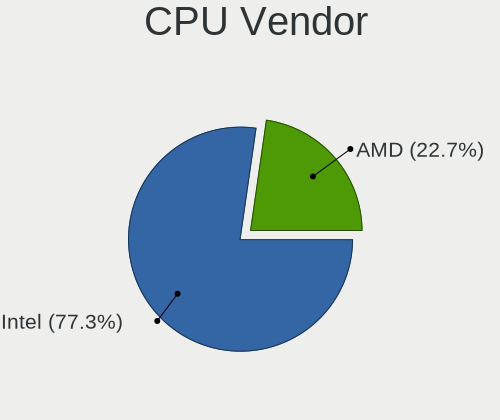
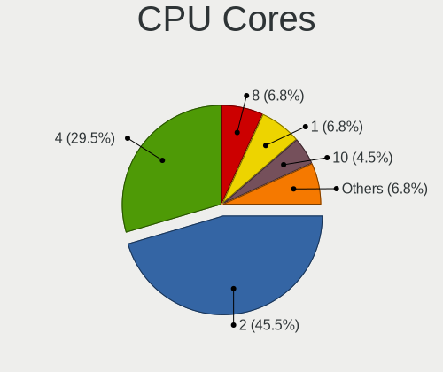
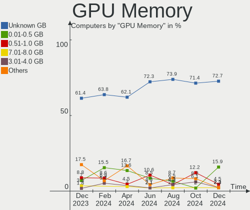

Xubuntu Hardware Trends
-----------------------

A project to identify most popular hardware characteristics and track their change
over time based on data collected by Xubuntu users at https://Linux-Hardware.org.

Anyone can contribute to this report by the [hw-probe](https://github.com/linuxhw/hw-probe) tool:

    sudo -E hw-probe -all -upload

This is a report for all computer types. See also reports for [desktops](/Dist/Xubuntu/Desktop/README.md) and [notebooks](/Dist/Xubuntu/Notebook/README.md).

Full-feature report is available here: https://linux-hardware.org/?view=trends

Period: Feb, 2022.

Contents
--------

* [ System ](#system)
  - [ OS                       ](#os)
  - [ OS Family                ](#os-family)
  - [ Kernel                   ](#kernel)
  - [ Kernel Family            ](#kernel-family)
  - [ Kernel Major Ver.        ](#kernel-major-ver)
  - [ Arch                     ](#arch)
  - [ DE                       ](#de)
  - [ Display Server           ](#display-server)
  - [ Display Manager          ](#display-manager)
  - [ OS Lang                  ](#os-lang)
  - [ Boot Mode                ](#boot-mode)
  - [ Filesystem               ](#filesystem)
  - [ Part. scheme             ](#part-scheme)
  - [ Dual Boot with Linux/BSD ](#dual-boot-with-linuxbsd)
  - [ Dual Boot (Win)          ](#dual-boot-win)

* [ Board ](#board)
  - [ Vendor                   ](#vendor)
  - [ Model                    ](#model)
  - [ Model Family             ](#model-family)
  - [ MFG Year                 ](#mfg-year)
  - [ Form Factor              ](#form-factor)
  - [ Secure Boot              ](#secure-boot)
  - [ Coreboot                 ](#coreboot)
  - [ RAM Size                 ](#ram-size)
  - [ RAM Used                 ](#ram-used)
  - [ Total Drives             ](#total-drives)
  - [ Has CD-ROM               ](#has-cd-rom)
  - [ Has Ethernet             ](#has-ethernet)
  - [ Has WiFi                 ](#has-wifi)
  - [ Has Bluetooth            ](#has-bluetooth)

* [ Location ](#location)
  - [ Country                  ](#country)
  - [ City                     ](#city)

* [ Drives ](#drives)
  - [ Drive Vendor             ](#drive-vendor)
  - [ Drive Model              ](#drive-model)
  - [ HDD Vendor               ](#hdd-vendor)
  - [ SSD Vendor               ](#ssd-vendor)
  - [ Drive Kind               ](#drive-kind)
  - [ Drive Connector          ](#drive-connector)
  - [ Drive Size               ](#drive-size)
  - [ Space Total              ](#space-total)
  - [ Space Used               ](#space-used)
  - [ Malfunc. Drives          ](#malfunc-drives)
  - [ Malfunc. Drive Vendor    ](#malfunc-drive-vendor)
  - [ Malfunc. HDD Vendor      ](#malfunc-hdd-vendor)
  - [ Malfunc. Drive Kind      ](#malfunc-drive-kind)
  - [ Failed Drives            ](#failed-drives)
  - [ Failed Drive Vendor      ](#failed-drive-vendor)
  - [ Drive Status             ](#drive-status)

* [ Storage controller ](#storage-controller)
  - [ Storage Vendor           ](#storage-vendor)
  - [ Storage Model            ](#storage-model)
  - [ Storage Kind             ](#storage-kind)

* [ Processor ](#processor)
  - [ CPU Vendor               ](#cpu-vendor)
  - [ CPU Model                ](#cpu-model)
  - [ CPU Model Family         ](#cpu-model-family)
  - [ CPU Cores                ](#cpu-cores)
  - [ CPU Sockets              ](#cpu-sockets)
  - [ CPU Threads              ](#cpu-threads)
  - [ CPU Op-Modes             ](#cpu-op-modes)
  - [ CPU Microcode            ](#cpu-microcode)
  - [ CPU Microarch            ](#cpu-microarch)

* [ Graphics ](#graphics)
  - [ GPU Vendor               ](#gpu-vendor)
  - [ GPU Model                ](#gpu-model)
  - [ GPU Combo                ](#gpu-combo)
  - [ GPU Driver               ](#gpu-driver)
  - [ GPU Memory               ](#gpu-memory)

* [ Monitor ](#monitor)
  - [ Monitor Vendor           ](#monitor-vendor)
  - [ Monitor Model            ](#monitor-model)
  - [ Monitor Resolution       ](#monitor-resolution)
  - [ Monitor Diagonal         ](#monitor-diagonal)
  - [ Monitor Width            ](#monitor-width)
  - [ Aspect Ratio             ](#aspect-ratio)
  - [ Monitor Area             ](#monitor-area)
  - [ Pixel Density            ](#pixel-density)
  - [ Multiple Monitors        ](#multiple-monitors)

* [ Network ](#network)
  - [ Net Controller Vendor    ](#net-controller-vendor)
  - [ Net Controller Model     ](#net-controller-model)
  - [ Wireless Vendor          ](#wireless-vendor)
  - [ Wireless Model           ](#wireless-model)
  - [ Ethernet Vendor          ](#ethernet-vendor)
  - [ Ethernet Model           ](#ethernet-model)
  - [ Net Controller Kind      ](#net-controller-kind)
  - [ Used Controller          ](#used-controller)
  - [ NICs                     ](#nics)
  - [ IPv6                     ](#ipv6)

* [ Bluetooth ](#bluetooth)
  - [ Bluetooth Vendor         ](#bluetooth-vendor)
  - [ Bluetooth Model          ](#bluetooth-model)

* [ Sound ](#sound)
  - [ Sound Vendor             ](#sound-vendor)
  - [ Sound Model              ](#sound-model)

* [ Memory ](#memory)
  - [ Memory Vendor            ](#memory-vendor)
  - [ Memory Model             ](#memory-model)
  - [ Memory Kind              ](#memory-kind)
  - [ Memory Form Factor       ](#memory-form-factor)
  - [ Memory Size              ](#memory-size)
  - [ Memory Speed             ](#memory-speed)

* [ Printers & scanners ](#printers--scanners)
  - [ Printer Vendor           ](#printer-vendor)
  - [ Printer Model            ](#printer-model)
  - [ Scanner Vendor           ](#scanner-vendor)
  - [ Scanner Model            ](#scanner-model)

* [ Camera ](#camera)
  - [ Camera Vendor            ](#camera-vendor)
  - [ Camera Model             ](#camera-model)

* [ Security ](#security)
  - [ Fingerprint Vendor       ](#fingerprint-vendor)
  - [ Fingerprint Model        ](#fingerprint-model)
  - [ Chipcard Vendor          ](#chipcard-vendor)
  - [ Chipcard Model           ](#chipcard-model)

* [ Unsupported ](#unsupported)
  - [ Unsupported Devices      ](#unsupported-devices)
  - [ Unsupported Device Types ](#unsupported-device-types)

System
------

OS
--

Installed operating systems

| Name          | Computers | Percent |
|---------------|-----------|---------|
| Xubuntu 20.04 | 42        | 57.53%  |
| Xubuntu 21.10 | 15        | 20.55%  |
| Xubuntu 18.04 | 10        | 13.7%   |
| Xubuntu 16.04 | 4         | 5.48%   |
| Xubuntu 21.04 | 2         | 2.74%   |

OS Family
---------

OS without a version

| Name    | Computers | Percent |
|---------|-----------|---------|
| Xubuntu | 73        | 100%    |

Kernel
------

Version of the Linux kernel

| Version                         | Computers | Percent |
|---------------------------------|-----------|---------|
| 5.13.0-28-generic               | 16        | 21.92%  |
| 5.13.0-30-generic               | 13        | 17.81%  |
| 5.4.0-97-generic                | 5         | 6.85%   |
| 5.13.0-27-generic               | 4         | 5.48%   |
| 5.4.0-99-lowlatency             | 3         | 4.11%   |
| 5.13.0-28-lowlatency            | 3         | 4.11%   |
| 4.4.0-210-generic               | 3         | 4.11%   |
| 4.15.0-167-generic              | 3         | 4.11%   |
| 5.4.0-42-generic                | 2         | 2.74%   |
| 5.13.0-30-lowlatency            | 2         | 2.74%   |
| 5.13.0-27-lowlatency            | 2         | 2.74%   |
| 5.8.0-53-generic                | 1         | 1.37%   |
| 5.8.0-48-generic                | 1         | 1.37%   |
| 5.4.0-99-generic                | 1         | 1.37%   |
| 5.4.0-96-generic                | 1         | 1.37%   |
| 5.4.0-90-generic                | 1         | 1.37%   |
| 5.4.0-80-generic                | 1         | 1.37%   |
| 5.4.0-74-generic                | 1         | 1.37%   |
| 5.15.0-051500rc7-generic        | 1         | 1.37%   |
| 5.14.0-051400-generic           | 1         | 1.37%   |
| 5.13.0-1029-oem                 | 1         | 1.37%   |
| 5.11.0-49-generic               | 1         | 1.37%   |
| 5.11.0-44-generic               | 1         | 1.37%   |
| 5.11.0-27-generic               | 1         | 1.37%   |
| 5.0.0-aml-s912-gf2f3a8c1a-dirty | 1         | 1.37%   |
| 4.16.18-galliumos               | 1         | 1.37%   |
| 4.15.0-153-generic              | 1         | 1.37%   |
| 4.15.0-142-generic              | 1         | 1.37%   |

Kernel Family
-------------

Linux kernel without a distro release

| Version | Computers | Percent |
|---------|-----------|---------|
| 5.13.0  | 41        | 56.16%  |
| 5.4.0   | 15        | 20.55%  |
| 4.15.0  | 5         | 6.85%   |
| 5.11.0  | 3         | 4.11%   |
| 4.4.0   | 3         | 4.11%   |
| 5.8.0   | 2         | 2.74%   |
| 5.15.0  | 1         | 1.37%   |
| 5.14.0  | 1         | 1.37%   |
| 5.0.0   | 1         | 1.37%   |
| 4.16.18 | 1         | 1.37%   |

Kernel Major Ver.
-----------------

Linux kernel major version

| Version | Computers | Percent |
|---------|-----------|---------|
| 5.13    | 41        | 56.16%  |
| 5.4     | 15        | 20.55%  |
| 4.15    | 5         | 6.85%   |
| 5.11    | 3         | 4.11%   |
| 4.4     | 3         | 4.11%   |
| 5.8     | 2         | 2.74%   |
| 5.15    | 1         | 1.37%   |
| 5.14    | 1         | 1.37%   |
| 5.0     | 1         | 1.37%   |
| 4.16    | 1         | 1.37%   |

Arch
----

OS architecture (x86_64, i586, etc.)

| Name    | Computers | Percent |
|---------|-----------|---------|
| x86_64  | 65        | 89.04%  |
| i686    | 7         | 9.59%   |
| aarch64 | 1         | 1.37%   |

DE
--

Desktop Environment

| Name       | Computers | Percent |
|------------|-----------|---------|
| XFCE       | 67        | 91.78%  |
| GNOME      | 5         | 6.85%   |
| X-Cinnamon | 1         | 1.37%   |

Display Server
--------------

X11 or Wayland

| Name | Computers | Percent |
|------|-----------|---------|
| X11  | 72        | 98.63%  |
| Tty  | 1         | 1.37%   |

Display Manager
---------------

SDDM, LightDM, etc.

| Name    | Computers | Percent |
|---------|-----------|---------|
| LightDM | 62        | 84.93%  |
| Unknown | 6         | 8.22%   |
| GDM3    | 2         | 2.74%   |
| SDDM    | 1         | 1.37%   |
| LXDM    | 1         | 1.37%   |
| GDM     | 1         | 1.37%   |

OS Lang
-------

Language

| Lang  | Computers | Percent |
|-------|-----------|---------|
| en_US | 24        | 32.88%  |
| fr_FR | 15        | 20.55%  |
| de_DE | 11        | 15.07%  |
| sk_SK | 2         | 2.74%   |
| ru_RU | 2         | 2.74%   |
| pt_BR | 2         | 2.74%   |
| it_IT | 2         | 2.74%   |
| es_ES | 2         | 2.74%   |
| en_GB | 2         | 2.74%   |
| en_CA | 2         | 2.74%   |
| sv_SE | 1         | 1.37%   |
| nl_NL | 1         | 1.37%   |
| es_VE | 1         | 1.37%   |
| es_MX | 1         | 1.37%   |
| es_AR | 1         | 1.37%   |
| en_ZA | 1         | 1.37%   |
| en_AU | 1         | 1.37%   |
| de_AT | 1         | 1.37%   |
| cs_CZ | 1         | 1.37%   |

Boot Mode
---------

EFI or BIOS

| Mode | Computers | Percent |
|------|-----------|---------|
| BIOS | 44        | 60.27%  |
| EFI  | 29        | 39.73%  |

Filesystem
----------

Type of filesystem

| Type    | Computers | Percent |
|---------|-----------|---------|
| Ext4    | 68        | 93.15%  |
| Zfs     | 1         | 1.37%   |
| Xfs     | 1         | 1.37%   |
| Overlay | 1         | 1.37%   |
| Ext3    | 1         | 1.37%   |
| Btrfs   | 1         | 1.37%   |

Part. scheme
------------

Scheme of partitioning

| Type    | Computers | Percent |
|---------|-----------|---------|
| Unknown | 47        | 64.38%  |
| GPT     | 16        | 21.92%  |
| MBR     | 10        | 13.7%   |

Dual Boot with Linux/BSD
------------------------

Hosting more than one Linux/BSD

| Dual boot | Computers | Percent |
|-----------|-----------|---------|
| No        | 58        | 79.45%  |
| Yes       | 15        | 20.55%  |

Dual Boot (Win)
---------------

Hosting Linux and Windows

| Dual boot | Computers | Percent |
|-----------|-----------|---------|
| No        | 45        | 61.64%  |
| Yes       | 28        | 38.36%  |

Board
-----

Vendor
------

Motherboard manufacturer

| Name                | Computers | Percent |
|---------------------|-----------|---------|
| Hewlett-Packard     | 13        | 17.81%  |
| ASUSTek Computer    | 13        | 17.81%  |
| Dell                | 12        | 16.44%  |
| Lenovo              | 9         | 12.33%  |
| MSI                 | 4         | 5.48%   |
| Acer                | 3         | 4.11%   |
| Gigabyte Technology | 2         | 2.74%   |
| Fujitsu             | 2         | 2.74%   |
| ASRock              | 2         | 2.74%   |
| VIT                 | 1         | 1.37%   |
| TrekStor            | 1         | 1.37%   |
| Sony                | 1         | 1.37%   |
| Samsung Electronics | 1         | 1.37%   |
| Pegatron            | 1         | 1.37%   |
| Medion              | 1         | 1.37%   |
| LG Electronics      | 1         | 1.37%   |
| Khadas              | 1         | 1.37%   |
| IBM                 | 1         | 1.37%   |
| Google              | 1         | 1.37%   |
| Gateway             | 1         | 1.37%   |
| Fujitsu Siemens     | 1         | 1.37%   |
| Unknown             | 1         | 1.37%   |

Model
-----

Motherboard model

| Name                                     | Computers | Percent |
|------------------------------------------|-----------|---------|
| Unknown                                  | 2         | 2.74%   |
| VIT P3400                                | 1         | 1.37%   |
| TrekStor Primetab T13B                   | 1         | 1.37%   |
| Sony VPCEB3E1E                           | 1         | 1.37%   |
| Samsung 900X1B                           | 1         | 1.37%   |
| Pegatron h8-1207eo                       | 1         | 1.37%   |
| MSI MS-7C35                              | 1         | 1.37%   |
| MSI MS-7850                              | 1         | 1.37%   |
| MSI MS-7786                              | 1         | 1.37%   |
| MSI MS-7592                              | 1         | 1.37%   |
| Medion E16402                            | 1         | 1.37%   |
| LG 22V240-L.BK55P1                       | 1         | 1.37%   |
| Lenovo XiaoXinPro 16ACH 2021 82L5        | 1         | 1.37%   |
| Lenovo ThinkPad W510 431963G             | 1         | 1.37%   |
| Lenovo ThinkPad T510 4384VJM             | 1         | 1.37%   |
| Lenovo ThinkPad T410 2522W6G             | 1         | 1.37%   |
| Lenovo ThinkPad T14s Gen 1 20UHCTO1WW    | 1         | 1.37%   |
| Lenovo ThinkPad R500 2716A54             | 1         | 1.37%   |
| Lenovo ThinkPad L480 20LS001AMD          | 1         | 1.37%   |
| Lenovo ThinkCentre M72e 35951A1          | 1         | 1.37%   |
| Khadas VIM2                              | 1         | 1.37%   |
| IBM ThinkPad T43 2668BU7                 | 1         | 1.37%   |
| HP x2 210 G2                             | 1         | 1.37%   |
| HP Stream Notebook PC 13                 | 1         | 1.37%   |
| HP ProDesk 405 G6 Desktop Mini PC        | 1         | 1.37%   |
| HP ProBook 655 G1                        | 1         | 1.37%   |
| HP ProBook 650 G3                        | 1         | 1.37%   |
| HP Pavilion 17                           | 1         | 1.37%   |
| HP EliteBook 8560p                       | 1         | 1.37%   |
| HP EliteBook 8530p                       | 1         | 1.37%   |
| HP EliteBook 725 G2                      | 1         | 1.37%   |
| HP Compaq nc6320 (RH374EA#AKB)           | 1         | 1.37%   |
| HP Compaq dc7900 Small Form Factor       | 1         | 1.37%   |
| HP Compaq 6200 Pro MT PC                 | 1         | 1.37%   |
| HP 15                                    | 1         | 1.37%   |
| Google Banon                             | 1         | 1.37%   |
| Gigabyte X570 AORUS MASTER               | 1         | 1.37%   |
| Gigabyte GA-870A-UD3                     | 1         | 1.37%   |
| Gateway M-6307                           | 1         | 1.37%   |
| Fujitsu Siemens D1784                    | 1         | 1.37%   |
| Fujitsu LIFEBOOK E734                    | 1         | 1.37%   |
| Fujitsu ESPRIMO Q958                     | 1         | 1.37%   |
| Dell Vostro V130                         | 1         | 1.37%   |
| Dell Precision 3561                      | 1         | 1.37%   |
| Dell OptiPlex GX620                      | 1         | 1.37%   |
| Dell OptiPlex 960                        | 1         | 1.37%   |
| Dell OptiPlex 9020                       | 1         | 1.37%   |
| Dell OptiPlex 9010                       | 1         | 1.37%   |
| Dell OptiPlex 7010                       | 1         | 1.37%   |
| Dell OptiPlex 3040                       | 1         | 1.37%   |
| Dell OptiPlex 3010                       | 1         | 1.37%   |
| Dell Latitude E5450                      | 1         | 1.37%   |
| Dell Inspiron 5593                       | 1         | 1.37%   |
| Dell Inspiron 1764                       | 1         | 1.37%   |
| ASUS Z170-K                              | 1         | 1.37%   |
| ASUS X542URR                             | 1         | 1.37%   |
| ASUS VivoBook_ASUSLaptop X515EA_P1511CEA | 1         | 1.37%   |
| ASUS TUF GAMING X570-PRO                 | 1         | 1.37%   |
| ASUS ROG STRIX X570-E GAMING             | 1         | 1.37%   |
| ASUS PRIME H570M-PLUS                    | 1         | 1.37%   |

Model Family
------------

Motherboard model prefix

| Name                  | Computers | Percent |
|-----------------------|-----------|---------|
| Dell OptiPlex         | 7         | 9.59%   |
| Lenovo ThinkPad       | 6         | 8.22%   |
| HP EliteBook          | 3         | 4.11%   |
| HP Compaq             | 3         | 4.11%   |
| HP ProBook            | 2         | 2.74%   |
| Dell Inspiron         | 2         | 2.74%   |
| ASUS PRIME            | 2         | 2.74%   |
| Acer Aspire           | 2         | 2.74%   |
| Unknown               | 2         | 2.74%   |
| VIT P3400             | 1         | 1.37%   |
| TrekStor Primetab     | 1         | 1.37%   |
| Sony VPCEB3E1E        | 1         | 1.37%   |
| Samsung 900X1B        | 1         | 1.37%   |
| Pegatron h8-1207eo    | 1         | 1.37%   |
| MSI MS-7C35           | 1         | 1.37%   |
| MSI MS-7850           | 1         | 1.37%   |
| MSI MS-7786           | 1         | 1.37%   |
| MSI MS-7592           | 1         | 1.37%   |
| Medion E16402         | 1         | 1.37%   |
| LG 22V240-L.BK55P1    | 1         | 1.37%   |
| Lenovo XiaoXinPro     | 1         | 1.37%   |
| Lenovo ThinkCentre    | 1         | 1.37%   |
| Khadas VIM2           | 1         | 1.37%   |
| IBM ThinkPad          | 1         | 1.37%   |
| HP x2                 | 1         | 1.37%   |
| HP Stream             | 1         | 1.37%   |
| HP ProDesk            | 1         | 1.37%   |
| HP Pavilion           | 1         | 1.37%   |
| HP 15                 | 1         | 1.37%   |
| Google Banon          | 1         | 1.37%   |
| Gigabyte X570         | 1         | 1.37%   |
| Gigabyte GA-870A-UD3  | 1         | 1.37%   |
| Gateway M-6307        | 1         | 1.37%   |
| Fujitsu Siemens D1784 | 1         | 1.37%   |
| Fujitsu LIFEBOOK      | 1         | 1.37%   |
| Fujitsu ESPRIMO       | 1         | 1.37%   |
| Dell Vostro           | 1         | 1.37%   |
| Dell Precision        | 1         | 1.37%   |
| Dell Latitude         | 1         | 1.37%   |
| ASUS Z170-K           | 1         | 1.37%   |
| ASUS X542URR          | 1         | 1.37%   |
| ASUS VivoBook         | 1         | 1.37%   |
| ASUS TUF              | 1         | 1.37%   |
| ASUS ROG              | 1         | 1.37%   |
| ASUS P5Q-PRO          | 1         | 1.37%   |
| ASUS M5A97            | 1         | 1.37%   |
| ASUS M4A87TD          | 1         | 1.37%   |
| ASUS K73SV            | 1         | 1.37%   |
| ASUS ASUS             | 1         | 1.37%   |
| ASUS A2D              | 1         | 1.37%   |
| ASRock K10N78M        | 1         | 1.37%   |
| ASRock 960GM-GS3      | 1         | 1.37%   |
| Acer TravelMate       | 1         | 1.37%   |

MFG Year
--------

Motherboard manufacture year

| Year    | Computers | Percent |
|---------|-----------|---------|
| 2011    | 7         | 9.59%   |
| 2021    | 6         | 8.22%   |
| 2020    | 6         | 8.22%   |
| 2014    | 6         | 8.22%   |
| 2013    | 6         | 8.22%   |
| 2008    | 6         | 8.22%   |
| 2010    | 5         | 6.85%   |
| 2009    | 5         | 6.85%   |
| 2019    | 4         | 5.48%   |
| 2012    | 4         | 5.48%   |
| 2018    | 3         | 4.11%   |
| 2016    | 3         | 4.11%   |
| 2015    | 3         | 4.11%   |
| 2006    | 3         | 4.11%   |
| 2022    | 1         | 1.37%   |
| 2017    | 1         | 1.37%   |
| 2007    | 1         | 1.37%   |
| 2005    | 1         | 1.37%   |
| 2004    | 1         | 1.37%   |
| Unknown | 1         | 1.37%   |

Form Factor
-----------

Physical design of the computer

| Name           | Computers | Percent |
|----------------|-----------|---------|
| Notebook       | 37        | 50.68%  |
| Desktop        | 31        | 42.47%  |
| Tablet         | 2         | 2.74%   |
| System on chip | 1         | 1.37%   |
| Mini pc        | 1         | 1.37%   |
| All in one     | 1         | 1.37%   |

Secure Boot
-----------

Enabled or disabled

| State    | Computers | Percent |
|----------|-----------|---------|
| Disabled | 66        | 90.41%  |
| Enabled  | 7         | 9.59%   |

Coreboot
--------

Have coreboot on board

| Used | Computers | Percent |
|------|-----------|---------|
| No   | 72        | 98.63%  |
| Yes  | 1         | 1.37%   |

RAM Size
--------

Total RAM memory

| Size in GB  | Computers | Percent |
|-------------|-----------|---------|
| 3.01-4.0    | 20        | 27.4%   |
| 4.01-8.0    | 16        | 21.92%  |
| 8.01-16.0   | 11        | 15.07%  |
| 1.01-2.0    | 7         | 9.59%   |
| 32.01-64.0  | 6         | 8.22%   |
| 16.01-24.0  | 5         | 6.85%   |
| 2.01-3.0    | 3         | 4.11%   |
| 24.01-32.0  | 2         | 2.74%   |
| 64.01-256.0 | 2         | 2.74%   |
| 0.01-0.5    | 1         | 1.37%   |

RAM Used
--------

Used RAM memory

| Used GB    | Computers | Percent |
|------------|-----------|---------|
| 1.01-2.0   | 24        | 32.88%  |
| 0.51-1.0   | 15        | 20.55%  |
| 3.01-4.0   | 14        | 19.18%  |
| 2.01-3.0   | 11        | 15.07%  |
| 4.01-8.0   | 5         | 6.85%   |
| 8.01-16.0  | 2         | 2.74%   |
| 16.01-24.0 | 1         | 1.37%   |
| 0.01-0.5   | 1         | 1.37%   |

Total Drives
------------

Number of drives on board

| Drives | Computers | Percent |
|--------|-----------|---------|
| 1      | 43        | 58.9%   |
| 2      | 18        | 24.66%  |
| 3      | 8         | 10.96%  |
| 10     | 1         | 1.37%   |
| 7      | 1         | 1.37%   |
| 6      | 1         | 1.37%   |
| 4      | 1         | 1.37%   |

Has CD-ROM
----------

Has CD-ROM on board

| Presented | Computers | Percent |
|-----------|-----------|---------|
| Yes       | 41        | 56.16%  |
| No        | 32        | 43.84%  |

Has Ethernet
------------

Has Ethernet on board

| Presented | Computers | Percent |
|-----------|-----------|---------|
| Yes       | 65        | 89.04%  |
| No        | 8         | 10.96%  |

Has WiFi
--------

Has WiFi module

| Presented | Computers | Percent |
|-----------|-----------|---------|
| Yes       | 51        | 69.86%  |
| No        | 22        | 30.14%  |

Has Bluetooth
-------------

Has Bluetooth module

| Presented | Computers | Percent |
|-----------|-----------|---------|
| No        | 41        | 56.16%  |
| Yes       | 32        | 43.84%  |

Location
--------

Country
-------

Geographic location (country)

| Country      | Computers | Percent |
|--------------|-----------|---------|
| Germany      | 13        | 17.81%  |
| France       | 11        | 15.07%  |
| USA          | 9         | 12.33%  |
| Netherlands  | 3         | 4.11%   |
| UK           | 2         | 2.74%   |
| Spain        | 2         | 2.74%   |
| Slovakia     | 2         | 2.74%   |
| Russia       | 2         | 2.74%   |
| Italy        | 2         | 2.74%   |
| Finland      | 2         | 2.74%   |
| Czechia      | 2         | 2.74%   |
| Canada       | 2         | 2.74%   |
| Brazil       | 2         | 2.74%   |
| Belgium      | 2         | 2.74%   |
| Austria      | 2         | 2.74%   |
| Venezuela    | 1         | 1.37%   |
| Ukraine      | 1         | 1.37%   |
| Turkey       | 1         | 1.37%   |
| Thailand     | 1         | 1.37%   |
| Sweden       | 1         | 1.37%   |
| South Africa | 1         | 1.37%   |
| Romania      | 1         | 1.37%   |
| Portugal     | 1         | 1.37%   |
| Poland       | 1         | 1.37%   |
| Mexico       | 1         | 1.37%   |
| Indonesia    | 1         | 1.37%   |
| Denmark      | 1         | 1.37%   |
| Bulgaria     | 1         | 1.37%   |
| Australia    | 1         | 1.37%   |
| Argentina    | 1         | 1.37%   |

City
----

Geographic location (city)

| City                | Computers | Percent |
|---------------------|-----------|---------|
| Vienna              | 2         | 2.74%   |
| Tampere             | 2         | 2.74%   |
| Saint-Ouen-l'Aumone | 2         | 2.74%   |
| Bardejov            | 2         | 2.74%   |
| Barcelona           | 2         | 2.74%   |
| Zuidland            | 1         | 1.37%   |
| Wickford            | 1         | 1.37%   |
| Warsaw              | 1         | 1.37%   |
| Walsall             | 1         | 1.37%   |
| Voskresensk         | 1         | 1.37%   |
| Vohenstrauss        | 1         | 1.37%   |
| Västerås      | 1         | 1.37%   |
| Tours               | 1         | 1.37%   |
| Sydney              | 1         | 1.37%   |
| Surrey              | 1         | 1.37%   |
| Surabaya            | 1         | 1.37%   |
| Stuttgart           | 1         | 1.37%   |
| Sokolov             | 1         | 1.37%   |
| Sofia               | 1         | 1.37%   |
| Seyssinet-Pariset   | 1         | 1.37%   |
| Schrobenhausen      | 1         | 1.37%   |
| Roseville           | 1         | 1.37%   |
| Roseburg            | 1         | 1.37%   |
| Rians               | 1         | 1.37%   |
| Rennes              | 1         | 1.37%   |
| Prague              | 1         | 1.37%   |
| Poltava             | 1         | 1.37%   |
| Phuket              | 1         | 1.37%   |
| Philadelphia        | 1         | 1.37%   |
| Paris               | 1         | 1.37%   |
| Ottawa              | 1         | 1.37%   |
| Odense              | 1         | 1.37%   |
| Nogara di Piana     | 1         | 1.37%   |
| Naaldwijk           | 1         | 1.37%   |
| Murmansk            | 1         | 1.37%   |
| Münster            | 1         | 1.37%   |
| Mexico City         | 1         | 1.37%   |
| Madrid              | 1         | 1.37%   |
| Los Angeles         | 1         | 1.37%   |
| Liège            | 1         | 1.37%   |
| Leipzig             | 1         | 1.37%   |
| Leiden              | 1         | 1.37%   |
| Le Taillan-Medoc    | 1         | 1.37%   |
| Lavelanet           | 1         | 1.37%   |
| La Plata            | 1         | 1.37%   |
| Krefeld             | 1         | 1.37%   |
| Kofering            | 1         | 1.37%   |
| Katy                | 1         | 1.37%   |
| Ixelles-Elsene      | 1         | 1.37%   |
| Hanover             | 1         | 1.37%   |
| Guaíba             | 1         | 1.37%   |
| Freiberg            | 1         | 1.37%   |
| Fourneaux-le-Val    | 1         | 1.37%   |
| Fort Worth          | 1         | 1.37%   |
| Eppingen            | 1         | 1.37%   |
| Dripping Springs    | 1         | 1.37%   |
| Decimoputzu         | 1         | 1.37%   |
| Decatur             | 1         | 1.37%   |
| Cologne             | 1         | 1.37%   |
| Cape Town           | 1         | 1.37%   |

Drives
------

Drive Vendor
------------

Hard drive vendors

| Vendor              | Computers | Drives | Percent |
|---------------------|-----------|--------|---------|
| Seagate             | 23        | 25     | 22.12%  |
| Samsung Electronics | 20        | 26     | 19.23%  |
| WDC                 | 19        | 27     | 18.27%  |
| Unknown             | 8         | 10     | 7.69%   |
| Hitachi             | 5         | 5      | 4.81%   |
| Toshiba             | 4         | 6      | 3.85%   |
| Kingston            | 3         | 4      | 2.88%   |
| HGST                | 3         | 3      | 2.88%   |
| A-DATA Technology   | 3         | 3      | 2.88%   |
| Gigabyte Technology | 2         | 2      | 1.92%   |
| USB3.0              | 1         | 1      | 0.96%   |
| TrekStor            | 1         | 1      | 0.96%   |
| SSSTC               | 1         | 1      | 0.96%   |
| Silicon Motion      | 1         | 1      | 0.96%   |
| SanDisk             | 1         | 1      | 0.96%   |
| Phison              | 1         | 1      | 0.96%   |
| Patriot             | 1         | 1      | 0.96%   |
| OCZ-VERTEX3         | 1         | 1      | 0.96%   |
| LITEONIT            | 1         | 1      | 0.96%   |
| KIOXIA              | 1         | 1      | 0.96%   |
| Intel               | 1         | 1      | 0.96%   |
| IBM/Hitachi         | 1         | 1      | 0.96%   |
| Crucial             | 1         | 2      | 0.96%   |
| China               | 1         | 1      | 0.96%   |

Drive Model
-----------

Hard drive models

| Model                                | Computers | Percent |
|--------------------------------------|-----------|---------|
| Unknown MMC Card  64GB               | 3         | 2.61%   |
| Kingston SA400S37240G 240GB SSD      | 3         | 2.61%   |
| Seagate ST9500325AS 500GB            | 2         | 1.74%   |
| Seagate ST3808110AS 80GB             | 2         | 1.74%   |
| Seagate ST3160318AS 160GB            | 2         | 1.74%   |
| WDC WDS500G2B0A 500GB SSD            | 1         | 0.87%   |
| WDC WDS200T2B0B-00YS70 2TB SSD       | 1         | 0.87%   |
| WDC WDS100T2B0A-00SM50 1TB SSD       | 1         | 0.87%   |
| WDC WD800JD-75MSA3 80GB              | 1         | 0.87%   |
| WDC WD7500BPVX-00JC3T0 752GB         | 1         | 0.87%   |
| WDC WD5000LPLX-60ZNTT1 500GB         | 1         | 0.87%   |
| WDC WD5000BEVT-22ZAT0 500GB          | 1         | 0.87%   |
| WDC WD5000AAKX-08ERMA0 500GB         | 1         | 0.87%   |
| WDC WD40EZRZ-22GXCB0 4TB             | 1         | 0.87%   |
| WDC WD3200BEVT-60ZCT1 320GB          | 1         | 0.87%   |
| WDC WD30EZRZ-00Z5HB0 3TB             | 1         | 0.87%   |
| WDC WD2500KS-00MJB0 250GB            | 1         | 0.87%   |
| WDC WD20EZRZ-22Z5HB0 2TB             | 1         | 0.87%   |
| WDC WD20EARX-00PASB0 2TB             | 1         | 0.87%   |
| WDC WD10JPVX-22JC3T0 1TB             | 1         | 0.87%   |
| WDC WD10EZRX-00D8PB0 1TB             | 1         | 0.87%   |
| WDC WD10EZEX-60WN4A1 1TB             | 1         | 0.87%   |
| WDC WD10EACS-32ZJB0 1TB              | 1         | 0.87%   |
| WDC WD1002FAEX-00Z3A0 1TB            | 1         | 0.87%   |
| WDC WD My Passport 264F 2TB          | 1         | 0.87%   |
| WDC PC SN530 SDBPNPZ-256G-1002 256GB | 1         | 0.87%   |
| USB3.0 Super Speed 256GB             | 1         | 0.87%   |
| Unknown SL64G  64GB                  | 1         | 0.87%   |
| Unknown SA08G  8GB                   | 1         | 0.87%   |
| Unknown MMC Card  32GB               | 1         | 0.87%   |
| Unknown MMC Card  2GB                | 1         | 0.87%   |
| Unknown MMC Card  256GB              | 1         | 0.87%   |
| Unknown MMC Card  16GB               | 1         | 0.87%   |
| Unknown BGND3R  32GB                 | 1         | 0.87%   |
| TrekStor TREKSTORSSD512GB 500GB      | 1         | 0.87%   |
| Toshiba MQ01ACF050 500GB             | 1         | 0.87%   |
| Toshiba KBG40ZNS512G NVMe 512GB      | 1         | 0.87%   |
| Toshiba HDWD130 3TB                  | 1         | 0.87%   |
| Toshiba DT01ACA300 3TB               | 1         | 0.87%   |
| SSSTC CL1-8D256-HP 256GB             | 1         | 0.87%   |
| Silicon Motion NVMe SSD Drive 1024GB | 1         | 0.87%   |
| Seagate ST95005620AS 500GB           | 1         | 0.87%   |
| Seagate ST9500423AS 500GB            | 1         | 0.87%   |
| Seagate ST9320423AS 320GB            | 1         | 0.87%   |
| Seagate ST9320325AS 320GB            | 1         | 0.87%   |
| Seagate ST8000DM004-2U9188 8TB       | 1         | 0.87%   |
| Seagate ST500LM012 HN-M500MBB 500GB  | 1         | 0.87%   |
| Seagate ST500DM002-1BD142 500GB      | 1         | 0.87%   |
| Seagate ST380815AS 80GB              | 1         | 0.87%   |
| Seagate ST380215A 80GB               | 1         | 0.87%   |
| Seagate ST3750641NS EIT 752GB        | 1         | 0.87%   |
| Seagate ST31000524AS 1TB             | 1         | 0.87%   |
| Seagate ST2000DM008-2FR102 2TB       | 1         | 0.87%   |
| Seagate ST2000DM001-1CH164 2TB       | 1         | 0.87%   |
| Seagate ST1000LM035-1RK172 1TB       | 1         | 0.87%   |
| Seagate ST1000DM010-2EP102 1TB       | 1         | 0.87%   |
| Seagate ST1000DM003-1SB102 1TB       | 1         | 0.87%   |
| Seagate Expansion+ 2TB               | 1         | 0.87%   |
| Seagate Expansion Desk 8TB           | 1         | 0.87%   |
| SanDisk SDSSDA120G 120GB             | 1         | 0.87%   |

HDD Vendor
----------

Hard disk drive vendors

| Vendor              | Computers | Drives | Percent |
|---------------------|-----------|--------|---------|
| Seagate             | 23        | 25     | 41.82%  |
| WDC                 | 14        | 17     | 25.45%  |
| Samsung Electronics | 5         | 5      | 9.09%   |
| Hitachi             | 5         | 5      | 9.09%   |
| Toshiba             | 3         | 5      | 5.45%   |
| HGST                | 3         | 3      | 5.45%   |
| USB3.0              | 1         | 1      | 1.82%   |
| IBM/Hitachi         | 1         | 1      | 1.82%   |

SSD Vendor
----------

Solid state drive vendors

| Vendor              | Computers | Drives | Percent |
|---------------------|-----------|--------|---------|
| Samsung Electronics | 9         | 10     | 34.62%  |
| WDC                 | 3         | 8      | 11.54%  |
| Kingston            | 3         | 4      | 11.54%  |
| Gigabyte Technology | 2         | 2      | 7.69%   |
| A-DATA Technology   | 2         | 2      | 7.69%   |
| TrekStor            | 1         | 1      | 3.85%   |
| SanDisk             | 1         | 1      | 3.85%   |
| Patriot             | 1         | 1      | 3.85%   |
| OCZ-VERTEX3         | 1         | 1      | 3.85%   |
| LITEONIT            | 1         | 1      | 3.85%   |
| Crucial             | 1         | 2      | 3.85%   |
| China               | 1         | 1      | 3.85%   |

Drive Kind
----------

HDD or SSD

| Kind    | Computers | Drives | Percent |
|---------|-----------|--------|---------|
| HDD     | 45        | 62     | 47.87%  |
| SSD     | 25        | 34     | 26.6%   |
| NVMe    | 15        | 18     | 15.96%  |
| MMC     | 8         | 11     | 8.51%   |
| Unknown | 1         | 1      | 1.06%   |

Drive Connector
---------------

SATA, SAS, NVMe, etc.

| Type | Computers | Drives | Percent |
|------|-----------|--------|---------|
| SATA | 58        | 91     | 67.44%  |
| NVMe | 15        | 18     | 17.44%  |
| MMC  | 8         | 11     | 9.3%    |
| SAS  | 5         | 6      | 5.81%   |

Drive Size
----------

Size of hard drive

| Size in TB | Computers | Drives | Percent |
|------------|-----------|--------|---------|
| 0.01-0.5   | 50        | 58     | 64.1%   |
| 0.51-1.0   | 14        | 20     | 17.95%  |
| 1.01-2.0   | 8         | 10     | 10.26%  |
| 2.01-3.0   | 3         | 5      | 3.85%   |
| 4.01-10.0  | 2         | 2      | 2.56%   |
| 3.01-4.0   | 1         | 1      | 1.28%   |

Space Total
-----------

Amount of disk space available on the file system

| Size in GB     | Computers | Percent |
|----------------|-----------|---------|
| 251-500        | 18        | 24.66%  |
| 101-250        | 17        | 23.29%  |
| 51-100         | 10        | 13.7%   |
| 501-1000       | 7         | 9.59%   |
| 1001-2000      | 6         | 8.22%   |
| 21-50          | 5         | 6.85%   |
| More than 3000 | 4         | 5.48%   |
| 2001-3000      | 3         | 4.11%   |
| 1-20           | 2         | 2.74%   |
| Unknown        | 1         | 1.37%   |

Space Used
----------

Amount of used disk space

| Used GB        | Computers | Percent |
|----------------|-----------|---------|
| 1-20           | 28        | 38.36%  |
| 21-50          | 13        | 17.81%  |
| 51-100         | 9         | 12.33%  |
| 101-250        | 7         | 9.59%   |
| 501-1000       | 5         | 6.85%   |
| 251-500        | 4         | 5.48%   |
| More than 3000 | 2         | 2.74%   |
| 2001-3000      | 2         | 2.74%   |
| 1001-2000      | 2         | 2.74%   |
| Unknown        | 1         | 1.37%   |

Malfunc. Drives
---------------

Drive models with a malfunction

| Model                           | Computers | Drives | Percent |
|---------------------------------|-----------|--------|---------|
| WDC WD10JPVX-22JC3T0 1TB        | 1         | 1      | 25%     |
| WDC WD1002FAEX-00Z3A0 1TB       | 1         | 1      | 25%     |
| Seagate ST95005620AS 500GB      | 1         | 1      | 25%     |
| Kingston SA400S37240G 240GB SSD | 1         | 1      | 25%     |

Malfunc. Drive Vendor
---------------------

Vendors of faulty drives

| Vendor   | Computers | Drives | Percent |
|----------|-----------|--------|---------|
| WDC      | 2         | 2      | 50%     |
| Seagate  | 1         | 1      | 25%     |
| Kingston | 1         | 1      | 25%     |

Malfunc. HDD Vendor
-------------------

Vendors of faulty HDD drives

| Vendor  | Computers | Drives | Percent |
|---------|-----------|--------|---------|
| WDC     | 2         | 2      | 66.67%  |
| Seagate | 1         | 1      | 33.33%  |

Malfunc. Drive Kind
-------------------

Kinds of faulty drives

| Kind | Computers | Drives | Percent |
|------|-----------|--------|---------|
| HDD  | 3         | 3      | 75%     |
| SSD  | 1         | 1      | 25%     |

Failed Drives
-------------

Failed drive models

Zero info for selected period =(

Failed Drive Vendor
-------------------

Failed drive vendors

Zero info for selected period =(

Drive Status
------------

Number of failed and malfunc. drives

| Status   | Computers | Drives | Percent |
|----------|-----------|--------|---------|
| Detected | 51        | 88     | 66.23%  |
| Works    | 22        | 34     | 28.57%  |
| Malfunc  | 4         | 4      | 5.19%   |

Storage controller
------------------

Storage Vendor
--------------

Storage controller vendors

| Vendor                           | Computers | Percent |
|----------------------------------|-----------|---------|
| Intel                            | 47        | 55.29%  |
| AMD                              | 17        | 20%     |
| Samsung Electronics              | 8         | 9.41%   |
| KIOXIA                           | 2         | 2.35%   |
| JMicron Technology               | 2         | 2.35%   |
| Solid State Storage Technology   | 1         | 1.18%   |
| Silicon Motion                   | 1         | 1.18%   |
| Silicon Integrated Systems [SiS] | 1         | 1.18%   |
| Sandisk                          | 1         | 1.18%   |
| Phison Electronics               | 1         | 1.18%   |
| Nvidia                           | 1         | 1.18%   |
| Marvell Technology Group         | 1         | 1.18%   |
| ASMedia Technology               | 1         | 1.18%   |
| ADATA Technology                 | 1         | 1.18%   |

Storage Model
-------------

Storage controller models

| Model                                                                          | Computers | Percent |
|--------------------------------------------------------------------------------|-----------|---------|
| AMD FCH SATA Controller [AHCI mode]                                            | 9         | 8.74%   |
| Samsung NVMe SSD Controller SM981/PM981/PM983                                  | 6         | 5.83%   |
| Intel 6 Series/C200 Series Chipset Family 6 port Desktop SATA AHCI Controller  | 4         | 3.88%   |
| Intel 82801G (ICH7 Family) IDE Controller                                      | 3         | 2.91%   |
| Intel 6 Series/C200 Series Chipset Family 6 port Mobile SATA AHCI Controller   | 3         | 2.91%   |
| Intel 5 Series/3400 Series Chipset 6 port SATA AHCI Controller                 | 3         | 2.91%   |
| Intel 5 Series/3400 Series Chipset 4 port SATA AHCI Controller                 | 3         | 2.91%   |
| AMD SB7x0/SB8x0/SB9x0 SATA Controller [IDE mode]                               | 3         | 2.91%   |
| AMD SB7x0/SB8x0/SB9x0 IDE Controller                                           | 3         | 2.91%   |
| KIOXIA Non-Volatile memory controller                                          | 2         | 1.94%   |
| Intel Volume Management Device NVMe RAID Controller                            | 2         | 1.94%   |
| Intel Sunrise Point-LP SATA Controller [AHCI mode]                             | 2         | 1.94%   |
| Intel SATA Controller [RAID mode]                                              | 2         | 1.94%   |
| Intel Q170/Q150/B150/H170/H110/Z170/CM236 Chipset SATA Controller [AHCI Mode]  | 2         | 1.94%   |
| Intel NM10/ICH7 Family SATA Controller [IDE mode]                              | 2         | 1.94%   |
| Intel 7 Series/C210 Series Chipset Family 6-port SATA Controller [AHCI mode]   | 2         | 1.94%   |
| Intel 500 Series Chipset Family SATA AHCI Controller                           | 2         | 1.94%   |
| Intel 4 Series Chipset PT IDER Controller                                      | 2         | 1.94%   |
| AMD Starship/Matisse Chipset SATA Controller [AHCI mode]                       | 2         | 1.94%   |
| Solid State Storage Non-Volatile memory controller                             | 1         | 0.97%   |
| Silicon Motion SM2263EN/SM2263XT SSD Controller                                | 1         | 0.97%   |
| Silicon Integrated Systems [SiS] 5513 IDE Controller                           | 1         | 0.97%   |
| Sandisk WD Blue SN550 NVMe SSD                                                 | 1         | 0.97%   |
| Samsung NVMe SSD Controller SM961/PM961/SM963                                  | 1         | 0.97%   |
| Samsung NVMe SSD Controller PM9A1/PM9A3/980PRO                                 | 1         | 0.97%   |
| Samsung NVMe SSD Controller 980                                                | 1         | 0.97%   |
| Phison E12 NVMe Controller                                                     | 1         | 0.97%   |
| Nvidia MCP78S [GeForce 8200] SATA Controller (non-AHCI mode)                   | 1         | 0.97%   |
| Nvidia MCP78S [GeForce 8200] IDE                                               | 1         | 0.97%   |
| Marvell Group 88SE6111/6121 SATA II / PATA Controller                          | 1         | 0.97%   |
| JMicron JMB363 SATA/IDE Controller                                             | 1         | 0.97%   |
| JMicron JMB361 AHCI/IDE                                                        | 1         | 0.97%   |
| Intel Wildcat Point-LP SATA Controller [AHCI Mode]                             | 1         | 0.97%   |
| Intel Tiger Lake-LP SATA Controller [AHCI mode]                                | 1         | 0.97%   |
| Intel Non-Volatile memory controller                                           | 1         | 0.97%   |
| Intel NM10/ICH7 Family SATA Controller [AHCI mode]                             | 1         | 0.97%   |
| Intel Ice Lake-LP SATA Controller [AHCI mode]                                  | 1         | 0.97%   |
| Intel Celeron N3350/Pentium N4200/Atom E3900 Series SATA AHCI Controller       | 1         | 0.97%   |
| Intel Cannon Lake PCH SATA AHCI Controller                                     | 1         | 0.97%   |
| Intel C600/X79 series chipset 6-Port SATA AHCI Controller                      | 1         | 0.97%   |
| Intel Atom Processor E3800 Series SATA AHCI Controller                         | 1         | 0.97%   |
| Intel 9 Series Chipset Family SATA Controller [AHCI Mode]                      | 1         | 0.97%   |
| Intel 82801JI (ICH10 Family) 4 port SATA IDE Controller #1                     | 1         | 0.97%   |
| Intel 82801JI (ICH10 Family) 2 port SATA IDE Controller #2                     | 1         | 0.97%   |
| Intel 82801JD/DO (ICH10 Family) SATA AHCI Controller                           | 1         | 0.97%   |
| Intel 82801IBM/IEM (ICH9M/ICH9M-E) 4 port SATA Controller [AHCI mode]          | 1         | 0.97%   |
| Intel 82801IBM/IEM (ICH9M/ICH9M-E) 2 port SATA Controller [IDE mode]           | 1         | 0.97%   |
| Intel 82801HM/HEM (ICH8M/ICH8M-E) SATA Controller [AHCI mode]                  | 1         | 0.97%   |
| Intel 82801HM/HEM (ICH8M/ICH8M-E) IDE Controller                               | 1         | 0.97%   |
| Intel 82801GBM/GHM (ICH7-M Family) SATA Controller [AHCI mode]                 | 1         | 0.97%   |
| Intel 82801FBM (ICH6M) SATA Controller                                         | 1         | 0.97%   |
| Intel 82801FB/FW (ICH6/ICH6W) SATA Controller                                  | 1         | 0.97%   |
| Intel 82801FB/FBM/FR/FW/FRW (ICH6 Family) IDE Controller                       | 1         | 0.97%   |
| Intel 82801 Mobile SATA Controller [RAID mode]                                 | 1         | 0.97%   |
| Intel 8 Series/C220 Series Chipset Family 6-port SATA Controller 1 [AHCI mode] | 1         | 0.97%   |
| Intel 7 Series Chipset Family 4-port SATA Controller [IDE mode]                | 1         | 0.97%   |
| Intel 7 Series Chipset Family 2-port SATA Controller [IDE mode]                | 1         | 0.97%   |
| Intel 5 Series/3400 Series Chipset 4 port SATA IDE Controller                  | 1         | 0.97%   |
| Intel 5 Series/3400 Series Chipset 2 port SATA IDE Controller                  | 1         | 0.97%   |
| ASMedia SATA controller                                                        | 1         | 0.97%   |

Storage Kind
------------

Kind of storage controller (IDE, SATA, NVMe, SAS, ...)

| Kind | Computers | Percent |
|------|-----------|---------|
| SATA | 51        | 56.67%  |
| IDE  | 19        | 21.11%  |
| NVMe | 15        | 16.67%  |
| RAID | 5         | 5.56%   |

Processor
---------

CPU Vendor
----------

Processor vendors

| Vendor | Computers | Percent |
|--------|-----------|---------|
| Intel  | 52        | 71.23%  |
| AMD    | 20        | 27.4%   |
| ARM    | 1         | 1.37%   |

CPU Model
---------

Processor models

| Model                                       | Computers | Percent |
|---------------------------------------------|-----------|---------|
| Intel Pentium 4 CPU 3.00GHz                 | 2         | 2.74%   |
| Intel Core i5-3470 CPU @ 3.20GHz            | 2         | 2.74%   |
| Intel Core 2 Duo CPU P8400 @ 2.26GHz        | 2         | 2.74%   |
| AMD Ryzen 7 5700G with Radeon Graphics      | 2         | 2.74%   |
| AMD Phenom II X4 955 Processor              | 2         | 2.74%   |
| AMD A8-6410 APU with AMD Radeon R5 Graphics | 2         | 2.74%   |
| Intel Xeon CPU E5-2640 v2 @ 2.00GHz         | 1         | 1.37%   |
| Intel Pentium M processor 1.86GHz           | 1         | 1.37%   |
| Intel Pentium Dual-Core CPU E5700 @ 3.00GHz | 1         | 1.37%   |
| Intel Pentium Dual CPU T2330 @ 1.60GHz      | 1         | 1.37%   |
| Intel Pentium CPU P6100 @ 2.00GHz           | 1         | 1.37%   |
| Intel Pentium CPU N3530 @ 2.16GHz           | 1         | 1.37%   |
| Intel Core i9-10900 CPU @ 2.80GHz           | 1         | 1.37%   |
| Intel Core i7-9700T CPU @ 2.00GHz           | 1         | 1.37%   |
| Intel Core i7-8550U CPU @ 1.80GHz           | 1         | 1.37%   |
| Intel Core i7-5500U CPU @ 2.40GHz           | 1         | 1.37%   |
| Intel Core i7-4790 CPU @ 3.60GHz            | 1         | 1.37%   |
| Intel Core i7-4770 CPU @ 3.40GHz            | 1         | 1.37%   |
| Intel Core i7-4702MQ CPU @ 2.20GHz          | 1         | 1.37%   |
| Intel Core i7-3770 CPU @ 3.40GHz            | 1         | 1.37%   |
| Intel Core i7-2620M CPU @ 2.70GHz           | 1         | 1.37%   |
| Intel Core i7-2600 CPU @ 3.40GHz            | 1         | 1.37%   |
| Intel Core i7 CPU M 620 @ 2.67GHz           | 1         | 1.37%   |
| Intel Core i5-8250U CPU @ 1.60GHz           | 1         | 1.37%   |
| Intel Core i5-7200U CPU @ 2.50GHz           | 1         | 1.37%   |
| Intel Core i5-6600 CPU @ 3.30GHz            | 1         | 1.37%   |
| Intel Core i5-6500 CPU @ 3.20GHz            | 1         | 1.37%   |
| Intel Core i5-5300U CPU @ 2.30GHz           | 1         | 1.37%   |
| Intel Core i5-3337U CPU @ 1.80GHz           | 1         | 1.37%   |
| Intel Core i5-1035G1 CPU @ 1.00GHz          | 1         | 1.37%   |
| Intel Core i5 CPU M 540 @ 2.53GHz           | 1         | 1.37%   |
| Intel Core i5 CPU M 430 @ 2.27GHz           | 1         | 1.37%   |
| Intel Core i3-3240 CPU @ 3.40GHz            | 1         | 1.37%   |
| Intel Core i3-2357M CPU @ 1.30GHz           | 1         | 1.37%   |
| Intel Core i3-2310M CPU @ 2.10GHz           | 1         | 1.37%   |
| Intel Core i3-2100 CPU @ 3.10GHz            | 1         | 1.37%   |
| Intel Core i3 CPU U 330 @ 1.20GHz           | 1         | 1.37%   |
| Intel Core i3 CPU M 380 @ 2.53GHz           | 1         | 1.37%   |
| Intel Core 2 Quad CPU Q9400 @ 2.66GHz       | 1         | 1.37%   |
| Intel Core 2 Quad CPU Q9300 @ 2.50GHz       | 1         | 1.37%   |
| Intel Core 2 Duo CPU E8400 @ 3.00GHz        | 1         | 1.37%   |
| Intel Core 2 CPU T5600 @ 1.83GHz            | 1         | 1.37%   |
| Intel Celeron CPU U3600 @ 1.20GHz           | 1         | 1.37%   |
| Intel Celeron CPU N3350 @ 1.10GHz           | 1         | 1.37%   |
| Intel Celeron CPU N3160 @ 1.60GHz           | 1         | 1.37%   |
| Intel Celeron CPU N3050 @ 1.60GHz           | 1         | 1.37%   |
| Intel Atom x5-Z8350 CPU @ 1.44GHz           | 1         | 1.37%   |
| Intel Atom CPU D525 @ 1.80GHz               | 1         | 1.37%   |
| Intel 12th Gen Core i7-12700H               | 1         | 1.37%   |
| Intel 11th Gen Core i7-11800H @ 2.30GHz     | 1         | 1.37%   |
| Intel 11th Gen Core i5-1135G7 @ 2.40GHz     | 1         | 1.37%   |
| Intel 11th Gen Core i3-1115G4 @ 3.00GHz     | 1         | 1.37%   |
| ARM Processor                               | 1         | 1.37%   |
| AMD Turion 64 X2 Mobile Technology TL-50    | 1         | 1.37%   |
| AMD Ryzen 9 5950X 16-Core Processor         | 1         | 1.37%   |
| AMD Ryzen 9 3950X 16-Core Processor         | 1         | 1.37%   |
| AMD Ryzen 9 3900X 12-Core Processor         | 1         | 1.37%   |
| AMD Ryzen 7 PRO 4750U with Radeon Graphics  | 1         | 1.37%   |
| AMD Ryzen 7 5800H with Radeon Graphics      | 1         | 1.37%   |
| AMD Ryzen 5 PRO 4650GE with Radeon Graphics | 1         | 1.37%   |

CPU Model Family
----------------

Processor model prefix

| Model                   | Computers | Percent |
|-------------------------|-----------|---------|
| Intel Core i5           | 11        | 15.07%  |
| Intel Core i7           | 10        | 13.7%   |
| Other                   | 6         | 8.22%   |
| Intel Core i3           | 6         | 8.22%   |
| Intel Celeron           | 4         | 5.48%   |
| AMD A8                  | 4         | 5.48%   |
| Intel Core 2 Duo        | 3         | 4.11%   |
| AMD Ryzen 9             | 3         | 4.11%   |
| AMD Ryzen 7             | 3         | 4.11%   |
| Intel Pentium 4         | 2         | 2.74%   |
| Intel Pentium           | 2         | 2.74%   |
| Intel Core 2 Quad       | 2         | 2.74%   |
| Intel Atom              | 2         | 2.74%   |
| AMD Phenom II X4        | 2         | 2.74%   |
| AMD FX                  | 2         | 2.74%   |
| Intel Xeon              | 1         | 1.37%   |
| Intel Pentium M         | 1         | 1.37%   |
| Intel Pentium Dual-Core | 1         | 1.37%   |
| Intel Pentium Dual      | 1         | 1.37%   |
| Intel Core i9           | 1         | 1.37%   |
| Intel Core 2            | 1         | 1.37%   |
| AMD Turion 64 X2 Mobile | 1         | 1.37%   |
| AMD Ryzen 7 PRO         | 1         | 1.37%   |
| AMD Ryzen 5 PRO         | 1         | 1.37%   |
| AMD Athlon II X4        | 1         | 1.37%   |
| AMD A4                  | 1         | 1.37%   |

CPU Cores
---------

Number of processor cores

| Number | Computers | Percent |
|--------|-----------|---------|
| 2      | 30        | 41.1%   |
| 4      | 25        | 34.25%  |
| 8      | 8         | 10.96%  |
| 1      | 4         | 5.48%   |
| 16     | 2         | 2.74%   |
| 14     | 1         | 1.37%   |
| 12     | 1         | 1.37%   |
| 10     | 1         | 1.37%   |
| 6      | 1         | 1.37%   |

CPU Sockets
-----------

Number of sockets

| Number | Computers | Percent |
|--------|-----------|---------|
| 1      | 72        | 98.63%  |
| 2      | 1         | 1.37%   |

CPU Threads
-----------

Threads per core (Hyper-Threading)

| Number | Computers | Percent |
|--------|-----------|---------|
| 2      | 41        | 56.16%  |
| 1      | 32        | 43.84%  |

CPU Op-Modes
------------

CPU Operation Modes (32-bit, 64-bit)

| Op mode        | Computers | Percent |
|----------------|-----------|---------|
| 32-bit, 64-bit | 70        | 95.89%  |
| 32-bit         | 2         | 2.74%   |
| 64-bit         | 1         | 1.37%   |

CPU Microcode
-------------

Microcode number

| Number     | Computers | Percent |
|------------|-----------|---------|
| Unknown    | 11        | 15.07%  |
| 0x306a9    | 5         | 6.85%   |
| 0x20655    | 5         | 6.85%   |
| 0x1067a    | 5         | 6.85%   |
| 0x306c3    | 3         | 4.11%   |
| 0x206a7    | 3         | 4.11%   |
| 0xf43      | 2         | 2.74%   |
| 0x806ea    | 2         | 2.74%   |
| 0x806c1    | 2         | 2.74%   |
| 0x506e3    | 2         | 2.74%   |
| 0x406c4    | 2         | 2.74%   |
| 0x0a50000c | 2         | 2.74%   |
| 0x08701021 | 2         | 2.74%   |
| 0x010000c8 | 2         | 2.74%   |
| 0xa0655    | 1         | 1.37%   |
| 0x906ed    | 1         | 1.37%   |
| 0x906a3    | 1         | 1.37%   |
| 0x806e9    | 1         | 1.37%   |
| 0x806d1    | 1         | 1.37%   |
| 0x706e5    | 1         | 1.37%   |
| 0x6fd      | 1         | 1.37%   |
| 0x6f6      | 1         | 1.37%   |
| 0x6d8      | 1         | 1.37%   |
| 0x506c9    | 1         | 1.37%   |
| 0x406c3    | 1         | 1.37%   |
| 0x306d4    | 1         | 1.37%   |
| 0x30678    | 1         | 1.37%   |
| 0x20652    | 1         | 1.37%   |
| 0x106ca    | 1         | 1.37%   |
| 0x10677    | 1         | 1.37%   |
| 0x0a201009 | 1         | 1.37%   |
| 0x08600106 | 1         | 1.37%   |
| 0x08600104 | 1         | 1.37%   |
| 0x07030105 | 1         | 1.37%   |
| 0x06003106 | 1         | 1.37%   |
| 0x06001119 | 1         | 1.37%   |
| 0x06000852 | 1         | 1.37%   |
| 0x03000027 | 1         | 1.37%   |
| 0x010000db | 1         | 1.37%   |

CPU Microarch
-------------

Microarchitecture

| Name             | Computers | Percent |
|------------------|-----------|---------|
| Westmere         | 7         | 9.59%   |
| Penryn           | 6         | 8.22%   |
| IvyBridge        | 6         | 8.22%   |
| SandyBridge      | 5         | 6.85%   |
| Zen 3            | 4         | 5.48%   |
| Zen 2            | 4         | 5.48%   |
| Silvermont       | 4         | 5.48%   |
| KabyLake         | 4         | 5.48%   |
| Piledriver       | 3         | 4.11%   |
| K10              | 3         | 4.11%   |
| Haswell          | 3         | 4.11%   |
| TigerLake        | 2         | 2.74%   |
| Skylake          | 2         | 2.74%   |
| Puma             | 2         | 2.74%   |
| NetBurst         | 2         | 2.74%   |
| Icelake          | 2         | 2.74%   |
| Core             | 2         | 2.74%   |
| Broadwell        | 2         | 2.74%   |
| Steamroller      | 1         | 1.37%   |
| P6               | 1         | 1.37%   |
| K8 Hammer        | 1         | 1.37%   |
| K6               | 1         | 1.37%   |
| K10 Llano        | 1         | 1.37%   |
| Goldmont         | 1         | 1.37%   |
| CometLake        | 1         | 1.37%   |
| Bonnell          | 1         | 1.37%   |
| Alderlake Hybrid | 1         | 1.37%   |
| Unknown          | 1         | 1.37%   |

Graphics
--------

GPU Vendor
----------

Vendors of graphics cards

| Vendor | Computers | Percent |
|--------|-----------|---------|
| Intel  | 38        | 48.72%  |
| AMD    | 22        | 28.21%  |
| Nvidia | 18        | 23.08%  |

GPU Model
---------

Graphics card models

| Model                                                                                    | Computers | Percent |
|------------------------------------------------------------------------------------------|-----------|---------|
| Intel Core Processor Integrated Graphics Controller                                      | 4         | 4.88%   |
| Intel Xeon E3-1200 v2/3rd Gen Core processor Graphics Controller                         | 3         | 3.66%   |
| Intel Atom/Celeron/Pentium Processor x5-E8000/J3xxx/N3xxx Integrated Graphics Controller | 3         | 3.66%   |
| Intel 4 Series Chipset Integrated Graphics Controller                                    | 3         | 3.66%   |
| Intel 2nd Generation Core Processor Family Integrated Graphics Controller                | 3         | 3.66%   |
| AMD Cezanne                                                                              | 3         | 3.66%   |
| Nvidia GT218 [GeForce 210]                                                               | 2         | 2.44%   |
| Nvidia GK208B [GeForce GT 710]                                                           | 2         | 2.44%   |
| Intel UHD Graphics 620                                                                   | 2         | 2.44%   |
| Intel HD Graphics 5500                                                                   | 2         | 2.44%   |
| AMD Renoir                                                                               | 2         | 2.44%   |
| AMD Mullins [Radeon R4/R5 Graphics]                                                      | 2         | 2.44%   |
| Nvidia TU117M [GeForce GTX 1650 Mobile / Max-Q]                                          | 1         | 1.22%   |
| Nvidia TU117GLM [T1200 Laptop GPU]                                                       | 1         | 1.22%   |
| Nvidia TU104 [GeForce RTX 2070 SUPER]                                                    | 1         | 1.22%   |
| Nvidia GT218M [NVS 3100M]                                                                | 1         | 1.22%   |
| Nvidia GT218 [ION]                                                                       | 1         | 1.22%   |
| Nvidia GT216GLM [Quadro FX 880M]                                                         | 1         | 1.22%   |
| Nvidia GP106GL [Quadro P2000]                                                            | 1         | 1.22%   |
| Nvidia GP104 [GeForce GTX 1070 Ti]                                                       | 1         | 1.22%   |
| Nvidia GM108M [GeForce 930MX]                                                            | 1         | 1.22%   |
| Nvidia GM108M [GeForce 840M]                                                             | 1         | 1.22%   |
| Nvidia GF108M [GeForce GT 540M]                                                          | 1         | 1.22%   |
| Nvidia GA107M [GeForce RTX 3050 Ti Mobile]                                               | 1         | 1.22%   |
| Nvidia G92 [GeForce 8800 GT]                                                             | 1         | 1.22%   |
| Nvidia C77 [GeForce 8100 / nForce 720a]                                                  | 1         | 1.22%   |
| Intel TigerLake-LP GT2 [Iris Xe Graphics]                                                | 1         | 1.22%   |
| Intel TigerLake-H GT1 [UHD Graphics]                                                     | 1         | 1.22%   |
| Intel Tiger Lake UHD Graphics                                                            | 1         | 1.22%   |
| Intel Mobile GM965/GL960 Integrated Graphics Controller (secondary)                      | 1         | 1.22%   |
| Intel Mobile GM965/GL960 Integrated Graphics Controller (primary)                        | 1         | 1.22%   |
| Intel Mobile 945GM/GMS/GME, 943/940GML Express Integrated Graphics Controller            | 1         | 1.22%   |
| Intel Mobile 945GM/GMS, 943/940GML Express Integrated Graphics Controller                | 1         | 1.22%   |
| Intel Mobile 4 Series Chipset Integrated Graphics Controller                             | 1         | 1.22%   |
| Intel IvyBridge GT2 [HD Graphics 4000]                                                   | 1         | 1.22%   |
| Intel Iris Plus Graphics G1 (Ice Lake)                                                   | 1         | 1.22%   |
| Intel HD Graphics 620                                                                    | 1         | 1.22%   |
| Intel HD Graphics 530                                                                    | 1         | 1.22%   |
| Intel HD Graphics 500                                                                    | 1         | 1.22%   |
| Intel CometLake-S GT2 [UHD Graphics 630]                                                 | 1         | 1.22%   |
| Intel CoffeeLake-S GT2 [UHD Graphics 630]                                                | 1         | 1.22%   |
| Intel Atom Processor Z36xxx/Z37xxx Series Graphics & Display                             | 1         | 1.22%   |
| Intel Alder Lake-P Integrated Graphics Controller                                        | 1         | 1.22%   |
| Intel 82915G/GV/910GL Integrated Graphics Controller                                     | 1         | 1.22%   |
| Intel 4th Gen Core Processor Integrated Graphics Controller                              | 1         | 1.22%   |
| Intel 3rd Gen Core processor Graphics Controller                                         | 1         | 1.22%   |
| AMD SuperSumo [Radeon HD 6410D]                                                          | 1         | 1.22%   |
| AMD Sun LE [Radeon HD 8550M / R5 M230]                                                   | 1         | 1.22%   |
| AMD RV635/M86 [Mobility Radeon HD 3650]                                                  | 1         | 1.22%   |
| AMD RV370/M22 [Mobility Radeon X300]                                                     | 1         | 1.22%   |
| AMD RV350/M10 / RV360/M11 [Mobility Radeon 9600 (PRO) / 9700]                            | 1         | 1.22%   |
| AMD RS780L [Radeon 3000]                                                                 | 1         | 1.22%   |
| AMD RS482M [Mobility Radeon Xpress 200]                                                  | 1         | 1.22%   |
| AMD Richland [Radeon HD 8550G]                                                           | 1         | 1.22%   |
| AMD Pitcairn PRO [Radeon HD 7850 / R7 265 / R9 270 1024SP]                               | 1         | 1.22%   |
| AMD Park [Mobility Radeon HD 5430/5450/5470]                                             | 1         | 1.22%   |
| AMD Lexa PRO [Radeon 540/540X/550/550X / RX 540X/550/550X]                               | 1         | 1.22%   |
| AMD Kaveri [Radeon R6 Graphics]                                                          | 1         | 1.22%   |
| AMD Ellesmere [Radeon RX 470/480/570/570X/580/580X/590]                                  | 1         | 1.22%   |
| AMD Curacao PRO [Radeon R7 370 / R9 270/370 OEM]                                         | 1         | 1.22%   |

GPU Combo
---------

Combinations of graphics cards

| Name           | Computers | Percent |
|----------------|-----------|---------|
| 1 x Intel      | 33        | 45.21%  |
| 1 x AMD        | 19        | 26.03%  |
| 1 x Nvidia     | 12        | 16.44%  |
| Intel + Nvidia | 5         | 6.85%   |
| 2 x AMD        | 2         | 2.74%   |
| Other          | 1         | 1.37%   |
| AMD + Nvidia   | 1         | 1.37%   |

GPU Driver
----------

Free vs proprietary

| Driver      | Computers | Percent |
|-------------|-----------|---------|
| Free        | 60        | 82.19%  |
| Proprietary | 10        | 13.7%   |
| Unknown     | 3         | 4.11%   |

GPU Memory
----------

Total video memory

| Size in GB | Computers | Percent |
|------------|-----------|---------|
| Unknown    | 40        | 54.79%  |
| 0.01-0.5   | 18        | 24.66%  |
| 1.01-2.0   | 6         | 8.22%   |
| 0.51-1.0   | 4         | 5.48%   |
| 7.01-8.0   | 2         | 2.74%   |
| 3.01-4.0   | 2         | 2.74%   |
| 4.01-5.0   | 1         | 1.37%   |

Monitor
-------

Monitor Vendor
--------------

Monitor vendors

| Vendor               | Computers | Percent |
|----------------------|-----------|---------|
| AU Optronics         | 10        | 12.99%  |
| Samsung Electronics  | 8         | 10.39%  |
| Dell                 | 7         | 9.09%   |
| Goldstar             | 5         | 6.49%   |
| LG Display           | 4         | 5.19%   |
| Hewlett-Packard      | 4         | 5.19%   |
| BOE                  | 4         | 5.19%   |
| Lenovo               | 3         | 3.9%    |
| Fujitsu Siemens      | 3         | 3.9%    |
| Chimei Innolux       | 3         | 3.9%    |
| AOC                  | 3         | 3.9%    |
| Unknown              | 2         | 2.6%    |
| Philips              | 2         | 2.6%    |
| LG Philips           | 2         | 2.6%    |
| ViewSonic            | 1         | 1.3%    |
| TCH                  | 1         | 1.3%    |
| Sony                 | 1         | 1.3%    |
| RTK                  | 1         | 1.3%    |
| Quanta Display       | 1         | 1.3%    |
| Packard Bell         | 1         | 1.3%    |
| OEM                  | 1         | 1.3%    |
| NEC Computers        | 1         | 1.3%    |
| MSI                  | 1         | 1.3%    |
| Lenovo Group Limited | 1         | 1.3%    |
| Iiyama               | 1         | 1.3%    |
| Gigabyte Technology  | 1         | 1.3%    |
| CSO                  | 1         | 1.3%    |
| BenQ                 | 1         | 1.3%    |
| Ancor Communications | 1         | 1.3%    |
| AGO                  | 1         | 1.3%    |
| Acer                 | 1         | 1.3%    |

Monitor Model
-------------

Monitor models

| Model                                                                | Computers | Percent |
|----------------------------------------------------------------------|-----------|---------|
| Hewlett-Packard LA1951 HWP285A 1280x1024 380x300mm 19.1-inch         | 2         | 2.38%   |
| ViewSonic VA1948 SERIES VSCE827 1440x900 408x255mm 18.9-inch         | 1         | 1.19%   |
| Unknown LCD Monitor FFFF 2288x1287 2550x2550mm 142.0-inch            | 1         | 1.19%   |
| Unknown LCD Monitor Dell S2418H/HX 1920x1080                         | 1         | 1.19%   |
| TCH HDMI TCH5600 1920x1080 340x190mm 15.3-inch                       | 1         | 1.19%   |
| Sony LCD Monitor SNY05FA 1366x768 340x190mm 15.3-inch                | 1         | 1.19%   |
| Samsung Electronics U28E570 SAM0D71 3840x2160 608x345mm 27.5-inch    | 1         | 1.19%   |
| Samsung Electronics T24D391 SAM0B73 1920x1080 521x293mm 23.5-inch    | 1         | 1.19%   |
| Samsung Electronics SyncMaster SAM027F 1680x1050 474x296mm 22.0-inch | 1         | 1.19%   |
| Samsung Electronics SMB2030N SAM0634 1600x900 443x249mm 20.0-inch    | 1         | 1.19%   |
| Samsung Electronics LF27T35 SAM707F 1920x1080 598x337mm 27.0-inch    | 1         | 1.19%   |
| Samsung Electronics LCD Monitor SEC4345 1280x800 331x207mm 15.4-inch | 1         | 1.19%   |
| Samsung Electronics LCD Monitor SEC3052 1366x768 256x144mm 11.6-inch | 1         | 1.19%   |
| Samsung Electronics LCD Monitor SAM0667 1920x1080                    | 1         | 1.19%   |
| Samsung Electronics LCD Monitor C27FG7x 1920x1080                    | 1         | 1.19%   |
| RTK LG AIO FHD RTK2136 1920x1080 477x268mm 21.5-inch                 | 1         | 1.19%   |
| Quanta Display LCD Monitor QDS0041 1280x800 331x207mm 15.4-inch      | 1         | 1.19%   |
| Philips PHL 243V5 PHLC0D1 1920x1080 521x293mm 23.5-inch              | 1         | 1.19%   |
| Philips 239CQH PHLC0A0 1920x1080 509x286mm 23.0-inch                 | 1         | 1.19%   |
| Packard Bell Viseo 230Ws PKB00C1 1920x1080 509x286mm 23.0-inch       | 1         | 1.19%   |
| OEM 22_LCD_TV OEM3700 1920x540                                       | 1         | 1.19%   |
| NEC Computers E222W NEC6777 1680x1050 474x296mm 22.0-inch            | 1         | 1.19%   |
| MSI G27C5 MSI3CA9 1920x1080 598x336mm 27.0-inch                      | 1         | 1.19%   |
| LG Philips LP154WX4-TLAB LPL3D01 1280x800 331x207mm 15.4-inch        | 1         | 1.19%   |
| LG Philips LCD Monitor LPLBB00 1024x768 304x228mm 15.0-inch          | 1         | 1.19%   |
| LG Display LCD Monitor LGD0468 1366x768 344x194mm 15.5-inch          | 1         | 1.19%   |
| LG Display LCD Monitor LGD02EC 1366x768 293x165mm 13.2-inch          | 1         | 1.19%   |
| LG Display LCD Monitor LGD02D1 1600x900 382x215mm 17.3-inch          | 1         | 1.19%   |
| LG Display LCD Monitor LGD021D 1600x900 382x215mm 17.3-inch          | 1         | 1.19%   |
| Lenovo LCD Monitor LEN40B1 1600x900 345x194mm 15.6-inch              | 1         | 1.19%   |
| Lenovo LCD Monitor LEN4050 1280x800 331x207mm 15.4-inch              | 1         | 1.19%   |
| Lenovo LCD Monitor LEN4036 1440x900 303x190mm 14.1-inch              | 1         | 1.19%   |
| Lenovo Group Limited LCD Monitor 1600x900                            | 1         | 1.19%   |
| Iiyama PL3270Q IVM7608 2560x1440 698x393mm 31.5-inch                 | 1         | 1.19%   |
| Hewlett-Packard W2371d HWP3027 1920x1080 510x287mm 23.0-inch         | 1         | 1.19%   |
| Hewlett-Packard LE1901w HWP2842 1440x900 410x256mm 19.0-inch         | 1         | 1.19%   |
| Hewlett-Packard L1908w HWP26F0 1440x900 410x256mm 19.0-inch          | 1         | 1.19%   |
| Goldstar LG FULL HD GSM5B55 1920x1080 480x270mm 21.7-inch            | 1         | 1.19%   |
| Goldstar L194W GSM4B6A 1440x900 408x255mm 18.9-inch                  | 1         | 1.19%   |
| Goldstar L1942 GSM4B86 1280x1024 376x301mm 19.0-inch                 | 1         | 1.19%   |
| Goldstar L1942 GSM4B85 1280x1024 376x301mm 19.0-inch                 | 1         | 1.19%   |
| Goldstar L1715S GSM436F 1280x1024 338x270mm 17.0-inch                | 1         | 1.19%   |
| Goldstar HD GSM5ACB 1366x768 410x230mm 18.5-inch                     | 1         | 1.19%   |
| Gigabyte Technology G34WQC GBT3400 3440x1440 800x330mm 34.1-inch     | 1         | 1.19%   |
| Fujitsu Siemens H19-1 FUS0642 1280x1024 376x301mm 19.0-inch          | 1         | 1.19%   |
| Fujitsu Siemens B22W-7 LED FUS0837 1680x1050 474x296mm 22.0-inch     | 1         | 1.19%   |
| Fujitsu Siemens B19-6 LED FUS07F2 1280x1024 376x301mm 19.0-inch      | 1         | 1.19%   |
| Dell U2913WM DEL4089 2560x1080 670x280mm 28.6-inch                   | 1         | 1.19%   |
| Dell U2415 DELA0BA 1920x1200 520x320mm 24.0-inch                     | 1         | 1.19%   |
| Dell P2717H DEL40F6 1920x1080 598x336mm 27.0-inch                    | 1         | 1.19%   |
| Dell P2421D DELD0FE 2560x1440 527x296mm 23.8-inch                    | 1         | 1.19%   |
| Dell LCD Monitor E1909W 1440x900                                     | 1         | 1.19%   |
| Dell E198WFP DELF006 1440x900 410x260mm 19.1-inch                    | 1         | 1.19%   |
| Dell E198WFP DELF005 1440x900 410x260mm 19.1-inch                    | 1         | 1.19%   |
| Dell E178FP DELA027 1280x1024 340x270mm 17.1-inch                    | 1         | 1.19%   |
| Dell E176FP DELA014 1280x1024 338x270mm 17.0-inch                    | 1         | 1.19%   |
| Dell 1909W DELA03D 1440x900 408x255mm 18.9-inch                      | 1         | 1.19%   |
| CSO LCD Monitor CSO1601 2560x1600 345x215mm 16.0-inch                | 1         | 1.19%   |
| Chimei Innolux LCD Monitor CMN1605 1920x1080 355x199mm 16.0-inch     | 1         | 1.19%   |
| Chimei Innolux LCD Monitor CMN15C5 1366x768 344x193mm 15.5-inch      | 1         | 1.19%   |

Monitor Resolution
------------------

Monitor screen resolution

| Resolution         | Computers | Percent |
|--------------------|-----------|---------|
| 1920x1080 (FHD)    | 26        | 32.91%  |
| 1366x768 (WXGA)    | 13        | 16.46%  |
| 1600x900 (HD+)     | 7         | 8.86%   |
| 1440x900 (WXGA+)   | 7         | 8.86%   |
| 1280x1024 (SXGA)   | 6         | 7.59%   |
| 1280x800 (WXGA)    | 4         | 5.06%   |
| 3840x2160 (4K)     | 3         | 3.8%    |
| 2560x1440 (QHD)    | 3         | 3.8%    |
| 1680x1050 (WSXGA+) | 3         | 3.8%    |
| 3440x1440          | 1         | 1.27%   |
| 2560x1600          | 1         | 1.27%   |
| 2560x1080          | 1         | 1.27%   |
| 2288x1287          | 1         | 1.27%   |
| 1920x540           | 1         | 1.27%   |
| 1920x1200 (WUXGA)  | 1         | 1.27%   |
| 1024x768 (XGA)     | 1         | 1.27%   |

Monitor Diagonal
----------------

Diagonal size in inches

| Inches  | Computers | Percent |
|---------|-----------|---------|
| 15      | 17        | 21.52%  |
| 19      | 8         | 10.13%  |
| 23      | 7         | 8.86%   |
| 17      | 6         | 7.59%   |
| 13      | 5         | 6.33%   |
| Unknown | 5         | 6.33%   |
| 27      | 4         | 5.06%   |
| 24      | 4         | 5.06%   |
| 31      | 3         | 3.8%    |
| 22      | 3         | 3.8%    |
| 21      | 3         | 3.8%    |
| 14      | 3         | 3.8%    |
| 18      | 2         | 2.53%   |
| 16      | 2         | 2.53%   |
| 142     | 1         | 1.27%   |
| 34      | 1         | 1.27%   |
| 28      | 1         | 1.27%   |
| 20      | 1         | 1.27%   |
| 12      | 1         | 1.27%   |
| 11      | 1         | 1.27%   |
| 10      | 1         | 1.27%   |

Monitor Width
-------------

Physical width

| Width in mm    | Computers | Percent |
|----------------|-----------|---------|
| 301-350        | 26        | 33.77%  |
| 501-600        | 14        | 18.18%  |
| 401-500        | 13        | 16.88%  |
| 351-400        | 6         | 7.79%   |
| 201-300        | 6         | 7.79%   |
| 601-700        | 5         | 6.49%   |
| Unknown        | 5         | 6.49%   |
| More than 2000 | 1         | 1.3%    |
| 701-800        | 1         | 1.3%    |

Aspect Ratio
------------

Proportional relationship between the width and the height

| Ratio   | Computers | Percent |
|---------|-----------|---------|
| 16/9    | 44        | 57.89%  |
| 16/10   | 17        | 22.37%  |
| 5/4     | 6         | 7.89%   |
| Unknown | 4         | 5.26%   |
| 4/3     | 2         | 2.63%   |
| 21/9    | 2         | 2.63%   |
| 1.00    | 1         | 1.32%   |

Monitor Area
------------

Area in inch²

| Area in inch² | Computers | Percent |
|----------------|-----------|---------|
| 101-110        | 17        | 22.08%  |
| 201-250        | 13        | 16.88%  |
| 151-200        | 10        | 12.99%  |
| 81-90          | 5         | 6.49%   |
| 141-150        | 5         | 6.49%   |
| Unknown        | 5         | 6.49%   |
| 351-500        | 4         | 5.19%   |
| 301-350        | 4         | 5.19%   |
| 121-130        | 3         | 3.9%    |
| 71-80          | 2         | 2.6%    |
| 251-300        | 2         | 2.6%    |
| 91-100         | 2         | 2.6%    |
| More than 1000 | 1         | 1.3%    |
| 61-70          | 1         | 1.3%    |
| 51-60          | 1         | 1.3%    |
| 41-50          | 1         | 1.3%    |
| 111-120        | 1         | 1.3%    |

Pixel Density
-------------

Pixels per inch

| Density | Computers | Percent |
|---------|-----------|---------|
| 51-100  | 34        | 44.74%  |
| 121-160 | 17        | 22.37%  |
| 101-120 | 17        | 22.37%  |
| Unknown | 5         | 6.58%   |
| 161-240 | 2         | 2.63%   |
| 1-50    | 1         | 1.32%   |

Multiple Monitors
-----------------

Total monitors connected

| Total | Computers | Percent |
|-------|-----------|---------|
| 1     | 58        | 79.45%  |
| 2     | 11        | 15.07%  |
| 4     | 2         | 2.74%   |
| 0     | 2         | 2.74%   |

Network
-------

Net Controller Vendor
---------------------

Controller vendors

| Vendor                           | Computers | Percent |
|----------------------------------|-----------|---------|
| Realtek Semiconductor            | 38        | 34.86%  |
| Intel                            | 35        | 32.11%  |
| Qualcomm Atheros                 | 12        | 11.01%  |
| Broadcom                         | 9         | 8.26%   |
| Ralink Technology                | 4         | 3.67%   |
| Ralink                           | 2         | 1.83%   |
| Broadcom Limited                 | 2         | 1.83%   |
| Xiaomi                           | 1         | 0.92%   |
| Silicon Integrated Systems [SiS] | 1         | 0.92%   |
| Nvidia                           | 1         | 0.92%   |
| Motorola PCS                     | 1         | 0.92%   |
| Marvell Technology Group         | 1         | 0.92%   |
| DisplayLink                      | 1         | 0.92%   |
| D-Link                           | 1         | 0.92%   |

Net Controller Model
--------------------

Controller models

| Model                                                                          | Computers | Percent |
|--------------------------------------------------------------------------------|-----------|---------|
| Realtek RTL8111/8168/8411 PCI Express Gigabit Ethernet Controller              | 26        | 19.85%  |
| Realtek RTL810xE PCI Express Fast Ethernet controller                          | 5         | 3.82%   |
| Intel Wi-Fi 6 AX200                                                            | 4         | 3.05%   |
| Intel 82579LM Gigabit Network Connection (Lewisville)                          | 4         | 3.05%   |
| Realtek RTL8125 2.5GbE Controller                                              | 3         | 2.29%   |
| Intel Wireless 7265                                                            | 3         | 2.29%   |
| Intel I211 Gigabit Network Connection                                          | 3         | 2.29%   |
| Intel 82577LM Gigabit Network Connection                                       | 3         | 2.29%   |
| Ralink MT7601U Wireless Adapter                                                | 2         | 1.53%   |
| Qualcomm Atheros QCA9565 / AR9565 Wireless Network Adapter                     | 2         | 1.53%   |
| Qualcomm Atheros QCA9377 802.11ac Wireless Network Adapter                     | 2         | 1.53%   |
| Qualcomm Atheros AR9485 Wireless Network Adapter                               | 2         | 1.53%   |
| Intel Wireless 8265 / 8275                                                     | 2         | 1.53%   |
| Intel Wi-Fi 6 AX201                                                            | 2         | 1.53%   |
| Intel Ethernet Connection I217-LM                                              | 2         | 1.53%   |
| Intel Ethernet Connection (4) I219-V                                           | 2         | 1.53%   |
| Intel Ethernet Connection (14) I219-V                                          | 2         | 1.53%   |
| Intel Centrino Wireless-N 1000 [Condor Peak]                                   | 2         | 1.53%   |
| Intel Centrino Advanced-N 6200                                                 | 2         | 1.53%   |
| Intel 82567LM-3 Gigabit Network Connection                                     | 2         | 1.53%   |
| Broadcom BCM43142 802.11b/g/n                                                  | 2         | 1.53%   |
| Xiaomi Mi/Redmi series (RNDIS)                                                 | 1         | 0.76%   |
| Silicon Integrated Systems [SiS] SiS900 PCI Fast Ethernet                      | 1         | 0.76%   |
| Silicon Integrated Systems [SiS] AC'97 Modem Controller                        | 1         | 0.76%   |
| Realtek RTL8852AE 802.11ax PCIe Wireless Network Adapter                       | 1         | 0.76%   |
| Realtek RTL8812AU 802.11a/b/g/n/ac 2T2R DB WLAN Adapter                        | 1         | 0.76%   |
| Realtek RTL8192EU 802.11b/g/n WLAN Adapter                                     | 1         | 0.76%   |
| Realtek RTL8188EUS 802.11n Wireless Network Adapter                            | 1         | 0.76%   |
| Realtek RTL8187B Wireless 802.11g 54Mbps Network Adapter                       | 1         | 0.76%   |
| Realtek RTL8153 Gigabit Ethernet Adapter                                       | 1         | 0.76%   |
| Realtek RTL-8100/8101L/8139 PCI Fast Ethernet Adapter                          | 1         | 0.76%   |
| Realtek 802.11n WLAN Adapter                                                   | 1         | 0.76%   |
| Realtek 802.11ac NIC                                                           | 1         | 0.76%   |
| Ralink RT5370 Wireless Adapter                                                 | 1         | 0.76%   |
| Ralink RT2870/RT3070 Wireless Adapter                                          | 1         | 0.76%   |
| Ralink RT5390 Wireless 802.11n 1T/1R PCIe                                      | 1         | 0.76%   |
| Ralink RT3090 Wireless 802.11n 1T/1R PCIe                                      | 1         | 0.76%   |
| Qualcomm Atheros QCA6174 802.11ac Wireless Network Adapter                     | 1         | 0.76%   |
| Qualcomm Atheros AR9285 Wireless Network Adapter (PCI-Express)                 | 1         | 0.76%   |
| Qualcomm Atheros AR8151 v2.0 Gigabit Ethernet                                  | 1         | 0.76%   |
| Qualcomm Atheros AR8121/AR8113/AR8114 Gigabit or Fast Ethernet                 | 1         | 0.76%   |
| Qualcomm Atheros AR5212/5213/2414 Wireless Network Adapter                     | 1         | 0.76%   |
| Qualcomm Atheros AR2413/AR2414 Wireless Network Adapter [AR5005G(S) 802.11bg]  | 1         | 0.76%   |
| Nvidia MCP77 Ethernet                                                          | 1         | 0.76%   |
| Motorola PCS motorola edge                                                     | 1         | 0.76%   |
| Marvell Group Yukon Optima 88E8059 [PCIe Gigabit Ethernet Controller with AVB] | 1         | 0.76%   |
| Intel Wireless-AC 9260                                                         | 1         | 0.76%   |
| Intel Wireless 7260                                                            | 1         | 0.76%   |
| Intel Wireless 3165                                                            | 1         | 0.76%   |
| Intel Wireless 3160                                                            | 1         | 0.76%   |
| Intel Ultimate N WiFi Link 5300                                                | 1         | 0.76%   |
| Intel PRO/Wireless 5100 AGN [Shiloh] Network Connection                        | 1         | 0.76%   |
| Intel PRO/Wireless 3945ABG [Golan] Network Connection                          | 1         | 0.76%   |
| Intel PRO/Wireless 2200BG [Calexico2] Network Connection                       | 1         | 0.76%   |
| Intel Ethernet Controller I225-V                                               | 1         | 0.76%   |
| Intel Ethernet Connection (7) I219-LM                                          | 1         | 0.76%   |
| Intel Ethernet Connection (3) I218-LM                                          | 1         | 0.76%   |
| Intel Ethernet Connection (16) I219-LM                                         | 1         | 0.76%   |
| Intel Centrino Advanced-N 6205 [Taylor Peak]                                   | 1         | 0.76%   |
| Intel Alder Lake-P PCH CNVi WiFi                                               | 1         | 0.76%   |

Wireless Vendor
---------------

Wireless vendors

| Vendor                | Computers | Percent |
|-----------------------|-----------|---------|
| Intel                 | 25        | 46.3%   |
| Qualcomm Atheros      | 10        | 18.52%  |
| Realtek Semiconductor | 6         | 11.11%  |
| Broadcom              | 6         | 11.11%  |
| Ralink Technology     | 4         | 7.41%   |
| Ralink                | 2         | 3.7%    |
| D-Link                | 1         | 1.85%   |

Wireless Model
--------------

Wireless models

| Model                                                                         | Computers | Percent |
|-------------------------------------------------------------------------------|-----------|---------|
| Intel Wi-Fi 6 AX200                                                           | 4         | 7.27%   |
| Intel Wireless 7265                                                           | 3         | 5.45%   |
| Ralink MT7601U Wireless Adapter                                               | 2         | 3.64%   |
| Qualcomm Atheros QCA9565 / AR9565 Wireless Network Adapter                    | 2         | 3.64%   |
| Qualcomm Atheros QCA9377 802.11ac Wireless Network Adapter                    | 2         | 3.64%   |
| Qualcomm Atheros AR9485 Wireless Network Adapter                              | 2         | 3.64%   |
| Intel Wireless 8265 / 8275                                                    | 2         | 3.64%   |
| Intel Wi-Fi 6 AX201                                                           | 2         | 3.64%   |
| Intel Centrino Wireless-N 1000 [Condor Peak]                                  | 2         | 3.64%   |
| Intel Centrino Advanced-N 6200                                                | 2         | 3.64%   |
| Broadcom BCM43142 802.11b/g/n                                                 | 2         | 3.64%   |
| Realtek RTL8852AE 802.11ax PCIe Wireless Network Adapter                      | 1         | 1.82%   |
| Realtek RTL8812AU 802.11a/b/g/n/ac 2T2R DB WLAN Adapter                       | 1         | 1.82%   |
| Realtek RTL8192EU 802.11b/g/n WLAN Adapter                                    | 1         | 1.82%   |
| Realtek RTL8188EUS 802.11n Wireless Network Adapter                           | 1         | 1.82%   |
| Realtek RTL8187B Wireless 802.11g 54Mbps Network Adapter                      | 1         | 1.82%   |
| Realtek 802.11n WLAN Adapter                                                  | 1         | 1.82%   |
| Realtek 802.11ac NIC                                                          | 1         | 1.82%   |
| Ralink RT5370 Wireless Adapter                                                | 1         | 1.82%   |
| Ralink RT2870/RT3070 Wireless Adapter                                         | 1         | 1.82%   |
| Ralink RT5390 Wireless 802.11n 1T/1R PCIe                                     | 1         | 1.82%   |
| Ralink RT3090 Wireless 802.11n 1T/1R PCIe                                     | 1         | 1.82%   |
| Qualcomm Atheros QCA6174 802.11ac Wireless Network Adapter                    | 1         | 1.82%   |
| Qualcomm Atheros AR9285 Wireless Network Adapter (PCI-Express)                | 1         | 1.82%   |
| Qualcomm Atheros AR5212/5213/2414 Wireless Network Adapter                    | 1         | 1.82%   |
| Qualcomm Atheros AR2413/AR2414 Wireless Network Adapter [AR5005G(S) 802.11bg] | 1         | 1.82%   |
| Intel Wireless-AC 9260                                                        | 1         | 1.82%   |
| Intel Wireless 7260                                                           | 1         | 1.82%   |
| Intel Wireless 3165                                                           | 1         | 1.82%   |
| Intel Wireless 3160                                                           | 1         | 1.82%   |
| Intel Ultimate N WiFi Link 5300                                               | 1         | 1.82%   |
| Intel PRO/Wireless 5100 AGN [Shiloh] Network Connection                       | 1         | 1.82%   |
| Intel PRO/Wireless 3945ABG [Golan] Network Connection                         | 1         | 1.82%   |
| Intel PRO/Wireless 2200BG [Calexico2] Network Connection                      | 1         | 1.82%   |
| Intel Centrino Advanced-N 6205 [Taylor Peak]                                  | 1         | 1.82%   |
| Intel Alder Lake-P PCH CNVi WiFi                                              | 1         | 1.82%   |
| D-Link DWA-121 802.11n Wireless N 150 Pico Adapter [Realtek RTL8188CUS]       | 1         | 1.82%   |
| Broadcom BCM43228 802.11a/b/g/n                                               | 1         | 1.82%   |
| Broadcom BCM43225 802.11b/g/n                                                 | 1         | 1.82%   |
| Broadcom BCM43224 802.11a/b/g/n                                               | 1         | 1.82%   |
| Broadcom BCM4313 802.11bgn Wireless Network Adapter                           | 1         | 1.82%   |

Ethernet Vendor
---------------

Ethernet vendors

| Vendor                           | Computers | Percent |
|----------------------------------|-----------|---------|
| Realtek Semiconductor            | 35        | 47.95%  |
| Intel                            | 24        | 32.88%  |
| Broadcom                         | 4         | 5.48%   |
| Qualcomm Atheros                 | 2         | 2.74%   |
| Broadcom Limited                 | 2         | 2.74%   |
| Xiaomi                           | 1         | 1.37%   |
| Silicon Integrated Systems [SiS] | 1         | 1.37%   |
| Nvidia                           | 1         | 1.37%   |
| Motorola PCS                     | 1         | 1.37%   |
| Marvell Technology Group         | 1         | 1.37%   |
| DisplayLink                      | 1         | 1.37%   |

Ethernet Model
--------------

Ethernet models

| Model                                                                          | Computers | Percent |
|--------------------------------------------------------------------------------|-----------|---------|
| Realtek RTL8111/8168/8411 PCI Express Gigabit Ethernet Controller              | 26        | 35.14%  |
| Realtek RTL810xE PCI Express Fast Ethernet controller                          | 5         | 6.76%   |
| Intel 82579LM Gigabit Network Connection (Lewisville)                          | 4         | 5.41%   |
| Realtek RTL8125 2.5GbE Controller                                              | 3         | 4.05%   |
| Intel I211 Gigabit Network Connection                                          | 3         | 4.05%   |
| Intel 82577LM Gigabit Network Connection                                       | 3         | 4.05%   |
| Intel Ethernet Connection I217-LM                                              | 2         | 2.7%    |
| Intel Ethernet Connection (4) I219-V                                           | 2         | 2.7%    |
| Intel Ethernet Connection (14) I219-V                                          | 2         | 2.7%    |
| Intel 82567LM-3 Gigabit Network Connection                                     | 2         | 2.7%    |
| Xiaomi Mi/Redmi series (RNDIS)                                                 | 1         | 1.35%   |
| Silicon Integrated Systems [SiS] SiS900 PCI Fast Ethernet                      | 1         | 1.35%   |
| Realtek RTL8153 Gigabit Ethernet Adapter                                       | 1         | 1.35%   |
| Realtek RTL-8100/8101L/8139 PCI Fast Ethernet Adapter                          | 1         | 1.35%   |
| Qualcomm Atheros AR8151 v2.0 Gigabit Ethernet                                  | 1         | 1.35%   |
| Qualcomm Atheros AR8121/AR8113/AR8114 Gigabit or Fast Ethernet                 | 1         | 1.35%   |
| Nvidia MCP77 Ethernet                                                          | 1         | 1.35%   |
| Motorola PCS motorola edge                                                     | 1         | 1.35%   |
| Marvell Group Yukon Optima 88E8059 [PCIe Gigabit Ethernet Controller with AVB] | 1         | 1.35%   |
| Intel Ethernet Controller I225-V                                               | 1         | 1.35%   |
| Intel Ethernet Connection (7) I219-LM                                          | 1         | 1.35%   |
| Intel Ethernet Connection (3) I218-LM                                          | 1         | 1.35%   |
| Intel Ethernet Connection (16) I219-LM                                         | 1         | 1.35%   |
| Intel 82567LM Gigabit Network Connection                                       | 1         | 1.35%   |
| Intel 82541PI Gigabit Ethernet Controller                                      | 1         | 1.35%   |
| DisplayLink Dell D3100 USB3.0 Dock                                             | 1         | 1.35%   |
| Broadcom NetXtreme BCM57760 Gigabit Ethernet PCIe                              | 1         | 1.35%   |
| Broadcom NetXtreme BCM5751M Gigabit Ethernet PCI Express                       | 1         | 1.35%   |
| Broadcom NetXtreme BCM5751 Gigabit Ethernet PCI Express                        | 1         | 1.35%   |
| Broadcom NetLink BCM5787M Gigabit Ethernet PCI Express                         | 1         | 1.35%   |
| Broadcom Limited NetXtreme BCM5788 Gigabit Ethernet                            | 1         | 1.35%   |
| Broadcom Limited NetXtreme BCM5751 Gigabit Ethernet PCI Express                | 1         | 1.35%   |

Net Controller Kind
-------------------

Ethernet, WiFi or modem

| Kind     | Computers | Percent |
|----------|-----------|---------|
| Ethernet | 65        | 55.08%  |
| WiFi     | 51        | 43.22%  |
| Modem    | 2         | 1.69%   |

Used Controller
---------------

Currently used network controller

| Kind     | Computers | Percent |
|----------|-----------|---------|
| Ethernet | 56        | 56.57%  |
| WiFi     | 43        | 43.43%  |

NICs
----

Total network controllers on board

| Total | Computers | Percent |
|-------|-----------|---------|
| 2     | 38        | 52.05%  |
| 1     | 32        | 43.84%  |
| 3     | 2         | 2.74%   |
| 0     | 1         | 1.37%   |

IPv6
----

IPv6 vs IPv4

| Used | Computers | Percent |
|------|-----------|---------|
| No   | 48        | 65.75%  |
| Yes  | 25        | 34.25%  |

Bluetooth
---------

Bluetooth Vendor
----------------

Controller vendors

| Vendor                          | Computers | Percent |
|---------------------------------|-----------|---------|
| Intel                           | 15        | 46.88%  |
| Broadcom                        | 5         | 15.63%  |
| Qualcomm Atheros Communications | 3         | 9.38%   |
| Cambridge Silicon Radio         | 3         | 9.38%   |
| IMC Networks                    | 2         | 6.25%   |
| Realtek Semiconductor           | 1         | 3.13%   |
| Qualcomm Atheros                | 1         | 3.13%   |
| Hewlett-Packard                 | 1         | 3.13%   |
| Foxconn / Hon Hai               | 1         | 3.13%   |

Bluetooth Model
---------------

Controller models

| Model                                                                               | Computers | Percent |
|-------------------------------------------------------------------------------------|-----------|---------|
| Intel Bluetooth wireless interface                                                  | 5         | 15.63%  |
| Intel AX200 Bluetooth                                                               | 5         | 15.63%  |
| Intel Bluetooth Device                                                              | 3         | 9.38%   |
| Cambridge Silicon Radio Bluetooth Dongle (HCI mode)                                 | 3         | 9.38%   |
| Qualcomm Atheros  Bluetooth Device                                                  | 2         | 6.25%   |
| Realtek Bluetooth Radio                                                             | 1         | 3.13%   |
| Qualcomm Atheros AR3011 Bluetooth                                                   | 1         | 3.13%   |
| Qualcomm Atheros AR3012 Bluetooth 4.0                                               | 1         | 3.13%   |
| Intel Wireless-AC 9260 Bluetooth Adapter                                            | 1         | 3.13%   |
| Intel AX201 Bluetooth                                                               | 1         | 3.13%   |
| IMC Networks Bluetooth Device                                                       | 1         | 3.13%   |
| IMC Networks Atheros AR3012 Bluetooth 4.0 Adapter                                   | 1         | 3.13%   |
| HP Bluetooth 2.0 Interface [Broadcom BCM2045]                                       | 1         | 3.13%   |
| Foxconn / Hon Hai Foxconn T77H114 BCM2070 [Single-Chip Bluetooth 2.1 + EDR Adapter] | 1         | 3.13%   |
| Broadcom HP Portable Bumble Bee                                                     | 1         | 3.13%   |
| Broadcom BCM43142A0 Bluetooth Device                                                | 1         | 3.13%   |
| Broadcom BCM43142A0 Bluetooth 4.0                                                   | 1         | 3.13%   |
| Broadcom BCM2070 Bluetooth Device                                                   | 1         | 3.13%   |
| Broadcom BCM2045B (BDC-2.1)                                                         | 1         | 3.13%   |

Sound
-----

Sound Vendor
------------

Sound card vendors

| Vendor                           | Computers | Percent |
|----------------------------------|-----------|---------|
| Intel                            | 51        | 50.5%   |
| AMD                              | 24        | 23.76%  |
| Nvidia                           | 13        | 12.87%  |
| Creative Labs                    | 3         | 2.97%   |
| Yamaha                           | 1         | 0.99%   |
| VIA Technologies                 | 1         | 0.99%   |
| Silicon Integrated Systems [SiS] | 1         | 0.99%   |
| Sennheiser Communications        | 1         | 0.99%   |
| M-Audio                          | 1         | 0.99%   |
| Logitech                         | 1         | 0.99%   |
| HiFimeDIY Audio                  | 1         | 0.99%   |
| Focusrite-Novation               | 1         | 0.99%   |
| C-Media Electronics              | 1         | 0.99%   |
| ASUSTek Computer                 | 1         | 0.99%   |

Sound Model
-----------

Sound card models

| Model                                                                                             | Computers | Percent |
|---------------------------------------------------------------------------------------------------|-----------|---------|
| Intel 6 Series/C200 Series Chipset Family High Definition Audio Controller                        | 7         | 6.09%   |
| Intel 5 Series/3400 Series Chipset High Definition Audio                                          | 7         | 6.09%   |
| AMD Renoir Radeon High Definition Audio Controller                                                | 5         | 4.35%   |
| AMD FCH Azalia Controller                                                                         | 5         | 4.35%   |
| AMD Family 17h/19h HD Audio Controller                                                            | 5         | 4.35%   |
| Nvidia High Definition Audio Controller                                                           | 4         | 3.48%   |
| Intel Sunrise Point-LP HD Audio                                                                   | 3         | 2.61%   |
| Intel NM10/ICH7 Family High Definition Audio Controller                                           | 3         | 2.61%   |
| Intel 7 Series/C216 Chipset Family High Definition Audio Controller                               | 3         | 2.61%   |
| AMD Starship/Matisse HD Audio Controller                                                          | 3         | 2.61%   |
| AMD Oland/Hainan/Cape Verde/Pitcairn HDMI Audio [Radeon HD 7000 Series]                           | 3         | 2.61%   |
| Nvidia GK208 HDMI/DP Audio Controller                                                             | 2         | 1.74%   |
| Intel Wildcat Point-LP High Definition Audio Controller                                           | 2         | 1.74%   |
| Intel Tiger Lake-LP Smart Sound Technology Audio Controller                                       | 2         | 1.74%   |
| Intel Broadwell-U Audio Controller                                                                | 2         | 1.74%   |
| Intel Atom/Celeron/Pentium Processor x5-E8000/J3xxx/N3xxx Series High Definition Audio Controller | 2         | 1.74%   |
| Intel 82801JD/DO (ICH10 Family) HD Audio Controller                                               | 2         | 1.74%   |
| Intel 82801I (ICH9 Family) HD Audio Controller                                                    | 2         | 1.74%   |
| Intel 82801FB/FBM/FR/FW/FRW (ICH6 Family) AC'97 Audio Controller                                  | 2         | 1.74%   |
| Intel 8 Series/C220 Series Chipset High Definition Audio Controller                               | 2         | 1.74%   |
| Intel 100 Series/C230 Series Chipset Family HD Audio Controller                                   | 2         | 1.74%   |
| Creative Labs EMU20k1 [Sound Blaster X-Fi Series]                                                 | 2         | 1.74%   |
| AMD SBx00 Azalia (Intel HDA)                                                                      | 2         | 1.74%   |
| AMD Kabini HDMI/DP Audio                                                                          | 2         | 1.74%   |
| AMD Caicos HDMI Audio [Radeon HD 6450 / 7450/8450/8490 OEM / R5 230/235/235X OEM]                 | 2         | 1.74%   |
| Yamaha MG-XU                                                                                      | 1         | 0.87%   |
| VIA Technologies ICE1712 [Envy24] PCI Multi-Channel I/O Controller                                | 1         | 0.87%   |
| Silicon Integrated Systems [SiS] SiS7012 AC'97 Sound Controller                                   | 1         | 0.87%   |
| Sennheiser Communications SC60 Control                                                            | 1         | 0.87%   |
| Nvidia TU104 HD Audio Controller                                                                  | 1         | 0.87%   |
| Nvidia MCP72XE/MCP72P/MCP78U/MCP78S High Definition Audio                                         | 1         | 0.87%   |
| Nvidia GT216 HDMI Audio Controller                                                                | 1         | 0.87%   |
| Nvidia GP106 High Definition Audio Controller                                                     | 1         | 0.87%   |
| Nvidia GP104 High Definition Audio Controller                                                     | 1         | 0.87%   |
| Nvidia GF108 High Definition Audio Controller                                                     | 1         | 0.87%   |
| Nvidia Audio device                                                                               | 1         | 0.87%   |
| M-Audio M-Audio Fast Track Pro                                                                    | 1         | 0.87%   |
| Logitech H390 headset with microphone                                                             | 1         | 0.87%   |
| Intel Xeon E3-1200 v3/4th Gen Core Processor HD Audio Controller                                  | 1         | 0.87%   |
| Intel Tiger Lake-H HD Audio Controller                                                            | 1         | 0.87%   |
| Intel Ice Lake-LP Smart Sound Technology Audio Controller                                         | 1         | 0.87%   |
| Intel Celeron N3350/Pentium N4200/Atom E3900 Series Audio Cluster                                 | 1         | 0.87%   |
| Intel Cannon Lake PCH cAVS                                                                        | 1         | 0.87%   |
| Intel C600/X79 series chipset High Definition Audio Controller                                    | 1         | 0.87%   |
| Intel Audio device                                                                                | 1         | 0.87%   |
| Intel Atom Processor Z36xxx/Z37xxx Series High Definition Audio Controller                        | 1         | 0.87%   |
| Intel Alder Lake PCH-P High Definition Audio Controller                                           | 1         | 0.87%   |
| Intel 9 Series Chipset Family HD Audio Controller                                                 | 1         | 0.87%   |
| Intel 82801JI (ICH10 Family) HD Audio Controller                                                  | 1         | 0.87%   |
| Intel 82801H (ICH8 Family) HD Audio Controller                                                    | 1         | 0.87%   |
| Intel 82801G (ICH7 Family) AC'97 Audio Controller                                                 | 1         | 0.87%   |
| HiFimeDIY Audio SA9023 USB Audio                                                                  | 1         | 0.87%   |
| Focusrite-Novation Scarlett Solo (3rd Gen.)                                                       | 1         | 0.87%   |
| Creative Labs EMU10k1 [Sound Blaster Live! Series]                                                | 1         | 0.87%   |
| C-Media Electronics CM108 Audio Controller                                                        | 1         | 0.87%   |
| ASUSTek Computer C-Media Audio                                                                    | 1         | 0.87%   |
| AMD Trinity HDMI Audio Controller                                                                 | 1         | 0.87%   |
| AMD RV635 HDMI Audio [Radeon HD 3650/3730/3750]                                                   | 1         | 0.87%   |
| AMD Kaveri HDMI/DP Audio Controller                                                               | 1         | 0.87%   |
| AMD IXP SB4x0 High Definition Audio Controller                                                    | 1         | 0.87%   |

Memory
------

Memory Vendor
-------------

Memory module vendors

| Vendor              | Computers | Percent |
|---------------------|-----------|---------|
| SK Hynix            | 10        | 28.57%  |
| Samsung Electronics | 5         | 14.29%  |
| Unknown             | 4         | 11.43%  |
| Micron Technology   | 3         | 8.57%   |
| Kingston            | 3         | 8.57%   |
| Crucial             | 3         | 8.57%   |
| Ramaxel Technology  | 2         | 5.71%   |
| G.Skill             | 2         | 5.71%   |
| Smart               | 1         | 2.86%   |
| Corsair             | 1         | 2.86%   |
| A-DATA Technology   | 1         | 2.86%   |

Memory Model
------------

Memory module models

| Model                                                      | Computers | Percent |
|------------------------------------------------------------|-----------|---------|
| Unknown RAM Module 8192MB DIMM 1333MT/s                    | 1         | 2.86%   |
| Unknown RAM Module 4096MB SODIMM DDR2 800MT/s              | 1         | 2.86%   |
| Unknown RAM Module 2048MB SODIMM DDR3 1333MT/s             | 1         | 2.86%   |
| Unknown RAM Module 2048MB DIMM SDRAM 800MT/s               | 1         | 2.86%   |
| Smart RAM SH564128FH8N0TNSDG 4096MB DIMM DDR3 1600MT/s     | 1         | 2.86%   |
| SK Hynix RAM Module 2GB Row Of Chips DDR3 1600MT/s         | 1         | 2.86%   |
| SK Hynix RAM HYMP125S64CP8-S6 2GB SODIMM DDR2 975MT/s      | 1         | 2.86%   |
| SK Hynix RAM HMT451U6BFR8A-PB 4GB DIMM DDR3 1600MT/s       | 1         | 2.86%   |
| SK Hynix RAM HMT41GS6AFR8A-PB 8192MB SODIMM DDR3 1600MT/s  | 1         | 2.86%   |
| SK Hynix RAM HMT325S6BFR8C-G7 2048MB SODIMM DDR3 1067MT/s  | 1         | 2.86%   |
| SK Hynix RAM HMAA4GS6CJR8N-XN 32GB SODIMM DDR4 3200MT/s    | 1         | 2.86%   |
| SK Hynix RAM HMAA1GS6CMR6N-XN 4096MB SODIMM DDR4 3200MT/s  | 1         | 2.86%   |
| SK Hynix RAM HMA81GS6JJR8N-VK 8GB SODIMM DDR4 2667MT/s     | 1         | 2.86%   |
| SK Hynix RAM HMA81GS6AFR8N-UH 8192MB SODIMM DDR4 2667MT/s  | 1         | 2.86%   |
| SK Hynix RAM H9CCNNNBJTMLAR-NUD 4GB SODIMM DDR3 1600MT/s   | 1         | 2.86%   |
| Samsung RAM Module 8192MB SODIMM DDR4 3200MT/s             | 1         | 2.86%   |
| Samsung RAM M471B5673GB0-CH9 2GB SODIMM DDR3 1333MT/s      | 1         | 2.86%   |
| Samsung RAM M471B1G73QH0-YK0 8GB SODIMM DDR3 2667MT/s      | 1         | 2.86%   |
| Samsung RAM M471B1G73EB0-YK0 8192MB SODIMM DDR3 1600MT/s   | 1         | 2.86%   |
| Samsung RAM M471A1G44AB0-CWE 8GB SODIMM DDR4 3200MT/s      | 1         | 2.86%   |
| Ramaxel RAM RMT3170ME68F9F1600 4096MB SODIMM DDR3 1600MT/s | 1         | 2.86%   |
| Ramaxel RAM RMR1870EC58E9F1333 4GB DIMM DDR3 1333MT/s      | 1         | 2.86%   |
| Micron RAM 8HTF12864AY-800J1 1GB DIMM DDR2 800MT/s         | 1         | 2.86%   |
| Micron RAM 4ATS2G64HZ-3G2B1 16GB SODIMM DDR4 3200MT/s      | 1         | 2.86%   |
| Micron RAM 16KTF51264HZ-1G6M1 4096MB SODIMM DDR3 1600MT/s  | 1         | 2.86%   |
| Kingston RAM 99U5402-461.A00LF 4GB DIMM DDR3 1866MT/s      | 1         | 2.86%   |
| Kingston RAM 99U5295-021.A00LF 2GB SODIMM DDR2 975MT/s     | 1         | 2.86%   |
| Kingston RAM 9905474-023.A00LF 2048MB DIMM DDR3 1333MT/s   | 1         | 2.86%   |
| G.Skill RAM F4-2400C15-8GRK . 8GB DIMM DDR4 2400MT/s       | 1         | 2.86%   |
| G.Skill RAM F3-10666CL7-2GBRH0 2GB DIMM 667MT/s            | 1         | 2.86%   |
| Crucial RAM CT25664AA800.K16F 2GB DIMM DDR2 800MT/s        | 1         | 2.86%   |
| Crucial RAM CT102464BA160B.C16 8192MB DIMM DDR3 1600MT/s   | 1         | 2.86%   |
| Crucial RAM BL8G32C16U4B.M8FE1 8GB DIMM DDR4 3600MT/s      | 1         | 2.86%   |
| Corsair RAM CMH32GX4M2Z3600C18 16GB DIMM DDR4 3600MT/s     | 1         | 2.86%   |
| A-DATA RAM Module 4GB DIMM 333MT/s                         | 1         | 2.86%   |

Memory Kind
-----------

Memory module kinds

| Kind    | Computers | Percent |
|---------|-----------|---------|
| DDR3    | 15        | 46.88%  |
| DDR4    | 10        | 31.25%  |
| DDR2    | 3         | 9.38%   |
| Unknown | 3         | 9.38%   |
| SDRAM   | 1         | 3.13%   |

Memory Form Factor
------------------

Physical design of the memory module

| Name         | Computers | Percent |
|--------------|-----------|---------|
| SODIMM       | 17        | 53.13%  |
| DIMM         | 14        | 43.75%  |
| Row Of Chips | 1         | 3.13%   |

Memory Size
-----------

Memory module size

| Size  | Computers | Percent |
|-------|-----------|---------|
| 8192  | 12        | 35.29%  |
| 4096  | 9         | 26.47%  |
| 2048  | 9         | 26.47%  |
| 16384 | 2         | 5.88%   |
| 32768 | 1         | 2.94%   |
| 1024  | 1         | 2.94%   |

Memory Speed
------------

Memory module speed

| Speed | Computers | Percent |
|-------|-----------|---------|
| 1600  | 8         | 25%     |
| 3200  | 5         | 15.63%  |
| 1333  | 5         | 15.63%  |
| 2667  | 3         | 9.38%   |
| 800   | 3         | 9.38%   |
| 3600  | 2         | 6.25%   |
| 2400  | 1         | 3.13%   |
| 1866  | 1         | 3.13%   |
| 1067  | 1         | 3.13%   |
| 975   | 1         | 3.13%   |
| 667   | 1         | 3.13%   |
| 333   | 1         | 3.13%   |

Printers & scanners
-------------------

Printer Vendor
--------------

Printer device vendors

| Vendor              | Computers | Percent |
|---------------------|-----------|---------|
| Samsung Electronics | 3         | 60%     |
| Hewlett-Packard     | 1         | 20%     |
| Brother Industries  | 1         | 20%     |

Printer Model
-------------

Printer device models

| Model                                   | Computers | Percent |
|-----------------------------------------|-----------|---------|
| Samsung Xerox Phaser 3117 Laser Printer | 1         | 20%     |
| Samsung SF-760 Series                   | 1         | 20%     |
| Samsung M2020 Series                    | 1         | 20%     |
| HP LaserJet 1150                        | 1         | 20%     |
| Brother HL-2270DW Laser Printer         | 1         | 20%     |

Scanner Vendor
--------------

Scanner device vendors

| Vendor      | Computers | Percent |
|-------------|-----------|---------|
| Seiko Epson | 1         | 50%     |
| Canon       | 1         | 50%     |

Scanner Model
-------------

Scanner device models

| Model                                                       | Computers | Percent |
|-------------------------------------------------------------|-----------|---------|
| Seiko Epson GT-8200U/GT-8200UF [Perfection 1650/1650 PHOTO] | 1         | 50%     |
| Canon CanoScan LiDE 100                                     | 1         | 50%     |

Camera
------

Camera Vendor
-------------

Camera device vendors

| Vendor                                 | Computers | Percent |
|----------------------------------------|-----------|---------|
| Chicony Electronics                    | 6         | 17.65%  |
| Microdia                               | 5         | 14.71%  |
| Realtek Semiconductor                  | 4         | 11.76%  |
| IMC Networks                           | 4         | 11.76%  |
| Logitech                               | 2         | 5.88%   |
| Apple                                  | 2         | 5.88%   |
| Suyin                                  | 1         | 2.94%   |
| Sonix Technology                       | 1         | 2.94%   |
| Silicon Motion                         | 1         | 2.94%   |
| Razer USA                              | 1         | 2.94%   |
| Lite-On Technology                     | 1         | 2.94%   |
| Lenovo                                 | 1         | 2.94%   |
| KYE Systems (Mouse Systems)            | 1         | 2.94%   |
| Generalplus Technology                 | 1         | 2.94%   |
| Cheng Uei Precision Industry (Foxlink) | 1         | 2.94%   |
| Alcor Micro                            | 1         | 2.94%   |
| Acer                                   | 1         | 2.94%   |

Camera Model
------------

Camera device models

| Model                                                       | Computers | Percent |
|-------------------------------------------------------------|-----------|---------|
| Microdia Integrated_Webcam_HD                               | 2         | 5.88%   |
| IMC Networks USB2.0 VGA UVC WebCam                          | 2         | 5.88%   |
| Apple iPhone 5/5C/5S/6/SE                                   | 2         | 5.88%   |
| Suyin 1.3M WebCam (notebook emachines E730, Acer sub-brand) | 1         | 2.94%   |
| Sonix USB2.0 HD UVC WebCam                                  | 1         | 2.94%   |
| Silicon Motion WebCam SC-13HDL10B31N                        | 1         | 2.94%   |
| Realtek LG HD WebCam                                        | 1         | 2.94%   |
| Realtek Integrated_Webcam_HD                                | 1         | 2.94%   |
| Realtek HP Truevision HD                                    | 1         | 2.94%   |
| Realtek FULL HD 1080P Webcam                                | 1         | 2.94%   |
| Razer USA Razer Kiyo Pro                                    | 1         | 2.94%   |
| Microdia Webcam                                             | 1         | 2.94%   |
| Microdia Sonix 1.3 MP Laptop Integrated Webcam              | 1         | 2.94%   |
| Microdia MSI Starcam Racer                                  | 1         | 2.94%   |
| Logitech Webcam Pro 9000                                    | 1         | 2.94%   |
| Logitech HD Pro Webcam C920                                 | 1         | 2.94%   |
| Lite-On Integrated Camera                                   | 1         | 2.94%   |
| Lenovo Integrated Webcam [R5U877]                           | 1         | 2.94%   |
| KYE Systems (Mouse Systems) FaceCam 1000X                   | 1         | 2.94%   |
| IMC Networks Lenovo EasyCamera                              | 1         | 2.94%   |
| IMC Networks Integrated Camera                              | 1         | 2.94%   |
| Generalplus GENERAL WEBCAM                                  | 1         | 2.94%   |
| Chicony Laptop_Integrated_Webcam_2M                         | 1         | 2.94%   |
| Chicony Integrated Camera                                   | 1         | 2.94%   |
| Chicony HP TrueVision HD                                    | 1         | 2.94%   |
| Chicony HP HD Camera                                        | 1         | 2.94%   |
| Chicony HD WebCam                                           | 1         | 2.94%   |
| Chicony Gateway USB 2.0 Webcam                              | 1         | 2.94%   |
| Cheng Uei Precision Industry (Foxlink) Webcam               | 1         | 2.94%   |
| Alcor Micro Asus Integrated Webcam                          | 1         | 2.94%   |
| Acer USB HD Webcam                                          | 1         | 2.94%   |

Security
--------

Fingerprint Vendor
------------------

Fingerprint sensor vendors

| Vendor           | Computers | Percent |
|------------------|-----------|---------|
| Upek             | 3         | 50%     |
| Validity Sensors | 1         | 16.67%  |
| Synaptics        | 1         | 16.67%  |
| AuthenTec        | 1         | 16.67%  |

Fingerprint Model
-----------------

Fingerprint sensor models

| Model                                                  | Computers | Percent |
|--------------------------------------------------------|-----------|---------|
| Upek Biometric Touchchip/Touchstrip Fingerprint Sensor | 3         | 50%     |
| Validity Sensors VFS471 Fingerprint Reader             | 1         | 16.67%  |
| Synaptics Metallica MIS Touch Fingerprint Reader       | 1         | 16.67%  |
| AuthenTec AES2501 Fingerprint Sensor                   | 1         | 16.67%  |

Chipcard Vendor
---------------

Chipcard module vendors

| Vendor                   | Computers | Percent |
|--------------------------|-----------|---------|
| Lenovo                   | 2         | 40%     |
| Reiner SCT Kartensysteme | 1         | 20%     |
| Broadcom                 | 1         | 20%     |
| Alcor Micro              | 1         | 20%     |

Chipcard Model
--------------

Chipcard module models

| Model                                          | Computers | Percent |
|------------------------------------------------|-----------|---------|
| Lenovo Integrated Smart Card Reader            | 2         | 40%     |
| Reiner SCT Kartensysteme cyberJack one         | 1         | 20%     |
| Broadcom BCM5880 Secure Applications Processor | 1         | 20%     |
| Alcor Micro AU9540 Smartcard Reader            | 1         | 20%     |

Unsupported
-----------

Unsupported Devices
-------------------

Total unsupported devices on board

| Total | Computers | Percent |
|-------|-----------|---------|
| 0     | 51        | 69.86%  |
| 1     | 16        | 21.92%  |
| 2     | 4         | 5.48%   |
| 3     | 2         | 2.74%   |

Unsupported Device Types
------------------------

Types of unsupported devices

| Type                     | Computers | Percent |
|--------------------------|-----------|---------|
| Fingerprint reader       | 6         | 21.43%  |
| Chipcard                 | 5         | 17.86%  |
| Net/wireless             | 4         | 14.29%  |
| Graphics card            | 3         | 10.71%  |
| Communication controller | 3         | 10.71%  |
| Modem                    | 2         | 7.14%   |
| Unassigned class         | 1         | 3.57%   |
| Sound                    | 1         | 3.57%   |
| Multimedia controller    | 1         | 3.57%   |
| Flash memory             | 1         | 3.57%   |
| Card reader              | 1         | 3.57%   |

