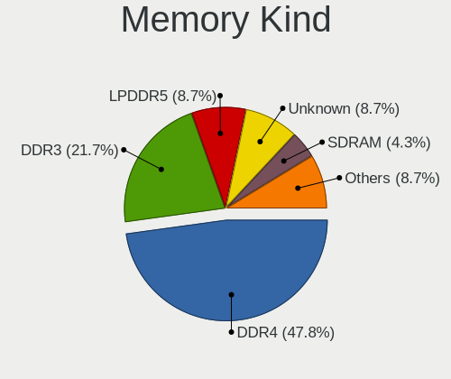

Xubuntu Hardware Trends
-----------------------

A project to identify most popular hardware characteristics and track their change
over time based on data collected by Xubuntu users at https://Linux-Hardware.org.

Anyone can contribute to this report by the [hw-probe](https://github.com/linuxhw/hw-probe) tool:

    sudo -E hw-probe -all -upload

This is a report for all computer types. See also reports for [desktops](/Dist/Xubuntu/Desktop/README.md) and [notebooks](/Dist/Xubuntu/Notebook/README.md).

Full-feature report is available here: https://linux-hardware.org/?view=trends

Period: Dec, 2021.

Contents
--------

* [ System ](#system)
  - [ OS                       ](#os)
  - [ OS Family                ](#os-family)
  - [ Kernel                   ](#kernel)
  - [ Kernel Family            ](#kernel-family)
  - [ Kernel Major Ver.        ](#kernel-major-ver)
  - [ Arch                     ](#arch)
  - [ DE                       ](#de)
  - [ Display Server           ](#display-server)
  - [ Display Manager          ](#display-manager)
  - [ OS Lang                  ](#os-lang)
  - [ Boot Mode                ](#boot-mode)
  - [ Filesystem               ](#filesystem)
  - [ Part. scheme             ](#part-scheme)
  - [ Dual Boot with Linux/BSD ](#dual-boot-with-linuxbsd)
  - [ Dual Boot (Win)          ](#dual-boot-win)

* [ Board ](#board)
  - [ Vendor                   ](#vendor)
  - [ Model                    ](#model)
  - [ Model Family             ](#model-family)
  - [ MFG Year                 ](#mfg-year)
  - [ Form Factor              ](#form-factor)
  - [ Secure Boot              ](#secure-boot)
  - [ Coreboot                 ](#coreboot)
  - [ RAM Size                 ](#ram-size)
  - [ RAM Used                 ](#ram-used)
  - [ Total Drives             ](#total-drives)
  - [ Has CD-ROM               ](#has-cd-rom)
  - [ Has Ethernet             ](#has-ethernet)
  - [ Has WiFi                 ](#has-wifi)
  - [ Has Bluetooth            ](#has-bluetooth)

* [ Location ](#location)
  - [ Country                  ](#country)
  - [ City                     ](#city)

* [ Drives ](#drives)
  - [ Drive Vendor             ](#drive-vendor)
  - [ Drive Model              ](#drive-model)
  - [ HDD Vendor               ](#hdd-vendor)
  - [ SSD Vendor               ](#ssd-vendor)
  - [ Drive Kind               ](#drive-kind)
  - [ Drive Connector          ](#drive-connector)
  - [ Drive Size               ](#drive-size)
  - [ Space Total              ](#space-total)
  - [ Space Used               ](#space-used)
  - [ Malfunc. Drives          ](#malfunc-drives)
  - [ Malfunc. Drive Vendor    ](#malfunc-drive-vendor)
  - [ Malfunc. HDD Vendor      ](#malfunc-hdd-vendor)
  - [ Malfunc. Drive Kind      ](#malfunc-drive-kind)
  - [ Failed Drives            ](#failed-drives)
  - [ Failed Drive Vendor      ](#failed-drive-vendor)
  - [ Drive Status             ](#drive-status)

* [ Storage controller ](#storage-controller)
  - [ Storage Vendor           ](#storage-vendor)
  - [ Storage Model            ](#storage-model)
  - [ Storage Kind             ](#storage-kind)

* [ Processor ](#processor)
  - [ CPU Vendor               ](#cpu-vendor)
  - [ CPU Model                ](#cpu-model)
  - [ CPU Model Family         ](#cpu-model-family)
  - [ CPU Cores                ](#cpu-cores)
  - [ CPU Sockets              ](#cpu-sockets)
  - [ CPU Threads              ](#cpu-threads)
  - [ CPU Op-Modes             ](#cpu-op-modes)
  - [ CPU Microcode            ](#cpu-microcode)
  - [ CPU Microarch            ](#cpu-microarch)

* [ Graphics ](#graphics)
  - [ GPU Vendor               ](#gpu-vendor)
  - [ GPU Model                ](#gpu-model)
  - [ GPU Combo                ](#gpu-combo)
  - [ GPU Driver               ](#gpu-driver)
  - [ GPU Memory               ](#gpu-memory)

* [ Monitor ](#monitor)
  - [ Monitor Vendor           ](#monitor-vendor)
  - [ Monitor Model            ](#monitor-model)
  - [ Monitor Resolution       ](#monitor-resolution)
  - [ Monitor Diagonal         ](#monitor-diagonal)
  - [ Monitor Width            ](#monitor-width)
  - [ Aspect Ratio             ](#aspect-ratio)
  - [ Monitor Area             ](#monitor-area)
  - [ Pixel Density            ](#pixel-density)
  - [ Multiple Monitors        ](#multiple-monitors)

* [ Network ](#network)
  - [ Net Controller Vendor    ](#net-controller-vendor)
  - [ Net Controller Model     ](#net-controller-model)
  - [ Wireless Vendor          ](#wireless-vendor)
  - [ Wireless Model           ](#wireless-model)
  - [ Ethernet Vendor          ](#ethernet-vendor)
  - [ Ethernet Model           ](#ethernet-model)
  - [ Net Controller Kind      ](#net-controller-kind)
  - [ Used Controller          ](#used-controller)
  - [ NICs                     ](#nics)
  - [ IPv6                     ](#ipv6)

* [ Bluetooth ](#bluetooth)
  - [ Bluetooth Vendor         ](#bluetooth-vendor)
  - [ Bluetooth Model          ](#bluetooth-model)

* [ Sound ](#sound)
  - [ Sound Vendor             ](#sound-vendor)
  - [ Sound Model              ](#sound-model)

* [ Memory ](#memory)
  - [ Memory Vendor            ](#memory-vendor)
  - [ Memory Model             ](#memory-model)
  - [ Memory Kind              ](#memory-kind)
  - [ Memory Form Factor       ](#memory-form-factor)
  - [ Memory Size              ](#memory-size)
  - [ Memory Speed             ](#memory-speed)

* [ Printers & scanners ](#printers--scanners)
  - [ Printer Vendor           ](#printer-vendor)
  - [ Printer Model            ](#printer-model)
  - [ Scanner Vendor           ](#scanner-vendor)
  - [ Scanner Model            ](#scanner-model)

* [ Camera ](#camera)
  - [ Camera Vendor            ](#camera-vendor)
  - [ Camera Model             ](#camera-model)

* [ Security ](#security)
  - [ Fingerprint Vendor       ](#fingerprint-vendor)
  - [ Fingerprint Model        ](#fingerprint-model)
  - [ Chipcard Vendor          ](#chipcard-vendor)
  - [ Chipcard Model           ](#chipcard-model)

* [ Unsupported ](#unsupported)
  - [ Unsupported Devices      ](#unsupported-devices)
  - [ Unsupported Device Types ](#unsupported-device-types)

System
------

OS
--

Installed operating systems

| Name          | Computers | Percent |
|---------------|-----------|---------|
| Xubuntu 20.04 | 68        | 66.02%  |
| Xubuntu 21.10 | 18        | 17.48%  |
| Xubuntu 18.04 | 10        | 9.71%   |
| Xubuntu 21.04 | 4         | 3.88%   |
| Xubuntu 16.04 | 2         | 1.94%   |
| Xubuntu 20.10 | 1         | 0.97%   |

OS Family
---------

OS without a version

| Name    | Computers | Percent |
|---------|-----------|---------|
| Xubuntu | 103       | 100%    |

Kernel
------

Version of the Linux kernel

| Version                      | Computers | Percent |
|------------------------------|-----------|---------|
| 5.4.0-91-generic             | 20        | 19.42%  |
| 5.11.0-41-generic            | 14        | 13.59%  |
| 5.13.0-22-generic            | 13        | 12.62%  |
| 5.4.0-91-lowlatency          | 7         | 6.8%    |
| 5.11.0-43-generic            | 6         | 5.83%   |
| 5.11.0-41-lowlatency         | 4         | 3.88%   |
| 5.4.0-89-generic             | 3         | 2.91%   |
| 5.4.0-29-generic             | 3         | 2.91%   |
| 5.11.0-40-generic            | 3         | 2.91%   |
| 5.4.0-90-generic             | 2         | 1.94%   |
| 5.13.0-23-generic            | 2         | 1.94%   |
| 5.13.0-22-lowlatency         | 2         | 1.94%   |
| 5.11.0-43-lowlatency         | 2         | 1.94%   |
| 5.8.0-63-generic             | 1         | 0.97%   |
| 5.8.0-53-generic             | 1         | 0.97%   |
| 5.6.19-050619-generic        | 1         | 0.97%   |
| 5.4.0-92-generic             | 1         | 0.97%   |
| 5.4.0-90-lowlatency          | 1         | 0.97%   |
| 5.4.0-77-lowlatency          | 1         | 0.97%   |
| 5.4.0-73-lowlatency          | 1         | 0.97%   |
| 5.4.0-54-generic             | 1         | 0.97%   |
| 5.4.0-42-generic             | 1         | 0.97%   |
| 5.2.0+                       | 1         | 0.97%   |
| 5.13.0-19-generic            | 1         | 0.97%   |
| 5.11.0-44-lowlatency         | 1         | 0.97%   |
| 5.11.0-44-generic            | 1         | 0.97%   |
| 5.11.0-42-lowlatency         | 1         | 0.97%   |
| 5.11.0-42-generic            | 1         | 0.97%   |
| 5.11.0-27-generic            | 1         | 0.97%   |
| 4.4.254-21004-g90921f1f9a15  | 1         | 0.97%   |
| 4.4.0-210-generic            | 1         | 0.97%   |
| 4.19.202-12118-g8ae2f2219bce | 1         | 0.97%   |
| 4.16.18-galliumos            | 1         | 0.97%   |
| 4.15.0-163-generic           | 1         | 0.97%   |
| 4.15.0-159-generic           | 1         | 0.97%   |

Kernel Family
-------------

Linux kernel without a distro release

| Version  | Computers | Percent |
|----------|-----------|---------|
| 5.4.0    | 41        | 39.81%  |
| 5.11.0   | 34        | 33.01%  |
| 5.13.0   | 18        | 17.48%  |
| 5.8.0    | 2         | 1.94%   |
| 4.15.0   | 2         | 1.94%   |
| 5.6.19   | 1         | 0.97%   |
| 5.2.0    | 1         | 0.97%   |
| 4.4.254  | 1         | 0.97%   |
| 4.4.0    | 1         | 0.97%   |
| 4.19.202 | 1         | 0.97%   |
| 4.16.18  | 1         | 0.97%   |

Kernel Major Ver.
-----------------

Linux kernel major version

| Version | Computers | Percent |
|---------|-----------|---------|
| 5.4     | 41        | 39.81%  |
| 5.11    | 34        | 33.01%  |
| 5.13    | 18        | 17.48%  |
| 5.8     | 2         | 1.94%   |
| 4.4     | 2         | 1.94%   |
| 4.15    | 2         | 1.94%   |
| 5.6     | 1         | 0.97%   |
| 5.2     | 1         | 0.97%   |
| 4.19    | 1         | 0.97%   |
| 4.16    | 1         | 0.97%   |

Arch
----

OS architecture (x86_64, i586, etc.)

| Name   | Computers | Percent |
|--------|-----------|---------|
| x86_64 | 96        | 93.2%   |
| i686   | 7         | 6.8%    |

DE
--

Desktop Environment

| Name  | Computers | Percent |
|-------|-----------|---------|
| XFCE  | 99        | 96.12%  |
| GNOME | 3         | 2.91%   |
| LXQt  | 1         | 0.97%   |

Display Server
--------------

X11 or Wayland

| Name    | Computers | Percent |
|---------|-----------|---------|
| X11     | 100       | 97.09%  |
| Web     | 2         | 1.94%   |
| Wayland | 1         | 0.97%   |

Display Manager
---------------

SDDM, LightDM, etc.

| Name    | Computers | Percent |
|---------|-----------|---------|
| LightDM | 93        | 90.29%  |
| Unknown | 7         | 6.8%    |
| SDDM    | 1         | 0.97%   |
| LXDM    | 1         | 0.97%   |
| GDM3    | 1         | 0.97%   |

OS Lang
-------

Language

| Lang  | Computers | Percent |
|-------|-----------|---------|
| en_US | 42        | 40.78%  |
| de_DE | 13        | 12.62%  |
| fr_FR | 12        | 11.65%  |
| it_IT | 5         | 4.85%   |
| nl_NL | 4         | 3.88%   |
| es_ES | 4         | 3.88%   |
| en_GB | 4         | 3.88%   |
| ru_RU | 3         | 2.91%   |
| ro_RO | 2         | 1.94%   |
| pt_PT | 2         | 1.94%   |
| pt_BR | 2         | 1.94%   |
| pl_PL | 2         | 1.94%   |
| sv_SE | 1         | 0.97%   |
| ru_UA | 1         | 0.97%   |
| fr_BE | 1         | 0.97%   |
| fi_FI | 1         | 0.97%   |
| es_MX | 1         | 0.97%   |
| es_AR | 1         | 0.97%   |
| el_GR | 1         | 0.97%   |
| C     | 1         | 0.97%   |

Boot Mode
---------

EFI or BIOS

| Mode | Computers | Percent |
|------|-----------|---------|
| BIOS | 69        | 66.99%  |
| EFI  | 34        | 33.01%  |

Filesystem
----------

Type of filesystem

| Type    | Computers | Percent |
|---------|-----------|---------|
| Ext4    | 98        | 95.15%  |
| Overlay | 2         | 1.94%   |
| Xfs     | 1         | 0.97%   |
| Ext3    | 1         | 0.97%   |
| Btrfs   | 1         | 0.97%   |

Part. scheme
------------

Scheme of partitioning

| Type    | Computers | Percent |
|---------|-----------|---------|
| Unknown | 59        | 57.28%  |
| GPT     | 27        | 26.21%  |
| MBR     | 17        | 16.5%   |

Dual Boot with Linux/BSD
------------------------

Hosting more than one Linux/BSD

| Dual boot | Computers | Percent |
|-----------|-----------|---------|
| No        | 81        | 78.64%  |
| Yes       | 22        | 21.36%  |

Dual Boot (Win)
---------------

Hosting Linux and Windows

| Dual boot | Computers | Percent |
|-----------|-----------|---------|
| No        | 68        | 66.02%  |
| Yes       | 35        | 33.98%  |

Board
-----

Vendor
------

Motherboard manufacturer

| Name                | Computers | Percent |
|---------------------|-----------|---------|
| Hewlett-Packard     | 15        | 14.56%  |
| ASUSTek Computer    | 14        | 13.59%  |
| Dell                | 12        | 11.65%  |
| Lenovo              | 10        | 9.71%   |
| Acer                | 8         | 7.77%   |
| MSI                 | 6         | 5.83%   |
| Gigabyte Technology | 6         | 5.83%   |
| Toshiba             | 5         | 4.85%   |
| Google              | 4         | 3.88%   |
| Samsung Electronics | 3         | 2.91%   |
| Intel               | 3         | 2.91%   |
| Gateway             | 2         | 1.94%   |
| ECS                 | 2         | 1.94%   |
| ASRock              | 2         | 1.94%   |
| TUXEDO              | 1         | 0.97%   |
| Sony                | 1         | 0.97%   |
| Quanta              | 1         | 0.97%   |
| Packard Bell        | 1         | 0.97%   |
| Medion              | 1         | 0.97%   |
| HUAWEI              | 1         | 0.97%   |
| GPU Company         | 1         | 0.97%   |
| Foxconn             | 1         | 0.97%   |
| Dixonsxp            | 1         | 0.97%   |
| Biostar             | 1         | 0.97%   |
| AMI                 | 1         | 0.97%   |

Model
-----

Motherboard model

| Name                                  | Computers | Percent |
|---------------------------------------|-----------|---------|
| Toshiba Satellite A105                | 2         | 1.94%   |
| Dell Inspiron 7501                    | 2         | 1.94%   |
| TUXEDO InfinityBook Pro 14 Gen6       | 1         | 0.97%   |
| Toshiba Satellite L870-196            | 1         | 0.97%   |
| Toshiba Satellite C855                | 1         | 0.97%   |
| Toshiba Satellite C50-A-19U           | 1         | 0.97%   |
| Sony VGN-SZ2HP_B                      | 1         | 0.97%   |
| Samsung RV411/RV511/E3511/S3511/RV711 | 1         | 0.97%   |
| Samsung RC410/RC510/RC710             | 1         | 0.97%   |
| Samsung 730QAA                        | 1         | 0.97%   |
| Quanta 120-1026la                     | 1         | 0.97%   |
| Packard Bell EasyNote TK13BZ          | 1         | 0.97%   |
| MSI MS-B05011                         | 1         | 0.97%   |
| MSI MS-7C90                           | 1         | 0.97%   |
| MSI MS-7B89                           | 1         | 0.97%   |
| MSI MS-7255                           | 1         | 0.97%   |
| MSI KY779AA-AKL CQ3070L               | 1         | 0.97%   |
| MSI GP76 Leopard 11UG                 | 1         | 0.97%   |
| Medion Pentino H-Series               | 1         | 0.97%   |
| Lenovo ThinkPad X61 7674CT0           | 1         | 0.97%   |
| Lenovo ThinkPad T61 64669YG           | 1         | 0.97%   |
| Lenovo ThinkPad T530 24296JG          | 1         | 0.97%   |
| Lenovo ThinkPad T510 4384A78          | 1         | 0.97%   |
| Lenovo ThinkPad T495s 20QKS0SD00      | 1         | 0.97%   |
| Lenovo ThinkPad T14s Gen 1 20UJS0D401 | 1         | 0.97%   |
| Lenovo ThinkCentre A70 7844H9G        | 1         | 0.97%   |
| Lenovo MIIX 320-10ICR 80XF            | 1         | 0.97%   |
| Lenovo IdeaPad 110S-11IBR 80WG        | 1         | 0.97%   |
| Lenovo B50-30 20382                   | 1         | 0.97%   |
| Intel NUC7CJYH                        | 1         | 0.97%   |
| Intel NUC10i7FNH                      | 1         | 0.97%   |
| Intel Crestline & ICH8M Chipset       | 1         | 0.97%   |
| HUAWEI HKD-WXX                        | 1         | 0.97%   |
| HP ProDesk 600 G2 DM                  | 1         | 0.97%   |
| HP ProDesk 600 G1 SFF                 | 1         | 0.97%   |
| HP ProBook 450 G4                     | 1         | 0.97%   |
| HP Pavilion TS 11                     | 1         | 0.97%   |
| HP Pavilion dv7                       | 1         | 0.97%   |
| HP Pavilion dv6                       | 1         | 0.97%   |
| HP OMEN by Desktop PC 880-p0xx        | 1         | 0.97%   |
| HP Laptop 17-cp0xxx                   | 1         | 0.97%   |
| HP Laptop 17-cn1xxx                   | 1         | 0.97%   |
| HP EliteBook Folio 9470m              | 1         | 0.97%   |
| HP EliteBook 8440p (VD484AV)          | 1         | 0.97%   |
| HP Compaq Mini 311-1100               | 1         | 0.97%   |
| HP Compaq Elite 8300 USDT             | 1         | 0.97%   |
| HP Compaq dc7800p Ultra-slim Desktop  | 1         | 0.97%   |
| HP 2000                               | 1         | 0.97%   |
| GPU Company GWTN156-11                | 1         | 0.97%   |
| Google Swanky                         | 1         | 0.97%   |
| Google Nami                           | 1         | 0.97%   |
| Google Kefka                          | 1         | 0.97%   |
| Google Celes                          | 1         | 0.97%   |
| Gigabyte X99-UD4-CF                   | 1         | 0.97%   |
| Gigabyte GA-MA78LMT-US2H              | 1         | 0.97%   |
| Gigabyte GA-E350N                     | 1         | 0.97%   |
| Gigabyte EX58-UD4P                    | 1         | 0.97%   |
| Gigabyte B450M DS3H                   | 1         | 0.97%   |
| Gigabyte B150M-D3H-CF                 | 1         | 0.97%   |
| Gateway NV53A                         | 1         | 0.97%   |

Model Family
------------

Motherboard model prefix

| Name                     | Computers | Percent |
|--------------------------|-----------|---------|
| Lenovo ThinkPad          | 6         | 5.83%   |
| Toshiba Satellite        | 5         | 4.85%   |
| Acer Aspire              | 5         | 4.85%   |
| Dell OptiPlex            | 4         | 3.88%   |
| HP Pavilion              | 3         | 2.91%   |
| HP Compaq                | 3         | 2.91%   |
| Dell Inspiron            | 3         | 2.91%   |
| HP ProDesk               | 2         | 1.94%   |
| HP Laptop                | 2         | 1.94%   |
| HP EliteBook             | 2         | 1.94%   |
| ASUS TUF                 | 2         | 1.94%   |
| ASUS PRIME               | 2         | 1.94%   |
| Acer Swift               | 2         | 1.94%   |
| TUXEDO InfinityBook      | 1         | 0.97%   |
| Sony VGN-SZ2HP           | 1         | 0.97%   |
| Samsung RV411            | 1         | 0.97%   |
| Samsung RC410            | 1         | 0.97%   |
| Samsung 730QAA           | 1         | 0.97%   |
| Quanta 120-1026la        | 1         | 0.97%   |
| Packard Bell EasyNote    | 1         | 0.97%   |
| MSI MS-B05011            | 1         | 0.97%   |
| MSI MS-7C90              | 1         | 0.97%   |
| MSI MS-7B89              | 1         | 0.97%   |
| MSI MS-7255              | 1         | 0.97%   |
| MSI KY779AA-AKL          | 1         | 0.97%   |
| MSI GP76                 | 1         | 0.97%   |
| Medion Pentino           | 1         | 0.97%   |
| Lenovo ThinkCentre       | 1         | 0.97%   |
| Lenovo MIIX              | 1         | 0.97%   |
| Lenovo IdeaPad           | 1         | 0.97%   |
| Lenovo B50-30            | 1         | 0.97%   |
| Intel NUC7CJYH           | 1         | 0.97%   |
| Intel NUC10i7FNH         | 1         | 0.97%   |
| Intel Crestline          | 1         | 0.97%   |
| HUAWEI HKD-WXX           | 1         | 0.97%   |
| HP ProBook               | 1         | 0.97%   |
| HP OMEN                  | 1         | 0.97%   |
| HP 2000                  | 1         | 0.97%   |
| GPU Company GWTN156-11   | 1         | 0.97%   |
| Google Swanky            | 1         | 0.97%   |
| Google Nami              | 1         | 0.97%   |
| Google Kefka             | 1         | 0.97%   |
| Google Celes             | 1         | 0.97%   |
| Gigabyte X99-UD4-CF      | 1         | 0.97%   |
| Gigabyte GA-MA78LMT-US2H | 1         | 0.97%   |
| Gigabyte GA-E350N        | 1         | 0.97%   |
| Gigabyte EX58-UD4P       | 1         | 0.97%   |
| Gigabyte B450M           | 1         | 0.97%   |
| Gigabyte B150M-D3H-CF    | 1         | 0.97%   |
| Gateway NV53A            | 1         | 0.97%   |
| Gateway MT6831           | 1         | 0.97%   |
| Foxconn Pro              | 1         | 0.97%   |
| ECS G41T-M2              | 1         | 0.97%   |
| ECS D5468AT-ABA          | 1         | 0.97%   |
| Dell Vostro              | 1         | 0.97%   |
| Dell System              | 1         | 0.97%   |
| Dell Precision           | 1         | 0.97%   |
| Dell PowerEdge           | 1         | 0.97%   |
| Dell Latitude            | 1         | 0.97%   |
| Biostar H110MHC          | 1         | 0.97%   |

MFG Year
--------

Motherboard manufacture year

| Year | Computers | Percent |
|------|-----------|---------|
| 2021 | 17        | 16.5%   |
| 2013 | 11        | 10.68%  |
| 2019 | 10        | 9.71%   |
| 2020 | 8         | 7.77%   |
| 2012 | 8         | 7.77%   |
| 2011 | 8         | 7.77%   |
| 2009 | 8         | 7.77%   |
| 2010 | 6         | 5.83%   |
| 2007 | 6         | 5.83%   |
| 2015 | 5         | 4.85%   |
| 2018 | 4         | 3.88%   |
| 2016 | 4         | 3.88%   |
| 2014 | 3         | 2.91%   |
| 2006 | 3         | 2.91%   |
| 2017 | 1         | 0.97%   |
| 2008 | 1         | 0.97%   |

Form Factor
-----------

Physical design of the computer

| Name        | Computers | Percent |
|-------------|-----------|---------|
| Notebook    | 57        | 55.34%  |
| Desktop     | 41        | 39.81%  |
| Convertible | 2         | 1.94%   |
| Mini pc     | 2         | 1.94%   |
| Tablet      | 1         | 0.97%   |

Secure Boot
-----------

Enabled or disabled

| State    | Computers | Percent |
|----------|-----------|---------|
| Disabled | 98        | 95.15%  |
| Enabled  | 5         | 4.85%   |

Coreboot
--------

Have coreboot on board

| Used | Computers | Percent |
|------|-----------|---------|
| No   | 99        | 96.12%  |
| Yes  | 4         | 3.88%   |

RAM Size
--------

Total RAM memory

| Size in GB  | Computers | Percent |
|-------------|-----------|---------|
| 3.01-4.0    | 28        | 27.18%  |
| 4.01-8.0    | 22        | 21.36%  |
| 8.01-16.0   | 19        | 18.45%  |
| 16.01-24.0  | 10        | 9.71%   |
| 1.01-2.0    | 8         | 7.77%   |
| 2.01-3.0    | 6         | 5.83%   |
| 64.01-256.0 | 5         | 4.85%   |
| 32.01-64.0  | 3         | 2.91%   |
| 0.51-1.0    | 2         | 1.94%   |

RAM Used
--------

Used RAM memory

| Used GB    | Computers | Percent |
|------------|-----------|---------|
| 1.01-2.0   | 48        | 46.6%   |
| 0.51-1.0   | 20        | 19.42%  |
| 2.01-3.0   | 16        | 15.53%  |
| 4.01-8.0   | 9         | 8.74%   |
| 3.01-4.0   | 5         | 4.85%   |
| 8.01-16.0  | 4         | 3.88%   |
| 16.01-24.0 | 1         | 0.97%   |

Total Drives
------------

Number of drives on board

| Drives | Computers | Percent |
|--------|-----------|---------|
| 1      | 71        | 68.93%  |
| 2      | 22        | 21.36%  |
| 3      | 4         | 3.88%   |
| 5      | 3         | 2.91%   |
| 4      | 2         | 1.94%   |
| 0      | 1         | 0.97%   |

Has CD-ROM
----------

Has CD-ROM on board

| Presented | Computers | Percent |
|-----------|-----------|---------|
| Yes       | 52        | 50.49%  |
| No        | 51        | 49.51%  |

Has Ethernet
------------

Has Ethernet on board

| Presented | Computers | Percent |
|-----------|-----------|---------|
| Yes       | 83        | 80.58%  |
| No        | 20        | 19.42%  |

Has WiFi
--------

Has WiFi module

| Presented | Computers | Percent |
|-----------|-----------|---------|
| Yes       | 81        | 78.64%  |
| No        | 22        | 21.36%  |

Has Bluetooth
-------------

Has Bluetooth module

| Presented | Computers | Percent |
|-----------|-----------|---------|
| No        | 53        | 51.46%  |
| Yes       | 50        | 48.54%  |

Location
--------

Country
-------

Geographic location (country)

| Country     | Computers | Percent |
|-------------|-----------|---------|
| USA         | 28        | 27.18%  |
| Germany     | 14        | 13.59%  |
| France      | 11        | 10.68%  |
| Italy       | 6         | 5.83%   |
| UK          | 4         | 3.88%   |
| Netherlands | 4         | 3.88%   |
| Spain       | 3         | 2.91%   |
| Russia      | 3         | 2.91%   |
| Mexico      | 3         | 2.91%   |
| Brazil      | 3         | 2.91%   |
| Romania     | 2         | 1.94%   |
| Portugal    | 2         | 1.94%   |
| Poland      | 2         | 1.94%   |
| Finland     | 2         | 1.94%   |
| Bulgaria    | 2         | 1.94%   |
| Argentina   | 2         | 1.94%   |
| Ukraine     | 1         | 0.97%   |
| Thailand    | 1         | 0.97%   |
| Sweden      | 1         | 0.97%   |
| Slovakia    | 1         | 0.97%   |
| Singapore   | 1         | 0.97%   |
| Norway      | 1         | 0.97%   |
| Iran        | 1         | 0.97%   |
| Greece      | 1         | 0.97%   |
| Czechia     | 1         | 0.97%   |
| Belgium     | 1         | 0.97%   |
| Australia   | 1         | 0.97%   |
| Algeria     | 1         | 0.97%   |

City
----

Geographic location (city)

| City                  | Computers | Percent |
|-----------------------|-----------|---------|
| Watertown             | 2         | 1.94%   |
| Vashon                | 2         | 1.94%   |
| Varna                 | 2         | 1.94%   |
| The Hague             | 2         | 1.94%   |
| Suwanee               | 2         | 1.94%   |
| Rome                  | 2         | 1.94%   |
| Paris                 | 2         | 1.94%   |
| Bracknell             | 2         | 1.94%   |
| Berlin                | 2         | 1.94%   |
| Yuzhno-Sakhalinsk     | 1         | 0.97%   |
| Yoshkar-Ola           | 1         | 0.97%   |
| Wuppertal             | 1         | 0.97%   |
| Waterbury             | 1         | 0.97%   |
| Vado Ligure           | 1         | 0.97%   |
| Uelzen                | 1         | 0.97%   |
| Turin                 | 1         | 0.97%   |
| Trnava                | 1         | 0.97%   |
| Torun                 | 1         | 0.97%   |
| Thionville            | 1         | 0.97%   |
| Thessaloniki          | 1         | 0.97%   |
| Tehran                | 1         | 0.97%   |
| Tampere               | 1         | 0.97%   |
| Sydney                | 1         | 0.97%   |
| Surzur                | 1         | 0.97%   |
| Stuttgart             | 1         | 0.97%   |
| Strejnicu             | 1         | 0.97%   |
| Solbergelva           | 1         | 0.97%   |
| Singapore             | 1         | 0.97%   |
| Seville               | 1         | 0.97%   |
| San Francisco         | 1         | 0.97%   |
| Saint-Martin-d'H??res | 1         | 0.97%   |
| Saint Paul            | 1         | 0.97%   |
| Rovigo                | 1         | 0.97%   |
| Rio Rancho            | 1         | 0.97%   |
| Remscheid             | 1         | 0.97%   |
| Reichenbach/Vogtland  | 1         | 0.97%   |
| Pulaski               | 1         | 0.97%   |
| Puerto Vallarta       | 1         | 0.97%   |
| Pryluky               | 1         | 0.97%   |
| Porto Alegre          | 1         | 0.97%   |
| Piscataway            | 1         | 0.97%   |
| Phoenixville          | 1         | 0.97%   |
| Phoenix               | 1         | 0.97%   |
| Pato Branco           | 1         | 0.97%   |
| Pascani               | 1         | 0.97%   |
| Oryol                 | 1         | 0.97%   |
| Orrstown              | 1         | 0.97%   |
| Orbais                | 1         | 0.97%   |
| Oaxaca City           | 1         | 0.97%   |
| Norwich               | 1         | 0.97%   |
| Nar??n                | 1         | 0.97%   |
| Montlu?§on            | 1         | 0.97%   |
| Milan                 | 1         | 0.97%   |
| Merritt Island        | 1         | 0.97%   |
| Mauston               | 1         | 0.97%   |
| Manson                | 1         | 0.97%   |
| Luton                 | 1         | 0.97%   |
| Lelystad              | 1         | 0.97%   |
| Lebach                | 1         | 0.97%   |
| Le Kremlin-Bicetre    | 1         | 0.97%   |

Drives
------

Drive Vendor
------------

Hard drive vendors

| Vendor              | Computers | Drives | Percent |
|---------------------|-----------|--------|---------|
| WDC                 | 26        | 27     | 19.55%  |
| Seagate             | 25        | 32     | 18.8%   |
| Samsung Electronics | 20        | 25     | 15.04%  |
| Unknown             | 12        | 13     | 9.02%   |
| Kingston            | 9         | 9      | 6.77%   |
| Toshiba             | 7         | 7      | 5.26%   |
| SanDisk             | 5         | 5      | 3.76%   |
| Hitachi             | 4         | 4      | 3.01%   |
| Intel               | 3         | 3      | 2.26%   |
| XPG                 | 2         | 2      | 1.5%    |
| Micron Technology   | 2         | 2      | 1.5%    |
| HGST                | 2         | 2      | 1.5%    |
| Fujitsu             | 2         | 2      | 1.5%    |
| A-DATA Technology   | 2         | 2      | 1.5%    |
| SK Hynix            | 1         | 1      | 0.75%   |
| PNY                 | 1         | 1      | 0.75%   |
| Patriot             | 1         | 1      | 0.75%   |
| LITEON              | 1         | 1      | 0.75%   |
| KingSpec            | 1         | 1      | 0.75%   |
| Intenso             | 1         | 1      | 0.75%   |
| HGST HTS            | 1         | 1      | 0.75%   |
| GOODRAM             | 1         | 1      | 0.75%   |
| DREVO               | 1         | 1      | 0.75%   |
| Crucial             | 1         | 1      | 0.75%   |
| China               | 1         | 1      | 0.75%   |
| Unknown             | 1         | 1      | 0.75%   |

Drive Model
-----------

Hard drive models

| Model                                  | Computers | Percent |
|----------------------------------------|-----------|---------|
| Samsung SSD 850 EVO 250GB              | 4         | 2.78%   |
| Kingston SA400S37240G 240GB SSD        | 4         | 2.78%   |
| WDC WD1600BEVS-08RST2 160GB            | 3         | 2.08%   |
| XPG NVMe SSD Drive 1024GB              | 2         | 1.39%   |
| WDC WDS500G2B0C 500GB                  | 2         | 1.39%   |
| Unknown MMC Card  32GB                 | 2         | 1.39%   |
| Unknown MMC Card  128GB                | 2         | 1.39%   |
| Toshiba MK1234GSX 120GB                | 2         | 1.39%   |
| Toshiba DT01ACA100 1TB                 | 2         | 1.39%   |
| Seagate ST500DM002-1BD142 500GB        | 2         | 1.39%   |
| Seagate ST1000DM003-1ER162 1TB         | 2         | 1.39%   |
| Seagate Expansion 1TB                  | 2         | 1.39%   |
| Samsung SSD 860 EVO 500GB              | 2         | 1.39%   |
| Kingston SV300S37A120G 120GB SSD       | 2         | 1.39%   |
| Kingston SA400S37480G 480GB SSD        | 2         | 1.39%   |
| WDC WDS250G1B0A-00H9H0 250GB SSD       | 1         | 0.69%   |
| WDC WDS120G2G0A-00JH30 120GB SSD       | 1         | 0.69%   |
| WDC WD7500BPKX-00HPJT0 752GB           | 1         | 0.69%   |
| WDC WD5000LPVX-60V0TT0 500GB           | 1         | 0.69%   |
| WDC WD5000LPCX-21VHAT0 500GB           | 1         | 0.69%   |
| WDC WD5000BEVT-22A0RT0 500GB           | 1         | 0.69%   |
| WDC WD5000AAKX-75U6AA0 500GB           | 1         | 0.69%   |
| WDC WD5000AADS-00M2B0 500GB            | 1         | 0.69%   |
| WDC WD4000FYYZ-01UL1B1 4TB             | 1         | 0.69%   |
| WDC WD2500BEVT-22A23T0 250GB           | 1         | 0.69%   |
| WDC WD2500AAJS-08L7A0 250GB            | 1         | 0.69%   |
| WDC WD2003FZEX-00Z4SA0 2TB             | 1         | 0.69%   |
| WDC WD1600BEVT-22ZCT0 160GB            | 1         | 0.69%   |
| WDC WD10EZEX-00MFCA0 1TB               | 1         | 0.69%   |
| WDC WD10EARX-00PASB0 1TB               | 1         | 0.69%   |
| WDC WD10EARS-00Y5B1 1TB                | 1         | 0.69%   |
| WDC WD10EALX-759BA0 1TB                | 1         | 0.69%   |
| WDC WD10EACS-00D6B0 1TB                | 1         | 0.69%   |
| WDC PC SN730 SDBPNTY-1T00-1032 1TB     | 1         | 0.69%   |
| WDC PC SN730 NVMe 512GB                | 1         | 0.69%   |
| WDC PC SN520 SDAPNUW-512G-1202 512GB   | 1         | 0.69%   |
| WDC PC SN520 SDAPNUW-512G-1014 512GB   | 1         | 0.69%   |
| Unknown SSD256GBS420                   | 1         | 0.69%   |
| Unknown SF64G  64GB                    | 1         | 0.69%   |
| Unknown SD/MMC/MS PRO 7GB              | 1         | 0.69%   |
| Unknown MMC128  128GB                  | 1         | 0.69%   |
| Unknown MMC Card  64GB                 | 1         | 0.69%   |
| Unknown MMC Card  33GB                 | 1         | 0.69%   |
| Unknown hA8aP  16GB                    | 1         | 0.69%   |
| Unknown DA4128  128GB                  | 1         | 0.69%   |
| Unknown 016GE2  16GB                   | 1         | 0.69%   |
| Toshiba MQ01ABD100 1TB                 | 1         | 0.69%   |
| Toshiba MQ01ABD050 500GB               | 1         | 0.69%   |
| Toshiba HDWD110 1TB                    | 1         | 0.69%   |
| SK Hynix SKHynix_HFS512GDE9X081N 512GB | 1         | 0.69%   |
| Seagate ST98823AS 80GB                 | 1         | 0.69%   |
| Seagate ST9750420AS 752GB              | 1         | 0.69%   |
| Seagate ST9320325AS 320GB              | 1         | 0.69%   |
| Seagate ST9320320AS 320GB              | 1         | 0.69%   |
| Seagate ST9160310AS 160GB              | 1         | 0.69%   |
| Seagate ST8000DM004-2CX188 8TB         | 1         | 0.69%   |
| Seagate ST6000VN0033-2EE110 6TB        | 1         | 0.69%   |
| Seagate ST6000VN0033 6TB               | 1         | 0.69%   |
| Seagate ST500LT032-1E9142 500GB        | 1         | 0.69%   |
| Seagate ST500LT012-1DG142 500GB        | 1         | 0.69%   |

HDD Vendor
----------

Hard disk drive vendors

| Vendor              | Computers | Drives | Percent |
|---------------------|-----------|--------|---------|
| Seagate             | 24        | 31     | 38.1%   |
| WDC                 | 18        | 19     | 28.57%  |
| Toshiba             | 7         | 7      | 11.11%  |
| Samsung Electronics | 4         | 4      | 6.35%   |
| Hitachi             | 4         | 4      | 6.35%   |
| HGST                | 2         | 2      | 3.17%   |
| Fujitsu             | 2         | 2      | 3.17%   |
| Unknown             | 1         | 1      | 1.59%   |
| HGST HTS            | 1         | 1      | 1.59%   |

SSD Vendor
----------

Solid state drive vendors

| Vendor              | Computers | Drives | Percent |
|---------------------|-----------|--------|---------|
| Samsung Electronics | 12        | 14     | 31.58%  |
| Kingston            | 8         | 8      | 21.05%  |
| SanDisk             | 4         | 4      | 10.53%  |
| WDC                 | 2         | 2      | 5.26%   |
| Micron Technology   | 2         | 2      | 5.26%   |
| Unknown             | 1         | 1      | 2.63%   |
| PNY                 | 1         | 1      | 2.63%   |
| Patriot             | 1         | 1      | 2.63%   |
| LITEON              | 1         | 1      | 2.63%   |
| KingSpec            | 1         | 1      | 2.63%   |
| Intel               | 1         | 1      | 2.63%   |
| GOODRAM             | 1         | 1      | 2.63%   |
| DREVO               | 1         | 1      | 2.63%   |
| China               | 1         | 1      | 2.63%   |
| A-DATA Technology   | 1         | 1      | 2.63%   |

Drive Kind
----------

HDD or SSD

| Kind    | Computers | Drives | Percent |
|---------|-----------|--------|---------|
| HDD     | 57        | 71     | 46.34%  |
| SSD     | 34        | 40     | 27.64%  |
| NVMe    | 18        | 21     | 14.63%  |
| MMC     | 12        | 13     | 9.76%   |
| Unknown | 2         | 2      | 1.63%   |

Drive Connector
---------------

SATA, SAS, NVMe, etc.

| Type | Computers | Drives | Percent |
|------|-----------|--------|---------|
| SATA | 81        | 106    | 69.23%  |
| NVMe | 18        | 21     | 15.38%  |
| MMC  | 12        | 13     | 10.26%  |
| SAS  | 6         | 7      | 5.13%   |

Drive Size
----------

Size of hard drive

| Size in TB | Computers | Drives | Percent |
|------------|-----------|--------|---------|
| 0.01-0.5   | 68        | 76     | 70.83%  |
| 0.51-1.0   | 21        | 25     | 21.88%  |
| 1.01-2.0   | 3         | 4      | 3.13%   |
| 3.01-4.0   | 2         | 2      | 2.08%   |
| 4.01-10.0  | 2         | 4      | 2.08%   |

Space Total
-----------

Amount of disk space available on the file system

| Size in GB     | Computers | Percent |
|----------------|-----------|---------|
| 101-250        | 35        | 33.98%  |
| 251-500        | 32        | 31.07%  |
| 501-1000       | 13        | 12.62%  |
| 51-100         | 9         | 8.74%   |
| More than 3000 | 5         | 4.85%   |
| 21-50          | 4         | 3.88%   |
| 1001-2000      | 2         | 1.94%   |
| 1-20           | 2         | 1.94%   |
| 2001-3000      | 1         | 0.97%   |

Space Used
----------

Amount of used disk space

| Used GB        | Computers | Percent |
|----------------|-----------|---------|
| 1-20           | 44        | 42.72%  |
| 21-50          | 18        | 17.48%  |
| 101-250        | 17        | 16.5%   |
| 51-100         | 9         | 8.74%   |
| 251-500        | 6         | 5.83%   |
| 501-1000       | 4         | 3.88%   |
| 1001-2000      | 3         | 2.91%   |
| More than 3000 | 2         | 1.94%   |

Malfunc. Drives
---------------

Drive models with a malfunction

| Model                     | Computers | Drives | Percent |
|---------------------------|-----------|--------|---------|
| Seagate ST9320325AS 320GB | 1         | 1      | 33.33%  |
| Seagate ST9320320AS 320GB | 1         | 1      | 33.33%  |
| Seagate ST3250318AS 250GB | 1         | 1      | 33.33%  |

Malfunc. Drive Vendor
---------------------

Vendors of faulty drives

| Vendor  | Computers | Drives | Percent |
|---------|-----------|--------|---------|
| Seagate | 3         | 3      | 100%    |

Malfunc. HDD Vendor
-------------------

Vendors of faulty HDD drives

| Vendor  | Computers | Drives | Percent |
|---------|-----------|--------|---------|
| Seagate | 3         | 3      | 100%    |

Malfunc. Drive Kind
-------------------

Kinds of faulty drives

| Kind | Computers | Drives | Percent |
|------|-----------|--------|---------|
| HDD  | 3         | 3      | 100%    |

Failed Drives
-------------

Failed drive models

Zero info for selected period =(

Failed Drive Vendor
-------------------

Failed drive vendors

Zero info for selected period =(

Drive Status
------------

Number of failed and malfunc. drives

| Status   | Computers | Drives | Percent |
|----------|-----------|--------|---------|
| Detected | 64        | 89     | 60.38%  |
| Works    | 39        | 55     | 36.79%  |
| Malfunc  | 3         | 3      | 2.83%   |

Storage controller
------------------

Storage Vendor
--------------

Storage controller vendors

| Vendor                      | Computers | Percent |
|-----------------------------|-----------|---------|
| Intel                       | 73        | 64.6%   |
| AMD                         | 16        | 14.16%  |
| Sandisk                     | 6         | 5.31%   |
| Samsung Electronics         | 5         | 4.42%   |
| ADATA Technology            | 3         | 2.65%   |
| Nvidia                      | 2         | 1.77%   |
| JMicron Technology          | 2         | 1.77%   |
| VIA Technologies            | 1         | 0.88%   |
| SK Hynix                    | 1         | 0.88%   |
| Micron/Crucial Technology   | 1         | 0.88%   |
| Marvell Technology Group    | 1         | 0.88%   |
| Kingston Technology Company | 1         | 0.88%   |
| HighPoint Technologies      | 1         | 0.88%   |

Storage Model
-------------

Storage controller models

| Model                                                                                   | Computers | Percent |
|-----------------------------------------------------------------------------------------|-----------|---------|
| Intel 82801G (ICH7 Family) IDE Controller                                               | 8         | 5.52%   |
| AMD FCH SATA Controller [AHCI mode]                                                     | 8         | 5.52%   |
| Intel NM10/ICH7 Family SATA Controller [IDE mode]                                       | 6         | 4.14%   |
| AMD SB7x0/SB8x0/SB9x0 SATA Controller [AHCI mode]                                       | 5         | 3.45%   |
| Intel SATA Controller [RAID mode]                                                       | 4         | 2.76%   |
| Intel Celeron/Pentium Silver Processor SATA Controller                                  | 4         | 2.76%   |
| Intel 82801GBM/GHM (ICH7-M Family) SATA Controller [IDE mode]                           | 4         | 2.76%   |
| Intel 8 Series/C220 Series Chipset Family 6-port SATA Controller 1 [AHCI mode]          | 4         | 2.76%   |
| Intel 7 Series Chipset Family 6-port SATA Controller [AHCI mode]                        | 4         | 2.76%   |
| Intel 6 Series/C200 Series Chipset Family 6 port Desktop SATA AHCI Controller           | 4         | 2.76%   |
| Samsung NVMe SSD Controller SM981/PM981/PM983                                           | 3         | 2.07%   |
| Intel Sunrise Point-LP SATA Controller [AHCI mode]                                      | 3         | 2.07%   |
| Intel Q170/Q150/B150/H170/H110/Z170/CM236 Chipset SATA Controller [AHCI Mode]           | 3         | 2.07%   |
| Intel 82801IR/IO/IH (ICH9R/DO/DH) 4 port SATA Controller [IDE mode]                     | 3         | 2.07%   |
| Intel 82801I (ICH9 Family) 2 port SATA Controller [IDE mode]                            | 3         | 2.07%   |
| Intel 82801HM/HEM (ICH8M/ICH8M-E) SATA Controller [AHCI mode]                           | 3         | 2.07%   |
| Intel 82801HM/HEM (ICH8M/ICH8M-E) IDE Controller                                        | 3         | 2.07%   |
| Intel 82801GBM/GHM (ICH7-M Family) SATA Controller [AHCI mode]                          | 3         | 2.07%   |
| ADATA XPG SX8200 Pro PCIe Gen3x4 M.2 2280 Solid State Drive                             | 3         | 2.07%   |
| Sandisk WD Blue SN550 NVMe SSD                                                          | 2         | 1.38%   |
| Sandisk WD Blue SN500 / PC SN520 NVMe SSD                                               | 2         | 1.38%   |
| Sandisk WD Black SN750 / PC SN730 NVMe SSD                                              | 2         | 1.38%   |
| JMicron JMB363 SATA/IDE Controller                                                      | 2         | 1.38%   |
| Intel Cannon Point-LP SATA Controller [AHCI Mode]                                       | 2         | 1.38%   |
| Intel Cannon Lake Mobile PCH SATA AHCI Controller                                       | 2         | 1.38%   |
| Intel 6 Series/C200 Series Chipset Family Desktop SATA Controller (IDE mode, ports 4-5) | 2         | 1.38%   |
| Intel 6 Series/C200 Series Chipset Family Desktop SATA Controller (IDE mode, ports 0-3) | 2         | 1.38%   |
| Intel 6 Series/C200 Series Chipset Family 6 port Mobile SATA AHCI Controller            | 2         | 1.38%   |
| Intel 5 Series/3400 Series Chipset 6 port SATA AHCI Controller                          | 2         | 1.38%   |
| Intel 5 Series/3400 Series Chipset 4 port SATA AHCI Controller                          | 2         | 1.38%   |
| Intel 400 Series Chipset Family SATA AHCI Controller                                    | 2         | 1.38%   |
| Intel 200 Series PCH SATA controller [AHCI mode]                                        | 2         | 1.38%   |
| AMD Starship/Matisse Chipset SATA Controller [AHCI mode]                                | 2         | 1.38%   |
| AMD SB7x0/SB8x0/SB9x0 IDE Controller                                                    | 2         | 1.38%   |
| AMD 400 Series Chipset SATA Controller                                                  | 2         | 1.38%   |
| VIA VT82C586A/B/VT82C686/A/B/VT823x/A/C PIPC Bus Master IDE                             | 1         | 0.69%   |
| VIA VT8237A SATA 2-Port Controller                                                      | 1         | 0.69%   |
| SK Hynix Gold P31 SSD                                                                   | 1         | 0.69%   |
| Samsung NVMe SSD Controller SM951/PM951                                                 | 1         | 0.69%   |
| Samsung NVMe SSD Controller PM9A1/PM9A3/980PRO                                          | 1         | 0.69%   |
| Samsung NVMe SSD Controller 980                                                         | 1         | 0.69%   |
| Nvidia MCP79 AHCI Controller                                                            | 1         | 0.69%   |
| Nvidia MCP61 SATA Controller                                                            | 1         | 0.69%   |
| Nvidia MCP61 IDE                                                                        | 1         | 0.69%   |
| Micron/Crucial P1 NVMe PCIe SSD                                                         | 1         | 0.69%   |
| Marvell Group 88SE912x IDE Controller                                                   | 1         | 0.69%   |
| Kingston Company OM3PDP3 NVMe SSD                                                       | 1         | 0.69%   |
| Intel Volume Management Device NVMe RAID Controller                                     | 1         | 0.69%   |
| Intel Tiger Lake-LP SATA Controller [AHCI mode]                                         | 1         | 0.69%   |
| Intel SSD Pro 7600p/760p/E 6100p Series                                                 | 1         | 0.69%   |
| Intel SSD 660P Series                                                                   | 1         | 0.69%   |
| Intel NM10/ICH7 Family SATA Controller [AHCI mode]                                      | 1         | 0.69%   |
| Intel Mobile PM965/GM965 PT IDER Controller                                             | 1         | 0.69%   |
| Intel Comet Lake SATA AHCI Controller                                                   | 1         | 0.69%   |
| Intel C610/X99 series chipset sSATA Controller [AHCI mode]                              | 1         | 0.69%   |
| Intel C610/X99 series chipset 6-Port SATA Controller [AHCI mode]                        | 1         | 0.69%   |
| Intel Atom/Celeron/Pentium Processor x5-E8000/J3xxx/N3xxx Series SATA Controller        | 1         | 0.69%   |
| Intel Atom Processor E3800 Series SATA AHCI Controller                                  | 1         | 0.69%   |
| Intel 82Q35 Express PT IDER Controller                                                  | 1         | 0.69%   |
| Intel 82801JI (ICH10 Family) 4 port SATA IDE Controller #1                              | 1         | 0.69%   |

Storage Kind
------------

Kind of storage controller (IDE, SATA, NVMe, SAS, ...)

| Kind | Computers | Percent |
|------|-----------|---------|
| SATA | 67        | 55.37%  |
| IDE  | 29        | 23.97%  |
| NVMe | 18        | 14.88%  |
| RAID | 7         | 5.79%   |

Processor
---------

CPU Vendor
----------

Processor vendors

| Vendor | Computers | Percent |
|--------|-----------|---------|
| Intel  | 83        | 80.58%  |
| AMD    | 20        | 19.42%  |

CPU Model
---------

Processor models

| Model                                       | Computers | Percent |
|---------------------------------------------|-----------|---------|
| Intel Core i5-8265U CPU @ 1.60GHz           | 2         | 1.94%   |
| Intel Core i5-8250U CPU @ 1.60GHz           | 2         | 1.94%   |
| Intel Core i5-10300H CPU @ 2.50GHz          | 2         | 1.94%   |
| Intel Core i5 CPU M 560 @ 2.67GHz           | 2         | 1.94%   |
| Intel Core i3-3220 CPU @ 3.30GHz            | 2         | 1.94%   |
| Intel Core i3-2100 CPU @ 3.10GHz            | 2         | 1.94%   |
| Intel Core 2 Duo CPU E6550 @ 2.33GHz        | 2         | 1.94%   |
| Intel Core 2 CPU T5500 @ 1.66GHz            | 2         | 1.94%   |
| Intel Celeron CPU N3060 @ 1.60GHz           | 2         | 1.94%   |
| Intel Celeron CPU N2840 @ 2.16GHz           | 2         | 1.94%   |
| Intel 11th Gen Core i7-11370H @ 3.30GHz     | 2         | 1.94%   |
| AMD Ryzen 5 5500U with Radeon Graphics      | 2         | 1.94%   |
| AMD E-350 Processor                         | 2         | 1.94%   |
| Intel Xeon CPU E5420 @ 2.50GHz              | 1         | 0.97%   |
| Intel Xeon CPU E3-1270 v3 @ 3.50GHz         | 1         | 0.97%   |
| Intel Xeon CPU E3-1225 v3 @ 3.20GHz         | 1         | 0.97%   |
| Intel Pentium Silver N6000 @ 1.10GHz        | 1         | 0.97%   |
| Intel Pentium Silver N5030 CPU @ 1.10GHz    | 1         | 0.97%   |
| Intel Pentium Dual-Core CPU E6300 @ 2.80GHz | 1         | 0.97%   |
| Intel Pentium Dual-Core CPU E5300 @ 2.60GHz | 1         | 0.97%   |
| Intel Pentium CPU N3710 @ 1.60GHz           | 1         | 0.97%   |
| Intel Pentium CPU G4400 @ 3.30GHz           | 1         | 0.97%   |
| Intel Pentium CPU G3440 @ 3.30GHz           | 1         | 0.97%   |
| Intel Pentium CPU G2030 @ 3.00GHz           | 1         | 0.97%   |
| Intel Genuine CPU T2300 @ 1.66GHz           | 1         | 0.97%   |
| Intel Genuine CPU T2250 @ 1.73GHz           | 1         | 0.97%   |
| Intel Core i7-9850H CPU @ 2.60GHz           | 1         | 0.97%   |
| Intel Core i7-7700K CPU @ 4.20GHz           | 1         | 0.97%   |
| Intel Core i7-7500U CPU @ 2.70GHz           | 1         | 0.97%   |
| Intel Core i7-5820K CPU @ 3.30GHz           | 1         | 0.97%   |
| Intel Core i7-4700HQ CPU @ 2.40GHz          | 1         | 0.97%   |
| Intel Core i7-3630QM CPU @ 2.40GHz          | 1         | 0.97%   |
| Intel Core i7-3610QM CPU @ 2.30GHz          | 1         | 0.97%   |
| Intel Core i7-2670QM CPU @ 2.20GHz          | 1         | 0.97%   |
| Intel Core i7-2600 CPU @ 3.40GHz            | 1         | 0.97%   |
| Intel Core i7-10710U CPU @ 1.10GHz          | 1         | 0.97%   |
| Intel Core i7 CPU 960 @ 3.20GHz             | 1         | 0.97%   |
| Intel Core i5-8300H CPU @ 2.30GHz           | 1         | 0.97%   |
| Intel Core i5-6500 CPU @ 3.20GHz            | 1         | 0.97%   |
| Intel Core i5-4590 CPU @ 3.30GHz            | 1         | 0.97%   |
| Intel Core i5-4570 CPU @ 3.20GHz            | 1         | 0.97%   |
| Intel Core i5-3470S CPU @ 2.90GHz           | 1         | 0.97%   |
| Intel Core i5-3427U CPU @ 1.80GHz           | 1         | 0.97%   |
| Intel Core i5-3230M CPU @ 2.60GHz           | 1         | 0.97%   |
| Intel Core i5-3210M CPU @ 2.50GHz           | 1         | 0.97%   |
| Intel Core i5-2450M CPU @ 2.50GHz           | 1         | 0.97%   |
| Intel Core i5 CPU M 540 @ 2.53GHz           | 1         | 0.97%   |
| Intel Core i3-9100F CPU @ 3.60GHz           | 1         | 0.97%   |
| Intel Core i3-9100 CPU @ 3.60GHz            | 1         | 0.97%   |
| Intel Core i3-7130U CPU @ 2.70GHz           | 1         | 0.97%   |
| Intel Core i3-6100T CPU @ 3.20GHz           | 1         | 0.97%   |
| Intel Core i3-2120 CPU @ 3.30GHz            | 1         | 0.97%   |
| Intel Core i3 CPU M 380 @ 2.53GHz           | 1         | 0.97%   |
| Intel Core 2 Quad CPU Q6600 @ 2.40GHz       | 1         | 0.97%   |
| Intel Core 2 Duo CPU T8100 @ 2.10GHz        | 1         | 0.97%   |
| Intel Core 2 Duo CPU T7300 @ 2.00GHz        | 1         | 0.97%   |
| Intel Core 2 Duo CPU T5800 @ 2.00GHz        | 1         | 0.97%   |
| Intel Core 2 Duo CPU E8400 @ 3.00GHz        | 1         | 0.97%   |
| Intel Core 2 Duo CPU E7500 @ 2.93GHz        | 1         | 0.97%   |
| Intel Core 2 CPU T5300 @ 1.73GHz            | 1         | 0.97%   |

CPU Model Family
----------------

Processor model prefix

| Model                   | Computers | Percent |
|-------------------------|-----------|---------|
| Intel Core i5           | 18        | 17.48%  |
| Intel Core i7           | 11        | 10.68%  |
| Intel Core i3           | 10        | 9.71%   |
| Intel Celeron           | 9         | 8.74%   |
| Intel Core 2 Duo        | 7         | 6.8%    |
| Intel Core 2            | 5         | 4.85%   |
| Intel Atom              | 5         | 4.85%   |
| Other                   | 4         | 3.88%   |
| Intel Pentium           | 4         | 3.88%   |
| Intel Xeon              | 3         | 2.91%   |
| AMD Ryzen 5             | 3         | 2.91%   |
| Intel Pentium Silver    | 2         | 1.94%   |
| Intel Pentium Dual-Core | 2         | 1.94%   |
| Intel Genuine           | 2         | 1.94%   |
| AMD Ryzen 9             | 2         | 1.94%   |
| AMD Ryzen 7 PRO         | 2         | 1.94%   |
| AMD Ryzen 7             | 2         | 1.94%   |
| AMD E                   | 2         | 1.94%   |
| AMD A4                  | 2         | 1.94%   |
| Intel Core 2 Quad       | 1         | 0.97%   |
| AMD Turion II           | 1         | 0.97%   |
| AMD Ryzen 3             | 1         | 0.97%   |
| AMD FX                  | 1         | 0.97%   |
| AMD E2                  | 1         | 0.97%   |
| AMD Athlon II X3        | 1         | 0.97%   |
| AMD Athlon 64 X2        | 1         | 0.97%   |
| AMD A6                  | 1         | 0.97%   |

CPU Cores
---------

Number of processor cores

| Number | Computers | Percent |
|--------|-----------|---------|
| 2      | 49        | 47.57%  |
| 4      | 38        | 36.89%  |
| 6      | 5         | 4.85%   |
| 8      | 4         | 3.88%   |
| 1      | 4         | 3.88%   |
| 16     | 1         | 0.97%   |
| 12     | 1         | 0.97%   |
| 3      | 1         | 0.97%   |

CPU Sockets
-----------

Number of sockets

| Number | Computers | Percent |
|--------|-----------|---------|
| 1      | 103       | 100%    |

CPU Threads
-----------

Threads per core (Hyper-Threading)

| Number | Computers | Percent |
|--------|-----------|---------|
| 1      | 53        | 51.46%  |
| 2      | 50        | 48.54%  |

CPU Op-Modes
------------

CPU Operation Modes (32-bit, 64-bit)

| Op mode        | Computers | Percent |
|----------------|-----------|---------|
| 32-bit, 64-bit | 99        | 96.12%  |
| 32-bit         | 4         | 3.88%   |

CPU Microcode
-------------

Microcode number

| Number     | Computers | Percent |
|------------|-----------|---------|
| Unknown    | 19        | 18.45%  |
| 0x306a9    | 8         | 7.77%   |
| 0x306c3    | 6         | 5.83%   |
| 0x206a7    | 5         | 4.85%   |
| 0x6fb      | 4         | 3.88%   |
| 0x1067a    | 4         | 3.88%   |
| 0x6f6      | 3         | 2.91%   |
| 0x506e3    | 3         | 2.91%   |
| 0x406c4    | 3         | 2.91%   |
| 0xa0652    | 2         | 1.94%   |
| 0x706a8    | 2         | 1.94%   |
| 0x706a1    | 2         | 1.94%   |
| 0x6f2      | 2         | 1.94%   |
| 0x6e8      | 2         | 1.94%   |
| 0x30678    | 2         | 1.94%   |
| 0x20655    | 2         | 1.94%   |
| 0x106c2    | 2         | 1.94%   |
| 0x10676    | 2         | 1.94%   |
| 0x08701021 | 2         | 1.94%   |
| 0x0700010f | 2         | 1.94%   |
| 0x05000029 | 2         | 1.94%   |
| 0x010000c8 | 2         | 1.94%   |
| 0xa0660    | 1         | 0.97%   |
| 0x906ed    | 1         | 0.97%   |
| 0x906eb    | 1         | 0.97%   |
| 0x906c0    | 1         | 0.97%   |
| 0x806ec    | 1         | 0.97%   |
| 0x806ea    | 1         | 0.97%   |
| 0x806e9    | 1         | 0.97%   |
| 0x806d1    | 1         | 0.97%   |
| 0x806c2    | 1         | 0.97%   |
| 0x806c1    | 1         | 0.97%   |
| 0x6fd      | 1         | 0.97%   |
| 0x406c3    | 1         | 0.97%   |
| 0x106ca    | 1         | 0.97%   |
| 0x106a5    | 1         | 0.97%   |
| 0x08608103 | 1         | 0.97%   |
| 0x08608102 | 1         | 0.97%   |
| 0x08600106 | 1         | 0.97%   |
| 0x08108109 | 1         | 0.97%   |
| 0x08108102 | 1         | 0.97%   |
| 0x06000852 | 1         | 0.97%   |
| 0x05000119 | 1         | 0.97%   |
| 0x03000027 | 1         | 0.97%   |

CPU Microarch
-------------

Microarchitecture

| Name          | Computers | Percent |
|---------------|-----------|---------|
| KabyLake      | 11        | 10.68%  |
| Core          | 10        | 9.71%   |
| IvyBridge     | 9         | 8.74%   |
| Silvermont    | 7         | 6.8%    |
| SandyBridge   | 7         | 6.8%    |
| Penryn        | 7         | 6.8%    |
| Haswell       | 7         | 6.8%    |
| Zen 2         | 4         | 3.88%   |
| Westmere      | 4         | 3.88%   |
| Goldmont plus | 4         | 3.88%   |
| Zen+          | 3         | 2.91%   |
| TigerLake     | 3         | 2.91%   |
| Skylake       | 3         | 2.91%   |
| CometLake     | 3         | 2.91%   |
| Bonnell       | 3         | 2.91%   |
| Bobcat        | 3         | 2.91%   |
| P6            | 2         | 1.94%   |
| K10           | 2         | 1.94%   |
| Jaguar        | 2         | 1.94%   |
| Unknown       | 2         | 1.94%   |
| Zen           | 1         | 0.97%   |
| Tremont       | 1         | 0.97%   |
| Piledriver    | 1         | 0.97%   |
| Nehalem       | 1         | 0.97%   |
| K8 Hammer     | 1         | 0.97%   |
| K10 Llano     | 1         | 0.97%   |
| Icelake       | 1         | 0.97%   |

Graphics
--------

GPU Vendor
----------

Vendors of graphics cards

| Vendor | Computers | Percent |
|--------|-----------|---------|
| Intel  | 63        | 56.76%  |
| Nvidia | 27        | 24.32%  |
| AMD    | 21        | 18.92%  |

GPU Model
---------

Graphics card models

| Model                                                                                    | Computers | Percent |
|------------------------------------------------------------------------------------------|-----------|---------|
| Intel Mobile 945GM/GMS/GME, 943/940GML Express Integrated Graphics Controller            | 5         | 4.2%    |
| Intel Atom/Celeron/Pentium Processor x5-E8000/J3xxx/N3xxx Integrated Graphics Controller | 5         | 4.2%    |
| Intel 2nd Generation Core Processor Family Integrated Graphics Controller                | 5         | 4.2%    |
| Intel Mobile 945GM/GMS, 943/940GML Express Integrated Graphics Controller                | 4         | 3.36%   |
| Intel Core Processor Integrated Graphics Controller                                      | 4         | 3.36%   |
| Intel Xeon E3-1200 v3/4th Gen Core Processor Integrated Graphics Controller              | 3         | 2.52%   |
| Intel TigerLake-LP GT2 [Iris Xe Graphics]                                                | 3         | 2.52%   |
| Intel Mobile GM965/GL960 Integrated Graphics Controller (secondary)                      | 3         | 2.52%   |
| Intel Mobile GM965/GL960 Integrated Graphics Controller (primary)                        | 3         | 2.52%   |
| Intel GeminiLake [UHD Graphics 600]                                                      | 3         | 2.52%   |
| Intel 3rd Gen Core processor Graphics Controller                                         | 3         | 2.52%   |
| Intel Xeon E3-1200 v2/3rd Gen Core processor Graphics Controller                         | 2         | 1.68%   |
| Intel WhiskeyLake-U GT2 [UHD Graphics 620]                                               | 2         | 1.68%   |
| Intel UHD Graphics 620                                                                   | 2         | 1.68%   |
| Intel HD Graphics 620                                                                    | 2         | 1.68%   |
| Intel CometLake-H GT2 [UHD Graphics]                                                     | 2         | 1.68%   |
| Intel CoffeeLake-H GT2 [UHD Graphics 630]                                                | 2         | 1.68%   |
| Intel Atom Processor Z36xxx/Z37xxx Series Graphics & Display                             | 2         | 1.68%   |
| Intel 4 Series Chipset Integrated Graphics Controller                                    | 2         | 1.68%   |
| AMD Wrestler [Radeon HD 6310]                                                            | 2         | 1.68%   |
| AMD Picasso/Raven 2 [Radeon Vega Series / Radeon Vega Mobile Series]                     | 2         | 1.68%   |
| AMD Lucienne                                                                             | 2         | 1.68%   |
| Nvidia TU116 [GeForce GTX 1650 SUPER]                                                    | 1         | 0.84%   |
| Nvidia TU102 [GeForce RTX 2080 Ti]                                                       | 1         | 0.84%   |
| Nvidia GT218 [GeForce 310]                                                               | 1         | 0.84%   |
| Nvidia GT216 [GeForce GT 220]                                                            | 1         | 0.84%   |
| Nvidia GT215 [GeForce GT 240]                                                            | 1         | 0.84%   |
| Nvidia GP108M [GeForce MX250]                                                            | 1         | 0.84%   |
| Nvidia GP108M [GeForce MX150]                                                            | 1         | 0.84%   |
| Nvidia GP108 [GeForce GT 1030]                                                           | 1         | 0.84%   |
| Nvidia GP107M [GeForce GTX 1050 Mobile]                                                  | 1         | 0.84%   |
| Nvidia GP107 [GeForce GTX 1050 Ti]                                                       | 1         | 0.84%   |
| Nvidia GM204 [GeForce GTX 970]                                                           | 1         | 0.84%   |
| Nvidia GM107 [GeForce GTX 750 Ti]                                                        | 1         | 0.84%   |
| Nvidia GK208B [GeForce GT 720]                                                           | 1         | 0.84%   |
| Nvidia GK208B [GeForce GT 710]                                                           | 1         | 0.84%   |
| Nvidia GK107M [GeForce GT 750M]                                                          | 1         | 0.84%   |
| Nvidia GK107M [GeForce GT 650M]                                                          | 1         | 0.84%   |
| Nvidia GK106GL [Quadro K4000]                                                            | 1         | 0.84%   |
| Nvidia GF119 [GeForce GT 610]                                                            | 1         | 0.84%   |
| Nvidia GF108M [NVS 5400M]                                                                | 1         | 0.84%   |
| Nvidia GF108M [GeForce GT 525M]                                                          | 1         | 0.84%   |
| Nvidia GF108 [GeForce GT 620]                                                            | 1         | 0.84%   |
| Nvidia GA104M [GeForce RTX 3070 Mobile / Max-Q]                                          | 1         | 0.84%   |
| Nvidia G96C [GeForce 9500 GT]                                                            | 1         | 0.84%   |
| Nvidia G72M [Quadro NVS 110M/GeForce Go 7300]                                            | 1         | 0.84%   |
| Nvidia G72M [GeForce Go 7400]                                                            | 1         | 0.84%   |
| Nvidia C79 [GeForce 9400M / ION]                                                         | 1         | 0.84%   |
| Nvidia C61 [GeForce 6150SE nForce 430]                                                   | 1         | 0.84%   |
| Intel Xeon E3-1200 v3 Processor Integrated Graphics Controller                           | 1         | 0.84%   |
| Intel TigerLake-H GT1 [UHD Graphics]                                                     | 1         | 0.84%   |
| Intel Mobile 945GSE Express Integrated Graphics Controller                               | 1         | 0.84%   |
| Intel Mobile 4 Series Chipset Integrated Graphics Controller                             | 1         | 0.84%   |
| Intel JasperLake [UHD Graphics]                                                          | 1         | 0.84%   |
| Intel HD Graphics 530                                                                    | 1         | 0.84%   |
| Intel HD Graphics 510                                                                    | 1         | 0.84%   |
| Intel GeminiLake [UHD Graphics 605]                                                      | 1         | 0.84%   |
| Intel Comet Lake UHD Graphics                                                            | 1         | 0.84%   |
| Intel CoffeeLake-S GT2 [UHD Graphics 630]                                                | 1         | 0.84%   |
| Intel Atom Processor D4xx/D5xx/N4xx/N5xx Integrated Graphics Controller                  | 1         | 0.84%   |

GPU Combo
---------

Combinations of graphics cards

| Name           | Computers | Percent |
|----------------|-----------|---------|
| 1 x Intel      | 55        | 53.4%   |
| 1 x Nvidia     | 20        | 19.42%  |
| 1 x AMD        | 20        | 19.42%  |
| Intel + Nvidia | 7         | 6.8%    |
| Intel + AMD    | 1         | 0.97%   |

GPU Driver
----------

Free vs proprietary

| Driver      | Computers | Percent |
|-------------|-----------|---------|
| Free        | 85        | 82.52%  |
| Proprietary | 15        | 14.56%  |
| Unknown     | 3         | 2.91%   |

GPU Memory
----------

Total video memory

| Size in GB | Computers | Percent |
|------------|-----------|---------|
| Unknown    | 63        | 61.17%  |
| 0.01-0.5   | 17        | 16.5%   |
| 1.01-2.0   | 12        | 11.65%  |
| 0.51-1.0   | 5         | 4.85%   |
| 3.01-4.0   | 4         | 3.88%   |
| 7.01-8.0   | 1         | 0.97%   |
| 8.01-16.0  | 1         | 0.97%   |

Monitor
-------

Monitor Vendor
--------------

Monitor vendors

| Vendor                  | Computers | Percent |
|-------------------------|-----------|---------|
| Samsung Electronics     | 16        | 15.69%  |
| AU Optronics            | 14        | 13.73%  |
| Hewlett-Packard         | 7         | 6.86%   |
| Dell                    | 7         | 6.86%   |
| LG Display              | 6         | 5.88%   |
| Philips                 | 5         | 4.9%    |
| Chimei Innolux          | 5         | 4.9%    |
| Chi Mei Optoelectronics | 5         | 4.9%    |
| BOE                     | 4         | 3.92%   |
| Lenovo                  | 3         | 2.94%   |
| PANDA                   | 2         | 1.96%   |
| Medion                  | 2         | 1.96%   |
| Goldstar                | 2         | 1.96%   |
| CSO                     | 2         | 1.96%   |
| ASUSTek Computer        | 2         | 1.96%   |
| Vizio                   | 1         | 0.98%   |
| Vestel Elektronik       | 1         | 0.98%   |
| Unknown                 | 1         | 0.98%   |
| Toshiba                 | 1         | 0.98%   |
| Sony                    | 1         | 0.98%   |
| Sharp                   | 1         | 0.98%   |
| Packard Bell            | 1         | 0.98%   |
| NEC Computers           | 1         | 0.98%   |
| MTD                     | 1         | 0.98%   |
| MSI                     | 1         | 0.98%   |
| Lenovo Group Limited    | 1         | 0.98%   |
| Insignia                | 1         | 0.98%   |
| InfoVision              | 1         | 0.98%   |
| IBM                     | 1         | 0.98%   |
| HannStar                | 1         | 0.98%   |
| Fujitsu Siemens         | 1         | 0.98%   |
| Compal                  | 1         | 0.98%   |
| CAL                     | 1         | 0.98%   |
| AOC                     | 1         | 0.98%   |
| Acer                    | 1         | 0.98%   |

Monitor Model
-------------

Monitor models

| Model                                                                  | Computers | Percent |
|------------------------------------------------------------------------|-----------|---------|
| Chimei Innolux LCD Monitor CMN14D4 1920x1080 309x173mm 13.9-inch       | 2         | 1.94%   |
| AU Optronics LCD Monitor AUO61ED 1920x1080 340x190mm 15.3-inch         | 2         | 1.94%   |
| AU Optronics LCD Monitor AUO403D 1920x1080 309x173mm 13.9-inch         | 2         | 1.94%   |
| Vizio V505-G9 VIZ1033 3840x2160 1096x616mm 49.5-inch                   | 1         | 0.97%   |
| Vestel Elektronik 50UHD_LCD_TV VES3700 3840x2160 1872x1053mm 84.6-inch | 1         | 0.97%   |
| Unknown LCD Monitor SAMSUNG 3840x1080                                  | 1         | 0.97%   |
| Toshiba TV TSB0106 1280x720 1050x590mm 47.4-inch                       | 1         | 0.97%   |
| Sony TV SNY1703 1360x768 1600x900mm 72.3-inch                          | 1         | 0.97%   |
| Sharp LQ173M1JW05 SHP14EC 1920x1080 382x215mm 17.3-inch                | 1         | 0.97%   |
| Samsung Electronics SyncMaster SAM0248 1280x1024 376x301mm 19.0-inch   | 1         | 0.97%   |
| Samsung Electronics SM2333T SAM0736 1920x1080 510x290mm 23.1-inch      | 1         | 0.97%   |
| Samsung Electronics S24E450 SAM0C9A 1920x1080 521x293mm 23.5-inch      | 1         | 0.97%   |
| Samsung Electronics S24C450 SAM0A03 1920x1080 521x293mm 23.5-inch      | 1         | 0.97%   |
| Samsung Electronics S22C450 SAM09C7 1680x1050 473x291mm 21.9-inch      | 1         | 0.97%   |
| Samsung Electronics LCD SAM0256 1440x900 408x225mm 18.3-inch           | 1         | 0.97%   |
| Samsung Electronics LCD Monitor SME1920W 1440x900                      | 1         | 0.97%   |
| Samsung Electronics LCD Monitor SEC5441 1366x768 344x194mm 15.5-inch   | 1         | 0.97%   |
| Samsung Electronics LCD Monitor SEC4542 1280x800 303x190mm 14.1-inch   | 1         | 0.97%   |
| Samsung Electronics LCD Monitor SEC3645 1280x800 331x207mm 15.4-inch   | 1         | 0.97%   |
| Samsung Electronics LCD Monitor SEC3445 1280x800 331x207mm 15.4-inch   | 1         | 0.97%   |
| Samsung Electronics LCD Monitor SEC3252 1600x900 344x194mm 15.5-inch   | 1         | 0.97%   |
| Samsung Electronics LCD Monitor SEC3053 1366x768 256x144mm 11.6-inch   | 1         | 0.97%   |
| Samsung Electronics LCD Monitor SDC4347 1366x768 340x190mm 15.3-inch   | 1         | 0.97%   |
| Samsung Electronics LCD Monitor SDC324C 1920x1080 344x194mm 15.5-inch  | 1         | 0.97%   |
| Samsung Electronics LCD Monitor S24E510C 1920x1080                     | 1         | 0.97%   |
| Samsung Electronics C32F391 SAM0D34 1920x1080 698x393mm 31.5-inch      | 1         | 0.97%   |
| Philips PHL 246V5 PHLC0C5 1920x1080 530x300mm 24.0-inch                | 1         | 0.97%   |
| Philips LCD Monitor PHL 242E2F                                         | 1         | 0.97%   |
| Philips 273ELH PHLC07D 1920x1080 598x336mm 27.0-inch                   | 1         | 0.97%   |
| Philips 190C PHL0849 1280x1024 376x301mm 19.0-inch                     | 1         | 0.97%   |
| Philips 170S PHL0839 1280x1024 338x270mm 17.0-inch                     | 1         | 0.97%   |
| PANDA LCD Monitor NCP003F 1920x1080 344x194mm 15.5-inch                | 1         | 0.97%   |
| PANDA LC133LF5L01 NCP000E 1920x1080 294x165mm 13.3-inch                | 1         | 0.97%   |
| Packard Bell Viseo 230Ws PKB00C1 1920x1080 509x286mm 23.0-inch         | 1         | 0.97%   |
| NEC Computers LCD1970NXp NEC668E 1280x1024 376x301mm 19.0-inch         | 1         | 0.97%   |
| MTD LCD Monitor MTD0001 1280x800 303x190mm 14.1-inch                   | 1         | 0.97%   |
| MSI G32CQ4 MSI3DB5 2560x1440 700x390mm 31.5-inch                       | 1         | 0.97%   |
| Medion MD20346 MED3931 1600x900 442x249mm 20.0-inch                    | 1         | 0.97%   |
| Medion MD 20144 MED3634 1920x1080 521x293mm 23.5-inch                  | 1         | 0.97%   |
| LG Display LCD Monitor LGDD801 1366x768 344x194mm 15.5-inch            | 1         | 0.97%   |
| LG Display LCD Monitor LGD0504 1366x768 344x194mm 15.5-inch            | 1         | 0.97%   |
| LG Display LCD Monitor LGD0465 1366x768 344x194mm 15.5-inch            | 1         | 0.97%   |
| LG Display LCD Monitor LGD042D 1920x1080 290x170mm 13.2-inch           | 1         | 0.97%   |
| LG Display LCD Monitor LGD033A 1366x768 340x190mm 15.3-inch            | 1         | 0.97%   |
| LG Display LCD Monitor LGD027A 1600x900 380x210mm 17.1-inch            | 1         | 0.97%   |
| Lenovo LCD Monitor LEN40B0 1366x768 344x194mm 15.5-inch                | 1         | 0.97%   |
| Lenovo LCD Monitor LEN4050 1280x800 331x207mm 15.4-inch                | 1         | 0.97%   |
| Lenovo LCD Monitor LEN4000 1024x768 246x185mm 12.1-inch                | 1         | 0.97%   |
| Lenovo Group Limited LCD Monitor LEN D32q-20B 2560x1440                | 1         | 0.97%   |
| Insignia HDMI BBY4000 1920x1080 1152x648mm 52.0-inch                   | 1         | 0.97%   |
| InfoVision LCD Monitor IVO061F 1920x1080 344x194mm 15.5-inch           | 1         | 0.97%   |
| IBM T860 IBM2516 1280x1024 359x287mm 18.1-inch                         | 1         | 0.97%   |
| Hewlett-Packard w19b/w19e HWP26A0 1440x900 410x256mm 19.0-inch         | 1         | 0.97%   |
| Hewlett-Packard vs17 HWP2647 1280x1024 340x270mm 17.1-inch             | 1         | 0.97%   |
| Hewlett-Packard v185w HWP2820 1366x768 410x230mm 18.5-inch             | 1         | 0.97%   |
| Hewlett-Packard U28 4K HDR HPN36D6 3840x2160 621x341mm 27.9-inch       | 1         | 0.97%   |
| Hewlett-Packard Omni / Pro HWP4219 1600x900 440x250mm 19.9-inch        | 1         | 0.97%   |
| Hewlett-Packard L1740 HWP2648 1280x1024 337x270mm 17.0-inch            | 1         | 0.97%   |
| Hewlett-Packard E243i HPN3463 1920x1200 518x324mm 24.1-inch            | 1         | 0.97%   |
| HannStar LCD Monitor HSD03E9 1024x600 220x129mm 10.0-inch              | 1         | 0.97%   |

Monitor Resolution
------------------

Monitor screen resolution

| Resolution         | Computers | Percent |
|--------------------|-----------|---------|
| 1920x1080 (FHD)    | 32        | 31.68%  |
| 1366x768 (WXGA)    | 23        | 22.77%  |
| 1280x1024 (SXGA)   | 11        | 10.89%  |
| 1280x800 (WXGA)    | 6         | 5.94%   |
| 3840x2160 (4K)     | 4         | 3.96%   |
| 2560x1440 (QHD)    | 4         | 3.96%   |
| 1600x900 (HD+)     | 4         | 3.96%   |
| 1440x900 (WXGA+)   | 4         | 3.96%   |
| 1680x1050 (WSXGA+) | 3         | 2.97%   |
| 1024x600           | 2         | 1.98%   |
| 3840x1080          | 1         | 0.99%   |
| 3440x1440          | 1         | 0.99%   |
| 2880x1800          | 1         | 0.99%   |
| 2520x1680          | 1         | 0.99%   |
| 1920x540           | 1         | 0.99%   |
| 1360x768           | 1         | 0.99%   |
| 1024x768 (XGA)     | 1         | 0.99%   |
| Unknown            | 1         | 0.99%   |

Monitor Diagonal
----------------

Diagonal size in inches

| Inches  | Computers | Percent |
|---------|-----------|---------|
| 15      | 27        | 26.73%  |
| 19      | 8         | 7.92%   |
| 14      | 8         | 7.92%   |
| 13      | 7         | 6.93%   |
| 17      | 6         | 5.94%   |
| 27      | 5         | 4.95%   |
| 23      | 5         | 4.95%   |
| 11      | 5         | 4.95%   |
| Unknown | 5         | 4.95%   |
| 18      | 4         | 3.96%   |
| 24      | 3         | 2.97%   |
| 20      | 3         | 2.97%   |
| 31      | 2         | 1.98%   |
| 21      | 2         | 1.98%   |
| 10      | 2         | 1.98%   |
| 84      | 1         | 0.99%   |
| 72      | 1         | 0.99%   |
| 69      | 1         | 0.99%   |
| 54      | 1         | 0.99%   |
| 47      | 1         | 0.99%   |
| 34      | 1         | 0.99%   |
| 22      | 1         | 0.99%   |
| 16      | 1         | 0.99%   |
| 12      | 1         | 0.99%   |

Monitor Width
-------------

Physical width

| Width in mm | Computers | Percent |
|-------------|-----------|---------|
| 301-350     | 41        | 40.59%  |
| 501-600     | 12        | 11.88%  |
| 351-400     | 12        | 11.88%  |
| 201-300     | 12        | 11.88%  |
| 401-500     | 10        | 9.9%    |
| Unknown     | 5         | 4.95%   |
| 601-700     | 3         | 2.97%   |
| 1501-2000   | 3         | 2.97%   |
| 1001-1500   | 2         | 1.98%   |
| 701-800     | 1         | 0.99%   |

Aspect Ratio
------------

Proportional relationship between the width and the height

| Ratio   | Computers | Percent |
|---------|-----------|---------|
| 16/9    | 60        | 63.16%  |
| 16/10   | 15        | 15.79%  |
| 5/4     | 9         | 9.47%   |
| Unknown | 5         | 5.26%   |
| 6/5     | 2         | 2.11%   |
| 4/3     | 2         | 2.11%   |
| 3/2     | 1         | 1.05%   |
| 21/9    | 1         | 1.05%   |

Monitor Area
------------

Area in inch²

| Area in inch² | Computers | Percent |
|----------------|-----------|---------|
| 101-110        | 27        | 26.73%  |
| 151-200        | 15        | 14.85%  |
| 81-90          | 11        | 10.89%  |
| 201-250        | 9         | 8.91%   |
| 51-60          | 5         | 4.95%   |
| 301-350        | 5         | 4.95%   |
| Unknown        | 5         | 4.95%   |
| More than 1000 | 4         | 3.96%   |
| 141-150        | 4         | 3.96%   |
| 71-80          | 3         | 2.97%   |
| 351-500        | 3         | 2.97%   |
| 121-130        | 3         | 2.97%   |
| 41-50          | 2         | 1.98%   |
| 61-70          | 1         | 0.99%   |
| 251-300        | 1         | 0.99%   |
| 131-140        | 1         | 0.99%   |
| 501-1000       | 1         | 0.99%   |
| 91-100         | 1         | 0.99%   |

Pixel Density
-------------

Pixels per inch

| Density       | Computers | Percent |
|---------------|-----------|---------|
| 51-100        | 40        | 41.24%  |
| 121-160       | 22        | 22.68%  |
| 101-120       | 21        | 21.65%  |
| 161-240       | 5         | 5.15%   |
| Unknown       | 5         | 5.15%   |
| 1-50          | 3         | 3.09%   |
| More than 240 | 1         | 1.03%   |

Multiple Monitors
-----------------

Total monitors connected

| Total | Computers | Percent |
|-------|-----------|---------|
| 1     | 88        | 85.44%  |
| 2     | 11        | 10.68%  |
| 0     | 4         | 3.88%   |

Network
-------

Net Controller Vendor
---------------------

Controller vendors

| Vendor                            | Computers | Percent |
|-----------------------------------|-----------|---------|
| Realtek Semiconductor             | 52        | 34.9%   |
| Intel                             | 45        | 30.2%   |
| Qualcomm Atheros                  | 21        | 14.09%  |
| Marvell Technology Group          | 4         | 2.68%   |
| Broadcom                          | 4         | 2.68%   |
| Ralink Technology                 | 3         | 2.01%   |
| Broadcom Limited                  | 3         | 2.01%   |
| Ralink                            | 2         | 1.34%   |
| Qualcomm Atheros Communications   | 2         | 1.34%   |
| Nvidia                            | 2         | 1.34%   |
| MediaTek                          | 2         | 1.34%   |
| D-Link System                     | 2         | 1.34%   |
| VIA Technologies                  | 1         | 0.67%   |
| TP-Link                           | 1         | 0.67%   |
| NetGear                           | 1         | 0.67%   |
| Hewlett-Packard                   | 1         | 0.67%   |
| Ericsson Business Mobile Networks | 1         | 0.67%   |
| Belkin Components                 | 1         | 0.67%   |
| AVM                               | 1         | 0.67%   |

Net Controller Model
--------------------

Controller models

| Model                                                                   | Computers | Percent |
|-------------------------------------------------------------------------|-----------|---------|
| Realtek RTL8111/8168/8411 PCI Express Gigabit Ethernet Controller       | 36        | 21.05%  |
| Intel PRO/Wireless 3945ABG [Golan] Network Connection                   | 6         | 3.51%   |
| Qualcomm Atheros AR9485 Wireless Network Adapter                        | 5         | 2.92%   |
| Intel Wireless 7265                                                     | 5         | 2.92%   |
| Intel Ethernet Connection I217-LM                                       | 4         | 2.34%   |
| Intel 82579LM Gigabit Network Connection (Lewisville)                   | 4         | 2.34%   |
| Realtek RTL8125 2.5GbE Controller                                       | 3         | 1.75%   |
| Realtek RTL810xE PCI Express Fast Ethernet controller                   | 3         | 1.75%   |
| Qualcomm Atheros QCA9377 802.11ac Wireless Network Adapter              | 3         | 1.75%   |
| Qualcomm Atheros QCA6174 802.11ac Wireless Network Adapter              | 3         | 1.75%   |
| Realtek RTL8852AE 802.11ax PCIe Wireless Network Adapter                | 2         | 1.17%   |
| Realtek RTL8821CE 802.11ac PCIe Wireless Network Adapter                | 2         | 1.17%   |
| Realtek RTL8188EUS 802.11n Wireless Network Adapter                     | 2         | 1.17%   |
| Realtek RTL-8100/8101L/8139 PCI Fast Ethernet Adapter                   | 2         | 1.17%   |
| Ralink RT5390 Wireless 802.11n 1T/1R PCIe                               | 2         | 1.17%   |
| Qualcomm Atheros QCA9565 / AR9565 Wireless Network Adapter              | 2         | 1.17%   |
| Qualcomm Atheros AR9271 802.11n                                         | 2         | 1.17%   |
| Qualcomm Atheros AR8151 v2.0 Gigabit Ethernet                           | 2         | 1.17%   |
| Intel Wireless 3165                                                     | 2         | 1.17%   |
| Intel Wi-Fi 6 AX201                                                     | 2         | 1.17%   |
| Intel Wi-Fi 6 AX200                                                     | 2         | 1.17%   |
| Intel PRO/Wireless 4965 AG or AGN [Kedron] Network Connection           | 2         | 1.17%   |
| Intel PRO/100 VE Network Connection                                     | 2         | 1.17%   |
| Intel Comet Lake PCH CNVi WiFi                                          | 2         | 1.17%   |
| Intel Cannon Lake PCH CNVi WiFi                                         | 2         | 1.17%   |
| Intel 82577LM Gigabit Network Connection                                | 2         | 1.17%   |
| Intel 82566MM Gigabit Network Connection                                | 2         | 1.17%   |
| Broadcom Limited NetLink BCM57780 Gigabit Ethernet PCIe                 | 2         | 1.17%   |
| VIA VT6102/VT6103 [Rhine-II]                                            | 1         | 0.58%   |
| TP-Link TL-WN823N v2/v3 [Realtek RTL8192EU]                             | 1         | 0.58%   |
| Realtek RTL88x2bu [AC1200 Techkey]                                      | 1         | 0.58%   |
| Realtek RTL8822BE 802.11a/b/g/n/ac WiFi adapter                         | 1         | 0.58%   |
| Realtek RTL8723BE PCIe Wireless Network Adapter                         | 1         | 0.58%   |
| Realtek RTL8188CUS 802.11n WLAN Adapter                                 | 1         | 0.58%   |
| Realtek RTL8188CE 802.11b/g/n WiFi Adapter                              | 1         | 0.58%   |
| Realtek RTL8187B Wireless 802.11g 54Mbps Network Adapter                | 1         | 0.58%   |
| Realtek RTL8187 Wireless Adapter                                        | 1         | 0.58%   |
| Realtek 802.11n WLAN Adapter                                            | 1         | 0.58%   |
| Realtek 802.11ac NIC                                                    | 1         | 0.58%   |
| Ralink RT5370 Wireless Adapter                                          | 1         | 0.58%   |
| Ralink RT2870/RT3070 Wireless Adapter                                   | 1         | 0.58%   |
| Ralink MT7601U Wireless Adapter                                         | 1         | 0.58%   |
| Qualcomm Atheros QCA8172 Fast Ethernet                                  | 1         | 0.58%   |
| Qualcomm Atheros Attansic L2 Fast Ethernet                              | 1         | 0.58%   |
| Qualcomm Atheros AR9287 Wireless Network Adapter (PCI-Express)          | 1         | 0.58%   |
| Qualcomm Atheros AR9285 Wireless Network Adapter (PCI-Express)          | 1         | 0.58%   |
| Qualcomm Atheros AR8162 Fast Ethernet                                   | 1         | 0.58%   |
| Qualcomm Atheros AR8161 Gigabit Ethernet                                | 1         | 0.58%   |
| Qualcomm Atheros AR8132 Fast Ethernet                                   | 1         | 0.58%   |
| Qualcomm Atheros AR8121/AR8113/AR8114 Gigabit or Fast Ethernet          | 1         | 0.58%   |
| Qualcomm Atheros AR242x / AR542x Wireless Network Adapter (PCI-Express) | 1         | 0.58%   |
| Qualcomm Atheros AR2427 802.11bg Wireless Network Adapter (PCI-Express) | 1         | 0.58%   |
| Nvidia MCP79 Ethernet                                                   | 1         | 0.58%   |
| Nvidia MCP61 Ethernet                                                   | 1         | 0.58%   |
| NetGear WN111(v2) RangeMax Next Wireless [Atheros AR9170+AR9101]        | 1         | 0.58%   |
| MEDIATEK Network controller                                             | 1         | 0.58%   |
| MediaTek MT7612U 802.11a/b/g/n/ac Wireless Adapter                      | 1         | 0.58%   |
| Marvell Group 88E8056 PCI-E Gigabit Ethernet Controller                 | 1         | 0.58%   |
| Marvell Group 88E8039 PCI-E Fast Ethernet Controller                    | 1         | 0.58%   |
| Marvell Group 88E8038 PCI-E Fast Ethernet Controller                    | 1         | 0.58%   |

Wireless Vendor
---------------

Wireless vendors

| Vendor                          | Computers | Percent |
|---------------------------------|-----------|---------|
| Intel                           | 35        | 40.7%   |
| Qualcomm Atheros                | 17        | 19.77%  |
| Realtek Semiconductor           | 15        | 17.44%  |
| Ralink Technology               | 3         | 3.49%   |
| Ralink                          | 2         | 2.33%   |
| Qualcomm Atheros Communications | 2         | 2.33%   |
| MEDIATEK                        | 2         | 2.33%   |
| D-Link System                   | 2         | 2.33%   |
| Broadcom                        | 2         | 2.33%   |
| TP-Link                         | 1         | 1.16%   |
| NetGear                         | 1         | 1.16%   |
| Hewlett-Packard                 | 1         | 1.16%   |
| Broadcom Limited                | 1         | 1.16%   |
| Belkin Components               | 1         | 1.16%   |
| AVM                             | 1         | 1.16%   |

Wireless Model
--------------

Wireless models

| Model                                                                             | Computers | Percent |
|-----------------------------------------------------------------------------------|-----------|---------|
| Intel PRO/Wireless 3945ABG [Golan] Network Connection                             | 6         | 6.98%   |
| Qualcomm Atheros AR9485 Wireless Network Adapter                                  | 5         | 5.81%   |
| Intel Wireless 7265                                                               | 5         | 5.81%   |
| Qualcomm Atheros QCA9377 802.11ac Wireless Network Adapter                        | 3         | 3.49%   |
| Qualcomm Atheros QCA6174 802.11ac Wireless Network Adapter                        | 3         | 3.49%   |
| Realtek RTL8852AE 802.11ax PCIe Wireless Network Adapter                          | 2         | 2.33%   |
| Realtek RTL8821CE 802.11ac PCIe Wireless Network Adapter                          | 2         | 2.33%   |
| Realtek RTL8188EUS 802.11n Wireless Network Adapter                               | 2         | 2.33%   |
| Ralink RT5390 Wireless 802.11n 1T/1R PCIe                                         | 2         | 2.33%   |
| Qualcomm Atheros QCA9565 / AR9565 Wireless Network Adapter                        | 2         | 2.33%   |
| Qualcomm Atheros AR9271 802.11n                                                   | 2         | 2.33%   |
| Intel Wireless 3165                                                               | 2         | 2.33%   |
| Intel Wi-Fi 6 AX201                                                               | 2         | 2.33%   |
| Intel Wi-Fi 6 AX200                                                               | 2         | 2.33%   |
| Intel PRO/Wireless 4965 AG or AGN [Kedron] Network Connection                     | 2         | 2.33%   |
| Intel Comet Lake PCH CNVi WiFi                                                    | 2         | 2.33%   |
| Intel Cannon Lake PCH CNVi WiFi                                                   | 2         | 2.33%   |
| TP-Link TL-WN823N v2/v3 [Realtek RTL8192EU]                                       | 1         | 1.16%   |
| Realtek RTL88x2bu [AC1200 Techkey]                                                | 1         | 1.16%   |
| Realtek RTL8822BE 802.11a/b/g/n/ac WiFi adapter                                   | 1         | 1.16%   |
| Realtek RTL8723BE PCIe Wireless Network Adapter                                   | 1         | 1.16%   |
| Realtek RTL8188CUS 802.11n WLAN Adapter                                           | 1         | 1.16%   |
| Realtek RTL8188CE 802.11b/g/n WiFi Adapter                                        | 1         | 1.16%   |
| Realtek RTL8187B Wireless 802.11g 54Mbps Network Adapter                          | 1         | 1.16%   |
| Realtek RTL8187 Wireless Adapter                                                  | 1         | 1.16%   |
| Realtek 802.11n WLAN Adapter                                                      | 1         | 1.16%   |
| Realtek 802.11ac NIC                                                              | 1         | 1.16%   |
| Ralink RT5370 Wireless Adapter                                                    | 1         | 1.16%   |
| Ralink RT2870/RT3070 Wireless Adapter                                             | 1         | 1.16%   |
| Ralink MT7601U Wireless Adapter                                                   | 1         | 1.16%   |
| Qualcomm Atheros AR9287 Wireless Network Adapter (PCI-Express)                    | 1         | 1.16%   |
| Qualcomm Atheros AR9285 Wireless Network Adapter (PCI-Express)                    | 1         | 1.16%   |
| Qualcomm Atheros AR242x / AR542x Wireless Network Adapter (PCI-Express)           | 1         | 1.16%   |
| Qualcomm Atheros AR2427 802.11bg Wireless Network Adapter (PCI-Express)           | 1         | 1.16%   |
| NetGear WN111(v2) RangeMax Next Wireless [Atheros AR9170+AR9101]                  | 1         | 1.16%   |
| MEDIATEK Network controller                                                       | 1         | 1.16%   |
| MediaTek MT7612U 802.11a/b/g/n/ac Wireless Adapter                                | 1         | 1.16%   |
| Intel Wireless-AC 9260                                                            | 1         | 1.16%   |
| Intel Wireless 7260                                                               | 1         | 1.16%   |
| Intel Wi-Fi 6 AX210/AX211/AX411 160MHz                                            | 1         | 1.16%   |
| Intel Wi-Fi 6 AX201 160MHz                                                        | 1         | 1.16%   |
| Intel Gemini Lake PCH CNVi WiFi                                                   | 1         | 1.16%   |
| Intel Comet Lake PCH-LP CNVi WiFi                                                 | 1         | 1.16%   |
| Intel Centrino Wireless-N 2230                                                    | 1         | 1.16%   |
| Intel Centrino Wireless-N 1030 [Rainbow Peak]                                     | 1         | 1.16%   |
| Intel Centrino Wireless-N 1000 [Condor Peak]                                      | 1         | 1.16%   |
| Intel Centrino Ultimate-N 6300                                                    | 1         | 1.16%   |
| Intel Centrino Advanced-N 6235                                                    | 1         | 1.16%   |
| Intel Centrino Advanced-N 6205 [Taylor Peak]                                      | 1         | 1.16%   |
| HP Gobi 2000 Wireless Modem                                                       | 1         | 1.16%   |
| D-Link System DWA-131 802.11n Wireless N Nano Adapter(rev.A1) [Realtek RTL8192SU] | 1         | 1.16%   |
| D-Link System DWA-125 Wireless N 150 Adapter(rev.A2) [Ralink RT3070]              | 1         | 1.16%   |
| Broadcom Limited BCM43225 802.11b/g/n                                             | 1         | 1.16%   |
| Broadcom BCM43225 802.11b/g/n                                                     | 1         | 1.16%   |
| Broadcom BCM4313 802.11bgn Wireless Network Adapter                               | 1         | 1.16%   |
| Belkin Components F5D8053 N Wireless USB Adapter v3000 [Ralink RT2870]            | 1         | 1.16%   |
| AVM FRITZ!WLAN AC 860                                                             | 1         | 1.16%   |

Ethernet Vendor
---------------

Ethernet vendors

| Vendor                   | Computers | Percent |
|--------------------------|-----------|---------|
| Realtek Semiconductor    | 43        | 51.81%  |
| Intel                    | 21        | 25.3%   |
| Qualcomm Atheros         | 8         | 9.64%   |
| Marvell Technology Group | 4         | 4.82%   |
| Nvidia                   | 2         | 2.41%   |
| Broadcom Limited         | 2         | 2.41%   |
| Broadcom                 | 2         | 2.41%   |
| VIA Technologies         | 1         | 1.2%    |

Ethernet Model
--------------

Ethernet models

| Model                                                             | Computers | Percent |
|-------------------------------------------------------------------|-----------|---------|
| Realtek RTL8111/8168/8411 PCI Express Gigabit Ethernet Controller | 36        | 42.86%  |
| Intel Ethernet Connection I217-LM                                 | 4         | 4.76%   |
| Intel 82579LM Gigabit Network Connection (Lewisville)             | 4         | 4.76%   |
| Realtek RTL8125 2.5GbE Controller                                 | 3         | 3.57%   |
| Realtek RTL810xE PCI Express Fast Ethernet controller             | 3         | 3.57%   |
| Realtek RTL-8100/8101L/8139 PCI Fast Ethernet Adapter             | 2         | 2.38%   |
| Qualcomm Atheros AR8151 v2.0 Gigabit Ethernet                     | 2         | 2.38%   |
| Intel PRO/100 VE Network Connection                               | 2         | 2.38%   |
| Intel 82577LM Gigabit Network Connection                          | 2         | 2.38%   |
| Intel 82566MM Gigabit Network Connection                          | 2         | 2.38%   |
| Broadcom Limited NetLink BCM57780 Gigabit Ethernet PCIe           | 2         | 2.38%   |
| VIA VT6102/VT6103 [Rhine-II]                                      | 1         | 1.19%   |
| Qualcomm Atheros QCA8172 Fast Ethernet                            | 1         | 1.19%   |
| Qualcomm Atheros Attansic L2 Fast Ethernet                        | 1         | 1.19%   |
| Qualcomm Atheros AR8162 Fast Ethernet                             | 1         | 1.19%   |
| Qualcomm Atheros AR8161 Gigabit Ethernet                          | 1         | 1.19%   |
| Qualcomm Atheros AR8132 Fast Ethernet                             | 1         | 1.19%   |
| Qualcomm Atheros AR8121/AR8113/AR8114 Gigabit or Fast Ethernet    | 1         | 1.19%   |
| Nvidia MCP79 Ethernet                                             | 1         | 1.19%   |
| Nvidia MCP61 Ethernet                                             | 1         | 1.19%   |
| Marvell Group 88E8056 PCI-E Gigabit Ethernet Controller           | 1         | 1.19%   |
| Marvell Group 88E8039 PCI-E Fast Ethernet Controller              | 1         | 1.19%   |
| Marvell Group 88E8038 PCI-E Fast Ethernet Controller              | 1         | 1.19%   |
| Marvell Group 88E8036 PCI-E Fast Ethernet Controller              | 1         | 1.19%   |
| Intel I211 Gigabit Network Connection                             | 1         | 1.19%   |
| Intel Ethernet Connection (7) I219-LM                             | 1         | 1.19%   |
| Intel Ethernet Connection (2) I219-V                              | 1         | 1.19%   |
| Intel Ethernet Connection (2) I219-LM                             | 1         | 1.19%   |
| Intel Ethernet Connection (2) I218-V                              | 1         | 1.19%   |
| Intel Ethernet Connection (10) I219-V                             | 1         | 1.19%   |
| Intel 82566DM-2 Gigabit Network Connection                        | 1         | 1.19%   |
| Broadcom NetLink BCM5784M Gigabit Ethernet PCIe                   | 1         | 1.19%   |
| Broadcom BCM4401-B0 100Base-TX                                    | 1         | 1.19%   |

Net Controller Kind
-------------------

Ethernet, WiFi or modem

| Kind     | Computers | Percent |
|----------|-----------|---------|
| Ethernet | 83        | 50.3%   |
| WiFi     | 81        | 49.09%  |
| Modem    | 1         | 0.61%   |

Used Controller
---------------

Currently used network controller

| Kind     | Computers | Percent |
|----------|-----------|---------|
| WiFi     | 77        | 53.1%   |
| Ethernet | 68        | 46.9%   |

NICs
----

Total network controllers on board

| Total | Computers | Percent |
|-------|-----------|---------|
| 1     | 55        | 53.4%   |
| 2     | 47        | 45.63%  |
| 0     | 1         | 0.97%   |

IPv6
----

IPv6 vs IPv4

| Used | Computers | Percent |
|------|-----------|---------|
| No   | 73        | 70.87%  |
| Yes  | 30        | 29.13%  |

Bluetooth
---------

Bluetooth Vendor
----------------

Controller vendors

| Vendor                          | Computers | Percent |
|---------------------------------|-----------|---------|
| Intel                           | 24        | 48%     |
| Broadcom                        | 6         | 12%     |
| Realtek Semiconductor           | 5         | 10%     |
| Qualcomm Atheros Communications | 5         | 10%     |
| Lite-On Technology              | 3         | 6%      |
| IMC Networks                    | 3         | 6%      |
| Sitecom Europe                  | 1         | 2%      |
| Cambridge Silicon Radio         | 1         | 2%      |
| ASUSTek Computer                | 1         | 2%      |
| Alps Electric                   | 1         | 2%      |

Bluetooth Model
---------------

Controller models

| Model                                                     | Computers | Percent |
|-----------------------------------------------------------|-----------|---------|
| Intel Bluetooth Device                                    | 10        | 20%     |
| Intel Bluetooth wireless interface                        | 8         | 16%     |
| Qualcomm Atheros  Bluetooth Device                        | 4         | 8%      |
| Realtek Bluetooth Radio                                   | 3         | 6%      |
| Intel Centrino Bluetooth Wireless Transceiver             | 2         | 4%      |
| Intel AX200 Bluetooth                                     | 2         | 4%      |
| Broadcom BCM2045 Bluetooth                                | 2         | 4%      |
| Sitecom Europe Sitecom bluetooth2.0 class 2 dongle CN-512 | 1         | 2%      |
| Realtek RTL8723B Bluetooth                                | 1         | 2%      |
| Realtek  Bluetooth 4.2 Adapter                            | 1         | 2%      |
| Qualcomm Atheros Bluetooth                                | 1         | 2%      |
| Lite-On Wireless_Device                                   | 1         | 2%      |
| Lite-On Qualcomm Atheros QCA9377 Bluetooth                | 1         | 2%      |
| Lite-On Bluetooth Device                                  | 1         | 2%      |
| Intel Wireless-AC 9260 Bluetooth Adapter                  | 1         | 2%      |
| Intel Centrino Advanced-N 6230 Bluetooth adapter          | 1         | 2%      |
| IMC Networks Bluetooth USB Host Controller                | 1         | 2%      |
| IMC Networks Bluetooth Radio                              | 1         | 2%      |
| IMC Networks Bluetooth Device                             | 1         | 2%      |
| Cambridge Silicon Radio Bluetooth Dongle (HCI mode)       | 1         | 2%      |
| Broadcom BCM20702A0 Bluetooth 4.0                         | 1         | 2%      |
| Broadcom BCM20702 Bluetooth 4.0 [ThinkPad]                | 1         | 2%      |
| Broadcom BCM2045B (BDC-2.1)                               | 1         | 2%      |
| Broadcom BCM2045B (BDC-2) [Bluetooth Controller]          | 1         | 2%      |
| ASUS BT-270 Bluetooth Adapter                             | 1         | 2%      |
| Alps Electric Bluetooth Controller (ALPS/UGPZ6)           | 1         | 2%      |

Sound
-----

Sound Vendor
------------

Sound card vendors

| Vendor                  | Computers | Percent |
|-------------------------|-----------|---------|
| Intel                   | 79        | 58.96%  |
| AMD                     | 22        | 16.42%  |
| Nvidia                  | 19        | 14.18%  |
| C-Media Electronics     | 2         | 1.49%   |
| ThrustMaster            | 1         | 0.75%   |
| Texas Instruments       | 1         | 0.75%   |
| Tenx Technology         | 1         | 0.75%   |
| TEAC                    | 1         | 0.75%   |
| Sony                    | 1         | 0.75%   |
| Realtek Semiconductor   | 1         | 0.75%   |
| M-Audio                 | 1         | 0.75%   |
| Logitech                | 1         | 0.75%   |
| Google                  | 1         | 0.75%   |
| Creative Technology     | 1         | 0.75%   |
| Creative Labs           | 1         | 0.75%   |
| Cambridge Silicon Radio | 1         | 0.75%   |

Sound Model
-----------

Sound card models

| Model                                                                                             | Computers | Percent |
|---------------------------------------------------------------------------------------------------|-----------|---------|
| Intel NM10/ICH7 Family High Definition Audio Controller                                           | 14        | 9.21%   |
| Intel 6 Series/C200 Series Chipset Family High Definition Audio Controller                        | 9         | 5.92%   |
| Intel 7 Series/C216 Chipset Family High Definition Audio Controller                               | 7         | 4.61%   |
| Intel 8 Series/C220 Series Chipset High Definition Audio Controller                               | 6         | 3.95%   |
| AMD Family 17h (Models 10h-1fh) HD Audio Controller                                               | 6         | 3.95%   |
| AMD SBx00 Azalia (Intel HDA)                                                                      | 5         | 3.29%   |
| Intel Sunrise Point-LP HD Audio                                                                   | 4         | 2.63%   |
| Intel Celeron/Pentium Silver Processor High Definition Audio                                      | 4         | 2.63%   |
| Intel 5 Series/3400 Series Chipset High Definition Audio                                          | 4         | 2.63%   |
| AMD FCH Azalia Controller                                                                         | 4         | 2.63%   |
| Nvidia GF108 High Definition Audio Controller                                                     | 3         | 1.97%   |
| Intel Xeon E3-1200 v3/4th Gen Core Processor HD Audio Controller                                  | 3         | 1.97%   |
| Intel Tiger Lake-LP Smart Sound Technology Audio Controller                                       | 3         | 1.97%   |
| Intel Atom/Celeron/Pentium Processor x5-E8000/J3xxx/N3xxx Series High Definition Audio Controller | 3         | 1.97%   |
| Intel 82801I (ICH9 Family) HD Audio Controller                                                    | 3         | 1.97%   |
| Intel 82801H (ICH8 Family) HD Audio Controller                                                    | 3         | 1.97%   |
| Intel 200 Series PCH HD Audio                                                                     | 3         | 1.97%   |
| Intel 100 Series/C230 Series Chipset Family HD Audio Controller                                   | 3         | 1.97%   |
| AMD Wrestler HDMI Audio                                                                           | 3         | 1.97%   |
| AMD Renoir Radeon High Definition Audio Controller                                                | 3         | 1.97%   |
| AMD Raven/Raven2/Fenghuang HDMI/DP Audio Controller                                               | 3         | 1.97%   |
| Nvidia High Definition Audio Controller                                                           | 2         | 1.32%   |
| Nvidia GK208 HDMI/DP Audio Controller                                                             | 2         | 1.32%   |
| Intel Comet Lake PCH cAVS                                                                         | 2         | 1.32%   |
| Intel Cannon Point-LP High Definition Audio Controller                                            | 2         | 1.32%   |
| Intel Cannon Lake PCH cAVS                                                                        | 2         | 1.32%   |
| Intel Atom Processor Z36xxx/Z37xxx Series High Definition Audio Controller                        | 2         | 1.32%   |
| C-Media Electronics Audio Adapter (Unitek Y-247A)                                                 | 2         | 1.32%   |
| AMD Starship/Matisse HD Audio Controller                                                          | 2         | 1.32%   |
| AMD Redwood HDMI Audio [Radeon HD 5000 Series]                                                    | 2         | 1.32%   |
| AMD Kabini HDMI/DP Audio                                                                          | 2         | 1.32%   |
| ThrustMaster Y-300CPX                                                                             | 1         | 0.66%   |
| Texas Instruments PCM2704 16-bit stereo audio DAC                                                 | 1         | 0.66%   |
| Tenx Technology USB AUDIO                                                                         | 1         | 0.66%   |
| TEAC US-16x08                                                                                     | 1         | 0.66%   |
| Sony WALKMAN                                                                                      | 1         | 0.66%   |
| Realtek Semiconductor Realtek USB2.0 Audio                                                        | 1         | 0.66%   |
| Nvidia TU116 High Definition Audio Controller                                                     | 1         | 0.66%   |
| Nvidia TU102 High Definition Audio Controller                                                     | 1         | 0.66%   |
| Nvidia MCP79 High Definition Audio                                                                | 1         | 0.66%   |
| Nvidia MCP61 High Definition Audio                                                                | 1         | 0.66%   |
| Nvidia GT216 HDMI Audio Controller                                                                | 1         | 0.66%   |
| Nvidia GP108 High Definition Audio Controller                                                     | 1         | 0.66%   |
| Nvidia GP107GL High Definition Audio Controller                                                   | 1         | 0.66%   |
| Nvidia GM204 High Definition Audio Controller                                                     | 1         | 0.66%   |
| Nvidia GM107 High Definition Audio Controller [GeForce 940MX]                                     | 1         | 0.66%   |
| Nvidia GK106 HDMI Audio Controller                                                                | 1         | 0.66%   |
| Nvidia GF119 HDMI Audio Controller                                                                | 1         | 0.66%   |
| Nvidia GA104 High Definition Audio Controller                                                     | 1         | 0.66%   |
| M-Audio Black Box                                                                                 | 1         | 0.66%   |
| Logitech H600 [Wireless Headset]                                                                  | 1         | 0.66%   |
| Intel Tiger Lake-H HD Audio Controller                                                            | 1         | 0.66%   |
| Intel Jasper Lake HD Graphics SGPC                                                                | 1         | 0.66%   |
| Intel Comet Lake PCH-LP cAVS                                                                      | 1         | 0.66%   |
| Intel C610/X99 series chipset HD Audio Controller                                                 | 1         | 0.66%   |
| Intel 82801JI (ICH10 Family) HD Audio Controller                                                  | 1         | 0.66%   |
| Google Exynos                                                                                     | 1         | 0.66%   |
| Creative Technology SoundBlaster Live! 24-bit External SB0490                                     | 1         | 0.66%   |
| Creative Labs CA0106/CA0111 [SB Live!/Audigy/X-Fi Series]                                         | 1         | 0.66%   |
| Cambridge Silicon Radio Avantree DG60                                                             | 1         | 0.66%   |

Memory
------

Memory Vendor
-------------

Memory module vendors

| Vendor              | Computers | Percent |
|---------------------|-----------|---------|
| Samsung Electronics | 16        | 24.62%  |
| Unknown             | 11        | 16.92%  |
| SK Hynix            | 11        | 16.92%  |
| Micron Technology   | 7         | 10.77%  |
| Kingston            | 5         | 7.69%   |
| Crucial             | 4         | 6.15%   |
| Unknown (ABCD)      | 2         | 3.08%   |
| G.Skill             | 2         | 3.08%   |
| Corsair             | 2         | 3.08%   |
| Team                | 1         | 1.54%   |
| Smart               | 1         | 1.54%   |
| Hikvision           | 1         | 1.54%   |
| ChangXin Memory     | 1         | 1.54%   |
| Axiom               | 1         | 1.54%   |

Memory Model
------------

Memory module models

| Model                                                            | Computers | Percent |
|------------------------------------------------------------------|-----------|---------|
| Unknown (ABCD) RAM 123456789012345678 2GB SODIMM LPDDR4 2400MT/s | 2         | 2.82%   |
| Crucial RAM CT8G4SFRA32A.M8FRS 8192MB SODIMM DDR4 3200MT/s       | 2         | 2.82%   |
| Unknown RAM Module 4096MB SODIMM DDR4 2400MT/s                   | 1         | 1.41%   |
| Unknown RAM Module 4096MB SODIMM DDR3 1600MT/s                   | 1         | 1.41%   |
| Unknown RAM Module 2GB SODIMM DDR2 667MT/s                       | 1         | 1.41%   |
| Unknown RAM Module 2048MB SODIMM DDR2 667MT/s                    | 1         | 1.41%   |
| Unknown RAM Module 2048MB DIMM DDR3 1333MT/s                     | 1         | 1.41%   |
| Unknown RAM Module 2048MB DIMM DDR2 800MT/s                      | 1         | 1.41%   |
| Unknown RAM Module 2048MB DIMM DDR2 333MT/s                      | 1         | 1.41%   |
| Unknown RAM Module 2048MB DIMM DDR 800MT/s                       | 1         | 1.41%   |
| Unknown RAM Module 1GB SODIMM DDR2 667MT/s                       | 1         | 1.41%   |
| Unknown RAM Module 1GB SODIMM DDR2 533MT/s                       | 1         | 1.41%   |
| Unknown RAM Module 1GB SODIMM DDR                                | 1         | 1.41%   |
| Unknown RAM Module 1024MB DIMM DDR2 800MT/s                      | 1         | 1.41%   |
| Unknown RAM Module 1024MB DIMM DDR 800MT/s                       | 1         | 1.41%   |
| Team RAM TEAMGROUP-SD4-2666 32GB SODIMM DDR4 2667MT/s            | 1         | 1.41%   |
| Smart RAM SH564568FH8NWPHSFR 2048MB SODIMM DDR3 1334MT/s         | 1         | 1.41%   |
| SK Hynix RAM Module 8GB SODIMM DDR4 2133MT/s                     | 1         | 1.41%   |
| SK Hynix RAM HMT451U7AFR8A-PB 4096MB DIMM DDR3 1600MT/s          | 1         | 1.41%   |
| SK Hynix RAM HMT451S6MFR8A-PB 4096MB SODIMM DDR3 1600MT/s        | 1         | 1.41%   |
| SK Hynix RAM HMT451S6AFR8C-PB 4GB SODIMM DDR3 1600MT/s           | 1         | 1.41%   |
| SK Hynix RAM HMT425S6AFR6A-PB 2GB SODIMM DDR3 1600MT/s           | 1         | 1.41%   |
| SK Hynix RAM HMT351U6CFR8C-PB 4GB DIMM DDR3 1800MT/s             | 1         | 1.41%   |
| SK Hynix RAM HMT351U6CFR8C-H9 4GB DIMM DDR3 1600MT/s             | 1         | 1.41%   |
| SK Hynix RAM HMT351S6EFR8A-PB 4GB SODIMM DDR3 1600MT/s           | 1         | 1.41%   |
| SK Hynix RAM HMT351S6CFR8C-PB 4GB SODIMM DDR3 1600MT/s           | 1         | 1.41%   |
| SK Hynix RAM HMT351S6CFR8C-PB 4096MB SODIMM DDR3 1600MT/s        | 1         | 1.41%   |
| SK Hynix RAM HMT351S6CFR8A-PB 4096MB SODIMM DDR3 1600MT/s        | 1         | 1.41%   |
| SK Hynix RAM HMA851U6JJR6N-VK 4096MB DIMM DDR4 2666MT/s          | 1         | 1.41%   |
| SK Hynix RAM HMA851S6CJR6N-VK 4096MB SODIMM DDR4 2667MT/s        | 1         | 1.41%   |
| Samsung RAM U6E3S4AA-MGCR 4GB Row Of Chips LPDDR4 4267MT/s       | 1         | 1.41%   |
| Samsung RAM M471B5773DH0-CH9 2048MB SODIMM DDR3 1600MT/s         | 1         | 1.41%   |
| Samsung RAM M471B5773CHS-CK0 2GB SODIMM DDR3 1600MT/s            | 1         | 1.41%   |
| Samsung RAM M471B5773CHS-CH9 2GB SODIMM DDR3 4199MT/s            | 1         | 1.41%   |
| Samsung RAM M471B5673EH1-CH9 2048MB SODIMM DDR3 1334MT/s         | 1         | 1.41%   |
| Samsung RAM M471B5173EB0-YK0 4GB SODIMM DDR3 1600MT/s            | 1         | 1.41%   |
| Samsung RAM M471B5173DH0-YK0 4096MB SODIMM DDR3 1600MT/s         | 1         | 1.41%   |
| Samsung RAM M471A5244CB0-CTD 4GB SODIMM DDR4 3266MT/s            | 1         | 1.41%   |
| Samsung RAM M471A5244CB0-CTD 4096MB DDR4 2667MT/s                | 1         | 1.41%   |
| Samsung RAM M471A4G43AB1-CWE 32GB SODIMM DDR4 3200MT/s           | 1         | 1.41%   |
| Samsung RAM M471A2K43DB1-CTD 16384MB SODIMM DDR4 2667MT/s        | 1         | 1.41%   |
| Samsung RAM M471A1K43DB1-CWE 8192MB SODIMM DDR4 3200MT/s         | 1         | 1.41%   |
| Samsung RAM M378B5273DH0-CH9 4096MB DIMM DDR3 2133MT/s           | 1         | 1.41%   |
| Samsung RAM M378B5173QH0-CK0 4096MB DIMM DDR3 1866MT/s           | 1         | 1.41%   |
| Samsung RAM K4UBE3D4AA-MGCR 8GB SODIMM LPDDR4 4266MT/s           | 1         | 1.41%   |
| Samsung RAM K4E8E324EB-EGCF 2GB LPDDR3 1600MT/s                  | 1         | 1.41%   |
| Samsung RAM K4E8E324EB-EGCF 2048MB SODIMM LPDDR3 1867MT/s        | 1         | 1.41%   |
| Micron RAM Module 2GB SODIMM DDR3 1600MT/s                       | 1         | 1.41%   |
| Micron RAM 8JTF51264AZ-1G6E1 4GB DIMM DDR3 1600MT/s              | 1         | 1.41%   |
| Micron RAM 4ATS1G64HZ-2G6E1 8GB SODIMM DDR4 2667MT/s             | 1         | 1.41%   |
| Micron RAM 4ATF51264HZ-2G3E1 4GB SODIMM DDR4 2667MT/s            | 1         | 1.41%   |
| Micron RAM 4ATF1G64HZ-3G2E2 8192MB SODIMM DDR4 3200MT/s          | 1         | 1.41%   |
| Micron RAM 4ATF1G64HZ-3G2E1 8GB SODIMM DDR4 3200MT/s             | 1         | 1.41%   |
| Micron RAM 16JSF51264HZ-1G4D1 4GB DIMM DDR3 1333MT/s             | 1         | 1.41%   |
| Kingston RAM KHX2666C15S4/16G 16384MB SODIMM DDR4 2667MT/s       | 1         | 1.41%   |
| Kingston RAM KHX1866C10D3/8G 8GB DIMM DDR3 1867MT/s              | 1         | 1.41%   |
| Kingston RAM HP698650-154-MCN 4096MB DIMM DDR3 1600MT/s          | 1         | 1.41%   |
| Kingston RAM ACR26D4S9S1KA-4 4GB SODIMM DDR4 2667MT/s            | 1         | 1.41%   |
| Kingston RAM 9905469-057.A00LF 2048MB SODIMM DDR3 1333MT/s       | 1         | 1.41%   |
| Hikvision RAM HKED3042AAB2H3HA1 4GB DIMM DDR3 1333MT/s           | 1         | 1.41%   |

Memory Kind
-----------

Memory module kinds

| Kind   | Computers | Percent |
|--------|-----------|---------|
| DDR3   | 21        | 38.18%  |
| DDR4   | 18        | 32.73%  |
| DDR2   | 6         | 10.91%  |
| LPDDR4 | 5         | 9.09%   |
| LPDDR3 | 2         | 3.64%   |
| DDR    | 2         | 3.64%   |
| SDRAM  | 1         | 1.82%   |

Memory Form Factor
------------------

Physical design of the memory module

| Name         | Computers | Percent |
|--------------|-----------|---------|
| SODIMM       | 35        | 64.81%  |
| DIMM         | 15        | 27.78%  |
| Row Of Chips | 2         | 3.7%    |
| Unknown      | 2         | 3.7%    |

Memory Size
-----------

Memory module size

| Size  | Computers | Percent |
|-------|-----------|---------|
| 4096  | 24        | 40%     |
| 2048  | 15        | 25%     |
| 8192  | 12        | 20%     |
| 1024  | 5         | 8.33%   |
| 32768 | 2         | 3.33%   |
| 16384 | 2         | 3.33%   |

Memory Speed
------------

Memory module speed

| Speed   | Computers | Percent |
|---------|-----------|---------|
| 1600    | 14        | 23.33%  |
| 2667    | 7         | 11.67%  |
| 3200    | 6         | 10%     |
| 2400    | 4         | 6.67%   |
| 2133    | 4         | 6.67%   |
| 1333    | 4         | 6.67%   |
| 1334    | 3         | 5%      |
| 667     | 3         | 5%      |
| 800     | 2         | 3.33%   |
| 4267    | 1         | 1.67%   |
| 4266    | 1         | 1.67%   |
| 4199    | 1         | 1.67%   |
| 3733    | 1         | 1.67%   |
| 3600    | 1         | 1.67%   |
| 3266    | 1         | 1.67%   |
| 2666    | 1         | 1.67%   |
| 1867    | 1         | 1.67%   |
| 1866    | 1         | 1.67%   |
| 1800    | 1         | 1.67%   |
| 533     | 1         | 1.67%   |
| 333     | 1         | 1.67%   |
| Unknown | 1         | 1.67%   |

Printers & scanners
-------------------

Printer Vendor
--------------

Printer device vendors

| Vendor             | Computers | Percent |
|--------------------|-----------|---------|
| Zebra              | 2         | 50%     |
| Hewlett-Packard    | 1         | 25%     |
| Brother Industries | 1         | 25%     |

Printer Model
-------------

Printer device models

| Model                  | Computers | Percent |
|------------------------|-----------|---------|
| Zebra ZTC ZP 500 (ZPL) | 1         | 25%     |
| Zebra ZP 450 Printer   | 1         | 25%     |
| HP LaserJet 400 M401n  | 1         | 25%     |
| Brother HL-1110 series | 1         | 25%     |

Scanner Vendor
--------------

Scanner device vendors

| Vendor | Computers | Percent |
|--------|-----------|---------|
| Canon  | 1         | 100%    |

Scanner Model
-------------

Scanner device models

| Model                                  | Computers | Percent |
|----------------------------------------|-----------|---------|
| Canon CanoScan LiDE 50/LiDE 35/LiDE 40 | 1         | 100%    |

Camera
------

Camera Vendor
-------------

Camera device vendors

| Vendor                                 | Computers | Percent |
|----------------------------------------|-----------|---------|
| Chicony Electronics                    | 14        | 26.42%  |
| Quanta                                 | 4         | 7.55%   |
| Microdia                               | 4         | 7.55%   |
| IMC Networks                           | 4         | 7.55%   |
| Silicon Motion                         | 3         | 5.66%   |
| Realtek Semiconductor                  | 3         | 5.66%   |
| Lite-On Technology                     | 3         | 5.66%   |
| Acer                                   | 3         | 5.66%   |
| Suyin                                  | 2         | 3.77%   |
| Cheng Uei Precision Industry (Foxlink) | 2         | 3.77%   |
| Sunplus Innovation Technology          | 1         | 1.89%   |
| Samsung Electronics                    | 1         | 1.89%   |
| Ricoh                                  | 1         | 1.89%   |
| Luxvisions Innotech Limited            | 1         | 1.89%   |
| Logitech                               | 1         | 1.89%   |
| Importek                               | 1         | 1.89%   |
| GEMBIRD                                | 1         | 1.89%   |
| DigiTech                               | 1         | 1.89%   |
| Creative Technology                    | 1         | 1.89%   |
| ALi                                    | 1         | 1.89%   |
| Alcor Micro                            | 1         | 1.89%   |

Camera Model
------------

Camera device models

| Model                                                           | Computers | Percent |
|-----------------------------------------------------------------|-----------|---------|
| Microdia Integrated_Webcam_HD                                   | 2         | 3.77%   |
| IMC Networks Integrated Camera                                  | 2         | 3.77%   |
| Chicony TOSHIBA Web Camera - HD                                 | 2         | 3.77%   |
| Chicony HP Truevision HD                                        | 2         | 3.77%   |
| Chicony HD WebCam                                               | 2         | 3.77%   |
| Suyin 1.3M WebCam (notebook emachines E730, Acer sub-brand)     | 1         | 1.89%   |
| Suyin 1.3M HD WebCam                                            | 1         | 1.89%   |
| Sunplus MTD Camera                                              | 1         | 1.89%   |
| Silicon Motion WebCam SC-0311139N                               | 1         | 1.89%   |
| Silicon Motion Web Camera                                       | 1         | 1.89%   |
| Silicon Motion HP Webcam-50                                     | 1         | 1.89%   |
| Samsung Galaxy A5 (MTP)                                         | 1         | 1.89%   |
| Ricoh Visual Communication Camera VGP-VCC2 [R5U870]             | 1         | 1.89%   |
| Realtek Integrated_Webcam_HD                                    | 1         | 1.89%   |
| Realtek Integrated Webcam HD                                    | 1         | 1.89%   |
| Realtek Integrated Webcam                                       | 1         | 1.89%   |
| Quanta VGA WebCam                                               | 1         | 1.89%   |
| Quanta Laptop_Integrated_Webcam_2HDM                            | 1         | 1.89%   |
| Quanta HP TrueVision HD Camera                                  | 1         | 1.89%   |
| Quanta HD User Facing                                           | 1         | 1.89%   |
| Microdia Webcam Vitade AF                                       | 1         | 1.89%   |
| Microdia Sonix USB 2.0 Camera                                   | 1         | 1.89%   |
| Luxvisions Innotech Limited USB Camera                          | 1         | 1.89%   |
| Logitech HD Pro Webcam C920                                     | 1         | 1.89%   |
| Lite-On TOSHIBA Web Camera - HD                                 | 1         | 1.89%   |
| Lite-On Integrated Camera                                       | 1         | 1.89%   |
| Lite-On HP HD Camera                                            | 1         | 1.89%   |
| Importek TOSHIBA Web Camera - HD                                | 1         | 1.89%   |
| IMC Networks USB2.0 VGA UVC WebCam                              | 1         | 1.89%   |
| IMC Networks USB2.0 HD UVC WebCam                               | 1         | 1.89%   |
| GEMBIRD Generic UVC 1.00 camera [AppoTech AX2311]               | 1         | 1.89%   |
| DigiTech WebCam SCB-1110M                                       | 1         | 1.89%   |
| Creative Live! Cam Chat HD [VF0700]                             | 1         | 1.89%   |
| Chicony UVC 1.00 device HD UVC WebCam                           | 1         | 1.89%   |
| Chicony USB2.0 VGA UVC WebCam                                   | 1         | 1.89%   |
| Chicony Lenovo EasyCamera                                       | 1         | 1.89%   |
| Chicony Integrated Camera [ThinkPad]                            | 1         | 1.89%   |
| Chicony HP 0.3MP Webcam                                         | 1         | 1.89%   |
| Chicony HD WebCam (Asus N-series)                               | 1         | 1.89%   |
| Chicony HD User Facing                                          | 1         | 1.89%   |
| Chicony 720p HD Camera                                          | 1         | 1.89%   |
| Cheng Uei Precision Industry (Foxlink) HP True Vision HD Camera | 1         | 1.89%   |
| Cheng Uei Precision Industry (Foxlink) HP HD Webcam [Fixed]     | 1         | 1.89%   |
| ALi Newmine Camera                                              | 1         | 1.89%   |
| Alcor Micro USB Camera                                          | 1         | 1.89%   |
| Acer Lenovo EasyCamera                                          | 1         | 1.89%   |
| Acer HP TrueVision HD Webcam                                    | 1         | 1.89%   |
| Acer HD Webcam                                                  | 1         | 1.89%   |

Security
--------

Fingerprint Vendor
------------------

Fingerprint sensor vendors

| Vendor                     | Computers | Percent |
|----------------------------|-----------|---------|
| Validity Sensors           | 5         | 50%     |
| STMicroelectronics         | 2         | 20%     |
| Synaptics                  | 1         | 10%     |
| Shenzhen Goodix Technology | 1         | 10%     |
| Samsung Electronics        | 1         | 10%     |

Fingerprint Model
-----------------

Fingerprint sensor models

| Model                                             | Computers | Percent |
|---------------------------------------------------|-----------|---------|
| Validity Sensors Fingerprint scanner              | 2         | 20%     |
| STMicroelectronics Fingerprint Reader             | 2         | 20%     |
| Validity Sensors VFS5011 Fingerprint Reader       | 1         | 10%     |
| Validity Sensors VFS495 Fingerprint Reader        | 1         | 10%     |
| Validity Sensors VFS451 Fingerprint Reader        | 1         | 10%     |
| Synaptics Prometheus MIS Touch Fingerprint Reader | 1         | 10%     |
| Shenzhen Goodix  Fingerprint Device               | 1         | 10%     |
| Samsung Fingerprint Device                        | 1         | 10%     |

Chipcard Vendor
---------------

Chipcard module vendors

| Vendor   | Computers | Percent |
|----------|-----------|---------|
| Upek     | 1         | 50%     |
| Broadcom | 1         | 50%     |

Chipcard Model
--------------

Chipcard module models

| Model                                                      | Computers | Percent |
|------------------------------------------------------------|-----------|---------|
| Upek TouchChip Fingerprint Coprocessor (WBF advanced mode) | 1         | 50%     |
| Broadcom 58200                                             | 1         | 50%     |

Unsupported
-----------

Unsupported Devices
-------------------

Total unsupported devices on board

| Total | Computers | Percent |
|-------|-----------|---------|
| 0     | 80        | 77.67%  |
| 1     | 20        | 19.42%  |
| 2     | 3         | 2.91%   |

Unsupported Device Types
------------------------

Types of unsupported devices

| Type                     | Computers | Percent |
|--------------------------|-----------|---------|
| Fingerprint reader       | 10        | 41.67%  |
| Graphics card            | 3         | 12.5%   |
| Net/wireless             | 2         | 8.33%   |
| Chipcard                 | 2         | 8.33%   |
| Camera                   | 2         | 8.33%   |
| Unassigned class         | 1         | 4.17%   |
| Storage/raid             | 1         | 4.17%   |
| Storage                  | 1         | 4.17%   |
| Flash memory             | 1         | 4.17%   |
| Communication controller | 1         | 4.17%   |

