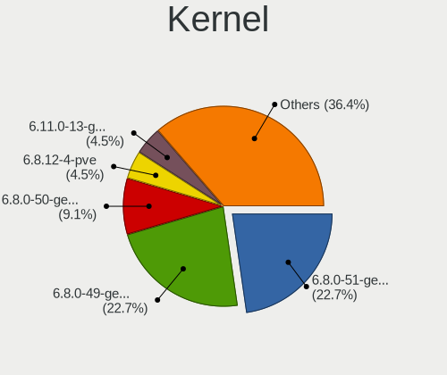
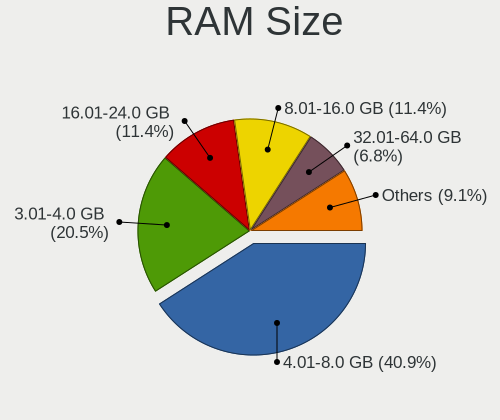
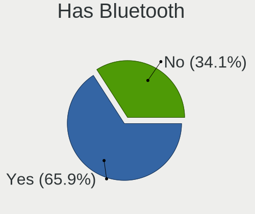
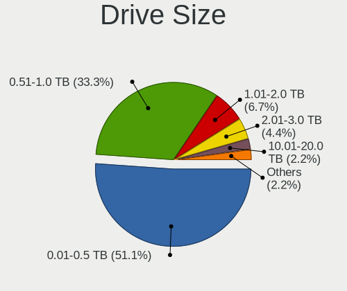
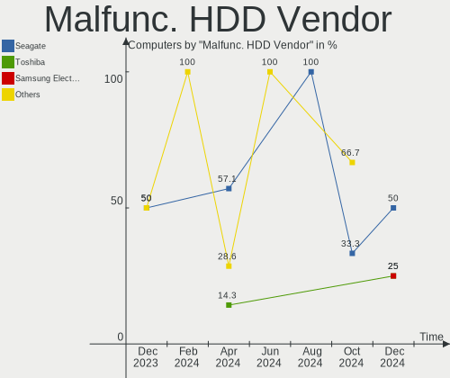
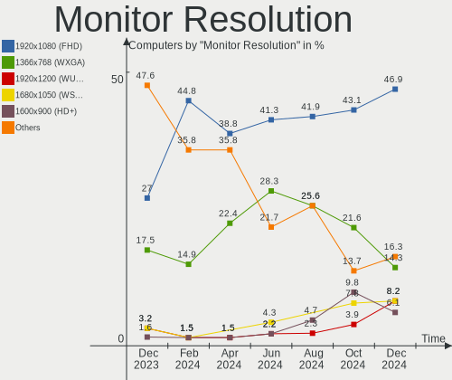
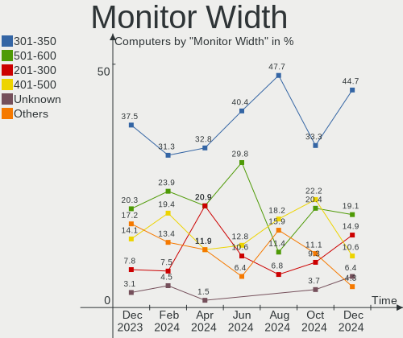
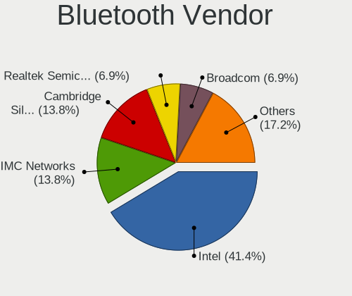

Xubuntu - Hardware Trends
-------------------------

A project to identify most popular hardware characteristics and track their change
over time based on data collected by Linux users at https://Linux-Hardware.org.

Anyone can contribute to this report by the [hw-probe](https://github.com/linuxhw/hw-probe) tool:

    sudo -E hw-probe -all -upload

This is a report for all computer types. See also reports for [desktops](/Dist/Xubuntu/Desktop/README.md) and [notebooks](/Dist/Xubuntu/Notebook/README.md).

This report is for one last month. Overall report since the beginning of time: [TestCoverage](https://github.com/linuxhw/TestCoverage)

Period: Jan, 2023.

Contents
--------

* [ System ](#system)
  - [ OS                       ](#os)
  - [ OS Family                ](#os-family)
  - [ Kernel                   ](#kernel)
  - [ Kernel Family            ](#kernel-family)
  - [ Kernel Major Ver.        ](#kernel-major-ver)
  - [ Arch                     ](#arch)
  - [ DE                       ](#de)
  - [ Display Server           ](#display-server)
  - [ Display Manager          ](#display-manager)
  - [ OS Lang                  ](#os-lang)
  - [ Boot Mode                ](#boot-mode)
  - [ Filesystem               ](#filesystem)
  - [ Part. scheme             ](#part-scheme)
  - [ Dual Boot with Linux/BSD ](#dual-boot-with-linuxbsd)
  - [ Dual Boot (Win)          ](#dual-boot-win)

* [ Board ](#board)
  - [ Vendor                   ](#vendor)
  - [ Model                    ](#model)
  - [ Model Family             ](#model-family)
  - [ MFG Year                 ](#mfg-year)
  - [ Form Factor              ](#form-factor)
  - [ Secure Boot              ](#secure-boot)
  - [ Coreboot                 ](#coreboot)
  - [ RAM Size                 ](#ram-size)
  - [ RAM Used                 ](#ram-used)
  - [ Total Drives             ](#total-drives)
  - [ Has CD-ROM               ](#has-cd-rom)
  - [ Has Ethernet             ](#has-ethernet)
  - [ Has WiFi                 ](#has-wifi)
  - [ Has Bluetooth            ](#has-bluetooth)

* [ Location ](#location)
  - [ Country                  ](#country)
  - [ City                     ](#city)

* [ Drives ](#drives)
  - [ Drive Vendor             ](#drive-vendor)
  - [ Drive Model              ](#drive-model)
  - [ HDD Vendor               ](#hdd-vendor)
  - [ SSD Vendor               ](#ssd-vendor)
  - [ Drive Kind               ](#drive-kind)
  - [ Drive Connector          ](#drive-connector)
  - [ Drive Size               ](#drive-size)
  - [ Space Total              ](#space-total)
  - [ Space Used               ](#space-used)
  - [ Malfunc. Drives          ](#malfunc-drives)
  - [ Malfunc. Drive Vendor    ](#malfunc-drive-vendor)
  - [ Malfunc. HDD Vendor      ](#malfunc-hdd-vendor)
  - [ Malfunc. Drive Kind      ](#malfunc-drive-kind)
  - [ Failed Drives            ](#failed-drives)
  - [ Failed Drive Vendor      ](#failed-drive-vendor)
  - [ Drive Status             ](#drive-status)

* [ Storage controller ](#storage-controller)
  - [ Storage Vendor           ](#storage-vendor)
  - [ Storage Model            ](#storage-model)
  - [ Storage Kind             ](#storage-kind)

* [ Processor ](#processor)
  - [ CPU Vendor               ](#cpu-vendor)
  - [ CPU Model                ](#cpu-model)
  - [ CPU Model Family         ](#cpu-model-family)
  - [ CPU Cores                ](#cpu-cores)
  - [ CPU Sockets              ](#cpu-sockets)
  - [ CPU Threads              ](#cpu-threads)
  - [ CPU Op-Modes             ](#cpu-op-modes)
  - [ CPU Microcode            ](#cpu-microcode)
  - [ CPU Microarch            ](#cpu-microarch)

* [ Graphics ](#graphics)
  - [ GPU Vendor               ](#gpu-vendor)
  - [ GPU Model                ](#gpu-model)
  - [ GPU Combo                ](#gpu-combo)
  - [ GPU Driver               ](#gpu-driver)
  - [ GPU Memory               ](#gpu-memory)

* [ Monitor ](#monitor)
  - [ Monitor Vendor           ](#monitor-vendor)
  - [ Monitor Model            ](#monitor-model)
  - [ Monitor Resolution       ](#monitor-resolution)
  - [ Monitor Diagonal         ](#monitor-diagonal)
  - [ Monitor Width            ](#monitor-width)
  - [ Aspect Ratio             ](#aspect-ratio)
  - [ Monitor Area             ](#monitor-area)
  - [ Pixel Density            ](#pixel-density)
  - [ Multiple Monitors        ](#multiple-monitors)

* [ Network ](#network)
  - [ Net Controller Vendor    ](#net-controller-vendor)
  - [ Net Controller Model     ](#net-controller-model)
  - [ Wireless Vendor          ](#wireless-vendor)
  - [ Wireless Model           ](#wireless-model)
  - [ Ethernet Vendor          ](#ethernet-vendor)
  - [ Ethernet Model           ](#ethernet-model)
  - [ Net Controller Kind      ](#net-controller-kind)
  - [ Used Controller          ](#used-controller)
  - [ NICs                     ](#nics)
  - [ IPv6                     ](#ipv6)

* [ Bluetooth ](#bluetooth)
  - [ Bluetooth Vendor         ](#bluetooth-vendor)
  - [ Bluetooth Model          ](#bluetooth-model)

* [ Sound ](#sound)
  - [ Sound Vendor             ](#sound-vendor)
  - [ Sound Model              ](#sound-model)

* [ Memory ](#memory)
  - [ Memory Vendor            ](#memory-vendor)
  - [ Memory Model             ](#memory-model)
  - [ Memory Kind              ](#memory-kind)
  - [ Memory Form Factor       ](#memory-form-factor)
  - [ Memory Size              ](#memory-size)
  - [ Memory Speed             ](#memory-speed)

* [ Printers & scanners ](#printers--scanners)
  - [ Printer Vendor           ](#printer-vendor)
  - [ Printer Model            ](#printer-model)
  - [ Scanner Vendor           ](#scanner-vendor)
  - [ Scanner Model            ](#scanner-model)

* [ Camera ](#camera)
  - [ Camera Vendor            ](#camera-vendor)
  - [ Camera Model             ](#camera-model)

* [ Security ](#security)
  - [ Fingerprint Vendor       ](#fingerprint-vendor)
  - [ Fingerprint Model        ](#fingerprint-model)
  - [ Chipcard Vendor          ](#chipcard-vendor)
  - [ Chipcard Model           ](#chipcard-model)

* [ Unsupported ](#unsupported)
  - [ Unsupported Devices      ](#unsupported-devices)
  - [ Unsupported Device Types ](#unsupported-device-types)

System
------

OS
--

Installed operating systems

| Name          | Computers | Percent |
|---------------|-----------|---------|
| Xubuntu 22.04 | 36        | 43.9%   |
| Xubuntu 20.04 | 26        | 31.71%  |
| Xubuntu 22.10 | 12        | 14.63%  |
| Xubuntu 18.04 | 6         | 7.32%   |
| Xubuntu 16.04 | 2         | 2.44%   |

OS Family
---------

OS without a version

| Name    | Computers | Percent |
|---------|-----------|---------|
| Xubuntu | 82        | 100%    |

Kernel
------

Version of the Linux kernel

| Version                 | Computers | Percent |
|-------------------------|-----------|---------|
| 5.15.0-58-generic       | 20        | 24.39%  |
| 5.15.0-56-generic       | 11        | 13.41%  |
| 5.4.0-138-generic       | 9         | 10.98%  |
| 5.4.0-137-generic       | 6         | 7.32%   |
| 5.15.0-57-generic       | 6         | 7.32%   |
| 5.19.0-29-generic       | 5         | 6.1%    |
| 5.4.0-136-generic       | 3         | 3.66%   |
| 5.19.0-28-generic       | 3         | 3.66%   |
| 5.4.217-0504217-generic | 2         | 2.44%   |
| 4.15.0-200-generic      | 2         | 2.44%   |
| 6.1.7-060107-generic    | 1         | 1.22%   |
| 6.1.6-060106-generic    | 1         | 1.22%   |
| 5.4.0-137-lowlatency    | 1         | 1.22%   |
| 5.4.0-135-generic       | 1         | 1.22%   |
| 5.4.0-122-generic       | 1         | 1.22%   |
| 5.4.0-109-generic       | 1         | 1.22%   |
| 5.19.0-31-generic       | 1         | 1.22%   |
| 5.19.0-21-generic       | 1         | 1.22%   |
| 5.19.0-1015-lowlatency  | 1         | 1.22%   |
| 5.15.0-58-lowlatency    | 1         | 1.22%   |
| 5.15.0-57-lowlatency    | 1         | 1.22%   |
| 5.15.0-56-lowlatency    | 1         | 1.22%   |
| 5.15.0-25-generic       | 1         | 1.22%   |
| 4.4.0-210-generic       | 1         | 1.22%   |
| 4.15.0-142-generic      | 1         | 1.22%   |

Kernel Family
-------------

Linux kernel without a distro release

| Version | Computers | Percent |
|---------|-----------|---------|
| 5.15.0  | 41        | 50%     |
| 5.4.0   | 22        | 26.83%  |
| 5.19.0  | 11        | 13.41%  |
| 4.15.0  | 3         | 3.66%   |
| 5.4.217 | 2         | 2.44%   |
| 6.1.7   | 1         | 1.22%   |
| 6.1.6   | 1         | 1.22%   |
| 4.4.0   | 1         | 1.22%   |

Kernel Major Ver.
-----------------

Linux kernel major version

| Version | Computers | Percent |
|---------|-----------|---------|
| 5.15    | 41        | 50%     |
| 5.4     | 24        | 29.27%  |
| 5.19    | 11        | 13.41%  |
| 4.15    | 3         | 3.66%   |
| 6.1     | 2         | 2.44%   |
| 4.4     | 1         | 1.22%   |

Arch
----

OS architecture (x86_64, i586, etc.)

| Name   | Computers | Percent |
|--------|-----------|---------|
| x86_64 | 78        | 95.12%  |
| i686   | 4         | 4.88%   |

DE
--

Desktop Environment

| Name    | Computers | Percent |
|---------|-----------|---------|
| XFCE    | 77        | 93.9%   |
| GNOME   | 4         | 4.88%   |
| GNUstep | 1         | 1.22%   |

Display Server
--------------

X11 or Wayland

| Name    | Computers | Percent |
|---------|-----------|---------|
| X11     | 76        | 92.68%  |
| Wayland | 3         | 3.66%   |
| Tty     | 3         | 3.66%   |

Display Manager
---------------

SDDM, LightDM, etc.

| Name    | Computers | Percent |
|---------|-----------|---------|
| LightDM | 71        | 86.59%  |
| GDM3    | 5         | 6.1%    |
| Unknown | 5         | 6.1%    |
| SDDM    | 1         | 1.22%   |

OS Lang
-------

Language

| Lang  | Computers | Percent |
|-------|-----------|---------|
| en_US | 30        | 36.59%  |
| ru_RU | 13        | 15.85%  |
| de_DE | 12        | 14.63%  |
| fr_FR | 10        | 12.2%   |
| it_IT | 3         | 3.66%   |
| cs_CZ | 3         | 3.66%   |
| es_CO | 2         | 2.44%   |
| C     | 2         | 2.44%   |
| ro_RO | 1         | 1.22%   |
| nl_NL | 1         | 1.22%   |
| es_ES | 1         | 1.22%   |
| es_AR | 1         | 1.22%   |
| en_IN | 1         | 1.22%   |
| en_CA | 1         | 1.22%   |
| el_GR | 1         | 1.22%   |

Boot Mode
---------

EFI or BIOS

| Mode | Computers | Percent |
|------|-----------|---------|
| BIOS | 48        | 58.54%  |
| EFI  | 34        | 41.46%  |

Filesystem
----------

Type of filesystem

| Type    | Computers | Percent |
|---------|-----------|---------|
| Ext4    | 76        | 92.68%  |
| Btrfs   | 4         | 4.88%   |
| Zfs     | 1         | 1.22%   |
| Overlay | 1         | 1.22%   |

Part. scheme
------------

Scheme of partitioning

| Type    | Computers | Percent |
|---------|-----------|---------|
| GPT     | 43        | 52.44%  |
| MBR     | 31        | 37.8%   |
| Unknown | 8         | 9.76%   |

Dual Boot with Linux/BSD
------------------------

Hosting more than one Linux/BSD

| Dual boot | Computers | Percent |
|-----------|-----------|---------|
| No        | 73        | 89.02%  |
| Yes       | 9         | 10.98%  |

Dual Boot (Win)
---------------

Hosting Linux and Windows

| Dual boot | Computers | Percent |
|-----------|-----------|---------|
| No        | 54        | 65.85%  |
| Yes       | 28        | 34.15%  |

Board
-----

Vendor
------

Motherboard manufacturer

| Name                | Computers | Percent |
|---------------------|-----------|---------|
| ASUSTek Computer    | 20        | 24.39%  |
| Gigabyte Technology | 12        | 14.63%  |
| Dell                | 12        | 14.63%  |
| Lenovo              | 11        | 13.41%  |
| Hewlett-Packard     | 8         | 9.76%   |
| Acer                | 5         | 6.1%    |
| MSI                 | 4         | 4.88%   |
| Notebook            | 2         | 2.44%   |
| Toshiba             | 1         | 1.22%   |
| Sony                | 1         | 1.22%   |
| Samsung Electronics | 1         | 1.22%   |
| Philco              | 1         | 1.22%   |
| Packard Bell        | 1         | 1.22%   |
| MiPi PC             | 1         | 1.22%   |
| Medion              | 1         | 1.22%   |
| Apple               | 1         | 1.22%   |

Model
-----

Motherboard model

| Name                                                                                     | Computers | Percent |
|------------------------------------------------------------------------------------------|-----------|---------|
| ASUS All Series                                                                          | 9         | 10.98%  |
| Dell Latitude E6420                                                                      | 2         | 2.44%   |
| Toshiba NB205                                                                            | 1         | 1.22%   |
| Sony VPCEB3L9E                                                                           | 1         | 1.22%   |
| Samsung 350V5C/350V5X/350V4C/350V4X/351V5C/351V5X/351V4C/351V4X/3540VC/3540VX/3440VC/344 | 1         | 1.22%   |
| Philco 14E                                                                               | 1         | 1.22%   |
| Packard Bell EasyNote TK87                                                               | 1         | 1.22%   |
| Notebook W65_67SZ                                                                        | 1         | 1.22%   |
| Notebook NJx0MU                                                                          | 1         | 1.22%   |
| MSI T3114                                                                                | 1         | 1.22%   |
| MSI MS-7D43                                                                              | 1         | 1.22%   |
| MSI MS-7C84                                                                              | 1         | 1.22%   |
| MSI MS-7C56                                                                              | 1         | 1.22%   |
| MiPi PC Mini PC                                                                          | 1         | 1.22%   |
| Medion H61H2-LM3                                                                         | 1         | 1.22%   |
| Lenovo V15 G2 ALC 82KD                                                                   | 1         | 1.22%   |
| Lenovo ThinkPad X61 Tablet 7767B8G                                                       | 1         | 1.22%   |
| Lenovo ThinkPad X260 20F5S4BY00                                                          | 1         | 1.22%   |
| Lenovo ThinkPad T430u 3353A11                                                            | 1         | 1.22%   |
| Lenovo ThinkPad P14s Gen 3 21AK000QMZ                                                    | 1         | 1.22%   |
| Lenovo ThinkPad L14 Gen 2a 20X5003KFR                                                    | 1         | 1.22%   |
| Lenovo ThinkPad E480 20KNCTO1WW                                                          | 1         | 1.22%   |
| Lenovo ThinkCentre M58 7373A5G                                                           | 1         | 1.22%   |
| Lenovo IdeaPadFlex 5 14ITL05 82HS                                                        | 1         | 1.22%   |
| Lenovo IdeaPad 330-17AST 81D7                                                            | 1         | 1.22%   |
| Lenovo E41-25 81FS                                                                       | 1         | 1.22%   |
| HP xw8400 Workstation                                                                    | 1         | 1.22%   |
| HP t540 Thin Client                                                                      | 1         | 1.22%   |
| HP Stream Laptop 11-ah0XX                                                                | 1         | 1.22%   |
| HP ProLiant DL160 G6                                                                     | 1         | 1.22%   |
| HP Pavilion dv2000 (RX554LA#ABM)                                                         | 1         | 1.22%   |
| HP Laptop 17-bs0xx                                                                       | 1         | 1.22%   |
| HP Compaq Pro 6300 MT                                                                    | 1         | 1.22%   |
| HP 240 G8 Notebook PC                                                                    | 1         | 1.22%   |
| Gigabyte Z87N-WIFI                                                                       | 1         | 1.22%   |
| Gigabyte X670 GAMING X AX                                                                | 1         | 1.22%   |
| Gigabyte X470 AORUS ULTRA GAMING                                                         | 1         | 1.22%   |
| Gigabyte J1800N-D2H                                                                      | 1         | 1.22%   |
| Gigabyte H310M S2H 2.0                                                                   | 1         | 1.22%   |
| Gigabyte GA-790XT-USB3                                                                   | 1         | 1.22%   |

Model Family
------------

Motherboard model prefix

| Name                   | Computers | Percent |
|------------------------|-----------|---------|
| ASUS All               | 9         | 10.98%  |
| Lenovo ThinkPad        | 6         | 7.32%   |
| Dell Inspiron          | 5         | 6.1%    |
| Dell Latitude          | 4         | 4.88%   |
| Acer Aspire            | 4         | 4.88%   |
| Gigabyte B550          | 2         | 2.44%   |
| ASUS ROG               | 2         | 2.44%   |
| Toshiba NB205          | 1         | 1.22%   |
| Sony VPCEB3L9E         | 1         | 1.22%   |
| Samsung 350V5C         | 1         | 1.22%   |
| Philco 14E             | 1         | 1.22%   |
| Packard Bell EasyNote  | 1         | 1.22%   |
| Notebook W65           | 1         | 1.22%   |
| Notebook NJx0MU        | 1         | 1.22%   |
| MSI T3114              | 1         | 1.22%   |
| MSI MS-7D43            | 1         | 1.22%   |
| MSI MS-7C84            | 1         | 1.22%   |
| MSI MS-7C56            | 1         | 1.22%   |
| MiPi PC Mini           | 1         | 1.22%   |
| Medion H61H2-LM3       | 1         | 1.22%   |
| Lenovo V15             | 1         | 1.22%   |
| Lenovo ThinkCentre     | 1         | 1.22%   |
| Lenovo IdeaPadFlex     | 1         | 1.22%   |
| Lenovo IdeaPad         | 1         | 1.22%   |
| Lenovo E41-25          | 1         | 1.22%   |
| HP xw8400              | 1         | 1.22%   |
| HP t540                | 1         | 1.22%   |
| HP Stream              | 1         | 1.22%   |
| HP ProLiant            | 1         | 1.22%   |
| HP Pavilion            | 1         | 1.22%   |
| HP Laptop              | 1         | 1.22%   |
| HP Compaq              | 1         | 1.22%   |
| HP 240                 | 1         | 1.22%   |
| Gigabyte Z87N-WIFI     | 1         | 1.22%   |
| Gigabyte X670          | 1         | 1.22%   |
| Gigabyte X470          | 1         | 1.22%   |
| Gigabyte J1800N-D2H    | 1         | 1.22%   |
| Gigabyte H310M         | 1         | 1.22%   |
| Gigabyte GA-790XT-USB3 | 1         | 1.22%   |
| Gigabyte B550M         | 1         | 1.22%   |

MFG Year
--------

Motherboard manufacture year

| Year | Computers | Percent |
|------|-----------|---------|
| 2014 | 12        | 14.63%  |
| 2011 | 9         | 10.98%  |
| 2018 | 8         | 9.76%   |
| 2021 | 7         | 8.54%   |
| 2020 | 6         | 7.32%   |
| 2012 | 6         | 7.32%   |
| 2017 | 5         | 6.1%    |
| 2007 | 5         | 6.1%    |
| 2022 | 4         | 4.88%   |
| 2015 | 4         | 4.88%   |
| 2013 | 3         | 3.66%   |
| 2010 | 3         | 3.66%   |
| 2005 | 3         | 3.66%   |
| 2019 | 2         | 2.44%   |
| 2009 | 2         | 2.44%   |
| 2008 | 2         | 2.44%   |
| 2016 | 1         | 1.22%   |

Form Factor
-----------

Physical design of the computer

| Name        | Computers | Percent |
|-------------|-----------|---------|
| Notebook    | 40        | 48.78%  |
| Desktop     | 37        | 45.12%  |
| Mini pc     | 2         | 2.44%   |
| Server      | 2         | 2.44%   |
| Convertible | 1         | 1.22%   |

Secure Boot
-----------

Enabled or disabled

| State    | Computers | Percent |
|----------|-----------|---------|
| Disabled | 77        | 93.9%   |
| Enabled  | 5         | 6.1%    |

Coreboot
--------

Have coreboot on board

| Used | Computers | Percent |
|------|-----------|---------|
| No   | 82        | 100%    |

RAM Size
--------

Total RAM memory

| Size in GB  | Computers | Percent |
|-------------|-----------|---------|
| 3.01-4.0    | 28        | 34.15%  |
| 4.01-8.0    | 19        | 23.17%  |
| 16.01-24.0  | 14        | 17.07%  |
| 8.01-16.0   | 9         | 10.98%  |
| 32.01-64.0  | 7         | 8.54%   |
| 1.01-2.0    | 2         | 2.44%   |
| 24.01-32.0  | 1         | 1.22%   |
| 64.01-256.0 | 1         | 1.22%   |
| 0.51-1.0    | 1         | 1.22%   |

RAM Used
--------

Used RAM memory

| Used GB    | Computers | Percent |
|------------|-----------|---------|
| 1.01-2.0   | 28        | 34.15%  |
| 2.01-3.0   | 19        | 23.17%  |
| 0.51-1.0   | 15        | 18.29%  |
| 3.01-4.0   | 11        | 13.41%  |
| 4.01-8.0   | 3         | 3.66%   |
| 8.01-16.0  | 3         | 3.66%   |
| 0.01-0.5   | 2         | 2.44%   |
| 16.01-24.0 | 1         | 1.22%   |

Total Drives
------------

Number of drives on board

| Drives | Computers | Percent |
|--------|-----------|---------|
| 1      | 43        | 52.44%  |
| 2      | 28        | 34.15%  |
| 3      | 6         | 7.32%   |
| 4      | 4         | 4.88%   |
| 5      | 1         | 1.22%   |

Has CD-ROM
----------

Has CD-ROM on board

| Presented | Computers | Percent |
|-----------|-----------|---------|
| No        | 56        | 68.29%  |
| Yes       | 26        | 31.71%  |

Has Ethernet
------------

Has Ethernet on board

| Presented | Computers | Percent |
|-----------|-----------|---------|
| Yes       | 74        | 90.24%  |
| No        | 8         | 9.76%   |

Has WiFi
--------

Has WiFi module

| Presented | Computers | Percent |
|-----------|-----------|---------|
| Yes       | 49        | 59.76%  |
| No        | 33        | 40.24%  |

Has Bluetooth
-------------

Has Bluetooth module

| Presented | Computers | Percent |
|-----------|-----------|---------|
| No        | 43        | 52.44%  |
| Yes       | 39        | 47.56%  |

Location
--------

Country
-------

Geographic location (country)

| Country     | Computers | Percent |
|-------------|-----------|---------|
| USA         | 16        | 19.51%  |
| Russia      | 13        | 15.85%  |
| Germany     | 12        | 14.63%  |
| France      | 9         | 10.98%  |
| Netherlands | 4         | 4.88%   |
| Italy       | 4         | 4.88%   |
| Czechia     | 3         | 3.66%   |
| Brazil      | 3         | 3.66%   |
| Colombia    | 2         | 2.44%   |
| Ukraine     | 1         | 1.22%   |
| Switzerland | 1         | 1.22%   |
| Spain       | 1         | 1.22%   |
| Slovenia    | 1         | 1.22%   |
| Romania     | 1         | 1.22%   |
| Mexico      | 1         | 1.22%   |
| Latvia      | 1         | 1.22%   |
| India       | 1         | 1.22%   |
| Greece      | 1         | 1.22%   |
| Estonia     | 1         | 1.22%   |
| Cuba        | 1         | 1.22%   |
| Canada      | 1         | 1.22%   |
| Belgium     | 1         | 1.22%   |
| Belarus     | 1         | 1.22%   |
| Austria     | 1         | 1.22%   |
| Argentina   | 1         | 1.22%   |

City
----

Geographic location (city)

| City                | Computers | Percent |
|---------------------|-----------|---------|
| Voronezh            | 9         | 10.98%  |
| Paris               | 2         | 2.44%   |
| Louisville          | 2         | 2.44%   |
| Berlin              | 2         | 2.44%   |
| White House         | 1         | 1.22%   |
| Vaison-la-Romaine   | 1         | 1.22%   |
| Třebíč           | 1         | 1.22%   |
| Timbo               | 1         | 1.22%   |
| Tijuana             | 1         | 1.22%   |
| Thouars             | 1         | 1.22%   |
| The Hague           | 1         | 1.22%   |
| Tallinn             | 1         | 1.22%   |
| St Petersburg       | 1         | 1.22%   |
| Springfield         | 1         | 1.22%   |
| Spring Valley       | 1         | 1.22%   |
| Speyer              | 1         | 1.22%   |
| Seville             | 1         | 1.22%   |
| Scafati             | 1         | 1.22%   |
| Saussemesnil        | 1         | 1.22%   |
| San-Martino-di-Lota | 1         | 1.22%   |
| San Luis Obispo     | 1         | 1.22%   |
| Salem               | 1         | 1.22%   |
| Saint Paul          | 1         | 1.22%   |
| Riga                | 1         | 1.22%   |
| Rho                 | 1         | 1.22%   |
| Palermo             | 1         | 1.22%   |
| Padre Paraiso       | 1         | 1.22%   |
| Ortenberg           | 1         | 1.22%   |
| Norden              | 1         | 1.22%   |
| Neiva               | 1         | 1.22%   |
| Munich              | 1         | 1.22%   |
| Moscow              | 1         | 1.22%   |
| Milan               | 1         | 1.22%   |
| Mazyr               | 1         | 1.22%   |
| Marseille           | 1         | 1.22%   |
| Marpingen           | 1         | 1.22%   |
| Litoměřice        | 1         | 1.22%   |
| Litija              | 1         | 1.22%   |
| Leland              | 1         | 1.22%   |
| La Mesa             | 1         | 1.22%   |

Drives
------

Drive Vendor
------------

Hard drive vendors

| Vendor                      | Computers | Drives | Percent |
|-----------------------------|-----------|--------|---------|
| WDC                         | 33        | 37     | 26.4%   |
| Seagate                     | 18        | 18     | 14.4%   |
| Samsung Electronics         | 17        | 18     | 13.6%   |
| Toshiba                     | 8         | 9      | 6.4%    |
| Unknown                     | 5         | 6      | 4%      |
| Kingston                    | 5         | 5      | 4%      |
| Hitachi                     | 4         | 5      | 3.2%    |
| SK hynix                    | 3         | 3      | 2.4%    |
| SanDisk                     | 3         | 3      | 2.4%    |
| PNY                         | 3         | 3      | 2.4%    |
| Intel                       | 3         | 3      | 2.4%    |
| Micron Technology           | 2         | 2      | 1.6%    |
| Kingston Technology Company | 2         | 2      | 1.6%    |
| HGST                        | 2         | 4      | 1.6%    |
| Gigabyte Technology         | 2         | 2      | 1.6%    |
| China                       | 2         | 2      | 1.6%    |
| Verbatim                    | 1         | 1      | 0.8%    |
| SPCC                        | 1         | 1      | 0.8%    |
| Realtek Semiconductor       | 1         | 1      | 0.8%    |
| Patriot                     | 1         | 1      | 0.8%    |
| Netac                       | 1         | 1      | 0.8%    |
| Mushkin                     | 1         | 1      | 0.8%    |
| LITEONIT                    | 1         | 1      | 0.8%    |
| Lite-On Technology          | 1         | 1      | 0.8%    |
| KIOXIA                      | 1         | 1      | 0.8%    |
| JMicron Technology          | 1         | 1      | 0.8%    |
| Crucial                     | 1         | 2      | 0.8%    |
| A-DATA Technology           | 1         | 1      | 0.8%    |
| Unknown                     | 1         | 1      | 0.8%    |

Drive Model
-----------

Hard drive models

| Model                               | Computers | Percent |
|-------------------------------------|-----------|---------|
| WDC WD5000AZLX-07K2TA0 500GB        | 9         | 6.98%   |
| Toshiba MQ04ABF100 1TB              | 2         | 1.55%   |
| Seagate ST1000LM035-1RK172 1TB      | 2         | 1.55%   |
| Seagate ST1000LM024 HN-M101MBB 1TB  | 2         | 1.55%   |
| Seagate ST1000DM003-1CH162 1TB      | 2         | 1.55%   |
| Samsung SSD 970 EVO Plus 250GB      | 2         | 1.55%   |
| Samsung SSD 860 EVO 500GB           | 2         | 1.55%   |
| Samsung SSD 850 EVO 500GB           | 2         | 1.55%   |
| PNY CS900 480GB SSD                 | 2         | 1.55%   |
| Kingston Company A2000 NVMe SSD 1TB | 2         | 1.55%   |
| WDC WDS250G3X0C-00SJG0 250GB        | 1         | 0.78%   |
| WDC WDS100T3X0C-00SJG0 1TB          | 1         | 0.78%   |
| WDC WD7500BPVT-75HXZT3 752GB        | 1         | 0.78%   |
| WDC WD6400AAKS-65A7B0 640GB         | 1         | 0.78%   |
| WDC WD5000LPCX-21VHAT0 500GB        | 1         | 0.78%   |
| WDC WD5000LPCX-00VHAT0 500GB        | 1         | 0.78%   |
| WDC WD5000BPKX-22HPJT0 500GB        | 1         | 0.78%   |
| WDC WD3200BUCT-63TWBY0 320GB        | 1         | 0.78%   |
| WDC WD3200BJKT-75F4T0 320GB         | 1         | 0.78%   |
| WDC WD3200BEVT-22ZCT0 320GB         | 1         | 0.78%   |
| WDC WD3200BEKT-60PVMT0 320GB        | 1         | 0.78%   |
| WDC WD3200AAJS-65B4A0 320GB         | 1         | 0.78%   |
| WDC WD3200AAJS-56M0A0 320GB         | 1         | 0.78%   |
| WDC WD3200AAJS-08L7A0 320GB         | 1         | 0.78%   |
| WDC WD2500BEVT-75ZCT2 250GB         | 1         | 0.78%   |
| WDC WD20EZRX-19D8PB0 2TB            | 1         | 0.78%   |
| WDC WD20EZRX-00D8PB0 2TB            | 1         | 0.78%   |
| WDC WD2005FBYZ-01YCBB3 2TB          | 1         | 0.78%   |
| WDC WD1600BEVS-75RST0 160GB         | 1         | 0.78%   |
| WDC WD1600BEVS-22RST0 160GB         | 1         | 0.78%   |
| WDC WD1600BEVS-07RST0 160GB         | 1         | 0.78%   |
| WDC WD10SPZX-24Z10 1TB              | 1         | 0.78%   |
| WDC WD10EZEX-21M2NA0 1TB            | 1         | 0.78%   |
| WDC WD10EZEX-08WN4A0 1TB            | 1         | 0.78%   |
| WDC WD10EZEX-00BN5A0 1TB            | 1         | 0.78%   |
| WDC WD100EMAZ-00WJTA0 10TB          | 1         | 0.78%   |
| Verbatim Vi550 S3 256GB SSD         | 1         | 0.78%   |
| Unknown SU04G  4GB                  | 1         | 0.78%   |
| Unknown SDU1  64GB                  | 1         | 0.78%   |
| Unknown SD/MMC/MS PRO 2GB           | 1         | 0.78%   |

HDD Vendor
----------

Hard disk drive vendors

| Vendor  | Computers | Drives | Percent |
|---------|-----------|--------|---------|
| WDC     | 32        | 35     | 50%     |
| Seagate | 18        | 18     | 28.13%  |
| Toshiba | 7         | 7      | 10.94%  |
| Hitachi | 4         | 5      | 6.25%   |
| HGST    | 2         | 4      | 3.13%   |
| Unknown | 1         | 1      | 1.56%   |

SSD Vendor
----------

Solid state drive vendors

| Vendor              | Computers | Drives | Percent |
|---------------------|-----------|--------|---------|
| Samsung Electronics | 10        | 11     | 28.57%  |
| Kingston            | 4         | 4      | 11.43%  |
| SanDisk             | 3         | 3      | 8.57%   |
| PNY                 | 3         | 3      | 8.57%   |
| Toshiba             | 2         | 2      | 5.71%   |
| China               | 2         | 2      | 5.71%   |
| Verbatim            | 1         | 1      | 2.86%   |
| SPCC                | 1         | 1      | 2.86%   |
| SK hynix            | 1         | 1      | 2.86%   |
| Patriot             | 1         | 1      | 2.86%   |
| Netac               | 1         | 1      | 2.86%   |
| Micron Technology   | 1         | 1      | 2.86%   |
| LITEONIT            | 1         | 1      | 2.86%   |
| Intel               | 1         | 1      | 2.86%   |
| Crucial             | 1         | 2      | 2.86%   |
| A-DATA Technology   | 1         | 1      | 2.86%   |
| Unknown             | 1         | 1      | 2.86%   |

Drive Kind
----------

HDD or SSD

| Kind    | Computers | Drives | Percent |
|---------|-----------|--------|---------|
| HDD     | 51        | 70     | 48.57%  |
| SSD     | 30        | 37     | 28.57%  |
| NVMe    | 19        | 23     | 18.1%   |
| MMC     | 4         | 5      | 3.81%   |
| Unknown | 1         | 1      | 0.95%   |

Drive Connector
---------------

SATA, SAS, NVMe, etc.

| Type | Computers | Drives | Percent |
|------|-----------|--------|---------|
| SATA | 69        | 105    | 72.63%  |
| NVMe | 19        | 23     | 20%     |
| MMC  | 4         | 5      | 4.21%   |
| SAS  | 3         | 3      | 3.16%   |

Drive Size
----------

Size of hard drive

| Size in TB | Computers | Drives | Percent |
|------------|-----------|--------|---------|
| 0.01-0.5   | 56        | 66     | 62.22%  |
| 0.51-1.0   | 25        | 29     | 27.78%  |
| 1.01-2.0   | 4         | 4      | 4.44%   |
| 3.01-4.0   | 2         | 4      | 2.22%   |
| 2.01-3.0   | 2         | 2      | 2.22%   |
| 4.01-10.0  | 1         | 2      | 1.11%   |

Space Total
-----------

Amount of disk space available on the file system

| Size in GB     | Computers | Percent |
|----------------|-----------|---------|
| 101-250        | 28        | 34.15%  |
| 251-500        | 21        | 25.61%  |
| 501-1000       | 11        | 13.41%  |
| 1001-2000      | 6         | 7.32%   |
| 21-50          | 5         | 6.1%    |
| 2001-3000      | 4         | 4.88%   |
| 51-100         | 3         | 3.66%   |
| More than 3000 | 2         | 2.44%   |
| 1-20           | 2         | 2.44%   |

Space Used
----------

Amount of used disk space

| Used GB        | Computers | Percent |
|----------------|-----------|---------|
| 21-50          | 28        | 34.15%  |
| 1-20           | 21        | 25.61%  |
| 101-250        | 11        | 13.41%  |
| 51-100         | 10        | 12.2%   |
| 251-500        | 6         | 7.32%   |
| More than 3000 | 2         | 2.44%   |
| 1001-2000      | 2         | 2.44%   |
| 501-1000       | 2         | 2.44%   |

Malfunc. Drives
---------------

Drive models with a malfunction

| Model                              | Computers | Drives | Percent |
|------------------------------------|-----------|--------|---------|
| WDC WD1600BEVS-22RST0 160GB        | 1         | 1      | 11.11%  |
| WDC WD10EZEX-08WN4A0 1TB           | 1         | 1      | 11.11%  |
| Seagate ST1000LM024 HN-M101MBB 1TB | 1         | 1      | 11.11%  |
| Seagate ST1000DM010-2EP102 1TB     | 1         | 1      | 11.11%  |
| PNY 69D03094-T 40GB SSD            | 1         | 1      | 11.11%  |
| Netac SSD 720GB                    | 1         | 1      | 11.11%  |
| Intel SSDSA2M160G2GC 160GB         | 1         | 1      | 11.11%  |
| HGST HUS724040ALA640 4TB           | 1         | 3      | 11.11%  |
| Unknown                            | 1         | 1      | 11.11%  |

Malfunc. Drive Vendor
---------------------

Vendors of faulty drives

| Vendor  | Computers | Drives | Percent |
|---------|-----------|--------|---------|
| WDC     | 2         | 2      | 22.22%  |
| Seagate | 2         | 2      | 22.22%  |
| PNY     | 1         | 1      | 11.11%  |
| Netac   | 1         | 1      | 11.11%  |
| Intel   | 1         | 1      | 11.11%  |
| HGST    | 1         | 3      | 11.11%  |
| Unknown | 1         | 1      | 11.11%  |

Malfunc. HDD Vendor
-------------------

Vendors of faulty HDD drives

| Vendor  | Computers | Drives | Percent |
|---------|-----------|--------|---------|
| WDC     | 2         | 2      | 40%     |
| Seagate | 2         | 2      | 40%     |
| HGST    | 1         | 3      | 20%     |

Malfunc. Drive Kind
-------------------

Kinds of faulty drives

| Kind | Computers | Drives | Percent |
|------|-----------|--------|---------|
| HDD  | 5         | 7      | 55.56%  |
| SSD  | 4         | 4      | 44.44%  |

Failed Drives
-------------

Failed drive models

Zero info for selected period =(

Failed Drive Vendor
-------------------

Failed drive vendors

Zero info for selected period =(

Drive Status
------------

Number of failed and malfunc. drives

| Status   | Computers | Drives | Percent |
|----------|-----------|--------|---------|
| Works    | 47        | 74     | 50.54%  |
| Detected | 37        | 51     | 39.78%  |
| Malfunc  | 9         | 11     | 9.68%   |

Storage controller
------------------

Storage Vendor
--------------

Storage controller vendors

| Vendor                      | Computers | Percent |
|-----------------------------|-----------|---------|
| Intel                       | 57        | 58.16%  |
| AMD                         | 16        | 16.33%  |
| Samsung Electronics         | 7         | 7.14%   |
| Kingston Technology Company | 3         | 3.06%   |
| SK hynix                    | 2         | 2.04%   |
| SanDisk                     | 2         | 2.04%   |
| Phison Electronics          | 2         | 2.04%   |
| VIA Technologies            | 1         | 1.02%   |
| Realtek Semiconductor       | 1         | 1.02%   |
| Micron Technology           | 1         | 1.02%   |
| Lite-On Technology          | 1         | 1.02%   |
| KIOXIA                      | 1         | 1.02%   |
| JMicron Technology          | 1         | 1.02%   |
| INNOGRIT                    | 1         | 1.02%   |
| Broadcom / LSI              | 1         | 1.02%   |
| ASMedia Technology          | 1         | 1.02%   |

Storage Model
-------------

Storage controller models

| Model                                                                            | Computers | Percent |
|----------------------------------------------------------------------------------|-----------|---------|
| Intel Atom Processor E3800 Series SATA AHCI Controller                           | 10        | 8.62%   |
| AMD FCH SATA Controller [AHCI mode]                                              | 10        | 8.62%   |
| Samsung NVMe SSD Controller 980                                                  | 5         | 4.31%   |
| Intel Sunrise Point-LP SATA Controller [AHCI mode]                               | 5         | 4.31%   |
| Intel 7 Series Chipset Family 6-port SATA Controller [AHCI mode]                 | 4         | 3.45%   |
| Intel 6 Series/C200 Series Chipset Family 6 port Mobile SATA AHCI Controller     | 4         | 3.45%   |
| AMD 500 Series Chipset SATA Controller                                           | 4         | 3.45%   |
| Kingston Company A2000 NVMe SSD                                                  | 3         | 2.59%   |
| Intel 82801HM/HEM (ICH8M/ICH8M-E) SATA Controller [AHCI mode]                    | 3         | 2.59%   |
| Intel 82801HM/HEM (ICH8M/ICH8M-E) IDE Controller                                 | 3         | 2.59%   |
| Intel 82801 Mobile SATA Controller [RAID mode]                                   | 3         | 2.59%   |
| Intel 8 Series/C220 Series Chipset Family 6-port SATA Controller 1 [AHCI mode]   | 3         | 2.59%   |
| Intel 6 Series/C200 Series Chipset Family 6 port Desktop SATA AHCI Controller    | 3         | 2.59%   |
| AMD 400 Series Chipset SATA Controller                                           | 3         | 2.59%   |
| SK hynix Gold P31/PC711 NVMe Solid State Drive                                   | 2         | 1.72%   |
| SanDisk WD Black SN750 / PC SN730 NVMe SSD                                       | 2         | 1.72%   |
| Samsung NVMe SSD Controller SM981/PM981/PM983                                    | 2         | 1.72%   |
| Intel Atom/Celeron/Pentium Processor x5-E8000/J3xxx/N3xxx Series SATA Controller | 2         | 1.72%   |
| Intel 82801GBM/GHM (ICH7-M Family) SATA Controller [IDE mode]                    | 2         | 1.72%   |
| Intel 82801G (ICH7 Family) IDE Controller                                        | 2         | 1.72%   |
| Intel 8 Series SATA Controller 1 [AHCI mode]                                     | 2         | 1.72%   |
| Intel 5 Series/3400 Series Chipset 4 port SATA AHCI Controller                   | 2         | 1.72%   |
| Intel 200 Series PCH SATA controller [AHCI mode]                                 | 2         | 1.72%   |
| VIA VT82C586A/B/VT82C686/A/B/VT823x/A/C PIPC Bus Master IDE                      | 1         | 0.86%   |
| VIA VIA VT6420 SATA RAID Controller                                              | 1         | 0.86%   |
| Realtek RTS5763DL NVMe SSD Controller                                            | 1         | 0.86%   |
| Phison PS5013 E13 NVMe Controller                                                | 1         | 0.86%   |
| Phison E18 PCIe4 NVMe Controller                                                 | 1         | 0.86%   |
| Micron Non-Volatile memory controller                                            | 1         | 0.86%   |
| Lite-On NVMe Controller                                                          | 1         | 0.86%   |
| KIOXIA NVMe SSD Controller BG4                                                   | 1         | 0.86%   |
| JMicron JMB363 SATA/IDE Controller                                               | 1         | 0.86%   |
| Intel Tiger Lake-LP SATA Controller                                              | 1         | 0.86%   |
| Intel SSD 660P Series                                                            | 1         | 0.86%   |
| Intel Non-Volatile memory controller                                             | 1         | 0.86%   |
| Intel NM10/ICH7 Family SATA Controller [IDE mode]                                | 1         | 0.86%   |
| Intel Celeron/Pentium Silver Processor SATA Controller                           | 1         | 0.86%   |
| Intel Alder Lake-S PCH SATA Controller [AHCI Mode]                               | 1         | 0.86%   |
| Intel 82801JI (ICH10 Family) SATA AHCI Controller                                | 1         | 0.86%   |
| Intel 82801JD/DO (ICH10 Family) SATA AHCI Controller                             | 1         | 0.86%   |

Storage Kind
------------

Kind of storage controller (IDE, SATA, NVMe, SAS, ...)

| Kind | Computers | Percent |
|------|-----------|---------|
| SATA | 63        | 62.38%  |
| NVMe | 19        | 18.81%  |
| IDE  | 13        | 12.87%  |
| RAID | 5         | 4.95%   |
| SCSI | 1         | 0.99%   |

Processor
---------

CPU Vendor
----------

Processor vendors

| Vendor | Computers | Percent |
|--------|-----------|---------|
| Intel  | 62        | 75.61%  |
| AMD    | 20        | 24.39%  |

CPU Model
---------

Processor models

| Model                                 | Computers | Percent |
|---------------------------------------|-----------|---------|
| Intel Celeron CPU J1800 @ 2.41GHz     | 10        | 12.2%   |
| Intel Pentium 4 CPU 3.00GHz           | 2         | 2.44%   |
| Intel Core i5-3317U CPU @ 1.70GHz     | 2         | 2.44%   |
| Intel Core i5-2520M CPU @ 2.50GHz     | 2         | 2.44%   |
| Intel Core i5-2320 CPU @ 3.00GHz      | 2         | 2.44%   |
| Intel Core i3 CPU M 370 @ 2.40GHz     | 2         | 2.44%   |
| Intel Celeron CPU N3060 @ 1.60GHz     | 2         | 2.44%   |
| Intel Xeon CPU X5550 @ 2.67GHz        | 1         | 1.22%   |
| Intel Xeon CPU E3-1240 V2 @ 3.40GHz   | 1         | 1.22%   |
| Intel Xeon CPU 5150 @ 2.66GHz         | 1         | 1.22%   |
| Intel Pentium CPU P6100 @ 2.00GHz     | 1         | 1.22%   |
| Intel Genuine CPU T2060 @ 1.60GHz     | 1         | 1.22%   |
| Intel Core m3-6Y30 CPU @ 0.90GHz      | 1         | 1.22%   |
| Intel Core i7-9700KF CPU @ 3.60GHz    | 1         | 1.22%   |
| Intel Core i7-8550U CPU @ 1.80GHz     | 1         | 1.22%   |
| Intel Core i7-2630QM CPU @ 2.00GHz    | 1         | 1.22%   |
| Intel Core i5-9600K CPU @ 3.70GHz     | 1         | 1.22%   |
| Intel Core i5-8250U CPU @ 1.60GHz     | 1         | 1.22%   |
| Intel Core i5-7300U CPU @ 2.60GHz     | 1         | 1.22%   |
| Intel Core i5-7200U CPU @ 2.50GHz     | 1         | 1.22%   |
| Intel Core i5-6300U CPU @ 2.40GHz     | 1         | 1.22%   |
| Intel Core i5-4340M CPU @ 2.90GHz     | 1         | 1.22%   |
| Intel Core i5-4310M CPU @ 2.70GHz     | 1         | 1.22%   |
| Intel Core i5-4300Y CPU @ 1.60GHz     | 1         | 1.22%   |
| Intel Core i5-3570 CPU @ 3.40GHz      | 1         | 1.22%   |
| Intel Core i5-2450M CPU @ 2.50GHz     | 1         | 1.22%   |
| Intel Core i5-2410M CPU @ 2.30GHz     | 1         | 1.22%   |
| Intel Core i5-2400 CPU @ 3.10GHz      | 1         | 1.22%   |
| Intel Core i5-1035G1 CPU @ 1.00GHz    | 1         | 1.22%   |
| Intel Core i5-10210U CPU @ 1.60GHz    | 1         | 1.22%   |
| Intel Core i3-4340 CPU @ 3.60GHz      | 1         | 1.22%   |
| Intel Core i3-4030U CPU @ 1.90GHz     | 1         | 1.22%   |
| Intel Core i3-2370M CPU @ 2.40GHz     | 1         | 1.22%   |
| Intel Core 2 Quad CPU Q6600 @ 2.40GHz | 1         | 1.22%   |
| Intel Core 2 Duo CPU T8100 @ 2.10GHz  | 1         | 1.22%   |
| Intel Core 2 Duo CPU T7500 @ 2.20GHz  | 1         | 1.22%   |
| Intel Core 2 Duo CPU L7500 @ 1.60GHz  | 1         | 1.22%   |
| Intel Core 2 Duo CPU E7300 @ 2.66GHz  | 1         | 1.22%   |
| Intel Celeron N4120 CPU @ 1.10GHz     | 1         | 1.22%   |
| Intel Celeron CPU N3050 @ 1.60GHz     | 1         | 1.22%   |

CPU Model Family
----------------

Processor model prefix

| Model              | Computers | Percent |
|--------------------|-----------|---------|
| Intel Core i5      | 20        | 24.39%  |
| Intel Celeron      | 15        | 18.29%  |
| Other              | 5         | 6.1%    |
| Intel Core i3      | 5         | 6.1%    |
| AMD Ryzen 5        | 5         | 6.1%    |
| Intel Core 2 Duo   | 4         | 4.88%   |
| AMD Ryzen 7        | 4         | 4.88%   |
| Intel Xeon         | 3         | 3.66%   |
| Intel Core i7      | 3         | 3.66%   |
| Intel Pentium 4    | 2         | 2.44%   |
| Intel Atom         | 2         | 2.44%   |
| AMD Ryzen 3        | 2         | 2.44%   |
| AMD A6             | 2         | 2.44%   |
| Intel Pentium      | 1         | 1.22%   |
| Intel Genuine      | 1         | 1.22%   |
| Intel Core m3      | 1         | 1.22%   |
| Intel Core 2 Quad  | 1         | 1.22%   |
| AMD Sempron        | 1         | 1.22%   |
| AMD Ryzen Embedded | 1         | 1.22%   |
| AMD Ryzen 9        | 1         | 1.22%   |
| AMD Ryzen 5 PRO    | 1         | 1.22%   |
| AMD FX             | 1         | 1.22%   |
| AMD Athlon II X4   | 1         | 1.22%   |

CPU Cores
---------

Number of processor cores

| Number | Computers | Percent |
|--------|-----------|---------|
| 2      | 42        | 51.22%  |
| 4      | 22        | 26.83%  |
| 8      | 7         | 8.54%   |
| 6      | 6         | 7.32%   |
| 1      | 4         | 4.88%   |
| 12     | 1         | 1.22%   |

CPU Sockets
-----------

Number of sockets

| Number | Computers | Percent |
|--------|-----------|---------|
| 1      | 80        | 97.56%  |
| 2      | 2         | 2.44%   |

CPU Threads
-----------

Threads per core (Hyper-Threading)

| Number | Computers | Percent |
|--------|-----------|---------|
| 2      | 46        | 56.1%   |
| 1      | 36        | 43.9%   |

CPU Op-Modes
------------

CPU Operation Modes (32-bit, 64-bit)

| Op mode        | Computers | Percent |
|----------------|-----------|---------|
| 32-bit, 64-bit | 80        | 97.56%  |
| 32-bit         | 2         | 2.44%   |

CPU Microcode
-------------

Microcode number

| Number     | Computers | Percent |
|------------|-----------|---------|
| Unknown    | 23        | 28.05%  |
| 0x30679    | 10        | 12.2%   |
| 0x206a7    | 6         | 7.32%   |
| 0x306a9    | 4         | 4.88%   |
| 0x806ea    | 2         | 2.44%   |
| 0x806c1    | 2         | 2.44%   |
| 0x6fb      | 2         | 2.44%   |
| 0x406e3    | 2         | 2.44%   |
| 0x40651    | 2         | 2.44%   |
| 0x306c3    | 2         | 2.44%   |
| 0x20655    | 2         | 2.44%   |
| 0x10676    | 2         | 2.44%   |
| 0x06006705 | 2         | 2.44%   |
| 0xf43      | 1         | 1.22%   |
| 0x906a3    | 1         | 1.22%   |
| 0x806ec    | 1         | 1.22%   |
| 0x706a8    | 1         | 1.22%   |
| 0x6fa      | 1         | 1.22%   |
| 0x6ec      | 1         | 1.22%   |
| 0x406c4    | 1         | 1.22%   |
| 0x406c3    | 1         | 1.22%   |
| 0x106c2    | 1         | 1.22%   |
| 0x106a5    | 1         | 1.22%   |
| 0x0a601201 | 1         | 1.22%   |
| 0x0a50000d | 1         | 1.22%   |
| 0x0a20120a | 1         | 1.22%   |
| 0x0a201016 | 1         | 1.22%   |
| 0x08701021 | 1         | 1.22%   |
| 0x08608102 | 1         | 1.22%   |
| 0x08200103 | 1         | 1.22%   |
| 0x08108109 | 1         | 1.22%   |
| 0x08101016 | 1         | 1.22%   |
| 0x0800820d | 1         | 1.22%   |
| 0x010000c8 | 1         | 1.22%   |

CPU Microarch
-------------

Microarchitecture

| Name             | Computers | Percent |
|------------------|-----------|---------|
| Silvermont       | 14        | 17.07%  |
| SandyBridge      | 9         | 10.98%  |
| KabyLake         | 7         | 8.54%   |
| IvyBridge        | 5         | 6.1%    |
| Haswell          | 5         | 6.1%    |
| Core             | 4         | 4.88%   |
| Unknown          | 4         | 4.88%   |
| Zen+             | 3         | 3.66%   |
| Zen 3            | 3         | 3.66%   |
| Zen 2            | 3         | 3.66%   |
| Westmere         | 3         | 3.66%   |
| Zen              | 2         | 2.44%   |
| TigerLake        | 2         | 2.44%   |
| Skylake          | 2         | 2.44%   |
| Penryn           | 2         | 2.44%   |
| NetBurst         | 2         | 2.44%   |
| Excavator        | 2         | 2.44%   |
| Puma             | 1         | 1.22%   |
| Piledriver       | 1         | 1.22%   |
| P6               | 1         | 1.22%   |
| Nehalem          | 1         | 1.22%   |
| K8 Hammer        | 1         | 1.22%   |
| K10              | 1         | 1.22%   |
| IceLake          | 1         | 1.22%   |
| Goldmont plus    | 1         | 1.22%   |
| Bonnell          | 1         | 1.22%   |
| Alderlake Hybrid | 1         | 1.22%   |

Graphics
--------

GPU Vendor
----------

Vendors of graphics cards

| Vendor                     | Computers | Percent |
|----------------------------|-----------|---------|
| Intel                      | 50        | 54.95%  |
| AMD                        | 22        | 24.18%  |
| Nvidia                     | 16        | 17.58%  |
| Matrox Electronics Systems | 2         | 2.2%    |
| VIA Technologies           | 1         | 1.1%    |

GPU Model
---------

Graphics card models

| Model                                                                                    | Computers | Percent |
|------------------------------------------------------------------------------------------|-----------|---------|
| Intel Atom Processor Z36xxx/Z37xxx Series Graphics & Display                             | 11        | 11.34%  |
| Intel 2nd Generation Core Processor Family Integrated Graphics Controller                | 6         | 6.19%   |
| Intel Core Processor Integrated Graphics Controller                                      | 3         | 3.09%   |
| Intel Atom/Celeron/Pentium Processor x5-E8000/J3xxx/N3xxx Integrated Graphics Controller | 3         | 3.09%   |
| Intel 3rd Gen Core processor Graphics Controller                                         | 3         | 3.09%   |
| Nvidia GM107 [GeForce GTX 750 Ti]                                                        | 2         | 2.06%   |
| Intel UHD Graphics 620                                                                   | 2         | 2.06%   |
| Intel Mobile GM965/GL960 Integrated Graphics Controller (secondary)                      | 2         | 2.06%   |
| Intel Mobile GM965/GL960 Integrated Graphics Controller (primary)                        | 2         | 2.06%   |
| Intel Mobile 945GM/GMS/GME, 943/940GML Express Integrated Graphics Controller            | 2         | 2.06%   |
| Intel HD Graphics 620                                                                    | 2         | 2.06%   |
| Intel 4th Gen Core Processor Integrated Graphics Controller                              | 2         | 2.06%   |
| AMD Stoney [Radeon R2/R3/R4/R5 Graphics]                                                 | 2         | 2.06%   |
| AMD Picasso/Raven 2 [Radeon Vega Series / Radeon Vega Mobile Series]                     | 2         | 2.06%   |
| AMD Caicos PRO [Radeon HD 7450]                                                          | 2         | 2.06%   |
| VIA Technologies K8M800/K8N800/K8N800A [S3 UniChrome Pro]                                | 1         | 1.03%   |
| Nvidia TU117GLM [T550 Laptop GPU]                                                        | 1         | 1.03%   |
| Nvidia TU104 [GeForce RTX 2070 SUPER]                                                    | 1         | 1.03%   |
| Nvidia GP108M [GeForce MX150]                                                            | 1         | 1.03%   |
| Nvidia GP108 [GeForce GT 1030]                                                           | 1         | 1.03%   |
| Nvidia GP107 [GeForce GTX 1050 Ti]                                                       | 1         | 1.03%   |
| Nvidia GP106 [GeForce GTX 1060 3GB]                                                      | 1         | 1.03%   |
| Nvidia GM108M [GeForce 920MX]                                                            | 1         | 1.03%   |
| Nvidia GM107 [GeForce GTX 750]                                                           | 1         | 1.03%   |
| Nvidia GK208B [GeForce GT 710]                                                           | 1         | 1.03%   |
| Nvidia GK104 [GeForce GTX 770]                                                           | 1         | 1.03%   |
| Nvidia GF119M [GeForce GT 520M]                                                          | 1         | 1.03%   |
| Nvidia GF110 [GeForce GTX 570]                                                           | 1         | 1.03%   |
| Nvidia GF108M [GeForce GT 550M]                                                          | 1         | 1.03%   |
| Nvidia GF108 [GeForce GT 620]                                                            | 1         | 1.03%   |
| Matrox Electronics Systems MGA G200eW WPCM450                                            | 1         | 1.03%   |
| Matrox Electronics Systems MGA G200e [Pilot] ServerEngines (SEP1)                        | 1         | 1.03%   |
| Intel Xeon E3-1200 v3/4th Gen Core Processor Integrated Graphics Controller              | 1         | 1.03%   |
| Intel Xeon E3-1200 v2/3rd Gen Core processor Graphics Controller                         | 1         | 1.03%   |
| Intel TigerLake-LP GT2 [Iris Xe Graphics]                                                | 1         | 1.03%   |
| Intel Tiger Lake-LP GT2 [UHD Graphics G4]                                                | 1         | 1.03%   |
| Intel Skylake GT2 [HD Graphics 520]                                                      | 1         | 1.03%   |
| Intel Mobile 945GSE Express Integrated Graphics Controller                               | 1         | 1.03%   |
| Intel Mobile 945GM/GMS, 943/940GML Express Integrated Graphics Controller                | 1         | 1.03%   |
| Intel Iris Plus Graphics G1 (Ice Lake)                                                   | 1         | 1.03%   |

GPU Combo
---------

Combinations of graphics cards

| Name           | Computers | Percent |
|----------------|-----------|---------|
| 1 x Intel      | 42        | 51.22%  |
| 1 x AMD        | 17        | 20.73%  |
| 1 x Nvidia     | 11        | 13.41%  |
| Intel + Nvidia | 5         | 6.1%    |
| 2 x AMD        | 2         | 2.44%   |
| Intel + AMD    | 2         | 2.44%   |
| 1 x VIA        | 1         | 1.22%   |
| 1 x Matrox     | 1         | 1.22%   |
| AMD + Matrox   | 1         | 1.22%   |

GPU Driver
----------

Free vs proprietary

| Driver      | Computers | Percent |
|-------------|-----------|---------|
| Free        | 67        | 81.71%  |
| Proprietary | 12        | 14.63%  |
| Unknown     | 3         | 3.66%   |

GPU Memory
----------

Total video memory

| Size in GB | Computers | Percent |
|------------|-----------|---------|
| Unknown    | 53        | 64.63%  |
| 1.01-2.0   | 10        | 12.2%   |
| 0.51-1.0   | 9         | 10.98%  |
| 0.01-0.5   | 4         | 4.88%   |
| 7.01-8.0   | 2         | 2.44%   |
| 3.01-4.0   | 2         | 2.44%   |
| 2.01-3.0   | 1         | 1.22%   |
| 8.01-16.0  | 1         | 1.22%   |

Monitor
-------

Monitor Vendor
--------------

Monitor vendors

| Vendor                  | Computers | Percent |
|-------------------------|-----------|---------|
| AU Optronics            | 14        | 16.47%  |
| Ancor Communications    | 9         | 10.59%  |
| Samsung Electronics     | 8         | 9.41%   |
| Dell                    | 8         | 9.41%   |
| Acer                    | 8         | 9.41%   |
| LG Display              | 7         | 8.24%   |
| Chimei Innolux          | 7         | 8.24%   |
| Goldstar                | 4         | 4.71%   |
| ViewSonic               | 2         | 2.35%   |
| MiTAC                   | 2         | 2.35%   |
| Chi Mei Optoelectronics | 2         | 2.35%   |
| BOE                     | 2         | 2.35%   |
| TMX                     | 1         | 1.18%   |
| STA                     | 1         | 1.18%   |
| RTK                     | 1         | 1.18%   |
| PANDA                   | 1         | 1.18%   |
| NECCI                   | 1         | 1.18%   |
| LG Philips              | 1         | 1.18%   |
| Lenovo                  | 1         | 1.18%   |
| InfoVision              | 1         | 1.18%   |
| Gateway                 | 1         | 1.18%   |
| BenQ                    | 1         | 1.18%   |
| Apple                   | 1         | 1.18%   |
| AOC                     | 1         | 1.18%   |

Monitor Model
-------------

Monitor models

| Model                                                                 | Computers | Percent |
|-----------------------------------------------------------------------|-----------|---------|
| Ancor Communications ASUS VS197 ACI19F2 1366x768 410x230mm 18.5-inch  | 8         | 9.09%   |
| ViewSonic VP2365 SERIES VSC7C28 1920x1080 509x286mm 23.0-inch         | 2         | 2.27%   |
| AU Optronics LCD Monitor AUO219E 1600x900 382x214mm 17.2-inch         | 2         | 2.27%   |
| TMX TL140ADXP01 TMX1481 2560x1600 301x188mm 14.0-inch                 | 1         | 1.14%   |
| STA SEMP LEDTV STA0030 1920x540 708x398mm 32.0-inch                   | 1         | 1.14%   |
| Samsung Electronics S24F350 SAM0D20 1920x1080 521x293mm 23.5-inch     | 1         | 1.14%   |
| Samsung Electronics S22F350 SAM0D1A 1920x1080 477x268mm 21.5-inch     | 1         | 1.14%   |
| Samsung Electronics LCD Monitor SEC384A 1366x768 344x194mm 15.5-inch  | 1         | 1.14%   |
| Samsung Electronics LCD Monitor SDC4C48 1920x1080 410x230mm 18.5-inch | 1         | 1.14%   |
| Samsung Electronics LCD Monitor SAM07C0 1920x1080 890x500mm 40.2-inch | 1         | 1.14%   |
| Samsung Electronics LCD Monitor SAM04FD 1280x720                      | 1         | 1.14%   |
| Samsung Electronics LCD Monitor SAM0324 1680x1050                     | 1         | 1.14%   |
| Samsung Electronics LC34G55T SAM711A 3440x1440 798x334mm 34.1-inch    | 1         | 1.14%   |
| Samsung Electronics C27F390 SAM0D32 1920x1080 598x336mm 27.0-inch     | 1         | 1.14%   |
| RTK LCD Monitor RTK1D1A 1920x1080 1020x570mm 46.0-inch                | 1         | 1.14%   |
| PANDA LCD Monitor NCP0046 1920x1080 344x194mm 15.5-inch               | 1         | 1.14%   |
| NECCI MAE190W NCI5050 1440x900 410x256mm 19.0-inch                    | 1         | 1.14%   |
| MiTAC MTC26T42 MTC0B01 1920x540 708x398mm 32.0-inch                   | 1         | 1.14%   |
| MiTAC DSGi TV SZM0308 1920x540 708x398mm 32.0-inch                    | 1         | 1.14%   |
| LG Philips LCD Monitor LPLA500 1280x800 304x190mm 14.1-inch           | 1         | 1.14%   |
| LG Display LCD Monitor LGD0685 1920x1080 309x174mm 14.0-inch          | 1         | 1.14%   |
| LG Display LCD Monitor LGD05DD 1920x1080 294x165mm 13.3-inch          | 1         | 1.14%   |
| LG Display LCD Monitor LGD056D 1920x1080 382x215mm 17.3-inch          | 1         | 1.14%   |
| LG Display LCD Monitor LGD0546 1920x1080 344x194mm 15.5-inch          | 1         | 1.14%   |
| LG Display LCD Monitor LGD046D 1920x1080 309x174mm 14.0-inch          | 1         | 1.14%   |
| LG Display LCD Monitor LGD036E 1366x768 344x194mm 15.5-inch           | 1         | 1.14%   |
| LG Display LCD Monitor LGD018B 1366x768 310x174mm 14.0-inch           | 1         | 1.14%   |
| Lenovo LCD Monitor LEN4002 1024x768 245x184mm 12.1-inch               | 1         | 1.14%   |
| InfoVision LCD Monitor IVO04E5 1366x768 276x155mm 12.5-inch           | 1         | 1.14%   |
| Goldstar W2261 GSM56CE 1920x1080 477x268mm 21.5-inch                  | 1         | 1.14%   |
| Goldstar ULTRAGEAR GSM5B71 1920x1080 597x336mm 27.0-inch              | 1         | 1.14%   |
| Goldstar M237WDP GSM5778 1920x1080 598x336mm 27.0-inch                | 1         | 1.14%   |
| Goldstar 22EN33 GSM597C 1920x1080 480x270mm 21.7-inch                 | 1         | 1.14%   |
| Gateway FHX2300 GWY00BF 1920x1080 509x286mm 23.0-inch                 | 1         | 1.14%   |
| Dell U3011 DEL4065 2560x1600 641x401mm 29.8-inch                      | 1         | 1.14%   |
| Dell U2722D DEL422D 2560x1440 597x336mm 27.0-inch                     | 1         | 1.14%   |
| Dell U2715H DELD067 2560x1440 597x336mm 27.0-inch                     | 1         | 1.14%   |
| Dell U2415 DELA0BC 1920x1200 518x324mm 24.1-inch                      | 1         | 1.14%   |
| Dell S2721DS DELA19D 2560x1440 597x336mm 27.0-inch                    | 1         | 1.14%   |
| Dell S2721DS DELA19C 2560x1440 590x330mm 26.6-inch                    | 1         | 1.14%   |

Monitor Resolution
------------------

Monitor screen resolution

| Resolution         | Computers | Percent |
|--------------------|-----------|---------|
| 1920x1080 (FHD)    | 33        | 39.29%  |
| 1366x768 (WXGA)    | 22        | 26.19%  |
| 1600x900 (HD+)     | 6         | 7.14%   |
| 2560x1440 (QHD)    | 3         | 3.57%   |
| 1920x540           | 3         | 3.57%   |
| 1280x800 (WXGA)    | 3         | 3.57%   |
| 3440x1440          | 2         | 2.38%   |
| 2560x1600          | 2         | 2.38%   |
| 1680x1050 (WSXGA+) | 2         | 2.38%   |
| 1440x900 (WXGA+)   | 2         | 2.38%   |
| 1280x1024 (SXGA)   | 2         | 2.38%   |
| 1920x1200 (WUXGA)  | 1         | 1.19%   |
| 1600x1200          | 1         | 1.19%   |
| 1024x768 (XGA)     | 1         | 1.19%   |
| 1024x600           | 1         | 1.19%   |

Monitor Diagonal
----------------

Diagonal size in inches

| Inches  | Computers | Percent |
|---------|-----------|---------|
| 18      | 10        | 11.49%  |
| 15      | 10        | 11.49%  |
| 14      | 9         | 10.34%  |
| 13      | 9         | 10.34%  |
| 27      | 7         | 8.05%   |
| 17      | 7         | 8.05%   |
| 23      | 6         | 6.9%    |
| 24      | 4         | 4.6%    |
| 21      | 3         | 3.45%   |
| 19      | 3         | 3.45%   |
| 46      | 2         | 2.3%    |
| 40      | 2         | 2.3%    |
| 34      | 2         | 2.3%    |
| 20      | 2         | 2.3%    |
| 12      | 2         | 2.3%    |
| 11      | 2         | 2.3%    |
| 39      | 1         | 1.15%   |
| 37      | 1         | 1.15%   |
| 32      | 1         | 1.15%   |
| 29      | 1         | 1.15%   |
| 22      | 1         | 1.15%   |
| 10      | 1         | 1.15%   |
| Unknown | 1         | 1.15%   |

Monitor Width
-------------

Physical width

| Width in mm | Computers | Percent |
|-------------|-----------|---------|
| 301-350     | 26        | 30.23%  |
| 401-500     | 17        | 19.77%  |
| 501-600     | 16        | 18.6%   |
| 351-400     | 8         | 9.3%    |
| 201-300     | 8         | 9.3%    |
| 801-900     | 4         | 4.65%   |
| 701-800     | 3         | 3.49%   |
| 1001-1500   | 2         | 2.33%   |
| 601-700     | 1         | 1.16%   |
| Unknown     | 1         | 1.16%   |

Aspect Ratio
------------

Proportional relationship between the width and the height

| Ratio | Computers | Percent |
|-------|-----------|---------|
| 16/9  | 67        | 79.76%  |
| 16/10 | 10        | 11.9%   |
| 5/4   | 2         | 2.38%   |
| 4/3   | 2         | 2.38%   |
| 21/9  | 2         | 2.38%   |
| 6/5   | 1         | 1.19%   |

Monitor Area
------------

Area in inch²

| Area in inch² | Computers | Percent |
|----------------|-----------|---------|
| 81-90          | 16        | 18.82%  |
| 201-250        | 12        | 14.12%  |
| 141-150        | 10        | 11.76%  |
| 101-110        | 10        | 11.76%  |
| 301-350        | 7         | 8.24%   |
| 151-200        | 6         | 7.06%   |
| 501-1000       | 6         | 7.06%   |
| 351-500        | 4         | 4.71%   |
| 121-130        | 4         | 4.71%   |
| 71-80          | 2         | 2.35%   |
| 61-70          | 2         | 2.35%   |
| 51-60          | 2         | 2.35%   |
| 131-140        | 2         | 2.35%   |
| 41-50          | 1         | 1.18%   |
| Unknown        | 1         | 1.18%   |

Pixel Density
-------------

Pixels per inch

| Density | Computers | Percent |
|---------|-----------|---------|
| 51-100  | 35        | 41.67%  |
| 101-120 | 27        | 32.14%  |
| 121-160 | 15        | 17.86%  |
| 161-240 | 4         | 4.76%   |
| 1-50    | 2         | 2.38%   |
| Unknown | 1         | 1.19%   |

Multiple Monitors
-----------------

Total monitors connected

| Total | Computers | Percent |
|-------|-----------|---------|
| 1     | 68        | 82.93%  |
| 2     | 11        | 13.41%  |
| 0     | 3         | 3.66%   |

Network
-------

Net Controller Vendor
---------------------

Controller vendors

| Vendor                   | Computers | Percent |
|--------------------------|-----------|---------|
| Realtek Semiconductor    | 47        | 40.17%  |
| Intel                    | 31        | 26.5%   |
| Qualcomm Atheros         | 14        | 11.97%  |
| Broadcom                 | 6         | 5.13%   |
| Marvell Technology Group | 5         | 4.27%   |
| Dell                     | 3         | 2.56%   |
| MediaTek                 | 2         | 1.71%   |
| Broadcom Limited         | 2         | 1.71%   |
| ZyDAS                    | 1         | 0.85%   |
| VIA Technologies         | 1         | 0.85%   |
| TP-Link                  | 1         | 0.85%   |
| QinHeng Electronics      | 1         | 0.85%   |
| OPPO Electronics         | 1         | 0.85%   |
| JMicron Technology       | 1         | 0.85%   |
| ASIX Electronics         | 1         | 0.85%   |

Net Controller Model
--------------------

Controller models

| Model                                                                          | Computers | Percent |
|--------------------------------------------------------------------------------|-----------|---------|
| Realtek RTL8111/8168/8411 PCI Express Gigabit Ethernet Controller              | 34        | 25.56%  |
| Realtek RTL8125 2.5GbE Controller                                              | 4         | 3.01%   |
| Realtek RTL810xE PCI Express Fast Ethernet controller                          | 4         | 3.01%   |
| Intel 82579LM Gigabit Network Connection (Lewisville)                          | 4         | 3.01%   |
| Qualcomm Atheros AR9285 Wireless Network Adapter (PCI-Express)                 | 3         | 2.26%   |
| Intel Wireless 7260                                                            | 3         | 2.26%   |
| Intel Wi-Fi 6 AX200                                                            | 3         | 2.26%   |
| Realtek RTL8821CE 802.11ac PCIe Wireless Network Adapter                       | 2         | 1.5%    |
| Qualcomm Atheros QCA9565 / AR9565 Wireless Network Adapter                     | 2         | 1.5%    |
| Qualcomm Atheros QCA9377 802.11ac Wireless Network Adapter                     | 2         | 1.5%    |
| Qualcomm Atheros AR9462 Wireless Network Adapter                               | 2         | 1.5%    |
| Marvell Group 88E8053 PCI-E Gigabit Ethernet Controller                        | 2         | 1.5%    |
| Intel Wi-Fi 6 AX201                                                            | 2         | 1.5%    |
| Intel PRO/Wireless 3945ABG [Golan] Network Connection                          | 2         | 1.5%    |
| Intel I211 Gigabit Network Connection                                          | 2         | 1.5%    |
| Broadcom BCM4313 802.11bgn Wireless Network Adapter                            | 2         | 1.5%    |
| ZyDAS ZD1211B 802.11g                                                          | 1         | 0.75%   |
| VIA VT6102/VT6103 [Rhine-II]                                                   | 1         | 0.75%   |
| TP-Link Archer T2U PLUS [RTL8821AU]                                            | 1         | 0.75%   |
| Realtek RTL88x2bu [AC1200 Techkey]                                             | 1         | 0.75%   |
| Realtek RTL8822CE 802.11ac PCIe Wireless Network Adapter                       | 1         | 0.75%   |
| Realtek RTL8822BE 802.11a/b/g/n/ac WiFi adapter                                | 1         | 0.75%   |
| Realtek RTL8723DE Wireless Network Adapter                                     | 1         | 0.75%   |
| Realtek RTL8723BE PCIe Wireless Network Adapter                                | 1         | 0.75%   |
| Realtek RTL8192SE Wireless LAN Controller                                      | 1         | 0.75%   |
| Realtek RTL-8100/8101L/8139 PCI Fast Ethernet Adapter                          | 1         | 0.75%   |
| Realtek 802.11ac NIC                                                           | 1         | 0.75%   |
| Qualcomm Atheros QCA6174 802.11ac Wireless Network Adapter                     | 1         | 0.75%   |
| Qualcomm Atheros AR9485 Wireless Network Adapter                               | 1         | 0.75%   |
| Qualcomm Atheros AR93xx Wireless Network Adapter                               | 1         | 0.75%   |
| Qualcomm Atheros AR8162 Fast Ethernet                                          | 1         | 0.75%   |
| Qualcomm Atheros AR8161 Gigabit Ethernet                                       | 1         | 0.75%   |
| Qualcomm Atheros AR5416 Wireless Network Adapter [AR5008 802.11(a)bgn]         | 1         | 0.75%   |
| QinHeng SONOFF Zigbee 3.0 USB Dongle Plus V2                                   | 1         | 0.75%   |
| OPPO SDM710-MTP _SN:2396E2D4                                                   | 1         | 0.75%   |
| MediaTek WLAN controller                                                       | 1         | 0.75%   |
| MediaTek MT7922 802.11ax PCI Express Wireless Network Adapter                  | 1         | 0.75%   |
| Marvell Group Yukon Optima 88E8059 [PCIe Gigabit Ethernet Controller with AVB] | 1         | 0.75%   |
| Marvell Group 88E8058 PCI-E Gigabit Ethernet Controller                        | 1         | 0.75%   |
| Marvell Group 88E8056 PCI-E Gigabit Ethernet Controller                        | 1         | 0.75%   |

Wireless Vendor
---------------

Wireless vendors

| Vendor                | Computers | Percent |
|-----------------------|-----------|---------|
| Intel                 | 22        | 40.74%  |
| Qualcomm Atheros      | 13        | 24.07%  |
| Realtek Semiconductor | 9         | 16.67%  |
| Broadcom              | 3         | 5.56%   |
| MediaTek              | 2         | 3.7%    |
| Dell                  | 2         | 3.7%    |
| ZyDAS                 | 1         | 1.85%   |
| TP-Link               | 1         | 1.85%   |
| Broadcom Limited      | 1         | 1.85%   |

Wireless Model
--------------

Wireless models

| Model                                                                  | Computers | Percent |
|------------------------------------------------------------------------|-----------|---------|
| Qualcomm Atheros AR9285 Wireless Network Adapter (PCI-Express)         | 3         | 5.56%   |
| Intel Wireless 7260                                                    | 3         | 5.56%   |
| Intel Wi-Fi 6 AX200                                                    | 3         | 5.56%   |
| Realtek RTL8821CE 802.11ac PCIe Wireless Network Adapter               | 2         | 3.7%    |
| Qualcomm Atheros QCA9565 / AR9565 Wireless Network Adapter             | 2         | 3.7%    |
| Qualcomm Atheros QCA9377 802.11ac Wireless Network Adapter             | 2         | 3.7%    |
| Qualcomm Atheros AR9462 Wireless Network Adapter                       | 2         | 3.7%    |
| Intel Wi-Fi 6 AX201                                                    | 2         | 3.7%    |
| Intel PRO/Wireless 3945ABG [Golan] Network Connection                  | 2         | 3.7%    |
| Broadcom BCM4313 802.11bgn Wireless Network Adapter                    | 2         | 3.7%    |
| ZyDAS ZD1211B 802.11g                                                  | 1         | 1.85%   |
| TP-Link Archer T2U PLUS [RTL8821AU]                                    | 1         | 1.85%   |
| Realtek RTL88x2bu [AC1200 Techkey]                                     | 1         | 1.85%   |
| Realtek RTL8822CE 802.11ac PCIe Wireless Network Adapter               | 1         | 1.85%   |
| Realtek RTL8822BE 802.11a/b/g/n/ac WiFi adapter                        | 1         | 1.85%   |
| Realtek RTL8723DE Wireless Network Adapter                             | 1         | 1.85%   |
| Realtek RTL8723BE PCIe Wireless Network Adapter                        | 1         | 1.85%   |
| Realtek RTL8192SE Wireless LAN Controller                              | 1         | 1.85%   |
| Realtek 802.11ac NIC                                                   | 1         | 1.85%   |
| Qualcomm Atheros QCA6174 802.11ac Wireless Network Adapter             | 1         | 1.85%   |
| Qualcomm Atheros AR9485 Wireless Network Adapter                       | 1         | 1.85%   |
| Qualcomm Atheros AR93xx Wireless Network Adapter                       | 1         | 1.85%   |
| Qualcomm Atheros AR5416 Wireless Network Adapter [AR5008 802.11(a)bgn] | 1         | 1.85%   |
| MediaTek WLAN controller                                               | 1         | 1.85%   |
| MediaTek MT7922 802.11ax PCI Express Wireless Network Adapter          | 1         | 1.85%   |
| Intel Wireless 8265 / 8275                                             | 1         | 1.85%   |
| Intel Wireless 8260                                                    | 1         | 1.85%   |
| Intel Wireless 7265                                                    | 1         | 1.85%   |
| Intel PRO/Wireless 4965 AG or AGN [Kedron] Network Connection          | 1         | 1.85%   |
| Intel Dual Band Wireless-AC 3168NGW [Stone Peak]                       | 1         | 1.85%   |
| Intel Dual Band Wireless-AC 3165 Plus Bluetooth                        | 1         | 1.85%   |
| Intel Comet Lake PCH-LP CNVi WiFi                                      | 1         | 1.85%   |
| Intel Centrino Wireless-N 135                                          | 1         | 1.85%   |
| Intel Centrino Wireless-N 1000 [Condor Peak]                           | 1         | 1.85%   |
| Intel Centrino Ultimate-N 6300                                         | 1         | 1.85%   |
| Intel Centrino Advanced-N 6205 [Taylor Peak]                           | 1         | 1.85%   |
| Intel Alder Lake-P PCH CNVi WiFi                                       | 1         | 1.85%   |
| Dell Wireless 5808e Gobi™ 4G LTE Mobile Broadband Card            | 1         | 1.85%   |
| Dell Wireless 5630 (EVDO-HSPA) Mobile Broadband Mini-Card              | 1         | 1.85%   |
| Broadcom Limited BCM43228 802.11a/b/g/n                                | 1         | 1.85%   |

Ethernet Vendor
---------------

Ethernet vendors

| Vendor                   | Computers | Percent |
|--------------------------|-----------|---------|
| Realtek Semiconductor    | 43        | 55.84%  |
| Intel                    | 19        | 24.68%  |
| Marvell Technology Group | 5         | 6.49%   |
| Broadcom                 | 3         | 3.9%    |
| Qualcomm Atheros         | 2         | 2.6%    |
| VIA Technologies         | 1         | 1.3%    |
| OPPO Electronics         | 1         | 1.3%    |
| JMicron Technology       | 1         | 1.3%    |
| Broadcom Limited         | 1         | 1.3%    |
| ASIX Electronics         | 1         | 1.3%    |

Ethernet Model
--------------

Ethernet models

| Model                                                                          | Computers | Percent |
|--------------------------------------------------------------------------------|-----------|---------|
| Realtek RTL8111/8168/8411 PCI Express Gigabit Ethernet Controller              | 34        | 44.16%  |
| Realtek RTL8125 2.5GbE Controller                                              | 4         | 5.19%   |
| Realtek RTL810xE PCI Express Fast Ethernet controller                          | 4         | 5.19%   |
| Intel 82579LM Gigabit Network Connection (Lewisville)                          | 4         | 5.19%   |
| Marvell Group 88E8053 PCI-E Gigabit Ethernet Controller                        | 2         | 2.6%    |
| Intel I211 Gigabit Network Connection                                          | 2         | 2.6%    |
| VIA VT6102/VT6103 [Rhine-II]                                                   | 1         | 1.3%    |
| Realtek RTL-8100/8101L/8139 PCI Fast Ethernet Adapter                          | 1         | 1.3%    |
| Qualcomm Atheros AR8162 Fast Ethernet                                          | 1         | 1.3%    |
| Qualcomm Atheros AR8161 Gigabit Ethernet                                       | 1         | 1.3%    |
| OPPO SDM710-MTP _SN:2396E2D4                                                   | 1         | 1.3%    |
| Marvell Group Yukon Optima 88E8059 [PCIe Gigabit Ethernet Controller with AVB] | 1         | 1.3%    |
| Marvell Group 88E8058 PCI-E Gigabit Ethernet Controller                        | 1         | 1.3%    |
| Marvell Group 88E8056 PCI-E Gigabit Ethernet Controller                        | 1         | 1.3%    |
| JMicron JMC250 PCI Express Gigabit Ethernet Controller                         | 1         | 1.3%    |
| Intel PRO/100 VE Network Connection                                            | 1         | 1.3%    |
| Intel Ethernet Connection I219-LM                                              | 1         | 1.3%    |
| Intel Ethernet Connection I217-V                                               | 1         | 1.3%    |
| Intel Ethernet Connection I217-LM                                              | 1         | 1.3%    |
| Intel Ethernet Connection (4) I219-LM                                          | 1         | 1.3%    |
| Intel Ethernet Connection (2) I219-V                                           | 1         | 1.3%    |
| Intel Ethernet Connection (16) I219-V                                          | 1         | 1.3%    |
| Intel Ethernet Connection (13) I219-V                                          | 1         | 1.3%    |
| Intel 82579V Gigabit Network Connection                                        | 1         | 1.3%    |
| Intel 82576 Gigabit Network Connection                                         | 1         | 1.3%    |
| Intel 82567LM-3 Gigabit Network Connection                                     | 1         | 1.3%    |
| Intel 82566MM Gigabit Network Connection                                       | 1         | 1.3%    |
| Intel 82546GB Gigabit Ethernet Controller (Copper)                             | 1         | 1.3%    |
| Broadcom NetXtreme BCM5752 Gigabit Ethernet PCI Express                        | 1         | 1.3%    |
| Broadcom NetXtreme BCM5722 Gigabit Ethernet PCI Express                        | 1         | 1.3%    |
| Broadcom NetLink BCM5787M Gigabit Ethernet PCI Express                         | 1         | 1.3%    |
| Broadcom Limited NetLink BCM57780 Gigabit Ethernet PCIe                        | 1         | 1.3%    |
| ASIX AX88772B                                                                  | 1         | 1.3%    |

Net Controller Kind
-------------------

Ethernet, WiFi or modem

| Kind     | Computers | Percent |
|----------|-----------|---------|
| Ethernet | 73        | 59.35%  |
| WiFi     | 48        | 39.02%  |
| Modem    | 2         | 1.63%   |

Used Controller
---------------

Currently used network controller

| Kind     | Computers | Percent |
|----------|-----------|---------|
| Ethernet | 44        | 52.38%  |
| WiFi     | 40        | 47.62%  |

NICs
----

Total network controllers on board

| Total | Computers | Percent |
|-------|-----------|---------|
| 1     | 41        | 50%     |
| 2     | 38        | 46.34%  |
| 5     | 1         | 1.22%   |
| 4     | 1         | 1.22%   |
| 0     | 1         | 1.22%   |

IPv6
----

IPv6 vs IPv4

| Used | Computers | Percent |
|------|-----------|---------|
| No   | 56        | 68.29%  |
| Yes  | 26        | 31.71%  |

Bluetooth
---------

Bluetooth Vendor
----------------

Controller vendors

| Vendor                          | Computers | Percent |
|---------------------------------|-----------|---------|
| Intel                           | 15        | 37.5%   |
| Realtek Semiconductor           | 5         | 12.5%   |
| Qualcomm Atheros Communications | 4         | 10%     |
| IMC Networks                    | 3         | 7.5%    |
| Broadcom                        | 3         | 7.5%    |
| Dell                            | 2         | 5%      |
| Cambridge Silicon Radio         | 2         | 5%      |
| Toshiba                         | 1         | 2.5%    |
| MediaTek                        | 1         | 2.5%    |
| Lite-On Technology              | 1         | 2.5%    |
| Foxconn / Hon Hai               | 1         | 2.5%    |
| ASUSTek Computer                | 1         | 2.5%    |
| Apple                           | 1         | 2.5%    |

Bluetooth Model
---------------

Controller models

| Model                                                                               | Computers | Percent |
|-------------------------------------------------------------------------------------|-----------|---------|
| Intel Bluetooth wireless interface                                                  | 6         | 15%     |
| Realtek Bluetooth Radio                                                             | 3         | 7.5%    |
| Intel AX200 Bluetooth                                                               | 3         | 7.5%    |
| Realtek  Bluetooth 4.2 Adapter                                                      | 2         | 5%      |
| Intel Bluetooth Device                                                              | 2         | 5%      |
| Intel Bluetooth 9460/9560 Jefferson Peak (JfP)                                      | 2         | 5%      |
| Dell DW375 Bluetooth Module                                                         | 2         | 5%      |
| Cambridge Silicon Radio Bluetooth Dongle (HCI mode)                                 | 2         | 5%      |
| Toshiba Integrated Bluetooth HCI                                                    | 1         | 2.5%    |
| Qualcomm Atheros  Bluetooth Device                                                  | 1         | 2.5%    |
| Qualcomm Atheros QCA61x4 Bluetooth 4.0                                              | 1         | 2.5%    |
| Qualcomm Atheros AR3012 Bluetooth 4.0                                               | 1         | 2.5%    |
| Qualcomm Atheros AR3011 Bluetooth                                                   | 1         | 2.5%    |
| MediaTek Wireless_Device                                                            | 1         | 2.5%    |
| Lite-On Bluetooth Device                                                            | 1         | 2.5%    |
| Intel Wireless-AC 3168 Bluetooth                                                    | 1         | 2.5%    |
| Intel Centrino Bluetooth Wireless Transceiver                                       | 1         | 2.5%    |
| IMC Networks Wireless_Device                                                        | 1         | 2.5%    |
| IMC Networks Bluetooth Radio                                                        | 1         | 2.5%    |
| IMC Networks Bluetooth Device                                                       | 1         | 2.5%    |
| Foxconn / Hon Hai Foxconn T77H114 BCM2070 [Single-Chip Bluetooth 2.1 + EDR Adapter] | 1         | 2.5%    |
| Broadcom BCM20702A0                                                                 | 1         | 2.5%    |
| Broadcom BCM2070 Bluetooth Device                                                   | 1         | 2.5%    |
| Broadcom BCM2045 Bluetooth                                                          | 1         | 2.5%    |
| ASUS BT-270 Bluetooth Adapter                                                       | 1         | 2.5%    |
| Apple Bluetooth HCI                                                                 | 1         | 2.5%    |

Sound
-----

Sound Vendor
------------

Sound card vendors

| Vendor              | Computers | Percent |
|---------------------|-----------|---------|
| Intel               | 57        | 57%     |
| AMD                 | 24        | 24%     |
| Nvidia              | 12        | 12%     |
| C-Media Electronics | 2         | 2%      |
| VIA Technologies    | 1         | 1%      |
| Hewlett-Packard     | 1         | 1%      |
| Focusrite-Novation  | 1         | 1%      |
| DigiTech            | 1         | 1%      |
| Creative Technology | 1         | 1%      |

Sound Model
-----------

Sound card models

| Model                                                                                             | Computers | Percent |
|---------------------------------------------------------------------------------------------------|-----------|---------|
| Intel Atom Processor Z36xxx/Z37xxx Series High Definition Audio Controller                        | 10        | 8.4%    |
| Intel 6 Series/C200 Series Chipset Family High Definition Audio Controller                        | 7         | 5.88%   |
| AMD Family 17h/19h HD Audio Controller                                                            | 7         | 5.88%   |
| Intel Sunrise Point-LP HD Audio                                                                   | 6         | 5.04%   |
| Intel 7 Series/C216 Chipset Family High Definition Audio Controller                               | 5         | 4.2%    |
| AMD Starship/Matisse HD Audio Controller                                                          | 5         | 4.2%    |
| Nvidia GM107 High Definition Audio Controller [GeForce 940MX]                                     | 3         | 2.52%   |
| Intel Xeon E3-1200 v3/4th Gen Core Processor HD Audio Controller                                  | 3         | 2.52%   |
| Intel NM10/ICH7 Family High Definition Audio Controller                                           | 3         | 2.52%   |
| Intel Atom/Celeron/Pentium Processor x5-E8000/J3xxx/N3xxx Series High Definition Audio Controller | 3         | 2.52%   |
| Intel 82801H (ICH8 Family) HD Audio Controller                                                    | 3         | 2.52%   |
| Intel 8 Series/C220 Series Chipset High Definition Audio Controller                               | 3         | 2.52%   |
| Intel 5 Series/3400 Series Chipset High Definition Audio                                          | 3         | 2.52%   |
| AMD Raven/Raven2/Fenghuang HDMI/DP Audio Controller                                               | 3         | 2.52%   |
| Nvidia GF108 High Definition Audio Controller                                                     | 2         | 1.68%   |
| Intel Tiger Lake-LP Smart Sound Technology Audio Controller                                       | 2         | 1.68%   |
| Intel Haswell-ULT HD Audio Controller                                                             | 2         | 1.68%   |
| Intel 8 Series HD Audio Controller                                                                | 2         | 1.68%   |
| Intel 200 Series PCH HD Audio                                                                     | 2         | 1.68%   |
| AMD SBx00 Azalia (Intel HDA)                                                                      | 2         | 1.68%   |
| AMD Renoir Radeon High Definition Audio Controller                                                | 2         | 1.68%   |
| AMD Navi 21/23 HDMI/DP Audio Controller                                                           | 2         | 1.68%   |
| AMD High Definition Audio Controller                                                              | 2         | 1.68%   |
| AMD Family 17h (Models 00h-0fh) HD Audio Controller                                               | 2         | 1.68%   |
| AMD Family 15h (Models 60h-6fh) Audio Controller                                                  | 2         | 1.68%   |
| AMD Caicos HDMI Audio [Radeon HD 6450 / 7450/8450/8490 OEM / R5 230/235/235X OEM]                 | 2         | 1.68%   |
| AMD Baffin HDMI/DP Audio [Radeon RX 550 640SP / RX 560/560X]                                      | 2         | 1.68%   |
| VIA Technologies VT8233/A/8235/8237 AC97 Audio Controller                                         | 1         | 0.84%   |
| Nvidia TU104 HD Audio Controller                                                                  | 1         | 0.84%   |
| Nvidia GP108 High Definition Audio Controller                                                     | 1         | 0.84%   |
| Nvidia GP107GL High Definition Audio Controller                                                   | 1         | 0.84%   |
| Nvidia GP106 High Definition Audio Controller                                                     | 1         | 0.84%   |
| Nvidia GK208 HDMI/DP Audio Controller                                                             | 1         | 0.84%   |
| Nvidia GK104 HDMI Audio Controller                                                                | 1         | 0.84%   |
| Nvidia GF110 High Definition Audio Controller                                                     | 1         | 0.84%   |
| Intel Ice Lake-LP Smart Sound Technology Audio Controller                                         | 1         | 0.84%   |
| Intel Comet Lake PCH-LP cAVS                                                                      | 1         | 0.84%   |
| Intel Celeron/Pentium Silver Processor High Definition Audio                                      | 1         | 0.84%   |
| Intel Alder Lake-S HD Audio Controller                                                            | 1         | 0.84%   |
| Intel Alder Lake PCH-P High Definition Audio Controller                                           | 1         | 0.84%   |

Memory
------

Memory Vendor
-------------

Memory module vendors

| Vendor              | Computers | Percent |
|---------------------|-----------|---------|
| Kingston            | 20        | 29.85%  |
| Samsung Electronics | 9         | 13.43%  |
| Unknown             | 7         | 10.45%  |
| SK hynix            | 7         | 10.45%  |
| G.Skill             | 4         | 5.97%   |
| Micron Technology   | 3         | 4.48%   |
| Crucial             | 3         | 4.48%   |
| Ramaxel Technology  | 2         | 2.99%   |
| Nanya Technology    | 2         | 2.99%   |
| Corsair             | 2         | 2.99%   |
| Transcend           | 1         | 1.49%   |
| Timetec             | 1         | 1.49%   |
| Smart               | 1         | 1.49%   |
| Qumo                | 1         | 1.49%   |
| Elpida              | 1         | 1.49%   |
| CSX                 | 1         | 1.49%   |
| A-DATA Technology   | 1         | 1.49%   |
| Unknown             | 1         | 1.49%   |

Memory Model
------------

Memory module models

| Model                                                        | Computers | Percent |
|--------------------------------------------------------------|-----------|---------|
| Kingston RAM 99U5469-069.A00LF 4GB DIMM DDR3 1600MT/s        | 4         | 5.71%   |
| Kingston RAM 99U5469-045.A00LF 4GB DIMM DDR3 1600MT/s        | 4         | 5.71%   |
| Samsung RAM M471A5244CB0-CWE 4GB SODIMM DDR4 3200MT/s        | 2         | 2.86%   |
| Unknown RAM Module 8GB DIMM DDR3 1333MT/s                    | 1         | 1.43%   |
| Unknown RAM Module 4GB DIMM DDR4 2400MT/s                    | 1         | 1.43%   |
| Unknown RAM Module 2GB SODIMM DDR3 1333MT/s                  | 1         | 1.43%   |
| Unknown RAM Module 2GB SODIMM DDR2 667MT/s                   | 1         | 1.43%   |
| Unknown RAM Module 2GB DIMM DDR2 1067MT/s                    | 1         | 1.43%   |
| Unknown RAM Module 2048MB SODIMM DDR2 667MT/s                | 1         | 1.43%   |
| Unknown RAM Module 2048MB DIMM 1800MT/s                      | 1         | 1.43%   |
| Transcend RAM JM3200HSB-16G 16GB SODIMM DDR4 3200MT/s        | 1         | 1.43%   |
| Timetec RAM UD3-1333 4GB DIMM DDR3 1333MT/s                  | 1         | 1.43%   |
| Smart RAM SH564128FH8NZPHSCR 4GB SODIMM DDR3 1333MT/s        | 1         | 1.43%   |
| SK hynix RAM Module 4GB SODIMM DDR3 1600MT/s                 | 1         | 1.43%   |
| SK hynix RAM Module 2GB SODIMM DDR3 1600MT/s                 | 1         | 1.43%   |
| SK hynix RAM HMT451U7AFR8A-PB 4GB DIMM DDR3 1600MT/s         | 1         | 1.43%   |
| SK hynix RAM HMT451S6BFR8A-PB 4GB DIMM DDR3 1600MT/s         | 1         | 1.43%   |
| SK hynix RAM HMT351S6CFR8C-PB 4096MB SODIMM DDR3 1600MT/s    | 1         | 1.43%   |
| SK hynix RAM HMA81GS6DJR8N-XN 8GB SODIMM DDR4 3200MT/s       | 1         | 1.43%   |
| SK hynix RAM HMA81GS6CJR8N-XN 8192MB SODIMM DDR4 2400MT/s    | 1         | 1.43%   |
| Samsung RAM M471B1G73QH0-YK0 8GB SODIMM DDR3 1867MT/s        | 1         | 1.43%   |
| Samsung RAM M471A5244CB0-CWE 4GB Row Of Chips DDR4 3200MT/s  | 1         | 1.43%   |
| Samsung RAM M471A2G44BM0-CWE 16GB SODIMM DDR4 3200MT/s       | 1         | 1.43%   |
| Samsung RAM M471A1K43DB1-CWE 8GB SODIMM DDR4 3200MT/s        | 1         | 1.43%   |
| Samsung RAM M425R1GB4BB0-CQKOL 8GB SODIMM DDR5 4800MT/s      | 1         | 1.43%   |
| Samsung RAM M393B2K70DMB-YH9 16384MB DIMM DDR3 1333MT/s      | 1         | 1.43%   |
| Samsung RAM M378B5273DH0-CH9 4GB DIMM DDR3 2133MT/s          | 1         | 1.43%   |
| Samsung RAM K4E6E3 4EC-EGCG 4GB Row Of Chips LPDDR3 2133MT/s | 1         | 1.43%   |
| Ramaxel RAM RMSA3260MF68H9F-2666 4GB SODIMM DDR4 2400MT/s    | 1         | 1.43%   |
| Ramaxel RAM Module 4GB SODIMM DDR3 1600MT/s                  | 1         | 1.43%   |
| Qumo RAM QUM3S-4G1333C9 4GB DIMM DDR3 1333MT/s               | 1         | 1.43%   |
| Nanya RAM NT4GC64B8HB0NS-CG 4GB SODIMM DDR3 1334MT/s         | 1         | 1.43%   |
| Nanya RAM NT2GC64B88G0NS-CG 2GB SODIMM DDR3 1600MT/s         | 1         | 1.43%   |
| Micron RAM MTC4C10163S1SC48BA1 8GB SODIMM DDR5 4800MT/s      | 1         | 1.43%   |
| Micron RAM Module 2048MB DIMM DDR3 1333MT/s                  | 1         | 1.43%   |
| Micron RAM 8JTF25664AZ-1G6M1 2GB DIMM DDR3 1600MT/s          | 1         | 1.43%   |
| Kingston RAM Module 4096MB DIMM DDR3 1333MT/s                | 1         | 1.43%   |
| Kingston RAM KHX2666C16D4/16GX 16384MB DIMM DDR4 2667MT/s    | 1         | 1.43%   |
| Kingston RAM KHX2666C16/8G 8GB DIMM DDR4 3466MT/s            | 1         | 1.43%   |
| Kingston RAM KF560C36-16 16GB DIMM DDR5 5600MT/s             | 1         | 1.43%   |

Memory Kind
-----------

Memory module kinds

| Kind    | Computers | Percent |
|---------|-----------|---------|
| DDR3    | 28        | 50%     |
| DDR4    | 19        | 33.93%  |
| DDR2    | 4         | 7.14%   |
| LPDDR3  | 2         | 3.57%   |
| DDR5    | 2         | 3.57%   |
| Unknown | 1         | 1.79%   |

Memory Form Factor
------------------

Physical design of the memory module

| Name         | Computers | Percent |
|--------------|-----------|---------|
| DIMM         | 30        | 52.63%  |
| SODIMM       | 25        | 43.86%  |
| Row Of Chips | 2         | 3.51%   |

Memory Size
-----------

Memory module size

| Size  | Computers | Percent |
|-------|-----------|---------|
| 4096  | 26        | 42.62%  |
| 8192  | 13        | 21.31%  |
| 16384 | 11        | 18.03%  |
| 2048  | 10        | 16.39%  |
| 1024  | 1         | 1.64%   |

Memory Speed
------------

Memory module speed

| Speed | Computers | Percent |
|-------|-----------|---------|
| 1600  | 21        | 33.33%  |
| 3200  | 7         | 11.11%  |
| 1333  | 7         | 11.11%  |
| 2667  | 5         | 7.94%   |
| 2400  | 3         | 4.76%   |
| 2133  | 3         | 4.76%   |
| 667   | 3         | 4.76%   |
| 1867  | 2         | 3.17%   |
| 1334  | 2         | 3.17%   |
| 1067  | 2         | 3.17%   |
| 5600  | 1         | 1.59%   |
| 4800  | 1         | 1.59%   |
| 4000  | 1         | 1.59%   |
| 3866  | 1         | 1.59%   |
| 3600  | 1         | 1.59%   |
| 3466  | 1         | 1.59%   |
| 3000  | 1         | 1.59%   |
| 1800  | 1         | 1.59%   |

Printers & scanners
-------------------

Printer Vendor
--------------

Printer device vendors

| Vendor  | Computers | Percent |
|---------|-----------|---------|
| Canon   | 2         | 66.67%  |
| Minolta | 1         | 33.33%  |

Printer Model
-------------

Printer device models

| Model                   | Computers | Percent |
|-------------------------|-----------|---------|
| Minolta PagePro 1300W   | 1         | 33.33%  |
| Canon MG2100 series     | 1         | 33.33%  |
| Canon CanoScan LiDE 300 | 1         | 33.33%  |

Scanner Vendor
--------------

Scanner device vendors

| Vendor          | Computers | Percent |
|-----------------|-----------|---------|
| Hewlett-Packard | 1         | 100%    |

Scanner Model
-------------

Scanner device models

| Model            | Computers | Percent |
|------------------|-----------|---------|
| HP ScanJet 7400c | 1         | 100%    |

Camera
------

Camera Vendor
-------------

Camera device vendors

| Vendor                                 | Computers | Percent |
|----------------------------------------|-----------|---------|
| Chicony Electronics                    | 8         | 20%     |
| Microdia                               | 5         | 12.5%   |
| Realtek Semiconductor                  | 4         | 10%     |
| IMC Networks                           | 4         | 10%     |
| Cheng Uei Precision Industry (Foxlink) | 3         | 7.5%    |
| Sunplus Innovation Technology          | 2         | 5%      |
| Logitech                               | 2         | 5%      |
| Acer                                   | 2         | 5%      |
| Syntek                                 | 1         | 2.5%    |
| Suyin                                  | 1         | 2.5%    |
| Sonix Technology                       | 1         | 2.5%    |
| Luxvisions Innotech Limited            | 1         | 2.5%    |
| KYE Systems (Mouse Systems)            | 1         | 2.5%    |
| Guillemot                              | 1         | 2.5%    |
| Cubeternet                             | 1         | 2.5%    |
| Aveo Technology                        | 1         | 2.5%    |
| Alpha Imaging Technology               | 1         | 2.5%    |
| Alcor Micro                            | 1         | 2.5%    |

Camera Model
------------

Camera device models

| Model                                                          | Computers | Percent |
|----------------------------------------------------------------|-----------|---------|
| IMC Networks Integrated Camera                                 | 2         | 5%      |
| Chicony HD WebCam                                              | 2         | 5%      |
| Cheng Uei Precision Industry (Foxlink) HP Webcam               | 2         | 5%      |
| Syntek Integrated Camera                                       | 1         | 2.5%    |
| Suyin Acer CrystalEye Webcam                                   | 1         | 2.5%    |
| Sunplus Laptop_Integrated_Webcam_FHD                           | 1         | 2.5%    |
| Sunplus Dell HD Webcam                                         | 1         | 2.5%    |
| Sonix USB2.0 HD UVC WebCam                                     | 1         | 2.5%    |
| Realtek Integrated_Webcam_HD                                   | 1         | 2.5%    |
| Realtek Integrated Webcam                                      | 1         | 2.5%    |
| Realtek EasyCamera                                             | 1         | 2.5%    |
| Realtek Acer 640 x 480 laptop camera                           | 1         | 2.5%    |
| Microdia Sonix USB 2.0 Camera                                  | 1         | 2.5%    |
| Microdia Laptop_Integrated_Webcam_HD                           | 1         | 2.5%    |
| Microdia Integrated_Webcam_HD                                  | 1         | 2.5%    |
| Microdia Integrated Webcam                                     | 1         | 2.5%    |
| Microdia 1.3 MPixel Integrated Webcam                          | 1         | 2.5%    |
| Luxvisions Innotech Limited Integrated RGB Camera              | 1         | 2.5%    |
| Logitech Webcam C170                                           | 1         | 2.5%    |
| Logitech HD Webcam C525                                        | 1         | 2.5%    |
| KYE Systems (Mouse Systems) iSlim 1320                         | 1         | 2.5%    |
| IMC Networks USB2.0 VGA UVC WebCam                             | 1         | 2.5%    |
| IMC Networks USB2.0 HD UVC WebCam                              | 1         | 2.5%    |
| Guillemot Deluxe Optical Glass                                 | 1         | 2.5%    |
| Cubeternet GL-UPC822 UVC WebCam                                | 1         | 2.5%    |
| Chicony USB2.0 VGA UVC WebCam                                  | 1         | 2.5%    |
| Chicony USB2.0 UVC WebCam                                      | 1         | 2.5%    |
| Chicony USB2.0 Camera                                          | 1         | 2.5%    |
| Chicony Integrated Camera                                      | 1         | 2.5%    |
| Chicony EasyCamera                                             | 1         | 2.5%    |
| Chicony 2.0M UVC WebCam                                        | 1         | 2.5%    |
| Cheng Uei Precision Industry (Foxlink) HP TrueVision HD Camera | 1         | 2.5%    |
| Aveo Camera                                                    | 1         | 2.5%    |
| Alpha Imaging Integrated_Webcam_8M                             | 1         | 2.5%    |
| Alcor Micro Acer Integrated Webcam                             | 1         | 2.5%    |
| Acer ThinkPad P50 Integrated Camera                            | 1         | 2.5%    |
| Acer SunplusIT Integrated Camera                               | 1         | 2.5%    |

Security
--------

Fingerprint Vendor
------------------

Fingerprint sensor vendors

| Vendor                     | Computers | Percent |
|----------------------------|-----------|---------|
| Validity Sensors           | 1         | 20%     |
| Upek                       | 1         | 20%     |
| Synaptics                  | 1         | 20%     |
| STMicroelectronics         | 1         | 20%     |
| Shenzhen Goodix Technology | 1         | 20%     |

Fingerprint Model
-----------------

Fingerprint sensor models

| Model                                                  | Computers | Percent |
|--------------------------------------------------------|-----------|---------|
| Validity Sensors VFS495 Fingerprint Reader             | 1         | 20%     |
| Upek Biometric Touchchip/Touchstrip Fingerprint Sensor | 1         | 20%     |
| Synaptics Prometheus MIS Touch Fingerprint Reader      | 1         | 20%     |
| STMicroelectronics Fingerprint Reader                  | 1         | 20%     |
| Shenzhen Goodix Fingerprint Reader                     | 1         | 20%     |

Chipcard Vendor
---------------

Chipcard module vendors

| Vendor      | Computers | Percent |
|-------------|-----------|---------|
| Broadcom    | 4         | 57.14%  |
| Alcor Micro | 2         | 28.57%  |
| O2 Micro    | 1         | 14.29%  |

Chipcard Model
--------------

Chipcard module models

| Model                                                                        | Computers | Percent |
|------------------------------------------------------------------------------|-----------|---------|
| Broadcom BCM5880 Secure Applications Processor                               | 2         | 28.57%  |
| Alcor Micro AU9540 Smartcard Reader                                          | 2         | 28.57%  |
| O2 Micro OZ776 CCID Smartcard Reader                                         | 1         | 14.29%  |
| Broadcom BCM5880 Secure Applications Processor with fingerprint swipe sensor | 1         | 14.29%  |
| Broadcom 5880                                                                | 1         | 14.29%  |

Unsupported
-----------

Unsupported Devices
-------------------

Total unsupported devices on board

| Total | Computers | Percent |
|-------|-----------|---------|
| 0     | 67        | 81.71%  |
| 1     | 7         | 8.54%   |
| 2     | 6         | 7.32%   |
| 3     | 2         | 2.44%   |

Unsupported Device Types
------------------------

Types of unsupported devices

| Type                     | Computers | Percent |
|--------------------------|-----------|---------|
| Chipcard                 | 7         | 28%     |
| Graphics card            | 6         | 24%     |
| Fingerprint reader       | 5         | 20%     |
| Storage                  | 2         | 8%      |
| Net/wireless             | 1         | 4%      |
| Net/ethernet             | 1         | 4%      |
| Communication controller | 1         | 4%      |
| Card reader              | 1         | 4%      |
| Camera                   | 1         | 4%      |

