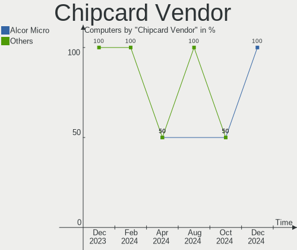

Xubuntu Hardware Trends
-----------------------

A project to identify most popular hardware characteristics and track their change
over time based on data collected by Xubuntu users at https://Linux-Hardware.org.

Anyone can contribute to this report by the [hw-probe](https://github.com/linuxhw/hw-probe) tool:

    sudo -E hw-probe -all -upload

This is a report for all computer types. See also reports for [desktops](/Dist/Xubuntu/Desktop/README.md) and [notebooks](/Dist/Xubuntu/Notebook/README.md).

This report is for one last month. Overall report since the beginning of time: [TestCoverage](https://github.com/linuxhw/TestCoverage)

Period: Apr, 2022.

Contents
--------

* [ System ](#system)
  - [ OS                       ](#os)
  - [ OS Family                ](#os-family)
  - [ Kernel                   ](#kernel)
  - [ Kernel Family            ](#kernel-family)
  - [ Kernel Major Ver.        ](#kernel-major-ver)
  - [ Arch                     ](#arch)
  - [ DE                       ](#de)
  - [ Display Server           ](#display-server)
  - [ Display Manager          ](#display-manager)
  - [ OS Lang                  ](#os-lang)
  - [ Boot Mode                ](#boot-mode)
  - [ Filesystem               ](#filesystem)
  - [ Part. scheme             ](#part-scheme)
  - [ Dual Boot with Linux/BSD ](#dual-boot-with-linuxbsd)
  - [ Dual Boot (Win)          ](#dual-boot-win)

* [ Board ](#board)
  - [ Vendor                   ](#vendor)
  - [ Model                    ](#model)
  - [ Model Family             ](#model-family)
  - [ MFG Year                 ](#mfg-year)
  - [ Form Factor              ](#form-factor)
  - [ Secure Boot              ](#secure-boot)
  - [ Coreboot                 ](#coreboot)
  - [ RAM Size                 ](#ram-size)
  - [ RAM Used                 ](#ram-used)
  - [ Total Drives             ](#total-drives)
  - [ Has CD-ROM               ](#has-cd-rom)
  - [ Has Ethernet             ](#has-ethernet)
  - [ Has WiFi                 ](#has-wifi)
  - [ Has Bluetooth            ](#has-bluetooth)

* [ Location ](#location)
  - [ Country                  ](#country)
  - [ City                     ](#city)

* [ Drives ](#drives)
  - [ Drive Vendor             ](#drive-vendor)
  - [ Drive Model              ](#drive-model)
  - [ HDD Vendor               ](#hdd-vendor)
  - [ SSD Vendor               ](#ssd-vendor)
  - [ Drive Kind               ](#drive-kind)
  - [ Drive Connector          ](#drive-connector)
  - [ Drive Size               ](#drive-size)
  - [ Space Total              ](#space-total)
  - [ Space Used               ](#space-used)
  - [ Malfunc. Drives          ](#malfunc-drives)
  - [ Malfunc. Drive Vendor    ](#malfunc-drive-vendor)
  - [ Malfunc. HDD Vendor      ](#malfunc-hdd-vendor)
  - [ Malfunc. Drive Kind      ](#malfunc-drive-kind)
  - [ Failed Drives            ](#failed-drives)
  - [ Failed Drive Vendor      ](#failed-drive-vendor)
  - [ Drive Status             ](#drive-status)

* [ Storage controller ](#storage-controller)
  - [ Storage Vendor           ](#storage-vendor)
  - [ Storage Model            ](#storage-model)
  - [ Storage Kind             ](#storage-kind)

* [ Processor ](#processor)
  - [ CPU Vendor               ](#cpu-vendor)
  - [ CPU Model                ](#cpu-model)
  - [ CPU Model Family         ](#cpu-model-family)
  - [ CPU Cores                ](#cpu-cores)
  - [ CPU Sockets              ](#cpu-sockets)
  - [ CPU Threads              ](#cpu-threads)
  - [ CPU Op-Modes             ](#cpu-op-modes)
  - [ CPU Microcode            ](#cpu-microcode)
  - [ CPU Microarch            ](#cpu-microarch)

* [ Graphics ](#graphics)
  - [ GPU Vendor               ](#gpu-vendor)
  - [ GPU Model                ](#gpu-model)
  - [ GPU Combo                ](#gpu-combo)
  - [ GPU Driver               ](#gpu-driver)
  - [ GPU Memory               ](#gpu-memory)

* [ Monitor ](#monitor)
  - [ Monitor Vendor           ](#monitor-vendor)
  - [ Monitor Model            ](#monitor-model)
  - [ Monitor Resolution       ](#monitor-resolution)
  - [ Monitor Diagonal         ](#monitor-diagonal)
  - [ Monitor Width            ](#monitor-width)
  - [ Aspect Ratio             ](#aspect-ratio)
  - [ Monitor Area             ](#monitor-area)
  - [ Pixel Density            ](#pixel-density)
  - [ Multiple Monitors        ](#multiple-monitors)

* [ Network ](#network)
  - [ Net Controller Vendor    ](#net-controller-vendor)
  - [ Net Controller Model     ](#net-controller-model)
  - [ Wireless Vendor          ](#wireless-vendor)
  - [ Wireless Model           ](#wireless-model)
  - [ Ethernet Vendor          ](#ethernet-vendor)
  - [ Ethernet Model           ](#ethernet-model)
  - [ Net Controller Kind      ](#net-controller-kind)
  - [ Used Controller          ](#used-controller)
  - [ NICs                     ](#nics)
  - [ IPv6                     ](#ipv6)

* [ Bluetooth ](#bluetooth)
  - [ Bluetooth Vendor         ](#bluetooth-vendor)
  - [ Bluetooth Model          ](#bluetooth-model)

* [ Sound ](#sound)
  - [ Sound Vendor             ](#sound-vendor)
  - [ Sound Model              ](#sound-model)

* [ Memory ](#memory)
  - [ Memory Vendor            ](#memory-vendor)
  - [ Memory Model             ](#memory-model)
  - [ Memory Kind              ](#memory-kind)
  - [ Memory Form Factor       ](#memory-form-factor)
  - [ Memory Size              ](#memory-size)
  - [ Memory Speed             ](#memory-speed)

* [ Printers & scanners ](#printers--scanners)
  - [ Printer Vendor           ](#printer-vendor)
  - [ Printer Model            ](#printer-model)
  - [ Scanner Vendor           ](#scanner-vendor)
  - [ Scanner Model            ](#scanner-model)

* [ Camera ](#camera)
  - [ Camera Vendor            ](#camera-vendor)
  - [ Camera Model             ](#camera-model)

* [ Security ](#security)
  - [ Fingerprint Vendor       ](#fingerprint-vendor)
  - [ Fingerprint Model        ](#fingerprint-model)
  - [ Chipcard Vendor          ](#chipcard-vendor)
  - [ Chipcard Model           ](#chipcard-model)

* [ Unsupported ](#unsupported)
  - [ Unsupported Devices      ](#unsupported-devices)
  - [ Unsupported Device Types ](#unsupported-device-types)

System
------

OS
--

Installed operating systems

| Name          | Computers | Percent |
|---------------|-----------|---------|
| Xubuntu 20.04 | 50        | 65.79%  |
| Xubuntu 21.10 | 11        | 14.47%  |
| Xubuntu 22.04 | 10        | 13.16%  |
| Xubuntu 18.04 | 4         | 5.26%   |
| Xubuntu 16.04 | 1         | 1.32%   |

OS Family
---------

OS without a version

| Name    | Computers | Percent |
|---------|-----------|---------|
| Xubuntu | 76        | 100%    |

Kernel
------

Version of the Linux kernel

| Version               | Computers | Percent |
|-----------------------|-----------|---------|
| 5.13.0-39-generic     | 22        | 28.95%  |
| 5.4.0-107-generic     | 15        | 19.74%  |
| 5.15.0-27-generic     | 5         | 6.58%   |
| 5.13.0-39-lowlatency  | 4         | 5.26%   |
| 5.4.0-109-generic     | 3         | 3.95%   |
| 5.4.0-107-lowlatency  | 3         | 3.95%   |
| 5.15.0-25-generic     | 3         | 3.95%   |
| 5.13.0-40-generic     | 3         | 3.95%   |
| 5.4.0-105-generic     | 2         | 2.63%   |
| 5.4.0-100-lowlatency  | 2         | 2.63%   |
| 5.6.19-050619-generic | 1         | 1.32%   |
| 5.4.65-sunxi          | 1         | 1.32%   |
| 5.4.0-91-generic      | 1         | 1.32%   |
| 5.4.0-77-lowlatency   | 1         | 1.32%   |
| 5.17.3-051703-generic | 1         | 1.32%   |
| 5.17.0-ashpy3-lyesdef | 1         | 1.32%   |
| 5.13.0-40-lowlatency  | 1         | 1.32%   |
| 5.13.0-37-generic     | 1         | 1.32%   |
| 5.13.0-35-generic     | 1         | 1.32%   |
| 5.13.0-30-generic     | 1         | 1.32%   |
| 4.9.253-tegra         | 1         | 1.32%   |
| 4.4.0-223-generic     | 1         | 1.32%   |
| 4.19.219-odroid-arm64 | 1         | 1.32%   |
| 4.15.0-176-generic    | 1         | 1.32%   |

Kernel Family
-------------

Linux kernel without a distro release

| Version  | Computers | Percent |
|----------|-----------|---------|
| 5.13.0   | 33        | 43.42%  |
| 5.4.0    | 27        | 35.53%  |
| 5.15.0   | 8         | 10.53%  |
| 5.6.19   | 1         | 1.32%   |
| 5.4.65   | 1         | 1.32%   |
| 5.17.3   | 1         | 1.32%   |
| 5.17.0   | 1         | 1.32%   |
| 4.9.253  | 1         | 1.32%   |
| 4.4.0    | 1         | 1.32%   |
| 4.19.219 | 1         | 1.32%   |
| 4.15.0   | 1         | 1.32%   |

Kernel Major Ver.
-----------------

Linux kernel major version

| Version | Computers | Percent |
|---------|-----------|---------|
| 5.13    | 33        | 43.42%  |
| 5.4     | 28        | 36.84%  |
| 5.15    | 8         | 10.53%  |
| 5.17    | 2         | 2.63%   |
| 5.6     | 1         | 1.32%   |
| 4.9     | 1         | 1.32%   |
| 4.4     | 1         | 1.32%   |
| 4.19    | 1         | 1.32%   |
| 4.15    | 1         | 1.32%   |

Arch
----

OS architecture (x86_64, i586, etc.)

| Name    | Computers | Percent |
|---------|-----------|---------|
| x86_64  | 71        | 93.42%  |
| i686    | 2         | 2.63%   |
| aarch64 | 2         | 2.63%   |
| armv7l  | 1         | 1.32%   |

DE
--

Desktop Environment

| Name            | Computers | Percent |
|-----------------|-----------|---------|
| XFCE            | 71        | 93.42%  |
| GNOME           | 3         | 3.95%   |
| KDE5            | 1         | 1.32%   |
| GNOME Flashback | 1         | 1.32%   |

Display Server
--------------

X11 or Wayland

| Name    | Computers | Percent |
|---------|-----------|---------|
| X11     | 71        | 93.42%  |
| Tty     | 4         | 5.26%   |
| Wayland | 1         | 1.32%   |

Display Manager
---------------

SDDM, LightDM, etc.

| Name    | Computers | Percent |
|---------|-----------|---------|
| LightDM | 64        | 84.21%  |
| GDM     | 5         | 6.58%   |
| Unknown | 5         | 6.58%   |
| GDM3    | 2         | 2.63%   |

OS Lang
-------

Language

| Lang  | Computers | Percent |
|-------|-----------|---------|
| en_US | 36        | 47.37%  |
| it_IT | 7         | 9.21%   |
| de_DE | 7         | 9.21%   |
| fr_FR | 4         | 5.26%   |
| ru_RU | 3         | 3.95%   |
| en_CA | 3         | 3.95%   |
| pt_PT | 2         | 2.63%   |
| pl_PL | 2         | 2.63%   |
| hu_HU | 2         | 2.63%   |
| en_IN | 2         | 2.63%   |
| zh_CN | 1         | 1.32%   |
| pt_BR | 1         | 1.32%   |
| ja_JP | 1         | 1.32%   |
| es_MX | 1         | 1.32%   |
| es_ES | 1         | 1.32%   |
| en_GB | 1         | 1.32%   |
| C     | 1         | 1.32%   |
| bg_BG | 1         | 1.32%   |

Boot Mode
---------

EFI or BIOS

| Mode | Computers | Percent |
|------|-----------|---------|
| BIOS | 45        | 59.21%  |
| EFI  | 31        | 40.79%  |

Filesystem
----------

Type of filesystem

| Type    | Computers | Percent |
|---------|-----------|---------|
| Ext4    | 70        | 92.11%  |
| Zfs     | 2         | 2.63%   |
| Overlay | 2         | 2.63%   |
| Ext3    | 1         | 1.32%   |
| Btrfs   | 1         | 1.32%   |

Part. scheme
------------

Scheme of partitioning

| Type    | Computers | Percent |
|---------|-----------|---------|
| Unknown | 38        | 50%     |
| GPT     | 30        | 39.47%  |
| MBR     | 8         | 10.53%  |

Dual Boot with Linux/BSD
------------------------

Hosting more than one Linux/BSD

| Dual boot | Computers | Percent |
|-----------|-----------|---------|
| No        | 64        | 84.21%  |
| Yes       | 12        | 15.79%  |

Dual Boot (Win)
---------------

Hosting Linux and Windows

| Dual boot | Computers | Percent |
|-----------|-----------|---------|
| No        | 50        | 65.79%  |
| Yes       | 26        | 34.21%  |

Board
-----

Vendor
------

Motherboard manufacturer

| Name                  | Computers | Percent |
|-----------------------|-----------|---------|
| Hewlett-Packard       | 14        | 18.42%  |
| Dell                  | 14        | 18.42%  |
| Lenovo                | 13        | 17.11%  |
| ASUSTek Computer      | 9         | 11.84%  |
| MSI                   | 5         | 6.58%   |
| Gigabyte Technology   | 4         | 5.26%   |
| Acer                  | 4         | 5.26%   |
| Fujitsu               | 2         | 2.63%   |
| Xunlong               | 1         | 1.32%   |
| Toshiba               | 1         | 1.32%   |
| Supermicro            | 1         | 1.32%   |
| Shuttle               | 1         | 1.32%   |
| Positivo Bahia - VAIO | 1         | 1.32%   |
| Nvidia                | 1         | 1.32%   |
| Hardkernel            | 1         | 1.32%   |
| eMachines             | 1         | 1.32%   |
| Dynabook              | 1         | 1.32%   |
| Apple                 | 1         | 1.32%   |
| Unknown               | 1         | 1.32%   |

Model
-----

Motherboard model

| Name                                       | Computers | Percent |
|--------------------------------------------|-----------|---------|
| MSI MS-7C56                                | 2         | 2.63%   |
| Dell OptiPlex 7010                         | 2         | 2.63%   |
| Xunlong Orange Pi PC                       | 1         | 1.32%   |
| Toshiba NB505                              | 1         | 1.32%   |
| Supermicro Super Server                    | 1         | 1.32%   |
| Shuttle XH61V                              | 1         | 1.32%   |
| Positivo Bahia - VAIO VJC141F11X-B0111L    | 1         | 1.32%   |
| Nvidia Tegra                               | 1         | 1.32%   |
| MSI MS-7B89                                | 1         | 1.32%   |
| MSI MS-7752                                | 1         | 1.32%   |
| MSI GX70 3CC                               | 1         | 1.32%   |
| Lenovo ThinkPad X280 20KE001MMX            | 1         | 1.32%   |
| Lenovo ThinkPad T480s 20L7001PIX           | 1         | 1.32%   |
| Lenovo ThinkPad T470s 20HF004MMX           | 1         | 1.32%   |
| Lenovo ThinkPad T440 20B7A0S200            | 1         | 1.32%   |
| Lenovo ThinkPad T14s Gen 2i 20WM00B9MX     | 1         | 1.32%   |
| Lenovo ThinkPad P53 20QNS01C00             | 1         | 1.32%   |
| Lenovo ThinkPad E590 20NB0029GE            | 1         | 1.32%   |
| Lenovo ThinkCentre M83 10AGS03400          | 1         | 1.32%   |
| Lenovo ThinkBook 14 G2 ARE 20VF            | 1         | 1.32%   |
| Lenovo IdeaPad Y550 4186                   | 1         | 1.32%   |
| Lenovo IdeaPad 100-15IBY 80MJ              | 1         | 1.32%   |
| Lenovo IdeaCentre AIO 300-22ACL F0BW000LUS | 1         | 1.32%   |
| Lenovo B590 20206                          | 1         | 1.32%   |
| HP t620 Quad Core TC                       | 1         | 1.32%   |
| HP Spectre x360 Convertible 15-eb1xxx      | 1         | 1.32%   |
| HP ProBook 455 G8 Notebook PC              | 1         | 1.32%   |
| HP Pavilion dv6500                         | 1         | 1.32%   |
| HP Pavilion 15                             | 1         | 1.32%   |
| HP OMEN by Laptop 16-c0xxx                 | 1         | 1.32%   |
| HP Laptop 15s-fq2xxx                       | 1         | 1.32%   |
| HP Laptop 15-bw0xx                         | 1         | 1.32%   |
| HP ENVY Sleekbook 6 PC                     | 1         | 1.32%   |
| HP EliteDesk 800 G1 USDT                   | 1         | 1.32%   |
| HP Compaq dc7600 Small Form Factor         | 1         | 1.32%   |
| HP Compaq 6730s                            | 1         | 1.32%   |
| HP Compaq 6730b (GW687AV)                  | 1         | 1.32%   |
| HP 255 G8 Notebook PC                      | 1         | 1.32%   |
| Hardkernel ODROID-M1                       | 1         | 1.32%   |
| Gigabyte P55A-UD3                          | 1         | 1.32%   |
| Gigabyte H97-D3H                           | 1         | 1.32%   |
| Gigabyte H310M S2H 2.0                     | 1         | 1.32%   |
| Gigabyte G33M-DS2R                         | 1         | 1.32%   |
| Fujitsu ESPRIMO E710                       | 1         | 1.32%   |
| Fujitsu ESPRIMO E705                       | 1         | 1.32%   |
| eMachines ET1331G                          | 1         | 1.32%   |
| Dynabook TECRA X40-F                       | 1         | 1.32%   |
| Dell XPS M1530                             | 1         | 1.32%   |
| Dell Vostro 360                            | 1         | 1.32%   |
| Dell Precision 7550                        | 1         | 1.32%   |
| Dell OptiPlex 9020                         | 1         | 1.32%   |
| Dell OptiPlex 760                          | 1         | 1.32%   |
| Dell OptiPlex 7440 AIO                     | 1         | 1.32%   |
| Dell MXG061                                | 1         | 1.32%   |
| Dell Latitude E6540                        | 1         | 1.32%   |
| Dell Latitude 7480                         | 1         | 1.32%   |
| Dell Latitude 5521                         | 1         | 1.32%   |
| Dell Inspiron 3135                         | 1         | 1.32%   |
| Dell Inspiron 11-3162                      | 1         | 1.32%   |
| ASUS TUF Gaming X570-PRO                   | 1         | 1.32%   |

Model Family
------------

Motherboard model prefix

| Name                                    | Computers | Percent |
|-----------------------------------------|-----------|---------|
| Lenovo ThinkPad                         | 7         | 9.21%   |
| Dell OptiPlex                           | 5         | 6.58%   |
| HP Compaq                               | 3         | 3.95%   |
| Dell Latitude                           | 3         | 3.95%   |
| MSI MS-7C56                             | 2         | 2.63%   |
| Lenovo IdeaPad                          | 2         | 2.63%   |
| HP Pavilion                             | 2         | 2.63%   |
| HP Laptop                               | 2         | 2.63%   |
| Fujitsu ESPRIMO                         | 2         | 2.63%   |
| Dell Inspiron                           | 2         | 2.63%   |
| Acer Aspire                             | 2         | 2.63%   |
| Xunlong Orange                          | 1         | 1.32%   |
| Toshiba NB505                           | 1         | 1.32%   |
| Supermicro Super                        | 1         | 1.32%   |
| Shuttle XH61V                           | 1         | 1.32%   |
| Positivo Bahia - VAIO VJC141F11X-B0111L | 1         | 1.32%   |
| Nvidia Tegra                            | 1         | 1.32%   |
| MSI MS-7B89                             | 1         | 1.32%   |
| MSI MS-7752                             | 1         | 1.32%   |
| MSI GX70                                | 1         | 1.32%   |
| Lenovo ThinkCentre                      | 1         | 1.32%   |
| Lenovo ThinkBook                        | 1         | 1.32%   |
| Lenovo IdeaCentre                       | 1         | 1.32%   |
| Lenovo B590                             | 1         | 1.32%   |
| HP t620                                 | 1         | 1.32%   |
| HP Spectre                              | 1         | 1.32%   |
| HP ProBook                              | 1         | 1.32%   |
| HP OMEN                                 | 1         | 1.32%   |
| HP ENVY                                 | 1         | 1.32%   |
| HP EliteDesk                            | 1         | 1.32%   |
| HP 255                                  | 1         | 1.32%   |
| Hardkernel ODROID-M1                    | 1         | 1.32%   |
| Gigabyte P55A-UD3                       | 1         | 1.32%   |
| Gigabyte H97-D3H                        | 1         | 1.32%   |
| Gigabyte H310M                          | 1         | 1.32%   |
| Gigabyte G33M-DS2R                      | 1         | 1.32%   |
| eMachines ET1331G                       | 1         | 1.32%   |
| Dynabook TECRA                          | 1         | 1.32%   |
| Dell XPS                                | 1         | 1.32%   |
| Dell Vostro                             | 1         | 1.32%   |
| Dell Precision                          | 1         | 1.32%   |
| Dell MXG061                             | 1         | 1.32%   |
| ASUS TUF                                | 1         | 1.32%   |
| ASUS T100HAN                            | 1         | 1.32%   |
| ASUS P8Z77-V                            | 1         | 1.32%   |
| ASUS P8Z68                              | 1         | 1.32%   |
| ASUS P5G41T-M                           | 1         | 1.32%   |
| ASUS Maximus                            | 1         | 1.32%   |
| ASUS K53SC                              | 1         | 1.32%   |
| ASUS ASUS                               | 1         | 1.32%   |
| ASUS 1215N                              | 1         | 1.32%   |
| Apple MacPro5                           | 1         | 1.32%   |
| Acer Switch                             | 1         | 1.32%   |
| Acer Nitro                              | 1         | 1.32%   |
| Unknown                                 | 1         | 1.32%   |

MFG Year
--------

Motherboard manufacture year

| Year    | Computers | Percent |
|---------|-----------|---------|
| 2013    | 11        | 14.47%  |
| 2020    | 8         | 10.53%  |
| 2021    | 7         | 9.21%   |
| 2012    | 6         | 7.89%   |
| 2018    | 5         | 6.58%   |
| 2014    | 5         | 6.58%   |
| 2011    | 5         | 6.58%   |
| 2019    | 4         | 5.26%   |
| 2017    | 4         | 5.26%   |
| 2015    | 4         | 5.26%   |
| 2009    | 4         | 5.26%   |
| 2010    | 3         | 3.95%   |
| Unknown | 3         | 3.95%   |
| 2008    | 2         | 2.63%   |
| 2007    | 2         | 2.63%   |
| 2016    | 1         | 1.32%   |
| 2006    | 1         | 1.32%   |
| 2005    | 1         | 1.32%   |

Form Factor
-----------

Physical design of the computer

| Name           | Computers | Percent |
|----------------|-----------|---------|
| Notebook       | 39        | 51.32%  |
| Desktop        | 28        | 36.84%  |
| System on chip | 3         | 3.95%   |
| All in one     | 3         | 3.95%   |
| Tablet         | 1         | 1.32%   |
| Convertible    | 1         | 1.32%   |
| Server         | 1         | 1.32%   |

Secure Boot
-----------

Enabled or disabled

| State    | Computers | Percent |
|----------|-----------|---------|
| Disabled | 71        | 93.42%  |
| Enabled  | 5         | 6.58%   |

Coreboot
--------

Have coreboot on board

| Used | Computers | Percent |
|------|-----------|---------|
| No   | 76        | 100%    |

RAM Size
--------

Total RAM memory

| Size in GB  | Computers | Percent |
|-------------|-----------|---------|
| 16.01-24.0  | 17        | 22.37%  |
| 4.01-8.0    | 15        | 19.74%  |
| 3.01-4.0    | 15        | 19.74%  |
| 8.01-16.0   | 13        | 17.11%  |
| 1.01-2.0    | 7         | 9.21%   |
| 32.01-64.0  | 6         | 7.89%   |
| 64.01-256.0 | 2         | 2.63%   |
| 0.51-1.0    | 1         | 1.32%   |

RAM Used
--------

Used RAM memory

| Used GB    | Computers | Percent |
|------------|-----------|---------|
| 1.01-2.0   | 29        | 38.16%  |
| 2.01-3.0   | 12        | 15.79%  |
| 4.01-8.0   | 11        | 14.47%  |
| 3.01-4.0   | 9         | 11.84%  |
| 0.51-1.0   | 8         | 10.53%  |
| 8.01-16.0  | 4         | 5.26%   |
| 24.01-32.0 | 1         | 1.32%   |
| 16.01-24.0 | 1         | 1.32%   |
| 0.01-0.5   | 1         | 1.32%   |

Total Drives
------------

Number of drives on board

| Drives | Computers | Percent |
|--------|-----------|---------|
| 1      | 47        | 61.84%  |
| 2      | 16        | 21.05%  |
| 3      | 9         | 11.84%  |
| 4      | 2         | 2.63%   |
| 6      | 1         | 1.32%   |
| 5      | 1         | 1.32%   |

Has CD-ROM
----------

Has CD-ROM on board

| Presented | Computers | Percent |
|-----------|-----------|---------|
| No        | 42        | 55.26%  |
| Yes       | 34        | 44.74%  |

Has Ethernet
------------

Has Ethernet on board

| Presented | Computers | Percent |
|-----------|-----------|---------|
| Yes       | 68        | 89.47%  |
| No        | 8         | 10.53%  |

Has WiFi
--------

Has WiFi module

| Presented | Computers | Percent |
|-----------|-----------|---------|
| Yes       | 54        | 71.05%  |
| No        | 22        | 28.95%  |

Has Bluetooth
-------------

Has Bluetooth module

| Presented | Computers | Percent |
|-----------|-----------|---------|
| Yes       | 41        | 53.95%  |
| No        | 35        | 46.05%  |

Location
--------

Country
-------

Geographic location (country)

| Country      | Computers | Percent |
|--------------|-----------|---------|
| USA          | 22        | 28.95%  |
| Germany      | 12        | 15.79%  |
| Italy        | 7         | 9.21%   |
| Russia       | 5         | 6.58%   |
| France       | 4         | 5.26%   |
| Sweden       | 3         | 3.95%   |
| India        | 3         | 3.95%   |
| Hungary      | 3         | 3.95%   |
| Spain        | 2         | 2.63%   |
| Portugal     | 2         | 2.63%   |
| Poland       | 2         | 2.63%   |
| Canada       | 2         | 2.63%   |
| Brazil       | 2         | 2.63%   |
| Saudi Arabia | 1         | 1.32%   |
| Netherlands  | 1         | 1.32%   |
| Mexico       | 1         | 1.32%   |
| Japan        | 1         | 1.32%   |
| Ireland      | 1         | 1.32%   |
| Croatia      | 1         | 1.32%   |
| Bulgaria     | 1         | 1.32%   |

City
----

Geographic location (city)

| City               | Computers | Percent |
|--------------------|-----------|---------|
| Uppsala            | 3         | 3.95%   |
| Budapest           | 3         | 3.95%   |
| St Petersburg      | 2         | 2.63%   |
| Leipzig            | 2         | 2.63%   |
| Zagreb             | 1         | 1.32%   |
| Youngstown         | 1         | 1.32%   |
| Yakutsk            | 1         | 1.32%   |
| Wylie              | 1         | 1.32%   |
| Wake Forest        | 1         | 1.32%   |
| Venice             | 1         | 1.32%   |
| Upper Marlboro     | 1         | 1.32%   |
| Sulzbach-Rosenberg | 1         | 1.32%   |
| Sofia              | 1         | 1.32%   |
| Sinzig             | 1         | 1.32%   |
| Simpsonville       | 1         | 1.32%   |
| Schmitten          | 1         | 1.32%   |
| Schiffweiler       | 1         | 1.32%   |
| San Donà di Piave | 1         | 1.32%   |
| Salamanca          | 1         | 1.32%   |
| Saint Paul         | 1         | 1.32%   |
| Roswell            | 1         | 1.32%   |
| Roseville          | 1         | 1.32%   |
| Roseburg           | 1         | 1.32%   |
| Ridgeway           | 1         | 1.32%   |
| Puygouzon          | 1         | 1.32%   |
| Powell             | 1         | 1.32%   |
| Porto              | 1         | 1.32%   |
| Piacenza           | 1         | 1.32%   |
| Paris              | 1         | 1.32%   |
| Palaiseau          | 1         | 1.32%   |
| Pabianice          | 1         | 1.32%   |
| Ouro Preto         | 1         | 1.32%   |
| Ottawa             | 1         | 1.32%   |
| Olesnica           | 1         | 1.32%   |
| Nuremberg          | 1         | 1.32%   |
| Niterói           | 1         | 1.32%   |
| Naples             | 1         | 1.32%   |
| Mumbai             | 1         | 1.32%   |
| Mitaka             | 1         | 1.32%   |
| Melvindale         | 1         | 1.32%   |
| Madrid             | 1         | 1.32%   |
| León              | 1         | 1.32%   |
| Leesville          | 1         | 1.32%   |
| La Maddalena       | 1         | 1.32%   |
| Krasnodar          | 1         | 1.32%   |
| Kazan’           | 1         | 1.32%   |
| Karlsruhe          | 1         | 1.32%   |
| Jeddah             | 1         | 1.32%   |
| Huntingdon         | 1         | 1.32%   |
| Hockessin          | 1         | 1.32%   |
| Hamburg            | 1         | 1.32%   |
| Girard             | 1         | 1.32%   |
| Genoa              | 1         | 1.32%   |
| Frankfurt am Main  | 1         | 1.32%   |
| Fort Collins       | 1         | 1.32%   |
| Feldthurns         | 1         | 1.32%   |
| Eugene             | 1         | 1.32%   |
| Ernakulam          | 1         | 1.32%   |
| Ericeira           | 1         | 1.32%   |
| Dublin             | 1         | 1.32%   |

Drives
------

Drive Vendor
------------

Hard drive vendors

| Vendor              | Computers | Drives | Percent |
|---------------------|-----------|--------|---------|
| WDC                 | 20        | 26     | 18.02%  |
| Samsung Electronics | 20        | 24     | 18.02%  |
| Seagate             | 18        | 21     | 16.22%  |
| Unknown             | 7         | 8      | 6.31%   |
| SanDisk             | 6         | 6      | 5.41%   |
| SK Hynix            | 5         | 5      | 4.5%    |
| Kingston            | 5         | 6      | 4.5%    |
| Toshiba             | 4         | 4      | 3.6%    |
| Hitachi             | 4         | 4      | 3.6%    |
| Crucial             | 3         | 3      | 2.7%    |
| Transcend           | 2         | 3      | 1.8%    |
| OCZ                 | 2         | 2      | 1.8%    |
| Intel               | 2         | 3      | 1.8%    |
| ZTC-SM20            | 1         | 1      | 0.9%    |
| WANGCHU             | 1         | 1      | 0.9%    |
| Smartbuy            | 1         | 1      | 0.9%    |
| PNY                 | 1         | 1      | 0.9%    |
| Phison              | 1         | 1      | 0.9%    |
| PHD 3.0             | 1         | 1      | 0.9%    |
| Micron Technology   | 1         | 1      | 0.9%    |
| Mercury             | 1         | 1      | 0.9%    |
| KIOXIA              | 1         | 1      | 0.9%    |
| JMicron             | 1         | 1      | 0.9%    |
| Fujitsu             | 1         | 1      | 0.9%    |
| China               | 1         | 1      | 0.9%    |
| A-DATA Technology   | 1         | 1      | 0.9%    |

Drive Model
-----------

Hard drive models

| Model                                   | Computers | Percent |
|-----------------------------------------|-----------|---------|
| WDC PC SN730 SDBQNTY-256G-1001 256GB    | 2         | 1.6%    |
| Unknown MMC Card  32GB                  | 2         | 1.6%    |
| Seagate ST500LT012-9WS142 500GB         | 2         | 1.6%    |
| Seagate ST500LT012-1DG142 500GB         | 2         | 1.6%    |
| Seagate ST500LM012 HN-M500MBB 500GB     | 2         | 1.6%    |
| Seagate ST500DM002-1BD142 500GB         | 2         | 1.6%    |
| Seagate ST2000DM008-2FR102 2TB          | 2         | 1.6%    |
| Seagate ST1000DM010-2EP102 1TB          | 2         | 1.6%    |
| SanDisk SDSSDH3512G 512GB               | 2         | 1.6%    |
| Samsung SSD 980 1TB                     | 2         | 1.6%    |
| Samsung SSD 860 EVO 500GB               | 2         | 1.6%    |
| Samsung SSD 850 EVO 500GB               | 2         | 1.6%    |
| Samsung SSD 850 EVO 250GB               | 2         | 1.6%    |
| OCZ AGILITY3 64GB SSD                   | 2         | 1.6%    |
| Kingston SA400S37480G 480GB SSD         | 2         | 1.6%    |
| Kingston SA400S37240G 240GB SSD         | 2         | 1.6%    |
| ZTC-SM20 1-256G                         | 1         | 0.8%    |
| WDC WDS250G2B0B-00YS70 250GB SSD        | 1         | 0.8%    |
| WDC WDS240G2G0A-00JH30 240GB SSD        | 1         | 0.8%    |
| WDC WDS200T2B0B-00YS70 2TB SSD          | 1         | 0.8%    |
| WDC WD60EFAX-68JH4N1 6TB                | 1         | 0.8%    |
| WDC WD5000LPVX-22V0TT0 500GB            | 1         | 0.8%    |
| WDC WD40EFRX-68WT0N0 4TB                | 1         | 0.8%    |
| WDC WD3200BPVT-22JJ5T0 320GB            | 1         | 0.8%    |
| WDC WD3200BEVT-22ZCT0 320GB             | 1         | 0.8%    |
| WDC WD3200AAKS-75SBA0 320GB             | 1         | 0.8%    |
| WDC WD3200AAKS-00B3A0 320GB             | 1         | 0.8%    |
| WDC WD30EZRX-00MMMB0 3TB                | 1         | 0.8%    |
| WDC WD2500HHTZ-04N21V0 250GB            | 1         | 0.8%    |
| WDC WD2500BEVT-22A23T0 250GB            | 1         | 0.8%    |
| WDC WD2500AAJS-08L7A0 250GB             | 1         | 0.8%    |
| WDC WD1600BEVT-60ZCT1 160GB             | 1         | 0.8%    |
| WDC WD15EARS-60MVWB0 1TB                | 1         | 0.8%    |
| WDC WD10JPVX-22JC3T0 1TB                | 1         | 0.8%    |
| WDC WD10EARX-00N0YB0 1TB                | 1         | 0.8%    |
| WDC WD10EARS-22Y5B1 1TB                 | 1         | 0.8%    |
| WDC WD1002FAEX-00Z3A0 1TB               | 1         | 0.8%    |
| WDC WD10 EFRX-68PJCN0 1TB               | 1         | 0.8%    |
| WDC PC SN520 SDAPNUW-512G-1014 512GB    | 1         | 0.8%    |
| WANGCHU SSD 120GB                       | 1         | 0.8%    |
| Unknown SD08G  8GB                      | 1         | 0.8%    |
| Unknown MMC Card  64GB                  | 1         | 0.8%    |
| Unknown MMC Card  16GB                  | 1         | 0.8%    |
| Unknown MMC Card  134GB                 | 1         | 0.8%    |
| Unknown EB1QT  32GB                     | 1         | 0.8%    |
| Unknown CGND3R  64GB                    | 1         | 0.8%    |
| Transcend TS512GMTE220S 512GB           | 1         | 0.8%    |
| Transcend TS128GSSD370 128GB            | 1         | 0.8%    |
| Toshiba MQ01ACF032 320GB                | 1         | 0.8%    |
| Toshiba MK7559GSXF 752GB                | 1         | 0.8%    |
| Toshiba KXG50ZNV1T02 NVMe 1024GB        | 1         | 0.8%    |
| Toshiba KSG60ZMV256G M.2 2280 256GB SSD | 1         | 0.8%    |
| Smartbuy SSD 60GB                       | 1         | 0.8%    |
| SK Hynix SH920 2.5 7MM 256GB SSD        | 1         | 0.8%    |
| SK Hynix PC711 NVMe 512GB               | 1         | 0.8%    |
| SK Hynix PC611 NVMe 512GB               | 1         | 0.8%    |
| SK Hynix HFM512GDHTNG-8710B 512GB       | 1         | 0.8%    |
| SK Hynix BC711 HFM512GD3JX013N 512GB    | 1         | 0.8%    |
| Seagate ST9250315AS 250GB               | 1         | 0.8%    |
| Seagate ST500LM030-2E717D 500GB         | 1         | 0.8%    |

HDD Vendor
----------

Hard disk drive vendors

| Vendor              | Computers | Drives | Percent |
|---------------------|-----------|--------|---------|
| Seagate             | 17        | 20     | 42.5%   |
| WDC                 | 14        | 20     | 35%     |
| Hitachi             | 4         | 4      | 10%     |
| Toshiba             | 2         | 2      | 5%      |
| Samsung Electronics | 1         | 1      | 2.5%    |
| PHD 3.0             | 1         | 1      | 2.5%    |
| Fujitsu             | 1         | 1      | 2.5%    |

SSD Vendor
----------

Solid state drive vendors

| Vendor              | Computers | Drives | Percent |
|---------------------|-----------|--------|---------|
| Samsung Electronics | 12        | 14     | 29.27%  |
| SanDisk             | 6         | 6      | 14.63%  |
| Kingston            | 4         | 4      | 9.76%   |
| WDC                 | 3         | 3      | 7.32%   |
| OCZ                 | 2         | 2      | 4.88%   |
| Crucial             | 2         | 2      | 4.88%   |
| WANGCHU             | 1         | 1      | 2.44%   |
| Transcend           | 1         | 1      | 2.44%   |
| Toshiba             | 1         | 1      | 2.44%   |
| Smartbuy            | 1         | 1      | 2.44%   |
| SK Hynix            | 1         | 1      | 2.44%   |
| Seagate             | 1         | 1      | 2.44%   |
| PNY                 | 1         | 1      | 2.44%   |
| Micron Technology   | 1         | 1      | 2.44%   |
| Mercury             | 1         | 1      | 2.44%   |
| JMicron             | 1         | 1      | 2.44%   |
| China               | 1         | 1      | 2.44%   |
| A-DATA Technology   | 1         | 1      | 2.44%   |

Drive Kind
----------

HDD or SSD

| Kind    | Computers | Drives | Percent |
|---------|-----------|--------|---------|
| HDD     | 35        | 49     | 35.35%  |
| SSD     | 34        | 43     | 34.34%  |
| NVMe    | 22        | 27     | 22.22%  |
| MMC     | 7         | 8      | 7.07%   |
| Unknown | 1         | 1      | 1.01%   |

Drive Connector
---------------

SATA, SAS, NVMe, etc.

| Type | Computers | Drives | Percent |
|------|-----------|--------|---------|
| SATA | 54        | 89     | 62.07%  |
| NVMe | 22        | 27     | 25.29%  |
| MMC  | 7         | 8      | 8.05%   |
| SAS  | 4         | 4      | 4.6%    |

Drive Size
----------

Size of hard drive

| Size in TB | Computers | Drives | Percent |
|------------|-----------|--------|---------|
| 0.01-0.5   | 47        | 63     | 68.12%  |
| 0.51-1.0   | 13        | 17     | 18.84%  |
| 3.01-4.0   | 3         | 4      | 4.35%   |
| 1.01-2.0   | 3         | 3      | 4.35%   |
| 2.01-3.0   | 1         | 3      | 1.45%   |
| 10.01-20.0 | 1         | 1      | 1.45%   |
| 4.01-10.0  | 1         | 1      | 1.45%   |

Space Total
-----------

Amount of disk space available on the file system

| Size in GB     | Computers | Percent |
|----------------|-----------|---------|
| 251-500        | 24        | 31.58%  |
| 101-250        | 17        | 22.37%  |
| 501-1000       | 10        | 13.16%  |
| 1001-2000      | 7         | 9.21%   |
| More than 3000 | 5         | 6.58%   |
| 21-50          | 4         | 5.26%   |
| 1-20           | 4         | 5.26%   |
| 51-100         | 4         | 5.26%   |
| Unknown        | 1         | 1.32%   |

Space Used
----------

Amount of used disk space

| Used GB        | Computers | Percent |
|----------------|-----------|---------|
| 1-20           | 21        | 27.63%  |
| 101-250        | 17        | 22.37%  |
| 21-50          | 14        | 18.42%  |
| 251-500        | 9         | 11.84%  |
| 51-100         | 5         | 6.58%   |
| 501-1000       | 4         | 5.26%   |
| More than 3000 | 3         | 3.95%   |
| 1001-2000      | 2         | 2.63%   |
| Unknown        | 1         | 1.32%   |

Malfunc. Drives
---------------

Drive models with a malfunction

| Model                                | Computers | Drives | Percent |
|--------------------------------------|-----------|--------|---------|
| WDC WD5000LPVX-22V0TT0 500GB         | 1         | 1      | 11.11%  |
| WDC WD1002FAEX-00Z3A0 1TB            | 1         | 1      | 11.11%  |
| SK Hynix SH920 2.5 7MM 256GB SSD     | 1         | 1      | 11.11%  |
| SK Hynix BC711 HFM512GD3JX013N 512GB | 1         | 1      | 11.11%  |
| Seagate ST500LT012-9WS142 500GB      | 1         | 1      | 11.11%  |
| Seagate ST500LT012-1DG142 500GB      | 1         | 1      | 11.11%  |
| Seagate ST500DM002-1BD142 500GB      | 1         | 1      | 11.11%  |
| Seagate ST3500418AS 500GB            | 1         | 1      | 11.11%  |
| Hitachi HTS543225L9A300 250GB        | 1         | 1      | 11.11%  |

Malfunc. Drive Vendor
---------------------

Vendors of faulty drives

| Vendor   | Computers | Drives | Percent |
|----------|-----------|--------|---------|
| Seagate  | 4         | 4      | 44.44%  |
| WDC      | 2         | 2      | 22.22%  |
| SK Hynix | 2         | 2      | 22.22%  |
| Hitachi  | 1         | 1      | 11.11%  |

Malfunc. HDD Vendor
-------------------

Vendors of faulty HDD drives

| Vendor  | Computers | Drives | Percent |
|---------|-----------|--------|---------|
| Seagate | 4         | 4      | 57.14%  |
| WDC     | 2         | 2      | 28.57%  |
| Hitachi | 1         | 1      | 14.29%  |

Malfunc. Drive Kind
-------------------

Kinds of faulty drives

| Kind | Computers | Drives | Percent |
|------|-----------|--------|---------|
| HDD  | 7         | 7      | 77.78%  |
| NVMe | 1         | 1      | 11.11%  |
| SSD  | 1         | 1      | 11.11%  |

Failed Drives
-------------

Failed drive models

Zero info for selected period =(

Failed Drive Vendor
-------------------

Failed drive vendors

Zero info for selected period =(

Drive Status
------------

Number of failed and malfunc. drives

| Status   | Computers | Drives | Percent |
|----------|-----------|--------|---------|
| Detected | 45        | 65     | 53.57%  |
| Works    | 31        | 54     | 36.9%   |
| Malfunc  | 8         | 9      | 9.52%   |

Storage controller
------------------

Storage Vendor
--------------

Storage controller vendors

| Vendor                        | Computers | Percent |
|-------------------------------|-----------|---------|
| Intel                         | 47        | 52.22%  |
| AMD                           | 13        | 14.44%  |
| Samsung Electronics           | 9         | 10%     |
| SK Hynix                      | 4         | 4.44%   |
| Sandisk                       | 4         | 4.44%   |
| ASMedia Technology            | 3         | 3.33%   |
| Marvell Technology Group      | 2         | 2.22%   |
| JMicron Technology            | 2         | 2.22%   |
| Toshiba America Info Systems  | 1         | 1.11%   |
| Silicon Motion                | 1         | 1.11%   |
| Phison Electronics            | 1         | 1.11%   |
| Nvidia                        | 1         | 1.11%   |
| Micron Technology             | 1         | 1.11%   |
| Integrated Technology Express | 1         | 1.11%   |

Storage Model
-------------

Storage controller models

| Model                                                                            | Computers | Percent |
|----------------------------------------------------------------------------------|-----------|---------|
| AMD FCH SATA Controller [AHCI mode]                                              | 10        | 9.9%    |
| Intel 7 Series/C210 Series Chipset Family 6-port SATA Controller [AHCI mode]     | 7         | 6.93%   |
| Samsung NVMe SSD Controller SM981/PM981/PM983                                    | 4         | 3.96%   |
| Samsung NVMe SSD Controller 980                                                  | 4         | 3.96%   |
| Intel 8 Series/C220 Series Chipset Family 6-port SATA Controller 1 [AHCI mode]   | 4         | 3.96%   |
| Intel Volume Management Device NVMe RAID Controller                              | 3         | 2.97%   |
| Intel Atom Processor E3800 Series SATA AHCI Controller                           | 3         | 2.97%   |
| Intel 6 Series/C200 Series Chipset Family 6 port Desktop SATA AHCI Controller    | 3         | 2.97%   |
| ASMedia ASM1062 Serial ATA Controller                                            | 3         | 2.97%   |
| SK Hynix Gold P31 SSD                                                            | 2         | 1.98%   |
| Sandisk WD Black SN750 / PC SN730 NVMe SSD                                       | 2         | 1.98%   |
| Intel NM10/ICH7 Family SATA Controller [IDE mode]                                | 2         | 1.98%   |
| Intel NM10/ICH7 Family SATA Controller [AHCI mode]                               | 2         | 1.98%   |
| Intel 82801IBM/IEM (ICH9M/ICH9M-E) 4 port SATA Controller [AHCI mode]            | 2         | 1.98%   |
| Intel 82801HM/HEM (ICH8M/ICH8M-E) SATA Controller [AHCI mode]                    | 2         | 1.98%   |
| Intel 82801HM/HEM (ICH8M/ICH8M-E) IDE Controller                                 | 2         | 1.98%   |
| Intel 82801G (ICH7 Family) IDE Controller                                        | 2         | 1.98%   |
| Intel 8 Series SATA Controller 1 [AHCI mode]                                     | 2         | 1.98%   |
| AMD 500 Series Chipset SATA Controller                                           | 2         | 1.98%   |
| Toshiba America Info Systems Toshiba America Info Non-Volatile memory controller | 1         | 0.99%   |
| SK Hynix Non-Volatile memory controller                                          | 1         | 0.99%   |
| SK Hynix BC501 NVMe Solid State Drive                                            | 1         | 0.99%   |
| Silicon Motion SM2262/SM2262EN SSD Controller                                    | 1         | 0.99%   |
| Sandisk WD Blue SN500 / PC SN520 NVMe SSD                                        | 1         | 0.99%   |
| Sandisk Non-Volatile memory controller                                           | 1         | 0.99%   |
| Samsung NVMe SSD Controller SM961/PM961/SM963                                    | 1         | 0.99%   |
| Phison PS5013 E13 NVMe Controller                                                | 1         | 0.99%   |
| Nvidia MCP61 SATA Controller                                                     | 1         | 0.99%   |
| Micron Non-Volatile memory controller                                            | 1         | 0.99%   |
| Marvell Group 88SE9128 PCIe SATA 6 Gb/s RAID controller with HyperDuo            | 1         | 0.99%   |
| Marvell Group 88SE9128 PCIe SATA 6 Gb/s RAID controller                          | 1         | 0.99%   |
| JMicron JMB368 IDE controller                                                    | 1         | 0.99%   |
| JMicron JMB362 SATA Controller                                                   | 1         | 0.99%   |
| Intel Sunrise Point-LP SATA Controller [AHCI mode]                               | 1         | 0.99%   |
| Intel SSD 600P Series                                                            | 1         | 0.99%   |
| Intel Q170/Q150/B150/H170/H110/Z170/CM236 Chipset SATA Controller [AHCI Mode]    | 1         | 0.99%   |
| Intel Non-Volatile memory controller                                             | 1         | 0.99%   |
| Intel Comet Lake SATA AHCI Controller                                            | 1         | 0.99%   |
| Intel Celeron N3350/Pentium N4200/Atom E3900 Series SATA AHCI Controller         | 1         | 0.99%   |
| Intel C620 Series Chipset Family SATA Controller [AHCI mode]                     | 1         | 0.99%   |
| Intel 9 Series Chipset Family SATA Controller [AHCI Mode]                        | 1         | 0.99%   |
| Intel 82801JI (ICH10 Family) SATA AHCI Controller                                | 1         | 0.99%   |
| Intel 82801JD/DO (ICH10 Family) SATA AHCI Controller                             | 1         | 0.99%   |
| Intel 82801IR/IO/IH (ICH9R/DO/DH) 4 port SATA Controller [IDE mode]              | 1         | 0.99%   |
| Intel 82801IBM/IEM (ICH9M/ICH9M-E) 2 port SATA Controller [IDE mode]             | 1         | 0.99%   |
| Intel 82801I (ICH9 Family) 2 port SATA Controller [IDE mode]                     | 1         | 0.99%   |
| Intel 82801GBM/GHM (ICH7-M Family) SATA Controller [IDE mode]                    | 1         | 0.99%   |
| Intel 7 Series Chipset Family 6-port SATA Controller [AHCI mode]                 | 1         | 0.99%   |
| Intel 6 Series/C200 Series Chipset Family 6 port Mobile SATA AHCI Controller     | 1         | 0.99%   |
| Intel 500 Series Chipset Family SATA AHCI Controller                             | 1         | 0.99%   |
| Intel 5 Series/3400 Series Chipset 4 port SATA IDE Controller                    | 1         | 0.99%   |
| Intel 5 Series/3400 Series Chipset 2 port SATA IDE Controller                    | 1         | 0.99%   |
| Intel 400 Series Chipset Family SATA AHCI Controller                             | 1         | 0.99%   |
| Intel 4 Series Chipset PT IDER Controller                                        | 1         | 0.99%   |
| Intel 200 Series PCH SATA controller [AHCI mode]                                 | 1         | 0.99%   |
| Integrated Express IT8213 IDE Controller                                         | 1         | 0.99%   |
| AMD SB7x0/SB8x0/SB9x0 SATA Controller [AHCI mode]                                | 1         | 0.99%   |
| AMD FCH IDE Controller                                                           | 1         | 0.99%   |
| AMD 400 Series Chipset SATA Controller                                           | 1         | 0.99%   |

Storage Kind
------------

Kind of storage controller (IDE, SATA, NVMe, SAS, ...)

| Kind | Computers | Percent |
|------|-----------|---------|
| SATA | 52        | 59.09%  |
| NVMe | 22        | 25%     |
| IDE  | 11        | 12.5%   |
| RAID | 3         | 3.41%   |

Processor
---------

CPU Vendor
----------

Processor vendors

| Vendor | Computers | Percent |
|--------|-----------|---------|
| Intel  | 57        | 75%     |
| AMD    | 16        | 21.05%  |
| ARM    | 3         | 3.95%   |

CPU Model
---------

Processor models

| Model                                   | Computers | Percent |
|-----------------------------------------|-----------|---------|
| Intel Core i7-3770K CPU @ 3.50GHz       | 2         | 2.63%   |
| Intel Core i7-3770 CPU @ 3.40GHz        | 2         | 2.63%   |
| Intel Core 2 Duo CPU T6400 @ 2.00GHz    | 2         | 2.63%   |
| Intel Celeron CPU N2840 @ 2.16GHz       | 2         | 2.63%   |
| ARM Processor                           | 2         | 2.63%   |
| Intel Xeon W-10855M CPU @ 2.80GHz       | 1         | 1.32%   |
| Intel Xeon Gold 6144 CPU @ 3.50GHz      | 1         | 1.32%   |
| Intel Xeon CPU X5690 @ 3.47GHz          | 1         | 1.32%   |
| Intel Xeon CPU E5-2630 v2 @ 2.60GHz     | 1         | 1.32%   |
| Intel Pentium Dual CPU E2180 @ 2.00GHz  | 1         | 1.32%   |
| Intel Pentium CPU N3540 @ 2.16GHz       | 1         | 1.32%   |
| Intel Pentium 4 CPU 3.00GHz             | 1         | 1.32%   |
| Intel Core i9-9880H CPU @ 2.30GHz       | 1         | 1.32%   |
| Intel Core i7-8665U CPU @ 1.90GHz       | 1         | 1.32%   |
| Intel Core i7-8565U CPU @ 1.80GHz       | 1         | 1.32%   |
| Intel Core i7-8550U CPU @ 1.80GHz       | 1         | 1.32%   |
| Intel Core i7-7500U CPU @ 2.70GHz       | 1         | 1.32%   |
| Intel Core i7-4800MQ CPU @ 2.70GHz      | 1         | 1.32%   |
| Intel Core i7-4770 CPU @ 3.40GHz        | 1         | 1.32%   |
| Intel Core i7-3770S CPU @ 3.10GHz       | 1         | 1.32%   |
| Intel Core i7-2670QM CPU @ 2.20GHz      | 1         | 1.32%   |
| Intel Core i7-2600K CPU @ 3.40GHz       | 1         | 1.32%   |
| Intel Core i5-9400 CPU @ 2.90GHz        | 1         | 1.32%   |
| Intel Core i5-8350U CPU @ 1.70GHz       | 1         | 1.32%   |
| Intel Core i5-7200U CPU @ 2.50GHz       | 1         | 1.32%   |
| Intel Core i5-4570S CPU @ 2.90GHz       | 1         | 1.32%   |
| Intel Core i5-4460 CPU @ 3.20GHz        | 1         | 1.32%   |
| Intel Core i5-4300U CPU @ 1.90GHz       | 1         | 1.32%   |
| Intel Core i5-4210U CPU @ 1.70GHz       | 1         | 1.32%   |
| Intel Core i5-3570 CPU @ 3.40GHz        | 1         | 1.32%   |
| Intel Core i5-3470 CPU @ 3.20GHz        | 1         | 1.32%   |
| Intel Core i5-2400S CPU @ 2.50GHz       | 1         | 1.32%   |
| Intel Core i5-10400F CPU @ 2.90GHz      | 1         | 1.32%   |
| Intel Core i5 CPU 760 @ 2.80GHz         | 1         | 1.32%   |
| Intel Core i3-6100 CPU @ 3.70GHz        | 1         | 1.32%   |
| Intel Core i3-6006U CPU @ 2.00GHz       | 1         | 1.32%   |
| Intel Core i3-4160 CPU @ 3.60GHz        | 1         | 1.32%   |
| Intel Core 2 Quad CPU Q9550 @ 2.83GHz   | 1         | 1.32%   |
| Intel Core 2 Duo CPU T7300 @ 2.00GHz    | 1         | 1.32%   |
| Intel Core 2 Duo CPU T5870 @ 2.00GHz    | 1         | 1.32%   |
| Intel Core 2 Duo CPU P8600 @ 2.40GHz    | 1         | 1.32%   |
| Intel Core 2 Duo CPU E8400 @ 3.00GHz    | 1         | 1.32%   |
| Intel Core 2 CPU T7600 @ 2.33GHz        | 1         | 1.32%   |
| Intel Celeron CPU N3350 @ 1.10GHz       | 1         | 1.32%   |
| Intel Celeron CPU N3060 @ 1.60GHz       | 1         | 1.32%   |
| Intel Celeron CPU 1005M @ 1.90GHz       | 1         | 1.32%   |
| Intel Atom x5-Z8500 CPU @ 1.44GHz       | 1         | 1.32%   |
| Intel Atom CPU N455 @ 1.66GHz           | 1         | 1.32%   |
| Intel Atom CPU D525 @ 1.80GHz           | 1         | 1.32%   |
| Intel 11th Gen Core i7-11850H @ 2.50GHz | 1         | 1.32%   |
| Intel 11th Gen Core i7-1165G7 @ 2.80GHz | 1         | 1.32%   |
| Intel 11th Gen Core i7-11370H @ 3.30GHz | 1         | 1.32%   |
| Intel 11th Gen Core i5-1135G7 @ 2.40GHz | 1         | 1.32%   |
| Intel 11th Gen Core i3-1115G4 @ 3.00GHz | 1         | 1.32%   |
| ARM Allwinner sun8i Family Processor    | 1         | 1.32%   |
| AMD Ryzen 7 5800X 8-Core Processor      | 1         | 1.32%   |
| AMD Ryzen 7 5800U with Radeon Graphics  | 1         | 1.32%   |
| AMD Ryzen 7 5800H with Radeon Graphics  | 1         | 1.32%   |
| AMD Ryzen 7 5700G with Radeon Graphics  | 1         | 1.32%   |
| AMD Ryzen 7 4700U with Radeon Graphics  | 1         | 1.32%   |

CPU Model Family
----------------

Processor model prefix

| Model              | Computers | Percent |
|--------------------|-----------|---------|
| Intel Core i7      | 13        | 17.11%  |
| Intel Core i5      | 12        | 15.79%  |
| Other              | 7         | 9.21%   |
| Intel Core 2 Duo   | 6         | 7.89%   |
| Intel Celeron      | 5         | 6.58%   |
| AMD Ryzen 7        | 5         | 6.58%   |
| Intel Xeon         | 3         | 3.95%   |
| Intel Core i3      | 3         | 3.95%   |
| Intel Atom         | 3         | 3.95%   |
| AMD Ryzen 5        | 3         | 3.95%   |
| AMD A6             | 2         | 2.63%   |
| AMD A10            | 2         | 2.63%   |
| Intel Xeon Gold    | 1         | 1.32%   |
| Intel Pentium Dual | 1         | 1.32%   |
| Intel Pentium 4    | 1         | 1.32%   |
| Intel Pentium      | 1         | 1.32%   |
| Intel Core i9      | 1         | 1.32%   |
| Intel Core 2 Quad  | 1         | 1.32%   |
| Intel Core 2       | 1         | 1.32%   |
| ARM Allwinner      | 1         | 1.32%   |
| AMD Phenom         | 1         | 1.32%   |
| AMD GX             | 1         | 1.32%   |
| AMD Athlon II X2   | 1         | 1.32%   |
| AMD A8             | 1         | 1.32%   |

CPU Cores
---------

Number of processor cores

| Number | Computers | Percent |
|--------|-----------|---------|
| 4      | 31        | 40.79%  |
| 2      | 26        | 34.21%  |
| 8      | 8         | 10.53%  |
| 6      | 7         | 9.21%   |
| 1      | 3         | 3.95%   |
| 12     | 1         | 1.32%   |

CPU Sockets
-----------

Number of sockets

| Number | Computers | Percent |
|--------|-----------|---------|
| 1      | 75        | 98.68%  |
| 2      | 1         | 1.32%   |

CPU Threads
-----------

Threads per core (Hyper-Threading)

| Number | Computers | Percent |
|--------|-----------|---------|
| 2      | 43        | 56.58%  |
| 1      | 33        | 43.42%  |

CPU Op-Modes
------------

CPU Operation Modes (32-bit, 64-bit)

| Op mode        | Computers | Percent |
|----------------|-----------|---------|
| 32-bit, 64-bit | 74        | 97.37%  |
| Unknown        | 2         | 2.63%   |

CPU Microcode
-------------

Microcode number

| Number     | Computers | Percent |
|------------|-----------|---------|
| Unknown    | 15        | 19.74%  |
| 0x306a9    | 8         | 10.53%  |
| 0x306c3    | 4         | 5.26%   |
| 0x1067a    | 4         | 5.26%   |
| 0x806c1    | 3         | 3.95%   |
| 0x30678    | 3         | 3.95%   |
| 0x206a7    | 3         | 3.95%   |
| 0x906ed    | 2         | 2.63%   |
| 0x806e9    | 2         | 2.63%   |
| 0x6fd      | 2         | 2.63%   |
| 0x40651    | 2         | 2.63%   |
| 0x106ca    | 2         | 2.63%   |
| 0x0a50000c | 2         | 2.63%   |
| 0x0a201016 | 2         | 2.63%   |
| 0x0700010f | 2         | 2.63%   |
| 0xa0653    | 1         | 1.32%   |
| 0xa0652    | 1         | 1.32%   |
| 0x806ec    | 1         | 1.32%   |
| 0x806ea    | 1         | 1.32%   |
| 0x806d1    | 1         | 1.32%   |
| 0x6fa      | 1         | 1.32%   |
| 0x6f6      | 1         | 1.32%   |
| 0x506e3    | 1         | 1.32%   |
| 0x50654    | 1         | 1.32%   |
| 0x406c4    | 1         | 1.32%   |
| 0x406c3    | 1         | 1.32%   |
| 0x306e4    | 1         | 1.32%   |
| 0x106e5    | 1         | 1.32%   |
| 0x08701013 | 1         | 1.32%   |
| 0x08608103 | 1         | 1.32%   |
| 0x08600106 | 1         | 1.32%   |
| 0x07030105 | 1         | 1.32%   |
| 0x0600611a | 1         | 1.32%   |
| 0x06001119 | 1         | 1.32%   |
| 0x01000095 | 1         | 1.32%   |

CPU Microarch
-------------

Microarchitecture

| Name        | Computers | Percent |
|-------------|-----------|---------|
| IvyBridge   | 9         | 11.84%  |
| KabyLake    | 8         | 10.53%  |
| Haswell     | 7         | 9.21%   |
| Zen 3       | 5         | 6.58%   |
| Silvermont  | 5         | 6.58%   |
| Penryn      | 5         | 6.58%   |
| TigerLake   | 4         | 5.26%   |
| Core        | 4         | 5.26%   |
| Unknown     | 4         | 5.26%   |
| Skylake     | 3         | 3.95%   |
| SandyBridge | 3         | 3.95%   |
| Zen 2       | 2         | 2.63%   |
| Piledriver  | 2         | 2.63%   |
| K10         | 2         | 2.63%   |
| Jaguar      | 2         | 2.63%   |
| CometLake   | 2         | 2.63%   |
| Bonnell     | 2         | 2.63%   |
| Westmere    | 1         | 1.32%   |
| Puma        | 1         | 1.32%   |
| NetBurst    | 1         | 1.32%   |
| Nehalem     | 1         | 1.32%   |
| Icelake     | 1         | 1.32%   |
| Goldmont    | 1         | 1.32%   |
| Excavator   | 1         | 1.32%   |

Graphics
--------

GPU Vendor
----------

Vendors of graphics cards

| Vendor            | Computers | Percent |
|-------------------|-----------|---------|
| Intel             | 42        | 50.6%   |
| Nvidia            | 24        | 28.92%  |
| AMD               | 16        | 19.28%  |
| ASPEED Technology | 1         | 1.2%    |

GPU Model
---------

Graphics card models

| Model                                                                                    | Computers | Percent |
|------------------------------------------------------------------------------------------|-----------|---------|
| Intel Xeon E3-1200 v3/4th Gen Core Processor Integrated Graphics Controller              | 3         | 3.53%   |
| Intel TigerLake-LP GT2 [Iris Xe Graphics]                                                | 3         | 3.53%   |
| Intel Mobile 4 Series Chipset Integrated Graphics Controller                             | 3         | 3.53%   |
| Intel IvyBridge GT2 [HD Graphics 4000]                                                   | 3         | 3.53%   |
| Intel Atom Processor Z36xxx/Z37xxx Series Graphics & Display                             | 3         | 3.53%   |
| Intel 2nd Generation Core Processor Family Integrated Graphics Controller                | 3         | 3.53%   |
| AMD Cezanne                                                                              | 3         | 3.53%   |
| Nvidia GP107 [GeForce GTX 1050 Ti]                                                       | 2         | 2.35%   |
| Intel WhiskeyLake-U GT2 [UHD Graphics 620]                                               | 2         | 2.35%   |
| Intel UHD Graphics 620                                                                   | 2         | 2.35%   |
| Intel HD Graphics 620                                                                    | 2         | 2.35%   |
| Intel Haswell-ULT Integrated Graphics Controller                                         | 2         | 2.35%   |
| Intel Atom/Celeron/Pentium Processor x5-E8000/J3xxx/N3xxx Integrated Graphics Controller | 2         | 2.35%   |
| Intel Atom Processor D4xx/D5xx/N4xx/N5xx Integrated Graphics Controller                  | 2         | 2.35%   |
| Nvidia TU117GL [T600]                                                                    | 1         | 1.18%   |
| Nvidia TU117 [GeForce GTX 1650]                                                          | 1         | 1.18%   |
| Nvidia TU106GLM [Quadro RTX 3000 Mobile / Max-Q]                                         | 1         | 1.18%   |
| Nvidia TU104GLM [Quadro RTX 4000 Mobile / Max-Q]                                         | 1         | 1.18%   |
| Nvidia TU104 [GeForce RTX 2060]                                                          | 1         | 1.18%   |
| Nvidia GT218M [ION 2]                                                                    | 1         | 1.18%   |
| Nvidia GP108 [GeForce GT 1030]                                                           | 1         | 1.18%   |
| Nvidia GP106 [GeForce GTX 1060 6GB]                                                      | 1         | 1.18%   |
| Nvidia GP104GL [Quadro P5000]                                                            | 1         | 1.18%   |
| Nvidia GM108M [GeForce 840M]                                                             | 1         | 1.18%   |
| Nvidia GK104 [GeForce GTX 660 Ti]                                                        | 1         | 1.18%   |
| Nvidia GF119M [GeForce GT 520MX]                                                         | 1         | 1.18%   |
| Nvidia GF119 [GeForce GT 610]                                                            | 1         | 1.18%   |
| Nvidia GA106M [GeForce RTX 3060 Mobile / Max-Q]                                          | 1         | 1.18%   |
| Nvidia GA104M [GeForce RTX 3070 Mobile / Max-Q]                                          | 1         | 1.18%   |
| Nvidia GA104 [GeForce RTX 3060 Ti Lite Hash Rate]                                        | 1         | 1.18%   |
| Nvidia G94 [GeForce GT 130]                                                              | 1         | 1.18%   |
| Nvidia G86M [GeForce 8400M GS]                                                           | 1         | 1.18%   |
| Nvidia G84M [GeForce 8600M GT]                                                           | 1         | 1.18%   |
| Nvidia G84 [GeForce 8600 GT]                                                             | 1         | 1.18%   |
| Nvidia G71M [GeForce Go 7950 GTX]                                                        | 1         | 1.18%   |
| Nvidia C61 [GeForce 6150SE nForce 430]                                                   | 1         | 1.18%   |
| Intel Xeon E3-1200 v2/3rd Gen Core processor Graphics Controller                         | 1         | 1.18%   |
| Intel TigerLake-H GT1 [UHD Graphics]                                                     | 1         | 1.18%   |
| Intel Tiger Lake UHD Graphics                                                            | 1         | 1.18%   |
| Intel Skylake GT2 [HD Graphics 520]                                                      | 1         | 1.18%   |
| Intel HD Graphics 530                                                                    | 1         | 1.18%   |
| Intel HD Graphics 500                                                                    | 1         | 1.18%   |
| Intel Comet Lake-H WS GT2 Integrated UHD Graphics Controller                             | 1         | 1.18%   |
| Intel 82945G/GZ Integrated Graphics Controller                                           | 1         | 1.18%   |
| Intel 4th Generation Core Processor Family Integrated Graphics Controller                | 1         | 1.18%   |
| Intel 4th Gen Core Processor Integrated Graphics Controller                              | 1         | 1.18%   |
| Intel 4 Series Chipset Integrated Graphics Controller                                    | 1         | 1.18%   |
| Intel 3rd Gen Core processor Graphics Controller                                         | 1         | 1.18%   |
| ASPEED Technology ASPEED Graphics Family                                                 | 1         | 1.18%   |
| AMD Wani [Radeon R5/R6/R7 Graphics]                                                      | 1         | 1.18%   |
| AMD Trinity [Radeon HD 7600G]                                                            | 1         | 1.18%   |
| AMD Topaz XT [Radeon R7 M260/M265 / M340/M360 / M440/M445 / 530/535 / 620/625 Mobile]    | 1         | 1.18%   |
| AMD Tobago PRO [Radeon R7 360 / R9 360 OEM]                                              | 1         | 1.18%   |
| AMD Temash [Radeon HD 8250/8280G]                                                        | 1         | 1.18%   |
| AMD RS880 [Radeon HD 4250]                                                               | 1         | 1.18%   |
| AMD Richland [Radeon HD 8650G]                                                           | 1         | 1.18%   |
| AMD Renoir                                                                               | 1         | 1.18%   |
| AMD Neptune XT [Radeon HD 8970M]                                                         | 1         | 1.18%   |
| AMD Mullins [Radeon R4/R5 Graphics]                                                      | 1         | 1.18%   |
| AMD Mars XTX [Radeon HD 8790M]                                                           | 1         | 1.18%   |

GPU Combo
---------

Combinations of graphics cards

| Name            | Computers | Percent |
|-----------------|-----------|---------|
| 1 x Intel       | 34        | 44.74%  |
| 1 x Nvidia      | 17        | 22.37%  |
| 1 x AMD         | 11        | 14.47%  |
| Intel + Nvidia  | 5         | 6.58%   |
| Other           | 3         | 3.95%   |
| 2 x AMD         | 2         | 2.63%   |
| Intel + AMD     | 2         | 2.63%   |
| Nvidia + ASPEED | 1         | 1.32%   |
| AMD + Nvidia    | 1         | 1.32%   |

GPU Driver
----------

Free vs proprietary

| Driver      | Computers | Percent |
|-------------|-----------|---------|
| Free        | 57        | 75%     |
| Proprietary | 14        | 18.42%  |
| Unknown     | 5         | 6.58%   |

GPU Memory
----------

Total video memory

| Size in GB | Computers | Percent |
|------------|-----------|---------|
| Unknown    | 44        | 57.89%  |
| 0.01-0.5   | 11        | 14.47%  |
| 1.01-2.0   | 6         | 7.89%   |
| 3.01-4.0   | 5         | 6.58%   |
| 0.51-1.0   | 4         | 5.26%   |
| 5.01-6.0   | 3         | 3.95%   |
| 7.01-8.0   | 2         | 2.63%   |
| 8.01-16.0  | 1         | 1.32%   |

Monitor
-------

Monitor Vendor
--------------

Monitor vendors

| Vendor                  | Computers | Percent |
|-------------------------|-----------|---------|
| Dell                    | 11        | 13.25%  |
| Chimei Innolux          | 8         | 9.64%   |
| AU Optronics            | 8         | 9.64%   |
| Samsung Electronics     | 7         | 8.43%   |
| Goldstar                | 6         | 7.23%   |
| LG Display              | 5         | 6.02%   |
| BOE                     | 5         | 6.02%   |
| LG Electronics          | 3         | 3.61%   |
| Lenovo                  | 3         | 3.61%   |
| Hewlett-Packard         | 3         | 3.61%   |
| HannStar                | 3         | 3.61%   |
| Philips                 | 2         | 2.41%   |
| PANDA                   | 2         | 2.41%   |
| InfoVision              | 2         | 2.41%   |
| AOC                     | 2         | 2.41%   |
| Vizio                   | 1         | 1.2%    |
| Vestel Elektronik       | 1         | 1.2%    |
| Skyworth                | 1         | 1.2%    |
| Seiko/Epson             | 1         | 1.2%    |
| Sangyo                  | 1         | 1.2%    |
| MSI                     | 1         | 1.2%    |
| LG Philips              | 1         | 1.2%    |
| HKC                     | 1         | 1.2%    |
| Fujitsu Siemens         | 1         | 1.2%    |
| CHR                     | 1         | 1.2%    |
| Chi Mei Optoelectronics | 1         | 1.2%    |
| Ancor Communications    | 1         | 1.2%    |
| Acer                    | 1         | 1.2%    |

Monitor Model
-------------

Monitor models

| Model                                                                 | Computers | Percent |
|-----------------------------------------------------------------------|-----------|---------|
| Vizio D32x-D1 VIZ1005 1920x1080 700x390mm 31.5-inch                   | 1         | 1.18%   |
| Vestel Elektronik 40UHD_LCD_TV VES3700 3840x2160 890x500mm 40.2-inch  | 1         | 1.18%   |
| Skyworth SII SPRT RPT SII9575 1920x1080 698x392mm 31.5-inch           | 1         | 1.18%   |
| Seiko/Epson LCD Monitor                                               | 1         | 1.18%   |
| Sangyo LCD Monitor 2560x1440                                          | 1         | 1.18%   |
| Samsung Electronics T24B350 SAM0940 1920x1080 520x290mm 23.4-inch     | 1         | 1.18%   |
| Samsung Electronics LCD Monitor SyncMaster                            | 1         | 1.18%   |
| Samsung Electronics LCD Monitor SEC4F45 1280x800 331x207mm 15.4-inch  | 1         | 1.18%   |
| Samsung Electronics LCD Monitor SEC3345 1280x800 331x207mm 15.4-inch  | 1         | 1.18%   |
| Samsung Electronics LCD Monitor SDC4A52 1366x768 344x194mm 15.5-inch  | 1         | 1.18%   |
| Samsung Electronics LCD Monitor SDC314D 1366x768 309x174mm 14.0-inch  | 1         | 1.18%   |
| Samsung Electronics LCD Monitor SAM0B7C 1920x1080 886x498mm 40.0-inch | 1         | 1.18%   |
| Philips PHL 276E8V PHLC18F 1920x1080 597x336mm 27.0-inch              | 1         | 1.18%   |
| Philips 19PFL3403DEU PHLD056 1600x1200 410x260mm 19.1-inch            | 1         | 1.18%   |
| PANDA LCD Monitor NCP004D 1920x1080 344x194mm 15.5-inch               | 1         | 1.18%   |
| PANDA LCD Monitor NCP0040 1920x1080 344x194mm 15.5-inch               | 1         | 1.18%   |
| MSI Optix G27C2 MSI1462 1920x1080 600x340mm 27.2-inch                 | 1         | 1.18%   |
| LG Philips LP154WX4-TLAB LPL3D01 1280x800 331x207mm 15.4-inch         | 1         | 1.18%   |
| LG Electronics LCD Monitor LG TV SSCR2 3840x2160                      | 1         | 1.18%   |
| LG Electronics LCD Monitor LG FULL HD 1920x1080                       | 1         | 1.18%   |
| LG Electronics LCD Monitor L1900E 3200x1080                           | 1         | 1.18%   |
| LG Display LCD Monitor LGD8C01 1366x768 344x194mm 15.5-inch           | 1         | 1.18%   |
| LG Display LCD Monitor LGD071D 1920x1080 344x194mm 15.5-inch          | 1         | 1.18%   |
| LG Display LCD Monitor LGD0609 1920x1080 309x174mm 14.0-inch          | 1         | 1.18%   |
| LG Display LCD Monitor LGD0521 1920x1080 309x174mm 14.0-inch          | 1         | 1.18%   |
| LG Display LCD Monitor LGD02DC 1366x768 344x194mm 15.5-inch           | 1         | 1.18%   |
| Lenovo LEN-C4105-C LEN4105 1920x1080 477x268mm 21.5-inch              | 1         | 1.18%   |
| Lenovo LCD Monitor LEN40BA 1920x1080 344x194mm 15.5-inch              | 1         | 1.18%   |
| Lenovo L2250p Wide LEN0A0C 1680x1050 474x296mm 22.0-inch              | 1         | 1.18%   |
| InfoVision LCD Monitor IVO04E6 1920x1080 276x156mm 12.5-inch          | 1         | 1.18%   |
| InfoVision LCD Monitor IVO03F4 1024x600 223x125mm 10.1-inch           | 1         | 1.18%   |
| HKC LCDTV HKC3393 1920x1080 520x290mm 23.4-inch                       | 1         | 1.18%   |
| Hewlett-Packard w1907 HWP26A2 1440x900 408x255mm 18.9-inch            | 1         | 1.18%   |
| Hewlett-Packard LV2311 HWP3006 1920x1080 510x287mm 23.0-inch          | 1         | 1.18%   |
| Hewlett-Packard 27fw HPN354B 1920x1080 598x336mm 27.0-inch            | 1         | 1.18%   |
| HannStar JC199D HSD13C6 1280x1024 376x301mm 19.0-inch                 | 1         | 1.18%   |
| HannStar HSD121PHW1 HSD04B6 1366x768 270x150mm 12.2-inch              | 1         | 1.18%   |
| HannStar Hanns.G HX191 HSD0013 1280x1024 376x301mm 19.0-inch          | 1         | 1.18%   |
| Goldstar LG HDR 4K GSM7707 3840x2160 600x340mm 27.2-inch              | 1         | 1.18%   |
| Goldstar L1953TR GSM4B43 1280x1024 376x301mm 19.0-inch                | 1         | 1.18%   |
| Goldstar HDR 4K GSM7750 3840x2160 697x392mm 31.5-inch                 | 1         | 1.18%   |
| Goldstar 32 FHD GSM7700 1920x1080 698x392mm 31.5-inch                 | 1         | 1.18%   |
| Goldstar 24MB35 GSM5A49 1920x1080 510x290mm 23.1-inch                 | 1         | 1.18%   |
| Goldstar 22EA53 GSM59A4 1920x1080 480x270mm 21.7-inch                 | 1         | 1.18%   |
| Fujitsu Siemens LSL 3230T FUS07A6 1920x1080 509x286mm 23.0-inch       | 1         | 1.18%   |
| Dell U2515H DELD06F 2560x1440 553x311mm 25.0-inch                     | 1         | 1.18%   |
| Dell U2515H DELD06E 2560x1440 550x310mm 24.9-inch                     | 1         | 1.18%   |
| Dell U2419H DEL415D 1920x1080 527x296mm 23.8-inch                     | 1         | 1.18%   |
| Dell U2415 DELA0BA 1920x1200 518x324mm 24.1-inch                      | 1         | 1.18%   |
| Dell SE198WFP DELF004 1440x900 408x255mm 18.9-inch                    | 1         | 1.18%   |
| Dell S199WFP DELF00A 1440x900 408x255mm 18.9-inch                     | 1         | 1.18%   |
| Dell P2419H DELD0DA 1920x1080 527x296mm 23.8-inch                     | 1         | 1.18%   |
| Dell P2418D DELD0C2 2560x1440 530x300mm 24.0-inch                     | 1         | 1.18%   |
| Dell P2417H DELA0DC 1920x1080 527x296mm 23.8-inch                     | 1         | 1.18%   |
| Dell P2319H DELD0D7 1920x1080 509x286mm 23.0-inch                     | 1         | 1.18%   |
| Dell OptiPlex 7440 DEL93EC 1920x1080 510x287mm 23.0-inch              | 1         | 1.18%   |
| Dell LCD Monitor 1907FP                                               | 1         | 1.18%   |
| Dell D2020H DELF11F 1600x900 430x240mm 19.4-inch                      | 1         | 1.18%   |
| CHR 23" AIO CHR0608 1920x1080 509x286mm 23.0-inch                     | 1         | 1.18%   |
| Chimei Innolux LCD Monitor CMN15E3 1920x1080 344x193mm 15.5-inch      | 1         | 1.18%   |

Monitor Resolution
------------------

Monitor screen resolution

| Resolution         | Computers | Percent |
|--------------------|-----------|---------|
| 1920x1080 (FHD)    | 32        | 42.67%  |
| 1366x768 (WXGA)    | 14        | 18.67%  |
| 3840x2160 (4K)     | 7         | 9.33%   |
| 2560x1440 (QHD)    | 4         | 5.33%   |
| 1280x800 (WXGA)    | 4         | 5.33%   |
| 1440x900 (WXGA+)   | 3         | 4%      |
| Unknown            | 3         | 4%      |
| 3440x1440          | 1         | 1.33%   |
| 3200x1080          | 1         | 1.33%   |
| 1920x1200 (WUXGA)  | 1         | 1.33%   |
| 1680x1050 (WSXGA+) | 1         | 1.33%   |
| 1600x900 (HD+)     | 1         | 1.33%   |
| 1600x1200          | 1         | 1.33%   |
| 1280x1024 (SXGA)   | 1         | 1.33%   |
| 1024x600           | 1         | 1.33%   |

Monitor Diagonal
----------------

Diagonal size in inches

| Inches  | Computers | Percent |
|---------|-----------|---------|
| 15      | 22        | 26.83%  |
| 24      | 7         | 8.54%   |
| 23      | 7         | 8.54%   |
| 19      | 6         | 7.32%   |
| Unknown | 6         | 7.32%   |
| 13      | 5         | 6.1%    |
| 27      | 4         | 4.88%   |
| 14      | 4         | 4.88%   |
| 31      | 3         | 3.66%   |
| 40      | 2         | 2.44%   |
| 21      | 2         | 2.44%   |
| 18      | 2         | 2.44%   |
| 12      | 2         | 2.44%   |
| 11      | 2         | 2.44%   |
| 84      | 1         | 1.22%   |
| 57      | 1         | 1.22%   |
| 34      | 1         | 1.22%   |
| 25      | 1         | 1.22%   |
| 22      | 1         | 1.22%   |
| 17      | 1         | 1.22%   |
| 16      | 1         | 1.22%   |
| 10      | 1         | 1.22%   |

Monitor Width
-------------

Physical width

| Width in mm | Computers | Percent |
|-------------|-----------|---------|
| 301-350     | 30        | 37.5%   |
| 501-600     | 18        | 22.5%   |
| 401-500     | 8         | 10%     |
| 201-300     | 6         | 7.5%    |
| Unknown     | 6         | 7.5%    |
| 351-400     | 4         | 5%      |
| 601-700     | 3         | 3.75%   |
| 801-900     | 2         | 2.5%    |
| 701-800     | 1         | 1.25%   |
| 1501-2000   | 1         | 1.25%   |
| 1001-1500   | 1         | 1.25%   |

Aspect Ratio
------------

Proportional relationship between the width and the height

| Ratio   | Computers | Percent |
|---------|-----------|---------|
| 16/9    | 52        | 74.29%  |
| 16/10   | 9         | 12.86%  |
| Unknown | 6         | 8.57%   |
| 5/4     | 2         | 2.86%   |
| 21/9    | 1         | 1.43%   |

Monitor Area
------------

Area in inch²

| Area in inch² | Computers | Percent |
|----------------|-----------|---------|
| 101-110        | 23        | 28.4%   |
| 201-250        | 14        | 17.28%  |
| 81-90          | 8         | 9.88%   |
| 151-200        | 7         | 8.64%   |
| Unknown        | 6         | 7.41%   |
| 351-500        | 4         | 4.94%   |
| 301-350        | 4         | 4.94%   |
| 251-300        | 3         | 3.7%    |
| More than 1000 | 2         | 2.47%   |
| 61-70          | 2         | 2.47%   |
| 51-60          | 2         | 2.47%   |
| 501-1000       | 2         | 2.47%   |
| 71-80          | 1         | 1.23%   |
| 41-50          | 1         | 1.23%   |
| 141-150        | 1         | 1.23%   |
| 121-130        | 1         | 1.23%   |

Pixel Density
-------------

Pixels per inch

| Density       | Computers | Percent |
|---------------|-----------|---------|
| 51-100        | 30        | 37.97%  |
| 121-160       | 22        | 27.85%  |
| 101-120       | 16        | 20.25%  |
| Unknown       | 6         | 7.59%   |
| 161-240       | 3         | 3.8%    |
| More than 240 | 1         | 1.27%   |
| 1-50          | 1         | 1.27%   |

Multiple Monitors
-----------------

Total monitors connected

| Total | Computers | Percent |
|-------|-----------|---------|
| 1     | 57        | 75%     |
| 2     | 13        | 17.11%  |
| 0     | 4         | 5.26%   |
| 3     | 2         | 2.63%   |

Network
-------

Net Controller Vendor
---------------------

Controller vendors

| Vendor                            | Computers | Percent |
|-----------------------------------|-----------|---------|
| Intel                             | 42        | 35%     |
| Realtek Semiconductor             | 39        | 32.5%   |
| Broadcom                          | 10        | 8.33%   |
| Qualcomm Atheros                  | 7         | 5.83%   |
| TP-Link                           | 3         | 2.5%    |
| Broadcom Limited                  | 3         | 2.5%    |
| ASIX Electronics                  | 3         | 2.5%    |
| Ralink                            | 2         | 1.67%   |
| Marvell Technology Group          | 2         | 1.67%   |
| Fibocom                           | 2         | 1.67%   |
| Xiaomi                            | 1         | 0.83%   |
| Sierra Wireless                   | 1         | 0.83%   |
| Samsung Electronics               | 1         | 0.83%   |
| Nvidia                            | 1         | 0.83%   |
| Ericsson Business Mobile Networks | 1         | 0.83%   |
| Attansic Technology               | 1         | 0.83%   |
| ASUSTek Computer                  | 1         | 0.83%   |

Net Controller Model
--------------------

Controller models

| Model                                                             | Computers | Percent |
|-------------------------------------------------------------------|-----------|---------|
| Realtek RTL8111/8168/8411 PCI Express Gigabit Ethernet Controller | 26        | 19.12%  |
| Intel Wi-Fi 6 AX200                                               | 5         | 3.68%   |
| Realtek RTL810xE PCI Express Fast Ethernet controller             | 4         | 2.94%   |
| Intel Ethernet Connection I217-LM                                 | 4         | 2.94%   |
| Intel 82579V Gigabit Network Connection                           | 4         | 2.94%   |
| Realtek RTL8153 Gigabit Ethernet Adapter                          | 3         | 2.21%   |
| Intel Wireless 8265 / 8275                                        | 3         | 2.21%   |
| Intel Wi-Fi 6 AX201                                               | 3         | 2.21%   |
| Broadcom BCM43142 802.11b/g/n                                     | 3         | 2.21%   |
| ASIX AX88179 Gigabit Ethernet                                     | 3         | 2.21%   |
| Realtek RTL8822CE 802.11ac PCIe Wireless Network Adapter          | 2         | 1.47%   |
| Qualcomm Atheros QCA9565 / AR9565 Wireless Network Adapter        | 2         | 1.47%   |
| Qualcomm Atheros Killer E220x Gigabit Ethernet Controller         | 2         | 1.47%   |
| Intel Wireless-AC 9260                                            | 2         | 1.47%   |
| Intel Wireless 3165                                               | 2         | 1.47%   |
| Intel PRO/Wireless 5100 AGN [Shiloh] Network Connection           | 2         | 1.47%   |
| Intel PRO/Wireless 3945ABG [Golan] Network Connection             | 2         | 1.47%   |
| Intel Ethernet Connection (4) I219-V                              | 2         | 1.47%   |
| Intel Ethernet Connection (4) I219-LM                             | 2         | 1.47%   |
| Intel Comet Lake PCH CNVi WiFi                                    | 2         | 1.47%   |
| Intel 82579LM Gigabit Network Connection (Lewisville)             | 2         | 1.47%   |
| Intel 82574L Gigabit Network Connection                           | 2         | 1.47%   |
| Fibocom L830-EB-00 LTE WWAN Modem                                 | 2         | 1.47%   |
| Broadcom BCM4312 802.11b/g LP-PHY                                 | 2         | 1.47%   |
| Xiaomi Mi/Redmi series (RNDIS)                                    | 1         | 0.74%   |
| TP-Link TL-WN823N v2/v3 [Realtek RTL8192EU]                       | 1         | 0.74%   |
| TP-Link TL-WN722N v2/v3 [Realtek RTL8188EUS]                      | 1         | 0.74%   |
| TP-Link AC600 wireless Realtek RTL8811AU [Archer T2U Nano]        | 1         | 0.74%   |
| Sierra Wireless EM7455 Qualcomm Snapdragon X7 LTE-A               | 1         | 0.74%   |
| Samsung GT-I9070 (network tethering, USB debugging enabled)       | 1         | 0.74%   |
| Realtek RTL8852AE 802.11ax PCIe Wireless Network Adapter          | 1         | 0.74%   |
| Realtek RTL8812AU 802.11a/b/g/n/ac 2T2R DB WLAN Adapter           | 1         | 0.74%   |
| Realtek RTL8723DE Wireless Network Adapter                        | 1         | 0.74%   |
| Realtek RTL8723BE PCIe Wireless Network Adapter                   | 1         | 0.74%   |
| Realtek RTL8723AE PCIe Wireless Network Adapter                   | 1         | 0.74%   |
| Realtek RTL8192EU 802.11b/g/n WLAN Adapter                        | 1         | 0.74%   |
| Realtek RTL8188EUS 802.11n Wireless Network Adapter               | 1         | 0.74%   |
| Realtek RTL8188CUS 802.11n WLAN Adapter                           | 1         | 0.74%   |
| Realtek Realtek Ethernet controller                               | 1         | 0.74%   |
| Realtek 802.11ac NIC                                              | 1         | 0.74%   |
| Ralink RT3290 Wireless 802.11n 1T/1R PCIe                         | 1         | 0.74%   |
| Ralink RT3090 Wireless 802.11n 1T/1R PCIe                         | 1         | 0.74%   |
| Qualcomm Atheros AR9485 Wireless Network Adapter                  | 1         | 0.74%   |
| Qualcomm Atheros AR9285 Wireless Network Adapter (PCI-Express)    | 1         | 0.74%   |
| Qualcomm Atheros AR8151 v2.0 Gigabit Ethernet                     | 1         | 0.74%   |
| Nvidia MCP61 Ethernet                                             | 1         | 0.74%   |
| Marvell Group 88E8042 PCI-E Fast Ethernet Controller              | 1         | 0.74%   |
| Marvell Group 88E8040 PCI-E Fast Ethernet Controller              | 1         | 0.74%   |
| Intel Wireless 7265                                               | 1         | 0.74%   |
| Intel Wireless 7260                                               | 1         | 0.74%   |
| Intel Tiger Lake PCH CNVi WiFi                                    | 1         | 0.74%   |
| Intel I210 Gigabit Network Connection                             | 1         | 0.74%   |
| Intel Ethernet Controller I225-V                                  | 1         | 0.74%   |
| Intel Ethernet Connection I218-LM                                 | 1         | 0.74%   |
| Intel Ethernet Connection I217-V                                  | 1         | 0.74%   |
| Intel Ethernet Connection (7) I219-LM                             | 1         | 0.74%   |
| Intel Ethernet Connection (2) I219-LM                             | 1         | 0.74%   |
| Intel Ethernet Connection (14) I219-LM                            | 1         | 0.74%   |
| Intel Ethernet Connection (13) I219-V                             | 1         | 0.74%   |
| Intel Ethernet Connection (11) I219-LM                            | 1         | 0.74%   |

Wireless Vendor
---------------

Wireless vendors

| Vendor                | Computers | Percent |
|-----------------------|-----------|---------|
| Intel                 | 26        | 44.83%  |
| Realtek Semiconductor | 11        | 18.97%  |
| Broadcom              | 7         | 12.07%  |
| Qualcomm Atheros      | 4         | 6.9%    |
| TP-Link               | 3         | 5.17%   |
| Ralink                | 2         | 3.45%   |
| Fibocom               | 2         | 3.45%   |
| Sierra Wireless       | 1         | 1.72%   |
| Broadcom Limited      | 1         | 1.72%   |
| ASUSTek Computer      | 1         | 1.72%   |

Wireless Model
--------------

Wireless models

| Model                                                          | Computers | Percent |
|----------------------------------------------------------------|-----------|---------|
| Intel Wi-Fi 6 AX200                                            | 5         | 8.62%   |
| Intel Wireless 8265 / 8275                                     | 3         | 5.17%   |
| Intel Wi-Fi 6 AX201                                            | 3         | 5.17%   |
| Broadcom BCM43142 802.11b/g/n                                  | 3         | 5.17%   |
| Realtek RTL8822CE 802.11ac PCIe Wireless Network Adapter       | 2         | 3.45%   |
| Qualcomm Atheros QCA9565 / AR9565 Wireless Network Adapter     | 2         | 3.45%   |
| Intel Wireless-AC 9260                                         | 2         | 3.45%   |
| Intel Wireless 3165                                            | 2         | 3.45%   |
| Intel PRO/Wireless 5100 AGN [Shiloh] Network Connection        | 2         | 3.45%   |
| Intel PRO/Wireless 3945ABG [Golan] Network Connection          | 2         | 3.45%   |
| Intel Comet Lake PCH CNVi WiFi                                 | 2         | 3.45%   |
| Fibocom L830-EB-00 LTE WWAN Modem                              | 2         | 3.45%   |
| Broadcom BCM4312 802.11b/g LP-PHY                              | 2         | 3.45%   |
| TP-Link TL-WN823N v2/v3 [Realtek RTL8192EU]                    | 1         | 1.72%   |
| TP-Link TL-WN722N v2/v3 [Realtek RTL8188EUS]                   | 1         | 1.72%   |
| TP-Link AC600 wireless Realtek RTL8811AU [Archer T2U Nano]     | 1         | 1.72%   |
| Sierra Wireless EM7455 Qualcomm Snapdragon X7 LTE-A            | 1         | 1.72%   |
| Realtek RTL8852AE 802.11ax PCIe Wireless Network Adapter       | 1         | 1.72%   |
| Realtek RTL8812AU 802.11a/b/g/n/ac 2T2R DB WLAN Adapter        | 1         | 1.72%   |
| Realtek RTL8723DE Wireless Network Adapter                     | 1         | 1.72%   |
| Realtek RTL8723BE PCIe Wireless Network Adapter                | 1         | 1.72%   |
| Realtek RTL8723AE PCIe Wireless Network Adapter                | 1         | 1.72%   |
| Realtek RTL8192EU 802.11b/g/n WLAN Adapter                     | 1         | 1.72%   |
| Realtek RTL8188EUS 802.11n Wireless Network Adapter            | 1         | 1.72%   |
| Realtek RTL8188CUS 802.11n WLAN Adapter                        | 1         | 1.72%   |
| Realtek 802.11ac NIC                                           | 1         | 1.72%   |
| Ralink RT3290 Wireless 802.11n 1T/1R PCIe                      | 1         | 1.72%   |
| Ralink RT3090 Wireless 802.11n 1T/1R PCIe                      | 1         | 1.72%   |
| Qualcomm Atheros AR9485 Wireless Network Adapter               | 1         | 1.72%   |
| Qualcomm Atheros AR9285 Wireless Network Adapter (PCI-Express) | 1         | 1.72%   |
| Intel Wireless 7265                                            | 1         | 1.72%   |
| Intel Wireless 7260                                            | 1         | 1.72%   |
| Intel Tiger Lake PCH CNVi WiFi                                 | 1         | 1.72%   |
| Intel Centrino Wireless-N 100                                  | 1         | 1.72%   |
| Intel Cannon Point-LP CNVi [Wireless-AC]                       | 1         | 1.72%   |
| Broadcom Limited BCM4352 802.11ac Wireless Network Adapter     | 1         | 1.72%   |
| Broadcom BCM4352 802.11ac Wireless Network Adapter             | 1         | 1.72%   |
| Broadcom BCM4313 802.11bgn Wireless Network Adapter            | 1         | 1.72%   |
| ASUS AC51 802.11a/b/g/n/ac Wireless Adapter [Mediatek MT7610U] | 1         | 1.72%   |

Ethernet Vendor
---------------

Ethernet vendors

| Vendor                   | Computers | Percent |
|--------------------------|-----------|---------|
| Realtek Semiconductor    | 32        | 42.67%  |
| Intel                    | 26        | 34.67%  |
| Qualcomm Atheros         | 3         | 4%      |
| Broadcom                 | 3         | 4%      |
| ASIX Electronics         | 3         | 4%      |
| Marvell Technology Group | 2         | 2.67%   |
| Broadcom Limited         | 2         | 2.67%   |
| Xiaomi                   | 1         | 1.33%   |
| Samsung Electronics      | 1         | 1.33%   |
| Nvidia                   | 1         | 1.33%   |
| Attansic Technology      | 1         | 1.33%   |

Ethernet Model
--------------

Ethernet models

| Model                                                             | Computers | Percent |
|-------------------------------------------------------------------|-----------|---------|
| Realtek RTL8111/8168/8411 PCI Express Gigabit Ethernet Controller | 26        | 33.77%  |
| Realtek RTL810xE PCI Express Fast Ethernet controller             | 4         | 5.19%   |
| Intel Ethernet Connection I217-LM                                 | 4         | 5.19%   |
| Intel 82579V Gigabit Network Connection                           | 4         | 5.19%   |
| Realtek RTL8153 Gigabit Ethernet Adapter                          | 3         | 3.9%    |
| ASIX AX88179 Gigabit Ethernet                                     | 3         | 3.9%    |
| Qualcomm Atheros Killer E220x Gigabit Ethernet Controller         | 2         | 2.6%    |
| Intel Ethernet Connection (4) I219-V                              | 2         | 2.6%    |
| Intel Ethernet Connection (4) I219-LM                             | 2         | 2.6%    |
| Intel 82579LM Gigabit Network Connection (Lewisville)             | 2         | 2.6%    |
| Intel 82574L Gigabit Network Connection                           | 2         | 2.6%    |
| Xiaomi Mi/Redmi series (RNDIS)                                    | 1         | 1.3%    |
| Samsung GT-I9070 (network tethering, USB debugging enabled)       | 1         | 1.3%    |
| Realtek Realtek Ethernet controller                               | 1         | 1.3%    |
| Qualcomm Atheros AR8151 v2.0 Gigabit Ethernet                     | 1         | 1.3%    |
| Nvidia MCP61 Ethernet                                             | 1         | 1.3%    |
| Marvell Group 88E8042 PCI-E Fast Ethernet Controller              | 1         | 1.3%    |
| Marvell Group 88E8040 PCI-E Fast Ethernet Controller              | 1         | 1.3%    |
| Intel I210 Gigabit Network Connection                             | 1         | 1.3%    |
| Intel Ethernet Controller I225-V                                  | 1         | 1.3%    |
| Intel Ethernet Connection I218-LM                                 | 1         | 1.3%    |
| Intel Ethernet Connection I217-V                                  | 1         | 1.3%    |
| Intel Ethernet Connection (7) I219-LM                             | 1         | 1.3%    |
| Intel Ethernet Connection (2) I219-LM                             | 1         | 1.3%    |
| Intel Ethernet Connection (14) I219-LM                            | 1         | 1.3%    |
| Intel Ethernet Connection (13) I219-V                             | 1         | 1.3%    |
| Intel Ethernet Connection (11) I219-LM                            | 1         | 1.3%    |
| Intel 82567LM-3 Gigabit Network Connection                        | 1         | 1.3%    |
| Broadcom NetXtreme BCM5752 Gigabit Ethernet PCI Express           | 1         | 1.3%    |
| Broadcom NetLink BCM5784M Gigabit Ethernet PCIe                   | 1         | 1.3%    |
| Broadcom NetLink BCM57780 Gigabit Ethernet PCIe                   | 1         | 1.3%    |
| Broadcom Limited NetXtreme BCM5752 Gigabit Ethernet PCI Express   | 1         | 1.3%    |
| Broadcom Limited NetLink BCM5787M Gigabit Ethernet PCI Express    | 1         | 1.3%    |
| Attansic AR8152 v2.0 Fast Ethernet                                | 1         | 1.3%    |

Net Controller Kind
-------------------

Ethernet, WiFi or modem

| Kind     | Computers | Percent |
|----------|-----------|---------|
| Ethernet | 68        | 55.28%  |
| WiFi     | 54        | 43.9%   |
| Modem    | 1         | 0.81%   |

Used Controller
---------------

Currently used network controller

| Kind     | Computers | Percent |
|----------|-----------|---------|
| WiFi     | 40        | 52.63%  |
| Ethernet | 36        | 47.37%  |

NICs
----

Total network controllers on board

| Total | Computers | Percent |
|-------|-----------|---------|
| 2     | 45        | 59.21%  |
| 1     | 27        | 35.53%  |
| 0     | 4         | 5.26%   |

IPv6
----

IPv6 vs IPv4

| Used | Computers | Percent |
|------|-----------|---------|
| No   | 53        | 69.74%  |
| Yes  | 23        | 30.26%  |

Bluetooth
---------

Bluetooth Vendor
----------------

Controller vendors

| Vendor                          | Computers | Percent |
|---------------------------------|-----------|---------|
| Intel                           | 19        | 45.24%  |
| Realtek Semiconductor           | 5         | 11.9%   |
| Cambridge Silicon Radio         | 4         | 9.52%   |
| Broadcom                        | 3         | 7.14%   |
| Qualcomm Atheros Communications | 2         | 4.76%   |
| Lite-On Technology              | 2         | 4.76%   |
| IMC Networks                    | 2         | 4.76%   |
| Ralink                          | 1         | 2.38%   |
| Hewlett-Packard                 | 1         | 2.38%   |
| Dell                            | 1         | 2.38%   |
| Chicony Electronics             | 1         | 2.38%   |
| Apple                           | 1         | 2.38%   |

Bluetooth Model
---------------

Controller models

| Model                                               | Computers | Percent |
|-----------------------------------------------------|-----------|---------|
| Intel Bluetooth wireless interface                  | 6         | 14.29%  |
| Intel Bluetooth Device                              | 6         | 14.29%  |
| Intel AX200 Bluetooth                               | 5         | 11.9%   |
| Cambridge Silicon Radio Bluetooth Dongle (HCI mode) | 4         | 9.52%   |
| Realtek Bluetooth Radio                             | 3         | 7.14%   |
| Intel Wireless-AC 9260 Bluetooth Adapter            | 2         | 4.76%   |
| Realtek RTL8821A Bluetooth                          | 1         | 2.38%   |
| Realtek  Bluetooth 4.2 Adapter                      | 1         | 2.38%   |
| Ralink RT3290 Bluetooth                             | 1         | 2.38%   |
| Qualcomm Atheros AR9462 Bluetooth                   | 1         | 2.38%   |
| Qualcomm Atheros AR3011 Bluetooth                   | 1         | 2.38%   |
| Lite-On BCM43142A0                                  | 1         | 2.38%   |
| Lite-On Atheros AR3012 Bluetooth                    | 1         | 2.38%   |
| IMC Networks Bluetooth module                       | 1         | 2.38%   |
| IMC Networks Bluetooth                              | 1         | 2.38%   |
| HP Bluetooth 2.0 Interface [Broadcom BCM2045]       | 1         | 2.38%   |
| Dell Wireless 355 Bluetooth                         | 1         | 2.38%   |
| Chicony Bluetooth (RTL8723BE)                       | 1         | 2.38%   |
| Broadcom BCM43142A0 Bluetooth Device                | 1         | 2.38%   |
| Broadcom BCM20702A0                                 | 1         | 2.38%   |
| Broadcom ANYCOM Blue USB-UHE 200/250                | 1         | 2.38%   |
| Apple Built-in Bluetooth 2.0+EDR HCI                | 1         | 2.38%   |

Sound
-----

Sound Vendor
------------

Sound card vendors

| Vendor                  | Computers | Percent |
|-------------------------|-----------|---------|
| Intel                   | 55        | 56.12%  |
| Nvidia                  | 17        | 17.35%  |
| AMD                     | 17        | 17.35%  |
| Logitech                | 2         | 2.04%   |
| C-Media Electronics     | 2         | 2.04%   |
| Yamaha                  | 1         | 1.02%   |
| Realtek Semiconductor   | 1         | 1.02%   |
| Lenovo                  | 1         | 1.02%   |
| Creative Labs           | 1         | 1.02%   |
| BEHRINGER International | 1         | 1.02%   |

Sound Model
-----------

Sound card models

| Model                                                                                             | Computers | Percent |
|---------------------------------------------------------------------------------------------------|-----------|---------|
| Intel 7 Series/C216 Chipset Family High Definition Audio Controller                               | 8         | 6.84%   |
| Intel Xeon E3-1200 v3/4th Gen Core Processor HD Audio Controller                                  | 5         | 4.27%   |
| Intel Sunrise Point-LP HD Audio                                                                   | 5         | 4.27%   |
| Intel NM10/ICH7 Family High Definition Audio Controller                                           | 5         | 4.27%   |
| AMD Renoir Radeon High Definition Audio Controller                                                | 5         | 4.27%   |
| AMD FCH Azalia Controller                                                                         | 5         | 4.27%   |
| AMD Family 17h/19h HD Audio Controller                                                            | 5         | 4.27%   |
| Intel Tiger Lake-LP Smart Sound Technology Audio Controller                                       | 4         | 3.42%   |
| Intel 82801I (ICH9 Family) HD Audio Controller                                                    | 4         | 3.42%   |
| Intel 8 Series/C220 Series Chipset High Definition Audio Controller                               | 4         | 3.42%   |
| Intel 6 Series/C200 Series Chipset Family High Definition Audio Controller                        | 4         | 3.42%   |
| AMD Kabini HDMI/DP Audio                                                                          | 4         | 3.42%   |
| Intel Atom Processor Z36xxx/Z37xxx Series High Definition Audio Controller                        | 3         | 2.56%   |
| AMD Starship/Matisse HD Audio Controller                                                          | 3         | 2.56%   |
| Nvidia TU107 GeForce GTX 1650 High Definition Audio Controller                                    | 2         | 1.71%   |
| Nvidia TU104 HD Audio Controller                                                                  | 2         | 1.71%   |
| Nvidia GP107GL High Definition Audio Controller                                                   | 2         | 1.71%   |
| Nvidia GA104 High Definition Audio Controller                                                     | 2         | 1.71%   |
| Intel Haswell-ULT HD Audio Controller                                                             | 2         | 1.71%   |
| Intel Comet Lake PCH cAVS                                                                         | 2         | 1.71%   |
| Intel Cannon Point-LP High Definition Audio Controller                                            | 2         | 1.71%   |
| Intel 82801H (ICH8 Family) HD Audio Controller                                                    | 2         | 1.71%   |
| Intel 8 Series HD Audio Controller                                                                | 2         | 1.71%   |
| AMD Trinity HDMI Audio Controller                                                                 | 2         | 1.71%   |
| Yamaha MG-XU                                                                                      | 1         | 0.85%   |
| Realtek Semiconductor USB Audio                                                                   | 1         | 0.85%   |
| Nvidia TU106 High Definition Audio Controller                                                     | 1         | 0.85%   |
| Nvidia MCP61 High Definition Audio                                                                | 1         | 0.85%   |
| Nvidia High Definition Audio Controller                                                           | 1         | 0.85%   |
| Nvidia GP108 High Definition Audio Controller                                                     | 1         | 0.85%   |
| Nvidia GP106 High Definition Audio Controller                                                     | 1         | 0.85%   |
| Nvidia GP104 High Definition Audio Controller                                                     | 1         | 0.85%   |
| Nvidia GK104 HDMI Audio Controller                                                                | 1         | 0.85%   |
| Nvidia GF119 HDMI Audio Controller                                                                | 1         | 0.85%   |
| Nvidia Audio device                                                                               | 1         | 0.85%   |
| Logitech Headset H390                                                                             | 1         | 0.85%   |
| Logitech Blue Microphones                                                                         | 1         | 0.85%   |
| Lenovo ThinkPad Dock USB Audio                                                                    | 1         | 0.85%   |
| Intel Tiger Lake-H HD Audio Controller                                                            | 1         | 0.85%   |
| Intel Celeron N3350/Pentium N4200/Atom E3900 Series Audio Cluster                                 | 1         | 0.85%   |
| Intel Cannon Lake PCH cAVS                                                                        | 1         | 0.85%   |
| Intel Atom/Celeron/Pentium Processor x5-E8000/J3xxx/N3xxx Series High Definition Audio Controller | 1         | 0.85%   |
| Intel 9 Series Chipset Family HD Audio Controller                                                 | 1         | 0.85%   |
| Intel 82801JI (ICH10 Family) HD Audio Controller                                                  | 1         | 0.85%   |
| Intel 82801JD/DO (ICH10 Family) HD Audio Controller                                               | 1         | 0.85%   |
| Intel 5 Series/3400 Series Chipset High Definition Audio                                          | 1         | 0.85%   |
| Intel 200 Series PCH HD Audio                                                                     | 1         | 0.85%   |
| Intel 100 Series/C230 Series Chipset Family HD Audio Controller                                   | 1         | 0.85%   |
| Creative Labs CA0106/CA0111 [SB Live!/Audigy/X-Fi Series]                                         | 1         | 0.85%   |
| C-Media Electronics Blue Snowball                                                                 | 1         | 0.85%   |
| C-Media Electronics Audio Adapter (Unitek Y-247A)                                                 | 1         | 0.85%   |
| BEHRINGER International UMC204HD 192k                                                             | 1         | 0.85%   |
| AMD Tobago HDMI Audio [Radeon R7 360 / R9 360 OEM]                                                | 1         | 0.85%   |
| AMD SBx00 Azalia (Intel HDA)                                                                      | 1         | 0.85%   |
| AMD RS880 HDMI Audio [Radeon HD 4200 Series]                                                      | 1         | 0.85%   |
| AMD Family 15h (Models 60h-6fh) Audio Controller                                                  | 1         | 0.85%   |
| AMD Ellesmere HDMI Audio [Radeon RX 470/480 / 570/580/590]                                        | 1         | 0.85%   |

Memory
------

Memory Vendor
-------------

Memory module vendors

| Vendor              | Computers | Percent |
|---------------------|-----------|---------|
| Samsung Electronics | 16        | 34.78%  |
| SK Hynix            | 6         | 13.04%  |
| Micron Technology   | 6         | 13.04%  |
| Unknown             | 5         | 10.87%  |
| Crucial             | 4         | 8.7%    |
| Corsair             | 3         | 6.52%   |
| Kingston            | 2         | 4.35%   |
| Team                | 1         | 2.17%   |
| Ramaxel Technology  | 1         | 2.17%   |
| G.Skill             | 1         | 2.17%   |
| A-DATA Technology   | 1         | 2.17%   |

Memory Model
------------

Memory module models

| Model                                                          | Computers | Percent |
|----------------------------------------------------------------|-----------|---------|
| Samsung RAM M471A2K43DB1-CTD 16GB SODIMM DDR4 2667MT/s         | 2         | 4%      |
| Samsung RAM M471A1K43BB1-CRC 8192MB SODIMM DDR4 2667MT/s       | 2         | 4%      |
| Unknown RAM Module 8GB SODIMM DDR3 1333MT/s                    | 1         | 2%      |
| Unknown RAM Module 4GB SODIMM DDR4 2400MT/s                    | 1         | 2%      |
| Unknown RAM Module 4096MB DIMM 1333MT/s                        | 1         | 2%      |
| Unknown RAM Module 2GB SODIMM DDR3 1600MT/s                    | 1         | 2%      |
| Unknown RAM Module 2GB SODIMM 667MT/s                          | 1         | 2%      |
| Team RAM Xteem-LV-1866 4GB DIMM DDR3 1600MT/s                  | 1         | 2%      |
| SK Hynix RAM Module 4096MB DIMM DDR3 1333MT/s                  | 1         | 2%      |
| SK Hynix RAM HMT851S6AMR6A-PB 4GB Chip DDR3 1600MT/s           | 1         | 2%      |
| SK Hynix RAM HMT351U6EFR8C-PB 4096MB DIMM DDR3 1800MT/s        | 1         | 2%      |
| SK Hynix RAM HMT351U6CFR8C-PB 4GB DIMM DDR3 1800MT/s           | 1         | 2%      |
| SK Hynix RAM HMT351S6EFR8A-PB 4GB SODIMM DDR3 1600MT/s         | 1         | 2%      |
| SK Hynix RAM HMT351S6CFR8C-PB 4GB SODIMM DDR3 1600MT/s         | 1         | 2%      |
| SK Hynix RAM HCNNNCPMMLXR-NEE 2GB Row Of Chips LPDDR4 4267MT/s | 1         | 2%      |
| Samsung RAM Module 8192MB SODIMM DDR4 3200MT/s                 | 1         | 2%      |
| Samsung RAM M471B5173DB0-YK0 4096MB SODIMM DDR3 1600MT/s       | 1         | 2%      |
| Samsung RAM M471B1G73EB0-YK0 8192MB SODIMM DDR3 1600MT/s       | 1         | 2%      |
| Samsung RAM M471A5244CB0-CWE 4GB SODIMM DDR4 3200MT/s          | 1         | 2%      |
| Samsung RAM M471A2K43DB1-CWE 16GB SODIMM DDR4 3200MT/s         | 1         | 2%      |
| Samsung RAM M471A2K43CB1-CRC 16GB SODIMM DDR4 2667MT/s         | 1         | 2%      |
| Samsung RAM M471A2G43BB2-CWE 16GB SODIMM DDR4 3200MT/s         | 1         | 2%      |
| Samsung RAM M471A1K43EB1-CWE 8GB SODIMM DDR4 3200MT/s          | 1         | 2%      |
| Samsung RAM M471A1K43DB1-CWE 8192MB SODIMM DDR4 3200MT/s       | 1         | 2%      |
| Samsung RAM M4 70T5663QZ3-CE6 2048MB SODIMM DDR2 667MT/s       | 1         | 2%      |
| Samsung RAM M393A2K40CB2-CTD 16GB DIMM DDR4 2666MT/s           | 1         | 2%      |
| Samsung RAM M378A1K43DB2-CTD 8192MB DIMM DDR4 4333MT/s         | 1         | 2%      |
| Ramaxel RAM RMSA3260ME78HAF-2666 8192MB SODIMM DDR4 2667MT/s   | 1         | 2%      |
| Micron RAM 8JTF51264AZ-1G6E1 4GB DIMM DDR3 1600MT/s            | 1         | 2%      |
| Micron RAM 8ATF1G64HZ-3G2R1 8GB SODIMM DDR4 3200MT/s           | 1         | 2%      |
| Micron RAM 4KTF51264HZ-1G6A1A 4096MB SODIMM DDR3 1600MT/s      | 1         | 2%      |
| Micron RAM 4ATF1G64HZ-3G2E1 8GB SODIMM DDR4 3200MT/s           | 1         | 2%      |
| Micron RAM 16HTF25664AY-800J1 2GB DIMM DDR2 800MT/s            | 1         | 2%      |
| Micron RAM 16ATF1G64HZ-2G1B1 8GB SODIMM DDR4 2133MT/s          | 1         | 2%      |
| Kingston RAM ACR16D3LU1NGG/4G 4096MB DIMM DDR3 1600MT/s        | 1         | 2%      |
| Kingston RAM 9905469-143.A00LF 4GB SODIMM DDR3 1600MT/s        | 1         | 2%      |
| G.Skill RAM F4-3000C16-16GISB 16GB DIMM DDR4 3000MT/s          | 1         | 2%      |
| Crucial RAM CT8G4SFRA32A.M8FR 8GB SODIMM DDR4 3200MT/s         | 1         | 2%      |
| Crucial RAM CT8G4SFRA266.C8FR 8GB SODIMM DDR4 2667MT/s         | 1         | 2%      |
| Crucial RAM CT51264BA160BJ.M8F 4096MB DIMM DDR3 1600MT/s       | 1         | 2%      |
| Crucial RAM CT51264BA160BJ.C8F 4GB DIMM DDR3 1600MT/s          | 1         | 2%      |
| Crucial RAM CT51264BA160BJ.C8 4GB DIMM DDR3 1600MT/s           | 1         | 2%      |
| Crucial RAM CT16G4DFD824A.C16FE 16384MB DIMM DDR4 2400MT/s     | 1         | 2%      |
| Corsair RAM CMZ8GX3M2A1600C9 4096MB DIMM DDR3 1600MT/s         | 1         | 2%      |
| Corsair RAM CMZ4GX3M1A1600C9 4096MB DIMM DDR3 1600MT/s         | 1         | 2%      |
| Corsair RAM CMSO8GX3M1A1333C9 8GB SODIMM DDR3 1334MT/s         | 1         | 2%      |
| Corsair RAM CMK16GX4M2D3600C18 8GB DIMM DDR4 3600MT/s          | 1         | 2%      |
| A-DATA RAM DDR4 3200 16GB DIMM DDR4 3200MT/s                   | 1         | 2%      |

Memory Kind
-----------

Memory module kinds

| Kind    | Computers | Percent |
|---------|-----------|---------|
| DDR4    | 20        | 50%     |
| DDR3    | 15        | 37.5%   |
| DDR2    | 2         | 5%      |
| Unknown | 2         | 5%      |
| LPDDR4  | 1         | 2.5%    |

Memory Form Factor
------------------

Physical design of the memory module

| Name         | Computers | Percent |
|--------------|-----------|---------|
| SODIMM       | 24        | 58.54%  |
| DIMM         | 15        | 36.59%  |
| Row Of Chips | 1         | 2.44%   |
| Chip         | 1         | 2.44%   |

Memory Size
-----------

Memory module size

| Size  | Computers | Percent |
|-------|-----------|---------|
| 4096  | 15        | 35.71%  |
| 8192  | 14        | 33.33%  |
| 16384 | 8         | 19.05%  |
| 2048  | 4         | 9.52%   |
| 32768 | 1         | 2.38%   |

Memory Speed
------------

Memory module speed

| Speed | Computers | Percent |
|-------|-----------|---------|
| 1600  | 11        | 26.83%  |
| 3200  | 8         | 19.51%  |
| 2667  | 6         | 14.63%  |
| 1333  | 3         | 7.32%   |
| 2400  | 2         | 4.88%   |
| 667   | 2         | 4.88%   |
| 4333  | 1         | 2.44%   |
| 4267  | 1         | 2.44%   |
| 3600  | 1         | 2.44%   |
| 3000  | 1         | 2.44%   |
| 2666  | 1         | 2.44%   |
| 2133  | 1         | 2.44%   |
| 1800  | 1         | 2.44%   |
| 1334  | 1         | 2.44%   |
| 800   | 1         | 2.44%   |

Printers & scanners
-------------------

Printer Vendor
--------------

Printer device vendors

| Vendor                | Computers | Percent |
|-----------------------|-----------|---------|
| Hewlett-Packard       | 2         | 33.33%  |
| Lexmark International | 1         | 16.67%  |
| Dymo-CoStar           | 1         | 16.67%  |
| Canon                 | 1         | 16.67%  |
| Brother Industries    | 1         | 16.67%  |

Printer Model
-------------

Printer device models

| Model                                  | Computers | Percent |
|----------------------------------------|-----------|---------|
| Lexmark International E360d            | 1         | 16.67%  |
| HP LaserJet 1320                       | 1         | 16.67%  |
| HP LaserJet 1020                       | 1         | 16.67%  |
| Dymo-CoStar DYMO LabelWriter 450 Turbo | 1         | 16.67%  |
| Canon PIXMA MP190                      | 1         | 16.67%  |
| Brother DCP-7030                       | 1         | 16.67%  |

Scanner Vendor
--------------

Scanner device vendors

Zero info for selected period =(

Scanner Model
-------------

Scanner device models

Zero info for selected period =(

Camera
------

Camera Vendor
-------------

Camera device vendors

| Vendor                        | Computers | Percent |
|-------------------------------|-----------|---------|
| Chicony Electronics           | 14        | 29.79%  |
| Realtek Semiconductor         | 7         | 14.89%  |
| Sunplus Innovation Technology | 3         | 6.38%   |
| Microdia                      | 3         | 6.38%   |
| Logitech                      | 3         | 6.38%   |
| Suyin                         | 2         | 4.26%   |
| Quanta                        | 2         | 4.26%   |
| MacroSilicon                  | 2         | 4.26%   |
| Lite-On Technology            | 2         | 4.26%   |
| Trust                         | 1         | 2.13%   |
| Syntek                        | 1         | 2.13%   |
| Silicon Motion                | 1         | 2.13%   |
| Razer USA                     | 1         | 2.13%   |
| OmniVision Technologies       | 1         | 2.13%   |
| Luxvisions Innotech Limited   | 1         | 2.13%   |
| IMC Networks                  | 1         | 2.13%   |
| Alcor Micro                   | 1         | 2.13%   |
| Acer                          | 1         | 2.13%   |

Camera Model
------------

Camera device models

| Model                                                | Computers | Percent |
|------------------------------------------------------|-----------|---------|
| Chicony Integrated Camera                            | 3         | 6.38%   |
| Realtek Integrated_Webcam_HD                         | 2         | 4.26%   |
| MacroSilicon USB Video                               | 2         | 4.26%   |
| Lite-On Integrated Camera                            | 2         | 4.26%   |
| Chicony Integrated Camera (1280x720@30)              | 2         | 4.26%   |
| Chicony HD WebCam                                    | 2         | 4.26%   |
| Trust USB Camera                                     | 1         | 2.13%   |
| Syntek Lenovo EasyCamera                             | 1         | 2.13%   |
| Suyin Laptop_Integrated_Webcam_HD                    | 1         | 2.13%   |
| Suyin HP TrueVision HD                               | 1         | 2.13%   |
| Sunplus Integrated_Webcam_HD                         | 1         | 2.13%   |
| Sunplus Integrated_Webcam_FHD                        | 1         | 2.13%   |
| Sunplus HP TrueVision HD Camera                      | 1         | 2.13%   |
| Silicon Motion Lenovo EasyCamera                     | 1         | 2.13%   |
| Realtek Integrated Webcam HD                         | 1         | 2.13%   |
| Realtek Integrated Camera                            | 1         | 2.13%   |
| Realtek HP "Truevision HD" laptop camera             | 1         | 2.13%   |
| Realtek FULL HD 1080P Webcam                         | 1         | 2.13%   |
| Realtek Acer 640 x 480 laptop camera                 | 1         | 2.13%   |
| Razer USA Razer Kiyo Pro                             | 1         | 2.13%   |
| Quanta HP TrueVision HD Camera                       | 1         | 2.13%   |
| Quanta HP True Vision HD Camera                      | 1         | 2.13%   |
| OmniVision OV2640 Webcam                             | 1         | 2.13%   |
| Microdia USB 2.0 Camera                              | 1         | 2.13%   |
| Microdia Integrated_Webcam_HD                        | 1         | 2.13%   |
| Microdia Integrated Webcam                           | 1         | 2.13%   |
| Luxvisions Innotech Limited HP Wide Vision HD Camera | 1         | 2.13%   |
| Logitech Webcam C270                                 | 1         | 2.13%   |
| Logitech Webcam B500                                 | 1         | 2.13%   |
| Logitech Acer Camera                                 | 1         | 2.13%   |
| IMC Networks UVC VGA Webcam                          | 1         | 2.13%   |
| Chicony VGA 24fps UVC Webcam                         | 1         | 2.13%   |
| Chicony TOSHIBA Web Camera - HD                      | 1         | 2.13%   |
| Chicony ThinkPad T490 Webcam                         | 1         | 2.13%   |
| Chicony HP HD Camera                                 | 1         | 2.13%   |
| Chicony CNF9055 Toshiba Webcam                       | 1         | 2.13%   |
| Chicony CKF7063 Webcam (HP)                          | 1         | 2.13%   |
| Chicony CKF7037 HP webcam                            | 1         | 2.13%   |
| Alcor Micro Asus Integrated Webcam                   | 1         | 2.13%   |
| Acer Lenovo Integrated Webcam                        | 1         | 2.13%   |

Security
--------

Fingerprint Vendor
------------------

Fingerprint sensor vendors

| Vendor             | Computers | Percent |
|--------------------|-----------|---------|
| Synaptics          | 5         | 50%     |
| Validity Sensors   | 2         | 20%     |
| STMicroelectronics | 1         | 10%     |
| DigitalPersona     | 1         | 10%     |
| AuthenTec          | 1         | 10%     |

Fingerprint Model
-----------------

Fingerprint sensor models

| Model                                             | Computers | Percent |
|---------------------------------------------------|-----------|---------|
| Synaptics Metallica MIS Touch Fingerprint Reader  | 2         | 20%     |
| Validity Sensors VFS 5011 fingerprint sensor      | 1         | 10%     |
| Validity Sensors Synaptics WBDI                   | 1         | 10%     |
| Synaptics Prometheus MIS Touch Fingerprint Reader | 1         | 10%     |
| Synaptics Metallica MOH Touch Fingerprint Reader  | 1         | 10%     |
| STMicroelectronics Fingerprint Reader             | 1         | 10%     |
| DigitalPersona Fingerprint Reader                 | 1         | 10%     |
| AuthenTec AES2501 Fingerprint Sensor              | 1         | 10%     |
| Unknown                                           | 1         | 10%     |

Chipcard Vendor
---------------

Chipcard module vendors

| Vendor      | Computers | Percent |
|-------------|-----------|---------|
| Alcor Micro | 5         | 62.5%   |
| Broadcom    | 2         | 25%     |
| O2 Micro    | 1         | 12.5%   |

Chipcard Model
--------------

Chipcard module models

| Model                               | Computers | Percent |
|-------------------------------------|-----------|---------|
| Alcor Micro AU9540 Smartcard Reader | 5         | 62.5%   |
| Broadcom 58200                      | 2         | 25%     |
| O2 Micro Oz776 SmartCard Reader     | 1         | 12.5%   |

Unsupported
-----------

Unsupported Devices
-------------------

Total unsupported devices on board

| Total | Computers | Percent |
|-------|-----------|---------|
| 0     | 54        | 71.05%  |
| 1     | 13        | 17.11%  |
| 2     | 6         | 7.89%   |
| 4     | 2         | 2.63%   |
| 5     | 1         | 1.32%   |

Unsupported Device Types
------------------------

Types of unsupported devices

| Type                     | Computers | Percent |
|--------------------------|-----------|---------|
| Fingerprint reader       | 10        | 32.26%  |
| Chipcard                 | 8         | 25.81%  |
| Graphics card            | 4         | 12.9%   |
| Multimedia controller    | 2         | 6.45%   |
| Card reader              | 2         | 6.45%   |
| Unassigned class         | 1         | 3.23%   |
| Net/wireless             | 1         | 3.23%   |
| Communication controller | 1         | 3.23%   |
| Camera                   | 1         | 3.23%   |
| Bluetooth                | 1         | 3.23%   |

