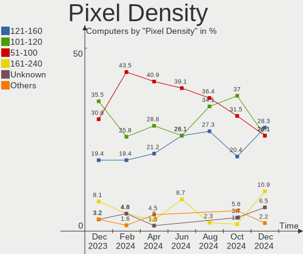
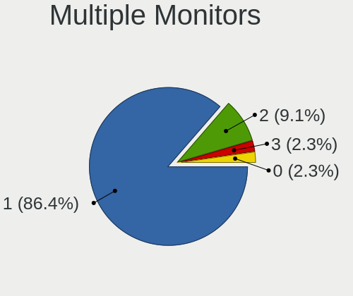
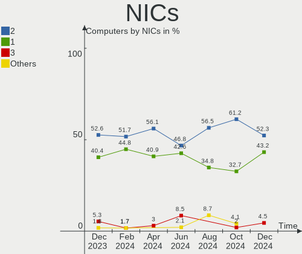
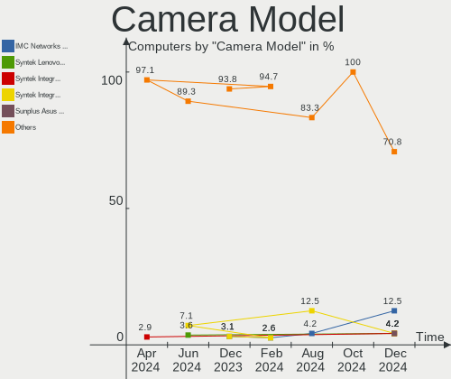
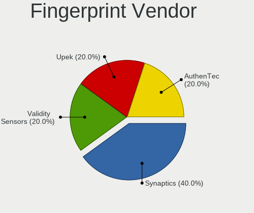

Xubuntu - Hardware Trends
-------------------------

A project to identify most popular hardware characteristics and track their change
over time based on data collected by Linux users at https://Linux-Hardware.org.

Anyone can contribute to this report by the [hw-probe](https://github.com/linuxhw/hw-probe) tool:

    sudo -E hw-probe -all -upload

This is a report for all computer types. See also reports for [desktops](/Dist/Xubuntu/Desktop/README.md) and [notebooks](/Dist/Xubuntu/Notebook/README.md).

This report is for one last month. Overall report since the beginning of time: [TestCoverage](https://github.com/linuxhw/TestCoverage)

Period: Jul, 2022.

Contents
--------

* [ System ](#system)
  - [ OS                       ](#os)
  - [ OS Family                ](#os-family)
  - [ Kernel                   ](#kernel)
  - [ Kernel Family            ](#kernel-family)
  - [ Kernel Major Ver.        ](#kernel-major-ver)
  - [ Arch                     ](#arch)
  - [ DE                       ](#de)
  - [ Display Server           ](#display-server)
  - [ Display Manager          ](#display-manager)
  - [ OS Lang                  ](#os-lang)
  - [ Boot Mode                ](#boot-mode)
  - [ Filesystem               ](#filesystem)
  - [ Part. scheme             ](#part-scheme)
  - [ Dual Boot with Linux/BSD ](#dual-boot-with-linuxbsd)
  - [ Dual Boot (Win)          ](#dual-boot-win)

* [ Board ](#board)
  - [ Vendor                   ](#vendor)
  - [ Model                    ](#model)
  - [ Model Family             ](#model-family)
  - [ MFG Year                 ](#mfg-year)
  - [ Form Factor              ](#form-factor)
  - [ Secure Boot              ](#secure-boot)
  - [ Coreboot                 ](#coreboot)
  - [ RAM Size                 ](#ram-size)
  - [ RAM Used                 ](#ram-used)
  - [ Total Drives             ](#total-drives)
  - [ Has CD-ROM               ](#has-cd-rom)
  - [ Has Ethernet             ](#has-ethernet)
  - [ Has WiFi                 ](#has-wifi)
  - [ Has Bluetooth            ](#has-bluetooth)

* [ Location ](#location)
  - [ Country                  ](#country)
  - [ City                     ](#city)

* [ Drives ](#drives)
  - [ Drive Vendor             ](#drive-vendor)
  - [ Drive Model              ](#drive-model)
  - [ HDD Vendor               ](#hdd-vendor)
  - [ SSD Vendor               ](#ssd-vendor)
  - [ Drive Kind               ](#drive-kind)
  - [ Drive Connector          ](#drive-connector)
  - [ Drive Size               ](#drive-size)
  - [ Space Total              ](#space-total)
  - [ Space Used               ](#space-used)
  - [ Malfunc. Drives          ](#malfunc-drives)
  - [ Malfunc. Drive Vendor    ](#malfunc-drive-vendor)
  - [ Malfunc. HDD Vendor      ](#malfunc-hdd-vendor)
  - [ Malfunc. Drive Kind      ](#malfunc-drive-kind)
  - [ Failed Drives            ](#failed-drives)
  - [ Failed Drive Vendor      ](#failed-drive-vendor)
  - [ Drive Status             ](#drive-status)

* [ Storage controller ](#storage-controller)
  - [ Storage Vendor           ](#storage-vendor)
  - [ Storage Model            ](#storage-model)
  - [ Storage Kind             ](#storage-kind)

* [ Processor ](#processor)
  - [ CPU Vendor               ](#cpu-vendor)
  - [ CPU Model                ](#cpu-model)
  - [ CPU Model Family         ](#cpu-model-family)
  - [ CPU Cores                ](#cpu-cores)
  - [ CPU Sockets              ](#cpu-sockets)
  - [ CPU Threads              ](#cpu-threads)
  - [ CPU Op-Modes             ](#cpu-op-modes)
  - [ CPU Microcode            ](#cpu-microcode)
  - [ CPU Microarch            ](#cpu-microarch)

* [ Graphics ](#graphics)
  - [ GPU Vendor               ](#gpu-vendor)
  - [ GPU Model                ](#gpu-model)
  - [ GPU Combo                ](#gpu-combo)
  - [ GPU Driver               ](#gpu-driver)
  - [ GPU Memory               ](#gpu-memory)

* [ Monitor ](#monitor)
  - [ Monitor Vendor           ](#monitor-vendor)
  - [ Monitor Model            ](#monitor-model)
  - [ Monitor Resolution       ](#monitor-resolution)
  - [ Monitor Diagonal         ](#monitor-diagonal)
  - [ Monitor Width            ](#monitor-width)
  - [ Aspect Ratio             ](#aspect-ratio)
  - [ Monitor Area             ](#monitor-area)
  - [ Pixel Density            ](#pixel-density)
  - [ Multiple Monitors        ](#multiple-monitors)

* [ Network ](#network)
  - [ Net Controller Vendor    ](#net-controller-vendor)
  - [ Net Controller Model     ](#net-controller-model)
  - [ Wireless Vendor          ](#wireless-vendor)
  - [ Wireless Model           ](#wireless-model)
  - [ Ethernet Vendor          ](#ethernet-vendor)
  - [ Ethernet Model           ](#ethernet-model)
  - [ Net Controller Kind      ](#net-controller-kind)
  - [ Used Controller          ](#used-controller)
  - [ NICs                     ](#nics)
  - [ IPv6                     ](#ipv6)

* [ Bluetooth ](#bluetooth)
  - [ Bluetooth Vendor         ](#bluetooth-vendor)
  - [ Bluetooth Model          ](#bluetooth-model)

* [ Sound ](#sound)
  - [ Sound Vendor             ](#sound-vendor)
  - [ Sound Model              ](#sound-model)

* [ Memory ](#memory)
  - [ Memory Vendor            ](#memory-vendor)
  - [ Memory Model             ](#memory-model)
  - [ Memory Kind              ](#memory-kind)
  - [ Memory Form Factor       ](#memory-form-factor)
  - [ Memory Size              ](#memory-size)
  - [ Memory Speed             ](#memory-speed)

* [ Printers & scanners ](#printers--scanners)
  - [ Printer Vendor           ](#printer-vendor)
  - [ Printer Model            ](#printer-model)
  - [ Scanner Vendor           ](#scanner-vendor)
  - [ Scanner Model            ](#scanner-model)

* [ Camera ](#camera)
  - [ Camera Vendor            ](#camera-vendor)
  - [ Camera Model             ](#camera-model)

* [ Security ](#security)
  - [ Fingerprint Vendor       ](#fingerprint-vendor)
  - [ Fingerprint Model        ](#fingerprint-model)
  - [ Chipcard Vendor          ](#chipcard-vendor)
  - [ Chipcard Model           ](#chipcard-model)

* [ Unsupported ](#unsupported)
  - [ Unsupported Devices      ](#unsupported-devices)
  - [ Unsupported Device Types ](#unsupported-device-types)

System
------

OS
--

Installed operating systems

| Name          | Computers | Percent |
|---------------|-----------|---------|
| Xubuntu 20.04 | 37        | 48.68%  |
| Xubuntu 22.04 | 26        | 34.21%  |
| Xubuntu 18.04 | 7         | 9.21%   |
| Xubuntu 16.04 | 4         | 5.26%   |
| Xubuntu 21.10 | 1         | 1.32%   |
| Xubuntu 20.10 | 1         | 1.32%   |

OS Family
---------

OS without a version

| Name    | Computers | Percent |
|---------|-----------|---------|
| Xubuntu | 76        | 100%    |

Kernel
------

Version of the Linux kernel

| Version                    | Computers | Percent |
|----------------------------|-----------|---------|
| 5.15.0-41-generic          | 18        | 23.68%  |
| 5.15.0-40-generic          | 7         | 9.21%   |
| 5.4.0-121-generic          | 6         | 7.89%   |
| 5.4.0-122-generic          | 5         | 6.58%   |
| 5.13.0-52-generic          | 5         | 6.58%   |
| 5.4.0-122-lowlatency       | 4         | 5.26%   |
| 5.8.0-63-generic           | 2         | 2.63%   |
| 5.4.0-121-lowlatency       | 2         | 2.63%   |
| 5.4.0-117-generic          | 2         | 2.63%   |
| 5.17.0-1013-oem            | 2         | 2.63%   |
| 5.15.0-39-generic          | 2         | 2.63%   |
| 5.13.0-52-lowlatency       | 2         | 2.63%   |
| 4.4.0-210-generic          | 2         | 2.63%   |
| 5.4.189-0504189-generic    | 1         | 1.32%   |
| 5.4.0-48-generic           | 1         | 1.32%   |
| 5.4.0-120-generic          | 1         | 1.32%   |
| 5.18.12-051812-generic     | 1         | 1.32%   |
| 5.18.11-051811-generic     | 1         | 1.32%   |
| 5.18.0-10.1-liquorix-amd64 | 1         | 1.32%   |
| 5.16.9-051609-generic      | 1         | 1.32%   |
| 5.15.0-43-generic          | 1         | 1.32%   |
| 5.15.0-18-generic          | 1         | 1.32%   |
| 5.15.0-1011-intel-iotg     | 1         | 1.32%   |
| 5.13.0-51-generic          | 1         | 1.32%   |
| 5.11.0-27-generic          | 1         | 1.32%   |
| 4.4.0-87-generic           | 1         | 1.32%   |
| 4.15.0-189-lowlatency      | 1         | 1.32%   |
| 4.15.0-189-generic         | 1         | 1.32%   |
| 4.15.0-188-generic         | 1         | 1.32%   |
| 4.15.0-142-generic         | 1         | 1.32%   |

Kernel Family
-------------

Linux kernel without a distro release

| Version | Computers | Percent |
|---------|-----------|---------|
| 5.15.0  | 30        | 39.47%  |
| 5.4.0   | 21        | 27.63%  |
| 5.13.0  | 8         | 10.53%  |
| 4.15.0  | 4         | 5.26%   |
| 4.4.0   | 3         | 3.95%   |
| 5.8.0   | 2         | 2.63%   |
| 5.17.0  | 2         | 2.63%   |
| 5.4.189 | 1         | 1.32%   |
| 5.18.12 | 1         | 1.32%   |
| 5.18.11 | 1         | 1.32%   |
| 5.18.0  | 1         | 1.32%   |
| 5.16.9  | 1         | 1.32%   |
| 5.11.0  | 1         | 1.32%   |

Kernel Major Ver.
-----------------

Linux kernel major version

| Version | Computers | Percent |
|---------|-----------|---------|
| 5.15    | 30        | 39.47%  |
| 5.4     | 22        | 28.95%  |
| 5.13    | 8         | 10.53%  |
| 4.15    | 4         | 5.26%   |
| 5.18    | 3         | 3.95%   |
| 4.4     | 3         | 3.95%   |
| 5.8     | 2         | 2.63%   |
| 5.17    | 2         | 2.63%   |
| 5.16    | 1         | 1.32%   |
| 5.11    | 1         | 1.32%   |

Arch
----

OS architecture (x86_64, i586, etc.)

| Name   | Computers | Percent |
|--------|-----------|---------|
| x86_64 | 71        | 93.42%  |
| i686   | 5         | 6.58%   |

DE
--

Desktop Environment

| Name  | Computers | Percent |
|-------|-----------|---------|
| XFCE  | 72        | 94.74%  |
| GNOME | 4         | 5.26%   |

Display Server
--------------

X11 or Wayland

| Name    | Computers | Percent |
|---------|-----------|---------|
| X11     | 74        | 97.37%  |
| Wayland | 1         | 1.32%   |
| Tty     | 1         | 1.32%   |

Display Manager
---------------

SDDM, LightDM, etc.

| Name    | Computers | Percent |
|---------|-----------|---------|
| LightDM | 67        | 88.16%  |
| Unknown | 4         | 5.26%   |
| GDM3    | 3         | 3.95%   |
| SDDM    | 1         | 1.32%   |
| GDM     | 1         | 1.32%   |

OS Lang
-------

Language

| Lang  | Computers | Percent |
|-------|-----------|---------|
| en_US | 28        | 36.84%  |
| fr_FR | 12        | 15.79%  |
| de_DE | 10        | 13.16%  |
| pt_BR | 5         | 6.58%   |
| it_IT | 5         | 6.58%   |
| en_CA | 3         | 3.95%   |
| es_ES | 2         | 2.63%   |
| en_GB | 2         | 2.63%   |
| zh_TW | 1         | 1.32%   |
| ru_RU | 1         | 1.32%   |
| ja_JP | 1         | 1.32%   |
| es_CL | 1         | 1.32%   |
| en_IL | 1         | 1.32%   |
| en_AU | 1         | 1.32%   |
| de_AT | 1         | 1.32%   |
| cs_CZ | 1         | 1.32%   |
| ca_ES | 1         | 1.32%   |

Boot Mode
---------

EFI or BIOS

| Mode | Computers | Percent |
|------|-----------|---------|
| BIOS | 43        | 56.58%  |
| EFI  | 33        | 43.42%  |

Filesystem
----------

Type of filesystem

| Type    | Computers | Percent |
|---------|-----------|---------|
| Ext4    | 74        | 97.37%  |
| Overlay | 2         | 2.63%   |

Part. scheme
------------

Scheme of partitioning

| Type    | Computers | Percent |
|---------|-----------|---------|
| Unknown | 38        | 50%     |
| GPT     | 28        | 36.84%  |
| MBR     | 10        | 13.16%  |

Dual Boot with Linux/BSD
------------------------

Hosting more than one Linux/BSD

| Dual boot | Computers | Percent |
|-----------|-----------|---------|
| No        | 62        | 81.58%  |
| Yes       | 14        | 18.42%  |

Dual Boot (Win)
---------------

Hosting Linux and Windows

| Dual boot | Computers | Percent |
|-----------|-----------|---------|
| No        | 48        | 63.16%  |
| Yes       | 28        | 36.84%  |

Board
-----

Vendor
------

Motherboard manufacturer

| Name                | Computers | Percent |
|---------------------|-----------|---------|
| ASUSTek Computer    | 23        | 30.26%  |
| Hewlett-Packard     | 10        | 13.16%  |
| Lenovo              | 9         | 11.84%  |
| Dell                | 9         | 11.84%  |
| MSI                 | 5         | 6.58%   |
| Gigabyte Technology | 4         | 5.26%   |
| Samsung Electronics | 3         | 3.95%   |
| Acer                | 3         | 3.95%   |
| Apple               | 2         | 2.63%   |
| Schenker            | 1         | 1.32%   |
| PCWare              | 1         | 1.32%   |
| LG Electronics      | 1         | 1.32%   |
| Intel               | 1         | 1.32%   |
| HUAWEI              | 1         | 1.32%   |
| Chuwi               | 1         | 1.32%   |
| Alienware           | 1         | 1.32%   |
| Unknown             | 1         | 1.32%   |

Model
-----

Motherboard model

| Name                                   | Computers | Percent |
|----------------------------------------|-----------|---------|
| MSI MS-7D43                            | 2         | 2.63%   |
| Dell OptiPlex 7010                     | 2         | 2.63%   |
| ASUS K53SC                             | 2         | 2.63%   |
| Schenker WORK (Early 2021)             | 1         | 1.32%   |
| Samsung R59P/R60P/R61P                 | 1         | 1.32%   |
| Samsung 370E4K                         | 1         | 1.32%   |
| Samsung 350V5C/351V5C/3540VC/3440VC    | 1         | 1.32%   |
| PCWare IPX1800E2                       | 1         | 1.32%   |
| MSI U-100                              | 1         | 1.32%   |
| MSI Hyrican PC A320M PRO-E             | 1         | 1.32%   |
| MSI GF63 Thin 9RCX                     | 1         | 1.32%   |
| LG LE50-5BC6H1                         | 1         | 1.32%   |
| Lenovo V330-15IKB 81AX                 | 1         | 1.32%   |
| Lenovo ThinkPad W540 20BG001KGE        | 1         | 1.32%   |
| Lenovo ThinkPad W540 20BG001CMN        | 1         | 1.32%   |
| Lenovo ThinkPad P14s Gen 2a 21A0CTO1WW | 1         | 1.32%   |
| Lenovo ThinkCentre M83 10AM0010US      | 1         | 1.32%   |
| Lenovo IdeaPad 520-15IKB 81BF          | 1         | 1.32%   |
| Lenovo G50-70 20351                    | 1         | 1.32%   |
| Lenovo G50-30 80G0                     | 1         | 1.32%   |
| Lenovo C540 10110                      | 1         | 1.32%   |
| Intel SHARKBAY                         | 1         | 1.32%   |
| HUAWEI BOHK-WAX9X                      | 1         | 1.32%   |
| HP Z620 Workstation                    | 1         | 1.32%   |
| HP Stream Laptop 14-ax0XX              | 1         | 1.32%   |
| HP ProBook 640 G8 Notebook PC          | 1         | 1.32%   |
| HP Pavilion dv2600                     | 1         | 1.32%   |
| HP Notebook                            | 1         | 1.32%   |
| HP Mini 210-1100                       | 1         | 1.32%   |
| HP Laptop 14-bw0xx                     | 1         | 1.32%   |
| HP ENVY x360 Convertible 13-bd0xxx     | 1         | 1.32%   |
| HP EliteBook 845 G8 Notebook PC        | 1         | 1.32%   |
| HP Compaq 8200 Elite USDT PC           | 1         | 1.32%   |
| Gigabyte X470 AORUS ULTRA GAMING       | 1         | 1.32%   |
| Gigabyte GA-MA78GM-S2H                 | 1         | 1.32%   |
| Gigabyte GA-MA785GM-US2H               | 1         | 1.32%   |
| Gigabyte G41M-ES2L                     | 1         | 1.32%   |
| Dell Vostro 3700                       | 1         | 1.32%   |
| Dell PowerEdge T30                     | 1         | 1.32%   |
| Dell PowerEdge T110 II                 | 1         | 1.32%   |
| Dell OptiPlex 390                      | 1         | 1.32%   |
| Dell Latitude D430                     | 1         | 1.32%   |
| Dell Inspiron N5030                    | 1         | 1.32%   |
| Dell Inspiron 5593                     | 1         | 1.32%   |
| Chuwi FreeBook                         | 1         | 1.32%   |
| ASUS ZenBook UX435EG_UX435EG           | 1         | 1.32%   |
| ASUS X453MA                            | 1         | 1.32%   |
| ASUS X450CP                            | 1         | 1.32%   |
| ASUS VivoBook_ASUSLaptop X513UA_M513UA | 1         | 1.32%   |
| ASUS U30Jc                             | 1         | 1.32%   |
| ASUS TUF Gaming X570-PLUS              | 1         | 1.32%   |
| ASUS TUF Gaming B550M-E WIFI           | 1         | 1.32%   |
| ASUS ROG Zephyrus G14 GA401QM_GA401QM  | 1         | 1.32%   |
| ASUS PRIME H670-PLUS D4                | 1         | 1.32%   |
| ASUS PRIME B450M-A                     | 1         | 1.32%   |
| ASUS PRIME A320M-K                     | 1         | 1.32%   |
| ASUS P8Z77-M PRO                       | 1         | 1.32%   |
| ASUS P8H67-M LE                        | 1         | 1.32%   |
| ASUS P5QL/EPU                          | 1         | 1.32%   |
| ASUS P5P43TD PRO                       | 1         | 1.32%   |

Model Family
------------

Motherboard model prefix

| Name                     | Computers | Percent |
|--------------------------|-----------|---------|
| Lenovo ThinkPad          | 3         | 3.95%   |
| Dell OptiPlex            | 3         | 3.95%   |
| ASUS PRIME               | 3         | 3.95%   |
| Acer Aspire              | 3         | 3.95%   |
| MSI MS-7D43              | 2         | 2.63%   |
| Dell PowerEdge           | 2         | 2.63%   |
| Dell Inspiron            | 2         | 2.63%   |
| ASUS TUF                 | 2         | 2.63%   |
| ASUS K53SC               | 2         | 2.63%   |
| Schenker WORK            | 1         | 1.32%   |
| Samsung R59P             | 1         | 1.32%   |
| Samsung 370E4K           | 1         | 1.32%   |
| Samsung 350V5C           | 1         | 1.32%   |
| PCWare IPX1800E2         | 1         | 1.32%   |
| MSI U-100                | 1         | 1.32%   |
| MSI Hyrican              | 1         | 1.32%   |
| MSI GF63                 | 1         | 1.32%   |
| LG LE50-5BC6H1           | 1         | 1.32%   |
| Lenovo V330-15IKB        | 1         | 1.32%   |
| Lenovo ThinkCentre       | 1         | 1.32%   |
| Lenovo IdeaPad           | 1         | 1.32%   |
| Lenovo G50-70            | 1         | 1.32%   |
| Lenovo G50-30            | 1         | 1.32%   |
| Lenovo C540              | 1         | 1.32%   |
| Intel SHARKBAY           | 1         | 1.32%   |
| HUAWEI BOHK-WAX9X        | 1         | 1.32%   |
| HP Z620                  | 1         | 1.32%   |
| HP Stream                | 1         | 1.32%   |
| HP ProBook               | 1         | 1.32%   |
| HP Pavilion              | 1         | 1.32%   |
| HP Notebook              | 1         | 1.32%   |
| HP Mini                  | 1         | 1.32%   |
| HP Laptop                | 1         | 1.32%   |
| HP ENVY                  | 1         | 1.32%   |
| HP EliteBook             | 1         | 1.32%   |
| HP Compaq                | 1         | 1.32%   |
| Gigabyte X470            | 1         | 1.32%   |
| Gigabyte GA-MA78GM-S2H   | 1         | 1.32%   |
| Gigabyte GA-MA785GM-US2H | 1         | 1.32%   |
| Gigabyte G41M-ES2L       | 1         | 1.32%   |
| Dell Vostro              | 1         | 1.32%   |
| Dell Latitude            | 1         | 1.32%   |
| Chuwi FreeBook           | 1         | 1.32%   |
| ASUS ZenBook             | 1         | 1.32%   |
| ASUS X453MA              | 1         | 1.32%   |
| ASUS X450CP              | 1         | 1.32%   |
| ASUS VivoBook            | 1         | 1.32%   |
| ASUS U30Jc               | 1         | 1.32%   |
| ASUS ROG                 | 1         | 1.32%   |
| ASUS P8Z77-M             | 1         | 1.32%   |
| ASUS P8H67-M             | 1         | 1.32%   |
| ASUS P5QL                | 1         | 1.32%   |
| ASUS P5P43TD             | 1         | 1.32%   |
| ASUS P5KC                | 1         | 1.32%   |
| ASUS P4B-M               | 1         | 1.32%   |
| ASUS N56VZ               | 1         | 1.32%   |
| ASUS M5A78L-M            | 1         | 1.32%   |
| ASUS M51BC               | 1         | 1.32%   |
| ASUS FX503VM             | 1         | 1.32%   |
| Apple MacBookPro15       | 1         | 1.32%   |

MFG Year
--------

Motherboard manufacture year

| Year | Computers | Percent |
|------|-----------|---------|
| 2021 | 12        | 15.79%  |
| 2017 | 9         | 11.84%  |
| 2014 | 7         | 9.21%   |
| 2013 | 7         | 9.21%   |
| 2019 | 5         | 6.58%   |
| 2011 | 5         | 6.58%   |
| 2010 | 5         | 6.58%   |
| 2018 | 4         | 5.26%   |
| 2012 | 4         | 5.26%   |
| 2009 | 4         | 5.26%   |
| 2007 | 4         | 5.26%   |
| 2022 | 2         | 2.63%   |
| 2016 | 2         | 2.63%   |
| 2015 | 2         | 2.63%   |
| 2008 | 2         | 2.63%   |
| 2006 | 1         | 1.32%   |
| 2001 | 1         | 1.32%   |

Form Factor
-----------

Physical design of the computer

| Name        | Computers | Percent |
|-------------|-----------|---------|
| Notebook    | 44        | 57.89%  |
| Desktop     | 29        | 38.16%  |
| Convertible | 1         | 1.32%   |
| All in one  | 1         | 1.32%   |
| Server      | 1         | 1.32%   |

Secure Boot
-----------

Enabled or disabled

| State    | Computers | Percent |
|----------|-----------|---------|
| Disabled | 73        | 96.05%  |
| Enabled  | 3         | 3.95%   |

Coreboot
--------

Have coreboot on board

| Used | Computers | Percent |
|------|-----------|---------|
| No   | 76        | 100%    |

RAM Size
--------

Total RAM memory

| Size in GB  | Computers | Percent |
|-------------|-----------|---------|
| 4.01-8.0    | 20        | 26.32%  |
| 3.01-4.0    | 16        | 21.05%  |
| 16.01-24.0  | 14        | 18.42%  |
| 8.01-16.0   | 8         | 10.53%  |
| 1.01-2.0    | 5         | 6.58%   |
| 24.01-32.0  | 4         | 5.26%   |
| 32.01-64.0  | 3         | 3.95%   |
| 64.01-256.0 | 3         | 3.95%   |
| 2.01-3.0    | 1         | 1.32%   |
| 0.51-1.0    | 1         | 1.32%   |
| 0.01-0.5    | 1         | 1.32%   |

RAM Used
--------

Used RAM memory

| Used GB   | Computers | Percent |
|-----------|-----------|---------|
| 1.01-2.0  | 39        | 51.32%  |
| 2.01-3.0  | 15        | 19.74%  |
| 3.01-4.0  | 8         | 10.53%  |
| 4.01-8.0  | 7         | 9.21%   |
| 0.51-1.0  | 4         | 5.26%   |
| 8.01-16.0 | 2         | 2.63%   |
| 0.01-0.5  | 1         | 1.32%   |

Total Drives
------------

Number of drives on board

| Drives | Computers | Percent |
|--------|-----------|---------|
| 1      | 40        | 52.63%  |
| 2      | 21        | 27.63%  |
| 3      | 7         | 9.21%   |
| 5      | 3         | 3.95%   |
| 6      | 2         | 2.63%   |
| 0      | 2         | 2.63%   |
| 4      | 1         | 1.32%   |

Has CD-ROM
----------

Has CD-ROM on board

| Presented | Computers | Percent |
|-----------|-----------|---------|
| Yes       | 40        | 52.63%  |
| No        | 36        | 47.37%  |

Has Ethernet
------------

Has Ethernet on board

| Presented | Computers | Percent |
|-----------|-----------|---------|
| Yes       | 69        | 90.79%  |
| No        | 7         | 9.21%   |

Has WiFi
--------

Has WiFi module

| Presented | Computers | Percent |
|-----------|-----------|---------|
| Yes       | 56        | 73.68%  |
| No        | 20        | 26.32%  |

Has Bluetooth
-------------

Has Bluetooth module

| Presented | Computers | Percent |
|-----------|-----------|---------|
| Yes       | 40        | 52.63%  |
| No        | 36        | 47.37%  |

Location
--------

Country
-------

Geographic location (country)

| Country     | Computers | Percent |
|-------------|-----------|---------|
| USA         | 14        | 18.42%  |
| Germany     | 11        | 14.47%  |
| France      | 11        | 14.47%  |
| Italy       | 6         | 7.89%   |
| Brazil      | 6         | 7.89%   |
| Spain       | 3         | 3.95%   |
| Russia      | 3         | 3.95%   |
| Canada      | 3         | 3.95%   |
| UK          | 2         | 2.63%   |
| Indonesia   | 2         | 2.63%   |
| Taiwan      | 1         | 1.32%   |
| Sweden      | 1         | 1.32%   |
| Romania     | 1         | 1.32%   |
| Norway      | 1         | 1.32%   |
| Netherlands | 1         | 1.32%   |
| Mexico      | 1         | 1.32%   |
| Malaysia    | 1         | 1.32%   |
| Japan       | 1         | 1.32%   |
| Israel      | 1         | 1.32%   |
| Guernsey    | 1         | 1.32%   |
| Guadeloupe  | 1         | 1.32%   |
| Czechia     | 1         | 1.32%   |
| Chile       | 1         | 1.32%   |
| Austria     | 1         | 1.32%   |
| Australia   | 1         | 1.32%   |

City
----

Geographic location (city)

| City                | Computers | Percent |
|---------------------|-----------|---------|
| Madrid              | 2         | 2.63%   |
| Genoa               | 2         | 2.63%   |
| Clermont-Ferrand    | 2         | 2.63%   |
| Casalecchio di Reno | 2         | 2.63%   |
| Wuppertal           | 1         | 1.32%   |
| Woodworth           | 1         | 1.32%   |
| Waarder             | 1         | 1.32%   |
| Vaughan             | 1         | 1.32%   |
| Västerås          | 1         | 1.32%   |
| Valparaiso de Goias | 1         | 1.32%   |
| Tustin              | 1         | 1.32%   |
| Toulon              | 1         | 1.32%   |
| Thornton-Cleveleys  | 1         | 1.32%   |
| Teresina            | 1         | 1.32%   |
| Taipei              | 1         | 1.32%   |
| Sydney              | 1         | 1.32%   |
| St Petersburg       | 1         | 1.32%   |
| St Peter Port       | 1         | 1.32%   |
| Seattle             | 1         | 1.32%   |
| Schnaittach         | 1         | 1.32%   |
| Sao Carlos          | 1         | 1.32%   |
| Santiago            | 1         | 1.32%   |
| Salzgitter          | 1         | 1.32%   |
| Salvador            | 1         | 1.32%   |
| Sabadell            | 1         | 1.32%   |
| Saarbrücken        | 1         | 1.32%   |
| Rochester           | 1         | 1.32%   |
| Rishon LeTsiyyon    | 1         | 1.32%   |
| Pottstown           | 1         | 1.32%   |
| Peterborough        | 1         | 1.32%   |
| Peronne             | 1         | 1.32%   |
| Peckham             | 1         | 1.32%   |
| Paris Crossing      | 1         | 1.32%   |
| Paris               | 1         | 1.32%   |
| Osaka               | 1         | 1.32%   |
| Noisy-le-Grand      | 1         | 1.32%   |
| New Rochelle        | 1         | 1.32%   |
| Neuss               | 1         | 1.32%   |
| Muncie              | 1         | 1.32%   |
| Moscow              | 1         | 1.32%   |
| Morrisville         | 1         | 1.32%   |
| Mnichovice          | 1         | 1.32%   |
| Milan               | 1         | 1.32%   |
| Mexico City         | 1         | 1.32%   |
| Melvindale          | 1         | 1.32%   |
| Mannheim            | 1         | 1.32%   |
| Lyon                | 1         | 1.32%   |
| Les Abymes          | 1         | 1.32%   |
| Leinstranda         | 1         | 1.32%   |
| Lavras              | 1         | 1.32%   |
| Landshut            | 1         | 1.32%   |
| Kuala Lumpur        | 1         | 1.32%   |
| Kamensk-Shakhtinsky | 1         | 1.32%   |
| Jakarta             | 1         | 1.32%   |
| Hamburg             | 1         | 1.32%   |
| Graz                | 1         | 1.32%   |
| Giessen             | 1         | 1.32%   |
| Gera                | 1         | 1.32%   |
| Gennes              | 1         | 1.32%   |
| Fucecchio           | 1         | 1.32%   |

Drives
------

Drive Vendor
------------

Hard drive vendors

| Vendor              | Computers | Drives | Percent |
|---------------------|-----------|--------|---------|
| WDC                 | 21        | 23     | 17.8%   |
| Seagate             | 20        | 26     | 16.95%  |
| Samsung Electronics | 19        | 20     | 16.1%   |
| Hitachi             | 7         | 9      | 5.93%   |
| Toshiba             | 6         | 6      | 5.08%   |
| Kingston            | 6         | 7      | 5.08%   |
| SanDisk             | 4         | 4      | 3.39%   |
| SK hynix            | 3         | 3      | 2.54%   |
| Intel               | 3         | 4      | 2.54%   |
| Crucial             | 3         | 3      | 2.54%   |
| Apple               | 3         | 3      | 2.54%   |
| Unknown             | 3         | 3      | 2.54%   |
| Unknown             | 2         | 2      | 1.69%   |
| TEXTORM             | 2         | 2      | 1.69%   |
| OCZ                 | 2         | 2      | 1.69%   |
| Maxtor              | 2         | 2      | 1.69%   |
| HGST                | 2         | 2      | 1.69%   |
| V-GeN               | 1         | 1      | 0.85%   |
| USB3.0              | 1         | 1      | 0.85%   |
| SSK                 | 1         | 1      | 0.85%   |
| PNY                 | 1         | 1      | 0.85%   |
| Mushkin             | 1         | 1      | 0.85%   |
| LaCie               | 1         | 1      | 0.85%   |
| KingFast            | 1         | 1      | 0.85%   |
| Intenso             | 1         | 1      | 0.85%   |
| Fujitsu             | 1         | 1      | 0.85%   |
| A-DATA Technology   | 1         | 1      | 0.85%   |

Drive Model
-----------

Hard drive models

| Model                               | Computers | Percent |
|-------------------------------------|-----------|---------|
| Hitachi HTS547550A9E384 500GB       | 3         | 2.33%   |
| Unknown                             | 3         | 2.33%   |
| WDC WD10EZEX-00BBHA0 1TB            | 2         | 1.55%   |
| Toshiba DT01ACA200 2TB              | 2         | 1.55%   |
| TEXTORM BM5 240GB SSD               | 2         | 1.55%   |
| Seagate ST500LT012-1DG142 500GB     | 2         | 1.55%   |
| Seagate ST3500413AS 500GB           | 2         | 1.55%   |
| Kingston SA400S37480G 480GB SSD     | 2         | 1.55%   |
| Kingston SA400S37240G 240GB SSD     | 2         | 1.55%   |
| Hitachi HDS721010CLA332 1TB         | 2         | 1.55%   |
| WDC WDS960G2G0C-00AJM0 960GB        | 1         | 0.78%   |
| WDC WDS500G2B0A-00SM50 500GB SSD    | 1         | 0.78%   |
| WDC WDS100T3X0C-00SJG0 1TB          | 1         | 0.78%   |
| WDC WDS100T2B0B-00YS70 1TB SSD      | 1         | 0.78%   |
| WDC WD800JD-00LSA0 80GB             | 1         | 0.78%   |
| WDC WD7500BPVT-35HXZT3 752GB        | 1         | 0.78%   |
| WDC WD6400AAKS-65A7B0 640GB         | 1         | 0.78%   |
| WDC WD5000LPCX-24C6HT0 500GB        | 1         | 0.78%   |
| WDC WD5000LPCX-22VHAT1 500GB        | 1         | 0.78%   |
| WDC WD5000AZLX-60K2TA0 500GB        | 1         | 0.78%   |
| WDC WD40EFRX-68N32N0 4TB            | 1         | 0.78%   |
| WDC WD3200BEVT-75A23T0 320GB        | 1         | 0.78%   |
| WDC WD3200AAKS-00B3A0 320GB         | 1         | 0.78%   |
| WDC WD30EFRX-68EUZN0 3TB            | 1         | 0.78%   |
| WDC WD20EZRZ-00Z5HB0 2TB            | 1         | 0.78%   |
| WDC WD1600BEVT-22ZCT0 160GB         | 1         | 0.78%   |
| WDC WD10SPZX-22Z10T1 1TB            | 1         | 0.78%   |
| WDC WD10JPVX-60JC3T0 1TB            | 1         | 0.78%   |
| WDC WD10JPVX-22JC3T0 1TB            | 1         | 0.78%   |
| WDC WD10EADS-00M2B0 1TB             | 1         | 0.78%   |
| V-GeN V-GEN06SM22SCY256HY 256GB     | 1         | 0.78%   |
| USB3.0 Super Speed 1TB              | 1         | 0.78%   |
| Unknown SDVPSA181024 240GB          | 1         | 0.78%   |
| Unknown SD64G  64GB                 | 1         | 0.78%   |
| Toshiba MK8009GAH 80GB              | 1         | 0.78%   |
| Toshiba MK5065GSX 500GB             | 1         | 0.78%   |
| Toshiba MK2556GSY 250GB             | 1         | 0.78%   |
| Toshiba DT01ACA100 1TB              | 1         | 0.78%   |
| SSK Disk 128GB                      | 1         | 0.78%   |
| SK hynix PC401 NVMe 1TB             | 1         | 0.78%   |
| SK hynix NVMe SSD Drive 512GB       | 1         | 0.78%   |
| SK hynix NVMe SSD Drive 1024GB      | 1         | 0.78%   |
| Seagate ST9750420AS 752GB           | 1         | 0.78%   |
| Seagate ST9500420AS 500GB           | 1         | 0.78%   |
| Seagate ST9500325AS 500GB           | 1         | 0.78%   |
| Seagate ST9250410AS 250GB           | 1         | 0.78%   |
| Seagate ST9160310AS 160GB           | 1         | 0.78%   |
| Seagate ST750LM022 HN-M750MBB 752GB | 1         | 0.78%   |
| Seagate ST500LT012-9WS142 500GB     | 1         | 0.78%   |
| Seagate ST500LM021-1KJ152 500GB     | 1         | 0.78%   |
| Seagate ST500LM012 HN-M500MBB 500GB | 1         | 0.78%   |
| Seagate ST500DM002-1BD142 500GB     | 1         | 0.78%   |
| Seagate ST3500630AS 500GB           | 1         | 0.78%   |
| Seagate ST340014A 40GB              | 1         | 0.78%   |
| Seagate ST3250318AS 250GB           | 1         | 0.78%   |
| Seagate ST31000528AS 1TB            | 1         | 0.78%   |
| Seagate ST250DM000-1BD141 250GB     | 1         | 0.78%   |
| Seagate ST2000LM003 HN-M201RAD 2TB  | 1         | 0.78%   |
| Seagate ST2000DM008-2FR102 2TB      | 1         | 0.78%   |
| Seagate ST2000DM001-9YN164 2TB      | 1         | 0.78%   |

HDD Vendor
----------

Hard disk drive vendors

| Vendor              | Computers | Drives | Percent |
|---------------------|-----------|--------|---------|
| Seagate             | 20        | 26     | 33.9%   |
| WDC                 | 18        | 19     | 30.51%  |
| Hitachi             | 7         | 9      | 11.86%  |
| Toshiba             | 6         | 6      | 10.17%  |
| Samsung Electronics | 3         | 3      | 5.08%   |
| HGST                | 2         | 2      | 3.39%   |
| Maxtor              | 1         | 1      | 1.69%   |
| LaCie               | 1         | 1      | 1.69%   |
| Apple               | 1         | 1      | 1.69%   |

SSD Vendor
----------

Solid state drive vendors

| Vendor              | Computers | Drives | Percent |
|---------------------|-----------|--------|---------|
| Samsung Electronics | 11        | 12     | 29.73%  |
| Kingston            | 5         | 5      | 13.51%  |
| SanDisk             | 3         | 3      | 8.11%   |
| Crucial             | 3         | 3      | 8.11%   |
| WDC                 | 2         | 2      | 5.41%   |
| TEXTORM             | 2         | 2      | 5.41%   |
| OCZ                 | 2         | 2      | 5.41%   |
| USB3.0              | 1         | 1      | 2.7%    |
| PNY                 | 1         | 1      | 2.7%    |
| Mushkin             | 1         | 1      | 2.7%    |
| Maxtor              | 1         | 1      | 2.7%    |
| KingFast            | 1         | 1      | 2.7%    |
| Intenso             | 1         | 1      | 2.7%    |
| Apple               | 1         | 1      | 2.7%    |
| A-DATA Technology   | 1         | 1      | 2.7%    |
| Unknown             | 1         | 1      | 2.7%    |

Drive Kind
----------

HDD or SSD

| Kind    | Computers | Drives | Percent |
|---------|-----------|--------|---------|
| HDD     | 45        | 68     | 46.88%  |
| SSD     | 29        | 38     | 30.21%  |
| NVMe    | 16        | 17     | 16.67%  |
| Unknown | 4         | 6      | 4.17%   |
| MMC     | 2         | 2      | 2.08%   |

Drive Connector
---------------

SATA, SAS, NVMe, etc.

| Type | Computers | Drives | Percent |
|------|-----------|--------|---------|
| SATA | 62        | 107    | 72.94%  |
| NVMe | 16        | 17     | 18.82%  |
| SAS  | 5         | 5      | 5.88%   |
| MMC  | 2         | 2      | 2.35%   |

Drive Size
----------

Size of hard drive

| Size in TB | Computers | Drives | Percent |
|------------|-----------|--------|---------|
| 0.01-0.5   | 45        | 63     | 54.88%  |
| 0.51-1.0   | 27        | 30     | 32.93%  |
| 1.01-2.0   | 8         | 10     | 9.76%   |
| 3.01-4.0   | 1         | 1      | 1.22%   |
| 2.01-3.0   | 1         | 2      | 1.22%   |

Space Total
-----------

Amount of disk space available on the file system

| Size in GB     | Computers | Percent |
|----------------|-----------|---------|
| 101-250        | 18        | 23.68%  |
| 251-500        | 17        | 22.37%  |
| 501-1000       | 16        | 21.05%  |
| 1001-2000      | 8         | 10.53%  |
| 51-100         | 5         | 6.58%   |
| 21-50          | 3         | 3.95%   |
| 2001-3000      | 3         | 3.95%   |
| 1-20           | 3         | 3.95%   |
| More than 3000 | 2         | 2.63%   |
| Unknown        | 1         | 1.32%   |

Space Used
----------

Amount of used disk space

| Used GB        | Computers | Percent |
|----------------|-----------|---------|
| 1-20           | 21        | 27.63%  |
| 251-500        | 15        | 19.74%  |
| 21-50          | 14        | 18.42%  |
| 51-100         | 10        | 13.16%  |
| 101-250        | 7         | 9.21%   |
| 501-1000       | 4         | 5.26%   |
| 1001-2000      | 3         | 3.95%   |
| More than 3000 | 1         | 1.32%   |
| Unknown        | 1         | 1.32%   |

Malfunc. Drives
---------------

Drive models with a malfunction

| Model                               | Computers | Drives | Percent |
|-------------------------------------|-----------|--------|---------|
| Seagate ST9250410AS 250GB           | 1         | 1      | 16.67%  |
| Seagate ST500LT012-9WS142 500GB     | 1         | 1      | 16.67%  |
| Seagate ST3250318AS 250GB           | 1         | 1      | 16.67%  |
| Seagate ST2000DM001-1CH164 2TB      | 1         | 1      | 16.67%  |
| Seagate ST1000LM024 HN-M101MBB 1TB  | 1         | 1      | 16.67%  |
| Samsung Electronics SSD 870 EVO 1TB | 1         | 1      | 16.67%  |

Malfunc. Drive Vendor
---------------------

Vendors of faulty drives

| Vendor              | Computers | Drives | Percent |
|---------------------|-----------|--------|---------|
| Seagate             | 5         | 5      | 83.33%  |
| Samsung Electronics | 1         | 1      | 16.67%  |

Malfunc. HDD Vendor
-------------------

Vendors of faulty HDD drives

| Vendor  | Computers | Drives | Percent |
|---------|-----------|--------|---------|
| Seagate | 5         | 5      | 100%    |

Malfunc. Drive Kind
-------------------

Kinds of faulty drives

| Kind | Computers | Drives | Percent |
|------|-----------|--------|---------|
| HDD  | 5         | 5      | 83.33%  |
| SSD  | 1         | 1      | 16.67%  |

Failed Drives
-------------

Failed drive models

Zero info for selected period =(

Failed Drive Vendor
-------------------

Failed drive vendors

Zero info for selected period =(

Drive Status
------------

Number of failed and malfunc. drives

| Status   | Computers | Drives | Percent |
|----------|-----------|--------|---------|
| Detected | 40        | 76     | 50.63%  |
| Works    | 33        | 49     | 41.77%  |
| Malfunc  | 6         | 6      | 7.59%   |

Storage controller
------------------

Storage Vendor
--------------

Storage controller vendors

| Vendor                      | Computers | Percent |
|-----------------------------|-----------|---------|
| Intel                       | 52        | 58.43%  |
| AMD                         | 17        | 19.1%   |
| Samsung Electronics         | 6         | 6.74%   |
| SK hynix                    | 3         | 3.37%   |
| JMicron Technology          | 3         | 3.37%   |
| SanDisk                     | 2         | 2.25%   |
| Kingston Technology Company | 2         | 2.25%   |
| Silicon Image               | 1         | 1.12%   |
| Broadcom / LSI              | 1         | 1.12%   |
| ASMedia Technology          | 1         | 1.12%   |
| Apple                       | 1         | 1.12%   |

Storage Model
-------------

Storage controller models

| Model                                                                                   | Computers | Percent |
|-----------------------------------------------------------------------------------------|-----------|---------|
| AMD FCH SATA Controller [AHCI mode]                                                     | 9         | 8.41%   |
| Samsung NVMe SSD Controller 980                                                         | 4         | 3.74%   |
| AMD SB7x0/SB8x0/SB9x0 SATA Controller [AHCI mode]                                       | 4         | 3.74%   |
| Intel Volume Management Device NVMe RAID Controller                                     | 3         | 2.8%    |
| Intel Atom Processor E3800 Series SATA AHCI Controller                                  | 3         | 2.8%    |
| Intel Alder Lake-S PCH SATA Controller [AHCI Mode]                                      | 3         | 2.8%    |
| Intel 82801 Mobile SATA Controller [RAID mode]                                          | 3         | 2.8%    |
| Intel 8 Series/C220 Series Chipset Family 6-port SATA Controller 1 [AHCI mode]          | 3         | 2.8%    |
| Intel 8 Series SATA Controller 1 [AHCI mode]                                            | 3         | 2.8%    |
| Intel 7 Series/C210 Series Chipset Family 6-port SATA Controller [AHCI mode]            | 3         | 2.8%    |
| Intel 7 Series Chipset Family 6-port SATA Controller [AHCI mode]                        | 3         | 2.8%    |
| Intel 6 Series/C200 Series Chipset Family 6 port Desktop SATA AHCI Controller           | 3         | 2.8%    |
| AMD SB7x0/SB8x0/SB9x0 IDE Controller                                                    | 3         | 2.8%    |
| SK hynix Gold P31 SSD                                                                   | 2         | 1.87%   |
| Intel Wildcat Point-LP SATA Controller [AHCI Mode]                                      | 2         | 1.87%   |
| Intel SATA Controller [RAID mode]                                                       | 2         | 1.87%   |
| Intel Non-Volatile memory controller                                                    | 2         | 1.87%   |
| Intel 82801JI (ICH10 Family) 4 port SATA IDE Controller #1                              | 2         | 1.87%   |
| Intel 82801JI (ICH10 Family) 2 port SATA IDE Controller #2                              | 2         | 1.87%   |
| Intel 82801IBM/IEM (ICH9M/ICH9M-E) 4 port SATA Controller [AHCI mode]                   | 2         | 1.87%   |
| Intel 6 Series/C200 Series Chipset Family Desktop SATA Controller (IDE mode, ports 4-5) | 2         | 1.87%   |
| Intel 6 Series/C200 Series Chipset Family Desktop SATA Controller (IDE mode, ports 0-3) | 2         | 1.87%   |
| Intel 6 Series/C200 Series Chipset Family 6 port Mobile SATA AHCI Controller            | 2         | 1.87%   |
| AMD FCH SATA Controller D                                                               | 2         | 1.87%   |
| AMD 400 Series Chipset SATA Controller                                                  | 2         | 1.87%   |
| SK hynix PC401 NVMe Solid State Drive 256GB                                             | 1         | 0.93%   |
| Silicon Image SiI 3114 [SATALink/SATARaid] Serial ATA Controller                        | 1         | 0.93%   |
| SanDisk WD Black SN750 / PC SN730 NVMe SSD                                              | 1         | 0.93%   |
| SanDisk Non-Volatile memory controller                                                  | 1         | 0.93%   |
| Samsung NVMe SSD Controller SM961/PM961/SM963                                           | 1         | 0.93%   |
| Samsung Electronics SATA controller                                                     | 1         | 0.93%   |
| Kingston Company U-SNS8154P3 NVMe SSD                                                   | 1         | 0.93%   |
| Kingston Company A2000 NVMe SSD                                                         | 1         | 0.93%   |
| JMicron JMB368 IDE controller                                                           | 1         | 0.93%   |
| JMicron JMB363 SATA/IDE Controller                                                      | 1         | 0.93%   |
| JMicron JMB361 AHCI/IDE                                                                 | 1         | 0.93%   |
| Intel Sunrise Point-LP SATA Controller [AHCI mode]                                      | 1         | 0.93%   |
| Intel SSD 600P Series                                                                   | 1         | 0.93%   |
| Intel NM10/ICH7 Family SATA Controller [IDE mode]                                       | 1         | 0.93%   |
| Intel NM10/ICH7 Family SATA Controller [AHCI mode]                                      | 1         | 0.93%   |
| Intel Jasper Lake SATA AHCI Controller                                                  | 1         | 0.93%   |
| Intel Cannon Lake Mobile PCH SATA AHCI Controller                                       | 1         | 0.93%   |
| Intel C602 chipset 4-Port SATA Storage Control Unit                                     | 1         | 0.93%   |
| Intel C600/X79 series chipset SATA RAID Controller                                      | 1         | 0.93%   |
| Intel C600/X79 series chipset IDE-r Controller                                          | 1         | 0.93%   |
| Intel 82801IB (ICH9) 2 port SATA Controller [IDE mode]                                  | 1         | 0.93%   |
| Intel 82801I (ICH9 Family) 2 port SATA Controller [IDE mode]                            | 1         | 0.93%   |
| Intel 82801HM/HEM (ICH8M/ICH8M-E) SATA Controller [AHCI mode]                           | 1         | 0.93%   |
| Intel 82801HM/HEM (ICH8M/ICH8M-E) IDE Controller                                        | 1         | 0.93%   |
| Intel 82801GBM/GHM (ICH7-M Family) SATA Controller [AHCI mode]                          | 1         | 0.93%   |
| Intel 82801G (ICH7 Family) IDE Controller                                               | 1         | 0.93%   |
| Intel 82801BA IDE U100 Controller                                                       | 1         | 0.93%   |
| Intel 5 Series/3400 Series Chipset 6 port SATA AHCI Controller                          | 1         | 0.93%   |
| Intel 5 Series/3400 Series Chipset 4 port SATA AHCI Controller                          | 1         | 0.93%   |
| Broadcom / LSI MegaRAID SAS 2208 [Thunderbolt]                                          | 1         | 0.93%   |
| ASMedia ASM1062 Serial ATA Controller                                                   | 1         | 0.93%   |
| Apple ANS2 NVMe Controller                                                              | 1         | 0.93%   |
| AMD SB600 Non-Raid-5 SATA                                                               | 1         | 0.93%   |
| AMD SB600 IDE                                                                           | 1         | 0.93%   |
| AMD IXP SB4x0 IDE Controller                                                            | 1         | 0.93%   |

Storage Kind
------------

Kind of storage controller (IDE, SATA, NVMe, SAS, ...)

| Kind | Computers | Percent |
|------|-----------|---------|
| SATA | 52        | 55.32%  |
| NVMe | 16        | 17.02%  |
| IDE  | 15        | 15.96%  |
| RAID | 10        | 10.64%  |
| SAS  | 1         | 1.06%   |

Processor
---------

CPU Vendor
----------

Processor vendors

| Vendor | Computers | Percent |
|--------|-----------|---------|
| Intel  | 58        | 76.32%  |
| AMD    | 18        | 23.68%  |

CPU Model
---------

Processor models

| Model                                       | Computers | Percent |
|---------------------------------------------|-----------|---------|
| Intel Core i7-3630QM CPU @ 2.40GHz          | 2         | 2.63%   |
| Intel Core i7-2670QM CPU @ 2.20GHz          | 2         | 2.63%   |
| Intel Core 2 Quad CPU Q6600 @ 2.40GHz       | 2         | 2.63%   |
| Intel 12th Gen Core i7-12700                | 2         | 2.63%   |
| Intel 11th Gen Core i7-1165G7 @ 2.80GHz     | 2         | 2.63%   |
| AMD Ryzen 5 3600 6-Core Processor           | 2         | 2.63%   |
| Intel Xeon CPU E5-4650 v2 @ 2.40GHz         | 1         | 1.32%   |
| Intel Xeon CPU E3-1240 V2 @ 3.40GHz         | 1         | 1.32%   |
| Intel Xeon CPU E3-1225 v5 @ 3.30GHz         | 1         | 1.32%   |
| Intel Pentium M processor 1.73GHz           | 1         | 1.32%   |
| Intel Pentium Dual-Core CPU T4500 @ 2.30GHz | 1         | 1.32%   |
| Intel Pentium Dual CPU T2390 @ 1.86GHz      | 1         | 1.32%   |
| Intel Pentium CPU G2030 @ 3.00GHz           | 1         | 1.32%   |
| Intel Pentium 4 CPU 1.80GHz                 | 1         | 1.32%   |
| Intel Core i9-9880H CPU @ 2.30GHz           | 1         | 1.32%   |
| Intel Core i7-9750H CPU @ 2.60GHz           | 1         | 1.32%   |
| Intel Core i7-8550U CPU @ 1.80GHz           | 1         | 1.32%   |
| Intel Core i7-7820HK CPU @ 2.90GHz          | 1         | 1.32%   |
| Intel Core i7-7700HQ CPU @ 2.80GHz          | 1         | 1.32%   |
| Intel Core i7-4900MQ CPU @ 2.80GHz          | 1         | 1.32%   |
| Intel Core i7-4700MQ CPU @ 2.40GHz          | 1         | 1.32%   |
| Intel Core i7-3770K CPU @ 3.50GHz           | 1         | 1.32%   |
| Intel Core i7-3770 CPU @ 3.40GHz            | 1         | 1.32%   |
| Intel Core i7-2600 CPU @ 3.40GHz            | 1         | 1.32%   |
| Intel Core i5-7200U CPU @ 2.50GHz           | 1         | 1.32%   |
| Intel Core i5-5257U CPU @ 2.70GHz           | 1         | 1.32%   |
| Intel Core i5-5200U CPU @ 2.20GHz           | 1         | 1.32%   |
| Intel Core i5-4690 CPU @ 3.50GHz            | 1         | 1.32%   |
| Intel Core i5-4210U CPU @ 1.70GHz           | 1         | 1.32%   |
| Intel Core i5-2400S CPU @ 2.50GHz           | 1         | 1.32%   |
| Intel Core i5-1035G1 CPU @ 1.00GHz          | 1         | 1.32%   |
| Intel Core i5 CPU M 450 @ 2.40GHz           | 1         | 1.32%   |
| Intel Core i3-4020Y CPU @ 1.50GHz           | 1         | 1.32%   |
| Intel Core i3-3217U CPU @ 1.80GHz           | 1         | 1.32%   |
| Intel Core i3-2120 CPU @ 3.30GHz            | 1         | 1.32%   |
| Intel Core i3-2100 CPU @ 3.10GHz            | 1         | 1.32%   |
| Intel Core i3 CPU M 370 @ 2.40GHz           | 1         | 1.32%   |
| Intel Core 2 Duo CPU U7700 @ 1.33GHz        | 1         | 1.32%   |
| Intel Core 2 Duo CPU T7500 @ 2.20GHz        | 1         | 1.32%   |
| Intel Core 2 Duo CPU T5250 @ 1.50GHz        | 1         | 1.32%   |
| Intel Core 2 Duo CPU E7300 @ 2.66GHz        | 1         | 1.32%   |
| Intel Celeron N5100 @ 1.10GHz               | 1         | 1.32%   |
| Intel Celeron CPU N3060 @ 1.60GHz           | 1         | 1.32%   |
| Intel Celeron CPU N2940 @ 1.83GHz           | 1         | 1.32%   |
| Intel Celeron CPU N2840 @ 2.16GHz           | 1         | 1.32%   |
| Intel Celeron CPU J1800 @ 2.41GHz           | 1         | 1.32%   |
| Intel Celeron CPU E3300 @ 2.50GHz           | 1         | 1.32%   |
| Intel Celeron 3205U @ 1.50GHz               | 1         | 1.32%   |
| Intel Celeron 2955U @ 1.40GHz               | 1         | 1.32%   |
| Intel Atom CPU N455 @ 1.66GHz               | 1         | 1.32%   |
| Intel Atom CPU N270 @ 1.60GHz               | 1         | 1.32%   |
| Intel 12th Gen Core i5-12600K               | 1         | 1.32%   |
| Intel 11th Gen Core i7-11370H @ 3.30GHz     | 1         | 1.32%   |
| Intel 11th Gen Core i5-1135G7 @ 2.40GHz     | 1         | 1.32%   |
| AMD Ryzen 9 5900HS with Radeon Graphics     | 1         | 1.32%   |
| AMD Ryzen 7 PRO 5850U with Radeon Graphics  | 1         | 1.32%   |
| AMD Ryzen 7 5700U with Radeon Graphics      | 1         | 1.32%   |
| AMD Ryzen 7 2700X Eight-Core Processor      | 1         | 1.32%   |
| AMD Ryzen 7 2700 Eight-Core Processor       | 1         | 1.32%   |
| AMD Ryzen 5 PRO 5650U with Radeon Graphics  | 1         | 1.32%   |

CPU Model Family
----------------

Processor model prefix

| Model                   | Computers | Percent |
|-------------------------|-----------|---------|
| Intel Core i7           | 13        | 17.11%  |
| Intel Core i5           | 8         | 10.53%  |
| Intel Celeron           | 8         | 10.53%  |
| Other                   | 7         | 9.21%   |
| Intel Core i3           | 5         | 6.58%   |
| Intel Core 2 Duo        | 4         | 5.26%   |
| AMD Ryzen 5             | 4         | 5.26%   |
| Intel Xeon              | 3         | 3.95%   |
| AMD Ryzen 7             | 3         | 3.95%   |
| Intel Core 2 Quad       | 2         | 2.63%   |
| Intel Atom              | 2         | 2.63%   |
| AMD FX                  | 2         | 2.63%   |
| AMD A8                  | 2         | 2.63%   |
| Intel Pentium M         | 1         | 1.32%   |
| Intel Pentium Dual-Core | 1         | 1.32%   |
| Intel Pentium Dual      | 1         | 1.32%   |
| Intel Pentium 4         | 1         | 1.32%   |
| Intel Pentium           | 1         | 1.32%   |
| Intel Core i9           | 1         | 1.32%   |
| AMD Ryzen 9             | 1         | 1.32%   |
| AMD Ryzen 7 PRO         | 1         | 1.32%   |
| AMD Ryzen 5 PRO         | 1         | 1.32%   |
| AMD Ryzen 3             | 1         | 1.32%   |
| AMD Phenom              | 1         | 1.32%   |
| AMD E2                  | 1         | 1.32%   |
| AMD Athlon II X2        | 1         | 1.32%   |

CPU Cores
---------

Number of processor cores

| Number | Computers | Percent |
|--------|-----------|---------|
| 4      | 32        | 42.11%  |
| 2      | 25        | 32.89%  |
| 8      | 6         | 7.89%   |
| 6      | 5         | 6.58%   |
| 1      | 4         | 5.26%   |
| 12     | 2         | 2.63%   |
| 20     | 1         | 1.32%   |
| 10     | 1         | 1.32%   |

CPU Sockets
-----------

Number of sockets

| Number | Computers | Percent |
|--------|-----------|---------|
| 1      | 75        | 98.68%  |
| 2      | 1         | 1.32%   |

CPU Threads
-----------

Threads per core (Hyper-Threading)

| Number | Computers | Percent |
|--------|-----------|---------|
| 2      | 48        | 63.16%  |
| 1      | 28        | 36.84%  |

CPU Op-Modes
------------

CPU Operation Modes (32-bit, 64-bit)

| Op mode        | Computers | Percent |
|----------------|-----------|---------|
| 32-bit, 64-bit | 73        | 96.05%  |
| 32-bit         | 3         | 3.95%   |

CPU Microcode
-------------

Microcode number

| Number     | Computers | Percent |
|------------|-----------|---------|
| Unknown    | 17        | 22.37%  |
| 0x206a7    | 6         | 7.89%   |
| 0x306a9    | 4         | 5.26%   |
| 0x90672    | 3         | 3.95%   |
| 0x806c1    | 3         | 3.95%   |
| 0x6fd      | 3         | 3.95%   |
| 0x6fb      | 3         | 3.95%   |
| 0x40651    | 3         | 3.95%   |
| 0x306d4    | 3         | 3.95%   |
| 0x306c3    | 3         | 3.95%   |
| 0x30678    | 2         | 2.63%   |
| 0x1067a    | 2         | 2.63%   |
| 0x0a50000c | 2         | 2.63%   |
| 0x06000852 | 2         | 2.63%   |
| 0xf24      | 1         | 1.32%   |
| 0x906ea    | 1         | 1.32%   |
| 0x906e9    | 1         | 1.32%   |
| 0x906c0    | 1         | 1.32%   |
| 0x706e5    | 1         | 1.32%   |
| 0x506e3    | 1         | 1.32%   |
| 0x406c4    | 1         | 1.32%   |
| 0x306e4    | 1         | 1.32%   |
| 0x20655    | 1         | 1.32%   |
| 0x106ca    | 1         | 1.32%   |
| 0x106c2    | 1         | 1.32%   |
| 0x10676    | 1         | 1.32%   |
| 0x0a201016 | 1         | 1.32%   |
| 0x08701021 | 1         | 1.32%   |
| 0x08608103 | 1         | 1.32%   |
| 0x08108109 | 1         | 1.32%   |
| 0x0800820d | 1         | 1.32%   |
| 0x07030105 | 1         | 1.32%   |
| 0x06006705 | 1         | 1.32%   |
| 0x01000095 | 1         | 1.32%   |

CPU Microarch
-------------

Microarchitecture

| Name             | Computers | Percent |
|------------------|-----------|---------|
| IvyBridge        | 8         | 10.53%  |
| SandyBridge      | 6         | 7.89%   |
| KabyLake         | 6         | 7.89%   |
| Haswell          | 6         | 7.89%   |
| Core             | 6         | 7.89%   |
| Zen 3            | 4         | 5.26%   |
| TigerLake        | 4         | 5.26%   |
| Silvermont       | 4         | 5.26%   |
| Zen+             | 3         | 3.95%   |
| Zen 2            | 3         | 3.95%   |
| Penryn           | 3         | 3.95%   |
| Broadwell        | 3         | 3.95%   |
| Alderlake Hybrid | 3         | 3.95%   |
| Westmere         | 2         | 2.63%   |
| Puma             | 2         | 2.63%   |
| Piledriver       | 2         | 2.63%   |
| K10              | 2         | 2.63%   |
| Bonnell          | 2         | 2.63%   |
| Unknown          | 2         | 2.63%   |
| Skylake          | 1         | 1.32%   |
| P6               | 1         | 1.32%   |
| NetBurst         | 1         | 1.32%   |
| IceLake          | 1         | 1.32%   |
| Excavator        | 1         | 1.32%   |

Graphics
--------

GPU Vendor
----------

Vendors of graphics cards

| Vendor                     | Computers | Percent |
|----------------------------|-----------|---------|
| Intel                      | 45        | 48.91%  |
| Nvidia                     | 25        | 27.17%  |
| AMD                        | 21        | 22.83%  |
| Matrox Electronics Systems | 1         | 1.09%   |

GPU Model
---------

Graphics card models

| Model                                                                                    | Computers | Percent |
|------------------------------------------------------------------------------------------|-----------|---------|
| Intel 2nd Generation Core Processor Family Integrated Graphics Controller                | 6         | 6.25%   |
| Intel TigerLake-LP GT2 [Iris Xe Graphics]                                                | 4         | 4.17%   |
| Intel Atom Processor Z36xxx/Z37xxx Series Graphics & Display                             | 3         | 3.13%   |
| Intel 3rd Gen Core processor Graphics Controller                                         | 3         | 3.13%   |
| AMD Ellesmere [Radeon RX 470/480/570/570X/580/580X/590]                                  | 3         | 3.13%   |
| AMD Cezanne                                                                              | 3         | 3.13%   |
| Nvidia GT216 [GeForce GT 220]                                                            | 2         | 2.08%   |
| Nvidia GK208B [GeForce GT 710]                                                           | 2         | 2.08%   |
| Nvidia GF119M [GeForce GT 520MX]                                                         | 2         | 2.08%   |
| Intel Mobile 945GM/GMS/GME, 943/940GML Express Integrated Graphics Controller            | 2         | 2.08%   |
| Intel Mobile 4 Series Chipset Integrated Graphics Controller                             | 2         | 2.08%   |
| Intel Haswell-ULT Integrated Graphics Controller                                         | 2         | 2.08%   |
| Intel Core Processor Integrated Graphics Controller                                      | 2         | 2.08%   |
| Intel AlderLake-S GT1                                                                    | 2         | 2.08%   |
| Intel 4th Gen Core Processor Integrated Graphics Controller                              | 2         | 2.08%   |
| AMD Mullins [Radeon R4/R5 Graphics]                                                      | 2         | 2.08%   |
| Nvidia TU117M [GeForce MX450]                                                            | 1         | 1.04%   |
| Nvidia TU117GL [T600]                                                                    | 1         | 1.04%   |
| Nvidia NV5 [Riva TNT2 Model 64 / Model 64 Pro]                                           | 1         | 1.04%   |
| Nvidia GT218M [GeForce 310M]                                                             | 1         | 1.04%   |
| Nvidia GT200 [GeForce GTX 260]                                                           | 1         | 1.04%   |
| Nvidia GP108M [GeForce MX150]                                                            | 1         | 1.04%   |
| Nvidia GP108 [GeForce GT 1030]                                                           | 1         | 1.04%   |
| Nvidia GP107M [GeForce GTX 1050 Ti Mobile]                                               | 1         | 1.04%   |
| Nvidia GP107 [GeForce GTX 1050 Ti]                                                       | 1         | 1.04%   |
| Nvidia GP106M [GeForce GTX 1060 Mobile]                                                  | 1         | 1.04%   |
| Nvidia GP104M [GeForce GTX 1070 Mobile]                                                  | 1         | 1.04%   |
| Nvidia GP104 [GeForce GTX 1070 Ti]                                                       | 1         | 1.04%   |
| Nvidia GK107M [GeForce GT 650M]                                                          | 1         | 1.04%   |
| Nvidia GK107GLM [Quadro K1100M]                                                          | 1         | 1.04%   |
| Nvidia GK106GLM [Quadro K2100M]                                                          | 1         | 1.04%   |
| Nvidia GK104GL [Quadro K5000]                                                            | 1         | 1.04%   |
| Nvidia GA106M [GeForce RTX 3060 Mobile / Max-Q]                                          | 1         | 1.04%   |
| Nvidia GA106 [GeForce RTX 3060]                                                          | 1         | 1.04%   |
| Nvidia G92 [GeForce GTS 250]                                                             | 1         | 1.04%   |
| Nvidia G84GL [Quadro FX 1700]                                                            | 1         | 1.04%   |
| Matrox Electronics Systems MGA G200eW WPCM450                                            | 1         | 1.04%   |
| Intel Xeon E3-1200 v3/4th Gen Core Processor Integrated Graphics Controller              | 1         | 1.04%   |
| Intel Xeon E3-1200 v2/3rd Gen Core processor Graphics Controller                         | 1         | 1.04%   |
| Intel UHD Graphics 620                                                                   | 1         | 1.04%   |
| Intel Mobile GM965/GL960 Integrated Graphics Controller (secondary)                      | 1         | 1.04%   |
| Intel Mobile GM965/GL960 Integrated Graphics Controller (primary)                        | 1         | 1.04%   |
| Intel Mobile 945GSE Express Integrated Graphics Controller                               | 1         | 1.04%   |
| Intel Mobile 945GM/GMS, 943/940GML Express Integrated Graphics Controller                | 1         | 1.04%   |
| Intel JasperLake [UHD Graphics]                                                          | 1         | 1.04%   |
| Intel Iris Plus Graphics G1 (Ice Lake)                                                   | 1         | 1.04%   |
| Intel Iris Graphics 6100                                                                 | 1         | 1.04%   |
| Intel HD Graphics P530                                                                   | 1         | 1.04%   |
| Intel HD Graphics 630                                                                    | 1         | 1.04%   |
| Intel HD Graphics 620                                                                    | 1         | 1.04%   |
| Intel HD Graphics 5500                                                                   | 1         | 1.04%   |
| Intel HD Graphics                                                                        | 1         | 1.04%   |
| Intel Haswell-ULT High Definition Audio Controller [HD Graphics]                         | 1         | 1.04%   |
| Intel CoffeeLake-H GT2 [UHD Graphics 630]                                                | 1         | 1.04%   |
| Intel Atom/Celeron/Pentium Processor x5-E8000/J3xxx/N3xxx Integrated Graphics Controller | 1         | 1.04%   |
| Intel Atom Processor D4xx/D5xx/N4xx/N5xx Integrated Graphics Controller                  | 1         | 1.04%   |
| Intel 4 Series Chipset Integrated Graphics Controller                                    | 1         | 1.04%   |
| AMD Vega 12 [Radeon Pro Vega 20]                                                         | 1         | 1.04%   |
| AMD Turks XT [Radeon HD 6670/7670]                                                       | 1         | 1.04%   |
| AMD Thames [Radeon HD 7500M/7600M Series]                                                | 1         | 1.04%   |

GPU Combo
---------

Combinations of graphics cards

| Name           | Computers | Percent |
|----------------|-----------|---------|
| 1 x Intel      | 31        | 40.79%  |
| 1 x AMD        | 17        | 22.37%  |
| 1 x Nvidia     | 15        | 19.74%  |
| Intel + Nvidia | 9         | 11.84%  |
| Intel + AMD    | 2         | 2.63%   |
| AMD + Nvidia   | 1         | 1.32%   |
| AMD + Matrox   | 1         | 1.32%   |

GPU Driver
----------

Free vs proprietary

| Driver      | Computers | Percent |
|-------------|-----------|---------|
| Free        | 56        | 73.68%  |
| Proprietary | 15        | 19.74%  |
| Unknown     | 5         | 6.58%   |

GPU Memory
----------

Total video memory

| Size in GB | Computers | Percent |
|------------|-----------|---------|
| Unknown    | 42        | 55.26%  |
| 0.01-0.5   | 9         | 11.84%  |
| 0.51-1.0   | 8         | 10.53%  |
| 1.01-2.0   | 7         | 9.21%   |
| 3.01-4.0   | 6         | 7.89%   |
| 7.01-8.0   | 3         | 3.95%   |
| 8.01-16.0  | 1         | 1.32%   |

Monitor
-------

Monitor Vendor
--------------

Monitor vendors

| Vendor                  | Computers | Percent |
|-------------------------|-----------|---------|
| Samsung Electronics     | 14        | 18.18%  |
| AU Optronics            | 9         | 11.69%  |
| LG Display              | 7         | 9.09%   |
| BOE                     | 6         | 7.79%   |
| Hewlett-Packard         | 4         | 5.19%   |
| Iiyama                  | 3         | 3.9%    |
| Acer                    | 3         | 3.9%    |
| Unknown                 | 2         | 2.6%    |
| Toshiba                 | 2         | 2.6%    |
| Lenovo                  | 2         | 2.6%    |
| Fujitsu Siemens         | 2         | 2.6%    |
| Dell                    | 2         | 2.6%    |
| Chi Mei Optoelectronics | 2         | 2.6%    |
| BenQ                    | 2         | 2.6%    |
| ViewSonic               | 1         | 1.3%    |
| Vestel Elektronik       | 1         | 1.3%    |
| Sharp                   | 1         | 1.3%    |
| Philips                 | 1         | 1.3%    |
| PANDA                   | 1         | 1.3%    |
| Panasonic               | 1         | 1.3%    |
| LG Philips              | 1         | 1.3%    |
| InfoVision              | 1         | 1.3%    |
| HannStar                | 1         | 1.3%    |
| Goldstar                | 1         | 1.3%    |
| CSO                     | 1         | 1.3%    |
| CPT                     | 1         | 1.3%    |
| Compaq Computer         | 1         | 1.3%    |
| Chimei Innolux          | 1         | 1.3%    |
| Apple                   | 1         | 1.3%    |
| AOC                     | 1         | 1.3%    |
| Unknown                 | 1         | 1.3%    |

Monitor Model
-------------

Monitor models

| Model                                                                    | Computers | Percent |
|--------------------------------------------------------------------------|-----------|---------|
| Unknown LCD Monitor SAMSUNG 1920x1080                                    | 2         | 2.53%   |
| Samsung Electronics LCD Monitor SDC4852 1366x768 344x194mm 15.5-inch     | 2         | 2.53%   |
| LG Display LCD Monitor LGD0430 1366x768 345x194mm 15.6-inch              | 2         | 2.53%   |
| LG Display LCD Monitor LGD02DC 1366x768 344x194mm 15.5-inch              | 2         | 2.53%   |
| Hewlett-Packard 2309 HWP2821 1920x1080 510x287mm 23.0-inch               | 2         | 2.53%   |
| ViewSonic VX3276-UHD VSC5138 3840x2160 697x392mm 31.5-inch               | 1         | 1.27%   |
| Vestel Elektronik 39FHD_LCD_TV VES3700 1920x1080 1280x720mm 57.8-inch    | 1         | 1.27%   |
| Toshiba ScreenXpert TSB8888 1080x2160                                    | 1         | 1.27%   |
| Toshiba LCD Monitor LCD3706 1280x800 261x163mm 12.1-inch                 | 1         | 1.27%   |
| Sharp HDMI SHP1053 1920x1080 820x460mm 37.0-inch                         | 1         | 1.27%   |
| Samsung Electronics SyncMaster SAM060B 1920x1080 510x290mm 23.1-inch     | 1         | 1.27%   |
| Samsung Electronics S24E650 SAM0C86 1920x1200 518x324mm 24.1-inch        | 1         | 1.27%   |
| Samsung Electronics S24D332 SAM0F5E 1920x1080 531x299mm 24.0-inch        | 1         | 1.27%   |
| Samsung Electronics S24C650 SAM0B13 1920x1200 518x324mm 24.1-inch        | 1         | 1.27%   |
| Samsung Electronics LCD Monitor SEC5441 1366x768 344x194mm 15.5-inch     | 1         | 1.27%   |
| Samsung Electronics LCD Monitor SEC3849 1366x768 309x174mm 14.0-inch     | 1         | 1.27%   |
| Samsung Electronics LCD Monitor SEC3245 1280x800 331x207mm 15.4-inch     | 1         | 1.27%   |
| Samsung Electronics LCD Monitor SEC314C 1920x1080 344x194mm 15.5-inch    | 1         | 1.27%   |
| Samsung Electronics LCD Monitor SDC4161 1920x1080 344x194mm 15.5-inch    | 1         | 1.27%   |
| Samsung Electronics LCD Monitor SAM04FD 1360x768                         | 1         | 1.27%   |
| Samsung Electronics C32F391 SAM0D34 1920x1080 698x393mm 31.5-inch        | 1         | 1.27%   |
| Samsung Electronics C27F390 SAM0D32 1920x1080 598x336mm 27.0-inch        | 1         | 1.27%   |
| Philips 170S PHL086A 1280x1024 337x270mm 17.0-inch                       | 1         | 1.27%   |
| PANDA LCD Monitor NCP005E 1920x1080 309x174mm 14.0-inch                  | 1         | 1.27%   |
| Panasonic TDM13O56 MEI96A2 3000x2000 285x190mm 13.5-inch                 | 1         | 1.27%   |
| LG Philips LCD Monitor LPLE800 1280x800 304x190mm 14.1-inch              | 1         | 1.27%   |
| LG Display LCD Monitor LGD064E 1920x1080 309x174mm 14.0-inch             | 1         | 1.27%   |
| LG Display LCD Monitor LGD033F 1366x768 310x174mm 14.0-inch              | 1         | 1.27%   |
| LG Display LCD Monitor LGD0288 1600x900 382x215mm 17.3-inch              | 1         | 1.27%   |
| Lenovo T2224zD LEN60CB 1920x1080 476x267mm 21.5-inch                     | 1         | 1.27%   |
| Lenovo AIO PC LEN2000 1920x1080 510x290mm 23.1-inch                      | 1         | 1.27%   |
| InfoVision LCD Monitor IVO8584 1920x1080 294x165mm 13.3-inch             | 1         | 1.27%   |
| Iiyama X2483_2480-DP IVM6129 1920x1080 527x296mm 23.8-inch               | 1         | 1.27%   |
| Iiyama PL2530H IVM6133 1920x1080 540x300mm 24.3-inch                     | 1         | 1.27%   |
| Iiyama PL2530H IVM6132 1920x1080 544x303mm 24.5-inch                     | 1         | 1.27%   |
| Iiyama PL2377 IVM561D 1920x1080 510x287mm 23.0-inch                      | 1         | 1.27%   |
| Hewlett-Packard LCD Monitor ZR2440w 5760x1200                            | 1         | 1.27%   |
| Hewlett-Packard LCD Monitor ZR2440w                                      | 1         | 1.27%   |
| Hewlett-Packard LA2306 HWP294A 1920x1080 509x286mm 23.0-inch             | 1         | 1.27%   |
| HannStar LCD Monitor HSD0011 1440x900 370x230mm 17.2-inch                | 1         | 1.27%   |
| Goldstar 2D HD TV GSM59C8 1366x768 509x286mm 23.0-inch                   | 1         | 1.27%   |
| Fujitsu Siemens P27-8 TE Pro FUS089C 2560x1440 597x336mm 27.0-inch       | 1         | 1.27%   |
| Fujitsu Siemens A19W-3 FUS077D 1440x900 410x256mm 19.0-inch              | 1         | 1.27%   |
| Dell SE198WFP DELF003 1440x900 408x255mm 18.9-inch                       | 1         | 1.27%   |
| Dell LCD Monitor 1907FP                                                  | 1         | 1.27%   |
| CSO LCD Monitor CSO1409 1920x1080 309x174mm 14.0-inch                    | 1         | 1.27%   |
| CPT LCD Monitor CPT04C4 1024x600 222x130mm 10.1-inch                     | 1         | 1.27%   |
| Compaq Computer Q1859 CPQ2826 1366x768 410x230mm 18.5-inch               | 1         | 1.27%   |
| Chimei Innolux LCD Monitor CMN140A 1920x1080 309x173mm 13.9-inch         | 1         | 1.27%   |
| Chi Mei Optoelectronics LCD Monitor CMO1444 1366x768 309x174mm 14.0-inch | 1         | 1.27%   |
| Chi Mei Optoelectronics LCD Monitor CMO1007 1024x600 222x125mm 10.0-inch | 1         | 1.27%   |
| BOE LCD Monitor BOE0976 1920x1080 309x174mm 14.0-inch                    | 1         | 1.27%   |
| BOE LCD Monitor BOE0872 1920x1080 344x194mm 15.5-inch                    | 1         | 1.27%   |
| BOE LCD Monitor BOE07D8 1920x1080 344x194mm 15.5-inch                    | 1         | 1.27%   |
| BOE LCD Monitor BOE06A4 1366x768 344x194mm 15.5-inch                     | 1         | 1.27%   |
| BOE LCD Monitor BOE0696 1366x768 309x173mm 13.9-inch                     | 1         | 1.27%   |
| BOE LCD Monitor BOE05FE 1366x768 309x173mm 13.9-inch                     | 1         | 1.27%   |
| BenQ RL2755 BNQ7F41 1920x1080 598x336mm 27.0-inch                        | 1         | 1.27%   |
| BenQ EW3270U BNQ7950 3840x2160 698x393mm 31.5-inch                       | 1         | 1.27%   |
| AU Optronics LCD Monitor AUO61ED 1920x1080 344x193mm 15.5-inch           | 1         | 1.27%   |

Monitor Resolution
------------------

Monitor screen resolution

| Resolution        | Computers | Percent |
|-------------------|-----------|---------|
| 1920x1080 (FHD)   | 33        | 42.86%  |
| 1366x768 (WXGA)   | 17        | 22.08%  |
| 3840x2160 (4K)    | 6         | 7.79%   |
| 1440x900 (WXGA+)  | 3         | 3.9%    |
| 1280x1024 (SXGA)  | 3         | 3.9%    |
| 1920x1200 (WUXGA) | 2         | 2.6%    |
| 1600x900 (HD+)    | 2         | 2.6%    |
| 1024x600          | 2         | 2.6%    |
| Unknown           | 2         | 2.6%    |
| 5760x1200         | 1         | 1.3%    |
| 3200x1024         | 1         | 1.3%    |
| 2560x1600         | 1         | 1.3%    |
| 2560x1440 (QHD)   | 1         | 1.3%    |
| 2560x1080         | 1         | 1.3%    |
| 2288x1287         | 1         | 1.3%    |
| 1280x800 (WXGA)   | 1         | 1.3%    |

Monitor Diagonal
----------------

Diagonal size in inches

| Inches  | Computers | Percent |
|---------|-----------|---------|
| 15      | 19        | 25%     |
| 24      | 8         | 10.53%  |
| 14      | 8         | 10.53%  |
| 13      | 7         | 9.21%   |
| 23      | 5         | 6.58%   |
| Unknown | 5         | 6.58%   |
| 17      | 4         | 5.26%   |
| 31      | 3         | 3.95%   |
| 27      | 3         | 3.95%   |
| 26      | 3         | 3.95%   |
| 19      | 3         | 3.95%   |
| 18      | 2         | 2.63%   |
| 10      | 2         | 2.63%   |
| 84      | 1         | 1.32%   |
| 37      | 1         | 1.32%   |
| 21      | 1         | 1.32%   |
| 12      | 1         | 1.32%   |

Monitor Width
-------------

Physical width

| Width in mm | Computers | Percent |
|-------------|-----------|---------|
| 301-350     | 31        | 40.79%  |
| 501-600     | 19        | 25%     |
| 201-300     | 6         | 7.89%   |
| 401-500     | 5         | 6.58%   |
| 351-400     | 5         | 6.58%   |
| Unknown     | 5         | 6.58%   |
| 601-700     | 3         | 3.95%   |
| 801-900     | 1         | 1.32%   |
| 1501-2000   | 1         | 1.32%   |

Aspect Ratio
------------

Proportional relationship between the width and the height

| Ratio   | Computers | Percent |
|---------|-----------|---------|
| 16/9    | 56        | 75.68%  |
| 16/10   | 9         | 12.16%  |
| Unknown | 5         | 6.76%   |
| 5/4     | 3         | 4.05%   |
| 4/3     | 1         | 1.35%   |

Monitor Area
------------

Area in inch²

| Area in inch² | Computers | Percent |
|----------------|-----------|---------|
| 101-110        | 19        | 25%     |
| 81-90          | 13        | 17.11%  |
| 201-250        | 9         | 11.84%  |
| 301-350        | 5         | 6.58%   |
| 251-300        | 5         | 6.58%   |
| 151-200        | 5         | 6.58%   |
| Unknown        | 5         | 6.58%   |
| 351-500        | 3         | 3.95%   |
| 141-150        | 3         | 3.95%   |
| 71-80          | 2         | 2.63%   |
| 41-50          | 2         | 2.63%   |
| 121-130        | 2         | 2.63%   |
| More than 1000 | 1         | 1.32%   |
| 61-70          | 1         | 1.32%   |
| 501-1000       | 1         | 1.32%   |

Pixel Density
-------------

Pixels per inch

| Density       | Computers | Percent |
|---------------|-----------|---------|
| 51-100        | 29        | 38.67%  |
| 101-120       | 23        | 30.67%  |
| 121-160       | 15        | 20%     |
| Unknown       | 5         | 6.67%   |
| 161-240       | 2         | 2.67%   |
| More than 240 | 1         | 1.33%   |

Multiple Monitors
-----------------

Total monitors connected

| Total | Computers | Percent |
|-------|-----------|---------|
| 1     | 63        | 82.89%  |
| 2     | 7         | 9.21%   |
| 0     | 5         | 6.58%   |
| 3     | 1         | 1.32%   |

Network
-------

Net Controller Vendor
---------------------

Controller vendors

| Vendor                   | Computers | Percent |
|--------------------------|-----------|---------|
| Realtek Semiconductor    | 51        | 43.22%  |
| Intel                    | 27        | 22.88%  |
| Qualcomm Atheros         | 18        | 15.25%  |
| Broadcom                 | 7         | 5.93%   |
| Marvell Technology Group | 3         | 2.54%   |
| MediaTek                 | 2         | 1.69%   |
| Ralink                   | 1         | 0.85%   |
| NetGear                  | 1         | 0.85%   |
| Lenovo                   | 1         | 0.85%   |
| JMicron Technology       | 1         | 0.85%   |
| Huawei Technologies      | 1         | 0.85%   |
| D-Link System            | 1         | 0.85%   |
| D-Link                   | 1         | 0.85%   |
| Broadcom Limited         | 1         | 0.85%   |
| ASUSTek Computer         | 1         | 0.85%   |
| Apple                    | 1         | 0.85%   |

Net Controller Model
--------------------

Controller models

| Model                                                                        | Computers | Percent |
|------------------------------------------------------------------------------|-----------|---------|
| Realtek RTL8111/8168/8411 PCI Express Gigabit Ethernet Controller            | 33        | 24.81%  |
| Realtek RTL810xE PCI Express Fast Ethernet controller                        | 7         | 5.26%   |
| Qualcomm Atheros QCA9565 / AR9565 Wireless Network Adapter                   | 5         | 3.76%   |
| Realtek RTL8723BE PCIe Wireless Network Adapter                              | 4         | 3.01%   |
| Intel Wi-Fi 6 AX201                                                          | 4         | 3.01%   |
| Intel 82579LM Gigabit Network Connection (Lewisville)                        | 4         | 3.01%   |
| Realtek RTL8125 2.5GbE Controller                                            | 3         | 2.26%   |
| Qualcomm Atheros AR9485 Wireless Network Adapter                             | 3         | 2.26%   |
| Intel Ethernet Connection I217-LM                                            | 3         | 2.26%   |
| Realtek RTL8822CE 802.11ac PCIe Wireless Network Adapter                     | 2         | 1.5%    |
| Realtek RTL8188CE 802.11b/g/n WiFi Adapter                                   | 2         | 1.5%    |
| Realtek RTL8153 Gigabit Ethernet Adapter                                     | 2         | 1.5%    |
| Qualcomm Atheros QCA6174 802.11ac Wireless Network Adapter                   | 2         | 1.5%    |
| MediaTek MT7921 802.11ax PCI Express Wireless Network Adapter                | 2         | 1.5%    |
| Marvell Group 88E8039 PCI-E Fast Ethernet Controller                         | 2         | 1.5%    |
| Intel Wireless 8265 / 8275                                                   | 2         | 1.5%    |
| Intel Wireless 7260                                                          | 2         | 1.5%    |
| Intel Wi-Fi 6 AX200                                                          | 2         | 1.5%    |
| Intel Centrino Wireless-N 100                                                | 2         | 1.5%    |
| Broadcom BCM4313 802.11bgn Wireless Network Adapter                          | 2         | 1.5%    |
| Realtek RTL88x2bu [AC1200 Techkey]                                           | 1         | 0.75%   |
| Realtek RTL8812AE 802.11ac PCIe Wireless Network Adapter                     | 1         | 0.75%   |
| Realtek RTL8192EU 802.11b/g/n WLAN Adapter                                   | 1         | 0.75%   |
| Realtek RTL8191SEvB Wireless LAN Controller                                  | 1         | 0.75%   |
| Realtek RTL8152 Fast Ethernet Adapter                                        | 1         | 0.75%   |
| Realtek RTL-8100/8101L/8139 PCI Fast Ethernet Adapter                        | 1         | 0.75%   |
| Realtek 802.11ac NIC                                                         | 1         | 0.75%   |
| Ralink RT2790 Wireless 802.11n 1T/2R PCIe                                    | 1         | 0.75%   |
| Qualcomm Atheros QCA9377 802.11ac Wireless Network Adapter                   | 1         | 0.75%   |
| Qualcomm Atheros Killer E2500 Gigabit Ethernet Controller                    | 1         | 0.75%   |
| Qualcomm Atheros Attansic L1 Gigabit Ethernet                                | 1         | 0.75%   |
| Qualcomm Atheros AR9462 Wireless Network Adapter                             | 1         | 0.75%   |
| Qualcomm Atheros AR8161 Gigabit Ethernet                                     | 1         | 0.75%   |
| Qualcomm Atheros AR8152 v2.0 Fast Ethernet                                   | 1         | 0.75%   |
| Qualcomm Atheros AR8131 Gigabit Ethernet                                     | 1         | 0.75%   |
| Qualcomm Atheros AR8121/AR8113/AR8114 Gigabit or Fast Ethernet               | 1         | 0.75%   |
| Qualcomm Atheros AR5212/5213/2414 Wireless Network Adapter                   | 1         | 0.75%   |
| Qualcomm Atheros AR242x / AR542x Wireless Network Adapter (PCI-Express)      | 1         | 0.75%   |
| NetGear A6210                                                                | 1         | 0.75%   |
| Marvell Group 88E8036 PCI-E Fast Ethernet Controller                         | 1         | 0.75%   |
| Lenovo USB-C Dock Ethernet                                                   | 1         | 0.75%   |
| JMicron JMC260 PCI Express Fast Ethernet Controller                          | 1         | 0.75%   |
| Intel Wireless-AC 9260                                                       | 1         | 0.75%   |
| Intel Wireless 7265                                                          | 1         | 0.75%   |
| Intel Wi-Fi 6 AX201 160MHz                                                   | 1         | 0.75%   |
| Intel PRO/Wireless 4965 AG or AGN [Kedron] Network Connection                | 1         | 0.75%   |
| Intel PRO/Wireless 2200BG [Calexico2] Network Connection                     | 1         | 0.75%   |
| Intel I211 Gigabit Network Connection                                        | 1         | 0.75%   |
| Intel Ethernet Connection (2) I219-LM                                        | 1         | 0.75%   |
| Intel Ethernet Connection (13) I219-V                                        | 1         | 0.75%   |
| Intel Dual Band Wireless-AC 3168NGW [Stone Peak]                             | 1         | 0.75%   |
| Intel Centrino Wireless-N 1000 [Condor Peak]                                 | 1         | 0.75%   |
| Intel Cannon Lake PCH CNVi WiFi                                              | 1         | 0.75%   |
| Intel 82574L Gigabit Network Connection                                      | 1         | 0.75%   |
| Huawei LYA-L09                                                               | 1         | 0.75%   |
| D-Link System AirPlus G DWL-G122 Wireless Adapter(rev.C1) [Ralink RT2571W]   | 1         | 0.75%   |
| D-Link DWA-160 802.11abgn Xtreme N Dual Band Adapter(rev.B2) [Ralink RT5572] | 1         | 0.75%   |
| Broadcom NetXtreme BCM57786 Gigabit Ethernet PCIe                            | 1         | 0.75%   |
| Broadcom NetXtreme BCM5752 Gigabit Ethernet PCI Express                      | 1         | 0.75%   |
| Broadcom NetXtreme BCM5722 Gigabit Ethernet PCI Express                      | 1         | 0.75%   |

Wireless Vendor
---------------

Wireless vendors

| Vendor                | Computers | Percent |
|-----------------------|-----------|---------|
| Intel                 | 20        | 33.9%   |
| Qualcomm Atheros      | 14        | 23.73%  |
| Realtek Semiconductor | 13        | 22.03%  |
| Broadcom              | 4         | 6.78%   |
| MediaTek              | 2         | 3.39%   |
| Ralink                | 1         | 1.69%   |
| NetGear               | 1         | 1.69%   |
| D-Link System         | 1         | 1.69%   |
| D-Link                | 1         | 1.69%   |
| Broadcom Limited      | 1         | 1.69%   |
| ASUSTek Computer      | 1         | 1.69%   |

Wireless Model
--------------

Wireless models

| Model                                                                        | Computers | Percent |
|------------------------------------------------------------------------------|-----------|---------|
| Qualcomm Atheros QCA9565 / AR9565 Wireless Network Adapter                   | 5         | 8.47%   |
| Realtek RTL8723BE PCIe Wireless Network Adapter                              | 4         | 6.78%   |
| Intel Wi-Fi 6 AX201                                                          | 4         | 6.78%   |
| Qualcomm Atheros AR9485 Wireless Network Adapter                             | 3         | 5.08%   |
| Realtek RTL8822CE 802.11ac PCIe Wireless Network Adapter                     | 2         | 3.39%   |
| Realtek RTL8188CE 802.11b/g/n WiFi Adapter                                   | 2         | 3.39%   |
| Qualcomm Atheros QCA6174 802.11ac Wireless Network Adapter                   | 2         | 3.39%   |
| MediaTek MT7921 802.11ax PCI Express Wireless Network Adapter                | 2         | 3.39%   |
| Intel Wireless 8265 / 8275                                                   | 2         | 3.39%   |
| Intel Wireless 7260                                                          | 2         | 3.39%   |
| Intel Wi-Fi 6 AX200                                                          | 2         | 3.39%   |
| Intel Centrino Wireless-N 100                                                | 2         | 3.39%   |
| Broadcom BCM4313 802.11bgn Wireless Network Adapter                          | 2         | 3.39%   |
| Realtek RTL88x2bu [AC1200 Techkey]                                           | 1         | 1.69%   |
| Realtek RTL8812AE 802.11ac PCIe Wireless Network Adapter                     | 1         | 1.69%   |
| Realtek RTL8192EU 802.11b/g/n WLAN Adapter                                   | 1         | 1.69%   |
| Realtek RTL8191SEvB Wireless LAN Controller                                  | 1         | 1.69%   |
| Realtek 802.11ac NIC                                                         | 1         | 1.69%   |
| Ralink RT2790 Wireless 802.11n 1T/2R PCIe                                    | 1         | 1.69%   |
| Qualcomm Atheros QCA9377 802.11ac Wireless Network Adapter                   | 1         | 1.69%   |
| Qualcomm Atheros AR9462 Wireless Network Adapter                             | 1         | 1.69%   |
| Qualcomm Atheros AR5212/5213/2414 Wireless Network Adapter                   | 1         | 1.69%   |
| Qualcomm Atheros AR242x / AR542x Wireless Network Adapter (PCI-Express)      | 1         | 1.69%   |
| NetGear A6210                                                                | 1         | 1.69%   |
| Intel Wireless-AC 9260                                                       | 1         | 1.69%   |
| Intel Wireless 7265                                                          | 1         | 1.69%   |
| Intel Wi-Fi 6 AX201 160MHz                                                   | 1         | 1.69%   |
| Intel PRO/Wireless 4965 AG or AGN [Kedron] Network Connection                | 1         | 1.69%   |
| Intel PRO/Wireless 2200BG [Calexico2] Network Connection                     | 1         | 1.69%   |
| Intel Dual Band Wireless-AC 3168NGW [Stone Peak]                             | 1         | 1.69%   |
| Intel Centrino Wireless-N 1000 [Condor Peak]                                 | 1         | 1.69%   |
| Intel Cannon Lake PCH CNVi WiFi                                              | 1         | 1.69%   |
| D-Link System AirPlus G DWL-G122 Wireless Adapter(rev.C1) [Ralink RT2571W]   | 1         | 1.69%   |
| D-Link DWA-160 802.11abgn Xtreme N Dual Band Adapter(rev.B2) [Ralink RT5572] | 1         | 1.69%   |
| Broadcom Limited BCM4311 802.11a/b/g                                         | 1         | 1.69%   |
| Broadcom BCM4364 802.11ac Wireless Network Adapter                           | 1         | 1.69%   |
| Broadcom BCM43602 802.11ac Wireless LAN SoC                                  | 1         | 1.69%   |
| ASUS 802.11ac NIC                                                            | 1         | 1.69%   |

Ethernet Vendor
---------------

Ethernet vendors

| Vendor                   | Computers | Percent |
|--------------------------|-----------|---------|
| Realtek Semiconductor    | 46        | 63.89%  |
| Intel                    | 10        | 13.89%  |
| Qualcomm Atheros         | 6         | 8.33%   |
| Marvell Technology Group | 3         | 4.17%   |
| Broadcom                 | 3         | 4.17%   |
| Lenovo                   | 1         | 1.39%   |
| JMicron Technology       | 1         | 1.39%   |
| Huawei Technologies      | 1         | 1.39%   |
| Apple                    | 1         | 1.39%   |

Ethernet Model
--------------

Ethernet models

| Model                                                             | Computers | Percent |
|-------------------------------------------------------------------|-----------|---------|
| Realtek RTL8111/8168/8411 PCI Express Gigabit Ethernet Controller | 33        | 44.59%  |
| Realtek RTL810xE PCI Express Fast Ethernet controller             | 7         | 9.46%   |
| Intel 82579LM Gigabit Network Connection (Lewisville)             | 4         | 5.41%   |
| Realtek RTL8125 2.5GbE Controller                                 | 3         | 4.05%   |
| Intel Ethernet Connection I217-LM                                 | 3         | 4.05%   |
| Realtek RTL8153 Gigabit Ethernet Adapter                          | 2         | 2.7%    |
| Marvell Group 88E8039 PCI-E Fast Ethernet Controller              | 2         | 2.7%    |
| Realtek RTL8152 Fast Ethernet Adapter                             | 1         | 1.35%   |
| Realtek RTL-8100/8101L/8139 PCI Fast Ethernet Adapter             | 1         | 1.35%   |
| Qualcomm Atheros Killer E2500 Gigabit Ethernet Controller         | 1         | 1.35%   |
| Qualcomm Atheros Attansic L1 Gigabit Ethernet                     | 1         | 1.35%   |
| Qualcomm Atheros AR8161 Gigabit Ethernet                          | 1         | 1.35%   |
| Qualcomm Atheros AR8152 v2.0 Fast Ethernet                        | 1         | 1.35%   |
| Qualcomm Atheros AR8131 Gigabit Ethernet                          | 1         | 1.35%   |
| Qualcomm Atheros AR8121/AR8113/AR8114 Gigabit or Fast Ethernet    | 1         | 1.35%   |
| Marvell Group 88E8036 PCI-E Fast Ethernet Controller              | 1         | 1.35%   |
| Lenovo USB-C Dock Ethernet                                        | 1         | 1.35%   |
| JMicron JMC260 PCI Express Fast Ethernet Controller               | 1         | 1.35%   |
| Intel I211 Gigabit Network Connection                             | 1         | 1.35%   |
| Intel Ethernet Connection (2) I219-LM                             | 1         | 1.35%   |
| Intel Ethernet Connection (13) I219-V                             | 1         | 1.35%   |
| Intel 82574L Gigabit Network Connection                           | 1         | 1.35%   |
| Huawei LYA-L09                                                    | 1         | 1.35%   |
| Broadcom NetXtreme BCM57786 Gigabit Ethernet PCIe                 | 1         | 1.35%   |
| Broadcom NetXtreme BCM5752 Gigabit Ethernet PCI Express           | 1         | 1.35%   |
| Broadcom NetXtreme BCM5722 Gigabit Ethernet PCI Express           | 1         | 1.35%   |
| Apple iBridge                                                     | 1         | 1.35%   |

Net Controller Kind
-------------------

Ethernet, WiFi or modem

| Kind     | Computers | Percent |
|----------|-----------|---------|
| Ethernet | 68        | 54.84%  |
| WiFi     | 56        | 45.16%  |

Used Controller
---------------

Currently used network controller

| Kind     | Computers | Percent |
|----------|-----------|---------|
| WiFi     | 40        | 50.63%  |
| Ethernet | 39        | 49.37%  |

NICs
----

Total network controllers on board

| Total | Computers | Percent |
|-------|-----------|---------|
| 2     | 43        | 56.58%  |
| 1     | 32        | 42.11%  |
| 3     | 1         | 1.32%   |

IPv6
----

IPv6 vs IPv4

| Used | Computers | Percent |
|------|-----------|---------|
| No   | 42        | 55.26%  |
| Yes  | 34        | 44.74%  |

Bluetooth
---------

Bluetooth Vendor
----------------

Controller vendors

| Vendor                          | Computers | Percent |
|---------------------------------|-----------|---------|
| Intel                           | 13        | 32.5%   |
| Qualcomm Atheros Communications | 5         | 12.5%   |
| Realtek Semiconductor           | 4         | 10%     |
| Lite-On Technology              | 4         | 10%     |
| Cambridge Silicon Radio         | 4         | 10%     |
| Broadcom                        | 3         | 7.5%    |
| IMC Networks                    | 2         | 5%      |
| Realtek                         | 1         | 2.5%    |
| Fujitsu                         | 1         | 2.5%    |
| Foxconn / Hon Hai               | 1         | 2.5%    |
| Dell                            | 1         | 2.5%    |
| Apple                           | 1         | 2.5%    |

Bluetooth Model
---------------

Controller models

| Model                                               | Computers | Percent |
|-----------------------------------------------------|-----------|---------|
| Intel AX201 Bluetooth                               | 5         | 12.5%   |
| Intel Bluetooth wireless interface                  | 4         | 10%     |
| Cambridge Silicon Radio Bluetooth Dongle (HCI mode) | 4         | 10%     |
| Qualcomm Atheros  Bluetooth Device                  | 3         | 7.5%    |
| Lite-On Atheros AR3012 Bluetooth                    | 3         | 7.5%    |
| Realtek RTL8723B Bluetooth                          | 2         | 5%      |
| Realtek Bluetooth Radio                             | 2         | 5%      |
| Qualcomm Atheros AR3012 Bluetooth 4.0               | 2         | 5%      |
| Intel AX200 Bluetooth                               | 2         | 5%      |
| Realtek Bluetooth Radio                             | 1         | 2.5%    |
| Lite-On Bluetooth Device                            | 1         | 2.5%    |
| Intel Wireless-AC 3168 Bluetooth                    | 1         | 2.5%    |
| Intel Bluetooth 9460/9560 Jefferson Peak (JfP)      | 1         | 2.5%    |
| IMC Networks Wireless_Device                        | 1         | 2.5%    |
| IMC Networks Atheros AR3012 Bluetooth 4.0 Adapter   | 1         | 2.5%    |
| Fujitsu Bluetooth Device                            | 1         | 2.5%    |
| Foxconn / Hon Hai Wireless_Device                   | 1         | 2.5%    |
| Dell Wireless 365 Bluetooth                         | 1         | 2.5%    |
| Broadcom BCM20702A0 Bluetooth 4.0                   | 1         | 2.5%    |
| Broadcom BCM2070 Bluetooth 2.1 + EDR                | 1         | 2.5%    |
| Broadcom BCM2045 Bluetooth                          | 1         | 2.5%    |
| Apple Bluetooth Host Controller                     | 1         | 2.5%    |

Sound
-----

Sound Vendor
------------

Sound card vendors

| Vendor              | Computers | Percent |
|---------------------|-----------|---------|
| Intel               | 53        | 51.46%  |
| AMD                 | 23        | 22.33%  |
| Nvidia              | 17        | 16.5%   |
| C-Media Electronics | 4         | 3.88%   |
| Lenovo              | 2         | 1.94%   |
| VIA Technologies    | 1         | 0.97%   |
| Texas Instruments   | 1         | 0.97%   |
| Kingston Technology | 1         | 0.97%   |
| Apple               | 1         | 0.97%   |

Sound Model
-----------

Sound card models

| Model                                                                                             | Computers | Percent |
|---------------------------------------------------------------------------------------------------|-----------|---------|
| Intel 7 Series/C216 Chipset Family High Definition Audio Controller                               | 6         | 4.8%    |
| Intel 6 Series/C200 Series Chipset Family High Definition Audio Controller                        | 6         | 4.8%    |
| AMD SBx00 Azalia (Intel HDA)                                                                      | 5         | 4%      |
| AMD Family 17h/19h HD Audio Controller                                                            | 5         | 4%      |
| Intel Tiger Lake-LP Smart Sound Technology Audio Controller                                       | 4         | 3.2%    |
| Intel NM10/ICH7 Family High Definition Audio Controller                                           | 4         | 3.2%    |
| AMD Renoir Radeon High Definition Audio Controller                                                | 4         | 3.2%    |
| Intel Xeon E3-1200 v3/4th Gen Core Processor HD Audio Controller                                  | 3         | 2.4%    |
| Intel Wildcat Point-LP High Definition Audio Controller                                           | 3         | 2.4%    |
| Intel Haswell-ULT HD Audio Controller                                                             | 3         | 2.4%    |
| Intel Broadwell-U Audio Controller                                                                | 3         | 2.4%    |
| Intel Atom Processor Z36xxx/Z37xxx Series High Definition Audio Controller                        | 3         | 2.4%    |
| Intel Alder Lake-S HD Audio Controller                                                            | 3         | 2.4%    |
| Intel 82801I (ICH9 Family) HD Audio Controller                                                    | 3         | 2.4%    |
| Intel 8 Series/C220 Series Chipset High Definition Audio Controller                               | 3         | 2.4%    |
| Intel 8 Series HD Audio Controller                                                                | 3         | 2.4%    |
| AMD Starship/Matisse HD Audio Controller                                                          | 3         | 2.4%    |
| AMD Ellesmere HDMI Audio [Radeon RX 470/480 / 570/580/590]                                        | 3         | 2.4%    |
| Nvidia GT216 HDMI Audio Controller                                                                | 2         | 1.6%    |
| Nvidia GP104 High Definition Audio Controller                                                     | 2         | 1.6%    |
| Nvidia GK208 HDMI/DP Audio Controller                                                             | 2         | 1.6%    |
| Nvidia GK107 HDMI Audio Controller                                                                | 2         | 1.6%    |
| Nvidia GA106 High Definition Audio Controller                                                     | 2         | 1.6%    |
| Intel Sunrise Point-LP HD Audio                                                                   | 2         | 1.6%    |
| Intel CM238 HD Audio Controller                                                                   | 2         | 1.6%    |
| Intel 82801JI (ICH10 Family) HD Audio Controller                                                  | 2         | 1.6%    |
| Intel 5 Series/3400 Series Chipset High Definition Audio                                          | 2         | 1.6%    |
| C-Media Electronics CMI8738/CMI8768 PCI Audio                                                     | 2         | 1.6%    |
| AMD Kabini HDMI/DP Audio                                                                          | 2         | 1.6%    |
| AMD FCH Azalia Controller                                                                         | 2         | 1.6%    |
| AMD Family 17h (Models 00h-0fh) HD Audio Controller                                               | 2         | 1.6%    |
| VIA Technologies VT1720/24 [Envy24PT/HT] PCI Multi-Channel Audio Controller                       | 1         | 0.8%    |
| Texas Instruments PCM2902 Audio Codec                                                             | 1         | 0.8%    |
| Nvidia TU107 GeForce GTX 1650 High Definition Audio Controller                                    | 1         | 0.8%    |
| Nvidia High Definition Audio Controller                                                           | 1         | 0.8%    |
| Nvidia GP108 High Definition Audio Controller                                                     | 1         | 0.8%    |
| Nvidia GP107GL High Definition Audio Controller                                                   | 1         | 0.8%    |
| Nvidia GP106 High Definition Audio Controller                                                     | 1         | 0.8%    |
| Nvidia GK106 HDMI Audio Controller                                                                | 1         | 0.8%    |
| Nvidia GK104 HDMI Audio Controller                                                                | 1         | 0.8%    |
| Lenovo ThinkPad USB-C Dock Gen2 USB Audio                                                         | 1         | 0.8%    |
| Lenovo T2224zD                                                                                    | 1         | 0.8%    |
| Kingston Technology HyperX SoloCast                                                               | 1         | 0.8%    |
| Intel Jasper Lake HD Audio                                                                        | 1         | 0.8%    |
| Intel Ice Lake-LP Smart Sound Technology Audio Controller                                         | 1         | 0.8%    |
| Intel Cannon Lake PCH cAVS                                                                        | 1         | 0.8%    |
| Intel C600/X79 series chipset High Definition Audio Controller                                    | 1         | 0.8%    |
| Intel Atom/Celeron/Pentium Processor x5-E8000/J3xxx/N3xxx Series High Definition Audio Controller | 1         | 0.8%    |
| Intel 82801H (ICH8 Family) HD Audio Controller                                                    | 1         | 0.8%    |
| Intel 100 Series/C230 Series Chipset Family HD Audio Controller                                   | 1         | 0.8%    |
| C-Media Electronics CMI8788 [Oxygen HD Audio]                                                     | 1         | 0.8%    |
| C-Media Electronics Audio Adapter (Unitek Y-247A)                                                 | 1         | 0.8%    |
| Apple Audio Device                                                                                | 1         | 0.8%    |
| AMD Turks HDMI Audio [Radeon HD 6500/6600 / 6700M Series]                                         | 1         | 0.8%    |
| AMD RV710/730 HDMI Audio [Radeon HD 4000 series]                                                  | 1         | 0.8%    |
| AMD RS880 HDMI Audio [Radeon HD 4200 Series]                                                      | 1         | 0.8%    |
| AMD RS780 HDMI Audio [Radeon 3000/3100 / HD 3200/3300]                                            | 1         | 0.8%    |
| AMD Raven/Raven2/Fenghuang HDMI/DP Audio Controller                                               | 1         | 0.8%    |
| AMD Oland/Hainan/Cape Verde/Pitcairn HDMI Audio [Radeon HD 7000 Series]                           | 1         | 0.8%    |
| AMD IXP SB4x0 High Definition Audio Controller                                                    | 1         | 0.8%    |

Memory
------

Memory Vendor
-------------

Memory module vendors

| Vendor              | Computers | Percent |
|---------------------|-----------|---------|
| Samsung Electronics | 12        | 26.09%  |
| SK hynix            | 9         | 19.57%  |
| Unknown             | 6         | 13.04%  |
| Kingston            | 4         | 8.7%    |
| Micron Technology   | 3         | 6.52%   |
| Corsair             | 3         | 6.52%   |
| Ramaxel Technology  | 2         | 4.35%   |
| Crucial             | 2         | 4.35%   |
| Teikon              | 1         | 2.17%   |
| Smart               | 1         | 2.17%   |
| Nanya Technology    | 1         | 2.17%   |
| GLOWAY              | 1         | 2.17%   |
| Foxline             | 1         | 2.17%   |

Memory Model
------------

Memory module models

| Model                                                        | Computers | Percent |
|--------------------------------------------------------------|-----------|---------|
| Samsung RAM M471A1G44AB0-CWE 8192MB SODIMM DDR4 3200MT/s     | 2         | 4%      |
| Kingston RAM 9905713-026.A00G 4GB DIMM DDR4 2667MT/s         | 2         | 4%      |
| Crucial RAM CT102464BF160B.C16 8GB SODIMM DDR3 1600MT/s      | 2         | 4%      |
| Unknown RAM Module 8GB SODIMM DDR3 1600MT/s                  | 1         | 2%      |
| Unknown RAM Module 4GB SODIMM DDR3 1333MT/s                  | 1         | 2%      |
| Unknown RAM Module 2GB SODIMM DDR2 667MT/s                   | 1         | 2%      |
| Unknown RAM Module 2GB DIMM DDR3 1333MT/s                    | 1         | 2%      |
| Unknown RAM Module 2GB DIMM 800MT/s                          | 1         | 2%      |
| Unknown RAM Module 2048MB DIMM 1066MT/s                      | 1         | 2%      |
| Unknown RAM Module 1GB SODIMM DDR2 667MT/s                   | 1         | 2%      |
| Unknown RAM Module 1GB DIMM 800MT/s                          | 1         | 2%      |
| Teikon RAM TMT451S6BFR8A-PBHJ 4GB SODIMM DDR3 1600MT/s       | 1         | 2%      |
| Teikon RAM TMT325S6EFR8A-PBHJ 2GB SODIMM DDR3 1600MT/s       | 1         | 2%      |
| Smart RAM SF564128CJ8NWMNSEG 4GB SODIMM DDR3 1600MT/s        | 1         | 2%      |
| SK hynix RAM Module 8192MB SODIMM DDR4 3200MT/s              | 1         | 2%      |
| SK hynix RAM HMT451U7AFR8A-PB 4GB DIMM DDR3 1600MT/s         | 1         | 2%      |
| SK hynix RAM HMT425S6CFR6A-PB 2GB SODIMM DDR3 1600MT/s       | 1         | 2%      |
| SK hynix RAM HMT125S6BFR8C-G7 2048MB SODIMM DDR3 1067MT/s    | 1         | 2%      |
| SK hynix RAM HMA851S6CJR6N-VK 4GB Row Of Chips DDR4 2667MT/s | 1         | 2%      |
| SK hynix RAM HMA81GU7AFR8N-UH 8GB DIMM DDR4 2400MT/s         | 1         | 2%      |
| SK hynix RAM HMA81GS6DJR8N-VK 8192MB SODIMM DDR4 2667MT/s    | 1         | 2%      |
| SK hynix RAM HMA81GS6AFR8N-UH 8GB SODIMM DDR4 2667MT/s       | 1         | 2%      |
| SK hynix RAM HMA41GU6AFR8N-TF 8192MB DIMM DDR4 2465MT/s      | 1         | 2%      |
| Samsung RAM Module 4096MB SODIMM DDR3 1867MT/s               | 1         | 2%      |
| Samsung RAM Module 16GB SODIMM DDR4 3200MT/s                 | 1         | 2%      |
| Samsung RAM Module 16384MB SODIMM DDR4 3200MT/s              | 1         | 2%      |
| Samsung RAM M471B5773CHS-CH9 2GB SODIMM DDR3 4199MT/s        | 1         | 2%      |
| Samsung RAM M471B5173DB0-YK0 4GB SODIMM DDR3 1600MT/s        | 1         | 2%      |
| Samsung RAM M471B1G73BH0-YK0 8GB SODIMM DDR3 1600MT/s        | 1         | 2%      |
| Samsung RAM M471A5244CB0-CRC 4GB SODIMM DDR4 2667MT/s        | 1         | 2%      |
| Samsung RAM M471A2K43DB1-CWE 16GB SODIMM DDR4 3200MT/s       | 1         | 2%      |
| Samsung RAM M378B5173EB0-CK0 4GB DIMM DDR3 1600MT/s          | 1         | 2%      |
| Samsung RAM M378B5173BH0-CH9 4GB DIMM DDR3 1867MT/s          | 1         | 2%      |
| Samsung RAM K4AAG165WA-BCWE 8GB SODIMM DDR4 3200MT/s         | 1         | 2%      |
| Ramaxel RAM RMT3170EF68F9W1600 4GB SODIMM DDR3 1600MT/s      | 1         | 2%      |
| Ramaxel RAM RMR5030MN68F9F1600 4096MB DIMM DDR3 1600MT/s     | 1         | 2%      |
| Nanya RAM NT2GC64B88G0NF-CG 2GB DIMM DDR3 1333MT/s           | 1         | 2%      |
| Micron RAM 8JSF12864HZ-1G4F1 1024MB SODIMM DDR3 1067MT/s     | 1         | 2%      |
| Micron RAM 53E1G32D2NP-046 2GB Row Of Chips LPDDR4 4267MT/s  | 1         | 2%      |
| Micron RAM 16ATS2G64HZ-2G6B1 16384MB SODIMM DDR4 2400MT/s    | 1         | 2%      |
| Kingston RAM KHX1600C10D3/8G 4096MB DIMM DDR3 1600MT/s       | 1         | 2%      |
| Kingston RAM ACR16D3LS1NBG/4G 4GB SODIMM DDR3 1600MT/s       | 1         | 2%      |
| GLOWAY RAM TAC4U3200E16081C 8GB DIMM DDR4 2400MT/s           | 1         | 2%      |
| Foxline RAM KETECH 32GB SODIMM DDR4 2667MT/s                 | 1         | 2%      |
| Corsair RAM Module 8192MB SODIMM DDR3 1333MT/s               | 1         | 2%      |
| Corsair RAM CMK16GX4M2D3600C18 8GB DIMM DDR4 3600MT/s        | 1         | 2%      |
| Corsair RAM CMK16GX4M2B3000C15 8GB DIMM DDR4 3000MT/s        | 1         | 2%      |

Memory Kind
-----------

Memory module kinds

| Kind    | Computers | Percent |
|---------|-----------|---------|
| DDR4    | 18        | 43.9%   |
| DDR3    | 18        | 43.9%   |
| Unknown | 2         | 4.88%   |
| SDRAM   | 1         | 2.44%   |
| LPDDR4  | 1         | 2.44%   |
| DDR2    | 1         | 2.44%   |

Memory Form Factor
------------------

Physical design of the memory module

| Name         | Computers | Percent |
|--------------|-----------|---------|
| SODIMM       | 26        | 63.41%  |
| DIMM         | 13        | 31.71%  |
| Row Of Chips | 2         | 4.88%   |

Memory Size
-----------

Memory module size

| Size  | Computers | Percent |
|-------|-----------|---------|
| 8192  | 16        | 34.78%  |
| 4096  | 14        | 30.43%  |
| 2048  | 9         | 19.57%  |
| 16384 | 3         | 6.52%   |
| 1024  | 3         | 6.52%   |
| 32768 | 1         | 2.17%   |

Memory Speed
------------

Memory module speed

| Speed | Computers | Percent |
|-------|-----------|---------|
| 1600  | 10        | 23.26%  |
| 2667  | 7         | 16.28%  |
| 3200  | 6         | 13.95%  |
| 1333  | 4         | 9.3%    |
| 2400  | 3         | 6.98%   |
| 1867  | 3         | 6.98%   |
| 1067  | 2         | 4.65%   |
| 4267  | 1         | 2.33%   |
| 4199  | 1         | 2.33%   |
| 3600  | 1         | 2.33%   |
| 3466  | 1         | 2.33%   |
| 2465  | 1         | 2.33%   |
| 1066  | 1         | 2.33%   |
| 800   | 1         | 2.33%   |
| 667   | 1         | 2.33%   |

Printers & scanners
-------------------

Printer Vendor
--------------

Printer device vendors

| Vendor             | Computers | Percent |
|--------------------|-----------|---------|
| Minolta            | 1         | 25%     |
| Hewlett-Packard    | 1         | 25%     |
| Canon              | 1         | 25%     |
| Brother Industries | 1         | 25%     |

Printer Model
-------------

Printer device models

| Model                    | Computers | Percent |
|--------------------------|-----------|---------|
| Minolta PagePro 1300W    | 1         | 25%     |
| HP DeskJet 840c          | 1         | 25%     |
| Canon PIXMA MX530 Series | 1         | 25%     |
| Brother HL-5370DW series | 1         | 25%     |

Scanner Vendor
--------------

Scanner device vendors

Zero info for selected period =(

Scanner Model
-------------

Scanner device models

Zero info for selected period =(

Camera
------

Camera Vendor
-------------

Camera device vendors

| Vendor                                 | Computers | Percent |
|----------------------------------------|-----------|---------|
| Chicony Electronics                    | 12        | 28.57%  |
| Realtek Semiconductor                  | 3         | 7.14%   |
| Microdia                               | 3         | 7.14%   |
| IMC Networks                           | 3         | 7.14%   |
| Suyin                                  | 2         | 4.76%   |
| Sunplus Innovation Technology          | 2         | 4.76%   |
| Silicon Motion                         | 2         | 4.76%   |
| Quanta                                 | 2         | 4.76%   |
| Logitech                               | 2         | 4.76%   |
| Alcor Micro                            | 2         | 4.76%   |
| Acer                                   | 2         | 4.76%   |
| Z-Star Microelectronics                | 1         | 2.38%   |
| Syntek                                 | 1         | 2.38%   |
| Lite-On Technology                     | 1         | 2.38%   |
| KYE Systems (Mouse Systems)            | 1         | 2.38%   |
| DJJHNA29IE70D3                         | 1         | 2.38%   |
| Cheng Uei Precision Industry (Foxlink) | 1         | 2.38%   |
| Apple                                  | 1         | 2.38%   |

Camera Model
------------

Camera device models

| Model                                                          | Computers | Percent |
|----------------------------------------------------------------|-----------|---------|
| IMC Networks USB2.0 HD UVC WebCam                              | 2         | 4.76%   |
| Chicony Integrated Camera                                      | 2         | 4.76%   |
| Alcor Micro Asus Integrated Webcam                             | 2         | 4.76%   |
| Z-Star Lenovo USB2.0 UVC Camera                                | 1         | 2.38%   |
| Syntek EasyCamera                                              | 1         | 2.38%   |
| Suyin HP TrueVision HD                                         | 1         | 2.38%   |
| Suyin HD WebCam                                                | 1         | 2.38%   |
| Sunplus Hy HD Camera                                           | 1         | 2.38%   |
| Sunplus ASUS USB2.0 Webcam                                     | 1         | 2.38%   |
| Silicon Motion WebCam SC-13HDL11939N                           | 1         | 2.38%   |
| Silicon Motion ATIV VGA Camera                                 | 1         | 2.38%   |
| Realtek Integrated_Webcam_HD                                   | 1         | 2.38%   |
| Realtek Integrated Webcam HD                                   | 1         | 2.38%   |
| Realtek FULL HD 1080P Webcam                                   | 1         | 2.38%   |
| Quanta USB2.0 HD UVC WebCam                                    | 1         | 2.38%   |
| Quanta HP HD Camera                                            | 1         | 2.38%   |
| Microdia Lenovo EasyCamera                                     | 1         | 2.38%   |
| Microdia Laptop_Integrated_Webcam_2M                           | 1         | 2.38%   |
| Microdia Laptop_Integrated_Webcam_0.3M                         | 1         | 2.38%   |
| Logitech HD Webcam C525                                        | 1         | 2.38%   |
| Logitech BRIO Ultra HD Webcam                                  | 1         | 2.38%   |
| Lite-On Integrated Camera                                      | 1         | 2.38%   |
| KYE Systems (Mouse Systems) iSlim 2020AF                       | 1         | 2.38%   |
| IMC Networks ov9734_azurewave_camera                           | 1         | 2.38%   |
| DJJHNA29IE70D3 HP HD Camera                                    | 1         | 2.38%   |
| Chicony VGA 30fps UVC Webcam                                   | 1         | 2.38%   |
| Chicony USB2.0 VGA UVC WebCam                                  | 1         | 2.38%   |
| Chicony USB2.0 HD UVC WebCam                                   | 1         | 2.38%   |
| Chicony USB2.0 Camera                                          | 1         | 2.38%   |
| Chicony Integrated Camera (1280x720@30)                        | 1         | 2.38%   |
| Chicony HP Wide Vision HD Camera                               | 1         | 2.38%   |
| Chicony HP Webcam                                              | 1         | 2.38%   |
| Chicony HD WebCam (Acer)                                       | 1         | 2.38%   |
| Chicony HD WebCam                                              | 1         | 2.38%   |
| Chicony Asus Integrated Webcam                                 | 1         | 2.38%   |
| Cheng Uei Precision Industry (Foxlink) HP TrueVision HD Camera | 1         | 2.38%   |
| Apple FaceTime HD Camera (Built-in)                            | 1         | 2.38%   |
| Acer Lenovo EasyCamera                                         | 1         | 2.38%   |
| Acer HP Webcam-50                                              | 1         | 2.38%   |

Security
--------

Fingerprint Vendor
------------------

Fingerprint sensor vendors

| Vendor                     | Computers | Percent |
|----------------------------|-----------|---------|
| Synaptics                  | 3         | 37.5%   |
| Validity Sensors           | 2         | 25%     |
| Shenzhen Goodix Technology | 1         | 12.5%   |
| Elan Microelectronics      | 1         | 12.5%   |
| AuthenTec                  | 1         | 12.5%   |

Fingerprint Model
-----------------

Fingerprint sensor models

| Model                                        | Computers | Percent |
|----------------------------------------------|-----------|---------|
| Validity Sensors VFS 5011 fingerprint sensor | 2         | 25%     |
| Synaptics  WBDI                              | 2         | 25%     |
| Shenzhen Goodix  Fingerprint Device          | 1         | 12.5%   |
| Elan ELAN:Fingerprint                        | 1         | 12.5%   |
| AuthenTec AES2501 Fingerprint Sensor         | 1         | 12.5%   |
| Unknown                                      | 1         | 12.5%   |

Chipcard Vendor
---------------

Chipcard module vendors

| Vendor                   | Computers | Percent |
|--------------------------|-----------|---------|
| Alcor Micro              | 2         | 40%     |
| Reiner SCT Kartensysteme | 1         | 20%     |
| O2 Micro                 | 1         | 20%     |
| Aktiv                    | 1         | 20%     |

Chipcard Model
--------------

Chipcard module models

| Model                                                                      | Computers | Percent |
|----------------------------------------------------------------------------|-----------|---------|
| Alcor Micro AU9540 Smartcard Reader                                        | 2         | 40%     |
| Reiner SCT Kartensysteme cyberJack RFID basis contactless smartcard reader | 1         | 20%     |
| O2 Micro Oz776 SmartCard Reader                                            | 1         | 20%     |
| Aktiv Rutoken lite                                                         | 1         | 20%     |

Unsupported
-----------

Unsupported Devices
-------------------

Total unsupported devices on board

| Total | Computers | Percent |
|-------|-----------|---------|
| 0     | 53        | 69.74%  |
| 1     | 17        | 22.37%  |
| 2     | 3         | 3.95%   |
| 6     | 1         | 1.32%   |
| 4     | 1         | 1.32%   |
| 3     | 1         | 1.32%   |

Unsupported Device Types
------------------------

Types of unsupported devices

| Type                     | Computers | Percent |
|--------------------------|-----------|---------|
| Graphics card            | 9         | 27.27%  |
| Fingerprint reader       | 8         | 24.24%  |
| Net/wireless             | 5         | 15.15%  |
| Chipcard                 | 4         | 12.12%  |
| Communication controller | 2         | 6.06%   |
| Camera                   | 2         | 6.06%   |
| Sound                    | 1         | 3.03%   |
| Card reader              | 1         | 3.03%   |
| Bluetooth                | 1         | 3.03%   |

