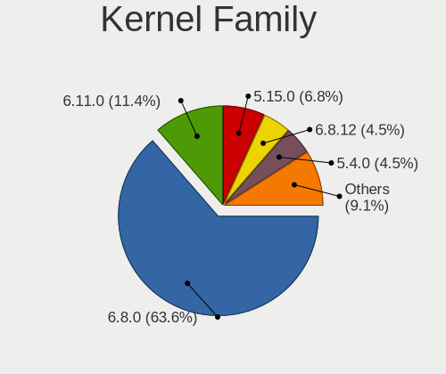
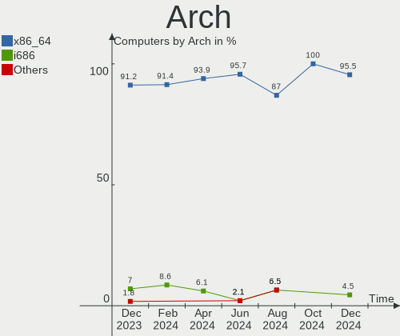
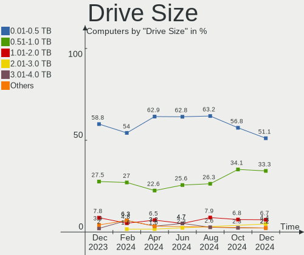
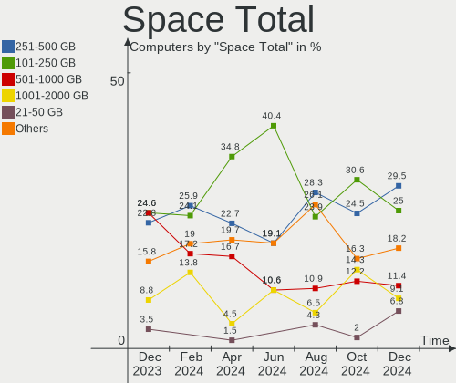
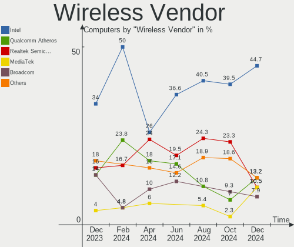
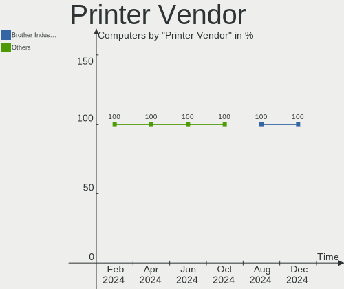
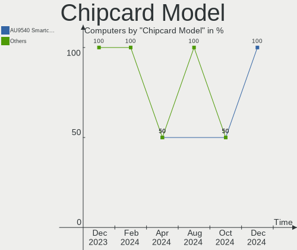

Xubuntu - Hardware Trends
-------------------------

A project to identify most popular hardware characteristics and track their change
over time based on data collected by Linux users at https://Linux-Hardware.org.

Anyone can contribute to this report by the [hw-probe](https://github.com/linuxhw/hw-probe) tool:

    sudo -E hw-probe -all -upload

This is a report for all computer types. See also reports for [desktops](/Dist/Xubuntu/Desktop/README.md) and [notebooks](/Dist/Xubuntu/Notebook/README.md).

This report is for one last month. Overall report since the beginning of time: [TestCoverage](https://github.com/linuxhw/TestCoverage)

Period: Nov, 2022.

Contents
--------

* [ System ](#system)
  - [ OS                       ](#os)
  - [ OS Family                ](#os-family)
  - [ Kernel                   ](#kernel)
  - [ Kernel Family            ](#kernel-family)
  - [ Kernel Major Ver.        ](#kernel-major-ver)
  - [ Arch                     ](#arch)
  - [ DE                       ](#de)
  - [ Display Server           ](#display-server)
  - [ Display Manager          ](#display-manager)
  - [ OS Lang                  ](#os-lang)
  - [ Boot Mode                ](#boot-mode)
  - [ Filesystem               ](#filesystem)
  - [ Part. scheme             ](#part-scheme)
  - [ Dual Boot with Linux/BSD ](#dual-boot-with-linuxbsd)
  - [ Dual Boot (Win)          ](#dual-boot-win)

* [ Board ](#board)
  - [ Vendor                   ](#vendor)
  - [ Model                    ](#model)
  - [ Model Family             ](#model-family)
  - [ MFG Year                 ](#mfg-year)
  - [ Form Factor              ](#form-factor)
  - [ Secure Boot              ](#secure-boot)
  - [ Coreboot                 ](#coreboot)
  - [ RAM Size                 ](#ram-size)
  - [ RAM Used                 ](#ram-used)
  - [ Total Drives             ](#total-drives)
  - [ Has CD-ROM               ](#has-cd-rom)
  - [ Has Ethernet             ](#has-ethernet)
  - [ Has WiFi                 ](#has-wifi)
  - [ Has Bluetooth            ](#has-bluetooth)

* [ Location ](#location)
  - [ Country                  ](#country)
  - [ City                     ](#city)

* [ Drives ](#drives)
  - [ Drive Vendor             ](#drive-vendor)
  - [ Drive Model              ](#drive-model)
  - [ HDD Vendor               ](#hdd-vendor)
  - [ SSD Vendor               ](#ssd-vendor)
  - [ Drive Kind               ](#drive-kind)
  - [ Drive Connector          ](#drive-connector)
  - [ Drive Size               ](#drive-size)
  - [ Space Total              ](#space-total)
  - [ Space Used               ](#space-used)
  - [ Malfunc. Drives          ](#malfunc-drives)
  - [ Malfunc. Drive Vendor    ](#malfunc-drive-vendor)
  - [ Malfunc. HDD Vendor      ](#malfunc-hdd-vendor)
  - [ Malfunc. Drive Kind      ](#malfunc-drive-kind)
  - [ Failed Drives            ](#failed-drives)
  - [ Failed Drive Vendor      ](#failed-drive-vendor)
  - [ Drive Status             ](#drive-status)

* [ Storage controller ](#storage-controller)
  - [ Storage Vendor           ](#storage-vendor)
  - [ Storage Model            ](#storage-model)
  - [ Storage Kind             ](#storage-kind)

* [ Processor ](#processor)
  - [ CPU Vendor               ](#cpu-vendor)
  - [ CPU Model                ](#cpu-model)
  - [ CPU Model Family         ](#cpu-model-family)
  - [ CPU Cores                ](#cpu-cores)
  - [ CPU Sockets              ](#cpu-sockets)
  - [ CPU Threads              ](#cpu-threads)
  - [ CPU Op-Modes             ](#cpu-op-modes)
  - [ CPU Microcode            ](#cpu-microcode)
  - [ CPU Microarch            ](#cpu-microarch)

* [ Graphics ](#graphics)
  - [ GPU Vendor               ](#gpu-vendor)
  - [ GPU Model                ](#gpu-model)
  - [ GPU Combo                ](#gpu-combo)
  - [ GPU Driver               ](#gpu-driver)
  - [ GPU Memory               ](#gpu-memory)

* [ Monitor ](#monitor)
  - [ Monitor Vendor           ](#monitor-vendor)
  - [ Monitor Model            ](#monitor-model)
  - [ Monitor Resolution       ](#monitor-resolution)
  - [ Monitor Diagonal         ](#monitor-diagonal)
  - [ Monitor Width            ](#monitor-width)
  - [ Aspect Ratio             ](#aspect-ratio)
  - [ Monitor Area             ](#monitor-area)
  - [ Pixel Density            ](#pixel-density)
  - [ Multiple Monitors        ](#multiple-monitors)

* [ Network ](#network)
  - [ Net Controller Vendor    ](#net-controller-vendor)
  - [ Net Controller Model     ](#net-controller-model)
  - [ Wireless Vendor          ](#wireless-vendor)
  - [ Wireless Model           ](#wireless-model)
  - [ Ethernet Vendor          ](#ethernet-vendor)
  - [ Ethernet Model           ](#ethernet-model)
  - [ Net Controller Kind      ](#net-controller-kind)
  - [ Used Controller          ](#used-controller)
  - [ NICs                     ](#nics)
  - [ IPv6                     ](#ipv6)

* [ Bluetooth ](#bluetooth)
  - [ Bluetooth Vendor         ](#bluetooth-vendor)
  - [ Bluetooth Model          ](#bluetooth-model)

* [ Sound ](#sound)
  - [ Sound Vendor             ](#sound-vendor)
  - [ Sound Model              ](#sound-model)

* [ Memory ](#memory)
  - [ Memory Vendor            ](#memory-vendor)
  - [ Memory Model             ](#memory-model)
  - [ Memory Kind              ](#memory-kind)
  - [ Memory Form Factor       ](#memory-form-factor)
  - [ Memory Size              ](#memory-size)
  - [ Memory Speed             ](#memory-speed)

* [ Printers & scanners ](#printers--scanners)
  - [ Printer Vendor           ](#printer-vendor)
  - [ Printer Model            ](#printer-model)
  - [ Scanner Vendor           ](#scanner-vendor)
  - [ Scanner Model            ](#scanner-model)

* [ Camera ](#camera)
  - [ Camera Vendor            ](#camera-vendor)
  - [ Camera Model             ](#camera-model)

* [ Security ](#security)
  - [ Fingerprint Vendor       ](#fingerprint-vendor)
  - [ Fingerprint Model        ](#fingerprint-model)
  - [ Chipcard Vendor          ](#chipcard-vendor)
  - [ Chipcard Model           ](#chipcard-model)

* [ Unsupported ](#unsupported)
  - [ Unsupported Devices      ](#unsupported-devices)
  - [ Unsupported Device Types ](#unsupported-device-types)

System
------

OS
--

Installed operating systems

| Name          | Computers | Percent |
|---------------|-----------|---------|
| Xubuntu 22.04 | 45        | 54.88%  |
| Xubuntu 20.04 | 22        | 26.83%  |
| Xubuntu 22.10 | 8         | 9.76%   |
| Xubuntu 18.04 | 7         | 8.54%   |

OS Family
---------

OS without a version

| Name    | Computers | Percent |
|---------|-----------|---------|
| Xubuntu | 82        | 100%    |

Kernel
------

Version of the Linux kernel

| Version                 | Computers | Percent |
|-------------------------|-----------|---------|
| 5.15.0-52-generic       | 29        | 35.37%  |
| 5.15.0-53-generic       | 12        | 14.63%  |
| 5.4.0-131-generic       | 9         | 10.98%  |
| 5.4.0-132-generic       | 3         | 3.66%   |
| 5.19.0-21-generic       | 3         | 3.66%   |
| 5.19.0-23-generic       | 2         | 2.44%   |
| 5.19.0-1009-lowlatency  | 2         | 2.44%   |
| 5.15.0-54-generic       | 2         | 2.44%   |
| 5.15.0-53-lowlatency    | 2         | 2.44%   |
| 5.15.0-25-generic       | 2         | 2.44%   |
| 6.0.9-060009-generic    | 1         | 1.22%   |
| 6.0.7-x64v3-xanmod1     | 1         | 1.22%   |
| 6.0.0-1007-oem          | 1         | 1.22%   |
| 5.8.0-41-generic        | 1         | 1.22%   |
| 5.4.217-0504217-generic | 1         | 1.22%   |
| 5.4.0-132-lowlatency    | 1         | 1.22%   |
| 5.4.0-131-lowlatency    | 1         | 1.22%   |
| 5.4.0-124-generic       | 1         | 1.22%   |
| 5.4.0-122-generic       | 1         | 1.22%   |
| 5.17.0-1020-oem         | 1         | 1.22%   |
| 5.15.74-sunxi           | 1         | 1.22%   |
| 5.15.0-50-generic       | 1         | 1.22%   |
| 5.15.0-43-generic       | 1         | 1.22%   |
| 4.15.0-197-lowlatency   | 1         | 1.22%   |
| 4.15.0-197-generic      | 1         | 1.22%   |
| 4.15.0-196-generic      | 1         | 1.22%   |

Kernel Family
-------------

Linux kernel without a distro release

| Version | Computers | Percent |
|---------|-----------|---------|
| 5.15.0  | 49        | 59.76%  |
| 5.4.0   | 16        | 19.51%  |
| 5.19.0  | 7         | 8.54%   |
| 4.15.0  | 3         | 3.66%   |
| 6.0.9   | 1         | 1.22%   |
| 6.0.7   | 1         | 1.22%   |
| 6.0.0   | 1         | 1.22%   |
| 5.8.0   | 1         | 1.22%   |
| 5.4.217 | 1         | 1.22%   |
| 5.17.0  | 1         | 1.22%   |
| 5.15.74 | 1         | 1.22%   |

Kernel Major Ver.
-----------------

Linux kernel major version

| Version | Computers | Percent |
|---------|-----------|---------|
| 5.15    | 50        | 60.98%  |
| 5.4     | 17        | 20.73%  |
| 5.19    | 7         | 8.54%   |
| 6.0     | 3         | 3.66%   |
| 4.15    | 3         | 3.66%   |
| 5.8     | 1         | 1.22%   |
| 5.17    | 1         | 1.22%   |

Arch
----

OS architecture (x86_64, i586, etc.)

| Name   | Computers | Percent |
|--------|-----------|---------|
| x86_64 | 77        | 93.9%   |
| i686   | 4         | 4.88%   |
| armv7l | 1         | 1.22%   |

DE
--

Desktop Environment

| Name | Computers | Percent |
|------|-----------|---------|
| XFCE | 82        | 100%    |

Display Server
--------------

X11 or Wayland

| Name | Computers | Percent |
|------|-----------|---------|
| X11  | 82        | 100%    |

Display Manager
---------------

SDDM, LightDM, etc.

| Name    | Computers | Percent |
|---------|-----------|---------|
| LightDM | 75        | 91.46%  |
| GDM3    | 5         | 6.1%    |
| Unknown | 2         | 2.44%   |

OS Lang
-------

Language

| Lang  | Computers | Percent |
|-------|-----------|---------|
| en_US | 28        | 34.15%  |
| de_DE | 15        | 18.29%  |
| fr_FR | 11        | 13.41%  |
| it_IT | 6         | 7.32%   |
| ru_RU | 4         | 4.88%   |
| en_GB | 4         | 4.88%   |
| pt_BR | 3         | 3.66%   |
| tr_TR | 1         | 1.22%   |
| fr_CA | 1         | 1.22%   |
| fr_BE | 1         | 1.22%   |
| es_VE | 1         | 1.22%   |
| es_CO | 1         | 1.22%   |
| en_IN | 1         | 1.22%   |
| en_AU | 1         | 1.22%   |
| de_CH | 1         | 1.22%   |
| de_AT | 1         | 1.22%   |
| cs_CZ | 1         | 1.22%   |
| C     | 1         | 1.22%   |

Boot Mode
---------

EFI or BIOS

| Mode | Computers | Percent |
|------|-----------|---------|
| BIOS | 44        | 53.66%  |
| EFI  | 38        | 46.34%  |

Filesystem
----------

Type of filesystem

| Type    | Computers | Percent |
|---------|-----------|---------|
| Ext4    | 75        | 91.46%  |
| Overlay | 3         | 3.66%   |
| Zfs     | 2         | 2.44%   |
| Btrfs   | 2         | 2.44%   |

Part. scheme
------------

Scheme of partitioning

| Type    | Computers | Percent |
|---------|-----------|---------|
| GPT     | 55        | 67.07%  |
| MBR     | 20        | 24.39%  |
| Unknown | 7         | 8.54%   |

Dual Boot with Linux/BSD
------------------------

Hosting more than one Linux/BSD

| Dual boot | Computers | Percent |
|-----------|-----------|---------|
| No        | 68        | 82.93%  |
| Yes       | 14        | 17.07%  |

Dual Boot (Win)
---------------

Hosting Linux and Windows

| Dual boot | Computers | Percent |
|-----------|-----------|---------|
| No        | 52        | 63.41%  |
| Yes       | 30        | 36.59%  |

Board
-----

Vendor
------

Motherboard manufacturer

| Name                | Computers | Percent |
|---------------------|-----------|---------|
| Lenovo              | 13        | 15.85%  |
| ASUSTek Computer    | 13        | 15.85%  |
| Hewlett-Packard     | 12        | 14.63%  |
| MSI                 | 8         | 9.76%   |
| Dell                | 7         | 8.54%   |
| Gigabyte Technology | 5         | 6.1%    |
| Acer                | 3         | 3.66%   |
| Supermicro          | 2         | 2.44%   |
| Intel               | 2         | 2.44%   |
| ASRock              | 2         | 2.44%   |
| Apple               | 2         | 2.44%   |
| VIT                 | 1         | 1.22%   |
| sunxi               | 1         | 1.22%   |
| Sony                | 1         | 1.22%   |
| Positivo            | 1         | 1.22%   |
| MACHINIST           | 1         | 1.22%   |
| Inventec            | 1         | 1.22%   |
| HUAWEI              | 1         | 1.22%   |
| Google              | 1         | 1.22%   |
| Fujitsu Siemens     | 1         | 1.22%   |
| Fujitsu             | 1         | 1.22%   |
| eMachines           | 1         | 1.22%   |
| BCM                 | 1         | 1.22%   |
| Unknown             | 1         | 1.22%   |

Model
-----

Motherboard model

| Name                                   | Computers | Percent |
|----------------------------------------|-----------|---------|
| MSI MS-7D46                            | 2         | 2.44%   |
| VIT Aptio CRB                          | 1         | 1.22%   |
| Supermicro M12SWA-TF                   | 1         | 1.22%   |
| Supermicro AS -5014A-TT                | 1         | 1.22%   |
| sunxi LeMaker Banana Pi                | 1         | 1.22%   |
| Sony VPCEH25EN                         | 1         | 1.22%   |
| Positivo Mobile                        | 1         | 1.22%   |
| MSI MS-7D25                            | 1         | 1.22%   |
| MSI MS-7C52                            | 1         | 1.22%   |
| MSI MS-7B89                            | 1         | 1.22%   |
| MSI MS-7A32                            | 1         | 1.22%   |
| MSI MS-7823                            | 1         | 1.22%   |
| MSI MS-7309                            | 1         | 1.22%   |
| MACHINIST X99-RS9 V2.0                 | 1         | 1.22%   |
| Lenovo ThinkPad T450s 20BWS33U00       | 1         | 1.22%   |
| Lenovo ThinkPad T440p 20AN0033RT       | 1         | 1.22%   |
| Lenovo ThinkPad T430 23501K1           | 1         | 1.22%   |
| Lenovo ThinkPad T14s Gen 2a 20XF006HGE | 1         | 1.22%   |
| Lenovo ThinkPad P51 20HH0014IX         | 1         | 1.22%   |
| Lenovo ThinkPad L380 20M6S4E000        | 1         | 1.22%   |
| Lenovo ThinkPad Edge E431 6277CTO      | 1         | 1.22%   |
| Lenovo ThinkCentre M90p 3282A9G        | 1         | 1.22%   |
| Lenovo ThinkCentre M70e 0830AC4        | 1         | 1.22%   |
| Lenovo ThinkBook 15 G2 ITL 20VE        | 1         | 1.22%   |
| Lenovo IdeaPad Gaming 3 15ARH05 82EY   | 1         | 1.22%   |
| Lenovo IdeaPad 110-17ACL 80UM          | 1         | 1.22%   |
| Lenovo G50-80 80E5                     | 1         | 1.22%   |
| Inventec Dell Thin Client Desktop 5060 | 1         | 1.22%   |
| Intel D525MW AAE93082-401              | 1         | 1.22%   |
| Intel AB2L                             | 1         | 1.22%   |
| HUAWEI BOM-WXX9                        | 1         | 1.22%   |
| HP ProBook 6450b                       | 1         | 1.22%   |
| HP ProBook 640 G4                      | 1         | 1.22%   |
| HP Pavilion g6                         | 1         | 1.22%   |
| HP Pavilion dv9000 (RP919EA#UUZ)       | 1         | 1.22%   |
| HP Laptop 17-cp0xxx                    | 1         | 1.22%   |
| HP EliteDesk 800 G2 SFF                | 1         | 1.22%   |
| HP EliteBook Folio 1040 G1             | 1         | 1.22%   |
| HP EliteBook 840 G3                    | 1         | 1.22%   |
| HP Compaq 8200 Elite SFF PC            | 1         | 1.22%   |

Model Family
------------

Motherboard model prefix

| Name                 | Computers | Percent |
|----------------------|-----------|---------|
| Lenovo ThinkPad      | 7         | 8.54%   |
| Acer Aspire          | 3         | 3.66%   |
| MSI MS-7D46          | 2         | 2.44%   |
| Lenovo ThinkCentre   | 2         | 2.44%   |
| Lenovo IdeaPad       | 2         | 2.44%   |
| HP ProBook           | 2         | 2.44%   |
| HP Pavilion          | 2         | 2.44%   |
| HP EliteBook         | 2         | 2.44%   |
| Dell Latitude        | 2         | 2.44%   |
| Dell Inspiron        | 2         | 2.44%   |
| ASUS P8H61-M         | 2         | 2.44%   |
| VIT Aptio            | 1         | 1.22%   |
| Supermicro M12SWA-TF | 1         | 1.22%   |
| Supermicro AS        | 1         | 1.22%   |
| sunxi LeMaker        | 1         | 1.22%   |
| Sony VPCEH25EN       | 1         | 1.22%   |
| Positivo Mobile      | 1         | 1.22%   |
| MSI MS-7D25          | 1         | 1.22%   |
| MSI MS-7C52          | 1         | 1.22%   |
| MSI MS-7B89          | 1         | 1.22%   |
| MSI MS-7A32          | 1         | 1.22%   |
| MSI MS-7823          | 1         | 1.22%   |
| MSI MS-7309          | 1         | 1.22%   |
| MACHINIST X99-RS9    | 1         | 1.22%   |
| Lenovo ThinkBook     | 1         | 1.22%   |
| Lenovo G50-80        | 1         | 1.22%   |
| Inventec Dell        | 1         | 1.22%   |
| Intel D525MW         | 1         | 1.22%   |
| Intel AB2L           | 1         | 1.22%   |
| HUAWEI BOM-WXX9      | 1         | 1.22%   |
| HP Laptop            | 1         | 1.22%   |
| HP EliteDesk         | 1         | 1.22%   |
| HP Compaq            | 1         | 1.22%   |
| HP 8540w             | 1         | 1.22%   |
| HP 255               | 1         | 1.22%   |
| HP 245               | 1         | 1.22%   |
| Google Akemi         | 1         | 1.22%   |
| Gigabyte Z77-DS3H    | 1         | 1.22%   |
| Gigabyte Z390        | 1         | 1.22%   |
| Gigabyte H97-HD3     | 1         | 1.22%   |

MFG Year
--------

Motherboard manufacture year

| Year    | Computers | Percent |
|---------|-----------|---------|
| 2011    | 9         | 10.98%  |
| 2021    | 7         | 8.54%   |
| 2016    | 7         | 8.54%   |
| 2013    | 7         | 8.54%   |
| 2022    | 6         | 7.32%   |
| 2010    | 6         | 7.32%   |
| 2020    | 5         | 6.1%    |
| 2018    | 5         | 6.1%    |
| 2017    | 5         | 6.1%    |
| 2014    | 5         | 6.1%    |
| 2019    | 4         | 4.88%   |
| 2015    | 4         | 4.88%   |
| 2012    | 4         | 4.88%   |
| 2009    | 3         | 3.66%   |
| 2007    | 2         | 2.44%   |
| 2006    | 1         | 1.22%   |
| 2005    | 1         | 1.22%   |
| Unknown | 1         | 1.22%   |

Form Factor
-----------

Physical design of the computer

| Name           | Computers | Percent |
|----------------|-----------|---------|
| Notebook       | 40        | 48.78%  |
| Desktop        | 34        | 41.46%  |
| Mini pc        | 3         | 3.66%   |
| Server         | 3         | 3.66%   |
| System on chip | 1         | 1.22%   |
| All in one     | 1         | 1.22%   |

Secure Boot
-----------

Enabled or disabled

| State    | Computers | Percent |
|----------|-----------|---------|
| Disabled | 77        | 93.9%   |
| Enabled  | 5         | 6.1%    |

Coreboot
--------

Have coreboot on board

| Used | Computers | Percent |
|------|-----------|---------|
| No   | 81        | 98.78%  |
| Yes  | 1         | 1.22%   |

RAM Size
--------

Total RAM memory

| Size in GB      | Computers | Percent |
|-----------------|-----------|---------|
| 4.01-8.0        | 21        | 25.61%  |
| 3.01-4.0        | 16        | 19.51%  |
| 8.01-16.0       | 12        | 14.63%  |
| 16.01-24.0      | 11        | 13.41%  |
| 32.01-64.0      | 6         | 7.32%   |
| 1.01-2.0        | 6         | 7.32%   |
| 2.01-3.0        | 4         | 4.88%   |
| 0.51-1.0        | 3         | 3.66%   |
| 24.01-32.0      | 2         | 2.44%   |
| More than 256.0 | 1         | 1.22%   |

RAM Used
--------

Used RAM memory

| Used GB   | Computers | Percent |
|-----------|-----------|---------|
| 2.01-3.0  | 28        | 34.15%  |
| 1.01-2.0  | 25        | 30.49%  |
| 0.51-1.0  | 9         | 10.98%  |
| 4.01-8.0  | 8         | 9.76%   |
| 3.01-4.0  | 5         | 6.1%    |
| 8.01-16.0 | 5         | 6.1%    |
| 0.01-0.5  | 2         | 2.44%   |

Total Drives
------------

Number of drives on board

| Drives | Computers | Percent |
|--------|-----------|---------|
| 1      | 44        | 53.66%  |
| 2      | 19        | 23.17%  |
| 4      | 8         | 9.76%   |
| 3      | 6         | 7.32%   |
| 6      | 2         | 2.44%   |
| 5      | 2         | 2.44%   |
| 10     | 1         | 1.22%   |

Has CD-ROM
----------

Has CD-ROM on board

| Presented | Computers | Percent |
|-----------|-----------|---------|
| No        | 49        | 59.76%  |
| Yes       | 33        | 40.24%  |

Has Ethernet
------------

Has Ethernet on board

| Presented | Computers | Percent |
|-----------|-----------|---------|
| Yes       | 76        | 92.68%  |
| No        | 6         | 7.32%   |

Has WiFi
--------

Has WiFi module

| Presented | Computers | Percent |
|-----------|-----------|---------|
| Yes       | 53        | 64.63%  |
| No        | 29        | 35.37%  |

Has Bluetooth
-------------

Has Bluetooth module

| Presented | Computers | Percent |
|-----------|-----------|---------|
| No        | 44        | 53.66%  |
| Yes       | 38        | 46.34%  |

Location
--------

Country
-------

Geographic location (country)

| Country     | Computers | Percent |
|-------------|-----------|---------|
| Germany     | 14        | 17.07%  |
| France      | 13        | 15.85%  |
| USA         | 11        | 13.41%  |
| Italy       | 6         | 7.32%   |
| Russia      | 5         | 6.1%    |
| UK          | 4         | 4.88%   |
| Brazil      | 3         | 3.66%   |
| Taiwan      | 2         | 2.44%   |
| Poland      | 2         | 2.44%   |
| Netherlands | 2         | 2.44%   |
| India       | 2         | 2.44%   |
| Greece      | 2         | 2.44%   |
| Belgium     | 2         | 2.44%   |
| Austria     | 2         | 2.44%   |
| Venezuela   | 1         | 1.22%   |
| Turkey      | 1         | 1.22%   |
| Switzerland | 1         | 1.22%   |
| Portugal    | 1         | 1.22%   |
| New Zealand | 1         | 1.22%   |
| Iran        | 1         | 1.22%   |
| Czechia     | 1         | 1.22%   |
| Colombia    | 1         | 1.22%   |
| Canada      | 1         | 1.22%   |
| Belarus     | 1         | 1.22%   |
| Australia   | 1         | 1.22%   |
| Algeria     | 1         | 1.22%   |

City
----

Geographic location (city)

| City                      | Computers | Percent |
|---------------------------|-----------|---------|
| Rome                      | 2         | 2.44%   |
| Munich                    | 2         | 2.44%   |
| Żywiec                   | 1         | 1.22%   |
| Woellersdorf              | 1         | 1.22%   |
| Windsor                   | 1         | 1.22%   |
| Wierden                   | 1         | 1.22%   |
| Wettringen                | 1         | 1.22%   |
| Warsaw                    | 1         | 1.22%   |
| Vitebsk                   | 1         | 1.22%   |
| Villach                   | 1         | 1.22%   |
| Verona                    | 1         | 1.22%   |
| Toccoa                    | 1         | 1.22%   |
| Tinley Park               | 1         | 1.22%   |
| Tehran                    | 1         | 1.22%   |
| Taipei                    | 1         | 1.22%   |
| Taichung                  | 1         | 1.22%   |
| Sydney                    | 1         | 1.22%   |
| St Petersburg             | 1         | 1.22%   |
| Springfield               | 1         | 1.22%   |
| Southampton               | 1         | 1.22%   |
| Shrewsbury                | 1         | 1.22%   |
| San Antonio               | 1         | 1.22%   |
| Saint-Hilaire-sur-Benaize | 1         | 1.22%   |
| Saint-Eustache            | 1         | 1.22%   |
| Saint-Denis               | 1         | 1.22%   |
| Rouvray-Saint-Denis       | 1         | 1.22%   |
| Rio Rancho                | 1         | 1.22%   |
| Quartucciu                | 1         | 1.22%   |
| Pocatello                 | 1         | 1.22%   |
| Petropavlovsk-Kamchatsky  | 1         | 1.22%   |
| Pau                       | 1         | 1.22%   |
| Paris                     | 1         | 1.22%   |
| North Augusta             | 1         | 1.22%   |
| Newton Abbot              | 1         | 1.22%   |
| Münster                  | 1         | 1.22%   |
| Mumbai                    | 1         | 1.22%   |
| Mladá Boleslav           | 1         | 1.22%   |
| Milan                     | 1         | 1.22%   |
| Middletown                | 1         | 1.22%   |
| Mem Martins               | 1         | 1.22%   |

Drives
------

Drive Vendor
------------

Hard drive vendors

| Vendor              | Computers | Drives | Percent |
|---------------------|-----------|--------|---------|
| WDC                 | 23        | 33     | 17.42%  |
| Samsung Electronics | 20        | 28     | 15.15%  |
| Seagate             | 17        | 20     | 12.88%  |
| Crucial             | 10        | 11     | 7.58%   |
| Toshiba             | 8         | 8      | 6.06%   |
| Hitachi             | 6         | 8      | 4.55%   |
| Unknown             | 5         | 5      | 3.79%   |
| SanDisk             | 4         | 4      | 3.03%   |
| Kingston            | 4         | 6      | 3.03%   |
| SPCC                | 3         | 3      | 2.27%   |
| PNY                 | 3         | 3      | 2.27%   |
| Intel               | 3         | 3      | 2.27%   |
| HGST                | 3         | 4      | 2.27%   |
| SK hynix            | 2         | 2      | 1.52%   |
| Phison Electronics  | 2         | 2      | 1.52%   |
| Fujitsu             | 2         | 2      | 1.52%   |
| XPG                 | 1         | 1      | 0.76%   |
| Vaseky              | 1         | 1      | 0.76%   |
| USB3.0              | 1         | 2      | 0.76%   |
| Transcend           | 1         | 1      | 0.76%   |
| Phison              | 1         | 1      | 0.76%   |
| Patriot             | 1         | 1      | 0.76%   |
| OCZ                 | 1         | 1      | 0.76%   |
| Lenovo              | 1         | 1      | 0.76%   |
| KIOXIA              | 1         | 1      | 0.76%   |
| Intenso             | 1         | 1      | 0.76%   |
| Inateck             | 1         | 1      | 0.76%   |
| Hoodisk             | 1         | 1      | 0.76%   |
| HGST HUS            | 1         | 1      | 0.76%   |
| ASMT                | 1         | 4      | 0.76%   |
| Apple               | 1         | 1      | 0.76%   |
| Apacer              | 1         | 1      | 0.76%   |
| Unknown             | 1         | 1      | 0.76%   |

Drive Model
-----------

Hard drive models

| Model                                | Computers | Percent |
|--------------------------------------|-----------|---------|
| Crucial CT480BX500SSD1 480GB         | 4         | 2.61%   |
| SK hynix BC711 HFM512GD3JX013N 512GB | 2         | 1.31%   |
| Samsung SSD 970 EVO Plus 1TB         | 2         | 1.31%   |
| Samsung SSD 860 EVO 500GB            | 2         | 1.31%   |
| PNY CS900 240GB SSD                  | 2         | 1.31%   |
| Crucial CT120M500SSD1 120GB          | 2         | 1.31%   |
| Crucial CT1000MX500SSD1 1TB          | 2         | 1.31%   |
| XPG GAMMIX S11L 256GB                | 1         | 0.65%   |
| WDC WUH721816ALE6L4 16TB             | 1         | 0.65%   |
| WDC WDS500G2B0C 500GB                | 1         | 0.65%   |
| WDC WDS500G2B0A-00SM50 500GB SSD     | 1         | 0.65%   |
| WDC WDS250G2B0B-00YS70 250GB SSD     | 1         | 0.65%   |
| WDC WD5003AZEX-00S3DA0 500GB         | 1         | 0.65%   |
| WDC WD5000LPCX-22VHAT1 500GB         | 1         | 0.65%   |
| WDC WD5000AZLX-60K2TA0 500GB         | 1         | 0.65%   |
| WDC WD5000AVDS-63U7B1 500GB          | 1         | 0.65%   |
| WDC WD5000AAVS-00ZTB0 500GB          | 1         | 0.65%   |
| WDC WD5000AAKX-22ERMA0 500GB         | 1         | 0.65%   |
| WDC WD5000AAKX-00ERMA0 500GB         | 1         | 0.65%   |
| WDC WD5000AAKS-00A7B2 500GB          | 1         | 0.65%   |
| WDC WD40PURX-78AKYY0 4TB             | 1         | 0.65%   |
| WDC WD40EFAX-68JH4N1 4TB             | 1         | 0.65%   |
| WDC WD4003FRYZ-01F0DB0 4TB           | 1         | 0.65%   |
| WDC WD3200AAKS-00L9A0 320GB          | 1         | 0.65%   |
| WDC WD3200AAJS-08L7A0 320GB          | 1         | 0.65%   |
| WDC WD30EFRX-68EUZN0 3TB             | 1         | 0.65%   |
| WDC WD20EFRX-68EUZN0 2TB             | 1         | 0.65%   |
| WDC WD20EFRX-68AX9N0 2TB             | 1         | 0.65%   |
| WDC WD20EARX-00PASB0 2TB             | 1         | 0.65%   |
| WDC WD10SPZX-75Z10T1 1TB             | 1         | 0.65%   |
| WDC WD10JPVX-22JC3T0 1TB             | 1         | 0.65%   |
| WDC WD10JPVT-55A1YT0 1TB             | 1         | 0.65%   |
| WDC WD10JPCX-24UE4T0 1TB             | 1         | 0.65%   |
| WDC WD10EZEX-60WN4A1 1TB             | 1         | 0.65%   |
| WDC WD10EZEX-00BN5A0 1TB             | 1         | 0.65%   |
| WDC WD10EARS-00Y5B1 1TB              | 1         | 0.65%   |
| WDC WD1003FBYX-01Y7B1 1TB            | 1         | 0.65%   |
| WDC WD Blue SA510 2.5 500GB          | 1         | 0.65%   |
| WDC PC SN530 SDBPMPZ-256G-1101 256GB | 1         | 0.65%   |
| Vaseky V800/64G 64GB                 | 1         | 0.65%   |

HDD Vendor
----------

Hard disk drive vendors

| Vendor              | Computers | Drives | Percent |
|---------------------|-----------|--------|---------|
| WDC                 | 19        | 28     | 32.2%   |
| Seagate             | 17        | 20     | 28.81%  |
| Toshiba             | 6         | 6      | 10.17%  |
| Hitachi             | 6         | 8      | 10.17%  |
| Samsung Electronics | 4         | 5      | 6.78%   |
| HGST                | 3         | 4      | 5.08%   |
| Fujitsu             | 2         | 2      | 3.39%   |
| USB3.0              | 1         | 2      | 1.69%   |
| ASMT                | 1         | 4      | 1.69%   |

SSD Vendor
----------

Solid state drive vendors

| Vendor              | Computers | Drives | Percent |
|---------------------|-----------|--------|---------|
| Samsung Electronics | 13        | 15     | 26.53%  |
| Crucial             | 10        | 11     | 20.41%  |
| Kingston            | 4         | 5      | 8.16%   |
| WDC                 | 3         | 3      | 6.12%   |
| SPCC                | 3         | 3      | 6.12%   |
| SanDisk             | 3         | 3      | 6.12%   |
| PNY                 | 3         | 3      | 6.12%   |
| Intel               | 2         | 2      | 4.08%   |
| Vaseky              | 1         | 1      | 2.04%   |
| Transcend           | 1         | 1      | 2.04%   |
| Patriot             | 1         | 1      | 2.04%   |
| OCZ                 | 1         | 1      | 2.04%   |
| Intenso             | 1         | 1      | 2.04%   |
| Hoodisk             | 1         | 1      | 2.04%   |
| Apple               | 1         | 1      | 2.04%   |
| Apacer              | 1         | 1      | 2.04%   |

Drive Kind
----------

HDD or SSD

| Kind    | Computers | Drives | Percent |
|---------|-----------|--------|---------|
| HDD     | 43        | 79     | 38.39%  |
| SSD     | 40        | 53     | 35.71%  |
| NVMe    | 22        | 24     | 19.64%  |
| MMC     | 6         | 6      | 5.36%   |
| Unknown | 1         | 1      | 0.89%   |

Drive Connector
---------------

SATA, SAS, NVMe, etc.

| Type | Computers | Drives | Percent |
|------|-----------|--------|---------|
| SATA | 69        | 118    | 66.35%  |
| NVMe | 22        | 23     | 21.15%  |
| SAS  | 7         | 16     | 6.73%   |
| MMC  | 6         | 6      | 5.77%   |

Drive Size
----------

Size of hard drive

| Size in TB | Computers | Drives | Percent |
|------------|-----------|--------|---------|
| 0.01-0.5   | 56        | 74     | 58.33%  |
| 0.51-1.0   | 20        | 27     | 20.83%  |
| 3.01-4.0   | 9         | 12     | 9.38%   |
| 1.01-2.0   | 6         | 7      | 6.25%   |
| 2.01-3.0   | 2         | 8      | 2.08%   |
| 4.01-10.0  | 2         | 3      | 2.08%   |
| 10.01-20.0 | 1         | 1      | 1.04%   |

Space Total
-----------

Amount of disk space available on the file system

| Size in GB     | Computers | Percent |
|----------------|-----------|---------|
| 101-250        | 23        | 28.05%  |
| 251-500        | 14        | 17.07%  |
| More than 3000 | 10        | 12.2%   |
| 1-20           | 8         | 9.76%   |
| 51-100         | 8         | 9.76%   |
| 501-1000       | 7         | 8.54%   |
| 1001-2000      | 6         | 7.32%   |
| 21-50          | 3         | 3.66%   |
| 2001-3000      | 3         | 3.66%   |

Space Used
----------

Amount of used disk space

| Used GB        | Computers | Percent |
|----------------|-----------|---------|
| 1-20           | 27        | 32.93%  |
| 21-50          | 18        | 21.95%  |
| 101-250        | 8         | 9.76%   |
| 51-100         | 8         | 9.76%   |
| 251-500        | 6         | 7.32%   |
| 501-1000       | 5         | 6.1%    |
| More than 3000 | 4         | 4.88%   |
| 1001-2000      | 4         | 4.88%   |
| 2001-3000      | 2         | 2.44%   |

Malfunc. Drives
---------------

Drive models with a malfunction

| Model                                            | Computers | Drives | Percent |
|--------------------------------------------------|-----------|--------|---------|
| WDC WD5000AAKX-00ERMA0 500GB                     | 1         | 1      | 7.14%   |
| WDC WD3200AAKS-00L9A0 320GB                      | 1         | 1      | 7.14%   |
| WDC WD30EFRX-68EUZN0 3TB                         | 1         | 1      | 7.14%   |
| WDC WD20EFRX-68AX9N0 2TB                         | 1         | 1      | 7.14%   |
| WDC WD1003FBYX-01Y7B1 1TB                        | 1         | 1      | 7.14%   |
| Seagate ST500DM002-1BD142 500GB                  | 1         | 1      | 7.14%   |
| SanDisk SSD PLUS 240GB                           | 1         | 1      | 7.14%   |
| Samsung Electronics MZNLH128HBHQ-000H1 128GB SSD | 1         | 1      | 7.14%   |
| Samsung Electronics HM321HI 320GB                | 1         | 1      | 7.14%   |
| Samsung Electronics HD753LJ 752GB                | 1         | 1      | 7.14%   |
| Samsung Electronics HD103SJ 1TB                  | 1         | 1      | 7.14%   |
| Intel SSDSC2BW080A4 80GB                         | 1         | 1      | 7.14%   |
| Hitachi HTS725050A9A364 500GB                    | 1         | 1      | 7.14%   |
| ASMT ASMT105x 3TB                                | 1         | 4      | 7.14%   |

Malfunc. Drive Vendor
---------------------

Vendors of faulty drives

| Vendor              | Computers | Drives | Percent |
|---------------------|-----------|--------|---------|
| WDC                 | 5         | 5      | 38.46%  |
| Samsung Electronics | 3         | 4      | 23.08%  |
| Seagate             | 1         | 1      | 7.69%   |
| SanDisk             | 1         | 1      | 7.69%   |
| Intel               | 1         | 1      | 7.69%   |
| Hitachi             | 1         | 1      | 7.69%   |
| ASMT                | 1         | 4      | 7.69%   |

Malfunc. HDD Vendor
-------------------

Vendors of faulty HDD drives

| Vendor              | Computers | Drives | Percent |
|---------------------|-----------|--------|---------|
| WDC                 | 5         | 5      | 50%     |
| Samsung Electronics | 2         | 3      | 20%     |
| Seagate             | 1         | 1      | 10%     |
| Hitachi             | 1         | 1      | 10%     |
| ASMT                | 1         | 4      | 10%     |

Malfunc. Drive Kind
-------------------

Kinds of faulty drives

| Kind | Computers | Drives | Percent |
|------|-----------|--------|---------|
| HDD  | 9         | 14     | 75%     |
| SSD  | 3         | 3      | 25%     |

Failed Drives
-------------

Failed drive models

Zero info for selected period =(

Failed Drive Vendor
-------------------

Failed drive vendors

Zero info for selected period =(

Drive Status
------------

Number of failed and malfunc. drives

| Status   | Computers | Drives | Percent |
|----------|-----------|--------|---------|
| Works    | 44        | 82     | 46.81%  |
| Detected | 38        | 64     | 40.43%  |
| Malfunc  | 12        | 17     | 12.77%  |

Storage controller
------------------

Storage Vendor
--------------

Storage controller vendors

| Vendor                           | Computers | Percent |
|----------------------------------|-----------|---------|
| Intel                            | 52        | 51.49%  |
| AMD                              | 19        | 18.81%  |
| Samsung Electronics              | 8         | 7.92%   |
| SanDisk                          | 3         | 2.97%   |
| Phison Electronics               | 3         | 2.97%   |
| Toshiba America Info Systems     | 2         | 1.98%   |
| SK hynix                         | 2         | 1.98%   |
| Silicon Integrated Systems [SiS] | 2         | 1.98%   |
| Nvidia                           | 2         | 1.98%   |
| VIA Technologies                 | 1         | 0.99%   |
| Realtek Semiconductor            | 1         | 0.99%   |
| Marvell Technology Group         | 1         | 0.99%   |
| Lenovo                           | 1         | 0.99%   |
| KIOXIA                           | 1         | 0.99%   |
| Kingston Technology Company      | 1         | 0.99%   |
| ASMedia Technology               | 1         | 0.99%   |
| Adaptec                          | 1         | 0.99%   |

Storage Model
-------------

Storage controller models

| Model                                                                                   | Computers | Percent |
|-----------------------------------------------------------------------------------------|-----------|---------|
| AMD FCH SATA Controller [AHCI mode]                                                     | 15        | 12.5%   |
| Intel Q170/Q150/B150/H170/H110/Z170/CM236 Chipset SATA Controller [AHCI Mode]           | 5         | 4.17%   |
| Intel 5 Series/3400 Series Chipset 6 port SATA AHCI Controller                          | 5         | 4.17%   |
| Samsung NVMe SSD Controller SM981/PM981/PM983                                           | 4         | 3.33%   |
| Intel Sunrise Point-LP SATA Controller [AHCI mode]                                      | 4         | 3.33%   |
| Intel 8 Series/C220 Series Chipset Family 6-port SATA Controller 1 [AHCI mode]          | 4         | 3.33%   |
| Intel 6 Series/C200 Series Chipset Family Desktop SATA Controller (IDE mode, ports 4-5) | 4         | 3.33%   |
| Intel 6 Series/C200 Series Chipset Family Desktop SATA Controller (IDE mode, ports 0-3) | 4         | 3.33%   |
| Intel Wildcat Point-LP SATA Controller [AHCI Mode]                                      | 3         | 2.5%    |
| Intel Alder Lake-S PCH SATA Controller [AHCI Mode]                                      | 3         | 2.5%    |
| Intel 7 Series Chipset Family 6-port SATA Controller [AHCI mode]                        | 3         | 2.5%    |
| AMD SB7x0/SB8x0/SB9x0 IDE Controller                                                    | 3         | 2.5%    |
| AMD 400 Series Chipset SATA Controller                                                  | 3         | 2.5%    |
| SK hynix Gold P31/PC711 NVMe Solid State Drive                                          | 2         | 1.67%   |
| Silicon Integrated Systems [SiS] 5513 IDE Controller                                    | 2         | 1.67%   |
| Samsung NVMe SSD Controller PM9A1/PM9A3/980PRO                                          | 2         | 1.67%   |
| Nvidia MCP61 SATA Controller                                                            | 2         | 1.67%   |
| Intel NM10/ICH7 Family SATA Controller [AHCI mode]                                      | 2         | 1.67%   |
| Intel 82801G (ICH7 Family) IDE Controller                                               | 2         | 1.67%   |
| Intel 8 Series SATA Controller 1 [AHCI mode]                                            | 2         | 1.67%   |
| Intel 6 Series/C200 Series Chipset Family 6 port Mobile SATA AHCI Controller            | 2         | 1.67%   |
| AMD SB7x0/SB8x0/SB9x0 SATA Controller [AHCI mode]                                       | 2         | 1.67%   |
| AMD FCH SATA Controller D                                                               | 2         | 1.67%   |
| VIA VT6415 PATA IDE Host Controller                                                     | 1         | 0.83%   |
| Toshiba America Info Systems XG5 NVMe SSD Controller                                    | 1         | 0.83%   |
| Toshiba America Info Systems XG4 NVMe SSD Controller                                    | 1         | 0.83%   |
| Silicon Integrated Systems [SiS] SATA Controller / IDE mode                             | 1         | 0.83%   |
| Silicon Integrated Systems [SiS] AHCI IDE Controller (0106)                             | 1         | 0.83%   |
| SanDisk WD Blue SN550 NVMe SSD                                                          | 1         | 0.83%   |
| SanDisk WD Black SN750 / PC SN730 NVMe SSD                                              | 1         | 0.83%   |
| SanDisk Non-Volatile memory controller                                                  | 1         | 0.83%   |
| Samsung NVMe SSD Controller 980                                                         | 1         | 0.83%   |
| Samsung Apple PCIe SSD                                                                  | 1         | 0.83%   |
| Realtek Realtek Non-Volatile memory controller                                          | 1         | 0.83%   |
| Phison PS5013 E13 NVMe Controller                                                       | 1         | 0.83%   |
| Phison E16 PCIe4 NVMe Controller                                                        | 1         | 0.83%   |
| Phison E12 NVMe Controller                                                              | 1         | 0.83%   |
| Nvidia MCP61 IDE                                                                        | 1         | 0.83%   |
| Marvell Group 88SE9215 PCIe 2.0 x1 4-port SATA 6 Gb/s Controller                        | 1         | 0.83%   |
| Lenovo Non-Volatile memory controller                                                   | 1         | 0.83%   |

Storage Kind
------------

Kind of storage controller (IDE, SATA, NVMe, SAS, ...)

| Kind | Computers | Percent |
|------|-----------|---------|
| SATA | 65        | 61.9%   |
| NVMe | 22        | 20.95%  |
| IDE  | 16        | 15.24%  |
| RAID | 2         | 1.9%    |

Processor
---------

CPU Vendor
----------

Processor vendors

| Vendor | Computers | Percent |
|--------|-----------|---------|
| Intel  | 57        | 69.51%  |
| AMD    | 24        | 29.27%  |
| ARM    | 1         | 1.22%   |

CPU Model
---------

Processor models

| Model                                  | Computers | Percent |
|----------------------------------------|-----------|---------|
| AMD Ryzen 5 5500U with Radeon Graphics | 3         | 3.66%   |
| Intel Core i5-8350U CPU @ 1.70GHz      | 2         | 2.44%   |
| Intel Core i5-6500 CPU @ 3.20GHz       | 2         | 2.44%   |
| Intel Core i5-4460 CPU @ 3.20GHz       | 2         | 2.44%   |
| Intel Core i5-3570K CPU @ 3.40GHz      | 2         | 2.44%   |
| Intel Core i5-2400 CPU @ 3.10GHz       | 2         | 2.44%   |
| Intel Core i5 CPU 750 @ 2.67GHz        | 2         | 2.44%   |
| Intel 12th Gen Core i3-12100           | 2         | 2.44%   |
| Intel Xeon CPU E5-2666 v3 @ 2.90GHz    | 1         | 1.22%   |
| Intel Xeon CPU E3-1240 v5 @ 3.50GHz    | 1         | 1.22%   |
| Intel Pentium M processor 1.73GHz      | 1         | 1.22%   |
| Intel Pentium Dual CPU T3400 @ 2.16GHz | 1         | 1.22%   |
| Intel Pentium Dual CPU T3200 @ 2.00GHz | 1         | 1.22%   |
| Intel Pentium CPU N3710 @ 1.60GHz      | 1         | 1.22%   |
| Intel Pentium CPU G4560 @ 3.50GHz      | 1         | 1.22%   |
| Intel Core i7-7700HQ CPU @ 2.80GHz     | 1         | 1.22%   |
| Intel Core i7-5600U CPU @ 2.60GHz      | 1         | 1.22%   |
| Intel Core i7-4910MQ CPU @ 2.90GHz     | 1         | 1.22%   |
| Intel Core i7-4650U CPU @ 1.70GHz      | 1         | 1.22%   |
| Intel Core i7-4600U CPU @ 2.10GHz      | 1         | 1.22%   |
| Intel Core i7-2670QM CPU @ 2.20GHz     | 1         | 1.22%   |
| Intel Core i7-2600K CPU @ 3.40GHz      | 1         | 1.22%   |
| Intel Core i5-9600K CPU @ 3.70GHz      | 1         | 1.22%   |
| Intel Core i5-7300U CPU @ 2.60GHz      | 1         | 1.22%   |
| Intel Core i5-7200U CPU @ 2.50GHz      | 1         | 1.22%   |
| Intel Core i5-6200U CPU @ 2.30GHz      | 1         | 1.22%   |
| Intel Core i5-5200U CPU @ 2.20GHz      | 1         | 1.22%   |
| Intel Core i5-4670 CPU @ 3.40GHz       | 1         | 1.22%   |
| Intel Core i5-4260U CPU @ 1.40GHz      | 1         | 1.22%   |
| Intel Core i5-3320M CPU @ 2.60GHz      | 1         | 1.22%   |
| Intel Core i5-3230M CPU @ 2.60GHz      | 1         | 1.22%   |
| Intel Core i5-10300H CPU @ 2.50GHz     | 1         | 1.22%   |
| Intel Core i5 CPU M 540 @ 2.53GHz      | 1         | 1.22%   |
| Intel Core i5 CPU M 450 @ 2.40GHz      | 1         | 1.22%   |
| Intel Core i5 CPU 660 @ 3.33GHz        | 1         | 1.22%   |
| Intel Core i3-7300 CPU @ 4.00GHz       | 1         | 1.22%   |
| Intel Core i3-5005U CPU @ 2.00GHz      | 1         | 1.22%   |
| Intel Core i3-2330M CPU @ 2.20GHz      | 1         | 1.22%   |
| Intel Core i3-2120 CPU @ 3.30GHz       | 1         | 1.22%   |
| Intel Core i3-10110U CPU @ 2.10GHz     | 1         | 1.22%   |

CPU Model Family
----------------

Processor model prefix

| Model                  | Computers | Percent |
|------------------------|-----------|---------|
| Intel Core i5          | 25        | 30.49%  |
| Intel Core i7          | 7         | 8.54%   |
| AMD Ryzen 5            | 6         | 7.32%   |
| Other                  | 5         | 6.1%    |
| Intel Core i3          | 5         | 6.1%    |
| Intel Celeron          | 3         | 3.66%   |
| Intel Atom             | 3         | 3.66%   |
| AMD Ryzen 7            | 3         | 3.66%   |
| Intel Xeon             | 2         | 2.44%   |
| Intel Pentium Dual     | 2         | 2.44%   |
| Intel Pentium          | 2         | 2.44%   |
| AMD Ryzen Threadripper | 2         | 2.44%   |
| AMD Athlon             | 2         | 2.44%   |
| Intel Pentium M        | 1         | 1.22%   |
| Intel Core 2 Extreme   | 1         | 1.22%   |
| Intel Core 2 Duo       | 1         | 1.22%   |
| Intel Core 2           | 1         | 1.22%   |
| ARM Allwinner          | 1         | 1.22%   |
| AMD Ryzen 9            | 1         | 1.22%   |
| AMD Ryzen 7 PRO        | 1         | 1.22%   |
| AMD Phenom II X6       | 1         | 1.22%   |
| AMD GX                 | 1         | 1.22%   |
| AMD FX                 | 1         | 1.22%   |
| AMD E2                 | 1         | 1.22%   |
| AMD E                  | 1         | 1.22%   |
| AMD Athlon II X2       | 1         | 1.22%   |
| AMD Athlon 64 X2       | 1         | 1.22%   |
| AMD A4                 | 1         | 1.22%   |

CPU Cores
---------

Number of processor cores

| Number | Computers | Percent |
|--------|-----------|---------|
| 2      | 36        | 43.9%   |
| 4      | 26        | 31.71%  |
| 6      | 8         | 9.76%   |
| 8      | 4         | 4.88%   |
| 64     | 2         | 2.44%   |
| 1      | 2         | 2.44%   |
| 14     | 1         | 1.22%   |
| 12     | 1         | 1.22%   |
| 10     | 1         | 1.22%   |
| 3      | 1         | 1.22%   |

CPU Sockets
-----------

Number of sockets

| Number | Computers | Percent |
|--------|-----------|---------|
| 1      | 82        | 100%    |

CPU Threads
-----------

Threads per core (Hyper-Threading)

| Number | Computers | Percent |
|--------|-----------|---------|
| 2      | 50        | 60.98%  |
| 1      | 32        | 39.02%  |

CPU Op-Modes
------------

CPU Operation Modes (32-bit, 64-bit)

| Op mode        | Computers | Percent |
|----------------|-----------|---------|
| 32-bit, 64-bit | 78        | 95.12%  |
| 32-bit         | 3         | 3.66%   |
| Unknown        | 1         | 1.22%   |

CPU Microcode
-------------

Microcode number

| Number     | Computers | Percent |
|------------|-----------|---------|
| Unknown    | 20        | 24.39%  |
| 0x506e3    | 3         | 3.66%   |
| 0x40651    | 3         | 3.66%   |
| 0x306c3    | 3         | 3.66%   |
| 0x306a9    | 3         | 3.66%   |
| 0x206a7    | 3         | 3.66%   |
| 0x08608103 | 3         | 3.66%   |
| 0x906e9    | 2         | 2.44%   |
| 0x806e9    | 2         | 2.44%   |
| 0x6fd      | 2         | 2.44%   |
| 0x306d4    | 2         | 2.44%   |
| 0x106e5    | 2         | 2.44%   |
| 0x1067a    | 2         | 2.44%   |
| 0x08701021 | 2         | 2.44%   |
| 0x07030105 | 2         | 2.44%   |
| 0x05000119 | 2         | 2.44%   |
| 0xb0671    | 1         | 1.22%   |
| 0xa0652    | 1         | 1.22%   |
| 0x906ec    | 1         | 1.22%   |
| 0x806ec    | 1         | 1.22%   |
| 0x806ea    | 1         | 1.22%   |
| 0x806c1    | 1         | 1.22%   |
| 0x6f6      | 1         | 1.22%   |
| 0x6d8      | 1         | 1.22%   |
| 0x506c9    | 1         | 1.22%   |
| 0x306f2    | 1         | 1.22%   |
| 0x30661    | 1         | 1.22%   |
| 0x20655    | 1         | 1.22%   |
| 0x20652    | 1         | 1.22%   |
| 0x106ca    | 1         | 1.22%   |
| 0x106c2    | 1         | 1.22%   |
| 0x0a50000c | 1         | 1.22%   |
| 0x0a008204 | 1         | 1.22%   |
| 0x08600106 | 1         | 1.22%   |
| 0x08600104 | 1         | 1.22%   |
| 0x0830104d | 1         | 1.22%   |
| 0x08108109 | 1         | 1.22%   |
| 0x08101016 | 1         | 1.22%   |
| 0x0800820d | 1         | 1.22%   |
| 0x06006705 | 1         | 1.22%   |

CPU Microarch
-------------

Microarchitecture

| Name        | Computers | Percent |
|-------------|-----------|---------|
| KabyLake    | 9         | 10.98%  |
| Haswell     | 8         | 9.76%   |
| Unknown     | 8         | 9.76%   |
| Zen 2       | 6         | 7.32%   |
| SandyBridge | 6         | 7.32%   |
| IvyBridge   | 5         | 6.1%    |
| Skylake     | 4         | 4.88%   |
| Zen+        | 3         | 3.66%   |
| Westmere    | 3         | 3.66%   |
| Core        | 3         | 3.66%   |
| Broadwell   | 3         | 3.66%   |
| Bonnell     | 3         | 3.66%   |
| Silvermont  | 2         | 2.44%   |
| Puma        | 2         | 2.44%   |
| Penryn      | 2         | 2.44%   |
| Nehalem     | 2         | 2.44%   |
| K10         | 2         | 2.44%   |
| Bobcat      | 2         | 2.44%   |
| Zen 3       | 1         | 1.22%   |
| Zen         | 1         | 1.22%   |
| TigerLake   | 1         | 1.22%   |
| Piledriver  | 1         | 1.22%   |
| P6          | 1         | 1.22%   |
| K8 Hammer   | 1         | 1.22%   |
| Goldmont    | 1         | 1.22%   |
| Excavator   | 1         | 1.22%   |
| CometLake   | 1         | 1.22%   |

Graphics
--------

GPU Vendor
----------

Vendors of graphics cards

| Vendor                           | Computers | Percent |
|----------------------------------|-----------|---------|
| Intel                            | 41        | 45.56%  |
| Nvidia                           | 27        | 30%     |
| AMD                              | 17        | 18.89%  |
| Silicon Integrated Systems [SiS] | 2         | 2.22%   |
| ASPEED Technology                | 2         | 2.22%   |
| Matrox Electronics Systems       | 1         | 1.11%   |

GPU Model
---------

Graphics card models

| Model                                                                                    | Computers | Percent |
|------------------------------------------------------------------------------------------|-----------|---------|
| Intel 2nd Generation Core Processor Family Integrated Graphics Controller                | 5         | 5.49%   |
| Intel HD Graphics 5500                                                                   | 3         | 3.3%    |
| Intel Haswell-ULT Integrated Graphics Controller                                         | 3         | 3.3%    |
| Intel 3rd Gen Core processor Graphics Controller                                         | 3         | 3.3%    |
| AMD Lucienne                                                                             | 3         | 3.3%    |
| Silicon Integrated Systems [SiS] 771/671 PCIE VGA Display Adapter                        | 2         | 2.2%    |
| Nvidia GK208B [GeForce GT 730]                                                           | 2         | 2.2%    |
| Nvidia GK208B [GeForce GT 710]                                                           | 2         | 2.2%    |
| Nvidia GF108 [GeForce GT 730]                                                            | 2         | 2.2%    |
| Intel Xeon E3-1200 v3/4th Gen Core Processor Integrated Graphics Controller              | 2         | 2.2%    |
| Intel UHD Graphics 620                                                                   | 2         | 2.2%    |
| Intel HD Graphics 620                                                                    | 2         | 2.2%    |
| Intel Atom/Celeron/Pentium Processor x5-E8000/J3xxx/N3xxx Integrated Graphics Controller | 2         | 2.2%    |
| Intel Alder Lake-S GT1 [UHD Graphics 730]                                                | 2         | 2.2%    |
| ASPEED Technology ASPEED Graphics Family                                                 | 2         | 2.2%    |
| AMD Baffin [Radeon RX 550 640SP / RX 560/560X]                                           | 2         | 2.2%    |
| Nvidia TU117M [GeForce MX450]                                                            | 1         | 1.1%    |
| Nvidia TU117M                                                                            | 1         | 1.1%    |
| Nvidia TU106 [GeForce RTX 2060 SUPER]                                                    | 1         | 1.1%    |
| Nvidia TU106 [GeForce RTX 2060 Rev. A]                                                   | 1         | 1.1%    |
| Nvidia GT218 [GeForce 210]                                                               | 1         | 1.1%    |
| Nvidia GT216GLM [Quadro FX 880M]                                                         | 1         | 1.1%    |
| Nvidia GP106GL [Quadro P2000]                                                            | 1         | 1.1%    |
| Nvidia GP104 [GeForce GTX 1070]                                                          | 1         | 1.1%    |
| Nvidia GM108M [GeForce 840M]                                                             | 1         | 1.1%    |
| Nvidia GM107GLM [Quadro M1200 Mobile]                                                    | 1         | 1.1%    |
| Nvidia GM107 [GeForce GTX 750]                                                           | 1         | 1.1%    |
| Nvidia GK208M [GeForce GT 730M]                                                          | 1         | 1.1%    |
| Nvidia GK107GLM [Quadro K1100M]                                                          | 1         | 1.1%    |
| Nvidia GF119M [GeForce GT 520MX]                                                         | 1         | 1.1%    |
| Nvidia GF119M [GeForce 410M]                                                             | 1         | 1.1%    |
| Nvidia GA102GL [RTX A6000]                                                               | 1         | 1.1%    |
| Nvidia G98 [GeForce 8400 GS Rev. 2]                                                      | 1         | 1.1%    |
| Nvidia G96C [GeForce 9500 GT]                                                            | 1         | 1.1%    |
| Nvidia G92GLM [Quadro FX 3700M]                                                          | 1         | 1.1%    |
| Nvidia G73M [GeForce Go 7600]                                                            | 1         | 1.1%    |
| Nvidia C61 [GeForce 6150SE nForce 430]                                                   | 1         | 1.1%    |
| Matrox Electronics Systems G200eR2                                                       | 1         | 1.1%    |
| Intel TigerLake-LP GT2 [Iris Xe Graphics]                                                | 1         | 1.1%    |
| Intel Skylake GT2 [HD Graphics 520]                                                      | 1         | 1.1%    |

GPU Combo
---------

Combinations of graphics cards

| Name            | Computers | Percent |
|-----------------|-----------|---------|
| 1 x Intel       | 34        | 41.46%  |
| 1 x Nvidia      | 21        | 25.61%  |
| 1 x AMD         | 16        | 19.51%  |
| Intel + Nvidia  | 4         | 4.88%   |
| 1 x SiS         | 2         | 2.44%   |
| Other           | 1         | 1.22%   |
| Nvidia + ASPEED | 1         | 1.22%   |
| 1 x Matrox      | 1         | 1.22%   |
| 1 x ASPEED      | 1         | 1.22%   |
| AMD + Nvidia    | 1         | 1.22%   |

GPU Driver
----------

Free vs proprietary

| Driver      | Computers | Percent |
|-------------|-----------|---------|
| Free        | 61        | 74.39%  |
| Proprietary | 17        | 20.73%  |
| Unknown     | 4         | 4.88%   |

GPU Memory
----------

Total video memory

| Size in GB | Computers | Percent |
|------------|-----------|---------|
| Unknown    | 44        | 53.66%  |
| 0.01-0.5   | 14        | 17.07%  |
| 0.51-1.0   | 9         | 10.98%  |
| 1.01-2.0   | 6         | 7.32%   |
| 3.01-4.0   | 4         | 4.88%   |
| 7.01-8.0   | 2         | 2.44%   |
| 32.01-64.0 | 1         | 1.22%   |
| 5.01-6.0   | 1         | 1.22%   |
| 4.01-5.0   | 1         | 1.22%   |

Monitor
-------

Monitor Vendor
--------------

Monitor vendors

| Vendor                  | Computers | Percent |
|-------------------------|-----------|---------|
| Samsung Electronics     | 9         | 10.23%  |
| AU Optronics            | 9         | 10.23%  |
| LG Display              | 8         | 9.09%   |
| Dell                    | 7         | 7.95%   |
| Chimei Innolux          | 6         | 6.82%   |
| BOE                     | 5         | 5.68%   |
| Goldstar                | 4         | 4.55%   |
| ViewSonic               | 3         | 3.41%   |
| Acer                    | 3         | 3.41%   |
| Philips                 | 2         | 2.27%   |
| InfoVision              | 2         | 2.27%   |
| Iiyama                  | 2         | 2.27%   |
| Hewlett-Packard         | 2         | 2.27%   |
| HannStar                | 2         | 2.27%   |
| Eizo                    | 2         | 2.27%   |
| ASUSTek Computer        | 2         | 2.27%   |
| Apple                   | 2         | 2.27%   |
| Ancor Communications    | 2         | 2.27%   |
| Vita                    | 1         | 1.14%   |
| Vestel Elektronik       | 1         | 1.14%   |
| Unknown                 | 1         | 1.14%   |
| Sony                    | 1         | 1.14%   |
| SAC                     | 1         | 1.14%   |
| ONN                     | 1         | 1.14%   |
| Mi                      | 1         | 1.14%   |
| IBM                     | 1         | 1.14%   |
| Gateway                 | 1         | 1.14%   |
| Envision Peripherals    | 1         | 1.14%   |
| eMachines               | 1         | 1.14%   |
| Elo Touch               | 1         | 1.14%   |
| Chi Mei Optoelectronics | 1         | 1.14%   |
| BenQ                    | 1         | 1.14%   |
| AOC                     | 1         | 1.14%   |
| AGO                     | 1         | 1.14%   |

Monitor Model
-------------

Monitor models

| Model                                                                  | Computers | Percent |
|------------------------------------------------------------------------|-----------|---------|
| ViewSonic VX2457 VSCB931 1920x1080 521x293mm 23.5-inch                 | 2         | 2.17%   |
| Vita V195EW-W VIT1950 1600x900 432x240mm 19.5-inch                     | 1         | 1.09%   |
| ViewSonic VP2468 Series VSCB032 1920x1080 527x296mm 23.8-inch          | 1         | 1.09%   |
| Vestel Elektronik 55UHD_LCD_TV VES3700 3840x2160 1872x1053mm 84.6-inch | 1         | 1.09%   |
| Unknown LCD Monitor SAMSUNG 1920x1080                                  | 1         | 1.09%   |
| Sony SDM-HX93 SNY1590 1280x1024 376x301mm 19.0-inch                    | 1         | 1.09%   |
| Samsung Electronics SyncMaster SAM050B 1920x1080 477x268mm 21.5-inch   | 1         | 1.09%   |
| Samsung Electronics SMC23A550U SAM07F3 1920x1080 510x287mm 23.0-inch   | 1         | 1.09%   |
| Samsung Electronics SMBX2331 SAM076F 1920x1080 510x290mm 23.1-inch     | 1         | 1.09%   |
| Samsung Electronics S24B300 SAM08CC 1920x1080 521x293mm 23.5-inch      | 1         | 1.09%   |
| Samsung Electronics LCD Monitor SEC5443 1920x1200 367x230mm 17.1-inch  | 1         | 1.09%   |
| Samsung Electronics LCD Monitor SEC3450 1400x1050 286x214mm 14.1-inch  | 1         | 1.09%   |
| Samsung Electronics LCD Monitor SDC4852 1366x768 344x194mm 15.5-inch   | 1         | 1.09%   |
| Samsung Electronics LCD Monitor S22E450 1920x1080                      | 1         | 1.09%   |
| Samsung Electronics C27R500 SAM0F9E 1920x1080 598x336mm 27.0-inch      | 1         | 1.09%   |
| SAC LED MONITOR SACE324 1600x900 477x268mm 21.5-inch                   | 1         | 1.09%   |
| Philips PHL 274E5 PHLC0C8 1920x1080 598x336mm 27.0-inch                | 1         | 1.09%   |
| Philips PHL 243V7 PHLC155 1920x1080 527x296mm 23.8-inch                | 1         | 1.09%   |
| ONN ONA18HO015 ONN0101 1920x1080 470x290mm 21.7-inch                   | 1         | 1.09%   |
| Mi Monitor XMI23C3 1920x1080 527x293mm 23.7-inch                       | 1         | 1.09%   |
| LG Display LCD Monitor LGD071D 1920x1080 344x194mm 15.5-inch           | 1         | 1.09%   |
| LG Display LCD Monitor LGD059D 1920x1080 309x174mm 14.0-inch           | 1         | 1.09%   |
| LG Display LCD Monitor LGD0538 1920x1080 344x194mm 15.5-inch           | 1         | 1.09%   |
| LG Display LCD Monitor LGD046D 1920x1080 309x174mm 14.0-inch           | 1         | 1.09%   |
| LG Display LCD Monitor LGD0362 1600x900 309x174mm 14.0-inch            | 1         | 1.09%   |
| LG Display LCD Monitor LGD034D 1366x768 344x194mm 15.5-inch            | 1         | 1.09%   |
| LG Display LCD Monitor LGD02DF 1600x900 310x174mm 14.0-inch            | 1         | 1.09%   |
| LG Display LCD Monitor LGD02DC 1366x768 344x194mm 15.5-inch            | 1         | 1.09%   |
| InfoVision LCD Monitor IVO061F 1920x1080 344x194mm 15.5-inch           | 1         | 1.09%   |
| InfoVision LCD Monitor IVO0536 1920x1080 294x165mm 13.3-inch           | 1         | 1.09%   |
| Iiyama PLE2483H IVM6113 1920x1080 531x299mm 24.0-inch                  | 1         | 1.09%   |
| Iiyama PL2493H IVM6149 1920x1080 527x296mm 23.8-inch                   | 1         | 1.09%   |
| IBM L191p IBM24CB 1280x1024 376x301mm 19.0-inch                        | 1         | 1.09%   |
| Hewlett-Packard E201 HWP305F 1600x900 443x249mm 20.0-inch              | 1         | 1.09%   |
| Hewlett-Packard E201 HWP305C 1600x900 443x249mm 20.0-inch              | 1         | 1.09%   |
| HannStar HSD101PFW2 HSD03E9 1024x600 222x125mm 10.0-inch               | 1         | 1.09%   |
| HannStar HSD100IFW4A HSD03EE 1024x600 220x129mm 10.0-inch              | 1         | 1.09%   |
| Goldstar W1953 GSM4BA6 1360x768 406x229mm 18.4-inch                    | 1         | 1.09%   |
| Goldstar W1943 GSM4BAD 1360x768 406x229mm 18.4-inch                    | 1         | 1.09%   |
| Goldstar Ultra HD GSM5B09 3840x2160 600x340mm 27.2-inch                | 1         | 1.09%   |

Monitor Resolution
------------------

Monitor screen resolution

| Resolution         | Computers | Percent |
|--------------------|-----------|---------|
| 1920x1080 (FHD)    | 37        | 45.68%  |
| 1600x900 (HD+)     | 10        | 12.35%  |
| 1366x768 (WXGA)    | 10        | 12.35%  |
| 3840x2160 (4K)     | 4         | 4.94%   |
| 1920x1200 (WUXGA)  | 4         | 4.94%   |
| 2560x1440 (QHD)    | 3         | 3.7%    |
| 1680x1050 (WSXGA+) | 2         | 2.47%   |
| 1440x900 (WXGA+)   | 2         | 2.47%   |
| 1360x768           | 2         | 2.47%   |
| 1024x600           | 2         | 2.47%   |
| 3840x1080          | 1         | 1.23%   |
| 1400x1050          | 1         | 1.23%   |
| 1280x1024 (SXGA)   | 1         | 1.23%   |
| 1024x768 (XGA)     | 1         | 1.23%   |
| Unknown            | 1         | 1.23%   |

Monitor Diagonal
----------------

Diagonal size in inches

| Inches  | Computers | Percent |
|---------|-----------|---------|
| 15      | 15        | 17.44%  |
| 24      | 11        | 12.79%  |
| 23      | 11        | 12.79%  |
| 14      | 8         | 9.3%    |
| 13      | 8         | 9.3%    |
| 27      | 7         | 8.14%   |
| 17      | 4         | 4.65%   |
| Unknown | 4         | 4.65%   |
| 21      | 3         | 3.49%   |
| 18      | 3         | 3.49%   |
| 31      | 2         | 2.33%   |
| 20      | 2         | 2.33%   |
| 19      | 2         | 2.33%   |
| 10      | 2         | 2.33%   |
| 84      | 1         | 1.16%   |
| 26      | 1         | 1.16%   |
| 22      | 1         | 1.16%   |
| 12      | 1         | 1.16%   |

Monitor Width
-------------

Physical width

| Width in mm | Computers | Percent |
|-------------|-----------|---------|
| 301-350     | 27        | 33.33%  |
| 501-600     | 24        | 29.63%  |
| 401-500     | 11        | 13.58%  |
| 201-300     | 7         | 8.64%   |
| 351-400     | 5         | 6.17%   |
| Unknown     | 4         | 4.94%   |
| 601-700     | 2         | 2.47%   |
| 1501-2000   | 1         | 1.23%   |

Aspect Ratio
------------

Proportional relationship between the width and the height

| Ratio   | Computers | Percent |
|---------|-----------|---------|
| 16/9    | 60        | 76.92%  |
| 16/10   | 9         | 11.54%  |
| Unknown | 4         | 5.13%   |
| 4/3     | 3         | 3.85%   |
| 5/4     | 1         | 1.28%   |
| 1.00    | 1         | 1.28%   |

Monitor Area
------------

Area in inch²

| Area in inch² | Computers | Percent |
|----------------|-----------|---------|
| 201-250        | 18        | 21.43%  |
| 101-110        | 15        | 17.86%  |
| 81-90          | 13        | 15.48%  |
| 301-350        | 7         | 8.33%   |
| 151-200        | 6         | 7.14%   |
| 251-300        | 4         | 4.76%   |
| Unknown        | 4         | 4.76%   |
| 71-80          | 3         | 3.57%   |
| 351-500        | 3         | 3.57%   |
| 141-150        | 3         | 3.57%   |
| 41-50          | 2         | 2.38%   |
| 131-140        | 2         | 2.38%   |
| 121-130        | 2         | 2.38%   |
| More than 1000 | 1         | 1.19%   |
| 91-100         | 1         | 1.19%   |

Pixel Density
-------------

Pixels per inch

| Density | Computers | Percent |
|---------|-----------|---------|
| 51-100  | 34        | 42.5%   |
| 121-160 | 23        | 28.75%  |
| 101-120 | 17        | 21.25%  |
| Unknown | 4         | 5%      |
| 161-240 | 2         | 2.5%    |

Multiple Monitors
-----------------

Total monitors connected

| Total | Computers | Percent |
|-------|-----------|---------|
| 1     | 65        | 79.27%  |
| 2     | 10        | 12.2%   |
| 0     | 4         | 4.88%   |
| 3     | 3         | 3.66%   |

Network
-------

Net Controller Vendor
---------------------

Controller vendors

| Vendor                           | Computers | Percent |
|----------------------------------|-----------|---------|
| Realtek Semiconductor            | 42        | 34.43%  |
| Intel                            | 38        | 31.15%  |
| Qualcomm Atheros                 | 10        | 8.2%    |
| Broadcom                         | 6         | 4.92%   |
| Broadcom Limited                 | 3         | 2.46%   |
| Silicon Integrated Systems [SiS] | 2         | 1.64%   |
| Ralink                           | 2         | 1.64%   |
| Nvidia                           | 2         | 1.64%   |
| Insyde Software                  | 2         | 1.64%   |
| Hewlett-Packard                  | 2         | 1.64%   |
| Aquantia                         | 2         | 1.64%   |
| TP-Link                          | 1         | 0.82%   |
| Spreadtrum Communications        | 1         | 0.82%   |
| Sierra Wireless                  | 1         | 0.82%   |
| Ralink Technology                | 1         | 0.82%   |
| Qualcomm Atheros Communications  | 1         | 0.82%   |
| NetGear                          | 1         | 0.82%   |
| Microchip Technology             | 1         | 0.82%   |
| Marvell Technology Group         | 1         | 0.82%   |
| Dell                             | 1         | 0.82%   |
| D-Link                           | 1         | 0.82%   |
| Attansic Technology              | 1         | 0.82%   |

Net Controller Model
--------------------

Controller models

| Model                                                             | Computers | Percent |
|-------------------------------------------------------------------|-----------|---------|
| Realtek RTL8111/8168/8411 PCI Express Gigabit Ethernet Controller | 33        | 22.15%  |
| Intel Wireless 8265 / 8275                                        | 4         | 2.68%   |
| Intel I211 Gigabit Network Connection                             | 4         | 2.68%   |
| Realtek RTL8822CE 802.11ac PCIe Wireless Network Adapter          | 3         | 2.01%   |
| Realtek RTL8821CE 802.11ac PCIe Wireless Network Adapter          | 3         | 2.01%   |
| Realtek RTL8153 Gigabit Ethernet Adapter                          | 3         | 2.01%   |
| Realtek RTL810xE PCI Express Fast Ethernet controller             | 3         | 2.01%   |
| Intel Wireless 3160                                               | 3         | 2.01%   |
| Intel I210 Gigabit Network Connection                             | 3         | 2.01%   |
| Intel Ethernet Connection (4) I219-LM                             | 3         | 2.01%   |
| Silicon Integrated Systems [SiS] 191 Gigabit Ethernet Adapter     | 2         | 1.34%   |
| Realtek RTL8188EUS 802.11n Wireless Network Adapter               | 2         | 1.34%   |
| Qualcomm Atheros QCA9565 / AR9565 Wireless Network Adapter        | 2         | 1.34%   |
| Qualcomm Atheros QCA9377 802.11ac Wireless Network Adapter        | 2         | 1.34%   |
| Qualcomm Atheros AR928X Wireless Network Adapter (PCI-Express)    | 2         | 1.34%   |
| Nvidia MCP61 Ethernet                                             | 2         | 1.34%   |
| Intel Wireless 7260                                               | 2         | 1.34%   |
| Intel Ethernet Connection (2) I219-LM                             | 2         | 1.34%   |
| Intel Ethernet Connection (17) I219-V                             | 2         | 1.34%   |
| Intel 82579LM Gigabit Network Connection (Lewisville)             | 2         | 1.34%   |
| Intel 82578DM Gigabit Network Connection                          | 2         | 1.34%   |
| Insyde Software RNDIS/Ethernet Gadget                             | 2         | 1.34%   |
| Broadcom BCM4313 802.11bgn Wireless Network Adapter               | 2         | 1.34%   |
| Aquantia Ethernet controller                                      | 2         | 1.34%   |
| TP-Link TL-WN821N v5/v6 [RTL8192EU]                               | 1         | 0.67%   |
| Spreadtrum Unisoc Phone                                           | 1         | 0.67%   |
| Sierra Wireless EM7345 4G LTE                                     | 1         | 0.67%   |
| Realtek RTL8821AE 802.11ac PCIe Wireless Network Adapter          | 1         | 0.67%   |
| Realtek RTL8811AU 802.11a/b/g/n/ac WLAN Adapter                   | 1         | 0.67%   |
| Realtek RTL8188EE Wireless Network Adapter                        | 1         | 0.67%   |
| Realtek RTL8187B Wireless 802.11g 54Mbps Network Adapter          | 1         | 0.67%   |
| Realtek RTL8152 Fast Ethernet Adapter                             | 1         | 0.67%   |
| Realtek RTL8125 2.5GbE Controller                                 | 1         | 0.67%   |
| Realtek 802.11ac NIC                                              | 1         | 0.67%   |
| Ralink RT5370 Wireless Adapter                                    | 1         | 0.67%   |
| Ralink RT3290 Wireless 802.11n 1T/1R PCIe                         | 1         | 0.67%   |
| Ralink RT2561/RT61 rev B 802.11g                                  | 1         | 0.67%   |
| Qualcomm Atheros AR9271 802.11n                                   | 1         | 0.67%   |
| Qualcomm Atheros AR9485 Wireless Network Adapter                  | 1         | 0.67%   |
| Qualcomm Atheros AR9462 Wireless Network Adapter                  | 1         | 0.67%   |

Wireless Vendor
---------------

Wireless vendors

| Vendor                          | Computers | Percent |
|---------------------------------|-----------|---------|
| Intel                           | 22        | 37.29%  |
| Realtek Semiconductor           | 13        | 22.03%  |
| Qualcomm Atheros                | 10        | 16.95%  |
| Ralink                          | 2         | 3.39%   |
| Hewlett-Packard                 | 2         | 3.39%   |
| Broadcom                        | 2         | 3.39%   |
| TP-Link                         | 1         | 1.69%   |
| Sierra Wireless                 | 1         | 1.69%   |
| Ralink Technology               | 1         | 1.69%   |
| Qualcomm Atheros Communications | 1         | 1.69%   |
| NetGear                         | 1         | 1.69%   |
| Dell                            | 1         | 1.69%   |
| D-Link                          | 1         | 1.69%   |
| Broadcom Limited                | 1         | 1.69%   |

Wireless Model
--------------

Wireless models

| Model                                                                   | Computers | Percent |
|-------------------------------------------------------------------------|-----------|---------|
| Intel Wireless 8265 / 8275                                              | 4         | 6.78%   |
| Realtek RTL8822CE 802.11ac PCIe Wireless Network Adapter                | 3         | 5.08%   |
| Realtek RTL8821CE 802.11ac PCIe Wireless Network Adapter                | 3         | 5.08%   |
| Intel Wireless 3160                                                     | 3         | 5.08%   |
| Realtek RTL8188EUS 802.11n Wireless Network Adapter                     | 2         | 3.39%   |
| Qualcomm Atheros QCA9565 / AR9565 Wireless Network Adapter              | 2         | 3.39%   |
| Qualcomm Atheros QCA9377 802.11ac Wireless Network Adapter              | 2         | 3.39%   |
| Qualcomm Atheros AR928X Wireless Network Adapter (PCI-Express)          | 2         | 3.39%   |
| Intel Wireless 7260                                                     | 2         | 3.39%   |
| Broadcom BCM4313 802.11bgn Wireless Network Adapter                     | 2         | 3.39%   |
| TP-Link TL-WN821N v5/v6 [RTL8192EU]                                     | 1         | 1.69%   |
| Sierra Wireless EM7345 4G LTE                                           | 1         | 1.69%   |
| Realtek RTL8821AE 802.11ac PCIe Wireless Network Adapter                | 1         | 1.69%   |
| Realtek RTL8811AU 802.11a/b/g/n/ac WLAN Adapter                         | 1         | 1.69%   |
| Realtek RTL8188EE Wireless Network Adapter                              | 1         | 1.69%   |
| Realtek RTL8187B Wireless 802.11g 54Mbps Network Adapter                | 1         | 1.69%   |
| Realtek 802.11ac NIC                                                    | 1         | 1.69%   |
| Ralink RT5370 Wireless Adapter                                          | 1         | 1.69%   |
| Ralink RT3290 Wireless 802.11n 1T/1R PCIe                               | 1         | 1.69%   |
| Ralink RT2561/RT61 rev B 802.11g                                        | 1         | 1.69%   |
| Qualcomm Atheros AR9271 802.11n                                         | 1         | 1.69%   |
| Qualcomm Atheros AR9485 Wireless Network Adapter                        | 1         | 1.69%   |
| Qualcomm Atheros AR9462 Wireless Network Adapter                        | 1         | 1.69%   |
| Qualcomm Atheros AR9285 Wireless Network Adapter (PCI-Express)          | 1         | 1.69%   |
| Qualcomm Atheros AR242x / AR542x Wireless Network Adapter (PCI-Express) | 1         | 1.69%   |
| NetGear WG111v3 54 Mbps Wireless [realtek RTL8187B]                     | 1         | 1.69%   |
| Intel Wireless 8260                                                     | 1         | 1.69%   |
| Intel Wireless 7265                                                     | 1         | 1.69%   |
| Intel Wi-Fi 6 AX201                                                     | 1         | 1.69%   |
| Intel Wi-Fi 6 AX200                                                     | 1         | 1.69%   |
| Intel Ultimate N WiFi Link 5300                                         | 1         | 1.69%   |
| Intel PRO/Wireless 3945ABG [Golan] Network Connection                   | 1         | 1.69%   |
| Intel PRO/Wireless 2200BG [Calexico2] Network Connection                | 1         | 1.69%   |
| Intel Comet Lake PCH-LP CNVi WiFi                                       | 1         | 1.69%   |
| Intel Comet Lake PCH CNVi WiFi                                          | 1         | 1.69%   |
| Intel Centrino Wireless-N 2230                                          | 1         | 1.69%   |
| Intel Centrino Wireless-N 100                                           | 1         | 1.69%   |
| Intel Centrino Ultimate-N 6300                                          | 1         | 1.69%   |
| Intel Centrino Advanced-N 6205 [Taylor Peak]                            | 1         | 1.69%   |
| HP lt4120 Snapdragon X5 LTE                                             | 1         | 1.69%   |

Ethernet Vendor
---------------

Ethernet vendors

| Vendor                           | Computers | Percent |
|----------------------------------|-----------|---------|
| Realtek Semiconductor            | 38        | 44.71%  |
| Intel                            | 28        | 32.94%  |
| Broadcom                         | 4         | 4.71%   |
| Silicon Integrated Systems [SiS] | 2         | 2.35%   |
| Nvidia                           | 2         | 2.35%   |
| Insyde Software                  | 2         | 2.35%   |
| Broadcom Limited                 | 2         | 2.35%   |
| Aquantia                         | 2         | 2.35%   |
| Spreadtrum Communications        | 1         | 1.18%   |
| Qualcomm Atheros                 | 1         | 1.18%   |
| Microchip Technology             | 1         | 1.18%   |
| Marvell Technology Group         | 1         | 1.18%   |
| Attansic Technology              | 1         | 1.18%   |

Ethernet Model
--------------

Ethernet models

| Model                                                             | Computers | Percent |
|-------------------------------------------------------------------|-----------|---------|
| Realtek RTL8111/8168/8411 PCI Express Gigabit Ethernet Controller | 33        | 36.67%  |
| Intel I211 Gigabit Network Connection                             | 4         | 4.44%   |
| Realtek RTL8153 Gigabit Ethernet Adapter                          | 3         | 3.33%   |
| Realtek RTL810xE PCI Express Fast Ethernet controller             | 3         | 3.33%   |
| Intel I210 Gigabit Network Connection                             | 3         | 3.33%   |
| Intel Ethernet Connection (4) I219-LM                             | 3         | 3.33%   |
| Silicon Integrated Systems [SiS] 191 Gigabit Ethernet Adapter     | 2         | 2.22%   |
| Nvidia MCP61 Ethernet                                             | 2         | 2.22%   |
| Intel Ethernet Connection (2) I219-LM                             | 2         | 2.22%   |
| Intel Ethernet Connection (17) I219-V                             | 2         | 2.22%   |
| Intel 82579LM Gigabit Network Connection (Lewisville)             | 2         | 2.22%   |
| Intel 82578DM Gigabit Network Connection                          | 2         | 2.22%   |
| Insyde Software RNDIS/Ethernet Gadget                             | 2         | 2.22%   |
| Aquantia Ethernet controller                                      | 2         | 2.22%   |
| Spreadtrum Unisoc Phone                                           | 1         | 1.11%   |
| Realtek RTL8152 Fast Ethernet Adapter                             | 1         | 1.11%   |
| Realtek RTL8125 2.5GbE Controller                                 | 1         | 1.11%   |
| Qualcomm Atheros AR8121/AR8113/AR8114 Gigabit or Fast Ethernet    | 1         | 1.11%   |
| Microchip SMSC9512/9514 Fast Ethernet Adapter                     | 1         | 1.11%   |
| Marvell Group 88E8057 PCI-E Gigabit Ethernet Controller           | 1         | 1.11%   |
| Intel Ethernet Controller I225-V                                  | 1         | 1.11%   |
| Intel Ethernet Connection I219-V                                  | 1         | 1.11%   |
| Intel Ethernet Connection I218-LM                                 | 1         | 1.11%   |
| Intel Ethernet Connection I217-LM                                 | 1         | 1.11%   |
| Intel Ethernet Connection (7) I219-V                              | 1         | 1.11%   |
| Intel Ethernet Connection (5) I219-V                              | 1         | 1.11%   |
| Intel Ethernet Connection (3) I218-LM                             | 1         | 1.11%   |
| Intel Ethernet Connection (2) I219-V                              | 1         | 1.11%   |
| Intel 82577LM Gigabit Network Connection                          | 1         | 1.11%   |
| Intel 82577LC Gigabit Network Connection                          | 1         | 1.11%   |
| Intel 82573L Gigabit Ethernet Controller                          | 1         | 1.11%   |
| Intel 82541GI Gigabit Ethernet Controller                         | 1         | 1.11%   |
| Broadcom NetXtreme BCM5764M Gigabit Ethernet PCIe                 | 1         | 1.11%   |
| Broadcom NetXtreme BCM5720 Gigabit Ethernet PCIe                  | 1         | 1.11%   |
| Broadcom NetXtreme BCM5704 Gigabit Ethernet                       | 1         | 1.11%   |
| Broadcom NetXtreme BCM5700 Gigabit Ethernet                       | 1         | 1.11%   |
| Broadcom Limited NetXtreme BCM5761e Gigabit Ethernet PCIe         | 1         | 1.11%   |
| Broadcom Limited NetXtreme BCM5751 Gigabit Ethernet PCI Express   | 1         | 1.11%   |
| Attansic AR8152 v2.0 Fast Ethernet                                | 1         | 1.11%   |

Net Controller Kind
-------------------

Ethernet, WiFi or modem

| Kind     | Computers | Percent |
|----------|-----------|---------|
| Ethernet | 76        | 58.91%  |
| WiFi     | 53        | 41.09%  |

Used Controller
---------------

Currently used network controller

| Kind     | Computers | Percent |
|----------|-----------|---------|
| Ethernet | 43        | 51.19%  |
| WiFi     | 41        | 48.81%  |

NICs
----

Total network controllers on board

| Total | Computers | Percent |
|-------|-----------|---------|
| 2     | 46        | 56.1%   |
| 1     | 33        | 40.24%  |
| 3     | 2         | 2.44%   |
| 0     | 1         | 1.22%   |

IPv6
----

IPv6 vs IPv4

| Used | Computers | Percent |
|------|-----------|---------|
| No   | 49        | 59.76%  |
| Yes  | 33        | 40.24%  |

Bluetooth
---------

Bluetooth Vendor
----------------

Controller vendors

| Vendor                          | Computers | Percent |
|---------------------------------|-----------|---------|
| Intel                           | 14        | 35.9%   |
| Realtek Semiconductor           | 7         | 17.95%  |
| Cambridge Silicon Radio         | 4         | 10.26%  |
| Qualcomm Atheros Communications | 3         | 7.69%   |
| Lite-On Technology              | 2         | 5.13%   |
| ASUSTek Computer                | 2         | 5.13%   |
| Apple                           | 2         | 5.13%   |
| Realtek                         | 1         | 2.56%   |
| Ralink                          | 1         | 2.56%   |
| Hewlett-Packard                 | 1         | 2.56%   |
| Dell                            | 1         | 2.56%   |
| Broadcom                        | 1         | 2.56%   |

Bluetooth Model
---------------

Controller models

| Model                                               | Computers | Percent |
|-----------------------------------------------------|-----------|---------|
| Intel Bluetooth wireless interface                  | 10        | 25.64%  |
| Realtek Bluetooth Radio                             | 7         | 17.95%  |
| Cambridge Silicon Radio Bluetooth Dongle (HCI mode) | 4         | 10.26%  |
| Qualcomm Atheros  Bluetooth Device                  | 2         | 5.13%   |
| Intel AX201 Bluetooth                               | 2         | 5.13%   |
| Realtek Bluetooth Radio                             | 1         | 2.56%   |
| Ralink RT3290 Bluetooth                             | 1         | 2.56%   |
| Qualcomm Atheros AR3011 Bluetooth                   | 1         | 2.56%   |
| Lite-On Qualcomm Atheros QCA9377 Bluetooth          | 1         | 2.56%   |
| Lite-On Qualcomm Atheros Bluetooth                  | 1         | 2.56%   |
| Intel Centrino Bluetooth Wireless Transceiver       | 1         | 2.56%   |
| Intel Bluetooth 9460/9560 Jefferson Peak (JfP)      | 1         | 2.56%   |
| HP Bluetooth 2.0 Interface [Broadcom BCM2045]       | 1         | 2.56%   |
| Dell Wireless 350 Bluetooth                         | 1         | 2.56%   |
| Broadcom BCM20702 Bluetooth 4.0 [ThinkPad]          | 1         | 2.56%   |
| ASUS Broadcom Bluetooth 2.1                         | 1         | 2.56%   |
| ASUS Bluetooth Radio                                | 1         | 2.56%   |
| Apple Built-in Bluetooth 2.0+EDR HCI                | 1         | 2.56%   |
| Apple Bluetooth USB Host Controller                 | 1         | 2.56%   |

Sound
-----

Sound Vendor
------------

Sound card vendors

| Vendor                           | Computers | Percent |
|----------------------------------|-----------|---------|
| Intel                            | 54        | 49.54%  |
| AMD                              | 23        | 21.1%   |
| Nvidia                           | 20        | 18.35%  |
| Silicon Integrated Systems [SiS] | 2         | 1.83%   |
| Trust International              | 1         | 0.92%   |
| Texas Instruments                | 1         | 0.92%   |
| TerraTec Electronic              | 1         | 0.92%   |
| SAVITECH                         | 1         | 0.92%   |
| Plantronics                      | 1         | 0.92%   |
| Logitech                         | 1         | 0.92%   |
| GN Netcom                        | 1         | 0.92%   |
| Generalplus Technology           | 1         | 0.92%   |
| C-Media Electronics              | 1         | 0.92%   |
| ASUSTek Computer                 | 1         | 0.92%   |

Sound Model
-----------

Sound card models

| Model                                                                                             | Computers | Percent |
|---------------------------------------------------------------------------------------------------|-----------|---------|
| Intel 6 Series/C200 Series Chipset Family High Definition Audio Controller                        | 7         | 5.3%    |
| AMD Family 17h/19h HD Audio Controller                                                            | 6         | 4.55%   |
| Intel Sunrise Point-LP HD Audio                                                                   | 5         | 3.79%   |
| Intel NM10/ICH7 Family High Definition Audio Controller                                           | 5         | 3.79%   |
| Intel 5 Series/3400 Series Chipset High Definition Audio                                          | 5         | 3.79%   |
| AMD Starship/Matisse HD Audio Controller                                                          | 5         | 3.79%   |
| AMD Renoir Radeon High Definition Audio Controller                                                | 5         | 3.79%   |
| Nvidia GK208 HDMI/DP Audio Controller                                                             | 4         | 3.03%   |
| Intel 8 Series/C220 Series Chipset High Definition Audio Controller                               | 4         | 3.03%   |
| Intel 7 Series/C216 Chipset Family High Definition Audio Controller                               | 4         | 3.03%   |
| Intel Xeon E3-1200 v3/4th Gen Core Processor HD Audio Controller                                  | 3         | 2.27%   |
| Intel Wildcat Point-LP High Definition Audio Controller                                           | 3         | 2.27%   |
| Intel Haswell-ULT HD Audio Controller                                                             | 3         | 2.27%   |
| Intel Broadwell-U Audio Controller                                                                | 3         | 2.27%   |
| Intel Alder Lake-S HD Audio Controller                                                            | 3         | 2.27%   |
| Intel 8 Series HD Audio Controller                                                                | 3         | 2.27%   |
| Intel 100 Series/C230 Series Chipset Family HD Audio Controller                                   | 3         | 2.27%   |
| AMD SBx00 Azalia (Intel HDA)                                                                      | 3         | 2.27%   |
| AMD FCH Azalia Controller                                                                         | 3         | 2.27%   |
| Silicon Integrated Systems [SiS] Azalia Audio Controller                                          | 2         | 1.52%   |
| Nvidia TU106 High Definition Audio Controller                                                     | 2         | 1.52%   |
| Nvidia MCP61 High Definition Audio                                                                | 2         | 1.52%   |
| Nvidia GM107 High Definition Audio Controller [GeForce 940MX]                                     | 2         | 1.52%   |
| Nvidia GF108 High Definition Audio Controller                                                     | 2         | 1.52%   |
| Intel Atom/Celeron/Pentium Processor x5-E8000/J3xxx/N3xxx Series High Definition Audio Controller | 2         | 1.52%   |
| AMD Wrestler HDMI Audio                                                                           | 2         | 1.52%   |
| AMD Raven/Raven2/Fenghuang HDMI/DP Audio Controller                                               | 2         | 1.52%   |
| AMD Kabini HDMI/DP Audio                                                                          | 2         | 1.52%   |
| AMD Family 17h (Models 00h-0fh) HD Audio Controller                                               | 2         | 1.52%   |
| AMD Baffin HDMI/DP Audio [Radeon RX 550 640SP / RX 560/560X]                                      | 2         | 1.52%   |
| Trust International USB Audio                                                                     | 1         | 0.76%   |
| Texas Instruments PCM2704 16-bit stereo audio DAC                                                 | 1         | 0.76%   |
| TerraTec Electronic Aureon Dual USB                                                               | 1         | 0.76%   |
| SAVITECH ODAC-revB                                                                                | 1         | 0.76%   |
| Plantronics USB DSP v4 Audio Interface                                                            | 1         | 0.76%   |
| Nvidia TU107 GeForce GTX 1650 High Definition Audio Controller                                    | 1         | 0.76%   |
| Nvidia High Definition Audio Controller                                                           | 1         | 0.76%   |
| Nvidia GT216 HDMI Audio Controller                                                                | 1         | 0.76%   |
| Nvidia GP106 High Definition Audio Controller                                                     | 1         | 0.76%   |
| Nvidia GP104 High Definition Audio Controller                                                     | 1         | 0.76%   |

Memory
------

Memory Vendor
-------------

Memory module vendors

| Vendor              | Computers | Percent |
|---------------------|-----------|---------|
| Samsung Electronics | 12        | 21.05%  |
| Kingston            | 8         | 14.04%  |
| Crucial             | 7         | 12.28%  |
| Unknown             | 6         | 10.53%  |
| Micron Technology   | 6         | 10.53%  |
| Elpida              | 4         | 7.02%   |
| SK hynix            | 3         | 5.26%   |
| G.Skill             | 3         | 5.26%   |
| Ramaxel Technology  | 2         | 3.51%   |
| Corsair             | 2         | 3.51%   |
| Unknown (ABCD)      | 1         | 1.75%   |
| Transcend           | 1         | 1.75%   |
| Patriot             | 1         | 1.75%   |
| Unknown             | 1         | 1.75%   |

Memory Model
------------

Memory module models

| Model                                                        | Computers | Percent |
|--------------------------------------------------------------|-----------|---------|
| Unknown RAM Module 8GB DIMM DDR4 2667MT/s                    | 1         | 1.75%   |
| Unknown RAM Module 8GB DIMM DDR3 1333MT/s                    | 1         | 1.75%   |
| Unknown RAM Module 4GB SODIMM DDR4 2667MT/s                  | 1         | 1.75%   |
| Unknown RAM Module 2GB SODIMM DDR2 667MT/s                   | 1         | 1.75%   |
| Unknown RAM Module 2GB DIMM DDR3 800MT/s                     | 1         | 1.75%   |
| Unknown RAM Module 1024MB SODIMM DRAM                        | 1         | 1.75%   |
| Unknown (ABCD) RAM 123456789012345678 4GB DIMM DDR4 2400MT/s | 1         | 1.75%   |
| Transcend RAM Module 2GB DIMM DDR3 1333MT/s                  | 1         | 1.75%   |
| SK hynix RAM Module 8GB SODIMM DDR4 2133MT/s                 | 1         | 1.75%   |
| SK hynix RAM HMT451S6AFR8A-PB 4GB SODIMM DDR3 1600MT/s       | 1         | 1.75%   |
| SK hynix RAM H9HCNNNCPMMLXR-NEE 8GB SODIMM LPDDR4 4266MT/s   | 1         | 1.75%   |
| Samsung RAM Module 2GB SODIMM DDR3 1067MT/s                  | 1         | 1.75%   |
| Samsung RAM Module 2GB DIMM DDR3 1333MT/s                    | 1         | 1.75%   |
| Samsung RAM Module 16GB SODIMM DDR4 2400MT/s                 | 1         | 1.75%   |
| Samsung RAM M471B5173QHY-YK0 4096MB SODIMM DDR3 1600MT/s     | 1         | 1.75%   |
| Samsung RAM M471B5173EB0-YK0 4GB SODIMM DDR3 1600MT/s        | 1         | 1.75%   |
| Samsung RAM M471B5173DB0-YK0 4096MB SODIMM DDR3 1600MT/s     | 1         | 1.75%   |
| Samsung RAM M471B1G73EB0-YK0 8GB SODIMM DDR3 1600MT/s        | 1         | 1.75%   |
| Samsung RAM M471A5244CB0-CWE 4GB Row Of Chips DDR4 3200MT/s  | 1         | 1.75%   |
| Samsung RAM M471A1K43BB1-CRC 8GB SODIMM DDR4 2667MT/s        | 1         | 1.75%   |
| Samsung RAM M471A1G44AB0-CWE 8GB Row Of Chips DDR4 3200MT/s  | 1         | 1.75%   |
| Samsung RAM M393A8G40AB2-CWE 64GB DIMM DDR4 3200MT/s         | 1         | 1.75%   |
| Samsung RAM M393A2K40BB2-CTD 16GB DIMM DDR4 2667MT/s         | 1         | 1.75%   |
| Ramaxel RAM RMT3170EB68F9W1600 4GB SODIMM DDR3 1600MT/s      | 1         | 1.75%   |
| Ramaxel RAM RMT1970ED48E8F1066 2GB SODIMM DDR3 1067MT/s      | 1         | 1.75%   |
| Patriot RAM PSD34G160081 4096MB DIMM DDR3 1600MT/s           | 1         | 1.75%   |
| Micron RAM 8KTF51264HZ-1G6E1 4GB SODIMM DDR3 1600MT/s        | 1         | 1.75%   |
| Micron RAM 8JTF25664AZ-1G4M1 2GB DIMM DDR3 1333MT/s          | 1         | 1.75%   |
| Micron RAM 8JSF25664HZ-1G4D1 2GB SODIMM DDR3 1334MT/s        | 1         | 1.75%   |
| Micron RAM 8ATF1G64HZ-3G2R1 8GB SODIMM DDR4 3200MT/s         | 1         | 1.75%   |
| Micron RAM 18ASF2G72AZ-2G3B1 16GB DIMM DDR4 2400MT/s         | 1         | 1.75%   |
| Micron RAM 16JSF25664HZ-1G1F1 2GB SODIMM DDR3 1067MT/s       | 1         | 1.75%   |
| Kingston RAM LV32D4S2S8HD-8 8GB SODIMM DDR4 3200MT/s         | 1         | 1.75%   |
| Kingston RAM KHX3200C16D4/8GX 8192MB DIMM DDR4 3600MT/s      | 1         | 1.75%   |
| Kingston RAM KHX2666C15D4/4G 4GB DIMM DDR4 3200MT/s          | 1         | 1.75%   |
| Kingston RAM KHX2400C12D4/16GX 16GB DIMM DDR4 2400MT/s       | 1         | 1.75%   |
| Kingston RAM KF3200C16D4/16GX 16GB DIMM DDR4 3200MT/s        | 1         | 1.75%   |
| Kingston RAM HP32D4S2S1ME-4 4GB SODIMM DDR4 3200MT/s         | 1         | 1.75%   |
| Kingston RAM 9905599-029.A00G 4096MB DIMM DDR4 2133MT/s      | 1         | 1.75%   |
| Kingston RAM 9905584-014.A 4GB DIMM DDR3 1600MT/s            | 1         | 1.75%   |

Memory Kind
-----------

Memory module kinds

| Kind   | Computers | Percent |
|--------|-----------|---------|
| DDR4   | 24        | 48%     |
| DDR3   | 21        | 42%     |
| LPDDR4 | 2         | 4%      |
| SDRAM  | 1         | 2%      |
| DRAM   | 1         | 2%      |
| DDR2   | 1         | 2%      |

Memory Form Factor
------------------

Physical design of the memory module

| Name         | Computers | Percent |
|--------------|-----------|---------|
| DIMM         | 24        | 48.98%  |
| SODIMM       | 23        | 46.94%  |
| Row Of Chips | 2         | 4.08%   |

Memory Size
-----------

Memory module size

| Size  | Computers | Percent |
|-------|-----------|---------|
| 4096  | 17        | 33.33%  |
| 8192  | 16        | 31.37%  |
| 16384 | 8         | 15.69%  |
| 2048  | 7         | 13.73%  |
| 1024  | 2         | 3.92%   |
| 65536 | 1         | 1.96%   |

Memory Speed
------------

Memory module speed

| Speed   | Computers | Percent |
|---------|-----------|---------|
| 1600    | 12        | 24%     |
| 3200    | 10        | 20%     |
| 2667    | 6         | 12%     |
| 2400    | 4         | 8%      |
| 1333    | 3         | 6%      |
| 3600    | 2         | 4%      |
| 2133    | 2         | 4%      |
| 1334    | 2         | 4%      |
| 1067    | 2         | 4%      |
| 4266    | 1         | 2%      |
| 3400    | 1         | 2%      |
| 3000    | 1         | 2%      |
| 1867    | 1         | 2%      |
| 800     | 1         | 2%      |
| 667     | 1         | 2%      |
| Unknown | 1         | 2%      |

Printers & scanners
-------------------

Printer Vendor
--------------

Printer device vendors

| Vendor             | Computers | Percent |
|--------------------|-----------|---------|
| Hewlett-Packard    | 1         | 50%     |
| Brother Industries | 1         | 50%     |

Printer Model
-------------

Printer device models

| Model                | Computers | Percent |
|----------------------|-----------|---------|
| HP Deskjet 2050 J510 | 1         | 50%     |
| Brother DCP-7040     | 1         | 50%     |

Scanner Vendor
--------------

Scanner device vendors

| Vendor      | Computers | Percent |
|-------------|-----------|---------|
| Seiko Epson | 1         | 100%    |

Scanner Model
-------------

Scanner device models

| Model                                  | Computers | Percent |
|----------------------------------------|-----------|---------|
| Seiko Epson GT-9800F [Perfection 3200] | 1         | 100%    |

Camera
------

Camera Vendor
-------------

Camera device vendors

| Vendor                                 | Computers | Percent |
|----------------------------------------|-----------|---------|
| Chicony Electronics                    | 14        | 35%     |
| Realtek Semiconductor                  | 4         | 10%     |
| Quanta                                 | 3         | 7.5%    |
| Acer                                   | 3         | 7.5%    |
| Suyin                                  | 2         | 5%      |
| Microdia                               | 2         | 5%      |
| IMC Networks                           | 2         | 5%      |
| Cheng Uei Precision Industry (Foxlink) | 2         | 5%      |
| Z-Star Microelectronics                | 1         | 2.5%    |
| Xiongmai                               | 1         | 2.5%    |
| Sunplus Innovation Technology          | 1         | 2.5%    |
| Ricoh                                  | 1         | 2.5%    |
| Logitech                               | 1         | 2.5%    |
| Linux Foundation                       | 1         | 2.5%    |
| Apple                                  | 1         | 2.5%    |
| Alcor Micro                            | 1         | 2.5%    |

Camera Model
------------

Camera device models

| Model                                               | Computers | Percent |
|-----------------------------------------------------|-----------|---------|
| Chicony Integrated Camera                           | 6         | 15%     |
| Acer Integrated Camera                              | 2         | 5%      |
| Z-Star Vimicro USB Camera (Altair)                  | 1         | 2.5%    |
| Xiongmai web camera                                 | 1         | 2.5%    |
| Suyin VGA Webcam                                    | 1         | 2.5%    |
| Suyin HP TrueVision HD Integrated Webcam            | 1         | 2.5%    |
| Sunplus Integrated_Webcam_HD                        | 1         | 2.5%    |
| Ricoh Integrated Webcam                             | 1         | 2.5%    |
| Realtek USB Camera                                  | 1         | 2.5%    |
| Realtek Integrated_Webcam_HD                        | 1         | 2.5%    |
| Realtek Integrated Webcam HD                        | 1         | 2.5%    |
| Realtek HD webcam                                   | 1         | 2.5%    |
| Quanta VGA WebCam                                   | 1         | 2.5%    |
| Quanta HP Webcam                                    | 1         | 2.5%    |
| Quanta HP TrueVision HD Camera                      | 1         | 2.5%    |
| Microdia Sonix USB 2.0 Camera                       | 1         | 2.5%    |
| Microdia Lenovo EasyCamera                          | 1         | 2.5%    |
| Logitech Webcam C300                                | 1         | 2.5%    |
| Linux Foundation EEM Gadget                         | 1         | 2.5%    |
| IMC Networks USB 2.0 UVC VGA WebCam                 | 1         | 2.5%    |
| IMC Networks HD Camera                              | 1         | 2.5%    |
| Chicony thinkpad t430s camera                       | 1         | 2.5%    |
| Chicony Sony Visual Communication Camera            | 1         | 2.5%    |
| Chicony HP Webcam [2 MP Macro]                      | 1         | 2.5%    |
| Chicony HP HD Webcam                                | 1         | 2.5%    |
| Chicony HD WebCam                                   | 1         | 2.5%    |
| Chicony EasyCamera                                  | 1         | 2.5%    |
| Chicony CNFA078                                     | 1         | 2.5%    |
| Chicony 2.0M UVC Webcam / CNF7129                   | 1         | 2.5%    |
| Cheng Uei Precision Industry (Foxlink) HP Webcam    | 1         | 2.5%    |
| Cheng Uei Precision Industry (Foxlink) HP HD Camera | 1         | 2.5%    |
| Apple Built-in iSight                               | 1         | 2.5%    |
| Alcor Micro Asus Integrated Webcam                  | 1         | 2.5%    |
| Acer SunplusIT Integrated Camera                    | 1         | 2.5%    |

Security
--------

Fingerprint Vendor
------------------

Fingerprint sensor vendors

| Vendor                     | Computers | Percent |
|----------------------------|-----------|---------|
| Validity Sensors           | 4         | 80%     |
| Shenzhen Goodix Technology | 1         | 20%     |

Fingerprint Model
-----------------

Fingerprint sensor models

| Model                                      | Computers | Percent |
|--------------------------------------------|-----------|---------|
| Validity Sensors VFS451 Fingerprint Reader | 2         | 40%     |
| Validity Sensors VFS495 Fingerprint Reader | 1         | 20%     |
| Validity Sensors Synaptics WBDI            | 1         | 20%     |
| Shenzhen Goodix  Fingerprint Device        | 1         | 20%     |

Chipcard Vendor
---------------

Chipcard module vendors

| Vendor      | Computers | Percent |
|-------------|-----------|---------|
| Alcor Micro | 3         | 50%     |
| Broadcom    | 2         | 33.33%  |
| Lenovo      | 1         | 16.67%  |

Chipcard Model
--------------

Chipcard module models

| Model                                          | Computers | Percent |
|------------------------------------------------|-----------|---------|
| Alcor Micro AU9540 Smartcard Reader            | 3         | 50%     |
| Lenovo Integrated Smart Card Reader            | 1         | 16.67%  |
| Broadcom BCM5880 Secure Applications Processor | 1         | 16.67%  |
| Broadcom 5880                                  | 1         | 16.67%  |

Unsupported
-----------

Unsupported Devices
-------------------

Total unsupported devices on board

| Total | Computers | Percent |
|-------|-----------|---------|
| 0     | 61        | 74.39%  |
| 1     | 18        | 21.95%  |
| 2     | 2         | 2.44%   |
| 3     | 1         | 1.22%   |

Unsupported Device Types
------------------------

Types of unsupported devices

| Type                     | Computers | Percent |
|--------------------------|-----------|---------|
| Chipcard                 | 6         | 25%     |
| Graphics card            | 5         | 20.83%  |
| Fingerprint reader       | 5         | 20.83%  |
| Net/wireless             | 2         | 8.33%   |
| Multimedia controller    | 2         | 8.33%   |
| Communication controller | 2         | 8.33%   |
| Sound                    | 1         | 4.17%   |
| Bluetooth                | 1         | 4.17%   |

