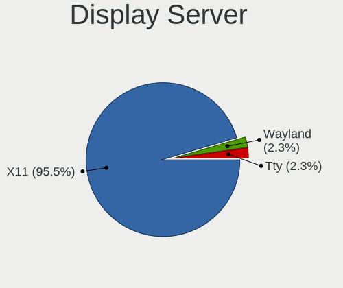
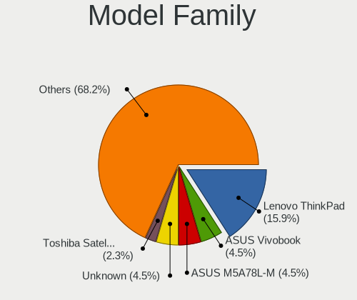
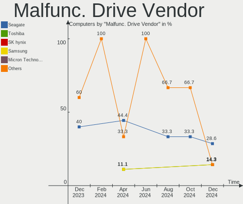
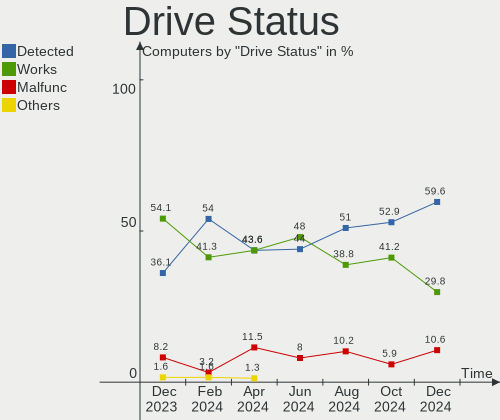
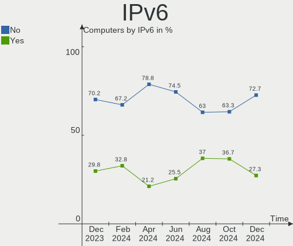
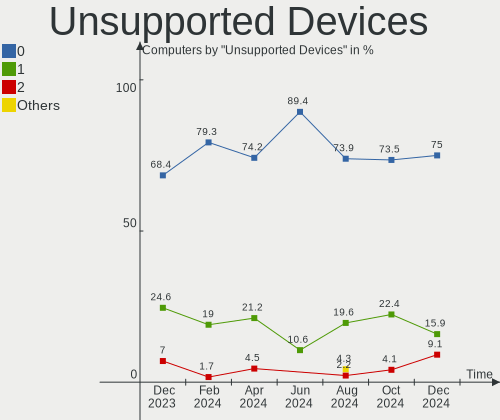
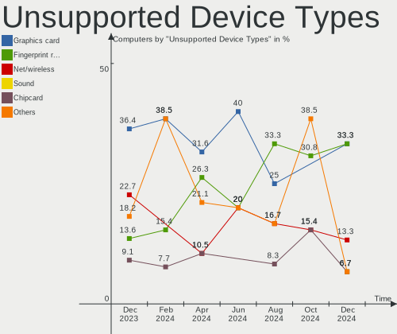

Xubuntu - Hardware Trends
-------------------------

A project to identify most popular hardware characteristics and track their change
over time based on data collected by Linux users at https://Linux-Hardware.org.

Anyone can contribute to this report by the [hw-probe](https://github.com/linuxhw/hw-probe) tool:

    sudo -E hw-probe -all -upload

This is a report for all computer types. See also reports for [desktops](/Dist/Xubuntu/Desktop/README.md) and [notebooks](/Dist/Xubuntu/Notebook/README.md).

This report is for one last month. Overall report since the beginning of time: [TestDays](https://github.com/linuxhw/TestDays)

Period: Mar, 2023.

Contents
--------

* [ System ](#system)
  - [ OS                       ](#os)
  - [ OS Family                ](#os-family)
  - [ Kernel                   ](#kernel)
  - [ Kernel Family            ](#kernel-family)
  - [ Kernel Major Ver.        ](#kernel-major-ver)
  - [ Arch                     ](#arch)
  - [ DE                       ](#de)
  - [ Display Server           ](#display-server)
  - [ Display Manager          ](#display-manager)
  - [ OS Lang                  ](#os-lang)
  - [ Boot Mode                ](#boot-mode)
  - [ Filesystem               ](#filesystem)
  - [ Part. scheme             ](#part-scheme)
  - [ Dual Boot with Linux/BSD ](#dual-boot-with-linuxbsd)
  - [ Dual Boot (Win)          ](#dual-boot-win)

* [ Board ](#board)
  - [ Vendor                   ](#vendor)
  - [ Model                    ](#model)
  - [ Model Family             ](#model-family)
  - [ MFG Year                 ](#mfg-year)
  - [ Form Factor              ](#form-factor)
  - [ Secure Boot              ](#secure-boot)
  - [ Coreboot                 ](#coreboot)
  - [ RAM Size                 ](#ram-size)
  - [ RAM Used                 ](#ram-used)
  - [ Total Drives             ](#total-drives)
  - [ Has CD-ROM               ](#has-cd-rom)
  - [ Has Ethernet             ](#has-ethernet)
  - [ Has WiFi                 ](#has-wifi)
  - [ Has Bluetooth            ](#has-bluetooth)

* [ Location ](#location)
  - [ Country                  ](#country)
  - [ City                     ](#city)

* [ Drives ](#drives)
  - [ Drive Vendor             ](#drive-vendor)
  - [ Drive Model              ](#drive-model)
  - [ HDD Vendor               ](#hdd-vendor)
  - [ SSD Vendor               ](#ssd-vendor)
  - [ Drive Kind               ](#drive-kind)
  - [ Drive Connector          ](#drive-connector)
  - [ Drive Size               ](#drive-size)
  - [ Space Total              ](#space-total)
  - [ Space Used               ](#space-used)
  - [ Malfunc. Drives          ](#malfunc-drives)
  - [ Malfunc. Drive Vendor    ](#malfunc-drive-vendor)
  - [ Malfunc. HDD Vendor      ](#malfunc-hdd-vendor)
  - [ Malfunc. Drive Kind      ](#malfunc-drive-kind)
  - [ Failed Drives            ](#failed-drives)
  - [ Failed Drive Vendor      ](#failed-drive-vendor)
  - [ Drive Status             ](#drive-status)

* [ Storage controller ](#storage-controller)
  - [ Storage Vendor           ](#storage-vendor)
  - [ Storage Model            ](#storage-model)
  - [ Storage Kind             ](#storage-kind)

* [ Processor ](#processor)
  - [ CPU Vendor               ](#cpu-vendor)
  - [ CPU Model                ](#cpu-model)
  - [ CPU Model Family         ](#cpu-model-family)
  - [ CPU Cores                ](#cpu-cores)
  - [ CPU Sockets              ](#cpu-sockets)
  - [ CPU Threads              ](#cpu-threads)
  - [ CPU Op-Modes             ](#cpu-op-modes)
  - [ CPU Microcode            ](#cpu-microcode)
  - [ CPU Microarch            ](#cpu-microarch)

* [ Graphics ](#graphics)
  - [ GPU Vendor               ](#gpu-vendor)
  - [ GPU Model                ](#gpu-model)
  - [ GPU Combo                ](#gpu-combo)
  - [ GPU Driver               ](#gpu-driver)
  - [ GPU Memory               ](#gpu-memory)

* [ Monitor ](#monitor)
  - [ Monitor Vendor           ](#monitor-vendor)
  - [ Monitor Model            ](#monitor-model)
  - [ Monitor Resolution       ](#monitor-resolution)
  - [ Monitor Diagonal         ](#monitor-diagonal)
  - [ Monitor Width            ](#monitor-width)
  - [ Aspect Ratio             ](#aspect-ratio)
  - [ Monitor Area             ](#monitor-area)
  - [ Pixel Density            ](#pixel-density)
  - [ Multiple Monitors        ](#multiple-monitors)

* [ Network ](#network)
  - [ Net Controller Vendor    ](#net-controller-vendor)
  - [ Net Controller Model     ](#net-controller-model)
  - [ Wireless Vendor          ](#wireless-vendor)
  - [ Wireless Model           ](#wireless-model)
  - [ Ethernet Vendor          ](#ethernet-vendor)
  - [ Ethernet Model           ](#ethernet-model)
  - [ Net Controller Kind      ](#net-controller-kind)
  - [ Used Controller          ](#used-controller)
  - [ NICs                     ](#nics)
  - [ IPv6                     ](#ipv6)

* [ Bluetooth ](#bluetooth)
  - [ Bluetooth Vendor         ](#bluetooth-vendor)
  - [ Bluetooth Model          ](#bluetooth-model)

* [ Sound ](#sound)
  - [ Sound Vendor             ](#sound-vendor)
  - [ Sound Model              ](#sound-model)

* [ Memory ](#memory)
  - [ Memory Vendor            ](#memory-vendor)
  - [ Memory Model             ](#memory-model)
  - [ Memory Kind              ](#memory-kind)
  - [ Memory Form Factor       ](#memory-form-factor)
  - [ Memory Size              ](#memory-size)
  - [ Memory Speed             ](#memory-speed)

* [ Printers & scanners ](#printers--scanners)
  - [ Printer Vendor           ](#printer-vendor)
  - [ Printer Model            ](#printer-model)
  - [ Scanner Vendor           ](#scanner-vendor)
  - [ Scanner Model            ](#scanner-model)

* [ Camera ](#camera)
  - [ Camera Vendor            ](#camera-vendor)
  - [ Camera Model             ](#camera-model)

* [ Security ](#security)
  - [ Fingerprint Vendor       ](#fingerprint-vendor)
  - [ Fingerprint Model        ](#fingerprint-model)
  - [ Chipcard Vendor          ](#chipcard-vendor)
  - [ Chipcard Model           ](#chipcard-model)

* [ Unsupported ](#unsupported)
  - [ Unsupported Devices      ](#unsupported-devices)
  - [ Unsupported Device Types ](#unsupported-device-types)

System
------

OS
--

Installed operating systems

| Name          | Computers | Percent |
|---------------|-----------|---------|
| Xubuntu 22.04 | 42        | 58.33%  |
| Xubuntu 20.04 | 12        | 16.67%  |
| Xubuntu 22.10 | 8         | 11.11%  |
| Xubuntu 18.04 | 8         | 11.11%  |
| Xubuntu 16.04 | 2         | 2.78%   |

OS Family
---------

OS without a version

| Name    | Computers | Percent |
|---------|-----------|---------|
| Xubuntu | 72        | 100%    |

Kernel
------

Version of the Linux kernel

| Version                 | Computers | Percent |
|-------------------------|-----------|---------|
| 5.15.0-67-generic       | 20        | 27.78%  |
| 5.19.0-35-generic       | 15        | 20.83%  |
| 5.4.0-144-generic       | 4         | 5.56%   |
| 5.19.0-32-generic       | 3         | 4.17%   |
| 5.15.0-69-generic       | 3         | 4.17%   |
| 6.2.2-060202-generic    | 2         | 2.78%   |
| 5.19.0-21-generic       | 2         | 2.78%   |
| 5.15.0-60-generic       | 2         | 2.78%   |
| 4.4.0-210-generic       | 2         | 2.78%   |
| 6.2.7-060207-generic    | 1         | 1.39%   |
| 5.4.209-0504209-generic | 1         | 1.39%   |
| 5.4.0-144-lowlatency    | 1         | 1.39%   |
| 5.4.0-139-generic       | 1         | 1.39%   |
| 5.4.0-135-generic       | 1         | 1.39%   |
| 5.4.0-110-generic       | 1         | 1.39%   |
| 5.19.0-38-generic       | 1         | 1.39%   |
| 5.19.0-1018-lowlatency  | 1         | 1.39%   |
| 5.19.0-1017-lowlatency  | 1         | 1.39%   |
| 5.15.93-sunxi           | 1         | 1.39%   |
| 5.15.89-rockchip64      | 1         | 1.39%   |
| 5.15.0-69-lowlatency    | 1         | 1.39%   |
| 5.15.0-67-lowlatency    | 1         | 1.39%   |
| 5.15.0-56-generic       | 1         | 1.39%   |
| 4.15.0-208-generic      | 1         | 1.39%   |
| 4.15.0-206-lowlatency   | 1         | 1.39%   |
| 4.15.0-206-generic      | 1         | 1.39%   |
| 4.15.0-204-generic      | 1         | 1.39%   |
| 3.10.108                | 1         | 1.39%   |

Kernel Family
-------------

Linux kernel without a distro release

| Version  | Computers | Percent |
|----------|-----------|---------|
| 5.15.0   | 28        | 38.89%  |
| 5.19.0   | 23        | 31.94%  |
| 5.4.0    | 8         | 11.11%  |
| 4.15.0   | 4         | 5.56%   |
| 6.2.2    | 2         | 2.78%   |
| 4.4.0    | 2         | 2.78%   |
| 6.2.7    | 1         | 1.39%   |
| 5.4.209  | 1         | 1.39%   |
| 5.15.93  | 1         | 1.39%   |
| 5.15.89  | 1         | 1.39%   |
| 3.10.108 | 1         | 1.39%   |

Kernel Major Ver.
-----------------

Linux kernel major version

| Version | Computers | Percent |
|---------|-----------|---------|
| 5.15    | 30        | 41.67%  |
| 5.19    | 23        | 31.94%  |
| 5.4     | 9         | 12.5%   |
| 4.15    | 4         | 5.56%   |
| 6.2     | 3         | 4.17%   |
| 4.4     | 2         | 2.78%   |
| 3.10    | 1         | 1.39%   |

Arch
----

OS architecture (x86_64, i586, etc.)

| Name    | Computers | Percent |
|---------|-----------|---------|
| x86_64  | 66        | 91.67%  |
| i686    | 3         | 4.17%   |
| armv7l  | 2         | 2.78%   |
| aarch64 | 1         | 1.39%   |

DE
--

Desktop Environment

| Name    | Computers | Percent |
|---------|-----------|---------|
| XFCE    | 66        | 91.67%  |
| GNOME   | 3         | 4.17%   |
| KDE5    | 1         | 1.39%   |
| i3      | 1         | 1.39%   |
| GNUstep | 1         | 1.39%   |

Display Server
--------------

X11 or Wayland

| Name    | Computers | Percent |
|---------|-----------|---------|
| X11     | 70        | 97.22%  |
| Wayland | 1         | 1.39%   |
| Tty     | 1         | 1.39%   |

Display Manager
---------------

SDDM, LightDM, etc.

| Name    | Computers | Percent |
|---------|-----------|---------|
| LightDM | 60        | 83.33%  |
| Unknown | 9         | 12.5%   |
| SLiM    | 1         | 1.39%   |
| GDM3    | 1         | 1.39%   |
| GDM     | 1         | 1.39%   |

OS Lang
-------

Language

| Lang    | Computers | Percent |
|---------|-----------|---------|
| en_US   | 30        | 41.67%  |
| de_DE   | 10        | 13.89%  |
| ru_RU   | 5         | 6.94%   |
| fr_FR   | 5         | 6.94%   |
| pt_BR   | 4         | 5.56%   |
| en_CA   | 3         | 4.17%   |
| ja_JP   | 2         | 2.78%   |
| it_IT   | 2         | 2.78%   |
| en_GB   | 2         | 2.78%   |
| zh_CN   | 1         | 1.39%   |
| tr_TR   | 1         | 1.39%   |
| nl_NL   | 1         | 1.39%   |
| es_MX   | 1         | 1.39%   |
| es_ES   | 1         | 1.39%   |
| en_ZA   | 1         | 1.39%   |
| de_CH   | 1         | 1.39%   |
| C       | 1         | 1.39%   |
| Unknown | 1         | 1.39%   |

Boot Mode
---------

EFI or BIOS

| Mode | Computers | Percent |
|------|-----------|---------|
| BIOS | 42        | 58.33%  |
| EFI  | 30        | 41.67%  |

Filesystem
----------

Type of filesystem

| Type    | Computers | Percent |
|---------|-----------|---------|
| Ext4    | 64        | 88.89%  |
| Btrfs   | 4         | 5.56%   |
| Overlay | 3         | 4.17%   |
| Zfs     | 1         | 1.39%   |

Part. scheme
------------

Scheme of partitioning

| Type    | Computers | Percent |
|---------|-----------|---------|
| GPT     | 37        | 51.39%  |
| MBR     | 23        | 31.94%  |
| Unknown | 12        | 16.67%  |

Dual Boot with Linux/BSD
------------------------

Hosting more than one Linux/BSD

| Dual boot | Computers | Percent |
|-----------|-----------|---------|
| No        | 55        | 76.39%  |
| Yes       | 17        | 23.61%  |

Dual Boot (Win)
---------------

Hosting Linux and Windows

| Dual boot | Computers | Percent |
|-----------|-----------|---------|
| No        | 56        | 77.78%  |
| Yes       | 16        | 22.22%  |

Board
-----

Vendor
------

Motherboard manufacturer

| Name                | Computers | Percent |
|---------------------|-----------|---------|
| Lenovo              | 9         | 12.5%   |
| Hewlett-Packard     | 9         | 12.5%   |
| ASUSTek Computer    | 7         | 9.72%   |
| Gigabyte Technology | 6         | 8.33%   |
| MSI                 | 5         | 6.94%   |
| Toshiba             | 3         | 4.17%   |
| ASRock              | 3         | 4.17%   |
| Google              | 2         | 2.78%   |
| Gateway             | 2         | 2.78%   |
| Fujitsu             | 2         | 2.78%   |
| Dell                | 2         | 2.78%   |
| Apple               | 2         | 2.78%   |
| Acer                | 2         | 2.78%   |
| Unknown             | 2         | 2.78%   |
| Xunlong             | 1         | 1.39%   |
| TrekStor            | 1         | 1.39%   |
| Samsung Electronics | 1         | 1.39%   |
| Radxa               | 1         | 1.39%   |
| Packard Bell        | 1         | 1.39%   |
| OEM                 | 1         | 1.39%   |
| Microtech           | 1         | 1.39%   |
| Medion              | 1         | 1.39%   |
| GPU Company         | 1         | 1.39%   |
| Getac               | 1         | 1.39%   |
| Fujitsu Siemens     | 1         | 1.39%   |
| Foxconn             | 1         | 1.39%   |
| Clevo               | 1         | 1.39%   |
| Chuwi               | 1         | 1.39%   |
| Biostar             | 1         | 1.39%   |
| AZW                 | 1         | 1.39%   |

Model
-----

Motherboard model

| Name                                   | Computers | Percent |
|----------------------------------------|-----------|---------|
| Unknown                                | 3         | 4.17%   |
| MSI MS-7817                            | 2         | 2.78%   |
| Xunlong Orange Pi PC Plus              | 1         | 1.39%   |
| TrekStor Notebook Slim S130            | 1         | 1.39%   |
| Toshiba Satellite L775                 | 1         | 1.39%   |
| Toshiba Satellite L300                 | 1         | 1.39%   |
| Toshiba Satellite C55D-B               | 1         | 1.39%   |
| Samsung RV408/RV508                    | 1         | 1.39%   |
| Radxa ROCK Pi 4C+                      | 1         | 1.39%   |
| Packard Bell IXTREME M5800             | 1         | 1.39%   |
| MSI MS-AA8B                            | 1         | 1.39%   |
| MSI MS-7E07                            | 1         | 1.39%   |
| MSI MS-7D13                            | 1         | 1.39%   |
| Microtech ebookPro                     | 1         | 1.39%   |
| Medion S321X                           | 1         | 1.39%   |
| Lenovo ThinkPad T530 2429LT7           | 1         | 1.39%   |
| Lenovo ThinkPad T510 4384VJZ           | 1         | 1.39%   |
| Lenovo ThinkPad E15 20RES05U00         | 1         | 1.39%   |
| Lenovo ThinkCentre M710e 10UR001LUS    | 1         | 1.39%   |
| Lenovo ThinkBook 13s-IML 20RR          | 1         | 1.39%   |
| Lenovo IdeaPad 5 15ABA7 82SG           | 1         | 1.39%   |
| Lenovo IdeaPad 330S-14AST 81F8         | 1         | 1.39%   |
| Lenovo IdeaCentre 720-18APR 90HY002EIX | 1         | 1.39%   |
| Lenovo G50-45 80E3                     | 1         | 1.39%   |
| HP Z620 Workstation                    | 1         | 1.39%   |
| HP Victus by Laptop 16-e0xxx           | 1         | 1.39%   |
| HP ProLiant MicroServer                | 1         | 1.39%   |
| HP Pavilion x2 Detachable              | 1         | 1.39%   |
| HP Pavilion Gaming Laptop 15-dk0xxx    | 1         | 1.39%   |
| HP EliteBook 725 G2                    | 1         | 1.39%   |
| HP EliteBook 6930p                     | 1         | 1.39%   |
| HP Compaq Presario C700                | 1         | 1.39%   |
| HP Compaq dc5750 Small Form Factor     | 1         | 1.39%   |
| GPU Company GWTN156-5                  | 1         | 1.39%   |
| Google Nautilus                        | 1         | 1.39%   |
| Google Kefka                           | 1         | 1.39%   |
| Gigabyte X570 AORUS ELITE              | 1         | 1.39%   |
| Gigabyte H81M-H                        | 1         | 1.39%   |
| Gigabyte F2A88XM-D3H                   | 1         | 1.39%   |
| Gigabyte B550 AORUS ELITE              | 1         | 1.39%   |

Model Family
------------

Motherboard model prefix

| Name                    | Computers | Percent |
|-------------------------|-----------|---------|
| Toshiba Satellite       | 3         | 4.17%   |
| Lenovo ThinkPad         | 3         | 4.17%   |
| Unknown                 | 3         | 4.17%   |
| MSI MS-7817             | 2         | 2.78%   |
| Lenovo IdeaPad          | 2         | 2.78%   |
| HP Pavilion             | 2         | 2.78%   |
| HP EliteBook            | 2         | 2.78%   |
| HP Compaq               | 2         | 2.78%   |
| ASUS PRIME              | 2         | 2.78%   |
| Acer Aspire             | 2         | 2.78%   |
| Xunlong Orange          | 1         | 1.39%   |
| TrekStor Notebook       | 1         | 1.39%   |
| Samsung RV408           | 1         | 1.39%   |
| Radxa ROCK              | 1         | 1.39%   |
| Packard Bell IXTREME    | 1         | 1.39%   |
| MSI MS-AA8B             | 1         | 1.39%   |
| MSI MS-7E07             | 1         | 1.39%   |
| MSI MS-7D13             | 1         | 1.39%   |
| Microtech ebookPro      | 1         | 1.39%   |
| Medion S321X            | 1         | 1.39%   |
| Lenovo ThinkCentre      | 1         | 1.39%   |
| Lenovo ThinkBook        | 1         | 1.39%   |
| Lenovo IdeaCentre       | 1         | 1.39%   |
| Lenovo G50-45           | 1         | 1.39%   |
| HP Z620                 | 1         | 1.39%   |
| HP Victus               | 1         | 1.39%   |
| HP ProLiant             | 1         | 1.39%   |
| GPU Company GWTN156-5   | 1         | 1.39%   |
| Google Nautilus         | 1         | 1.39%   |
| Google Kefka            | 1         | 1.39%   |
| Gigabyte X570           | 1         | 1.39%   |
| Gigabyte H81M-H         | 1         | 1.39%   |
| Gigabyte F2A88XM-D3H    | 1         | 1.39%   |
| Gigabyte B550           | 1         | 1.39%   |
| Gigabyte AERO           | 1         | 1.39%   |
| Gigabyte 8IR533         | 1         | 1.39%   |
| Getac F110G3            | 1         | 1.39%   |
| Gateway LT27            | 1         | 1.39%   |
| Gateway EC14            | 1         | 1.39%   |
| Fujitsu Siemens ESPRIMO | 1         | 1.39%   |

MFG Year
--------

Motherboard manufacture year

| Year    | Computers | Percent |
|---------|-----------|---------|
| 2018    | 7         | 9.72%   |
| 2019    | 6         | 8.33%   |
| 2013    | 6         | 8.33%   |
| 2016    | 5         | 6.94%   |
| 2014    | 5         | 6.94%   |
| 2012    | 5         | 6.94%   |
| 2010    | 5         | 6.94%   |
| 2021    | 4         | 5.56%   |
| 2011    | 4         | 5.56%   |
| 2022    | 3         | 4.17%   |
| 2015    | 3         | 4.17%   |
| 2009    | 3         | 4.17%   |
| 2008    | 3         | 4.17%   |
| Unknown | 3         | 4.17%   |
| 2023    | 2         | 2.78%   |
| 2020    | 2         | 2.78%   |
| 2007    | 2         | 2.78%   |
| 2006    | 2         | 2.78%   |
| 2017    | 1         | 1.39%   |
| 2002    | 1         | 1.39%   |

Form Factor
-----------

Physical design of the computer

| Name           | Computers | Percent |
|----------------|-----------|---------|
| Notebook       | 33        | 45.83%  |
| Desktop        | 32        | 44.44%  |
| System on chip | 2         | 2.78%   |
| All in one     | 2         | 2.78%   |
| Other          | 1         | 1.39%   |
| Convertible    | 1         | 1.39%   |
| Mini pc        | 1         | 1.39%   |

Secure Boot
-----------

Enabled or disabled

| State    | Computers | Percent |
|----------|-----------|---------|
| Disabled | 69        | 95.83%  |
| Enabled  | 3         | 4.17%   |

Coreboot
--------

Have coreboot on board

| Used | Computers | Percent |
|------|-----------|---------|
| No   | 70        | 97.22%  |
| Yes  | 2         | 2.78%   |

RAM Size
--------

Total RAM memory

| Size in GB  | Computers | Percent |
|-------------|-----------|---------|
| 3.01-4.0    | 19        | 26.39%  |
| 4.01-8.0    | 14        | 19.44%  |
| 16.01-24.0  | 13        | 18.06%  |
| 8.01-16.0   | 8         | 11.11%  |
| 32.01-64.0  | 5         | 6.94%   |
| 1.01-2.0    | 5         | 6.94%   |
| 0.51-1.0    | 4         | 5.56%   |
| 64.01-256.0 | 3         | 4.17%   |
| 2.01-3.0    | 1         | 1.39%   |

RAM Used
--------

Used RAM memory

| Used GB   | Computers | Percent |
|-----------|-----------|---------|
| 1.01-2.0  | 25        | 34.72%  |
| 2.01-3.0  | 13        | 18.06%  |
| 4.01-8.0  | 11        | 15.28%  |
| 3.01-4.0  | 8         | 11.11%  |
| 0.51-1.0  | 8         | 11.11%  |
| 8.01-16.0 | 4         | 5.56%   |
| 0.01-0.5  | 2         | 2.78%   |
| Unknown   | 1         | 1.39%   |

Total Drives
------------

Number of drives on board

| Drives | Computers | Percent |
|--------|-----------|---------|
| 1      | 38        | 52.78%  |
| 2      | 16        | 22.22%  |
| 3      | 10        | 13.89%  |
| 5      | 3         | 4.17%   |
| 4      | 2         | 2.78%   |
| 0      | 2         | 2.78%   |
| 6      | 1         | 1.39%   |

Has CD-ROM
----------

Has CD-ROM on board

| Presented | Computers | Percent |
|-----------|-----------|---------|
| No        | 41        | 56.94%  |
| Yes       | 31        | 43.06%  |

Has Ethernet
------------

Has Ethernet on board

| Presented | Computers | Percent |
|-----------|-----------|---------|
| Yes       | 60        | 83.33%  |
| No        | 12        | 16.67%  |

Has WiFi
--------

Has WiFi module

| Presented | Computers | Percent |
|-----------|-----------|---------|
| Yes       | 54        | 75%     |
| No        | 18        | 25%     |

Has Bluetooth
-------------

Has Bluetooth module

| Presented | Computers | Percent |
|-----------|-----------|---------|
| Yes       | 39        | 54.17%  |
| No        | 33        | 45.83%  |

Location
--------

Country
-------

Geographic location (country)

| Country      | Computers | Percent |
|--------------|-----------|---------|
| USA          | 20        | 27.78%  |
| Germany      | 9         | 12.5%   |
| Russia       | 6         | 8.33%   |
| France       | 5         | 6.94%   |
| Italy        | 4         | 5.56%   |
| Brazil       | 4         | 5.56%   |
| Netherlands  | 3         | 4.17%   |
| Canada       | 3         | 4.17%   |
| Turkey       | 2         | 2.78%   |
| Switzerland  | 2         | 2.78%   |
| Spain        | 2         | 2.78%   |
| Japan        | 2         | 2.78%   |
| Vietnam      | 1         | 1.39%   |
| UK           | 1         | 1.39%   |
| South Africa | 1         | 1.39%   |
| Panama       | 1         | 1.39%   |
| Norway       | 1         | 1.39%   |
| Mexico       | 1         | 1.39%   |
| Colombia     | 1         | 1.39%   |
| China        | 1         | 1.39%   |
| Bulgaria     | 1         | 1.39%   |
| Australia    | 1         | 1.39%   |

City
----

Geographic location (city)

| City             | Computers | Percent |
|------------------|-----------|---------|
| Springfield      | 2         | 2.78%   |
| Nizhniy Novgorod | 2         | 2.78%   |
| Lincoln          | 2         | 2.78%   |
| Izmir            | 2         | 2.78%   |
| Garland          | 2         | 2.78%   |
| Zaltbommel       | 1         | 1.39%   |
| Yekaterinburg    | 1         | 1.39%   |
| Tulsa            | 1         | 1.39%   |
| Tours            | 1         | 1.39%   |
| Toulon           | 1         | 1.39%   |
| Toronto          | 1         | 1.39%   |
| Terrace          | 1         | 1.39%   |
| Takamatsu        | 1         | 1.39%   |
| Spokane          | 1         | 1.39%   |
| Sofia            | 1         | 1.39%   |
| Shanghai         | 1         | 1.39%   |
| Saratov          | 1         | 1.39%   |
| Santiago de Cali | 1         | 1.39%   |
| Santa Cruz       | 1         | 1.39%   |
| Samara           | 1         | 1.39%   |
| Salisbury        | 1         | 1.39%   |
| Saint Augustine  | 1         | 1.39%   |
| Rio de Janeiro   | 1         | 1.39%   |
| Puebla City      | 1         | 1.39%   |
| Pretoria         | 1         | 1.39%   |
| Pisa             | 1         | 1.39%   |
| Pinseque         | 1         | 1.39%   |
| Perth            | 1         | 1.39%   |
| Panama City      | 1         | 1.39%   |
| Padova           | 1         | 1.39%   |
| Osaka            | 1         | 1.39%   |
| Olot             | 1         | 1.39%   |
| Olathe           | 1         | 1.39%   |
| Oberhausen       | 1         | 1.39%   |
| Novosibirsk      | 1         | 1.39%   |
| North Versailles | 1         | 1.39%   |
| Nieder-Olm       | 1         | 1.39%   |
| Münster         | 1         | 1.39%   |
| Munich           | 1         | 1.39%   |
| Morehead City    | 1         | 1.39%   |

Drives
------

Drive Vendor
------------

Hard drive vendors

| Vendor                      | Computers | Drives | Percent |
|-----------------------------|-----------|--------|---------|
| Seagate                     | 17        | 22     | 16.19%  |
| Samsung Electronics         | 15        | 16     | 14.29%  |
| WDC                         | 14        | 20     | 13.33%  |
| Unknown                     | 11        | 13     | 10.48%  |
| Crucial                     | 6         | 6      | 5.71%   |
| Toshiba                     | 5         | 5      | 4.76%   |
| Sandisk                     | 5         | 5      | 4.76%   |
| SPCC                        | 3         | 4      | 2.86%   |
| Micron Technology           | 3         | 3      | 2.86%   |
| China                       | 3         | 3      | 2.86%   |
| Kingston                    | 2         | 2      | 1.9%    |
| Intel                       | 2         | 2      | 1.9%    |
| Hitachi                     | 2         | 2      | 1.9%    |
| HGST                        | 2         | 4      | 1.9%    |
| Hewlett-Packard             | 2         | 3      | 1.9%    |
| WDC WDS1                    | 1         | 1      | 0.95%   |
| Team                        | 1         | 1      | 0.95%   |
| SK hynix                    | 1         | 1      | 0.95%   |
| PNY                         | 1         | 1      | 0.95%   |
| Plextor                     | 1         | 1      | 0.95%   |
| Patriot                     | 1         | 1      | 0.95%   |
| Netac                       | 1         | 1      | 0.95%   |
| Microtech                   | 1         | 1      | 0.95%   |
| Kingston Technology Company | 1         | 1      | 0.95%   |
| Fujitsu                     | 1         | 1      | 0.95%   |
| FORESEE                     | 1         | 1      | 0.95%   |
| Apple                       | 1         | 1      | 0.95%   |
| A-DATA Technology           | 1         | 1      | 0.95%   |

Drive Model
-----------

Hard drive models

| Model                                 | Computers | Percent |
|---------------------------------------|-----------|---------|
| Unknown MMC Card  32GB                | 2         | 1.71%   |
| Toshiba DT01ACA100 1TB                | 2         | 1.71%   |
| SPCC Solid State Disk 512GB           | 2         | 1.71%   |
| Seagate ST2000DM001-1CH164 2TB        | 2         | 1.71%   |
| Seagate ST1000DM003-1SB102 1TB        | 2         | 1.71%   |
| Seagate ST1000DM003-1ER162 1TB        | 2         | 1.71%   |
| Samsung SSD 840 EVO 250GB             | 2         | 1.71%   |
| Samsung HM321HI 320GB                 | 2         | 1.71%   |
| WDC WDS240G2G0A-00JH30 240GB SSD      | 1         | 0.85%   |
| WDC WDS200T2B0A-00SM50 2TB SSD        | 1         | 0.85%   |
| WDC WDS1 00T2G0A-00JH30 1TB SSD       | 1         | 0.85%   |
| WDC WD80EAZZ-00BKLB0 8TB              | 1         | 0.85%   |
| WDC WD800JB-00FMA0 80GB               | 1         | 0.85%   |
| WDC WD5000BEVT-00ZAT0 500GB           | 1         | 0.85%   |
| WDC WD5000AZLX-60K2TA0 500GB          | 1         | 0.85%   |
| WDC WD5000AZLX-00K2TA0 500GB          | 1         | 0.85%   |
| WDC WD5000AAKX-603CA0 500GB           | 1         | 0.85%   |
| WDC WD5000AAKS-00V1A0 500GB           | 1         | 0.85%   |
| WDC WD5000AADS-00L4B1 500GB           | 1         | 0.85%   |
| WDC WD30EZRX-00D8PB0 3TB              | 1         | 0.85%   |
| WDC WD2500AAKX-753CA1 250GB           | 1         | 0.85%   |
| WDC WD20EARX-00PASB0 2TB              | 1         | 0.85%   |
| WDC WD20EARS-00MVWB0 2TB              | 1         | 0.85%   |
| WDC WD10EZRZ-00HTKB0 1TB              | 1         | 0.85%   |
| WDC WD10EZEX-22MFCA0 1TB              | 1         | 0.85%   |
| WDC WD10EZEX-07WN4A0 1TB              | 1         | 0.85%   |
| WDC WD Blue SA510 M.2 2280 1000GB SSD | 1         | 0.85%   |
| WDC PC SN520 SDAPMUW-256G-1101 256GB  | 1         | 0.85%   |
| Unknown SR64G  64GB                   | 1         | 0.85%   |
| Unknown SD/MMC 2GB                    | 1         | 0.85%   |
| Unknown SC32G  32GB                   | 1         | 0.85%   |
| Unknown NCard  64GB                   | 1         | 0.85%   |
| Unknown MMC Card  7GB                 | 1         | 0.85%   |
| Unknown MMC Card  16GB                | 1         | 0.85%   |
| Unknown MMC Card  128GB               | 1         | 0.85%   |
| Unknown M.S./M.S.Pro/HG 16GB          | 1         | 0.85%   |
| Unknown DF4016  16GB                  | 1         | 0.85%   |
| Unknown DA4032  32GB                  | 1         | 0.85%   |
| Unknown 16M                           | 1         | 0.85%   |
| Toshiba MQ04ABF100 1TB                | 1         | 0.85%   |

HDD Vendor
----------

Hard disk drive vendors

| Vendor              | Computers | Drives | Percent |
|---------------------|-----------|--------|---------|
| Seagate             | 17        | 21     | 40.48%  |
| WDC                 | 11        | 16     | 26.19%  |
| Toshiba             | 5         | 5      | 11.9%   |
| Samsung Electronics | 2         | 2      | 4.76%   |
| Hitachi             | 2         | 2      | 4.76%   |
| HGST                | 2         | 4      | 4.76%   |
| Hewlett-Packard     | 2         | 3      | 4.76%   |
| Fujitsu             | 1         | 1      | 2.38%   |

SSD Vendor
----------

Solid state drive vendors

| Vendor              | Computers | Drives | Percent |
|---------------------|-----------|--------|---------|
| Samsung Electronics | 8         | 9      | 21.62%  |
| Crucial             | 5         | 5      | 13.51%  |
| SPCC                | 3         | 4      | 8.11%   |
| SanDisk             | 3         | 3      | 8.11%   |
| China               | 3         | 3      | 8.11%   |
| WDC                 | 2         | 3      | 5.41%   |
| WDC WDS1            | 1         | 1      | 2.7%    |
| Team                | 1         | 1      | 2.7%    |
| SK hynix            | 1         | 1      | 2.7%    |
| PNY                 | 1         | 1      | 2.7%    |
| Plextor             | 1         | 1      | 2.7%    |
| Patriot             | 1         | 1      | 2.7%    |
| Netac               | 1         | 1      | 2.7%    |
| Microtech           | 1         | 1      | 2.7%    |
| Micron Technology   | 1         | 1      | 2.7%    |
| Kingston            | 1         | 1      | 2.7%    |
| Intel               | 1         | 1      | 2.7%    |
| FORESEE             | 1         | 1      | 2.7%    |
| A-DATA Technology   | 1         | 1      | 2.7%    |

Drive Kind
----------

HDD or SSD

| Kind    | Computers | Drives | Percent |
|---------|-----------|--------|---------|
| HDD     | 38        | 54     | 38.38%  |
| SSD     | 34        | 40     | 34.34%  |
| NVMe    | 15        | 15     | 15.15%  |
| MMC     | 10        | 11     | 10.1%   |
| Unknown | 2         | 3      | 2.02%   |

Drive Connector
---------------

SATA, SAS, NVMe, etc.

| Type | Computers | Drives | Percent |
|------|-----------|--------|---------|
| SATA | 57        | 88     | 64.04%  |
| NVMe | 15        | 15     | 16.85%  |
| MMC  | 10        | 11     | 11.24%  |
| SAS  | 7         | 9      | 7.87%   |

Drive Size
----------

Size of hard drive

| Size in TB | Computers | Drives | Percent |
|------------|-----------|--------|---------|
| 0.01-0.5   | 37        | 42     | 45.12%  |
| 0.51-1.0   | 27        | 30     | 32.93%  |
| 1.01-2.0   | 13        | 16     | 15.85%  |
| 2.01-3.0   | 2         | 3      | 2.44%   |
| 4.01-10.0  | 2         | 2      | 2.44%   |
| 3.01-4.0   | 1         | 1      | 1.22%   |

Space Total
-----------

Amount of disk space available on the file system

| Size in GB     | Computers | Percent |
|----------------|-----------|---------|
| 101-250        | 16        | 22.22%  |
| 251-500        | 13        | 18.06%  |
| 1001-2000      | 10        | 13.89%  |
| 501-1000       | 10        | 13.89%  |
| More than 3000 | 6         | 8.33%   |
| 1-20           | 5         | 6.94%   |
| 51-100         | 5         | 6.94%   |
| 21-50          | 4         | 5.56%   |
| 2001-3000      | 3         | 4.17%   |

Space Used
----------

Amount of used disk space

| Used GB        | Computers | Percent |
|----------------|-----------|---------|
| 1-20           | 26        | 36.11%  |
| 21-50          | 11        | 15.28%  |
| 101-250        | 8         | 11.11%  |
| 1001-2000      | 7         | 9.72%   |
| 251-500        | 6         | 8.33%   |
| 51-100         | 6         | 8.33%   |
| 501-1000       | 4         | 5.56%   |
| More than 3000 | 2         | 2.78%   |
| 2001-3000      | 2         | 2.78%   |

Malfunc. Drives
---------------

Drive models with a malfunction

| Model                              | Computers | Drives | Percent |
|------------------------------------|-----------|--------|---------|
| WDC WD30EZRX-00D8PB0 3TB           | 1         | 1      | 11.11%  |
| Toshiba MK1665GSX 160GB            | 1         | 1      | 11.11%  |
| Seagate ST2000DM001-1CH164 2TB     | 1         | 1      | 11.11%  |
| Seagate ST1000LM024 HN-M101MBB 1TB | 1         | 1      | 11.11%  |
| Seagate ST1000DM003-1ER162 1TB     | 1         | 1      | 11.11%  |
| Samsung Electronics HM321HI 320GB  | 1         | 1      | 11.11%  |
| Intel SSDSC2BW120A4 120GB          | 1         | 1      | 11.11%  |
| Hewlett-Packard VB0250EAVER 250GB  | 1         | 1      | 11.11%  |
| Fujitsu MHZ2250BH G2 250GB         | 1         | 1      | 11.11%  |

Malfunc. Drive Vendor
---------------------

Vendors of faulty drives

| Vendor              | Computers | Drives | Percent |
|---------------------|-----------|--------|---------|
| Seagate             | 3         | 3      | 33.33%  |
| WDC                 | 1         | 1      | 11.11%  |
| Toshiba             | 1         | 1      | 11.11%  |
| Samsung Electronics | 1         | 1      | 11.11%  |
| Intel               | 1         | 1      | 11.11%  |
| Hewlett-Packard     | 1         | 1      | 11.11%  |
| Fujitsu             | 1         | 1      | 11.11%  |

Malfunc. HDD Vendor
-------------------

Vendors of faulty HDD drives

| Vendor              | Computers | Drives | Percent |
|---------------------|-----------|--------|---------|
| Seagate             | 3         | 3      | 37.5%   |
| WDC                 | 1         | 1      | 12.5%   |
| Toshiba             | 1         | 1      | 12.5%   |
| Samsung Electronics | 1         | 1      | 12.5%   |
| Hewlett-Packard     | 1         | 1      | 12.5%   |
| Fujitsu             | 1         | 1      | 12.5%   |

Malfunc. Drive Kind
-------------------

Kinds of faulty drives

| Kind | Computers | Drives | Percent |
|------|-----------|--------|---------|
| HDD  | 7         | 8      | 87.5%   |
| SSD  | 1         | 1      | 12.5%   |

Failed Drives
-------------

Failed drive models

Zero info for selected period =(

Failed Drive Vendor
-------------------

Failed drive vendors

Zero info for selected period =(

Drive Status
------------

Number of failed and malfunc. drives

| Status   | Computers | Drives | Percent |
|----------|-----------|--------|---------|
| Detected | 44        | 74     | 55.7%   |
| Works    | 27        | 40     | 34.18%  |
| Malfunc  | 8         | 9      | 10.13%  |

Storage controller
------------------

Storage Vendor
--------------

Storage controller vendors

| Vendor                      | Computers | Percent |
|-----------------------------|-----------|---------|
| Intel                       | 46        | 57.5%   |
| AMD                         | 17        | 21.25%  |
| Samsung Electronics         | 7         | 8.75%   |
| SanDisk                     | 3         | 3.75%   |
| Micron Technology           | 2         | 2.5%    |
| Kingston Technology Company | 2         | 2.5%    |
| Micron/Crucial Technology   | 1         | 1.25%   |
| JMicron Technology          | 1         | 1.25%   |
| Broadcom / LSI              | 1         | 1.25%   |

Storage Model
-------------

Storage controller models

| Model                                                                            | Computers | Percent |
|----------------------------------------------------------------------------------|-----------|---------|
| AMD FCH SATA Controller [AHCI mode]                                              | 10        | 10.42%  |
| Intel 82801IBM/IEM (ICH9M/ICH9M-E) 4 port SATA Controller [AHCI mode]            | 5         | 5.21%   |
| Intel 8 Series/C220 Series Chipset Family 6-port SATA Controller 1 [AHCI mode]   | 4         | 4.17%   |
| Intel 200 Series PCH SATA controller [AHCI mode]                                 | 4         | 4.17%   |
| Intel Sunrise Point-LP SATA Controller [AHCI mode]                               | 3         | 3.13%   |
| Intel Celeron/Pentium Silver Processor SATA Controller                           | 3         | 3.13%   |
| Intel 82801G (ICH7 Family) IDE Controller                                        | 3         | 3.13%   |
| Intel 5 Series/3400 Series Chipset 6 port SATA AHCI Controller                   | 3         | 3.13%   |
| SanDisk PC SN520 NVMe SSD                                                        | 2         | 2.08%   |
| Samsung NVMe SSD Controller SM981/PM981/PM983                                    | 2         | 2.08%   |
| Samsung NVMe SSD Controller 980                                                  | 2         | 2.08%   |
| Micron NVMe Storage Controller                                                   | 2         | 2.08%   |
| Intel NM10/ICH7 Family SATA Controller [IDE mode]                                | 2         | 2.08%   |
| Intel Cannon Lake PCH SATA AHCI Controller                                       | 2         | 2.08%   |
| Intel 7 Series Chipset Family 6-port SATA Controller [AHCI mode]                 | 2         | 2.08%   |
| AMD SB7x0/SB8x0/SB9x0 SATA Controller [AHCI mode]                                | 2         | 2.08%   |
| AMD SB7x0/SB8x0/SB9x0 IDE Controller                                             | 2         | 2.08%   |
| AMD 500 Series Chipset SATA Controller                                           | 2         | 2.08%   |
| SanDisk NVMe Controller                                                          | 1         | 1.04%   |
| Samsung NVMe SSD Controller SM961/PM961/SM963                                    | 1         | 1.04%   |
| Samsung NVMe SSD Controller SM951/PM951                                          | 1         | 1.04%   |
| Samsung NVMe SSD Controller PM9A1/PM9A3/980PRO                                   | 1         | 1.04%   |
| Micron/Crucial P2 NVMe PCIe SSD                                                  | 1         | 1.04%   |
| Kingston Company NVMe Controller                                                 | 1         | 1.04%   |
| Kingston Company A2000 NVMe SSD                                                  | 1         | 1.04%   |
| JMicron JMB363 SATA/IDE Controller                                               | 1         | 1.04%   |
| Intel SATA Controller [RAID mode]                                                | 1         | 1.04%   |
| Intel Q170/Q150/B150/H170/H110/Z170/CM236 Chipset SATA Controller [AHCI Mode]    | 1         | 1.04%   |
| Intel Non-Volatile memory controller                                             | 1         | 1.04%   |
| Intel NM10/ICH7 Family SATA Controller [AHCI mode]                               | 1         | 1.04%   |
| Intel Mobile 4 Series Chipset PT IDER Controller                                 | 1         | 1.04%   |
| Intel Comet Lake SATA AHCI Controller                                            | 1         | 1.04%   |
| Intel Cannon Point-LP SATA Controller [AHCI Mode]                                | 1         | 1.04%   |
| Intel C602 chipset 4-Port SATA Storage Control Unit                              | 1         | 1.04%   |
| Intel C600/X79 series chipset SATA RAID Controller                               | 1         | 1.04%   |
| Intel C600/X79 series chipset IDE-r Controller                                   | 1         | 1.04%   |
| Intel Atom/Celeron/Pentium Processor x5-E8000/J3xxx/N3xxx Series SATA Controller | 1         | 1.04%   |
| Intel 82801IBM/IEM (ICH9M/ICH9M-E) 2 port SATA Controller [IDE mode]             | 1         | 1.04%   |
| Intel 82801HR/HO/HH (ICH8R/DO/DH) 2 port SATA Controller [IDE mode]              | 1         | 1.04%   |
| Intel 82801HM/HEM (ICH8M/ICH8M-E) SATA Controller [AHCI mode]                    | 1         | 1.04%   |

Storage Kind
------------

Kind of storage controller (IDE, SATA, NVMe, SAS, ...)

| Kind | Computers | Percent |
|------|-----------|---------|
| SATA | 51        | 59.3%   |
| NVMe | 16        | 18.6%   |
| IDE  | 14        | 16.28%  |
| RAID | 4         | 4.65%   |
| SAS  | 1         | 1.16%   |

Processor
---------

CPU Vendor
----------

Processor vendors

| Vendor  | Computers | Percent |
|---------|-----------|---------|
| Intel   | 51        | 70.83%  |
| AMD     | 18        | 25%     |
| ARM     | 2         | 2.78%   |
| Unknown | 1         | 1.39%   |

CPU Model
---------

Processor models

| Model                                       | Computers | Percent |
|---------------------------------------------|-----------|---------|
| Intel Core i5-4460 CPU @ 3.20GHz            | 2         | 2.78%   |
| Intel Xeon CPU E5-4650 v2 @ 2.40GHz         | 1         | 1.39%   |
| Intel Pentium Silver N5000 CPU @ 1.10GHz    | 1         | 1.39%   |
| Intel Pentium Dual-Core CPU T4200 @ 2.00GHz | 1         | 1.39%   |
| Intel Pentium Dual-Core CPU E5400 @ 2.70GHz | 1         | 1.39%   |
| Intel Pentium Dual-Core CPU E5300 @ 2.60GHz | 1         | 1.39%   |
| Intel Pentium Dual CPU T3400 @ 2.16GHz      | 1         | 1.39%   |
| Intel Pentium Dual CPU T2370 @ 1.73GHz      | 1         | 1.39%   |
| Intel Pentium CPU B960 @ 2.20GHz            | 1         | 1.39%   |
| Intel Pentium CPU B950 @ 2.10GHz            | 1         | 1.39%   |
| Intel Genuine CPU U2300 @ 1.20GHz           | 1         | 1.39%   |
| Intel Genuine CPU T2600 @ 2.16GHz           | 1         | 1.39%   |
| Intel Core i7-8750H CPU @ 2.20GHz           | 1         | 1.39%   |
| Intel Core i7-7700K CPU @ 4.20GHz           | 1         | 1.39%   |
| Intel Core i7-7700 CPU @ 3.60GHz            | 1         | 1.39%   |
| Intel Core i7-6700 CPU @ 3.40GHz            | 1         | 1.39%   |
| Intel Core i7-4790 CPU @ 3.60GHz            | 1         | 1.39%   |
| Intel Core i7-3770K CPU @ 3.50GHz           | 1         | 1.39%   |
| Intel Core i7-3770 CPU @ 3.40GHz            | 1         | 1.39%   |
| Intel Core i7-10510U CPU @ 1.80GHz          | 1         | 1.39%   |
| Intel Core i7 CPU M 620 @ 2.67GHz           | 1         | 1.39%   |
| Intel Core i7 CPU 870 @ 2.93GHz             | 1         | 1.39%   |
| Intel Core i5-9600K CPU @ 3.70GHz           | 1         | 1.39%   |
| Intel Core i5-9400F CPU @ 2.90GHz           | 1         | 1.39%   |
| Intel Core i5-9300H CPU @ 2.40GHz           | 1         | 1.39%   |
| Intel Core i5-8259U CPU @ 2.30GHz           | 1         | 1.39%   |
| Intel Core i5-7500 CPU @ 3.40GHz            | 1         | 1.39%   |
| Intel Core i5-7400 CPU @ 3.00GHz            | 1         | 1.39%   |
| Intel Core i5-7360U CPU @ 2.30GHz           | 1         | 1.39%   |
| Intel Core i5-6200U CPU @ 2.30GHz           | 1         | 1.39%   |
| Intel Core i5-4590T CPU @ 2.00GHz           | 1         | 1.39%   |
| Intel Core i5-4570T CPU @ 2.90GHz           | 1         | 1.39%   |
| Intel Core i5-3210M CPU @ 2.50GHz           | 1         | 1.39%   |
| Intel Core i5-10210U CPU @ 1.60GHz          | 1         | 1.39%   |
| Intel Core i5 CPU 660 @ 3.33GHz             | 1         | 1.39%   |
| Intel Core i3-6006U CPU @ 2.00GHz           | 1         | 1.39%   |
| Intel Core i3-4150 CPU @ 3.50GHz            | 1         | 1.39%   |
| Intel Core 2 Duo CPU T9550 @ 2.66GHz        | 1         | 1.39%   |
| Intel Core 2 Duo CPU E8400 @ 3.00GHz        | 1         | 1.39%   |
| Intel Celeron N4120 CPU @ 1.10GHz           | 1         | 1.39%   |

CPU Model Family
----------------

Processor model prefix

| Model                   | Computers | Percent |
|-------------------------|-----------|---------|
| Intel Core i5           | 15        | 20.83%  |
| Intel Core i7           | 10        | 13.89%  |
| Intel Celeron           | 7         | 9.72%   |
| AMD Ryzen 5             | 5         | 6.94%   |
| Other                   | 4         | 5.56%   |
| AMD A8                  | 4         | 5.56%   |
| Intel Pentium Dual-Core | 3         | 4.17%   |
| AMD Ryzen 7             | 3         | 4.17%   |
| Intel Pentium Dual      | 2         | 2.78%   |
| Intel Pentium           | 2         | 2.78%   |
| Intel Genuine           | 2         | 2.78%   |
| Intel Core i3           | 2         | 2.78%   |
| Intel Core 2 Duo        | 2         | 2.78%   |
| Intel Atom              | 2         | 2.78%   |
| Intel Xeon              | 1         | 1.39%   |
| Intel Pentium Silver    | 1         | 1.39%   |
| Intel Celeron Dual-Core | 1         | 1.39%   |
| ARM Allwinner           | 1         | 1.39%   |
| AMD Turion II Neo       | 1         | 1.39%   |
| AMD Ryzen 9             | 1         | 1.39%   |
| AMD FX                  | 1         | 1.39%   |
| AMD E1                  | 1         | 1.39%   |
| AMD Athlon 64 X2        | 1         | 1.39%   |

CPU Cores
---------

Number of processor cores

| Number | Computers | Percent |
|--------|-----------|---------|
| 2      | 31        | 43.06%  |
| 4      | 26        | 36.11%  |
| 6      | 6         | 8.33%   |
| 8      | 4         | 5.56%   |
| 1      | 3         | 4.17%   |
| 20     | 1         | 1.39%   |
| 16     | 1         | 1.39%   |

CPU Sockets
-----------

Number of sockets

| Number | Computers | Percent |
|--------|-----------|---------|
| 1      | 71        | 98.61%  |
| 2      | 1         | 1.39%   |

CPU Threads
-----------

Threads per core (Hyper-Threading)

| Number | Computers | Percent |
|--------|-----------|---------|
| 2      | 36        | 50%     |
| 1      | 36        | 50%     |

CPU Op-Modes
------------

CPU Operation Modes (32-bit, 64-bit)

| Op mode        | Computers | Percent |
|----------------|-----------|---------|
| 32-bit, 64-bit | 68        | 94.44%  |
| 32-bit         | 2         | 2.78%   |
| Unknown        | 2         | 2.78%   |

CPU Microcode
-------------

Microcode number

| Number     | Computers | Percent |
|------------|-----------|---------|
| Unknown    | 25        | 34.72%  |
| 0x306c3    | 4         | 5.56%   |
| 0x1067a    | 4         | 5.56%   |
| 0x906e9    | 3         | 4.17%   |
| 0x306a9    | 3         | 4.17%   |
| 0x906ea    | 2         | 2.78%   |
| 0x806e9    | 2         | 2.78%   |
| 0x706a1    | 2         | 2.78%   |
| 0x6fd      | 2         | 2.78%   |
| 0x406e3    | 2         | 2.78%   |
| 0x406c4    | 2         | 2.78%   |
| 0x07030105 | 2         | 2.78%   |
| 0xf27      | 1         | 1.39%   |
| 0xb0671    | 1         | 1.39%   |
| 0x806ec    | 1         | 1.39%   |
| 0x806ea    | 1         | 1.39%   |
| 0x706a8    | 1         | 1.39%   |
| 0x6e8      | 1         | 1.39%   |
| 0x506e3    | 1         | 1.39%   |
| 0x406c3    | 1         | 1.39%   |
| 0x306e4    | 1         | 1.39%   |
| 0x20655    | 1         | 1.39%   |
| 0x106e5    | 1         | 1.39%   |
| 0x106ca    | 1         | 1.39%   |
| 0x0a50000c | 1         | 1.39%   |
| 0x08608102 | 1         | 1.39%   |
| 0x06006705 | 1         | 1.39%   |
| 0x0600611a | 1         | 1.39%   |
| 0x06001119 | 1         | 1.39%   |
| 0x06000852 | 1         | 1.39%   |
| 0x010000c8 | 1         | 1.39%   |

CPU Microarch
-------------

Microarchitecture

| Name          | Computers | Percent |
|---------------|-----------|---------|
| KabyLake      | 13        | 18.06%  |
| Penryn        | 8         | 11.11%  |
| Haswell       | 6         | 8.33%   |
| Unknown       | 5         | 6.94%   |
| Zen 3         | 4         | 5.56%   |
| IvyBridge     | 4         | 5.56%   |
| Skylake       | 3         | 4.17%   |
| Silvermont    | 3         | 4.17%   |
| Goldmont plus | 3         | 4.17%   |
| Zen+          | 2         | 2.78%   |
| Westmere      | 2         | 2.78%   |
| SandyBridge   | 2         | 2.78%   |
| Puma          | 2         | 2.78%   |
| Piledriver    | 2         | 2.78%   |
| Excavator     | 2         | 2.78%   |
| Core          | 2         | 2.78%   |
| Zen 2         | 1         | 1.39%   |
| Zen           | 1         | 1.39%   |
| Steamroller   | 1         | 1.39%   |
| P6            | 1         | 1.39%   |
| NetBurst      | 1         | 1.39%   |
| Nehalem       | 1         | 1.39%   |
| K8 Hammer     | 1         | 1.39%   |
| K10           | 1         | 1.39%   |
| Bonnell       | 1         | 1.39%   |

Graphics
--------

GPU Vendor
----------

Vendors of graphics cards

| Vendor | Computers | Percent |
|--------|-----------|---------|
| Intel  | 37        | 48.68%  |
| AMD    | 24        | 31.58%  |
| Nvidia | 15        | 19.74%  |

GPU Model
---------

Graphics card models

| Model                                                                                    | Computers | Percent |
|------------------------------------------------------------------------------------------|-----------|---------|
| Intel Mobile 4 Series Chipset Integrated Graphics Controller                             | 5         | 6.25%   |
| Intel Xeon E3-1200 v3/4th Gen Core Processor Integrated Graphics Controller              | 3         | 3.75%   |
| Intel Atom/Celeron/Pentium Processor x5-E8000/J3xxx/N3xxx Integrated Graphics Controller | 3         | 3.75%   |
| AMD Cezanne [Radeon Vega Series / Radeon Vega Mobile Series]                             | 3         | 3.75%   |
| Nvidia TU117M [GeForce GTX 1650 Mobile / Max-Q]                                          | 2         | 2.5%    |
| Nvidia GK208B [GeForce GT 730]                                                           | 2         | 2.5%    |
| Intel Skylake GT2 [HD Graphics 520]                                                      | 2         | 2.5%    |
| Intel IvyBridge GT2 [HD Graphics 4000]                                                   | 2         | 2.5%    |
| Intel HD Graphics 630                                                                    | 2         | 2.5%    |
| Intel GeminiLake [UHD Graphics 600]                                                      | 2         | 2.5%    |
| Intel CometLake-U GT2 [UHD Graphics]                                                     | 2         | 2.5%    |
| Intel CoffeeLake-H GT2 [UHD Graphics 630]                                                | 2         | 2.5%    |
| Intel 2nd Generation Core Processor Family Integrated Graphics Controller                | 2         | 2.5%    |
| AMD Ellesmere [Radeon RX 470/480/570/570X/580/580X/590]                                  | 2         | 2.5%    |
| Nvidia GT218M [NVS 3100M]                                                                | 1         | 1.25%   |
| Nvidia GP107 [GeForce GTX 1050 Ti]                                                       | 1         | 1.25%   |
| Nvidia GP106M [GeForce GTX 1060 Mobile]                                                  | 1         | 1.25%   |
| Nvidia GP106 [GeForce GTX 1060 6GB]                                                      | 1         | 1.25%   |
| Nvidia GM107 [GeForce GTX 745]                                                           | 1         | 1.25%   |
| Nvidia GK208B [GeForce GT 710]                                                           | 1         | 1.25%   |
| Nvidia GK104GL [Quadro K5000]                                                            | 1         | 1.25%   |
| Nvidia GF119 [GeForce GT 520]                                                            | 1         | 1.25%   |
| Nvidia G96C [GeForce 9500 GT]                                                            | 1         | 1.25%   |
| Nvidia G92 [GeForce 9800 GT]                                                             | 1         | 1.25%   |
| Nvidia AD104 [GeForce RTX 4070 Ti]                                                       | 1         | 1.25%   |
| Intel Mobile GM965/GL960 Integrated Graphics Controller (secondary)                      | 1         | 1.25%   |
| Intel Mobile GM965/GL960 Integrated Graphics Controller (primary)                        | 1         | 1.25%   |
| Intel Iris Plus Graphics 640                                                             | 1         | 1.25%   |
| Intel HD Graphics 615                                                                    | 1         | 1.25%   |
| Intel HD Graphics 530                                                                    | 1         | 1.25%   |
| Intel GeminiLake [UHD Graphics 605]                                                      | 1         | 1.25%   |
| Intel DG2 [Arc A770]                                                                     | 1         | 1.25%   |
| Intel CoffeeLake-U GT3e [Iris Plus Graphics 655]                                         | 1         | 1.25%   |
| Intel Atom Processor D4xx/D5xx/N4xx/N5xx Integrated Graphics Controller                  | 1         | 1.25%   |
| Intel 82G33/G31 Express Integrated Graphics Controller                                   | 1         | 1.25%   |
| Intel 4th Generation Core Processor Family Integrated Graphics Controller                | 1         | 1.25%   |
| Intel 4 Series Chipset Integrated Graphics Controller                                    | 1         | 1.25%   |
| Intel 3rd Gen Core processor Graphics Controller                                         | 1         | 1.25%   |
| AMD Wani [Radeon R5/R6/R7 Graphics]                                                      | 1         | 1.25%   |
| AMD Sun LE [Radeon HD 8550M / R5 M230]                                                   | 1         | 1.25%   |

GPU Combo
---------

Combinations of graphics cards

| Name           | Computers | Percent |
|----------------|-----------|---------|
| 1 x Intel      | 32        | 44.44%  |
| 1 x AMD        | 17        | 23.61%  |
| 1 x Nvidia     | 11        | 15.28%  |
| Other          | 3         | 4.17%   |
| 2 x AMD        | 3         | 4.17%   |
| Intel + Nvidia | 2         | 2.78%   |
| Intel + AMD    | 2         | 2.78%   |
| AMD + Nvidia   | 2         | 2.78%   |

GPU Driver
----------

Free vs proprietary

| Driver      | Computers | Percent |
|-------------|-----------|---------|
| Free        | 59        | 81.94%  |
| Proprietary | 9         | 12.5%   |
| Unknown     | 4         | 5.56%   |

GPU Memory
----------

Total video memory

| Size in GB | Computers | Percent |
|------------|-----------|---------|
| Unknown    | 46        | 63.89%  |
| 0.01-0.5   | 9         | 12.5%   |
| 1.01-2.0   | 6         | 8.33%   |
| 0.51-1.0   | 6         | 8.33%   |
| 3.01-4.0   | 3         | 4.17%   |
| 5.01-6.0   | 1         | 1.39%   |
| 8.01-16.0  | 1         | 1.39%   |

Monitor
-------

Monitor Vendor
--------------

Monitor vendors

| Vendor                  | Computers | Percent |
|-------------------------|-----------|---------|
| AU Optronics            | 8         | 11.43%  |
| Dell                    | 6         | 8.57%   |
| BOE                     | 6         | 8.57%   |
| Samsung Electronics     | 5         | 7.14%   |
| LG Display              | 4         | 5.71%   |
| Goldstar                | 4         | 5.71%   |
| Chimei Innolux          | 4         | 5.71%   |
| BenQ                    | 3         | 4.29%   |
| Acer                    | 3         | 4.29%   |
| RTK                     | 2         | 2.86%   |
| LG Philips              | 2         | 2.86%   |
| LG Electronics          | 2         | 2.86%   |
| Lenovo                  | 2         | 2.86%   |
| Apple                   | 2         | 2.86%   |
| AOC                     | 2         | 2.86%   |
| Ancor Communications    | 2         | 2.86%   |
| ViewSonic               | 1         | 1.43%   |
| Unknown                 | 1         | 1.43%   |
| SNC                     | 1         | 1.43%   |
| Olevia                  | 1         | 1.43%   |
| KDC                     | 1         | 1.43%   |
| INNOCN                  | 1         | 1.43%   |
| InfoVision              | 1         | 1.43%   |
| Iiyama                  | 1         | 1.43%   |
| HUAWEI                  | 1         | 1.43%   |
| Hewlett-Packard         | 1         | 1.43%   |
| Fujitsu Siemens         | 1         | 1.43%   |
| Eizo                    | 1         | 1.43%   |
| Chi Mei Optoelectronics | 1         | 1.43%   |

Monitor Model
-------------

Monitor models

| Model                                                                 | Computers | Percent |
|-----------------------------------------------------------------------|-----------|---------|
| ViewSonic VX3209-2K VSC328E 2560x1440 698x393mm 31.5-inch             | 1         | 1.37%   |
| Unknown LCD Monitor FFFF 2288x1287 2550x2550mm 142.0-inch             | 1         | 1.37%   |
| SNC SKP_E20-27 SNC2700 2560x1440 597x336mm 27.0-inch                  | 1         | 1.37%   |
| Samsung Electronics SyncMaster SAM0576 1280x1024 338x270mm 17.0-inch  | 1         | 1.37%   |
| Samsung Electronics LCD Monitor SEC3245 1366x768 344x194mm 15.5-inch  | 1         | 1.37%   |
| Samsung Electronics LCD Monitor SEC3152 1366x768 344x194mm 15.5-inch  | 1         | 1.37%   |
| Samsung Electronics LCD Monitor SEC3052 1366x768 256x144mm 11.6-inch  | 1         | 1.37%   |
| Samsung Electronics LCD Monitor SAM094E 1920x1080 890x500mm 40.2-inch | 1         | 1.37%   |
| RTK FHD HDR RTK3B3A 1920x1080 344x195mm 15.6-inch                     | 1         | 1.37%   |
| RTK AIO PC RTK2136 1600x900 432x239mm 19.4-inch                       | 1         | 1.37%   |
| Olevia Non-PnP SYN3000 1920x1080 530x290mm 23.8-inch                  | 1         | 1.37%   |
| LG Philips LCD Monitor LPLA101 1440x900 367x230mm 17.1-inch           | 1         | 1.37%   |
| LG Philips LCD Monitor LPL1E01 1280x800 331x207mm 15.4-inch           | 1         | 1.37%   |
| LG Electronics LCD Monitor W2452 1920x1200                            | 1         | 1.37%   |
| LG Electronics LCD Monitor LG ULTRAWIDE 7680x1080                     | 1         | 1.37%   |
| LG Electronics LCD Monitor LG ULTRAWIDE                               | 1         | 1.37%   |
| LG Display LCD Monitor LGD05EC 1920x1080 309x174mm 14.0-inch          | 1         | 1.37%   |
| LG Display LCD Monitor LGD05C0 1920x1080 344x194mm 15.5-inch          | 1         | 1.37%   |
| LG Display LCD Monitor LGD033B 1366x768 344x194mm 15.5-inch           | 1         | 1.37%   |
| LG Display LCD Monitor LGD02F7 1600x900 382x215mm 17.3-inch           | 1         | 1.37%   |
| Lenovo LEN L22e-20 LEN65DE 1920x1080 476x268mm 21.5-inch              | 1         | 1.37%   |
| Lenovo LCD Monitor LEN40B1 1600x900 344x194mm 15.5-inch               | 1         | 1.37%   |
| KDC LCD Monitor KDC0001 1920x1200 263x164mm 12.2-inch                 | 1         | 1.37%   |
| INNOCN 27C1U-D IOCFFFF 3840x2160 597x336mm 27.0-inch                  | 1         | 1.37%   |
| InfoVision LCD Monitor IVO03F4 1920x1080 344x193mm 15.5-inch          | 1         | 1.37%   |
| Iiyama PLX2783H IVM6611 1920x1080 598x336mm 27.0-inch                 | 1         | 1.37%   |
| HUAWEI AD80HW HWV2402 1920x1080 527x296mm 23.8-inch                   | 1         | 1.37%   |
| Hewlett-Packard LCD Monitor ZR2440w 7360x1200                         | 1         | 1.37%   |
| Hewlett-Packard LCD Monitor ZR2440w                                   | 1         | 1.37%   |
| Hewlett-Packard LCD Monitor P201                                      | 1         | 1.37%   |
| Goldstar W2261 GSM56CE 1920x1080 477x268mm 21.5-inch                  | 1         | 1.37%   |
| Goldstar Ultra HD GSM5B09 3840x2160 600x340mm 27.2-inch               | 1         | 1.37%   |
| Goldstar 22EN43 GSM59D9 1920x1080 477x268mm 21.5-inch                 | 1         | 1.37%   |
| Goldstar 20M35 GSM4EED 1600x900 433x236mm 19.4-inch                   | 1         | 1.37%   |
| Fujitsu Siemens P19-1A FUS0491 1280x1024 376x301mm 19.0-inch          | 1         | 1.37%   |
| Eizo EV2456 ENC2796 1920x1080 519x324mm 24.1-inch                     | 1         | 1.37%   |
| Dell U4919DW DELA107 3840x1080 1198x337mm 49.0-inch                   | 1         | 1.37%   |
| Dell ST2210 DELA059 1920x1080 477x268mm 21.5-inch                     | 1         | 1.37%   |
| Dell P2317H DEL40F4 1920x1080 509x286mm 23.0-inch                     | 1         | 1.37%   |
| Dell P2222H DEL423D 1920x1080 476x268mm 21.5-inch                     | 1         | 1.37%   |

Monitor Resolution
------------------

Monitor screen resolution

| Resolution         | Computers | Percent |
|--------------------|-----------|---------|
| 1920x1080 (FHD)    | 25        | 36.76%  |
| 1366x768 (WXGA)    | 11        | 16.18%  |
| 1600x900 (HD+)     | 4         | 5.88%   |
| 3840x2160 (4K)     | 3         | 4.41%   |
| 1920x1200 (WUXGA)  | 3         | 4.41%   |
| 1440x900 (WXGA+)   | 3         | 4.41%   |
| 1280x800 (WXGA)    | 3         | 4.41%   |
| 1280x1024 (SXGA)   | 3         | 4.41%   |
| 2560x1440 (QHD)    | 2         | 2.94%   |
| 1680x1050 (WSXGA+) | 2         | 2.94%   |
| Unknown            | 2         | 2.94%   |
| 7680x1080          | 1         | 1.47%   |
| 7360x1200          | 1         | 1.47%   |
| 3840x1080          | 1         | 1.47%   |
| 2288x1287          | 1         | 1.47%   |
| 2160x1440          | 1         | 1.47%   |
| 1024x768 (XGA)     | 1         | 1.47%   |
| 1024x600           | 1         | 1.47%   |

Monitor Diagonal
----------------

Diagonal size in inches

| Inches  | Computers | Percent |
|---------|-----------|---------|
| 15      | 18        | 25.71%  |
| 27      | 7         | 10%     |
| 21      | 6         | 8.57%   |
| Unknown | 5         | 7.14%   |
| 23      | 4         | 5.71%   |
| 14      | 4         | 5.71%   |
| 24      | 3         | 4.29%   |
| 17      | 3         | 4.29%   |
| 13      | 3         | 4.29%   |
| 22      | 2         | 2.86%   |
| 19      | 2         | 2.86%   |
| 12      | 2         | 2.86%   |
| 11      | 2         | 2.86%   |
| 10      | 2         | 2.86%   |
| 142     | 1         | 1.43%   |
| 54      | 1         | 1.43%   |
| 49      | 1         | 1.43%   |
| 31      | 1         | 1.43%   |
| 20      | 1         | 1.43%   |
| 18      | 1         | 1.43%   |
| 16      | 1         | 1.43%   |

Monitor Width
-------------

Physical width

| Width in mm    | Computers | Percent |
|----------------|-----------|---------|
| 301-350        | 22        | 31.43%  |
| 501-600        | 13        | 18.57%  |
| 401-500        | 11        | 15.71%  |
| 201-300        | 10        | 14.29%  |
| Unknown        | 5         | 7.14%   |
| 351-400        | 4         | 5.71%   |
| 601-700        | 2         | 2.86%   |
| 1001-1500      | 2         | 2.86%   |
| More than 2000 | 1         | 1.43%   |

Aspect Ratio
------------

Proportional relationship between the width and the height

| Ratio   | Computers | Percent |
|---------|-----------|---------|
| 16/9    | 43        | 66.15%  |
| 16/10   | 11        | 16.92%  |
| Unknown | 5         | 7.69%   |
| 5/4     | 2         | 3.08%   |
| 4/3     | 1         | 1.54%   |
| 32/9    | 1         | 1.54%   |
| 3/2     | 1         | 1.54%   |
| 1.00    | 1         | 1.54%   |

Monitor Area
------------

Area in inch²

| Area in inch² | Computers | Percent |
|----------------|-----------|---------|
| 101-110        | 19        | 27.94%  |
| 201-250        | 10        | 14.71%  |
| 301-350        | 7         | 10.29%  |
| 151-200        | 6         | 8.82%   |
| Unknown        | 5         | 7.35%   |
| 81-90          | 4         | 5.88%   |
| More than 1000 | 2         | 2.94%   |
| 71-80          | 2         | 2.94%   |
| 61-70          | 2         | 2.94%   |
| 51-60          | 2         | 2.94%   |
| 41-50          | 2         | 2.94%   |
| 141-150        | 2         | 2.94%   |
| 351-500        | 1         | 1.47%   |
| 251-300        | 1         | 1.47%   |
| 131-140        | 1         | 1.47%   |
| 121-130        | 1         | 1.47%   |
| 501-1000       | 1         | 1.47%   |

Pixel Density
-------------

Pixels per inch

| Density | Computers | Percent |
|---------|-----------|---------|
| 51-100  | 22        | 33.33%  |
| 101-120 | 19        | 28.79%  |
| 121-160 | 14        | 21.21%  |
| Unknown | 5         | 7.58%   |
| 161-240 | 4         | 6.06%   |
| 1-50    | 2         | 3.03%   |

Multiple Monitors
-----------------

Total monitors connected

| Total | Computers | Percent |
|-------|-----------|---------|
| 1     | 58        | 80.56%  |
| 2     | 8         | 11.11%  |
| 0     | 4         | 5.56%   |
| 3     | 2         | 2.78%   |

Network
-------

Net Controller Vendor
---------------------

Controller vendors

| Vendor                   | Computers | Percent |
|--------------------------|-----------|---------|
| Realtek Semiconductor    | 42        | 38.89%  |
| Intel                    | 30        | 27.78%  |
| Qualcomm Atheros         | 14        | 12.96%  |
| Marvell Technology Group | 3         | 2.78%   |
| Broadcom                 | 3         | 2.78%   |
| TP-Link                  | 2         | 1.85%   |
| MediaTek                 | 2         | 1.85%   |
| VIA Technologies         | 1         | 0.93%   |
| Toshiba                  | 1         | 0.93%   |
| Sierra Wireless          | 1         | 0.93%   |
| Ralink Technology        | 1         | 0.93%   |
| Ralink                   | 1         | 0.93%   |
| OPPO Electronics         | 1         | 0.93%   |
| Mellanox Technologies    | 1         | 0.93%   |
| Fibocom                  | 1         | 0.93%   |
| Broadcom Limited         | 1         | 0.93%   |
| Belkin Components        | 1         | 0.93%   |
| Arduino SA               | 1         | 0.93%   |
| Aquantia                 | 1         | 0.93%   |

Net Controller Model
--------------------

Controller models

| Model                                                                   | Computers | Percent |
|-------------------------------------------------------------------------|-----------|---------|
| Realtek RTL8111/8168/8411 PCI Express Gigabit Ethernet Controller       | 27        | 20.77%  |
| Realtek RTL810xE PCI Express Fast Ethernet controller                   | 4         | 3.08%   |
| Qualcomm Atheros AR9485 Wireless Network Adapter                        | 4         | 3.08%   |
| Qualcomm Atheros AR242x / AR542x Wireless Network Adapter (PCI-Express) | 4         | 3.08%   |
| Intel Wireless 3165                                                     | 4         | 3.08%   |
| Realtek RTL8821CE 802.11ac PCIe Wireless Network Adapter                | 3         | 2.31%   |
| Realtek RTL8125 2.5GbE Controller                                       | 3         | 2.31%   |
| Intel Wireless 7265                                                     | 3         | 2.31%   |
| Intel Ethernet Connection (2) I219-V                                    | 3         | 2.31%   |
| Realtek RTL8187 Wireless Adapter                                        | 2         | 1.54%   |
| Realtek RTL8153 Gigabit Ethernet Adapter                                | 2         | 1.54%   |
| Qualcomm Atheros AR9285 Wireless Network Adapter (PCI-Express)          | 2         | 1.54%   |
| Intel Wi-Fi 6 AX200                                                     | 2         | 1.54%   |
| Intel I211 Gigabit Network Connection                                   | 2         | 1.54%   |
| Intel Ethernet Connection (7) I219-V                                    | 2         | 1.54%   |
| Intel Dual Band Wireless-AC 3168NGW [Stone Peak]                        | 2         | 1.54%   |
| Intel Comet Lake PCH-LP CNVi WiFi                                       | 2         | 1.54%   |
| Intel 82579LM Gigabit Network Connection (Lewisville)                   | 2         | 1.54%   |
| VIA VT6105/VT6106S [Rhine-III]                                          | 1         | 0.77%   |
| TP-Link UE300 10/100/1000 LAN (ethernet mode) [Realtek RTL8153]         | 1         | 0.77%   |
| TP-Link TL-WN823N v2/v3 [Realtek RTL8192EU]                             | 1         | 0.77%   |
| Toshiba WLM-10U1 802.11abgn Wireless Adapter [Ralink RT3572]            | 1         | 0.77%   |
| Sierra Wireless EM7305 Modem                                            | 1         | 0.77%   |
| Realtek RTL88x2bu [AC1200 Techkey]                                      | 1         | 0.77%   |
| Realtek RTL8852BE PCIe 802.11ax Wireless Network Controller             | 1         | 0.77%   |
| Realtek RTL8852AE 802.11ax PCIe Wireless Network Adapter                | 1         | 0.77%   |
| Realtek RTL8822BE 802.11a/b/g/n/ac WiFi adapter                         | 1         | 0.77%   |
| Realtek RTL8821AE 802.11ac PCIe Wireless Network Adapter                | 1         | 0.77%   |
| Realtek RTL8723AE PCIe Wireless Network Adapter                         | 1         | 0.77%   |
| Realtek RTL8191SEvB Wireless LAN Controller                             | 1         | 0.77%   |
| Realtek RTL8188EUS 802.11n Wireless Network Adapter                     | 1         | 0.77%   |
| Realtek RTL8188CUS 802.11n WLAN Adapter                                 | 1         | 0.77%   |
| Realtek RTL8152 Fast Ethernet Adapter                                   | 1         | 0.77%   |
| Realtek RTL-8100/8101L/8139 PCI Fast Ethernet Adapter                   | 1         | 0.77%   |
| Realtek 802.11ac NIC                                                    | 1         | 0.77%   |
| Ralink MT7601U Wireless Adapter                                         | 1         | 0.77%   |
| Ralink RT2561/RT61 802.11g PCI                                          | 1         | 0.77%   |
| Qualcomm Atheros QCA9565 / AR9565 Wireless Network Adapter              | 1         | 0.77%   |
| Qualcomm Atheros AR9287 Wireless Network Adapter (PCI-Express)          | 1         | 0.77%   |
| Qualcomm Atheros AR8152 v1.1 Fast Ethernet                              | 1         | 0.77%   |

Wireless Vendor
---------------

Wireless vendors

| Vendor                | Computers | Percent |
|-----------------------|-----------|---------|
| Intel                 | 21        | 36.21%  |
| Realtek Semiconductor | 13        | 22.41%  |
| Qualcomm Atheros      | 13        | 22.41%  |
| MediaTek              | 2         | 3.45%   |
| Broadcom              | 2         | 3.45%   |
| TP-Link               | 1         | 1.72%   |
| Toshiba               | 1         | 1.72%   |
| Sierra Wireless       | 1         | 1.72%   |
| Ralink Technology     | 1         | 1.72%   |
| Ralink                | 1         | 1.72%   |
| Fibocom               | 1         | 1.72%   |
| Belkin Components     | 1         | 1.72%   |

Wireless Model
--------------

Wireless models

| Model                                                                         | Computers | Percent |
|-------------------------------------------------------------------------------|-----------|---------|
| Qualcomm Atheros AR9485 Wireless Network Adapter                              | 4         | 6.67%   |
| Qualcomm Atheros AR242x / AR542x Wireless Network Adapter (PCI-Express)       | 4         | 6.67%   |
| Intel Wireless 3165                                                           | 4         | 6.67%   |
| Realtek RTL8821CE 802.11ac PCIe Wireless Network Adapter                      | 3         | 5%      |
| Intel Wireless 7265                                                           | 3         | 5%      |
| Realtek RTL8187 Wireless Adapter                                              | 2         | 3.33%   |
| Qualcomm Atheros AR9285 Wireless Network Adapter (PCI-Express)                | 2         | 3.33%   |
| Intel Wi-Fi 6 AX200                                                           | 2         | 3.33%   |
| Intel Dual Band Wireless-AC 3168NGW [Stone Peak]                              | 2         | 3.33%   |
| Intel Comet Lake PCH-LP CNVi WiFi                                             | 2         | 3.33%   |
| TP-Link TL-WN823N v2/v3 [Realtek RTL8192EU]                                   | 1         | 1.67%   |
| Toshiba WLM-10U1 802.11abgn Wireless Adapter [Ralink RT3572]                  | 1         | 1.67%   |
| Sierra Wireless EM7305 Modem                                                  | 1         | 1.67%   |
| Realtek RTL88x2bu [AC1200 Techkey]                                            | 1         | 1.67%   |
| Realtek RTL8852BE PCIe 802.11ax Wireless Network Controller                   | 1         | 1.67%   |
| Realtek RTL8852AE 802.11ax PCIe Wireless Network Adapter                      | 1         | 1.67%   |
| Realtek RTL8822BE 802.11a/b/g/n/ac WiFi adapter                               | 1         | 1.67%   |
| Realtek RTL8821AE 802.11ac PCIe Wireless Network Adapter                      | 1         | 1.67%   |
| Realtek RTL8723AE PCIe Wireless Network Adapter                               | 1         | 1.67%   |
| Realtek RTL8191SEvB Wireless LAN Controller                                   | 1         | 1.67%   |
| Realtek RTL8188EUS 802.11n Wireless Network Adapter                           | 1         | 1.67%   |
| Realtek RTL8188CUS 802.11n WLAN Adapter                                       | 1         | 1.67%   |
| Realtek 802.11ac NIC                                                          | 1         | 1.67%   |
| Ralink MT7601U Wireless Adapter                                               | 1         | 1.67%   |
| Ralink RT2561/RT61 802.11g PCI                                                | 1         | 1.67%   |
| Qualcomm Atheros QCA9565 / AR9565 Wireless Network Adapter                    | 1         | 1.67%   |
| Qualcomm Atheros AR9287 Wireless Network Adapter (PCI-Express)                | 1         | 1.67%   |
| Qualcomm Atheros AR2413/AR2414 Wireless Network Adapter [AR5005G(S) 802.11bg] | 1         | 1.67%   |
| MediaTek MT7921K (RZ608) Wi-Fi 6E 80MHz                                       | 1         | 1.67%   |
| MediaTek 802.11AC MT7663 Wireless Network Adapter                             | 1         | 1.67%   |
| Intel Wireless-AC 9260                                                        | 1         | 1.67%   |
| Intel Wireless 8260                                                           | 1         | 1.67%   |
| Intel Wireless 3160                                                           | 1         | 1.67%   |
| Intel PRO/Wireless 5100 AGN [Shiloh] Network Connection                       | 1         | 1.67%   |
| Intel Centrino Wireless-N 1000 [Condor Peak]                                  | 1         | 1.67%   |
| Intel Centrino Advanced-N 6205 [Taylor Peak]                                  | 1         | 1.67%   |
| Intel Centrino Advanced-N 6200                                                | 1         | 1.67%   |
| Intel 700 Series Chipset Family Wi-Fi                                         | 1         | 1.67%   |
| Fibocom MBIM + 3 CDC-ACM                                                      | 1         | 1.67%   |
| Broadcom BCM43602 802.11ac Wireless LAN SoC                                   | 1         | 1.67%   |

Ethernet Vendor
---------------

Ethernet vendors

| Vendor                   | Computers | Percent |
|--------------------------|-----------|---------|
| Realtek Semiconductor    | 36        | 57.14%  |
| Intel                    | 15        | 23.81%  |
| Marvell Technology Group | 3         | 4.76%   |
| Qualcomm Atheros         | 2         | 3.17%   |
| Broadcom                 | 2         | 3.17%   |
| VIA Technologies         | 1         | 1.59%   |
| TP-Link                  | 1         | 1.59%   |
| OPPO Electronics         | 1         | 1.59%   |
| Broadcom Limited         | 1         | 1.59%   |
| Aquantia                 | 1         | 1.59%   |

Ethernet Model
--------------

Ethernet models

| Model                                                             | Computers | Percent |
|-------------------------------------------------------------------|-----------|---------|
| Realtek RTL8111/8168/8411 PCI Express Gigabit Ethernet Controller | 27        | 39.71%  |
| Realtek RTL810xE PCI Express Fast Ethernet controller             | 4         | 5.88%   |
| Realtek RTL8125 2.5GbE Controller                                 | 3         | 4.41%   |
| Intel Ethernet Connection (2) I219-V                              | 3         | 4.41%   |
| Realtek RTL8153 Gigabit Ethernet Adapter                          | 2         | 2.94%   |
| Intel I211 Gigabit Network Connection                             | 2         | 2.94%   |
| Intel Ethernet Connection (7) I219-V                              | 2         | 2.94%   |
| Intel 82579LM Gigabit Network Connection (Lewisville)             | 2         | 2.94%   |
| VIA VT6105/VT6106S [Rhine-III]                                    | 1         | 1.47%   |
| TP-Link UE300 10/100/1000 LAN (ethernet mode) [Realtek RTL8153]   | 1         | 1.47%   |
| Realtek RTL8152 Fast Ethernet Adapter                             | 1         | 1.47%   |
| Realtek RTL-8100/8101L/8139 PCI Fast Ethernet Adapter             | 1         | 1.47%   |
| Qualcomm Atheros AR8152 v1.1 Fast Ethernet                        | 1         | 1.47%   |
| Qualcomm Atheros AR8131 Gigabit Ethernet                          | 1         | 1.47%   |
| OPPO RMX3263                                                      | 1         | 1.47%   |
| Marvell Group 88E8056 PCI-E Gigabit Ethernet Controller           | 1         | 1.47%   |
| Marvell Group 88E8053 PCI-E Gigabit Ethernet Controller           | 1         | 1.47%   |
| Marvell Group 88E8040 PCI-E Fast Ethernet Controller              | 1         | 1.47%   |
| Marvell Group 88E8001 Gigabit Ethernet Controller                 | 1         | 1.47%   |
| Intel Ethernet Controller I225-V                                  | 1         | 1.47%   |
| Intel Ethernet Connection I219-LM                                 | 1         | 1.47%   |
| Intel Ethernet Connection I217-V                                  | 1         | 1.47%   |
| Intel Ethernet Connection I217-LM                                 | 1         | 1.47%   |
| Intel 82578DM Gigabit Network Connection                          | 1         | 1.47%   |
| Intel 82577LM Gigabit Network Connection                          | 1         | 1.47%   |
| Intel 82574L Gigabit Network Connection                           | 1         | 1.47%   |
| Intel 82567LM Gigabit Network Connection                          | 1         | 1.47%   |
| Broadcom NetXtreme BCM57766 Gigabit Ethernet PCIe                 | 1         | 1.47%   |
| Broadcom NetXtreme BCM5723 Gigabit Ethernet PCIe                  | 1         | 1.47%   |
| Broadcom Limited NetXtreme BCM5755 Gigabit Ethernet PCI Express   | 1         | 1.47%   |
| Aquantia AQC107 NBase-T/IEEE 802.3bz Ethernet Controller [AQtion] | 1         | 1.47%   |

Net Controller Kind
-------------------

Ethernet, WiFi or modem

| Kind     | Computers | Percent |
|----------|-----------|---------|
| Ethernet | 60        | 52.17%  |
| WiFi     | 53        | 46.09%  |
| Modem    | 1         | 0.87%   |
| Unknown  | 1         | 0.87%   |

Used Controller
---------------

Currently used network controller

| Kind     | Computers | Percent |
|----------|-----------|---------|
| Ethernet | 40        | 50.63%  |
| WiFi     | 39        | 49.37%  |

NICs
----

Total network controllers on board

| Total | Computers | Percent |
|-------|-----------|---------|
| 2     | 38        | 52.78%  |
| 1     | 28        | 38.89%  |
| 3     | 3         | 4.17%   |
| 0     | 3         | 4.17%   |

IPv6
----

IPv6 vs IPv4

| Used | Computers | Percent |
|------|-----------|---------|
| No   | 45        | 62.5%   |
| Yes  | 27        | 37.5%   |

Bluetooth
---------

Bluetooth Vendor
----------------

Controller vendors

| Vendor                          | Computers | Percent |
|---------------------------------|-----------|---------|
| Intel                           | 16        | 40%     |
| Realtek Semiconductor           | 7         | 17.5%   |
| Broadcom                        | 3         | 7.5%    |
| Qualcomm Atheros Communications | 2         | 5%      |
| IMC Networks                    | 2         | 5%      |
| Cambridge Silicon Radio         | 2         | 5%      |
| Apple                           | 2         | 5%      |
| TP-Link                         | 1         | 2.5%    |
| MediaTek                        | 1         | 2.5%    |
| Lite-On Technology              | 1         | 2.5%    |
| Integrated System Solution      | 1         | 2.5%    |
| Hewlett-Packard                 | 1         | 2.5%    |
| Actions                         | 1         | 2.5%    |

Bluetooth Model
---------------

Controller models

| Model                                               | Computers | Percent |
|-----------------------------------------------------|-----------|---------|
| Intel Bluetooth wireless interface                  | 8         | 20%     |
| Realtek Bluetooth Radio                             | 5         | 12.5%   |
| Intel Wireless-AC 3168 Bluetooth                    | 2         | 5%      |
| Intel AX200 Bluetooth                               | 2         | 5%      |
| Cambridge Silicon Radio Bluetooth Dongle (HCI mode) | 2         | 5%      |
| TP-Link UB500 Adapter                               | 1         | 2.5%    |
| Realtek RTL8723A Bluetooth                          | 1         | 2.5%    |
| Realtek  Bluetooth 4.2 Adapter                      | 1         | 2.5%    |
| Qualcomm Atheros Bluetooth USB Host Controller      | 1         | 2.5%    |
| Qualcomm Atheros AR3012 Bluetooth 4.0               | 1         | 2.5%    |
| MediaTek Wireless_Device                            | 1         | 2.5%    |
| Lite-On Wireless_Device                             | 1         | 2.5%    |
| Intel Wireless-AC 9260 Bluetooth Adapter            | 1         | 2.5%    |
| Intel Bluetooth Device                              | 1         | 2.5%    |
| Intel Bluetooth 9460/9560 Jefferson Peak (JfP)      | 1         | 2.5%    |
| Intel AX201 Bluetooth                               | 1         | 2.5%    |
| Integrated System Solution Bluetooth Device         | 1         | 2.5%    |
| IMC Networks Internal Bluetooth                     | 1         | 2.5%    |
| IMC Networks Bluetooth Radio                        | 1         | 2.5%    |
| HP Bluetooth 2.0 Interface [Broadcom BCM2045]       | 1         | 2.5%    |
| Broadcom HP Portable Bumble Bee                     | 1         | 2.5%    |
| Broadcom BCM20702 Bluetooth 4.0 [ThinkPad]          | 1         | 2.5%    |
| Broadcom BCM2045B (BDC-2.1)                         | 1         | 2.5%    |
| Apple Bluetooth USB Host Controller                 | 1         | 2.5%    |
| Apple Bluetooth HCI                                 | 1         | 2.5%    |
| Actions general adapter                             | 1         | 2.5%    |

Sound
-----

Sound Vendor
------------

Sound card vendors

| Vendor                   | Computers | Percent |
|--------------------------|-----------|---------|
| Intel                    | 50        | 53.19%  |
| AMD                      | 20        | 21.28%  |
| Nvidia                   | 13        | 13.83%  |
| Texas Instruments        | 3         | 3.19%   |
| C-Media Electronics      | 2         | 2.13%   |
| XMOS                     | 1         | 1.06%   |
| VIA Technologies         | 1         | 1.06%   |
| STMicroelectronics       | 1         | 1.06%   |
| Micro Star International | 1         | 1.06%   |
| Generalplus Technology   | 1         | 1.06%   |
| Conexant Systems         | 1         | 1.06%   |

Sound Model
-----------

Sound card models

| Model                                                                                             | Computers | Percent |
|---------------------------------------------------------------------------------------------------|-----------|---------|
| AMD Family 17h/19h HD Audio Controller                                                            | 7         | 6.25%   |
| Intel 82801I (ICH9 Family) HD Audio Controller                                                    | 6         | 5.36%   |
| Intel 8 Series/C220 Series Chipset High Definition Audio Controller                               | 5         | 4.46%   |
| AMD Renoir Radeon High Definition Audio Controller                                                | 5         | 4.46%   |
| AMD FCH Azalia Controller                                                                         | 5         | 4.46%   |
| Intel Xeon E3-1200 v3/4th Gen Core Processor HD Audio Controller                                  | 4         | 3.57%   |
| Intel Sunrise Point-LP HD Audio                                                                   | 4         | 3.57%   |
| Intel NM10/ICH7 Family High Definition Audio Controller                                           | 4         | 3.57%   |
| Intel 200 Series PCH HD Audio                                                                     | 4         | 3.57%   |
| Nvidia GK208 HDMI/DP Audio Controller                                                             | 3         | 2.68%   |
| Intel Celeron/Pentium Silver Processor High Definition Audio                                      | 3         | 2.68%   |
| Intel Cannon Lake PCH cAVS                                                                        | 3         | 2.68%   |
| Intel 7 Series/C216 Chipset Family High Definition Audio Controller                               | 3         | 2.68%   |
| Intel 5 Series/3400 Series Chipset High Definition Audio                                          | 3         | 2.68%   |
| AMD Kabini HDMI/DP Audio                                                                          | 3         | 2.68%   |
| Texas Instruments PCM2704 16-bit stereo audio DAC                                                 | 2         | 1.79%   |
| Nvidia TU107 GeForce GTX 1650 High Definition Audio Controller                                    | 2         | 1.79%   |
| Nvidia GP106 High Definition Audio Controller                                                     | 2         | 1.79%   |
| Intel Comet Lake PCH-LP cAVS                                                                      | 2         | 1.79%   |
| Intel Atom/Celeron/Pentium Processor x5-E8000/J3xxx/N3xxx Series High Definition Audio Controller | 2         | 1.79%   |
| Intel 82801H (ICH8 Family) HD Audio Controller                                                    | 2         | 1.79%   |
| Intel 6 Series/C200 Series Chipset Family High Definition Audio Controller                        | 2         | 1.79%   |
| AMD SBx00 Azalia (Intel HDA)                                                                      | 2         | 1.79%   |
| AMD Raven/Raven2/Fenghuang HDMI/DP Audio Controller                                               | 2         | 1.79%   |
| AMD Ellesmere HDMI Audio [Radeon RX 470/480 / 570/580/590]                                        | 2         | 1.79%   |
| AMD Baffin HDMI/DP Audio [Radeon RX 550 640SP / RX 560/560X]                                      | 2         | 1.79%   |
| XMOS iFi (by AMR) HD USB Audio                                                                    | 1         | 0.89%   |
| VIA Technologies VT1720/24 [Envy24PT/HT] PCI Multi-Channel Audio Controller                       | 1         | 0.89%   |
| Texas Instruments PCM2903B Audio CODEC                                                            | 1         | 0.89%   |
| STMicroelectronics Prime P1                                                                       | 1         | 0.89%   |
| Nvidia High Definition Audio Controller                                                           | 1         | 0.89%   |
| Nvidia GP107GL High Definition Audio Controller                                                   | 1         | 0.89%   |
| Nvidia GM107 High Definition Audio Controller [GeForce 940MX]                                     | 1         | 0.89%   |
| Nvidia GK104 HDMI Audio Controller                                                                | 1         | 0.89%   |
| Nvidia GF119 HDMI Audio Controller                                                                | 1         | 0.89%   |
| Nvidia Audio device                                                                               | 1         | 0.89%   |
| Micro Star International USB Audio                                                                | 1         | 0.89%   |
| Intel DG2 Audio Controller                                                                        | 1         | 0.89%   |
| Intel Cannon Point-LP High Definition Audio Controller                                            | 1         | 0.89%   |
| Intel C600/X79 series chipset High Definition Audio Controller                                    | 1         | 0.89%   |

Memory
------

Memory Vendor
-------------

Memory module vendors

| Vendor              | Computers | Percent |
|---------------------|-----------|---------|
| Samsung Electronics | 9         | 19.15%  |
| SK hynix            | 8         | 17.02%  |
| Unknown             | 6         | 12.77%  |
| Corsair             | 5         | 10.64%  |
| Ramaxel Technology  | 3         | 6.38%   |
| Micron Technology   | 3         | 6.38%   |
| Kingston            | 3         | 6.38%   |
| Unknown (ABCD)      | 2         | 4.26%   |
| Elpida              | 2         | 4.26%   |
| V-Color             | 1         | 2.13%   |
| Transcend           | 1         | 2.13%   |
| Nanya Technology    | 1         | 2.13%   |
| GeIL                | 1         | 2.13%   |
| G.Skill             | 1         | 2.13%   |
| Avant               | 1         | 2.13%   |

Memory Model
------------

Memory module models

| Model                                                                     | Computers | Percent |
|---------------------------------------------------------------------------|-----------|---------|
| Unknown (ABCD) RAM 123456789012345678 2GB SODIMM LPDDR4 2400MT/s          | 2         | 4.26%   |
| Samsung RAM M471A1K43DB1-CTD 8GB SODIMM DDR4 2667MT/s                     | 2         | 4.26%   |
| Samsung RAM K4E8E324EB-EGCF 2GB LPDDR3 1867MT/s                           | 2         | 4.26%   |
| V-Color RAM TN416G26D819-SB 16GB SODIMM DDR4 2667MT/s                     | 1         | 2.13%   |
| Unknown RAM Module 512MB DIMM                                             | 1         | 2.13%   |
| Unknown RAM Module 4GB DIMM 1333MT/s                                      | 1         | 2.13%   |
| Unknown RAM Module 2GB DIMM 5354MT/s                                      | 1         | 2.13%   |
| Unknown RAM Module 2048MB SODIMM DDR2 800MT/s                             | 1         | 2.13%   |
| Unknown RAM Module 1024MB SODIMM DDR3 667MT/s                             | 1         | 2.13%   |
| Unknown RAM DDR4 NB 16G 2666 16384MB SODIMM DDR4 2667MT/s                 | 1         | 2.13%   |
| Transcend RAM TS1GSH64V4B 8GB SODIMM DDR4 2400MT/s                        | 1         | 2.13%   |
| SK hynix RAM HMT451U6BFR8C-PB 4GB DIMM DDR3 1600MT/s                      | 1         | 2.13%   |
| SK hynix RAM HMT451S6AFR8A-PB 4GB SODIMM DDR3 1600MT/s                    | 1         | 2.13%   |
| SK hynix RAM HMT351S6CFR8C-PB 4GB SODIMM DDR3 1600MT/s                    | 1         | 2.13%   |
| SK hynix RAM HMT351S6BFR8C-H9 4GB SODIMM DDR3 1334MT/s                    | 1         | 2.13%   |
| SK hynix RAM HMAA1GS6CJR6N-XN 8GB SODIMM DDR4 3200MT/s                    | 1         | 2.13%   |
| SK hynix RAM HMA851S6AFR6N-UH 4GB SODIMM DDR4 2400MT/s                    | 1         | 2.13%   |
| SK hynix RAM DMT451E6AFR8C-PB 4GB DIMM DDR3 1600MT/s                      | 1         | 2.13%   |
| SK hynix RAM 3B3B3B3B3B3B3B3B3B3B3B3B3B3B3B3B3B3B 2GB SODIMM DDR2 800MT/s | 1         | 2.13%   |
| Samsung RAM M471B5273DH0-CH9 4GB SODIMM DDR3 1334MT/s                     | 1         | 2.13%   |
| Samsung RAM M471B5173QH0-YK0 4GB SODIMM DDR3 1600MT/s                     | 1         | 2.13%   |
| Samsung RAM M471B5173EB0-YK0 4GB DIMM DDR3 1600MT/s                       | 1         | 2.13%   |
| Samsung RAM M471B1G73DB0-YK0 8GB SODIMM DDR3 1600MT/s                     | 1         | 2.13%   |
| Samsung RAM M4 70T5663QZ3-CF7 2GB SODIMM DDR2 2048MT/s                    | 1         | 2.13%   |
| Ramaxel RAM RMUA5120ME86H9F-2666 4GB DIMM DDR4 2667MT/s                   | 1         | 2.13%   |
| Ramaxel RAM RMT3160ME68FAF1600 8GB SODIMM DDR3 1600MT/s                   | 1         | 2.13%   |
| Ramaxel RAM RMSA3270ME86H9F-2666 4GB SODIMM DDR4 2667MT/s                 | 1         | 2.13%   |
| Nanya RAM 141414141414141414141414141414141414 2GB SODIMM DDR2 800MT/s    | 1         | 2.13%   |
| Micron RAM Module 4GB SODIMM DDR4 2133MT/s                                | 1         | 2.13%   |
| Micron RAM 8ATF1G64HZ-3G2R1 8GB SODIMM DDR4 3200MT/s                      | 1         | 2.13%   |
| Micron RAM 4ATF51264HZ-2G3B1 4GB SODIMM DDR4 2400MT/s                     | 1         | 2.13%   |
| Kingston RAM KHX2666C16/8G 8GB DIMM DDR4 3466MT/s                         | 1         | 2.13%   |
| Kingston RAM KF560C36-32 32GB DIMM DDR5 4800MT/s                          | 1         | 2.13%   |
| Kingston RAM 9905471-02X.A00LF 4GB DIMM DDR3 1333MT/s                     | 1         | 2.13%   |
| GeIL RAM CL15-15-15 D4-2133 8192MB DIMM DDR4 2666MT/s                     | 1         | 2.13%   |
| G.Skill RAM F4-3600C16-8GVKC 8GB DIMM DDR4 3600MT/s                       | 1         | 2.13%   |
| Elpida RAM EBJ81UG8EFU0-GN-F 8GB SODIMM DDR3 1600MT/s                     | 1         | 2.13%   |
| Elpida RAM EBJ41UF8BOW0-DJ-F 4GB DIMM DDR3 1333MT/s                       | 1         | 2.13%   |
| Corsair RAM CMZ16GX3M2A1600C10 8GB DIMM DDR3 1600MT/s                     | 1         | 2.13%   |
| Corsair RAM CMV8GX4M1A2400C16 8GB DIMM DDR4 2400MT/s                      | 1         | 2.13%   |

Memory Kind
-----------

Memory module kinds

| Kind    | Computers | Percent |
|---------|-----------|---------|
| DDR4    | 16        | 41.03%  |
| DDR3    | 11        | 28.21%  |
| Unknown | 3         | 7.69%   |
| SDRAM   | 2         | 5.13%   |
| LPDDR4  | 2         | 5.13%   |
| LPDDR3  | 2         | 5.13%   |
| DDR2    | 2         | 5.13%   |
| DDR5    | 1         | 2.56%   |

Memory Form Factor
------------------

Physical design of the memory module

| Name    | Computers | Percent |
|---------|-----------|---------|
| SODIMM  | 21        | 53.85%  |
| DIMM    | 16        | 41.03%  |
| Unknown | 2         | 5.13%   |

Memory Size
-----------

Memory module size

| Size  | Computers | Percent |
|-------|-----------|---------|
| 8192  | 15        | 38.46%  |
| 4096  | 12        | 30.77%  |
| 2048  | 6         | 15.38%  |
| 32768 | 2         | 5.13%   |
| 16384 | 2         | 5.13%   |
| 1024  | 1         | 2.56%   |
| 512   | 1         | 2.56%   |

Memory Speed
------------

Memory module speed

| Speed   | Computers | Percent |
|---------|-----------|---------|
| 1600    | 9         | 22.5%   |
| 2667    | 6         | 15%     |
| 2400    | 6         | 15%     |
| 3200    | 3         | 7.5%    |
| 1867    | 2         | 5%      |
| 1333    | 2         | 5%      |
| 800     | 2         | 5%      |
| 5354    | 1         | 2.5%    |
| 4800    | 1         | 2.5%    |
| 3600    | 1         | 2.5%    |
| 3466    | 1         | 2.5%    |
| 2666    | 1         | 2.5%    |
| 2133    | 1         | 2.5%    |
| 2048    | 1         | 2.5%    |
| 1334    | 1         | 2.5%    |
| 667     | 1         | 2.5%    |
| Unknown | 1         | 2.5%    |

Printers & scanners
-------------------

Printer Vendor
--------------

Printer device vendors

Zero info for selected period =(

Printer Model
-------------

Printer device models

Zero info for selected period =(

Scanner Vendor
--------------

Scanner device vendors

Zero info for selected period =(

Scanner Model
-------------

Scanner device models

Zero info for selected period =(

Camera
------

Camera Vendor
-------------

Camera device vendors

| Vendor                                 | Computers | Percent |
|----------------------------------------|-----------|---------|
| Chicony Electronics                    | 8         | 22.22%  |
| Acer                                   | 3         | 8.33%   |
| Syntek                                 | 2         | 5.56%   |
| Sunplus Innovation Technology          | 2         | 5.56%   |
| Realtek Semiconductor                  | 2         | 5.56%   |
| Quanta                                 | 2         | 5.56%   |
| Microdia                               | 2         | 5.56%   |
| Logitech                               | 2         | 5.56%   |
| Cheng Uei Precision Industry (Foxlink) | 2         | 5.56%   |
| ALi                                    | 2         | 5.56%   |
| Z-Star Microelectronics                | 1         | 2.78%   |
| SunplusIT                              | 1         | 2.78%   |
| Silicon Motion                         | 1         | 2.78%   |
| Luxvisions Innotech Limited            | 1         | 2.78%   |
| Lenovo                                 | 1         | 2.78%   |
| ARC International                      | 1         | 2.78%   |
| Apple                                  | 1         | 2.78%   |
| Alcor Micro                            | 1         | 2.78%   |
| Unknown                                | 1         | 2.78%   |

Camera Model
------------

Camera device models

| Model                                                 | Computers | Percent |
|-------------------------------------------------------|-----------|---------|
| Microdia USB 2.0 Camera                               | 2         | 5.41%   |
| Chicony Integrated Camera                             | 2         | 5.41%   |
| Acer BisonCam, NB Pro                                 | 2         | 5.41%   |
| Z-Star Venus USB2.0 Camera                            | 1         | 2.7%    |
| Syntek USB 2.0 UVC PC Camera                          | 1         | 2.7%    |
| Syntek Integrated Camera                              | 1         | 2.7%    |
| SunplusIT USB 2.0 Camera                              | 1         | 2.7%    |
| Sunplus MTD camera                                    | 1         | 2.7%    |
| Sunplus HD WebCam                                     | 1         | 2.7%    |
| Silicon Motion WebCam SCB-0355N                       | 1         | 2.7%    |
| Realtek Lenovo EasyCamera                             | 1         | 2.7%    |
| Realtek Integrated_Webcam_HD                          | 1         | 2.7%    |
| Quanta HP HD Camera                                   | 1         | 2.7%    |
| Quanta HD User Facing                                 | 1         | 2.7%    |
| Luxvisions Innotech Limited HP Wide Vision HD Camera  | 1         | 2.7%    |
| Logitech Webcam C270                                  | 1         | 2.7%    |
| Logitech C922 Pro Stream Webcam                       | 1         | 2.7%    |
| Lenovo Integrated Webcam [R5U877]                     | 1         | 2.7%    |
| Chicony VGA Webcam                                    | 1         | 2.7%    |
| Chicony HP Wide Vision HD Camera                      | 1         | 2.7%    |
| Chicony CKA7216                                       | 1         | 2.7%    |
| Chicony Camera                                        | 1         | 2.7%    |
| Chicony 720p HD Camera                                | 1         | 2.7%    |
| Chicony 4-Port Hub                                    | 1         | 2.7%    |
| Cheng Uei Precision Industry (Foxlink) Full HD Camera | 1         | 2.7%    |
| Cheng Uei Precision Industry (Foxlink) FN80AF-443H    | 1         | 2.7%    |
| Cheng Uei Precision Industry (Foxlink) FM13FF-82      | 1         | 2.7%    |
| ARC International Camera                              | 1         | 2.7%    |
| Apple FaceTime HD Camera (Built-in)                   | 1         | 2.7%    |
| ALi WebCam                                            | 1         | 2.7%    |
| ALi USB 2.0 Web Camera                                | 1         | 2.7%    |
| Alcor Micro USB 2.0 Camera                            | 1         | 2.7%    |
| Acer Integrated Camera                                | 1         | 2.7%    |
| Unknown                                               | 1         | 2.7%    |

Security
--------

Fingerprint Vendor
------------------

Fingerprint sensor vendors

| Vendor                     | Computers | Percent |
|----------------------------|-----------|---------|
| Upek                       | 1         | 20%     |
| Synaptics                  | 1         | 20%     |
| Shenzhen Goodix Technology | 1         | 20%     |
| LighTuning Technology      | 1         | 20%     |
| Focal-systems.Corp         | 1         | 20%     |

Fingerprint Model
-----------------

Fingerprint sensor models

| Model                                                  | Computers | Percent |
|--------------------------------------------------------|-----------|---------|
| Upek Biometric Touchchip/Touchstrip Fingerprint Sensor | 1         | 20%     |
| Synaptics  WBDI Fingerprint Reader - USB 052           | 1         | 20%     |
| Shenzhen Goodix  FingerPrint Device                    | 1         | 20%     |
| LighTuning Fingerprint Sensor                          | 1         | 20%     |
| Focal-systems.Corp FT9201Fingerprint.                  | 1         | 20%     |

Chipcard Vendor
---------------

Chipcard module vendors

| Vendor | Computers | Percent |
|--------|-----------|---------|
| Upek   | 1         | 100%    |

Chipcard Model
--------------

Chipcard module models

| Model                                                      | Computers | Percent |
|------------------------------------------------------------|-----------|---------|
| Upek TouchChip Fingerprint Coprocessor (WBF advanced mode) | 1         | 100%    |

Unsupported
-----------

Unsupported Devices
-------------------

Total unsupported devices on board

| Total | Computers | Percent |
|-------|-----------|---------|
| 0     | 59        | 81.94%  |
| 1     | 11        | 15.28%  |
| 3     | 1         | 1.39%   |
| 2     | 1         | 1.39%   |

Unsupported Device Types
------------------------

Types of unsupported devices

| Type                  | Computers | Percent |
|-----------------------|-----------|---------|
| Fingerprint reader    | 5         | 35.71%  |
| Graphics card         | 3         | 21.43%  |
| Net/wireless          | 2         | 14.29%  |
| Multimedia controller | 2         | 14.29%  |
| Net/ethernet          | 1         | 7.14%   |
| Chipcard              | 1         | 7.14%   |

