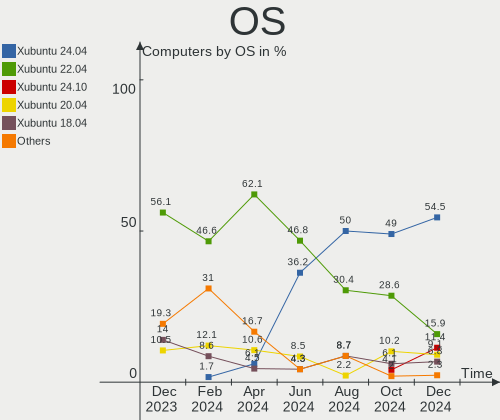
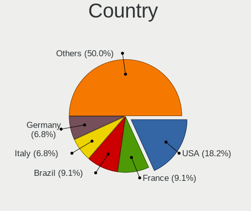
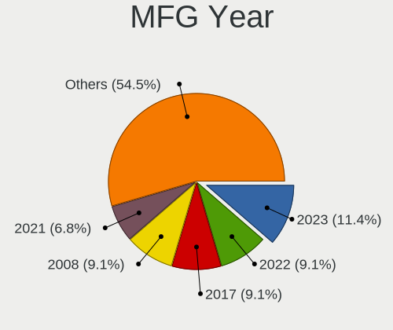
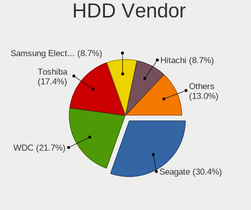
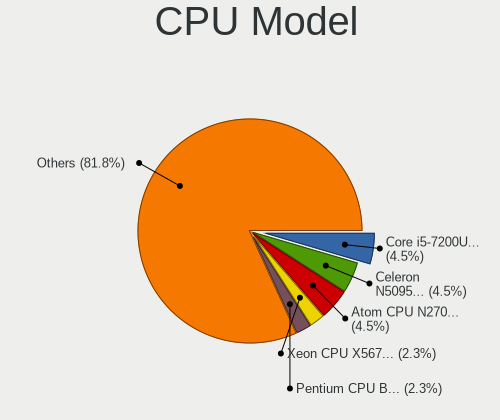
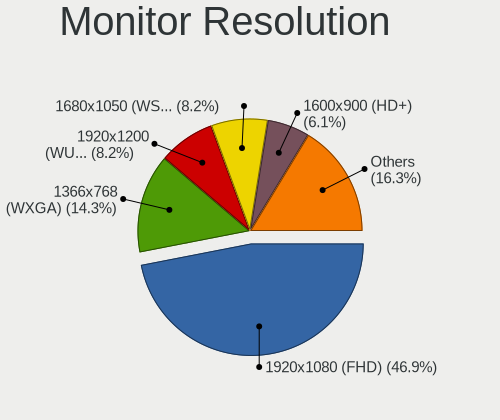
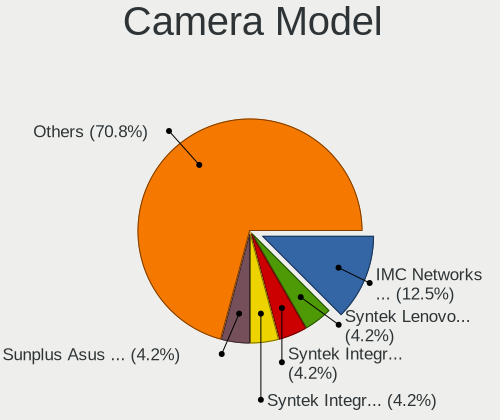

Xubuntu Hardware Trends
-----------------------

A project to identify most popular hardware characteristics and track their change
over time based on data collected by Xubuntu users at https://Linux-Hardware.org.

Anyone can contribute to the study by uploading probes of their computers by
the [hw-probe](https://github.com/linuxhw/hw-probe) tool:

    sudo -E hw-probe -all -upload

This is a report for all computer types. See also reports for [desktops](/Dist/Xubuntu/Desktop/README.md) and [notebooks](/Dist/Xubuntu/Notebook/README.md).

Full-feature report is available here: https://linux-hardware.org/?view=trends

Period: Mar, 2021.

Contents
--------

- [ OS                       ](#os)
- [ OS Family                ](#os-family)
- [ Kernel                   ](#kernel)
- [ Kernel Family            ](#kernel-family)
- [ Kernel Major Ver.        ](#kernel-major-ver)
- [ Arch                     ](#arch)
- [ DE                       ](#de)
- [ Display Server           ](#display-server)
- [ Display Manager          ](#display-manager)
- [ OS Lang                  ](#os-lang)
- [ Boot Mode                ](#boot-mode)
- [ Filesystem               ](#filesystem)
- [ Part. scheme             ](#part-scheme)
- [ Dual Boot with Linux/BSD ](#dual-boot-with-linux/bsd)
- [ Dual Boot (Win)          ](#dual-boot-win)
- [ Country                  ](#country)
- [ City                     ](#city)
- [ Vendor                   ](#vendor)
- [ Model                    ](#model)
- [ Model Family             ](#model-family)
- [ MFG Year                 ](#mfg-year)
- [ Form Factor              ](#form-factor)
- [ Secure Boot              ](#secure-boot)
- [ Coreboot                 ](#coreboot)
- [ RAM Size                 ](#ram-size)
- [ RAM Used                 ](#ram-used)
- [ Has CD-ROM               ](#has-cd-rom)
- [ Total Drives             ](#total-drives)
- [ Has Ethernet             ](#has-ethernet)
- [ Has WiFi                 ](#has-wifi)
- [ Has Bluetooth            ](#has-bluetooth)
- [ Drive Vendor             ](#drive-vendor)
- [ Drive Model              ](#drive-model)
- [ HDD Vendor               ](#hdd-vendor)
- [ SSD Vendor               ](#ssd-vendor)
- [ Drive Kind               ](#drive-kind)
- [ Drive Connector          ](#drive-connector)
- [ Drive Size               ](#drive-size)
- [ Space Total              ](#space-total)
- [ Space Used               ](#space-used)
- [ Malfunc. Drives          ](#malfunc-drives)
- [ Malfunc. Drive Vendor    ](#malfunc-drive-vendor)
- [ Malfunc. HDD Vendor      ](#malfunc-hdd-vendor)
- [ Malfunc. Drive Kind      ](#malfunc-drive-kind)
- [ Failed Drives            ](#failed-drives)
- [ Failed Drive Vendor      ](#failed-drive-vendor)
- [ Drive Status             ](#drive-status)
- [ Storage Vendor           ](#storage-vendor)
- [ Storage Model            ](#storage-model)
- [ Storage Kind             ](#storage-kind)
- [ CPU Vendor               ](#cpu-vendor)
- [ CPU Model                ](#cpu-model)
- [ CPU Model Family         ](#cpu-model-family)
- [ CPU Cores                ](#cpu-cores)
- [ CPU Sockets              ](#cpu-sockets)
- [ CPU Threads              ](#cpu-threads)
- [ CPU Op-Modes             ](#cpu-op-modes)
- [ CPU Microcode            ](#cpu-microcode)
- [ CPU Microarch            ](#cpu-microarch)
- [ GPU Vendor               ](#gpu-vendor)
- [ GPU Model                ](#gpu-model)
- [ GPU Combo                ](#gpu-combo)
- [ GPU Driver               ](#gpu-driver)
- [ GPU Memory               ](#gpu-memory)
- [ Monitor Vendor           ](#monitor-vendor)
- [ Monitor Model            ](#monitor-model)
- [ Monitor Resolution       ](#monitor-resolution)
- [ Monitor Diagonal         ](#monitor-diagonal)
- [ Monitor Width            ](#monitor-width)
- [ Aspect Ratio             ](#aspect-ratio)
- [ Monitor Area             ](#monitor-area)
- [ Pixel Density            ](#pixel-density)
- [ Multiple Monitors        ](#multiple-monitors)
- [ Net Controller Vendor    ](#net-controller-vendor)
- [ Net Controller Model     ](#net-controller-model)
- [ Wireless Vendor          ](#wireless-vendor)
- [ Wireless Model           ](#wireless-model)
- [ Ethernet Vendor          ](#ethernet-vendor)
- [ Ethernet Model           ](#ethernet-model)
- [ Net Controller Kind      ](#net-controller-kind)
- [ Used Controller          ](#used-controller)
- [ NICs                     ](#nics)
- [ IPv6                     ](#ipv6)
- [ Memory Vendor            ](#memory-vendor)
- [ Memory Model             ](#memory-model)
- [ Memory Kind              ](#memory-kind)
- [ Memory Form Factor       ](#memory-form-factor)
- [ Memory Size              ](#memory-size)
- [ Memory Speed             ](#memory-speed)
- [ Sound Vendor             ](#sound-vendor)
- [ Sound Model              ](#sound-model)
- [ Camera Vendor            ](#camera-vendor)
- [ Camera Model             ](#camera-model)
- [ Fingerprint Vendor       ](#fingerprint-vendor)
- [ Fingerprint Model        ](#fingerprint-model)
- [ Chipcard Vendor          ](#chipcard-vendor)
- [ Chipcard Model           ](#chipcard-model)
- [ Printer Vendor           ](#printer-vendor)
- [ Printer Model            ](#printer-model)
- [ Scanner Vendor           ](#scanner-vendor)
- [ Scanner Model            ](#scanner-model)
- [ Bluetooth Vendor         ](#bluetooth-vendor)
- [ Bluetooth Model          ](#bluetooth-model)
- [ Unsupported Devices      ](#unsupported-devices)
- [ Unsupported Device Types ](#unsupported-device-types)

OS
--

Installed operating systems

| Name          | Computers | Percent |
|---------------|-----------|---------|
| Xubuntu 20.04 | 100       | 65.36%  |
| Xubuntu 18.04 | 30        | 19.61%  |
| Xubuntu 20.10 | 16        | 10.46%  |
| Xubuntu 16.04 | 4         | 2.61%   |
| Xubuntu 21.04 | 2         | 1.31%   |
| Xubuntu 19.10 | 1         | 0.65%   |

OS Family
---------

OS without a version

| Name    | Computers | Percent |
|---------|-----------|---------|
| Xubuntu | 153       | 100%    |

Kernel
------

Version of the Linux kernel

| Version                    | Computers | Percent |
|----------------------------|-----------|---------|
| 5.4.0-66-generic           | 25        | 16.34%  |
| 5.4.0-67-generic           | 23        | 15.03%  |
| 5.8.0-44-generic           | 15        | 9.8%    |
| 5.8.0-45-generic           | 9         | 5.88%   |
| 5.4.0-66-lowlatency        | 9         | 5.88%   |
| 5.4.0-70-generic           | 7         | 4.58%   |
| 5.4.0-65-generic           | 6         | 3.92%   |
| 4.15.0-136-generic         | 6         | 3.92%   |
| 5.8.0-45-lowlatency        | 4         | 2.61%   |
| 5.4.0-67-lowlatency        | 4         | 2.61%   |
| 5.8.0-48-generic           | 3         | 1.96%   |
| 5.8.0-43-generic           | 3         | 1.96%   |
| 5.4.0-70-lowlatency        | 2         | 1.31%   |
| 5.11.0-11-generic          | 2         | 1.31%   |
| 4.15.0-135-generic         | 2         | 1.31%   |
| 5.9.16-050916-generic      | 1         | 0.65%   |
| 5.8.0-49-generic           | 1         | 0.65%   |
| 5.8.0-48-lowlatency        | 1         | 0.65%   |
| 5.8.0-44-lowlatency        | 1         | 0.65%   |
| 5.8.0-43-lowlatency        | 1         | 0.65%   |
| 5.8.0-36-generic           | 1         | 0.65%   |
| 5.8.0-25-generic           | 1         | 0.65%   |
| 5.7.19-050719-generic      | 1         | 0.65%   |
| 5.4.0-65-lowlatency        | 1         | 0.65%   |
| 5.4.0-60-generic           | 1         | 0.65%   |
| 5.4.0-58-generic           | 1         | 0.65%   |
| 5.4.0-52-generic           | 1         | 0.65%   |
| 5.4.0-42-lowlatency        | 1         | 0.65%   |
| 5.4.0-42-generic           | 1         | 0.65%   |
| 5.3.0-64-generic           | 1         | 0.65%   |
| 5.3.0-53-generic           | 1         | 0.65%   |
| 5.11.8-051108-generic      | 1         | 0.65%   |
| 5.11.6-xanmod1             | 1         | 0.65%   |
| 5.11.6-051106-generic      | 1         | 0.65%   |
| 5.11.3-051103-generic      | 1         | 0.65%   |
| 5.10.8-051008-generic      | 1         | 0.65%   |
| 5.10.25-051025-generic     | 1         | 0.65%   |
| 5.10.16-051016-lowlatency  | 1         | 0.65%   |
| 5.0.0-050000rc8-lowlatency | 1         | 0.65%   |
| 4.4.0-206-generic          | 1         | 0.65%   |
| 4.4.0-204-generic          | 1         | 0.65%   |
| 4.4.0-203-generic          | 1         | 0.65%   |
| 4.15.0-99-generic          | 1         | 0.65%   |
| 4.15.0-36-generic          | 1         | 0.65%   |
| 4.15.0-20-lowlatency       | 1         | 0.65%   |
| 4.15.0-140-lowlatency      | 1         | 0.65%   |
| 4.15.0-139-generic         | 1         | 0.65%   |
| 4.15.0-126-generic         | 1         | 0.65%   |

Kernel Family
-------------

Linux kernel without a distro release

| Version | Computers | Percent |
|---------|-----------|---------|
| 5.4.0   | 82        | 53.59%  |
| 5.8.0   | 40        | 26.14%  |
| 4.15.0  | 14        | 9.15%   |
| 4.4.0   | 3         | 1.96%   |
| 5.3.0   | 2         | 1.31%   |
| 5.11.6  | 2         | 1.31%   |
| 5.11.0  | 2         | 1.31%   |
| 5.9.16  | 1         | 0.65%   |
| 5.7.19  | 1         | 0.65%   |
| 5.11.8  | 1         | 0.65%   |
| 5.11.3  | 1         | 0.65%   |
| 5.10.8  | 1         | 0.65%   |
| 5.10.25 | 1         | 0.65%   |
| 5.10.16 | 1         | 0.65%   |
| 5.0.0   | 1         | 0.65%   |

Kernel Major Ver.
-----------------

Linux kernel major version

| Version | Computers | Percent |
|---------|-----------|---------|
| 5.4     | 82        | 53.59%  |
| 5.8     | 40        | 26.14%  |
| 4.15    | 14        | 9.15%   |
| 5.11    | 6         | 3.92%   |
| 5.10    | 3         | 1.96%   |
| 4.4     | 3         | 1.96%   |
| 5.3     | 2         | 1.31%   |
| 5.9     | 1         | 0.65%   |
| 5.7     | 1         | 0.65%   |
| 5.0     | 1         | 0.65%   |

Arch
----

OS architecture (x86_64, i586, etc.)

| Name   | Computers | Percent |
|--------|-----------|---------|
| x86_64 | 138       | 90.2%   |
| i686   | 15        | 9.8%    |

DE
--

Desktop Environment

| Name  | Computers | Percent |
|-------|-----------|---------|
| XFCE  | 149       | 97.39%  |
| i3    | 2         | 1.31%   |
| KDE5  | 1         | 0.65%   |
| GNOME | 1         | 0.65%   |

Display Server
--------------

X11 or Wayland

| Name | Computers | Percent |
|------|-----------|---------|
| X11  | 151       | 98.69%  |
| Tty  | 2         | 1.31%   |

Display Manager
---------------

SDDM, LightDM, etc.

| Name    | Computers | Percent |
|---------|-----------|---------|
| Unknown | 93        | 60.78%  |
| TDM     | 58        | 37.91%  |
| GDM     | 2         | 1.31%   |

OS Lang
-------

Language

| Lang  | Computers | Percent |
|-------|-----------|---------|
| en_US | 46        | 30.07%  |
| ru_RU | 17        | 11.11%  |
| fr_FR | 17        | 11.11%  |
| de_DE | 13        | 8.5%    |
| en_GB | 8         | 5.23%   |
| pl_PL | 7         | 4.58%   |
| it_IT | 7         | 4.58%   |
| en_CA | 6         | 3.92%   |
| pt_BR | 5         | 3.27%   |
| C     | 4         | 2.61%   |
| hu_HU | 3         | 1.96%   |
| ja_JP | 2         | 1.31%   |
| de_AT | 2         | 1.31%   |
| cs_CZ | 2         | 1.31%   |
| uk_UA | 1         | 0.65%   |
| sk_SK | 1         | 0.65%   |
| ru_UA | 1         | 0.65%   |
| nl_BE | 1         | 0.65%   |
| fr_BE | 1         | 0.65%   |
| fi_FI | 1         | 0.65%   |
| es_PE | 1         | 0.65%   |
| es_MX | 1         | 0.65%   |
| es_ES | 1         | 0.65%   |
| es_AR | 1         | 0.65%   |
| en_SG | 1         | 0.65%   |
| en_IL | 1         | 0.65%   |
| en_AU | 1         | 0.65%   |
| da_DK | 1         | 0.65%   |

Boot Mode
---------

EFI or BIOS

| Mode | Computers | Percent |
|------|-----------|---------|
| BIOS | 91        | 59.48%  |
| EFI  | 62        | 40.52%  |

Filesystem
----------

Type of filesystem

| Type    | Computers | Percent |
|---------|-----------|---------|
| Ext4    | 139       | 90.85%  |
| Btrfs   | 6         | 3.92%   |
| Overlay | 5         | 3.27%   |
| Zfs     | 2         | 1.31%   |
| Xfs     | 1         | 0.65%   |

Part. scheme
------------

Scheme of partitioning

| Type    | Computers | Percent |
|---------|-----------|---------|
| Unknown | 92        | 60.13%  |
| GPT     | 39        | 25.49%  |
| MBR     | 22        | 14.38%  |

Dual Boot with Linux/BSD
------------------------

Hosting more than one Linux/BSD

| Dual boot | Computers | Percent |
|-----------|-----------|---------|
| No        | 124       | 81.05%  |
| Yes       | 29        | 18.95%  |

Dual Boot (Win)
---------------

Hosting Linux and Windows

| Dual boot | Computers | Percent |
|-----------|-----------|---------|
| No        | 93        | 60.78%  |
| Yes       | 60        | 39.22%  |

Country
-------

Geographic location (country)

| Country                | Computers | Percent |
|------------------------|-----------|---------|
| USA                    | 27        | 17.65%  |
| Russia                 | 17        | 11.11%  |
| France                 | 17        | 11.11%  |
| Germany                | 15        | 9.8%    |
| UK                     | 9         | 5.88%   |
| Italy                  | 7         | 4.58%   |
| Poland                 | 6         | 3.92%   |
| Canada                 | 6         | 3.92%   |
| Brazil                 | 5         | 3.27%   |
| Spain                  | 4         | 2.61%   |
| Ukraine                | 3         | 1.96%   |
| Romania                | 3         | 1.96%   |
| Japan                  | 3         | 1.96%   |
| Hungary                | 3         | 1.96%   |
| Bulgaria               | 3         | 1.96%   |
| Belgium                | 3         | 1.96%   |
| Czechia                | 2         | 1.31%   |
| Austria                | 2         | 1.31%   |
| Argentina              | 2         | 1.31%   |
| Thailand               | 1         | 0.65%   |
| Sweden                 | 1         | 0.65%   |
| Slovakia               | 1         | 0.65%   |
| Singapore              | 1         | 0.65%   |
| Peru                   | 1         | 0.65%   |
| Netherlands            | 1         | 0.65%   |
| Mexico                 | 1         | 0.65%   |
| Israel                 | 1         | 0.65%   |
| Indonesia              | 1         | 0.65%   |
| Georgia                | 1         | 0.65%   |
| Finland                | 1         | 0.65%   |
| Denmark                | 1         | 0.65%   |
| Bosnia and Herzegovina | 1         | 0.65%   |
| Bolivia                | 1         | 0.65%   |
| Belarus                | 1         | 0.65%   |
| Australia              | 1         | 0.65%   |

City
----

Geographic location (city)

| City                  | Computers | Percent |
|-----------------------|-----------|---------|
| Rostov-on-Don         | 6         | 3.92%   |
| Toulon                | 2         | 1.31%   |
| São Paulo            | 2         | 1.31%   |
| Springfield           | 2         | 1.31%   |
| Sofia                 | 2         | 1.31%   |
| Novocherkassk         | 2         | 1.31%   |
| Moscow                | 2         | 1.31%   |
| Karlsruhe             | 2         | 1.31%   |
| Dallas                | 2         | 1.31%   |
| Budapest              | 2         | 1.31%   |
| Ōtsu                 | 1         | 0.65%   |
| Świętochłowice     | 1         | 0.65%   |
| Zawiercie             | 1         | 0.65%   |
| Wilmington            | 1         | 0.65%   |
| Wasilla               | 1         | 0.65%   |
| Warsaw                | 1         | 0.65%   |
| Voronezh              | 1         | 0.65%   |
| Vol'ginskiy           | 1         | 0.65%   |
| Virreyes              | 1         | 0.65%   |
| Vienna                | 1         | 0.65%   |
| Veliko Tarnovo        | 1         | 0.65%   |
| Valby                 | 1         | 0.65%   |
| Unna                  | 1         | 0.65%   |
| Târgu Jiu            | 1         | 0.65%   |
| Tsukuba               | 1         | 0.65%   |
| Tourouvre             | 1         | 0.65%   |
| Toulouse              | 1         | 0.65%   |
| Toronto               | 1         | 0.65%   |
| Tonypandy             | 1         | 0.65%   |
| Tomsk                 | 1         | 0.65%   |
| Thunder Bay           | 1         | 0.65%   |
| Temryuk               | 1         | 0.65%   |
| Tel Aviv              | 1         | 0.65%   |
| Tbilisi               | 1         | 0.65%   |
| Tarbes                | 1         | 0.65%   |
| São Carlos           | 1         | 0.65%   |
| Surabaya              | 1         | 0.65%   |
| Spruce Grove          | 1         | 0.65%   |
| Sochi                 | 1         | 0.65%   |
| Singapore             | 1         | 0.65%   |
| Sestao                | 1         | 0.65%   |
| Schaarbeek            | 1         | 0.65%   |
| Sarajevo              | 1         | 0.65%   |
| San Diego             | 1         | 0.65%   |
| Salvador              | 1         | 0.65%   |
| Saint-Martin-d'Hères | 1         | 0.65%   |
| Saarbrücken          | 1         | 0.65%   |
| Ryazan                | 1         | 0.65%   |
| Rome                  | 1         | 0.65%   |
| Rochester             | 1         | 0.65%   |
| Rigby                 | 1         | 0.65%   |
| Reda                  | 1         | 0.65%   |
| Pueblo                | 1         | 0.65%   |
| Poznan                | 1         | 0.65%   |
| Pottstown             | 1         | 0.65%   |
| Ploieşti             | 1         | 0.65%   |
| Peterborough          | 1         | 0.65%   |
| Perpignan             | 1         | 0.65%   |
| Pau                   | 1         | 0.65%   |
| Paris                 | 1         | 0.65%   |

Vendor
------

Motherboard manufacturer

| Name                | Computers | Percent |
|---------------------|-----------|---------|
| ASUSTek Computer    | 23        | 15.03%  |
| Hewlett-Packard     | 22        | 14.38%  |
| Dell                | 19        | 12.42%  |
| Lenovo              | 18        | 11.76%  |
| Gigabyte Technology | 12        | 7.84%   |
| Toshiba             | 9         | 5.88%   |
| MSI                 | 9         | 5.88%   |
| ASRock              | 8         | 5.23%   |
| Acer                | 7         | 4.58%   |
| Medion              | 4         | 2.61%   |
| Foxconn             | 3         | 1.96%   |
| Sony                | 2         | 1.31%   |
| Samsung Electronics | 2         | 1.31%   |
| Intel               | 2         | 1.31%   |
| ZOTAC               | 1         | 0.65%   |
| Schenker            | 1         | 0.65%   |
| Packard Bell        | 1         | 0.65%   |
| Notebook            | 1         | 0.65%   |
| Huanan              | 1         | 0.65%   |
| Fujitsu Siemens     | 1         | 0.65%   |
| Fujitsu             | 1         | 0.65%   |
| eMachines           | 1         | 0.65%   |
| ECS                 | 1         | 0.65%   |
| Direkt-Tek          | 1         | 0.65%   |
| AWOW                | 1         | 0.65%   |
| Apple               | 1         | 0.65%   |
| AAEON               | 1         | 0.65%   |

Model
-----

Motherboard model

| Name                                                                                     | Computers | Percent |
|------------------------------------------------------------------------------------------|-----------|---------|
| Sony VGN-CR19VN_B                                                                        | 2         | 1.31%   |
| HP Pavilion dv6                                                                          | 2         | 1.31%   |
| HP Compaq Pro 6300 SFF                                                                   | 2         | 1.31%   |
| ZOTAC ZBOX-CI320NANO series                                                              | 1         | 0.65%   |
| Toshiba TECRA M7                                                                         | 1         | 0.65%   |
| Toshiba Satellite Pro A120                                                               | 1         | 0.65%   |
| Toshiba Satellite M115                                                                   | 1         | 0.65%   |
| Toshiba Satellite L775                                                                   | 1         | 0.65%   |
| Toshiba Satellite L350D                                                                  | 1         | 0.65%   |
| Toshiba Satellite L300                                                                   | 1         | 0.65%   |
| Toshiba Satellite E45W-C                                                                 | 1         | 0.65%   |
| Toshiba Satellite C655D                                                                  | 1         | 0.65%   |
| Toshiba PORTEGE R930                                                                     | 1         | 0.65%   |
| Schenker XMG CORE 17(M20, RTX 2060)                                                      | 1         | 0.65%   |
| Samsung R540/R580/R780/SA41/E452/E852                                                    | 1         | 0.65%   |
| Samsung 350V5C/350V5X/350V4C/350V4X/351V5C/351V5X/351V4C/351V4X/3540VC/3540VX/3440VC/344 | 1         | 0.65%   |
| Packard Bell EasyNote TK87                                                               | 1         | 0.65%   |
| Notebook N14xWU                                                                          | 1         | 0.65%   |
| MSI MS-7C84                                                                              | 1         | 0.65%   |
| MSI MS-7C37                                                                              | 1         | 0.65%   |
| MSI MS-7C13                                                                              | 1         | 0.65%   |
| MSI MS-7B89                                                                              | 1         | 0.65%   |
| MSI MS-7816                                                                              | 1         | 0.65%   |
| MSI MS-7721                                                                              | 1         | 0.65%   |
| MSI MS-1727                                                                              | 1         | 0.65%   |
| MSI KM400-8235                                                                           | 1         | 0.65%   |
| MSI GE76 Raider 10UH                                                                     | 1         | 0.65%   |
| Medion WIM2220                                                                           | 1         | 0.65%   |
| Medion MAM2010                                                                           | 1         | 0.65%   |
| Medion Akoya P2120 D MD8836/2452                                                         | 1         | 0.65%   |
| Medion Akoya E4214 MD99570                                                               | 1         | 0.65%   |
| Lenovo Z50-75 80EC                                                                       | 1         | 0.65%   |
| Lenovo Yoga Slim 7 14ITL05 82A3                                                          | 1         | 0.65%   |
| Lenovo Yoga 300-11IBR 80M1                                                               | 1         | 0.65%   |
| Lenovo V560                                                                              | 1         | 0.65%   |
| Lenovo ThinkPad X270 W10DG 20K5S0TS00                                                    | 1         | 0.65%   |
| Lenovo ThinkPad X200T 7453CTO                                                            | 1         | 0.65%   |
| Lenovo ThinkPad X1 Carbon 3rd 20BT002PAU                                                 | 1         | 0.65%   |
| Lenovo ThinkPad T495 20NJ0015SP                                                          | 1         | 0.65%   |
| Lenovo ThinkPad T420 4236GH6                                                             | 1         | 0.65%   |
| Lenovo ThinkPad Edge E540 20C60041GE                                                     | 1         | 0.65%   |
| Lenovo ThinkPad E525 12003NG                                                             | 1         | 0.65%   |
| Lenovo ThinkCentre M91p 4518A13                                                          | 1         | 0.65%   |
| Lenovo ThinkCentre A70 7844H9G                                                           | 1         | 0.65%   |
| Lenovo Legion Y530-15ICH 81FV                                                            | 1         | 0.65%   |
| Lenovo IdeaPad N585                                                                      | 1         | 0.65%   |
| Lenovo IdeaPad Flex 5 14ALC05 82HU                                                       | 1         | 0.65%   |
| Lenovo G560 0679                                                                         | 1         | 0.65%   |
| Lenovo B50-70 20384                                                                      | 1         | 0.65%   |
| Intel X99                                                                                | 1         | 0.65%   |
| Intel DG965MQ AAD37419-302                                                               | 1         | 0.65%   |
| Huanan Thurley                                                                           | 1         | 0.65%   |
| HP ZBook 15 G6                                                                           | 1         | 0.65%   |
| HP Z440 Workstation                                                                      | 1         | 0.65%   |
| HP t620 Quad Core TC                                                                     | 1         | 0.65%   |
| HP ProDesk 600 G1 SFF                                                                    | 1         | 0.65%   |
| HP ProBook 430 G5                                                                        | 1         | 0.65%   |
| HP Pavilion 17                                                                           | 1         | 0.65%   |
| HP Pavilion 15                                                                           | 1         | 0.65%   |
| HP Laptop 15-dy2xxx                                                                      | 1         | 0.65%   |

Model Family
------------

Motherboard model prefix

| Name                   | Computers | Percent |
|------------------------|-----------|---------|
| Dell Latitude          | 8         | 5.23%   |
| Toshiba Satellite      | 7         | 4.58%   |
| Lenovo ThinkPad        | 7         | 4.58%   |
| Dell Inspiron          | 6         | 3.92%   |
| HP Compaq              | 5         | 3.27%   |
| Acer Aspire            | 5         | 3.27%   |
| HP Pavilion            | 4         | 2.61%   |
| HP Laptop              | 3         | 1.96%   |
| Sony VGN-CR19VN        | 2         | 1.31%   |
| Medion Akoya           | 2         | 1.31%   |
| Lenovo Yoga            | 2         | 1.31%   |
| Lenovo ThinkCentre     | 2         | 1.31%   |
| Lenovo IdeaPad         | 2         | 1.31%   |
| HP EliteBook           | 2         | 1.31%   |
| Gigabyte Z97X-Gaming   | 2         | 1.31%   |
| Gigabyte B450M         | 2         | 1.31%   |
| Dell XPS               | 2         | 1.31%   |
| Dell OptiPlex          | 2         | 1.31%   |
| ASUS PRIME             | 2         | 1.31%   |
| ZOTAC ZBOX-CI320NANO   | 1         | 0.65%   |
| Toshiba TECRA          | 1         | 0.65%   |
| Toshiba PORTEGE        | 1         | 0.65%   |
| Schenker XMG           | 1         | 0.65%   |
| Samsung R540           | 1         | 0.65%   |
| Samsung 350V5C         | 1         | 0.65%   |
| Packard Bell EasyNote  | 1         | 0.65%   |
| Notebook N14xWU        | 1         | 0.65%   |
| MSI MS-7C84            | 1         | 0.65%   |
| MSI MS-7C37            | 1         | 0.65%   |
| MSI MS-7C13            | 1         | 0.65%   |
| MSI MS-7B89            | 1         | 0.65%   |
| MSI MS-7816            | 1         | 0.65%   |
| MSI MS-7721            | 1         | 0.65%   |
| MSI MS-1727            | 1         | 0.65%   |
| MSI KM400-8235         | 1         | 0.65%   |
| MSI GE76               | 1         | 0.65%   |
| Medion WIM2220         | 1         | 0.65%   |
| Medion MAM2010         | 1         | 0.65%   |
| Lenovo Z50-75          | 1         | 0.65%   |
| Lenovo V560            | 1         | 0.65%   |
| Lenovo Legion          | 1         | 0.65%   |
| Lenovo G560            | 1         | 0.65%   |
| Lenovo B50-70          | 1         | 0.65%   |
| Intel X99              | 1         | 0.65%   |
| Intel DG965MQ          | 1         | 0.65%   |
| Huanan Thurley         | 1         | 0.65%   |
| HP ZBook               | 1         | 0.65%   |
| HP Z440                | 1         | 0.65%   |
| HP t620                | 1         | 0.65%   |
| HP ProDesk             | 1         | 0.65%   |
| HP ProBook             | 1         | 0.65%   |
| HP 550                 | 1         | 0.65%   |
| HP 500-311nf           | 1         | 0.65%   |
| HP 15                  | 1         | 0.65%   |
| Gigabyte X570          | 1         | 0.65%   |
| Gigabyte X470          | 1         | 0.65%   |
| Gigabyte M61PME-S2P    | 1         | 0.65%   |
| Gigabyte GB-BSi3A-6100 | 1         | 0.65%   |
| Gigabyte F2A78M-HD2    | 1         | 0.65%   |
| Gigabyte A320M-H       | 1         | 0.65%   |

MFG Year
--------

Motherboard manufacture year

| Year | Computers | Percent |
|------|-----------|---------|
| 2020 | 25        | 16.34%  |
| 2019 | 17        | 11.11%  |
| 2015 | 16        | 10.46%  |
| 2011 | 14        | 9.15%   |
| 2010 | 14        | 9.15%   |
| 2008 | 12        | 7.84%   |
| 2012 | 8         | 5.23%   |
| 2014 | 7         | 4.58%   |
| 2018 | 6         | 3.92%   |
| 2016 | 6         | 3.92%   |
| 2007 | 6         | 3.92%   |
| 2013 | 5         | 3.27%   |
| 2021 | 4         | 2.61%   |
| 2009 | 4         | 2.61%   |
| 2017 | 3         | 1.96%   |
| 2005 | 3         | 1.96%   |
| 2006 | 2         | 1.31%   |
| 2003 | 1         | 0.65%   |

Form Factor
-----------

Physical design of the computer

| Name        | Computers | Percent |
|-------------|-----------|---------|
| Notebook    | 86        | 56.21%  |
| Desktop     | 61        | 39.87%  |
| Mini pc     | 3         | 1.96%   |
| Convertible | 1         | 0.65%   |
| All in one  | 1         | 0.65%   |
| Server      | 1         | 0.65%   |

Secure Boot
-----------

Enabled or disabled

| State    | Computers | Percent |
|----------|-----------|---------|
| Disabled | 146       | 95.42%  |
| Enabled  | 7         | 4.58%   |

Coreboot
--------

Have coreboot on board

| Used | Computers | Percent |
|------|-----------|---------|
| No   | 153       | 100%    |

RAM Size
--------

Total RAM memory

| Size in GB  | Computers | Percent |
|-------------|-----------|---------|
| 3.01-4.0    | 44        | 28.76%  |
| 4.01-8.0    | 26        | 16.99%  |
| 16.01-24.0  | 22        | 14.38%  |
| 8.01-16.0   | 22        | 14.38%  |
| 1.01-2.0    | 19        | 12.42%  |
| 32.01-64.0  | 10        | 6.54%   |
| 2.01-3.0    | 4         | 2.61%   |
| 24.01-32.0  | 2         | 1.31%   |
| 64.01-256.0 | 2         | 1.31%   |
| 0.51-1.0    | 2         | 1.31%   |

RAM Used
--------

Used RAM memory

| Used GB   | Computers | Percent |
|-----------|-----------|---------|
| 1.01-2.0  | 72        | 47.06%  |
| 0.51-1.0  | 28        | 18.3%   |
| 2.01-3.0  | 23        | 15.03%  |
| 4.01-8.0  | 14        | 9.15%   |
| 3.01-4.0  | 8         | 5.23%   |
| 8.01-16.0 | 7         | 4.58%   |
| 0.01-0.5  | 1         | 0.65%   |

Has CD-ROM
----------

Has CD-ROM on board

| Presented | Computers | Percent |
|-----------|-----------|---------|
| Yes       | 79        | 51.63%  |
| No        | 74        | 48.37%  |

Total Drives
------------

Number of drives on board

| Drives | Computers | Percent |
|--------|-----------|---------|
| 1      | 86        | 56.21%  |
| 2      | 44        | 28.76%  |
| 3      | 10        | 6.54%   |
| 4      | 7         | 4.58%   |
| 7      | 2         | 1.31%   |
| 0      | 2         | 1.31%   |
| 6      | 1         | 0.65%   |
| 5      | 1         | 0.65%   |

Has Ethernet
------------

Has Ethernet on board

| Presented | Computers | Percent |
|-----------|-----------|---------|
| Yes       | 141       | 92.16%  |
| No        | 12        | 7.84%   |

Has WiFi
--------

Has WiFi module

| Presented | Computers | Percent |
|-----------|-----------|---------|
| Yes       | 117       | 76.47%  |
| No        | 36        | 23.53%  |

Has Bluetooth
-------------

Has Bluetooth module

| Presented | Computers | Percent |
|-----------|-----------|---------|
| No        | 86        | 56.21%  |
| Yes       | 67        | 43.79%  |

Drive Vendor
------------

Hard drive vendors

| Vendor                | Computers | Drives | Percent |
|-----------------------|-----------|--------|---------|
| WDC                   | 43        | 52     | 18.86%  |
| Seagate               | 34        | 48     | 14.91%  |
| Samsung Electronics   | 30        | 31     | 13.16%  |
| Hitachi               | 18        | 19     | 7.89%   |
| Toshiba               | 16        | 18     | 7.02%   |
| Kingston              | 11        | 11     | 4.82%   |
| Unknown               | 9         | 9      | 3.95%   |
| SanDisk               | 6         | 6      | 2.63%   |
| HGST                  | 5         | 5      | 2.19%   |
| Crucial               | 4         | 4      | 1.75%   |
| A-DATA Technology     | 4         | 5      | 1.75%   |
| Fujitsu               | 3         | 3      | 1.32%   |
| China                 | 3         | 3      | 1.32%   |
| Transcend             | 2         | 2      | 0.88%   |
| TO Exter              | 2         | 2      | 0.88%   |
| SPCC                  | 2         | 2      | 0.88%   |
| Phison                | 2         | 2      | 0.88%   |
| Patriot               | 2         | 2      | 0.88%   |
| OCZ                   | 2         | 2      | 0.88%   |
| Micron Technology     | 2         | 2      | 0.88%   |
| Maxtor                | 2         | 2      | 0.88%   |
| Intel                 | 2         | 2      | 0.88%   |
| Apacer                | 2         | 2      | 0.88%   |
| XPG                   | 1         | 1      | 0.44%   |
| USB3.0                | 1         | 1      | 0.44%   |
| SSK                   | 1         | 1      | 0.44%   |
| Smartbuy              | 1         | 1      | 0.44%   |
| SK Hynix              | 1         | 1      | 0.44%   |
| Realtek Semiconductor | 1         | 1      | 0.44%   |
| Q7                    | 1         | 1      | 0.44%   |
| PNY                   | 1         | 1      | 0.44%   |
| PCCOOLER              | 1         | 1      | 0.44%   |
| Netac                 | 1         | 1      | 0.44%   |
| Neo Forza             | 1         | 1      | 0.44%   |
| LONDISK               | 1         | 1      | 0.44%   |
| Lexar                 | 1         | 1      | 0.44%   |
| LDLC                  | 1         | 1      | 0.44%   |
| LaCie                 | 1         | 1      | 0.44%   |
| KIOXIA-EXCERIA        | 1         | 1      | 0.44%   |
| KingFast              | 1         | 1      | 0.44%   |
| Intenso               | 1         | 1      | 0.44%   |
| Gigabyte Technology   | 1         | 1      | 0.44%   |
| FORESEE               | 1         | 1      | 0.44%   |
| ExcelStor             | 1         | 1      | 0.44%   |
| Apple                 | 1         | 1      | 0.44%   |

Drive Model
-----------

Hard drive models

| Model                              | Computers | Percent |
|------------------------------------|-----------|---------|
| WDC WD10EZEX-08WN4A0 1TB           | 3         | 1.2%    |
| Seagate ST1000LM024 HN-M101MBB 1TB | 3         | 1.2%    |
| Seagate ST1000DM010-2EP102 1TB     | 3         | 1.2%    |
| Samsung SSD 860 EVO 500GB          | 3         | 1.2%    |
| Kingston SA400S37120G 120GB SSD    | 3         | 1.2%    |
| WDC WDS120G2G0A-00JH30 120GB SSD   | 2         | 0.8%    |
| WDC WD10JPVX-22JC3T0 1TB           | 2         | 0.8%    |
| WDC WD10EZEX-00RKKA0 1TB           | 2         | 0.8%    |
| Unknown SD/MMC/MS PRO 128GB        | 2         | 0.8%    |
| Unknown MMC Card  32GB             | 2         | 0.8%    |
| TO Exter nal USB 3.0 2TB           | 2         | 0.8%    |
| Seagate ST8000DM004-2CX188 8TB     | 2         | 0.8%    |
| Seagate ST500DM002-1SB10A 500GB    | 2         | 0.8%    |
| Seagate ST3500418AS 500GB          | 2         | 0.8%    |
| Seagate ST3320620AS 320GB          | 2         | 0.8%    |
| Seagate ST3250310AS 250GB          | 2         | 0.8%    |
| Seagate ST2000DM001-1ER164 2TB     | 2         | 0.8%    |
| Samsung SSD 970 EVO Plus 250GB     | 2         | 0.8%    |
| Samsung SSD 860 EVO 250GB          | 2         | 0.8%    |
| Kingston SHFS37A120G 120GB SSD     | 2         | 0.8%    |
| HGST HTS545050A7E680 500GB         | 2         | 0.8%    |
| Crucial CT480BX500SSD1 480GB       | 2         | 0.8%    |
| China SATA SSD 120GB               | 2         | 0.8%    |
| A-DATA SU630 240GB SSD             | 2         | 0.8%    |
| XPG NVMe SSD Drive 2TB             | 1         | 0.4%    |
| WDC WDS500G3X0C-00SJG0 500GB       | 1         | 0.4%    |
| WDC WDS250G2B0C-00PXH0 250GB       | 1         | 0.4%    |
| WDC WDS240G2G0A-00JH30 240GB SSD   | 1         | 0.4%    |
| WDC WDS200T3X0C-00SJG0 2TB         | 1         | 0.4%    |
| WDC WDS120G2G0B-00EPW0 120GB SSD   | 1         | 0.4%    |
| WDC WD800JD-75JNA0 80GB            | 1         | 0.4%    |
| WDC WD6400AAKS-22A7B2 640GB        | 1         | 0.4%    |
| WDC WD5003AZEX-00K1GA0 500GB       | 1         | 0.4%    |
| WDC WD5003ABYX-18WERA0 500GB       | 1         | 0.4%    |
| WDC WD5000AZLX-00JKKA0 500GB       | 1         | 0.4%    |
| WDC WD5000AAKX-22ERMA0 500GB       | 1         | 0.4%    |
| WDC WD3201ABYS-01B9A0 320GB        | 1         | 0.4%    |
| WDC WD3200BPVT-75ZEST0 320GB       | 1         | 0.4%    |
| WDC WD3200BEVT-75A23T0 320GB       | 1         | 0.4%    |
| WDC WD3200BEKT-75PVMT1 320GB       | 1         | 0.4%    |
| WDC WD30EZRX-00SPEB0 3TB           | 1         | 0.4%    |
| WDC WD30EZRX-00MMMB0 3TB           | 1         | 0.4%    |
| WDC WD2500JS-40T                   | 1         | 0.4%    |
| WDC WD2500AAKX-073CA1 250GB        | 1         | 0.4%    |
| WDC WD20EZRX-00DC0B0 2TB           | 1         | 0.4%    |
| WDC WD20EURX-63T0FY0 2TB           | 1         | 0.4%    |
| WDC WD20EARX-00PASB0 2TB           | 1         | 0.4%    |
| WDC WD20EARS-00MVWB0 2TB           | 1         | 0.4%    |
| WDC WD2003FZEX-00SRLA0 2TB         | 1         | 0.4%    |
| WDC WD1600JS-00MHB0 160GB          | 1         | 0.4%    |
| WDC WD1600JB-22GVA0 160GB          | 1         | 0.4%    |
| WDC WD1600BJKT-75F4T0 160GB        | 1         | 0.4%    |
| WDC WD1200BEVS-22RST0 120GB        | 1         | 0.4%    |
| WDC WD10SPZX-75Z10T1 1TB           | 1         | 0.4%    |
| WDC WD10PURZ-85U8XY0 1TB           | 1         | 0.4%    |
| WDC WD10JPVX-75JC3T0 1TB           | 1         | 0.4%    |
| WDC WD10JPVT-08A1YT2 1TB           | 1         | 0.4%    |
| WDC WD10JPCX-24UE4T0 1TB           | 1         | 0.4%    |
| WDC WD10EZRX-00A8LB0 1TB           | 1         | 0.4%    |
| WDC WD10EZEX-00MFCA0 1TB           | 1         | 0.4%    |

HDD Vendor
----------

Hard disk drive vendors

| Vendor              | Computers | Drives | Percent |
|---------------------|-----------|--------|---------|
| WDC                 | 38        | 45     | 30.89%  |
| Seagate             | 33        | 41     | 26.83%  |
| Hitachi             | 18        | 19     | 14.63%  |
| Toshiba             | 12        | 14     | 9.76%   |
| Samsung Electronics | 7         | 7      | 5.69%   |
| HGST                | 5         | 5      | 4.07%   |
| Fujitsu             | 3         | 3      | 2.44%   |
| TO Exter            | 2         | 2      | 1.63%   |
| Maxtor              | 2         | 2      | 1.63%   |
| USB3.0              | 1         | 1      | 0.81%   |
| LaCie               | 1         | 1      | 0.81%   |
| ExcelStor           | 1         | 1      | 0.81%   |

SSD Vendor
----------

Solid state drive vendors

| Vendor              | Computers | Drives | Percent |
|---------------------|-----------|--------|---------|
| Samsung Electronics | 16        | 16     | 23.19%  |
| Kingston            | 10        | 10     | 14.49%  |
| WDC                 | 4         | 4      | 5.8%    |
| SanDisk             | 4         | 4      | 5.8%    |
| Crucial             | 4         | 4      | 5.8%    |
| A-DATA Technology   | 4         | 4      | 5.8%    |
| China               | 3         | 3      | 4.35%   |
| Transcend           | 2         | 2      | 2.9%    |
| SPCC                | 2         | 2      | 2.9%    |
| Patriot             | 2         | 2      | 2.9%    |
| OCZ                 | 2         | 2      | 2.9%    |
| Micron Technology   | 2         | 2      | 2.9%    |
| Apacer              | 2         | 2      | 2.9%    |
| Toshiba             | 1         | 1      | 1.45%   |
| Smartbuy            | 1         | 1      | 1.45%   |
| SK Hynix            | 1         | 1      | 1.45%   |
| PNY                 | 1         | 1      | 1.45%   |
| Netac               | 1         | 1      | 1.45%   |
| Neo Forza           | 1         | 1      | 1.45%   |
| LONDISK             | 1         | 1      | 1.45%   |
| Lexar               | 1         | 1      | 1.45%   |
| KIOXIA-EXCERIA      | 1         | 1      | 1.45%   |
| Intel               | 1         | 1      | 1.45%   |
| FORESEE             | 1         | 1      | 1.45%   |
| Apple               | 1         | 1      | 1.45%   |

Drive Kind
----------

HDD or SSD

| Kind    | Computers | Drives | Percent |
|---------|-----------|--------|---------|
| HDD     | 97        | 141    | 48.02%  |
| SSD     | 66        | 69     | 32.67%  |
| NVMe    | 23        | 25     | 11.39%  |
| Unknown | 9         | 14     | 4.46%   |
| MMC     | 7         | 7      | 3.47%   |

Drive Connector
---------------

SATA, SAS, NVMe, etc.

| Type | Computers | Drives | Percent |
|------|-----------|--------|---------|
| SATA | 136       | 208    | 77.27%  |
| NVMe | 23        | 25     | 13.07%  |
| SAS  | 10        | 16     | 5.68%   |
| MMC  | 7         | 7      | 3.98%   |

Drive Size
----------

Size of hard drive

| Size in TB | Computers | Drives | Percent |
|------------|-----------|--------|---------|
| 0.01-0.5   | 109       | 138    | 63.37%  |
| 0.51-1.0   | 44        | 49     | 25.58%  |
| 1.01-2.0   | 14        | 15     | 8.14%   |
| 2.01-3.0   | 2         | 3      | 1.16%   |
| 4.01-10.0  | 2         | 4      | 1.16%   |
| 3.01-4.0   | 1         | 1      | 0.58%   |

Space Total
-----------

Amount of disk space available on the file system

| Size in GB     | Computers | Percent |
|----------------|-----------|---------|
| 101-250        | 52        | 33.99%  |
| 251-500        | 30        | 19.61%  |
| 501-1000       | 21        | 13.73%  |
| 51-100         | 17        | 11.11%  |
| 1001-2000      | 12        | 7.84%   |
| 21-50          | 7         | 4.58%   |
| 2001-3000      | 5         | 3.27%   |
| More than 3000 | 4         | 2.61%   |
| 1-20           | 4         | 2.61%   |
| Unknown        | 1         | 0.65%   |

Space Used
----------

Amount of used disk space

| Used GB        | Computers | Percent |
|----------------|-----------|---------|
| 1-20           | 54        | 35.29%  |
| 21-50          | 34        | 22.22%  |
| 101-250        | 20        | 13.07%  |
| 51-100         | 17        | 11.11%  |
| 251-500        | 10        | 6.54%   |
| 501-1000       | 9         | 5.88%   |
| 1001-2000      | 5         | 3.27%   |
| More than 3000 | 2         | 1.31%   |
| 2001-3000      | 1         | 0.65%   |
| Unknown        | 1         | 0.65%   |

Malfunc. Drives
---------------

Drive models with a malfunction

| Model                                               | Computers | Drives | Percent |
|-----------------------------------------------------|-----------|--------|---------|
| WDC WD6400AAKS-22A7B2 640GB                         | 1         | 1      | 5.26%   |
| WDC WD1600BJKT-75F4T0 160GB                         | 1         | 1      | 5.26%   |
| WDC WD10JPVX-22JC3T0 1TB                            | 1         | 1      | 5.26%   |
| WDC WD10JPVT-08A1YT2 1TB                            | 1         | 1      | 5.26%   |
| WDC WD10EZRX-00A8LB0 1TB                            | 1         | 1      | 5.26%   |
| WDC WD10EZEX-00RKKA0 1TB                            | 1         | 1      | 5.26%   |
| WDC WD10EFRX-68PJCN0 1TB                            | 1         | 1      | 5.26%   |
| WDC WD10EFRX-68JCSN0 1TB                            | 1         | 1      | 5.26%   |
| WDC WD10EAVS-22D7B0 1TB                             | 1         | 1      | 5.26%   |
| Toshiba MK3263GSX 320GB                             | 1         | 1      | 5.26%   |
| Toshiba HDWE140 4TB                                 | 1         | 1      | 5.26%   |
| SPCC Solid State DiskB28 128GB                      | 1         | 1      | 5.26%   |
| Seagate ST320LT020-9YG142 320GB                     | 1         | 1      | 5.26%   |
| Samsung Electronics HM321HI 320GB                   | 1         | 1      | 5.26%   |
| Neo Forza NFS011SA396-6007200 960GB SSD             | 1         | 1      | 5.26%   |
| Micron Technology MTFDDAV256TBN-1AR1ZABHA 256GB SSD | 1         | 1      | 5.26%   |
| Hitachi HTS723232A7A364 320GB                       | 1         | 1      | 5.26%   |
| HGST HTS545050A7E680 500GB                          | 1         | 1      | 5.26%   |
| Apple SSD SM256C 256GB                              | 1         | 1      | 5.26%   |

Malfunc. Drive Vendor
---------------------

Vendors of faulty drives

| Vendor              | Computers | Drives | Percent |
|---------------------|-----------|--------|---------|
| WDC                 | 9         | 9      | 47.37%  |
| Toshiba             | 2         | 2      | 10.53%  |
| SPCC                | 1         | 1      | 5.26%   |
| Seagate             | 1         | 1      | 5.26%   |
| Samsung Electronics | 1         | 1      | 5.26%   |
| Neo Forza           | 1         | 1      | 5.26%   |
| Micron Technology   | 1         | 1      | 5.26%   |
| Hitachi             | 1         | 1      | 5.26%   |
| HGST                | 1         | 1      | 5.26%   |
| Apple               | 1         | 1      | 5.26%   |

Malfunc. HDD Vendor
-------------------

Vendors of faulty HDD drives

| Vendor              | Computers | Drives | Percent |
|---------------------|-----------|--------|---------|
| WDC                 | 9         | 9      | 60%     |
| Toshiba             | 2         | 2      | 13.33%  |
| Seagate             | 1         | 1      | 6.67%   |
| Samsung Electronics | 1         | 1      | 6.67%   |
| Hitachi             | 1         | 1      | 6.67%   |
| HGST                | 1         | 1      | 6.67%   |

Malfunc. Drive Kind
-------------------

Kinds of faulty drives

| Kind | Computers | Drives | Percent |
|------|-----------|--------|---------|
| HDD  | 14        | 15     | 77.78%  |
| SSD  | 4         | 4      | 22.22%  |

Failed Drives
-------------

Failed drive models

| Model                            | Computers | Drives | Percent |
|----------------------------------|-----------|--------|---------|
| Seagate ST500DM002-1BC142 500GB  | 1         | 1      | 50%     |
| A-DATA Technology SP800 32GB SSD | 1         | 1      | 50%     |

Failed Drive Vendor
-------------------

Failed drive vendors

| Vendor            | Computers | Drives | Percent |
|-------------------|-----------|--------|---------|
| Seagate           | 1         | 1      | 50%     |
| A-DATA Technology | 1         | 1      | 50%     |

Drive Status
------------

Number of failed and malfunc. drives

| Status   | Computers | Drives | Percent |
|----------|-----------|--------|---------|
| Detected | 95        | 155    | 56.89%  |
| Works    | 52        | 80     | 31.14%  |
| Malfunc  | 18        | 19     | 10.78%  |
| Failed   | 2         | 2      | 1.2%    |

Storage Vendor
--------------

Storage controller vendors

| Vendor                           | Computers | Percent |
|----------------------------------|-----------|---------|
| Intel                            | 95        | 53.67%  |
| AMD                              | 39        | 22.03%  |
| Samsung Electronics              | 8         | 4.52%   |
| Sandisk                          | 5         | 2.82%   |
| Nvidia                           | 5         | 2.82%   |
| JMicron Technology               | 4         | 2.26%   |
| Toshiba America Info Systems     | 3         | 1.69%   |
| Phison Electronics               | 3         | 1.69%   |
| ASMedia Technology               | 3         | 1.69%   |
| VIA Technologies                 | 2         | 1.13%   |
| Silicon Image                    | 2         | 1.13%   |
| Realtek Semiconductor            | 2         | 1.13%   |
| Marvell Technology Group         | 2         | 1.13%   |
| Silicon Integrated Systems [SiS] | 1         | 0.56%   |
| Seagate Technology               | 1         | 0.56%   |
| Kingston Technology Company      | 1         | 0.56%   |
| ADATA Technology                 | 1         | 0.56%   |

Storage Model
-------------

Storage controller models

| Model                                                                          | Computers | Percent |
|--------------------------------------------------------------------------------|-----------|---------|
| AMD FCH SATA Controller [AHCI mode]                                            | 28        | 12.96%  |
| Samsung NVMe SSD Controller SM981/PM981/PM983                                  | 6         | 2.78%   |
| Intel NM10/ICH7 Family SATA Controller [IDE mode]                              | 6         | 2.78%   |
| Intel 6 Series/C200 Series Chipset Family 6 port Desktop SATA AHCI Controller  | 6         | 2.78%   |
| AMD 400 Series Chipset SATA Controller                                         | 6         | 2.78%   |
| Intel Wildcat Point-LP SATA Controller [AHCI Mode]                             | 5         | 2.31%   |
| Intel Sunrise Point-LP SATA Controller [AHCI mode]                             | 5         | 2.31%   |
| Intel 82801G (ICH7 Family) IDE Controller                                      | 5         | 2.31%   |
| Intel 82801 Mobile SATA Controller [RAID mode]                                 | 5         | 2.31%   |
| Intel 7 Series Chipset Family 6-port SATA Controller [AHCI mode]               | 5         | 2.31%   |
| Intel 6 Series/C200 Series Chipset Family 6 port Mobile SATA AHCI Controller   | 5         | 2.31%   |
| Intel 5 Series/3400 Series Chipset 4 port SATA AHCI Controller                 | 5         | 2.31%   |
| Intel 82801IBM/IEM (ICH9M/ICH9M-E) 4 port SATA Controller [AHCI mode]          | 4         | 1.85%   |
| Nvidia MCP61 SATA Controller                                                   | 3         | 1.39%   |
| Nvidia MCP61 IDE                                                               | 3         | 1.39%   |
| Intel Atom Processor E3800 Series SATA AHCI Controller                         | 3         | 1.39%   |
| Intel 9 Series Chipset Family SATA Controller [AHCI Mode]                      | 3         | 1.39%   |
| Intel 82801HM/HEM (ICH8M/ICH8M-E) SATA Controller [IDE mode]                   | 3         | 1.39%   |
| Intel 82801HM/HEM (ICH8M/ICH8M-E) IDE Controller                               | 3         | 1.39%   |
| Intel 82801GBM/GHM (ICH7-M Family) SATA Controller [IDE mode]                  | 3         | 1.39%   |
| ASMedia ASM1062 Serial ATA Controller                                          | 3         | 1.39%   |
| AMD SB7x0/SB8x0/SB9x0 SATA Controller [AHCI mode]                              | 3         | 1.39%   |
| AMD IXP SB4x0 IDE Controller                                                   | 3         | 1.39%   |
| AMD FCH SATA Controller D                                                      | 3         | 1.39%   |
| VIA VT82C586A/B/VT82C686/A/B/VT823x/A/C PIPC Bus Master IDE                    | 2         | 0.93%   |
| Sandisk WD Blue SN550 NVMe SSD                                                 | 2         | 0.93%   |
| Sandisk WD Black 2018/SN750 / PC SN720 NVMe SSD                                | 2         | 0.93%   |
| Realtek Realtek Non-Volatile memory controller                                 | 2         | 0.93%   |
| Phison E12 NVMe Controller                                                     | 2         | 0.93%   |
| JMicron JMB363 SATA/IDE Controller                                             | 2         | 0.93%   |
| Intel Q170/Q150/B150/H170/H110/Z170/CM236 Chipset SATA Controller [AHCI Mode]  | 2         | 0.93%   |
| Intel HM170/QM170 Chipset SATA Controller [AHCI Mode]                          | 2         | 0.93%   |
| Intel Celeron N3350/Pentium N4200/Atom E3900 Series SATA AHCI Controller       | 2         | 0.93%   |
| Intel Cannon Lake Mobile PCH SATA AHCI Controller                              | 2         | 0.93%   |
| Intel 82801IR/IO/IH (ICH9R/DO/DH) 6 port SATA Controller [AHCI mode]           | 2         | 0.93%   |
| Intel 82801HM/HEM (ICH8M/ICH8M-E) SATA Controller [AHCI mode]                  | 2         | 0.93%   |
| Intel 8 Series/C220 Series Chipset Family 6-port SATA Controller 1 [AHCI mode] | 2         | 0.93%   |
| Intel 8 Series SATA Controller 1 [AHCI mode]                                   | 2         | 0.93%   |
| Intel 7 Series/C210 Series Chipset Family 6-port SATA Controller [AHCI mode]   | 2         | 0.93%   |
| Intel 4 Series Chipset PT IDER Controller                                      | 2         | 0.93%   |
| Intel 200 Series PCH SATA controller [AHCI mode]                               | 2         | 0.93%   |
| AMD SB7x0/SB8x0/SB9x0 SATA Controller [IDE mode]                               | 2         | 0.93%   |
| AMD SB7x0/SB8x0/SB9x0 IDE Controller                                           | 2         | 0.93%   |
| AMD SB600 Non-Raid-5 SATA                                                      | 2         | 0.93%   |
| AMD SB600 IDE                                                                  | 2         | 0.93%   |
| AMD IXP SB4x0 Serial ATA Controller                                            | 2         | 0.93%   |
| Toshiba America Info Systems XG4 NVMe SSD Controller                           | 1         | 0.46%   |
| Toshiba America Info Systems NVMe Controller                                   | 1         | 0.46%   |
| Toshiba America Info Systems BG3 NVMe SSD Controller                           | 1         | 0.46%   |
| Silicon Integrated Systems [SiS] SATA Controller / IDE mode                    | 1         | 0.46%   |
| Silicon Integrated Systems [SiS] 5513 IDE Controller                           | 1         | 0.46%   |
| Silicon Image SiI 3531 [SATALink/SATARaid] Serial ATA Controller               | 1         | 0.46%   |
| Silicon Image SiI 3114 [SATALink/SATARaid] Serial ATA Controller               | 1         | 0.46%   |
| Seagate Non-Volatile memory controller                                         | 1         | 0.46%   |
| Sandisk Non-Volatile memory controller                                         | 1         | 0.46%   |
| Samsung NVMe SSD Controller SM961/PM961/SM963                                  | 1         | 0.46%   |
| Samsung NVMe SSD Controller PM9A1/980PRO                                       | 1         | 0.46%   |
| Phison PS5013 E13 NVMe Controller                                              | 1         | 0.46%   |
| Nvidia MCP78S [GeForce 8200] SATA Controller (non-AHCI mode)                   | 1         | 0.46%   |
| Nvidia MCP78S [GeForce 8200] IDE                                               | 1         | 0.46%   |

Storage Kind
------------

Kind of storage controller (IDE, SATA, NVMe, SAS, ...)

| Kind | Computers | Percent |
|------|-----------|---------|
| SATA | 104       | 58.43%  |
| IDE  | 41        | 23.03%  |
| NVMe | 23        | 12.92%  |
| RAID | 10        | 5.62%   |

CPU Vendor
----------

Processor vendors

| Vendor | Computers | Percent |
|--------|-----------|---------|
| Intel  | 107       | 69.93%  |
| AMD    | 46        | 30.07%  |

CPU Model
---------

Processor models

| Model                                       | Computers | Percent |
|---------------------------------------------|-----------|---------|
| AMD Ryzen 5 2600 Six-Core Processor         | 4         | 2.61%   |
| Intel Core i3 CPU M 370 @ 2.40GHz           | 3         | 1.96%   |
| AMD Ryzen 7 3700X 8-Core Processor          | 3         | 1.96%   |
| Intel Pentium Dual CPU T3400 @ 2.16GHz      | 2         | 1.31%   |
| Intel Pentium CPU N3540 @ 2.16GHz           | 2         | 1.31%   |
| Intel Genuine CPU T2050 @ 1.60GHz           | 2         | 1.31%   |
| Intel Core i7-2600K CPU @ 3.40GHz           | 2         | 1.31%   |
| Intel Core i5-8250U CPU @ 1.60GHz           | 2         | 1.31%   |
| Intel Core i5-5300U CPU @ 2.30GHz           | 2         | 1.31%   |
| Intel Core 2 Duo CPU T7100 @ 1.80GHz        | 2         | 1.31%   |
| Intel Core 2 Duo CPU E7500 @ 2.93GHz        | 2         | 1.31%   |
| Intel 11th Gen Core i7-1165G7 @ 2.80GHz     | 2         | 1.31%   |
| AMD Athlon X4 845 Quad Core Processor       | 2         | 1.31%   |
| Intel Xeon CPU E5-2678 v3 @ 2.50GHz         | 1         | 0.65%   |
| Intel Xeon CPU E5-1630 v3 @ 3.70GHz         | 1         | 0.65%   |
| Intel Xeon CPU E31240 @ 3.30GHz             | 1         | 0.65%   |
| Intel Pentium Silver N5000 CPU @ 1.10GHz    | 1         | 0.65%   |
| Intel Pentium M processor 1.73GHz           | 1         | 0.65%   |
| Intel Pentium Gold G5400 CPU @ 3.70GHz      | 1         | 0.65%   |
| Intel Pentium Dual-Core CPU T4500 @ 2.30GHz | 1         | 0.65%   |
| Intel Pentium Dual-Core CPU T4300 @ 2.10GHz | 1         | 0.65%   |
| Intel Pentium Dual-Core CPU E5400 @ 2.70GHz | 1         | 0.65%   |
| Intel Pentium Dual-Core CPU E5300 @ 2.60GHz | 1         | 0.65%   |
| Intel Pentium Dual CPU T2330 @ 1.60GHz      | 1         | 0.65%   |
| Intel Pentium Dual CPU E2180 @ 2.00GHz      | 1         | 0.65%   |
| Intel Pentium CPU P6100 @ 2.00GHz           | 1         | 0.65%   |
| Intel Pentium CPU N4200 @ 1.10GHz           | 1         | 0.65%   |
| Intel Pentium CPU G640 @ 2.80GHz            | 1         | 0.65%   |
| Intel Pentium CPU B950 @ 2.10GHz            | 1         | 0.65%   |
| Intel Pentium CPU 967 @ 1.30GHz             | 1         | 0.65%   |
| Intel Pentium 4 CPU 3.20GHz                 | 1         | 0.65%   |
| Intel Genuine CPU T2500 @ 2.00GHz           | 1         | 0.65%   |
| Intel Core M-5Y10c CPU @ 0.80GHz            | 1         | 0.65%   |
| Intel Core i9-9900 CPU @ 3.10GHz            | 1         | 0.65%   |
| Intel Core i7-9850H CPU @ 2.60GHz           | 1         | 0.65%   |
| Intel Core i7-7700HQ CPU @ 2.80GHz          | 1         | 0.65%   |
| Intel Core i7-7600U CPU @ 2.80GHz           | 1         | 0.65%   |
| Intel Core i7-6700HQ CPU @ 2.60GHz          | 1         | 0.65%   |
| Intel Core i7-6600U CPU @ 2.60GHz           | 1         | 0.65%   |
| Intel Core i7-5500U CPU @ 2.40GHz           | 1         | 0.65%   |
| Intel Core i7-4790T CPU @ 2.70GHz           | 1         | 0.65%   |
| Intel Core i7-4790 CPU @ 3.60GHz            | 1         | 0.65%   |
| Intel Core i7-3740QM CPU @ 2.70GHz          | 1         | 0.65%   |
| Intel Core i7-3632QM CPU @ 2.20GHz          | 1         | 0.65%   |
| Intel Core i7-2670QM CPU @ 2.20GHz          | 1         | 0.65%   |
| Intel Core i7-2630QM CPU @ 2.00GHz          | 1         | 0.65%   |
| Intel Core i7-10875H CPU @ 2.30GHz          | 1         | 0.65%   |
| Intel Core i7-10510U CPU @ 1.80GHz          | 1         | 0.65%   |
| Intel Core i7 CPU Q 720 @ 1.60GHz           | 1         | 0.65%   |
| Intel Core i7 CPU 975 @ 3.33GHz             | 1         | 0.65%   |
| Intel Core i5-8300H CPU @ 2.30GHz           | 1         | 0.65%   |
| Intel Core i5-7200U CPU @ 2.50GHz           | 1         | 0.65%   |
| Intel Core i5-6300U CPU @ 2.40GHz           | 1         | 0.65%   |
| Intel Core i5-4690 CPU @ 3.50GHz            | 1         | 0.65%   |
| Intel Core i5-4670 CPU @ 3.40GHz            | 1         | 0.65%   |
| Intel Core i5-4300U CPU @ 1.90GHz           | 1         | 0.65%   |
| Intel Core i5-4210U CPU @ 1.70GHz           | 1         | 0.65%   |
| Intel Core i5-3380M CPU @ 2.90GHz           | 1         | 0.65%   |
| Intel Core i5-3340M CPU @ 2.70GHz           | 1         | 0.65%   |
| Intel Core i5-3320M CPU @ 2.60GHz           | 1         | 0.65%   |

CPU Model Family
----------------

Processor model prefix

| Model                   | Computers | Percent |
|-------------------------|-----------|---------|
| Intel Core i5           | 23        | 15.03%  |
| Intel Core i7           | 18        | 11.76%  |
| Intel Core i3           | 12        | 7.84%   |
| Intel Core 2 Duo        | 10        | 6.54%   |
| Intel Pentium           | 7         | 4.58%   |
| AMD Ryzen 5             | 7         | 4.58%   |
| Intel Celeron           | 6         | 3.92%   |
| AMD Ryzen 7             | 5         | 3.27%   |
| Other                   | 4         | 2.61%   |
| Intel Pentium Dual-Core | 4         | 2.61%   |
| Intel Pentium Dual      | 4         | 2.61%   |
| AMD A10                 | 4         | 2.61%   |
| Intel Xeon              | 3         | 1.96%   |
| Intel Genuine           | 3         | 1.96%   |
| Intel Core 2 Quad       | 3         | 1.96%   |
| AMD Athlon 64 X2        | 3         | 1.96%   |
| AMD A8                  | 3         | 1.96%   |
| AMD A4                  | 3         | 1.96%   |
| Intel Core 2            | 2         | 1.31%   |
| Intel Atom              | 2         | 1.31%   |
| AMD Ryzen 3             | 2         | 1.31%   |
| AMD E1                  | 2         | 1.31%   |
| AMD Athlon X4           | 2         | 1.31%   |
| AMD Athlon X2           | 2         | 1.31%   |
| Intel Pentium Silver    | 1         | 0.65%   |
| Intel Pentium M         | 1         | 0.65%   |
| Intel Pentium Gold      | 1         | 0.65%   |
| Intel Pentium 4         | 1         | 0.65%   |
| Intel Core M            | 1         | 0.65%   |
| Intel Core i9           | 1         | 0.65%   |
| Intel Core Duo          | 1         | 0.65%   |
| Intel Celeron M         | 1         | 0.65%   |
| AMD Turion 64 Mobile    | 1         | 0.65%   |
| AMD Ryzen 9             | 1         | 0.65%   |
| AMD Ryzen 7 PRO         | 1         | 0.65%   |
| AMD Ryzen 5 PRO         | 1         | 0.65%   |
| AMD Phenom II X4        | 1         | 0.65%   |
| AMD Phenom II X2        | 1         | 0.65%   |
| AMD GX                  | 1         | 0.65%   |
| AMD FX                  | 1         | 0.65%   |
| AMD E                   | 1         | 0.65%   |
| AMD Athlon XP           | 1         | 0.65%   |
| AMD Athlon II Dual-Core | 1         | 0.65%   |

CPU Cores
---------

Number of processor cores

| Number | Computers | Percent |
|--------|-----------|---------|
| 2      | 82        | 53.59%  |
| 4      | 43        | 28.1%   |
| 1      | 11        | 7.19%   |
| 8      | 7         | 4.58%   |
| 6      | 7         | 4.58%   |
| 12     | 2         | 1.31%   |
| 3      | 1         | 0.65%   |

CPU Sockets
-----------

Number of sockets

| Number | Computers | Percent |
|--------|-----------|---------|
| 1      | 153       | 100%    |

CPU Threads
-----------

Threads per core (Hyper-Threading)

| Number | Computers | Percent |
|--------|-----------|---------|
| 2      | 85        | 55.56%  |
| 1      | 68        | 44.44%  |

CPU Op-Modes
------------

CPU Operation Modes (32-bit, 64-bit)

| Op mode        | Computers | Percent |
|----------------|-----------|---------|
| 32-bit, 64-bit | 145       | 94.77%  |
| 32-bit         | 8         | 5.23%   |

CPU Microcode
-------------

Microcode number

| Number     | Computers | Percent |
|------------|-----------|---------|
| Unknown    | 20        | 13.07%  |
| 0x206a7    | 13        | 8.5%    |
| 0x1067a    | 9         | 5.88%   |
| 0x6fd      | 7         | 4.58%   |
| 0x306a9    | 7         | 4.58%   |
| 0x20655    | 6         | 3.92%   |
| 0x306d4    | 5         | 3.27%   |
| 0x306c3    | 5         | 3.27%   |
| 0x06001119 | 5         | 3.27%   |
| 0x6e8      | 4         | 2.61%   |
| 0x30678    | 4         | 2.61%   |
| 0x0800820d | 4         | 2.61%   |
| 0x906ed    | 2         | 1.31%   |
| 0x906ea    | 2         | 1.31%   |
| 0x906e9    | 2         | 1.31%   |
| 0x806ea    | 2         | 1.31%   |
| 0x806c1    | 2         | 1.31%   |
| 0x506e3    | 2         | 1.31%   |
| 0x406e3    | 2         | 1.31%   |
| 0x40651    | 2         | 1.31%   |
| 0x306f2    | 2         | 1.31%   |
| 0x10676    | 2         | 1.31%   |
| 0x08701021 | 2         | 1.31%   |
| 0x08701013 | 2         | 1.31%   |
| 0x08600103 | 2         | 1.31%   |
| 0x07030105 | 2         | 1.31%   |
| 0x06003106 | 2         | 1.31%   |
| 0x010000db | 2         | 1.31%   |
| 0xf65      | 1         | 0.65%   |
| 0x806ec    | 1         | 0.65%   |
| 0x806e9    | 1         | 0.65%   |
| 0x706a1    | 1         | 0.65%   |
| 0x6fb      | 1         | 0.65%   |
| 0x6f6      | 1         | 0.65%   |
| 0x6ec      | 1         | 0.65%   |
| 0x6d8      | 1         | 0.65%   |
| 0x506ca    | 1         | 0.65%   |
| 0x506c9    | 1         | 0.65%   |
| 0x406c4    | 1         | 0.65%   |
| 0x406c3    | 1         | 0.65%   |
| 0x30661    | 1         | 0.65%   |
| 0x106e5    | 1         | 0.65%   |
| 0x10661    | 1         | 0.65%   |
| 0x0a201009 | 1         | 0.65%   |
| 0x08608102 | 1         | 0.65%   |
| 0x08200103 | 1         | 0.65%   |
| 0x08108109 | 1         | 0.65%   |
| 0x08108102 | 1         | 0.65%   |
| 0x08101016 | 1         | 0.65%   |
| 0x0810100b | 1         | 0.65%   |
| 0x08001138 | 1         | 0.65%   |
| 0x0700010f | 1         | 0.65%   |
| 0x0600611a | 1         | 0.65%   |
| 0x06006113 | 1         | 0.65%   |
| 0x0600063e | 1         | 0.65%   |
| 0x05000119 | 1         | 0.65%   |
| 0x05000029 | 1         | 0.65%   |
| 0x03000027 | 1         | 0.65%   |
| 0x02000057 | 1         | 0.65%   |
| 0x010000c7 | 1         | 0.65%   |

CPU Microarch
-------------

Microarchitecture

| Name            | Computers | Percent |
|-----------------|-----------|---------|
| SandyBridge     | 13        | 8.5%    |
| Penryn          | 12        | 7.84%   |
| KabyLake        | 12        | 7.84%   |
| Core            | 12        | 7.84%   |
| IvyBridge       | 9         | 5.88%   |
| Haswell         | 9         | 5.88%   |
| Westmere        | 7         | 4.58%   |
| Zen+            | 6         | 3.92%   |
| Zen 2           | 6         | 3.92%   |
| Silvermont      | 6         | 3.92%   |
| P6              | 6         | 3.92%   |
| Skylake         | 5         | 3.27%   |
| Piledriver      | 5         | 3.27%   |
| Broadwell       | 5         | 3.27%   |
| Zen             | 4         | 2.61%   |
| K8 Hammer       | 4         | 2.61%   |
| K10             | 4         | 2.61%   |
| Excavator       | 3         | 1.96%   |
| TigerLake       | 2         | 1.31%   |
| Steamroller     | 2         | 1.31%   |
| Puma            | 2         | 1.31%   |
| Nehalem         | 2         | 1.31%   |
| K6              | 2         | 1.31%   |
| Goldmont        | 2         | 1.31%   |
| Bobcat          | 2         | 1.31%   |
| Zen 3           | 1         | 0.65%   |
| NetBurst        | 1         | 0.65%   |
| K8 & K10 hybrid | 1         | 0.65%   |
| K10 Llano       | 1         | 0.65%   |
| Jaguar          | 1         | 0.65%   |
| IceLake         | 1         | 0.65%   |
| Goldmont plus   | 1         | 0.65%   |
| CometLake       | 1         | 0.65%   |
| Bulldozer       | 1         | 0.65%   |
| Bonnell         | 1         | 0.65%   |
| Unknown         | 1         | 0.65%   |

GPU Vendor
----------

Vendors of graphics cards

| Vendor                     | Computers | Percent |
|----------------------------|-----------|---------|
| Intel                      | 79        | 46.75%  |
| AMD                        | 47        | 27.81%  |
| Nvidia                     | 41        | 24.26%  |
| S3 Graphics                | 1         | 0.59%   |
| Matrox Electronics Systems | 1         | 0.59%   |

GPU Model
---------

Graphics card models

| Model                                                                                    | Computers | Percent |
|------------------------------------------------------------------------------------------|-----------|---------|
| Intel 2nd Generation Core Processor Family Integrated Graphics Controller                | 11        | 6.32%   |
| Intel 3rd Gen Core processor Graphics Controller                                         | 6         | 3.45%   |
| Intel Mobile 4 Series Chipset Integrated Graphics Controller                             | 5         | 2.87%   |
| Nvidia GK208B [GeForce GT 710]                                                           | 4         | 2.3%    |
| Intel Xeon E3-1200 v3/4th Gen Core Processor Integrated Graphics Controller              | 4         | 2.3%    |
| Intel HD Graphics 5500                                                                   | 4         | 2.3%    |
| Intel Core Processor Integrated Graphics Controller                                      | 4         | 2.3%    |
| Intel Atom Processor Z36xxx/Z37xxx Series Graphics & Display                             | 4         | 2.3%    |
| AMD RC410M [Mobility Radeon Xpress 200M]                                                 | 4         | 2.3%    |
| Nvidia GP107 [GeForce GTX 1050 Ti]                                                       | 3         | 1.72%   |
| Intel Xeon E3-1200 v2/3rd Gen Core processor Graphics Controller                         | 3         | 1.72%   |
| Intel Skylake GT2 [HD Graphics 520]                                                      | 3         | 1.72%   |
| Intel 4 Series Chipset Integrated Graphics Controller                                    | 3         | 1.72%   |
| AMD Picasso                                                                              | 3         | 1.72%   |
| Nvidia TU104 [GeForce RTX 2070 SUPER]                                                    | 2         | 1.15%   |
| Nvidia GP108 [GeForce GT 1030]                                                           | 2         | 1.15%   |
| Nvidia GP107M [GeForce GTX 1050 Mobile]                                                  | 2         | 1.15%   |
| Nvidia G84 [GeForce 8600 GT]                                                             | 2         | 1.15%   |
| Intel UHD Graphics 620                                                                   | 2         | 1.15%   |
| Intel TigerLake GT2 [Iris Xe Graphics]                                                   | 2         | 1.15%   |
| Intel Mobile GM965/GL960 Integrated Graphics Controller (secondary)                      | 2         | 1.15%   |
| Intel Mobile GM965/GL960 Integrated Graphics Controller (primary)                        | 2         | 1.15%   |
| Intel HD Graphics 620                                                                    | 2         | 1.15%   |
| Intel Haswell-ULT Integrated Graphics Controller                                         | 2         | 1.15%   |
| Intel CometLake-U GT2 [UHD Graphics]                                                     | 2         | 1.15%   |
| Intel CoffeeLake-H GT2 [UHD Graphics 630]                                                | 2         | 1.15%   |
| Intel Atom/Celeron/Pentium Processor x5-E8000/J3xxx/N3xxx Integrated Graphics Controller | 2         | 1.15%   |
| Intel 82G33/G31 Express Integrated Graphics Controller                                   | 2         | 1.15%   |
| AMD RV710/M92 [Mobility Radeon HD 4530/4570/545v]                                        | 2         | 1.15%   |
| AMD Renoir                                                                               | 2         | 1.15%   |
| AMD Raven Ridge [Radeon Vega Series / Radeon Vega Mobile Series]                         | 2         | 1.15%   |
| AMD Caicos [Radeon HD 6450/7450/8450 / R5 230 OEM]                                       | 2         | 1.15%   |
| S3 Graphics VT8375 [ProSavage8 KM266/KL266]                                              | 1         | 0.57%   |
| Nvidia TU117GLM [Quadro T1000 Mobile]                                                    | 1         | 0.57%   |
| Nvidia TU106M [GeForce RTX 2060 Mobile]                                                  | 1         | 0.57%   |
| Nvidia TU106 [GeForce RTX 2060 Rev. A]                                                   | 1         | 0.57%   |
| Nvidia NV44M [GeForce Go 6200]                                                           | 1         | 0.57%   |
| Nvidia GT218M [NVS 3100M]                                                                | 1         | 0.57%   |
| Nvidia GP106BM [GeForce GTX 1060 Mobile 6GB]                                             | 1         | 0.57%   |
| Nvidia GP106 [GeForce GTX 1060 3GB]                                                      | 1         | 0.57%   |
| Nvidia GM206 [GeForce GTX 960]                                                           | 1         | 0.57%   |
| Nvidia GM107GL [Quadro K620]                                                             | 1         | 0.57%   |
| Nvidia GK208B [GeForce GT 720]                                                           | 1         | 0.57%   |
| Nvidia GK208 [GeForce GT 710]                                                            | 1         | 0.57%   |
| Nvidia GK110B [GeForce GTX 780 Ti]                                                       | 1         | 0.57%   |
| Nvidia GK107GL [Quadro K2000]                                                            | 1         | 0.57%   |
| Nvidia GF119M [GeForce GT 520M]                                                          | 1         | 0.57%   |
| Nvidia GF119 [GeForce GT 610]                                                            | 1         | 0.57%   |
| Nvidia GF108M [GeForce GT 525M]                                                          | 1         | 0.57%   |
| Nvidia GF108GLM [NVS 5200M]                                                              | 1         | 0.57%   |
| Nvidia GF108 [GeForce GT 730]                                                            | 1         | 0.57%   |
| Nvidia GF108 [GeForce GT 620]                                                            | 1         | 0.57%   |
| Nvidia GA104M [GeForce RTX 3080 Mobile / Max-Q 8GB/16GB]                                 | 1         | 0.57%   |
| Nvidia G92 [GeForce GTS 250]                                                             | 1         | 0.57%   |
| Nvidia G86M [Quadro NVS 135M]                                                            | 1         | 0.57%   |
| Nvidia G86M [GeForce 9300M G]                                                            | 1         | 0.57%   |
| Nvidia G72M [Quadro NVS 110M]                                                            | 1         | 0.57%   |
| Nvidia C67 [GeForce 7000M / nForce 610M]                                                 | 1         | 0.57%   |
| Nvidia C61 [GeForce 6150SE nForce 430]                                                   | 1         | 0.57%   |
| Matrox Electronics Systems MGA G200eW WPCM450                                            | 1         | 0.57%   |

GPU Combo
---------

Combinations of graphics cards

| Name            | Computers | Percent |
|-----------------|-----------|---------|
| 1 x Intel       | 65        | 42.48%  |
| 1 x AMD         | 39        | 25.49%  |
| 1 x Nvidia      | 31        | 20.26%  |
| Intel + Nvidia  | 8         | 5.23%   |
| Intel + AMD     | 4         | 2.61%   |
| 2 x AMD         | 2         | 1.31%   |
| AMD + Nvidia    | 2         | 1.31%   |
| 1 x S3 Graphics | 1         | 0.65%   |
| 1 x Matrox      | 1         | 0.65%   |

GPU Driver
----------

Free vs proprietary

| Driver      | Computers | Percent |
|-------------|-----------|---------|
| Free        | 124       | 81.05%  |
| Proprietary | 24        | 15.69%  |
| Unknown     | 5         | 3.27%   |

GPU Memory
----------

Total video memory

| Size in GB | Computers | Percent |
|------------|-----------|---------|
| Unknown    | 69        | 45.1%   |
| 0.01-0.5   | 30        | 19.61%  |
| 1.01-2.0   | 20        | 13.07%  |
| 0.51-1.0   | 19        | 12.42%  |
| 3.01-4.0   | 6         | 3.92%   |
| 7.01-8.0   | 4         | 2.61%   |
| 5.01-6.0   | 3         | 1.96%   |
| 2.01-3.0   | 2         | 1.31%   |

Monitor Vendor
--------------

Monitor vendors

| Vendor                  | Computers | Percent |
|-------------------------|-----------|---------|
| Samsung Electronics     | 28        | 18.42%  |
| AU Optronics            | 20        | 13.16%  |
| LG Display              | 12        | 7.89%   |
| Chimei Innolux          | 12        | 7.89%   |
| Goldstar                | 8         | 5.26%   |
| Acer                    | 7         | 4.61%   |
| Chi Mei Optoelectronics | 6         | 3.95%   |
| BOE                     | 6         | 3.95%   |
| Hewlett-Packard         | 5         | 3.29%   |
| LG Philips              | 4         | 2.63%   |
| Dell                    | 4         | 2.63%   |
| Unknown                 | 3         | 1.97%   |
| Philips                 | 3         | 1.97%   |
| Medion                  | 3         | 1.97%   |
| ViewSonic               | 2         | 1.32%   |
| Lenovo Group Limited    | 2         | 1.32%   |
| Lenovo                  | 2         | 1.32%   |
| Iiyama                  | 2         | 1.32%   |
| ASUSTek Computer        | 2         | 1.32%   |
| Toshiba                 | 1         | 0.66%   |
| Sony                    | 1         | 0.66%   |
| Sharp                   | 1         | 0.66%   |
| Panasonic               | 1         | 0.66%   |
| Packard Bell            | 1         | 0.66%   |
| ONN                     | 1         | 0.66%   |
| OEM                     | 1         | 0.66%   |
| NEC Computers           | 1         | 0.66%   |
| KTC                     | 1         | 0.66%   |
| InfoVision              | 1         | 0.66%   |
| HannStar                | 1         | 0.66%   |
| EDI                     | 1         | 0.66%   |
| CPT                     | 1         | 0.66%   |
| CHR                     | 1         | 0.66%   |
| BenQ                    | 1         | 0.66%   |
| Apple                   | 1         | 0.66%   |
| AOpen                   | 1         | 0.66%   |
| AOC                     | 1         | 0.66%   |
| Ancor Communications    | 1         | 0.66%   |
| AGO                     | 1         | 0.66%   |
| AAN                     | 1         | 0.66%   |

Monitor Model
-------------

Monitor models

| Model                                                                    | Computers | Percent |
|--------------------------------------------------------------------------|-----------|---------|
| AU Optronics LCD Monitor AUO8174 1280x800 331x207mm 15.4-inch            | 3         | 1.94%   |
| Samsung Electronics LCD Monitor SEC5441 1366x768 344x194mm 15.5-inch     | 2         | 1.29%   |
| Samsung Electronics C24F390 SAM0D2C 1920x1080 520x290mm 23.4-inch        | 2         | 1.29%   |
| Chi Mei Optoelectronics LCD Monitor CMO15A7 1366x768 350x190mm 15.7-inch | 2         | 1.29%   |
| ViewSonic VG700 VSC3E08 1280x1024 338x270mm 17.0-inch                    | 1         | 0.65%   |
| ViewSonic VA2226w VSC5120 1680x1050 495x291mm 22.6-inch                  | 1         | 0.65%   |
| Unknown LCD Monitor SAMSUNG 1920x1080                                    | 1         | 0.65%   |
| Unknown LCD Monitor Maxdata/XXXXXXX o.disp4.1_24w 1920x1200              | 1         | 0.65%   |
| Unknown LCD Monitor IODATA EX-LD321D 1920x1080                           | 1         | 0.65%   |
| Toshiba LCD Monitor LCD2207 1280x800 287x180mm 13.3-inch                 | 1         | 0.65%   |
| Sony TV SNYEA01 1920x1080 1600x900mm 72.3-inch                           | 1         | 0.65%   |
| Sharp LCD Monitor SHP14AE 1920x1080 294x165mm 13.3-inch                  | 1         | 0.65%   |
| Samsung Electronics U32J59x SAM0F33 3840x2160 697x392mm 31.5-inch        | 1         | 0.65%   |
| Samsung Electronics T24B300 SAM092E 1920x1080 521x293mm 23.5-inch        | 1         | 0.65%   |
| Samsung Electronics SyncMaster SAM0485 1920x1080 520x320mm 24.0-inch     | 1         | 0.65%   |
| Samsung Electronics SyncMaster SAM030C 1680x1050 474x296mm 22.0-inch     | 1         | 0.65%   |
| Samsung Electronics SyncMaster SAM011E 1280x1024 338x270mm 17.0-inch     | 1         | 0.65%   |
| Samsung Electronics SMS27A350H SAM07CE 1920x1080 598x336mm 27.0-inch     | 1         | 0.65%   |
| Samsung Electronics S24D360 SAM0B24 1920x1080 521x293mm 23.5-inch        | 1         | 0.65%   |
| Samsung Electronics S22F350 SAM0D1B 1920x1080 477x268mm 21.5-inch        | 1         | 0.65%   |
| Samsung Electronics S22E391 SAM0C0E 1920x1080 477x268mm 21.5-inch        | 1         | 0.65%   |
| Samsung Electronics S22D300 SAM0B3F 1920x1080 477x268mm 21.5-inch        | 1         | 0.65%   |
| Samsung Electronics LCD Monitor SyncMaster 1680x1050                     | 1         | 0.65%   |
| Samsung Electronics LCD Monitor SEC5541 1366x768 344x193mm 15.5-inch     | 1         | 0.65%   |
| Samsung Electronics LCD Monitor SEC4A47 1680x1050 365x228mm 16.9-inch    | 1         | 0.65%   |
| Samsung Electronics LCD Monitor SEC4251 1366x768 344x194mm 15.5-inch     | 1         | 0.65%   |
| Samsung Electronics LCD Monitor SEC3250 1680x1050 331x207mm 15.4-inch    | 1         | 0.65%   |
| Samsung Electronics LCD Monitor SEC3245 1366x768 344x194mm 15.5-inch     | 1         | 0.65%   |
| Samsung Electronics LCD Monitor SEC3152 1366x768 344x194mm 15.5-inch     | 1         | 0.65%   |
| Samsung Electronics LCD Monitor SDC03E8 1366x768 309x174mm 14.0-inch     | 1         | 0.65%   |
| Samsung Electronics LCD Monitor SAM0C39 1920x1080 1050x590mm 47.4-inch   | 1         | 0.65%   |
| Samsung Electronics LCD Monitor SAM08FB 1366x768 580x320mm 26.1-inch     | 1         | 0.65%   |
| Samsung Electronics LCD Monitor SAM029D 1360x768                         | 1         | 0.65%   |
| Samsung Electronics LCD Monitor S22F350 1920x1080                        | 1         | 0.65%   |
| Samsung Electronics LC49G95T SAM7053 3840x1080 1193x336mm 48.8-inch      | 1         | 0.65%   |
| Samsung Electronics C27R504 SAM0F9D 1920x1080 598x336mm 27.0-inch        | 1         | 0.65%   |
| Philips 273ELH PHLC07D 1920x1080 598x336mm 27.0-inch                     | 1         | 0.65%   |
| Philips 227E4Q PHLC0A9 1920x1080 477x268mm 21.5-inch                     | 1         | 0.65%   |
| Philips 190C PHL0849 1280x1024 376x301mm 19.0-inch                       | 1         | 0.65%   |
| Panasonic TV MEIA296 1920x1080 1280x720mm 57.8-inch                      | 1         | 0.65%   |
| Packard Bell Viseo 200Ws PKB00C2 1600x900 442x249mm 20.0-inch            | 1         | 0.65%   |
| ONN ONA18HO015 ONN0101 1920x1080 698x393mm 31.5-inch                     | 1         | 0.65%   |
| OEM 32W_LCD_TV OEM3700 1920x1080                                         | 1         | 0.65%   |
| NEC Computers LCD195VXM+ NEC66C1 1280x1024 376x301mm 19.0-inch           | 1         | 0.65%   |
| Medion MD30699PU MED89DD 1280x1024 376x301mm 19.0-inch                   | 1         | 0.65%   |
| Medion MD20435 MED36D5 1920x1080 521x293mm 23.5-inch                     | 1         | 0.65%   |
| Medion MD 20144 MED3634 1920x1080 521x293mm 23.5-inch                    | 1         | 0.65%   |
| LG Philips LP154WX4-TLC8 LPL0120 1280x800 331x207mm 15.4-inch            | 1         | 0.65%   |
| LG Philips LCD Monitor LPLC000 1280x800 304x190mm 14.1-inch              | 1         | 0.65%   |
| LG Philips LCD Monitor LPLA101 1440x900 367x230mm 17.1-inch              | 1         | 0.65%   |
| LG Philips LCD Monitor LPL00E5 1440x900 304x190mm 14.1-inch              | 1         | 0.65%   |
| LG Display LP156WH2-TLAA LGD0230 1366x768 344x194mm 15.5-inch            | 1         | 0.65%   |
| LG Display LCD Monitor LGD0615 1920x1080 382x215mm 17.3-inch             | 1         | 0.65%   |
| LG Display LCD Monitor LGD0608 1920x1080 309x174mm 14.0-inch             | 1         | 0.65%   |
| LG Display LCD Monitor LGD0557 1920x1080 309x174mm 14.0-inch             | 1         | 0.65%   |
| LG Display LCD Monitor LGD04E8 1920x1080 382x215mm 17.3-inch             | 1         | 0.65%   |
| LG Display LCD Monitor LGD0484 1366x768 344x194mm 15.5-inch              | 1         | 0.65%   |
| LG Display LCD Monitor LGD0456 1366x768 344x194mm 15.5-inch              | 1         | 0.65%   |
| LG Display LCD Monitor LGD0454 1366x768 310x174mm 14.0-inch              | 1         | 0.65%   |
| LG Display LCD Monitor LGD0338 1600x900 344x194mm 15.5-inch              | 1         | 0.65%   |

Monitor Resolution
------------------

Monitor screen resolution

| Resolution         | Computers | Percent |
|--------------------|-----------|---------|
| 1920x1080 (FHD)    | 60        | 40.27%  |
| 1366x768 (WXGA)    | 29        | 19.46%  |
| 1280x800 (WXGA)    | 13        | 8.72%   |
| 1600x900 (HD+)     | 11        | 7.38%   |
| 1280x1024 (SXGA)   | 9         | 6.04%   |
| 1680x1050 (WSXGA+) | 7         | 4.7%    |
| 1440x900 (WXGA+)   | 6         | 4.03%   |
| 1920x1200 (WUXGA)  | 3         | 2.01%   |
| 1360x768           | 3         | 2.01%   |
| 3840x2160 (4K)     | 2         | 1.34%   |
| 2560x1440 (QHD)    | 2         | 1.34%   |
| 5120x1440          | 1         | 0.67%   |
| 3840x1080          | 1         | 0.67%   |
| 1920x540           | 1         | 0.67%   |
| Unknown            | 1         | 0.67%   |

Monitor Diagonal
----------------

Diagonal size in inches

| Inches  | Computers | Percent |
|---------|-----------|---------|
| 15      | 41        | 26.8%   |
| 14      | 13        | 8.5%    |
| 23      | 11        | 7.19%   |
| 17      | 11        | 7.19%   |
| 13      | 11        | 7.19%   |
| Unknown | 10        | 6.54%   |
| 24      | 9         | 5.88%   |
| 21      | 9         | 5.88%   |
| 27      | 7         | 4.58%   |
| 22      | 5         | 3.27%   |
| 20      | 5         | 3.27%   |
| 19      | 5         | 3.27%   |
| 18      | 4         | 2.61%   |
| 31      | 2         | 1.31%   |
| 12      | 2         | 1.31%   |
| 84      | 1         | 0.65%   |
| 72      | 1         | 0.65%   |
| 48      | 1         | 0.65%   |
| 47      | 1         | 0.65%   |
| 26      | 1         | 0.65%   |
| 25      | 1         | 0.65%   |
| 16      | 1         | 0.65%   |
| 11      | 1         | 0.65%   |

Monitor Width
-------------

Physical width

| Width in mm | Computers | Percent |
|-------------|-----------|---------|
| 301-350     | 60        | 39.47%  |
| 501-600     | 28        | 18.42%  |
| 401-500     | 23        | 15.13%  |
| 351-400     | 15        | 9.87%   |
| 201-300     | 10        | 6.58%   |
| Unknown     | 10        | 6.58%   |
| 601-700     | 2         | 1.32%   |
| 1501-2000   | 2         | 1.32%   |
| 1001-1500   | 2         | 1.32%   |

Aspect Ratio
------------

Proportional relationship between the width and the height

| Ratio   | Computers | Percent |
|---------|-----------|---------|
| 16/9    | 99        | 68.75%  |
| 16/10   | 24        | 16.67%  |
| 5/4     | 8         | 5.56%   |
| Unknown | 8         | 5.56%   |
| 32/9    | 2         | 1.39%   |
| 3/2     | 2         | 1.39%   |
| 4/3     | 1         | 0.69%   |

Monitor Area
------------

Area in inch²

| Area in inch² | Computers | Percent |
|----------------|-----------|---------|
| 101-110        | 42        | 27.45%  |
| 201-250        | 29        | 18.95%  |
| 81-90          | 18        | 11.76%  |
| 151-200        | 15        | 9.8%    |
| Unknown        | 10        | 6.54%   |
| 301-350        | 7         | 4.58%   |
| 121-130        | 7         | 4.58%   |
| 141-150        | 6         | 3.92%   |
| 71-80          | 5         | 3.27%   |
| 251-300        | 4         | 2.61%   |
| More than 1000 | 2         | 1.31%   |
| 61-70          | 2         | 1.31%   |
| 351-500        | 2         | 1.31%   |
| 501-1000       | 2         | 1.31%   |
| 51-60          | 1         | 0.65%   |
| 131-140        | 1         | 0.65%   |

Pixel Density
-------------

Pixels per inch

| Density | Computers | Percent |
|---------|-----------|---------|
| 51-100  | 66        | 44%     |
| 101-120 | 41        | 27.33%  |
| 121-160 | 27        | 18%     |
| Unknown | 10        | 6.67%   |
| 161-240 | 4         | 2.67%   |
| 1-50    | 2         | 1.33%   |

Multiple Monitors
-----------------

Total monitors connected

| Total | Computers | Percent |
|-------|-----------|---------|
| 1     | 135       | 88.24%  |
| 2     | 12        | 7.84%   |
| 0     | 5         | 3.27%   |
| 3     | 1         | 0.65%   |

Net Controller Vendor
---------------------

Controller vendors

| Vendor                            | Computers | Percent |
|-----------------------------------|-----------|---------|
| Realtek Semiconductor             | 90        | 38.96%  |
| Intel                             | 61        | 26.41%  |
| Qualcomm Atheros                  | 33        | 14.29%  |
| Broadcom Inc. and subsidiaries    | 14        | 6.06%   |
| Nvidia                            | 5         | 2.16%   |
| TP-Link                           | 3         | 1.3%    |
| Marvell Technology Group          | 3         | 1.3%    |
| D-Link System                     | 3         | 1.3%    |
| VIA Technologies                  | 2         | 0.87%   |
| Ralink                            | 2         | 0.87%   |
| Xiaomi                            | 1         | 0.43%   |
| Winbond Electronics               | 1         | 0.43%   |
| Texas Instruments                 | 1         | 0.43%   |
| Silicon Integrated Systems [SiS]  | 1         | 0.43%   |
| Samsung Electronics               | 1         | 0.43%   |
| Linksys                           | 1         | 0.43%   |
| JMicron Technology                | 1         | 0.43%   |
| Huawei Technologies               | 1         | 0.43%   |
| Ericsson Business Mobile Networks | 1         | 0.43%   |
| Dell                              | 1         | 0.43%   |
| Broadcom Limited                  | 1         | 0.43%   |
| Broadcom                          | 1         | 0.43%   |
| ASUSTek Computer                  | 1         | 0.43%   |
| ASIX Electronics                  | 1         | 0.43%   |
| AMD                               | 1         | 0.43%   |

Net Controller Model
--------------------

Controller models

| Model                                                                     | Computers | Percent |
|---------------------------------------------------------------------------|-----------|---------|
| Realtek RTL8111/8168/8411 PCI Express Gigabit Ethernet Controller         | 60        | 21.74%  |
| Realtek RTL810xE PCI Express Fast Ethernet controller                     | 15        | 5.43%   |
| Qualcomm Atheros AR242x / AR542x Wireless Network Adapter (PCI-Express)   | 7         | 2.54%   |
| Intel 82579LM Gigabit Network Connection (Lewisville)                     | 7         | 2.54%   |
| Intel Wi-Fi 6 AX200                                                       | 6         | 2.17%   |
| Realtek RTL-8100/8101L/8139 PCI Fast Ethernet Adapter                     | 5         | 1.81%   |
| Intel Wireless 7265                                                       | 5         | 1.81%   |
| Intel PRO/Wireless 3945ABG [Golan] Network Connection                     | 5         | 1.81%   |
| Realtek RTL8188CE 802.11b/g/n WiFi Adapter                                | 4         | 1.45%   |
| Qualcomm Atheros AR9485 Wireless Network Adapter                          | 4         | 1.45%   |
| Qualcomm Atheros AR9285 Wireless Network Adapter (PCI-Express)            | 4         | 1.45%   |
| Intel Wireless 8260                                                       | 4         | 1.45%   |
| Broadcom Inc. and subsidiaries BCM4313 802.11bgn Wireless Network Adapter | 4         | 1.45%   |
| Realtek RTL8723BE PCIe Wireless Network Adapter                           | 3         | 1.09%   |
| Realtek RTL8188EE Wireless Network Adapter                                | 3         | 1.09%   |
| Qualcomm Atheros QCA9377 802.11ac Wireless Network Adapter                | 3         | 1.09%   |
| Qualcomm Atheros AR9462 Wireless Network Adapter                          | 3         | 1.09%   |
| Qualcomm Atheros AR8152 v2.0 Fast Ethernet                                | 3         | 1.09%   |
| Nvidia MCP61 Ethernet                                                     | 3         | 1.09%   |
| Intel Wireless 7260                                                       | 3         | 1.09%   |
| Intel Wireless 3160                                                       | 3         | 1.09%   |
| Intel I211 Gigabit Network Connection                                     | 3         | 1.09%   |
| Intel Ethernet Connection I219-LM                                         | 3         | 1.09%   |
| Broadcom Inc. and subsidiaries BCM4312 802.11b/g LP-PHY                   | 3         | 1.09%   |
| VIA VT6102/VT6103 [Rhine-II]                                              | 2         | 0.72%   |
| Realtek RTL8821CE 802.11ac PCIe Wireless Network Adapter                  | 2         | 0.72%   |
| Realtek RTL8192EU 802.11b/g/n WLAN Adapter                                | 2         | 0.72%   |
| Ralink RT5390 [802.11 b/g/n 1T1R G-band PCI Express Single Chip]          | 2         | 0.72%   |
| Qualcomm Atheros QCA9565 / AR9565 Wireless Network Adapter                | 2         | 0.72%   |
| Qualcomm Atheros QCA8171 Gigabit Ethernet                                 | 2         | 0.72%   |
| Qualcomm Atheros Killer E220x Gigabit Ethernet Controller                 | 2         | 0.72%   |
| Qualcomm Atheros AR9227 Wireless Network Adapter                          | 2         | 0.72%   |
| Intel Wireless-AC 9260                                                    | 2         | 0.72%   |
| Intel Wireless 3165                                                       | 2         | 0.72%   |
| Intel Wi-Fi 6 AX201                                                       | 2         | 0.72%   |
| Intel Ethernet Connection (3) I218-LM                                     | 2         | 0.72%   |
| Intel Centrino Ultimate-N 6300                                            | 2         | 0.72%   |
| Intel 82579V Gigabit Network Connection                                   | 2         | 0.72%   |
| Intel 82573L Gigabit Ethernet Controller                                  | 2         | 0.72%   |
| Intel 82567LM-3 Gigabit Network Connection                                | 2         | 0.72%   |
| Intel 82567LM Gigabit Network Connection                                  | 2         | 0.72%   |
| Broadcom Inc. and subsidiaries BCM43228 802.11a/b/g/n                     | 2         | 0.72%   |
| Xiaomi Mi/Redmi series (RNDIS)                                            | 1         | 0.36%   |
| Winbond W89C33D 802.11 a/b/g BB/MAC                                       | 1         | 0.36%   |
| VIA AC'97 Modem Controller                                                | 1         | 0.36%   |
| TP-Link TL-WN823N v2/v3 [Realtek RTL8192EU]                               | 1         | 0.36%   |
| TP-Link AC600 wireless Realtek RTL8811AU [Archer T2U Nano]                | 1         | 0.36%   |
| TP-Link 802.11ac NIC                                                      | 1         | 0.36%   |
| Texas Instruments ACX 111 54Mbps Wireless Interface                       | 1         | 0.36%   |
| Silicon Integrated Systems [SiS] 191 Gigabit Ethernet Adapter             | 1         | 0.36%   |
| Samsung Galaxy series, misc. (tethering mode)                             | 1         | 0.36%   |
| Realtek RTL88x2bu [AC1200 Techkey]                                        | 1         | 0.36%   |
| Realtek RTL8822CE 802.11ac PCIe Wireless Network Adapter                  | 1         | 0.36%   |
| Realtek RTL8822BE 802.11a/b/g/n/ac WiFi adapter                           | 1         | 0.36%   |
| Realtek RTL8812AE 802.11ac PCIe Wireless Network Adapter                  | 1         | 0.36%   |
| Realtek RTL8723BU 802.11b/g/n WLAN Adapter                                | 1         | 0.36%   |
| Realtek RTL8192SE Wireless LAN Controller                                 | 1         | 0.36%   |
| Realtek RTL8192EE PCIe Wireless Network Adapter                           | 1         | 0.36%   |
| Realtek RTL8192CU 802.11n WLAN Adapter                                    | 1         | 0.36%   |
| Realtek RTL8188EUS 802.11n Wireless Network Adapter                       | 1         | 0.36%   |

Wireless Vendor
---------------

Wireless vendors

| Vendor                         | Computers | Percent |
|--------------------------------|-----------|---------|
| Intel                          | 47        | 38.52%  |
| Qualcomm Atheros               | 28        | 22.95%  |
| Realtek Semiconductor          | 24        | 19.67%  |
| Broadcom Inc. and subsidiaries | 12        | 9.84%   |
| TP-Link                        | 3         | 2.46%   |
| Ralink                         | 2         | 1.64%   |
| D-Link System                  | 2         | 1.64%   |
| Winbond Electronics            | 1         | 0.82%   |
| Texas Instruments              | 1         | 0.82%   |
| Linksys                        | 1         | 0.82%   |
| ASUSTek Computer               | 1         | 0.82%   |

Wireless Model
--------------

Wireless models

| Model                                                                     | Computers | Percent |
|---------------------------------------------------------------------------|-----------|---------|
| Qualcomm Atheros AR242x / AR542x Wireless Network Adapter (PCI-Express)   | 7         | 5.69%   |
| Intel Wi-Fi 6 AX200                                                       | 6         | 4.88%   |
| Intel Wireless 7265                                                       | 5         | 4.07%   |
| Intel PRO/Wireless 3945ABG [Golan] Network Connection                     | 5         | 4.07%   |
| Realtek RTL8188CE 802.11b/g/n WiFi Adapter                                | 4         | 3.25%   |
| Qualcomm Atheros AR9485 Wireless Network Adapter                          | 4         | 3.25%   |
| Qualcomm Atheros AR9285 Wireless Network Adapter (PCI-Express)            | 4         | 3.25%   |
| Intel Wireless 8260                                                       | 4         | 3.25%   |
| Broadcom Inc. and subsidiaries BCM4313 802.11bgn Wireless Network Adapter | 4         | 3.25%   |
| Realtek RTL8723BE PCIe Wireless Network Adapter                           | 3         | 2.44%   |
| Realtek RTL8188EE Wireless Network Adapter                                | 3         | 2.44%   |
| Qualcomm Atheros QCA9377 802.11ac Wireless Network Adapter                | 3         | 2.44%   |
| Qualcomm Atheros AR9462 Wireless Network Adapter                          | 3         | 2.44%   |
| Intel Wireless 7260                                                       | 3         | 2.44%   |
| Intel Wireless 3160                                                       | 3         | 2.44%   |
| Broadcom Inc. and subsidiaries BCM4312 802.11b/g LP-PHY                   | 3         | 2.44%   |
| Realtek RTL8821CE 802.11ac PCIe Wireless Network Adapter                  | 2         | 1.63%   |
| Realtek RTL8192EU 802.11b/g/n WLAN Adapter                                | 2         | 1.63%   |
| Ralink RT5390 [802.11 b/g/n 1T1R G-band PCI Express Single Chip]          | 2         | 1.63%   |
| Qualcomm Atheros QCA9565 / AR9565 Wireless Network Adapter                | 2         | 1.63%   |
| Qualcomm Atheros AR9227 Wireless Network Adapter                          | 2         | 1.63%   |
| Intel Wireless-AC 9260                                                    | 2         | 1.63%   |
| Intel Wireless 3165                                                       | 2         | 1.63%   |
| Intel Wi-Fi 6 AX201                                                       | 2         | 1.63%   |
| Intel Centrino Ultimate-N 6300                                            | 2         | 1.63%   |
| Broadcom Inc. and subsidiaries BCM43228 802.11a/b/g/n                     | 2         | 1.63%   |
| Winbond W89C33D 802.11 a/b/g BB/MAC                                       | 1         | 0.81%   |
| TP-Link TL-WN823N v2/v3 [Realtek RTL8192EU]                               | 1         | 0.81%   |
| TP-Link AC600 wireless Realtek RTL8811AU [Archer T2U Nano]                | 1         | 0.81%   |
| TP-Link 802.11ac NIC                                                      | 1         | 0.81%   |
| Texas Instruments ACX 111 54Mbps Wireless Interface                       | 1         | 0.81%   |
| Realtek RTL88x2bu [AC1200 Techkey]                                        | 1         | 0.81%   |
| Realtek RTL8822CE 802.11ac PCIe Wireless Network Adapter                  | 1         | 0.81%   |
| Realtek RTL8822BE 802.11a/b/g/n/ac WiFi adapter                           | 1         | 0.81%   |
| Realtek RTL8812AE 802.11ac PCIe Wireless Network Adapter                  | 1         | 0.81%   |
| Realtek RTL8723BU 802.11b/g/n WLAN Adapter                                | 1         | 0.81%   |
| Realtek RTL8192SE Wireless LAN Controller                                 | 1         | 0.81%   |
| Realtek RTL8192EE PCIe Wireless Network Adapter                           | 1         | 0.81%   |
| Realtek RTL8192CU 802.11n WLAN Adapter                                    | 1         | 0.81%   |
| Realtek RTL8188EUS 802.11n Wireless Network Adapter                       | 1         | 0.81%   |
| Realtek RTL-8185 IEEE 802.11a/b/g Wireless LAN Controller                 | 1         | 0.81%   |
| Realtek 802.11ac WLAN Adapter                                             | 1         | 0.81%   |
| Qualcomm Atheros AR93xx Wireless Network Adapter                          | 1         | 0.81%   |
| Qualcomm Atheros AR928X Wireless Network Adapter (PCI-Express)            | 1         | 0.81%   |
| Qualcomm Atheros AR5416 Wireless Network Adapter [AR5008 802.11(a)bgn]    | 1         | 0.81%   |
| Linksys AE3000 802.11abgn (3x3) Wireless Adapter [Ralink RT3573]          | 1         | 0.81%   |
| Intel Wireless 8265 / 8275                                                | 1         | 0.81%   |
| Intel WiFi Link 5100                                                      | 1         | 0.81%   |
| Intel Wi-Fi 6E AX210 160MHz                                               | 1         | 0.81%   |
| Intel Ultimate N WiFi Link 5300                                           | 1         | 0.81%   |
| Intel PRO/Wireless 5100 AGN [Shiloh] Network Connection                   | 1         | 0.81%   |
| Intel PRO/Wireless 4965 AG or AGN [Kedron] Network Connection             | 1         | 0.81%   |
| Intel PRO/Wireless 2200BG [Calexico2] Network Connection                  | 1         | 0.81%   |
| Intel Dual Band Wireless-AC 3168NGW [Stone Peak]                          | 1         | 0.81%   |
| Intel Comet Lake PCH-LP CNVi WiFi                                         | 1         | 0.81%   |
| Intel Centrino Wireless-N 1030 [Rainbow Peak]                             | 1         | 0.81%   |
| Intel Centrino Wireless-N 1000 [Condor Peak]                              | 1         | 0.81%   |
| Intel Centrino Advanced-N 6235                                            | 1         | 0.81%   |
| Intel Centrino Advanced-N 6205 [Taylor Peak]                              | 1         | 0.81%   |
| D-Link System DWA-140 RangeBooster N Adapter(rev.B2) [Ralink RT3072]      | 1         | 0.81%   |

Ethernet Vendor
---------------

Ethernet vendors

| Vendor                           | Computers | Percent |
|----------------------------------|-----------|---------|
| Realtek Semiconductor            | 81        | 55.48%  |
| Intel                            | 33        | 22.6%   |
| Qualcomm Atheros                 | 10        | 6.85%   |
| Nvidia                           | 5         | 3.42%   |
| Broadcom Inc. and subsidiaries   | 4         | 2.74%   |
| Marvell Technology Group         | 3         | 2.05%   |
| VIA Technologies                 | 2         | 1.37%   |
| Xiaomi                           | 1         | 0.68%   |
| Silicon Integrated Systems [SiS] | 1         | 0.68%   |
| Samsung Electronics              | 1         | 0.68%   |
| JMicron Technology               | 1         | 0.68%   |
| D-Link System                    | 1         | 0.68%   |
| Broadcom Limited                 | 1         | 0.68%   |
| Broadcom                         | 1         | 0.68%   |
| ASIX Electronics                 | 1         | 0.68%   |

Ethernet Model
--------------

Ethernet models

| Model                                                                          | Computers | Percent |
|--------------------------------------------------------------------------------|-----------|---------|
| Realtek RTL8111/8168/8411 PCI Express Gigabit Ethernet Controller              | 60        | 40.54%  |
| Realtek RTL810xE PCI Express Fast Ethernet controller                          | 15        | 10.14%  |
| Intel 82579LM Gigabit Network Connection (Lewisville)                          | 7         | 4.73%   |
| Realtek RTL-8100/8101L/8139 PCI Fast Ethernet Adapter                          | 5         | 3.38%   |
| Qualcomm Atheros AR8152 v2.0 Fast Ethernet                                     | 3         | 2.03%   |
| Nvidia MCP61 Ethernet                                                          | 3         | 2.03%   |
| Intel I211 Gigabit Network Connection                                          | 3         | 2.03%   |
| Intel Ethernet Connection I219-LM                                              | 3         | 2.03%   |
| VIA VT6102/VT6103 [Rhine-II]                                                   | 2         | 1.35%   |
| Qualcomm Atheros QCA8171 Gigabit Ethernet                                      | 2         | 1.35%   |
| Qualcomm Atheros Killer E220x Gigabit Ethernet Controller                      | 2         | 1.35%   |
| Intel Ethernet Connection (3) I218-LM                                          | 2         | 1.35%   |
| Intel 82579V Gigabit Network Connection                                        | 2         | 1.35%   |
| Intel 82573L Gigabit Ethernet Controller                                       | 2         | 1.35%   |
| Intel 82567LM-3 Gigabit Network Connection                                     | 2         | 1.35%   |
| Intel 82567LM Gigabit Network Connection                                       | 2         | 1.35%   |
| Xiaomi Mi/Redmi series (RNDIS)                                                 | 1         | 0.68%   |
| Silicon Integrated Systems [SiS] 191 Gigabit Ethernet Adapter                  | 1         | 0.68%   |
| Samsung Galaxy series, misc. (tethering mode)                                  | 1         | 0.68%   |
| Realtek RTL8125 2.5GbE Controller                                              | 1         | 0.68%   |
| Realtek RTL-8110SC/8169SC Gigabit Ethernet                                     | 1         | 0.68%   |
| Qualcomm Atheros Attansic L2 Fast Ethernet                                     | 1         | 0.68%   |
| Qualcomm Atheros Attansic L1 Gigabit Ethernet                                  | 1         | 0.68%   |
| Qualcomm Atheros AR8131 Gigabit Ethernet                                       | 1         | 0.68%   |
| Nvidia MCP77 Ethernet                                                          | 1         | 0.68%   |
| Nvidia MCP67 Ethernet                                                          | 1         | 0.68%   |
| Marvell Group 88E8056 PCI-E Gigabit Ethernet Controller                        | 1         | 0.68%   |
| Marvell Group 88E8040 PCI-E Fast Ethernet Controller                           | 1         | 0.68%   |
| Marvell Group 88E8001 Gigabit Ethernet Controller                              | 1         | 0.68%   |
| JMicron JMC250 PCI Express Gigabit Ethernet Controller                         | 1         | 0.68%   |
| Intel Ethernet controller                                                      | 1         | 0.68%   |
| Intel Ethernet Connection I218-LM                                              | 1         | 0.68%   |
| Intel Ethernet Connection I217-LM                                              | 1         | 0.68%   |
| Intel Ethernet Connection (7) I219-LM                                          | 1         | 0.68%   |
| Intel Ethernet Connection (2) I218-LM                                          | 1         | 0.68%   |
| Intel Ethernet Connection (10) I219-V                                          | 1         | 0.68%   |
| Intel 82577LM Gigabit Network Connection                                       | 1         | 0.68%   |
| Intel 82566DM-2 Gigabit Network Connection                                     | 1         | 0.68%   |
| Intel 82566DC Gigabit Network Connection                                       | 1         | 0.68%   |
| Intel 82562GT 10/100 Network Connection                                        | 1         | 0.68%   |
| D-Link System RTL8139 Ethernet                                                 | 1         | 0.68%   |
| Broadcom NetLink BCM5784M Gigabit Ethernet PCIe                                | 1         | 0.68%   |
| Broadcom Limited NetLink BCM57780 Gigabit Ethernet PCIe                        | 1         | 0.68%   |
| Broadcom Inc. and subsidiaries NetXtreme II BCM5716 Gigabit Ethernet           | 1         | 0.68%   |
| Broadcom Inc. and subsidiaries NetXtreme II BCM5709 Gigabit Ethernet           | 1         | 0.68%   |
| Broadcom Inc. and subsidiaries NetXtreme BCM5755M Gigabit Ethernet PCI Express | 1         | 0.68%   |
| Broadcom Inc. and subsidiaries NetLink BCM5789 Gigabit Ethernet PCI Express    | 1         | 0.68%   |
| Broadcom Inc. and subsidiaries BCM4401-B0 100Base-TX                           | 1         | 0.68%   |
| ASIX AX88179 Gigabit Ethernet                                                  | 1         | 0.68%   |

Net Controller Kind
-------------------

Ethernet, WiFi or modem

| Kind     | Computers | Percent |
|----------|-----------|---------|
| Ethernet | 141       | 53.61%  |
| WiFi     | 117       | 44.49%  |
| Modem    | 5         | 1.9%    |

Used Controller
---------------

Currently used network controller

| Kind     | Computers | Percent |
|----------|-----------|---------|
| WiFi     | 95        | 53.07%  |
| Ethernet | 84        | 46.93%  |

NICs
----

Total network controllers on board

| Total | Computers | Percent |
|-------|-----------|---------|
| 2     | 94        | 61.44%  |
| 1     | 52        | 33.99%  |
| 3     | 5         | 3.27%   |
| 4     | 1         | 0.65%   |
| 0     | 1         | 0.65%   |

IPv6
----

IPv6 vs IPv4

| Used | Computers | Percent |
|------|-----------|---------|
| No   | 117       | 76.47%  |
| Yes  | 36        | 23.53%  |

Memory Vendor
-------------

Memory module vendors

| Vendor              | Computers | Percent |
|---------------------|-----------|---------|
| Samsung Electronics | 18        | 23.68%  |
| SK Hynix            | 14        | 18.42%  |
| Kingston            | 10        | 13.16%  |
| Unknown             | 7         | 9.21%   |
| Crucial             | 6         | 7.89%   |
| A-DATA Technology   | 5         | 6.58%   |
| Micron Technology   | 3         | 3.95%   |
| G.Skill             | 3         | 3.95%   |
| Ramaxel Technology  | 2         | 2.63%   |
| Unknown (ABCD)      | 1         | 1.32%   |
| Transcend           | 1         | 1.32%   |
| Neo Forza           | 1         | 1.32%   |
| Nanya Technology    | 1         | 1.32%   |
| GOODRAM             | 1         | 1.32%   |
| ELPIDA              | 1         | 1.32%   |
| Corsair             | 1         | 1.32%   |
| Atermiter           | 1         | 1.32%   |

Memory Model
------------

Memory module models

| Model                                                               | Computers | Percent |
|---------------------------------------------------------------------|-----------|---------|
| SK Hynix RAM HMT451S6BFR8A-PB 4096MB SODIMM DDR3 1600MT/s           | 2         | 2.44%   |
| Unknown SODIMM 2GB SODIMM DDR2 667MT/s                              | 1         | 1.22%   |
| Unknown SODIMM 1GB SODIMM DDR2 667MT/s                              | 1         | 1.22%   |
| Unknown RAM Module 8192MB DIMM DDR4 2667MT/s                        | 1         | 1.22%   |
| Unknown RAM Module 8192MB DIMM DDR3 1333MT/s                        | 1         | 1.22%   |
| Unknown RAM Module 4096MB SODIMM DDR3 1333MT/s                      | 1         | 1.22%   |
| Unknown RAM Module 2048MB DIMM DDR2 400MT/s                         | 1         | 1.22%   |
| Unknown RAM Module 2048MB DIMM 5354MT/s                             | 1         | 1.22%   |
| Unknown RAM Module 1024MB DIMM DDR2 400MT/s                         | 1         | 1.22%   |
| Unknown RAM 16HTF25664HY-800E1 2048MB SODIMM DDR2 400MT/s           | 1         | 1.22%   |
| Unknown (ABCD) RAM 123456789012345678 2GB DIMM LPDDR4 2400MT/s      | 1         | 1.22%   |
| Transcend RAM TS256MSK64W8N 2048MB SODIMM DDR3 1866MT/s             | 1         | 1.22%   |
| SK Hynix RAM Module 4GB SODIMM DDR3 1600MT/s                        | 1         | 1.22%   |
| SK Hynix RAM Module 2048MB SODIMM DDR3 1333MT/s                     | 1         | 1.22%   |
| SK Hynix RAM HYMP125U64CP8-S6 2048MB DIMM DDR2 49926MT/s            | 1         | 1.22%   |
| SK Hynix RAM HYMP125S64CP8-Y5 2048MB SODIMM DDR 667MT/s             | 1         | 1.22%   |
| SK Hynix RAM HMT451U7AFR8A-PB 4096MB DIMM DDR3 1600MT/s             | 1         | 1.22%   |
| SK Hynix RAM HMT41GS6MFR8C-PB 8GB SODIMM DDR3 1600MT/s              | 1         | 1.22%   |
| SK Hynix RAM HMT41GS6AFR8A-PB 8GB SODIMM DDR3 1600MT/s              | 1         | 1.22%   |
| SK Hynix RAM HMT351U6BFR8C-H9 4096MB DIMM DDR3 1333MT/s             | 1         | 1.22%   |
| SK Hynix RAM HMT351S6CFR8C-PB 4096MB SODIMM DDR3 1600MT/s           | 1         | 1.22%   |
| SK Hynix RAM HMT351S6CFR8A-PB 4GB SODIMM DDR3 1600MT/s              | 1         | 1.22%   |
| SK Hynix RAM HMT325U6EFR8C-PB 2048MB DIMM DDR3 1600MT/s             | 1         | 1.22%   |
| SK Hynix RAM HMT125S6AFP8C-G7 2048MB SODIMM DDR3 1066MT/s           | 1         | 1.22%   |
| SK Hynix RAM HMA81GS6AFR8N-UH 8GB SODIMM DDR4 2667MT/s              | 1         | 1.22%   |
| SK Hynix RAM H9CCNNNCLGALAR-NVD 8192MB Row Of Chips LPDDR3 2133MT/s | 1         | 1.22%   |
| Samsung RAM Module 4096MB SODIMM DDR3 1333MT/s                      | 1         | 1.22%   |
| Samsung RAM Module 2048MB DIMM DDR3 800MT/s                         | 1         | 1.22%   |
| Samsung RAM Module 16384MB SODIMM DDR4 2667MT/s                     | 1         | 1.22%   |
| Samsung RAM M471B5773CHS-CF8 2048MB SODIMM DDR3 1067MT/s            | 1         | 1.22%   |
| Samsung RAM M471B5674-M0-YK0 4096MB Chip DDR3 1600MT/s              | 1         | 1.22%   |
| Samsung RAM M471B5273DH0-CH9 4096MB SODIMM DDR3 1334MT/s            | 1         | 1.22%   |
| Samsung RAM M471B5173QH0-YK0 4096MB SODIMM DDR3 1600MT/s            | 1         | 1.22%   |
| Samsung RAM M471B5173EB0-YK0 4GB SODIMM DDR3 1600MT/s               | 1         | 1.22%   |
| Samsung RAM M471B5173DB0-YK0 4GB SODIMM DDR3 1600MT/s               | 1         | 1.22%   |
| Samsung RAM M471B2873EH1-CH9 1024MB SODIMM DDR3 1333MT/s            | 1         | 1.22%   |
| Samsung RAM M471B1G73DB0-YK0 8GB SODIMM DDR3 1600MT/s               | 1         | 1.22%   |
| Samsung RAM M471A5244CB0-CWE 4096MB SODIMM DDR4 3200MT/s            | 1         | 1.22%   |
| Samsung RAM M471A5244CB0-CTD 4096MB SODIMM DDR4 2667MT/s            | 1         | 1.22%   |
| Samsung RAM M471A2K43BB1-CRC 16GB SODIMM DDR4 2400MT/s              | 1         | 1.22%   |
| Samsung RAM M471A1K43DB1-CTD 8192MB SODIMM DDR4 2667MT/s            | 1         | 1.22%   |
| Samsung RAM M471A1G44AB0-CWE 8GB Row Of Chips DDR4 3200MT/s         | 1         | 1.22%   |
| Samsung RAM M471A1G44AB0-CWE 8192MB SODIMM DDR4 3200MT/s            | 1         | 1.22%   |
| Samsung RAM M471A1G44AB0-CTD 8192MB SODIMM DDR4 2667MT/s            | 1         | 1.22%   |
| Samsung RAM M4 70T5663QZ3-CF7 2048MB SODIMM DDR2 2048MT/s           | 1         | 1.22%   |
| Ramaxel RAM RMT3170EB68F9W1600 4096MB DIMM DDR3 1600MT/s            | 1         | 1.22%   |
| Ramaxel RAM RMSA3260ME78HAF-2666 8192MB SODIMM DDR4 2667MT/s        | 1         | 1.22%   |
| Neo Forza RAM NMUD416E82-3600D 16384MB DIMM DDR4 3600MT/s           | 1         | 1.22%   |
| Nanya RAM NT4GC64B8HG0NS-CG 4096MB SODIMM DDR3 1333MT/s             | 1         | 1.22%   |
| Micron RAM Module 32GB SODIMM DDR4 2667MT/s                         | 1         | 1.22%   |
| Micron RAM 8JTF51264AZ-1G6E1 4GB DIMM DDR3 1600MT/s                 | 1         | 1.22%   |
| Micron RAM 4ATF1G64HZ-3G2E2 8192MB SODIMM DDR4 3200MT/s             | 1         | 1.22%   |
| Kingston RAM KKN2NM-MIE 4096MB SODIMM DDR4 2667MT/s                 | 1         | 1.22%   |
| Kingston RAM KHX3200C20S4/32GX 32GB SODIMM DDR4 3200MT/s            | 1         | 1.22%   |
| Kingston RAM KHX1866C10D3/ 4GB DIMM DDR3 1866MT/s                   | 1         | 1.22%   |
| Kingston RAM KHX1600C10D3/8G 8192MB DIMM DDR3 1867MT/s              | 1         | 1.22%   |
| Kingston RAM 99U5469-041.A00LF 4096MB SODIMM DDR3 1600MT/s          | 1         | 1.22%   |
| Kingston RAM 9965525-018.A00LF 4GB DIMM DDR3 1333MT/s               | 1         | 1.22%   |
| Kingston RAM 9905734-059.A00G 16384MB DIMM DDR4 2666MT/s            | 1         | 1.22%   |
| Kingston RAM 9905702-209.A00G 8192MB DIMM DDR4 2400MT/s             | 1         | 1.22%   |

Memory Kind
-----------

Memory module kinds

| Kind    | Computers | Percent |
|---------|-----------|---------|
| DDR3    | 31        | 44.93%  |
| DDR4    | 29        | 42.03%  |
| DDR2    | 5         | 7.25%   |
| SDRAM   | 1         | 1.45%   |
| LPDDR4  | 1         | 1.45%   |
| LPDDR3  | 1         | 1.45%   |
| Unknown | 1         | 1.45%   |

Memory Form Factor
------------------

Physical design of the memory module

| Name         | Computers | Percent |
|--------------|-----------|---------|
| SODIMM       | 39        | 57.35%  |
| DIMM         | 26        | 38.24%  |
| Row Of Chips | 2         | 2.94%   |
| Chip         | 1         | 1.47%   |

Memory Size
-----------

Memory module size

| Size  | Computers | Percent |
|-------|-----------|---------|
| 8192  | 21        | 28%     |
| 4096  | 21        | 28%     |
| 16384 | 14        | 18.67%  |
| 2048  | 14        | 18.67%  |
| 1024  | 3         | 4%      |
| 32768 | 2         | 2.67%   |

Memory Speed
------------

Memory module speed

| Speed | Computers | Percent |
|-------|-----------|---------|
| 1600  | 19        | 26.03%  |
| 2667  | 12        | 16.44%  |
| 1333  | 8         | 10.96%  |
| 2400  | 7         | 9.59%   |
| 3200  | 5         | 6.85%   |
| 3600  | 2         | 2.74%   |
| 2666  | 2         | 2.74%   |
| 1866  | 2         | 2.74%   |
| 667   | 2         | 2.74%   |
| 400   | 2         | 2.74%   |
| 49926 | 1         | 1.37%   |
| 5354  | 1         | 1.37%   |
| 3800  | 1         | 1.37%   |
| 3400  | 1         | 1.37%   |
| 3000  | 1         | 1.37%   |
| 2133  | 1         | 1.37%   |
| 2048  | 1         | 1.37%   |
| 1867  | 1         | 1.37%   |
| 1334  | 1         | 1.37%   |
| 1067  | 1         | 1.37%   |
| 1066  | 1         | 1.37%   |
| 800   | 1         | 1.37%   |

Sound Vendor
------------

Sound card vendors

| Vendor                            | Computers | Percent |
|-----------------------------------|-----------|---------|
| Intel                             | 101       | 50%     |
| AMD                               | 47        | 23.27%  |
| Nvidia                            | 34        | 16.83%  |
| C-Media Electronics               | 4         | 1.98%   |
| VIA Technologies                  | 3         | 1.49%   |
| Logitech                          | 3         | 1.49%   |
| Creative Labs                     | 2         | 0.99%   |
| XMOS                              | 1         | 0.5%    |
| Texas Instruments                 | 1         | 0.5%    |
| TerraTec Electronic               | 1         | 0.5%    |
| Silicon Integrated Systems [SiS]  | 1         | 0.5%    |
| GN Netcom                         | 1         | 0.5%    |
| Focusrite-Novation                | 1         | 0.5%    |
| Elitegroup Computer Systems (ECS) | 1         | 0.5%    |
| Corsair                           | 1         | 0.5%    |

Sound Model
-----------

Sound card models

| Model                                                                             | Computers | Percent |
|-----------------------------------------------------------------------------------|-----------|---------|
| AMD FCH Azalia Controller                                                         | 14        | 5.86%   |
| Intel 6 Series/C200 Series Chipset Family High Definition Audio Controller        | 12        | 5.02%   |
| Intel NM10/ICH7 Family High Definition Audio Controller                           | 10        | 4.18%   |
| Intel 7 Series/C216 Chipset Family High Definition Audio Controller               | 9         | 3.77%   |
| Intel 82801I (ICH9 Family) HD Audio Controller                                    | 8         | 3.35%   |
| Intel 5 Series/3400 Series Chipset High Definition Audio                          | 8         | 3.35%   |
| Intel Sunrise Point-LP HD Audio                                                   | 7         | 2.93%   |
| AMD Family 17h (Models 10h-1fh) HD Audio Controller                               | 7         | 2.93%   |
| Nvidia GK208 HDMI/DP Audio Controller                                             | 6         | 2.51%   |
| Intel 82801H (ICH8 Family) HD Audio Controller                                    | 6         | 2.51%   |
| AMD SBx00 Azalia (Intel HDA)                                                      | 6         | 2.51%   |
| Intel Xeon E3-1200 v3/4th Gen Core Processor HD Audio Controller                  | 5         | 2.09%   |
| Intel Wildcat Point-LP High Definition Audio Controller                           | 5         | 2.09%   |
| Intel Broadwell-U Audio Controller                                                | 5         | 2.09%   |
| AMD Starship/Matisse HD Audio Controller                                          | 5         | 2.09%   |
| AMD Raven/Raven2/Fenghuang HDMI/DP Audio Controller                               | 5         | 2.09%   |
| AMD Family 17h (Models 00h-0fh) HD Audio Controller                               | 5         | 2.09%   |
| Nvidia GF108 High Definition Audio Controller                                     | 4         | 1.67%   |
| Intel Atom Processor Z36xxx/Z37xxx Series High Definition Audio Controller        | 4         | 1.67%   |
| AMD Kabini HDMI/DP Audio                                                          | 4         | 1.67%   |
| Nvidia MCP61 High Definition Audio                                                | 3         | 1.26%   |
| Nvidia GP107GL High Definition Audio Controller                                   | 3         | 1.26%   |
| Intel 9 Series Chipset Family HD Audio Controller                                 | 3         | 1.26%   |
| Intel 100 Series/C230 Series Chipset Family HD Audio Controller                   | 3         | 1.26%   |
| AMD Trinity HDMI Audio Controller                                                 | 3         | 1.26%   |
| AMD Caicos HDMI Audio [Radeon HD 6450 / 7450/8450/8490 OEM / R5 230/235/235X OEM] | 3         | 1.26%   |
| VIA Technologies VT8233/A/8235/8237 AC97 Audio Controller                         | 2         | 0.84%   |
| Nvidia TU106 High Definition Audio Controller                                     | 2         | 0.84%   |
| Nvidia TU104 HD Audio Controller                                                  | 2         | 0.84%   |
| Nvidia GP108 High Definition Audio Controller                                     | 2         | 0.84%   |
| Nvidia GP106 High Definition Audio Controller                                     | 2         | 0.84%   |
| Intel Tiger Lake-LP Smart Sound Technology Audio Controller                       | 2         | 0.84%   |
| Intel Haswell-ULT HD Audio Controller                                             | 2         | 0.84%   |
| Intel Comet Lake PCH-LP cAVS                                                      | 2         | 0.84%   |
| Intel Celeron N3350/Pentium N4200/Atom E3900 Series Audio Cluster                 | 2         | 0.84%   |
| Intel Cannon Lake PCH cAVS                                                        | 2         | 0.84%   |
| Intel C610/X99 series chipset HD Audio Controller                                 | 2         | 0.84%   |
| Intel 82801JD/DO (ICH10 Family) HD Audio Controller                               | 2         | 0.84%   |
| Intel 8 Series/C220 Series Chipset High Definition Audio Controller               | 2         | 0.84%   |
| Intel 8 Series HD Audio Controller                                                | 2         | 0.84%   |
| Intel 200 Series PCH HD Audio                                                     | 2         | 0.84%   |
| AMD Renoir Radeon High Definition Audio Controller                                | 2         | 0.84%   |
| AMD Kaveri HDMI/DP Audio Controller                                               | 2         | 0.84%   |
| AMD IXP SB4x0 High Definition Audio Controller                                    | 2         | 0.84%   |
| AMD Baffin HDMI/DP Audio [Radeon RX 550 640SP / RX 560/560X]                      | 2         | 0.84%   |
| XMOS USB Audio 2.0                                                                | 1         | 0.42%   |
| VIA Technologies ICE1712 [Envy24] PCI Multi-Channel I/O Controller                | 1         | 0.42%   |
| Texas Instruments PCM2902 Audio Codec                                             | 1         | 0.42%   |
| TerraTec Electronic PHASE 26                                                      | 1         | 0.42%   |
| Silicon Integrated Systems [SiS] Azalia Audio Controller                          | 1         | 0.42%   |
| Nvidia TU107 GeForce GTX 1650 High Definition Audio Controller                    | 1         | 0.42%   |
| Nvidia MCP72XE/MCP72P/MCP78U/MCP78S High Definition Audio                         | 1         | 0.42%   |
| Nvidia MCP67 High Definition Audio                                                | 1         | 0.42%   |
| Nvidia High Definition Audio Controller                                           | 1         | 0.42%   |
| Nvidia GM206 High Definition Audio Controller                                     | 1         | 0.42%   |
| Nvidia GM107 High Definition Audio Controller [GeForce 940MX]                     | 1         | 0.42%   |
| Nvidia GK110 High Definition Audio Controller                                     | 1         | 0.42%   |
| Nvidia GK107 HDMI Audio Controller                                                | 1         | 0.42%   |
| Nvidia GF119 HDMI Audio Controller                                                | 1         | 0.42%   |
| Nvidia GF116 High Definition Audio Controller                                     | 1         | 0.42%   |

Camera Vendor
-------------

Camera device vendors

| Vendor                        | Computers | Percent |
|-------------------------------|-----------|---------|
| Chicony Electronics           | 22        | 28.21%  |
| Microdia                      | 11        | 14.1%   |
| Suyin                         | 8         | 10.26%  |
| Realtek Semiconductor         | 6         | 7.69%   |
| Logitech                      | 5         | 6.41%   |
| Acer                          | 5         | 6.41%   |
| Quanta                        | 4         | 5.13%   |
| Sunplus Innovation Technology | 3         | 3.85%   |
| Ricoh                         | 3         | 3.85%   |
| IMC Networks                  | 3         | 3.85%   |
| Syntek                        | 2         | 2.56%   |
| Alcor Micro                   | 2         | 2.56%   |
| Lite-On Technology            | 1         | 1.28%   |
| Importek                      | 1         | 1.28%   |
| DigiTech                      | 1         | 1.28%   |
| Apple                         | 1         | 1.28%   |

Camera Model
------------

Camera device models

| Model                                               | Computers | Percent |
|-----------------------------------------------------|-----------|---------|
| Chicony Integrated Camera                           | 4         | 5.13%   |
| Logitech Webcam C270                                | 3         | 3.85%   |
| Chicony Lenovo EasyCamera                           | 3         | 3.85%   |
| Ricoh Visual Communication Camera VGP-VCC6 [R5U870] | 2         | 2.56%   |
| Realtek Lenovo EasyCamera                           | 2         | 2.56%   |
| Realtek Integrated_Webcam_HD                        | 2         | 2.56%   |
| Quanta HP TrueVision HD Camera                      | 2         | 2.56%   |
| Microdia Laptop_Integrated_Webcam_0.3M              | 2         | 2.56%   |
| Microdia Integrated_Webcam_HD                       | 2         | 2.56%   |
| Chicony VGA WebCam                                  | 2         | 2.56%   |
| Chicony HP TrueVision HD                            | 2         | 2.56%   |
| Chicony Camera                                      | 2         | 2.56%   |
| Acer Integrated Camera                              | 2         | 2.56%   |
| Syntek USB Video Device                             | 1         | 1.28%   |
| Syntek USB Camera Device                            | 1         | 1.28%   |
| Suyin UVC 1.3MPixel WebCam                          | 1         | 1.28%   |
| Suyin USB2.0 UVC 1.3M WebCam                        | 1         | 1.28%   |
| Suyin HP TrueVision HD Integrated Webcam            | 1         | 1.28%   |
| Suyin HP Truevision HD                              | 1         | 1.28%   |
| Suyin HD WebCam                                     | 1         | 1.28%   |
| Suyin Asus Integrated Webcam                        | 1         | 1.28%   |
| Suyin Acer/HP Integrated Webcam [CN0314]            | 1         | 1.28%   |
| Suyin Acer CrystalEye Webcam                        | 1         | 1.28%   |
| Sunplus TOSHIBA Web Camera - HD                     | 1         | 1.28%   |
| Sunplus NexiGo N930AF FHD Webcam                    | 1         | 1.28%   |
| Sunplus HD WebCam                                   | 1         | 1.28%   |
| Ricoh HD Webcam                                     | 1         | 1.28%   |
| Realtek USB2.0 HD UVC WebCam                        | 1         | 1.28%   |
| Realtek Integrated Camera                           | 1         | 1.28%   |
| Quanta Laptop_Integrated_Webcam_2HDM                | 1         | 1.28%   |
| Quanta HP HD Camera                                 | 1         | 1.28%   |
| Microdia WebCam SC-13HDL12639P                      | 1         | 1.28%   |
| Microdia Laptop_Integrated_Webcam_E4HD              | 1         | 1.28%   |
| Microdia Integrated_Webcam_2M                       | 1         | 1.28%   |
| Microdia Integrated Webcam HD                       | 1         | 1.28%   |
| Microdia Integrated Webcam                          | 1         | 1.28%   |
| Microdia Dell Integrated HD Webcam                  | 1         | 1.28%   |
| Microdia Camera                                     | 1         | 1.28%   |
| Logitech HD Pro Webcam C920                         | 1         | 1.28%   |
| Logitech C922 Pro Stream Webcam                     | 1         | 1.28%   |
| Lite-On HP HD Camera                                | 1         | 1.28%   |
| Importek Laptop Integrated Webcam                   | 1         | 1.28%   |
| IMC Networks USB2.0 UVC HD Webcam                   | 1         | 1.28%   |
| IMC Networks Integrated Webcam                      | 1         | 1.28%   |
| IMC Networks HP TrueVision HD Camera                | 1         | 1.28%   |
| DigiTech USB 2.0 PC Camera                          | 1         | 1.28%   |
| Chicony USB2.0 VGA UVC WebCam                       | 1         | 1.28%   |
| Chicony USB2.0 Camera                               | 1         | 1.28%   |
| Chicony TOSHIBA Web Camera - MP                     | 1         | 1.28%   |
| Chicony TOSHIBA Web Camera - HD                     | 1         | 1.28%   |
| Chicony ThinkPad T490 Webcam                        | 1         | 1.28%   |
| Chicony HP Truevision HD camera                     | 1         | 1.28%   |
| Chicony HP HD Webcam                                | 1         | 1.28%   |
| Chicony HP HD Camera                                | 1         | 1.28%   |
| Chicony HD Webcam                                   | 1         | 1.28%   |
| Apple FaceTime Camera                               | 1         | 1.28%   |
| Alcor Micro USB 2.0 Camera                          | 1         | 1.28%   |
| Alcor Micro Acer Integrated Webcam                  | 1         | 1.28%   |
| Acer USB HD Webcam                                  | 1         | 1.28%   |
| Acer Lenovo Integrated Webcam                       | 1         | 1.28%   |

Fingerprint Vendor
------------------

Fingerprint sensor vendors

| Vendor                | Computers | Percent |
|-----------------------|-----------|---------|
| Validity Sensors      | 8         | 47.06%  |
| STMicroelectronics    | 3         | 17.65%  |
| Synaptics             | 2         | 11.76%  |
| AuthenTec             | 2         | 11.76%  |
| Upek                  | 1         | 5.88%   |
| LighTuning Technology | 1         | 5.88%   |

Fingerprint Model
-----------------

Fingerprint sensor models

| Model                                                      | Computers | Percent |
|------------------------------------------------------------|-----------|---------|
| Validity Sensors VFS495 Fingerprint Reader                 | 3         | 17.65%  |
| STMicroelectronics Fingerprint Reader                      | 3         | 17.65%  |
| Validity Sensors Fingerprint scanner                       | 2         | 11.76%  |
| Validity Sensors VFS5011 Fingerprint Reader                | 1         | 5.88%   |
| Validity Sensors VFS 5011 fingerprint sensor               | 1         | 5.88%   |
| Validity Sensors Synaptics WBDI                            | 1         | 5.88%   |
| Upek Biometric Touchchip/Touchstrip Fingerprint Sensor     | 1         | 5.88%   |
| Synaptics  VFS7552 Touch Fingerprint Sensor with PurePrint | 1         | 5.88%   |
| Synaptics Prometheus MIS Touch Fingerprint Reader          | 1         | 5.88%   |
| LighTuning Fingerprint Reader                              | 1         | 5.88%   |
| AuthenTec Fingerprint Sensor                               | 1         | 5.88%   |
| AuthenTec AES1600                                          | 1         | 5.88%   |

Chipcard Vendor
---------------

Chipcard module vendors

| Vendor      | Computers | Percent |
|-------------|-----------|---------|
| Broadcom    | 4         | 57.14%  |
| O2 Micro    | 1         | 14.29%  |
| Lenovo      | 1         | 14.29%  |
| Alcor Micro | 1         | 14.29%  |

Chipcard Model
--------------

Chipcard module models

| Model                                                                        | Computers | Percent |
|------------------------------------------------------------------------------|-----------|---------|
| Broadcom BCM5880 Secure Applications Processor with fingerprint swipe sensor | 2         | 28.57%  |
| O2 Micro OZ776 CCID Smartcard Reader                                         | 1         | 14.29%  |
| Lenovo Integrated Smart Card Reader                                          | 1         | 14.29%  |
| Broadcom BCM5880 Secure Applications Processor with fingerprint touch sensor | 1         | 14.29%  |
| Broadcom 5880                                                                | 1         | 14.29%  |
| Alcor Micro AU9540 Smartcard Reader                                          | 1         | 14.29%  |

Printer Vendor
--------------

Printer device vendors

| Vendor          | Computers | Percent |
|-----------------|-----------|---------|
| Canon           | 3         | 60%     |
| Hewlett-Packard | 2         | 40%     |

Printer Model
-------------

Printer device models

| Model                  | Computers | Percent |
|------------------------|-----------|---------|
| HP ENVY 4520 series    | 1         | 20%     |
| HP DeskJet 3700 series | 1         | 20%     |
| Canon TS3100 series    | 1         | 20%     |
| Canon iP4700 series    | 1         | 20%     |
| Canon E4200 series     | 1         | 20%     |

Scanner Vendor
--------------

Scanner device vendors

Zero info for selected period =(

Scanner Model
-------------

Scanner device models

Zero info for selected period =(

Bluetooth Vendor
----------------

Controller vendors

| Vendor                          | Computers | Percent |
|---------------------------------|-----------|---------|
| Intel                           | 29        | 43.28%  |
| Realtek Semiconductor           | 8         | 11.94%  |
| Qualcomm Atheros Communications | 7         | 10.45%  |
| Dell                            | 5         | 7.46%   |
| Lite-On Technology              | 4         | 5.97%   |
| Cambridge Silicon Radio         | 4         | 5.97%   |
| Broadcom                        | 3         | 4.48%   |
| Ralink Technology               | 2         | 2.99%   |
| Alps Electric                   | 2         | 2.99%   |
| Toshiba                         | 1         | 1.49%   |
| IMC Networks                    | 1         | 1.49%   |
| Apple                           | 1         | 1.49%   |

Bluetooth Model
---------------

Controller models

| Model                                               | Computers | Percent |
|-----------------------------------------------------|-----------|---------|
| Intel Bluetooth wireless interface                  | 15        | 22.39%  |
| Intel Bluetooth Device                              | 5         | 7.46%   |
| Intel AX200 Bluetooth                               | 5         | 7.46%   |
| Cambridge Silicon Radio Bluetooth Dongle (HCI mode) | 4         | 5.97%   |
| Realtek RTL8723B Bluetooth                          | 3         | 4.48%   |
| Realtek  Bluetooth 4.2 Adapter                      | 3         | 4.48%   |
| Qualcomm Atheros  Bluetooth Device                  | 3         | 4.48%   |
| Qualcomm Atheros AR3011 Bluetooth                   | 3         | 4.48%   |
| Realtek Bluetooth Radio                             | 2         | 2.99%   |
| Ralink CSR BS8510                                   | 2         | 2.99%   |
| Lite-On Bluetooth Device                            | 2         | 2.99%   |
| Intel Wireless-AC 9260 Bluetooth Adapter            | 2         | 2.99%   |
| Alps Electric Bluetooth Controller (ALPS/UGPZ6)     | 2         | 2.99%   |
| Toshiba Integrated Bluetooth HCI                    | 1         | 1.49%   |
| Qualcomm Atheros AR3012 Bluetooth 4.0               | 1         | 1.49%   |
| Lite-On Qualcomm Atheros QCA9377 Bluetooth          | 1         | 1.49%   |
| Lite-On BCM43142A0                                  | 1         | 1.49%   |
| Intel Centrino Bluetooth Wireless Transceiver       | 1         | 1.49%   |
| Intel Centrino Advanced-N 6230 Bluetooth adapter    | 1         | 1.49%   |
| IMC Networks Bluetooth Device                       | 1         | 1.49%   |
| Dell Wireless 365 Bluetooth                         | 1         | 1.49%   |
| Dell Wireless 360 Bluetooth                         | 1         | 1.49%   |
| Dell Wireless 355 Bluetooth                         | 1         | 1.49%   |
| Dell DW375 Bluetooth Module                         | 1         | 1.49%   |
| Dell BCM20702A0 Bluetooth Module                    | 1         | 1.49%   |
| Broadcom BCM2070 Bluetooth Device                   | 1         | 1.49%   |
| Broadcom BCM2045B (BDC-2.1) [Bluetooth Controller]  | 1         | 1.49%   |
| Broadcom BCM2045B (BDC-2.1)                         | 1         | 1.49%   |
| Apple Built-in Bluetooth 2.0+EDR HCI                | 1         | 1.49%   |

Unsupported Devices
-------------------

Total unsupported devices on board

| Total | Computers | Percent |
|-------|-----------|---------|
| 0     | 121       | 79.08%  |
| 1     | 28        | 18.3%   |
| 3     | 2         | 1.31%   |
| 2     | 2         | 1.31%   |

Unsupported Device Types
------------------------

Types of unsupported devices

| Type                  | Computers | Percent |
|-----------------------|-----------|---------|
| Fingerprint reader    | 17        | 43.59%  |
| Graphics card         | 7         | 17.95%  |
| Chipcard              | 6         | 15.38%  |
| Net/wireless          | 4         | 10.26%  |
| Unassigned class      | 2         | 5.13%   |
| Multimedia controller | 1         | 2.56%   |
| Camera                | 1         | 2.56%   |
| Bluetooth             | 1         | 2.56%   |

