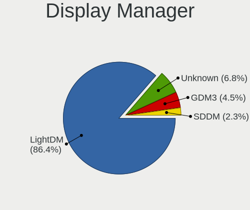
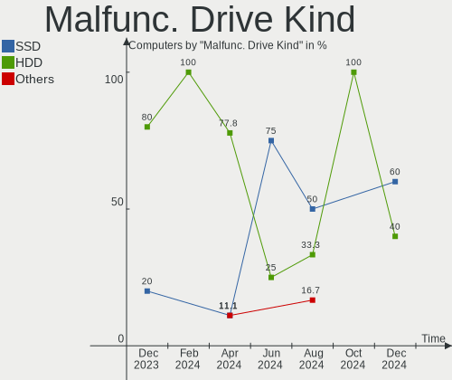
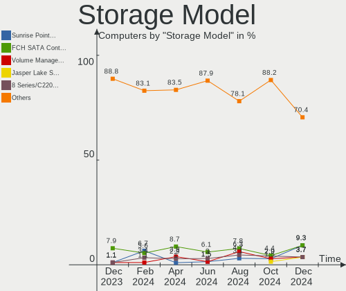

Xubuntu - Hardware Trends
-------------------------

A project to identify most popular hardware characteristics and track their change
over time based on data collected by Linux users at https://Linux-Hardware.org.

Anyone can contribute to this report by the [hw-probe](https://github.com/linuxhw/hw-probe) tool:

    sudo -E hw-probe -all -upload

This is a report for all computer types. See also reports for [desktops](/Dist/Xubuntu/Desktop/README.md) and [notebooks](/Dist/Xubuntu/Notebook/README.md).

This report is for one last month. Overall report since the beginning of time: [TestDays](https://github.com/linuxhw/TestDays)

Period: Jun, 2023.

Contents
--------

* [ System ](#system)
  - [ OS                       ](#os)
  - [ OS Family                ](#os-family)
  - [ Kernel                   ](#kernel)
  - [ Kernel Family            ](#kernel-family)
  - [ Kernel Major Ver.        ](#kernel-major-ver)
  - [ Arch                     ](#arch)
  - [ DE                       ](#de)
  - [ Display Server           ](#display-server)
  - [ Display Manager          ](#display-manager)
  - [ OS Lang                  ](#os-lang)
  - [ Boot Mode                ](#boot-mode)
  - [ Filesystem               ](#filesystem)
  - [ Part. scheme             ](#part-scheme)
  - [ Dual Boot with Linux/BSD ](#dual-boot-with-linuxbsd)
  - [ Dual Boot (Win)          ](#dual-boot-win)

* [ Board ](#board)
  - [ Vendor                   ](#vendor)
  - [ Model                    ](#model)
  - [ Model Family             ](#model-family)
  - [ MFG Year                 ](#mfg-year)
  - [ Form Factor              ](#form-factor)
  - [ Secure Boot              ](#secure-boot)
  - [ Coreboot                 ](#coreboot)
  - [ RAM Size                 ](#ram-size)
  - [ RAM Used                 ](#ram-used)
  - [ Total Drives             ](#total-drives)
  - [ Has CD-ROM               ](#has-cd-rom)
  - [ Has Ethernet             ](#has-ethernet)
  - [ Has WiFi                 ](#has-wifi)
  - [ Has Bluetooth            ](#has-bluetooth)

* [ Location ](#location)
  - [ Country                  ](#country)
  - [ City                     ](#city)

* [ Drives ](#drives)
  - [ Drive Vendor             ](#drive-vendor)
  - [ Drive Model              ](#drive-model)
  - [ HDD Vendor               ](#hdd-vendor)
  - [ SSD Vendor               ](#ssd-vendor)
  - [ Drive Kind               ](#drive-kind)
  - [ Drive Connector          ](#drive-connector)
  - [ Drive Size               ](#drive-size)
  - [ Space Total              ](#space-total)
  - [ Space Used               ](#space-used)
  - [ Malfunc. Drives          ](#malfunc-drives)
  - [ Malfunc. Drive Vendor    ](#malfunc-drive-vendor)
  - [ Malfunc. HDD Vendor      ](#malfunc-hdd-vendor)
  - [ Malfunc. Drive Kind      ](#malfunc-drive-kind)
  - [ Failed Drives            ](#failed-drives)
  - [ Failed Drive Vendor      ](#failed-drive-vendor)
  - [ Drive Status             ](#drive-status)

* [ Storage controller ](#storage-controller)
  - [ Storage Vendor           ](#storage-vendor)
  - [ Storage Model            ](#storage-model)
  - [ Storage Kind             ](#storage-kind)

* [ Processor ](#processor)
  - [ CPU Vendor               ](#cpu-vendor)
  - [ CPU Model                ](#cpu-model)
  - [ CPU Model Family         ](#cpu-model-family)
  - [ CPU Cores                ](#cpu-cores)
  - [ CPU Sockets              ](#cpu-sockets)
  - [ CPU Threads              ](#cpu-threads)
  - [ CPU Op-Modes             ](#cpu-op-modes)
  - [ CPU Microcode            ](#cpu-microcode)
  - [ CPU Microarch            ](#cpu-microarch)

* [ Graphics ](#graphics)
  - [ GPU Vendor               ](#gpu-vendor)
  - [ GPU Model                ](#gpu-model)
  - [ GPU Combo                ](#gpu-combo)
  - [ GPU Driver               ](#gpu-driver)
  - [ GPU Memory               ](#gpu-memory)

* [ Monitor ](#monitor)
  - [ Monitor Vendor           ](#monitor-vendor)
  - [ Monitor Model            ](#monitor-model)
  - [ Monitor Resolution       ](#monitor-resolution)
  - [ Monitor Diagonal         ](#monitor-diagonal)
  - [ Monitor Width            ](#monitor-width)
  - [ Aspect Ratio             ](#aspect-ratio)
  - [ Monitor Area             ](#monitor-area)
  - [ Pixel Density            ](#pixel-density)
  - [ Multiple Monitors        ](#multiple-monitors)

* [ Network ](#network)
  - [ Net Controller Vendor    ](#net-controller-vendor)
  - [ Net Controller Model     ](#net-controller-model)
  - [ Wireless Vendor          ](#wireless-vendor)
  - [ Wireless Model           ](#wireless-model)
  - [ Ethernet Vendor          ](#ethernet-vendor)
  - [ Ethernet Model           ](#ethernet-model)
  - [ Net Controller Kind      ](#net-controller-kind)
  - [ Used Controller          ](#used-controller)
  - [ NICs                     ](#nics)
  - [ IPv6                     ](#ipv6)

* [ Bluetooth ](#bluetooth)
  - [ Bluetooth Vendor         ](#bluetooth-vendor)
  - [ Bluetooth Model          ](#bluetooth-model)

* [ Sound ](#sound)
  - [ Sound Vendor             ](#sound-vendor)
  - [ Sound Model              ](#sound-model)

* [ Memory ](#memory)
  - [ Memory Vendor            ](#memory-vendor)
  - [ Memory Model             ](#memory-model)
  - [ Memory Kind              ](#memory-kind)
  - [ Memory Form Factor       ](#memory-form-factor)
  - [ Memory Size              ](#memory-size)
  - [ Memory Speed             ](#memory-speed)

* [ Printers & scanners ](#printers--scanners)
  - [ Printer Vendor           ](#printer-vendor)
  - [ Printer Model            ](#printer-model)
  - [ Scanner Vendor           ](#scanner-vendor)
  - [ Scanner Model            ](#scanner-model)

* [ Camera ](#camera)
  - [ Camera Vendor            ](#camera-vendor)
  - [ Camera Model             ](#camera-model)

* [ Security ](#security)
  - [ Fingerprint Vendor       ](#fingerprint-vendor)
  - [ Fingerprint Model        ](#fingerprint-model)
  - [ Chipcard Vendor          ](#chipcard-vendor)
  - [ Chipcard Model           ](#chipcard-model)

* [ Unsupported ](#unsupported)
  - [ Unsupported Devices      ](#unsupported-devices)
  - [ Unsupported Device Types ](#unsupported-device-types)

System
------

OS
--

Installed operating systems

| Name          | Computers | Percent |
|---------------|-----------|---------|
| Xubuntu 22.04 | 37        | 57.81%  |
| Xubuntu 23.04 | 13        | 20.31%  |
| Xubuntu 20.04 | 9         | 14.06%  |
| Xubuntu 18.04 | 5         | 7.81%   |

OS Family
---------

OS without a version

| Name    | Computers | Percent |
|---------|-----------|---------|
| Xubuntu | 64        | 100%    |

Kernel
------

Version of the Linux kernel

| Version              | Computers | Percent |
|----------------------|-----------|---------|
| 5.19.0-45-generic    | 9         | 14.06%  |
| 5.19.0-43-generic    | 9         | 14.06%  |
| 6.2.0-20-generic     | 8         | 12.5%   |
| 5.15.0-73-generic    | 7         | 10.94%  |
| 6.2.0-23-generic     | 5         | 7.81%   |
| 5.15.0-75-generic    | 5         | 7.81%   |
| 5.4.0-150-generic    | 2         | 3.13%   |
| 5.19.0-42-generic    | 2         | 3.13%   |
| 6.2.7-060207-generic | 1         | 1.56%   |
| 6.1.30-sunxi         | 1         | 1.56%   |
| 6.1.30-meson64       | 1         | 1.56%   |
| 6.1.0-1015-oem       | 1         | 1.56%   |
| 6.1.0-1013-oem       | 1         | 1.56%   |
| 6.0.0-1011-oem       | 1         | 1.56%   |
| 5.6.14-supergamer    | 1         | 1.56%   |
| 5.4.0-42-generic     | 1         | 1.56%   |
| 5.4.0-152-lowlatency | 1         | 1.56%   |
| 5.4.0-149-generic    | 1         | 1.56%   |
| 5.19.0-46-generic    | 1         | 1.56%   |
| 5.15.0-72-generic    | 1         | 1.56%   |
| 5.15.0-71-generic    | 1         | 1.56%   |
| 5.13.0-40-generic    | 1         | 1.56%   |
| 4.4.194-rk322x       | 1         | 1.56%   |
| 4.18.0-17-generic    | 1         | 1.56%   |
| 4.15.0-212-generic   | 1         | 1.56%   |

Kernel Family
-------------

Linux kernel without a distro release

| Version | Computers | Percent |
|---------|-----------|---------|
| 5.19.0  | 21        | 32.81%  |
| 5.15.0  | 14        | 21.88%  |
| 6.2.0   | 13        | 20.31%  |
| 5.4.0   | 5         | 7.81%   |
| 6.1.30  | 2         | 3.13%   |
| 6.1.0   | 2         | 3.13%   |
| 6.2.7   | 1         | 1.56%   |
| 6.0.0   | 1         | 1.56%   |
| 5.6.14  | 1         | 1.56%   |
| 5.13.0  | 1         | 1.56%   |
| 4.4.194 | 1         | 1.56%   |
| 4.18.0  | 1         | 1.56%   |
| 4.15.0  | 1         | 1.56%   |

Kernel Major Ver.
-----------------

Linux kernel major version

| Version | Computers | Percent |
|---------|-----------|---------|
| 5.19    | 21        | 32.81%  |
| 6.2     | 14        | 21.88%  |
| 5.15    | 14        | 21.88%  |
| 5.4     | 5         | 7.81%   |
| 6.1     | 4         | 6.25%   |
| 6.0     | 1         | 1.56%   |
| 5.6     | 1         | 1.56%   |
| 5.13    | 1         | 1.56%   |
| 4.4     | 1         | 1.56%   |
| 4.18    | 1         | 1.56%   |
| 4.15    | 1         | 1.56%   |

Arch
----

OS architecture (x86_64, i586, etc.)

| Name    | Computers | Percent |
|---------|-----------|---------|
| x86_64  | 57        | 89.06%  |
| i686    | 4         | 6.25%   |
| armv7l  | 2         | 3.13%   |
| aarch64 | 1         | 1.56%   |

DE
--

Desktop Environment

| Name  | Computers | Percent |
|-------|-----------|---------|
| XFCE  | 62        | 96.88%  |
| KDE5  | 1         | 1.56%   |
| GNOME | 1         | 1.56%   |

Display Server
--------------

X11 or Wayland

| Name | Computers | Percent |
|------|-----------|---------|
| X11  | 60        | 93.75%  |
| Tty  | 4         | 6.25%   |

Display Manager
---------------

SDDM, LightDM, etc.

| Name    | Computers | Percent |
|---------|-----------|---------|
| LightDM | 56        | 87.5%   |
| Unknown | 6         | 9.38%   |
| GDM3    | 2         | 3.13%   |

OS Lang
-------

Language

| Lang  | Computers | Percent |
|-------|-----------|---------|
| en_US | 29        | 45.31%  |
| de_DE | 9         | 14.06%  |
| fr_FR | 4         | 6.25%   |
| en_GB | 3         | 4.69%   |
| ru_RU | 2         | 3.13%   |
| pt_BR | 2         | 3.13%   |
| pl_PL | 2         | 3.13%   |
| it_IT | 2         | 3.13%   |
| en_IN | 2         | 3.13%   |
| zh_CN | 1         | 1.56%   |
| tr_TR | 1         | 1.56%   |
| sv_SE | 1         | 1.56%   |
| nl_BE | 1         | 1.56%   |
| es_VE | 1         | 1.56%   |
| es_ES | 1         | 1.56%   |
| es_AR | 1         | 1.56%   |
| en_ZM | 1         | 1.56%   |
| de_CH | 1         | 1.56%   |

Boot Mode
---------

EFI or BIOS

| Mode | Computers | Percent |
|------|-----------|---------|
| BIOS | 37        | 57.81%  |
| EFI  | 27        | 42.19%  |

Filesystem
----------

Type of filesystem

| Type  | Computers | Percent |
|-------|-----------|---------|
| Ext4  | 42        | 65.63%  |
| Tmpfs | 21        | 32.81%  |
| Btrfs | 1         | 1.56%   |

Part. scheme
------------

Scheme of partitioning

| Type    | Computers | Percent |
|---------|-----------|---------|
| GPT     | 45        | 70.31%  |
| MBR     | 11        | 17.19%  |
| Unknown | 8         | 12.5%   |

Dual Boot with Linux/BSD
------------------------

Hosting more than one Linux/BSD

| Dual boot | Computers | Percent |
|-----------|-----------|---------|
| No        | 55        | 85.94%  |
| Yes       | 9         | 14.06%  |

Dual Boot (Win)
---------------

Hosting Linux and Windows

| Dual boot | Computers | Percent |
|-----------|-----------|---------|
| No        | 44        | 68.75%  |
| Yes       | 20        | 31.25%  |

Board
-----

Vendor
------

Motherboard manufacturer

| Name                | Computers | Percent |
|---------------------|-----------|---------|
| Dell                | 9         | 14.06%  |
| Hewlett-Packard     | 8         | 12.5%   |
| Lenovo              | 6         | 9.38%   |
| ASUSTek Computer    | 5         | 7.81%   |
| Gigabyte Technology | 4         | 6.25%   |
| Acer                | 4         | 6.25%   |
| Pegatron            | 2         | 3.13%   |
| GPU Company         | 2         | 3.13%   |
| Google              | 2         | 3.13%   |
| Fujitsu Siemens     | 2         | 3.13%   |
| Unknown             | 2         | 3.13%   |
| Xunlong             | 1         | 1.56%   |
| TYAN Computer       | 1         | 1.56%   |
| TUXEDO              | 1         | 1.56%   |
| Toshiba             | 1         | 1.56%   |
| Standard            | 1         | 1.56%   |
| SK hynix            | 1         | 1.56%   |
| Samsung Electronics | 1         | 1.56%   |
| MSI                 | 1         | 1.56%   |
| LORD ELECTRONICS    | 1         | 1.56%   |
| Inventec            | 1         | 1.56%   |
| Intel               | 1         | 1.56%   |
| Hardkernel          | 1         | 1.56%   |
| Foxconn             | 1         | 1.56%   |
| Colorful Technology | 1         | 1.56%   |
| Biostar             | 1         | 1.56%   |
| ASRock              | 1         | 1.56%   |
| Apple               | 1         | 1.56%   |
| Alienware           | 1         | 1.56%   |

Model
-----

Motherboard model

| Name                                      | Computers | Percent |
|-------------------------------------------|-----------|---------|
| Unknown                                   | 4         | 6.25%   |
| Xunlong Orange Pi PC                      | 1         | 1.56%   |
| TYAN S7010                                | 1         | 1.56%   |
| TUXEDO P65xRP                             | 1         | 1.56%   |
| Toshiba Satellite C650                    | 1         | 1.56%   |
| SK hynix HyBook                           | 1         | 1.56%   |
| Samsung 760XDA                            | 1         | 1.56%   |
| Pegatron NP185AA-ABA CQ5110F              | 1         | 1.56%   |
| Pegatron 520-1030a                        | 1         | 1.56%   |
| MSI MS-7721                               | 1         | 1.56%   |
| LORD ELECTRONICS I915 Series V1.0         | 1         | 1.56%   |
| Lenovo V560                               | 1         | 1.56%   |
| Lenovo V15 G4 AMN 82YU                    | 1         | 1.56%   |
| Lenovo ThinkStation P360 Tower 30FNS4J100 | 1         | 1.56%   |
| Lenovo ThinkPad X1 Yoga 1st 20FRS0B900    | 1         | 1.56%   |
| Lenovo ThinkPad X1 Carbon 7th 20R1S05A00  | 1         | 1.56%   |
| Lenovo IdeaPad 100S-14IBR 80R9            | 1         | 1.56%   |
| Inventec Dell Thin Client Desktop 5060    | 1         | 1.56%   |
| Intel H61                                 | 1         | 1.56%   |
| HP t620 Quad Core TC                      | 1         | 1.56%   |
| HP Stream Laptop 11-ah0XX                 | 1         | 1.56%   |
| HP ProDesk 600 G1 SFF                     | 1         | 1.56%   |
| HP Laptop 14s-dq0xxx                      | 1         | 1.56%   |
| HP EliteBook 640 14 inch G9 Notebook PC   | 1         | 1.56%   |
| HP Desktop N01-F0xxx                      | 1         | 1.56%   |
| HP Compaq Pro 6300 SFF                    | 1         | 1.56%   |
| Hardkernel ODROID-H2                      | 1         | 1.56%   |
| GPU Company GWTN156-5                     | 1         | 1.56%   |
| GPU Company GWNC21524                     | 1         | 1.56%   |
| Google Link                               | 1         | 1.56%   |
| Google Fleex                              | 1         | 1.56%   |
| Gigabyte Z690 AORUS ELITE DDR4            | 1         | 1.56%   |
| Gigabyte P55A-UD3                         | 1         | 1.56%   |
| Gigabyte F2A88XM-D3H                      | 1         | 1.56%   |
| Gigabyte B550 AORUS ELITE                 | 1         | 1.56%   |
| Fujitsu Siemens LIFEBOOK S7110            | 1         | 1.56%   |
| Fujitsu Siemens ESPRIMO Mobile U9200      | 1         | 1.56%   |
| Foxconn Pro 3500 Series                   | 1         | 1.56%   |
| Dell Vostro 15 3510                       | 1         | 1.56%   |
| Dell Precision 5510                       | 1         | 1.56%   |

Model Family
------------

Motherboard model prefix

| Name                     | Computers | Percent |
|--------------------------|-----------|---------|
| Unknown                  | 4         | 6.25%   |
| Dell Latitude            | 3         | 4.69%   |
| ASUS PRIME               | 3         | 4.69%   |
| Lenovo ThinkPad          | 2         | 3.13%   |
| Dell OptiPlex            | 2         | 3.13%   |
| Dell Inspiron            | 2         | 3.13%   |
| Acer Aspire              | 2         | 3.13%   |
| Xunlong Orange           | 1         | 1.56%   |
| TYAN S7010               | 1         | 1.56%   |
| TUXEDO P65xRP            | 1         | 1.56%   |
| Toshiba Satellite        | 1         | 1.56%   |
| SK hynix HyBook          | 1         | 1.56%   |
| Samsung 760XDA           | 1         | 1.56%   |
| Pegatron NP185AA-ABA     | 1         | 1.56%   |
| Pegatron 520-1030a       | 1         | 1.56%   |
| MSI MS-7721              | 1         | 1.56%   |
| LORD ELECTRONICS I915    | 1         | 1.56%   |
| Lenovo V560              | 1         | 1.56%   |
| Lenovo V15               | 1         | 1.56%   |
| Lenovo ThinkStation      | 1         | 1.56%   |
| Lenovo IdeaPad           | 1         | 1.56%   |
| Inventec Dell            | 1         | 1.56%   |
| Intel H61                | 1         | 1.56%   |
| HP t620                  | 1         | 1.56%   |
| HP Stream                | 1         | 1.56%   |
| HP ProDesk               | 1         | 1.56%   |
| HP Laptop                | 1         | 1.56%   |
| HP EliteBook             | 1         | 1.56%   |
| HP Desktop               | 1         | 1.56%   |
| HP Compaq                | 1         | 1.56%   |
| Hardkernel ODROID-H2     | 1         | 1.56%   |
| GPU Company GWTN156-5    | 1         | 1.56%   |
| GPU Company GWNC21524    | 1         | 1.56%   |
| Google Link              | 1         | 1.56%   |
| Google Fleex             | 1         | 1.56%   |
| Gigabyte Z690            | 1         | 1.56%   |
| Gigabyte P55A-UD3        | 1         | 1.56%   |
| Gigabyte F2A88XM-D3H     | 1         | 1.56%   |
| Gigabyte B550            | 1         | 1.56%   |
| Fujitsu Siemens LIFEBOOK | 1         | 1.56%   |

MFG Year
--------

Motherboard manufacture year

| Year    | Computers | Percent |
|---------|-----------|---------|
| 2021    | 8         | 12.5%   |
| 2010    | 7         | 10.94%  |
| 2020    | 5         | 7.81%   |
| 2013    | 5         | 7.81%   |
| 2017    | 4         | 6.25%   |
| 2016    | 4         | 6.25%   |
| 2014    | 4         | 6.25%   |
| 2012    | 4         | 6.25%   |
| 2022    | 3         | 4.69%   |
| 2015    | 3         | 4.69%   |
| 2009    | 3         | 4.69%   |
| 2006    | 3         | 4.69%   |
| Unknown | 3         | 4.69%   |
| 2023    | 2         | 3.13%   |
| 2019    | 2         | 3.13%   |
| 2018    | 2         | 3.13%   |
| 2011    | 1         | 1.56%   |
| 2008    | 1         | 1.56%   |

Form Factor
-----------

Physical design of the computer

| Name           | Computers | Percent |
|----------------|-----------|---------|
| Notebook       | 31        | 48.44%  |
| Desktop        | 26        | 40.63%  |
| System on chip | 2         | 3.13%   |
| Other          | 1         | 1.56%   |
| Tablet         | 1         | 1.56%   |
| Convertible    | 1         | 1.56%   |
| Mini pc        | 1         | 1.56%   |
| Server         | 1         | 1.56%   |

Secure Boot
-----------

Enabled or disabled

| State    | Computers | Percent |
|----------|-----------|---------|
| Disabled | 60        | 93.75%  |
| Enabled  | 4         | 6.25%   |

Coreboot
--------

Have coreboot on board

| Used | Computers | Percent |
|------|-----------|---------|
| No   | 62        | 96.88%  |
| Yes  | 2         | 3.13%   |

RAM Size
--------

Total RAM memory

| Size in GB  | Computers | Percent |
|-------------|-----------|---------|
| 3.01-4.0    | 18        | 28.13%  |
| 4.01-8.0    | 13        | 20.31%  |
| 8.01-16.0   | 9         | 14.06%  |
| 32.01-64.0  | 8         | 12.5%   |
| 16.01-24.0  | 7         | 10.94%  |
| 2.01-3.0    | 3         | 4.69%   |
| 1.01-2.0    | 3         | 4.69%   |
| 0.51-1.0    | 2         | 3.13%   |
| 64.01-256.0 | 1         | 1.56%   |

RAM Used
--------

Used RAM memory

| Used GB    | Computers | Percent |
|------------|-----------|---------|
| 1.01-2.0   | 23        | 35.94%  |
| 2.01-3.0   | 16        | 25%     |
| 3.01-4.0   | 8         | 12.5%   |
| 4.01-8.0   | 6         | 9.38%   |
| 0.51-1.0   | 5         | 7.81%   |
| 16.01-24.0 | 2         | 3.13%   |
| 8.01-16.0  | 2         | 3.13%   |
| 0.01-0.5   | 2         | 3.13%   |

Total Drives
------------

Number of drives on board

| Drives | Computers | Percent |
|--------|-----------|---------|
| 1      | 43        | 67.19%  |
| 2      | 11        | 17.19%  |
| 3      | 7         | 10.94%  |
| 4      | 2         | 3.13%   |
| 0      | 1         | 1.56%   |

Has CD-ROM
----------

Has CD-ROM on board

| Presented | Computers | Percent |
|-----------|-----------|---------|
| No        | 41        | 64.06%  |
| Yes       | 23        | 35.94%  |

Has Ethernet
------------

Has Ethernet on board

| Presented | Computers | Percent |
|-----------|-----------|---------|
| Yes       | 51        | 79.69%  |
| No        | 13        | 20.31%  |

Has WiFi
--------

Has WiFi module

| Presented | Computers | Percent |
|-----------|-----------|---------|
| Yes       | 45        | 70.31%  |
| No        | 19        | 29.69%  |

Has Bluetooth
-------------

Has Bluetooth module

| Presented | Computers | Percent |
|-----------|-----------|---------|
| Yes       | 33        | 51.56%  |
| No        | 31        | 48.44%  |

Location
--------

Country
-------

Geographic location (country)

| Country      | Computers | Percent |
|--------------|-----------|---------|
| USA          | 13        | 20.31%  |
| Germany      | 9         | 14.06%  |
| France       | 5         | 7.81%   |
| Poland       | 4         | 6.25%   |
| UK           | 3         | 4.69%   |
| Russia       | 3         | 4.69%   |
| Italy        | 2         | 3.13%   |
| India        | 2         | 3.13%   |
| China        | 2         | 3.13%   |
| Brazil       | 2         | 3.13%   |
| Argentina    | 2         | 3.13%   |
| Zambia       | 1         | 1.56%   |
| Turkey       | 1         | 1.56%   |
| Switzerland  | 1         | 1.56%   |
| Sweden       | 1         | 1.56%   |
| Spain        | 1         | 1.56%   |
| South Korea  | 1         | 1.56%   |
| Saudi Arabia | 1         | 1.56%   |
| Portugal     | 1         | 1.56%   |
| Netherlands  | 1         | 1.56%   |
| Mexico       | 1         | 1.56%   |
| Latvia       | 1         | 1.56%   |
| Iran         | 1         | 1.56%   |
| Greece       | 1         | 1.56%   |
| Chile        | 1         | 1.56%   |
| Belgium      | 1         | 1.56%   |
| Austria      | 1         | 1.56%   |
| Australia    | 1         | 1.56%   |

City
----

Geographic location (city)

| City             | Computers | Percent |
|------------------|-----------|---------|
| Warsaw           | 2         | 3.13%   |
| Lincoln          | 2         | 3.13%   |
| York             | 1         | 1.56%   |
| Wojnicz          | 1         | 1.56%   |
| Wilhelmshaven    | 1         | 1.56%   |
| Wiener Neustadt  | 1         | 1.56%   |
| Vyborg           | 1         | 1.56%   |
| Vila Velha       | 1         | 1.56%   |
| Vannes           | 1         | 1.56%   |
| Ulyanovsk        | 1         | 1.56%   |
| Turin            | 1         | 1.56%   |
| Tehran           | 1         | 1.56%   |
| Suwon            | 1         | 1.56%   |
| St Petersburg    | 1         | 1.56%   |
| Solna            | 1         | 1.56%   |
| Soave            | 1         | 1.56%   |
| Seattle          | 1         | 1.56%   |
| Santiago         | 1         | 1.56%   |
| Salvador         | 1         | 1.56%   |
| Riga             | 1         | 1.56%   |
| Regensburg       | 1         | 1.56%   |
| Raipur           | 1         | 1.56%   |
| Przeworsk        | 1         | 1.56%   |
| Phoenix          | 1         | 1.56%   |
| Périgueux       | 1         | 1.56%   |
| Paris            | 1         | 1.56%   |
| Nussbaumen       | 1         | 1.56%   |
| Münster         | 1         | 1.56%   |
| Munich           | 1         | 1.56%   |
| Mexico City      | 1         | 1.56%   |
| Margate          | 1         | 1.56%   |
| Mannheim         | 1         | 1.56%   |
| Makkah           | 1         | 1.56%   |
| Madrid           | 1         | 1.56%   |
| Lusaka           | 1         | 1.56%   |
| Ludwigsburg      | 1         | 1.56%   |
| Lübeck          | 1         | 1.56%   |
| Louvain-la-Neuve | 1         | 1.56%   |
| Lomas de Zamora  | 1         | 1.56%   |
| Lexington        | 1         | 1.56%   |

Drives
------

Drive Vendor
------------

Hard drive vendors

| Vendor                      | Computers | Drives | Percent |
|-----------------------------|-----------|--------|---------|
| Samsung Electronics         | 14        | 15     | 16.87%  |
| WDC                         | 11        | 12     | 13.25%  |
| Seagate                     | 10        | 12     | 12.05%  |
| Unknown                     | 9         | 10     | 10.84%  |
| Kingston                    | 6         | 6      | 7.23%   |
| SanDisk                     | 4         | 4      | 4.82%   |
| SPCC                        | 3         | 4      | 3.61%   |
| Hitachi                     | 3         | 3      | 3.61%   |
| Crucial                     | 3         | 3      | 3.61%   |
| Toshiba                     | 2         | 2      | 2.41%   |
| SK hynix                    | 2         | 2      | 2.41%   |
| Micron Technology           | 2         | 2      | 2.41%   |
| China                       | 2         | 2      | 2.41%   |
| Yangtze Memory Technologies | 1         | 1      | 1.2%    |
| TO Exter                    | 1         | 2      | 1.2%    |
| Team                        | 1         | 1      | 1.2%    |
| Phison Electronics          | 1         | 2      | 1.2%    |
| Micron/Crucial Technology   | 1         | 1      | 1.2%    |
| KIOXIA                      | 1         | 1      | 1.2%    |
| HGST                        | 1         | 1      | 1.2%    |
| Fujitsu                     | 1         | 1      | 1.2%    |
| FORESEE                     | 1         | 1      | 1.2%    |
| ASMT                        | 1         | 1      | 1.2%    |
| ADATA Technology            | 1         | 1      | 1.2%    |
| Unknown                     | 1         | 1      | 1.2%    |

Drive Model
-----------

Hard drive models

| Model                                | Computers | Percent |
|--------------------------------------|-----------|---------|
| Toshiba MQ01ABD050 500GB             | 2         | 2.3%    |
| SPCC Solid State Disk 128GB          | 2         | 2.3%    |
| Seagate ST500DM002-1BD142 500GB      | 2         | 2.3%    |
| Kingston SV300S37A120G 120GB SSD     | 2         | 2.3%    |
| Yangtze Memory ZHITAI TiPlus5000 1TB | 1         | 1.15%   |
| WDC WDS250G2B0A 250GB SSD            | 1         | 1.15%   |
| WDC WD5000AAKS-00D2B0 500GB          | 1         | 1.15%   |
| WDC WD3200BEKT-60PVMT0 320GB         | 1         | 1.15%   |
| WDC WD20EZRX-00D8PB0 2TB             | 1         | 1.15%   |
| WDC WD20EARX-00PASB0 2TB             | 1         | 1.15%   |
| WDC WD1600BEVT-22ZCT0 160GB          | 1         | 1.15%   |
| WDC WD1200BEVS-75UST0 120GB          | 1         | 1.15%   |
| WDC WD10JPVX-00JC3T0 1TB             | 1         | 1.15%   |
| WDC WD10EADS-00M2B0 1TB              | 1         | 1.15%   |
| WDC WD1002FBYS-18A6B0 1TB            | 1         | 1.15%   |
| WDC PC SN730 SDBQNTY-512G-1001 512GB | 1         | 1.15%   |
| Unknown WX64G  64GB                  | 1         | 1.15%   |
| Unknown USD00  8GB                   | 1         | 1.15%   |
| Unknown MMC128  128GB                | 1         | 1.15%   |
| Unknown MMC Card  64GB               | 1         | 1.15%   |
| Unknown MMC Card  32GB               | 1         | 1.15%   |
| Unknown MMC Card  16GB               | 1         | 1.15%   |
| Unknown MMC Card  128GB              | 1         | 1.15%   |
| Unknown DB4032  32GB                 | 1         | 1.15%   |
| Unknown CJTD4R  64GB                 | 1         | 1.15%   |
| TO Exter nal USB 3.0 1TB             | 1         | 1.15%   |
| Team TM8PS7512G 512GB SSD            | 1         | 1.15%   |
| SPCC Solid State Disk 256GB          | 1         | 1.15%   |
| SPCC Solid State Disk 1024GB         | 1         | 1.15%   |
| SK hynix PC611 NVMe 256GB            | 1         | 1.15%   |
| SK hynix BC901 NVMe 512GB            | 1         | 1.15%   |
| Seagate ST5000LM000-2U8170 5TB       | 1         | 1.15%   |
| Seagate ST3500418AS 500GB            | 1         | 1.15%   |
| Seagate ST3500414CS 500GB            | 1         | 1.15%   |
| Seagate ST3000DM001-1ER166 3TB       | 1         | 1.15%   |
| Seagate ST2000LM007-1R8174 2TB       | 1         | 1.15%   |
| Seagate ST2000DM008-2FR102 2TB       | 1         | 1.15%   |
| Seagate ST1000LM048-2E7172 1TB       | 1         | 1.15%   |
| Seagate ST1000LM014-SSHD-8GB         | 1         | 1.15%   |
| Seagate Expansion HDD 8TB            | 1         | 1.15%   |

HDD Vendor
----------

Hard disk drive vendors

| Vendor              | Computers | Drives | Percent |
|---------------------|-----------|--------|---------|
| Seagate             | 10        | 12     | 33.33%  |
| WDC                 | 9         | 10     | 30%     |
| Samsung Electronics | 3         | 3      | 10%     |
| Hitachi             | 3         | 3      | 10%     |
| Toshiba             | 2         | 2      | 6.67%   |
| HGST                | 1         | 1      | 3.33%   |
| Fujitsu             | 1         | 1      | 3.33%   |
| ASMT                | 1         | 1      | 3.33%   |

SSD Vendor
----------

Solid state drive vendors

| Vendor              | Computers | Drives | Percent |
|---------------------|-----------|--------|---------|
| Samsung Electronics | 6         | 7      | 25%     |
| Kingston            | 5         | 5      | 20.83%  |
| SPCC                | 3         | 4      | 12.5%   |
| SanDisk             | 3         | 3      | 12.5%   |
| China               | 2         | 2      | 8.33%   |
| WDC                 | 1         | 1      | 4.17%   |
| TO Exter            | 1         | 2      | 4.17%   |
| Team                | 1         | 1      | 4.17%   |
| FORESEE             | 1         | 1      | 4.17%   |
| Crucial             | 1         | 1      | 4.17%   |

Drive Kind
----------

HDD or SSD

| Kind | Computers | Drives | Percent |
|------|-----------|--------|---------|
| HDD  | 27        | 33     | 35.53%  |
| SSD  | 22        | 27     | 28.95%  |
| NVMe | 18        | 20     | 23.68%  |
| MMC  | 9         | 11     | 11.84%  |

Drive Connector
---------------

SATA, SAS, NVMe, etc.

| Type | Computers | Drives | Percent |
|------|-----------|--------|---------|
| SATA | 41        | 55     | 57.75%  |
| NVMe | 18        | 20     | 25.35%  |
| MMC  | 9         | 11     | 12.68%  |
| SAS  | 3         | 5      | 4.23%   |

Drive Size
----------

Size of hard drive

| Size in TB | Computers | Drives | Percent |
|------------|-----------|--------|---------|
| 0.01-0.5   | 36        | 39     | 66.67%  |
| 0.51-1.0   | 10        | 11     | 18.52%  |
| 1.01-2.0   | 5         | 7      | 9.26%   |
| 4.01-10.0  | 2         | 2      | 3.7%    |
| 2.01-3.0   | 1         | 1      | 1.85%   |

Space Total
-----------

Amount of disk space available on the file system

| Size in GB     | Computers | Percent |
|----------------|-----------|---------|
| 101-250        | 19        | 29.69%  |
| 251-500        | 15        | 23.44%  |
| 501-1000       | 7         | 10.94%  |
| 51-100         | 7         | 10.94%  |
| 21-50          | 4         | 6.25%   |
| More than 3000 | 3         | 4.69%   |
| 1001-2000      | 3         | 4.69%   |
| 1-20           | 3         | 4.69%   |
| 2001-3000      | 2         | 3.13%   |
| Unknown        | 1         | 1.56%   |

Space Used
----------

Amount of used disk space

| Used GB        | Computers | Percent |
|----------------|-----------|---------|
| 1-20           | 21        | 32.81%  |
| 21-50          | 16        | 25%     |
| 51-100         | 9         | 14.06%  |
| 101-250        | 6         | 9.38%   |
| 501-1000       | 4         | 6.25%   |
| 251-500        | 2         | 3.13%   |
| 2001-3000      | 2         | 3.13%   |
| 1001-2000      | 2         | 3.13%   |
| More than 3000 | 1         | 1.56%   |
| Unknown        | 1         | 1.56%   |

Malfunc. Drives
---------------

Drive models with a malfunction

| Model                             | Computers | Drives | Percent |
|-----------------------------------|-----------|--------|---------|
| Toshiba MQ01ABD050 500GB          | 2         | 2      | 20%     |
| WDC WD3200BEKT-60PVMT0 320GB      | 1         | 1      | 10%     |
| Seagate ST500DM002-1BD142 500GB   | 1         | 1      | 10%     |
| Seagate ST3500414CS 500GB         | 1         | 1      | 10%     |
| SanDisk SSD i100 32GB             | 1         | 1      | 10%     |
| Samsung Electronics HM160HC 160GB | 1         | 1      | 10%     |
| Kingston OM8S1S3128K-AH 128GB SSD | 1         | 1      | 10%     |
| Fujitsu MHY2160BH 160GB           | 1         | 1      | 10%     |
| China SATA SSD 16GB               | 1         | 1      | 10%     |

Malfunc. Drive Vendor
---------------------

Vendors of faulty drives

| Vendor              | Computers | Drives | Percent |
|---------------------|-----------|--------|---------|
| Toshiba             | 2         | 2      | 20%     |
| Seagate             | 2         | 2      | 20%     |
| WDC                 | 1         | 1      | 10%     |
| SanDisk             | 1         | 1      | 10%     |
| Samsung Electronics | 1         | 1      | 10%     |
| Kingston            | 1         | 1      | 10%     |
| Fujitsu             | 1         | 1      | 10%     |
| China               | 1         | 1      | 10%     |

Malfunc. HDD Vendor
-------------------

Vendors of faulty HDD drives

| Vendor              | Computers | Drives | Percent |
|---------------------|-----------|--------|---------|
| Toshiba             | 2         | 2      | 28.57%  |
| Seagate             | 2         | 2      | 28.57%  |
| WDC                 | 1         | 1      | 14.29%  |
| Samsung Electronics | 1         | 1      | 14.29%  |
| Fujitsu             | 1         | 1      | 14.29%  |

Malfunc. Drive Kind
-------------------

Kinds of faulty drives

| Kind | Computers | Drives | Percent |
|------|-----------|--------|---------|
| HDD  | 7         | 7      | 70%     |
| SSD  | 3         | 3      | 30%     |

Failed Drives
-------------

Failed drive models

Zero info for selected period =(

Failed Drive Vendor
-------------------

Failed drive vendors

Zero info for selected period =(

Drive Status
------------

Number of failed and malfunc. drives

| Status   | Computers | Drives | Percent |
|----------|-----------|--------|---------|
| Detected | 37        | 55     | 56.92%  |
| Works    | 18        | 26     | 27.69%  |
| Malfunc  | 10        | 10     | 15.38%  |

Storage controller
------------------

Storage Vendor
--------------

Storage controller vendors

| Vendor                        | Computers | Percent |
|-------------------------------|-----------|---------|
| Intel                         | 42        | 54.55%  |
| AMD                           | 10        | 12.99%  |
| Samsung Electronics           | 5         | 6.49%   |
| Nvidia                        | 3         | 3.9%    |
| Micron/Crucial Technology     | 3         | 3.9%    |
| SK hynix                      | 2         | 2.6%    |
| SanDisk                       | 2         | 2.6%    |
| Micron Technology             | 2         | 2.6%    |
| Marvell Technology Group      | 2         | 2.6%    |
| Yangtze Memory Technologies   | 1         | 1.3%    |
| Phison Electronics            | 1         | 1.3%    |
| KIOXIA                        | 1         | 1.3%    |
| Kingston Technology Company   | 1         | 1.3%    |
| Integrated Technology Express | 1         | 1.3%    |
| ADATA Technology              | 1         | 1.3%    |

Storage Model
-------------

Storage controller models

| Model                                                                          | Computers | Percent |
|--------------------------------------------------------------------------------|-----------|---------|
| AMD FCH SATA Controller [AHCI mode]                                            | 7         | 7.95%   |
| Intel 8 Series/C220 Series Chipset Family 6-port SATA Controller 1 [AHCI mode] | 4         | 4.55%   |
| Intel Volume Management Device NVMe RAID Controller                            | 3         | 3.41%   |
| Intel Celeron/Pentium Silver Processor SATA Controller                         | 3         | 3.41%   |
| Intel Alder Lake-S PCH SATA Controller [AHCI Mode]                             | 3         | 3.41%   |
| Intel 6 Series/C200 Series Chipset Family 6 port Desktop SATA AHCI Controller  | 3         | 3.41%   |
| Samsung NVMe SSD Controller 980                                                | 2         | 2.27%   |
| Nvidia MCP61 SATA Controller                                                   | 2         | 2.27%   |
| Micron/Crucial NVMe Storage Controller                                         | 2         | 2.27%   |
| Intel Tiger Lake-LP SATA Controller                                            | 2         | 2.27%   |
| Intel 82801JI (ICH10 Family) 4 port SATA IDE Controller #1                     | 2         | 2.27%   |
| Intel 82801JI (ICH10 Family) 2 port SATA IDE Controller #2                     | 2         | 2.27%   |
| Intel 82801GBM/GHM (ICH7-M Family) SATA Controller [IDE mode]                  | 2         | 2.27%   |
| Intel 82801 Mobile SATA Controller [RAID mode]                                 | 2         | 2.27%   |
| Intel 7 Series Chipset Family 6-port SATA Controller [AHCI mode]               | 2         | 2.27%   |
| Intel 6 Series/C200 Series Chipset Family 6 port Mobile SATA AHCI Controller   | 2         | 2.27%   |
| Intel 5 Series/3400 Series Chipset 4 port SATA AHCI Controller                 | 2         | 2.27%   |
| Intel 400 Series Chipset Family SATA AHCI Controller                           | 2         | 2.27%   |
| AMD 500 Series Chipset SATA Controller                                         | 2         | 2.27%   |
| Yangtze Memory ZHITAI TiPro5000 NVMe SSD                                       | 1         | 1.14%   |
| SK hynix PC611 NVMe Solid State Drive                                          | 1         | 1.14%   |
| SK hynix BC901 NVMe Solid State Drive (DRAM-less)                              | 1         | 1.14%   |
| SanDisk WD Black SN770 NVMe SSD                                                | 1         | 1.14%   |
| SanDisk WD Black SN750 / PC SN730 NVMe SSD                                     | 1         | 1.14%   |
| Samsung NVMe SSD Controller SM961/PM961/SM963                                  | 1         | 1.14%   |
| Samsung NVMe SSD Controller PM9B1                                              | 1         | 1.14%   |
| Samsung NVMe SSD Controller PM9A1/PM9A3/980PRO                                 | 1         | 1.14%   |
| Phison E16 PCIe4 NVMe Controller                                               | 1         | 1.14%   |
| Nvidia MCP89 SATA Controller (AHCI mode)                                       | 1         | 1.14%   |
| Nvidia MCP61 IDE                                                               | 1         | 1.14%   |
| Micron/Crucial P2 NVMe PCIe SSD                                                | 1         | 1.14%   |
| Micron NVMe Storage Controller                                                 | 1         | 1.14%   |
| Micron 2200S NVMe SSD                                                          | 1         | 1.14%   |
| Marvell Group 88SE91A3 SATA-600 Controller                                     | 1         | 1.14%   |
| Marvell Group 88SE6111/6121 SATA II / PATA Controller                          | 1         | 1.14%   |
| KIOXIA NVMe SSD Controller BG4                                                 | 1         | 1.14%   |
| Kingston Company NVMe Controller                                               | 1         | 1.14%   |
| Intel Volume Management Device NVMe RAID Controller Intel Corporation          | 1         | 1.14%   |
| Intel Tiger Lake SATA AHCI Controller                                          | 1         | 1.14%   |
| Intel Sunrise Point-LP SATA Controller [AHCI mode]                             | 1         | 1.14%   |

Storage Kind
------------

Kind of storage controller (IDE, SATA, NVMe, SAS, ...)

| Kind | Computers | Percent |
|------|-----------|---------|
| SATA | 43        | 54.43%  |
| NVMe | 18        | 22.78%  |
| IDE  | 10        | 12.66%  |
| RAID | 8         | 10.13%  |

Processor
---------

CPU Vendor
----------

Processor vendors

| Vendor | Computers | Percent |
|--------|-----------|---------|
| Intel  | 48        | 75%     |
| AMD    | 13        | 20.31%  |
| ARM    | 3         | 4.69%   |

CPU Model
---------

Processor models

| Model                                   | Computers | Percent |
|-----------------------------------------|-----------|---------|
| Intel Celeron N4020 CPU @ 1.10GHz       | 3         | 4.69%   |
| Intel Core 2 CPU T7200 @ 2.00GHz        | 2         | 3.13%   |
| Intel Celeron CPU N3060 @ 1.60GHz       | 2         | 3.13%   |
| Intel 11th Gen Core i7-1165G7 @ 2.80GHz | 2         | 3.13%   |
| Intel Xeon CPU X5670 @ 2.93GHz          | 1         | 1.56%   |
| Intel Xeon CPU E5450 @ 3.00GHz          | 1         | 1.56%   |
| Intel Pentium CPU G3220 @ 3.00GHz       | 1         | 1.56%   |
| Intel Pentium CPU G2030 @ 3.00GHz       | 1         | 1.56%   |
| Intel Pentium 4 CPU 2.26GHz             | 1         | 1.56%   |
| Intel Core i7-7700K CPU @ 4.20GHz       | 1         | 1.56%   |
| Intel Core i7-6700HQ CPU @ 2.60GHz      | 1         | 1.56%   |
| Intel Core i7-6600U CPU @ 2.60GHz       | 1         | 1.56%   |
| Intel Core i7-4790 CPU @ 3.60GHz        | 1         | 1.56%   |
| Intel Core i7-4700MQ CPU @ 2.40GHz      | 1         | 1.56%   |
| Intel Core i7-2630QM CPU @ 2.00GHz      | 1         | 1.56%   |
| Intel Core i7-10850H CPU @ 2.70GHz      | 1         | 1.56%   |
| Intel Core i7-10710U CPU @ 1.10GHz      | 1         | 1.56%   |
| Intel Core i5-6300U CPU @ 2.40GHz       | 1         | 1.56%   |
| Intel Core i5-6300HQ CPU @ 2.30GHz      | 1         | 1.56%   |
| Intel Core i5-3470 CPU @ 3.20GHz        | 1         | 1.56%   |
| Intel Core i5-3427U CPU @ 1.80GHz       | 1         | 1.56%   |
| Intel Core i5-2540M CPU @ 2.60GHz       | 1         | 1.56%   |
| Intel Core i5 CPU M 560 @ 2.67GHz       | 1         | 1.56%   |
| Intel Core i5 CPU M 460 @ 2.53GHz       | 1         | 1.56%   |
| Intel Core i5 CPU 760 @ 2.80GHz         | 1         | 1.56%   |
| Intel Core i3-4150 CPU @ 3.50GHz        | 1         | 1.56%   |
| Intel Core i3-3220 CPU @ 3.30GHz        | 1         | 1.56%   |
| Intel Core i3-2120 CPU @ 3.30GHz        | 1         | 1.56%   |
| Intel Core i3-10100F CPU @ 3.60GHz      | 1         | 1.56%   |
| Intel Core i3 CPU M 330 @ 2.13GHz       | 1         | 1.56%   |
| Intel Core 2 Duo CPU T9300 @ 2.50GHz    | 1         | 1.56%   |
| Intel Core 2 Duo CPU P8800 @ 2.66GHz    | 1         | 1.56%   |
| Intel Core 2 CPU T5500 @ 1.66GHz        | 1         | 1.56%   |
| Intel Celeron N4120 CPU @ 1.10GHz       | 1         | 1.56%   |
| Intel Celeron J4105 CPU @ 1.50GHz       | 1         | 1.56%   |
| Intel Celeron G5905 CPU @ 3.50GHz       | 1         | 1.56%   |
| Intel Celeron CPU N3350 @ 1.10GHz       | 1         | 1.56%   |
| Intel Celeron CPU 1007U @ 1.50GHz       | 1         | 1.56%   |
| Intel 13th Gen Core i7-13700KF          | 1         | 1.56%   |
| Intel 12th Gen Core i7-12700K           | 1         | 1.56%   |

CPU Model Family
----------------

Processor model prefix

| Model            | Computers | Percent |
|------------------|-----------|---------|
| Intel Celeron    | 10        | 15.63%  |
| Other            | 9         | 14.06%  |
| Intel Core i7    | 8         | 12.5%   |
| Intel Core i5    | 8         | 12.5%   |
| Intel Core i3    | 5         | 7.81%   |
| AMD Ryzen 5      | 5         | 7.81%   |
| Intel Core 2     | 3         | 4.69%   |
| Intel Xeon       | 2         | 3.13%   |
| Intel Pentium    | 2         | 3.13%   |
| Intel Core 2 Duo | 2         | 3.13%   |
| AMD GX           | 2         | 3.13%   |
| AMD A8           | 2         | 3.13%   |
| Intel Pentium 4  | 1         | 1.56%   |
| ARM Allwinner    | 1         | 1.56%   |
| AMD C-60         | 1         | 1.56%   |
| AMD Athlon II X4 | 1         | 1.56%   |
| AMD Athlon       | 1         | 1.56%   |
| AMD A6           | 1         | 1.56%   |

CPU Cores
---------

Number of processor cores

| Number  | Computers | Percent |
|---------|-----------|---------|
| 2       | 29        | 45.31%  |
| 4       | 23        | 35.94%  |
| 6       | 7         | 10.94%  |
| 12      | 1         | 1.56%   |
| 10      | 1         | 1.56%   |
| 8       | 1         | 1.56%   |
| 1       | 1         | 1.56%   |
| Unknown | 1         | 1.56%   |

CPU Sockets
-----------

Number of sockets

| Number  | Computers | Percent |
|---------|-----------|---------|
| 1       | 63        | 98.44%  |
| Unknown | 1         | 1.56%   |

CPU Threads
-----------

Threads per core (Hyper-Threading)

| Number  | Computers | Percent |
|---------|-----------|---------|
| 2       | 33        | 51.56%  |
| 1       | 30        | 46.88%  |
| Unknown | 1         | 1.56%   |

CPU Op-Modes
------------

CPU Operation Modes (32-bit, 64-bit)

| Op mode        | Computers | Percent |
|----------------|-----------|---------|
| 32-bit, 64-bit | 61        | 95.31%  |
| Unknown        | 2         | 3.13%   |
| 32-bit         | 1         | 1.56%   |

CPU Microcode
-------------

Microcode number

| Number     | Computers | Percent |
|------------|-----------|---------|
| Unknown    | 35        | 54.69%  |
| 0x6f6      | 3         | 4.69%   |
| 0x806c1    | 2         | 3.13%   |
| 0x306a9    | 2         | 3.13%   |
| 0x1067a    | 2         | 3.13%   |
| 0xf27      | 1         | 1.56%   |
| 0xa0652    | 1         | 1.56%   |
| 0x906a4    | 1         | 1.56%   |
| 0x806d1    | 1         | 1.56%   |
| 0x706a8    | 1         | 1.56%   |
| 0x706a1    | 1         | 1.56%   |
| 0x506e3    | 1         | 1.56%   |
| 0x406e3    | 1         | 1.56%   |
| 0x406c4    | 1         | 1.56%   |
| 0x306c3    | 1         | 1.56%   |
| 0x206c2    | 1         | 1.56%   |
| 0x206a7    | 1         | 1.56%   |
| 0x20655    | 1         | 1.56%   |
| 0x10676    | 1         | 1.56%   |
| 0x08a00006 | 1         | 1.56%   |
| 0x07030105 | 1         | 1.56%   |
| 0x07000110 | 1         | 1.56%   |
| 0x06003104 | 1         | 1.56%   |
| 0x03000027 | 1         | 1.56%   |
| 0x010000c8 | 1         | 1.56%   |

CPU Microarch
-------------

Microarchitecture

| Name             | Computers | Percent |
|------------------|-----------|---------|
| Unknown          | 6         | 9.38%   |
| IvyBridge        | 5         | 7.81%   |
| Goldmont plus    | 5         | 7.81%   |
| Westmere         | 4         | 6.25%   |
| Skylake          | 4         | 6.25%   |
| Haswell          | 4         | 6.25%   |
| CometLake        | 4         | 6.25%   |
| SandyBridge      | 3         | 4.69%   |
| Penryn           | 3         | 4.69%   |
| Core             | 3         | 4.69%   |
| Alderlake Hybrid | 3         | 4.69%   |
| TigerLake        | 2         | 3.13%   |
| Silvermont       | 2         | 3.13%   |
| K10              | 2         | 3.13%   |
| Zen+             | 1         | 1.56%   |
| Zen 3            | 1         | 1.56%   |
| Zen 2            | 1         | 1.56%   |
| Steamroller      | 1         | 1.56%   |
| Puma             | 1         | 1.56%   |
| Piledriver       | 1         | 1.56%   |
| NetBurst         | 1         | 1.56%   |
| Nehalem          | 1         | 1.56%   |
| KabyLake         | 1         | 1.56%   |
| K10 Llano        | 1         | 1.56%   |
| Jaguar           | 1         | 1.56%   |
| Icelake          | 1         | 1.56%   |
| Goldmont         | 1         | 1.56%   |
| Bobcat           | 1         | 1.56%   |

Graphics
--------

GPU Vendor
----------

Vendors of graphics cards

| Vendor            | Computers | Percent |
|-------------------|-----------|---------|
| Intel             | 38        | 55.88%  |
| Nvidia            | 16        | 23.53%  |
| AMD               | 13        | 19.12%  |
| ASPEED Technology | 1         | 1.47%   |

GPU Model
---------

Graphics card models

| Model                                                                                    | Computers | Percent |
|------------------------------------------------------------------------------------------|-----------|---------|
| Intel GeminiLake [UHD Graphics 600]                                                      | 5         | 6.94%   |
| Intel Xeon E3-1200 v2/3rd Gen Core processor Graphics Controller                         | 3         | 4.17%   |
| Intel Mobile 945GM/GMS/GME, 943/940GML Express Integrated Graphics Controller            | 3         | 4.17%   |
| Intel Mobile 945GM/GMS, 943/940GML Express Integrated Graphics Controller                | 3         | 4.17%   |
| Intel Core Processor Integrated Graphics Controller                                      | 3         | 4.17%   |
| Intel 2nd Generation Core Processor Family Integrated Graphics Controller                | 3         | 4.17%   |
| Intel TigerLake-LP GT2 [Iris Xe Graphics]                                                | 2         | 2.78%   |
| Intel Skylake GT2 [HD Graphics 520]                                                      | 2         | 2.78%   |
| Intel Atom/Celeron/Pentium Processor x5-E8000/J3xxx/N3xxx Integrated Graphics Controller | 2         | 2.78%   |
| Intel 3rd Gen Core processor Graphics Controller                                         | 2         | 2.78%   |
| AMD Caicos [Radeon HD 6450/7450/8450 / R5 230 OEM]                                       | 2         | 2.78%   |
| Nvidia TU117GL [T600]                                                                    | 1         | 1.39%   |
| Nvidia TU116 [GeForce GTX 1660 Ti]                                                       | 1         | 1.39%   |
| Nvidia MCP89 [GeForce 320M]                                                              | 1         | 1.39%   |
| Nvidia GT218M [GeForce 310M]                                                             | 1         | 1.39%   |
| Nvidia GT218 [GeForce 210]                                                               | 1         | 1.39%   |
| Nvidia GP108M [GeForce MX250]                                                            | 1         | 1.39%   |
| Nvidia GP106BM [GeForce GTX 1060 Mobile 6GB]                                             | 1         | 1.39%   |
| Nvidia GP106 [GeForce GTX 1060 6GB]                                                      | 1         | 1.39%   |
| Nvidia GP102 [GeForce GTX 1080 Ti]                                                       | 1         | 1.39%   |
| Nvidia GM107GLM [Quadro M1000M]                                                          | 1         | 1.39%   |
| Nvidia GM107 [GeForce GTX 750 Ti]                                                        | 1         | 1.39%   |
| Nvidia GK208B [GeForce GT 730]                                                           | 1         | 1.39%   |
| Nvidia GK106M [GeForce GTX 765M]                                                         | 1         | 1.39%   |
| Nvidia GF108M [GeForce GT 540M]                                                          | 1         | 1.39%   |
| Nvidia GA107M [GeForce RTX 3050 Ti Mobile]                                               | 1         | 1.39%   |
| Nvidia G96GL [Quadro FX 380]                                                             | 1         | 1.39%   |
| Intel Xeon E3-1200 v3/4th Gen Core Processor Integrated Graphics Controller              | 1         | 1.39%   |
| Intel TigerLake-H GT1 [UHD Graphics]                                                     | 1         | 1.39%   |
| Intel Mobile GM965/GL960 Integrated Graphics Controller (secondary)                      | 1         | 1.39%   |
| Intel Mobile GM965/GL960 Integrated Graphics Controller (primary)                        | 1         | 1.39%   |
| Intel HD Graphics 530                                                                    | 1         | 1.39%   |
| Intel HD Graphics 500                                                                    | 1         | 1.39%   |
| Intel DG2 [Arc A770]                                                                     | 1         | 1.39%   |
| Intel CometLake-S GT1 [UHD Graphics 610]                                                 | 1         | 1.39%   |
| Intel CometLake-H GT2 [UHD Graphics]                                                     | 1         | 1.39%   |
| Intel Comet Lake UHD Graphics                                                            | 1         | 1.39%   |
| Intel AlderLake-S GT1                                                                    | 1         | 1.39%   |
| Intel Alder Lake-UP3 GT2 [UHD Graphics]                                                  | 1         | 1.39%   |
| Intel 82915G/GV/910GL Integrated Graphics Controller                                     | 1         | 1.39%   |

GPU Combo
---------

Combinations of graphics cards

| Name           | Computers | Percent |
|----------------|-----------|---------|
| 1 x Intel      | 32        | 50%     |
| 1 x AMD        | 12        | 18.75%  |
| 1 x Nvidia     | 10        | 15.63%  |
| Intel + Nvidia | 6         | 9.38%   |
| Other          | 3         | 4.69%   |
| AMD + ASPEED   | 1         | 1.56%   |

GPU Driver
----------

Free vs proprietary

| Driver      | Computers | Percent |
|-------------|-----------|---------|
| Free        | 53        | 82.81%  |
| Proprietary | 7         | 10.94%  |
| Unknown     | 4         | 6.25%   |

GPU Memory
----------

Total video memory

| Size in GB | Computers | Percent |
|------------|-----------|---------|
| Unknown    | 47        | 73.44%  |
| 0.51-1.0   | 5         | 7.81%   |
| 0.01-0.5   | 5         | 7.81%   |
| 1.01-2.0   | 3         | 4.69%   |
| 3.01-4.0   | 2         | 3.13%   |
| 5.01-6.0   | 1         | 1.56%   |
| 8.01-16.0  | 1         | 1.56%   |

Monitor
-------

Monitor Vendor
--------------

Monitor vendors

| Vendor               | Computers | Percent |
|----------------------|-----------|---------|
| Samsung Electronics  | 10        | 14.93%  |
| AU Optronics         | 9         | 13.43%  |
| LG Display           | 5         | 7.46%   |
| Goldstar             | 5         | 7.46%   |
| Hewlett-Packard      | 4         | 5.97%   |
| Dell                 | 4         | 5.97%   |
| BOE                  | 4         | 5.97%   |
| Chimei Innolux       | 3         | 4.48%   |
| BenQ                 | 3         | 4.48%   |
| AOC                  | 3         | 4.48%   |
| LG Philips           | 2         | 2.99%   |
| InfoVision           | 2         | 2.99%   |
| SLD                  | 1         | 1.49%   |
| SKY                  | 1         | 1.49%   |
| Sharp                | 1         | 1.49%   |
| Philips              | 1         | 1.49%   |
| NEC Computers        | 1         | 1.49%   |
| MStar                | 1         | 1.49%   |
| Lenovo               | 1         | 1.49%   |
| Iiyama               | 1         | 1.49%   |
| Hitachi              | 1         | 1.49%   |
| GreenWood            | 1         | 1.49%   |
| Envision Peripherals | 1         | 1.49%   |
| ASUSTek Computer     | 1         | 1.49%   |
| Apple                | 1         | 1.49%   |

Monitor Model
-------------

Monitor models

| Model                                                                 | Computers | Percent |
|-----------------------------------------------------------------------|-----------|---------|
| Samsung Electronics LCD Monitor SEC5441 1366x768 293x165mm 13.2-inch  | 2         | 2.9%    |
| InfoVision LCD Monitor IVO03F4 1920x1200 263x164mm 12.2-inch          | 2         | 2.9%    |
| SLD LCD Monitor SLD003C 1366x768 309x173mm 13.9-inch                  | 1         | 1.45%   |
| SKY  Skyworth TV SKY1402 3840x2160 1150x650mm 52.0-inch               | 1         | 1.45%   |
| Sharp LCD Monitor SHP1453 1920x1080 346x194mm 15.6-inch               | 1         | 1.45%   |
| Samsung Electronics SyncMaster SAM0587 1920x1200 520x320mm 24.0-inch  | 1         | 1.45%   |
| Samsung Electronics SyncMaster SAM0585 2048x1152 510x287mm 23.0-inch  | 1         | 1.45%   |
| Samsung Electronics SyncMaster SAM0584 2048x1152 510x287mm 23.0-inch  | 1         | 1.45%   |
| Samsung Electronics SyncMaster SAM036F 1440x900 428x255mm 19.6-inch   | 1         | 1.45%   |
| Samsung Electronics SA300/SA350 SAM078F 1920x1080 477x268mm 21.5-inch | 1         | 1.45%   |
| Samsung Electronics S24E650 SAM0CC2 1920x1200 518x324mm 24.1-inch     | 1         | 1.45%   |
| Samsung Electronics S24E360 SAM0C0F 1920x1080 521x293mm 23.5-inch     | 1         | 1.45%   |
| Samsung Electronics LCD Monitor SEC4141 1366x768 344x193mm 15.5-inch  | 1         | 1.45%   |
| Samsung Electronics LCD Monitor SDC4C48 1920x1080 409x230mm 18.5-inch | 1         | 1.45%   |
| Philips 190CW PHLC018 1440x900 400x250mm 18.6-inch                    | 1         | 1.45%   |
| NEC Computers LCD2090UXi NEC66B0 1600x1200 408x306mm 20.1-inch        | 1         | 1.45%   |
| NEC Computers 20WGX2 NEC6698 1680x1050 433x270mm 20.1-inch            | 1         | 1.45%   |
| MStar Demo MST0030 1360x765 708x398mm 32.0-inch                       | 1         | 1.45%   |
| LG Philips LCD Monitor LPLA900 1280x800 331x207mm 15.4-inch           | 1         | 1.45%   |
| LG Philips LCD Monitor LPL7900 1280x800 331x207mm 15.4-inch           | 1         | 1.45%   |
| LG Display LP156WH2-TLAA LGD0230 1366x768 344x194mm 15.5-inch         | 1         | 1.45%   |
| LG Display LCD Monitor LGD04AA 1920x1080 309x174mm 14.0-inch          | 1         | 1.45%   |
| LG Display LCD Monitor LGD046F 1920x1080 350x190mm 15.7-inch          | 1         | 1.45%   |
| LG Display LCD Monitor LGD045E 1366x768 309x174mm 14.0-inch           | 1         | 1.45%   |
| LG Display LCD Monitor LGD0379 2560x1700 272x181mm 12.9-inch          | 1         | 1.45%   |
| Lenovo LEN T24i-20 LEN61F7 1920x1080 527x296mm 23.8-inch              | 1         | 1.45%   |
| Iiyama PL3467WQ IVM7623 3440x1440 800x330mm 34.1-inch                 | 1         | 1.45%   |
| Hitachi HISENSE HEC0030 3840x2160 1095x616mm 49.5-inch                | 1         | 1.45%   |
| Hewlett-Packard TouchSmart HWP4212 1920x1080 509x286mm 23.0-inch      | 1         | 1.45%   |
| Hewlett-Packard E243i HPN3463 1920x1200 518x324mm 24.1-inch           | 1         | 1.45%   |
| Hewlett-Packard E231 HWP3064 1920x1080 509x286mm 23.0-inch            | 1         | 1.45%   |
| Hewlett-Packard 23es HWP331E 1920x1080 509x286mm 23.0-inch            | 1         | 1.45%   |
| GreenWood ARZOPA GWD1580 1920x1080 350x200mm 15.9-inch                | 1         | 1.45%   |
| Goldstar W2261 GSM56CE 1920x1080 477x268mm 21.5-inch                  | 1         | 1.45%   |
| Goldstar M208WA GSM4E61 1680x1050 434x270mm 20.1-inch                 | 1         | 1.45%   |
| Goldstar HDR WFHD GSM7714 2560x1080 798x334mm 34.1-inch               | 1         | 1.45%   |
| Goldstar FULL HD GSM5ABA 1920x1080 480x270mm 21.7-inch                | 1         | 1.45%   |
| Goldstar 22EN43 GSM59D9 1920x1080 477x268mm 21.5-inch                 | 1         | 1.45%   |
| Envision Peripherals LCD2271W ENV2271 1920x1080 476x268mm 21.5-inch   | 1         | 1.45%   |
| Dell U2312HM DEL4071 1920x1080 510x287mm 23.0-inch                    | 1         | 1.45%   |

Monitor Resolution
------------------

Monitor screen resolution

| Resolution         | Computers | Percent |
|--------------------|-----------|---------|
| 1920x1080 (FHD)    | 29        | 45.31%  |
| 1366x768 (WXGA)    | 12        | 18.75%  |
| 1920x1200 (WUXGA)  | 4         | 6.25%   |
| 3840x2160 (4K)     | 3         | 4.69%   |
| 1280x800 (WXGA)    | 3         | 4.69%   |
| 1680x1050 (WSXGA+) | 2         | 3.13%   |
| 1440x900 (WXGA+)   | 2         | 3.13%   |
| 3440x1440          | 1         | 1.56%   |
| 2560x1700          | 1         | 1.56%   |
| 2560x1440 (QHD)    | 1         | 1.56%   |
| 2560x1080          | 1         | 1.56%   |
| 2048x1152          | 1         | 1.56%   |
| 1600x900 (HD+)     | 1         | 1.56%   |
| 1600x1200          | 1         | 1.56%   |
| 1280x1024 (SXGA)   | 1         | 1.56%   |
| 1024x600           | 1         | 1.56%   |

Monitor Diagonal
----------------

Diagonal size in inches

| Inches | Computers | Percent |
|--------|-----------|---------|
| 15     | 16        | 23.88%  |
| 23     | 10        | 14.93%  |
| 24     | 7         | 10.45%  |
| 14     | 6         | 8.96%   |
| 21     | 5         | 7.46%   |
| 19     | 3         | 4.48%   |
| 13     | 3         | 4.48%   |
| 11     | 3         | 4.48%   |
| 52     | 2         | 2.99%   |
| 34     | 2         | 2.99%   |
| 20     | 2         | 2.99%   |
| 18     | 2         | 2.99%   |
| 17     | 2         | 2.99%   |
| 12     | 2         | 2.99%   |
| 84     | 1         | 1.49%   |
| 27     | 1         | 1.49%   |

Monitor Width
-------------

Physical width

| Width in mm | Computers | Percent |
|-------------|-----------|---------|
| 301-350     | 21        | 32.81%  |
| 501-600     | 16        | 25%     |
| 401-500     | 11        | 17.19%  |
| 201-300     | 6         | 9.38%   |
| 351-400     | 5         | 7.81%   |
| 701-800     | 2         | 3.13%   |
| 1001-1500   | 2         | 3.13%   |
| 1501-2000   | 1         | 1.56%   |

Aspect Ratio
------------

Proportional relationship between the width and the height

| Ratio | Computers | Percent |
|-------|-----------|---------|
| 16/9  | 48        | 77.42%  |
| 16/10 | 9         | 14.52%  |
| 21/9  | 2         | 3.23%   |
| 5/4   | 1         | 1.61%   |
| 4/3   | 1         | 1.61%   |
| 3/2   | 1         | 1.61%   |

Monitor Area
------------

Area in inch²

| Area in inch² | Computers | Percent |
|----------------|-----------|---------|
| 101-110        | 16        | 25%     |
| 201-250        | 14        | 21.88%  |
| 81-90          | 9         | 14.06%  |
| 151-200        | 8         | 12.5%   |
| More than 1000 | 3         | 4.69%   |
| 51-60          | 3         | 4.69%   |
| 251-300        | 3         | 4.69%   |
| 351-500        | 2         | 3.13%   |
| 121-130        | 2         | 3.13%   |
| 71-80          | 1         | 1.56%   |
| 61-70          | 1         | 1.56%   |
| 301-350        | 1         | 1.56%   |
| 141-150        | 1         | 1.56%   |

Pixel Density
-------------

Pixels per inch

| Density | Computers | Percent |
|---------|-----------|---------|
| 51-100  | 27        | 42.19%  |
| 101-120 | 22        | 34.38%  |
| 121-160 | 12        | 18.75%  |
| 161-240 | 2         | 3.13%   |
| 1-50    | 1         | 1.56%   |

Multiple Monitors
-----------------

Total monitors connected

| Total | Computers | Percent |
|-------|-----------|---------|
| 1     | 49        | 76.56%  |
| 2     | 10        | 15.63%  |
| 0     | 4         | 6.25%   |
| 3     | 1         | 1.56%   |

Network
-------

Net Controller Vendor
---------------------

Controller vendors

| Vendor                     | Computers | Percent |
|----------------------------|-----------|---------|
| Realtek Semiconductor      | 35        | 39.33%  |
| Intel                      | 27        | 30.34%  |
| Qualcomm Atheros           | 7         | 7.87%   |
| Broadcom                   | 3         | 3.37%   |
| TP-Link                    | 2         | 2.25%   |
| Samsung Electronics        | 2         | 2.25%   |
| Ralink                     | 2         | 2.25%   |
| Nvidia                     | 2         | 2.25%   |
| MediaTek                   | 2         | 2.25%   |
| Marvell Technology Group   | 2         | 2.25%   |
| ZTE WCDMA Technologies MSM | 1         | 1.12%   |
| Ralink Technology          | 1         | 1.12%   |
| JMicron Technology         | 1         | 1.12%   |
| Dell                       | 1         | 1.12%   |
| Belkin Components          | 1         | 1.12%   |

Net Controller Model
--------------------

Controller models

| Model                                                             | Computers | Percent |
|-------------------------------------------------------------------|-----------|---------|
| Realtek RTL8111/8168/8411 PCI Express Gigabit Ethernet Controller | 20        | 19.23%  |
| Realtek RTL8821CE 802.11ac PCIe Wireless Network Adapter          | 4         | 3.85%   |
| Intel Wireless 8260                                               | 4         | 3.85%   |
| Qualcomm Atheros AR9285 Wireless Network Adapter (PCI-Express)    | 3         | 2.88%   |
| Intel PRO/Wireless 3945ABG [Golan] Network Connection             | 3         | 2.88%   |
| Realtek RTL8125 2.5GbE Controller                                 | 2         | 1.92%   |
| Realtek RTL-8100/8101L/8139 PCI Fast Ethernet Adapter             | 2         | 1.92%   |
| Realtek 802.11ac NIC                                              | 2         | 1.92%   |
| Nvidia MCP61 Ethernet                                             | 2         | 1.92%   |
| Marvell Group 88E8055 PCI-E Gigabit Ethernet Controller           | 2         | 1.92%   |
| Intel Ethernet Connection I219-LM                                 | 2         | 1.92%   |
| Intel Ethernet Connection I217-LM                                 | 2         | 1.92%   |
| Intel 82579LM Gigabit Network Connection (Lewisville)             | 2         | 1.92%   |
| Intel 82574L Gigabit Network Connection                           | 2         | 1.92%   |
| ZTE WCDMA MSM Android                                             | 1         | 0.96%   |
| TP-Link Archer T4U ver.3                                          | 1         | 0.96%   |
| TP-Link 802.11ac WLAN Adapter                                     | 1         | 0.96%   |
| Samsung GT-I9070 (network tethering, USB debugging enabled)       | 1         | 0.96%   |
| Samsung Galaxy series, misc. (tethering mode)                     | 1         | 0.96%   |
| Realtek RTL8822CE 802.11ac PCIe Wireless Network Adapter          | 1         | 0.96%   |
| Realtek RTL8822BE 802.11a/b/g/n/ac WiFi adapter                   | 1         | 0.96%   |
| Realtek RTL8188FTV 802.11b/g/n 1T1R 2.4G WLAN Adapter             | 1         | 0.96%   |
| Realtek RTL8188EUS 802.11n Wireless Network Adapter               | 1         | 0.96%   |
| Realtek RTL8188EE Wireless Network Adapter                        | 1         | 0.96%   |
| Realtek RTL8153 Gigabit Ethernet Adapter                          | 1         | 0.96%   |
| Realtek RTL810xE PCI Express Fast Ethernet controller             | 1         | 0.96%   |
| Realtek 802.11n WLAN Adapter                                      | 1         | 0.96%   |
| Ralink MT7601U Wireless Adapter                                   | 1         | 0.96%   |
| Ralink RT5390 Wireless 802.11n 1T/1R PCIe                         | 1         | 0.96%   |
| Ralink RT2561/RT61 rev B 802.11g                                  | 1         | 0.96%   |
| Qualcomm Atheros QCA6174 802.11ac Wireless Network Adapter        | 1         | 0.96%   |
| Qualcomm Atheros Killer E220x Gigabit Ethernet Controller         | 1         | 0.96%   |
| Qualcomm Atheros AR9462 Wireless Network Adapter                  | 1         | 0.96%   |
| Qualcomm Atheros AR8152 v2.0 Fast Ethernet                        | 1         | 0.96%   |
| Qualcomm Atheros AR8152 v1.1 Fast Ethernet                        | 1         | 0.96%   |
| Qualcomm Atheros AR8131 Gigabit Ethernet                          | 1         | 0.96%   |
| MediaTek MT7921 802.11ax PCI Express Wireless Network Adapter     | 1         | 0.96%   |
| MediaTek Armor X10 Pro                                            | 1         | 0.96%   |
| JMicron JMC250 PCI Express Gigabit Ethernet Controller            | 1         | 0.96%   |
| Intel Wireless 8265 / 8275                                        | 1         | 0.96%   |

Wireless Vendor
---------------

Wireless vendors

| Vendor                | Computers | Percent |
|-----------------------|-----------|---------|
| Intel                 | 19        | 41.3%   |
| Realtek Semiconductor | 12        | 26.09%  |
| Qualcomm Atheros      | 5         | 10.87%  |
| TP-Link               | 2         | 4.35%   |
| Ralink                | 2         | 4.35%   |
| Broadcom              | 2         | 4.35%   |
| Ralink Technology     | 1         | 2.17%   |
| MediaTek              | 1         | 2.17%   |
| Dell                  | 1         | 2.17%   |
| Belkin Components     | 1         | 2.17%   |

Wireless Model
--------------

Wireless models

| Model                                                                                   | Computers | Percent |
|-----------------------------------------------------------------------------------------|-----------|---------|
| Realtek RTL8821CE 802.11ac PCIe Wireless Network Adapter                                | 4         | 8.7%    |
| Intel Wireless 8260                                                                     | 4         | 8.7%    |
| Qualcomm Atheros AR9285 Wireless Network Adapter (PCI-Express)                          | 3         | 6.52%   |
| Intel PRO/Wireless 3945ABG [Golan] Network Connection                                   | 3         | 6.52%   |
| Realtek 802.11ac NIC                                                                    | 2         | 4.35%   |
| TP-Link Archer T4U ver.3                                                                | 1         | 2.17%   |
| TP-Link 802.11ac WLAN Adapter                                                           | 1         | 2.17%   |
| Realtek RTL8822CE 802.11ac PCIe Wireless Network Adapter                                | 1         | 2.17%   |
| Realtek RTL8822BE 802.11a/b/g/n/ac WiFi adapter                                         | 1         | 2.17%   |
| Realtek RTL8188FTV 802.11b/g/n 1T1R 2.4G WLAN Adapter                                   | 1         | 2.17%   |
| Realtek RTL8188EUS 802.11n Wireless Network Adapter                                     | 1         | 2.17%   |
| Realtek RTL8188EE Wireless Network Adapter                                              | 1         | 2.17%   |
| Realtek 802.11n WLAN Adapter                                                            | 1         | 2.17%   |
| Ralink MT7601U Wireless Adapter                                                         | 1         | 2.17%   |
| Ralink RT5390 Wireless 802.11n 1T/1R PCIe                                               | 1         | 2.17%   |
| Ralink RT2561/RT61 rev B 802.11g                                                        | 1         | 2.17%   |
| Qualcomm Atheros QCA6174 802.11ac Wireless Network Adapter                              | 1         | 2.17%   |
| Qualcomm Atheros AR9462 Wireless Network Adapter                                        | 1         | 2.17%   |
| MediaTek MT7921 802.11ax PCI Express Wireless Network Adapter                           | 1         | 2.17%   |
| Intel Wireless 8265 / 8275                                                              | 1         | 2.17%   |
| Intel Wireless 7265                                                                     | 1         | 2.17%   |
| Intel Wireless 3160                                                                     | 1         | 2.17%   |
| Intel WiMAX/WiFi Link 5150                                                              | 1         | 2.17%   |
| Intel Wi-Fi 6 AX201                                                                     | 1         | 2.17%   |
| Intel Tiger Lake PCH CNVi WiFi                                                          | 1         | 2.17%   |
| Intel Gemini Lake PCH CNVi WiFi                                                         | 1         | 2.17%   |
| Intel Comet Lake PCH-LP CNVi WiFi                                                       | 1         | 2.17%   |
| Intel Comet Lake PCH CNVi WiFi                                                          | 1         | 2.17%   |
| Intel Centrino Advanced-N 6205 [Taylor Peak]                                            | 1         | 2.17%   |
| Intel Centrino Advanced-N 6200                                                          | 1         | 2.17%   |
| Intel Alder Lake-P PCH CNVi WiFi                                                        | 1         | 2.17%   |
| Dell DW5811e Snapdragon™ X7 LTE                                                    | 1         | 2.17%   |
| Broadcom BCM4352 802.11ac Wireless Network Adapter                                      | 1         | 2.17%   |
| Broadcom BCM4322 802.11a/b/g/n Wireless LAN Controller                                  | 1         | 2.17%   |
| Belkin Components F7D2102 802.11n N300 Micro Wireless Adapter v3000 [Realtek RTL8192CU] | 1         | 2.17%   |

Ethernet Vendor
---------------

Ethernet vendors

| Vendor                     | Computers | Percent |
|----------------------------|-----------|---------|
| Realtek Semiconductor      | 26        | 46.43%  |
| Intel                      | 16        | 28.57%  |
| Qualcomm Atheros           | 4         | 7.14%   |
| Nvidia                     | 2         | 3.57%   |
| Marvell Technology Group   | 2         | 3.57%   |
| Broadcom                   | 2         | 3.57%   |
| ZTE WCDMA Technologies MSM | 1         | 1.79%   |
| Samsung Electronics        | 1         | 1.79%   |
| MediaTek                   | 1         | 1.79%   |
| JMicron Technology         | 1         | 1.79%   |

Ethernet Model
--------------

Ethernet models

| Model                                                             | Computers | Percent |
|-------------------------------------------------------------------|-----------|---------|
| Realtek RTL8111/8168/8411 PCI Express Gigabit Ethernet Controller | 20        | 35.09%  |
| Realtek RTL8125 2.5GbE Controller                                 | 2         | 3.51%   |
| Realtek RTL-8100/8101L/8139 PCI Fast Ethernet Adapter             | 2         | 3.51%   |
| Nvidia MCP61 Ethernet                                             | 2         | 3.51%   |
| Marvell Group 88E8055 PCI-E Gigabit Ethernet Controller           | 2         | 3.51%   |
| Intel Ethernet Connection I219-LM                                 | 2         | 3.51%   |
| Intel Ethernet Connection I217-LM                                 | 2         | 3.51%   |
| Intel 82579LM Gigabit Network Connection (Lewisville)             | 2         | 3.51%   |
| Intel 82574L Gigabit Network Connection                           | 2         | 3.51%   |
| ZTE WCDMA MSM Android                                             | 1         | 1.75%   |
| Samsung Galaxy series, misc. (tethering mode)                     | 1         | 1.75%   |
| Realtek RTL8153 Gigabit Ethernet Adapter                          | 1         | 1.75%   |
| Realtek RTL810xE PCI Express Fast Ethernet controller             | 1         | 1.75%   |
| Qualcomm Atheros Killer E220x Gigabit Ethernet Controller         | 1         | 1.75%   |
| Qualcomm Atheros AR8152 v2.0 Fast Ethernet                        | 1         | 1.75%   |
| Qualcomm Atheros AR8152 v1.1 Fast Ethernet                        | 1         | 1.75%   |
| Qualcomm Atheros AR8131 Gigabit Ethernet                          | 1         | 1.75%   |
| MediaTek Armor X10 Pro                                            | 1         | 1.75%   |
| JMicron JMC250 PCI Express Gigabit Ethernet Controller            | 1         | 1.75%   |
| Intel WiMAX Connection 2400m                                      | 1         | 1.75%   |
| Intel Ethernet Connection (2) I219-V                              | 1         | 1.75%   |
| Intel Ethernet Connection (17) I219-LM                            | 1         | 1.75%   |
| Intel Ethernet Connection (16) I219-V                             | 1         | 1.75%   |
| Intel Ethernet Connection (11) I219-LM                            | 1         | 1.75%   |
| Intel Ethernet Connection (10) I219-V                             | 1         | 1.75%   |
| Intel 82577LM Gigabit Network Connection                          | 1         | 1.75%   |
| Intel 82541PI Gigabit Ethernet Controller                         | 1         | 1.75%   |
| Intel 82540EM Gigabit Ethernet Controller                         | 1         | 1.75%   |
| Broadcom NetXtreme BCM5764M Gigabit Ethernet PCIe                 | 1         | 1.75%   |
| Broadcom BCM4401-B0 100Base-TX                                    | 1         | 1.75%   |

Net Controller Kind
-------------------

Ethernet, WiFi or modem

| Kind     | Computers | Percent |
|----------|-----------|---------|
| Ethernet | 51        | 52.58%  |
| WiFi     | 45        | 46.39%  |
| Modem    | 1         | 1.03%   |

Used Controller
---------------

Currently used network controller

| Kind     | Computers | Percent |
|----------|-----------|---------|
| WiFi     | 36        | 58.06%  |
| Ethernet | 26        | 41.94%  |

NICs
----

Total network controllers on board

| Total | Computers | Percent |
|-------|-----------|---------|
| 2     | 31        | 48.44%  |
| 1     | 28        | 43.75%  |
| 0     | 5         | 7.81%   |

IPv6
----

IPv6 vs IPv4

| Used | Computers | Percent |
|------|-----------|---------|
| No   | 45        | 70.31%  |
| Yes  | 19        | 29.69%  |

Bluetooth
---------

Bluetooth Vendor
----------------

Controller vendors

| Vendor                          | Computers | Percent |
|---------------------------------|-----------|---------|
| Intel                           | 13        | 38.24%  |
| Realtek Semiconductor           | 7         | 20.59%  |
| TP-Link                         | 2         | 5.88%   |
| Foxconn / Hon Hai               | 2         | 5.88%   |
| Cambridge Silicon Radio         | 2         | 5.88%   |
| Taiyo Yuden                     | 1         | 2.94%   |
| Qualcomm Atheros Communications | 1         | 2.94%   |
| Lite-On Technology              | 1         | 2.94%   |
| IMC Networks                    | 1         | 2.94%   |
| Hewlett-Packard                 | 1         | 2.94%   |
| Broadcom                        | 1         | 2.94%   |
| ASUSTek Computer                | 1         | 2.94%   |
| Apple                           | 1         | 2.94%   |

Bluetooth Model
---------------

Controller models

| Model                                               | Computers | Percent |
|-----------------------------------------------------|-----------|---------|
| Intel Bluetooth wireless interface                  | 7         | 20.59%  |
| Realtek Bluetooth Radio                             | 4         | 11.76%  |
| Realtek  Bluetooth 4.2 Adapter                      | 3         | 8.82%   |
| Intel Bluetooth 9460/9560 Jefferson Peak (JfP)      | 3         | 8.82%   |
| TP-Link UB500 Adapter                               | 2         | 5.88%   |
| Intel AX201 Bluetooth                               | 2         | 5.88%   |
| Cambridge Silicon Radio Bluetooth Dongle (HCI mode) | 2         | 5.88%   |
| Taiyo Yuden Bluetooth Device (V2.0+EDR)             | 1         | 2.94%   |
| Qualcomm Atheros AR3011 Bluetooth                   | 1         | 2.94%   |
| Lite-On Wireless_Device                             | 1         | 2.94%   |
| Intel Bluetooth Device                              | 1         | 2.94%   |
| IMC Networks BCM20702A0                             | 1         | 2.94%   |
| HP Broadcom 2070 Bluetooth Combo                    | 1         | 2.94%   |
| Foxconn / Hon Hai Broadcom Bluetooth 2.1 Device     | 1         | 2.94%   |
| Foxconn / Hon Hai Bluetooth Device                  | 1         | 2.94%   |
| Broadcom Bluetooth 2.0+eDR dongle                   | 1         | 2.94%   |
| ASUS BT-270 Bluetooth Adapter                       | 1         | 2.94%   |
| Apple Bluetooth Host Controller                     | 1         | 2.94%   |

Sound
-----

Sound Vendor
------------

Sound card vendors

| Vendor                | Computers | Percent |
|-----------------------|-----------|---------|
| Intel                 | 47        | 56.63%  |
| AMD                   | 14        | 16.87%  |
| Nvidia                | 13        | 15.66%  |
| Creative Labs         | 3         | 3.61%   |
| C-Media Electronics   | 2         | 2.41%   |
| Realtek Semiconductor | 1         | 1.2%    |
| Plantronics           | 1         | 1.2%    |
| Logitech              | 1         | 1.2%    |
| GN Netcom             | 1         | 1.2%    |

Sound Model
-----------

Sound card models

| Model                                                                                             | Computers | Percent |
|---------------------------------------------------------------------------------------------------|-----------|---------|
| Intel Celeron/Pentium Silver Processor High Definition Audio                                      | 5         | 5.26%   |
| Intel 6 Series/C200 Series Chipset Family High Definition Audio Controller                        | 5         | 5.26%   |
| AMD FCH Azalia Controller                                                                         | 5         | 5.26%   |
| Intel 8 Series/C220 Series Chipset High Definition Audio Controller                               | 4         | 4.21%   |
| Intel 5 Series/3400 Series Chipset High Definition Audio                                          | 4         | 4.21%   |
| AMD Family 17h/19h HD Audio Controller                                                            | 4         | 4.21%   |
| Intel NM10/ICH7 Family High Definition Audio Controller                                           | 3         | 3.16%   |
| Intel 7 Series/C216 Chipset Family High Definition Audio Controller                               | 3         | 3.16%   |
| Nvidia High Definition Audio Controller                                                           | 2         | 2.11%   |
| Nvidia GP106 High Definition Audio Controller                                                     | 2         | 2.11%   |
| Intel Xeon E3-1200 v3/4th Gen Core Processor HD Audio Controller                                  | 2         | 2.11%   |
| Intel Tiger Lake-LP Smart Sound Technology Audio Controller                                       | 2         | 2.11%   |
| Intel Sunrise Point-LP HD Audio                                                                   | 2         | 2.11%   |
| Intel Comet Lake PCH-V cAVS                                                                       | 2         | 2.11%   |
| Intel Atom/Celeron/Pentium Processor x5-E8000/J3xxx/N3xxx Series High Definition Audio Controller | 2         | 2.11%   |
| Intel Alder Lake-S HD Audio Controller                                                            | 2         | 2.11%   |
| Intel 82801JI (ICH10 Family) HD Audio Controller                                                  | 2         | 2.11%   |
| Intel 100 Series/C230 Series Chipset Family HD Audio Controller                                   | 2         | 2.11%   |
| AMD Kabini HDMI/DP Audio                                                                          | 2         | 2.11%   |
| AMD Caicos HDMI Audio [Radeon HD 6450 / 7450/8450/8490 OEM / R5 230/235/235X OEM]                 | 2         | 2.11%   |
| Realtek Semiconductor USB Audio                                                                   | 1         | 1.05%   |
| Plantronics Blackwire 3225 Series                                                                 | 1         | 1.05%   |
| Nvidia TU116 High Definition Audio Controller                                                     | 1         | 1.05%   |
| Nvidia TU107 GeForce GTX 1650 High Definition Audio Controller                                    | 1         | 1.05%   |
| Nvidia MCP89 High Definition Audio                                                                | 1         | 1.05%   |
| Nvidia MCP61 High Definition Audio                                                                | 1         | 1.05%   |
| Nvidia GP102 HDMI Audio Controller                                                                | 1         | 1.05%   |
| Nvidia GM107 High Definition Audio Controller [GeForce 940MX]                                     | 1         | 1.05%   |
| Nvidia GK208 HDMI/DP Audio Controller                                                             | 1         | 1.05%   |
| Nvidia GK106 HDMI Audio Controller                                                                | 1         | 1.05%   |
| Nvidia GF108 High Definition Audio Controller                                                     | 1         | 1.05%   |
| Logitech G935 Gaming Headset                                                                      | 1         | 1.05%   |
| Intel Tiger Lake-H HD Audio Controller                                                            | 1         | 1.05%   |
| Intel DG2 Audio Controller                                                                        | 1         | 1.05%   |
| Intel Comet Lake PCH-LP cAVS                                                                      | 1         | 1.05%   |
| Intel Comet Lake PCH cAVS                                                                         | 1         | 1.05%   |
| Intel Celeron N3350/Pentium N4200/Atom E3900 Series Audio Cluster                                 | 1         | 1.05%   |
| Intel Alder Lake PCH-P High Definition Audio Controller                                           | 1         | 1.05%   |
| Intel 82801H (ICH8 Family) HD Audio Controller                                                    | 1         | 1.05%   |
| Intel 82801FB/FBM/FR/FW/FRW (ICH6 Family) AC'97 Audio Controller                                  | 1         | 1.05%   |

Memory
------

Memory Vendor
-------------

Memory module vendors

| Vendor              | Computers | Percent |
|---------------------|-----------|---------|
| SK hynix            | 9         | 23.68%  |
| Samsung Electronics | 9         | 23.68%  |
| Unknown             | 4         | 10.53%  |
| Crucial             | 4         | 10.53%  |
| Unknown (ABCD)      | 2         | 5.26%   |
| Kingston            | 2         | 5.26%   |
| Smart               | 1         | 2.63%   |
| Ramaxel Technology  | 1         | 2.63%   |
| Nanya Technology    | 1         | 2.63%   |
| GIGA-BYTE           | 1         | 2.63%   |
| G.Skill             | 1         | 2.63%   |
| Elpida              | 1         | 2.63%   |
| A-DATA Technology   | 1         | 2.63%   |
| Unknown             | 1         | 2.63%   |

Memory Model
------------

Memory module models

| Model                                                            | Computers | Percent |
|------------------------------------------------------------------|-----------|---------|
| SK hynix RAM HMA81GS6DJR8N-XN 8GB SODIMM DDR4 3200MT/s           | 2         | 4.65%   |
| Unknown RAM Module 2GB SODIMM DDR2 333MT/s                       | 1         | 2.33%   |
| Unknown RAM Module 2GB DIMM SDRAM                                | 1         | 2.33%   |
| Unknown RAM Module 1GB SODIMM DDR2 333MT/s                       | 1         | 2.33%   |
| Unknown RAM Module 1GB SODIMM DDR2                               | 1         | 2.33%   |
| Unknown RAM 1600 CL9 Series 8192MB DIMM DDR3 1066MT/s            | 1         | 2.33%   |
| Unknown (ABCD) RAM 123456789012345678 3GB SODIMM LPDDR4 2400MT/s | 1         | 2.33%   |
| Unknown (ABCD) RAM 123456789012345678 2GB DIMM LPDDR4 2400MT/s   | 1         | 2.33%   |
| Smart RAM SH564128FJ8NZRNSDR 4096MB SODIMM DDR3 1600MT/s         | 1         | 2.33%   |
| SK hynix RAM Module 2GB SODIMM DDR3 1600MT/s                     | 1         | 2.33%   |
| SK hynix RAM Module 16GB SODIMM DDR4 3200MT/s                    | 1         | 2.33%   |
| SK hynix RAM HYMP512S64CP8-Y5 1024MB SODIMM DDR 667MT/s          | 1         | 2.33%   |
| SK hynix RAM HMT451S6BFR8A-PB 4GB SODIMM DDR3 1600MT/s           | 1         | 2.33%   |
| SK hynix RAM HMT351U6EFR8C-PB 4GB DIMM DDR3 1800MT/s             | 1         | 2.33%   |
| SK hynix RAM HMT351S6CFR8C-H9 4GB SODIMM DDR3 1333MT/s           | 1         | 2.33%   |
| SK hynix RAM HMT31GR7BFR4C-H9 8GB DIMM 1333MT/s                  | 1         | 2.33%   |
| SK hynix RAM HMT31GR7BFR4A-H9 8192MB DIMM 1333MT/s               | 1         | 2.33%   |
| Samsung RAM Module 8GB Row Of Chips LPDDR3 2133MT/s              | 1         | 2.33%   |
| Samsung RAM M471B5273DH0-CH9 4GB SODIMM DDR3 1334MT/s            | 1         | 2.33%   |
| Samsung RAM M471A5244CB0-CWE 4GB SODIMM DDR4 3200MT/s            | 1         | 2.33%   |
| Samsung RAM M471A2G44AM0-CWE 16GB SODIMM DDR4 3200MT/s           | 1         | 2.33%   |
| Samsung RAM M471A2G43AB2-CWE 16GB SODIMM DDR4 3200MT/s           | 1         | 2.33%   |
| Samsung RAM M471A1G44BB0-CWE 8GB SODIMM DDR4 3200MT/s            | 1         | 2.33%   |
| Samsung RAM M378B5173QH0-CK0 4GB DIMM DDR3 1600MT/s              | 1         | 2.33%   |
| Samsung RAM M378B5173DB0-CK0 4GB DIMM DDR3 1600MT/s              | 1         | 2.33%   |
| Samsung RAM K4E6E304EE-EGCF 4GB SODIMM LPDDR3 1867MT/s           | 1         | 2.33%   |
| Samsung RAM K4E6E304EE-EGCF 4GB Chip LPDDR3 1867MT/s             | 1         | 2.33%   |
| Samsung RAM K3LKCKC0BM-MGCP 8GB Row Of Chips LPDDR5 6400MT/s     | 1         | 2.33%   |
| Samsung RAM 23R4GA3BB0-CQKOD 32GB DIMM DDR5 4800MT/s             | 1         | 2.33%   |
| Ramaxel RAM RMR5030ME68F9F1600 4GB DIMM DDR3 1600MT/s            | 1         | 2.33%   |
| Nanya RAM NT2GC64B88B0NS-CG 2GB SODIMM DDR3 1334MT/s             | 1         | 2.33%   |
| Kingston RAM KNWMX1-ETB 4GB SODIMM DDR3 1600MT/s                 | 1         | 2.33%   |
| Kingston RAM 99P5471-049.A00LF 4GB DIMM DDR3                     | 1         | 2.33%   |
| GIGA-BYTE RAM GP-ARS16G33 8GB DIMM DDR4 3333MT/s                 | 1         | 2.33%   |
| G.Skill RAM F3-1600C11-4GIS 4GB DIMM DDR3 1600MT/s               | 1         | 2.33%   |
| Elpida RAM EBJ41UF8BDW0-GN-F 4GB DIMM DDR3 1600MT/s              | 1         | 2.33%   |
| Crucial RAM Module 4GB SODIMM DDR3 1067MT/s                      | 1         | 2.33%   |
| Crucial RAM CT16G4SFRA266.M16FRS 16GB SODIMM DDR4 2667MT/s       | 1         | 2.33%   |
| Crucial RAM CT16G4DFRA32A.C8FE 16GB DIMM DDR4 3200MT/s           | 1         | 2.33%   |
| Crucial RAM BLS16G4S240FSD.16FBD 16384MB SODIMM DDR4 2400MT/s    | 1         | 2.33%   |

Memory Kind
-----------

Memory module kinds

| Kind   | Computers | Percent |
|--------|-----------|---------|
| DDR3   | 14        | 42.42%  |
| DDR4   | 9         | 27.27%  |
| DDR2   | 3         | 9.09%   |
| LPDDR4 | 2         | 6.06%   |
| LPDDR3 | 2         | 6.06%   |
| SDRAM  | 1         | 3.03%   |
| LPDDR5 | 1         | 3.03%   |
| DDR5   | 1         | 3.03%   |

Memory Form Factor
------------------

Physical design of the memory module

| Name         | Computers | Percent |
|--------------|-----------|---------|
| SODIMM       | 19        | 55.88%  |
| DIMM         | 12        | 35.29%  |
| Row Of Chips | 2         | 5.88%   |
| Chip         | 1         | 2.94%   |

Memory Size
-----------

Memory module size

| Size  | Computers | Percent |
|-------|-----------|---------|
| 8192  | 10        | 27.78%  |
| 4096  | 10        | 27.78%  |
| 16384 | 8         | 22.22%  |
| 2048  | 4         | 11.11%  |
| 1024  | 3         | 8.33%   |
| 32768 | 1         | 2.78%   |

Memory Speed
------------

Memory module speed

| Speed   | Computers | Percent |
|---------|-----------|---------|
| 1600    | 9         | 25%     |
| 3200    | 6         | 16.67%  |
| 2400    | 3         | 8.33%   |
| Unknown | 3         | 8.33%   |
| 1334    | 2         | 5.56%   |
| 1333    | 2         | 5.56%   |
| 6400    | 1         | 2.78%   |
| 4800    | 1         | 2.78%   |
| 3333    | 1         | 2.78%   |
| 2667    | 1         | 2.78%   |
| 2133    | 1         | 2.78%   |
| 1867    | 1         | 2.78%   |
| 1866    | 1         | 2.78%   |
| 1800    | 1         | 2.78%   |
| 1067    | 1         | 2.78%   |
| 667     | 1         | 2.78%   |
| 333     | 1         | 2.78%   |

Printers & scanners
-------------------

Printer Vendor
--------------

Printer device vendors

| Vendor             | Computers | Percent |
|--------------------|-----------|---------|
| Hewlett-Packard    | 1         | 50%     |
| Brother Industries | 1         | 50%     |

Printer Model
-------------

Printer device models

| Model                        | Computers | Percent |
|------------------------------|-----------|---------|
| HP LaserJet 1018             | 1         | 50%     |
| Brother QL-560 Label Printer | 1         | 50%     |

Scanner Vendor
--------------

Scanner device vendors

Zero info for selected period =(

Scanner Model
-------------

Scanner device models

Zero info for selected period =(

Camera
------

Camera Vendor
-------------

Camera device vendors

| Vendor                                 | Computers | Percent |
|----------------------------------------|-----------|---------|
| Microdia                               | 7         | 18.42%  |
| Chicony Electronics                    | 5         | 13.16%  |
| Sunplus Innovation Technology          | 4         | 10.53%  |
| Samsung Electronics                    | 3         | 7.89%   |
| Quanta                                 | 2         | 5.26%   |
| Logitech                               | 2         | 5.26%   |
| Cheng Uei Precision Industry (Foxlink) | 2         | 5.26%   |
| USB Camera CS                          | 1         | 2.63%   |
| SunplusIT                              | 1         | 2.63%   |
| Silicon Motion                         | 1         | 2.63%   |
| Ruision                                | 1         | 2.63%   |
| Ricoh                                  | 1         | 2.63%   |
| Microsoft                              | 1         | 2.63%   |
| Jieli Technology                       | 1         | 2.63%   |
| Importek                               | 1         | 2.63%   |
| Bison Electronics                      | 1         | 2.63%   |
| ARC International                      | 1         | 2.63%   |
| Apple                                  | 1         | 2.63%   |
| ALi                                    | 1         | 2.63%   |
| Acer                                   | 1         | 2.63%   |

Camera Model
------------

Camera device models

| Model                                                   | Computers | Percent |
|---------------------------------------------------------|-----------|---------|
| Samsung Galaxy A5 (MTP)                                 | 3         | 7.89%   |
| Microdia Integrated_Webcam_HD                           | 3         | 7.89%   |
| Sunplus Integrated_Webcam_HD                            | 2         | 5.26%   |
| USB Camera CS USB Camera CS                             | 1         | 2.63%   |
| SunplusIT 720p HD Camera                                | 1         | 2.63%   |
| Sunplus MTD camera                                      | 1         | 2.63%   |
| Sunplus Hy-HD(75M2)-Camera                              | 1         | 2.63%   |
| Silicon Motion Chromebook HD WebCam                     | 1         | 2.63%   |
| Ruision UVC Camera                                      | 1         | 2.63%   |
| Ricoh HD Webcam                                         | 1         | 2.63%   |
| Quanta HP HD Camera                                     | 1         | 2.63%   |
| Quanta HD User Facing                                   | 1         | 2.63%   |
| Microsoft LifeCam HD-3000                               | 1         | 2.63%   |
| Microdia USB 2.0 Camera                                 | 1         | 2.63%   |
| Microdia PC-LM1E                                        | 1         | 2.63%   |
| Microdia Laptop_Integrated_Webcam_FHD                   | 1         | 2.63%   |
| Microdia Camera                                         | 1         | 2.63%   |
| Logitech Webcam C270                                    | 1         | 2.63%   |
| Logitech HD Pro Webcam C920                             | 1         | 2.63%   |
| Jieli USB PHY 2.0                                       | 1         | 2.63%   |
| Importek Laptop Integrated Webcam                       | 1         | 2.63%   |
| Chicony Integrated HP HD Webcam                         | 1         | 2.63%   |
| Chicony Integrated Camera                               | 1         | 2.63%   |
| Chicony HP TrueVision HD Camera                         | 1         | 2.63%   |
| Chicony HP High Definition 1MP Webcam                   | 1         | 2.63%   |
| Chicony 2.0M UVC WebCam                                 | 1         | 2.63%   |
| Cheng Uei Precision Industry (Foxlink) HP Webcam        | 1         | 2.63%   |
| Cheng Uei Precision Industry (Foxlink) FO13FF-65 PC-CAM | 1         | 2.63%   |
| Bison Lenovo EasyCamera                                 | 1         | 2.63%   |
| ARC International Camera                                | 1         | 2.63%   |
| Apple Built-in iSight                                   | 1         | 2.63%   |
| ALi WebCam                                              | 1         | 2.63%   |
| Acer Lenovo EasyCamera                                  | 1         | 2.63%   |

Security
--------

Fingerprint Vendor
------------------

Fingerprint sensor vendors

| Vendor                             | Computers | Percent |
|------------------------------------|-----------|---------|
| Validity Sensors                   | 2         | 28.57%  |
| LighTuning Technology              | 2         | 28.57%  |
| Synaptics                          | 1         | 14.29%  |
| Realtek USB2.0 Finger Print Bridge | 1         | 14.29%  |
| Focal-systems.Corp                 | 1         | 14.29%  |

Fingerprint Model
-----------------

Fingerprint sensor models

| Model                                                           | Computers | Percent |
|-----------------------------------------------------------------|-----------|---------|
| Validity Sensors VFS7500 Touch Fingerprint Sensor               | 1         | 14.29%  |
| Validity Sensors VFS471 Fingerprint Reader                      | 1         | 14.29%  |
| Synaptics Prometheus MIS Touch Fingerprint Reader               | 1         | 14.29%  |
| Realtek USB2.0 Finger Print Bridge FocalTech Fingerprint Device | 1         | 14.29%  |
| LighTuning Fingerprint Reader                                   | 1         | 14.29%  |
| LighTuning ES603 Swipe Fingerprint Sensor                       | 1         | 14.29%  |
| Focal-systems.Corp FT9201Fingerprint.                           | 1         | 14.29%  |

Chipcard Vendor
---------------

Chipcard module vendors

| Vendor                            | Computers | Percent |
|-----------------------------------|-----------|---------|
| Broadcom                          | 3         | 60%     |
| Yubico.com                        | 1         | 20%     |
| VASCO Data Security International | 1         | 20%     |

Chipcard Model
--------------

Chipcard module models

| Model                                          | Computers | Percent |
|------------------------------------------------|-----------|---------|
| Yubico.com Yubikey NEO(-N) OTP+CCID            | 1         | 20%     |
| VASCO Data Security International DIGIPASS 870 | 1         | 20%     |
| Broadcom BCM5880 Secure Applications Processor | 1         | 20%     |
| Broadcom 5880                                  | 1         | 20%     |
| Broadcom 58200                                 | 1         | 20%     |

Unsupported
-----------

Unsupported Devices
-------------------

Total unsupported devices on board

| Total | Computers | Percent |
|-------|-----------|---------|
| 0     | 45        | 70.31%  |
| 1     | 16        | 25%     |
| 2     | 3         | 4.69%   |

Unsupported Device Types
------------------------

Types of unsupported devices

| Type                     | Computers | Percent |
|--------------------------|-----------|---------|
| Fingerprint reader       | 7         | 31.82%  |
| Graphics card            | 4         | 18.18%  |
| Chipcard                 | 4         | 18.18%  |
| Camera                   | 2         | 9.09%   |
| Unassigned class         | 1         | 4.55%   |
| Network                  | 1         | 4.55%   |
| Net/wireless             | 1         | 4.55%   |
| Multimedia controller    | 1         | 4.55%   |
| Communication controller | 1         | 4.55%   |

