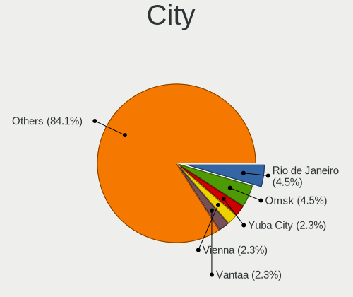
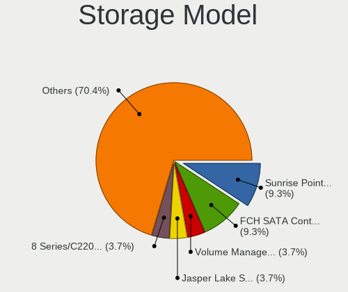
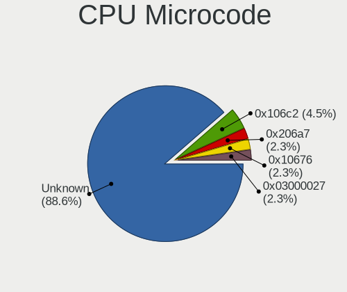
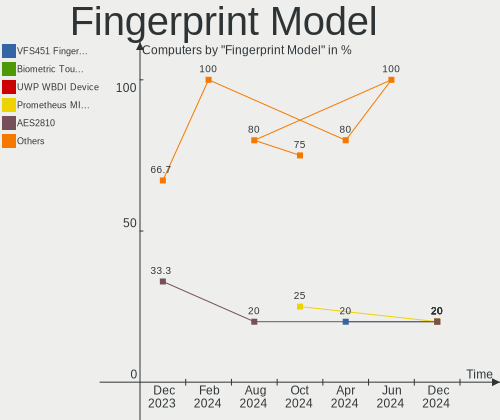

Xubuntu - Hardware Trends
-------------------------

A project to identify most popular hardware characteristics and track their change
over time based on data collected by Linux users at https://Linux-Hardware.org.

Anyone can contribute to this report by the [hw-probe](https://github.com/linuxhw/hw-probe) tool:

    sudo -E hw-probe -all -upload

This is a report for all computer types. See also reports for [desktops](/Dist/Xubuntu/Desktop/README.md) and [notebooks](/Dist/Xubuntu/Notebook/README.md).

This report is for one last month. Overall report since the beginning of time: [TestCoverage](https://github.com/linuxhw/TestCoverage)

Period: Sep, 2022.

Contents
--------

* [ System ](#system)
  - [ OS                       ](#os)
  - [ OS Family                ](#os-family)
  - [ Kernel                   ](#kernel)
  - [ Kernel Family            ](#kernel-family)
  - [ Kernel Major Ver.        ](#kernel-major-ver)
  - [ Arch                     ](#arch)
  - [ DE                       ](#de)
  - [ Display Server           ](#display-server)
  - [ Display Manager          ](#display-manager)
  - [ OS Lang                  ](#os-lang)
  - [ Boot Mode                ](#boot-mode)
  - [ Filesystem               ](#filesystem)
  - [ Part. scheme             ](#part-scheme)
  - [ Dual Boot with Linux/BSD ](#dual-boot-with-linuxbsd)
  - [ Dual Boot (Win)          ](#dual-boot-win)

* [ Board ](#board)
  - [ Vendor                   ](#vendor)
  - [ Model                    ](#model)
  - [ Model Family             ](#model-family)
  - [ MFG Year                 ](#mfg-year)
  - [ Form Factor              ](#form-factor)
  - [ Secure Boot              ](#secure-boot)
  - [ Coreboot                 ](#coreboot)
  - [ RAM Size                 ](#ram-size)
  - [ RAM Used                 ](#ram-used)
  - [ Total Drives             ](#total-drives)
  - [ Has CD-ROM               ](#has-cd-rom)
  - [ Has Ethernet             ](#has-ethernet)
  - [ Has WiFi                 ](#has-wifi)
  - [ Has Bluetooth            ](#has-bluetooth)

* [ Location ](#location)
  - [ Country                  ](#country)
  - [ City                     ](#city)

* [ Drives ](#drives)
  - [ Drive Vendor             ](#drive-vendor)
  - [ Drive Model              ](#drive-model)
  - [ HDD Vendor               ](#hdd-vendor)
  - [ SSD Vendor               ](#ssd-vendor)
  - [ Drive Kind               ](#drive-kind)
  - [ Drive Connector          ](#drive-connector)
  - [ Drive Size               ](#drive-size)
  - [ Space Total              ](#space-total)
  - [ Space Used               ](#space-used)
  - [ Malfunc. Drives          ](#malfunc-drives)
  - [ Malfunc. Drive Vendor    ](#malfunc-drive-vendor)
  - [ Malfunc. HDD Vendor      ](#malfunc-hdd-vendor)
  - [ Malfunc. Drive Kind      ](#malfunc-drive-kind)
  - [ Failed Drives            ](#failed-drives)
  - [ Failed Drive Vendor      ](#failed-drive-vendor)
  - [ Drive Status             ](#drive-status)

* [ Storage controller ](#storage-controller)
  - [ Storage Vendor           ](#storage-vendor)
  - [ Storage Model            ](#storage-model)
  - [ Storage Kind             ](#storage-kind)

* [ Processor ](#processor)
  - [ CPU Vendor               ](#cpu-vendor)
  - [ CPU Model                ](#cpu-model)
  - [ CPU Model Family         ](#cpu-model-family)
  - [ CPU Cores                ](#cpu-cores)
  - [ CPU Sockets              ](#cpu-sockets)
  - [ CPU Threads              ](#cpu-threads)
  - [ CPU Op-Modes             ](#cpu-op-modes)
  - [ CPU Microcode            ](#cpu-microcode)
  - [ CPU Microarch            ](#cpu-microarch)

* [ Graphics ](#graphics)
  - [ GPU Vendor               ](#gpu-vendor)
  - [ GPU Model                ](#gpu-model)
  - [ GPU Combo                ](#gpu-combo)
  - [ GPU Driver               ](#gpu-driver)
  - [ GPU Memory               ](#gpu-memory)

* [ Monitor ](#monitor)
  - [ Monitor Vendor           ](#monitor-vendor)
  - [ Monitor Model            ](#monitor-model)
  - [ Monitor Resolution       ](#monitor-resolution)
  - [ Monitor Diagonal         ](#monitor-diagonal)
  - [ Monitor Width            ](#monitor-width)
  - [ Aspect Ratio             ](#aspect-ratio)
  - [ Monitor Area             ](#monitor-area)
  - [ Pixel Density            ](#pixel-density)
  - [ Multiple Monitors        ](#multiple-monitors)

* [ Network ](#network)
  - [ Net Controller Vendor    ](#net-controller-vendor)
  - [ Net Controller Model     ](#net-controller-model)
  - [ Wireless Vendor          ](#wireless-vendor)
  - [ Wireless Model           ](#wireless-model)
  - [ Ethernet Vendor          ](#ethernet-vendor)
  - [ Ethernet Model           ](#ethernet-model)
  - [ Net Controller Kind      ](#net-controller-kind)
  - [ Used Controller          ](#used-controller)
  - [ NICs                     ](#nics)
  - [ IPv6                     ](#ipv6)

* [ Bluetooth ](#bluetooth)
  - [ Bluetooth Vendor         ](#bluetooth-vendor)
  - [ Bluetooth Model          ](#bluetooth-model)

* [ Sound ](#sound)
  - [ Sound Vendor             ](#sound-vendor)
  - [ Sound Model              ](#sound-model)

* [ Memory ](#memory)
  - [ Memory Vendor            ](#memory-vendor)
  - [ Memory Model             ](#memory-model)
  - [ Memory Kind              ](#memory-kind)
  - [ Memory Form Factor       ](#memory-form-factor)
  - [ Memory Size              ](#memory-size)
  - [ Memory Speed             ](#memory-speed)

* [ Printers & scanners ](#printers--scanners)
  - [ Printer Vendor           ](#printer-vendor)
  - [ Printer Model            ](#printer-model)
  - [ Scanner Vendor           ](#scanner-vendor)
  - [ Scanner Model            ](#scanner-model)

* [ Camera ](#camera)
  - [ Camera Vendor            ](#camera-vendor)
  - [ Camera Model             ](#camera-model)

* [ Security ](#security)
  - [ Fingerprint Vendor       ](#fingerprint-vendor)
  - [ Fingerprint Model        ](#fingerprint-model)
  - [ Chipcard Vendor          ](#chipcard-vendor)
  - [ Chipcard Model           ](#chipcard-model)

* [ Unsupported ](#unsupported)
  - [ Unsupported Devices      ](#unsupported-devices)
  - [ Unsupported Device Types ](#unsupported-device-types)

System
------

OS
--

Installed operating systems

| Name          | Computers | Percent |
|---------------|-----------|---------|
| Xubuntu 22.04 | 49        | 46.67%  |
| Xubuntu 20.04 | 49        | 46.67%  |
| Xubuntu 18.04 | 4         | 3.81%   |
| Xubuntu 16.04 | 2         | 1.9%    |
| Xubuntu 20.10 | 1         | 0.95%   |

OS Family
---------

OS without a version

| Name    | Computers | Percent |
|---------|-----------|---------|
| Xubuntu | 105       | 100%    |

Kernel
------

Version of the Linux kernel

| Version                      | Computers | Percent |
|------------------------------|-----------|---------|
| 5.15.0-47-generic            | 24        | 22.86%  |
| 5.4.0-126-generic            | 19        | 18.1%   |
| 5.4.0-125-generic            | 17        | 16.19%  |
| 5.15.0-48-generic            | 15        | 14.29%  |
| 5.15.0-46-generic            | 4         | 3.81%   |
| 5.15.0-48-lowlatency         | 2         | 1.9%    |
| 5.15.0-46-lowlatency         | 2         | 1.9%    |
| 5.8.0-63-generic             | 1         | 0.95%   |
| 5.4.0-72-generic             | 1         | 0.95%   |
| 5.4.0-125-lowlatency         | 1         | 0.95%   |
| 5.4.0-124-generic            | 1         | 0.95%   |
| 5.4.0-122-generic            | 1         | 0.95%   |
| 5.19.5-051905-generic        | 1         | 0.95%   |
| 5.19.0-8.2-liquorix-amd64    | 1         | 0.95%   |
| 5.19.0-051900-generic        | 1         | 0.95%   |
| 5.17.0-1003-oem              | 1         | 0.95%   |
| 5.15.68-rockchip64           | 1         | 0.95%   |
| 5.15.61-bcm2711              | 1         | 0.95%   |
| 5.15.59-rockchip64           | 1         | 0.95%   |
| 5.15.0-50-lowlatency         | 1         | 0.95%   |
| 5.15.0-25-generic            | 1         | 0.95%   |
| 5.13.0-51-generic            | 1         | 0.95%   |
| 5.11.0-46-generic            | 1         | 0.95%   |
| 5.11.0-27-generic            | 1         | 0.95%   |
| 4.9.253-tegra                | 1         | 0.95%   |
| 4.4.0-233-generic            | 1         | 0.95%   |
| 4.4.0-210-generic            | 1         | 0.95%   |
| 4.19.241-13212-ge9b0bab46475 | 1         | 0.95%   |
| 4.15.0-192-lowlatency        | 1         | 0.95%   |

Kernel Family
-------------

Linux kernel without a distro release

| Version  | Computers | Percent |
|----------|-----------|---------|
| 5.15.0   | 49        | 46.67%  |
| 5.4.0    | 40        | 38.1%   |
| 5.19.0   | 2         | 1.9%    |
| 5.11.0   | 2         | 1.9%    |
| 4.4.0    | 2         | 1.9%    |
| 5.8.0    | 1         | 0.95%   |
| 5.19.5   | 1         | 0.95%   |
| 5.17.0   | 1         | 0.95%   |
| 5.15.68  | 1         | 0.95%   |
| 5.15.61  | 1         | 0.95%   |
| 5.15.59  | 1         | 0.95%   |
| 5.13.0   | 1         | 0.95%   |
| 4.9.253  | 1         | 0.95%   |
| 4.19.241 | 1         | 0.95%   |
| 4.15.0   | 1         | 0.95%   |

Kernel Major Ver.
-----------------

Linux kernel major version

| Version | Computers | Percent |
|---------|-----------|---------|
| 5.15    | 52        | 49.52%  |
| 5.4     | 40        | 38.1%   |
| 5.19    | 3         | 2.86%   |
| 5.11    | 2         | 1.9%    |
| 4.4     | 2         | 1.9%    |
| 5.8     | 1         | 0.95%   |
| 5.17    | 1         | 0.95%   |
| 5.13    | 1         | 0.95%   |
| 4.9     | 1         | 0.95%   |
| 4.19    | 1         | 0.95%   |
| 4.15    | 1         | 0.95%   |

Arch
----

OS architecture (x86_64, i586, etc.)

| Name    | Computers | Percent |
|---------|-----------|---------|
| x86_64  | 99        | 94.29%  |
| aarch64 | 4         | 3.81%   |
| i686    | 2         | 1.9%    |

DE
--

Desktop Environment

| Name  | Computers | Percent |
|-------|-----------|---------|
| XFCE  | 101       | 96.19%  |
| GNOME | 4         | 3.81%   |

Display Server
--------------

X11 or Wayland

| Name    | Computers | Percent |
|---------|-----------|---------|
| X11     | 103       | 98.1%   |
| Wayland | 2         | 1.9%    |

Display Manager
---------------

SDDM, LightDM, etc.

| Name    | Computers | Percent |
|---------|-----------|---------|
| LightDM | 93        | 88.57%  |
| GDM3    | 5         | 4.76%   |
| Unknown | 5         | 4.76%   |
| GDM     | 2         | 1.9%    |

OS Lang
-------

Language

| Lang  | Computers | Percent |
|-------|-----------|---------|
| en_US | 31        | 29.52%  |
| ru_RU | 25        | 23.81%  |
| fr_FR | 10        | 9.52%   |
| de_DE | 7         | 6.67%   |
| en_CA | 5         | 4.76%   |
| it_IT | 4         | 3.81%   |
| en_GB | 4         | 3.81%   |
| en_AU | 4         | 3.81%   |
| pt_BR | 2         | 1.9%    |
| fi_FI | 2         | 1.9%    |
| C     | 2         | 1.9%    |
| zh_CN | 1         | 0.95%   |
| tr_TR | 1         | 0.95%   |
| nl_BE | 1         | 0.95%   |
| hu_HU | 1         | 0.95%   |
| fr_CH | 1         | 0.95%   |
| fr_BE | 1         | 0.95%   |
| es_PE | 1         | 0.95%   |
| es_ES | 1         | 0.95%   |
| es_AR | 1         | 0.95%   |

Boot Mode
---------

EFI or BIOS

| Mode | Computers | Percent |
|------|-----------|---------|
| BIOS | 72        | 68.57%  |
| EFI  | 33        | 31.43%  |

Filesystem
----------

Type of filesystem

| Type    | Computers | Percent |
|---------|-----------|---------|
| Ext4    | 102       | 97.14%  |
| Zfs     | 1         | 0.95%   |
| Xfs     | 1         | 0.95%   |
| Overlay | 1         | 0.95%   |

Part. scheme
------------

Scheme of partitioning

| Type    | Computers | Percent |
|---------|-----------|---------|
| Unknown | 38        | 36.19%  |
| GPT     | 34        | 32.38%  |
| MBR     | 33        | 31.43%  |

Dual Boot with Linux/BSD
------------------------

Hosting more than one Linux/BSD

| Dual boot | Computers | Percent |
|-----------|-----------|---------|
| No        | 96        | 91.43%  |
| Yes       | 9         | 8.57%   |

Dual Boot (Win)
---------------

Hosting Linux and Windows

| Dual boot | Computers | Percent |
|-----------|-----------|---------|
| No        | 86        | 81.9%   |
| Yes       | 19        | 18.1%   |

Board
-----

Vendor
------

Motherboard manufacturer

| Name                    | Computers | Percent |
|-------------------------|-----------|---------|
| ASUSTek Computer        | 19        | 18.1%   |
| Gigabyte Technology     | 17        | 16.19%  |
| Dell                    | 16        | 15.24%  |
| ECS                     | 9         | 8.57%   |
| Lenovo                  | 8         | 7.62%   |
| Hewlett-Packard         | 8         | 7.62%   |
| MSI                     | 5         | 4.76%   |
| Toshiba                 | 4         | 3.81%   |
| ASRock                  | 4         | 3.81%   |
| Google                  | 2         | 1.9%    |
| Apple                   | 2         | 1.9%    |
| Tactus                  | 1         | 0.95%   |
| Sony                    | 1         | 0.95%   |
| Rockchip                | 1         | 0.95%   |
| Raspberry Pi Foundation | 1         | 0.95%   |
| Pine Microsystems       | 1         | 0.95%   |
| Panasonic               | 1         | 0.95%   |
| Packard Bell            | 1         | 0.95%   |
| Nvidia                  | 1         | 0.95%   |
| Medion                  | 1         | 0.95%   |
| Acer                    | 1         | 0.95%   |
| Unknown                 | 1         | 0.95%   |

Model
-----

Motherboard model

| Name                                 | Computers | Percent |
|--------------------------------------|-----------|---------|
| Gigabyte H410M S2H                   | 15        | 14.29%  |
| ECS G31T-M9                          | 9         | 8.57%   |
| Dell OptiPlex 755                    | 2         | 1.9%    |
| ASUS All Series                      | 2         | 1.9%    |
| ASRock N68-S3 UCC                    | 2         | 1.9%    |
| Toshiba Satellite Pro R50-C          | 1         | 0.95%   |
| Toshiba Satellite C650               | 1         | 0.95%   |
| Toshiba Satellite C55D-B             | 1         | 0.95%   |
| Toshiba Satellite A300               | 1         | 0.95%   |
| Tactus GeoBook 140                   | 1         | 0.95%   |
| Sony SVE1512C6EB                     | 1         | 0.95%   |
| Rockchip RK3318 BOX                  | 1         | 0.95%   |
| RPi Raspberry Pi 4 Model B Rev 1.5   | 1         | 0.95%   |
| Pine Microsystems Pine64 Rock64      | 1         | 0.95%   |
| Panasonic CF-D1DVA06F3               | 1         | 0.95%   |
| Packard Bell EasyNote MH45           | 1         | 0.95%   |
| Nvidia Tegra                         | 1         | 0.95%   |
| MSI MS-7C37                          | 1         | 0.95%   |
| MSI MS-7982                          | 1         | 0.95%   |
| MSI MS-7758                          | 1         | 0.95%   |
| MSI MS-7721                          | 1         | 0.95%   |
| MSI MS-7387                          | 1         | 0.95%   |
| Medion Akoya P2120 D MD8836/2452     | 1         | 0.95%   |
| Lenovo ThinkPad X220 42918F6         | 1         | 0.95%   |
| Lenovo ThinkPad T61p 6457A24         | 1         | 0.95%   |
| Lenovo ThinkPad T61 7659AB7          | 1         | 0.95%   |
| Lenovo ThinkPad T420 42361L0         | 1         | 0.95%   |
| Lenovo ThinkPad P51s 20HCS00F00      | 1         | 0.95%   |
| Lenovo ThinkPad E14 Gen 2 20TA00JLAU | 1         | 0.95%   |
| Lenovo IdeaPad N585 20179            | 1         | 0.95%   |
| Lenovo IdeaPad 120S-14IAP 81A5       | 1         | 0.95%   |
| HP ProBook 450 G2                    | 1         | 0.95%   |
| HP Pavilion dv7                      | 1         | 0.95%   |
| HP Laptop 15-ef1xxx                  | 1         | 0.95%   |
| HP Laptop 15-dw0xxx                  | 1         | 0.95%   |
| HP EliteBook 840 G3                  | 1         | 0.95%   |
| HP EliteBook 2570p                   | 1         | 0.95%   |
| HP 255 G7 Notebook PC                | 1         | 0.95%   |
| HP 1000                              | 1         | 0.95%   |
| Google Reks                          | 1         | 0.95%   |

Model Family
------------

Motherboard model prefix

| Name                     | Computers | Percent |
|--------------------------|-----------|---------|
| Gigabyte H410M           | 15        | 14.29%  |
| ECS G31T-M9              | 9         | 8.57%   |
| Lenovo ThinkPad          | 6         | 5.71%   |
| Dell OptiPlex            | 5         | 4.76%   |
| Dell Latitude            | 5         | 4.76%   |
| ASUS PRIME               | 5         | 4.76%   |
| Toshiba Satellite        | 4         | 3.81%   |
| Dell Inspiron            | 3         | 2.86%   |
| Lenovo IdeaPad           | 2         | 1.9%    |
| HP Laptop                | 2         | 1.9%    |
| HP EliteBook             | 2         | 1.9%    |
| Dell Precision           | 2         | 1.9%    |
| ASUS All                 | 2         | 1.9%    |
| ASRock N68-S3            | 2         | 1.9%    |
| Tactus GeoBook           | 1         | 0.95%   |
| Sony SVE1512C6EB         | 1         | 0.95%   |
| Rockchip RK3318          | 1         | 0.95%   |
| RPi Raspberry            | 1         | 0.95%   |
| Pine Microsystems Pine64 | 1         | 0.95%   |
| Panasonic CF-D1DVA06F3   | 1         | 0.95%   |
| Packard Bell EasyNote    | 1         | 0.95%   |
| Nvidia Tegra             | 1         | 0.95%   |
| MSI MS-7C37              | 1         | 0.95%   |
| MSI MS-7982              | 1         | 0.95%   |
| MSI MS-7758              | 1         | 0.95%   |
| MSI MS-7721              | 1         | 0.95%   |
| MSI MS-7387              | 1         | 0.95%   |
| Medion Akoya             | 1         | 0.95%   |
| HP ProBook               | 1         | 0.95%   |
| HP Pavilion              | 1         | 0.95%   |
| HP 255                   | 1         | 0.95%   |
| HP 1000                  | 1         | 0.95%   |
| Google Reks              | 1         | 0.95%   |
| Google Kip               | 1         | 0.95%   |
| Gigabyte TERRA           | 1         | 0.95%   |
| Gigabyte H510M           | 1         | 0.95%   |
| Dell CS24-TY             | 1         | 0.95%   |
| ASUS X453SA              | 1         | 0.95%   |
| ASUS TUF                 | 1         | 0.95%   |
| ASUS ROG                 | 1         | 0.95%   |

MFG Year
--------

Motherboard manufacture year

| Year    | Computers | Percent |
|---------|-----------|---------|
| 2020    | 24        | 22.86%  |
| 2009    | 11        | 10.48%  |
| 2012    | 9         | 8.57%   |
| 2021    | 7         | 6.67%   |
| 2015    | 6         | 5.71%   |
| 2019    | 5         | 4.76%   |
| 2017    | 5         | 4.76%   |
| 2014    | 5         | 4.76%   |
| 2008    | 5         | 4.76%   |
| 2018    | 4         | 3.81%   |
| 2013    | 4         | 3.81%   |
| 2011    | 4         | 3.81%   |
| 2007    | 4         | 3.81%   |
| Unknown | 4         | 3.81%   |
| 2010    | 3         | 2.86%   |
| 2016    | 2         | 1.9%    |
| 2006    | 2         | 1.9%    |
| 2022    | 1         | 0.95%   |

Form Factor
-----------

Physical design of the computer

| Name           | Computers | Percent |
|----------------|-----------|---------|
| Desktop        | 57        | 54.29%  |
| Notebook       | 40        | 38.1%   |
| System on chip | 4         | 3.81%   |
| Convertible    | 2         | 1.9%    |
| All in one     | 1         | 0.95%   |
| Server         | 1         | 0.95%   |

Secure Boot
-----------

Enabled or disabled

| State    | Computers | Percent |
|----------|-----------|---------|
| Disabled | 99        | 94.29%  |
| Enabled  | 6         | 5.71%   |

Coreboot
--------

Have coreboot on board

| Used | Computers | Percent |
|------|-----------|---------|
| No   | 103       | 98.1%   |
| Yes  | 2         | 1.9%    |

RAM Size
--------

Total RAM memory

| Size in GB  | Computers | Percent |
|-------------|-----------|---------|
| 16.01-24.0  | 26        | 24.76%  |
| 3.01-4.0    | 24        | 22.86%  |
| 4.01-8.0    | 17        | 16.19%  |
| 1.01-2.0    | 15        | 14.29%  |
| 8.01-16.0   | 13        | 12.38%  |
| 32.01-64.0  | 7         | 6.67%   |
| 2.01-3.0    | 1         | 0.95%   |
| 64.01-256.0 | 1         | 0.95%   |
| 0.51-1.0    | 1         | 0.95%   |

RAM Used
--------

Used RAM memory

| Used GB   | Computers | Percent |
|-----------|-----------|---------|
| 1.01-2.0  | 49        | 46.67%  |
| 0.51-1.0  | 20        | 19.05%  |
| 2.01-3.0  | 15        | 14.29%  |
| 4.01-8.0  | 9         | 8.57%   |
| 3.01-4.0  | 7         | 6.67%   |
| 8.01-16.0 | 4         | 3.81%   |
| 0.01-0.5  | 1         | 0.95%   |

Total Drives
------------

Number of drives on board

| Drives | Computers | Percent |
|--------|-----------|---------|
| 1      | 78        | 74.29%  |
| 2      | 17        | 16.19%  |
| 3      | 5         | 4.76%   |
| 4      | 2         | 1.9%    |
| 10     | 1         | 0.95%   |
| 5      | 1         | 0.95%   |
| 0      | 1         | 0.95%   |

Has CD-ROM
----------

Has CD-ROM on board

| Presented | Computers | Percent |
|-----------|-----------|---------|
| No        | 67        | 63.81%  |
| Yes       | 38        | 36.19%  |

Has Ethernet
------------

Has Ethernet on board

| Presented | Computers | Percent |
|-----------|-----------|---------|
| Yes       | 92        | 87.62%  |
| No        | 13        | 12.38%  |

Has WiFi
--------

Has WiFi module

| Presented | Computers | Percent |
|-----------|-----------|---------|
| Yes       | 54        | 51.43%  |
| No        | 51        | 48.57%  |

Has Bluetooth
-------------

Has Bluetooth module

| Presented | Computers | Percent |
|-----------|-----------|---------|
| No        | 73        | 69.52%  |
| Yes       | 32        | 30.48%  |

Location
--------

Country
-------

Geographic location (country)

| Country     | Computers | Percent |
|-------------|-----------|---------|
| Russia      | 26        | 24.76%  |
| USA         | 11        | 10.48%  |
| France      | 11        | 10.48%  |
| Germany     | 9         | 8.57%   |
| Italy       | 7         | 6.67%   |
| Canada      | 5         | 4.76%   |
| UK          | 4         | 3.81%   |
| Australia   | 4         | 3.81%   |
| Iran        | 3         | 2.86%   |
| Finland     | 3         | 2.86%   |
| Belgium     | 3         | 2.86%   |
| Indonesia   | 2         | 1.9%    |
| Brazil      | 2         | 1.9%    |
| Argentina   | 2         | 1.9%    |
| Turkey      | 1         | 0.95%   |
| Switzerland | 1         | 0.95%   |
| Portugal    | 1         | 0.95%   |
| Poland      | 1         | 0.95%   |
| Peru        | 1         | 0.95%   |
| New Zealand | 1         | 0.95%   |
| Netherlands | 1         | 0.95%   |
| Madagascar  | 1         | 0.95%   |
| Israel      | 1         | 0.95%   |
| Hungary     | 1         | 0.95%   |
| Egypt       | 1         | 0.95%   |
| Czechia     | 1         | 0.95%   |
| China       | 1         | 0.95%   |

City
----

Geographic location (city)

| City                 | Computers | Percent |
|----------------------|-----------|---------|
| Voronezh             | 24        | 22.86%  |
| Melbourne            | 4         | 3.81%   |
| Tehran               | 2         | 1.9%    |
| Paris                | 2         | 1.9%    |
| Helsinki             | 2         | 1.9%    |
| Auxerre              | 2         | 1.9%    |
| Zurich               | 1         | 0.95%   |
| Virgem da Lapa       | 1         | 0.95%   |
| Vancouver            | 1         | 0.95%   |
| Unkel                | 1         | 0.95%   |
| Tourouvre            | 1         | 0.95%   |
| Toronto              | 1         | 0.95%   |
| Toamasina            | 1         | 0.95%   |
| Surrey               | 1         | 0.95%   |
| Springfield          | 1         | 0.95%   |
| Schaarbeek           | 1         | 0.95%   |
| Rome                 | 1         | 0.95%   |
| Rio Tinto            | 1         | 0.95%   |
| Rennes               | 1         | 0.95%   |
| Pont-à-Mousson      | 1         | 0.95%   |
| Poggibonsi           | 1         | 0.95%   |
| Petojo Utara         | 1         | 0.95%   |
| Perth-Andover        | 1         | 0.95%   |
| Padova               | 1         | 0.95%   |
| Ostrów Wielkopolski | 1         | 0.95%   |
| Muncie               | 1         | 0.95%   |
| Moscow               | 1         | 0.95%   |
| Montreal             | 1         | 0.95%   |
| Mering               | 1         | 0.95%   |
| Mayenne              | 1         | 0.95%   |
| London               | 1         | 0.95%   |
| Lomnice nad Popelkou | 1         | 0.95%   |
| Lima                 | 1         | 0.95%   |
| Lavras               | 1         | 0.95%   |
| La Plata             | 1         | 0.95%   |
| Kortrijk             | 1         | 0.95%   |
| Kassel               | 1         | 0.95%   |
| Kaarst               | 1         | 0.95%   |
| Jakarta              | 1         | 0.95%   |
| Islington            | 1         | 0.95%   |

Drives
------

Drive Vendor
------------

Hard drive vendors

| Vendor              | Computers | Drives | Percent |
|---------------------|-----------|--------|---------|
| Kingston            | 22        | 22     | 16.3%   |
| WDC                 | 15        | 17     | 11.11%  |
| Samsung Electronics | 14        | 17     | 10.37%  |
| Seagate             | 13        | 20     | 9.63%   |
| Toshiba             | 11        | 12     | 8.15%   |
| Hitachi             | 9         | 9      | 6.67%   |
| Sandisk             | 6         | 6      | 4.44%   |
| Unknown             | 5         | 5      | 3.7%    |
| SK hynix            | 5         | 5      | 3.7%    |
| PNY                 | 4         | 4      | 2.96%   |
| Crucial             | 4         | 4      | 2.96%   |
| Maxtor              | 3         | 3      | 2.22%   |
| Micron Technology   | 2         | 2      | 1.48%   |
| LITEON              | 2         | 2      | 1.48%   |
| KIOXIA              | 2         | 2      | 1.48%   |
| Unknown             | 2         | 2      | 1.48%   |
| SSSTC               | 1         | 1      | 0.74%   |
| Silicon Motion      | 1         | 1      | 0.74%   |
| SAGE                | 1         | 1      | 0.74%   |
| S3+                 | 1         | 1      | 0.74%   |
| Phison              | 1         | 1      | 0.74%   |
| Netac               | 1         | 1      | 0.74%   |
| Lexar               | 1         | 1      | 0.74%   |
| KingSpec            | 1         | 1      | 0.74%   |
| Intel               | 1         | 1      | 0.74%   |
| Hoodisk             | 1         | 1      | 0.74%   |
| Corsair             | 1         | 1      | 0.74%   |
| CHN25SATAS1         | 1         | 1      | 0.74%   |
| China               | 1         | 1      | 0.74%   |
| Avant               | 1         | 1      | 0.74%   |
| Apple               | 1         | 1      | 0.74%   |
| A-DATA Technology   | 1         | 1      | 0.74%   |

Drive Model
-----------

Hard drive models

| Model                               | Computers | Percent |
|-------------------------------------|-----------|---------|
| Kingston SA400S37240G 240GB SSD     | 18        | 12.33%  |
| Hitachi HDS721050CLA362 500GB       | 7         | 4.79%   |
| Samsung SSD 860 EVO 500GB           | 4         | 2.74%   |
| Toshiba DT01ACA050 500GB            | 3         | 2.05%   |
| PNY CS900 120GB SSD                 | 3         | 2.05%   |
| Toshiba MQ01ABF050 500GB            | 2         | 1.37%   |
| Seagate ST500LM012 HN-M500MBB 500GB | 2         | 1.37%   |
| Seagate ST500DM002-1BD142 500GB     | 2         | 1.37%   |
| Seagate ST4000DM004-2CV104 4TB      | 2         | 1.37%   |
| SanDisk SDSSDA240G 240GB            | 2         | 1.37%   |
| Kingston SA400S37480G 480GB SSD     | 2         | 1.37%   |
| Unknown                             | 2         | 1.37%   |
| WDC WDS250G2B0A-00SM50 250GB SSD    | 1         | 0.68%   |
| WDC WD800JD-75MSA3 80GB             | 1         | 0.68%   |
| WDC WD60EFZX-68B3FN0 6TB            | 1         | 0.68%   |
| WDC WD5003AZEX-00K1GA0 500GB        | 1         | 0.68%   |
| WDC WD5000LPZX-08Z10 500GB          | 1         | 0.68%   |
| WDC WD5000AVCS-612DY1 500GB         | 1         | 0.68%   |
| WDC WD5000AAVS-00ZTB0 500GB         | 1         | 0.68%   |
| WDC WD5000AAKX-60U6AA0 500GB        | 1         | 0.68%   |
| WDC WD5000AAKX-00ERMA0 500GB        | 1         | 0.68%   |
| WDC WD4003FRYZ-01F0DB0 4TB          | 1         | 0.68%   |
| WDC WD3200LPVX-75V0TT0 320GB        | 1         | 0.68%   |
| WDC WD3200BEVT-22ZCT0 320GB         | 1         | 0.68%   |
| WDC WD30EFRX-68EUZN0 3TB            | 1         | 0.68%   |
| WDC WD2500BEKT-75A25T0 250GB        | 1         | 0.68%   |
| WDC WD2003FZEX-00SRLA0 2TB          | 1         | 0.68%   |
| WDC WD10SPZX-08Z10 1TB              | 1         | 0.68%   |
| Unknown SD16G  16GB                 | 1         | 0.68%   |
| Unknown MMC Card  32GB              | 1         | 0.68%   |
| Unknown MMC Card  2GB               | 1         | 0.68%   |
| Unknown MMC Card  128GB             | 1         | 0.68%   |
| Unknown AJNB4R  16GB                | 1         | 0.68%   |
| Toshiba TR150 120GB SSD             | 1         | 0.68%   |
| Toshiba MQ01ABF032 320GB            | 1         | 0.68%   |
| Toshiba MQ01ABD032 320GB            | 1         | 0.68%   |
| Toshiba MK7559GSXF 752GB            | 1         | 0.68%   |
| Toshiba MK2555GSXF 250GB            | 1         | 0.68%   |
| Toshiba MK2546GSX 250GB             | 1         | 0.68%   |
| Toshiba DT01ACA300 3TB              | 1         | 0.68%   |

HDD Vendor
----------

Hard disk drive vendors

| Vendor              | Computers | Drives | Percent |
|---------------------|-----------|--------|---------|
| WDC                 | 14        | 16     | 27.45%  |
| Seagate             | 12        | 19     | 23.53%  |
| Toshiba             | 10        | 11     | 19.61%  |
| Hitachi             | 9         | 9      | 17.65%  |
| Maxtor              | 3         | 3      | 5.88%   |
| Samsung Electronics | 2         | 4      | 3.92%   |
| SAGE                | 1         | 1      | 1.96%   |

SSD Vendor
----------

Solid state drive vendors

| Vendor              | Computers | Drives | Percent |
|---------------------|-----------|--------|---------|
| Kingston            | 22        | 22     | 38.6%   |
| Samsung Electronics | 10        | 11     | 17.54%  |
| SanDisk             | 4         | 4      | 7.02%   |
| PNY                 | 4         | 4      | 7.02%   |
| SK hynix            | 2         | 2      | 3.51%   |
| LITEON              | 2         | 2      | 3.51%   |
| Crucial             | 2         | 2      | 3.51%   |
| WDC                 | 1         | 1      | 1.75%   |
| Toshiba             | 1         | 1      | 1.75%   |
| SSSTC               | 1         | 1      | 1.75%   |
| S3+                 | 1         | 1      | 1.75%   |
| Netac               | 1         | 1      | 1.75%   |
| KingSpec            | 1         | 1      | 1.75%   |
| Hoodisk             | 1         | 1      | 1.75%   |
| Corsair             | 1         | 1      | 1.75%   |
| China               | 1         | 1      | 1.75%   |
| Avant               | 1         | 1      | 1.75%   |
| A-DATA Technology   | 1         | 1      | 1.75%   |

Drive Kind
----------

HDD or SSD

| Kind    | Computers | Drives | Percent |
|---------|-----------|--------|---------|
| SSD     | 55        | 58     | 43.65%  |
| HDD     | 44        | 63     | 34.92%  |
| NVMe    | 17        | 17     | 13.49%  |
| MMC     | 8         | 8      | 6.35%   |
| Unknown | 2         | 2      | 1.59%   |

Drive Connector
---------------

SATA, SAS, NVMe, etc.

| Type | Computers | Drives | Percent |
|------|-----------|--------|---------|
| SATA | 85        | 119    | 74.56%  |
| NVMe | 17        | 17     | 14.91%  |
| MMC  | 8         | 8      | 7.02%   |
| SAS  | 4         | 4      | 3.51%   |

Drive Size
----------

Size of hard drive

| Size in TB | Computers | Drives | Percent |
|------------|-----------|--------|---------|
| 0.01-0.5   | 79        | 99     | 81.44%  |
| 0.51-1.0   | 8         | 10     | 8.25%   |
| 1.01-2.0   | 4         | 5      | 4.12%   |
| 3.01-4.0   | 3         | 4      | 3.09%   |
| 2.01-3.0   | 2         | 2      | 2.06%   |
| 4.01-10.0  | 1         | 1      | 1.03%   |

Space Total
-----------

Amount of disk space available on the file system

| Size in GB     | Computers | Percent |
|----------------|-----------|---------|
| 101-250        | 45        | 42.86%  |
| 251-500        | 29        | 27.62%  |
| 501-1000       | 9         | 8.57%   |
| 51-100         | 5         | 4.76%   |
| 21-50          | 4         | 3.81%   |
| 1001-2000      | 4         | 3.81%   |
| 1-20           | 4         | 3.81%   |
| 2001-3000      | 3         | 2.86%   |
| More than 3000 | 2         | 1.9%    |

Space Used
----------

Amount of used disk space

| Used GB        | Computers | Percent |
|----------------|-----------|---------|
| 51-100         | 37        | 35.24%  |
| 1-20           | 25        | 23.81%  |
| 21-50          | 15        | 14.29%  |
| 101-250        | 14        | 13.33%  |
| 251-500        | 7         | 6.67%   |
| 501-1000       | 4         | 3.81%   |
| More than 3000 | 2         | 1.9%    |
| 1001-2000      | 1         | 0.95%   |

Malfunc. Drives
---------------

Drive models with a malfunction

| Model                          | Computers | Drives | Percent |
|--------------------------------|-----------|--------|---------|
| Hitachi HDS721050CLA362 500GB  | 3         | 3      | 33.33%  |
| Toshiba MQ01ABF050 500GB       | 1         | 1      | 11.11%  |
| Toshiba MK2546GSX 250GB        | 1         | 1      | 11.11%  |
| SSSTC CVB-8D128-HP 128GB SSD   | 1         | 1      | 11.11%  |
| Seagate ST2000DM001-1CH164 2TB | 1         | 1      | 11.11%  |
| Maxtor 6Y120L0 128GB           | 1         | 1      | 11.11%  |
| Avant 60GB Client SSD          | 1         | 1      | 11.11%  |

Malfunc. Drive Vendor
---------------------

Vendors of faulty drives

| Vendor  | Computers | Drives | Percent |
|---------|-----------|--------|---------|
| Hitachi | 3         | 3      | 33.33%  |
| Toshiba | 2         | 2      | 22.22%  |
| SSSTC   | 1         | 1      | 11.11%  |
| Seagate | 1         | 1      | 11.11%  |
| Maxtor  | 1         | 1      | 11.11%  |
| Avant   | 1         | 1      | 11.11%  |

Malfunc. HDD Vendor
-------------------

Vendors of faulty HDD drives

| Vendor  | Computers | Drives | Percent |
|---------|-----------|--------|---------|
| Hitachi | 3         | 3      | 42.86%  |
| Toshiba | 2         | 2      | 28.57%  |
| Seagate | 1         | 1      | 14.29%  |
| Maxtor  | 1         | 1      | 14.29%  |

Malfunc. Drive Kind
-------------------

Kinds of faulty drives

| Kind | Computers | Drives | Percent |
|------|-----------|--------|---------|
| HDD  | 7         | 7      | 77.78%  |
| SSD  | 2         | 2      | 22.22%  |

Failed Drives
-------------

Failed drive models

Zero info for selected period =(

Failed Drive Vendor
-------------------

Failed drive vendors

Zero info for selected period =(

Drive Status
------------

Number of failed and malfunc. drives

| Status   | Computers | Drives | Percent |
|----------|-----------|--------|---------|
| Works    | 56        | 69     | 52.34%  |
| Detected | 42        | 70     | 39.25%  |
| Malfunc  | 9         | 9      | 8.41%   |

Storage controller
------------------

Storage Vendor
--------------

Storage controller vendors

| Vendor                       | Computers | Percent |
|------------------------------|-----------|---------|
| Intel                        | 75        | 65.22%  |
| AMD                          | 13        | 11.3%   |
| SK hynix                     | 3         | 2.61%   |
| Nvidia                       | 3         | 2.61%   |
| ASMedia Technology           | 3         | 2.61%   |
| VIA Technologies             | 2         | 1.74%   |
| Samsung Electronics          | 2         | 1.74%   |
| Micron/Crucial Technology    | 2         | 1.74%   |
| KIOXIA                       | 2         | 1.74%   |
| JMicron Technology           | 2         | 1.74%   |
| Silicon Motion               | 1         | 0.87%   |
| Silicon Image                | 1         | 0.87%   |
| Shenzhen Longsys Electronics | 1         | 0.87%   |
| SanDisk                      | 1         | 0.87%   |
| Phison Electronics           | 1         | 0.87%   |
| Micron Technology            | 1         | 0.87%   |
| Marvell Technology Group     | 1         | 0.87%   |
| Apple                        | 1         | 0.87%   |

Storage Model
-------------

Storage controller models

| Model                                                                          | Computers | Percent |
|--------------------------------------------------------------------------------|-----------|---------|
| Intel 400 Series Chipset Family SATA AHCI Controller                           | 16        | 11.35%  |
| Intel NM10/ICH7 Family SATA Controller [IDE mode]                              | 9         | 6.38%   |
| Intel 82801G (ICH7 Family) IDE Controller                                      | 9         | 6.38%   |
| AMD FCH SATA Controller [AHCI mode]                                            | 9         | 6.38%   |
| Intel 7 Series Chipset Family 6-port SATA Controller [AHCI mode]               | 5         | 3.55%   |
| Intel Volume Management Device NVMe RAID Controller                            | 4         | 2.84%   |
| Intel Sunrise Point-LP SATA Controller [AHCI mode]                             | 4         | 2.84%   |
| Intel 6 Series/C200 Series Chipset Family 6 port Mobile SATA AHCI Controller   | 4         | 2.84%   |
| Intel SATA Controller [RAID mode]                                              | 3         | 2.13%   |
| Intel 8 Series SATA Controller 1 [AHCI mode]                                   | 3         | 2.13%   |
| Intel 6 Series/C200 Series Chipset Family 6 port Desktop SATA AHCI Controller  | 3         | 2.13%   |
| ASMedia ASM1062 Serial ATA Controller                                          | 3         | 2.13%   |
| VIA VT82C586A/B/VT82C686/A/B/VT823x/A/C PIPC Bus Master IDE                    | 2         | 1.42%   |
| SK hynix Gold P31 SSD                                                          | 2         | 1.42%   |
| Nvidia MCP61 SATA Controller                                                   | 2         | 1.42%   |
| Nvidia MCP61 IDE                                                               | 2         | 1.42%   |
| Micron/Crucial P2 NVMe PCIe SSD                                                | 2         | 1.42%   |
| KIOXIA NVMe SSD Controller BG4                                                 | 2         | 1.42%   |
| JMicron JMB363 SATA/IDE Controller                                             | 2         | 1.42%   |
| Intel Q170/Q150/B150/H170/H110/Z170/CM236 Chipset SATA Controller [AHCI Mode]  | 2         | 1.42%   |
| Intel Celeron/Pentium Silver Processor SATA Controller                         | 2         | 1.42%   |
| Intel 82Q35 Express PT IDER Controller                                         | 2         | 1.42%   |
| Intel 82801IR/IO/IH (ICH9R/DO/DH) 6 port SATA Controller [AHCI mode]           | 2         | 1.42%   |
| Intel 82801HM/HEM (ICH8M/ICH8M-E) SATA Controller [AHCI mode]                  | 2         | 1.42%   |
| Intel 82801HM/HEM (ICH8M/ICH8M-E) IDE Controller                               | 2         | 1.42%   |
| Intel 8 Series/C220 Series Chipset Family 6-port SATA Controller 1 [AHCI mode] | 2         | 1.42%   |
| Intel 500 Series Chipset Family SATA AHCI Controller                           | 2         | 1.42%   |
| AMD FCH SATA Controller D                                                      | 2         | 1.42%   |
| AMD 400 Series Chipset SATA Controller                                         | 2         | 1.42%   |
| VIA VT8237A SATA 2-Port Controller                                             | 1         | 0.71%   |
| VIA VT8237/8251 Serial ATA Controller                                          | 1         | 0.71%   |
| SK hynix Non-Volatile memory controller                                        | 1         | 0.71%   |
| Silicon Motion SM2263EN/SM2263XT SSD Controller                                | 1         | 0.71%   |
| Silicon Image SiI 3114 [SATALink/SATARaid] Serial ATA Controller               | 1         | 0.71%   |
| Shenzhen Longsys SM2263EN/SM2263XT-based OEM SSD                               | 1         | 0.71%   |
| SanDisk WD Black SN750 / PC SN730 NVMe SSD                                     | 1         | 0.71%   |
| Samsung NVMe SSD Controller PM9A1/PM9A3/980PRO                                 | 1         | 0.71%   |
| Samsung NVMe SSD Controller 980                                                | 1         | 0.71%   |
| Phison E16 PCIe4 NVMe Controller                                               | 1         | 0.71%   |
| Nvidia MCP55 SATA Controller                                                   | 1         | 0.71%   |

Storage Kind
------------

Kind of storage controller (IDE, SATA, NVMe, SAS, ...)

| Kind | Computers | Percent |
|------|-----------|---------|
| SATA | 69        | 57.98%  |
| IDE  | 25        | 21.01%  |
| NVMe | 17        | 14.29%  |
| RAID | 8         | 6.72%   |

Processor
---------

CPU Vendor
----------

Processor vendors

| Vendor | Computers | Percent |
|--------|-----------|---------|
| Intel  | 84        | 80%     |
| AMD    | 17        | 16.19%  |
| ARM    | 4         | 3.81%   |

CPU Model
---------

Processor models

| Model                                       | Computers | Percent |
|---------------------------------------------|-----------|---------|
| Intel Core i3-10100 CPU @ 3.60GHz           | 15        | 14.29%  |
| Intel Pentium Dual-Core CPU E6500 @ 2.93GHz | 6         | 5.71%   |
| ARM Processor                               | 4         | 3.81%   |
| Intel Core i7-9750H CPU @ 2.60GHz           | 2         | 1.9%    |
| Intel Core i7-3630QM CPU @ 2.40GHz          | 2         | 1.9%    |
| Intel Core i7-10850H CPU @ 2.70GHz          | 2         | 1.9%    |
| Intel Core i5-7300U CPU @ 2.60GHz           | 2         | 1.9%    |
| Intel Core i3-3240 CPU @ 3.40GHz            | 2         | 1.9%    |
| Intel Celeron CPU E3300 @ 2.50GHz           | 2         | 1.9%    |
| Intel Celeron CPU 847 @ 1.10GHz             | 2         | 1.9%    |
| Intel 11th Gen Core i5-1145G7 @ 2.60GHz     | 2         | 1.9%    |
| Intel 11th Gen Core i5-1135G7 @ 2.40GHz     | 2         | 1.9%    |
| AMD Athlon II X2 250 Processor              | 2         | 1.9%    |
| Intel Xeon CPU L5520 @ 2.27GHz              | 1         | 0.95%   |
| Intel Pentium Silver N5030 CPU @ 1.10GHz    | 1         | 0.95%   |
| Intel Pentium Dual-Core CPU T4200 @ 2.00GHz | 1         | 0.95%   |
| Intel Pentium Dual CPU E2200 @ 2.20GHz      | 1         | 0.95%   |
| Intel Pentium D CPU 3.40GHz                 | 1         | 0.95%   |
| Intel Pentium CPU B980 @ 2.40GHz            | 1         | 0.95%   |
| Intel Core i7-8550U CPU @ 1.80GHz           | 1         | 0.95%   |
| Intel Core i7-4771 CPU @ 3.50GHz            | 1         | 0.95%   |
| Intel Core i7-4650U CPU @ 1.70GHz           | 1         | 0.95%   |
| Intel Core i7 CPU 920 @ 2.67GHz             | 1         | 0.95%   |
| Intel Core i5-9400 CPU @ 2.90GHz            | 1         | 0.95%   |
| Intel Core i5-8500T CPU @ 2.10GHz           | 1         | 0.95%   |
| Intel Core i5-6500 CPU @ 3.20GHz            | 1         | 0.95%   |
| Intel Core i5-6300U CPU @ 2.40GHz           | 1         | 0.95%   |
| Intel Core i5-4690 CPU @ 3.50GHz            | 1         | 0.95%   |
| Intel Core i5-4210U CPU @ 1.70GHz           | 1         | 0.95%   |
| Intel Core i5-4200U CPU @ 1.60GHz           | 1         | 0.95%   |
| Intel Core i5-3570 CPU @ 3.40GHz            | 1         | 0.95%   |
| Intel Core i5-2540M CPU @ 2.60GHz           | 1         | 0.95%   |
| Intel Core i5-2520M CPU @ 2.50GHz           | 1         | 0.95%   |
| Intel Core i5-2410M CPU @ 2.30GHz           | 1         | 0.95%   |
| Intel Core i5-2400S CPU @ 2.50GHz           | 1         | 0.95%   |
| Intel Core i5-10400 CPU @ 2.90GHz           | 1         | 0.95%   |
| Intel Core i3-7100 CPU @ 3.90GHz            | 1         | 0.95%   |
| Intel Core i3-6100 CPU @ 3.70GHz            | 1         | 0.95%   |
| Intel Core i3-6006U CPU @ 2.00GHz           | 1         | 0.95%   |
| Intel Core i3-4170 CPU @ 3.70GHz            | 1         | 0.95%   |

CPU Model Family
----------------

Processor model prefix

| Model                   | Computers | Percent |
|-------------------------|-----------|---------|
| Intel Core i3           | 23        | 21.9%   |
| Intel Core i5           | 15        | 14.29%  |
| Other                   | 11        | 10.48%  |
| Intel Core i7           | 10        | 9.52%   |
| Intel Celeron           | 10        | 9.52%   |
| Intel Pentium Dual-Core | 7         | 6.67%   |
| Intel Core 2 Duo        | 7         | 6.67%   |
| AMD Ryzen 5             | 3         | 2.86%   |
| AMD Ryzen 9             | 2         | 1.9%    |
| AMD Ryzen 7             | 2         | 1.9%    |
| AMD E1                  | 2         | 1.9%    |
| AMD Athlon II X2        | 2         | 1.9%    |
| Intel Xeon              | 1         | 0.95%   |
| Intel Pentium Silver    | 1         | 0.95%   |
| Intel Pentium Dual      | 1         | 0.95%   |
| Intel Pentium D         | 1         | 0.95%   |
| Intel Pentium           | 1         | 0.95%   |
| AMD Sempron             | 1         | 0.95%   |
| AMD Athlon II X4        | 1         | 0.95%   |
| AMD Athlon 64 X2        | 1         | 0.95%   |
| AMD A8                  | 1         | 0.95%   |
| AMD A4                  | 1         | 0.95%   |
| AMD A10                 | 1         | 0.95%   |

CPU Cores
---------

Number of processor cores

| Number  | Computers | Percent |
|---------|-----------|---------|
| 2       | 51        | 48.57%  |
| 4       | 37        | 35.24%  |
| 6       | 10        | 9.52%   |
| 8       | 3         | 2.86%   |
| 12      | 2         | 1.9%    |
| Unknown | 2         | 1.9%    |

CPU Sockets
-----------

Number of sockets

| Number  | Computers | Percent |
|---------|-----------|---------|
| 1       | 102       | 97.14%  |
| Unknown | 2         | 1.9%    |
| 2       | 1         | 0.95%   |

CPU Threads
-----------

Threads per core (Hyper-Threading)

| Number  | Computers | Percent |
|---------|-----------|---------|
| 2       | 57        | 54.29%  |
| 1       | 46        | 43.81%  |
| Unknown | 2         | 1.9%    |

CPU Op-Modes
------------

CPU Operation Modes (32-bit, 64-bit)

| Op mode        | Computers | Percent |
|----------------|-----------|---------|
| 32-bit, 64-bit | 103       | 98.1%   |
| Unknown        | 2         | 1.9%    |

CPU Microcode
-------------

Microcode number

| Number     | Computers | Percent |
|------------|-----------|---------|
| Unknown    | 29        | 27.62%  |
| 0xa0653    | 16        | 15.24%  |
| 0x1067a    | 10        | 9.52%   |
| 0x906ea    | 4         | 3.81%   |
| 0x806c1    | 4         | 3.81%   |
| 0x306a9    | 4         | 3.81%   |
| 0x6fd      | 3         | 2.86%   |
| 0x6fb      | 3         | 2.86%   |
| 0x40651    | 3         | 2.86%   |
| 0x206a7    | 3         | 2.86%   |
| 0xa0652    | 2         | 1.9%    |
| 0x306c3    | 2         | 1.9%    |
| 0x106a5    | 2         | 1.9%    |
| 0xf64      | 1         | 0.95%   |
| 0xa0671    | 1         | 0.95%   |
| 0x806ea    | 1         | 0.95%   |
| 0x806e9    | 1         | 0.95%   |
| 0x706a8    | 1         | 0.95%   |
| 0x506e3    | 1         | 0.95%   |
| 0x406e3    | 1         | 0.95%   |
| 0x406c4    | 1         | 0.95%   |
| 0x406c3    | 1         | 0.95%   |
| 0x30678    | 1         | 0.95%   |
| 0x30673    | 1         | 0.95%   |
| 0x0a50000c | 1         | 0.95%   |
| 0x0a201016 | 1         | 0.95%   |
| 0x08600106 | 1         | 0.95%   |
| 0x08600104 | 1         | 0.95%   |
| 0x08001137 | 1         | 0.95%   |
| 0x07030105 | 1         | 0.95%   |
| 0x0700010f | 1         | 0.95%   |
| 0x06006705 | 1         | 0.95%   |
| 0x06001119 | 1         | 0.95%   |

CPU Microarch
-------------

Microarchitecture

| Name          | Computers | Percent |
|---------------|-----------|---------|
| CometLake     | 18        | 17.14%  |
| Penryn        | 10        | 9.52%   |
| SandyBridge   | 8         | 7.62%   |
| KabyLake      | 8         | 7.62%   |
| Core          | 7         | 6.67%   |
| TigerLake     | 6         | 5.71%   |
| Haswell       | 6         | 5.71%   |
| IvyBridge     | 5         | 4.76%   |
| Skylake       | 4         | 3.81%   |
| Silvermont    | 4         | 3.81%   |
| Unknown       | 4         | 3.81%   |
| Zen 3         | 3         | 2.86%   |
| Zen 2         | 3         | 2.86%   |
| K10           | 3         | 2.86%   |
| Piledriver    | 2         | 1.9%    |
| Nehalem       | 2         | 1.9%    |
| Goldmont plus | 2         | 1.9%    |
| Zen           | 1         | 0.95%   |
| Westmere      | 1         | 0.95%   |
| Puma          | 1         | 0.95%   |
| NetBurst      | 1         | 0.95%   |
| K8 Hammer     | 1         | 0.95%   |
| Jaguar        | 1         | 0.95%   |
| Icelake       | 1         | 0.95%   |
| Goldmont      | 1         | 0.95%   |
| Excavator     | 1         | 0.95%   |
| Bobcat        | 1         | 0.95%   |

Graphics
--------

GPU Vendor
----------

Vendors of graphics cards

| Vendor            | Computers | Percent |
|-------------------|-----------|---------|
| Intel             | 73        | 65.18%  |
| Nvidia            | 23        | 20.54%  |
| AMD               | 15        | 13.39%  |
| ASPEED Technology | 1         | 0.89%   |

GPU Model
---------

Graphics card models

| Model                                                                                    | Computers | Percent |
|------------------------------------------------------------------------------------------|-----------|---------|
| Intel CometLake-S GT2 [UHD Graphics 630]                                                 | 16        | 13.91%  |
| Intel 2nd Generation Core Processor Family Integrated Graphics Controller                | 8         | 6.96%   |
| Intel 82G33/G31 Express Integrated Graphics Controller                                   | 6         | 5.22%   |
| Intel TigerLake-LP GT2 [Iris Xe Graphics]                                                | 5         | 4.35%   |
| Nvidia GK208B [GeForce GT 710]                                                           | 3         | 2.61%   |
| Intel Haswell-ULT Integrated Graphics Controller                                         | 3         | 2.61%   |
| Nvidia TU117GLM [Quadro T1000 Mobile]                                                    | 2         | 1.74%   |
| Nvidia G86 [GeForce 8500 GT]                                                             | 2         | 1.74%   |
| Nvidia C61 [GeForce 7025 / nForce 630a]                                                  | 2         | 1.74%   |
| Intel Xeon E3-1200 v2/3rd Gen Core processor Graphics Controller                         | 2         | 1.74%   |
| Intel Skylake GT2 [HD Graphics 520]                                                      | 2         | 1.74%   |
| Intel Mobile GM965/GL960 Integrated Graphics Controller (secondary)                      | 2         | 1.74%   |
| Intel Mobile GM965/GL960 Integrated Graphics Controller (primary)                        | 2         | 1.74%   |
| Intel HD Graphics 620                                                                    | 2         | 1.74%   |
| Intel HD Graphics 530                                                                    | 2         | 1.74%   |
| Intel CometLake-H GT2 [UHD Graphics]                                                     | 2         | 1.74%   |
| Intel CoffeeLake-S GT2 [UHD Graphics 630]                                                | 2         | 1.74%   |
| Intel Atom/Celeron/Pentium Processor x5-E8000/J3xxx/N3xxx Integrated Graphics Controller | 2         | 1.74%   |
| Intel Atom Processor Z36xxx/Z37xxx Series Graphics & Display                             | 2         | 1.74%   |
| Intel 82Q35 Express Integrated Graphics Controller                                       | 2         | 1.74%   |
| Intel 3rd Gen Core processor Graphics Controller                                         | 2         | 1.74%   |
| AMD Renoir                                                                               | 2         | 1.74%   |
| Nvidia TU116M [GeForce GTX 1660 Ti Mobile]                                               | 1         | 0.87%   |
| Nvidia TU116 [GeForce GTX 1660 SUPER]                                                    | 1         | 0.87%   |
| Nvidia TU104 [GeForce RTX 2060]                                                          | 1         | 0.87%   |
| Nvidia GT218 [GeForce 310]                                                               | 1         | 0.87%   |
| Nvidia GP108M [GeForce MX250]                                                            | 1         | 0.87%   |
| Nvidia GP107 [GeForce GTX 1050]                                                          | 1         | 0.87%   |
| Nvidia GP106 [GeForce GTX 1060 3GB]                                                      | 1         | 0.87%   |
| Nvidia GM108GLM [Quadro M520 Mobile]                                                     | 1         | 0.87%   |
| Nvidia GK104 [GeForce GTX 690]                                                           | 1         | 0.87%   |
| Nvidia GF119M [GeForce 610M]                                                             | 1         | 0.87%   |
| Nvidia GF119 [NVS 310]                                                                   | 1         | 0.87%   |
| Nvidia GF116 [GeForce GTX 550 Ti]                                                        | 1         | 0.87%   |
| Nvidia GF108 [GeForce GT 730]                                                            | 1         | 0.87%   |
| Nvidia G84GLM [Quadro FX 570M]                                                           | 1         | 0.87%   |
| Nvidia G84 [GeForce 8600 GT]                                                             | 1         | 0.87%   |
| Intel Xeon E3-1200 v3/4th Gen Core Processor Integrated Graphics Controller              | 1         | 0.87%   |
| Intel UHD Graphics 620                                                                   | 1         | 0.87%   |
| Intel Tiger Lake UHD Graphics                                                            | 1         | 0.87%   |

GPU Combo
---------

Combinations of graphics cards

| Name            | Computers | Percent |
|-----------------|-----------|---------|
| 1 x Intel       | 64        | 60.95%  |
| 1 x Nvidia      | 14        | 13.33%  |
| 1 x AMD         | 13        | 12.38%  |
| Intel + Nvidia  | 7         | 6.67%   |
| Other           | 4         | 3.81%   |
| Nvidia + ASPEED | 1         | 0.95%   |
| Intel + AMD     | 1         | 0.95%   |
| AMD + Nvidia    | 1         | 0.95%   |

GPU Driver
----------

Free vs proprietary

| Driver      | Computers | Percent |
|-------------|-----------|---------|
| Free        | 86        | 81.9%   |
| Proprietary | 15        | 14.29%  |
| Unknown     | 4         | 3.81%   |

GPU Memory
----------

Total video memory

| Size in GB | Computers | Percent |
|------------|-----------|---------|
| Unknown    | 78        | 74.29%  |
| 0.01-0.5   | 11        | 10.48%  |
| 1.01-2.0   | 7         | 6.67%   |
| 0.51-1.0   | 4         | 3.81%   |
| 3.01-4.0   | 2         | 1.9%    |
| 7.01-8.0   | 1         | 0.95%   |
| 5.01-6.0   | 1         | 0.95%   |
| 2.01-3.0   | 1         | 0.95%   |

Monitor
-------

Monitor Vendor
--------------

Monitor vendors

| Vendor                  | Computers | Percent |
|-------------------------|-----------|---------|
| AOC                     | 17        | 15.18%  |
| LG Display              | 9         | 8.04%   |
| Goldstar                | 9         | 8.04%   |
| Chimei Innolux          | 9         | 8.04%   |
| Samsung Electronics     | 8         | 7.14%   |
| AU Optronics            | 8         | 7.14%   |
| Dell                    | 6         | 5.36%   |
| Chi Mei Optoelectronics | 4         | 3.57%   |
| Ancor Communications    | 4         | 3.57%   |
| Acer                    | 4         | 3.57%   |
| Philips                 | 3         | 2.68%   |
| Iiyama                  | 3         | 2.68%   |
| Hewlett-Packard         | 3         | 2.68%   |
| BOE                     | 3         | 2.68%   |
| ViewSonic               | 2         | 1.79%   |
| Medion                  | 2         | 1.79%   |
| Lenovo                  | 2         | 1.79%   |
| BenQ                    | 2         | 1.79%   |
| Apple                   | 2         | 1.79%   |
| Sharp                   | 1         | 0.89%   |
| Sceptre Tech            | 1         | 0.89%   |
| PANDA                   | 1         | 0.89%   |
| Panasonic               | 1         | 0.89%   |
| LG Philips              | 1         | 0.89%   |
| LG Electronics          | 1         | 0.89%   |
| Hyundai ImageQuest      | 1         | 0.89%   |
| HannStar Display        | 1         | 0.89%   |
| HannStar                | 1         | 0.89%   |
| FUS                     | 1         | 0.89%   |
| EQV                     | 1         | 0.89%   |
| CPT                     | 1         | 0.89%   |

Monitor Model
-------------

Monitor models

| Model                                                                    | Computers | Percent |
|--------------------------------------------------------------------------|-----------|---------|
| AOC 24B2W1G5 AOC2402 1920x1080 527x296mm 23.8-inch                       | 15        | 13.39%  |
| Goldstar W1943 GSM4BAD 1360x768 406x229mm 18.4-inch                      | 6         | 5.36%   |
| Chi Mei Optoelectronics LCD Monitor CMO15A7 1366x768 344x193mm 15.5-inch | 3         | 2.68%   |
| Chimei Innolux LCD Monitor CMN14D4 1920x1080 309x173mm 13.9-inch         | 2         | 1.79%   |
| ViewSonic VA2259 Series VSC5E32 1920x1080 476x268mm 21.5-inch            | 1         | 0.89%   |
| ViewSonic VA1948 SERIES VSCE827 1440x900 408x255mm 18.9-inch             | 1         | 0.89%   |
| Sharp LCD Monitor SHP14BA 1920x1080 344x194mm 15.5-inch                  | 1         | 0.89%   |
| Sceptre Tech Sceptre N43 SPT110C 3840x2160 575x323mm 26.0-inch           | 1         | 0.89%   |
| Samsung Electronics SyncMaster SAM0657 1920x1080                         | 1         | 0.89%   |
| Samsung Electronics SyncMaster SAM05B0 1920x1080                         | 1         | 0.89%   |
| Samsung Electronics SM2333TN SAM06FC 1920x1080 477x268mm 21.5-inch       | 1         | 0.89%   |
| Samsung Electronics S19C150 SAM0AE6 1366x768 410x230mm 18.5-inch         | 1         | 0.89%   |
| Samsung Electronics LCD Monitor SEC4149 1366x768 292x174mm 13.4-inch     | 1         | 0.89%   |
| Samsung Electronics LCD Monitor SAM07BB 1360x768 410x256mm 19.0-inch     | 1         | 0.89%   |
| Samsung Electronics LCD Monitor SAM03BC 1920x1080                        | 1         | 0.89%   |
| Samsung Electronics LCD Monitor LU28R55                                  | 1         | 0.89%   |
| Philips PHL 273V7 PHLC156 1920x1080 598x336mm 27.0-inch                  | 1         | 0.89%   |
| Philips LCD Monitor 170C4 1280x1024                                      | 1         | 0.89%   |
| Philips 170S PHL082B 1280x1024 338x270mm 17.0-inch                       | 1         | 0.89%   |
| PANDA LCD Monitor NCP004D 1920x1080 344x194mm 15.5-inch                  | 1         | 0.89%   |
| Panasonic TV MEIA296 1920x1080 698x392mm 31.5-inch                       | 1         | 0.89%   |
| Medion MD20435 MED36D5 1920x1080 521x293mm 23.5-inch                     | 1         | 0.89%   |
| Medion MD 20462 MED3699 1920x1080 521x293mm 23.5-inch                    | 1         | 0.89%   |
| LG Philips LCD Monitor LPL3B01 1280x800 331x207mm 15.4-inch              | 1         | 0.89%   |
| LG Electronics LCD Monitor W1943 1360x768                                | 1         | 0.89%   |
| LG Display LP156WH2-TLAA LGD0230 1366x768 344x194mm 15.5-inch            | 1         | 0.89%   |
| LG Display LCD Monitor LGD06C3 1920x1080 309x174mm 14.0-inch             | 1         | 0.89%   |
| LG Display LCD Monitor LGD0665 1920x1080 309x174mm 14.0-inch             | 1         | 0.89%   |
| LG Display LCD Monitor LGD0541 1920x1080 344x194mm 15.5-inch             | 1         | 0.89%   |
| LG Display LCD Monitor LGD04D1 1366x768 344x194mm 15.5-inch              | 1         | 0.89%   |
| LG Display LCD Monitor LGD03AB 1366x768 344x194mm 15.5-inch              | 1         | 0.89%   |
| LG Display LCD Monitor LGD0385 1366x768 309x174mm 14.0-inch              | 1         | 0.89%   |
| LG Display LCD Monitor LGD033A 1366x768 344x194mm 15.5-inch              | 1         | 0.89%   |
| LG Display LCD Monitor LGD02D3 1366x768 277x156mm 12.5-inch              | 1         | 0.89%   |
| Lenovo LCD Monitor LEN4055 1920x1200 331x207mm 15.4-inch                 | 1         | 0.89%   |
| Lenovo LCD Monitor LEN4033 1440x900 303x190mm 14.1-inch                  | 1         | 0.89%   |
| Iiyama X2483_2480-DP IVM6129 1920x1080 527x296mm 23.8-inch               | 1         | 0.89%   |
| Iiyama PL2530H IVM6132 1920x1080 540x300mm 24.3-inch                     | 1         | 0.89%   |
| Iiyama PL2377 IVM561D 1920x1080 510x287mm 23.0-inch                      | 1         | 0.89%   |
| Hyundai ImageQuest HIQ T91D HIQ6D0B 1280x1024 304x228mm 15.0-inch        | 1         | 0.89%   |

Monitor Resolution
------------------

Monitor screen resolution

| Resolution         | Computers | Percent |
|--------------------|-----------|---------|
| 1920x1080 (FHD)    | 46        | 42.2%   |
| 1366x768 (WXGA)    | 23        | 21.1%   |
| 1360x768           | 8         | 7.34%   |
| 1280x1024 (SXGA)   | 6         | 5.5%    |
| 1440x900 (WXGA+)   | 5         | 4.59%   |
| 3840x2160 (4K)     | 4         | 3.67%   |
| 1600x900 (HD+)     | 4         | 3.67%   |
| 2560x1440 (QHD)    | 2         | 1.83%   |
| 1280x800 (WXGA)    | 2         | 1.83%   |
| Unknown            | 2         | 1.83%   |
| 3840x1080          | 1         | 0.92%   |
| 3072x1920          | 1         | 0.92%   |
| 1920x1200 (WUXGA)  | 1         | 0.92%   |
| 1680x1050 (WSXGA+) | 1         | 0.92%   |
| 1600x1200          | 1         | 0.92%   |
| 1280x720 (HD)      | 1         | 0.92%   |
| 1024x768 (XGA)     | 1         | 0.92%   |

Monitor Diagonal
----------------

Diagonal size in inches

| Inches  | Computers | Percent |
|---------|-----------|---------|
| 23      | 24        | 21.62%  |
| 15      | 20        | 18.02%  |
| Unknown | 10        | 9.01%   |
| 18      | 9         | 8.11%   |
| 14      | 9         | 8.11%   |
| 13      | 8         | 7.21%   |
| 17      | 6         | 5.41%   |
| 21      | 5         | 4.5%    |
| 19      | 5         | 4.5%    |
| 27      | 3         | 2.7%    |
| 24      | 2         | 1.8%    |
| 20      | 2         | 1.8%    |
| 84      | 1         | 0.9%    |
| 32      | 1         | 0.9%    |
| 26      | 1         | 0.9%    |
| 25      | 1         | 0.9%    |
| 22      | 1         | 0.9%    |
| 16      | 1         | 0.9%    |
| 12      | 1         | 0.9%    |
| 11      | 1         | 0.9%    |

Monitor Width
-------------

Physical width

| Width in mm | Computers | Percent |
|-------------|-----------|---------|
| 301-350     | 41        | 36.94%  |
| 501-600     | 31        | 27.93%  |
| 401-500     | 21        | 18.92%  |
| Unknown     | 10        | 9.01%   |
| 351-400     | 3         | 2.7%    |
| 201-300     | 3         | 2.7%    |
| 701-800     | 1         | 0.9%    |
| 1501-2000   | 1         | 0.9%    |

Aspect Ratio
------------

Proportional relationship between the width and the height

| Ratio   | Computers | Percent |
|---------|-----------|---------|
| 16/9    | 79        | 75.96%  |
| 16/10   | 11        | 10.58%  |
| Unknown | 7         | 6.73%   |
| 5/4     | 5         | 4.81%   |
| 4/3     | 2         | 1.92%   |

Monitor Area
------------

Area in inch²

| Area in inch² | Computers | Percent |
|----------------|-----------|---------|
| 201-250        | 29        | 26.13%  |
| 101-110        | 20        | 18.02%  |
| 81-90          | 15        | 13.51%  |
| 141-150        | 12        | 10.81%  |
| 151-200        | 10        | 9.01%   |
| Unknown        | 10        | 9.01%   |
| 301-350        | 3         | 2.7%    |
| 251-300        | 3         | 2.7%    |
| More than 1000 | 1         | 0.9%    |
| 71-80          | 1         | 0.9%    |
| 61-70          | 1         | 0.9%    |
| 51-60          | 1         | 0.9%    |
| 351-500        | 1         | 0.9%    |
| 131-140        | 1         | 0.9%    |
| 121-130        | 1         | 0.9%    |
| 111-120        | 1         | 0.9%    |
| 91-100         | 1         | 0.9%    |

Pixel Density
-------------

Pixels per inch

| Density | Computers | Percent |
|---------|-----------|---------|
| 51-100  | 53        | 49.07%  |
| 101-120 | 24        | 22.22%  |
| 121-160 | 19        | 17.59%  |
| Unknown | 10        | 9.26%   |
| 161-240 | 2         | 1.85%   |

Multiple Monitors
-----------------

Total monitors connected

| Total | Computers | Percent |
|-------|-----------|---------|
| 1     | 91        | 86.67%  |
| 2     | 12        | 11.43%  |
| 0     | 2         | 1.9%    |

Network
-------

Net Controller Vendor
---------------------

Controller vendors

| Vendor                            | Computers | Percent |
|-----------------------------------|-----------|---------|
| Realtek Semiconductor             | 66        | 50.38%  |
| Intel                             | 35        | 26.72%  |
| Qualcomm Atheros                  | 11        | 8.4%    |
| Broadcom                          | 4         | 3.05%   |
| Nvidia                            | 3         | 2.29%   |
| VIA Technologies                  | 2         | 1.53%   |
| TP-Link                           | 1         | 0.76%   |
| Samsung Electronics               | 1         | 0.76%   |
| Ralink Technology                 | 1         | 0.76%   |
| Qualcomm Atheros Communications   | 1         | 0.76%   |
| NetGear                           | 1         | 0.76%   |
| Microchip Technology              | 1         | 0.76%   |
| Marvell Technology Group          | 1         | 0.76%   |
| Hewlett-Packard                   | 1         | 0.76%   |
| Ericsson Business Mobile Networks | 1         | 0.76%   |
| Edimax Technology                 | 1         | 0.76%   |

Net Controller Model
--------------------

Controller models

| Model                                                             | Computers | Percent |
|-------------------------------------------------------------------|-----------|---------|
| Realtek RTL8111/8168/8411 PCI Express Gigabit Ethernet Controller | 46        | 30.46%  |
| Realtek RTL810xE PCI Express Fast Ethernet controller             | 14        | 9.27%   |
| Intel Wi-Fi 6 AX201                                               | 5         | 3.31%   |
| Realtek RTL8821CE 802.11ac PCIe Wireless Network Adapter          | 4         | 2.65%   |
| Qualcomm Atheros AR9485 Wireless Network Adapter                  | 4         | 2.65%   |
| Intel 82579LM Gigabit Network Connection (Lewisville)             | 4         | 2.65%   |
| Intel Wireless 3165                                               | 3         | 1.99%   |
| Intel Centrino Advanced-N 6205 [Taylor Peak]                      | 3         | 1.99%   |
| VIA VT6102/VT6103 [Rhine-II]                                      | 2         | 1.32%   |
| Realtek RTL8153 Gigabit Ethernet Adapter                          | 2         | 1.32%   |
| Qualcomm Atheros QCA9565 / AR9565 Wireless Network Adapter        | 2         | 1.32%   |
| Nvidia MCP61 Ethernet                                             | 2         | 1.32%   |
| Intel Wireless 8265 / 8275                                        | 2         | 1.32%   |
| Intel PRO/Wireless 4965 AG or AGN [Kedron] Network Connection     | 2         | 1.32%   |
| Intel Ethernet Connection (4) I219-LM                             | 2         | 1.32%   |
| Intel Ethernet Connection (11) I219-LM                            | 2         | 1.32%   |
| Intel Comet Lake PCH CNVi WiFi                                    | 2         | 1.32%   |
| Intel 82566MM Gigabit Network Connection                          | 2         | 1.32%   |
| Intel 82566DM-2 Gigabit Network Connection                        | 2         | 1.32%   |
| TP-Link Archer T2U PLUS [RTL8821AU]                               | 1         | 0.66%   |
| Samsung GT-I9070 (network tethering, USB debugging enabled)       | 1         | 0.66%   |
| Realtek RTL8822CE 802.11ac PCIe Wireless Network Adapter          | 1         | 0.66%   |
| Realtek RTL8812AE 802.11ac PCIe Wireless Network Adapter          | 1         | 0.66%   |
| Realtek RTL8723BE PCIe Wireless Network Adapter                   | 1         | 0.66%   |
| Realtek RTL8188CE 802.11b/g/n WiFi Adapter                        | 1         | 0.66%   |
| Realtek RTL8187B Wireless 802.11g 54Mbps Network Adapter          | 1         | 0.66%   |
| Realtek B1690189192                                               | 1         | 0.66%   |
| Realtek 802.11ac NIC                                              | 1         | 0.66%   |
| Ralink MT7601U Wireless Adapter                                   | 1         | 0.66%   |
| Qualcomm Atheros QCA9377 802.11ac Wireless Network Adapter        | 1         | 0.66%   |
| Qualcomm Atheros AR9271 802.11n                                   | 1         | 0.66%   |
| Qualcomm Atheros AR9462 Wireless Network Adapter                  | 1         | 0.66%   |
| Qualcomm Atheros AR93xx Wireless Network Adapter                  | 1         | 0.66%   |
| Qualcomm Atheros AR9285 Wireless Network Adapter (PCI-Express)    | 1         | 0.66%   |
| Qualcomm Atheros AR8152 v1.1 Fast Ethernet                        | 1         | 0.66%   |
| Qualcomm Atheros AR8121/AR8113/AR8114 Gigabit or Fast Ethernet    | 1         | 0.66%   |
| Nvidia MCP55 Ethernet                                             | 1         | 0.66%   |
| NetGear WG111v2 54 Mbps Wireless [RealTek RTL8187L]               | 1         | 0.66%   |
| Microchip TrueRNG                                                 | 1         | 0.66%   |
| Marvell Group 88E8040T PCI-E Fast Ethernet Controller             | 1         | 0.66%   |

Wireless Vendor
---------------

Wireless vendors

| Vendor                          | Computers | Percent |
|---------------------------------|-----------|---------|
| Intel                           | 26        | 47.27%  |
| Realtek Semiconductor           | 11        | 20%     |
| Qualcomm Atheros                | 10        | 18.18%  |
| Broadcom                        | 3         | 5.45%   |
| TP-Link                         | 1         | 1.82%   |
| Ralink Technology               | 1         | 1.82%   |
| Qualcomm Atheros Communications | 1         | 1.82%   |
| NetGear                         | 1         | 1.82%   |
| Edimax Technology               | 1         | 1.82%   |

Wireless Model
--------------

Wireless models

| Model                                                          | Computers | Percent |
|----------------------------------------------------------------|-----------|---------|
| Intel Wi-Fi 6 AX201                                            | 5         | 9.09%   |
| Realtek RTL8821CE 802.11ac PCIe Wireless Network Adapter       | 4         | 7.27%   |
| Qualcomm Atheros AR9485 Wireless Network Adapter               | 4         | 7.27%   |
| Intel Wireless 3165                                            | 3         | 5.45%   |
| Intel Centrino Advanced-N 6205 [Taylor Peak]                   | 3         | 5.45%   |
| Qualcomm Atheros QCA9565 / AR9565 Wireless Network Adapter     | 2         | 3.64%   |
| Intel Wireless 8265 / 8275                                     | 2         | 3.64%   |
| Intel PRO/Wireless 4965 AG or AGN [Kedron] Network Connection  | 2         | 3.64%   |
| Intel Comet Lake PCH CNVi WiFi                                 | 2         | 3.64%   |
| TP-Link Archer T2U PLUS [RTL8821AU]                            | 1         | 1.82%   |
| Realtek RTL8822CE 802.11ac PCIe Wireless Network Adapter       | 1         | 1.82%   |
| Realtek RTL8812AE 802.11ac PCIe Wireless Network Adapter       | 1         | 1.82%   |
| Realtek RTL8723BE PCIe Wireless Network Adapter                | 1         | 1.82%   |
| Realtek RTL8188CE 802.11b/g/n WiFi Adapter                     | 1         | 1.82%   |
| Realtek RTL8187B Wireless 802.11g 54Mbps Network Adapter       | 1         | 1.82%   |
| Realtek B1690189192                                            | 1         | 1.82%   |
| Realtek 802.11ac NIC                                           | 1         | 1.82%   |
| Ralink MT7601U Wireless Adapter                                | 1         | 1.82%   |
| Qualcomm Atheros QCA9377 802.11ac Wireless Network Adapter     | 1         | 1.82%   |
| Qualcomm Atheros AR9271 802.11n                                | 1         | 1.82%   |
| Qualcomm Atheros AR9462 Wireless Network Adapter               | 1         | 1.82%   |
| Qualcomm Atheros AR93xx Wireless Network Adapter               | 1         | 1.82%   |
| Qualcomm Atheros AR9285 Wireless Network Adapter (PCI-Express) | 1         | 1.82%   |
| NetGear WG111v2 54 Mbps Wireless [RealTek RTL8187L]            | 1         | 1.82%   |
| Intel Wireless 8260                                            | 1         | 1.82%   |
| Intel Wireless 7265                                            | 1         | 1.82%   |
| Intel Wireless 7260                                            | 1         | 1.82%   |
| Intel Wi-Fi 6 AX200                                            | 1         | 1.82%   |
| Intel PRO/Wireless 3945ABG [Golan] Network Connection          | 1         | 1.82%   |
| Intel Dual Band Wireless-AC 3168NGW [Stone Peak]               | 1         | 1.82%   |
| Intel Dual Band Wireless-AC 3165 Plus Bluetooth                | 1         | 1.82%   |
| Intel Centrino Wireless-N 2230                                 | 1         | 1.82%   |
| Intel Centrino Wireless-N 1000 [Condor Peak]                   | 1         | 1.82%   |
| Edimax EW-7811Un 802.11n Wireless Adapter [Realtek RTL8188CUS] | 1         | 1.82%   |
| Broadcom BCM4364 802.11ac Wireless Network Adapter             | 1         | 1.82%   |
| Broadcom BCM4360 802.11ac Wireless Network Adapter             | 1         | 1.82%   |
| Broadcom BCM4313 802.11bgn Wireless Network Adapter            | 1         | 1.82%   |

Ethernet Vendor
---------------

Ethernet vendors

| Vendor                   | Computers | Percent |
|--------------------------|-----------|---------|
| Realtek Semiconductor    | 62        | 65.96%  |
| Intel                    | 21        | 22.34%  |
| Nvidia                   | 3         | 3.19%   |
| VIA Technologies         | 2         | 2.13%   |
| Qualcomm Atheros         | 2         | 2.13%   |
| Samsung Electronics      | 1         | 1.06%   |
| Marvell Technology Group | 1         | 1.06%   |
| Hewlett-Packard          | 1         | 1.06%   |
| Broadcom                 | 1         | 1.06%   |

Ethernet Model
--------------

Ethernet models

| Model                                                             | Computers | Percent |
|-------------------------------------------------------------------|-----------|---------|
| Realtek RTL8111/8168/8411 PCI Express Gigabit Ethernet Controller | 46        | 48.94%  |
| Realtek RTL810xE PCI Express Fast Ethernet controller             | 14        | 14.89%  |
| Intel 82579LM Gigabit Network Connection (Lewisville)             | 4         | 4.26%   |
| VIA VT6102/VT6103 [Rhine-II]                                      | 2         | 2.13%   |
| Realtek RTL8153 Gigabit Ethernet Adapter                          | 2         | 2.13%   |
| Nvidia MCP61 Ethernet                                             | 2         | 2.13%   |
| Intel Ethernet Connection (4) I219-LM                             | 2         | 2.13%   |
| Intel Ethernet Connection (11) I219-LM                            | 2         | 2.13%   |
| Intel 82566MM Gigabit Network Connection                          | 2         | 2.13%   |
| Intel 82566DM-2 Gigabit Network Connection                        | 2         | 2.13%   |
| Samsung GT-I9070 (network tethering, USB debugging enabled)       | 1         | 1.06%   |
| Qualcomm Atheros AR8152 v1.1 Fast Ethernet                        | 1         | 1.06%   |
| Qualcomm Atheros AR8121/AR8113/AR8114 Gigabit or Fast Ethernet    | 1         | 1.06%   |
| Nvidia MCP55 Ethernet                                             | 1         | 1.06%   |
| Marvell Group 88E8040T PCI-E Fast Ethernet Controller             | 1         | 1.06%   |
| Intel I211 Gigabit Network Connection                             | 1         | 1.06%   |
| Intel Ethernet Connection I219-V                                  | 1         | 1.06%   |
| Intel Ethernet Connection I219-LM                                 | 1         | 1.06%   |
| Intel Ethernet Connection (2) I219-V                              | 1         | 1.06%   |
| Intel Ethernet Connection (2) I218-V                              | 1         | 1.06%   |
| Intel Ethernet Connection (14) I219-V                             | 1         | 1.06%   |
| Intel Ethernet Connection (13) I219-LM                            | 1         | 1.06%   |
| Intel 82576 Gigabit Network Connection                            | 1         | 1.06%   |
| Intel 82567LM-3 Gigabit Network Connection                        | 1         | 1.06%   |
| HP lt4120 Snapdragon X5 LTE                                       | 1         | 1.06%   |
| Broadcom NetXtreme BCM57765 Gigabit Ethernet PCIe                 | 1         | 1.06%   |

Net Controller Kind
-------------------

Ethernet, WiFi or modem

| Kind     | Computers | Percent |
|----------|-----------|---------|
| Ethernet | 91        | 61.9%   |
| WiFi     | 54        | 36.73%  |
| Modem    | 2         | 1.36%   |

Used Controller
---------------

Currently used network controller

| Kind     | Computers | Percent |
|----------|-----------|---------|
| Ethernet | 64        | 61.54%  |
| WiFi     | 40        | 38.46%  |

NICs
----

Total network controllers on board

| Total | Computers | Percent |
|-------|-----------|---------|
| 1     | 66        | 62.86%  |
| 2     | 36        | 34.29%  |
| 0     | 3         | 2.86%   |

IPv6
----

IPv6 vs IPv4

| Used | Computers | Percent |
|------|-----------|---------|
| No   | 75        | 71.43%  |
| Yes  | 30        | 28.57%  |

Bluetooth
---------

Bluetooth Vendor
----------------

Controller vendors

| Vendor                          | Computers | Percent |
|---------------------------------|-----------|---------|
| Intel                           | 18        | 52.94%  |
| Realtek Semiconductor           | 5         | 14.71%  |
| Qualcomm Atheros Communications | 2         | 5.88%   |
| Cambridge Silicon Radio         | 2         | 5.88%   |
| Broadcom                        | 2         | 5.88%   |
| Toshiba                         | 1         | 2.94%   |
| Lite-On Technology              | 1         | 2.94%   |
| Foxconn / Hon Hai               | 1         | 2.94%   |
| Apple                           | 1         | 2.94%   |
| Alps Electric                   | 1         | 2.94%   |

Bluetooth Model
---------------

Controller models

| Model                                               | Computers | Percent |
|-----------------------------------------------------|-----------|---------|
| Intel Bluetooth wireless interface                  | 8         | 23.53%  |
| Intel AX201 Bluetooth                               | 7         | 20.59%  |
| Realtek  Bluetooth 4.2 Adapter                      | 3         | 8.82%   |
| Realtek Bluetooth Radio                             | 2         | 5.88%   |
| Cambridge Silicon Radio Bluetooth Dongle (HCI mode) | 2         | 5.88%   |
| Toshiba Integrated Bluetooth HCI                    | 1         | 2.94%   |
| Qualcomm Atheros  Bluetooth Device                  | 1         | 2.94%   |
| Qualcomm Atheros AR9462 Bluetooth                   | 1         | 2.94%   |
| Lite-On Bluetooth Radio                             | 1         | 2.94%   |
| Intel Wireless-AC 3168 Bluetooth                    | 1         | 2.94%   |
| Intel Centrino Bluetooth Wireless Transceiver       | 1         | 2.94%   |
| Intel AX200 Bluetooth                               | 1         | 2.94%   |
| Foxconn / Hon Hai Bluetooth USB Host Controller     | 1         | 2.94%   |
| Broadcom HP Portable SoftSailing                    | 1         | 2.94%   |
| Broadcom BCM20702 Bluetooth 4.0 [ThinkPad]          | 1         | 2.94%   |
| Apple Built-in Bluetooth 2.0+EDR HCI                | 1         | 2.94%   |
| Alps Electric UGTZ4 Bluetooth                       | 1         | 2.94%   |

Sound
-----

Sound Vendor
------------

Sound card vendors

| Vendor              | Computers | Percent |
|---------------------|-----------|---------|
| Intel               | 79        | 65.29%  |
| AMD                 | 17        | 14.05%  |
| Nvidia              | 16        | 13.22%  |
| VIA Technologies    | 2         | 1.65%   |
| Creative Labs       | 2         | 1.65%   |
| C-Media Electronics | 2         | 1.65%   |
| Texas Instruments   | 1         | 0.83%   |
| JMTek               | 1         | 0.83%   |
| Apple               | 1         | 0.83%   |

Sound Model
-----------

Sound card models

| Model                                                                                             | Computers | Percent |
|---------------------------------------------------------------------------------------------------|-----------|---------|
| Intel Comet Lake PCH-V cAVS                                                                       | 15        | 11.03%  |
| Intel NM10/ICH7 Family High Definition Audio Controller                                           | 9         | 6.62%   |
| Intel Tiger Lake-LP Smart Sound Technology Audio Controller                                       | 6         | 4.41%   |
| Intel 7 Series/C216 Chipset Family High Definition Audio Controller                               | 6         | 4.41%   |
| Intel 6 Series/C200 Series Chipset Family High Definition Audio Controller                        | 6         | 4.41%   |
| Intel Sunrise Point-LP HD Audio                                                                   | 5         | 3.68%   |
| AMD FCH Azalia Controller                                                                         | 5         | 3.68%   |
| Nvidia GK208 HDMI/DP Audio Controller                                                             | 3         | 2.21%   |
| Intel Haswell-ULT HD Audio Controller                                                             | 3         | 2.21%   |
| Intel 82801I (ICH9 Family) HD Audio Controller                                                    | 3         | 2.21%   |
| Intel 82801H (ICH8 Family) HD Audio Controller                                                    | 3         | 2.21%   |
| Intel 8 Series HD Audio Controller                                                                | 3         | 2.21%   |
| AMD Renoir Radeon High Definition Audio Controller                                                | 3         | 2.21%   |
| AMD Family 17h/19h HD Audio Controller                                                            | 3         | 2.21%   |
| VIA Technologies VX900/VT8xxx High Definition Audio Controller                                    | 2         | 1.47%   |
| Nvidia TU116 High Definition Audio Controller                                                     | 2         | 1.47%   |
| Nvidia MCP61 High Definition Audio                                                                | 2         | 1.47%   |
| Intel Comet Lake PCH cAVS                                                                         | 2         | 1.47%   |
| Intel Celeron/Pentium Silver Processor High Definition Audio                                      | 2         | 1.47%   |
| Intel Cannon Lake PCH cAVS                                                                        | 2         | 1.47%   |
| Intel Atom/Celeron/Pentium Processor x5-E8000/J3xxx/N3xxx Series High Definition Audio Controller | 2         | 1.47%   |
| Intel Atom Processor Z36xxx/Z37xxx Series High Definition Audio Controller                        | 2         | 1.47%   |
| Intel 8 Series/C220 Series Chipset High Definition Audio Controller                               | 2         | 1.47%   |
| Intel 200 Series PCH HD Audio                                                                     | 2         | 1.47%   |
| Intel 100 Series/C230 Series Chipset Family HD Audio Controller                                   | 2         | 1.47%   |
| C-Media Electronics Audio Adapter (Unitek Y-247A)                                                 | 2         | 1.47%   |
| AMD Starship/Matisse HD Audio Controller                                                          | 2         | 1.47%   |
| AMD Kabini HDMI/DP Audio                                                                          | 2         | 1.47%   |
| Texas Instruments PCM2902 Audio Codec                                                             | 1         | 0.74%   |
| Nvidia TU107 GeForce GTX 1650 High Definition Audio Controller                                    | 1         | 0.74%   |
| Nvidia TU104 HD Audio Controller                                                                  | 1         | 0.74%   |
| Nvidia MCP55 High Definition Audio                                                                | 1         | 0.74%   |
| Nvidia High Definition Audio Controller                                                           | 1         | 0.74%   |
| Nvidia GP107GL High Definition Audio Controller                                                   | 1         | 0.74%   |
| Nvidia GP106 High Definition Audio Controller                                                     | 1         | 0.74%   |
| Nvidia GK104 HDMI Audio Controller                                                                | 1         | 0.74%   |
| Nvidia GF119 HDMI Audio Controller                                                                | 1         | 0.74%   |
| Nvidia GF116 High Definition Audio Controller                                                     | 1         | 0.74%   |
| Nvidia GF108 High Definition Audio Controller                                                     | 1         | 0.74%   |
| JMTek USB PnP Audio Device                                                                        | 1         | 0.74%   |

Memory
------

Memory Vendor
-------------

Memory module vendors

| Vendor              | Computers | Percent |
|---------------------|-----------|---------|
| SK hynix            | 24        | 32.43%  |
| Unknown             | 16        | 21.62%  |
| Samsung Electronics | 12        | 16.22%  |
| Micron Technology   | 5         | 6.76%   |
| Crucial             | 5         | 6.76%   |
| Kingston            | 4         | 5.41%   |
| Corsair             | 3         | 4.05%   |
| Unknown (ABCD)      | 1         | 1.35%   |
| Smart               | 1         | 1.35%   |
| G.Skill             | 1         | 1.35%   |
| Essencore           | 1         | 1.35%   |
| Apacer              | 1         | 1.35%   |

Memory Model
------------

Memory module models

| Model                                                             | Computers | Percent |
|-------------------------------------------------------------------|-----------|---------|
| SK hynix RAM HMA82GU6JJR8N-VK 16GB DIMM DDR4 2667MT/s             | 15        | 20%     |
| Unknown RAM Module 2GB DIMM SDRAM                                 | 8         | 10.67%  |
| Unknown RAM Module 1GB SODIMM DDR2 667MT/s                        | 2         | 2.67%   |
| Samsung RAM M471A5244CB0-CTD 4GB SODIMM DDR4 3266MT/s             | 2         | 2.67%   |
| Samsung RAM M471A1K43DB1-CWE 8192MB SODIMM DDR4 3200MT/s          | 2         | 2.67%   |
| Unknown RAM Module 8GB SODIMM DDR3 1600MT/s                       | 1         | 1.33%   |
| Unknown RAM Module 4GB DIMM DDR3 1333MT/s                         | 1         | 1.33%   |
| Unknown RAM Module 2GB SODIMM DDR2 667MT/s                        | 1         | 1.33%   |
| Unknown RAM Module 2GB SODIMM 667MT/s                             | 1         | 1.33%   |
| Unknown RAM Module 1GB DIMM SDRAM                                 | 1         | 1.33%   |
| Unknown RAM CL17-17-17 D4-2400 16384MB DIMM DDR4 2400MT/s         | 1         | 1.33%   |
| Unknown (ABCD) RAM 123456789012345678 1GB SODIMM LPDDR4 2400MT/s  | 1         | 1.33%   |
| Smart RAM SH564128FH8NZQNSCG 4096MB SODIMM DDR3 1600MT/s          | 1         | 1.33%   |
| SK hynix RAM HMT451S6AFR8A-PB 4GB SODIMM DDR3 1600MT/s            | 1         | 1.33%   |
| SK hynix RAM HMT41GS6AFR8A-PB 8GB SODIMM DDR3 1600MT/s            | 1         | 1.33%   |
| SK hynix RAM HMT351U6CFR8C-PB 4GB DIMM DDR3 1800MT/s              | 1         | 1.33%   |
| SK hynix RAM HMT351S6CFR8C-PB 4GB SODIMM DDR3 1600MT/s            | 1         | 1.33%   |
| SK hynix RAM HMA851S6DJR6N-XN 4GB SODIMM DDR4 3200MT/s            | 1         | 1.33%   |
| SK hynix RAM HMA81GS6MFR8N-UH 8192MB SODIMM DDR4 2400MT/s         | 1         | 1.33%   |
| SK hynix RAM HMA81GS6JJR8N-VK 8GB SODIMM DDR4 2667MT/s            | 1         | 1.33%   |
| SK hynix RAM HMA81GS6DJR8N-XN 8GB SODIMM DDR4 3200MT/s            | 1         | 1.33%   |
| SK hynix RAM HMA81GS6AFR8N-UH 8192MB SODIMM DDR4 2667MT/s         | 1         | 1.33%   |
| SK hynix RAM HCNNNFAMBLHR-NEE 4096MB Row Of Chips LPDDR4 4267MT/s | 1         | 1.33%   |
| Samsung RAM U6E3S4AA-MGCR 4GB Row Of Chips LPDDR4 4267MT/s        | 1         | 1.33%   |
| Samsung RAM Module 4GB DIMM 1066MT/s                              | 1         | 1.33%   |
| Samsung RAM M471B5674QH0-YK0 2048MB SODIMM DDR3 1600MT/s          | 1         | 1.33%   |
| Samsung RAM M471B5273DH0-CH9 4GB SODIMM DDR3 1334MT/s             | 1         | 1.33%   |
| Samsung RAM M471B5173QH0-YK0 4GB SODIMM DDR3 1600MT/s             | 1         | 1.33%   |
| Samsung RAM M471B5173EB0-YK0 4GB SODIMM DDR3 1600MT/s             | 1         | 1.33%   |
| Samsung RAM M471B5173DB0-YK0 4GB SODIMM DDR3 1600MT/s             | 1         | 1.33%   |
| Samsung RAM M471A1K43EB1-CWE 8GB SODIMM DDR4 3200MT/s             | 1         | 1.33%   |
| Micron RAM MT52L256M32D1PF107 2GB SODIMM LPDDR3 1776MT/s          | 1         | 1.33%   |
| Micron RAM 8KTF51264HZ-1G6E1 4096MB SODIMM DDR3 1600MT/s          | 1         | 1.33%   |
| Micron RAM 8ATF1G64HZ-2G3E1 8GB SODIMM DDR4 2400MT/s              | 1         | 1.33%   |
| Micron RAM 4ATF51264HZ-2G6E1 4GB SODIMM DDR4 2667MT/s             | 1         | 1.33%   |
| Micron RAM 16HTF25664AY-667E1 2048MB DIMM DDR2 667MT/s            | 1         | 1.33%   |
| Kingston RAM Module 2048MB DIMM DDR2 667MT/s                      | 1         | 1.33%   |
| Kingston RAM KP223C-ELD 2GB DIMM DDR3 1600MT/s                    | 1         | 1.33%   |
| Kingston RAM 99U5702-085.A00G 8GB DIMM DDR4 2666MT/s              | 1         | 1.33%   |
| Kingston RAM 99U5469-046.A00LF 4096MB DIMM DDR3 1600MT/s          | 1         | 1.33%   |

Memory Kind
-----------

Memory module kinds

| Kind    | Computers | Percent |
|---------|-----------|---------|
| DDR4    | 33        | 48.53%  |
| DDR3    | 16        | 23.53%  |
| SDRAM   | 9         | 13.24%  |
| DDR2    | 4         | 5.88%   |
| LPDDR4  | 3         | 4.41%   |
| Unknown | 2         | 2.94%   |
| LPDDR3  | 1         | 1.47%   |

Memory Form Factor
------------------

Physical design of the memory module

| Name         | Computers | Percent |
|--------------|-----------|---------|
| DIMM         | 39        | 57.35%  |
| SODIMM       | 27        | 39.71%  |
| Row Of Chips | 2         | 2.94%   |

Memory Size
-----------

Memory module size

| Size  | Computers | Percent |
|-------|-----------|---------|
| 16384 | 18        | 26.47%  |
| 4096  | 17        | 25%     |
| 8192  | 15        | 22.06%  |
| 2048  | 15        | 22.06%  |
| 1024  | 3         | 4.41%   |

Memory Speed
------------

Memory module speed

| Speed   | Computers | Percent |
|---------|-----------|---------|
| 2667    | 20        | 27.78%  |
| 1600    | 14        | 19.44%  |
| Unknown | 9         | 12.5%   |
| 3200    | 6         | 8.33%   |
| 667     | 5         | 6.94%   |
| 2400    | 4         | 5.56%   |
| 4267    | 2         | 2.78%   |
| 3266    | 2         | 2.78%   |
| 2666    | 2         | 2.78%   |
| 1333    | 2         | 2.78%   |
| 3020    | 1         | 1.39%   |
| 2800    | 1         | 1.39%   |
| 1800    | 1         | 1.39%   |
| 1776    | 1         | 1.39%   |
| 1334    | 1         | 1.39%   |
| 1066    | 1         | 1.39%   |

Printers & scanners
-------------------

Printer Vendor
--------------

Printer device vendors

| Vendor              | Computers | Percent |
|---------------------|-----------|---------|
| QinHeng Electronics | 1         | 33.33%  |
| Hewlett-Packard     | 1         | 33.33%  |
| Canon               | 1         | 33.33%  |

Printer Model
-------------

Printer device models

| Model                        | Computers | Percent |
|------------------------------|-----------|---------|
| QinHeng CH340S               | 1         | 33.33%  |
| HP OfficeJet Pro 7730 series | 1         | 33.33%  |
| Canon TS3500 series          | 1         | 33.33%  |

Scanner Vendor
--------------

Scanner device vendors

| Vendor | Computers | Percent |
|--------|-----------|---------|
| Canon  | 2         | 100%    |

Scanner Model
-------------

Scanner device models

| Model                                  | Computers | Percent |
|----------------------------------------|-----------|---------|
| Canon CanoScan LiDE 50/LiDE 35/LiDE 40 | 1         | 50%     |
| Canon CanoScan LiDE 100                | 1         | 50%     |

Camera
------

Camera Vendor
-------------

Camera device vendors

| Vendor                                 | Computers | Percent |
|----------------------------------------|-----------|---------|
| Chicony Electronics                    | 8         | 20.51%  |
| Sunplus Innovation Technology          | 5         | 12.82%  |
| Microdia                               | 4         | 10.26%  |
| IMC Networks                           | 3         | 7.69%   |
| Suyin                                  | 2         | 5.13%   |
| Realtek Semiconductor                  | 2         | 5.13%   |
| Quanta                                 | 2         | 5.13%   |
| Luxvisions Innotech Limited            | 2         | 5.13%   |
| Logitech                               | 2         | 5.13%   |
| Cheng Uei Precision Industry (Foxlink) | 2         | 5.13%   |
| Acer                                   | 2         | 5.13%   |
| SunplusIT                              | 1         | 2.56%   |
| Samsung Electronics                    | 1         | 2.56%   |
| Lite-On Technology                     | 1         | 2.56%   |
| Importek                               | 1         | 2.56%   |
| Apple                                  | 1         | 2.56%   |

Camera Model
------------

Camera device models

| Model                                                       | Computers | Percent |
|-------------------------------------------------------------|-----------|---------|
| Microdia Integrated_Webcam_HD                               | 3         | 7.69%   |
| Suyin HP TrueVision HD Integrated Webcam                    | 2         | 5.13%   |
| Sunplus Integrated_Webcam_HD                                | 2         | 5.13%   |
| Sunplus Integrated_Webcam_FHD                               | 2         | 5.13%   |
| Chicony integrated camera                                   | 2         | 5.13%   |
| SunplusIT USB camera                                        | 1         | 2.56%   |
| Sunplus ASUS USB2.0 Webcam                                  | 1         | 2.56%   |
| Samsung Galaxy A5 (MTP)                                     | 1         | 2.56%   |
| Realtek USB2.0 VGA UVC WebCam                               | 1         | 2.56%   |
| Realtek Integrated_Webcam_HD                                | 1         | 2.56%   |
| Quanta Lenovo EasyCamera                                    | 1         | 2.56%   |
| Quanta HD User Facing                                       | 1         | 2.56%   |
| Microdia Dell Laptop Integrated Webcam HD                   | 1         | 2.56%   |
| Luxvisions Innotech Limited Integrated Camera               | 1         | 2.56%   |
| Luxvisions Innotech Limited HP TrueVision HD Camera         | 1         | 2.56%   |
| Logitech Webcam C270                                        | 1         | 2.56%   |
| Logitech Webcam C170                                        | 1         | 2.56%   |
| Lite-On HP Webcam                                           | 1         | 2.56%   |
| Importek Laptop Integrated Webcam                           | 1         | 2.56%   |
| IMC Networks USB2.0 UVC HD Webcam                           | 1         | 2.56%   |
| IMC Networks USB2.0 HD UVC WebCam                           | 1         | 2.56%   |
| IMC Networks HP TrueVision HD Camera                        | 1         | 2.56%   |
| Chicony USB 2.0 Camera                                      | 1         | 2.56%   |
| Chicony TOSHIBA Web Camera - HD                             | 1         | 2.56%   |
| Chicony Lenovo Integrated Camera (0.3MP)                    | 1         | 2.56%   |
| Chicony HP HD Camera                                        | 1         | 2.56%   |
| Chicony EasyCamera                                          | 1         | 2.56%   |
| Chicony CNF7045                                             | 1         | 2.56%   |
| Cheng Uei Precision Industry (Foxlink) HP HD Webcam [Fixed] | 1         | 2.56%   |
| Cheng Uei Precision Industry (Foxlink) HP HD Webcam         | 1         | 2.56%   |
| Apple FaceTime HD Camera (Built-in)                         | 1         | 2.56%   |
| Acer USB2.0 Camera                                          | 1         | 2.56%   |
| Acer Lenovo Integrated Webcam                               | 1         | 2.56%   |

Security
--------

Fingerprint Vendor
------------------

Fingerprint sensor vendors

| Vendor             | Computers | Percent |
|--------------------|-----------|---------|
| Upek               | 1         | 50%     |
| STMicroelectronics | 1         | 50%     |

Fingerprint Model
-----------------

Fingerprint sensor models

| Model                                                  | Computers | Percent |
|--------------------------------------------------------|-----------|---------|
| Upek Biometric Touchchip/Touchstrip Fingerprint Sensor | 1         | 50%     |
| STMicroelectronics Fingerprint Reader                  | 1         | 50%     |

Chipcard Vendor
---------------

Chipcard module vendors

| Vendor           | Computers | Percent |
|------------------|-----------|---------|
| Broadcom         | 3         | 60%     |
| In Focus Systems | 1         | 20%     |
| Alcor Micro      | 1         | 20%     |

Chipcard Model
--------------

Chipcard module models

| Model                                 | Computers | Percent |
|---------------------------------------|-----------|---------|
| Broadcom 58200                        | 2         | 40%     |
| In Focus Systems EMV Smartcard Reader | 1         | 20%     |
| Broadcom 5880                         | 1         | 20%     |
| Alcor Micro AU9540 Smartcard Reader   | 1         | 20%     |

Unsupported
-----------

Unsupported Devices
-------------------

Total unsupported devices on board

| Total | Computers | Percent |
|-------|-----------|---------|
| 0     | 77        | 73.33%  |
| 1     | 24        | 22.86%  |
| 2     | 3         | 2.86%   |
| 3     | 1         | 0.95%   |

Unsupported Device Types
------------------------

Types of unsupported devices

| Type                     | Computers | Percent |
|--------------------------|-----------|---------|
| Graphics card            | 5         | 20.83%  |
| Chipcard                 | 5         | 20.83%  |
| Net/wireless             | 4         | 16.67%  |
| Sound                    | 2         | 8.33%   |
| Fingerprint reader       | 2         | 8.33%   |
| Camera                   | 2         | 8.33%   |
| Storage                  | 1         | 4.17%   |
| Multimedia controller    | 1         | 4.17%   |
| Communication controller | 1         | 4.17%   |
| Card reader              | 1         | 4.17%   |

